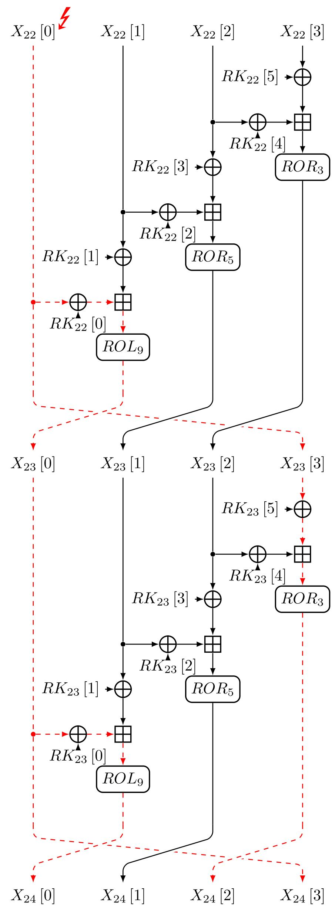
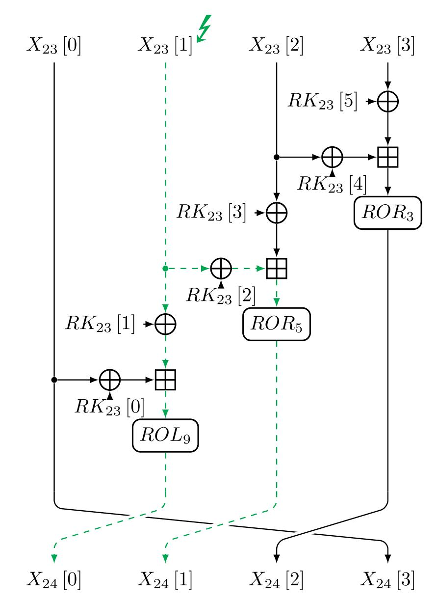
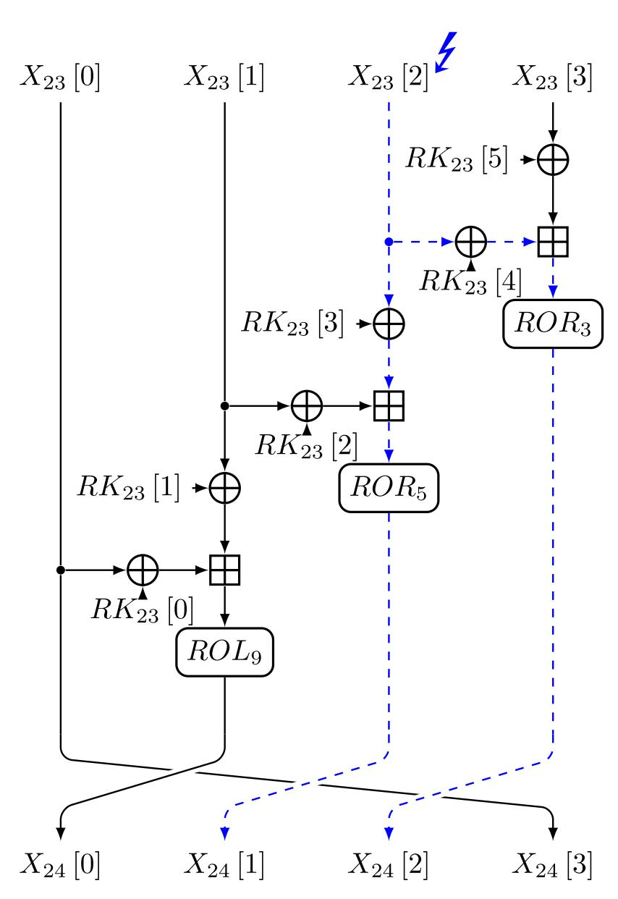
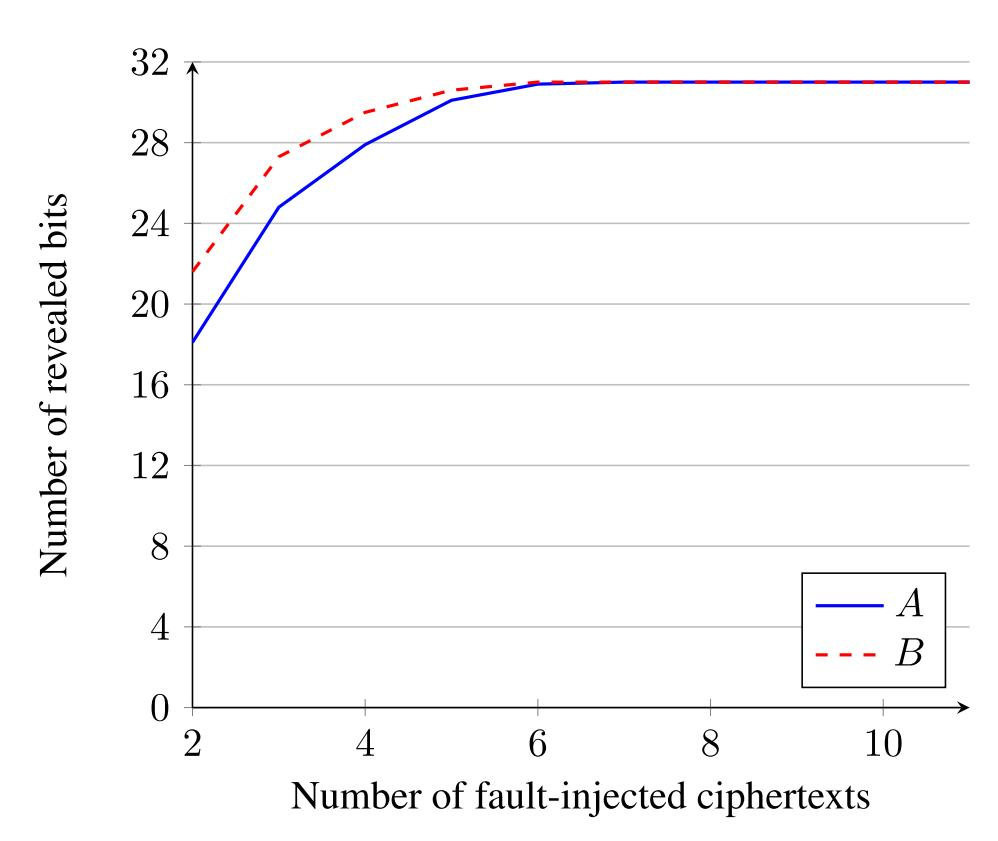
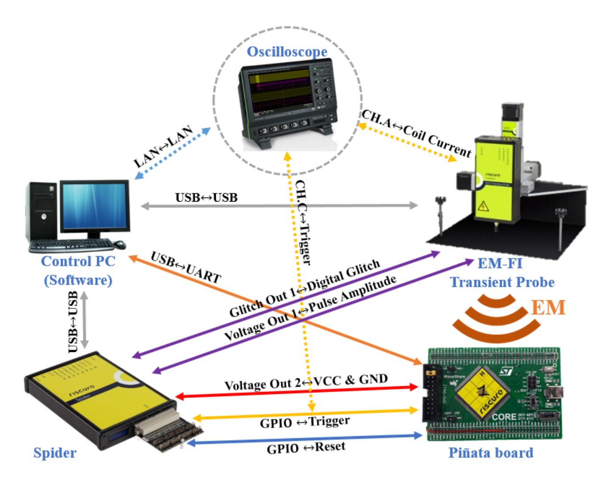

{0}------------------------------------------------

Received November 10, 2020, accepted November 16, 2020, date of publication November 23, 2020, date of current version December 9, 2020.

Digital Object Identifier 10.1109/ACCESS.2020.3039805

# **Improved Differential Fault Attack on LEA by Algebraic Representation of Modular Addition**

SEONGHYUCK LIM1, JONGHYEOK LEE1, AND DONG-GUK HAN1,

Corresponding author: Dong-Guk Han (christa@kookmin.ac.kr)

This work was supported by Institute for Information & communications Technology Promotion (IITP) grant funded by the Korea government (MSIT) (No. 2017-0-00520, Development of SCR-Friendly Symmetric Key Cryptosystem and Its Application Modes).

**ABSTRACT** Recently, as the number of IoT (Internet of Things) devices has increased, the use of lightweight cryptographic algorithms that are suitable for environments with scarce resources has also increased. Consequently, the safety of such cryptographic algorithms is becoming increasingly important. Among them, side-channel analysis methods are very realistic threats. In this paper, we propose a novel differential fault attack method on the Lightweight Encryption Algorithm (LEA) cipher which became the ISO/IEC international standard lightweight cryptographic algorithm in 2019. Previously proposed differential fault attack methods on the LEA used the Single Bit Flip model, making it difficult to apply to real devices. The proposed attack method uses a more realistic attacker assumption, the Random Word Error model. We demonstrate that the proposed attack method can be implemented on real devices using an electromagnetic fault injection setup. Our attack method has the weakest attacker assumption among attack methods proposed to date. In addition, the number of required fault-injected ciphertexts and the number of key candidates for which exhaustive search is performed are the least among all existing methods. Therefore, when implementing the LEA cipher on IoT deivces, designers must apply appropriate countermeasures against fault injection attacks.

**INDEX TERMS** Side-channel analysis, differential fault attack, fault injection attack, lightweight cryptography, ARX-based cryptography, LEA.

#### I. INTRODUCTION

Side-channel analysis (SCA) uses additional information, such as power consumption, electromagnetic emission, and sound that occurs while a cryptographic algorithm is operating on a real device [1]. With the recent development of IoT technology, numerous IoT devices are being used extensively around the world, and the importance of lightweight cryptographic algorithms suitable for resource-scarce environments is increasing. Naturally, various threats to lightweight cryptographic algorithms have been considered, and SCA has been seriously considered as a real threat. Among various SCA methods, this paper deals with the differential fault attack (DFA), which is an attack method that uses the difference between the normal ciphertext and fault-injected ciphertexts generated by injecting artificial faults while a cryptographic

The associate editor coordinating the review of this manuscript and approving it for publication was Mohamad Afendee Mohamed.

algorithm is running on a real device [2]. This paper targets the ARX-based lightweight block cipher LEA [3]. When operating cryptographic algorithms in resource-scarce environments, the LEA has proven to be much more advantageous than the AES [4]–[6]. The LEA is guarantee security against traditional cryptanalysis [7], [8]; however, its vulnerability to SCA needs more consideration. Two DFA methods on the LEA have been proposed [9], [10]. These attacks use the fault model that flips the random single bit of the input words. The fault model used in DFAs is an important consideration. In order to flip a single bit in an actual microcontroller, strong attacker assumptions such as decapsulation or laser fault injection are required. Therefore, attackers are eager to find an attack method that uses a more relaxed fault model. If there is such an attack, the attacker can easily carry it out; thus, so it can be fatal. We propose a novel DFA method for the LEA. The proposed method uses a relaxed fault model by employing a transformation mechanism that relies

&lt;sup>1Department of Financial Information Security, Kookmin University, Seoul 02707, South Korea

&lt;sup>2Department of Mathematics, Kookmin University, Seoul 02707, South Korea

{1}------------------------------------------------

on the algebraic principle of a modular addition operation. In addition, we argue that this attack method is an extremely threatening DFA method on the LEA cipher by experimentally proving that it can operate in a realistic environment.

# A. OUR CONTRIBUTIONS

The primary contributions of this paper are as follows:

- First, we propose a novel DFA method on the LEA cipher. This attack uses Random Word Error as a fault model; therefore, compared to existing attack methods, it has a relaxed attacker assumption. In addition, the proposed method requires approximately 70.97% fewer fault-injected ciphertexts and the smallest number of key candidates to perform the exhaustive search, compared to previously proposed attacks.
- Second, we show that the proposed attack can be applied to real IoT devices. The existing attack methods showed that a DFA on the LEA cipher is theoretically possible through simulation. However, we constructed an electromagnetic fault injection environment on an actual microcontroller and were able to reveal the secret key through this attack.
- Finally, our DFA method is applicable to other cryptographic algorithms that use modular addition operations, such as SPARX [11] and CHAM [12]. This method is not dependent on the configuration of operations used in the cryptographic algorithm; it is an attack against the modular addition operation itself. Thus this method serves as a DFA that is not limited to a specific cryptographic algorithm.

# **II. BACKGROUNDS**

# A. DIFFERENTIAL FAULT ATTACKS

DFAs are a type of semi-invasive attack within SCA that combine differential analysis and the fault injection attack. The first DFA method was proposed in 1997 by Biham *et al.* on the DES [2]. Subsequently, DFA methods on various cryptographic algorithms have been studied [13]–[15]. Generally, in DFAs, it is assumed that fault-injected ciphertexts can be obtained by injecting artificial faults into particular registers while an encryption is operating with chosen plaintexts. An attacker guesses some information about the secret key using the differential between the normal ciphertext and fault-injected ciphertexts. The degree of difficulty of an attack method is determined by the type of faults injected and the number of fault-injected ciphertexts required. The commonly used fault injection models are as follows:

- **Chosen Bit Flip**: The attacker can target a chosen single bit or multiple bits of a specific word, and flip them.
- **Single Bit Flip**: The attacker can target a specific word and flip a single unknown bit.
- **Random Byte Error**: The attacker can target a specific word and change a specific byte.
- **Random Word Error**: The attacker can target a specific word and change its value to any unknown value.

**TABLE 1.** Notations for the LEA cipher.

| Parameter                     | Description                                                                    |
|-------------------------------|--------------------------------------------------------------------------------|
| $\overline{r}$                | The number of rounds $(=24, 28, 32)$                                           |
| $ROL_k$                       | k-bit left rotation                                                            |
| $ROR_k$                       | k-bit right rotation                                                           |
| $X_0\left[l\right]$           | $l$ -th word of plaintext $(0 \le l \le 3)$                                    |
| $X_r [l]$                     | <i>l</i> -th word of ciphertext $(0 \le l \le 3)$                              |
| $X_i[l]$                      | <i>l</i> -th word of <i>i</i> -th round input $(0 \le l \le 3, \ 0 \le i < r)$ |
| $RK_i[l]$                     | <i>l</i> -th word of <i>i</i> -th round key $(0 \le l \le 3, 0 \le i < r)$     |
| $\delta \left[ k\right] ^{T}$ | Round constant $(0 \le k \le 7)$                                               |

When performing an actual fault injection attack, the fault injection model, either selectively or dealing with a single bit, causes difficulty performing it. Therefore, an attack method that uses a relaxed fault injection model would be extremely dangerous.

# B. LEA

In this section we describe the lightweight symmetric block cipher LEA, introduced by Hong *et al.* [3]. The LEA became the ISO/IEC international standard lightweight cryptographic algorithm in 2019 [16], which increased interest in its usage in IoT environments [17], [18]. The LEA has an ARX-based (Addition, Rotation, XOR) GFN (Generalized Feistel Network) TYPE-III structure with 32-bit words. This has 128 bits in block size and 128, 192, and 256 bits in key sizes, is consisted of 24, 28, and 32 rounds, respectively. The LEA cipher is described according to the notations listed in Table [1,](#page-1-0) and the round function is as follows:

$$X_{i+1}[0] \leftarrow ROL_9((X_i[0] \oplus RK_i[0]) \boxplus (X_i[1] \oplus RK_i[1]))$$
  
 $X_{i+1}[1] \leftarrow ROR_5((X_i[1] \oplus RK_i[2]) \boxplus (X_i[2] \oplus RK_i[3]))$   
 $X_{i+1}[2] \leftarrow ROR_3((X_i[2] \oplus RK_i[4]) \boxplus (X_i[3] \oplus RK_i[5]))$   
 $X_{i+1}[3] \leftarrow X_i[0]$  (1)

The key scheduling process of the LEA cipher is described for the LEA-128. The scheduling process for the LEA-192 and LEA-256, is described in the literature [3]. The key schedule consists of modular addition and rotation operations. Let *K* = (*K* [0] ,*K* [1] ,*K* [2] ,*K* [3]) be a 128-bit secret key and *T* = (*T* [0] , *T* [1] , *T* [2] , *T* [3]) be a 128-bit internal state. The key schedule of the LEA-128 is initialized as *T* [*l*] = *K*[*l*] where (0 ≤ *l* ≤ 3) and then operates as follows:

$$T [0] \leftarrow ROL_{1} (T [0] \boxplus ROL_{i} (\delta [i \ mod \ 4]))$$

$$T [1] \leftarrow ROL_{3} (T [1] \boxplus ROL_{i+1} (\delta [i \ mod \ 4]))$$

$$T [2] \leftarrow ROL_{6} (T [2] \boxplus ROL_{i+2} (\delta [i \ mod \ 4]))$$

$$T [3] \leftarrow ROL_{11} (T [3] \boxplus ROL_{i+3} (\delta [i \ mod \ 4]))$$

$$RK_{i} \leftarrow (T [0], T [1], T [2], T [1], T [3], T [1])$$
 (2)

Here, it is evident that each word is generated independently during the key scheduling process.

# C. PREVIOUS DIFFERENTIAL FAULT ATTACKS ON THE LEA

Two DFA methods against the LEA cipher have been proposed. The first method, proposed by Park *et al.* in 2014 [9],

{2}------------------------------------------------

is based on estimating a candidate group for the secret value through equations to calculate the differences between normal ciphertext and fault-injected ciphertexts. This attack uses the Single Bit Flip model. It injects faults into the three input words of the last round, and requires 300 fault-injected ciphertexts to reveal the secret key. Consequently, this attack reduces the number of key candidates to 235 against the LEA-128. The second method was proposed by Jap et al. in 2015 [10]. This attack focuses on the carry-bits that occur in modular addition operations. The attacker can observe the changes in the carry-bit between the normal ciphertext and fault-injected ciphertexts and reveal the secret key bits sequentially from the LSB. This attack greatly reduced attack complexity by attacking the penultimate round. Similar to the attack proposed by Park et al., this attack is also based on the Single Bit Flip model and injects faults into two input words. If the attacker can determine the location of the injected faults, 62 fault-injected ciphertexts are required, and if not, approximately 258 fault-injected ciphertexts are required. In the paper proposing this attack method [10], the authors state that the four bits of the round key are not determined. However, as a result of our review, it was correct that seven bits are not determined due to the 1-bit rotation operation in the key scheduling process. See **STEP 4** in Section III-B for details.

# D. ALGEBRAIC REPRESENTATION OF MODULAR ADDITION

Courtois *et al.* used an algebraic representation of the modular addition operation to analyze the resistance of the stream cipher Snow 2.0 against algebraic attacks [19]. The modular addition operation over  $GF(2^n)$  can be partly or totally linearized when the output value is fixed. In particular, it can be converted to a bit-wise equation system over the binary field GF(2), without carry variables. Here, we define binary representations for n-bit words A, B, and C as  $A = (a_{n-1}, a_{n-2}, \ldots, a_0)$ ,  $B = (b_{n-1}, b_{n-2}, \ldots, b_0)$ , and  $C = (c_{n-1}, c_{n-2}, \ldots, c_0)$ , where 0 indicates the index of the LSB. The specific algebraic representation of the modular addition operation  $A \boxplus B = C$  over  $GF(2^{32})$  is as follows:

$$\begin{cases} c_{0} = a_{0} + b_{0} \\ c_{1} = a_{1} + b_{1} + a_{0}b_{0} \\ c_{2} = a_{2} + b_{2} + a_{1}b_{1} + (a_{1} + b_{1}) (a_{1} + b_{1} + c_{1}) \\ \vdots \\ c_{i} = a_{i} + b_{i} + a_{i-1}b_{i-1} \\ + (a_{i-1} + b_{i-1}) (a_{i-1} + b_{i-1} + c_{i-1}) \\ \vdots \\ c_{n-1} = a_{n-1} + b_{n-1} + a_{n-2}b_{n-2} \\ + (a_{n-2} + b_{n-2}) (a_{n-2} + b_{n-2} + c_{n-2}) \end{cases}$$

$$(3)$$

From the above set of equations (3), it is evident that each carry-bit is generated by the information of the previous bit.

#### E. GRÖBNER BASES

A Gröbner bases is a subset of multivariate polynomials that make it easy to calculate the various properties of the polynomial ideal. The Gröbner bases was first defined by Buchberger, who also proposed an algorithm to calculate it [20]. Gröbner bases is widely used to find polynomial solutions in modern computing environments. In particular, some studies have used it for cryptanalysis methods [21], [22]. The definitions and theories required for this paper are as follows:

### • Monomial Ordering

A monomial ordering of all monomials in the polynomial ring  $R[x_1, \ldots, x_n]$  is a relation that is a total order on monomials. As well as respecting multiplication, monomial orders are required to be well-ordering. The three most common monomial orders are lexicographic, graded lex, and graded reverse lex.

#### • Gröbner Bases

Define the finite subset  $G = \{g_1, \ldots, g_s\}$  of ideal I under the specified monomial order. If  $\langle LT(g_1), \ldots, LT(g_s) \rangle = \langle LT(I) \rangle$  is satisfied, then G is defined as the Gröbner base of I. LT is a function that returns the leading term.

#### • Elimination Ideal

For ideal  $I = \langle f_1, \ldots, f_s \rangle \subset k[x_1, \ldots, x_m]$ , the l-th elimination ideal is defined as  $I_l = I \cap k[x_{l+1}, \ldots, x_m]$ .  $I_l$  is an ideal of  $k[x_{l+1}, \ldots, x_m]$ , and the elimination ideals differ according to the monomial order.

#### • Elimination Theorem

When defining Gröbner bases according to the lexicographic order of ideal  $I \subset k[x_1, ..., x_m]$  as  $G, G_l = G \cap k[x_{l+1}, ..., x_m]$  is the Gröbner bases of the l-th elimination ideal  $I_l$ .

#### III. IMPROVED DIFFERENTIAL FAULT ATTACK ON LEA

In this section, we describe the proposed DFA method. This attack uses the Random Word Error model. With this fault model, the attacker assumptions are mitigated, compared to traditional attacks using the bit error model. The attack scheme is detailed using the LEA-128 as an example. The LEA-192 and LEA-256 can be applied in the same way to recover the secret key.

#### A. ANALYSIS OF MODULAR ADDITION

The proposed attack targets the 32-bit modular addition operation. This attack is designed based on the algebraic representation of modular addition introduced in Section II-D.

The modular addition value C of the 32-bit variables A and B is expressed as  $C = A \boxplus B$ . If the attacker injects a fault into variable B, the fault-injected B is represented by  $B^{f}$  and the fault value is represented by  $\Delta B$ . As a result, by injecting the fault into B, the fault is propagated to C, which can be denoted  $C^{f}$ . The fault-injected modular addition equation can be expressed as follows:

$$A \boxplus B^{f} = C^{f} \iff A \boxplus (B \oplus \Delta B) = C \oplus \Delta C \qquad (4)$$

{3}------------------------------------------------

Suppose the attacker injects a fault n times into an encryption process that uses a fixed plaintext. If the i-th fault injection equation is expressed as  $A \boxplus (B \oplus \Delta B_i) = C \oplus \Delta C_i$  where  $0 < i \le n$ , n fault injections are expressed by the following system of equations (5).

$$\begin{cases}
A \boxplus B = C \\
A \boxplus (B \oplus \Delta B_1) = C \oplus \Delta C_1 \\
A \boxplus (B \oplus \Delta B_2) = C \oplus \Delta C_2 \\
\vdots \\
A \boxplus (B \oplus \Delta B_n) = C \oplus \Delta C_n
\end{cases} \tag{5}$$

Only the rotation operation after the modular addition is performed in each branch of the round function of the LEA cipher; thus, the attacker can calculate the values of  $\Delta B_i$  and  $C_i^{\xi}$  (=  $C \oplus \Delta C_i$ ) through inverse operation from the ciphertexts. Therefore, in the system of equations (5), only A and B are unknown. This system of equations can be solved using the theories introduced in Sections II-D and II-E. First, each equation is represented as a binary-system of equations over GF (2). The system of equations (5), which was composed of (n+1) equations over GF ((2)), is transformed into a binary-system of equations composed of (n+1) equations over (n+1) equations over (n+1) equations over (n+1) equations over (n+1) equations over (n+1) equations over (n+1) equations over (n+1) equations over (n+1) equations over (n+1) equations over (n+1) equations over (n+1) equations over (n+1) equations over (n+1) equations over (n+1) equations over (n+1) equations over (n+1) equations over (n+1) equations over (n+1) equations over (n+1) equations over (n+1) equations over (n+1) equations over (n+1) equations over (n+1) equations over (n+1) equations over (n+1) equations over (n+1) equations over (n+1) equations over (n+1) equations over (n+1) equations over (n+1) equations over (n+1) equations over (n+1) equations over (n+1) equations over (n+1) equations over (n+1) equations over (n+1) equations over (n+1) equations over (n+1) equations over (n+1) equations over (n+1) equations over (n+1) equations over (n+1) equations over (n+1) equations over (n+1) equations over (n+1) equations over (n+1) equations over (n+1) equations over (n+1) equations over (n+1) equations over (n+1) equations over (n+1) equations over (n+1) equations over (n+1) equations over (n+1) equations over (n+1) equations over (n+1) equations over (n+1) equations over (n+1) equations over (n+1) equations over (n+1)

$$\begin{cases} c_{0} = a_{0} + b_{0} \\ c_{1} = a_{1} + b_{1} + a_{0}b_{0} \\ c_{2} = a_{2} + b_{2} + a_{1}b_{1} + (a_{1} + b_{1}) (a_{1} + b_{1} + c_{1}) \\ \vdots \\ c_{31} = a_{31} + b_{31} + a_{30}b_{30} \\ + (a_{30} + b_{30}) (a_{30} + b_{30} + c_{30}) \\ c_{1,0}^{\xi} = a_{0} + b_{0} + \Delta b_{1,0} \\ c_{1,1}^{\xi} = a_{1} + b_{1} + \Delta b_{1,1} + a_{0} (b_{0} + \Delta b_{1,0}) \\ c_{1,2}^{\xi} = a_{2} + b_{2} + \Delta b_{1,2} + a_{1} (b_{1} + \Delta b_{1,1}) \\ + (a_{1} + b_{1} + \Delta b_{1,1}) (a_{1} + b_{1} + \Delta b_{1,1}c_{1,1}) \\ \vdots \\ c_{1,31}^{\xi} = a_{31} + b_{31} + \Delta b_{1,31} + a_{30} (b_{30} + \Delta b_{1,30}) \\ + (a_{30} + b_{30} + \Delta b_{1,30}) (a_{30} + b_{30} + \Delta b_{1,30} + c_{1,30}^{\xi}) \\ \vdots \\ c_{n,0}^{\xi} = a_{0} + b_{0} + \Delta b_{n,0} \\ c_{n,1}^{\xi} = a_{1} + b_{1} + \Delta b_{n,1} + a_{0} (b_{0} + \Delta b_{n,0}) \\ c_{n,2}^{\xi} = a_{2} + b_{2} + \Delta b_{n,2} + a_{1} (b_{1} + \Delta b_{n,1}) \\ + (a_{1} + b_{1} + \Delta b_{n,1}) (a_{1} + b_{1} + \Delta b_{n,1} + c_{n,1}^{\xi}) \\ \vdots \\ c_{n,31}^{\xi} = a_{31} + b_{31} + \Delta b_{n,31} + a_{30} (b_{30} + \Delta b_{n,30}) + (a_{30} + b_{30} + \Delta b_{n,30}) (a_{30} + b_{30} + \Delta b_{n,30} + c_{n,30}^{\xi}) \end{cases}$$

**TABLE 2.** Ciphertext words affected according to the round and word indices the fault is injected into.

| Word with fault-injected | Ciphertext words affected by fault |
|--------------------------|------------------------------------|
| $X_{22}[0]$              | $X_{24}[0], X_{24}[2], X_{24}[3]$  |
| $X_{22}[1]$              | $X_{24}[0], X_{24}[1], X_{24}[3]$  |
| $X_{22}[2]$              | $X_{24}[0], X_{24}[1], X_{24}[2]$  |
| $X_{22}[3]$              | $X_{24}[1], X_{24}[2]$             |
| $X_{23}[0]$              | $X_{24}[0], X_{24}[3]$             |
| $X_{23}[1]$              | $X_{24}[0], X_{24}[1]$             |
| $X_{23}[2]$              | $X_{24}[1], X_{24}[2]$             |
| $X_{23}[3]$              | $X_{24}[2]$                        |

In the system of equation (6), only 64 variables  $a_0, a_1, \ldots$ ,  $a_{31}$  and  $b_0, b_1, \ldots, b_{31}$  are unknowns. It is recommended that the Gröbner bases and elimination theorem be used to solve the modified system of equations. Denote the lower t-th bit of A as  $a_t$  where  $0 \le t < 32$ . Here, equation (6) is a binary-system over GF (2); therefore, the simplest form of elimination ideal that can be generated may take the form  $a_t = 0$  or  $a_t + 1 = 0$ . When  $a_t = 0$  is expressed,  $a_t$  is regarded as 0, and when  $a_t + 1 = 0$  is expressed,  $a_t$  is regarded as 1. If n is sufficiently large, the lower 31 bits of A and B can be determined, excluding MSBs that lack information.

#### B. PROPOSED DFA SCHEME

The proposed attack requires ciphertexts with faults injected into each of the three parts  $X_{22}$  [0],  $X_{23}$  [1], and  $X_{23}$  [2]. The attacker's assumption that fault-injected ciphertexts are required in each of the three parts may seem strong. However, if the fault is injected into the last and penultimate rounds of the LEA cipher, it is easy to identify words with an injected fault from the indexes of the ciphertext words affected by the fault, as shown in Table 2. Therefore, the attacker assumption for the proposed attack is realistic and reproducible. After acquiring the ciphertexts with faults injected into the desired word, the attack process consists of the following five steps.

**[STEP 1]** Analyze  $RK_{23}$  [0] from ciphertexts with faults injected into  $X_{22}$  [0].

At this step, analysis is performed using cipher-texts whose faults are injected into the 0-th input word of the penultimate round,  $X_{22}$  [0], as shown in Figure 1. The modular addition that uses  $RK_{23}$  [0] and  $RK_{23}$  [1] is analyzed. To apply the method described in Section III-A,  $X_{23}$  [1]  $\oplus$   $RK_{23}$  [1] is substituted for A,  $X_{23}$  [0]  $\oplus$   $RK_{23}$  [0] is substituted for R, and  $ROR_9$  ( $R_{24}$  [0]) is substituted for  $R_{24}$  [3] =  $R_{23}$  [0]; therefore, the attacker can calculate  $R_{24}$  [3] as follows:

$$\Delta B = (X_{23} [0] \oplus RK_{23} [0]) \oplus \left(X_{23}^{f} [0] \oplus RK_{23} [0]\right)$$

$$= X_{23} [0] \oplus X_{23}^{f} [0]$$

$$= X_{24} [3] \oplus X_{24}^{f} [3]$$
(7)

In addition, C and  $C^{\frac{1}{2}}$  can be calculated through ciphertexts. The attacker can reveal the lower

{4}------------------------------------------------

FIGURE 1. Propagation process of a fault injected into the 0-th input word of the penultimate round,  $X_{22}$  [0], of the LEA-128.

31 bits of  $B (= X_{23} [0] \oplus RK_{23} [0])$  through the attack described in Section III-A and ciphertexts whose faults are injected into  $X_{22} [0]$ . As a result,

**FIGURE 2.** Propagation process of a fault injected into the 1-st input word of the last round,  $X_{23}$  [1], of the LEA-128.

the attacker knows  $X_{23}$  [0] and can reveal the lower 32 bits of  $RK_{23}$  [0].

**[STEP 2]** Analyze  $RK_{23}$  [1]  $\oplus$   $RK_{23}$  [2] from ciphertexts with faults injected into  $X_{22}$  [1].

This step uses the ciphertexts where the fault is injected into the 1-st input word of the last round,  $X_{23}$  [1], as shown in Figure 2. The modular addition that uses  $RK_{23}$  [2] and  $RK_{23}$  [3] is analyzed. Similar to **STEP 1**,  $X_{23}$  [2]  $\oplus$   $RK_{23}$  [3] is substituted for A,  $X_{23}$  [1]  $\oplus$   $RK_{23}$  [2] is substituted for B, and  $ROL_5$  ( $X_{24}$  [1]) is substituted for C. Using  $X_{23}$  [0]  $\oplus$   $RK_{23}$  [0] revealed in **STEP 1**, the attacker can calculate  $X_{23}$  [1]  $\oplus$   $RK_{23}$  [1] as follows:

$$X_{23}^{f}[1] \oplus RK_{23}[1]$$
  
=  $ROR_{9}\left(X_{24}^{f}[0]\right) \boxminus (X_{23}[0] \oplus RK_{23}[0])$  (8)

Thus, the attacker can calculate  $\Delta B$  required for analysis as follows:

$$\Delta B = (X_{23} [1] \oplus RK_{23} [2]) \oplus \left(X_{23}^{f} [1] \oplus RK_{23} [2]\right)$$

$$= X_{23} [1] \oplus X_{23}^{f} [1]$$

$$= (X_{23} [1] \oplus RK_{23} [1]) \oplus \left(X_{23}^{f} [1] \oplus RK_{23} [1]\right)$$
(9)

In addition, C and  $C^{\prime}$  can be calculated through ciphertexts. As in **STEP 1**, the attacker

{5}------------------------------------------------

FIGURE 3. Propagation process of a fault injected into the 2-nd input word of the last round,  $X_{23}$  [2], of the LEA-128.

can use the attack scheme to determine the lower 31 bits of B. As a result, the attacker can reveal the lower 31 bits of  $RK_{23}[1] \oplus RK_{23}[2] (= B \oplus (X_{23}[1] \oplus RK_{23}[1]))$ .

**[STEP 3]** Analyze  $RK_{23}$  [3]  $\oplus RK_{23}$  [4] from ciphertexts with faults injected into  $X_{23}$  [2].

In **STEP 3**, the attacker uses the ciphertexts with the fault injected into the 2-nd input word of the last round,  $X_{23}$  [2], as shown in Figure 3. The modular addition that uses  $RK_{23}$  [4] and  $RK_{23}$  [5] is analyzed.  $X_{23}$  [3]  $\oplus$   $RK_{23}$  [5] is substituted for A,  $X_{23}$  [2]  $\oplus$   $RK_{23}$  [4] is substituted for B, and  $ROL_3$  ( $X_{24}$  [2]) is substituted for C. **STEP 3** is performed in the same way as **STEP 2**. As a result, the attacker can reveal the lower 31 bits of  $RK_{23}$  [3]  $\oplus$   $RK_{23}$  [4].

[STEP 4] Reduce the number of candidates for  $RK_{23}$  [5]. The attacker has no information about  $RK_{23}$  [5]. Therefore,  $RK_{23}$  [5] must be estimated. To reduce  $RK_{23}$  [5] candidates, the attacker needs to know information about  $X_{23}$  [3]. Therefore, we need to perform the analysis in the penultimate round by reusing the ciphertexts used in STEP 1, as shown in Figure 1. The attacker analyzes the modular addition that uses  $X_{22}$  [0]  $\oplus RK_{22}$  [0] and  $X_{22}$  [1]  $\oplus RK_{22}$  [1].  $X_{22}$  [1]  $\oplus RK_{22}$  [1] is substituted for A,  $X_{22}$  [0]  $\oplus RK_{22}$  [0] is substituted for B, and

**FIGURE 4.** Number of revealed bits according to the number of fault-injected ciphertexts.

 $ROR_9$  ( $X_{23}$  [0]) is substituted for C. The attacker can calculate  $\Delta B$  from the information obtained in **STEP 3**, and C and  $C^2$  can also be calculated from  $X_{23}$  [0] =  $X_{24}$  [3]. Therefore, the attacker can determine the lower 31 bits of B and can calculate  $RK_{22}$  [0] through inverse process of key schedule of the LEA-128 as follows:

$$RK_{22}[0] = ROR_1(RK_{23}[0]) \boxminus ROL_{23}(\delta[3])$$
 (10)

During the calculation process, the 30-th bit of  $RK_{22}[0]$  cannot be determined because the 1-bit rotation operation is performed on  $RK_{23}[0]$  and the attacker does not know the MSB of  $RK_{23}[0]$ . The attacker can determine the lower 30 bits of  $X_{22}[0] (= B \oplus RK_{22}[0])$  and consequently reveal the lower 30 bits of  $RK_{23}[5]$  from  $X_{22}[0] = X_{23}[3]$ .

[STEP 5] Reveal the master key.

Since  $RK_{23}$  [1],  $RK_{23}$  [3], and  $RK_{23}$  [5] are the same in the LEA-128, the attacker can confirm all bits except the seven bits of the last round key through the previous steps. The attacker performs a brute force attack against uncertain bits. At this time, the attacker can obtain the correct secret key in a short time because seven bits can be investigated in a realistic time.

#### C. ATTACK PERFORMANCE

Figure 4 shows the average number of revealed bits of A and B according to the number of fault-injected ciphertexts when the analysis of  $A \boxplus B = C$  is performed. If the attacker acquires more than six fault-injected ciphertexts, 31 bits of round key can be fully analyzed, excluding the MSB. In our proposed DFA method, analysis was performed on the four modular additions, two of which could utilize same ciphertexts whose faults were injected into the same input

{6}------------------------------------------------

**FIGURE 5.** Electromagnetic fault injection attack system configuration diagram.

word. Therefore, the attacker can successfully execute the attack proposed in this paper by using at least 18 fault-injected ciphertexts. The proposed attack can obtain four candidates for *RK*23 [0], *RK*23 [1] ⊕ *RK*23 [2], and *RK*23 [3] ⊕ *RK*23 [4] and obtain two candidates for *RK*23 [5]. Therefore, there are 2 7 candidates for the LEA-128 because *RK*23 [1], *RK*23 [3], and *RK*23 [5] are the same.

# **IV. EXPERIMENT FOR REAL DEVICE**

In this section, through experiments performed in an actual electromagnetic fault injection environment, we demonstrate that the proposed attack method is effective for real devices. First, we observed the electromagnetic trace that occurs when the LEA-128 cipher is operated. Base on observation of the electromagnetic traces, we inject faults during operation the LEA-128 using the appropriate parameters. We can obtain a sufficient number of fault-injected ciphertexts and reveal the secret key using the proposed DFA method.

# A. EXPERIMENTAL ENVIRONMENT

Figure [5](#page-6-0) shows the environment setup for the electromagnetic fault injection attack. In the figure, solid-lines denote required configurations and dotted-lines indicate optional configurations. The oscilloscope is responsible for collecting the electromagnetic traces generated when the cryptographic algorithm is operating and observing the trigger signal. Riscure's Spider [23] controls the target board and the EM-FI Transient Probe [24]. The EM-FI Transient Probe moves along the XYZ-axis and injects electromagnetic faults. The Control PC uses the Inspector software [25] to control the electromagnetic fault injection environment, and to process and analyze the collected data. In our experiment environment, we used the Riscure Piñata board [26], which uses an Arm Cortex-M4F microcontroller [27]. The LEA-128 cryptographic algorithm was implemented on the Piñata board using 32-bit intermediate variables, and was compiled using the GNU Arm Embedded Toolchain version 4.8 [28]. The electromagnetic faults were injected using a probe tip with a diameter of 1.5 mm and a positive polarity. The delay was set such that faults were injected randomly between the start of the 21st round and the end of the last round.

# B. EXPERIMENTAL RESULTS

Table [3](#page-7-0) shows some of the experimental results of the Inspector software. Case ① is an information of ciphertexts injected with faults in the 0-th input word of the penultimate round, and case ② is an information of ciphertexts injected with faults in the 1-st input word of the last round. In addition, case ③ is an information of ciphertexts with faults injected into the 2-nd input word of the last round. In each of the three cases, it was possible to obtain more than ten ciphertexts with injected faults. To analyze modular addition, the elim and slimgb functions of the SINGULAR library [29] were used. It takes approximately one second to analyze one modular addition operation, and the number of candidates of the last round key is reduced to 27 . Finally, we were able to confirm the correct secret key through a brute-force attack.

Table [4](#page-7-1) compares previously proposed attacks with the proposed attack, showing the used fault models, the injected fault positions, the number of required fault-injected ciphertexts, and the number of key candidates for which exhaustive search should be conducted. While the number of key candidates is

{7}------------------------------------------------

**TABLE 3.** The results of electromagnetic fault injection attack.

| Case | EMFI Pulse Power | EMFI Pulse Delay | Data                    |  |  |
|------|------------------|------------------|-------------------------|--|--|
| 1    | 75               | 1464             | A3 43 36 FF 28 C6 C6 18 |  |  |
|      |                  |                  | 52 DA BD 63 C1 10 14 73 |  |  |
|      | 75               | 1412             | 4C 55 1F 04 28 C6 C6 18 |  |  |
|      |                  |                  | D9 99 68 53 BE 9F 13 47 |  |  |
| 2    | 75               | 3396             | DB B7 B8 AE AF 9B 78 E5 |  |  |
|      |                  |                  | 55 32 C7 A7 04 64 8B FD |  |  |
|      | 75               | 3228             | AB 6E 8D 54 1F 41 B8 00 |  |  |
|      |                  |                  | 55 32 C7 A7 04 64 8B FD |  |  |
| 3    | 75               | 3680             | 9F C8 4E 35 C0 A6 B8 0A |  |  |
|      |                  |                  | F5 B4 8B EF 04 64 8B FD |  |  |
|      | 75               | 3500             | 9F C8 4E 35 C5 2A C0 F5 |  |  |
|      |                  |                  | CD E4 A1 9B 04 64 8B FD |  |  |

**TABLE 4.** Performance comparison of existing and proposed attack methods.

| Methods                           | Fault Models    | Fault Positions                                                                 | # Fault-Injected Ciphertexts | # Key Candidates |
|-----------------------------------|-----------------|---------------------------------------------------------------------------------|---------------------------------|---------------------|
| [9]                               | Single Bit Flip | 1-st, 2-nd, 3-rd input words of last round                                   | 300                             | $2^{35}$            |
| [10]                              | Single Bit Flip | 0-th input word of penultimate round and 2-nd input word of last round          | 62                              | $2^7$               |
| Proposed Method Random Word Error |                 | 0-th input word of penultimate round and 1-st and 2-nd input word of last round | 18                              | 27                  |

the same as a previous study [10], the number of fault-injected ciphertexts is significantly less.

# **V. CONCLUSION**

In this paper, we have proposed a novel DFA on the ARX-based lightweight block cipher LEA. For this attack, we used an algebraic representation of modular addition and Gröbner bases. As a result, we were able to reduce the number of required fault-injected ciphertexts by approximately 70.97% and use a relaxed fault model compared to the previously proposed attacks. The attack methods that use the Single Bit Flip model are difficult to perform on real devices because they require some strong attacker assumptions such as chip decapsulation. However, our proposed attack uses the Random Word Error model. In addition, using an electromagnetic fault injection setup, it is demonstrated experimentally that our attack can be performed on real devices. When using lightweight cryptography, such as the LEA cipher in IoT devices, the practical attack method we proposed is fatal; therefore, it is essential to apply appropriate countermeasures against fault injection attacks [30], [31]. In future work, we will expand the use of our attack technique to various block ciphers using modular addition operations and design appropriate countermeasures for resource scarce environments such as IoT devices.

# **REFERENCES**

- [1] P. C. Kocher, ''Timing attacks on implementations of Diffie-Hellman, RSA, DSS, and other systems,'' in *Proc. Annu. Int. Cryptol. Conf.* Berlin, Germany: Springer, 1996, pp. 104–113.
- [2] E. Biham and A. Shamir, ''Differential fault analysis of secret key cryptosystems,'' in *Proc. Annu. Int. Cryptol. Conf.* Berlin, Germany: Springer, 1997, pp. 513–525.

- [3] D. Hong, J.-K. Lee, D.-C. Kim, D. Kwon, K. H. Ryu, and D.-G. Lee, ''LEA: A 128-bit block cipher for fast encryption on common processors,'' in *Proc. Int. Workshop Inf. Secur. Appl.* Cham, Switzerland: Springer, 2013, pp. 3–27.
- [4] J. Daemen and V. Rijmen, ''Reijndael: The advanced encryption standard,'' *Dr. Dobb's J., Softw. Tools Prof. Programmer*, vol. 26, no. 3, pp. 137–139, 2001.
- [5] H. Van Nguyen, H. Seo, and H. Kim, ''Prospective cryptography in NFC with the lightweight block encryption algorithm LEA,'' in *Proc. Int. Conf. Future Data Secur. Eng.* Cham, Switzerland: Springer, 2014, pp. 191–203.
- [6] D. Dinu, Y. L. Corre, D. Khovratovich, L. Perrin, J. Großschädl, and A. Biryukov, ''Triathlon of lightweight block ciphers for the Internet of Things,'' *J. Cryptograph. Eng.*, vol. 9, no. 3, pp. 283–302, Sep. 2019.
- [7] K. Zhang, J. Guan, and B. Hu, ''Zero correlation linear cryptanalysis on LEA family ciphers,'' *J. Commun.*, vol. 11, no. 7, pp. 677–685, 2016.
- [8] A. D. Dwivedi and G. Srivastava, ''Differential cryptanalysis of roundreduced LEA,'' *IEEE Access*, vol. 6, pp. 79105–79113, 2018.
- [9] M. Park and J. Kim, ''Differential fault analysis of the block cipher LEA,'' *J. Korea Inst. Inf. Secur. Cryptol.*, vol. 24, no. 6, pp. 1117–1127, Dec. 2014.
- [10] D. Jap and J. Breier, ''Differential fault attack on LEA,'' in *Proc. Inf. Commun. Technol.-EurAsia Conf.* Cham, Switzerland: Springer, 2015, pp. 265–274.
- [11] D. Dinu, L. Perrin, A. Udovenko, V. Velichkov, J. Großschädl, and A. Biryukov, ''SPARX: A family of arx-based lightweight block ciphers provably secure against linear and differential attacks,'' in *Proc. ASI-ACRYPT*, 2016, pp. 1–21.
- [12] B. Koo, D. Roh, H. Kim, Y. Jung, D.-G. Lee, and D. Kwon, ''CHAM: A family of lightweight block ciphers for resource-constrained devices,'' in *Proc. Int. Conf. Inf. Secur. Cryptol.* Cham, Switzerland: Springer, 2017, pp. 3–25.
- [13] L. Hemme, ''A differential fault attack against early rounds of (triple-) des,'' in *Proc. Int. Workshop Cryptograph. Hardw. Embedded Syst.* Berlin, Germany: Springer, 2004, pp. 254–267.
- [14] J. Blömer and J.-P. Seifert, ''Fault based cryptanalysis of the advanced encryption standard (aes),'' in *Proc. Int. Conf. Financial Cryptogr.* Berlin, Germany: Springer, 2003, pp. 162–181.
- [15] W. Li, D. Gu, and J. Li, ''Differential fault analysis on the ARIA algorithm,'' *Inf. Sci.*, vol. 178, no. 19, pp. 3727–3737, Oct. 2008.
- [16] *Information Security—Lightweight Cryptography—Part 2: Block Ciphers*, Standard ISO/IEC 29192-2:2019, International Organization for Standardization, Nov. 2019.

{8}------------------------------------------------

- [17] M.-J. Sung and K.-W. Shin, ''An efficient hardware implementation of lightweight block cipher LEA-128/192/256 for IoT security applications,'' *J. Korea Inst. Inf. Commun. Eng.*, vol. 19, no. 7, pp. 1608–1616, Jul. 2015.
- [18] Z. Mishra, P. K. Nath, and B. Acharya, ''High throughput unified architecture of LEA algorithm for image encryption,'' *Microprocessors Microsyst.*, vol. 78, Oct. 2020, Art. no. 103214.
- [19] N. T. Courtois and B. Debraize, ''Algebraic description and simultaneous linear approximations of addition in snow 2.0,'' in *Proc. Int. Conf. Inf. Commun. Secur.* Berlin, Germany: Springer, 2008, pp. 328–344.
- [20] B. Buchberger, ''Introduction to Groebner bases,'' in *Logic of Computation*. Berlin, Germany: Springer, 1997, pp. 35–66.
- [21] Y. Huo, F. Zhang, X. Feng, and L.-P. Wang, ''Improved differential fault attack on the block cipher SPECK,'' in *Proc. Workshop Fault Diagnosis Tolerance Cryptogr. (FDTC)*, Sep. 2015, pp. 28–34.
- [22] D. E. E. Ospina, ''Groebner bases and applications to the security of multivariate public key cryptosystems,'' Ph.D. dissertation, Escuela de Matemáticas, Univ. Nacional de Colombia, Bogotá, Colombia, 2016.
- [23] Riscure. (2020). *Spider*. [Online]. Available: https://getquote.riscure. com/en/quote/2101116/spider.htm
- [24] Riscure. (2020). *Em-Fi Transient Probe*. [Online]. Available: https://getquote.riscure.com/en/quote/2101068/em-fi-transient-probe.htm
- [25] Riscure. (2020). *Inspector Subscription Fi Professional*. [Online]. Available: https://getquote.riscure.com/en/quote/2101094/inspectorsubscription-fi-professional.htm
- [26] Riscure. (2020). *Pinata Board*. [Online]. Available: https://www. riscure.com/product/pinata-training-target/
- [27] Architecting a Smarter World. (2020). *Arm Cortex-M4F Microcontroller*. [Online]. Available: https://developer.arm.com/ip-products/processors/ cortex-m/cortex-m4
- [28] GNU General Public License. (2014). *Gnu Arm Embedded Toolchain Version 4.8*. [Online]. Available: https://launchpad.net/gcc-arm-embedded/4.8
- [29] GNU General Public License. (2020). *Singular-Computer Algebra System*. [Online]. Available: https://www.singular.uni-kl.de/
- [30] J. Choi and Y. Kim, ''An improved LEA block encryption algorithm to prevent side-channel attack in the IoT system,'' in *Proc. Asia–Pacific Signal Inf. Process. Assoc. Annu. Summit Conf. (APSIPA)*, Dec. 2016, pp. 1–4.
- [31] H. Seo, T. Park, J. Ji, and H. Kim, ''Lightweight fault attack resistance in software using intra-instruction redundancy, revisited,'' in *Proc. Int. Workshop Inf. Secur. Appl.* Cham, Switzerland: Springer, 2017, pp. 3–15.

SEONGHYUCK LIM was born in Suwon, South Korea, in 1995. He received the B.S. degree in information security, cryptology, and mathematics from Kookmin University, Seoul, South Korea, in 2020, where he is currently pursuing the master's degree in financial information security. His specialty lies in information security. His research interests include AI-based side-channel analysis, fault injection attacks, and security of financial IC card.

JONGHYEOK LEE received the B.S. degree in mathematics from Kookmin University, Seoul, South Korea, in 2017, where he is currently pursuing the Ph.D. degree in financial information security. His specialty lies in information security. His research interests include deep learning-based side-channel analysis, fault injection attack, and countermeasures against side-channel analysis.

DONG-GUK HAN received the B.S. and M.S. degrees in mathematics and the Ph.D. degree in engineering in information security from Korea University, Seoul, South Korea, in 1999, 2002, and 2005, respectively. He was a Postdoctoral Researcher with Future University Hakodate, Japan. He was an Exchange Student with the Department of Computer Science and Communication Engineering, Kyushu University, Japan, from April 2004 to March 2005. From 2006 to

2009, he was also a Senior Researcher with the Electronics and Telecommunications Research Institute, Daejeon, South Korea. He is currently a Professor with the Department of Information Security, Cryptology, Mathematics, Kookmin University, Seoul. He is a member of KIISC, IEEK, and IACR.