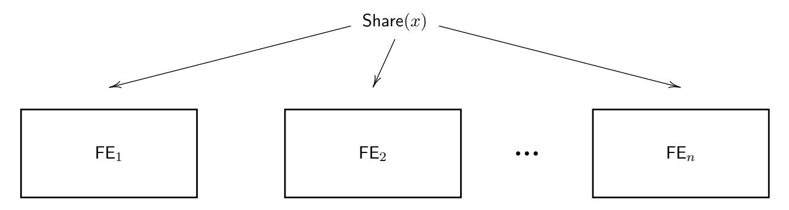
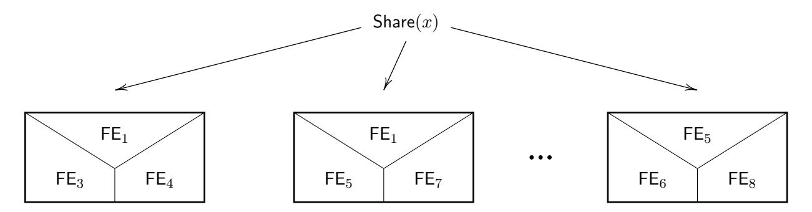
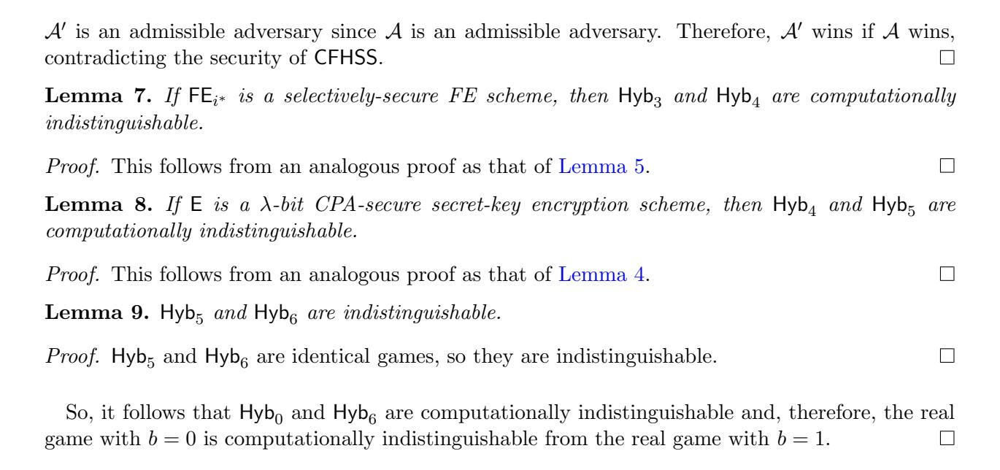

# Combiners for Functional Encryption, Unconditionally

Aayush Jain UCLA

Nathan Manohar UCLA

Amit Sahai UCLA sahai@cs.ucla.edu

aayushjain@cs.ucla.edu

nmanohar@cs.ucla.edu

#### Abstract

Functional encryption (FE) combiners allow one to combine many candidates for a functional encryption scheme, possibly based on different computational assumptions, into another functional encryption candidate with the guarantee that the resulting candidate is secure as long as at least one of the original candidates is secure. The fundamental question in this area is whether FE combiners exist. There have been a series of works (Ananth et. al. (CRYPTO '16), Ananth-Jain-Sahai (EUROCRYPT '17), Ananth et. al (TCC '19)) on constructing FE combiners from various assumptions.

We give the first unconditional construction of combiners for functional encryption, resolving this question completely. Our construction immediately implies an unconditional universal functional encryption scheme, an FE scheme that is secure if such an FE scheme exists. Previously such results either relied on algebraic assumptions or required subexponential security assumptions.

## 1 Introduction

In cryptography, many interesting cryptographic primitives rely on computational assumptions. Over the years, many assumptions have been proposed such as factoring, quadratic residuosity, decisional Diffie-Hellman, learning with errors, and many more. However, despite years of research, the security of these assumptions is still not firmly established. Indeed, we do not even know how to prove P6=NP; our understanding of algebraic hardness is even more speculative. Moreover, we also do not have a strong understanding of how different cryptographic assumptions compare against each other. For instance, it is not known whether decisional Diffie-Hellman is a weaker or a stronger assumption than learning with errors. This inability to adequately compare different cryptographic assumptions induces the following problematic situation: suppose we have a cryptographic primitive (say, public key encryption) with many candidate constructions based on a variety of assumptions, and we want to pick the most secure candidate to use. Unfortunately, due to our limited knowledge of how these assumptions compare against each other, we cannot determine which candidate is the most secure one.

Unconditional Cryptographic Combiners. Cryptographic combiners were introduced to handle the above issue. Given many candidates of a cryptographic primitive, possibly based on different assumptions, a cryptographic combiner takes these candidates and produces another candidate for the same primitive with the guarantee that this new candidate is secure as long as at least one of the original candidates is secure. For example, a combiner for public key encryption can be used to transform two candidates, one based on decisional Diffie-Hellman and the other on learning with errors, into a new public-key encryption candidate that is secure provided either decisional Diffie-Hellman or learning with errors is secure. Thus, this new public-key encryption candidate relies on a strictly weaker assumption than the original two candidate constructions and allows us to hedge our bets on the security of the two original assumptions.

Furthermore, even if an underlying primitive, such as public-key encryption, requires an unproven hardness assumption, the security of a combiner for that primitive can be unconditional. Therefore, cryptographic combiners stand out in the world of cryptography in the sense that they are one of the few useful cryptographic objects that do not inherently require reliance on hardness assumptions. And indeed, combiners for fundamental primitives like one-way functions, public-key encryption, and oblivious transfer are known to exist unconditionally [\[HKN](#page-29-0)+05, [FL07,](#page-29-1) [HIKN08,](#page-29-2) [IPS08\]](#page-30-0).

Obtaining unconditional combiners is particularly important because the entire purpose of constructing combiners is to make cryptographic constructions future-proof in case assumptions break down. In this work, we study combiners for functional encryption, an area where studying combiners is particularly important and where, prior to our work, only conditional constructions were known [\[AJN](#page-27-0)+16, [AJS17,](#page-27-1) [ABJ](#page-27-2)+19] (and in fact, these previous results required either algebraic or sub-exponentially strong assumptions). We obtain the first unconditional combiner for functional encryption. Furthermore, we do so by providing a general compiler, significantly simplifying previous work in this area. Along the way, we define and provide constructions of input-local MPC protocols, input-local garbling schemes, and combiner-friendly homomorphic secret sharing schemes, primitives that may be of independent interest.

Combiners for Functional Encryption. Functional encryption (FE), introduced by [\[SW05\]](#page-30-1) and first formalized by [\[BSW11,](#page-28-0) [O'N10\]](#page-30-2), is one of the core primitives in the area of computing on encrypted data. This notion allows an authority to generate and distribute constrained keys associated with functions f1, . . . , fq, called functional keys, which can be used to learn the values f1(x), . . . , fq(x) given an encryption of x. Intuitively, the security notion states that the functional keys associated with f1, . . . , fq and an encryption of x reveal nothing beyond the values f1(x), . . . , fq(x).

Function encryption has opened the floodgates to important cryptographic applications that have long remained elusive. These applications include, but are not limited to, multi-party noninteractive key exchange [\[GPSZ17\]](#page-29-3), universal samplers [\[GPSZ17\]](#page-29-3), reusable garbled circuits [\[GKP](#page-29-4)+13], verifiable random functions [\[GHKW17,](#page-29-5) [Bit17,](#page-28-1) [BGJS17\]](#page-28-2), and adaptive garbling [\[HJO](#page-29-6)+16]. FE has also helped improve our understanding of important theoretical questions, such as the hardness of Nash equilibrium [\[GPS16,](#page-29-7) [GPSZ17\]](#page-29-3). One of the most important applications of FE is its implication to indistinguishability obfuscation (iO for short) [\[AJ15,](#page-27-3) [BV15\]](#page-28-3). In fact, if we are willing to tolerate subexponential security loss, then even secret-key FE is enough to imply iO [\[BNPW16,](#page-28-4) [KS17,](#page-30-3) [KNT18\]](#page-30-4).

Over the past few years, many constructions of functional encryption have been proposed [\[GGH](#page-29-8)+13, [GGHZ14,](#page-29-9) [Lin16,](#page-30-5) [LV16,](#page-30-6) [AS17,](#page-27-4) [Lin17,](#page-30-7) [LT17,](#page-30-8) [AJS18,](#page-27-5) [Agr19,](#page-27-6) [LM18,](#page-30-9) [AJL](#page-27-7)+19] and studying what assumptions suffice for constructing general-purpose FE remains a very important and active area of investigation. Recent cryptanalytic attacks [\[CHL](#page-28-5)+15, [HJ16,](#page-29-10) [CLLT16,](#page-29-11) [CJL16,](#page-28-6) [CGH](#page-28-7)+15, [BBKK18,](#page-27-8) [LV16,](#page-30-6) [BHJ](#page-28-8)+19] on FE schemes further highlight the importance of careful study. Given these results, we should hope to minimize the trust we place on any individual FE candidate.

The notion of a functional encryption combiner achieves this purpose. Informally speaking,

a functional encryption combiner allows for combining many functional encryption candidates in such a way that the resulting FE candidate is secure as long as at least one of the initial FE candidates is secure. In other words, a functional encryption combiner says that it suffices to place trust collectively on multiple FE candidates, instead of placing trust on any specific FE candidate. Furthermore, FE combiners are an important area of study for the following reasons:

- Most importantly, it gives a mechanism to hedge our bets and distribute our trust over multiple constructions. This has been highlighted above.
- Often, constructions of FE combiners give rise to constructions of robust FE combiners generically [\[AJS17,](#page-27-1) [ABJ](#page-27-2)+19]. Any robust FE combiner gives us a universal construction of FE, which is an explicit FE scheme that is secure as long as there exists a secure functional encryption scheme.
- Studying FE combiners helps improve our understanding of the nature of assumptions we need to build FE.
- They give rise to theoretically important results in other branches of cryptography, such as round-optimal low-communication MPC [\[ABJ](#page-27-2)+19].
- Constructions of robust FE combiners have encouraged research on understanding correctness amplification for FE, iO [\[BV16,](#page-28-9) [AJS17\]](#page-27-1), and other fundamental cryptographic primitives [\[BV17\]](#page-28-10).
- Finally, due to connections to security amplification, techniques used to build FE combiners are useful to give better constructions of FE. In particular, the work of [\[AJS18\]](#page-27-5) used techniques developed from the study of FE combiners to provide a generic security amplification of FE, which proved pivotal in giving the first construction of FE that does not rely on multilinear maps and makes use of simply stated, instance-independent assumptions.

There have been a series of works in this area. The starting point was the work of two concurrent papers [\[AJN](#page-27-0)+16, [FHNS16\]](#page-29-12), both appearing at CRYPTO, that studied the related question of obfuscation combiners. This was followed up by the work of [\[AJS17\]](#page-27-1), which gave a construction of FE combiners (and universal FE) assuming the existence of a subexponentially secure FE algorithm. They also gave a construction of a robust FE combiner assuming LWE. Then [\[ABJ](#page-27-2)+19] gave construction of a robust FE combiner (and universal obfuscation) relying on the algebraic assumption of the existence of constant degree randomizing polynomials (which are known to exist assuming number-theoretic assumptions such as LWE, DDH, and quadratic residuosity). However, until now, the ultimate question in this area, of whether FE combiners exist without making any additional assumptions, has remained open.

### 1.1 Our Contributions

In this paper, we consider the following questions.

What is the minimal assumption necessary to construct FE combiners and universal FE?

In particular,

Is it possible to construct FE combiners and universal FE unconditionally?

We resolve the above question in the affirmative and prove the following.

Theorem 1 (Informal). There exists an unconditionally secure FE combiner for P/poly.

It turns out that our construction of an FE combiner also gives rise to a robust FE combiner using the results of [\[AJS17,](#page-27-1) [ABJ](#page-27-2)+19].

Corollary 1 (Informal). There exists an unconditionally secure robust FE combiner for P/poly.

As any robust FE combiner gives a universal FE scheme [\[AJN](#page-27-0)+16, [AJS17\]](#page-27-1), we obtain the following additional result.

Corollary 2 (Informal). There exists an unconditional construction of a universal FE scheme for P/poly.

We note that, as was the case in previous constructions, our construction of a universal FE scheme is parameterized by the maximum run-time of any of the algorithms of the secure FE scheme.

### 1.2 Technical Overview

Our starting point is the observation that FE combiners are related to the notion of secure multiparty computation and function secret sharing (also known as homomorphic secret sharing [\[BGI15,](#page-28-11) [BGI16a,](#page-28-12) [BGI16b,](#page-28-13) [MW16,](#page-30-10) [BGG](#page-28-14)+18]). Suppose for a function f, it was possible to give out function shares f1, . . . , fn such that for any input x, we can n-out-of-n secret share x into shares x1, . . . , xn and recover f(x) given f1(x1), . . . , fn(xn). Then, we would be able to build an FE combiner in the following manner. Given an input x, the encryptor would n-out-of-n secret share x and encrypt the ith share xi under the ith FE candidate FEi (depicted in Figure [1\)](#page-4-0). To generate a function key for a function f, FEi would generate a function key for function share fi . Using these ciphertexts and function keys, it would be possible to recover fi(xi), from which it would be possible to recover f(x). Security would follow from the fact that since at least one FE candidate is secure, one of the input shares remains hidden, hiding the input. This overall approach was used in [\[AJS17,](#page-27-1) [ABJ](#page-27-2)+19] to construct FE combiners from LWE. In this work, we would like to minimize the assumptions needed to construct an FE combiner, and, unfortunately, we do not know how to construct such a function sharing scheme for polynomial-sized circuits from one-way functions. Note that since FE implies one-way functions, any FE combiner can assume the existence of one-way functions since the individual one-way function candidates arising from each FE candidate can be trivially combined by independent concatenation (direct product) of the candidate one-way functions.

Our first step towards constructing an FE combiner unconditionally is that we observe that it is easy to build an FE combiner for a constant number of FE candidates by simply nesting the candidates. For example, if we had 2 FE candidates, FE1 and FE2, we could combine these two candidates by simply having encryption encrypt first under FE1 and then encrypt the resulting ciphertext under FE2. To generate a secret key for a function f, we would generate a function key SKf,1 for f under FE1 and then generate a function key SKf,2 for the function that runs FE1.Dec(SKf,1, ·) under FE2. The function key SKf,2 would then be the function key for f under the combined FE scheme. Using nestings of candidates, we can replace our original FE candidates with these new nested candidates. For example, if we use 2-nestings, we can consider all possible

Figure 1: A pictorial overview of splitting x amongst n FE candidates.

2-nestings FEi,j for i, j ∈ [n] as our new set of FE candidates. Observe now that we have replaced our original n FE candidates with n 2 "new" FE candidates. At first glance, this appears to not have helped much. However, note that previously, we needed to consider function sharing schemes that were secure against up to n − 1 corruptions. When using nested candidates, it follows that if FEi ∗ was originally secure, then FEi,j with at least one of i, j = i ∗ is also secure. We show how to leverage this new corruption pattern of the candidates in the following manner.

Figure 2: A pictorial overview of 3-nested FE candidates (the required level of nesting in our construction). If FE5 is secure, then FE1,5,7 and FE5,6,8 are secure.

Suppose we had a "special" MPC protocol Φ where every bit in the transcript of an execution of Φ can be computed by a function on the inputs (and random coins) of a constant number of parties (say 2). Furthermore, the output of Φ can be determined solely from the transcript and Φ is secure against a semi-honest adversary that corrupts up to n − 1 parties. If Φ has the above properties, then the transcript of an execution of Φ can be determined via an alternate computation. Instead of running Φ normally to obtain the transcript, we can instead compute jointly on all pairs of parties' inputs (and randomness) to obtain the transcript. That is, if a bit τα in the transcript τ can be computed given only the inputs (and randomness) of parties Pi and Pj (we say it "depends" on parties Pi and Pj ), then we can determine the value of τα in an execution of Φ by computing this function on (xi , ri) and (xj , rj ) (the inputs and randomness of these two parties) rather than executing the protocol in the normal fashion. Proceeding in the same manner for every bit in the transcript, we can obtain the same exact transcript that we would have by executing the protocol normally, but we are able to do so by only evaluating functions on two parties' inputs (and randomness).

This observation leads us to the following approach for constructing an FE combiner. To encrypt an input x, additively secret share x into n shares (x1, . . . , xn) and encrypt each pair of shares (xi , xj ) under FEi,j . To generate a function key for a function f, consider the MPC protocol that computes f(x1 ⊕ . . . ⊕ xn). Then, for every bit τα in the transcript of such a protocol, if τα "depends" on parties Pi , Pj , we would generate a function key under FEi,j for the circuit Cτα that computes τα given xi , xj .

This approach immediately runs into the following problem. The MPC protocol is randomized, whereas the function keys in an FE scheme are for deterministic functions. Moreover, an FE ciphertext needs to be compatible with many function keys. Fortunately, these problems can easily be solved by having the encryptor also generate a PRF key Ki for each party Pi . The encryptor now encrypts (xi , xj , Ki , Kj ) under FE candidate FEi,j and uses Ki and some fixed tag tagf embedded in the function key for f to generate the randomness of Pi in the evaluation of the MPC protocol. Now, by using the function keys for the Cτα 's, it is possible for the decryptor to recover all the bits in the transcript of an execution of the protocol and, therefore, recover f(x). Security would follow from the fact that if candidate FEi ∗ is secure, then xi ∗ and Ki ∗ remain hidden, and we can use the security of the MPC protocol to simulate the view of party Pi ∗ .

If such an MPC protocol as described above could be found, the above would suffice for constructing an FE combiner. However, the goal of this work is to construct an FE combiner unconditionally and so we would like to only assume the existence of one-way functions. However, semi-honest MPC secure against up to n − 1 corruptions requires oblivious transfer (OT), which we do not want to assume. To deal with this, we adapt our MPC idea to settings with correlated randomness, such as the OT-hybrid model.

A first attempt at adapting this idea to protocols in the OT-hybrid model is the following. Suppose that we have a "special" MPC protocol Φ where every bit in the transcript of an execution of Φ can be computed by a function on the inputs (and random coins/correlated randomness) of a constant number of parties (say 2). Furthermore, the output of Φ can be determined solely from the transcript and Φ is secure against a semi-honest adversary that corrupts up to n − 1 parties in the OT-hybrid model.

The first challenge is to instantiate the OT oracle. This can be done by having shared PRF keys Ki,j between all pairs of parties Pi and Pj . Then Ki,j will be used to generate correlated randomness between Pi and Pj . We can generate all the correlated randomness prior to the protocol execution and include it as part of the input to a party Pi . This allows us to generate correlated randomness, but we still run into a second issue. Since a party Pi has correlated randomness between itself and all other parties, its input now depends on all other parties! So, it appears that constant nestings of FE candidates will no longer suffice.

Fortunately, this second issue can be mitigated by a more refined condition on the "special" MPC protocol Φ. Let (ri,j , rj,i) denote the correlated randomness pair between parties Pi and Pj , where ri,j and rj,i are given to Pi and Pj , respectively. Instead of having the functions that compute bits of the transcript of Φ take as input the entire correlated randomness string {ri,j}j6=i∈[n] held by a party Pi , we instead allow it to take single components ri,j as input. If the function takes as input ri,j , then both parties Pi and Pj are counted in the number of parties that the function depends on. More formally, the condition on the "special" MPC protocol Φ becomes the following. Let (xi , ri) denote the input and randomness of a party Pi and let ri,j denote the correlated randomness between parties Pi and Pj held by Pi . Every bit τα in the transcript τ of an execution of Φ can be computed by some deterministic function fα on input

$$((x_i)_{i\in\mathcal{S}_\alpha}, (r_i)_{i\in\mathcal{S}_\alpha}, (r_{i,j})_{i,j\in\mathcal{S}_\alpha}),$$

where |Sα| ≤ t for some constant t. We call such an MPC protocol a t-input-local MPC protocol and define this formally in [Section 4.](#page-12-0)

To summarize, if we had a t-input-local MPC protocol for some constant t, then we would be able to construct an FE combiner unconditionally using the ideas detailed above. However, it is unclear how to construct such an MPC protocol, and, unfortunately, no protocol in the literature for all polynomial-sized circuits in the OT-hybrid model satisfies all our required properties. However, the 2-round semi-honest MPC protocol of Garg-Srinivasan [\[GS18\]](#page-29-13) transformed to operate in the OT-hybrid model [\[GIS18\]](#page-29-14) comes close. At a high level, this is because they compile an MPC protocol into a series of garbled circuits, where each garbled circuit is computed by a single party. However, there are several bottlenecks that make their protocol initially incompatible with our schema. One observation is that the protocol of [\[GS18,](#page-29-13) [GIS18\]](#page-29-14) contains a pre-processing phase that causes the initial state (effectively input) of each party to be dependent on all other parties. This might seem like a major issue since messages dependent only on a single parties' state can now depend on all parties. Yet, a careful analysis shows that while individual messages sent by a party might "depend" on all parties in the protocol, each bit sent by a party still depends on only a constant number of parties.

The real issue is that in the protocol of [\[GS18,](#page-29-13) [GIS18\]](#page-29-14), parties send garbled circuits of circuits whose descriptions depend on all parties. Thus, the resulting garbled circuit may depend on all parties. However, we observe that the way these circuits depend on all parties is very specific. The circuits garbled are keyed circuits of the form C[v], where v is some hardcoded value. C itself is public and does not depend on any party. And while v depends on all parties, each bit of v only depends on a constant number of parties! To obtain an input-local MPC protocol, we construct a garbling scheme that has the property that garbling circuits of the form C[v] described above results in a garbled circuit where each bit of the garbled circuit only depends on a constant number of parties. We call such a garbling scheme an input-local garbling scheme. By instantiating the protocol of [\[GS18,](#page-29-13) [GIS18\]](#page-29-14) with this input-local garbling scheme, we are able to arrive at an input-local MPC protocol.

Combiner-Friendly Homomorphic Secret Sharing (CFHSS). In the sketch of our plan for constructing an FE combiner provided above, we wanted to generate function keys for various circuits with respect to nested FE candidates. As an intermediate tool, we introduce the notion of a combiner-friendly homomorphic secret sharing (CFHSS) scheme. Such an abstraction almost immediately gives rise to an FE combiner, but will be useful in simplifying the presentation of the construction.

Informally, a CFHSS scheme consists of input encoding and function encoding algorithms. The input encoding algorithm runs on an input x and outputs input shares si,j,k for i, j, k ∈ [n] (we define CFHSS schemes for triples of indices, since we will require 3-nestings of FE candidates in our construction). The function encoding algorithm runs on a circuit C and outputs function shares Ci,j,k for i, j, k ∈ [n]. Then, the decoding algorithm takes as input the evaluation of all shares Ci,j,k(si,j,k) and recovers C(x). Informally, the security notion of a CFHSS scheme says that if the shares corresponding to some index i ∗ remain hidden, then the input is hidden to a computationally bounded adversary and only the evaluation C(x) is revealed.

In order to build an FE combiner from a CFHSS scheme, we will encrypt the share si,j,k using the nested FE candidate corresponding to indices i, j, k. To provide a function key for a circuit C, we will issue function keys for the circuit Ci,j,k with respect to the nested candidate corresponding to indices i, j, k. This allows the decryptor to compute Ci,j,k(si,j,k) for all i, j, k ∈ [n], which by the properties of our CFHSS scheme, is sufficient to determine C(x). Note that in order to argue security, we will have to rely on the Trojan method [\[ABSV15\]](#page-27-9).

Organization. We begin by defining functional encryption, secure multi-party computation, and garbling schemes in [Section 2.](#page-7-0) Then, in [Section 3,](#page-10-0) we define the notion of a functional encryption combiner. In [Section 4,](#page-12-0) we define the notion of an input-local MPC protocol and then show how to construct such a protocol. This is done by constructing a specific garbling scheme that, when used to instantiate the garbling scheme used in the protocol of [\[GS18,](#page-29-13) [GIS18\]](#page-29-14), results in an input-local MPC protocol. In [Section 5,](#page-14-0) we introduce and define the notion of a combiner-friendly homomorphic secret sharing (CFHSS) scheme and construct such a scheme using an input-local MPC protocol. In [Section 6,](#page-21-0) we construct an FE combiner from a CFHSS scheme. Finally, in [Section 7,](#page-26-0) we observe that our unconditional FE combiner implies a universal FE scheme.

## 2 Preliminaries

We denote the security parameter by λ. For an integer n ∈ N, we use [n] to denote the set {1, 2, . . . , n}. We use D0 ∼=c D1 to denote that two distributions D0, D1 are computationally indistinguishable. We use negl(λ) to denote a function that is negligible in λ. We use y ← A to denote that y is the output of a randomized algorithm A, where the randomness of A is sampled from the uniform distribution. We write A(x; r) to denote the output of A when ran on input x with randomness r. We use PPT as an abbreviation for probabilistic polynomial time.

### 2.1 Functional Encryption

We define the notion of a (secret key) functional encryption candidate and a (secret key) functional encryption scheme. A functional encryption candidate is associated with the correctness requirement, while a secure functional encryption scheme is associated with both correctness and security.

Syntax of a Functional Encryption Candidate/Scheme. A functional encryption (FE) candidate/scheme FE for a class of circuits C = {Cλ}λ∈N consists of four polynomial time algorithms (Setup, Enc,KeyGen, Dec) defined as follows. Let Xλ be the input space of the circuit class Cλ and let Yλ be the output space of Cλ. We refer to Xλ and Yλ as the input and output space of the candidate/scheme, respectively.

- Setup, MSK ← FE.Setup(1λ ): It takes as input the security parameter λ and outputs the master secret key MSK.
- Encryption, CT ← FE.Enc(MSK, m): It takes as input the master secret key MSK and a message m ∈ Xλ and outputs CT, an encryption of m.

- **Key Generation**,  $\mathsf{SK}_C \leftarrow \mathsf{FE}.\mathsf{KeyGen}\,(\mathsf{MSK},C)$ : It takes as input the master secret key  $\mathsf{MSK}$  and a circuit  $C \in \mathcal{C}_\lambda$  and outputs a function key  $\mathsf{SK}_C$ .
- **Decryption**,  $y \leftarrow \mathsf{FE.Dec}(\mathsf{SK}_C, \mathsf{CT})$ : It takes as input a function secret key  $\mathsf{SK}_C$ , a ciphertext  $\mathsf{CT}$  and outputs a value  $y \in \mathcal{Y}_{\lambda}$ .

Throughout this work, we will only be concerned with *uniform* algorithms. That is, (Setup, Enc, KeyGen, Dec) can be represented as Turing machines (or equivalently uniform circuits).

We describe the properties associated with the above candidate.

#### Correctness.

**Definition 1** (Correctness). A functional encryption candidate FE = (Setup, KeyGen, Enc, Dec) is said to be correct if it satisfies the following property: for every  $C : \mathcal{X}_{\lambda} \to \mathcal{Y}_{\lambda} \in \mathcal{C}_{\lambda}$ ,  $m \in \mathcal{X}_{\lambda}$  it holds that:

$$\Pr\left[\begin{array}{c} \mathsf{MSK} \leftarrow \mathsf{FE}.\mathsf{Setup}(1^{\lambda}) \\ \mathsf{CT} \leftarrow \mathsf{FE}.\mathsf{Enc}(\mathsf{MSK},m) \\ \mathsf{SK}_C \leftarrow \mathsf{FE}.\mathsf{KeyGen}(\mathsf{MSK},C) \\ C(m) \leftarrow \mathsf{FE}.\mathsf{Dec}(\mathsf{SK}_C,\mathsf{CT}) \end{array}\right] \geq 1 - \mathsf{negI}(\lambda),$$

where the probability is taken over the coins of the algorithms.

**IND-Security.** We recall indistinguishability-based selective security for FE. This security notion is modeled as a game between a challenger Chal and an adversary  $\mathcal{A}$  where the adversary can request functional keys and ciphertexts from Chal. Specifically,  $\mathcal{A}$  can submit function queries C and Chal responds with the corresponding functional keys.  $\mathcal{A}$  can also submit message queries of the form  $(x_0, x_1)$  and receives an encryption of messages  $x_b$  for some bit  $b \in \{0, 1\}$ . The adversary  $\mathcal{A}$  wins the game if she can guess b with probability significantly more than 1/2 and if for all function queries C and message queries  $(x_0, x_1)$ ,  $C(x_0) = C(x_1)$ . That is to say, any function evaluation that is computable by  $\mathcal{A}$  gives the same value regardless of b. It is required that the adversary must declare the challenge messages at the beginning of the game.

**Definition 2** (IND-secure FE). A secret-key FE scheme FE for a class of circuits  $C = \{C_{\lambda}\}_{{\lambda \in [\mathbb{N}]}}$  and message space  $\mathcal{X} = \{\mathcal{X}_{\lambda}\}_{{\lambda \in [\mathbb{N}]}}$  is selectively secure if for any PPT adversary  $\mathcal{A}$ , there exists a negligible function  $\mu(\cdot)$  such that for all sufficiently large  $\lambda \in \mathbb{N}$ , the advantage of  $\mathcal{A}$  is

$$\mathsf{Adv}^{\mathsf{FE}}_{\mathcal{A}} = \left| \mathsf{Pr}[\mathsf{Expt}^{\mathsf{FE}}_{\mathcal{A}}(1^{\lambda}, 0) = 1] - \mathsf{Pr}[\mathsf{Expt}^{\mathsf{FE}}_{\mathcal{A}}(1^{\lambda}, 1) = 1] \right| \leq \mu(\lambda),$$

where for each  $b \in \{0,1\}$  and  $\lambda \in \mathbb{N}$ , the experiment  $\mathsf{Expt}_{\mathcal{A}}^\mathsf{FE}(1^\lambda, b)$  is defined below:

1. Challenge message queries: A submits message queries,

$$\left\{(x_0^i, x_1^i)\right\}$$

with  $x_0^i, x_1^i \in \mathcal{X}_{\lambda}$  to the challenger Chal.

- 2. Chal computes MSK ← FE.Setup(1λ ) and then computes CTi ← FE.Enc(MSK, xi b ) for all i. The challenger Chal then sends {CTi} to the adversary A.
- 3. Function queries: The following is repeated an at most polynomial number of times: A submits a function query C ∈ Cλ to Chal. The challenger Chal computes SKC ← FE.KeyGen( MSK, C) and sends it to A.
- 4. If there exists a function query C and challenge message queries (x i 0 , xi 1 ) such that C(x i 0 ) 6= C(x i 1 ), then the output of the experiment is set to ⊥. Otherwise, the output of the experiment is set to b 0 , where b 0 is the output of A.

Adaptive Security. The above security notion is referred to as selective security in the literature. One can consider a stronger notion of security, called adaptive security, where the adversary can interleave the challenge messages and the function queries in any arbitrary order. Analogous to [Definition 2,](#page-8-0) we can define an adaptively secure FE scheme. In this paper, we only deal with selectively secure FE schemes. However, the security of these schemes can be upgraded to adaptive with no additional cost [\[ABSV15\]](#page-27-9).

Collusions. We can parameterize the FE candidate by the number of function secret key queries that the adversary can make in the security experiment. If the adversary can only submit an a priori upper bounded q secret key queries, we say that the scheme is q-key secure. We say that the functional encryption scheme is unbounded-key secure if the adversary can make an unbounded (polynomial) number of function secret key queries. In this work, we will allow the adversary to make an arbitrary polynomial number of function secret key queries.

FE Candidates vs. FE Schemes. As defined above, an FE scheme must satisfy both correctness and security, while an FE candidate is simply the set of algorithms. Unless otherwise specified, we will be dealing with FE candidates that satisfy correctness. We will only refer to FE constructions as FE schemes if it is known that the construction satisfies both correctness and security.

### 2.2 Secure Multi-Party Computation

The syntax and security definitions for secure multi-party computation can be found in [Ap](#page-30-11)[pendix A.1.](#page-30-11) In this work, we will deal with protocols that follow a certain structure, introduced in [\[GS18,](#page-29-13) [GIS18\]](#page-29-14), called conforming protocols. The full syntactic definition of conforming protocols can be found in [Appendix B.](#page-32-0)

### 2.3 Garbling Schemes

The definition of garbling schemes can be found in [Appendix A.2.](#page-31-0)

### 2.4 Correlated Randomness Model

In the correlated randomness model, two parties Pi and Pj are given correlated strings ri,j and rj,i, respectively. If we set ri,j = (k0, k1) for two strings k0, k1 and rj,i = (b, kb) for a random bit b and the string kb, then these two parties can now perform a 2-round information-theoretically secure OT, where Pi is the sender and Pj is the receiver. In the first round, the receiver sends v = b ⊕ c, where c is the receiver's choice bit. Then, the sender responds with (y0, y1) = (m0 ⊕kv, m1 ⊕k1⊕v). The receiver can then determine mc by computing yc ⊕ kb.

In this work, we will often say that parties generate correlated randomness necessary to perform a certain number of OTs. By this, we simply mean that the parties repeat the above procedure once for each necessary OT (with the appropriate party as sender/receiver) and use the above 2-round information-theoretically secure OT protocol for each necessary OT.

## 3 FE Combiners: Definition

In this section, we give a formal definition of an FE combiner. Intuitively, an FE combiner FEComb takes n FE candidates, FE1, . . . , FEn and compiles them into a new FE candidate with the property that FEComb is a secure FE scheme provided that at least one of the n FE candidates is a secure FE scheme.

Syntax of a Functional Encryption Combiner. A functional encryption combiner FEComb for a class of circuits C = {Cλ}λ∈N consists of four polynomial time algorithms (Setup, Enc,KeyGen, Dec) defined as follows. Let Xλ be the input space of the circuit class Cλ and let Yλ be the output space of Cλ. We refer to Xλ and Yλ as the input and output space of the combiner, respectively. Furthermore, let FE1, . . . , FEn denote the descriptions of n FE candidates.

- Setup, FEComb.Setup(1λ , {FEi}i∈[n] ): It takes as input the security parameter λ and the descriptions of n FE candidates {FEi}i∈[n] and outputs the master secret key MSK.
- Encryption, FEComb.Enc(MSK, {FEi}i∈[n] , m): It takes as input the master secret key MSK, the descriptions of n FE candidates {FEi}i∈[n] , and a message m ∈ Xλ and outputs CT, an encryption of m.
- Key Generation, FEComb.Keygen MSK, {FEi}i∈[n] , C : It takes as input the master secret key MSK, the descriptions of n FE candidates {FEi}i∈[n] , and a circuit C ∈ Cλ and outputs a function key SKC.
- Decryption, FEComb.Dec {FEi}i∈[n] , SKC, CT : It is a deterministic algorithm that takes as input the descriptions of n FE candidates {FEi}i∈[n] , a function secret key SKC, and a ciphertext CT and outputs a value y ∈ Yλ.

Remark 1. In the formal definition above, we have included {FEi}i∈[n] , the descriptions of the FE candidates, as input to all the algorithms of FEComb. For notational simplicity, we will often forgo these inputs and assume that they are implicit.

We now define the properties associated with an FE combiner. The three properties are correctness, polynomial slowdown, and security. Correctness is analogous to that of an FE candidate, provided that the n input FE candidates are all valid FE candidates. Polynomial slowdown says that the running times of all the algorithms of FEComb are polynomial in  $\lambda$  and n. Finally, security intuitively says that if at least one of the FE candidates is also secure, then FEComb is a secure FE scheme. We provide the formal definitions below.

#### Correctness.

**Definition 3** (Correctness). Suppose  $\{\mathsf{FE}_i\}_{i\in[n]}$  are correct FE candidates. We say that an FE combiner is correct if for every circuit  $C: \mathcal{X}_\lambda \to \mathcal{Y}_\lambda \in \mathcal{C}_\lambda$ , and message  $m \in \mathcal{X}_\lambda$  it holds that:

$$\Pr\left[\begin{array}{c} \mathsf{MSK} \leftarrow \mathsf{FEComb.Setup}(1^{\lambda}, \{\mathsf{FE}_i\}_{i \in [n]}) \\ \mathsf{CT} \leftarrow \mathsf{FEComb.Enc}(\mathsf{MSK}, \{\mathsf{FE}_i\}_{i \in [n]}, m) \\ \mathsf{SK}_C \leftarrow \mathsf{FEComb.Keygen}(\mathsf{MSK}, \{\mathsf{FE}_i\}_{i \in [n]}, C) \\ C(m) \leftarrow \mathsf{FEComb.Dec}(\{\mathsf{FE}_i\}_{i \in [n]}, \mathsf{SK}_C, \mathsf{CT}) \end{array}\right] \geq 1 - \mathsf{negl}(\lambda),$$

where the probability is taken over the coins of the algorithms and  $negl(\lambda)$  is a negligible function in  $\lambda$ .

#### Polynomial Slowdown.

**Definition 4** (Polynomial Slowdown). An FE combiner FEComb satisfies polynomial slowdown if on all inputs, the running times of FEComb.Setup, FEComb.Enc, FEComb.Keygen, and FEComb.Dec are at most  $poly(\lambda, n)$ , where n is the number of FE candidates that are being combined.

#### IND-Security.

**Definition 5** (IND-Secure FE Combiner). An FE combiner FEComb is selectively secure if for any set  $\{FE_i\}_{i\in[n]}$  of correct FE candidates, it satisfies Definition 2, where the descriptions of  $\{FE_i\}_{i\in[n]}$  are public and implicit in all invocations of the algorithms of FEComb, if at least one of the FE candidates  $FE_1, \ldots, FE_n$  also satisfies Definition 2.

Note that *Definition* 2 is the IND-security definition for FE.

#### Robust FE Combiners and Universal FE.

**Remark 2.** We also define the notion of a robust FE combiner. An FE combiner FEComb is robust if it is an FE combiner that satisfies the three properties (correctness, polynomial slowdown, and security) associated with an FE combiner when given any set of FE candidates  $\{FE_i\}_{i\in[n]}$ , provided that one is a correct and secure FE candidate. No restriction is placed on the other FE candidates. In particular, they need not satisfy correctness at all.

Robust FE combiners can be used to build a universal functional encryption scheme defined below.

**Definition 6** (*T*-Universal Functional Encryption). We say that an explicit Turing machine  $\Pi_{\text{univ}} = (\Pi_{\text{univ}}.\mathsf{Setup}, \Pi_{\text{univ}}.\mathsf{Enc}, \Pi_{\text{univ}}.\mathsf{KeyGen}, \Pi_{\text{univ}}.\mathsf{Dec})$  is a universal functional encryption scheme parametrized by T if  $\Pi_{\text{univ}}$  is a correct and secure FE scheme assuming the existence a correct and secure FE scheme with runtime < T.

## 4 Input-Local MPC Protocols

As discussed in [Section 1.2,](#page-3-0) if we had a "special" MPC protocol, where every bit of the transcript is computable by a deterministic function on a constant number of parties' inputs and randomness, and the output of the protocol can be computed solely from the transcript, we could use such a protocol to construct an FE combiner. Here, we formally define such a protocol and call it an input-local MPC protocol. Since our goal is to construct FE combiners unconditionally, we do not want to assume the existence of OT, so we will define our input-local MPC protocol in the correlated-randomness model.

## 4.1 Input-Local Protocol Specification

Let Φ be an MPC protocol for n parties P1, . . . , Pn with inputs x1, . . . , xn in the correlated randomness model. We can view Φ as a deterministic MPC protocol, where the input of a party Pi is (xi , ri ,(ri,j )j6=i), where ri is the randomness used by Pi and (ri,j , rj,i) for i 6= j is the correlated randomness tuple used between parties Pi and Pj . Φ is called t-input-local if the following holds:

• Input-Local Transcript: Let τ be a transcript of an execution of Φ. Every bit τα of τ can be written as a deterministic function of the inputs, randomness, and correlated randomness dependent on at most t parties. That is, there exists a deterministic function fα such that

$$\tau_{\alpha} = f_{\alpha} \left( (x_i)_{i \in \mathcal{S}_{\alpha}}, (r_i)_{i \in \mathcal{S}_{\alpha}}, (r_{i,j})_{i,j \in \mathcal{S}_{\alpha}} \right),$$

where |Sα| ≤ t. If i ∈ Sα, then τα depends on party Pi .

• Publicly Recoverable Output: Given a transcript τ of an execution of Φ, there exists a function Eval such that the output of the protocol Φ for all parties is given by

$$y = \mathsf{Eval}(\tau).$$

• Security: Φ is simulation secure against n−1 semi-honest corruptions, assuming the existence of one-way functions.

No MPC protocol in the literature for all polynomial-sized circuits in the correlated randomness model satisfies the specification of a t-input-local MPC protocol for a constant t. However, the protocols of [\[GS18,](#page-29-13) [GIS18\]](#page-29-14) come "close", and we show that with a simple transformation, the protocol of [\[GS18,](#page-29-13) [GIS18\]](#page-29-14) can be made t-input-local.

[\[GS18,](#page-29-13) [GIS18\]](#page-29-14) show the following.

Theorem 2 ([\[GS18\]](#page-29-13),[\[GIS18\]](#page-29-14),[\[GIS19\]](#page-29-15)). Assuming one-way functions, for any circuit C, there exists a 2-round MPC protocol in the correlated randomness model that is secure against semi-honest adversaries that can corrupt up to n − 1 parties.

The MPC protocol satisfying [Theorem 2](#page-12-1) is the MPC protocol of [\[GS18\]](#page-29-13) modified to operate in the correlated randomness model. In [\[GIS18\]](#page-29-14), they additionally modify the protocol of [\[GS18\]](#page-29-13) in other ways, since the focus of [\[GIS18\]](#page-29-14) is on achieving information-theoretic security for smaller circuit classes and better efficiency. However, one can simply modify the protocol of [\[GS18\]](#page-29-13) to operate in the correlated randomness model without making the additional modifications present in [GIS18], a fact which we confirmed with the authors [GIS19].

For completeness, we include a description of the [GS18] protocol in the correlated randomness model in Appendix B.

The MPC protocol of Theorem 2 is not input-local, but can be made input-local via a simple modification. At a high level, the reason that the above protocol is not input-local is because parties  $P_i$ , as part of the protocol, send garbled circuits of circuits C[v] that have values v hardcoded in them that depend on  $(r_{i,j})_{j\neq i}$ , the correlated randomness between  $P_i$  and all other parties. As a result, these garbled circuits depend on all parties, and thus, the protocol is not input-local for a constant t. Fortunately, this issue is easily fixable by instantiating the garbling scheme used by the protocol in a specific manner. We consider the garbling scheme for keyed circuits that garbles C[v] by applying Yao's garbling scheme to the universal circuit U, where U(C, v, x) = C[v](x). The garbled circuit of this new scheme consists of  $\hat{U}$ , the Yao garbling of U, along with input labels corresponding to C and v. The input labels of this new scheme are the input labels corresponding to x. Observe now that  $\hat{U}$  and the input labels for C are clearly input-local, since they only depend on the party  $P_i$  that is garbling. Furthermore, since every bit of v only depends on a constant number of parties, each input label for each bit of v also depends on a constant number of parties, giving us an input-local protocol.

Formally, consider the following garbling scheme.

**Definition 7** (Input-Local Garbling Scheme). Let  $\mathsf{GC} = (\mathsf{GrbC}, \mathsf{EvalGC})$  denote the standard Yao garbling scheme [Yao86] for poly-sized circuits. Let  $\mathcal{C}$  be a class of keyed circuits with keyspace  $\mathcal{V}$ . Let the description length of any  $C \in \mathcal{C}$  be  $\ell_1$  and of any  $v \in \mathcal{V}$  be  $\ell_2$ . Let the input length of any circuit  $C \in \mathcal{C}$  be  $\ell_3$ . Let  $\ell_1 + \ell_2 + \ell_3$ . Let  $\ell_1 + \ell_2 + \ell_3$ . Let  $\ell_2 + \ell_3 = \ell_4 + \ell_5 = \ell_5 + \ell_5 = \ell_5 = \ell_5 = \ell_5 = \ell_5 = \ell_5 = \ell_5 = \ell_5 = \ell_5 = \ell_5 = \ell_5 = \ell_5 = \ell_5 = \ell_5 = \ell_5 = \ell_5 = \ell_5 = \ell_5 = \ell_5 = \ell_5 = \ell_5 = \ell_5 = \ell_5 = \ell_5 = \ell_5 = \ell_5 = \ell_5 = \ell_5 = \ell_5 = \ell_5 = \ell_5 = \ell_5 = \ell_5 = \ell_5 = \ell_5 = \ell_5 = \ell_5 = \ell_5 = \ell_5 = \ell_5 = \ell_5 = \ell_5 = \ell_5 = \ell_5 = \ell_5 = \ell_5 = \ell_5 = \ell_5 = \ell_5 = \ell_5 = \ell_5 = \ell_5 = \ell_5 = \ell_5 = \ell_5 = \ell_5 = \ell_5 = \ell_5 = \ell_5 = \ell_5 = \ell_5 = \ell_5 = \ell_5 = \ell_5 = \ell_5 = \ell_5 = \ell_5 = \ell_5 = \ell_5 = \ell_5 = \ell_5 = \ell_5 = \ell_5 = \ell_5 = \ell_5 = \ell_5 = \ell_5 = \ell_5 = \ell_5 = \ell_5 = \ell_5 = \ell_5 = \ell_5 = \ell_5 = \ell_5 = \ell_5 = \ell_5 = \ell_5 = \ell_5 = \ell_5 = \ell_5 = \ell_5 = \ell_5 = \ell_5 = \ell_5 = \ell_5 = \ell_5 = \ell_5 = \ell_5 = \ell_5 = \ell_5 = \ell_5 = \ell_5 = \ell_5 = \ell_5 = \ell_5 = \ell_5 = \ell_5 = \ell_5 = \ell_5 = \ell_5 = \ell_5 = \ell_5 = \ell_5 = \ell_5 = \ell_5 = \ell_5 = \ell_5 = \ell_5 = \ell_5 = \ell_5 = \ell_5 = \ell_5 = \ell_5 = \ell_5 = \ell_5 = \ell_5 = \ell_5 = \ell_5 = \ell_5 = \ell_5 = \ell_5 = \ell_5 = \ell_5 = \ell_5 = \ell_5 = \ell_5 = \ell_5 = \ell_5 = \ell_5 = \ell_5 = \ell_5 = \ell_5 = \ell_5 = \ell_5 = \ell_5 = \ell_5 = \ell_5 = \ell_5 = \ell_5 = \ell_5 = \ell_5 = \ell_5 = \ell_5 = \ell_5 = \ell_5 = \ell_5 = \ell_5 = \ell_5 = \ell_5 = \ell_5 = \ell_5 = \ell_5 = \ell_5 = \ell_5 = \ell_5 = \ell_5 = \ell_5 = \ell_5 = \ell_5 = \ell_5 = \ell_5 = \ell_5 = \ell_5 = \ell_5 = \ell_5 = \ell_5 = \ell_5 = \ell_5 = \ell_5 = \ell_5 = \ell_5 = \ell_5 = \ell_5 = \ell_5 = \ell_5 = \ell_5 = \ell_5 = \ell_5 = \ell_5 = \ell_5 = \ell_5 = \ell_5 = \ell_5 = \ell_5 = \ell_5 = \ell_5 = \ell_5 = \ell_5 = \ell_5 = \ell_5 = \ell_5 = \ell_5 = \ell_5 = \ell_5 = \ell_5 = \ell_5 = \ell_5 = \ell_5 = \ell_5 = \ell_5 = \ell_5 = \ell_5 = \ell_5 = \ell_5 = \ell_5 = \ell_5 = \ell_5 = \ell_5 = \ell_5 = \ell_5 = \ell_5 = \ell_5 = \ell_5 = \ell_5 = \ell_5 = \ell_5 = \ell_5 = \ell_5 = \ell_5 = \ell_5 = \ell_5 = \ell_5 = \ell_5 = \ell_5 = \ell_5 = \ell_5 = \ell_5 = \ell_5 = \ell_5 = \ell_5 = \ell_5 = \ell_5 = \ell_5 = \ell_5 = \ell_5 = \ell_5 = \ell_5 = \ell_5 = \ell_5 = \ell_5 = \ell_5 = \ell_5 = \ell_5 = \ell_5 = \ell_5 = \ell_5 = \ell_5 = \ell_5 = \ell_5 = \ell_5 = \ell_5 = \ell_5 = \ell_5 = \ell_5 = \ell_5 = \ell_5 = \ell_5$ 

• Garbled Circuit Generation,  $GrbC'(1^{\lambda}, C[v])$ : Let U be the universal circuit that, on input (C, v, x) with  $|C| = \ell_1$ ,  $|v| = \ell_2$ , and  $|x| = \ell_3$ , computes C[v](x). Compute  $(\hat{U}, (\mathbf{k}_1, \dots, \mathbf{k}_{\ell})) \leftarrow GrbC(1^{\lambda}, U)$ . Output

$$((\hat{U}, k_1^{C_1}, \dots, k_{\ell_1}^{C_{\ell_1}}, k_{\ell_1+1}^{v_1}, \dots, k_{\ell_1+\ell_2}^{v_{\ell_2}}), (\mathbf{k}_{\ell_1+\ell_2+1}, \dots, \mathbf{k}_{\ell})).$$

• Evaluation, EvalGC' $(\widehat{C[v]}, (k_1^{x_1}, \dots, k_{\ell_3}^{x_{\ell_3}}))$ : Parse  $\widehat{C[v]}$  as  $(\widehat{U}, (k_1, k_2, \dots, k_{\ell_1 + \ell_2}))$ . Run

$$\mathsf{EvalGC}(\hat{U}, (k_1, \dots, k_{\ell_1 + \ell_2}, k_1^{x_1}, \dots, k_{\ell_3}^{x_{\ell_3}}))$$

and output the result.

Correctness of the above garbling scheme follows immediately from the correctness of Yao's garbling scheme and the definition of U. In particular, for every keyed circuit C[v], for any  $x \in \{0,1\}^{\ell_3}$ , EvalGC' runs EvalGC on  $\hat{U}$  with input labels corresponding to (C,v,x), giving U(C,v,x) = C[v](x) as desired.

**Theorem 3.** The garbling scheme of Definition 7 is secure.

Proof. Let SimGC be the simulator for Yao's garbling scheme. The simulator SimGC0 operates as follows. Run

$$(\hat{U}, (k_1, \dots, k_\ell)) \leftarrow \mathsf{SimGC}(1^\lambda, \phi(U), C[v](x))$$

and output

$$((\hat{U}, k_1, \dots, k_{\ell_1 + \ell_2}), (k_{\ell_1 + \ell_2 + 1}, \dots, k_{\ell})).$$

Suppose there exists an adversary A that can distinguish the output of SimGC0 from the real execution. Then, consider the adversary A0 that breaks the security of Yao's garbling scheme by simply querying its challenger on the pair (U,(C, v, x)), rearranging the components of its received challenge to match the output of SimGC0 , and running A. A0 outputs the result of A. A0 simulates the role of A's challenger exactly and, therefore, must win with nonnegligible advantage, a contradiction.

Armed with the above garbling scheme, we are able to obtain an input-local MPC protocol. By taking the MPC protocol of [Theorem 2](#page-12-1) and instantiating the underlying garbling scheme with the one from [Definition 7,](#page-13-0) we arrive at the following result.

Theorem 4. Assuming one-way functions, there exists a 3-input-local MPC protocol for any polysized circuit C.

Proof. The proof is deferred to [Appendix C.](#page-38-0)

## 5 Combiner-Friendly Homomorphic Secret Sharing Schemes

As an intermediate step in our construction of an FE combiner, we define and construct what we call a combiner-friendly homomorphic secret sharing scheme (CFHSS). Informally, a CFHSS scheme consists of input encoding and function encoding algorithms. The input encoding algorithm runs on an input x and outputs input shares si,j,k for i, j, k ∈ [n]. The function encoding algorithm runs on a circuit C and outputs function shares Ci,j,k for i, j, k ∈ [n]. Then, the decoding algorithm takes as input the evaluation of all shares Ci,j,k(si,j,k) and recovers C(x). Looking ahead, our CFHSS scheme has several properties that will be useful in constructing an FE combiner. Recall that the high-level idea of our construction was to view each FE candidate as a party Pi in an MPC protocol. In our construction of a CFHSS scheme, each input and function share depends on only the state of a constant number of parties. In particular, share si,j,k will depend only on the state of parties Pi , Pj , and Pk. Informally, the security notion of a CFHSS scheme says that if the shares corresponding to some index i ∗ remain hidden, then the input is hidden to a computationally bounded adversary and only the evaluation C(x) is revealed.

## 5.1 Definition

Definition 8. A combiner-friendly homomorphic secret sharing scheme, CFHSS = (InpEncode, FuncEncode, Decode), for a class of circuits C = {Cλ}λ∈N with input space Xλ and output space Yλ supporting n ∈ N candidates consists of the following polynomial time algorithms:

• Input Encoding, InpEncode(1λ , 1 n , x): It takes as input the security parameter λ, the number of candidates n, and an input x ∈ Xλ and outputs a set of input shares {si,j,k}i,j,k∈[n] .

- Function Encoding, FuncEncode( $1^{\lambda}$ ,  $1^{n}$ , C): It is an algorithm that takes as input the security parameter  $\lambda$ , the number of candidates n, and a circuit  $C \in \mathcal{C}$  and outputs a set of function shares  $\{C_{i,j,k}\}_{i,j,k\in[n]}$ .
- **Decoding**, Decode( $\{C_{i,j,k}(s_{i,j,k})\}_{i,j,k\in[n]}$ ): It takes as input a set of evaluations of function shares on their respective input shares and outputs a value  $y \in \mathcal{Y}_{\lambda} \cup \{\bot\}$ .

A combiner-friendly homomorphic secret sharing scheme, CFHSS, is required to satisfy the following properties:

• Correctness: For every  $\lambda \in \mathbb{N}$ , circuit  $C \in \mathcal{C}_{\lambda}$ , and input  $x \in \mathcal{X}_{\lambda}$ , it holds that:

$$\Pr\left[\begin{array}{l} \{s_{i,j,k}\}_{i,j,k\in[n]} \leftarrow \mathsf{InpEncode}(1^{\lambda},1^n,x) \\ \{C_{i,j,k}\}_{i,j,k\in[n]} \leftarrow \mathsf{FuncEncode}(1^{\lambda},1^n,C) \\ C(x) \leftarrow \mathsf{Decode}(\{C_{i,j,k}(s_{i,j,k})\}_{i,j,k\in[n]}) \end{array}\right] \geq 1 - \mathsf{negl}(\lambda),$$

where the probability is taken over the coins of the algorithms and  $negl(\lambda)$  is a negligible function in  $\lambda$ .

#### • Security:

**Definition 9** (IND-secure CFHSS). A combiner-friendly homomorphic secret sharing scheme CFHSS for a class of circuits  $C = \{C_{\lambda}\}_{{\lambda} \in [\mathbb{N}]}$  and input space  $\mathcal{X} = \{\mathcal{X}_{\lambda}\}_{{\lambda} \in [\mathbb{N}]}$  is selectively secure if for any PPT adversary  $\mathcal{A}$ , there exists a negligible function  $\mu(\cdot)$  such that for all sufficiently large  $\lambda \in \mathbb{N}$ , the advantage of  $\mathcal{A}$  is

$$\mathsf{Adv}^\mathsf{CFHSS}_{\mathcal{A}} = \left| \mathsf{Pr}[\mathsf{Expt}^\mathsf{CFHSS}_{\mathcal{A}}(1^\lambda, 1^n, 0) = 1] - \mathsf{Pr}[\mathsf{Expt}^\mathsf{CFHSS}_{\mathcal{A}}(1^\lambda, 1^n, 1) = 1] \right| \leq \mu(\lambda),$$

where for each  $b \in \{0,1\}$  and  $\lambda \in \mathbb{N}$  and  $n \in \mathbb{N}$ , the experiment  $\mathsf{Expt}_{\mathcal{A}}^{\mathsf{CFHSS}}(1^{\lambda}, 1^{n}, b)$  is defined below:

- 1. Secure share: A submits an index  $i^* \in [n]$  that it will not learn the input shares for.
- 2. Challenge input queries: A submits input queries,

$$\left(x_0^{\ell}, x_1^{\ell}\right)_{\ell \in [L]}$$

with  $x_0^{\ell}, x_1^{\ell} \in \mathcal{X}_{\lambda}$  to the challenger Chal, where  $L = \text{poly}(\lambda)$  is chosen by  $\mathcal{A}$ .

- 3. For all  $\ell$ , Chal computes  $\{s_{i,j,k}^{\ell}\}_{i,j,k\in[n]} \leftarrow \mathsf{InpEncode}(1^{\lambda},1^{n},x_{b}^{\ell})$ . For all  $\ell$ , the challenger Chal then sends  $\{s_{i,j,k}^{\ell}\}_{i,j,k\in[n]\setminus\{i^{*}\}}$ , the input shares that do not correspond to  $i^{*}$ , to the adversary  $\mathcal{A}$ .
- 4. Function queries: The following is repeated an at most polynomial number of times:  $\mathcal{A}$  submits a function query  $C \in \mathcal{C}_{\lambda}$  to Chal. The challenger Chal computes function shares  $\{C_{i,j,k}\}_{i,j,k\in[n]} \leftarrow \mathsf{FuncEncode}(1^{\lambda},1^n,C)$  and sends them to  $\mathcal{A}$  along with all evaluations  $\{C_{i,j,k}(s_{i,j,k}^{\ell})\}_{i,j,k\in[n]}$  for all  $\ell \in [L]$ .
- 5. If there exists a function query C and challenge message queries  $(x_0^{\ell}, x_1^{\ell})$  such that  $C(x_0^{\ell}) \neq C(x_1^{\ell})$ , then the output of the experiment is set to  $\bot$ . Otherwise, the output of the experiment is set to b', where b' is the output of A.

#### 5.2 Construction

Using 3-input-local MPC protocols  $\{\Phi_C\}$  for a circuit class  $\mathcal{C}$  and a PRF, we will construct a combiner-friendly homomorphic secret sharing scheme for  $\mathcal{C}$ . For a circuit  $C \in \mathcal{C}$  and number of parties n, we say that  $\Phi_C$  is an MPC protocol for C on n parties if it computes the function  $C(x_1 \oplus \ldots \oplus x_n)$  on inputs  $x_1, \ldots, x_n$ .

Formally, we show the following.

**Theorem 5.** Given 3-input-local MPC protocols  $\{\Phi_C\}$  for a circuit class C and assuming one-way functions, there exists a combiner-friendly homomorphic secret sharing scheme for C for  $n = \text{poly}(\lambda)$  candidates.

Using Theorem 4 to instantiate the 3-input-local MPC protocols, we immediately arrive at the following.

**Theorem 6.** Assuming one-way functions, there exists a combiner-friendly homomorphic secret sharing scheme for P/poly for  $n = poly(\lambda)$  candidates.

#### **Notation:**

- Let PRF be a pseudorandom function with  $\lambda$ -bit keys that takes  $\lambda$ -bit inputs and outputs in  $\{0,1\}^*$ . PRF will be used to generate the randomness needed for various randomized algorithms. As the length of randomness needed varies by use case (but is always polynomial in length), we don't specify the output length of PRF here and the output length needed will be clear from context. It is easy to build our required pseudorandom function from one with a fixed length output. Let PRF' be a pseudorandom function that maps  $\{0,1\}^{2\lambda}$ -bit inputs to a single output bit in  $\{0,1\}$ . Then, to evaluate PRF(K,x) to an appropriate output length  $\ell$ , we would simply compute the output bit by bit by evaluating PRF(K,x||1), PRF(K,x||2),..., PRF $(K,x||\ell)$ . When we write  $(r_1,r_2,r_3) := PRF(K,x)$ , we mean that we generate the randomness needed for three different algorithms using this PRF, where the length of each  $r_i$  depends on the amount of randomness needed by the algorithm. This can be done in the same manner, by computing  $r_i$  bit by evaluating PRF(K,x||i||1), PRF(K,x||i||2),... etc.
- For a 3-input-local protocol  $\Phi$  for a circuit  $C \in \mathcal{C}$ , we use the same syntax as in Section 4 to refer to the various components and algorithms associated with this protocol. We implicitly assume that the description of the 3-input-local protocol  $\Phi$  for C is included in the descriptions of the function shares for C.
- Let  $\mathsf{Corr}(1^\lambda, 1^\ell, i, j) \to (r_{i,j}, r_{j,i})$  be the function that on input the security parameter  $\lambda$ , a length parameter  $\ell$ , and indices  $i \neq j \in [n]$  outputs correlated random strings  $r_{i,j}$  and  $r_{j,i}$  each in  $\{0,1\}^\ell$ . We will assume that i < j and if not, we implicitly assume that the indices are swapped when evaluating the algorithm. Looking ahead,  $\ell$  is set as the the length of the correlated randomness required between two parties in the execution of the 3-input-local protocol. For simplicity, we will omit the parameter  $\ell$  in the description below when it is clear from the context. We note that  $\mathsf{Corr}$  can be implemented by generating random OT-correlations.

• In the construction, for simplicity, we will denote input and function shares for the tuple of indices (i, i, i) by si and Ci , respectively. Similarly, we will denote the input and function shares for the tuple of indices (i, j, i) with i 6= j by si,j and Ci,j , respectively. We will denote input and function shares for the tuple of indices (i, j, k) with i 6= j 6= k by si,j,k and Ci,j,k respectively. All other input and function shares are set to ⊥.

Overview: We provided a sketch of our construction in [Section 1.2.](#page-3-0) Here, we provide more details to assist in the understanding of our construction. The input encoding algorithm will take an input x, n-out-of-n secret share it into shares x1, . . . , xn, sample PRF keys Ki for i ∈ [n] and shared PRF keys Kij for i < j ∈ [n]. Shares of the form si will be (xi , Ki), shares of the form si,j will be (xi , xj , Ki , Kj , Kij ), and shares of the form si,j,k will be (xi , xj , xk, Ki , Kj , Kk, Kij , Kik, Kjk). These will serve as the inputs to the function shares {Ci,j,k}i,j,k∈[n] . Intuitively, a share si,j,k (or si,j or si) contains all the input shares and PRF keys that correspond to the indices i, j, k (or i, j or i).

The description of function shares of the form Ci , Ci,j , and Ci,j,k is given in [Figure 3,](#page-18-0) [Figure 4,](#page-18-1) and [Figure 5,](#page-19-0) respectively. The purpose of Ci , Ci,j , and Ci,j,k is to simply output input-local bits in the transcript of ΦC dependent on either only Pi , the two parties Pi and Pj , or the three parties Pi , Pj , Pk, respectively.

Given evaluations of all the function shares, decoding operates by using the evaluations to obtain a transcript τ of an execution of ΦC and then running the evaluation procedure of ΦC.

Construction: We now provide the formal construction.

- Input Encoding, InpEncode(1λ , 1 n , x):
  - XOR secret share x uniformly at random across n shares such that x1 ⊕ . . . ⊕ xn = x.
  - For i ≤ j ∈ [n], sample distinct PRF keys Kij . For i > j ∈ [n], set Kij = Kji. Set Ki = Kii.
  - For i ∈ [n], set si = (xi , Ki).
  - For i, j ∈ [n] with i < j, set si,j = (xi , xj , Ki , Kj , Kij ).
  - For i, j, k ∈ [n] with i < j < k, set si,j,k = (xi , xj , xk, Ki , Kj , Kk, Kij , Kik, Kjk).
  - Set all other shares to ⊥.
  - Output all shares {si,j,k}i,j,k∈[n] .
- Function Encoding, FuncEncode(1λ , 1 n , C): Let Φ denote the 3-input-local MPC protocol for C on n parties. For every bit τα in τ , a transcript of Φ, let Sα denote the set of parties that τα depends on and fα be the function that computes τα with respect to these parties' inputs and randomness (see [Section 4\)](#page-12-0).
  - Sample tag
    - tagrand from {0, 1} λ , uniformly at random.
  - For i ∈ [n], function share Ci is given by circuit Ci in [Figure 3.](#page-18-0)
  - For i, j ∈ [n] with i < j, function share Ci,j is given by circuit Ci,j in [Figure 4.](#page-18-1)
  - For i, j, k ∈ [n] with i < j < k, function share Ci,j,k is given by circuit Ci,j,k in [Figure 5.](#page-19-0)

Ci

Input: Input xi and PRF key Ki .

Hardwired: Index i, tag tagrand in {0, 1} λ .

- Compute ri := PRF(Ki ,tagrand).
- For every input-local bit τα in a transcript τ of Φ with Sα = {i}, compute τα := fα(xi , ri).
- Output (τα) τα input-local with Sα={i} .

Figure 3: Description of Function Share Ci .

Ci,j

Input: Inputs xi , xj and PRF keys Ki , Kj , Kij . Hardwired: Indices i, j, tag tagrand in {0, 1} λ .

- For u ∈ {i, j}, compute ru := PRF(Ku,tagrand).
- Compute r Corr ij := PRF(Kij ,tagrand).
- Compute (ri,j , rj,i) := Corr(1λ , i, j; r Corr ij ).
- For every bit input-local bit τα in a transcript τ of Φ with Sα = {i, j}, compute

$$\tau_{\alpha} := f_{\alpha}((x_u)_{u \in \mathcal{S}_{\alpha}}, (r_u)_{u \in \mathcal{S}_{\alpha}}, (r_{u,v})_{u,v \in \mathcal{S}_{\alpha}}).$$

– Output (τα) τα input-local with Sα={i,j} .

Figure 4: Description of Function Share Ci,j .

- Set all other function shares to ⊥ and output {Ci,j,k}i,j,k∈[n]
- Decoding, Decode({Ci,j,k(si,j,k)}i,j,k∈[n] ): It does the following:
  - Rearrange all input-local bits τα output by the function shares to obtain τ , the transcript of an execution of Φ.

.

– Run Eval(τ ) to obtain the output y.

Correctness: Correctness follows from the correctness of the underlying set of 3-input-local MPC protocols {φC}. In particular, for any circuit C ∈ Cλ and input x ∈ Xλ, we note that the Decode algorithm obtains τ , the transcript of an execution of φC. Therefore, by running Eval on τ , Decode

$$C_{i,j,k}$$

Input: Inputs  $x_i, x_j, x_k$  and PRF keys  $K_i, K_j, K_k, K_{ij}, K_{ik}, K_{jk}$ . Hardwired: Indices i, j, k, tag tagrand in  $\{0, 1\}^{\lambda}$ .

- For  $u \in \{i, j, k\}$ , compute  $r_u := \mathsf{PRF}(K_u, \mathsf{tag}_{\mathsf{rand}})$ .
- Compute  $r_{ij}^{\mathsf{Corr}} := \mathsf{PRF}(K_{ij}, \mathsf{tag}_{\mathsf{rand}}), r_{ik}^{\mathsf{Corr}} := \mathsf{PRF}(K_{ik}, \mathsf{tag}_{\mathsf{rand}}), \text{ and } r_{jk}^{\mathsf{Corr}} := \mathsf{PRF}(K_{jk}, \mathsf{tag}_{\mathsf{rand}}).$
- Compute  $(r_{i,j}, r_{j,i}) := \mathsf{Corr}(1^{\lambda}, i, j; r_{ij}^{\mathsf{Corr}}), (r_{i,k}, r_{k,i}) := \mathsf{Corr}(1^{\lambda}, i, k; r_{ik}^{\mathsf{Corr}}), \text{ and } (r_{j,k}, r_{k,j}) := \mathsf{Corr}(1^{\lambda}, j, k; r_{jk}^{\mathsf{Corr}}).$
- For every bit input-local bit  $\tau_{\alpha}$  in a transcript  $\tau$  of  $\Phi$  with  $S_{\alpha} = \{i, j, k\}$ , compute

$$\tau_{\alpha} := f_{\alpha}((x_u)_{u \in \mathcal{S}_{\alpha}}, (r_u)_{u \in \mathcal{S}_{\alpha}}, (r_{u,v})_{u,v \in \mathcal{S}_{\alpha}}).$$

- Output  $(\tau_{\alpha})_{\tau_{\alpha} \text{ input-local with } S_{\alpha} = \{i, j, k\}}$ .

Figure 5: Description of Circuit  $C_{i,j,k}$ .

obtains

$$y = C(x_1 \oplus \ldots \oplus x_n) = C(x)$$

as desired.

**Security:** We will argue the security of our CFHSS scheme via a series of hybrid games. Throughout, we use  $i^*$  to denote the index of the secure share. For simplicity, we only consider the case where the adversary submits only one input and one function query, but the proof immediately extends to a polynomial number of input and function queries. Consider the following sequence of hybrid games.

Hyb0: This hybrid corresponds to the real security game where the challenger sets the bit b to 0.

 $\mathsf{Hyb_1}$ : This hybrid is the same as  $\mathsf{Hyb_0}$  except that whenever the challenger would need to generate randomness by running  $\mathsf{PRF}(K,\cdot)$  for  $K = K_{i^*}, K_{i^*1}, \ldots, K_{i^*n}$ , where  $i^*$  is secure share index chosen by the adversary, to compute a function share evaluation, the challenger instead samples the randomness uniformly. This can be viewed as replacing each function  $\mathsf{PRF}(K,\cdot)$  for the keys K listed above by a truly random function  $f_K$ .

Hyb2: In this hybrid, we change how the outputs of function share evaluations dependent on  $i^*$   $(C_{i,j,k}(s_{i,j,k}))$  for one of  $i,j,k=i^*$ ,  $C_{i,j}(s_{i,j})$  for one of  $i,j=i^*$ , and  $C_{i^*}(s_{i^*}))$  are computed. The challenger now runs the protocol  $\Phi_C$  on inputs  $(x_i, r_i, (r_{i,j})_{j\neq i})$ . For  $r_i$  with  $i \neq i^*$ ,  $r_i = \mathsf{PRF}(K_i, \mathsf{tag}_{\mathsf{rand}})$  (as done in the function shares dependent on i). For  $r_{i,j}$  with both  $i, j \neq i^*$ ,  $(r_{i,j}, r_{j,i})$  is computed by  $\mathsf{Corr}(1^\lambda, i, j, \mathsf{PRF}(K_{ij}, \mathsf{tag}_{\mathsf{rand}}))$ .  $r_{i^*}$  is generated uniformly at random and

 $(r_{i^*,j},r_{j,i^*})$  is computed by running  $\mathsf{Corr}(1^\lambda,i^*,j)$  with uniform randomness. From this execution of  $\Phi_C$ , the challenger obtains  $\tau$ . It uses the bit values in  $\tau$  to determine the output values for the bits dependent on  $i^*$ .

 $Hyb_3$ : In this hybrid, the challenger obtains the transcript  $\tau$  by running

$$\operatorname{Sim}_{\Phi_C}(C(x), \{(x_i, r_i, (r_{i,j})_{j \neq i^*})\}_{i \neq i^*}),$$

with the randomness set as before via the appropriate PRF evaluations.

**Lemma 1.** If PRF is a  $\lambda$ -bit pseudorandom function, then  $\mathsf{Hyb}_0$  and  $\mathsf{Hyb}_1$  are computationally indistinguishable.

Proof. This can be shown by a series of n consecutive sub-hybrids  $\mathsf{Hyb}_{0,i}$ , where in each sub-hybrid, we switch replace every evaluation of  $\mathsf{PRF}(K,\cdot)$  for K one of  $K_{i^*,1},\ldots K_{i^*,n}$  (note  $K_{i^*}=K_{i^*,i^*}$ ) with a uniformly random function  $f_K$ . Suppose there exists an adversary  $\mathcal{A}$  that can distinguish between any two consecutive sub-hybrids. Then, we construct an adversary  $\mathcal{A}'$  that can break the pseudorandomness property of  $\mathsf{PRF}$ .  $\mathcal{A}'$  simply runs  $\mathcal{A}$  and plays the role of the challenger. Whenever  $\mathcal{A}'$  would run  $\mathsf{PRF}(K,\cdot)$  on some input tag,  $\mathcal{A}'$  instead queries its oracle on tag and uses this value as its output. If  $\mathcal{A}$  thinks it is seeing  $\mathsf{Hyb}_{0,i}$ ,  $\mathcal{A}'$  outputs that its oracle is the  $\mathsf{PRF}$  and if  $\mathcal{A}$  thinks it is seeing  $\mathsf{Hyb}_{0,i+1}$ ,  $\mathcal{A}'$  outputs that its oracle is a truly random function. Note that  $\mathcal{A}'$  simulates these hybrids exactly, so  $\mathcal{A}'$  will win with nonnegligible advantage, contradicting the pseudorandomness of  $\mathsf{PRF}$ . Since  $n = \mathsf{poly}(\lambda)$ , it follows that  $\mathsf{Hyb}_0 = \mathsf{Hyb}_{0,0} \cong_c \mathsf{Hyb}_{0,n} = \mathsf{Hyb}_1$ .  $\square$ 

### **Lemma 2.** Hyb1 and Hyb2 are indistinguishable.

*Proof.* Observe that  $\mathsf{Hyb}_1$  and  $\mathsf{Hyb}_2$  are identically distributed, and therefore are indistinguishable to  $\mathcal{A}$ . In  $\mathsf{Hyb}_2$ , we simply determined  $\tau$  by running the MPC protocol  $\Phi_C$  and the steps of  $\Phi_C$  to compute  $\tau$  are identical in  $\mathsf{Hyb}_1$  as they are in the execution of  $\Phi_C$ .

**Lemma 3.** If  $\Phi_C$  is a 3-input-local MPC protocol, then  $\mathsf{Hyb}_2$  and  $\mathsf{Hyb}_3$  are computationally indistinguishable.

Suppose there exists an adversary  $\mathcal{A}$  that can distinguish between these two hybrids. Then, we construct an adversary  $\mathcal{A}'$  that can break the security of  $\Phi_C$ .  $\mathcal{A}'$  simply runs  $\mathcal{A}$  and plays the role of the challenger in Hyb2.  $\mathcal{A}'$  queries its challenger and provides it with  $(C(x), \{(x_i, r_i, \{r_{i,j}\}_{j\neq i^*})\}_{i\in [n]\setminus \{i^*\}})$  and the auxiliary input  $x_{i^*}$ . For all parties  $P_i$  for  $i\neq i^*$ ,  $\mathcal{A}'$  generates their randomness by  $\mathsf{PRF}(K_i, \mathsf{tag}_{\mathsf{rand}})$  and for all pairs of parties  $P_i, P_j$  with  $i, j \neq i^*$ ,  $\mathcal{A}'$  generates their correlated randomness by  $\mathsf{Corr}(1^\lambda, i, j, \mathsf{PRF}(K_{ij}, \mathsf{tag}_{\mathsf{rand}}))$ .  $\mathcal{A}'$  obtains  $\tau$  from its challenger. It then uses this information to play the role of the challenger for  $\mathcal{A}$ . If  $\mathcal{A}$  thinks it is in Hyb2 then  $\mathcal{A}'$  outputs that it is seeing the transcript of the real execution of the protocol and if  $\mathcal{A}$  thinks it is in Hyb3, then  $\mathcal{A}'$  outputs that it is seeing the transcript of a simulated execution of the protocol. Note that  $\mathcal{A}'$  simulates these hybrids exactly, so  $\mathcal{A}'$  will win with nonnegligible advantage, contradicting the security of  $\Phi_C$ .

Note that Hyb3 is now independent of x since {xi}i∈[n]\{i ∗} information-theoretically hides x and Hyb3 is independent of xi ∗ . By an analogous series of hybrids with b = 1, it follows that the real game with b = 0 is computationally indistinguishable from the real game with b = 1.

Efficiency and Security Against Stronger Adversaries: In this work, we focus on security against polynomial sized adversaries. However, one could consider security against adversaries of size O(s(λ)), where s(λ) is larger than polynomial. In this case, our CFHSS scheme is secure if the underlying function is also secure against adversaries of size O(s(λ)). More specifically, if no adversary of size O(s(λ)) can invert the one-way function with probability greater than (λ), then the advantage of an adversary of size O(s(λ)) in the CFHSS security game is bounded by (λ)· poly(λ) for some fixed polynomial. To see this, note that our hybrids only rely on the security of the OWF along with the simulator for ΦC (which, in turn, only relies on the security of the OWF). The simulator for ΦC operates by simulating garbled circuits, and security for garbled circuits generalizes in this manner. Thus, the same proofs extend to prove security against O(s(λ)) size adversaries.

Here, we discuss some efficiency properties associated with our CFHSS scheme. First, observe that the size of the input encoding circuit InpEncode(·) does not depend on the size of the circuit class. Moreover, the size of any function share scales linearly with the size of the circuit computing a transcript of Φ. If we instantiate the underlying conforming protocol with [\[GMW87\]](#page-29-16) (which operates gate by gate and, therefore, the size of the transcript scales linearly with the size of the circuit), the 3-input-local MPC protocol ΦC of [Theorem 4](#page-14-1) will have a transcript τ of size that depends linearly on |C|. Thus, the size of any function share can be bounded by |C| · poly(λ, n) for some fixed polynomial. Formally, we have the following, where we use the notation (s(λ), (λ)) secure to mean that no adversary of size s(λ) can have advantage greater than (λ) in the security game.

Theorem 7. Assuming an (O(s(λ)), (λ))-secure one-way function for s(λ) = ω(poly(λ)), there exists an (O(s(λ)), poly(λ)· (λ))-secure combiner-friendly homomorphic secret sharing scheme for P/poly for n = O(poly(λ)) candidates. Moreover, the size of InpEncode is independent of the size of the circuit class and the size of any Ci,j,k is bounded by |C|· poly(λ, n) for some fixed polynomial.

## 6 Construction of an FE Combiner from a CFHSS Scheme

In this section, we show how to use a CFHSS scheme and one-way functions to construct an FE combiner. Instantiating the CFHSS scheme with the construction in [Section 5](#page-14-0) and the one-way function with the concatenation of the one-way function candidates implied by our FE candidates (as described in [Section 1.2\)](#page-3-0), we arrive at the following result.

Theorem 8. There exists an unconditionally secure unbounded-key FE combiner for n = poly(λ) FE candidates for P/poly.

In the rest of this section, we show [Theorem 8.](#page-21-1)

### 6.1 d-Nested FE

A tool used in our construction is d-nested FE (for d = 3). d-nested FE is a new FE candidate that can be created easily from d FE candidates by simply encrypting in sequence using the d FE candidates. Intuitively, this new FE candidate will be secure as long as one of the d candidates is secure since an adversary should be unable to break the encryption of the secure candidate. d-nested FE can be viewed as an FE combiner that can only handle a constant number of FE candidates since the runtime of its algorithms may depend exponentially on d. We present the definition of d-nested FE below.

Definition 10 (d-nested FE). Let FE1, ..., FEd be d correct FE candidates. We define another FE candidate FES, where S = [1, .., d], as follows:

- Setup(1λ ): It computes MSKi ← FEi .Setup(1λ ) for all i ∈ [n] and outputs MSK = {MSKi}i∈[n] as the master secret key for FES.
- Enc(MSK = {MSK1, .., MSKd}, m) : It first computes CT1 = FE1.Enc(MSK1, m) and then recursively computes CTi+1 = FEi+1.Enc(MSKi+1, CTi) for i ∈ [d − 1]. It outputs CTd as the ciphertext.
- KeyGen(MSK = {MSK1, .., MSKd}, C) : On input the master secret key MSK and a circuit C ∈ C, it first computes SK1 = FE1.KeyGen(MSK1, C) and sets G1 = FE1.Dec(SK1, ·) as a circuit. Then it recursively computes SKi+1 = FEi+1.KeyGen(MSKi+1, Gi) for i ∈ [d − 1] where circuit Gi = FEi .Dec(SKi , ·). It outputs SKd as the function secret key for the circuit C.
- Dec(SKd, CTd) : It outputs FEd.Dec(SKd, CTd).

Theorem 9 ([\[ABJ](#page-27-2)+19]). For constant d, FES, defined by [Definition 10,](#page-22-0) is an FE candidate. Moreover, if at least one of the d FE candidates is secure, then FES is also secure (it is an FE scheme).

For completeness, we include the proof of [Theorem 9](#page-22-1) from [\[ABJ](#page-27-2)+19] in [Appendix D.](#page-39-0)

### 6.2 Construction

We now formally describe the construction. First, we provide some notation that will be used throughout the construction.

#### Notation:

- Let FE1, . . . , FEn denote n FE candidates. In the following construction, we assume that the descriptions {FEi}i∈[n] are implicit in all the algorithms of FEComb.
- Let FEijk denote the 3-nested FE candidate derived by nesting FEi , FEj , and FEk.
- Let CFHSS = (InpEncode, FuncEncode, Decode) be a combiner-friendly homomorphic secret sharing scheme. Let `output denote the length of the outputs obtained from the evaluation of function shares on input shares.
- Let E be any λ-bit CPA-secure secret-key encryption scheme with message space {0, 1} `output .

• Let `x = `x(λ) denote the length of the messages and let `E = `E(λ) denote the length of the encryption key for the scheme E.

### Construction:

- FEComb.Setup(1λ ) : On input the security parameter, it runs FEijk.Setup(1λ ) for i, j, k ∈ [n] and E.SK ← E.Setup(1λ ). It outputs MSK = ({MSKijk}i,j,k∈[n] , E.SK).
- FEComb.Enc(MSK, x ∈ {0, 1} `x) : It executes the following steps.
  - First, encode x into n 3 shares by running CFHSS.InpEncode(1λ , 1 n , x) to compute {si,j,k}i,j,k∈[n] . Then, for all i, j, k ∈ [n], compute

$$\mathsf{CT}_{ijk} = \mathsf{FE}_{ij}.\mathsf{Enc}\left(\mathsf{MSK}_{ijk}, (s_{i,j,k}, 0^{\ell_{\mathsf{E}}}, 0)\right).$$

- Output CT = {CTijk}i,j,k∈[n] .
- FEComb.KeyGen(MSK, C) : It executes the following steps.
  - For all i, j, k ∈ [n], it computes ci,j,k ← E.Enc(E.SK, 0 `output ), where `output is the length of evaluations of function shares on input shares of CFHSS.
  - It computes {Ci,j,k}i,j,k∈[n] ← CFHSS.FuncEncode(1λ , 1 n , C).
  - For all i, j, k ∈ [n], it computes SKHi,j,k ← FEijk.KeyGen (MSKijk, Hi,j,k), where circuit Hi,j,k is described in [Figure 6.](#page-23-0)
  - It outputs SKC = ({SKHi,j,k }i,j,k∈[n] ).

## Hi,j,k

Input: Input share si,j,k, a string t ∈ {0, 1} `E , and a bit b Hardwired: Ciphertext ci,j,k, circuit Ci,j,k

- ∗ If b 6= 0, output E.Dec(t, ci,j,k).
- ∗ Otherwise, output Ci,j,k(si,j,k).

Figure 6: Description of the Evaluation Circuit.

• FEComb.Dec(SKC, CT) : Parse SKC as ({SKHi,j,k }i,j,k∈[n] ) and CT as {CTijk}i,j,k∈[n] . For all i, j, k ∈ [n], compute yi,j,k = FEijk.Dec(SKHi,j,k , CTijk). Run CFHSS.Decode({yi,j,k}i,j,k∈[n] ) and output the result.

Correctness: Correctness follows from the correctness of CFHSS and the fact that all correct encryptions are encryptions of messages of the form (si,j,k, 0 `E , 0). In particular, for all i, j, k ∈ [n], Hi,j,k(si,j,k, 0 `E , 0) = Ci,j,k(si,j,k) and then CFHSS.Decode({Ci,j,k(si,j,k)}i,j,k∈[n] ) = C(x) by the correctness of CFHSS.

**Polynomial Slowdown:** The fact that all the algorithms of FEComb run in time  $poly(\lambda, n)$  is immediate from the efficiency of the FE candidates, CFHSS, and E and the fact that there are  $n^3 = poly(n)$  different tuples (i, j, k) for  $i, j, k \in [n]$ .

#### 6.3 Security Proof

For simplicity, we will consider the case where the adversary submits a single message pair. This proof naturally extends to multiple message pairs via standard hybrid techniques (flip each message pair one at a time to argue indistinguishability for a polynomial number of message pairs). We show that any PPT adversary  $\mathcal{A}$  will only succeed in the FE selective security game (Definition 2) with negligible probability. We will show this via a sequence of hybrids. Assume that the  $i^*$ th FE candidate, FE $i^*$  is secure.

Hyb0: This hybrid corresponds to the real security game where the challenger sets the bit b to 0.

 $\mathsf{Hyb}_1$ : This hybrid is the same as  $\mathsf{Hyb}_0$  except that when generating any  $c_{i,j,k}$  when generating a function key for a circuit C, the challenger computes  $c_{i,j,k} \leftarrow \mathsf{E.Enc}(\mathsf{E.SK},\beta_{i,j,k})$ , where

$$\beta_{i,j,k} = C_{i,j,k}(s_{i,j,k}),$$

the value obtained by running the (i, j, k)th function share of C on the (i, j, k)th input share of  $x_0$ . Note that the challenger knows the  $s_{i,j,k}$  values because A must submit  $x_0$  and the challenger generates the encryption of  $x_0$  prior to generating the function key  $SK_C$ .

 $\mathsf{Hyb}_2$ : This hybrid is the same as  $\mathsf{Hyb}_1$  except that when encrypting x, whenever the challenger generates  $\mathsf{CT}_{ijk}$  for some pair (i,j,k) with  $i=i^*,\ j=i^*,\ \mathsf{or}\ k=i^*,\ \mathsf{Chal}$  does so by setting

$$\mathsf{CT}_{ijk} = \mathsf{FE}_{ijk}.\mathsf{Enc}\left(\mathsf{MSK}_{ijk}, (r_{i,j,k}, \mathsf{E.SK}, 1)\right),$$

where  $r_{i,j,k}$  is a uniformly random string of the same length as the input share  $s_{i,j,k}$ . That is,  $s_{i,j,k}$  is replaced with  $r_{i,j,k}$ , the  $0^{\ell_E}$  term is replaced with E.SK, the secret key for E, and the last bit is switched to 1 when generating ciphertexts for pairs of indices that contain  $i^*$ .

 $\mathsf{Hyb}_3$ : This hybrid is the same as  $\mathsf{Hyb}_2$  except that the challenger sets the input shares  $s_{i,j,k}$  by running  $\mathsf{CFHSS.InpEncode}(1^\lambda, 1^n, x_1)$  instead of  $\mathsf{CFHSS.InpEncode}(1^\lambda, 1^n, x_0)$ .

 $\mathsf{Hyb}_4$ : This hybrid is the same as  $\mathsf{Hyb}_3$  except that when encrypting x, whenever the challenger generates  $\mathsf{CT}_{ijk}$  for some pair (i,j,k) with  $i=i^*,\ j=i^*,\ \text{or } k=i^*,\ \mathsf{Chal}$  does so by setting

$$\mathsf{CT}_{ijk} = \mathsf{FE}_{ijk}.\mathsf{Enc}\left(\mathsf{MSK}_{ijk}, (s_{i,j,k}, 0^{\ell_{\mathsf{E}}}, 0)\right).$$

Hyb5: This hybrid is the same as Hyb4 except that when generating  $c_{i,j,k}$  when generating a function key for a circuit C, the challenger computes  $c_{i,j,k} \leftarrow \mathsf{E.Enc}(\mathsf{E.SK}, 0^{\ell_{\mathrm{output}}})$ .

Hyb6: This hybrid corresponds to the real security game where the challenger sets the bit b to 1.

Lemma 4. If E is a λ-bit CPA-secure secret-key encryption scheme, then Hyb0 and Hyb1 are computationally indistinguishable.

Proof. Suppose there exists an adversary A that can distinguish between these two hybrids. Then, we construct an adversary A0 that can break the security game of E. Since A can distinguish between Hyb0 and Hyb1 and since there are a polynomial number of pairs (i, j, k), we can construct a sequence of hybrids that correspond to switching the encrypted values of ci,j,k for each of the function keys one at a time. It follows that A must be able to distinguish between two of these neighboring hybrids. WLOG, say A distinguishes between the sequential hybrids where the encrypted value of ci 0 ,j0 ,k0 value is changed for the αth function key. Then, A0 runs as follows. It runs A and plays the role of the challenger. Whenever, it would have to generate a ciphertext by running E.Enc, it instead queries its challenger on the message to receive the ciphertext. When it wants to generate ci 0 ,j0 ,k0, it submits the message pair (0`output , βi 0 ,j0 ,k0) to its challenger where the first component is the unchanged (all zero) value and the second component is the changed evaluation value corresponding to Hyb0 and Hyb1 , respectively. It then uses the ciphertext it receives from its challenger. When A outputs, A0 outputs the same response. Note that A0 simulates A on these two neighboring hybrids perfectly and so A0 will distinguish with nonnegligible advantage, contradicting the security of E. Therefore, Hyb0 and Hyb1 must be indistinguishable.

Lemma 5. If FEi ∗ is a selectively-secure FE scheme, then Hyb1 and Hyb2 are computationally indistinguishable.

Proof. Suppose there exists an adversary A that can distinguish between these two hybrids. Then, we construct an adversary A0 that can break the security game of FEi ∗ . A0 runs A and simulates the role of the challenger. Whenever, it needs to encrypt using FEi ∗ .Enc, it computes the messages m1 and m2 that it would want to encrypt were it simulating Hyb1 or Hyb2 , respectively. It then submits (m1, m2) as a message pair to its challenger and receives a ciphertext, CT, which it uses to continue its simulation. Note that A0 can submit all its message queries prior to submitting any function queries. Whenever it would need to run FEi ∗ .KeyGen on a circuit C, it submits C as a function query and uses the response of its challenger to continue the simulation. When A terminates, A0 outputs the same value as A. Note that A0 simulates both Hyb1 and Hyb2 exactly and is an admissible adversary since all computable function evaluations are identical across hybrids, so A0 wins if A wins, contradicting the security of FEi ∗ .

Lemma 6. If CFHSS is a selectively-secure combiner-friendly homomorphic secret sharing scheme, then Hyb2 and Hyb3 are computationally indistinguishable.

Proof. Suppose there exists an adversary A that can distinguish between these two hybrids. Then, we construct an adversary A0 that can break the CFHSS security game. A0 begins by selecting i ∗ to be the secure index in the CFHSS security game. A0 then runs A and simulates the role of the challenger. For every challenge message pair (x0, x1) submitted by A, A0 queries its challenger on input query (x0, x1) to obtain input shares {si,j,k}i,j,k∈[n]\{i ∗} . A0 then uses these shares and follows the procedure of Hyb2 to generate a ciphertext, which it then sends to A. Whenever A submits a function query C, A0 queries its challenger on C to obtain function shares {Ci,j,k}i,j,k∈[n] and evaluations {Ci,j,k(si,j,k)}i,j,k∈[n] and uses them to compute a function key SKC according to Hyb2 , which it then sends to A. Note that when the bit b 0 = 0 for the CFHSS security game, then A0 simulates Hyb2 exactly and when b 0 = 1, then A0 simulates Hyb3 exactly. Furthermore,

## 7 Robust FE Combiners and Universal FE

We can consider a stronger notion of an FE combiner called a robust FE combiner. A robust FE combiner is an FE combiner that satisfies correctness and security provided that at least one FE candidate, FEi , satisfies both correctness and security. No restrictions are placed on the other FE candidates. In particular, they may satisfy neither correctness nor security. We note that the FE combiner constructed in [Section 6](#page-21-0) is not robust. However, [\[ABJ](#page-27-2)+19] showed how to unconditionally transform an FE combiner into a robust FE combiner.

Theorem 10 ([\[ABJ](#page-27-2)+19]). If there exists an FE combiner, then there exists a robust FE combiner. Combining [Theorem 10](#page-26-1) with [Theorem 8,](#page-21-1) we obtain the following corollary.

Corollary 3. There exists an unconditionally secure unbounded-key robust FE combiner for n = poly(λ) FE candidates for P/poly.

Universal Functional Encryption: Robust FE combiners are closely related to the notion of universal functional encryption. Universal functional encryption is a construction of functional encryption satisfying the following simple guarantee. If there exists a Turing Machine with running time bounded by some T(n) = poly(n) that implements a correct and secure FE scheme, then the universal functional encryption construction is itself a correct and secure FE scheme. Using the existence of a robust FE combiner [\(Corollary 3\)](#page-26-2) and the results of [\[AJN](#page-27-0)+16, [ABJ](#page-27-2)+19], we obtain the following corollary.

Corollary 4. There exists a universal unbounded-key functional encryption scheme for P/poly.

## 8 Acknowledgements

We thank Saikrishna Badrinarayanan for helpful discussions and the anonymous EUROCRYPT reviewers for useful feedback regarding this work. The authors were supported in part by a DARPA/ARL SAFEWARE award, NSF Frontier Award 1413955, NSF grants 1619348, 1228984, 1136174, and 1065276, BSF grant 2012378, a Xerox Faculty Research Award, a Google Faculty Research Award, an equipment grant from Intel, and an Okawa Foundation Research Grant. Aayush Jain was also supported by a Google PhD Fellowship (2018) in the area of Privacy and Security. This material is based upon work supported by the Defense Advanced Research Projects Agency through the ARL under Contract W911NF-15-C-0205. The views expressed are those of the authors and do not reflect the official policy or position of the Department of Defense, the National Science Foundation, the U.S. Government, or Google.

## References

- [ABJ+19] Prabhanjan Ananth, Saikrishna Badrinarayanan, Aayush Jain, Nathan Manohar, and Amit Sahai. From fe combiners to secure mpc and back. In TCC, 2019.
- [ABSV15] Prabhanjan Ananth, Zvika Brakerski, Gil Segev, and Vinod Vaikuntanathan. From selective to adaptive security in functional encryption. In CRYPTO, 2015.
- [Agr19] Shweta Agrawal. Indistinguishability obfuscation without multilinear maps: New methods for bootstrapping and instantiation. In EUROCRYPT, 2019.
- [AJ15] Prabhanjan Ananth and Abhishek Jain. Indistinguishability obfuscation from compact functional encryption. In CRYPTO, 2015.
- [AJL+19] Prabhanjan Ananth, Aayush Jain, Huijia Lin, Christian Matt, and Amit Sahai. Indistinguishability obfuscation without multilinear maps: New paradigms via low degree weak pseudorandomness and security amplification. In CRYPTO, 2019.
- [AJN+16] Prabhanjan Ananth, Aayush Jain, Moni Naor, Amit Sahai, and Eylon Yogev. Universal constructions and robust combiners for indistinguishability obfuscation and witness encryption. In CRYPTO, 2016.
- [AJS17] Prabhanjan Ananth, Aayush Jain, and Amit Sahai. Robust transforming combiners from indistinguishability obfuscation to functional encryption. In EUROCRYPT, 2017.
- [AJS18] Prabhanjan Ananth, Aayush Jain, and Amit Sahai. Indistinguishability obfuscation without multilinear maps: io from lwe, bilinear maps, and weak pseudorandomness. IACR Cryptology ePrint Archive, 2018:615, 2018.
- [AS17] Prabhanjan Ananth and Amit Sahai. Projective arithmetic functional encryption and indistinguishability obfuscation from degree-5 multilinear maps. In EUROCRYPT, 2017.
- [BBKK18] Boaz Barak, Zvika Brakerski, Ilan Komargodski, and Pravesh Kothari. Limits on lowdegree pseudorandom generators (or: Sum-of-squares meets program obfuscation). In EUROCRYPT, 2018.

- [BGG+18] Dan Boneh, Rosario Gennaro, Steven Goldfeder, Aayush Jain, Sam Kim, Peter M.R. Rasmussen, and Amit Sahai. Threshold cryptosystems from threshold fully homomorphic encryption. In CRYPTO, 2018.
- [BGI15] Elette Boyle, Niv Gilboa, and Yuval Ishai. Function secret sharing. In EUROCRYPT, pages 337–367, 2015.
- [BGI16a] Elette Boyle, Niv Gilboa, and Yuval Ishai. Breaking the circuit size barrier for secure computation under DDH. In CRYPTO, 2016.
- [BGI16b] Elette Boyle, Niv Gilboa, and Yuval Ishai. Function secret sharing: Improvements and extensions. In CCS, pages 1292–1303, 2016.
- [BGJS17] Saikrishna Badrinarayanan, Vipul Goyal, Aayush Jain, and Amit Sahai. A note on vrfs from verifiable functional encryption. IACR Cryptology ePrint Archive, 2017:51, 2017.
- [BHJ+19] Boaz Barak, Samuel Hopkins, Aayush Jain, Pravesh Kothari, and Amit Sahai. Sumof-squares meets program obfuscation, revisited. In EUROCRYPT, 2019.
- [BHR12] Mihir Bellare, Viet Tung Hoang, and Phillip Rogaway. Foundations of garbled circuits. In CCS, 2012.
- [Bit17] Nir Bitansky. Verifiable random functions from non-interactive witnessindistinguishable proofs. In TCC, 2017.
- [BNPW16] Nir Bitansky, Ryo Nishimaki, Alain Passel`egue, and Daniel Wichs. From cryptomania to obfustopia through secret-key functional encryption. In TCC Part II, 2016.
- [BSW11] Dan Boneh, Amit Sahai, and Brent Waters. Functional encryption: Definitions and challenges. In TCC, 2011.
- [BV15] Nir Bitansky and Vinod Vaikuntanathan. Indistinguishability obfuscation from functional encryption. In FOCS, 2015.
- [BV16] Nir Bitansky and Vinod Vaikuntanathan. Indistinguishability obfuscation: from approximate to exact. In TCC, 2016.
- [BV17] Nir Bitansky and Vinod Vaikuntanathan. A note on perfect correctness by derandomization. In EUROCRYPT, 2017.
- [CGH+15] Jean-S´ebastien Coron, Craig Gentry, Shai Halevi, Tancrede Lepoint, Hemanta K Maji, Eric Miles, Mariana Raykova, Amit Sahai, and Mehdi Tibouchi. Zeroizing without low-level zeroes: New mmap attacks and their limitations. In CRYPTO, 2015.
- [CHL+15] Jung Hee Cheon, Kyoohyung Han, Changmin Lee, Hansol Ryu, and Damien Stehl´e. Cryptanalysis of the multilinear map over the integers. In EUROCRYPT, 2015.
- [CJL16] Jung Hee Cheon, Jinhyuck Jeong, and Changmin Lee. An algorithm for cspr problems and cryptanalysis of the ggh multilinear map without an encoding of zero. In ANTS, 2016.

- [CLLT16] Jean-Sebastien Coron, Moon Sung Lee, Tancrede Lepoint, and Mehdi Tibouchi. Cryptanalysis of ggh15 multilinear maps. In CRYPTO, 2016.
- [FHNS16] Marc Fischlin, Amir Herzberg, Hod Bin Noon, and Haya Shulman. Obfuscation combiners. In CRYPTO, 2016.
- [FL07] Marc Fischlin and Anja Lehmann. Security-amplifying combiners for collision-resistant hash functions. In CRYPTO, 2007.
- [GGH+13] Sanjam Garg, Craig Gentry, Shai Halevi, Mariana Raykova, Amit Sahai, and Brent Waters. Candidate indistinguishability obfuscation and functional encryption for all circuits. In FOCS, 2013.
- [GGHZ14] Sanjam Garg, Craig Gentry, Shai Halevi, and Mark Zhandry. Fully secure functional encryption without obfuscation. IACR Cryptology ePrint Archive, 2014:666, 2014.
- [GHKW17] Rishab Goyal, Susan Hohenberger, Venkata Koppula, and Brent Waters. A generic approach to constructing and proving verifiable random functions. In TCC, 2017.
- [GIS18] Sanjam Garg, Yuval Ishai, and Akshayaram Srinivasan. Two-round mpc: Informationtheoretic and black-box. In TCC, 2018.
- [GIS19] Sanjam Garg, Yuval Ishai, and Akshayaram Srinivasan. Personal communication, 2019.
- [GKP+13] Shafi Goldwasser, Yael Tauman Kalai, Raluca A. Popa, Vinod Vaikuntanathan, and Nickolai Zeldovich. Reusable garbled circuits and succinct functional encryption. In STOC, 2013.
- [GMW87] Oded Goldreich, Silvio Micali, and Avi Wigderson. How to play any mental game. In STOC, pages 218–229. ACM, 1987.
- [GPS16] Sanjam Garg, Omkant Pandey, and Akshayaram Srinivasan. Revisiting the cryptographic hardness of finding a nash equilibrium. In CRYPTO, 2016.
- [GPSZ17] Sanjam Garg, Omkant Pandey, Akshayaram Srinivasan, and Mark Zhandry. Breaking the sub-exponential barrier in obfustopia. In EUROCRYPT, 2017.
- [GS18] Sanjam Garg and Akshayaram Srinivasan. Two-round multiparty secure computation from minimal assumptions. EUROCRYPT, 2018.
- [HIKN08] Danny Harnik, Yuval Ishai, Eyal Kushilevitz, and Jesper Buus Nielsen. Ot-combiners via secure computation. In TCC, 2008.
- [HJ16] Yupu Hu and Huiwen Jia. Cryptanalysis of ggh map. In EUROCRYPT, 2016.
- [HJO+16] Brett Hemenway, Zahra Jafargholi, Rafail Ostrovsky, Alessandra Scafuro, and Daniel Wichs. Adaptively secure garbled circuits from one-way functions. In CRYPTO, 2016.
- [HKN+05] Danny Harnik, Joe Kilian, Moni Naor, Omer Reingold, and Alon Rosen. On robust combiners for oblivious transfer and other primitives. In EUROCRYPT, 2005.

- [IPS08] Yuval Ishai, Manoj Prabhakaran, and Amit Sahai. Founding cryptography on oblivious transfer – efficiently. In CRYPTO, 2008.
- [KNT18] Fuyuki Kitagawa, Ryo Nishimaki, and Keisuke Tanaka. Obfustopia built on secret-key functional encryption. In EUROCRYPT, 2018.
- [KS17] Ilan Komargodski and Gil Segev. From minicrypt to obfustopia via private-key functional encryption. In EUROCRYPT, 2017.
- [Lin16] Huijia Lin. Indistinguishability obfuscation from constant-degree graded encoding schemes. In EUROCRYPT, 2016.
- [Lin17] Huijia Lin. Indistinguishability obfuscation from sxdh on 5-linear maps and locality-5 prgs. In CRYPTO, 2017.
- [LM18] Huijia Lin and Christian Matt. Pseudo flawed-smudging generators and their application to indistinguishability obfuscation. IACR Cryptology ePrint Archive, 2018:646, 2018.
- [LP09] Yehuda Lindell and Benny Pinkas. A proof of security of yao's protocol for two-party computation. J. Cryptol., 22(2):161–188, April 2009.
- [LT17] Huijia Lin and Stefano Tessaro. Indistinguishability obfuscation from trilinear maps and block-wise local prgs. In CRYPTO, 2017.
- [LV16] Huijia Lin and Vinod Vaikuntanathan. Indistinguishability obfuscation from ddh-like assumptions on constant-degree graded encodings. In FOCS, 2016.
- [MW16] Pratyay Mukherjee and Daniel Wichs. Two round multiparty computation via multikey fhe. In EUROCRYPT, 2016.
- [O'N10] Adam O'Neill. Definitional issues in functional encryption. IACR Cryptology ePrint Archive, 2010:556, 2010.
- [SW05] Amit Sahai and Brent Waters. Fuzzy identity-based encryption. In EUROCRYPT, 2005.
- [Yao86] Andrew Chi-Chih Yao. How to generate and exchange secrets (extended abstract). In FOCS, pages 162–167, 1986.

## A Additional Preliminaries

### A.1 Secure Multi-Party Computation

We now provide the necessary background on secure multi-party computation. We first present the syntax and then the security definition.

**Syntax.** We define a secure multi-party computation protocol  $\Pi$  for n parties  $P_1, \ldots, P_n$  associated with an n-party functionality  $f: \{0,1\}^{\ell_1} \times \cdots \times \{0,1\}^{\ell_n} \to \{0,1\}^{\ell_{y_1}} \times \cdots \times \{0,1\}^{\ell_{y_n}}$ . We let  $\ell_i$  denote the length of the  $i^{th}$  party's input and  $\ell_{y_i}$  denote the length of the  $i^{th}$  party's output. In any given execution of the protocol, the  $i^{th}$  party receives as input  $x_i \in \{0,1\}^{\ell_i}$  and maintains a state state. All the parties jointly compute the functionality  $f(x_1,\ldots,x_n)$  by following the protocol. The protocol proceeds in rounds and in each round, every party broadcasts a message to the other parties. In the end, party  $P_i$  outputs  $\operatorname{out}_i$ . The protocol is said to be correct if the joint distribution  $(\operatorname{out}_1,\ldots,\operatorname{out}_n)$  is statistically close to  $(y_1,\ldots,y_n)=f(x_1,\ldots,x_n)$ .

**Semi-Honest Adversaries.** We consider weaker adversarial models where the adversaries follow the instructions of the protocol. That is, they receive their inputs from the environment, behave as prescribed by the protocol, and, finally, output their view of the protocol. Such types of adversaries are referred to as semi-honest adversaries.

We define semi-honest security below. Denote  $\mathsf{Real}_{f,S}^{\Pi}(x_1,\ldots,x_n)$  to be the joint distribution over the outputs of all the parties along with the views of the parties indexed by the set S.

**Definition 11** (Semi-Honest Security). Consider an n-party functionality f as defined above. Fix a set of inputs  $(x_1, \ldots, x_n)$ , where  $x_i \in \{0, 1\}^{\ell_i}$  and let  $r_i$  be the randomness of the  $i^{th}$  party. Let  $\Pi$  be a n-party protocol implementing f. We say that  $\Pi$  satisfies **security against semi-honest adversaries** if for every subset of parties S, there exists a PPT simulator S im such that:

$$\left\{\;\left(\{y_i\}_{i\notin S},\operatorname{Sim}\left(\{y_i\}_{i\in S},\{x_i\}_{i\in S}\right)\right)\;\right\},\cong_c\left\{\operatorname{Real}_{f,S}^\Pi(x_1,\ldots,x_n)\right\},$$

where  $y_i$  is the  $i^{th}$  output of  $f(x_1, \ldots, x_n)$ . In particular, we say that  $\Pi$  is semi-honest secure.

#### A.2 Garbling Schemes

We recall the definition of garbling schemes [Yao86, BHR12].

**Definition 12** (Garbling Schemes [Yao86, BHR12]). A garbling scheme GC = (GrbC, EvalGC) defined for a class of circuits C consists of the following polynomial time algorithms:

- Garbled Circuit Generation,  $GrbC(1^{\lambda}, C)$ : On input the security parameter  $1^{\lambda}$  and circuit  $C \in C$  with  $\ell$  input bits, it generates the garbled circuit  $\widehat{C}$  along with labels  $\mathbf{k} = (\mathbf{k}_1, \dots, \mathbf{k}_{\ell})$ , where  $\mathbf{k}_i = (k_i^0, k_i^1)$ .
- Evaluation, EvalGC( $\widehat{C}$ ,  $(k_1^{x_1}, \dots, k_\ell^{x_\ell})$ ): On input garbled circuit  $\widehat{C}$  and labels  $(k_1^{x_1}, \dots, k_\ell^{x_\ell})$ , it generates the output out.

It satisfies the following properties:

• Correctness: For every circuit  $C \in \mathcal{C}$  with input length  $\ell$ ,  $x \in \{0,1\}^{\ell}$ , for every security parameter  $\lambda \in \mathbb{N}$ , it should hold that:

$$\Pr\left[\begin{array}{c} (\widehat{C}, (\mathbf{k}_1, \dots, \mathbf{k}_\ell)) \leftarrow \mathsf{GrbC}(1^\lambda, C) \\ C(x) \leftarrow \mathsf{EvalGC}(\widehat{C}, (k_1^{x_1}, \dots, k_\ell^{x_\ell})) \end{array}\right] \geq 1 - \mathsf{negl}(\lambda)$$

• Security: There exists a PPT simulator SimGC such that the following holds for every circuit  $C \in \mathcal{C}$  of input length  $\ell$ ,  $x \in \{0,1\}^{\ell}$ ,

$$\left(\widehat{C}, k_1^{x_1}, \dots, k_\ell^{x_\ell}\right) \cong_c \mathsf{SimGC}(1^\lambda, \phi(C), C(x)),$$

where:

- $-(\widehat{C},(\mathbf{k}_1,\ldots,\mathbf{k}_\ell)) \leftarrow \mathsf{GrbC}(1^\lambda,C)$
- $\phi(C)$  is the topology of C.

**Theorem 11** ([Yao86, LP09, BHR12]). Assuming the existence of one-way functions, there exists a secure garbling scheme GC.

## B Protocol of [GS18, GIS18]

In this section, we summarize the 2-round MPC protocol of [GS18] in the correlated randomness model that is secure against up to n-1 semi-honest corruptions, assuming one-way functions. Large portions of this section are taken essentially verbatim from [GS18, GIS18].

The protocol of [GS18, GIS18] is constructed by first taking a protocol  $\Phi$  that is a conforming protocol and then compiling it into the final protocol. We first define the notion of a conforming protocol in the correlated randomness model.

### B.1 Conforming Protocols [GS18, GIS18]

Let  $\Phi$  be an MPC protocol for n parties  $P_1, \ldots, P_n$  with inputs  $x_1, \ldots, x_n$ , each of length  $\ell_{\text{in}}$ , where all parties obtain the same output y. Let  $\ell_i^{\text{rand}}$  denote the length of randomness needed by a party  $P_i$  in the execution of  $\Phi$  and let  $\ell_{i,j}^{\text{OT}}$  denote the length of correlated randomness needed between parties  $P_i$  and  $P_j$ . WLOG (by simply taking the maximum over all lengths), the length of randomness needed for any party or the length of correlated randomness needed between any two parties in the execution of  $\Phi$  can be some fixed length  $\ell_r$ . We can view  $\Phi$  as a deterministic MPC protocol, where the input of a party  $P_i$  is  $(x_i, r_{i,1}, \ldots, r_{i,n}) \in \{0, 1\}^m$  for  $m = \ell_{\text{in}} + n\ell_r$ , where  $r_{i,i}$  is the randomness used by  $P_i$  and  $(r_{i,j}, r_{j,i})$  for  $i \neq j$  is the correlated randomness tuple used between parties  $P_i$  and  $P_j$ . A conforming protocol is then defined by an OT generation phase, algorithm Pre, computation steps or actions  $\phi_1, \ldots, \phi_T$ , and an algorithm Post. These, in turn, make up the OT generation, pre-processing, computation, and output phases of a conforming protocol. Formally, the phases are defined as follows (these definitions are adapted from [GS18, GIS18]).

- OT Generation Phase: For every instance of OT to be performed in the protocol, generate correlated randomness between the two parties that perform the OT.
- Pre-processing Phase: For each  $i \in [n]$ , party  $P_i$  computes

$$(u_i, w_i) \leftarrow \mathsf{Pre}(i),$$

where Pre is a randomized algorithm that takes as input the index i of the party and outputs a strings  $u_i \in \{0,1\}^m$  and  $w_i \in \{0,1\}^{\ell'}$ .  $P_i$  then sets

$$z_i := (x_i, r_{i,1}, \dots, r_{i,n}) \oplus u_i || 0^{\ell'}$$

and

$$v_i := 0^{(m+\ell')\cdot(i-1)}||u_i||w_i||0^{(m+\ell')\cdot(n-i)}.$$

Pi keeps vi as secret information and broadcasts zi to all other parties. Letting `/n = m + ` 0 , note that zi ∈ {0, 1} `/n and vi ∈ {0, 1} ` .

• Computation Phase: For each i ∈ [n], party Pi sets

$$\mathsf{st}_i := (z_1 || \dots || z_n) \oplus v_i.$$

Then, for t from 1 to T, the parties proceed as follows.

- Parse action φt as (i, a, b, c), where i ∈ [n] and a, b, c ∈ [`].
- Party Pi computes one NAND gate as

$$\mathsf{st}_{i,c} = \mathsf{NAND}(\mathsf{st}_{i,a},\mathsf{st}_{i,b})$$

and broadcasts sti,c ⊕ vi,c to every other party, where vi,c denotes the cth bit of vi .

– Every party Pj for j 6= i updates stj,c to the bit value received from Pi .

We require that for all t, t0 ∈ [T] such that t 6= t 0 , we have that if φt = (·, ·, ·, c) and φt 0 = (·, ·, ·, c0 ), then c 6= c 0 . Furthermore, if φt = (i, ·, ·, c), then c ∈ {(i − 1)`/n + m + 1, . . . , i`/n}. Also, we denote Ai ⊆ [T] to be the set of rounds in which party Pi sends a bit. That is, Ai = {t ∈ T | φ(t) = (i, ·, ·, ·)}.

• Output Phase: Every party Pi computes Post({zj}j∈[n] ,trans), where trans is the transcript of the computation phase. Here, Post is an algorithm that takes as input the entire transcript of the protocol and computes the output of the MPC protocol.

### B.2 Transforming an Arbitrary Protocol into a Conforming One

We now show how to transform any arbitrary MPC protocol Π with a publicly recoverable output in the correlated randomness model into a conforming protocol Φ. The transformation is the same as the one in [\[GS18,](#page-29-13) [GIS18\]](#page-29-14) for conforming protocols. The transformed protocol maintains the correctness and security of the underlying protocol.

Lemma 10 ([\[GS18,](#page-29-13) [GIS18\]](#page-29-14)). Any MPC protocol Π in the correlated randomness model with a publicly recoverable output can be written as a conforming protocol Φ while inheriting the correctness and security of the original protocol.

Proof. This was shown in [\[GS18,](#page-29-13) [GIS18\]](#page-29-14). They define a conforming protocol slightly differently than we do, and we make these definitional changes in order to make input-locality easier to see later on. In the definition of a conforming protocol [\[GS18,](#page-29-13) [GIS18\]](#page-29-14), they define the pre-processing phase by an algorithm Pre, where Pre(i, xi) outputs strings (zi , vi) with zi ∈ {0, 1} `/n , vi ∈ {0, 1} ` . However, in their transformation, they define Pre to exactly match our pre-processing phase. Simply have our Pre(i) sample ui ← {0, 1} m and wi ← ({0, 1} q−1 ||0)p/n, for the parameters p, q mentioned in their transformation. The rest of their description of Pre exactly matches the definition of the pre-processing phase for a conforming protocol. Furthermore, the Post algorithm is to simply run the output algorithm of Π given the transcript of Π and a party's state. If the output is publicly recoverable (it only depends on the transcript), then the Post algorithm given by [GS18] does not use a party's state and, thus, the local state of a party can be omitted from the syntax of Post as we have defined it above.

Remark 3. The property that if  $\phi_t = (i, \cdot, \cdot, c)$ , then  $c \in \{(i-1)\ell/n + m + 1, \dots, i\ell/n\}$  is not explicitly written in the definition of a conforming protocol in [GS18, GIS18]. However, their transformation to a conforming protocol satisfies this property and it is required later in their proof of security. This simply means that when  $P_i$  sends a message, the bit is written to  $P_i$ 's part of the state.

To instantiate Lemma 10, we can simply set Π to be the MPC protocol of [GMW87] in the correlated randomness model. In this work, we only care about protocols where all parties obtain the same output, and the protocol of [GMW87] has a publicly recoverable output.

### **B.3** Compiled Protocol

Here, we give the description of the 2-round MPC protocol of [GS18, GIS18] in the correlated randomness model.

Let  $\Phi$  be an *n*-party conforming semi-honest MPC protocol (with *T* rounds in the computation phase) and GC be a garbling scheme.

#### Pre-processing Phase:

- For each  $\alpha, \beta \in \{0, 1\}$ :
  - For each  $t \in [T]$ , parse action  $\phi_t$  as  $(i^*, a, b, c)$ . Generate an OT correlation between  $P_{i^*}$  and  $P_j$  for all other parties  $P_j$  where  $P_{i^*}$  is the OT receiver and  $P_j$  is the OT sender. For the OT correlation between  $P_{i^*}$  and  $P_j$ , let  $(b_{t,j,\alpha,\beta}, r_{t,j,\alpha,\beta})$  refer to  $P_{i^*}$ 's correlated randomness and  $(r_{t,j,\alpha,\beta}^0, r_{t,j,\alpha,\beta}^1)$  refer to  $P_j$ 's correlated randomness.
- Generate OT correlations needed to execute the conforming protocol  $\Phi$ .

The description of the computation phase of the protocol is given in Figure 7.

**Round** 1: Each party  $P_i$  does the following:

- Compute  $(u_i, w_i) \leftarrow \mathsf{Pre}(i)$ .
- Set

$$z_i := (x_i, r_{i,1}, \dots, r_{i,n}) \oplus u_i || 0^{\ell'}$$

and

$$v_i := 0^{(m+\ell')\cdot(i-1)}||u_i||w_i||0^{(m+\ell')\cdot(n-i)}$$

• For each  $t \in A_i$  (recall the definition of  $A_i$  from the definition of a conforming protocol), parse  $\phi_t = (i, a, b, c)$ . For each  $j \neq i \in [n]$  and  $\alpha, \beta \in \{0, 1\}$ , compute

$$\mathsf{OT}^1_{t,j,\alpha,\beta} := (v_{i,c} \oplus \mathsf{NAND}(v_{i,a} \oplus \alpha, v_{i,b} \oplus \beta)) \oplus b_{t,j,\alpha,\beta}.$$

• Send  $(z_i, \{\mathsf{OT}^1_{t,j,\alpha,\beta}\}_{t\in A_i, j\neq i\in [n],\alpha,\beta\in\{0,1\}})$  to every other party.

**Round** 2: In the second round, each party  $P_i$  does the following:

- Set  $st_i := (z_1||z_2||\dots||z_n) \oplus v_i$ .
- Set  $\overline{\mathsf{Label}}^{i,T+1} := \{\mathsf{Label}^{i,T+1}_{k,0}, \mathsf{Label}^{i,T+1}_{k,1}\}_{k \in [\ell]}$  where for each  $k \in [\ell]$  and  $b \in \{0,1\}$ ,  $\mathsf{Label}^{i,T+1}_{k,b} := 0^{\lambda}$ .
- For each t from T down to 1,
  - Parse  $\phi_t$  as  $(i^*, a, b, c)$ .
  - If  $i = i^*$  then compute (where Talk is described in Figure 8)

$$\begin{split} & (\widehat{\mathsf{Talk}}_{i,t}, \overline{\mathsf{Label}}^{i,t}) \leftarrow \mathsf{GrbC}\big(1^{\lambda}, \mathsf{Talk}[i, \phi_t, v_i, \\ & \{(b_{t,j,\alpha,\beta}, r_{t,j,\alpha,\beta})\}_{j \neq i \in [n], \alpha, \beta \in \{0,1\}}, \overline{\mathsf{Label}}^{i,t+1}]\big). \end{split}$$

- If  $i \neq i^*$  then,
  - \* For every  $\alpha, \beta \in \{0, 1\}$ , compute

$$\mathsf{OT}^2_{t,i^*,\alpha,\beta} := (\mathsf{Label}^{i,t+1}_{c,0} \oplus X_0, \mathsf{Label}^{i,t+1}_{c,1} \oplus X_1),$$

where 
$$X_b = r_{t,i^*,\alpha,\beta}^{b \oplus \mathsf{OT}_{t,i,\alpha,\beta}^1}$$
.

\* Compute (where Listen is described in Figure 9)

$$\begin{split} \widehat{(\mathsf{Listen}}_{i,t}, \overline{\mathsf{Label}}^{i,t}) &\leftarrow \mathsf{GrbC}(1^{\lambda}, \mathsf{Listen}[i, \phi_t, \\ \{\mathsf{OT}^2_{t,i^*,\alpha,\beta}\}_{\alpha,\beta \in \{0,1\}}, \overline{\mathsf{Label}}^{i,t+1}]). \end{split}$$

• Send  $(\{\widehat{\mathsf{Talk}}_{i,t}\}_{t\in A_i}, \{\widehat{\mathsf{Listen}}_{i,t}\}_{t\in [T]\backslash A_i}, \{\mathsf{Label}_{k,\mathsf{st}_{i,k}}^{i,1}\}_{k\in [\ell]})$  to every other party.

Figure 7: Two-round MPC in the correlated randomness model [GS18, GIS18].

#### Talk

Input: State  $st_i$ .

**Hardwired:** Index i, action  $\phi_t = (i, a, b, c)$ , secret value  $v_i$ , OT correlations  $\{(b_{t,j,\alpha,\beta}, r_{t,j,\alpha,\beta})\}_{j\neq i\in[n],\alpha,\beta\in\{0,1\}}$ , and a set of labels Label.

- Compute  $\mathsf{st}_{i,c} := \mathsf{NAND}(\mathsf{st}_{i,a},\mathsf{st}_{i,b}), \ \alpha := \mathsf{st}_{i,a} \oplus v_{i,a}, \ \beta := \mathsf{st}_{i,b} \oplus v_{i,b},$  and  $\gamma := \mathsf{st}_{i,c} \oplus v_{i,c}.$
- Output  $((\alpha, \beta, \gamma), \{(b_{t,j,\alpha,\beta}, r_{t,j,\alpha,\beta})\}_{j \neq i \in [n]}, \{\mathsf{Label}_{k,\mathsf{st}_{i,k}}\}_{k \in [\ell]}).$

Figure 8: Description of Circuit Talk.

#### Listen

Input: State  $st_i$ .

**Hardwired:** Index i, action  $\phi_t = (i^*, a, b, c)$ , OT messages  $\{\mathsf{OT}^2_{t,i^*,\alpha,\beta}\}_{\alpha,\beta\in\{0,1\}}$ , and a set of labels  $\overline{\mathsf{Label}}$ .

• Output  $(\mathsf{OT}^2_{t,i^*,\mathsf{st}_{i,a},\mathsf{st}_{i,b}}, \{\mathsf{Label}_{k,\mathsf{st}_{i,k}}\}_{k \in [\ell] \setminus \{c\}}).$ 

Figure 9: Description of Circuit Listen.

**Evaluation.** To compute the output of the protocol, do the following:

- Set st :=  $(z_1||z_2||\dots||z_n)$ .
- For each  $j \in [n]$ , let  $\widetilde{\mathsf{Label}}_{k}^{j,1} := \{\widetilde{\mathsf{Label}}_{k}^{j,1}\}_{k \in [\ell]}$  be the input labels received from party  $P_j$  at the end of round 2.
- For each t from 1 to T do:
  - Parse  $\phi_t$  as  $(i^*, a, b, c)$ .
  - $\text{ Compute } ((\alpha,\beta,\gamma),\{(b_{t,j},r_{t,j})\}_{j\in[n]\backslash\{i^*\}},\widetilde{\mathsf{Label}}^{i^*,t+1}) := \mathsf{EvalGC}(\widehat{\mathsf{Talk}}_{i^*,t},\widetilde{\mathsf{Label}}^{i^*,t}).$
  - Set  $\operatorname{st}_h := \gamma$ .
  - For each  $j \neq i^*$  do:
    - $* \ \operatorname{Compute} \ (\operatorname{OT}^2, \{\operatorname{Label}_k^{j,t+1}\}_{k \in [\ell] \backslash \{c\}}) := \operatorname{EvalGC}(\widehat{\operatorname{Listen}}_{j,t}, \widehat{\operatorname{Label}}^{j,t}).$
    - \* Parse  $OT^2$  as  $(Y_0, Y_1)$ .
    - \* Recover Labelcj,t+1 :=  $Y_{b_{t,j}} \oplus r_{t,j}$ .
    - \* Set  $\widetilde{\mathsf{Label}}^{j,t+1} := \{\mathsf{Label}_k^{j,t+1}\}_{k \in [\ell]}$ .

Compute the output as Post(st).

Correctness and Security: Formal proofs of correctness and security can be found in [GS18, GIS18]. We provide some intuition below.

At a high level, correctness follows from the fact that given the transcript, the evaluator computes the output by maintaining a state st and updating it for every action  $\phi_t$  of the underlying conforming protocol  $\Phi$ . At the beginning, the evaluator has input labels corresponding to the initial state of every party in an execution of  $\Phi$  and garbled circuits which allow the evaluator to obtain input labels for the state of every party after each action in the underlying conforming protocol. Once the garbled circuits have been evaluated for every action  $\phi_t$ , st now contains the transcript of the underlying conforming protocol, from which the output can be determined.

For completeness, we give a description of the simulator Sim for the above protocol and refer the reader to [GS18, GIS18] for the proof of indistinguishability between the real execution and the output of the simulator. This description is taken virtually verbatim from [GS18]. Let  $\mathsf{Sim}_{\Phi}$  denote the simulator for the conforming protocol  $\Phi$  and  $\mathsf{Sim}_{\mathsf{GC}}$  denote the simulator for the garbling scheme  $\mathsf{GC}$ . Let  $\mathcal A$  be a semi-honest adversary and let  $H\subseteq [n]$  be the set of honest/uncorrupted parties.

Sim is given the output y of the protocol and runs  $\operatorname{Sim}_{\Phi}(1^{\lambda}, \{x_i\}_{i\notin H}, y)$  to obtain  $\{z_i\}_{i\in H}$ , the random tapes of the corrupted parties, and the transcript of the computation phase of  $\Phi$  denoted by  $Z \in \{0,1\}^T$ , where  $Z_t$  is the bit sent in the tth round of the computation phase. Using the random tapes of the corrupted parties,  $\operatorname{Sim}$  obtains  $\{z_i\}_{i\notin H}$ . Let  $\operatorname{st}^* = z_1||z_2||\dots||z_n$ . For every  $t \in [T]$ , parse  $\phi_t = (i, (a, b, c))$  and update  $\operatorname{st}_c^* = Z_c$ . Sim starts the real-world adversary A with inputs  $\{z_i\}_{i\in H}$  and random tape generated by  $\operatorname{Sim}_{\Phi}$ .

Round-1 messages from Sim to  $\mathcal{A}$ : Sim generates correlated randomness to be used by honest parties (making it consistent with known correlated randomness of corrupted parties). For each  $i \in H$ ,  $t \in A_i$ ,  $j \neq i \in [n]$ ,  $\alpha, \beta \in \{0,1\}$ , it generates  $\mathsf{OT}^1_{t,j,\alpha,\beta}$  using choice bit  $Z_t$  and the appropriate correlated randomness. For each  $i \in H$ , Sim sends  $(z_i, \{\mathsf{OT}^1_{t,j,\alpha,\beta}\}_{t \in A_i, j \neq i \in [n], \alpha, \beta \in \{0,1\}})$  to the adversary  $\mathcal{A}$  on behalf of the honest party  $P_i$ .

Round-1 messages from  $\mathcal{A}$  to Sim: For every  $i \in [n] \backslash H$ , Sim receives from the adversary  $\mathcal{A}$  the value  $(z_i, \{\mathsf{OT}^1_{t,j,\alpha,\beta}\}_{t\in A_i, j\neq i\in [n],\alpha,\beta\in\{0,1\}})$  on behalf of the corrupted party  $P_i$ .

Round-2 messages from Sim to A: For each  $i \in H$ , Sim generates the second round message on behalf of party  $P_i$  as follows:

- For each  $k \in [\ell]$ , set Labelki,T+1 :=  $0^{\lambda}$ .
- For each t from T down to 1:
  - Parse  $\phi_t$  as  $(i^*, a, b, c)$ .
  - Set  $\alpha^* = \operatorname{st}_a^*$ ,  $\beta^* = \operatorname{st}_b^*$ ,  $\gamma^* = \operatorname{st}_c^*$ .
  - If  $i = i^*$ , compute

$$\begin{split} &(\widehat{\mathsf{Talk}}_{i,t},\mathsf{Label}^{i,t}) \leftarrow \mathsf{Sim}_{\mathsf{GC}}(1^{\lambda},((\alpha^*,\beta^*,\gamma^*),\\ &\{(b_{t,j,\alpha^*,\beta^*},r_{t,j,\alpha^*,\beta^*})\}_{j\neq i\in[n]},\{\mathsf{Label}_k^{i,t+1}\}_{k\in[\ell]})). \end{split}$$

 $-\text{ If } i \neq i^*, \text{ then set } \mathsf{OT}^2_{t,i^*,\alpha^*,\beta^*} := (\mathsf{Label}^{i,t+1}_c \oplus X_0, \mathsf{Label}^{i,t+1}_c \oplus X_1), \text{ where } X_b = r^{b \oplus \mathsf{OT}^1_{t,i,\alpha^*,\beta^*}}_{t,i^*,\alpha^*,\beta^*}.$  Then, compute

$$(\widehat{\mathsf{Listen}}_{i,t},\mathsf{Label}^{i,t}) \leftarrow \mathsf{Sim}_{\mathsf{GC}}(1^{\lambda},(\mathsf{OT}^2_{t.i^*,\alpha^*,\beta^*},\{\mathsf{Label}^{i,t+1}_k\}_{k\in[\ell]\backslash\{c\}})).$$

- Send  $(\{\widehat{\mathsf{Talk}}_{i,t}\}_{t\in A_i}, \{\widehat{\mathsf{Listen}}_{i,t}\}_{t\in [T]\setminus A_i}, \{\mathsf{Label}_k^{i,1}\}_{k\in [\ell]})$  to every other party.

Round-2 messages from  $\mathcal{A}$  to Sim: For every  $i \in [n] \backslash H$ , Sim receives  $P_i$ 's round 2 message from  $\mathcal{A}$ .

## C Input-Local MPC Protocol (Proof of Theorem 4)

In this section, we show that the MPC protocol of [GS18, GIS18] (see Appendix B), with the underlying garbling scheme instantiated as the one from Definition 7, is 3-input-local, proving Theorem 4.

*Proof.* We will show that the protocol  $\Phi$  from Appendix B satisfies all the required properties of an input-local MPC protocol when the underlying garbling scheme is instantiated with the one from Definition 7. First, we observe that the evaluation procedure only requires knowledge of the transcript, so  $\Phi$  satisfies the publicly recoverable output property. Furthermore,  $\Phi$  is simulation secure against n-1 semi-honest corruptions, assuming the existence of one-way functions (Theorem 2), so the required security property holds.

To see that  $\Phi$  has an input-local transcript, we will go through every bit sent in an execution of  $\Phi$  and note their dependencies on parties' inputs and randomness. In round 1, each party sends  $z_i$  and  $\{\mathsf{OT}^1_{t,j,\alpha,\beta}\}_{t\in A_i,j\neq i\in[n],\alpha,\beta\in\{0,1\}}$ . Each bit of  $z_i$  depends on at most 2 parties (this occurs when the bit of  $z_i$  is the XOR of a correlated randomness bit of  $P_i$  and a bit of  $u_i$ ). Furthermore,  $v_i$  only depends on the randomness of  $P_i$  and, therefore, each  $\mathsf{OT}_1$  message  $\mathsf{OT}^1_{t,j,\alpha,\beta}$  depends on at most 2 parties  $(P_i$  and  $P_j)$ . In round 2, each party sends  $(\{(\widehat{\mathsf{Talk}}_{i,t}\}_{t\in A_i}, \{\widehat{\mathsf{Listen}}_{i,t}\}_{t\in[T]\setminus A_i}, \{\mathsf{Label}^{i,1}_{k,\mathsf{st}_{i,k}}\}_{k\in[\ell]})$  to every other party.

When using the garbling scheme of Definition 7, each  $\mathsf{Talk}_{i,t}$  consists of  $\hat{U}$ , a garbling of the universal circuit, and input labels corresponding to  $\mathsf{Talk}$  and the string  $(i, \phi_t, v_i, \{(b_{t,j,\alpha,\beta}, r_{t,j,\alpha,\beta})\}_{j\neq i\in[n],\alpha,\beta\in\{0,1\}}, \mathsf{Label}^{i,t+1})$ .  $\hat{U}$  and the input labels corresponding to  $\mathsf{Talk}$  only depend on the garbling party  $P_i$ . The bits of  $i, \phi_t, v_i$ , and  $\mathsf{Label}^{i,t+1}$  also only depend on  $P_i$ , while the bits of  $(b_{t,j,\alpha,\beta}, r_{t,j,\alpha,\beta})$  depend on  $P_i$  and  $P_j$ . Thus, each bit of  $\mathsf{Talk}_{i,t}$  depends on at most 2 parties.

Similarly, each  $\widehat{\mathsf{Listen}}_{i,t}$  consists of  $\hat{U}$  and input labels corresponding to Listen and the string  $(i,\phi_t,\{\mathsf{OT}^2_{t,i^*,\alpha,\beta}\}_{\alpha,\beta\in\{0,1\}},\overline{\mathsf{Label}}^{i,t+1})$ .  $\hat{U}$  and the input labels corresponding to Listen,  $i,\phi_t$ , and  $\overline{\mathsf{Label}}^{i,t+1}$  only depend on the garbling party  $P_i$ . The bits of each  $\mathsf{OT}^2_{t,i^*,\alpha,\beta}$  depend on both  $P_i$  and  $P_{i^*}$ , so each bit of  $\widehat{\mathsf{Listen}}_{i,t}$  depends on at most 2 parties.

Finally, each bit of  $\mathsf{Label}_{k,\mathsf{st}_{i,k}}^{i,1}$  is a bit of an input label corresponding to a bit of  $\mathsf{st}_i$ . Each bit of  $\mathsf{st}_i$  depends on  $P_i$  and at most 2 other parties (since each bit of  $z_j$  can depend on at most 2 parties) and, therefore, each bit of  $\mathsf{st}_i$  depends on at most 3 parties. Therefore, we conclude that every bit in the transcript of  $\Phi$  depends on at most 3 parties, and so  $\Phi$  is 3-input-local.

## D Proof of Theorem 9 $[ABJ^+19]$

*Proof.* We observe that if d is a constant, the scheme described above is efficient if the underlying candidates are efficient. Correctness of  $\mathsf{FE}_S$  follows immediately from the construction and the correctness of the underlying  $\mathsf{FE}$  candidates.

Suppose that one of the FE candidates, say  $\mathsf{FE}_j$ , is secure. Suppose that  $\mathsf{FE}_S$  is not secure; that is, there exists an adversary  $\mathcal{A}$  that can break the security of  $\mathsf{FE}_S$ . Then, consider the following adversary  $\mathcal{A}'$  that breaks the security of  $\mathsf{FE}_j$ .  $\mathcal{A}'$  runs  $\mathcal{A}$  and simulates the challenger.  $\mathcal{A}'$  first runs  $\mathsf{FE}_i.\mathsf{Setup}(1^\lambda)$  for all  $i \in [n] \setminus \{j\}$  to obtain  $\mathsf{MSK}_i$ 's. When  $\mathcal{A}$  submits a challenge message pair  $(m_0, m_1)$ ,  $\mathcal{A}'$  computes  $\mathsf{CT}_{j-1,0}$  and  $\mathsf{CT}_{j-1,1}$  by encrypting  $m_0$  and  $m_1$ , respectively by repeated encryption under  $\mathsf{FE}_1, \ldots, \mathsf{FE}_{j-1}$ . It then submits these two ciphertexts as its messages to its challenger and receives a ciphertext,  $\mathsf{CT}_j$ . It then encrypts this ciphertext using  $\mathsf{FE}_{j+1}, \ldots, \mathsf{FE}_d$  to obtain  $\mathsf{CT}_d$ , which it gives to  $\mathcal{A}$  as the ciphertext. When  $\mathcal{A}$  asks for a function key for a circuit C,  $\mathcal{A}'$  runs  $\mathsf{FE}_S.\mathsf{KeyGen}$  on C until it needs to run the keygen algorithm for  $\mathsf{FE}_j$ . Here, it queries its challenger for the appropriate function key and then uses this response to continue generating  $\mathsf{SK}_C$ . It then gives the resulting function key  $\mathsf{SK}_C$  to  $\mathcal{A}$ . When  $\mathcal{A}$  terminates,  $\mathcal{A}'$  outputs the same response. Note that  $\mathcal{A}'$  simulates the security game for  $\mathcal{A}$  perfectly and therefore wins whenever  $\mathcal{A}$  wins, contradicting the security of  $\mathsf{FE}_i$ . Therefore, it follows that  $\mathsf{FE}_S$  is a secure  $\mathsf{FE}$  scheme.  $\square$