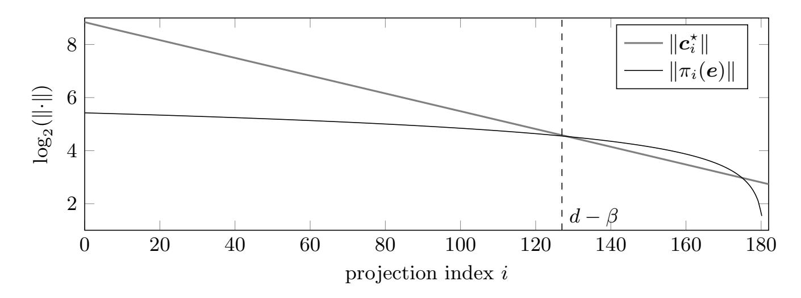
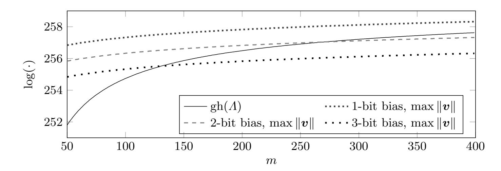
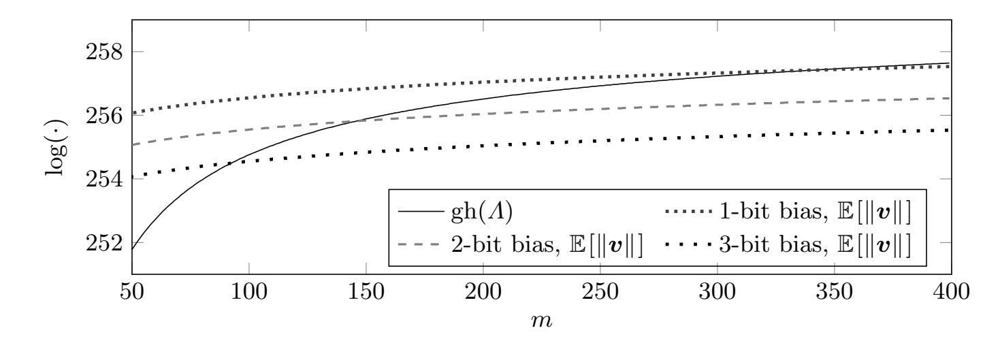
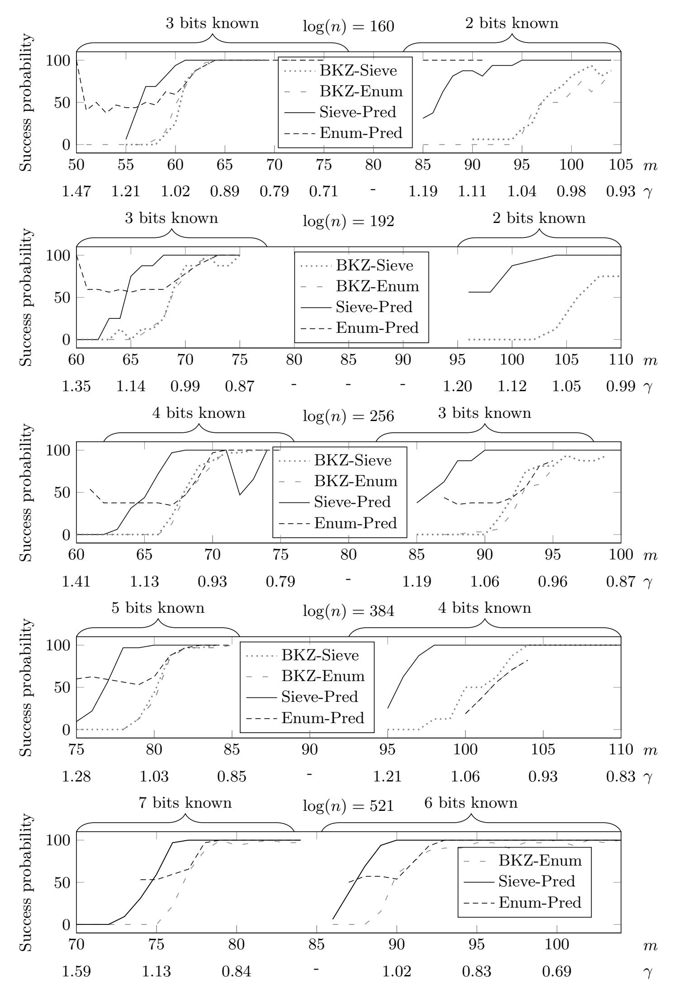
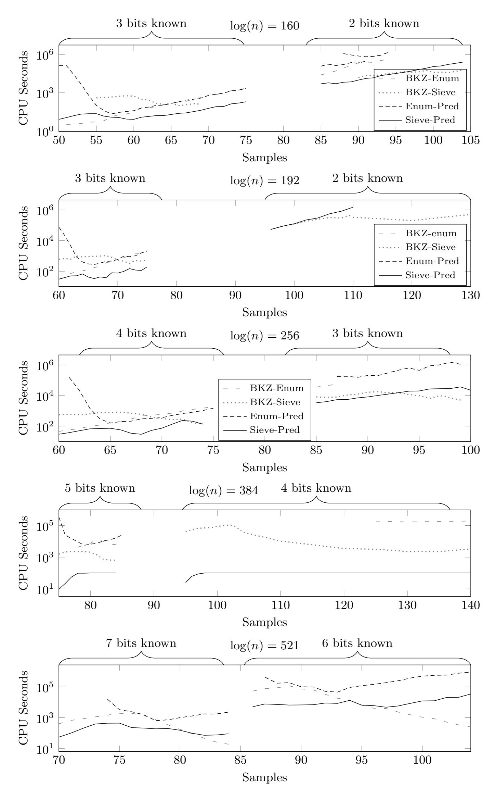
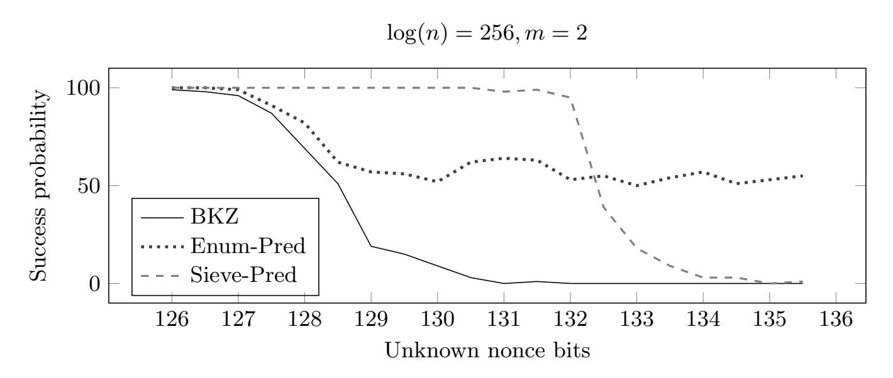
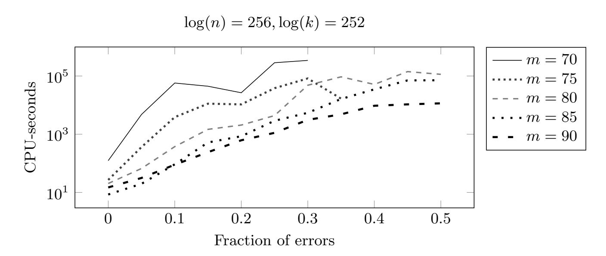

{0}------------------------------------------------

# On Bounded Distance Decoding with Predicate: Breaking the "Lattice Barrier" for the Hidden Number Problem

Martin R. Albrecht<sup>1</sup> and Nadia Heninger2?

1 Information Security Group, Royal Holloway, University of London <sup>2</sup> University of California, San Diego

Abstract. Lattice-based algorithms in cryptanalysis often search for a target vector satisfying integer linear constraints as a shortest or closest vector in some lattice. In this work, we observe that these formulations may discard non-linear information from the underlying application that can be used to distinguish the target vector even when it is far from being uniquely close or short.

We formalize lattice problems augmented with a predicate distinguishing a target vector and give algorithms for solving instances of these problems. We apply our techniques to lattice-based approaches for solving the Hidden Number Problem, a popular technique for recovering secret DSA or ECDSA keys in side-channel attacks, and demonstrate that our algorithms succeed in recovering the signing key for instances that were previously believed to be unsolvable using lattice approaches. We carried out extensive experiments using our estimation and solving framework, which we also make available with this work.

# 1 Introduction

Lattice reduction algorithms [\[53,](#page-31-0) [72,](#page-32-0) [73,](#page-32-1) [34,](#page-30-0) [61\]](#page-32-2) have found numerous applications in cryptanalysis. These include several general families of cryptanalytic applications including factoring RSA keys with partial information about the secret key via Coppersmith's method [\[26,](#page-30-1) [64\]](#page-32-3), the (side-channel) analysis of latticebased schemes [\[57,](#page-31-1) [8,](#page-29-0) [44,](#page-31-2) [4,](#page-28-0) [27\]](#page-30-2), and breaking (EC)DSA and Diffie-Hellman via side-channel attacks using the Hidden Number Problem.

In the usual statement of the Hidden Number Problem (HNP) [\[21\]](#page-29-1), the adversary learns some most significant bits of random multiples of a secret integer modulo some known integer. This information can be written as integer-linear

<sup>?</sup> The research of MA was supported by EPSRC grants EP/S020330/1, EP/S02087X/1, by the European Union Horizon 2020 Research and Innovation Program Grant 780701 and Innovate UK grant AQuaSec; NH was supported by the US NSF under grants no. 1513671, 1651344, and 1913210. Part of this work was done while the authors were visiting the Simons Institute for the Theory of Computing. Our experiments were carried out on Cisco UCS equipment donated by Cisco and housed at UCSD. The full version of this work is available at <https://ia.cr/2020/1540>.

{1}------------------------------------------------

constraints on the secret. The problem can then be formulated as a variant of the Closest Vector Problem (CVP) known as Bounded Distance Decoding (BDD), which asks one to find a uniquely closest vector in a lattice to some target point t. A sufficiently strong lattice reduction will find this uniquely close vector, which can then be used to recover the secret.

The requirement of uniqueness constrains the instances that can be successfully solved with this approach. In short, a fixed instance of the problem is not expected to be solvable when few samples are known, since there are expected to be many spurious lattice points closer to the target than the desired solution. As the number of samples is increased, the expected distance between the target and the lattice shrinks relative to the normalized volume of the lattice, and at some point the problem is expected to become solvable. For some choices of input parameters, however, the problem may be infeasible to solve using these methods if the attacker cannot compute a sufficiently reduced lattice basis to find this solution; if the number of spurious non-solution vectors in the lattice does not decrease fast enough to yield a unique solution; or if simply too few samples can be obtained. In the context of the Hidden Number Problem, the expected infeasibility of lattice-based algorithms for certain parameters has been referred to as the "lattice barrier" in numerous works [\[12,](#page-29-2) [30,](#page-30-3) [79,](#page-32-4) [75,](#page-32-5) [66\]](#page-32-6).

Nevertheless, the initial cryptanalytic problem may remain well defined even when the gap between the lattice and the target is not small enough to expect a unique closest vector. This is because formulating a problem as a HNP instance omits information: the cryptanalytic applications typically imply non-linear constraints that restrict the solution, often to a unique value. For example, in the most common application of the HNP to side-channel attacks, breaking ECDSA from known nonce bits [\[18,](#page-29-3) [45\]](#page-31-3), the desired solution corresponds to the discrete logarithm of a public value that the attacker knows. We may consider such additional non-linear constraints as a predicate h(·) that evaluates to true on the unique secret and false elsewhere. Thus, we may reformulate the search problem as a BDD with predicate problem: find a vector v in the lattice within some radius R to the target t such that f(v − t) := h(g(v − t)) returns true, where g(·) is a function extracting a candidate secret s from the vector v − t.

Contributions. In this work, we define the BDD with predicate problem and give algorithms to solve it. To illustrate the performance of our algorithms, we apply them to the Hidden Number Problem lattices arising from side-channel attacks recovering ECDSA keys from known nonce bits.

In more detail, in Section [3,](#page-10-0) we give a simple refinement of the analysis of the "lattice barrier" and show how this extends the range of parameters that can be solved in practice.

In Section [4](#page-13-0) we define the Bounded Distance Decoding with predicate (BDDα,f(·)) and the unique Shortest Vector with predicate (uSVPf(·)) problems and mention how Kannan's embedding enables us to solve the former via the latter.

{2}------------------------------------------------

We then give two algorithms for solving the unique Shortest Vector with predicate problem in Section [5.](#page-14-0) One is based on lattice-point enumeration and in principle supports any norm R of the target vector. This algorithm exploits the fact that enumeration is exhaustive search inside a given radius. Our other algorithm is based on lattice sieving and is expected to succeed when R ≤ p 4/3 · gh(Λ) where gh(Λ) is the expected norm of a shortest vector in a lattice Λ under the Gaussian heuristic (see below).[3](#page-2-0) This algorithm makes use of the fact that a sieve produces a database of short vectors in the lattice, not just a single shortest vector. Thus, the key observation exploited by all our algorithms is that efficient SVP solvers are expected to consider every vector of the lattice within some radius R. Augmenting these algorithms with an additional predicate check then follows naturally. In both algorithms the predicate is checked (R/ gh(Λ))d+o(d) times, where d is the dimension of the lattice, which is asymptotically smaller than the cost of the original algorithms.

In Section [6,](#page-21-0) we experimentally demonstrate the performance of our algorithms in the context of ECDSA signatures with partial information about nonce bits. Here, although the lattice-based HNP algorithm has been a well-appreciated tool in the side-channel cryptanalysis community for two decades [\[65,](#page-32-7) [55,](#page-31-4) [17,](#page-29-4) [70,](#page-32-8) [71,](#page-32-9) [63,](#page-32-10) [80,](#page-32-11) [46,](#page-31-5) [24\]](#page-30-4), we show how our techniques allow us to achieve previous records with fewer samples, bring problem instances previously believed to be intractable into feasible range, maximize the algorithm's success probability when only a fixed number of samples are available, increase the algorithm's success probability in the presence of noisy data, and give new tradeoffs between computation time and sample collection. We also present experimental evidence of our techniques' ability to solve instances given fewer samples than required by the information theoretic limit for lattice approaches. This is enabled by our predicate uniquely determining the secret.

Our experimental results are obtained using a Sage [\[74\]](#page-32-12)/Python framework for cost-estimating and solving uSVP instances (with predicate). This framework is available at [\[7\]](#page-29-5) and attached to the electronic version of this work. We expect it to have applications beyond this work.

Related work. There are two main algorithmic approaches to solving the Hidden Number Problem in the cryptanalytic literature. In this work, we focus on lattice-based approaches to solving this problem. An alternative approach, a Fourier analysis-based algorithm due to Bleichenbacher [\[18\]](#page-29-3), has generally been considered to be more robust to errors, and able to solve HNP instances with fewer bits known, but at the cost of requiring orders of magnitude more samples and a much higher computational cost [\[30,](#page-30-3) [12,](#page-29-2) [75,](#page-32-5) [13\]](#page-29-6). Our work can be viewed as extending the applicability of lattice-based HNP algorithms well into parameters believed to be only tractable to Bleichenbacher's algorithm, thus showing how

<span id="page-2-0"></span><sup>3</sup> We note that this technique conflicts with "dimensions for free" [\[32,](#page-30-5) [5\]](#page-28-1) and thus the expected performance improvement when arbitrarily many samples are available is smaller compared to state-of-the-art sieving (see Section [5.3](#page-17-0) for details).

{3}------------------------------------------------

these instances can be solved using far fewer samples and less computational time in practice (see Table 4), while gracefully handling input errors (see Figure 7).

In particular, our work can be considered a systematization, formalization, and generalization of folklore (and often ad hoc) techniques in the literature on lattice-reduction aided side-channel attacks such as examining the entire reduced basis to find the target vector [22, 46] or the technique briefly mentioned in [17] of examining candidates after each "tour" of BKZ (BKZ is described below).<sup>4</sup>

More generally, our work can be seen as a continuation of a line of recent works that "open up" SVP oracles, i.e. that forgo treating (approximate) SVP solvers as black boxes inside algorithms. In particular, a series of recent works have taken advantage of the exponentially many vectors produced by a sieve: in [10] the authors use the exponentially many vectors to cost the so-called "dual attack" on LWE [69]; in [32, 52, 5] the authors exploit the same property to improve sieving algorithms and block-wise lattice reduction; and in [31] the authors use this fact to compute approximate Voronoi cells.

Our work may also be viewed in line with [27], which augments a BDD solver for LWE with "hints" by transforming the input lattice. While these hints must be linear(izable) (with noise), the authors demonstrate the utility of integrating such hints to reduce the cost of finding a solution. On the one hand, our approach allows us to incorporate arbitrary, non-linear hints, as long as these can be expressed as an efficiently computable predicate; this makes our approach more powerful. On the other hand, the scenarios in which our techniques can be applied are much more restricted than [27]. In particular, [27] works for any lattice reduction algorithm and, specifically, for block-wise lattice reduction. Our work, in contrast, does not naturally extend to this setting; this makes our approach less powerful in comparison. We discuss this in Section 5.4.

### 2 Preliminaries

We denote the logarithm with base two by  $\log(\cdot)$ . We start indexing at zero.

### 2.1 Lattices

A lattice  $\Lambda$  is a discrete subgroup of  $\mathbb{R}^d$ . When the rows  $\boldsymbol{b}_0,\ldots,\boldsymbol{b}_{d-1}$  of  $\boldsymbol{B}$  are linearly independent we refer to it as the basis of the lattice  $\Lambda(\boldsymbol{B}) = \{\sum v_i \cdot \boldsymbol{b}_i \mid v_i \in \mathbb{Z}\}$ , i.e. we consider row-representations for matrices in this work. The algorithms considered in this work make use of orthogonal projections  $\pi_i$ :  $\mathbb{R}^d \mapsto \operatorname{span}(\boldsymbol{b}_0,\ldots,\boldsymbol{b}_{i-1})^{\perp}$  for  $i=0,\ldots,d-1$ . In particular  $\pi_0(\cdot)$  is the identity. The  $\operatorname{Gram-Schmidt}$  orthogonalization (GSO) of  $\boldsymbol{B}$  is  $\boldsymbol{B}^* = (\boldsymbol{b}_0^*,\ldots,\boldsymbol{b}_{d-1}^*)$ , where the Gram-Schmidt vector  $\boldsymbol{b}_i^*$  is  $\pi_i(\boldsymbol{b}_i)$ . Then  $\boldsymbol{b}_0^* = \boldsymbol{b}_0$  and  $\boldsymbol{b}_i^* = \boldsymbol{b}_i - \sum_{j=0}^{i-1} \mu_{i,j} \cdot \boldsymbol{b}_j^*$  for  $i=1,\ldots,d-1$  and  $\mu_{i,j} = \frac{\langle \boldsymbol{b}_i, \boldsymbol{b}_j^* \rangle}{\langle \boldsymbol{b}_i^*, \boldsymbol{b}_j^* \rangle}$ . Norms in this work are Euclidean and

<span id="page-3-0"></span><sup>&</sup>lt;sup>4</sup> For the purposes of this work, the CVP technique used in [17] is not entirely clear from the account given there. We confirmed with the authors that is the analogous strategy to their SVP approach: CVP enumeration interleaved with tours of BKZ.

{4}------------------------------------------------

denoted  $\|\cdot\|$ . We write  $\lambda_i(\Lambda)$  for the radius of the smallest ball centred at the origin containing at least i linearly independent lattice vectors, e.g.  $\lambda_1(\Lambda)$  is the norm of a shortest vector in  $\Lambda$ .

The Gaussian heuristic predicts that the number  $|\Lambda \cap \mathcal{B}|$  of lattice points inside a measurable body  $\mathcal{B} \subset \mathbb{R}^n$  is approximately equal to  $\text{Vol}(\mathcal{B})/\text{Vol}(\Lambda)$ . Applied to Euclidean d-balls, it leads to the following prediction of the length of a shortest non-zero vector in a lattice.

**Definition 1 (Gaussian heuristic).** We denote by  $gh(\Lambda)$  the expected first minimum of a lattice  $\Lambda$  according to the Gaussian heuristic. For a full rank lattice  $\Lambda \subset \mathbb{R}^d$ , it is given by:

$$gh(\Lambda) = \left(\frac{\operatorname{Vol}(\Lambda)}{\operatorname{Vol}(\mathfrak{B}_d(1))}\right)^{1/d} = \frac{\Gamma\left(1 + \frac{d}{2}\right)^{1/d}}{\sqrt{\pi}} \cdot \operatorname{Vol}(\Lambda)^{1/d} \approx \sqrt{\frac{d}{2\pi e}} \cdot \operatorname{Vol}(\Lambda)^{1/d}$$

where  $\mathfrak{B}_d(R)$  denotes the d-dimensional Euclidean ball with radius R.

#### 2.2 Hard problems

A central hard problem on lattices is to find a shortest vector in a lattice.

Definition 2 (Shortest Vector Problem (SVP)). Given a lattice basis B, find a shortest non-zero vector in  $\Lambda(B)$ .

In many applications, we are interested in finding closest vectors, and we have the additional guarantee that our target vector is not too far from the lattice. This is known as Bounded Distance Decoding.

**Definition 3** ( $\alpha$ -Bounded Distance Decoding (BDD $_{\alpha}$ )). Given a lattice basis  $\boldsymbol{B}$ , a vector  $\boldsymbol{t}$ , and a parameter  $0 < \alpha$  such that the Euclidean distance between  $\boldsymbol{t}$  and the lattice  $\operatorname{dist}(\boldsymbol{t},\boldsymbol{B}) < \alpha \cdot \lambda_1(\Lambda(\boldsymbol{B}))$ , find the lattice vector  $\boldsymbol{v} \in \Lambda(\boldsymbol{B})$  which is closest to  $\boldsymbol{t}$ .

To guarantee a unique solution, it is required that  $\alpha < 1/2$ . However, the problem can be generalized to  $1/2 \le \alpha < 1$ , where we expect a unique solution with high probability. Asymptotically, for any polynomially-bounded  $\gamma \ge 1$  there is a reduction from  $\mathrm{BDD}_{1/(\sqrt{2}\gamma)}$  to  $\mathrm{uSVP}_{\gamma}$  [14]. The unique shortest vector problem (uSVP) is defined as follows:

**Definition 4** ( $\gamma$ -unique Shortest Vector Problem (uSVP $_{\gamma}$ )). Given a lattice  $\Lambda$  such that  $\lambda_2(\Lambda) > \gamma \cdot \lambda_1(\Lambda)$  find a nonzero vector  $\mathbf{v} \in \Lambda$  of length  $\lambda_1(\Lambda)$ .

The reduction is a variant of the embedding technique, due to Kannan [48], that constructs

$$\boldsymbol{L} = \begin{pmatrix} \boldsymbol{B} & 0 \\ \boldsymbol{t} & \tau \end{pmatrix}$$

where  $\tau$  is some embedding factor (the reader may think of  $\tau = \mathbb{E}\left[\|\boldsymbol{t} - \boldsymbol{v}\|/\sqrt{d}\right]$ ). If  $\boldsymbol{v}$  is the closest vector to  $\boldsymbol{t}$  then the lattice  $\Lambda(\boldsymbol{L})$  contains  $(\boldsymbol{t} - \boldsymbol{v}, \tau)$  which is small.

{5}------------------------------------------------

### 2.3 Lattice algorithms

**Enumeration** [68, 47, 33, 73, 60, 2] solves the following problem: Given some matrix  $\boldsymbol{B}$  and some bound R, find  $\boldsymbol{v} = \sum_{i=0}^{d-1} u_i \cdot \boldsymbol{b}_i$  with  $u_i \in \mathbb{Z}$  where at least one  $u_i \neq 0$  such that  $\|\boldsymbol{v}\|^2 \leq R^2$ . By picking the shortest vector encountered, we can use lattice-point enumeration to solve the shortest vector problem. Enumeration algorithms make use of the fact that the vector  $\boldsymbol{v}$  can be rewritten with respect to the Gram–Schmidt basis:

$$\boldsymbol{v} = \sum_{i=0}^{d-1} u_i \cdot \boldsymbol{b}_i = \sum_{i=0}^{d-1} u_i \cdot \left( \boldsymbol{b}_i^* + \sum_{j=0}^{i-1} \mu_{i,j} \cdot \boldsymbol{b}_j^* \right) = \sum_{j=0}^{d-1} \left( u_j + \sum_{i=j+1}^{d-1} u_i \cdot \mu_{ij} \right) \cdot \boldsymbol{b}_j^*.$$

Since all the  $\boldsymbol{b}_i^*$  are pairwise orthogonal, we can express the norms of projections of  $\boldsymbol{v}$  simply as

$$\|\pi_k(\boldsymbol{v})\|^2 = \left\| \sum_{j=k}^{d-1} \left( u_j + \sum_{i=j+1}^{d-1} u_i \, \mu_{i,j} \right) \boldsymbol{b}_j^* \right\|^2 = \sum_{j=k}^{d-1} \left( u_j + \sum_{i=j+1}^{d-1} u_i \, \mu_{i,j} \right)^2 \cdot \|\boldsymbol{b}_j^*\|^2.$$

In particular, vectors do not become longer by projecting. Enumeration algorithms exploit this fact by projecting the problem down to a one dimensional problem of finding candidate  $\pi_d(\mathbf{v})$  such that  $\|\pi_d(\mathbf{v})\|^2 \leq R^2$ . Each such candidate is then lifted to a candidate  $\pi_{d-1}(\mathbf{v})$  subject to the constraint  $\|\pi_{d-1}(\mathbf{v})\|^2 \leq R^2$ .

That is, lattice-point enumeration is a depth-first tree search through a tree defined by the  $u_i$ . It starts by picking a candidate for  $u_{d-1}$  and then explores the subtree "beneath" this choice. Whenever it encounters an empty interval of choices for some  $u_i$  it abandons this branch and backtracks. When it reaches the leaves of the tree, i.e.  $u_0$  then it compares the candidate for a full solution to the previously best found and backtracks.

Lattice-point enumeration is expected [42] to consider

$$H_k = \frac{1}{2} \cdot \frac{\operatorname{Vol}(\mathfrak{B}_{d-k}(R))}{\prod_{i=k}^{d-1} \|\boldsymbol{b}_i^*\|}$$

nodes at level k and  $\sum_{k=0}^{d-1} H_k$  nodes in total. In particular, enumeration finds the shortest non-zero vector in a lattice in  $d^{d/(2e)+o(d)}$  time and polynomial memory [42]. It was recently shown that when enumeration is used as the SVP oracle inside block-wise lattice reduction the time is reduced to  $d^{d/8+o(d)}$  [2]. However, the conditions for this improvement are mostly not met in our setting. Significant gains can be made in lower-order terms by considering a different  $R_i$  on each level  $0 \le i < d$  instead of a fixed R. Since this prunes branches of the search tree that are unlikely to lead to a solution, this is known as "pruning" in the literature. When the  $R_i$  are chosen such that the success probability is exponentially small in d we speak of "extreme pruning" [35].

A state-of-the-art implementation of lattice-point enumeration can be found in FPLLL [76]. This is the implementation we adapt in this work. It visits about  $2^{\frac{d \log d}{2e} - 0.995 \, d + 16.25}$  nodes to solve SVP in dimension d [2].

{6}------------------------------------------------

Sieving [\[1,](#page-28-3) [59,](#page-31-11) [16,](#page-29-10) [51,](#page-31-12) [15,](#page-29-11) [43\]](#page-31-13) takes as input a list of lattice points, L ⊂ Λ, and searches for integer combinations of these points that are short. If the initial list is sufficiently large, SVP can be solved by performing this process recursively. Each point in the initial list can be sampled at a cost polynomial in d [\[50\]](#page-31-14). Hence the initial list can be sampled at a cost of |L| 1+o(1) .

Sieves that combine k points at a time are called k-sieves; 2-sieves take integer combinations of the form u ± v with u, v ∈ L and u 6= ±v. Heuristic sieving algorithms are analyzed under the heuristic that the points in L are independently and identically distributed uniformly in a thin spherical shell. This heuristic was introduced by Nguyen and Vidick in [\[67\]](#page-32-16). As a further simplification, it is assumed that the shell is very thin and normalized such that L is a subset of the unit sphere in R d . As such, a pair (u, v) is reducible if and only if the angle between u and v satisfies θ(u, v) < π/3, where θ(u, v) = arccos (hu, vi/(kuk · kvk)), arccos(x) ∈ [0, π]. Under these assumptions, we require |L| ≈ p 4/3 d in order to see "collisions", i.e. reductions. Lattice sieves are expected to output a list of (4/3)d/2+o(d) short lattice vectors [\[32,](#page-30-5) [5\]](#page-28-1). The asymptotically fastest sieve has a heuristic running time of 20.<sup>292</sup> <sup>d</sup>+o(d) [\[15\]](#page-29-11).

We use the performant implementations of lattice sieving that can be found in G6K [\[78,](#page-32-17) [5\]](#page-28-1) in this work, which includes a variant of [\[16\]](#page-29-10) ("BGJ1") and [\[43\]](#page-31-13) (3-Sieve). BGJ1 heuristically runs in time 2<sup>0</sup>.<sup>349</sup> <sup>d</sup>+o(d) and memory 2<sup>0</sup>.<sup>205</sup> <sup>d</sup>+o(d) The 3-Sieve heuristically runs in time 20.<sup>372</sup> <sup>d</sup>+o(d) and memory 20.<sup>189</sup> <sup>d</sup>+o(d) . [5](#page-6-0)

.

BKZ [\[72,](#page-32-0) [73\]](#page-32-1) can be used to solve the unique shortest vector problem and thus BDD. BKZ makes use of an oracle that solves the shortest vector problem in dimension β. This oracle can be instantiated using enumeration or sieving. The algorithm then asks the oracle to solve SVP on the first block of dimension β of the input lattice, i.e. of the lattice spanned by b0, . . . , bβ−1. This vector is then inserted into the basis and the algorithm asks the SVP oracle to return a shortest vector for the block π<sup>1</sup> (b1), . . . , π<sup>1</sup> (bβ). The algorithm proceeds in this fashion until it reaches πd−<sup>2</sup> (bd−2), πd−<sup>2</sup> (bd−1). It then starts again by considering b0, . . . , bβ−1. One such loop is called a "tour" and the algorithm will continue with these tours until no more (or only small changes) are made to the basis. For many applications a small, constant number of tours is sufficient for the basis to stabilize.

The key parameter for BKZ is the block size β, i.e. the maximal dimension of the underlying SVP oracle, and we write "BKZ-β". The expected norm of the shortest vector found by BKZ-β and inserted into the basis as b<sup>0</sup> for a random lattice is kb0k ≈ δ d−1 β · Vol(Λ) <sup>1</sup>/d for some constant δ<sup>β</sup> ∈ O β 1/(2 β) depending on β. [6](#page-6-1)

<span id="page-6-0"></span><sup>5</sup> In G6K the 3-Sieve is configured to use a database of size 2<sup>0</sup>.<sup>205</sup> <sup>d</sup>+o(d) by default, which lowers its time complexity.

<span id="page-6-1"></span><sup>6</sup> The constant is typically defined as kb0k ≈ δ d <sup>β</sup> · Vol(Λ) <sup>1</sup>/d in the literature. From the perspective of the (worst-case) analysis of underlying algorithms, though, normalizing by d − 1 rather than d is appropriate.

{7}------------------------------------------------

In |10| the authors formulate a success condition for BKZ- $\beta$  solving uSVP on a lattice  $\Lambda$  in the language of solving LWE. Let e be the unusually short vector in the lattice and let  $c_i^*$  be the Gram-Schmidt vectors of a typical BKZ- $\beta$  reduced basis of a lattice with the same volume and dimension as  $\Lambda$ . Then in [10] it is observed that when BKZ considers the last full block  $\pi_{d-\beta}(\boldsymbol{b}_{d-\beta}), \dots \pi_{d-\beta}(\boldsymbol{b}_{d-1})$ it will insert  $\pi_{d-\beta}(e)$  at index  $d-\beta$  if that projection is the shortest vector in the sublattice spanned by the last block. Thus, when

$$\|\pi_{d-\beta}\left(\boldsymbol{e}\right)\| < \|\boldsymbol{c}_{d-\beta}^*\| \tag{1}$$

<span id="page-7-2"></span><span id="page-7-1"></span>

$$\|\pi_{d-\beta}(\boldsymbol{e})\| < \|\boldsymbol{c}_{d-\beta}^*\|$$

$$\approx$$

$$\sqrt{\beta/d} \cdot \mathbb{E}[\|\boldsymbol{e}\|] < \delta_{\beta}^{2\beta-d-1} \cdot \operatorname{Vol}(\Lambda)^{1/d}$$
(2)

we expect the behavior of BKZ- $\beta$  on our lattice  $\Lambda$  to deviate from that of a random lattice. This situation is illustrated in Figure 1. Indeed, in [6] it was shown that once this event happens, the internal LLL calls of BKZ will "lift" and recover e. Thus, these works establish a method for estimating the required block size for BKZ to solve uSVP instances. We use this estimate to choose parameters in Section 6: given a dimension d, volume  $Vol(\Lambda)$  and  $\mathbb{E}[\|e\|]$ , we pick the smallest  $\beta$  such that Inequality (2) is satisfied. Note, however, that in small dimensions this reasoning is somewhat complicated by "double intersections" [6] and low "lifting" probability [27]; as a result estimates derived this way are pessimistic for small block sizes. In that case, the model in [27] provides accurate predictions. Instead of only running BKZ, a performance gain can be achieved by following BKZ with one SVP/CVP call in a larger dimension than the BKZ block size |55, 5|.

<span id="page-7-0"></span>

Fig. 1: BKZ $-\beta$  uSVP Success Condition. Expected norms for lattices of dimension d=183 and volume  $q^{m-n}$  after BKZ- $\beta$  reduction for LWE parameters n=18065, m = 182, q = 521, standard deviation  $\sigma = 8/\sqrt{2\pi}$  and  $\beta = 56$ . BKZ is expected to succeed in solving a uSVP instance when the two curves intersect at index  $d - \beta$  as shown, i.e. when Inequality (1) holds. Reproduced from [6].

{8}------------------------------------------------

### 2.4 The Hidden Number Problem

In the Hidden Number Problem (HNP) [21], there is a secret integer  $\alpha$  and a public modulus n. Information about  $\alpha$  is revealed in the form of what we call samples: an oracle chooses a uniformly random integer  $0 < t_i < n$ , computes  $s_i = t_i \cdot \alpha \mod n$  where the modular reduction is taken as a unary operator so that  $0 \le s_i < n$ , and reveals some most significant bits of  $s_i$  along with  $t_i$ . We will write this as  $a_i + k_i = t_i \cdot \alpha \mod n$ , where  $k_i < 2^{\ell}$  for some  $\ell \in \mathbb{Z}$  that is a parameter to the problem. For each sample, the adversary learns the pair  $(t_i, a_i)$ . We may think of the Hidden Number Problem as 1-dimensional LWE [69].

### 2.5 Breaking ECDSA from nonce bits

Many works in the literature have exploited side-channel information about (EC)DSA nonces by solving the Hidden Number Problem (HNP), e.g. [65, 19, 55, 12, 70, 75, 71, 63, 80, 46], since the seminal works of Bleichenbacher [18] and Howgrave-Graham and Smart [45]. The latter solves HNP using lattice reduction; the former deploys a combinatorial algorithm that can be cast as a variant of the BKW algorithm [20, 3, 49, 40]. The latest in this line of research is [13] which recovers a key from less than one bit of the nonce using Bleichenbacher's algorithm. More recently, in [56] the authors found the first practical attack scenario that was able to make use of Boneh and Venkatesan's [21] original application of the HNP to prime-field Diffie-Hellman key exchange.

Side-channel attacks. Practical side-channel attacks against ECDSA typically run in two stages. First, the attacker collects many signatures while performing side-channel measurements. Next, they run a key recovery algorithm on a suitably chosen subset of the traces. Depending on the robustness of the measurements, the data collection phase can be quite expensive. As examples, in [62] the authors describe having to repeat their attack 10,000 to 20,000 times to obtain one byte of information; in [37] the authors measured 5,000 signing operations, each taking 0.1 seconds, to obtain 114 usable traces; in [63] the authors describe generating 40,000 signatures in 80 minutes in order to obtain 35 suitable traces to carry out an attack.

Thus in the side-channel literature, minimizing the amount of data required to mount a successful attack is often an important metric [70, 46]. Using our methods as described below will permit more efficient overall attacks.

**ECDSA.** The global parameters for an ECDSA signature are an elliptic curve  $E(\mathbb{F}_p)$  and a generator point G on E of order n. A signing key is an integer  $0 \le d < n$ , and the public verifying key is a point dG. To generate an ECDSA signature on a message hash h, the signer generates a random integer nonce k < n, and computes the values  $r = (kG)_x$  where x subscript is the x coordinate of the point, and  $s = k^{-1} \cdot (h + d \cdot r) \mod n$ . The signature is the pair (r, s).

{9}------------------------------------------------

**ECDSA** as a **HNP.** In a side-channel attack against ECDSA, the adversary may learn some of the most significant bits of the signature nonce k. Without loss of generality, we will assume that these bits are all 0. Then rearranging the formula for the ECDSA signature s, we have  $-s^{-1} \cdot h + k \equiv s^{-1} \cdot r \cdot d \mod n$ , and thus a HNP instance with  $a_i = -s^{-1} \cdot h$ ,  $t_i = s^{-1} \cdot r$ , and  $\alpha = d$ .

**Solving the HNP with lattices.** Boneh and Venkatesan give this lattice for solving the Hidden Number Problem with a BDD oracle:

$$\begin{bmatrix} n & 0 & 0 & \cdots & 0 & 0 \\ 0 & n & 0 & \cdots & 0 & 0 \\ \vdots & & & \ddots & & \\ 0 & 0 & 0 & \cdots & n & 0 \\ t_0 & t_1 & t_2 & \cdots & t_{m-1} & 1/n \end{bmatrix}$$

The target is a vector  $(a_0, \ldots, a_{m-1}, 0)$  and the lattice vector

$$(t_0 \cdot \alpha \mod n, \ldots, t_{m-1} \cdot \alpha \mod n, \alpha/n)$$

is within  $\sqrt{m+1} \cdot 2^{\ell}$  of this target when  $|k_i| < 2^{\ell}$ .

Most works solve this BDD problem via Kannan's embedding i.e. by constructing the lattice generated by the rows of

$$\begin{bmatrix} n & 0 & 0 & \cdots & 0 & 0 & 0 \\ 0 & n & 0 & \cdots & 0 & 0 & 0 \\ \vdots & & & \vdots & & & \\ 0 & 0 & 0 & \cdots & n & 0 & 0 \\ t_0 & t_1 & t_2 & \cdots & t_{m-1} & 2^{\ell}/n & 0 \\ a_0 & a_1 & a_2 & \cdots & a_{m-1} & 0 & 2^{\ell} \end{bmatrix}$$

This lattice contains a vector

$$(k_0, k_1, \ldots, k_{m-1}, 2^{\ell} \cdot \alpha/n, 2^{\ell})$$

that has norm at most  $\sqrt{m+2} \cdot 2^{\ell}$ . This lattice also contains  $(0,0,\ldots,0,2^{\ell},0)$ , so the target vector is not generally the shortest vector. There are various improvements we can make to this lattice.

Reducing the size of k by one bit. In an ECDSA input, k is generally positive, so we have  $0 \le k_i < 2^{\ell}$ . The lattice works for any sign of k, so we can reduce the bit length of k by one bit by writing  $k'_i = k_i - 2^{\ell-1}$ . This modification provides a significant improvement in practice and is described in [65], but is not consistently taken advantage of in practical applications.

{10}------------------------------------------------

Eliminating  $\alpha$ . Given a set of input equations  $a_0 + k_0 \equiv t_0 \cdot \alpha \mod n, \ldots, a_{m-1} + k_{m-1} = t_{m-1} \cdot \alpha \mod n$ , we can eliminate the variable  $\alpha$  and end up with a new set of equations  $a'_1 + k_1 \equiv t'_1 \cdot k_0 \mod n, \ldots, a'_{m-1} + k_{m-1} \equiv t'_{m-1} \cdot k_0 \mod n$ .

For each relation,  $t_i^{-1} \cdot (a_i + k_i) \equiv t_0^{-1} \cdot (a_0 + k_0) \mod n$ ; rearranging yields

$$a_i - t_i \cdot t_0^{-1} \cdot a_0 + k_i \equiv t_i \cdot t_0^{-1} \cdot k_0 \mod n.$$

Thus our new problem instance has m-1 relations with  $a_i' = a_i - t_i \cdot t_0^{-1} \cdot a_0$  and  $t_i' = t_i \cdot t_0^{-1}$ .

This has the effect of reducing the dimension of the above lattice by 1, and also making the bounds on all the variables equal-sized, so that normalization is not necessary anymore, and the vector  $(0,0,\ldots,0,2^\ell,0)$  is no longer in the lattice. Thus, the new target  $(k_1,k_2,\ldots,k_{m-1},k_0,2^\ell)$  is expected to be the unique shortest vector (up to signs) in the lattice for carefully chosen parameters. We note that this transformation is analogous to the normal form transformation for LWE [11]. From a naive examination of the determinant bounds, this transformation would not be expected to make a significant difference in the feasibility of the algorithm, but in the setting of this paper, where we wish to push the boundaries of the unique shortest vector scenario, it is crucial to the success of our techniques.

Let  $w=2^{\ell-1}.$  With the above two optimizations, our new lattice  $\Lambda$  is generated by:

$$\begin{bmatrix} n & 0 & 0 & \cdots & 0 & 0 & 0 \\ 0 & n & 0 & \cdots & 0 & 0 & 0 \\ \vdots & & & \vdots & & & \vdots \\ 0 & 0 & 0 & \cdots & n & 0 & 0 \\ t'_1 & t'_2 & t'_3 & \cdots & t'_{m-1} & 1 & 0 \\ a'_1 & a'_2 & a'_3 & \cdots & a'_{m-1} & 0 & w \end{bmatrix}$$

and the target vector is  $v_t = (k_1 - w, k_2 - w, \dots, k_{m-1} - w, k_0 - w, w)$ .

The expected solution comes from multiplying the second to last basis vector with the secret (in this case,  $k_0$ ), adding the last vector, and reducing modulo n as necessary. The entries 1 and w are normalization values chosen to ensure that all the coefficients of the short vector will have the same length.

Different-sized  $k_i$ s. We can adapt the construction to different-sized  $k_i$  satisfying  $|k_i| < 2^{\ell_i}$  by normalizing each column in the lattice by a factor of  $2^{\ell_{max}}/2^{\ell_i}$ . [17]

### <span id="page-10-0"></span>3 The "lattice barrier".

It is believed that lattice algorithms for the Hidden Number Problem "become essentially inapplicable when only a very short fraction of the nonce is known for each input sample. In particular, for a single-bit nonce leakage, it is believed that they should fail with high probability, since the lattice vector corresponding to the secret is no longer expected to be significantly shorter than other vectors in the lattice" [13]. Aranha et al. [12] elaborate on this further: "there is a hard limit

{11}------------------------------------------------

<span id="page-11-1"></span>

Fig. 2: Illustrating the "lattice barrier". BDD is expected to become feasible when the length of the target vector kvk is less than the Gaussian heuristic gh(Λ); we plot the upper bound in Equation [\(3\)](#page-11-0) for log(n) = 256 against varying number of samples m.

to what can be achieved using lattice reduction: due to the underlying structure of the HNP lattice, it is impossible to attack (EC)DSA using a single-bit nonce leak with lattice reduction. In that case, the 'hidden lattice point' corresponding to the HNP solution will not be the closest vector even under the Gaussian heuristic (see [\[66\]](#page-32-6)), so that lattice techniques cannot work." Similar points are made in [\[30,](#page-30-3) [79,](#page-32-4) [75\]](#page-32-5); in particular, in [\[79\]](#page-32-4) it is estimated that a 3-bit bias for a 256-bit curve is not easy and two bits is infeasible, and a 5- or 4-bit bias for a 384-bit curve is not easy and three bits is infeasible.

To see how prior work derived this "lattice barrier", note that the volume of the lattice is

$$Vol(\Lambda) = n^{m-1} \cdot w$$

and the dimension is m + 1. According to the Gaussian heuristic, we expect the shortest vector in the lattice to have norm

$$gh(\Lambda) \approx \frac{\Gamma(1 + (m+1)/2)^{1/(m+1)}}{\sqrt{\pi}} \cdot Vol(\Lambda)^{1/(m+1)}$$
$$\approx \sqrt{\frac{m+1}{2\pi e}} \cdot (n^{m-1} \cdot w)^{1/(m+1)}.$$

Also, observe that the norm of the target vector v satisfies

<span id="page-11-0"></span>
$$\|\boldsymbol{v}\| \le \sqrt{m+1} \cdot w. \tag{3}$$

A BDD solver is expected to be successful in recovering v when kvk < gh(Λ). We give a representative plot in Figure [2](#page-11-1) comparing the Gaussian heuristic gh(Λ) against the upper bound of the target vectors in Equation [\(3\)](#page-11-0) for 1, 2, and 3-bit biases for a 256-bit ECDSA key recovery problem. The resulting lattice dimensions explain the difficulty estimates of [\[79\]](#page-32-4).

In this work, we make two observations. First, the upper bound for the target vector is a conservative estimate for its length. Since heuristically our problem

{12}------------------------------------------------

<span id="page-12-0"></span>

Fig. 3: Updated estimates for feasibility of lattice algorithms. We plot the expected length of the target vector kvk against the Gaussian heuristic for varying number of samples m for log(n) = 256. Compared to Figure [2,](#page-11-1) the crossover points result in much more tractable instances. We can further decrease the lattice dimension using enumeration and sieving with predicates (see Section [4\)](#page-13-0).

instances are randomly sampled, we will use the expected norm of a uniformly distributed vector instead. This is only a constant factor different from the upper bound above, but this constant makes a significant difference in the crossover points.

The target vector v we construct after the optimizations above has expected squared norm

$$\mathbb{E}\left[\|\boldsymbol{v}\|^2\right] = \mathbb{E}\left[\left(\sum_{i=1}^m (k_i - w)^2\right) + w^2\right] = m \cdot \mathbb{E}\left[(k_i - w)^2\right] + w^2$$

with

$$\mathbb{E}\left[\left(k_{i}-w\right)^{2}\right] = 1/(2w) \cdot \sum_{i=0}^{2w-1} (i-w)^{2}$$

$$= 1/(2w) \cdot \sum_{i=0}^{2w-1} i^{2} - 1/(2w) \sum_{i=0}^{2w-1} 2i \cdot w + 1/(2w) \sum_{i=0}^{2w-1} w^{2}$$

$$= w^{2}/3 + 1/6$$

and we arrive at

<span id="page-12-1"></span>
$$\mathbb{E}\left[\|\boldsymbol{v}\|^{2}\right] = \mathbb{E}\left[\left(\sum_{i=1}^{m} (k_{i} - w)^{2}\right) + w^{2}\right] = m \cdot w^{2}/3 + m/6 + w^{2}.$$
 (4)

Using this condition, we observe that ECDSA key recovery problems previously believed to be quite difficult to solve with lattices turn out to be within reach, and problems believed to be impossible become merely expensive (see Tables [4](#page-24-0) and [5\)](#page-25-0). We illustrate these updated conditions for the example of log(n) = 256 in

{13}------------------------------------------------

Figure [3.](#page-12-0) The crossover points accurately predict the experimental performance of our algorithms in practice; compare to the experimental results plotted in Figure [4.](#page-22-0)

The second observation we make in this work is that we show that lattice algorithms can still be applied when kvk ≥ gh(Λ), i.e. when the "lattice vector corresponding to the secret is no longer expected to be significantly shorter than other vectors in the lattice" [\[13\]](#page-29-6). That is, we observe that the "lattice barrier" is soft, and that violating it simply requires spending more computational time. This allows us to increase the probability of success at the crossover points in Figure [3](#page-12-0) and successfully solve instances with fewer samples than suggested by the crossover points.

An even stronger barrier to the applicability of any algorithm for solving the Hidden Number Problem comes from the amount of information about the secret encoded in the problem itself: each sample reveals log(n) − ` bits of information about the secret d. Thus, we expect to require m ≥ log(n)/(log(n)−`) in order to recover d; heuristically, for random instances, below this point we do not expect the solution to be uniquely determined by the lattice, no matter the algorithm used to solve it. We will see below that our techniques allow us to solve instances past both the "lattice barrier" and the information-theoretic limit.

# <span id="page-13-0"></span>4 Bounded Distance Decoding with predicate

<span id="page-13-1"></span>We now define the key computational problem in this work:

Definition 5 (α-Bounded Distance Decoding with predicate (BDDα,f(·))). Given a lattice basis B, a vector t, a predicate f(·), and a parameter 0 < α such that the Euclidean distance dist(t, B) < α·λ1(B), find the lattice vector v ∈ Λ(B) satisfying f(v − t) = 1 which is closest to t.

We will solve the BDDα,f(·) using Kannan's embedding technique. However, the lattice we will construct does not necessarily have a unique shortest vector. Rather, uniqueness is expected due to the addition of a predicate f(·).

<span id="page-13-2"></span>Definition 6 (unique Shortest Vector Problem with predicate (uSVPf(·))). Given a lattice Λ and a predicate f(·) find the shortest nonzero vector v ∈ Λ satisfying f(v) = 1.

Remark 1. Our nomenclature—"BDD" and "uSVP"—might be considered confusing given that the target is neither unusually close nor short. However, the distance to the lattice is still bounded in the first case and the presence of the predicate ensures uniqueness in the second case. Thus, we opted for those names over "CVP" and "SVP".

Explicitly, to solve BDDα,f(·) using an oracle solving uSVPf(·) , we consider the lattice

$$\boldsymbol{L} = \begin{pmatrix} \boldsymbol{B} \ 0 \\ \boldsymbol{t} \ \tau \end{pmatrix}$$

{14}------------------------------------------------

where τ ≈ E h kv − tk/ √ d i is some embedding factor. If v is the closest vector to t then the lattice Λ(L) contains (t − v, τ ). Furthermore, we construct the predicate f 0 (·) given f(·) as in Algorithm [1.](#page-14-1)

```
Input: v a vector of dimension d.
  Input: f(·) predicate accepting inputs in R
                                             d−1
                                                .
  Output: 0 or 1
1 if |vd−1| 6= τ then
2 return 0 ;
3 end
4 return f((v0, v1, . . . , vd−2));
      Algorithm 1: uSVP predicate f
                                         0
                                          (·) from BDD predicate f().
```

Remark 2. Definitions [5](#page-13-1) and [6](#page-13-2) are more general than the scenarios used to motivate them in the introduction. That is, both definitions permit the predicate to evaluate to true on more than one vector in the lattice and will return the closest or shortest of those vectors, respectively. In many—but not all—applications, we will additionally have the guarantee that the predicate will only evaluate to true on one vector. Definitions [5](#page-13-1) and [6](#page-13-2) naturally extend to the case where we ask for a list of all vectors in the lattice up to a given norm satisfying the predicate.

# <span id="page-14-0"></span>5 Algorithms

We propose two algorithms for solving uSVPf(·) , one based on enumeration easily parameterized to support arbitrary target norms—and one based on sieving, solving uSVPf(·) when the norm of the target vector is ≤ p 4/3 · gh(Λ). We will start with recounting the standard uSVP strategy as a baseline to compare against later.

### <span id="page-14-2"></span>5.1 Baseline

When our target vector v is expected to be shorter than any other vector in the lattice, we may simply use a uSVP solver to recover it. In particular, we may use the BKZ algorithm with a block size β that satisfies the success condition in Equation [\(2\)](#page-7-1). Depending on β we may choose enumeration β < 70 or sieving β ≥ 70 to instantiate the SVP oracle [\[5\]](#page-28-1). When β = d this computes an HKZ reduced basis and, in particular, a shortest vector in the basis. It is folklore in the literature to search through the reduced basis for the presence of the target vector, that is, to not only consider the shortest non-zero vector in the basis. Thus, when comparing our algorithms against prior work, we will also do this, and consider these algorithms to have succeeded if the target is contained in the reduced basis. We will refer to these algorithms as "BKZ-Enum" and "BKZ-Sieve" 

{15}------------------------------------------------

depending on the oracle used. We may simply write BKZ-β or BKZ when the SVP oracle or the block size do not need to specified. When β = d we will also refer to this approach as the "SVP approach", even though a full HKZ reduced basis is computed and examined. When we need to spell out the SVP oracle used, we will write "Sieve" and "Enum" respectively.

### <span id="page-15-0"></span>5.2 Enumeration

Our first algorithm is to augment lattice-point enumeration, which is exhaustive search over all points in a ball of a given radius, with a predicate to immediately give an algorithm that exhaustively searches over all points in a ball of a given radius that satisfy a given predicate. In other words, our modification to latticepoint enumeration is simply to add a predicate check whenever the algorithm reaches a leaf node in the tree, i.e. has recovered a candidate solution. If the predicate is satisfied the solution is accepted and the algorithm continues its search trying to improve upon this candidate. If the predicate is not satisfied, the algorithm proceeds as if the search failed. This augmented enumeration algorithm is then used to enumerate all points in a radius R corresponding to the (expected) norm of the target vector. We give pseudocode (adapted from [\[28\]](#page-30-10)) for this algorithm in Algorithm [2.](#page-16-0) Our implementation of this algorithm is in the class USVPPredEnum in the file usvp.py available at [\[7\]](#page-29-5).

Theorem 1. Let Λ ⊂ R d be a lattice containing vectors v such that kvk ≤ R = ξ · gh(Λ) and f(v) = 1. Assuming the Gaussian heuristic, then Algorithm [2](#page-16-0) finds the shortest vector v satisfying f(v) = 1 in ξ d · d d/(2e)+o(d) steps. Algorithm [2](#page-16-0) will make ξ d+o(d) calls to f(·).

Proof (sketch). Let R<sup>i</sup> = R. Enumeration runs in

$$\sum_{k=0}^{d-1} \frac{1}{2} \cdot \frac{\operatorname{Vol}(\mathfrak{B}_{d-k}(R))}{\prod_{i=k}^{d-1} \|\boldsymbol{b}_i^*\|}$$

steps [\[42\]](#page-31-10) which scales by ξ <sup>d</sup>+o(d) when R scales by ξ. Solving SVP with enumeration takes d d/(2e)+o(d) steps [\[42\]](#page-31-10). By the Gaussian heuristic we expect ξ <sup>d</sup> points in Bd(R) ∩ Λ on which the algorithm may call the predicate f(·).

Implementation. Modifying FPLLL [\[76,](#page-32-15) [77\]](#page-32-19) to implement this functionality is relatively straightforward since it already features an Evaluator class to validate full solutions—i.e. leaves—with high precision, which we subclassed. We then call this modified enumeration code with a search radius R that corresponds to the expected length of our target. We make use of (extreme) pruned enumeration by computing pruning parameters using FPLLL's Pruner module. Here, we make the implicit assumption that rerandomizing the basis means the probability of finding the target satisfying our predicate is independent from previous attempts. We give some example performance figures in Table [1.](#page-17-1)

{16}------------------------------------------------

```
Input: Lattice basis b_0, \ldots, b_{d-1}.
     Input: Pruning parameters R_0, \ldots, R_{d-1}, such that R = R_0.
     Input: Predicate f(\cdot).
     Output: u_{\min} such that ||v|| with v = \sum_{i=0}^{d-1} (u_{\min})_i \cdot b_i is minimal subject to
 \|\pi_j(\boldsymbol{v})\| \leq R_j \text{ and } f(\boldsymbol{v}) = 1 \text{ or } \perp.
1 \boldsymbol{u}_{\min} \leftarrow (1,0,\ldots,0) \in \mathbb{Z}^d; // Final result
  2 \boldsymbol{u} \leftarrow (1,0,\dots,0) \in \mathbb{Z}^d; // Current candidate
  c \leftarrow (0,0,\ldots,0) \in \mathbb{R}^d; // Centers
  4 \ell \leftarrow (0,0,\dots,0) \in \mathbb{Z}^{d+1}; // Squared Norms
 5 Compute \mu_{i,j} and \|\boldsymbol{b}_i^*\| for 0 \le i, j < d;
  6 t \leftarrow 0;
  7 while t < d do
            backtrack \leftarrow 1;
  8
           \ell_t \leftarrow \ell_{t+1} + (u_t + c_t) \cdot ||\boldsymbol{b}_t^*||;
  9
           if \ell_t < R_t then
10
                  if t > 0 then
11
                       t \leftarrow t-1; // Go down a layer c_t \leftarrow -\sum_{i=t+1}^{d-1} u_t \cdot \mu_{i,t}; u_t \leftarrow \lceil c_t \rfloor;
12
13
14
                        backtrack \leftarrow 0;
15
                  else if f(\sum_{i=0}^{d-1} u_i \cdot \boldsymbol{b}_i) = 1 and \|\sum_{i=0}^{d-1} u_i \cdot \boldsymbol{b}_i\| < \|\sum_{i=0}^{d-1} u_{\min,i} \cdot \boldsymbol{b}_i\|
16
                    then
                        u_{\min} \leftarrow u;
17
                        backtrack \leftarrow 1;
18
            end
19
            if backtrack = 1 then
20
                  t \leftarrow t + 1;
21
                  Pick next value for u_t using the zig-zag pattern
22
                    (c_t + 0, c_t + 1, c_t - 1, c_t + 2, c_t - 2, \dots);
           end
\mathbf{23}
24 end
25 if f(\sum_{i=0}^{d-1} (u_{\min})_i \cdot b_i) = 1 then
           return u_{\min};
26
27 else
           return \perp;
28
29 end
```

<span id="page-16-1"></span>**Algorithm 2:** Enumeration with Predicate (Enum-Pred)

{17}------------------------------------------------

<span id="page-17-1"></span>Table 1: Enumeration with predicate performance data

|        |     |          | time     | #calls to f(·) |               |  |
|--------|-----|----------|----------|----------------|---------------|--|
| ξ      | s/r | observed | expected | observed       | d<br>(1.01 ξ) |  |
| 1.0287 | 62% | 3.1h     | 2.4h     | 1104           | 30            |  |
| 1.0613 | 61% | 5.1h     | 5.1h     | 2813           | 483           |  |
| 1.1034 | 62% | 11.8h    | 15.1h    | 15274          | 15411         |  |
| 1.1384 | 64% | 25.3h    | 40.1h    | 169950         | 248226        |  |

ECDSA instances (see Section [6\)](#page-21-0) with d = 89 and USVPPredEnum. Expected running time is computed using FPLLL's Pruner module, assuming 64 CPU cycles are required to visit one enumeration node. Our implementation of Algorithm [2](#page-16-0) enumerates a radius of 1.01 · ξ · gh(Λ). We give the median of 200 experiments. The column "s/r" gives the success rate of recovering the target vector in those experiments.

Relaxation. Algorithm [2](#page-16-0) is easily augmented to solve the more general problem of returning all satisfying vectors, i.e. with f(v) = 1 within a given radius R, by storing all candidates in a list in line [17.](#page-16-1)

### <span id="page-17-0"></span>5.3 Sieving

Our second algorithm is simply a sieving algorithm "as is", followed by a predicate check over the database. That is, taking a page from [\[32,](#page-30-5) [5\]](#page-28-1), we do not treat a lattice sieve as a black box SVP solver, but exploit that it outputs exponentially many short vectors. In particular, under the heuristic assumptions mentioned in the introduction—all vectors in the database L are on the surface of a ddimensional ball—a 2-sieve, in its standard configuration, will output all vectors of norm R ≤ p 4/3 · gh(Λ) [\[32\]](#page-30-5).[7](#page-17-2) Explicitly:

<span id="page-17-3"></span>Assumption 1 When a 2-sieve algorithm terminates, it outputs a database L containing all vectors with norm ≤ p 4/3 · gh(Λ).

Thus, our algorithm simply runs the predicate on each vector of the database. We give pseudocode in Algorithm [3.](#page-18-0) Our implementation of this algorithm is in the class USVPPredSieve in the file usvp.py available at [\[7\]](#page-29-5).

Theorem 2. Let Λ ⊂ R d p be a lattice containing a vector v such that kvk ≤ R = 4/3 · gh(Λ). Under Assumption [1](#page-17-3) Algorithm [3](#page-18-0) is expected to find the minimal v satisfying f(v) = 1 in 2 0.292 d+o(d) steps and (4/3)d/2+o(d) calls to f(·).

Implementation. Implementing this algorithm is trivial using G6K [\[78\]](#page-32-17). However, some parameters need to be tuned to make Assumption [1](#page-17-3) hold (approximately) in practice. First, since deciding if a vector is a shortest vector is a

<span id="page-17-2"></span><sup>7</sup> The radius p 4/3 · gh(Λ) can be parameterized in sieving algorithms by adapting the required angle for a reduction and thus increasing the database size. This was used in e.g. [\[31\]](#page-30-6) to find approximate Voronoi cells.

{18}------------------------------------------------

hard problem, sieve algorithms and implementations cannot use this test to decide when to terminate. As a consequence, implementations of these algorithms such as G6K use a saturation test to decide when to stop: this measures the number of vectors with norm bounded by C · gh(Λ) in the database. In G6K, C = p 4/3 by default. The required fraction in [\[78\]](#page-32-17) is controlled by the variable saturation\_ratio, which defaults to 0.5. Since we are interested in all vectors with norms below this bound, we increase this value. However, increasing this value also requires increasing the variable db\_size\_factor, which controls the size of L. If db\_size\_factor is too small, then the sieve cannot reach the saturation requested by saturation\_ratio. We compare our final settings with the G6K defaults in Table [2.](#page-19-0) We justify our choices with the experimental data presented in Table [3.](#page-19-1) As Table [3](#page-19-1) shows, increasing the saturation ratio increases the rate of success and in several cases also decreases the running time normalized by the rate of success. However, this increase in the saturation ratio benefits from an increased database size, which might be undesirable in some applications.

Second, we preprocess our bases with BKZ-(d − 20) before sieving. This deviates from the strategy in [\[5\]](#page-28-1) where such preprocessing is not necessary. Instead, progressive sieving gradually improves the basis there. However, in our experiments we found that this preprocessing step randomized the basis, preventing saturation errors and increasing the success rate. We speculate that this behavior is an artifact of the sampling and replacement strategy used inside G6K.

Relaxation. Algorithm [3](#page-18-0) is easily augmented to solve the more general problem of returning all satisfying vectors, i.e. with f(v) = 1, within radius p 4/3 · gh(Λ), by storing all candidates in a list in line [5.](#page-18-1)

Conflict with D4F. The performance of sieving in practice benefits greatly from the "dimensions for free" technique introduced in [\[32\]](#page-30-5). This technique, which inspired our algorithm, starts from the observation that a sieve will output all vectors of norm p 4/3 · gh(Λ). This observation is then used to

```
Input: Lattice basis b0, . . . , bd−1.
  Input: Predicate f(·).
  Output: v such that kvk ≤ p
                               4/3 · gh(Λ(B)) and f(v) = 1 or ⊥.
1 r ← ⊥;
2 Run sieving algorithm on b0, . . . , bd−1 and denote output list as L;
3 for v ∈ L do
4 if f(v) = 1 and (r = ⊥ or kvk < krk) then
5 r ← v;
6 end
7 end
8 return r;
           Algorithm 3: Sieving with Predicate (Sieve-Pred)
```

{19}------------------------------------------------

Table 2: Sieving parameters

<span id="page-19-0"></span>

| Parameter         | G6K  | This work |
|-------------------|------|-----------|
| BKZ preprocessing | none | d − 20    |
| saturation ratio  | 0.50 | 0.70      |
| db size factor    | 3.20 | 3.50      |

Table 3: Sieving parameter exploration

<span id="page-19-1"></span>

|     |     |     |       | 3-sieve   |     | BGJ1  |           |  |
|-----|-----|-----|-------|-----------|-----|-------|-----------|--|
| sat | dbf | s/r | time  | time/rate | s/r | time  | time/rate |  |
| 0.5 | 3.5 | 61% | 4062s | 6715s     | 61% | 4683s | 7678s     |  |
| 0.5 | 4.0 | 60% | 4592s | 7654s     | 65% | 4832s | 7493s     |  |
| 0.5 | 4.5 | 60% | 5061s | 8508s     | 65% | 5312s | 8500s     |  |
| 0.5 | 5.0 | 58% | 5652s | 9831s     | 66% | 5443s | 8311s     |  |
| 0.6 | 3.5 | 65% | 4578s | 7098s     | 67% | 4960s | 7460s     |  |
| 0.6 | 4.0 | 64% | 5003s | 7819s     | 68% | 4988s | 7391s     |  |
| 0.6 | 4.5 | 68% | 5000s | 7408s     | 67% | 5319s | 7941s     |  |
| 0.6 | 5.0 | 65% | 5731s | 8887s     | 69% | 5644s | 8181s     |  |
| 0.7 | 3.5 | 72% | 4582s | 6410s     | 69% | 6000s | 8760s     |  |
| 0.7 | 4.0 | 69% | 4037s | 5895s     | 68% | 5335s | 7906s     |  |
| 0.7 | 4.5 | 68% | 5509s | 8102s     | 70% | 6308s | 9013s     |  |
| 0.7 | 5.0 | 69% | 5693s | 8312s     | 71% | 6450s | 9150s     |  |

We empirically explored sieving parameters to justify the choices in our experiments. In this table, times are wall times. These results are for lattices Λ of dimension 88 where the target vector is expected to have norm 1.1323 · gh(Λ). The column "sat" gives values for saturation ratio; the column "dbf" gives values for db size factor; the columns "s/r" give the rate of success.

solve SVP in dimension d using a sieve in dimension d <sup>0</sup> = d − Θ(d/ log d). In particular, if the projection πd−d<sup>0</sup> (v) of the shortest vector v has norm kπd−d<sup>0</sup> (v) k ≤ p 4/3·gh(Λd−d<sup>0</sup> ), where Λd−d<sup>0</sup> is the lattice obtained by projecting Λ orthogonally to the first d − d <sup>0</sup> vectors of B then it is expected that Babai lifting will find v. Clearly, in our setting where the target itself is expected to have norm > gh(Λ) this optimization may not be available. Thus, when there is a choice to construct a uSVP lattice or a uSVPf(·) lattice in smaller dimension, we should compare the sieving dimension d <sup>0</sup> of the former against the full dimension of the latter. In [\[32\]](#page-30-5) an "optimistic" prediction for d 0 is given as

<span id="page-19-2"></span>
$$d' = d - \frac{d \log(4/3)}{\log(d/(2\pi e))} \tag{5}$$

which matches the experimental data presented in [\[32\]](#page-30-5) well. However, we note that G6K achieves a few extra dimensions for free via "on the fly" lifting [\[5\]](#page-28-1). We leave investigating an intermediate regime—fewer dimensions for free—for future work.

{20}------------------------------------------------

#### <span id="page-20-0"></span>5.4 (No) blockwise lattice reduction with predicate

Our definitions and algorithms imply two regimes: the traditional BDD/uSVP regime where the target vector is unusually close to/short in the lattice (Section [5.1\)](#page-14-2) and our BDD/uSVP with predicate regime where this is not the case and we rely on the predicate to identify it (Sections [5.2](#page-15-0) and [5.3\)](#page-17-0). A natural question then is whether we can use the predicate to improve algorithms in the uSVP regime, that is, when the target vector is unusually short and we have a predicate. In other words, can we meaningfully augment the SVP oracle inside block-wise lattice reduction with a predicate?

We first note that the predicate will need to operate on "fully lifted" candidate solutions. That is, when block-wise lattice reduction considers a block πi(bi), . . . , πi(bi+β−1), we must lift any candidate solution to π0(·) to check the predicate. This is because projected sublattices during block-wise lattice reduction are modeled as behaving like random lattices and we have no reason in general to expect our predicate to hold on the projection.

With that in mind, we need to (Babai) lift all candidate solutions before applying the predicate. Now, by assumption, we expect the lifted target to be unusually short with respect to the full lattice. In contrast, we may expect all other candidate solutions to be randomly distributed in the parallelepiped spanned by b ∗ 0 , . . . , b ∗ i−1 and thus not to be short. In other words, when we lift this way we do not need our predicate to identify the correct candidate. Indeed, the strategy just described is equivalent to picking pruning parameters for enumeration that restrict to the Babai branch on the first i coefficients or to use "dimensions for free" when sieving. Thus, it is not clear that the SVP oracles inside block-wise lattice reduction can be meaningfully be augmented with a predicate.

### <span id="page-20-1"></span>5.5 Higher-level strategies

Our algorithms may fail to find a solution for two distinct reasons. First, our algorithms are randomized: sieving randomly samples vectors and enumeration uses pruning. Second, the gap between the target's norm and the norm of the shortest vector in the lattice might be larger than expected. These two reasons for failure suggest three higher-level strategies:

plain Our "plain" strategy is simply to run Algorithms [2](#page-16-0) and [3](#page-18-0) as is.

repeat This strategy simply repeats running our algorithms a few times. This addresses failures to solve due to the randomized nature of our algorithms. This strategy is most useful when applied to Algorithm [3](#page-18-0) as our implementation of Algorithm [2,](#page-16-0) which uses extreme pruning [\[35\]](#page-30-8), already has repeated trials "built-in".

scale This strategy increases the expected radius by some small parameter, say 1.1, and reruns. When the expected target norm > p 4/3 · gh(Λ) this strategy also switches from Algorithm [3](#page-18-0) to Algorithm [2.](#page-16-0)

{21}------------------------------------------------

### <span id="page-21-0"></span>6 Application to ECDSA key recovery

The source code for the experiments in this section is in the file ecdsa hnp.py available at [\[7\]](#page-29-5).

Varying the number of samples m. We carried out experiments for common elliptic curve lengths and most significant bits known from the signature nonce to evaluate the success rate of different algorithms as we varied the number of samples, thus varying the expected ratio of the target vector to the shortest vector in the lattice.

As predicted theoretically, the shortest vector technique typically fails when the expected length of the target vector is longer than the Gaussian heuristic, and its success probability rises as the relative length of the target vector decreases. We recall that we considered the shortest vector approach a success if the target vector was contained in the reduced basis. Both the enumeration and sieving algorithms have success rates well above zero when the expected length of the target vector is longer than the expected length of the shortest vector, thus demonstrating the effectiveness of our techniques past the "lattice barrier".

Figure [4](#page-22-0) shows the success rate of each algorithm for common parameters of interest as we vary the number of samples. Each data point represents 32 experiments for smaller instances, or 8 experiments for larger instances. The corresponding running times for these algorithms and parameters are plotted in Figure [5.](#page-23-0) We parameterized Algorithm [2](#page-16-0) to succeed at a rate of 50%. For some of the larger lattice dimensions, enumeration algorithms were simply infeasible, and we do not report enumeration results for these parameters. These experiments represent more than 60 CPU-years of computation time spread over around two calendar months on a heterogeneous collection of computers with Intel Xeon 2.2 and 2.3GHz E5-2699, 2.4GHz E5-2699A, and 2.5GHz E5-2680 processors.

Table [4](#page-24-0) gives representative running times and success rates for Algorithm [3,](#page-18-0) sieving with predicate, for popular curve sizes and numbers of bits known, and lists similar computations from the literature where we could determine the parameters used. It illustrates how our techniques allow us to solve instances with fewer samples than previous work. We recall that most applications of lattice algorithms for solving ECDSA-HNP instances seem to arbitrarily choose a small block size for BKZ, and experimentally determine the number of samples required. For 3 bits known on a 256-bit curve, there are multiple algorithmic results reported in the literature. In [\[75\]](#page-32-5) the authors report a running time of 238 CPU-hours to run the first phase of Bleichenbacher's algorithm on 2<sup>23</sup> samples. In [\[54\]](#page-31-18) the authors report applying BKZ-20 followed by enumeration with linear pruning to achieve a 21% success probability in five hours. Sieving with predicate took 1.5 CPU-hours to solve the same parameters with a 63% success probability using 87 samples.

Table [4](#page-24-0) also gives running times and success rates for Algorithm [2,](#page-16-0) enumeration with predicate, in solving instances beyond the information-theoretic barrier, that is, when the number of samples available was not large enough to expect the

{22}------------------------------------------------

<span id="page-22-0"></span>

Fig. 4: Comparison of algorithm success rates for ECDSA. We generated HNP instances for common ECDSA parameters and compared the success rates of each algorithm on identical instances. The x-axis labels show the number of samples m and γ = E[kvk] / E[kb0k], the corresponding ratio between the expected length of the target vector v and the expected length of the shortest vector b<sup>0</sup> in a random lattice.

{23}------------------------------------------------

<span id="page-23-0"></span>

Fig. 5: Comparison of algorithm running times for ECDSA. We plot the algorithm running times in CPU-seconds for the experiments in Figure [4](#page-22-0) on a log scale.

{24}------------------------------------------------

Table 4: Performance for medium instances

<span id="page-24-0"></span>

| log(n) | bias     | m  | time   | alg. | s/r  | previous work                        |
|--------|----------|----|--------|------|------|--------------------------------------|
| 160    | 3 bits   | 53 | 3452s  | E    | 44%  |                                      |
| 160    | 2 bits   | 87 | 4311s  | S    | 62%  | enum, m ≈ 100, s/r = 23% in [55]     |
| 160    | 1 bit    | –  | –      | –    | –    | 27, in [13]<br>Bleichenbacher, m ≈ 2 |
| 192    | 3 bits   | 63 | 851s   | E    | 56%  |                                      |
| 192    | 2 bits   | 98 | 87500s | S    | 56%  |                                      |
| 192    | 1 bit    | –  | –      | –    | –    | 29, in [13]<br>Bleichenbacher, m ≈ 2 |
| 256    | 4 bits   | 63 | 2122s  | E    | 41%  |                                      |
| 256    | 4 bits   | 65 | 76s    | S    | 66%  | BKZ-25, m ≈ 82, s/r = 90% in [70]    |
| 256    | 3.6 bits | 73 | 69s    | S    | 66 % | BKZ-30, m = 80, s/r = 94.5% in [36]  |
| 256    | 3 bits   | 87 | 5400s  | S    | 63%  | enum, m = 100, s/r = 21% in [54]     |
| 256    | 2 bits   | –  | –      | –    | –    | 26, in [75]<br>Bleichenbacher, m ≈ 2 |
| 384    | 5 bits   | 76 | 40026s | E    | 60%  |                                      |
| 384    | 5 bits   | 78 | 412s   | S    | 91%  | BKZ-25, m ≈ 94, s/r = 90% in [70]    |
| 384    | 4 bits   | 97 | 49200s | S    | 88%  | BKZ-20, m = 170, s/r = 90% in [9]    |
| 521    | 7 bits   | 74 | 16318s | E    | 57%  |                                      |
| 521    | 7 bits   | 75 | 438s   | S    | 59%  |                                      |
| 521    | 6 bits   | 88 | 6643s  | S    | 77%  |                                      |
|        |          |    |        |      |      |                                      |

We compare the number of required samples m to previously reported results from the literature, where available. Instances solved using Alg. [2](#page-16-0) are labeled with "E" and are solved using fewer samples than the information-theoretic barrier. Instances solved with using Alg. [3](#page-18-0) are labeled "S". Time is in CPU-seconds. The success rate for our experiments is taken over 32 experiments; see Figure [4](#page-22-0) for how the success rate varies with the number of samples.

Hidden Number Problem to contain sufficient information to recover the signing key; breaking the "information-theoretic limit". We recall that our techniques can solve these instances because the predicate uniquely determines the target.

We give concrete estimates for the number of required samples and thus the size of the resulting lattice problem in Table [5](#page-25-0) for common ECDSA key sizes as the number of known nonce bits varies. These estimates include both instances we are able to solve, as well as problem sizes beyond our current computational ability. When few bits are known, corresponding to large lattices, our approach promises a smaller sieving dimension, but for small (that is, practical) dimensions, "dimensions for free" is more efficient. Thus, when enough samples are available it is still preferable to mount the uSVP attack. We note that Table [5](#page-25-0) suggests that there are feasible computations within range for future work with a suitably cluster-parallelized implementation of Algorithm [3,](#page-18-0) in particular two bits known for a 256-bit modulus, and three bits known for a 384-bit modulus. Furthermore, Table [5](#page-25-0) indicates that Algorithm [3](#page-18-0) allows us to decode at almost the informationtheoretic limit for many instances. For comparison, we also give the expected cost of Algorithm [2](#page-16-0) when solving with one fewer sample than this limit.

{25}------------------------------------------------

<span id="page-25-0"></span>Table 5: Resources required to solve ECDSA with known nonce bits.

| log(n) = 160    |         |                   |            |                                                           |       |                                        |                       |                |  |
|-----------------|---------|-------------------|------------|-----------------------------------------------------------|-------|----------------------------------------|-----------------------|----------------|--|
| bits known      | 8       | 7                 | 6          | 5                                                         | 4     | 3                                      | 2                     | 1              |  |
| Sieve m/d       | 21/ − 2 |                   | 25/9 29/15 | 35/23                                                     | 45/33 | 61/49                                  |                       | 99/84 258/232  |  |
| Sieve-Pred m/d  |         | 21/22 24/25 28/29 |            | 33/34                                                     | 42/43 | 57/58                                  |                       | 87/88 193/194  |  |
| Sieve-Pred cost | 40.2    | 38.3              | 36.4       | 34.9                                                      | 33.6  | 34.4                                   | 41.5                  | 80.9           |  |
| limit m         | 20      | 23                | 27         | 32                                                        | 40    | 54                                     | 80                    | 160            |  |
| limit −1 cost   | 23.5    | 23.6              | 24.7       | 27.9                                                      | 31.1  | 36.5                                   | 50.6                  | 104.0          |  |
|                 |         |                   |            | log(n) = 192                                              |       |                                        |                       |                |  |
| bits known      | 8       | 7                 | 6          | 5                                                         | 4     | 3                                      | 2                     | 1              |  |
| Sieve m/d       |         | 25/9 29/15 34/21  |            | 41/29                                                     | 51/39 | 70/57                                  |                       | 110/94 255/229 |  |
| Sieve-Pred m/d  |         | 25/26 28/29 33/34 |            | 39/40                                                     | 49/50 | 65/66                                  |                       | 98/99 200/201  |  |
| Sieve-Pred cost | 37.8    | 36.4              | 34.9       | 33.9                                                      | 33.7  | 35.7                                   | 45.2                  | 83.5           |  |
| limit m         | 24      | 28                | 32         | 39                                                        | 48    | 64                                     | 96                    | 192            |  |
| limit −1 cost   | 23.7    | 23.7              | 26.0       | 27.2                                                      | 31.5  | 38.3                                   | 54.2                  | 118.6          |  |
|                 |         |                   |            | log(n) = 256                                              |       |                                        |                       |                |  |
| bits known      | 8       | 7                 | 6          | 5                                                         | 4     | 3                                      | 2                     | 1              |  |
| Sieve m/d       |         | 33/20 38/26 45/33 |            | 54/42                                                     | 69/56 |                                        | 93/79 146/128 341/310 |                |  |
| Sieve-Pred m/d  |         | 33/34 37/38 43/44 |            | 52/53                                                     | 65/66 |                                        | 87/88 131/132 267/268 |                |  |
| Sieve-Pred cost | 34.9    | 34.1              | 33.6       | 33.9                                                      | 35.7  | 41.5                                   | 57.6                  | 108.6          |  |
| limit m         | 32      | 37                | 43         | 52                                                        | 64    | 86                                     | 128                   | 256            |  |
| limit −1 cost   | 27.2    | 27.4              | 29.8       | 32.3                                                      | 38.7  | 48.2                                   | 73.7                  | 169.7          |  |
|                 |         |                   |            | log(n) = 384                                              |       |                                        |                       |                |  |
| bits known      | 8       | 7                 | 6          | 5                                                         | 4     | 3                                      | 2                     | 1              |  |
| Sieve m/d       |         | 50/38 57/45 67/54 |            | 81/67                                                     |       | 103/88 140/122 219/196 512/470         |                       |                |  |
| Sieve-Pred m/d  |         | 49/50 56/57 65/66 |            | 78/79                                                     |       | 97/98 130/131 196/197 401/402          |                       |                |  |
| Sieve-Pred cost | 33.7    | 34.3              | 35.7       | 38.8                                                      | 44.9  | 57.2                                   | 82.0                  | 158.8          |  |
| limit m         | 48      | 55                | 64         | 77                                                        | 96    | 128                                    | 192                   | 384            |  |
| limit −1 cost   | 33.7    | 36.2              | 39.7       | 45.2                                                      | 55.0  | 74.1                                   | 119.0                 | 283.8          |  |
| log(n) = 521    |         |                   |            |                                                           |       |                                        |                       |                |  |
| bits known      | 8       | 7                 | 6          | 5                                                         | 4     | 3                                      | 2                     | 1              |  |
| Sieve m/d       |         | 68/55 78/65 91/77 |            |                                                           |       | 110/94 139/121 190/169 298/269 696/643 |                       |                |  |
| Sieve-Pred m/d  |         |                   |            | 66/67 75/76 88/89 105/106 132/133 176/177 266/267 544/545 |       |                                        |                       |                |  |
| Sieve-Pred cost | 35.9    | 38.0              | 41.8       | 47.9                                                      | 58.0  | 74.5                                   | 108.2                 | 212.5          |  |
| limit m         | 66      | 75                | 87         | 105                                                       | 131   | 174                                    | 261                   | 521            |  |
| limit −1 cost   | 38.0    | 43.7              | 50.9       | 59.4                                                      | 75.6  | 105.5                                  | 174.1                 | 419.1          |  |
|                 |         |                   |            |                                                           |       |                                        |                       |                |  |

Sieve Number of samples m required for solving uSVP as in Section [5.1](#page-14-2) and sieving dimension according to Equation [\(5\)](#page-19-2) (called d 0 there).

Sieve-Pred Number of samples m required for Algorithm [3](#page-18-0) and sieving dimension d = m + 1. Sieve-Pred cost Log of expected cost in CPU cycles; cost is estimated as 0.658 · d − 21.11 log(d) + 119.91 which does not match the asymptotics but approximates experiments up to dimension 100.

limit Information theoretic limit for m of pure lattice approach: dlog(n)/bits knowne.

limit −1 cost Log of expected cost for Algorithm [2](#page-16-0) in CPU cycles with m = dlog(n)/bits knowne−1 samples.

{26}------------------------------------------------

Fixed number of samples m. An implication of Table [5](#page-25-0) is that our approach allows us to solve the Hidden Number Problem with fewer samples than the unique SVP bounds would imply. In some attack settings, the attacker may have a hard limit on the number of samples available. Using Algorithms [2](#page-16-0) and [3,](#page-18-0) enumeration and sieving with predicate, allows us to increase the probability of a successful attack in this case, and increase the range of parameters for which a feasible attack is possible.

This scenario arose in [\[22\]](#page-29-7), where the authors searched for flawed ECDSA implementations by applying lattice attacks to ECDSA signatures gathered from public data sources including cryptocurrency blockchains and internet-wide scans of protocols like TLS and SSH. In these cases, the attacker has access to a fixed number of signature samples generated from a given public key, and wishes to maximize the probability of a successful attack against this fixed number of signatures, for as few bits known as possible.

<span id="page-26-0"></span>

Fig. 6: Algorithm success rates in a small fixed-sample regime. We plot the experimental success rate of each algorithm in recovering a varying number of nonce bits using two samples. Each data point represents the success rate of the algorithm over 100 experiments. Using sieving and enumeration with a predicate allows the attacker to increase the probability of a successful attack even when more samples cannot be collected. We parameterized enumeration with predicate to succeed with probability 1/2.

The paper of [\[22\]](#page-29-7) reported using BKZ in very small dimensions to find 287 distinct keys that used nonce lengths of 160, 128, 110, 64, and less than 32 bits for ECDSA signatures with the 256-bit secp256k1 curve used for Bitcoin. They reported finding two distinct keys using 128-bit nonces in two signatures each.

Experimentally, the BKZ algorithm only has a 70% success rate at recovering the private key for 128-bit nonces with two signature samples, and the success rate drops precipitously as the number of unknown nonce bits increases. In contrast, sieving with predicate has a 100% success rate up to around 132-bit nonces. See

{27}------------------------------------------------

Figure [6](#page-26-0) for a comparison of these algorithms as the number of signatures is fixed to two and the number of unknown nonce bits varies.

We hypothesized that this failure rate may have caused the results of [\[22\]](#page-29-7) to omit some vulnerable keys. Thus, we ran our sieving with predicate approach against the same Bitcoin blockchain snapshot data from September 2018 as used in [\[22\]](#page-29-7), targeting only 128-bit nonces using pairs of signatures. This snapshot contained 569,396,463 signatures that had been generated by a private key that generated two or more signatures. For the set of m signatures generated by each distinct key, we applied the sieving with predicate algorithm to 2m pairs of signatures to check for nonces of length less than 128 bits. Using this approach, we were able to compute the private keys for 9 more distinct secret keys.

<span id="page-27-0"></span>

Fig. 7: Search time in the presence of errors. We plot the experimental computation time of the "scale" strategy to find the target vector as we varied the number of errors in the sample. For these experiments, each "error" is a nonce that is one bit longer than the length supplied to the algorithm. Increasing the number of samples decreases the search time.

Handling errors. In practical side-channel attacks, it is common to have some fraction of measurement errors in the data. In a common setting for ECDSA key recovery from known nonce bits, the side channel leaks the number of leading zeroes of the nonce, but the signal is noisy and thus data may be mislabeled. If the estimate is below the true number, this is not a problem, since the target vector will be even shorter than estimated and thus easier to find. However, if the true number of zero bits is smaller than the estimate, then the desired vector will be larger than estimated which can cause the key recovery algorithm to fail.

It is believed that lattice approaches to the Hidden Number Problem do not deal well with noisy data [\[70\]](#page-32-8) and "assume that inputs are perfectly correct" [\[13\]](#page-29-6). There are a few techniques in the literature to work around these limitations and to deal with noise [\[46\]](#page-31-5). The most common approach is simply to repeatedly try

{28}------------------------------------------------

running the lattice algorithm on subsamples of the data until one succeeds [\[23\]](#page-30-12). Alternatively, one can use more samples in the lattice, in order to increase the expected gap between the target vector and the lattice. For example, it was already observed in [\[29\]](#page-30-13) that using a lattice construction with more samples increases the success rate in the presence of errors, even using the same block size.

However, the most natural approach does not appear to have been considered in the literature before: Use an estimate of the error rate to compute a new target norm as in Eq. [\(4\)](#page-12-1) and pick the block size or enumeration radius parameters accordingly. That is, when the error rate can be estimated, this is simply a special case of estimating the norm of the target vector. As before, even if the number m of samples is limited, Algorithm [2](#page-16-0) in principle can search out to arbitrarily large target norms.

The most difficult case to handle is when more samples are not available and the error rate is unknown or difficult to estimate properly. In this case, a strategy is to repeatedly increase the expected target norm of the vector, pick an algorithm that solves for this target norm R and attempt to solve the instance: BKZ for R < gh(Λ), Algorithm [3](#page-18-0) for R ≤ p 4/3 · gh(Λ) and Algorithm [2](#page-16-0) for R > p 4/3 · gh(Λ). We refer to this strategy as "scale" in Section [5.5.](#page-20-1)

Figure [7](#page-27-0) illustrates how the running time of the "scale" strategy varies with the fraction of errors and the number of samples used in the lattice.

# Acknowledgments

We thank Joe Rowell and Jianwei Li for helpful discussions on an earlier draft of this work, Daniel Genkin for suggesting additional references and a discussion on error resilience, Noam Nissan for feedback on our implementation, and Samuel Neves for helpful sugestions on our characterization of previous work.

# References

- <span id="page-28-3"></span>1. Ajtai, M., Kumar, R., Sivakumar, D.: A sieve algorithm for the shortest lattice vector problem. In: 33rd ACM STOC. pp. 601–610. ACM Press (Jul 2001)
- <span id="page-28-2"></span>2. Albrecht, M.R., Bai, S., Fouque, P.A., Kirchner, P., Stehl´e, D., Wen, W.: Faster enumeration-based lattice reduction: Root hermite factor k 1/(2k) time k k/8+o(k) . In: Micciancio and Ristenpart [\[58\]](#page-31-19), pp. 186–212
- <span id="page-28-4"></span>3. Albrecht, M.R., Cid, C., Faug`ere, J., Fitzpatrick, R., Perret, L.: On the complexity of the BKW algorithm on LWE. Des. Codes Cryptogr. 74(2), 325–354 (2015)
- <span id="page-28-0"></span>4. Albrecht, M.R., Deo, A., Paterson, K.G.: Cold boot attacks on ring and module LWE keys under the NTT. IACR TCHES 2018(3), 173–213 (2018), [https://tches.](https://tches.iacr.org/index.php/TCHES/article/view/7273) [iacr.org/index.php/TCHES/article/view/7273](https://tches.iacr.org/index.php/TCHES/article/view/7273)
- <span id="page-28-1"></span>5. Albrecht, M.R., Ducas, L., Herold, G., Kirshanova, E., Postlethwaite, E.W., Stevens, M.: The general sieve kernel and new records in lattice reduction. In: Ishai, Y., Rijmen, V. (eds.) EUROCRYPT 2019, Part II. LNCS, vol. 11477, pp. 717–746. Springer, Heidelberg (May 2019)

{29}------------------------------------------------

- <span id="page-29-12"></span>6. Albrecht, M.R., G¨opfert, F., Virdia, F., Wunderer, T.: Revisiting the expected cost of solving uSVP and applications to LWE. In: Takagi, T., Peyrin, T. (eds.) ASIACRYPT 2017, Part I. LNCS, vol. 10624, pp. 297–322. Springer, Heidelberg (Dec 2017)
- <span id="page-29-5"></span>7. Albrecht, M.R., Heninger, N.: Bounded distance decoding with predicate source code. <https://github.com/malb/bdd-predicate/> (Dec 2020)
- <span id="page-29-0"></span>8. Albrecht, M.R., Player, R., Scott, S.: On the concrete hardness of Learning with Errors. Journal of Mathematical Cryptology 9(3), 169–203 (2015)
- <span id="page-29-16"></span>9. Aldaya, A.C., Brumley, B.B., ul Hassan, S., Garc´ıa, C.P., Tuveri, N.: Port contention for fun and profit. In: 2019 IEEE Symposium on Security and Privacy. pp. 870–887. IEEE Computer Society Press (May 2019)
- <span id="page-29-8"></span>10. Alkim, E., Ducas, L., P¨oppelmann, T., Schwabe, P.: Post-quantum key exchange - A new hope. In: Holz, T., Savage, S. (eds.) USENIX Security 2016. pp. 327–343. USENIX Association (Aug 2016)
- <span id="page-29-15"></span>11. Applebaum, B., Cash, D., Peikert, C., Sahai, A.: Fast cryptographic primitives and circular-secure encryption based on hard learning problems. In: Halevi [\[41\]](#page-31-20), pp. 595–618
- <span id="page-29-2"></span>12. Aranha, D.F., Fouque, P.A., G´erard, B., Kammerer, J.G., Tibouchi, M., Zapalowicz, J.C.: GLV/GLS decomposition, power analysis, and attacks on ECDSA signatures with single-bit nonce bias. In: Sarkar, P., Iwata, T. (eds.) ASIACRYPT 2014, Part I. LNCS, vol. 8873, pp. 262–281. Springer, Heidelberg (Dec 2014)
- <span id="page-29-6"></span>13. Aranha, D.F., Novaes, F.R., Takahashi, A., Tibouchi, M., Yarom, Y.: LadderLeak: Breaking ECDSA with less than one bit of nonce leakage. Cryptology ePrint Archive, Report 2020/615 (2020), <https://eprint.iacr.org/2020/615>
- <span id="page-29-9"></span>14. Bai, S., Stehl´e, D., Wen, W.: Improved reduction from the bounded distance decoding problem to the unique shortest vector problem in lattices. In: Chatzigiannakis, I., Mitzenmacher, M., Rabani, Y., Sangiorgi, D. (eds.) ICALP 2016. LIPIcs, vol. 55, pp. 76:1–76:12. Schloss Dagstuhl (Jul 2016)
- <span id="page-29-11"></span>15. Becker, A., Ducas, L., Gama, N., Laarhoven, T.: New directions in nearest neighbor searching with applications to lattice sieving. In: Krauthgamer, R. (ed.) 27th SODA. pp. 10–24. ACM-SIAM (Jan 2016)
- <span id="page-29-10"></span>16. Becker, A., Gama, N., Joux, A.: Speeding-up lattice sieving without increasing the memory, using sub-quadratic nearest neighbor search. Cryptology ePrint Archive, Report 2015/522 (2015), <http://eprint.iacr.org/2015/522>
- <span id="page-29-4"></span>17. Benger, N., van de Pol, J., Smart, N.P., Yarom, Y.: "ooh aah... just a little bit": A small amount of side channel can go a long way. In: Batina, L., Robshaw, M. (eds.) CHES 2014. LNCS, vol. 8731, pp. 75–92. Springer, Heidelberg (Sep 2014)
- <span id="page-29-3"></span>18. Bleichenbacher, D.: On the generation of one-time keys in DL signature schemes. In: Presentation at IEEE P1363 working group meeting. p. 81 (2000)
- <span id="page-29-13"></span>19. Bleichenbacher, D.: Experiments with DSA. CRYPTO 2005–Rump Session (2005)
- <span id="page-29-14"></span>20. Blum, A., Kalai, A., Wasserman, H.: Noise-tolerant learning, the parity problem, and the statistical query model. In: 32nd ACM STOC. pp. 435–440. ACM Press (May 2000)
- <span id="page-29-1"></span>21. Boneh, D., Venkatesan, R.: Hardness of computing the most significant bits of secret keys in Diffie-Hellman and related schemes. In: Koblitz, N. (ed.) CRYPTO'96. LNCS, vol. 1109, pp. 129–142. Springer, Heidelberg (Aug 1996)
- <span id="page-29-7"></span>22. Breitner, J., Heninger, N.: Biased nonce sense: Lattice attacks against weak ECDSA signatures in cryptocurrencies. In: Goldberg, I., Moore, T. (eds.) FC 2019. LNCS, vol. 11598, pp. 3–20. Springer, Heidelberg (Feb 2019)

{30}------------------------------------------------

- <span id="page-30-12"></span>23. Brumley, B.B., Tuveri, N.: Remote timing attacks are still practical. In: Atluri, V., D´ıaz, C. (eds.) ESORICS 2011. LNCS, vol. 6879, pp. 355–371. Springer, Heidelberg (2011)
- <span id="page-30-4"></span>24. Cabrera Aldaya, A., Pereida Garc´ıa, C., Brumley, B.B.: From A to Z: Projective coordinates leakage in the wild. IACR TCHES 2020(3), 428–453 (2020), [https:](https://tches.iacr.org/index.php/TCHES/article/view/8596) [//tches.iacr.org/index.php/TCHES/article/view/8596](https://tches.iacr.org/index.php/TCHES/article/view/8596)
- <span id="page-30-16"></span>25. Capkun, S., Roesner, F. (eds.): USENIX Security 2020. USENIX Association (Aug 2020)
- <span id="page-30-1"></span>26. Coppersmith, D.: Finding a small root of a bivariate integer equation; factoring with high bits known. In: Maurer, U.M. (ed.) EUROCRYPT'96. LNCS, vol. 1070, pp. 178–189. Springer, Heidelberg (May 1996)
- <span id="page-30-2"></span>27. Dachman-Soled, D., Ducas, L., Gong, H., Rossi, M.: LWE with side information: Attacks and concrete security estimation. In: Micciancio and Ristenpart [\[58\]](#page-31-19), pp. 329–358
- <span id="page-30-10"></span>28. Dagdelen, O., Schneider, M.: Parallel enumeration of shortest lattice vectors. Lecture Notes in Computer Science p. 211–222 (2010)
- <span id="page-30-13"></span>29. Dall, F., De Micheli, G., Eisenbarth, T., Genkin, D., Heninger, N., Moghimi, A., Yarom, Y.: CacheQuote: Efficiently recovering long-term secrets of SGX EPID via cache attacks. IACR TCHES 2018(2), 171–191 (2018), [https://tches.iacr.org/](https://tches.iacr.org/index.php/TCHES/article/view/879) [index.php/TCHES/article/view/879](https://tches.iacr.org/index.php/TCHES/article/view/879)
- <span id="page-30-3"></span>30. De Mulder, E., Hutter, M., Marson, M.E., Pearson, P.: Using Bleichenbacher's solution to the hidden number problem to attack nonce leaks in 384-bit ECDSA. In: Bertoni, G., Coron, J.S. (eds.) CHES 2013. LNCS, vol. 8086, pp. 435–452. Springer, Heidelberg (Aug 2013)
- <span id="page-30-6"></span>31. Doulgerakis, E., Laarhoven, T., Weger, B.: Finding closest lattice vectors using approximate voronoi cells. In: Ding, J., Steinwandt, R. (eds.) Post-Quantum Cryptography - 10th International Conference, PQCrypto 2019. pp. 3–22. Springer, Heidelberg (2019)
- <span id="page-30-5"></span>32. Ducas, L.: Shortest vector from lattice sieving: A few dimensions for free. In: Nielsen, J.B., Rijmen, V. (eds.) EUROCRYPT 2018, Part I. LNCS, vol. 10820, pp. 125–145. Springer, Heidelberg (Apr / May 2018)
- <span id="page-30-7"></span>33. Fincke, U., Pohst, M.: Improved methods for calculating vectors of short length in a lattice, including a complexity analysis. Mathematics of Computation 44(170), 463–471 (1985)
- <span id="page-30-0"></span>34. Gama, N., Nguyen, P.Q.: Finding short lattice vectors within Mordell's inequality. In: Ladner, R.E., Dwork, C. (eds.) 40th ACM STOC. pp. 207–216. ACM Press (May 2008)
- <span id="page-30-8"></span>35. Gama, N., Nguyen, P.Q., Regev, O.: Lattice enumeration using extreme pruning. In: Gilbert [\[39\]](#page-30-14), pp. 257–278
- <span id="page-30-11"></span>36. Garc´ıa, C.P., Brumley, B.B.: Constant-time callees with variable-time callers. In: Kirda, E., Ristenpart, T. (eds.) USENIX Security 2017. pp. 83–98. USENIX Association (Aug 2017)
- <span id="page-30-9"></span>37. Genkin, D., Pachmanov, L., Pipman, I., Tromer, E., Yarom, Y.: ECDSA key extraction from mobile devices via nonintrusive physical side channels. In: Weippl, E.R., Katzenbeisser, S., Kruegel, C., Myers, A.C., Halevi, S. (eds.) ACM CCS 2016. pp. 1626–1638. ACM Press (Oct 2016)
- <span id="page-30-15"></span>38. Gennaro, R., Robshaw, M.J.B. (eds.): CRYPTO 2015, Part I, LNCS, vol. 9215. Springer, Heidelberg (Aug 2015)
- <span id="page-30-14"></span>39. Gilbert, H. (ed.): EUROCRYPT 2010, LNCS, vol. 6110. Springer, Heidelberg (May / Jun 2010)

{31}------------------------------------------------

- <span id="page-31-16"></span>40. Guo, Q., Johansson, T., Stankovski, P.: Coded-BKW: Solving LWE using lattice codes. In: Gennaro and Robshaw [\[38\]](#page-30-15), pp. 23–42
- <span id="page-31-20"></span>41. Halevi, S. (ed.): CRYPTO 2009, LNCS, vol. 5677. Springer, Heidelberg (Aug 2009)
- <span id="page-31-10"></span>42. Hanrot, G., Stehl´e, D.: Improved analysis of kannan's shortest lattice vector algorithm. In: Menezes, A. (ed.) CRYPTO 2007. LNCS, vol. 4622, pp. 170–186. Springer, Heidelberg (Aug 2007)
- <span id="page-31-13"></span>43. Herold, G., Kirshanova, E.: Improved algorithms for the approximate k-list problem in euclidean norm. In: Fehr, S. (ed.) PKC 2017, Part I. LNCS, vol. 10174, pp. 16–40. Springer, Heidelberg (Mar 2017)
- <span id="page-31-2"></span>44. Herold, G., Kirshanova, E., May, A.: On the asymptotic complexity of solving LWE. Des. Codes Cryptogr. 86(1), 55–83 (2018)
- <span id="page-31-3"></span>45. Howgrave-Graham, N., Smart, N.P.: Lattice attacks on digital signature schemes. Des. Codes Cryptogr. 23(3), 283–290 (2001)
- <span id="page-31-5"></span>46. Jancar, J., Sedlacek, V., Svenda, P., Sys, M.: Minerva: The curse of ECDSA nonces. IACR TCHES 2020(4), 281–308 (2020), [https://tches.iacr.org/index.](https://tches.iacr.org/index.php/TCHES/article/view/8684) [php/TCHES/article/view/8684](https://tches.iacr.org/index.php/TCHES/article/view/8684)
- <span id="page-31-8"></span>47. Kannan, R.: Improved algorithms for integer programming and related lattice problems. In: 15th ACM STOC. pp. 193–206. ACM Press (Apr 1983)
- <span id="page-31-7"></span>48. Kannan, R.: Minkowski's convex body theorem and integer programming. Math. Oper. Res. 12(3), 415–440 (Aug 1987)
- <span id="page-31-15"></span>49. Kirchner, P., Fouque, P.A.: An improved BKW algorithm for LWE with applications to cryptography and lattices. In: Gennaro and Robshaw [\[38\]](#page-30-15), pp. 43–62
- <span id="page-31-14"></span>50. Klein, P.N.: Finding the closest lattice vector when it's unusually close. In: Shmoys, D.B. (ed.) 11th SODA. pp. 937–941. ACM-SIAM (Jan 2000)
- <span id="page-31-12"></span>51. Laarhoven, T.: Search problems in cryptography: From fingerprinting to lattice sieving. Ph.D. thesis, Eindhoven University of Technology (2015)
- <span id="page-31-6"></span>52. Laarhoven, T., Mariano, A.: Progressive lattice sieving. In: Lange, T., Steinwandt, R. (eds.) Post-Quantum Cryptography - 9th International Conference, PQCrypto 2018. pp. 292–311. Springer, Heidelberg (2018)
- <span id="page-31-0"></span>53. Lenstra, A.K., Lenstra Jr., H.W., Lov´asz, L.: Factoring polynomials with rational coefficients. Mathematische Annalen 261, 366–389 (1982)
- <span id="page-31-18"></span>54. Liu, M., Chen, J., Li, H.: Partially known nonces and fault injection attacks on sm2 signature algorithm. In: Lin, D., Xu, S., Yung, M. (eds.) Information Security and Cryptology. pp. 343–358. Springer International Publishing, Cham (2014)
- <span id="page-31-4"></span>55. Liu, M., Nguyen, P.Q.: Solving BDD by enumeration: An update. In: Dawson, E. (ed.) CT-RSA 2013. LNCS, vol. 7779, pp. 293–309. Springer, Heidelberg (Feb / Mar 2013)
- <span id="page-31-17"></span>56. Merget, R., Brinkmann, M., Aviram, N., Somorovsky, J., Mittmann, J., Schwenk, J.: Raccoon Attack: Finding and exploiting most-significant-bit-oracles in TLS-DH(E). <https://raccoon-attack.com/RacoonAttack.pdf> (Sep 2020), accessed 11 September 2020
- <span id="page-31-1"></span>57. Micciancio, D., Regev, O.: Lattice-based cryptography. In: Bernstein, D.J., Buchmann, J., Dahmen, E. (eds.) Post-Quantum Cryptography, pp. 147–191. Springer, Heidelberg, Berlin, Heidelberg, New York (2009)
- <span id="page-31-19"></span>58. Micciancio, D., Ristenpart, T. (eds.): CRYPTO 2020, Part II, LNCS, vol. 12171. Springer, Heidelberg (Aug 2020)
- <span id="page-31-11"></span>59. Micciancio, D., Voulgaris, P.: Faster exponential time algorithms for the shortest vector problem. In: Charika, M. (ed.) 21st SODA. pp. 1468–1480. ACM-SIAM (Jan 2010)
- <span id="page-31-9"></span>60. Micciancio, D., Walter, M.: Fast lattice point enumeration with minimal overhead. In: Indyk, P. (ed.) 26th SODA. pp. 276–294. ACM-SIAM (Jan 2015)

{32}------------------------------------------------

- <span id="page-32-2"></span>61. Micciancio, D., Walter, M.: Practical, predictable lattice basis reduction. In: Fischlin, M., Coron, J.S. (eds.) EUROCRYPT 2016, Part I. LNCS, vol. 9665, pp. 820–849. Springer, Heidelberg (May 2016)
- <span id="page-32-18"></span>62. Moghimi, D., Lipp, M., Sunar, B., Schwarz, M.: Medusa: Microarchitectural data leakage via automated attack synthesis. In: Capkun and Roesner [\[25\]](#page-30-16), pp. 1427–1444
- <span id="page-32-10"></span>63. Moghimi, D., Sunar, B., Eisenbarth, T., Heninger, N.: TPM-FAIL: TPM meets timing and lattice attacks. In: Capkun and Roesner [\[25\]](#page-30-16), pp. 2057–2073
- <span id="page-32-3"></span>64. Nemec, M., S´ys, M., Svenda, P., Klinec, D., Matyas, V.: The return of coppersmith's attack: Practical factorization of widely used RSA moduli. In: Thuraisingham, B.M., Evans, D., Malkin, T., Xu, D. (eds.) ACM CCS 2017. pp. 1631–1648. ACM Press (Oct / Nov 2017)
- <span id="page-32-7"></span>65. Nguyen, P.Q., Shparlinski, I.: The insecurity of the digital signature algorithm with partially known nonces. Journal of Cryptology 15(3), 151–176 (Jun 2002)
- <span id="page-32-6"></span>66. Nguyen, P.Q., Tibouchi, M.: Lattice-based fault attacks on signatures. pp. 201–220. ISC, Springer, Heidelberg (2012)
- <span id="page-32-16"></span>67. Nguyen, P.Q., Vidick, T.: Sieve algorithms for the shortest vector problem are practical. J. of Mathematical Cryptology 2(2) (2008)
- <span id="page-32-14"></span>68. Phost, M.: On the computation of lattice vectors of minimal length, successive minima and reduced bases with applications. SIGSAM Bulletin 15, 37–44 (1981)
- <span id="page-32-13"></span>69. Regev, O.: On lattices, learning with errors, random linear codes, and cryptography. In: Gabow, H.N., Fagin, R. (eds.) 37th ACM STOC. pp. 84–93. ACM Press (May 2005)
- <span id="page-32-8"></span>70. Ryan, K.: Return of the hidden number problem. IACR TCHES 2019(1), 146–168 (2018), <https://tches.iacr.org/index.php/TCHES/article/view/7337>
- <span id="page-32-9"></span>71. Ryan, K.: Hardware-backed heist: Extracting ECDSA keys from qualcomm's Trust-Zone. In: Cavallaro, L., Kinder, J., Wang, X., Katz, J. (eds.) ACM CCS 2019. pp. 181–194. ACM Press (Nov 2019)
- <span id="page-32-0"></span>72. Schnorr, C.P.: A hierarchy of polynomial time lattice basis reduction algorithms. Theor. Comput. Sci. 53, 201–224 (1987)
- <span id="page-32-1"></span>73. Schnorr, C., Euchner, M.: Lattice basis reduction: Improved practical algorithms and solving subset sum problems. Math. Program. 66, 181–199 (1994)
- <span id="page-32-12"></span>74. Stein, W., et al.: Sage Mathematics Software Version 9.0. The Sage Development Team (2019), <http://www.sagemath.org>
- <span id="page-32-5"></span>75. Takahashi, A., Tibouchi, M., Abe, M.: New Bleichenbacher records: Fault attacks on qDSA signatures. IACR TCHES 2018(3), 331–371 (2018), [https://tches.iacr.](https://tches.iacr.org/index.php/TCHES/article/view/7278) [org/index.php/TCHES/article/view/7278](https://tches.iacr.org/index.php/TCHES/article/view/7278)
- <span id="page-32-15"></span>76. The FPLLL development team: FPLLL, a lattice reduction library (2020), [https:](https://github.com/fplll/fplll) [//github.com/fplll/fplll](https://github.com/fplll/fplll), available at <https://github.com/fplll/fplll>
- <span id="page-32-19"></span>77. The FPLLL development team: FPyLLL, a Python interface to FPLLL (2020), <https://github.com/fplll/fpylll>, available at <https://github.com/fplll/fpylll>
- <span id="page-32-17"></span>78. The G6K development team: G6K (2020), <https://github.com/fplll/g6k>, available at <https://github.com/fplll/g6k>
- <span id="page-32-4"></span>79. Tibouchi, M.: Attacks on (ec)dsa with biased nonces (2017), [https://ecc2017.cs.](https://ecc2017.cs.ru.nl/slides/ecc2017-tibouchi.pdf) [ru.nl/slides/ecc2017-tibouchi.pdf](https://ecc2017.cs.ru.nl/slides/ecc2017-tibouchi.pdf), elliptic Curve Cryptography Workshop
- <span id="page-32-11"></span>80. Weiser, S., Schrammel, D., Bodner, L., Spreitzer, R.: Big numbers - big troubles: Systematically analyzing nonce leakage in (EC)DSA implementations. In: Capkun and Roesner [\[25\]](#page-30-16), pp. 1767–1784