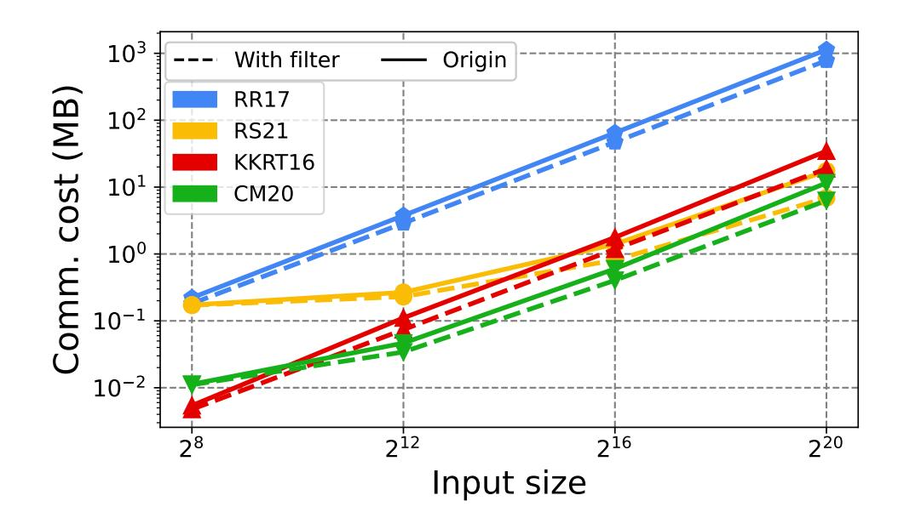
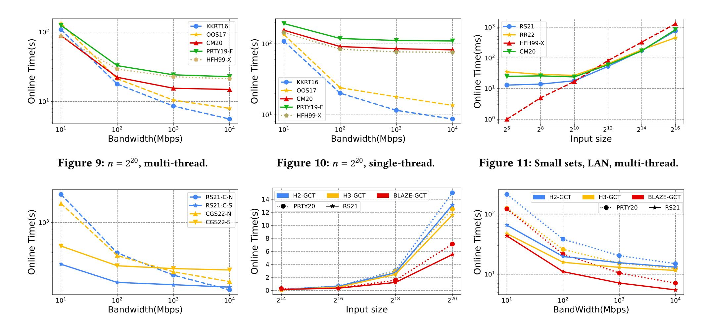
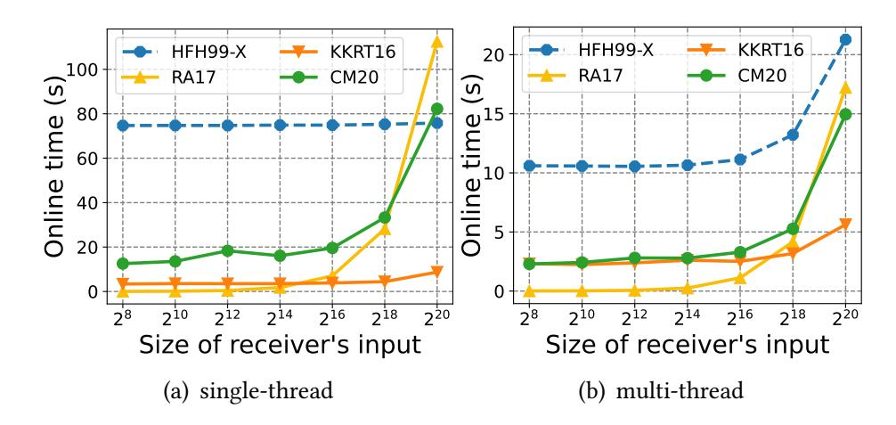

{0}------------------------------------------------

# PsiBench: Pragmatic Benchmark of Two-party Private Set Intersection

Ziyuan Liang Zhejiang University liangziyuan@zju.edu.cn

Feng Han Alibaba Group fengdi.hf@alibaba-inc.com

> Chao Li Zhejiang University lichao42@zju.edu.cn

Weiran Liu Alibaba Group weiran.lwr@alibaba-inc.com

Liqiang Peng Alibaba Group plq270998@alibaba-inc.com

> Guorui Xu Zhejiang University xugr@zju.edu.cn

Fan Zhang Zhejiang University fanzhang@zju.edu.cn Hanwen Feng
The University of Sydney
hanwen.feng@sydney.edu.au

Li Peng Alibaba Group jerry.pl@alibaba-inc.com

Lei Zhang Alibaba Group zongchao.zl@taobao.com

#### **ABSTRACT**

Private Set Intersection (PSI) allows two parties to obtain the intersection of their data sets while revealing nothing else. PSI is attractive in many scenarios and has wide applications in academia and industry. Over the last three decades, a large number of PSI protocols have been proposed using different cryptographic techniques, under different assumptions, for different scenarios. The inherent complexity, heterogeneous constructions, and rapid evolution of PSI protocols make it difficult to have a unified perspective and further promote the field.

We make the following three contributions to present a pragmatic benchmark of two-party PSI. First, we propose the *Mapand-Compare* framework, which generalizes almost all efficient PSI constructions to date, and intuitively explains the idea and challenge of PSI constructions. Based on the framework, we divide existing proposals into several categories and perform a systematic analysis of the features and use cases of different PSI variants. Second, we present a Java-based benchmark library that implements almost all two-party PSI protocols (which are considered to define the state-of-the-art in terms of concrete performance) and supports rapid prototyping of new PSI protocols. Third, by using our library as a common ground, we provide a comprehensive and impartial comparison of all our PSI implementations in detail. We discuss the performance of different proposals in various settings.

#### **PVLDB Reference Format:**

Ziyuan Liang, Weiran Liu, Hanwen Feng, Feng Han, Liqiang Peng, Li Peng, Chao Li, Guorui Xu, Lei Zhang, and Fan Zhang. PsiBench: Pragmatic Benchmark of Two-party Private Set Intersection. PVLDB, 14(1): XXX-XXX, 2020.

doi:XX.XX/XXX.XX

This work is licensed under the Creative Commons BY-NC-ND 4.0 International License. Visit https://creativecommons.org/licenses/by-nc-nd/4.0/ to view a copy of this license. For any use beyond those covered by this license, obtain permission by emailing info@vldb.org. Copyright is held by the owner/author(s). Publication rights licensed to the VLDB Endowment.

Proceedings of the VLDB Endowment, Vol. 14, No. 1 ISSN 2150-8097. doi:XX.XX/XXX.XX

#### **PVLDB Artifact Availability:**

The source code, data, and/or other artifacts have been made available at https://github.com/alibaba-edu/mpc4j.

# 1 INTRODUCTION

Private Set Intersection (PSI) is a cryptographic application that allows two parties to identify the intersection of their data sets without revealing any additional information. This functionality is particularly important in scenarios where two parties need to perform JOIN operations on private databases. PSI has been used in many real-world applications, including compromised credential checking in Chrome[94], AirDrop authentication [44], advertising conversion rate measurement [48], private contact tracing [95] for infectious diseases such as COVID-19, private mobile contact discovery [51], etc.

Given the strong demand for applications, PSI has been an active research area for more than 30 years, and there have been many proposals aiming at practical constructions. First, note that PSI is a specific instance of secure multiparty computation (MPC), so it can be constructed using MPC frameworks for general circuits [28, 42, 52, 54, 62, 99]. A naive unoptimized circuit implementing PSI functionality will involve at least  $O(n^2)$  comparison gates (if each data set has about *n* elements). Although the circuit size can be reduced into  $O(n \log n)$  [45] with sorting, this approach also becomes very inefficient as the data set size grows. On the other hand, in order to have better scalability, existing proposals have developed many tailor-made approaches for PSI by using different cryptographic tools, such as public-key encryption (PKE) [46], garbled circuit [60, 98], oblivious transfer (OT) [53, 63], fully homomorphic encryption (FHE) [38], etc., or/and using specific data structures such as bin hashes [74], filters [33, 47], polynomial encryption, etc.

Meanwhile, some proposals have further extended the standard PSI functionality to support advanced features, making PSI applicable in more scenarios, such as private set union[26, 56], PSI

{1}------------------------------------------------

cardinality[48, 65], delegated PSI [1, 2], etc. However, given the heterogeneous constructions and definitions, it has been a complicated task for both researchers and practitioners to follow and promote this field. In particular, we consider the following three main problems.

First, it is unclear whether an optimization or new technique that has often been presented in a specific PSI protocol is applicable to PSI protocols that may have additional advanced features. Researchers may have to do some repetitive work to improve a specific protocol. Although several works have tried to summarize some primitives in PSI [17, 37], we still lack a unified view of existing PSI proposals to appropriately categorize them, clarify the relationship between techniques and advanced features, and thus enable global optimizations.

Second, most of the existing proposals only provide research-use-only implementations that hardly satisfy the modularity and readability requirements. Future researchers often have to start their implementations from scratch, even if they essentially use techniques introduced or implemented in previous work. Meanwhile, practitioners still lack detailed guidance on how to build efficient and secure PSI applications. It can take experienced cryptographers and practitioners several months to design and implement PSI protocols. Such a cost is very discouraging because *every week spent reimplementing previous techniques is one less week to develop new solutions* [92].

Third, as a consequence of the second problem, it is not trivial to make an impartial and comprehensive comparison between existing proposals. Ideally, by comparison, we hope to find out, given available optimizations, which *algorithmic design* could lead to better performance w.r.t. different merits. For researchers, such a comparison is essential to understand and improve the state of the art; for practitioners, it could provide guidance on which protocol is best to use for their particular purposes. However, the overall performance of a PSI protocol is sensitive to the execution environment, specific optimizations, code quality, underlying libraries, etc.

In this work, we are motivated to present a systemization survey of this field and mitigate all the above issues. To this end, we make the following contributions.

# **Map-and-Compare Framework.**

We present a unified framework of PSI protocols to generalize almost all efficient constructions to date. We roughly divide PSI into two phases based on the directions of their information flows, bidirectional MAP and unidirectional COMPARE. We describe the security requirements of MAP to enable secure instantiations and illustrate the difficulty of secure PSI protocols.

Next, we survey and categorize existing PSI protocols according to the format of intermediates between MAP and COMPARE that show how their MAP is realized. We divide them into 3 categories, commutative weak pseudorandom function (cwPRF), oblivious pseudorandom function (OPRF), and sharing, respectively. The methodology of different MAP is important: (1) Some advanced features, such as full parallelism, specialization for unbalanced cases, and further PSI computation, are especially supported by certain MAP methods; (2) The MAP methods determine the security and

efficiency of PSI protocols to a certain extent. The Compare methods are determined by the corresponding Map methods, and we observe that the methodology of using the cuckoo filter to reduce communication overhead, introduced by Keller *et al.* [53], can be further generalized to improve the Compare phase of OPRF-based PSI using more efficient filters; thus, we can optimize a large class of PSI protocols.

## Java-based PSI Library.

We propose a Java-based library that contains software implementations of most existing PSI protocols (with their cryptographic dependencies) and supports rapid prototyping of PSI applications. Furthermore, our library allows convenient implementation of new PSI protocols since it is modular and provides many optimized building blocks, including cryptographic primitives (such as PRG, PRF, OT, OT extension (OTE), etc.), subprotocols, and communication interfaces. The source codes are available for public request. While we chose Java for its compatibility with big data analytics engines, we have applied many optimizations to make our Java-based implementations suitable for efficiency-sensitive applications.

#### Comprehensive Comparison.

Our library naturally contributes to a common basis for comparing existing PSI protocols. We provide an impartial evaluation of the protocols in our library, which includes state-of-the-art PSI protocols in various MAP styles, taking into account network latency, bandwidth, and parallelized computation. We also evaluate different PSI performances in unbalanced cases. Furthermore, we discuss the performance of optimizing old PSI proposals with some newly proposed primitive constructions.

To the best of our knowledge, we are the first to formally implement and evaluate so many PSI protocols on the same ground. Previous comprehensive comparisons were done in [68, 81]. Although many valuable conclusions have been discussed in their survey, the absence of a PSI benchmark library makes the performance evaluation less integrated. Our implementation currently includes two-party PSI protocols in different constructions, and we are extending our libraries to support all types of PSI protocols. We hope that our implementations and evaluations will help PSI research and applications in the future.

#### 2 DEFINITIONS

## 2.1 Functionality

The starting point of Private Set Intersection (PSI) is the Private Equality Test (PEQT) in Fig. 1. The receiver calls PEQT to check if its element is identical to the sender's, while the sender learns nothing. PSI can be thought of as a multi-query Private Membership Test (mqPMT), which allows the participants to secretly obtain the intersection of their private sets without revealing anything unexpected. The functionality of two-party PSI is shown in Fig. 2. The result of two-party PSI is usually only known to the receiver.

A naive approach to converting PEQT to PSI is to call  $n_1n_2$  PEQT instances, since every element in one set must be compared to every element in the other set. However, this is obviously far from efficient, as the complexity explodes as the set sizes grow. Moreover, it is insecure to directly invoke a sorting circuit with  $O(n \log n)$  complexity before applying PEQT to reduce the PEQT scale to

{2}------------------------------------------------

**Parameter:** A Receiver  $\mathcal{R}$  with an element x, and a Sender  $\mathcal{S}$  with an element y.

**Functionality:** Output true to  $\mathcal{R}$  if x = y, otherwise output false.

Figure 1: PEQT ideal functionality.  $\mathcal{F}_{PEQT}$ 

**Parameter:** A Receiver  $\mathcal{R}$  with set size  $n_1$ , and a Sender  $\mathcal{S}$  with set size  $n_2$ .

## **Functionality:**

- Wait for input set  $X = \{x_1, \dots, x_{n_1}\}$  from  $\mathcal{R}$ .
- Wait for input set  $Y = \{y_1, \dots, y_{n_2}\}$  from S.
- Give output  $X \cap Y$  and  $n_2$  to  $\mathcal{R}$ .
- Give output  $n_1$  to S.

Figure 2: PSI ideal functionality.  $\mathcal{F}_{PSI}$ 

 $O(n_1 + n_2)$ , since an ordered PEQT serial leaks the information of non-intersection elements[45].

Thus, there are two main concerns in PSI design. The first concern is how to build secure and efficient PEQT schemes, and the second is how to reduce the number of PEQTs required while remaining private. Since the elements in the receiver's set are assumed to be independent, the theoretical lower bound of PSI communication complexity is  $O(n_1)$  [78].

Most existing PSI protocols are proposed for a balanced setting, where  $n = n_1 = n_2$ , and we will mainly focus on the balanced setting in the following section. However, there are still some unbalanced PSI scenarios [7, 51, 55, 84]. For example, private contact discovery assumes that the set sizes as  $n_1 \ll n_2$ , and the overhead is expected to be only related to the smaller size.

# 2.2 Security

The computational and statistical security parameters are usually denoted by  $\kappa$  and  $\lambda$ , respectively. The security of PSI protocols is usually guaranteed by a simulation-based proof. The simulation-based proof defines security with respect to two interactions, the real interaction and the ideal interaction. The real adversary manipulates the corrupted party and interacts with a simulator using PSI protocols, while the simulator interacts with the other honest party using PSI ideal functionality. The simulator attempts to simulate the adversary's views using the ideal functionality messages. The proof is validated if the adversary has a negligible advantage in distinguishing between the simulated views and the real protocol views.

The adversary's capability is defined in either the semi-honest model or the malicious model. In the semi-honest model, the adversary controls one of the parties and tries to learn more input information about the other honest party, while he still follows the protocol specification honestly. In contrast, a malicious adversary is not required to follow the protocol exactly and may try to obtain private information using all possible approaches. A malicious adversary is allowed to optionally adapt the messages during the real interaction, which makes it more difficult for the simulator to generate indistinguishable messages. Note that when considering

**Parameter:** A Receiver  $\mathcal{R}$  with a choice bit b. **Functionality:** 

- Sample random  $(m_0, m_1)$ .
- Output  $m_b$  to  $\mathcal{R}$ . Output  $(m_0, m_1)$  to  $\mathcal{S}$ .

Figure 3: Random OT ideal functionality.  $\mathcal{F}_{ROT}$ 

malicious adversaries, the PSI functionality in Fig. 2 can be modified with abortion when the size of inputs exceeds an upper bound.

# 2.3 Cryptographic Primitives

2.3.1 PRG and PRF. Pseudorandom Generator (PRG) randomly generates pseudorandom strings of fixed length, and Pseudorandom Function (PRF) is a pseudorandom mapping to map the input to an element of a finite field. Compared to PRG, PRF requires an additional key as input and still outputs a pseudorandom string. A PRF instance is guaranteed to output identical strings given the same input message and the same key.

The simplified interfaces of the basic cryptographic primitives (PRG/PRF) are shown below. The similarity of their functionality makes them portable in practice. A PRF instance with a fixed key can be considered a PRG instance.

- PRG  $G(s) \rightarrow R$ : Input a random seed  $s \in D$ , and output a pseudorandom element in R.
- PRF  $F_k(m) \to R$ : Input a PRF key  $k \in K$ , a message  $m \in D$ , and output a pseudorandom element in R.

PSI protocols require a large number of PRG and PRF instances, and the efficiency of PRG and PRF is one of the factors that significantly affect protocol performance. In addition, a construction may perform differently when the expected output length changes. Fortunately, several efficient cryptographic libraries help with optimization, and we use several hash block ciphers (e.g., AES, lowMC [3]) to fit into PRG / PRF implementations of different lengths. Moreover, the way these primitives are modeled also divides PSI proposals into the Random Oracle Model (ROM) and the Standard Model (SM). In ROM, a cryptographic hash function is modeled as a truly random function that produces a unique output for each input. In SM, the hash function is modeled as a deterministic algorithm that takes an input and produces an output. Since ROM accepts the stronger assumption, most existing two-party PSI schemes are designed in ROM to pursue more efficiency.

2.3.2 Oblivious Transfer. Oblivious Transfer (OT), introduced by [83], is a central cryptographic primitive in the area of secure computation. 1-out-of-2 OT is the simplest case of OT, which refers to the setting where a sender has two input strings  $(m_0, m_1)$  and a receiver has an input choice bit b. As the result of the OT protocol, the receiver learns  $m_b$  without learning anything about  $m_{1-b}$  while the sender learns nothing about b. In random OT, the sender's messages are randomly generated by the functionality, allowing OT protocols to produce these random values. The functionality only takes the choice bit as input from the receiver, and both of the messages will be output to the sender. Random OT usually requires much less communication than message OT.

{3}------------------------------------------------

Although it requires expensive public-key operations to generate original OT instances [10, 23, 63, 69], OT Extensions (OTE)[4, 50, 53] can generate a large number of random OT instances at the cost of computing a small number of public-key operations. The proposal in [57] further extends 1-out-of-2 OTE to 1-out-of-n OTE, since the 1-out-of-2 OTE in [50] generates a replicated code matrix in the protocol, and can be replaced with linear coder to implement a 1-out-of- $^{28}$  OTE. The strategy is later adopted to design 1-out-of- $^{\infty}$  OTE [58] and malicious 1-out-of-n OTE [72].

#### 2.4 Hash to Bins

A commonly used operation in existing PSI schemes is to hash n elements into m bins, which reduces the PEQT number for PSI. The simplest hashing scheme maps input elements into m=n bins using one hash function. Hence an element is always added to the mapped bin regardless of whether other elements are already stored in that bin. However, privacy requires that the parties hide from each other how many of their inputs were mapped to each bin. Each bin is padded to the maximum number of elements mapped to a bin (O(logn)) with dummy elements.

Cuckoo hashing [74] uses two hash functions to map the elements into  $m = 2(1 + \epsilon)n$  bins. Each element is possibly mapped to one of the two bins. The scheme avoids collisions by relocating elements when a collision is found. The element randomly chooses a bin for insertion, and the original inserted element will be evicted to the other bin. The "insert + evict" process continues until the evicted element finds an empty bin, or until a threshold number of relocations has been performed. In the latter case, the element will be inserted into a special stash. A lookup in cuckoo hashing is efficient as it only seeks the two possible bins and the stash. In exchange, the hash table size increases. Cuckoo hashing is later optimized by increasing the hash number [77, 79] and removing the stash [79].

Other hashing schemes used in specific PSI schemes include 2-choice hashing [90] and phasing hashing [77].

# 3 MAP-AND-COMPARE FRAMEWORK

Many different PSI protocols have been proposed since the inception of PSI, and they differ greatly in assumptions, dependencies, and execution procedures. The fragmented PSI constructions make it difficult for researchers to understand the common approach to constructing PSI. We focus on two-party PSI and propose a general PSI framework that generalizes almost all state-of-the-art two-party PSI protocols. The framework is named "Map-and-Compare" and clearly describes how to construct a secure PSI protocol that satisfies the ideal functionality.

Given two participants, a receiver with input  $X = \{x_1, \dots, x_{n_1}\}$  and a sender with input  $Y = \{y_1, \dots, y_{n_1}\}$ , the model consists of the following two phases.

- MAP: The participants agree on a function  $f_m : \{(X, Y) \rightarrow (M_X, M_Y)\}$  (hereafter referred to as *agreed function*), and the private sets are mapped to  $(M_X, M_Y)$  and returned to the participants.
- Compare: The receiver and the sender invoke  $f_c: \{(M_X, M_Y) \to (O, \bot)\}$ . The receiver obtains the intersection O, and the sender obtains nothing.

We divide PSI protocols into two phases based on the direction of sensitive information flow. In the MAP phase with bidirectional information flow, the parties' sets are securely mapped into a pair of objects  $(M_x, M_y)$ . Both sides of security should be considered in the MAP phase. In contrast, the Compare phase has a unidirectional flow of information from the sender to the receiver. All messages received by the sender in the Compare phase can be regarded as randomness and naturally, protect the privacy of the receiver. Therefore, only the privacy protection of the sender needs to be considered. Note that  $f_c$  is highly simplified in most proposals, and we will focus more on the  $f_m$  designs of existing proposals.

Obviously, our framework achieves the functionality of PSI in Fig. 2. The difference among different PSI proposals is how to agree on the qualified function  $(f_m, f_c)$ . The first requirement for  $f_m$  is that it cannot leak unexpected information about the private sets from  $(M_x, M_y)$  or corresponding processes. So  $f_m$  is required to be pseudorandom.

Moreover, there is an additional requirement for  $f_m$ . Consider a naive solution of two-party PSI. Both the sender and the receiver map their private sets using a hash function (modeled as a random oracle), and the sender sends its mapping values to the receiver; the receiver later compares the two sets of mapping values and obtains the intersection. This naive protocol is the simplest case of our Map-and-Compare framework, but it is insecure. The receiver can locally perform this hash function on a specific element and identify whether it belongs to the sender's set. Also, the receiver can conduct a brute-force attack to recover the sender's elements by performing the hash function on all possible elements, which is more threatening when the input elements are from low-entropy distributions. Thus, the number of elements on which the receiver can perform  $f_m$  should be restricted, and the receiver can not acquire full knowledge of  $f_m$  to avoid the brute force attack.

We summarize the above requirements for the MAP phase.

- Requirement I:  $f_m$  is required to be a pseudorandom function to avoid leaking unexpected information about the private sets. The procedure for agreeing on such a function will not leak any information about the elements to each other.
- REQUIREMENT II: The receiver can only obtain the mapping values on its own points and thus cannot guess the sender's elements by brute force attack.

A secure MAP can be safely constructed using general MPC protocols, and existing two-party PSI protocols aim to implement MAP with lower overhead.

### 4 HOW TO MAP

In this section, we survey the methods adopted by existing PSI protocols to implement a qualified MAP. There have been several interesting MAP proposals in recent years. We divide them into several paradigms according to the output format of the MAP function, and name them by their iconic primitives, including commutative weak PRF (cwPRF), oblivious pseudorandom function (OPRF), secret sharing (SS), etc.

{4}------------------------------------------------

| 24 0. 1              | C PPE                                                                       |                             |                             |                        |                                         |
|----------------------|-----------------------------------------------------------------------------|-----------------------------|-----------------------------|------------------------|-----------------------------------------|
| Map Style            | CwPRF                                                                       | Fixed-key                   | Single-point                | Multi-point            | Sharing                                 |
| $M_X$ / $M_Y$        | $F_{\mathcal{S}}(F_{\mathcal{T}}(X)) / F_{\mathcal{T}}(F_{\mathcal{S}}(Y))$ |                             | $F_k(X) / F_k(Y)$           |                        | share R / share S |
| Primitives           | CwPRF                                                                       | PRF + Masking Operator      | OTE + Bin-hash              | PCG + OKVS             | Circuits / mqRPMT                       |
| Semi-honest Model    | [46, 64]                                                                    | [7, 25, 27, 35, 51, 55, 84] | [58, 72, 80]                | [21, 30, 75, 76]       | [20, 45, 77–79, 88, 93] / [22, 37]      |
| Malicious Model      | [89]                                                                        |                             |                             | [13, 76, 85, 86, 88]   |                                         |
| Merits               | - Full Parallel Support                                                     | - Unbalance Compatibility   | - Good LAN Performance      | - Good WAN Performance | - Functionality Flexibility             |
| MEHIS                | - Linear Communication                                                      | - Offline Precomputation    | - Lightweight Computation   | - Balanced Overheads   |                                         |
| Demerits             | - Heavy Computation                                                         | - Heavy Offline Overheads   | - Heavy Communication       |                        | - Uncompetitive Performance             |
| Dements              |                                                                             |                             | - Semi-honest Security Only |                        |                                         |
| Best-performed cases | - Small Sets                                                                | - Unbalance Sets            | - Large Sets                | - Large Sets           | - Private Set Operations                |
| Dest-periormed cases |                                                                             | - Lightweight Client        | - High Network Bandwidth    | - Real-world Network   |                                         |

Table 1: Overview of Different MAP Styles in PSI.

**Input:**  $X = \{x_1, \dots, x_n\} \subseteq R$  from Receiver  $\mathcal{R}, Y = \{y_1, \dots, y_n\} \subseteq R$  from Sender  $\mathcal{S}$ . A cwPRF instance  $F : (K, R) \to R$ .

#### **Protocol:**

- $\mathcal{R}$  and  $\mathcal{S}$  randomly generate cwPRF keys  $k_r$  and  $k_s$  respectively.
- $\mathcal{R}$  locally computes the list  $F_{k_r}(X)$ , and sends it to  $\mathcal{S}$ .
- S receives  $F_{k_r}(X)$ , and computes the list  $F_{k_s}(F_{k_r}(X))$ . At the same time, S also computes  $F_{k_s}(Y)$ , and sends  $F_{k_s}(F_{k_r}(X))$  and  $F_{k_s}(Y)$  back to R.
- $\mathcal{R}$  receives  $F_{k_s}(F_{k_r}(X))$  and  $F_{k_s}(Y)$ , then computes  $F_{k_r}(F_{k_s}(Y))$ .

Figure 4: CwPRF-based MAP.

#### 4.1 Overview

In fact, the development of PSI protocols is inseparable from the development of basic primitives. Different varieties of MAP functions have different output formats, and the differences determine their different core building primitives and features.

We discuss different features of various MAP in existing PSI schemes, as shown in Table 1. Existing two-party PSI schemes are divided into three categories in the table, including cwPRF-based, OPRF-based, and sharing-based ones. And the OPRF-based PSI can be further divided into three types (fixed-key, single-point & multi-point). We list the core primitive of each category and collect the corresponding schemes in the table. Their construction and general trends of merits, demerits, and best-performed cases will be discussed in detail later in this section. Note that the performance features in the table represent the generalized trends of different MAP styles. For example, multi-point OPRF usually requires less communication than single-point OPRF, but not every multi-point OPRF scheme has less communication.

# 4.2 CwPRF-based MAP

**Commutative weak PRF** [22] requires a weaker assumption than full PRF, but includes an additional commutative property. In short, cwPRF guarantees that  $F_{k_1}(F_{k_2}(x)) = F_{k_2}(F_{k_1}(x))$ , where

 $F:(K,R)\to R$ . For example, the PRF with decisional Diffie-Hellman (DDH)-like assumptions [70] is a typical cwPRF construction, as  $F_k(x)=g^{kx}$ . The correctness holds as  $F_{k_1}(F_{k_2}(x)))=g^{k_1k_2x}=F_{k_2}(F_{k_1}(x))$ .

The core idea of cwPRF-based MAP is straightforward from the above insecure hash-based PSI mentioned in Section 3. Since it is insecure to map once with a public hash function, cwPRF-based PSI maps twice with two PRFs using different private keys. The structure of cwPRF-based MAP is shown in Fig. 4, where the input elements are mapped to  $F_{k_s}(F_{k_r}(X))$  and  $F_{k_r}(F_{k_s}(Y))$  respectively. Note that the input elements usually need to be hashed into R before the protocol begins. The commutative feature of cwPRF guarantees that the PRF values of the intersection are identical after the dual mapping, and thus the correctness of PEQT holds. The comparisons between PRF values are cheap plaintext comparisons, so the PEQT number problem also disappears. The assumption of cwPRF ensures that it outputs pseudorandom values. Since the receiver does not get access to  $k_s$ , it cannot invoke cwPRF-based MAP limitlessly without informing the sender.

The theoretical output  $\{M_X, M_Y\}$  of a cwPRF-based MAP instance is  $\{F_{k_s}(F_{k_r}(X)), F_{k_r}(F_{k_s}(Y))\}$ . In fact, there is no such moment in practice when the receiver and the sender have  $F_{k_s}(F_{k_r}(X))$  and  $F_{k_r}(F_{k_s}(Y))$ , respectively, because the sender never received  $F_{k_r}(F_{k_s}(Y))$ . The MAP and Compare phases in cwPRF-based PSI have a blurred boundary, so the MAP output can be defined as  $\{(F_{k_s}(F_{k_r}(X)), F_{k_r}(F_{k_s}(Y))), \bot\}$  or  $\{k_r, (F_{k_s}(F_{k_r}(X)), F_{k_s}(Y))\}$  in practice.

The structure for converting cwPRF to cwPRF-based MAP is roughly fixed, and different proposals differ mainly in their cwPRF constructions. Since cwPRF-based MAP operates on each element of cwPRF independently, it supports  $full\ parallelism$  and has competitive efficiency when executed in parallel. Each round of communication in the Fig. 4 naturally has O(n) complexity, providing cwPRF-based MAP  $competitive\ communication\ overhead$ . However, the computational overhead is strongly related to the efficiency of cwPRF, and unfortunately, most cwPRF constructions use expensive cryptographic operators to achieve the commutative property. This makes cwPRF-based MAP  $more\ advantageous\ when\ dealing\ with\ small\ sets$ .

An interesting fact is that cwPRF-based MAP has a much longer history than the cwPRF definition. The first cwPRF-based MAP was

{5}------------------------------------------------

**Parameter:** A Receiver  $\mathcal{R}$ , a Sender  $\mathcal{S}$ , and a PRF F. **Functionality:** 

- Wait for input  $x \in \{0, 1\}^*$  from  $\mathcal{R}$ .
- Wait for input k from S. / Randomly generate a PRF key k, and give output k to S.
- Give output F(k, x) to  $\mathcal{R}$ .

Figure 5: Fixed-key / Random OPRF ideal functionality.

**Input:**  $X = \{x_1, \dots, x_n\} \subseteq R$  from Receiver  $\mathcal{R}, Y = \{y_1, \dots, y_n\} \subseteq R$  from Sender  $\mathcal{S}$ . **Protocol:** 

- $\mathcal{R}$  and  $\mathcal{S}$  invoke OPRF functionality F.  $\mathcal{R}$  acts as the receiver with input  $x_i$ , and  $\mathcal{S}$  acts as the sender.  $\mathcal{R}$  receives and outputs  $\{F_k(x_i)\}$ , and  $\mathcal{S}$  owns k.
- S locally computes and outputs  $\{F_k(y_i)\}$ .

Figure 6: OPRF-based MAP.

proposed in [64] and was later optimized in [46]. Their proposal adopts DH key exchange as cwPRF and is further extended to other existing cwPRF instances, such as point multiplication over different elliptic curves. A modified version of cwPRF named key agreement is abstracted in [89]. The key agreement allows only 2 hoppings instead of unlimited hopping in DDH or ellipse curve. Two hoppings have different interfaces but still guarantee the commutative property. Its key agreement instances are implemented using the elligator encoding [12] on Curve25519 Montgomery curve.

Besides designing efficient cwPRF instances, another research spot is extending cwPRF-based MAP to post-PSI applications. For example, PSI-sum in [48, 49] use the DDH-based cwPRF to construct their PSI parts. It also benefits from the independent operation of each element, since each label is naturally associated with the corresponding payload during the PSI process.

## 4.3 OPRF-based MAP

The Oblivious Pseudorandom Function [35] is an important cryptographic primitive in PSI. OPRF allows the receiver to obtain PRF values over its input elements but does not allow access to the secret PRF key. The ideal functionality of OPRF is demonstrated in Fig. 5. Based on the sender's input, OPRF can be divided into two categories: **Fixed-key OPRF** and **Random OPRF**. The difference is whether the sender provides or obtains the PRF key. In addition, random OPRF can also be divided into **Single-point OPRF** and **Multi-point OPRF**. A single-point OPRF instance can only map one element of the receiver's set, while a multi-point instance maps multiple elements.

The functionality of OPRF guarantees pseudorandom output and limits the receiver's queries to the PRF. Thus, a qualified MAP can be easily instantiated by combining OPRF with the corresponding PRF, as shown in Fig. 6. Note that for single-point OPRF, *F* refers to a bunch of OPRF instances instead of one. As the most commonly used method for constructing PSIs, several OPRF constructions have been presented in recent work.

4.3.1 Fixed-key OPRF. Fixed-key OPRF is a general method for achieving fixed-key OPRF instances. A typical fixed-key OPRF includes a secure PRF and a private masking operator and roughly consists of the following 3 steps.

- The receiver blinds its PRF inputs with the masking operator and sends them to the sender.
- The sender applies the PRF to these masked items and returns masked PRF values.
- The receiver unmasks the masked values to obtain the PRF outputs.

The receiver's masking operator must be *secure*, *reversible*, and *homomorphic*. Security protects the original inputs from being leaked to the sender. Reversibility allows the receiver to unmask the PRF values. Homomorphism guarantees the correctness of the PRF when operating on masked inputs.

The masking operator depends on the specific construction of the PRF, and commonly used masking operators include DH key exchange, Paillier, and other partially or fully homomorphic encryption schemes[34, 38]. If the PRF is constructed using a public key cryptosystem based on discrete logarithms, such as DH key exchange and RSA, then the corresponding masking operator requires multiplicative homomorphism. OPRF in [25, 27] masks the RSA signature with DH key exchange, and OPRF in [7, 84] also masks DH with another DH mask. In short, their masking operator is discrete exponentiation with a secret exponent  $\alpha$ , and the PRF values can be unmasked by exponentiation with  $1/\alpha$ .

OT is an optional choice for constructing masking operators and has been adopted in [35, 51, 55]. A straightforward construction in [35] is to divide the PRF key into n subkeys, where n is the element bit length. The receiver enters its element bits as OT choices and gets the correct key only if it has the same element as the sender's set. However, this OPRF is a disposable instance, which lacks efficiency. In contrast, the OPRF in [51, 55] uses precomputed OT [8] as a masking operator to blindly compute PRF circuits (AES / LowMC) and NR-PRF [71]. The receiver masks each element bit with pre-computed OT choices, and the PRF values are computed and unmasked with random OT outputs. Because the OT outputs are used only for masking, the receiver does not have access to the PRF key, which can be reused multiple times.

An important advantage of fixed-key OPRF-based MAP is its natural adaption for *unbalanced cases* [51, 84]. Note that the PRF key has been fixed before OPRF begins, and is independently generated by the sender. Hence the fixed-key OPRF-based PSI can be divided into offline and online phases. In the offline phase, the sender locally precomputes PRF values on its elements and helps the receiver to compute PRF values using OPRF in the online phase. The offline phase overheads are related to the sender's size and the online phase overheads are related to the receiver's size. Even when the sender's set is significantly larger than the receiver's, the MAP and corresponding PSI still have lightweight online phases. Given this, it is better to adopt fixed-OPRF constructions supporting *precomputation*, like [51] to further reduce the online overheads. These features make fixed-key OPRF friendly to applications requiring *lightweight clients*.

The powerful sender of fixed-key OPRF brings security concerns. Some schemes have been proven to keep secure against a malicious 

{6}------------------------------------------------

receiver [51, 55], but as mentioned in [51], it is still hard for fixed-key OPRF-based PSI to resist a malicious sender.

4.3.2 Single-point OPRF. Unlike fixed-key OPRF, random OPRF generates the PRF key and returns it to the sender after the protocol has finished. However, this small difference in functionality makes their designs completely different.

A simple random OPRF construction can be implemented with random OT. A random OT instance can be regarded as mapping a secret bit to a pseudorandom value. If the parties run multiple random OT instances where the receiver uses each bit of a specific element as input, the XOR result of these OT results becomes a one-time random OPRF instance and the PEQT functionality can be realized, which constructs the simplest case of single-point OPRF.

The strategy also works for 1-out-of-n OT. Using the 1-out-of- $2^8$  OTE in [57], OPRF constructions in [77, 80] input each byte of an element as the choice byte of a 1-out-of- $2^8$  random OT instance. The OPRF value is still constructed with the XOR result of the OT values of each byte. BaRK-OPRF in [58] replaces Walsh-Hadamard coder (a linear coder with 8-bit input) with a pseudorandom coder (with any-bit input) and implements 1-out-of- $\infty$  OTE. Hence each element of the receiver needs only one OT instance to generate the OPRF value.

Single-point OPRF constructions rely heavily on efficient *bin-hash* strategies. As mentioned above, a single-point OPRF instance can only be invoked on one element. Single-point OPRF-based MAP should guarantee that the sender computes the PRF of an element in the intersection with the same OPRF key as the receiver. It is obviously inefficient for the sender to use any OPRF key to map all its elements.

In the OPRF instances [58, 77, 80] adopting cuckoo hashing [74], the receiver is required to insert its elements into a cuckoo hash table, while the sender inserts into a simple hash table of the same size with each hash function used in cuckoo hashing. Each bin consumes a single point OPRF instance since cuckoo hashing guarantees that each bin contains at most one element. This reduces the required PEQT number from  $n^2$  to km, where k is the hash number and m is the hash table size. The "cuckoo + simple hash" strategy is a general trick for single-point OPRF-based PSI or circuit-PSI with similar constructions

A bottleneck of using cuckoo hashing in single-point OPRF-based MAP is the overhead of dealing with stash. Since each element is possibly inserted into the stash, it needs to be additionally compared with *s* elements in the stash. And that leads to *sn* comparison in total. The extra executions to deal with the stash cause a great waste of computation and communication. The results in [58, 78] demonstrate that adopting stashless cuckoo hashing [79] efficiently reduces the computational and communication overheads. Stashless cuckoo hashing is recommended for all single-point OPRF-based PSI or similar circuit-PSI.

Single-point OPRF typically has *light computation* and *heavy communication*. Until now, PSI in [58] is still one of the most efficient PSI proposals with unlimited network bandwidth. However, although cheap random OTs can be generated by OTE in a batched manner, each element of the receiver still requires multiple PEQTs even when using bin-hash strategies, increasing the overall communication.

It is also notable that for single-point OPRF-based MAP, it is difficult to achieve malicious security due to cuckoo hashing. As mentioned in [76, 87], a malicious party can learn the location to which an honest party's input element is mapped. The location choice leaks information about other inputs, including elements that are not in the intersection. However, it does not mean that single-point OPRF cannot be used to build malicious-secure PSI. A general malicious-secure PSI construction using single-point OPRF was proposed in [87]. It discards the cuckoo hashing but adopts phasing hashing [77] to guarantee each element only has one possible bin. The OTE used to construct single-point OPRF is also required to be maliciously secure, such as [72]. The construction requires dual execution or commitment, making the functionality no longer fit in Fig. 6. Hence it is not listed in Table 1.

4.3.3 Multi-point OPRF. A multi-point OPRF instance allows the receiver to compute OPRF values on multiple elements at one time. The elements of the receiver can be mapped using a single instance, instead of O(n) single-point OPRF instances.

Oblivious Key-Value Store (OKVS) and Pseudorandom Correlation Generator (PCG) are two critical primitives to implement multi-point OPRF. A key-value store (KVS) consists of two interfaces, encoding and decoding. Encoding takes a set of key-value pairs as input and outputs an object. Decoding takes the object and a key as input and returns a value. A correct KVS guarantees that the decoded value is equal to the corresponding encoded value if the key has been encoded. OKVS [37] additionally requires that the encoded objects are computationally indistinguishable from those encoded using the same keys with random values.

The decoding interface of linear OKVS computes the inner product of a key vector and the encoded vector. For example, the polynomial is one of the typical linear OKVS instances, where the encoded vector is the coefficients and the key vector is  $[1, x, x^2, \cdots]$ . A binary OKVS [37] is a special case of linear OKVS. Its key vector is a binary vector, and the decoding interface simply computes the sum of some positions in the vector.

Commonly used binary OKVS constructions include the **Garbled Bloom Filter** (GBF) [30] and the **Garbled Cuckoo Table** (GCT) [37, 76, 85, 88]. GBF is a binary OKVS in the Bloom filter style, and GCT is a binary OKVS in the cuckoo hashing style. Since cuckoo hashing has fewer entries than the Bloom filter, GCT naturally has a smaller vector length compared to GBF. OKVS is useful for multi-point OPRF designs since a programmable object vector is commonly shared by different keys. And the additional linearity of linear and binary OKVS provides more design space.

PCG [15, 17] allows two parties to securely generate long correlated pseudorandomness from a pair of correlated keys. **OT Correlation** (or correlated OT, COT) [16, 24, 43, 53, 97] is one of the examples for standard and useful PCG. In a COT instance, the receiver inputs a random bit b, while the sender inputs a correlation value $\Delta$ . When the functionality finishes, the sender and receiver obtain  $r_0$  and  $r_b$  respectively. The correlation holds as  $r_b = r_0 + b \cdot \Delta$ .

The earliest multi-point OPRF proposals use COT as PCG, such as [30, 80, 86]. Specifically, these schemes replace the linear coder matrix in OTE protocols with the encoded bit matrix of binary OKVS. For example, OPRF in [30, 80, 86] takes GBF [30] and OTE in [50] as OKVS and PCG. The receiver's set is encoded with a Bloom

{7}------------------------------------------------

**Input:**  $X = \{x_1, \dots, x_n\} \subseteq R$  from Receiver  $\mathcal{R}$ ,  $Y = \{y_1, \dots, y_n\} \subseteq R$  from Sender  $\mathcal{S}$ .

#### **Protocol:**

- $\mathcal{R}$  and  $\mathcal{S}$  input their sets to a share functionality  $F_{sh}$ .
- $F_{sh}$  computes the intersection and generates its shares shareR and shareS.
- $F_{sh}$  respectively returns shareR and shareS to the parties.

Figure 7: Sharing-based MAP.

filter [14] at the beginning, and then the participants call OTE [50] with the Bloom filter vector as input, and get two correlated GBF vectors as output. Then the receiver obtains the OPRF values by decoding with its GBF-encoded vector, while the sender computes the PRF values at arbitrary points by decoding with its vector. COT correlation guarantees that the receiver gets the correct OPRF value if the element was originally encoded by the receiver. multi-point OPRF in [76] takes 1-out-of-n OTE [72] as PCG. Although the encoding matrix is different in [72], the sender can still obtain the PRF values by decoding the correlated OKVS.

Besides, some multi-point OPRF proposals [21, 75] do not use the OTE structure but only use the COT array. OPRF in [21] presented a special KVS that encodes the elements into a bit matrix in a Bloom filter style, where the elements become keys and their values are fixed as a zero vector " $00 \cdots 0$ ". However, the correlated matrices output by PCG only support the decoding interface, and thus are not integrated OKVS instances. SpOT-light OPRF [75] replaces the PRG in [50] with PRF to extend the reverse base OT correlation into a multi-point OPRF. The proposal uses OKVS to save communication, which relies only on the programmable feature of OKVS. Hence binary OKVS is not necessary, and it uses polynomials. However, polynomials are far from being computationally efficient OKVS instances, as the encoding overhead increases significantly with the number of key-value pairs. A compromise version using 2-choice hashing [90] to split a large multi-point OPRF instance into several smaller instances has been provided as an option.

**Vector Oblivious Linear Evaluation** (VOLE) [15, 24, 91] is another efficient PCG construction for implementing multi-point OPRF. The functionality of VOLE generates a linear equation  $\vec{C} = \vec{A}\Delta + \vec{B}$ . The receiver gets  $\vec{A}$  and  $\vec{C}$ , while the sender gets  $\vec{B}$  and  $\Delta$ . VOLE is a generalized notion of COT, with sublinear communication based on the Learning Parity with Noise (LPN) assumption. VOLE functionality requires no input, and therefore VOLE-based multipoint OPRF [13, 85, 88] usually takes VOLE outputs as correlated masks to construct OPRF with the object vector of binary OKVS. Benefiting from the low communication of VOLE proposals, VOLE-based OPRF usually performs much better than COT-based OPRF over certain network bandwidths.

Multi-point OPRF has become the most potential PSI direction in recent years, especially the combination of GBF and VOLE. It has advantages in both security and performance. On the one hand, multi-point OPRF is free from the bin-hash problem of single-point OPRF, and most recent schemes achieve *malicious security*. The consistency check is a commonly used approach for malicious security and is adopted in [85, 88]. Increasing the output bit length

also works on schemes such as [76]. On the other hand, multi-point OPRF has a more *balanced overhead* between computation and communication, compared to single-point OPRF. Hence it has a significant performance advantage in *practical networks with limited bandwidth*. Moreover, both OKVS and PRG are newly proposed primitives with predictable optimization space. All above makes multi-point OPRF a hot spot in recent PSI research.

# 4.4 Sharing-based MAP

Sharing-based MAP represents **Circuit-PSI** and other similar PSI proposals, which returns a pair of shares containing enough information to recover the intersection, as shown in Fig. 7.

Generic MPC techniques, such as secret sharing [9, 11, 40], garbled circuits [98], and recent hybrid frameworks [29, 66], can compute any MPC problem if the problem can be transformed into circuits, including PSI. And this is the beginning of circuit-PSI [45, 79, 88, 93]. The first circuit-PSI was proposed in [45], consisting of three parts, sorting, comparing, and shuffling. The sort-compare-shuffle circuit successfully reduces the complexity of the PSI circuit from  $O(n^2)$  to  $O(n \log n)$  comparisons. Bin-hash strategies in single-point random OPRF can also be used to reduce the number of PEQT circuits, as suggested in [77–79, 81].

Multi-query Reverse Private Membership Test (mqRPMT) is a new construction of sharing-based MAP [100]. In mqPMT (aka. PSI), the receiver receives a binary vector where each bit represents whether one of the receiver's elements belongs to the intersection or not, and the sender receives nothing. In the mqRPMT functionality, the binary vector becomes the sender's output. The sender cannot obtain the intersection from the vector because it learns nothing about the receiver's set. With this little tweak, the binary vector and the receiver's set become the sender's and receiver's shares, respectively. The intersection can be recovered from the shares using OT. Note that the sender obtains the intersection after applying OT to the mqRPMT results, so a reverse mqRPMT can be used to implement the PSI functionality. Although mqRPMT can be transformed to mqPMT using OT, it is impossible to transform mqPMT to mqRPMT[59] because the intersection can be recovered locally by the receiver after mqPMT has finished. Since mqRPMT has similar functionality to mqPMT, mqRPMT can also be implemented with cwPRF[22] or OPRF [36]. For example, mqRPMT is implemented in [36] using OPRF in [78] and Oblivious Switching Networks (OSN) in [67].

In fact, most sharing-based MAP proposals are designed for **Private Set Operations** (PSO) rather than PSI. The output is distributed as shares, and thus the parties can apply further computation to the shares, such as PSI-sum, PSI-cardinality (PSI-CA) [31, 102], private set union [36, 100], threshold PSI [39, 101, 102], etc. However, share-based MAP usually has an uncompetitive efficiency compared with other constructions, when only applied for PSI.

## 5 HOW TO COMPARE

Unlike MAP phase, Compare has a unidirectional flow of information. Only the receiver receives the intersection after it has been calculated from the MAP outputs.

{8}------------------------------------------------

Table 2: Different Map-Compare Pairs.

| Map Style     | CwPRF | OPRF   | Sharin         | g      |
|---------------|-------|--------|----------------|--------|
| WIAF Style    | CWINI | OTIG   | Circuits       | MqRPMT |
| Compare Style | List  | Set(s) | Share Recovery | OT     |

# 5.1 Compare in existing PSI

How to Compare depends on its inputs  $(M_X, M_Y)$  (the outputs of Map). We list corresponding Compare approaches of different Map styles in Table 2.

CwPRF-based PSI has a blurred boundary between MAP and Compare, as discussed in Section 4.2. The sender should send  $(F_{k_s}(F_{k_r}(X)), F_{k_s}(Y))$  to the receiver. Since there is dual mapping in CwPRF-based MAP,  $F_{k_s}(F_{k_r}(X))$  has to be packed as an ordered list before sending it to the receiver. Otherwise, the receiver cannot match the elements in X and  $F_{k_s}(F_{k_r}(X))$ , if the latter has been randomly shuffled. The receiver locally compares  $F_{k_s}(F_{k_r}(X))$  with  $F_{k_r}(F_{k_s}(Y))$ , and collects the corresponding elements in X of the matching pairs as the intersection.

In contrast, Compare for OPRF-based Map does not need to take this into account. Thus, an unordered set is sufficient to pack  $F_k(Y)$  before sending it to the receiver, who can compare  $F_k(X)$  with  $F_k(Y)$ , and collect the intersection. Note that some OPRF constructions use bin-hash strategies and each element of the server has to be computed using multiple PRF keys [58, 75]. In this case, the sender needs multiple sets to pack OPRF values using different hash functions.

Compare for sharing-based Map is expected to recover the final intersection from the shares. For Circuit-PSI, Compare refers to secret share recovery or PEQT circuit evaluation. Moreover, as pointed out in [20], 1-out-of-n OT can be used to reduce the number of required PEQT circuits. For Map based on reverse mqRPMT, Compare refers to a bundle of OT, where the sender inputs its element and randomness, and the receiver inputs the binary vector as choice bits. In addition, some sharing-based PSI proposals (e.g. [61]) consider involving an untrusted third party for the Compare phase. This strategy can be efficient, but requires more security concerns, as the additional party usually brings more complex security proofs.

# 5.2 Filter Optimization

The Compare phase for OPRF-based Map can be optimized with filters. The filters [14, 18, 33, 96] are proposed as approximate set membership data structures that help to check the existence of elements in a set. In other words, the filter can be regarded as a special case of KVS, where the values of the encoded key-value pairs are fixed to be binary "1"s. Existing filters include Bloom filters [14], cuckoo filters [33], Morton filters [18] and vacuum filters [96]. In specific, the optimization allows the sender to insert the OPRF values  $F_k(Y)$  into a filter and sends the filter to the receiver, instead of the original set. The receiver checks whether each OPRF value  $F_k(x_i)$  is contained in the filter or not to determine the output intersection, instead of comparing with each element in the original set. Since the size of the filters are smaller than the sets, the communication the sender sends can be reduced, at a small

Figure 8: Comparison of the communications the sender sends with and without vacuum filters.

computational cost of filter insertion. The filter contains no more information than the original mapping value set. Hence there are no extra security threats.

The filter optimization can be applied to other OPRF-based PSI. Four typical schemes are chosen as the benchmarks in Fig. 8 to evaluate the communication reduction brought by the filter. The benchmarks include *KKRT16* [58] (single-point, semi-honest), *RR17* [87] (single-point, malicious), *CM20* [21] (multi-point, semi-honest), and *RS21* [88] (multi-point, malicious). The vacuum filter is adopted in the experiments since it has the best compression efficiency compared to others. Fig. 8 shows the amount of communication the sender sends with and without adopting the vacuum filters.

It can be observed that the filter optimization performs better in malicious-secure schemes (*RR17*, *RS21*) than semi-honest ones (*KKRT16*, *CM20*). Note that the filter size only depends on the insertion number rather than the size of each element. The filters save more communication costs since malicious security requires the OPRF to output longer results. Moreover, the optimization saves more communication for single-point OPRF-based PSI (*KKRT16*, *RR17*) than multi-point ones (*CM20*, *RS21*). Because of the hashing strategy used for single-point OPRF, each element has multiple OPRF values, while only one OPRF value is enough for multi-point OPRF. The compression rate declines as the insertion number grows, which leads to more communication saved by the filters. For the same reason, the filter optimization performs better when the PSI schemes are dealing with larger input sizes, as demonstrated in Fig. 8.

# **6 BENCHMARK IMPLEMENTATIONS**

Existing PSI protocols are mostly implemented with different frameworks and evaluated in inconsistent experimental settings, making it difficult for researchers to make fair and fast comparisons between existing protocols. Inspired by existing open-source MPC libraries, we re-implement state-of-the-art PSI protocols with different styles in a unified way, along with their building blocks. We expect to provide a common ground for a comprehensive and impartial comparison of existing PSI protocols and make it convenient for researchers to study and develop PSI.

{9}------------------------------------------------

# 6.1 Java Library

Our implementations are written in Java, and the source codes are available on Github1. We chose Java as our programming language mainly for practical reasons. To integrate PSI protocols into practical applications, it is necessary to introduce big data frameworks into traditional MPC[6]. To our knowledge, the current widely used big data analytics engines (*e.g.* Hadoop and Spark) are based on Java or JVM-based programming languages. A Java-based framework is more convenient to deploy in a scalable manner. While it is generally agreed that Java is slower than C/C++, the performance gap is not that great when dealing with most basic operators. For primitives with a large gap between Java and C/C++, our library uses Java Native Interface (JNI) to invoke C/C++ libraries to speed up performance.

# 6.2 JNI Support

There are some performance gaps in several operations due to the language features. For example, type transformations in C/C++ are easily done by changing the pointer types. If we expect to convert a long byte array into an integer array (such as OPRF in [21]), C/C++ directly changes the pointer type from uint8\_t\* to uint32\_t\*, which is almost free. In contrast, Java has to allocate a new array due to its memory protection mechanism, which introduces additional overhead. The overhead of invoking JNI to transform in C/C++ is even greater.

After trading off the efficiency and scalability, we implemented several primitives with JNI since they benefit a lot from JNI, including matrix transposition, polynomials, hashes, basic ciphers, etc.

- (1) Matrix Transpose. The performance of OTE [4, 50] and OTE-style OPRF [21, 58] depends on efficient large matrix transposition. We find that Eklundh's algorithm [32] does not work well in parallel environments. And we follow the full SSE bit matrix transpose 2 and modify the implementation in EMP-toolkit3. The bit matrix is represented in big-endian byte order for Java compatibility.
- (2) Polynomial Operations. Polynomial is a useful linear OKVS used in OPRF[37, 59, 75]. The pure-Java implementation using Rings [82] is inefficient, and we implement the fast polynomial interpolation implementations in [59, 75] using the NTL4, GMP, and GF2X5 libraries. The polynomial representation is adjusted to make the returned results compatible with Rings. We also fix a minor typo in the interpolation of [75] under boundary conditions.
- (3) Hashes and Ciphers. Hashes and ciphers are essential cryptographic operators used in all PSI protocols. We introduce the C/C++ implementations of fast cryptographic hash functions (e.g. blake2[5], blake3[73], Highway[41]). We adopt various block ciphers to implement encryption, PRG and PRF, including AES using EMP-toolkit, SM4 using Bouncy Castle6, etc. And we introduce the parameters in [51] to implement LowMC.

(4) ECC Operations. ECC operations are widely used in different variants of PSI[22, 46, 84]. We implement different curves (SECP256K1, SM2P256, Ed25519, X25519, FourQ, etc) using libraries such as Bouncy Castle, Relic7, MCL8, libSodium9, and compare their performance. The results demonstrate that MCL performs best, and Bouncy Castle runs faster when dealing with point additions. We adjust the representation for their compatibility for Java.

(5) Oblivious switching network. We used the code opensourced by Garimella et al. [36] as a starting point, and changed the type of switching node representation from uint32\_t to uint8\_t for memory cost reduction.

## 6.3 OT Benchmarks and Factories

As one of the most important primitives of PSI, various OT/OTE benchmarks are implemented in our library, mainly including the base OT in [19, 23, 63, 69], OTE in [4, 50, 53, 57, 72]. Since silent OT is used in state-of-the-art circuit-PSI [20, 88], we implement silent OT in [24, 97] in the benchmark library.

Our benchmark library has implemented factory classes to support the switching between different instances. This allows the researchers to easily find the effects of different OT instances on the final PSI performance. Similar factory classes are also used for other primitives, such as filters, ciphers, and hashes.

# 6.4 Parallelization and Communication

Our PSI benchmarks support parallel execution using the parallel stream class in Java. We maintain a common thread pool with JVM, containing a limited number of threads, and submit parallel executions to the pool. This avoids the additional cost of manually creating and destroying subthreads each time.

In addition, netty10 is used to maintain the communication channel in our implementations. We design a unified data packet format, containing a header of 288-bit length and the payload bytes. To serialize the message to be sent, we use Google's Protocol Buffers, which introduce the additional communication cost to store the lengths of each byte array in Payload Bytes. To eliminate the impact of implementation on analysis, the experimental results reported in our evaluation only reflect the size of payload bytes. Hence it is the theoretical communication cost.

#### 7 PERFORMANCE EVALUATION

We evaluate the performance of typical PSI implementations of different styles as benchmarks and provide an impartial evaluation to compare their efficiency.

# 7.1 Experimental Environment

We run our experiments on a single physical machine with Intel® CoreTM i9-9900K 3.60GHz CPU and 128GB RAM. We simulate the real-world network connection using the Linux tc command, which supports manual adjustment of bandwidth and RTT latency.

&lt;sup>1https://github.com/alibaba-edu/mpc4j

&lt;sup>2https://github.com/mischasan/sse2

&lt;sup>3https://github.com/emp-toolkit/emp-tool/blob

4https://libntl.org/

&lt;sup>5https://gitlab.inria.fr/gf2x/gf2x

&lt;sup>6https://www.bouncycastle.org/java.html

&lt;sup>7https://github.com/relic-toolkit/relic

&lt;sup>8https://github.com/herumi/mcl

&lt;sup>9https://github.com/jedisct1/libsodium

&lt;sup>10https://netty.io/

{10}------------------------------------------------

# 7.2 Experimental Results

In each batch of experiments, we test typical PSI of different MAP styles and different security models. Semi-honest PSI schemes in the benchmarks include *HFH99*[46] (cwPRF), *RA17*[84] (fixed-key OPRF), *PSZ14*[80], *KKRT16*[58], *OOS17* (single-point OPRF), *DCW13*[30], *PRTY19-L*[75], *PRTY19-F*, *PRTY20*[76], *CM20*[21] (multipoint OPRF), *PSTY19*[78], *RS21-C*[88], *CGS22*[20] (circuit), *GMR21*[36], *CZZ22*[22] (mqRPMT). Malicious-secure PSI schemes in the benchmarks include *RT21*[89] (cwPRF), *RR17DE*[86], *RR17EC* (built with single-point OPRF), *RR16* [86], *PRTY20*[76], *RS21*[88], *RR22*[85] (multi-point OPRF).

Two variants of HFH99 are implemented using SECP256K1 (-S) and X25519 (-X) curves respectively. Two variants of circuit-PSI (RS21C, CGS22) are implemented, and the difference is whether to adopt silent OT (-S) or not (-N).

The integrated experimental result tables are listed in the appendix. Table 3 and 4 list the performance of semi-honest and malicious PSI schemes in a balanced setting, respectively. We choose  $2^{12}$ ,  $2^{16}$ , 220 as three baseline input set sizes. The experimental network settings include typical LAN (10Gbps bandwidth and 0.02ms RTT latency) and WAN (including 1Gbps with 40ms latency, 100Mbps and 10Mbps bandwidth with 80ms latency). Both single-thread (T = 1) and multi-thread (T = 15) cases are considered. The elements in the input sets are 128-bit long. The protocols in the tables are divided into two phases: the setup phase and the online phase. Note that the setup and online phases in our benchmarks are different from the offline and online phases in fixed-key OPRF. The one-time setup phase performs initializations before inputting both sets, including key generation, base OT execution, etc. The online phase performs subsequent protocol executions based on the sets. To Fairly evaluate the pre-computation feature of fixed-key OPRFbased PSI, the pre-computation overhead of the server is manually moved to the setup phase in the tables.

Besides two basic balanced tables, we tested several special cases for better evaluation. Table 5 lists the performance of unbalanced cases where the two set sizes are 220 and 210 respectively. Table 6 lists the performance of OPRF-based PSI whose Compare phase is optimized by filters. Table 7 lists the performance of multi-point OPRF-based PSI using different types of OKVS instances.

#### 7.3 Performance Evaluation

We now discuss how different settings influence the performance of different PSI schemes in detail.

**Network Bandwidth.** Since fixed-key OPRF and sharing-based MAP are designed for special cases, we mainly discuss the performance of cwPRF and random OPRF-based schemes in the balanced setting. To make it more intuitive, Fig. 9 shows how the online latencies of different schemes decline as the network bandwidth grows. The benchmarks are executed with  $2^{20}$  input sizes in the multi-thread setting (T = 15). Only several typical benchmarks are drawn in the figure, otherwise, too many lines make the figure a great mess. As shown in Fig. 9, the performance of single-point OPRF-based schemes (*KKRT16*, *OOS17*) is more sensitive to the bandwidth than others. Their heavier communication significantly steepens the latency lines. In addition, when the bandwidth exceeds

1Gbps, the lines of multi-point OPRF (*PRTY19-F*, *CM20*) and cwPRF-based PSI (*HFH99-X*) become flat. The computation latency becomes the bottleneck of the overall performance at this bandwidth, so the reduction of communication latency hardly contributes to the efficiency. In contrast, the communication latency of *KKRT16* and *OOS17* is still the bottleneck, and the overall latency continues to decline as the bandwidth grows.

**Parallelism.** Different PSI proposals have different sensitivity to parallelism. Fig. 10 shows the performance of the benchmarks in the single-thread setting, and Fig. 9 shows the performance in the multi-thread setting. As mentioned above, the latencies of single-point OPRF-based instances (*KKRT16* and *OOS17*) are mostly contributed by the communication. Hence improving computation ability with multiple threads brings negligible efficiency improvement. The multi-thread setting brings significant improvement to multi-point OPRF-based instances (*PRTY19-F*, *CM20*), and cwPRF-based instances (*HFH99-X*), but the improvement cannot reach 15×, because of the cost of multi-thread scheduling. Note that the full parallel support cannot be demonstrated in the figure. Our benchmarks support 15 threads at most, which is not large enough, and we think the advantage of cwPRF-based PSI will become more obvious as the number of threads grows.

Small Input Sizes. To evaluate the advantage of cwPRF-based PSI when dealing with small input sizes, we additionally test the performance with input sizes in a range from 26 to 214. Fig. 11 shows the performance of small sets in the multi-thread LAN setting. Besides the cwPRF-based *HFH99-X*, state-of-the-art schemes include *CM20*, semi-honest version of *RS21* and *RR22* are tested for comparison. *HFH99-X* performs at a disadvantage when the input sizes are larger than 210. When the sizes become smaller, the latencies of other schemes remain unchanged, while the latency of *HFH99-X* continues to decline linearly. CwPRF-based PSI handles each input element independently and has no constant overhead. However, the constant overheads in other schemes dominate the performance when dealing with smaller sets.

**Circuit-PSI.** Fig. 12 shows the performance of state-of-the-art circuit PSI (*RS21*, *CGS22*) under different bandwidths. The experiments run in the LAN setting with input sizes of 220. *RS21* and *CGS22* perform better in the LAN and WAN settings respectively without using silent OT, since *RS21* has heavier communication overhead. However, *RS21* benefits more from silent OT and always performs better than *CGS22-S* in the experiments.

**OKVS Discussion.** "OKVS + PCG" is the hot spot in recent research to design multi-point OPRF, and we test different combinations of state-of-the-art OKVS constructions. *PRTY20* and *RS21* provide the general multi-point OPRF constructions using COT and VOLE as PCG respectively, and are chosen as the basic benchmarks. Three kinds of OKVS are evaluated in the experiments, including H2-GCT [76], H3-GCT [37], and BLAZE-GCT [85]. We evaluate the performance of these six variants of multi-point OPRF with different input sizes and bandwidths. Fig. 13 shows the performance of different set sizes in the multi-thread LAN setting, and Fig. 14 shows the performance of different bandwidths with 220 input sizes. In general, *RS21* performs better than *PRTY20* when using identical OKVS. BLAZE-GCT performs the best, and H3-GCT performs better than

{11}------------------------------------------------

Figure 12: Circuit-Psi,  $n = 2^{20}$ , multi-thread.

Figure 13: MP-OPRF, LAN, multi-thread.

Figure 14: MP-OPRF,  $n = 2^{20}$ , multi-thread.

Figure 15: Latencies of unbalanced cases in LAN setting, where  $n_2 = 2^{20}$ .

H2-GCT when using identical PCG. In the LAN setting, the OKVS type has a greater impact on efficiency. However, as the bandwidth narrows down, the PCG type turns out to be the more impactful one. This difference demonstrates that in multi-point OPRF schemes, the OKVS is more related to the computational overhead, while the PCG is more related to the communication overhead.

**Unbalanced Cases.** To evaluate the advantage of fixed-key OPRF in the case of unbalanced input sizes, we test the performance of different PSI schemes with unbalanced input sizes in the LAN setting. Fig. 15(a) and 15(b) refer to single-thread and multi-thread cases respectively. The server's set size  $n_2$  is fixed to  $2^{20}$ , and the client's set size  $n_1$  varies from  $2^8$  to  $2^{20}$ . As  $n_1$  declines, the fixed-key OPRF-based RA17 has the most significant efficiency improvement than others. Besides RA17, the performance of CM20 is also sensitive to  $n_1$  because the number of OT instances required by CM20 only depends on  $n_1$ . Also, since the usage of multi-thread significantly accelerates the computation of ECC in RA17, the advantage of RA17 dealing with small client size is more obvious in the multi-thread setting.

The latency of HFH99-X in Fig. 15(a) remains unchanged compared with the balanced case. In our implementations, the client and the server compute the first cwPRF values at the same time, since their computation latencies overlap each other in the balanced case. Because of the large  $n_2$ , the client still has to wait for the server to finish the computation, and so does the second cwPRF mapping. Hence, the latencies remain to be identical to the balanced case. The difference in the multi-thread setting (Fig. 15(b)) is caused by the single-PC test environment, as the participants actually share the same thread pool, and the resources accelerate the server's computation after being released from the client's computation.

# 8 CONCLUSION

PSI is a potential cryptographic primitive for many scenarios and has wide applications in academia and industry. In this paper, we do an integrated research of existing two-party PSI protocols and have proposed the Map-and-Compare framework to abstract the general approach to construct secure and efficient PSI protocols. We divide these protocols into several categories based on their Map styles and discuss their constructions, features, and development. We also propose a Java-based benchmark library containing implementations of state-of-the-art PSI schemes. The benchmark codes have good readability and reproducibility. Our benchmark can benefit future research about PSI. Moreover, we have provided an impartial evaluation of the protocol using our benchmark library in different settings.

In future work, we aim to continue improving the PSI benchmarks for the benefit of the community. On the one hand, we will provide more PSI benchmarks in different scenarios, such as multi-party PSI, threshold PSI, etc. On the other hand, since it is noticed that there are still some performance gaps between Java and C/C++ implementations, we will use more Java techniques to further optimize the efficiency.

{12}------------------------------------------------

# **REFERENCES**

- [1] Aydin Abadi, Sotirios Terzis, and Changyu Dong. 2016. VD-PSI: verifiable delegated private set intersection on outsourced private datasets. In *International Conference on Financial Cryptography and Data Security*. Springer, 149–168.
- [2] Aydin Abadi, Sotirios Terzis, Roberto Metere, and Changyu Dong. 2017. Efficient delegated private set intersection on outsourced private datasets. *IEEE Transactions on Dependable and Secure Computing* 16, 4 (2017), 608–624.
- [3] Martin R Albrecht, Christian Rechberger, Thomas Schneider, Tyge Tiessen, and Michael Zohner. 2015. Ciphers for MPC and FHE. In Advances in Cryptology–EUROCRYPT 2015: 34th Annual International Conference on the Theory and Applications of Cryptographic Techniques, Sofia, Bulgaria, April 26-30, 2015, Proceedings, Part I 34. Springer, 430–454.
- [4] Gilad Asharov, Yehuda Lindell, Thomas Schneider, and Michael Zohner. 2013. More efficient oblivious transfer and extensions for faster secure computation. In 2013 ACM SIGSAC Conference on Computer and Communications Security, CCS'13, Berlin, Germany, November 4-8, 2013. 535–548. https://doi.org/10.1145/2508859.2516738
- [5] Jean-Philippe Aumasson, Samuel Neves, Zooko Wilcox-O'Hearn, and Christian Winnerlein. 2013. BLAKE2: simpler, smaller, fast as MD5. In *Applied Cryptography and Network Security: 11th International Conference, ACNS 2013, Banff, AB, Canada, June 25-28, 2013. Proceedings 11.* Springer, 119–135.
- [6] Saikrishna Badrinarayanan, Ranjit Kumaresan, Mihai Christodorescu, Vinjith Nagaraja, Karan Patel, Srinivasan Raghuraman, Peter Rindal, Wei Sun, and Minghua Xu. 2022. A Plug-n-Play Framework for Scaling Private Set Intersection to Billion-sized Sets. *Cryptology ePrint Archive* (2022).
- [7] Pierre Baldi, Roberta Baronio, Emiliano De Cristofaro, Paolo Gasti, and Gene Tsudik. 2011. Countering gattaca: efficient and secure testing of fully-sequenced human genomes. In *Proceedings of the 18th ACM conference on Computer and communications security*. 691–702.
- [8] Donald Beaver. 1995. Precomputing Oblivious Transfer. In Advances in Cryptology - CRYPTO '95, 15th Annual International Cryptology Conference, Santa Barbara, California, USA, August 27-31, 1995, Proceedings (Lecture Notes in Computer Science), Vol. 963. Springer, 97–109. https://doi.org/10.1007/3-540-44750-4\_8
- [9] Donald Beaver, Silvio Micali, and Phillip Rogaway. 1990. The round complexity of secure protocols. In *Proceedings of the twenty-second annual ACM symposium on Theory of computing*. 503–513.
- [10] M Bellare. 1989. Non-Interactive Oblivious Transfer and Applications. In *International Cryptology Conference on Advances in Cryptology*.
- [11] Michael Ben-Or, Shafi Goldwasser, and Avi Wigderson. 1988. Completeness Theorems for Non-Cryptographic Fault-Tolerant Distributed Computation (Extended Abstract). In *Proceedings of the 20th Annual ACM Symposium on Theory of Computing, May 2-4, 1988, Chicago, Illinois, USA*, Janos Simon (Ed.). ACM, 1–10. https://doi.org/10.1145/62212.62213
- [12] Daniel J Bernstein, Mike Hamburg, Anna Krasnova, and Tanja Lange. 2013. Elligator: elliptic-curve points indistinguishable from uniform random strings. In *Proceedings of the 2013 ACM SIGSAC conference on Computer & communications security.* 967–980.
- [13] Alexander Bienstock, Sarvar Patel, Joon Young Seo, and Kevin Yeo. 2023. Near-Optimal Oblivious Key-Value Stores for Efficient PSI, PSU and Volume-Hiding Multi-Maps. *Cryptology ePrint Archive* (2023).
- [14] Burton H Bloom. 1970. Space/time trade-offs in hash coding with allowable errors. *Communications of The ACM* 13, 7 (1970), 422–426.
- [15] Elette Boyle, Geoffroy Couteau, Niv Gilboa, and Yuval Ishai. 2018. Compressing vector OLE. In *Proceedings of the 2018 ACM SIGSAC Conference on Computer and Communications Security*. 896–912.
- [16] Elette Boyle, Geoffroy Couteau, Niv Gilboa, Yuval Ishai, Lisa Kohl, Peter Rindal, and Peter Scholl. 2019. Efficient two-round OT extension and silent non-interactive secure computation. In *Proceedings of the 2019 ACM SIGSAC Conference on Computer and Communications Security*. 291–308.
- [17] Elette Boyle, Geoffroy Couteau, Niv Gilboa, Yuval Ishai, Lisa Kohl, and Peter Scholl. 2019. Efficient pseudorandom correlation generators: Silent OT extension and more. In *Advances in Cryptology–CRYPTO 2019: 39th Annual International Cryptology Conference, Santa Barbara, CA, USA, August 18–22, 2019, Proceedings, Part III 39.* Springer, 489–518.
- [18] Alex D Breslow and Nuwan S Jayasena. 2020. Morton filters: fast, compressed sparse cuckoo filters. *The VLDB Journal* 29, 2-3 (2020), 731–754.
- [19] Ran Canetti, Pratik Sarkar, and Xiao Wang. 2020. Blazing fast OT for three-round UC OT extension. In *Public-Key Cryptography–PKC 2020: 23rd IACR International Conference on Practice and Theory of Public-Key Cryptography, Edinburgh, UK, May 4–7, 2020, Proceedings, Part II 23.* Springer, 299–327.
- [20] Nishanth Chandran, Divya Gupta, and Akash Shah. 2021. Circuit-PSI with linear complexity via relaxed batch OPPRF. *Cryptology ePrint Archive* (2021).
- [21] Melissa Chase and Peihan Miao. 2020. Private set intersection in the internet setting from lightweight oblivious PRF. In *Annual International Cryptology Conference*. Springer, 34–63.
- [22] Yu Chen, Min Zhang, Cong Zhang, Minglang Dong, and Weiran Liu. 2022. Private Set Operations from Multi-Query Reverse Private Membership Test.

- Cryptology ePrint Archive, Paper 2022/652. https://eprint.iacr.org/2022/652 https://eprint.iacr.org/2022/652.
- [23] Tung Chou and Claudio Orlandi. 2015. The Simplest Protocol for Oblivious Transfer. In *International Conference on Cryptology and Information Security in Latin America*.
- [24] Geoffroy Couteau, Peter Rindal, and Srinivasan Raghuraman. 2021. Silver: silent VOLE and oblivious transfer from hardness of decoding structured LDPC codes. In *Advances in Cryptology—CRYPTO 2021: 41st Annual International Cryptology Conference*. Springer, 502–534.
- [25] Emiliano De Cristofaro and Gene Tsudik. 2010. Practical Private Set Intersection Protocols with Linear Complexity. In *Financial Cryptography & Data Security, International Conference, Fc, Tenerife, Canary Islands, January, Revised Selected Papers.*
- [26] Alex Davidson and Carlos Cid. 2017. An efficient toolkit for computing private set operations. In *Information Security and Privacy: 22nd Australasian Conference, ACISP 2017, Auckland, New Zealand, July 3–5, 2017, Proceedings, Part II 22.* Springer, 261–278.
- [27] Emiliano De Cristofaro and Gene Tsudik. 2012. Experimenting with fast private set intersection. In *Trust and Trustworthy Computing: 5th International Conference, TRUST 2012, Vienna, Austria, June 13-15, 2012. Proceedings 5.* Springer, 55–73.
- [28] Daniel Demmler, Thomas Schneider, and Michael Zohner. 2015. ABY - A Framework for Efficient Mixed-Protocol Secure Two-Party Computation. In 22nd Annual Network and Distributed System Security Symposium, NDSS 2015, San Diego, California, USA, February 8-11, 2015. The Internet Society. https://www.ndss-symposium.org/ndss2015/aby---framework-efficient-mixed-protocol-secure-two-party-computation
- [29] Daniel Demmler, Thomas Schneider, and Michael Zohner. 2015. ABY-A framework for efficient mixed-protocol secure two-party computation.. In *NDSS*.
- [30] Changyu Dong, Liqun Chen, and Zikai Wen. 2013. When private set intersection meets big data: an efficient and scalable protocol. In *Proceedings of the 2013 ACM SIGSAC conference on Computer & communications security.* 789–800.
- [31] Thai Duong, Duong Hieu Phan, and Ni Trieu. 2020. Catalic: Delegated psi cardinality with applications to contact tracing. In *International Conference on the Theory and Application of Cryptology and Information Security*. Springer, 870–899.
- [32] Jan-Olof Eklundh. 1972. A fast computer method for matrix transposing. *IEEE transactions on computers* 100, 7 (1972), 801–803.
- [33] Bin Fan, Dave G Andersen, Michael Kaminsky, and Michael D Mitzenmacher. 2014. Cuckoo filter: Practically better than bloom. In *Proceedings of the 10th ACM International on Conference on emerging Networking Experiments and Technologies*. 75–88.
- [34] Junfeng Fan and Frederik Vercauteren. 2012. Somewhat practical fully homomorphic encryption. *IACR Cryptol. ePrint Arch.* 2012 (2012), 144.
- [35] Michael J Freedman, Yuval Ishai, Benny Pinkas, and Omer Reingold. 2005. Keyword search and oblivious pseudorandom functions. In *Theory of Cryptography Conference*. Springer, 303–324.
- [36] Gayathri Garimella, Payman Mohassel, Mike Rosulek, Saeed Sadeghian, and Jaspal Singh. 2021. Private Set Operations from Oblivious Switching.. In *Public Key Cryptography* (2). 591–617.
- [37] Gayathri Garimella, Benny Pinkas, Mike Rosulek, Ni Trieu, and Avishay Yanai. 2021. Oblivious key-value stores and amplification for private set intersection. In Advances in Cryptology—CRYPTO 2021: 41st Annual International Cryptology Conference, CRYPTO 2021, Virtual Event, August 16–20, 2021, Proceedings, Part II 41. Springer, 395–425.
- [38] Craig Gentry. 2009. Fully homomorphic encryption using ideal lattices. In *Proceedings of the forty-first annual ACM symposium on Theory of computing*. 169–178.
- [39] Satrajit Ghosh and Mark Simkin. 2019. The communication complexity of threshold private set intersection. In *Annual International Cryptology Conference*. Springer, 3–29.
- [40] Oded Goldreich, Silvio Micali, and Avi Wigderson. 1987. How to Play any Mental Game or A Completeness Theorem for Protocols with Honest Majority. In *Proceedings of the 19th Annual ACM Symposium on Theory of Computing, 1987, New York, New York, USA*, Alfred V. Aho (Ed.). ACM, 218–229. https://doi.org/10.1145/28395.28420
- [41] Google. [n.d.]. Fast strong hash function: SipHash/HighwayHash -GitHub. https://github.com/google/highwayhash.
- [42] M. Hastings, B. Hemenway, D. Noble, and S. Zdancewic. 2019. SoK: General Purpose Compilers for Secure Multi-Party Computation. In *2019 IEEE Symposium on Security and Privacy (SP)*. 1220–1237.
- [43] Carmit Hazay, Peter Scholl, and Eduardo Soria-Vazquez. 2020. Low cost constant round MPC combining BMR and oblivious transfer. *Journal of Cryptology* 33, 4 (2020), 1732–1786.
- [44] Alexander Heinrich, Matthias Hollick, Thomas Schneider, Milan Stute, and Christian Weinert. 2021. PrivateDrop: Practical Privacy-Preserving Authentication for Apple AirDrop. *IACR Cryptol. ePrint Arch.* 2021 (2021), 481.

{13}------------------------------------------------

- [45] Yan Huang, David Evans, and Jonathan Katz. 2012. Private set intersection: Are garbled circuits better than custom protocols?. In *NDSS*.
- [46] Bernardo A Huberman, Matt Franklin, and Tad Hogg. 1999. Enhancing privacy and trust in electronic communities. In *Proceedings of the 1st ACM conference on Electronic commerce*. 78–86.
- [47] Roi Inbar, Eran Omri, and Benny Pinkas. 2018. Efficient scalable multiparty private set-intersection via garbled bloom filters. In *International Conference on Security and Cryptography for Networks*. Springer, 235–252.
- [48] Mihaela Ion, Ben Kreuter, Ahmet Erhan Nergiz, Sarvar Patel, Shobhit Saxena, Karn Seth, Mariana Raykova, David Shanahan, and Moti Yung. 2020. On deploying secure computing: Private intersection-sum-with-cardinality. In 2020 IEEE European Symposium on Security and Privacy (EuroS&P). IEEE, 370–389.
- [49] Mihaela Ion, Ben Kreuter, Erhan Nergiz, Sarvar Patel, Shobhit Saxena, Karn Seth, David Shanahan, and Moti Yung. 2017. Private intersection-sum protocol with applications to attributing aggregate ad conversions. *Cryptology ePrint Archive* (2017).
- [50] Yuval Ishai, Joe Kilian, Kobbi Nissim, and Erez Petrank. 2003. Extending Oblivious Transfers Efficiently.. In *Crypto*, Vol. 2729. Springer, 145–161.
- [51] Daniel Kales, Christian Rechberger, Thomas Schneider, Matthias Senker, and Christian Weinert. 2019. Mobile Private Contact Discovery at Scale.. In *USENIX Security Symposium*. 1447–1464.
- [52] Marcel Keller. 2020. MP-SPDZ: A versatile framework for multi-party computation. In *Proceedings of the 2020 ACM SIGSAC conference on computer and communications security*. 1575–1590.
- [53] Marcel Keller, Emmanuela Orsini, and Peter Scholl. 2015. Actively secure OT extension with optimal overhead. In *Advances in Cryptology–CRYPTO 2015*, *Proceedings, Part I.* Springer, 724–741.
- [54] Marcel Keller, Peter Scholl, and Nigel P. Smart. 2013. An architecture for practical actively secure MPC with dishonest majority. In *2013 ACM SIGSAC Conference on Computer and Communications Security, 2013*, Ahmad-Reza Sadeghi, Virgil D. Gligor, and Moti Yung (Eds.). ACM, 549–560. https://doi.org/10.1145/2508859. 2516744
- [55] Ágnes Kiss, Jian Liu, Thomas Schneider, N Asokan, and Benny Pinkas. 2017. Private set intersection for unequal set sizes with mobile applications. *Cryptology ePrint Archive* (2017).
- [56] Lea Kissner and Dawn Song. 2005. Privacy-preserving set operations. In *Annual International Cryptology Conference*. Springer, 241–257.
- [57] Vladimir Kolesnikov and Ranjit Kumaresan. 2013. Improved OT extension for transferring short secrets. In *Advances in Cryptology—CRYPTO 2013: 33rd Annual Cryptology Conference, Santa Barbara, CA, USA, August 18-22, 2013. Proceedings, Part II.* Springer, 54–70.
- [58] Vladimir Kolesnikov, Ranjit Kumaresan, Mike Rosulek, and Ni Trieu. 2016. Efficient batched oblivious PRF with applications to private set intersection. In *Proceedings of the 2016 ACM SIGSAC Conference on Computer and Communications Security.* 818–829.
- [59] Vladimir Kolesnikov, Mike Rosulek, Ni Trieu, and Xiao Wang. 2019. Scalable private set union from symmetric-key techniques. In *Advances in Cryptology–ASIACRYPT 2019, Proceedings, Part II.* Springer, 636–666.
- [60] Vladimir Kolesnikov and Thomas Schneider. 2008. Improved garbled circuit: Free XOR gates and applications. In *Automata, Languages and Programming:* 35th International Colloquium, ICALP 2008, Reykjavik, Iceland, July 7-11, 2008, Proceedings, Part II 35. Springer, 486–498.
- [61] Phi Hung Le, Samuel Ranellucci, and S Dov Gordon. 2019. Two-party private set intersection with an untrusted third party. In *Proceedings of the 2019 ACM SIGSAC Conference on Computer and Communications Security*. 2403–2420.
- [62] C. Liu, X. S. Wang, K. Nayak, Y. Huang, and E. Shi. 2015. ObliVM: A Programming Framework for Secure Computation. In *2015 IEEE Symposium on Security and Privacy*. 359–376.
- [63] Daniel Mansy and Peter Rindal. 2019. Endemic Oblivious Transfer. In *the 2019 ACM SIGSAC Conference*. 309–326.
- [64] Catherine Meadows. 1986. A more efficient cryptographic matchmaking protocol for use in the absence of a continuously available third party. In *1986 IEEE Symposium on Security and Privacy*. IEEE, 134–134.
- [65] Peihan Miao, Sarvar Patel, Mariana Raykova, Karn Seth, and Moti Yung. 2020. Two-sided malicious security for private intersection-sum with cardinality. In *Annual International Cryptology Conference*. Springer, 3–33.
- [66] Payman Mohassel and Peter Rindal. 2018. ABY3: A mixed protocol framework for machine learning. In *Proceedings of the 2018 ACM SIGSAC conference on computer and communications security.* 35–52.
- [67] Payman Mohassel and Saeed Sadeghian. 2013. How to hide circuits in MPC an efficient framework for private function evaluation. In *Annual International Conference on the Theory and Applications of Cryptographic Techniques*. Springer, 557–574.
- [68] Daniel Morales, Isaac Agudo, and Javier Lopez. 2023. Private set intersection: A systematic literature review. *Computer Science Review* 49 (2023), 100567.
- [69] Moni Naor and Benny Pinkas. 2001. Efficient Oblivious Transfer Protocols. In Proceedings of the Twelfth Annual ACM-SIAM Symposium on Discrete Algorithms (Washington, D.C., USA) (SODA '01). Society for Industrial and Applied

- Mathematics, USA, 448-457.
- [70] Moni Naor, Benny Pinkas, and Omer Reingold. 1999. Distributed pseudo-random functions and KDCs. In *International conference on the theory and applications of cryptographic techniques*. Springer, 327–346.
- [71] Moni Naor and Omer Reingold. 1997. Number-theoretic constructions of efficient pseudo-random functions. In *Proceedings 38th Annual Symposium on Foundations of Computer Science*. IEEE, 458–467.
- [72] Michele Orrù, Emmanuela Orsini, and Peter Scholl. 2017. Actively secure 1-out-of-N OT extension with application to private set intersection. In *Topics in Cryptology–CT-RSA 2017: The Cryptographers' Track at the RSA Conference 2017, San Francisco, CA, USA, February 14–17, 2017, Proceedings.* Springer, 381–396.
- [73] Jack O'Connor, J Aumasson, Samuel Neves, and Zooko Wilcox-O'Hearn. 2020. BLAKE3 one function, fast everywhere. https://github.com/BLAKE3-team/BLAKE3-specs/blob/master/blake3.pdf. (2020).
- [74] Rasmus Pagh and Flemming Friche Rodler. 2004. Cuckoo hashing. *Journal of Algorithms* 51, 2 (2004), 122–144.
- [75] Benny Pinkas, Mike Rosulek, Ni Trieu, and Avishay Yanai. 2019. Spot-light: Lightweight private set intersection from sparse ot extension. In *Annual International Cryptology Conference*. Springer, 401–431.
- [76] Benny Pinkas, Mike Rosulek, Ni Trieu, and Avishay Yanai. 2020. PSI from PaXoS: fast, malicious private set intersection. In *Annual International Conference on the Theory and Applications of Cryptographic Techniques*. Springer, 739–767.
- [77] Benny Pinkas, Thomas Schneider, Gil Segev, and Michael Zohner. 2015. Phasing: Private set intersection using permutation-based hashing. In *24th* {*USENIX*} *Security Symposium* ({*USENIX*} *Security 15*). 515–530.
- [78] Benny Pinkas, Thomas Schneider, Oleksandr Tkachenko, and Avishay Yanai. 2019. Efficient circuit-based PSI with linear communication. In *Advances in Cryptology–EUROCRYPT 2019, Proceedings, Part III 38.* Springer, 122–153.
- [79] Benny Pinkas, Thomas Schneider, Christian Weinert, and Udi Wieder. 2018. Efficient circuit-based PSI via cuckoo hashing. In *Annual International Conference on the Theory and Applications of Cryptographic Techniques*. Springer, 125–157.
- [80] Benny Pinkas, Thomas Schneider, and Michael Zohner. 2014. Faster private set intersection based on {OT} extension. In 23rd {USENIX} Security Symposium ({USENIX} Security 14). 797–812.
- [81] Benny Pinkas, Thomas Schneider, and Michael Zohner. 2016. Scalable Private Set Intersection Based on OT Extension. *IACR Cryptology ePrint Archive* 2016 (2016), 930.
- [82] Stanislav Poslavsky. 2019. Rings: an efficient Java/Scala library for polynomial rings. *Computer Physics Communications* 235 (2019), 400–413.
- [83] Michael O Rabin. 2005. How to exchange secrets with oblivious transfer. *Cryptology ePrint Archive* (2005).
- [84] Amanda C Davi Resende and Diego F Aranha. 2018. Faster unbalanced private set intersection. In *International Conference on Financial Cryptography and Data Security*. Springer, 203–221.
- [85] Peter Rindal and Srinivasan Raghuraman. 2022. Blazing Fast PSI from Improved OKVS and Subfield VOLE. *IACR Cryptol. ePrint Arch.* 2022 (2022), 320.
- [86] Peter Rindal and Mike Rosulek. 2017. Improved private set intersection against malicious adversaries. In *Annual International Conference on the Theory and Applications of Cryptographic Techniques*. Springer, 235–259.
- [87] Peter Rindal and Mike Rosulek. 2017. Malicious-secure private set intersection via dual execution. In *Proceedings of the 2017 ACM SIGSAC Conference on Computer and Communications Security*. 1229–1242.
- [88] Peter Rindal and Phillipp Schoppmann. 2021. VOLE-PSI: Fast OPRF and Circuit-PSI from Vector-OLE. In *Annual International Conference on the Theory and Applications of Cryptographic Techniques*. Springer, 901–930.
- [89] Mike Rosulek and Ni Trieu. 2021. Compact and Malicious Private Set Intersection for Small Sets. In *Proceedings of the 2021 ACM SIGSAC Conference on Computer and Communications Security*. 1166–1181.
- [90] Sanders, Egner, and Korst. 2003. Fast concurrent access to parallel disks. *Algorithmica* 35 (2003), 21–55.
- [91] Phillipp Schoppmann, Adrià Gascón, Leonie Reichert, and Mariana Raykova. 2019. Distributed vector-OLE: improved constructions and implementation. In *Proceedings of the 2019 ACM SIGSAC Conference on Computer and Communications Security.* 1055–1072.
- [92] Yan Shoshitaishvili, Ruoyu Wang, Christopher Salls, Nick Stephens, Mario Polino, Andrew Dutcher, John Grosen, Siji Feng, Christophe Hauser, Christopher Krügel, and Giovanni Vigna. 2016. SOK: (State of) The Art of War: Offensive Techniques in Binary Analysis. In *IEEE Symposium on Security and Privacy*. IEEE Computer Society, 138–157.
- [93] Yongha Son and Jinhyuck Jeong. 2023. PSI with computation or Circuit-PSI for Unbalanced Sets from Homomorphic Encryption. In *Proceedings of the 2023 ACM Asia Conference on Computer and Communications Security.* 342–356.
- [94] Kurt Thomas, Jennifer Pullman, Kevin Yeo, Ananth Raghunathan, Patrick Gage Kelley, Luca Invernizzi, Borbala Benko, Tadek Pietraszek, Sarvar Patel, Dan Boneh, and Elie Bursztein. 2019. Protecting accounts from credential stuffing with password breach alerting. In *USENIX Security Symposium*. USENIX Association, 1556–1571.

{14}------------------------------------------------

- [95] Ni Trieu, Kareem Shehata, Prateek Saxena, Reza Shokri, and Dawn Song. 2020. Epione: Lightweight Contact Tracing with Strong Privacy. *IEEE Data Eng. Bull.* 43, 2 (2020), 95–107.
- [96] Minmei Wang, Mingxun Zhou, Shouqian Shi, and Chen Qian. 2019. Vacuum Filters: More Space-Efficient and Faster Replacement for Bloom and Cuckoo Filters. *Proc. VLDB Endow.* 13, 2 (Oct. 2019), 197–210. https://doi.org/10.14778/3364324.3364333
- [97] Kang Yang, Chenkai Weng, Xiao Lan, Jiang Zhang, and Xiao Wang. 2020. Ferret: Fast extension for correlated OT with small communication. In *Proceedings of the 2020 ACM SIGSAC Conference on Computer and Communications Security*. 1607–1626.
- [98] Andrew C Yao. 1982. Protocols for secure computations. In 23rd annual symposium on foundations of computer science (sfcs 1982). IEEE, 160–164.
- [99] Samee Zahur and David Evans. 2015. Obliv-C: A Language for Extensible Data-Oblivious Computation. Cryptology ePrint Archive, Report 2015/1153. https://eprint.iacr.org/2015/1153.
- [100] Cong Zhang, Yu Chen, Weiran Liu, Min Zhang, and Dongdai Lin. 2022. Optimal Private Set Union from Multi-Query Reverse Private Membership Test. *IACR Cryptol. ePrint Arch.* 2022 (2022), 358.
- [101] Yongjun Zhao and Sherman SM Chow. 2017. Are you the one to share? Secret transfer with access structure. *Proceedings on Privacy Enhancing Technologies* 2017, 1 (2017), 149–169.
- [102] Yongjun Zhao and Sherman SM Chow. 2018. Can you find the one for me?. In *Proceedings of the 2018 Workshop on Privacy in the Electronic Society.* 54–65.

## **A PERFORMANCE TABLES**

In our evaluation, we replace the OKVS of PRTY19-L with BLAZE-GCT since the polynomial interpolation is too slow when dealing with large input size. Same as [87], we set the number of hash bins to n/10 and n/4 for RR17DE and RR17EC, respectively. The evaluation results are shown in Table 3, 4, 5, 6, 7.

{15}------------------------------------------------

Table 3: Running time and communication for semi-honest PSI implementations in balanced cases.  $(n = n_1 = n_2)$  " $\mathcal{R}$ " and " $\mathcal{S}$ " denote communications the receiver and sender send respectively. (The parameters of RS21 and RR22 are switched to semi-honest settings.)

|          | Honest               |              | •              | mm. (M | IB/             |                | <u> </u>     |                |        |                |              |                |              | D11222         | · Tim - /    | ٥)             |              |                |               |                |              |                |
|----------|----------------------|--------------|----------------|--------|-----------------|----------------|--------------|----------------|--------|----------------|--------------|----------------|--------------|----------------|--------------|----------------|--------------|----------------|---------------|----------------|--------------|----------------|
|          | Protocol             |              | $\mathcal{R}$  | •      | <u>ів)</u> S |                |              | 100            | Gbps   |                |              | 1G             | bps          | Running        | ; 11me (     |                | Mbps         |                |               | 101            | 1bps         |                |
| n        | Protocol             |              |                |        |                 | total          | sinøle       | -thread        | . *    | -thread        | single       | -thread        |              | multi-thread   |              | -thread        | multi-thread |                | single-thread |                | multi-thread |                |
|          |                      | setup        | online         | setup  | online          | lotai          | setup        | online         | setup  | online         | setup        | online         | setup        | online         | setup        | online         | setup        | online         | setup         | online         | setup        | online         |
|          | HFH99-S              | 0            | 0.14           | 0      | 0.17            | 0.31           | 0            | 0.64           | 0      | 0.27           | 0            | 0.72           | 0            | 0.52           | 0            | 0.75           | 0            | 0.72           | 0             | 0.95           | 0            | 0.97           |
|          | HFH99-X              | 0            | 0.13           | 0      | 0.17            | 0.30           | 0            | 0.30           | 0      | 0.08           | 0            | 0.40           | 0            | 0.12           | 0            | 0.49           | 0            | 0.26           | 0             | 0.64           | 0            | 0.41           |
|          | DCW13                | 0            | 3.78           | 0      | 0.04            | 3.82           | 0            | 0.15           | 0      | 0.09           | 0.14         | 0.37           | 0.09         | 0.37           | 0.18         | 0.86           | 0.17         | 0.70           | 0.19          | 3.54           | 0.18         | 3.39           |
|          | PSZ14                | 0            | 1.42           | 0      | 0.33            | 1.75           | 0.02         | 0.14           | 0      | 0.05           | 0.23         | 0.28           | 0.17         | 0.25           | 0.35         | 0.43           | 0.34         | 0.46           | 0.36          | 1.70           | 0.35         | 1.69           |
|          | RA17                 | 0            | 0.13           | 0.02   | 0.13            | 0.29           | 0.17         | 0.47           | 0.05   | 0.11           | 0.23         | 0.55           | 0.05         | 0.77           | 0.22         | 0.74           | 0.06         | 0.93           | 0.25          | 0.94           | 0.10         | 1.04           |
|          | KKRT16               | 0            | 0.33           | 0.01   | 0.11            | 0.45           | 0            | 0.02           | 0.02   | 0.02           | 0.14         | 0.13           | 0.09         | 0.11           | 0.19         | 0.27           | 0.18         | 0.24           | 0.23          | 0.56           | 0.19         | 0.56           |
|          | OOS17                | 0            | 0.28           | 0.01   | 0.33            | 0.63           | 0.02         | 0.05           | 0      | 0.03           | 0.22         | 0.16           | 0.17         | 0.42           | 0.35         | 0.44           | 0.34         | 0.26           | 0.36          | 0.75           | 0.35         | 0.75           |
|          | PRTY19-L             | 0            | 0.29           | 0      | 0.04            | 0.33           | 0.01         | 0.25           | 0      | 0.08           | 0.05         | 0.32           | 0            | 0.16           | 0.02         | 0.45           | 0            | 0.29           | 0.05          | 0.68           | 0.01         | 0.53           |
|          | PRTY19-F             | 0            | 0.22           | 0      | 0.08            | 0.30           | 0            | 0.46           | 0      | 0.57           | 0.05         | 0.59           | 0.01         | 1.14           | 0.02         | 1.48           | 0.01         | 0.86           | 0.02          | 0.86           | 0.01         | 0.92           |
| 212      | PRTY20               | 0            | 0.55           | 0      | 0.04            | 0.59           | 0.01         | 0.03           | 0.01   | 0.02           | 0.14         | 0.15           | 0.09         | 0.15           | 0.18         | 0.27           | 0.18         | 0.25           | 0.20          | 0.69           | 0.19         | 0.68           |
|          | CM20                 | 0            | 0.31           | 0      | 0.05            | 0.37           | 0.02         | 0.22           | 0      | 0.08           | 0.01         | 0.32           | 0.13         | 0.50           | 0.02         | 0.42           | 0            | 0.93           | 0.01          | 0.71           | 0.01         | 1.11           |
|          | PSTY19               | 0.01         | 1.52           | 0.02   | 3.54            | 5.08           | 0.06         | 0.52           | 0.01   | 0.49           | 0.40         | 2.92           | 0.30         | 2.66           | 0.74         | 4.61           | 0.54         | 5.24           | 0.71          | 7.95           | 0.56         | 8.51           |
|          | RS21                 | 1.87         | 0.27           | 0.06   | 0.24            | 2.44           | 0.17         | 0.04           | 0.22   | 0.03           | 0.92         | 0.29           | 0.61         | 0.28           | 1.62         | 0.53           | 1.21         | 0.47           | 3.05          | 0.85           | 2.63         | 0.81           |
|          | RS21-C-N             | 1.87         | 4.81           | 0.06   | 4.83 0.88    | 11.57 4.27  | 0.24         | 0.61 1.03   | 0.07   | 0.52           | 0.93         | 1.61           | 0.72         | 1.30 1.47   | 1.76         | 2.88           | 1.39         | 2.69 2.28   | 3.09 4.93  | 9.61           | 3.30 4.45 | 9.32           |
|          | RS21-C-S CGS22-N  | 2.17 0.02 | 0.86 1.66   | 0.36   | 3.82            | 5.52           | 0.32         | 0.77           | 0.12   | 0.75 0.80   | 1.82 0.71 | 1.81 2.91   | 1.38 0.47 | 2.75           | 3.26 1.05 | 2.61 4.95   | 2.65 0.88 | 5.07           | 1.14          | 3.85 8.53   | 0.91         | 3.59 8.79   |
|          | CGS22-N CGS22-S   | 0.02         | 1.66           | 0.02   | 0.84            | 2.99           | 0.08         | 1.02           | 0.02   | 0.80           | 1.79         | 2.91           | 1.53         | 2.75           | 3.00         | 4.95           | 2.40         | 4.60           | 3.33          | 6.34           | 2.79         | 5.79           |
|          | GMR21                | 0.07         | 1.41           | 0.30   | 1.37            | 3.26           | 0.24         | 0.23           | 0.09   | 0.00           | 0.60         | 0.55           | 0.49         | 0.90           | 1.03         | 1.76           | 0.86         | 0.97           | 1.12          | 4.14           | 0.89         | 3.59           |
|          | CZZ22                | 0.02         | 0.20           | 0.02   | 0.23            | 0.43           | 0.00         | 0.23           | 0.02   | 0.13           | 0.00         | 0.33           | 0.49         | 0.30           | 0.19         | 0.66           | 0.30         | 0.46           | 0.19          | 0.94           | 0.89         | 0.72           |
|          | RR22                 | 1.70         | 0.20           | 0.06   | 0.20            | 2.11           | 0.01         | 0.04           | 0.04   | 0.03           | 0.13         | 0.33           | 0.61         | 0.27           | 1.38         | 0.51           | 1.13         | 0.43           | 2.69          | 0.74           | 2.50         | 0.72           |
|          | HFH99-S              | 0            | 2.16           | 0      | 2.75            | 4.91           | 0.10         | 8.05           | 0.01   | 2.11           | 0            | 8.34           | 0            | 2.60           | 0            | 8.87           | 0            | 2.93           | 0             | 12.31          | 0            | 6.22           |
|          | HFH99-X              | 0            | 2.10           | 0      | 2.69            | 4.79           | 0            | 4.78           | 0      | 1.25           | 0            | 5.06           | 0            | 1.50           | 0            | 5.55           | 0            | 1.86           | 0             | 8.98           | 0            | 5.23           |
|          | DCW13                | 0            | 60.51          | 0      | 0.59            | 61.1           | 0            | 3.75           | 0      | 1.75           | 0.10         | 5.98           | 0.09         | 3.60           | 0.18         | 10.32          | 0.17         | 8.26           | 0.19          | 54.25          | 0.18         | 52.30          |
|          | PSZ14                | 0            | 22.65          | 0      | 4.13            | 26.78          | 0.02         | 2.25           | 0      | 0.73           | 0.22         | 2.95           | 0.17         | 1.57           | 0.35         | 4.74           | 0.34         | 3.76           | 0.36          | 23.52          | 0.34         | 23.14          |
| }        | RA17                 | 0            | 2.10           | 0.39   | 2.10            | 4.59           | 2.48         | 7.08           | 0.43   | 1.01           | 2.72         | 7.53           | 0.57         | 1.75           | 2.78         | 8.01           | 0.65         | 2.00           | 3.13          | 11.14          | 0.97         | 4.96           |
| -        | KKRT16               | 0            | 5.31           | 0      | 1.77            | 7.09           | 0            | 0.41           | 0.01   | 0.34           | 0.14         | 0.64           | 0.09         | 0.57           | 0.21         | 1.40           | 0.18         | 1.36           | 0.23          | 6.69           | 0.19         | 6.46           |
|          | OOS17                | 0            | 4.54           | 0.01   | 4.13            | 8.68           | 0.02         | 0.79           | 0      | 0.37           | 0.22         | 1.32           | 0.18         | 0.76           | 0.35         | 1.64           | 0.34         | 1.65           | 0.36          | 8.22           | 0.35         | 8.18           |
|          | PRTY19-L             | 0            | 4.71           | 0      | 0.60            | 5.31           | 0.01         | 3.55           | 0      | 0.79           | 0.05         | 3.94           | 0            | 1.22           | 0.02         | 4.56           | 0            | 1.78           | 0.05          | 7.93           | 0.01         | 5.64           |
|          | PRTY19-F             | 0            | 3.63           | 0      | 1.19            | 4.82           | 0            | 6.71           | 0      | 1.87           | 0.06         | 8.10           | 0            | 2.50           | 0.01         | 8.39           | 0            | 2.86           | 0.05          | 11.10          | 0.01         | 6.17           |
| 216      | PRTY20               | 0            | 9.09           | 0      | 0.59            | 9.68           | 0.01         | 0.69           | 0.01   | 0.56           | 0.13         | 1.24           | 0.09         | 1.13           | 0.19         | 2.24           | 0.18         | 1.88           | 0.23          | 8.96           | 0.19         | 8.52           |
| 210      | CM20                 | 0            | 4.99           | 0      | 0.60            | 5.59           | 0.01         | 3.48           | 0      | 0.73           | 0.05         | 4.00           | 0            | 1.56           | 0.05         | 4.66           | 0.01         | 2.06           | 0.05          | 8.37           | 0.01         | 6.01           |
|          | PSTY19               | 0.01         | 27.45          | 0.02   | 65.01           | 92.49          | 0.06         | 9.84           | 0.01   | 7.43           | 0.49         | 15.00          | 0.28         | 11.43          | 0.73         | 23.87          | 0.54         | 21.36          | 0.77          | 88.28          | 0.56         | 85.80          |
|          | RS21                 | 4.68         | 2.71           | 0.17   | 1.00            | 8.56           | 0.34         | 0.73           | 0.11   | 0.67           | 1.00         | 1.15           | 0.77         | 1.08           | 1.81         | 1.57           | 1.57         | 1.54           | 5.84          | 4.55           | 3.05         | 4.45           |
|          | RS21-C-N             | 4.69         | 81.06          | 0.18   | 80.19           | 166.1          | 0.36         | 13.56          | 0.14   | 5.92           | 1.42         | 20.61          | 0.88         | 11.67          | 2.07         | 33.48          | 1.89         | 23.92          | 5.88          | 145.7          | 5.53         | 136.5          |
|          | RS21-C-S             | 5.75         | 5.82           | 1.23   | 4.95            | 17.75          | 1.44         | 22.81          | 0.61   | 11.78          | 3.16         | 24.21          | 2.15         | 12.87          | 4.66         | 25.71          | 3.66         | 14.10          | 10.15         | 32.41          | 8.85         | 21.48          |
|          | CGS22-N              | 0.02         | 30.26          | 0.02   | 69.39           | 99.69          | 0.08         | 10.79          | 0.02   | 7.99           | 0.71         | 16.44          | 0.45         | 13.34          | 1.05         | 25.21          | 0.88         | 22.78          | 1.07          | 95.46          | 0.90         | 92.38          |
|          | CGS22-S              | 1.05         | 11.51          | 1.15   | 8.71            | 22.42          | 0.72         | 19.18          | 0.36   | 10.86          | 2.25         | 21.35          | 1.55         | 13.80          | 3.47         | 25.16          | 3.03         | 17.01          | 4.73          | 38.55          | 4.01         | 30.73          |
|          | GMR21                | 0.02         | 34.90          | 0.02   | 27.06           | 61.96          | 0.06         | 4.23           | 0.02   | 1.73           | 0.68         | 6.19           | 0.46         | 3.91           | 1.00         | 11.60          | 0.87         | 9.51           | 1.04          | 57.81          | 0.89         | 55.92          |
|          | CZZ22                | 0            | 3.15           | 0      | 3.74            | 6.89           | 0.01         | 4.84           | 0      | 1.34           | 0.11         | 5.39           | 0.09         | 2.04           | 0.19         | 6.24           | 0.18         | 2.48           | 0.19          | 11.06          | 0.18         | 7.35           |
|          | RR22                 | 3.52         | 1.56           | 0.13   | 0.96            | 6.17           | 0.26         | 0.61           | 0.08   | 0.30           | 0.87         | 0.85           | 0.73         | 0.62           | 1.72         | 1.32           | 1.32         | 1.16           | 4.60          | 3.34           | 4.24         | 3.15           |
|          | HFH99-S              | 0            | 34.60          | 0      | 46.14           | 80.74          | 0            | 131.4          | 0      | 35.04          | 0            | 134.7          | 0            | 36.57          | 0            | 138.7          | 0            | 42.74          | 0             | 195.2          | 0            | 104.5          |
|          | HFH99-X              | 0            | 33.55          | 0      | 45.09           | 78.64          | 0            | 75.81          | 0      | 21.28          | 0            | 77.09          | 0            | 22.74          | 0            | 83.88          | 0            | 29.35          | 0             | 144.2          | 0            | 87.22          |
|          | DCW13                | 0            | 968.2          | 0      | 11.53           | 979.7          | 0            | 93.94          | 0      | 61.06          | 0.11         | 103.0          | 0.09         | 72.24          | 0.19         | 162.7          | 0.17         | 130.9          | 0.19          | 846.5          | 0.18         | 825.9          |
|          | PSZ14                | 0            | 442.9          | 0      | 69.21           | 512.1          | 0.02         | 50.81          | 0      | 24.27          | 0.22         | 67.30          | 0.17         | 34.10          | 0.37         | 92.79          | 0.34         | 66.16          | 0.36          | 452.4          | 0.34         | 432.0          |
|          | RA17                 | 0            | 33.55          | 6.29   | 33.55           | 73.40          | 39.74        | 112.5          | 6.82   | 17.22          | 40.28        | 114.9          | 7.08         | 19.07          | 40.84        | 120.7          | 7.97         | 24.68          | 48.31         | 170.2          | 15.48        | 74.17          |
|          | KKRT16               | 0.01         | 86.51          | 0.01   | 40.89           | 127.4          | 0.01         | 8.72           | 0      | 5.62           | 0.14         | 11.57          | 0.09         | 8.63           | 0.22         | 20.18          | 0.18         | 17.88          | 0.23          | 108.7          | 0.19         | 108.5          |
|          | OOS17                | 0            | 77.86          | 0.01   | 69.21           | 147.1          | 0.02         | 13.60          | 0.02   | 8.00           | 0.22         | 17.92          | 0.17         | 10.50          | 0.35         | 24.11          | 0.34         | 21.30          | 0.36          | 134.9          | 0.35         | 132.3          |
|          | PRTY19-L             | 0            | 77.55          | 0      | 11.54           | 89.09          | 0            | 44.02          | 0      | 12.61          | 0.05         | 51.28          | 0            | 16.82          | 0.05         | 58.09          | 0            | 22.47          | 0.05          | 119.4          | 0.01         | 87.72          |
|          | PRTY19-F             | 0            | 59.11          | 0      | 23.08           | 82.19          | 0            | 109.8          | 0      | 22.82          | 0.05         | 111.4          | 0            | 24.27          | 0.05         | 118.9          | 0            | 32.89          | 0.05          | 193.0          | 0.01         | 124.6          |
| $2^{20}$ | PRTY20 CM20       | 0            | 155.7 81.40 | 0      | 11.53 11.54  | 167.2 92.94 | 0.01         | 18.38 82.24 | 0.01   | 10.98 14.95 | 0.13         | 21.05 85.35 | 0.08         | 15.96 15.57 | 0.22         | 33.36 91.51 | 0.17         | 27.85 22.36 | 0.25          | 151.7 155.6 | 0.18         | 146.2 88.66 |
|          | PSTY19               | 0.01         | 657.7          |        | 1257            | 1915           | 0.01         |                |        |                |              | 269.7          | 0.29         |                |              |                |              | 339.2          |               |                | 0.01         |                |
|          | RS21                 | 26.14        | 40.56          | 0.02   | 12.15           | 79.28          | 0.06 2.15 | 223.8 14.83 | 0.01   | 143.4 10.78 | 0.47 3.35 | 16.61          | 2.04         | 200.9 12.98 | 0.77 6.43 | 414.8 21.41 | 0.54 4.85 | 17.88          | 0.70 27.34 | 1767 63.07  | 25.65        | 1683 60.13  |
|          | RS21-C-N             | 26.14        | 1424           | 0.43   | 1407            | 2857           | 2.15         | 255.1          | 0.81   | 126.5          | 3.75         | 322.7          | 2.04         | 12.98          | 6.50         | 519.4          | 5.09         | 394.2          | 27.97         | 2497           | 25.88        | 2375           |
|          | RS21-C-N RS21-C-S | 27.62        | 85.14          | 1.90   | 68.26           | 182.9          | 3.54         | 286.7          | 2.24   | 137.6          | 5.96         | 295.0          | 4.33         | 148.3          | 9.59         | 308.2          | 7.69         | 159.0          | 33.24         | 423.3          | 30.88        | 278.1          |
|          | CGS22-N              | 0.02         | 700.8          | 0.02   | 1329            | 2030           | 0.08         | 244.2          | 0.02   | 163.2          | 0.71         | 295.76         | 0.48         | 220.5          | 1.08         | 443.4          | 0.88         | 363.3          | 1.08          | 1875           | 0.90         | 1791           |
|          | CGS22-IV             | 2.01         | 171.0          | 2.43   | 133.0           | 308.4          | 2.58         | 424.7          | 1.57   | 233.1          | 4.16         | 435.7          | 3.15         | 243.2          | 6.06         | 455.2          | 4.39         | 265.3          | 8.76          | 679.9          | 6.87         | 485.7          |
|          | GMR21                | 0.02         | 633.2          | 0.02   | 515.9           | 1149           | 0.06         | 94.51          | 0.02   | 43.97          | 0.67         | 116.8          | 0.45         | 69.87          | 1.03         | 201.1          | 0.86         | 157.6          | 1.10          | 1056           | 0.89         | 1016           |
|          | CZZ22                | 0.02         | 50.33          | 0.02   | 61.87           | 112.2          | 0.01         | 78.26          | 0.02   | 22.47          | 0.15         | 80.95          | 0.09         | 25.12          | 0.19         | 90.45          | 0.17         | 34.35          | 0.19          | 174.9          | 0.18         | 114.4          |
|          | RR22                 | 15.07        | 22.79          | 0.38   | 12.10           | 50.34          | 1.08         | 10.89          | 0.32   | 4.91           | 2.16         | 12.57          | 1.45         | 6.40           | 3.93         | 15.93          | 3.19         | 9.68           | 16.10         | 43.74          | 15.62        | 37.65          |
| ш        | -4.22                | -2.01        |                | 1 2.00 |                 | 1 - 0.01       | 1            |                | 1 3.02 | 1,71           | 10           | -2.07          | 1 2.20       | 3.10           | 1 3.73       |                |              | 1 2.00         | -0.10         | -0.71          | 1 -0.52      |                |

{16}------------------------------------------------

Table 4: Running time and communication for malicious PSI implementations in balanced cases.  $(n = n_1 = n_2)$  " $\mathcal{R}$ " and " $\mathcal{S}$ " denote communications the receiver and sender send respectively.

|          |          |       | Со     | mm. (M | IB)      |       |                            |        |       |        |         |        |              | Running | Time (s       | s)     |              |        |               |        |         |        |
|----------|----------|-------|--------|--------|----------|-------|----------------------------|--------|-------|--------|---------|--------|--------------|---------|---------------|--------|--------------|--------|---------------|--------|---------|--------|
| ,,       | Protocol |       | R      |        | S        |       |                            | 100    | bps   |        | 1Gbps   |        |              |         |               | 1001   | Mbps         |        | 10Mbps        |        |         |        |
| n        | Protocol | setup | online | setup  | online   | total | single-thread multi-thread |        |       | single | -thread | multi  | multi-thread |         | single-thread |        | multi-thread |        | single-thread |        | -thread |        |
|          |          | зстар | Omme   | setup  | Offiffic |       | setup                      | online | setup | online | setup   | online | setup        | online  | setup         | online | setup        | online | setup         | online | setup   | online |
|          | RR16     | 1.92  | 4.49   | 0.40   | 0.06     | 6.87  | 1.51                       | 0.43   | 1.00  | 0.33   | 2.46    | 0.75   | 1.90         | 0.66    | 4.38          | 1.33   | 3.82         | 1.32   | 18.07         | 6.18   | 17.61   | 6.11   |
|          | RR17DE   | 0.02  | 1.59   | 0.02   | 3.76     | 5.38  | 0.04                       | 0.50   | 0.01  | 0.28   | 0.53    | 0.77   | 0.43         | 0.59    | 0.90          | 2.11   | 0.85         | 1.02   | 0.93          | 5.11   | 0.87    | 4.93   |
|          | RR17EC   | 0     | 2.47   | 0.01   | 4.46     | 6.94  | 0.02                       | 0.24   | 0.01  | 0.08   | 0.28    | 0.66   | 0.26         | 1.37    | 0.52          | 1.41   | 0.51         | 1.24   | 0.53          | 6.12   | 0.52    | 5.85   |
| $2^{12}$ | PRTY20   | 0     | 0.91   | 0.01   | 0.04     | 0.95  | 0.02                       | 0.07   | 0     | 0.07   | 0.24    | 0.28   | 0.18         | 0.27    | 0.36          | 0.46   | 0.35         | 0.42   | 0.37          | 1.02   | 0.36    | 1.07   |
|          | RT21     | 0     | 0.17   | 0      | 0.13     | 0.30  | 0                          | 0.80   | 0     | 0.19   | 0       | 0.96   | 0            | 0.23    | 0             | 1.00   | 0            | 0.52   | 0             | 1.24   | 0       | 0.70   |
|          | RS21     | 1.88  | 0.25   | 0.06   | 0.27     | 2.45  | 0.18                       | 0.06   | 0.05  | 0.01   | 1.04    | 0.62   | 0.85         | 0.48    | 1.91          | 1.01   | 1.62         | 0.94   | 3.40          | 1.43   | 3.15    | 1.35   |
|          | RR22     | 1.70  | 0.16   | 0.06   | 0.22     | 2.15  | 0.16                       | 0.05   | 0.05  | 0.04   | 1.01    | 0.49   | 0.86         | 0.62    | 1.88          | 0.95   | 1.60         | 0.92   | 3.29          | 1.24   | 3.01    | 1.23   |
|          | RR16     | 272.9 | 66.32  | 3.76   | 0.98     | 344.0 | 32.35                      | 9.70   | 19.64 | 8.07   | 39.48   | 14.35  | 26.47        | 12.71   | 57.38         | 20.61  | 46.14        | 20.11  | 254.2         | 90.16  | 239.7   | 88.71  |
|          | RR17DE   | 0.02  | 25.79  | 0.02   | 64.72    | 90.54 | 0.04                       | 9.44   | 0.01  | 4.97   | 0.57    | 11.91  | 0.44         | 8.44    | 0.93          | 17.61  | 0.85         | 12.77  | 0.93          | 83.59  | 0.88    | 80.53  |
|          | RR17EC   | 0     | 40.60  | 0.01   | 73.33    | 113.9 | 0.02                       | 4.04   | 0.01  | 2.00   | 0.31    | 7.31   | 0.27         | 4.85    | 0.52          | 16.01  | 0.51         | 12.68  | 0.53          | 95.80  | 0.52    | 93.29  |
| $2^{16}$ | PRTY20   | 0     | 14.41  | 0.01   | 0.59     | 15.01 | 0.02                       | 1.21   | 0     | 0.69   | 0.22    | 1.71   | 0.18         | 1.36    | 0.36          | 3.04   | 0.35         | 2.66   | 0.40          | 13.47  | 0.36    | 13.42  |
|          | RT21     | 0     | 2.79   | 0      | 2.10     | 4.89  | 0                          | 12.96  | 0     | 2.83   | 0       | 13.35  | 0            | 3.21    | 0             | 13.94  | 0            | 3.32   | 0             | 17.58  | 0       | 6.68   |
|          | RS21     | 4.69  | 2.72   | 0.17   | 1.40     | 8.98  | 0.35                       | 0.81   | 0.11  | 0.57   | 1.25    | 1.48   | 1.04         | 1.27    | 2.39          | 2.18   | 2.08         | 2.18   | 6.42          | 5.50   | 5.87    | 5.32   |
| İ        | RR22     | 3.53  | 1.58   | 0.13   | 1.35     | 6.59  | 0.31                       | 0.68   | 0.09  | 0.34   | 1.00    | 1.18   | 0.84         | 0.84    | 1.96          | 1.90   | 1.81         | 1.48   | 4.81          | 4.16   | 4.75    | 3.83   |
|          | RR16     | -     | -      | -      | -        | -     | -                          | -      | -     | -      | -       | -      | -            | -       | -             | -      | -            | -      | -             | -      | -       | -      |
|          | RR17DE   | 0.02  | 427.9  | 0.02   | 1133     | 1561  | 0.06                       | 218.3  | 0.31  | 131.1  | 0.44    | 233.8  | 0.46         | 155.2   | 0.87          | 319.5  | 0.87         | 235.7  | 0.90          | 1433   | 0.90    | 1376   |
|          | RR17EC   | 0     | 668.6  | 0.02   | 1241     | 1910  | 0.04                       | 143.3  | 0.02  | 92.74  | 0.36    | 166.1  | 0.31         | 116.0   | 0.57          | 276.2  | 0.56         | 225.0  | 0.54          | 1611   | 0.57    | 1561   |
| $2^{20}$ | PRTY20   | 0     | 230.3  | 0.01   | 11.53    | 241.8 | 0.02                       | 23.29  | 0     | 14.27  | 0.19    | 29.14  | 0.18         | 20.90   | 0.39          | 47.36  | 0.34         | 38.35  | 0.40          | 217.8  | 0.36    | 208.6  |
|          | RT21     | 0     | 45.12  | 0      | 33.55    | 78.67 | 0                          | 208.0  | 0     | 46.67  | 0       | 211.2  | 0            | 48.34   | 0             | 217.5  | 0            | 50.66  | 0             | 276.5  | 0       | 101.7  |
|          | RS21     | 26.15 | 40.56  | 0.43   | 17.19    | 84.33 | 2.10                       | 15.40  | 0.63  | 10.95  | 4.07    | 18.75  | 2.73         | 13.75   | 6.77          | 24.69  | 5.69         | 19.35  | 27.85         | 69.71  | 26.80   | 64.55  |
|          | RR22     | 15.08 | 22.79  | 0.38   | 17.34    | 55.60 | 1.09                       | 11.87  | 0.41  | 5.50   | 2.46    | 14.50  | 1.64         | 7.14    | 4.41          | 18.47  | 3.67         | 11.05  | 16.70         | 50.05  | 15.99   | 43.33  |

Table 5: Running time and communication for PSI implementations in unbalanced cases. ( $n_1 \ll n_2$  or  $n_1 \gg n_2$ )

|          |                 |                      |       |                | omm. (M | <b>4B</b> ) |                | Running Time (s) |               |        |              |        |                |        |              |        |                |        |                |        |                |        |                |
|----------|-----------------|----------------------|-------|----------------|---------|-------------|----------------|------------------|---------------|--------|--------------|--------|----------------|--------|--------------|--------|----------------|--------|----------------|--------|----------------|--------|----------------|
| и.       | n.              | Protocol             | 5     | R              |         | S           |                |                  | 100           | Sbps   |              |        | 1G             | bps    |              |        | 100N           | Mbps   |                | 10Mbps |                |        |                |
| $n_1$    | $n_2$           | Fiotocoi             | setup | online         | setup   | online      | total          | single           | -thread       | multi- | -thread      | single | -thread        | multi- | thread       | single | -thread        | multi- | -thread        | single | -thread        | multi- | -thread        |
|          |                 |                      | setup | Offiffic       | setup   | Omme        |                | setup            | online        | setup  | online       | setup  | online         | setup  | online       | setup  | online         | setup  | online         | setup  | online         | setup  | online         |
|          |                 | HFH99-X              | 0     | 0.03           | 0       | 33.56       | 33.59          | 0                | 74.73         | 0      | 10.58        | 0      | 75.87          | 0      | 11.21        | 0      | 80.15          | 0      | 15.46          | 0      | 103.5          | 0      | 38.84          |
|          |                 | DCW13                | 0     | 968.2          | 0       | 10.49       | 978.67         | 0.01             | 91.13         | 0      | 56.27        | 0.11   | 101.7          | 0.09   | 67.29        | 0.19   | 159.0          | 0.17   | 127.2          | 0.19   | 843.5          | 0.18   | 811.0          |
|          |                 | PSZ14                | 0     | 0.40           | 0       | 94.37       | 94.78          | 0.02             | 29.53         | 0      | 9.84         | 0.21   | 29.56          | 0.17   | 9.83         | 0.35   | 31.36          | 0.33   | 13.73          | 0.36   | 96.03          | 0.35   | 93.06          |
|          |                 | RA17                 | 0     | 0.03           | 6.29    | 0.03        | 6.36           | 39.81            | 0.11          | 6.60   | 0.02         | 40.03  | 0.24           | 6.75   | 0.15         | 40.80  | 0.38           | 7.64   | 0.24           | 48.35  | 0.47           | 14.89  | 0.29           |
|          |                 | KKRT16               | 0     | 0.08           | 0.01    | 31.46       | 31.55          | 0.02             | 3.56          | 0      | 2.24         | 0.14   | 3.86           | 0.09   | 2.61         | 0.22   | 5.42           | 0.17   | 5.06           | 0.23   | 32.64          | 0.18   | 31.36          |
|          |                 | OOS17                | 0     | 0.77           | 0.01    | 94.37       | 94.46          | 0.02             | 12.69         | 0      | 6.80         | 0.22   | 13.45          | 0.17   | 7.00         | 0.35   | 15.01          | 0.33   | 13.15          | 0.36   | 93.54          | 0.34   | 93.07          |
|          |                 | PRTY19-L             | 0     | 0.08           | 0       | 10.49       | 10.58          | 0.01             | 22.80         | 0      | 3.48         | 0.05   | 20.53          | 0      | 4.22         | 0.05   | 22.44          | 0      | 4.96           | 0.05   | 31.03          | 0      | 14.00          |
|          |                 | PRTY19-F             | 0     | 0.06           | 0       | 20.98       | 21.04          | 0.01             | 68.71         | 0      | 12.05        | 0.05   | 72.58          | 0      | 11.88        | 0.05   | 71.78          | 0      | 12.63          | 0.05   | 82.70          | 0      | 28.70          |
| 10       | 200             | PRTY20               | 0     | 0.16           | 0.01    | 10.49       | 10.65          | 0.02             | 2.14          | 0      | 1.05         | 0.17   | 2.87           | 0.09   | 1.66         | 0.22   | 3.76           | 0.17   | 2.60           | 0.23   | 12.75          | 0.18   | 11.43          |
| $2^{10}$ | 2 20 | CM20                 | 0     | 0.08           | 0       | 10.50       | 10.58          | 0.01             | 13.55         | 0      | 2.42         | 0.05   | 13.27          | 0.01   | 3.12         | 0.05   | 15.66          | 0      | 3.99           | 0.05   | 23.92          | 0      | 12.87          |
|          |                 | PSTY19               | 0.01  | 0.38           | 0.02    | 34.80       | 35.21          | 0.07             | 20.33         | 0.01   | 7.15         | 0.42   | 23.00          | 0.27   | 10.10        | 0.72   | 27.53          | 0.52   | 14.07          | 0.72   | 58.22          | 1.00   | 44.83          |
|          |                 | RS21                 | 1.61  | 0.11           | 0.06    | 10.65       | 12.43          | 0.15             | 1.84          | 0.23   | 1.07         | 0.82   | 2.39           | 0.67   | 1.79         | 1.38   | 3.75           | 1.21   | 2.85           | 2.74   | 12.59          | 2.41   | 11.71          |
|          |                 | RS21-C-N             | 1.61  | 0.41           | 0.06    | 34.97       | 37.06          | 0.52             | 22.58         | 0.05   | 7.17         | 1.16   | 26.01          | 0.72   | 9.71         | 1.99   | 31.58          | 1.42   | 15.35          | 3.11   | 61.67          | 2.75   | 45.59          |
|          |                 | RS21-C-S             | 1.89  | 0.77           | 0.31    | 34.39       | 37.35          | 0.33             | 23.00         | 0.10   | 6.90         | 2.08   | 26.51          | 1.74   | 9.85         | 3.74   | 31.72          | 3.36   | 15.14          | 5.36   | 62.07          | 4.94   | 45.83          |
|          |                 | CGS22-N              | 0.02  | 0.42           | 0.02    | 32.89       | 33.35          | 0.08             | 14.28         | 0.02   | 11.61        | 0.71   | 17.87          | 0.45   | 15.09        | 1.04   | 22.40          | 0.89   | 19.53          | 1.12   | 51.82          | 0.91   | 48.43          |
|          |                 | CGS22-S              | 0.30  | 0.77           | 0.26    | 32.31       | 33.64          | 0.20             | 14.16         | 0.07   | 11.79        | 1.73   | 17.35          | 1.70   | 15.08        | 2.86   | 22.93          | 2.35   | 19.51          | 3.20   | 51.50          | 2.73   | 47.83          |
|          |                 | GMR21                | 0.02  | 512.3          | 0.02    | 515.9       | 1028           | 0.06             | 91.13         | 0      | 56.27        | 0.63   | 74.83          | 0.45   | 54.86        | 1.09   | 149.9          | 0.87   | 129.1          | 1.04   | 898.1          | 0.89   | 888.8          |
|          |                 | CZZ22                | 0     | 16.81          | 0       | 50.34       | 67.16          | 0.02             | 76.34         | 0      | 11.00        | 0.15   | 78.77          | 0.01   | 13.93        | 0.21   | 84.10          | 0.17   | 19.36          | 0.19   | 134.4          | 0.18   | 68.98          |
|          |                 | RR22                 | 1.61  | 0.10           | 0.06    | 10.65       | 12.41          | 0.15             | 2.28          | 0.04   | 1.23         | 0.83   | 3.06           | 0.64   | 1.74         | 1.50   | 4.27           | 1.18   | 2.78           | 2.69   | 13.16          | 2.45   | 11.84          |
|          |                 | HFH99-X              | 0     | 33.55          | 0       | 10.52       | 44.07          | 0                | 74.74         | 0      | 10.64        | 0      | 76.55          | 0      | 12.01        | 0      | 78.56          | 0      | 14.08          | 0      | 114.4          | 0      | 49.20          |
|          |                 | DCW13                | 0     | 968.2          | 0       | 0.01        | 968.2          | 0.01             | 87.37         | 0      | 58.10        | 0.10   | 99.44          | 0.10   | 69.26        | 0.20   | 160.0          | 0.17   | 127.2          | 0.19   | 834.3          | 0.18   | 801.7          |
|          |                 | PSZ14                | 0     | 402.7          | 0       | 0.06        | 402.7          | 0.02             | 25.14         | 0      | 14.73        | 0.22   | 34.09          | 0.17   | 24.50        | 0.35   | 63.70          | 0.34   | 51.08          | 0.36   | 96.03          | 0.35   | 93.06          |
|          |                 | RA17                 | 0     | 33.55          | 0.01    | 33.55       | 67.11          | 0.04             | 111.9         | 0.01   | 16.70        | 0.08   | 114.3          | 0.01   | 18.53        | 0.04   | 120.1          | 0.01   | 23.86          | 0.09   | 169.7          | 0.02   | 73.32          |
|          |                 | KKRT16 OOS17      | 0     | 86.51          | 0.01    | 0.03        | 86.55          | 0.02             | 4.10          | 0      | 2.73         | 0.14   | 7.21           | 0.09   | 5.53         | 0.22   | 12.82          | 0.18   | 11.92          | 0.23   | 73.87          | 0.19   | 72.18          |
|          |                 | PRTY19-L             | 0     | 77.86 73.32 | 0.01    | 0.06        | 77.93 73.34 | 0.02             | 4.36 22.80 | 0.01   | 2.70         | 0.22   | 6.06 45.50  | 0.17   | 5.26 9.96 | 0.35   | 12.55          | 0.34   | 11.26          | 0.36   | 66.53          | 0.35   | 65.00 69.57 |
|          |                 | PRTY19-L PRTY19-F | 0     | 56.97          | 0       | 0.02        | 57.00          | 0.01             | 62.62         | 0      | 3.48 9.38 | 0.05   | 45.50 68.06 | 0      | 9.96         | 0.05   | 48.97 68.41 | 0.01   | 16.13 16.55 | 0.04   | 106.6 110.8 | 0.01   | 57.84          |
|          |                 | PRT 119-F PRTY20  | 0     | 140.9          | 0.01    | 0.03        | 141.0          | 0.01             | 13.06         | 0      | 9.38         | 0.05   | 18.48          | 0.09   | 13.06        | 0.05   | 26.42          | 0.01   | 23.21          | 0.05   | 126.9          | 0.01   | 121.6          |
| $2^{20}$ | 2 10 | CM20                 | 0     | 81.40          | 0.01    | 0.01        | 81.42          | 0.02             | 56.01         | 0      | 9.09         | 0.14   | 54.50          | 0.09   | 9.63         | 0.23   | 55.93          | 0.18   | 15.95          | 0.23   | 108.8          | 0.19   | 72.72          |
| ۷        | 4               | PSTY19               | 0.01  | 657.7          | 0.01    | 1224        | 1881           | 0.01             | 208.5         | 0.01   | 141.6        | 0.03   | 258.6          | 0.30   | 195.2        | 0.03   | 398.5          | 0.01   | 333.7          | 0.04   | 1706           | 0.01   | 1646           |
|          |                 | RS21                 | 26.14 | 40.56          | 0.01    | 0.62        | 67.76          | 2.02             | 12.73         | 1.00   | 9.30         | 3.61   | 15.28          | 2.25   | 11.45        | 6.15   | 18.99          | 5.27   | 15.26          | 27.27  | 51.31          | 25.80  | 47.63          |
|          |                 | RS21-C-N             | 15.08 | 613.4          | 0.43    | 1224        | 1853           | 1.51             | 218.8         | 0.44   | 146.6        | 2.61   | 266.0          | 1.77   | 198.8        | 4.39   | 399.6          | 3.50   | 333.7          | 16.80  | 1688           | 15.98  | 1619           |
|          |                 | RS21-C-N RS21-C-S | 17.08 | 83.69          | 2.80    | 28.35       | 131.9          | 3.48             | 397.3         | 2.02   | 224.1        | 6.24   | 402.7          | 4.12   | 240.2        | 9.07   | 416.9          | 6.71   | 238.1          | 24.09  | 495.2          | 21.74  | 316.1          |
|          |                 | CGS22-N              | 0.02  | 700.7          | 0.02    | 1297        | 1998           | 0.10             | 230.7         | 0.04   | 154.5        | 0.66   | 285.4          | 0.49   | 212.7        | 1.08   | 442.7          | 0.71   | 360.0          | 1.11   | 1839           | 0.96   | 1759           |
|          |                 | CGS22-S              | 2.01  | 171.0          | 2.43    | 101.0       | 276.5          | 2.77             | 405.5         | 2.04   | 235.1        | 4.63   | 419.4          | 3.32   | 232.7        | 5.39   | 441.5          | 4.72   | 258.3          | 8.67   | 637.7          | 7.26   | 445.2          |
|          |                 | GMR21                | 0.02  | 121.4          | 0.02    | 0.30        | 121.7          | 0.09             | 27.21         | 0.02   | 10.78        | 0.64   | 32.37          | 0.46   | 15.16        | 1.06   | 44.01          | 1.25   | 25.99          | 1.06   | 150.6          | 0.89   | 133.2          |
|          |                 | CZZ22                | 0.02  | 33.57          | 0.02    | 10.53       | 44.11          | 0.09             | 76.05         | 0.02   | 11.55        | 0.04   | 77.73          | 0.40   | 13.10        | 0.19   | 81.60          | 0.18   | 16.59          | 0.19   | 115.8          | 0.39   | 50.36          |
|          |                 | RR22                 | 15.07 | 22.79          | 0.38    | 0.58        | 38.82          | 1.15             | 10.49         | 0.50   | 3.58         | 2.26   | 11.34          | 1.54   | 4.77         | 3.89   | 13.18          | 3.14   | 7.21           | 16.19  | 31.95          | 15.46  | 25.05          |

{17}------------------------------------------------

Table 6: Running time and communication for OPRF-based PSI implementations optimized using filters.

|                 |          |       | C        | omm.(M | IB)      |        |               |        |              |        |               |        |              | Running | Time (s       | s)     |              |        |               |        |        |         |
|-----------------|----------|-------|----------|--------|----------|--------|---------------|--------|--------------|--------|---------------|--------|--------------|---------|---------------|--------|--------------|--------|---------------|--------|--------|---------|
| ,               | Protocol | 9     | R        |        | S        |        |               | 10G    | bps          |        | 1Gbps         |        |              |         |               | 100N   | Лbps         |        |               |        |        |         |
| "               | Protocol | setup | online   | setup  | online   | total  | single-thread |        | multi-thread |        | single-thread |        | multi-thread |         | single-thread |        | multi-thread |        | single-thread |        | multi- | -thread |
|                 |          | setup | Offilite | setup  | Offilite |        | setup         | online | setup        | online | setup         | online | setup        | online  | setup         | online | setup        | online | setup         | online | setup  | online  |
|                 | KKRT16   | 0     | 5.31     | 0.01   | 1.18     | 6.50   | 0.02          | 0.68   | 0            | 0.46   | 0.16          | 0.79   | 0.09         | 0.69    | 0.22          | 1.29   | 0.18         | 1.31   | 0.26          | 6.39   | 0.19   | 6.30    |
|                 | PRTY19   | 0     | 3.63     | 0      | 0.79     | 4.43   | 0.01          | 6.71   | 0            | 2.00   | 0.05          | 7.08   | 0.01         | 2.38    | 0.05          | 7.50   | 0.01         | 2.71   | 0.05          | 10.98  | 0.01   | 5.97    |
|                 | CM20     | 0     | 4.99     | 0      | 0.40     | 5.40   | 0.01          | 3.61   | 0            | 0.82   | 0.05          | 3.94   | 0            | 1.62    | 0.05          | 4.33   | 0.01         | 2.33   | 0.05          | 8.27   | 0.01   | 5.99    |
| $2^{16}$        | PRTY20   | 0     | 14.41    | 0.01   | 0.39     | 14.82  | 0.02          | 1.21   | 0            | 0.70   | 0.24          | 1.73   | 0.18         | 1.26    | 0.39          | 2.95   | 0.35         | 2.64   | 0.40          | 13.39  | 0.36   | 12.95   |
|                 | RR17DE   | 0.02  | 25.79    | 0.02   | 47.03    | 72.86  | 0.03          | 14.98  | 0.01         | 9.34   | 0.56          | 17.17  | 0.43         | 10.87   | 0.88          | 21.68  | 0.85         | 14.91  | 0.94          | 71.68  | 0.87   | 67.26   |
|                 | RS21     | 4.69  | 2.72     | 0.17   | 0.81     | 8.39   | 0.43          | 1.04   | 0.15         | 0.85   | 1.54          | 1.50   | 1.23         | 1.79    | 2.43          | 2.13   | 2.21         | 1.98   | 6.41          | 5.01   | 6.13   | 4.77    |
|                 | RR22     | 3.53  | 1.57     | 0.13   | 0.76     | 5.99   | 0.27          | 0.78   | 0.08         | 0.47   | 1.21          | 1.35   | 1.02         | 1.37    | 2.21          | 2.19   | 1.87         | 1.51   | 5.12          | 3.99   | 4.77   | 3.67    |
|                 | KKRT16   | 0     | 86.51    | 0.01   | 18.87    | 105.4  | 0.02          | 14.20  | 0            | 10.82  | 0.14          | 15.58  | 0.10         | 12.09   | 0.19          | 22.67  | 0.18         | 19.27  | 0.23          | 98.79  | 0.19   | 95.89   |
|                 | PRTY19   | 0     | 59.11    | 0      | 12.59    | 71.71  | 0.01          | 116.7  | 0            | 25.26  | 0.05          | 118.7  | 0            | 28.66   | 0.05          | 124.9  | 0.01         | 32.63  | 0.05          | 173.8  | 0.01   | 83.25   |
|                 | CM20     | 0     | 81.39    | 0      | 6.30     | 87.70  | 0.01          | 81.41  | 0            | 16.20  | 0.01          | 82.08  | 0            | 16.70   | 0.05          | 89.72  | 0.01         | 23.65  | 0.05          | 153.8  | 0.01   | 86.59   |
| 2 20 | PRTY20   | 0     | 230.3    | 0.01   | 6.29     | 236.6  | 0.02          | 26.58  | 0.01         | 16.34  | 0.22          | 31.55  | 0.18         | 22.53   | 0.39          | 49.10  | 0.35         | 38.67  | 0.40          | 216.9  | 0.36   | 206.2   |
|                 | RR17DE   | 0.02  | 427.9    | 0.02   | 780.2    | 1208.2 | 0.05          | 342.1  | 0.02         | 214.0  | 0.46          | 361.6  | 0.44         | 234.0   | 0.90          | 432.7  | 0.87         | 294.1  | 2.02          | 1217   | 0.90   | 1108    |
|                 | RS21     | 26.15 | 40.56    | 0.43   | 6.91     | 74.05  | 1.88          | 17.41  | 0.73         | 12.91  | 3.79          | 19.08  | 2.54         | 14.85   | 6.64          | 24.78  | 5.40         | 20.34  | 27.74         | 63.04  | 27.06  | 57.74   |
|                 | RR22     | 15.08 | 22.79    | 0.38   | 6.86     | 45.11  | 1.15          | 13.95  | 0.36         | 6.35   | 2.56          | 15.08  | 1.84         | 8.36    | 4.54          | 18.07  | 3.92         | 11.71  | 16.60         | 42.59  | 16.15  | 35.80   |

Table 7: Running time and communication for Multi-point OPRF-based PSI implementations using different OKVS types.

|                 | Protocol | okvs      |       |        | omm.(N |               |        | Running Time (s)            |         |       |              |       |               |       |              |       |               |       |              |       |               |       |              |  |
|-----------------|----------|-----------|-------|--------|--------|---------------|--------|-----------------------------|---------|-------|--------------|-------|---------------|-------|--------------|-------|---------------|-------|--------------|-------|---------------|-------|--------------|--|
| n               |          |           | R     |        |        | $\frac{S}{S}$ |        | 10Gbps 1Gbps 100Mbps 10Mbps |         |       |              |       |               |       |              |       |               | lbps  |              |       |               |       |              |  |
|                 |          |           |       |        |        | online        | total  | single                      | -thread |       | multi-thread |       | single-thread |       | multi-thread |       | single-thread |       | multi-thread |       | single-thread |       | multi-thread |  |
|                 |          |           | setup | online | setup  |               |        | setup                       | online  | setup | online       | setup | online        | setup | online       | setup | online        | setup | online       | setup | online        | setup | online       |  |
| 212             | PRTY20   | H2-GCT    | 0     | 0.9    | 0.01   | 0.04          | 0.97   | 0.02                        | 0.06    | 0.01  | 0.04         | 0.18  | 0.21          | 0.17  | 0.20         | 0.34  | 0.40          | 0.33  | 0.38         | 0.35  | 1.01          | 0.34  | 0.99         |  |
|                 |          | H3-GCT    | 0     | 0.50   | 0.01   | 0.37          | 0.56   | 0.02                        | 0.04    | 0     | 0.02         | 0.18  | 0.12          | 0.17  | 0.11         | 0.34  | 0.24          | 0.33  | 0.23         | 0.35  | 0.63          | 0.34  | 0.62         |  |
|                 |          | BLAZE-GCT | 0     | 0.51   | 0.01   | 0.04          | 0.56   | 0.03                        | 0.06    | 0.01  | 0.03         | 0.18  | 0.13          | 0.17  | 0.11         | 0.34  | 0.25          | 0.33  | 0.23         | 0.35  | 0.65          | 0.34  | 0.63         |  |
|                 | RS21     | H2-GCT    | 1.88  | 0.25   | 0.06   | 0.27          | 2.45   | 0.17                        | 0.05    | 0.05  | 0.04         | 0.83  | 0.46          | 0.79  | 0.44         | 1.62  | 0.90          | 1.62  | 0.88         | 3.18  | 1.31          | 3.19  | 1.30         |  |
|                 |          | H3-GCT    | 1.71  | 0.16   | 0.06   | 0.22          | 2.15   | 0.16                        | 0.04    | 0.05  | 0.03         | 0.81  | 0.44          | 0.78  | 0.44         | 1.59  | 0.87          | 1.60  | 0.86         | 3.01  | 1.18          | 3.00  | 1.17         |  |
|                 |          | BLAZE-GCT | 1.70  | 0.16   | 0.06   | 0.22          | 2.15   | 0.16                        | 0.05    | 0.05  | 0.04         | 0.82  | 0.45          | 0.78  | 0.45         | 1.59  | 0.88          | 1.60  | 0.88         | 3.01  | 1.19          | 2.92  | 1.18         |  |
| 2 16 | PRTY20   | H2-GCT    | 0     | 14.41  | 0.01   | 0.59          | 15.01  | 0.02                        | 1.12    | 0.01  | 0.67         | 0.18  | 1.70          | 0.17  | 1.30         | 0.34  | 3.04          | 0.33  | 2.50         | 0.35  | 13.70         | 0.34  | 13.37        |  |
|                 |          | H3-GCT    | 0     | 7.81   | 0.01   | 0.59          | 8.42   | 0.02                        | 0.92    | 0.01  | 0.52         | 0.18  | 1.20          | 0.17  | 0.97         | 0.34  | 2.00          | 0.33  | 1.84         | 0.35  | 8.08          | 0.34  | 7.72         |  |
|                 |          | BLAZE-GCT | 0     | 8.00   | 0.01   | 0.59          | 8.61   | 0.02                        | 0.88    | 0.01  | 0.37         | 0.18  | 1.16          | 0.17  | 0.83         | 0.35  | 2.20          | 0.33  | 1.68         | 0.35  | 8.23          | 0.34  | 7.70         |  |
|                 | RS21     | H2-GCT    | 4.69  | 2.72   | 0.17   | 1.40          | 8.98   | 0.37                        | 0.83    | 0.22  | 0.63         | 1.03  | 1.43          | 0.80  | 1.20         | 2.14  | 2.15          | 2.02  | 1.81         | 6.05  | 5.33          | 5.76  | 5.27         |  |
|                 |          | H3-GCT    | 3.53  | 1.54   | 0.13   | 1.35          | 6.55   | 0.28                        | 0.63    | 0.09  | 0.48         | 0.95  | 1.12          | 0.76  | 1.15         | 1.96  | 1.78          | 1.70  | 1.80         | 4.80  | 4.11          | 4.66  | 4.02         |  |
|                 |          | BLAZE-GCT | 3.53  | 1.58   | 0.13   | 1.35          | 6.59   | 0.31                        | 0.68    | 0.09  | 0.34         | 1.00  | 1.18          | 0.84  | 0.84         | 1.96  | 1.90          | 1.81  | 1.48         | 4.81  | 4.16          | 4.75  | 3.83         |  |
| 2 20 | PRTY20   | H2-GCT    | 0     | 230.3  | 0.01   | 11.53         | 241.8  | 0.02                        | 25.46   | 0.01  | 14.99        | 0.18  | 32.25         | 0.17  | 20.44        | 0.34  | 51.5          | 0.33  | 38.40        | 0.35  | 226.0         | 0.34  | 213.0        |  |
|                 |          | H3-GCT    | 0     | 124.7  | 0      | 11.53         | 136.29 | 0.02                        | 18.14   | 0.01  | 12.48        | 0.18  | 21.37         | 0.17  | 15.29        | 0.34  | 31.78         | 0.33  | 25.93        | 0.35  | 131.3         | 0.34  | 125.0        |  |
|                 |          | BLAZE-GCT | 0     | 129.0  | 0.01   | 11.53         | 140.6  | 0.02                        | 16.60   | 0.01  | 7.12         | 0.18  | 20.58         | 0.17  | 10.49        | 0.34  | 30.80         | 0.33  | 21.55        | 0.35  | 133.3         | 0.34  | 122.7        |  |
|                 | RS21     | H2-GCT    | 26.15 | 40.56  | 0.43   | 17.19         | 84.33  | 2.11                        | 16.35   | 0.77  | 13.14        | 3.79  | 20.39         | 2.24  | 15.54        | 6.64  | 24.38         | 5.18  | 19.74        | 27.80 | 70.38         | 26.56 | 65.57        |  |
|                 |          | H3-GCT    | 15.08 | 22.08  | 0.38   | 17.34         | 54.89  | 1.08                        | 12.98   | 0.37  | 11.59        | 2.37  | 14.65         | 1.56  | 13.02        | 4.27  | 18.30         | 3.52  | 15.82        | 16.48 | 49.71         | 15.95 | 47.44        |  |
|                 |          | BLAZE-GCT | 15.08 | 22.79  | 0.38   | 17.34         | 55.60  | 1.09                        | 11.87   | 0.41  | 5.50         | 2.46  | 14.50         | 1.64  | 7.14         | 4.41  | 18.47         | 3.67  | 11.05        | 16.70 | 50.05         | 15.99 | 43.33        |  |