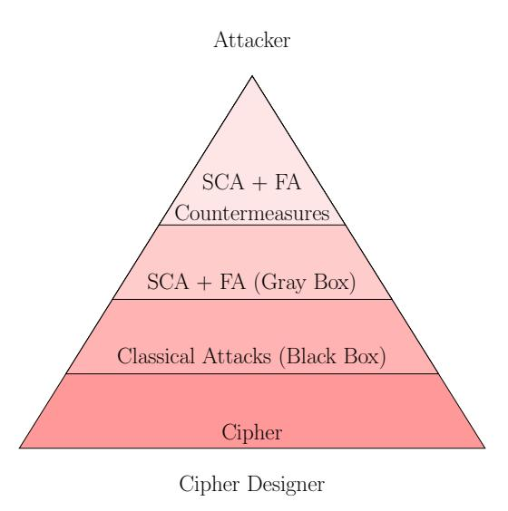
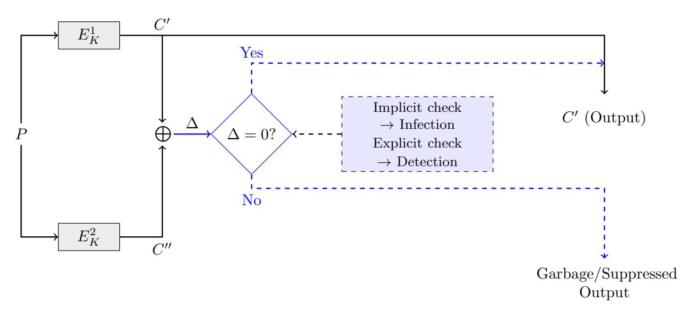
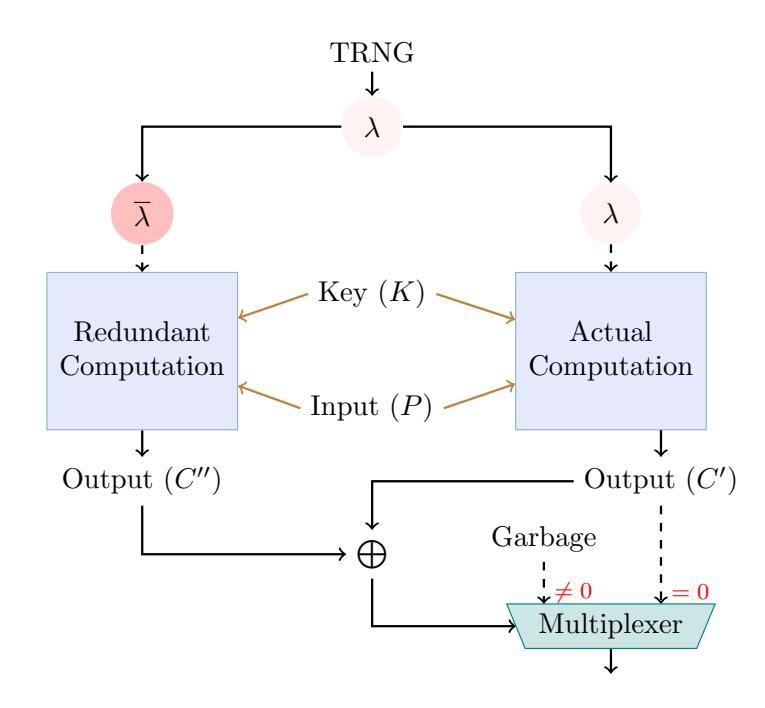
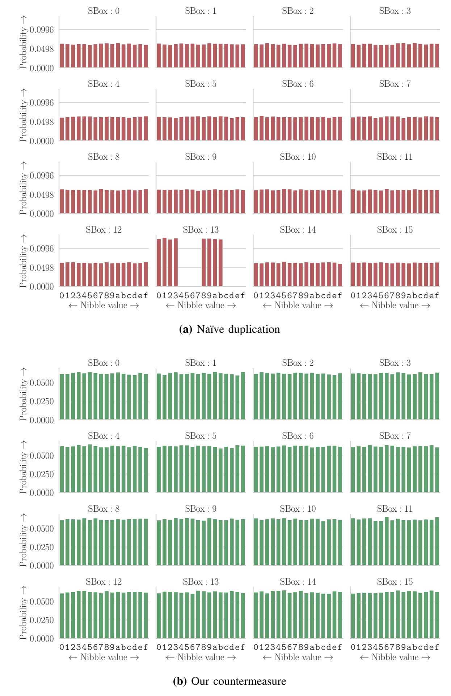
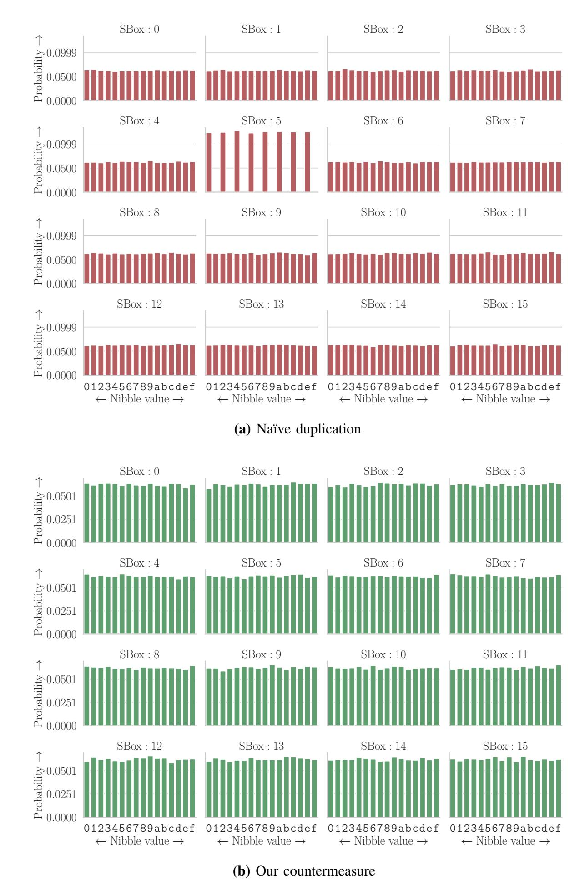

{0}------------------------------------------------

# Feeding Three Birds With One Scone: A Generic Duplication Based Countermeasure To Fault Attacks

(Extended Version)

Anubhab Baksi∗ , Shivam Bhasin∗ , Jakub Breier† , Anupam Chattopadhyay∗ , Vinay B. Y. Kumar∗

∗Nanyang Technological University, Singapore

anubhab001@e.ntu.edu.sg, sbhasin@ntu.edu.sg, anupam@ntu.edu.sg, vinayby@iitbombay.org

†Silicon Austria Labs, Graz, Austria

jbreier@jbreier.com

*Abstract*—In the current world of the Internet-of-things and edge computing, computations are increasingly performed locally on small connected systems. As such, those devices are often vulnerable to adversarial physical access, enabling a plethora of physical attacks which is a challenge even if such devices are built for security.

As cryptography is one of the cornerstones of secure communication among devices, the pertinence of fault attacks is becoming increasingly apparent in a setting where a device can be easily accessed in a physical manner. In particular, two recently proposed fault attacks, Statistical Ineffective Fault Attack (SIFA) and the Fault Template Attack (FTA) are shown to be formidable due to their capability to bypass the common duplication based countermeasures. Duplication based countermeasures, deployed to counter the Differential Fault Attack (DFA), work by duplicating the execution of the cipher followed by a comparison to sense the presence of any effective fault, followed by an appropriate recovery procedure. While a handful of countermeasures are proposed against SIFA, no such countermeasure is known to thwart FTA to date.

In this work, we propose a novel countermeasure based on duplication, which can protect against both SIFA and FTA. The proposal is also lightweight with only a marginally additional cost over simple duplication based countermeasures. Our countermeasure further protects against all known variants of DFA, including Selmke, Heyszl, Sigl's attack from FDTC 2016. It does not inherently leak side-channel information and is easily adaptable for any symmetric key primitive. The validation of our countermeasure has been done through gate-level fault simulation.

*Keywords*—Fault Attack, Countermeasures, DFA, SIFA, FTA

# I. INTRODUCTION

With the growth of highly constrained devices that perform cryptographic operations, the implementation related attacks are posing a serious threat. Such devices are deployed in what could be potentially hostile environment, thus allowing any malicious third party (henceforth denoted as, the *attacker*) to extract secret information by any means necessary. In particular, when the device is carrying out a cryptographic operation, the attacker may passively observe its physical footprint (such

This is an extended version of the paper with the same title accepted in [Design, Automation and Test in Europe Conference](https://www.date-conference.com/) (DATE) – 2021.

as power consumption) or actively alter its normal course of action (such as a voltage glitch that flips a particular bit). The former type of attack is known as *Side Channel Attack* (SCA) [\[1\]](#page-7-0), and the latter as *Fault Attack* (FA) [\[2\]](#page-7-1).

The focus of this work is fault attack and how to efficiently protect against such attacks in context of symmetric key cryptography. The first and one of the most commonly used models for fault attack is the so-called *Differential Fault Attack* (DFA) [\[3\]](#page-7-2). This fault model works by first injecting a non-zero difference δ in the processed data (typically near the end of the cipher execution). Then, the relationship between δ and resulting output difference ∆ reveals the secret information. To resist against DFA, duplication based countermeasures have been widely proposed in the literature [\[2,](#page-7-1) Section 7]. Such a countermeasure can be broadly classified into *detective* and *infective* [\[4\]](#page-7-3) classes. Overall, such a countermeasure compares two independent runs of the same cipher (which we call the *actual* and the *redundant* computations, following [\[4\]](#page-7-3)), and checks if both are equal. If true, this output is returned; otherwise, a predefined recovery procedure (such as returning a garbage output) takes place.

While such a basic duplication based countermeasure works fine against DFA (except for the case where two identical faults are injected in the actual and the redundant computations; which is shown doable by Selmke, Heyszl and Sigl in FDTC'16 [\[5\]](#page-7-4)). Moreover, the new types of fault attacks that are emerging over the last few years are capable of bypassing it. Of them, two notable attacks are of interest to this work, namely, the *Statistical Ineffective Fault Attack* (SIFA), reported in CHES'18 [\[6\]](#page-7-5), and *Fault Template Attack* (FTA), reported more recently in Eurocrypt'20 [\[7\]](#page-7-6). These two fault models do not rely on the differential (δ, ∆) information, which requires knowledge of the faulty output. Instead, only the correct output from the cipher, or merely the information on whether or not the fault injection successfully altered the normal cipher flow would be sufficient. As a consequence, the basic duplication based countermeasure – which only blocks releasing of the faulty output becomes vulnerable – thus bringing up the need for specialised countermeasures.

{1}------------------------------------------------

A handful of countermeasures against SIFA have been proposed in the literature [\[8\]](#page-7-7), [\[9\]](#page-7-8), [\[10\]](#page-7-9), [\[11\]](#page-7-10), [\[12\]](#page-7-11). In order to avoid the pitfall of basic duplication, all those countermeasures save for [\[12\]](#page-7-11) rely on some form of triplication of the cipher execution, followed by an error correction procedure (additionally, [\[10\]](#page-7-9) relies on reversible circuits, which is not yet available as a standard cell library). Assuming the attacker can only target at most one execution at a time, those countermeasures block the attacker from gaining any exploitable knowledge. The countermeasure proposed in [\[12\]](#page-7-11), on the other hand, relies on a randomised duplication based approach. Based on a random coin toss (λ), it is decided whether the cipher will be run as-is in both the circuits, or the *inverted* cipher will be run. The inverted[1](#page-1-0) cipher essentially maps 0 to 1 and vice-versa. A final comparison takes place to sense any fault, before taking appropriate procedure. In this way, the exploitable information in SIFA, which manifests in the form of a statistical bias, is removed.

FTA relies on the behaviour of the non-linear component of a cipher, in the form of an AND gate. By flipping one input line to an AND gate (while keeping the other input line at an unknown constant), the output will flip only if the other input line is at logic 1, and the output will not flip if the other input line is at logic 0. So, by precisely targeting at an AND gate input line, the attacker is able to learn information. This attack would bypass the usual duplication based countermeasure. Also, unlike DFA, this attack can target any part of the execution. To the best of our knowledge, no countermeasure against FTA has been proposed so far.

#### *Contribution*

Our work combines the concepts of SIFA and FTA protection together with the DFA protection, all in one countermeasure scheme. Our idea is built on top of [\[12\]](#page-7-11), i.e., relying on randomised duplication. While other SIFA countermeasures [\[8\]](#page-7-7), [\[9\]](#page-7-8), [\[10\]](#page-7-9), [\[11\]](#page-7-10) protect against SIFA as well as FTA, one has to note that all the countermeasures depend on some form of error correction (hence triplication, at minimum). Our proposal, on the other hand, has an overhead closer to that of duplication. The DFA protection covers all known types of DFA, such as the algebraic [\[13\]](#page-7-12), impossible differential [\[14\]](#page-7-13), collision fault attack [\[15\]](#page-7-14), [\[16\]](#page-7-15). At the same time, it protects against the DFA model reported in [\[5\]](#page-7-4), which works by injecting identical faults to the actual and redundant computations so that the countermeasure senses it as the case of no fault and thus passes the faulty output to the attacker. Moreover, to the best of our knowledge, no countermeasure has been proposed against FTA in the literature; thereby making our FTA protection probably the first-of-its-kind.

### II. BACKGROUND: ATTACK MODELS

Based on the presumed power of the attacker, the attack models can be classified into two broad categories with respect

1Note: The inverted cipher is different from the inverse of the cipher. The inverted cipher changes the encoding of the bits while performing the same mathematical operation as the underlying cipher, while the inverse of the cipher computes the mathematical inverse of the cipher.

to our analysis. In the first, referred to as the *classical attack*, the attacker only has access to the cipher as a black-box. Thus, the attacker is only allowed to provide inputs to the cipher and receive the corresponding outputs. In the *gray box* category, the attacker is given additional access like power consumption or electromagnetic radiation information (i.e., physical side channel attacks), or the ability to alter the normal flow of operation (i.e., fault attack). An illustration of this scenario is given in Figure [1.](#page-1-1)

The classical attacks (i.e., the black box model) are protected by the virtue of the cipher design. However, the situation with the gray box model is different. To protect against side channel attack and/or fault attack, specialised countermeasure would be needed.

Fig. 1: Hierarchy of attack models based on attacker's power

### *A. Differential Fault Attack (DFA)*

DFA is the first fault attack proposed in the context of symmetric key cryptography [\[3\]](#page-7-2), and probably the most common attack model. Most, if not all, major ciphers are vulnerable to it (unless any protection mechanism is in place). The attacker needs both the faulty and non-faulty outputs to compute the difference, which is used to find the information on the secret key. This attack targets regions near the end of the cipher execution, which results in a weakened version of the classical *Differential Attack* [\[17\]](#page-7-16).

- *1) Variants:* Multiple variations of the DFA model have been proposed in the literature [\[2,](#page-7-1) Section 5.1]. For example, the algebraic fault attack [\[13\]](#page-7-12) follows exactly the same approach of DFA, only it solves algebraic equations. Similarly, the impossible differential fault attack [\[14\]](#page-7-13) or the collision fault attack [\[15\]](#page-7-14), [\[16\]](#page-7-15) rely on injecting a difference (in the form of a fault mask) and observe the corresponding output difference, thus those can be considered as a variant of DFA.
- *2) Countermeasures:* The most common protection against DFA and its variants is to use duplication, compare and then take an appropriate recovery procedure [\[4\]](#page-7-3). This comparison can be done either explicitly (*detective*) or implicitly (*infective*). A basic overview of a duplication based DFA countermeasure is given in Figure [2,](#page-2-0) the notations are described in Section [III.](#page-2-1)

#### *B. Statistical Ineffective Fault Attack (SIFA)*

The recently proposed fault model, SIFA [\[6\]](#page-7-5) uses the bias in the fault injection. Say, in a particular set-up, the probability of

{2}------------------------------------------------

Fig. 2: Duplication based DFA protection

flipping 0 to 1 of a bit is more than the probability of the bit to stay at 0. Stated differently, the probability that the output will change or not depends on the actual content of the bit. Thus, SIFA works only when there is a bias in the fault (i.e., the probability of a bit set is not the same as a bit reset). This assumption on bias is shown practical in [\[6\]](#page-7-5). In this way, SIFA can work only with the cases where the faults do not alter the normal course of execution (i.e., non-faulty). Since both the non-faulty and faulty outputs are required for DFA, SIFA works in a relatively restricted environment. On the flip-side, SIFA needs more faults (typically in the order of thousands) compared to DFA (which can work with only one fault).

- *1) Effect on Contemporary Countermeasures:* As described in [\[6\]](#page-7-5); most, if not all, the existing countermeasures till that point were vulnerable to SIFA. Those countermeasures are proposed to thwart DFA. In essence, the duplication based countermeasures check if the actual and the redundant computations are equal, and stop the attacker getting from information on the faulty output. SIFA does not make use of the faulty output, thus making this type of protection useless (cf. [\[12,](#page-7-11) Section 3.1]).
- *2) Newly Proposed Countermeasures against SIFA:* A total of five SIFA countermeasures have been proposed in the literature recently, and are outlined below for completeness.
- *a) Repetition Code:* The first countermeasure [\[8\]](#page-7-7) uses a triplication of the computations followed by majority voting. By doing so, even if the biased fault is injected in one of the computations, the error correction mechanism will always return the non-faulty output. This blocks the attacker's access to the statistical information (i.e., the bias of a bit), thus preventing SIFA.
- *b) Masking and Repetition Code:* The state bits of a cipher and the individual sub-operations (such as the SBoxes) operate differently against SIFA. By this observation, the authors of [\[9\]](#page-7-8) have proposed a countermeasure that works in two phases. The masking (which is a type of countermeasure against side channel attacks) is used at the state in the first phase. A triplication followed by majority voting is performed in the second phase doing the sub-operations.
- *c) Error Detection through Reversible Computing and Masking:* The authors of [\[10\]](#page-7-9) propose a countermeasure that

relies on *reversible computing*[2](#page-2-2) . The SIFA protection comes from the property of reversibility as well as masking.

- *d) Error Correction:* An error correcting code based SIFA protection is proposed by the authors of [\[11\]](#page-7-10). The authors argue in favour of a more general error correction than that of the simple triplication. The validation of their countermeasure is done through a gate level simulation tool.
- *e) Removing Bias by Duplication:* A randomised duplication based countermeasure is proposed in [\[12\]](#page-7-11), which also does not rely on expensive side channel countermeasures. Therefore, it protects against SIFA with a cost lower than other countermeasures. Unlike the reversible computation based solution of [\[10\]](#page-7-9), this countermeasure can be realised using standard library. This also serves as the starting point of our countermeasure.

## *C. Fault Template Attack (FTA)*

The fault template attack is a recent inclusion in the family of fault attacks [\[7\]](#page-7-6). This attack is capable of overcoming the existing fault countermeasures, does not require the faulty output (only the information on whether or not the output has changed is sufficient), and also can target at an arbitrary time during execution of the cipher (thus overcoming the limitation of DFA, which can only work by targeting regions near the end of the cipher execution). The main observation that leads to FTA is that, flipping one input line of the AND gate (while keeping the other at a constant) will make the output flip only if the other input line is 1. Thus, the attack can successively recover all the input lines to each non-linear operation, leading to the secret key. In some sense, FTA can be thought of a generalization of DFA and SIFA, as it is capable of using both the differential and statistical information. To the best of our knowledge, no countermeasure against FTA has been proposed till date.

## III. OUR THREE-IN-ONE SOLUTION

Despite the supposed contrast among the three major fault attack models (i.e., DFA, SIFA and FTA), we observe that a general duplication based countermeasure can be devised that

2Note that the usage of reversible gates will stop the side channel attacks based on power or electromagnetic channels, as reversible circuits do not leak such information.

{3}------------------------------------------------

can protect against those. As noted earlier, this observation follows from the duplication based SIFA countermeasure proposed in [12]. However, this countermeasure does not protect against the identical faults in the two computations in a DFA model as proposed in [5]. Therefore, our work extends the functionality of the SIFA countermeasure to cover the FTA model as well as the DFA variant of [5] without any extra overhead.

To protect against SIFA, the authors propose a novel concept of randomised duplication in [12]. Here a random bit  $\lambda$  $(\lambda \stackrel{\$}{\leftarrow} \{0,1\})$  determines the encoding of the bits. The bits are unchanged or inverted, each with probability  $\frac{1}{2}$ . When run over multiple test cases, the statistical bias is removed from the output. The random bit,  $\lambda$ , is generated at each invocation of the cipher, and is not known to the attacker. We denote the actual computation by  $E_K^1$  and the redundant (denoted by  $E_K^2$ ) where E denotes the cipher and K is the secret key, and the corresponding outputs are denoted by C' and C''. If  $\lambda = 1$ , the inverted logic is employed; where 0 is encoded as 1, and 1 is encoded as 0. Finally, the output is released only if the actual and the redundant computations match. If not, an appropriate recovery procedure takes place, such as an returning a random output or suppressing the output altogether. Note that the check on whether or not the actual and the redundant computations match can be done with an explicit or implicit check (as described in [4]). The authors substantiate the claim by using the same fault simulation tool as [11].

As noted already, this countermeasure is subject to the identical faults as shown in [5] which follows the DFA model. In this case, the attacker makes use of the observation that the encoding for the actual and the redundant computations are the same. Therefore, if the attacker is able to target both the computations by the identical fault mask, then the countermeasure would sense it as a case of no fault, thus passing the faulty output to the attacker.

Overview of Our Three-in-one Countermeasure: With the same set-up from [12], we now describe the FTA and identical DFA protection. It may be noted that it enjoys all the benefits as its predecessor, as detailed in Section IV-B. Figure 3 shows the overview, and Algorithm 1 presents the algorithmic view. Here, an on-chip True Random Number Generator (TRNG) is presumed as the source of entropy. An on-chip TRNG primitive [18] is an essential component of most systems designed for security, and is used for a number of applications ranging from use in cryptographic protocols to even being used to construct some security countermeasures.

We briefly describe how the situation for  $\lambda=1$  (i.e., the inverted cipher) is implemented (which is also termed as the inverted cipher). The basic idea is to encode each logic 0 to logic 1 and vice-versa. To see how it can be done, we start with the state where all the bits are flipped, thereafter, we change the XOR and AND operations to  $\overline{\text{XOR}}$  and  $\overline{\text{AND}}$ , as given in Table I.

Since the security of  $\lambda$  is already described in [12], we skip it here for brevity. In short, it can be stated that the attacker is not able to learn useful information by targeting  $\lambda$ . Note the

TABLE I: Inversion of XOR and AND operations

$$\begin{array}{c|ccccccccccccccccccccccccccccccccccc$$

| <b>(b)</b> $\overline{y} = \overline{\text{AND}}(\overline{x}_0, \overline{x}_1)$ |       |                  |                  |   |                |  |  |
|-----------------------------------------------------------------------------------|-------|------------------|------------------|---|----------------|--|--|
| $\overline{x_0}$                                                                  | $x_1$ | $\overline{x}_0$ | $\overline{x}_1$ | y | $\overline{y}$ |  |  |
| 0                                                                                 | 0     | 1                | 1                | 0 | 1              |  |  |
| 0                                                                                 | 1     | 1                | 0                | 0 | 1              |  |  |
| 1                                                                                 | 0     | 0                | 1                | 0 | 1              |  |  |
| 1                                                                                 | 1     | 0                | 0                | 1 | 0              |  |  |

inverted cipher takes the inverted input  $\overline{P}$ . However, the key schedule is not affected at the inverted cipher.

Algorithm 1: Our Three-in-one Countermeasure (Identical DFA in both computations, SIFA, FTA)

**Input:**  $P; K; \lambda \triangleright \lambda \stackrel{\$}{\leftarrow} \{0, 1\}$  is unknown to the attacker **Output:** C if no fault; garbage, otherwise

 $\triangleright$  Actual computation uses  $\lambda$ 

1: **if** 
$$\lambda = 0$$
 **then**
2:  $C' = E_K^1(P)$ 
3: **else**
4:  $C' = \overline{E_K^1(\overline{P})}$   $\triangleright$  The input  $P$  is shown as inverted  $\triangleright$  Redundant computation uses  $\overline{\lambda}$ 

5: if 
$$\overline{\lambda} = 0$$
 then
6:  $C'' = E_K^2(P)$ 
7: else
8:  $C'' = \overline{E_K^2(\overline{P})}$ 
9: if  $C' \oplus C'' = 0$  then
10: return  $C'$   $\triangleright$  No fault is sensed
11: else
12: return Garbage  $\triangleright$  Fault is sensed

Fig. 3: Schematic for our three-in-one protection

Additional Features over ACISP'20 Countermeasure: The changes to [12] to extend the countermeasure coverage, to

{4}------------------------------------------------

support the FTA [\[7\]](#page-7-6) protection as well as protection against identical fault DFA in both the computations [\[5\]](#page-7-4), are outlined next.

First, instead of the actual and the redundant independent values of λ, we fix that the values will be inversion of one another. This prevents the attacker's ability to mount the identical fault masks (as used in [\[5\]](#page-7-4)). As the actual and the redundant computations are at inversion of the other, injecting the same fault mask will result in non-zero outputs, which will be sensed by the countermeasure. In the context of FTA, suppose, the attacker is able to target at an input line of one specific AND operation in one of the computations. This will enable the attacker to get information on the other input line of the AND gate. Since the encoding is randomised, the basic observation in [\[7\]](#page-7-6) does not apply (the attacker does not know the value of λ), and consequently, the overall attack will not work.

Second, TRNGs are generally available as an auxiliary module in the system-on-chip, hence generating randomness is commonly not the bottleneck even in the context of edge computing. Therefore, more randomness can be used in order to ascertain security against side channel attacks. For this purpose, we propose a total of three variations depending on the use of entropy. The first variation, where λ only takes one bit entropy (i.e., λ \$← {0, 1}) is already described and we refer to it as the prime variant. The second variation uses one bit of randomness per round of the cipher. For example, 10 bits of randomness would be needed for AES. In the third variant, we propose to use one bit of randomness per non-linear operation that acts as a unit (typically an SBox) per round to have maximum protection. Therefore, we would need 10 × 16 bits of randomness for AES.

Third, we implement each n×m SBox as (n+1)×m SBox, where the extra input line takes the randomness parameter λ. Thus, the actual SBox and its inversion is implemented at one place. This is a change from the countermeasure of [\[12\]](#page-7-11) where these are separately implemented. We argue this reduces the attacker's success probability of mounting an FTA.

### IV. EVALUATION

# *A. Validation through Simulation and Performance*

The proposed countermeasure has been validated through simulation of the technology mapped gate level net-list corresponding to the cipher designs in the presence of fault injections introduced during simulation. We do this through a modified version of VerFI [\[19\]](#page-7-18) [3](#page-4-1) (which is also used in [\[11\]](#page-7-10), [\[12\]](#page-7-11)). In particular, we simulate two following designs — PRESENT-80 encryption [\[20\]](#page-7-19) protected with na¨ıve duplication countermeasure (as shown in Figure [2\)](#page-2-0), PRESENT-80 encryption protected with the proposed countermeasure. The designs are synthesised targeting the open 45nm Nangate PDK v13 with appropriate constraints (e.g., ensuring the redundant paths are not optimised away). Each design is simulated (i.e., 1 encryption run) a number of times; with the same key used

for all runs, but the plaintext and λ are changed at every invocation; and the output consists of the plaintext-ciphertext pair, and whether the injected fault was ineffective or was detected. The model allows to inject a single fault anywhere in the design (excluding inconsequential locations, such as the key register) during any clock cycle/round, and use the same fault location and fault type across all subsequent simulation runs. As the results for the earlier rounds would be similar, we only show the result with the last round attack without losing generality in Figure [4](#page-5-0) as well as in Figure [5.](#page-6-0) The data shown in each of Figure [4](#page-5-0)[\(a\)/](#page-5-1)Figure [5](#page-6-0)[\(a\)](#page-6-1) (na¨ıve duplication) and Figure [4](#page-5-0)[\(b\)/](#page-5-2)Figure [5](#page-6-0)[\(b\)](#page-6-2) (our countermeasure) are collected over a simulation of 80k random runs for PRESENT-80. Figure [4](#page-5-0)[\(a\)](#page-5-1) shows a stuck-at 0 fault at the second MSB of the SBox 13, which is able to bypass the na¨ıve duplication, but our countermeasure blocks the bias as can be seen from Figure [4](#page-5-0)[\(b\).](#page-5-2) Similarly, it may be noted from Figure [5](#page-6-0)[\(a\)](#page-6-1) that a stuck-at 0 fault is active at the second LSB of the SBox 5 for the actual and the redundant computations, but its effect is nullified upon application of our countermeasure as shown in Figure [5](#page-6-0)[\(b\).](#page-6-2)

Moreover, the hardware performance of our countermeasure is given in Table [II](#page-4-2) with the same set-up. Similar to [\[4\]](#page-7-3), [\[12\]](#page-7-11), we do not consider the cost for generating randomness.

TABLE II: Area overheads of our countermeasure

| PRESENT-80         | Gate Equivalents (45nm Nangate PDK) |                   |              |  |
|--------------------|-------------------------------------|-------------------|--------------|--|
| Encryption         | Combinational                       | Non-combinational | Total        |  |
| Na¨ıve Duplication | 1289                                | 1807              | 3096 (1.00×) |  |
| Our Countermeasure | 2290                                | 1807              | 4097 (1.32×) |  |

While with na¨ıve duplication as well as with our countermeasure, the linear components of the cipher will increase proportionately, the same for the non-linear components (i.e., SBoxes) are not straightforward. In this regard, we show the overhead of protecting one layer of SBoxes by both the countermeasures in Table [III](#page-4-3) with respect to PRESENT (sixteen 4 × 4 SBoxes) and AES[4](#page-4-4) (sixteen 8 × 8 SBoxes).

TABLE III: Area overhead for PRESENT and AES SBoxes

| Countermeasure     | Gate Equivalents (45nm Nangate PDK) |              |  |  |
|--------------------|-------------------------------------|--------------|--|--|
|                    | PRESENT SBoxes                      | AES SBoxes   |  |  |
| Na¨ıve Duplication | 605 (1.0×)                          | 8363 (1.0×)  |  |  |
| Our Countermeasure | 1397 (2.3×)                         | 15327 (1.8×) |  |  |

Following [\[12\]](#page-7-11), we remark that the software performance will be similar to the underlying cipher in terms of code size (possibly marginally increased) and the required number of clock periods would be essentially the same.

#### *B. Impact on Other Attacks*

*1) Classical Attacks:* In the black-box model, the attacker is only able to query an input and receive the corresponding output. The existing attacks are well-understood from a mathematical/statistical point-of-view. Therefore, the protection against such attacks is done through the design specification of the cipher. Since the original specification does not change

3Our source codes can be found at [https://github.com/vinayby/VerFI.](https://github.com/vinayby/VerFI)

4<https://nvlpubs.nist.gov/nistpubs/FIPS/NIST.FIPS.197.pdf>

{5}------------------------------------------------

Fig. 4: Results for gate level simulation (bias at SBox: 13)

in our countermeasure, all the security claims related to the classical attacks remain prevalent.

- 2) Side Channel Attack: As our proposal directly follows-up from that of [12], we claim the same side channel security. Detailed discussion is omitted here for the sake of brevity, but we argue that an existing side channel countermeasure can be adopted without any specialised technique as the changes are done at the cipher design level. Our countermeasure does not open up any additional side channel vulnerability in hardware/software (which apparently happens, for example, with the SIFA countermeasure of [8]).
- 3) Two Biased Faults: As our countermeasure can protect against an attacker capable of injecting one biased (SIFA/FTA)

fault, one may be interested in the effect of two biased faults. Targetting two locations with biased faults will not yield meaningful information to the attacker, by an extension of the current security claim. Therefore, the only way the attacker can leverage two biased faults is to target the encoding parameter  $\lambda$  (similar to [12]). In this context, we note that, this model where the attacker injects more than one biased fault at distinct locations is not proposed in the literature.

4) Inverted Fault Mask: If the attacker is capable of injecting a fault mask at one computation while injecting the inversion of that mask to the other computation, our countermeasure will treat this as a case of no fault. However, it is to be noted

{6}------------------------------------------------

Fig. 5: Results for gate level simulation (bias at SBox: 5)

that this model has never been reported in the literature, not to mention is considerably more difficult compared to two identical fault masks. Identical fault masks can be achieved, for example, by an injection set-up if all its parameters are preserved. In contrast, one has carefully has to start with a fault mask, then tweak the parameters until the inverse fault mask is achieved.

5) Other Fault Attacks: Another fault model, Persistent Fault Attack (PFA) [21] works only when the SBox is implemented in the circuit as a look-up table. This is not a requirement for our countermeasure to work, therefore we claim PFA is a not threat to our countermeasure.

It is known that SIFA generalizes the ineffective [22] and

the *statistical* [23] fault attack models. Therefore, protection against SIFA automatically ascertains security against those fault models. Combining all; DFA, SIFA and FTA cover a vast range of existing fault attack models. While the task of validating our countermeasure against each existing fault attack model is left as a future work, we are not aware of any fault attack model which is not inherently protected by our proposal.

The *infective* attack [4] (i.e., flipping one bit of comparison in duplicate-and-compare) is hard to attack in hardware, as the attacker would typically need a split-nanosecond precision5.

&lt;sup>5It may be relatively easy with software implementations (e.g., flipping the zero-flag register with a fault).

{7}------------------------------------------------

Therefore we do not put any infective DFA countermeasure for simplicity, although the proposals from [\[4\]](#page-7-3) can be incorporated atop if needed.

# V. CONCLUSION

A randomised duplication based approach is presented in this work, which is able to thwart against three major models of fault attacks. More precisely, our countermeasure protects against the differential fault attack (DFA) [\[3\]](#page-7-2), the statistical ineffective fault attack (SIFA) [\[6\]](#page-7-5), and the most recent member in the fault attack family, the fault template attack (FTA) [\[7\]](#page-7-6). The basic idea follows from that of the SIFA countermeasure proposed recently in [\[12\]](#page-7-11). To prevent the attacker from getting any usable information, previous countermeasures to SIFA (such as, [\[8\]](#page-7-7), [\[11\]](#page-7-10)) use a form of error correction. In the work of [\[12\]](#page-7-11), the authors propose to use random encoding in a duplicated setting, so as to remove the statistical bias which is the source of usable information to the attacker. We note that originally this countermeasure does not protect against the attacker who is able to apply identical fault mask to both the computations, a DFA model which is shown practical in [\[5\]](#page-7-4). With our amendments to this countermeasure, we show how it is possible to achieve protection against this DFA model as well as the FTA model. To the best of our knowledge, our work serves as the first FTA countermeasure.

We hope our work will encourage more research in fault/side channel attacks as well as efficient countermeasures against those. In particular, one may be interested in a combined side channel and fault countermeasure. Also, a cipher can be constructed so that its inversion can be implemented with relatively low overhead, thereby reducing the overall cost.

## REFERENCES

- [1] S. Mangard, E. Oswald, and T. Popp, *Power analysis attacks - revealing the secrets of smart cards*. Springer, 2007.
- [2] A. Baksi, S. Bhasin, J. Breier, D. Jap, and D. Saha, "Fault attacks in symmetric key cryptosystems," Cryptology ePrint Archive, Report 2020/1267, 2020, [https://eprint.iacr.org/2020/1267.](https://eprint.iacr.org/2020/1267)
- [3] E. Biham and A. Shamir, "Differential Fault Analysis of Secret Key Cryptosystems," in *Advances in Cryptology - CRYPTO '97*, ser. Lecture Notes in Computer Science, J. Kaliski, BurtonS., Ed. Springer Berlin Heidelberg, 1997, vol. 1294, pp. 513–525. [Online]. Available: <http://dx.doi.org/10.1007/BFb0052259>
- [4] A. Baksi, D. Saha, and S. Sarkar, "To infect or not to infect: A critical analysis of infective countermeasures in fault attacks," *IACR Cryptology ePrint Archive*, vol. 2019, p. 355, 2019. [Online]. Available: <https://eprint.iacr.org/2019/355>
- [5] B. Selmke, J. Heyszl, and G. Sigl, "Attack on a dfa protected aes by simultaneous laser fault injections," in *Fault Diagnosis and Tolerance in Cryptography (FDTC), 2016 Workshop on*. IEEE, 2016, pp. 36–46.
- [6] C. Dobraunig, M. Eichlseder, T. Korak, S. Mangard, F. Mendel, and R. Primas, "SIFA: exploiting ineffective fault inductions on symmetric cryptography," *IACR Trans. Cryptogr. Hardw. Embed. Syst.*, vol. 2018, no. 3, pp. 547–572, 2018. [Online]. Available: <https://doi.org/10.13154/tches.v2018.i3.547-572>
- [7] S. Saha, A. Bag, D. B. Roy, S. Patranabis, and D. Mukhopadhyay, "Fault template attacks on block ciphers exploiting fault propagation," in *Advances in Cryptology - EUROCRYPT 2020 - 39th Annual International Conference on the Theory and Applications of Cryptographic Techniques, Zagreb, Croatia, May 10-14, 2020, Proceedings, Part I*, ser. Lecture Notes in Computer Science, A. Canteaut and Y. Ishai, Eds., vol. 12105. Springer, 2020, pp. 612–643. [Online]. Available: [https://doi.org/10.1007/978-3-030-45721-1](https://doi.org/10.1007/978-3-030-45721-1_22) 22

- [8] J. Breier, M. Khairallah, X. Hou, and Y. Liu, "A countermeasure against statistical ineffective fault analysis," Cryptology ePrint Archive, Report 2019/515, 2019, [https://eprint.iacr.org/2019/515.](https://eprint.iacr.org/2019/515)
- [9] S. Saha, D. Jap, D. B. Roy, A. Chakraborty, S. Bhasin, and D. Mukhopadhyay, "A framework to counter statistical ineffective fault analysis of block ciphers using domain transformation and error correction," *IEEE Trans. Information Forensics and Security*, vol. 15, pp. 1905–1919, 2020. [Online]. Available: [https://doi.org/10.1109/TIFS.](https://doi.org/10.1109/TIFS.2019.2952262) [2019.2952262](https://doi.org/10.1109/TIFS.2019.2952262)
- [10] J. Daemen, C. Dobraunig, M. Eichsleder, H. Gross, F. Mendel, and R. Primas, "Protecting against statistical ineffective fault attacks," *IACR Transactions on Cryptographic Hardware and Embedded Systems*, vol. 2020, Issue 3, pp. 508–543, 2020. [Online]. Available: <https://tches.iacr.org/index.php/TCHES/article/view/8599>
- [11] A. R. Shahmirzadi, S. Rasoolzadeh, and A. Moradi, "Impeccable circuits ii," Cryptology ePrint Archive, Report 2019/1369, 2019, [https://eprint.](https://eprint.iacr.org/2019/1369) [iacr.org/2019/1369.](https://eprint.iacr.org/2019/1369)
- [12] A. Baksi, V. B. Kumar, B. Karmakar, S. Bhasin, D. Saha, and A. Chattopadhyay, "A novel duplication based countermeasure to statistical ineffective fault analysis," in *Information Security and Privacy - 25th Australasian Conference, ACISP 2020, Perth, WA, Australia, November 30 - December 2, 2020, Proceedings*, 2020, pp. 525–542. [Online]. Available: [https://doi.org/10.1007/978-3-030-55304-3](https://doi.org/10.1007/978-3-030-55304-3_27) 27
- [13] N. T. Courtois, K. Jackson, and D. Ware, "Fault-algebraic attacks on inner rounds of des," *e-Smart'10 Proceedings: The Future of Digital Security Technologies*, 2010.
- [14] E. Biham, L. Granboulan, and P. Q. Nguyen, "Impossible fault analysis of RC4 and differential fault analysis of RC4," in *Fast Software Encryption: 12th International Workshop, FSE 2005, Paris, France, February 21-23, 2005, Revised Selected Papers*, 2005, pp. 359–367. [Online]. Available: [https://doi.org/10.1007/11502760](https://doi.org/10.1007/11502760_24) 24
- [15] J. Blomer and V. Krummel, "Fault based collision attacks on ¨ AES," in *Fault Diagnosis and Tolerance in Cryptography, Third International Workshop, FDTC 2006, Yokohama, Japan, October 10, 2006, Proceedings*, 2006, pp. 106–120. [Online]. Available: [https://doi.org/10.1007/11889700](https://doi.org/10.1007/11889700_11) 11
- [16] L. Hemme, "A differential fault attack against early rounds of (triple-)des," in *Cryptographic Hardware and Embedded Systems - CHES 2004: 6th International Workshop Cambridge, MA, USA, August 11-13, 2004. Proceedings*, 2004, pp. 254–267. [Online]. Available: [https://doi.org/10.1007/978-3-540-28632-5](https://doi.org/10.1007/978-3-540-28632-5_19) 19
- [17] E. Biham and A. Shamir, "Differential cryptanalysis of des-like cryptosystems," in *Advances in Cryptology - CRYPTO '90, 10th Annual International Cryptology Conference, Santa Barbara, California, USA, August 11-15, 1990, Proceedings*, 1990, pp. 2–21. [Online]. Available: [https://doi.org/10.1007/3-540-38424-3](https://doi.org/10.1007/3-540-38424-3_1) 1
- [18] K. Wold and C. H. Tan, "Analysis and enhancement of random number generator in fpga based on oscillator rings," in *2008 International Conference on Reconfigurable Computing and FPGAs*. IEEE, 2008, pp. 385–390.
- [19] V. Arribas, F. Wegener, A. Moradi, and S. Nikova, "Cryptographic fault diagnosis using verfi," *IACR Cryptology ePrint Archive*, vol. 2019, p. 1312, 2019. [Online]. Available: <https://eprint.iacr.org/2019/1312>
- [20] A. Bogdanov, L. R. Knudsen, G. Leander, C. Paar, A. Poschmann, M. J. Robshaw, Y. Seurin, and C. Vikkelsoe, "PRESENT: An ultra-lightweight block cipher," in *CHES*, vol. 4727. Springer, 2007, pp. 450–466.
- [21] F. Zhang, X. Lou, X. Zhao, S. Bhasin, W. He, R. Ding, S. Qureshi, and K. Ren, "Persistent fault analysis on block ciphers," *IACR Transactions on Cryptographic Hardware and Embedded Systems*, vol. 2018, no. 3, pp. 150–172, Aug. 2018. [Online]. Available: <https://tches.iacr.org/index.php/TCHES/article/view/7272>
- [22] C. Clavier, "Secret external encodings do not prevent transient fault analysis," in *Cryptographic Hardware and Embedded Systems - CHES 2007, 9th International Workshop, Vienna, Austria, September 10-13, 2007, Proceedings*, 2007, pp. 181–194. [Online]. Available: [https://doi.org/10.1007/978-3-540-74735-2](https://doi.org/10.1007/978-3-540-74735-2_13) 13
- [23] P. S. Nahid Farhady Ghalaty, Bilgiday Yuce, "Analyzing the efficiency of biased-fault based attacks," Cryptology ePrint Archive, Report 2015/663, 2015, [https://eprint.iacr.org/2015/663.](https://eprint.iacr.org/2015/663)