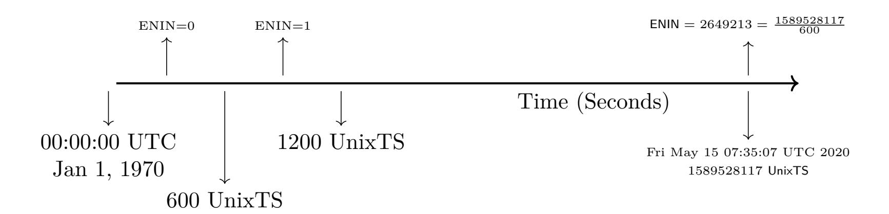
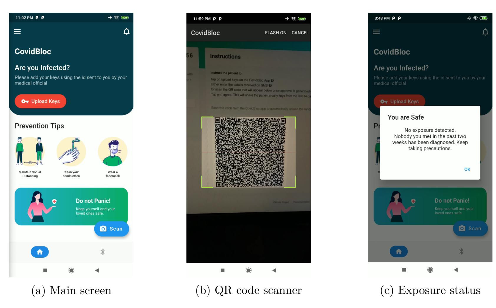
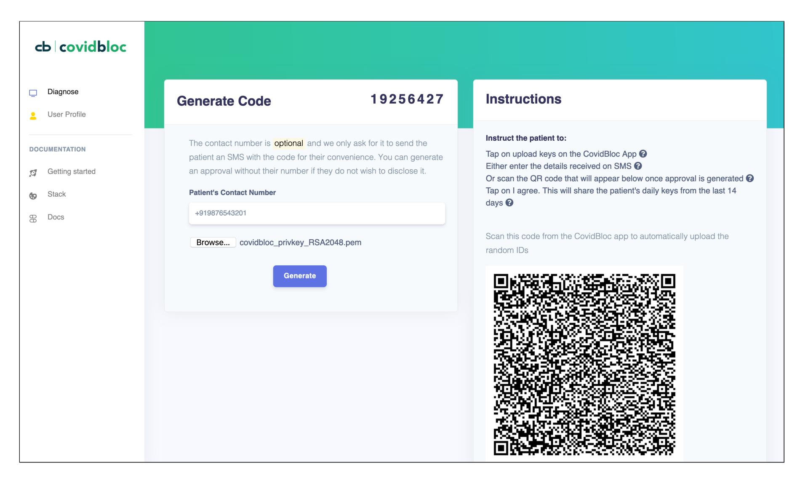
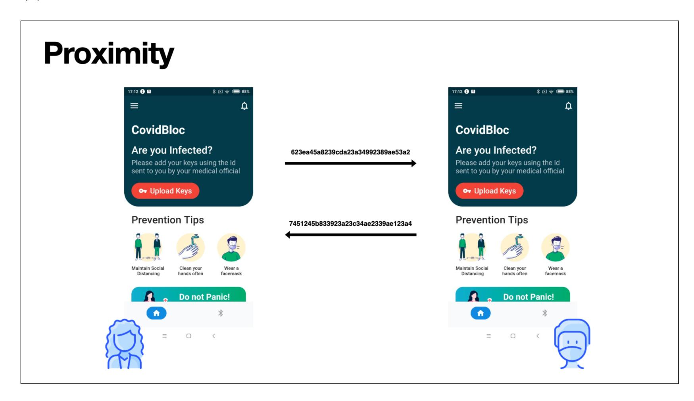
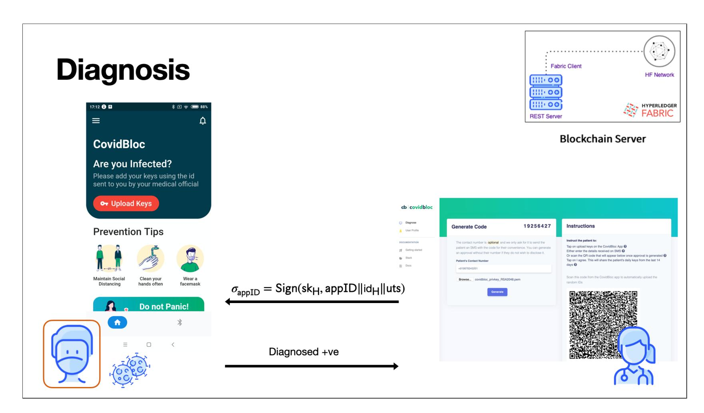
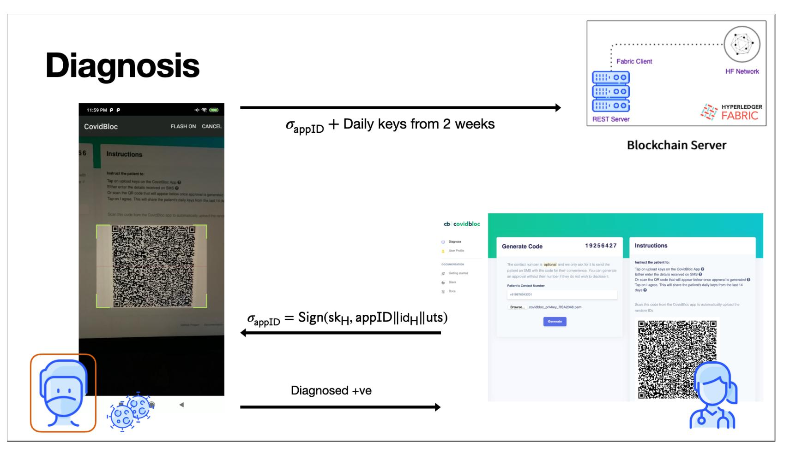
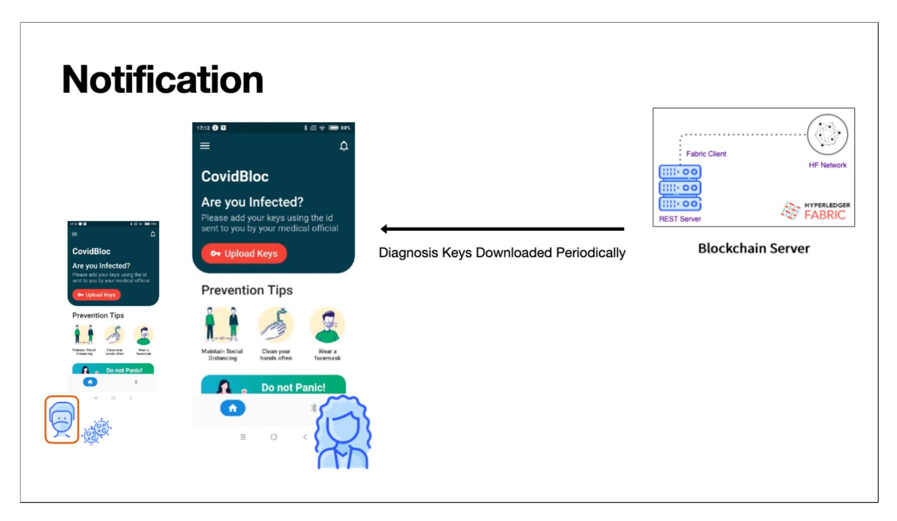
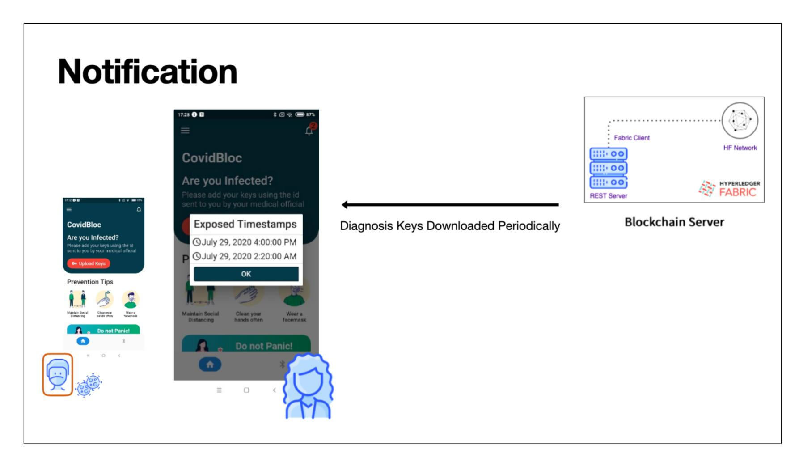

{0}------------------------------------------------

# CovidBloc: A Blockchain Powered Exposure Database for Contact Tracing

An Implementation Report

Deepraj Pandey<sup>1</sup> , Nandini Agrawal<sup>2</sup> , and Mahabir Prasad Jhanwar<sup>3</sup>

1,2,3Ashoka University, India {deepraj.pandey−asp21,nandini.agrawal−asp21,mahavir.jhawar}@ashoka.edu.in

#### **Abstract**

Contact tracing is an important mitigation tool for national health services to fight epidemics such as COVID-19. While many of the existing approaches for automated contact tracing focus on privacy-preserving decentralized solutions, the use of blockchain in these applications is often suggested for the transparency and immutability of the data being collected.

We present CovidBloc, a contact tracing system that implements the COVID 19 exposure database on Hyperledger Fabric Blockchain Network. Like most decentralized contact tracing application, the participants of the CovidBloc are: (1) a mobile application running on a bluetooth-equipped smartphone, (2) a web dashboard for health officials, and (3) a backend server acting as a repository for data being collected. We have implemented all components of CovidBloc to make it a fully functional contact tracing application. It is hosted at [https:](https://anonymous.4open.science/r/c6caad6d-62a4-463c-8301-472e421b931f/) [//anonymous.4open.science/r/c6caad6d-62a4-463c-8301-472e421b931f/](https://anonymous.4open.science/r/c6caad6d-62a4-463c-8301-472e421b931f/).

The mobile application for CovidBloc is developed for Android. The exposure notification system in our mobile application is implemented as per the recently released draft documentation by Google and Apple. The exposure notification API from Google and Apple is only available to a limited number of teams per country.

The backend server is an important component of any automated contact tracing system which acts as a repository for exposure data to be pushed by smartphones upon authorization by the health staff. Since adding or removing information on the server has privacy consequences, it is required that the server should not be trusted. The backend server for CovidBloc is implemented on Hyperledger Fabric Blockchain network.

## **1 Introduction**

There is growing interest in technology-enabled automated contact tracing systems to fight epidemics such as COVID-19. The goal of contact tracing is to quickly identify individuals who have been in close proximity to an infected person, before they even show symptoms, so that they may be tested, quarantined, and monitored for symptoms. Successful containment of the Coronavirus pandemic rests on the ability to remove such individuals from the circulating population. Smartphone-based apps are currently considered most effective, and many countries are currently using them to perform contact tracing as part of the effort to manage the COVID-19 

{1}------------------------------------------------

pandemic and prevent resurgences of the disease after the initial outbreak. These apps typically employ a combination of location services, such as the global positioning system (GPS), and neighbour discovery - the ability to discover phones in close proximity using Bluetooth.

The existing Bluetooth-based automated contact tracing schemes are of two categories: centralized vs decentralized. A large number of systems, both centralized [\[2,](#page-8-0) [19,](#page-9-0) [17\]](#page-9-1) and decentralized [\[6,](#page-9-2) [7,](#page-9-3) [6,](#page-9-2) [20,](#page-9-4) [12,](#page-9-5) [4\]](#page-9-6) were proposed recently. The work in [\[22\]](#page-10-0) showed the vulnerabilities and the advantages of both solutions systematically.

### **1.1 Our Contributions**

We present CovidBloc, a contact tracing system that implements the COVID 19 exposure database on the backend server using Hyperledger Fabric [\[13\]](#page-9-7) Blockchain network. For the underlying contact tracing we implemented the PACT [\[20\]](#page-9-4) scheme combined with the expsoure notification details proposed by Apple/Google [\[12,](#page-9-5) [4\]](#page-9-6). Though an API is recently released by the Apple-Google, it is available only to public health authorities [\[1,](#page-8-1) [10\]](#page-9-8) who have notified the companies about their development. Since there is no way for researchers or other developers to access the OS level APIs, we developed the entire method ourselves.

Like most decentralized contact tracing application, the participants of the CovidBloc are: (1) a mobile application running on a bluetooth-equipped smartphone, (2) a web dashboard for health officials, and (3) a backend server acting as a repository for data being collected. In addition to the backend server on the Blockchain, we have also implemented the mobile application on Android and a web dashboard for health officials. This makes CovidBloc a fully functional contact tracing application. It is hosted at [https://anonymous.4open.science/r/](https://anonymous.4open.science/r/c6caad6d-62a4-463c-8301-472e421b931f/) [c6caad6d-62a4-463c-8301-472e421b931f/](https://anonymous.4open.science/r/c6caad6d-62a4-463c-8301-472e421b931f/)

## **2 Preliminaries**

**Definition 1 (Exposure Notification Interval Number (ENIN)[\[12,](#page-9-5) [4,](#page-9-6) [15\]](#page-9-9))** *It is a unique positive integer representing a 10-minute time-interval and is assigned to each timestamp in UNIX Epoch Time. For a UNIX "*Timestamp*", the corresponding* ENIN(Timestamp) *represents the unique 10-minute time-interval in which the* Timestamp *lies and is computed as follows:*

$$\mathsf{ENIN}(\mathsf{Timestamp}) = \lfloor \frac{\mathsf{Timestamp}}{600} \rfloor$$



## <span id="page-1-0"></span>**3 CovidBloc: A Blockchain Powered Exposure Database for Decentralized Contact Tracing**

We now present complete details on CovidBloc, a contact tracing system that implements the COVID19 exposure database on the backend server using Hyperledger Fabric [\[13\]](#page-9-7) Blockchain 

{2}------------------------------------------------

network. For the underlying contact tracing we implemented the PACT [20] scheme combined with the expsoure notification details proposed by Apple/Google [12, 4]. The entire system has the following components:

- Contact Tracing Mobile Application: Users in the system hold a Bluetooth-equipped smartphone running a contact tracing mobile application. We call our mobile application CovidBloc. The implementation details on CovidBloc is available in Section 3.2.3.
- **Health Staff:** Government health officials form an important component of a contact tracing scheme where they diagnose infected patients and work with the them in triggering contact tracing. We have implemented a web dashboard for health officials to carry our the above process. The implementation details on the health dashboard are given in Section 3.2.4.
- Backend Server: The backend server acts as a repository for exposure data to be pushed by infected user's smartphones upon authorisation by the health staff. We have instantiated the backend server on Hyperledger Fabric Blockchain network. The complete details are available in Section 3.1.

In the following we now present the system flow.

- **Setup** In the setup phase users register with the system by installing the **CovidBloc** mobile application into their smartphones.
- Chirping The CovidBloc mobile application of a user broadcasts ephemeral identifiers to its peripheral devices at a regular interval. We have used the method that was proposed in the Exposure Notification Cryptography Specification that came out of the Apple-Google Partnership in April [12, 4] to generate these identifiers. Though platform APIs have been released by Apple-Google, it is available only to public health authorities [1, 10] who have notified the companies about their development. Since there is no way for researchers or other developers to access the OS level APIs, we built a custom implementation of the specification whose details are given below.
  - 1. Every 24 hours, a user U's mobile application generates a temporary exposure key  $\mathsf{tek}_i^{\mathtt{U}} \xleftarrow{\$} \{0,1\}^{128}$  where

$$i = \lfloor \frac{\mathsf{ENIN}(\mathsf{uts})}{144} \rfloor \cdot 144$$

, uts is the unix time stamp when  $\mathsf{tek}_i^{\mathsf{U}}$  is generated, and  $\mathsf{ENIN}(\mathsf{uts}) = \lfloor \frac{\mathsf{uts}}{600} \rfloor$  is the unique 10-minute interval covering the uts. The subscript i is aligned to the 24-hour interval for which it remains valid. After every 24 hours it changes by:  $i \leftarrow i + 144$ . The calibration is set to 144 because in a 24 hour period, as we have 144 distinct 10-minute intervals. We interchangeably refer to  $\mathsf{tek}_i^{\mathsf{U}}$  as the "DailyKey" since it is valid for only one day. The DailyKeys are stored in the local storage of the mobile application.

2. Each DailyKey  $tek_i^{U}$  is used to generate a Rolling Proximity Identifier Key (RPIKey) using an HMAC-based key derivation function HKDF (IEDF RFC 5869 [5]) as follows:

$$\mathsf{rpik}_i^{\mathtt{U}} = \mathsf{HKDF}(\mathsf{tek}_i^{\mathtt{U}}, \mathsf{NULL}, \mathsf{EN-RPIK}, 16)$$

where  $\mathsf{NULL} = 0^k$  (k-length string of 0's),  $k = \mathsf{keylength}(\mathsf{tek}_i^{\mathtt{U}})$ , and  $\mathsf{EN-RPIK}$  is the context string that is used in the HKDF-expand step. Since  $\mathsf{RPIK}_i^{\mathtt{U}}$  is generated from  $\mathsf{tek}_i^{\mathtt{U}}$ , it changes every 24 hours.

{3}------------------------------------------------

3. The DailyKeys and RPIKeys are unique for a day. In a day we have 144 10-minute intervals and the RPIKey for the day is used to derive 144 distinct Rolling Proximity Identifiers (RPI). A RPI corresponding to a 10-minute interval is broadcasted (by the mobile application) every few seconds (in that 10 minute interval) to its peripheral smartphones. A RPI is computed as follows. For a unix timestamp uts, let  $j = \text{ENIN}(\text{uts}) = \lfloor \frac{\text{uts}}{600} \rfloor$  and  $i = \lfloor \frac{j}{144} \rfloor \cdot 144$ . Then

$$\mathsf{rpi}^{\mathtt{U}}_{i,j}(\mathsf{uts}) = \mathsf{AES}(\mathsf{rpik}^{\mathtt{U}}_i, \mathsf{pd}^{\mathtt{U}}_i)$$

where  $pd_j^{U} = EN-RPI||0x000000000000||ENIN(uts)|$ 

We can encapsulate the three-step algorithm under the abstraction of a pseudo random function F to produce a RPI at any unix timestamp  ${\tt uts}$  as follows:

$$F(\mathsf{tek}_i^{\mathtt{U}},\mathsf{uts}) = \mathsf{rpi}_{i,j}^{\mathtt{U}}(\mathsf{uts}) = \mathsf{AES}(\mathsf{rpik}_i^{\mathtt{U}},\mathsf{pd}_j^{\mathtt{U}})$$

- Collision: A collision occurs when two users  $U_1, U_2$  are in close proximity and consequently their smartphones receive each other's broadcasted RPI's. Suppose  $U_1 \leftarrow F(\mathsf{tek}_i^{U_2}, \mathsf{uts}_2)$  and  $U_2 \leftarrow F(\mathsf{tek}_i^{U_1}, \mathsf{uts}_1)$  where  $\mathsf{uts}_1$  ( $\mathsf{uts}_2$ ) is the unix timestamp when  $U_1$  ( $U_2$ ) computed the RPI  $F(\mathsf{tek}_i^{U_1}, \mathsf{uts}_1)$  ( $F(\mathsf{tek}_i^{U_2}, \mathsf{uts}_2)$ ). The timestamps could possibly differ by a few seconds. Both users stores the receives RPIs in their respective local storage. Let  $\mathcal{U}^r$  denotes the set of identifiers received by a user U. In this case,  $F(\mathsf{tek}_i^{U_2}, \mathsf{uts}_2) \in \mathcal{U}_1^r$ .
- Activate: This phase describes how a user U after getting diagnosed with the virus work with the health official to trace those users whom he contacted in the past few days. The steps are as follows:
  - The user obtains an approval id appID from a registered health official.
  - It then uploads its DailyKeys of last 14 days, i.e.  $\{\mathsf{tek}_i^{\mathtt{U}}\}_{\mathtt{last-14-days}}$ , to the exposure database of the backend server with the help of the appID

We have instantiated the backend server on a blockchain network. The details on how

- health official must register on the Blockchain server in order to issue approval ids to infected users,
- the process of issuing appIDs by the health officials, and
- users making transactions to Blockchain server to upload the DailyKeys

are all discussed in detail in Section 3.1.

• Alert: Mobile application of a regular user U retrieves the latest DailyKeys of the infected users from the backend server every day. The downloaded keys are fed into an algorithm along with the locally stored RPIs that U's mobile captured in the last few days. The algorithm will produce an alert if U was exposed to an infected individual in the recent time as follows. Assume the downloaded DailyKeys are  $\{\mathsf{tek}_{i_k}^{\mathsf{U}_t}\}_{k=1}^{14},\ 1 \leq t \leq n,\ i.e.,\ 14$  DailyKeys for each of the n infected users. The algorithm checks if any of the received RPIs is derived from one of these DailyKeys as follows:

{4}------------------------------------------------

```
1. For t in 1 \le t \le n

2. For k in 1 \le k \le 14

3. If F(\mathsf{tek}_{i_k}^{\mathsf{U}_t}, \mathsf{uts}) \in \mathcal{U}^r for some uts in the day corresponding to i_k

4. Alert: Exposed

5. Alert: Safe
```

### <span id="page-4-0"></span>3.1 Blockchain powered Backend Server

We now present details on our backend server running on a Blockchain network. The existing decentralized automated contact tracing systems assume that the backend server is trusted to not add or remove information shared by the users and to be available. By running the system over blockchain, it can be ensured that no information is maliciously added or erased. It will also ensure that only users who are really infected are handled by the system as such, and consequently false reporting could be avoided. Blockchain's strongest benefit is arguably its transparency and immutability.

In the following we present our instantiation of the backend server on Hyperledger Fabric Blockchain network [8, 3], an open-source blockchain platform. We recall that a typical HF ledger consists of two distinct, though related, parts - a world state and a blockchain. The world state, a database, holds the current values of a set of ledger states. Ledger states are, by default, expressed as key-value pairs and they represent assets. HF provides the ability to modify assets (also referred as state transitions - i.e., states can be created, updated and deleted) through chaincode invocations - referred to as transactions and are submitted by clients. Accepted transactions are collected into blocks and then appended to the blockchain. The reader is referred to the appendix for an introduction to Hyperledger Fabric.

In our instantiations, we have two main types of ledger assets: (Type1) assets for registered health officials and (Type2) assets for patients declared infected by a registered health official. The Type1 asset is a key-value pair (key, value) = (id<sub>H</sub>, [vk<sub>H</sub>, (uts<sub>1</sub>, appID1), (uts<sub>2</sub>, appID2), ...]) where id<sub>H</sub> is the medical identity of a health official H, vk<sub>H</sub> is H's verification key (the corresponding secret signing key sk<sub>H</sub> is available with H), and each pair (uts, appID) represents an approval identity appID issued by H to an infected patient at the unix timestamp uts. The process of issuing approval id by a health official is given at the end of this section. The Type2 asset is a key-value pair (key, value) = (id<sub>U</sub>, [DailyKey<sub>1</sub>, ..., DailyKey<sub>n</sub>]) where  $1 \le n \le 14$  and id<sub>U</sub> is a nonce identity assigned to a patient U and DailyKeys are uploaded by U.

Asset Creation, Query and Transitions: The Type1 assets for health officials are created using administrative privilege where existing government credentials of the health officials are taken into account. For Type2 asset creation and asset query the corresponding logic, available in the chaincode, is discussed below.

• Type2 Asset Creation: An infected user U must make a transaction on the Blockchain in order to upload its daily keys. The corresponding Type2 asset containing the uploaded keys will be created after the successful validation of the transaction. The transaction payload, in addition to the daily keys, has the following important components:  $(id_H, appID, uts, \sigma_{appID})$  where appID is issued to U at unix timestamp uts by the health official H (whose medical identity  $id_H$  is already present in a Type1 asset in the Blockchain ledger) after it tested positive, and  $\sigma_{appID} = Sign(sk_H, appID||id_H||uts)$  denotes the signature on the message  $appID||id_H||uts$  produced using the secret signing key  $sk_H$  of H. The transaction is validated as follows. Of the transaction payload, if the uts is older by more than 14 days, the transaction is discarded. If not, it is further checked if a Type1 asset exists with the key =  $id_H$ . If such Type1

{5}------------------------------------------------

asset does not exist then the transaction is discarded. Otherwise, it is further checked if (uts*,* appID) exists in the value vector of the asset. If such a pair already found, then the transaction discarded. Otherwise, the value vector is appended with the pair (uts*,* appID) provided Verify(vk*H,* appIDkidHkuts*, σ*appID) = True.

• **Type2 Assest Query:** In order to fetch latest daily keys of infected users, the CovidBloc mobile application on regular users' smartphone make query transaction on the Blockchain network everyday. The chaincode (smart contract on Hyperledger Fabric) has a logic inbuilt that will return daily keys of infected users uploaded on that day.

### **3.2 Implementation Details**

In this section, we provide details of all components of the CovidBloc contact tracing system. The source code of all the components are hosted at [https://anonymous.4open.science/r/](https://anonymous.4open.science/r/c6caad6d-62a4-463c-8301-472e421b931f/) [c6caad6d-62a4-463c-8301-472e421b931f/](https://anonymous.4open.science/r/c6caad6d-62a4-463c-8301-472e421b931f/).

#### <span id="page-5-0"></span>**3.2.1 Smart Contract**

The contract is installed on the peers of an organisation. It is written in Typescript running on NodeJS. It communicates with the fabric client and based on the instructions it updates or queries the blockchain exposure database. New assets are created on the exposure database when a health official registers or a patient uploads their keys. The different kinds of assets on our ledger are:

• **Meta Asset :** There is only one meta asset on the ledger that is updated every time an asset representing a diagnosed patient or a health official is created. The patientCtr is initialised to 0 and increments with every new patient added to the system. Similarly, the medicalCtr is initialised to a random number 1024 and increments with every new health official added to the system.

```
1 "meta": {
2 "patientCtr": 1,
3 "medicalCtr" : 1025
4 }
```

Listing 1: Meta Asset

• **Health Official Asset (Type 1):** A Type 1 asset is created for every health official who is registered on the blockchain. The value field in the (key,value) pair representing this asset contains, in addition to the verification key and approval ids (as mentioned in Section [3\)](#page-1-0), some additional profile information about the health official.

{6}------------------------------------------------

```
1 "m1025": {
2 "medID": "1025",
3 "name": "Doctor 1",
4 "email": "doc1@hospital.com",
5 "hospital": "Hospital 1",
6 "publicKey" : "PEMEncodedPKey"
7 "approvals": {
8 "approvalTime1": [apID_1, apID_2, apID_3],
9 "approvalTime2": [apID_4, apID_5, apID_6]
10 }
11 }
```

Listing 2: Health Official Asset

• **Patient Asset (Type 2):** An example Type 2 asset is given below. The value field includes addtional metadata beyond what is described in Section [3.](#page-1-0)

```
1 "p1": {
2 "approvalID": "361354907",
3 "approvalDay": "2657792",
4 "medID": "1025",
5 "ival": "2657792",
6 "dailyKeys": [
7 {
8 "hexkey": "33917c36d48744ef3fbc4985188ea9e2",
9 "i": "2655360"
10 },
11 {
12 "hexkey": "d67a4d2c5f44c218e92b03dd99fa3f92",
13 "i": "2655504"
14 },
15 ...
16 ...
17 ]
18 }
```

Listing 3: Diagnosed Patient Asset

#### **3.2.2 Fabric Client: Server**

The client application that invokes the smart contract on Hyperledger Fabric is a NodeJS Express server written in Typescript. It has OTP based JWT authenticated endpoints to register and handle the interactions of health officials with the web portal and non-authenticated REST endpoints for the user-facing CovidBloc Android application to access and submit diagnosis keys.

{7}------------------------------------------------

We assume that we are privy to the identity of health officials who will have access to the dashboard and we accordingly generate an identity on the wallet for each health official who registers on the dashboard. We have added features to control the email IDs which can be used to register on the system to allow for authorities to specify health officials with access. All smart contracts that can be invoked by health officials use the Attribute Based Access Control (ABAC) API built into Fabric [\[14\]](#page-9-12) to manage access to data only available to the official invoking the smart contract.

#### <span id="page-7-0"></span>**3.2.3 Android Application**

<span id="page-7-2"></span>

Figure 1: Screenshots of the CovidBloc Android application. [\(1a\)](#page-7-2) is the main screen of the application, [\(1b\)](#page-7-2) diagnosed users scan the QR code on their health official's dashboard to upload their daily keys, [\(1c\)](#page-7-2) and every user can check their exposure status and exposed users are notified.

We developed the CovidBloc Android application using the Flutter [\[9\]](#page-9-13) framework. Even though Flutter lets us generate cross platform apps, we have currently added only Android specific changes. The app is accessible to all smartphones running Android KitKat 4.4 (API Level 19) and above with the required Bluetooth hardware. Flutter relies on Dart's native compilers [\[18\]](#page-9-14) to build device applications, so all the application logic including the custom module we discuss in Section [3](#page-1-0) is written in Dart. The app has background runners that generate the Daily Keys and subsequently the Rolling Proximity Identifiers that we discussed in the earlier sections. In addition, the app also has a QR code scanner that a diagnosed patient uses to scan the QR code generated on the dashboard (Section [3.2.4\)](#page-7-1) to upload their daily keys from the previous 14 days.

#### <span id="page-7-1"></span>**3.2.4 Health Dashbosard**

The health dashboard is a Vue [\[11\]](#page-9-15) Progressive Web App built to be used by permitted health officials to generate approvals for patients diagnosed with COVID-19 (see figure [2\)](#page-8-3). During registration, the portal generates a pair of 2048-bit RSA keys locally on the browser and saves 

{8}------------------------------------------------

the PEM encoded private key to the official's device. The corresponding PEM encoded public key is sent to the REST server to be added to the registered official's user asset (Type 1 in Listing [2](#page-6-0) of Section [3.2.1\)](#page-5-0) on the world state.

<span id="page-8-3"></span>

Figure 2: The dashboard generates a QR code with the SHA512withRSA signature generated locally.

When the health official diagnoses a patient with Covid-19 and subsequently generate an approval ID, the dashboard prompts them for their private key file that was generated during registration. This key is then used to locally generate a SHA512withRSA signature using the approval ID, the medical ID, and the timestamp of that day as the payload. The signature is designated as per RSASSA PKCS1 v1*.*5 [\[21\]](#page-10-1) with SHA-512 which is then encoded in a QR code that the patient can scan from the CovidBloc application to upload their daily keys from the past 14 days.

## **References**

- <span id="page-8-1"></span>[1] Apple Exposure Notification APIs Addendum. [https://developer.apple.com/contact/](https://developer.apple.com/contact/request/download/Exposure_Notification_Addendum.pdf) [request/download/Exposure\\_Notification\\_Addendum.pdf](https://developer.apple.com/contact/request/download/Exposure_Notification_Addendum.pdf).
- <span id="page-8-0"></span>[2] Singapore Government Technology Agency. Tracetogether app. [https://www.](https://www.tracetogether.gov.sg/ ) [tracetogether.gov.sg/](https://www.tracetogether.gov.sg/ ).
- <span id="page-8-2"></span>[3] Elli Androulaki, Artem Barger, Vita Bortnikov, Christian Cachin, Konstantinos Christidis, Angelo De Caro, David Enyeart, Christopher Ferris, Gennady Laventman, Yacov Manevich, Srinivasan Muralidharan, Chet Murthy, Binh Nguyen, Manish Sethi, Gari Singh, Keith Smith, Alessandro Sorniotti, Chrysoula Stathakopoulou, Marko Vukolic, Sharon Weed Cocco, and Jason Yellick. Hyperledger fabric: a distributed operating system for permis-

{9}------------------------------------------------

- sioned blockchains. In *Proceedings of the Thirteenth EuroSys Conference, EuroSys 2018*, pages 30:1–30:15. ACM, 2018.
- <span id="page-9-6"></span>[4] Exposure Notification Cryptography Specification (Apple). [https://covid19-static.](https://covid19-static.cdn-apple.com/applications/covid19/current/static/contact-tracing/pdf/ExposureNotification-CryptographySpecificationv1.2.pdf?1) [cdn-apple.com/applications/covid19/current/static/contact-tracing/pdf/](https://covid19-static.cdn-apple.com/applications/covid19/current/static/contact-tracing/pdf/ExposureNotification-CryptographySpecificationv1.2.pdf?1) [ExposureNotification-CryptographySpecificationv1.2.pdf?1](https://covid19-static.cdn-apple.com/applications/covid19/current/static/contact-tracing/pdf/ExposureNotification-CryptographySpecificationv1.2.pdf?1).
- <span id="page-9-10"></span>[5] HMAC based Extract-and Expand Key Derivation Function (HKDF). [https://tools.](https://tools.ietf.org/html/rfc5869) [ietf.org/html/rfc5869](https://tools.ietf.org/html/rfc5869).
- <span id="page-9-2"></span>[6] Ran Canetti, Ari Trachtenberg, and Mayank Varia. Anonymous collocation discovery: Taming the coronavirus while preserving privacy. *CoRR*, abs/2003.13670, 2020.
- <span id="page-9-3"></span>[7] Justin Chan, Dean P. Foster, Shyam Gollakota, Eric Horvitz, Joseph Jaeger, Sham M. Kakade, Tadayoshi Kohno, John Langford, Jonathan Larson, Sudheesh Singanamalla, Jacob E. Sunshine, and Stefano Tessaro. PACT: privacy sensitive protocols and mechanisms for mobile contact tracing. *CoRR [https: // arxiv. org/ abs/ 2004. 03544](https://arxiv.org/abs/2004.03544)*, abs/2004.03544, 2020.
- <span id="page-9-11"></span>[8] Hyperledger Fabric. <https://www.hyperledger.org/projects/fabric>.
- <span id="page-9-13"></span>[9] Flutter. <https://flutter.dev/>.
- <span id="page-9-8"></span>[10] Google API for Exposure Notifications Allowlisted Accounts. [https://developers.](https://developers.google.com/android/exposure-notifications/exposure-notifications-api#glossary) [google.com/android/exposure-notifications/exposure-notifications-api#](https://developers.google.com/android/exposure-notifications/exposure-notifications-api#glossary) [glossary](https://developers.google.com/android/exposure-notifications/exposure-notifications-api#glossary).
- <span id="page-9-15"></span>[11] Vue Javascript Framework. <https://vuejs.org/>.
- <span id="page-9-5"></span>[12] Exposure Notification Cryptography Specification (Google). [https://blog.google/](https://blog.google/documents/69/Exposure_Notification_-_Cryptography_Specification_v1.2.1.pdf) [documents/69/Exposure\\_Notification\\_-\\_Cryptography\\_Specification\\_v1.2.1.pdf](https://blog.google/documents/69/Exposure_Notification_-_Cryptography_Specification_v1.2.1.pdf).
- <span id="page-9-7"></span>[13] Hyperledger. <https://www.hyperledger.org/>.
- <span id="page-9-12"></span>[14] Hyperledger Fabric Documentation Client Identity. [https://hyperledger.github.io/](https://hyperledger.github.io/fabric-chaincode-node/release-2.2/api/fabric-shim.ClientIdentity.html) [fabric-chaincode-node/release-2.2/api/fabric-shim.ClientIdentity.html](https://hyperledger.github.io/fabric-chaincode-node/release-2.2/api/fabric-shim.ClientIdentity.html).
- <span id="page-9-9"></span>[15] Mahabir Prasad Jhanwar and Sumanta Sarkar. Phyct : Privacy preserving hybrid contact tracing. *IACR Cryptol. ePrint Arch.*, 2020:793, 2020.
- <span id="page-9-16"></span>[16] D. S. V. Madala, Mahabir Prasad Jhanwar, and Anupam Chattopadhyay. Certificate transparency using blockchain. In *ICDM*, pages 71–80. IEEE, 2018.
- <span id="page-9-1"></span>[17] PEPP-PT NTK High-Level Overview. [https://github.com/pepp-pt/](https://github.com/pepp-pt/pepp-pt-documentation/blob/master/PEPP-PT-high-level-overview.pdf) [pepp-pt-documentation/blob/master/PEPP-PT-high-level-overview.pdf](https://github.com/pepp-pt/pepp-pt-documentation/blob/master/PEPP-PT-high-level-overview.pdf).
- <span id="page-9-14"></span>[18] Dart Platforms. <https://dart.dev/platforms>.
- <span id="page-9-0"></span>[19] Fraunhofer AISEC PRIVATICS team. Robert: Robust and privacy-preserving proximity tracing. <https://github.com/ROBERT-proximity-tracing/documents>.
- <span id="page-9-4"></span>[20] Ran Canetti Kevin Esvelt Daniel Kahn Gillmor Yael Tauman Kalai Anna Lysyanskaya Adam Norige Ramesh Raskar Adi Shamir Emily Shen Israel Soibelman Michael Specter Vanessa Teague Ari Trachtenberg Mayank Varia Marc Viera Daniel Weitzner John Wilkinson Marc Zissman Ronald L. Rivest, Jon Callas. Pact: Private automated contact tracing. <https://pact.mit.edu/>.

{10}------------------------------------------------

- <span id="page-10-1"></span>[21] Public Key Cryptography Standards 1 RSASSA-PKCS1-v1.5. [https://tools.ietf.org/](https://tools.ietf.org/html/rfc3447#section-8.2) [html/rfc3447#section-8.2](https://tools.ietf.org/html/rfc3447#section-8.2).
- <span id="page-10-0"></span>[22] Serge Vaudenay. Centralized or decentralized? the contact tracing dilemma. *IACR Cryptol. ePrint Arch.*, 2020:531, 2020.

## **Appendix A: CovidBloc: System Flow**

In this section, we present screenshots of a typical usage flow simulated between two real devices and a health official: (1) collision step (2) diagnosis and obtaining approval id from health official (3) infected user uploading the daily keys (4) downloading daily keys from the exposure database, and (5) notifying exposed users.



Figure 3: Users exchange cryptographically secure identifiers

{11}------------------------------------------------



Figure 4: Infected Patient receives signature from health official



Figure 5: Infected Patient uploads their keys on the blockchain database using the signature

{12}------------------------------------------------



Figure 6: Other Patients download keys from the blockchain exposure database periodically



Figure 7: Exposed Patients get notified and can view the timestamp of first exposure with key

## **Appendix B: Hyperledger Fabric (HF)**

Hyperledger Fabric (HF) [\[8,](#page-9-11) [3\]](#page-8-2) is an open-source blockchain platform. HF is one of the projects within the Hyperledger umbrella project [\[13\]](#page-9-7). In the following we describe entities that constitute Fabric network; ledger; chaincodes and endorsement policies that together defin any distributed application running on Fabric network; and the transaction flow in Fabric network following execute-order-validate cycle. The discussion is taken verabtim from [\[16\]](#page-9-16)

{13}------------------------------------------------

#### **3.2.5 Network**

A Hyperledger Fabric (HF) blockchain consists of a set of nodes that form a network. As HF is permissioned, all nodes that participate in the network have an identity, as provided by a modular membership service provider (MSP). Nodes in a Fabric network take up one of three roles: clients, peers, and ordering service nodes (OSN) (or, simply, orderers).

#### **3.2.6 Ledger**

The distributed ledger in HF is a combination of the world state database and the transaction log history. Each network node has a copy of the ledger. The world state component describes the state of the ledger at a given point in time. The state is a database and is modeled as a versioned key/value store. The transaction log component records all transactions which have resulted in the current value of the world state; it's the update history for the world state.

#### **3.2.7 Distributed Application**

A distributed application for HF must consists of two parts:

- Chaincode: A smart contract, called chaincode [\[3\]](#page-8-2), is a program code that implements the application logic. It is a central part of a distributed application in HF and is deployed on the HF network, where it is executed and validated by a specific set of peers, who maintain the ledger.
- Endorsement Policy: A typical endorsement policy lets the chaincode specify the endorsers for a transaction in the form of a set of peers that are necessary for endorsement.

#### **3.2.8 Transaction Flow**

We now explain the transaction flow in HF and illustrates the steps of the execution, ordering and validation phases.

- Execution Phase: In this phase, a client sends transactions to a specific set of peers specified by the endorsement policy. Such a message is a signed request to invoke a chaincode function. It must include the chaincode id, time stamp and the transaction's payload. Each transaction is then executed by specific peers and its output is recorded. Endorsing peers simulate/execute transactions against the current state. Peers transmit to the client the result of this execution (read and write sets associated to the their current state) alongside the endorsing peer's signature. No updates are made to the ledger at this point. Clients collect and assemble endorsements into a transaction. The client verifies the endorsing peer's signatures, determine if the responses have the matching read/write set and checks if the endorsement policies has been fulfilled. If these conditions are met, the client creates a signed envelope with the peer's read and write sets, signatures and the Channel id. The aforementioned envelope represents a transaction proposal.
- Ordering Phase: After execution, transactions enter the ordering phase where clients broadcast the transaction proposal to the ordering service. The ordering service does not read the contents of the envelope; it only gathers envelopes from all channels in the network, orders them using atomic broadcast, and creates signed chain blocks containing these envelops. These are broadcast to *all* peers, with the (optional) help of gossip.
- ValidationPhase: In this phase, each peer then validates the state changes from endorsed transactions with respect to the endorsement policy and the consistency of the execution.

{14}------------------------------------------------

All peers validate the transactions in the same order and validation is deterministic. Finally, each peer appends the block to the chain, and for each valid transaction the write sets are committed to current state database. An event is emitted, to notify the client application that the transaction (invocation) has been immutably appended to the chain, as well as notification of whether the transaction was validated or invalidated.