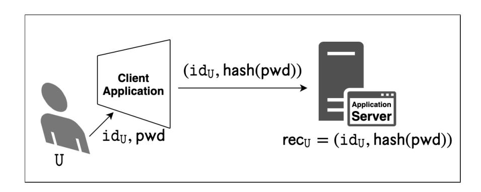
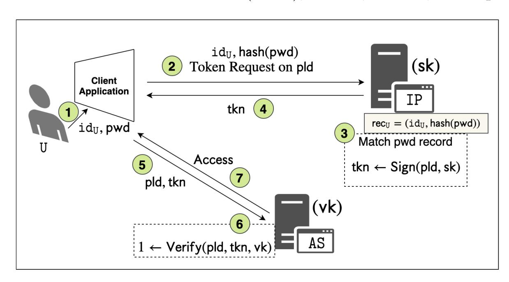
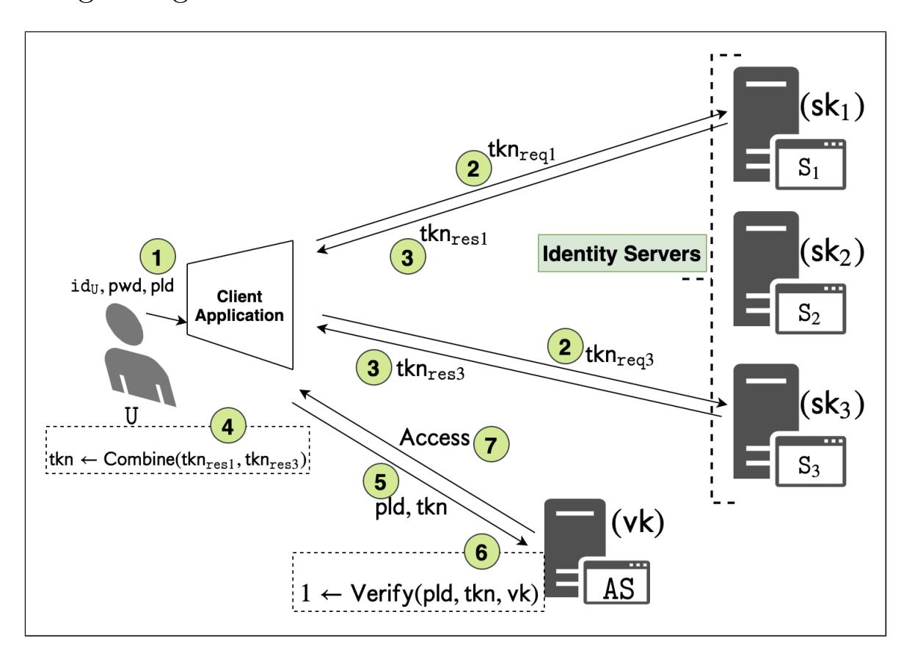
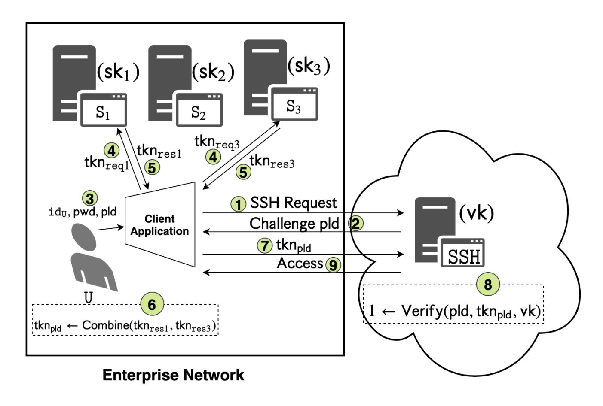

{0}------------------------------------------------

# PAS-TA-U: PASsword-based Threshold Authentication with Password Update

Rachit Rawat<sup>1</sup> and Mahabir Prasad Jhanwar<sup>2</sup>

<sup>1</sup>Ashoka University, INDIA, rachit.rawat@alumni.ashoka.edu.in <sup>2</sup>Ashoka University, INDIA, mahavir.jhawar@ashoka.edu.in

#### Abstract

A single-sign-on (SSO) is an authentication system that allows a user to log in with a single identity and password to any of several related, yet independent, server applications. SSO solutions eliminate the need for users to repeatedly prove their identities to different applications and hold different credentials for each application. Token-based authentication is commonly used to enable an SSO experience on the web, and on enterprise networks. A large body of work considers distributed token generation which can protect the long-term keys against a subset of breached servers. A recent work (CCS'18) introduced the notion of Password-based Threshold Authentication (PbTA) with the goal of making password-based token generation for SSO secure against server breaches that could compromise both long-term keys and user credentials. They also introduced a generic framework called PASTA that can instantiate a PbTA system.

The existing SSO systems built on distributed token generation techniques, including the PASTA framework, do not admit password-update functionality. In this work, we address this issue by proposing a password-update functionality into the PASTA framework. We call the modified framework PAS-TA-U.

As a concrete application, we instantiate PAS-TA-U to implement in Python a distributed SSH key manager for enterprise networks (ESKM) that also admits a password-update functionality for its clients. Our experiments show that the overhead of protecting secrets and credentials against breaches in our system compared to a traditional single server setup is low (average 119 ms in a 10-out-of-10 server setting on Internet with 80 ms round trip latency).

# 1 Introduction

Password-based Authentication (PbA): One of the primary purposes of authentication is to facilitate access control to a resource such as local or remote access to computer accounts; access to software applications, when an access privilege is linked to a particular identity. A typical scenario is when the remote resource is a application server, and a user is using a client application to authenticate itself to the application server. Password-based techniques are a very popular choice underlying most authentication systems. In a password-based authentication (PbA) system, a user U creates its user credential record — a user identity id<sup>U</sup> , and a hash of a secret password pwd, i.e. hash(pwd), with the application server through a one-time registration process. Later, in order to gain access (log in) to the application server, U provides (idU, pwd) to its client which then computes hash(pwd), and sends (idU, hash(pwd)) to the application server. The server compares this to the stored record for the stated id<sup>U</sup> and gives access if it matches.

Token-based Single-sign-on (SSO): A single-sign-on is an authentication system that allows a user to log in with a single identity and password to any of several related, yet independent, server applications. SSO solutions eliminates the need for users to repeatedly prove their identities to different applications using different credentials for each application. We make a distinction by calling one of the application servers as the identity provider, i.e. IP, and the rest of the related application servers as AS. Token-based techniques are currently very common for the implementation of an SSO system. In such a system, an IP generates a

{1}------------------------------------------------



Figure 1: PbA: Login

one-time key pair of signing and verification keys (sk, vk), keeps the signing key sk with itself, and makes the verification key vk available to all ASs. A one-time registration phase allows a user U to create and store its credential (idU, pwd) with the IP. In order to gain access to any AS, the user U must reach out to IP with its user credential (idU, hash(pwd)), and a payload pld that contains the user's information/attributes, expiration time and a policy that would control the nature of access. The IP verifies U's credential by matching it against a stored record before issuing an authentication token tkn which is produced for the payload pld with the help of the secret singing key sk, i.e. tkn ← Sign(pld,sk). The token so obtained is stored by the user client in a cookie or the local storage, and can then be used for all future accesses to AS's without using the pwd, until it expires. In particular, when the user client presents the tkn to an AS requesting for an access, the tkn is verified by the AS which holds the verification key vk, i.e. 1/⊥ ← Verify(tkn, vk). Popular token-based SSO systems include JSON Web Token (JWT), SAML, OAuth, and OpenID.



Figure 2: SSO : Token-based

Password-based Threshold Authentication (PbTA): The basic PbA systems, and the more advanced token-based SSO systems place greater responsibility on an identity provider IP of maintaining the confidentiality of a large number of users credentials. Such an IP is a single point of failure that if breached, enables an attacker to (1) recover the long term signing key sk and forge arbitrary tokens that enable access to all application servers and (2) obtain hashed passwords of users to use as part of an offline dictionary attack to recover their credentials. A large body of work considers distributed token generation through threshold digital signatures and threshold message authentication codes which can protect the long term signing key sk against a subset of breached servers [\[1,](#page-18-0) [2,](#page-18-1) [3,](#page-18-2) [4,](#page-18-3) [5,](#page-18-4) [6\]](#page-18-5). A separate line of work on threshold password-authenticated key exchange (T-PAKE) aims to prevent offline dictionary attacks in standard password-authenticated key exchange (PAKE) by employing multiple servers [\[7,](#page-18-6) [8,](#page-18-7) [9,](#page-18-8) [10\]](#page-18-9).

A very recent work of Agrawal et al. [\[11\]](#page-18-10) introduces the notion of Password-based Threshold Authentication (PbTA) for token-based SSO where they propose to distribute the role of identity provider IP among n identity servers {S1, . . . , Sn} such that at any point a subset of these servers, any t of them, collectively verify users' passwords and generate authentication token for them. A PbTA system proposes a very strong unforgeability and password-safety properties with the goal of making password-based token generation secure against identity server breaches (up to t − 1 at a time) that could compromise both long-term keys and 

{2}------------------------------------------------

user credentials. This is enabled by requiring that any attacker who compromises at most t − 1 identity servers cannot forge valid tokens or mount offline dictionary attacks. In [\[11\]](#page-18-10) a generic framework called PASTA which can instantiate a secure PbTA system was also proposed. The PASTA framework uses as building blocks any threshold oblivious pseudorandom function (TOPRF) and any threshold token generation (TTG) scheme, i.e., a threshold digital signature.



Figure 3: PbTA : 2-out-of-3 Token Generation

## 1.1 Our Contribution

The existing distributed token generation based SSO systems, including the PASTA framework, have so far not addressed the issue of password update functionality in their designs. The password update mechanism in a basic PbA is easy to implement and typically requires a user client to submit the hashes of both its current and a newly selected password. The current password hash is used for authentication by the identity provider before it replaces the current credentials with the updated credentials. Implementing password update mechanism in the setting of distributed token generation is not easy for the obvious reason that the identity provider is now split into several identity servers. This is particularly more problematic in the case of PASTA framework where no identity server holds the hashed user-passwords. In this work we propose to address this issue. The details are summarised as follows:

- We propose a password-update functionality to PASTA framework. The modified framework is now referred to as PAS-TA-U.
- We show how PASTA framework can be used to implement a distributed SSH key manager for enterprise networks (ESKM). The concept of an ESKM was first introduced by Harchol et al. in [\[12\]](#page-18-11) and was instantiated therein using threshold cryptographic primitives. ESKM is a secure and fault-tolerant logically-centralised SSH key manager. The logically central key server of [\[12\]](#page-18-11) was implemented in a distributed fashion using n key servers (also know as control cluster (CC) nodes ) such that users in the enterprise network must interact with a subset of these CC nodes for a successful SSH connection. The problem of user authentication to CC nodes was also discussed in [\[12\]](#page-18-11) and password-based variants were proposed for the same.
  - The functionality of a password update mechanism for its users in an ESKM is an obvious requirement. As a concrete application, we implement PAS-TA-U to instantiate an ESKM that admits password update functionality for its users.
- The plain PASTA framework distributes the role of an identity provider IP among n identity servers {S1, . . . , Sn}. Consequently, the registration phase in PASTA involves a direct interaction between a user

{3}------------------------------------------------

and the n identity servers. We propose to keep only a user and the identity provider IP as primary participants in the registration phase. It is during the registration phase that a user is provided with a set of identity servers {S1, . . . , Sn} by the IP. The user consequently reaches out to all identity servers with necessary information. In doing so we are keeping the identity provider in charge who may choose to select different identity servers for different users.

## 1.2 Organization

In Section [2,](#page-3-0) preliminaries required for PAS-TA-U framework are given. In § [2.1](#page-3-1) GapTOMDH problem is given; the details on secret sharing are given in § [2.2;](#page-3-2) and the details on threshold token generation (TTG) and threshold oblivious pseudo-random function (TOPRF) are given in § [2.3](#page-5-0) and § [2.4](#page-6-0) respectively. The details on password-based threshold authentication (PbTA) are given in Section [3.](#page-9-0) The PAS-TA-U framework is given in Section [4.](#page-12-0) The security definitions for the underlying primitives make the basis for PbTA security definitions such as password-safety and unforgeability. As PAS-TA-U modifies PASTA frame directly to enhance it with a password functionality, we define password-update safety in Definition [11.](#page-11-0) The password-update safety of PAS-TA-U is directly reduced to the unforgeability requirement in § [4.1.](#page-14-0) In Section [5](#page-15-0) we use PAS-TA-U to construct a distributed SSH key manager for enterprise networks. The implementation details are given in § [5.1.](#page-16-0)

# <span id="page-3-0"></span>2 Preliminaries

Notations. N denotes the set of natural numbers. Z<sup>p</sup> denotes the finite field having elements {0, 1, , . . . , p− 1} with addition and multiplication modulo the prime p. For a natural number n, we let [n] = {1, 2, . . . , n}. For a set S, a \$ ← S denotes that a is selected from S at random. We use PPT as a shorthand for probabilistic polynomial time and negl to denote negligible functions. The GroupGen be a PPT algorithm that on input a security parameter 1<sup>λ</sup> , outputs (p, g, G) where p is a λ bit prime, G is a multiplicative group of order p, and g is a generator of G.

### <span id="page-3-1"></span>2.1 Hardness Assumption

For q1, . . . , q<sup>n</sup> ∈ N and t 0 , t ∈ N where t <sup>0</sup> < t ≤ n, define

$$\mathsf{MAX}_{t',t} = \max\{\ell \mid \exists \ \hat{u}_1, \dots, \hat{u}_\ell \in \{0,1\}^n \text{ s.t. } \mathsf{HW}(\hat{u}_i) = t - t' \text{ and } \sum_{i=1}^\ell \hat{u}_i \le (q_1, \dots, q_n)\}$$
 (1)

where HW(ˆu) denotes the number of 1's in the binary vector ˆu, and all operations on vectors are componentwise integer operations.

Definition 1 (GapTOMDH) A cyclic group generator GroupGen satisfies the Gap Threshold One-More Diffie-Hellman (GapTOMDH) assumption if for all t 0 , t, n, r where t <sup>0</sup> < t ≤ n and for all PPT adversary A in OneMoreA(1<sup>λ</sup> , t0 , t, n, r) game as defined in Fig. [4,](#page-4-0) there exists a negligible function negl s.t.

$$\Pr[1 \leftarrow \mathsf{OneMore}_{\mathcal{A}}(1^{\lambda}, t', t, n, r)] \leq \mathsf{negl}(\lambda)$$

## <span id="page-3-2"></span>2.2 Shamir Secret Sharing

In the following we recall Shamir secret sharing scheme [\[13\]](#page-18-12) and related concepts.

{4}------------------------------------------------

```
OneMoreA(1λ
                  , t0
                     , t, n, r)
     – (p, g, G)
                   $
                  ← GroupGen(1λ
                                    )
     – g1, . . . , gr
                    $
                   ← G
     – ({(i, αi)}i∈B,st) ← A(p, g, G, g1, . . . , gr), where B ⊆ [n], |B| = t
                                                                                 0
     – (k0, k1, . . . , kn)
                          $
                          ← GenShare(p, t, n, {(i, αi)}i∈B)
     – qi
           := 0 for i ∈ [n]
     – ((g
           0
           1
            , h1), . . . ,(g
                          0
                          `
                          , h`)) ← AhOi(st)
     – output 1 ⇐⇒

                            ` > MAXt
                                       0
                                        ,t(q1, . . . , qn)
                            g
                             0
                             i ∈ {g1, . . . , gr} and hi = g
                                                            0k0
                                                            i
                                                                ∀ i ∈ [`]
                            g
                             0
                             i
                               6= g
                                   0
                                   j
                                     ∀ 1 ≤ i 6= j ≤ `
• O(i, x)
     – Input: i ∈ [n]\B, x ∈ G
     – qi
           := qi + 1
     – Output: return x
                            ki
• ODDH(x1, x2, y1, y2)
     – Input: x1, x2, y1, y2 ∈ G
     – Output: return 1 ⇐⇒ dlogx1
                                          x2 = dlogy1
                                                       y2
```

Figure 4: OneMoreA(1<sup>λ</sup> , t0 , t, n, r)

Definition 2 (Lagrange Interpolation) Let t be a positive integer and F be a field. Given any t pairs of field elements (x1, y1), . . . , (x<sup>t</sup> , yt) with distinct xi's, there exists a unique polynomial f(x) ∈ F[x] of degree at most t − 1 such that f(xi) = y<sup>i</sup> for 1 ≤ i ≤ t. The polynomial can be obtained using the Lagrange interpolation formula as follows,

$$f(x) = y_1 \lambda_{x_1}^S(x) + \dots + y_t \lambda_{x_t}^S(x), \tag{2}$$

where S = {x1, . . . , xt} and λ S xi (x)'s (1 ≤ i ≤ t) are Lagrange basis polynomials, given by

$$\lambda_{x_i}^S(x) = \frac{\prod_{1 \le j \le t, j \ne i} (x - x_j)}{\prod_{1 \le j \le t, j \ne i} (x_i - x_j)}$$
(3)

Definition 3 (Shamir Secret Sharing) Let t, n ∈ N such that 1 < t ≤ n. A (t, n)-threshold Shamir secret sharing allows a dealer D to share a secret among n participants {P1, . . . , Pn} such that at t least of them are required to reconstruct the secret back, and any set of less than t participants will have no information on the secret. In particular, the scheme has two algorithms (ShamirShare, ShamirRec) and they work as follows:

- ShamirShare. On input a secret sk ∈ F<sup>q</sup> where q > n, the share generation algorithm ShamirShare outputs a list of n shares as follows.
  - f(x) \$ ← Fq[x] s.t. f(0) = sk and degree(f) ≤ t − 1.
  - sk<sup>i</sup> = f(i) mod p, for i ∈ [n].
  - Each P<sup>i</sup> gets ski, the ith share of sk
- ShamirRec: The secret reconstruction algorithm ShamirRec requires any t shares for correct secret reconstruction.
  - 1. Input: {ski}i∈S, where S ⊆ [n] and |S| = t
  - 2. Output: sk = P i∈S skiλ S i (0)

{5}------------------------------------------------

#### <span id="page-5-0"></span>2.3 Threshold Token Generation (TTG)

A threshold token generation scheme essentially refers to a threshold signature scheme. In a traditional public-key signature scheme, we have a signer who holds a secret signing key and a verifier who holds a public verification key. In a (t, n)-threshold signature scheme, where  $t \leq n$ , the secret key is split into n signers  $\{P_1, \ldots, P_n\}$  such that at least t these parties must come together to sign a message. The collective signing is done in a way such that at no stage the secret key is revealed.

**Definition 4 (Threshold Token Generation (TTG))** A threshold token generation scheme  $\Pi$  is a tuple (SetUp, PartSign, Combine, Verify) of four PPT algorithms and they work as follows:

- Setup $(1^{\lambda}, t, n)$  The inputs to the setup algorithm are: a security parameter  $\lambda$ , n signing parties  $P_1, \ldots, P_n$ , and a number  $t \leq n$ . It proceeds as follows:
  - Generate a pair of singing and verification key (sk, vk) along with public parameters pp
  - Generate n shares  $(\mathsf{sk}_1, \ldots, \mathsf{sk}_n)$  of the signing key  $\mathsf{sk}$
  - Each signing party  $P_i$  receives  $(sk_i, pp)$
  - The pair (vk, pp) is made publicly available.
- $\mathsf{PartSign}(\mathsf{sk}_i, x)$  This algorithm is run by individual signers. The ith signer  $P_i$  takes as input a message x and its share  $\mathsf{sk}_i$ . It returns a partial signature  $y_i$  on x.
- Combine( $\{y_i\}_{i\in S}$ ). This algorithm puts together t part signatures  $\{y_i\}_{i\in S}$  where |S|=t and combine them to output a signature, also refer it as a token, tk on x.
- Verify(vk, tk, x) The verification algorithm takes as input the verification key vk, a token tk, and a message x. It outputs 1 if and only if tk is a valid signature on x.

#### 2.3.1 A TTG Construction

In the following we recall the famous TTG scheme due to Victor Shoup [6]. We begin by setting up a few notations. Let t, n be positive integers such that  $1 < t \le n$ . Define  $\Delta = n!$ . In the following we now define modified Lagrange coefficients. The Lagrange coefficients are polynomials and the modified variants are defined as follows.

**Definition 5 (Modified Lagrange Coefficients [6])** Let  $S \subset \{1, 2, ..., n\}$ . For any  $j \in \{1, 2, ..., n\} \setminus S$ , define

$$\tilde{\lambda}_{j}^{S}(x) = \Delta \lambda_{j}^{S}(x) = \Delta \cdot \frac{\prod_{k \in S \setminus \{j\}} (x - k)}{\prod_{k \in S \setminus \{j\}} (j - k)}$$

$$\tag{4}$$

Clearly,  $\tilde{\lambda}_j^S(x) \in \mathbb{Z}[x]$  for all  $j \in \{1, 2, ..., n\} \backslash S$ . In the following, we recall Lagrange interpolation over  $\mathbb{Z}_N$  where N is an RSA modulus, i.e.  $N = p \times q$  where p, q are distinct primes.

**Theorem 1 ([6])** Let  $f(x) = \sum_{k=0}^{t-1} a_k x^k \in \mathbb{Z}_N[X]$  be of degree at most t-1, where N > n is an RSA modulus. Let  $\{(j, f(j))\}_{j \in S}$  be t points over f(x), where  $S \subseteq \{1, 2, ..., n\}$  and  $\Delta = n!$ . Then,

$$\Delta \cdot f(x) = \sum_{j \in S} f(j) \cdot \tilde{\lambda}_j^S(x) \bmod \phi(N)$$
 (5)

In the following we now recall Shoup's [6] threshold signature, aka threshold token generation scheme.

• Setup $(1^{\lambda}, t, n)$ : The setup algorithm generates necessary parameters for the n signers as follows:

{6}------------------------------------------------

- Generate  $\lambda$ -bit primes  $p, q \ (p \neq q)$
- -N = pq
- $-e, d \stackrel{\$}{\leftarrow} \mathbb{Z}_N \text{ s.t. } ed \equiv 1 \pmod{\phi(N)}$
- $(\mathsf{sk}_1, \dots, \mathsf{sk}_n) \longleftarrow \mathsf{ShamirShare}(d, t, n)$
- Verification key  $vk = (e, N, H(\cdot))$ , where  $H : \{0, 1\}^* \to \mathbb{Z}_N$  is a secure hash function.
- Each signer  $P_i$  receives  $sk_i$ .
- PartSign: A signer  $P_i$  runs this algorithm. It produces a partial signature on a message m using its secret share  $sk_i$  as follows:
  - Output:  $y_i = H(m)^{2\Delta \mathsf{sk}_i} \mod N$ , where  $\Delta = n!$
- Combine( $\{y_i\}_{i\in S}$ ): The input to these algorithms are partial signatures  $\{y_i\}_{i\in S}$  received from t signers, i.e. |S| = t where  $S \subseteq \{P_1, \dots, P_n\}$ . This algorithm combines these partial signatures to obtain a full signature as follows.
  - Compute  $w = \prod_{i \in S} y_i^{2\Delta \tilde{\lambda}_i^S(0)} \mod N$  Find integers a, b such that  $a4\Delta^2 + be = 1$

  - Compute  $\sigma = w^a H(m)^b \mod N$
  - Output  $(m, \sigma)$
- Verify: The verification algorithm is used for checking signature validity. The input to this algorithm is a tuple  $(m, \sigma, vk)$  and it works as follows:
  - Output valid  $\iff H(m) \stackrel{?}{=} \sigma^e \pmod{N}$ .

Correctness: Note that,  $w = (H(m)^{4\Delta^2 d}) \pmod{N}$ . Finally,

$$\sigma \equiv w^a H(m)^b \mod N$$

$$\equiv (H(m)^{4\Delta^2 d})^a (H(m)^{ed})^b \mod N$$

$$= (H(m)^d)^{4\Delta^2 a + eb} \mod N$$

$$= H(m)^d \mod N$$

#### <span id="page-6-0"></span>Threshold Oblivious Pseudo-Random Function (TOPRF) 2.4

A pseudo-random function (PRF) family is a keyed family of deterministic functions. A function chosen at random from the family is indistinguishable from a random function. Oblivious PRF (OPRF) is an extension of PRF to a two-party setting where a server S holds the key and a party P holds an input. S can help Pin computing the PRF value on the input but in doing so P should not get any other information and S should not learn P's input. Jarecki et al. [14] extend OPRF to a multi-server setting so that a threshold number t of the servers are needed to compute the PRF on any input. Furthermore, a collusion of at most t-1 servers learns no information about the input.

Definition 6 (Threshold Oblivious Pseudo-Random Function (TOPRF)) A threshold oblivious  $pseudo-random\ function\ is\ a\ PRF\ \mathsf{TOP}:\mathcal{K}\times\mathcal{X}\to\mathcal{Y}\ along\ with\ a\ tuple\ of\ four\ \mathsf{PPT}\ algorithms\ (\mathsf{Setup},\mathsf{Encode},$ Eval, Combine) described below. The server S is split into n servers  $S_1, \ldots, S_n$ . The party P must reach out to a subset of these servers to compute a TOP value.

- Setup $(1^{\lambda}, t, n) \to (\mathsf{sk}, \{\mathsf{sk}_i\}_{i=1}^n, \mathsf{pp})$ . It generates a secret key  $\mathsf{sk}, n$  shares  $\mathsf{sk}_1, \ldots, \mathsf{sk}_n$  of  $\mathsf{sk}, and \ public$ parameters pp. Share  $sk_i$  is given to party  $S_i$ . The public parameters pp will be an implicit input in the algorithms below.

{7}------------------------------------------------

- $\mathsf{Encode}(x,\rho)$ . It is run by the party P. It generates an encoding c of x using randomness  $\rho$ .
- $\mathsf{Eval}(\mathsf{sk}_i, c)$  It is run by a server  $S_i$ . It uses  $\mathsf{sk}_i$  to generate a share  $z_i$  of TOPRF value  $\mathsf{TOP}(\mathsf{sk}, x)$  from the encoding c.
- Combine $(x, \{(i, z_i)\}_{i \in S}, \rho)$  It is run by the party P. It combines the shares received from any set of t servers (|S| = t) using randomness  $\rho$  to generate a value h.

#### Correctness

For all  $\lambda \in \mathbb{N}$ , and  $t, n \in \mathbb{N}$  where  $t \leq n$ , all  $(\mathsf{sk}, \{\mathsf{sk}_i\}_{i=1}^n, \mathsf{pp}) \xleftarrow{\$} \mathsf{Setup}(1^\lambda, t, n)$ , any value  $x \in \mathcal{X}$ , any randomness  $\rho, \rho'$ , and any two sets  $S, S' \subseteq [n]$  where  $|S| = |S'| \geq t$ , if  $c = \mathsf{Encode}(x.\rho)$ ,  $c' = \mathsf{Encode}(x.\rho')$ ,  $z_i = \mathsf{Eval}(\mathsf{sk}_i, c)$  for  $i \in S$ , and  $z'_j = \mathsf{Eval}(\mathsf{sk}_j, c')$  for  $j \in S'$ , then  $\mathsf{Combine}(x, \{(i, z_i)\}_{i \in S}, \rho) = \mathsf{Combine}(x, \{(i, z'_j)\}_{j \in S'}, \rho')$ .

## 2.4.1 Security

As given in [11], in the following we list the security properties that a TOPRF must satisfy.

**Definition 7 (Unpredictability [11])** A TOPRF is unpredictable if for all  $t, n \in \mathbb{N}$  where  $t \leq n$ , and PPT adversary  $\mathcal{A}$  in Unpredictability<sub>TOP, $\mathcal{A}$ </sub> $(1^{\lambda}, t, n)$  game as defined in Fig. 5, there exists a negligible function negl s.t.

$$\Pr[1 \leftarrow \mathsf{Unpredictability}_{\mathsf{TOP},\mathcal{A}}(1^{\lambda},t,n)] \leq \frac{\mathsf{MAX}_{|\mathcal{C}|,t}(q_1,\ldots,q_n)}{|\mathcal{X}|} + \mathsf{negl}(\lambda)$$

```
Unpredictability<sub>TOP.A</sub>(1^{\lambda}, t, n)
          -([[\mathsf{sk}]],\mathsf{pp}) \stackrel{\$}{\leftarrow} \mathsf{Setup}(1^{\lambda},t,n)
          - \mathcal{C} \leftarrow \mathcal{A}(\mathsf{pp})
           -x^* \stackrel{\$}{\leftarrow} \mathcal{X}
           -q_i := 0 \text{ for } i \in [n]
           -h^* \leftarrow \mathcal{A}^{\langle \mathcal{O} \rangle}(\{\mathsf{sk}_i\}_{i \in \mathcal{C}})
           - output 1 \iff \mathsf{TOP}(\mathsf{sk}, x^*) = h^*
• \mathcal{O}_{\mathsf{enc} \land \mathsf{eval}}()
           -c := \mathsf{Encode}(x^*, \rho) \text{ for a randomness } \rho
           -z_i \leftarrow \mathsf{Eval}(\mathsf{sk}_i, c) \text{ for } i \in [n] \backslash \mathcal{C}
           - return c, \{z_i\}_{i\in[n]\setminus\mathcal{C}}
• \mathcal{O}_{\mathsf{eval}}(i,c)
           - require: i \in [n] \setminus \mathcal{C}
           -q_i = q_i + 1
           - return Eval(sk_i, c)
\bullet \ \mathcal{O}_{\mathsf{check}}(h)
                                               if h = \mathsf{TOP}(\mathsf{sk}, x^*)
          - \text{ return } \begin{cases} 1 \\ 0 \end{cases}
                                                 otherwise
```

Figure 5: Unpredictability<sub>TOP,A</sub> $(1^{\lambda}, t, n)$ 

{8}------------------------------------------------

**Definition 8 (Obliviousness [11])** A TOPRF is unpredictable if for all  $t, n \in \mathbb{N}$  where  $t \leq n$ , and PPT adversary  $\mathcal{A}$  in Obliviousness<sub>TOP, $\mathcal{A}$ </sub> $(1^{\lambda}, t, n)$  game as defined in Fig. 6, there exists a negligible function negl s.t.

$$\Pr[1 \leftarrow \mathsf{Obliviousness}_{\mathsf{TOP},\mathcal{A}}(1^{\lambda},t,n)] \leq \frac{\mathsf{MAX}_{|\mathcal{C}|,t}(q_1,\ldots,q_n) + 1}{|\mathcal{X}|} + \mathsf{negl}(\lambda)$$

```
Obliviousness<sub>TOP,\mathcal{A}</sub>(1^{\lambda}, t, n)
          -([[\mathsf{sk}]],\mathsf{pp}) \stackrel{\$}{\leftarrow} \mathsf{Setup}(1^{\lambda},t,n)
          -\mathcal{C} \leftarrow \mathcal{A}(\mathsf{pp})
          -x^* \stackrel{\$}{\leftarrow} \mathcal{X}
          -q_i := 0 \text{ for } i \in [n]
           -x^{**} \leftarrow \mathcal{A}^{\langle \mathcal{O} \rangle}(\{\mathsf{sk}_i\}_{i \in \mathcal{C}})
           - output 1 \iff x^* = x^{**}
• \mathcal{O}_{\mathsf{enc} \land \mathsf{eval}}()
          -c := \mathsf{Encode}(x^*, \rho) \text{ for a randomness } \rho
          -z_i \leftarrow \mathsf{Eval}(\mathsf{sk}_i, c) \text{ for } i \in [n] \backslash \mathcal{C}
           - h := \mathsf{Combine}(x^*, \{(i, z_i)\}_{i \in [n]}, \rho)
          - return c, h, \{z_i\}_{i \in [n] \setminus \mathcal{C}}
• \mathcal{O}_{\mathsf{eval}}(i,c)
          - require: i \in [n] \setminus \mathcal{C}
           -q_i = q_i + 1
          - return Eval(sk_i, c)
```

Figure 6: Obliviousness<sub>TOP,A</sub> $(1^{\lambda}, t, n)$ 

#### 2.4.2 A TOPRF Construction

In the following we recall a TOPRF construction called 2HashTDH [14] that PASTA uses. The underlying PRF for 2HashTDH is  $H: \mathcal{X} \times \mathbb{Z}_p \to \{0,1\}^{\lambda}$ , where  $\mathcal{X}$  is the message space, and  $\mathbb{Z}_p$  the key space. To define H, we require two hash functions:  $H_1: \mathcal{X} \times \mathbb{G} \to \{0,1\}^{\lambda}$ , and  $H_2: \mathcal{X} \to \mathbb{G}$ , where  $(p,g,\mathbb{G}) \xleftarrow{\$}$  GroupGen $(1^{\lambda})$ . Finally, for  $x \in \mathcal{X}$ , and key  $\mathsf{sk} \in \mathbb{Z}_p$ , define

$$H(x, \mathsf{sk}) = H_1(x, H_2(x)^{\mathsf{sk}}).$$

The TOPRF evaluation for H is described below, where P holds a message  $x \in \mathcal{X}$ , and the secret key sk is split between n servers.

- Setup
$$(1^{\lambda}, t, n)$$
.

-  $(p, g, \mathbb{G}) \stackrel{\$}{\leftarrow} \text{GroupGen}(1^{\lambda})$ 

-  $\text{sk} \stackrel{\$}{\leftarrow} \mathbb{Z}_p$ 

-  $(\text{sk}_1, \dots, \text{sk}_n) \stackrel{\$}{\leftarrow} \text{ShamirShare}(\text{sk}, t, n)$ 

-  $\text{Set pp} = (p, g, \mathbb{G}, t, n, H_1, H_2)$ .

-  $\text{Give } (\text{sk}_i, \text{pp}) \text{ to each server } S_i$ 

-  $\text{Encode}(x)$ . This is run by  $P$ 

{9}------------------------------------------------

```
\begin{array}{l} -\rho \stackrel{\$}{\leftarrow} \mathbb{Z}_p \\ - \text{Output } c = H_2(x)^\rho \\ - \text{ Eval}(\mathsf{sk}_i,c). \text{ This is run by a server } S_i \\ - \text{ Output } z_i = c^{\mathsf{sk}_i} \\ - \text{ Combine}(x,\{(i,z_i)\}_{i\in S},\rho). \text{ This is run by } P \\ - \text{ Output } \bot \text{ if } |S| \leq t-1 \text{ where } S \subseteq [n] \\ - \text{ Compute } z = \prod_{i\in S} z_i^{\lambda_i}, \text{ where } \lambda_i \text{ are Lagrange coefficients computed over the set } S \ (|S| = t) \\ - \text{ Output } H_1(x,z^{\rho^{-1}}) \end{array}
```

#### 2HashTDH Security

In the work of [11], it was shown that 2HashTDH scheme as described above satisfies both Unpredictability and Obliviousness properties.

# <span id="page-9-0"></span>3 Password-based Threshold Authentication with Password Update

A password-based threshold authentication scheme allows a set of related application servers to provide a seamless single sign-on (SSO) service to its users. The system components include:

- a primary identity provider IP,
- n identity servers  $\{S_1, \ldots, S_n\}$  managing, between them, user's credentials,
- application servers AS's,
- users who want to gain access to all related yet independent applications servers ASs without the need for them to repeatedly prove their identities to these servers and hold different credentials for each of them, and
- a client application that facilitate user's interaction with the IP, identity servers  $S_i$ 's, and application servers AS's.

The algorithms for a PbTA system with password-update functionality are given below, along with their workflow.

- GlobalSetup( $1^{\lambda}$ ): In this phase the primary identity provider IP, on input a system wide security parameter  $\lambda$ , number of identity servers n, and a threshold parameter t ( $1 < t \le n$ ), generates a pair of signing and verification key ( $\mathsf{sk}, \mathsf{vk}$ ) along with system public parameters  $\mathsf{pp}$ . The IP then chooses and initialises n identity servers  $\{\mathsf{S}_1, \ldots, \mathsf{S}_n\}$  with the necessary parameters. In particular,
  - each identity server  $S_i$  is given a secret share  $sk_i$  of the signing secret key sk and the public parameters pp,
  - each application server AS is given the corresponding master verification key vk and the public parameters pp.

The GlobalSetup phase also initialises user client application with the necessary public parameters.

• Registration: This one-time phase allows a user U to open an account and register its user credentials with the n identity servers  $\{S_1, \ldots, S_n\}$  by interacting with the identity provider IP. It begins with the U choosing a pair of identity and password  $(id_U, pwd)$ , and it ends with the each server  $S_i$  receiving and storing a distinct user record  $rec_{i,U}$  in its record database  $REC_i$ .

{10}------------------------------------------------

- TokenGeneration: The token generation algorithm is an interactive algorithm run between a user U's client application and a set of at t identity servers, say {S1, . . . , St}.
  - TG.Request. Run by a client application.
    - ∗ Input (idU, pwd, pld, T ). As an input it takes a user identity idU, a user password pwd, a payload pld, and a set T ⊆ [n].
    - ∗ Output (stpld, {(idU, pld,req<sup>i</sup> )}i∈T ). It outputs a secret state stpld and request messages {(req<sup>i</sup> )}i∈T . For i ∈ T , (idU, pld,req<sup>i</sup> ) is sent to S<sup>i</sup> .
  - TG.Respond. Run by an identity server S<sup>i</sup> .
    - ∗ Input (sk<sup>i</sup> , REC<sup>i</sup> ,(idU, pld,req<sup>i</sup> )). As an input it takes a secret key share sk<sup>i</sup> , a record set REC<sup>i</sup> , a user identity idU, a payload pld and a request message req<sup>i</sup> .
    - ∗ Output res<sup>i</sup> . The output is a response message res<sup>i</sup> which is sent back to the connecting client.
  - TG.Finalize. Run by a client application.
    - ∗ Input (stpld, {resi}i∈T ). As input it takes a secret state stpld and response messages {resi}i∈T .
    - ∗ Output (tkpld). The output is a token (tkpld) for the payload pld. The token will be used by U to gain access to AS services.
- Verification: The verification algorithm checks the validity of a tk. The inputs to the verification algorithm are: the master verification key vk, a payload pld, and a token tkpld. The verification algorithm is run by the AS services every time they receive a login request.
- PasswordUpdate It allows users to update their passwords. The interactive algorithm PasswordUpdate is run between a user U and all identity servers, {S1, . . . , Sn}. U's inputs are its current password pwd and a new password pwd<sup>0</sup> . The algorithm ends with the each server S<sup>i</sup> updating their respective reci,<sup>U</sup> for U. The updated records are now valid against the new password pwd<sup>0</sup> . It is important to note that the PasswordUpdate is not run between U and the application server AS.

# <span id="page-10-0"></span>3.1 Security [\[11\]](#page-18-10)

In the following we recall the security game SecGameΠ,A(1<sup>λ</sup> , t, n) for a password-based threshold authentication scheme Π with password update as given in [\[11\]](#page-18-10).

```
SecGameΠ,A(1λ
          , t, n)
 – (pp, vk,(sk1, . . . ,skn)) $
                  ← GlobalSetup(1λ
                              , t, n)
 – (C, U
      ∗
       ,stA)
           $← A(pp) # C : corrupt servers, U
                                                            ∗
                                                             : target user
 – V := φ # set of corrupt users
 – PwdList := φ # list of (idU, pwd) pairs, indexed by idU
 – ReqListU,i := φ for i ∈ [n] # token requests U makes to Si
 – ct := 0, LiveSessions = [] # LiveSessions is indexed by ct
 – TokList := φ # list of tokens generated through Ofinal
 – QU,i := 0 for all U and i ∈ [n]
 – QU,pld := 0 for all U and pld
 – out ← AhOi({ski}i∈C,stA)
Ocorrupt(U)
 – Input: idU
 – V := V ∪ {idU}
```

{11}------------------------------------------------

– Output: if (idU, ∗) ∈ PwdList, return PwdList[idU]

Oregister(U)

- Input: idU, such that PwdList[idU] = ⊥
- pwd \$ ← P
- PwdList := PwdList ∪ {(idU, pwd)}
- (rec1,U, . . . ,recn,U) \$ ← Register(idU, pwd)
- REC<sup>i</sup> := REC<sup>i</sup> ∪ {reci,U} for i ∈ [n]

Oreq(U, pld, T )

- Input: User identity id<sup>U</sup> with PwdList[idU] 6= ⊥, payload pld, and a set T ⊆ [n].
- (stpld, {reqi}i∈T ) \$ ← TG.Request(idU, PwdList[idU], pld, T )
- LiveSessions[ct] := stpld
- ReqListU,i = ReqListU,i ∪ {reqi} for i ∈ T
- ct = ct + 1
- Output: return {reqi}i∈T

Oresp(i, U, pld,req<sup>i</sup> )

- Input: The ith identity server is provided with a user identity idU, payload pld, and a req<sup>i</sup> for token generation
- res<sup>i</sup> ← TG.Respond(sk<sup>i</sup> , REC<sup>i</sup> ,(idU, pld,req<sup>i</sup> ))
- QU,i := QU,i + 1 if req<sup>i</sup> ∈/ ReqListU,i
- QU,pld := QU,pld + 1
- Output: return res<sup>i</sup>

Ofinal(ct, {resi}S)

- Input: It is presented with a counter leading to a specific state, and identity server partial responses to a token generation request
- stpld := LiveSessions[ct]
- tk := TG.Finalize(stpld, {resi}i∈S)
- TokList := TokList ∪ {tk}
- Output: return tk

Definition 9 (Password Safety[\[11\]](#page-18-10)) A PbTA scheme Π i s password safe if all t, n ∈ N, (t ≤ n), all password space P and all PPT adversary A in SecGameΠ,A(1<sup>λ</sup> , t, n), there exists a negligible function negl such that

$$\Pr[(\textit{\textbf{U}}^* \notin \mathcal{V}) \land (\mathsf{out} = \mathsf{PwdList}[\textit{\textbf{id}}_{\textit{\textbf{U}}^*}] \neq \bot)] \leq \frac{\mathsf{MAX}_{|\mathcal{C}|,t}(Q_{\textit{\textbf{U}}^*,1},\ldots,Q_{\textit{\textbf{U}}^*,n}) + 1}{|\mathbb{P}|} + \mathsf{negl}(\lambda)$$

Definition 10 (Unforgeability[\[11\]](#page-18-10)) A PbTA scheme is unforgeable if for all t, n ∈ N, (t ≤ n), all password space P and all PPT adversary A in SecGameΠ,A(1<sup>λ</sup> , t, n), there exists a negligible function negl such that

$$- if Q_{\mathit{U}^*,\mathsf{pld}^*} < t - |\mathcal{C}|,$$

$$\Pr[\mathsf{Verify}(\mathsf{vk}, \textit{id}_{\textit{U}^*}, \mathsf{pld}^*, \mathsf{tk}^*) = 1] \leq \mathsf{negl}(\lambda)$$

– else

$$\Pr[(\textit{\textit{U}}^* \notin \mathcal{V}) \land (\mathsf{tk}^* \notin \mathsf{TokList}) \land (\mathsf{Verify}(\mathsf{vk}, \textit{\textit{id}}_{\textit{\textit{U}}^*}, \mathsf{pld}^*, \mathsf{tk}^*) = 1)] \leq \frac{\mathsf{MAX}_{|\mathcal{C}|, t}(Q_{\textit{\textit{U}}^*, 1}, \dots, Q_{\textit{\textit{U}}^*, n})}{|\mathbb{P}|} + \mathsf{negl}(\lambda)$$

<span id="page-11-0"></span>where A's output "out" in the SecGameΠ,A(1<sup>λ</sup> , t, n) is parsed as (pld<sup>∗</sup> ,tk<sup>∗</sup> ). 

{12}------------------------------------------------

**Definition 11 (Password Update Safety)** A PbTA scheme is password update safe if for all  $t, n \in \mathbb{N}$ ,  $(t \leq n)$ , all password space  $\mathbb{P}$  and all PPT adversary  $\mathcal{A}$  in SecGame<sub> $\Pi,\mathcal{A}$ </sub> $(1^{\lambda},t,n)$ , there exists a negligible function negl such that

$$\Pr[(\mathbf{U}^* \notin \mathcal{V}) \land (i \in [n] \backslash \mathcal{C}) \land (F_i \text{ is } true)] \leq \mathsf{negl}(\lambda)$$

where  $\mathcal{A}$ 's output "out" in the  $\mathsf{SecGame}_{\Pi,\mathcal{A}}(1^\lambda,t,n)$  is parsed as  $(i,\mathsf{rec}^*_{i,\mathit{U}^*})$ , and  $F_i$  denotes the event that  $S_i$  updates the existing record  $\mathsf{rec}_{i,\mathsf{U}^*}$  by replacing it with  $\mathsf{rec}^*_{i,\mathit{U}^*}$ .

# <span id="page-12-0"></span>4 PAS-TA-U: PASTA with Password Update

In the following we present PAS-TA-U framework. It is obtained by providing a password update functionality to the PASTA framework of [11]. Additionally, the registration phase in PAS-TA-U proposes, unlike the registration phase in plain PASTA, to keep a user and an identity provider IP as the primary participants. It is during the registration phase that a user is provided with a set of identity servers  $\{S_1, \ldots, S_n\}$  by the IP. The user consequently reaches out to all identity servers with the necessary information. In doing so we are keeping the identity provider in charge who may choose to select different identity servers for different users. The user uses a client application for all its interactions with the IP, identity servers and application servers.

The other algorithms in PAS-TA-U framework remain exactly as described in plain PASTA. The underlying cryptographic primitives used are:

1. a threshold token generation scheme:

2. a threshold oblivious pseudo-random function:

- 3. a symmetric-key encryption scheme: SKE = (SKE.Enc, SKE.Dec), and a hash function H.
- GlobalSetup: Both servers and clients are initialised with their respective setup parameters in the GlobalSetup phase:
  - TTG.Setup: Each server  $S_i$ ,  $1 \le i \le n$ , receives  $(\mathsf{sk}_i, \mathsf{pp}_{\mathsf{ttg}})$ , where

$$(\mathsf{pp}_{\mathsf{ttg}}, [[\mathsf{sk}]] = (\mathsf{sk}_1, \dots, \mathsf{sk}_n), \mathsf{vk}, \mathsf{sk}) \overset{\$}{\leftarrow} \mathsf{TTG}.\mathsf{Setup}(1^{\lambda_1}, n, t)$$

The verification key vk (along with  $pp_{ttg}$ ) is made available to all services managed by the AS. The master signing key sk is discarded.

- TOP. Setup: A client generates and saves  $\mathsf{pp}_\mathsf{top},$  where

$$\mathsf{pp}_{\mathsf{top}} = (p, g, \mathbb{G}, \mathcal{P}, H_1 : \mathcal{P} \times \mathbb{G} \to \{0, 1\}^{\lambda_2}, H_2 : \mathcal{P} \to \mathbb{G}) \xleftarrow{\$} \mathsf{TOP.Setup}(1^{\lambda_2})$$

- Registration: The registration phase is used by a user U to create its login credentials. This involves a user client, an identity provider IP and n identity servers selected by the IP. The registration is a three-step process: In step1, the user client reaches out to the identity provider IP; in step2, IP responds to the client and also reaches out to all identity servers; and finally in step3, the user client reaches out to all identity servers. The details for each of these steps are as follows:
  - **Step1** ( $U \to IP$ ): The user credentials for a user client U is a pair of user identity and a password ( $id_U$ , pwd). The registration begins with U computing and sharing the following with the IP:

{13}------------------------------------------------

```
* r \stackrel{\$}{\leftarrow} \mathbb{Z}_p^*.

* \operatorname{reg.id}_{\mathtt{U}} = H_2(\mathsf{pwd})^r

* \operatorname{Send}\left(\operatorname{\mathsf{id}}_{\mathtt{U}},\operatorname{\mathsf{reg.id}}_{\mathtt{U}}\right) to IP
```

- **Step2** (IP  $\rightarrow$  {U, {S<sub>i</sub>}<sub>i=1</sub><sup>n</sup>}): Upon receiving (id<sub>U</sub>, reg.id<sub>U</sub>) from U, the identity provider IP responds as follows:

```
* IP \rightarrow U

· k \stackrel{\$}{\leftarrow} \mathbb{Z}_p^*

· res.id<sub>U</sub> = (H_2(\mathsf{pwd})^r)^k

· Sends back res.id<sub>U</sub> to U

* IP \rightarrow \{S_i\}_{i=1}^n

· (k_1, \dots, k_n) \stackrel{\$}{\leftarrow} \mathsf{ShamirShare}(k, t, n)

· Sends (\mathsf{id}_{\mathtt{U}}, k_i) to S_i, 1 \leq i \leq n,
```

- **Step3** ( $U \to \{S_i\}_{i=1}^n$ ): Upon receiving the response res.id<sub>U</sub> from IP, U reaches out to identity servers with the following to complete the registration.

```
* H_2(\mathsf{pwd})^k = (\mathsf{res.id_U})^{r^{-1}} \ * h = \mathsf{TOP}_k(\mathsf{pwd}) = H_1(\mathsf{pwd}, H_2(\mathsf{pwd}^k)) \ * h_i = H(h\|i), \ 1 \le i \le n \ * Sends (\mathsf{id_U}, h_i) \text{ to } \mathsf{S}_i, \ 1 \le i \le n.
```

- Each  $S_i$ ,  $1 \le i \le n$ , make a record of U's registration credentials by storing  $[id_U, (h_i, k_i)]$ .
- TokenGeneration: This is run is by a user U to generate tokens (signed messages) used for accessing application services. As an input it takes a payload pld on which a token (signature) will be generated eventually and U's pwd. Consequently, the user client reaches out to any t out of n identity servers with the token generation request. Upon receiving all t responses, they are combined to produce a valid token.

```
- TG.Request (U \to \{S_i\}_{i \in \mathcal{T}}):
* \rho \in \mathbb{Z}_p^*
* \operatorname{req}_{\mathsf{ttg}} = \mathsf{TOP}.\mathsf{Encode}(\mathsf{pwd}, \rho) = H_2(\mathsf{pwd})^\rho
* \operatorname{Sends}\left(\mathsf{id}_{\mathsf{U}}, \mathsf{pld}, \mathsf{req}_{\mathsf{ttg}}\right) \text{ to a set of } t \text{ identity servers, without loss of generality, say } S_1, \dots S_t.
```

- TG.Respond ( $S_i \to U$ ): Upon receiving ( $id_U$ , pld,  $req_{ttg}$ ), the *i*th identity server  $S_i$  retrieves the corresponding record [ $id_U$ , ( $h_i$ ,  $k_i$ )] and responds as follows:

```
 \begin{split} * & z_i = \mathsf{TOP}.\mathsf{Eval}(k_i, \mathsf{req_{ttg}}) = (\mathsf{req_{ttg}})^{k_i} = H_2(\mathsf{pwd})^{\rho k_i} \\ * & y_i = \mathsf{TTG}.\mathsf{PartSign}(\mathsf{sk}_i, \mathsf{pld} \| \mathsf{id_U}) \\ * & v_i = \mathsf{SKE}.\mathsf{Enc}(h_i, y_i) \\ * & \mathsf{Return} \ \mathsf{ttg}.\mathsf{res}_i = (z_i, v_i) \ \mathsf{to} \ \mathtt{U} \end{split}
```

- TG. Finalize: The received responses  $\{\text{ttg.res}_i = (z_i, v_i) \mid 1 \leq i \leq t\}$  are combined by the user client to produce a token on the payload pld as follows:

```
\begin{array}{l} * \ \theta = H_2(\mathsf{pwd})^{k\rho} = \prod_{i=1}^t z_i^{\lambda_i} \\ * \ h = \mathsf{TOP}_k(\mathsf{pwd}) = H_1(\mathsf{pwd}, H_2(\mathsf{pwd}^k)) = H_1(\mathsf{pwd}, \theta^{\rho^{-1}}) \\ * \ h_i = H(h\|i), \ 1 \leq i \leq t \\ * \ y_i = \mathsf{SKE.Dec}(h_i, v_i), \ 1 \leq i \leq t \\ * \ \mathsf{tk}_{\mathsf{pld}} = \mathsf{TTG.Combine}(\{y_i\}_{i=1}^t) \end{array}
```

• Verification: The token verification algorithm is run by application services every time they receive a token  $\mathsf{tk}_{\mathsf{pld}}$  on a payload  $\mathsf{pld}$ . The access to the service is allowed only if  $1 \xleftarrow{\$} \mathsf{TTG}.\mathsf{Verify}(\mathsf{pld},\mathsf{tk}_{\mathsf{pld}},\mathsf{vk})$ .

{14}------------------------------------------------

• PasswordUpdate: This is run by a user U, every time it wants to update its current password pwd and set it to a new password pwd'. The process requires U to run TOP evaluations twice: once on the input pwd and later on pwd'. As TOP is implicitly built into the TokenGeneration algorithm, U therefore runs the later twice (note that payload is not important here). In the final step U runs the TokenGeneration algorithm for the third time on a special payload. This token is finally shared with all identity servers, who then use it to update their respective records associated with U. The details are as follows:

## - Step1:

- $* \ \{\mathsf{ttg.res}_i = (z_i, v_i) \mid 1 \leq i \leq t\} \xleftarrow{\$} \mathsf{TG.Respond}(\mathsf{TG.Request}(\mathsf{pwd}, \mathsf{pld}_1))$
- \* Use  $\{z_i\}_{i=1}^t$  to compute  $h = H_1(\mathsf{pwd}, H_2(\mathsf{pwd})^k)$
- \* Compute  $h_i = H(h||i), 1 \le i \le n$

## - **Step2**:

- \* {ttg.res<sub>i</sub> =  $(z'_i, v'_i) \mid 1 \le i \le t$ }  $\stackrel{\$}{\leftarrow}$  TG.Respond(TG.Request(pwd', pld<sub>2</sub>))
- \* Use  $\{z_i'\}_{i=1}^t$  to compute  $h' = H_1(\mathsf{pwd}', H_2(\mathsf{pwd}')^k)$
- \* Compute  $h'_i = H(h'||i), 1 \le i \le n$

## – Step3:

- \* Set  $\mathsf{pld}_3 = \mathsf{SKE}.\mathsf{Enc}(h_1, h_1 || h_1') || \cdots || \mathsf{SKE}.\mathsf{Enc}(h_n, h_n || h_n') || \mathsf{id}_{\mathtt{U}}$
- $* \ Compute \ \mathsf{tk}_{\mathsf{pld}_3} \xleftarrow{\$} \mathsf{TokenGeneration}(\mathsf{pwd},\mathsf{pld}_3) \ (\mathrm{the} \ \mathrm{current} \ \mathrm{password} \ \mathrm{is} \ \mathrm{used})$
- **Step4**: The user client for U finally sends  $(pld_3, tk_{pld_3})$  to all identity servers for password update.
- PasswordUpdate: Upon receiving a token  $(\mathsf{pld}_3, \mathsf{tk}_{\mathsf{pld}_3})$  requesting password update, each identity server  $S_i$  proceeds as follows:
  - \*  $S_i$  ensures that TTG. Verify( $pld_3$ ,  $tk_{pld_3}$ , vk) returns 1
  - \* Extract  $L_i = \mathsf{SKE}.\mathsf{Enc}(h_i, h_i || h_i')$  from  $\mathsf{pld}_3$
  - \* Compute  $h_i || h'_i = \mathsf{SKE.Dec}(h_i, L_i)$
  - \* Update the record for  $id_{U}$  as  $[id_{U}, h'_{i}, k_{i}]$  (replacing  $h_{i}$  by  $h'_{i}$ )

## <span id="page-14-0"></span>4.1 Security: Password Update

In the following we discuss password update security for PAS-TA-U as per the definition 11. A successful password update in PAS-TA-U requires a user to obtain a valid token using the existing credentials. Consequently, an unauthorised password update is directly reduced to token forgery. The following theorem provides the necessary details.

**Theorem 2** For all  $t, n \in \mathbb{N}$ ,  $(t \le n)$ , all password space  $\mathbb{P}$  and all PPT adversary  $\mathcal{A}$  in SecGame<sub> $\Pi, \mathcal{A}$ </sub> $(1^{\lambda}, t, n)$  (as given in Section 3.1), there exists a PPT adversary B in SecGame<sub> $\Pi, \mathcal{A}$ </sub> $(1^{\lambda}, t, n)$  such that

<span id="page-14-1"></span>
$$\Pr[(\mathcal{U}^* \notin \mathcal{V}) \land (i \in [n] \setminus \mathcal{C}) \land (F_i \text{ is } true)] \leq \mathsf{Adv}_{\mathsf{Unforgreability}}^{\mathcal{B}}(\mathsf{SecGame}_{\Pi, \mathcal{B}}(1^{\lambda}, t, n)) \tag{6}$$

where  $\Pi$  denotes PAS-TA-U,  $\mathcal{A}$ 's output "out" in the SecGame $_{\Pi,\mathcal{A}}(1^{\lambda},t,n)$  is parsed as  $(i,\operatorname{rec}_{i,\mathcal{U}^*}^*)$ , and  $F_i$  denotes the event that  $\mathcal{S}_i$  updates the existing record  $\operatorname{rec}_{i,\mathbb{U}^*}$  by replacing it with the new record  $\operatorname{rec}_{i,\mathbb{U}^*}^*$ . The  $\operatorname{Adv}_{\mathsf{Unforgreability}}^{\mathcal{B}}(\mathsf{SecGame}_{\Pi,\mathcal{B}}(1^{\lambda},t,n))$  denotes  $\mathcal{B}$ 's advantage in forging a token in the  $\mathsf{SecGame}_{\Pi,\mathcal{B}}(1^{\lambda},t,n)$ .

**Proof:** Assume,  $\mathcal{A} = \mathcal{A}_{pu}$  be a PPT adversary who can make any identity server  $S_i$  to update a target user  $U^*$ 's existing record  $rec_{i,U^*}$  by a record  $rec_{i,U^*}^*$ . We then construct a PPT adversary  $\mathcal{B} = \mathcal{A}_f$  who can forge token's for arbitrary users. The  $\mathcal{A}_f$  runs  $\mathcal{A}_{pu}$  as a subroutine. The details are as follows.

Let  $U^*$  be the target user for  $\mathcal{A}_f$  in the  $\mathsf{SecGame}_{\Pi,\mathcal{A}_f}(1^\lambda,t,n)$ . Let  $\mathcal{C} \subset [n]$  be the subset of identity servers that are corrupted by  $\mathcal{A}_f$  such that  $|\mathcal{C}| = t - 1$ . Let  $\mathsf{pwd}_{U^*}^{\mathsf{e}}$  be the existing password for  $U^*$ .  $\mathcal{A}_f$  chooses an

{15}------------------------------------------------

identity server  $S_i$  such that  $i \in [n] \setminus \mathcal{C}$  and a new password  $\mathsf{pwd}_{\mathsf{U}^*}^\mathsf{n}$  for  $\mathsf{U}^*$ .  $\mathcal{A}_f$  then makes a call to  $\mathcal{A}_{\mathsf{pu}}$  and present it with the input  $(i, \mathsf{pwd}_{\mathsf{U}^*}^\mathsf{n}, \mathsf{h}_i^*, \{\mathsf{rec}_{j,\mathsf{U}^*}^\mathsf{e}\}_{j \in \mathcal{C}})$  where  $h_i^* = H(h^* || i), \ h^* = H_1(\mathsf{pwd}_{\mathsf{U}^*}^\mathsf{n}, H_2(\mathsf{pwd}_{\mathsf{U}^*}^\mathsf{n})^k)$ . The  $h^*$  can be computed by  $\mathcal{A}_\mathsf{f}/\mathcal{A}_\mathsf{pu}$  by reaching out to any t identity servers on inputs  $\mathsf{id}_{\mathsf{U}^*}$ ,  $\mathsf{pwd}_{\mathsf{U}^*}^\mathsf{n}$ .

The adversary  $\mathcal{A}_{pu}$  subsequently mounts an attack on the target identity server  $S_i$ . If successful,  $S_i$  would update its existing record  $rec_{i,U^*} = (id_{U^*}, h_i, k_i)$  with the new record  $rec_{i,U^*}^* = (id_{U^*}, h_i^*, k_i)$  where  $h_i^*$  is provided by  $\mathcal{A}_{pu}$ .

On the other hand,  $\mathcal{A}_f$  by itself could update the records of each of the t-1 corrupted identity servers  $S_j$ 's,  $j \in \mathcal{C}$ , with the respective  $h_j^*$ 's where  $h_j^* = H(h^*||j)$ ,  $h^* = H_1(\mathsf{pwd}_{\mathbb{U}^*}^\mathsf{n}, H_2(\mathsf{pwd}_{\mathbb{U}^*}^\mathsf{n})^k)$ . Finally, let  $\mathcal{C}' = \mathcal{C} \cup \{i\}$ . As  $|\mathcal{C}'| = t$ , and as each identity server in  $\mathcal{C}'$  now have the valid  $h_j^*$ 's corresponding to the new password  $\mathsf{pwd}_{\mathbb{U}^*}^\mathsf{n}$ ,  $\mathcal{A}_f$  can obtain valid tokens issued on identity  $\mathsf{id}_{\mathbb{U}^*}$ . As we see a direct reduction here in terms of the problem instance for  $\mathcal{A}_f$  being directly reduced to the problem instance for  $\mathcal{A}_{\mathsf{pu}}$ , this proves the claim of equation 6.

# <span id="page-15-0"></span>5 A Concrete Application of PAS-TA-U: Practical SSH key manager for enterprise networks

In the following We show how PAS-TA-U framework can be used to implement an SSH (Secure shell) key manager (ESKM) - an enterprise level solution for managing SSH keys. The concept of an ESKM was first introduced by Harchol et al. in [12] and was instantiated therein using threshold cryptographic primitives. ESKM is a secure and fault-tolerant logically-centralised SSH key manager whose advantages include: (1) the ability to observe, approve and log all SSH connections origination from the home network, and (2) clients do not need to store secret keys and instead only need to authenticate themselves to the ESKM system. The ESKM central key server of |12| was implemented in a distributed fashion using n key servers (also know as control cluster (CC) nodes ) such that users in the enterprise network must interact with a subset of these CC nodes for a successful SSH connection. The problem of user authentication to CC nodes was also discussed in |12| and password-based variants were proposed for the same. The functionality of a password update mechanism for its users in an ESKM is an obvious requirement. As a concrete application, we implement PAS-TA-U to instantiate an ESKM that admits password update functionality for its users. The different entities in PAS-TA-U are mapped to ESKM components as follows: (1) the key manager in ESKM play the role of an identity provider IP, and n control nodes represent the identity servers  $\{S_1, \ldots, S_n\}$ , (2) enterprise network has SSH key pairs (sk, vk) and SSH servers storing vk represent the application servers AS, and (3) users in the enterprise network must obtain valid tokens by connecting to a subset of t ( $t \leq n$ ) identity servers before they can gain access to these SSH servers. In the following we present a working flow of the system.

{16}------------------------------------------------



Figure 7: Distributed SSH key manager for enterprise networks

- Step 1 The key manager (IP) runs the PAS-TA-U GlobalSetup to obtain (sk, vk) and n shares of {sk1, . . . ,skn} of sk. It submits vk with the application servers AS's (SSH servers). Finally, it sets up n identity servers {S1, . . . , Sn} locally and initialises them with the respective shares: S<sup>i</sup> ← sk<sup>i</sup> .
- Step 2 Users in the enterprise network run PAS-TA-U Registration with the IP to create and store credentials with the identity servers {S1, . . . , Sn}.
- Step 3 This step shows how a registered user make an SSH connection into application servers. A user client initiates an SSH connection in to an application server AS. As part of user authentication, the SSH handshake phase presents to the client a challenge payload pld to be signed using the signing key sk. Consequently, the client runs the PAS-TA-U TokenGeneration on payload pld by reaching out to a set of t identity servers using U's password pwd. A set of t correct responses are combined to produce a signature token tk on the payload pld under the signing key sk. The generated tk is sent back to the application server which then verifies it using the stored verification key vk. A correctly generated token will give U an access to the application server.
- Step 4 Our password update mechanism allows any user to update its password by reaching out to a set of any t identity servers directly. The updated matching user credentials are then uploaded to all identity servers.

## <span id="page-16-0"></span>5.1 ESKM Implementation

In this section we provide implementation details and consequently report on the performance of our instantiation of an ESKM using PAS-TA-U under practical network scenarios. We developed separate client applications for (a) users (b) identity provider IP, and (c) identity servers S<sup>i</sup> 's. All client applications are developed in Python. The entire source code for our implementation is hosted at [https://anonymous.](https://anonymous.4open.science/r/198222d4-a335-4b93-a219-5a0bf5a4ec23/) [4open.science/r/198222d4-a335-4b93-a219-5a0bf5a4ec23/](https://anonymous.4open.science/r/198222d4-a335-4b93-a219-5a0bf5a4ec23/).

The cryptographic algorithms implemented for client applications include a hash function, Shamir secret sharing scheme, a symmetric-key encryption scheme, a TOPRF, and a TTG scheme. We used SHA-256 as our hash function. For symmetric key encryption, we used AES-128 with OFB mode. Both SHA-256 and AES-128 implementations were called from Python Cryptography library. For TOPRF, we implemented 2HashTDH scheme of Jarecki et al. [\[14\]](#page-18-13). For TTG, we implemented the scheme of Victor Shoup [\[6\]](#page-18-5). We used openssl library for 2HashTDH TOPRF and Shoup's TTG implementations.

The user client authentication in the SSH connection to the application server is done using public-key

{17}------------------------------------------------

based method. We used RSA signature scheme to generate a 2048 bits key-pair (sk, vk) and configure the application server with the vk. The openssh version used is 8.2p1 and it internally uses openssl version 1.1.1f. In the handshake phase of the SSH, the user client is presented with a challenge payload pld for it to be RSA signed using the secret signing key sk. The signing part is handled by the libcrypto library of openssl. In our case the secret key is not available with the client and instead it must reach out, using our python user client, to t identity servers for a threshold RSA signature generation (token) on the pld. To make this happen, we introduced a patch in libcrypto which can alter the usual signing flow. We replaced the secret key with an equivalent dummy key. If the libcrypto's signing routine detects a dummy key, it calls our Python routine which computes signature by contacting t servers. Otherwise, the usual signing flow continues.

Experimental Setup: In order to evaluate the performance, we implemented various network settings described below. The experiments are run on a single laptop running Ubuntu 20.04 with 2-core 2.2 GHz Intel i5-5200U CPU and 8 GB of RAM. All identity providers are run on the same machine. We simulate the following network connections using the Linux tc command: (1) a local area network setting with 4 ms round-trip latency, and (2) an Internet setting with 80 ms round-trip latency.

<span id="page-17-0"></span>Token Generation Time: Table [1](#page-17-0) shows the total run-time for a user client to generate a single token in the TokenGeneration phase. We show experiments, both in the LAN and the Internet setting, for a different set of (t, n) parameters where n is the total number of identity servers and t (t ≤ n) is the threshold set of identity servers which are contacted by the user client. The reported time is an average of 100 token requests. The Plain setting in the table corresponds to the direct peer-to-peer client-server SSH connection (without the threshold token generation).

| Setting  | (t, n)  | Time (ms) |
|----------|---------|-----------|
| LAN      | Plain   | 15.1      |
|          | (2,3)   | 22.8      |
|          | (3,6)   | 25.1      |
|          | (5,10)  | 28.2      |
|          | (10,10) | 32.5      |
| Internet | Plain   | 101.3     |
|          | (2,3)   | 109.5     |
|          | (3,6)   | 112.4     |
|          | (5,10)  | 115.8     |
|          | (10,10) | 119.9     |

Table 1: Token Generation Time for User Clients in ESKM

<span id="page-17-1"></span>Password Update Time Table [2](#page-17-1) shows the total run-time for the client to update password in our PbTA protocol. The reported time is an average of 100 password change requests.

| Setting  | (t, n)  | Time (ms) |
|----------|---------|-----------|
|          | (2,3)   | 65.3      |
| Local    | (3,6)   | 74.4      |
|          | (5,10)  | 82.7      |
|          | (10,10) | 95.1      |
|          | (2,3)   | 325.5     |
| Internet | (3,6)   | 333.1     |
|          | (5,10)  | 346.9     |
|          | (10,10) | 357.6     |

Table 2: Password Update Time for User Clients in ESKM

{18}------------------------------------------------

# 6 Conclusion

We presented PAS-TA-U to propose a password-update functionality into PASTA - a generic framework for password-based threshold authentication (PbTA) schemes. Secure password update is a practical requirement for PbTA applications such as single-sign-on systems. Existing PbTA schemes, including the PASTA framework, do not admit password update functionality.

As a concrete application, we instantiated PAS-TA-U to implement a distributed enterprise SSH key manager that features a secure password-update functionality for its clients. Our experiments show that the overhead of protecting secret credentials against breaches in our system compared to a traditional single server setup is low (average 119 ms in a 10-out-of-10 server setting on Internet with 80 ms round trip latency). The entire source code for our implementation is hosted at [https://anonymous.4open.science/](https://anonymous.4open.science/r/198222d4-a335-4b93-a219-5a0bf5a4ec23/) [r/198222d4-a335-4b93-a219-5a0bf5a4ec23/](https://anonymous.4open.science/r/198222d4-a335-4b93-a219-5a0bf5a4ec23/).

# References

- <span id="page-18-0"></span>[1] Y. Desmedt and Y. Frankel, "Threshold cryptosystems," in CRYPTO, ser. LCNS, vol. 435. Springer, 1989, pp. 307–315.
- <span id="page-18-1"></span>[2] A. D. Santis, Y. Desmedt, Y. Frankel, and M. Yung, "How to share a function securely," in ACM. ACM, 1994, pp. 522–533.
- <span id="page-18-2"></span>[3] R. Gennaro, S. Halevi, H. Krawczyk, and T. Rabin, "Threshold RSA for dynamic and ad-hoc groups," in EUROCRYPT, ser. LCNS, vol. 4965. Springer, 2008, pp. 88–107.
- <span id="page-18-3"></span>[4] I. Damg˚ard and M. Koprowski, "Practical threshold RSA signatures without a trusted dealer," in EUROCRYPT, ser. LCNS, vol. 2045. Springer, 2001, pp. 152–165.
- <span id="page-18-4"></span>[5] R. Gennaro, S. Goldfeder, and A. Narayanan, "Threshold-optimal DSA/ECDSA signatures and an application to bitcoin wallet security," in ACNS, ser. LCNS, vol. 9696. Springer, 2016, pp. 156–174.
- <span id="page-18-5"></span>[6] V. Shoup, "Practical threshold signatures," in EUROCRYPT, ser. LNCS, vol. 1807. Springer, 2000, pp. 207–220.
- <span id="page-18-6"></span>[7] P. D. MacKenzie, T. Shrimpton, and M. Jakobsson, "Threshold password-authenticated key exchange," in CRYPTO, ser. LCNS, vol. 2442. Springer, 2002, pp. 385–400.
- <span id="page-18-7"></span>[8] M. D. Raimondo and R. Gennaro, "Provably secure threshold password-authenticated key exchange," in EUROCRYPT, vol. 2656. Springer, 2003, pp. 507–523.
- <span id="page-18-8"></span>[9] M. Abdalla, P. Fouque, and D. Pointcheval, "Password-based authenticated key exchange in the threeparty setting," in PKC, ser. LCNS, vol. 3386. Springer, 2005, pp. 65–84.
- <span id="page-18-9"></span>[10] K. G. Paterson and D. Stebila, "One-time-password-authenticated key exchange," in ACISP, ser. LCNS, vol. 6168. Springer, 2010, pp. 264–281.
- <span id="page-18-10"></span>[11] S. Agrawal, P. Miao, P. Mohassel, and P. Mukherjee, "PASTA: password-based threshold authentication," in ACM CCS. ACM, 2018, pp. 2042–2059.
- <span id="page-18-11"></span>[12] Y. Harchol, I. Abraham, and B. Pinkas, "Distributed SSH key management with proactive RSA threshold signatures," in ACNS, ser. LNCS, vol. 10892. Springer, 2018, pp. 22–43.
- <span id="page-18-12"></span>[13] A. Shamir, "How to share a secret," Commun. ACM, vol. 22, no. 11, pp. 612–613, 1979.
- <span id="page-18-13"></span>[14] S. Jarecki, A. Kiayias, H. Krawczyk, and J. Xu, "TOPPSS: cost-minimal password-protected secret sharing based on threshold OPRF," in ACNS, ser. LCNS, vol. 10355. Springer, 2017, pp. 39–58.