{0}------------------------------------------------

# A Tutorial on the Implementation of Block Ciphers: Software and Hardware Applications

Howard M. Heys

Memorial University of Newfoundland, St. John's, Canada email: hheys@mun.ca

Dec. 10, 2020

{1}------------------------------------------------

{2}------------------------------------------------

# Abstract

In this article, we discuss basic strategies that can be used to implement block ciphers in both software and hardware environments. As models for discussion, we use substitutionpermutation networks which form the basis for many practical block cipher structures. For software implementation, we discuss approaches such as table lookups and bit-slicing, while for hardware implementation, we examine a broad range of architectures from high speed structures like pipelining, to compact structures based on serialization. To illustrate different implementation concepts, we present example data associated with specific methods and discuss sample designs that can be employed to realize different implementation strategies. We expect that the article will be of particular interest to researchers, scientists, and engineers that are new to the field of cryptographic implementation.

{3}------------------------------------------------

{4}------------------------------------------------

# Terminology and Notation

| Abbreviation | Definition                              |  |  |  |  |  |
|--------------|-----------------------------------------|--|--|--|--|--|
| SPN          | substitution-permutation network        |  |  |  |  |  |
| IoT          | Internet of Things                      |  |  |  |  |  |
| AES          | Advanced Encryption Standard            |  |  |  |  |  |
| ECB          | electronic codebook mode                |  |  |  |  |  |
| CBC          | cipher block chaining mode              |  |  |  |  |  |
| CTR          | counter mode                            |  |  |  |  |  |
| CMOS         | complementary metal-oxide semiconductor |  |  |  |  |  |
| ASIC         | application-specific integrated circuit |  |  |  |  |  |
| FPGA         | field-programmable gate array           |  |  |  |  |  |

Table 1: Abbreviations Used in Article

{5}------------------------------------------------

| Variable                                                                                                                  | Definition                                                                |  |  |  |  |  |
|---------------------------------------------------------------------------------------------------------------------------|---------------------------------------------------------------------------|--|--|--|--|--|
| В                                                                                                                         | plaintext/ciphertext block size                                           |  |  |  |  |  |
|                                                                                                                           | (also, size of cipher state)                                              |  |  |  |  |  |
| $\kappa$                                                                                                                  | number of cipher key bits                                                 |  |  |  |  |  |
|                                                                                                                           | (also, size of key state)                                                 |  |  |  |  |  |
| R                                                                                                                         | number of rounds                                                          |  |  |  |  |  |
| n                                                                                                                         | S-box size (number of input/output bits)                                  |  |  |  |  |  |
| $P = [p_{B-1}p_1p_0]$                                                                                                     | plaintext block of $B$ bits                                               |  |  |  |  |  |
| $C = [c_{B-1}c_1c_0]$                                                                                                     | ciphertext block of $B$ bits                                              |  |  |  |  |  |
| $K = [k_{\kappa-1}k_1k_0]$                                                                                                | $\kappa$ -bit cipher key                                                  |  |  |  |  |  |
| $D = [d_{B-1}d_1d_0]$                                                                                                     | B-bit cipher state                                                        |  |  |  |  |  |
| $D^* = [d_{B-1}^* d_1^* d_0^*]$                                                                                           | B-bit next cipher state                                                   |  |  |  |  |  |
| $X = [x_{B-1}x_1x_0]$                                                                                                     | B-bit cipher state at input to substitution layer                         |  |  |  |  |  |
|                                                                                                                           | and output of key mixing layer                                            |  |  |  |  |  |
| $Y = [y_{B-1}y_1y_0]$                                                                                                     | B-bit cipher state at output of substitution layer                        |  |  |  |  |  |
|                                                                                                                           | and input to permutation layer                                            |  |  |  |  |  |
| $Z = [z_{B-1}z_1z_0]$                                                                                                     | B-bit cipher state at output of permutation layer                         |  |  |  |  |  |
|                                                                                                                           | and input to key mixing layer                                             |  |  |  |  |  |
| $RK_r = [rk_{r,B-1}rk_{r,1}rk_{r,0}]$                                                                                     | B-bit round key of round $r$                                              |  |  |  |  |  |
| $K' = [k'_{\kappa-1}k'_1k'_0]$ $P^{\dagger} = [P^{\dagger}_{R-1}P^{\dagger}_1P^{\dagger}_0]^T$                            | $\kappa$ -bit key state                                                   |  |  |  |  |  |
| $P^{\dagger} = [P_{B-1}^{\dagger} P_1^{\dagger} P_0^{\dagger}]^T$                                                         | bit-slice plaintext structure:                                            |  |  |  |  |  |
|                                                                                                                           | $B \times B$ matrix of bits consisting of B rows of                       |  |  |  |  |  |
|                                                                                                                           | B-bit plaintext blocks, $P_i^{\dagger}, i \in \{0, 1,, B-1\}$             |  |  |  |  |  |
| $\begin{array}{c c} p_{i,j}^{\dagger} \\ C^{\dagger} = [C_{B-1}^{\dagger}C_{1}^{\dagger}C_{0}^{\dagger}]^{T} \end{array}$ | element at row $i$ , column $j$ of $P^{\dagger}, i, j \in \{0, 1,, B-1\}$ |  |  |  |  |  |
| $C^{\dagger} = [C_{B-1}^{\dagger}\overline{C_{1}^{\dagger}C_{0}^{\dagger}]^{T}}$                                          | bit-slice ciphertext structure:                                           |  |  |  |  |  |
|                                                                                                                           | $B \times B$ matrix of bits consisting of B rows of                       |  |  |  |  |  |
|                                                                                                                           | B-bit ciphertext blocks, $C_i^{\dagger}, i \in \{0, 1,, B-1\}$            |  |  |  |  |  |
| $D^{\dagger} = [D_{B-1}^{\dagger}D_{1}^{\dagger}D_{0}^{\dagger}]^{T}$                                                     | bit-slice cipher state:                                                   |  |  |  |  |  |
|                                                                                                                           | $B \times B$ matrix of bits consisting of B columns of                    |  |  |  |  |  |
|                                                                                                                           | B-bit cipher states, $D_i^{\dagger}, i \in \{0, 1,, B-1\}$                |  |  |  |  |  |
| $d_{i,j}^{\dagger}$                                                                                                       | element at row i, column j of $D^{\dagger}$ , $i, j \in \{0, 1,, B-1\}$   |  |  |  |  |  |

Table 2: Notation Used in Article

{6}------------------------------------------------

# Contents

| 1 |     | Introduction to Block Ciphers                        | 9  |  |  |  |  |  |  |  |  |  |  |
|---|-----|------------------------------------------------------|----|--|--|--|--|--|--|--|--|--|--|
|   | 1.1 | Target Implementation Environments<br>               | 9  |  |  |  |  |  |  |  |  |  |  |
|   | 1.2 | Basic Cipher Principles<br><br>11                    |    |  |  |  |  |  |  |  |  |  |  |
|   | 1.3 | Substitution Permutation Networks                    | 12 |  |  |  |  |  |  |  |  |  |  |
|   |     | 1.3.1<br>16-bit SPN<br>                              | 12 |  |  |  |  |  |  |  |  |  |  |
|   |     | 1.3.2<br>64-bit SPN<br>                              | 17 |  |  |  |  |  |  |  |  |  |  |
|   | 1.4 | Modes of Operation<br>                               | 18 |  |  |  |  |  |  |  |  |  |  |
|   |     | 1.4.1<br>Electronic CodeBook Mode<br>                | 19 |  |  |  |  |  |  |  |  |  |  |
|   |     | 1.4.2<br>Cipher Block Chaining Mode<br>              | 20 |  |  |  |  |  |  |  |  |  |  |
|   |     | 1.4.3<br>Counter Mode<br>                            | 20 |  |  |  |  |  |  |  |  |  |  |
|   | 1.5 | General Implementation Structures                    | 21 |  |  |  |  |  |  |  |  |  |  |
|   | 1.6 | Summary<br>                                          | 23 |  |  |  |  |  |  |  |  |  |  |
|   |     | Software Implementation                              | 25 |  |  |  |  |  |  |  |  |  |  |
| 2 | 2.1 | Structure of Encryption<br>                          | 25 |  |  |  |  |  |  |  |  |  |  |
|   | 2.2 | Structure of Decryption<br>                          | 26 |  |  |  |  |  |  |  |  |  |  |
|   | 2.3 | Direct Implementation of an SPN                      | 27 |  |  |  |  |  |  |  |  |  |  |
|   |     | 2.3.1<br>Key Mixing Layer Implementation<br>         | 28 |  |  |  |  |  |  |  |  |  |  |
|   |     | 2.3.2<br>Substitution Layer Implementation           | 28 |  |  |  |  |  |  |  |  |  |  |
|   |     | 2.3.3<br>Permutation Layer Implementation            | 28 |  |  |  |  |  |  |  |  |  |  |
|   | 2.4 | Table Lookup Implementations<br>                     | 29 |  |  |  |  |  |  |  |  |  |  |
|   |     | 2.4.1<br>Permutation in a Table<br>                  | 29 |  |  |  |  |  |  |  |  |  |  |
|   |     | 2.4.2<br>Combined Substitution/Permutation Table<br> | 30 |  |  |  |  |  |  |  |  |  |  |
|   | 2.5 | Time/Memory Tradeoffs of Lookup Tables               | 33 |  |  |  |  |  |  |  |  |  |  |
|   | 2.6 | Bit-slice Implementations<br>                        | 35 |  |  |  |  |  |  |  |  |  |  |
|   |     | 2.6.1<br>Bit-slicing the S-box<br>                   | 36 |  |  |  |  |  |  |  |  |  |  |
|   |     | 2.6.2<br>Restructuring the Data for Bit-Slicing<br>  | 39 |  |  |  |  |  |  |  |  |  |  |
|   |     | 2.6.3<br>Bit-slicing the Permutation and Key Mixing  | 41 |  |  |  |  |  |  |  |  |  |  |
|   |     | 2.6.4<br>Example of Bit-Slicing                      | 42 |  |  |  |  |  |  |  |  |  |  |
|   |     | 2.6.5<br>Other Structures for Bit-slicing            | 45 |  |  |  |  |  |  |  |  |  |  |
|   | 2.7 | Software Implementation of Cipher Modes              | 46 |  |  |  |  |  |  |  |  |  |  |
|   | 2.8 | Summary<br>                                          | 47 |  |  |  |  |  |  |  |  |  |  |
|   |     |                                                      |    |  |  |  |  |  |  |  |  |  |  |

{7}------------------------------------------------

8 CONTENTS

| 3 |            | Hardware Implementation                              | 49 |
|---|------------|------------------------------------------------------|----|
|   | 3.1        | Iterative Design                                     | 50 |
|   |            | 3.1.1<br>Basic Iterative Architecture                | 50 |
|   |            | 3.1.2<br>Round Function Hardware                     | 52 |
|   |            | 3.1.3<br>Loop Unrolling<br>                          | 53 |
|   | 3.2        | Parallelization - A High Speed Implementation<br>    | 55 |
|   | 3.3        | Pipelining - A High Speed Implementation             | 56 |
|   |            | 3.3.1<br>Description of Pipeline Architecture<br>    | 56 |
|   |            | 3.3.2<br>Selecting Hardware for a Pipeline Stage<br> | 58 |
|   |            | 3.3.3<br>Timing Issues for Pipeline Designs<br>      | 58 |
|   |            | 3.3.4<br>Example of Pipelining<br>                   | 59 |
|   | 3.4        | Serial Design - A Compact Implementation<br>         | 60 |
|   |            | 3.4.1<br>The Concept of Serialization<br>            | 61 |
|   |            | 3.4.2<br>A Sample Design                             | 61 |
|   |            | 3.4.3<br>Selectable Register                         | 63 |
|   | 3.5        | Hardware Implementation of Decryption                | 65 |
|   | 3.6        | Hardware Implementation of Cipher Modes<br>          | 66 |
|   | 3.7        | Tradeoffs Between Architectures<br>                  | 66 |
|   | 3.8        | Summary<br>                                          | 69 |
| 4 |            | Conclusion                                           | 71 |
|   | References |                                                      | 73 |
|   |            | Appendix: Key Scheduling                             | 77 |

{8}------------------------------------------------

# Chapter 1

# Introduction to Block Ciphers

Block ciphers are the workhorse of security applications. Using a symmetric key approach, block cipher algorithms encrypt a block of plaintext bits (typically, 64 or 128 bits) to produce an equally-sized block of ciphertext bits. These algorithms can be found in a broad range of application environments and it is almost certainly true that the best known block cipher, the Advanced Encryption Standard (AES) [1][2], is the most applied cipher in the world today.

## 1.1 Target Implementation Environments

Implementations of block ciphers can be divided into two broad categories: software and hardware. Software implementations make use of the instructions available on general purpose processors, while hardware implementations focus on designs at the level of logic gates and registers. Of course, within these two categories, there are many sub-categories dependent on the processor characteristics for software (eg. instruction set, word size, memory availability, etc.) and the technology for hardware (eg. CMOS application-specific integrated circuits (ASICs) and field-programmable gate arrays (FPGAs)). Implementation choices are invariably influenced by the objectives of the application and the features of the targeted environment. This results in the consideration of factors such as speed and resource constraints including chip area, system memory, and device power or energy limitations.

As examples of the diversity of target environments, consider that block ciphers could be implemented for the following 3 sample scenarios:

- 1. a general purpose computer using a processor with a word size of 64-bits (that is, instructions use 64-bit operands and data is stored as 64-bit words),
- 2. a device targeted to an application for the Internet of Things (IoT), making use of either (a) a small processor (eg. a microcontroller) or (b) custom dedicated hardware of limited area, and
- 3. a high speed communications gateway targeted to service many high speed data connections.

{9}------------------------------------------------

Now, consider briefly for these different environments, the resources needed and the influences of those resource requirements on the implementation of the block cipher. For the 64 bit general purpose computer, there is likely to be lots of memory and a comprehensive instruction set with a large word size for operands and in such implementations probably speed of encryption (or throughput) is of most interest. In contrast, the implementation targeted to the IoT device would be fundamentally concerned with the constrained resources such as memory and word size for a small processor or circuit area and power/energy limitations for a hardware implementation. Hence, for the IoT device, it is necessary to consider lightweight cryptography [3] and, for the applications to which such a device is targeted, speed of the encryption process is usually not an important consideration. Lastly, for the high speed communications gateway, speed of encryption is so important that it is often desirable to utilize custom designed hardware implementations that give the ability to process many different connections at high speeds.

Clearly, there are a breadth of potential applications and, as a result, there are many different considerations when implementing ciphers. In many scenarios, different types of implementations could be employed within the same application. For example, an IoT device might interact with a software application on a general purpose computer. In some circumstances, specially-targeted ciphers are proposed that are intended specifically for one or more these environments. For example, many recently proposed block cipher algorithms are considered lightweight, targeted specifically to implementation on constrained devices. In such cipher proposals, implementation approaches are often discussed by the cipher proponents. In practice, however, it is often desirable to have a cipher be applied to many different environments, which may vary dramatically in the nature of their requirements. This is case, for example, for AES, which can be found in all manner of targeted environments from high speed software to compact hardware architectures. The near-ubiquity of AES has lead to processors with special instructions to facilitate encryption speedup [4] and the development of specialized hardware structures suitable for the specific components defined for AES (for example, see [5]).

In this article, we choose to focus our discussions on the general principles that can be applied to the implementations of ciphers on many different platforms. We do not get into details which are targeted to one particular cipher and, instead, describe approaches that can generally be applied to the majority of proposed block ciphers. The main objective of the article then is not to provide a detailed description of the implementation for a particular cipher or ciphers, but instead present the principles that form the foundation for understanding how ciphers can be implemented. This is accomplished by using illustrative examples and sample designs of cipher implementations. This article is a starting point for the cryptographic engineer wanting to have an understanding of the general structures and methods found in implementations before the engineer delves more deeply into the possible architectures suitable to their cipher of interest. To this end, we present a basic form of block cipher, referred to as the substitution-permutation network (SPN), which we then use as the basis of our discussion of implementation approaches.

{10}------------------------------------------------

### 1.2 Basic Cipher Principles

We first discuss some of the fundamental principles with which all block ciphers are designed.<sup>1</sup> Block ciphers encrypt a block of plaintext, P, of size B bits by applying a key-dependent transformation to produce an B-bit block of ciphertext, C. The key, K, is defined to be κ bits in size, giving a key space with a total of 2<sup>κ</sup> possible keys. Block ciphers fall into the category of symmetric key cryptography. Such ciphers have the same key applied for both encryption and decryption.

Typically, B ≥ 64. Compact, lightweight ciphers, such as the PRESENT block cipher [6], targeted to constrained systems environments (such as some devices for IoT), which require implementation efficiency but which can typically accommodate lower security levels, have smaller block sizes of 64 bits, while ciphers like AES used for a broad range of applications, are usually expected to have higher security levels and large block sizes (eg. 128 bits). Block ciphers with very small block sizes (such as 32 bits) would not acceptable for any context, because a small block size may make a dictionary attack practical, where the attacker is able to acquire some known plaintext and corresponding ciphertext and build a table of plaintext-ciphertext mappings for a system with a given secret key.

The key size, κ, must be large enough to ensure that a brute force or exhaustive key search attack is not possible. In such an attack, knowledge of a small number of plaintext blocks and corresponding ciphertext blocks could be utilized by the attacker who can encrypt the plaintext with all possible keys to determine which key results in the corresponding known ciphertext. Using only a modest number of plaintext/ciphertext pairs, the key found can be confirmed to be the correct one. To prevent this, generally, κ ≥ 80, with the lower bound being suitable for low security lightweight applications, while values like κ = 128 or 256 would be used for higher security general applications. For example, the PRESENT cipher is defined to operate with 80 or 128 bits of key and AES allows keys of 128, 192, and 256 bits in size.

Cryptography has been around for millenia, but in the 1940s, Claude Shannon was the first to propose practical structures for the modern ciphers in use today. In [7], he describes the concept of a product cipher, where a cipher can be constructed as a composition of functions, with the functions consisting of simple cryptographic operations. Hence, he proposed constructing a block cipher by iterating over a number of rounds of operations, which, while not in themselves secure, have properties which provide security after many repetitions of the operations. Specifically, he proposed the concepts of confusion and diffusion as necessary properties of a block cipher which should be realized by the cipher's operations. Confusion is defined as the property creating a complex mathematical relationship between input bits and output bits; diffusion reflects that any grouping of a small number of input bits has an influence across all output bits.

<sup>1</sup>Note that we use the word "design" in two contexts in this article. We sometimes refer to cipher design when referring to the functionality and security of the cipher algorithm, and, in this case, the design is often described using mathematical and algorithmic notation. Alternatively, we shall also refer to design when discussing of the implementation of the cipher and, in this case, we are implying the software functions or hardware structures that are used to realize the cipher.

{11}------------------------------------------------

## 1.3 Substitution Permutation Networks

A substitution-permutation network (referred as an SP network, or simply an SPN) is a wellknown structure for realizing the characteristics of Shannon's product cipher. Numerous cipher proposals over the years have used the concepts found in SPNs. For example, the PRESENT cipher is an SPN and, most notably, AES has a structure that is very similar to an SPN.

#### 1.3.1 16-bit SPN

Let's consider a simple realization of an SPN in the form of the trivial, toy cipher structure shown in Figure 1.1. This cipher is impractically small with only a 16-bit block size, but is useful in understanding the concepts of an SPN and forms a good foundation for discussing many of the implementation methods that we present in this article. The SPN illustrated in Figure 1.1 consists of 4 rounds. Each round (with the exception of the last round) consists of 3 cryptographic operations or layers: (1) round key mixing (or round key addition), (2) substitution, and (3) permutation. The last round has the permutation layer replaced by another key mixing layer. The block size is 16 bits and the plaintext input at the top of the diagram is labelled P = [p15p14...p0]. At the output of the 4th round, the ciphertext is presented as C = [c15c14...c0], at the bottom of the diagram.<sup>2</sup> Data blocks flow through the cipher and are acted upon by each layer. We shall refer to the 16-bit data block within the cipher as the cipher state. In this article, we shall generally use D to represent the state.<sup>3</sup>

To decrypt, the process is reversed. Essentially, at the bottom of the diagram, the ciphertext is provided as input to the decryption process, data flows up the structure (backwards through all the layers) and comes out as plaintext output, at the top of the diagram. We discuss decryption in more detail, later in this section.

#### Encryption Process

The structure illustrated presents the path that data follows during the encryption process. To produce the bits mixed with the state bits during the key mixing operation, a key scheduling algorithm generates round keys. (The key scheduling process is not illustrated in the figure.) For round r, the 16-bit round key is labelled as RKr. Usually, these bits are produced by simple operations on the original cipher key bits, parameterized by some unique information related to the round number. We discuss the key schedule in detail in the Appendix. During the key mixing operation, the round key, which is 16 bits in size, is XORed on a bit-by-bit basis with the cipher state. The key mixing operations in PRESENT and AES are similar, except in those cases, the round keys sizes are the same as the corresponding block sizes and the XOR is across the block of 64 bits or 128 bits, respectively.

Following the key mixing, the state is conceptually broken up into 4 sub-blocks, each of 4 bits (that is, one nibble). In the substitution layer, each 4-bit sub-block is processed with

<sup>2</sup>We present the discussion of our ciphers using language that presumes the cipher is used in electronic codebook mode, one of several modes discussed in Section 1.4. For other cipher modes, it is perhaps more appropriate to refer to the forward (reverse) process, rather than the encryption (decryption) process.

<sup>3</sup>Note that, in subsequent sections, we shall also use notation in some contexts where X, Y , and Z represent the state.

{12}------------------------------------------------

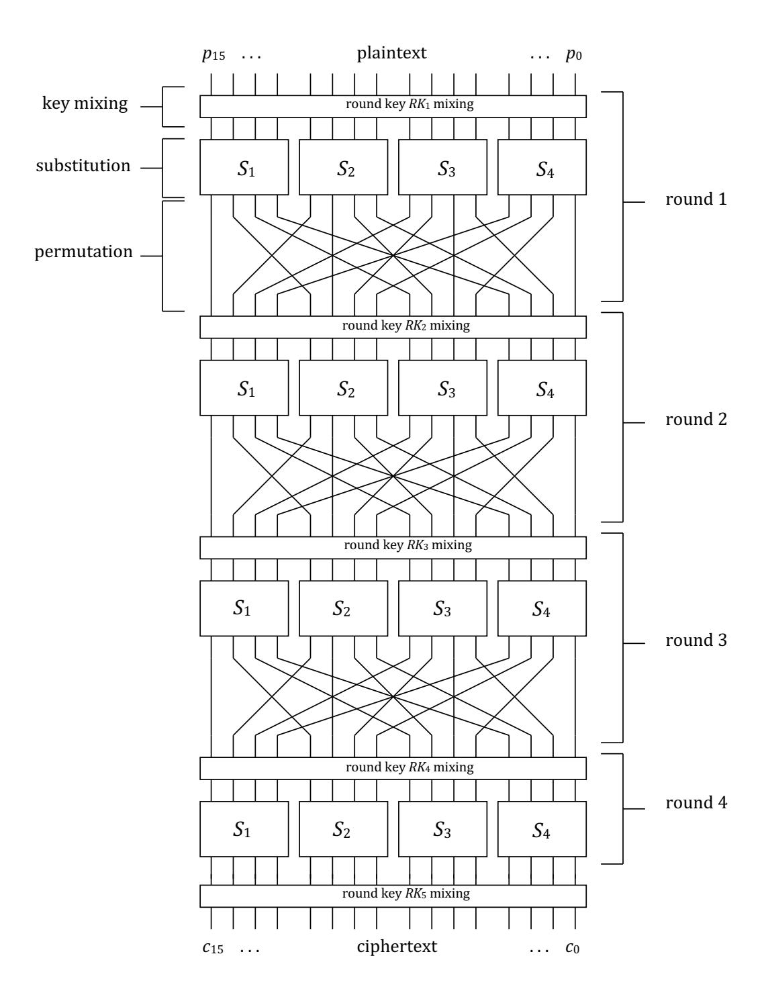

Figure 1.1: 16-bit SPN (4 Rounds)

a substitution box or S-box. A 4-bit S-box takes a 4-bit input and maps it to a 4-bit output as shown in Figure 1.2. The 4-bit S-box operation can be thought of as a table lookup (and can be implemented as such) where the table consists of 2<sup>4</sup> nibbles. The input is used as an index into the table and the output is selected from the position pointed to by the index. An S-box is a fixed mapping (i.e., it is not key dependent) and an example of a 4-bit S-box is shown in Table 1.1. This is the S-box found in the PRESENT cipher [6]. PRESENT is an SPN and, as with many lightweight ciphers, it uses a small S-box mapping. In contrast, AES uses an 8-bit S-box which is represented by a table of 2<sup>8</sup> 8-bit values, indexed by the 8-bit input. In the substitution layer, it is conceivable that all S-boxes are defined to be different mappings (this was the case, for example, with the Data Encryption Standard [8]), but it is more typical for ciphers to use only one mapping for all S-boxes. This is the case for the PRESENT cipher (with one 4-bit S-box defined) and AES (with one 8-bit S-box

{13}------------------------------------------------

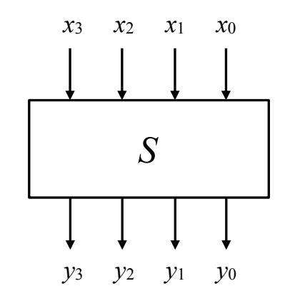

Figure 1.2: S-box Notation

| input  | 0 | 1 | 2 | 3 | 4 | 5 | 6 | 7 |
|--------|---|---|---|---|---|---|---|---|
| output | С | 5 | 6 | В | 9 | 0 | A | D |
| input  | 8 | 9 | A | В | С | D | Е | F |
| output | 3 | E | F | 8 | 4 | 7 | 1 | 2 |

Table 1.1: PRESENT 4-bit S-box Mapping (All values in hexadecimal.)

defined). In our discussion, we shall implicitly assume that all S-boxes in a cipher use the same mapping.

The properties of the S-box are critical to the proper operation and security of the cipher. In order to be able to map, for a given key, a plaintext to a unique ciphertext (and vice versa), the S-box must be bijective (that is, one-to-one). Bijectivity guarantees that each output bit of the S-box is balanced, meaning that for half of the input values, the output bit is "0" and half "1". Another important property that the mapping must possess is that the output bits are a nonlinear functions of the inputs. This is necessary to provide Shannon's confusion property and prevent successful linear cryptanalysis of the cipher [9]. Many other properties of the S-box are also desirable to prevent other cryptanalytic attacks, such as differential cryptanalysis [10]. The study of the construction of S-boxes to ensure certain cryptographic properties is an extensive field of research and a discussion of this topic is beyond the scope of this article.

The last operation of a round in the SPN is the permutation. The permutation is simply a transposition of the bit positions of the state, shown as wirings in Figure 1.1. This can be easily described in a table as shown by the example in Table 1.2. Let  $D = [d_{15}d_{14}...d_0]$  represent the state bits at the input to the permutation and  $D^* = [d_{15}^*d_{14}^*...d_0^*]$  represent the state bits at the output of the permutation. Hence, the bits from the leftmost S-box,  $S_1$ , entering the permutation result in the following assignments to the state bits at the output of the permutation:  $d_{15}^* \leftarrow d_{15}$ ,  $d_{11}^* \leftarrow d_{14}$ ,  $d_7^* \leftarrow d_{13}$ , and  $d_3^* \leftarrow d_{12}$ . This means that the output bits of the leftmost S-box,  $S_1$ , are connected by the permutation to the inputs of all 4 S-boxes in the next round. This property of the permutation and the fact that any one bit input to an S-box has an effect on all S-box output bits ensures that isolated effects in the leftmost 4 bits will be spread across the block in the next round and can affect all

{14}------------------------------------------------

| input  | 15 | 14 | 13 | 12 | 11 | 10 | 9 | 8 |
|--------|----|----|----|----|----|----|---|---|
| output | 15 | 11 | 7  | 3  | 14 | 10 | 6 | 2 |
| input  | 7  | 6  | 5  | 4  | 3  | 2  | 1 | 0 |
| output | 13 | 9  | 5  | 1  | 12 | 8  | 4 | 0 |

Table 1.2: 16-bit Permutation (Bit 15 is leftmost bit.)

| Operation    | Input | Output | Comment                        |
|--------------|-------|--------|--------------------------------|
| Key Mixing   | DEBE  | B0C7   | Round 1 with RK1<br>= 6E79     |
| Substitution | B0C7  | 8C4D   |                                |
| Permutation  | 8C4D  | D701   |                                |
| Key Mixing   | D701  | B7DC   | Round 2 with RK2<br>= 60DD     |
| Substitution | B7DC  | 8D74   |                                |
| Permutation  | 8D74  | C726   |                                |
| Key Mixing   | C726  | 49E5   | Round 3 with RK3<br>= 8EC3     |
| Substitution | 49E5  | 9E10   |                                |
| Permutation  | 9E10  | C44A   |                                |
| Key Mixing   | C4AA  | 1354   | Round 4 with RK4<br>= D71E     |
| Substitution | 1354  | 5B09   |                                |
| Key Mixing   | 5B09  | 2AA3   | Replace permutation with       |
|              |       |        | key mixing using RK5<br>= 71AA |

Table 1.3: 16-bit SPN Encryption Example (All values in hexadecimal.)

output bits of the next round. This is exactly the diffusion concept of Shannon's product cipher. For AES, the diffusion in the cipher is not accomplished by a permutation, but by a linear transformation which is comprised of the ShiftRows and MixColumns operations [2]. However, a permutation is a very specific form of a linear transformation, so in a sense, AES belongs to a generalized class of SPNs, which replaces the permutation with the more general concept of a linear transformation. Many other block ciphers also fall into this class.

Note in Figure 1.1 that the last round of encryption uses a key mixing operation in place of the permutation. If there was no key mixing after the last layer of S-boxes, there would be no cryptographic purpose for the last round S-boxes, since it would a trivial matter for an attacker to go backwards through the S-boxes, knowing their output. Effectively, the last layer of S-boxes could therefore be stripped off the cipher by an attacker with virtually no effort. A layer of key mixing after the last layer of S-boxes ensures that the outputs of the S-boxes are unknown, as they are obscured to an attacker by the unknown round key bits.

In Table 1.3, we present example state values associated with encryption using the 16 bit SPN with the S-box of Table 1.1 and the permutation of Table 1.2. All data in the example is in hexadecimal format. The input plaintext, P, is DEBE16, and we use the round keys presented in the table, which are derived in the example of Table A.1 discussed in the Appendix. The resulting ciphertext, C, is 2AA316.

{15}------------------------------------------------

| input  | 0 | 1 | 2 | 3 | 4 | 5 | 6 | 7 |
|--------|---|---|---|---|---|---|---|---|
| output | 5 | E | F | 8 | C | 1 | 2 | D |
| input  | 8 | 9 | A | B | C | D | E | F |
| output | B | 4 | 6 | 3 | 0 | 7 | 9 | A |

Table 1.4: 4-bit Inverse S-box (All values in hexadecimal.)

#### Decryption Process

As mentioned, decryption involves going backwards through the network. This has 3 implications:

- 1. decryption uses the inverse of the components used for encryption,
- 2. the round keys used in decryption are the same as for encryption but applied in reverse order, and
- 3. with the adjustment of round key bit positions, decryption can be viewed as similar in structure to encryption.

Consider the 3 layers and their inverses. The XOR function of the key mixing is trivially reversed. Assume input state bit d is XORed with round key bit rk to produce a new state bit, d ∗ : d <sup>∗</sup> = d ⊕ rk. The inverse of this operation produces output d given input d <sup>∗</sup> and this is trivially possible using the operation d = d <sup>∗</sup> ⊕ rk based on the properties of XOR. The inverse S-box is easily derived by reversing the roles of input and output. Hence, for an S-box which maps input 0011<sup>2</sup> (316) to output 1011<sup>2</sup> (B16), the inverse S-box maps input 1011<sup>2</sup> (B16) to output 0011<sup>2</sup> (316). Hence, the S-box defined by Table 1.1 has the inverse S-box given in Table 1.4. Finally, the permutation is obviously easily invertible by reversing the wiring associated with the permutation. For example, input bit 4 leads to output bit 1, implying for the inverse permutation, input bit 1 leads to output bit 4. For the permutation of Table 1.2, the inverse permutation is identical to the permutation.

It is clear that, since decryption is equivalent to processing from the bottom of Figure 1.1 to the top, the round key RK<sup>5</sup> must be applied first and round key RK<sup>1</sup> last in decryption. Hence, it is necessary to run through the complete key schedule to derive the last round key before decrypting any ciphertext. In suitable environments where the required memory is available, the round keys can be stored during this process and then used later during decryption. However, for many environments, particularly for hardware implementations, it is not possible to store all round keys and instead the key schedule will need to be run in reverse from the last round key, concurrently with the processing in the decryption datapath.

Lastly, decryption can be restructured to look like encryption, which could be important to some implementations where similar structures between encryption and decryption might lead to efficient, easily understood designs. Going backwards through Figure 1.1, we can see that we process a key mixing of RK<sup>5</sup> and (inverse) substitution first, then follow with a key mixing of RK<sup>4</sup> after which the (inverse) permutation is applied. But if we take the bits of RK<sup>4</sup> and reorder them based on the inverse permutation, we can perform the inverse permutation before the key mixing and follow the inverse permutation with a key mixing

{16}------------------------------------------------

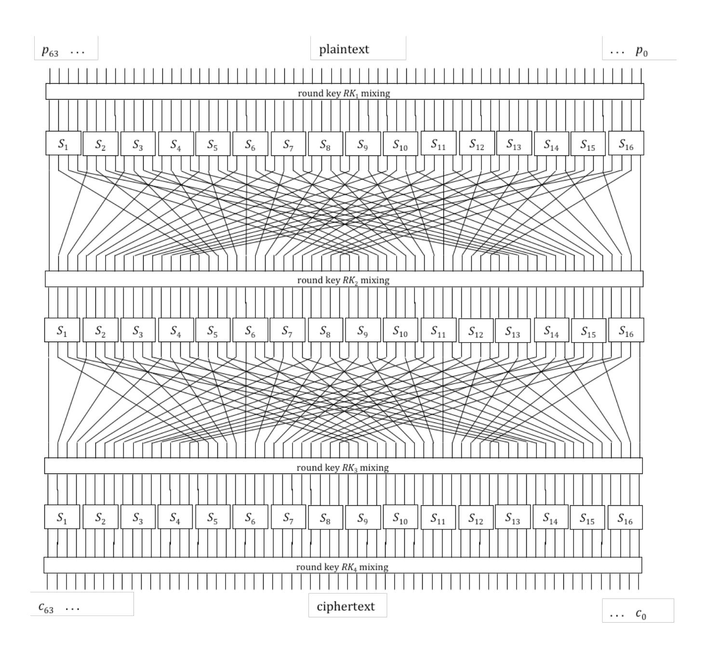

Figure 1.3: 64-bit SPN (3 rounds)

with the reordered RK4. Similarly, we can reorder RK<sup>3</sup> and RK<sup>2</sup> and apply them after the inverse permutation in the decryption process. In doing this, we have the same order of cryptographic layers in the decryption process as in the encryption process.

#### 1.3.2 64-bit SPN

In the previous section, we presented and discussed the components in a toy 16-bit cipher. While the block size of this cipher is not at all practical, the components described, including the 4-bit S-box are realistic and ciphers with larger block sizes exist which are similar in structure. In this section, we present a realistically-sized 64-bit SPN block cipher. This cipher structure is, in fact, equivalent the structure of the PRESENT cipher [6]. PRESENT is an important, foundational cipher in the area of lightweight cryptography and is a recommended ISO standard [11].

The architecture of the 64-bit SPN consisting of 3 rounds is given in Figure 1.3. The figure illustrates the placement of the key mixing layer, but does not show the key scheduling

{17}------------------------------------------------

| input  | 63 | 62 | 61 | 60 | 59 | 58 | 57 | 56 |
|--------|----|----|----|----|----|----|----|----|
| output | 63 | 47 | 31 | 15 | 62 | 46 | 30 | 14 |
| input  | 55 | 54 | 53 | 52 | 51 | 50 | 49 | 48 |
| output | 61 | 45 | 29 | 13 | 60 | 44 | 28 | 12 |
| input  | 47 | 46 | 45 | 44 | 43 | 42 | 41 | 40 |
| output | 59 | 43 | 27 | 11 | 58 | 42 | 26 | 10 |
| input  | 39 | 38 | 37 | 36 | 35 | 34 | 33 | 32 |
| output | 57 | 41 | 25 | 9  | 56 | 40 | 24 | 8  |
| input  | 31 | 30 | 29 | 28 | 27 | 26 | 25 | 24 |
| output | 55 | 39 | 23 | 7  | 54 | 38 | 22 | 6  |
| input  | 23 | 22 | 21 | 20 | 19 | 18 | 17 | 16 |
| output | 53 | 37 | 21 | 5  | 52 | 36 | 20 | 4  |
| input  | 15 | 14 | 13 | 12 | 11 | 10 | 9  | 8  |
|        |    |    |    |    |    |    |    |    |
| output | 51 | 35 | 19 | 3  | 50 | 34 | 18 | 2  |
| input  | 7  | 6  | 5  | 4  | 3  | 2  | 1  | 0  |

Table 1.5: 64-bit Permutation (Bit 63 is leftmost bit.)

algorithm which generates the round keys to mix. Although the block size and potential key size for this cipher are practical, such a cipher with only 3 rounds would not be secure and would be susceptible to many cryptanalytic attacks. Decryption would be accomplished by effectively going backwards (bottom to top) through the structure shown. The PRESENT cipher, while similar in structure, consists of 31 rounds, chosen to ensure security for an 80-bit or 128-bit key.

For PRESENT, one mapping is used for all S-boxes and it is given by the mapping presented in Table 1.1. The permutation illustrated in the figure is summarized in Table 1.5. The key mixing uses bit-by-bit XOR, which in this case is done across the 64-bit state and makes use of a 64-bit round key generated using a key schedule applied to the full cipher key (which is either 80-bits or 128-bits for PRESENT).

# 1.4 Modes of Operation

In order to efficiently and securely use a block cipher, one must use the cipher in an appropriate mode of operation. There are many different modes that have been defined with different objectives in mind. Fundamentally a mode must be secure and must provide the characteristics of significance for the targeted application. The mode employed can have an important impact on the implementation selected. Alternatively, the desired implementation structure (based on the application requirements) can impact the selected mode. We briefly describe three well-known modes [12], but note that many more are proposed and applied in practice.

{18}------------------------------------------------

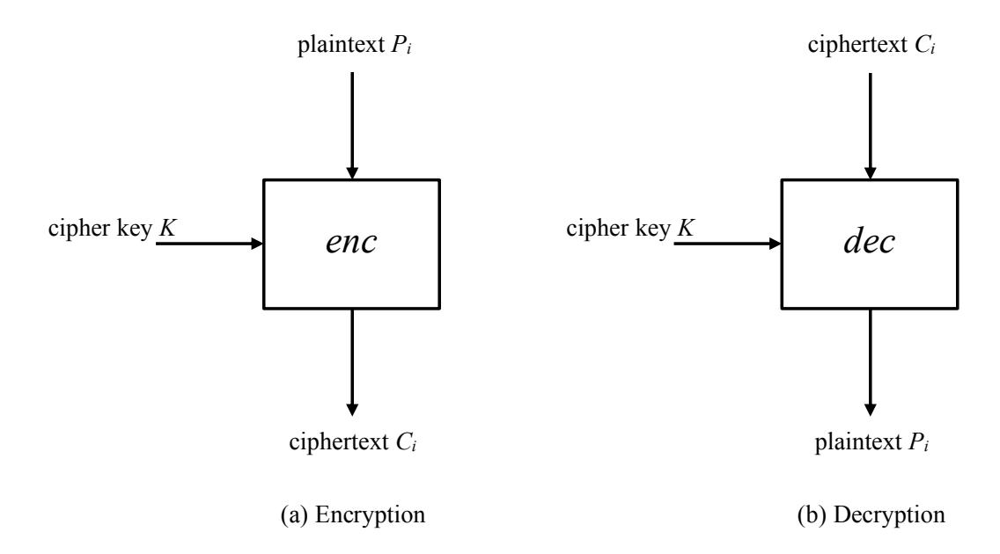

Figure 1.4: Electronic CodeBook Mode

#### 1.4.1 Electronic CodeBook Mode

Electronic CodeBook (ECB) mode is likely the natural mode one thinks about for block ciphers. To encrypt the i-th block of plaintext, one applies the block to the input of the block cipher and, using the cipher key as a parameter, produces the i-th block of ciphertext at the output. This is illustrated in Figure 1.4. Note that Figures 1.1 and 1.3 have their inputs and outputs labelled with the presumption that they are used in ECB mode. That is, the input to the block cipher operation is the plaintext and the output is the ciphertext. As we shall see, this is not the case for other modes.

In practice, it is not generally advisable to use ECB for the encryption of large amounts of data, because it is not considered to be semantically secure (that is, it is possible to determine some information about the plaintext by observing ciphertext). Consider, for example, that a known plaintext block P<sup>i</sup> is encrypted in ECB mode using a particular key to produce the known observed ciphertext block C<sup>i</sup> . If we later observe a second ciphertext C<sup>j</sup> (produced using the same key), such that C<sup>j</sup> = C<sup>i</sup> , we can then determine that the plaintext P<sup>j</sup> used to produce C<sup>j</sup> must be the same as P<sup>i</sup> , that is, P<sup>j</sup> = P<sup>i</sup> . This is a potentially significant source of leakage of plaintext information based on observing the ciphertext and having knowledge of some plaintext/ciphertext pairs and could be a serious problem if large amounts of data are encrypted. ECB mode can be useful for encrypting small amounts of random data, such as might be the case when protecting keys by encrypting them so that they can be transferred confidentially between parties.

Note that, generally, our discussion in this article is presented using language which implies the use of ECB mode. However, the implementation methods can be clearly translated into other modes as appropriate and we do provide some discussion on the suitability of implementations for different modes.

{19}------------------------------------------------

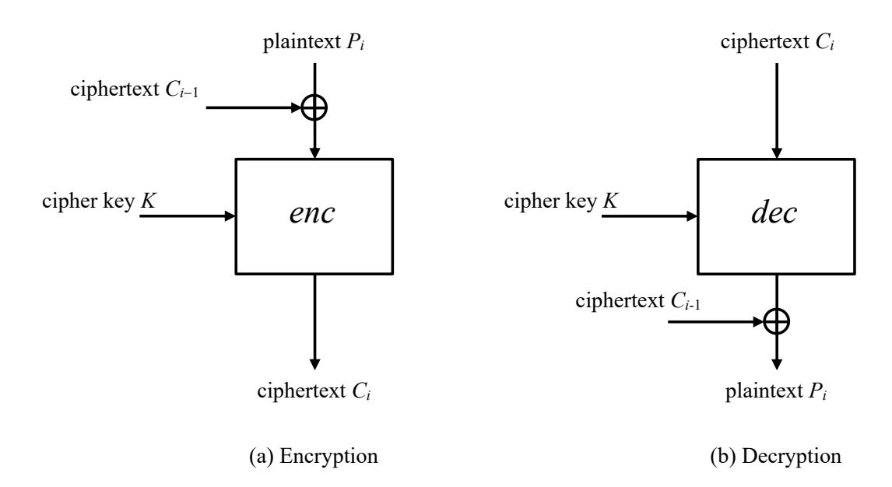

Figure 1.5: Cipher Block Chaining Mode

#### 1.4.2 Cipher Block Chaining Mode

Cipher Block Chaining (CBC) is a mode of operation which can be effectively used to encrypt large amounts of data using a block cipher without the semantic security issues associated with ECB mode. Encryption and decryption using CBC mode is illustrated in Figure 1.5. To encrypt the i-th block in a sequence of many plaintext blocks, CBC mode would XOR the plaintext block, P<sup>i</sup> , with the ciphertext produced for the previous block, Ci−1. The resulting block is then fed to the input of the block cipher (operating as an encryption process) with the resulting output considered to be the ciphertext C<sup>i</sup> . The first plaintext block, P1, uses an initialization vector (IV) as C0, since no ciphertext block yet exists. Decryption in CBC mode takes the ciphertext, C<sup>i</sup> , as input to the block cipher (operating as a decryption process), from which the plaintext P<sup>i</sup> is derived following XOR of the result with the previous ciphertext block, Ci−1.

The chaining aspect ensures that the encryption of a block is dependent on the encryption results from previous ciphertexts, thereby preventing the problem of ECB mode where two identical plaintext blocks result in identical ciphertext blocks. In typical encryption applications, the IV should be a nonce, which is a variable only assigned any value once. Hence, for CBC mode, different sessions will start the chain using IVs which should be unique to avoid semantic security issues with the first block. However, in many applications it is not necessary to keep IVs secret. CBC can be used as a general method to encrypt large amounts of data, consisting of many plaintext blocks and can be found applied in many contexts.

#### 1.4.3 Counter Mode

Counter (CTR) mode is another block cipher mode of operation suitable for encrypting a large amount of plaintext data. In CTR mode, the block cipher is configured to operate as a stream cipher, which produces ciphertext bits by XORing plaintext bits with keystream bits. In CTR mode, illustrated in Figure 1.6, the block cipher takes as input a B-bit counter

{20}------------------------------------------------

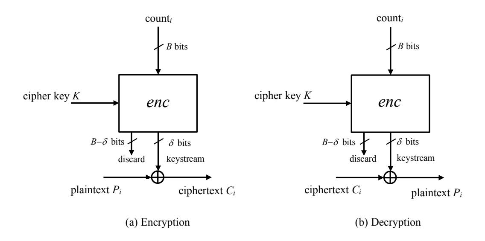

Figure 1.6: Counter Mode

value, labelled as "counti", with the resulting output of the block cipher used as keystream to be XORed on a bitwise basis with data from the plaintext block. Although the block cipher can be used to produce a full block of B bits of keystream, in general terms, δ bits can be used as keystream (with the other B − δ bits being discarded) to be XORed with a δ-bit block of plaintext, P<sup>i</sup> , where δ ≤ B.

The counter values, count<sup>i</sup> , can be straightforwardly incremented for every block cipher operation or can be a simple, predictable sequence of unique values. For decryption, the operation is identical to encryption, except the roles of plaintext and ciphertext reverse. The counter values at both sides of the communication must be synchronized in order for ciphertext C<sup>i</sup> to decrypt properly to plaintext P<sup>i</sup> . Decryption is possible in this way because of the properties of XOR: for bits C (ciphertext), P (plaintext), and Q (keystream),

$$C = P \oplus Q \Rightarrow P = C \oplus Q.$$

The initial count value should be unique for the first block of a session, but generally need not be kept secret. Note that both encryption and decryption use the encryption process of the block cipher to produce the keystream. Hence, an implementation of CTR mode does not require an implementation of the block cipher decryption process, which may result in significant memory and area savings in software and hardware implementations, respectively.

## 1.5 General Implementation Structures

For SPNs and many other block ciphers, the structure of the cipher is iterative, comprised of a number of rounds, R, of simple cryptographic operations. For SPNs, these simple operations are the round function, which consists of round key mixing, substitution, and permutation. As per Shannon's product cipher proposal, the round function is executed iteratively an appropriate number of times to ensure confidence in the security of the cipher.

Typical structures of SPN block ciphers are illustrated in Figure 1.7 and Figure 1.8. The difference between the two diagrams is the nature of the application of the key schedule. In Figure 1.7, the key schedule algorithm is applied before the execution of the cipher rounds

{21}------------------------------------------------

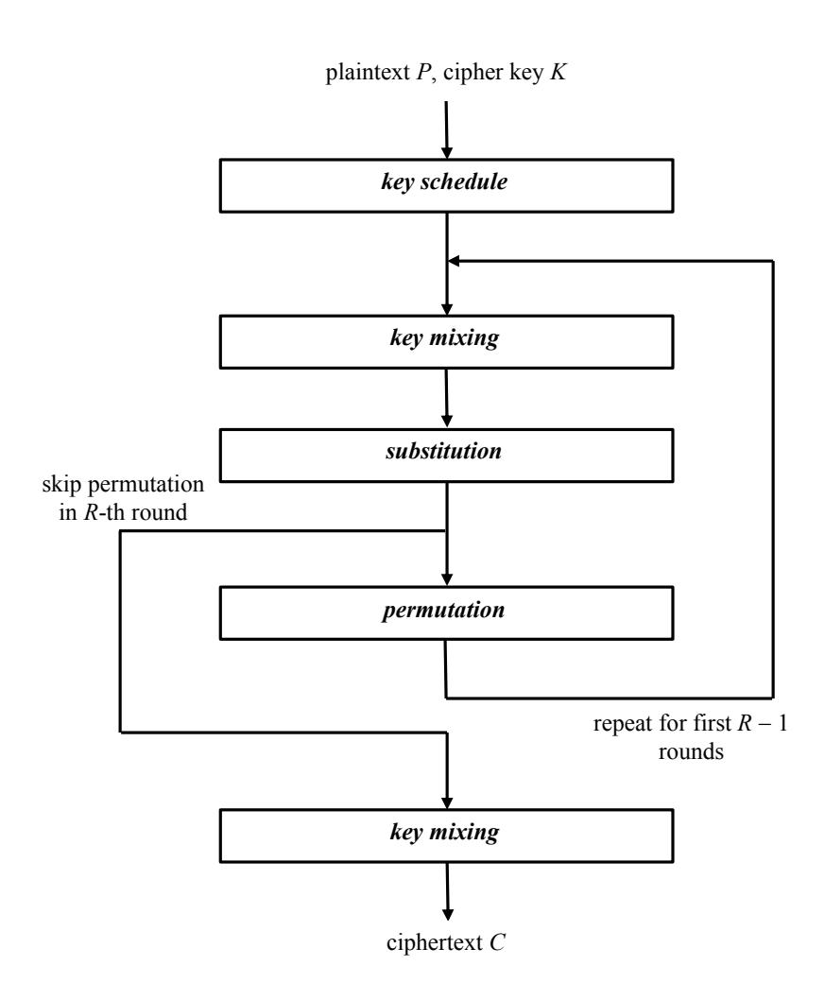

Figure 1.7: Encryption Structure with Round Key Setup

by the key schedule operation. Hence, in this case, all round keys are generated and stored for use during the processing of the cipher data. We refer to this approach as the round key setup approach. In contrast, in Figure 1.8, the on-the-fly approach to the key scheduling algorithm is illustrated, where the steps of the key schedule are executed within the cipher round by the round key generation operation, which produces the round key for use within the round. In this case, only one round key needs to be generated at a time and no storage of round keys is necessary. Instead, the key state is stored (from which the round key is computed) and is updated in each step of the algorithm. The on-the-fly approach is particularly of interest in hardware implementations where memory to store all round keys may be too costly and where it is possible to execute the key scheduling step in each round concurrently with the data processing operations, thereby improving the speed of the cipher execution.

For the decryption of ciphertext, very similar structures can be used. For example, Figure 1.9 illustrates the strategy of the round key setup before execution of the rounds. The decrypt key schedule operation is similar the key schedule used for encryption, except some adjustments need to be made to the round key bit positions and the round keys must be applied in the reverse order to encryption, as discussed in Section 1.3.1, to ensure that the same structure is used for decryption as encryption. Also, the inverses of the substitution and permutation layers, inverse substitution and inverse permutation, must be used. For some ciphers, like the 16-bit and 64-bit SPNs of Figures 1.1 and 1.3, the inverse permutation is identical to the original permutation. The key mixing layer, due the property of the XOR

{22}------------------------------------------------

1.6. SUMMARY 23

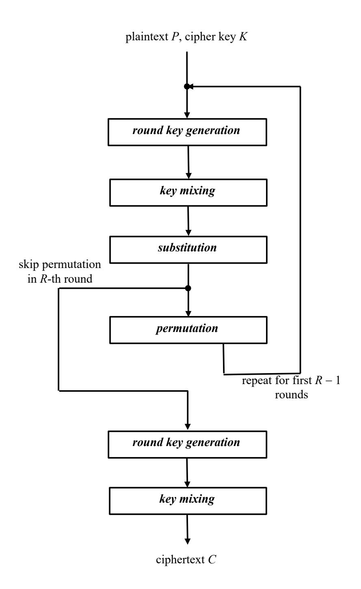

Figure 1.8: Encryption Structure with On-the-Fly Round Key Generation

function, is the same for decryption as for encryption.

We use these two general structures of (1) round key setup and (2) on-the-fly round key generation as the basis for our discussions of the implementation of ciphers in software and hardware.

# 1.6 Summary

In this chapter, we have presented the basic notions associated with block ciphers. Specifically, we have described the concept of the substitution-permutation network, one of the basic architectures used to implement block ciphers. We have presented concrete examples of a toy 16-bit SPN and a practical 64-bit SPN. The 64-bit SPN is, in fact, the same architecture as the lightweight cipher, PRESENT. We have also given the S-box from PRESENT as an

{23}------------------------------------------------

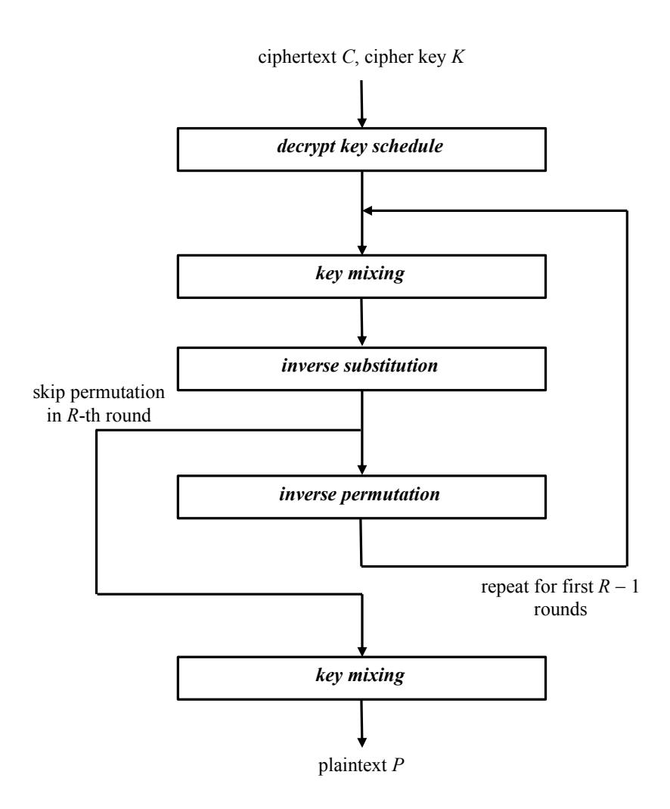

Figure 1.9: Decryption Structure with Round Key Setup

example component used in the cipher.

This chapter has also introduced the notion of the mode of operation of a block cipher and we shall see that often the mode applied to a cipher influences the selection of the implementation method (and possibly vice versa). Finally, we have illustrated the general iterative structure of the SPN and discussed how the key schedule can be implemented in either a setup phase or on-the-fly during the processing of the cipher rounds.

In the next chapter, we will delve into the practical implementation of block ciphers by considering the software implementation of the SPN focusing on general methodologies such as table lookups and bit-slicing structures.

{24}------------------------------------------------

# Chapter 2

# Software Implementation

In this chapter, we outline some of the principles and methods with which a designer could implement a block cipher in software. We focus on general concepts and do not delve into presenting any specific coding examples. Instead, we use pseudocode, descriptions, and examples to illustrate concepts. In doing so, we presume the availability of typical instructions that are found in all processors and refrain from discussing implementation issues related to specific processor instructions which might be helpful in cipher implementation but which are not ubiquitously found in computing environments.

## 2.1 Structure of Encryption

Since block ciphers, such as SPNs, are iterative in structure, they can be easily structured in a software program using "for" loops as shown in the pseudocode presented in Algorithm 1, where D is used to represent the cipher state. In the pseudocode, the round key setup approach is used for key scheduling so that round key values are generated prior to the processing of the plaintext data. This is done by calling KEYSCHED which produces and stores the data for the round key array, [RK1, RK2, ..., RKR, RKR+1], based on the initial cipher key. This pseudocode is analogous the structure of Figure 1.7.

The pseudocode developed from the structure of Figure 1.8, with on-the-fly round key generation, is given in Algorithm 2. Here the steps of the key scheduling algorithm are placed within the body of the loop by calling function ROUNDKEY GENERATE. Hence, it is not necessary to store the complete set of round keys but to just produce the round key required for the current round based on the key state.

For an R round cipher, the body of the loop in both Algorithm 1 and Algorithm 2 performs the round operations and the loop is iterated R − 1 times, with the R-th round (which replaces the permutation with a key mixing) following the loop. In software, the functions KEYMIX, SUBSTITUTION, and PERMUTATION can be implemented using various methods, with the method selected based on an objective associated with the implementation, such as maximizing speed or minimizing storage. The implementation of these operations will be discussed in upcoming sections.

The key setup strategy of Algorithm 1 could be used when high speeds for software

{25}------------------------------------------------

end function

```
Algorithm 1 Pseudocode for Encryption with Round Key Setup
  function Encrypt(P, K)
                                                                \triangleright inputs: plaintext P and cipher key K
       [RK_1, RK_2, ..., RK_R, RK_{R+1}] \leftarrow \text{KEYSCHED}(K)

    ▶ generate round keys

       D \leftarrow P
                                                                              \triangleright load P into cipher state D
       for r = 1 to R - 1 do
           D \leftarrow \text{KEYMIX}(D, RK_r)
           D \leftarrow \text{SUBSTITUTION}(D)
           D \leftarrow \text{PERMUTATION}(D)
       end for
       D \leftarrow \text{KEYMIX}(D, RK_R)
       D \leftarrow \text{SUBSTITUTION}(D)
       D \leftarrow \text{KEYMIX}(D, RK_{R+1})
                                                  ▷ last round replaces permutation with key mixing
       return D
                                                                                     \triangleright output: ciphertext C
```

implementations are required, since the key schedule algorithm only needs to be executed once, before the encryption of all plaintexts to be encrypted under the key. The tradeoff is that all round keys must be stored for use, which requires more memory and this may be an issue in a tightly constrained system such as those found in some IoT devices. Using the on-the-fly key scheduling strategy of Algorithm 2 will be clearly slower in software, since extra operations in ROUNDKEY\_GENERATE must be executed for every pass of the loop for encryption of every plaintext. However, in this case, it is not necessary to store the full set of round keys and, hence, there may be advantages in environments with tight memory constraints but where speed of the encryption process is not an issue.

In subsequent sections, we discuss detailed characteristics of various implementation methods for the operations - key mixing, substitution, and permutation - within the round function. Although we have referred to the cipher state as D in the pseudocode described in this section, for convenience, in our description of the layers, we shall often use different variables to represent the state based on which layer is taking the state as input or producing the state as output. In particular, we shall use the following labels. The state at the input of the substitution (and output of the key mixing), we shall label as  $X = [x_{B-1}x_{B-2}...x_0]$ . The state at the output of the substitution and input to the permutation is labelled as  $Y = [y_{B-1}y_{B-2}...y_0]$ , while the state at the output of the permutation (and input of the key mixing) shall be referred to as  $Z = [z_{B-1}z_{B-2}...z_0]$ . For clarity, this is illustrated for one round of the 16-bit SPN in Figure 2.1.

# 2.2 Structure of Decryption

One of the advantages of the SPN architecture is that the decryption process is similar in structure to encryption and this is illustrated in Figure 1.9.

In Algorithm 3, we present the pseudocode for the decryption process and it can be seen that the layers use inverse operations (specifically the S-box and permutation operations INV\_SUBSTITUTION and INV\_PERMUTATION) as appropriate. Also notably, the round keys for the decryption process, represented as  $RK_r^*$ , require the application of the round keys

{26}------------------------------------------------

#### Algorithm 2 Pseudocode for Encryption with On-the-Fly Key Generation

```
function ENCRYPT(P, K)
                                                                \triangleright inputs: plaintext P and cipher key K
    D \leftarrow P
                                                                               \triangleright load P into cipher state D
    K' \leftarrow K
                                                                                 \triangleright load K into key state K'
    for r = 1 to R - 1 do
         RK_r \leftarrow \text{ROUNDKEY\_GENERATE}(K', r)
                                                                                     \triangleright update K' in function
         D \leftarrow \text{KEYMIX}(D, RK_r)
         D \leftarrow \text{SUBSTITUTION}(D)
         D \leftarrow \text{PERMUTATION}(D)
    end for
    RK_R \leftarrow \text{ROUNDKEY\_GENERATE}(K', R)
    D \leftarrow \text{KEYMIX}(D, RK_R)
    D \leftarrow \text{SUBSTITUTION}(D)
    RK_{R+1} \leftarrow \text{ROUNDKEY\_GENERATE}(K', R+1)
    D \leftarrow \text{KEYMIX}(D, RK_{R+1})
                                                 ▷ last round replaces permutation with key mixing
    return D
                                                                                      \triangleright output: ciphertext C
end function
```

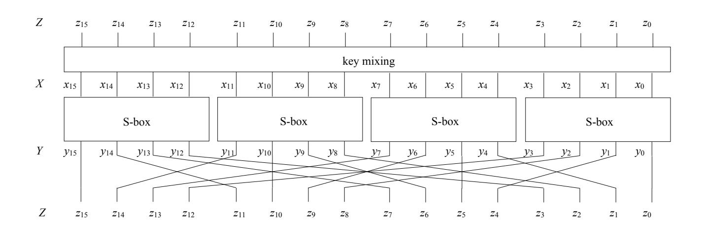

Figure 2.1: SPN Round with Notation

from encryption in reverse order and with some adjustments made in the bit positions. For example, the round key for round R+1 of encryption,  $RK_{R+1}$  is used as the round key for round 1 of decryption,  $RK_1^*$ . Round key  $RK_R$  of encryption is used as the round key of round 2 of decryption,  $RK_2^*$  (with adjustments to bit ordering);  $RK_{R-1}$  with reordered bits is used for  $RK_3^*$ , etc.

We now turn our focus to the operations involved in both encryption and decryption and discuss their software implementation.

# 2.3 Direct Implementation of an SPN

We begin by considering the straightforward, and largely impractical, approach of directly implementing an SPN in software. By direct implementation, we refer to the concept of executing the functionality of the operations explicitly in software. In the following sections,

{27}------------------------------------------------

# function DECRYPT(C, K) $\rightharpoonup$ inputs: ciphertext C and cipher key K [ $RK_1^*, RK_2^*, ..., RK_R^*, RK_{R+1}^*$ ] ← DEC\_KEYSCHED(K) $\rightharpoonup$ generate round keys $D \leftarrow C$ $\rightharpoonup$ load C into cipher state D for r=1 to R-1 do $D \leftarrow \text{KEYMIX}(D, RK_r^*)$ $D \leftarrow \text{INV\_SUBSTITUTION}(D)$

**Algorithm 3** Pseudocode for Decryption with Round Key Setup

end for  $D \leftarrow \text{KEYMIX}(D, RK_R^*)$   $D \leftarrow \text{INV\_SUBSTITUTION}(D)$   $D \leftarrow \text{KEYMIX}(D, RK_{R+1}^*)$ 

 $D \leftarrow \text{INV\_PERMUTATION}(D)$ 

 $\triangleright$  last round replaces permutation with key mixing  $\triangleright$  output: plaintext P

return D end function

we will discuss much more practical and efficient approaches to software implementation using wide table lookups and bit-slicing.

#### 2.3.1 Key Mixing Layer Implementation

The key mixing layer is typically the bitwise XOR of round key bits (derived by the key schedule) with the cipher state bits. In software this can be done very efficiently since processors have the bitwise XOR instruction than can be executed with two word inputs. If the cipher block size exceeds the processor word size, then multiple XOR operations may be needed. For example, for a 64-bit block size in an 8-bit processor, the XOR operation would need to be executed 8 times to mix a 64-bit round key with the 64-bit cipher state.

#### 2.3.2 Substitution Layer Implementation

Direct implementation of the S-box in software implies the use of a lookup table to mimic an S-box like the one of Table1.1. For the 4-bit S-box discussed in this paper, a direct implementation would require a table of  $2^4$  4-bit values, where a 4-bit value in the table represents the 4-bit output of the S-box which is indexed by the 4-bit input to the S-box. We refer to this approach as the *narrow table lookup*. It is straightforward in code to represent the data in the system using integers. However, because the S-boxes work on 4-bit sub-blocks of the larger block, care must be taken to extract the 4-bit inputs and move data into the correct position within the block for each of the S-box lookups. We describe the process of table lookups in more detail in Section 2.4.

#### 2.3.3 Permutation Layer Implementation

The permutation operation does not obviously lend itself well to direct implementation in software. In a straightforward approach, an implementation could process each bit by using a mask to isolate the bit, shifting it to an appropriate position and then combining it back into the output being constructed. We refer to this as the *bit rotation* method for permutation

{28}------------------------------------------------

implementation. For example, consider the leftmost 2 bits entering the 16-bit permutation of Table 1.2. Assume the input to the permutation is the 16-bit state Y and the 16-bit output state is Z. The two bits, y<sup>15</sup> and y14, are assigned to outputs as follows: z<sup>15</sup> ← y<sup>15</sup> and z<sup>11</sup> ← y14. This can be done by initializing Z to all zeroes. Then, assign Y to a temporary 16-bit variable of the state, W, and mask the leftmost bit by ANDing W with 800016. XOR the result with Z to produce Z = [y1500...00]. Next, assign Y again to W, mask the second bit using 400016, shift 3 bits to the right to generate W = [0000y140...00], which when XORed with Z produces Z = [y15000y14...00].<sup>1</sup> This can be repeated to move, very inefficiently, all 16 bits of the state, according to the permutation. The bit rotation method is generally a poor choice to implement the permutation, although some modern processors have data manipulation instructions that may allow an improvement in the efficiency of the approach.

## 2.4 Table Lookup Implementations

In order to improve the efficiency of the software implementation of an SPN, one could make much more extensive use of table lookups. As we discussed in the previous section, S-boxes are naturally implemented as table lookups and, in this section, we will discuss how they can be conveniently combined with a lookup for the permutation. The other layer in a round, key mixing, is efficiently done using bitwise XOR on data blocks and does not need to involve table operations.

#### 2.4.1 Permutation in a Table

Generally, since the bit rotation implementation approach requires operations on all bits of the block, it is not efficient on large blocks (typically, 64 or 128 bits) used for a practical block cipher. A much more efficient method for the permutation would be a table lookup approach. For the 16-bit SPN, the table lookup approach would make use of four tables, each consisting of 2<sup>4</sup> 16-bit values, where each value represents the output of the permutation with appropriate input bits moved to the correct locations within the 16 output. For example, one of four tables will correspond to the leftmost nibble of the input Y , that is, [y15y14y13y12]. The table associated with the permutation of the bits in this nibble is presented in Table 2.1. A lookup in this table returns a 16-bit result, Z1, of the form: Z<sup>1</sup> = [y15000y14000y13000y12000]. Similarly, three other results from table lookups are produced using the other three input nibbles as indices into the 3 other tables producing outputs: Z<sup>2</sup> = [0y11000y10000y9000y800], Z<sup>3</sup> = [00y7000y6000y5000y40], and Z<sup>3</sup> = [000y3000y2000y1000y0]. The output of the permutation is produced by isolating the 4 nibbles of Y (using shifts and masks as appropriate), using the nibbles as indices, looking up values in the 4 tables to retrieve Z1, Z2, Z3, and Z4, and generating the permutation output using bitwise XORing of the retrieved words: Y = Z<sup>1</sup> ⊕Z<sup>2</sup> ⊕Z<sup>3</sup> ⊕Z4. This is much more efficient that individually moving the bits around, particularly for realistic block sizes.

Now, considering that the most efficient approaches to implement the S-box operation and the permutation both involve table lookups, it perhaps make sense to combine the tables

<sup>1</sup>At many points within this article, we shall refer to the mixing of data in different bit positions together using the bitwise XOR operation on two words. However, this can also be done using a bitwise OR operation.

{29}------------------------------------------------

| Input          | Output           |
|----------------|------------------|
|                |                  |
| [y15y14y13y12] | Z1               |
| 0000           | 0000000000000000 |
| 0001           | 0000000000001000 |
| 0010           | 0000000010000000 |
| 0011           | 0000000010001000 |
| 0100           | 0000100000000000 |
| 0101           | 0000100000001000 |
| 0110           | 0000100010000000 |
| 0111           | 0000100010001000 |
| 1000           | 1000000000000000 |
| 1001           | 1000000000001000 |
| 1010           | 1000000010000000 |
| 1011           | 1000000010001000 |
| 1100           | 1000100000000000 |
| 1101           | 1000100000001000 |
| 1110           | 1000100010000000 |
| 1111           | 1000100010001000 |

Table 2.1: Permutation Table for Leftmost Nibble (All values in binary.)

into one table and complete the combination of the substitution and permutation operations with only one table lookup. This is described in the next section.

#### 2.4.2 Combined Substitution/Permutation Table

An efficient implementation of both S-box and permutation is accomplished by combining both the S-box and permutation operations into table lookups where the values stored in the table are not the size of the S-box output, but the size of the block. We refer to this as the wide table lookup method.<sup>2</sup> Consider, for example, the leftmost bits of the 16-bit state at the input to the substitution layer, [x15x14x13x12]. The S-box operation results in a 4 bit output, [y15y14y13y12], which, at the output of the permutation (from Table 1.2) would move these bits into the positions in the block as follows:

$$y_{15} - - - y_{14} - - - y_{13} - - - y_{12} - - -$$

Hence, we construct a table (which we call a substitution/permutation table or SP table) of all 16 outputs of the S-box with values of size equal to the block size where the S-box outputs are moved into the appropriate positions within the block according to the permutation. Such a table for the leftmost nibble is given in Table 2.2. A lookup in this table returns a 16-bit result, Z1, of the form: Z<sup>1</sup> = [y15000y14000y13000y12000], where the y<sup>i</sup> values represent the outputs of the leftmost S-box (S<sup>1</sup> in Figure 1.1) for input [x15x14x13x12]. (The middle column in the table is the 4-bit output of the S-box.) Similarly, tables can be constructed

<sup>2</sup>For AES, a similar approach is referred to as the T-table approach by the cipher's proponents [2].

{30}------------------------------------------------

| Input          | S-box Output         | Table Output     |
|----------------|----------------------|------------------|
| [x15x14x13x12] | [y15y14y13y12]       | Z1               |
| (Table Index)  | (Intermediate Value) |                  |
| 0000           | 1100                 | 1000100000000000 |
| 0001           | 0101                 | 0000100000001000 |
| 0010           | 0110                 | 0000100010000000 |
| 0011           | 1011                 | 1000000010001000 |
| 0100           | 1001                 | 1000000000001000 |
| 0101           | 0000                 | 0000000000000000 |
| 0110           | 1010                 | 1000000010000000 |
| 0111           | 1101                 | 1000100000001000 |
| 1000           | 0011                 | 0000000010001000 |
| 1001           | 1110                 | 1000100010000000 |
| 1010           | 1111                 | 1000100010001000 |
| 1011           | 1000                 | 1000000000000000 |
| 1100           | 0100                 | 0000100000000000 |
| 1101           | 0111                 | 0000100010001000 |
| 1110           | 0001                 | 0000000000001000 |
| 1111           | 0010                 | 0000000010000000 |

Table 2.2: SP Table for Leftmost S-box (S1) Input (All values in binary.)

for the second, third and fourth S-boxes (nibbles [x11x10x9x8], [x7x6x5x4], and [x3x2x1x0]). Note that, although the S-box outputs are identical for identical inputs, four SP tables are used because the permutation results in different values for the table based on which S-box is receiving the input. For example, if the leftmost S-box, S1, has input "0000", the SP table lookup results in an output of "1000100000000000" (as can be seen in Table 2.2), while input "0000" to the S-box second from the left, S<sup>2</sup> in Figure 1.1, results in an output of "0100010000000000" from the SP table lookup (not illustrated).

Determining the output of the combined substitution/permutation layers can be achieved by using the four S-box inputs to complete four table lookups similar to Table 2.2. The 4 blocks corresponding to the outputs of these lookups can then be combined to produce the output block of the combined operation by XORing the 4 blocks together. Since the blocks in the tables have "0"s in the bits which are not directly affected by the corresponding Sbox output, these bits have no effect in the XORing outcome and only the bits produced by the S-box output end up affecting the appropriate output block bit. The pseudocode representing the combined substitution/permutation operation based on wide table lookup using multiple lookup tables (4 in this example) is given in Algorithm 4. In the pseudocode, notation "⊕", "·", and ">> i" represent bitwise XOR, bitwise AND, and right rotation by i bits, respectively. For right rotations, bits shifted out of the rightmost end of the variable are shifted into the leftmost end of the variable. Function SP LOOKUP(i, ·) represents a lookup in the SP table corresponding to S-box i. An example of the application of the pseudocode is given in Table 2.3.

{31}------------------------------------------------

```
Algorithm 4 Pseudocode for SP Wide Table Lookup (Multiple Tables)
```

```
function sub perm(X) . input: 16-bit state X
  Z ← 000016
  for i = 1 to 4 do
    W ← [X >> 4(4 − i)] · (000F16) . extract 4-bit bit index
    V ← SP lookup(i, W) . perform 4-bit lookup in table i
    Z ← Z ⊕ V . combine 16-bit result into 16-bit state
  end for
  return Z . output: 16-bit state Z
end function
```

| Input X = 7AF8  | Z ← 0000                   |
|-----------------|----------------------------|
| i = 1           | W ← 7                      |
|                 | V ← SP LOOKUP(1, 7) = 8808 |
|                 | Z ← 0000 ⊕ 8808 = 8808     |
| i = 2           | W ← A                      |
|                 | V ← SP LOOKUP(2, A) = 4444 |
|                 | Z ← 8808 ⊕ 4444 = CC4C     |
| i = 3           | W ← F                      |
|                 | V ← SP LOOKUP(3, F) = 0020 |
|                 | Z ← CC4C ⊕ 0020 = CC6C     |
| i = 4           | W ← 8                      |
|                 | V ← SP LOOKUP(4, 8) = 0011 |
|                 | Z ← CC6C ⊕ 0011 = CC7D     |
| Output Z = CC7D |                            |

Table 2.3: Example of Wide Table Lookup (Multiple Tables) (All values in hexadecimal.)

For the case discussed above, 4 tables are required, each consisting of 16 values of size 16 bits. Hence, a minimum total of 4×16 = 64 16-bit words must be stored.<sup>3</sup> This is compared to the memory requirement of 16 nibbles if simply the S-box is stored for the narrow table lookup approached mentioned in Section 2.3.2.

In some cases, such as for the 16-bit SPN, the memory requirement for the combined substitution/permutation method can be reduced further noting that the values in the 4 different SP tables associated with each S-box position are simply rotations of the table for the leftmost S-box. For example, all values in the table for the S-box that is second from the left, S2, are the same as the values for the leftmost S-box shifted right by one bit. Hence, for input "0000" to S1, the table output is "1000100000000000", while for input '0000" to S2, the table output is "0100010000000000". As a result, we do not need to store 4 tables, but can store one table and then with a rotation operation produce the appropriate 16-bit value to

<sup>3</sup>Of course, this total could also be enumerated as 256 nibbles or 128 bytes. Also it should be noted that how much is allocated for a table is dependent on how the table is stored in memory. For example, a 16-bit table value might be conveniently stored as a 32-bit integer, resulting in twice as many nibbles (bytes) being used.

{32}------------------------------------------------

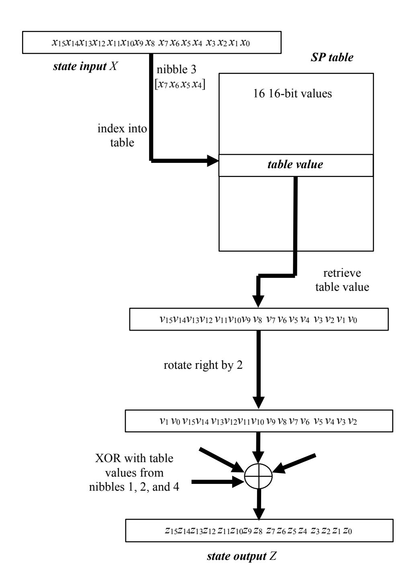

Figure 2.2: SP Wide Table Lookup Using Single Table

be used in the production of the round output block. The memory size of the required table can now be 16 16-bit words (or, equivalently, 64 (32) nibbles (bytes)). The penalty for this saving of memory is the additional rotation operation required for each lookup. The process for the wide table lookup using a single table is illustrated in Figure 2.2. In the figure, it is shown how the nibble that is 2nd from the right is used as an index into the table, following which the retrieved value is rotated right by 2 positions. The resulting output, combined using XOR with the lookup/rotations from the other 3 nibbles of the state is the new state value at the output of the round.

# 2.5 Time/Memory Tradeoffs of Lookup Tables

Consider now a generalized perspective on the memory requirements and speed associated with the combined substitution/permutation wide table lookup approach. Assume that an 

{33}------------------------------------------------

SPN is constructed using n-bit S-boxes and that the block size is B. Also, let ω represent the size of word used in the processor for instruction operands and storage of data.

Consider first the direct implementation of the SPN using the narrow table lookup discussed in Section 2.3.2 for the S-box followed by bit rotation approach for the permutation implementation. Such an implementation would use one table for the S-box of size 2<sup>n</sup> words, where we assume that each value in the table would take a full word, even though typically ω > n. <sup>4</sup> Using the bit rotation method for the permutation operation would require operations on all B bits of the block.

Consider now using the wide table lookup of the combined substitution/permutation layers using multiple SP tables. For convenience, assume that the word size is equal to the block size, i.e., ω = B. (The discussion presented can be easily adjusted for cases where ω 6= B.) Now, B/n tables are required for a total of B/n · 2 <sup>n</sup> words of size B. There are a total of B/n lookups (and associated XORs) required to determine the output of the round. With an appropriate permutation, it may be possible to reduce the number of tables from B/n to 1, by adding a rotation following each table lookup. That is, the combined subsitution/permutation layer can be accomplished using a single SP table, rather than multiple SP tables. Note that, while this is possible for some permutations (such as the ones for the SPNs of Figures 1.1 and 1.3), permutations exist for which this is not possible.

Let's now look at a realistically sized SPN, specifically the 64-bit SPN of Figure 1.3, based on 4-bit S-boxes. We assume an implementation based on a word size of ω = B = 64 bits. In this case, a wide table lookup approach can be taken using 64/4 = 16 tables (one for each S-box position) for a total size of 16 · 2 <sup>4</sup> = 2<sup>8</sup> = 256 words.<sup>5</sup> There are 16 lookup operations (with 15 XORs) to execute the round. Considering the permutation in Figure 1.3, it is possible to reduce the memory requirements from 16 tables to a single table, requiring only 16 words, but the small penalty is the need for an extra rotation operation following each table lookup.

In order to speed up the execution of the cipher, it is possible to build a larger lookup table with more values in it and consequently having fewer look up operations. We could, for example, increase the size of the index into the table from 4 bits to 8 bits by grouping together two adjacent 4-bit S-boxes into effectively one 8-bit S-box, which could then be combined with the permutation layer using the wide table lookup approach. In this case, for the 64-bit SPN, using the multiple table approach requires (64/8) · 2 <sup>8</sup> = 2<sup>11</sup> = 2048 words (of size 64 bits) in the tables and 64/8 = 8 lookup operations or, if the single table approach is used, 2<sup>8</sup> = 256 words and 8 lookups along with appropriate rotations are required. Hence, using 8-bit indices, for both the multiple table and single table approaches, there are half the lookups needed (8 vs. 16) when compared to lookup tables with 4-bit indices, while in terms of memory, the 8-bit indices approach requires several times more memory words when compared to lookup tables with 4-bit indices: 2048 vs. 256 for the multiple tables method and 256 vs.16 for the single table method.

Decreasing the number of lookups at the expense of larger memory use, can be extended even further. We could group 4 S-boxes together, effectively creating a 16-bit S-box for a

<sup>4</sup>A compact implementation, could be realized which would only require 2<sup>n</sup> · n/ω words in cases where ω/n S-box outputs can be saved in 1 word.

<sup>5</sup> In most contexts, the sensible minimum memory unit size is the processor word size and, hence, it makes most sense to discuss memory requirements in terms of the word size. We leave to the reader to determine which appropriate base unit should be considered for their context of interest.

{34}------------------------------------------------

| Index Size | Multiple Tables Memory | Single Table Memory | # Lookups |
|------------|------------------------|---------------------|-----------|
|            | (64-bit words)         | (64-bit words)      |           |
| 4          | 8 = 256<br>2           | 4 = 16<br>2         | 16        |
| 8          | 11 = 2048<br>2         | 8 = 256<br>2        | 8         |
| 16         | 18 = 262144<br>2       | 16 = 65536<br>2     | 4         |

Table 2.4: Tradeoffs for Wide Table Lookup (64-bit SPN using 4-bit S-boxes)

process requiring only 4 lookup operations, resulting in table requirements of 64/16 · 2 <sup>16</sup> = 2 <sup>18</sup> = 262, 144 words (of size 64 bits) for 4 separate S-box tables or 2<sup>16</sup> = 65, 536 words for the single table approach. Although this might seem like a way to speed up the encryption process, in fact, as the tables grow larger, table lookup operations can take longer due to memory access phenomena such as cache issues. Hence, there is a limit to the value of increasing the memory size to increase cipher speed by decreasing the number of lookups. Further grouping S-boxes together for the table lookups would clearly become impractical: a grouping of 8 4-bit S-boxes implying 32-bit indices would require the size of a single table to be an impractically large 2<sup>32</sup> words.

A comparison of the tradeoffs for selections of the index size for a wide lookup table approach for a 64-bit SPN using 4-bit S-boxes is presented in Table 2.4. The number of XOR operations is equal to the number of table lookups minus 1, while the number of necessary rotations after the lookup is zero for the multiple table approach and equal to the number of lookups minus 1 for the single table approach. Note that the tradeoff comparison of lookup table sizes for x86 architectures is detailed in [13], including a discussion on the PRESENT cipher.

# 2.6 Bit-slice Implementations

A dramatically different approach to a software implementation of an SPN, would be what to use what is referred to as bit-slicing. The application of bit-slicing for encryption was first proposed for an implementation of DES by Biham in [14]. A bit-slice implementation makes use of the representation of the bits in an S-box using Boolean functions and typically structures a description of the cipher based on the parallel implementation of a number of blocks. In our discussion, we shall assume that B blocks are to be encrypted in parallel and the size of the cipher block, B, is the same as the word size ω. Towards the end of our discussion, we address the issues involved if B 6= ω.

Essentially, the bit-slice approach can be thought of as a 3 phase process:

- 1. Structure plaintext blocks into a format for bit-slicing,
- 2. Process data using bitwise logical instructions, and
- 3. Restructure bit-slice data into ciphertext blocks.

We begin our discussion by examining the middle phase, which implements the cipher operations using logical instructions based on the Boolean function representation of the cipher operations. It is useful for the reader of this section to have good knowledge of 

{35}------------------------------------------------

Boolean functions, Boolean algebra, and/or combinational logic design techniques. At the end of this section, we present an example of the 16-bit SPN to clarify the approach.

#### 2.6.1 Bit-slicing the S-box

Consider the S-box of Figure 1.2, given in Table 1.1. It is possible to consider each output bit as a Boolean function of the 4 input bits and, as shown in Table 2.5, the S-box can be described as truth tables, one for each of the 4 output bits.<sup>6</sup> As an example, using the canonical sum-of-products representation, Y<sup>0</sup> can be written as:

$$\begin{split} Y_0 &= \overline{X}_3 \cdot \overline{X}_2 \cdot \overline{X}_1 \cdot X_0 + \overline{X}_3 \cdot \overline{X}_2 \cdot X_1 \cdot X_0 + \overline{X}_3 \cdot X_2 \cdot \overline{X}_1 \cdot \overline{X}_0 \\ &+ \overline{X}_3 \cdot X_2 \cdot X_1 \cdot X_0 + X_3 \cdot \overline{X}_2 \cdot \overline{X}_1 \cdot \overline{X}_0 + X_3 \cdot \overline{X}_2 \cdot X_1 \cdot \overline{X}_0 \\ &+ X_3 \cdot X_2 \cdot \overline{X}_1 \cdot X_0 + X_3 \cdot X_2 \cdot X_1 \cdot \overline{X}_0 \end{split}$$

where the Boolean operators of AND, OR, and NOT are represented by "·", "+", and an overbar, respectively. In subsequent expressions, the "·" is generally omitted where AND is implied. Using logical operations of only one or two inputs, one could produce Y<sup>0</sup> in the following way. First generate temporary variables G<sup>i</sup> , H<sup>i</sup> , and M<sup>i</sup> as follows:

$$\begin{array}{llllllllllllllllllllllllllllllllllll$$

Each G variable represents the inverse of an input bit and would take one logical operation to produce. The H variables are generated by the AND of two X and/or G variables and M variables are produced by the AND of the H variables. Each M variable represents a minterm, which is a four input AND of all 4 input bits or their inverse. This takes a total of 4 + 8 + 16 = 28 two (or one) input logical operations. Now Y<sup>0</sup> is produced by selecting the appropriate minterm corresponding to the locations of the "1"s in the truth table for Y0. Since

$$Y_0 = M_1 + M_3 + M_4 + M_7 + M_8 + M_{10} + M_{13} + M_{14},$$

S-box output Y<sup>0</sup> can be computed using the following sequence of two-input operations:

$$Y_{0} \leftarrow M_{1} + M_{3}$$

$$Y_{0} \leftarrow Y_{0} + M_{4}$$

$$Y_{0} \leftarrow Y_{0} + M_{7}$$

$$Y_{0} \leftarrow Y_{0} + M_{8}$$

$$Y_{0} \leftarrow Y_{0} + M_{10}$$

$$Y_{0} \leftarrow Y_{0} + M_{13}$$

$$Y_{0} \leftarrow Y_{0} + M_{14}.$$

<sup>6</sup>Note that we now use the notation where X<sup>i</sup> and Y<sup>i</sup> represent the S-box input and output bits, respectively, rather than x<sup>i</sup> and y<sup>i</sup> as previously. We do this to distinguish that, as we shall see, bit-slicing actually operates on X<sup>i</sup> and Y<sup>i</sup> as words, rather than bits.

{36}------------------------------------------------

| X3X2X1X0 | Y3 | Y2 | Y1 | Y0 |
|----------|----|----|----|----|
| 0000     | 1  | 1  | 0  | 0  |
| 0001     | 0  | 1  | 0  | 1  |
| 0010     | 0  | 1  | 1  | 0  |
| 0011     | 1  | 0  | 1  | 1  |
| 0100     | 1  | 0  | 0  | 1  |
| 0101     | 0  | 0  | 0  | 0  |
| 0110     | 1  | 0  | 1  | 0  |
| 0111     | 1  | 1  | 0  | 1  |
| 1000     | 0  | 0  | 1  | 1  |
| 1001     | 1  | 1  | 1  | 0  |
| 1010     | 1  | 1  | 1  | 1  |
| 1011     | 1  | 0  | 0  | 0  |
| 1100     | 0  | 1  | 0  | 0  |
| 1101     | 0  | 1  | 1  | 1  |
| 1110     | 0  | 0  | 0  | 1  |
| 1111     | 0  | 0  | 1  | 0  |

Table 2.5: Truth Table for S-box of Table 1.1 (All values in binary.)

To generate one output bit of the S-box, Y0, in this way would require at total of 35 operations, 28 to produce the G, H, and M variables and 7 more to generate Y<sup>0</sup> from the M variables.<sup>7</sup> This is a lot of operations. However, consider that the canonical expressions for the remaining 3 outputs of the S-box, Y1, Y2, and Y3, are:

$$Y_1 = M_2 + M_3 + M_6 + M_8 + M_9 + M_{10} + M_{13} + M_{15},$$

$$Y_2 = M_0 + M_1 + M_2 + M_7 + M_9 + M_{10} + M_{12} + M_{13},$$

and

$$Y_3 = M_0 + M_3 + M_4 + M_6 + M_7 + M_9 + M_{10} + M_{11}.$$

Since the M variables only need to be produced once, to generate the output bits of the S-boxes takes a total of 28 + 4 · 7 = 56 operations or 56/4 = 14 operations on average per output bit.<sup>8</sup>

It is apparent that 14 operations per bit is not efficient. As we shall see, a major challenge for bit-slicing is finding a minimized form of the Boolean functions which ensures that the maximum efficiency for the software implementation of the Boolean function is achieved. For our example, can we reduce the average number of Boolean operations to produce an output bit to something substantially less that 14? In fact, for the PRESENT S-box of Table 1.1, it

<sup>7</sup>Since Y<sup>0</sup> only needs 8 of the 16 M values, strictly speaking only 20 + 7 = 27 operations are needed for Y0. However, all 16 M values must be calculated for the remaining outputs in any case.

<sup>8</sup>The number of operations can be further reduced to a small degree by calculating temporary variables representing the sum of pairs of M bits which are used to produce multiple output bits. For example, calculating M<sup>9</sup> +M<sup>10</sup> and saving the result in a variable could reduce the number of operations by two since the variable can be used to generate Y1, Y2, and Y3.

{37}------------------------------------------------

can be shown that the following simple Boolean function can be used to produce the output bit, Y<sup>0</sup> [15]<sup>9</sup> :

$$Y_0 = X_0 \oplus X_3 \oplus X_2 \cdot (X_1 \oplus X_2)$$

which can be structured as the following sequence of two-input logic operations, making use of variables, T<sup>i</sup> :

$$T_1 \leftarrow X_1 \oplus X_2$$

$$T_2 \leftarrow X_2 \cdot T_1$$

$$T_3 \leftarrow X_3 \oplus T_2$$

$$Y_0 \leftarrow X_0 \oplus T_3.$$

$$(2.1)$$

The remaining outputs can be subsequently generated using the following process [15]:

$$T_{2} \leftarrow T_{1} \cdot T_{3}$$

$$T_{1} \leftarrow T_{1} \oplus Y_{0}$$

$$T_{2} \leftarrow T_{2} \oplus X_{2}$$

$$T_{4} \leftarrow X_{0} + T_{2}$$

$$Y_{1} \leftarrow T_{1} \oplus T_{4}$$

$$T_{4} \leftarrow \overline{X}_{0}$$

$$T_{2} \leftarrow T_{2} \oplus T_{4}$$

$$Y_{3} \leftarrow Y_{1} \oplus T_{2}$$

$$T_{2} \leftarrow T_{2} \oplus T_{3}$$

$$(2.2)$$

The total number of logical operations is therefore only 14 to produce the 4 output bits! Hence, the average number of operations per bit is only 3.5, substantially reduced over the previous analysis' average of 14 operations per bit.

Let us now consider how we can make use of Boolean expressions to efficiently implement the S-box in software. For convenience, we shall initially assume that the block size of the cipher, B, is equal to the size of the words used as operands in processor instructions, ω, and let ω = B = 64. Consider that we have four 64-bit words, X3, X2, X1, and X0, with each word corresponding to an input bit of the S-box. That is, X<sup>i</sup> is a word containing information for input bit x<sup>i</sup> of an S-box (as illustrated in Figure 1.2), with each of the 64 bits of X<sup>i</sup> corresponding to the same S-box input bit associated with the encryption of 64 different plaintext blocks. More specifically, consider an S-box in a particular round of the cipher has its four input bits represented by the word X<sup>i</sup> = [xi,63xi,62...xi,0], i ∈ {0, 1, 2, 3}, and, within this word, bit j, 0 ≤ j ≤ 63, represented as xi,j , represents input i to the S-box for the j-th plaintext block.

Now, assuming that Y<sup>0</sup> = [y0,63y0,62...y0,0] is a 64-bit word that represents the S-box output bit y<sup>0</sup> for all 64 encryptions. It is possible to produce all 4 S-box output bits for all 64 blocks in parallel by using (2.1) and (2.2), where the logical operations are performed in parallel on all bits of the word using the processor's bitwise logical instructions. However,

<sup>9</sup>Methods used to determine simple Boolean functions made up of 2-input operations to compute S-box output bits is beyond the scope of this article.

{38}------------------------------------------------

executing these instructions produces S-box output bits for 64 different blocks. Hence, although it may seem costly to implement the Boolean function in software instructions, the parallel nature of the process gives the potential for improved speed up compared to other approaches such as the wide table lookup approach.

Using this process for our sample S-box, from (2.1) and (2.2), 14 instructions produces 4 output bits of an S-box for 64 parallel encryptions, meaning the average number of instructions to produce an S-box output bit value across all encryptions is (14/4)/64 = 0.055. For the 64-bit cipher, it would take 14 · 16 = 224 instructions to produce the output of the substitution layer (16 S-boxes in total) for 64 parallel encryptions, which is equivalent to an average of 224/64 = 3.5 instructions to produce the output of a substitution layer for the encryption of one block. This can be compared to the multiple table lookup approach using a 4-bit index, which would require 16 table lookups and 15 XOR instructions for the substitution layer applied to each block. Hence, using bit-slicing for the substitution layer, when compared to the wide table lookup method, it appears that there is a potential for speed-up on the order of (16 + 15)/3.5 ≈ 9.<sup>10</sup> Ignoring any memory requirements for the key schedule, bit-slicing would have modest memory requirements requiring B = 64 words to store the words representing each bit of the state for the parallel encryptions. Depending on the nature of the key schedule and its implementation, the memory requirements to store and produce round keys could be significantly more.

Although there seems to be great potential using bit-slicing, there are two significant challenges: (1) an efficient Boolean function representation of the S-box must be found, and (2) the plaintext block from 64 different encryptions must be restructured into the data structure appropriate for bit-slicing where words should contain information from the same bit from numerous blocks. In the next section, we discuss the the nature of the data restructuring. For small S-boxes, such as 4-bit S-boxes found in lightweight ciphers such as PRESENT, simple 4-bit Boolean functions may be found (such as illustrated previously) that can lead to potentially very efficient bit-slice implementations. However, for larger Sboxes, such as the 8-bit S-boxes found in AES, the 8-bit Boolean functions are substantially more complex than for smaller functions. Consider that the canonical form of the Boolean function representing an AES S-box consists of 128 minterms, each with 8 inputs (taken from the S-box input bits or their inverses). Of course, this can be reduced using logic minimization techniques, but there will still be clearly many two-operand logic instructions to produce the 8-bit output of an S-box. In fact, the average number of instructions per bit for the AES S-boxes is much larger than for 4-bit S-boxes and, in general, bit-slicing is best suited to systems comprised of small S-boxes.

#### 2.6.2 Restructuring the Data for Bit-Slicing

Since the idea behind bit-slicing is to have multiple blocks of plaintext being encrypted simultaneously by executing the logical operations representing the cipher components using bitwise logical instructions on words, it is necessary to restructure the data representing the

<sup>10</sup>This is a gross simplification. This speed-up only applies to the substitution portion of the processing and presumes the convenience of data being structured for bit-slicing. Also, the timing cost of different instructions is not the same. For example, certainly a table lookup operation (which includes the setup steps for the index, as well as the actual memory access) is not equivalent in timing cost to a simple XOR of 2 operands.

{39}------------------------------------------------

plaintext into an appropriate format. Let us continue assuming  $\omega=B=64$ . At the input of the system, for the 64-bit SPN, we shall assume that we have 64 plaintext blocks to encrypt, with each block stored in a word. We can visualize the data as organized into a matrix of plaintext where the words containing blocks map onto rows containing 64 elements each consisting of 1 bit of a plaintext and each column of the matrix represents the position of bits within the block. For example, the leftmost column is bit 63 of the plaintext and the rightmost is bit 0 of the plaintext. We label this plaintext maxtrix as  $P^{\dagger}$  and let the rows of  $P^{\dagger}$ , from top to bottom, be  $P_{63}^{\dagger}, P_{62}^{\dagger}, ..., P_{0}^{\dagger}$ , each representing a different plaintext block. Each block maps to a 64-bit word with the j-th bit of block,  $P_{i}^{\dagger}$ , labelled as  $p_{i,j}^{\dagger}, j \in \{0,1,...63\}$ . Hence, we have the following representation:

$$P^{\dagger} = \begin{bmatrix} P_{63}^{\dagger} \\ P_{62}^{\dagger} \\ P_{61}^{\dagger} \\ \dots \\ P_{1}^{\dagger} \\ P_{0}^{\dagger} \end{bmatrix} = \begin{bmatrix} p_{63,63}^{\dagger} & p_{63,62}^{\dagger} & p_{63,61}^{\dagger} & \dots & p_{63,1}^{\dagger} & p_{63,0}^{\dagger} \\ p_{62,63}^{\dagger} & p_{62,62}^{\dagger} & p_{62,61}^{\dagger} & \dots & p_{62,1}^{\dagger} & p_{62,0}^{\dagger} \\ p_{61,63}^{\dagger} & p_{61,62}^{\dagger} & p_{61,61}^{\dagger} & \dots & p_{61,1}^{\dagger} & p_{61,0}^{\dagger} \\ \dots & & & & & \\ p_{1,63}^{\dagger} & p_{1,62}^{\dagger} & p_{1,61}^{\dagger} & \dots & p_{1,1}^{\dagger} & p_{1,0}^{\dagger} \\ p_{0,63}^{\dagger} & p_{0,62}^{\dagger} & p_{0,61}^{\dagger} & \dots & p_{0,1}^{\dagger} & p_{0,0}^{\dagger} \end{bmatrix}.$$

To encrypt using bit-slicing, the bits of the plaintext matrix must be reassigned to the bit-slicing data structure, an  $64 \times 64$  matrix of bits (represented by 64 rows of 64-bit words), which we refer to as the bit-slicing state,  $D^{\dagger}$ , comprised of elements  $d_{i,j}^{\dagger}, i, j \in \{0, 1, ..., 63\}$ , where i represents the row (starting with 63 at the top) and j represents the column (starting with 63 at the left). The resulting matrix representing the bit-slice state thus has the format:

$$D^{\dagger} = \begin{bmatrix} D_{63}^{\dagger} \\ D_{62}^{\dagger} \\ D_{61}^{\dagger} \\ \dots \\ D_{1}^{\dagger} \\ D_{0}^{\dagger} \end{bmatrix} = \begin{bmatrix} d_{63,63}^{\dagger} & d_{63,62}^{\dagger} & d_{63,61}^{\dagger} & \dots & d_{63,1}^{\dagger} & d_{63,0}^{\dagger} \\ d_{62,63}^{\dagger} & d_{62,62}^{\dagger} & d_{62,61}^{\dagger} & \dots & d_{62,1}^{\dagger} & d_{62,0}^{\dagger} \\ d_{61,63}^{\dagger} & d_{61,62}^{\dagger} & d_{61,61}^{\dagger} & \dots & d_{61,1}^{\dagger} & d_{61,0}^{\dagger} \\ \dots & & & & & \\ d_{1,63}^{\dagger} & d_{1,62}^{\dagger} & d_{1,61}^{\dagger} & \dots & d_{1,1}^{\dagger} & d_{1,0}^{\dagger} \\ d_{0,63}^{\dagger} & d_{0,62}^{\dagger} & d_{0,61}^{\dagger} & \dots & d_{0,1}^{\dagger} & d_{0,0}^{\dagger} \end{bmatrix}.$$

The elements of  $D^{\dagger}$  are derived from the original plaintext block,  $P^{\dagger}$ , as follows:

$$d_{i,j}^{\dagger} \leftarrow p_{j,i}^{\dagger}$$

for all  $i, j \in \{0, 1, ..., 63\}$ . That is, the j-th bit of the i-th block of plaintext should be put into the i-th bit of the j-th word of  $D^{\dagger}$ . This is equivalent to saying that  $D^{\dagger}$  is a transposition of matrix  $P^{\dagger}$ . Similarly, after the completion of the encryption of all 64 blocks to produce the ciphertext blocks, the data in  $D^{\dagger}$  must be restructured back into one word (row) representing the bits of one block. In other words, we need to transpose  $D^{\dagger}$  to get the ciphertext matrix,  $C^{\dagger}$ , following the encryption process. The flow of the encryption process for bit-slicing can thus be summarized as follows:

$$\{(P^\dagger)^T \to D^\dagger\} \Longrightarrow \{\text{Update } D^\dagger \text{using bit-slice encryption}\} \Longrightarrow \{(D^\dagger)^T \to C^\dagger\}$$

where  $(\cdot)^T$  represents transposition of the argument matrix.

{40}------------------------------------------------

For the encryption of 64 blocks, the two transposition operations on the 64 ×64 matrices result in 2 × 64 × 64 = 2<sup>13</sup> variable assignments for an average of 128 such assignments per plaintext block. These operations are not needed for other encryption methods such as the table lookup approaches. Hence, they indicate an overhead associated with bit-slicing. However, if the core Boolean function operations can be implemented efficiently, then this overhead may be small enough to ensure that bit-slicing is more efficient than methods such as table lookup.

Also, it should be noted that, in practice, assembly language instructions on modern processors can allow some efficiencies in the movement of data bits within the words of data representing the cipher data blocks. For example, in [16], assembly code is given for an efficient data restructuring.

To this point, we have discussed how to structure the implementation to determine the output of an S-box by executing the appropriate Boolean operators of NOT, AND, OR, and XOR using bitwise logical instructions in software. We have discussed the need to transform data at both the input (plaintext) and output (ciphertext) to ensure data is an appropriate format for bit-slicing during the processing of the data. We emphasize again that unless an effort is made to minimize the number of logical operations to realize the S-box, clearly this will not be as efficient as a table lookup approach. We need to finish our explanation by clarifying how the bit-slice data processing can be done for the other round function layers, the permutation and the key mixing.

#### 2.6.3 Bit-slicing the Permutation and Key Mixing

We have focused on discussing the Boolean function representation of S-boxes and its relationship to bit-slicing. However, before we present a detailed example of bit-slicing, we should comment on the other operations that comprise the round operation of the cipher. The permutation operation is a simple reordering of the bit positions and, hence, can be easily incorporated into bit-slicing at negligible cost: instead of assigning the output of the Boolean operations to the word representing the state bit at the output of the substitution layer, the output can be assigned to the word representing the bit position to which the permutation will move the S-box output bit. For example, for the 64-bit SPN using the permutation in Table 1.5, the word representing the state bit 19 (at the output of the substitution), will be assigned into the word representing state bit 52, which is the position to which bit 19 is moved due to the permutation.

For the key mixing operation, incorporation into the bit-slicing process is also trivial. Since most applications will use the same key for a large number of plaintext data blocks, it is reasonable to assume all blocks being encrypted by one pass through the bit-sliced cipher implementation are using the same key and, hence, the round keys are the same for each block. In general for a B-bit SPN, for bit-slicing, the round key data structure should also represent a B × B matrix, stored in the system as B words of size B-bits, where each word represents one bit position within the cipher round key and each bit within the word represents the round key bit value for each of the B blocks being encrypted. However, since all round keys are the same for all encryptions, all words (which are the rows of the B × B matrix) of the bit-slice round key structure must be all "0"s or all "1"s. Using bit-slicing, it is possible to prepare and store the words to represent the round key bits prior to processing the encryption of any plaintext blocks using a particular cipher key. In order to execute key 

{41}------------------------------------------------

mixing using XOR with the state bits and round key bits, during the round key setup, the bit-slice round key structure must be created by having each round key bit replicated to each bit in one word of the structure. Then, during the bit-slice encryption process, round key words are bitwise XORed with the word representing the corresponding state bit of all the different blocks. The necessary setup of the round keys will not have a significant impact on the speed of encryption, assuming that large amounts of plaintext are encrypted under one key, which is the case if keys change infrequently. The memory storage required will be the number of words equal to the total number of bits found in all round keys. If bit-slicing is used to encrypt plaintext blocks using different keys, then the formulation of the round key matrices used in bit-slicing would be more complex, as the rows of the round key matrices would need to reflect different round key bits for the different blocks being encrypted under different keys.

#### 2.6.4 Example of Bit-Slicing

Let us now consider an example of the application of bit-slicing for the 16-bit SPN using the PRESENT S-box of Table 1.1. We use the 16-bit, rather than the 64-bit SPN for our example so that the data presentation is more manageable. For convenience, we shall focus our discussion on only the first round and assume that the first round key used for all encryptions is

$$RK_1 = 0110111001111001.$$

Assume that 16 plaintext blocks to be encrypted are represented as:

$$P^{\dagger} = \left[ \begin{array}{cccccccccccccccccccccccccccccccccccc$$

where each row is a plaintext of 16 bits and, for illustration, we have highlighted the plaintext block of the first row to illustrate the transposition operation to produce  $D^{\dagger}$ .

To process using bit-slicing, the data is restructured to become the bit-slice state,  $D^{\dagger}$ ,

{42}------------------------------------------------

as follows:

$$D^{\dagger} = (P^{\dagger})^T = \begin{bmatrix} \mathbf{1} & 1 & 1 & 0 & 1 & 0 & 0 & 0 & 1 & 1 & 0 & 0$$

At the input to the first round, the state bits are mixed with the round key bits, where the bit-slice round key has each bit replicated to all positions in 16 words, resulting in the following updating of the state:

$$D^{\dagger} \leftarrow D^{\dagger} \oplus \left[ \begin{array}{cccccccccccccccccccccccccccccccccccc$$

The updated state is now:

$$D^{\dagger} = \begin{bmatrix} 1 & 1 & 1 & 0 & 1 & 0 & 0 & 0 & 1 & 1 &$$

This state is now the input to the substitution layer. So let's now focus on just the 4 bits entering the leftmost S-box. These bits correspond to the top 4 rows of  $D^{\dagger}$ , represented as  $D_{15}^{\dagger}$ ,  $D_{14}^{\dagger}$ ,  $D_{13}^{\dagger}$ , and  $D_{12}^{\dagger}$  from the top row to the 4th from the top row. We can use the Boolean functions in (2.1) and (2.2) to determine the output of this S-box and, by

{43}------------------------------------------------

incorporating the permutation, place these 4 bits into the correct new positions within the state. We now let  $Y_i$ ,  $i \in \{0, 1, ..., 15\}$ , represent the words for each output bit of the substitution layer (rather than just an individual S-box). Hence, bits  $Y_{15}$ ,  $Y_{14}$ ,  $Y_{13}$ , and  $Y_{12}$  represent the outputs bits of the leftmost S-box. The following operations must occur:

$$\begin{array}{llll} T_1 & \leftarrow D_{13}^\dagger \oplus D_{14}^\dagger & = [\mathrm{AFF4}] \oplus [\mathrm{4D55}] & = [\mathrm{E2A1}] \\ T_2 & \leftarrow D_{14}^\dagger \cdot T_1 & = [\mathrm{4D55}] \cdot [\mathrm{E2A1}] & = [\mathrm{4001}] \\ T_3 & \leftarrow D_{15}^\dagger \oplus T_2 & = [\mathrm{E8CC}] \oplus [\mathrm{4001}] & = [\mathrm{A8CD}] \\ Y_{12} & \leftarrow D_{12}^\dagger \oplus T_3 & = [\mathrm{C3D8}] \oplus [\mathrm{A8CD}] & = [\mathrm{6B15}] \\ \end{array}$$

$$\begin{array}{lll} T_2 & \leftarrow T_1 \cdot T_3 & = [\mathrm{E2A1}] \cdot [\mathrm{A8CD}] & = [\mathrm{A081}] \\ T_1 & \leftarrow T_1 \oplus Y_{12} & = [\mathrm{E2A1}] \oplus [\mathrm{6B15}] & = [\mathrm{89B4}] \\ T_2 & \leftarrow T_2 \oplus D_{14}^\dagger & = [\mathrm{A081}] \oplus [\mathrm{4D55}] & = [\mathrm{EDD4}] \\ T_4 & \leftarrow D_{12}^\dagger + T_2 & = [\mathrm{C3D8}] + [\mathrm{EDD4}] & = [\mathrm{EFDC}] \\ Y_{13} & \leftarrow T_1 \oplus T_4 & = [\mathrm{89B4}] \oplus [\mathrm{EFDC}] & = [\mathrm{6668}] \\ \end{array}$$

$$\begin{array}{lll} T_4 & \leftarrow \overline{D^\dagger}_{12} & = [\overline{\mathrm{C3D8}}] = [\mathrm{3C27}] \\ T_2 & \leftarrow T_2 \oplus T_4 & = [\mathrm{EDD4}] \oplus [\mathrm{3C27}] & = [\mathrm{D1F3}] \\ Y_{15} & \leftarrow Y_{13} \oplus T_2 & = [\mathrm{6668}] \oplus [\mathrm{D1F3}] & = [\mathrm{B79B}] \\ \end{array}$$

$$\begin{array}{lll} T_2 & \leftarrow T_2 + T_1 & = [\mathrm{D1F3}] + [\mathrm{89B4}] & = [\mathrm{D9F7}] \\ Y_{14} & \leftarrow T_2 \oplus T_3 & = [\mathrm{D9F7}] \oplus [\mathrm{A8CD}] & = [713\mathrm{A}] \\ \vdots & \vdots & \vdots & \vdots & \vdots \\ D_{15}^\dagger & \leftarrow Y_{13} = [\mathrm{6668}] & \dots & D_{11}^\dagger & \leftarrow Y_{14} = [713\mathrm{A}] & \dots \\ D_{7}^\dagger & \leftarrow Y_{13} = [\mathrm{6668}] & \dots & D_{3}^\dagger & \leftarrow Y_{12} = [\mathrm{6B15}] \end{array}$$

Note that we have used hexadecimal notation to represent 16-bit words for convenience of presentation. The last four assignments update state bits based on the permutation and should only be done after similarly logical operations are applied to produce words  $Y_{11}$  to  $Y_0$ , with the resulting assignments to the appropriate  $D_i^{\dagger}$  words to finalize the output of the substitution/permutation combination.

After the application of the Boolean functions and permutation to all bits, the resulting state matrix becomes

$$D^{\dagger} = \left[ \begin{array}{cccccccccccccccccccccccccccccccccccc$$

where we only illustrate the four rows for  $D_{15}^{\dagger}$ ,  $D_{11}^{\dagger}$ ,  $D_{7}^{\dagger}$ , and  $D_{3}^{\dagger}$  and leave the remaining rows as an exercise for the reader. Subsequent rounds would follow similarly. After the last round (which recall would have the permutation replaced with an extra key mixing), the bit-slice state needs to be restructured so that the resulting data is formatted as 16 rows of 16 bits, where each row contains a ciphertext block (rather than a particular bit from all blocks). This is similar to the data structuring operation at the start of encryption and is the equivalent to  $C^{\dagger} = (D^{\dagger})^{T}$ .

{44}------------------------------------------------

#### 2.6.5 Other Structures for Bit-slicing

We have described constructing a bit-slice implementation assuming that B blocks are to be encrypted in parallel in an implementation where the word size ω is the same as the block size of the cipher, that is, ω = B. But clearly it is possible that, in some circumstances, the word size will not equal the block size. How do we structure a bit-slice implementation when B 6= ω? Consider the two cases (1) ω > B and (2) B > ω.

For the first case, ω > B, and, for convenience in our discussions, let ω = 128 and B = 64. For this case, it is possible to apply bit-slicing by treating the two 64-bit blocks as one 128 bit superblock and constructing the appropriate bit-slice process with 128 simultaneously encryptions. In this scenario, the permutation does not mix bits between the 2 blocks making up the superblock. Since there will 128 superblocks processed in parallel, in fact, there will be 256 64-bit blocks that will be processed with one pass through the bit-slice structure.

For the second case, B > ω, and, for convenience in our discussions, let ω = 32 and B = 128. One possible approach is to structure the bit-slicing around a virtual 128-bit word, which is made up of four 32 words. So in this case, 128 encryptions will be done in parallel. Each logical operation on the bits from 128 encryptions will need 4 instructions, one for each word making up the 128-bit virtual word. Essentially, each operation on the 128-bit virtual word, will require the equivalent of 4 instructions on 32-bit operands.

To this point, we have assumed that the number of blocks encrypted in parallel using bitslicing is the same as the block size (or superblock size). Although this can be particularly efficient, it presents challenges in environments where data is to be encrypted in small batches, since a large number of blocks must be collected before the data can be restructured and processed using bit-slicing. However, it is also possible to encrypt fewer than B blocks in parallel. Consider for example, the 64-bit SPN where 16 blocks are encrypted in parallel by using a bit-slicing state, D† , of 64 rows and 16 columns. In this case, each bitwise logic operator is only operating on 16 bits of the ω bits of a word. If ω is 64, for example, this would be only 1/4 of the efficiency of operating on 64 parallel blocks. It is also possible to pack data into words (corresponding to a row of D† ) so that more than one bit of a block occurs in each row. For example, rather than 64 rows with 16 columns to implement encryption of 16 blocks, one could pack the data into an matrix of 16 rows and 64 columns, where each row would contain bit i from 16 different blocks and also, bits i + 16, i + 32, and i+ 64 from all 16 blocks. This is possible because each output bit of an S-box corresponding to a particular position is produced using the same Boolean function for all S-boxes. In this approach, instructions available in the processor would have to be exploited to efficiently move data around to achieve the permutation operation. This is done for PRESENT in [17].

In some cases, ciphers have been designed to be specifically suited to implementation using bit-slicing [18] [19] [20]. Such designs, in addition to being efficiently implementable using a software bit-slicing method, are also very compact for hardware implementation and can be implemented to be resistant to side channel attacks. It has even be found, applying bit-slicing to CTR mode and taking advantage of available processor instructions, it is possible to develop a high throughput implementation of AES [21].

{45}------------------------------------------------

## 2.7 Software Implementation of Cipher Modes

As presented in Section 1.4, block ciphers are applied using one of many possible modes of operation, such as ECB, CBC, and CTR. In all cases, certainly a table lookup implementation would be a useful approach to implementing an efficient encryption. The input to the block cipher "encryption" operation would be plaintext for ECB, plaintext XORed with the previous ciphertext for CBC, and a counter value for CTR mode. Table lookup approaches represent a fast implementation that can be used effectively for modes which must process plaintext sequentially, that is, modes for which the previous ciphertext is generated before the current plaintext is processed. For example, CBC relies on using the previous ciphertext as part of the next block input and can only be used in applications which sequentially process plaintext data. ECB and CTR modes can be structured to execute one encryption at a time and such applications can also benefit from an efficient table lookup approach.

Bit-slicing can be more efficient than table lookups in circumstances where the Boolean functions representing the S-boxes can be implemented using a small number of two-operand logical instructions. However, if it is necessary to require the parallel processing of B input blocks for efficient bit-slicing, issues can arise. In ECB mode, plaintext blocks could be buffered and then encrypted when B plaintext blocks become available. In the case of CTR mode, the count is easily predictable and, hence, it is quite possible to process B blocks in parallel to produce keystream, which can then be stored for when B plaintext blocks are available to encrypt. However, using a bit-slice implementation is particularly problematic if the block cipher is used in CBC mode. Since, CBC mode relies on the previous ciphertext to prepare the next block input, only one block at a time can encrypted and parallelizing encryption as required for bit-slicing is not possible.<sup>11</sup> Other feedback modes, such as output feedback (OFB) mode and cipher feedback (CFB) mode [12], also require linkages between consecutive encryptions, making the parallelization needed for bit-slicing challenging.

Consider now CTR mode. The nature of the mode presents an opportunity to make particularly efficient use of bit-slicing, by eliminating some data restructuring. Normally, at the output of a bit-slice process, the data is generally restructured from the bit-slice state format back to the general data format where words become ciphertext blocks. However, in CTR mode, the block cipher is used in encryption mode to produce a sequence of keystream blocks, not ciphertext directly. If we followed the normal method and the output of the bit-slice process restructures the data, CTR mode would result in a conventional bit order in the keystream of:

```
bit 1 of block 1 ⇒ bit 2 of block 1 ⇒ ... ⇒ bit B of block 1
  ⇒ bit 1 of block 2 ⇒ bit 2 of block 2 ⇒ ...
```

However, for an application of CTR mode, this restructuring operation at the output is not necessary. The result of not restructuring the data format would be that keystream will be non-conventionally ordered as follows:

```
bit 1 of block 1 ⇒ bit 1 of block 2 ⇒ ... ⇒ bit 1 of block B
 ⇒ bit 2 of block 1 ⇒ bit 2 of block 2 ⇒ ...
```

<sup>11</sup>One could apply bit-slicing in CBC mode, if one could encrypt B independent, interleaved streams. However, it is possible in such a scenario that the streams could be using different keys and this would have to be considered in the setup of the round key structure for bit-slicing.

{46}------------------------------------------------

2.8. SUMMARY 47

This ordering of keystream creates no more predictability in the keystream and, hence, can be considered as secure as the conventional ordering. However, since this is a non-conventional way to generate the keystream in CTR mode, both the transmitter and receiver would have to be in agreement of how to implement the mode. For example, it would not be possible for the transmitter to use a bit-slice implementation and then, for efficiency, use the non-conventional ordering, while the receiver uses a table lookup implementation and uses the conventional ordering. Of course, the receiver could use the table lookup method and restructure the keystream to use the non-conventional ordering, thereby making itself compatible with the transmitter.

## 2.8 Summary

In this chapter, we have discussed software implementation approaches to block ciphers, using the 16-bit and 64-bit SPNs as case studies. Approaches have included table lookup methods and bit-slicing. The wide table lookup approach can be used to combine the S-box and permutation operations into table lookups where the values stored in the table represent the full block width with the S-box output bits moved into the appropriate positions within the block according to the permutation. The width of the table index (and the associated size of the table) is somewhat adjustable allowing for tradeoffs between the speed of the implementation and the amount of memory required. Bit-slicing is a dramatically different approach to implementation and its value is highly dependent on finding a logical representation of the S-box which requires a small number of 2-operand logic gates. Due to the necessary structuring of data, typically multiple blocks are encrypted in parallel and, hence, bit-slicing is most appropriate for applications which employ compatible modes of operation, such as counter mode. Finally, we note that other techniques exist for fast software implementations which make explicit use of instructions of the SIMD architecture found on modern processors. For example, the vector permutation (vperm) technique described in [22] [13] relies on the existence of shuffling instructions. Most significantly, processors now support an AES instruction set (AES-NI) designed to efficiently accelerate AES operations [4].

{47}------------------------------------------------

{48}------------------------------------------------

# Chapter 3

# Hardware Implementation

We now turn our attention to hardware implementations of block ciphers, again focusing on SPNs. We discuss synchronous sequential logic designs that can be used for target technologies such as field-programmable arrays (FPGAs) and application-specific integrated circuits (ASICs) realized for different CMOS technologies. The architectures that we discuss in this section presume that the reader has a basic knowledge of digital hardware design, including concepts such as logic gates, registers, multiplexers, and synchronous sequential logic design aspects such as datapaths, controllers, and timing issues.<sup>1</sup>

Cryptographic applications fall on a spectrum with the two extremes being (1) high speed/throughput (eg. core network routers) and (2) compact and often low power or energy (eg. wireless sensor nodes or other IoT devices). We shall discuss hardware structures which can be used to target these two extremes, as well as applications falling somewhere in between. In synchronous sequential logic designs, the speed or throughput of the block cipher hardware implementation is determined by (1) the average number of ciphertexts produced per clock cycle and (2) the frequency of the clock (which can be as high as the inverse of the minimum possible clock period). The complexity of a hardware design is often characterized by (1) the number of logic gates required for a synthesized design, (2) the number of logic blocks used in an FPGA implementation, or (3) the area required in an ASIC implementation. Often, the design complexity is characterized as the number of equivalent gates, where a gate is a 2-input NAND gate. In our discussions, we shall often use "area" when referring to a design's complexity, where smaller area implies a more compact design.

In the following sections, we discuss various design strategies for encryption by describing sample designs. By necessity, these descriptions leave out some details so that we can focus on the main aspects of interest. We leave it to the reader to envision the potential structures for the components of the designs not specifically outlined.

<sup>1</sup>For convenience, we shall assume in our discussion that registers used to store data such as the cipher state are loaded on the rising edge of the clock.

{49}------------------------------------------------

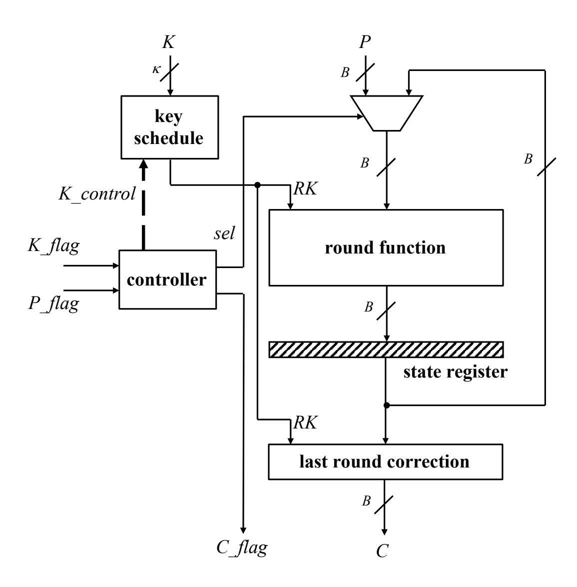

Figure 3.1: Basic Iterative Architecture for Encryption

# 3.1 Iterative Design

#### 3.1.1 Basic Iterative Architecture

The most straightforward approach to structuring a hardware design for encryption using an SPN is to implement the combinational logic required for one round function and then, using a register to store the state, iterate through the round function a number of times to achieve the appropriate number of rounds. This approach is illustrated in the design of Figure 3.1, which is the block diagram of a synchronous sequential logic circuit where the clock, while not shown, is an implicit component of the system. The design consists of component hardware such as a controller (on the left) and datapath (on the right) using multiplexers, register bits, and logic gates to implement the operations found in the round function. In the figure, we present the basic iterative structure for processing the cipher state and leave the hardware associated with the round key generation as a separate, not described component, key schedule. For simplicity, at this point, we simply assume that this component generates keys for all rounds and presents the round key as RK to the datapath as appropriate. We briefly discuss hardware implementation issues for the key schedule in the Appendix. Also, at this point we focus our discussion on the encryption process and defer our comments on decryption until Section 3.5.

{50}------------------------------------------------

We now provide a rough description of the flow of the data through the encryption system of Figure 3.1. The hardware for the basic iterative design will operate as follows. The controller will be comprised of a state machine that moves from control state to state as appropriate based on inputs to the controller and provides output control signals based on the control state. Upon assertion of the K flag, the controller will use control signals in the K control interface to indicate to the key schedule module that the cipher key is available at the κ-bit input K. Subsequent to the key input, plaintext will be available at B-bit input P as signalled by input P flag. With the arrival of a plaintext block, the controller will set control signal sel to ensure that the data of P is selected by the multiplexer and passed into the combinational logic of the round function, such that the output will be loaded into the B-bit state register on the next rising clock edge. The value stored in the register represents the state of the cipher and in subsequent clock cycles, sel will be set for the multiplexer to select the feedback from the register as the input to the round function logic. Each clock cycle with the feedback selection represents the processing of a round and the appropriate round key RK must be presented by the key schedule module. After the R rounds of the cipher, the C flag signal is asserted to indicate to an external device the B-bit output signal C (coming from the state register output and fed through the combinational logic module last round correction) is the valid ciphertext produced during the encryption operation. Hence, for the basic iterative architecture, a ciphertext block is produced every R clock cycles and the throughput is 1/(R · tclock) blocks/second, where tclock is the clock period.

Two factors in determining the clock timing requirements for the iterative architecture are (1) the propagation delay between register loads (including both the delays of the register and combinational logic of the round hardware) and (2) the setup time of the register. The propagation delay of the register is the time from the rising clock edge to when the output of the register becomes valid. The setup time of the register is the window of time before a clock edge during which the inputs to the register should be stable to avoid problems when loading at the clock edge. In general, the circuit timing must satisfy the following expression:

$$t_{clock} > t_{pd\_reg} + t_{pd\_comb} + t_{setup} \tag{3.1}$$

where tpd reg is the propagation delay of the register, tpd comb is the propagation delay of the combinational logic in the round, and tsetup is the setup time of the register. Note that tpd comb is determined by propagation delay through the multiplexer, key mixing and S-box layers, with the permutation having no gates and, hence, negligible propagation delay.

Note that in Figure 3.1 the round function hardware is re-used for all rounds, including the last round. However, since the actual structure of the SPN requires a last round that is modified from all other rounds, we have added at the output the last round correction module. This module can correct the output of the last round function by applying the inverse permutation (and thereby removing the permutation from the last round) and adding a new key mixing operation with RK now set as the final round key value. We leave details on how the key schedule block will generate and manage the necessary round keys to the reader to resolve.

{51}------------------------------------------------

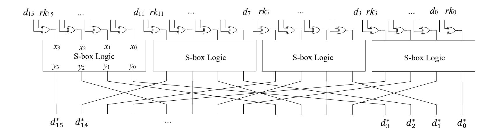

Figure 3.2: Round Function Logic for 16-bit SPN

#### 3.1.2 Round Function Hardware

Let's now consider the combinational logic that would comprise the **round function**. For the 16-bit SPN, this is illustrated in Figure 3.2, where  $d_i$ ,  $d_i^*$ , and  $rk_i$  are used to represent input bit i of the round function, output bit i of the round function, and bit i of the current round key. The round function combinational logic can simply consist of the 3 layers corresponding to the operations: key mixing, substitution, and permutation. The key mixing operation is comprised of B 2-input XOR gates, where each gate has as inputs a state bit and the corresponding round key bit. The permutation layer represents a routing of bit positions and is simply a matter of wiring, requiring no logic gates. The substitution logic will be multi-level logic. It could be two-level sum-of-products (AND-OR) logic or productof-sums (OR-AND) logic were each bit represents the output bit of an S-box and has as input the 4-bits of the corresponding S-box. The logic for each output can be minimized using appropriate combinational logic minimization techniques (eg. Boolean algebra, Karnaugh maps, computer-based minimization tools). If the logic for one S-box output is in the sumof-products form, the logic can use as few as 2 levels (excluding inverters), where the first level involves AND gates with as many as 4 inputs and the second level will be an OR gate with as many as 8 inputs.<sup>2</sup> Alternatively, the logic of the outputs of the S-box can be minimized jointly to allow for the sharing of gates, although this could result in more gate levels. For example, in Section 2.6.1, a logic description of the PRESENT S-box is presented with a small number of two-input gates to compute the S-box outputs. The corresponding logic is illustrated in Figure 3.3. Note, this logic requires 8 levels of logic, with each level involving 2-input gates or inverters.

For convenience, assume that the propagation delay through each gate is  $t_{prop}$ , regardless of the number of inputs. Hence, the propagation delay through the simplified PRESENT S-box of Figure 3.3 is  $8 \cdot t_{prop}$ . In comparison, the 2-level AND-OR logic would have a propagation delay of  $3 \cdot t_{prop}$  (including the propagation delay through the necessary inverters, in addition to the delay through the 2 levels of ANDs and ORs). The allowable clock period of the circuit,  $t_{clock}$ , is dependent on the delay through the combinational logic of the **round function**, including the layers of the key mixing (one level of 2-input XOR gates) and the

<sup>&</sup>lt;sup>2</sup>The canonical sum-of-products form will have exactly 8 AND terms, since the S-boxes are constructed from balanced Boolean functions. However, a minimized sum-of-products form could have fewer AND terms and those AND terms could have fewer that 4 inputs.

{52}------------------------------------------------

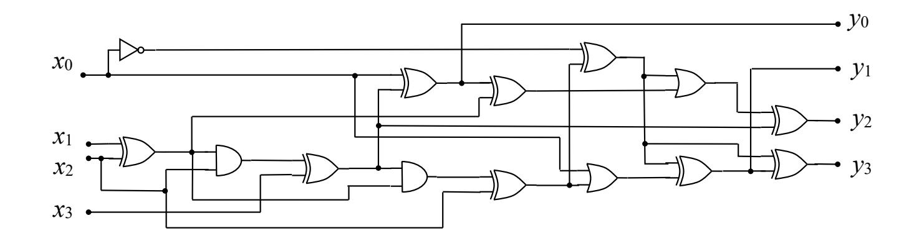

Figure 3.3: Compact S-box Logic

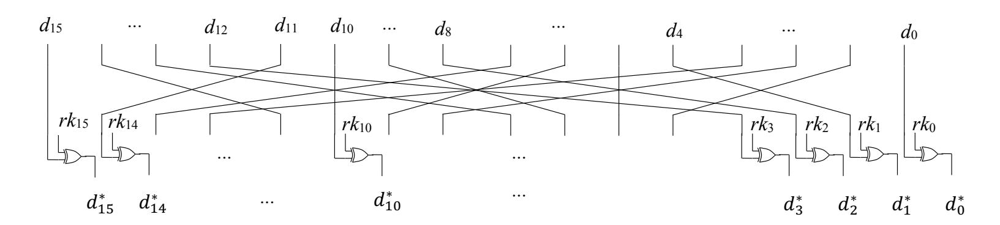

Figure 3.4: Last Round Correction Logic for 16-bit SPN

S-box layer (multiple levels of gates). Hence, while the simplified S-box implementation of Figure 3.3 might allow for a more compact implementation, the speed at which the circuit can be run will be lower, since the period of the clock must be large enough to ensure that no timing violations occur for the registers as per (3.1).

As previously mentioned, the **last round correction** combinational module is necessary between the **state register** and the output C to correct for the differences between the last round and the other round functions. For the 16-bit SPN, the circuit for the **last round correction** module is illustrated in Figure 3.4, where  $d_i$ ,  $d_i^*$ , and  $rk_i$  are used to represent input bit i of the state, output bit i of the state, and bit i of the current round key.

#### 3.1.3 Loop Unrolling

For the basic iterative implementation, we assume that every clock cycle would process one round, with a new state being loaded into the register every rising clock edge. More generally, a design could be structured to have multiple rounds processed for every clock cycle.<sup>3</sup> When multiple rounds are processed per clock cycle, we refer to this as loop unrolling and this is illustrated in Figure 3.5. In the figure, we unrolled 4 rounds, resulting in a combinational logic module, **4-round function**, that is executing the equivalent of 4 consecutive rounds in each clock. In general, it is possible to unroll m rounds up to m = R, as long as R is a multiple of m. In our design, inputs to the **4-round function** module are the cipher state and the 4 round keys,  $RK_A$ ,  $RK_B$ ,  $RK_C$ , and  $RK_D$ , which are provided by the

<sup>&</sup>lt;sup>3</sup>Indeed, it is also possible to have a partial round (that is, less than one full round) executed every clock cycle. This will be discussed in Section 3.4.

{53}------------------------------------------------

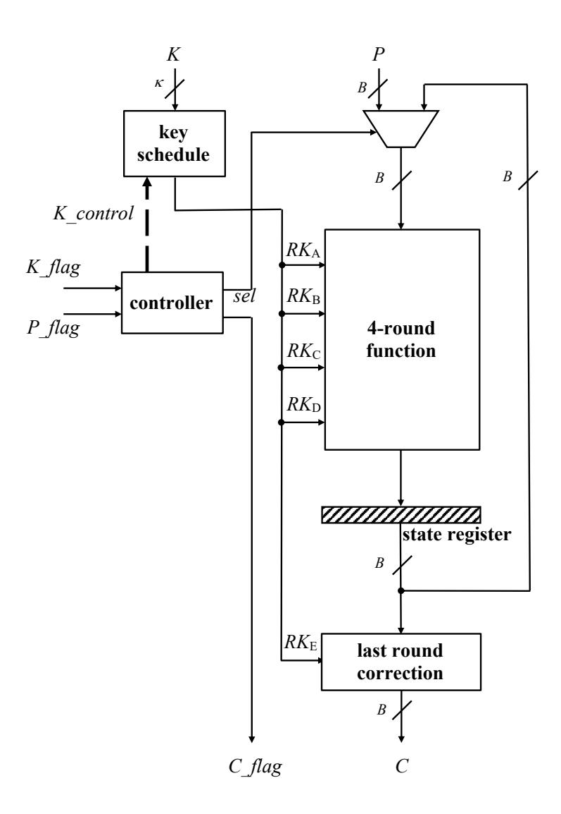

Figure 3.5: Encryption with Loop Unrolling

key schedule module. As a result, the state register is loaded with the output of the combinational logic needed to realize 4 rounds. The cipher states between every 4th round processed during a clock cycle occur implicitly within the combinational logic and are never stored in the register.

Since the round function combinational logic has 4 times as many levels as the 1-round basic iterative design, we would expect that the clock of the unrolled 4-round design would have a period that is 4 times the period of the basic iterative design. In compensation, ciphertext is produced every R/4 clock cycles so that the throughtput is now given by 4/(R · tclock) blocks/second, with the expectation that tclock is roughly 4 times larger than for the basic iterative design. In fact, it might be possible to decrease tclock to something less than 4 times that of the basic iterative design. Consider the timing constraint given in (3.1). It is reasonable to expect tpd comb will be a little less than 4 times larger, since, although there are 4 layers of the round function operations, there is still only one layer of input multiplexer and tpd reg and tsetup will remain unchanged from the basic iterative design. Hence, if the timing values of the register, tpd reg and tsetup, and the propagation delay through the multiplexer are not negligible, then the new tclock for the 4-round unrolled design could be significantly smaller than 4 times the 1-round basic iterative clock period. As a result, it might be possible to increase the speed of encryption by unrolling the iterative design.

{54}------------------------------------------------

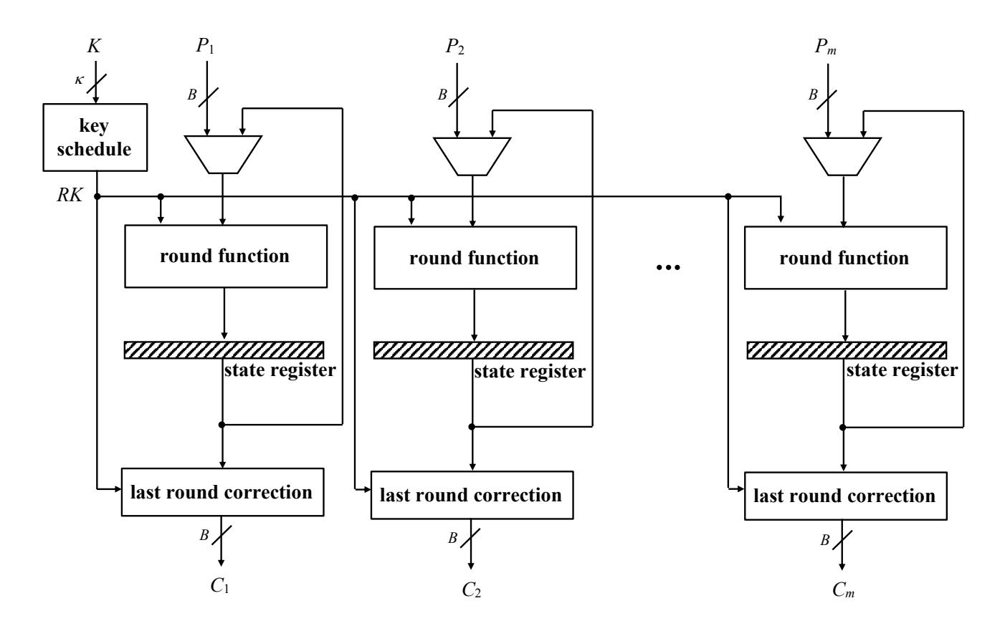

Figure 3.6: Parallel Encryption (Datapath Only)

Although improvement in the speed of the cipher is possible with loop unrolling, it is difficult to predict whether such improvement will be significant, as it will be highly dependent on the target technology and the associated abilities of the design tools. However, it is clear that, since the combinational logic of 4 rounds (rather than one round) is required for our design, we do expect that the area of the unrolled design will be substantially more.

# 3.2 Parallelization - A High Speed Implementation

An approach to hardware implementation that is of interest for high speed applications is the concept of parallelization. In Figure 3.6, a parallelization method is used based on the underlying structure of a basic iterative design. Note that, for simplicity, the diagram does not illustrate the controller module and any necessary control signals. The key schedule and last round correction modules perform roles as previously described for the basic iterative architecture. The idea with parallelization is to replicate hardware so that the processing of multiple blocks can be undertaken concurrently. For example, in the figure, m blocks are processed by accepting simultaneously m plaintext blocks, P<sup>1</sup> to Pm, into m different datapaths. Within each datapath is an iterative design consisting of the hardware for one round and appropriate input selected by a multiplexer. Hence, each plaintext block is processed independently on the m different sets of hardware. After the appropriate number of rounds, the output is made available for all ciphertexts as C<sup>1</sup> to C<sup>m</sup> as shown. Since m iterative datapaths are happening concurrently, it is reasonable to assume that this design produces ciphertext blocks at a speed that is m times the speed of the iterative design of Section 3.1.1.

Obviously, there is a significant cost to parallelization in terms of the area of the resulting

{55}------------------------------------------------

implementation. For example, the area is increased by a factor of about m over the basic iterative approach, if we ignore the area of the controller (which is usually negligible) and the key schedule module. Another drawback of the approach is that the I/O requirements are also increased since the architecture is expected to accept m plaintext blocks simultaneously and present m ciphertext blocks simultaneously and this may not suit some applications. This can be mitigated by building a hardware interface to accept input blocks sequentially, store the blocks, and present the blocks simultaneously to the parallel processing. Then the blocks can be simultaneously stored, followed by the outputting of the ciphertext blocks sequentially. Alternatively, the m parallel processing modules can have their processing staggered, so that only one block begins and one block finishes in a clock cycle. This would involve careful design of the flow of data in and out of the datapaths.

Since the target application for this architecture is focused on speed and, hence, the implementation accepts the tradeoff of increased hardware complexity of multiple datapaths, it would be desirable to optimize the iterative design within each datapath for speed, rather than area. Hence, the round function component implementation is most likely to be based on a minimized 2-level logic form (such as sum-of-products) and not the logic of Figure 3.3, which, although compact in area, would be dramatically slower than 2-level logic. A 2 level implementation would have a lower propagation delay through the round function and, therefore, would be able to operate with a smaller clock period and larger clock frequency. The result would be a high throughput of the iterative datapath.

It should also be noted that Figure 3.6 implies that all datapaths have the same key (and round keys) applied. A more complicated design could be realized where the controller and key schedule components generate and apply different round keys to the different encryption datapaths.

# 3.3 Pipelining - A High Speed Implementation

Another approach to the design of a high speed hardware implementation is pipelining. Pipelining is a method where sequential modules of hardware are organized into stages and then data from different blocks is sent through the hardware stages in a staggered manner so that at any one time different stages are processing different parts of different block encryptions. As we shall see, there is significant potential for increasing the speed of the encryption process, with the obvious drawback of increased area required for the hardware.

#### 3.3.1 Description of Pipeline Architecture

A pipeline architecture is illustrated in Figure 3.7. The figure illustrates the case where the number of pipeline stages is equal to the number of rounds, R. For simplicity, we do not illustrate the controller module and associated control signals. The last round correction module is required as previously described, while, in this case, the key schedule module provides all round keys simultaneously to the round function modules.

During the first clock cycle of operation, the first plaintext block, P1, is processed by the first stage (while the other stages are operating on invalid data) and on the subsequent rising clock edge, the state at the output of round 1 is stored in the state register D1. In the second clock cycle, the state associated with P<sup>1</sup> at the output of round 1 is processed in

{56}------------------------------------------------

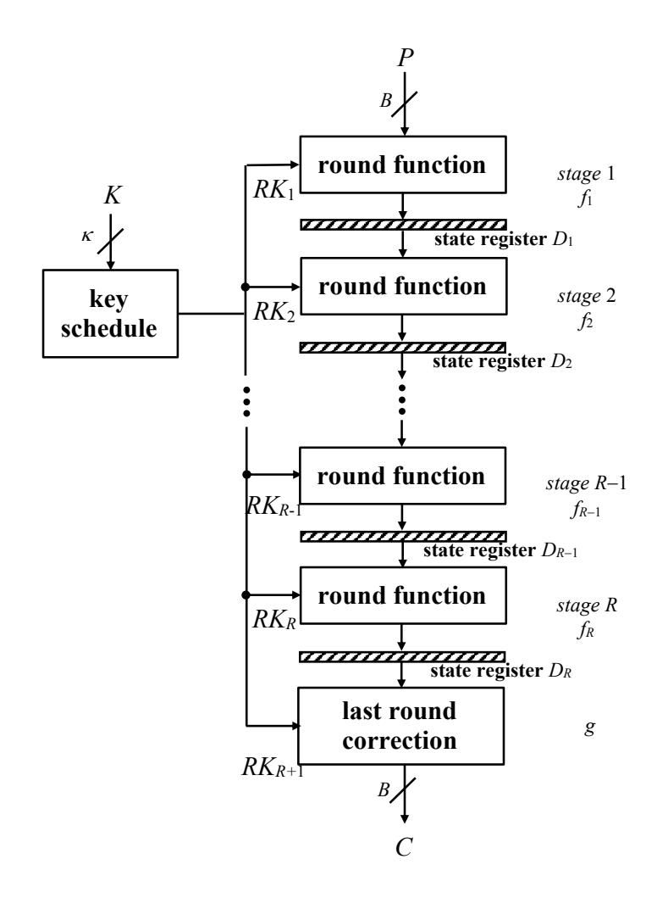

Figure 3.7: Encryption Using Pipelining (Datapath Only)

the second stage hardware and stored in the register D<sup>2</sup> at the output of this stage on the next rising clock edge. Also, during this cycle, a second plaintext block, P2, is processed by the first stage and stored in register D<sup>1</sup> at the next clock edge. During the 3rd clock cycle, the 3rd stage processes data from P1, the 2nd stage processes data from P2, and now the 1st stage processes a third plaintext block P3. Data is stored in the associated 3 registers at the subsequent rising clock edge. Note that during this time, the data in all the registers which follow stages not processing proper data is not meaningful and should be ignored. We refer to the first R clock cycles as the period during which the pipeline is being primed and data output C will not be valid while the pipeline is being primed.

After R clock cycles, the first plaintext has travelled through all R round functions and the output data has now been loaded into the register following the last stage, DR, and, hence, is now available as ciphertext to the output (through the last round correction module). In each subsequent clock cycle, the results from the following plaintexts are put into the output register D<sup>R</sup> and presented as ciphertext. In other words, after the pipeline is primed, each clock cycle will produce one ciphertext. As data flows through the pipeline stages, the data of plaintext P<sup>i</sup> will be followed by the data of plaintext Pi+1. Note that, although it takes R clock cycles for the original ciphertext to come out, once the pipeline is primed and all stages are processing legitimate data, ciphertext will be available every clock cycle (assuming plaintext has been fed to the input in every clock cycle). Since the propagation delay through the round function can be the same as for the round function of the basic iterative architecture, the speed at which the clock can be run is similar. However, 

{57}------------------------------------------------

instead of producing a ciphertext block every R cycles, pipelining can produce a ciphertext block every clock cycle. Hence, for this pipeline structure of one stage for every round, pipelining is R times faster than the basic iterative design and this comes at the expense of roughly R times more area. Note that, although ciphertext can be produced every clock cycle, the latency of the system is still R clock periods, where we define latency to be the delay from when a plaintext enters the system until when its ciphertext is produced at the output.

As with the parallel design, since pipelining is targeted to high speed applications, the round function hardware is best implemented as a low propagation delay 2-level logic circuit, thereby allowing for minimizing the period of the clock and maximizing the frequency of the clock. Note that, unlike other hardware architectures, a pipeline design has no feedback in the circuit.

#### 3.3.2 Selecting Hardware for a Pipeline Stage

Just as the basic iterative design can be unrolled, it is also possible to construct a pipeline architecture which has several consecutive rounds in a stage, rather than just one. For example, if R = 16, an 8 stage pipeline architecture could have 2 consecutive round functions in one stage. (Registers would be placed between stages and not between rounds.) In this case, the pipeline will be processing 8 blocks simultaneously (but staggered) and, when it is primed, a ciphertext block will be available every clock cycle. However, since the clock cycle must be long enough in duration to ensure that signals can flow through the combinational logic of 2 rounds without creating any timing violations, the clock frequency of the implementation will be lower than the pipeline architecture with 1 round per stage.

For some ciphers, it is possible to construct a pipeline architecture where a pipeline stage has the logic of a partial round. For example, if a round is complex enough that it is possible to slice the combinational logic of the round function into two halves (somewhat balanced in terms of their propagation delay) with a register between them, then a structure can be implemented with 2R stages and it may be possible that the clock period can be cut roughly in half. The result is an even faster implementation which produces a ciphertext block every clock cycle, while processing data from 2R plaintext blocks simultaneously (but staggered) in the pipeline. Since the round function of AES is somewhat complex using 8-bit S-boxes and a linear transformation (of ShiftRows and MixColumns) rather than a simple permutation, it is practical to break up the round function into different stages and this has lead to some very fast architectures for AES [23]. For SPNs, like PRESENT, using 4-bit S-boxes, which have much smaller logic circuits in their realization of a round function, using stages which process a partial round is less practical.

#### 3.3.3 Timing Issues for Pipeline Designs

In general, there is limited value in breaking up rounds in an attempt to increase the number of stages, increase the clock frequency, and increase the throughput of the cipher. Firstly, in breaking up round functions into stages, it is important to have each stage reasonably well balanced in terms of the propagation delay, since the clock period must be as large as the worst case propagation delay. For example, breaking down a round function with a propagation delay of tround into two stages, one with a propagation delay of 0.1×tround and 

{58}------------------------------------------------

one with a propagation delay of 0.9 × tround, gives little value in speeding up the cipher, since the clock can only be sped up by a factor of 1/0.9 = 1.11 at most. However, if the propagation delays of both stages are 0.5×tround, then the clock speed-up and the resulting increase in encryption throughput has the potential to be about 1/0.5 = 2.

Another issue that limits the value in reducing the logic contained in any stage is that the register associated with a stage creates a certain fixed overhead. Clearly, increasing the number of registers is going to increase the hardware complexity and the area of the final realized design. But, also there are timing issues associated with loading a register which could be significant. As previously noted in Section 3.1.1, the period of the clock is affected by the propagation delay of the register, tpd reg, and the setup time of the register, tsetup. These times are fixed which, as the amount of combinational hardware in a stage decreases, become an increasingly significant factor. Considering (3.1), since tpd reg and tsetup are fixed for a particular technology, reducing tpd comb (which we now take to represent the propagational delay of the combinational logic of a stage) by a factor of 2, does not cut tclock in half unless tpd reg, tsetup tpd comb. So there is a limit, imposed by tpd reg and tpd comb, to the value to trying to reduce tpd comb by dividing a stage into multiple stages.

#### 3.3.4 Example of Pipelining

To reinforce the concepts of pipelining, we present an example of pipelining for a simple 16-bit SPN. The SPN is similar to the SPN in Figure 1.1 and will use the S-box mapping in Table 1.1. We shall assume a cipher with R = 4 rounds and let the number of stages be equal to 4. The round keys will be generated for cipher key "01101110011110010000<sup>2</sup> = 6E79016" using the algorithm described in the Appendix with parameters, κ = 20, α = 13, and γ = 8. These are the round keys that are found in the example summarized in Table A.1. The resulting values for a pipelined implementation are given in Table 3.1. The following notation is used in the table to represent the relationships between values. Variables P and C represent the plaintext and ciphertext at the input and output of the system. Note that the current value of C does not represent the ciphertext for the current plaintext P, since there are several clock cycles before the current value of P affects the ciphertext output. The 4 registers used for the stages are labelled as D<sup>i</sup> , i ∈ {1, 2, 3, 4}. The values at clock cycle i are loaded at the rising clock edge at the start of clock cycle i and the values loaded are driven by the values given for clock cycle i − 1. Function f<sup>i</sup> represents the round function for round i (that is, the round function using round key i found in Table A.1). Function g represents the last round correction necessary to accommodate that the last round, round 4, is different from rounds 1 to 3 as explained in Sections 3.1.1 and 3.1.2.<sup>4</sup> The superscript "−" is used to indicate the value of the associated variable in the previous clock cycle. For example, in clock cycle 3, the value of D<sup>2</sup> is produced by f2(D − 1 ), which means that D<sup>2</sup> is given by the round function operating on the value of D<sup>1</sup> in clock cycle 2 and the round key 2.

Now, in Table 3.1, consider specifically the encryption of plaintext P = CC85, which is presented to the cipher during clock cycle 2. The values produced in processing this plaintext

<sup>4</sup>Note that for pipelining, we could just construct f<sup>4</sup> to have the permutation replaced by key mixing with round key 5. However, there is virtually no extra hardware cost to the approach of adding last round correction hardware since it only involves a permutation, which requires no logic gates, and a round key mixing.

{59}------------------------------------------------

| Clock | P    | $D_1$      | $D_2$        | $D_3$        | $D_4$        | C        |
|-------|------|------------|--------------|--------------|--------------|----------|
| Cycle |      | $f_1(P^-)$ | $f_2(D_1^-)$ | $f_3(D_2^-)$ | $f_4(D_3^-)$ | $g(D_4)$ |
| 0     | DEBE | XXXX       | XXXX         | XXXX         | XXXX         | XXXX     |
| 1     | BCA8 | D701       | XXXX         | XXXX         | XXXX         | XXXX     |
| 2     | CC85 | 0FEB       | C726         | XXXX         | XXXX         | XXXX     |
| 3     | 662A | 8DE8       | B0F2         | C44A         | XXXX         | XXXX     |
| 4     | 8D0B | 9855       | 246E         | A1AF         | 584D         | 2AA3     |
| 5     | 083E | 635E       | 00F7         | EFFF         | E949         | AB2F     |
| 6     | 5728 | F1C3       | D877         | 30AF         | 81CF         | C2BF     |
| 7     | 1E75 | C5C9       | 8E87         | 7041         | 650D         | 6C2F     |
| 8     | D4D4 | EF08       | 9A8B         | FC03         | CC9C         | 8CA8     |

Table 3.1: Pipelining Example (All values in hexadecimal.)

are the values bolded in the table. At the clock edge at the end of clock cycle 2, the value 8DE8 representing the output of round 1 for this plaintext is loaded into register  $D_1$  for clock cycle 3. At the next clock edge, value 246E, produced by round function  $f_2$ , is loaded into  $D_2$ . Similarly, value EFFF is loaded into  $D_3$  for clock cycle 5 and then value 81CF is loaded into  $D_4$  for clock cycle 6. Recall this is output of the round function with key mixing (using round key 4), substitution, and permutation. Function g contains the inverse permutation (to negate the permutation of round function  $f_4$ ) and the key mixing of round key 5. The output of g is the value of cipertext C2BF, which is available in clock cycle 6, since there is no register in the last round correction hardware.

## 3.4 Serial Design - A Compact Implementation

Often the requirements of a hardware implementation demand that the cipher take up only a small area of a device and this requirement often coincides with an expectation of low power consumption as well. Such compact implementations are necessary for applications such as wireless sensor nodes and some IoT devices. One typical method to minimize hardware area is to reduce the footprint caused by the most complex layer, substitution. Consider, for example, an SPN based on the S-boxes of Table 1.1. A compact hardware realization of the S-box is illustrated in Figure 3.3, which uses only 14 2-input gates to implement the complete 4-bit S-box, where the gates include inverters, ANDs, ORs, and XORs. This is equivalent to 3.5 gates per bit of the state. In comparison, the key mixing layer requires only 1 gate per state bit, an XOR of the data bit and round key bit, and the permutation layer involves no gates, only wiring, to implement. The S-box complexity with 3.5 gates per bit is very low and many other 4-bit S-boxes may not simplify to such a small number. Notably, when large S-boxes are used, such as the 8-bit S-boxes of AES, there is a much larger number of gates per bit. The most compact implementations of the AES S-box require about 250-300 gates [24], which results in about 35 gates per bit.

{60}------------------------------------------------

#### 3.4.1 The Concept of Serialization

One way to reduce the footprint of the substitution layer is to process a partial block or subblock at one time, rather than the full B-bit block. We refer to this approach as serialization. Serialization presumes that every S-box mapping is the same and, hence, it is not necessary to replicate the n-bit S-box hardware for every n-bit sub-block. For example, for the 64 bit SPN based on 4-bit S-boxes, the basic iterative approach processes a full block of 16 S-boxes concurrently per clock cycle. However, using a serial design, the 64-bit SPN could be constructed to process a 16-bit sub-block per clock cycle, with 4 S-boxes being processed concurrently. It would then take 4 clock cycles to process the 4 sub-blocks of a round. Hence, such a design is naturally going to produce ciphertext at a slower rate. For many applications, a lower throughput is an acceptable price to be paid for a smaller area and/or power taken by the implementation of the cipher.

In the most extreme case of serialization, the 64-bit SPN could operate on a sub-block of 4 bits (that is, one S-box) for each clock cycle. The resulting operation of a round would take 16 clock cycles and, hence, such a design could be expected to be substantially slower than the basic iterative design and much slower than a high speed architecture like parallelization or pipelining. Since this approach uses the smallest possible sub-block size in serialization (4 bits), we refer to this case as full serialization, while the previous example with a 16-bit sub-block size, we refer to as partial serialization.

#### 3.4.2 A Sample Design

In order to explain thoroughly the concept of a serial design, we use as the basis for our discussion, the full serialization of the 16-bit SPN, based on a 4-bit sub-block. A serial encryption architecture is shown in Figure 3.8. The concepts presented for this simple example can be extrapolated to more practical designs with larger block sizes and larger S-boxes. In the figure, there 3 general modules, the key schedule module, the controller module, and the datapath (including the S-box, selectable register, XOR gates, and the multiplexer). As in our discussions of the previous architectures, we will not discuss the key schedule module except to note that we presume it provides the appropriate round key bits at the appropriate time. In this design, 4 bits of the round key, labelled RK, are to be provided to XOR with the state bits coming from the register and feeding into the S-box input. The controller is responsible for managing the input of the key and plaintext data and controlling the flow of data in the datapath. The K flag and P flag signals are used by the external device to signal the input of the key K and plaintext block P. The key need only be loaded once for the subsequent processing of a large number of plaintext blocks. The controller also uses the 3-bit control signal, sel, to set the selection inputs of the register and the multiplexer at the output of the register.

Consider now the datapath. With the block size of 16 bits, it is necessary to have a 16-bit register to store the cipher state. The 16-bit selectable register used to hold the state has the ability to select from four inputs based on sel, including an input feeding from the plaintext input to the system, an input from the S-box output and two other internal inputs (not shown in Figure 3.8) which are fedback from bits within the register. The special feedback features of the selectable register and how sel could be used to select inputs will be discussed in the next section.

{61}------------------------------------------------

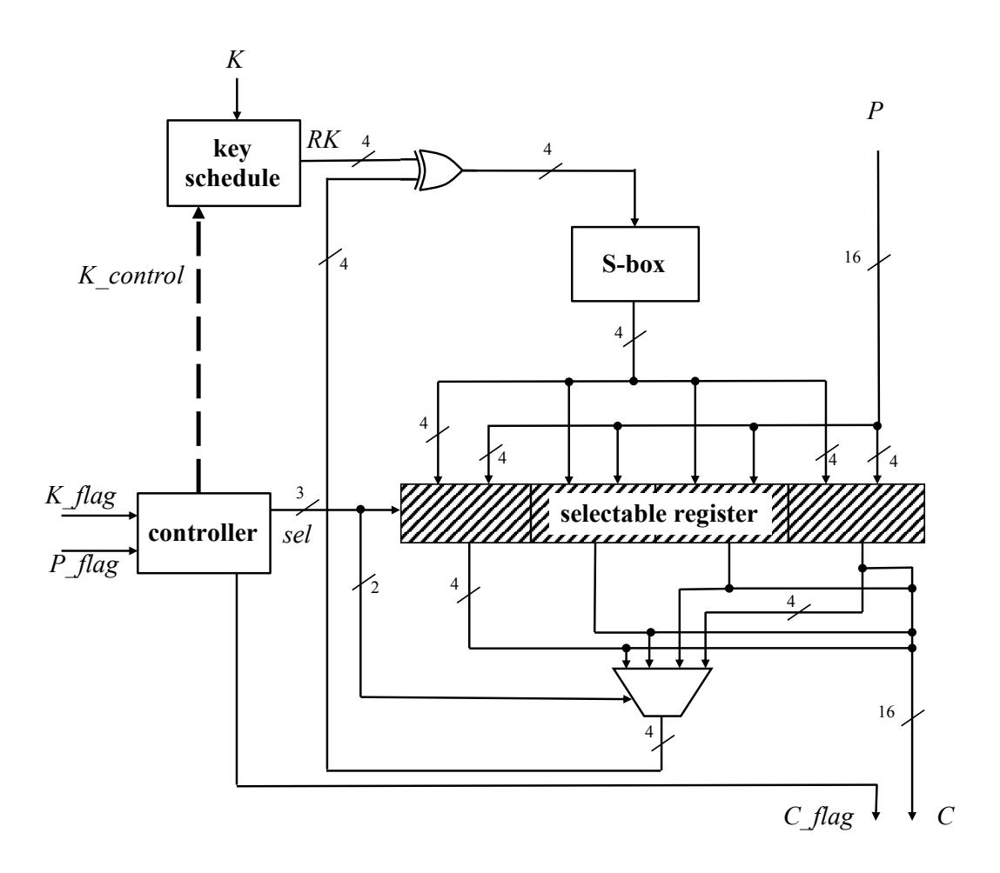

Figure 3.8: Serial Encryption Design for 16-bit SPN

When the initial plaintext block is presented to the cipher, it is selected and loaded into the register by the appropriate setting of sel. In the figure, the 16 bits of plaintext are loaded into the corresponding 16 bits of the register by dividing the 16-bit block into four 4 bit sub-blocks and feeding each sub-block into 4 bits of the register as shown. Subsequently, the cipher will process the substitution layer (as well as the key mixing layer) of the round using 4 clock cycles, where in one clock cycle the appropriate sub-block is selected by the 4-bit multiplexer at the output of the register based on the sel signal provided by the controller. The sub-blocks will be selected sequentially, XORed with the 4 bits of round key coming from the key schedule module, fed through the S-box and into the register. The appropriate sub-block of the register will be updated with output from the S-box, while the other sub-blocks will remain unchanged based on the setting of the sel bits. Following the updating of the register based on the processing of 4 inputs to the S-box requiring 4 clock cycles, the permutation layer of the S-box can be implemented using an appropriate selection of register output bits fedback into the appropriate register input bits (internal to the register and not shown in Figure 3.8) and thus, in one clock cycle, the register bits can be moved around based on the permutation wiring. As a result, with this design, 5 clock cycles are required to process a round. After the required number of R rounds, the register output can be presented to the external device as the ciphertext indicated by control signal C flag. If we assume the propagation delay of the combinational logic of a round is similar to the expected propagation delay of the basic iterative block cipher (which is reasonable if the same logic realization is used for the S-box and ignoring the extra multiplexer delay), it can be expected that it will take about 5 times longer to produce ciphertext for this serial

{62}------------------------------------------------

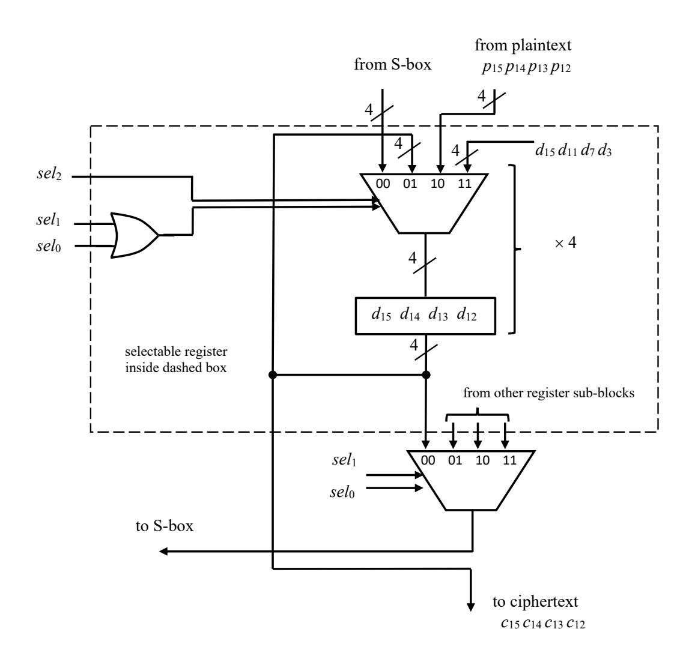

Figure 3.9: Selectable Register Design (for Leftmost Sub-block)

design compared to the basic iterative design (assuming the register timing overheads are insignificant).

Note that this design does not properly deal with the difference in the last round (where the permutation is replaced by a key mixing). The permutation is easy to reverse with simple wiring of the inverse permutation between the register and the output C, but careful modification would need to be done to efficiently mix in bits from the last round key. This could be done by adding a layer of key mixing at the S-box output, where in the first R − 1 rounds, the post-S-box key bits mixed would be all zeroes and then in round R, the post-S-box key bits mixed would be the last round key bits.

#### 3.4.3 Selectable Register

To better understand the selectable nature of the register, consider Figure 3.9 which illustrates a potential design of the selection for the leftmost sub-block comprised of 4-bits of the register, labelled as d15d14d13d12. Control signal sel from the controller in Figure 3.8 can be implemented as a 3-bit signal (sel2sel1sel0) and used to control both the output multiplexer and the input multiplexers (one for each sub-block of 4 bits).

As shown in Figure 3.9, the input multiplexer selection bits are set to "10" to select the leftmost bits of the plaintext block, p15p14p13p12, when the register is initially loaded. The remaining 12 plaintext bits are loaded simultaneously into the remaining register bits.

{63}------------------------------------------------

| sel2 | sel1 | sel0 | Mux 1         | Mux 2         | Mux 3                    | Mux 4         |
|------|------|------|---------------|---------------|--------------------------|---------------|
|      |      |      | Selection     | Selection     | Selection                | Selection     |
|      |      |      | (Select Bits) | (Select Bits) | (Select Bits)            | (Select Bits) |
| 0    | 0    | 0    | S-box         | feedback      | feedback                 | feedback      |
|      |      |      | (00)          | (01)          | (01)                     | (01)          |
| 0    | 0    | 1    | feedback      | S-box         | feedback                 | feedback      |
|      |      |      | (01)          | (00)          | (01)                     | (01)          |
| 0    | 1    | 0    | feedback      | feedback      | S-box                    | feedback      |
|      |      |      | (01)          | (01)          | (00)                     | (01)          |
| 0    | 1    | 1    | feedback      | feedback      | feedback                 | S-box         |
|      |      |      | (01)          | (01)          | (01)                     | (00)          |
| 1    | 0    | 0    | plaintext     | plaintext     | plaintext                | plaintext     |
|      |      |      | (10)          | (10)          | (10)                     | (10)          |
| 1    | 0    | 1    | permutation   | permutation   | permutation              | permutation   |
|      |      |      | (11)          | (11)          | (11)                     | (11)          |
| 1    | 1    | 0    | don't care    | don't care    | don't care<br>don't care |               |
|      |      |      | (XX)          | (XX)          | (XX)                     | (XX)          |
| 1    | 1    | 1    | don't care    | don't care    | don't care               | don't care    |
|      |      |      | (XX)          | (XX)          | (XX)                     | (XX)          |

Table 3.2: Control of Selectable Register

Once substitution layer processing begins, the leftmost sub-block is selected by the register output multiplexer in Figure 3.8 based on two bits which can be mapped directly from sel<sup>1</sup> and sel0. For the leftmost S-box, sel<sup>1</sup> = 0 and sel<sup>0</sup> = 0 is used to feed the correct register sub-block to the S-box input. The S-box output is then selected to feed into the leftmost 4-bit sub-block by setting the input multiplexer selection to "00". During the processing of the other sub-blocks by the S-box, the leftmost 4-bit sub-block of the register should remain unaltered and this can be done by setting the selection of the input multiplexer to "01", which simply allows for the sub-block output of the register to feed back directly into the same sub-block input bits of the register. Lastly, to accomplish the permutation, updating the leftmost sub-block of the register requires selection from the appropriate bits of the register by setting the input multiplexer selection bits to "11". In this case, d15d11d7d<sup>3</sup> are used to update the register bits d15d14d13d12. Other 4-bit sub-blocks would have their input multiplexers for input "11" fed by the appropriate inputs to achieve the permutation in one clock cycle, since all the register bits can be updated simultaneously.

Table 3.2 summarizes the mapping of the 3 bits of sel to the selection bits of the input multiplexer for all 4 input sub-blocks. In the table, Mux 1 refers to the input multiplexer at the input of the leftmost sub-block, Mux 2 is the input multiplexer for the sub-block second from the left, etc. Note that for all sub-blocks, the output multiplexer is controlled directly by bits sel<sup>1</sup> and sel0. Table 3.2 can be used to determine the appropriate selection logic mapping the 3 bits of sel to the 2-bit selection of the input multiplexesr. This logic will vary based on the sub-block and is shown in Figure 3.9 for the leftmost sub-block where the most significant bit of the input multiplexer selection is fed directly from sel<sup>2</sup> and the least significant bit is derived by the OR of sel<sup>1</sup> and sel0.

{64}------------------------------------------------

In practice, there is likely to be little gained by the serialization of the 16-bit SPN of Figure 3.8. While the hardware required to implement multiple copies of the S-box has been reduced, other hardware has been added in order to manage the appropriate flow of data in the datapath. For example, five 4-bit 4 × 1 multiplexers, one at the output and four at the input of the register are required in a serial design, while, in the basic iterative design, one 16-bit 2 × 1 multiplexer at the input is needed. Since the complexity of a 4-bit S-box is not large, with only a few gates per bit, the complexity of serializing the design is not likely to significantly decrease the area of the design and may even increase it. Also, the penalty of slower operation is a definitive drawback to the architecture that may make any minor saving in hardware not worthwhile for some applications. Serialization will have more value for ciphers with larger block sizes, such as a 64-bit SPN like PRESENT, and for ciphers such as AES, which use large 8-bit S-boxes with a large area cost per bit for the S-box hardware. In such cases, reducing the number of S-box modules by serialization can result in much more significant savings than the cost of the necessary added multiplexers needed to control the flow of data in the serial design. Serial designs for PRESENT [25] and AES [26] have been proposed.

## 3.5 Hardware Implementation of Decryption

Our discussion of hardware implementation has focussed on encryption (or the forward direction) in the processing of data in a cipher. In an SPN, as previously noted, decryption involves going in the reverse direction through the network and using the inverse components. Because the datapath for decryption is similar to the encryption datapath, generally, the same architectures, from serial designs to pipeline designs, can be applied as appropriate for the target application. We have already noted that the inverse key mixing is the same as the forward key mixing and permutations can be used for which the inverse permutation is identical to the forward permutation. This is the case for the SPNs in this article. In AES, however, the inverse linear transformation (specifically, the inverse MixColumns operation) is quite different than the forward operation [2]. Most significantly, for decryption the inverse S-boxes must be used in place of the S-box and this may be of consequence because of the potentially large complexity. In some cipher proposals, S-boxes for which the forward and inverse mappings are the same are proposed. Such S-boxes are called involution S-boxes and can be found, for example, in the KLEIN cipher [27] and the Midori cipher [28]. Using involution S-boxes allows the sharing of the S-box hardware between the encryption and decryption structures. Such hardware re-use can reduce the overall area required by the cipher if both the encryption and decryption operations are required for an implementation.

One other significant aspect of decryption that may have influence on the design is the need to apply the round keys in reverse order (that is, the round key of the last round in encryption is the first round key applied in decryption). This may be problematic for an implementation of decryption that wishes to use an on-the-fly approach to the key schedule. Since, typically, the only way to generate the last round key from encryption is to apply the full key schedule algorithm, the last round key state may need to be pre-computed. From this last key state, the key schedule can possibly proceed with an on-the-fly approach going backwards through the key schedule. Of course, in some applications, where plentiful memory resources are available for the implementation, it may instead be desirable to simply 

{65}------------------------------------------------

store all the pre-computed round keys and then simply make use of them at the appropriate time and location within the decryption process.

## 3.6 Hardware Implementation of Cipher Modes

All modes could make use of an implementation which processes an individual block before moving on to the next. This means the basic iterative design, loop unrolled design, and the serial design are all suitable for all three modes introduced in Section 1.4. However, as we noted in our discussion of the implementation of block cipher modes in software, some modes are well suited to implementations which involve concurrent processing of plaintext blocks, while other modes are not.

CBC mode is not suited for implementation using parallel and pipeline structures since, with these architectures, several plaintext blocks are processed at the same time and CBC mode relies on the generation of the previous ciphertext block before the encryption of a new plaintext block. Conversely, CTR mode is very well suited to implementations like parallelization and pipelining since the input to the block cipher system is not plaintext, but counter values, which are easily predicted. Hence, for pipelining it is very practical to input, in successive clock cycles, incrementing count values, which are processed in the pipeline before coming out as keystream to be XORed with plaintext blocks. Because each keystream block can be produced independently, there is no issue with working on several successive count values at once. For ECB, the use of a parallel or pipeline architecture may be practical, as long as it is possible to collect up enough blocks of plaintext to process the blocks concurrently as necessary for the implementation structure.

Another important factor in the application of a mode to hardware implementation is that some modes, such as CTR mode, only require the encryption (forward) process of the block cipher. This means it is possible that smaller hardware area will be necessary, since encryption of plaintext and decryption of ciphertext can share the same hardware structure and components. Also, not needing the decryption (reverse) process in the hardware can eliminate the complexities that might arise for an implementation of the key schedule for decryption. Both ECB and CBC modes require both encryption and decryption processing of the block cipher and the resulting key schedule issues would need to be considered.

## 3.7 Tradeoffs Between Architectures

In Figure 3.10, we present a rough characterization of the tradeoffs between hardware architectures that we have discussed. As you move to the right in the figure, you can expect architectures to require more area in a hardware realization. Moving up in the figure represents an increase in the throughput of the architecture. Hence, a general expectation is that the most compact, yet slowest implementation architecture is the full serial design. On the other extreme, in the top right corner, the parallel and pipelined implementations represent the highest speed structures, but at the penalty of the highest area for the realized designs. As expected, the basic iterative design represents a tradeoff that is somewhat in the middle between the extremes. Note that the scales of the graph are not labelled and the placement of the designs in the space does not accurately reflect the relative scale of the

{66}------------------------------------------------

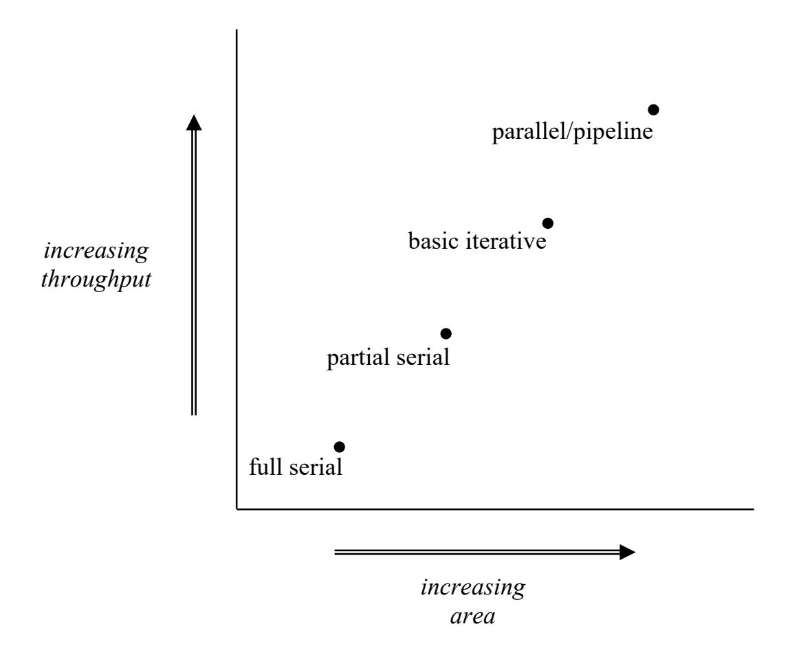

Figure 3.10: Characterization of Architecture Tradeoffs

area and throughput. The figure is meant to be a rough characterization only. It does not include loop unrolling, which is likely to be slightly faster, but with significantly increased area over a basic iterative design. Also, the graph does not characterize the many levels of parameterization that may occur for an architecture. For example, increasing the stages in a pipeline design will increase the area required and likely increase the throughput.

A more detailed comparison of the characteristics of the various hardware architectures of a 64-bit SPN block cipher is given in Table 3.3. In the table, the throughput and area requirements of the various architectures are considered. For simplicity in the comparison, the timing and area implications of any necessary multiplexers are not included. For a more precise comparison, since the various architectures have different requirements for the multiplexing of data, the effect of multiplexers should be considered.

The propagation delay through the combinational logic of the round function (specifically, the XOR gate of the key mixing and the logic of the S-box) is defined to be tfunc (in seconds) and, for simplicity, it is assumed that the S-box is the same implementation in all cases. For example, the S-boxes may be assumed to be a 2-level minimized AND-OR structure. Of course, in practice, different architectures are likely to make use of different S-box circuits: a high-speed implementation (such as pipelining) will probably use a low delay, 2-level structure for the S-box, while a compact implementation (such as a serial design) is likely to use a compact S-box structure (such as the one for the PRESENT S-box in Figure 3.3) which may have a significantly larger propagation delay since more levels of logic may be used. In more precise timing comparisons, differences between the propagation delay through combinational hardware used in a round may occur due to the presence or

{67}------------------------------------------------

| Architecture      | Minimum      | Throughput        | Combinational        | Sequential |
|-------------------|--------------|-------------------|----------------------|------------|
|                   | Clock Period |                   | Area                 | Area       |
|                   | (sec)        | (blocks/sec)      | (nm2<br>)            | (nm2<br>)  |
| Basic Iterative   | tfunc        | 1<br>R·tfunc      | Afunc                | Areg       |
| Loop Unrolled     | ≤ 4 · tfunc  | 1<br>≥<br>R·tfunc | 4 · Afunc            | Areg       |
| (4 rounds)        |              |                   |                      |            |
| Parallel          | tfunc        | m<br>R·tfunc      | m · Afunc            | m · Areg   |
| (m Copies)        |              |                   |                      |            |
| Pipeline          | tfunc        | 1<br>tfunc        | R · Afunc            | R · Areg   |
| (R stages)        |              |                   |                      |            |
| Full Serial       | tfunc        | 1<br>16·R·tfunc   | 1<br>≥<br>16 · Afunc | Areg       |
| (1 4-bit S-box)   |              |                   |                      |            |
| Partial Serial    | tfunc        | 1<br>4·R·tfunc    | 1<br>≥<br>4Afunc     | Areg       |
| (4 4-bit S-boxes) |              |                   |                      |            |

Table 3.3: Hardware Tradeoffs for R-Round 64-bit SPN (Ignoring effects of multiplexers.)

absence of multiplexers in the datapath. As well, it is possible the minimum clock period is also significantly affected by the propagation delay of the register and the setup time of the register, but this is not considered in the table.

In the table, the variable Afunc represents the area requirement (in nanometers squared) of the combinational logic of the round function consisting of 16 parallel 4-bit S-boxes and the XOR gates of the key mixing layer. Although we do not consider it, in some architectures, the presence or absence of multiplexers affects the area required in a round. Again, it is assumed that one type of S-box implementation is used in the comparison across the architectures. The variable Areg represents the area required for the implementation of a 64-bit register. Note that the area requirements of the key schedule module and the controller are not considered in the analysis. In most cases, it is probably reasonable to assume that the controller area is negligible compared to the datapath. However, depending on the implementation structure, which is affected by the details of the key scheduling algorithm, the key schedule module could require a significant amount of hardware area (although not likely as much as the cipher datapath) and/or a large amount of register memory (perhaps significantly more than the datapath if the round keys are pre-computed and stored). These issues are not considered in the comparison presented in the table. In the table, the cipher is assumed to have R rounds and, for the parallel implementation, a general number, m, of parallel implementations are considered.

In Table 3.3, the nominal design can be considered to be the basic iterative design with a clock period of tfunc (ignoring the register timings), resulting in a throughput of 1/(R·tfunc) blocks/sec, and areas of Afunc and Areg for the combinational logic of the round function and the register used to store the state, respectively.

For the unrolled architecture, the propagation delay must be at least tfunc but is certainly ≤ 4 ·tfunc for 4 unrolled rounds. In practice, the delay may be less than 4 times the delay of the 1-round basic iterative architecture, since the delay due to the multiplexer at the input

{68}------------------------------------------------

3.8. SUMMARY 69

of the combinational hardware only affects the round hardware once (not 4 times) and the register timing values are possibly not negligible as discussed in Section 3.1.3. This results in a throughput which is at least as large as the throughput for the basic iterative architecture, but it may be larger if these timing factors are significant. So the unrolled architecture may be an improvement on the speed of the basic iterative design, but will certainly have a larger combinational logic area requirement, while having the same area needed for sequential logic registers.

Both the parallel and pipelined structures can improve the speed of encryption by operating on multiple blocks simultaneously. For the parallel structure, if the I/O interface allows as many as m simultaneous inputs and outputs, then a corresponding speed-up occurs in the throughput and a corresponding increase in the area costs occur. For pipelining, with the number of stages equal to R, the throughput and area increases by a factor of roughly R. For R stages, the I/O can be structured to present and receive one plaintext and ciphertext block each clock cycle. This can be adjusted to structures with fewer than R stages with corresponding effects on the throughput and area. Since there are no multiplexers now in the round hardware, in practice, the clock could be marginally faster than for the basic iterative design. As well, if a pipelining architecture can split one round into multiple stages, there will be a corresponding increase in throughput and the area as the number of stages increase. It should be noted that, as previously discussed in Section 3.3.3, as the number of stages increase, the propagation delay through the combinational logic will decrease and the register propagation delay and setup time might become significant.

Lastly, the serial implementation decreases the throughput by a factor of at least the number of clock cycles to finish a round. Because multiplexers are required at both the input and output of the register, the effect on the combinational logic propagation delay could be significant (although this is not reflected in the table). Further, the combinational area is reduced by possibly as much as the same factor, although practically, this is not likely since the reduced S-box hardware area will be offset by extra multiplexer circuitry to control data flow. It should be noted that the sequential logic area still requires as many bits as are needed to store the state. Hence, no reduction in register bits can occur from the basic iterative architecture. Note also that the decrease in throughput should actually have a factor equal to "block size / sub-block size + 1" (that is, one greater than the value in the table) if the strategy used is the same as the sample hardware design discussed in Section 3.4 which required one more clock cycle in a round to complete the permutation. For example, using this approach, the full serialization for 64-bit SPN with 4-bit S-boxes takes 17, not 16, clock cycles to complete a round.

# 3.8 Summary

In this chapter, we have discussed different architectures for implementing SPN block ciphers in a synchronous, sequential logic design targeted to common hardware technologies like FPGAs and CMOS ASICs. The most basic approach would be an iterative design using the round structure of the cipher to guide the architecture. To improve cipher thoughput, parallelization and pipelining are discussed as options. As well, serialization is presented as method that could be used to decrease the area requirement of a cipher implementation. For all architectures, sample designs are used to illustrate the concepts. The chapter also briefly 

{69}------------------------------------------------

discusses issues associated with the implementation of decryption and the three block cipher modes introduced in Section 1.4. To wrap up the discussion, a brief overview of the tradeoffs that exist between the various implementation strategies is discussed. It should be noted that comprehensive introduction to block cipher hardware implementation architectures, with a focus on AES, can be found in Chapters 10-12 of [29].

{70}------------------------------------------------

# Chapter 4

# Conclusion

In this article, we have presented a tutorial on several basic implementation strategies of block ciphers. Our implementations span software applications, where we discuss table lookup approaches and bit-slicing, to hardware applications, where we describe basic iterative approaches, as well as high-speed designs like pipelining, and compact designs involving serialization. For the basis of our descriptions, we have used the basic SPN as the model cipher. This represents a practical structure found in many proposed ciphers and is the foundation for the most applied block cipher, AES. However, many distinct implementation structures are proposed for different ciphers and such considerations must be made for any cipher targeted for implementation. AES, in particular, has been extremely well studied and discussed for its software and hardware implementation approaches and the reader is encouraged to investigate further many of the clever implementation approaches applied to AES.

Finally, it should be noted that a very important consideration for the implementation of ciphers is the notion of resistance to side channel analysis (SCA) attacks [30]. SCA attacks are a category of attacks that take advantage of implementation characteristics to relate side-channel information to the cipher key. Side-channel information exploited in attacks includes power traces, timing of encryption, and response to injected faults, as well as others. All implementations should be aware of and mitigate the susceptibility of a system to leakage of information due to side channels. This is an extremely rich area of research, with many hundreds of papers published. Alas, we choose to leave this discussion to others, but encourage all cipher implementers to pursue these issues, once their knowledge of the basic implementation structures discussed in this article is solidified.

{71}------------------------------------------------

{72}------------------------------------------------

# References

- [1] National Institute of Standards and Technology. NIST Special Publication 197: Advanced Encryption Standard (AES), November 2001. csrc.nist.gov/publications/detail/fips/197/final.
- [2] Joan Daemen and Vincent Rijmen. The Design of Rijndael: AES The Advanced Encryption Standard. Information Security and Cryptography. Springer, 2002.
- [3] Alex Biryukov and L´eo Perrin. State of the art in lightweight symmetric cryptography. IACR Cryptology ePrint Archive, 2017:511, 2017.
- [4] Shay Gueron. Intel's new AES instructions for enhanced performance and security. In Orr Dunkelman, editor, Fast Software Encryption, 16th International Workshop, FSE 2009, Leuven, Belgium, February 22-25, 2009, Revised Selected Papers, volume 5665 of Lecture Notes in Computer Science, pages 51–66. Springer, 2009.
- [5] Akashi Satoh, Sumio Morioka, Kohji Takano, and Seiji Munetoh. A compact rijndael hardware architecture with s-box optimization. In Colin Boyd, editor, Advances in Cryptology - ASIACRYPT 2001, 7th International Conference on the Theory and Application of Cryptology and Information Security, Gold Coast, Australia, December 9-13, 2001, Proceedings, volume 2248 of Lecture Notes in Computer Science, pages 239–254. Springer, 2001.
- [6] Andrey Bogdanov, Lars R. Knudsen, Gregor Leander, Christof Paar, Axel Poschmann, Matthew J. B. Robshaw, Yannick Seurin, and C. Vikkelsoe. PRESENT: an ultra-lightweight block cipher. In Pascal Paillier and Ingrid Verbauwhede, editors, Cryptographic Hardware and Embedded Systems - CHES 2007, 9th International Workshop, Vienna, Austria, September 10-13, 2007, Proceedings, volume 4727 of Lecture Notes in Computer Science, pages 450–466. Springer, 2007.
- [7] Claude E. Shannon. Communication theory of secrecy systems. Bell Syst. Tech. J., 28(4):656–715, 1949.
- [8] U.S. Department of Commerce. National Bureau of Standards Federal Information Processing Standard 46: Data Encryption Standard (DES), January 1977.
- [9] Mitsuru Matsui. Linear cryptanalysis method for DES cipher. In Tor Helleseth, editor, Advances in Cryptology - EUROCRYPT '93, Workshop on the Theory and Application

{73}------------------------------------------------

- of of Cryptographic Techniques, Lofthus, Norway, May 23-27, 1993, Proceedings, volume 765 of Lecture Notes in Computer Science, pages 386–397. Springer, 1993.
- [10] Eli Biham and Adi Shamir. Differential cryptanalysis of des-like cryptosystems. In Alfred Menezes and Scott A. Vanstone, editors, Advances in Cryptology - CRYPTO '90, 10th Annual International Cryptology Conference, Santa Barbara, California, USA, August 11-15, 1990, Proceedings, volume 537 of Lecture Notes in Computer Science, pages 2–21. Springer, 1990.
- [11] International Organization for Standardization. ISO/IEC 29192-2:2019 Information security — Lightweight cryptography — Part 2: Block ciphers, November 2019. available at iso.org.
- [12] National Institute of Standards and Technology. NIST Special Publication 800- 38A: Recommendation for Block Cipher Modes of Operation, December 2001. crsc.nist.gov/publications/detail/sp/800-38a/final.
- [13] Ryad Benadjila, Jian Guo, Victor Lomn´e, and Thomas Peyrin. Implementing lightweight block ciphers on x86 architectures. In Tanja Lange, Kristin E. Lauter, and Petr Lisonek, editors, Selected Areas in Cryptography - SAC 2013 - 20th International Conference, Burnaby, BC, Canada, August 14-16, 2013, Revised Selected Papers, volume 8282 of Lecture Notes in Computer Science, pages 324–351. Springer, 2013.
- [14] Eli Biham. A fast new DES implementation in software. In Eli Biham, editor, Fast Software Encryption, 4th International Workshop, FSE '97, Haifa, Israel, January 20- 22, 1997, Proceedings, volume 1267 of Lecture Notes in Computer Science, pages 260– 272. Springer, 1997.
- [15] Kostas Papapagiannopoulos. High throughput in slices: The case of present, PRINCE and KATAN64 ciphers. In Nitesh Saxena and Ahmad-Reza Sadeghi, editors, Radio Frequency Identification: Security and Privacy Issues - 10th International Workshop, RFIDSec 2014, Oxford, UK, July 21-23, 2014, Revised Selected Papers, volume 8651 of Lecture Notes in Computer Science, pages 137–155. Springer, 2014.
- [16] Mitsuru Matsui and Junko Nakajima. On the power of bitslice implementation on intel core2 processor. In Pascal Paillier and Ingrid Verbauwhede, editors, Cryptographic Hardware and Embedded Systems - CHES 2007, 9th International Workshop, Vienna, Austria, September 10-13, 2007, Proceedings, volume 4727 of Lecture Notes in Computer Science, pages 121–134. Springer, 2007.
- [17] Seiichi Matsuda and Shiho Moriai. Lightweight cryptography for the cloud: Exploit the power of bitslice implementation. In Emmanuel Prouff and Patrick Schaumont, editors, Cryptographic Hardware and Embedded Systems - CHES 2012 - 14th International Workshop, Leuven, Belgium, September 9-12, 2012. Proceedings, volume 7428 of Lecture Notes in Computer Science, pages 408–425. Springer, 2012.
- [18] Ross Anderson, Eli Biham, and Lars Knudsen. Serpent: A Proposal for the Advanced Encryption Standard. National Institute of Science and Technology, January 1998.

{74}------------------------------------------------

[19] Wentao Zhang, Zhenzhen Bao, Dongdai Lin, Vincent Rijmen, Bohan Yang, and Ingrid Verbauwhede. RECTANGLE: A bit-slice ultra-lightweight block cipher suitable for multiple platforms. IACR Cryptol. ePrint Arch., 2014:84, 2014.

- [20] Vincent Grosso, Ga¨etan Leurent, Fran¸cois-Xavier Standaert, and Kerem Varici. Lsdesigns: Bitslice encryption for efficient masked software implementations. In Carlos Cid and Christian Rechberger, editors, Fast Software Encryption - 21st International Workshop, FSE 2014, London, UK, March 3-5, 2014. Revised Selected Papers, volume 8540 of Lecture Notes in Computer Science, pages 18–37. Springer, 2014.
- [21] Emilia K¨asper and Peter Schwabe. Faster and timing-attack resistant AES-GCM. In Christophe Clavier and Kris Gaj, editors, Cryptographic Hardware and Embedded Systems - CHES 2009, 11th International Workshop, Lausanne, Switzerland, September 6-9, 2009, Proceedings, volume 5747 of Lecture Notes in Computer Science, pages 1–17. Springer, 2009.
- [22] Mike Hamburg. Accelerating AES with vector permute instructions. In Christophe Clavier and Kris Gaj, editors, Cryptographic Hardware and Embedded Systems - CHES 2009, 11th International Workshop, Lausanne, Switzerland, September 6-9, 2009, Proceedings, volume 5747 of Lecture Notes in Computer Science, pages 18–32. Springer, 2009.
- [23] Alireza Hodjat and Ingrid Verbauwhede. Area-throughput trade-offs for fully pipelined 30 to 70 gbits/s AES processors. IEEE Trans. Computers, 55(4):366–372, 2006.
- [24] David Canright. A very compact s-box for AES. In Josyula R. Rao and Berk Sunar, editors, Cryptographic Hardware and Embedded Systems - CHES 2005, 7th International Workshop, Edinburgh, UK, August 29 - September 1, 2005, Proceedings, volume 3659 of Lecture Notes in Computer Science, pages 441–455. Springer, 2005.
- [25] Carsten Rolfes, Axel Poschmann, Gregor Leander, and Christof Paar. Ultra-lightweight implementations for smart devices - security for 1000 gate equivalents. In Gilles Grimaud and Fran¸cois-Xavier Standaert, editors, Smart Card Research and Advanced Applications, 8th IFIP WG 8.8/11.2 International Conference, CARDIS 2008, London, UK, September 8-11, 2008. Proceedings, volume 5189 of Lecture Notes in Computer Science, pages 89–103. Springer, 2008.
- [26] M. Feldhofer, J. Wolkerstorfer, and V. Rijmen. Aes implementation on a grain of sand. IEE Proceedings - Information Security, 152(1):13–20, Oct 2005.
- [27] Zheng Gong, Svetla Nikova, and Yee Wei Law. KLEIN: A new family of lightweight block ciphers. In Ari Juels and Christof Paar, editors, RFID. Security and Privacy - 7th International Workshop, RFIDSec 2011, Amherst, USA, June 26-28, 2011, Revised Selected Papers, volume 7055 of Lecture Notes in Computer Science, pages 1–18. Springer, 2011.
- [28] Subhadeep Banik, Andrey Bogdanov, Takanori Isobe, Kyoji Shibutani, Harunaga Hiwatari, Toru Akishita, and Francesco Regazzoni. Midori: A block cipher for low energy. In Tetsu Iwata and Jung Hee Cheon, editors, Advances in Cryptology -

{75}------------------------------------------------

ASIACRYPT 2015 - 21st International Conference on the Theory and Application of Cryptology and Information Security, Auckland, New Zealand, November 29 - December 3, 2015, Proceedings, Part II, volume 9453 of Lecture Notes in Computer Science, pages 411–436. Springer, 2015.

- [29] C¸ etin Kaya Ko¸c, editor. Cryptographic Engineering. Springer, 2009.
- [30] Fran¸cois-Xavier Standaert. Introduction to side-channel attacks. In Ingrid M. R. Verbauwhede, editor, Secure Integrated Circuits and Systems, Integrated Circuits and Systems, pages 27–42. Springer, 2010.
- [31] Eli Biham. New types of cryptanalytic attacks using related keys. J. Cryptology, 7(4):229–246, 1994.
- [32] C´eline Blondeau and Benoˆıt G´erard. Links between theoretical and effective differential probabilities: Experiments on PRESENT. IACR Cryptology ePrint Archive, 2010:261, 2010.

{76}------------------------------------------------

# Appendix: Key Scheduling

## Generalization of the PRESENT Key Schedule

In the main body of this article, we have described the data flow associated with the plaintext to ciphertext processing and only alluded to the key schedule which is responsible for the generation of round keys from the original cipher key. Key scheduling algorithms tend to be uniquely defined for each proposed cipher and, hence, it is harder to identify a general structure that represents the concepts typically found in a key schedule. So, here, we describe the key scheduling algorithm in PRESENT, but generalize to various sizes of parameters.

Consider a cipher key  $K = k_{\kappa-1}k_{\kappa-2}...k_1k_0$  of size  $\kappa$  bits, used for an SPN cipher with a block size of B bits and n-bit S-boxes. It is assumed that  $\kappa \geq B$ . Let  $K' = k'_{\kappa-1}k'_{\kappa-2}...k'_1k'_0$  represent the key state bits that are processed during the key schedule. Let R represent the number of rounds and assume that R < 32 and, hence, the round number can be represented in binary by 5 bits.<sup>1</sup> To represent the round number, we use variable r, referred to as the round count, where the 5 bits of r are given by  $[r_4r_3r_2r_1r_0]$ . Variable  $\alpha$  represents a rotational value used during the key schedule. A typical key schedule (derived from the PRESENT key schedule), illustrated in Figure A.1, might consist of the following steps:

1. Let r = 1 and assign the bits of cipher key K to key state K':

$$[k'_{\kappa-1}k'_{\kappa-2}...k'_1k'_0] \leftarrow [k_{\kappa-1}k_{\kappa-2}...k_1k_0]$$

- 2. If r > R + 1, then **stop**.
- 3. Use the leftmost B bits of K',  $[k'_{\kappa-1}k'_{\kappa-2}...k'_{\kappa-B+1}k'_{\kappa-B}]$  as round key,  $RK_r$ .
- 4. Update K' as follows:
  - (a) Rotate K' left by  $\alpha$  positions:

$$[k'_{\kappa-1}k'_{\kappa-2}...k'_1k'_0] \leftarrow [k'_{\kappa-\alpha-1}k'_{\kappa-\alpha-2}...k'_{\kappa-\alpha+1}k'_{\kappa-\alpha}]$$

(b) Process the leftmost n bits with the n-bit S-box:

$$[k'_{\kappa-1}k'_{\kappa-2}...k'_{\kappa-n}] \leftarrow S(k'_{\kappa-1}, k'_{\kappa-2}, ..., k'_{\kappa-n})$$

<sup>&</sup>lt;sup>1</sup>The limit of 32 rounds is a reasonable limit satisfied by practical ciphers. However, it is a trivial matter to extend the size of the round count to more bits if necessary.

{77}------------------------------------------------

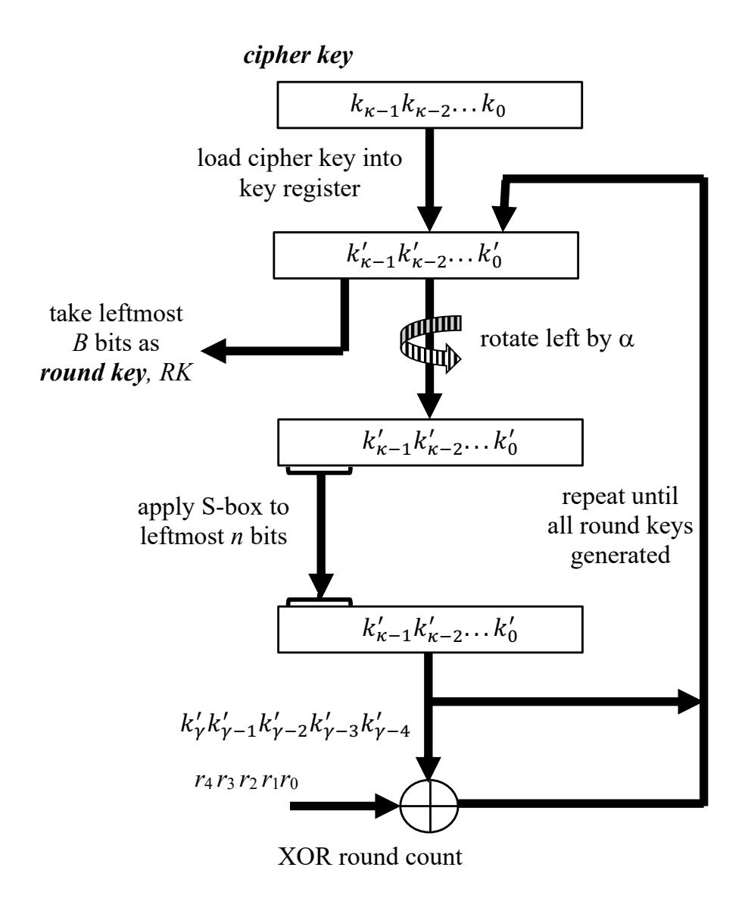

Figure A.1: Sample Key Schedule Structure

(c) XOR the round count into round key bits from position  $\gamma$  down to  $\gamma - 4$ :

$$\begin{array}{l} [k'_{\gamma}k'_{\gamma-1}k'_{\gamma-2}k'_{\gamma-3}k'_{\gamma-4}] \\ \leftarrow [k'_{\gamma}k'_{\gamma-1}k'_{\gamma-2}k'_{\gamma-3}k'_{\gamma-4}] \oplus [r_4r_3r_2r_1r_0] \end{array}$$

5. Increment r and return to step 2.

Note that operation " $\oplus$ " represents the bitwise XOR operation and  $S(\cdot)$  represents the S-box mapping.

For the version of the PRESENT cipher with an 80-bit key,  $\kappa = 80$ , B = 64, n = 4, R = 31,  $\alpha = 61$ , and  $\gamma = 19$ . Overall this key schedule derives informational content in a balanced way from all cipher key bits, mixes in a complex nonlinear operation on the bits through the S-box, and ensures that each round has a distinct operation by adding a constant derived from the round number (thereby preventing attacks such as related keys attacks [31]).

In Table A.1, we present an example of the key schedule for a simple 16-bit SPN. The SPN is similar to the SPN in Figure 1.1 and uses the S-box mapping in Table 1.1. We assume that there are R=4 rounds and, therefore, 5 round keys must be generated. The round keys for the system will be generated for 20-bit cipher key 01101110011110010000<sub>2</sub> (6E790<sub>16</sub>) using the algorithm described above with parameters,  $\kappa=20$ ,  $\alpha=13$ , and  $\gamma=8$ .

{78}------------------------------------------------

| Round | Key      | Round Key       | Rotate  | Apply | XOR      |
|-------|----------|-----------------|---------|-------|----------|
| r     | Register |                 | Left 13 | S-box | with $r$ |
| 1     | 6E790    | 6E79            | 20DCF   | 60DCF | 60DDF    |
| 2     | 60DDF    | $60\mathrm{DD}$ | BEC1B   | 8EC1B | 8EC3B    |
| 3     | 8EC3B    | 8EC3            | 771D8   | D71D8 | D71E8    |
| 4     | D71E8    | D71E            | D1AE3   | 71AE3 | 71AA3    |
| 5     | 71AA3    | 71AA            | -       | -     | -        |

Table A.1: Key Schedule Example (All values in hexadecimal.)

Many other proposals for the key scheduling algorithms are given for different ciphers. We do not discuss these in detail here, but only present the algorithm above as a typical example of the operations found within a key schedule.

## Software Implementation of the Key Schedule

Consider now the software implementation of the key schedule. Usually, the key scheduling algorithm contains operations such as rotations, S-box lookups, and mixing of the round count, as described above. If we consider the operations, we can realize that they are conceptually straightforward, but may require some care in the details of implementation. Let's consider the key schedule described in the previous section, and, for ease of description, assume that B = 16,  $\kappa = 20$ ,  $\alpha = 13$  and the processor word size is 16 bits.<sup>2</sup> Left rotation of the key state,  $K' = [k'_{19}k'_{18}...k'_{0}]$ , by  $\alpha = 13$  bits is equivalent to the following assignment:

$$\begin{array}{l} [k'_{19}k'_{18}k'_{17}k'_{16}||k'_{15}k'_{14}k'_{13}k'_{12}k'_{11}k'_{10}k'_{9}k'_{8}k'_{7}k'_{6}k'_{5}k'_{4}k'_{3}k'_{2}k'_{1}k'_{0}] \\ \leftarrow [k'_{6}k'_{5}k'_{4}k'_{3}||k'_{2}k'_{1}k'_{0}k'_{19}k'_{18}k'_{17}k'_{16}k'_{15}k'_{14}k'_{13}k'_{12}k'_{11}k'_{10}k'_{9}k'_{8}k'_{7}] \end{array}$$

where "||" indicates a word boundary of the storage of the key state. Hence, the 20-bit key state is stored as the 4 bits to the left of the "||" in one word and the 16 bits to the right of the "||" in another word. To produce the new 4 bits of the left word,  $[k'_{19}k'_{18}k'_{17}k'_{16}]$ , the old right word must be rotated right 3 bit positions and then masked to retrieve the new 4 bits to be assigned to the new left word. The new right word can be prepared by XOR combination of 3 words produced as follows: (1) rotate the old right word right by 7 positions and mask to retrieve the rightmost 9 bits, (2) rotate the old left word left by 9 positions and mask to retrieve the 4 bits, and (3) rotate the old right word right by 3 positions and mask to retrieve the leftmost 3 bits. Of course, this is a contrived simple example and real ciphers (such as PRESENT) will have different, realistic parameters, but may still need to work with multiple words storing the key state used during the key schedule. For example, an implementation of PRESENT with an 80-bit key on a processor using words of size 32 bits would require storing the 80-bit key state as at least 3 words (eg. two with 32 bits and one with 16 bits).

<sup>&</sup>lt;sup>2</sup>The B,  $\kappa$ , and  $\alpha$  parameters are the same values chosen for the experimental study of a scaled-down version of PRESENT found in [32]. This cipher has the same structure as the 16-bit SPN of Figure 1.1. The 16-bit word size for the processor is simply selected for the purposes of easy illustration.

{79}------------------------------------------------

For the implementation of the S-box, a table lookup approach can be easily used. Appropriate shifting and masking must be used to prepare the index for the lookup and to move the result into the appropriate position within the words used to store the key state. The mixing (i.e., XOR) of the round count is also straightforward to realize using appropriate masking. For example, for the key schedule parameters for the 16-bit SPN above and assuming that the key state bits to be XORed with the round count to be [k 0 8k 0 7k 0 6k 0 5k 0 4 ], the XOR of the round count with the key state can be achieved as follows:

$$[k_{15}'k_{14}'k_{13}'k_{12}'k_{11}'k_{10}'k_{9}'k_{8}'k_{7}'k_{6}'k_{5}'k_{4}'k_{3}'k_{2}'k_{1}'k_{0}'] \oplus [0000000r_{4}r_{3}r_{2}r_{1}r_{0}0000]$$

where r4r3r2r1r<sup>0</sup> are the bits of the round count r.

## Hardware Implementation of Key Schedule

In our discussion of the various architectures that could be employed for the hardware implementation of block ciphers, we did not deal with the hardware necessary to implement the key schedule. The key schedule for different ciphers can vary quite dramatically, but if we consider the sample key schedule previously described, we can conclude that the necessary structure should be somewhat simpler than the datapath processing the cipher state. For example, the operations involved in the key schedule include storage of key state (generally the same size as the original cipher key), the application of one S-box mapping per round, the XOR of the round count value, and the rearrangement of the bit positions within the key register. These are not difficult to implement and, for an iterative design, will not take up much area in the targeted technology.

The most significant decision to be made for the implementation of the key schedule is whether to use (1) a round key setup approach, which pre-computes and stores all round keys prior to processing any plaintext data, or (2) an on-the-fly round key generation approach, where the key schedule is applied concurrently with the round function of the cipher datapath. These are the two approaches highlighted in Figures 1.7 and 1.8. Unlike in software implementations, where there is small cost of the memory necessary for storing all round keys for subsequent use during data processing, in hardware implementations, storing a full set of round keys (in registers or in possibly on-board RAM in an FPGA) would typically add dramatically to the resource and area requirement for the design. For example, an implementation of the 64-bit SPN PRESENT key schedule which stores all round keys would require (R + 1)· B = 32 · 64 = 2048 bits, which dwarfs the requirement of 64 register bits to store the state needed in a basic iterative implementation. For this reason, most hardware implementations are more likely to choose an on-the-fly approach to the key schedule. Such an approach can generate the round keys concurrently with the round data processing and, hence, is likely to have little impact on the cipher throughput.