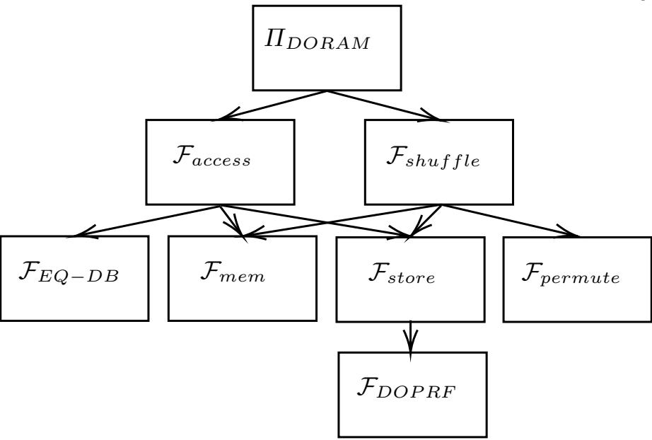

{0}------------------------------------------------

# Two-server Distributed ORAM with Sublinear Computation and Constant Rounds

Ariel Hamlin1 and Mayank Varia2

1 Khoury College of Computer Sciences, Northeastern University, Boston, MA, USA hamlin.a@northeastern.edu 2 Boston University, Boston, MA, USA varia@bu.edu

Abstract. Distributed ORAM (DORAM) is a multi-server variant of Oblivious RAM. Originally proposed to lower bandwidth, DORAM has recently been of great interest due to its applicability to secure computation in the RAM model, where circuit complexity and rounds of communication are equally important metrics of efficiency. All prior DORAM constructions either involve linear work per server (e.g., Floram) or logarithmic rounds of communication between servers (e.g., square root ORAM). In this work, we construct the first DORAM schemes in the 2-server, semi-honest setting that simultaneously achieve sublinear server computation and constant rounds of communication. We provide two constant-round constructions, one based on square root ORAM that has O( √ N log N) local computation and another based on secure computation of a doubly efficient PIR that achieves local computation of O(N ) for any > 0 but that allows the servers to distinguish between reads and writes. As a building block in the latter construction, we provide secure computation protocols for evaluation and interpolation of multivariate polynomials based on the Fast Fourier Transform, which may be of independent interest.

Keywords: Distributed Oblivious RAM, Square Root ORAM, Doubly Efficient PIR, Secure Multi-Party Computation, Fast Fourier Transform

# 1 Introduction

Oblivious RAM (ORAM) has been a vigorous area of study for the last three decades since it was introduced by Goldreich and Ostrovsky [16]. ORAM focuses on a client-server model where the server stores an outsourced database upon which the client wishes to execute a series of reads and writes. ORAM provides privacy, hiding the contents of the database, as well obliviousness, hiding the client's access patterns. In the traditional client-server model the client is assumed to be trusted. Recent efforts in the field have focused on lower bounds [33], optimal bandwidth [2, 29], and various different settings [14, 30].

Distributed ORAM (DORAM) is a variant of the basic client-server ORAM model in which there are multiple non-colluding servers. Data is duplicated across the servers and the client interacts with both as part of an access. The client again remains the only trusted party. It was first introduced by Ostrovsky and Shoup [28], and later formally defined by Lu and Ostrovsky [24]. Lu and Ostrovsky were motivated by the desire to circumnavigate existing lower bounds in the single-server setting for bandwidth overhead, and their construction achieved O(log N) overhead by leveraging two non-communicating servers. Following their seminal paper there have been a number of works in the DORAM model that further reduce bandwidth [1,6], reduce blocksize [23], or achieve practical efficiency [35].

Another advantage of the multi-server model of DORAM is its natural application to secure computation over databases in the RAM model. Traditional secure computation relies on a circuit representation that is at least linear in the size of the data over which it computes. This is prohibitive for any sublinear computation run on a database, such as binary search. Lu and Ostrovsky observe in [24] that the application of DORAM in this case is highly advantageous. The parties in the secure computation can simply emulate the DORAM client for any database access. In particular, they present a generic transformation from a 2-server DORAM scheme to a 2-party secure computation. It should be noted that works applying ORAM to secure computation are not limited to the DORAM setting, but also include adaptations of single server schemes. For example, there has been significant work on adapting tree-based ORAM schemes [31, 32] for 

{1}------------------------------------------------

secure computation. All of these DORAM constructions can be used in general-purpose secure computation like garbled RAM schemes [12,13,15,25], or in special-purpose protocols like dynamic searchable encryption schemes [19].

There are two main approaches to constructing ORAM for secure computation: the first is to apply a generic MPC compiler, such as Garbled Circuits, to a ORAM or DORAM client [17, 18, 31, 32], and the second is to design a client specifically implemented by the two servers [4, 10, 21, 34]. There are a number of works that focus directly on the second model, which offers greater flexibility since the servers are typically afforded much more storage space than the client.

However, in both approaches, the multi-server setting introduces a new set of challenges apart from those found in the single-server ORAM setting. Wang et al. [31] also observe that the traditional efforts to optimize bandwidth overhead are ineffective in a setting where there are other controlling factors, such as the size of the circuit representation of the ORAM client. This is the motivation behind their Circuit ORAM construction, which focuses on optimizing circuit size. Doerner and shelat [10] also show that in many cases, bandwidth is not the limiting factor but rather the latency between the two servers. This encouraged them to build a constant round DORAM for secure computation. Previous constructions had relied on recursive structures, which incurred a  $O(\log N)$  rounds for each access, a prohibitive cost for latency dominated secure computation settings. Subsequent works in the constant round setting worked on improving on the  $O(\sqrt{N})$  overhead of Floram, achieving  $O(\log^3 N)$  overhead [21], or  $O(\sqrt{N})$  in a black-box setting [4]. As with the original construction, these subsequent works require linear local computation for each server. While for small N, latency costs may still dominate, for sufficiently large N this linear work is prohibitive. This leaves us with the following question:

Can we construct a 2-server Distributed ORAM for secure computation that achieves both constant round and sublinear server work?

In this work, we answer the above question in the affirmative.

#### 1.1 Our contributions

We present the first DORAM constructions in the 2-server, semi-honest secure computation setting to achieve constant rounds and sublinear local computation on the servers.

- Our first sublinear DORAM construction achieves constant rounds and amortized local computation and bandwidth cost of  $O(\sqrt{N} \log N)$  per access. It is based on square-root ORAM and has a modular build, allowing for subsequent improvements in the functionalities we rely on to be easily substituted.
- Our second sublinear DORAM construction is based on a secure computation of Doubly Efficient Private Information Retrieval (DEPIR) where the distinction between reads and writes is no longer hidden. In this setting, we achieve constant rounds with local computation and bandwidth of  $O(N^{\epsilon} \cdot \text{poly}(\lambda))$  for any  $\epsilon > 0$ .

As an crucial building block toward the second construction, we present a secure two-party computation protocol for the Fast Fourier Transform (FFT) for multivariate polynomial evaluation and interpolation in quasilinear time and with only local computation; this may be of independent interest.

# 1.2 Technical Overview

In this section, we describe both of our DORAM constructions in more detail.

**Sublinear DORAM.** We start with describing the original square-root ORAM (introduced by Goldreich and Ostrovsky [16]) that our construction is based on. There is a single read-only array of size N, which we call the *store*, and a writable stash of  $\sqrt{N}$  size. Elements in the store are (address, value) pairs; at initialization, the elements are permuted with a permutation known only to the client, and all elements are

{2}------------------------------------------------

encrypted. To perform a read at a particular address, the client checks the stash using a linear scan; if not present then it reads the permuted element from the read-only store, and if present then it is retrieved from the stash and a random 'dummy' element is made to the store instead. The newly-read element is placed in the stash, in order to maintain the invariant that each element is read only once from the store. In the case of a write, a dummy is read from the store and the element is written in the stash. After enough queries have been made to fill the stash, a duration that which we call an epoch, the elements from the stash are reshuffled back into the main store, with only the newest write at each location being kept.

While the basic square-root ORAM construction achieves constant rounds with sublinear communication and server computation, it is non-trivial to convert it to a two-party DORAM. There are two major issues incurred by shifting this to the two party case: (1) representing the permutation over the elements of the store and (2) merging the elements from the stash back into the store.

We first discuss how to represent the permutation that maps addresses to physical locations in the store. In [34], which is also based on square root ORAM, they choose to represent the permutation as a shared array in recursive ORAMs. This improves computation complexity but leads to O(log N) rounds of communication. To maintain constant rounds, we must instead find a compact representation of the permutation. We look for inspiration from the original square-root scheme. There, they generate a random 'tag' for each element in the store using a random oracle and then sort the elements according to the tag. A lookup then involves only a random oracle evaluation and a binary search across the sorted elements. However, because it is a single server scheme, they must use an oblivious sorting network in order to break the correlation between items in different epochs, which does not run efficiently in constant rounds. We leverage the fact that we have a two servers to break up the oblivious sort into its two components, 'oblivious' + 'sort'. To prevent the server from mapping items between epochs, we use a simple constant round functionality to obliviously permute elements that allows each server to permute the elements in turn. As long as one server is honest, the data is permuted obliviously. This allows us to generate the tags using an oblivious pseudorandom function (OPRF), rather than a random oracle, on the newly obliviously permuted elements and then sort the tags locally. Lookup again is just an OPRF evaluation on the address shares and then a local binary search on the store.

The second challenge arises during the reshuffling phase of the protocol. In the original square-root ORAM, elements are simply moved back into their original locations (updated elements in the store, dummies back in the stash) by executing another oblivious shuffle. To solve this in constant rounds, we again exploit the ability to obliviously permute elements by using our two server architecture. In order to do that though, we must ensure that the elements that we are permuting do not contain any duplicates. For example, if a read was executed on index i, there would be two copies of element i, one in the stash and one in the store. To solve this issue, we note that the elements that have been read in the store is public knowledge to both servers. As long as we maintain the invariant if an element has been read (or written to), it is in the stash, and each element only occurs in the stash once, we can simply concatenate elements in the stash with the unread elements in the store at the end of an epoch. Once we have concatenated the elements we can obliviously permute them to get our new store. The stash can then just be filled with new dummy elements.

A more detailed discussion of our construction can be found in Section 3.

DORAM with Unlimited Reads. Thanks to the modularity of our base scheme, the components are easily extensible. In the second half of this work, we improve the performance of the read-only data store while keeping the rest of the construction (the stash, our periodic shuffling technique at the end of each epoch, etc) mostly intact.

The separation of our read-only store from a read-and-writable stash suggests an intriguing tradeoff: if we are willing to leak whether each operation is a read or a write operation, then it is beneficial to design an efficient read-only store that supports unlimited reads, and only pay for accessing the stash on (hopefully infrequent) write operations. This optimization allows us to increase the duration of each epoch, or in other words to amortize the cost of each shuffle over more reads. Concretely, in a scenario where the ratio of reads-to-writes is about N-to-1, then for any constant > 0 we can construct a read-only store where whose amortized cost per query is just Oλ(N ). Here, the notation Oλ means that we suppress poly(λ) terms in 

{3}------------------------------------------------

order to focus on the dependency on the database size. By reducing the size of the stash to  $O_{\lambda}(N^{\epsilon})$ , we can support write operations with this performance as well.

Our strategy to construct a unlimited-reads store might seem counterintuitive at first: we start from a doubly efficient PIR [3,5] that supports unlimited reads and convert it into a two-server distributed data store. A doubly efficient private information retrieval (DEPIR) scheme is a client-server protocol for oblivious access to a public dataset that only requires sublinear computation for both the client and server operations and constant rounds of communication between the two. At first glance, it may seem that a 1-server DEPIR is a strictly stronger primitive than a 2-server DORAM, so we might expect to construct the latter generically as a secure computation of the former. However, this intuition isn't true because there are three properties that we aim to satisfy with DORAM, but that (even a doubly efficient) PIR does not:

- Support for writes,
- Hiding the contents of the database, in addition to access patterns, and
- Ensuring that the secure computation is constant rounds when the two parties collectively emulate the (sublinear but not constant time) client, in addition to the client-server communication.

The main observation underlying this approach is that the SK-DEPIR protocol of Canetti et al. [5] is highly amenable toward secure computation since its operations mostly involve linear algebra in a finite field that can be done purely locally, plus bitstring and set operations that are easy to handle in constant rounds. The Canetti et al. SK-DEPIR construction is based on a locally decodable code (LDC) in the style of a Reed-Muller code, which encodes a dataset as a multivariate polynomial. As a result, the most challenging part of our multiparty computation protocol involves securely emulating the client's procedures to evaluate or interpolate a multivariate polynomial at O(N) points. The naive methods for polynomial evaluation (via application of the Vandermonde matrix) or polynomial interpolation (via the Lagrange interpolation polynomial) involve multiplication of a public matrix by a secret-shared vector, which can be done non-interactively but requires  $O(N^2)$  computation, which is too slow for our purposes.

Given a binary field  $\mathbb{F}=\mathrm{GF}(2^\ell)$  and a subspace  $H^m\subset\mathbb{F}^m$ , we construct secure computation protocols for evaluating or interpolating an m-variate polynomial  $p\in\mathbb{F}[x_1,\ldots,x_m]$  on all points in  $H^m$  in time that is quasilinear (rather than quadratic) in  $|H^m|$ . This protocol may be of independent interest, and in our protocol it is needed to achieve our goal of sublinear computation for the overall DORAM scheme. We construct this secure computation scheme in two stages: first we construct a secure computation protocol for the Additive Fast Fourier Transform protocol of Gao and Mateer [11] for univariate polynomials over a binary field, and then we bootstrap this protocol to handle multivariate polynomials by using recursion on the number of variables in the polynomial as previously shown by Kedlaya and Umans [22]. All operations in this protocol reduce to linear combinations of secret variables, so the entire computation can be done locally by each party on their own boolean secret shares without the need for any communication.

#### 1.3 Related Work

We focus on schemes that are directly designed for secure computation. A direct comparison of their local computation, bandwidth, and number of rounds can be seen in Table 1. The construction of Zahur et al. [34] is very similar to our basic construction, but instead of implementing the permutation by OPRF evaluation, they use Waksman networks and a recursive position map. This allows for sublinear server work but that the cost of non-constant rounds. Doerner et al [10] uses function secret sharing to obtain a scheme with very good practical efficiency, but their need for linear server work limits scalability to large database lengths N. Gordon et al. [18] is in the more general DORAM model but uses PIR over tree-based ORAM. They are able to obtain  $O(\log N)$  bandwidth but as with Doerner et al. they require linear local computation. Jarecki et al. focus on decreasing the round complexity and bandwidth of SC-DORAMs while still maintaining sublinear server computation. They are able to get the best combined set of parameters, but are still not able to achieve constant rounds of communication. Finally, Bunn et al. achieve a 3-server DORAM scheme that achieves constant rounds and sublinear bandwidth, while providing a black-box construction. However, as with [10, 18] they require linear server work.

{4}------------------------------------------------

**Table 1.** Comparison of access in DORAM schemes for Secure Computation. Asterisks indicate schemes where the stash size is assumed to be  $O(\log N)$  and  $O(N^{\epsilon})$ , respectively, and the distinction between read and write is not hidden.

|                        | No. Servers | Local Comp.                      | Bandwidth                        | Rounds      |
|------------------------|-------------|----------------------------------|----------------------------------|-------------|
| Zahur et al. [34]      | 2           | $O\left(\sqrt{N\log^3 N}\right)$ | $O\left(\sqrt{N\log^3 N}\right)$ | $O(\log N)$ |
| Floram [10]            | 2           | O(N)                             | $O(\sqrt{N})$                    | O(1)        |
| Florom* [10]           | 2           | O(N)                             | $O(\log N)$                      | O(1)        |
| Gordon et al. [18]     | 2           | O(N)                             | $O(\log N)$                      | O(1)        |
| Jarecki et al. [21]    | 3           | $O(\log^3 N)$                    | $O(\log^3 N)$                    | $O(\log N)$ |
| Bunn et al. [4]        | 3           | O(N)                             | $O(\sqrt{N})$                    | O(1)        |
| Sublinear DORAM        | 2           | $O(\sqrt{N}\log N)$              | $O(\sqrt{N}\log N)$              | O(1)        |
| Unlimited Reads DORAM* | 2           | $O_{\lambda}(N^{\epsilon})$      | $O_{\lambda}(N^{\epsilon})$      | O(1)        |

### 2 Preliminaries

In this section, we provide several definitions and constructions of existing cryptographic primitives that we leverage in this work. We begin with a brief summary of our notation.

Given a bitstring  $x \in \{0,1\}^{\ell}$ , a 2-of-2 boolean secret sharing  $\langle x \rangle$  denotes the uniformly selection of two bitstrings  $x_1$  for party 1 and  $x_2$  for party 2 subject to the constraint that their boolean-xor  $x_1 \oplus x_2 = x$ . A binary field  $\mathbb{F} = \mathrm{GF}(2^{\ell})$  is a finite field of characteristic 2; there is a canonical bijection  $\mathbb{F} \leftrightarrow \{0,1\}^{\ell}$  such that field addition corresponds to boolean-xor. Hence, we overload the notation  $\langle f \rangle$  so that it applies to field elements  $f \in \mathbb{F}$ . This secret sharing scheme commutes with linear algebra in the field, i.e.,  $\langle cf + c'f' \rangle = c\langle f \rangle + c'\langle f' \rangle$  can be computed locally by each server from public constants  $c, c' \in \mathbb{F}$ . and secret shares  $\langle f \rangle, \langle f' \rangle$ .

We use the convention of 0-indexing, with  $[N] = \{0, 1, ..., N-1\}$  as containing all whole numbers less than N. Additionally,  $S \times S'$  denotes the Cartesian product of two sets. Bold letters  $\boldsymbol{v}$  denote vectors, subscripts  $\boldsymbol{v}_i$  indicate the  $i^{\text{th}}$  element of a vector, and  $(w_i)_{i \in [N]}$  constructs a vector from an ordered list of items  $w_0, w_1, ..., w_{N-1}$ . The notation  $\parallel$  denotes concatenation of bitstrings, sets, or vectors into a single object of longer length containing the (ordered) union of all elements.

The notation  $x \leftarrow \mathcal{D}$  indicates taking a sample from a probability distribution  $\mathcal{D}$ . By abuse of notation,  $x \leftarrow S$  indicates sampling from the uniform distribution over set S; we sometimes use  $x \stackrel{\$}{\leftarrow} S$  for emphasis. We use  $\approx$  to indicate computational indistinguishability of two distributions; that is,  $\mathcal{D} \approx \mathcal{D}'$  if no probabilistic polynomial time adversary  $\mathcal{A}$  has a noticeable difference in output when given a sample from  $\mathcal{D}$  or  $\mathcal{D}'$ .

### 2.1 Distributed Memory

First introduced by Bunn et al. [4], the ideal functionality  $\mathcal{F}_{mem}$  in Figure 1 captures the behavior achieved by a DORAM. The database is initialized on secret shares of the database, and subsequent accesses are also secret shared, as is their resulting output. This version of the definition deviates from the original in that the Init functionality returns shares of the database, and the access protocol takes in those same shares. This syntactic difference is included only to make our own proofs cleaner and does not fundamentally change the definition. While Bunn et al. provide a viable 3-server construction that meets this ideal functionality and provides the necessary performance; we leverage the construction of Doerner et al. [10] that requires only 2-servers. From their construction, we obtain Lemma 1.

**Lemma 1.** There exists a protocol  $\Pi_{DORAM}$  that implements the functionality  $\mathcal{F}_{mem}$  with the following complexity:

{5}------------------------------------------------

### Fig. 1. Functionality Fmem

- 1. On input of (Init, DB˜ ), set DB = DB˜ , return random additive shares of DBs to party s.
- 2. On input additive shares of (op, elem, DB) from two parties do:
  - (a) if op = read then set o = DB[addr]
  - (b) if op = write then set o = DB[addr] and DB[addr] = val
  - (c) Let o 1 , o 2 be random, additive shares of o, and DBs be random additive shares of DB. Return (o s , DBs ) to party s.
- Access of op = read or op = write results in O(1) rounds of communication, O(n) local server computation, and O( √ n) communication bandwidth.
- Initializing the functionality results in O(1) rounds of communication, O(n) local server computation, and O(n) communication bandwidth.

# 2.2 Distributed Oblivious Pseudo-random Function

Distributed Oblivious Pseudo-random Function (DOPRF) achieves a distributed evaluation of a PRF between two parties. Typically one party hold the key, and the other the input, and only the second party learns the output. We require a variation of this ideal functionality, presented in Figure 2, in which both the key and the input are additively secret shared between two the two parties and both parties receive the output of the evaluation.

We introduce a construction in Figure 3 which meets our new ideal functionality that is effectively the semi-honest version of the DOPRF of Miao et al. [26], which itself is based on the work of Jarecki and Liu [20]. With only a small modification that allows the input and key to be secret-shared between the two servers. The construction leverages the Dodis-Yampolskiy pseudorandom function F(k, x) = g 1/(k+x) [9], and it is secure under the q-Diffie Hellman inversion (q-DHI) assumption using a similar argument as in [26].

### Fig. 2. Functionality FDOP RF

The functionality is assumed to be initialized with PRF f.

- 1. Upon receiving (x1, k1) from party 1 and (x2, k2) from party 2, compute σ = fk1+k2 (x1 + x2) .
- 2. Returns σ to both party 1 and 2

### 2.3 Constant-Round Equality Check

The functionality introduced in Figure 4 allows for two parties to check if the element for which they both hold shares is present in a database for which they also hold shares. In particular it returns shares of a boolean b indicating the presence of a match, and if so the shares of that address. The database follows the invariant that there is only a single match within the database for the element. Both Damgard et al. and Nishide et al. [8, 27] construct solutions that achieve the computation3 with constant rounds.

3 The exact functionality including the indicator bit is not included in their constructions, but they can be easily be extended with an additional round of a conditional computations.

{6}------------------------------------------------

Fig. 3. DOPRF Protocol, using ElGamal encryption (ENC, DEC) Server 1 input: x1, k1 Common: G, q = |G|, g ← G Server 2 input: x2, k2 choose key pair (sk, pk) pk, C = ENCpk(k1 + x1) choose a ← [q], b ← [q2 λ ] let α = a(k2 + x2) + bq decrypt β = DECsk(C ∗ ) C ∗ , h = g a let C ∗ = ENCpk(α) · C a let γ = β −1 mod q = a(k + x) output σ = h γ σ output σ

Fig. 4. Functionality FEQ−DB

- 1. Upon receiving additive shares of x ∈ {0, 1} B and DB ∈ {0, 1} B N from both parties 1 and 2, computes DBeq = {xi ?= x | xi ∈ DB}.
- 2. Let b = W xi∈DBeq xi indicate if there was a match. If b is non-zero, let addrs be random, additive shares of addr such that DBeq[addr] = 1 otherwise, let addrs be random shares of zero. Return (b s , addrs ) to party s.

#### 2.4 Doubly Efficient Private Information Retrieval

First introduced by Canetti et al. and Boyle et al. [3, 5], Doubly Efficent Private Information Retrieval (DEPIR) is a variant of PIR achieving sub-linear server work by allowing pre-processing of the database. The major building block DEPIR is locally decodably codes (LDCs). Specifically, an application of Reed-Muller Codes, which allows for smooth LDCs.

Definition 1 (Smooth LDC). A s-smooth, k-query locally decodable code with message length N, codeword size M, with alphabet Σ is denoted by (s, k, N, M)Σ-smooth LDC and consists of a tuple of PPT algorithms (Enc, Query, Dec) with the following syntax:

- Enc takes a message m ∈ ΣN and outputs a codeword c ∈ ΣM
- Query takes a index i ∈ [N] and outputs a vector x = (x1, . . . , xk) ∈ [M] N
- Dec takes in vector codeword symbols c = (cx1 , . . . , cxk ) ∈ ΣN and outputs a symbol y ∈ Σ

And has the following properties:

– Local Decodability: For all messages m ∈ ΣL and every index i ∈ [N]:

$$\Pr[\mathsf{Dec}(\mathsf{Enc}(m)_{\pmb{x}}) = m_i : \pmb{x} \leftarrow \mathsf{Query}(i)] = 1$$

– Smoothness: For all indices i ∈ [N], a LDC is s-smooth if when sampling (x1, . . . , xk) ← Query(i), (x1, . . . , xk) is uniformly distributed on [N] s for every distinct subset of size s.

We now formally introduce DEPIR, in particular the secret key variant, called SK-DEPIR.

{7}------------------------------------------------

**Definition 2 (Doubly Efficient PIR).** A Doubly Efficient PIR (DEPIR) for alphabet  $\Sigma$  consists of a tuple of PPT algorithms (KeyGen, Process, Query, Resp, Dec) with the following syntax:

- KeyGen takes the security parameter  $1^{\lambda}$  and outputs the key k
- Process  $takes\ a\ key\ k,\ database\ \mathsf{DB} \in \varSigma^N\ and\ outputs\ processed\ database\ \mathsf{DB}$
- Query takes a key k, database index  $i \in [N]$  and outputs a query q and temporary state State
- Resp takes a query q, processed database DB and outputs a server response c
- Dec takes a key k, server response c, temporary state State and outputs a database symbol  $y \in \Sigma$

And has the following properties:

- Correctness: For all  $DB \in \Sigma^N$  and  $i \in [N]$ :

$$\Pr\left[ \begin{array}{c} k \leftarrow \mathsf{KeyGen}\left(1^{\lambda}\right) \\ \mathsf{Dec}(k,\mathsf{State},c) = \mathsf{DB}_i \ : \ \\ \left(q,\mathsf{State}\right) \leftarrow \mathsf{Query}\left(k,i\right) \\ c \leftarrow \mathsf{Resp}\left(\tilde{\mathsf{DB}},q\right) \end{array} \right] = 1$$

- **Double Efficiency:** The runtime of KeyGen is  $poly(\lambda)$ , the runtime of Process is  $poly(N,\lambda)$ , and the runtime of Query, Dec is  $o(N) \cdot poly(\lambda)$ , where N is the database size.
- **Security:** Any non-uniform PPT adversary  $\mathcal{A}$  has only  $\operatorname{negl}(\lambda)$  advantage in the following security game with a challenger  $\mathcal{C}$ :
  - 1. A sends to C a database  $DB \in \Sigma^N$ .
  - 2. C picks a random bit  $b \leftarrow \{0,1\}$ , and runs  $k \leftarrow \text{KeyGen}(1^{\lambda})$  to obtain a key k, and then runs  $\tilde{\mathsf{DB}} \leftarrow \mathsf{Process}(k,\mathsf{DB})$  to obtain a processed database  $\tilde{\mathsf{DB}}$ , which it sends to  $\mathcal{A}$ .
  - 3. A selects two addresses  $i^0, i^1 \in [N]$ , and sends  $(i^0, i^1)$  to C.
  - 4. C samples  $(q, \mathsf{State}) \leftarrow \mathsf{Query}(k, i^b)$ , and sends 1 to A.
  - 5. Steps 3 and 4 are repeated an arbitrary (polynomial) number of times.
  - 6. A outputs a bit b', and his advantage in the game is defined to be  $\Pr[b=b'] \frac{1}{2}$ .

As shown in [3,5] we can achieve SK-DEPIR with sublinear or poly-log parameters. We will describe one such construction in Section 4.

**Lemma 2.** There exists SK-DEPIR schemes with the following parameters, where N is the database size and  $\lambda$  is the security parameter:

- Sublinear SK-DEPIR: For any  $\epsilon > 0$ , the running time of Process can be  $N^{1+\epsilon} \cdot \operatorname{poly}(\lambda)$ , and the running time of Query and Dec can be  $N^{\epsilon} \cdot \operatorname{poly}(\lambda)$ .
- **Polylog SK-DEPIR:** The running time of Process can be  $poly(\lambda, N)$ , and the running time of Query and Dec can be  $poly(\lambda, \log N)$ .

# 3 DORAM with Sublinear Computation

In this section we present our construction that implements the  $\mathcal{F}_{mem}$  functionality while achieving sublinear server work and communication with constant rounds.

{8}------------------------------------------------

## 3.1 Construction

In this section, we describe how we bootstrap from a linear-work Fmem to a new protocol ΠDORAM that also instantiates Fmem but with sublinear work and constant rounds, as desired. The overall architecture of the scheme can be found in Figure 5. We describe below our implementations of the store and stash.

We implement the stash as an another two-party DORAM (matching the Fmem functionality). We require a 2-party scheme with constant rounds, this can be instantiated by FLORAM [10] or Gordon et al. [18]. While they have linear server work for each access, because our stash is t = √ N records in size, this still results in sublinear server work within our protocol.

We implement the store in Figure 9 as a permuted array of elements sorted by PRF evaluation on the address of the element. Neither server knows the underlying permutation because it is created using our oblivious permutation protocol shown in Figure 8. We perform an FDOP RF evaluation across the shares of the addresses, which allows us to look up records in constant rounds by computing the OPRF based on the address of the element being searched for, and then each party performs a local binary search on their own store to find the shares of the element.

At the start of an epoch, the stash contains all the dummy elements and the store contains all the elements of the database concatenated with t dummy elements. The elements in the store are all permuted and indexed as above. Note that we consider dummy to be addressed from 1 to t, so valid elements are indexed started at t. We also have (in the clear) a counter, starting at 1. The access logic is encapsulated within our access protocol in Figure 7 and proceeds as follows. When we want to do a read, we check if the element is in the stash by calling FEQ−DB, which returns a secret shared boolean b indicating if the element is present, as well as the shares of the address to each party if it is present. We then use b as a selector bit in a shared conditional computation to see if we read the element (if the element is present in the stash) or the next dummy element (addressed at the counter) in the stash. Then we read an element from the store, using Fstore, again based on the selector bit. If the element is in the stash, we read the next dummy element at address counter, if it is not in the stash, we read the element itself. Finally, we write an element back to the stash, using Fmem, either the dummy element we read (which is just overwriting the same element) if the element was in the stash, or the element read from the stash. The element is written back at the 'counter' location in the stash. The protocol then returns random additive shares of the element being read. If the operation is instead was a write the only variation in the above process is in the final step writing elements back to the stash, rather that writing to the 'counter' location automatically, if the element was previously in the stash, it is overwritten at that location.

At the end of an epoch (when the counter reaches t), the overarching ΠDORAM invokes Πshuf f le in Figure 10, which resets the state as mentioned above. In the original square-root ORAM scheme, removing duplicates required a costly oblivious sort operation, which is not constant round. By contrast, we achieve a constant-round reshuffling algorithm by leveraging the following invariant of Faccess: if an element has been read (or written to) it is in the stash, and each element only occurs in the stash once. This invariant allows us to simply note which elements in the store have been read during the epoch and eliminate them, knowing that their most recent copy is represented in the stash. This claim applies to dummy elements as well: during the shuffle operation, we only need to insert new dummy elements to replace those that have been overwritten in the stash by real writes. Once the unread elements and the current stash have been permuted obliviously by Fpermute, the stash is reinitialized with the dummy values and counter is reset to 1. We also note that we leverage Fshuf f le when we first initialize the DORAM. We call Fshuf f le on the original shares of the secret shared database, concatenated with the necessary dummy elements. The set of read elements is empty as is the stash, resulting in a permutation of the original database and dummies after Fpermute is called.

Our oblivious permutation protocol in Figure 8 does two things: it rerandomizes the shares held by each server and applies the same random permutation to each server's shares. Beginning with a vector of secret shares hMi, server 2 begins Πpermute by encrypting her own shares M2 using an additively homomorphic encryption scheme and sending the result to server 1. Next, server 1 applies the same randomly-chosen permutation to her own shares M1 as well as the ciphertexts from server 2, and she then rerandomizes each pair of shares by adding a random value to her own share and subtracting the same value (homomorphically)

{9}------------------------------------------------

Fig. 5. The overall architecture of the ideal functionalities used in the ΠDORAM construction.

Fig. 6. ΠDORAM Protocol

On (Init,hDBi):

- 1. Server 1 computes V = {(i, 0) | i ∈ [t]}
- 2. Each server calls Fshuff le on (shuffle, I, State)) where I = {} and State = {DB || V, 0, {}}. Server s receives (S s , Ms , ks) as output.
- 3. Let ctr = 1 and I = {}. For Server s its current state is States = (ctr, Ms , S s , ks), returns States

On additive shares of (op, elem, State):

- 1. If ctr = t, call Fshuff le on (shuffle, I, State) and update state for Server s with (S 0s , M0s , k 0s ). Set ctr = 1 and I = {}.
- 2. Call Faccess on additive shares (opi , elemi, State), recovering (iM,helemi,hStatei) and update state for Server s with S 0s . Set I = I ∪ iM and ctr = ctr + 1
- 3. Return (elems , States ) to Server s.

from server 2's share. She sends encrypted versions of both shares to server 2, who performs the same permute-and-rerandomize operation and sends the result to server 1 to complete the constant-round oblivious permutation.

### 3.2 Complexity Analysis

Now consider the asymptotic complexity of our scheme. We first evaluate the complexity of the underlying protocols, and then compute the amortized complexity of the overall ΠDORAM protocol. The overall complexity when t = √ N is shown in Table 2.

- Πpermute: Each server must perform O(N + t) encryption, decryption and other local operations. The entire encrypted store is sent, again resulting in O(N + t) bandwidth. The protocol runs in 3 rounds, or O(1).
- Πstore: Here we consider two separate costs, one for initialization, and one for performing an access. During initialization, local computation is dominated by the sorting across the OPRF outputs, O ((N + t) log(N + t)), and bandwidth by the OPRF computation itself, O(N + t). We obtain constant rounds in initialization by executing all of the OPRF evaluations in parallel. On access, local computation

{10}------------------------------------------------

### Fig. 7. $\Pi_{access}$ Protocol

- 1. On additive shares of (op, elemin, State), let elemin = (addrin, valin) and State = (ctr,  $M^s$ ,  $k_s$ ,  $S^s$ ), where S is an array of elem.
- 2. Find element in stash or read next dummy address:
  - (a) Compute additive shares of index i by calling  $\mathcal{F}_{EQ-DB}$  in Figure 4 on additive shares of  $(\mathsf{addr}_{\mathsf{in}},\mathsf{S})$ , receiving random additive shares  $(\mathsf{b},\mathsf{i})$  as output.
  - (b) Jointly compute random additive shares of  $\mathsf{i}_\mathsf{S}$  such that:

$$i_S = \begin{cases} i & b = 1, \text{ element in stash.} \\ \text{ctr} & b = 0, \text{ element not in stash.} \end{cases}$$

- (c) Then recover elems by calling  $\mathcal{F}_{mem}$  on secret shares of (read, (is, 0), S).
- 3. Look up either the next dummy element or the original element in the store:
  - (a) Jointly compute random additive shares of addrM:

$$\mathsf{addr}_\mathsf{M} = \begin{cases} \mathsf{ctr} & \mathsf{b} = 1, \, \mathrm{element \,\, in \,\, stash.} \\ \mathsf{addr}_\mathsf{in} & \mathsf{b} = 0, \, \mathrm{element \,\, not \,\, in \,\, stash.} \end{cases}$$

- (b) Call  $\mathcal{F}_{store}$  on the additive shares of (read, addrM, M, ks), recovering (iM,  $\langle elem_M \rangle$ ).
- 4. Write the read elemM or input elemin back to stash:
  - (a) If op = read, jointly compute random additive shares of:

$$(i_W, \mathsf{elem}_W, \mathsf{elem}) = \begin{cases} (\mathsf{ctr}, \mathsf{elem}_M, \mathsf{elem}_S) & \mathsf{b} = 1, \ \mathsf{element \ in \ stash}. \\ (\mathsf{ctr}, \mathsf{elem}_M, \mathsf{elem}_M) & \mathsf{b} = 0, \ \mathsf{element \ not \ in \ stash}. \end{cases}$$

(b) If op = write, jointly compute random additive shares of:

$$(i_W, elem_W, elem) = \begin{cases} (i_S, elem_{in}, elem_{in}) & b = 1, \ element \ in \ stash. \\ (ctr, elem_{in}, elem_{in}) & b = 0, \ element \ not \ in \ stash. \end{cases}$$

- (c) Call  $\mathcal{F}_{mem}$  on additive shares of (write,  $(i_W, elem_W), S)^a$ .
- 5. Server s returns  $(i_M, \langle elem \rangle, \langle State \rangle)$ .

# Fig. 8. $\Pi_{permute}$ Protocol

On input (permute,  $\langle M \rangle$ ):

- 1. Each server runs  $\mathsf{pk}_s, \mathsf{sk}_s \leftarrow \mathsf{KeyGen}(1^{\lambda})$  and sends  $\mathsf{pk}_s$  to the other server.
- 2. For  $s \in \{1, 2\}$ , and s' = 3 s
  - (a) Server s' encrypts their additive shares of the values  $C^{s'} = \{ \mathsf{ENC}_{\mathsf{pk}_{s'}}(\mathsf{elem}_i^{s'}) \mid \mathsf{elem}_i^{s'} \in \mathsf{M}^{s'} \}$  and sends  $C^{s'}$  to Server s.
  - (b) Server s chooses vector of random values  $\{r_i \in \{0,1\}^B\}_{i \in [N]}$ , and a random permutation  $\pi$  and updates locally  $\{\mathsf{elem}_{\pi(i)}^s + r_i^s \mid \mathsf{elem}_i^s \in \mathsf{M}^s\}$ . It then computes permutes and re-randomizes s' encrypted shares:  $\mathsf{C}_r^{s'} = \{c_{\pi(i)^s}^{s'} \cdot \mathsf{ENC}_{\mathsf{pk}^{s'}}(-r_i^s) \mid c_i^{s'} \in \mathsf{C}^{s'}\}$  and sends  $\mathsf{C}_r^{s'}$  to Server s'
  - (c) Server s' decrypts  $\mathsf{C}_r^{s'}$  to get  $\mathsf{M}^{s'} = \{\mathsf{elem}_{\pi(i)}^{s'} r_i^s \mid i \in [N]\}.$
- 3. Return  $(M'^s)$  to Server s.

&lt;sup>a Any functionality that returns an updated share of S or M is assumed to update the held state State, but is elided for notational simplicity.

{11}------------------------------------------------

Fig. 9.  $\Pi_{store}$  Protocol

On input (Init,  $\langle M \rangle$ ):

- 1. Choose the new random PRF keys for  $k_1$  and  $k_2$ .
- 2. Server 1 and 2 call on  $\mathcal{F}_{DOPRF}$  on inputs  $(\mathsf{k}_1,\mathsf{addr}_i^1)$  and  $(\mathsf{k}_2,\mathsf{addr}_i^2)$  respectively for all  $(\mathsf{addr}_i,\mathsf{val}_i) \in \mathsf{M}$  in parallel. Let  $\sigma_i = f_{\mathsf{k}_1 + \mathsf{k}_2}(\mathsf{addr}_i^1 + \mathsf{addr}_i^2)$ , and  $\Sigma = \{\sigma_i \mid i \in [N]\}$ . Both servers sort  $\mathsf{M}'^s = \{\sigma_i, \mathsf{elem}_i\}_{i \in [N]}$  in lexicographic order by  $\sigma$ .
- 3. Return  $(\Sigma, \mathsf{M}^{\prime s}, \mathsf{k}_s)$

On input (read,  $\langle \mathsf{addr}_i \rangle$ ,  $\langle \mathsf{k} \rangle$ ,  $\langle \mathsf{M} \rangle$ ):

- 1. Server 1 and Server 2 engage in  $\mathcal{F}_{DOPRF}$  on inputs  $(k_1, \mathsf{addr}_i^1)$  and  $(k_2, \mathsf{addr}_i^2)$  respectively. Both servers obtain the output  $\mathsf{addr} = f_{\mathsf{k}_1 + \mathsf{k}_2}(\mathsf{addr}_i^1 + \mathsf{addr}_i^2)$
- 2. Each Server s performs a local binary search in  $M^s$  for  $\tilde{\mathsf{addr}}$  and recover its index i and additive shares of the element  $\mathsf{elem}_i$ . Each server returns  $(i, \mathsf{elem}_i^s)$ .

Fig. 10.  $\Pi_{Shuffle}$  Protocol

On input (shuffle, State, I):

- 1. Let State =  $(M^s, k_s, S^s)$ .
- 2. Let  $M_r^s$  be all unread elements in  $M^1$  and  $M^2$ , i.e.  $M_r \notin I$ . Set  $R^s = M_r^s \mid\mid S^s$ .
- 3. Let  $V = \{(i,0) \mid i \in [t]\}$  each server calls  $\mathcal{F}_{mem}$  on additive shared input (Init, V). Server s receives  $S^s$  as output.
- 4. Servers 1 and 2 call  $\mathcal{F}_{permute}$  on (permute,  $\langle \mathsf{R} \rangle$ ). Server s receives (M's) as output, which in turn it calls  $\mathcal{F}_{store}$  on (Init, M's) and receives (M's, ks) as output.
- 5. Server s returns  $(S^s, M^s, k_s)$ .

**Table 2.** A evaluation of each of the protocol's server computation, bandwidth and rounds of communication where  $t = \sqrt{N}$ . Note that the numbers for  $\Pi_{mem}$  are taken from Lemma 1 and  $\Pi_{DORAM}$  has been amortized where appropriate.

|                             | Local Computation   | Bandwidth           | Rounds |
|-----------------------------|---------------------|---------------------|--------|
| $\boxed{\Pi_{DORAM}(Init)}$ | $O(N \log N)$       | $O(N \log N)$       | O(1)   |
| $\boxed{\Pi_{DORAM}(op)}$   | $O(\sqrt{N}\log N)$ | $O(\sqrt{N}\log N)$ | O(1)   |
| $\Pi_{access}$              | $O(\sqrt{N})$       | $O(\sqrt{N})$       | O(1)   |
| $\Pi_{shuffle}$             | $O(N \log N)$       | $O(N \log N)$       | O(1)   |
| $\Pi_{mem}(Init)$           | $O(\sqrt{N})$       | $O(\sqrt{N})$       | O(1)   |
| $\Pi_{mem}(read)$           | $O(\sqrt{N})$       | $O(\sqrt[4]{N})$    | O(1)   |
| $\varPi_{store}(Init)$      | $O(N \log N)$       | O(N)                | O(1)   |
| $\Pi_{store}(read)$         | $O(\log N)$         | O(1)                | O(1)   |
| $\Pi_{permute}$             | O(N)                | O(N)                | O(1)   |

{12}------------------------------------------------

is dominated by searching for the tag, O(log(N + t)), and the only round of interaction and bandwidth is the OPRF evaluation.

- Πaccess: Finding the element in the stash only takes local computation and bandwidth linear in the stash size and constant rounds. The two other operations of cost are accessing stash and the store, each of which take O(t) and O(log(N +t)) local computation and O( √ t) and O(1) bandwidth respectively. This leaves access dominated by finding the element in the stash, O(t) local computation and bandwidth4 .
- Πshuf f le: Shuffle is dominated by the initialization of the store, inheriting the performance and bandwidth complexity directly from Πstore.

We now consider the amortized complexity of the overall local computation of ΠDORAM during access. We consider the cost of shuffling averaged over an epoch of t accesses. The cost of accessing a single block, represented by Πaccess, is O(t). The cost of shuffle is O((N + t) log(N + t)). We can consider the total cost of local computation during an epoch as:

$$D_{LC}(N,t) = t(t) + (N+t)\log(N+t)$$

Averaging over t-accesses we get:

$$D_{LC}(N,t) = t + \frac{N}{t}\log(N+t) + \log(N+t)$$

If we set t = √ N we get DLC (n) = O( √ N log N). For bandwidth, we do a similar computation and get DB(n) = O( √ N log N).

# 3.3 Security

In this section we provide the overall security statement and ideal functionalities.

Notation and Valid Inputs.. We define a set of notations and valid inputs for our various protocols used in the following proofs. We assume op ∈ {0, 1} where op = 0 represents a read operation and op = 1 is write. Valid elements are a tuple of an address and a value where addr ∈ [N] and val ∈ {0, 1} B. The input database DB is made up of N valid elements. The store M is represented as key-value store, where the keys are the output of PRF f with key k and the values consist of valid elements. The stash S is an array of t valid elements. We define the set of valid inputs for an DORAM of N elements of block size B and t dummies as DomN,B,t.

Theorem 1. ΠDORAM (Figure 6) implements functionality Fmem and for each party there exists a PPT simulator for each Server s ∈ {1, 2} SimD. (Figure 11) such that:

$$\begin{split} \left\langle \mathsf{input}_{\mathcal{A}}, \mathsf{output}^{\Pi_{D.}}, \mathsf{view}_{\mathcal{A}}^{\Pi_{D.}} \right\rangle_{\mathsf{input} \in \mathsf{Dom}_{N,B,t}} \approx \\ \left\langle \mathsf{input}_{\mathcal{A}}, \mathcal{F}_{mem}\left(\mathsf{input}\right), \mathsf{Sim}_{D.}^{s}\left(\mathsf{input}_{\mathcal{A}}, \mathcal{F}_{mem}\left(\mathsf{input}\right)_{\mathcal{A}}\right) \right\rangle_{\mathsf{input} \in \mathsf{Dom}_{N,B,t}} \end{split}$$

where input = {(Init, DB), (opi , elemi , ctr, M, S, k)}, and output = {(ctr, M, S, k), (elem, ctr, M, S, k)}.

Proof (Theorem 1).

4 For any value of t < log(N + t) then the cost of Πstore controls, but in our setting we consider a t greater than that

{13}------------------------------------------------

Fig. 11. Simulator Sim for  $\Pi_{DORAM}$  Protocol

 $\mathrm{On\ input\ }\big(\mathsf{input}=(\mathsf{Init},\mathsf{DB}^\mathcal{A}),\mathsf{output}=(\mathsf{ctr},\mathsf{M}^\mathcal{A},\mathsf{S}^\mathcal{A},\mathsf{k}_\mathcal{A})\big)$ 

- 1. Set  $I = \{\}$  and  $V = \{(i, 0) \mid i \in [t]\}$ .
- 2. Return as  $\mathsf{view}_{DORAM}^{\mathcal{A}}$ :

$$\mathsf{view}_{DORAM}^{\mathcal{A}} = (\mathsf{input}, \mathsf{I}, \mathsf{V}, \mathsf{output})$$

 $\mathrm{On\ input}\ \big(\mathsf{input} = (\mathsf{op}, \mathsf{elem}, \mathsf{ctr}, \mathsf{M}^\mathcal{A}, \mathsf{S}^\mathcal{A}, \mathsf{k}_\mathcal{A}), \mathsf{output} = (\mathsf{elem}, \mathsf{ctr}, \mathsf{M}^\mathcal{A}, \mathsf{S}^\mathcal{A}, \mathsf{k}_\mathcal{A})\big)$ 

- 1. If  $\mathsf{ctr} = t$ , set  $\mathsf{ctr} = 1$  and let  $\mathsf{V} = \{(i,0) \mid i \in [t]\}$  call  $\mathcal{F}_{mem}$  on additive shared input (Init, V). Receiving S' as output.
- 2. Choose  $i_{\mathsf{M}} \notin \mathsf{I} \wedge i_{\mathsf{M}} \in [N]$ , add  $\mathsf{I} = \mathsf{I} \cup i_{\mathsf{M}}$ .
- 3. Return as  $View_{\mathcal{A}}^{\Pi_{DORAM}}$ :

$$View_{\mathcal{A}}^{\Pi_{DORAM}} = \left(\mathsf{input}, \mathsf{S}'^{\mathcal{A}}, \mathsf{M}^{\mathcal{A}}, \mathsf{k}^{\mathcal{A}}, \mathsf{ctr}, \mathsf{I}, \mathsf{output}\right)$$

Correctness: The correctness of  $\Pi_{DORAM}$  follows from inspection of the overall state, both after initialization and during access. First, consider in the initialization of the DORAM we call  $\mathcal{F}_{shuffle}$ .  $\mathcal{F}_{shuffle}$  takes the current store M, stash S, and set of read elements in the store I; it returns shares of the stash containing the dummy elements and a permuted re-randomized concatenation of the stash and the unread elements in the store. For initialization, we consider the following input to  $\mathcal{F}_{shuffle}$ ; we set the store M to be the original database concatenated with the dummy elements, the stash S is empty, as is the set of read elements I.  $\mathcal{F}_{shuffle}$  returns a permuted re-randomized store consisting of all unread elements in the input store (all of them in this case) concatenated with the stash (empty in this case), and the stash is initialized with the dummy elements. The counter ctr is set to 1, and the set of read elements I is set to the empty set.

Consider ongoing accesses to  $\Pi_{DORAM}$ , during an epoch calls to  $\mathcal{F}_{access}$  maintain the invariant that if an element has been read (or written to) it is in the stash, and each element only occurs in the stash once. We also recover the element in M that was read during an access,  $i_{M}$ , which we add to the set of read elements I, and increment the counter ctr by one. When ctr = t, we call  $\mathcal{F}_{shuffle}$  and pass in the current store, set of read elements, and stash. If we combine the invariant that access maintains (read elements are in the stash), and accurate accounting of read elements in I, the output of  $\mathcal{F}_{shuffle}$  contains the same set of elements as its input, but dummies have been moved back to the stash and read/written elements have been moved back to the store.

Security: We now argue security, via a sequence of hybrids.

 $\mathcal{H}_0$ : Is the view of the adversary produced by  $\Pi_{DORAM}$ .

 $\mathcal{H}_1$ : In  $\mathcal{H}_1$ , we replace  $\mathsf{M}^\mathcal{A}$ ,  $\mathsf{S}^\mathcal{A}$ ,  $\mathsf{k}_\mathcal{A}$  generated in initialization by calling  $\mathcal{F}_{shuffle}$  with  $\mathsf{M}^\mathcal{A}$ ,  $\mathsf{S}^\mathcal{A}$ ,  $\mathsf{k}_\mathcal{A} \in \mathsf{output}$ . Indistinguishability of  $\mathsf{view}_\mathcal{A}^{\mathcal{H}_0}$  and  $\mathsf{view}_\mathcal{A}^{\mathcal{H}_1}$  follows as  $\mathsf{M}^\mathcal{A}$ ,  $\mathsf{S}^\mathcal{A}$ ,  $\mathsf{k}_\mathcal{A}$  are random additive shares generated by the same method and thusly share the same distribution in both views.

 $\mathcal{H}_2$ : In  $\mathcal{H}_2$ , we replace elem,  $\operatorname{ctr}$ ,  $\mathsf{M}^{\mathcal{A}}$ ,  $\mathsf{S}^{\mathcal{A}}$  and  $\mathsf{k}_{\mathcal{A}}$  generated during an access with the same values in output (note we do not change the re-shuffling process when  $\operatorname{ctr} = t$  yet). Indistinguishability of  $\operatorname{view}_{\mathcal{A}}^{\mathcal{H}_1}$  and  $\operatorname{view}_{\mathcal{A}}^{\mathcal{H}_2}$  follows as elem,  $\operatorname{ctr}$ ,  $\mathsf{M}^{\mathcal{A}}$ ,  $\mathsf{S}^{\mathcal{A}}$  and  $\mathsf{k}_{\mathcal{A}}$  are generated by the same method and thusly share the same distribution in both views.

 $\mathcal{H}_3$ : In  $\mathcal{H}_3$ , we replace S' generated by calling  $\mathcal{F}_{shuffle}$  when  $\mathsf{ctr} = t$  with a call to  $\mathcal{F}_{mem}$  on V. Indistinguishability of  $\mathsf{view}_{\mathcal{A}}^{\mathcal{H}_2}$  and  $\mathsf{view}_{\mathcal{A}}^{\mathcal{H}_3}$  follows as  $S'^{\mathcal{A}}$  is a random additive share generated by the same method (calling  $\mathcal{F}_{mem}$  on a valid input) and thusly share the same distribution in both views.

{14}------------------------------------------------

 $\mathcal{H}_4$ : In  $\mathcal{H}_4$ , we replace  $i_M$  generated by calling  $\mathcal{F}_{access}$  with a random address not in I. Indistinguishability of  $\mathsf{view}_{\mathcal{A}}^{\mathcal{H}_3}$  and  $\mathsf{view}_{\mathcal{A}}^{\mathcal{H}_4}$  relies on the invariant maintained by access that each element in the stash is read only once and the fact that the store is randomly permuted. So by selecting a random unread element we are selecting from the same distribution an actual access would make and thus both views same in the same distribution over the indices sampled.

Note that the view in  $\mathcal{H}_4$  is identical to the view produced by the simulator.

**Lemma 3.**  $\Pi_{access}$  in Figure 7 implements functionality  $\mathcal{F}_{access}$  in Figure 12 and for each party there exists a PPT simulator for each Server  $s \in \{1, 2\}$  Simaccess (Figure 13) such that:

$$\begin{split} \left\langle \mathsf{input}_{\mathcal{A}}, \mathsf{output}^{\Pi_{ac.}}, \mathsf{view}_{\mathcal{A}}^{\Pi_{ac.}} \right\rangle_{\mathsf{input} \in \mathsf{Dom}_{N,B,t}} \approx \\ \left\langle \mathsf{input}_{\mathcal{A}}, \mathcal{F}_{ac.} \left( \mathsf{input} \right), \mathsf{Sim}_{ac.}^{s} \left( \mathsf{input}_{\mathcal{A}}, \mathcal{F}_{ac.} \left( \mathsf{input} \right)_{\mathcal{A}} \right) \right\rangle_{\mathsf{input} \in \mathsf{Dom}_{N,B,t}} \end{split}$$

where input = (op, elem, ctr, M, k, S) and  $output = (i_M, elem, ctr, M, k, S')$ .

Proof (Lemma 3).

Correctness: We show that the correctness of  $\Pi_{access}$  relies on maintaining the invariant if an element has been read (or written to) it is in the stash, and each element only occurs in the stash once.5. We consider the state of the stash after an operation and what element is returned for each possible combination of operation and stash state to show that invariant is maintained. This assumes all of the conditional operations the servers participate in are correct, thus the correctness follows from that. Consider the table from the ideal functionality  $\mathcal{F}_{access}$  (Figure 12), reproduced below:

| ор    | $addr_in \in S$ | is                 | $addr_M$           | i W     | $elem_W$           | elem               |
|-------|-----------------|--------------------|--------------------|--------------------|--------------------|--------------------|
| read  | yes             | addr in | ctr                | ctr                | $elem_M$           | $elem_S$           |
| read  | no              | ctr                | addr in | ctr                | elem M  | $elem_M$           |
| write | yes             | addr in | ctr                | addr in | elem in | elem in |
| write | no              | ctr                | addr in | ctr                | elem in | elem in |

- op = read, addrin ∈ S: The element is found in the stash (b = 1), meaning in Step 2 when  $\mathcal{F}_{EQ-DB}$  is called it returns i, the index the element is found at. This results in the element being read from the stash being the element at addrin. In Step 3, as we have already found our element, the next dummy element is read at addrM = ctr. In order to maintain our invariant (and security), the dummy that we just read in the store must be written back to the stash (even though the element we are overwriting at ctr is identical). Thus the element written back to the stash in Step 4 is elemW = elemM at iW = ctr. Finally the element returned is that of the element read from the stash.
- op = read, addrin  $\notin$  S: The element is not found in the stash (b = 0) in Step 2 by calling  $\mathcal{F}_{EQ-DB}$ , meaning the element read from the stash, elemS, is the next dummy element, indexed by S = ctr. This means we read the original element of the store for Step 3 at addrM = addrin and retrieve the element we want to read. To maintain the invariant we need to make sure the element we read is added to the stash in Step 4, overwriting the dummy at ctr. Note that the dummy element stored at the location we overwrite in the stash will never have the chance to be read in the store as we increment the counter for the next read, so it remains amongst the unread elements in the store and the invariant is maintained. Finally the element returned is that of the element read from the store.

&lt;sup>5 Another way to represent this invariant is to say that all unread elements (including dummies indexed up to ctr) unioned with elements in the stash does not yield any duplicate items.

{15}------------------------------------------------

### Fig. 12. Functionality $\mathcal{F}_{access}$

On additive shares of  $(op, elem_{in}, State)$  where State = (ctr, M, k, S) and  $elem_{in} = (addr_{in}, val_{in})$  set  $i_S, addr_M, i_W, elem_W$  and elem during the protocol according to the below table (as defined by op and if  $addr_{\in}$  is found in the stash):

| ор    | $addr_in \in S$ | i R     | $addr_M$           | i W     | elem W  | elem               |
|-------|-----------------|--------------------|--------------------|--------------------|--------------------|--------------------|
| read  | yes             | addr in | ctr                | ctr                | $elem_M$           | elems              |
| read  | no              | ctr                | addr in | ctr                | elem M  | $elem_M$           |
| write | yes             | addr in | ctr                | addr in | elem in | elem in |
| write | no              | ctr                | addr in | ctr                | elem in | elem in |

- 1. Recover elems by calling  $\mathcal{F}_{mem}$  on secret shares of  $(read, (i_R, 0), S)$ .
- 2. Call  $\mathcal{F}_{store}$  on the additive shares of (read, addrM, M, ks), recovering (iM,  $\langle elem_M \rangle$ ).
- 3. Call  $\mathcal{F}_{mem}$  on additive shares of (write,  $(i_W, elem_W), S)^a$ .
- 4. Return  $(i_M, \langle elem \rangle, \langle State \rangle)$

- op = write,  $addr_{in} \in S$ : As before the element is found in the stash, meaning in Step 2 when  $\mathcal{F}_{EQ-DB}$  is called it returns the index the element is found at. This results in the element being read from the stash being the element at  $addr_{in}$ . In Step 3, as we have already found our element, the next dummy element is read at  $addr_{M} = ctr$ . Note, in order to maintain the invariant we must make sure  $elem_{in}$  is written to only one location in the stash and the dummy item we read from the store is also in the stash. It is here that we exploit the fact that the item already in the stash at index ctr is our dummy element so we don't need to write it to the stash again. Instead we write  $elem_{in}$  to the original copy's index found in Step 2. Thus we maintain the two part invariant. Finally, we return the element written for completeness' sake in the final step.
- op = read, addrin  $\notin$  S: The element is not found in the stash in Step 2 by calling  $\mathcal{F}_{EQ-DB}$ , meaning the element read from the stash, elemS, is the next dummy element, indexed by S = ctr. This means we read the elemin from the store for Step 3 at addrM = addrin and retrieve the element we mean to overwrite. We have to read its current value in order for it to count amongst the 'read' elements in the store, and maintain the invariant that elements that appear in the stash have been read in the store. Finally, we overwrite the dummy element at iW = ctr (leaving the dummy amongst the unread elements in the store, as we increment ctr for the next read) with the element elemW = elemin. We return the elemin for completeness' sake in the final step.

**Security:** We now argue security, via a sequence of hybrids. Recall, without loss of generality that we are assuming the adversary assumes the role of Server 1

 $\mathcal{H}_0$ : Is the view of the adversary produced by  $\Pi_{access}$ .

 $\mathcal{H}_1$ : In  $\mathcal{H}_1$ , we replace  $\mathsf{S}'^{\mathcal{A}}$  and elem which is generated by the call to  $\mathcal{F}_{mem}$  in Step 4 with the  $\mathsf{S}'^{\mathcal{A}}$  in output. We also replace  $\mathsf{elem}^{\mathcal{A}}$  generated in the same step with  $\mathsf{elem}^{\mathcal{A}} \in \mathsf{output}$ . In this view, we still call  $\mathcal{F}_{mem}$  and compute the conditional random shares of  $\mathsf{i}_{\mathsf{W}}$ ,  $\mathsf{elem}^{\mathsf{W}}$ ,  $\mathsf{elem}$  but replace the stash and  $\mathsf{elem}$  returned in  $\mathsf{view}_{\mathcal{A}}^{\mathcal{H}_1}$  as mentioned above. Indistinguishability of  $\mathsf{view}_{\mathcal{A}}^{\mathcal{H}_0}$  and  $\mathsf{view}_{\mathcal{A}}^{\mathcal{H}_1}$  follows as  $\mathsf{S}'^{\mathcal{A}}$  is generated by calling

&lt;sup>a Any functionality that returns an updated share of S or M is assumed to update the held state State, but is elided for notational simplicity.

{16}------------------------------------------------

Fig. 13. Simulator  $Sim_{access}$  for  $\Pi_{access}$  Protocol

On input (input =  $(op^{\mathcal{A}}, elem^{\mathcal{A}}, M^{\mathcal{A}}, k_{\mathcal{A}}, S^{\mathcal{A}})$ , output =  $(i_M, elem^{\mathcal{A}}, M^{\mathcal{A}}, k_{\mathcal{A}}, S'^{\mathcal{A}})$ )

- 1. Generate the missing client's random shares:
  - (a)  $\operatorname{\mathsf{op}}' \overset{\$}{\leftarrow} \{0,1\}$
  - (b)  $\operatorname{elem'_{in}} \stackrel{\$}{\leftarrow} [N] \times \{0,1\}^B$
  - (c)  $\mathsf{M}' \overset{\text{...}}{\leftarrow} \left( \{0,1\}^{\lambda} \times [N] \times \{0,1\}^{B} \right)^{N+t}$
  - (d)  $S' \stackrel{\$}{\leftarrow} ([N] \times \{0,1\}^B)^t$
  - (e)  $\mathbf{k}' \stackrel{\$}{\leftarrow} \{0,1\}^{\lambda}$
- 2. Find element in stash or read next dummy address:
  - (a) Compute additive shares of index i by calling  $\mathcal{F}_{EQ-DB}$  in Figure 4 on additive shares of  $(\mathsf{addr}_{\mathsf{in}},\mathsf{S})$ , receiving random additive shares  $(\mathsf{b},\mathsf{i})$  as output.
  - (b) Jointly compute random additive shares of iR such that:

$$i_R = \begin{cases} i & b = 1, \text{ element in stash.} \\ \text{ctr} & b = 0, \text{ element not in stash.} \end{cases}$$

- (c) Then recover elems by calling  $\mathcal{F}_{mem}$  on secret shares of  $(read, (i_R, 0), S)$ .
- 3. Look up either the next dummy element or the original element in the store:
  - (a) Jointly compute random additive shares of  $\mathsf{addr}_\mathsf{M}$ :

$$\mathsf{addr}_\mathsf{M} = \begin{cases} \mathsf{ctr} & \mathsf{b} = 1, \, \mathrm{element \,\, in \,\, stash.} \\ \mathsf{addr}_\mathsf{in} & \mathsf{b} = 0, \, \mathrm{element \,\, not \,\, in \,\, stash.} \end{cases}$$

- (b) Generate  $\operatorname{\mathsf{elem}}_{\mathsf{M}} \stackrel{\$}{\leftarrow} [N] \times \{0,1\}^B$  and let  $\operatorname{\mathsf{elem}}_{\mathsf{M}}^{\mathcal{A}}$  be a random additive sharing of it.
- 4. Write the read elemM or input elemin back to stash:
  - (a) If op = read, jointly compute random additive shares of:

$$(i_W, \mathsf{elem}_W, \mathsf{elem}) = \begin{cases} (\mathsf{ctr}, \mathsf{elem}_M, \mathsf{elem}_S) & \mathsf{b} = 1, \ \mathsf{element \ in \ stash.} \\ (\mathsf{ctr}, \mathsf{elem}_M, \mathsf{elem}_M) & \mathsf{b} = 0, \ \mathsf{element \ not \ in \ stash.} \end{cases}$$

(b) If op = write, jointly compute random additive shares of:

$$(i_W, \mathsf{elem}_W, \mathsf{elem}) = \begin{cases} (i_S, \mathsf{elem}_{\mathsf{in}}, \mathsf{elem}_{\mathsf{in}}) & \mathsf{b} = 1, \, \mathsf{element \,\, in \,\, stash.} \\ (\mathsf{ctr}, \mathsf{elem}_{\mathsf{in}}, \mathsf{elem}_{\mathsf{in}}) & \mathsf{b} = 0, \, \mathsf{element \,\, not \,\, in \,\, stash.} \end{cases}$$

- (c) Call  $\mathcal{F}_{mem}$  on additive shares of (write,  $(i_W, elem_W), S$ )
- 5. Return as view  $\mathcal{A}^{\Pi_{access}}$ :

$$\mathsf{view}_{\mathcal{A}}^{\varPi_{\mathit{access}}} = \left(\mathsf{input}, \mathsf{b}^{\mathcal{A}}, \mathsf{i}^{\mathcal{A}}, \mathsf{i}^{\mathcal{A}}_{\mathsf{R}}, \mathsf{elem}^{\mathcal{A}}_{\mathsf{S}}, \mathsf{addr}^{\mathcal{A}}_{\mathsf{M}}, \mathsf{elem}^{\mathcal{A}}_{\mathsf{M}}, \mathsf{i}^{\mathcal{A}}_{\mathsf{W}}, \mathsf{elem}^{\mathcal{A}}_{\mathsf{S}}, \mathsf{output}\right)$$

{17}------------------------------------------------

 $\mathcal{F}_{mem}$  and  $elem^{\mathcal{A}}$  is generated as a uniformly random share in both views and thus are drawn from the same distribution.

 $\mathcal{H}_2$ : In  $\mathcal{H}_2$ , we replace  $\operatorname{op}^2$  and  $\operatorname{elem}_{\operatorname{in}}^2$  with a random shares,  $\operatorname{op}'$  and  $\operatorname{elem}'_{\operatorname{in}}$ , and then execute the conditional computation in Step 4 as in  $\mathcal{H}_0$  (note this is the only step we change in this hybrid). This results in fresh random shares for  $i_W$  and  $\operatorname{elem}_W$  (recall we replaced  $\operatorname{elem}^A$  in  $\mathcal{H}_1$ ) that do not rely on Server 2's share of  $\operatorname{op}$  or  $\operatorname{elem}_{\operatorname{in}}$ . Indistinguishability of  $\operatorname{view}_{\mathcal{A}}^{\mathcal{H}_0}$  and  $\operatorname{view}_{\mathcal{A}}^{\mathcal{H}_1}$  relies on the indistinguishability of  $\operatorname{ide}_W^{\mathcal{H}_0}$  and  $\operatorname{elem}_W^{\mathcal{H}_1}$  relies on the indistinguishability of  $\operatorname{ide}_W^{\mathcal{H}_0}$  and  $\operatorname{elem}_W^{\mathcal{H}_0}$  (the two shares we replace are both indistinguishable as they are both random shares). We achieve this by having the shares generated by the same conditional computation as in the original protocol, whose inputs are valid. In particular, the generated  $\operatorname{op}'$  is drawn as uniform sample from  $\{0,1\}$  (resulting in  $\operatorname{op} \in \{0,1\}$ ) and  $\operatorname{elem}'_{in}$  is sampled from  $[N] \times \{0,1\}^B$  (which also results in a valid element).

 $\mathcal{H}_3$ : In  $\mathcal{H}_3$ , we replace  $S^2$  with a random share, S', only in the call to  $\mathcal{F}_{mem}$  in Step 4, otherwise computation continues as in  $\mathcal{H}_2$ . Indistinguishability of view  $\mathcal{H}_2$  and view  $\mathcal{H}_3$  relies on the indistinguishability of the output of  $\mathcal{F}_{mem}$ , (elem  $\mathcal{H}_3$ ,  $\mathcal{H}_3$ ) ( $S^2$  and S' are indistinguishable as they are both random shares). The latter we have already replaced in  $\mathcal{H}_1$ , the latter is drawn from the same distribution as the original protocol's output as the call to  $\mathcal{F}_{mem}$  is made on valid input.

 $\mathcal{H}_4$ : In  $\mathcal{H}_4$ , we replace  $i_M$  generated by the call to  $\mathcal{F}_{store}$  in Step 3 with the  $i_M \in \text{output}$ . In this view, as with  $\mathcal{H}_1$ , we still call the functionality but replace  $i_M$  included in the view as mentioned above. Indistinguishability of view  $_{\mathcal{A}}^{\mathcal{H}_3}$  and view  $_{\mathcal{A}}^{\mathcal{H}_4}$  follows as in both views  $i_M$  is generated by calling  $\mathcal{F}_{mem}$ .

 $\mathcal{H}_5$ : In  $\mathcal{H}_5$ , we replace  $\mathsf{M}^2$ ,  $\mathsf{k}_2$ , and  $\mathsf{elem}_\mathsf{M}^\mathcal{A}$  with a random shares in Step 3; specifically we replace them with  $\mathsf{M}'$ ,  $\mathsf{k}'$ , and  $\mathsf{elem}_\mathsf{M}^\mathcal{A}$ . Indistinguishability of  $\mathsf{view}_\mathcal{A}^{\mathcal{H}_4}$  and  $\mathsf{view}_\mathcal{A}^{\mathcal{H}_5}$  follows from the fact the shares in both views are uniformly random (recall we replaced  $\mathsf{i}_\mathsf{M}$  in  $\mathcal{H}_4$ ), and the indistinguishability of any subsequent computation that relies on the  $\mathsf{elem}_\mathsf{M}$ . Specifically, the conditional computation in Step 4 relies on  $\mathsf{elem}_\mathsf{M}$  and the direct output is indistinguishable as they are uniformly random shares. We also must consider the call to  $\mathcal{F}_{mem}$  in Step 4 which takes  $\mathsf{elem}_\mathsf{W}$  as input, because  $\mathsf{elem}_\mathsf{M}$  is drawn from the same domain as the valid input the output,  $\mathsf{elem}_\mathsf{W}$ , is also valid. This results in the call to  $\mathcal{F}_{mem}$  to also be indistinguishable.

 $\mathcal{H}_6$ : In  $\mathcal{H}_6$ , we replace  $\mathsf{addr}_{\mathsf{in}}$  in Step 3 with a random address during the conditional computation. Indistinguishability of  $\mathsf{view}_{\mathcal{A}}^{\mathcal{H}_5}$  and  $\mathsf{view}_{\mathcal{A}}^{\mathcal{H}_6}$  follows directly from the indistinguishability of two random shares and no subsequent computations rely on  $\mathsf{addr}_\mathsf{M}$ .

 $\mathcal{H}_7$ : In  $\mathcal{H}_7$ , we replace  $\operatorname{addr_{in}}$  in Step 2 a random address,  $\operatorname{addr'_{in}} \in [N]$  and  $\operatorname{S}^2$  with a random share,  $\operatorname{S}'$ , and proceed to run the rest of steps as in previous hybrids. Indistinguishability of view  $\mathcal{H}^6$  and view  $\mathcal{H}^7$  follows from the security of the conditional computations and the indistinguishability of any subsequent computation that relies on the two changed shares. We first consider the call to  $\mathcal{F}_{EQ-DB}$ , because  $\operatorname{addr'_{in}} \in [N]$  it is a valid address, as is  $\operatorname{S'}$ . This results to a call to the functionality on valid inputs, resulting in a valid random shares of  $\operatorname{b}$  and  $\operatorname{i}$ . Any subsequent conditional computations, whose security holds, that rely on shares of  $\operatorname{b}$  will proceed as in the original protocol and the shares produced will be indistinguishable. The rest of Step 2 that relies on  $\operatorname{i}$  only matters when  $\operatorname{b}=1$ , if that is the case then it is a valid index and the call to  $\mathcal{F}_{mem}$  will result in a valid random sharing of  $\operatorname{elem}_{\operatorname{S}}$ . No further computation relies on  $\operatorname{elem}_{\operatorname{S}}$  as  $\operatorname{elem}$  in Step 4 is replaced in  $\mathcal{H}_1$ .

Note that the view in  $\mathcal{H}_7$  is identical to the view produced by the simulator.

**Lemma 4.**  $\Pi_{permute}$  in Figure 8 implements functionality  $\mathcal{F}_{permute}$  in Figure 14 and for each party there exists a PPT simulator for each Server  $s \in \{1,2\}$  Simpermute (Figure 15) such that:

$$\begin{split} \left\langle \mathsf{input}_{\mathcal{A}}, \mathsf{output}^{\Pi_{p.}}, \mathsf{view}_{\mathcal{A}}^{\Pi_{p.}} \right\rangle_{\mathsf{input} \in \mathsf{Dom}_{N,B,t}} \approx \\ \left\langle \mathsf{input}_{\mathcal{A}}, \mathcal{F}_{p.} \left( \mathsf{input} \right), \mathsf{Sim}_{p.}^{s} \left( \mathsf{input}_{\mathcal{A}}, \mathcal{F}_{p.} \left( \mathsf{input} \right)_{\mathcal{A}} \right) \right\rangle_{\mathsf{input} \in \mathsf{Dom}_{N,B,t}} \\ where \ \mathsf{input} = (\mathsf{permute}, \mathsf{M}), \ \mathsf{output} = (\mathsf{M}'). \end{split}$$

{18}------------------------------------------------

### Fig. 14. Functionality $\mathcal{F}_{permute}$

On input of (permute,  $\langle \tilde{M} \rangle$ ):

- 1. Choose random permutation  $\pi$  and set  $M = {\tilde{M}_{\pi(i)} \mid i \in [N]}$ .
- 2. Let  $M^s$  be a random additive share of M, and return  $M^s$  to Server s.

Fig. 15. Simulator  $Sim_{permute}$  for  $\Pi_{permute}$  Protocol

On input  $(\lambda, \mathsf{input} = (\mathsf{permute}, \mathsf{M}^{\mathcal{A}}), \mathsf{output} = (\mathsf{M}'^{\mathcal{A}}))$ :

- 1. Run  $\mathsf{pk}_1, \mathsf{sk}_1 \leftarrow \mathsf{KeyGen}(1^{\lambda}), \, \mathsf{pk}_2, \mathsf{sk}_2 \leftarrow \mathsf{KeyGen}(1^{\lambda})$
- 2. Let  $C^2 = \{ Enc_{pk_2} (0^B) \mid i \in [t] \}$ .
- 3. Choose vector of random values  $\mathsf{R} = \{r_i \in \{0,1\}^B\}_{i \in [N]}$ , and a random permutation  $\pi$  and update  $\{\mathsf{elem}_{\pi(i)}^1 + r_i^1 \mid (\sigma_i^1, \mathsf{elem}_i^1) \in \mathsf{M}^{\mathcal{A}}\}$ . Permutes and re-randomize the other party's encrypted shares:  $\mathsf{C}_r^2 = \{c_{\pi(i)}^2 \cdot \mathsf{Enc}_{pk_2}(-r_i^1) \mid c_i^2 \in \mathsf{C}^2\}$ .
- 4. Compute  $C^1 = \{\operatorname{Enc}_{pk_1}(\operatorname{elem}_i^1) \mid \operatorname{elem}_i^1 \in \mathsf{M}^{\mathcal{A}}\}$  and  $C^1_r = \{\operatorname{Enc}_{pk_1}(\operatorname{elem}_i^1) \mid \operatorname{elem}_i^1 \in \mathsf{M}'^{\mathcal{A}}\}.$
- 5. Return as  $View_A^{\Pi_{permute}}$ :

$$View_{\mathcal{A}}^{\Pi_{permute}} = \left(\mathsf{input}, \mathsf{pk}_1, \mathsf{sk}_1, \mathsf{pk}_2, \mathsf{C}^2, \mathsf{R}, \pi, \mathsf{C}_r^2, \mathsf{C}^1, \mathsf{C}_r^1, \mathsf{M}'^{\mathcal{A}}\right)$$

Proof (Lemma 4).

**Correctness:** We show that the correctness of  $\Pi_{permute}$  follows from the correctness of the re-randomizable encryption. During permute, correctness is maintained for the re-randomized and permuted shares by the correctness of the underlying encryption scheme:

$$\begin{split} \operatorname{Enc}_{\operatorname{pk}_2} \left( \operatorname{elem}_{\pi^1 \circ \pi^2(i)}^1 - r_{\pi^2(i)}^1 \right) + \operatorname{Enc}_{\operatorname{pk}_2} \left( r_i^2 \right) + \operatorname{Enc}_{\operatorname{pk}_1} \left( \operatorname{elem}_{\pi^1 \circ \pi^2(i)}^2 - r_i^2 \right) + \operatorname{Enc}_{\operatorname{pk}_1} \left( r_{\pi^2(i)}^1 \right) \\ & \operatorname{Enc}_{\operatorname{pk}_2} \left( \operatorname{elem}_{\pi^1 \circ \pi^2(i)}^1 - r_{\pi^2(i)}^1 + r_i^2 \right) + \operatorname{Enc}_{\operatorname{pk}_1} \left( \operatorname{elem}_{\pi^1 \circ \pi^2(i)}^2 - r_i^2 + r_{\pi^2(i)}^1 \right) \\ & \left( \operatorname{elem}_{\pi^1 \circ \pi^2(i)}^1 - r_{\pi^2(i)}^1 + r_i^2 \right) + \left( \operatorname{elem}_{\pi^1 \circ \pi^2(i)}^2 - r_i^2 + r_{\pi^2(i)}^1 \right) \\ & \operatorname{elem}_{\pi^1 \circ \pi^2(i)}^1 + \operatorname{elem}_{\pi^1 \circ \pi^2(i)}^2 = \operatorname{elem}_{\pi^1 \circ \pi^2(i)} \end{split}$$

**Security:** We now argue security, via a sequence of hybrids. Recall, without loss of generality that we are assuming the adversary assumes the role of Server 1.

 $\mathcal{H}_0$ : Is the view of the adversary produced by  $\Pi_{permute}$ .

 $\mathcal{H}_1$ : In  $\mathcal{H}_1$  we replace the encryption of Server 2 shares,  $\mathsf{C}^2$ , with the encryption of all-zero shares. Indistinguishability of  $\mathsf{view}_{\mathcal{A}}^{\mathcal{H}_0}$  and  $\mathsf{view}_{\mathcal{A}}^{\mathcal{H}_1}$  follows directly from the indistinguishability of the encryption scheme.

&lt;sup>a Without loss of generality, we assume that  $\mathcal{A}$  is assuming the role of Server 1

{19}------------------------------------------------

### Fig. 16. Functionality $\mathcal{F}_{store}$

- 1. On input of (Init,  $\langle \mathsf{M} \rangle$ ): Choose PRF key k and for all  $\mathsf{elem}_i \in \mathsf{M}$  compute  $\sigma_i = f_\mathsf{k}(\mathsf{addr}_i)$  and let  $\Sigma = \{\sigma_i \mid i \in [N]\}$ . Set  $\mathsf{M} = \{(\sigma_i, \mathsf{elem}_i) \mid \mathsf{elem}_i \in \mathsf{M}\}$  and sort  $\mathsf{M}$  in lexicographic order by  $\sigma$ . Let  $\mathsf{elem}_i^s$  and  $\mathsf{k}_s$  be random additive shares of  $\mathsf{elem}_i$  and k respectively, and  $\mathsf{M}^s = \{(\sigma_i, \mathsf{elem}_i^s) \mid \mathsf{elem}_i \in \mathsf{M}\}$ . Return  $(\Sigma, \mathsf{M}^s, \mathsf{k}_s)$  to Server s.
- 2. On input additive shares of (read, addri, k, M) from two parties return additive shares of M[iM] where  $\sigma_{i_M} = f_k(\mathsf{addr}_i)$  and iM to each server.

# Fig. 17. Simulator $Sim_{store}$ for $\Pi_{store}$ Protocol

On input (input = (Init,  $M^{A}$ ), output =  $(\Sigma, M'^{A}, k_{A})$ ):

- 1. On inputs  $(k_{\mathcal{A}}, \operatorname{addr}_{i}^{\mathcal{A}})$  for all  $\sigma_{i} \in \Sigma$ , return  $\sigma_{i}$ .
- 2. Return as  $View_A^{\Pi_{store}}$ :

$$View_{\mathcal{A}}^{\Pi_{store}} = \left(\mathsf{input}, \mathsf{k}_{\mathcal{A}}, \mathsf{M}'^{\mathcal{A}}\right)$$

On input (input = (read, addriA, kA, MA), output = (elemA, iM)):

- 1. On input  $(k_1, \mathsf{addr}_i^1)$ , find corresponding  $\sigma_i$  in  $\mathsf{M}^\mathcal{A}$  for  $\mathsf{elem}^\mathcal{A}$  at index  $\mathsf{i}_\mathsf{M}$ .
- 2. Return as  $View_{\mathcal{A}}^{\Pi_{store}}$ :

$$View_{\mathcal{A}}^{\Pi_{store}} = \left(\mathsf{input}, \mathsf{i}_{\mathsf{M}}, \sigma_{i}, \mathsf{elem}^{\mathcal{A}}\right)$$

 $\mathcal{H}_2$ : In  $\mathcal{H}_2$  we replace the re-randomized permuted shares for Server 1,  $\mathsf{C}_r^1$  as generated by  $\Pi_{store}$  with the re-randomized permuted shares from  $\mathsf{M}'^1 \in \mathsf{output}^\mathcal{A}$ , i.e.  $\{\mathsf{Enc}_{\mathsf{pk}_1}(\mathsf{elem}_i'^1) \mid \mathsf{elem}_i'^1 \in \mathsf{M}'^1\}$ . Indistinguishability of  $\mathsf{view}_{\mathcal{A}}^{\mathcal{H}_1}$  and  $\mathsf{view}_{\mathcal{A}}^{\mathcal{H}_2}$  follows as both sets of shares are drawn from a uniform random distribution and permuted by a random permutation.

Note that the view in  $\mathcal{H}_2$  is identical to the view produced by the simulator.

**Lemma 5.**  $\Pi_{store}$  in Figure 9 implements functionality  $\mathcal{F}_{store}$  in Figure 16 and for each party there exists a PPT simulator for each Server  $s \in \{1, 2\}$  Simstore (Figure 17) such that:

$$\begin{split} \left\langle \mathsf{input}_{\mathcal{A}}, \mathsf{output}^{\Pi_{st.}}, \mathsf{view}_{\mathcal{A}}^{\Pi_{st.}} \right\rangle_{\mathsf{input} \in \mathsf{Dom}_{N,B,t}} \approx \\ \left\langle \mathsf{input}_{\mathcal{A}}, \mathcal{F}_{st.} \left( \mathsf{input} \right), \mathsf{Sim}_{st.}^{s} \left( \mathsf{input}_{\mathcal{A}}, \mathcal{F}_{st.} \left( \mathsf{input} \right)_{\mathcal{A}} \right) \right\rangle_{\mathsf{input} \in \mathsf{Dom}_{N,B,t}} \\ where \ \mathsf{input} = \{ (\mathsf{Init}, \mathsf{M}), (\mathsf{read}, \mathsf{addr}, \mathsf{k}, \mathsf{M}) \}, \ \mathsf{output} = \{ (\varSigma, \mathsf{M}, \mathsf{k}), (\mathsf{i}_{\mathsf{M}}, \mathsf{elem}) \}. \end{split}$$

 $Proof\ (Lemma\ 5).$ 

Correctness: The correctness of  $\Pi_{store}$  follows directly from the correctness of  $\Pi_{DOPRF}$  and the pseudorandomness of the PRF. If two PRF outputs collide, it is possible that the wrong record is returned. The probability of the output of PRF f colliding, and thus returning a wrong element, is close to  $e^{-\frac{N^2}{2\lambda}}$  by a simple application of the birthday bound. For sufficiently large N (i.e.  $N > \lambda$ ), this occurs with negligible probability  $e^{-\lambda/2}$ .

{20}------------------------------------------------

Fig. 18. Functionality  $\mathcal{F}_{shuffle}$ 

On input (shuffle, State, I):

- 1. Let State = (M, k, S).
- 2. Let  $M_r$  be all unread elements in M, i.e.  $M_r \notin I$ . Set  $R = M_r \parallel S$ .
- 3. Let  $V = \{(i,0) \mid i \in [t]\}$  and call  $\mathcal{F}_{mem}$  on additive shared input (Init, V), receiving S' as output.
- 4. Call  $\mathcal{F}_{permute}$  on (permute,  $\langle R \rangle$ ) receiving M' as output, which in turn is passed into  $\mathcal{F}_{store}$  as (Init, M'). Finally, (M", k') is received as output.
- 5. Server s returns random additive shares  $(S'^s, M''^s, k'^s)$ .

**Security:** We now argue security, via a sequence of hybrids. Recall, without loss of generality that we are assuming the adversary assumes the role of Server 1. We condition all hybrids on the event that no PRF f outputs collide.

 $\mathcal{H}_0$ : Is the view of the distinguisher produced by  $\Pi_{store}$ .

 $\mathcal{H}_1$ : In  $\mathcal{H}_1$ , we replace the  $\sigma_i$  generated in the permute process by calling  $\mathcal{F}_{DOPRF}$  on  $(\mathsf{k}_1,\mathsf{addr}_i^1)$  and  $(\mathsf{k}_2,\mathsf{addr}_i^2)$ , with  $\sigma_i'$  from  $\Sigma[i]$ , where  $\Sigma$  is taken from output. We also replace during a lookup the  $\sigma_i$  returned on input of  $(\mathsf{k}_1,\mathsf{addr}_i^1)$ . Rather than returning the output of  $\mathcal{F}_{DOPRF}$  on both client's input, the  $\sigma_i'$  at  $\mathsf{M}'[\mathsf{i}_\mathsf{M}]$  is used, where  $\mathsf{i}_\mathsf{M}$  and  $\mathsf{M}'$  are both taken from output. Indistinguishability of  $\mathsf{view}_{\mathcal{A}}^{\mathcal{H}_3}$  and  $\mathsf{view}_{\mathcal{A}}^{\mathcal{H}_2}$  follows as both  $\sigma_i$  and  $\sigma_i'$  are generated according to the same distribution, as the output of  $f_{\mathsf{k}_1+\mathsf{k}_2}(\mathsf{addr}_i^1+\mathsf{addr}_i^2)$ . The ideal functionality computes  $\sigma_i$  directly, while the protocol computes it using  $\mathcal{F}_{DOPRF}$ , but both result in the same output distribution.

 $\mathcal{H}_2$ : In  $\mathcal{H}_2$  we replace  $k^{\mathcal{A}}$  generated as part of the protocol with the  $k'^{\mathcal{A}} \in \text{output}$ . Indistinguishability of  $\text{view}_{\mathcal{A}}^{\mathcal{H}_1}$  and  $\text{view}_{\mathcal{A}}^{\mathcal{H}_2}$  follows as both  $k^{\mathcal{A}}$  are generated by sampling a uniformly random distribution.

Note that the view in  $\mathcal{H}_2$  is identical to the view produced by the simulator.

**Lemma 6.**  $\Pi_{shuffle}$  in Figure 10 implements functionality  $\mathcal{F}_{shuffle}$  in Figure 18 and for each party there exists a PPT simulator for each Server  $s \in \{1, 2\}$  Simshuffle (Figure 19) such that:

$$\begin{split} \left\langle \mathsf{input}_{\mathcal{A}}, \mathsf{output}^{\Pi_{sh.}}, \mathsf{view}_{\mathcal{A}}^{\Pi_{sh.}} \right\rangle_{\mathsf{input} \in \mathsf{Dom}_{N,B,t}} \approx \\ \left\langle \mathsf{input}_{\mathcal{A}}, \mathcal{F}_{sh.} \left( \mathsf{input} \right), \mathsf{Sim}_{sh.}^{s} \left( \mathsf{input}_{\mathcal{A}}, \mathcal{F}_{sh.} \left( \mathsf{input} \right)_{\mathcal{A}} \right) \right\rangle_{\mathsf{input} \in \mathsf{Dom}_{N,B,t}} \end{split}$$

where input = (shuffle, M, k, S) and output = (M', k', S').

Proof (Lemma 6).

**Correctness:** The correctness of  $\Pi_{shuffle}$  follows from the observation that the ideal functionality and protocol execution produce identical output. Namely  $\mathcal{F}_{permute}$ ,  $\mathcal{F}_{store}$  and  $\mathcal{F}_{mem}$  are run on state generated in the same way (M consisting of all elements in the stash and all unread elements, and S consisting of dummy elements addressed at 1 through t.)

Security: We now argue security, via a sequence of hybrids.

 $\mathcal{H}_0$ : Is the view of the adversary produced by  $\Pi_{shuffle}$ .

 $\mathcal{H}_1$ : In  $\mathcal{H}_1$  we replace the call to  $\mathcal{F}_{mem}$ , which generates  $S'^{\mathcal{A}}$ , with the  $S'^{\mathcal{A}} \in \text{output}$ . Indistinguishability of  $\text{view}_{\mathcal{A}}^{\mathcal{H}_0}$  and  $\text{view}_{\mathcal{A}}^{\mathcal{H}_1}$  follows as both  $S^{\mathcal{A}}$  are generated by  $\mathcal{F}_{mem}$  and thus are drawn from the same distribution.

{21}------------------------------------------------

Fig. 19. Simulator Sim for  $\Pi_{shuffle}$  Protocol

On input (input = (shuffle, I,  $M^{\mathcal{A}}$ ,  $k_{\mathcal{A}}$ ,  $S^{\mathcal{A}}$ ), output =  $(M'^{\mathcal{A}}, k'_{\mathcal{A}}, S'^{\mathcal{A}})$ )

- 1. Let  $M_r^{\mathcal{A}}$  be all unread elements in  $M^{\mathcal{A}}$ , i.e.  $M_r \notin I$ . Set  $R^{\mathcal{A}} = M_r^{\mathcal{A}} \mid\mid S^{\mathcal{A}}$ .
- 2. Let  $V = \{(i,0) \mid i \in [t]\}.$
- 3. Choose random permutation  $\pi$ . Let  $\mathsf{M}'^{\mathcal{A}} = \{\mathsf{elem}_{\pi(i)} \mid (\sigma_i, \mathsf{elem}_i) \in \mathsf{M}''^{\mathcal{A}}\}.$
- 4. Return as  $View_{\mathcal{A}}^{\Pi_{shuffle}}$ :

$$View_{\mathcal{A}}^{\Pi_{shuffle}} = \left(\mathsf{input}, \mathsf{M}_r^{\mathcal{A}}, \mathsf{R}^{\mathcal{A}}, \mathsf{V}, \mathsf{M}'^{\mathcal{A}}, \mathsf{output}\right)$$

 $\mathcal{H}_2$ : In  $\mathcal{H}_2$  we replace the call to  $\mathcal{F}_{permute}$ , which generates  $\mathsf{M}'^{\mathcal{A}}$ , with the application of a random permutation  $\pi^{-1}$  on elements (and not the tags  $\sigma$ ) in  $\mathsf{M}''^{\mathcal{A}}$  in output. Indistinguishability of view  $_{\mathcal{A}}^{\mathcal{H}_1}$  and view  $_{\mathcal{A}}^{\mathcal{H}_2}$  comes from the indistinguishability of the distributions on the output shares of  $\mathcal{F}_{permute}$  and shares from  $\mathsf{M}''^{\mathcal{A}}$  with a random permutation applied to them.  $\mathcal{F}_{store}$  does not change the shares themselves, leaving the values sharing the same distribution. Which leaves the permutation being the only difference in the two hybrids (recall  $\mathcal{F}_{store}$  sorts values lexicographically by  $\sigma$ , thus the shares in  $\mathsf{M}''^{\mathcal{A}}$  are in a different order) – both of which are random permutations and generate the same distribution on the shares.

 $\mathcal{H}_3$ : In  $\mathcal{H}_3$  we replace the call to  $\mathcal{F}_{store}$ , which generates  $(\mathsf{M}''^{\mathcal{A}},\mathsf{k}^{\mathcal{A}})$ , with the  $\mathsf{M}''^{\mathcal{A}},\mathsf{k}^{\mathcal{A}} \in \mathsf{output}$ . Indistinguishability of  $\mathsf{view}_{\mathcal{A}}^{\mathcal{H}_2}$  and  $\mathsf{view}_{\mathcal{A}}^{\mathcal{H}_3}$  follows as both  $\mathsf{M}''^{\mathcal{A}},\mathsf{k}^{\mathcal{A}}$  are generated by  $\mathcal{F}_{store}$  and thus are drawn from the same distribution.

Note that the view in  $\mathcal{H}_3$  is identical to the view produced by the simulator.

## 4 Sublinear DORAM with Unlimited Reads

In this section, we introduce an alternative DORAM construction  $\tilde{\Pi}_{DORAM}$  that also implements the  $\mathcal{F}_{mem}$  functionality with constant rounds, sublinear server work, and sublinear communication. This protocol differs from the construction in Section 3 in that it does not attempt to hide whether a query is a read or write operation, and in exchange it achieves better performance.

Specifically, the construction in this section only needs to invoke the shuffle functionality  $\mathcal{F}_{shuffle}$  after t write operations, independent of the number of read operations. In scenarios where writes are infrequent, the amortized cost per read can have a small  $O_{\lambda}(N^{\epsilon})$  dependency on the database size N for any constant  $\epsilon > 0$ . To build the new DORAM protocol  $\tilde{H}_{DORAM}$ , we start from a SK-DEPIR that supports unlimited reads while hiding access patterns, and we emulate the server using secure 2-party computation (which hides the database contents as well).

We first describe how we instantiate the new version of store that relies on SK-DEPIR in Section 4.1, then show how to use the new  $\mathcal{F}_{store}$  implementation in the larger  $\tilde{\Pi}_{DORAM}$  protocol in Section 4.2. Finally we show how to construct secure computation of multivariate polynomial evaluation and interpolation using FFT in Section 4.3.

### 4.1 Instantiating $\mathcal{F}_{store}$ using secure computation of SK-DEPIR

In this section, we show that a secure 2-party computation (2PC) of the Canetti et al. construction leads to an instantiation  $\tilde{\Pi}_{store}$  of the  $\mathcal{F}_{store}$  functionality. The construction we present in this section achieves sublinear communication with a constant number of rounds and quasilinear server work. To do so, we first construct a 2PC protocol for a locally decodable code, and then we construct  $\tilde{\Pi}_{store}$  as a 2PC of a secret key doubly efficient private information retrieval (SK-DEPIR) protocol based on an LDC.

{22}------------------------------------------------

Fig. 20.  $\tilde{\Pi}_{ldc}$  protocol for secure 2-party computation of a Reed-Muller-style LDC

Given a binary field  $\mathbb{F}$ , a subspace  $H \subset \mathbb{F}$ , and an integer m, let  $N = |H|^m$  and  $M = |\mathbb{F}|^m$ . Let  $(x_i)_{i \in [r]}$  be arbitrary, distinct non-zero constants. Finally, define the bijections  $\iota : [N] \to H^m$  and  $\delta : B \to \mathbb{F}$  via lexicographic ordering.

On input (Enc,  $\langle D \rangle$ ) for database  $D \in B^N$ :

- 1. For all  $i \in [N]$ , compute shares of  $c_i = \iota(i) \in H^m$  and  $d_i = \delta(\mathsf{D}[i]) \in \mathbb{F}$ .
- 2. Securely interpolate polynomial  $\psi : \mathbb{F}^m \to \mathbb{F}$  of degree t from  $\{(\boldsymbol{c_i}, d_i)\}_{i \in [N]}$ .
- 3. Securely evaluate  $\mathsf{E} = (\boldsymbol{v}, \psi(\boldsymbol{v}))_{\boldsymbol{v} \in \mathbb{F}^m}$ , the truth table of  $\psi$  on  $\mathbb{F}^m$ . Output  $\langle \mathsf{E} \rangle$ .

On input (Query,  $\langle q \rangle$ ) for an index  $q \in [N]$ :

- 1. Randomly choose a degree-t polynomial  $\phi : \mathbb{F} \to \mathbb{F}^m$  such that  $\phi(0) = \iota(q)$ .
- 2. Securely evaluate  $\mathbf{y}_i = \phi(x_i)$  for all  $i \in [r]$ , and output shares  $(\langle \mathbf{y}_i \rangle)_{i \in [r]}$ .

On input (Dec,  $(\langle a_i \rangle)_{i \in [r]}$ ):

- 1. Securely interpolate polynomial  $\tilde{\phi}: \mathbb{F} \to \mathbb{F}$  of degree r-1 with  $\tilde{\phi}(x_i) = a_i \ \forall i$ .
- 2. Output shares  $\langle \delta^{-1}(\tilde{\phi}(0)) \rangle$  of the block corresponding to field element  $\phi(0)$ .

We focus on a block size  $B = \ell$ , so that each block can canonically be encoded as a field element in  $\mathbb{F} = \mathrm{GF}(2^{\ell})$ . Put another way, all references to the database size N are enumerated in terms of the number of blocks, but if one desires a lower block length like B = 1 then N should instead be interpreted in terms of the number of bits of the database.

**2PC for a Locally Decodable Code.** First, we construct a secure 2-party computation protocol  $\tilde{H}_{ldc}$  of the locally decodable code used by Canetti et al. [5], which is a Reed-Muller-based polynomial code. We depict our construction in Figure 20, in which the two parties maintain boolean secret shares of all input, intermediate, and output data from the LDC of Canetti et al.

Our 2PC protocol  $\tilde{H}_{ldc}$  operates over a binary field  $\mathbb{F} = \mathbb{F}_2[z]/(\rho(z))$  of size  $|\mathbb{F}| = 2^{\ell}$  defined using an irreducible polynomial  $\rho$  of degree  $\ell$ . Elements of  $\mathbb{F}$  can be represented using bitstrings of length  $\ell$  in the canonical way, such that the addition of two elements corresponds to the boolean-xor of their bitstring values. Furthermore, we consider  $H \subset \mathbb{F}$  to be the subspace of  $\mathbb{F}$  of size  $|H| = 2^h$  containing the span of basis elements  $\mathcal{H} = \{z^{h-1}, z^{h-2}, \ldots, z, 1\}$ ; this corresponds to bitstrings that have  $\ell - h$  leading 0s. Also, protocol  $\tilde{H}_{ldc}$  performs operations in the vector spaces  $H^m$  and  $\mathbb{F}^m$  of sizes  $N = |H|^m$  and  $M = |\mathbb{F}|^m$ , respectively.

We claim that this protocol can be securely evaluated efficiently and non-interactively. Throughout this section, we only consider boolean secret shares  $\langle \cdot \rangle$ , so that field addition and scalar multiplication can be performed locally by each server, without interaction. Hence, our claim amounts to the statement that all operations in  $\tilde{H}_{ldc}$  involve only linear algebra in the field along with concatenation/truncation of bitstrings, because all of these operations commute with boolean-xor.

**Theorem 2.** Let m < t < r < N < M be parameters of a Reed-Muller locally decodable code such that N and M are powers of 2. Then, protocol  $\tilde{\Pi}_{ldc}$  in Fig. 20 is a secure two-party computation of an LDC with local decodability and smoothness. Furthermore,  $\tilde{\Pi}_{ldc}$  requires no interaction between parties, and its computation cost is  $O(M \log^2(M))$  for Enc and  $O(r^2)$  for Query and Dec.

*Proof.* Our 2PC protocol  $\tilde{\Pi}_{ldc}$  contains methods for the servers to securely compute each of the 3 methods of an LDC on boolean secret-shared data. Ergo, the local decodability and smoothness of  $\tilde{\Pi}_{ldc}$  follow immediately from the same properties of its non-secure-computation counterpart [5].

There are four types of operations used throughout  $\tilde{H}_{ldc}$ , and we show below how to compute all of them non-interactively. The first two operations are used in Enc, and the last two in Query and Dec.

{23}------------------------------------------------

**Fig. 21.**  $\tilde{\Pi}_{store}$  protocol, based on secure 2PC of the SK-DEPIR scheme of Canetti et al., given any integers m < t < r < u < N < M satisfying the HPN assumption.

On input  $(Init, \langle M \rangle)$ , run the following steps of the SK-DEPIR:

- 1. KeyGen: Randomly choose a subset  $T \subset [u]$  of size r.
- 2. Process: Run  $\tilde{H}_{ldc}$  on input  $(\mathsf{Enc}, \langle \mathsf{M} \rangle)$  to obtain shares of encoded database  $\langle \mathsf{E} \rangle$ . Run u instances of  $\Pi_{permute}$  on  $\langle \mathsf{E} \rangle$  to form permuted  $\{\langle \mathsf{E}^i \rangle\}_{i \in [u]}$ . Run  $\Pi_{store}$  on input  $(\mathsf{Init}, \cup_{i \in [u], j \in [M]} (i \parallel j, \langle \mathsf{E}^i [j] \rangle)$  to obtain  $(\Sigma, \langle \mathsf{M} \rangle, \langle \mathsf{k} \rangle)$ .
- 3. Output  $(\Sigma, \langle M \rangle \cup \langle T \rangle, \langle k \rangle)$ , the state from KeyGen and Process.

On input (read,  $\langle \mathsf{addr} \rangle$ ,  $\langle \mathsf{k} \rangle$ ,  $\langle \mathsf{M} \rangle \cup \langle T \rangle$ ), run the following steps of the SK-DEPIR:

- 1. Query: Run  $\tilde{H}_{ldc}$  on input (Query,  $\langle \mathsf{addr} \rangle$ ) to obtain shares of r elements  $Y = ((\langle \boldsymbol{y_i} \rangle)_{i \in [r]}$ . Construct a longer vector  $\tilde{Y} = (\langle \tilde{\boldsymbol{y_i}} \rangle)_{i \in [u]}$  such that  $\tilde{Y}|_T = Y$  and the remaining elements  $\{\tilde{\boldsymbol{y_i}} \mid i \in [u] \setminus T\}$  are chosen uniformly at random.
- 2. Resp: For  $i \in [u]$ , run  $\Pi_{store}$  on  $(\text{read}, (i \parallel \langle \tilde{\boldsymbol{y}}_{\boldsymbol{i}} \rangle), \langle \mathsf{k} \rangle, \langle \mathsf{M} \rangle)$ . Construct a list  $L = (\langle \mathsf{elem}^i \rangle)_{i \in [u]}$  of the shares of elements returned in response.
- 3. Dec: Truncate the list  $\langle L|_T \rangle$  to responses of queries in Y. Run  $\tilde{\Pi}_{ldc}$  on input  $(\mathsf{Dec}, \langle L|_T \rangle)$  to obtain shares of a field element  $\langle \mathsf{val} \rangle$ . Output  $(\langle \mathsf{addr} \rangle, \langle \mathsf{val} \rangle)$ .
- Computing the lexicographic maps  $\delta$  and  $\iota$ :  $\delta$  is the identity operation on bitstrings, and thanks to the specific basis we chose for H, computing  $\iota(i)$  merely involves partitioning the bits of  $i \in [N]$  into m strings of length h, padding with 0s in the  $\ell h$  leftmost bits. These string operations can can be performed independently in O(N) time on each boolean secret share of i.
- Interpolation and evaluation of multivariate polynomial  $\psi$ : this task is challenging; we show in Section 4.3 a non-interactive secure 2-party protocol that performs these operations across all of  $\mathbb{F}^m$  in time  $O(M \log^2(M))$ .
- Random sampling of multivariate polynomial  $\phi$ : the parties already hold shares of the constant term  $\phi_0 = \phi(0)$ , and they can randomly choose all other t coefficients in O(t) time.
- Evaluation of  $\phi$  at r points and interpolation of  $\tilde{\phi}$  from r points: since the evaluation points  $(x_i)_{i \in [r]}$  are publicly known, the coefficients for polynomial evaluation and Lagrange interpolation can also be publicly (pre-)computed. Ergo, evaluating or interpolating a polynomial of degree  $\leq r$  only involves linear algebra and takes  $O(r^2)$  time.

Constructing  $\tilde{H}_{store}$  as a secure computation of SK-DEPIR. Next, we construct a new protocol  $\tilde{H}_{store}$  that also instantiates  $\mathcal{F}_{store}$ . It is a secure two-party computation of the client-server SK-DEPIR protocol of Canetti et al. [5] in which the two parties jointly emulate the server. In Fig. 21, we show simultaneously a secure computation of the SK-DEPIR protocol and how its methods (along with  $\tilde{H}_{ldc}$ ,  $\Pi_{permute}$ , and  $\Pi_{store}$ ) combine to instantiate a new read-only storage protocol  $\tilde{H}_{store}$ .

At a high level, the protocol  $\tilde{H}_{store}$  operates as follows. During initialization, the parties collectively construct the LDC encoding of the database, permute it u times, and store the concatenation of these u encoded databases  $\mathsf{E}^0,\mathsf{E}^1,\ldots,\mathsf{E}^{u-1}$  in an instance of  $\Pi_{store}$ ; the address corresponding to each element  $\mathsf{E}^i[j]$  is the concatenation of the the instance number i and the location j within this instance. During a read operation, the parties look up  $\tilde{\Pi}_{store}$  at one location within each permuted database  $\mathsf{E}^i$ ; r of these lookup operations retrieve data that can collectively be used to decode the desired value, and the remaining u-r lookups are "decoy" lookups that provide security under the HPN assumption.

Assumption 1 (Hidden permutation with noise) Let  $m < t < r < u < |\mathbb{F}|$  be functions of  $\lambda$  and N such that  $|\mathbb{F}|^m = \text{poly}(\lambda)$  and  $|\mathbb{F}|^t = \lambda^{\omega(1)}$ . Define the distribution  $\mathcal{D}(\pi, \mathsf{addr}, T)$  that executes the Query protocol of  $\tilde{\Pi}_{store}$  in the clear (without secret shares) to retrieve a set of vectors  $\tilde{Y} = (\tilde{y}_i)_{i \in [u]}$  and then

{24}------------------------------------------------

outputs  $Z = (\pi(\tilde{y}_i))_{i \in [u]}$ , when given a randomly-chosen permutation  $\pi : \mathbb{F}^m \to \mathbb{F}^m$ , integer  $\mathsf{addr} \in N$ , and set  $T \subset [u]$  as input. The hidden permutation with noise assumption states that the distribution  $\mathcal{D}(\pi, \mathsf{addr}, T)$  is computationally indistinguishable from the uniform distribution over  $(\mathbb{F}^m)^u$ .

Lemma 2 shows two settings of parameters that satisfy the HPN assumption. Using these parameters, we show that  $\tilde{\Pi}_{store}$  is an efficient and secure read-only data store.

**Theorem 3.** Under the HPN assumption, the protocol  $\tilde{\Pi}_{store}$  in Fig. 21 securely implements functionality  $\mathcal{F}_{store}$  with constant rounds of communication. Furthermore, given any constant  $\epsilon > 0$ , there exist parameters m, t, u, and M such that the computation and communication cost of  $\tilde{\Pi}_{store}$  is:

- $O_{\lambda}(N^{1+\epsilon})$  for Init and  $O_{\lambda}(N^{\epsilon})$  for read, or
- $O_{\lambda}(\operatorname{poly}(N))$  for Init and  $O_{\lambda}(\log(N))$  for read.

*Proof.* Our 2PC protocol  $\tilde{\Pi}_{store}$  computes all methods of the Canetti et al. SK-DEPIR protocol over boolean secret-shared data, In particular, there exist constant-round secure computation protocols for all set operations in  $\tilde{\Pi}_{store}$ .

- Within KeyGen: to choose a subset  $T \subset [u]$ , form a set of r 1s and (u-r) 0s, then permute this set using  $\Pi_{permute}$ . The result is a secret-shared indicator vector  $\langle \mathbf{T} \rangle$  of length u indicating which elements are in T.
- Within Query: form the set  $\tilde{Y}$  by oversampling. Run the LDC Query operation on u values rather than r values (using an LDC protocol with u constants  $x_i$ ) to compute  $Y = (\langle \boldsymbol{y}_i \rangle)_{i \in [u]}$ , and let  $\bar{Y} = (\langle \bar{\boldsymbol{y}} \rangle)_{i \in [u]}$  be a secret-shared set of u random values. Compute  $\tilde{Y}$  by multiplexing: in parallel, set each element  $\langle \tilde{\boldsymbol{y}}_i \rangle = \langle \boldsymbol{T}[i] \wedge \boldsymbol{y}_i \oplus (\boldsymbol{T}[i] \oplus 1) \wedge \bar{\boldsymbol{y}}_i \rangle$ . (Since all values are boolean secret-shared, the bitwise-AND should be performed in 1 round between the  $\boldsymbol{T}[i]$  and each bit of  $\boldsymbol{y}_i$  in turn, and similarly for the second term.)
- To truncate the list  $\langle L \rangle|_T$  within Dec: first form a secret sharing of the index vector  $\langle \boldsymbol{I} \rangle$  that equals 0 at decoy values and where  $\boldsymbol{I}|_T = \{1, 2, \dots, r\}$  at real values by bit composing  $\langle \boldsymbol{T} \rangle$  to an additive secret sharing  $[[\boldsymbol{T}]]$  [8,27], computing  $[[\boldsymbol{I}_i]] = [[\boldsymbol{T}_i \cdot \sum_{j=0}^i \boldsymbol{T}_j]] \ \forall i \in [u]$ , and bit decomposing  $[[\boldsymbol{I}]]$  into a boolean secret sharing  $\langle \boldsymbol{I} \rangle$ . Then, concatenate componentwise the elements of  $\langle \boldsymbol{I} \rangle$  and  $\langle L \rangle$ , permute this set using  $\Pi_{permute}$ , open all shares of indices  $\boldsymbol{I}$  in parallel, and locally sort the values of  $\langle L \rangle$  using the indices.

The computational cost of Query is  $O(u^2)$  due to oversampling, and the cost of the set truncation within Dec is  $O(u \log(u))$  as shown by Damgard et al. [8].

As a secure two-party computation of an existing SK-DEPIR scheme,  $\tilde{\Pi}_{store}$  inherits the correctness property from Def. 2, which states that the read operation always returns the correct decoded database entry. Additionally, the use of  $\Pi_{permute}$  within the protocol provides the random permutation  $\pi$  as required for use of the HPN assumption, so we also inherit the indistinguishability-style security property from Def. 2. Using these properties, it is straightforward to prove that  $\tilde{\Pi}_{store}$  instantiates  $\mathcal{F}_{store}$  using a similar sequence of hybrids as in the proof of Lemma 5; we omit the details for brevity.

The claims about computational costs follow from Lemma 2 plus the following two observations. First, the cost of Init is dominated by the cost of the SK-DEPIR Process method, since the O(M) cost of  $\Pi_{permute}$  and the  $O(u \log(u))$  cost of the oblivious search in KeyGen are smaller than the parameters in Lemma 2. Second, the cost of read is dominated by the cost of the LDC Query and Dec since the call to  $\Pi_{store}$  within Resp costs  $O(\log(u \cdot M))$  as per Table 2, which is  $O_{\lambda}(\log(N))$  since u < N and  $M = O_{\lambda}(N)$ .

### 4.2 The new DORAM construction $\tilde{\Pi}_{DORAM}$

In this section, we show how to construct the new DORAM construction  $\tilde{\Pi}_{DORAM}$  using this new instantiation  $\tilde{\Pi}_{store}$  of the  $\mathcal{F}_{store}$  functionality, which only needs to be shuffled and reconstructed after a specified bound t of write operations have been performed, irrespective of the number of read operations.

The updated  $\Pi_{DORAM}$  protocol is shown in Figure 22. The protocol now initializes two versions of the store, one to keep track of which elements are written and leaks access patterns and the other,  $\tilde{\Pi}_{access}$ , that

{25}------------------------------------------------

Fig. 22.  $\tilde{\Pi}_{DORAM}$  Protocol

On (Init,  $\langle \mathsf{DB} \rangle$ ):

- 1. Server 1 computes  $V = \{(i,0) \mid i \in [t]\}$
- 2. Each server calls  $\tilde{\Pi}_{shuffle}$  on (shuffle, I, State)) where  $I = \{\}$  and State = {DB || V, 0, {}}. Server s receives (Ss, Ms, Ks, K̃s) as output.
- 3. Let  $\mathsf{ctr} = 1$  and  $\mathsf{I} = \{\}$ . For Server s its current state is  $\mathsf{State}^s = \left(\mathsf{ctr}, \mathsf{S}^s, \mathsf{M}^s, \tilde{\mathsf{M}}^s, \mathsf{k}_s, \tilde{\mathsf{k}}_s\right)$ , returns  $\mathsf{State}^s$

On additive shares of (op, elem, State):

- 1. If  $\mathsf{ctr} = t$ ,  $\mathsf{call}\ \tilde{H}_{shuffle}$  on  $(\mathsf{shuffle}, \mathsf{I}, \mathsf{State})$  and update state for Server s with  $(\mathsf{S}'^s, \mathsf{M}'^s, \mathsf{M}'^s, \mathsf{K}'_s, \mathsf{K}'_s)$ . Set  $\mathsf{ctr} = 1$  and  $\mathsf{I} = \{\}$ .
- 2. Call  $\hat{H}_{access}$  on additive shares  $(\mathsf{op}_i, \mathsf{elem}_i, \mathsf{State})$ , recovering  $(\mathsf{i}_\mathsf{M}, \langle \mathsf{elem} \rangle, \langle \mathsf{State} \rangle)$  and update state for Server s with  $\mathsf{S}'^s$ .
- 3. If op = write, set  $I = I \cup i_M$  and ctr = ctr + 1
- 4. Return ( $\mathsf{elem}^s, \mathsf{State}^s$ ) to Server s.

supports unlimited reads and does not leak access patterns. This first store is critical to maintain invariant used for reshuffling. In order to know what written elements that are found in the stash, we use this store to keep track of the items 'written' into the store. With the distinction between reads and writes no longer hidden,  $\tilde{H}_{DORAM}$  only increments the epoch counter when a write is performed. Reads do not count towards the contents of the stash.

The most significant change is within the access protocol, shown in Figure 23. It now differentiates between read and write operations. For a read operation it calls  $\tilde{H}_{store}$  and does not write anything back to the stash. The write operation continues to be unchanged from the original protocol.

Reshuffling is shown in Figure 24. When it comes time to reshuffle after t writes, the protocol is similar except in one key difference. Though we now support two different stores, we perform the concatenation with elements in the stash only with the original store, not the augmented SK-DEPIR store. The latter does not keep track of the elements read (the indices  $i_{\rm M}$  returned by  $\tilde{H}_{store}$  are simply random values and do not allow for the recovery of the elements). Instead we have to rely on the unread elements in the original store; namely the elements that were not written to as part of the store. The unread elements are identical to the elements found in the augmented store, so concatentation will result in the correct operation of  $\tilde{H}_{shuffle}$ . The only other change is to instantiate these two stores, rather than the one store used within the original protocol.

We also consider the complexity of these new schemes in Table 3. Recall that we use  $O_{\lambda}$  to indicate complexities that only depend on N, ignoring any  $\operatorname{poly}(\lambda)$  terms. The main difference between the complexity of our two schemes is the blowup incurred by the new implementation of  $\tilde{H}_{store}$ . The LDC encoding incurs a  $O_{\lambda}(N^{1+\epsilon})$  overhead for any choice of  $\epsilon > 0$ . This means any protocols that were original dominated by the computation or bandwidth of  $\tilde{H}_{store}$  initialization inherit this new cost. Recall in the original scheme the dominate cost of  $H_{access}$  was the linear scan of the stash. In this setting, with the disparity of reads vs writes, we consider a smaller stash size. If we assume one write for every N reads and our smaller stash size,  $\tilde{H}_{DORAM}$  accesses amortize to be  $O_{\lambda}(N^{\epsilon})$ .

#### 4.3 2PC for Multivariate FFT over Binary Fields

The one remaining task in the specification of protocol  $\tilde{H}_{ldc}$  is to construct a secure computation of multivariate polynomial evaluation and interpolation. One effective, but slow, technique is to use Lagrange interpolation. For a univariate polynomial  $p = \sum_i p \cdot x^i$ , we can transform secret shares of a vector  $\boldsymbol{p} = (p)$ 

{26}------------------------------------------------

# Fig. 23. $\tilde{\Pi}_{access}$ Protocol

- 1. On additive shares of (op, elemin, State), let elemin = (addrin, valin) and State =  $\left(\text{ctr}, M^s, \tilde{M}^s, k_s, \tilde{k}_s, S^s\right)$ , where S is an array of elem.
- 2. Find element in stash or read next dummy address:
  - (a) Compute additive shares of index i by calling  $\mathcal{F}_{EQ-DB}$  in Figure 4 on additive shares of  $(\mathsf{addr}_{\mathsf{in}},\mathsf{S})$ , receiving random additive shares  $(\mathsf{b},\mathsf{i})$  as output.
  - (b) Jointly compute random additive shares of  $\mathsf{i}_\mathsf{S}$  such that:

$$i_S = \begin{cases} i & b = 1, \text{ element in stash.} \\ \text{ctr} & b = 0, \text{ element not in stash.} \end{cases}$$

- (c) Then recover elems by calling  $\mathcal{F}_{mem}$  on secret shares of (read, (is, 0), S).
- 3. Look up either the next dummy element or the original element in the store:
  - (a) Jointly compute random additive shares of addrM:

$$\mathsf{addr}_\mathsf{M} = \begin{cases} \mathsf{ctr} & \mathsf{b} = 1, \, \mathrm{element \,\, in \,\, stash.} \\ \mathsf{addr}_\mathsf{in} & \mathsf{b} = 0, \, \mathrm{element \,\, not \,\, in \,\, stash.} \end{cases}$$

- (b) If  $\mathsf{op} = \mathsf{read}$ , call  $\tilde{\Pi}_{store}$  on the additive shares of  $(\mathsf{read}, \mathsf{addr}_\mathsf{M}, \tilde{\mathsf{M}}, \tilde{\mathsf{k}_s})$ , recovering  $(\mathsf{i}_\mathsf{M}, \langle \mathsf{elem}_\mathsf{M} \rangle)$ .
- (c) If op = write, call  $\mathcal{F}_{store}$  on the additive shares of (read, addrM, M, ks), recovering (iM,  $\langle elem_M \rangle$ ).
- 4. Write the read elemM or input elemin back to stash if the operation is a write:
  - (a) If op = read, jointly compute random additive shares of:

$$\mathsf{elem} = \begin{cases} \mathsf{elem}_\mathsf{S} & \mathsf{b} = 1, \, \mathrm{element \,\, in \,\, stash.} \\ \mathsf{elem}_\mathsf{M} & \mathsf{b} = 0, \, \mathrm{element \,\, not \,\, in \,\, stash.} \end{cases}$$

(b) If op = write, jointly compute random additive shares of:

$$(i_W, elem_W, elem) = \begin{cases} (i_S, elem_{in}, elem_{in}) & b = 1, \ element \ in \ stash. \\ (ctr, elem_{in}, elem_{in}) & b = 0, \ element \ not \ in \ stash. \end{cases}$$

Then call  $\mathcal{F}_{mem}$  on additive shares of (write,  $(i_W, elem_W), S)^a$ .

5. Server s returns  $(i_M, \langle elem \rangle, \langle State \rangle)$ .

# Fig. 24. $\tilde{\Pi}_{shuffle}$ Protocol

On input (shuffle, State, I):

- 1. Let  $\mathsf{State} = \left(\mathsf{M}^s, \tilde{\mathsf{M}}^s, \mathsf{k}_s, \tilde{\mathsf{k}}_s \mathsf{S}^s\right)$ .
- 2. Let  $M_r^s$  be all unread elements in  $M^1$  and  $M^2$ , i.e.  $M_r \notin I$ . Set  $R^s = M_r^s \mid\mid S^s$ .
- 3. Let  $V = \{(i,0) \mid i \in [t]\}$  each server calls  $\mathcal{F}_{mem}$  on additive shared input (Init, V). Server s receives  $S^s$  as output.
- 4. Servers 1 and 2 call  $\mathcal{F}_{permute}$  on (permute,  $\langle \mathsf{R} \rangle$ ). Server s receives ( $\mathsf{M}'^s$ ) as output, which in turn it calls  $\mathcal{F}_{store}$  on (Init,  $\mathsf{M}'^s$ ) and receives ( $\mathsf{M}^s$ ,  $\check{\mathsf{k}}_s$ ) as output. Then calls  $\tilde{H}_{store}$  on (Init,  $\mathsf{M}'^s$ ) and receives ( $\check{\mathsf{M}}^s$ ,  $\check{\mathsf{k}}_s$ ) as output.
- 5. Server s returns  $(S^s, M^s, \tilde{M}^s, k_s, \tilde{k}_s)$ .

&lt;sup>a Any functionality that returns an updated share of S or M is assumed to update the held state State, but is elided for notational simplicity.

{27}------------------------------------------------

**Table 3.** A evaluation of each of the protocol's server computation, bandwidth and rounds of communication where stash size,  $t = N^{\epsilon}$ . Note that we assume N reads for every 1 write and  $\Pi_{DORAM}$  has been amortized where appropriate.

|                                     | Local Computation                                 | Bandwidth                                         | Rounds |
|-------------------------------------|---------------------------------------------------|---------------------------------------------------|--------|
| $\boxed{\tilde{\Pi}_{DORAM}(Init)}$ | $O_{\lambda}(N^{1+\epsilon}\log(N^{1+\epsilon}))$ | $O_{\lambda}(N^{1+\epsilon}\log(N^{1+\epsilon}))$ | O(1)   |
| $\tilde{\vec{\Pi}_{DORAM}}(op)$     | $O_{\lambda}(N^{\epsilon})$                       | $O_{\lambda}(N^{\epsilon})$                       | O(1)   |
| $\tilde{\vec{\Pi}}_{access}$        | $O_{\lambda}(N^{\epsilon})$                       | $O_{\lambda}(N^{\epsilon})$                       | O(1)   |
| $\tilde{\vec{\Pi}}_{shuffle}$       | $O_{\lambda}(N^{1+\epsilon}\log(N^{1+\epsilon}))$ | $O_{\lambda}(N^{1+\epsilon}\log(N^{1+\epsilon}))$ | O(1)   |
| $\tilde{\vec{\Pi}_{store}}(Init)$   | $O_{\lambda}(N^{1+\epsilon})$                     | $O_{\lambda}(N^{1+\epsilon})$                     | O(1)   |
| $\tilde{\vec{\Pi}_{store}}(read)$   | $O_{\lambda}(N^{\epsilon})$                       | $O_{\lambda}(N^{\epsilon})$                       | O(1)   |

Fig. 25.  $\tilde{\Pi}_{1FFT}$  protocol for secure 2-party computation of the Additive Fast Fourier Transform of a univariate polynomial p in a binary field  $\mathbb{F}$ .

Input: public integer h and basis  $\mathcal{H} = \{v_0, v_1, \dots, v_{h-1}\}$  of a subspace of  $\mathbb{F}$  of size  $2^h$ , plus shares  $\langle \boldsymbol{p} \rangle$  of coefficients of a polynomial  $p \in \mathbb{F}[x]$  of degree  $2^h - 1$ .

Output: shares  $\langle \hat{\boldsymbol{p}} \rangle = \text{FFT}(h, \mathcal{H}, \langle \boldsymbol{p} \rangle)$  of the evaluations of p on all points spanned by  $\mathcal{H}$ , in the ordering specified by  $\mathcal{H}[i] = \sum_{j=0}^{h-1} i_j v_j$ , where  $i_j = \text{the } j^{\text{th}}$  bit of i.

- 1. As the base case: if h=1, then return  $(\langle p(0)\rangle, \langle p(v_0)\rangle)$ . For a degree-1 polynomial p, we compute  $\langle p(0)\rangle=$  $\langle p_0 \rangle$  and  $\langle p(v_0) \rangle = \langle p_0 \rangle + v_0 \langle p_1 \rangle$ .
- 2. Compute the new bases  $\bar{\mathcal{H}} = \{\bar{v}_i\}$  and  $\tilde{\mathcal{H}} = \{\tilde{v}_i\}$  of size h-1 containing basis elements  $\bar{v}_i = v_i \cdot v_{h-1}^{-1}$  and  $\tilde{v}_i = \bar{v}_i^2 - \bar{v}_i$  for all  $i \in [h-1]$ .
- 3. Compute coefficients  $\langle q_i \rangle = v_{h-1}^i \cdot \langle p_i \rangle$  of the polynomial  $q = p(v_{h-1} \cdot x)$ .
- 4. Execute the Taylor expansion algorithm  $T(h, \langle \boldsymbol{q} \rangle)$  in Fig. 26. Let  $\langle \boldsymbol{f} \rangle$  and  $\langle \boldsymbol{g} \rangle$  denote the shares of the resulting polynomials, each of degree  $2^{h-1} - 1$ .
- 5. Recursively compute  $\langle \hat{\boldsymbol{f}} \rangle = \text{FFT}(h-1, \tilde{\mathcal{H}}, \langle \boldsymbol{f} \rangle)$  and  $\langle \hat{\boldsymbol{g}} \rangle = \text{FFT}(h-1, \tilde{\mathcal{H}}, \langle \boldsymbol{g} \rangle)$ . 6. Set  $\langle \hat{p}_i \rangle = \langle \hat{f}_i \rangle + \bar{\mathcal{H}}[i] \cdot \langle \hat{g}_i \rangle$  and  $\langle \hat{p}_{i+2^{h-1}} \rangle = \langle \hat{p}_i \rangle + \langle \hat{g}_i \rangle \ \forall i \in [2^{h-1}]$ . Return  $\hat{\boldsymbol{p}}$ .

of coefficients into shares of the vector  $\hat{\boldsymbol{p}} = (p(i))$  of its evaluation at all points (or vice-versa) via multiplication by the Vandermonde matrix  $\hat{\boldsymbol{p}} = A \cdot \boldsymbol{p}$ , or its inverse  $\boldsymbol{p} = A^{-1} \cdot \hat{\boldsymbol{p}}$ , and shares of this matrix-vector multiplication can be computed locally by each party since the Vandermonde matrix A is public. However, the computational cost for matrix-vector multiplication is  $\Omega(N^2)$ .

The Fast Fourier Transform (FFT) [7] is a well-known algorithm for computing polynomial evaluation in quasilinear time, and the Inverse FFT similarly calculates polynomial interpolation efficiently. The fastest known FFT for binary fields is the additive FFT algorithm by Gao and Mateer [11]. As its name suggests, this algorithm solely involves linear operations. In this section, we design a secure computation protocol  $\Pi_{mFFT}$  of FFT for multilinear polynomials over binary fields that can be performed locally (i.e., without interaction) with quasilinear computational cost. While this contribution may be of independent interest, in this work it completes the task from Section 4.1 of constructing a non-interactive  $\Pi_{ldc}$  protocol with quasilinear (rather than quadratic) computation cost. For example, in the Enc protocol within  $\Pi_{ldc}$ , it allows for securely computing the coefficients of the polynomial  $\psi: H^m \to \mathbb{F}$  in time  $O(N \log^2 N)$  and securely evaluating the polynomial  $\psi$  at all locations in  $\mathbb{F}^m$  in time  $O(M \log^2 M)$ .

We describe this protocol in two steps. First, we show how to securely evaluate FFT for univariate polynomials (building a secure computation of Taylor series expansion as a building block). Second, we bootstrap to a secure evaluation of FFT for multivariate polynomials. For brevity, we show these FFT

{28}------------------------------------------------

**Fig. 26.** Protocol for Taylor expansion of a polynomial  $q(x) \in \mathbb{F}[x]$  at  $x^2 - x$ .

Input: public integer h, shares of coefficients  $\langle \boldsymbol{q} \rangle$  of a polynomial of degree  $2^h - 1$ .

Output:  $\langle \boldsymbol{f} \rangle, \langle \boldsymbol{g} \rangle = \mathrm{T}(h, \langle \boldsymbol{q} \rangle)$  such that each vector is of length  $\leq 2^{h-1}$  and they collectively form the Taylor series expansion  $q(x) = \sum_{i=0}^{2^{h-1}} (f_i + g_i x) \cdot (x^2 - x)^i$ .

- As the base case: if h = 1 so deg(q) = 1, return \langle f\_0 \rangle = \langle q\_0 \rangle \text{ and } \langle g\_0 \rangle = \langle q\_1 \rangle.
   Partition the vector \langle \mathbf{q} \rangle \text{ into } \langle \mathbf{t}^0 \rangle \text{ containing the first } 2^{h-1} \text{ elements, } \langle \mathbf{t}^1 \rangle \text{ containing the next } 2^{h-2} \text{ elements,} and  $\langle t^2 \rangle$  containing the last  $2^{h-2}$  elements.
- 3. Compute the vectors  $\langle \boldsymbol{t} \rangle = \langle \boldsymbol{t^1} \rangle + \langle \boldsymbol{t^2} \rangle$  of length  $2^{h-2}$ ,  $\langle \boldsymbol{q^0} \rangle = \langle \boldsymbol{t^0} \rangle + (\mathbf{0} \parallel \langle \boldsymbol{t} \rangle)$  of length  $2^{h-1}$ , and  $\langle \boldsymbol{q^1} \rangle = \langle \langle \boldsymbol{t} \rangle \parallel \langle \boldsymbol{t^2} \rangle$  of length  $2^{h-1}$ . Here,  $\mathbf{0}$  denotes the vector containing  $2^{h-2}$  zero elements, and  $\parallel$  denotes vector concatenation.
- 4. Recursively, find  $\langle \boldsymbol{f^0} \rangle$ ,  $\langle \boldsymbol{g^0} \rangle = T(h-1, \langle \boldsymbol{q^0} \rangle)$  and  $\langle \boldsymbol{f^1} \rangle$ ,  $\langle \boldsymbol{g^1} \rangle = T(h-1, \langle \boldsymbol{q^1} \rangle)$ . 5. Return the concatenated vectors  $\langle \boldsymbol{f} \rangle = \langle \boldsymbol{f^0} \rangle \parallel \langle \boldsymbol{f^1} \rangle$  and  $\langle \boldsymbol{g} \rangle = \langle \boldsymbol{g^0} \rangle \parallel \langle \boldsymbol{g^1} \rangle$ .

protocols only in the forward (polynomial evaluation) direction. It is straightforward to validate that the same techniques apply to construct a secure computation protocol of inverse FFT (i.e., polynomial interpolation) in quasilinear time.

**2PC protocol**  $\tilde{\Pi}_{1FFT}$  for univariate FFT. In this section, we present a secure two-party computation protocol  $\tilde{\Pi}_{1FFT}$ . Let  $H \subset \mathbb{F}$  be a subspace (possibly the entire field) of size  $|H| = 2^h$  defined by a basis  $\mathcal{H}$ , and let  $p = \sum_{i=0}^{2^h-1} p_i \cdot x^i$  be a univariate polynomial of degree less than  $2^h$ . This protocol begins with shares of the  $2^h$  coefficients  $\langle \boldsymbol{p} \rangle = (\langle p_i \rangle)_{i \in [2^h]}$  of the polynomial, and it returns the shares  $\langle \hat{\boldsymbol{p}} \rangle = (\langle p(i) \rangle)_{i \in [2^h]}$  of its evaluation at all  $2^h$  points in H.

The protocol  $\tilde{\Pi}_{1FFT}$  is shown in Fig. 25, and it uses the Taylor series expansion algorithm in Fig. 26 as a building block. Each step of these algorithms only involves addition and scalar multiplication of secretshared values, so the secure computation  $\Pi_{1FFT}$  can be performed locally. These algorithms are precisely the secret-shared versions of their counterparts in Gao and Mateer [11].

We provide a high-level intuition of  $\tilde{\Pi}_{1FFT}$  when considering the basis  $\mathcal{H} = \{z^{h-1}, z^{h-2}, \dots, z, 1\}$ , in which case q = p; full details are given in [11]. The core idea of the Fast Fourier Transform is to reduce the evaluation of one polynomial q into the evaluation of two polynomials f and g of half the degree, plus quasilinear work to "stitch" the results together into an evaluation of q. Gao and Mateer [11] show how this can be done over binary fields, based on these observations:

- The Taylor expansion  $q(x) = \sum_{i=0}^{2^{h-1}} (f_i + g_i x) \cdot (x^2 x)^i$  leads to an equation  $q(x) = f(x^2 x) + x \cdot g(x^2 x)$  involving polynomials  $f(z) \triangleq \sum_{i=0}^{2^{h-1}} f_i \cdot z^i$  and  $g(z) \triangleq \sum_{i=0}^{2^{h-1}} g \cdot z^i$  of lower degree  $2^{h-1} 1$ .

  The function  $x \mapsto x^2 x$  is 2-to-1, and specifically it maps the  $2^h$ -sized space spanned by  $\mathcal{H}$  into the
- smaller  $2^{h-1}$  space spanned by the basis  $\tilde{\mathcal{H}}$ .

Ergo, in order to evaluate the polynomial q at all points spanned by  $\mathcal{H}$ , it suffices to evaluate polynomials f and q at all points spanned by the smaller basis  $\mathcal{H}$  and combine the results using the Taylor expansion  $q(x) = f(x^2 - x) + x \cdot g(x^2 - x).$ 

We provide a secure 2-party computation of Gao and Mateer's method of computing the Taylor expansion of q in Fig. 26, and we provide a 2PC of polynomial evaluation in Fig. 25. The only operations that involve secret-shared data are linear combinations and splitting/joining vectors, all of which can be performed locally. Note that step 2 of Fig. 25 involves more complicated algebra, but it only involves public (non-secret-shared) values, so it can be performed locally and pre-computed before parties receive their input shares.

{29}------------------------------------------------

**Fig. 27.**  $\tilde{\Pi}_{mFFT}$  protocol for secure 2-party evaluation of a multivariate polynomial  $p(x_0, \ldots, x_{m-1})$  at all points in a subspace  $H^m \in \mathbb{F}^m$ .

Input: shares of coefficients  $\langle \boldsymbol{p} \rangle$  of an *m*-variate polynomial *p* of total degree  $2^h - 1$ .

Output: shares  $\langle \hat{\boldsymbol{p}} \rangle$  of evaluations  $p(\boldsymbol{x})$  at all points  $\boldsymbol{x} \in H^m$ .

- 1. As the base case: if m=1, then run protocol  $\tilde{\Pi}_{1FFT}$  as shown in Fig. 25.
- 2. By rearranging terms, write  $p(x) = \sum_{i=0}^{2^{h}-1} x_0^i \cdot p_i(x_1, x_2, \dots, x_{m-1})$ . Observe that the parties collectively hold shares of the coefficients of each  $\langle \boldsymbol{p_i} \rangle$ .
- 3. Recursively, get shares  $\langle \hat{p}_i \rangle$  of evaluations of each  $p_i$  at all points in  $H^{m-1}$ .
- 4. For each vector  $\mathbf{c} \in H^{m-1}$ , compute shares of the evaluation of the univariate polynomial  $\langle p(x_0, \mathbf{c}) \rangle = \sum_{i=0}^{2^h-1} \langle p_i(\mathbf{c}) \rangle \cdot x_0^i$  on all points in H using  $\tilde{H}_{1FFT}$ .

**2PC** protocol  $\tilde{H}_{mFFT}$  for multivariate FFT. Recall that the locally decodable code used in  $\tilde{H}_{ldc}$  is based on Reed-Muller codes, and as a result it uses multivariate polynomials. Here, we show how to bootstrap from an FFT for univariate polynomials into one for multivariate polynomials. The full protocol is shown in Fig. 27, and it is based on a technique used by Kedlaya and Umans [22].

Protocol  $\tilde{H}_{mFFT}$  operates via recursion over many evaluations of univariate polynomials. Given an m-variate polynomial p of total degree  $< 2^h - 1$  for which the parties have shares of all coefficients, we rewrite the polynomial by conditioning on the power of the first variable:  $p(x_0, \ldots, x_{m-1}) = \sum_{i=0}^{2^h - 1} x_0^i \cdot p_i(x_1, x_2, \ldots, x_{m-1})$ . We can evaluate the (m-1)-variate polynomials  $p_i$  recursively, and use the results to evaluate the univariate polynomial over  $x_0$ . Since each univariate polynomial evaluation takes time quasilinear in |H|, a simple recurrence relation shows that the entire evaluation is quasilinear in  $|H|^m = N$ . This completes the construction, and it is the necessary building block to complete the proof of Theorem 2 and achieve quasilinear server computation for our LDC protocol.

# Acknowledgments

We gratefully acknowledge conversations with Daniel Wichs and Jack Doerner for their valuable insights. This material is based upon work supported by the National Science Foundation under Grants 1414119, 1718135, 1750795, and 1931714.

#### References

- 1. Abraham, I., Fletcher, C.W., Nayak, K., Pinkas, B., Ren, L.: Asymptotically tight bounds for composing ORAM with PIR. In: Public Key Cryptography (1). Lecture Notes in Computer Science, vol. 10174, pp. 91–120. Springer (2017)
- 2. Asharov, G., Komargodski, I., Lin, W., Nayak, K., Peserico, E., Shi, E.: Optorama: Optimal oblivious RAM. In: EUROCRYPT (2). Lecture Notes in Computer Science, vol. 12106, pp. 403–432. Springer (2020)
- 3. Boyle, E., Ishai, Y., Pass, R., Wootters, M.: Can we access a database both locally and privately? In: TCC (2). Lecture Notes in Computer Science, vol. 10678, pp. 662–693. Springer (2017)
- 4. Bunn, P., Katz, J., Kushilevitz, E., Ostrovsky, R.: Efficient 3-party distributed ORAM. In: SCN. Lecture Notes in Computer Science, vol. 12238, pp. 215–232. Springer (2020)
- 5. Canetti, R., Holmgren, J., Richelson, S.: Towards doubly efficient private information retrieval. In: TCC (2). Lecture Notes in Computer Science, vol. 10678, pp. 694–726. Springer (2017)
- 6. Chan, T.H., Katz, J., Nayak, K., Polychroniadou, A., Shi, E.: More is less: Perfectly secure oblivious algorithms in the multi-server setting. In: ASIACRYPT (3). Lecture Notes in Computer Science, vol. 11274, pp. 158–188. Springer (2018)

{30}------------------------------------------------

- 7. Cooley, J.W., Tukey, J.W.: An algorithm for the machine calculation of complex fourier series. Mathematics of computation 19(90), 297–301 (1965)
- 8. Damg˚ard, I., Fitzi, M., Kiltz, E., Nielsen, J.B., Toft, T.: Unconditionally secure constant-rounds multi-party computation for equality, comparison, bits and exponentiation. In: TCC. Lecture Notes in Computer Science, vol. 3876, pp. 285–304. Springer (2006)
- 9. Dodis, Y., Yampolskiy, A.: A verifiable random function with short proofs and keys. In: Public Key Cryptography. Lecture Notes in Computer Science, vol. 3386, pp. 416–431. Springer (2005)
- 10. Doerner, J., Shelat, A.: Scaling ORAM for secure computation. In: ACM Conference on Computer and Communications Security. pp. 523–535. ACM (2017)
- 11. Gao, S., Mateer, T.D.: Additive fast fourier transforms over finite fields. IEEE Trans. Inf. Theory 56(12), 6265– 6272 (2010)
- 12. Garg, S., Lu, S., Ostrovsky, R.: Black-box garbled RAM. In: FOCS. pp. 210–229. IEEE Computer Society (2015)
- 13. Garg, S., Lu, S., Ostrovsky, R., Scafuro, A.: Garbled RAM from one-way functions. In: STOC. pp. 449–458. ACM (2015)
- 14. Garg, S., Mohassel, P., Papamanthou, C.: TWORAM: round-optimal oblivious RAM with applications to searchable encryption. IACR Cryptol. ePrint Arch. 2015, 1010 (2015)
- 15. Gentry, C., Halevi, S., Lu, S., Ostrovsky, R., Raykova, M., Wichs, D.: Garbled RAM revisited. In: EUROCRYPT. Lecture Notes in Computer Science, vol. 8441, pp. 405–422. Springer (2014)
- 16. Goldreich, O., Ostrovsky, R.: Software protection and simulation on oblivious rams. J. ACM 43(3), 431–473 (1996)
- 17. Gordon, S.D., Katz, J., Kolesnikov, V., Krell, F., Malkin, T., Raykova, M., Vahlis, Y.: Secure two-party computation in sublinear (amortized) time. In: ACM Conference on Computer and Communications Security. pp. 513–524. ACM (2012)
- 18. Gordon, S.D., Katz, J., Wang, X.: Simple and efficient two-server ORAM. In: ASIACRYPT (3). Lecture Notes in Computer Science, vol. 11274, pp. 141–157. Springer (2018)
- 19. Hoang, T., Yavuz, A.A., Durak, F.B., Guajardo, J.: Oblivious dynamic searchable encryption via distributed PIR and ORAM. IACR Cryptol. ePrint Arch. 2017, 1158 (2017)
- 20. Jarecki, S., Liu, X.: Efficient oblivious pseudorandom function with applications to adaptive OT and secure computation of set intersection. In: TCC. Lecture Notes in Computer Science, vol. 5444, pp. 577–594. Springer (2009)
- 21. Jarecki, S., Wei, B.: 3pc ORAM with low latency, low bandwidth, and fast batch retrieval. In: ACNS. Lecture Notes in Computer Science, vol. 10892, pp. 360–378. Springer (2018)
- 22. Kedlaya, K.S., Umans, C.: Fast modular composition in any characteristic. In: FOCS. pp. 146–155. IEEE Computer Society (2008)
- 23. Kushilevitz, E., Mour, T.: Sub-logarithmic distributed oblivious RAM with small block size. In: Public Key Cryptography (1). Lecture Notes in Computer Science, vol. 11442, pp. 3–33. Springer (2019)
- 24. Lu, S., Ostrovsky, R.: Distributed oblivious RAM for secure two-party computation. In: TCC. Lecture Notes in Computer Science, vol. 7785, pp. 377–396. Springer (2013)
- 25. Lu, S., Ostrovsky, R.: How to garble RAM programs. In: EUROCRYPT. Lecture Notes in Computer Science, vol. 7881, pp. 719–734. Springer (2013)
- 26. Miao, P., Patel, S., Raykova, M., Seth, K., Yung, M.: Two-sided malicious security for private intersection-sum with cardinality. In: CRYPTO (3). Lecture Notes in Computer Science, vol. 12172, pp. 3–33. Springer (2020)
- 27. Nishide, T., Ohta, K.: Multiparty computation for interval, equality, and comparison without bit-decomposition protocol. In: Public Key Cryptography. Lecture Notes in Computer Science, vol. 4450, pp. 343–360. Springer (2007)
- 28. Ostrovsky, R., Shoup, V.: Private information storage (extended abstract). In: STOC. pp. 294–303. ACM (1997)
- 29. Patel, S., Persiano, G., Raykova, M., Yeo, K.: Panorama: Oblivious RAM with logarithmic overhead. In: FOCS. pp. 871–882. IEEE Computer Society (2018)
- 30. Roche, D.S., Aviv, A.J., Choi, S.G.: A practical oblivious map data structure with secure deletion and history independence. In: IEEE Symposium on Security and Privacy. pp. 178–197. IEEE Computer Society (2016)
- 31. Wang, X., Chan, T.H., Shi, E.: Circuit ORAM: on tightness of the goldreich-ostrovsky lower bound. In: ACM Conference on Computer and Communications Security. pp. 850–861. ACM (2015)
- 32. Wang, X.S., Huang, Y., Chan, T.H., Shelat, A., Shi, E.: SCORAM: oblivious RAM for secure computation. In: ACM Conference on Computer and Communications Security. pp. 191–202. ACM (2014)
- 33. Weiss, M., Wichs, D.: Is there an oblivious RAM lower bound for online reads? In: TCC (2). Lecture Notes in Computer Science, vol. 11240, pp. 603–635. Springer (2018)

{31}------------------------------------------------

- 34. Zahur, S., Wang, X., Raykova, M., Gasc´on, A., Doerner, J., Evans, D., Katz, J.: Revisiting square-root ORAM: efficient random access in multi-party computation. In: IEEE Symposium on Security and Privacy. pp. 218–234. IEEE Computer Society (2016)
- 35. Zhang, J., Ma, Q., Zhang, W., Qiao, D.: MSKT-ORAM: A constant bandwidth ORAM without homomorphic encryption. IACR Cryptol. ePrint Arch. 2016, 882 (2016)