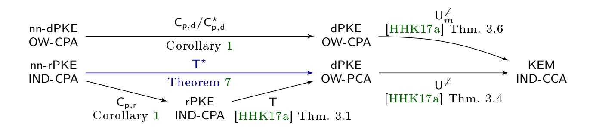
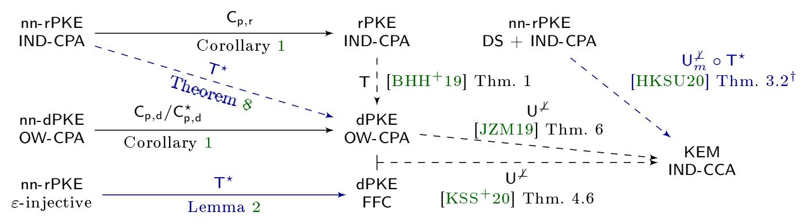

{0}------------------------------------------------

# CCA-Secure (Puncturable) KEMs from Encryption With Non-Negligible Decryption Errors

Valerio Cini, Sebastian Ramacher, Daniel Slamanig, and Christoph Striecks

AIT Austrian Institute of Technology, Vienna, Austria {firstname.lastname}@ait.ac.at

Abstract. Public-key encryption (PKE) schemes or key-encapsulation mechanisms (KEMs) are fundamental cryptographic building blocks to realize secure communication protocols. There are several known transformations that generically turn weakly secure schemes into strongly (i.e., IND-CCA) secure ones. While most of these transformations require the weakly secure scheme to provide perfect correctness, Hofheinz, Hövelmanns, and Kiltz (HHK) (TCC 2017) have recently shown that variants of the Fujisaki-Okamoto (FO) transform can work with schemes that have negligible correctness error in the (quantum) random oracle model (QROM). Many recent schemes in the NIST post-quantum competition (PQC) use variants of these transformations. Some of their CPA-secure versions even have a non-negligible correctness error and so the techniques of HHK cannot be applied.

In this work, we study the setting of generically transforming PKE schemes with potentially large, i.e., non-negligible, correctness error to ones having negligible correctness error. While there have been previous treatments in an asymptotic setting by Dwork, Naor, and Reingold (EUROCRYPT 2004), our goal is to come up with practically ecient compilers in a concrete setting and apply them in two dierent contexts. Firstly, we show how to generically transform weakly secure deterministic or randomized PKEs into CCA-secure KEMs in the (Q)ROM using variants of HHK. This applies to essentially all candidates to the NIST PQC based on lattices and codes with non-negligible error for which we provide an extensive analysis. We thereby show that it improves some of the code-based candidates. Secondly, we study puncturable KEMs in terms of the Bloom Filter KEM (BFKEM) proposed by Derler et al. (EUROCRYPT 2018) which inherently have a non-negligible correctness error. BFKEMs are a building block to construct fully forward-secret zero round-trip time (0-RTT) key-exchange protocols. In particular, we show the rst approach towards post-quantum secure BFKEMs generically from lattices and codes by applying our techniques to identity-based encryption (IBE) schemes with (non-)negligible correctness error.

This is the full version of a paper which appears in Advances in Cryptology - ASI-ACRYPT 2020 - 26th International Conference on the Theory and Application of Cryptology and Information Security. The proceedings version is available online at: [https://doi.org/10.1007/978-3-030-64837-4\\_6](https://doi.org/10.1007/978-3-030-64837-4_6)

{1}------------------------------------------------

## 1 Introduction

Public-key encryption (PKE) schemes or key-encapsulation mechanisms (KEMs) are fundamental cryptographic building blocks to realize secure communication protocols. The security property considered standard nowadays is security against chosen-ciphertext attacks (IND-CCA security). This is important to avoid pitfalls and attacks in the practical deployments of such schemes, e.g., paddingoracle attacks as demonstrated by Bleichenbacher [\[Ble98\]](#page-37-0) and still showing up very frequently [\[JSS12,](#page-39-0) [ASS](#page-36-0)<sup>+</sup>16, [BSY18,](#page-37-1) [RGG](#page-40-0)<sup>+</sup>19]. Also, for key exchange protocols that achieve the desirable forward-secrecy property, formal analysis shows that security against active attacks is required (cf. [\[JKSS12,](#page-39-1) [KPW13,](#page-40-1) [DFGS15,](#page-37-2) [PST20\]](#page-40-2)). This equally holds for recent proposals for fully forwardsecret zero round-trip time (0-RTT) key-exchange protocols from puncturable KEMs [\[GHJL17,](#page-38-0) [DJSS18,](#page-38-1) [DGJ](#page-37-3)<sup>+</sup>18] and even for ephemeral KEM keys for a post-quantum secure TLS handshake without signatures [\[SSW20\]](#page-41-0).

In the literature, various dierent ways of obtaining CCA security generically from weaker encryption schemes providing only chosen-plaintext (IND-CPA) or one-way (OW-CPA) security are known. These can be in the standard model using the double-encryption paradigm due to Naor and Yung [\[NY90\]](#page-40-3), the compiler from selectively secure identity-based encryption (IBE) due to Canetti, Halevi and Katz [\[CHK04\]](#page-37-4), or the more recent works due to Koppula and Waters [\[KW19\]](#page-40-4) based on so called hinting pseudo-random generators and Hohenberger, Koppula, and Waters [\[HKW20\]](#page-39-2) from injective trapdoor functions. In the random oracle model (ROM), CCA security can be generically obtained via the well-known and widely-used Fujisaki-Okamoto (FO) transform [\[FO99,](#page-38-2) [FO13\]](#page-38-3) yielding particularly practical eciency.

Perfect correctness and (non-)negligible correctness error. A property common to many compilers is the requirement for the underlying encryption schemes to provide perfect correctness, i.e., there are no valid ciphertexts where the decryption algorithm fails when used with honestly generated keys. Recently, Hofheinz, Hövelmanns, and Kiltz (HHK) [\[HHK17a\]](#page-39-3) investigated dierent variants of the FO transform also in a setting where the underlying encryption scheme has non-perfect correctness and in particular decryption errors may occur with a negligible probability in the security parameter. This is interesting since many PKE schemes or KEMs based on conjectured quantum-safe assumptions and in particular assumptions on lattices and codes do not provide perfect correctness. Even worse, some of the candidates submitted to the NIST post-quantum competition (PQC) suer from a non-negligible correctness error and so the FO transforms of HHK cannot be applied. Ad-hoc approaches to overcome this problem that are usually chosen by existing constructions in practice if the problem is considered at all is to increase the parameters to obtain a suitably small decryption error, applying an error correcting code on top or implementing more complex decoders. In practice, these ad-hoc methods come with drawbacks. Notably, LAC, which is a Learning With Errors (LWE) based IND-CCA secure KEM in the 2nd round of the NIST PQC that 

{2}------------------------------------------------

applies an error correcting code, is susceptible to a key-recovery attack recently proposed by Guo et al. [GJY19]. Also, code-based schemes have a history of attacks [GJS16, SSPB19, FHS<sup>+</sup>17] due to decoding errors. Recently, Bindel and Schanck [BS20] proposed a failure boosting attack for lattice-based schemes with a non-zero correctness error. For some code-based schemes, the analysis of the decoding error is a non-trivial task as it specifically depends on the decoder. For instance, the analysis of BIKE's decoder, another 2nd round NIST PQC candidate, has recently been updated [SV19].

Consequently, it would be interesting to have rigorous and simple approaches to remove decryption errors (to a certain degree) from PKE schemes and KEMs.

Immunizing encryption schemes. The study of "immunizing" encryption schemes from decryption errors is not new. Goldreich, Goldwasser, and Halevi [GGH97] studied the reduction or removal of decryption errors in the Ajtai-Dwork encryption scheme as well as Howgrave-Graham et al. [HNP+03] in context of NTRU. The first comprehensive and formal treatment has been given by Dwork, Naor, and Reingold [DNR04] who study different amplification techniques in the standard and random oracle model to achieve non-malleable (IND-CCA secure) schemes. One very intuitive compiler is the direct product compiler  $\mathsf{Enc}^{\otimes \ell}$  which encrypts a message M under a PKE  $\Pi = (\mathsf{KGen}, \mathsf{Enc}, \mathsf{Dec})$ with a certain decryption error  $\delta$  under  $\ell$  independent public keys from KGen, i.e,  $\mathsf{pk'} := (\mathsf{pk}_1, \dots, \mathsf{pk}_\ell)$  as  $\mathsf{Enc'}(\mathsf{pk'}, M) := (\mathsf{Enc}(\mathsf{pk}_1, M), \dots, \mathsf{Enc}(\mathsf{pk}_\ell, M))$ .  $\operatorname{Dec}'$ , given  $C' = (C_1, \ldots, C_\ell)$  tries to decrypt  $C_i$ ,  $1 \leq i \leq \ell$ , and returns the result of a majority vote among all decrypted messages, yielding an encryption scheme with some error  $\delta' \leq \delta$ . Their asymptotic analysis, however, and limitation to PKEs with a binary message space does not make it immediate what this would mean in a concrete setting and in particular how to choose  $\ell$ for practically interesting values of  $\delta$  and  $\delta'$ . For turning a so-obtained amplified scheme with negligible correctness error into a CCA-secure one in the ROM, they provide a transform using similar ideas, but more involved than the FO transform. Bitansky and Vaikuntanathan |BV17| go a step further and turn encryption schemes with a correctness error into perfectly correct ones, whereas they even consider getting completely rid of bad keys (if they exist) and, thus, completely immunize encryption schemes. They build upon the direct product compiler of Dwork et al. and then apply reverse randomization [Nao90] and Nisan-Wigderson style derandomization [NW94]. Thereby, they partition the randomness space into good and bad randomness, and ensure that only good randomness is used for encryption and key generation.

Our goals. In this work, we are specifically interested in transformations that lift weaker schemes with non-negligible correctness error into CCA-secure ones with negligible error. Thereby, our focus is on modular ways of achieving this and can be seen as a concrete treatment of ideas that have also be discussed by Dwork et al. [DNR04], who, however, treat their approaches in an asymptotic setting only. We show that the direct product compiler can be used with variants of the standard FO transform considered by HHK [HHK17a] (in the ROM) as well as Bindel et al. [BHH<sup>+</sup>19] and Jiang et al. [JZM19] (in the

{3}------------------------------------------------

quantum ROM (QROM) [\[BDF](#page-36-1)+11]). They are used by many candidates of the NIST PQC, when starting from PKE schemes having non-negligible correctness error generically. As we are particularly interested in practical compilers in a concrete setting to obtain CCA security for KEMs in the (Q)ROM, we analyze the concrete overhead of this compiler and its use with widely used variants of the transforms from HHK. Moreover, we provide a rigorous treatment of non-black-box applications of these ideas and show that they yield better concrete results than the direct application of the direct product compiler. Importantly, it gives a generic way to deal with the error from weaker schemes (e.g., IND-CPA secure ones with non-negligible error) which are easier to design. An interesting question that we will study is how does increasing from one to ℓ ciphertexts compare to increasing the parameters at comparable resulting decryption errors for existing round-two submissions in the NIST PQC. As it turns out, our approach performs well in context of code-based schemes but gives less advantage for lattice-based schemes.

We also study our approach beyond conventional PKE schemes and KEMs. In particular, a class of KEMs that have recently found interest especially in context of full forward-secrecy for zero round-trip time (0-RTT) key-exchange (KE) protocols are so-called puncturable KEMs [\[GM15,](#page-39-6) [GHJL17,](#page-38-0) [DJSS18,](#page-38-1) [SSS](#page-41-3)<sup>+</sup>20] and, in particular, Bloom Filter KEMs (BFKEMs) [\[DJSS18,](#page-38-1) [DGJ](#page-37-3)<sup>+</sup>18]. BFKEMs schemes are CCA-secure KEMs that inherently have non-negligible correctness error. Interestingly, however, the non-negligible correctness error comes from the Bloom lter layer and the underlying IBE scheme (specically, the Boneh-Franklin [\[BF01\]](#page-37-8) instantiation in [\[DJSS18\]](#page-38-1)) is required to provide perfect correctness. Thus, as all post-quantum IBEs have at least negligible correctness error, there are no known post-quantum BFKEMs.

### 1.1 Contribution

Our contributions on a more technical level can be summarized as follows:

Generic transform. We revisit the ideas of the direct product compiler of Dwork et al. [\[DNR04\]](#page-38-7) (dubbed Cp,<sup>r</sup> and Cp,<sup>d</sup> for randomized and deterministic PKEs, respectively) in the context of the modular framework of HHK [\[HHK17a\]](#page-39-3). In particular, we present a generic transform dubbed T ⋆ that, given any randomized PKE scheme with non-negligible correctness error, produces a derandomized PKE scheme with negligible correctness error. We analyze the transform both in the ROM and QROM and give a tight reduction in the ROM and compare it to a generic application of the direct product compiler. The transform naturally ts into the modular framework of HHK [\[HHK17a\]](#page-39-3), and, thus, by applying the U ̸⊥ transform, gives rise to an IND-CCA-secure KEM. For the analysis in the QROM, we follow the work of Bindel et al. [\[BHH](#page-37-7)<sup>+</sup>19]. We show that the T ⋆ transform also ts into their framework. Hence, given the additional injectivity assumption, we also obtain a tight proof for U ̸⊥. But even if this assumption does not hold, the non-tight proofs of Jiang et al. [\[JZM19\]](#page-40-7) and Hövelmanns et al. [\[HKSU20\]](#page-39-7) still apply. Compared to the analysis of the T transform that is used in the

{4}------------------------------------------------



<span id="page-4-0"></span>**Fig. 1.** Overview of the transformations in the ROM with the results related to T\* highlighted in blue. rPKE denotes a randomized PKE. dPKE denotes a deterministic PKE. The prefix nn indicates encryption schemes with non-negligible correctness error.



<span id="page-4-1"></span>**Fig. 2.** Overview of the transformations in the QROM using the notation from Figure 1. A dashed arrow denotes a non-tight reduction. DS denotes disjoint simulatability. †: Obtained by applying the modifications from Theorems 7 and 8 to [HKSU20, Thm 3.2].

modular frameworks, our reductions lose a factor of  $\ell$ , i.e., the number of parallel ciphertexts required to reach a negligible correctness error, in the ROM and a factor of  $\ell^2$  in the QROM. For concrete schemes, this number is small (e.g.,  $\leq 5$ ) and, thus, does not impose a significant loss. An overview of the transformations and how our transform fits into the modular frameworks is given in Figure 1 (ROM) and Figure 2 (QROM). Furthermore, using ideas similar to  $\mathsf{T}^\star$ , we discuss a modified version of the deterministic direct product compiler  $\mathsf{C}_{\mathsf{p},\mathsf{d}}$  which we denote by  $\mathsf{C}^\star_{\mathsf{p},\mathsf{d}}$ , that compared to the original one allows to reduce the number of parallel repetitions needed to achieve negligible correctness error.

Evaluation. We evaluate T\* based on its application to code- and lattice-based second-round candidates in the NIST PQC. In particular, we focus on schemes that offer IND-CPA secure versions with non-negligible correctness error such as ROLLO [ABD+19], BIKE [ABB+19], and Round5 [GZB+19]. We compare their IND-CCA variants with our transform applied to the IND-CPA schemes. In particular, for the code-based schemes such as ROLLO we can observe improvements in the combined size of public keys and ciphertexts, a metric important when used in protocols such as TLS, as well as its runtime efficiency. We also argue the ease of implementing our so-obtained schemes which can rely on simpler decoders. For lattice-based constructions, we find that the use of the transform results in an increase in the sum of ciphertext and public-key size of 30% even in the best case scenario, i.e., for an IND-CPA version of KEM Round5 [GZB+19]. Nevertheless, it offers easier constant-time implementations and the opportunity

{5}------------------------------------------------

of decreasing the correctness error without changing the underlying parameter set and, thus, the possibility to focus on analyzing and implementing one parameter set for both, IND-CPA and IND-CCA security.

Bloom Filter KEMs. Finally, we revisit puncturable KEMs from Bloom lter KEMs (BFKEMs) [\[DJSS18,](#page-38-1) [DGJ](#page-37-3)+18], a recent primitive to realize 0-RTT key exchange protocols with full forward-secrecy [\[GHJL17\]](#page-38-0). Currently, it is unclear how to instantiate BFKEMs generically from IBE and, in particular, from conjectured post-quantum assumptions due to the correctness error of the respective IBE schemes. We show that one can construct BFKEMs generically from any IBE and even base it upon IBEs with a (non-)negligible correctness error. Consequently, our results allow BFKEMs to be instantiated from latticeand code-based IBEs and, thereby, we obtain candidates for post-quantum CCAsecure BFKEMs.

On the progress in the NIST PQC. We note that our work has been done during the second round of the NIST PQC. Meanwhile, NIST has announced the third-round candidates and from the schemes that are suitable for our compilers, BIKE [\[ABB](#page-36-3)<sup>+</sup>19] and FrodoKEM [\[NAB](#page-40-9)<sup>+</sup>19] still remain as alternate candidates in the competition. Moreover, we concretely analyze the submissions to the second round and want to note that meanwhile there are additional results on the cryptanalysis of some relevant second round schemes, i.e., for ROLLO in [\[BBC](#page-36-4)<sup>+</sup>20] as well as for LEDAcrypt in [\[APRS20\]](#page-36-5). These results might require a change in the parameters compared to the versions that we use in this work.

### 2 Preliminaries

Notation. For n ∈ N, let [n] := {1, . . . , n}, and let k ∈ N be the security parameter. For a nite set S, we denote by s ←\$ S the process of sampling s uniformly from S. For an algorithm A, let y ← A(k, x) be the process of running A on input (k, x) with access to uniformly random coins and assigning the result to y (we may assume that all algorithms take kas input). To make the random coins r explicit, we write A(x; r). We say an algorithm A is probabilistic polynomial time (PPT) if the running time of A is polynomial in k. A function f is negligible if its absolute value is smaller than the inverse of any polynomial, i.e., if ∀c ∃k<sup>0</sup> s.t. ∀k ≥ k<sup>0</sup> : |f(k)| < 1/k c .

### 2.1 Public-Key Encryption and Key-Encapsulation Mechanisms

Public-key encryption. A public-key encryption (PKE) scheme Π with message space M consists of the three PPT algorithms (KGen, Enc, Dec): KGen(k), on input security parameter k, outputs public and secret keys (pk,sk). Enc(pk, M), on input pk and message M ∈ M, outputs a ciphertext C. Dec(sk, C), on input sk and C, outputs M ∈ M ∪ {⊥}. We may assume that pk is implicitly available in Dec.

{6}------------------------------------------------

$$\begin{array}{|c|c|c|} \textbf{Exp. Exp}^{\mathsf{pke-ind-cpa}}_{\Pi,A}(\mathsf{k}) & \textbf{Exp. Exp}^{\mathsf{pke-ow-cpa}}_{\Pi,A}(\mathsf{k}) & \textbf{Exp. Exp}^{\mathsf{pke-ow-pca}}_{\Pi,A}(\mathsf{k}) \\ (\mathsf{pk},\mathsf{sk}) \leftarrow \mathsf{KGen}(\mathsf{k}) & (\mathsf{pk},\mathsf{sk}) \leftarrow \mathsf{KGen}(\mathsf{k}) & (\mathsf{pk},\mathsf{sk}) \leftarrow \mathsf{KGen}(\mathsf{k}) \\ (M_0,M_1) \leftarrow A(\mathsf{pk}) & M \leftarrow \$ \, \mathcal{M} & M \leftarrow \$ \, \mathcal{M} \\ b \leftarrow \$ \, \{0,1\} & C^* \leftarrow \mathsf{Enc}(\mathsf{pk},M) & C^* \leftarrow \mathsf{Enc}(\mathsf{pk},M) \\ C^* \leftarrow \mathsf{Enc}(\mathsf{pk},M) & M' \leftarrow A(\mathsf{pk},C^*) & M' \leftarrow A^{\mathsf{Pco}(\cdot,\cdot)}(\mathsf{pk},C^*) \\ b' \leftarrow A(C^*) & \text{if } M = M' \text{ then return } 1 \\ \mathbf{else \ return } 0 & \mathbf{else \ return } 0 \\ \end{array}$$

<span id="page-6-0"></span>**Fig. 3.** PKE-x-y security with  $x \in \{OW, IND\}$ ,  $y \in \{CPA, PCA\}$  for  $\Pi$ .

**Correctness.** We recall the definition of  $\delta$ -correctness of [HHK17a]. A PKE  $\Pi$  is  $\delta$ -correct if

$$E \bigg[ \max_{M \in \mathcal{M}} \Pr[c \leftarrow \mathsf{Enc}(\mathsf{pk}, M) : \mathsf{Dec}(\mathsf{sk}, C) \neq M] \bigg] \leq \delta,$$

where the expected value is taken over all  $(pk, sk) \leftarrow \mathsf{KGen}(k)$ .

**PKE-IND-CPA**, **PKE-OW-CPA**, and **PKE-OW-PCA** security. We say a PKE  $\Pi$  is PKE-IND-CPA-secure if and only if any PPT adversary A has only negligible advantage in the following security experiment. First, A gets an honestly generated public key  $\mathsf{pk}$ . A outputs equal-length messages  $(M_0, M_1)$  and, in return, gets  $C_b^* \leftarrow \mathsf{Enc}(\mathsf{pk}, M_b)$ , for  $b \leftarrow \{0, 1\}$ . Eventually, A outputs a guess b'. If b = b', then the experiment outputs 1. For PKE-OW-CPA security, A does not receive a ciphertext for A-chosen messages, but only a ciphertext  $C^* \leftarrow \mathsf{Enc}(\mathsf{pk}, M)$  for  $M \leftarrow M$  and outputs M'; if M = M', then the experiment outputs 1. For PKE-OW-PCA security, A additionally has access to a plaintext checking oracle  $\mathsf{PCO}(M, C)$  returning 1 if  $M = \mathsf{Dec}(\mathsf{sk}, C)$  and 0 otherwise.

**Definition 1.** For any PPT adversary A the advantage function

$$\mathsf{Adv}^{\mathsf{pke\text{-}ind\text{-}cpa}}_{\varPi,A}(\mathsf{k}) := \bigg| \mathrm{Pr} \Big[ \mathsf{Exp}^{\mathsf{pke\text{-}ind\text{-}cpa}}_{\varPi,A}(\mathsf{k}) = 1 \Big] - \frac{1}{2} \bigg|,$$

is negligible in k, where the experiment  $\mathsf{Exp}_{\Pi,A}^{\mathsf{pke-ind-cpa}}(\mathsf{k})$  is given in Figure 3 and  $\Pi$  is a PKE as above.

**Definition 2.** For any PPT adversary A, and  $y \in \{CPA, PCA\}$  the advantage function

$$\mathsf{Exp}^{\mathsf{pke}\text{-}\mathsf{OW}\text{-}\mathsf{y}}_{\Pi,A}(\mathsf{k}) := \Pr\Big[\mathsf{Exp}^{\mathsf{pke}\text{-}\mathsf{OW}\text{-}\mathsf{y}}_{\Pi,A}(\mathsf{k}) = 1\Big],$$

is negligible in k, where the experiments  $\operatorname{Exp}_{\Pi,A}^{\operatorname{pke-ow-cpa}}(\mathsf{k})$  and  $\operatorname{Exp}_{\Pi,A}^{\operatorname{pke-ow-pca}}(\mathsf{k})$  are given in Figure 3 and  $\Pi$  is a PKE as above.

We recall a well known lemma below:

**Lemma 1.** For any adversary B there exists an adversary A with the same running time as that of B such that

<span id="page-6-1"></span>
$$\mathsf{Adv}^{\mathsf{pke\text{-}ow\text{-}cpa}}_{\Pi,B}(\mathsf{k}) \leq \mathsf{Adv}^{\mathsf{pke\text{-}ind\text{-}cpa}}_{\Pi,A}(\mathsf{k}) + \frac{1}{|\mathcal{M}|}.$$

{7}------------------------------------------------

```
Exp. Exppke-ffc
         Π,A (k)
 (pk,sk) ← KGen(k)
 L ← A(pk)
 if exists C ∈ L with M ∈ M such that Enc(pk, M) = C and Dec(sk, C) ̸= M
 then return 1 else return 0
```

<span id="page-7-1"></span>Fig. 4. Finding-failing-ciphertext experiment for Π.

We note that Lemma [1](#page-6-1) equivalently holds for the ℓ-IND-CPA notion below.

Multi-challenge setting. We recall some basic observations from [\[BBM00\]](#page-36-6) regarding the multi-challenge security of PKE schemes. In particular, for our construction we need the relation between OW-CPA/IND-CPA security in the conventional single-challenge and single-user setting and n-OW-CPA/n-IND-CPA respectively, which represents the multi-challenge and multi-user setting. In particular, latter means that the adversary is allowed to obtain multiple challenges under multiple dierent public keys.

Theorem 1 (Th. 4.1 [\[BBM00\]](#page-36-6)). Let Π = (KGen, Enc, Dec) be a PKE scheme that provides x-CPA security with x ∈ {OW, IND}. Then, it holds that:

<span id="page-7-0"></span>
$$\mathsf{Adv}^{\mathsf{pke-x-cpa}}_{\Pi,A}(\mathsf{k}) \geq \frac{1}{q \cdot n} \cdot \mathsf{Adv}^{\mathsf{n-pke-x-cpa}}_{\Pi,A}(\mathsf{k}),$$

where n is the number of public keys and A makes at most q queries to any of its n challenge oracles.

Although the loss imposed by the reduction in Theorem [1](#page-7-0) can be signicant when used in a general multi-challenge and multi-user setting, in our application we only have cases where n = 1 and small q (q = 5 at most), or vice versa (i.e., q = 1 and n = 5 at most) thus tightness in a concrete setting is preserved.

Finding failing ciphertexts and injectivity. For the QROM security proof we will need the following two denitions from [\[BHH](#page-37-7)<sup>+</sup>19].

Denition 3 (ε-injectivity). A PKE Π is called ε-injective if

Π is deterministic and

$$\Pr[(\mathsf{pk},\mathsf{sk}) \leftarrow \mathsf{KGen}(\mathsf{k}) : M \mapsto \mathsf{Enc}(\mathsf{pk},M) \ \textit{is not injective}] \leq \varepsilon.$$

Π is non-deterministic with randomness space R and

$$\Pr \begin{bmatrix} (\mathsf{pk},\mathsf{sk}) \leftarrow \mathsf{KGen}(\mathsf{k}), \\ M,M' \hookleftarrow \!\!\!\!\!\!\!\!\!\!\!\!\!\!\!\!\!\!\!\!\!\!\!\!\!\!\!\!\!\!\!\!\!\!\!$$

Denition 4 (Finding failing ciphertexts). For a deterministic PKE, the FFC-advantage of an adversary A is dened as

$$\mathsf{Adv}^{\mathsf{pke-ffc}}_{\Pi,A}(\mathsf{k}) := \Pr \Big[ \mathsf{Exp}^{\mathsf{pke-ffc}}_{\Pi,A}(\mathsf{k}) = 1 \Big],$$

where the experiment Exppke-ffc Π,A is given in Figure [4.](#page-7-1)

{8}------------------------------------------------

```
\begin{split} \mathbf{Exp.} \ & \mathsf{Exp}_{\mathsf{KEM},A}^{\mathsf{kem-ind-cca}}(\mathsf{k}) \\ & (\mathsf{pk},\mathsf{sk}) \leftarrow \mathsf{KGen}(\mathsf{k}) \\ & (C^*,\mathsf{k}_0) \leftarrow \mathsf{Encaps}(\mathsf{pk}), \mathsf{k}_1 \leftarrow \$ \, \mathcal{K} \\ & b \leftarrow \$ \, \{0,1\} \\ & b' \leftarrow A^{\mathsf{Decaps}(\mathsf{sk},\cdot)}(\mathsf{pk},C^*,\mathsf{k}_b) \\ & \mathbf{if} \ b = b' \ \ \mathbf{then} \ \ \mathbf{return} \ 1 \ \mathbf{else} \ \mathbf{return} \ 0 \end{split}
```

<span id="page-8-0"></span>Fig. 5. KEM-IND-CCA security experiment for KEM.

**Key-encapsulation mechanism.** A key-encapsulation mechanism (KEM) scheme KEM with key space  $\mathcal{K}$  consists of the three PPT algorithms (KGen, Encaps, Decaps): KGen(k), on input security parameter k, outputs public and secret keys (pk, sk). Encaps(pk), on input pk, outputs a ciphertext C and key k. Decaps(sk, C), on input sk and C, outputs k or  $\{\bot\}$ .

Correctness of KEM. We call a KEM  $\delta$ -correct if for all  $k \in \mathbb{N}$ , for all  $(pk, sk) \leftarrow KGen(k)$ , for all  $(C, k) \leftarrow Enc(pk)$ , we have that

$$\Pr[\mathsf{Dec}(\mathsf{sk}, C) \neq \mathsf{k}] \leq \delta.$$

**KEM-IND-CCA security.** We say a KEM KEM is KEM-IND-CCA-secure if and only if any PPT adversary A has only negligible advantage in the following security experiment. First, A gets an honestly generated public key  $\mathsf{pk}$  as well as a ciphertext-key pair  $(C^*, \mathsf{k}_b)$ , for  $(C^*, \mathsf{k}_0) \leftarrow \mathsf{Encaps}(\mathsf{pk})$ , for  $\mathsf{k}_1 \leftarrow \mathsf{s} \mathcal{K}$ , and for  $b \leftarrow \mathsf{s} \{0, 1\}$ . A has access to a decapsulation oracle  $\mathsf{Dec}(\mathsf{sk}, \cdot)$  and we require that A never queries  $\mathsf{Decaps}(\mathsf{sk}, C^*)$ . Eventually, A outputs a guess b'. Finally, if b = b', then the experiment outputs 1.

**Definition 5.** For any PPT adversary A, the advantage functions

$$\mathsf{Adv}^{\mathsf{kem\text{-}ind\text{-}cca}}_{\mathsf{KEM},A}(\mathsf{k}) := \left| \Pr \Big[ \mathsf{Exp}^{\mathsf{kem\text{-}ind\text{-}cca}}_{\mathsf{KEM},A}(\mathsf{k}) = 1 \Big] - \frac{1}{2} \right|,$$

is negligible in k, where the experiment  $\mathsf{Exp}^{\mathsf{kem-ind-cca}}_{\mathsf{KEM},A}(\mathsf{k})$  is given in Figure 5 and  $\mathsf{KEM}$  is a KEM as above.

### 2.2 Identity-Based Encryption

An identity-based encryption (IBE) scheme IBE with identity space  $\mathcal{ID}$  and message space  $\mathcal{M}$  consists of the PPT algorithms (KGen, Ext, Enc, Dec): KGen(k) on input security parameter k, outputs main public and secret keys (mpk, msk). Ext(msk, id) on input identity  $id \in \mathcal{ID}$ , outputs an identity secret key  $\mathsf{sk}_{id}$ . Enc(mpk, id, M) on input mpk,  $id \in \mathcal{ID}$ , and message  $M \in \mathcal{M}$ , outputs a ciphertext C. Dec( $\mathsf{sk}_{id}$ , C) on input  $\mathsf{sk}_{id}$  and C, outputs  $M \in \mathcal{M} \cup \{\bot\}$ .

Correctness of IBE. Analogous to Section 3, we say that an IBE IBE is

{9}------------------------------------------------

 $-\delta(\cdot)$ -correct if for any  $id \in \mathcal{ID}$  and all  $M \in \mathcal{M}$ :

$$\Pr\left[C \leftarrow \mathsf{Enc}(\mathsf{mpk}, id, M) : \mathsf{Dec}(\mathsf{sk}_{id}, C) \neq M\right] \leq \delta(\mathsf{k}),$$

where the probability is taken over the random coins of the encryption algorithm,  $(\mathsf{mpk}, \mathsf{msk}) \leftarrow \mathsf{KGen}(\mathsf{k})$ , and  $\mathsf{sk}_{id} \leftarrow \mathsf{Ext}(\mathsf{msk}, id)$ .

 $-\epsilon(\cdot)$ -key  $\delta(\cdot)$ -correct if for any  $id \in \mathcal{ID}$  and  $M \in \mathcal{M}$ : except with probability at most  $\epsilon(\mathsf{k})$ , key pairs  $(\mathsf{mpk}, \mathsf{msk}) \leftarrow \mathsf{KGen}(\mathsf{k})$  are such that

$$\Pr\left[C \leftarrow \mathsf{Enc}(\mathsf{mpk}, id, M) : \mathsf{Dec}(\mathsf{sk}_{id}, C) \neq M\right] \leq \delta(\mathsf{k}),$$

where the probability is taken over the random coins (possibly obtained from a random oracle) of the encryption algorithm.

**IBE-sIND-CPA** security of IBE. We say an IBE scheme IBE is IBE-sIND-CPA-secure if and only if any PPT adversary A has only negligible advantage in the following security experiment. First, A outputs the target identity  $id^*$  and, subsequently, gets an honestly generated main public key mpk. During the experiment, but after providing  $id^*$ , A has access to a secret-key extraction oracle  $\mathsf{Ext}(\mathsf{msk},\cdot)$  where we require that A never queries an identity secret key for  $id^*$ . At some point, A outputs equal-length messages  $(M_0, M_1)$  and receives a challenge ciphertext  $C^* \leftarrow \mathsf{Enc}(\mathsf{mpk}, id^*, M_b)$ , for  $b \leftarrow \{0, 1\}$ . Eventually, A outputs a guess b'; if b = b', then the experiment outputs 1. The experiment is depicted in Figure 6.

**Definition 6.** For any PPT adversary A, the advantage function

$$\mathsf{Adv}^{\mathsf{ibe\text{-}sind\text{-}cpa}}_{\mathsf{IBE},B}(\mathsf{k}) := \left| \Pr[\mathsf{Exp}^{\mathsf{ibe\text{-}sind\text{-}cpa}}_{\mathsf{IBE},A}(\mathsf{k}) = 1] - \frac{1}{2} \right|,$$

is negligible in k, where the experiment  $\mathsf{Exp}^{\mathsf{ibe-sind-cpa}}_{\mathsf{IBE},A}(\mathsf{k})$  is given in Figure 6 and  $\mathsf{IBE}$  is an  $\mathsf{IBE}$  scheme.

```
\begin{aligned} \mathbf{Exp.} & \ \mathsf{Exp}^{\mathsf{ibe-sind-cpa}}_{\mathsf{IBE},A}(\mathsf{k}) \\ & id^* \leftarrow A(\mathsf{k}) \\ & (\mathsf{mpk}, \mathsf{msk}) \leftarrow \mathsf{KGen}(\mathsf{k}) \\ & (M_0, M_1) \leftarrow A^{\mathsf{Ext}(\mathsf{msk}, \cdot)}(\mathsf{mpk}) \\ & b \leftarrow \$ \left\{ 0, 1 \right\} \\ & C^* \leftarrow \mathsf{Enc}(\mathsf{mpk}, id^*, M_b) \\ & b' \leftarrow A^{\mathsf{Ext}(\mathsf{msk}, \cdot)}(C^*) \\ & \mathsf{if} \ b = b' \ \mathsf{then} \ \mathsf{return} \ 1 \ \mathsf{else} \ \mathsf{return} \ 0 \end{aligned}
```

<span id="page-9-0"></span>Fig. 6. IBE-sIND-CPA experiment for IBE scheme IBE.

{10}------------------------------------------------

 $\gamma$ -spreadness of IBE. In order to prove our Bloom filter KEM CCA-secure in Section 5, we need an additionally property of the underlying IBE scheme which essentially guarantees that honestly generated IBE ciphertexts have large-enough min-entropy.

**Definition 7** ( $\gamma$ -Spreadness of IBE). For all  $k \in \mathbb{N}$ , an IBE scheme IBE is  $\gamma$ -spread, if for any  $(\mathsf{mpk}, \cdot) \leftarrow \mathsf{KGen}(k)$ , any identity  $id \in \mathcal{ID}$ , any message  $M \in \mathcal{M}$ , any  $C \in \mathcal{C}$ , and  $r \leftarrow \mathcal{R}$ , where  $\mathcal{C}$  and  $\mathcal{R}$  are the ciphertext and randomness spaces of IBE, respectively, we have that  $\Pr[C = \mathsf{Enc}(\mathsf{mpk}, id, M; r)] \leq 2^{-\gamma}$  holds, where the probability is taken over the random coins of KGen.

### <span id="page-10-0"></span>3 CCA Security from Non-Negligible Correctness Errors

In this section, we present our approaches to generically achieve CCA secure KEMs in the (Q)ROM with negligible correctness error when starting from an OW-CPA or IND-CPA secure PKE with non-negligible correctness error. We start by discussing the definitions of correctness errors of PKE and KEMs. Then, we present a generic transform based on the direct product compiler of Dwork et al. [DNR04] and revisit certain FO transformation variants from [HHK17a] (in particular the T and U transformations), their considerations in the QROM [BHH+19] and their application with the direct product compiler. As a better alternative, we analyze the non-black-box use of the previous technique yielding transformation T\*, that combines the direct product compiler with the T transformation. Finally, we provide a comprehensive comparison of the two approaches.

#### 3.1 On the Correctness Error

In this work, we use  $\delta$ -correctness definitions for PKEs slightly derived from that given by HHK in [HHK17a]. These definitions are tailored, as done in [HHK17a] via maxing over all possible messages, to the security proofs of the FO-transforms where an adversary could actively search for the worst possible message, in order to trigger decryption failure. Moreover, they are also tailored, via taking the probability over appropriately chosen random coins, to be compatible with the  $\mathsf{C}^\star_{\mathsf{p},\mathsf{d}}$  and  $\mathsf{T}^\star$  transformation respectively. As done by Dwork et al. [DNR04], we explicitly write the correctness error as a function in the security parameter:

#### **Definition 8.** A PKE $\Pi$ is

 $-\delta(\cdot)$ -correct if for all  $M \in \mathcal{M}$ :

$$\Pr[C \leftarrow \mathsf{Enc}(\mathsf{pk}, M) : \mathsf{Dec}(\mathsf{sk}, C) \neq M] \leq \delta(\mathsf{k}),$$

where the probability is taken over the random coins of the encryption algorithm and that of  $(pk, sk) \leftarrow KGen(k)$ .

{11}------------------------------------------------

 $-\epsilon(\cdot)$ -key  $\delta(\cdot)$ -correct if for all  $M \in \mathcal{M}$ : except that with probability at most  $\epsilon(\mathsf{k})$ , key pairs  $(\mathsf{pk}, \mathsf{sk}) \leftarrow \mathsf{KGen}(\mathsf{k})$  are such that

$$\Pr[C \leftarrow \mathsf{Enc}(\mathsf{pk}, M) : \mathsf{Dec}(\mathsf{sk}, C) \neq M] \leq \delta(\mathsf{k}),$$

where the probability is taken over the random coins (possibly obtained from a random oracle) of the encryption algorithm.

Remark 1. In the rest of the paper, we will use the first definition,  $\delta(\cdot)$ -correctness, for (truly) deterministic PKEs (to which the  $C_{p,d}^{\star}$  compiler is applied), and the second definition,  $\epsilon(\cdot)$ -key  $\delta(\cdot)$ -correctness, for randomized and derandomized PKEs (which are dealt with via the T\* transformation). With this distinction in mind, in both cases, for ease of exposition, we will sometime call it simply correctness error.

It will be important for our transform to make explicit that the correctness error depends on the security level. We will often just write  $\delta = \delta(k)$ . If  $\Pi$  is defined relative to a random oracle H, then the adversary is given access to the random oracle and  $\delta$  is additionally a function in the number of queries  $q_{\rm H}$ , i.e., the bound is given by  $\leq \delta(k, q_{\rm H})$ .

We note that in [BS20] an alternative definition of correctness was proposed, where the adversary does not get access to sk and the adversary's runtime is bounded. With this change, it can be run as part of the IND-CCA experiment which does not change the power of the IND-CCA adversary and additionally removes a factor  $q_H$  from the correctness error and advantage analysis. In particular, one can obtain an upper bound for IND-CCA security of a scheme via the correctness error.

We recall, for completeness, the definitions of correctness error, here denoted as HHK- $\delta$ -correctness (from Hofheinz-Hövelmanns-Kiltz) and DNR- $\delta$ -correctness (from Dwork-Naor-Reingold), used by Hofheinz et al. and Dwork et al. respectively:

**Definition 9 (Sect. 2.1 [HHK17a]).** A PKE  $\Pi$  is HHK- $\delta(\cdot)$ -correct if for all  $M \in \mathcal{M}$ :

$$E\left[\max_{m\in\mathcal{M}}\Pr[C\leftarrow\mathsf{Enc}(\mathsf{pk},M):\mathsf{Dec}(\mathsf{sk},C)\neq M]\right]\leq \delta(\mathsf{k}),$$

 $\textit{where the expected value is taken over all } (pk, sk) \leftarrow \mathsf{KGen}(k).$ 

With this definition, particularly bad keys in terms of correctness error only contribute a fraction to the overall correctness error as it averages the error probability over all key pairs. An alternative but equivalent definition, as used in [HHK17a], can be given in the following form: a PKE  $\Pi$  is called HHK- $\delta(\cdot)$ -correct if we have for all (possibly unbounded) adversaries A that

$$\mathsf{Adv}^{\mathsf{cor}}_{\Pi,A}(\mathsf{k}) = \Pr[\mathsf{Exp}^{\mathsf{cor}}_{\Pi,A}(\mathsf{k}) = 1] \leq \delta(\mathsf{k}),$$

where the experiment is given in Figure 7.

{12}------------------------------------------------

```
\begin{split} \mathbf{Exp.} \ & \mathsf{Exp}^{\mathsf{cor}}_{\Pi,A}(\mathsf{k}) \\ & (\mathsf{pk},\mathsf{sk}) \leftarrow \mathsf{KGen}(\mathsf{k}) \\ & M \leftarrow A(\mathsf{pk},\mathsf{sk}) \\ & \mathbf{if} \ M \neq \mathsf{Dec}(\mathsf{sk},\mathsf{Enc}(\mathsf{pk},M)) \ \ \mathbf{then} \ \ \mathbf{return} \ 1 \ \mathbf{else} \ \mathbf{return} \ 0 \end{split}
```

<span id="page-12-0"></span>Fig. 7. Correctness experiment for PKE.

### **Definition 10 (Def. 2, Def. 3 [DNR04]).** A PKE $\Pi$ is

-  $DNR-\delta(\cdot)$ -correct if we have that

$$\Pr[\mathsf{Dec}(\mathsf{sk},\mathsf{Enc}(\mathsf{pk},M)) \neq M] \leq \delta(\mathsf{k}),$$

where the probability is taken over the choice of key pairs  $(pk, sk) \leftarrow KGen(k)$ ,  $M \in \mathcal{M}$  and over the random coins of Enc and Dec.

 $- \ DNR-(almost-)all-keys \ \delta(\cdot)-correct \ if \ for \ all \ (but \ negligible \ many) \ keys \\ (pk,sk) \leftarrow \mathsf{KGen}(k), \ we \ have \ that$ 

$$\Pr[\mathsf{Dec}(\mathsf{sk},\mathsf{Enc}(\mathsf{pk},M)) \neq M] \leq \delta(\mathsf{k}),$$

where the probability is taken over the choice of  $M \in \mathcal{M}$  and over the random coins of Enc and Dec.

Correctness error in this sense still allows bad key pairs that potentially have an even worse error but it is not suited for our security proofs as the probability is also taken over  $M \leftarrow M$ . Recently Drucker et al. [DGKP20] introduced the notion of message agnostic PKE and showed that all the versions of BIKE, a 2nd round candidate in the NIST PQC, are message-agnostic: in such a PKE, the probability that, given (sk, pk), the encryption of a message  $M \in \mathcal{M}$  correctly decrypts is independent of the message  $M \in \mathcal{M}$  itself. For such PKEs the definitions of  $\delta$ -correctness and DNR- $\delta$ -correctness coincide (Cor. 1 [DGKP20]).

### <span id="page-12-1"></span>3.2 Compiler for Immunizing Decryption Errors

Now we present two variants of a compiler  $C_p$  denoted  $C_{p,d}$  (for deterministic schemes) and  $C_{p,r}$  (for randomized schemes) which is based on the direct product compiler by Dwork et al. [DNR04]. We recall that the idea is to take a PKE scheme  $\Pi = (KGen, Enc, Dec)$  with non-negligible correctness error  $\delta$  (and randomness space  $\mathcal{R}$  in case of randomized schemes) and output a PKE scheme  $\Pi' = (KGen', Enc', Dec')$  with negligible correctness error  $\delta'$  (and randomness space  $\mathcal{R}' := \mathcal{R}^{\ell}$ , for some  $\ell \in \mathbb{N}$ , in case of a randomized schemes). We present a precise description of the compilers in Figure 8. Note that in Dec', the message that is returned most often by Dec is returned. If two or more messages are tied, one of them is returned arbitrarily and we denote this operation as maj(M').

Analyzing correctness. Dwork et al. in [DNR04] explicitly discuss the amplification of the correctness for encryption schemes with a binary message space  $\mathcal{M} = \{0,1\}$  and obtain that to achieve DNR- $\delta'$ -correctness  $\ell > \frac{c}{(1-\delta)^2} \cdot \log \frac{1}{\delta'}$ 

{13}------------------------------------------------

```
\Pi'.KGen'(k,\ell)
                                                       \Pi'.Enc'(\mathsf{pk}, M)
                                                                                                               \Pi'.\mathsf{Dec}'(\mathsf{sk},C)
                                                                                                                  C:=(C_1,\ldots,C_\ell)
                                                          for i \in [\ell]
       /\!\!/ if C_{p,r}
  return \Pi.KGen(k)
                                                              /\!\!/ if C_{p,r}
                                                                                                                  for i \in [\ell]
                                                             r_i \leftarrow \$ \Pi.\mathcal{R}
       /\!\!/ if C_{p,d}
                                                                                                                      /\!\!/ if C_{p,r}
                                                                                                                     M_i' := \Pi.\mathsf{Dec}(\mathsf{sk}, C_i)
  for i \in [\ell]
                                                             C_i \leftarrow \Pi.\mathsf{Enc}(\mathsf{pk}, M; r_i)
      (\mathsf{pk}_i, \mathsf{sk}_i) \leftarrow \varPi.\mathsf{KGen}(\mathsf{k})
                                                              /\!\!/ \quad \text{if } C_{p,d}
                                                                                                                       /\!\!/ \quad \text{if } C_{p,d}
                                                                                                                     M_i' := \Pi.\mathsf{Dec}(\mathsf{sk}_i, C_i)
  \mathsf{pk} := (\mathsf{pk}_1, \dots, \mathsf{pk}_\ell)
                                                             C_i \leftarrow \Pi.\mathsf{Enc}(\mathsf{pk}_i, M)
  \mathsf{sk} := (\mathsf{sk}_1, \dots, \mathsf{sk}_\ell)
                                                          C:=(C_1,\ldots,C_\ell)
                                                                                                                  return maj(M'_1,\ldots,M'_\ell)
  return (pk, sk)
                                                          return C
```

<span id="page-13-0"></span>Fig. 8. Compilers  $C_{p,d}$  and  $C_{p,r}$ .

when starting from a scheme with DNR- $\delta$ -correctness. As c is some constant that is never made explicit, the formula is more of theoretical interest and for concrete instances it is hard to estimate the number of required ciphertexts. We can however analyze the probabilities that the majority vote in Dec' returns the correct result. As far as the correctness notion used in this work is concerned, in order to prove an acceptable good lower bound for the  $\delta$ -correctness of the direct product compiler, it suffices to find an event, in which the decryption procedure fails, that happens with a large enough probability. The following reasoning applies to both its deterministic and randomized versions,  $C_{p,d}$  and  $C_{p,r}$  respectively. One such case is the following: only 1 ciphertext correctly decrypts and all other  $\ell-1$  ciphertexts decrypt to  $\ell-1$  distinct wrong messages. During the maj operation, one of the "wrong" messages is then returned. The probability of this event is

$$\frac{\ell-1}{\ell} \cdot \binom{\ell}{\ell-1} \cdot \delta^{\ell-1} \cdot (1-\delta) \cdot \frac{M-1}{M-1} \cdot \frac{M-2}{M-1} \cdots \frac{M-(\ell-1)}{M-1}.$$

Looking ahead to our compiler  $\mathsf{T}^*$  presented in Section 3.4, if the message space is sufficiently large, this probability is bigger than  $\delta^{\ell-1}(1-\delta)$ , which gives that at least one more ciphertext is needed to achieve the same decryption error as with our compiler  $\mathsf{T}^*$ . The results are shown in Table 1. One can compute the exact probability of decryption error by listing all cases in which the decryption fails and summing up all these probabilities to obtain the overall decryption failure of the direct product compiler. This computation is not going to give a significantly different result from the lower bound that we have just computed.

We note that using 2 parallel ciphertexts does not improve the correctness error, so the direct product compiler only becomes interesting for  $\ell \geq 3$ : indeed for  $\ell = 2$ , we have 3 possible outcomes in which the decryption algorithm can fail: 1) the first ciphertext decrypts and the second does not, 2) vice versa, 3) both fail to decrypt. In 1), 2), half the time the wrong plaintext is returned. Summing these probabilities gives exactly  $\delta$ .

Remark 2. As far as the deterministic direct product compiler  $C_{p,d}$  is concerned, the correctness error can be improved by modifying the decryption: instead of relying on the maj operation, we can re-encrypt the plaintexts obtained during

{14}------------------------------------------------

decryption with the respective keys and compare them to the original ciphertexts. Only if this check passes, the plaintext is returned. If this is done, then decryption fails with probability  $\ell\delta^\ell$  and thereby the number of parallel repetition necessary to achieve negligible correctness-error is reduced at the cost of a computational overhead in the decryption. We denote this version of the deterministic direct product compiler by  $\mathsf{C}^\star_{\mathsf{p},\mathsf{d}}$ . The bound  $\ell\delta^\ell$  on the correctness error can be derived as follows: the wrong message is returned if

- no ciphertext component decrypts correctly, or
- at least one ciphertext component correctly decrypts but a wrong message is anyway returned.

To analyze the probabilities of such events happening, we start by defining a define a tuple ((pk, sk), M) problematic, if it exhibits a correctness error in  $\Pi$ , i.e.,  $Dec(sk, Enc(pk, M)) \neq M$ . By definition of  $\delta$ -correctness, each tuple is problematic with probability at most  $\delta$ , as  $(pk, sk) \leftarrow KGen(k)$  outputs independently random key pairs.

Let us consider the first event. The probability of the first event happening equals the probability of each  $((\mathsf{pk}_j,\mathsf{sk}_j),M),\ j\in[\ell],$  being problematic. Since KGen outputs are independent, this can be bounded by  $\delta^\ell$ .

Let us now consider the second event. Suppose message M was encrypted but message  $M' \neq M$  gets decrypted in some slot  $i \in [\ell]$ , such a message passes all checks and gets returned. Since  $C_i = \mathsf{Enc}(\mathsf{pk}_i, M)$  but  $\Pi.\mathsf{Dec}(\mathsf{sk}_i, C_i) = M'$ , we deduce that the tuple  $((\mathsf{pk}_i, \mathsf{sk}_i), M)$  is problematic. Moreover, since M' passes all re-encryption checks, which in particular means that for all  $j \in [\ell] \setminus \{i\}$ 

$$\operatorname{Enc}(\operatorname{pk}_j, M) = C_j = \operatorname{Enc}(\operatorname{pk}_j, M').$$

Since  $\Pi$ .Dec is deterministic, at most one between M and M' can be equal to  $\Pi$ .Dec( $\mathsf{sk}_j, C_j$ ). Therefore, either  $((\mathsf{pk}_j, \mathsf{sk}_j), M')$  is problematic or  $((\mathsf{pk}_j, \mathsf{sk}_j), M)$  is problematic. As we have remarked before, each such tuple is problematic with probability at most  $\delta$ . Thus, the overall probability of M' getting returned is  $\delta^\ell$ . Since there are  $\ell-1$  such possible indices i (recall that in the second event at least one ciphertext component correctly decrypts), a union bound shows that the probability of this second event happening is bounded by  $(\ell-1)\delta^\ell$ .

Putting everything together, we obtain that  $\Pi'$  has then correctness error  $\delta' := \delta^{\ell} + (\ell - 1)\delta^{\ell} = \ell \delta^{\ell}$ .

Their security follows by applying Theorem 1 with q=1 and  $n=\ell$  in the deterministic case, for both  $\mathsf{C}_{\mathsf{p},\mathsf{d}}$  and  $\mathsf{C}_{\mathsf{p},\mathsf{d}}^{\star}$ , or vice versa with  $q=\ell$  and n=1 in the randomized case:

**Corollary 1.** For any x-CPA adversary B against  $\Pi'$  obtained via applying  $C_{p,y}$  to  $\Pi$ , there exists an x-CPA adversary A such that:

<span id="page-14-0"></span>
$$\mathsf{Adv}^{\mathsf{pke-x-cpa}}_{\Pi',B}(\mathsf{k}) \leq \ell \cdot \mathsf{Adv}^{\mathsf{pke-x-cpa}}_{\Pi,A}(\mathsf{k}),$$

where y = d if x = OW and y = r if x = IND.

As the analysis above suggests,  $\ell$  will be a small constant, so the loss in  $\ell$  does not pose a problem regarding tightness.

{15}------------------------------------------------

<span id="page-15-0"></span>**Table 1.** Estimation of the correctness error for the direct product compilers.  $\delta'(\ell)$  denotes the correctness error for  $\ell$  ciphertexts.

| δ         | $\delta'(2)$       | $\delta'(3)$                                            | $\delta'(4)$       |
|-----------|--------------------|---------------------------------------------------------|--------------------|
| $2^{-32}$ | $ \approx 2^{-32}$ | $\approx 2^{-63}$                                       | $\approx 2^{-94}$  |
| $2^{-64}$ | $\approx 2^{-64}$  | $\approx 2^{-127}$                                      | $\approx 2^{-190}$ |
| $2^{-96}$ | $\approx 2^{-96}$  | $\approx 2^{-63}$ $\approx 2^{-127}$ $\approx 2^{-191}$ | $\approx 2^{-284}$ |

$$\begin{array}{c|c} \underline{\varPi'.\mathsf{Enc}(\mathsf{pk},M)} & \underline{\varPi'.\mathsf{Dec}(\mathsf{sk},C)} \\ C := \Pi.\mathsf{Enc}(\mathsf{pk},M;\mathsf{G}(M)) & \underline{M' := \varPi.\mathsf{Dec}(\mathsf{sk},C)} \\ \mathbf{return} \ C & \mathbf{if} \ M' = \bot \ \mathbf{or} \ C \neq \varPi.\mathsf{Enc}(\mathsf{pk},M';\mathsf{G}(M')) \\ \mathbf{return} \ \bot \\ \mathbf{else} \ \mathbf{return} \ M' & \end{array}$$

<span id="page-15-1"></span>**Fig. 9.** OW-PCA-secure scheme  $\Pi' = T[\Pi, G]$  with deterministic encryption.

### 3.3 Transformations T and $U^{\perp}$

Subsequently, we discuss basic transformations from [HHK17a] to first transform an IND-CPA secure PKE into an OW-CPA secure PKE (transformation T in [HHK17a]) and then to convert an OW-PCA secure PKE into an IND-CCA secure KEM with implicit rejection (transformation  $U^{\perp}$  in [HHK17a]) and we discuss alternative transformations later. We stress that these transformations either work for perfectly correct schemes or schemes with a negligible correctness error.

T: IND-CPA  $\Longrightarrow$  OW-PCA (ROM)/OW-CPA (QROM). The transform T is a simple de-randomization of a PKE by deriving the randomness r used by the algorithm Enc via evaluating a random oracle (RO) on the message to be encrypted. More precisely, let  $\Pi = (\mathsf{KGen}, \mathsf{Enc}, \mathsf{Dec})$  be a PKE with message space  $\mathcal M$  and randomness space  $\mathcal R$  and  $\mathsf G \colon \mathcal M \to \mathcal R$  be a RO. We denote the PKE  $\Pi'$  obtained by applying transformation T depicted in Figure 9 as  $\Pi' = \mathsf{T}[\Pi, \mathsf{G}]$ , where  $\Pi'.\mathsf{KGen} = \Pi.\mathsf{KGen}$  and is thus omitted.

For the ROM, we recall the following theorem:

**Theorem 2 (Thm. 3.2 [HHK17a]** ( $\Pi$  IND-CPA  $\Longrightarrow \Pi'$  OW-PCA)). Assume  $\Pi$  to be  $\delta$ -correct. Then,  $\Pi'$  is  $\delta_1(q_{\mathsf{G}}) = q_{\mathsf{G}} \cdot \delta$  correct and for any OW-PCA adversary B that issues at most  $q_{\mathsf{G}}$  queries to the RO  $\mathsf{G}$  and  $q_P$  queries to a plaintext checking oracle PCO, there exists an IND-CPA adversary A running in about the same time as B such that

$$\mathsf{Adv}^{\mathsf{pke-ow-pca}}_{\Pi',B}(\mathsf{k}) \leq (q_{\mathsf{G}} + q_P) \cdot \delta + \frac{2q_{\mathsf{G}} + 1}{|\mathcal{M}|} + 3 \cdot \mathsf{Adv}^{\mathsf{pke-ind-cpa}}_{\Pi,A}(\mathsf{k}).$$

And for the QROM, we recall the following theorem:

**Theorem 3 (Thm. 1 [BHH**<sup>+</sup>**19]** ( $\Pi$  IND-CPA  $\Longrightarrow \Pi'$  OW-CPA)). If A is an OW-CPA-adversary against  $\Pi' = \mathsf{T}[\Pi,\mathsf{G}]$  issuing at most  $q_\mathsf{G}$  queries to

{16}------------------------------------------------

| KEM.KGen(k)                         | KEM.Encaps(pk)                     | $KEM.Decaps\ (sk{,}C)$          |
|-------------------------------------|------------------------------------|---------------------------------|
| $(pk',sk') \leftarrow \Pi'.KGen(k)$ | $M \leftarrow M$                   | Parse  sk = (sk', s)            |
| $s \leftarrow s \mathcal{M}$        | $C \leftarrow \Pi'$ .Enc(pk, $M$ ) | $M':=\Pi'.Dec(sk',C)$           |
| sk := (sk', s)                      | K := H(M,C)                        | if $M' \neq \bot$               |
| return (pk', sk)                    | return $(K,C)$                     | $\mathbf{return}\ K := H(M',C)$ |
| , , ,                               |                                    | else return $K := H(s,C)$       |

<span id="page-16-0"></span>**Fig. 10.** IND-CCA-secure KEM scheme  $KEM = U^{\perp}[\Pi', H]$ .

the quantum-accessible RO G of at most depth d, then there exists an IND-CPA adversary B against  $\Pi$  running in about the same time as A such that

$$\mathsf{Adv}^{\mathsf{pke-ow-cpa}}_{\Pi',A}(\mathsf{k}) \leq (d+1) \cdot \left(\mathsf{Adv}^{\mathsf{pke-ind-cpa}}_{\Pi,B}(\mathsf{k}) + \frac{8 \cdot (q_{\mathsf{G}}+1)}{|\mathcal{M}|}\right).$$

 $\underline{\mathsf{U}}^{\not\perp} \colon \mathsf{OW}\text{-}\mathsf{PCA} \Longrightarrow \mathsf{IND}\text{-}\mathsf{CCA}.$  The transformation  $\mathsf{U}^{\not\perp}$  transforms any  $\mathsf{OW}\text{-}\mathsf{PCA}$  secure PKE  $\Pi'$  into an IND-CCA secure KEM in the (Q)ROM. The basic idea is that one encrypts a random message M from the message space  $\mathcal{M}$  of  $\Pi'$  and the encapsulated key is the RO evaluated on the message M and the corresponding ciphertext C under  $\Pi'$ . This transformation uses implicit rejection and on decryption failure does not return  $\bot$ , but an evaluation of the RO on the ciphertext and a random message  $s \in \mathcal{M}$ , being part of  $\mathsf{sk}$  of the resulting KEM, as a "wrong" encapsulation key. It is depicted in Figure 10.

In the ROM, we have the following result:

**Theorem 4 (Thm. 3.4 [HHK17a]** ( $\Pi'$  OW-PCA  $\Longrightarrow$  KEM IND-CCA)). If  $\Pi'$  is  $\delta_1$ -correct, then KEM is  $\delta_1$ -correct in the random oracle model. For any IND-CCA adversary B against KEM, issuing at most  $q_H$  queries to the random oracle H, there exists an OW-PCA adversary A against  $\Pi'$  running in about the same time as B that makes at most  $q_H$  queries to the PCO oracle such that

<span id="page-16-2"></span><span id="page-16-1"></span>
$$\mathsf{Adv}^{\mathsf{kem\text{-}ind\text{-}cca}}_{\mathsf{KEM},B}(\mathsf{k}) \leq \frac{q_{\mathsf{H}}}{|\mathcal{M}|} + \mathsf{Adv}^{\mathsf{pke\text{-}ow\text{-}pca}}_{\Pi',A}(\mathsf{k}).$$

For the QROM, we have the following non-tight result:

**Theorem 5 (Thm. 6 [JZM19]** ( $\Pi'$  OW-PCA  $\Longrightarrow$  KEM IND-CCA)). Let  $\Pi'$  be a deterministic PKE scheme which is independent of H. Let B be an IND-CCA adversary against the KEM  $U^{\perp}[\Pi',H]$ , and suppose that A makes at most  $q_d$  (classical) decryption queries and  $q_H$  queries to quantum-accessible random oracle H of depth at most d, then there exists and adversary B against  $\Pi'$  such that

$$\mathsf{Adv}^{\mathsf{kem\text{-}ind\text{-}cca}}_{\mathsf{U}^{\not\perp}[\Pi',\mathsf{H}],A}(\mathsf{k}) \leq \frac{2 \cdot q_{\mathsf{H}}}{\sqrt{|\mathcal{M}|}} + 2 \cdot \sqrt{(q_{\mathsf{H}}+1) \cdot (2 \cdot \delta + \mathsf{Adv}^{\mathsf{pke\text{-}ow\text{-}cpa}}_{\Pi',B}(\mathsf{k}))}.$$

If we assume  $\varepsilon$ -injectivity and FFC, respectively, we have tighter bounds:

{17}------------------------------------------------

Theorem 6 (Thm. 4.6 [KSS+20] ( $\Pi'$  OW-CPA+FFC  $\Longrightarrow$  KEM IND-CCA)). Let  $\Pi'$  be an  $\varepsilon$ -injective deterministic PKE scheme which is independent of H. Suppose that A is an IND-CCA adversary against the KEM  $U^{\perp}[\Pi', H]$ , and suppose that A makes at most  $q_d$  (classical) decryption queries and  $q_H$  queries to quantum-accessible random oracle H of depth at most d, then there exist two adversaries running in about the same time as A:

- an OW-CPA-adversary  $B_1$  against  $\Pi'$  and
- a FFC-adversary  $B_2$  against  $\Pi'$  returning a list of at most  $q_d$  ciphertexts,

such that

$$\mathsf{Adv}^{\mathsf{kem-ind-cca}}_{\mathsf{U}^{\not\perp}[\Pi',\mathsf{H}],A}(\mathsf{k}) \leq 4d \cdot \mathsf{Adv}^{\mathsf{pke-ow-cpa}}_{\Pi',B_1}(\mathsf{k}) + 6 \cdot \mathsf{Adv}^{\mathsf{pke-ffc}}_{\Pi',B_2}(\mathsf{k}) + (4 \cdot d + 6) \cdot \varepsilon.$$

 $FO^{\not\perp}[\Pi,\mathsf{G},\mathsf{H}]$ . By combining transformation T with  $U^{\not\perp}$  one consequently obtains an IND-CCA secure KEM KEM from an IND-CPA secure PKE  $\Pi$ . Note that the security reduction of the  $FO^{\not\perp}:=U^{\not\perp}\circ\mathsf{T}$  variant of the FO is tight in the random oracle model and works even if  $\Pi$  has negligible correctness error instead of perfect correctness.

FO<sup> $\not\perp$ </sup>[ $\Pi$ , G, H] in the QROM. Hofheinz et al. in [HHK17a] also provide variants of the FO transform that are secure in the QROM, but they are (highly) non-tight. Bindel et al. [BHH<sup>+</sup>19] presented a tighter proof for U<sup> $\not\perp$ </sup> under an additional assumption of  $\varepsilon$ -injectivity. This result was recently improved by Kuchta et al. [KSS<sup>+</sup>20]. Additionally, Jiang et al. [JZM19] provided tighter proofs for the general case.

 $U^{\perp}$ ,  $U_m^{\perp}$ ,  $U_m^{\perp}$  and other approaches. Besides the transform with implicit rejection,  $U^{\perp}$ , one can also consider explicit rejection,  $U^{\perp}$  and versions of both where the derived session key depends on the ciphertext,  $U_m^{\perp}$  and  $U_m^{\perp}$ , respectively. Bindel et al. [BHH<sup>+</sup>19] show that security of implicit rejection implies security with explicit rejection. The opposite direction also holds if the scheme with explicit rejection also employs key confirmation. Moreover, they show that the security is independent of including the ciphertext in the session key derivation.

A different approach was proposed by Saito et al. [SXY18], where they start from a deterministic disjoint simulatable PKE and apply  $\mathsf{U}_m^{\not\perp}$  with an additional re-encryption step in the decryption algorithm. While the original construction relied on a perfectly correct PKE, Jiang et al. gave non-tight reductions for schemes with negligible correctness error in [JZC<sup>+</sup>18]. Hövelmanns et al. [HKSU20] improve over this approach by giving a different modularization of Saito et al.'s TPunc.

**Black-box use of the compiler**  $C_{p,d}/C_{p,d}^*/C_{p,r}$ . Using  $C_{p,d}$  or  $C_{p,r}$  from Section 3.2, we can transform any deterministic or randomized PKE with non-negligible correctness error into one with negligible correctness error. Consequently, Theorem 1 as a result yields a scheme that is compatible with all the results on the T and variants of the U transformations in this section. Note that in particular this gives us a general way to apply these variants of the FO transform to PKE schemes with non-negligible correctness error.

{18}------------------------------------------------

#### <span id="page-18-0"></span>3.4 Non Black-Box Use: the Transformation T\*

Since the direct product compiler is rather complicated to analyze, we alternatively investigate to start from an IND-CPA secure PKE  $\Pi$  which is  $\epsilon$ -key  $\delta$ -correct, for some non-negligible  $\delta$  and introduce a variant of the transform T to de-randomize a PKE, denoted T\*. The idea is that we compute  $\ell$  independent encryptions of the same message M under the same public key pk using randomness  $\mathsf{G}(M,i),\ i\in [\ell],$  where  $\mathsf{G}$  is a RO (see Figure 11 for a compact description).

The resulting de-randomized PKE  $\Pi'$  is  $\epsilon'$ -key  $\delta'$ -correct, with  $\epsilon' := \epsilon$  and  $\delta' := \ell \delta^{\ell}$ . The reasoning is as follows: let Bad be the event where  $(pk, sk) \leftarrow \mathsf{KGen}(\mathsf{k})$  is one of those key pairs not satisfying the  $\delta$ -correctness bound. Conditioned on  $\neg \mathsf{Bad}$ , we will show that the probability of obtaining a decryption failure is  $\ell \delta^{\ell}$ . This will prove our claim. Indeed, for any key pair  $(pk, sk) \leftarrow \mathsf{KGen}(\mathsf{k})$  satisfying the  $\delta$ -correctness bound, a decryption error occurs if one of the following two (disjoint) events happens

- no ciphertext component decrypts correctly, or
- at least one ciphertext component correctly decrypts but a wrong message is anyway returned.

Similar to what was done before, to analyze the probabilities of such events happening, we start by defining a query  $\mathsf{G}(M,i)$  problematic iff it exhibits a correctness error in  $\Pi$  (in the sense that  $\Pi.\mathsf{Dec}(\mathsf{sk},\Pi.\mathsf{Enc}(\mathsf{pk},M;\mathsf{G}(M,i))) \neq M$ ). By definition, each query  $\mathsf{G}(M,i)$  is problematic with probability at most  $\delta$ , as  $\mathsf{G}$  outputs independently random values.

Let us consider the first event. The probability of the first event happening equals the probability of each  $\mathsf{G}(M,j),\ j\in[\ell],$  being problematic. Since  $\mathsf{G}$ 's outputs are independent, this can be bounded by  $\delta^\ell$ .

Let us now consider the second event. Suppose message M was encrypted but message  $M' \neq M$  gets decrypted in some slot  $i \in [\ell]$ , such a message passes all re-encryption checks and gets returned. Since  $C_i = \text{Enc}(\mathsf{pk}, M; \mathsf{G}(M, i))$  but  $\Pi.\mathsf{Dec}(\mathsf{sk}, C_i) = M'$ , we deduce that the query  $\mathsf{G}(M, i)$  is problematic. Moreover, since M' is returned, it means, that it passes all re-encryption checks, which in particular means that for all  $j \in [\ell] \setminus \{i\}$ 

$$\mathsf{Enc}(\mathsf{pk},M;\mathsf{G}(M,j)) = C_j = \mathsf{Enc}(\mathsf{pk},M';\mathsf{G}(M',j)).$$

Since  $\Pi$ .Dec is deterministic, at most one between M and M' can be equal to  $\Pi$ .Dec(sk,  $C_j$ ). Therefore, either  $\mathsf{G}(M,j)$  or  $\mathsf{G}(M',j)$  is problematic. As we have remarked before,  $\mathsf{G}$ 's outputs are independent, and each of them is problematic with probability at most  $\delta$ . Thus, the overall probability of M' getting returned is bounded by  $\delta^{\ell}$ . Since there are in total  $\ell-1$  such possible indices i (recall that in the second event at least one ciphertext component correctly decrypts), a union bound shows that the probability of this second event happening is bounded by  $(\ell-1)\delta^{\ell}$ .

Putting everything together, we obtain that  $\Pi'$  has then correctness error  $\delta' := \delta^{\ell} + (\ell - 1)\delta^{\ell} = \ell \delta^{\ell}$ .

{19}------------------------------------------------

```
 \begin{array}{|l|l|l|} \hline H'.\mathsf{Enc}(\mathsf{pk},M) \\ \hline \mathbf{for} \ i=1,\dots,\ell \ \ \mathbf{do} \\ C_i \coloneqq H.\mathsf{Enc}(\mathsf{pk},M;\mathsf{G}(M,i)) \\ C \coloneqq (C_1,\dots,C_\ell) \\ \mathbf{return} \ C \\ \hline \end{array} \begin{array}{|l|l|l|} \mathbf{res} \leftarrow \bot, \ \mathsf{check} \leftarrow \bot \\ \mathbf{for} \ i=1,\dots,\ell \ \ \mathbf{do} \\ & \mathbf{res}[i] \coloneqq H.\mathsf{Dec}(\mathsf{sk},C_i) \\ & \mathbf{for} \ i \in [\ell] \ \mathrm{s.t.} \ \mathbf{res}[i] \neq \bot \ \ \mathbf{do} \\ & \mathbf{if} \ \forall j \in [\ell] : C_j = H.\mathsf{Enc}(\mathsf{pk},\mathsf{res}[i],\mathsf{G}(\mathsf{res}[i],j)) \\ & \mathsf{check} \leftarrow i \\ & \mathbf{if} \ \mathsf{check} \neq \bot \\ & \mathbf{return} \ \mathsf{res}[\mathsf{check}] \\ & \mathbf{return} \ \bot \\ \hline \end{array}
```

<span id="page-19-1"></span>**Fig. 11.** OW-PCA-secure scheme  $\Pi' = \mathsf{T}^{\star}[\Pi,\mathsf{G}]$  with deterministic encryption and correctness error  $\delta'$  from IND-CPA secure scheme  $\Pi$  with correctness error  $\delta$ .

To the resulting PKE  $\Pi'$  we can then directly apply the transformation  $U^{\not\perp}$  to obtain an IND-CCA secure KEM KEM with negligible correctness error in the (Q)ROM.

Note that as we directly integrate the product compiler into the T transform, the correctness of the message can be checked via the de-randomization. Hence, we can get rid of the majority vote in the direct product compiler. With this change the analysis of the concrete choice of  $\ell$  becomes simpler and, more importantly, allows us to choose smaller  $\ell$  than in the black-box use of the compiler.

<span id="page-19-2"></span>Remark 3. Note that in Figure 11 we explicitly consider the case where Dec of the PKE scheme  $\Pi$  may return something arbitrary on failed decryption. For the simpler case where we have a PKE scheme  $\Pi$  which always returns  $\bot$  on failed decryption, we can easily adapt the approach in Figure 11 and the correctness error analysis from above. Namely, we would decrypt all  $\ell$  ciphertexts  $C_i$ ,  $i \in [\ell]$ . Let  $h \in [\ell]$  be the minimum index such that  $res[h] \neq \bot$ . Then for every element  $j \in [\ell]$  run  $C'_j := \Pi.\text{Enc}(pk, res[h]; G(res[h], j)$ . If for all  $j \in [\ell]$  we have  $C'_j = C_j$  we return res[h]. If this is not the case we return  $\bot$ . Note that all  $\ell$   $C'_j$  have to be computed and checked against  $C_j$ , as otherwise IND-CCA-security is not achieved. The difference is, that only  $\ell$  encryptions instead of  $\ell^2$  are required. As far as correctness error is concerned, it this case the correctness error is triggered if and only if no ciphertext correctly decrypts. This happens with probability  $\delta^{\ell}$ .

We now show the following theorem.

<span id="page-19-0"></span>**Theorem 7** ( $\Pi$  IND-CPA  $\Longrightarrow \Pi'$  OW-PCA). Assume  $\Pi$  to be  $\epsilon$ -key  $\delta$ -correct. Then,  $\Pi'$  is  $\epsilon_1$ -key  $\delta_1(q_{\mathsf{G}},\ell)$ -correct in the random oracle model, for  $\epsilon_1=\epsilon$  and  $\delta_1(q_{\mathsf{G}},\ell) \leq \frac{q_{\mathsf{G}}}{\ell} \cdot \ell \cdot \delta^\ell = q_{\mathsf{G}} \cdot \delta^\ell$ . For any OW-PCA adversary B that issues at most  $q_{\mathsf{G}}$  queries to the random oracle  $\mathsf{G}$  and  $q_P$  queries to a plaintext checking oracle PCO, there exists an IND-CPA adversary A running in about the same time as B such that

$$\mathsf{Adv}^{\mathsf{pke-ow-pca}}_{\Pi',B}(\mathsf{k}) \leq \epsilon + \left(\frac{q_{\mathsf{G}}}{\ell} + q_{P}\right) \cdot \ell \delta^{\ell} + \frac{2q_{\mathsf{G}} + 1}{|\mathcal{M}|} + 3\ell \cdot \mathsf{Adv}^{\mathsf{pke-ind-cpa}}_{\Pi,A}(\mathsf{k}).$$

{20}------------------------------------------------

We provide the proof which closely follows the proof of [HHK17b, Thm 3.2] in Appendix B.1. Note that we lose an additional factor of  $\ell$ . Additionally, when using the bounded  $\delta$ -correctness notion from Bindel. et al. [BS20], the factor of  $q_{\mathsf{G}}$  disappears.

We now have an OW-PCA secure PKE  $\Pi'$  with negligible correctness error and can thus directly use  $U^{\perp}$  and by invoking Theorem 4 obtain an IND-CCA secure KEM KEM. Note that all steps in the reduction are tight. For the security in the QROM, we can directly conclude from Corollary 1 that the generic framework of Bindel et al. [BHH<sup>+</sup>19] can be applied to  $C_{p,d}$  and  $C_{p,r}$  with the additional constraint of  $\varepsilon$ -injectivity and FFC, respectively. Without these additional constraints, the results of Jiang et al. [JZM19] or Hövelmanns et al. [HKSU20]<sup>1</sup> apply without the tighter reductions that the Bindel et al.'s and Kuchta et al.'s results offer.

The security of the T\* transform in the QROM follows in a similar vein. To highlight how  $\ell$  influences the advantages, we follow the proof strategy of Bindel et al. [BHH<sup>+</sup>19]. Therefore, we first show that a randomized IND-CPA-secure PKE scheme with a non-negligible correctness error is transformed to OW-CPA-secure deterministic PKE scheme with negligible correctness error. Second, we prove that if the T\*-transformed version is also  $\varepsilon$ -injective, then it provides FFC. With these two results in place, we can apply Theorem 6 to obtain an IND-CCA-secure KEM.

In the following theorem, we prove OW-CPA security of the T\* transform in the QROM (see Appendix A.1). We follow the strategy of the proof of [BHH<sup>+</sup>19, Thm. 1] and adapt it to our transform. Compared to the T transform, we lose a factor of  $\ell^2$ . Once the loss is incurred by Theorem 1 and once by the semi-classical one-way to hiding Theorem [AHU19].

<span id="page-20-1"></span>**Theorem 8** ( $\Pi$  IND-CPA  $\Longrightarrow \Pi'$  OW-CPA). Let  $\Pi$  be a non-deterministic PKE with randomness space  $\mathcal{R}$  and decryption error  $\delta$ . Let  $\ell \in \mathbb{N}$  such that  $\delta^{\ell}$  is negligible in the security parameter k. Let  $G: \mathcal{M} \times [\ell] \to \mathcal{R}$  be a quantum-accessible random oracle and let  $q_G$  the number queries with depth at most d. If A is an OW-CPA-adversary against  $T^*[\Pi, G, \ell]$ , then there exists an IND-CPA adversary B against  $\Pi$ , running in about same time as A, such that

$$\mathsf{Adv}^{\mathsf{pke-ow-cpa}}_{\mathsf{T}^{\star}[\Pi,\mathsf{G},\ell],A}(\mathsf{k}) \leq (d+\ell+1) \cdot \left(\ell \cdot \mathsf{Adv}^{\mathsf{pke-ind-cpa}}_{\Pi,B}(\mathsf{k}) + \frac{8 \cdot (q_{\mathsf{G}}+1)}{|\mathcal{M}|}\right).$$

We refer to Appendix B.2 for the proof. Next, we show that the transform provides the FFC property (cf. [BHH<sup>+</sup>19, Lemma 6]).

<span id="page-20-0"></span>**Lemma 2.** If  $\Pi$  is a  $\delta$ -correct non-deterministic PKE with randomness space  $\mathcal{R}$ ,  $\ell \in \mathbb{N}$  such that  $\delta^{\ell}$  is negligible in the security parameter k,  $G: \mathcal{M} \times [\ell] \to \mathcal{R}$  is a random oracle so that  $\Pi' = \mathsf{T}^{\star}[\Pi, \mathsf{G}, \ell]$  is  $\varepsilon$ -injective, then the advantage for

<span id="page-20-2"></span>Without restating [HKSU20, Thm 3.2], note that we can adopt it the same way we highlight in Theorems 7 and 8. So, we start with their Punc to obtain disjoint simutability and then apply  $\mathsf{T}^\star$  and  $\mathsf{U}_m^{\not\perp}$ .

{21}------------------------------------------------

<span id="page-21-0"></span>**Table 2.** Comparison of the runtime and bandwidth overheads of  $C_{p,y}$ ,  $y \in \{r,d\}$ , with  $\ell$  ciphertexts and  $T^*$  and  $C_{p,d}^*$  with  $\ell'$  ciphertexts such that  $\ell \geq \ell' + 1$ .

|             | pk                                                                     | C       | KGen               | Enc     | Dec                       |
|-------------|------------------------------------------------------------------------|---------|--------------------|---------|---------------------------|
| $C_{p,y}$   | $\begin{vmatrix} 1 \ (r) \ / \ \ell \ (d) \\ \ell' \\ 1 \end{vmatrix}$ | $\ell$  | $1 (r) / \ell (d)$ | $\ell$  | $\ell$                    |
| $C_{p,d}^*$ | $\ell'$                                                                | $\ell'$ | $\ell'$            | $\ell'$ | $\ell'$                   |
| T*          | 1                                                                      | $\ell'$ | 1                  | $\ell'$ | $\ell'^2 / \ell' (\perp)$ |

any FFC-adversary A against  $\Pi'$  which makes at most  $q_G$  queries at depth d to G and which returns a list of at most  $q_L$  ciphertexts is bounded by

$$\mathsf{Adv}^{\mathsf{pke-ffc}}_{H',A}(\mathsf{k}) \leq \left( (4 \cdot d + 1) \cdot \delta^{\ell} + \sqrt{3 \cdot \varepsilon} \right) \cdot (q_{\mathsf{G}} + q_{L}) + \varepsilon.$$

For the proof we refer to Appendix B.3.

### 3.5 Comparison of the Two Approaches

The major difference between the generic approach using the direct product compiler  $C_{p,y}$ ,  $y \in \{r,d\}$ , and  $T^*$  (or the modified deterministic direct product compiler  $C_{p,d}^*$ ) is the number of ciphertexts required to reach a negligible correctness error. As observed in Section 3.2, the analysis of the overall decryption error is rather complicated and  $C_{p,y}$  requires at least  $\ell \geq 3$ . With  $T^*/C_{p,d}^*$  however, the situation is simpler. As soon as one ciphertext decrypts correctly and no encryption collision happen, the overall correctness of the decryption can be guaranteed. Also, for the cases analysed in Table 1,  $C_{p,y}$  requires at least one ciphertext more than  $T^*$  and  $C_{p,d}^*$ . For the correctness error, we have a loss in the number of random oracle queries in both cases. For the comparison of the runtime and bandwidth overheads, we refer to Table 2. Note that if the Dec of the underlying PKE  $\Pi$  reports decryption failures with  $\bot$ , then the overhead of  $T^*$  for Dec is only a factor  $\ell$  (cf. Remark 3).

#### 4 Our Transform in Practice

The most obvious use-case for IND-CCA secure KEMs in practice is when considering static long-term keys. Systems supporting such a setting are for example RSA-based key exchange for SSH [Har06] or similarly in TLS up to version 1.2. But since the use of long-term keys precludes forward-secrecy guarantees, using static keys is not desirable. For ephemeral keys such as used in the ephemeral Diffie-Hellman key exchange, an IND-CPA secure KEM might seem sufficient. Yet, in the post-quantum setting accidental re-use of an ephemeral key leads to a wide range of attacks [BGRR19]. But also from a theoretical viewpoint it is unclear whether CPA security actually would be enough. Security analysis of the TLS handshake protocol suggests that in the case of version 1.2 an only passively

{22}------------------------------------------------

secure version is insufficient [JKSS12, KPW13] (cf. also [PST20]). Also, security analysis of the version 1.3 handshake requires IND-CCA security [DFGS15]. Thus, even in the case of ephemeral key exchanges, using a IND-CCA secure KEM is actually desirable and often even necessary as highlighted by Schwabe et al. [SSW20].

For comparing KEMs in this context, the interesting metric is hence not the ciphertext size alone, but the combined public key and ciphertext size. Both parts influence the communication cost of the protocols. Additionally, the combined runtime of the key generation, encapsulation and decapsulation is also an interesting metric. All three operations are performed in a typical ephemeral key exchange and hence give a lower bound for the overall runtime of the protocol.

In the following comparison, we assume that the underlying PKE never returns  $\bot$  on failure, but an incorrect message instead. Thereby we obtain an upper bound for the runtime of the Decaps algorithm. For specific cases where Decaps explicitly returns  $\bot$  on failure, the runtime figures would get better since the overhead to check the ciphertexts is reduced to a factor of  $\ell$  (cf. Remark 3).

#### 4.1 Code-Based KEMs

KEMs based on error correcting codes can be parametrized such that the decoding failure rate (DFR) is non-negligible, negligible, or 0. Interestingly, the DFR rate is also influenced by the actual decoder. Even for the same choice of code and the exact same instance of the code, a decoder might have a non-negligible DFR, whereas another (usually more complex) decoder obtains a negligible DFR. For the submissions in the NIST PQC we can observe all three choices. The candidates providing IND-CPA-secure variants with non-negligible DFR include: BIKE [ABB+19], ROLLO [ABD+19], and LEDAcrypt [BBC+19]. We discuss the application of our transform to those schemes below. For the comparison in Table 3, we consider the DFR as upper bound for correctness error.

In Table 3, we present an overview of the comparison (see Appendix C for the full comparison). First we consider ROLLO, and in particular ROLLO-I, where we obtain the best results: public key and ciphertext size combined is always smaller than for ROLLO-II and the parallel implementation is faster even in case of a  $\ell^2$  overhead. For both BIKE (using T\*) and LEDAcrypt (using C\*<sub>p,d</sub> since it starts from a deterministic PKE), we observe a trade-off between bandwidth and runtime.

#### 4.2 Lattice-Based KEMs

For lattice-based primitives the decryption error depends both on the modulus q and the error distribution used. As discussed in [SAB+19], an important decision that designers have to make is whether to allow decryption failures or choose parameters that not only have a negligible, but a zero chance of failure. Having a perfectly correct encryption makes transforms to obtain IND-CCA security

{23}------------------------------------------------

<span id="page-23-0"></span>Table 3. Sizes (in bytes) and runtimes (in ms and millions of cycles for BIKE), where O denotes the transformed scheme. The LEDAcrypt instances with postx NN refer to those with non-negligible DFR. Runtimes are taken from the respective submission documents and are only intra-scheme comparable.

| KEM                                  | δ                        | pk           | C                                      |              | P KGen       | Encaps                           | Decaps            |
|--------------------------------------|--------------------------|--------------|----------------------------------------|--------------|--------------|----------------------------------|-------------------|
| O[ROLLO-I-L1,5]<br>ROLLO-II-L1       | −147.7<br>2<br>−128<br>2 | 465<br>1546  | 2325<br>1674                           | 2790<br>3220 | 0.10<br>0.69 | 0.02/0.10<br>0.08                | 0.26/1.30<br>0.53 |
| O[ROLLO-I-L3,4]<br>ROLLO-II-L3       | −126<br>2<br>−128<br>2   | 590<br>2020  | 2360<br>2148                           | 2950<br>4168 | 0.83         | 0.13 0.02/0.08 0.42/1.68<br>0.09 | 0.69              |
| O[ROLLO-I-L5,4]<br>ROLLO-II-L5       | −166<br>2<br>−128<br>2   | 947<br>2493  | 7576<br>2621                           | 8523<br>5114 | 0.20<br>0.79 | 0.03/0.12<br>0.10                | 0.78/3.12<br>0.84 |
| O[BIKE-2-L1,3]<br>BIKE-2-CCA-L1      | 2<br>−128<br>2           | −145.4 10163 | 30489 40652<br>11779 12035 23814       |              | 4.79<br>6.32 | 0.14/0.42<br>0.20                | 3.29/9.88<br>4.12 |
| O[LEDAcrypt-L5-NN,2]<br>LEDAcrypt-L5 | −127<br>2<br>−128<br>2   |              | 22272 22272 44544<br>19040 19040 38080 |              | 5.04<br>4.25 | 0.14/0.29 1.55/3.11<br>0.84      | 2.28              |

and security proofs easier, but with the disadvantage that this means either decreasing security against attacks targeting the underlying lattice problem or decreasing performance. The only NIST PQC submissions based on lattices which provide parameter sets achieving both negligible and non-negligible decryption failure are ThreeBears [\[Ham19\]](#page-39-11) and Round5 [\[GZB](#page-39-8)<sup>+</sup>19]. The IND-CCA-secure version of ThreeBears is obtained by tweaking the error distribution, hence, our approach does not yield any improvements. For Round5 we achieve a trade-o between bandwidth and runtime. We also considered FrodoKEM [\[NAB](#page-40-9)<sup>+</sup>19], comparing its version [\[BCD](#page-36-9)<sup>+</sup>16] precedent to the NIST PQC, which only achieved non-negligible failure probability, to the ones in the second round of the above competition, but we do not observe any improvements for this scheme. For the full comparison we refer to Appendix [C.](#page-50-0) It would be interesting to understand the reasons why the compiler does not perform well on lattice-based scheme compared to the code-based ones and whether this is due to the particular schemes analysed or due to some intrinsic dierence between code- and lattice-based constructions.

### 4.3 Implementation Aspects

One of the strengths of T ⋆ compared to the black-box use of Cp,y, y ∈ {r, d} (and Cp,<sup>d</sup> ⋆ ), is that besides the initial generation of the encapsulated key, all the random oracle calls can be evaluated independently. Therefore, the encryptions of the underlying PKE do not depend on each other. Thus, the encapsulation algorithms are easily parallelizable both in software and hardware. The same applies to the decapsulation algorithm. While in this case only one successful run of the algorithm is required, doing all of them in parallel helps to obtain a constant-time implementation. Then, after all ciphertexts have been processed, 

{24}------------------------------------------------

the first valid one can be used to re-compute the ciphertexts, which can be done again in parallel. For software implementations on multi-core CPUs as seen on today's desktops, servers, and smartphones with 4 or more cores, the overhead compared to the IND-CPA secure version is thus insignificant as long as the error is below  $2^{-32}$ . If not implemented in a parallel fashion, providing a constant-time implementation of the decapsulation algorithms is more costly. In that case, all of the ciphertexts have to be dealt with to not leak the index of invalid ciphertexts. Note that a constant-time implementation of the transform is important to avoid key-recovery attacks [GJN20].

The T\* transform also avoids new attack vectors such as [GJY19] that are introduced via different techniques to decrease the correctness error, e.g., by applying an error-correcting code on top. Furthermore, since the same parameter sets are used for the IND-CPA and IND-CCA secure version when applying our transforms, the implementations of proposals with different parameter sets can be simplified. Thus, more focus can be put on analysing one of the parameter sets and also on optimizing the implementation of one of them.

### <span id="page-24-0"></span>5 Application to Bloom Filter KEMs

A Bloom Filter Key Encapsulation Mechanism (BFKEM) [DJSS18, DGJ<sup>+</sup>18] is a specific type of a puncturable encryption scheme [GM15, GHJL17, DJSS18,  $SSS^{+}20$ ] where one associates a Bloom Filter (BF) [Blo70] to its public-secret key pair depending on the BF-parameters  $k, m \in \mathbb{N}$ . The initial (i.e., non-punctured) secret key is associated to an empty BF where all bits are set to 0. (In particular, the BF allows for a compact binary representation T of [m].) Encapsulation, depending on a so-called tag u in the universe of the BF, takes the public key, and returns a ciphertext and an encapsulation key k corresponding to the BFevaluation of u, i.e., k hash evaluations on u yielding so-called indexes in the domain [m]. Puncturing, on input a ciphertext C (associated to tag u) and a secret key sk', punctures sk' on C and returns the resulting secret key. Decapsulation, on input a ciphertext C (with an associated tag u) and secret key  $\mathsf{sk}'$ is able to decapsulate the ciphertext to k if sk' was not punctured on C. We want to mention, as in [DGJ<sup>+</sup>18], we solely focus on KEMs since a Bloom Filter Encryption (BFE) scheme (which encrypts a message from some message space) can be generically derived from a BFKEM (cf. [FO99]).

The basic instantiation of a BFKEM in [DJSS18, DGJ<sup>+</sup>18] is non-black box and based on the pairing-based Boneh-Franklin Identity-Based Encryption (IBE) scheme [BF01], where sk contains an IBE secret key for every "identity"  $i \in [m]$  of the BF bits (according to T) and puncturing amounts to inserting tag u in the BF and deleting the IBE secret keys for the corresponding bits. Although the BFKEM is defined with respect to a non-negligible correctness error, the underlying variant of the Boneh-Franklin IBE has perfect correctness. So the non-negligible error in the BFKEM is only introduced on an abstraction (at the level of the BF) above the Fujisaki-Okamoto (FO) transform [FO99, FO13]

{25}------------------------------------------------

applied to the k Boneh-Franklin IBE ciphertexts (so the application of the FO can be done as usual for perfectly correct encryption schemes).

However, if one targets instantiations of BFKEM where the underlying IBE does not have perfect correctness (e.g., lattice- or code-based IBEs), it is not obvious whether the security proof using the Boneh-Franklin IBE as presented in [DJSS18, DGJ<sup>+</sup>18] can easily be adapted to this setting.<sup>2</sup>

We first recall necessary definitions for BFs, BFKEMS, and their properties from [DGJ<sup>+</sup>18] and show a generic construction of BFKEM from any IBE scheme with (non-)negligible correctness error in Section 5.1.

**Definition 11 (Bloom Filter).** A Bloom Filter (BF) [Blo70] BF consists of the PPT algorithms (BFGen, BFUpdate, BFCheck):

- BFGen(m,k): BF generation, on input BF parameters  $m,k \in \mathbb{N}$ , samples k universal hash functions  $H_1,\ldots,H_k$ , where  $H_j:\mathcal{U}\to[m]$ , for all  $j\in[k]$ , defines  $H:=(H_j)_{j\in[k]}$ , sets  $T_0:=0^m$ , i.e., an m-bit array of all 0, and outputs  $(H,T_0)$ .
- BFUpdate(H,T,u): The BF-update algorithm, on input  $H=(H_j)_{j\in[k]}$ ,  $T\in\{0,1\}^m$ , and  $u\in\mathcal{U}$ , sets T':=T and, afterwards,  $T'[H_j(u)]:=1$ , where T'[i] denotes the i-th bit of T', for all  $j\in[k]$ . The algorithms outputs the updated state T'.
- BFCheck(H,T,u): The BF-check algorithm, on input  $H=(H_j)_{j\in[k]}$ ,  $T\in\{0,1\}^m$ , and  $u\in\mathcal{U}$ , returns a bit  $b:=\bigwedge_{j\in[k]}T[H_j(u)]$ , where T[i] denotes the i-th bit of T.

For all  $m, k \in \mathbb{N}$ , we require the following properties of BF:

- **Perfect completeness.** For all  $(H, T_0) \leftarrow \mathsf{BFGen}(m, k)$ , for all  $n \in \mathbb{N}$ , for all  $(u_1, \ldots, u_n) \in \mathcal{U}^n$ , for all  $i \in [n]$ , for all  $T_i \leftarrow \mathsf{BFUpdate}(H, T_{i-1}, u_i)$ , we require that  $\mathsf{BFCheck}(H, T_n, u_i) = 1$  holds.
- Compact representation of any  $\mathcal{U}' \subset \mathcal{U}$ . The size of the any representation  $T_i$ , for all  $T_i$  as output of BFUpdate, is a constant number of m bits independent of the size of any set  $\mathcal{U}' \subset \mathcal{U}$  and the representation of any element in  $\mathcal{U}$ .
- Bounded false-positive probability. For all  $(H, T_0) \leftarrow \mathsf{BFGen}(m, k)$ , for all  $n \in \mathbb{N}$ , for all  $\mathcal{U}' = (u_1, \dots, u_n) \in \mathcal{U}^n$ , for all  $i \in [n]$ , for all  $T_i \leftarrow \mathsf{BFUpdate}(H, T_{i-1}, u_i)$ , for all  $u^* \in \mathcal{U} \setminus \mathcal{U}'$ , we require that  $\mathsf{Pr}\left[\mathsf{BFCheck}(H, T_n, u^*) = 1\right] \leq \left(1 e^{-\frac{(n+1/2)k}{m-1}}\right)^k$  holds, where the probability is taken over the random coins of BFGen.

In the following, we recap the BFKEM and its formal properties from  $[\mathrm{DGJ}^+18]$  which tolerates a non-negligible correctness error and the

<span id="page-25-0"></span><sup>&</sup>lt;sup>2</sup> For practical reasons, we want the size of the BFKEM public key to be independent of the BF parameters (besides the descriptions of the hash functions). Right now, we only can guarantee this with IBE schemes as such schemes allow for exponentially many identity-based secret keys (in the security parameter) while maintaining a short public key.

{26}------------------------------------------------

key generation takes parameters m and k as input which specify the correctness error. Furthermore, we slightly adapt their BFKEM properties extended correctness, separable randomness, and publicly-checkable puncturing to allow a negligible decryption error for extended correctness and publicly-checkable puncturing properties while extending the input space for the separable randomness property.

Denition 12 (Bloom Filter Key Encapsulation Mechanism). A BFKEM BFKEM with key space K consists of the PPT algorithms (KGen, Encaps, Punc, Decaps).

KGen(k, m, k): Key generation, on input security parameter k and BF parameters m, k, outputs public and secret keys (pk,sk<sup>0</sup> ). (We assume that pk is available to Punc and Decaps implicitly.)

Encaps(pk): Encapsulation, on input pk, outputs a ciphertext C and key k.

Punc(sk, C): Secret-key puncturing, on input sk and C, outputs an updated secret key sk′ .

Decaps(sk, C): Decapsulation, on input sk and C, outputs k or {⊥}.

<span id="page-26-0"></span>Denition 13 (Correctness of BFKEM). For all k, m, k, n ∈ N and any (pk,sk<sup>0</sup> ) ← KGen(k, m, k), we require that for any (arbitrary interleaved) sequence of invocations of sk<sup>i</sup> ← Punc(ski−<sup>1</sup> , Ci−1), for (Ci−1, ki−<sup>1</sup> ) ← Encaps(pk), for i ∈ [n], it holds that

$$\Pr\left[\mathsf{Decaps}(\mathsf{sk}_n, C_n) \neq \mathsf{k}_n\right] \leq \left(1 - e^{-\frac{(n+1/2)k}{m-1}}\right)^k + \varepsilon(\mathsf{k}),$$

where (Cn, kn) ← Encaps(pk) and ε is a negligible function in k. The probability is taken over the random coins of KGen, Encaps, and Punc.

<span id="page-26-1"></span>Denition 14 (Extended Correctness of BFKEM). For all λ, m, k, n ∈ N and any (pk,sk0) ← KGen(λ, m, k), we require that for any (arbitrary interleaved) sequence of invocations of sk<sup>i</sup> ← Punc(ski−1, Ci−1), where i ∈ [n] and (Ci−1, ki−1) ← Encaps(pk), it holds that:

- (a) Impossibility of false-negatives: Decaps(skn, Cj−1) = ⊥, for all j ∈ [n].
- (b) Correctness of the initial secret key: Pr[Decaps(sk0, C) ̸= k] ≤ ε(λ), for all (C, k) ← Encaps(pk) and ε is a negligible function in λ.
- (c) Semi-correctness of punctured secret keys: if Decaps(sk<sup>j</sup> , C) ̸= ⊥ then Pr[Decaps(sk<sup>j</sup> , C) ̸= Decaps(sk0, C)] ≤ ε(λ), for all j ∈ [n], any C, and ε is a negligible function in k.

All probabilities are taken over the random coins of KGen, Punc, and Encaps. The dierence to [\[DGJ](#page-37-3)<sup>+</sup>18] is that we allow for a negligible error in (b) and (c).

<span id="page-26-2"></span>Denition 15 (Separable Randomness of BFKEM). For all k, m, k ∈ N, for (pk, ·) ← KGen(k, m, k), a BFKEM BFKEM has the property separable randomness if the encapsulation algorithm Encaps can be written as

$$(C,\mathsf{k}) \leftarrow \mathsf{Encaps}(\mathsf{pk}) = \mathsf{Encaps}(\mathsf{pk};(r,\mathsf{k})),$$

{27}------------------------------------------------

for some 
$$(r, k) \in \mathcal{R} \times \mathcal{K}$$
, for randomness space  $\mathcal{R} = \underbrace{\{0, 1\}^{\rho} \times \cdots \times \{0, 1\}^{\rho}}_{(k+1) \ times}$  and

key space K of BFKEM, for large-enough integer  $\rho$ . Hence, pk, r and k as input to deterministic Encaps uniquely determine (C, k). The difference to  $[DGJ^+18]$  is that we extend the randomness space as input to Encaps.

<span id="page-27-0"></span>**Definition 16 (Publicly-Checkable Puncturing of** BFKEM). For all  $k, m, k, \ell \in \mathbb{N}$ , BFKEM has the publicly-checkable puncturing property if there exists a PPT algorithm CheckPunc such that after running  $(\mathsf{pk}, \mathsf{sk}_0) \leftarrow \mathsf{KGen}(\mathsf{k}, m, k), \ (C_{i-1}, \mathsf{k}_{i-1}) \leftarrow \mathsf{Encaps}(\mathsf{pk}), \ and \ \mathsf{sk}_i \leftarrow \mathsf{Punc}(\mathsf{sk}_{i-1}, C_{i-1}), \ for \ i \in [\ell], \ we \ have \ that$ 

$$\Pr\left[\mathsf{Decaps}(\mathsf{sk}_\ell, C) = \bot \iff \mathsf{CheckPunc}(\mathsf{pk}, \mathcal{L}, C) = \bot\right] \leq \varepsilon(\mathsf{k}),$$

holds, for  $\mathcal{L} = (C_0, \dots, C_{\ell-1})$ , for any C, and  $\varepsilon$  is a negligible function in k. The probability is taken over the random coins of KGen, Punc, and Encaps.

**Definition 17** ( $\gamma$ -Spreadness of BFKEM). For all  $k, m, k, \rho \in \mathbb{N}$ , a BFKEM BFKEM with separable randomness is  $\gamma$ -spread, if for any  $(\mathsf{pk}, \cdot) \leftarrow \mathsf{KGen}(\mathsf{k}, m, k)$ , any keys  $\mathsf{k} \in \mathcal{K}$ ,  $r \leftarrow \mathcal{R}$ , and any  $C \in \mathcal{C}$ , where  $\mathcal{R}$  and  $\mathcal{C}$  are the randomness and ciphertext spaces of BFKEM, respectively, we have that  $\Pr[(C, \cdot) = \mathsf{Encaps}(\mathsf{pk}; (r, \mathsf{k}))] \leq 2^{-\gamma} \ holds$ , where the probability is taken over the random coins of KGen.

BFKEM-IND-CPA and BFKEM-IND-CCA security. We say a BFKEM BFKEM is BFKEM-IND-CPA or BFKEM-IND-CCA secure if and only if any PPT adversary A has only negligible advantage in the following security experiments. First, A gets an honestly generated public key pk as well as a ciphertext-key pair  $(C^*, \mathsf{k}^{(b)})$ , for  $(C^*, \mathsf{k}^{(0)}) \leftarrow \mathsf{Encaps}(\mathsf{pk})$ , for  $\mathsf{k}^{(1)} \leftarrow \mathcal{K}$ , and for  $b \leftarrow \{0, 1\}$ . Furthermore, A has access to Punc'-, Cor-, and  $\underline{\mathsf{Decaps'}}$ -oracle (with initially empty set  $\mathcal{L}$  with  $\ell := 0$  and the latter oracle only in the BFKEM-IND-CCA-security experiment):

 $\mathsf{Punc}'(C)\colon \text{ on input } C, \text{ set } \mathcal{L}:=\mathcal{L}\cup\{C\} \text{ and } \ell:=\ell+1, \text{ compute } \mathsf{sk}_\ell\leftarrow \mathsf{Punc}(\mathsf{sk}_{\ell-1},C), \text{ store and return } \mathsf{sk}_\ell.$ 

Cor: if  $C^* \in \mathcal{L}$ , then return  $\mathsf{sk}_{\ell}$ , else outputs  $\perp$ .

 $\underline{\mathsf{Decaps}'(C)}$ : on input C, if  $C \neq C^*$ , then return  $\mathsf{Decaps}(\mathsf{sk}_0, C)$ , else return  $\bot$ .

Eventually, A outputs a guess b'. Finally, if b = b', then the experiment outputs 1. The formal experiments are depicted in Figure 12.

**Definition 18.** For any PPT adversary A and all  $k, m, k \in \mathbb{N}$ , the advantage functions

$$\mathsf{Adv}^{\mathsf{bfkem-ind-y}}_{\mathsf{BFKEM},A}(\mathsf{k},m,k) := \left| \Pr \Big[ \mathsf{Exp}^{\mathsf{bfkem-ind-y}}_{\mathsf{BFKEM},A}(\mathsf{k},m,k) = 1 \Big] - \frac{1}{2} \right|,$$

for  $y \in \{cpa, cca\}$ , are negligible in k, where the experiments  $Exp_{\mathsf{BFKEM},A}^{\mathsf{bfkem-ind-y}}(\mathsf{k},m,k)$  are given in Figure 12 and  $\mathsf{BFKEM}$  is a  $\mathsf{BFKEM}$ .

{28}------------------------------------------------

```
\begin{split} \mathbf{Exp.} & \ \mathsf{Exp}^{\mathsf{bfkem-ind-y}}_{\mathsf{BFKEM},A}(\mathsf{k},m,k) \\ & (\mathsf{pk},\mathsf{sk}_0) \leftarrow \mathsf{KGen}(\mathsf{k},m,k) \\ & (C^*,\mathsf{k}^{(0)}) \leftarrow \mathsf{Encaps}(\mathsf{pk}), \mathsf{k}^{(1)} \leftarrow \$ \, \mathcal{K} \\ & b \leftarrow \$ \, \{0,1\} \\ & b' \leftarrow A^{\mathsf{Punc}'(\cdot),\mathsf{Cor},\underline{\mathsf{Decaps}'(\cdot)}}(\mathsf{pk},C^*,\mathsf{k}^{(b)}) \\ & \text{if } b = b' \text{ then return } 1 \text{ else return } 0 \end{split}
```

<span id="page-28-1"></span>**Fig. 12.** BFKEM-IND-y security experiments for BFKEM, for  $y \in \{CPA, CCA\}$ . The differences between BFKEM-IND-CPA and BFKEM-IND-CCA are given by underlining.

```
\begin{array}{ll} \frac{\mathsf{Enc'}(\mathsf{mpk},id,M)}{\mathbf{for}\ i\in [\ell]} & \frac{\mathsf{Dec'}(usk_{id},C)}{C=:(C_1,\ldots,C_\ell)} \\ r_i \leftarrow \mathfrak{R} & \mathbf{for}\ i\in [\ell] \\ C_i \leftarrow \mathsf{Enc}(\mathsf{mpk},id,M;r_i) & M_i':=\mathsf{Dec}(usk_{id},C_i) \\ \mathbf{return}\ (C_1,\ldots,C_\ell) & \mathbf{return}\ \mathsf{maj}(M_1',\ldots,M_\ell') \end{array}
```

<span id="page-28-2"></span>Fig. 13. Compiler for Enc' and Dec' for constructing an IBE scheme IBE' with negligible correctness error from an IBE scheme IBE with non-negligible correctness error.

### <span id="page-28-0"></span>5.1 IBE with Negligible from Non-Negligible Correctness Error

We follow the approach for randomized PKE schemes in Section 3.2 adapted for the IBE case (cf. Figure 13).<sup>3</sup> Let IBE = (KGen, Ext, Enc, Dec) be an IBE scheme with identity, message spaces, and randomness spaces  $\mathcal{ID}$ ,  $\mathcal{M}$ , and  $\mathcal{R}$ , respectively, with non-negligible correctness error  $\delta(k)$ , we construct an IBE scheme IBE' = (KGen', Ext', Enc', Dec') with identity and message spaces  $\mathcal{ID}' := \mathcal{ID}$  and  $\mathcal{M}' := \mathcal{M}$ , respectively, with negligible correctness error  $\delta'(k)$ . The construction is as follows. Set KGen' := KGen and Ext' := Ext while Enc' and Dec' are given in Figure 13. See that  $\ell = \ell(k)$  can be chosen appropriately to accommodate a negligible correctness error  $\delta'(k)$ .

As for randomized PKE schemes, by an analogue of Theorem 1 for IBEs with  $q = \ell$  and n = 1, the security claim follows:

Corollary 2. For any IBE-sIND-CPA adversary B against IBE' obtained via applying the above transformation to IBE, there exists an IBE-sIND-CPA adversary A such that

$$\mathsf{Adv}^{\mathsf{ibe}\mathsf{-sind}\mathsf{-cpa}}_{\mathsf{IBE}',B}(\mathsf{k}) \leq \ell \cdot \mathsf{Adv}^{\mathsf{ibe}\mathsf{-sind}\mathsf{-cpa}}_{\mathsf{IBE},A}(\mathsf{k}).$$

The correctness-error analysis is again equivalent to the one in the PKE scenario. We refer to Section 3.2 for a more in-depth discussion.

<span id="page-28-3"></span><sup>&</sup>lt;sup>3</sup> We explicitly mention that we are only concerned with randomized IBEs. Adopting  $C_{p,d}$  for deterministic IBEs will work as well. Though in the latter case, one can further optimize the compiler depending on whether the IBE has deterministic or randomized key extraction Ext.

{29}------------------------------------------------

```
Encaps(pk):
\mathsf{KGen}(\mathsf{k},m,k):
                                                                                       (\mathsf{mpk}, H) := \mathsf{pk} \text{ with } (H_j)_{j \in [k]} := H
   (mpk, msk) \leftarrow IBE.KGen(k)
                                                                                       (k_0, k_1) \leftarrow \mathcal{K}
   (H,T_0) \leftarrow \mathsf{BFGen}(m,k)
                                                                                       C_0 \leftarrow \mathsf{Enc}(\mathsf{mpk}, 0, \mathsf{k}_0)
  \mathsf{sk}'_{id} \leftarrow \mathsf{Ext}(\mathsf{msk}, id), \ id \in [m] \cup \{0\}
                                                                                       id_j := H_j(C_0), for all j \in [k]
   \mathsf{pk} := (\mathsf{mpk}, H), \mathsf{sk} := (T_0, (\mathsf{sk}'_{id})_{id})
                                                                                       C_{id_j} \leftarrow \mathsf{Enc}(\mathsf{mpk}, id_j, \mathsf{k}_1)
   return (pk, sk_0)
                                                                                       return ((C_0, (C_{id_i})_j), (k_0, k_1))
Punc(sk_{i-1}, C):
                                                                                    \mathsf{Decaps}(\mathsf{sk}_i, C):
   (T, \mathsf{sk}'_0, (\mathsf{sk}'_{id})_{id \in [m]}) := \mathsf{sk}_{i-1}
                                                                                       (T,(\mathsf{sk}'_{id})_{id\in[m]\cup\{0\}}) := \mathsf{sk}_i
   (C_0,\ldots):=C
                                                                                       (C_0, (C_{id_i})_{j \in [k]}) := C
  T' := \mathsf{BFUpdate}(H, T, C_0) \mathsf{sk}''_{id} := \begin{cases} \mathsf{sk}'_{id} & \text{if } T'[id] = 0, \ \bot & \text{if } T'[id] = 1, \end{cases}
                                                                                       if BFCheck(H, T, C_0) = 1 return \bot
                                                                                       find smallest id \in [m] with \mathsf{sk}'_{id} \neq \bot
                                                                                       \mathsf{k}_0 := \mathsf{Dec}(\mathsf{sk}_0', C_0), \mathsf{k}_1 := \mathsf{Dec}(\mathsf{sk}_{id}', C_{id})
                                                                                       if k_0 = \bot or k_1 = \bot return \bot
  return (T', \mathsf{sk}'_0, (\mathsf{sk}''_{id})_{id})
                                                                                       return (k_0, k_1)
```

<span id="page-29-0"></span>**Fig. 14.** BFKEM-IND-CPA-secure BFKEM scheme BFKEM = (KGen, Encaps, Punc, Decaps) from IBE and BF.

### 5.2 BFKEM from IBE with Negligible Correctness Error

The intuition for our generic construction from any IBE scheme IBE with negligible correctness error is as follows. We associate "user-secret keys" of IBE with the indexes  $i \in [m]$  of the Bloom filter BF and annotate  $\mathsf{sk}'_0$  as a special key for "fixed identity" 0. We consider the encapsulation key as  $\mathsf{k} = (\mathsf{k}_0, \mathsf{k}_1)$  where the first share is encrypted under "identity" 0 (yielding  $C'_0$ ) while the other share is encrypted under the "identities"  $(i_j)_j$  of indexes of the BF that are determined by  $C'_0$ . Put differently,  $C'_0$  acts as a tag of the overall ciphertext while the other IBE-ciphertexts  $(C'_{i_j})_j$  are utilized for correct decryption, i.e., the secret key is punctured on "tag"  $C'_0$ . Note that the secret key  $\mathsf{sk}'_0$  is not affected by the puncturing mechanism and one can always at least decrypt  $C'_0$ . However, one additionally needs the encapsulation-key share from the other IBE-ciphertexts  $(C'_{i_j})_j$ ; those ciphertexts can only be decrypted if at least one secret key  $\mathsf{sk}'_{i'}$ , for some index  $i' \in [m]$ , is available which can be checked with BFCheck.

More concretely, let BF = (BFGen, BFUpdate, BFCheck) be a BF with universe  $\mathcal{U}$  and BF (integer) parameters  $m,k\in\mathbb{N}$ . Furthermore, let IBE = (IBE.KGen, Ext, Enc, Dec) be an IBE-sIND-CPA-secure IBE scheme with identity space  $[m]\cup\{0\}$ , message space  $\mathcal{M}$ , and negligible correctness error  $\delta=\delta(k)$ . We construct a BFKEM-IND-CPA-secure BFKEM scheme BFKEM = (KGen, Encaps, Punc, Decaps) with key space  $\mathcal{K}:=\{k_0\}\times\mathcal{M}$ , for fixed  $k_0\leftarrow \mathcal{M}$ , and non-negligible correctness error  $\delta'=\delta'(k,m,k,n)$  in Figure 14. Later, we show how to use the BFKEM-IND-CPA-secure BFKEM with additional BFKEM properties (i.e., extended correctness, separable randomness, publicly-checkable puncturing, and  $\gamma$ -spreadness) as a stepping stone to build a BFKEM-IND-CCA-secure BFKEM.

{30}------------------------------------------------

Correctness of BFKEM. According to Denition [13,](#page-26-0) we have to show

<span id="page-30-0"></span>
$$\Pr[\mathsf{Decaps}(\mathsf{sk}_n, C_n) \neq \mathsf{k}_n] \le (1 - e^{-\frac{(n+1/2)k}{m-1}})^k + \varepsilon(\mathsf{k}). \tag{1}$$

We argue that this holds due to the bounded false-positive probability of BF and due to the negligible IBE correctness error term δ = δ(k) ≤ ε(k), for some negligible function ε(k) and for any number of punctures n. Concretely, see that Punc deletes IBE secret keys depending on the BF evaluated on the rst part of a ciphertext (i.e., inserting the rst part of the ciphertext as tag into the BF) which results in a secret key sk<sup>n</sup> after n punctures. An (unpuctured) ciphertext Cn, as freshly derived from (Cn, kn) ← Encaps(pk), yields Decaps(skn, Cn) ̸= k<sup>n</sup> if no IBE secret key is available anymore or an IBE decryption error occurs. Due to the bounded false-positive probability of BF and the negligible correctness error δ(k) of IBE, this will happen with probability at most (1 − e − (n+1/2)k <sup>m</sup>−<sup>1</sup> ) <sup>k</sup> + δ(k) which yields Equation [\(1\)](#page-30-0).

The following BFKEM-properties are mainly used in the security proof to achieve BFKEM-IND-CCA-secure BFKEMs from BFKEM-IND-CPA-secure BFKEMs via the FO transform [\[FO99\]](#page-38-2) along the lines of the BFKEM-IND-CCA-proof given by Derler et al. [\[DJSS18,](#page-38-1) [DGJ](#page-37-3)<sup>+</sup>18].

Extended correctness of BFKEM. According to Denition [14,](#page-26-1) we have to show (a) impossibility of false-negatives, (b) correctness of initial secret key, and (c) semi-correctness of punctured secret keys. For any number of secret-key punctures n, (a) holds due to the fact that sk<sup>n</sup> (derived after puncturing on n ciphertexts) does not contain any IBE secret keys anymore which are capable of decrypting those ciphertexts due to the perfect completeness property of BF. (b) holds since sk<sup>0</sup> has all (initial) IBE secret keys to decrypt any honestly generated ciphertext correctly except with negligible probability due to IBE correctness with negligible decryption error δ(k). Concerning (c), if decapsulation does not fail with some (already punctured) secret key on some xed ciphertext, i.e., there exists an IBE secret key to decrypt at least one ciphertext part, then Decaps outputs a key that is the same as the output of Decaps under sk<sup>0</sup> for that ciphertext except with negligible probability due to IBE correctness with negligible decryption error δ(k).

Separable randomness of BFKEM. According to Denition [15,](#page-26-2) we show that Encaps(pk) can be written as Encaps(pk; (r,(k<sup>0</sup> , k<sup>1</sup> ))), for (pk, ·) ← KGen(k, m, k) and (r,(k<sup>0</sup> , k<sup>1</sup> )) ←\$ R×K with randomness space R = {0, 1} <sup>ρ</sup> × · · · × {0, 1} ρ | {z } (k+1) times , for

large-enough integer ρ. We dene Encaps(pk; (r,(k<sup>0</sup> , k<sup>1</sup> ))) as follows (see that the input (pk; (r,(k<sup>0</sup> , k<sup>1</sup> ))) uniquely determines the output ((C0,(Cid<sup>j</sup> )<sup>j</sup> ),(k<sup>0</sup> , k<sup>1</sup> )):

{31}------------------------------------------------

```
\begin{split} & \frac{\mathsf{Encaps}(\mathsf{pk}; (r, (\mathsf{k}_0, \mathsf{k}_1))):}{(\mathsf{mpk}, H) := \mathsf{pk} \text{ with } (H_j)_{j \in [k]} := H} \\ & (r_0, r_1, \ldots, r_k) := r \\ & C_0 \leftarrow \mathsf{Enc}(\mathsf{mpk}, 0, \mathsf{k}_0; r_0) \\ & id_j := H_j(C_0), \text{ for all } j \in [k] \\ & C_{id_j} \leftarrow \mathsf{Enc}(\mathsf{mpk}, id_j, \mathsf{k}_1; r_j), \text{ for all } j \in [k] \\ & \mathbf{return} \; ((C_0, (C_{id_j})_j), (\mathsf{k}_0, \mathsf{k}_1)) \end{split}
```

**Publicly-checkable puncturing of BFKEM.** According to Definition 16, we have to show

<span id="page-31-0"></span>
$$\Pr\left[\mathsf{Decaps}(\mathsf{sk}_{\ell},C) = \bot \iff \mathsf{CheckPunc}(\mathsf{pk},\mathcal{L},C) = \bot\right] \leq \varepsilon(\mathsf{k}). \tag{2}$$

For  $\ell \in \mathbb{N}$ , we construct  $\mathsf{CheckPunc}(\mathsf{pk}, \mathcal{L}, C)$ , for  $(\mathsf{pk}, \cdot) \leftarrow \mathsf{KGen}(\mathsf{k}, m, k)$  and any list of honestly generated ciphertexts  $\mathcal{L} = (C_0, \dots, C_{\ell-1})$  where  $\mathsf{sk}_\ell$  is punctured on, but *not* given as input to  $\mathsf{CheckPunc}$ :

See that CheckPunc runs in PPT since BFUpdate and BFCheck are PPT algorithms. Furthermore, Decaps outputs  $\bot$  if CheckPunc outputs  $\bot$  while CheckPunc outputs  $\bot$  if Decaps outputs  $\bot$  except with negligible probability which is due to the negligible correctness error of IBE. Hence, Equation (2) follows.

 $\gamma$ -spreadness of BFKEM. See that the  $\gamma$ -spreadness property of the underlying IBE scheme directly carries over to the  $\gamma$ -spreadness property of BFKEM. Hence, if IBE is  $\gamma$ -spread, then BFKEM is  $\gamma$ -spread.

**BFKEM-IND-CPA security of** BFKEM. We start by showing the BFKEM-IND-CPA security of BFKEM.

**Theorem 9.** If IBE is IBE-sIND-CPA-secure, then BFKEM is BFKEM-IND-CPA-secure. Concretely, for any PPT adversary A there is a PPT distinguisher D in the IBE-sIND-CPA-security experiment such that

<span id="page-31-1"></span>
$$\mathsf{Adv}^{\mathsf{bfkem-ind-cpa}}_{\mathsf{BFKEM},A}(\mathsf{k},m,k) \leq k \cdot m \cdot \mathsf{Adv}^{\mathsf{ibe-sind-cpa}}_{\mathsf{IBE},D}(\mathsf{k}). \tag{3}$$

*Proof.* We show the BFKEM-IND-CPA-security of BFKEM for any valid PPT adversary A in series of games where:

Game 0. Game 0 is the BFKEM-IND-CPA-security experiment.

**Game** i. Game i is defined as Game i-1 except that the challenge-ciphertext element  $C_{id_i}$  in  $C^*$  associated to  $id_i$  is independent of the (challenge) bit  $b^*$ , for  $i \in [k]$ .

{32}------------------------------------------------

**Game** k + 1. Game k + 1 is defined as Game k except that the encapsulation key in the challenge ciphertext is independent of  $b^*$ .

We denote the event of the adversary winning Game i as  $S_i$ . In Game k+1, A has no advantage (i.e., success probability of  $\Pr[S_{k+1}] = 1/2$ ) in the sense of BFKEM-IND-CPA. We argue in hybrids that the Games  $i \in [k+1]$  are computationally indistinguishable from Game 0.

**Hybrids between Games** 0 and k+1. Each hybrid between Games i-1 and  $i, i \in [k]$ , is constructed as follows:

- On input m and k, D samples  $(H, T_0) \leftarrow \mathsf{BFGen}(m, k)$ , for  $H =: (H_j)_{j \in [k]}$  and sets  $T_0 = 0^m$ . Next, D samples (target identity)  $id^* \leftarrow [m]$  and sends  $id^*$  to its IBE-sIND-CPA-challenger. D retrieves mpk in return and sets  $\mathsf{pk} := (\mathsf{mpk}, H)$ .
- For all  $id \in ([m] \cup \{0\}) \setminus \{id^*\}$ , D retrieves  $\mathsf{sk}_0 := (\mathsf{sk}_{id})_{id}$  from its Ext-oracle. (Note that D does not have a secret key for  $id^*$ .) Looking ahead, with significant probability, D will prepare a challenge ciphertext for A that will include the IBE challenge ciphertext retrieved from the IBE-sIND-CPA-challenger for  $id^*$ . In that sense, A has to query the overall challenge ciphertext to the Punc'-oracle if A wants to receive a secret key via the Cor-oracle, which results in "deleting" the secret key for  $id^*$  and not providing it to A. Since D does not possess the secret key for  $id^*$ , it does not need to prepare a query answer for A that includes a secret key for  $id^*$ . Given that, all Cor-queries can be answered correctly.
- D sends  $\mathsf{k}_1^{(0)}, \mathsf{k}_1^{(1)} \leftarrow \mathcal{M}$  to its IBE-sIND-CPA-challenger and retrieves  $C_{id^*}^* \leftarrow \mathsf{Enc}(\mathsf{mpk}, id^*, \mathsf{k}_1^{(b)})$ , for some (unknown)  $b \leftarrow \mathcal{M}$  {0,1}.

   D samples  $b^* \leftarrow \mathcal{M}$  {0,1}, computes  $C_0 \leftarrow \mathsf{Enc}(\mathsf{mpk}, 0, \mathsf{k}_0)$ , for  $\mathsf{k}_0 \leftarrow \mathcal{M}$ , and
- D samples  $b^* \leftarrow \$ \{0,1\}$ , computes  $C_0 \leftarrow \mathsf{Enc}(\mathsf{mpk},0,\mathsf{k}_0)$ , for  $\mathsf{k}_0 \leftarrow \$ \mathcal{M}$ , and sets  $(id_j)_j := (H_j(C_0))_{j \in [k]}$ . If  $id_i \neq id^*$ , D "aborts" and sends  $b^*$  to its IBE-sIND-CPA-challenger. (See that D aborts with probability (m-1)/m.) Otherwise, D prepares:

Part ciphertexts  $1, \ldots, i-1$ :  $C_{id_j} \leftarrow \operatorname{Enc}(\operatorname{mpk}, id_j, \mathsf{k}_1^{(1)})$ , for all  $(id_j)_{j \in [i-1]}$ .

Part ciphertext i:  $C_{id_i} := C_{id^*}^*$ .

Part ciphertexts  $i+1,\ldots,k\colon C_{id_j} \leftarrow \operatorname{Enc}(\operatorname{mpk},id_j,\mathsf{k}_1^{(0)}), \text{ for all } (id_j)_{j\in[k]\setminus[i]}.$ 

- D sends  $(pk, C^* := (C_0, (C_{id_j})_j), k)$  to A, for  $k := (k_0, k_1^{(0)})$  if  $b^* = 0$  and  $k := (k_0, k_1^{(1)})$  if  $b^* = 1$ .
- A has access to a  $\mathsf{Punc}'(C)$ -oracle which runs  $\mathsf{sk}_{i+1} \leftarrow \mathsf{Punc}(\mathsf{sk}_i, C)$  for each invocation  $i = 0, 1, \ldots, q$  and sets  $\mathcal{L} := \mathcal{L} \cup \{C\}$  for initially empty set  $\mathcal{L}$  and number of queries q to  $\mathsf{Punc}$ . The Cor-oracle returns  $\mathsf{sk}_i$  iff  $C^* \in \mathcal{L}$ , for some query  $i \in [q]$ .
- Eventually, A outputs a guess b' which D forwards as  $b' \oplus b^*$  to its IBE-sIND-CPA-challenger.

In the hybrid between Games k and k+1: proceed as in Game k, but send  $(\mathsf{pk}, C^* := (C_0, (C_{id_j})_j), (\mathsf{k}_0, \mathsf{k}'_1))$ , for uniform  $\mathsf{k}'_1 \leftarrow \mathcal{M}$  to A.

{33}------------------------------------------------

```
 \begin{array}{l} \mathsf{K}\mathsf{Gen}'(\mathsf{k},m,k)\colon \ \mathrm{return}\ (\mathsf{pk},\mathsf{sk}_0) \leftarrow \mathsf{K}\mathsf{Gen}(\mathsf{k},m,k). \\ \mathsf{Encaps}'(\mathsf{pk})\colon \ \mathrm{on\ input}\ \mathsf{pk},\ \mathrm{sample}\ \mathsf{k} \leftarrow \!\!\!\!\!\$\ \mathcal{K},\ \mathrm{compute}\ (r,\mathsf{k}') := \mathsf{G}(\mathsf{k}) \in \{0,1\}^{k\cdot \rho + \mathsf{k}} \\ \mathrm{and}\ (C,\mathsf{k}) \leftarrow \mathsf{Encaps}(\mathsf{pk};(r,\mathsf{k})),\ \mathrm{and\ return}\ (C,\mathsf{k}'). \\ \mathsf{Punc}'(\mathsf{sk}_{i-1},C)\colon \ \mathrm{return}\ \mathsf{sk}_i \leftarrow \mathsf{Punc}(\mathsf{sk}_{i-1},C). \\ \mathsf{Decaps}'(\mathsf{sk}_i,C)\colon \ \mathrm{on\ input}\ \ \mathrm{secret}\ \ \mathsf{key}\ \ \mathsf{sk}_i\ \ \mathrm{and}\ \ \mathrm{ciphertext}\ \ C,\ \ \mathrm{compute}\ \ \mathsf{k} \leftarrow \\ \mathsf{Decaps}(\mathsf{sk}_i,C)\ \ \mathrm{and}\ \ \mathrm{return}\ \bot \ \mathrm{if}\ \ \mathsf{k} = \bot.\ \ \mathrm{Otherwise},\ \mathrm{compute}\ (r,\mathsf{k}') := \mathsf{G}(\mathsf{k})\ \mathrm{and}\ \ \mathrm{return}\ \ \mathsf{k}'\ \mathrm{if}\ (C,\mathsf{k}) = \mathsf{Encaps}(\mathsf{pk};(r,\mathsf{k})),\ \mathrm{else\ output}\ \bot. \\ \end{array}
```

<span id="page-33-0"></span>Fig. 15. BFKEM-IND-CCA-secure BFKEM' from BFKEM-IND-CPA-secure BFKEM and hash function G (modeled as random oracle (RO) in the security proof).

**Analysis.** In the hybrids between the Games i-1 and i, for  $i \in [k]$ , we have if the IBE challenge ciphertext is associated to b=0, then we are in Game i-1; otherwise, if b=1, then we are in Game i.

In the hybrid between the Games k and k+1, the change is information-theoretic, i.e., the challenge ciphertext encapsulates a uniformly random key-element  $\mathsf{k}_1^{(1)}$  and the second part of the encapsulation key  $\mathsf{k}_1'$  is sampled uniformly at random which yields  $\Pr[S_{k+1}] = 1/2$ . (See that any adversary can always retrieve  $\mathsf{k}_0$  as it can always decrypt  $C_0$  if it queries the Cor-oracle to receive any secret key after querying  $C^*$  to  $\mathsf{Punc}'$ .)

Moreover, in each hybrid between the Games i-1 and i, for  $i \in [k]$ , we have that  $\Pr[id_i = id^*] = 1/m$  and D is a PPT algorithm. Putting things together, for k game hops, we conclude that Equation (3) holds.

BFKEM-IND-CCA security of BFKEM'. We construct a slight variant of our BFKEM scheme, dubbed BFKEM', via the FO transform [FO99] along the lines of Derler et al. [DJSS18, DGJ<sup>+</sup>18]. We want to mention that the FO transform does not work generically for any BFKEM-IND-CPA-secure BFKEM and no generic framework as in the case of KEMs exists. Hence, we consider the direct product compiler in Section 5.1 and the general proof methodology as given in [DJSS18, DGJ<sup>+</sup>18] to achieve BFKEM-IND-CCA security for BFKEM'. Furthermore, [DJSS18, DGJ<sup>+</sup>18] requires perfect correctness for unpunctured keys which our BFKEM definition cannot guarantee. Hence, we have to reprove the BFKEM-IND-CCA security for BFKEM', although the proof techniques are almost the same as presented in [DJSS18, DGJ<sup>+</sup>18].

We construct a BFKEM-IND-CCA-secure BFKEM as follows. Let BFKEM = (KGen, Encaps, Punc, Decaps) be a BFKEM-IND-CPA-secure BFKEM scheme with key space  $\mathcal{K}$  and non-negligible correctness error  $\delta = \delta(\mathsf{k}, m, k, n)$ . Furthermore, let BFKEM have the extended correctness, separable randomness, publicly-checkable puncturing, and  $\gamma$ -spreadness properties. We construct a BFKEM-IND-CCA-secure BFKEM scheme BFKEM' = (KGen', Encaps', Punc', Decaps') with key space  $\mathcal{K}' = \{0,1\}^k$  using a variant of the FO transform in Figure 15 (let  $\mathsf{G} \colon \mathcal{K} \to \{0,1\}^{k \cdot \rho + \mathsf{k}}$ , for BFKEM parameter k and large-enough integer  $\rho$ , be a hash function modeled as random oracle (RO) in the security proof).

See that correctness (Definition 13) directly carries over from BFKEM to BFKEM', i.e., it is straightforward to verify that if BFKEM is correct then

{34}------------------------------------------------

BFKEM' is correct. (We only argue to achieve the correctness property together with BFKEM-IND-CCA-security for BFKEM' here since the other BFKEM properties are essentially only needed for the FO transform starting with a BFKEM-IND-CPA-secure BFKEM having those other properties as well.)

<span id="page-34-0"></span>**Theorem 10.** If a BFKEM BFKEM is BFKEM-IND-CPA-secure with the (extended) correctness, separable randomness, publicly-checkable puncturing, and  $\gamma$ -spreadness properties, then BFKEM' is BFKEM-IND-CCA-secure. Concretely, for any PPT adversary A making at most  $q_G = q_G(k)$  queries to the random oracle G and negligible  $\delta = \delta(k)$ , there is a distinguisher D in the BFKEM-IND-CPA-security experiment such that

$$\mathsf{Adv}^{\mathsf{bfkem-ind-cca}}_{\mathsf{BFKEM}',A}(\mathsf{k},m,k) \leq \mathsf{Adv}^{\mathsf{bfkem-ind-cpa}}_{\mathsf{BFKEM},D}(\mathsf{k},m,k) + 3 \cdot \delta + \frac{q_\mathsf{G}}{2^\gamma}.$$

Since the proof methodology is almost the same as presented in [DJSS18, DGJ<sup>+</sup>18], we refer the reader to Appendix B.4 for the proof. Essentially, we deviate from [DJSS18, DGJ<sup>+</sup>18] such that the adapted BFKEM-properties extended correctness, separable randomness, and publicly-checkable puncturing have to be carefully integrated into the game hops which — instead of a perfectly indistinguishable game hops in [DJSS18, DGJ<sup>+</sup>18] — we rely on negligibly indistinguishable game hops by using slightly adapted properties for BFKEM.

On the instantiation of BFKEM' from lattice- and code-based IBE schemes. For a BFKEM-IND-CCA-secure BFKEM', we require the underlying BFKEM to be BFKEM-IND-CPA-secure and have the properties extended correctness, separable-randomness, publicly-checkable puncturing, and  $\gamma$ spreadness. Since we build CPA-secure BFKEMs from selectively CPA-secure IBEs, we require by any potential lattice- or code-based IBE to have a (non-)negligible correctness error (in the sense of HHK [HHK17a]) and the property of  $\gamma$ -spreadness. (See that the properties separable-randomness and publicly-checkable puncturing for a BFKEM-IND-CPA-secure BFKEM can be shown without any requirements on the underlying IBE. Furthermore, extended correctness holds with respect to a negligible correctness error of the underlying IBE.) Natural candidates for lattice- and code-based selectively CPA-secure IBEs are the schemes of Agrawal, Boneh, and Boyen (ABB) [ABB10] or Ducas, Lyubashevsky, and Prest [DLP14] (i.e., lattice-based IBEs) and the approach due to Gaborit et al. (GHPT) (i.e, a code-based IBE) [GHPT17] (considering the changes from [DT18]). We note though that correctness in the sense of HHK |HHK17a| has not been studied for those IBE schemes and a rigorous study of correctness for code- and lattice-based IBEs is an interesting direction for future research. For GHPT in particular, we expect that correctness and  $\gamma$ -spreadness can be lifted from the underlying PKE, RankPKE, as ciphertexts of the IBE are RankPKE-ciphertexts whereas a part of the public key is identity-dependent.

{35}------------------------------------------------

<span id="page-35-2"></span>Table 4. Sizes of BFKEM when instantiated with GVP or GHPT.

| IBE                     | assumption                     | sk                   | pk                 | C                    |
|-------------------------|--------------------------------|----------------------|--------------------|----------------------|
| GVP-80<br>GVP-192       | lattice-based<br>lattice-based | 19.21 GB<br>47.15 GB | 1.62 KB<br>3.78 KB | 17.46 KB<br>40.28 KB |
| GHPT-128                | code-based                     | 643.73 GB            | 252 KB             | 215.79 MB            |
| Boneh-Franklin [DJSS18] | pairing-based                  | 717.18 MB            | 95.5 B             | 255.5 B              |

### 5.3 Comparison of BFKEM Instantiations

To instantiate a BFKEM from post-quantum IBE schemes, we investigate instantiations based on a selectively IND-CPA-secure lattice-based or code-based IBEs. As far as lattices are concerned, the rst such construction was [\[GPV08\]](#page-39-12) after which numerous others followed [\[ABB10,](#page-35-0) [CHKP10,](#page-37-12) [DLP14,](#page-38-9) [ZCZ16\]](#page-41-6). To compute the dimension of a lattice-based BFKEM, we start from the GVP-IBE instantiation of [\[DLP14\]](#page-38-9), for which an implementation and concrete dimensions were given for 80 and 192-bit quantum security. We set the parameter of the BFKEM as in [\[DJSS18\]](#page-38-1), i.e., targeting the maximum number of allowed punctures to n = 2<sup>20</sup>, which amounts to adding 2 <sup>12</sup> elements per day to the BF for a year, and allowing for a false-positive probability of 10<sup>−</sup><sup>3</sup> , we obtain m = 1.5·10<sup>7</sup> and k = 10. A similar procedure can be applied to the code-based IBE of Gaborit et al. (GHPT) [\[GHPT17\]](#page-38-10) achieving 128-bit quantum security. We note though that with recent advances in the cryptanalysis, these instances may provide less security.[4](#page-35-1) Also, we note that for obtaining a BFKEM-IND-CCA-secure BFKEM, the respective IBE needs to satisfy correctness in the sense of HKK (which, as mentioned before, one would have to assume as it has not been studied before). Table [4](#page-35-2) provides an overview including the pairing-based BFKEM from [\[DJSS18\]](#page-38-1). For the latter, we assume the use of the pairing-friendly BLS12-381 curve with 120-bit classical security.

Acknowledgements. We would like to thank the anonymous reviewers for their helpful comments. We are grateful to Dennis Hofheinz for discussion on the initial correctness error denition used in the proceedings version of this paper. This project has received funding from the European Union's Horizon 2020 research and innovation programme under grant agreement n◦783119 (SE-CREDAS), n◦826610 (COMP4DRONES), n◦871473 (KRAKEN) and by the Austrian Science Fund (FWF) and netidee SCIENCE grant P31621-N38 (PROFET).

### References

<span id="page-35-0"></span>ABB10. Shweta Agrawal, Dan Boneh, and Xavier Boyen. Ecient lattice (H)IBE in the standard model. In Henri Gilbert, editor, EUROCRYPT 2010, volume 6110 of LNCS, pages 553572. Springer, Heidelberg, May / June 2010.

<span id="page-35-1"></span><sup>4</sup> In particular, due to an attack by Debris-Alazard and Tillich in [\[DT18\]](#page-38-11) on GHPT a concrete choice of secure parameters is unclear.

{36}------------------------------------------------

- <span id="page-36-3"></span>ABB<sup>+</sup>19. Nicolas Aragon, Paulo Barreto, Slim Bettaieb, Loic Bidoux, Olivier Blazy, Jean-Christophe Deneuville, Phillipe Gaborit, Shay Gueron, Tim Guneysu, Carlos Aguilar Melchor, Rafael Misoczki, Edoardo Persichetti, Nicolas Sendrier, Jean-Pierre Tillich, Gilles Zémor, and Valentin Vasseur. BIKE. Technical report, National Institute of Standards and Technology, 2019. available at [https://csrc.nist.gov/projects/](https://csrc.nist.gov/projects/post-quantum-cryptography/round-2-submissions) [post-quantum-cryptography/round-2-submissions.](https://csrc.nist.gov/projects/post-quantum-cryptography/round-2-submissions)
- <span id="page-36-2"></span>ABD<sup>+</sup>19. Nicolas Aragon, Olivier Blazy, Jean-Christophe Deneuville, Philippe Gaborit, Adrien Hauteville, Olivier Ruatta, Jean-Pierre Tillich, Gilles Zémor, Carlos Aguilar Melchor, Slim Bettaieb, Loic Bidoux, Magali Bardet, and Ayoub Otmani. ROLLO. Technical report, National Institute of Standards and Technology, 2019. available at [https://csrc.nist.gov/projects/](https://csrc.nist.gov/projects/post-quantum-cryptography/round-2-submissions) [post-quantum-cryptography/round-2-submissions.](https://csrc.nist.gov/projects/post-quantum-cryptography/round-2-submissions)
- <span id="page-36-7"></span>AHU19. Andris Ambainis, Mike Hamburg, and Dominique Unruh. Quantum security proofs using semi-classical oracles. In Alexandra Boldyreva and Daniele Micciancio, editors, CRYPTO 2019, Part II, volume 11693 of LNCS, pages 269295. Springer, Heidelberg, August 2019.
- <span id="page-36-5"></span>APRS20. Daniel Apon, Ray A. Perlner, Angela Robinson, and Paolo Santini. Cryptanalysis of LEDAcrypt. In Daniele Micciancio and Thomas Ristenpart, editors, CRYPTO 2020, Part III, volume 12172 of LNCS, pages 389418. Springer, Heidelberg, August 2020.
- <span id="page-36-0"></span>ASS<sup>+</sup>16. Nimrod Aviram, Sebastian Schinzel, Juraj Somorovsky, Nadia Heninger, Maik Dankel, Jens Steube, Luke Valenta, David Adrian, J. Alex Halderman, Viktor Dukhovni, Emilia Käsper, Shaanan Cohney, Susanne Engels, Christof Paar, and Yuval Shavitt. DROWN: Breaking TLS using SSLv2. In Thorsten Holz and Stefan Savage, editors, USENIX Security 2016, pages 689706. USENIX Association, August 2016.
- <span id="page-36-8"></span>BBC<sup>+</sup>19. Marco Baldi, Alessandro Barenghi, Franco Chiaraluce, Gerardo Pelosi, and Paolo Santini. LEDAcrypt. Technical report, National Institute of Standards and Technology, 2019. available at [https://csrc.nist.gov/](https://csrc.nist.gov/projects/post-quantum-cryptography/round-2-submissions) [projects/post-quantum-cryptography/round-2-submissions.](https://csrc.nist.gov/projects/post-quantum-cryptography/round-2-submissions)
- <span id="page-36-4"></span>BBC<sup>+</sup>20. Magali Bardet, Maxime Bros, Daniel Cabarcas, Philippe Gaborit, Ray Perlner, Daniel Smith-Tone, Jean-Pierre Tillich, and Javier Verbel. Improvements of algebraic attacks for solving the rank decoding and minrank problems, 2020.
- <span id="page-36-6"></span>BBM00. Mihir Bellare, Alexandra Boldyreva, and Silvio Micali. Public-key encryption in a multi-user setting: Security proofs and improvements. In Bart Preneel, editor, EUROCRYPT 2000, volume 1807 of LNCS, pages 259274. Springer, Heidelberg, May 2000.
- <span id="page-36-9"></span>BCD<sup>+</sup>16. Joppe W. Bos, Craig Costello, Léo Ducas, Ilya Mironov, Michael Naehrig, Valeria Nikolaenko, Ananth Raghunathan, and Douglas Stebila. Frodo: Take o the ring! Practical, quantum-secure key exchange from LWE. In Edgar R. Weippl, Stefan Katzenbeisser, Christopher Kruegel, Andrew C. Myers, and Shai Halevi, editors, ACM CCS 2016, pages 10061018. ACM Press, October 2016.
- <span id="page-36-1"></span>BDF<sup>+</sup>11. Dan Boneh, Özgür Dagdelen, Marc Fischlin, Anja Lehmann, Christian Schaner, and Mark Zhandry. Random oracles in a quantum world. In Dong Hoon Lee and Xiaoyun Wang, editors, ASIACRYPT 2011, volume 7073 of LNCS, pages 4169. Springer, Heidelberg, December 2011.

{37}------------------------------------------------

- <span id="page-37-8"></span>BF01. Dan Boneh and Matthew K. Franklin. Identity-based encryption from the Weil pairing. In Joe Kilian, editor, CRYPTO 2001, volume 2139 of LNCS, pages 213229. Springer, Heidelberg, August 2001.
- <span id="page-37-10"></span>BGRR19. Aurélie Bauer, Henri Gilbert, Guénaël Renault, and Mélissa Rossi. Assessment of the key-reuse resilience of NewHope. In Mitsuru Matsui, editor, CT-RSA 2019, volume 11405 of LNCS, pages 272292. Springer, Heidelberg, March 2019.
- <span id="page-37-7"></span>BHH<sup>+</sup>19. Nina Bindel, Mike Hamburg, Kathrin Hövelmanns, Andreas Hülsing, and Edoardo Persichetti. Tighter proofs of CCA security in the quantum random oracle model. In Dennis Hofheinz and Alon Rosen, editors, TCC 2019, Part II, volume 11892 of LNCS, pages 6190. Springer, Heidelberg, December 2019.
- <span id="page-37-0"></span>Ble98. Daniel Bleichenbacher. Chosen ciphertext attacks against protocols based on the RSA encryption standard PKCS #1. In Hugo Krawczyk, editor, CRYPTO'98, volume 1462 of LNCS, pages 112. Springer, Heidelberg, August 1998.
- <span id="page-37-11"></span>Blo70. Burton H. Bloom. Space/time trade-os in hash coding with allowable errors. Commun. ACM, 1970.
- <span id="page-37-5"></span>BS20. Nina Bindel and John M. Schanck. Decryption failure is more likely after success. In Jintai Ding and Jean-Pierre Tillich, editors, PQCrypto 2020, pages 206225. Springer, Heidelberg, 2020.
- <span id="page-37-1"></span>BSY18. Hanno Böck, Juraj Somorovsky, and Craig Young. Return of bleichenbacher's oracle threat (ROBOT). In William Enck and Adrienne Porter Felt, editors, USENIX Security 2018, pages 817849. USENIX Association, August 2018.
- <span id="page-37-6"></span>BV17. Nir Bitansky and Vinod Vaikuntanathan. A note on perfect correctness by derandomization. In Jean-Sébastien Coron and Jesper Buus Nielsen, editors, EUROCRYPT 2017, Part II, volume 10211 of LNCS, pages 592 606. Springer, Heidelberg, April / May 2017.
- <span id="page-37-4"></span>CHK04. Ran Canetti, Shai Halevi, and Jonathan Katz. Chosen-ciphertext security from identity-based encryption. In Christian Cachin and Jan Camenisch, editors, EUROCRYPT 2004, volume 3027 of LNCS, pages 207222. Springer, Heidelberg, May 2004.
- <span id="page-37-12"></span>CHKP10. David Cash, Dennis Hofheinz, Eike Kiltz, and Chris Peikert. Bonsai trees, or how to delegate a lattice basis. In Henri Gilbert, editor, EUROCRYPT 2010, volume 6110 of LNCS, pages 523552. Springer, Heidelberg, May / June 2010.
- <span id="page-37-2"></span>DFGS15. Benjamin Dowling, Marc Fischlin, Felix Günther, and Douglas Stebila. A cryptographic analysis of the TLS 1.3 handshake protocol candidates. In Indrajit Ray, Ninghui Li, and Christopher Kruegel, editors, ACM CCS 2015, pages 11971210. ACM Press, October 2015.
- <span id="page-37-3"></span>DGJ<sup>+</sup>18. David Derler, Kai Gellert, Tibor Jager, Daniel Slamanig, and Christoph Striecks. Bloom lter encryption and applications to ecient forward-secret 0-rtt key exchange. IACR Cryptol. ePrint Arch. (to appear in Journal of Cryptology), 2018.
- <span id="page-37-13"></span>DGK20. Nir Drucker, Shay Gueron, and Dusan Kostic. On constant-time QC-MDPC decoders with negligible failure rate. In CBCrypto, volume 12087 of Lecture Notes in Computer Science, pages 5079. Springer, 2020.
- <span id="page-37-9"></span>DGKP20. Nir Drucker, Shay Gueron, Dusan Kostic, and Edoardo Persichetti. On the applicability of the fujisaki-okamoto transformation to the bike kem. IACR ePrint 2020/510, 2020. [https://eprint.iacr.org/2020/510.](https://eprint.iacr.org/2020/510)

{38}------------------------------------------------

- <span id="page-38-1"></span>DJSS18. David Derler, Tibor Jager, Daniel Slamanig, and Christoph Striecks. Bloom lter encryption and applications to ecient forward-secret 0-RTT key exchange. In Jesper Buus Nielsen and Vincent Rijmen, editors, EURO-CRYPT 2018, Part III, volume 10822 of LNCS, pages 425455. Springer, Heidelberg, April / May 2018.
- <span id="page-38-9"></span>DLP14. Léo Ducas, Vadim Lyubashevsky, and Thomas Prest. Ecient identitybased encryption over NTRU lattices. In Palash Sarkar and Tetsu Iwata, editors, ASIACRYPT 2014, Part II, volume 8874 of LNCS, pages 2241. Springer, Heidelberg, December 2014.
- <span id="page-38-7"></span>DNR04. Cynthia Dwork, Moni Naor, and Omer Reingold. Immunizing encryption schemes from decryption errors. In Christian Cachin and Jan Camenisch, editors, EUROCRYPT 2004, volume 3027 of LNCS, pages 342360. Springer, Heidelberg, May 2004.
- <span id="page-38-11"></span>DT18. Thomas Debris-Alazard and Jean-Pierre Tillich. Two attacks on rank metric code-based schemes: RankSign and an IBE scheme. In Thomas Peyrin and Steven Galbraith, editors, ASIACRYPT 2018, Part I, volume 11272 of LNCS, pages 6292. Springer, Heidelberg, December 2018.
- <span id="page-38-5"></span>FHS<sup>+</sup>17. Tomás Fabsic, Viliam Hromada, Paul Stankovski, Pavol Zajac, Qian Guo, and Thomas Johansson. A reaction attack on the QC-LDPC McEliece cryptosystem. In Tanja Lange and Tsuyoshi Takagi, editors, PQCrypto 2017, pages 5168. Springer, Heidelberg, 2017.
- <span id="page-38-2"></span>FO99. Eiichiro Fujisaki and Tatsuaki Okamoto. Secure integration of asymmetric and symmetric encryption schemes. In Michael J. Wiener, editor, CRYPTO'99, volume 1666 of LNCS, pages 537554. Springer, Heidelberg, August 1999.
- <span id="page-38-3"></span>FO13. Eiichiro Fujisaki and Tatsuaki Okamoto. Secure integration of asymmetric and symmetric encryption schemes. Journal of Cryptology, 26(1):80101, January 2013.
- <span id="page-38-6"></span>GGH97. Oded Goldreich, Sha Goldwasser, and Shai Halevi. Eliminating decryption errors in the Ajtai-Dwork cryptosystem. In Burton S. Kaliski Jr., editor, CRYPTO'97, volume 1294 of LNCS, pages 105111. Springer, Heidelberg, August 1997.
- <span id="page-38-0"></span>GHJL17. Felix Günther, Britta Hale, Tibor Jager, and Sebastian Lauer. 0-RTT key exchange with full forward secrecy. In Jean-Sébastien Coron and Jesper Buus Nielsen, editors, EUROCRYPT 2017, Part III, volume 10212 of LNCS, pages 519548. Springer, Heidelberg, April / May 2017.
- <span id="page-38-10"></span>GHPT17. Philippe Gaborit, Adrien Hauteville, Duong Hieu Phan, and Jean-Pierre Tillich. Identity-based encryption from codes with rank metric. In Jonathan Katz and Hovav Shacham, editors, CRYPTO 2017, Part III, volume 10403 of LNCS, pages 194224. Springer, Heidelberg, August 2017.
- <span id="page-38-8"></span>GJN20. Qian Guo, Thomas Johansson, and Alexander Nilsson. A key-recovery timing attack on post-quantum primitives using the Fujisaki-Okamoto transformation and its application on FrodoKEM. In Daniele Micciancio and Thomas Ristenpart, editors, CRYPTO 2020, Part II, volume 12171 of LNCS, pages 359386. Springer, Heidelberg, August 2020.
- <span id="page-38-4"></span>GJS16. Qian Guo, Thomas Johansson, and Paul Stankovski. A key recovery attack on MDPC with CCA security using decoding errors. In Jung Hee Cheon and Tsuyoshi Takagi, editors, ASIACRYPT 2016, Part I, volume 10031 of LNCS, pages 789815. Springer, Heidelberg, December 2016.

{39}------------------------------------------------

- <span id="page-39-4"></span>GJY19. Qian Guo, Thomas Johansson, and Jing Yang. A novel CCA attack using decryption errors against LAC. In Steven D. Galbraith and Shiho Moriai, editors, ASIACRYPT 2019, Part I, volume 11921 of LNCS, pages 82111. Springer, Heidelberg, December 2019.
- <span id="page-39-6"></span>GM15. Matthew D. Green and Ian Miers. Forward secure asynchronous messaging from puncturable encryption. In 2015 IEEE Symposium on Security and Privacy, pages 305320. IEEE Computer Society Press, May 2015.
- <span id="page-39-12"></span>GPV08. Craig Gentry, Chris Peikert, and Vinod Vaikuntanathan. Trapdoors for hard lattices and new cryptographic constructions. In Richard E. Ladner and Cynthia Dwork, editors, 40th ACM STOC, pages 197206. ACM Press, May 2008.
- <span id="page-39-8"></span>GZB<sup>+</sup>19. Oscar Garcia-Morchon, Zhenfei Zhang, Sauvik Bhattacharya, Ronald Rietman, Ludo Tolhuizen, Jose-Luis Torre-Arce, Hayo Baan, Markku-Juhani O. Saarinen, Scott Fluhrer, Thijs Laarhoven, and Rachel Player. Round5. Technical report, National Institute of Standards and Technology, 2019. available at [https://csrc.nist.gov/projects/post-quantum-cryptography/](https://csrc.nist.gov/projects/post-quantum-cryptography/round-2-submissions) [round-2-submissions.](https://csrc.nist.gov/projects/post-quantum-cryptography/round-2-submissions)
- <span id="page-39-11"></span>Ham19. Mike Hamburg. Three Bears. Technical report, National Institute of Standards and Technology, 2019. available at [https://csrc.nist.gov/](https://csrc.nist.gov/projects/post-quantum-cryptography/round-2-submissions) [projects/post-quantum-cryptography/round-2-submissions.](https://csrc.nist.gov/projects/post-quantum-cryptography/round-2-submissions)
- <span id="page-39-10"></span>Har06. Ben Harris. RSA key exchange for the secure shell (SSH) transport layer protocol. RFC, 4432:18, 2006.
- <span id="page-39-3"></span>HHK17a. Dennis Hofheinz, Kathrin Hövelmanns, and Eike Kiltz. A modular analysis of the Fujisaki-Okamoto transformation. In Yael Kalai and Leonid Reyzin, editors, TCC 2017, Part I, volume 10677 of LNCS, pages 341371. Springer, Heidelberg, November 2017.
- <span id="page-39-9"></span>HHK17b. Dennis Hofheinz, Kathrin Hövelmanns, and Eike Kiltz. A modular analysis of the Fujisaki-Okamoto transformation. Cryptology ePrint Archive, Report 2017/604, 2017. [http://eprint.iacr.org/2017/604.](http://eprint.iacr.org/2017/604)
- <span id="page-39-7"></span>HKSU20. Kathrin Hövelmanns, Eike Kiltz, Sven Schäge, and Dominique Unruh. Generic authenticated key exchange in the quantum random oracle model. In Aggelos Kiayias, Markulf Kohlweiss, Petros Wallden, and Vassilis Zikas, editors, PKC 2020, Part II, volume 12111 of LNCS, pages 389422. Springer, Heidelberg, May 2020.
- <span id="page-39-2"></span>HKW20. Susan Hohenberger, Venkata Koppula, and Brent Waters. Chosen ciphertext security from injective trapdoor functions. In Daniele Micciancio and Thomas Ristenpart, editors, CRYPTO 2020, Part I, volume 12170 of LNCS, pages 836866. Springer, Heidelberg, August 2020.
- <span id="page-39-5"></span>HNP<sup>+</sup>03. Nick Howgrave-Graham, Phong Q. Nguyen, David Pointcheval, John Proos, Joseph H. Silverman, Ari Singer, and William Whyte. The impact of decryption failures on the security of NTRU encryption. In Dan Boneh, editor, CRYPTO 2003, volume 2729 of LNCS, pages 226246. Springer, Heidelberg, August 2003.
- <span id="page-39-1"></span>JKSS12. Tibor Jager, Florian Kohlar, Sven Schäge, and Jörg Schwenk. On the security of TLS-DHE in the standard model. In Reihaneh Safavi-Naini and Ran Canetti, editors, CRYPTO 2012, volume 7417 of LNCS, pages 273293. Springer, Heidelberg, August 2012.
- <span id="page-39-0"></span>JSS12. Tibor Jager, Sebastian Schinzel, and Juraj Somorovsky. Bleichenbacher's attack strikes again: Breaking PKCS#1 v1.5 in XML encryption. In Sara Foresti, Moti Yung, and Fabio Martinelli, editors, ESORICS 2012, volume 7459 of LNCS, pages 752769. Springer, Heidelberg, September 2012.

{40}------------------------------------------------

- <span id="page-40-10"></span>JZC<sup>+</sup>18. Haodong Jiang, Zhenfeng Zhang, Long Chen, Hong Wang, and Zhi Ma. IND-CCA-secure key encapsulation mechanism in the quantum random oracle model, revisited. In Hovav Shacham and Alexandra Boldyreva, editors, CRYPTO 2018, Part III, volume 10993 of LNCS, pages 96125. Springer, Heidelberg, August 2018.
- <span id="page-40-7"></span>JZM19. Haodong Jiang, Zhenfeng Zhang, and Zhi Ma. Tighter security proofs for generic key encapsulation mechanism in the quantum random oracle model. In Jintai Ding and Rainer Steinwandt, editors, PQCrypto 2019, pages 227 248. Springer, Heidelberg, 2019.
- <span id="page-40-1"></span>KPW13. Hugo Krawczyk, Kenneth G. Paterson, and Hoeteck Wee. On the security of the TLS protocol: A systematic analysis. In Ran Canetti and Juan A. Garay, editors, CRYPTO 2013, Part I, volume 8042 of LNCS, pages 429 448. Springer, Heidelberg, August 2013.
- <span id="page-40-8"></span>KSS<sup>+</sup>20. Veronika Kuchta, Amin Sakzad, Damien Stehlé, Ron Steinfeld, and Shifeng Sun. Measure-rewind-measure: Tighter quantum random oracle model proofs for one-way to hiding and CCA security. In Anne Canteaut and Yuval Ishai, editors, EUROCRYPT 2020, Part III, volume 12107 of LNCS, pages 703728. Springer, Heidelberg, May 2020.
- <span id="page-40-4"></span>KW19. Venkata Koppula and Brent Waters. Realizing chosen ciphertext security generically in attribute-based encryption and predicate encryption. In Alexandra Boldyreva and Daniele Micciancio, editors, CRYPTO 2019, Part II, volume 11693 of LNCS, pages 671700. Springer, Heidelberg, August 2019.
- <span id="page-40-9"></span>NAB<sup>+</sup>19. Michael Naehrig, Erdem Alkim, Joppe Bos, Léo Ducas, Karen Easterbrook, Brian LaMacchia, Patrick Longa, Ilya Mironov, Valeria Nikolaenko, Christopher Peikert, Ananth Raghunathan, and Douglas Stebila. FrodoKEM. Technical report, National Institute of Standards and Technology, 2019. available at [https://csrc.nist.gov/projects/post-quantum-cryptography/](https://csrc.nist.gov/projects/post-quantum-cryptography/round-2-submissions) [round-2-submissions.](https://csrc.nist.gov/projects/post-quantum-cryptography/round-2-submissions)
- <span id="page-40-5"></span>Nao90. Moni Naor. Bit commitment using pseudo-randomness. In Gilles Brassard, editor, CRYPTO'89, volume 435 of LNCS, pages 128136. Springer, Heidelberg, August 1990.
- <span id="page-40-6"></span>NW94. Noam Nisan and Avi Wigderson. Hardness vs randomness. J. Comput. Syst. Sci., 49(2):149167, 1994.
- <span id="page-40-3"></span>NY90. Moni Naor and Moti Yung. Public-key cryptosystems provably secure against chosen ciphertext attacks. In 22nd ACM STOC, pages 427437. ACM Press, May 1990.
- <span id="page-40-2"></span>PST20. Christian Paquin, Douglas Stebila, and Goutam Tamvada. Benchmarking post-quantum cryptography in TLS. In Jintai Ding and Jean-Pierre Tillich, editors, PQCrypto 2020, pages 7291. Springer, Heidelberg, 2020.
- <span id="page-40-0"></span>RGG<sup>+</sup>19. Eyal Ronen, Robert Gillham, Daniel Genkin, Adi Shamir, David Wong, and Yuval Yarom. The 9 lives of bleichenbacher's CAT: New cache ATtacks on TLS implementations. In 2019 IEEE Symposium on Security and Privacy, pages 435452. IEEE Computer Society Press, May 2019.
- <span id="page-40-11"></span>SAB<sup>+</sup>19. Peter Schwabe, Roberto Avanzi, Joppe Bos, Léo Ducas, Eike Kiltz, Tancrède Lepoint, Vadim Lyubashevsky, John M. Schanck, Gregor Seiler, and Damien Stehlé. CRYSTALS-KYBER. Technical report, National Institute of Standards and Technology, 2019. available at [https://csrc.nist.gov/](https://csrc.nist.gov/projects/post-quantum-cryptography/round-2-submissions) [projects/post-quantum-cryptography/round-2-submissions.](https://csrc.nist.gov/projects/post-quantum-cryptography/round-2-submissions)

{41}------------------------------------------------

- <span id="page-41-1"></span>SSPB19. Simona Samardjiska, Paolo Santini, Edoardo Persichetti, and Gustavo Banegas. A reaction attack against cryptosystems based on LRPC codes. In Peter Schwabe and Nicolas Thériault, editors, LATINCRYPT 2019, volume 11774 of LNCS, pages 197216. Springer, Heidelberg, 2019.
- <span id="page-41-3"></span>SSS<sup>+</sup>20. Shifeng Sun, Amin Sakzad, Ron Steinfeld, Joseph K. Liu, and Dawu Gu. Public-key puncturable encryption: Modular and compact constructions. In Aggelos Kiayias, Markulf Kohlweiss, Petros Wallden, and Vassilis Zikas, editors, PKC 2020, Part I, volume 12110 of LNCS, pages 309338. Springer, Heidelberg, May 2020.
- <span id="page-41-0"></span>SSW20. Peter Schwabe, Douglas Stebila, and Thom Wiggers. Post-quantum tls without handshake signatures. Cryptology ePrint Archive, Report 2020/534, 2020. [https://eprint.iacr.org/2020/534.](https://eprint.iacr.org/2020/534)
- <span id="page-41-2"></span>SV19. Nicolas Sendrier and Valentin Vasseur. On the decoding failure rate of QC-MDPC bit-ipping decoders. In Jintai Ding and Rainer Steinwandt, editors, PQCrypto 2019, pages 404416. Springer, Heidelberg, 2019.
- <span id="page-41-8"></span>SV20. Nicolas Sendrier and Valentin Vasseur. About low DFR for QC-MDPC decoding. In Jintai Ding and Jean-Pierre Tillich, editors, PQCrypto 2020, pages 2034. Springer, Heidelberg, 2020.
- <span id="page-41-4"></span>SXY18. Tsunekazu Saito, Keita Xagawa, and Takashi Yamakawa. Tightly-secure key-encapsulation mechanism in the quantum random oracle model. In Jesper Buus Nielsen and Vincent Rijmen, editors, EUROCRYPT 2018, Part III, volume 10822 of LNCS, pages 520551. Springer, Heidelberg, April / May 2018.
- <span id="page-41-7"></span>Unr15. Dominique Unruh. Revocable quantum timed-release encryption. J. ACM, 62(6):49:149:76, 2015.
- <span id="page-41-6"></span>ZCZ16. Jiang Zhang, Yu Chen, and Zhenfeng Zhang. Programmable hash functions from lattices: Short signatures and IBEs with small key sizes. In Matthew Robshaw and Jonathan Katz, editors, CRYPTO 2016, Part III, volume 9816 of LNCS, pages 303332. Springer, Heidelberg, August 2016.

### A Omitted Denitions

### <span id="page-41-5"></span>A.1 QROM Denitions and Lemmas

We recall various lemmas that we require for the QROM proofs. While in the ROM, the simulator always learns x and H(x) if the adversary tries to learn any information on H(x), the situation in the QROM is not as simple. Measuring or recording queries might collapse the adversary's quantum state and change its behavior. The simulator can however learn queries under certain conditions using the one-way to hiding (O2H) technique [\[Unr15\]](#page-41-7).

In the following we consider two quantum-accessible oracles G, H : X → Y , but they do not have to be random oracles. Let's assume that G and H only dier in some small set S ⊂ X, i.e. G<sup>|</sup>X\<sup>S</sup> = H<sup>|</sup>X\S. Now consider an algorithm A that makes at most q queries to G or H. Since queries can be made in parallel, suppose that the maximum number of sequential invocations of the oracles, the depth, is at most d ≤ q. Now, for some input z, the O2H technique gives a way for the simulator to nd some x ∈ S if A<sup>G</sup>(z) behaves dierently from A<sup>H</sup>(z).

{42}------------------------------------------------

The first lemma is the original one-way to hiding lemma which first appeared in [Unr15]. We use the formulation from [BHH<sup>+</sup>19], i.e. by conditioning the probabilities on a classical event Ev.<sup>5</sup>

**Lemma 3 (Thm. 3 [AHU19]).** Let  $G, H: X \to Y$  be random functions, let z be a random value, and let  $S \subset X$  be a random set such that  $G_{|X\setminus S} = H_{|X\setminus S}$ . Furthermore, let  $A^H$  be a quantum oracle algorithm which queries H with depth at most d. Let  $E_V$  be an arbitrary classical event. Define an oracle algorithm  $B^H(z)$  as follows: pick  $i \leftarrow [d]$  and run  $A^H(z)$  until just before its i-th round of queries of H. Measure all query input registers in the computational basis, and output the set T of measurement outcomes. Define

<span id="page-42-2"></span><span id="page-42-1"></span>
$$\begin{split} P_{left} &= \Pr \big[ A^H(z) : \mathsf{Ev} \big], \\ P_{right} &= \Pr \big[ A^G(z) : \mathsf{Ev} \big], \\ P_{guess} &= \Pr \big[ T \leftarrow B^H(z) : S \cap T \neq \emptyset \big]. \end{split}$$

Then

$$|P_{left} - P_{right}| \le 2d\sqrt{P_{guess}} \ and \ \left|\sqrt{P_{left}} - \sqrt{P_{right}}\right| \le 2d\sqrt{P_{guess}}.$$

The same results holds with  $B^G(z)$  in the definition of  $P_{quess}$ .

Next up, we move on to the semi-classical O2H. For that we need punctured oracles [AHU19] which measure whether the input is in a set S.

**Definition 19.** Let  $H: X \to Y$  be any function, and let  $S \subset X$  be a set. The oracle  $H \setminus S$  takes as input a value x. It first computes whether  $x \in S$  into an auxiliary qubit p and measures p. Then it runs H(x) and returns the result. Let Find be the event that any of the measurements of p returns 1.

We recall the "puncturing is effective" lemma, the "semi-classical one-way to hiding" lemma, as well as the "search in the semi-classical oracle" lemma.

**Lemma 4 (Lemma 1 [AHU19]).** Let  $G, H: X \to Y$  be random functions, let z be a random value, and let  $S \subset X$  be a random set such that  $G_{|X\setminus S} = H_{|X\setminus S}$ . Furthermore, let  $A^H$  be a quantum oracle algorithm. Let  $E_{V}$  be an arbitrary classical event. Then

<span id="page-42-4"></span>
$$\Pr \Big[ A^{H \backslash S}(z) : \mathsf{Ev} \wedge \neg \mathsf{Find} \Big] = \Pr \Big[ A^{G \backslash S}(z) : \mathsf{Ev} \wedge \neg \mathsf{Find} \Big].$$

<span id="page-42-3"></span>**Lemma 5 (Thm. 1 [AHU19]).** Let  $G, H: X \to Y$  be random functions, let z be a random value, and let  $S \subset X$  be a random set such that  $G_{|X\setminus S} = H_{|X\setminus S}$ . Furthermore, let  $A^H$  be a quantum oracle algorithm which queries H with depth at most d. Let  $E_V$  be an arbitrary classical event. Define

$$P_{left} = \Pr[A^H(z) : \mathsf{Ev}],$$

<span id="page-42-0"></span><sup>&</sup>lt;sup>5</sup> Throughout this section (G, H, S, z) may have an arbitrary joint distribution.

{43}------------------------------------------------

$$P_{right} = \Pr \left[ A^G(z) : \mathsf{Ev} \right],$$
 
$$P_{find} = \Pr \left[ A^{H \setminus S}(z) : \mathsf{Find} \right] = \Pr \left[ A^{G \setminus S}(z) : \mathsf{Find} \right].$$

Then

$$|P_{left} - P_{right}| \le 2\sqrt{dP_{find}} \ and \ \left|\sqrt{P_{left}} - \sqrt{P_{right}}\right| \le 2\sqrt{dP_{find}}.$$

The theorem also holds with bound  $\sqrt{(d+1)P_{find}}$  for the following alternative definitions of  $P_{right}$ :

$$\begin{split} P_{right} &= \Pr \Big[ A^{H \backslash S}(z) : \mathsf{Ev} \Big], \\ P_{right} &= \Pr \Big[ A^{H \backslash S}(z) : \mathsf{Ev} \land \neg \mathsf{Find} \Big] = \Pr \Big[ A^{G \backslash S}(z) : \mathsf{Ev} \land \neg \mathsf{Find} \Big], \\ P_{right} &= \Pr \Big[ A^{H \backslash S}(z) : \mathsf{Ev} \lor \mathsf{Find} \Big] = \Pr \Big[ A^{G \backslash S}(z) : \mathsf{Ev} \lor \mathsf{Find} \Big]. \end{split}$$

<span id="page-43-1"></span>**Lemma 6 (Thm. 2, Cor. 1 [AHU19]).** Let  $H: X \to Y$  be a random function, let z be a random value, and let  $S \subset X$  be a random set. Let  $A^H$  be a quantum oracle algorithm which queries H at most q times with depth at most q. Let q and q and q are q be defined as in Lemma 3. Then

$$\Pr\Big[\mathcal{A}^{H\setminus S}(z):\mathsf{Find}\Big] \leq 4dP_{guess}.$$

In particular, if for each  $x \in X$ ,  $\Pr[x \in S] \leq \varepsilon$  (conditioned on z, on other oracles A has access to, and on other outputs of H), then

$$\Pr\Big[\mathcal{A}^{H\backslash S}(z):\mathsf{Find}\Big] \leq 4q\varepsilon.$$

### **B** Omitted Proofs

#### <span id="page-43-0"></span>B.1 Proof of Theorem 7

*Proof.* The correctness claim follows directly from the analysis in Section 3.4: consider an adversary A in the random oracle model. We can assume that it makes at most  $q_{\mathsf{G}}$  (distinct) queries and that  $q_{\mathsf{G}}$  is a multiple of the number  $\ell$  of  $\Pi$  ciphertexts that form a  $\Pi'$  one. Let  $q'_{\mathsf{G}} = q_{\mathsf{G}}/\ell$ ,  $h \in [q'_{\mathsf{G}}]$ , and let

$$G(M_1, 1), \ldots, G(M_1, \ell), \ldots, G(M_{q'_{G}}, 1), \ldots, G(M_{q'_{G}}, \ell),$$

be the queries to G. We call a tuple  $G(M_h,1),\ldots,G(M_h,\ell)$  problematic iff it exhibits a correctness error in  $\Pi'$  (in the sense that  $\Pi'.\mathsf{Dec}(\mathsf{sk},\Pi'.\mathsf{Enc}(\mathsf{pk},M_h)) \neq M_h$ ). By Section 3.4, we know that, for any key pair  $(\mathsf{pk},\mathsf{sk}) \leftarrow \mathsf{KGen}(\mathsf{k})$  satisfying the  $\delta$ -correctness bound, each tuple  $G(M_h,1),\ldots,G(M_h,\ell)$  is problematic with probability at most  $\ell\delta^\ell$ . Hence, a union bound shows that at least a tuple  $G(M_h,1),\ldots,G(M_h,\ell)$  is problematic is at most  $q'_{\mathsf{G}}\cdot\ell\delta^\ell=\frac{q_{\mathsf{G}}}{\ell}\cdot\ell\delta^\ell=q_{\mathsf{G}}\cdot\delta^\ell$ .

{44}------------------------------------------------

Now, we argue the security and therefore let B be an adversary against the OW-PCA security of  $\Pi'$  issuing at most  $q_{\mathsf{G}}$  queries to  $\mathsf{G}$  and at most  $q_P$  queries to Pco. We proceed with a sequence of games. Let  $\mathsf{Adv}_{B,j}$  be the advantage of B in Game j.

GAME  $G_0$ : This is the original OW-PCA game, where we simulate the random oracle queries  $\mathsf{G}(M,i)$  as follows: if there exits r s.t.  $(M,i,r) \in \mathcal{Q}_{\mathsf{G}}$ , then return  $\mathsf{G}(M,i) := r$ . Otherwise choose  $r \leftarrow \mathcal{I}.\mathcal{R}$ , set  $\mathcal{Q}_{\mathsf{G}} := \mathcal{Q}_{\mathsf{G}} \cup \{(M,i,r)\}$  and return  $\mathsf{G}(M,i) := r$ . Consequently, we have

$$\mathsf{Adv}_{B,0} = \mathsf{Adv}^{\mathsf{pke-ow-pca}}_{\Pi',B}(\mathsf{k}).$$

GAME  $G_1$ : In game  $G_1$  we replace the plaintext checking oracle PCO(M,C) by a simulation that does not check whether M=M', where  $M'=\mathsf{Dec}(\mathsf{sk},C)$ , anymore but simply computes  $C_i:=\Pi.\mathsf{Enc}(\mathsf{pk},M;\mathsf{G}(M,i))$  for all  $i\in[\ell]$  (i.e., re-encrypts M) and checks if  $(C_1,\ldots,C_\ell)=C$ . We claim

<span id="page-44-0"></span>
$$|\mathsf{Adv}_{B,1} - \mathsf{Adv}_{B,0}| \le \epsilon + \left(\frac{q_{\mathsf{G}}}{\ell} + q_P\right) \cdot \ell \delta^{\ell}. \tag{4}$$

To show Eq. (4), observe that at most  $q_{\mathsf{G}}$  (distinct) queries to  $\mathsf{G}$  are made in both  $G_0$  and  $G_1$ . We can assume that  $q_{\mathsf{G}}$  is a multiple of the number  $\ell$  of  $\Pi$  ciphertexts that form a  $\Pi'$  one. Let  $q'_{\mathsf{G}} = q_{\mathsf{G}}/\ell$ ,  $h \in [q'_{\mathsf{G}}]$ , and let

$$\mathsf{G}(M_1,1),\ldots,\mathsf{G}(M_1,\ell),\ldots,\mathsf{G}(M_{q'_{\mathsf{G}}},1),\ldots,\mathsf{G}(M_{q'_{\mathsf{G}}},\ell),$$

be the queries to G.

Let Bad be the event where  $(pk, sk) \leftarrow \mathsf{KGen}(k)$  is one of those key pairs not satisfying the  $\delta$ -correctness bound, and call a tuple  $\mathsf{G}(M_h,1),\ldots,\mathsf{G}(M_h,\ell)$  problematic iff it exhibits a correctness error in  $\Pi'$  (in the sense that  $\Pi'.\mathsf{Dec}(\mathsf{sk},\Pi'.\mathsf{Enc}(\mathsf{pk},M_h))\neq M_h$ ). Clearly, if B makes a problematic tuple query, then there exists an adversary D that triggers a correctness error for  $\Pi'$ . From what was discussed in the analysis of the correctness error of the compiler  $\mathsf{T}^*$ , we know that conditioned on  $\neg\mathsf{Bad}$ , each tuple  $\mathsf{G}(M_h,1),\ldots,\mathsf{G}(M_h,\ell)$  is problematic with probability at most  $\ell\delta^\ell$ . Hence, a union bound shows that the probability that at least a tuple  $\mathsf{G}(M_h,1),\ldots,\mathsf{G}(M_h,\ell)$ ,  $h\in[q'_\mathsf{G}]$ , is problematic is at most  $q'_\mathsf{G}\cdot\ell\delta^\ell=q_\mathsf{G}\cdot\ell\delta^\ell=q_\mathsf{G}\cdot\delta^\ell$ . However, conditioned on  $\neg\mathsf{Bad}$  and on the event that no tuple query is problematic, games  $G_0$  and  $G_1$  proceed identically. Indeed, the two games only differ if B submits a Pco query (M,C) together with  $\mathsf{G}$  queries  $(M,1),\ldots,(M,\ell)$  such that  $\mathsf{G}(M,1),\ldots,\mathsf{G}(M,\ell)$  is problematic and  $C=\Pi'.\mathsf{Enc}(\mathsf{pk},M)$ . Consequently, we have

$$|\mathsf{Adv}_{B,1} - \mathsf{Adv}_{B,0}| \leq \epsilon + \left(\frac{q_\mathsf{G}}{\ell} + q_P\right) \cdot \ell \delta^\ell,$$

as claimed.

GAME  $G_2$ : In Game  $G_2$ , we consider event  $\mathcal{E}$ , which we define to be a query (M,i) to  $\mathsf{G}$  for challenge message M and  $i \in [\ell]$ , or equivalently  $(M,\cdot,\cdot) \in \mathcal{Q}_{\mathsf{G}}$ . We abort if event  $\mathcal{E}$  happens and due to the difference lemma we have

$$|\mathsf{Adv}_{B,2} - \mathsf{Adv}_{B,1}| \leq \Pr[\mathcal{E}].$$

{45}------------------------------------------------

Now, we can construct an adversary against the OW-CPA security of  $\Pi$  in that by obtaining a challenge ciphertext C for a unknown random M we provide (pk, C) to the adversary B and we forward the output M' of B to the OW-CPA challenger. Using Lemma 1, relating OW-CPA and IND-CPA, we thus obtain:

$$\mathsf{Adv}_{B,2} = \frac{1}{|\mathcal{M}|} + \mathsf{Adv}_{\Pi,B}^{\mathsf{n-pke-ind-cpa}}(\mathsf{k}).$$

Finally, we bound  $\Pr[\mathcal{E}]$  and construct an  $\ell$ -IND-CPA adversary against PKE  $\Pi$  that wins if event  $\mathcal{E}$  happens in Game  $G_2$ . Therefore, we choose  $(M_0, M_1) \leftarrow \mathcal{M}^2$  and send it  $\ell$  times to the  $\ell$ -IND-CPA challenger obtaining  $(C_{b,1}, \ldots, C_{b,\ell})$  for  $M_b$  with unknown bit b and forward  $(\mathsf{pk}, (C_{b,1}, \ldots, C_{b,\ell}))$  to B simulating its view in Game  $G_2$ . Now we consider event  $\mathcal{B}$  being the event that B does query  $(M_{b-1}, j)$  for some arbitrary  $j \in [\ell]$  to G. Since  $M_{b-1}$  is chosen uniformly random from  $\mathcal{M}$  and independent of B's view, we have  $\Pr[\mathcal{B}] \leq \frac{q_G}{|\mathcal{M}|}$ . For the remainder let us assume that event  $\mathcal{B}$  did not happen. Note that if  $\mathcal{E}$  happens, then B queried the random oracle G on  $M_b$  for some  $i \in [\ell]$  and thus b = b'. If  $\mathcal{E}$  does not happen, then B did neither query  $M_b$  on G nor  $M_{b-1}$ , we choose a random bit b' and thus  $\Pr[b = b'] = \frac{1}{2}$ . Overall, we then have

$$\begin{split} \mathsf{Adv}^{\mathsf{n-pke-ind-cpa}}_{\varPi,B}(\mathsf{k}) + \frac{q_\mathsf{G}}{|\mathcal{M}|} &\geq \left| \Pr[b = b'] - \frac{1}{2} \right| \\ &= \left| \Pr[\mathcal{E}] + \frac{1}{2} \cdot \Pr[\neg \mathcal{E}] - \frac{1}{2} \right| \\ &= \frac{1}{2} \cdot \Pr[\mathcal{E}]. \end{split}$$

Taking all together and using Theorem 7 yields the desired bound.

#### <span id="page-45-0"></span>B.2 Proof of Theorem 8

*Proof.* Let  $A_1$  be the same as A but after choosing an output M, compute and discard  $\mathsf{G}(M,i)$  for all  $i\in [\ell]$ . Hence, it makes at most  $q_\mathsf{G}+\ell$  queries at depth at most  $d+\ell$ . Thus, returning the correct M will always count as a Find later in the proof (c.f. Definition 19). The two algorithms have the same OW-CPA-advantage of  $\Pi' = \mathsf{T}^{\star}[\Pi,\mathsf{G},\ell]$ .

As Bindel et al. we show a slightly stronger result by constructing an IND-KPA adversary B with  $\ell$  challenge ciphertexts, i.e. the adversary is given a tuple  $(\mathsf{pk}, M_0, M_1, C_1, \ldots, C_\ell)$  with  $C_i = \mathsf{Enc}(\mathsf{pk}, M_b; r_i)$  and needs to determine b. The algorithm B creates a fresh random oracle  $\mathsf{G}$  and runs  $A_1^{\mathsf{G}\setminus F}$  with  $F = \{(M_b, i)_{b\in\{0,1\},i\in[\ell]}\}$ . Now assume that Find occurs, B measures whether the query was  $(M_0, i)$  or  $(M_1, i)$  for some i and returns the corresponding b. If the oracle is queried on both  $(M_0, i)$  or  $(M_1, i')$  or Find does not occur, B guesses b at random.

Let G' be the oracle such that  $G'(M_b, i) = r_i$  and G'(M, i) = G(M, i) for all other messages. G' is unknown to B, but we can still analyze A's behavior

{46}------------------------------------------------

when run with G' instead of G. By construction,  $A_1^{G'\setminus F}$  cannot return  $m_b$  without causing Find. Hence, by Lemma 5,

$$\begin{split} \sqrt{\mathsf{Adv}^{\mathsf{pke-ow-cpa}}_{\Pi',A}(\mathsf{k})} &= \sqrt{\Pr[m_b \leftarrow A^{\mathsf{G'}}]} \\ &= \left| \sqrt{\Pr[m_b \leftarrow A^{\mathsf{G'}}]} \right| - \underbrace{\sqrt{\Pr[m_b \leftarrow A^{\mathsf{G'}} \setminus F} \land \neg \mathsf{Find}]}_{=0} \\ &\leq \sqrt{(d+\ell+1)\Pr[A^{\mathsf{G'}} \setminus F} : \mathsf{Find}]. \end{split}$$

By Lemma 4, we obtain

$$\begin{split} \mathsf{Adv}^{\mathsf{pke-ow-cpa}}_{\Pi',A}(\mathsf{k}) &\leq (d+\ell+1)\Pr\Big[A_1^{\mathsf{G}'\backslash F} : \mathsf{Find}\Big] \\ &= (d+\ell+1)\Pr\Big[A_1^{\mathsf{G}\backslash F} : \mathsf{Find}\Big] = (d+\ell+1)\Pr[B : \mathsf{Find}]. \end{split}$$

We now split the event Find as  $\mathsf{Find}_b \vee \mathsf{Find}_{\neg b}$ . In both cases Find occurs and in the first case  $M_b$  is measured whereas in the second  $M_{\neg b}$  is measured. Then  $\mathsf{Adv}_{\Pi,B}^{\mathsf{n-pke-ind-kpa}}(\mathsf{k}) = |\Pr[\mathsf{Find}_b] - \Pr[\mathsf{Find}_{\neg b}]|$ .

Since B measures M whenever Find occurs, we can view  $G \setminus F$  as  $G'' \setminus \{(M_{\neg b}, i)_{i \in [\ell]}\} = (G \setminus \{(M_b, i)_{i \in [\ell]}\}) \setminus \{(M_{\neg b}, i)_{i \in [\ell]}\}$ . Since A has no information about  $M_{\neg b}$  except from puncturing, it holds that for any M that  $\Pr\left[A^{G''}: M \in \{M_{\neg b}\}\right] = 1/|\mathcal{M}|$ . Thus, by Lemma 6, we have

$$\Pr[B: \mathsf{Find}_{\neg b}] \leq \frac{4(q_{\mathsf{G}}+1)}{|\mathcal{M}|}.$$

Consequently,

$$\begin{split} \mathsf{Adv}_{\varPi,B}^{\mathsf{n-pke-ind-kpa}}(\mathsf{k}) &= |\Pr[B:\mathsf{Find}_b] - \Pr[B:\mathsf{Find}_{\neg b}]| \\ &\geq \Pr[B:\mathsf{Find}] - 2\Pr[B:\mathsf{Find}_{\neg b}] \geq \Pr[B:\mathsf{Find}] - \frac{8(q_\mathsf{G}+1)}{|\mathcal{M}|}. \end{split}$$

Since  $\mathsf{Adv}_{\Pi,B}^{\mathsf{n-pke-ind-kpa}}(\mathsf{k}) \leq \mathsf{Adv}_{\Pi,B}^{\mathsf{n-pke-ind-cpa}}(\mathsf{k}) \leq \ell \cdot \mathsf{Adv}_{\Pi,B}^{\mathsf{pke-ind-cpa}}(\mathsf{k}) \text{ (by Theorem 1), we conclude with}$ 

$$\mathsf{Adv}^{\mathsf{pke-ow-cpa}}_{\mathsf{T}^{\star}[\Pi,\mathsf{G},\ell],A}(\mathsf{k}) \leq (d+\ell+1) \bigg( \ell \cdot \mathsf{Adv}^{\mathsf{pke-ind-cpa}}_{\Pi,B}(\mathsf{k}) + \frac{8(q_{\mathsf{G}}+1)}{|\mathcal{M}|} \bigg).$$

#### <span id="page-46-0"></span>B.3 Proof of Theorem 2

*Proof.* Let  $(\mathsf{sk}, \mathsf{pk}) \leftarrow \mathsf{KGen}(\mathsf{k})$ . For  $M \in \mathcal{M}$ , define the set of coins such that decryption of M will succeed as

$$Y_M = \{r \in \mathcal{R} \mid \mathsf{Dec}(\mathsf{sk}, \mathsf{Enc}(\mathsf{pk}, M; r)) = M\}.$$

47

{47}------------------------------------------------

Define a new random oracle  $\mathsf{G}'$  as  $\mathsf{G}'(M,i) = \mathsf{G}(M,i)$  if  $\mathsf{G}(M,i) \in Y_M$ ,  $\mathsf{G}'(M,i) \leftarrow \mathcal{R}$  if  $Y_M = \emptyset$ , and  $\mathsf{G}'(M,i) \leftarrow \mathcal{R}$  otherwise. Thus  $\mathsf{G}'$  is uniformly random in the space of oracles where decryption succeeds if possible and  $\mathsf{G}'$  is independent of the behavior of messages and ciphertexts for  $\mathsf{T}^*[\Pi,\mathsf{G},\ell]$  which do not decrypt correctly. Define the failure probability for a fixed key pair and  $\mathsf{G}'$  as

$$\delta' = \max_{M \in \mathcal{M}} \Pr[\mathsf{Dec}(\mathsf{sk}, \mathsf{Enc}(\mathsf{pk}, M)) \neq M].$$

Additionally, define the event DblFail as the case that C is the encryption of two messages  $M_1$  and  $M_2$  such that decryption fails, i.e.  $Dec(sk, C) \notin \{M_1, M_2\}$ . Define  $\varepsilon' = \Pr[DblFail]$ . Both  $\delta'$  and  $\varepsilon'$  are independent of G'. We denote the event that A wins the FFC game as Fail and define  $Ev = Fail \land \neg DblFail$ . By Lemma 3:

$$\left|\sqrt{\Pr[A^\mathsf{G}(\mathsf{pk}) : \mathsf{Ev}]} - \sqrt{\Pr[A^\mathsf{G'}(\mathsf{pk}) : \mathsf{Ev}]}\right| \leq 2d\sqrt{P_{\mathrm{guess}}}.$$

Conditioned on G', for each m we have that  $G(m, i) \neq G'(m, i)$  for all  $i \in [\ell]$  with probability at most  $(\delta')^{\ell}$ . Hence, with  $q_{G}/d$  guesses (in expectation), we have that

$$2d\sqrt{P_{\rm guess}} \leq \sqrt{4d^2P_{\rm guess}} \leq \sqrt{4dq_{\sf G}(\delta')^\ell}.$$

For a ciphertext C define

$$p_1(c) = \Pr[\exists! M \in \mathcal{M}, \forall i \in [\ell] : C_i = \mathsf{Enc}(\mathsf{pk}, M; \mathsf{G}(m, i)) \land \mathsf{Dec}(\mathsf{sk}, C_i) \neq M].$$

Note that if M exists but is not unique, then DblFail occurs. Let  $p_1 = \max_c p_1(c)$ . Since  $p_1$  is independent of  $\mathsf{G}'$ , we have

$$\Pr\Big[A^{\mathsf{G}'}(\mathsf{pk}) : \mathsf{Ev}\Big] \le q_L \cdot p_1.$$

From Lemma 3, we obtain  $p_1 \leq (\delta')^{\ell} + \sqrt{3(\varepsilon')^{\ell}}$ . From the Cauchy-Schwarz corollary we obtain:

$$\begin{split} \Pr \big[ A^{\mathsf{G}}(\mathsf{pk}) : \mathsf{Ev} \big] & \leq \sqrt{4 d q_{\mathsf{G}}(\delta')^{\ell}} + \sqrt{q_L \left( (\delta')^{\ell} + \sqrt{3(\varepsilon')^{\ell}} \right)} \\ & \leq \sqrt{\left( (4d+1)(\delta')^{\ell} + \sqrt{3(\varepsilon')^{\ell}} \right) (q_{\mathsf{G}} + q_L)}. \end{split}$$

Finally, note that  $\delta = E[\delta': \mathsf{pk}, \mathsf{G}]$  and  $\varepsilon \leq E[(\varepsilon')^{\ell}: \mathsf{pk}, \mathsf{G}]$ . By Jensen's inequality it holds that  $\sqrt{\varepsilon} \leq E[\sqrt{(\varepsilon')^{\ell}}: \mathsf{pk}, \mathsf{G}]$ , and thus

$$\mathsf{Adv}^{\mathsf{pke-ffc}}_{\mathsf{T}^{\star}[\Pi,\mathsf{G},\ell],A}(\mathsf{k}) \leq \Big( (4d+1)\delta^{\ell} + \sqrt{3\varepsilon} \Big) (q_{\mathsf{G}} + q_{L}) + \varepsilon.$$

{48}------------------------------------------------

```
Decapsulation-Oracle: Decaps'(sk_i, C)
         if CheckPunc(pk, \mathcal{L}, C) = \bot \mathbf{return} \bot
                                                                                                                         /\!/ G_3 - G_7
 0:
                                                                                                                         /\!\!/ G_0 - G_3
         k \leftarrow \mathsf{Decaps}(\mathsf{sk}_i, C)
                                                                                                                         /\!\!/ ~G_4 - G_6
         k \leftarrow \mathsf{Decaps}(\mathsf{sk}_0, C)
  2:
         if k = \bot return \bot
                                                                                                                                 /\!\!/ G_0
         if (k, G(k)) \notin \mathcal{L} return \perp
                                                                                                                         /\!\!/ G_1 - G_4
 4:
       (r, \mathsf{k}') := \mathsf{G}(\mathsf{k})
                                                                                                                         /\!\!/ G_0 - G_1
 5:
         read (unique) (k, (r, k')) from \mathcal{L}
                                                                                                                         /\!\!/ G_2 - G_4
 6:
         if (C, k) \neq \text{Encaps}(pk; (r, k)) return \perp
                                                                                                                         /\!\!/ G_0 - G_4
 7:
 8: return k
                                                                                                                         /\!\!/ G_0 - G_4
 9: if (k, (r, k')) \notin \mathcal{L} and (C, k) = \mathsf{Encaps}(\mathsf{pk}; (r, k)) return \bot
                                                                                                                                  /\!\!/ G_5
10: return k' such that (k, (r, k')) \in \mathcal{L} and (C, k) = \mathsf{Encaps}(\mathsf{pk}, (r, k))
                                                                                                                                  /\!\!/ G_5
         if (\hat{k}, (\hat{r}, \hat{k}')) \notin \mathcal{L} and (C, \hat{k}) = \mathsf{Encaps}(\mathsf{pk}; (\hat{r}, \hat{k})) return \bot
                                                                                                                         /\!/ G_6 - G_7
11:
         return \hat{k}' such that (\hat{k}, (\hat{r}, \hat{k}')) \in \mathcal{L} and (C, \hat{k}) = \text{Encaps}(pk, (\hat{r}, \hat{k}))
                                                                                                                         /\!/ G_6 - G_7
12 :
```

<span id="page-48-1"></span>Fig. 16. The changes in the decapsulation oracle throughout the sequence of games.

#### <span id="page-48-0"></span>**B.4** Proof of Theorem 10

**Theorem 11.** If a BFKEM BFKEM is BFKEM-IND-CPA-secure with the (extended) correctness, separable randomness, publicly-checkable puncturing, and  $\gamma$ spreadness properties, then BFKEM' is BFKEM-IND-CCA-secure. Concretely, for any PPT adversary A making at most  $q_{\mathsf{G}} = q_{\mathsf{G}}(\mathsf{k})$  queries to the random oracle G and negligible  $\delta = \delta(k)$ , there is a distinguisher D in the BFKEM-IND-CPA-security experiment such that

$$\mathsf{Adv}^{\mathsf{bfkem-ind-cca}}_{\mathsf{BFKEM'},A}(\mathsf{k},m,k) \leq \mathsf{Adv}^{\mathsf{bfkem-ind-cpa}}_{\mathsf{BFKEM},D}(\mathsf{k},m,k) + 3 \cdot \delta + \frac{q_{\mathsf{G}}}{2^{\gamma}}. \tag{5}$$

*Proof.* We prove the Theorem via a sequence of games where changes of the specific games are shown to have at most only negligible advantage compared to the success probability in the BFKEM-IND-CCA security experiment. Let  $\mathsf{Adv}_{A,j}$  be the advantage of A in Game j. Let  $\mathsf{Decaps}'$  be the decryption oracle which we successively change (cf. Figure 16 for the definition and all changes made throughout the sequence of games). The game steps are as follows: Game  $G_0$  (BFKEM-IND-CCA-security): Game 0 is the BFKEM-IND-CCA se-

curity experiment. Hence, we have that

$$\mathsf{Adv}_{A,0} = \mathsf{Adv}^{\mathsf{bfkem-ind-cca}}_{\mathsf{BFKEM'},A}(\mathsf{k},m,k).$$

Game  $G_1$  ( $\gamma$ -spreadness of C): Game 1 is defined as Game 0 except that we substitute line 3 with line 4. More concretely, instead of checking  $k = \perp$ , the decapsulation oracle checks if the adversary has queried  ${\sf G}$  on  $({\sf k})$  and maintains a list  $\mathcal{L}$  with all adversarial queries to G as  $(k, G(k)), \ldots$ ). The change is perfectly indistinguishable except for the case when the adversary inputs a ciphertext C' such that  $\mathsf{Decaps}'(\mathsf{sk}_i, C')$  behaves differently in Game 0 (i.e.,  $\mathsf{Decaps}(\mathsf{sk}_i, C') \neq \bot$ ) and  $\mathsf{Game}\ 1$  (i.e.,  $\mathsf{Decaps}(\mathsf{sk}_i, C') = \bot$ ). By the 

{49}------------------------------------------------

properties of BFKEM', we have that  $(C, \mathsf{k}) = \mathsf{Encaps}(\mathsf{pk}; (r, \mathsf{k}))$  is determined by  $(r, \mathsf{k}') = \mathsf{G}(\mathsf{k})$  for uniform  $r \in \mathcal{R}$  and some  $\mathsf{k} \in \mathcal{K}$ . Hence, the different behavior can only happen if  $\mathsf{G}$  was not queried before. But the probability that the adversary finds such C' with C' = C without querying  $\mathsf{G}(\mathsf{k})$  is bounded by the  $\gamma$ -spreadness of BFKEM. Since the adversary queries the oracle at most  $q_{\mathsf{G}} = q_{\mathsf{G}}(\mathsf{k})$  times, we conclude  $\mathsf{Adv}_{A,0} \leq \mathsf{Adv}_{A,1} + q_{\mathsf{G}} \cdot 2^{-\gamma}$ .

GAME  $G_2$  (conceptional change): Game 2 is defined as Game 1 except that we substitute line 5 with line 6. More concretely, we read the unique tuple (k, (r, k')) from the list  $\mathcal{L}$  which guarantees that (k, (r, k')) = (k, G(k')) holds. Indeed, G(k) uniquely determines (k, (r, k')). We conclude  $Adv_{A,1} = Adv_{A,2}$ .

GAME  $G_3$  (publicly-checkable puncturing of BFKEM): Game 3 is defined as Game 2 except that we introduce line 0. More concretely, we now first check if CheckPunc(pk,  $\mathcal{L}', C) = \bot$ , for some list of ciphertexts  $\mathcal{L}'$ . By the publicly-checkable puncturing property of BFKEM, we have that  $\Pr[\mathsf{Decaps}(\mathsf{sk}_\ell, C) = \bot \iff \mathsf{CheckPunc}(\mathsf{pk}, \mathcal{L}', C) = \bot] \le \delta$ , for negligible error term  $\delta = \delta(\mathsf{k})$  and  $\mathcal{L}' = (C_0, \ldots, C_{\ell-1})$  is the list of ciphertexts that were sent to  $\mathsf{Punc}'$ . It follows that  $\mathsf{Adv}_{A,2} \le \mathsf{Adv}_{A,3} + \delta$ .

GAME  $G_4$  (extended-correctness of BFKEM): Game 4 is defined as Game 3 except that we substitute line 1 with line 2. More concretely, we now use the non-punctured (initial) secret key  $\mathsf{sk}_0$  to perform decryption of C (note that  $\mathsf{sk}_i$  can be an already punctured secret key). By the extended-correctness property of BFKEM, we have  $\Pr[\mathsf{Decaps}(\mathsf{sk}_i, C) \neq \mathsf{Decaps}(\mathsf{sk}_0, C)] \leq \delta$ , for negligible error term  $\delta = \delta(\mathsf{k})$ . Besides that, the oracle behaves the same as in Game 3. Hence, we conclude that  $\mathsf{Adv}_{A,3} \leq \mathsf{Adv}_{A,4} + \delta$ .

GAME  $G_5$  (conceptional change): Game 5 is defined as Game 4 except that we simplify the checks in lines 4, 6, 7 and 8. More concretely, we simply replaced the checks in Game 4 with equivalent checks in Game 5 now in lines 9-10. Hence, we deduce  $Adv_{A,4} = Adv_{A,5}$ .

GAME  $G_6$  (correctness for non-punctured secret keys of BFKEM): Game 6 is defined as Game 5 except that we check if there exist  $(\hat{\mathbf{k}}, (\hat{r}, \hat{\mathbf{k}}')) \in \mathcal{L}$  such that  $(C, \hat{\mathbf{k}}') = \mathsf{Encaps}(\mathsf{pk}; (\hat{r}, \hat{\mathbf{k}}))$  without comparing it to  $\hat{\mathbf{k}} \leftarrow \mathsf{Decaps}(\mathsf{sk}_0, C)$ , that is we substitute lines 9-10 with lines 11-12. By the correctness for non-punctured secret keys of BFKEM, we have that if  $(C, \hat{\mathbf{k}}) = \mathsf{Encaps}(\mathsf{pk}; (\hat{r}, \hat{\mathbf{k}}))$  then  $\mathsf{Decaps}(\mathsf{sk}_0, C) = \hat{\mathbf{k}}$  except with negligible probability  $\delta = \delta(\mathbf{k})$ . Hence, we infer that  $\mathsf{Adv}_{A,5} \leq \mathsf{Adv}_{A,6} + \delta$ .

GAME  $G_7$  (conceptional change): Game 7 is defined as Game 6 except that we remove line 2 in Game 6. In Game 6, k' computed via  $\mathsf{k} \leftarrow \mathsf{Decaps}(\mathsf{sk}_0, C)$  was never used within the consistency checks anymore. Hence, we can safely remove this computation. We conclude  $\mathsf{Adv}_{A,6} = \mathsf{Adv}_{A,7}$ .

We are now ready to continue with the reduction to the BFKEM-IND-CPA-security of BFKEM. (In particular, note that in Game 7,  $\mathsf{sk}_0$  is not used anymore within the Decaps-oracle.) Let A be a PPT adversary on the BFKEM-IND-CCA-security of BFKEM', we will construct a PPT adversary D on the

{50}------------------------------------------------

BFKEM-IND-CPA-security of BFKEM. D receives  $(C^*, \mathsf{k}_b^*)$ , for some (unknown)  $b \leftarrow \$ \{0,1\}$ , that is forwarded to A. During the experiment, oracle-calls by A to Punc' and Cor are re-directed to the BFKEM-IND-CPA-challenger. The decapsulation oracle Decaps' is as defined in Game 7. Eventually, A outputs a guess b' which D forwards to its challenger.

**Analysis.** We conclude that the success probability of A in the BFKEM-IND-CCA-security experiment is

$$\mathsf{Adv}^{\mathsf{bfkem-ind-cca}}_{\mathsf{BFKEM'},A}(\mathsf{k},m,k) \leq \mathsf{Adv}^{\mathsf{bfkem-ind-cpa}}_{\mathsf{BFKEM},D}(\mathsf{k},m,k) + 3 \cdot \delta + \frac{q_{\mathsf{G}}}{2^{\gamma}}. \qquad \qquad \square$$

### <span id="page-50-0"></span>C Evaluation

In this section, we present the evaluation of our compiler applied to all the NIST candidates with non-negligible correctness error. Throughout this section,  $O[\Pi,\ell]$  denotes either  $\mathsf{T}^\star$  or  $\mathsf{C}_{p,d}$  and the generic framework applied to  $\Pi$  with  $\ell$  parallel ciphertexts. In the columns with the runtime, we present both the expected runtime of a parallelized implementation as well as a serial implementation of the Encaps and Decaps algorithms, i.e. p/s where p denotes the runtime of the parallel implementation and s denotes the runtime of the serial implementation. For the runtime of the Decaps algorithm, we assume that none of the underlying schemes returns  $\bot$  on failure, i.e. we consider the worst case. We want to note that the target correctness error is not consistent, but all of them target  $\le 2^{-128}$  for all levels. Hence, we will target the same error. In case  $\delta^{\ell-1}$  is only slightly larger than  $2^{-128}$ , we also include it in the tables to give a more complete picture.

#### C.1 Code-based KEMs

Let's start with ROLLO. The designers specify two IND-CPA secure variants, namely ROLLO-I and ROLLO-III, with decoders having DFRs between  $2^{-30}$  and  $2^{-42}$ . Additionally, ROLLO-II is specified as IND-CCA secure variant with a negligible DFR of  $2^{-128}$ .<sup>6</sup> While our transform does not render ROLLO-III more efficient than ROLLO-II, for ROLLO-I the picture is quiet different: while the ciphertexts of ROLLO-I combined with our transform are slightly larger than those of ROLLO-II, public key and ciphertext size combined is always smaller even if we overshoot the goal for the correctness error. Runtime-wise, a parallel implementation is faster, of course. For the L1 and L5 instances of ROLLO-I, the table also includes instances where our transform produces a correctness error that is only slightly larger than  $2^{-128}$ . If the analysis of the decoder is improved only by a small amount, those instances would become the desired ones without overshooting the correctness error by too much. The full comparison is depicted in Table 5.7

<span id="page-50-1"></span> $<sup>\</sup>overline{}^6$  In this section, we will base  $\delta$  estimations on the DFR if not specified otherwise.

<span id="page-50-2"></span>Note that with the new parameters proposed in https://groups.google.com/a/list.nist.gov/forum/#!topic/pqc-forum/p7o1N2-sXFw, we can observe similar trade-offs.

{51}------------------------------------------------

Next, we discuss BIKE. All parameter sets targeting an IND-CPA security are specified with a bit flipping decoder obtaining a DFR of  $< 10^{-7} \approx 2^{-23.25}$ . More in depth analysis of the decoder of BIKE estimates the actual DFR between  $2^{-49}$  and  $2^{-57}$  [SV19]. Hence we will base our comparison on a DFR of  $2^{-49}$ and thus on the same  $\delta$ -correctness since DFR coincides with  $\delta$ -correctness for BIKE [DGKP20]. Sendrier and Vasseur also expect that by increasing the size of the underlying field by up to 15 %, the decoder would achieve a negligible DFR. For the IND-CCA secure version of BIKE, the backflip decoder [SV20] is used which achieves a negligible DFR. This decoder comes with the drawback, however, that at the time of the round 2 submission no constant-time implementation was available. A less efficient but constant-time version of the decoder was proposed recently [DGK20], though. For BIKE, our transform only improves the runtime in case the parallel implementation is used, though. As expected, the public key is smaller compared to the IND-CCA versions, yet the increase in the ciphertext outweighs the saving in the public key size. Overall, our transform applied to BIKE leads to a trade-off between runtime efficiency and size. The in-depth comparison is depicted in Tables 6 to 8.

Finally, we consider LEDAcrypt which directly starts from a deterministic PKE. Hence, we have to apply the direct product compiler with independent keys, but use our modified version  $C_{p,d}^{\star}$ . Its parameter sets are specified with a non-negligible DFR of  $2^{-64}$  for the IND-CPA case and with negligible DFR for the IND-CCA case. With a DFR of  $2^{-64}$ , the compiler ends up doubling the key and ciphertext sizes and end up with larger sum by 17% (for L5) to 38% (for L1). But in any case, the runtime figures for Encaps and Decaps significantly improve using a parallel implementation, resulting in a trade-off between bandwidth and runtime costs. See Table 9 for the full comparison.

{52}------------------------------------------------

<span id="page-52-0"></span>Table 5. Sizes (in bytes) and runtimes (in ms) of ROLLO. Runtimes are taken from the optimized implementations.

| KEM               | CCA  | $\delta  $ s    | k pk          | C    | $\sum$              | KGen | Encaps                    | Decaps            |
|-------------------|------|-----------------|---------------|------|---------------------|------|---------------------------|-------------------|
| ROLLO-I-L1        | X    | $2^{-30} 4$     | 0 465         | 465  | 930                 | 0.10 | 0.02                      | 0.18              |
| O[ROLLO-I-L1,4]   | ✓    | $2^{-116}  4 $  | <b>465</b>    | 1860 | 2325                | 0.10 | <b>0.02</b> /0.08         | <b>0.24</b> /0.96 |
| O[ROLLO-I-L1,5]   | ✓    | $2^{-147.7}$    | 0 <b>465</b>  | 2325 | $\boldsymbol{2790}$ | 0.10 | <b>0.02</b> /0.10         | <b>0.26</b> /1.30 |
| ROLLO-II-L1       | ✓    | $2^{-128}$ 4    | 0 1546        | 1674 | 3220                | 0.69 | 0.08                      | 0.53              |
| ROLLO-III-L1      | X    | $2^{-30}   4$   |               | 1180 |                     |      |                           |                   |
| O[ROLLO-III-L1,4] | ll . | $2^{-118}$ 4    | <b>634</b>    | 4720 | 5354                |      | <b>0.04</b> /0.16         | ,                 |
| O[ROLLO-III-L1,5] | ✓    | $2^{-147.7}  4$ | <b>634</b>    | 5900 | 6534                | 0.03 | <b>0.04</b> /0.20         | <b>0.30</b> /1.50 |
| ROLLO-I-L3        | X    | $2^{-32} 4$     | 0 590         | 590  | 1180                | 0.13 | 0.02                      | 0.36              |
| O[ROLLO-I-L3,4]   | ✓    | $2^{-126}  4 $  | <b>590</b>    | 2360 | $\boldsymbol{2950}$ | 0.13 | <b>0.02</b> / <b>0.08</b> | <b>0.42</b> /1.68 |
| ROLLO-II-L3       | ✓    | $2^{-128}  4 $  | 0 2020        | 2148 | 4168                | 0.83 | 0.09                      | 0.69              |
| ROLLO-III-L3      | X    | $2^{-36}   4$   | 0 830         | 1580 | 2410                | 0.04 | 0.05                      | 0.38              |
| O[ROLLO-III-L3,4] | ✓    | $2^{-142}  4 $  | <b>830</b>    | 6320 | 7150                | 0.04 | <b>0.05</b> /0.20         | <b>0.53</b> /2.12 |
| ROLLO-I-L5        | Х    | $2^{-42} 4$     | 0 947         | 1894 | 2841                | 0.20 | 0.03                      | 0.69              |
| O[ROLLO-I-L5,3]   | ✓    | $2^{-124.4}$    | <b>947</b>    | 5682 | 6629                | 0.20 | <b>0.03</b> / <b>0.09</b> | <b>0.75</b> /2.25 |
| O[ROLLO-I-L5,4]   | ✓    | $2^{-166}   4$  | <b>947</b>    | 7576 | 8523                | 0.20 | <b>0.03</b> /0.12         | <b>0.78</b> /3.12 |
| ROLLO-II-L5       | ✓    | $2^{-128}  4 $  | 0 2493        | 2621 | 5114                | 0.79 | 0.10                      | 0.84              |
| ROLLO-III-L5      | X    | $2^{-42}  4 $   | 0 1138        | 2196 | 3334                | 0.05 | 0.07                      | 0.63              |
| O[ROLLO-III-L5,3] | ✓    | $2^{-124.4}$    | 0 <b>1138</b> | 6588 | 7726                | 0.05 | <b>0.07</b> /0.21         | <b>0.77</b> /2.31 |
| O[ROLLO-III-L5,4] | ✓    | $2^{-166}   4$  | 0 <b>1138</b> | 8784 | 9922                | 0.05 | <b>0.07</b> /0.28         | 0.84/3.36         |

{53}------------------------------------------------

<span id="page-53-0"></span>Table 6. Sizes and runtimes (millions of cycles) of BIKE L1. Runtimes are taken from the reference implementations.

| KEM              | CCA | δ            | sk    | pk    | C     | $\sum$ | KGen | Encaps            | Decaps             |
|------------------|-----|--------------|-------|-------|-------|--------|------|-------------------|--------------------|
| BIKE-1-L1        | X   | $2^{-49}$    |       | 20326 | 20326 | 40652  | 0.21 | 0.24              | 3.13               |
| O[BIKE-1-L1,3]   | ✓   | $2^{-145.4}$ |       | 20326 | 60978 | 81304  | 0.21 | <b>0.24</b> /0.72 | 3.61/10.83         |
| BIKE-1-CCA-L1    | ✓   |              |       | 23558 | 23558 | 47116  | 0.36 | 0.34              | 4.15               |
| BIKE-2-L1        | X   | $2^{-49}$    |       | 10163 | 10163 | 20326  | 4.79 | 0.14              | 3.01               |
| O[BIKE-2-L1,3]   | ✓   | $2^{-145.4}$ | 1988  | 10163 | 30489 | 40652  | 4.79 | <b>0.14</b> /0.42 | 3.29/9.88          |
| BIKE-2-CCA-L1    | ✓   | $2^{-128}$   | 25546 | 11779 | 12035 | 23814  | 6.32 | 0.20              | 4.12               |
| BIKE-3-L1        | X   | $2^{-49}$    | 1876  | 22054 |       |        |      | 0.24              | 3.95               |
| O[BIKE-3-L1,3]   | ✓   | $2^{-145.4}$ | 1876  | 22054 | 66162 | 88216  | 0.17 | <b>0.24</b> /0.71 | 4.42/13.27         |
| BIKE-3-CCA-L1    | ✓   |              |       | 24538 | 24794 | 49332  | 0.23 | 0.29              | 5.65               |
| BIKE-BO3-L1      | X   | $2^{-49}$    |       | 11283 | 22054 | 33337  | 0.17 | 0.31              | 3.95               |
| O[BIKE-BO3-L1,3] | ✓   | $2^{-145.4}$ | 1876  | 11283 | 66162 | 77445  | 0.17 | <b>0.31</b> /0.92 | <b>4.56</b> /13.68 |
| BIKE-BO3-CCA-L1  | ✓   | $2^{-128}$   | 26414 | 12525 | 24794 | 37319  | 0.28 | 0.35              | 5.65               |

{54}------------------------------------------------

Table 7. Sizes and runtimes (millions of cycles) of BIKE L3. Runtimes are taken from the reference implementations.

| KEM              | CCA | δ            | sk     | pk    | C      | $\sum$ | KGen | Encaps            | Decaps      |
|------------------|-----|--------------|--------|-------|--------|--------|------|-------------------|-------------|
| BIKE-1-L3        | X   | $2^{-49}$    |        | 39706 | 39706  | 79412  | 0.40 | 0.44              | 8.33        |
| O[BIKE-1-L3,3]   | ✓   | $2^{-145.4}$ |        | 39706 | 119118 | 158824 | 0.40 | <b>0.44</b> /1.32 | 9.21/27.63  |
| BIKE-1-CCA-L3    | ✓   | $2^{-128}$   |        | 49642 | 49642  | 99284  | 0.77 | 0.71              | 8.86        |
| BIKE-2-L3        | X   | $2^{-49}$    | 0000   | 19853 | 19853  | 39706  | 7.30 | 0.25              | 8.28        |
| O[BIKE-2-L3,3]   | 1   | $2^{-145.4}$ |        | 19853 | 59559  | 79412  | 7.30 | <b>0.25</b> /0.75 | 8.79/26.36  |
| BIKE-2-CCA-L3    | ✓   | $2^{-128}$   |        | 24821 | 25077  | 49898  | 9.89 | 0.39              | 8.57        |
| BIKE-3-L3        | X   | $2^{-49}$    |        | 43366 | 43366  | 86732  | 0.34 | 0.46              | 9.01        |
| O[BIKE-3-L3,3]   | 1   | $2^{-145.4}$ | _0.0   | 43366 | 130098 | 173464 | 0.34 | <b>0.46</b> /1.38 | 9.94/29.81  |
| BIKE-3-CCA-L3    | ✓   | $2^{-128}$   | 10.000 | 54086 | 54342  | 108428 | 0.60 | 0.62              | 9.59        |
| BIKE-BO3-L3      | X   | $2^{-49}$    |        | 21939 | 43366  | 65305  | 0.34 | 0.59              | 9.01        |
| O[BIKE-BO3-L3,3] | ✓   | $2^{-145.4}$ |        | 21939 | 130098 | 152037 | 0.34 | <b>0.59</b> /1.76 | 10.18/30.55 |
| BIKE-BO3-CCA-L3  | ✓   | $2^{-128}$   | 57056  | 27299 | 54342  | 81641  | 0.61 | 0.75              | 9.59        |

{55}------------------------------------------------

<span id="page-55-0"></span>Table 8. Sizes and runtimes (millions of cycles) of BIKE L5. Runtimes are taken from the reference implementations.

| KEM                                                             | CCA | δ            | sk     | pk                   | C      | $\sum$ | KGen  | Encaps            | Decaps      |
|-----------------------------------------------------------------|-----|--------------|--------|----------------------|--------|--------|-------|-------------------|-------------|
| BIKE-1-L5                                                       | X   | $2^{-49}$    |        | 65498                | 65498  | 130996 | 0.72  | 0.79              | 20.05       |
| O[BIKE-1-L5,3]                                                  | ✓   | $2^{-145.4}$ |        | $\boldsymbol{65498}$ | 196494 | 261992 | 0.72  | <b>0.79</b> /2.38 | 21.63/64.90 |
| BIKE-1-CCA-L5                                                   | ✓   | $2^{-128}$   | 1000.0 | 81194                | 81194  | 162388 | 1.15  | 1.02              | 17.96       |
| BIKE-2-L5                                                       | X   | $2^{-49}$    |        | 32749                | 32749  | 65498  | 14.05 | 0.42              | 19.81       |
| O[BIKE-2-L5,3]                                                  | ✓   | $2^{-145.4}$ | 1110   | 32749                | 98247  | 130996 | 14.05 | <b>0.42</b> /1.25 | 20.64/61.91 |
| $\mathrm{BIKE}\text{-}2\text{-}\mathrm{CCA}\text{-}\mathrm{L}5$ | ✓   | $2^{-128}$   | 1000.0 | 40597                | 40853  | 81450  | 16.95 | 0.57              | 17.63       |
| BIKE-3-L5                                                       | X   | $2^{-49}$    |        | 72262                | 72262  | 144524 | 0.55  | 0.75              | 21.00       |
| O[BIKE-3-L5,3]                                                  | ✓   | $2^{-145.4}$ | 1200   | $\boldsymbol{72262}$ | 216786 | 289048 | 0.55  | <b>0.75</b> /2.26 | 22.50/67.51 |
| BIKE-3-CCA-L5                                                   | ✓   |              | 10000  | 89734                | 89990  | 179724 | 1.03  | 1.15              | 20.21       |
| BIKE-BO3-L5                                                     | X   | $2^{-49}$    |        | 36387                | 72262  | 108649 | 0.55  | 0.97              | 21.00       |
| O[BIKE-BO3-L5,3]                                                | ✓   | $2^{-145.4}$ | 1200   | 36387                | 216786 | 253173 | 0.55  | <b>0.97</b> /2.92 | 22.94/68.82 |
| BIKE-BO3-CCA-L5                                                 | ✓   | $2^{-128}$   | 93990  | 45123                | 89990  | 135113 | 1.07  | 1.41              | 20.21       |

**Table 9.** Sizes (in bytes) and runtimes (in ms) of LEDAcrypt. The instances with postfix NN refer to those with non-negligible DFR. Runtimes are taken from the reference implementations.

<span id="page-55-1"></span>

| KEM                                                     | CCA    | $\delta  $ sk                                                                     | pk    | C     | $\sum$                 | KGen | Encaps                    | Decaps                        |
|---------------------------------------------------------|--------|-----------------------------------------------------------------------------------|-------|-------|------------------------|------|---------------------------|-------------------------------|
| LEDAcrypt-L1-NN<br>O[LEDAcrypt-L1-NN,2]<br>LEDAcrypt-L1 | •      | $ \begin{array}{c c} 2^{-64} & 25 \\ 2^{-127} & 50 \\ 2^{-128} & 25 \end{array} $ | 8976  | 8976  | 8976<br>17952<br>13040 | 0.59 | <b>0.13</b> /0.26         | $0.42\\0.55/1.10\\0.55$       |
| LEDAcrypt-L3-NN<br>O[LEDAcrypt-L3-NN,2]<br>LEDAcrypt-L3 | X<br>✓ | $ \begin{array}{c c} 2^{-64} & 33 \\ 2^{-127} & 66 \\ 2^{-128} & 33 \end{array} $ | 14480 | 14840 | 29320                  | 1.81 | <b>0.26</b> / <b>0.52</b> | 0.91 <b>1.17</b> /2.34 $1.25$ |
| LEDAcrypt-L5-NN<br>O[LEDAcrypt-L5-NN,2]<br>LEDAcrypt-L5 |        | $ \begin{array}{c c} 2^{-64} & 41 \\ 2^{-127} & 82 \\ 2^{-128} & 41 \end{array} $ | 22272 |       | 44544                  | 5.04 | <b>0.14</b> / <b>0.29</b> |                               |

{56}------------------------------------------------

### C.2 Lattice-Based KEMs

The designers of ThreeBears [\[Ham19\]](#page-39-11) specify both a IND-CPA secure version and an IND-CCA secure one for each security level they target: the parameters sets of the former achieve around 2 <sup>−</sup><sup>62</sup> decryption error whereas those of the latter guarantee a decryption error < 2 <sup>−</sup>140. Such improvement is obtained by reducing the variance of the error distribution, while leaving all other parameters xed, and therefore by incurring in a security loss. Our complier will thus double the ciphertext size in order to achieve negligible decryption error but keep the security level constant.

Next, we consider Round5 [\[GZB](#page-39-8)<sup>+</sup>19]. Its designers specify three dierent versions both for a CPA-secure KEM and for a CCA-secure PKE. Moreover each of them has three variants: two based on structured lattices (one using error-correcting codes and the other one not) and one based on unstructured ones. The transform, as expected, provides a smaller public keys this time too but the doubling ciphertext, as in the FrodoKEM case, outweighs this advantage: public key and ciphertext size combined is always at least thirty percent bigger when our transform is applied. The results are shown in Table [10.](#page-57-0)

Finally, we also consider FrodoKEM [\[NAB](#page-40-9)<sup>+</sup>19]. While the NIST submission was specied with negligible correctness error, an earlier version of the scheme [\[BCD](#page-36-9)<sup>+</sup>16] was specied with non-negligible error. For the submission, the designers set parameters which achieve negligible decryption error (which in their case corresponds to decryption error less than 2 −128 , 2 <sup>−</sup><sup>192</sup> and 2 −256 for target 1, 3 and 5 security level respectively). On the contrary, the earlier version of this scheme [\[BCD](#page-36-9)<sup>+</sup>16], that we denote by FrodoCCS, achieves only non-negligible failure probability. It is therefore possible to apply our transform to this primitive and compare its performance, in terms of ciphertext/public-key size and runtime, to its later versions. In this case, the only advantage of our transform is the public key size, which remains slightly smaller compared to the CCA versions. This comes the cost of a blow-up in the ciphertext size which exceeds signicantly the aforementioned gain. The full comparison is depicted in Table [11.](#page-58-0)

{57}------------------------------------------------

<span id="page-57-0"></span>

| KEM                                                           | CCA    | $\delta$                                                           | sk                                                                                       | pk                  | C                                                                     | $\sum$                  | KGen                        | Encaps                              | Decaps                           |
|---------------------------------------------------------------|--------|--------------------------------------------------------------------|------------------------------------------------------------------------------------------|---------------------|-----------------------------------------------------------------------|-------------------------|-----------------------------|-------------------------------------|----------------------------------|
| R5ND-1-PKE0d-cpa<br>O[R5ND-1-PKE0d-cpa,2]<br>R5ND-1-KEM0d-cca | X      | $2^{-129}$                                                         | $128 \\ 128 \\ 256$                                                                      | 634                 | $682 \\ 1364 \\ 756$                                                  | 1316<br>1998<br>1432    | 0.06<br><b>0.06</b><br>0.07 | $0.09 \\ 0.09/0.19 \\ 0.10$         | $0.04 \\ 0.14/0.28 \\ 0.14$      |
| R5ND-3-PKE0d-cpa<br>O[R5ND-3-PKE0d-cpa,2]<br>R5ND-3-KEM0d-cca | Х      | $ \begin{array}{c c} 2^{-71} \\ 2^{-141} \end{array} $             | $   \begin{array}{r}     230 \\     \hline     192 \\     192 \\     384   \end{array} $ | 909<br><b>909</b>   | 981<br>1962<br>1119                                                   | 1890<br>2871<br>2102    | 0.07 $0.14$ $0.14$ $0.09$   | $0.10 \\ 0.21 \\ 0.21/0.42 \\ 0.14$ | $0.11 \\ 0.33/0.65$              |
| R5ND-5-PKE0d-cpa<br>O[R5ND-5-PKE0d-cpa,2]<br>R5ND-5-KEM0d-cca | ×      | $ \begin{array}{c c} 2^{-64} \\ 2^{-127} \\ 142 \end{array} $      |                                                                                          | 1178<br><b>1178</b> | $   \begin{array}{r}     1274 \\     2548 \\     1525   \end{array} $ | <u>'</u>                | 0.16<br>0.16<br>0.10        |                                     | 0.13                             |
| R5N1-1-PKE0d-cpa<br>O[R5N1-1-PKE0d-cpa,2]<br>R5N1-1-KEM0d-cca | X<br>✓ | $ \begin{array}{c c} 2^{-66} \\ 2^{-131} \\ 2^{-146} \end{array} $ | $     \begin{array}{r}       128 \\       128 \\       256     \end{array} $             | $\bf 5214$          | 10472                                                                 | 10450<br>15686<br>11544 | 2.77<br><b>2.77</b><br>3.52 | $4.05 \\ 4.05/8.10 \\ 5.31$         |                                  |
| R5N1-3-PKE0d-cpa<br>O[R5N1-3-PKE0d-cpa,2]<br>R5N1-3-KEM0d-cca | X<br>✓ | $ \begin{array}{c c} 2^{-65} \\ 2^{-129} \\ 2^{-144} \end{array} $ | 192<br>192<br>384                                                                        | 8834                | 17732                                                                 | 17700<br>26566<br>19392 | 6.69<br><b>6.69</b><br>6.78 | $10.10 \\ 10.10/20.20 \\ 10.20$     | ,                                |
| R5N1-5-PKE0d-cpa<br>O[R5N1-5-PKE0d-cpa,2]<br>R5N1-5-KEM0d-cca | X<br>✓ | $2^{-153}$                                                         | $256 \\ 256 \\ 512$                                                                      | 14264               | 28576                                                                 |                         | 14.00                       | $18.60 \\ 18.60 / 37.20 \\ 19.20$   | $0.81 \\ 19.41 / 38.83 \\ 19.60$ |

{58}------------------------------------------------

<span id="page-58-0"></span>Table 11. Sizes (in bytes) and runtimes (millions of cycles) of FrodoKEM and FrodoCCS. Runtimes are taken from the reference implementations.

| KEM                                           | CCA | δ            | sk    | pk    | C     | $\sum$ | KGen | Encaps     | Decaps      |
|-----------------------------------------------|-----|--------------|-------|-------|-------|--------|------|------------|-------------|
| FrodoKEM-640-AES                              | 1   | $2^{-138.7}$ | 10272 | 9616  | 9720  | 19336  | 1.38 | 1.86       | 1.75        |
| ${\rm FrodoKEM}$ -976- ${\rm AES}$            | ✓   | $2^{-199.6}$ | 15664 | 15632 | 15744 | 31376  | 2.82 | 3.56       | 3.40        |
| ${\rm FrodoKEM}\text{-}1344\text{-}{\rm AES}$ | ✓   | $2^{-255.5}$ | 21568 | 21520 | 21632 | 43152  | 4.76 | 5.98       | 5.75        |
| ${\rm FrodoCCS\text{-}Classical}^\dagger$     | X   | $2^{-36.2}$  | 7120  | 7104  | 7112  | 14216  | 0.00 | 0.00       | 0.00        |
| O[FrodoCCS-Classical,4]                       | ✓   | $2^{-142.8}$ | 7120  | 7104  | 28448 | 35552  | 0.00 | 0.00/0.00  | 0.00/0.00   |
| FrodoCCS-Recommended                          | X   | $2^{-38.9}$  | 11296 | 11280 | 11288 | 22568  | 2.94 | 3.48       | 0.34        |
| O[FrodoCCS-Recommended,4]                     | ✓   | $2^{-153.6}$ | 11296 | 11280 | 45152 | 56432  | 2.94 | 3.48/13.94 | 10.79/43.16 |
| FrodoCCS-Paranoid                             | X   | $2^{-33.8}$  | 12976 | 12960 | 12968 | 25928  | 3.25 | 4.26       | 0.39        |
| $O[FrodoCCS\text{-}Paranoid,\!4]$             | ✓   | $2^{-133.2}$ | 12976 | 12960 | 51872 | 64832  | 3.25 | 4.26/17.06 | 13.18/52.73 |

 $<sup>^{\</sup>dagger}$  No runtime numbers are available for this parameter set.