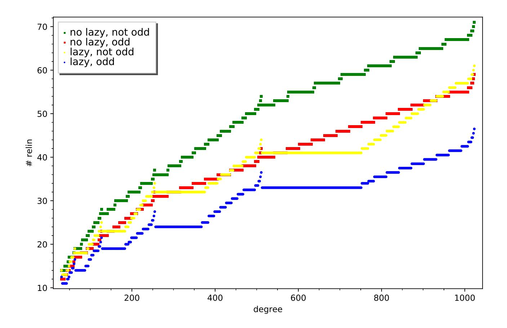
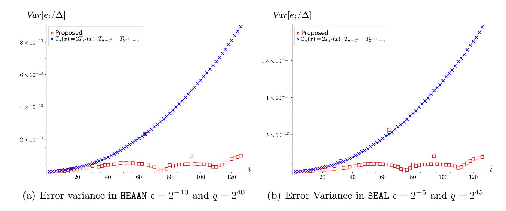
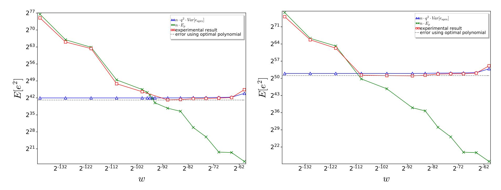
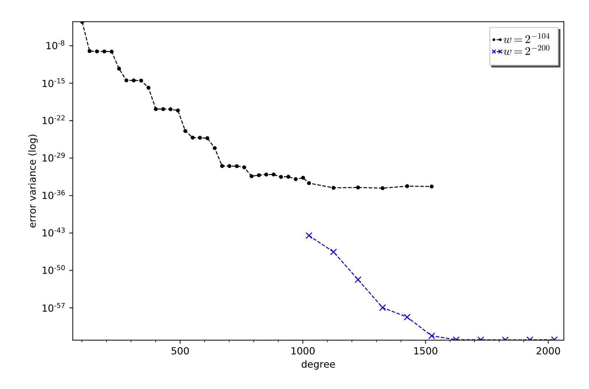

{0}------------------------------------------------

## High-Precision Bootstrapping for Approximate Homomorphic Encryption by Error Variance Minimization

Yongwoo Lee1,2, Joon-Woo Lee<sup>2</sup> , Young-Sik Kim<sup>3</sup> , Yongjune Kim<sup>4</sup> , Jong-Seon No<sup>2</sup> , and HyungChul Kang<sup>1</sup>

- <sup>1</sup> Samsung Advanced Institute of Technology, Suwon, Republic of Korea {yw0803.lee, hc1803.kang}@samsung.com
- <sup>2</sup> Department of Electrical and Computer Engineering, INMC, Seoul National University, Seoul, Korea

joonwoo3511@ccl.snu.ac.kr, jsno@snu.ac.kr

<sup>3</sup> Department of Information and Communication Engineering, Chosun University, Gwangju, Korea

iamyskim@chosun.ac.kr

<sup>4</sup> Department of Electrical Engineering and Computer Science, DGIST, Daegu, Korea yjk@dgist.ac.kr

March 1, 2022

#### Abstract

The Cheon-Kim-Kim-Song (CKKS) scheme (Asiacrypt'17) is one of the most promising homomorphic encryption (HE) schemes as it enables privacy-preserving computing over real (or complex) numbers. It is known that bootstrapping is the most challenging part of the CKKS scheme. Further, homomorphic evaluation of modular reduction is the core of the CKKS bootstrapping, but as modular reduction is not represented by the addition and multiplication of complex numbers, approximate polynomials for modular reduction should be used. The bestknown techniques (Eurocrypt'21) use a polynomial approximation for trigonometric functions and their composition. However, all the previous methods are based on an indirect approximation, and thus it requires lots of multiplicative depth to achieve high accuracy. This paper proposes a direct polynomial approximation of modular reduction for CKKS bootstrapping, which is optimal in error variance and depth. Further, we propose an efficient algorithm, namely the lazy baby-step giant-step (BSGS) algorithm, to homomorphically evaluate the approximate polynomial, utilizing the lazy relinearization/rescaling technique. The lazy-BSGS reduces the computational complexity by half compared to the ordinary BSGS algorithm. The performance improvement for the CKKS scheme by the proposed algorithm is verified by implementation over HE libraries. The implementation results show that the proposed method has a multiplicative depth of 10 for modular reduction to achieve state-of-the-art accuracy, while the previous methods have depths of 11 to 12. Moreover, we achieve higher accuracies within a small multiplicative depth, for example, 93-bit within multiplicative depth 11.

Keywords: Bootstrapping, Cheon-Kim-Kim-Song (CKKS) scheme, Fully homomorphic encryption (FHE), Privacy-preserving machine learning (PPML), Signal-to-noise ratio (SNR).

{1}------------------------------------------------

## Contents

| 1 |     | Introduction                                                                 | 1  |  |  |  |  |  |  |  |  |  |  |  |
|---|-----|------------------------------------------------------------------------------|----|--|--|--|--|--|--|--|--|--|--|--|
|   | 1.1 | Our Contributions<br>                                                        | 1  |  |  |  |  |  |  |  |  |  |  |  |
|   | 1.2 | Related Works<br>                                                            | 2  |  |  |  |  |  |  |  |  |  |  |  |
|   | 1.3 | Organization of This Paper<br>                                               | 3  |  |  |  |  |  |  |  |  |  |  |  |
| 2 |     | Preliminaries                                                                | 3  |  |  |  |  |  |  |  |  |  |  |  |
|   | 2.1 | Basic Notation<br>                                                           | 3  |  |  |  |  |  |  |  |  |  |  |  |
|   | 2.2 | The CKKS Scheme                                                              | 4  |  |  |  |  |  |  |  |  |  |  |  |
|   | 2.3 | Signal-to-Noise Ratio Perspective of the CKKS Scheme<br>                     | 6  |  |  |  |  |  |  |  |  |  |  |  |
| 3 |     | Bootstrapping of the CKKS Scheme                                             | 6  |  |  |  |  |  |  |  |  |  |  |  |
|   | 3.1 | Outline of the CKKS Bootstrapping<br>                                        | 6  |  |  |  |  |  |  |  |  |  |  |  |
|   | 3.2 | Polynomial Approximation of Modular Reduction                                | 7  |  |  |  |  |  |  |  |  |  |  |  |
|   | 3.3 | Baby-Step Giant-Step Algorithms                                              | 7  |  |  |  |  |  |  |  |  |  |  |  |
| 4 |     | Optimal Approximate Polynomial of Modular Reduction for Bootstrapping of     |    |  |  |  |  |  |  |  |  |  |  |  |
|   |     | the CKKS Scheme                                                              |    |  |  |  |  |  |  |  |  |  |  |  |
|   | 4.1 | Error Variance-Minimizing Polynomial Approximation<br>                       | 8  |  |  |  |  |  |  |  |  |  |  |  |
|   | 4.2 | Optimality of the Proposed Direct Approximate Polynomial                     | 9  |  |  |  |  |  |  |  |  |  |  |  |
|   | 4.3 | Noisy Polynomial Basis and Polynomial Evaluation in the CKKS Scheme<br>      | 10 |  |  |  |  |  |  |  |  |  |  |  |
|   | 4.4 | Optimal Approximate Polynomial for Bootstrapping and the Magnitude of Its Co |    |  |  |  |  |  |  |  |  |  |  |  |
|   |     | efficients                                                                   | 11 |  |  |  |  |  |  |  |  |  |  |  |
|   | 4.5 | Statistical Characteristics of Modular Reduction<br>                         | 12 |  |  |  |  |  |  |  |  |  |  |  |
| 5 |     | Lazy Baby-Step Giant-Step Algorithm                                          | 14 |  |  |  |  |  |  |  |  |  |  |  |
|   | 5.1 | Reducing Error and Complexity Using Odd Function Property<br>                | 14 |  |  |  |  |  |  |  |  |  |  |  |
|   | 5.2 | Lazy Baby-Step Giant-Step Algorithm<br>                                      | 15 |  |  |  |  |  |  |  |  |  |  |  |
|   | 5.3 | Error Variance-Minimizing Approximate Polynomial for BSGS Algorithm<br>      | 18 |  |  |  |  |  |  |  |  |  |  |  |
|   | 5.4 | Basis Error Variance Minimization for Even-Degree Terms                      | 19 |  |  |  |  |  |  |  |  |  |  |  |
| 6 |     | Performance Analysis and Comparison                                          | 21 |  |  |  |  |  |  |  |  |  |  |  |
|   | 6.1 | Error Analysis<br>                                                           | 21 |  |  |  |  |  |  |  |  |  |  |  |
|   | 6.2 | Comparison of Bootstrapping and High-Precision Bootstrapping<br>             | 23 |  |  |  |  |  |  |  |  |  |  |  |
| 7 |     | Conclusion                                                                   | 24 |  |  |  |  |  |  |  |  |  |  |  |

{2}------------------------------------------------

## 1 Introduction

Homomorphic encryption (HE) is a specific class of encryption schemes that enables computation over encrypted data. The Cheon-Kim-Kim-Song (CKKS) scheme [1] is one of the highlighted fully homomorphic encryption (FHE) schemes as it supports efficient computation on real (or complex) numbers, which are the usual data type for many applications such as deep learning. As the other HE schemes are designed for different domains, the CKKS scheme is known to be the most efficient for real numbers. For example, Brakerski-Fan-Vercauteren (BFV) [2, 3, 4] and Brakerski-Gentry-Vaikuntanathan (BGV) [5] schemes are designed for integer messages in Zq, and FHEW/TFHE [6, 7, 8] are designed for binary circuits.

Gentry's blueprint of bootstrapping provides the idea of homomorphic re-encryption of ciphertext. In CKKS bootstrapping, the modular reduction by an integer is performed homomorphically. However, the modular reduction function is not represented by the addition and multiplication of complex numbers. Hence, an approximate polynomial of trigonometric functions is used in prior arts [9, 10, 11, 12, 13], which have two limitations in practice: i) these are indirect approximations, which require larger multiplicative depths, and ii) the measure of approximation error was minimax-base (minimizing the upper bound of the approximation error). This paper shows that the minimax polynomial does not guarantee the minimax bootstrapping error. We propose that the error variance would be a better measure, especially for bootstrapping.

The CKKS scheme provides the trade-off between the efficiency and precision of messages as encrypted data of the CKKS scheme has an error. Errors in encrypted data are propagated and added along with homomorphic operations. Hence, the error should be carefully measured when we design a circuit for efficiency and security in CKKS. Moreover, as attacks against CKKS have recently been proposed [14, 15, 16], reducing errors becomes more crucial when using the CKKS scheme to mitigate the risk of the attacks.

## 1.1 Our Contributions

This paper contains contributions to the high-precision bootstrapping of the CKKS scheme. We propose i) a method to find the optimal approximate polynomial for the modular reduction in bootstrapping and ii) an efficient algorithm for homomorphic evaluation of polynomials.

First, we propose the optimal approximate polynomial for CKKS bootstrapping in the aspect of signal-to-noise ratio (SNR), which improves the precision of CKKS bootstrapping. As a result, we can reserve more levels after bootstrapping while achieving the best-known precision, where the level of a ciphertext is defined as the number of successive multiplications that can be performed to the ciphertext without bootstrapping. The proposed approximate polynomial has the following three features: i) an optimal measure of error for CKKS bootstrapping: we show that an approximate polynomial that achieves the least error variance is also optimal for CKKS bootstrapping in the aspect of SNR. ii) a direct approximation: the approximate polynomial of modular reduction is directly obtained from the whole polynomial space of degree n, i.e., Pn, using the error varianceminimizing method, and thus it has less multiplicative depths compared to the previous methods (In other words, less bootstrapping is required for the same circuit.) iii) reduction of error from noisy calculation: in the polynomial evaluation over CKKS, each polynomial basis has an error. Unlike previous bootstrapping methods, the proposed method minimizes the errors introduced by noisy basis as well as the approximation error.

Second, we propose a novel variant of the baby-step giant-step (BSGS) algorithm, called the

{3}------------------------------------------------

lazy-BSGS algorithm, which reduces the number of relinearizations by half compared to ordinary BSGS algorithms. The proposed lazy-BSGS algorithm is more efficient for higher degree polynomial. The proposed approximate polynomial has a high degree, while the previous methods use a composition of small-degree polynomials. Thus, the lazy-BSGS algorithm makes the evaluation time of the proposed polynomial comparable to the previous methods.

Note for the First Contribution Previous methods utilized the minimax approximate polynomial of modular reduction function for bootstrapping to reduce the bootstrapping error [11, 13]. However, in CKKS bootstrapping, a linear transformation on slot values, called SlotToCoeff, is performed, and its resulting ciphertext is the sum of thousands of noisy values. Since many noisy values are added, the upper bound on the final error value is loose. Hence, we propose to minimize the error variance instead of the upper bound on the error.

Besides the approximation error, each polynomial basis also has an error in CKKS, and it is amplified when we multiply large coefficients of the approximate polynomial. The previous approximation method could not control these errors with the approximate polynomial coefficients. Thus, they used the trigonometric function and double angle formula instead, to make the approximation degree small [11, 12, 13]. The indirect approximation results in larger multiplicative depths. It is preferred to reserve more levels after bootstrapping as it can reduce the number of bootstrapping in the whole system; moreover, the number of remaining levels after bootstrapping is also important for an efficient circuit design of algorithms using CKKS, for example, in [17], the depth of activation layer is optimized for the levels after bootstrapping. The proposed method minimizes the basis error variance as well as the approximation error variance, so it has less multiplicative depth compared to the previous composition of trigonometric functions. To the best of our knowledge, this is the first method to find the optimal approximate polynomial that minimizes both the approximation error and the error in the basis at the same time.

We show that from the learning with error (LWE) assumption, the input of approximate polynomial follows a distribution similar to Irwin-Hall distribution, regardless of the security. The proposed method exploits the property to improve the approximation. Also, we derive an analytical solution for our error variance-minimizing approximate polynomial, while the previous minimax approximate polynomial was obtained by iterative algorithms [11, 13].

Note for the Second Contribution As rescaling and relinearization introduce additional errors, it is desirable to perform them as late as possible. In addition, the number of rescalings/relinearizations is also reduced by reordering the operations to delay the relinearization/rescaling; which improves runtime. This technique, the so-called lazy rescaling/relinearization technique, has been applied to reduce the computational complexity in [18, 19, 20]. We propose a rigorous analysis on lazy rescaling and relinearization in the BSGS algorithm. Moreover, we propose the algorithm to find the optimal approximate polynomial, which fits the lazy-BSGS algorithm for odd functions.

#### 1.2 Related Works

#### Bootstrapping of the CKKS Scheme

After the CKKS bootstrapping was firstly proposed in [9], the Chebyshev interpolation has been applied to the homomorphic evaluation of modular reduction [10, 11]. Then, a technique for direct approximation was proposed using the least squares method [21] and Lagrange interpolation [22]. 

{4}------------------------------------------------

However, the magnitudes of coefficients of those approximate polynomials are too large. The algorithm to find minimax approximate polynomial using improved multi-interval Remez algorithm and the use of arcsin to reduce approximation error of the modular reduction were presented in [13]. The bootstrapping for the non-sparse-key CKKS scheme was proposed, and the computation time for homomorphic linear transformations was significantly improved by using double hoisting in [12]. Julta and Manohar proposed to use sine series approximation [23], but as there exists a linear transformation from sine series {sin(kx)} to power of sine functions n sin(x) k o , this method is also based on trigonometric functions.

#### Attacks on the CKKS Scheme and High-Precision Bootstrapping

An attack to recover the secret key using the error pattern after decryption was recently proposed by Li and Micciancio [16], and thus it becomes more crucial to reduce the error in CKKS. One possible solution to this attack is to add a huge error, so-called the noise flooding technique [24] or perform rounding after decryption to make the plaintext error-free [16]. In order to use the noise flooding technique, the CKKS scheme requires much higher precision, and the bootstrapping error is the bottleneck of precision. Although a lot of research is required on how to exploit the bootstrapping error for cryptanalysis of CKKS, the high-precision bootstrapping is still an interesting topic [12, 13, 21, 23].

## 1.3 Organization of This Paper

The remainder of the paper is organized as follows. In Section 2, we provide the necessary notations and SNR perspective on error. The CKKS scheme and its bootstrapping algorithm are summarized in Section 3. We provide a new method to find optimal direct approximate polynomials for the CKKS scheme in Section 4 and also show its optimality. Section 5 provides the novel lazy-BSGS algorithm for the efficient evaluation of approximate polynomial for CKKS bootstrapping. The implementation results and comparison for precision and timing performance for the CKKS bootstrapping are given in Section 6. Finally, we conclude the paper in Section 7.

## 2 Preliminaries

## 2.1 Basic Notation

Vectors are denoted in boldface, such as v, and all vectors are column vectors. Matrices are denoted by boldfaced capital letters, i.e., M. We denote the inner product of two vectors by h·, ·i or simply ·. d·c, b·c, and d·e denote the rounding, floor, and ceiling functions, respectively. [m]<sup>q</sup> is the modular reduction of an integer m, the remainder of m dividing by q. x ← D denotes the sampling x according to a distribution D. When a set is used instead of distribution, x is sampled uniformly at random among the set elements. Random variables are denoted by capital letters such as X. E[X] and V ar[X] denote the mean and variance of random variable X, respectively. For a function f, V ar[f(X)] can be simply denoted by V ar[f]. kak<sup>2</sup> and kak<sup>∞</sup> denote L-2 norm and infinity norm, and when the input is a polynomial, those denote the norm of coefficient vector. We denote the supreme norm of a function kfksup := supt∈D |f(t)|, D is the domain.

Let ΦM(X) be the M-th cyclotomic polynomial of degree N, and when M is a power of two, M = 2N, and ΦM(X) = X<sup>N</sup> + 1. Let R = Z/ hΦM(X)i be the ring of integers of a number field 

{5}------------------------------------------------

 $S = \mathbb{Q}/\langle \Phi_M(X) \rangle$ , where  $\mathbb{Q}$  is the set of rational numbers and we write  $\mathcal{R}_q = \mathcal{R}/q\mathcal{R}$ . A polynomial  $a(X) \in \mathcal{R}$  can be denoted by a by omitting X when it is obvious. Since the multiplicative depth of a circuit is crucial in CKKS, from here on, the multiplicative depth is referred to as depth.

#### 2.2 The CKKS Scheme

The CKKS scheme and its residual number system (RNS) variants [11, 25] provide operations on encrypted complex numbers, which are done by the canonical embedding and its inverse. Recall that the canonical embedding Emb of  $a(X) \in \mathbb{Q}/\langle \Phi_M(X) \rangle$  into  $\mathbb{C}^N$  is the vector of the evaluation values of a at the roots of  $\Phi_M(X)$  and  $\mathsf{Emb}^{-1}$  denotes its inverse. Let  $\pi$  denote a natural projection from  $\mathbb{H} = \{(z_j)_{j \in \mathbb{Z}_M^*} : z_j = \overline{z_{-j}}\}$  to  $\mathbb{C}^{N/2}$ , where  $\mathbb{Z}_M^*$  is the multiplicative group of integer modulo M. The encoding and decoding are defined as follows.

•  $Ecd(z; \Delta)$ : For an (N/2)-dimensional vector z, the encoding returns

$$m(X) = \operatorname{Emb}^{-1}\left(\left\lfloor \Delta \cdot \pi^{-1}(\boldsymbol{z})\right\rceil_{\operatorname{Emb}(\mathcal{R})}\right) \in \mathcal{R},$$

where  $\Delta$  is the scaling factor and  $\lfloor \cdot \rceil_{\mathsf{Emb}(\mathcal{R})}$  denotes the discretization into an element of  $\mathsf{Emb}(\mathcal{R})$ .

•  $\mathsf{Dcd}(m; \Delta)$ : For an input polynomial  $m(X) \in \mathcal{R}$ , output a vector

$$z = \pi(\Delta^{-1} \cdot \operatorname{Emb}(m)) \in \mathbb{C}^{N/2},$$

where its entry of index j is given as  $z_j = \Delta^{-1} \cdot m(\zeta_M^j)$  for  $j \in T$ ,  $\zeta_M$  is the M-th root of unity, and T is a multiplicative subgroup of  $\mathbb{Z}_M^*$  satisfying  $\mathbb{Z}_M^*/T = \{\pm 1\}$ . Alternatively, this can be basically represented by multiplication by an  $N/2 \times N$  matrix  $\mathbf{U}$  whose entries are  $\mathbf{U}_{ji} = \zeta_j^i$ , where  $\zeta_j \coloneqq \zeta_M^{5j}$ .

For a real number  $\sigma$ ,  $\mathcal{DG}(\sigma^2)$  denotes the distribution in  $\mathbb{Z}^N$ , whose entries are sampled independently from the discrete Gaussian distribution of variance  $\sigma^2$ .  $\mathcal{HWT}(h)$  is the set of signed binary vectors in  $\{0,\pm 1\}^N$  with Hamming weight h. Suppose that we have ciphertexts of level l for  $0 \leq l \leq L$ .

The RNS-CKKS scheme performs all operations in RNS. The ciphertext modulus  $Q_l = q \cdot \prod_{i=1}^l p_i$  is used, where  $p_i$ 's are chosen as primes that satisfy  $p_i = 1 \pmod{2N}$  to support efficient number theoretic transform (NTT). We note that  $Q_0 = q$  is greater than p as the final message's coefficients should not be greater than the ciphertext modulus q. For a faster computation, we use the hybrid key switching technique in [11]. First, for predefined dnum, a small integer, we define partial products  $\left\{\tilde{Q}_j\right\}_{0 \leq j < \text{dnum}} = \left\{\prod_{i=j\alpha}^{(j+1)\alpha-1} p_i\right\}_{0 \leq j < \text{dnum}}$ , for a small integer  $\alpha = \lceil (L+1)/\text{dnum} \rceil$ . For a ciphertext with level l and  $\text{dnum}' = \lceil (l+1)/\alpha \rceil$ , we define [11]

$$\begin{split} \mathcal{W}\mathcal{D}_l(a) &= \left( \left[ a \frac{\tilde{Q}_0}{Q_l} \right]_{\tilde{Q}_0}, \cdots, \left[ a \frac{\tilde{Q}_{\mathsf{dnum'}-1}}{Q_l} \right]_{\tilde{Q}_{\mathsf{dnum'}-1}} \right) \in \mathcal{R}^{\mathsf{dnum'}}, \\ \mathcal{P}\mathcal{W}_l(a) &= \left( \left[ a \frac{Q_l}{\tilde{Q}_0} \right]_{q_l}, \cdots, \left[ a \frac{Q_l}{\tilde{Q}_{\mathsf{dnum'}-1}} \right]_{q_l} \right) \in \mathcal{R}^{\mathsf{dnum'}}_{Q_l}. \end{split}$$

Then, for any  $(a, b) \in \mathcal{R}^2_{Q_l}$ , we have

$$\langle \mathcal{WD}_l(a), \mathcal{PW}_l(b) \rangle = a \cdot b \pmod{Q_l}$$
.

Then, the operations in the RNS-CKKS scheme are defined as follows:

{6}------------------------------------------------

- KeyGen $(1^{\lambda})$ :
  - Given the security parameter  $\lambda$ , we choose a power-of-two M, an integer h, an integer P, a real number  $\sigma$ , and a maximum ciphertext modulus Q, such that  $Q \geq Q_L$ .
  - Sample the following values:  $s \leftarrow \mathcal{HWT}(h)$ .
  - The secret key is sk := (1, s).
- KSGen<sub>sk</sub>(s'): For auxiliary modulus  $P = \prod_{i=0}^k p_i' \approx \max_j \tilde{Q}_j$ , sample  $a_k' \leftarrow \mathcal{R}_{PQ_L}$  and  $e_k' \leftarrow \mathcal{DG}(\sigma^2)$ . Output the switching key

$$\mathsf{swk} \coloneqq (\mathsf{swk}_0, \mathsf{swk}_1) = (\left\{b_k'\right\}_{k=0}^{\mathsf{dnum}'-1}, \left\{a_k'\right\}_{k=0}^{\mathsf{dnum}'-1}) \in \mathcal{R}_{PQ_L}^{2 \times \mathsf{dnum}'},$$

where  $b'_k = -a'_k s + e'_k + P \cdot \mathcal{PW}(s')_k \pmod{PQ_L}$ .

- Set the evaluation key as  $evk := KSGen_{sk}(s^2)$ .
- $\mathsf{Enc}_{\mathsf{sk}}(m)$ : Sample  $a \leftarrow \mathcal{R}_{Q_L}$  and  $e \leftarrow \mathcal{DG}(\sigma^2)$ . The output ciphertext is

$$\mathsf{ct} = (-a \cdot s + e + m, a) \pmod{Q_L},$$

where sk = (1, s). There is also a public-key encryption method [1], but omitted here.

- $Dec_{sk}(ct)$ : Output  $\bar{m} = \langle ct, sk \rangle$ .
- $\mathsf{Add}(\mathsf{ct}_1,\mathsf{ct}_2)$ : For  $\mathsf{ct}_1,\mathsf{ct}_2 \in \mathcal{R}^2_{Q_l}$ , output  $\mathsf{ct}_{\mathsf{add}} = \mathsf{ct}_1 + \mathsf{ct}_2 \pmod{Q_l}$ .
- $\mathsf{Mult}(\mathsf{ct}_1,\mathsf{ct}_2)$ : For  $\mathsf{ct}_1 = (b_1,a_1)$  and  $\mathsf{ct}_2 = (b_2,a_2) \in \mathcal{R}^2_{Q_l}$ , return

$$\mathsf{ct}_{\mathsf{mult}} = (d_0, d_1, d_2) \coloneqq (b_1 b_2, a_1 b_2 + a_2 b_1, a_1 a_2) \pmod{Q_l}.$$

- $\mathsf{RL}_{\mathsf{evk}}(d_0, d_1, d_2)$ : For a three-tuple ciphertext  $(d_0, d_1, d_2)$  corresponding to secret key  $(1, s, s^2)$ , return  $(d_0, d_1) + \mathsf{KS}_{\mathsf{evk}}((0, d_2))$ .
- $\mathsf{cAdd}(\mathsf{ct}_1, \boldsymbol{a}; \Delta)$ : For  $\boldsymbol{a} \in \mathbb{C}^{N/2}$  and a scaling factor  $\Delta$ , output  $\mathsf{ct}_{\mathsf{cadd}} = \mathsf{ct} + (\mathsf{Ecd}(\boldsymbol{a}; \Delta), 0)$ .
- $\mathsf{cMult}(\mathsf{ct}_1, \boldsymbol{a}; \Delta)$ : For  $\boldsymbol{a} \in \mathbb{C}^{N/2}$  and a scaling factor  $\Delta$ , output  $\mathsf{ct}_{\mathsf{cmult}} = \mathsf{Ecd}(\boldsymbol{a}; \Delta) \cdot \mathsf{ct}$ .
- $\mathsf{RS}(\mathsf{ct})$ : For  $\mathsf{ct} \in \mathcal{R}^2_{Q_l}$ , output  $\mathsf{ct}_{\mathsf{RS}} = \lfloor p_l^{-1} \mathsf{ct} \rceil \pmod{q_{l-1}}$ .
- $\mathsf{KS}_{\mathsf{swk}}(\mathsf{ct})$ : For  $\mathsf{ct} = (b, a) \in \mathcal{R}^2_{Q_l}$  and  $\mathsf{swk} \coloneqq (\mathsf{swk}_0, \mathsf{swk}_1)$ , output

$$\mathsf{ct}_{\mathsf{KS}} = \left(b + \left\lfloor \frac{\langle \mathcal{WD}_l(a), \mathsf{swk}_0 \rangle}{P} \right\rceil, \left\lfloor \frac{\langle \mathcal{WD}_l(a), \mathsf{swk}_1 \rangle}{P} \right\rceil \right) (\bmod \ Q_l) \,.$$

The key-switching techniques are used to provide various operations such as complex conjugate and rotation. To remove the error introduced by approximate scaling factors, one can use different scaling factors for each level as given in [26], or we can use the scale-invariant method proposed in [12] for polynomial evaluation. We note that RNS-HEAAN and SEAL are (dnum = 1) and (dnum = L + 1) cases, respectively, and Lattigo supports for arbitrary dnum.

{7}------------------------------------------------

#### 2.3 Signal-to-Noise Ratio Perspective of the CKKS Scheme

There has been extensive research on noisy media in many areas such as wireless communications and data storage. In this perspective, the CKKS scheme can be considered as a noisy media; encryption and decryption correspond to transmission and reception, respectively. The message in a ciphertext is the signal, and the final output has additive errors due to ring-LWE (RLWE) security, rounding, and approximation.

The SNR is the most widely-used measure of signal quality, which is defined as the ratio of the signal power to the noise power as

$$SNR = \frac{E[S^2]}{E[N^2]},$$

where S and N denote the signal (message) and noise (error), respectively. As shown in the definition, the higher SNR represents the better quality.

A simple way to increase SNR is to increase the signal power, but it would be limited due to regulatory or physical constraints. The CKKS scheme has the same problem; a larger scaling factor should be multiplied to the message to increase the message power, but if one uses a larger scaling factor, the ciphertext level decreases, or larger parameters should be used for security. Hence, to increase SNR, it is beneficial to reduce the noise power in the CKKS scheme rather than increasing the signal power.

Error estimation of the CKKS scheme so far has been focused on the high-probability upper bound of the error after several operations [1, 9] and also minimax for approximation [13]. However, the bound becomes quite loose as the homomorphic operation continues, and its statistical significance may diminish. Thus, we maximize SNR in this paper, which is equivalent to minimizing error variance when the scaling factor is fixed.

## 3 Bootstrapping of the CKKS Scheme

## 3.1 Outline of the CKKS Bootstrapping

There are extensive studies for bootstrapping of the CKKS scheme [9, 10, 11, 12, 13, 21, 22, 23]. The CKKS bootstrapping consists of the following four steps: Modraise, CoeffToSlot, EvalMod, and SlotToCoeff.

Modulus Raising (Modrase). Modrase increases the ciphertext modulus to a larger modulus. Let ct be the ciphertext satisfying  $m(X) = [\langle \mathsf{ct}, \mathsf{sk} \rangle]_q$ . Then we have  $t(X) = \langle \mathsf{ct}, \mathsf{sk} \rangle = qI(X) + m(X) \equiv m(X) \pmod{q}$  for  $I(X) \in \mathcal{R}$  with a high-probability bound  $||I(X)||_{\infty} < K = \mathcal{O}(\sqrt{h})$ . The following procedure aims to calculate the remaining coefficients of t(X) when dividing by q.

Homomorphic Evaluation of Encoding (COEFFTOSLOT). Homomorphic operations are performed in plaintext slots, but we need component-wise operations on coefficients. Thus, to deal with t(X), we should put polynomial coefficients in plaintext slots. In COEFFTOSLOT step,  $\mathsf{Emb}^{-1} \circ \pi^{-1}$  is performed homomorphically using matrix multiplication [9], or FFT-like hybrid method [10]. Then, we have two ciphertexts encrypting  $z'_0 = (t_0, \ldots, t_{\frac{N}{2}-1})$  and  $z'_1 = (t_{\frac{N}{2}}, \ldots, t_{N-1})$  (when the number of slots is small, we can put  $z'_0$  and  $z'_1$  in a ciphertext, see [9]), where  $t_j$  denotes the j-th coefficient of t(X). The matrix multiplication is composed of three steps [9]: i) rotate ciphertexts, ii) multiply diagonal components of matrix to the rotated ciphertexts, and iii) sum up the ciphertexts.

Evaluation of the Approximate Modular Reduction (EVALMOD). An approximate evaluation of the modular reduction function is performed in this step. As additions and multiplications

{8}------------------------------------------------

cannot represent the modular reduction function, an approximate polynomial for  $[\cdot]_q$  is used. For approximation, it is desirable to control the message size to ensure  $m_i \leq \epsilon \cdot q$  for a small  $\epsilon$  [9].

Homomorphic Evaluation of Decoding (SlotToCoeff). SlotToCoeff is the inverse operation of CoeffToSlot. Since the matrix elements do not have to be precise as much in CoeffToSlot, we can use a smaller scaling factor here [12]. In SlotToCoeff, the ciphertext is multiplied by the CRT matrix  $\mathbf{U}$ , whose elements have magnitudes of one. Thus, the N errors in slots are multiplied by a constant of size one and then added.

## 3.2 Polynomial Approximation of Modular Reduction

Previous works approximated the modular reduction function as  $\frac{q}{2\pi}\sin\left(\frac{2\pi t}{q}\right)$  [9, 10, 11]. Approximate polynomial of sine function is found by using Taylor expansion of exponent function and  $e^{it} = \cos(t) + i \cdot \sin(t)$  in [9]. The Chebyshev approximation of sine function improved the approximation in [10]. The modified Chebyshev approximation in cosine function and the double-angle formula reduced the error and evaluation time in [11]. However, in these approaches, the sine function is used, and thus there is still the fundamental approximation error, that is,

$$\left| m - \frac{q}{2\pi} \sin\left(2\pi \frac{m}{q}\right) \right| \le \frac{q}{2\pi} \cdot \frac{1}{3!} \left(\frac{2\pi |m|}{q}\right)^3.$$

Direct-approximation methods were proposed in [21, 22], but their coefficients are large and amplify errors of polynomial basis. A composition with inverse sine function that offers a trade-off between the precision and the remaining level was proposed to remove the fundamental approximation error between the sine function and the modular reduction [13]. However, the evaluation of inverse sine function has a considerable multiplicative depth.

Those prior researches tried to find the minimax approximate polynomial  $p_n$ , which minimizes  $||f - p_n||_{\text{sup}}$ , where f is target function such as sine function, rather modular reduction function [9, 10, 11, 13]. Lee *et al.* proposed the multi-interval Remez algorithm [13], which is an iterative method to find minimax approximate polynomial of an arbitrary piece-wise continuous function.

## 3.3 Baby-Step Giant-Step Algorithms

There are several baby-step giant-step algorithms for a different purpose in the context of HE. In this paper, BSGS only refers to the polynomial evaluation algorithm proposed in [11] and its variants. The BSGS algorithm is presented in Algorithm 1 composed of Setup, BabyStep, and GiantStep. Setup calculates all the polynomial bases required to evaluate the given polynomial. The GiantStep divides the input polynomial by a polynomial of degree  $2^ik$  and calls GiantStep recursively for its quotient and remainder, where  $i \leq \lfloor \log(\deg/k) \rfloor$  for an integer k, and deg is the degree of the polynomial. When the given polynomial has a degree less than k, it calls BabyStep, and it evaluates the given polynomial of a small degree, namely a baby polynomial.

Originally, Han and Ki proposed to use a power-of-two k [11], and Lee  $et\ al.$  generalized k to an arbitrary even number and proposed to omit even-degree terms for odd polynomial, which reduces the number of ciphertext-ciphertext multiplications [13]. The number of ciphertext-ciphertext multiplications is given as

$$k - 2 + l + 2^l$$

<sup>&</sup>lt;sup>1</sup>This technique appears in their first version in Cryptology ePrint Archive.

{9}------------------------------------------------

#### Algorithm 1 BSGS Algorithm [11, 13]

```
Instance: A ciphertext ct of t, a polynomial p(X) = \sum_{i} c_{i} \cdot T_{i}(X).
Output: A ciphertext encrypting p(t).
 1: Let l be the smallest integer satisfying 2^{l}k > n for an even number k.
 2: procedure SetUP(\mathsf{ct}, l, k)
          \mathsf{ct}_i \leftarrow \text{encryption of } T_i(t)
  3:
          \mathsf{ct}_{2^i k} \leftarrow \text{encryption of } T_{2^i k}(t)
                                                                                                                        \triangleright for 0 \le i < l.
  4:
  5: end procedure
 6: procedure BABYSTEP(p(X), \{\mathsf{ct}_i\}, k)
          return \sum_{j} c_j \cdot \mathsf{ct}_j
                                                                                                                 \triangleright baby polynomials.
  7:
 8: end procedure
 9: procedure GIANTSTEP(p(X), \{\mathsf{ct}_i\}, l, k)
          if deg(p) < k then
10:
               return BABYSTEP(p(X), \{\mathsf{ct}_i\}, k)
11:
          end if
12:
          Find q(X), r(X) s.t. p(X) = q(X) \cdot T_{2^{i}k}(X) + r(X)
13:
          \operatorname{ct}_q \leftarrow \operatorname{GIANTSTEP}(q(X), \{\operatorname{ct}_i\}, l, k)
14:
          \mathsf{ct}_r \leftarrow \mathsf{GIANTSTEP}(r(X), \{\mathsf{ct}_i\}, l, k)
15:
          return \mathsf{ct}_q \cdot \mathsf{ct}_{2^i k} + \mathsf{ct}_r
16:
17: end procedure
```

in general, and

$$\lfloor \log (k-1) \rfloor + k/2 - 2 + l + 2^l$$

for odd polynomials, where  $\deg < k \cdot 2^l$  is satisfied. Also, Bossuat *et al.* improved to do more recursion for high-degree terms [12] to optimize the multiplicative depth. In the BSGS algorithm of Bossuat *et al.*, we can evaluate a polynomial of degree up to  $2^d - 1$  within multiplicative depth d by applying  $O(\log k)$  additional multiplications.

# 4 Optimal Approximate Polynomial of Modular Reduction for Bootstrapping of the CKKS Scheme

This section proposes a new method to find the optimal approximate polynomial of the modular reduction function for the CKKS bootstrapping, considering the noisy computation nature of the CKKS Scheme. The optimality of the proposed approximate polynomial is proved, and statistics of input for an approximate polynomial are also analyzed to improve the approximation.

## 4.1 Error Variance-Minimizing Polynomial Approximation

We use the variance of error as the objective function for the proposed polynomial approximation and show that it is also optimal for CKKS bootstrapping. As described later in the following subsections, the error in the noisy polynomial basis, namely the basis error, might be amplified by coefficients of the approximate polynomial. Thus, the magnitude of its coefficients should be small values, and using the generalized least square method, the optimal coefficient vector  $c^*$  of the

{10}------------------------------------------------

approximate polynomial is obtained as

$$c^* = \arg\min_{c} \left( Var[e_{\mathsf{aprx}}] + \sum_{i} w_i c_i^2 \right), \tag{1}$$

where  $e_{\mathsf{aprx}}$  is the approximation error, and the constant values  $w_i$  are determined by the basis error given by CKKS parameters such as key Hamming weight, number slots, and scaling factor.

We call the proposed approximate polynomial obtained by (1) as the error variance-minimizing approximate polynomial, and we prove that there exists an analytic solution. We note that when  $w_i$ 's are all zero, the approximate polynomial minimizes the variance of the approximation error, and  $w_i c_i^2$  terms minimize the variance of amplified basis error. The error variance-minimizing approximate polynomial is described in detail by taking bootstrapping as a specific example in the following subsection. It is worth noting that the approximation can be applied arbitrary function.

## 4.2 Optimality of the Proposed Direct Approximate Polynomial

In this subsection, we show that the proposed error variance-minimizing approximate polynomial is optimal for CKKS bootstrapping. It is optimal in the following aspects. First, we show that an approximate polynomial that minimizes the error variance after EVALMOD also minimizes the bootstrapping error variance, and thus it is optimal in terms of SNR. Next, we show that the direct approximation to the modular reduction allows a more accurate approximation than previous indirect approximations using trigonometric functions [9, 10, 11, 12, 13] for fixed multiplicative depth.

## Error-Optimality of the Proposed Approximate Polynomial in CKKS Bootstrapping

Here, we show that error variance-minimizing approximate polynomial guarantees the minimal error after bootstrapping in the aspect of SNR, while the minimax approach in [9, 10, 11, 12, 13] does not guarantee the minimax error after bootstrapping. In EVALMOD, the operations between different slots do not happen, and thus we can assume that the error in each slot is independent. The SLOTTOCOEFF is the homomorphic operation of decoding, and the decoding of m(X) is given as  $(m(\zeta_0), m(\zeta_1), \ldots, m(\zeta_{N/2-1}))$ . Hence, the error in the j-th slot after SLOTTOCOEFF is given as  $e_{\mathsf{boot},j}(\zeta_j) = \sum_{i=0}^{N-1} e_{\mathsf{mod},i} \cdot \zeta_j^i$  which is the sum of thousands of independent random variables, where  $e_{\mathsf{mod},i}$  denotes the error in the i-th slot after EVALMOD and  $|\zeta_j| = 1$ .

The minimax approximate polynomial minimizes  $||e_{\mathsf{aprx}}(t)||_{\mathsf{sup}}$  [10, 13]. In this case, we have  $e_{\mathsf{mod},i} = e_{\mathsf{aprx}}(t_i) + e_{\mathsf{noise},i}$ , where  $t_i$  is the *i*-th slot value after CoeffToSlot and  $e_{\mathsf{noise},i}$  is the random error by the noisy polynomial basis of CKKS. Hence, the minimax approximation minimizes  $\max\left(\left|e_{\mathsf{aprx}}(t_i)\cdot\zeta_j^i\right|\right) = ||e_{\mathsf{aprx}}(t_i)||_{\mathsf{sup}}$ , not  $\max\left(|e_{\mathsf{boot},j}|\right)$ . In other words, we observe that the final bootstrapping error is  $e_{\mathsf{boot},j}$ , and we have

$$\max\left(\left|e_{\mathsf{boot},j}\right|\right) = \max\left(\left|\sum_{i=0}^{N-1} e_{\mathsf{mod},i} \cdot \zeta_{j}^{i}\right|\right) = \max\left(\left|\sum_{i=0}^{N-1} \left(e_{\mathsf{aprx}}(t_{i}) + e_{\mathsf{noise},i}\right) \cdot \zeta_{j}^{i}\right|\right)$$

$$\leq \max\left(\left|\sum_{i=0}^{N-1} e_{\mathsf{aprx}}(t_{i}) \cdot \zeta_{j}^{i}\right|\right) + \max\left(\left|\sum_{i=0}^{N-1} e_{\mathsf{noise},i} \cdot \zeta_{j}^{i}\right|\right), \tag{2}$$

where

$$\max\left(\left|\sum_{i=0}^{N-1}e_{\mathsf{aprx}}(t_i)\cdot\zeta_j^i\right|\right)\leq \left\|\zeta_j^0\cdot e_{\mathsf{aprx}}\right\|_{\mathsf{sup}}+\dots+\left\|\zeta_j^{N-1}\cdot e_{\mathsf{aprx}}\right\|_{\mathsf{sup}}.$$

{11}------------------------------------------------

Hence, the minimax approximate polynomial does not guarantee the minimum infinity norm of bootstrapping error but provides an upper bound only for the approximation error term. Besides, it is challenging to optimize polynomial coefficients for noisy basis in the existing minimax approximation.

In contrast, the proposed error variance-minimizing approximate polynomial minimizes V ar[emod,j ]. Thus, it also minimizes the final bootstrapping error V ar[eboot,j ], as

$$Var[e_{\mathsf{boot},j}] = Var[e_{\mathsf{mod},0} \cdot \zeta_j^0] + \dots + Var[e_{\mathsf{mod},N-1} \cdot \zeta_j^{(N-1)}].$$

The above equation implies that minimizing the variance of the approximate error is optimal to reduce the bootstrapping error of the CKKS scheme in the aspect of SNR. Due to the characteristics of SlotToCoeff, we have the tight value of the variance of bootstrapping error, while the minimax provides an upper bound of infinity norm. In other words, we can optimize our objective function by the proposed error variance-minimizing approximate polynomial; meanwhile, the minimax approach does not optimize the bootstrapping error in their objective (the left-hand side of (2)) but it provides an upper bound instead.

#### Depth Optimality of Direct Approximation

As shown in (1), the proposed method approximates the target function directly, while the prior works approximate trigonometric functions [9, 10, 11, 12, 13]. Let Pdeg ⊂ C[X] be the set of all polynomials whose degree is less than or equal to deg. When we perform a direct approximation, the algorithm finds an approximate polynomial among all elements of Pdeg, and its multiplicative depth is dlog(deg)e.

When we use the approximation of trigonometric function, the search space of the approximation algorithm is much narrow. For example, as in [12, 13], assume that we use the double angle formula twice and approximate polynomial for cosine and arcsine of degree deg<sup>1</sup> and deg<sup>2</sup> , respectively. Then the search space is

$$\{f_2 \circ g \circ f_1 | f_1 \in P_{\mathsf{deg}_1}, f_2 \in P_{\mathsf{deg}_2}, \text{ and } g(x) = (x^2 - 1)^2 - 1\}.$$

We can see that the search space is much smaller than P4deg1deg<sup>2</sup> , and its multiplicative depth is dlog(deg<sup>1</sup> + 1)e + 2 + dlog(deg<sup>2</sup> + 1)e ≥ dlog(4deg1deg<sup>2</sup> + 1)e. Hence, the direct approximation in P4deg1deg<sup>2</sup> has more chance to find a better approximation as well as it has less multiplicative depth.

## 4.3 Noisy Polynomial Basis and Polynomial Evaluation in the CKKS Scheme

Let {φ0(x), φ1(x), . . . , φn(x)} denote a polynomial basis of degree n such that every φk(t) is odd for an odd k. When a polynomial p(x) = Pciφi(x) is evaluated homomorphically, it is expected that the result is p(x) + e for a small error e. In the CKKS scheme, there exists an error in encrypted data, and thus, each φi(x) contains independent ebasis,i, namely the basis error. Thus, the output is

$$\sum c_i(\phi_i(x) + e_{\mathsf{basis},i}) = p(x) + \sum c_i e_{\mathsf{basis},i}.$$

In general, Pciebasis,i is small as ebasis,i are small. However, when |c<sup>i</sup> P | are much greater than p(x), ciebasis,i dominates p(x).

{12}------------------------------------------------

The basis errors,  $e_{\mathsf{basis},i}$  are introduced by rescaling, key switching, and encryption errors, and due to LWE assumption, message and those errors are independent. The  $\phi_i(x)$ 's are usually obtained from smaller-degree polynomials, and thus there may be some correlation between  $e_{\mathsf{basis},i}$ 's. However, the relationship is very complicated, and thus, we assume that each  $e_{\mathsf{basis},i}$  is independent. Thus, the variance of  $\sum c_i \cdot e_{\mathsf{basis},i}$  is  $\sum c_i^2 \cdot Var(e_{\mathsf{basis},i})$  and  $w_i$  in (1) corresponds to  $Var(e_{\mathsf{basis},i})$ . This assumption is somewhat heuristic, but the experiments in Section 6 support that our approximation with this assumption obtains accurate approximations for bootstrapping in practice. In other words, we do not need exact distributions of  $e_{\mathsf{basis},i}$  in practice.

In conclusion, the magnitude of  $c_i$ 's should be controlled when we find an approximate polynomial. A high-degree approximate polynomial for modular reduction and piece-wise cosine function has large coefficients magnitude in previous works [13, 22]. There have been series of studies in approximate polynomials in the CKKS scheme [1, 10, 11, 12, 13, 21, 22], but the errors amplified by coefficients were not considered in the previous studies.

## 4.4 Optimal Approximate Polynomial for Bootstrapping and the Magnitude of Its Coefficients

The most depth-consuming and noisy part of bootstrapping is EVALMOD. In this subsection, we show how to find the optimal approximate polynomial for EVALMOD in the aspect of SNR. By scaling the modular reduction function  $[\cdot]_q$  by  $\frac{1}{q}$ , we define

$$f_{\text{mod}}: \bigcup_{i=-K+1}^{K-1} I_i \to [-\epsilon, \epsilon], \text{ that is, } f_{\text{mod}}(t) = t - i \text{ if } t \in I_i,$$

where  $I_i = [i - \epsilon, i + \epsilon]$  for an integer -K < i < K. Here,  $\epsilon$  denotes the ratio of the maximum coefficient of the message polynomial and the ciphertext modulus, that is,  $|m_i/q| \le \epsilon$ , where  $m_i$  denotes a coefficient of m(X). Let T be the random variable of input t of  $f_{\mathsf{mod}}(t)$ . Then, T = R + I, where R is the random variable of the rational part r, and I is the random variable of the integer part i. We note that  $\Pr_T(t) = \Pr_I(i) \cdot \Pr_R(r)$  is satisfied for t = r + i as i and r are independent and  $\bigcup_i I_i = [-\epsilon, \epsilon] \times \{0, \pm 1, \ldots, \pm (K - 1)\}$ , where  $\Pr_T, \Pr_I$ , and  $\Pr_R$  are the probability mass functions or probability density functions of T, I, and R, respectively.

The approximation error for t is given as

$$e_{\mathsf{aprx}}(t) = p(t) - f_{\mathsf{mod}}(t) = p(t) - (t-i),$$

where a polynomial  $p(t) = \sum c_i \phi_i(t)$  approximates  $f_{\text{mod}}(t)$ . We can set p(t) as an odd function because  $f_{\text{mod}}(t)$  is odd. Then the variance of  $e_{\text{aprx}}$  is given as

$$\begin{split} Var[e_{\mathsf{aprx}}] &= E[e_{\mathsf{aprx}}^2] = \int_t e_{\mathsf{aprx}}(t)^2 \cdot \Pr_T(t) \, dt \\ &= \sum_{-K < i < K} \Pr_I(i) \int_{t=i-\epsilon}^{i+\epsilon} e_{\mathsf{aprx}}(t)^2 \cdot \Pr_R(t-i) \, dt, \end{split}$$

where the mean of  $e_{\mathsf{aprx}}$  is zero by assuming that  $\Pr_T(t)$  is even. It is noted that the integral can be directly calculated or approximated by the sum of discretized values as in [21].

The basis error  $\sum c_i^2 \cdot Var(e_{\mathsf{basis},i})$  is also added as discussed in Subsection 4.3. We generalize  $Var(e_{\mathsf{basis},i})$  by  $w_i$ . Then, we find  $c^*$  such that

$$c^* = \arg\min_{c} \left( Var[e_{\mathsf{aprx}}] + \sum_{i} w_i c_i^2 \right), \tag{3}$$

{13}------------------------------------------------

and its solution satisfies

$$\nabla_{\mathbf{c}} \left( Var[e_{\mathsf{aprx}}] + \sum w_i c_i^2 \right) = 0,$$

where  $\mathbf{c} = (c_1, c_3, \dots, c_n)$  and  $\mathbf{w} = (w_1, w_3, \dots, w_n)$  are coefficient and weight constant vectors, respectively. We note that the objective function is convex.

It is noted that  $Var(e_{\mathsf{basis},i})$  may differ by i, and thus, a precise adjustment of the magnitude of polynomial coefficients can be made by multiple weight constants,  $w_i$ 's. The following theorem states that we can find the approximate polynomial for p(t) efficiently; the computation time of solving this system of linear equations is the same as that of finding an interpolation polynomial for given points. It will be faster than the improved multi-interval Remez algorithm [13], as the Remez algorithm requires an interpolation per each iteration.

**Theorem 1.** There exists a polynomial-time algorithm that finds the odd polynomial  $p(t) = \sum c_i \phi_i(t)$  satisfying

 $\operatorname{arg\,min}_{\boldsymbol{c}} \Big( Var[e_{\mathsf{aprx}}] + \sum w_i \boldsymbol{c}_i^2 \Big),$ 

when  $Pr_T(t)$  is an even function.

Proof. As  $e_{\mathsf{aprx}}$  is odd, we have  $E[e_{\mathsf{aprx}}] = 0$ , and thus it is satisfied that  $Var[e_{\mathsf{aprx}}] = E[e_{\mathsf{aprx}}^2] = E[f_{\mathsf{mod}}(t)^2] - 2E[f_{\mathsf{mod}}(t) \cdot p(t)] + E[p(t)^2]$ . By substituting  $p(t) = \sum c_i \phi_i(t)$ , we have

$$\frac{\partial}{\partial c_j} Var[e_{\mathsf{aprx}}] = -2E[f_{\mathsf{mod}}(t)\phi_j(t)] + 2\sum c_i \cdot E[\phi_i(t)\phi_j(t)].$$

The solution of the following system of linear equations,  $c^*$ , satisfies

$$\mathbf{c}^* = \arg\min_{\mathbf{c}} \left( Var[e_{\mathsf{aprx}}] + \sum_{i} w_i c_i^2 \right) :$$

$$(\mathbf{T} + \mathbf{wI}) \cdot \mathbf{c} = \mathbf{y},$$
(4)

where  $\boldsymbol{w}$  is a diagonal matrix where  $\boldsymbol{w}_{ii} = w_i$ ,

$$\mathbf{T} = \begin{bmatrix} E[\phi_1 \cdot \phi_1] & E[\phi_1 \cdot \phi_3] & \dots & E[\phi_1 \cdot \phi_n] \\ E[\phi_3 \cdot \phi_1] & E[\phi_3 \cdot \phi_3] & \dots & \vdots \\ \vdots & & \ddots & \vdots \\ E[\phi_n \cdot \phi_1] & E[\phi_n \cdot \phi_3] & \dots & E[\phi_n \cdot \phi_n] \end{bmatrix}, \text{ and } \mathbf{y} = \begin{bmatrix} E[f_{\mathsf{mod}} \cdot \phi_1] \\ E[f_{\mathsf{mod}} \cdot \phi_3] \\ \vdots \\ E[f_{\mathsf{mod}} \cdot \phi_n] \end{bmatrix}.$$

 $E[\phi_i \cdot \phi_j]$  and  $E[f_{\mathsf{mod}} \cdot \phi_i]$  are integral of polynomials, which are easily calculated. Also, the equation can be simplified by the linear transformation from monomial basis to  $\phi$ , and thus, the approximation of other functions is also easy.

#### 4.5 Statistical Characteristics of Modular Reduction

The input distribution of the proposed approximate polynomial, represented by  $\Pr_I$  and  $\Pr_R$ , is required to find  $\mathbf{T}$  and  $\mathbf{y}$ . Unfortunately, in HE, it is not always possible to utilize the message distribution as it might be related to security. However, we observe and analyze that the major part of the input distribution of approximate polynomial is unrelated to the security.

{14}------------------------------------------------

Table 1: Experimental result and theoretical probability mass function of I when h = 192

| $\overline{i}$ | $\Pr_I$              | (i)                         | $\Pr_I$              | (i)                  | ċ        | $\Pr_{I}\left(i\right)$ |                      |  |
|----------------|----------------------|-----------------------------|----------------------|----------------------|----------|-------------------------|----------------------|--|
| $\iota$        | experiment           | theory                      | experiment           | theory               | - 1      | experiment              | theory               |  |
| 0              | $9.94 \cdot 10^{-2}$ | $9.91 \cdot 10^{-2} \pm 8$  | $1.36 \cdot 10^{-2}$ | $1.37 \cdot 10^{-2}$ | ±16      | $3.34 \cdot 10^{-5}$    | $3.48 \cdot 10^{-5}$ |  |
| $\pm 1$        | $9.64 \cdot 10^{-2}$ | $9.61 \cdot 10^{-2} \pm 9$  | $8.02 \cdot 10^{-3}$ | $8.10 \cdot 10^{-3}$ | $\pm 17$ | $1.16 \cdot 10^{-5}$    | $1.23 \cdot 10^{-5}$ |  |
| $\pm 2$        | $8.78 \cdot 10^{-2}$ | $8.76 \cdot 10^{-2} \pm 10$ | $4.44 \cdot 10^{-3}$ | $4.50 \cdot 10^{-3}$ | $\pm 18$ | $3.84 \cdot 10^{-6}$    | $4.09 \cdot 10^{-6}$ |  |
| $\pm 3$        | $7.52 \cdot 10^{-2}$ | $7.51 \cdot 10^{-2} \pm 11$ | $2.30 \cdot 10^{-3}$ | $2.34 \cdot 10^{-3}$ | $\pm 19$ | $1.20 \cdot 10^{-6}$    | $1.27 \cdot 10^{-6}$ |  |
| $\pm 4$        | $6.05 \cdot 10^{-2}$ | $6.05 \cdot 10^{-2} \pm 12$ | $1.12 \cdot 10^{-3}$ | $1.15 \cdot 10^{-3}$ | $\pm 20$ | $3.40 \cdot 10^{-7}$    | $3.71 \cdot 10^{-7}$ |  |
| $\pm 5$        | $4.58 \cdot 10^{-2}$ | $4.58 \cdot 10^{-2} \pm 13$ | $5.15 \cdot 10^{-4}$ | $5.26 \cdot 10^{-4}$ | $\pm 21$ | $9.41 \cdot 10^{-8}$    | $1.01 \cdot 10^{-7}$ |  |
| $\pm 6$        | $3.25 \cdot 10^{-2}$ | $3.26 \cdot 10^{-2} \pm 14$ | $2.20 \cdot 10^{-4}$ | $2.27 \cdot 10^{-4}$ | $\pm 22$ | -                       | $2.58 \cdot 10^{-8}$ |  |
| <u>±7</u>      | $2.17 \cdot 10^{-2}$ | $2.18 \cdot 10^{-2} \pm 15$ | $8.84 \cdot 10^{-5}$ | $9.15 \cdot 10^{-5}$ | $\pm 23$ | -                       | $6.15 \cdot 10^{-8}$ |  |

After Modraise, the plaintext in the ciphertext ct = (b, a) is given as

$$t(X) = q \cdot I(X) + m(X) = \langle \mathsf{ct}, \mathsf{sk} \rangle \pmod{X^N + 1},$$

where sk has Hamming weight h and each coefficient of a ciphertext (b, a) is an element of  $\mathbb{Z}_q$ . The RLWE assumption states that a ciphertext is uniformly distributed over  $\mathcal{R}_q^2$ , and thus each coefficient of b and a is distributed uniformly at random. In other words, coefficients of  $b + a \cdot s$  follow the well-known Irwin–Hall distribution. Especially, it is a sum of h + 1 independent and identically distributed uniform random variables.

We note that one can exploit the distribution of I without security concerns. This is because the probability distribution  $Pr_I$  is given by the RLWE assumption (that b and a are uniformly distributed), regardless of the message distribution. Also, the implementation results in Section 6 show that we can achieve high approximation accuracy of the proposed approximate polynomial using  $Pr_I$  even if we set to the worst-case of  $Pr_R$ .

We can numerically obtain the distribution of I or analytically derive its distribution. Table 1 is the probability mass function of I, obtained numerically using SEAL and analytically derived by using Irwin-Hall distribution. It is shown that the experimental results and our probability analysis using the Irwin-Hall distribution agree. In previous researches, a heuristic assumption is used, and a high-probability upper bound  $K = O(\sqrt{h})$  for  $||I||_{\infty}$  is used for polynomial approximation [9, 11, 12, 13], but they could not utilize the distribution of I.

For  $\Pr_R$ , we can set the worst-case scenario; message m(X) is uniformly distributed over  $||m||_{\infty} < \epsilon \cdot q$ , as it results in the most significant entropy of the message. The experimental results in Section 6 show that even though the worst-case scenario is used and the distribution of m(X) is different from the actual one, the error value in the proposed method is comparable to the prior arts [12, 13] while consuming less depth. Also, in the experiment of [12], a uniformly distributed message is used to simulate the bootstrapping error and utilized the fact that m(X) is highly probable to be in the center to use a small-degree arcsine Taylor expansion. We note that we can also heuristically assume a specific distribution in our bootstrapping when we specify  $\Pr_R$  for (1) and improve the precision.

{15}------------------------------------------------

## 5 Lazy Baby-Step Giant-Step Algorithm

This section proposes error and complexity optimization when evaluating the error variance-minimizing approximate polynomial in bootstrapping. There are two optimizations: First, we show that the error variance-minimizing approximate polynomial is odd, and thus, we can ignore the even-degree terms. Second, we propose a novel evaluation algorithm, namely the lazy-BSGS algorithm, to reduce the computational complexity of EvalMod.

## 5.1 Reducing Error and Complexity Using Odd Function Property

When the approximate polynomial is an odd function, we can save time for both homomorphically evaluating and finding the polynomial. Moreover, by omitting the even-degree terms, we can reduce the approximate error and basis errors.

#### Error Variance-Minimizing Polynomial for an Odd Function

This subsection shows that the variance-minimizing polynomial is an odd function, where Pr<sup>T</sup> (t) is even. Using an odd polynomial, we can reduce the approximation error and the computation time to find the proposed approximate polynomial. First of all, we only need to integrate over the positive domain when obtaining each element of (4). Second, the number of operations to evaluate the approximate polynomial can also be reduced by omitting even-degree terms when using the lazy-BSGS algorithm Algorithm 2 in the following subsection. Finally, the basis error is also reduced as only half of the terms are added.

The following theorem shows that when the target function of polynomial approximation such as fmod(t) is odd and the probability density function is even, the error variance-minimizing approximate polynomial is also an odd function.

Theorem 2. If Pr<sup>T</sup> (t) is an even function and f(t) is an odd functions, the error varianceminimizing approximate polynomial for f(t) is an odd function.

Proof. Existence and uniqueness: Equation (3) is a quadratic polynomial for the coefficients c, and thus there exists one and only solution.

Oddness: Let P<sup>m</sup> be the subspace of the polynomials of degree at most m and fm(t) denote the unique element in P<sup>m</sup> that is closest to f(t) in terms of the variance of difference. Then, V ar[−f(−t) − p(t)] + Pwic 2 i is minimized when p(t) = −fm(−t), because

$$Var [-f(-t) - p(t)] = \int_{t} (-f(-t) - p(t))^{2} \cdot Pr(t)dt$$

$$= \int_{-u} -(f(u) + p(-u))^{2} \cdot Pr(-u)du$$

$$= \int_{u} (f(u) - (-p(-u)))^{2} \cdot Pr(u)du$$

$$= Var [f(t) - (-p(-t))],$$

and the squares of coefficients of fm(t) and −fm(−t) are the same. As the error variance-minimizing approximate polynomial is unique, we conclude fm(t) = −fm(−t).

{16}------------------------------------------------

#### Algorithm 2 Lazy-BSGS Algorithm

```
Instance: A ciphertext ct of t, a polynomial p(X) of degree deg.
Output: A ciphertext encrypting p(t).
  1: Let l be the smallest integer satisfying 2^{l}k > n for an even number k.
  2: procedure SetUpLazy(\mathsf{ct}, l, k)
             for i = 2; i < k; i \leftarrow 2i do
  3:
                   \mathsf{ct}_i \leftarrow 2 \cdot \mathsf{ct}_{i/2} \mathsf{ct}_{i/2} - 1
  4:
                   \mathsf{ct}_i \leftarrow \mathsf{RL}(\mathsf{ct}_i)
  5:
             end for
  6:
             for i = 3; i < k; i \leftarrow i + 1 do
  7:
                   i_0, i_1 \leftarrow 2^{\lfloor \log i \rfloor}, i - 2^{\lfloor \log i \rfloor}
  8:
                   \mathsf{ct}_{i_0} \leftarrow \mathsf{RL}(\mathsf{ct}_{i_0})
  9:
                   \mathsf{ct}_i \leftarrow 2 \cdot \mathsf{ct}_{i_0} \mathsf{ct}_{i_1} - \mathsf{ct}_{i_0 - i_1}
10:
             end for
11:
             if k/2 is even then
                                                                                                                         ▶ To reduce the error, see Fig. 2
12:
                   \mathsf{ct}_k \leftarrow 2 \cdot \mathsf{ct}_{k/2+1} \mathsf{ct}_{k/2-1} - \mathsf{ct}_2
13:
             else
14:
                   \mathsf{ct}_k \leftarrow 2 \cdot \mathsf{ct}_{k/2} \mathsf{ct}_{k/2} - 1
15:
             end if
16:
             \mathsf{ct}_k \leftarrow \mathsf{RL}(\mathsf{ct}_k)
17:
             for i = 2k; i < \deg; i \leftarrow 2i do
18:
                   i_0, i_1 \leftarrow 2^{\lfloor \log i \rfloor}, i - 2^{\lfloor \log i \rfloor}
19:
                   \mathsf{ct}_i \leftarrow 2 \cdot \mathsf{ct}_{i/2} \mathsf{ct}_{i/2} - 1
20:
                   \mathsf{ct}_i \leftarrow \mathsf{RL}(\mathsf{ct}_i)
21:
             end for
22:
             \{\mathsf{ct}_i\} \leftarrow \text{encryptions of } T_i(t)
23:
             \{\mathsf{ct}_{2^i k}\} \leftarrow \text{encryptions of } T_{2^i k}(t)
24:
25: end procedure
26: procedure GIANTSTEPLAZY(p(X), \{\mathsf{ct}_i\}, l, k)
             if deg(p) < k then
27:
                   return BabyStep(p(X), \{\mathsf{ct}_i\}, k)
28:
             end if
29:
             Find q(X), r(X) s.t. p(X) = q(X) \cdot T_{2^{i}k}(X) + r(X)
30:
             \operatorname{ct}_q \leftarrow \operatorname{GIANTSTEP}(q(X), \{\operatorname{ct}_i\}, l, k)
31:
             \operatorname{ct}_r \leftarrow \operatorname{GIANTSTEP}(r(X), \{\operatorname{ct}_i\}, l, k)
32:
             \mathsf{ct}_q \leftarrow \mathsf{RL}(\mathsf{ct}_q)
33:
             return \mathsf{ct}_q \cdot \mathsf{ct}_{2^i k} + \mathsf{ct}_r
34:
35: end procedure
```

#### 5.2 Lazy Baby-Step Giant-Step Algorithm

In this subsection, we propose a new algorithm that efficiently evaluates arbitrary polynomials over the CKKS scheme, namely the lazy-BSGS algorithm in Algorithm 2, and we extend it to the odd polynomials. We apply the lazy relinearization and rescaling technique [18, 19, 20, 27] to the BSGS algorithm to improve its time complexity and error performance. For example, when we

{17}------------------------------------------------

evaluate a polynomial of degree 711 by using the ordinary BSGS algorithm in [11], 58 non-scalar multiplications are required; however, when we use the odd-BSGS algorithm [13], 46 non-scalar multiplications are required. Moreover, the lazy relinearization method reduces the number of relinearizations to 33, which is the same number of relinearizations for a polynomial of degree 220 using the ordinary BSGS algorithm.

The relinearization and rescaling introduce additional errors in the CKKS scheme, and the error propagates along with homomorphic operations. Hence, we should delay the relinearization and rescaling to reduce the error of the resulting ciphertext. Moreover, those operations, especially relinearization, require many NTTs, and thus it requires lots of computation. For some circuits, we can reduce the numbers of relinearizations and rescalings by delaying them. We observe that we can perform plaintext addition, ciphertext addition, and scalar multiplication to a ciphertext before relinearization.

A ciphertext is a three-tuple  $(d_0, d_1, d_2) \in \mathcal{R}^3_{q_L}$  such that  $\langle (d_0, d_1, d_2), (1, s, s^2) \rangle = m + e$ . A plaintext  $u \in \mathcal{R}$  can be multiplied homomorphically by calculating  $(u \cdot d_0, u \cdot d_1, u \cdot d_2)$ , but we note that the error is amplified by the magnitude of u. When we add a ciphertext (b, a) to  $(d_0, d_1, d_2)$ , we get  $(d_0 + b, d_1 + a, d_2)$ . However, as the scaling factor of ciphertext is changed along with homomorphic operations, we should make sure that the scaling factors of the two ciphertexts are identical when we add two ciphertexts. If not, we can multiply a constant,  $\Delta_1/\Delta_2$ , to a ciphertext which has a smaller scaling factor and then add, where  $\Delta_1$  is the larger scaling factor, and  $\Delta_2$  is the smaller scaling factor. Alternatively, we can use the scaling factor management technique proposed in [26].

We propose the lazy-BSGS algorithm, which reduces the numbers of rescalings and relinearizations, and we analyze its computational complexity. Here, we rigorously analyze the number of relinearizations as its complexity is much higher than other operations, and we note that the number of rescalings is also similar. As we use the Chebyshev polynomial of the first kind as the polynomial basis, we explain the lazy-BSGS algorithm with Chebyshev polynomial. For the sake of brevity, we denote ciphertext-ciphertext multiplication by  $\cdot$ , and the ciphertext of  $T_j(t_0)$  is denoted by  $\mathsf{ct}_j$ , where  $T_j$  is Chebyshev polynomial of the first kind with degree j.

Setup finds all the Chebyshev polynomials of degree less than or equal to k, and  $T_{2^ik}$  for i < l, for given parameter k and l. We use  $T_a = 2 \cdot T_{2^i} \cdot T_{a-2^i} - T_{2^{i+1}-a}$  to find  $\mathsf{ct}_a$ , where  $i = \lfloor \log(a) \rfloor$ . We note that one can alternatively use multiplication of odd degree polynomials to reduce the basis error, which is presented in Subsection 5.4.

First, we find  $\operatorname{ct}_{2^i}$  for i < k, and these are used to find other Chebyshev bases with degrees less than k. Thus, we rescale and relinearize them, which requires  $\lfloor \log(k-1) \rfloor$  rescalings and relinearizations. When calculating  $\operatorname{ct}_a = 2 \cdot \operatorname{ct}_{2^i} \cdot \operatorname{ct}_{a-2^i} - \operatorname{ct}_{2^{i+1}-a}$ , if  $\operatorname{ct}_{a-2^i}$  is a three-tuple ciphertext, we relinearize it (and rescale it if needed.) We note that the lazy rescaling makes it possible to accurately subtract  $\operatorname{ct}_{2^{i+1}-a}$  from  $2 \cdot \operatorname{ct}_{2^i} \cdot \operatorname{ct}_{a-2^i}$  without level consumption as follows. We do not rescale  $\operatorname{ct}_{2^i} \cdot \operatorname{ct}_{a-2^i}$  here, and thus the scaling factor of  $2 \cdot \operatorname{ct}_{2^i} \cdot \operatorname{ct}_{a-2^i}$  is maintained as  $\approx q^2$ . Obviously, the level of  $\operatorname{ct}_{2^{i+1}-a}$  is larger than that of  $\operatorname{ct}_{2^i} \cdot \operatorname{ct}_{a-2^i}$ . When their scaling factors are different, we multiply  $(\Delta_{2^i} \cdot \Delta_{a-2^i}) \cdot p_l/\Delta_{2^{i+1}-a}$  to  $\operatorname{ct}_{2^{i+1}-a}$  and rescale if  $\Delta_{2^{i+1}-a} \approx q^2$ , or multiply  $(\Delta_{2^i} \cdot \Delta_{a-2^i})/\Delta_{2^{i+1}-a}$  if  $\Delta_{2^{i+1}-a} \approx q$ , where  $\Delta_j$  denotes the scaling factor of  $\operatorname{ct}_j$ , and  $p_l$  is the last prime of modulus chain for  $\operatorname{ct}_{a-2^i}$ . Now, the scaling factors of  $\operatorname{ct}_{2^{i+1}-a}$  and  $\operatorname{2ct}_{2^i} \cdot \operatorname{ct}_{a-2^i}$  are the same, and thus we can subtract them without additional error from the difference of scale.

To evaluate  $\mathsf{ct}_{2^i} \cdot \mathsf{ct}_{a-2^i}$ , we need to relinearize  $\mathsf{ct}_{a-2^i}$  if it is not relinearized yet. Hence, we need relinearized  $\mathsf{ct}_i$ 's for  $j < 2^{\lfloor \log k - 1 \rfloor - 1}$  to find  $\mathsf{ct}_i$  for all  $i < 2^{\lfloor \log k - 1 \rfloor}$ . Moreover, if  $k \geq 1$ 

{18}------------------------------------------------

 $2^{\lfloor \log k - 1 \rfloor} + 2^{\lfloor \log k - 1 \rfloor - 1}$ , we need  $k - 2^{\lfloor \log k - 1 \rfloor} + 2^{\lfloor \log k - 1 \rfloor - 1}$  more relinearizations. Each  $\mathsf{ct}_{2^i k}$  should be relinearized as it is used for multiplication in GIANTSTEP, which requires l relinearizations. In conclusion, we do

$$\lfloor \log(k-1) \rfloor + (2^{\lfloor \log k - 1 \rfloor - 1} - 1) + l$$

relinearizations in Setup. If  $k \geq 2^{\lfloor \log k - 1 \rfloor} + 2^{\lfloor \log k - 1 \rfloor - 1}$ ,  $(k - 3 \cdot 2^{\lfloor \log k - 1 \rfloor - 1})$  additional relinearizations are required.

BabyStep performs only plaintext multiplication and addition. Hence, it does not require relinearization in our lazy-BSGS algorithm, but the scale for baby-step polynomial coefficients should be adequately scaled to make the added ciphertexts have identical scaling factors, but this process does not involve additional computation at all. Note that the resulting ciphertext of BabyStep is not relinearized, i.e., it has size 3.

In GiantStep, the  $\mathsf{ct}_q$  is relinearized before multiplied to  $\mathsf{ct}_{2^i k}$ . Hence, the number of relinearizations is  $2^{l-1} + 2^{l-2} + \cdots + 1 = 2^l - 1$ , and the final result is not relinearized. Thus, we perform relinearization once more right before SlotToCoeff.

Finally, the number of relinearizations in lazy-BSGS is

$$\lfloor \log(k-1) \rfloor + (2^{\lfloor \log k - 1 \rfloor - 1} - 1) + l + 2^{l}$$

if  $k < 2^{\lfloor \log k - 1 \rfloor} + 2^{\lfloor \log k - 1 \rfloor - 1}$  and otherwise

$$\lfloor \log(k-1) \rfloor + \left( 2^{\lfloor \log k - 1 \rfloor - 1} - 1 \right) + l + 2^l + \left( k - 3 \cdot 2^{\lfloor \log k - 1 \rfloor - 1} \right).$$

#### Lazy-BSGS for Odd Polynomial

We can naturally extend the lazy-BSGS for the odd polynomials. Here, Setup finds all the odd-degree Chebyshev polynomials of degrees less than k. To find an odd-degree Chebyshev polynomial, we need an even-degree Chebyshev polynomial because the multiplication of odd-degree Chebyshev polynomials is not an odd-degree polynomial. Hence, we use  $T_{2^i}$  to find  $\mathsf{ct}_a$ , where  $i = \lfloor \log(a) \rfloor$ , and thus we rescale and relinearize them, which requires  $\lfloor \log(k-1) \rfloor$  rescaling and relinearization. Thus, the number of relinearizations in lazy-BSGS for odd polynomial is

$$\lfloor \log(k-1) \rfloor + (2^{\lfloor \log k - 1 \rfloor - 1}/2 - 1) + l + 2^l$$

if  $k < 2^{\lfloor \log k - 1 \rfloor} + 2^{\lfloor \log k - 1 \rfloor - 1}$  and otherwise

$$\lfloor \log(k-1) \rfloor + \left( 2^{\lfloor \log k - 1 \rfloor - 1} / 2 - 1 \right) + l + 2^l + \left( k - 3 \cdot 2^{\lfloor \log k - 1 \rfloor - 1} \right) / 2.$$

Using the error variance-minimizing approximate polynomial in bootstrapping requires evaluating a polynomial with a higher degree than the previous composition methods. However, the lazy-BSGS algorithm reduces the time complexity by half, compared to ordinary BSGS mentioned in Section 2. As a result, the lazy-BSGS algorithm makes the time complexity of evaluating our polynomial comparable to the previous algorithm. Fig. 1 compares our lazy-BSGS algorithm, odd-BSGS algorithm[13], and the original BSGS algorithm[11].

The lazy-BSGS algorithm is given in Algorithm 2 in detail. We note that the methods in [12] should be applied for optimal depth and scale-invariant evaluation, but we omit it for the sake of brevity. However, we note that Fig. 1 considers the depth optimization in [12], and thus, the number of relinearizations is high when the degree is close to a power of two. The BSGS coefficients are pre-computed for optimal parameters k and l to minimize the complexity.

{19}------------------------------------------------



Figure 1: Number of relinearizations for the variants of BSGS algorithms.

#### 5.3 Error Variance-Minimizing Approximate Polynomial for BSGS Algorithm

In this subsection, we propose a method to find the variance-minimizing approximate polynomial for the odd-BSGS algorithm. We generalize the amplified basis error and find the variance-minimizing coefficients for the odd-BSGS algorithm. The numerical method to select the weight constantly is also proposed.

#### BSGS Algorithm Coefficients and Minimizing the Approximation Error Variance

In the lazy-BSGS algorithm, we divide the given polynomial by  $T_{2^ik}$  and evaluate its quotient and remainder. Hence, each polynomial basis is multiplied by a divided coefficient, not  $c_i$ . We define d by the vector of coefficients multiplied to the basis in BABYSTEP, in other words, we have  $2^l$  polynomials in BABYSTEP such that  $p_i^{\mathsf{baby}}(t) = \sum_{j \in \{1,3,\ldots,k-1\}} d_{i,j}T_j(t)$  for  $i = 0,1,\ldots,2^l-1$ , and  $d = (d_{0,1},d_{0,3},\ldots,d_{2^l-1,\deg-k\cdot 2^{l-1}})$ .

We should reduce the magnitude of  $\mathbf{d}$ , to reduce the basis error. Let  $p(t) = \sum c_i T_i(t)$ , and then,  $\mathbf{c}$  and  $\mathbf{d}$  have the following linearity:

$$\boldsymbol{c} = \mathbf{L} \cdot \boldsymbol{d} = \begin{bmatrix} \mathbf{A}_{2^{l-1}k} \end{bmatrix} \cdot \begin{bmatrix} \mathbf{A}_{2^{l-2}k} & \mathbf{0} \\ \mathbf{0} & \mathbf{A}_{2^{l-2}k} \end{bmatrix} \cdots \begin{bmatrix} \mathbf{A}_k \\ & \ddots \\ & & \mathbf{A}_k \end{bmatrix} \cdot \boldsymbol{d}, \tag{5}$$

where

$$\mathbf{A}_k = \begin{bmatrix} \mathbf{I}_{k/2} & \frac{1}{2}\mathbf{J}_{k/2} \ \mathbf{0} & \frac{1}{2}\mathbf{I}_{k/2} \end{bmatrix},$$

 $\mathbf{I}_{k/2}$  is the  $k/2 \times k/2$  identity matrix, and  $\mathbf{J}_{k/2}$  is the  $k/2 \times k/2$  exchange matrix. Hence, the linear equation to find the error variance-minimizing approximate polynomial (4) is modified for the BSGS algorithm as

$$(\mathbf{L}^{\mathsf{T}}\mathbf{T}\mathbf{L} + \boldsymbol{w}\mathbf{I}) \cdot \boldsymbol{d} = \boldsymbol{y}. \tag{6}$$

{20}------------------------------------------------

#### Generalization of Weight Constant

Let  $E_p$  be a function of d, which is the variance of basis error amplified by the BSGS algorithm. We simplify  $E_p$  by a heuristic assumption that  $T_i$ 's are independent and the encryptions of  $T_k(t), \ldots, T_{2^{l-1}k}(t)$  have small error. Let  $\hat{T}_i$  be the product of all  $T_{2^jk}$ 's multiplied to  $p_i$  in the giant step, for example,  $\hat{T}_0 = 1$  and  $\hat{T}_3 = T_k T_{2k}$ . Considering the error multiplied by  $d_{i,j}$ ,  $e_j \cdot \hat{T}_i$  is the dominant term as  $T_i$  has zero mean for odd integer i as it is an odd polynomial. Thus, we can say that

$$E_p \approx \sum_i \sum_j d_{i,j}^2 E[\hat{T}_i^2] Var[e_{\mathsf{basis},j}],$$

a quadratic function of  $\mathbf{d}$ . In other words, we have  $E_p = \mathbf{d}^{\mathsf{T}} \mathbf{H} \mathbf{d}$ , where  $\mathbf{H}$  is a diagonal matrix that  $\mathbf{H}_{ki+j,ki+j} = E[\hat{T}_i^2] Var[e_{\mathsf{basis},j}]$ . Thus, (3) is generalized as

$$c^* = \operatorname{arg\,min}_{c} \left( Var[e_{\mathsf{aprx}}] + E_p \right).$$

Equation (5) gives us that the optimal coefficient  $d^*$  satisfies

$$(\mathbf{L}^{\mathsf{T}}\mathbf{T}\mathbf{L} + \mathbf{H})\,\mathbf{d}^* = \mathbf{L}^{\mathsf{T}}\mathbf{y}.\tag{7}$$

#### Numerical Method of Finding Optimal Approximate Polynomial

Instead of finding  $E_p$ , a simple numerical method can also be used. In practice, the numerical method shows good error performance in the implementation in Subsection 6.1. We can let  $w_i = w$  for all i and find w numerically. When w increases, the magnitude of coefficients decreases, and  $Var[e_{\mathsf{aprx}}]$  increases, and thus its sum is a convex function of w. The magnitude of the basis errors that are amplified by coefficients d has the order of the rescaling error whose variance is  $\frac{2n(h+1)}{12 \cdot q^2}$ , where n is the number of slots. In other words, we adjust w to minimize

$$Var[e_{\mathsf{aprx}}] + w \cdot ||\boldsymbol{d}||_2^2, \tag{8}$$

where  $w \approx \frac{2n(h+1)}{12 \cdot q^2}$ . The odd-BSGS coefficients  $\boldsymbol{d}$ , which minimize (8), satisfy

$$(\mathbf{L}^{\mathsf{T}}\mathbf{T}\mathbf{L} + w\mathbf{I})\boldsymbol{d} = \mathbf{L}^{\mathsf{T}}\boldsymbol{y}.$$

**Lemma 1** (Rescaling error [9]). The error variance of rescaling error is  $\frac{2n(h+1)}{12}$ , where h is key Hamming weight and n is the number of slots.

We can fine-tune w by a numerical method of performing bootstrapping and measure the bootstrapping error variance, and then adjust w. Once we decide on d, it becomes just part of the implementation; one can even hard-wire it.

#### 5.4 Basis Error Variance Minimization for Even-Degree Terms

In this subsection, we show that the even-degree Chebyshev polynomials in CKKS have huge errors and propose a method to find a small-error Chebyshev polynomial. In the BSGS algorithm, we use even-degree Chebyshev polynomials, namely,  $T_{2ik}(t)$ . For depth and simplicity, we usually obtain  $T_a(t)$  by using

$$T_a(t) = 2 \cdot T_{2^i}(t) \cdot T_{a-2^i}(t) - T_{2^{i+1}-a}(t),$$

{21}------------------------------------------------



Figure 2: Variance of basis error in  $T_i(t)$  for even i using HEAAN (a) and SEAL (b) libraries with various parameters, where h = 64.

Table 2: The second moment of  $T_i(t)$  when t is value after SlotToCoeff and  $N=2^{15}$ 

|               | i              | 0    | 1     | 2     | 3     | 4     | 5     | 6     | 7     | 8     | 9     |
|---------------|----------------|------|-------|-------|-------|-------|-------|-------|-------|-------|-------|
| $E[T_i(t)^2]$ | h = 192        | 1.00 | 0.035 | 0.905 | 0.187 | 0.718 | 0.361 | 0.579 | 0.457 | 0.520 | 0.491 |
| E[Ii(t)]      | $h = \sqrt{N}$ | 1.00 | 0.013 | 0.950 | 0.105 | 0.828 | 0.239 | 0.696 | 0.358 | 0.596 | 0.426 |

where  $i = \lfloor \log(a) \rfloor$ . Let  $\mathsf{ct}_i$  be the ciphertext of message  $T_i(t)$  with scaling factor  $\Delta$ , and it contains error  $e_{\mathsf{basis},i}$ . Then, the error in  $\mathsf{ct}_{i+j}$  obtained by  $\mathsf{ct}_{i+j} = 2\mathsf{ct}_i \cdot \mathsf{ct}_j - \mathsf{ct}_{|i-j|}$  is given as

$$(2T_i(t)e_{\mathsf{basis},j} + 2T_j(t)e_{\mathsf{basis},i})\Delta + 2e_{\mathsf{basis},i}e_{\mathsf{basis},j} - e_{\mathsf{basis},|i-j|}. \tag{9}$$

As  $\Delta \gg e_{\mathsf{basis},i}, e_{\mathsf{basis},j}$ , the dominant term of error variance in (9) is

$$Var[2T_i(t)e_{\mathsf{basis},j} + 2T_j(t)e_{\mathsf{basis},i}]$$

$$\approx 4E[T_i(t)^2]Var[e_{\mathsf{basis},j}] + 4E[T_j(t)^2]Var[e_{\mathsf{basis},i}]. \quad (10)$$

As a simple example, it is shown that  $E[T_i(t)^2]$  is close to one when i is an even number for low-degree polynomials, where t is a value after COEFFTOSLOT. Meanwhile,  $E[T_i(t)]$  is zero and  $Var[T_i(t)]$  is a small value when i is odd. Thus, following to (10), the error remains large when it is multiplied by an even-degree Chebyshev polynomial in the calculation of the next Chebyshev polynomial. Therefore, when a is even,  $ct_a$  should be calculated by  $ct_a = 2ct_{2^i-1} \cdot ct_{a+1-2^i} - ct_{2^{i+1}-2-a}$  rather than  $ct_a = 2ct_{2^i} \cdot ct_{a-2^i} - ct_{2^{i+1}-a}$ . Also, it is noted that, for the above reasons, the power-of-two polynomials should have a large basis error.

Fig. 2 shows the experimental results of the variance of error in encryption of  $T_i(t)$  for even i's, where t is the output value of COEFFTOSLOT. Square mark and x mark legends are the results with and without operation reordering, respectively. In other words, Square marks are results from  $\operatorname{ct}_a = 2\operatorname{ct}_{2^i-1} \cdot \operatorname{ct}_{a-2^i+1} - \operatorname{ct}_{2^{i+1}-2-a}$  for even a. The experimental result in Fig. 2 supports our argument that multiplying even-degree Chebyshev polynomials amplifies the error. We can see that the basis error is significantly improved by reordering operations. For example, the variance of error in  $\operatorname{ct}_{74}$  is reduced to 1/1973 compared to that of without reordering.

{22}------------------------------------------------



(a) Theoretical and experimental variances of errors when (b) Theoretical and experimental variance of errors when  $p=2^{40}$   $p=2^{45}$ 

Figure 3: The theoretical variance of the approximation error, amplified basis error, and experimental results implemented in HEAAN. Polynomials of degree 81 are used.

## 6 Performance Analysis and Comparison

In this section, several implementation results and comparisons for the previous bootstrapping algorithms are presented. The bootstrapping using the proposed approximate polynomial is implemented on the well-known HE library Lattigo, as Lattigo is the only open-source library that supports bootstrapping of RNS-CKKS at the time of writing. We also provide a proof-of-concept implementation of bootstrapping with high precision such as 93 bits, based on the HEAAN library.

#### 6.1 Error Analysis

#### Weight Parameter and Approximation Error

In Subsection 5.3, we discussed analytic and numerical solutions for error variance-minimizing approximate polynomial. In this subsection, these methods are implemented and verified. We confirm that the numerical method in Section 5.3 finds a polynomial that is very close but has a slightly larger error than that of the optimal one, and  $w \approx \frac{(h+1)2n}{q^212}$ , where n is the number of slots.

The experimental results are shown in Fig. 3 with parameters  $N=2^{16}$ , h=64, and the slot size  $n=2^3$ . The blue lines with triangular legend show the error by polynomial approximation as  $2n \cdot q^2 \cdot Var[e_{\mathsf{aprx}}]$ . The green lines with x mark legend show the amplified basis errors as  $2n \cdot q^2 \cdot E_p$ , and the red lines with square legend are for the mean square of bootstrapping errors without scale obtained by experiments using the proposed approximate polynomial in (8). The gray dot line is the variance of bootstrapping error without scale, achieved by the analytic solution of the error variance-minimizing approximate polynomial (7) of the same degree, which is the lower bound of bootstrapping error variance. The reason for multiplying the above result by 2n is because of SLOTTOCOEFF as discussed in Subsection 4.2. For the worst-case assumption, we assume that m is distributed uniformly at random.

In Fig. 3, the sum of blue lines with triangular legend and green lines with x mark legend

{23}------------------------------------------------



Figure 4: Error variance of the proposed polynomial, for  $w = 2^{-104}$  and  $2^{-200}$ .

meets the red lines with the square legend. In other words, it shows that the theoretical derivation and experimental results are agreed upon. It can also be seen that it is possible to obtain an approximate polynomial with a small error with the proposed numerical method, but the error is slightly larger than that of the analytical solution. It is noted that the optimal w is close to the variance of the rescaling error  $\frac{(h+1)2n}{q^212}$ .

#### Polynomial Degree and Minimum Error

This subsection presents the experimental result of the approximate error variance of the proposed error variance-minimizing approximate polynomial for the given degree and constant w. In the above paragraphs, we show that when  $w \approx \frac{(h+1)2n}{q^212}$ , the variance of approximation error achieves the optimality. Unlike the previous methods that find the approximate polynomial without considering the CKKS parameters, the proposed approximation algorithm finds an approximate polynomial that is optimal for the given parameter of the CKKS scheme, such as the number of slots, key Hamming weight, and scaling factor.

In Fig. 4, we represent the variance of approximation error with  $w=\frac{(h+1)2n}{q^212}$ , where  $\|m/q\|_{\infty} < 2^{-5}$ .  $w=2^{-104}$  corresponds to  $q\approx 2^{60}$  and slot size  $n=2^{14}$ .  $w=2^{-200}$  corresponds to  $q\approx 2^{109}$  for the same slot size. In this figure, we can see that the proposed method approaches the maximal accuracy of polynomial approximation for  $q\approx 2^{60}$  within depth 10. Moreover, we can see that the proposed error variance-minimizing approximate polynomial achieves approximate error variance  $2^{-209}$  within depth only 11.

{24}------------------------------------------------

Table 3: Comparison of the variance of bootstrapping error of the proposed error variance-minimizing polynomial and prior arts. Columns "cos" and " $\sin^{-1}$ " are for the degree of the approximate polynomial of each, and "double" is for the number of double angle formulas of cosine applied. The proposed method uses direct approximation, so the degree of the approximate polynomial is indicated by  $f_{mod}$ .

| v v mod                    |                                            |                   |          |             |               |          |          |                       |                     |                       |                |       |                    |                 |           |            |
|----------------------------|--------------------------------------------|-------------------|----------|-------------|---------------|----------|----------|-----------------------|---------------------|-----------------------|----------------|-------|--------------------|-----------------|-----------|------------|
| algorithm                  | <sub>h</sub>                               | M                 | 200      | $\log QP_L$ |               | logg     | logn     | 100    10             | EvalMod             |                       |                |       |                    | Van[e, ]        | bit prec. | runtime(s) |
| aigoritiiii                | "                                          | 1 <b>V</b>        | n        | log Q1 L    | Λ             | $\log q$ | $\log p$ | $\log \ r\ _{\infty}$ | cos                 | double                | $\sin^{-1}$    | depth | $\#\mathrm{relin}$ | $Var[e_{boot}]$ | on prec.  | runtime(s) |
| [13]                       | 192                                        | $2^{16}$          | $2^{14}$ | 1553        | $\approx 128$ | 60       | 50       | -10                   | 68                  | 2                     | 5              | 12    | 24                 | $2^{-64.5}$     | 32.6      | 451.5      |
| [19]                       | 192                                        | 216               | $2^{14}$ | 1547        | $\approx 128$ | 45       | 60       | -5                    | 62                  | 2                     | 7              | 11    | 24                 | $2^{-62.6}$     | 31.6      | 22.8       |
| [12]                       | [12] 192                                   | 2                 | 2        | 1547        | $\approx 128$ | 45       | 60       | -5                    | 62                  | 2                     | 3              | 10    | 22                 | $2^{-44.4}$     | 22.4      | 25.3       |
| proposed                   | 192                                        | $2^{16}$          | $2^{14}$ | 1487        | > 128         | 45       | 60       | -5                    | $f_{\rm mod}$ : 711 |                       | 1              | 10    | 33                 | $2^{-62.1}$     | 31.4      | 28.3       |
| proposed                   | proposed 192                               | $2^{17}$ $2^{17}$ | $2^{12}$ | -           | -             | 102      | 115      | -5                    |                     | f <sub>mod</sub> : 16 | 25             | 11    | 46                 | $2^{-185.4}$    | 93.03     | _          |
| (high prec <sup>2</sup> .) | (high prec <sup>2</sup> .) $\parallel 192$ |                   | $2^{3}$  | -           | -             | 106      | 115      | -5                    | J mod: 1            |                       | 1625 <b>11</b> |       | 40                 | $2^{-199.0}$    | 100.11    | -          |

## 6.2 Comparison of Bootstrapping and High-Precision Bootstrapping

## **Experimental Result of Bootstrapping Error**

The proposed method is implemented using Lattigo, and it is compared with the most accurate bootstrapping techniques in the literature [12, 13] in Table 3. In this table, the proposed error variance-minimizing polynomial directly approximates  $f_{\text{mod}}$ , and the previous methods approximate the cosine function and use the double-angle formula. For a high precision achieved in [12, 13], approximate polynomials of  $\frac{1}{2\pi} \arcsin(t)$  by multi-interval Remez algorithm and Taylor expansion are evaluated, respectively, and the evaluation of those algorithms consumes three more levels. For a fair comparison, we fix the message precision as  $\approx$  31-bits and compare the depth of modular reduction. The timing result is measured using Intel Xeon Silver 4210 CPU @ 2.20GHz, single core. The scale-invariant evaluation [12] is also applied for a precise evaluation. The same parameter set as [12] is used for the proposed method, and thus the same levels are consumed for CoeffToSlot and SlotToCoeff.

In the experiment, we sample each slot value  $a+bi \in \mathbb{C}$ , where a and b are uniformly distributed over [-1,1], and thus, from the central limit theorem, the coefficient of the encoded plaintext follows a Gaussian distribution. On the other hand, the proposed error variance-minimizing approximate polynomial is obtained under assumption that the coefficients of plaintext are distributed uniformly at random, that is,  $\Pr_R(r) = \frac{1}{2\epsilon}$  for all  $r \in [-\epsilon, \epsilon]$  as a worst-case assumption discussed in Section 4. We note that the difference of message distribution for approximation and actual experiment is a harsh environment for the proposed error variance-minimizing approximate polynomial.

The first three rows of Table 3 show that the proposed method requires less depth compared to the prior arts. This is due to the indirect approximation using trigonometric functions of previous methods. Compared to the previous method with the same depth of 10, our method has 9-bit higher precision. In another aspect, the proposed approximate polynomial achieves the same precision as the previous methods by only the depth of 10. The proposed bootstrapping consumes one to two fewer levels in EVALMOD, thus we used smaller parameters in the experiment which improves security. We can utilize the additional level depending on the application, for example, one can exploit it for efficient circuit design to reduce the total number of bootstrapping of the whole system (e.g., inference of privacy-preserving deep learning [17],) or we might speed up COEFFTOSLOT or SLOTTOCOEFF using this remaining level. However, in terms of bootstrapping runtime for  $\approx 31$ -bit precision, our method is slower than previous methods due to the evaluation of high-degree polynomial. Our algorithm is more advantageous for higher precision as it is efficiently scalable,

{25}------------------------------------------------

which is discussed in the next subsection.

Comparison of Numerical and Analytical Error Experiments in Fig. 3 show that the error variance-minimizing approximate polynomial has V ar[eaprx] + Pwid 2 <sup>i</sup> = 2−103.<sup>33</sup> when w = 2−<sup>104</sup> . We can easily find the expected bootstrapping error variance with this value. The error variance is multiplied by 2n in SlotToCoeff; thus, the error variance after SlotToCoeff should be 2−88.<sup>33</sup> . The scaling factor in bootstrapping is ≈ q, and thus, the error without scaling is 2−88.<sup>33</sup> ·q <sup>2</sup> ≈ 2 31.67 . The scaling factor of a message is ≈ 2 <sup>45</sup>, and thus the expected bootstrapping error variance is 2 <sup>31</sup>.67/p<sup>2</sup> ≈ 2 <sup>−</sup>58.33. Compared with the experimental result in Table 3, 2−61.12, we can see that the numerical result roughly meets the analysis. The difference seems to be due to various methods to reduce the error introduced in Section 5.

#### Scalability and High-Precision Bootstrapping

The last two rows in Table 3 represents the proof-of-concept implementation of high-precision CKKS bootstrapping<sup>2</sup> . In the table, we can see that the proposed method achieves high precision such as 93-bit with 2<sup>12</sup> slots. It is worth noting that our method uses the same depth as previous methods [12, 13], but achieves much higher accuracy. We use the variance-minimizing approximate polynomial of degree 1625 with parameter w = 2−<sup>200</sup> which minimizes (8) (the minimum value is ≈ 2 <sup>−</sup>209), as shown in Fig. 4. We can also say that bottleneck of bootstrapping error is the scaling factor, not the approximation.

The previous bootstrapping methods so far cannot achieve such high accuracy, and even if so, it will have a huge multiplicative depth to perform a high-degree polynomial approximation. Julta and Manohar proposed sine series approximation and 100-bit accuracy CKKS bootstrapping using their approximation which consumes modulus of 2<sup>2157</sup> (see Table 1 in [23]). In contrast, due to the direct approximation of the proposed method, it has much less depth compared to indirect approximations, and thus we can achieve the same accuracy (shown in the last row or Table 3) with modulus about 21495, which leaves 6 more levels after bootstrapping. Also, the proposed lazy-BSGS algorithm reduces the number of relinearizations; the previous BSGS algorithm for odd polynomial [13] requires 66 relinearizations to evaluate polynomial of degree 1625.

This high accuracy is essential in the presence of the Li-Micciancio attack [16]. The "noise flooding" method is currently the only known way to make CKKS provably secure against Li-Micciancio attack, but it was impractical with bootstrapping as it makes CKKS noisy by losing about 30-40 bits of accuracy [16]. Although a lot of research is required on how to exploit the bootstrapping error for cryptanalysis, at least, we can directly apply the noise flooding technique [24] with the high-precision bootstrapping.

## 7 Conclusion

In this paper, we have two contributions for accurate and fast bootstrapping of CKKS scheme, that is, we proposed i) a method to find the optimal approximate polynomial of modular reduction for

<sup>2</sup> It is implemented using a multi-precision CKKS library HEAAN which supports rescaling by an arbitrary-length integer. As this proof-of-concept implementation is only interested in precision, we omitted runtime and parameter QP<sup>L</sup> (as a side note, (h, N, log QPL) = (192, 2 17 , 3069) achieves 128-bit security [12].) We note that the implementation is slow due to the non-RNS nature of HEAAN and has less level due to the use of dnum = 1.

{26}------------------------------------------------

bootstrapping and its analytical solution, and ii) a less-complexity algorithm to homomorphically evaluate a high-degree polynomial. The proposed error variance-minimizing approximate polynomial guarantees the minimum error after bootstrapping in the aspect of SNR; in contrast, the previous minimax approximation does not guarantee the minimum infinity norm of the bootstrapping error. Moreover, we proposed an efficient algorithm, the lazy-BSGS algorithm, to evaluate the approximate polynomial. The lazy-BSGS algorithm reduces the number of relinearizations by half compared to the ordinary BSGS algorithm, and the error is also reduced. We also proposed the algorithm to find the error variance-minimizing approximate polynomial designed for the lazy-BSGS algorithm.

The proposed algorithm reduces the level consumption of the most depth-consuming part of bootstrapping, approximate modular reduction. Thus we can reserve more levels after bootstrapping or we can use the level to speed up bootstrapping. The number of the levels after bootstrapping is significant for efficient circuit design of algorithms using CKKS [17], as well as it reduces the number of bootstrappings.

The bootstrapping performance improvement by the proposed algorithm was verified by an implementation. The implementation showed that we could reduce the multiplicative depth of modular reduction in CKKS bootstrapping while achieving the best-known accuracy. Also, we discussed that the proposed method achieves the CKKS bootstrapping with very high accuracy, so we can directly apply the noise flooding technique to the CKKS scheme for IND-CPA<sup>D</sup> security.

#### Acknowledgements

We would like to thank anonymous reviewers of Crypto 2021 and Eurocrypt 2022 for their suggestions and comments which improves the paper.

## References

- [1] Cheon, J. H., Kim, A., Kim, M., and Song, Y. (2017) Homomorphic encryption for arithmetic of approximate numbers. In Advances in Cryptology – ASIACRYPT 2017 pp. 409–437.
- [2] Brakerski, Z. and Vaikuntanathan, V. (2011) Fully homomorphic encryption from ring-LWE and security for key dependent messages. In Advances in Cryptology – CRYPTO 2011 pp. 505–524.
- [3] Brakerski, Z. and Vaikuntanathan, V. (2014) Efficient fully homomorphic encryption from (standard) LWE. SIAM Journal on Computing, 43(2), 831–871.
- [4] Fan, J. and Vercauteren, F. Somewhat Practical Fully Homomorphic Encryption. Cryptology ePrint Archive 2012/144 (2012).
- [5] Brakerski, Z., Gentry, C., and Vaikuntanathan, V. (2014) (Leveled) Fully homomorphic encryption without bootstrapping. ACM Transactions on Computation Theory (TOCT), 6(3), 1–36.
- [6] Ducas, L. and Micciancio, D. (2015) FHEW: Bootstrapping homomorphic encryption in less than a second. In Advances in Cryptology – EUROCRYPT 2015 pp. 617–640.

{27}------------------------------------------------

- [7] Chillotti, I., Gama, N., Georgieva, M., and Izabach`ene, M. (2020) TFHE: Fast fully homomorphic encryption over the torus. Journal of Cryptology, 33(1), 34–91.
- [8] Chillotti, I., Gama, N., Georgieva, M., and Izabachene, M. (2017) Faster packed homomorphic operations and efficient circuit bootstrapping for TFHE. In Advances in Cryptology – ASIACRYPT 2017 pp. 377–408.
- [9] Cheon, J. H., Han, K., Kim, A., Kim, M., and Song, Y. (2018) Bootstrapping for approximate homomorphic encryption. In Advances in Cryptology – EUROCRYPT 2018 pp. 360–384.
- [10] Chen, H., Chillotti, I., and Song, Y. (2019) Improved bootstrapping for approximate homomorphic encryption. In Advances in Cryptology – EUROCRYPT 2019 pp. 34–54.
- [11] Han, K. and Ki, D. (2020) Better bootstrapping for approximate homomorphic encryption. In Cryptographers' Track at the RSA Conference pp. 364–390.
- [12] Bossuat, J.-P., Mouchet, C., Troncoso-Pastoriza, J., and Hubaux, J.-P. (2021) Efficient bootstrapping for approximate homomorphic encryption with non-sparse keys. In Advances in Cryptology – EUROCRYPT 2021 Springer pp. 587–617.
- [13] Lee, J.-W., Lee, E., Lee, Y., Kim, Y.-S., and No, J.-S. (2021) High-precision bootstrapping of RNS-CKKS homomorphic encryption using optimal minimax polynomial approximation and inverse sine function. In Advances in Cryptology – EUROCRYPT 2021 Springer pp. 618–647.
- [14] Cheon, J. H., Hhan, M., Hong, S., and Son, Y. (2019) A hybrid of dual and meet-in-the-middle attack on sparse and ternary secret LWE. IEEE Access, 7, 89 497–506.
- [15] Son, Y. and Cheon, J. H. Revisiting the Hybrid attack on sparse and ternary secret LWE. Cryptology ePrint Archive 2019/1019 (2019).
- [16] Li, B. and Micciancio, D. (2021) On the security of homomorphic encryption on approximate numbers. In Advances in Cryptology – EUROCRYPT 2021 Springer pp. 648–677.
- [17] Lee, J.-W., Kang, H., Lee, Y., Choi, W., Eom, J., Deryabin, M., Lee, E., Lee, J., Yoo, D., Kim, Y.-S., and No, J.-S. Privacy-Preserving Machine Learning with Fully Homomorphic Encryption for Deep Neural Network. arXiv:2106.07229 (2021).
- [18] Kim, M., Song, Y., Li, B., and Micciancio, D. (2020) Semi-parallel logistic regression for GWAS on encrypted data. BMC Medical Genomics, 13(7), 1–13.
- [19] Blatt, M., Gusev, A., Polyakov, Y., Rohloff, K., and Vaikuntanathan, V. (2020) Optimized homomorphic encryption solution for secure genome-wide association studies. BMC Medical Genomics, 13(7), 1–13.
- [20] Chen, H., Kim, M., Razenshteyn, I., Rotaru, D., Song, Y., and Wagh, S. (2020) Maliciously secure matrix multiplication with applications to private deep learning. In Advances in Cryptology – ASIACRYPT 2020 Springer pp. 31–59.
- [21] Lee, Y., Lee, J.-W., Kim, Y.-S., and No, J.-S. (2020) Near-optimal polynomial for modular reduction using L2-norm for approximate homomorphic encryption. IEEE Access, 8, 144 321– 330.

{28}------------------------------------------------

- [22] Jutla, C. S. and Manohar, N. (2020) Modular Lagrange Interpolation of the Mod Function for Bootstrapping for Approximate HE. IACR Cryptol. ePrint Arch,.
- [23] Jutla, C. S. and Manohar, N. Sine Series Approximation of the Mod Function for Bootstrapping of Approximate HE. Cryptology ePrint Archive 2021/572 (2021).
- [24] Ducas, L. and Stehl´e, D. (2016) Sanitization of FHE Ciphertexts. In Fischlin, M. and Coron, J.-S., (eds.), Advances in Cryptology – EUROCRYPT 2016, Springer Berlin Heidelberg pp. 294–310.
- [25] Cheon, J. H., Han, K., Kim, A., Kim, M., and Song, Y. (2018) A full RNS variant of approximate homomorphic encryption. In International Conference on Selected Areas in Cryptography pp. 347–368.
- [26] Kim, A., Papadimitriou, A., and Polyakov, Y. (2022) Approximate homomorphic encryption with reduced approximation error. In Cryptographers' Track at the RSA Conference Springer pp. 120–144.
- [27] Boemer, F., Costache, A., Cammarota, R., and Wierzynski, C. (2019) nGraph-HE2: A highthroughput framework for neural network inference on encrypted data. In the ACM Workshop on Encrypted Computing & Applied Homomorphic Cryptography pp. 45–56.