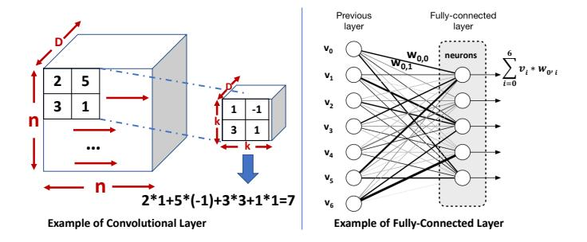
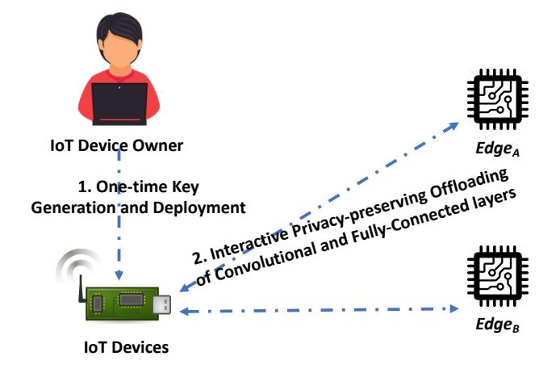

Low Latency Privacy-preserving Outsourcing of Deep Neural Network Inference

Yifan Tian, Laurent Njilla, *Member, IEEE,* Jiawei Yuan, *Member, IEEE,* Shucheng Yu, *Senior Member, IEEE*

*Abstract*—Efficiently supporting inference tasks of deep neural network (DNN) on the resource-constrained Internet of Things (IoT) devices has been an outstanding challenge for emerging smart systems. To mitigate the burden on IoT devices, one prevalent solution is to outsource DNN inference tasks to the public cloud. However, this type of "cloud-backed" solutions can cause privacy breach since the outsourced data may contain sensitive information. For privacy protection, the research community has resorted to advanced cryptographic primitives to support DNN inference over encrypted data. Nevertheless, these attempts are limited by the real-time performance due to the heavy IoT computational overhead brought by cryptographic primitives.

In this paper, we proposed an edge-computing-assisted framework to boost the efficiency of DNN inference tasks on IoT devices, which also protects the privacy of IoT data to be outsourced. In our framework, the most time-consuming DNN layers are outsourced to edge computing devices. The IoT device only processes compute-efficient layers and fast encryption/decryption. Thorough security analysis and numerical analysis are carried out to show the security and efficiency of the proposed framework. Our analysis results indicate a 99%+ outsourcing rate of DNN operations for IoT devices. Experiments on AlexNet show that our scheme can speed up DNN inference for 40.6× with a 96.2% energy saving for IoT devices.

*Index Terms*—Deep Neural Network Inference, Privacypreserving Outsourcing, Internet of Things, Edge Computing

## I. INTRODUCTION

F UELED by the massive influx of data and advanced algorithms, modern deep neural network (DNN) has surprisingly benefited IoT applications in a spectrum of domains [2], including visual detection, smart security, audio analytics, health monitoring, infrastructure inspection, etc. In recent years, enabling efficient integration of DNNs and IoT is receiving increasing attention from both academia and industry [3]–[5]. DNN-driven applications typically have a two-phase paradigm: 1) a training phase wherein a model is trained using a training dataset, and 2) an inference phase wherein the trained model is used to output results (e.g., predication, decision, recognition) for a piece of input data. With regard to the deployment on IoT devices, the inference phase is mainly

The preliminary version of this paper appeared in the 15th EAI International Conference on Security and Privacy in Communication Networks (SecureComm 2019) [1].

DISTRIBUTION A. Approved for public release. Distribution unlimited. Case Number 88ABW-2020-0848. Dated 02 Mar 2020

Yifan Tian is with the Agari Data Inc., email: ytian@agari.com.

Laurent Njilla is with the Air Force Research Laboratory, email: laurent.njilla@us.af.mil.

Jiawei Yuan is with the Department of CIS, University of Massachusetts Dartmouth, email: jyuan@umassd.edu.

Shucheng Yu is with the Department of ECE, Stevens Institute of Technology, email: syu19@stevens.edu

adopted to process data collected on the fly. Given the fact that complex DNN inference tasks can contain a large amount of computational operations, their execution on resourceconstrained IoT devices becomes challenging, especially when time-sensitive tasks are taken into consideration. For example, a single inference task using popular DNN architectures (e.g., AlexNet [6], FaceNet [7], and ResNet [8]) for visual detection can require billions of operations. Moreover, many IoT devices are powered by battery, which will be quickly drained by executing these complex DNN inference tasks. To soothe IoT devices from heavy computation and energy consumption, outsourcing complex DNN inference tasks to public cloud computing platforms has become a popular choice in the literature. However, this type of "cloud-backed" system can raise privacy concerns when the data sent to remote cloud servers contain sensitive information [9], [10].

In order to protect the privacy of sensitive information, the problem of privacy-preserving outsourcing of DNN inference has attracted research efforts in recent years [1], [11]–[20]. These existing works can be classified into two categories according to who is the owner of the trained DNN model: 1) the trained model and input data are provided by the same user and the external computing platform only provides computing resources [1], [11]–[13]; 2) the external computing platform provides the trained model and and users submit input data for inference, which is known as "inference-as-a-service" [15]– [20]. Technically, these existing works [11]–[20] in both categories mainly leverage powerful but expensive cryptographic primitives, including homomorphic encryption and multi-party secure computation, to enable the execution DNN inference over encrypted data. Although strong privacy protection is offered by these cryptographic primitives, their utilization also introduces heavy computational and communication overhead. Such a performance limitation makes these existing solutions become efficient only for small-scale neural networks (i.e., millions of FLOPs in an inference), but are still far away from practical support of complex inference tasks (e.g., billions of FLOPs in an inference). Recent research [1] proposes an online/offline privacy-preserving solution to support category-1 outsourcing, wherein offline computation and storage are used to trade the efficiency of online real-time inference tasks. Ref [1] greatly improves efficiency of real-time privacypreserving DNN inference and can efficiently handle complex DNN architectures (e.g., AlexNet that contains 2.27 billions of FLOPs of each inference). However, this solution has to update keys for each DNN inference request, which leads to a large storage overhead and offline precomputation. For example, to process 1000 AlexNex or FaceNet inference

1

requests, the keys need to be pre-stored on the IoT device in ref [1] will be 20.49GB or 74.91GB respectively. Meanwhile, obtaining new sets of keys will require a significant amount of energy consumption of the IoT device due to computation or communication cost.

In this paper, we proposed a two-edge-server framework to enable efficient privacy-preserving outsourcing of DNN inference for resource-constrained IoT devices. Our framework offers privacy protection on the input and output data of DNN inference. The proposed framework adopts a hybrid outsourcing strategy, wherein DNN layers that occupy the majority of computation [21] are outsourced while computeefficient layers are directly processed at local. Different from existing "cloud-backed" designs, our framework leverages edge computing to promote the efficiency of outsourcing data, because it can effectively ameliorate the network latency and availability issue [22]. More importantly, we propose a novel encryption to assure that the real-time DNN inference over encrypted data, which can be efficiently executed by general edge computing devices (e.g., regular laptop computers). Thus, our framework avoids the reliance on powerful cloud servers for computing capabilities. To be specific, since linear operations of DNNs over input data and random noise are linearly separable, decryption of noise can be conveniently precomputed. As a result, our encryption allows IoT devices to securely outsource over 99% DNN operations to edge devices. To further enhance the efficiency of our framework in terms of communication, we integrate compression techniques [23] to reduce the size of ciphertext during the transmission. Besides privacy protection, we also discussed how to enable IoT devices to check the integrity of computational results returned by edge servers.

We implemented a prototype of our framework to evaluate its practical performance in terms of efficiency, energy consumption, and scalability. Formal security proof is provided for our framework. The numerical analysis shows that our framework can securely offload 99.86% and 99.38% computation from the IoT device when using the well-known AlexNet [6] and FaceNet [7] DNN architectures respectively. Correspondingly, our experimental results demonstrate that our framework is able to speed up  $40.6\times$  for the execution of AlexNet Inference tasks using regular laptops as edge devices. Compared with fully executing an AlexNet inference without outsourcing, our framework also saves 96.2% energy consumption for the IoT device.

The rest parts of this paper are organized as follows: In Section II, we formulate the problem with system model and threat model. We provides the detailed construction of our framework in Section III. Section IV analyzes the security of the proposed framework, which is followed by the performance evaluation in Section V. We review and discuss related works in Section VI and conclude this paper in Section VII.

# II. BACKGROUND AND PROBLEM FORMULATION

### A. Overview of DNN Inference

The computational flow of a DNN inference consists of multiple linear and non-linear computational layers. The input

of each layer is a matrix or a vector, and the output of each layer will be used as the input of the next layer unless the last layer is reached. In this project, we investigate convolutional neural network (CNN) [24] as an example, which is an important representative of DNN. In CNN, linear operations in an inference mainly performed in fully-connected (FC) and convolution (CONV) layers. Non-linear layers (e.g., activation layer and pooling layer) are typically placed after a CONV or FC layer to perform data transformation.

In CONV and FC layers, dot product operation  $(DoT(\cdot))$  are repeatedly executed. To be specific, a FC layer takes a vector  $\boldsymbol{v} \in \mathbb{R}^n$  as input and outputs  $\boldsymbol{y} \in \mathbb{R}^m$  using linear transformation as  $\boldsymbol{y} = \boldsymbol{W} \cdot \boldsymbol{v} + \boldsymbol{b}$ , where  $\boldsymbol{W} \in \mathbb{R}^{m \times n}$  is the weight matrix and  $\boldsymbol{b}$  is the vector of bias. During the calculation of  $\boldsymbol{W} \cdot \boldsymbol{v}$ , m dot products are computed as  $\boldsymbol{y}[i] = DoT(\boldsymbol{W}[i,:], \boldsymbol{v})_{1 \leq i \leq m}$ . In a CONV layer, a  $\boldsymbol{X} \in \mathbb{R}^{n \times n}$  input matrix will be processed into H kernels. For a  $(k \times k)$  kernel  $\boldsymbol{K}$ , it scans the matrix from top-left corner, and then moves from left to right. Each scan is a linear transformation that takes a  $(k \times k)$  window in the input matrix and uses it to compute a dot product with the kernel, which then adds a bias term to the result.

Examples of the processing of COVN and FC layers are presented in Fig.1. For more detailed description, please refer to ref [24]

Fig. 1. Examples of a Convolutional Layer and a Fully-connected Layer

## B. System Model and Problem Statement

Fig. 2. System Model

As depicted in Fig.2, our framework involves two noncolluding edge computing servers, resource-constrained IoT devices, and the device owner.

- *Edge servers*: we consider two non-colluding servers, denoted as EdgeA and EdgeB, that are deployed close to IoT devices. Each edge server has the capability to efficiently process DNN inference tasks over plaintext, such as a regular laptop. Each edge server will obtain linear layers of a trained DNN model from the device owner. EdgeA and EdgeB will process encrypted DNN inference requests from IoT devices in a privacypreserving manner. The multi-server architecture has been widely adopted to balance the security and efficiency in privacy-preserving outsourcing [16], [25], wherein at least one server will not collude with the others.
- *IoT devices*: we consider resource-constrained IoT devices that are deployed with limited computing capability and battery life. These devices collect data and need to process these data on the fly using DNN inference.
- *Device owner*: the device owner has pre-trained DNN models and can deploy IoT devices for service.

In this project, we focus on designing a framework that an IoT device can outsource the majority of computation in a DNN inference task to two non-colluding edge servers in a privacy-preserving manner. At the end of the inference, the IoT device obtains the result over its input data, whereas two edge servers do not learn the sensitive information of input data, intermediate outputs, and the final inference result. As all IoT devices are deployed by the owner, he/she has access to all data collected and processed by his/her IoT devices when necessary.

### *C. Threat Model*

Edge servers in our setting are considered as "curious-buthonest", i.e., the edge servers will follow the protocol to correctly perform storage, computation, and communication requests, yet attempt to obtain the input and output of the DNN inference outsourced by resource-constrained devices. In addition, we assume that the two edge servers do not collude with each other. Each edge server has access to architectures and parameters of DNN layers outsourced to it, and encrypted data submitted to it by IoT devices. The device owner and his/her IoT devices are considered as fully trusted and will not be compromised. Secure communication channels are assumed between all entities.

Our framework targets at protecting the privacy of IoT devices' data submitted to edge servers and the outputs of all outsourced DNN layers (including final result). We do not protect the overall purpose of the DNN inference, since multiple layers of the DNN model are known to the edge servers. Our privacy protection goals are consistent with that in [1]. For example, the edge servers may know the DNN inference is used for prediction, yet do not learn the input and the prediction results. To prevent edge servers from learning information about the trained data by analyzing the trained model, the IoT device owner can train it using a statistical database in the differential privacy literature [26], [27]. The research direction of privacy-preserving training is orthogonal to this paper.

# III. PRIVACY-PRESERVING OUTSOURCING OF DNN INFERENCE

### *A. Overview*

In our framework, the IoT device outsources the execution of linear (CONV and FC) layers and keeps the computeefficient non-linear layers at local. Without loss of generality, we consider a DNN that contains q CONV and FC layers, each of which is followed by non-linear activation layers if necessary. We use µ to denote the length (in bit) of an element in the input matrix of CONV or input vector or FC layers, and λ to denote the security parameter. Random numbers utilized in our design are λ-bit generated using a pseudorandom function F(·).

There are three major phases in our framework: *Setup*, *Data Encryption*, and *Privacy-Preserving Execution*. In the *Setup*, the owner prepares a pre-trained DNN model and generates the encryption and decryption keys for the IoT device. When the IoT device needs to perform DNN inference over its collected data, it will execute the *Data Encryption* phase to encrypt them and send them to two edge servers. The DNN inference is then executed in the *Privacy-Preserving Execution* phase. All outsourced DNN operations performed by edge servers are over encrypted data.

We now present the detailed construction of our framework. Important notations used in the construction are summarized in Table I.

TABLE I SUMMARY OF NOTATIONS

|                 | the number of CONV and FC layers in the       |  |  |
|-----------------|-----------------------------------------------|--|--|
| q               |                                               |  |  |
|                 | DNN architecture                              |  |  |
| µ               | the length (in bit) of an element in a CONV   |  |  |
|                 | or FC layer's input                           |  |  |
| λ               | the security parameter                        |  |  |
| {Si,in, Si,out} | encryption and decryption keys for the ith    |  |  |
| 1 ≤ i ≤ q       | CONV or FC layer                              |  |  |
| Xi              | input of the ith CONV or FC layer             |  |  |
|                 | random noise                                  |  |  |
|                 | ciphertext of Xi sent to EdgeA and EdgeB      |  |  |
| Ci,A, Ci,B      | respectively                                  |  |  |
| bi              | the bias adopted for the ith CONV or FC layer |  |  |
|                 | random noise                                  |  |  |
|                 | outputs returned by EdgeA and EdgeB of        |  |  |
| Oi,A, Oi,B      | the ith CONV or FC layer                      |  |  |
| K               | k × k kernel of a CONV layer                  |  |  |
| W i             | weight matrix of the ith FC layer             |  |  |

# *B. Detailed Construction*

*Setup*: To setup the framework, the device owner prepares a trained DNN model and sends its q linear layers (CONV and FC) to EdgeA and EdgeB. For the ith linear layer, the owner generates a pair of encryption and decryption keys {Si,in,Si,out}1≤i≤q. As presented in Algorithm 1, Si,in for ith linear layer will be randomly generated according to input dimension of the layer, and each element in Si,in

will be a  $\lambda$ -bit random number.  $S_{i,out}$  is the corresponding output of the  $i_{th}$  linear layer when taking  $S_{i,in}$  as the input.  $\{S_{i,in}, S_{i,out}\}_{1 \leq i \leq q}$  key pairs are deployed on the IoT device for later on privacy-preserving DNN inference tasks.

#### **Algorithm 1:** Key Generation for the $i_{th}$ Linear Layer

Input:  $i_{th}$  linear layer Output:  $\{S_{i,in}, S_{i,out}\}$ 

- 1 Generate a random matrix (or vector)  $S_{i,in}$  using pseudorandom function  $\mathcal{F}(\cdot)$ ;
  - $/\!\!/ S_{i,in}$  has the same dimension as the regular input of the  $i_{th}$  linear layer.
- 2 Take Si,in as input for the ith linear layer, and get the output Si,out;
- 3  $S_{i,out} = S_{i,out} b_i$ , where  $b_i$  is the bias adopted by the  $i_{th}$  linear layer;

**Data Encryption**: When a DNN inference is needed for the IoT device, it will outsource the execution of linear layers to  $Edge_A$  and  $Edge_B$  in the privacy-preserving manner. To be specific, for the  $i_{th}$  linear layer, its input will be encrypted and sent to  $Edge_A$  and  $Edge_B$  for processing. Intermediate results returned by edge servers are decrypted by the IoT devices, which are then fed into the follow up non-linear layers. The output of non-linear layers will be used as the input as the  $(i+1)_{th}$  linear layer. This process will be interactively conducted until all layers of the DNN are executed as shown in Algorithm.2.

For the  $i_{th}$  linear layer with input data  $X_i$ , the IoT device generates a random input  $\epsilon$  that has the same dimension as  $X_i$ , wherein each element is a  $\lambda$ -bit random number generated using  $\mathcal{F}(\cdot)$ .  $X_i$  is then encrypted as

$$C_{i,A} = X_i + S_{i,in} + \epsilon \tag{1}$$

$$C_{i,B} = X_i + S_{i,in} - \epsilon \tag{2}$$

 $C_{i,A}$  and  $C_{i,B}$  are then sent to  $Edge_A$  and  $Edge_B$  respectively. To reduce the communication cost, floating-point compression [23] is applied on  $C_{i,A}$  and  $C_{i,B}$ , which is able to shrink the size of them by 70 + % as shown in our evaluation results.

It is worth to note that  $\epsilon$  will be regenerated for each DNN inference request. For convolution layers that contain multiple matrices as input, each matrix requires a different  $\epsilon$ . For instance, in a DNN-based image classification task, raw image data as input contains three channels that lead to three input matrices.  $\epsilon$  for each linear layer can be directly discarded after encryption, since it will be required during the decryption.

**Privacy-preserving Execution**:  $Edge_A$  and  $Edge_B$  take  $C_{i,A}$  and  $C_{i,B}$  as the input for the  $i_{th}$  linear layer respectively, and output  $\mathcal{O}_{i,A}$  and  $\mathcal{O}_{i,B}$ . On receiving  $\mathcal{O}_{i,A}$  and  $\mathcal{O}_{i,B}$  from edge servers, the IoT device decrypts them as

$$O_i = \frac{1}{2}(\mathcal{O}_{i,A} + \mathcal{O}_{i,B}) - S_{i,out}$$
(3)

where  $O_i$  is the corresponding output when plaintext input  $X_i$  is fed into the linear layer. The IoT device executes the non-linear activation layer with  $O_i$  as input. The output from

**Algorithm 2:** Privacy-preserving DNN Inference Execution

- 1 // q CONV and FC layers in total;
- 2 **Set**  $Layer_i$  = the first CONV or FC layer
- 3 for i = 1; i < q + 1; i + + do
- 4 |  $Edge_A$  outputs  $\mathcal{O}_{i,A}$  by executing the  $Layer_i$  using  $\mathcal{C}_{i,A}$  as input;
- 5  $Edge_B$  outputs  $\mathcal{O}_{i,B}$  by executing the  $Layer_i$  using  $\mathcal{C}_{i,B}$  as input;
  - The IoT device performs:
    - 1) Decryption of  $\mathcal{O}_{i,A}$  and  $\mathcal{O}_{i,B}$ ;
    - 2) Execution of non-linear layers (if exist);
    - 3) Encryption of input for the next layer (if exist);
- 7 return DNN inference result on the IoT device;

the activation layer will be encrypted and sent to  $Edge_A$  and  $Edge_B$  for the next linear layer as shown in Algorithm.2.

The correctness of the decryption is guaranteed by the fact that linear operations in CONV and FC layers over  $X_i$  and  $S_{i,in} + \epsilon$  (or  $S_{i,in} - \epsilon$ ) are linearly separable. As discussed in Section II-A, CONV and FC layers are composed by dot product operations. Given the  $j_{th}$  scanned  $(k \times k)$  window of  $X_i$ , say  $X_i^j$ , and the  $(k \times k)$  kernel K in the  $i_{th}$  CONV layer, its execution over  $X_i^j$  and corresponding encrypted data obtain the same result as shown in Eq.4 and Eq.5.

Plaintext: 
$$\sum_{l=1}^{k^2} \mathbf{X_i}^j[l] * \mathbf{K}[l] + \mathbf{b}_i[l]$$
 (4)

Ciphertext: 
$$\frac{1}{2}(\mathcal{O}_{i,A} + \mathcal{O}_{i,B}) - \mathbf{S_{i,out}}$$
 (5)

$$\begin{split} &= \frac{1}{2} (\sum_{l=1}^{k^2} \mathcal{C}_{i,A}^{j}[l] * K[l] + b_i[l] + \mathcal{C}_{i,B}^{j}[l] * K[l] + b_i[l]) - S_{i,out}^{j} \\ &= \frac{1}{2} (\sum_{l=1}^{k^2} (X_i^{j}[l] + S_{i,in}^{j}[l] + \epsilon^{j}[l]) * K[l] + b_i[l]) \\ &+ \frac{1}{2} (\sum_{l=1}^{k^2} (X_i^{j}[l] + S_{i,in}^{j}[l] - \epsilon^{j}[l]) * K[l] + b_i[l]) - S_{i,out}^{j} \\ &= (\sum_{l=1}^{k^2} X_i^{j}[l] * K[l] + b_i[l]) + (\sum_{l=1}^{k^2} S_{i,in}^{j}[l] * K[l]) - S_{i,out}^{j} \\ &= \sum_{l=1}^{k^2} X_i^{j}[l] * K[l] + b_i[l] \end{split}$$

Correspondingly, given the weight matrix  $W_i$  of the  $i_{th}$  FC layer, its execution over  $X_i$  and corresponding encrypted data also obtain the same result as shown in Eq.6 and Eq.7.

$$Plaintext: \quad \boldsymbol{W}_i \cdot \boldsymbol{X}_i + \boldsymbol{b}_i \tag{6}$$

$$Ciphertext: \frac{1}{2}(\mathcal{O}_{i,A} + \mathcal{O}_{i,B}) - \mathbf{S_{i,out}}$$

$$= \frac{1}{2}(\mathbf{W}_i \cdot \mathcal{C}_{i,A} + \mathbf{b}_i + \mathbf{W}_i \cdot \mathcal{C}_{i,B} + \mathbf{b}_i) - \mathbf{S_{i,out}}$$

$$= \frac{1}{2}(\mathbf{W}_i \cdot (X_i + \mathbf{S_{i,in}} + \boldsymbol{\epsilon} + X_i + \mathbf{S_{i,in}} - \boldsymbol{\epsilon}) + 2\mathbf{b}_i) - \mathbf{S_{i,out}}$$

$$= (\mathbf{W}_i \cdot \mathbf{X}_i + \mathbf{b}_i) + (\mathbf{W}_i \cdot \mathbf{S_{i,in}}) - \mathbf{S_{i,out}}$$

$$= \mathbf{W}_i \cdot \mathbf{X}_i + \mathbf{b}_i$$

$$= \mathbf{W}_i \cdot \mathbf{X}_i + \mathbf{b}_i$$

$$(7)$$

To this end, the IoT device is able to efficiently handle each layer in a DNN. Compute-intensive linear (CONV and FC) layers are securely outsourced to the edge using after encryption. These compute-efficient layers are directly handled by the IoT device. Since our privacy-preserving solution is a general design, it can be customized and recursively plugged into other DNN architectures.

#### C. Discussion - Integrity Checking

In this section, we discuss how to enable the IoT device to check the integrity of calculation results returned by edge servers for outsourced DNN layers. During the outsourcing, calculation errors can be caused due to software and hardware errors of edge servers. Motivated by the fact that results returned by edge servers are a collection of encrypted dot products, we propose an integrity checking solution based on the random sampling strategy.

Given the  $i_{th}$  outsourced linear layer, we denote its returned result is a collection of  $\Omega_i$  dot products, of which  $\theta_i$  ( $0 \le \theta_i \le \Omega_i$ ) are calculated incorrectly. By randomly selecting  $Z_i$  dot products for recalculation using locally stored parameters of the  $i_{th}$  outsourced linear DNN layer, the IoT device can detect at least one error with a probability of

$$Pr(ED) = 1 - \binom{\Omega_i - \theta_i}{Z_i} / \binom{\Omega_i}{Z_i}$$
 (8)

If there are 1% of returned calculation results are incorrect, the IoT device only needs to recalculate 460 dot products to ensure an error detection rate Pr(ED)>99%. Correspondingly, a recalculation of 4603 dot products can ensure Pr(ED)>99% if there are 0.1% of returned calculation results are incorrect. Taking AlexNet as an example, randomly checking 4603 dot products for all 5 CONV layers only occupy 7.08% of the total outsourced computation.

It is noteworthy that the combination of integrity checking of multiple layers can further enhance the error detection rate. To be specific, when grouping the checking of x layers, the probability for the IoT device to detect at least one error becomes

$$Pr(ED_x) = 1 - \prod_{i=1}^{x} \left( \binom{(\Omega_i - \theta_i)}{Z_i} / \binom{\Omega_i}{Z_i} \right)$$
 (9)

These layers can even come from different DNN requests. Considering the worst case, i.e., there is only one error among the all returned results of an outsourced layer, randomly reperforming 20% computation of a single layer at local provides 20% error detection rate. By combining the integrity checking of 11 and 22 outsourced layers, the error detection rates becomes 91.4% and 99.3% respectively.

#### IV. SECURITY ANALYSIS

In this section, we first prove that the encryption algorithm used in our framework is CPA-secure. Then, the security of the overall DNN inference outsourcing is analyzed.

**Definition IV.1.** The CPA indistinguishability experiment  $Priv_{A}^{cpa}(\lambda)$  is defined as:

#### Analysis of Probability Distribution of Ciphertext

We present the probability distribution of the ciphertext using our encryption, i.e.,  $EnC(m_b)=m_b+r$ , where  $m_b$  is the  $\mu$ -bit input message, and r is a  $\lambda$ -bit ( $\lambda>\mu$ ) uniformly distributed random number generated by a secure pseudorandom function  $\mathcal{F}(\cdot)$ . We denote the distribution function of  $m_b$  as  $X(m_b), 0 \leq m_b \leq 2^\mu-1$ , and the uniform distribution of r as  $Y(r), 0 \leq r \leq 2^\lambda-1$ . As the  $m_b$  and r are independent with each other, the probability distribution of  $EnC(m_b)$  can be represented as

$$Pr[EnC(m_b)] = \sum_{m_b} X(m_b) \cdot Y(Enc(m_b) - m_b)$$

$$= Y(Enc(m_b) - m_b) \sum_{m_b} X(m_b)$$

$$= \frac{1}{2^{\lambda}} \sum_{m_b} X(m_b)$$

$$(10)$$

where  $0 \leq EnC(m_b) \leq 2^{\mu} + 2^{\lambda} - 1$  and  $Y(Enc(m_b) - m_b) = \frac{1}{2^{\lambda}}$ , since Y(r) is uniformly distributed. Based on the value of  $EnC(m_b)$ , there are two cases for  $Pr[EnC(m_b)]$ :

1)  $2^{\mu} \leq EnC(m_b) \leq 2^{\lambda}$ . In this case, every value of  $EnC(m_b)$  has  $2^{m_b}$  combinations of  $X(m_b) \cdot Y(Enc(m_b) - m_b)$ , since every value of  $m_b$  can be combined with a r value to output  $Enc(m_b)$ . Thus, we have  $\sum_{m_b} X(m_b) = 1$  and get

$$Pr[EnC(m_b)] = \frac{1}{2^{\lambda}} \sum_{m_b} X(m_b) = \frac{1}{2^{\lambda}}$$

2)  $EnC(m_b) < 2^{\mu}$  or  $EnC(m_b) > 2^{\lambda}$ . In this case,  $EnC(m_b)$  has  $EnC(m_b) + 1$  combinations of  $X(m_b) \cdot Y(Enc(m_b) - m_b)$ . To be specific, we have

$$\begin{split} Pr[EnC(m_b)] &= \sum_{m_b=0}^{EnC(m_b)} X(m_b) \cdot Y(Enc(m_b) - m_b) \\ &= \frac{1}{2^{\lambda}} \sum_{m_b=0}^{EnC(m_b)} X(m_b) \leq \frac{2^{\mu}}{2^{\lambda}} \end{split}$$

or

$$\begin{split} & Pr[EnC(m_b)] \\ &= \sum_{m_b = EnC(m_b) - 2^{\lambda}}^{2^{\lambda} + 2^{\mu} - 1} X(m_b) \cdot Y(Enc(m_b) - m_b) \\ &= \frac{1}{2^{\lambda}} \sum_{m_b = EnC(m_b) - 2^{\lambda}}^{2^{\lambda} + 2^{\mu} - 1} X(m_b) \leq \frac{2^{\mu}}{2^{\lambda}} \end{split}$$

Therefore, the probability distribution of encryption output  $Pr[EnC(m_b)]$  is

$$\begin{cases} \frac{1}{2^{\lambda}} & \text{if } 2^{\mu} \leq EnC(m_b) \leq 2^{\lambda} \\ \frac{1}{2^{\lambda}} \sum_{m_b = 0}^{EnC(m_b)} X(m_b) \leq \frac{2^{\mu}}{2^{\lambda}} & \text{if } EnC(m_b) < 2^{\mu} \\ \frac{1}{2^{\lambda}} \sum_{m_b = EnC(m_b) - 2^{\lambda}} X(m_b) \leq \frac{2^{\mu}}{2^{\lambda}} & \text{if } EnC(m_b) > 2^{\lambda} \end{cases}$$

Fig. 3. Analysis of Probability Distribution of Ciphertext

- A key is generated by running the key generation algorithm  $Gen(\lambda)$ .
- The adversary is given  $\lambda$  the access to the encryption oracle  $EnC(\cdot)$  and outputs a pair of messages  $m_0$  and  $m_1$  of the same length.
- A uniform bit b ∈ {0,1} is chosen, and then a ciphertext
   c ← EnC(mb) is computed and given to the adversary.

- The adversary continues to have oracle access to EnC(·), and output a bit b'.
- The output of the experiment is 1 if b' = b, and 0 otherwise. In the former case, we say the adversary succeeds.

An encryption scheme  $\Pi = (Gen, Enc, Dec)$  is CPA-secure [28], if for all probabilistic polynomial time (PPT) adversaries A there is a negligible function  $negl(\lambda)$  such that

$$Pr[Priv_{\mathcal{A},\Pi}^{cpa}(\lambda) = 1] \le \frac{1}{2} + negl(\lambda)$$
 (11)

**Theorem IV.2.** If  $\mathcal{F}(\cdot)$  is a secure pseudorandom function, then the encryption in our framework is CPA-secure for message with elements of length  $\mu$  against a PPT adversary  $\mathcal{A}$ .

*Proof.* Given an arbitrary PPT adversary  $\mathcal{A}$ , let  $\mathcal{U}(\lambda)$  be an upper bound on the number of queries that  $\mathcal{A}$  to its encryption oracle, where  $\mathcal{U}(\cdot)$  is upper-bounded by some polynomial.

Given any  $\mu$ -bit message m, the encryption oracle to query in  $Priv_{\mathcal{A},\Pi}^{cpa}(\lambda)$  now becomes  $EnC(m) = m + \mathcal{F}(\cdot)$ . For every time a message m is encrypted in  $Priv_{\mathcal{A},\Pi}^{cpa}(\lambda)$ , a new random number is generated using  $\mathcal{F}(\cdot)$ . Let  $r^*$  denotes the random number used when generating the ciphertext  $EnC(m_b)$ . There are two possibilities:

1)  $r^*$  is never used when answering any of  $\mathcal{A}$ 's encryption-oracle queries. There are two sub-cases

- $2^{\mu} \leq EnC(m_b) \leq 2^{\lambda}$ . In this sub-case, the value of  $EnC(m_b)$  has the same probability distribution as  $r^*$  as analyzed in Fig.3, i.e., uniformly distributed with a probability of  $\frac{1}{2^{\lambda}}$  for each value between  $[2^{\mu}, 2^{\lambda}]$ . Hence  $\mathcal{A}$  learns nothing about  $r^*$  from its interaction with the encryption oracle. As far as  $\mathcal{A}$  is concerned, the value  $EnC(m_b)$  is uniformly distributed and independent of the rest of the experiment, and so the probability that  $\mathcal{A}$  outputs b' = b in this case is exactly  $\frac{1}{2}$ .
- $EnC(m_b) < 2^{\mu}$  or  $EnC(m_b) > 2^{\lambda}$ . In this sub-case,  $\mathcal{A}$  can output b' = b once  $m_0 < EnC(m_b) < m_1$ , since  $EnC(m_1) > EnC(m_b)$ . For the worst case, we use 1 for the probability that  $\mathcal{A}$  outputs b' = b in this case, i.e.,  $\mathcal{A}$  always succeeds. As presented in Fig.3, the probability this sub-case will be  $\leq 2*\frac{2^{\mu}}{2^{\lambda}} = \frac{1}{2^{\lambda-\mu-1}}$ , which can be controlled to as a negligible value by adjusting the value of  $\lambda$  according to the value of  $\mu$ , e.g., make  $\frac{1}{2^{\lambda-\mu-1}} < \frac{1}{2^{128}}$  [28].

Based on the two-sub cases, the probability of  $\mathcal A$  to succeed in  $Priv_{\mathcal A,\Pi}^{cpa}(\lambda)$  becomes

$$Pr[Priv_{\mathcal{A},\Pi}^{cpa}(\lambda) = 1]$$

$$\leq Pr[Priv_{\mathcal{A},\Pi}^{cpa}(\lambda) = 1\⊂_1] + Pr[Priv_{\mathcal{A},\Pi}^{cpa}(\lambda) = 1\⊂_2]$$

$$\leq \frac{1}{2} + Pr[Priv_{\mathcal{A},\Pi}^{cpa}(\lambda) = 1\⊂_2] \leq \frac{1}{2} + \frac{1}{2^{\lambda - \mu - 1}}$$

2)  $r^*$  is used when answering at least one of  $\mathcal{A}$ 's encryption-oracle queries: In this case,  $\mathcal{A}$  may easily determine whether  $m_0$  or  $m_1$  was encrypted. This is so because if the encryption oracle ever returns a ciphertext encrypted using  $r^*$ ,  $\mathcal{A}$  learns  $m+r^*$ . However, since  $\mathcal{A}$  makes at most  $\mathcal{U}(\lambda)$  queries to its encryption oracle (and thus at most  $\mathcal{U}(\lambda)$  values of r

are used when answering  $\mathcal{A}$ 's encryption-oracle queries), and since  $r^* \in \{0,1\}^{\lambda}$  is uniformly distributed, the probability of this event is at most  $\frac{\mathcal{U}(\lambda)}{2\lambda}$ .

By denoting the above two cases as  $\overline{Repeat}$  and Repeat, the probability of  $\mathcal{A}$  to succeed in  $Priv_{\mathcal{A}.\Pi}^{cpa}(\lambda)$  becomes

$$\begin{split} ⪻[Priv_{\mathcal{A},\Pi}^{cpa}(\lambda)=1] \\ &= Pr[Priv_{\mathcal{A},\Pi}^{cpa}(\lambda)=1\&Repeat] + Pr[Priv_{\mathcal{A},\Pi}^{cpa}(\lambda)=1\&\overline{Repeat}] \\ &\leq Pr[Repeat] + Pr[Priv_{\mathcal{A},\Pi}^{cpa}(\lambda)=1\&\overline{Repeat}] \\ &\leq \frac{\mathcal{U}(\lambda)}{2^{\lambda}} + Pr[Priv_{\mathcal{A},\Pi}^{cpa}(\lambda)=1\&\overline{Repeat}] \\ &\leq \frac{\mathcal{U}(\lambda)}{2^{\lambda}} + \frac{1}{2} + \frac{1}{2^{\lambda-\mu-1}} \\ &\leq \frac{1}{2} + negl(\lambda), \quad negl(\lambda) = \frac{\mathcal{U}(\lambda)}{2^{\lambda}} + \frac{1}{2^{\lambda-\mu-1}} \end{split}$$

By setting the value of  $\lambda$  according the upper bound on the number of queries and the input size, the output of  $negl(\lambda)$  can be adjusted to a negligible values.

Theorem IV.2 is proved according to the Definition IV.1.  $\Box$ 

We now discuss the security of the overall DNN inference. Without loss of generality, we use layer-i to denote the  $i_{th}$ linear layer that needs to be outsourced,  $X_i$  and  $O_i$  are the input and output of layer-i. With regards to the outsourcing of layer-i,  $X_i$  is encrypted using our encryption, which has been proved to be secure as shown in Theorem IV.2. When moving to the next layer, i.e., layer-(i+1),  $O_i$  is processed through non-linear layers by the IoT device to generate the input of layer-(i+1) as  $X_{(i+1)}$ . Before being outsourced, each element m in  $X_{(i+1)}$  is encrypted by adding a random number from uniform distribution. By selecting an appropriate security parameter  $\lambda$ , there will be only a negligible probability  $\frac{1}{2\lambda-\gamma-1}$ that m affects the uniform looking of the ciphertext as proved in Theorem IV.2, where  $\gamma$  is the length of m in bits. To be specific, by re-encrypting the input of each outsourced layer in our scheme, the negligible additional advantages introduced by each outsourced layer for the adversary to learn its input and output will not be accumulated for later layers in the DNN inference. Therefore, the security of the overall DNN inference is achieved in our scheme with proper selection of  $\lambda$ .

#### V. PERFORMANCE EVALUATION

In this section, we first evaluate our framework using numerical analysis, and then validate the practical performance via the prototype implementation.

# A. Numerical Analysis

The theoretical analysis of our framework is summarized in Table II. For expression simplicity, we use one floating point operation (FLOP) to denote an addition or a multiplication. Compared with ref [1] and outsourcing the CONV layer (or FC layer) without privacy protection, our framework achieve the same computational cost on each edge server. While our framework doubles the computational cost on the IoT device compared with ref [1], it is significantly less than the amount of outsourced computation as shown in Table II. With regards to the communication cost, our framework introduces

TABLE II Numerical Analysis Summary

|                           |              | IoT Comp   | outation (FLOPs)           | Comp. Cost                                    | Comm. Cost                                                                             | Storage                                                            |  |
|---------------------------|--------------|------------|----------------------------|-----------------------------------------------|----------------------------------------------------------------------------------------|--------------------------------------------------------------------|--|
|                           | Input        | Input      | Results                    | of each Edge                                  | (Elements)                                                                             | Overhead                                                           |  |
|                           | Size         |            |                            |                                               |                                                                                        | (Support z Requests)                                               |  |
|                           |              | Encryption | Decryption                 | (FLOPs)                                       |                                                                                        | (Elements)                                                         |  |
|                           |              | •          | CONV L                     | ayer                                          |                                                                                        |                                                                    |  |
| This Donor                | $n \times n$ | $2Dn^2$    | $0.11(n-k+2p+1)^2$         | $2DHk^2 \times$                               | $2(Dn^2+$                                                                              | $Dn^2+$                                                            |  |
| This Paper                | $\times D$   | $2Dn^2$    | $2H(\frac{n-k+2p}{s}+1)^2$ | $\frac{(\frac{n-k+2p}{s}+1)^2}{2DHk^2\times}$ | $ \frac{2(Dn^{2} + (\frac{n-k+2p}{s} + 1)^{2})}{Dn^{2} + (\frac{n-k+2p}{s} + 1)^{2}} $ | $\frac{H(\frac{n-k+2p}{s}+1)^2}{z(Dn^2+ H(\frac{n-k+2p}{s}+1)^2)}$ |  |
| Ref [1]                   | $n \times n$ | $Dn^2$     | $H(\frac{n-k+2p}{s}+1)^2$  | $2DHk^2 \times$                               | $Dn^2+$                                                                                | $z(Dn^2+$                                                          |  |
| Kei [1]                   | $\times D$   |            |                            | $(\frac{n-k+2p}{s}+1)^2$                      | $H(\frac{n-k+2p}{2}+1)^2$                                                              | $H(\frac{n-k+2p}{s}+1)^2)$                                         |  |
| Outsourcing without       | $n \times n$ | N/A        | N/A                        | $2DHk^2 \times$                               | $Dn^2+$                                                                                | N/A                                                                |  |
| Privacy Protection        | $\times D$   | IN/A       | IN/A                       | $(\frac{n-k+2p}{s}+1)^2$                      | $H(\frac{n-k+2p}{s}+1)^2$                                                              | IN/A                                                               |  |
| FC Layer                  |              |            |                            |                                               |                                                                                        |                                                                    |  |
| This Paper                | m            | 2m         | 2T                         | 2mT                                           | 2(m+T)                                                                                 | m+T                                                                |  |
| Ref [1]                   | m            | m          | T                          | 2mT                                           | m+T                                                                                    | m+T                                                                |  |
| Outsourcing without       | m            | N/A        | N/A                        | 2mT                                           | m+T                                                                                    | N/A                                                                |  |
| <b>Privacy Protection</b> | 111          | IV/A       | IVA                        | 21161                                         | m+1                                                                                    | IVA                                                                |  |

In this table: D is the number of input matrix, s is the stride, p is the size of padding, H is the number of kernels,  $k \times k$  is the size of kernels of a CONV layer; T is the number of neurons of a fully-connected layer. Each element is 20 Bytes.

two times of the elements as that in ref [1]. This is caused by the two-edge server design, since the IoT device needs to communicate with both edge servers in our framework. Fortunately, we integrate data compression technique [23] into our design, which can significantly shrink the size of ciphertext that causes communication by 70%+. As a result, the proposed framework achieves a better communication performance compared with ref [1] as shown in the study cases of AlexNet and FaceNet (next paragraph). More importantly, ref [1] has the bottleneck in storage overhead, which increases linearly to the number of DNN requests to be executed. Each DNN inference requires ref [1] to pre-store a new set of keys to support its privacy-preserving outsourcing. If the IoT device in ref [1] generates a new set of keys for one DNN inference on-the-fly, the computational cost will be the same as executing the a complete DNN inference, which is not only time consuming on the IoT device but also drains the battery life of IoT device quickly. As a comparison, the proposed framework in this paper only requires the IoT device to store one set of keys for the entire deployment life cycle.

TABLE III
NUMERICAL ANALYSIS OF ALEXNET AND FACENET

|                     |            | AlexNet      | FaceNet       |
|---------------------|------------|--------------|---------------|
| Computation on      | This Paper | 2.8 million  | 19.92 million |
| IoT (FLOPs)         | Ref [1]    | 2.8 million  | 19.92 million |
| Outsourced          | This Paper | 2.27 billion | 3.19 billion  |
| Computation (FLOPs) | Ref [1]    | 2.27 billion | 3.19 billion  |
| Outsourced          | This Paper | 99.86%       | 99.38%        |
| Computation (%)     | Ref [1]    | 99.86%       | 99.38%        |
| Communication       | This Paper | 11.32 MB     | 40.5 MB       |
| Cost                | Ref [1]    | 20.49 MB     | 74.91 MB      |
| Storage Overhead    | This Paper | 20.49 MB     | 74.91 MB      |
| (one request)       | Ref [1]    | 20.49 MB     | 74.91 MB      |
| Storage Overhead    | This Paper | 20.49 MB     | 74.91 MB      |
| (z requests)        | Ref [1]    | 20.49z MB    | 74.91z MB     |

We now use the well-know DNN architectures AlexNet [6] and FaceNet [7] as the study cases for analysis. The architectures of AlexNet and FaceNet are depicted in Table IV.

AlexNet consists of 5 CONV layers and 3 FC layers. FaceNet consists of 11 CONV layers and 3 FC layers. An AlexNet inference request requires 2.27 billion FLOPs for CONV and FC layers, and 1.75 million FLOPs for other non-linear layers. For a FaceNet inference request, 3.19 billion FLOPs are required for CONV and FC layers, and 15.99 million FLOPs for other non-linear layers. As presented in Table III, our framework is able to outsource 99.86% and 99.38% computational cost for AlexNet and FaceNet respectively, which are same as that in ref [1]. The computation left on the IoT device in our framework comes from the encryption/decryption cost, the processing of non-linear layers. These cost are significantly less than the total cost of a complete inference request as shown in Table III. The communication cost in our framework is also reduced compared with that in ref [1]. While the IoT device in our framework needs to communicate with two edge servers, we compress the ciphertexts sent to/from the edge servers to reduce the total amount of communication. With regard to the storage overhead, our framework has the same cost as that in ref [1] if the IoT device is deployed to support only one inference request. When the support of multiple requests are taken into consideration (say z requests in total), ref [1] has to pre-store z sets of keys, which are 20.49zMBand 74.91zMB for AlexNet and FaceNet respectively. In such a case, handling only 1,000 DNN inference requests (e.g., object recognition) indicates over 20GB and 74GB storage overhead on the IoT device in ref [1]. As a comparison, our framework eliminates this limitation and makes the storage overhead constant to the number of DNN requests.

#### B. Prototype Evaluation

We implemented a prototype of our framework using Python 2.7. In our implementation, TensorFlow and Keras libraries are adopted to support DNN operations. The resource-constrained IoT device is a Raspberry Pi (Model A) with Raspbian Debian 7, which has 700 MHz single-core processor, 256MB memory, and 16GB SD card storage. The edge server and the IoT

TABLE IV
ARCHITECTURES OF ALEXNET AND FACENET

|        | AlexNet                  |            |
|--------|--------------------------|------------|
|        | Parameters               | Input Size |
| Conv-1 | n=227, H=96 k=11, s=4 | 227×227×3  |
| Conv-2 | n=27, H=256 k=5, s=1  | 27×27×96   |
| Conv-3 | n=13, H=384 k=3 s=1   | 13×13×256  |
| Conv-4 | n=13, H=384 k=3 s=1   | 13×13×384  |
| Conv-5 | n=13, H=256 k=3 s=1   | 13×13×384  |
| FC-1   | m=9216, T=4096           | 9216       |
| FC-2   | m=4096, T=4096           | 4096       |
| FC-3   | m=4096, T=1000           | 4096       |

| FaceNet |                         |            |         |                         |            |  |
|---------|-------------------------|------------|---------|-------------------------|------------|--|
|         | Parameters              | Input Size |         | Parameters              | Input Size |  |
| Conv-1  | n=220, H=64 k=7, s=2 | 220×220×3  | Conv-5a | n=14, H=256 k=1, s=1 | 14×14×256  |  |
| Conv-2a | n=55, H=64 k=1, s=1  | 55×55×64   | Conv-5  | n=14, H=256 k=3, s=1 | 14×14×256  |  |
| Conv-2  | n=55, H=192 k=3, s=1 | 55×55×64   | Conv-6a | n=14, H=256 k=1, s=1 | 14×14×256  |  |
| Conv-3a | n=28, H=192 k=1, s=1 | 28×28×192  | Conv-6  | n=14, H=256 k=3, s=1 | 14×14×256  |  |
| Conv-3  | n=28, H=384 k=3, s=1 | 28×28×192  | FC-1    | m=12544, T=4096         | 12544      |  |
| Conv-4a | n=14, H=384 k=1, s=1 | 14×14×384  | FC-2    | m=4096, T=4096          | 4096       |  |
| Conv-4  | n=14, H=256 k=3, s=1 | 14×14×384  | FC-3    | m=4096, T=128           | 4096       |  |

device owner are Macbook Pro laptops with OS X 10.13.3, 3.1 GHz Intel Core i7 processor, 16GB memory, and 512GB SSD. The IoT device and the edge server are connected using WiFi in the same subnet. The security parameter  $\lambda$  is set as 160 in our implementation and AlexNet [6] is adopted as the DNN architecture for evaluation. The architecture of AlexNet is presented in Table IV. To compare with our framework with homomorphic encryption-based solutions, we also implemented and evaluated CryptoNets [11] on AlexNet as an example.

1) Efficiency: In our framework, the owner sets up the framework by generating encryption and decryption keys, which only takes 114ms and is one-time cost. As a comparison, the setup time of ref [1] is linear to the total number of DNN inference requests the IoT device plans to support. For example, the setup will cost 5 minutes if it is going to handle 2600 inference requests.

TABLE V
SUMMARY OF EVALUATION RESULTS

|                           | IoT Only | This Paper |      | Ref [1]  |      |
|---------------------------|-------------|------------|------|----------|------|
|                           | Local       | Local      | Edge | Local    | Edge |
| Computation (Second)   | 124.99      | 1.92       | 0.03 | 1.35     | 0.11 |
| Communication (Second) | N/A         | 1.13       |      | 2.05     |      |
| Total (Second)         | 124.99      | 3.08       |      | 3.51     |      |
| Speedup                   | N/A         | 40.6X      |      | 6X 35.6X |      |

With regard to the execution of privacy-preserving outsourcing of real-time DNN inference, we summarize the result in Table V. By adopting our proposed framework, a  $40.6\times$  speedup rate is achieved compared with fully executing an AlexNet inference on the IoT device. As a comparison to ref [1], our framework achieves an enhanced performance while overcoming the limitation of storage overhead in ref [1]. In our framework, the saving of communication overhead comes the compression of ciphertext sent to and returned from two edge servers. While the compression and decoding introduce additional computational overhead to the IoT device, it still benefits the overall performance. More importantly, the storage

overhead of our framework is constant, i.e., 20.49MB, for any number of AlexNet inference requests. As a comparison, the storage overhead in ref [1] increases linearly to the number of DNN inference requests to be executed. In practice, IoT devices are typically deployed to support services for a while, which indicates a number of continues DNN inference requests. Furthermore, new keys need to be reloaded to the IoT device in ref [1] when the pre-stored keys are used up. Such a reloading process either requires the IoT device to compute the keys by itself or asks the device owner to remotely reload keys. These operations can quickly drain the batter life of the IoT device due to computation or communication. Specifically, the generation of each new set of keys requires the same amount of computation as executing a complete DNN inference.

To compare our framework with homomorphic encryption-based solution [11] for DNN inference, we also implemented AlexNet using the CryptoNets scheme proposed in [11], denoted as A-CryptoNets. During our implementation, we use the same linear approximation and YASHE cryptosystem [29] as that in [11]. Table VI shows the cost of executing the entire AlexNet inference in our framework and the first convolutional layer of AlexNet using A-CryptoNets. Due to the large input size required in AlexNet, A-CryptoNets requires 459.93s for encrypting the input data on the IoT device, and 625.86s for the convolutional operations over ciphertext on the edge device. This level of computational cost makes CryptoNets become hardly to satisfy time-sensitive tasks with complex DNN inference. As a comparison, our framework can process the entire AlexNet using 3.08s.

TABLE VI COMPARISON WITH CRYPTONNETS

| This Paper (Entire AlexNet) | CryptoNets (First Layer of AlexNet Only) |                 |
|--------------------------------|---------------------------------------------|-----------------|
| Total: 3.08 seconds         | Encryption                                  | 459.93 seconds  |
|                                | Convolution                                 | 625.86s seconds |
|                                | Total                                       | 1085.79 seconds |

2) Scalability: To evaluate the scalability of our framework, we analyzed the outsourcing performance on CONV and FC layers with different complexities. As presented in Table

VII, our framework maintains a high outsourcing rate, i.e., > 99.9%, for CONV and FC layers that require different levels of computation, from 8.19 million FLOPs to 0.89 billion FLOPs. Therefore, our framework is promising to be scaled up and support more complex DNN architectures according to practical requirements.

TABLE VII SCALABILITY ANALYSIS ON ALEXNET

|        | IoT         | Outsourced  | Outsourced |
|--------|-------------|-------------|------------|
|        | Computation | Computation | Percentage |
|        | (FLOPs)     | (FLOPs)     |            |
| Conv-1 | 444,987     | 210,830,400 | 99.79%     |
| Conv-2 | 256,608     | 895,795,200 | 99.97%     |
| Conv-3 | 108,160     | 299,040,768 | 99.96%     |
| Conv-4 | 129,792     | 448,561,152 | 99.97%     |
| Conv-5 | 108,160     | 299,040,768 | 99.96%     |
| FC-1   | 13,312      | 75,497,472  | 99.98%     |
| FC-2   | 8,192       | 33,554,432  | 99.98%     |
| FC-3   | 5,096       | 8,192,000   | 99.94%     |

3) Energy Consumption: Compared with fully executing AlexNet inference tasks on the IoT device, our framework significantly saves the energy consumption for computation of the IoT device while introducing slight extra energy consumption for communication. In our evaluation, the IoT device (Raspberry Pi Model A) is powered by a 5V micro-USB adapter. The voltage and current is measured using a Powerjive USB multimeter [30] and the power is calculated by the multiplication of voltage and current. Table VIII shows the average IoT power consumption under different IoT device status. The IoT device has a power cost of 0.81W when executing AlexNet locally without network connection. Such an execution power indicates an energy consumption of 101.24J when fully executing an AlexNet inference on the IoT device with 124.99 seconds. Differently, our framework leaves a limited amount of computation and communication on the IoT device, and hence reducing its energy consumption to 3.85J, in which 2.25J is for computation and 1.6J is for communication. Therefore, our framework can save IoT energy consumption by  $\frac{101.24 - 3.85}{101.24} = 96.2\%$ . Compared with ref [1] that has an energy consumption at 4.49J, our framework saves by 14.25%.

TABLE VIII
POWER AND ENERGY CONSUMPTION EVALUATION

|               |                                                        | Power (W) | Energy Consumption (J) |
|---------------|--------------------------------------------------------|-----------|---------------------------|
| IoT Only   | IoT Local Executing AlexNet without Network Connection | 0.81      | 101.24                    |
| This Paper | IoT Computation                                     | 1.17      | 2.25                      |
| rapei         | IoT Communication                                   | 1.42      | 1.6                       |
| Ref [1]       | IoT Computation                                     | 1.17      | 1.58                      |
|               | IoT Communication                                   | 1.42      | 2.91                      |

#### VI. RELATED WORK

The problem of privacy-preserving neural network inference (or prediction) has been studied in recent years under the cloud computing environment [1], [11]–[20]. These works focus on the "machine learning as a service" scenario, wherein the cloud server has a trained neural network model and users submitted encrypted data for predication. One recent line of research uses somewhat or fully homomorphic encryption (HE) to evaluate the neural network model over encrypted inputs after approximating non-linear layers in the neural network [11]–[14]. Combining multiple secure computation techniques (e.g., HE, Secure multi-party computation (MPC), oblivious transfer (OT)) is another trend to support privacy-preserving neural network inference [15], [17], [18], [20]. The idea behind these mixed protocols is to evaluate scalar products using HE and non-linear activation functions using MPC techniques. In particular, SecureML [15] utilized the mixed-protocol framework proposed in ABY [18], which involves arithmetic sharing, boolean sharing, and Yao's garbled circuits, to implement both privacy-preserving training and inference in a two-party computation setting. In [20], MiniONN is proposed to support privacy-preserving inference by transforming neural networks to the corresponding oblivious version with the Single Instruction Multiple Data (SMID) batch technique. Trusted thirdparty is invoked in Chameleon [19] and hence greatly reducing the computation and bandwidth cost for a privacy-preserving inference. In [17] GAZELLE is proposed by leveraging latticebased packed additive homomorphic encryption (PAHE) and two-party secure computation techniques. GAZELLE deploys PAHE in an automorphism manner to achieve fast matrix multiplication/convolution and thus boosting the final run-time efficiency. A multi-sever solution, named SecureNN, is proposed in [16], which greatly improves the privacy-preserving inference performance, i.e., 42.4× faster than MiniONN [20], and 27×, 3.68× faster than Chameleon [19] and GAZELLE [17].

While the performance of evaluating neural network over encrypted data for inference keeps being improved, the existing research works only focus on small-scale neural networks. Taking the state-of-the-art SecureNN [16] as an example, the network-A evaluated (also used by [15]) only requires about 1.2 million FLOPs for an inference, which costs 3.1s with wireless communication in their 3PC setting. As a comparison, the AlexNet evaluated in our framework contains 2.27 billion FLOPs for one inference, which costs 3.08s in our framework with similar wireless transmission speed. It is also worth to note that SecureNN utilizes powerful cloud server (36 vCPU, 132 ECU, 60GB memory) for evaluation, whereas the edge computing device in this paper is just a regular laptop computer. Scaling up the network size is not a trivial task. For example, compared with the type-A network in [17], its type-C network with 500× multiplication increases the computational cost and communication cost to  $430 \times$  and  $592 \times$ .

Recent research [1] proposed to adopt an online/offline strategy to trade the efficiency of online real-time DNN inference on IoT devices using offline precomputation. While this scheme boosts the efficiency on complex DNN architecture,

it is limited in practical deployment due to its bottleneck of storage overhead. To be specific, each set of pre-computed keys stored on the IoT device can only be used for one DNN inference request. In practice, IoT devices are typically deployed to continually collect and process data (using DNN inference in ref [1]). Taking AlexNex and FaceNet examples, the pre-computed keys in ref [1] will occupy 20.49GB or 74.91GB respectively for supporting only 1,000 requests. If the IoT device needs to generate by a new set of keys by itself, the computational cost will be the same as the execution of a complete DNN inference.

### VII. CONCLUSION

In this paper, we proposed a two-edge-server framework that enables resource-constrained IoT devices to efficiently execute DNN inference requests with privacy protection. The proposed framework uniquely designs a lightweight encryption scheme to provide private and efficient outsourcing of DNN inference tasks. By discovering the fact that linear operations in DNNs over input and random noise can be separated, our scheme generates decryption keys to remove random noises and thus boosting the performance of real-time DNN requests. By integrating local edge devices, our framework ameliorates the network latency and service availability issue. Moreover, the proposed framework also makes the privacypreserving operation over encrypted data on the edge device as efficient as that over unencrypted data. In addition, the privacy protection in our framework does not introduce any accuracy loss to the DNN inference, since no approximation is required for all DNN operations. A random sampling-based integrity checking strategy is also proposed in our framework, which enables the IoT devices to detect computation errors contained in the results returned by edge servers. Thorough security analysis is provided to show that our framework is secure in the defined threat model. Extensive numerical analysis as well as prototype implementation over the well-known DNN architectures demonstrate the practical performance of our framework.

# ACKNOWLEDGMENT

This work was supported by Air Force Visiting Faculty Research Program Award and Air Force summer faculty extension grant.

### REFERENCES

- [1] Yifan Tian, Jiawei Yuan, Shucheng Yu, Yantian Hou, and Houbing Song. Edge-assisted cnn inference over encrypted data for internet of things. In *15th International Conference on Security and Privacy in Communication Networks (SecureComm)*, Orlando, FL, 2019.
- [2] Mohammadi Mehdi, Al-Fuqaha Ala, Sorour Sameh, and Guizani Mohsen. Deep learning for iot big data and streaming analytics: A survey. *arXiv:1712.04301*, 2017.
- [3] M. Verhelst and B. Moons. Embedded deep neural network processing: Algorithmic and processor techniques bring deep learning to iot and edge devices. *IEEE Solid-State Circuits Magazine*, 9(4):55–65, Fall 2017.
- [4] S. Kodali, P. Hansen, N. Mulholland, P. Whatmough, D. Brooks, and G. Y. Wei. Applications of deep neural networks for ultra low power iot. In *2017 IEEE International Conference on Computer Design (ICCD)*, pages 589–592, Nov 2017.

- [5] Matt Burns. Arm chips with Nvidia AI could change the Internet of Things. https://techcrunch.com/2018/03/27/ arm-chips-will-with-nvidia-ai-could-change-the-internet-of-things/, 2018. [Online; accessed Feb-2020].
- [6] Alex Krizhevsky, Ilya Sutskever, and Geoffrey E. Hinton. Imagenet classification with deep convolutional neural networks. In *Proceedings of the 25th International Conference on Neural Information Processing Systems - Volume 1*, NIPS'12, pages 1097–1105, USA, 2012. Curran Associates Inc.
- [7] F. Schroff, D. Kalenichenko, and J. Philbin. Facenet: A unified embedding for face recognition and clustering. In *2015 IEEE Conference on Computer Vision and Pattern Recognition (CVPR)*, pages 815–823, June 2015.
- [8] K. He, X. Zhang, S. Ren, and J. Sun. Deep residual learning for image recognition. In *2016 IEEE Conference on Computer Vision and Pattern Recognition (CVPR)*, pages 770–778, June 2016.
- [9] J. Zhou, Z. Cao, X. Dong, and A. V. Vasilakos. Security and privacy for cloud-based iot: Challenges. *IEEE Communications Magazine*, 55(1):26–33, January 2017.
- [10] S. Sharma, K. Chen, and A. Sheth. Toward practical privacy-preserving analytics for iot and cloud-based healthcare systems. *IEEE Internet Computing*, 22(2):42–51, Mar 2018.
- [11] Ran Gilad-Bachrach, Nathan Dowlin, Kim Laine, Kristin E. Lauter, Michael Naehrig, and John Wernsing. Cryptonets: Applying neural networks to encrypted data with high throughput and accuracy. In *Proceedings of the 33nd International Conference on Machine Learning, ICML 2016, New York City, NY, USA, June 19-24*, pages 201–210, 2016.
- [12] Florian Bourse, Michele Minelli, Matthias Minihold, and Pascal Paillier. Fast homomorphic evaluation of deep discretized neural networks. Cryptology ePrint Archive, Report 2017/1114, 2017.
- [13] Herve Chabanne, Amaury de Wargny, Jonathan Milgram, Constance ´ Morel, and Emmanuel Prouff. Privacy-preserving classification on deep neural network. *IACR Cryptology ePrint Archive*, 2017:35, 2017.
- [14] Ehsan Hesamifard, Hassan Takabi, and Mehdi Ghasemi. Cryptodl: Deep neural networks over encrypted data. *CoRR*, abs/1711.05189, 2017.
- [15] P. Mohassel and Y. Zhang. Secureml: A system for scalable privacypreserving machine learning. In *2017 IEEE Symposium on Security and Privacy (SP)*, pages 19–38, May 2017.
- [16] Sameer Wagh, Divya Gupta, and Nishanth Chandran. Securenn: Efficient and private neural network training. (PETS 2019), February 2019.
- [17] Chiraag Juvekar, Vinod Vaikuntanathan, and Anantha Chandrakasan. {GAZELLE}: A low latency framework for secure neural network inference. In *27th* {*USENIX*} *Security Symposium (*{*USENIX*} *Security 18)*, pages 1651–1669, 2018.
- [18] Payman Mohassel and Peter Rindal. Aby3: A mixed protocol framework for machine learning. In *Proceedings of the 2018 ACM SIGSAC Conference on Computer and Communications Security*, CCS '18, pages 35–52, New York, NY, USA, 2018. ACM.
- [19] M. Sadegh Riazi, Christian Weinert, Oleksandr Tkachenko, Ebrahim M. Songhori, Thomas Schneider, and Farinaz Koushanfar. Chameleon: A hybrid secure computation framework for machine learning applications. In *Proceedings of the 2018 on Asia Conference on Computer and Communications Security*, ASIACCS '18, pages 707–721, New York, NY, USA, 2018. ACM.
- [20] Jian Liu, Mika Juuti, Yao Lu, and N. Asokan. Oblivious neural network predictions via minionn transformations. In *Proceedings of the 2017 ACM SIGSAC Conference on Computer and Communications Security*, CCS '17, pages 619–631, New York, NY, USA, 2017. ACM.
- [21] Jason Cong and Bingjun Xiao. *Minimizing Computation in Convolutional Neural Networks*, pages 281–290. Springer International Publishing, Cham, 2014.
- [22] Weisong Shi, Jie Cao, Quan Zhang, Youhuizi Li, and Lanyu Xu. Edge computing: Vision and challenges. *IEEE Internet of Things Journal*, 3(5):637–646, 2016.
- [23] Peter Lindstrom and Martin Isenburg. Fast and efficient compression of floating-point data. *IEEE transactions on visualization and computer graphics*, 12(5):1245–1250, 2006.
- [24] Ian Goodfellow, Yoshua Bengio, and Aaron Courville. *Deep Learning*. MIT Press, 2016. http://www.deeplearningbook.org.
- [25] Ke Cheng, Yantian Hou, and Liangmin Wang. Secure similar sequence query on outsourced genomic data. In *Proceedings of the 2018 on Asia Conference on Computer and Communications Security*, ASIACCS '18, pages 237–251, New York, NY, USA, 2018. ACM.
- [26] Phan NhatHai, Wu Xintao, Hu Han, and Dou Dejing. Adaptive laplace mechanism: Differential privacy preservation in deep learning. In *Proceedings of the 2017 IEEE International Conference on Data Mining*, ICDM '17. IEEE, 2017.

- [27] Martin Abadi, Andy Chu, Ian Goodfellow, H. Brendan McMahan, Ilya Mironov, Kunal Talwar, and Li Zhang. Deep learning with differential privacy. In *Proceedings of the 2016 ACM SIGSAC Conference on Computer and Communications Security*, CCS '16, pages 308–318, New York, NY, USA, 2016. ACM.
- [28] Jonathan Katz and Yehuda Lindell. *Chapter 3, Introduction to Modern Cryptography*. Chapman & Hall/CRC, 2007.
- [29] Joppe W. Bos, Kristin Lauter, Jake Loftus, and Michael Naehrig. Improved security for a ring-based fully homomorphic encryption scheme. In Martijn Stam, editor, *Cryptography and Coding*, pages 45–64, Berlin, Heidelberg, 2013. Springer Berlin Heidelberg.
- [30] Raspberry Pi Dramble. Power Consumption Benchmarks. http://www. pidramble.com/wiki/benchmarks/power-consumption, 2018. [Online; accessed Feb-2020].

Shucheng Yu (S'07-M'10-SM'19) received his Ph.D in Electrical and Computer Engineering from Worcester Polytechnic Institute, a MS in Computer Science from Tsinghua University and a BS in Computer Science from Nanjing University of Post & Telecommunication in China. He was an associate professor in Computer Science at the University of Arkansas at Little Rock. Currently, he is an associate professor with the Department of Electrical and Computer Engineering at Stevens Institute of Technology. His research interests include information

security, applied cryptography, wireless networking and sensing, distributed trust, and applied machine learning. He is a member of IEEE.

Yifan Tian (S'16) received his Ph.D in 2019 from Embry-Riddle Aeronautical University, M.S. in 2015 from Johns Hopkins University, and B.Eng. in 2014 from Tongji University, China. He is currently a research engineer at Agari Data Inc. His research interests are in the areas of data privacy and network security.

Laurent Njilla (M'05) received the B.S. degree from the Department of Computer Science, University of Yaounde, Cameroon, the M.S. degree ´ from the University of Central Florida, Orlando, FL, USA, and the Ph.D. degree from the Electrical and Computer Engineering Department, Florida International University, Miami, FL, USA. He is currently a Research Engineer with the Air Force Research Laboratory, Department of Defense, Rome, NY, USA. His current research interests include cyber security, game theory, hardware and network

security, blockchain technology, cyber threat information, and advanced computer networking. He is a member of IEEE.

Jiawei Yuan (S'11-M'15) received his Ph.D in 2015 from University of Arkansas at Little Rock, and a BS in 2011 from University of Electronic Science and Technology of China. He was as assistant professor of Computer Science at Embry-Riddle Aeronautical University from 2015 to 2019. Currently, he is an assistant professor with the Department of Computer & Information Science at the University of Massachusetts Dartmouth. His research interests include security and privacy in UAV, Internet of Things (IoTs), cloud computing and edge computing, and

applied cryptography. He is a member of IEEE.