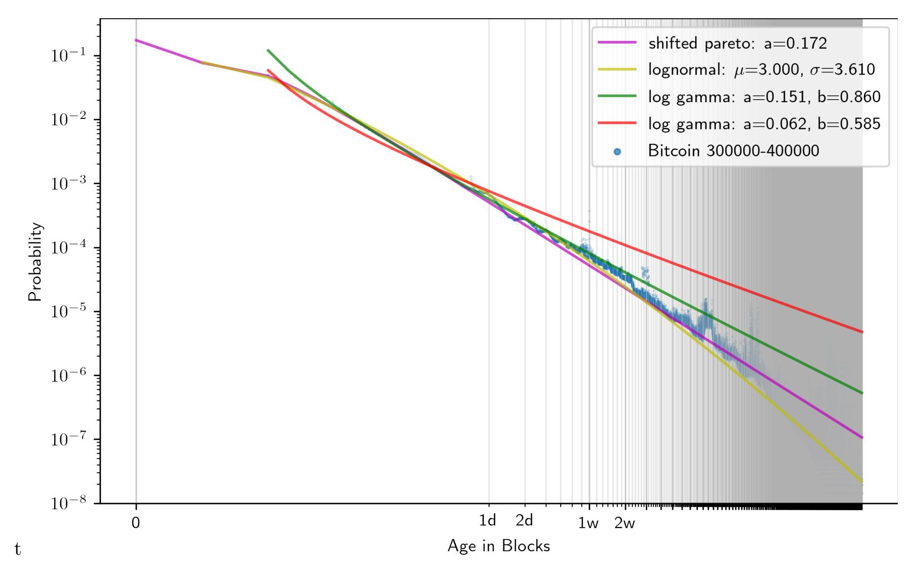
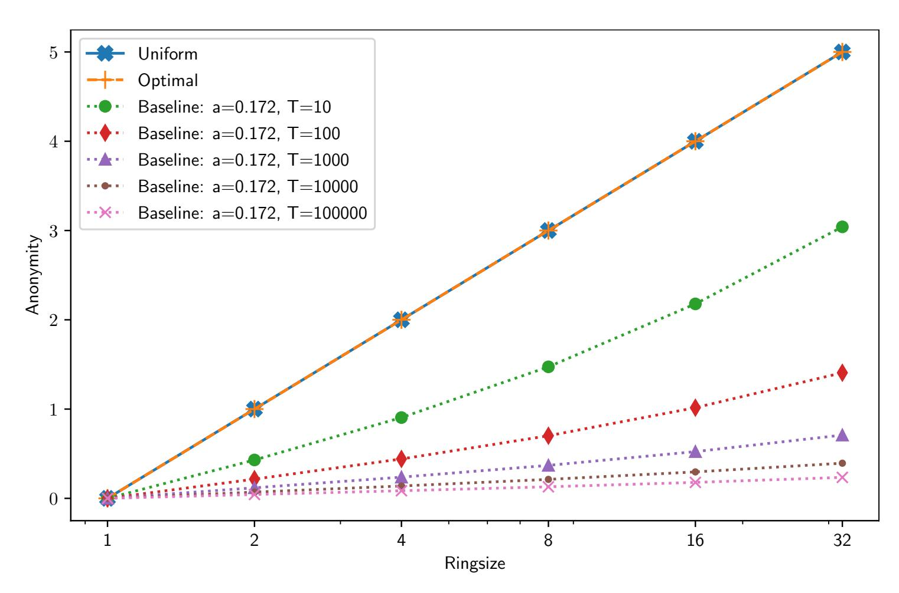
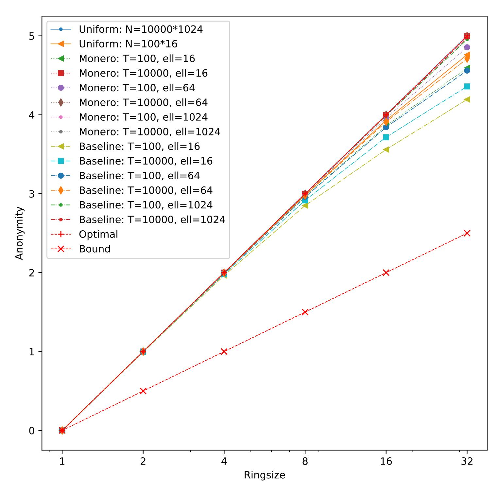
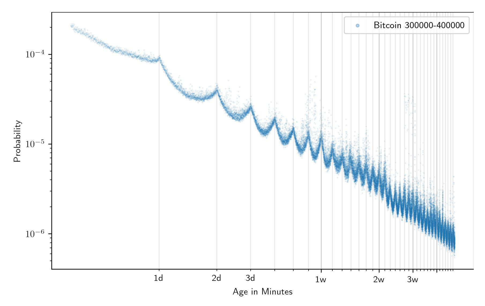

{0}------------------------------------------------

# Foundations of Ring Sampling

(Full Version)

Viktoria Ronge1 , Christoph Egger1 , Russell W. F. Lai1 , Dominique Schröder1 , and Hoover H. F. Yin2

> 1Friedrich-Alexander University, Erlangen-Nuremberg 2The Chinese University of Hong Kong

> > December 11, 2020

A ring signature scheme allows the signer to sign on behalf of an ad hoc set of users, called a ring. The verifier can be convinced that a ring member signs, but cannot point to the exact signer. Ring signatures have become increasingly important today with their deployment in anonymous cryptocurrencies. Conventionally, it is implicitly assumed that all ring members are equally likely to be the signer. This assumption is generally false in reality, leading to various practical and devastating deanonymizing attacks in Monero, one of the largest anonymous cryptocurrencies. These attacks highlight the unsatisfactory situation that how a ring should be chosen is poorly understood.

We propose an analytical model of ring samplers towards a deeper understanding of them through systematic studies. Our model helps to describe how anonymous a ring sampler is with respect to a given signer distribution as an information-theoretic measure. We show that this measure is robust, in the sense that it only varies slightly when the signer distribution varies slightly. We then analyze three natural samplers – uniform, mimicking, and partitioning – under our model with respect to a family of signer distributions modeled after empirical Bitcoin data. We hope that our work paves the way towards researching ring samplers from a theoretical point of view.

## 1 Introduction

A ring signature scheme [\[RST01\]](#page-21-0) allows the signer to sign on behalf of an ad hoc chosen set of users, called a ring. The verifier can be convinced that a ring member signed, but cannot tell who it was exactly. Initially motivated by anonymous disclosure of secrets, the concept of ring signatures has subsequently been studied extensively, and has been extended to many variants such as linkable [\[LWW04\]](#page-20-0) and accountable [\[XY04\]](#page-21-1) ring signatures. A notable extension of linkable ring signatures, known as ring confidential transactions (RingCT) [\[NMMRL16\]](#page-21-2), is the foundation of some privacy-preserving cryptocurrencies such as Monero. An overall market capitalization of more than two billion USD[1](#page-0-0) makes Monero a high-value target of deanonymization attacks. Understanding the concrete anonymity of RingCT, or ring signatures in general, is thus unprecedentedly important.

In most applications of ring signatures and its extensions, it is implicitly assumed that all honest members of a ring are equally likely to be the actual signer(s). This assumption could be justified in applications of ring signatures where there is a natural choice of ring from the context. For example, if a high-rank member of an organization wishes to disclose a secret, a natural choice of the ring consists of all high-rank members of the organization. In other applications, such as in anonymous cryptocurrencies where ring members are picked from a universe of seemingly indifferent anonymous accounts, the signer distribution is not at all obvious. For example, it is shown that the signer distribution of (an old version of) Monero is highly correlated with the "age" distribution of the signers [\[Mös+18\]](#page-21-3).

1<https://coinmarketcap.com/currencies/monero/> Nov. 28th, 2020

{1}------------------------------------------------

Picking a ring whose members have highly uneven signing probabilities could provide a false sense of anonymity. To illustrate the problem with a simple example, consider that Alice chooses to form a ring with Bob and Charlie and issues a ring signature. Suppose that an adversary somehow knows that Bob and Charlie (e.g., by social engineering) are very unlikely to issue such a signature, then Alice would not have much anonymity despite using a ring signature.

In practice, imperfect rings were exploited by the devastating attacks against Monero (see Section [2.1\)](#page-3-0), which sometimes completely deanonymized the signers. Although countermeasures were proposed, to the best of our knowledge, all proposals are based on the intuition derived from known exploits and are tailored to solve those specific issues.

## 1.1 Problem Statement

As of today, no analytical model is proposed for ring samplers, which prohibits a systematic study. For example, without such a model, it is difficult to make sense of the following questions, not to mention answering them: Is ring sampler Π better than Π0 ? Can we provably say that Π is good? Is Alice more anonymous than Bob when using Π? [2](#page-1-0) These questions call for a framework for quantifying and hence comparing the anonymity of (users of) ring samplers.

## 1.2 Our Methodology

In contrast to the existing bottom-up (concrete, attack-driven) approaches, we use a top-down (abstract) approach towards understanding the anonymity of ring samplers.

#### 1.2.1 Model of Ring Samplers

In Section [4](#page-8-0) we model ring samplers as an oracle machine Π which optionally gets oracle access to an (estimated) signer distribution, inputs the identifiers of the signers and outputs a ring. We then propose an information-theoretic measure of the anonymity of a ring sampler with respect to a signer distribution. More concretely, given random variable S following a signer distribution S, we define the anonymity α[S, Π] of the ring sampler Π to be the conditional min-entropy H∞(S|Π(S)). In the presence of a side-channel Λ, the anonymity is defined as

$$\alpha[\mathsf{S},\Pi,\Lambda] := H_{\infty}(\mathsf{S}|\Pi(\mathsf{S}),\Lambda(\mathsf{S})).$$

We also discuss the potential extension, and the difficulty thereof, to capture anonymity "over time" in Section [4.2.3.](#page-10-0)

Furthermore, in Section [5](#page-12-0) we show that the definition is robust, in the sense that the anonymity changes only slightly when the signer distribution changes slightly. In particular, if a ring sampler is shown to be good with respect to a close estimate Sˆ of the real signer distribution S, then it should also be good with respect to the real signer distribution S.

#### 1.2.2 Attacks against Ring Samplers

Our definition covers all (possibly computationally unbounded) deanonymization attacks against ring samplers in which the goal of the attacker is to guess the real signer. Such attacks could be classified in two orthogonal dimensions: passive v.s. active and direct v.s. side-channel.

Passive and Active Attacks In a passive attack, the adversary does not participate in the execution of the ring sampler. Abstractly, it has no influence on the signer distribution S or the execution of the ring sampler Π. This captures a wide range of "after-the-fact" attacks which rely on publicly available information such as transaction times, transaction graphs, account correlations, etc.

In an active attack, the adversary directly participates and/or indirectly influence the execution of the ring sampler. Abstractly, it influences or specifies the signer distribution S, or subverts the ring sampler Π, e.g., by manipulating the input randomness or its implementation. This captures attacks which are powerful but rely on stronger setup assumptions.

2We discuss in Section [4.2.3](#page-10-0) the difficulty of formalizing this question.

{2}------------------------------------------------

Direct and Side-Channel Attacks In a direct attack, the only information available to the adversary about the signer distribution S is a sample from Π(S) output by the ring sampler. In a sense, the adversary is attempting to deanonymize the signer by directly attacking the ring sampler. In a side-channel attack, more side-channel information might be available to the adversary. This extra information is abstracted as Λ(S), where Λ is some leakage function.

### 1.2.3 Signer Distributions for Comparison

To understand the anonymity of different samplers, we analyze them with respect to various distributions, with a focus on the cryptocurrency context due to its high real-world impact.

A cryptocurrency consists of a history of transactions each encoding a set of spenders and a set of receivers (possibly in a hidden manner). Each set of spenders can be thought of as a sample of the real signer distribution at that particular point in time. The real signer distributions at different points in time could be correlated arbitrarily.

Due to the anonymous nature of anonymous cryptocurrencies, it is (supposedly) infeasible to learn the real signer distributions. Möser et al. [\[Mös+18\]](#page-21-3) empirically analyzed the transaction graph of Monero in the pre-RingCT (i.e., non-anonymous) era, and "heuristically determined" that the signer distribution of Monero matches a gamma distribution over the logarithm of the age[3](#page-2-0) of accounts, which we simply call the log-gamma distribution hereinafter. While their heuristic lacks a physical interpretation, the distribution is nevertheless later used in the ring sampler of Monero [\[Mös+18\]](#page-21-3), which can be seen as an instantiation of the mimicking sampler that we introduce in Section [6.2.](#page-13-0) As the graph analysis tools and results of [\[Mös+18\]](#page-21-3) are not publicly available, we could not replicate their procedures of identifying the log-gamma distribution. We remark that there is no guarantee that the Monero distributions in the preand post-RingCT (i.e., current) eras are similar.

Another reference is the signer distribution of a non-anonymous cryptocurrency such as Bitcoin, despite the potential differences in spending behavior in a non-anonymous cryptocurrency compared to anonymous ones. To this end, we analyze the 300,000 to 400,000-th block of Bitcoin as in [\[Mös+18\]](#page-21-3), and found that the age of a transaction output matches a (shifted) Pareto distribution. We thus propose to use the (shifted) Pareto distributions as a baseline for evaluating ring samplers.

Interestingly, for the appropriate parameters, the probability density functions (PDFs) of the (shifted) Pareto distribution and the log-gamma distribution have very similar asymptotic behavior. Indeed, their PDFs only differ by a poly-logarithmic factor. In terms of physical interpretation, we found the modeling by the (shifted) Pareto distribution more convincing as it is classically used to model a wide range of human-related phenomenon, whereas the log-gamma distribution seems somewhat arbitrary. We emphasize, however, that the proposed baseline distribution, or any other non-application-specific ones, should only be treated as reference points. Even if a ring sampler is good with respect to the baseline distribution, it does not necessarily mean that it is good for a particular anonymous cryptocurrency, since the signer distributions of anonymous and non-anonymous cryptocurrencies could be very different.

#### 1.2.4 Analysis of Natural Samplers

We analyze the anonymity of three natural families of samplers – uniform, mimicking, and partitioning – with respect to general (possibly adversarially influenced) signer distribution S, assuming that the samplers are not subverted.

Uniform Samplers The uniform sampler simply samples uniformly random rings. It is shown to be bad with respect to signer distributions which are far from uniform, such as the (shifted) Pareto distributions. The fact that the uniform sampler is generally bad is quite expected. In a signer distribution which is very far away from uniform, the majority of users are unlikely to be the signer. Therefore the real signer would end up with a ring in which most members other than himself are unlikely to be the signer, and thus stand out from the crowd.

3The age is defined as the difference between spent and creation time.

{3}------------------------------------------------

Mimicking Samplers The  $\hat{S}$ -mimicking sampler is an abstraction of the (current) Monero sampler. It is given oracle access to some signer distribution  $\hat{S}$ , which supposedly estimates the real distribution S, and aims to output rings which "mimic"  $\hat{S}$  in some sense. For the special case where  $\hat{S} = S$ , which we call the mimicking sampler, we prove that its anonymity is lower bounded by half of the optimal value. The tightness of the lower bound is limited by the use of an intermediate distribution, which has lower conditional min-entropy but is easier to analyze, and the available bounding techniques. We believe that the exact anonymity should be considerably closer to the optimal value. Suppose that is the case, due to robustness, the  $\hat{S}$ -mimicking sampler is also good when  $\hat{S} \approx S$ . This can be seen as a theoretical confirmation of the approach used in Monero, albeit conditioned on the strong assumption that Monero chose a good  $\hat{S}$ .

The major drawback of the  $\hat{S}$ -mimicking sampler is the requirement of the knowledge of a estimation  $\hat{S}$  of S. Indeed, as S could depend on the economic situation and the free will of signers, it is arguably unknowable and inapproximable. Even if an estimation  $\hat{S}$  is known, the description of an  $\hat{S}$ -mimicking sampler could be quite complicated depending on the description of the distribution  $\hat{S}$ , and its anonymity depends on how well  $\hat{S}$  estimates S. It could also be difficult to write down its exact anonymity if  $\hat{S}$  lacks a close form.

Partitioning Samplers Partitioning samplers are based on another natural strategy of grouping users with similar signing probabilities together. More concretely, a partitioning sampler is defined by a distribution over a public family of partitions and optionally a ring size n. A ring is sampled by sampling a partition from the distribution, and then, if the ring size n is given, outputting a uniformly random n-subset of the chunk (an element of the partition) which contains the signer. If n is not given, the sampler simply outputs the unique chunk containing the signer. A special case of the partitioning sampler was also suggested in [YAEV19].

We show that the anonymity of a partitioning sampler is at most  $\lg \varepsilon$  away from the optimal value, where  $\varepsilon$  measures the non-uniformity of signing probabilities within chunks of the partitions. For the variant where n is given, if the partitions are chosen in such a way that the signing probabilities are constant within each chunk (which can be done naturally for the baseline distributions), the partitioning sampler is optimal.

Partitioning samplers are easy to describe and preferable in practice. Depending on how partitions are chosen, they could also have other nice properties which are not captured by our model. We refer to Section 6.3 for details.

#### 1.2.5 Implication to Ring Signatures

To help grasp the meaning of our work more concretely, in Appendix B we define a generalized notion of ring signatures which captures extended variants such as linkable ring signatures. We also define a simulation-based notion of anonymity which, although being equivalent to the usual indistinguishability-based notion, synergizes better with our anonymity notion of ring samplers. Finally, we define the concrete anonymity of the composition of ring signatures and ring samplers, and relate the anonymity of the composed system to those of the components.

## 2 Related Work

To better position our work in the literature, we overview the existing attacks against Monero, other ring sampler formalizations, and the formalizations of other anonymous systems.

#### 2.1 Attacks against Monero

The formal study of ring samplers is largely motivated by the plentiful attacks against Monero. To explain these attacks, we first briefly overview how ring signatures are used there.

In Monero, a spender can spend funds from possibly multiple source accounts to possibly multiple

{4}------------------------------------------------

| Work            | Venue   | Domain                | Metric                | Scope  | Remarks                                                      |
|-----------------|---------|-----------------------|-----------------------|--------|--------------------------------------------------------------|
| [Día+02;        |         | PETS'02 Communication | Shannon-Entropy       | Local  | (Co-)introduced information                               |
| SD02]           |         |                       |                       |        | theoretic metrics                                            |
| [New+03]        |         | PETS'03 Communication | Shannon-Entropy4      | Global | Extended information-theoretic metrics to global scope |
| [DPW06]         |         | FAST'06 Communication | Shannon-Entropy5      | Local  | Integration with process calculi                             |
| [ESY07]         | ISI'07  | Communication         | Permanent             | Global | Permanent-based metric to better capture global scope     |
| [TH04]          | PETS'04 | Mixnet                | Posterior Probability | Local6 | Handles cover traffic                                        |
| [GJH13]         | PETS'13 | Tor                   | Shannon-Entropy       | Local  | Evaluating performance trade-offs using the metrics       |
| [BMS16]         | PETS'13 | Tor                   | "Impact"7             | Local  | Evaluating real-world attacks                                |
| [Sho+11b;       | PETS,   | Location              | Shannon-Entropy8      | Both   | New metric & tool applicable to                              |
| Sho+11a]        | SP'11   |                       |                       |        | location privacy                                             |
| [YAEV19] CSF'19 |         | Ring Sampling         | Permanent             | Global | Formal analysis of ring sampling, orthogonal work         |
| Ours            |         | Ring Sampling         | Min-Entropy           | Global | Introduced information-theoretic                             |
|                 |         |                       |                       |        | metrics to ring sampling                                     |

Table 2: Comparison of Entropy/Probability-Based Anonymity Metrics

receivers as follows. First, the spender samples a ring of potential source accounts which is a superset of the actual source accounts. Next, for each receiver, it creates one target account whose secret key can be derived by the receiver. It then creates a proof that it knows the secret keys of the actual source accounts and that it wishes to transfer funds to some specified target accounts, which can be seen as a generalization of a ring signature. The proof also guarantees that none of the actual source accounts have been spent before. The owners of the target accounts can then further spend funds from them using the same procedure.

In the following we overview existing deanonymization attacks against Monero mostly based on ill-chosen rings.

#### 2.1.1 Passive Direct Attacks

Passive direct attacks against Monero exploit public information available after the target transaction is made. These attacks are particularly well-captured by our anonymity definition and the analysis of the natural samplers. They also constitute the majority of existing attacks, and are more realistic due to the minimal assumption on the attacker.

Exploiting Transaction Times The age of an account influences the likelihood of it being an actual source of a transaction [\[Mös+18\]](#page-21-3): Old accounts become increasingly less likely to still be unspent and therefore be an actual source account of a transaction. On the other hand, freshly created target accounts are highly likely to be used as source accounts in transactions soon. Using the above observation, the ring sampling strategy which selects accounts uniformly at random over the set of all accounts is not a good idea, as younger accounts are less likely to function as decoys in the ring. These attacks have been deployed in [\[Mös+18;](#page-21-3) [Kum+17\]](#page-20-6).

In particular, for over 95% of existing transactions in an older pre-RingCT version of Monero, the newest account in the ring is the signer [\[Kum+17\]](#page-20-6). This makes the simple attack of guessing the newest account to be the signer devastating, highlighting the importance of using a good ring sampler.

4But already has many ideas of permanent-based metrics

5 In the form of information gain

6Global is mentioned but considered infeasible

7A metric measuring the loss of anonymity computed from the conditional distributions of the observable events

8 In the form of relative entropy

{5}------------------------------------------------

Exploiting Graph Structures When rings selected for different transactions overlap, by analyzing the graph induced by the relation between the rings, one can infer non-trivial information about the actual source accounts of a transaction, e.g. shown in [\[Mös+18;](#page-21-3) [Kum+17\]](#page-20-6). In the extreme case, which is considered in the "zero-mixin attack", some transactions use rings of size one. If such a zero-mixin account is used in other rings, it does not add any anonymity as an observer can clearly rule out this account as a possible source (c.f., the illustrative example in Section [1\)](#page-0-2).

Exploiting Correlated Accounts Transactions with multiple source accounts expose an additional problem [\[Kum+17\]](#page-20-6).

For example, let more than one target account be the output of the same previous transaction. If these accounts are included in a ring of a subsequent transaction with multiple inputs, then it is quite likely that they are the actual source of the subsequent transaction. This attack is based on the implicit assumption that output accounts in one transaction have a significant chance to belong to the same receiver and that both output accounts being chosen as decoys is low.

#### 2.1.2 Active Direct Attacks

The best known attack of this kind against Monero is the so called "black marble attack", proposed in [\[NNM;](#page-21-10) [MNT;](#page-20-7) [Wij+18\]](#page-21-11), which consists of two active parts.

In the first part, the attacker compromises existing accounts or spawns new accounts in the system, and hopes that some of them (the black marbles) will be included in future rings. This can be modelled by considering an adversarially influenced signer distribution S. If it happens that a ring chosen by the victim consists of mostly black marbles, then the anonymity of the victim is severely limited. While this attack seems reasonable in theory, its practicality is unclear. Even for the provably bad uniform sampler, the probability of randomly picking a black marble as a ring member is low, assuming the universe of signers is large. To increase this probability, the attacker could spawn an overwhelming number of accounts, which however requires substantial transaction fees.

In the second part, the attacker subverts the victim's ring sampler, so that black marbles are injected into the rings chosen by the signer. While this attack is in no doubt devastating, the assumption on the attacker's ability to subvert ring samplers is very strong. Indeed, if subversion is allowed, the attacker might as well directly embed the signer's identity in the chosen ring in an undetectable manner[9](#page-5-0) , without going through all the trouble of spawning black marbles. No ring sampler could defend against this.

We remark that although our analysis of the partitioning sampler does not consider subversion attacks, the fact that its output must be a subset of a chunk of a publicly defined partition limits the flexibility of the attacker in planting black marbles.[10](#page-5-1) The signer could easily detect the subversion if the sampled ring is "illegal" (e.g., if it contains black marbles chosen from chunks where the signer does not belong to).

#### 2.1.3 Side-Channel Attacks

In existing implementations of Monero, a client consists of two parts known as the node and the wallet, which may or may not be co-located in the same device. Some side-channel attacks (e.g., [\[TBP20\]](#page-21-12)) exploit the communication patterns between the two parts, and/or the reaction of the client to inbound communication, to deduce whether the client is the intended receiver of a transaction. Such attacks are purely side-channel and are independent of the ring sampler. Moreover they aim to deanonymize the receiver but not the signer, which is out of the scope of our model.

9The subverted ring sampler could for example only output rings whose hash value equals to a one-time pad of the i-th bit of the signer's identity or secret key. From a steganographic point of view [\[vH04\]](#page-21-13), this is provably undetectable. If the setting allows to repeat the procedure many times for different i, the attacker could recover the exact identity of the signer.

10Depending on the choice of the partition(s), the subset and the chunk that the signer belongs to could even be unique.

{6}------------------------------------------------

#### 2.2 Other Formalization Attempts

Yu, Au, and Esteves-Verissimo [\[YAEV19\]](#page-21-4) analyzed ring samplers from another perspective: They studied the anonymity of a group of signers after all of them have chosen particular instances of rings, while implicitly assuming that the signer distribution is uniform. The core technique of their study is modelling signer identities using graphs to rule out impossible signers. This can be seen as an instantiation of the work by Edman, Sivrikaya, and Yener [\[ESY07\]](#page-20-3) who studied matrix permanents to understand potential message flows in an anonymous communication system.

In contrast, we model ring samplers as probabilistic algorithms, and focus on analyzing the (loss of) anonymity of signers when given individual rings. The two approaches are orthogonal and complementary [\[ESY07\]](#page-20-3) since they give different insights about the anonymity of ring samplers. We envision the unification of them towards a more comprehensive theory of ring samplers.

Although the approach taken by Yu, Au, and Esteves-Verissimo [\[YAEV19\]](#page-21-4) is very different, they arrived at a similar conclusion to ours that a partitioning sampler (using our terminology) is optimal (in both our and their sense). Indeed, their partitioning sampler can be seen as a specific instantiation of our generic one. Furthermore, we analyzed the robustness of our definition, and the anonymity of the uniform and the mimicking samplers. Similar results were not in [\[YAEV19\]](#page-21-4).

## 2.3 Other Anonymous Systems

It is common to quantify the anonymity of anonymous systems, in particular anonymous communication systems. Proposed metrics include information-theoretic measures, permanents (of induced bipartite graphs), or other metrics derived from probabilities. Table [2](#page-4-1) provides an overview of these quantification efforts, but due to the volume of the literature it is necessarily incomplete. For a comprehensive survey, see [\[WE18\]](#page-21-14).

Historically it is not uncommon that concrete tasks are guided by anonymity metrics after the latter are sufficiently well studied. These include for example the analysis of performance tradeoffs [\[GJH13\]](#page-20-4) and attacks [\[BMS16\]](#page-20-5) against the Tor system. It has also been noted that other areas like location privacy [\[Sho+11b\]](#page-21-8) profit from the guidance of information-theoretic measures. However a information-theoretic treatment of ring (or generally speaking, decoy) selection is, thus far, missing in literature. Unique to ring samplers is the use of decoys (ring members), which is not covered by the analysis of, e.g., mixnet-style anonymous communication where all inputs to a mixer are "real". We close this gap with this paper.

## 3 Preliminaries

Denote by λ the security parameter. For M, N ∈ N, we denote [N] := {1, . . . , N } and [M : N] := {M, M + 1, . . . , N }. Logarithms are either with base 2, denoted by lg, or natural, denoted by ln. The sets of polynomials and negligible functions in λ are denoted by poly(λ) and negl(λ) respectively. Probabilistic polynomial time is abbreviated as PPT. If A is a PPT algorithm, y ← A(x) means assigning the result of running A on x (with implicit randomness) to y. Sets are denoted by capital letters. If S is a finite set, x ←\$ S means that a random x is chosen uniformly from S. An algorithm A having black-box access to a subroutine R is represented as AR.

Let f and g be real-valued functions. If f is proportional to g, i.e., f(x) = k · g(x) for all x for some constant k, we write f ∝ g. We use primarily to express probability density functions (PDFs) without specify the normalizing constant.

We denote the power set of S by 2 S. If A ⊆ B and |A| = n, we write A ⊆n B. If |A| ≤ n, we write A ⊆≤n B.

## 3.1 Random Variables and Min-Entropy

(Discrete) random variables are written in sans-serif, e.g., X,

{7}------------------------------------------------

distributions of random variables are written in calligraphic, e.g., X . When the connection is obvious we only denote the distribution and use the same letter in sans-serif for the underlying random variable.

The support of X is denoted by Supp(X) := {X : Pr [X = X] > 0}. If it is obvious that X has support S, we write X ∈ S instead of X ∈ Supp(X). When summing over all X in the support of X, i.e., P X∈Supp(X) , we usually omit Supp(X) and simply write P X unless there is an ambiguity. The same holds when taking minimum or maximum. For a function f, we write f(X) ≡ Y if Pr [f(X) = Y ] = 1.

Definition 3.1. The guessing probability of X is defined as

$$\mathsf{Guess}\left(\mathsf{X}\right) := \max_{X} \mathsf{Pr}\left[\mathsf{X} = X\right].$$

This gives an upper bound on the probability that an (unbounded) adversary can "guess" the value of the random variable X correctly.

Definition 3.2. The (average) conditional guessing probability of X given Y is defined as

$$\mathsf{Guess}\left(\mathsf{X}|\mathsf{Y}\right) := \sum_{Y} \mathsf{Pr}\left[\mathsf{Y} = Y\right] \max_{X} \mathsf{Pr}\left[\mathsf{X} = X|\mathsf{Y} = Y\right].$$

This gives an upper bound on the probability that an (unbounded) adversary "guesses" the value of the random variable X correctly when given a sample of Y.

Definition 3.3. The min-entropy of X is defined as

$$H_{\infty}(X) := -\lg (\mathsf{Guess}(X))$$
.

The min-entropy of X is in a sense the most pessimistic measure of information given in X. It has significance in randomness extraction in the sense that nearly H∞(X) random bits can be extracted from the source X [\[Dod+08\]](#page-20-8). Therefore a higher value of H∞(X) is desirable. As is common in cryptography, in this work we consider only min-entropy. All definitions however naturally extend to other measures of entropy.

Definition 3.4. The (average) conditional min-entropy of X given Y is defined as

$$H_{\infty}(X|Y) := -\lg(\mathsf{Guess}(X|Y))$$
.

The conditional min-entropy has similar interpretations as that of min-entropy. There are several equivalent expressions of the conditional min-entropy useful for different occasions.

Lemma 1. H∞(X|Y) can be expressed as:

$$\begin{split} &H_{\infty}(\mathsf{X}|\mathsf{Y}) \\ &= -\lg \left( \sum_{Y} \mathsf{Pr}\left[\mathsf{Y} = Y\right] \max_{X} \mathsf{Pr}\left[\mathsf{X} = X|\mathsf{Y} = Y\right] \right) \\ &= -\lg \left( \sum_{Y} \max_{X} \mathsf{Pr}\left[\mathsf{Y} = Y|\mathsf{X} = X\right] \mathsf{Pr}\left[\mathsf{X} = X\right] \right) \\ &= -\lg \left( \sum_{Y} \max_{X} \mathsf{Pr}\left[\mathsf{X} = X \land \mathsf{Y} = Y\right] \right). \end{split}$$

The following properties about min-entropy and conditional min-entropy are well-known.

Lemma 2 (Non-Negativity, Monotonicity). For any X, Y,

$$0 \le H_{\infty}(X|Y) \le H_{\infty}(X).$$

{8}------------------------------------------------

Lemma 3 (Data Processing Inequality). Let S, R,X be random variables where R = f(X) for some function f. Then H∞(S|R) ≥ H∞(S|X).

Proof. Note that H∞(S|R,X) = H∞(S|X) (trivial) and H∞(S|R,X) − H∞(S|R) ≤ 0 (monotonicity). Therefore H∞(S|X) ≤ H∞(S|R).

We recall the Rényi divergence (of ∞-order) to measure the closeness of two distributions.

Definition 3.5. Let S and S 0 be such that Supp(S) ⊆ Supp(S 0 ). Their Rényi divergence of order ∞ is defined as

$$D_{\infty}(\mathsf{S}||\mathsf{S}') := \lg \max_{S \in \mathsf{Supp}(\mathsf{S}')} \frac{\mathsf{Pr}\left[\mathsf{S} = S\right]}{\mathsf{Pr}\left[\mathsf{S}' = S\right]}.$$

## 4 Modeling

In this section, we devise a formal model of ring samplers which in particular includes an informationtheoretic measure of anonymity. We also derive general lower and upper bounds of anonymity, and discuss its extensions.

## 4.1 Syntax

Throughout this work, we consider a universe of users indexed by the set [N] where a subset S of them wish to hide themselves among a ring of users.

Definition 4.1 (Signer Distributions). A signer distribution S is a distribution over the set 2 [N] \ {∅}. Let k ∈ [N]. S is said to be a k-signer distribution if Pr [|S| ≤ k] = 1.

In this work, we focus mostly on 1-signer distribution, i.e., there is only one signer. Next, we state a minimalistic syntax of ring samplers.

Definition 4.2 (Ring Samplers). A ring sampler Π is a PPT (oracle) machine which inputs a set of signers S ⊆ [N] and outputs a ring R satisfying S ⊆ R ⊆ [N]. Let k, n ∈ [N] with k ≤ n. Π is said to an n-ring sampler if it always holds that |R| ≤ n. If additionally Π only takes S with |S| ≤ k as input, then it is a (k, n)-ring sampler.

For concreteness, think of k and n to be small constants, e.g., k = 1 or 2, and n = 10, and lg N = poly(λ). In such case, the input and output of Π can each be represented by poly(λ) bits, and an efficient ring sampler should run in time poly(λ).

## 4.2 Anonymity

We measure the quality of a ring sampler in terms of its anonymity, i.e., the difficulty to guess who the signer(s) are when given a ring. From an adversary's point of view, before seeing any information about the signing/transaction event, e.g., a ring R = Π(S), the anonymity of all participants is considered to be maximum, and can be measured by the value H∞(S).

The knowledge of R or other side-channel leakage of S can only reduce the anonymity from H∞(S) towards zero. From this viewpoint, let Λ be a leakage function capturing the side-channel. We define the anonymity of a ring sampler Π with respect to S in presence of the side-channel Λ as the min-entropy of S conditioning on the ring and the leakage.

{9}------------------------------------------------

Definition 4.3 (Anonymity). Let Π be a ring sampler and Λ : {0, 1} ∗ → {0, 1} ∗ be a leakage function. The anonymity of Π with respect to S in presence of Λ is defined as

$$\alpha(\mathsf{S},\Pi,\Lambda):=H_{\infty}(\mathsf{S}|\Pi(\mathsf{S}),\Lambda(\mathsf{S}))$$

where Π(S) is the random variable induced by applying Π on S with uniform randomness, and Λ(S) is the leaked side-channel information about S due to Λ. If Λ is a constant function (i.e., there is no leakage), then we simply write

$$\alpha(\mathsf{S},\Pi) := H_{\infty}(\mathsf{S}|\Pi(\mathsf{S}))$$

and regard it as the anonymity of Π with respect to S.

#### 4.2.1 Scope and Implications

Our approach of defining anonymity is natural and general in the sense that it can be adopted to any anonymous system. Abstractly, if S is a distribution over a set of objects whose anonymity is to be protected by an anonymous system Π, and Λ is a leakage function capturing any side-channel information leakage external to Π, then the anonymity of Π with respect to S in presence of Λ can be measured by H∞(S|Π(S),Λ(S)), exactly like how we measure the anonymity of a ring sampler.

Our definition captures all deanonymization attacks: passive, active, direct, and side-channel, by any computationally unbounded adversary. Given a sample of the induced ring distribution Π(S) and a sample of the leakage Λ(S), the goal of a deanonymizing adversary is to output a guess of the signer S.

Remark 1. While our definition captures active and side-channel attacks, it is somewhat unnatural. A more convenient and expressive way of capturing those is through security experiments akin to those used in (computational) cryptography, such as the ones defined in Appendix [B](#page-22-0) for the anonymity of the composition of ring samplers and ring signatures.

For a more concrete feeling of the definition, we state the following immediate implication on any deanonymization attacks from any computationally unbounded adversaries. The proof is obvious and is omitted.

Theorem 4.4. Let A be any computationally unbounded adversary, who inputs a ring Π(S) (where Π is possibly subverted by A) and some leakage Λ(S), where S is sampled from the distribution S (possibly influenced or specified by A), and outputs a guess S 0 . The probability of A correctly guessing the signer S, i.e., S 0 = S, is upper bounded by

Guess 
$$(S|\Pi(S), \Lambda(S)) = 2^{-\alpha(S,\Pi,\Lambda)}$$
.

#### 4.2.2 Basic Properties

Intuitively, a higher value of α(S, Π) (or α(S, Π,Λ)) means a higher anonymity, or rather, the amount of anonymity lost due to the use of the ring sampler (and the leakage) is smaller. Due to monotonicity (Lemma [2\)](#page-7-0), α(S, Π,Λ) lies between zero and H∞(S) for any Π and Λ, which aligns with our subtractive view of anonymity.

General Bounds When analyzing the fundamentals of a ring sampler Π, it is instrumental to focus on the value α(S, Π) even if there might be some external leakage Λ which is not the "fault" of the sampler Π. The following lemma relates the anonymity definitions with and without leakage. Its proof follows immediately from the chain rule and the monotonicity of min-entropy.

Lemma 4. For any S, Π, and Λ, it holds that

$$\alpha(\mathsf{S},\Pi) - \lg |\mathsf{Supp}(\Lambda(\mathsf{S}))| \le \alpha(\mathsf{S},\Pi,\Lambda) \le \alpha(\mathsf{S},\Pi).$$

{10}------------------------------------------------

Although the above bound is loose (compared to the Shannon entropy counterpart), it suggests that the anonymity of the ring sampler without leakage, i.e., α(S, Π), is the dominating component of α(S, Π,Λ) when the max-entropy lg |Supp(Λ(S))| of the leakage is small. For the typical size leakage where Λ(S) = |S|, where S is a k-signer distribution and Π is an (k, n)-ring sampler with k n, this is indeed the case since lg |Supp(Λ(S))| = lg k lg n.

Let ΠAll be the "all sampler" which always outputs [N]. Let ΠId be the "identity sampler" which on input S outputs S. We first state some trivial bounds of anonymity, and how they can be achieved. The proof is obvious and omitted.

Lemma 5. For any S, Π, and Λ, it holds that

$$\alpha(\mathsf{S}, \Pi_{\mathrm{Id}}, \Lambda) = 0 \le \alpha(\mathsf{S}, \Pi, \Lambda) \le H_{\infty}(\mathsf{S}) = \alpha(\mathsf{S}, \Pi_{\mathrm{All}}).$$

The upper and lower bounds above are too far apart to tell us anything useful about α(S, Π,Λ). The main reason is that the "all sampler" and the "identity sampler" have extreme ring sizes (n = N and k respectively), while in practice we are interested in n-ring samplers for (small) fixed n. We therefore state another upper bound of anonymity of n-ring samplers, whose proof can be found in Appendix [C.](#page-25-0)

Lemma 4.1. For any k-signer distribution S, any n-ring sampler Π, and any leakage function Λ,

$$\alpha(\mathsf{S},\Pi,\Lambda) \leq \lg \sum_{i=1}^k \binom{n}{i}.$$

In particular, for k = 1 we have

$$\alpha(\mathsf{S},\Pi,\Lambda) \leq \lg n.$$

Optimality Our definition of anonymity in a sense describes the anonymity of the system employing the ring sampler as a whole. In other words, the (conditional) signing probabilities of individual signers are collapsed into a single value. In Lemma [4.1,](#page-10-1) we showed that the anonymity of a ring sampler with ring size n for a 1-signer distribution is at most lg n, which is also the entropy of the uniform distribution over a set of size n. If the anonymity is (significantly) below lg n, then not much about the individual signing probabilities can be inferred. However, if the anonymity reaches lg n, then the signing probability of each signer in the ring is exactly 1/n. The optimality of the anonymity is in this sense informative. Interestingly, in the formulation of [\[YAEV19\]](#page-21-4) optimal global anonymity also implies optimal local anonymity.

Later in this work, we will show that for 1-signer distributions S the optimal anonymity is always almost achievable. More concretely, in Section [6.2](#page-13-0) we show that there exists a "mimicking" sampler ΠMimic which achieves anonymity α(S, ΠMimic) ' 1 2 lg n, which is only a constant fraction away from the optimum, assuming minimally that S has at least lg n bits of min-entropy.

While the near-optimal anonymity of the mimicking sampler is quite impressive, the result is mostly theoretical as it requires the knowledge of the distribution S. More realistically, with a mild assumption that the support of S can be partitioned into chunks of size at least n, such that the signing probabilities of the signers within a chunk are similar, then the partitioning sampler presented in Section [6.3](#page-14-0) also achieves near-optimal anonymity.

#### 4.2.3 Extensions

In the following we discuss natural extensions of our anonymity definition, and why we decide not to incorporate them into our main definition.

"Local" Anonymity In some sense, the value α[S, Π,Λ] = H∞(S|Π(S),Λ(S)) captures the "global" anonymity of all participants as a whole. To capture the "local" anonymity of a certain subset I ⊆ [N] of users, one might want to consider the value H∞(SI |Π(S),Λ(S)), where SI := S∩I. We argue that however the value H∞(SI |Π(S),Λ(S)) does not capture the intuitive anonymity enjoyed by the subset I of users. 

{11}------------------------------------------------

For a counter-argument, it suffices to consider the case where  $\Lambda$  is constant,  $|S| \equiv 1$  and  $I = \{i\}$  for some  $i \in [N]$ . Note that  $S_I$  is a Boolean random variable (with support  $\{\emptyset, \{i\}\}\)$ ). Recall that

$$\begin{split} &H_{\infty}(\mathsf{S}_I|\Pi(\mathsf{S}),\Lambda(\mathsf{S}))\\ =&H_{\infty}(\mathsf{S}_I|\Pi(\mathsf{S}))\\ =&-\lg\left(\sum_{R}\mathsf{Pr}\left[\Pi(\mathsf{S})=R\right]\max_{S_I}\mathsf{Pr}\left[\mathsf{S}_I=S_I|\Pi(\mathsf{S})=R\right]\right). \end{split}$$

Note that for any  $R \not\ni i$ , which are the majority,

$$\Pr\left[\mathsf{S}_I = \emptyset \middle| \Pi(\mathsf{S}) = R\right] = 1,$$

and therefore

$$\max_{S_I} \Pr\left[\mathsf{S}_I = S_I | \Pi(\mathsf{S}) = R\right] = 1.$$

Therefore, intuitively, the expected value of  $\max_{S_I} \Pr[\mathsf{S}_I = S_I | \Pi(\mathsf{S})]$  is close to 1, which means the conditional min-entropy  $H_\infty(\mathsf{S}_I | \Pi(\mathsf{S}))$  is close to 0, even for the "best" samplers.

The above issue was due to the fact that user i is almost always not in the ring, and therefore an adversary could be successful by always guessing that user i is not a signer, i.e.,  $S_I = \emptyset$ . An attempt to avoid this issue is to consider the entropy of  $S_I$  conditioning on  $R_I$ , where the latter is distributed as  $\Pi(S)$  conditioned on that  $I \subseteq \Pi(S)$ . We examine the value

$$\begin{split} &H_{\infty}(\mathsf{S}_I|\mathsf{R}_I) \\ &= -\lg\left(\sum_{R} \mathsf{Pr}\left[\mathsf{R}_I = R\right] \max_{S_I} \mathsf{Pr}\left[\mathsf{S}_I = S_I|\mathsf{R}_I = R\right]\right) \end{split}$$

for a hypothetical "best" sampler with a fixed ring size n, where for every ring  $R \in \mathsf{Supp}(\mathsf{R})$  such that  $S \subseteq R$ , it holds that  $\mathsf{Pr}\left[\mathsf{S} = S \middle| \Pi(\mathsf{S}) = R\right] = 1/n$  (note that we are assuming that  $|\mathsf{S}| \equiv 1$ ).

One would have hoped that the value is close to or exactly 1, which is the highest (min-)entropy that a Boolean random variable can have. However, note that in particular  $\Pr[S = \{i\} | \Pi(S) = R] = 1/n$  in the case  $I = \{i\} \subseteq R$ , and hence  $\Pr[S_I = \{i\} | R_I = R] = \frac{1}{n}$  for any  $R \in \text{Supp}(R_I)$ . We therefore have

$$\max_{S_I} \Pr\left[\mathsf{S}_I = S_I \middle| \mathsf{R}_I = R\right] = \Pr\left[\mathsf{S}_I = \emptyset \middle| \mathsf{R}_I = R\right] = \frac{n-1}{n}$$

for all  $R \in \mathsf{Supp}(\mathsf{R}_I)$ , and hence  $H_{\infty}(\mathsf{S}_I|\mathsf{R}_I) = \lg n - \lg(n-1)$  ( $\approx 0$  for large n), which is still counter-intuitive.

Anonymity "Over Time" Our main definition captures the remaining anonymity of the users in the view of an adversary after seeing a single ring. In reality, however, multiple rings would be sampled throughout the lifetime of the system, possibly even via different ring samplers, which might collectively leak more information about the signers (behind each ring) than any single ring does. For the ease of exposition we omit the leakage  $\Lambda$  in the discussion below.

Formally, suppose the system has been run for t time steps, i.e., t rings have been sampled. For time step  $i \in [t]$ , let  $N_i \in \mathbb{N}$  be the universe size,  $S_i$  be the signer distribution over the universe  $[N_i]$ ,  $\Pi_i$  be the ring sampler, and  $R_i = \Pi_i(S_i)$  be the random variable denoting the sampled ring. Then, for any subset  $\{i_1, \ldots, i_\ell\} \subseteq [t]$ , we might want to consider the value  $H_{\infty}(S_{i_1}, \ldots, S_{i_\ell} | R_1, \ldots, R_t)$  which captures the anonymity of the signers at time steps  $i \in \{i_1, \ldots, i_\ell\}$ , after seeing the rings from all time steps. In particular, the extreme values  $H_{\infty}(S_1, \ldots, S_t | R_1, \ldots, R_t)$  and  $H_{\infty}(S_j | R_1, \ldots, R_t)$  for  $j \in [t]$  might be of interest.

It is not difficult to show that

$$\max_{j\in[t]}H_{\infty}(\mathsf{S}_{j}|\mathsf{R}_{1},\ldots,\mathsf{R}_{t})$$

To take leakages into account, we additionally condition the min-entropy on  $\Lambda_1(S_1), \ldots, \Lambda_t(S_t)$  for possibly different leakage functions  $\Lambda_1, \ldots, \Lambda_t$ .

{12}------------------------------------------------

$$\leq H_{\infty}(\mathsf{S}_{1},\ldots,\mathsf{S}_{t}|\mathsf{R}_{1},\ldots,\mathsf{R}_{t})$$

$$\leq \sum_{j\in[t]} H_{\infty}(\mathsf{S}_{j}|\mathsf{R}_{1},\ldots,\mathsf{R}_{t})$$

$$\leq \sum_{j\in[t]} H_{\infty}(\mathsf{S}_{j}|\mathsf{R}_{j}),$$

which relates the aforementioned extreme values with our definition of anonymity. Unfortunately, not much more can be said about these values in general since, for any i 6= j, (Si , Πi) and (Sj , Πj ) can be arbitrarily correlated depending on the application and user behavior.

For example, if (Si , Πi) and (Sj , Πj ) are independent for all i 6= j, then t· maxj∈[t] H∞(Sj |R1, . . . , Rt) = H∞(S1, . . . , St|R1, . . . , Rt), and the last two inequalities become equalities. On the other extreme, if (Si , Πi) and (Sj , Πj ) are identical and dependent for all i, j, then the first inequality becomes an equality, while t · H∞(S1, . . . , St|R1, . . . , Rt) = P j∈[t] H∞(Sj |R1, . . . , Rt).

In summary, the values H∞(Si1 , . . . , Si` |R1, . . . , Rt) are extremely sensitive to the correlations between (Si , Πi) and (Sj , Πj ) for i =6 j, which highly depend on the real-world application and user behavior. Therefore, in a general theory about ring samplers where minimal assumptions about the signer distributions and user behavior are made, not much can be said about the "anonymity over time" meaningfully.

## 5 Robustness

We show that our anonymity definition is robust in the sense that, if the source distributions S and S 0 are close (in Rényi divergence), then the anonymity of a ring sampler with respect to S is close to that with respect to S 0 . This allows us to analyze ring samplers with respect to some distribution S which is easier to deal with, and get a guarantee of the anonymity of the sampler with respect to the real distribution S 0 assuming that it is close enough to S.

Robustness also allows us to reason about the anonymity of a ring sampler against active attackers who attempt to perturb the signer distribution from S to S 0 . Suppose we have deduced that the anonymity of a ring sampler with respect to S (against a passive adversary) is high. Assuming that no adversary could influence S too much, i.e., S 0 is not too far away from S, then by robustness the anonymity of the ring sampler with respect to S 0 is also high. Such an assumption could be realistic, e.g., in the cryptocurrency setting where we anyway assume that the majority of the users are honest for the consensus protocol to function.

Theorem 5.1 (Robustness). For any S and S 0 with Supp(S) ⊆ Supp(S 0 ), any Π and Λ, and any ε ≥ 0, if D∞(SkS 0 ) ≤ ε, then

$$\alpha(S, \Pi, \Lambda) \ge \alpha(S', \Pi, \Lambda) - \varepsilon.$$

# 6 Analysis of Natural Samplers

We formalize the the uniform, mimicking, and partitioning samplers, and analyze their anonymity. To understand the fundamental strengths and weaknesses of the samplers, we focus on 1-signer distributions, assume that the ring samplers are not subverted, and assume that no side-channel leakage is present. In cases where a close form of anonymity is unavailable, we provide lower bounds.

### 6.1 Uniform Samplers

A natural (yet generally bad) way to select rings is to just sample them uniformly at random. Formally, for each 1 ≤ k ≤ n ≤ N, we define the uniform sampler ΠRand,k,n as follows:

ΠRand,k,n(S ⊆≤k [N]): Sample R ⊆n [N] uniformly at random subject to S ⊆ R.

{13}------------------------------------------------

**Theorem 6.1** (Uniform Sampler). Let S be a 1-signer distribution. Let  $E_i$  be the i-th most probable event in S and

$$\rho_i = \begin{cases} \Pr\left[E_i\right] & i \in [|\mathsf{Supp}(\mathsf{S})|] \\ 0 & i \in [N] \setminus [|\mathsf{Supp}(\mathsf{S})|]. \end{cases}$$

Then

$$\alpha(\mathsf{S}, \Pi_{\mathrm{Rand},1,n}) = -\lg\left(\frac{\sum_{i=n-1}^{N-1} \binom{i}{n-1} \rho_{N-i}}{\binom{N-1}{n-1}}\right). \tag{1}$$

Let us say a few words about the uniform sampler. Suppose S is the uniform distribution over [N], we have  $\rho_i = 1/N$  for all  $i \in [N]$ . Then by the "hockey-stick" identity, we have  $\alpha(S, \Pi_{\text{Rand},1,n}) = \lg n$  which is optimal. This aligns with our expectation that when S is uniform the best way to sample a ring is to just sample uniformly.

Next we examine the scenario where S is very far from uniform. For example, suppose that  $\rho_i = 2\rho_{i-1}$  for all i. In this case,  $\sum_{i=n-1}^{N-1} \binom{i}{n-1} \rho_{N-i}$  is dominated by the first few terms as  $\rho_i$  diminishes exponentially as i decreases. We can therefore expect that  $\alpha(\mathsf{S},\Pi_{\mathrm{Rand},1,n})$  is very far from  $\lg n$ .

## 6.2 Mimicking Samplers

Another natural strategy of ring sampling is to mimic the true source distribution  $\mathcal{S}$ . Suppose that  $\hat{\mathcal{S}}$  is an estimate of the true source distribution and is efficiently sampleable. We formalize this strategy as the  $\hat{\mathcal{S}}$ -mimicking sampler  $\Pi^{\hat{\mathcal{S}}}_{\mathsf{Mimic},k,n}$  with size parameter (k,n) as follows:

$$\Pi^{\hat{\mathcal{S}}}_{\mathsf{Mimic},k,n}(S\subseteq_k [N])$$
: Let  $S_1:=S$ . For  $i\in[n]\setminus\{1\}$ , sample  $S_i\leftarrow_{\$}\hat{\mathcal{S}}$ . Output  $R:=\bigcup_{i\in[n]}S_i$ .

Note that  $\Pi_{\mathsf{Mimic},k,n}^{\hat{\mathcal{S}}}$  is a (k,kn)-ring sampler. In the case  $\hat{\mathcal{S}} = \mathcal{S}$  and  $\mathcal{S}$  is a k-signer distribution, we simply write  $\Pi_{\mathsf{Mimic},k,n}^{\mathcal{S}}$  as  $\Pi_{\mathsf{Mimic},k,n}$  and call it the mimicking sampler.

We remark that  $\Pi_{\mathsf{Mimic},k,n}^{\hat{S}}$  is defined as above for easier analysis. It does not always produce a ring of size kn due to collisions from sampling with replacement, *i.e.*, it might happen that  $S_i \cap S_j \neq \emptyset$  for  $i \neq j$ . Therefore the anonymity of  $\Pi_{\mathsf{Mimic},k,n}^{\hat{S}}$  cannot be optimal among all kn-ring samplers. The anonymity can only increase by padding the ring to contain kn users with any strategy. In the special case where k = 1, one can continue to populate the ring with samples from  $\hat{S}$ , until the ring size reaches n.

Despite the above suboptimality, in the case  $N \gg n$ , sampling with replacement is a reasonable approximation of sampling without replacement. It is therefore reasonable to expect that if the mimicking sampler has access to the true source distribution  $\mathcal{S}$ , its anonymity should be close to optimal. In the following, we give evidence that this is the case.

To facilitate the analysis of  $\Pi_{\mathsf{Mimic},k,n}$ , we define a very similar algorithm  $\overline{\Pi}_{\mathsf{Mimic},k,n}$  which treats the  $S_i$ 's as multisets (sets with possibly repeated elements) and replaces the union operation with multiset sum12:

$$\overline{\Pi}_{\mathsf{Mimic},k,n}(S\subseteq_{\leq k}[N])$$
: Let  $S_1:=S$ . For  $i\in[n]\setminus\{1\}$ , sample  $S_i\leftarrow_{\$}\mathcal{S}$ . Output  $X:=\sum_{i\in[n]}S_i$ .

Clearly,  $\Pi_{\mathsf{Mimic},k,n}$  is a function of  $\overline{\Pi}_{\mathsf{Mimic},k,n}$  (which removes all duplicated elements from the latter). Furthermore, let  $\vec{x} \in \mathbb{N}_0^N$  be the characteristic vector of X. Then, if S is a 1-signer distribution, then the characteristic vectors  $\vec{x}$  of  $\overline{\Pi}_{\mathsf{Mimic},k,n}(\mathsf{S})$  have a multinomial distribution with weights given by S.

**Theorem 6.2** (Mimicking Sampler). Let S be a 1-signer distribution. Let  $\vec{x} = (x_i)_{i=1}^N$  be the characteristic vector of  $\overline{\Pi}_{\mathsf{Mimic},1,n}(\mathsf{S})$ .

$$\alpha(\mathsf{S}, \Pi_{\mathsf{Mimic},1,n}) \ge \lg n - \lg \mathbb{E}[\max_{i} \mathsf{x}_{i}].$$
 (2)

 $\frac{12}{\text{For example, } \{a, a, b, c\} + \{b, c, c\} = \{a, a, b, b, c, c, c\}.}$ 

{14}------------------------------------------------

Furthermore, assuming that H∞(S) ≥ lg n, we have

$$\alpha(\mathsf{S}, \Pi_{\mathsf{Mimic},1,n}) \ge \lg(\sqrt{n} - 1) \approx \frac{\lg n}{2}.$$
 (3)

Our proof of the theorem in Appendix [C](#page-25-0) uses a bound of Aven [\[Ave85\]](#page-20-9), which is loose in some cases as it does not take into account the correlations between random variables. Nevertheless, we are able to show a non-trivial lower bound of (roughly) 1 2 lg n, which is only a constant fraction away from optimal.

We emphasize that although Theorem [6.2](#page-13-2) shows that the optimal anonymity is always almost achievable up to a constant factor, the result is mostly of theoretical interest, because it requires the knowledge of an estimation Sˆ of the signer distribution S. Even if it is possible to obtain a reasonable estimation Sˆ of S, a questionable assumption, S may change over time, e.g., due to economic bubbles and recessions, and depends on the free will of users. For a good and practical sampler we recommend the partitioning sampler in Section [6.3.](#page-14-0)

Remark 2. An attentive reader might observe the following peculiar phenomenon: Suppose that today the real signer happens to be Alice who has very low signing probability according to S. It is likely that the mimicking sampler produces a ring in which all members except Alice have a high signing probability, making Alice stand out. This is paradoxical since the mimicking sampler is close to optimal.

The answer to the riddle is that the sampled ring could be, with similar probability (not the same due to potential collision), the result of someone else in the ring being the real signer, and picking Alice as a ring member.

For the same reason as above, the mimicking sampler naturally resists timing attacks described in Section [2.1,](#page-3-0) which assumes that the signing probability of a signer depends on its age (c.f. Section [7.1\)](#page-17-0). Namely, the event that a young signer ending up in the ring could be with similar (high) probabilities the result of him being the signer or him being chosen as a ring member by another signer.

## 6.3 Partitioning Samplers

Another natural idea for ring sampling is to put signers with similar signing probabilities into the same ring. We first abstract this idea as the family of partitioning samplers. We then propose a practical partitioning strategy which also provides other security features.

#### 6.3.1 Abstract Description

To recall, a set P of sets (called chunks) is said to be a partition of [N] if S C∈P C = [N], C ∩ C 0 = ∅ for all C, C0 ∈ P with C 6= C 0 , and C 6= ∅ for all C ∈ P. Fix a size parameter n ∈ [N]. Let P be a distribution over the partitions of [N] where each chunk is of size at least n. Intuitively, one is meant to choose P such that its support only includes partitions where signers in each chunk have similar signing probabilities. We will only use this assumption in the anonymity analysis but not in the construction: The construction works for all distributions of partitions.

Given any such distribution P, size parameters k and (optionally) n, we define the partitioning sampler ΠPart,P,k,n (ΠPart,P,k if n is not given) as follows:

ΠPart,P,k,n(S ⊆≤k [N]): Let P ←\$ P be a partition of [N]. For each s ∈ S, let Cs ∈ P be the unique chunk such that s ∈ Cs. Sample Rs ⊆n Cs uniformly subject to s ∈ Rs. (Note that we assumed |C| ≥ n for all C ∈ P for all P ∈ Supp(P).) Output R := S s∈S Rs.

ΠPart,P,k(S ⊆≤k [N]): Let P ←\$ P be a partition of [N]. For each s ∈ S, let Cs ∈ P be the unique chunk such that s ∈ Cs. Output R := S s∈S Cs.

Clearly ΠPart,P,k,n is a (k, kn)-ring sampler. Due to the potential collision of chunks, i.e., there exist distinct s, s0 ∈ S such that s, s0 ∈ C for some C ∈ P, the partitioning sampler cannot be optimal with respect to k-signer distributions where k > 1. Although collisions can be made rare if the partition is

{15}------------------------------------------------

fine-grained and random enough, the anonymity can only increase by padding the ring to size kn, similar to our suggestion for the mimicking sampler.

We analyze the anonymity of  $\Pi_{\text{Part},P,1,n}$  and  $\Pi_{\text{Part},P,1}$  with respect to any 1-signer distribution S. We start with the simple case where the support of P is a singleton, *i.e.*,  $P \equiv P$  for some partition P of [N].

**Theorem 6.3** (Partitioning Sampler). Let S be a 1-signer distribution. Let  $n \in [N]$ . Let  $P \equiv P$  for some partition P of [N] such that  $|C| \geq n$  for all  $C \in P$ . For each  $C \in P$ , let  $\mu_C$  be the mean of  $\Pr[S = \{s\}]$  over all  $s \in C$ , i.e.,  $\mu_C := |C|^{-1} \sum_{s \in C} \Pr[S = \{s\}]$ . Suppose that for all  $C \in P$ , all  $s \in C$ , it holds that  $|\Pr[S = \{s\}] - \mu_C| \leq \varepsilon_C$  for some  $\varepsilon_C \geq 0$ . Let  $\varepsilon_P := \sum_{C \in P} |C| \varepsilon_C$ . Then

$$\alpha(\mathsf{S}, \Pi_{\mathsf{Part},\mathsf{P},1,n}) \ge \lg n - \lg(\varepsilon_P + 1)$$

and

$$\alpha(\mathsf{S}, \Pi_{\mathsf{Part},\mathsf{P},1}) \ge \lg n - \lg(\varepsilon_P + 1).$$

We next show that the anonymity can only be better with a larger support of P, condition on that all partitions in the support of P satisfy the above constraints.

**Corollary 6.1.** Let S be a 1-signer distribution. Let  $n \in [N]$ . Suppose that for each partition P in the support of P, for all  $C \in P$ , all  $s \in C$ , it holds that  $|\Pr[S = \{s\}] - \mu_C| \le \varepsilon_C$  for some  $\varepsilon_C \ge 0$ , and  $|C| \ge n$ . Let  $\varepsilon_P := \sum_{C \in P} |C| \varepsilon_C$  and let  $\varepsilon_P := \sum_P \Pr[P = P] \varepsilon_P$ . Then

$$\alpha(\mathsf{S}, \Pi_{\mathsf{Part},\mathsf{P},1,n}) \ge \lg n - \lg(\varepsilon_\mathsf{P} + 1)$$

and

$$\alpha(\mathsf{S}, \Pi_{\mathsf{Part},\mathsf{P},1}) \ge \lg n - \lg(\varepsilon_{\mathsf{P}} + 1).$$

In the case that the size parameter n is given, we observe that if all signers in a partition have identical signing probabilities, then  $\varepsilon_{\mathsf{P}} = 0$  and the anonymity is optimal, *i.e.*,  $\lg n$ .

#### 6.3.2 Suggested Instantiations

We suggest concrete strategies for partitioning the universe of signers in a realistic cryptocurrency setting.

In the simple case where the signers can be clustered into chunks according to signing probabilities, such that each chunk is of size  $\geq n$  and consists of signers with the same signing probability, the collection of these chunks form a natural partition P which satisfies the conditions in Theorem 6.3 with  $\varepsilon_P = 0$ . The partitioning sampler  $\Pi_{\text{Part},P,1,n}$  (with n given) therefore achieves optimal anonymity. The above requirements can be met, e.g., when we assume that the signing probability depends only on the "age" of the signer, and there are enough signers of the same age.13 For a more detailed discussion about age, we refer to Section 7.

The above requires to partition the universe such that each chunk is of size  $\geq n$ . In reality it might very well happen that some chunks are of size < n. Taking Monero as an example, if we consider all output accounts in the same (blockchain) block to have the same age, and assume that the signing probability depends on the age, then there are on average around 13 accounts 14 in one such chunk, which is insufficient for a ring size of n > 13. To resolve this issue, a natural approach (Approach 1) is to group several chunks into a bigger chunk, such that the latter is of size  $\geq n$ . Assuming that the signing probability of signers in consecutive chunks are similar, the resulting value of  $\varepsilon_P$  would still be quite close to 0, and hence the partitioning sampler is still close to optimal.

Another issue is about the anonymity of (the users of) the partitioning sampler after several rings are sampled by signers in the same chunk are observed. In the ideal case, where each chunk is of size

&lt;sup>13Depending on the coarseness of the definition of "age", signers (e.g., accounts in a cryptocurrency) of the same age might not spawn simultaneously. In such case the ring sampler should treat as if the youngest signers are not in the universe until all of them have spawned. Also, the youngest signers should wait until all their fellows have spawned before signing.

14See Table 4 for detailed numbers

{16}------------------------------------------------

exactly n (as in the suggested ring sampler of [\[YAEV19\]](#page-21-4)), no extra information about the signers can be extracted even after seeing multiple rings – the signers are essentially running the "all sampler" treating the chunk as the universe. In reality however where the chunk size is often greater than n, graph analysis can potentially be performed to extract non-trivial information about the signers, especially when the sampler is supplied with bad randomness or even subverted (as in the black marble attacks described in Section [2.1\)](#page-3-0).

To avoid the potential risk of graph analysis, an idea is to enforce the chunk size of n. Assuming that the universe size N = ` · T for some ` which is a multiple of n, [15](#page-16-1) and assuming signers that are close in age have similar signing probabilities, we partition [N] in the following recursive manner (Approach 2). Let N0 = `(T − 1). Suppose that the subset [N0 ] of signers were already partitioned. Immediately after the universe size advances from N0 to N = N0 + `, we partition the ` new signers into chunks each of size n uniformly at random using public randomness (e.g., derived by hashing the state of the blockchain up to current time). Unioning these chunks with the original partition of [N0 ] gives a partition of [N]. Once the partition is sampled and fixed, the ring sampler is deterministic. The case ` = n coincides with the sampler suggested in [\[YAEV19\]](#page-21-4).

Below, we highlight some interesting properties of our instantiation, the first two of which are outside our model for anonymity.

Obliviousness to Signer Distribution Unlike the mimicking sampler, the partitioning sampler is oblivious to the real signer distribution and does not require knowledge of a close estimate of it. This provides an easy way to create partitions for any universe as long as the assumptions about similar probabilities are met, i.e. we always can set ` to the next multiple of n greater or equal the mean block size.

Trade-off between Waiting Time and Anonymity Both suggested approaches above require the younger signers to wait until enough of them have spawned to be able to use the sampler. The waiting time increases with the ring size n and hence with anonymity. For reference, in Table [4](#page-22-1) we report the average waiting time until ` accounts have spawned in Monero for different values of `.

Security against Deanonymization Attacks Having near-optimal anonymity (with respect to reasonable signer distributions), our partitioning sampler instantiation is more secure against the deanonymization attacks mentioned in Section [2.1,](#page-3-0) e.g., than the uniform sampler, according to Theorem [4.4.](#page-9-0)

The passive security can also be seen intuitively. Exploitation of transaction times is immediately prevented as the ring is fixed as soon as the whole chunk of accounts is available. Graph structure analysis is confined as the induced bipartite graph now consists of disconnected subgraphs, each corresponding to a chunk. In the extreme case where each chunk is of size n (as suggested in [\[YAEV19\]](#page-21-4)), each subgraph is balanced and complete, hence no information can be inferred from graph analysis. Correlation between output accounts of the same transaction is not useful, since the number of signer is restricted to 1.

For active security (of the signer-distribution-influencing kind), e.g., against black marble attacks, we note that Theorem [5.1](#page-12-1) guarantees that the partitioning sampler is also near optimal with respect to a slightly tempered signer distribution.

# 7 Empirical Evaluation

We study empirically the anonymity of the uniform and mimicking samplers with respect to several signer distributions. We skip the partitioning sampler as it is optimal for all distributions that we consider (with the appropriate parameters).

15If not, then as before we treat the youngest signers as if they were not part of the universe, until there are enough of them to make the universe size a multiple of n.

{17}------------------------------------------------

Figure 1: Empirical Bitcoin age distribution in blocks and fitted PDFs

## 7.1 Signer Distributions

Uniform Distribution As a reference, we first consider the uniform distribution U[N] over [N]. U[N] is the easiest to build a good ring sampler for, in the sense that the simple uniform sampler is optimal for U[N] . While U[N] is unrealistic in the cryptocurrency context, it might decently model the reality in "one-shot" applications of ring samplers, e.g., secret disclosure, especially when not much side-channel information is known about the potential signers by the adversary.

Monero Distribution To obtain more realistic distributions, Möser et al. [\[Mös+18\]](#page-21-3) analyzed the empirical distribution of the age of transaction outputs/accounts. The age here refers to the difference between the spent time and the creation time of a transaction output/account (measured in blocks). While this information is supposedly hidden in a privacy-preserving cryptocurrency such as Monero, Möser et al. [\[Mös+18\]](#page-21-3) analyzed the transaction graph of Monero in the pre-RingCT era, and successfully deanonymized a lot of transactions. For these deanonymized transactions, Möser et al. [\[Mös+18\]](#page-21-3) "heuristically determined" that the logarithm of the age of accounts matches a gamma distribution. In our terminology, we call such an age distribution the "log-gamma" distribution, which has the PDF

$$\Pr\left[\mathsf{age}=t\right] \propto (\ln t)^{a-1} t^{-b}$$

for some shape parameter a > 0 and rate parameter b > 0, and has support Supp(age) = (0, ∞). The parameters of the log-gamma distribution fitted by Möser et al. [\[Mös+18\]](#page-21-3) are a = 19.28 and b = 1.61 respectively.

Subsequently, the log-gamma distribution is used in the ring sampler of Monero in the following way. First, an age is sampled from the log-gamma distribution. Rejection sampling is employed so that age ≤ 10 blocks are rejected. Then, an account is chosen uniformly at random from all accounts having the sampled age. This process is repeated until the ring is populated to a desired size. This can be viewed as an S-mimicking sampler, where the age of S has log-gamma distribution, and signers of the same age have equal signing probability.

Baseline Distribution Modeled after Bitcoin Since the graph analysis tools used by Möser et al. [\[Mös+18\]](#page-21-3) are not publicly available, we could not replicate their results for Monero. Nevertheless, we

{18}------------------------------------------------

| Distribution     | Fitting Range | Parameters              | RMSE         |
|------------------|---------------|-------------------------|--------------|
| Log-normal       | [1 : 197394]  | (µ, σ) = (3.000, 3.610) | 2.271 × 10−5 |
| (Shifted) Pareto | [1 : 197394]  | a = 0.172               | 1.987 × 10−5 |
| Log-gamma        | [2 : 197394]  | (a, b) = (0.062, 0.585) | 4.580 × 10−5 |
| Log-gamma        | [10 : 197394] | (a, b) = (0.151, 0.860) | 4.542 × 10−6 |

Table 3: Parameters of fitted distributions

re-examine the age distribution of Bitcoin transaction outputs created within the 300,000-400,000 block period. In Figure [1](#page-17-1) is a log-log plot of the probability density functions (PDFs) of the empirical age distribution of Bitcoin, a fitted log-normal distribution, a fitted (shifted) Pareto distribution, and two fitted log-gamma distributions. Pale and dark vertical lines mark days and weeks respectively.

The log-normal and Pareto distributions are chosen because the log-log plot of the age distribution looks almost like a straight line. The log-gamma distribution is include since it was the distribution of choice of Möser et al. [\[Mös+18\]](#page-21-3). The log-normal distribution has the PDF

$$\Pr\left[\mathsf{age}=t\right] \propto t^{-\left(\frac{\ln t - 2\mu}{2\sigma^2} + 1\right)}$$

for some parameters µ, σ > 0. For a fixed shift of 1 (to shift the support from [1, ∞) to [0, ∞)), the (shifted) Pareto distribution has the PDF

$$\Pr\left[\mathsf{age} = t\right] \propto (t+1)^{-(a+1)}$$

for some shape parameter a > 0.

In Section [7.1](#page-18-0) we summarize the fitting range, parameters, and the root-mean-square error (RMSE) of the fitted distributions. We can see that the Bitcoin distribution matches the fitted (shifted) Pareto and the log-normal distributions beautifully, whereas the log-gamma distributions fitted to different ranges have inconsistent behaviors. We emphasize that only the (shifted) Pareto distribution has the correct support, i.e., [0, ∞), while the support of log-normal and log-gamma is (1, ∞). For this reason, although the log-gamma distribution fitted to the range [10 : 197394] has the lowest RMSE, it does not mean that this distribution is better than the others since the magnitude of the probability decreases rapidly in t.

While irrelevant to this work, it is interesting to note the periodicity of the Bitcoin distribution – the local maximums align with the daily marks. This phenomenon is shown even more clearly when the age is measured in minutes (Figure [4\)](#page-22-2). Unfortunately, when measuring in minutes or seconds, some transaction outputs appear to have negative age due to the variation of system time in different machines. It seems difficult to de-noise the data and fitting distributions to noisy data seems less meaningful.

Based on the observation on Bitcoin data, we propose to use the discretization of (shifted) Pareto distributions, i.e., (shifted) zeta distributions, as a baseline for signer distributions. More precisely, our baseline family is parameterized by (`, T, a) ∈ N 2 × (0, ∞), where ` is the number of signers of the same age, T is the size of the age range, and a is the parameter of the (shifted) zeta distribution. The universe size is N = `T. For i ∈ [N], Pr [S = {i}] ∝ (t + 1)−(a+1) where t = i−1 ` is the age of the signer.

## 7.2 Evaluation Results

Uniform Sampler In Figure [2](#page-19-0) is a plot of the anonymity of the uniform sampler (Equation [\(1\)](#page-13-3)) with respect to the uniform distribution U[42198964] (blue) and the baseline distributions, with a = 0.172, ` = 1024 and different values of T, against ring size in linear-log scale. We also plotted the upper bound lg n (orange). We observed that the anonymity for the uniform distribution is independent of the actual universe size. For the baseline distribution, the anonymity is independent of `. As shown by the overlapping blue and orange lines in Figure [2,](#page-19-0) the uniform sampler is optimal for the uniform distribution. The anonymity with respect to the baseline distributions drifts away from the optimum as T increases.

Mimicking Sampler Figure [3](#page-19-1) is a plot of the lower bound of the anonymity of the mimicking sampler (Inequality (2)) with respect to the uniform distributions U[N] , where N ∈ {160, 6400, 10240000}, and the

{19}------------------------------------------------

Figure 2: Selected results for anonymity of the uniform sampler, full data is available in Table [5](#page-23-0)

Figure 3: Selected results for anonymity of the mimicking sampler. Full data is available in Tables [6](#page-23-1) and [8](#page-24-0)

{20}------------------------------------------------

baseline distributions, with a = 0.172 and  $(\ell, T) \in \{16, 64, 1024\} \times \{100, 10000\}$ , against ring size in linearlog scale. We also plotted the upper bound  $\lg n$  and the global lower bound  $\lg(\sqrt{n} - 1)$  (Inequality (3)). To evaluate the term  $\mathbb{E}[\max_i x_i]$  in Inequality (2), we have implemented the algorithm in [Cor11].

Figure 3 shows that for a uniform distribution the mimicking sampler is nearly optimal while getting even closer for larger N. For the baseline (with a=0.172) and Monero distributions, the anonymity approaches to the optimum as  $\ell$  and T increases, with the effect of  $\ell$  being much more significant.

**Partitioning Sampler** We remind that the partitioning sampler achieves the optimal anonymity of  $\lg n$  as long as each chunk in each possible partition has size at least n and contains users with equal signing probability. Both assumptions are satisfied by the uniform distribution and the baseline distribution for  $\ell \geq n$ .

## References

- [Ave85] Terje Aven. "Upper (Lower) Bounds on the Mean of the Maximum (Minimum) of a Number of Random Variables". In: *Journal of Applied Probability* 22.3 (1985), pp. 723–728. ISSN: 00219002. URL: http://www.jstor.org/stable/3213876.
- [BMS16] Michael Backes, Sebastian Meiser, and Marcin Slowik. "Your Choice MATor(s)". In: *PoPETs* 2016.2 (Apr. 2016), pp. 40–60.
- [Cor11] Charles J. Corrado. "The Exact Distribution of the Maximum, Minimum and the Range of Multinomial/Dirichlet and Multivariate Hypergeometric Frequencies". In: Statistics and Computing 21.3 (July 2011), 349–359. ISSN: 0960-3174. DOI: 10.1007/s11222-010-9174-3. URL: https://doi.org/10.1007/s11222-010-9174-3.
- [Día+02] Claudia Díaz et al. "Towards Measuring Anonymity". In: *PET 2002*. Ed. by Roger Dingledine and Paul F. Syverson. Vol. 2482. LNCS. Springer, Heidelberg, Apr. 2002, pp. 54–68. DOI: 10.1007/3-540-36467-6\_5.
- [Dod+08] Yevgeniy Dodis et al. "Fuzzy Extractors: How to Generate Strong Keys from Biometrics and Other Noisy Data". In: *SIAM J. Comput.* 38.1 (Mar. 2008), pp. 97–139. ISSN: 0097-5397. DOI: 10.1137/060651380.
- [DPW06] Yuxin Deng, Jun Pang, and Peng Wu. "Measuring Anonymity with Relative Entropy". In: FAST 2006. Ed. by Theodosis Dimitrakos et al. Vol. 4691. Lecture Notes in Computer Science. Springer, 2006, pp. 65–79. DOI: 10.1007/978-3-540-75227-1\\_5. URL: https://doi.org/10.1007/978-3-540-75227-1\\_5.
- [ESY07] Matthew Edman, Fikret Sivrikaya, and Bülent Yener. "A Combinatorial Approach to Measuring Anonymity". In: ISI 2007. IEEE, 2007, pp. 356–363. DOI: 10.1109/ISI.2007. 379497. URL: https://doi.org/10.1109/ISI.2007.379497.
- [GJH13] John Geddes, Rob Jansen, and Nicholas Hopper. "How Low Can You Go: Balancing Performance with Anonymity in Tor". In: *PETS 2013*. Ed. by Emiliano De Cristofaro and Matthew K. Wright. Vol. 7981. LNCS. Springer, Heidelberg, July 2013, pp. 164–184. DOI: 10.1007/978-3-642-39077-7\_9.
- [Kum+17] Amrit Kumar et al. "A Traceability Analysis of Monero's Blockchain". In: *ESORICS 2017*, *Part II*. Ed. by Simon N. Foley, Dieter Gollmann, and Einar Snekkenes. Vol. 10493. LNCS. Springer, Heidelberg, Sept. 2017, pp. 153–173. DOI: 10.1007/978-3-319-66399-9\_9.
- [LWW04] Joseph K. Liu, Victor K. Wei, and Duncan S. Wong. "Linkable Spontaneous Anonymous Group Signature for Ad Hoc Groups (Extended Abstract)". In: *ACISP 04*. Ed. by Huaxiong Wang, Josef Pieprzyk, and Vijay Varadharajan. Vol. 3108. LNCS. Springer, Heidelberg, July 2004, pp. 325–335. DOI: 10.1007/978-3-540-27800-9\_28.
- [MNT] Adam Mackenzie, Surae Noether, and Monero Core Team. *Improving Obfuscation in the CryptoNote Protocol.* Tech. rep. URL: https://www.getmonero.org/resources/research-lab/pubs/MRL-0004.pdf.

{21}------------------------------------------------

- [Mös+18] Malte Möser et al. "An Empirical Analysis of Traceability in the Monero Blockchain". In: PoPETs 2018.3 (July 2018), pp. 143–163. do i: [10.1515/popets-2018-0025](https://doi.org/10.1515/popets-2018-0025).
- [New+03] Richard E. Newman et al. "Metrics for Trafic Analysis Prevention". In: PET 2003. Ed. by Roger Dingledine. Vol. 2760. LNCS. Springer, Heidelberg, Mar. 2003, pp. 48–65. do i: [10.1007/978-3-540-40956-4\\_4](https://doi.org/10.1007/978-3-540-40956-4_4).
- [NMMRL16] Shen Noether, Adam Mackenzie, and the Monero Research Lab. "Ring Confidential Transactions". In: Ledger 1 (2016), pp. 1–18. issn: 2379-5980. do i: [10.5195/ledger.2016.34](https://doi.org/10.5195/ledger.2016.34).
- [NNM] Surae Noether, Sarang Noether, and Adam Mackenzie. A Note on Chain Reactions in Traceability in CryptoNote 2.0. Tech. rep. ur l: [https://ww.getmonero.org/resources/](https://ww.getmonero.org/resources/research-lab/pubs/MRL-0001.pdf) [research-lab/pubs/MRL-0001.pdf](https://ww.getmonero.org/resources/research-lab/pubs/MRL-0001.pdf).
- [RST01] Ronald L. Rivest, Adi Shamir, and Yael Tauman. "How to Leak a Secret". In: ASI-ACRYPT 2001. Ed. by Colin Boyd. Vol. 2248. LNCS. Springer, Heidelberg, Dec. 2001, pp. 552–565. do i: [10.1007/3-540-45682-1\\_32](https://doi.org/10.1007/3-540-45682-1_32).
- [SD02] Andrei Serjantov and George Danezis. "Towards an Information Theoretic Metric for Anonymity". In: PET 2002. Ed. by Roger Dingledine and Paul F. Syverson. Vol. 2482. LNCS. Springer, Heidelberg, Apr. 2002, pp. 41–53. do i: [10.1007/3-540-36467-6\\_4](https://doi.org/10.1007/3-540-36467-6_4).
- [Sho+11a] Reza Shokri et al. "Quantifying Location Privacy". In: 2011 IEEE Symposium on Security and Privacy. IEEE Computer Society Press, May 2011, pp. 247–262. do i: [10.1109/SP.](https://doi.org/10.1109/SP.2011.18) [2011.18](https://doi.org/10.1109/SP.2011.18).
- [Sho+11b] Reza Shokri et al. "Quantifying Location Privacy: The Case of Sporadic Location Exposure". In: PETS 2011. Ed. by Simone Fischer-Hübner and Nicholas Hopper. Vol. 6794. LNCS. Springer, Heidelberg, July 2011, pp. 57–76. do i: [10.1007/978-3-642-22263-4\\_4](https://doi.org/10.1007/978-3-642-22263-4_4).
- [TBP20] Florian Tramèr, Dan Boneh, and Kenny Paterson. "Remote Side-Channel Attacks on Anonymous Transactions". In: USENIX Security 2020. Ed. by Srdjan Capkun and Franziska Roesner. USENIX Association, Aug. 2020, pp. 2739–2756.
- [TH04] Gergely Tóth and Zoltán Hornák. "Measuring Anonymity in a Non-adaptive, Real-Time System". In: PET 2004. Ed. by David M. Martin Jr. and Andrei Serjantov. Vol. 3424. LNCS. Springer, Heidelberg, May 2004, pp. 226–241. do i: [10.1007/11423409\\_14](https://doi.org/10.1007/11423409_14).
- [vH04] Luis von Ahn and Nicholas J. Hopper. "Public-Key Steganography". In: EUROCRYPT 2004. Ed. by Christian Cachin and Jan Camenisch. Vol. 3027. LNCS. Springer, Heidelberg, May 2004, pp. 323–341. do i: [10.1007/978-3-540-24676-3\\_20](https://doi.org/10.1007/978-3-540-24676-3_20).
- [WE18] Isabel Wagner and David Eckhoff. "Technical Privacy Metrics: A Systematic Survey". In: ACM Comput. Surv. 51.3 (June 2018). issn: 0360-0300. do i: [10.1145/3168389](https://doi.org/10.1145/3168389). ur l: <https://doi.org/10.1145/3168389>.
- [Wij+18] D. A. Wijaya et al. "Monero Ring Attack: Recreating Zero Mixin Transaction Effect". In: TrustCom/BigDataSE 2018. IEEE, 2018, pp. 1196–1201. do i: [10.1109/TrustCom/](https://doi.org/10.1109/TrustCom/BigDataSE.2018.00165) [BigDataSE.2018.00165](https://doi.org/10.1109/TrustCom/BigDataSE.2018.00165).
- [XY04] Shouhuai Xu and Moti Yung. "Accountable ring signatures: a smart card approach". In: Smart Card Research and Advanced Applications VI. Springer, 2004, pp. 271–286.
- [YAEV19] Jiangshan Yu, Man Ho Allen Au, and Paulo Esteves-Verissimo. "Re-thinking untraceability in the CryptoNote-style blockchain – The Sun Tzu survival problem". In: CSF 2019. Ed. by Stephanie Delaune and Limin Jia. United States of America: IEEE, 2019, pp. 94–107.

# A Waiting Time in Monero

We perform an empirical analysis of the waiting time in Monero and report the findings in Table [4.](#page-22-1) Monero creates a new block every two minutes. For this evaluation we considered a transaction log from

{22}------------------------------------------------

| size $\ell$ | 50   | 100  | 150   | 200   | 250   | 300   | 350   | 400   | 450   | 500   | 550   | 600   |
|-------------|------|------|-------|-------|-------|-------|-------|-------|-------|-------|-------|-------|
| mean        | 3.83 | 7.66 | 11.49 | 15.32 | 19.15 | 22.98 | 26.81 | 30.64 | 34.47 | 38.30 | 42.13 | 45.96 |
| stdev       | 2.76 | 4.40 | 5.80  | 7.17  | 8.40  | 9.55  | 10.79 | 11.91 | 13.06 | 14.22 | 15.41 | 16.16 |

Table 4: Mean waiting time (in blocks) until  $\ell$  new accounts have been accumulated

Figure 4: Empirical Bitcoin age distribution in minutes

Monero starting on February  $21^{st}$  2019  $^{16}$  and collected 36,000 blocks. Currently, the blocked time that a user has to wait in Monero in order to spend from its account is around 20 minutes.

# B Implication to Ring Signatures

We define a generalized version of ring signatures which aim to capture its different variants. We also define a simulation-based notion of anonymity, which is equivalent to the classic indistinguishability-based notion, but synergizes better with the notion of ring samplers.

**Definition B.1** (Ring Signatures). A ring signature scheme  $\Sigma$  is a tuple of PPT algorithms (KGen, Sig, Vf) with the following syntax:

 $\frac{(\mathsf{pk},\mathsf{sk}) \leftarrow \mathsf{KGen}(1^\lambda)}{\mathit{signing key sk}}. \ \mathit{The key generation algorithm generates a public verification key \mathsf{pk}} \ \mathit{and} \ \mathit{a secret}$ 

 $\frac{\sigma \leftarrow \operatorname{Sig}\left(\{\operatorname{pk}_i\}_{i=1}^n, \{\operatorname{sk}_i\}_{i\in I}, m\right): \ The \ sign \ algorithm \ inputs \ a \ set \ of \ public \ keys \ \{\operatorname{pk}_i\}_{i=1}^n \ called \ the \ ring,}{a \ set \ of \ secret \ keys \ \{\operatorname{sk}_i\}_{i\in I} \ corresponding \ to \ \operatorname{pk}_i \ for \ i\in I \ for \ some \ I\subseteq [n], \ and \ a \ message \ m\in \mathcal{M} \ for \ some \ message \ space \ \mathcal{M}. \ It \ outputs \ a \ signature \ \sigma.$ 

 $\frac{b \leftarrow \mathsf{Vf}\left(\{\mathsf{pk}_i\}_{i=1}^n, m, \sigma\right)}{outputs\ a\ bit\ b\ deciding}\ if\ \sigma\ is\ a\ valid\ signature\ of\ m\ with\ respect\ to\ the\ ring.}$ 

&lt;sup>16Corresponding to Blockhash

5aa57a67dbc9e1a14c5b0eb4180200197d1024a26fbfd8590d34d56488bb1da4

{23}------------------------------------------------

| Distribution | $_{\parallel}$ T | $\ell$ | n=1                    | n=2                  | n=4                  | n=8                  | n=16                 | n=32                 |
|--------------|------------------|--------|------------------------|----------------------|----------------------|----------------------|----------------------|----------------------|
| Baseline     | 100              | 16     | $7.37 \cdot 10^{-15}$  | $2.15 \cdot 10^{-1}$ | $4.40 \cdot 10^{-1}$ | $6.99 \cdot 10^{-1}$ | $1.01\cdot 10^0$     | $1.40 \cdot 10^{0}$  |
| Baseline     | 100              | 64     | $-4.16 \cdot 10^{-15}$ | $2.15\cdot 10^{-1}$  | $4.41 \cdot 10^{-1}$ | $7.01 \cdot 10^{-1}$ | $1.01\cdot 10^0$     | $1.40\cdot 10^0$     |
| Baseline     | 100              | 256    | $1.32 \cdot 10^{-13}$  | $2.15 \cdot 10^{-1}$ | $4.41 \cdot 10^{-1}$ | $7.01 \cdot 10^{-1}$ | $1.02 \cdot 10^{0}$  | $1.41 \cdot 10^{0}$  |
| Baseline     | 100              | 1,024  | $-6.54 \cdot 10^{-13}$ | $2.15 \cdot 10^{-1}$ | $4.41 \cdot 10^{-1}$ | $7.01 \cdot 10^{-1}$ | $1.02 \cdot 10^{0}$  | $1.41 \cdot 10^{0}$  |
| Baseline     | 1,000            | 16     | $2.64 \cdot 10^{-14}$  | $1.18 \cdot 10^{-1}$ | $2.37 \cdot 10^{-1}$ | $3.69 \cdot 10^{-1}$ | $5.23 \cdot 10^{-1}$ | $7.08 \cdot 10^{-1}$ |
| Baseline     | 1,000            | 64     | $-8.33 \cdot 10^{-15}$ | $1.18 \cdot 10^{-1}$ | $2.37 \cdot 10^{-1}$ | $3.69 \cdot 10^{-1}$ | $5.23 \cdot 10^{-1}$ | $7.08 \cdot 10^{-1}$ |
| Baseline     | 1,000            | 256    | $2.40 \cdot 10^{-13}$  | $1.18 \cdot 10^{-1}$ | $2.37 \cdot 10^{-1}$ | $3.69 \cdot 10^{-1}$ | $5.23 \cdot 10^{-1}$ | $7.09 \cdot 10^{-1}$ |
| Baseline     | 1,000            | 1,024  | $1.62 \cdot 10^{-12}$  | $1.18 \cdot 10^{-1}$ | $2.37 \cdot 10^{-1}$ | $3.69 \cdot 10^{-1}$ | $5.23 \cdot 10^{-1}$ | $7.09 \cdot 10^{-1}$ |
| Baseline     | 10,000           | 16     | $9.90 \cdot 10^{-14}$  | $7.00 \cdot 10^{-2}$ | $1.39 \cdot 10^{-1}$ | $2.12 \cdot 10^{-1}$ | $2.96 \cdot 10^{-1}$ | $3.94 \cdot 10^{-1}$ |
| Baseline     | 10,000           | 64     | $1.71 \cdot 10^{-13}$  | $7.00 \cdot 10^{-2}$ | $1.39 \cdot 10^{-1}$ | $2.12 \cdot 10^{-1}$ | $2.96 \cdot 10^{-1}$ | $3.94 \cdot 10^{-1}$ |
| Baseline     | 10,000           | 256    | $-3.24 \cdot 10^{-13}$ | $7.00 \cdot 10^{-2}$ | $1.39 \cdot 10^{-1}$ | $2.12 \cdot 10^{-1}$ | $2.96 \cdot 10^{-1}$ | $3.94 \cdot 10^{-1}$ |
| Baseline     | 10,000           | 1,024  | $-1.28 \cdot 10^{-12}$ | $7.00 \cdot 10^{-2}$ | $1.39 \cdot 10^{-1}$ | $2.12 \cdot 10^{-1}$ | $2.96 \cdot 10^{-1}$ | $3.94 \cdot 10^{-1}$ |
| Baseline     | 100,000          | 16     | $2.44 \cdot 10^{-13}$  | $4.35 \cdot 10^{-2}$ | $8.53 \cdot 10^{-2}$ | $1.30 \cdot 10^{-1}$ | $1.79 \cdot 10^{-1}$ | $2.35 \cdot 10^{-1}$ |
| Baseline     | 100,000          | 64     | $9.80 \cdot 10^{-13}$  | $4.35 \cdot 10^{-2}$ | $8.53 \cdot 10^{-2}$ | $1.30 \cdot 10^{-1}$ | $1.79 \cdot 10^{-1}$ | $2.35 \cdot 10^{-1}$ |
| Baseline     | 100,000          | 256    | $-5.27 \cdot 10^{-12}$ | $4.35 \cdot 10^{-2}$ | $8.53 \cdot 10^{-2}$ | $1.30 \cdot 10^{-1}$ | $1.79 \cdot 10^{-1}$ | $2.35 \cdot 10^{-1}$ |
| Baseline     | 100,000          | 1,024  | $4.29 \cdot 10^{-12}$  | $4.35 \cdot 10^{-2}$ | $8.53 \cdot 10^{-2}$ | $1.30 \cdot 10^{-1}$ | $1.79 \cdot 10^{-1}$ | $2.35 \cdot 10^{-1}$ |
| Uniform      |                  |        | $0.00 \cdot 10^0$      | $1.00 \cdot 10^{0}$  | $2.00\cdot 10^0$     | $3.00\cdot 10^0$     | $4.00\cdot10^0$      | $5.00\cdot10^0$      |

Table 5: Anonymity for Uniform Sampler

| Distribution | $_{\parallel}$ $^{\mathrm{T}}$ | $\ell$ | n=1                 | n=2                  | n=4                 | n=8                 | n=16                | n = 32              |
|--------------|--------------------------------|--------|---------------------|----------------------|---------------------|---------------------|---------------------|---------------------|
| Baseline     | 100                            | 16     | $0.00 \cdot 10^{0}$ | $9.94 \cdot 10^{-1}$ | $1.96 \cdot 10^{0}$ | $2.85 \cdot 10^0$   | $3.56\cdot 10^0$    | $4.19 \cdot 10^0$   |
| Baseline     | 1,000                          | 16     | $0.00 \cdot 10^{0}$ | $9.96 \cdot 10^{-1}$ | $1.98\cdot 10^0$    | $2.90 \cdot 10^{0}$ | $3.66\cdot 10^0$    | $4.30 \cdot 10^{0}$ |
| Baseline     | 10,000                         | 16     | $0.00 \cdot 10^{0}$ | $9.97 \cdot 10^{-1}$ | $1.98 \cdot 10^{0}$ | $2.92 \cdot 10^{0}$ | $3.72\cdot 10^0$    | $4.36 \cdot 10^{0}$ |
| Baseline     | 100                            | 64     | $0.00 \cdot 10^{0}$ | $9.98 \cdot 10^{-1}$ | $1.99\cdot 10^0$    | $2.96 \cdot 10^{0}$ | $3.84\cdot 10^0$    | $4.56\cdot 10^0$    |
| Baseline     | 1,000                          | 64     | $0.00 \cdot 10^{0}$ | $9.99 \cdot 10^{-1}$ | $1.99 \cdot 10^{0}$ | $2.97 \cdot 10^0$   | $3.89 \cdot 10^{0}$ | $4.66 \cdot 10^{0}$ |
| Baseline     | 10,000                         | 64     | $0.00 \cdot 10^{0}$ | $9.99 \cdot 10^{-1}$ | $2.00 \cdot 10^0$   | $2.98 \cdot 10^{0}$ | $3.91\cdot 10^0$    | $4.71\cdot 10^0$    |
| Baseline     | 100                            | 256    | $0.00 \cdot 10^{0}$ | $1.00 \cdot 10^{0}$  | $2.00 \cdot 10^0$   | $2.99 \cdot 10^{0}$ | $3.96\cdot 10^0$    | $4.84 \cdot 10^{0}$ |
| Baseline     | 1,000                          | 256    | $0.00 \cdot 10^{0}$ | $1.00 \cdot 10^{0}$  | $2.00 \cdot 10^{0}$ | $2.99 \cdot 10^{0}$ | $3.97 \cdot 10^{0}$ | $4.89 \cdot 10^{0}$ |
| Baseline     | 10,000                         | 256    | $0.00 \cdot 10^{0}$ | $1.00 \cdot 10^{0}$  | $2.00 \cdot 10^0$   | $2.99 \cdot 10^{0}$ | $3.98\cdot 10^0$    | $4.91\cdot 10^0$    |
| Baseline     | 100                            | 1,024  | $0.00 \cdot 10^{0}$ | $1.00 \cdot 10^{0}$  | $2.00 \cdot 10^{0}$ | $3.00 \cdot 10^{0}$ | $3.99 \cdot 10^{0}$ | $4.95\cdot 10^0$    |
| Baseline     | 1,000                          | 1,024  | $0.00 \cdot 10^0$   | $1.00 \cdot 10^0$    | $2.00\cdot 10^0$    | $3.00\cdot 10^0$    | $3.99\cdot 10^0$    | $4.97\cdot 10^0$    |
| Baseline     | 10,000                         | 1,024  | $0.00 \cdot 10^{0}$ | $1.00 \cdot 10^{0}$  | $2.00 \cdot 10^{0}$ | $3.00 \cdot 10^{0}$ | $3.99 \cdot 10^{0}$ | $4.98 \cdot 10^{0}$ |

Table 6: Anonymity for Mimicking Sampler and Baseline Distribution

 $\begin{array}{l} \Sigma \ \textit{is correct if for any $\lambda,N\in\mathbb{N}$, any $J\subseteq I\subseteq_n[N]$, any $(\mathsf{pk}_i,\mathsf{sk}_i)\in\mathsf{KGen}(1^\lambda)$ for $i\in[N]$, any $m\in\mathcal{M}$, and any $\sigma\in\mathsf{Sig}\left(\{\mathsf{pk}_i\}_{i\in I},\{\mathsf{sk}_i\}_{i\in J},m\right)$, it holds that $\mathsf{Vf}\left(\{\mathsf{pk}_i\}_{i\in I},m,\sigma\right)=1$.} \end{array}$ 

Let  $\Lambda$  be a (possibly probabilistic and stateful) leakage function, and  $\varepsilon = \varepsilon(\lambda) \in [0,1]$ .  $\Sigma$  is  $(\Lambda, \varepsilon)$ -anonymous if for any  $N \in \mathbb{N}$  and any stateful PPT adversary A, there exists a stateful PPT simulator S, such that

$$\begin{vmatrix} \Pr\left[\mathsf{Real}_{\Sigma,N,\mathcal{A}}(1^\lambda) = 1\right] \\ -\Pr\left[\mathsf{Ideal}_{\Sigma,\Lambda,N,\mathcal{A},\mathcal{S}}(1^\lambda) = 1\right] \end{vmatrix} < \varepsilon$$

where the experiments  $\mathsf{Real}_{\Sigma,N,\mathcal{A}}$  and  $\mathsf{Ideal}_{\Sigma,\Lambda,N,\mathcal{A},\mathcal{S}}$  are defined in Figure 5.

Typically,  $\varepsilon$  is considered to be a negligible function in  $\lambda$ . It is easy to see that the above simulation-based definition is equivalent to the classical indistinguishability-based definition. If  $\Sigma$  is simulation-based anonymous, then the indistinguishability-based anonymity can be proven by a standard hybrid argument where we hop from the "0" experiment to the ideal experiment and then to the "1" experiment. Conversely, if  $\Sigma$  is indistinguishability-based anonymous, then we can construct a simulator who generates signatures by running the sign algorithm on an appropriate subset of keys.

The classic ring signatures corresponds to the setting where the number of signers is  $|I| = n \equiv 1$  and there is no leakage, e.g.,  $\Lambda$  always return the empty string. To capture, for example, linkable ring

{24}------------------------------------------------

| Distribution | T      | `     | n=1        | n=2         | n=4        | n=8        | n=16       | n=32       |
|--------------|--------|-------|------------|-------------|------------|------------|------------|------------|
| Monero       | 100    | 16    | 0.00 · 100 | 9.99 · 10−1 | 1.99 · 100 | 2.96 · 100 | 3.86 · 100 | 4.59 · 100 |
| Monero       | 1,000  | 16    | 0.00 · 100 | 1.00 · 100  | 2.00 · 100 | 3.00 · 100 | 3.99 · 100 | 4.96 · 100 |
| Monero       | 10,000 | 16    | 0.00 · 100 | 1.00 · 100  | 2.00 · 100 | 3.00 · 100 | 4.00 · 100 | 5.00 · 100 |
| Monero       | 100    | 64    | 0.00 · 100 | 1.00 · 100  | 2.00 · 100 | 2.99 · 100 | 3.96 · 100 | 4.86 · 100 |
| Monero       | 1,000  | 64    | 0.00 · 100 | 1.00 · 100  | 2.00 · 100 | 3.00 · 100 | 4.00 · 100 | 4.99 · 100 |
| Monero       | 10,000 | 64    | 0.00 · 100 | 1.00 · 100  | 2.00 · 100 | 3.00 · 100 | 4.00 · 100 | 5.00 · 100 |
| Monero       | 100    | 256   | 0.00 · 100 | 1.00 · 100  | 2.00 · 100 | 3.00 · 100 | 3.99 · 100 | 4.96 · 100 |
| Monero       | 1,000  | 256   | 0.00 · 100 | 1.00 · 100  | 2.00 · 100 | 3.00 · 100 | 4.00 · 100 | 5.00 · 100 |
| Monero       | 10,000 | 256   | 0.00 · 100 | 1.00 · 100  | 2.00 · 100 | 3.00 · 100 | 4.00 · 100 | 5.00 · 100 |
| Monero       | 100    | 1,024 | 0.00 · 100 | 1.00 · 100  | 2.00 · 100 | 3.00 · 100 | 4.00 · 100 | 4.99 · 100 |
| Monero       | 1,000  | 1,024 | 0.00 · 100 | 1.00 · 100  | 2.00 · 100 | 3.00 · 100 | 4.00 · 100 | 5.00 · 100 |
| Monero       | 10,000 | 1,024 | 0.00 · 100 | 1.00 · 100  | 2.00 · 100 | 3.00 · 100 | 4.00 · 100 | 5.00 · 100 |

Table 7: Anonymity for Mimicking Sampler and Monero Distribution

| Distribution | T       | `     | n=1        | n=2         | n=4        | n=8        | n=16       | n=32       |
|--------------|---------|-------|------------|-------------|------------|------------|------------|------------|
| Uniform      | 100     | 16    | 0.00 · 100 | 9.99 · 10−1 | 2.00 · 100 | 2.98 · 100 | 3.93 · 100 | 4.76 · 100 |
| Uniform      | 1,000   | 16    | 0.00 · 100 | 1.00 · 100  | 2.00 · 100 | 3.00 · 100 | 3.99 · 100 | 4.97 · 100 |
| Uniform      | 10,000  | 16    | 0.00 · 100 | 1.00 · 100  | 2.00 · 100 | 3.00 · 100 | 4.00 · 100 | 5.00 · 100 |
| Uniform      | 100,000 | 16    | 0.00 · 100 | 1.00 · 100  | 2.00 · 100 | 3.00 · 100 | 4.00 · 100 | 5.00 · 100 |
| Uniform      | 100     | 64    | 0.00 · 100 | 1.00 · 100  | 2.00 · 100 | 3.00 · 100 | 3.98 · 100 | 4.93 · 100 |
| Uniform      | 1,000   | 64    | 0.00 · 100 | 1.00 · 100  | 2.00 · 100 | 3.00 · 100 | 4.00 · 100 | 4.99 · 100 |
| Uniform      | 10,000  | 64    | 0.00 · 100 | 1.00 · 100  | 2.00 · 100 | 3.00 · 100 | 4.00 · 100 | 5.00 · 100 |
| Uniform      | 100,000 | 64    | 0.00 · 100 | 1.00 · 100  | 2.00 · 100 | 3.00 · 100 | 4.00 · 100 | 5.00 · 100 |
| Uniform      | 100     | 256   | 0.00 · 100 | 1.00 · 100  | 2.00 · 100 | 3.00 · 100 | 4.00 · 100 | 4.98 · 100 |
| Uniform      | 1,000   | 256   | 0.00 · 100 | 1.00 · 100  | 2.00 · 100 | 3.00 · 100 | 4.00 · 100 | 5.00 · 100 |
| Uniform      | 10,000  | 256   | 0.00 · 100 | 1.00 · 100  | 2.00 · 100 | 3.00 · 100 | 4.00 · 100 | 5.00 · 100 |
| Uniform      | 100,000 | 256   | 0.00 · 100 | 1.00 · 100  | 2.00 · 100 | 3.00 · 100 | 4.00 · 100 | 5.00 · 100 |
| Uniform      | 100     | 1,024 | 0.00 · 100 | 1.00 · 100  | 2.00 · 100 | 3.00 · 100 | 4.00 · 100 | 5.00 · 100 |
| Uniform      | 1,000   | 1,024 | 0.00 · 100 | 1.00 · 100  | 2.00 · 100 | 3.00 · 100 | 4.00 · 100 | 5.00 · 100 |
| Uniform      | 10,000  | 1,024 | 0.00 · 100 | 1.00 · 100  | 2.00 · 100 | 3.00 · 100 | 4.00 · 100 | 5.00 · 100 |

Table 8: Anonymity for Mimicking Sampler and Uniform Distribution

signatures, the leakage function Λ should reveal which members of J have issued a signature before (due to linkability) and the carnality of J (due to the number of linkability tags).

We formally capture the concrete anonymity of a ring signature scheme coupled with a ring sampler with respect to a signer distribution as follows.

Definition B.2. Let δ > 0. Let Σ be a ring signature scheme, Π be a ring sampler, and S be a signer distribution. The compound system (Σ, Π) is said to have concrete anonymity δ (the smaller the better) with respect to S, if for all PPT adversary, it holds that

$$\Pr\left[\mathsf{ConcreteAnon}_{\Sigma,\Pi,\mathsf{S},\mathcal{A}}(1^\lambda)=1\right] \leq \delta$$

where ConcreteAnonΣ,Π,S,A is defined in Figure [6.](#page-25-2)

In the following theorem, we relate the concrete anonymity of (Σ, Π) to the anonymity of Σ and Π.

Theorem B.3. Let Σ be an (Λ, ε)-anonymous ring signature scheme. Let Π be a ring sampler. Let S be a signer distribution. Let δ := |Supp(Λ(S))| · 2 −α[Π,S] + ε. Then the system (Σ, Π) has concrete anonymity δ with respect to S.

{25}------------------------------------------------

| $\overline{Real_{\Sigma,N,\mathcal{A}}(1^\lambda)}$                                        | $Ideal_{\Sigma,\Lambda,N,\mathcal{A},\mathcal{S}}(1^\lambda)$                    | $\underline{Sig\mathcal{O}_{Real}(I,J,m)}$                                                          | $\underline{Sig\mathcal{O}_{Ideal}(I,J,m)}$                  |
|--------------------------------------------------------------------------------------------|----------------------------------------------------------------------------------|-----------------------------------------------------------------------------------------------------|--------------------------------------------------------------|
| $(pk_i, sk_i) \leftarrow KGen(1^\lambda)  \forall  i \in [N]$                              | $\left\{pk_i\right\}_{i=1}^N \leftarrow \mathcal{S}(1^\lambda)$                  | $\sigma \leftarrow Sig\left(\left\{pk_i\right\}_{i \in I}, \left\{sk_i\right\}_{i \in J}, m\right)$ | $\sigma \leftarrow \mathcal{S}\left(I, \Lambda(J), m\right)$ |
| $b \leftarrow \mathcal{A}^{Sig\mathcal{O}_{Real}}\left(\left\{pk_i\right\}_{i=1}^N\right)$ | $b \leftarrow \mathcal{A}^{Sig\mathcal{O}_{Ideal}}\left(\{pk_i\}_{i=1}^N\right)$ | $\textbf{return}  \sigma$                                                                           | $\textbf{return}  \sigma$                                    |
| $\mathbf{return}\ b$                                                                       | $\mathbf{return}\ b$                                                             |                                                                                                     |                                                              |

Figure 5: Anonymity experiments of ring signatures

$$\begin{split} & \frac{\mathsf{ConcreteAnon}_{\Sigma,\Pi,\mathsf{S},\mathcal{A}}(1^{\lambda})}{(\mathsf{pk}_i,\mathsf{sk}_i) \leftarrow \mathsf{KGen}(1^{\lambda}) \, \forall \, i \in [N]} \\ & m \leftarrow \mathcal{A}\left(\left\{\mathsf{pk}_i\right\}_{i=1}^N\right) \\ & S \leftarrow \$ \, \mathsf{S} \\ & R \leftarrow \Pi(S) \\ & \sigma \leftarrow \mathsf{Sig}\left(\left\{\mathsf{pk}_i\right\}_{i \in R}, \left\{\mathsf{sk}_i\right\}_{i \in S}, m\right) \\ & S^* \leftarrow \mathcal{A}(R,\sigma) \\ & \mathbf{return} \, \left(S = S^*\right) \end{split}$$

Figure 6: Concrete anonymity experiments of ring signatures

*Proof.* It suffices to prove that

$$\begin{split} &\operatorname{Pr}\left[\operatorname{ConcreteAnon}_{\Sigma,\Pi,\mathsf{S},\mathcal{A}}(1^{\lambda})=1\right]\\ \leq &2^{-H_{\infty}(\mathsf{S}|\Pi(\mathsf{S}),\Lambda(\mathsf{S}))}+\varepsilon. \end{split}$$

The theorem then follows immediately from the chain rule of min-entropy. For the above inequality, we can rewrite it as

$$\begin{split} & \text{Pr}\left[\mathsf{ConcreteAnon}_{\Sigma,\Pi,\mathsf{S},\mathcal{A}}(1^{\lambda}) = 1\right] \\ \leq & \mathsf{Guess}\left(\mathsf{S}|\Pi(\mathsf{S}),\Lambda(\mathsf{S})\right) + \varepsilon. \end{split}$$

Since  $\Sigma$  is  $(\Lambda, \varepsilon)$ -anonymous, there exists a PPT simulator  $\mathcal{S}$ , such that

$$\begin{vmatrix} \Pr\left[\mathsf{Real}_{\Sigma,N,\mathcal{A}}(1^\lambda) = 1\right] \\ -\Pr\left[\mathsf{Ideal}_{\Sigma,\Lambda,N,\mathcal{A},\mathcal{S}}(1^\lambda) = 1\right] \end{vmatrix} < \varepsilon.$$

We therefore consider a modified experiment ConcreteAnon' $_{\Sigma,\Pi,S,\mathcal{A},\mathcal{S}}$  which is almost identical to ConcreteAnon $_{\Sigma,\Pi,S,\mathcal{A}}$ , except that the keys  $\mathsf{pk}_i$  are produced by  $\mathcal{S}(1^\lambda)$ , and the signature  $\sigma$  is produced by  $\mathcal{S}(R,\Lambda(S),m)$ . Due to the  $(\Lambda,\varepsilon)$ -anonymity of  $\Sigma$ , we have

$$\begin{vmatrix} \Pr\left[\mathsf{ConcreteAnon}_{\Sigma,\Pi,\mathsf{S},\mathcal{A}}(1^{\lambda}) = 1\right] \\ -\Pr\left[\mathsf{ConcreteAnon'}_{\Sigma,\Pi,\mathsf{S},\mathcal{A},\mathcal{S}}(1^{\lambda}) = 1\right] \end{vmatrix} < \varepsilon.$$

Note that in ConcreteAnon' $_{\Sigma,\Pi,S,\mathcal{A},\mathcal{S}}$  the only information about S available to  $\mathcal{A}$  is  $R=\Pi(S)$  and  $L=\Lambda(S)$ . We therefore have

$$\begin{split} & \text{Pr}\left[\mathsf{ConcreteAnon'}_{\Sigma,\Pi,\mathsf{S},\mathcal{A},\mathcal{S}}(1^{\lambda}) = 1\right] \\ \leq & \mathsf{Guess}\left(\mathsf{S}|\Pi(\mathsf{S}),\Lambda(\mathsf{S})\right). \end{split}$$

The claim then follows.

## C Proofs

We restate and prove all lemmas and theorems whose proofs do not fit into the main body.

{26}------------------------------------------------

**Lemma 4.1.** For any k-signer distribution S, any n-ring sampler  $\Pi$ , and any leakage function  $\Lambda$ ,

$$\alpha(\mathsf{S},\Pi,\Lambda) \leq \lg \sum_{i=1}^k \binom{n}{i}.$$

In particular, for k = 1 we have

$$\alpha(\mathsf{S},\Pi,\Lambda) \leq \lg n.$$

*Proof.* By monotonicity,  $\alpha(S, \Pi, \Lambda) \leq \alpha(S, \Pi)$ . It therefore suffices to show that, for each  $R \subseteq n$  [N],

$$\max_{S} \Pr\left[\mathsf{S} = S | \Pi(\mathsf{S}) = R\right] \ge \binom{n}{k}^{-1}.$$

Fix  $R \subseteq_{\leq n} [N]$ . For all  $S \in \mathsf{Supp}(\mathsf{S})$  and  $S \not\subseteq R$ , we have  $\mathsf{Pr}\left[\mathsf{S} = S \middle| \Pi(\mathsf{S}) = R\right] = 0$ . Therefore

$$\sum_{S:S\in \mathsf{Supp}(\mathsf{S})\wedge S\subseteq R} \Pr\left[\mathsf{S}=S|\Pi(\mathsf{S})=R\right]=1.$$

Note that

$$|\{S:S\in \operatorname{Supp}(\mathsf{S})\wedge S\subseteq R\}\,|\leq \sum_{i=1}^k \binom{n}{i}.$$

The desired result follows from the pigeonhole principle.

**Lemma C.1.** For any S and S' with Supp(S)  $\subseteq$  Supp(S'), any (probabilistic) function  $\Phi : \{0,1\}^* \to \{0,1\}^*$ , and any  $\varepsilon \geq 0$ , if  $D_{\infty}(S||S') \leq \varepsilon$ , then for any  $Y \in Supp(\Phi(S))$ ,

$$\begin{aligned} \max_{S \in \mathsf{Supp}(\mathsf{S})} & \mathsf{Pr}\left[ (\mathsf{S}, \Phi(\mathsf{S})) = (S, Y) \right] \\ \leq 2^{\varepsilon} \cdot \max_{S \in \mathsf{Supp}(\mathsf{S}')} & \mathsf{Pr}\left[ (\mathsf{S}', \Phi(\mathsf{S}')) = (S, Y) \right]. \end{aligned}$$

*Proof.* By assumption, we have

$$\begin{split} & \operatorname{lg} \max_{S \in \mathsf{Supp}(\mathsf{S}')} \frac{\mathsf{Pr}\left[\mathsf{S} = S\right]}{\mathsf{Pr}\left[\mathsf{S}' = S\right]} = D_{\infty}(\mathsf{S}\|\mathsf{S}') \leq \varepsilon \\ & \frac{\mathsf{Pr}\left[\mathsf{S} = S'\right]}{\mathsf{Pr}\left[\mathsf{S}' = S'\right]} \leq \max_{S \in \mathsf{Supp}(\mathsf{S}')} \frac{\mathsf{Pr}\left[\mathsf{S} = S\right]}{\mathsf{Pr}\left[\mathsf{S}' = S\right]} \leq 2^{\varepsilon} \end{split}$$

for all  $S' \in \mathsf{Supp}(\mathsf{S}')$ . Fix  $Y \in \mathsf{Supp}(\Phi(\mathsf{S}))$ . Let  $S^* \in \mathsf{Supp}(\mathsf{S})$  be such that

$$\begin{split} & \operatorname{Pr}\left[(\mathsf{S},\Phi(\mathsf{S})) = (S^*,Y)\right] \\ = \max_{S \in \operatorname{Supp}(S)} & \operatorname{Pr}\left[(\mathsf{S},\Phi(\mathsf{S})) = (S,Y)\right]. \end{split}$$

We have

$$\begin{aligned} \max_{S \in \mathsf{Supp}(\mathsf{S})} & \mathsf{Pr}\left[(\mathsf{S}, \Phi(\mathsf{S})) = (S, Y)\right] \\ = & \mathsf{Pr}\left[(\mathsf{S}, \Phi(\mathsf{S})) = (S^*, Y)\right] \\ = & \mathsf{Pr}\left[(\Pi(S^*), \Lambda(S^*)) = Y\right] \mathsf{Pr}\left[\mathsf{S} = S^*\right] \\ \leq & 2^{\varepsilon} \mathsf{Pr}\left[(\Pi(S^*), \Lambda(S^*)) = Y\right] \mathsf{Pr}\left[\mathsf{S}' = S^*\right] \\ = & 2^{\varepsilon} \mathsf{Pr}\left[(\mathsf{S}', \Pi(\mathsf{S}'), \Lambda(\mathsf{S}')) = (S^*, Y)\right] \\ \leq & 2^{\varepsilon} \max_{S \in \mathsf{Supp}(\mathsf{S}')} \mathsf{Pr}\left[(\mathsf{S}', \Pi(\mathsf{S}'), \Lambda(\mathsf{S}')) = (S, Y)\right]. \end{aligned}$$

{27}------------------------------------------------

Theorem 5.1 (Robustness). For any S and S 0 with Supp(S) ⊆ Supp(S 0 ), any Π and Λ, and any ε ≥ 0, if D∞(SkS 0 ) ≤ ε, then

$$\alpha(\mathsf{S},\Pi,\Lambda) \ge \alpha(\mathsf{S}',\Pi,\Lambda) - \varepsilon.$$

Proof. By Lemma [C.1,](#page-26-0)

$$\begin{split} \max_{S \in \mathsf{Supp}(\mathsf{S})} & \Pr\left[ (\mathsf{S}, \Phi(\mathsf{S})) = (S, Y) \right] \\ \leq 2^{\varepsilon} \cdot \max_{S \in \mathsf{Supp}(\mathsf{S}')} & \Pr\left[ (\mathsf{S}', \Phi(\mathsf{S}')) = (S, Y) \right]. \end{split}$$

for any (probabilistic) function Φ and any Y ∈ Supp(Φ(S)). Therefore

$$\begin{split} &2^{-H_{\infty}(\mathsf{S}|\Phi(\mathsf{S}))} \\ &= \sum_{Y \in \mathsf{Supp}(\Phi(\mathsf{S}))} \max_{S \in \mathsf{Supp}(\mathsf{S})} \mathsf{Pr}\left[ (\mathsf{S},\Pi(\mathsf{S})) = (S,Y) \right] \\ &\leq &2^{\varepsilon} \sum_{Y \in \mathsf{Supp}(\Phi(\mathsf{S}))} \max_{S \in \mathsf{Supp}(\mathsf{S}')} \mathsf{Pr}\left[ (\mathsf{S}',\Pi(\mathsf{S}')) = (S,Y) \right] \\ &\leq &2^{\varepsilon} \sum_{Y \in \mathsf{Supp}(\Phi(\mathsf{S}'))} \max_{S \in \mathsf{Supp}(\mathsf{S}')} \mathsf{Pr}\left[ (\mathsf{S}',\Pi(\mathsf{S}')) = (S,Y) \right] \\ &= &2^{-(H_{\infty}(\mathsf{S}'|\Phi(\mathsf{S}')) - \varepsilon)}. \end{split}$$

Recall that

$$\alpha(\mathsf{S},\Pi,\Lambda) = H_{\infty}(\mathsf{S}|\Pi(\mathsf{S}),\Lambda(\mathsf{S})).$$

By setting Φ = (Π,Λ), we have the desired result.

Theorem 6.1 (Uniform Sampler). Let S be a 1-signer distribution. Let Ei be the i-th most probable event in S and

$$\rho_i = \begin{cases} \Pr\left[E_i\right] & i \in [|\mathsf{Supp}(\mathsf{S})|] \\ 0 & i \in [N] \setminus [|\mathsf{Supp}(\mathsf{S})|]. \end{cases}$$

Then

$$\alpha(\mathsf{S}, \Pi_{\mathrm{Rand},1,n}) = -\lg\left(\frac{\sum_{i=n-1}^{N-1} \binom{i}{n-1} \rho_{N-i}}{\binom{N-1}{n-1}}\right). \tag{1}$$

Proof. Let Π = ΠRand,1,n. Recall that

$$\alpha(\mathsf{S},\Pi) = H_{\infty}(\mathsf{S}|\Pi(\mathsf{S}))$$

$$= -\lg\left(\sum_{R} \max_{S} \mathsf{Pr}\left[\Pi(\mathsf{S}) = R|\mathsf{S} = S\right] \mathsf{Pr}\left[\mathsf{S} = S\right]\right).$$

We examine the value Pr [Π(S) = R|S = S]. Fix R ⊆ [N]. If S 6⊆ R, we have Pr [Π(S) = R|S = S] = 0. On the other hand, if S ⊆ R, we have Pr [Π(S) = R|S = S] = N−1 n−1 −1 since there are N−1 n−1 many R ⊇ S. Note that

$$\begin{split} &\sum_{R} \max_{S} \Pr\left[\Pi(\mathsf{S}) = R | \mathsf{S} = S\right] \Pr\left[\mathsf{S} = S\right] \\ &= \sum_{R} \max_{S \in \mathsf{Supp}(\mathsf{S}) \land S \subseteq R} \Pr\left[\Pi(\mathsf{S}) = R | \mathsf{S} = S\right] \Pr\left[\mathsf{S} = S\right] \end{split}$$

{28}------------------------------------------------

$$= {\binom{N-1}{n-1}}^{-1} \sum_{R} \max_{S \in \mathsf{Supp}(\mathsf{S}) \land S \subseteq R} \mathsf{Pr}\left[\mathsf{S} = S\right]$$

Consider each term of the sum

$$\sum_{R} \max_{S \in \mathsf{Supp}(\mathsf{S}) \land S \subseteq R} \mathsf{Pr}\left[\mathsf{S} = S\right].$$

For each  $i \in [|\mathsf{Supp}(\mathsf{S})|]$ , let  $S_i$  be the i-th most probable event in  $\mathsf{S}$  (note that  $|\mathsf{S}| \equiv 1$ ). For  $i \in [N] \setminus [|\mathsf{Supp}(\mathsf{S})|]$ , let  $S_i = \emptyset$ . In either case we have  $\mathsf{Pr}\left[\mathsf{S} = S_i\right] = \rho_i$ . For each R, if  $S_1 \subseteq R$ , then we have  $\max_{S \in \mathsf{Supp}(\mathsf{S}) \land S \subseteq R} \mathsf{Pr}\left[\mathsf{S} = S\right] = \rho_1$ . Note that there are  $\binom{N-1}{n-1}$  many such R. Else, if  $S_1 \not\subseteq R$  but  $S_2 \subseteq R$ , then we have  $\max_{S \in \mathsf{Supp}(\mathsf{S}) \land S \subseteq R} \mathsf{Pr}\left[\mathsf{S} = S\right] = \rho_2$ . Continuing in this way, we can conclude that

$$\sum_{R} \max_{S \subseteq R} \Pr\left[\mathsf{S} = S\right]$$

$$= \binom{N-1}{n-1} \rho_1 + \binom{N-2}{n-1} \rho_2 + \ldots + \binom{n-1}{n-1} \rho_{N-n+1}$$

$$= \sum_{i=n-1}^{N-1} \binom{i}{n-1} \rho_{N-i}.$$

The theorem statement follows.

**Theorem 6.2** (Mimicking Sampler). Let S be a 1-signer distribution. Let  $\vec{x} = (x_i)_{i=1}^N$  be the characteristic vector of  $\overline{\Pi}_{\mathsf{Mimic},1,n}(\mathsf{S})$ .

$$\alpha(\mathsf{S}, \Pi_{\mathsf{Mimic},1,n}) \ge \lg n - \lg \mathbb{E}[\max_{i} \mathsf{x}_{i}]. \tag{2}$$

Furthermore, assuming that  $H_{\infty}(S) \ge \lg n$ , we have

$$\alpha(\mathsf{S}, \Pi_{\mathsf{Mimic},1,n}) \ge \lg(\sqrt{n} - 1) \approx \frac{\lg n}{2}.$$
 (3)

*Proof.* For each S and  $\vec{x}$ , note that if  $S \not\subseteq X$ , then  $\Pr[S = S \land \vec{x} = \vec{x}] = 0$ . On the other hand, suppose  $S \subseteq X$ . Since S is a 1-signer distribution,  $S = \{i\}$  for some  $i \in [N]$ . We have

$$\Pr\left[\mathsf{S} = S \land \vec{\mathsf{x}} = \vec{x}\right] = \frac{x_i(n-1)!}{x_1! \dots x_N!} \prod_{j \in [N]} \Pr\left[\mathsf{S} = \{j\}\right]^{x_j}$$

Since  $\vec{x}$  is multinomially distributed,

$$\Pr\left[\vec{\mathsf{x}} = \vec{x}\right] = \frac{n!}{x_1! \dots x_N!} \prod_{j \in [N]} \Pr\left[\mathsf{S} = \left\{j\right\}\right]^{x_j}.$$

Therefore

$$\begin{split} \Pr\left[\mathsf{S} = S | \vec{\mathsf{x}} = \vec{x}\right] &= \frac{\Pr\left[\mathsf{S} = S \wedge \vec{\mathsf{x}} = \vec{x}\right]}{\Pr\left[\vec{\mathsf{x}} = \vec{x}\right]} \\ &= \frac{x_i}{n} \\ \max_{S} \Pr\left[\mathsf{S} = S | \vec{\mathsf{x}} = \vec{x}\right] &= \frac{\max_i x_i}{n} \\ \sum_{\vec{x}} \Pr\left[\vec{\mathsf{x}} = \vec{x}\right] \max_{S} \Pr\left[\mathsf{S} = S | \vec{\mathsf{x}} = \vec{x}\right] &= \frac{\mathbb{E}[\max_i \mathsf{x}_i]}{n} \\ H_{\infty}(\mathsf{S}|\vec{\mathsf{x}}) &= \lg n - \lg \mathbb{E}[\max_i \mathsf{x}_i]. \end{split}$$

{29}------------------------------------------------

Recall that  $\Pi_{\mathsf{Mimic},1,n}$  is a function of  $\overline{\Pi}_{\mathsf{Mimic},1,n}$ . By a data processing inequality (Lemma 3), we have

$$\begin{split} \alpha(\mathsf{S}, \Pi_{\mathsf{Mimic}, 1, n}) = & H_{\infty}(\mathsf{S}|\mathsf{R}) \\ \geq & H_{\infty}(\mathsf{S}|\vec{\mathsf{x}}) \\ = & \lg n - \lg \mathbb{E}[\max_{i} \mathsf{x}_{i}]. \end{split}$$

Furthermore, assume that  $H_{\infty}(S) \ge \lg n$ , or in other words  $\max_{S} \Pr[S = S] \le 1/n$ . We recall the upper bound

$$\mathbb{E}[\max_{i} \mathsf{x}_{i}] \leq \max_{i} \mu_{i} + \sqrt{\frac{N-1}{N} \sum_{i} \sigma_{i}^{2}}$$

by Aven [Ave85], where  $\mu_i = \mathbb{E}[\mathsf{x}_i]$  and  $\sigma_i^2 = \mathrm{Var}[\mathsf{x}_i]$ .

For  $i \in [N]$ , denote  $p_i := \Pr[S = i]$ . Substituting  $\mu_i = np_i \le n \cdot 1/n = 1$  and  $\sigma_i^2 = np_i(1 - p_i)$ , we have

$$\mathbb{E}[\max_{i} \mathbf{x}_{i}] \leq 1 + \sqrt{\frac{N-1}{N}} \sum_{i} n p_{i} (1-p_{i})$$

$$= 1 + \sqrt{\frac{N-1}{N}} \cdot n \cdot (1 - \sum_{i} p_{i}^{2})$$

$$\leq 1 + \sqrt{\frac{N-1}{N}} \cdot n \cdot (1 - 1/N)$$

$$= 1 + \frac{N-1}{N} \sqrt{n} \leq \sqrt{n} + 1$$

where in the second inequality we applied the Cauchy-Schwarz inequality on  $(p_1, \ldots, p_N)$  and  $(1, \ldots, 1)$ . Consequently, we have

$$H_{\infty}(\mathsf{S}|\mathsf{R}) \ge \lg n - \lg(\sqrt{n} + 1) = \lg \frac{n - 1 + 1}{\sqrt{n} + 1}$$
$$= \lg(\sqrt{n} - 1 + \frac{1}{\sqrt{n} + 1})$$
$$\ge \lg(\sqrt{n} - 1)$$

**Theorem 6.3** (Partitioning Sampler). Let S be a 1-signer distribution. Let  $n \in [N]$ . Let  $P \equiv P$  for some partition P of [N] such that  $|C| \geq n$  for all  $C \in P$ . For each  $C \in P$ , let  $\mu_C$  be the mean of  $\Pr[S = \{s\}]$  over all  $s \in C$ , i.e.,  $\mu_C := |C|^{-1} \sum_{s \in C} \Pr[S = \{s\}]$ . Suppose that for all  $C \in P$ , all  $s \in C$ , it holds that  $|\Pr[S = \{s\}] - \mu_C| \leq \varepsilon_C$  for some  $\varepsilon_C \geq 0$ . Let  $\varepsilon_P := \sum_{C \in P} |C| \varepsilon_C$ . Then

$$\alpha(\mathsf{S}, \Pi_{\mathsf{Part},\mathsf{P},1,n}) \ge \lg n - \lg(\varepsilon_P + 1)$$

and

$$\alpha(\mathsf{S}, \Pi_{\mathsf{Part},\mathsf{P},1}) \ge \lg n - \lg(\varepsilon_P + 1).$$

*Proof.* In the following, we write  $\Pi = \Pi_{\text{Part},P,1,n}$ ,  $\Pi' = \Pi_{\text{Part},P,1}$ ,  $R := \Pi(S)$ , and  $R' := \Pi'(S)$ . We first analyze the anonymity of  $\Pi$ .

For any  $C \in P$ , and any R we have

$$\Pr\left[\mathsf{R} = R \middle| \mathsf{S} = \{s\}\right] = \begin{cases} \binom{|C|-1}{n-1}^{-1} & s \in R \subseteq_n C \\ 0 & \text{otherwise.} \end{cases}$$

{30}------------------------------------------------

Since for all C ∈ P, all s ∈ C, |Pr [S = {s}] − µC | ≤ εC , we have maxs∈R Pr [S = {s}] ≤ µC + εC . Therefore

$$\begin{split} &2^{-\alpha(\Pi,S)} = 2^{-H_{\infty}(S|\Pi(S))} \\ &= \sum_{R} \max_{s} \Pr\left[\mathsf{R} = R|\mathsf{S} = \{s\}\right] \Pr\left[\mathsf{S} = \{s\}\right] \\ &= \sum_{C \in P} \sum_{R \subseteq_{n} C} \binom{|C|-1}{n-1}^{-1} \max_{s \in R} \Pr\left[\mathsf{S} = \{s\}\right] \\ &\leq \sum_{C \in P} \sum_{R \subseteq_{n} C} \binom{|C|-1}{n-1}^{-1} (\mu_{C} + \varepsilon_{C}) \\ &= \sum_{C \in P} \binom{|C|}{n} \binom{|C|-1}{n-1}^{-1} (\mu_{C} + \varepsilon_{C}) \\ &= \sum_{C \in P} \frac{|C|}{n} (\mu_{C} + \varepsilon_{C}) = \frac{\varepsilon_{P} + 1}{n}. \end{split}$$

In a similar fashion, we analyze the anonymity of Π0 . For any C ∈ P we have

$$\Pr\left[\mathsf{R}' = B \middle| \mathsf{S} = \{s\}\right] = \begin{cases} 1 & s \in C \\ 0 & \text{otherwise.} \end{cases}$$

Recall that for all C ∈ P, all s ∈ C, it holds that |Pr [S = {s}] − µC | ≤ εC . Therefore

$$2^{-\alpha(\Pi',S)} = 2^{-H_{\infty}(S|\Pi'(S))}$$

$$= \sum_{C \in P} \max_{s} \Pr[\mathsf{R}' = B|\mathsf{S} = \{s\}] \Pr[\mathsf{S} = \{s\}]$$

$$= \sum_{C \in P} \max_{s \in C} \Pr[\mathsf{S} = \{s\}]$$

$$\leq \sum_{C \in P} \mu_C + \varepsilon_C = \sum_{C \in P} \frac{|C|}{|C|} (\mu_C + \varepsilon_C)$$

$$\leq \sum_{C \in P} \frac{|C|}{n} (\mu_C + \varepsilon_C) = \frac{\varepsilon_P + 1}{n}.$$

Corollary 6.1. Let S be a 1-signer distribution. Let n ∈ [N]. Suppose that for each partition P in the support of P, for all C ∈ P, all s ∈ C, it holds that |Pr [S = {s}] − µC | ≤ εC for some εC ≥ 0, and |C| ≥ n. Let εP := P C∈P |C|εC and let εP := P P Pr [P = P] εP . Then

$$\alpha(\mathsf{S}, \Pi_{\mathrm{Part},\mathsf{P},1,n}) \ge \lg n - \lg(\varepsilon_\mathsf{P} + 1)$$

and

$$\alpha(\mathsf{S}, \Pi_{\mathrm{Part},\mathsf{P},1}) \ge \lg n - \lg(\varepsilon_{\mathsf{P}} + 1).$$

Proof. We prove the result for ΠPart,P,1,n by direct calculation. As before, we write Π = ΠPart,P,1,n and R = Π(S).

$$\begin{split} 2^{-\alpha(\Pi,S)} &= 2^{-H_{\infty}(S|\Pi(S))} \\ &= \sum_{R} \max_{s} \Pr\left[\mathsf{R} = R|\mathsf{S} = \{s\}\right] \Pr\left[\mathsf{S} = \{s\}\right] \end{split}$$

{31}------------------------------------------------

$$\begin{split} &= \sum_{R} \max_{s} \sum_{P} \binom{\Pr\left[\mathsf{R} = R | \mathsf{S} = \{s\} \land \mathsf{P} = P\right]}{\cdot \Pr\left[\mathsf{P} = P\right] \cdot \Pr\left[\mathsf{S} = \{s\}\right]} \\ &= \sum_{P} \Pr\left[\mathsf{P} = P\right] \sum_{R} \max_{s} \binom{\Pr\left[\mathsf{R} = R | \mathsf{S} = \{s\} \land \mathsf{P} = P\right]}{\cdot \Pr\left[\mathsf{S} = \{s\}\right]} \\ &= \sum_{P} \Pr\left[\mathsf{P} = P\right] \sum_{C \in P} \sum_{R \subseteq_{n} C} \binom{|C| - 1}{n - 1}^{-1} \max_{s \in R} \Pr\left[\mathsf{S} = \{s\}\right] \\ &\leq \sum_{P} \Pr\left[\mathsf{P} = P\right] \sum_{C \in P} \sum_{R \subseteq_{n} C} \binom{|C| - 1}{n - 1}^{-1} (\mu_{C} + \varepsilon_{C}) \\ &= \sum_{P} \Pr\left[\mathsf{P} = P\right] \sum_{C \in P} \frac{|C|}{n} (\mu_{C} + \varepsilon_{C}) \\ &= \sum_{P} \Pr\left[\mathsf{P} = P\right] \frac{\varepsilon_{P} + 1}{n} = \frac{\varepsilon_{P} + 1}{n}. \end{split}$$

The analogy for ΠPart,P,1 is similar and is omitted.