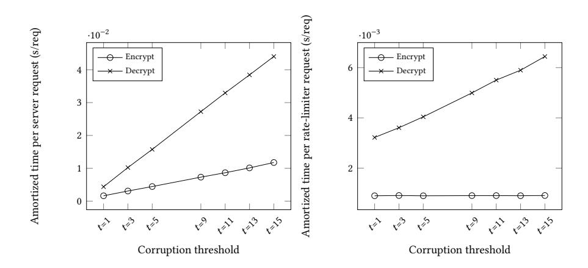

{0}------------------------------------------------

# Threshold Password-Hardened Encryption Services

Julian Brost Friedrich-Alexander University Erlangen-Nuremberg

Fritz Schmid Friedrich-Alexander University Erlangen-Nuremberg

Christoph Egger Friedrich-Alexander University Erlangen-Nuremberg

Dominique Schröder Friedrich-Alexander University Erlangen-Nuremberg

Russell W. F. Lai Friedrich-Alexander University Erlangen-Nuremberg

Markus Zoppelt Nuremberg Institute of Technology

# ABSTRACT

Password-hardened encryption (PHE) was introduced by Lai et al. at USENIX 2018 and immediately productized by VirgilSecurity. PHE is a password-based key derivation protocol that involves an oblivious external crypto service for key derivation. The security of PHE protects against offline brute-force attacks, even when the attacker is given the entire database. Furthermore, the crypto service neither learns the derived key nor the password. PHE supports key-rotation meaning that both the server and crypto service can update their keys without involving the user. While PHE significantly strengthens data security, it introduces a single point of failure because key-derivation always requires access to the crypto service. In this work, we address this issue and simultaneously increase security by introducing threshold password-hardened encryption. Our formalization of this primitive revealed shortcomings of the original PHE definition that we also address in this work. Following the spirit of prior works, we give a simple and efficient construction using lightweight tools only. We also implement our construction and evaluate its efficiency. Our experiments confirm the practical efficiency of our scheme and show that it is more efficient than common memory-hard functions, such as scrypt. From a practical perspective this means that threshold PHE can be used as an alternative to scrypt for password protection and key-derivation, offering better security in terms of offline brute force attacks.

# CCS CONCEPTS

• Security and privacy → Cryptography.

#### ACM Reference Format:

Julian Brost, Christoph Egger, Russell W. F. Lai, Fritz Schmid, Dominique Schröder, and Markus Zoppelt. 2020. Threshold Password-Hardened Encryption Services. In Proceedings of the 2020 ACM SIGSAC Conference on Computer and Communications Security (CCS '20), November 9–13, 2020, Virtual Event, USA. ACM, New York, NY, USA, [16](#page-15-0) pages. [https://doi.org/10.1145/](https://doi.org/10.1145/3372297.3417266) [3372297.3417266](https://doi.org/10.1145/3372297.3417266)

# 1 INTRODUCTION

An increasing amount of sensitive information is collected, processed, and made accessible by online services. For several years

Permission to make digital or hard copies of part or all of this work for personal or classroom use is granted without fee provided that copies are not made or distributed for profit or commercial advantage and that copies bear this notice and the full citation on the first page. Copyrights for third-party components of this work must be honored. For all other uses, contact the owner/author(s).

CCS '20, November 9–13, 2020, Virtual Event, USA

© 2020 Copyright held by the owner/author(s).

ACM ISBN 978-1-4503-7089-9/20/11. <https://doi.org/10.1145/3372297.3417266> victims in 2019 include Capital One, Facebook, and Canva[1](#page-0-0) , just to name a few. Common encryption techniques to protect data accessible on the Internet seem to be ineffective to prevent data breaches, especially against insider attackers that have stolen the databases. Not only can the attacker break the passwords of individual users using offline brute-force attacks, but it can also directly learn the master key and hence all user data.

we witness a significant increase of data breaches and prominent

Lai et al. [\[12\]](#page-11-0) recently introduced password-hardened encryption (PHE) as a password-based key-derivation protocol that involves an external party, called rate-limiter, in addition to the server for key derivation. Intuitively, PHE allows the server to derive a data key that depends on the password of the user, the server key, and the rate-limiter key, while the rate-limiter remains oblivious to the password and the data key. The security of PHE states that neither an active adversary having stolen the database nor the rate-limiter alone should learn anything about the encoded password and the data key. To recover the data key, a corrupt party must communicate with the other party, who rate-limits decryption attempts. Finally, PHE supports key-rotation, which allows rotating the keys of the server and rate-limiter with succinct communication. Thereafter, the server can locally update all ciphertexts without further interaction with the rate-limiter or end-users. This property of key-rotation is demanded by the payment card industry data security standard (PCI DSS) [\[15\]](#page-12-0). PHE was directly productized by VirgilSecurity [2](#page-0-1) .

While PHE significantly improves security, it also introduces a single point of failure. If the rate-limiter is unreachable, e.g., due to network failure or malicious attacks, the data would become unavailable to the end-users as the server cannot provide decryption service alone. Even worse, if the rate-limiter key is lost, then all user data is effectively lost permanently. These potential issues may discourage service providers from deploying PHE, as they may not want to ultimately depend on third parties for emergency access to their data. The naïve solution of duplicating the rate-limiter into multiple instances increases availability, but at a cost of security. If anyone of the instances of the rate-limiter is corrupt, any benefit brought by PHE would be nullified.

# 1.1 Our Contribution

Our main contributions are the invention, construction, and implementation of threshold password-hardened encryption with the overall goal to address the availability and trust issues of PHE. The

1

<span id="page-0-0"></span><sup>1</sup>[https://en.wikipedia.org/wiki/List\\_of\\_data\\_breaches](https://en.wikipedia.org/wiki/List_of_data_breaches)

<span id="page-0-1"></span><sup>2</sup>[https://developer.virgilsecurity.com/docs/use-cases/v1/passwords-and-data](https://developer.virgilsecurity.com/docs/use-cases/v1/passwords-and-data-protection?_ga=2.168638369.1056320515.1579507576-2040416527.1579507576)[protection?\\_ga=2.168638369.1056320515.1579507576-2040416527.1579507576,](https://developer.virgilsecurity.com/docs/use-cases/v1/passwords-and-data-protection?_ga=2.168638369.1056320515.1579507576-2040416527.1579507576) [https:](https://virgilsecurity.com/wp-content/uploads/2019/04/PHE-Service-Technical-Paper.pdf) [//virgilsecurity.com/wp-content/uploads/2019/04/PHE-Service-Technical-Paper.pdf](https://virgilsecurity.com/wp-content/uploads/2019/04/PHE-Service-Technical-Paper.pdf)

{1}------------------------------------------------

basic idea is to remove the single point of failure by spreading the responsibility of a single rate-limiter to m independent rate-limiters. We increase the availability by setting a threshold number t that are necessary and sufficient for successful en/decryption. The security of ((t,m)-PHE) guarantees that as long as the adversary does not control both the server and at least t rate-limiters, (t,m)-PHE schemes provide the same security guarantees like those of PHE schemes. We stress that the rate-limiters are not aware of each other and primarily interact with the server. Practically speaking, this allows services to make use of rate-limiters hosted by different providers, or even have some of them "in cold storage" locally where they can be reactivated in emergency situations to avoid data loss. Additionally, this allows strengthening security by requiring more than one honest rate-limiter for successful decryption. In the following, we discuss our contributions:

**Formalization**. We formalize (t, m)-PHE and define two security properties, hiding and soundness, which consolidate und unify the definitions of message hiding, partial obliviousness, (strong) soundness, and forward security of PHE [12]. Note that since (t, m)-PHE is a generalization of PHE (where t = m = 1), we obtain also consolidated security definitions for PHE. In our model we assume semi-adaptive corruptions, where the adversary must declare the set of corrupt parties for the next time epoch when instructing a key-rotation. Note that security under semi-adaptive corruption is already stronger than the static security defined in [12], where the corrupt party is fixed for the entire duration of the experiments.

*Hiding.* Hiding refers to the property that the adversary cannot do better than performing *online* password guessing attacks to learn an encrypted message, as long as it does not corrupt the server and at least t rate-limiters at the same time. Our hiding definition consolidates the previous hiding, obliviousness, and forward security definitions of PHE [12]. In particular, the new hiding definition captures attack strategies in which the adversary corrupts different parties at different points in time.

Soundness. Soundness refers to the property that the server cannot be fooled to make wrong decisions during decryption. More precisely, it means that, for any fixed server secret key, a ciphertext cannot encode two different valid password-message pairs at the same time. Our soundness definition consolidates the previous ones by capturing all attack strategies in a single security experiment.

Construction and Impossibility Result. We present a simple and efficient construction that relies on lightweight cryptographic components only. On a very high-level, our construction exploits the linearity of the Shamir secret sharing scheme [18] and the El-Gamal encryption scheme [6]. Assuming a communication model where the rate-limiters are not allowed to communicate with each other, the resulting encryption protocol consists of 3 rounds, while the decryption protocol consists of 6 rounds. It has the nice property that rate-limiters cannot tell whether the same incorrect password was used in two failed decryption attempts of the same user. Regarding security, we prove that the construction is secure under the DDH assumption in the random oracle model assuming semi-adaptive corruption. Via a meta-reduction, we show that this result is optimal and that the construction does not achieve our stronger

notion of full adaptivity. We also give evidence that an efficient yet fully adaptively secure construction is unlikely to exist.

Implementation and Evaluation. Our prototypical implementation in Python confirms the practical efficiency of our construction. We evaluated the latency and throughput of (t, m)-PHE for multiple threshold levels t and number of cores. The experimental evaluation (see Section 4) shows that our (t, m)-PHE can process up to 1045 encryption and up to 394 decryption requests per second. Scaling (t, m)-PHE can easily be achieved by increasing the number of cores. Additionally, throughput performance increases faster with the number of cores than it is slowed down by the number of rate-limiters. Considering current recommendations for best practice [19] on password hashing and password-based key-derivation, we note that algorithms like scrypt or Argon2 [5] are usually configured to limit login throughput to tens of requests per second which is significantly slower than using (t, m)-PHE.

### 1.2 Related Work

The original concept of password-hardening (PH) is due to Facebook [14]. Everspaugh *et al.* [7] made the first step towards formalizing PH and identified key-rotation as the key property to make such schemes useful in practice, which is also the key challenge when designing PH and PHE schemes. The notion of PH has been subsequently refined by Schneider *et al.* [16] and Lai *et al.* [13]. In addition to password verification, Lai *et al.* [12] later introduced the concept of password-hardened encryption (PHE) that allows associated data to be encrypted under a per-user key that is inaccessible without the user's password and provides strong security guarantees analogous to those of PH.

The construction of (t,m)-PHE in this work is based on the PHE scheme in [12], which in turn is based on the PH scheme in [13]. As observed in [12], it is unclear how the PH scheme in [7] (formalized as a partially oblivious pseudorandom function) can be extended to a PHE scheme. Therefore, although the scheme in [7] has a natural threshold variant, it is not helpful for constructing (t,m)-PHE schemes.

A closely related notion is password-protected secret sharing (PPSS) [4], which provides similar functionality as that of (t, m)-PHE, with different formulations in syntax and security definitions. The key feature separating (t, m)-PHE from PPSS is key-rotation. Indeed, a (t, m)-PHE can be seen as a PPSS scheme with key-rotation.

Password-based threshold authentication (PbTA) [1] is a recent related notion where, instead of recovering a data key, the goal is to produce an authentication token which can be verified by the service provider. Moreover, the PbTA scheme in [1] does not support key-rotation.

#### 2 DEFINITIONS

**Preliminaries.** Let  $\lambda \in \mathbb{N}$  be the security parameter and  $m \in \mathbb{N}$ . The set  $\{1, \ldots, m\}$  is denoted by [m], and the set  $\{a, a+1, \ldots, b\}$  is denoted by [a, b]. We denote by

$$((y_1; \text{view}_1), \dots, (y_m; \text{view}_m))$$
  
 $\leftarrow \Pi \langle \mathcal{P}_1(x_1; r_1), \dots, \mathcal{P}_m(x_m; r_m) \rangle$ 

the protocol  $\Pi$  between the interactive algorithms  $\mathcal{P}_1, \dots, \mathcal{P}_m$ , where  $\mathcal{P}_i$  has input  $x_i$ , randomness  $r_i$ , output  $y_i$ , and view view<sub>i</sub>. The

{2}------------------------------------------------

view view<sub>i</sub> consists of the input  $x_i$ , the input randomness  $r_i$ , and all messages received by  $\mathcal{P}_i$  during the protocol execution. Let  $I \subseteq [m]$ . We use the shorthand view<sub>I</sub> to denote the set  $\{(i, \text{view}_i)\}_{i \in I}$ . In case that the output  $\mathcal{P}_i$  is not explicitly needed, we write \* instead of  $y_i$ . For ease of readability, we omit the randomness  $r_i$  and/or the view view<sub>i</sub> of  $\mathcal{P}_i$  if they are not explicitly needed. When the randomness  $r_i$  is omitted, it means that  $r_i$  is chosen uniformly from the appropriate domain. We use the special and distinct symbols  $\epsilon$  and  $\perp$  to denote the empty string and an error (e.g., protocol abortion), respectively. Unless specified, the symbols  $\epsilon$  and  $\perp$  are by default not a member of any set considered. Let b be a Boolean value. We use the shorthand "ensure b" to denote the procedure which outputs  $\perp$  (prematurely) if  $b \neq 1$ .

**Definition of** (t, m)-**PHE.** Let  $t, m \in \mathbb{N}$  with  $t \leq m$ . Let  $\mathcal{PW}$  and  $\mathcal{M}$  be the password space and the message space, respectively. Let S and  $\mathcal{R}_i$  refer to the server and the *i*-th rate-limiter respectively for  $i \in [m]$ .

A t-out-of-m threshold password-hardened encryption, or ((t, m)-PHE) scheme, for PW and M consists of the efficient algorithms and protocols (Setup, Enc, Dec, Rotate, Udt), which we define as follows:

$$(\operatorname{crs},\operatorname{sk}_0,\ldots,\operatorname{sk}_m) \leftarrow \operatorname{Setup}(1^{\lambda},1^m,1^t)$$
:

 $\frac{(\mathsf{crs}, \mathsf{sk}_0, \dots, \mathsf{sk}_m) \leftarrow \mathsf{Setup}(1^\lambda, 1^m, 1^t)}{\mathsf{The setup algorithm inputs the security parameter}\,\lambda, \,\mathsf{the number of}}$ rate-limiters *m*, and the threshold *t* in unary. It outputs the common reference string crs, the secret key sk<sub>0</sub> for the server and the secret key sk<sub>i</sub> for the *i*-th rate-limiter, for all  $i \in [m]$ . The common reference string is an implicit input to all other algorithms and protocols for all parties.

$$((n,C),\epsilon,\ldots,\epsilon) \leftarrow \operatorname{Enc} \left( \begin{array}{c} \mathcal{S}(\text{``enc''},\operatorname{sk}_0,\operatorname{pw},M), \\ \mathcal{R}_1(\text{``enc''},\operatorname{sk}_1), \\ \ldots, \\ \mathcal{R}_m(\text{``enc''},\operatorname{sk}_m) \end{array} \right) :$$

The encryption protocol is run between the server and (possibly a subset of) the *m* rate-limiters. The server inputs its secret key, a password pw  $\in \mathcal{P}W$ , and a message  $M \in \mathcal{M}$ . The rate-limiters input their respective secret keys. The server outputs a nonce *n* and a ciphertext C, while each rate-limiter outputs an empty string  $\epsilon$ .

$$(M, n_1, ..., n_m) \leftarrow \text{Dec} \begin{pmatrix} \mathcal{S}(\text{``dec''}, \mathsf{sk}_0, \mathsf{pw}, n_0, C), \\ \mathcal{R}_1(\text{``dec''}, \mathsf{sk}_1), \\ & \dots, \\ \mathcal{R}_m(\text{``dec''}, \mathsf{sk}_m) \end{pmatrix} :$$

The decryption protocol is run between the server and (possibly a subset of) the m rate-limiters. The server inputs its secret key, a candidate password pw  $\in \mathcal{P}W$ , a nonce  $n_0$ , and a ciphertext C. The rate-limiters input their respective secret keys. The server outputs a message M. Each rate-limiter outputs a nonce  $n_i$  which can be interpreted as the identifier of the ciphertext C in the view of  $\mathcal{R}_i$ .

interpreted as the identifier of the ciphertext 
$$C$$
 in the v  $S(\text{``ROT''}, \text{sk}_0), \mathcal{R}_1(\text{``ROT''}, \text{sk}_1), \mathcal{R}_m(\text{``ROT''}, \text{sk}_m)$ :

The rotation protocol is run between the server and

The rotation protocol is run between the server and all m ratelimiters. Each party inputs its secret key and outputs a rotated key. The server additionally outputs an update token  $\tau$ .

$$C' \leftarrow \mathsf{Udt}(\tau, n, C)$$
:

The update algorithm inputs an update token  $\tau$ , a nonce n, and a ciphertext C. It outputs a new ciphertext C'.

Correctness. Correctness is defined in the obvious way and the formal definition is omitted. Roughly speaking, a (t, m)-PHE is correct whenever all honestly generated ciphertexts can be successfully decrypted to recover the encrypted message with the correct password, at long as at least t rate-limiters participate in the decryption protocol. Moreover, if a ciphertext passes decryption with respect to some secret keys, then the updated ciphertext also passes decryption with respect to the rotated keys.

Remarks. Our model requires a trusted party to run the setup algorithm. In a typical application of (t, m)-PHE it is acceptable to let the server run the setup algorithm, send the rate-limiter keys to the respective rate-limiters, and securely delete those keys. This is because it is for the server's own benefit to employ a (t, m)-PHE scheme in the first place. Moreover, the rate-limiters do not contribute any private inputs other than their secret keys in any protocols. If we insist that the server cannot be trusted to run the setup, a standard solution is to emulate the setup using a secure multi-party computation (MPC) protocol.

In our syntax, we handle the nonces differently compared to the approach in previous work [12]. We believe that the new approach models the reality more closely and is more intuitive. Previously, the encryption and decryption protocols take a "label" as common input for both the server and the rate-limiter, where the label consists of a server-side nonce and a rate-limiter-side nonce. This model deviates from the reality where the nonce is generated during (instead of before) the encryption protocol, stored by the server, and sent to the rate-limiter during decryption. More confusingly, the label input to the encryption protocol is by default an empty string, unless it is called in the forward security experiment.

#### 2.1 Security of (t, m)-PHE

We define the hiding and soundness properties of (t, m)-PHE. We assume that each rate-limiter has an authenticated channel to the server and that the rate limiters are not aware of each other, i.e., for  $i \neq j$ , there may not exist any communication channel between  $\mathcal{R}_i$ and  $\mathcal{R}_i$ . We focus on a semi-adaptive corruption model, where the adversary must declare the set of corrupt parties for the next time period, where a time period is the time between two honest keyrotations. The possibility to corrupt parties during a time period is modeled in the oracle RotateO, where the adversary can set HonestRot to 1 and define a set *I* for which he wishes to learn the private-keys.

This corruption model is already stronger than that in previous work [12, 13], where the adversary must declare the corrupt party at the very beginning of the experiment, and cannot change its choice throughout the experiment. For completeness, we also define a fully adaptive variant, where the adversary can request to corrupt any party at any time.

2.1.1 Hiding. Intuitively, hiding models the property that no party should be able to do better than online brute force attacks against the password space. As passwords have limited entropy, we limit the adversary's decryption queries using the counter DecCount

{3}------------------------------------------------

```
\mathsf{Hid}^b_{\Pi,\mathcal{A},Q_{\mathsf{Dec}},\mathcal{P}\mathcal{W}}(1^\lambda,1^m,1^t,I)
                                                                                                                                      RotateO(HonestRot, I, \{\mathcal{P}_i\}_{i \in I})
                                                                                                                                        1: if HonestRot = 1 then / Honest rotation then corruption
 1: ensure |I \cap [m]| < t \lor 0 \notin I
 2: IsChallenged := 0, \tau := \epsilon, DecCount := 0
                                                                                                                                                    ensure |I \cap [m]| < t \lor 0 \notin I
                                                                                                                                        2:
 3: CorruptParties := I
                                                                                                                                                    S^* := S(\text{"rot"}, sk_0)
                                                                                                                                       3:
                                                                                                                                                    \mathcal{R}_i^* \coloneqq \mathcal{R}_i(\text{``ROT''}, \mathsf{sk}_i) \quad \forall i \in [m]
 4: (\mathsf{sk}_0, \ldots, \mathsf{sk}_m) \leftarrow \mathsf{Setup}(1^{\lambda}, 1^m, 1^t)
                                                                                                                                        4:
 5: \mathbb{O} := \{ \operatorname{Enc}O, \operatorname{Dec}O, \operatorname{Corr}O \}, \operatorname{Rotate}O, 
                                                                                                                                                    ((\mathsf{sk}_0, \tau), \mathsf{sk}_1, \dots, \mathsf{sk}_m) \leftarrow \langle \mathcal{S}^*, \mathcal{R}_1^*, \dots, \mathcal{R}_m^* \rangle
                                                                                                                                        5:
                                                                                                                                                    CorruptParties := I
                    UdtO, ChO_b, DecChO}
                                                                                                                                        6:
 6:
                                                                                                                                                    return \{sk_i\}_{i\in I}
 7: b' \leftarrow \mathcal{A}^{\mathbb{O}}(1^{\lambda}, \{\mathsf{sk}_i\}_{i \in I})
                                                                                                                                        7:
                                                                                                                                                else / Malicious rotation
 8: if DecCount \geq Q_{\text{Dec}} then b' \leftarrow \$ \{0, 1\}
                                                                                                                                        8:
                                                                                                                                                     ensure I \subseteq CorruptParties
                                                                                                                                        9:
 9: return b'
                                                                                                                                                    S^* := \text{if } 0 \in I \text{ then } \mathcal{P}_0^{\mathbb{O}} \text{ else } S(\text{``rot''}, sk_0)
                                                                                                                                       10:
EncO(pw, M, I, \{\mathcal{P}_i\}_{i \in I})
                                                                                                                                                    \mathcal{R}_i^* := \text{if } i \in I \text{ then } \mathcal{P}_i^{\mathbb{O}} \text{ else } \mathcal{R}_i(\text{"ROT"}, \text{sk}_i) \quad \forall i \in [m]
                                                                                                                                       11:
 1: ensure I \subseteq CorruptParties
                                                                                                                                                     ((\mathsf{sk}_0, \tau; \mathsf{view}_0), (\mathsf{sk}_1; \mathsf{view}_1), \dots, (\mathsf{sk}_m; \mathsf{view}_m)) \leftarrow
                                                                                                                                       12:
 2: S^* := \text{if } 0 \in I \text{ then } \mathcal{P}_0^{\mathbb{O}} \text{ else } := S(\text{"ENC"}, sk_0, pw, M)
                                                                                                                                                              \langle \mathcal{S}^*, \mathcal{R}_1^*, \dots, \mathcal{R}_m^* \rangle
                                                                                                                                      13:
 3: \mathcal{R}_i^* := \text{if } i \in I \text{ then } \mathcal{P}_i^{\mathbb{O}} \text{ else } \mathcal{R}_i(\text{"ENC"}, \text{sk}_i) \quad \forall i \in [m]
                                                                                                                                                    return view<sub>I</sub>
                                                                                                                                       14:
 4: ((n, C; \text{view}_0), (*; \text{view}_1), \dots, (*; \text{view}_m)) \leftarrow \langle S^*, \mathcal{R}_1^*, \dots, \mathcal{R}_m^* \rangle
                                                                                                                                       15: endif
 5: return (n, C, \text{view}_I)
                                                                                                                                        Corr O(i) Only available in fully adaptive variant
DecO(pw, n_0, C, I, \{\mathcal{P}_i\}_{i \in I})
                                                                                                                                         1: CorruptParties' := CorruptParties \cup \{i\}
 1: ensure I \subseteq CorruptParties
                                                                                                                                          2: ensure |CorruptParties' \cap [m]| < t \lor 0 \notin CorruptParties'
2: S^* := \text{if } 0 \in I \text{ then } \mathcal{P}_0^{\mathbb{O}} \text{ else } := S(\text{"DEC"}, \text{sk}_0, \text{pw}, n_0, C)
                                                                                                                                          3: CorruptParties := CorruptParties'
 3: \mathcal{R}_i^* := \text{if } i \in I \text{ then } \mathcal{P}_i^{\mathbb{O}} \text{ else } \mathcal{R}_i(\text{``dec''}, \text{sk}_i, n) \quad \forall i \in [m]
                                                                                                                                         4: return sk_i
 4: ((M; \mathsf{view}_0), (n_1; \mathsf{view}_1), \dots, (n_m; \mathsf{view}_m)) \leftarrow \langle \mathcal{S}^*, \mathcal{R}_1^*, \dots, \mathcal{R}_m^* \rangle
 5: b_0 := (0 \in I \lor n_0 = n^*)
                                                                                                                                      UdtO(n,C)
 6: b_1 := (|I \cap [m]| + |\{i : n_i = n^*\}| \ge t)
                                                                                                                                        1: ensure \tau \neq \epsilon
 7: if b_0 \wedge b_1 then DecCount := DecCount + 1
                                                                                                                                        2: C' \leftarrow \mathsf{Udt}(\tau, n, C)
 8: return (M, view_I)
                                                                                                                                        3: return C'
DecChO(C, I, \{\mathcal{P}_i\}_{i \in I})
                                                                                                                                      \mathsf{Ch}O_b(M_0^*, M_1^*, I, \{\mathcal{P}_i\}_{i \in I})
 1: ensure IsChallenged = 1 \land I \subseteq CorruptParties \setminus \{0\}
                                                                                                                                               ensure IsChallenged = 0 \land I \subseteq CorruptParties \setminus \{0\}
 2: S^* := S(\text{"DEC"}, sk_0, pw^*, n^*, C)
                                                                                                                                        2: IsChallenged := 1, pw^* \leftarrow \mathcal{P}W
                                                                                                                                       3: S^* := S(\text{"enc"}, \text{sk}_0, \text{pw}^*, M_h^*)
 3: \mathcal{R}_i^* := \text{if } i \in I \text{ then } \mathcal{P}_i^{\mathbb{O}} \text{ else } \mathcal{R}_i(\text{``dec''}, \text{sk}_i, n) \quad \forall i \in [m]
                                                                                                                                       4: \mathcal{R}_i^* := \text{if } i \in I \text{ then } \mathcal{P}_i^{\mathbb{O}} \text{ else } \mathcal{R}_i(\text{``enc''}, \operatorname{sk}_i) \quad \forall i \in [m]
 4: ((*; \mathsf{view}_0), \dots, (*; \mathsf{view}_m)) \leftarrow \langle \mathcal{S}^*, \mathcal{R}_1^*, \dots, \mathcal{R}_m^* \rangle
                                                                                                                                        5: ((n^*, C^*), (*; \text{view}_1), \dots, (*; \text{view}_m)) \leftarrow \langle S^*, \mathcal{R}_1^*, \dots, \mathcal{R}_m^* \rangle
 5: return view<sub>I</sub>
                                                                                                                                        6: return (n^*, C^*, \text{view}_I)
```

Figure 1: Hiding Experiment (Procedures in dashed boxes are provided for variant with fully adaptive corruption.)

which is bounded by  $Q_{\mathrm{Dec}}$ . At any given time, the adversary may either corrupt the server and up to t-1 rate limiters, or an arbitrary subset of rate-limiters but not the server. It can also instruct the parties to execute an honest key-rotation, after which all parties are considered honest, and the adversary can corrupt a possibly different subset of parties again.

**The Oracles**. The (encryption, decryption, key rotation, and ciphertext update) oracles are formally defined in Figure 1. The oracles interface protocol executions by inputting a set of adversarial procedures and running the respective protocols with the codes of some honest parties replaced. The encrypt and decrypt oracles Enc*O* and

Dec*O* model normal interactions with adversarially choosen messages resp. ciphertexts. The decrypt challenge oracle DecCh*O*, in contrast, allows the adversary to observe interactions between an honest server and potentially malicious rate-limiters with the correct challenge password. The oracle Rotate*O* allows the adversary to request key-rotation. The adversary can request for an honest key-rotation, where the update token remains secret, while the set of corrupted parties is reset depending on the choice of the adversary. The adversary can also request for a malicious key-rotation, where the code of some parties are possibly replaced by malicious ones. The oracle Udt*O* allows updating any ciphertext with the

{4}------------------------------------------------

most recent update token  $\tau$ . In the fully adaptive variant, the adversary gains access to an additional corrupt oracle CorrO from which it can learn the current secret keys of parties of its choice.

Finally, the adversary can generate a challenge ciphertext using ChO. Notice that the challenge may only be generated once<sup>3</sup> and the server code used to generate the challenge ciphertext is honest (although the server key might be revealed via CorrO and RotateO). Intuitively this is reasonable as a malicious server can store the message and the password outside the protocol, and therefore security for maliciously generated ciphertexts is unrealistic.

Definition 1 (Hiding). A(t,m)-PHE  $\Pi$  is semi-adaptively hiding if, for any PPT adversary  $\mathcal{A}$ , any integer  $Q_{\text{Dec}} \geq 0$ , and any password space  $\mathcal{PW}^4$  with support size of at least  $Q_{\text{Dec}}$ ,

$$\begin{split} \frac{1}{2} \bigg| & \Pr \bigg[ \mathsf{Hid}_{\Pi,\mathcal{A},Q_{\mathrm{Dec}},\mathcal{P}\mathcal{W}}^0(1^\lambda,1^m,1^t) = 1 \bigg] - \\ & \Pr \bigg[ & \mathsf{Hid}_{\Pi,\mathcal{A},Q_{\mathrm{Dec}},\mathcal{P}\mathcal{W}}^1(1^\lambda,1^m,1^t) = 1 \bigg] \bigg| \leq \frac{Q_{\mathrm{Dec}}}{|\mathcal{P}\mathcal{W}|} + \mathsf{negl}(\lambda) \,. \end{split}$$

The (t, m)-PHE  $\Pi$  is fully adaptively hiding if in Hid the adversary  $\mathcal A$  is given access to the CorrO oracle.

2.1.2 Soundness. Our definition of soundness is inspired by the complete robustness definition [8] for encryption schemes, which intuitively captures the property that a ciphertext cannot be encrypting two distinct messages. In [12], the soundness of PHE requires that there is no inconsistency between an encryption session and a decryption session, whereas the strong soundness notion further requires that there is no inconsistency between two decryption sessions. To unify both deception strategies, we define a soundness experiment where the adversary is given an encryption and a decryption oracle. The former takes as input all the inputs of the server, including the randomness, during an encryption session, and possibly malicious programs for all the rate-limiters. The oracle then runs the encryption protocol between an honest execution of the server code on the given input, and the possibly malicious rate-limiters. The decryption oracle is defined in a similar way, except that the decryption protocol is run. The adversary is successful if an inconsistency occur between the communication transcripts produced by any two oracle queries.

DEFINITION 2 (SOUNDNESS). A(t,m)-PHE  $\Pi$  is sound if, for any PPT adversary  $\mathcal{A}$ ,

$$\Pr\left[\mathsf{Soundness}_{\Pi,\mathcal{A}}^{0}(1^{\lambda},1^{m},1^{t})=1\right] \leq \mathsf{negl}(\lambda).$$

#### <span id="page-4-2"></span>**3 CONSTRUCTION**

Our construction of a (t, m)-PHE scheme can be seen as a generalization of the PHE scheme of [12], where a secret key of one rate-limiter is shared to multiple rate-limiters. In contrast to [12] it uses a private-key encryption scheme and exploits the linearity of the Shamir secret sharing [18] and the ElGamal encryption [6].

#### 3.1 Construction Overview

Let  $\mathbb{G}$  be a cyclic group of prime order p with generator G, and let  $H_0, H_1 : \{0, 1\}^* \to \mathbb{G}$  be two independent hash functions. A ciphertext  $C = \mathsf{SKE}.\mathsf{Enc}(s_0, (C_0, C_1))$  consists of a symmetric-key ciphertext of two group elements  $C_0$  and  $C_1$  under the server secret key component  $s_0$ , and is accompanied by a nonce n. The elements  $C_0$  and  $C_1$  are computed as follows

$$C_0 = H_0(pw, n) \cdot H_0(n)^{\bar{s}_0}$$
  
 $C_1 = H_1(pw, n) \cdot H_1(n)^{\bar{s}_0} \cdot M$ 

where  $\bar{s}_0$  is part of the conceptual rate-limiter secret key, and M is the encrypted message. The conceptual key  $\bar{s}_0$  is secret-shared among m rate-limiters using the well-known Shamir secret sharing scheme with reconstruction threshold t. In contrast to [12], we do not distinguish between server and rate-limiter nonces. In our scheme, the nonce n is obtained via a coin-flipping protocol between the server and t rate-limiters. The server key is now used in a secret-key encryption scheme to allow for stronger security properties.

An important feature of the Shamir secret sharing scheme is that the reconstruction function is linear. That is, given a set of t shares and their indices  $\{(i_j, s_{i_j})\}_{j=1}^t$ , there exists a public linear combination with some coefficients  $(\lambda_1, \ldots, \lambda_t)$  such that  $\bar{s}_0 = \sum_{j=1}^t \lambda_j s_{i_j}$ . This feature is crucial for the decryption protocol, as we will see.

# 3.2 Formal Description

Ingredients. Given a finite set  $\mathcal{P}$  of size  $|\mathcal{P}| \geq t$ , let Subset $_t(\mathcal{P})$  be an algorithm which returns an arbitrary size-t subset P of  $\mathcal{P}$ . Let GGen :  $1^{\lambda} \mapsto (\mathbb{G}, p, G)$  be a group generation algorithm which maps the security parameter  $1^{\lambda}$  to the description  $(\mathbb{G}, p, G)$  of a cyclic group  $\mathbb{G}$  of prime order p with generator G. Let  $t, m \in \mathbb{N}$  with  $t \leq m \leq p$ . For any subset  $P \subseteq [m]$  and  $i \in P$ , recall the Lagrange polynomial  $\ell_{P,i}(x) := \prod_{j \in P \setminus \{i\}} \frac{x-j}{i-j}$ . Let  $\lambda_{P,i} := \ell_{P,i}(0)$ . For the ease of notation, we define  $\lambda_{P,0} := 1$  for all P. Let  $H_0, H_1 : \{0,1\}^* \to \mathbb{G}$  and  $H : \{0,1\}^* \to \{0,1\}^{\lambda}$  be independent hash functions to be modeled as random oracles. Let SKE.(KGen, Enc, Dec) be a symmetric-key encryption scheme. Let (GGen, Prove, Vf) be a non-interactive zero-knowledge proof of knowledge (NIZKPoK) scheme for the relation

$$R_{\text{GDL}} := \left\{ \begin{pmatrix} (\mathbb{G}, G, p), \\ A_{1,1} & \dots & A_{1,n} & B_{1} \\ \vdots & \ddots & \vdots & \vdots \\ A_{m,1} & \dots & A_{m,n} & B_{m} \end{pmatrix} \in \mathbb{G}^{m \times (n+1)}, \\ (x_{1}, \dots, x_{n}) \in \mathbb{Z}_{p}^{n} : \\ \forall i \in [m], \ B_{i} = \prod_{j=1}^{n} A_{i,j}^{x_{j}} \end{cases} \right\}$$

as described in Appendix A.2. Here, the tuple  $(\mathbb{G}, G, p)$  is a common reference string, the matrix in  $\mathbb{G}^{m \times (n+1)}$  is the statement, and  $(x_1, \ldots, x_n) \in \mathbb{Z}_p^n$  is a witness satisfying the statement.

*Setup (Figure 3).* The setup algorithm runs GGen to generate the description of the group. It then generates the secret keys  $sk_0, \ldots, sk_m$ , where  $sk_i$  has the format  $(s_i, k_i, K_0, \{\bar{S}_j, \bar{K}_j\}_{j=0}^{t-1})$  where

<span id="page-4-0"></span> $<sup>^3</sup>$ A multi-challenge version of the definition is implied by the single-challenge one using standard hybrid argument.

<span id="page-4-1"></span><sup>&</sup>lt;sup>4</sup>For simplicity, we assume that passwords are distributed uniformly in the password space. The definition can be easily generalized to cover arbitrary password distributions.

{5}------------------------------------------------

```
\frac{\mathsf{Enc}O(\mathsf{sk}_0,\mathsf{pw},M,r,m,\tilde{\mathcal{R}}_1,\ldots,\tilde{\mathcal{R}}_m)}{_{1}:\ ((n,C),*,\ldots,*)} \leftarrow \langle \mathcal{S}(\text{"ENC"},\mathsf{sk}_0,\mathsf{pw},M;r),\tilde{\mathcal{R}}_1^{\mathbb{O}},\ldots,\tilde{\mathcal{R}}_m^{\mathbb{O}} \rangle
Soundness_{\Pi,\mathcal{A}}(1^{\lambda})
 1 : Queries := ∅
 2: \mathbb{O} := \{ \mathsf{Enc}O, \mathsf{Dec}O \}
                                                                                                               2: Queries := Queries \cup \{(\mathsf{sk}_0, n, C, \mathsf{pw}, M)\}
 3: (i,j) \leftarrow \mathcal{A}^{\mathbb{O}}(1^{\lambda})
                                                                                                               3: return \epsilon
 4: (sk_0, n, C, pw, M) := Queries[i]
                                                                                                             \frac{\mathsf{Dec}O(\mathsf{sk}_0,\mathsf{pw},n,C,r,m,\tilde{\mathcal{R}}_1,\ldots,\tilde{\mathcal{R}}_m)}{_{1}:\ (M,*,\ldots,*)\leftarrow\langle\mathcal{S}(\text{``dec''},\mathsf{sk}_0,\mathsf{pw},n,C;r),\tilde{\mathcal{R}}_1^{\mathbb{O}},\ldots,\tilde{\mathcal{R}}_m^{\mathbb{O}}\rangle}
 5: (sk'_0, n', C', pw', M') := Queries[j]
 6: b_0 := ((sk_0, C) = (sk'_0, C'))
                                                                                                               2: Queries := Queries \cup \{(sk_0, n, C, pw, M)\}
 7: b_1 := (M \neq \bot \land M' \neq \bot)
 8: b_2 := (((n, pw) = (n', pw')) \land (M \neq M'))
                                                                                                               3: return \epsilon
 9: b_3 := (((n, pw) \neq (n', pw')) \land (M, M' \in M))
10: return b_0 \wedge b_1 \wedge (b_2 \vee b_3)
```

Figure 2: Soundness Experiment

 $s_0$  is a secret key for a symmetric key encryption scheme SKE and

$$G^{s_i} = \prod_{j=0}^{t-1} \bar{S}_j^{i^j}, \ i \in [m]$$

$$G^{k_i} = \begin{cases} K_0 & i = 0\\ \prod_{j=0}^{t-1} \bar{K}_j^{i^j} & i \in [m]. \end{cases}$$

Each party can verify the validity of their keys using the subroutine KVf defined in Figure 5.

Encryption (Figure 3). The encryption protocol begins with a coin-flipping procedure. Each party samples some randomness  $n_i$  and exchanges their randomness with each other. They then hash all randomness using the hash function H to create a nonce n. With the help of the rate-limiters, the server computes the tuple  $(C_0, C_1) := (H_0(pw, n) \cdot H_0(n)^{\bar{s}_0}, H_1(pw, n) \cdot H_1(n)^{\bar{s}_0} \cdot M)$ . It then compute  $C \leftarrow \mathsf{SKE}.\mathsf{Enc}(s_0, (C_0, C_1))$ .

Let P be any t-subset of [m]. The ciphertext components  $H_0(n)^{\bar{s}_0}$  and  $H_1(n)^{\bar{s}_0}$  can be expressed as  $H_0(n)^{\bar{s}_0} = H_0(n)^{\sum_{i \in P} \lambda_{P,i} s_i}$  and  $H_1(n)^{\bar{s}_0} = H_1(n)^{\sum_{i \in P} \lambda_{P,i} s_i}$  respectively.

Decryption (Figure 4). The decryption protocol begins with the server informing the rate-limiters of the nonce n, and decrypting the ciphertext C to obtain  $(C_0, C_1)$ . The server then computes the value  $Y_{0,0} := C_0 \cdot H_0(\mathrm{pw}, n)^{-1}$ , while the i-th rate-limiter computes  $Y_{i,0} := H_0(n)^{s_i}$ . Conceptually, the parties would like to check if  $Y_{0,0} = \prod_{i \in P} Y_{i,0}^{\lambda_{P,i}}$  for some t-subset P of [m]. If the relation is satisfied, meaning that the password is likely correct, the rate-limiters would jointly help the server to compute  $H_1(n)^{\bar{s}_0}$ , which allows the latter to recover the message M. However, naively performing the joint computation of  $H_1(n)^{\bar{s}_0}$  would cost one extra round of computation. In the following, we outline a three-phase protocol where the round for computing the value  $H_1(n)^{\bar{s}_0}$  is merged with one of the rounds in the checking procedure.

First, the parties jointly compute an encryption of the value  $Z:=Y_{0,0}^{-1}\prod_{i\in P}Y_{i,0}^{\lambda_{P,i}}$  under the public key  $K=K_0\cdot \bar{K}_0$ , where the corresponding secret key is secret-shared among the participants. This can be done by having the parties encrypt their respective inputs using the linearly-homomorphic ElGamal encryption scheme,

exchange the ciphertexts with each other (via the server), and homomorphically compute an encryption of Z locally. This costs 2 rounds of communication.

Recall that the goal of the protocol is to allow the server to obtain  $H_1(n)^{\bar{s}_0}$  in the case Z=I (the identity element). We observe that for a randomly sampled  $\tilde{r}$  and for an arbitrary group element A,  $Z^{\tilde{r}} \cdot A = A$  when Z=I, and uniformly random otherwise. With this observation, in the second phase the parties jointly compute the encryption of  $Z^{\tilde{r}}$  and  $Z^{\tilde{r}'} \cdot H_1(n)^{\bar{s}_0}$  respectively for random  $\tilde{r}$  and  $\tilde{r}'$ . Similar to the first phase, this costs another 2 rounds of communication.

In the last phase, the parties jointly help the server to decrypt the ciphertexts, so that the latter can check whether  $Z^{\tilde{r}} = I$  (and hence Z = I), and if so obtain  $H_1(n)^{\bar{s}_0}$ . This costs 1 round of communication. Together with the first round where the server sends the nonce n, we obtain a 6-round protocol.

At this point, the decryption functionality is already achieved and the protocol can already be terminated. However, the ratelimiters have no knowledge about whether the decryption was successful or not, *i.e.*, whether Z=I, and thus can only perform "coarse-grained" rate-limiting. That is, the rate-limiters would count both successful and failed decryption attempts, since they cannot distinguish between the two. This is often sufficient in applications, since typically a user would not login (successfully) too frequently. To support "fine-grained" rate-limiting, the server would send an extra message to the rate-limiters to allow them to decrypt the encryption of  $Z^{\tilde{r}}$ . These additional steps are highlighted in dashed boxes in Figure 8. This costs an extra round of communication and results in a 7-round protocol.

Key Rotation and Ciphertext Update (Figure 5). The goal of keyrotation is to update the secret keys from  $sk_i$  to  $sk'_i$ , where

$$sk_{i} = (s_{i}, k_{i}, K_{0}, \{\bar{S}_{j}, \bar{K}_{j}\}_{j=0}^{t-1})$$
  

$$sk'_{i} = (s'_{i}, k'_{i}, K'_{0}, \{\bar{S}'_{j}, \bar{K}'_{j}\}_{j=0}^{t-1})$$

{6}------------------------------------------------

<span id="page-6-0"></span>
$$\begin{array}{|c|c|c|} \hline Setup(1^{\lambda},1^{m},1^{t}) \\ \hline /s \ and \ S \ keys \ are used for encrypting password records} \\ \hline /s \ and \ S \ keys \ are used in the decryption protocol} \\ \hline crs := (\mathbb{G},p,G) \leftarrow \mathrm{GGen}(1^{\lambda}) \\ \hline s_{0} \leftarrow \mathrm{SKE}.\mathrm{KGen}(1^{\lambda}), \ k_{0} \leftarrow \mathbb{Z}_{p} \ / \ \mathrm{Server} \ \mathrm{key} \\ \hline K_{0} := G^{k_{0}} \\ \hline /s \ \mathrm{Rate-limiter} \ \mathrm{keys} \ (\mathrm{to} \ \mathrm{be} \ \mathrm{shared}) \\ \hline s_{j}, \ k_{j} \leftarrow \mathbb{Z}_{p}, \ \forall j \in [0,t-1] \\ \hline s_{i} := s(i), \ k_{i} := \bar{k}(i), \ \forall i \in [m] \\ \hline s_{i} := (s_{i}, k_{i}, k_{0}, (s_{j}, k_{j})) \\ \hline /s_{i} := (s_{i}, k_{i}, k_{0}, (s_{j}, k_{j})) \\ \hline /s_{i} := (s_{i}, k_{i}, k_{0}, (s_{j}, k_{j})) \\ \hline /s_{i} := (s_{i}, k_{i}, k_{0}, (s_{j}, k_{j})) \\ \hline /s_{i} := (s_{i}, k_{i}, k_{0}, (s_{j}, k_{j})) \\ \hline /s_{i} := (s_{i}, k_{i}, k_{0}, (s_{j}, k_{j})) \\ \hline /s_{i} := (s_{i}, k_{i}, k_{0}, (s_{j}, k_{j})) \\ \hline /s_{i} := (s_{i}, k_{i}, k_{0}, (s_{j}, k_{j})) \\ \hline /s_{i} := (s_{i}, k_{i}, k_{0}, (s_{j}, k_{j})) \\ \hline /s_{i} := (s_{i}, k_{i}, k_{0}, (s_{j}, k_{j})) \\ \hline /s_{i} := (s_{i}, k_{i}, k_{0}, (s_{j}, k_{j})) \\ \hline /s_{i} := (s_{i}, k_{i}, k_{0}, (s_{j}, k_{j})) \\ \hline /s_{i} := (s_{i}, k_{i}, k_{0}, (s_{j}, k_{j})) \\ \hline /s_{i} := (s_{i}, k_{i}, k_{0}, (s_{j}, k_{j})) \\ \hline /s_{i} := (s_{i}, k_{i}, k_{0}, (s_{j}, k_{j})) \\ \hline /s_{i} := (s_{i}, k_{i}, k_{0}, (s_{j}, k_{j})) \\ \hline /s_{i} := (s_{i}, k_{i}, k_{0}, (s_{j}, k_{j})) \\ \hline /s_{i} := (s_{i}, k_{i}, k_{0}, (s_{j}, k_{j})) \\ \hline /s_{i} := (s_{i}, k_{i}, k_{0}, (s_{j}, k_{j})) \\ \hline /s_{i} := (s_{i}, k_{i}, k_{0}, (s_{j}, k_{j})) \\ \hline /s_{i} := (s_{i}, k_{i}, k_{0}, (s_{j}, k_{j})) \\ \hline /s_{i} := (s_{i}, k_{i}, k_{0}, (s_{j}, k_{j})) \\ \hline /s_{i} := (s_{i}, k_{i}, k_{0}, (s_{j}, k_{j})) \\ \hline /s_{i} := (s_{i}, k_{i}, k_{0}, (s_{j}, k_{j})) \\ \hline /s_{i} := (s_{i}, k_{i}, k_{0}, (s_{j}, k_{i})) \\ \hline /s_{i} := (s_{i}, k_{i}, k_{0}, (s_{j}, k_{i})) \\ \hline /s_{i} := (s_{i}, k_{i}, k_{0}, (s_{j}, k_{i})) \\ \hline /s_{i} := (s_{i}, k_{i}, k_{0}, (s_{j}, k_{i})) \\ \hline /s_{i} := (s_{i}, k_{i}, k_{i}) \\ \hline /s_{i} := (s_{i}, k_{i}, k_{0}, (s_{i}, k_{0})) \\ \hline /s_{i} := (s_{i}, k_{i}$$

Figure 3: Setup Algorithm and Encryption Protocol of TPHE

where  $s_0'$  is a fresh SKE secret key, and the following hold:

$$K'_0 = K_0^{\gamma} = G^{k'_0},$$

$$\forall j \in [0, t - 1]$$

$$\bar{S}'_j = \bar{S}_j G^{\bar{\beta}_j},$$

$$\forall j \in [0, t - 1]$$

$$\bar{K}'_j = \bar{K}_j^{\gamma} G^{\bar{\delta}_j},$$

$$\forall i \in [m]$$

$$G^{s'_i} = \prod_{j=0}^t \bar{S}_j^{\prime i^j}, \text{ and}$$

$$\forall i \in [m]$$

$$G^{k'_i} = \prod_{j=0}^t \bar{K}_j^{\prime i^j},$$

for some random  $\bar{\beta}_0, \ldots, \bar{\beta}_{t-1}, \gamma, \bar{\delta}_0, \ldots, \bar{\delta}_{t-1}$  sampled by the server. With the update token  $(s_0, s'_0, \bar{\beta}_0)$  and a nonce n, the server can update each  $C \in SKE.Enc(s_0, (C_0, C_1))$  to  $C' \leftarrow SKE.Enc(s'_0, (C'_0, C'_1))$  where  $C'_0 := C_0 \cdot H_0(n)^{\bar{\beta}_0}$  and  $C'_1 := C_1 \cdot H_1(n)^{\bar{\beta}_0}$ .

#### 3.3 Correctness and Security

The correctness of our construction follows from the correctness of SKE and the completeness of the NIZKPoK scheme described in Appendix A.2. Below, we state the security of our construction, and give a proof sketch.

THEOREM 3.1 (HIDING). If the decisional Diffie-Hellman (DDH) assumption holds with respect to GGen, and SKE is CCA-secure, then the (t,m)-PHE scheme constructed above is semi-adaptively hiding in the random oracle model.

PROOF. We first note that the well known generalized Schnorr protocol [17] (recalled in Figure 7) is a perfectly zero-knowledge NIZKPoK for the relation  $R_{\rm GDL}$  in the random oracle model. We therefore do not need extra assumptions on the NIZKPoK.

We want to prove that construction is hiding (under semi-adaptive corruption). That is, for any PPT adversary  $\mathcal{A}$ , any integer  $Q_{\text{Dec}} \geq 0$ ,

and a uniform password distribution  $\mathcal{P}W$  with  $|\mathcal{P}W| \geq Q_{\text{Dec}}$ ,

$$\begin{split} \frac{1}{2} \bigg| & \Pr \bigg[ \mathsf{Hid}_{\Pi,\mathcal{A},Q_{\mathsf{Dec}},\mathcal{P}\mathcal{W}}^0(1^\lambda,1^m,1^t) = 1 \bigg] - \\ & \Pr \bigg[ & \mathsf{Hid}_{\Pi,\mathcal{A},Q_{\mathsf{Dec}},\mathcal{P}\mathcal{W}}^1(1^\lambda,1^m,1^t) = 1 \bigg] \bigg| \leq \frac{Q_{\mathsf{Dec}}}{|\mathcal{P}\mathcal{W}|} + \mathsf{negl}(\lambda) \,. \end{split}$$

We will prove the above statement via a typical hybrid argument, for that we define the following hybrid experiments:

- $\mathsf{Hyb}_{b,0}$  is identical to  $\mathsf{Hid}^b_{\Pi,\mathcal{A},Q_{\mathsf{Dec}},\mathcal{P}W}(1^\lambda,1^m,1^t)$ .
- Hyb<sub>b,1</sub> is mostly identical to Hyb<sub>b,0</sub>, except that all zero-knowledge proofs are simulated by running the simulator of the NIZKPoK scheme. It it straightforward to show that, for all  $b \in \{0,1\}$ ,

$$\bigg|\Pr\big[\mathsf{Hyb}_{b,0}=1\big]-\Pr\big[\mathsf{Hyb}_{b,1}=1\big]\bigg| \leq \mathsf{negl}(\lambda)$$

using the zero-knowledge property of the NIZKPoK scheme.

• Hyb<sub>b,2</sub> is mostly identical to Hyb<sub>b,1</sub>, except that when an honest key rotation is triggered (the adversary queries the RotateO oracle with HonestRot = 1), the secret key components  $(k_i, K_0, \{\bar{K}_j\}_{j=0}^{t-1})$  are freshly generated. For all  $b \in \{0, 1\}$ , note that Hyb<sub>b,1</sub> and Hyb<sub>b,2</sub> are functionally equivalent, therefore

$$Pr[Hyb_{b,1} = 1] = Pr[Hyb_{b,2} = 1]$$
.

- $\mathsf{Hyb}_{b,3,0}$  is identical to  $\mathsf{Hyb}_{b,2}$ .
- Hyb<sub>b,3,q</sub>, where  $q \in [Q_{Dec}]$ , is mostly identical to Hyb<sub>b,q-1</sub>, except that when answering the adversary's q-th query to the DecO oracle which triggers the increment of the counter DecCount (called a critical query hereinafter), the group elements sent by honest parties are replaced by uniformly

{7}------------------------------------------------

```
Dec\langle\ldots,\ldots\rangle
 Server S(\text{"DEC"}, sk_0, pw, n, C)
                                                                                                                                                                                                                                                                        Rate-limiter \mathcal{R}_i ("DEC", sk_i), \forall i \in [m]
 ensure KVf(0, sk<sub>0</sub>)
                                                                                                                                                                                                                                                                        ensure KVf(i, sk_i)
 (C_0, C_1) \leftarrow \mathsf{SKE}.\mathsf{Dec}(s_0, C)
                                                                                                                                                                                                             n
 ensure (C_0, C_1) \neq \bot
 X_0 := H_0(n), \ X_1 := H_1(n)
                                                                                                                                                                                                                                                                       X_0 := H_0(n), \ X_1 := H_1(n)
 Y_{0.0}^{-1} := C_0^{-1} \cdot H_0(\text{pw}, n)
                                                                                                                                                                                                                                                                       Y_{i,0} := X_0^{s_i}
                                                                                                             . . . Computing encryption of Z\coloneqq Y_{0,0}^{-1}\cdot\prod_{i\in P}Y_{i,0}^{\lambda_{P},i} for some t-subset P\subseteq [m]
 K:=K_0\cdot \bar K_0
                                                                                                                                                                                                                                                                       K:=K_0\cdot \bar{K}_0
 r_0 \leftarrow \mathbb{Z}_p, (U_0, V_0) := (G^{r_0}, K^{r_0} \cdot Y_{0,0}^{-1})
                                                                                                                                                                                                                                                                       r_i \leftarrow \mathbb{Z}_p, (U_i, V_i) := (G^{r_i}, K^{r_i} \cdot Y_{i,0})
                                                                                                                                                                                                                                                                       S_j := G^{\prod_{\ell=0}^{t-1} \bar{S}_{\ell}^{j^{\ell}}}, \ \forall j \in [m] \setminus \{i\}
S_j := \prod_{\ell=0}^{t-1} \bar{S}_{\ell}^{j\ell}, \ \forall j \in [m]
                                                                                                                                                                                                                                                                       S_i := G^{s_i}
 \pi_{1,0} \leftarrow \text{Prove}\left(\text{crs}, (G, U_0), r_0\right)
\mathcal{P} := \left\{ j \in [m] : \mathsf{Vf} \left( \mathsf{crs}, \begin{pmatrix} G, & I, & S_j \\ I, & G, & U_j \\ X_0, & K, & V_i \end{pmatrix}, \pi_{1,j} \right) = 1 \right\}
                                                                                                                                                                                                                                                                     \pi_{1,i} \leftarrow \text{Prove}\left(\text{crs}, \begin{pmatrix} G, & I, & S_i \\ I, & G, & U_i \\ X_0, & K, & V_i \end{pmatrix}, \begin{pmatrix} s_i \\ r_i \end{pmatrix}\right)
                                                                                                                                                                                                  U_i, V_i, \pi_{1,i}
 ensure |\mathcal{P}| \geq t
                                                                                                                                                                         \frac{\left\{ (j, U_j, V_j, \pi_{1,j})_{j \in (P \cup \{0\}) \setminus \{i\}} \right\}}{\text{to } i \in P}                               
 P \leftarrow \mathsf{Subset}_t(\mathcal{P})
                                                                                                                                                                                                                                                                       ensure Vf (crs, (G, U_0), \pi_{1,0})
                                                                                                                                                                                                                                                                       (U,V) \coloneqq \left(\prod_{j \in P \cup \{0\}} U_j^{\lambda_{P,j}}, \prod_{j \in P \cup \{0\}} V_j^{\lambda_{P,j}}\right)
(U,V) \coloneqq \left(\prod_{j \in P \cup \{0\}} U_j^{\lambda_{P,j}}, \prod_{j \in P \cup \{0\}} V_j^{\lambda_{P,j}}\right)
              .....................................
 \tilde{r}_0, \tilde{r}'_0 \leftarrow \mathbb{Z}_p
                                                                                                                                                                                                                                                                       \tilde{r}_i, \tilde{r}'_i \leftarrow \mathbb{Z}_p
                                                                                                                                                                                                                                                                       (\tilde{U}_i,\tilde{V}_i) \coloneqq \left( U^{\tilde{r}_i}, V^{\tilde{r}_i} \right), \ (\tilde{U}_i',\tilde{V}_i') \coloneqq \left( U^{\tilde{r}_i'}, V^{\tilde{r}_i'} \cdot X_1^{\lambda p,i \cdot s_i} \right)
(\tilde{U}_0, \tilde{V}_0) := (U^{\tilde{r}_0}, V^{\tilde{r}_0}), \ (\tilde{U}'_0, \tilde{V}'_0) := (U^{\tilde{r}'_0}, V^{\tilde{r}'_0} \cdot H_1(\mathsf{pw}, n))
                                                                                                                                                                                                                                                                       \pi_{2,i} \leftarrow \text{Prove}\left(\text{crs}, \begin{pmatrix} U & \tilde{U}_i \\ V & \tilde{V}_i \end{pmatrix}, \tilde{r}_i \right)
\pi_{2,0} \leftarrow \text{Prove}\left(\text{crs}, (U, \tilde{U}_0), \tilde{r}_0\right)
                                                                                                                                                                              \underbrace{\tilde{U}_{i}, \tilde{V}_{i}, \pi_{2,i}, \tilde{U}'_{i}, \tilde{V}'_{i}, \pi'_{2,i}}_{\mathcal{I}_{i}, \tilde{V}'_{i}, \pi'_{2,i}} \qquad \qquad \pi'_{2,i} \leftarrow \mathsf{Prove} \left( \mathsf{crs}, \begin{pmatrix} U & I & \tilde{U}'_{i} \\ V & X_{1}^{\lambda_{P,i}} & \tilde{V}'_{i} \\ I & C & C \end{pmatrix}, \begin{pmatrix} \tilde{r}'_{i} \\ s_{i} \end{pmatrix} \right)
\pi'_{2,0} \leftarrow \text{Prove}\left(\text{crs}, (U, \tilde{U}'_0), \tilde{r}'_0\right)
ensure \forall j \in P : \forall f \left( \text{crs,} \begin{pmatrix} U & \tilde{U}_j \\ V & \tilde{V}_j \end{pmatrix}, \pi_{2,j} \right)
                                                                                                                                             \underbrace{\{(j,\tilde{U}_j,\tilde{V}_j,\pi_{2,j},\tilde{U}'_j,\tilde{V}'_j,\pi'_{2,j})\}_{j\in(P\cup\{0\})\setminus\{i\}}}_{\text{to }i\in P}
                                                                                                                                                                                                                                                                     ensure \forall j \in P \setminus \{i\} : \mathsf{Vf}\left(\mathsf{crs}, \begin{pmatrix} U & \tilde{U}_j \\ V & \tilde{V}_i \end{pmatrix}, \pi_{2,j}\right)
ensure \forall j \in P : Vf \left( \text{crs}, \begin{pmatrix} U & I & \tilde{U}'_j \\ V & X_1^{\lambda_{P}, j} & \tilde{V}'_j \\ I & C & C \end{pmatrix}, \pi'_{2, j} \right)
                                                                                                                                                                                                                                                                     ensure \forall j \in P \setminus \{i\} : \forall f \left( \text{crs}, \begin{pmatrix} U & I & \tilde{U}'_j \\ V & \chi_1^{\lambda P, j} & \tilde{V}'_j \\ I & C & S \end{pmatrix}, \pi'_{2,j} \right)
                                                                                                                                                                                                                                                                       ensure Vf \left(\operatorname{crs}, (U, \tilde{U}_0), \pi_{2,0}\right) \wedge \operatorname{Vf}\left(\operatorname{crs}, (U, \tilde{U}'_0), \pi'_{2,0}\right)
(\tilde{U}, \tilde{V}) := \left(\prod_{j \in P \cup \{0\}} \tilde{U}_j, \prod_{j \in P \cup \{0\}} \tilde{V}_j\right)
                                                                                                                                                                                                                                                                       (\tilde{U}, \tilde{V}) := \left(\prod_{i \in P \cup \{0\}} \tilde{U}_i, \prod_{i \in P \cup \{0\}} \tilde{V}_i\right)
 (\tilde{U}', \tilde{V}') := \left(\prod_{i \in P \cup \{0\}} \tilde{U}'_i, \prod_{i \in P \cup \{0\}} \tilde{V}'_i\right)
                                                                                                                                                                                                                                                                       (\tilde{U}', \tilde{V}') := \left(\prod_{i \in P \cup \{0\}} \tilde{U}'_i, \prod_{i \in P \cup \{0\}} \tilde{V}'_i\right)
                                                                                                                        ..... Joint decryption .....
 T_0 := \tilde{U}^{k_0}, T'_0 := \tilde{U}'^{k_0}
                                                                                                                                                                                                                                                                       T_i := \tilde{U}^{k_i}, T_i' := \tilde{U}'^{k_i}
K_j := \prod_{\ell=0}^{t-1} \bar{K}_{\ell}^{j\ell}, \ \forall j \in P
                                                                                                                                                                                                                                                                       K_i := G^{k_i}
                                                                                                                                                                                                                                                                       \pi_{3,i} \leftarrow \text{Prove}\left(\text{crs}, \begin{pmatrix} G & K_i \\ \tilde{U} & T_i \end{pmatrix}, k_i \right)
                                                                                                                                                                                            T_{i}, \pi_{3,i}, T'_{i}, \pi'_{3,i} \qquad \qquad \pi'_{3,i} \leftarrow \text{Prove}\left(\text{crs}, \begin{pmatrix} G & K_{i} \\ \tilde{U}' & T'_{i} \end{pmatrix}, k_{i}\right)
ensure \forall j \in P : \mathsf{Vf}\left(\mathsf{crs}, \begin{pmatrix} G & K_j \\ \tilde{U} & T_j \end{pmatrix}, \pi_{3,j} \right)
ensure \forall j \in P : \mathsf{Vf}\left(\mathsf{crs}, \begin{pmatrix} G & K_j \\ \tilde{U}' & T_j' \end{pmatrix}, \pi_{3,j}'\right)
T\coloneqq\prod_{j\in P\cup\{0\}}T_j^{\lambda_{P,j}},\;T'\coloneqq\prod_{j\in P\cup\{0\}}T_j'^{\lambda_{P,j}}
 if (\tilde{V} \neq T) then return \epsilon
 M := (C_1/(\tilde{V}' \cdot T'^{-1}))
 return M
                                                                                                                                                                                                                                                                       return n
```

Figure 4: Decryption Protocol (Procedures for fine-grained rate-limiting in Figure 8)

{8}------------------------------------------------

<span id="page-8-0"></span>
$$\begin{array}{|c|c|c|c|} \hline \text{Rotate} \langle S(\text{``ROT''}, \text{sk}_0), \cdots \rangle & & & & & & & & & & & & & & & & & &$$

Figure 5: Key-Rotation Protocol, Update Algorithm, and Key Verification Algorithm of TPHE

random elements, and the output M of the server (if honest) is always the empty string  $\epsilon$ .

It remains to show that for all  $b \in \{0, 1\}$  and all  $q \in [Q_{Dec}]$ ,

$$\left|\Pr\Big[\mathsf{Hyb}_{b,3,q-1}=1\,\Big]-\Pr\Big[\mathsf{Hyb}_{b,3,q}=1\,\Big]\right|\leq \frac{1}{|\mathcal{PW}|}+\mathsf{negl}\left(\lambda\right),$$

and

$$\left|\Pr\left[\mathsf{Hyb}_{0,3,Q_{\mathsf{Dec}}} = 1\right] - \Pr\left[\mathsf{Hyb}_{1,3,Q_{\mathsf{Dec}}} = 1\right]\right| \leq \mathsf{negl}\left(\lambda\right).$$

The theorem then follows.

3.3.1 From  $Hyb_{b,3,q-1}$  to  $Hyb_{b,3,q}$ . We show that

$$\left|\Pr\Big[\mathsf{Hyb}_{b,3,q-1}=1\Big]-\Pr\Big[\mathsf{Hyb}_{b,3,q}=1\Big]\right|\leq \frac{1}{|\mathcal{PW}|}+\mathsf{negl}(\lambda)$$

under the DDH assumption in the random oracle model for all  $b \in \{0,1\}$  and  $q \in [Q_{Dec}]$ .

We define an intermediate hybrid experiment  $\mathsf{Hyb}'_{b,3,q}$ , which is mostly identical to  $\mathsf{Hyb}_{b,3,q}$  except that when answering the adversary's q-th critical query, then the server returns  $M=M_b^*$  if  $\mathsf{pw}=\mathsf{pw}^*$ . Otherwise the server returns  $\epsilon$ .

We can immediately see that

$$\left|\Pr\left[\mathsf{Hyb}_{b,3,q}'=1\right]-\Pr\left[\mathsf{Hyb}_{b,3,q}=1\right]\right| \leq \frac{1}{|\mathcal{PW}|}$$

since the only way to distinguish between the two is to query DecO with  $pw = pw^*$ .

It thus suffices to show that

$$\bigg|\Pr\bigg[\mathsf{Hyb}_{b,3,q-1}=1\bigg]-\Pr\bigg[\mathsf{Hyb}_{b,3,q}'=1\bigg]\bigg| \leq \mathsf{negl}(\lambda)$$

under the DDH assumption.

Suppose not, we construct an adversary  $\mathcal B$  against DDH as follows. Let the t-th honest key rotation query be the latest one before the q-th critical query. We can assume without loss of generality that  $\mathcal B$  knows t as  $\mathcal B$  can guess t correctly with inverse-polynomial probability. Let I be the set of corrupt parties requested by  $\mathcal A$  during the t-th honest key rotation query. We consider two cases.

Case 1:  $0 \notin I$ . Without loss of generality, we can assume that I = [m]. In this case,  $\mathcal{B}$  receives a DDH instance  $(G, G^{\alpha}, G^{\beta}, G^{\gamma})$ , and set  $K'_0 := G^{\alpha}$  when answering the t-th honest key rotation query. Note that  $\mathcal{B}$  does not know  $k_0 := \alpha$  and hence, during the time between the t-th and (t + 1)-st honest key rotation, cannot answer DecO oracle queries honestly.  $\mathcal{B}$  however has knowledge of  $\bar{k}_0$  for which  $\bar{K}_0 = G^{\bar{k}_0}$ .  $\mathcal{B}$  therefore simulate the answers to DecO oracle queries during this time period as follows.

 $\mathcal{B}$  computes the views of all parties honestly except for the values  $U_0, V_0, T_0$  and  $T_0'$ . For the q-th query,  $\mathcal{B}$  sets  $U_0 := G^{\beta}$  and  $V_0 := G^{\gamma} \cdot G^{\beta \bar{k}_0} \cdot Y_{0,0}^{-1}$ . For other queries,  $\mathcal{B}$  computes  $U_0$  and  $V_0$  honestly. For all queries, to compute  $T_0$  and  $T_0'$ ,  $\mathcal{B}$  runs the extractor of the NIZKPoK to extract the discrete logarithm  $\tilde{u}$  and  $\tilde{u}'$  such that  $\tilde{U} = G^{\tilde{u}}$  and  $\tilde{U}' = G^{\tilde{u}'}$ . It then compute  $T_0 := G^{\alpha \tilde{u}}$  and  $T_0' := G^{\alpha \tilde{u}'}$ .

Clearly, if  $(G, G^{\alpha}, G^{\beta}, G^{\gamma})$  is a DH tuple,  $\mathcal B$  simulates  $\mathsf{Hyb}_{b,3,q-1}$  perfectly. Else, if  $(G, G^{\alpha}, G^{\beta}, G^{\gamma})$  is a random tuple,  $\mathcal B$  simulates  $\mathsf{Hyb}_{b,3,q}'$  perfectly. The claim then follows.

Case 2:  $0 \in I$ . Without loss of generality, we can assume that  $I = \{0, i_1, \ldots, i_{t-1}\}$  for some  $\tilde{I} := \{i_1, \ldots, i_{t-1}\} \subseteq [m]$ . In this case, let  $M_I$  be the following (t-1)-by-t matrix

$$M_{I} := \begin{bmatrix} 1 & i_{1} & \dots & i_{1}^{t-1} \\ \vdots & \vdots & \ddots & \vdots \\ 1 & i_{t-1} & \dots & i_{t-1}^{t-1} \end{bmatrix}.$$

 $\mathcal{B}$  receives a DDH instance  $(G, G^{\alpha}, G^{\beta}, G^{\gamma})$ . When answering the t-th honest key rotation query,  $\mathcal{B}$  generates secret key shares for the combined public key  $\bar{K}'_0 := G^{\alpha}$ . For this, it samples a random vector  $\mathbf{u} := (u_0, \ldots, u_{t-1})^T \leftarrow_{\$} \mathrm{Ker}(M_I)$  in the kernel of  $M_I$ , i.e.,  $M_I \mathbf{u} = \mathbf{0}$ . It also samples a random vector  $\mathbf{v} = (v_0, \ldots, v_{t-1})^T \leftarrow_{\$} \mathbb{Z}_p^t$ . It sets  $\bar{K}'_j := G^{\alpha u_j + v_j}$  for all  $j \in [0, t-1]$ . For the corrupt parties  $i \in \tilde{I}$ ,  $\mathcal{B}$  can compute secret keys  $k_i$  without knowledge of  $\alpha$  as  $k_i := \sum_{j=0}^{t-1} (\alpha u_j + v_j) i^j = \sum_{j=0}^{t-1} v_j i^j$  (since  $M_I \mathbf{u} = \mathbf{0}$ ), which are then

<span id="page-8-1"></span> $<sup>{}^5\</sup>mathcal{B}$  can answer DecChO oracle queries honestly since it does not need to return the view of  $\mathcal{S}$ , while the views of  $\mathcal{R}_i$  for all  $i \in [m]$  can be computed without knowing  $k_0$ .

{9}------------------------------------------------

returned to  $\mathcal{A}$ . Note that  $\mathcal{B}$  does not know  $k_i := \sum_{j=0}^{t-1} (\alpha u_j + v_j) i^j$  for the honest parties  $i \notin \tilde{I}$  and hence, during the time between the t-th and (t+1)-st honest key rotation, cannot answer DecO oracle queries honestly.  $\mathcal{B}$  can however simulate the views of all parties in a DecO query using the DDH instance and the extractor of the NIZKPoK as in case 1. We thus arrive at a similar conclusion that, if  $(G, G^\alpha, G^\beta, G^\gamma)$  is a DH tuple,  $\mathcal{B}$  simulates  $Hyb_{b,3,q-1}$  perfectly and, if  $(G, G^\alpha, G^\beta, G^\gamma)$  is a random tuple,  $\mathcal{B}$  simulates  $Hyb'_{b,3,q}$  perfectly. The claim then follows.

3.3.2 From  $\mathsf{Hyb}_{0,3,Q_{\mathsf{Dec}}}$  to  $\mathsf{Hyb}_{1,3,Q_{\mathsf{Dec}}}$ . We show that

$$\bigg|\Pr\bigg[\mathsf{Hyb}_{0,3,Q_{\mathsf{Dec}}} = 1\bigg] - \Pr\bigg[\mathsf{Hyb}_{1,3,Q_{\mathsf{Dec}}} = 1\bigg]\bigg| \leq \mathsf{negl}(\lambda)\,.$$

assuming the CCA-security of SKE and DDH.

Suppose not, we construct an adversary  $\mathcal B$  against the CCA-security of SKE or DDH as follows. Without loss of generality, let the t-th honest key rotation query be the latest one before the  $\mathsf{Ch}O_b$  oracle query. Let I be the set of corrupt parties requested by  $\mathcal A$  during this key rotation query. We consider two cases.

Case 1:  $0 \notin I$ . Without loss of generality, we can assume that I =[m]. In this case, note that S remains uncorrupt when answering the  $ChO_b$  oracle query, as well as the last (say t'-th, potentially malicious) key rotation query. For the t'-th key rotation query,  $\mathcal{B}$  simulates most secret key components honestly, except that it sets  $s_0 := \epsilon$ . To generate the challenge ciphertext,  $\mathcal{B}$  computes  $C_0 := H_0(\mathsf{pw}^*, n^*) H_0(n^*)^{\bar{s}_0}$  and  $C_{1,b} := H_1(\mathsf{pw}^*, n^*) H_1(n^*)^{\bar{s}_0} M_b^*$  by interacting with the possibly malicious rate-limiters. It then submits  $(C_0, C_{1,0})$  and  $(C_0, C_{1,1})$  to the challenge oracle of SKE. During the time between the t'-th and the (t' + 1)-st key rotation queries, whenever SKE.Enc( $s_0$ , ·) is supposed to be executed (except when answering the  $\mathsf{Ch}O_b$  oracle query),  $\mathcal B$  delegates the computation to the encryption oracle of SKE.  $\mathcal{B}$  makes a random guess b' of the random bit used by the SKE challenger. Whenever SKE.Dec( $s_0$ , ·) is supposed to be executed on the challenge ciphertext  $C^*$ , the return value is replaced by  $(C_0, C_{1,b'})$ . When it is supposed to be executed on other non-challenge ciphertext,  $\mathcal{B}$  delegates the computation to the decryption oracle of SKE. Clearly, when the guess b' is correct,  $\mathcal{B}$ perfectly simulates the environments of  $\mathsf{Hyb}_{0,3,Q_{\mathsf{Dec}}}$  or  $\mathsf{Hyb}_{1,3,Q_{\mathsf{Dec}}}$ , depending on the secret bit chosen by the SKE challenger.

Case 2:  $0 \in I$ . We define an intermediate hybrid  $\mathsf{Hyb}'_{b,3,Q_{\mathrm{Dec}}}$  which is mostly identical to  $\mathsf{Hyb}_{0,3,Q_{\mathrm{Dec}}}$ , except that when generating the challenge ciphertext, the experiment samples  $(C_0,C_1) \leftarrow_{\$} \mathbb{G}^2$  uniformly at random (independent of  $M_b^*$ ). Clearly  $\mathsf{Hyb}'_{0,3,Q_{\mathrm{Dec}}}$  and  $\mathsf{Hyb}'_{1,3,Q_{\mathrm{Dec}}}$  are functionally equivalent. It therefore suffices to show

$$\left|\Pr\left[\mathsf{Hyb}'_{b,3,Q_{\mathsf{Dec}}} = 1\right] - \Pr\left[\mathsf{Hyb}_{b,3,Q_{\mathsf{Dec}}} = 1\right]\right| \leq \mathsf{negl}(\lambda)\,.$$

Without loss of generality, we can assume that  $I = \{0, i_1, \ldots, i_{t-1}\}$  for some  $\tilde{I} := \{i_1, \ldots, i_{t-1}\} \subseteq [m]$ . In this case, we will make use of the matrix  $M_I$  defined above, and simulate the secret key components  $s_i$  for  $i \in \tilde{I}$  in a similar fashion. As before, although  $\mathcal{B}$  does not possess the knowledge of  $s_i$  (but only  $G^{s_i}$ ) for  $i \notin \tilde{I}$ , encryption and

decryption can be simulated given a DDH instance and by programming the random oracles  $^6$ . If  $\mathcal B$  is given a DH instance, it simulates  $\mathsf{Hyb}_{b,3,Q_{\mathrm{Dec}}}$  perfectly. Otherwise,  $\mathcal B$  is given a random instance, and it simulates  $\mathsf{Hyb}'_{b,3,Q_{\mathrm{Dec}}}$  perfectly. The claim then follows.  $\square$ 

THEOREM 3.2 (SOUNDNESS). If the discrete logarithm assumption holds with respect to GGen, then the (t, m)-PHE scheme constructed above is sound in the random oracle model<sup>7</sup>.

PROOF. Firstly, we recall that the well known generalized Schnorr protocol [17] (recalled in Figure 7) is a statistical proof of knowledge in the random oracle model. We therefore do not need extra assumptions on the NIZKPoK.

We give a high level idea of why an adversary against soundness cannot exist in the random oracle model, under the discrete logarithm assumption. Suppose such an adversary  $\mathcal{A}$  exists, we consider the following experiment. First, it runs  $\mathcal{A}$  as in the soundness experiment until  $\mathcal{A}$  outputs the indices (i, j). It then retrieves

$$(\mathsf{sk}_0, n, C, \mathsf{pw}, M) := \mathsf{Queries}[i]$$
 and  $(\mathsf{sk}'_0, n', C', \mathsf{pw}', M') := \mathsf{Queries}[j].$ 

With non-negligible probability, the condition  $b_0 \wedge b_1 \wedge (b_2 \vee b_3)$  is satisfied. Since  $b_0 \wedge b_1$  is satisfied, we have

$$(\mathsf{sk}_0, C) = (\mathsf{sk}'_0, C') \land M \neq \bot \land M' \neq \bot.$$

By the second condition, we can deduce that regardless of whether these tuples were created during an encryption or decryption oracle query, the server did not abort the protocol. Thus, we must have  $\mathsf{KVf}(0,\mathsf{sk}_0)=1$ , which means  $\mathsf{sk}_0$  is of the form  $\mathsf{sk}_0=(s_0,k_0,K_0,\{\bar{S}_j,\bar{K}_j\}_{j=0}^{t-1})$  where  $K_0=G^{k_0}$ . In the following, let  $(C_0,C_1)\leftarrow \mathsf{SKE}.\mathsf{Dec}(s_0,C)$ .

Suppose (sk<sub>0</sub>, n, C, pw, M) is created during an encryption oracle query. Then we must have  $M \neq \epsilon$ . By running the extractor  $\mathcal{E}$ , whose existence is guaranteed by the proof of knowledge property of the NIZKPoK, on the proofs generated by the (possibly malicious) rate-limiters, the reduction can extract  $\bar{s}_0$  such that

<span id="page-9-5"></span>
$$C_0 = H_0(pw, n)H_0(n)^{\bar{s}_0}$$
 (1)

<span id="page-9-3"></span><span id="page-9-2"></span>
$$C_1 = H_1(pw, n)H_1(n)^{\bar{s}_0}M.$$
 (2)

Similarly, if  $(sk'_0, n', C', pw', M')$  is created during an encryption oracle query, then  $M' \neq \epsilon$ , and the reduction can extract  $\bar{s}_0$  with

$$C_0 = H_0(pw', n')H_0(n')^{\bar{s}_0}$$
(3)

<span id="page-9-4"></span>
$$C_1 = H_1(pw', n')H_1(n')^{\bar{s}_0}M'.$$
 (4)

Suppose (sk<sub>0</sub>, n, C, pw, M) is created during a decryption oracle query, we consider two cases: 1)  $M \neq \epsilon$ , and 2)  $M = \epsilon$ . In the first case, the extraction process is slightly more complicated than when the tuple is created via encryption. Nevertheless, the experiment

<span id="page-9-0"></span> $<sup>^6</sup>$  e.g., to compute  $H_0(n)^{s_i}$  and  $H_1(n)^{s_i}$  for  $n \neq n^*$ ,  $\mathcal B$  first samples  $x_0$  and  $x_1$  and programs  $H_0(n) := G^{x_0}$  and  $H_1(n) := G^{x_1}$ . It can then compute  $H_0(n)^{s_i} = G^{x_0s_i}$  and  $H_1(n)^{s_i} = G^{x_1s_i}$ . For  $n = n^*$ ,  $\mathcal B$  programs the random oracle similarly except that  $G^{x_0}$  and  $G^{x_1}$  are derived from the DDH instance.

<span id="page-9-1"></span><sup>&</sup>lt;sup>7</sup>There is an error in [12], where the strong soundness property is claimed to hold assuming only the soundness of the NIZKPoK, which in turn holds unconditionally in the random oracle model. In fact, they would also need to rely on the discrete logarithm assumption.

{10}------------------------------------------------

can also extract  $\bar{s}_0$  so that it satisfies the above relations. In the second case, we can deduce that

$$C_0 \neq H_0(pw, n)H_0(n)^{\bar{s}_0}.$$
 (5)

Similar conclusion can be made if  $(sk'_0, n', C', pw', M')$  is created during a decryption oracle query.

Next, we examine the conditions  $b_2$  and  $b_3$ , where at least one of them must be satisfied. Suppose  $b_2$  is satisfied, we have  $((n, pw) = (n', pw')) \land (M \neq M')$ . There are two possibilities.

- (1)  $M = \epsilon$  and  $M' \neq \epsilon$  (or  $M \neq \epsilon$  and  $M' = \epsilon$ ): Since  $M = \epsilon$ , the tuple must have been produced via decryption, and by Equation (5) we have  $C_0 \neq H_0(\mathsf{pw}, n)H_0(n)^{\bar{s}_0}$ . However, since  $M' \neq \epsilon$ , by Equation (3) we have  $C_0 = H_0(\mathsf{pw}, n)H_0(n)^{\bar{s}_0}$  (note that  $(n, \mathsf{pw}) = (n', \mathsf{pw}')$ ) which is a contradicton.
- (2)  $M \neq \epsilon$  and  $M' \neq \epsilon$ : From Equations (2) and (4) we can deduce that M = M', which is a contradiction.

Suppose  $b_3$  is satisfied, we have  $((n, pw) \neq (n', pw')) \land (M, M' \in \mathcal{M})$ . Since  $M, M' \in \mathcal{M}$ , we must have  $M \neq \epsilon$  and  $M' \neq \epsilon$ . Then, from Equations (1) and (3), we can deduce

$$H_0(pw, n)H_0(n)^{\bar{s}_0}H_0(pw', n')^{-1}H_0(n')^{-\bar{s}_0} = I$$

However, since  $(n, pw) \neq (n', pw')$ ,  $H_0(pw, n)$  and  $H_0(pw', n')$  are independent random elements, we obtain a non-trivial discrete logarithm representation of the identity element, which violates the discrete logarithm assumption.

#### <span id="page-10-0"></span>4 EVALUATION

We have implemented our construction in Python using the Charm framework [2]. For interactions we use the falcon REST framework (for the rate-limiter), Python requests (for the server), and HTTP keep-alive. As in [12] we instantiate the hash functions with SHA-256 and the group with NIST P-256. This enables meaningful comparison between our results and those of [12].

All our results are measured in a LAN and a more realistic WAN setting (between North California and Oregon; ping 21ms) for different choices of the threshold t and number of rate-limiters m. Interactions are made by POST calls. The rate-limiters use in-memory dictionaries for storing the states. The server is sending out multiple requests at once and waits for t rate-limiters to respond.

#### 4.1 Results

Latency. We measured the latency of encryption (resp. decryption) of the (t,m)-PHE scheme, *i.e.*, the time needed to complete an encryption (resp. decryption) protocol execution. For t=m=1, Table 1 shows that the average latency for encryption is 8.431 ms (LAN) and 94.911 ms (WAN), and that for decryption is 18.763 ms (LAN) and 147.970 ms (WAN), where the averages are taken over 1000 executions. Further experiments show that the threshold t and total number of rate-limiters m do not affect the latency significantly, except for a minor communication overhead, because the protocol will continue as soon as t parties, who run in parallel, have answered.

Our scheme has a higher latency by an estimated factor of two for encryption and a factor slightly higher than three for decryption (see Table 1), mainly due to the additional communication rounds

<span id="page-10-2"></span><span id="page-10-1"></span>

| Scheme                      | Latency in ms |
|-----------------------------|---------------|
| [12] - Encrypt              | 4.501         |
| [12] - Decrypt              | 4.959         |
| (t, m)-PHE in LAN - Encrypt | 8.431         |
| (t, m)-PHE in LAN - Decrypt | 18.763        |
| (t, m)-PHE in WAN - Encrypt | 94.911        |
| (t, m)-PHE in WAN - Decrypt | 147.970       |
|                             |               |

**Table 1: Latency Comparison** 

(2x for encryption and 3x for the decryption protocol) compared to the PHE in [12].

*Throughput.* To estimate the computational resources needed, we also measured the throughput (maximum number of encryption and decryption requests per time) of (t, m)-PHE for different thresholds t and number of rate-limiters m. For various values of (t, m) with t =m, Figure 6 shows the inverse of the throughput (i.e., amortized time per request) of the server against the threshold of t. Likewise, we report the inverse of the throughput of the rate-limiters in Figure 6. Points on the figure are averages over single-, dual, quad- and octacore performances, with 1000 executions each. The raw data is reported in Table 2. For generating amortized benchmarking results, we fixed the time for network traffic and randomness generation, as generating large numbers of random values may cause odd runtime artifacts. However, this is not a restriction, because generating those values can be done via pseudorandom functions (e.g., SHA2 or AES with hardware acceleration). Figure 6 shows that the amortized time per request scales linearly with the threshold t. Further experiments show that increasing the number of rate-limiters m for a fixed threshold *t* does not significantly affect the throughput.

<span id="page-10-3"></span>

Figure 6: Amortized time per request against threshold t

# 4.2 Scalability

Table 2 shows that the throughput of (t, m)-PHE scales linearly with the number of cores. Note that throughput performance is increasing faster with the core count than it is decreasing with the corruption threshold. This ensures easy adaptability in real-world applications, because service providers can easily compensate the lower throughput caused by higher corruption thresholds by using more cores. For real-world deployment, we would expect an implementation to use a single TLS connection for all messages in an encryption or decryption protocol execution.

{11}------------------------------------------------

<span id="page-11-10"></span>

|                    | Encryption Requests/s |         |         |         |
|--------------------|-----------------------|---------|---------|---------|
| Threshold <i>t</i> | 1-Core                | 2-Core  | 4-Core  | 8-Core  |
| 1 ([12])           | 1097.51               | 2186.59 | 4466.24 | 8509.77 |
| 1                  | 1044.93               | 1993.20 | 3821.29 | 7469.21 |
| 3                  | 546.76                | 1080.64 | 2087.75 | 4020.21 |
| 5                  | 367.70                | 742.97  | 1440.42 | 2820.17 |
| 8                  | 257.51                | 510.17  | 992.99  | 1920.39 |
| 11                 | 192.95                | 375.96  | 744.61  | 1436.60 |
| 13                 | 162.88                | 324.38  | 636.10  | 1244.31 |
| 15                 | 144.27                | 286.98  | 567.06  | 1093.45 |
|                    | Degraphion Paguages/a |         |         |         |

|                    | Decryption Requests/s |         |         |         |
|--------------------|-----------------------|---------|---------|---------|
| Threshold <i>t</i> | 1-Core                | 2-Core  | 4-Core  | 8-Core  |
| 1 ([12])           | 958.23                | 1739.31 | 3658.78 | 7081.30 |
| 1                  | 394.05                | 770.41  | 1460.12 | 2883.66 |
| 3                  | 166.77                | 336.20  | 648.21  | 1259.41 |
| 5                  | 107.46                | 214.14  | 412.59  | 807.90  |
| 8                  | 70.49                 | 139.80  | 272.14  | 528.41  |
| 11                 | 51.64                 | 103.00  | 201.24  | 387.20  |
| 13                 | 43.98                 | 87.71   | 171.18  | 329.63  |
| 15                 | 38.41                 | 76.42   | 150.07  | 288.05  |

Table 2: Encryption and Decryption Requests per Second

# 4.3 Comparison to Memory-Hard Functions

Memory-hard functions are used in practice for password hashing and password-based key-derivation. Considering current recommendations for best practice [19], we note that algorithms like scrypt or Argon2 [5] are usually configured to limit login throughput to tens of requests per second which is significantly slower than using (t, m)-PHE. Therefore, (t, m)-PHE can directly be used in practice while simultaneously offering better security against offline-brute force attacks.

#### **ACKNOWLEDGMENTS**

This work is partially supported by the Deutsche Forschungsgemeinschaft (DFG); the Bavarian State Ministry of Science and the Arts in the framework of the Centre Digitisation. Bavaria (ZD.B); and the State of Bavaria at the Nuremberg Campus of Technology (NCT). NCT is a research cooperation between the Friedrich-Alexander-Universität Erlangen-Nürnberg (FAU) and the Technische Hochschule Nürnberg Georg Simon Ohm (THN). M.Z. was supported by the BayWISS Consortium Digitization.

#### **REFERENCES**

- <span id="page-11-7"></span>[1] Shashank Agrawal, Peihan Miao, Payman Mohassel, and Pratyay Mukherjee. 2018. PASTA: PASsword-based threshold authentication. In *ACM CCS 2018*. David Lie, Mohammad Mannan, Michael Backes, and XiaoFeng Wang, editors. ACM Press, (October 2018), 2042–2059. DOI: 10.1145/3243734. 3243839.
- <span id="page-11-9"></span>[2] Joseph A. Akinyele, Christina Garman, Ian Miers, Matthew W. Pagano, Michael Rushanan, Matthew Green, and Aviel D. Rubin. 2013. Charm: a framework for rapidly prototyping cryptosystems. *Journal of Cryptographic Engineering*, 3, 2,

- 111–128. ISSN: 2190-8508. DOI: 10.1007/s13389-013-0057-3. http://dx.doi.org/10.1007/s13389-013-0057-3.
- <span id="page-11-13"></span>[3] Noga Alon, Zvi Galil, and Moti Yung. 1995. Efficient dynamic-resharing "verifiable secret sharing" against mobile adversary. In *Algorithms — ESA '95*. Paul Spirakis, editor. Springer Berlin Heidelberg, Berlin, Heidelberg, 523–537. ISBN: 978-3-540-44913-3.
- <span id="page-11-6"></span>[4] Ali Bagherzandi, Stanislaw Jarecki, Nitesh Saxena, and Yanbin Lu. 2011. Password-protected secret sharing. In *ACM CCS 2011*. Yan Chen, George Danezis, and Vitaly Shmatikov, editors. ACM Press, (October 2011), 433–444. DOI: 10.1145/2046707.2046758.
- <span id="page-11-2"></span>[5] Alex Biryukov, Daniel Dinu, and Dmitry Khovratovich. 2016. Argon2: new generation of memory-hard functions for password hashing and other applications. In *IEEE European Symposium on Security and Privacy, EuroS&P 2016, Saarbrücken, Germany, March 21-24, 2016.* IEEE, 292–302. ISBN: 978-1-5090-1751-5. DOI: 10.1109/EuroSP.2016.31. http://dx.doi.org/10.1109/EuroSP.2016.31.
- <span id="page-11-1"></span>[6] Taher ElGamal. 1984. A public key cryptosystem and a signature scheme based on discrete logarithms. In *CRYPTO'84* (LNCS). G. R. Blakley and David Chaum, editors. Volume 196. Springer, Heidelberg, (August 1984), 10–18.
- <span id="page-11-4"></span>[7] Adam Everspaugh, Rahul Chatterjee, Samuel Scott, Ari Juels, and Thomas Ristenpart. 2015. The pythia PRF service. In *USENIX Security 2015*. Jaeyeon Jung and Thorsten Holz, editors. USENIX Association, (August 2015), 547–562.
- <span id="page-11-8"></span>[8] Pooya Farshim, Benoît Libert, Kenneth G. Paterson, and Elizabeth A. Quaglia. 2013. Robust encryption, revisited. In *PKC 2013* (LNCS). Kaoru Kurosawa and Goichiro Hanaoka, editors. Volume 7778. Springer, Heidelberg, 352–368. DOI: 10.1007/978-3-642-36362-7\_22.
- <span id="page-11-11"></span>[9] Amos Fiat and Adi Shamir. 1987. How to prove yourself: Practical solutions to identification and signature problems. In *CRYPTO'86* (LNCS). Andrew M. Odlyzko, editor. Volume 263. Springer, Heidelberg, (August 1987), 186–194. DOI: 10.1007/3-540-47721-7\_12.
- [10] Yael Gertner, Yuval Ishai, Eyal Kushilevitz, and Tal Malkin. 2000. Protecting data privacy in private information retrieval schemes. *J. Comput. Syst. Sci.*, 60, 3, 592–629. DOI: 10.1006/jcss.1999.1689. https://doi.org/10.1006/jcss.1999.1689.
- <span id="page-11-12"></span>[11] Mauricio Karchmer and Avi Wigderson. 1993. On span programs. In *Proceedings of Structures in Complexity Theory*, 102–111.
- <span id="page-11-0"></span>[12] Russell W. F. Lai, Christoph Egger, Manuel Reinert, Sherman S. M. Chow, Matteo Maffei, and Dominique Schröder. 2018. Simple password-hardened encryption services. In *USENIX Security 2018*. William Enck and Adrienne Porter Felt, editors. USENIX Association, (August 2018), 1405–1421.
- <span id="page-11-5"></span>[13] Russell W. F. Lai, Christoph Egger, Dominique Schröder, and Sherman S. M. Chow. 2017. Phoenix: rebirth of a cryptographic password-hardening service. In *USENIX Security* 2017. Engin Kirda and Thomas Ristenpart, editors. USENIX Association, (August 2017), 899–916.
- <span id="page-11-3"></span>[14] Allec Muffet. 2015. Facebook: password hashing and authentication. https://www.youtube.com/watch?v=7dPRFoKteIU. Video. (2015).

{12}------------------------------------------------

- <span id="page-12-0"></span>[15] PCI Security Standards Council. 2016. Requirements and security assessment procedures. PCI DSS v3.2. (2016).
- <span id="page-12-3"></span>[16] Jonas Schneider, Nils Fleischhacker, Dominique Schröder, and Michael Backes. 2016. Efficient cryptographic password hardening services from partially oblivious commitments. In *ACM CCS 2016*. Edgar R. Weippl, Stefan Katzenbeisser, Christopher Kruegel, Andrew C. Myers, and Shai Halevi, editors. ACM Press, (October 2016), 1192–1203. DOI: 10. 1145/2976749.2978375.
- <span id="page-12-5"></span>[17] Claus-Peter Schnorr. 1990. Efficient identification and signatures for smart cards. In *CRYPTO'89* (LNCS). Gilles Brassard, editor. Volume 435. Springer, Heidelberg, (August 1990), 239–252. DOI: 10.1007/0-387-34805-0\_22.
- <span id="page-12-1"></span>[18] Adi Shamir. 1979. How to share a secret. *Communications of the Association for Computing Machinery*, 22, 11, (November 1979), 612–613.
- <span id="page-12-2"></span>[19] John Steven and Jim Manico. 2016. A password storage cheat sheet. https://www.owasp.org/index.php/Password\_Storage\_Cheat\_Sheet. (2016).

# **A PRELIMINARIES**

# A.1 Computational Assumption

We recall the discrete logarithm and decisional Diffie-Hellman assumptions.

Definition A.1 (Discrete Logarithm). We say that the discrete logarithm assumption holds with respect to GGen if for all PPT adversaries  $\mathcal A$ 

$$\Pr\begin{bmatrix} x = x' : & x \leftarrow \mathbb{Z}_p \\ x' \leftarrow \mathcal{A}(\mathbb{G}, p, G, G^x) \end{bmatrix} \leq \mathsf{negl}(\lambda).$$

Definition A.2 (DDH). We say that the decisional Diffie-Hellman assumption holds with respect to GGen if for all PPT adversaries  $\mathcal H$ 

$$\left| \begin{array}{l} \Pr \left[ b = 1 : & x, y \leftarrow \mathbb{Z}_p \\ b \leftarrow \mathcal{A}(\mathbb{G}, p, G) \leftarrow \operatorname{GGen}(1^{\lambda}) \\ & b \leftarrow \mathcal{A}(\mathbb{G}, p, G, G^x, G^y, G^{xy}) \end{array} \right] \\ - \Pr \left[ \begin{array}{l} (\mathbb{G}, p, G) \leftarrow \operatorname{GGen}(1^{\lambda}) \\ b = 1 : & x, y, z \leftarrow \mathbb{Z}_p \\ & b \leftarrow \mathcal{A}(\mathbb{G}, p, G, G^x, G^y, G^z) \end{array} \right] \leq \operatorname{negl}(\lambda) \, .$$

# <span id="page-12-4"></span>A.2 Non-Interactive Zero-Knowledge Proof of Knowledge (NIZKPoK)

We recall the notion of non-interactive zero-knowledge proof of knowledge (NIZKPoK) and a construction for generalized discrete logarithm relations.

Let  $R \subseteq \{0, 1\}^* \times \{0, 1\}^* \times \{0, 1\}^*$  be a ternary relation decidable in polynomial time. Given a common reference string (CRS) crs, we say that w is a witness of a statement x if  $(crs, x, w) \in R$ .

A tuple of PPT algorithms (Gen, Prove, Vf) is said to be a non-interactive proof of knowledge (NIZKPoK) scheme for the relation R if the following properties hold:

• (Perfect Completeness) For all non-uniform polynomial-time algorithms  $\mathcal{A}$ ,

$$\Pr\left[ (\operatorname{crs}, x, w) \notin R \lor b = 1 : \begin{cases} \operatorname{crs} \leftarrow \operatorname{Gen}(1^{\lambda}) \\ (x, w) \leftarrow \mathcal{A}(\operatorname{crs}) \\ \pi \leftarrow \operatorname{Prove}(\operatorname{crs}, x, w) \\ b \leftarrow \operatorname{Vf}(\operatorname{crs}, x, \pi) \end{cases} \right] = 1.$$

• (Statistical Proof of Knowledge) There exists a probabilistic polynomial time extractor  $\mathcal E$  such that, for all (unbounded) adversaries  $\mathcal A$ ,

$$\Pr\begin{bmatrix} \operatorname{crs} \leftarrow \operatorname{Gen}(1^{\lambda}) \\ (\operatorname{crs}, x, w) \notin R \land b = 1 : \begin{pmatrix} (x, \pi) \leftarrow \mathcal{A}(\operatorname{crs}) \\ w \leftarrow \mathcal{E}(\operatorname{crs}, x, \pi) \\ b \leftarrow \operatorname{Vf}(\operatorname{crs}, x, \pi) \end{bmatrix} \leq \operatorname{negl}(\lambda).$$

Note that schemes satisfying this property in the common-reference-string model cannot be zero-knowledge, as the extractor  $\mathcal{E}$  does not have secret inputs. This is however not an issue in the random oracle model, where  $\mathcal{E}$  has blackbox access to further copies of  $\mathcal{A}$  with the randomness used to define  $(x, \pi)$ , and simulates responses to random oracle queries made by  $\mathcal{A}$ . Furthermore,  $\mathcal{A}$  is restricted to make only a polynomial number of random oracle queries.

• (Computational Zero-Knowledge) There exists a probabilistic polynomial time simulator S, such that for all probabilistic polynomial time adversaries  $\mathcal{A}_1$  and non-uniform polynomial time algorithms  $\mathcal{A}_2$ ,

$$\left| \Pr \begin{bmatrix} (\operatorname{crs}, x, w) \in R \wedge & \operatorname{crs} \leftarrow \operatorname{Gen}(1^{\lambda}) \\ \mathcal{A}_{1}(\operatorname{crs}, x, \pi) = 1 & (x, w) \leftarrow \mathcal{A}_{2}(\operatorname{crs}) \\ \pi \leftarrow \operatorname{Prove}(\operatorname{crs}, x, w) \end{bmatrix} \right|$$

$$-\Pr \left[ \begin{array}{c} (\operatorname{crs}, x, w) \in R \wedge & \operatorname{crs} \leftarrow \operatorname{Gen}(1^{\lambda}) \\ \mathcal{A}_{1}(\operatorname{crs}, x, \pi) = 1 & (x, w) \leftarrow \mathcal{A}_{2}(\operatorname{crs}) \\ \pi \leftarrow \mathcal{S}(\operatorname{crs}, x) \end{array} \right]$$

In the random oracle model, S simulates responses to random oracle queries made by  $\mathcal{A}_1$  and  $\mathcal{A}_2$ . Furthermore,  $\mathcal{A}_2$  is restricted to make only a polynomial number of random oracle queries.

Let GGen :  $1^{\lambda} \mapsto \operatorname{crs} = (\mathbb{G}, G, p)$  be a group generator which generates a cyclic group  $\mathbb{G}$  of order p with generator G. Let H :  $\{0,1\}^* \to \mathbb{Z}_p$  be a hash function. We recall in Figure 7 a generalized Schnorr protocol [17] (Prove, Vf) which is made non-interactive using the Fiat-Shamir transformation [9]. It is well known that the scheme (GGen, Prove, Vf) is (unconditionally) a NIZKPoK for the relation  $R_{\text{GDL}}$  if H is modeled as a random oracle.

#### **B** DISCUSSION

In this section we discuss miscellaneous topics related to our construction, including different variants, an optimization, a generalization, extensions, and applications.

# **B.1** Fine-Grained Rate-Limiting

Our construction leads to two slightly different variants of (t, m)-PHE – one which supports fine-grained rate-limiting and one which only supports coarse-grained rate-limiting. The former requires a 7-round decryption protocol while the latter requires only 6 rounds. Apart from saving communication costs, the coarse-grained variant

{13}------------------------------------------------

```
Prove(crs, x, w)
                                                                             Vf(crs, x, \pi)
                    A_{1,1}
                                          A_{1,n}
                                                       B_1
                                                                                                                       A_{1,n}
                                                                                                                                     B_1
                                                                                                 A_{1,1}
                                                        :
parse x as
                                                                             parse x as
                                                                                                            \dots A_{m,n}
                                        A_{m,n}
                                                      B_m
                                                                                                \backslash A_{m,1}
                                                                                                                                    B_{m}
                   \backslash A_{m,1}
parse w as (x_1, \ldots, x_n)
                                                                             parse \pi as (R_1, \ldots, R_m, y_1, \ldots, y_n)
                                                                             c := H(\operatorname{crs}, x, R_1, \dots, R_m)
(r_1,\ldots,r_n) \leftarrow \mathbb{Z}_p
R_i := \prod_{j=1}^n A_{i,j}^{r_j}, \ \forall i \in [m]
                                                                             b := (\forall i \in [m], \prod_{j=1}^{n} A_{i,j}^{y_j} = B_i^c \cdot R_i)
c := H(\operatorname{crs}, x, R_1, \dots, R_m)
                                                                             return b
(y_1, \ldots, y_n) := c \cdot (x_1, \ldots, x_n) + (r_1, \ldots, r_n)
return (R_1, \ldots, R_m, y_1, \ldots, y_n)
```

Figure 7: A NIZKPoK for the relation  $R_{\rm GDL}$ 

<span id="page-13-0"></span>

| Joint Decryption                                                                                                                                                                                                            |                                                                                                                                                    |
|-----------------------------------------------------------------------------------------------------------------------------------------------------------------------------------------------------------------------------|----------------------------------------------------------------------------------------------------------------------------------------------------|
| Server $S$ ("dec", sk <sub>0</sub> , pw, $n$ , $C$ )                                                                                                                                                                        | Rate-limiter $\mathcal{R}_i$ ("DEC", $sk_i$ ), $\forall i \in [m]$                                                                                 |
| $T_0 := \tilde{U}^{k_0}, \ T'_0 := \tilde{U}'^{k_0}$                                                                                                                                                                        | $T_i \coloneqq \tilde{U}^{ki}, \ T_i' \coloneqq \tilde{U}'^{ki}$                                                                                   |
| $K_j := \prod_{\ell=0}^{t-1} \bar{K}_\ell^{j\ell}, \ \forall j \in P$                                                                                                                                                       | $K_i := G^{k_i},  K_j := \prod_{\ell=0}^{t-1} \bar{K}_{\ell}^{j\ell},  \forall j \in P \setminus \{i\} $                                           |
| $\pi_{3,0} \leftarrow \operatorname{Prove}\left(\operatorname{crs}, \begin{pmatrix} G & K_0 \\ \tilde{U} & T_0 \end{pmatrix}, k_0 \right)$                                                                                  | $\pi_{3,i} \leftarrow Prove\left(crs, \begin{pmatrix} G & K_i \\ \tilde{U} & T_i \end{pmatrix}, k_i \right)$                                       |
| ensure $\forall j \in P : Vf\left(crs, \begin{pmatrix} G & K_j \\ \tilde{U} & T_j \end{pmatrix}, \pi_{3,j} \right) \qquad \underbrace{T_i, \pi_{3,i}, T_i', \pi_{3,i}'}_{}$                                                 | $\pi'_{3,i} \leftarrow \text{Prove}\left(\text{crs}, \begin{pmatrix} G & K_i \\ \tilde{U}' & T'_i \end{pmatrix}, k_i \right)$                      |
| ensure $\forall j \in P : Vf\left(crs, \begin{pmatrix} G & K_j \\ \tilde{U}' & T_j' \end{pmatrix}, \pi_{3,j}' \right) \qquad \underbrace{ \{(j, T_j, \pi_{3,j})\}_{j \in (P \cup \{0\}) \setminus \{i\}} }_{to \ i \in P} $ | $b_i := \left( \forall j \in P \setminus \{i\} : Vf\left(crs, \begin{pmatrix} G & K_j \\ \tilde{U} & T_j \end{pmatrix}, \pi_{3,j} \right) \right)$ |
| $T\coloneqq \textstyle\prod_{j\in P\cup\{0\}} T_j^{\lambda_{P,j}},\; T'\coloneqq \textstyle\prod_{j\in P\cup\{0\}} T_j'^{\lambda_{P,j}}$                                                                                    | $T := \prod_{j \in P \cup \{0\}} T_j^{\lambda_{P,j}}$                                                                                              |
| if $(\tilde{V} \neq T)$ then return $\epsilon$                                                                                                                                                                              | if $(b_i = 1) \land (\tilde{V} \cdot T^{-1} = I)$ then return $\epsilon$                                                                           |
| $M := (C_1/(\tilde{V}' \cdot T'^{-1}))$                                                                                                                                                                                     |                                                                                                                                                    |
| $\mathbf{return}\ M$                                                                                                                                                                                                        | return n                                                                                                                                           |

Figure 8: Joint Decryption with Fine-Grained Rate-Limiting

has an additional benefit that the rate-limiters stay oblivious to whether the password was correct. For practical purposes this can also be interpreted as follows: For a login process, server and rate-limiters first execute the 6-round protocol, and the server considers the user as successfully authenticated. The last message (the 7-th round) can then be sent in the background to the rate-limiters, who will then "refund" the login attempt.

Both variants are covered by our security definitions and proofs: While the fine-grained variant is covered natively, the coarse-grained variant is also covered as it only penalizes the adversary for additional (successful) decryption attempts.

# **B.2** Further Optimizations

We note that the proofs  $\pi_{1,i}$ ,  $\pi_{2,i}$ ,  $\pi'_{2,i}$  can be merged into a single proof in a non-blackbox way. Conceptually, until the joint decryption phase, the parties only compute on random group elements and thus verifying the integrity of the messages can be delayed until right before the joint decryption phase. Merging the proofs

saves some communication cost by not sending duplicating commitments corresponding to the same witness. However doing so would further complicate the presentation of our protocol and hide its structure. Therefore we choose to not incorporate this optimization.

# B.3 More General Access Structures and Dynamic Rate-Limiters

We discuss extensions of our (t, m)-PHE scheme obtained by extending the underlying secret sharing scheme.

The scheme we presented only supports a basic threshold access structure. In real-world deployments, more complex access structures might be desirable (*e.g.*, to have a single backup rate-limiter who is normally offline, or to require rate-limiters from different geographic areas in addition to a threshold of them).

To this end, observe that the Shamir secret sharing scheme we are using can be replaced by any linear secret sharing scheme without further changing the protocol. The resulting construction supports any access policies specified by monotone span programs [11].

{14}------------------------------------------------

In a real-world application of (t, m)-PHE, it might happen that the keys of some rate-limiters are lost due to an incident or malicious intervention. If too many rate-limiter keys are lost, the server risks losing all the user data as they can no longer be decrypted. To prevent such situations, it is useful to consider natural extensions of (t, m)-PHE which allows recovery of lost rate-limiter keys and changing the set of rate-limiters (to a new set of possibly different size) dynamically.

While standard methods [3] exist for dynamic resharing, due to our more relaxed security requirements, the round complexity of dynamic resharing can be improved: Let  $s_i$  be the i-th share of the conceptual rate-limiter secret key  $\bar{s}_0$  generated by a (t,m)-secret sharing scheme. To convert to a new (t',m') system, a t-subset  $I \subset [m]$  of the previous share-holders create m' shares  $\{s_{i,j}\}_{j \in [m']}$  of their shares  $s_i$  as follows. Each  $i \in I$  sets  $\bar{s}_{i,0} := s_i$  and samples  $\bar{s}_{i,k}$  for  $k \in [t'-1]$ . It then computes  $s_{i,j} := \sum_{k=0}^{t'-1} \bar{s}_{i,k} j^k$  for each  $j \in [m']$ , and  $\bar{S}_{i,k}$  for  $k \in [t'-1]$ . The share  $s_{i,j}$  is sent to the new j-th rate-limiter, while  $\{\bar{S}_{i,k} = G^{\bar{s}_{i,k}}\}_{k=0}^{t'-1}$  is broadcasted. Upon receiving the shares  $\{s_{i,j}\}_{i \in I}$ , each new shareholder  $j \in [m']$  can recover their share  $s_i'$  as

$$s'_{j} = \mathcal{L}_{I}\left(s_{i_{1},j},\ldots,s_{i_{t},j}\right)$$

using a linear function  $\mathcal{L}_I$  determined by the set I. To see that  $\{s'_j\}_{j\in[m']}$  are valid shares of the conceptual secret key  $\bar{s}_0$ , note that for any t'-subset  $J\subseteq[m']$ , we have

$$\mathcal{L}_{J}\left(\left\{s_{j}^{\prime}\right\}_{j\in J}\right) = \mathcal{L}_{J}\left(\left\{\mathcal{L}_{I}\left(\left\{s_{i,j}\right\}_{i\in I}\right)\right\}_{j\in J}\right)$$

$$= \mathcal{L}_{I}\left(\left\{\mathcal{L}_{J}\left(\left\{s_{i,j}\right\}_{j\in J}\right)\right\}_{i\in I}\right)$$

$$= \mathcal{L}_{I}\left(\left\{s_{i}\right\}_{i\in I}\right) = \bar{s}_{0}.$$

All parties can also compute the new public key  $\bar{S}'_k$  for  $k \in [0, t'-1]$  as a power product of  $\{\bar{S}_{i,k}\}_{i \in I}$  with coefficients given by  $\mathcal{L}_I$ . The well-formedness of  $s'_j$  can then be publicly verified using the new public keys  $\bar{S}'_0, \ldots, \bar{S}'_{t'-1}$ .

#### **B.4** Cold Storage

One of the applications of (t, m)-PHE concerns cold storage: The server operator spawns a number of additional rate-limiters which suffices to perform decryption, and stores their keys offline. In case of irresponsive rate-limiters, the server operator can always recover its data. If these keys are well-protected (e.g., physically) this does not reduce the security of the deployed system.

The non-interactive nature of our key-rotation protocol helps with this use-case. As long as key-rotations happen infrequently, it is possible to store (a sequence of) key-rotation materials for each rate-limiters in cold-storage along with the rate-limiter keys. Once needed these materials can the be recombined to restore an up-to-date set of rate-limiter keys.

#### **B.5** On Round Complexity

The round complexity of (t, m)-PHE is critical as network latency is the main efficiency bottleneck. A theoretical way to reduce the round complexity is to use a round-optimal MPC to emulate a PHE scheme. In our communication model where the rate-limiters are not allowed to communicate, this approach leads to a 3-round

(resp. 4-round) decryption protocol with fine-grained (resp. coarse-grained) rate-limiting. For practical purposes, however, using general-purpose round-optimal MPC protocols are highly inefficient for group operations which are extensively used in PHE. From a more foundational perspective, such an approach would require evaluating hash functions which are modeled as random oracles over an MPC. This makes the scheme regrettably unprovable from standard assumptions, even in the random oracle model.

While we strongly believe that reducing the round-complexity (and thereby the latency) of (t, m)-PHE is of considerable practical interest, we believe that the improved efficiency and security guarantees make the special-purpose protocol presented in this paper the more desirable variant.

#### **B.6** Non-Interactive Rotation

The key-rotation protocol in our construction is a non-interactive protocol initiated by the server. This is useful in practice as it means that not all rate-limiters need to be reachable to execute the key-rotation protocol. Instead, the server can initiate key-rotation ahead of time, and cache the messages supposed to be sent the rate-limiters until they become available. It is even possible to queue several key-rotations while a rate-limiter is unavailable (*e.g.*, due to maintenance) and later apply all the changes in one shot.

We emphasize that leaking the key-rotation materials will defeat the self-healing properties of key-rotation. An adversary who learns this information can construct the new (resp. old) keys associated with this key-rotation material if it also has knowledge of the old (resp. new) keys. Therefore caching the key-rotation materials has to be based on a balanced decision in practical deployments.

## C ON FULL-ADAPTIVE HIDING

In this section we outline the impossibility of proving the construction in Section 3 fully-adaptively hiding via a reduction from any reasonable computational assumptions, with a mild assumption on the reduction. We also give evidence suggesting that an efficient and fully-adaptive solution seems unlikely to exist.

#### C.1 Impossibility Result

We show that if there exists a PPT reduction  $\mathcal{R}$  from the problem of deciding any NP language  $\mathcal{L}$  to the full-adaptive hiding property of the construction in Section 3, then  $\mathcal{L}$  is PPT decidable, with a mild assumption that the reduction simulates the environment of the hiding experiment to any PPT adversary  $\mathcal{A}$  with non-negligible probability. The latter essentially says that the reduction should not rely on the unpredictable behavior of the adversary when the simulation is not faithful, which holds virtually for all known reductions in cryptography. The impossibility holds even if we do not allow the adversary to make key-rotation queries.

The impossibility can be shown by constructing a PPT meta-reduction  $\mathcal{M}$  which decides the language  $\mathcal{L}$  when given non-black-box access to the PPT reduction  $\mathcal{R}$ , if it were to exist. The main idea is to exploit the property of the secret keys  $\mathrm{sk}_i = (s_i, k_i, K_0, \{\bar{S}_j, \bar{K}_j\}_{j=0}^{t-1})$ 

<span id="page-14-0"></span><sup>&</sup>lt;sup>8</sup>More precisely, we require that for any statement x and any PPT algorithm  $\mathcal{A}$ , the probability of  $\mathcal{A}$  failing to distinguish whether it is interacting with  $\mathcal{R}(x)$  or  $\mathsf{Hid}^b$  for some  $b \in \{0,1\}$  is non-negligible.

{15}------------------------------------------------

<span id="page-15-0"></span>that  $\{\bar{S}_j\}_{j=0}^{t-1}$  is fixed for all keys and acts as a perfectly binding commitment to the "logical" secret keys  $\{\bar{s}_j\}_{j=0}^{t-1}$ . In the following, we assume that  $\mathcal{P}W$  is a password space with  $0<|\mathcal{P}W|=\operatorname{poly}(\lambda)$ . This assumption can be made without loss of generality since, if the construction in Section 3 is adaptively hiding, there should exist a reduction  $\mathcal{R}$  for this particular password space  $\mathcal{P}W$ .

To decide if  $x \in \mathcal{L}$ ,  $\mathcal{M}$  runs  $\mathcal{R}$  on x while playing the role of the adversary  $\mathcal{A}$ , who interacts with  $\mathcal{R}(x)$ .  $\mathcal{M}$  first instructs  $\mathcal{A}$  to corrupt the server, and receives a secret key  $\operatorname{sk}_0 = (s_0, k_0, K_0, \{\bar{S}_j, \bar{K}_j\}_{j=0}^{t-1})$ .  $\mathcal{M}$  then forks  $\mathcal{R}$  into two parallel instances. In the  $\beta$ -th instance,  $\mathcal{M}$  samples a random (t-1)-subset  $I_{\beta}$  of [m], instructs  $\mathcal{A}$  to corrupt the subset  $I_{\beta}$  of rate limiters, and receives  $\operatorname{sk}_i$  for  $i \in I_{\beta}$ . With non-negligible probability, we have  $I_0 \neq I_1$ , and hence  $|I_0 \cup I_1| \geq t$ . With the assumption that  $\mathcal{R}$  simulates the hiding experiment faithfully with non-negligible probability, we have  $G^{s_i} = \prod_{j=0}^{t-1} \bar{S}_j^{i^j}$  for all  $i \in I_{\beta}$  and for all  $\beta \in \{0,1\}$  with non-negligible probability, for otherwise we can construct a distinguisher which only fails to distinguish  $\mathcal{R}(x)$  from Hid $^b$  with negligible probability.

Using Gaussian elimination, we can extract  $\bar{s}_0$  such that  $\bar{S}_0 = G^{\bar{s}_0}$ . Next,  $\mathcal{M}$  instructs  $\mathcal{A}$  to query the challenge oracle (say in the first instance) on  $(M_0^*, M_1^*, \emptyset, \emptyset)$  for some random messages  $M_0^*$  and  $M_1^*$ , and receives  $n^*$  and  $C^*$ . Suppose the simulation is faithful, which we assume to happen with non-negligible probability, then SKE.Dec $(s_0, C^*)$  is of the form

 $(C_0^*, C_1^*) = (H_0(\mathsf{pw}^*, n^*) \cdot H_0(n^*)^{\bar{s}_0}, H_1(\mathsf{pw}^*, n^*) \cdot H_1(n^*)^{\bar{s}_0} \cdot M_b^*)$  for some password  $\mathsf{pw}^* \in \mathcal{PW}$  and  $b \in \{0, 1\}$ . Using the knowledge of  $\bar{s}_0$ ,  $\mathcal{M}$  can obtain  $H_0(\mathsf{pw}^*, n^*)$  from  $C_0^*$ . Then, using brute-force,  $\mathcal{M}$  finds  $\mathsf{pw}^\dagger \in \mathcal{PW}$  such that  $H_0(\mathsf{pw}^\dagger, n^*) = H_0(\mathsf{pw}^*, n^*)$ . Since  $|\mathcal{PW}| = \mathsf{poly}(\lambda)$ , this can be done in polynomial time. Since  $H_0$  is modeled as a random oracle, it holds that  $\mathsf{pw}^\dagger = \mathsf{pw}^*$  except with

negligible probability.  $\mathcal{M}$  can then obtain  $M_b^*$ , and hence b, from  $C_1^*$  and pw\*. Since  $\mathcal{M}$  correctly guesses b with non-negligible probability, without querying the decryption oracle even once,  $\mathcal{R}$  should be able to decide whether  $x \in \mathcal{L}$  with non-negligible probability, so does  $\mathcal{M}$ . This however means that  $\mathcal{L}$  is PPT decidable (by  $\mathcal{M}^{\mathcal{R}}$ ).

# C.2 Implausibility of Efficient Construction

The meta-reduction exploits the perfectly binding property of the commitments that are part of a secret key and prevents the reduction from generating fresh secret keys once parties get corrupted. This particular issue can be fixed by replacing the perfectly binding commitments (e.g.,  $G^{\bar{s}_j}$ ) with perfectly hiding commitments: Instead of  $G^{\bar{s}_j}$  we have  $Com(\bar{s}_j; \bar{r}_j)$  for some commitment scheme Com, and instead of  $s_i$  we have  $(s_i, r_i)$  where  $r_i$  is the randomness of the commitment to  $s_i$ .

However there are other similar issues, e.g., in the encryption protocol,  $(Y_{i,0}, Y_{i,1})$  is a perfectly binding commitment of  $s_i$ . This does not seem to be easily fixable using the above trick: Abstractly speaking, the above trick introduces one degree of freedom by increasing the key length by 1 (there is only one commitment to  $s_j$  generated as part of the setup). To fix the problem in the encryption protocol, however, we would need to increase the key length by  $Q_{\rm Enc}$ , where  $Q_{\rm Enc}$  is the total number of encryption queries as each encryption query commits independently to the secret key which makes this solution clearly impractical.

In general, this seems to be related to the problem of constructing a kind of non-committing encryption, where a ciphertext is non-committing to the secret key. Virtually the only way we know how to build practical (non-interactive) non-committing encryption is to break the algebraic structure of the ciphertext using a random oracle. However, such a technique seems incompatible with (t-)PHE since the algebraic structure is crucial for thresholding and key-rotation.