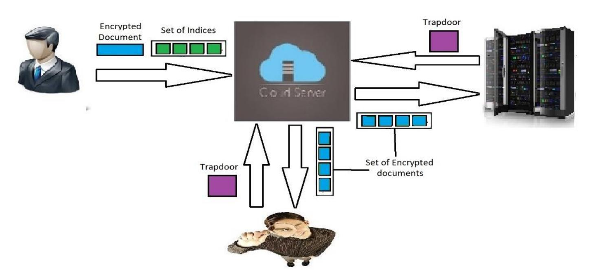

{0}------------------------------------------------

# **A Novel Asymmetric Searchable Encryption Scheme with Granting search capability**

Arian Arabnouri, Reza Ebrahimi Atani and Shiva Azizzadeh

Department of Computer Engineering, University of Guilan, P.O. Box 3756, Rasht, Iran. [ariannt.an@gmail.com,](mailto:ariannt.an@gmail.com) [rebrahimi@guilan.ac.ir,](mailto:rebrahimi@guilan.ac.ir) shiva.azizzadeh@gmail.com

**Abstract.** Nowadays, information is known as the main asset of each organization, which causes data generation to be exponentially increasing. Hence, different capacity issues and requirements show up with it, e.g. storage and maintenance of generating data, searching among them, and analyzing them. Cloud computing is one of the common technologies used to meet these requirements. Popularity of this technology is extremely growing as it can be used to handle high amount of data in a cost efficient and highly available (anytime and anywhere) manner. However, there are still extensive security challenges (e.g. data confidentiality) with this technology. Cryptography is one of the main methods used to fulfill privacy preserving of people and organizations. Encryption methods can impressively keep data private, so it is not possible to search among encrypted messages in order to retrieve information, after applying traditional encryption. Searchable encryption can enable searching among encrypted data and overcome this shortage. However, much more research is required to enable whole data searching while proper level of security would be achieved for these systems. In this paper, a technique to perform searching by the third party is introduced. When a number of nodes are interacting and some of them may upload malicious documents, this technique can be useful. Furthermore, document categorization is another application of the referred scheme.

**Keywords:** searchable encryption, confidentiality, data integrity, bilinear pairing.

### **1 Introduction**

Cloud storage enables easy and quick access to data, while storage and computational cost efficiency is achieved. Moreover, it enables accessing data anytime and anywhere, and minimizes data corruption and loss risk. Therefore, many people and organizations are attracting to utilize this technology. Within cloud storage, data is loaded on servers which users have no physical access to, and cloud service provider handles the data. On the other hand, data privacy preserving is highly demanded, because information is confidential and the owners do not tolerate exposure of them. The simplest way to meet this demand is to encrypt the data before uploading it on cloud, by its owner. There is no statistical similarity between encrypted and original document in this way. Therefore, no operation can be performed on cipher text.

{1}------------------------------------------------

So far several cryptographic algorithms and protocols were introduced (most of them public key based schemes) in which data owner and the server can perform computations on cipher texts and the encryption process have provable security against classical and quantum attacks. Homomorphic encryption techniques as well as Lattice based cryptography are among these techniques but have a very high computation overhead although very secure against attacks [27-35]. Searching is one of the most essential operations within cloud. There are large amount of documents on storage space, which just a small number of them are required in the course of each access. Due to this fact, it is noticeable that the ability to select a limited number of these documents is highly demanded, and searching is one the most important basic ways to have this selection done. A common solution to search among documents is to get the entire database, decrypt it and search for intended entries. Considering high amount of documents, bandwidth constraints, connection speed, and limited storage space on user's computer, this solution is not practical. Another solution is allowing server to decrypt the data and make queries among them, and finally send the results to the user. Implementing this solution causes the whole information to be revealed to the server, and server can misuse this information. Modern encryption methods are another solution that enable searching among data, e.g. homomorphic encryption and searchable encryption. Due to simpler implementation and higher performance of searchable encryption compared to homomorphic encryption, it is the focal point of this article. During searchable encryption, server is enabled to search among encrypted data according to authorized user request, and sends the result to him without learning any information. A searchable encryption scheme normally consists of four steps. First, functions and variables are selected and intended keys would be produced. In the next step, the document or intended database entry is created along with index set, and they are sent to storage server. The authorized user, who intends to search, creates a trapdoor using his desired keyword and authorized key, and sends it to the server in the third step. Finally, server verifies the received trapdoor and existing indexes in the fourth step and returns verification result i.e. 1 for verified and 0 for not verified. This function is known as the test function [1, 2].

The algorithms used to create trapdoor and index should be designed in order that they are correlated. This correlation is in a way that matching between trapdoor and index can be verified by the test function. Besides, trapdoor and index must be produced in a way that they can reveal no information about original text. On the other hand, using the private key is obligatory to produce the trapdoor. Hence, only authorized users are able to produce the trapdoor.

In many applications, data owners may send malicious information. PEDKS[3] scheme was proposed to prevent such activities. However, this scheme enables server to perform searching, which can cause information to be revealed to external servers. Furthermore, it may be difficult for receivers to search malicious words among documents, due to several reasons including lack of knowledge and time. Hence, another party is required to perform this analysis, which must be enabled to search among these data. For example, you can specify an authentication server as inspector of uploaded information, in order to ensure integrity and safety of this information, and prevent vicious users from sending malicious information consequently. The introduced scheme 

{2}------------------------------------------------

in this article pursues this goal. This scheme can grant search capability to the server trusted by user. Additionally, two different public keys are used to build cipher text and indexes. Hence, even the authentication server is not able to decrypt the document and access to all of the information.

The main purpose of this article is to improve a previously proposed scheme named searchable public-key encryption scheme with a designated tester (dPEKS)[4], and added grant search capability to other components.

The rest of this article is organized as follows: The research background is presented in the second section. Requirements of our proposed scheme are explained in section 3. In section 4, architecture of our proposed scheme is described. The proposed scheme is explained in section 5, and it is analyzed in section 6. Finally, conclusion of this article is presented in section 7.

## **2 Related works**

The first practical scheme in order to perform searching on encrypted text (searchable encryption) was presented by Song et al. [5]. This scheme is based on symmetric cryptography, in which the user and the data owner are the same person. This scheme does not contain indexes. Another efforts in this context are performed in [6-9], which present some concepts such as index, inverted index, conjunction search, and performing search via small computational capacity devices. Additionally, other efforts have been done to improve performance and security [10-12].

On the other hand, Boneh et al. [13] proposed the first searchable asymmetric cryptography scheme (public key cryptography scheme with the ability to search keywords). This scheme utilizes identity-based encryption (IBE) to implement searchable asymmetric encryption. Public key cryptography schemes with the ability to search keywords are useful when multiple data owners intend to send information to a single receiver. In this method, data owner encrypts the document and indexes using receiver's public key. In addition, receiver uses his private key to search among documents and decrypt them. The mentioned scheme generates an index for each keyword. The index set is consequently sent to storage server, along with encrypted document. However, proposed scheme in [13] was vulnerable to keyword guessing attacks. PERKS scheme [14] was proposed to handle this issue. In this scheme, the keyword is first merged with a private string, and then hashed. This action is done on the receiver side. Despite the fact that the mentioned scheme was secure against keyword guessing attacks, it suffered from basic problems e.g. receiver necessity to be permanently online. dPEKS scheme was another effort to overcome this issue, which was secure against online keyword guessing attacks. However, this scheme is vulnerable to online keyword guessing attacks as well. An attack was performed against this scheme in 2013, which was named "online keyword guessing attack" due to interaction between attacker and server [15]. Chen proposed a scheme to secure dPEKS scheme against online attacks in 2015 [16]. However, this scheme was yet vulnerable to cloud server. Whereas, some schemes were proposed to secure methods against this attack [17-20]. For example, proposed plans in [17, 18] are applicable to dPEKS, and despite their constraints are able to secure the 

{3}------------------------------------------------

scheme against internal keyword guessing attack. Another securing method was proposed in [19], which uses the data owner's key such as work done in [18]. Despite the constraints of this scheme (i.e. requirement to create a trapdoor per each data owner), it is efficient for its proper structures. Ibraimi et al. [3] proposed a scheme to grant search capability among documents to the cloud server. Their purpose was to enable categorization of documents, and search for documents that included malicious words. Nevertheless, it causes high amount of data being exposure to the server. Moreover, presented schemes in [21-25] were proposed to increase searchable asymmetric encryption capabilities.

## **3 Preliminaries**

In this section, we briefly review some required concepts and mathematical backgrounds.

#### **3.1 Bilinear Pairing**

Bilinear pairing [26] has found extensive application in cryptography. Assume that 1 and 2 be additive cyclic group and multiplicative cyclic group with prime order q, respectively.

Let be a generator of 1 . The e: 1 × 1 → 2 mapping is a bilinear pairing if it satisfies the following conditions:

- 1) Bilinearity: ∀ , ∈ , ∀ 1 , 2 ∈ 1 : e(1 , 2 ) = (1 , 2) .
- 2) Non-degeneracy: For ∀ ∈ Generator (1 ), e( , ) ∈ Generator (2 ).
- 3) Computability: An algorithm exists to effectively compute e(1 , 2) for all 1 , 2 ∈ 1 .

#### **3.2 Discrete Logarithmic Problem**

The discrete logarithm problem is defined over finite cyclic group. If and ℎ are elements of a finite cyclic group, then the solution to the equation ℎ = called as the discrete logarithm of ℎ to the base g. currently, there isn't any efficient algorithm to solve a logarithmic problem via a regular computer. Therefore, this problem has a special status in asymmetric cryptography.

Diffie-Hellman's encryption is based on a problem named Diffie-Hellman's assumption. This assumption expresses: there isn't an efficient algorithm which can calculate only with knowing < , , > (without or ). This assumption has wide usage in public key encryption and digital signature. dPEKS scheme applied this assumption to secure the trapdoor and also to keep randomness and in distinguishability of it against the external attacker.

### **4 Architecture of the proposed scheme**

In our proposed scheme, an architecture including four components is used, i.e. data owner, receiver, storage server, and authentication server. Data owner intends to send 

{4}------------------------------------------------

information to the receiver. Generating a trapdoor, receiver can search among information, and can access his intended information as well. Storage server is obligated to save the information and provide them to receiver. It can also perform searching using the trapdoor provided by the receiver, without learning about content of documents or the words which the trapdoor is generated using them. This server can be provided by a third party organization, and is assumed to be honest. Authentication server is obligated to verify integrity and security of the information on storage server.

First, the data owner generates the index using public keys of server and receiver. He subsequently sends the indexes and encrypted text to the server. Server stores the delivered information. Now, receiver calculates the shared key, using its private key and public key of authentication server. Then, it generates the trapdoor using public and private keys of storage server, and sends it to the storage server. Storage server gets the trapdoor and performs the test. If trapdoor and index match, storage server sends the intended document to the receiver.

On the other hand, authentication server first generates the shared key using its private key and data owner's public key. Then, it generates the trapdoor of intended keyword (a key for threat measurement) using the shared keys between it and receiver. The authentication server subsequently sends the trapdoor to the storage server in order to identify which documents contain the intended word, and removes them from storage server if necessary. In fig. 1 proposed architecture is shown.

**Fig. 1.** The proposed architecture

## **5 The Proposed scheme**

Our presented scheme is based on two previously proposed schemes. The reasons why dPEKS scheme is selected within PEKS schemes, are its popularity and being a basic scheme which has many security extensions to improve the security level. On the other hand, structure of SAE-I scheme is different, which causes the improvement in its performance.

{5}------------------------------------------------

#### 5.1 Proposed Scheme based on dPEKS

This section presents the proposed scheme based on dPEKS. This scheme contains 8 algorithms which are explained subsequently.

**GlobalSetup**( $\lambda$ ): In this algorithm, the variables and functions needed in the other algorithms would be chosen. This algorithm is like the GlobalSetup algorithm in dPEKS. In addition a  $g_p$  which is the generator of dPEKS.  $GlobalSetup(\lambda)$ .  $Z_p$  is chosen  $(gp = \langle dPEKS. GlobalSetup(\lambda), g_p \rangle)$ .

**KeyGen**AUTH-SERV(**gp**): This algorithm determines the public/private key pair of authentication server. Authentication server can calculate the shared key with receiver using his private key (According Diffie-Hellman key exchange). The dPEKS does not contain this component, and this component is introduced in this article. The algorithm picks a random  $a \in Z_p$ . It outputs  $PRIV_{AUTH-SERV} = a$  and  $PUB_{AUTH-SERV} = g_p^{PRIV_{AUTH-SERV}}$ .

**KeyGenSERV(gp):** This algorithm determines the public/private key pair of sever. With this pair we can insure only server can perform test algorithm, because the test algorithm requires private key of the server. This algorithm calls the  $dPEKS.KeyGen_{SERV}(gp)$  function.

**KeyGen**REC(**gp**): This algorithm determines the public/private key pair of receiver. With this pair we can insure only receiver can perform trapdoor function to search on data, because the trapdoor algorithm requires receiver's private key. This algorithm calls the  $dPEKS.KeyGen_{REC}$  function ( $PRIV = dPEKS.KeyGen_{REC}$  (gp).  $PRIV_{REC}$ ,  $PUB = dPEKS.KeyGen_{REC}$  (gp).  $PUB_{REC}$ ). Now this algorithm calculates the key pair ( $PRIV_{REC} = PRIV$ ,  $b = PUB_{AUTH-SERV}$ ).  $PRIV_{REC1} > PUB_{REC} = PUB$ ,  $c = g_p^{PRIV.PRIV_{REC1}}$ ,  $d = (gp. g)^b > 0$ .

**PEKS**(**M**, **PUB**SERV, **PRIV**DO, **PUB**REC, **gp**): The DO calls this function to prepare the encrypted message to be sent to the cloud server. This function first extracts keywords from message. It then encrypts the message ( $c = Enc_{PUB_{REC}.PUB.PUB_{REC1}}(M)$ ) and builds the index calling dPEKS.dPEKS (for each word w in M  $I_w = dPEKS.dPEKS(w, PUB_{SERV}, PUB_{REC}.d, gp)$ ) and concatenates them to build index set (index - set). Then sends  $DATA = \{c, index - set\}$  to the cloud server.

UserTrapdoor(gp,  $PUB_{SERV}$ ,  $PRIV_{REC}$ , W): Only authorized receiver can perform search on his data. To achieve this, he runs Trapdoor function. Trapdoor function requires receiver's private key as a parameter, and since the others does not have this key, they cannot perform searching among data, using this function. Trapdoor function calls dPEKS.  $dTrapdoor(T_w = dPEKS$ .  $dTrapdoor(gp, PUB_{SERV}, PRIV_{REC}.b, w)$ ).

ServerTrapdoor(gp,  $PUB_{SERV}$ ,  $PRIV_{REC}$ , W): In this scheme, the authentication server have privilege to search. To achieve this, authentication server creates a trapdoor for intended keyword. It builds trapdoor using dPEKS. dTrapdoor. In order to do so, it first calculates the shared key

{6}------------------------------------------------

(− = . − ). Then this key is used instead of the receiver's private key, who intended to generate the trapdoor ( = . ( , ,− , )).

( , , , ): Cloud server runs this function to find documents that match the trapdoor (match intended keyword). In this scheme, only server can perform test, as well as dPEKS scheme. This is done to prevent offline keyword guessing attack. To achieve this, the function needs private key of the server. This function calls dPEKS. dTest (f = dPEKS. dTes( , , , )) , for all indexes in DATA. If == 1, the document contains the keyword and server returns it to the trapdoor creator (receiver or authentication server).

## Correctness test

According to closure property of groups, − = ∈ , = − .1 ∈ and = (. ) ∈ . 1 . Therefore we can use b as receiver's private key (since it is an element of ), and d as his public key (since it is an element of 1 ). The Correctness of test algorithm is like the dPEKS. Finally, the equality between receiver's private key and the key of authentication server would be proven.

Proof:

$$KEY_{AUTH-SERV} = gp. g^{c^{PRIV}AUTH-SERV} = gp. g^{(g_p^{PRIV.PRIV}REC_1)^{PRIV}AUTH-SERV} = gp. g^{(g_p^{PRIV}AUTH-SERV)^{PRIV.PRIV}REC_1} = gp. g^{(PUBAUTH-SERV)^{PRIV.PRIV}REC_1} = b$$

#### **5.2 Proposed Scheme based on SAE-I**

This section presents the proposed scheme based on SAE-I. This scheme contains 8 algorithms which will be explained later.

**GlobalSetup(λ):** In this algorithm, the variables and functions needed in the other algorithms would be chosen. This algorithm is like the GlobalSetup algorithm in SAE-I. In addition a which is the generator of − . (). is chosen ( = < − . () , >).

()**:** This algorithm determine the public/private key pair of Data Owner. Data owner can build index using his private key. The algorithm calls − . . It outputs = − . (DO). and = − . (DO). .

−()**:** This algorithm determine the public/private key pair of authentication server. Authentication server can calculate the common key with receiver using his private key (According Diffie-Hellman key exchange). The algorithm calls − . . It outputs − = − . (AUTH − SERV). and − = −.

()**:** This algorithm determines the public/private key pair of receiver. With this pair we can insure only receiver can perform trapdoor function to search on data, because the trapdoor algorithm requires receiver's private key. This algorithm calls the −. function ( = < = −

{7}------------------------------------------------

. (REC). , = − > , = < = , = , = >).

(, , , )**:** The DO calls this function to prepare the encrypted message to be sent to the cloud server. This function first extracts keywords from message. It then encrypts the message ( = ()) and builds the index calling − . (for each word w in M, = − . ( . , )) and concatenates them to build index set ( − ). Then sends = {, −} to the cloud server.

( , , , ): Only authorized receiver can perform search on his data. To achieve this, he runs Trapdoor function. Trapdoor function requires receiver's private key as a parameter, and since the others does not have this key, they cannot perform searching among data, using this function. Trapdoor function calls − . ( = − . (, . , )).

( , , , ): In this scheme, the authentication server have privilege to search. To achieve this, authentication server creates a trapdoor for intended keyword. It builds trapdoor using − . . In order to do so, it first calculates the shared key (− = − ). Then this key is used instead of the receiver's private key, who intended to generate the trapdoor ( = − . (,− , )).

( , , , ): Cloud server runs this function to find documents that match the trapdoor (match intended keyword). This function calls −. Test (f = − . Tes( , )) , for all indexes in DATA. If == 1, the document contains the keyword and server returns it to the trapdoor creator (receiver or authentication server).

## Correctness test

The correctness proof of this scheme is like the pervious scheme. But Correctness of this scheme is based on − algorithm.

## **6 Performance and Security Evaluation of the Scheme**

In this section, we briefly review some required concepts and mathematical backgrounds.

#### **6.1 Performance Analysis**

In our proposed scheme a new component is added to the previous scheme. Consequently, a new algorithm is required to generate the key of this component. The Key-Gen\_REC function is altered, a parameter is added to receiver's private key, and two parameters are added to receiver's public key. To make these changes, we perform an exponential function in private key generation and two exponential functions in public key generation. However, since keygen is run only one time, it can be ignored. The 

{8}------------------------------------------------

ServerTrapdoor function is added to perform search with the shared key. This function is like UserTrapdoor function existed in pervious schemes, but it requires two additional exponential functions. Hence, the performance of our proposed scheme depends on original scheme and its overhead is negligible.

#### **6.2 Security Analysis**

Security analysis phases of our proposed scheme is similar to phases of dPEKS scheme. Granting search capability to the authentication server is the only difference between these two schemes. Considering this, it must be proven that key sharing does not create security problems. Two security issues are noticeable:

- 1. Having the public keys of the authentication server and receiver, external attacker (penetrator) should not be able to obtain their shared private key.
- 2. Having a shared key with the authentication server, the user should not be able to obtain the shared key between the authentication server and another receiver.

Diffie-Hellman key exchange method is used for key sharing. Both mentioned security issues are considered in this method. Hence, the method is secure against two mentioned parties i.e. external attacker and malicious user. Clearly if an attacker can perform one of the mentioned attacks above, then he is able to attack the Diffie-Hellman key exchange algorithm as well.

### **7 Conclusion**

In this article a method to grant search capability to the third party in cloud platforms is introduced which was also proposed in [3]. This scheme can be used to search malicious documents, and document categorization. Besides, PKEDS scheme enables the cloud server to perform searching which is not desirable. In our proposed scheme, the user can grant this capability to his/her trusted third party. The third party would be able to perform searching and categorizing the documents, and delete malicious ones as well. To achieve this, Diffie-Hellman key exchange method is applied be-tween the user and the third party. Accordingly, the proposed scheme is based on two mentioned schemes. Furthermore, the introduced method can role as a warning for networks which let their keys to be generated by an untrusted component, or use an algorithm or application to generate the keys.

**Acknowledgment:** We gratefully acknowledge the financial support from the Iran National Science Foundation (INSF) [Research project 97008930].

## **References**

1. Fei Han, Jing Qin, Jiankun Hu, Secure searches in the cloud: A survey, Future Generation Computer Systems, Volume 62, 2016, Pages 66-75, ISSN 0167-739X, https://doi.org/10.1016/j.future.2016.01.007.

{9}------------------------------------------------

- 2. Christoph Bösch, Pieter Hartel, Willem Jonker, and Andreas Peter, A Survey of Provably Secure Searchable Encryption, ACM Computing Survey, Vol. 47(2), Article 18 (January 2015), 51 pages. DOI:https://doi.org/10.1145/2636328.
- 3. Ibraimi, L., Nikova, S., Hartel, P.H., and Jonker, W., "Public-key encryption with delegated search", ACNS (LNCS), Vol. 6715, pp. 532–549, 2011.
- 4. Rhee, H.S., Park, J.H., Susilo, W., Lee., D.H., "Trapdoor security in a searchable public-key encryption scheme with a designated tester", Journal of Systems and Software, Vol. 83, (2010).
- 5. Dawn Xiaoding Song, D. Wagner and A. Perrig, "Practical techniques for searches on encrypted data," *Proceeding 2000 IEEE Symposium on Security and Privacy. S&P 2000*, Berkeley, CA, USA, 2000, pp. 44-55, doi: 10.1109/SECPRI.2000.848445.
- 6. Goh, E.J., (2004), "Secure indexes", In IACR Cryptology ePrint Archive, pp. 216.
- 7. Chang, Y.C., Mitzenmacher, M., "Privacy preserving keyword searches on remote encrypted data", Applied Cryptography and Network Security, SPRINGER, Berlin, Heidelberg, pp. 442–455, (2005).
- 8. Curtmola, R., Garay, J., Kamara, S., Ostrovsky, R., "Searchable symmetric encryption: Improved definitions and efficient constructions", CCS, ACM, New York, NY, pp. 79–88, (2006).
- 9. Golle, P., Staddon, J., Watersm, B.,"Secure conjunctive keyword search over encrypted data", ACNS, LNCS pp. 31–45, (2004).
- 10. Chai, Q., Gong, G., "Verifiable symmetric searchable encryption for semi-honest-but-curious cloud servers", 2012 IEEE International Conference on Communications (ICC), (2012).
- 11. Moataz, T., Shikfa, A., "Boolean symmetric searchable encryption", 8th ACM SIGSAC symposium on Information, computer and communications security, pp. 265-276, (2013).
- 12. Ghareh Chamani, J., Papadopoulos, D., Papamanthou, C., Jalili, R., "New Constructions for Forward and Backward Private Symmetric Searchable Encryption", ACM SIGSAC Conference on Computer and Communications Security, pp. 1038-1055, (2018).
- 13. Boneh, D., Crescenzo, G.D., Ostrovsky, R. and Persiano., G., "Public Key Encryption with Keyword Search", International Association for Cryptologic Research, (2004).
- 14. Tang Q., Chen L. (2010) Public-Key Encryption with Registered Keyword Search. In: Martinelli F., Preneel B. (eds) Public Key Infrastructures, Services and Applications. EuroPKI 2009. Lecture Notes in Computer Science, vol 6391. Springer, Berlin, Heidelberg. https://doi.org/10.1007/978-3-642-16441-5\_11.
- 15. Yau, W.C., Phan, R.C.W., Heng, S.H., Goi., B.M., "Keyword guessing attacks on secure searchable public key encryption schemes with a designated tester", Advanced Computer Mathematics based Cryptography and Security Technologies, Vol. 90, (2013).
- 16. Y. Chen, "SPEKS: Secure Server-Designation Public Key Encryption with Keyword Search against Keyword Guessing Attacks," in The Computer Journal, vol. 58, no. 4, pp. 922-933, April 2015, doi: 10.1093/comjnl/bxu013.
- 17. R. Chen *et al*., "Server-Aided Public Key Encryption With Keyword Search," in *IEEE Transactions on Information Forensics and Security*, vol. 11, no. 12, pp. 2833-2842, Dec. 2016, doi: 10.1109/TIFS.2016.2599293.
- 18. Sun, L., Xu, C., Zhang, M. et al. Secure searchable public key encryption against insider keyword guessing attacks from indistinguishability obfuscation. Sci. China Inf. Sci. 61, 038106 (2018). https://doi.org/10.1007/s11432-017-9124-0.
- 19. J. Zhang, C. Song, Z. Wang, T. Yang and W. Ma, "Efficient and Provable Security Searchable Asymmetric Encryption in the Cloud," in IEEE Access, vol. 6, pp. 68384-68393, 2018, doi: 10.1109/ACCESS.2018.2872743.

{10}------------------------------------------------

- 20. Chen R., Mu Y., Yang G., Guo F., Wang X., A New General Framework for Secure Public Key Encryption with Keyword Search. In: Foo E., Stebila D. (eds) Information Security and Privacy. ACISP 2015. Lecture Notes in Computer Science, vol 9144. Springer, Cham. https://doi.org/10.1007/978-3-319-19962-7\_4.
- 21. Hwang Y.H., Lee P.J., Public Key Encryption with Conjunctive Keyword Search and Its Extension to a Multi-user System. In: Takagi T., Okamoto T., Okamoto E., Okamoto T. (eds) Pairing-Based Cryptography – Pairing 2007. Lecture Notes in Computer Science, vol 4575. Springer, Berlin, Heidelberg. https://doi.org/10.1007/978-3-540-73489-5\_2.
- 22. Shi, E. and Bethencourt, J. and Chan, TH. , Song, D. and Perrig, A., "Multi-dimensional range query over encrypted data," in *Security and Privacy, 2007. SP'07. IEEE Symposium on*, (2007).
- 23. Boneh D., Waters B. (2007) Conjunctive, Subset, and Range Queries on Encrypted Data. In: Vadhan S.P. (eds) Theory of Cryptography. TCC 2007. Lecture Notes in Computer Science, vol 4392. Springer, Berlin, Heidelberg. https://doi.org/10.1007/978-3-540-70936- 7\_29.
- 24. Boneh, D. , Kushilevitz, E. , Ostrovsky, R. and Skeith, W.E, "Public key encryption that allows PIR queries," in *Annual International Cryptology Conference*, (2007).
- 25. Arian Arabnouri, "Security Evaluation of Searchable Encryption protocols", MSc Thesis, University of Guilan, September 2018.
- 26. Meffert, D.,"Bilinear pairings in cryptography". Master's thesis, Radboud Universiteit Nijmegen, 2009.
- 27. A. Hassani Karbasi and R. Ebrahimi Atani, S. Ebrahimi Atani, "PairTRU: Pairwise Noncommutative Extension of The NTRU Public key Cryptosystem," International Journal of Information Security Science 7 (1), 2018, Pages: 11–19.
- 28. Ebrahimi Atani, R., Ebrahimi Atani, S., Hassani Karbasi, A. (2018). NETRU: A Non-commutative and Secure Variant of CTRU Cryptosystem. The ISC International Journal of Information Security, 10(1), 45-53. doi: 10.22042/isecure.2018.0.0.2.
- 29. Ebrahimi Atani, R., Ebrahimi Atani, S., Hassani Karbasi, A. (2018). A Provably Secure Variant of ETRU Based on Extended Ideal Lattices Over Direct Product of Dedekind Domains. *Journal of Computing and Security*, 5(1), 13-34. doi: 10.22108/jcs.2018.106856.0.
- 30. C. Gentry, C. Peikert, and V. Vaikuntanathan, "Trapdoors for hard lattices and new cryptographic constructions," In Proceedings of STOC, 2008, 197–206.
- 31. C. Gentry, and Sh. Halevi, "Fully homomorphic encryption without squashing using depth-3 arithmetic circuits," Cryptology ePrint Archive, 2011.
- 32. S. R. Lashkami, R. E. Atani, A. Arabnouri and G. Salemi, "A Blockchain Based Framework for Complete Secure Data Outsourcing with Malicious Behavior Prevention," 2020 28th Iranian Conference on Electrical Engineering (ICEE), Tabriz, Iran, 2020, pp. 1-7, doi: 10.1109/ICEE50131.2020.9260866.
- 33. Nia, M. A., Atani, R. E., and Ruiz‐Martínez, A. (2015) Privacy enhancement in anonymous network channels using multimodality injection. Security Comm. Networks, 8: 2917– 2932. doi: 10.1002/sec.1219.
- 34. M. S. Abolghasemi, M. M. Sefidab and R. E. Atani, "Using location based encryption to improve the security of data access in cloud computing," 2013 International Conference on Advances in Computing, Communications and Informatics (ICACCI), Mysore, 2013, pp. 261-265, doi: 10.1109/ICACCI.2013.6637181.
- 35. Ebrahimi Atani, R., Ebrahimi Atani, S., Hassani Karbasi, A. (2019). A New Ring-Based SPHF and PAKE Protocol On Ideal Lattices. *The ISC International Journal of Information Security*, 11(1), 75-86. doi: 10.22042/isecure.2018.109810.398.