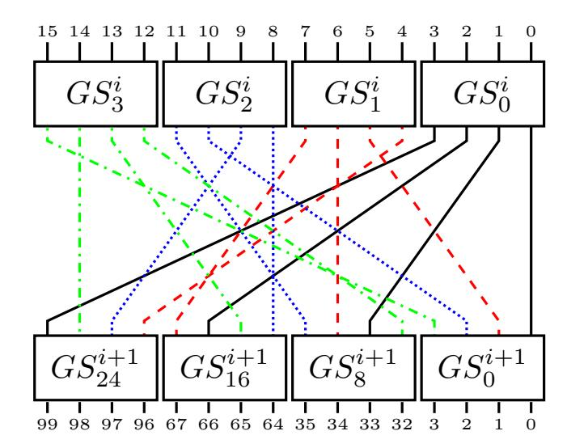
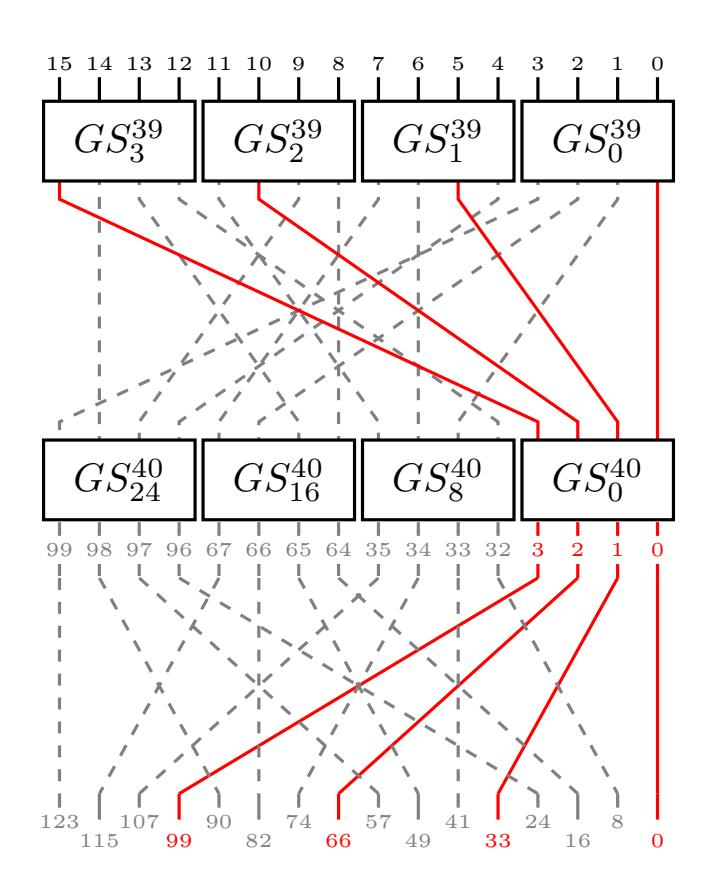
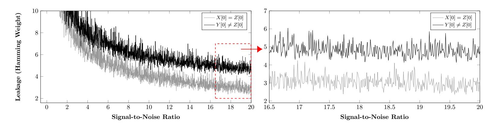

{0}------------------------------------------------

# DNFA: Differential No-Fault Analysis of Bit Permutation Based Ciphers Assisted by Side-Channel

# Xiaolu Hou

*Temasek Laboratories Nanyang Technological University* Singapore ho0001lu@e.ntu.edu.sg

Jakub Breier *Silicon Austria Labs* Graz, Austria jbreier@jbreier.com

Shivam Bhasin *Temasek Laboratories Nanyang Technological University* Singapore sbhasin@ntu.edu.sg

*Abstract*—Physical security of NIST lightweight cryptography competition candidates is gaining importance as the standardization process progresses. Side-channel attacks (SCA) are a wellresearched topic within the physical security of cryptographic implementations. It was shown that collisions in the intermediate values can be captured by side-channel measurements to reduce the complexity of the key retrieval to trivial numbers.

In this paper, we target a specific bit permutation vulnerability in the block cipher GIFT that allows the attacker to mount a key recovery attack. We present a novel SCA methodology called DCSCA – Differential Ciphertext SCA, which follows principles of differential fault analysis, but instead of the usage of faults, it utilizes SCA and statistical distribution of intermediate values. We simulate the attack on a publicly available bitslice implementation of GIFT, showing the practicality of the attack. We further show the application of the attack on GIFT-based AEAD schemes (GIFT-COFB, ESTATE, HYENA, and SUNDAE-GIFT) proposed for the NIST LWC competition. DCSCA can recover the master key with 2 <sup>13</sup>.<sup>39</sup> AEAD sessions, assuming 32 encryptions per session.

*Index Terms*—side-channel attacks, bit permutations, GIFT, AEAD

# I. INTRODUCTION

With the emergence of pervasive computing and the Internetof-Things (IoT) paradigm, the need for lightweight ciphers has been felt more than ever. PRESENT [1] which was proposed in 2007, was one of the first few symmetric ciphers with lightweight design goals and motivated several other proposals that followed. Later in 2017, GIFT [2] was proposed as a PRESENT-like cipher to push the limits for lightweight encryption by choosing optimal design parameters to achieve a smaller area, better resistance to linear cryptanalysis, better throughput, and simpler key schedule. While PRESENT and GIFT were initially considered to be hardware oriented ciphers due to the bit permutation operation which has zero-cost in hardware, recent works have shown that these ciphers can be efficient in software as well [3], [4].

Recently, the National Institute of Standards and Technology (NIST) has launched the Lightweight Cryptography (LWC) Standardization<sup>1</sup> process to select the cipher that will be used in lightweight applications such as IoT. The competition calls for Authenticated Encryption with Associated Data (AEAD). There are 32 candidates in Round 2 of the competition, out of which four candidates use GIFT-128 as an underlying block cipher. While all of them provide security guarantees related to standard cryptanalytic attacks, most of them do not discuss physical attacks, such as side-channel analysis (SCA) [5] and fault injection attacks (FIA) [6].

Our contribution. The resistance of PRESENT and GIFT ciphers against SCA has been explored in series of works in the past (e.g. [7], [8]), but their resistance to SCA within the AEAD setting is not yet explored. Several AEAD schemes use plaintext masking. It is well known that the majority of SCA operates under a known/chosen plaintext setting, making those attacks impossible when plaintext masking is in place. Further, we notice that several NIST LWC candidates using GIFT-128 are designed to allow access to ciphertext. We thus propose DCSCA– Differential Ciphertext SCA, which can break all 4 NIST LWC candidates based on GIFT-128. DCSCA works similarly to Differential Fault Analysis (DFA), but without the need for physical fault injection but rather assisted by sidechannel leakages. It can recover the GIFT-128 master key with 2 <sup>13</sup>.<sup>39</sup> AEAD sessions, assuming 32 encryptions per session.

Organization. The rest of the paper is organized as follows. In Section II we provide background on side-channel attacks and discuss related work. In Section III we detail the specifications of GIFT-128 and the specific properties of its bitpermutation operation we target. Section IV presents DCSCA methodologies with application to GIFT-128. Section V shows the simulated attack results on GIFT-128. Section VI discusses the impact of DCSCA on AEAD schemes in the NIST LWC competition. We finally conclude with Section VII.

# II. BACKGROUND AND RELATED WORK

In this section, we outline the general background on sidechannel attacks and differential fault analysis.

# *A. Side-Channel Analysis.*

Side-Channel Analysis (SCA) attacks target implementations of cryptographic primitives *passively*. They exploit the possibility of observing the physical characteristics of a device during the encryption/decryption process [9]. The attacker obtains so-called *side-channel information* that can be in a form of execution time [10], power consumption [5], electromagnetic emanation (EM) [11], etc. This information is then used to

<sup>1</sup>https://csrc.nist.gov/Projects/lightweight-cryptography

{1}------------------------------------------------

reveal information related to the secret key used during the computation.

In this work, we focus on SCA attacks that use either power consumption leakage or EM leakage for the analysis. These can be generally divided into three categories. Simple Side-Channel Attacks (SSCA) aim at information recovery by observing secret dependent patterns in one or few side-channel traces like conditional multiply in square and multiply operation of RSA when the key bit is 1. Differential Side-Channel Attacks (DSCA) operate on a higher number of side-channel traces compared to SSCA where an attacker uses statistical means to find dependency between hypothetical leakage based on key hypothesis and the assumed leakage model (like Hamming Weight model) and actual traces.

Lastly, Side-Channel Assisted Differential Plaintext Attacks (SCADPA [12]) uses side-channel leakage to aid differential cryptanalysis [13] like attacks. Generally, the attacker encrypts two known plaintexts and tracks the difference propagation in middle rounds through side-channels. The middle round difference is computed by subtracting side-channel traces from the two plaintexts. The input and middle-round differences can be used in differential cryptanalysis to recover the key. This attack, initially introduced against bit-permutation based ciphers, was recently extended to SPN ciphers, being capable of targeting deep rounds [14].

### B. Differential Fault Analysis

Differential Fault Analysis (DFA) [6] belongs to a class of fault attack methods that analyze the differences in ciphertexts to derive the information on the secret key. It quickly became the method of choice for breaking symmetric cryptosystems [15] and up to date, there is no symmetric cipher that would provide resistance against DFA without the usage of countermeasures. Several DFA automation approaches were published up to date, working either on cipher level or implementation level [16].

The working principle is as follows. First, the attacker performs encryption of a plaintext P without faults to obtain ciphertext C. Then, she induces a fault in one of the last rounds of the cipher during the encryption of the same plaintext to get a faulty ciphertext C'. Based on the differences between C and C', she gets information on the secret key. She repeats this process with the injection of different faults to either fully recover the key or to reduce the search complexity to a trivial number.

DCSCA as proposed in this paper combines the principles of DFA and SCADPA. The key recovery follows the principle of DFA, however, we relax the attack by removing the need to inject faults using physical perturbation methods. Instead of inducing faults during the last rounds, DCSCA utilizes the statistical distribution of intermediate values to get the differentials that help to recover the information on the secret key. To get the knowledge on this differentials, the attacker utilizes the properties of bit permutations in a similar way as

SCADPA does<sup>2</sup>.

#### III. ATTACK TARGETS

DCSCA targets the bit-permutation operation with certain properties. We first provide an overview of block cipher GIFT which uses such bit-permutation as its diffusion function. Next, we give the details of this particular class of bit-permutation. Finally, we give a brief overview of the NIST lightweight cryptography competition.

#### A. GIFT-128

In this section we follow the terminologies from [2] and describe the specifications of GIFT-128. GIFT-128 consists of 40 rounds, where each round consists of three operations: **SubCells**, **PermBits** and **AddRoundKey**. The cipher state can be expressed as 32 nibbles  $S = b_{127}||b_{126}||\dots||b_0 = \omega_{31}||\omega_{30}||\dots||\omega_1||\omega_0$ .

- a) SubCells: operation applies a 4-bit invertible Sbox to each nibble of the cipher state:  $\omega_i \leftarrow GS(\omega_i), \ \forall i \in \{0,1,\ldots,31\}$ . The specification of the GIFT Sbox is 1a4c6f392db7508e.
- b) PermBits: maps bit i to another bit according to the following formula

$$P(i) = 4 \left\lfloor \frac{i}{16} \right\rfloor + 32 \left( \left( 3 \left\lfloor \frac{i \mod 16}{4} \right\rfloor + (i \mod 4) \right) \mod 4 \right) + (i \mod 4).$$

c) AddRoundKey: consists of adding the round key and the round constant. A 64-bit round key RK is extracted from the key state and partitioned into two 32-bit words  $RK = U||V = u_{31} \dots u_0||v_{31} \dots v_0$ . U and V are then XORed to  $\{b_{4i+2}\}$  and  $\{b_{4i+1}\}$  of the cipher state respectively:

$$b_{4i+2} \leftarrow b_{4i+2} \oplus u_i, \ b_{4i+1} \leftarrow b_{4i+1} \oplus v_i, \ \forall i \in \{0, \dots, 31\}$$

#### B. Target Bit-Permutation

Bit-permutation operation has been used as a building block in many SPN cipher designs. We are interested in a particular class of bit-permutation operation, which satisfies:

- Each Sbox is a b-bit permutation.
- Sboxes in each round can be divided into groups of m in two ways the Quotient and Remainder groups.
- The bit-permutation operation can be viewed as a group mapping, which takes the outputs from one Quotient group as the input and outputs  $m \times b$  bits which will be XORed with the round key and used as inputs for one Remainder group in the next round.
- The input bits of an Sbox in round i + 1 come from m distinct Sboxes in one Quotient group in round i.
- The output bits of an Sbox in round i go to m distinct Sboxes in one Remainder group in round i + 1.

For both GIFT and PRESENT cipher designs, m=b=4. Let us number the Sboxes in round i of the cipher as  $SB_0^i, SB_1^i, \ldots, SB_s^i$ , where s=n/4 and n is the block size of

<sup>2</sup>We assume the attacker can use SSCA to determine the executed operations of the cryptographic algorithm by observing the trace.

{2}------------------------------------------------



Fig. 1. Grouping of bits and nibbles in GIFT.

the cipher. Then, for both PRESENT and GIFT, the Quotient groups and Remainder groups, Qx and Rx, are defined as

- $Qx = \{SB_{4x}, SB_{4x+1}, SB_{4x+2}, SB_{4x+3}\};$
- $Rx = \{SB_x, SB_{q+x}, SB_{2q+x}, SB_{3q+x}\},\$

where  $q=s/4, 0 \leq x \leq q-1$ . For example, Figure 1 shows the mapping from Quotient group Q0 in round i to Remainder group R0 in round i+1 for GIFT-128, where  $GS^i_j$  denotes the jth Sbox in the ith round.

# C. NIST Lightweight Cryptography Competition

Proliferation of IoT devices made lightweight cryptography (LWC) the main direction in symmetric block ciphers. Based on this trend, NIST launched a lightweight cryptography competition to select algorithms for standardization<sup>3</sup>. Currently, there are 32 candidates for authenticated encryption with associated data (AEAD) that had passed the first round of evaluation. AEAD algorithm takes four inputs: plaintext, associated data, nonce, and secret key; and outputs the ciphertext and a tag. Such an algorithm provides confidentiality of the plaintext and integrity of the ciphertext. We present the application of the proposed attacks to GIFT-based LWC candidates of NIST competition Round 2 in Section VI.

# IV. DCSCA – DIFFERENTIAL CIPHERTEXT SIDE-CHANNEL ATTACK

In this section, we outline the working principle of DCSCA – Differential Ciphertext Side-Channel Attack on bit permutation-based ciphers with application to GIFT-128. Generally, DCSCA works in a very similar way to differential fault analysis – it exploits ciphertext differences between two encryptions to derive the secret key information, however, no fault injection is needed.

#### A. DCSCA Methodology

DCSCA methodology utilizes the knowledge of the ciphertext together with the side-channel information leaked from the second last round to recover the last round key. In case the last round key does not provide enough information to recover the secret key (e.g. as in GIFT-128), the same procedure can be applied again to earlier rounds.

Attacker assumption. For DCSCA, we assume the attacker



Fig. 2. Last two rounds of GIFT.

- cannot control the plaintext, but we assume the plaintext comes from random sources,
- has access to the ciphertext,
- can observe by side-channel leakage if there is a change in either the input or output of each Sbox in the second last round.

Attack rationale. In case the outputs of a Remainder group of Sboxes (see Section III-B for notation) in the last round do not change except for one Sbox, the attacker can gain knowledge of the input difference of this particular Sbox by side-channel leakage at the second last round. She can reduce the candidates for this Sbox input and further reduce key candidates with the knowledge of ciphertext.

**Target ciphertext difference.** Following the notations in Section III-B, we aim to find a pair of ciphertexts, say  $C^1$  and  $C^2$  such that  $C^1$  and  $C^2$  agree on the outputs of m-1 Sboxes which are in the same Remainder group and they differ in the remaining Sboxes from that group.

#### **Attack steps:**

- 1) Run the encryption and get one ciphertext, say  $C^1$ , as well as the corresponding side-channel leakage  $t_1$ .
- 2) Repeat the encryption and record the corresponding sidechannel leakage until getting a ciphertext, say  $C^2$ , such that the target ciphertext difference mentioned above is achieved. Store the side-channel leakage for encryption of  $C^2$  as  $t_2$ .
- 3) Based on  $\Delta C = C^1 \oplus C^2$  and the part of  $\Delta t = t_1 t_2$  that corresponds to the second last round computation, reduce the last round key candidates.
- 4) Repeat steps 2-3 to recover the entire last round key.

#### B. Application of DCSCA to GIFT-128

In this section, we first detail the attack with an example that recovers an input of one particular Sbox input of GIFT-128. Then, we give an estimation of the attack complexity.

Attack to recover input of  $GS_0^{40}$ . Figure 2 shows that the outputs of the first four Sboxes  $\{GS_0^{39},GS_1^{39},GS_2^{39},GS_3^{39}\}$  in

<sup>&</sup>lt;sup>3</sup>https://csrc.nist.gov/Projects/lightweight-cryptography

{3}------------------------------------------------

round 39 go to four Sboxes  $\{GS_0^{40}, GS_8^{40}, GS_{16}^{40}, GS_{24}^{40}\}$  in the last round.

By our assumption, the attacker can observe the ciphertext  $C=c_0||c_1||\dots||c_{127}$ . From Figure 2 we can see that  $c_0||c_{33}||c_{66}||c_{99}$ ,  $c_8||c_{41}||c_{74}||c_{107}$ ,  $c_{16}||c_{49}||c_{82}||c_{115}$  and  $c_{24}||c_{57}||c_{90}||c_{123}$  correspond to the outputs of Sboxes  $GS_0^{40}$ ,  $GS_8^{40}$ ,  $GS_{16}^{40}$  and  $GS_{24}^{40}$ , respectively. Let us suppose the attacker observed a ciphertext pair  $C^1$ ,  $C^2$  that satisfies the following:

- 1)  $C^1$  and  $C^2$  differ at least in one bit at bit positions 0, 33, 66, 99;
- 2)  $C^1$  and  $C^2$  agree on all the 12 bits at positions 8, 16, 24, 41, 49, 57, 74, 82, 90, 107, 115, 123.

The attacker can conclude that at the last round, the inputs of Sboxes  $GS_8^{40}$ ,  $GS_{16}^{40}$ ,  $GS_{24}^{40}$  are the same while the inputs of Sbox  $GS_0^{40}$  are different for the computations of  $C^1$  and  $C^2$ .

Now, with the assistance of side-channel leakage, the attacker can observe if there is a change in the outputs of SubCells in the second last round. In particular, she can observe if there is a change in the outputs of  $GS_0^{39}$ ,  $GS_1^{39}$ ,  $GS_2^{39}$ , and  $GS_3^{39}$ . We note that with the assumptions on  $C^1$  and  $C^2$  above, the change/no-change in the outputs of  $GS_0^{39}$ ,  $GS_1^{39}$ ,  $GS_2^{39}$ , and  $GS_3^{39}$  correspond to change/no-change in the 1st, 2nd, 3rd, 4th bits of the  $GS_0^{40}$  input, respectively. Consequently, the attacker can get a pair of input and output difference for Sbox  $GS_0^{40}$ .

She can then continue to run the encryption until she gets another ciphertext  $C^3$  such that the pair  $C^1, C^3$  satisfies the conditions 1 and 2 above, and also  $C^3$  and  $C^2$  differ at least in one bit at bit positions 0, 33, 66, 99. This gives the attacker another pair of input/output difference for Sbox  $GS_0^{40}$ . With enough pairs of input/output differences she can recover the input of  $GS_0^{40}$  for the computation of  $C^1$ , and with the knowledge of  $C^1$ , she can recover the key bits 1, 2, 3 for the last round key.

**How many encryptions are needed?** With the attack scenario described above, for a successful attack with m pairs of distinct input/output differences, the attacker needs m+1 ciphertexts  $C^1, C^2, \ldots, C^{m+1}$  such that they satisfy the following:

- a. They all agree on the 12 bits at positions 8, 16, 24, 41, 49, 57, 74, 82, 90, 107, 115, 123,
- b.  $C^i$  differs in at least one of the four bits 0, 33, 66, 99 from  $C^j$  for  $i \neq j$  ((i, j = 1, 2, 3, ..., m + 1)).

For a given ciphertext  $C^1$ , the probability to find  $C^2$  (m=1) that satisfies the above is

$$p_1 := \text{Probability for } a \times \text{Probability for } b = 2^{-12} \times (1 - \frac{1}{2^4}).$$

Having  $C^1, C^2$ , the probability to find  $C^3$  (m=2) such that the above conditions are satisfied is  $p_2:=2^{-12}\times(1-\frac{2}{2^4})=\frac{14}{2^{16}}$ . In general, having  $C^1,C^2,\ldots,C^m$ , the probability to find  $C^{m+1}$  satisfying the conditions is  $p_m:=2^{-12}\times(1-\frac{m}{2^4})$ . We note that given  $C^1,C^2,\ldots,C^m$ , the number of encryptions needed to find  $C^{m+1}$  is the inverse of the above probability,  $1/p_m$ .

By analyzing the properties of input and output differences for GIFT Sbox, we obtained the probabilities that exactly m

TABLE I

THE PROBABILITY THAT EXACTLY m PAIRS OF INPUT/OUTPUT
DIFFERENCES ARE NEEDED TO RECOVER THE GIFT SBOX INPUT.

| No. of pairs $m$ | 2     | 3     | 4    | 5    | 6   |
|------------------|-------|-------|------|------|-----|
| Probability      | 77.14 | 15.39 | 5.64 | 1.63 | 0.2 |

pairs of input/output differences are needed to recover GIFT Sbox input as shown in Table I. Then, we can calculate the expected number of encryptions needed for a successful attack on recovering the input of  $GS_0^{40}$ :

$$1 + \sum_{m=2}^{6} \text{Pr[exactly } m \text{ pairs needed}] \times (\frac{1}{p_1} + \dots + \frac{1}{p_m})$$
 
$$= 10732.73 \approx 2^{13.39}$$

**Complexity of the full attack.** Up to now, we have presented the attack to recover the input of  $GS_0^{40}$  (the first Sbox in the last round) which requires  $2^{13.39}$  encryptions. The attack on other Sboxes is similar, with the same requirement on the number of encryptions needed. Hence, the total complexity to recover the last round key is  $2^{13.39} \times 32 = 2^{18.39}$ . We assume the attacker stores all the  $2^{18.39}$  ciphertexts and corresponding side-channel traces for rounds 38, 39. After recovery of the last round key, we can compute the output of the second last round for each of the  $2^{18.39}$  encryptions. Together with the side-channel traces for round 38 we can carry out the same attack to recover the second last round key. By the same statistical analysis, on average,  $2^{18.39}$  second last round outputs are enough for getting the whole round key. Hence, the attack complexity for recovering the master key is  $2^{18.39}$ , with memory for storing  $2^{18.39} * 128$ bits ( $\approx 8MB$ ) and additional memory for storing  $2^{18.39}$  traces for rounds 38, 39.

#### V. EXPERIMENTS

In this section, we target publicly available bit-slice implementation<sup>4</sup> for GIFT-128 by DCSCA.

Difference Recognition by Side Channels. As it was shown before, in bit permutation-based ciphers it is possible to recognize differences in Sbox outputs of round i by observing data operations in round i+1 [12], [17]. This is due to the characteristics of bit permutations with optimal diffusion, where the x output bits of one Sbox are distributed to x different Sboxes in the subsequent round. While the above-mentioned works focused on propagating differentials from plaintext and observing the differences in the second round, later it was shown that middle rounds can be attacked similarly with the so-called See-In-The-Middle attack (SITM) [14]. SITM also extended the methodology to SPN ciphers which were protected by shuffling.

# A. Targeting Bit-Slice Implementation of GIFT-128

In software, it is usually recommended to use bit-slice implementations to fully utilize the bandwidth provided by the architecture. In this part, we detail the attack on bit-slice implementation of GIFT for 32-bit architectures.

<sup>&</sup>lt;sup>4</sup>https://www.isical.ac.in/~lightweight/COFB/resource.html

{4}------------------------------------------------

We focus on the bit-slice implementation provided in [18], where the state of an intermediate value is represented by four 32-bit variables  $S_0, S_1, S_2, S_3$ . In this implementation, **PermBits** is realized by the rowperm function, detailed in Listing 1, which permutes one nibble of the input S in one loop (line 5 - 8).

```
rowperm(uint32_t S, int B0_pos, int B1_pos,
0
1
                          int B2_pos, int B3_pos) {
2
        uint32_t T=0;
3
        int b;
4
         for (b=0; b<8; b++) {
             //permute bits at positions 4b
             T = ((S >> (4 *b + 0)) &0 x1) << (b + 8 *B0_pos);
5
             //permute bits at position 4b+1
             T = ((S >> (4*b+1)) & 0x1) << (b + 8*B1_pos);
6
             //permute bits at position 4b+2
7
             T = ((S >> (4*b+2)) & 0x1) << (b + 8*B2_pos);
             //permute bits at position 4b+3
             T = ((S >> (4 *b+3)) &0x1) << (b + 8 *B3_pos);
8
9
         }
10
        return T;
11
    }
    // call rowperm with state variables S[0-3]
12
    S[0] = rowperm(S[0], 0, 3, 2, 1);
    S[1] = rowperm(S[1], 1, 0, 3, 2);
13
14
   S[2] = rowperm(S[2], 2, 1, 0, 3);
   S[3] = rowperm(S[3], 3, 2, 1, 0);
15
```

Listing 1. Implementation of permutation in bit-slice GIFT.

The side-channel leakage we would like to exploit happens at the execution of each iteration of the for loop (line 4) in the second last round. Keeping the notations from Section III-B. At each round, with input S[j] to rowperm, the bth iteration of the for loop applies **PermBits** to the jth bit of each Sbox output in Quotient group b in that round.

We can assume the side-channel leakage in the bth iteration is closely related to the four jth bits of the Sboxes' outputs in Quotient group b. We would like to exploit this relation. In the following, we analyze this leakage for different Signal-to-Noise Ratio (SNR) values.

We implemented rowperm in ARM Cortex-M4 assembly and leakage traces are generated as follows:

- We have adopted the Hamming Weight (HW) model. Namely, we model the leakage of an assembly instruction as the sum of Hamming weights of the value in each register involved in the instruction (when loaded in the pre-charged data bus).
- The noise component at each time sample are mutually independent and each of them follows the same Gaussian distribution with mean 0 and variance  $\sigma^2$ . For different SNR, we vary the noise variance  $\sigma^2$ .

We remark that we have also simulated the leakage with the regression model [19]. We found that deviation from the HW model due to the non-equal contribution of each bit does not influence the attack results – there is no improvement nor degradation of the difference recognition.

### B. Recovery of last round key

Recall by the assumption of DCSCA (Section IV-B), the inputs of Sboxes  $GS_{24}^{40}, GS_{16}^{40}, GS_8^{40}$  are not changed. Consequently, the corresponding 12 bits of Sboxes

 $GS_3^{39},GS_2^{39},GS_1^{39},GS_0^{39}$  outputs are not changed. Hence the side-channel leakage of 0th iteration of rowperm with input S[0] (line 12); S[1] (line 13); S[2] (line 14) and S[3] (line 15) correspond to the 1st bit of  $GS_0^{39}$  output; the 2nd bit of  $GS_1^{39}$  output; the 3rd bit of  $GS_2^{39}$  output and the 4th bit of  $GS_3^{39}$  output respectively. And each of the above tells us if there is a change in the 1st, 2nd, 3rd, 4th bit of  $GS_0^{40}$  input.

To simulate the leakage of 1st bit of  $GS_0^{40}$  input. For different SNR values we repeat the following steps:

1) Generate three random  $32-{\rm bit}$  values  $X,\ Y$  and Z such that

$$X[0] = Z[0], Y[0] = Z[0] \oplus 1, X[i] = Y[i] = Z[i], i = 0, 1, 2, 3$$

with no restrictions on other 28 bits for X, Y, Z.

- 2) Generate one side-channel trace  $T_X$  for the 0th iteration of rowperm (X, 0, 3, 2, 1).
- 3) Generate one side-channel trace  $T_Y$  for the 0th iteration of rowperm (Y, 0, 3, 2, 1).
- 4) Generate one side-channel trace  $T_Z$  for the 0th iteration of rowperm (Z, 0, 3, 2, 1).
- 5) Find  $\max |T_X T_Z|$  and  $\max |T_Y T_Z|$  for the part of the traces that corresponds to line 5 in Listing 1<sup>5</sup>.

In this simulation, Z simulate the intermediate value S[0] as the input of rowperm at line 12 in the second last round. X simulates the intermediate value for the scenario when the 1st bit of all four Sboxes  $GS_3^{39}, GS_2^{39}, GS_1^{39}, GS_0^{39}$  outputs are the same for X, Z, and the values in the 1st bit of other Sboxes' outputs are random. Y simulates the intermediate value for the scenario when  $GS_3^{39}, GS_2^{39}, GS_1^{39}$  outputs are the same while the first bits of  $GS_0^{39}$  output are different for Y and Z.

If we can distinguish these two scenarios by observing the peaks of  $|T_X - T_Z|$  and  $|T_Y - T_Z|$  then we can carry out the attack. In Figure 3 we show the simulated results for the plot of the two different peaks versus the SNR. The black line corresponds to the peaks for  $|T_Y - T_Z|$  and the grey line corresponds to the peak for  $|T_X - T_Z|$ . From the figure we can see that with SNR >= 16 we can successfully conclude if there was a change in the first bit of the intermediate value Z(S[0]) and hence if there is a change in the 1st bit of  $GS_0^{39}$  output. We note that the attack for the remaining three bits of the  $GS_0^{39}$  output work in a similar way.

# VI. APPLICATION OF DCSCA TO LIGHTWEIGHT AEAD SCHEMES

We have the following assumptions:

- 1) The attacker has knowledge of nonce, associated data, tag, message and ciphertext.
- 2) The length of the message is long. Particularly, there are more than 32 blocks of message for each encryption.

By our assumption, the attacker knows both the message and the ciphertext for GIFT-COFB, so she can recover the ciphertext for encryption of each message block by XORing the message and ciphertext for GIFT-COFB. In this case, she can

<sup>&</sup>lt;sup>5</sup>Here, we assume the attacker can distinguish which part of the trace corresponds to which operation. This can be achieved for most side-channel attacks, see e.g. [9].

{5}------------------------------------------------



Fig. 3. Plot showing leakage for DCSCA. X[0] = Z[0], Y [0] = Z[0] ⊕ 1, X[i] = Y [i] = Z[i], i = 0, 1, 2, 3 and other 28 bits for X, Y, Z are random.

recover different bits of last round key for different encryption blocks with different Sboxes. As detailed in Section IV-B, the complexity to recover one Sbox input is 2 <sup>13</sup>.39. There are more than 32 blocks of message, so she can recover the Sbox input with different encryption blocks in one session. The complexity is then 2 <sup>13</sup>.<sup>39</sup> sessions of GIFT-COFB. We assume the attacker saves the trace for each session of GIFT-COFB. After recovering the last round key, with the knowledge of the ciphertext, she can calculate the output of the second last round. Thus, she can reuse the traces to recover the second last round key with DCSCA as described above. The complexity for recovering the master key is 2 <sup>13</sup>.<sup>39</sup> sessions of GIFT-COFB.

We note that a similar attack method also applies to ESTATE, HYENA, and SUNDAE-GIFT with the same attack complexity.

# VII. CONCLUSION

In this paper, we have presented DCSCA – a side-channel attack on bit permutation operations with the ciphertext-only knowledge. We showed how this attack can be applied to GIFT-128 as well as to LWC candidates that use GIFT-128 as their main building block. The simulation results show the feasibility of the attack. The proposed DCSCA removes the need for fault injection in DFA at the cost of high SNR side-channel observation. Similarly choice between DSCA and DCSCA depends on the attack setting. DSCA works well on the last round while DCSCA exploits inner round leakages.

There are generally two ways to mitigate DCSCA: application of SCA countermeasures; an implementation that processes bits in a way that it is not possible to distinguish the changes from the leakage trace. When it comes to SCA countermeasures, masking is an obvious choice to protect the implementation, as it is provably secure [20]. If the masks are completely independent and uniformly distributed, the attack will not work. However, if a bias in masks is present, the attack could be still possible with increased effort, as stated in [17]. Similarly, for a hiding-based countermeasure, any imbalance can reveal the differentials in the leakage traces. Shuffling countermeasures were shown to be vulnerable against SCA that aim at distinguishing middle rounds differentials [14]. We leave the further investigation of countermeasures for future work.

# ACKNOWLEDGMENT

The authors acknowledge the support from the Singapore National Research Foundation ("SOCure" grant NRF2018NCR-NCR002-0001 – www.green-ic.org/socure).

# REFERENCES

- [1] A. Bogdanov, L. R. Knudsen, G. Leander, C. Paar, A. Poschmann, M. J. Robshaw, Y. Seurin, and C. Vikkelsoe, "Present: An ultra-lightweight block cipher," in *International Workshop on Cryptographic Hardware and Embedded Systems*. Springer, 2007, pp. 450–466.
- [2] S. Banik, S. K. Pandey, T. Peyrin, Y. Sasaki, S. M. Sim, and Y. Todo, "GIFT: a small present," in *International Conference on Cryptographic Hardware and Embedded Systems*. Springer, 2017, pp. 321–345.
- [3] T. B. Reis, D. F. Aranha, and J. Lopez, "Present runs fast," in ´ *International Conference on Cryptographic Hardware and Embedded Systems*. Springer, 2017, pp. 644–664.
- [4] A. Adomnicai, Z. Najm, and T. Peyrin, "Fixslicing: A new gift representation," Cryptology ePrint Archive, Report 2020/412, 2020.
- [5] P. Kocher, J. Jaffe, and B. Jun, "Differential power analysis," in *CRYPTO'99*. Springer, 1999, pp. 789–789.
- [6] E. Biham and A. Shamir, "Differential fault analysis of secret key cryptosystems," in *CRYPTO'97*. Springer, 1997, pp. 513–525.
- [7] J. Zhang, L. Li, Q. Li, J. Zhao, and X. Liang, "Power analysis attack on a lightweight block cipher gift," in *Proceedings of the 9th International Conference on Computer Engineering and Networks*. Springer, pp. 565– 574.
- [8] J. Breier, D. Jap, X. Hou, and S. Bhasin, "On Side Channel Vulnerabilities of Bit Permutations in Cryptographic Algorithms," *IEEE Transactions on Information Forensics and Security*, 2019.
- [9] S. Mangard, E. Oswald, and T. Popp, *Power analysis attacks: Revealing the secrets of smart cards*. Springer Science & Business Media, 2008, vol. 31.
- [10] P. C. Kocher, "Timing attacks on implementations of diffie-hellman, rsa, dss, and other systems," in *CRYPTO'96*. Springer, 1996, pp. 104–113.
- [11] J.-J. Quisquater and D. Samyde, "Electromagnetic analysis (ema): Measures and counter-measures for smart cards," in *International Conference on Research in Smart Cards*. Springer, 2001, pp. 200–210.
- [12] J. Breier, D. Jap, and S. Bhasin, "SCADPA: Side-channel assisted differential-plaintext attack on bit permutation based ciphers," in *DATE'18*. IEEE, 2018, pp. 1129–1134.
- [13] E. Biham and A. Shamir, "Differential cryptanalysis of des-like cryptosystems," in *Advances in Cryptology-CRYPTO*, vol. 90. Springer, 1991, pp. 2–21.
- [14] S. Bhasin, J. Breier, X. Hou, D. Jap, R. Poussier, and S. M. Sim, "Sitm: See-in-the-middle side-channel assisted middle round differential cryptanalysis on spn block ciphers," *IACR Transactions on Cryptographic Hardware and Embedded Systems*, pp. 95–122, 2020.
- [15] M. Khairallah, X. Hou, Z. Najm, J. Breier, S. Bhasin, and T. Peyrin, "SoK: On DFA Vulnerabilities of Substitution-Permutation Networks," in *AsiaCCS'19*, 2019, pp. 403–414.
- [16] J. Breier, X. Hou, and S. Bhasin, *Automated Methods in Cryptographic Fault Analysis*. Springer, 2019.
- [17] J. Breier, D. Jap, X. Hou, and S. Bhasin, "On side channel vulnerabilities of bit permutations in cryptographic algorithms," *IEEE Transactions on Information Forensics and Security*, vol. 15, pp. 1072–1085, 2019.
- [18] S. Banik, A. Chakraborti, T. Iwata, K. Minematsu, M. Nandi, T. Peyrin, Y. Sasaki, and Y. Todo, "GIFT-COFB," *Submission to NIST Lightweight Cryptography Competition (round 2)*, vol. 1, 2019.
- [19] W. Schindler, K. Lemke, and C. Paar, "A stochastic model for differential side channel cryptanalysis," in *International Workshop on Cryptographic Hardware and Embedded Systems*. Springer, 2005, pp. 30–46.
- [20] E. Prouff and M. Rivain, "Masking against side-channel attacks: A formal security proof," in *Annual International Conference on the Theory and Applications of Cryptographic Techniques*. Springer, 2013, pp. 142–159.