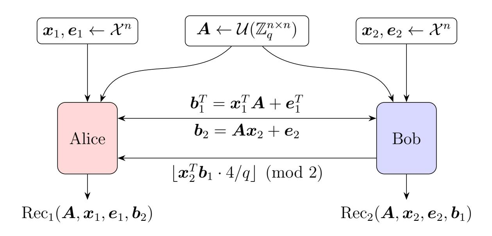

{0}------------------------------------------------

# Limits on the Efficiency of (Ring) LWE based Non-Interactive Key Exchange

Siyao Guo siyao.guo@nyu.edu NYU Shanghai<sup>∗</sup>

Pritish Kamath pritish@ttic.edu TTIC †

Alon Rosen alon.rosen@idc.ac.il IDC Herzliya‡

Katerina Sotiraki katesot@berkeley.edu UC Berkeley §

December 12, 2020

#### Abstract

LWE based key-exchange protocols lie at the heart of post-quantum public-key cryptography. However, all existing protocols either lack the non-interactive nature of Diffie-Hellman key-exchange or polynomial LWE-modulus, resulting in unwanted efficiency overhead.

We study the possibility of designing non-interactive LWE-based protocols with polynomial LWE-modulus. To this end,

- We identify and formalize simple non-interactive and polynomial LWE-modulus variants of existing protocols, where Alice and Bob simultaneously exchange one or more (ring) LWE samples with polynomial LWE-modulus and then run individual key reconciliation functions to obtain the shared key.
- We point out central barriers and show that such non-interactive key-exchange protocols are impossible if:
  - 1) the reconciliation functions first compute the inner product of the received LWE sample with their private LWE secret. This impossibility is information theoretic.
  - 2) one of the reconciliation functions does not depend on the error of the transmitted LWE sample. This impossibility assumes hardness of LWE.
- We give further evidence that progress in either direction, of giving an LWE-based NIKE protocol or proving impossibility of one will lead to progress on some other well-studied questions in cryptography.

Overall, our results show possibilities and challenges in designing simple (ring) LWE-based non-interactive key exchange protocols.

<sup>∗</sup>Supported by Shanghai Eastern Young Scholar Program.

<sup>†</sup>Work done while at MIT, supported by NSF awards CCF-1733808, IIS-1741137 and MIT-IBM Watson AI Lab and Research Collaboration Agreement No. W1771646.

<sup>‡</sup>Supported by ISF grant No. 1399/17 and via Project PROMETHEUS (Grant 780701).

<sup>§</sup>Work done while at MIT, research supported in part by NSF/BSF grant #1350619, an MIT-IBM grant, a DARPA Young Faculty Award, MIT Lincoln Laboratories and Analog Devices.

{1}------------------------------------------------

### <span id="page-1-1"></span>1 Introduction

In 1976, Diffie and Hellman [DH76] proposed an extremely elegant key-exchange protocol, in which two parties, Alice and Bob, exchange respective group elements  $g^a$ ,  $g^b$  simultaneously, where g is a generator of a publicly chosen group  $\mathcal{G}$  and  $a, b \in [|\mathcal{G}|]$  are uniformly chosen secret elements. Alice and Bob then locally perform a single group exponentiation in order to derive the shared key,  $g^{ab}$ . This simple idea lies at the foundation of public key cryptography, and has been widely used in practice throughout the years.

Two decades later, Shor [Sho94] showed that efficient quantum algorithms could, in principle, break the Diffie-Hellman key-exchange protocol, as well as other widely used assumptions (e.g. Factoring). Thus, with the development of quantum computers on the horizon, the importance of designing post-quantum secure key-exchange protocols, that can replace current standards, has been recognized. As part of this effort, the National Institute of Standards and Technology (NIST) decided to look into post-quantum cryptography standardization and is hosting a post-quantum cryptography call of proposals [NIS]. One of the major primitives that they seek is a key-encapsulation mechanism.

A significant portion of the algorithms qualified to the second round of the NIST call for proposals [SAB+17], [NAB+17], [LLJ+17], [PAA+17], [GMZB+17] is based on the (ring) learning with errors (LWE) assumption [Reg05, LPR10]. A remarkable feature of this assumption (and consequently of the proposals) is that its *average-case* hardness is based on the *worst-case* hardness of lattice problems, which themselves are conjectured to be secure against efficient quantum algorithms.

These proposals suggest two routes for achieving key-exchange, one is through public-key encryption and the other is through reconciliation. However, all of them *lack the non-interactive nature* of the key-exchange protocol of Diffie-Hellman, as explained below.

**Key-exchange through public-key encryption.** In the first case, Alice samples a secret & public-key pair and sends her public-key to Bob. Then, Bob picks a desired shared key and sends it to Alice, encrypted under her public-key. Finally, Alice decrypts Bob's message to recover the shared key. While conceptually simple, this approach lacks some of the advantages of the Diffie-Hellman protocol. First, Bob has complete control over the shared key. Second, the protocol is inherently interactive – the parties need at least two rounds of interaction.



<span id="page-1-0"></span>Figure 1: LWE-based key-exchange through reconciliation. Alice and Bob *simultaneously* exchange LWE samples using the same public matrix  $\mathbf{A}$ . After receiving  $\mathbf{b}_2$ , Bob sends the second most significant bit of  $\mathbf{x}_2^T \mathbf{b}_1$  to Alice. Both players then apply their respective key reconciliation functions on the variables they have to produce a shared key.

{2}------------------------------------------------

<span id="page-2-2"></span>Key-exchange through reconciliation. The reconciliation approach was introduced by Ding et al. [DXL12] and Peikert [Pei14] and was implemented and improved in later works [ADPS16, BCNS14]. The most basic version of such reconciliation-based protocols has a simple description<sup>1</sup> (See Figure 1): Let A be a random public  $n \times n$  matrix over  $\mathbb{Z}_q$  where q is polynomial in n and let  $\mathcal{X}$  be a noise distribution, then the parties act as follows: Alice randomly picks  $\mathbf{x}_1, \mathbf{e}_1$  from  $\mathcal{X}^n$  and sends  $\mathbf{b}_1 = \mathbf{x}_1^T A + \mathbf{e}_1$  to Bob, while Bob simultaneously picks random  $\mathbf{x}_2, \mathbf{e}_2$  from  $\mathcal{X}^n$  and sends  $\mathbf{b}_2 = A\mathbf{x}_2 + \mathbf{e}_2$  to Alice. After receiving  $\mathbf{b}_1$ , Bob sends to Alice the second most significant bit of  $\mathbf{x}_2^T \mathbf{b}_1$ , i.e.,  $\lfloor 4/q \cdot \mathbf{x}_2^T \mathbf{b}_1 \rfloor$  (mod 2). To agree on a common key, Alice and Bob first compute the inner product of their secret and incoming message and obtain  $\mathbf{x}_1^T A \mathbf{x}_2 + \mathbf{x}_1^T \mathbf{e}_2$  and  $\mathbf{x}_1^T A \mathbf{x}_2 + \mathbf{e}_1^T \mathbf{x}_2$  respectively. The small magnitude of Alice and Bob's secret and noise already allows them to achieve approximate agreement: the most significant bit of  $\mathbf{x}_1^T A \mathbf{x}_2 + \mathbf{x}_1^T \mathbf{e}_2$  and  $\mathbf{x}_1^T A \mathbf{x}_2 + \mathbf{e}_1^T \mathbf{x}_2$  is often the same. To achieve exact agreement, they run a simple key reconciliation procedure, where Bob sends the second most significant bit as an additional hint.

As discussed above, Diffie-Hellman key exchange allows parties to send their messages simultaneously or communicate in a non-interactive way (e.g. by publishing them on Alice's and Bob's public websites). In contrast, current proposed LWE-based key exchange protocols require additional interactions. Even though the additional interaction is only a single bit (as is the case in Figure 1), one extra round of a practical key exchange protocol may result in significant delays when used at a large scale (such as that of the internet). This motivates the main question that we study in this paper:

Can we have practical (ring) LWE-based non-interactive key exchange protocols? Or are such protocols inherently interactive?

A remark on LWE and LWE-modulus. In this paper, we use LWE to denote the LWE assumption with short secret. As shown in lemma 1, the two assumptions are almost equivalent. We focus on the case of polynomial LWE-modulus. We observe that if superpolynomial LWE-modulus is to be considered, the LWE-based key exchange in fig. 1 can be made noninteractive. That is because the most significant bits of  $\boldsymbol{x}_1^T\boldsymbol{b}_2$  and  $\boldsymbol{x}_2^T\boldsymbol{b}_1$  agree with probability  $1-\Theta(nB^2/q)$ , for a noise distribution  $\mathcal{X}$  whose support is included in [-B,B]. If the modulus to noise rate is large (i.e. superpolynomial in the security parameter), then the probability of disagreement of their most significant bits is negligible, and hence the above non-interactive protocol is sufficient. However, in the case of a polynomially bounded q, the disagreement probability is non-negligible. Given the extremely demanding efficiency constraints on practical implementations<sup>2</sup>, it would be highly desirable to have variants of such LWE-based key-exchange protocol in which the disagreement probability is negligible even in the case that q is as small as a polynomial in the security parameter. Additionally, requiring a large modulus to noise rate affects the hardness of the corresponding LWE assumption, since the worst-to-average case reductions translate this rate to the gap in the promise lattice problems [Pei09]. Namely, LWE with large modulus-to-noise ratio is a stronger assumption (i.e. more susceptible to polynomial-time attacks) than LWE with a smaller modulus-to-noise ratio.

## 2 Overview of our results

We explore the possibility of attaining (ring) LWE-based non-interactive key exchange (NIKE) (with modulus polynomial in the security parameter). We focus on the setting where Alice

<span id="page-2-0"></span><sup>&</sup>lt;sup>1</sup>For simplicity, we only describe the LWE-based variant; the ring version is obtained by replacing  $A, x_1, x_2, e_1, e_2$  with ring elements from some chosen polynomial ring and using the corresponding polynomial multiplication.

<span id="page-2-1"></span><sup>&</sup>lt;sup>2</sup>a typical size of q is  $\approx 2^{13}$  and there are proposals that even use q = 257 [LLJ<sup>+</sup>17].

{3}------------------------------------------------

and Bob only send one or a few (ring) LWE samples to each other; similarly to the protocol in Figure 1, but without the last message sent from Bob to Alice.

The main motivation for studying this setting is that perhaps it is the simplest setting which captures natural non-interactive variants of current LWE based key exchange protocols. Therefore, impossibility results will give a theoretical justification for current LWE based key exchange protocols. On the other hand, possibility results will yield Diffie-Hellman like non-interactive protocols.

Moreover, NIKE in this setting is simply characterized by two efficiently computable key reconciliation functions  $Rec_1, Rec_2$ , such that

- the outputs of Alice and Bob agree with each other with overwhelming probability, that is,  $\operatorname{Rec}_1(\boldsymbol{A}, \boldsymbol{x}_1, \boldsymbol{e}_1, \boldsymbol{b}_2) = \operatorname{Rec}_2(\boldsymbol{A}, \boldsymbol{x}_2, \boldsymbol{e}_2, \boldsymbol{b}_1)$  holds with overwhelming probability (recall that  $\boldsymbol{b}_1 := \boldsymbol{A}^T \boldsymbol{x}_1 + \boldsymbol{e}_1$  and  $\boldsymbol{b}_2 := \boldsymbol{A} \boldsymbol{x}_2 + \boldsymbol{e}_2$ ),
- the output of the protocol is pseudo-random even when conditioned on the transcript, that is, it is hard to predict  $Rec_1(\mathbf{A}, \mathbf{x}_1, \mathbf{e}_1, \mathbf{b}_2)$  given  $\mathbf{A}, \mathbf{b}_1, \mathbf{b}_2$ .

Natural choices of reconciliation functions. In the protocol of Figure 1, Alice and Bob achieve approximate agreement by computing  $\mathbf{x}_1^T \mathbf{b}_2$  and  $\mathbf{x}_2^T \mathbf{b}_1$ , respectively. These values are noisy versions of  $\mathbf{x}_1^T \mathbf{A} \mathbf{x}_2$  and their most significant bit agrees with probability  $1 - \Theta(nB^2/q)$  when the support of  $\mathcal{X}$  is in [-B, B]. Based on this observation, one may consider the following three families of reconciliation functions (in increasing order of generality).

- 1. Rec<sub>1</sub> and Rec<sub>2</sub> are arbitrary efficient functions (not necessarily the most significant bit) on  $\boldsymbol{x}_1^T \boldsymbol{b}_2$  and  $\boldsymbol{x}_2^T \boldsymbol{b}_1$  respectively.
- 2. Rec<sub>1</sub> and Rec<sub>2</sub> are arbitrary efficient functions on  $A, x_1, b_2$  and  $A, x_2, b_1$  respectively.
- 3. Rec<sub>1</sub> and Rec<sub>2</sub> are arbitrary efficient functions on A,  $x_1$ ,  $e_1$ ,  $b_2$  and A,  $x_2$ ,  $e_2$ ,  $b_1$  respectively.

Note that the third family captures all possible reconciliation functions.

Our results rule out the first and second families of reconciliation functions even when multiple LWE samples are exchanged, and point out central efficiency barriers for the third family.

First result (Section 4). One natural idea to remove the interaction would be to somehow "amplify" the agreement probability by sending more LWE samples and generating more independent samples from the joint distribution (X, Y) where  $X := x_1^T b_2$  and  $Y := x_2^T b_1$ . Then, Rec<sub>1</sub> and Rec<sub>2</sub> apply on independent samples from X and Y respectively.

In Theorem 1, we show that for any m, balanced  $\operatorname{Rec}_1$ ,  $\operatorname{Rec}_2$  (see Definition 1) and non-trivial noise distribution,  $\operatorname{Rec}_1(\boldsymbol{X}^m) = \operatorname{Rec}_2(\boldsymbol{Y}^m)$  holds with probability at most  $1 - \Omega(1/q^2)$ . This implies that such reconciliation functions cannot exist (this impossibility is information theoretic and holds even for computationally inefficient reconciliation functions). Our results naturally extend to the case of ring LWE.

**Second result (Section 5).** Even though the above result captures known constructions, it does not rule out a slightly more general case where the reconciliation functions depend on A. Indeed, given X' := (A, X) and Y' := (A, Y), Alice and Bob can agree on an *insecure* random bit with probability 1 by evaluating a balanced function of A (while ignoring X and Y). Of course, such protocols are not suitable for key agreement, since the common random bit is not pseudo-random conditioned on A.

In Theorem 3, we show that the reconciliation functions  $\operatorname{Rec}_1$  and  $\operatorname{Rec}_2$  have to depend on the LWE noises  $e_1$  and  $e_2$  respectively. For instance, the above theorem excludes a more general case than family 2 where the reconciliation functions are of the form  $\operatorname{Rec}_1(\boldsymbol{A}, \boldsymbol{x}_1, \boldsymbol{e}_1, \boldsymbol{b}_2) =$ 

{4}------------------------------------------------

<span id="page-4-2"></span> $h_1(\boldsymbol{A}, \boldsymbol{x}_1, \boldsymbol{b}_2)$  and  $\operatorname{Rec}_2(\boldsymbol{A}, \boldsymbol{x}_2, \boldsymbol{e}_2, \boldsymbol{b}_1) = h_2(\boldsymbol{A}, \boldsymbol{x}_2, \boldsymbol{e}_2, \boldsymbol{b}_1)$ . In particular, it rules out the case where the joint distribution is  $(\boldsymbol{X}', \boldsymbol{Y}')$ . However, in contrast to Theorem 1 which holds unconditionally, Theorem 3 assumes the hardness of the LWE problem. Our results extend to the case of ring LWE and to a polynomial number of samples.

Third result (Section 6). The above two results rule out the most natural choices of key reconciliation functions based on variants of inner product, unconditionally or under the LWE assumption. In Section 6, we show that the existence of efficient Rec<sub>1</sub> and Rec<sub>2</sub>, which depend on all of their inputs, cannot be ruled out (at least as long as the existence of iO is a possibility). In particular, in Theorem 4, we show that there exists an instantiation of the NIKE protocol in our framework that is based on indistinguishability obfuscation (iO) and puncturable PRFs [BZ17].

However, we identify a crucial restriction on the complexity of reconciliation functions. In Theorem 5, we show that the reconciliation functions themselves actually have to contain cryptographic hardness, in the sense that they *directly* yield weak pseudorandom functions. Therefore, the reconciliation functions have to be at least as complex as weak pseudorandom functions, and hence suffer from the complexity limitations and attacks on weak pseudorandom functions. Moreover, this connection shows that any NIKE protocol based on the hardness of LWE with polynomial modulus, gives rise to new constructions of weak pseudorandom functions based on the hardness of LWE with polynomial modulus.

### 2.1 Discussion and Open Problems

In protocols where the parties exchange only LWE samples, we rule out the most natural choices of key reconciliation functions. Additionally, we point out that non-interactive key reconciliation functions, unlike interactive ones, have to be as complex as weak pseudorandom functions. Overall, our results show possibilities and challenges in designing simple (ring) LWE-based non-interactive key exchange protocols.

An interesting open direction is to understand what happens when the messages contain extra information, apart from the LWE samples. To this end, one would have to come up with a natural and simple form of messages (based on LWE) and explore the possibility of basing non-interactive key exchange on it. For instance, a natural idea is to consider LWE samples together with some *leakage* about the secrets.

## <span id="page-4-1"></span>3 Preliminaries

We now provide some useful notation and definitions. We denote a sample drawn from  $\mathcal{D}$  by  $x \leftarrow \mathcal{D}$  and a sample of the uniform distribution over S by  $x \leftarrow S$ .

<span id="page-4-0"></span>**Definition 1.** A function  $f: S \to \{0,1\}$  is called balanced respect to distribution  $\mathcal{D}$  if  $\mathbb{E}_{x \leftarrow \mathcal{D}}[f(x)] = 1/2$ .

**Definition 2.** A distribution  $\mathcal{X}$  over any group G (e.g.  $G = \mathbb{Z}_q$ ) is symmetric if  $\Pr_{X \leftarrow \mathcal{X}}[X = z] = \Pr_{X \leftarrow \mathcal{X}}[X = -z]$  for any  $z \in G$ .

**Definition 3.** A distribution  $\mathcal{X}$  over  $\mathbb{Z}_q$  is B-bounded if its support is included in [-B, B].

We formally define the class of all non-interactive key exchange protocols that could exist.

**Definition 4.** For a security parameter  $\kappa > 0$ , a non-interactive key-exchange protocol consists of two poly( $\kappa$ )-time algorithms  $b_1$  and  $b_2$  and two poly( $\kappa$ )-time computable boolean functions  $\operatorname{Rec}_1$  and  $\operatorname{Rec}_2$  that satisfy the conditions below (where  $(\boldsymbol{r}, \boldsymbol{r}_1, \boldsymbol{r}_2)$  is a random source

{5}------------------------------------------------

with r a source of shared randomness and r1, r<sup>2</sup> private sources of randomness of the two parties)

- 1. Pr r,r1,r<sup>2</sup> [Rec1(r, r1, b2(r, r2)) = Rec2(r, r2, b1(r, r1))] ≥ 1 − negl(κ),
- 2. For any probabilistic poly(κ)-time algorithm A,

$$\Pr_{\boldsymbol{r},\boldsymbol{r}_1,\boldsymbol{r}_2}[\mathcal{A}(\boldsymbol{r},b_1(\boldsymbol{r},\boldsymbol{r}_1),b_2(\boldsymbol{r},\boldsymbol{r}_2)) = \operatorname{Rec}_1(\boldsymbol{r},\boldsymbol{r}_1,b_2(\boldsymbol{r},\boldsymbol{r}_2))] \leq \frac{1}{2} + \operatorname{negl}(\kappa).$$

Distribution (X <sup>n</sup>) ∗ . Given a distribution X over Zq, let (X n ) <sup>∗</sup> be the distribution where the vector w = (w (1), w(2), . . . , w(n) ) is drawn from X n conditioned on the event that w is not a zero-divisor, that is gcd(w (1), w(2), . . . , w(n) , q) = 1.

Finally, we describe the Learning-with-Errors (LWE) assumption.

The LWE assumption. The (Decisional) Learning With Error (LWE) assumption with parameters n, m, q, E, denoted by LWEn,m,q,<sup>E</sup> , states that:

$$(\boldsymbol{A}, \mathbf{b}) \stackrel{c}{\approx} (\boldsymbol{A}, \mathbf{r})$$

where A ← Z n×m q , b <sup>T</sup> = s <sup>T</sup> A + e T (mod q), s ← Z n q , e ← E<sup>m</sup> and r ← Z m q . When m = poly(n, log(q)), we omit it and write LWEn,q,<sup>E</sup> .

The distribution E is a probability distribution over Z which typically outputs small numbers. Classic choices of E are the uniform distribution over [−B, B] ∩ Z, which is called bounded uniform, and the (one-dimensional) discrete Gaussian.

A useful and simple fact is that if we sample the secret vector s from the noise distribution E instead of the uniform, then the LWE assumption still holds. We call this assumption LWE with short secret and in the next lemma we denote it with ssLWE.

<span id="page-5-0"></span>Lemma 1. There is a polynomial-time reduction from ssLWEn,m,q,<sup>E</sup> to LWEn,m,q,<sup>E</sup> and a polynomial-time reduction from LWEn,m,q,<sup>E</sup> to ssLWEn,m+n,q,<sup>E</sup> .

In this paper, we use LWE to denote the LWE assumption with short secret (ssLWE).

In most practical applications, where efficiency is an important factor, a special case of LWE, called ring LWE (RLWE), is used.

The ring LWE (RLWE) assumption. Let q ≥ 2 be a power of 2, R = Z[x]/(x <sup>k</sup> + 1) and R<sup>q</sup> := R/(qR) be the ring R with coefficients reduced modulo q. We identify an element in R<sup>q</sup> by its coefficient vector in Z n q . The (Decisional) Ring Learning With Error (RLWE) assumption with parameters n, q, E, denoted by RLWEn,q,<sup>E</sup> , states that:

$$(a_i, b_i)_{i \in [n]} \stackrel{c}{\approx} (a_i, r_i)_{i \in [n]}$$

where s ← R<sup>q</sup> and for each i ∈ [n], a<sup>i</sup> ← Rq, b<sup>i</sup> = s · a<sup>i</sup> + e<sup>i</sup> (mod qR), e<sup>i</sup> ← E, and r<sup>i</sup> ← Rq.

## <span id="page-5-1"></span>4 (Information Theoretic) Impossibility of Amplification with Multiple Samples

<span id="page-5-2"></span>We present our first impossibility result, which states that the reconciliation functions cannot be the inner product of the received LWE sample with the private LWE secret. This impossibility is information theoretic.

{6}------------------------------------------------

**Theorem 1.** Let  $n, q \ge 1$  be integers and  $\mathcal{X}$  be a symmetric distribution over  $\mathbb{Z}_q$  such that for any  $a \in \mathbb{Z}_q \setminus \{0\}$ , it holds that  $\Pr_{X \leftarrow \mathcal{X}}[aX = 0] \le 9/10$  and  $\Pr_{X \leftarrow \mathcal{X}}[aX = q/2] \le 9/10$ . Let  $\mu_{\mathcal{X}}(X,Y)$  be the joint distribution of

$$X = x_1^T A x_2 + x_1^T e_2 \text{ and } Y = x_1^T A x_2 + e_1^T x_2,$$

where  $\mathbf{A} \leftarrow \mathbb{Z}_q^{n \times n}$ ,  $\mathbf{e}_1, \mathbf{e}_2 \leftarrow \mathcal{X}^n$  and  $\mathbf{x}_1, \mathbf{x}_2 \leftarrow (\mathcal{X}^n)^*$ , where  $(\mathcal{X}^n)^*$  is as defined in section 3. Then, for any  $m \geq 1$ , and any balanced functions  $\mathrm{Rec}_1, \mathrm{Rec}_2 : \mathbb{Z}_q^m \rightarrow \{0,1\}$  with respect to the marginal distributions of  $\mu_{\mathcal{X}}^{\otimes m}$ , it holds that

$$\Pr_{(\boldsymbol{X},\boldsymbol{Y})\leftarrow\mu_{\boldsymbol{\mathcal{X}}}^{\otimes m}}[\operatorname{Rec}_1(\boldsymbol{X})=\operatorname{Rec}_2(\boldsymbol{Y})]\leq 1-\Omega(1/q^2).$$

Our theorem also holds for the ring case with the same parameters (See Theorem 6 in Appendix A). This theorem shows that no matter how many independent samples are drawn and no matter what procedures are applied on those samples, Alice and Bob can agree with each other on a random bit with probability at most  $1 - \Omega(1/q^2)$ . Note that Alice and Bob have to marginally produce a uniform bit as captured in the condition that Rec<sub>1</sub> and Rec<sub>2</sub> are balanced.

Our theorem applies to the most commonly used noise distributions. For instance, the discrete Gaussian distribution  $\mathcal{D}_{\beta}$  with standard deviation  $\beta > 10$  satisfies the conditions of Theorem 1. First, the discrete Gaussian is a symmetric distribution. Second, if  $x \leftarrow \mathcal{D}_{\beta}$ , then from monotonicity of  $\mathcal{D}_{\beta}$ , for any  $a \in \mathbb{Z}_q \setminus \{0\}$ ,  $\Pr[ax = q/2] \leq \Pr[ax = 0]$ . Therefore, it is enough to show that for any  $a \in \mathbb{Z}_q \setminus \{0\}$ ,  $\Pr[ax = 0] \leq 9/10$ , which is straightforward to verify<sup>3</sup>.

Additionally, the condition of Theorem 1 that for any  $a \in \mathbb{Z}_q \setminus \{0\}$ ,  $\Pr[aX = 0] \leq 9/10$  and  $\Pr[aX = q/2] \leq 9/10$  is quite mild. For instance, if q > 2 is prime, then this condition simplifies to the assumption that the support of  $\mathcal{X}$  is not equal to  $\{0\}$ . Also, for general q if the support of  $\mathcal{X}$  is 1/10-far from a proper subgroup or a coset of a proper subgroup of  $\mathbb{Z}_q$ , then this assumption is satisfied.

Notice that  $\mu_{\mathcal{X}}(X,Y)$  as defined in Theorem 1 does not correspond to the joint distribution described in the introduction, since  $x_1, x_2$  are sampled from  $(\mathcal{X}^n)^*$ . This is without loss of generality because if  $\mathbf{w} \leftarrow \mathcal{X}^n$ , then the probability that  $\gcd(w^{(1)}, w^{(2)}, \dots, w^{(n)}, q) \neq 1$  is smaller than the probability that  $w^{(1)}, w^{(2)}, \dots, w^{(n)}$  all belong to a proper subgroup of  $\mathbb{Z}_q$ , which is less than  $(9/10)^n$ . So, the distribution of  $(\mathbf{X}, \mathbf{Y})$  is at most  $O(m/(9/10)^n)$  far from the distribution of m samples drawn as described in the introduction. Even though this is a very small change in the protocol, it will simplify our proof a lot, since in this case the value  $\mathbf{x}_1^T \mathbf{A} \mathbf{x}_2$  is a uniform element in  $\mathbb{Z}_q^{-4}$ .

Our Theorem 1 shows that in this regime, it is information theoretically impossible to agree on a common bit with probability  $1 - o(1/q^2)$ . In fact, the problem of generating common randomness by observing independent samples from two correlated distributions (or a joint distribution) is known as "Non-interactive Agreement Distillation" in the area of information theory and the notion of maximal correlation exactly captures this problem (up to a polynomial factor in the error). Even though we could prove our theorem in a self-contained manner, we feel this connection provides more insight. Therefore, in the next section we present some basic facts about maximal correlation and then present a proof

<span id="page-6-0"></span><sup>&</sup>lt;sup>3</sup>Note that by symmetry and monotonicity of  $\mathcal{D}_{\beta}$ ,  $\Pr[ax=0] \leq \Pr[a(|x|-1)=0] + \Pr[x=0]$ . Combining with the fact that  $\Pr[ax=0] + \Pr[a(|x|-1)=0] \leq 1$  for  $a \neq 0$ , and  $\Pr[x=0] \leq 1/(1+2e^{-1/\beta^2})$ , we conclude that  $\Pr[ax=0] \leq (1+\Pr[x=0])/2 \leq 9/10$  for  $\beta > 10$ .

<span id="page-6-1"></span><sup>&</sup>lt;sup>4</sup>If  $\mathbf{w} = (w^{(1)}, w^{(2)}, \dots, w^{(n)})$  such that  $\gcd(w^{(1)}, w^{(2)}, \dots, w^{(n)}, q) = 1$  and  $\mathbf{u}$  is uniform in  $\mathbb{Z}_q^n$ , then  $\mathbf{w}^T \mathbf{u}$  is also uniform in  $\mathbb{Z}_q$ .

{7}------------------------------------------------

<span id="page-7-4"></span>through this notion. In Appendix A, we also present a self-contained proof of Theorem 1 using Fourier analysis and extend this to the ring LWE case (Theorem 6).

The Non-interactive Agreement Distillation problem, parameterized by a joint distribution  $\mu(x,y)$  is defined as follows: Two players, Alice and Bob, observe sequences  $(X_1,\ldots,X_m)$  and  $(Y_1,\ldots,Y_m)$  respectively where  $\{(X_i,Y_i)\}_{i=1}^m$  are drawn i.i.d. from  $\mu(x,y)$ . Both players look at their share of randomness, apply a function and output a bit. Their goal is to maximize the probability that their output bits agree, while ensuring that they are marginally uniform.

Hirschfeld [Hir35] and Gebelein [Geb41] introduced the notion of maximal correlation, which was later studied by Rényi [Rén59]. It turns out that maximal correlation (almost tightly) captures the maximum agreement probability that the players can get.

**Definition 5** (Maximal Correlation). For a joint distribution  $\mu$  over  $G_A \times G_B$ , its maximal correlation  $\rho(\mu)$  is defined as follows,

$$\sup_{f,g} \left\{ \underset{(x,y) \leftarrow \mu}{\mathbb{E}} [f(x) \cdot g(y)] \middle| \begin{array}{c} f: G_A \to \mathbb{R}, & \mathbb{E}_{\mu_A}[f] = \mathbb{E}_{\mu_B}[g] = 0 \\ g: G_B \to \mathbb{R}, & \operatorname{Var}_{\mu_A}[f] = \operatorname{Var}_{\mu_B}[g] = 1 \end{array} \right\},$$

where  $\mu_A$  and  $\mu_B$  are the marginal distributions of  $\mu$ .

In order to analytically capture maximal correlation, let us define, for any joint distribution  $\mu$  over  $G_A \times G_B$ , the  $|G_A| \times |G_B|$  matrix  $M_{\mu}$  given by

$$M_{\mu}(x,y) = \frac{\mu(x,y)}{\sqrt{\mu_A(x)\mu_B(y)}},$$

where  $\mu_A$  and  $\mu_B$  are the marginal distributions of  $\mu$ .

<span id="page-7-3"></span>Fact 2. The maximal correlation  $\rho(\mu)$  is equal to the second largest singular value of  $M_{\mu}$ , denoted as  $\sigma_2(M_{\mu})$ .<sup>5</sup>

In the seminal work of [Wit75], it was shown that maximal correlation actually captures (up to a square root factor), the best agreement probability that the players can get even with an infinite number of samples!

<span id="page-7-1"></span>**Lemma 2.** Let  $\mu$  be a joint distribution over  $G_A \times G_B$  with marginal distributions  $\mu_A$  and  $\mu_B$ , suppose that  $\rho(\mu) = 1 - \varepsilon$ , then for any  $m \geq 1$ ,  $f: G_A^m \to \{0,1\}$  and  $g: G_B^m \to \{0,1\}$  with  $\mathbb{E}_{\mu_A^{\otimes m}}[f] = \mathbb{E}_{\mu_B^{\otimes m}}[g] = 1/2$ , it holds that

$$\Pr_{(\boldsymbol{X},\boldsymbol{Y})\leftarrow\mu^{\otimes m}}[f(\boldsymbol{X})=g(\boldsymbol{Y})] \le 1-\varepsilon/2.$$
(1)

Moreover, there exist m, f, g such that  $\mathbb{E}_{\mu_A^{\otimes m}}[f] = \mathbb{E}_{\mu_B^{\otimes m}}[g] = 1/2$  and

$$\Pr_{(\boldsymbol{X},\boldsymbol{Y})\leftarrow\mu^{\otimes m}}[f(\boldsymbol{X}) = g(\boldsymbol{Y})] \geq 1 - \frac{\arccos(\rho(\mu))}{\pi} \geq 1 - \sqrt{2\varepsilon}.$$
 (2)

Because of Lemma 2, it suffices to upper bound the maximal correlation of  $\mu_{\mathcal{X}}(X,Y)$  in order to prove theorem 1. We exploit the special form of our distribution, namely that X is distributed uniformly in  $\mathbb{Z}_q$  and X-Y is distributed as some "noise distribution"  $\xi$ . For such distributions, the maximal correlation is much easier to analyze. We prove the following lemma.

<span id="page-7-2"></span><span id="page-7-0"></span><sup>&</sup>lt;sup>5</sup>The top singular value being 1.

{8}------------------------------------------------

<span id="page-8-3"></span>**Lemma 3.** Let  $n, q \ge 1$  be integers. For a distribution  $\mathcal{X}$  over  $\mathbb{Z}_q$  and the joint distribution  $\mu_{\mathcal{X}}$  that satisfies the conditions of Theorem 1, it holds that

$$\rho(\mu_{\mathcal{X}}) \le 1 - \Omega(1/q^2).$$

To prove Lemma 3, we consider a more general class of joint distributions called Cayley Distributions and characterize their maximal correlation.

<span id="page-8-1"></span>**Definition 6** (Cayley Distributions). A joint distribution  $\mu$  over  $\mathbb{Z}_q^k \times \mathbb{Z}_q^k$  is said to be a Cayley distribution if there exists a "noise distribution"  $\xi : \mathbb{Z}_q^k \to \mathbb{R}_{\geq 0}$ , such that,

(i) 
$$\xi(z) = \xi(-z)$$
 for all  $z \in \mathbb{Z}_q^k$ , and

(ii) 
$$\mu(\boldsymbol{x}, \boldsymbol{y}) = \frac{\xi(\boldsymbol{x} - \boldsymbol{y})}{q^k}$$
 for all  $\boldsymbol{x}, \boldsymbol{y} \in \mathbb{Z}_q^k$ .

A Cayley distribution can be viewed as sampling x uniformly at random in  $\mathbb{Z}_q^k$ , sampling  $z \leftarrow \xi$  and setting y = x + z. Note that a Cayley distribution  $\mu$  is symmetric and has uniform marginals on  $\mathbb{Z}_q^k$ , so its maximal correlation is given by the second largest eigenvalue of  $M_{\mu}$  (by Fact 2 and the fact that for symmetric matrices, singular values are same as eigenvalues). Interestingly, the eigenvectors of  $M_{\mu}$  can be completely characterized in a way that does not depend on the noise distribution  $\xi$ . This makes it easy to get a handle on the eigenvalues, which leads to the following lemma.

<span id="page-8-2"></span>**Lemma 4** (Maximal Correlation of Cayley Distributions [Lov75]). For  $\mathbf{a} \in \mathbb{Z}_q^k$ , define the character  $\chi_{\mathbf{a}} : \mathbb{Z}_q^k \to \mathbb{C}$  as  $\chi_{\mathbf{a}}(\mathbf{x}) = e^{-2\pi i \cdot \langle \mathbf{a}, \mathbf{x} \rangle/q}$ . Let  $\mu$  be any Cayley distribution over  $\mathbb{Z}_q^k \times \mathbb{Z}_q^k$ , with associated noise function  $\xi$ . Then,

$$\rho(\mu) = \max_{\boldsymbol{a} \in Z_a^k \setminus \{\boldsymbol{0}^k\}} \underset{\boldsymbol{e} \leftarrow \xi}{\mathbb{E}} [\chi_{\boldsymbol{a}}(\boldsymbol{e})].$$

Theorem 1 follows immediately by combining Lemma 2 and Lemma 3. Note that theorem 1 generalizes to the case where the same uniformly chosen matrix A is used for all m samples in X and Y. We point out that Definition 6 and Lemma 4 generalize to all finite abelian groups G. However for concreteness, we only focus on our special case of  $G = \mathbb{Z}_q^k$ . While this lemma is standard, we include a proof for completeness.

*Proof.* We interpret  $\chi_{\boldsymbol{a}}$  as a vector in  $\mathbb{C}^{q^k}$  indexed by elements in  $\mathbb{Z}_q^k$ . It is straightforward to verify that  $\chi_{\boldsymbol{a}} \in \mathbb{C}^{q^k}$  is an eigenvector of  $M_{\mu}$  with corresponding eigenvalue  $\mathbb{E}_{\boldsymbol{e} \leftarrow \boldsymbol{\xi}}[\chi_{\boldsymbol{a}}(\boldsymbol{e})]$ . Note that since  $\mu$  is a Cayley distribution,  $M_{\mu}(\boldsymbol{x}, \boldsymbol{y}) = q^k \cdot \mu(\boldsymbol{x}, \boldsymbol{y})$ . Fix any  $\boldsymbol{a} \in \mathbb{Z}_q^k$ . For any  $\boldsymbol{x} \in \mathbb{Z}_q^k$ , it holds that

$$(M_{\mu}\chi_{\boldsymbol{a}})(\boldsymbol{x}) = \sum_{\boldsymbol{y}\in\mathbb{Z}_{q}^{k}} M_{\mu}(\boldsymbol{x},\boldsymbol{y}) \cdot \chi_{\boldsymbol{a}}(\boldsymbol{y}) = \sum_{\boldsymbol{y}\in\mathbb{Z}_{q}^{k}} (q^{k} \cdot \mu(\boldsymbol{x},\boldsymbol{y})) \cdot \chi_{\boldsymbol{a}}(\boldsymbol{y})$$

$$= \sum_{\boldsymbol{y}\in\mathbb{Z}_{q}^{k}} \xi(\boldsymbol{y}-\boldsymbol{x}) \cdot \chi_{\boldsymbol{a}}(\boldsymbol{y}) = \sum_{\boldsymbol{e}\in\mathbb{Z}_{q}^{k}} \xi(\boldsymbol{e}) \cdot \chi_{\boldsymbol{a}}(\boldsymbol{x}+\boldsymbol{e})$$

$$= \left(\sum_{\boldsymbol{e}\in\mathbb{Z}_{q}^{k}} \xi(\boldsymbol{e}) \cdot \chi_{\boldsymbol{a}}(\boldsymbol{e})\right) \cdot \chi_{\boldsymbol{a}}(\boldsymbol{x})$$

$$= \mathbb{E}_{\boldsymbol{e}\leftarrow\boldsymbol{\xi}}[\chi_{\boldsymbol{a}}(\boldsymbol{e})] \cdot \chi_{\boldsymbol{a}}(\boldsymbol{x}).$$

The largest eigenvalue is  $\mathbb{E}_{\boldsymbol{e}\leftarrow\xi}[\chi_{\boldsymbol{a}}(\boldsymbol{e})] = 1$  given by  $\boldsymbol{a} = \mathbf{0}^k$  because for any  $\boldsymbol{e} \in \mathbb{Z}_q^k$ ,  $\chi_{\mathbf{0}^k}(\boldsymbol{e}) = 1$  and  $|\chi_{\boldsymbol{a}}(\boldsymbol{e})| \leq 1$  if  $\boldsymbol{a} \neq \mathbf{0}^k$ . Hence,  $\rho(\mu)$ , which is the second largest eigenvalue of  $M_{\mu}$ , is  $\max_{\boldsymbol{a}\in\mathbb{Z}_q^k\setminus\{\mathbf{0}^k\}}\mathbb{E}_{\boldsymbol{e}\leftarrow\xi}[\chi_{\boldsymbol{a}}(\boldsymbol{e})]$ .

<span id="page-8-0"></span><sup>&</sup>lt;sup>6</sup>Observe that since  $\xi$  is a probability distribution over  $\mathbb{Z}_q^k$ , it follows that  $\mu$  is also a probability distribution.

{9}------------------------------------------------

*Proof of Lemma 3.* Note that  $\mu_{\mathcal{X}}$  is a Cayley distribution over  $\mathbb{Z}_q \times \mathbb{Z}_q$  with associated noise distribution  $\xi(z) = \Pr[\mathbf{x}_1^T \mathbf{e}_2 - \mathbf{e}_1^T \mathbf{x}_2 = z]$ , where  $\mathbf{e}_1, \mathbf{e}_2$  are drawn from  $\mathcal{X}^n$  and  $\mathbf{x}_1, \mathbf{x}_2$  are drawn from  $(\mathcal{X}^n)^*$ . First,  $\xi(z) = \xi(-z)$  for any  $z \in \mathbb{Z}_q$ , since  $\boldsymbol{x}_1^T \boldsymbol{e}_2$  and  $\boldsymbol{e}_1^T \boldsymbol{x}_2$  are drawn from the same distribution, and so  $\mathbf{x}_1^T \mathbf{e}_2 - \mathbf{e}_1^T \mathbf{x}_2$  is distributed identically to  $\mathbf{e}_1^T \mathbf{x}_2 - \mathbf{x}_1^T \mathbf{e}_2$ . Second, because  $\boldsymbol{x}_1^T \boldsymbol{A} \boldsymbol{x}_2 + \boldsymbol{x}_1^T \boldsymbol{e}_2$  is distributed uniformly over  $\mathbb{Z}_q$  and is independent from  $\boldsymbol{x}_1^T \boldsymbol{e}_2 - \boldsymbol{e}_1^T \boldsymbol{x}_2$ , we have that  $\mu_{\mathcal{X}}(X,Y) = \Pr[\mathbf{x}_{1}^{T}\mathbf{A}\mathbf{x}_{2} + \mathbf{x}_{1}^{T}\mathbf{e}_{2} = X \text{ and } \mathbf{x}_{1}^{T}\mathbf{e}_{2} - \mathbf{e}_{1}^{T}\mathbf{x}_{2} = X - Y] = \frac{\xi(X-Y)}{a}$ .

By Lemma 4,  $\rho(\mu_{\mathcal{X}}) = \max_{a \in \mathbb{Z}_q \setminus \{0\}} \mathbb{E}_{e \leftarrow \xi}[\chi_a(e)]$ . Fix an arbitrary  $a \in \mathbb{Z}_q \setminus \{0\}$ , we need to show that  $|\mathbb{E}_{e \leftarrow \xi}[\chi_a(e)]| \leq 1 - \Omega(1/q^2)$ . This is implied by Claim 1 and Claim 2 below.

<span id="page-9-0"></span>Claim 1.  $|\mathbb{E}_{e \leftarrow \xi}[\chi_a(e)]| \leq \max_{c \in \mathbb{Z}_a^n \setminus \{0^n\}} |\mathbb{E}_{e \leftarrow \mathcal{X}^n}[\chi_c(e)]|$ .

*Proof.* Note that

$$| \underset{e \leftarrow \xi}{\mathbb{E}} [\chi_{a}(e)]| = | \underset{\boldsymbol{x}_{1}, \boldsymbol{x}_{2} \leftarrow (\mathcal{X}^{n})^{*}}{\mathbb{E}} [ \underset{\boldsymbol{e}_{1}, \boldsymbol{e}_{2} \leftarrow \mathcal{X}^{n}}{\mathbb{E}} [\chi_{a}(\boldsymbol{x}_{1}^{T}\boldsymbol{e}_{2} - \boldsymbol{e}_{1}^{T}\boldsymbol{x}_{2})]] |$$

$$\leq \underset{\boldsymbol{x}_{1}, \boldsymbol{x}_{2} \leftarrow (\mathcal{X}^{n})^{*}}{\mathbb{E}} [ | \underset{\boldsymbol{e}_{2} \leftarrow \mathcal{X}^{n}}{\mathbb{E}} [\chi_{a\boldsymbol{x}_{1}}(\boldsymbol{e}_{2})] \cdot \underset{\boldsymbol{e}_{1} \leftarrow \mathcal{X}^{n}}{\mathbb{E}} [\chi_{a\boldsymbol{x}_{2}}(-\boldsymbol{e}_{1})] |]$$

$$\leq \underset{\boldsymbol{x}_{1} \leftarrow (\mathcal{X}^{n})^{*}}{\mathbb{E}} [ | \underset{\boldsymbol{e}_{2} \leftarrow \mathcal{X}^{n}}{\mathbb{E}} [\chi_{a\boldsymbol{x}_{1}}(\boldsymbol{e}_{2})] |]$$

where the second line follows from triangle inequality and the independence of  $e_1$  and  $e_2$ , the third line follows because  $\mathbb{E}_{\boldsymbol{e}_2 \leftarrow \mathcal{X}^n}[\chi_{a\boldsymbol{x}_1}(\boldsymbol{e}_2)]$  and  $\mathbb{E}_{\boldsymbol{e}_1 \leftarrow \mathcal{X}^n}[\chi_{a\boldsymbol{x}_2}(-\boldsymbol{e}_1)]$  are eigenvalues of the symmetric matrix  $M_{\mu}$ , and hence they are reals of absolute value at most 1. Observe that for any fixed  $x_1$  from  $(\mathcal{X}^n)^*$ ,  $ax_1 \neq \mathbf{0}^n$ , since  $a \in \mathbb{Z}_q \setminus \{0\}$ . So,  $|\mathbb{E}_{e_2 \leftarrow \mathcal{X}^n}[\chi_{ax_1}(e_2)]|$  is at most  $\max_{c \in \mathbb{Z}_q^n \setminus \{0^n\}} |\mathbb{E}_{e \leftarrow \mathcal{X}^n}[\chi_c(e)]|$  and the desired conclusion follows. 

<span id="page-9-1"></span>Claim 2. For any  $c \in \mathbb{Z}_q^n \setminus \{0^n\}$ ,  $|\mathbb{E}_{e \leftarrow \mathcal{X}^n}[\chi_c(e)]| \leq 1 - \Omega(1/q^2)$ .

*Proof.* Because each coordinate of e is drawn independently from  $\mathcal{X}$ ,

$$\underset{\boldsymbol{e} \leftarrow \mathcal{X}^n}{\mathbb{E}} [\chi_{\boldsymbol{c}}(\boldsymbol{e})] = \prod_{i=1}^n \underset{z \leftarrow \mathcal{X}}{\mathbb{E}} [\chi_{c_i}(z)].$$

Since  $\mathcal{X}$  is symmetric, for any  $i \in [n]$ ,  $\mathbb{E}_{z \leftarrow \mathcal{X}}[\chi_{c_i}(z)]$  is real with absolute value at most 1. Therefore, it suffices to show that  $|\mathbb{E}_{z\leftarrow\mathcal{X}}[\chi_{c_i}(z)]| \leq 1 - \Omega(1/q^2)$  for an arbitrary  $i \in [n]$ . Fix an  $i \in [n]$  such that  $c_i \neq 0$  and observe that

$$\underset{z \leftarrow \mathcal{X}}{\mathbb{E}} [\chi_{c_i}(z)] \leq 1 - \underset{z \leftarrow \mathcal{X}}{\Pr} [c_i z \neq 0] \cdot \Omega \left( \frac{1}{q^2} \right),$$

because if  $c_i z \neq 0$ , then the real part of  $\chi_{c_i}(z)$  is at most  $\cos\left(\frac{2\pi}{q}\right) \leq 1 - (1/q^2)^{-7}$ . Similarly,

$$\mathbb{E}_{z \leftarrow \mathcal{X}}[\chi_{c_i}(z)] \geq -1 + \Pr_{z \leftarrow \mathcal{X}}[c_i z \neq q/2] \cdot \Omega\left(\frac{1}{q^2}\right)$$

holds because if  $c_i z \neq q/2$ , then the real part of  $\chi_{c_i}(z)$  is at least  $\cos\left(\pi + \frac{2\pi}{q}\right) \geq -1 + \left(1/q^2\right)$ <sup>8</sup>. By our assumption on  $\mathcal{X}$ , we have that  $\Pr_{z \leftarrow \mathcal{X}}[c_i z \neq q/2] \geq 0.1$  and  $\Pr_{z \leftarrow \mathcal{X}}[c_i z \neq 0] \geq 0.1$ . Hence,  $|\mathbb{E}_{z \leftarrow \mathcal{X}}[\chi_{c_i}(z)]| \leq 1 - \Omega(1/q^2)$  which concludes the proof. 

For the interested reader, we provide a more self-contained proof in Appendix A which is equivalent to an unrolling of the above proof, but is much more succinct because we do not use the more general statement of Lemma 2 about maximal correlation. In Appendix A, we also give an extension of the proof to the case of Ring-LWE.

<span id="page-9-3"></span><span id="page-9-2"></span>

<sup>&</sup>lt;sup>7</sup>Because for  $x \in [-\pi/2, \pi/2]$ ,  $\cos(x) \le 1 - x^2/(4\pi^2)$ .

<sup>8</sup>Because for  $x \in [-\pi/2, \pi/2]$ ,  $\cos(\pi + x) \ge -1 + x^2/(4\pi^2)$ .

{10}------------------------------------------------

## <span id="page-10-7"></span><span id="page-10-0"></span>5 (Computational) Impossibility of Noise-Ignorant Key Reconciliation Functions

Let us set up some basic notation that is necessary for our second result. For distributions  $\mathcal{X}, \mathcal{Y}$  over G, we denote the Rényi divergence [vEH14] of power 2 by

$$\mathrm{RD}_2(\mathcal{X}||\mathcal{Y}) = \underset{a \leftarrow \mathcal{X}}{\mathbb{E}} \left[ \underset{x \leftarrow \mathcal{X}}{\mathrm{Pr}}[x=a] / \underset{y \leftarrow \mathcal{Y}}{\mathrm{Pr}}[y=a] \right].$$

We use  $1 + \mathcal{X}$  to denote the distribution which samples x from  $\mathcal{X}$ , then outputs 1 + x, and  $\mathcal{X} + \mathcal{X}'$  the distribution obtained as x + x' for  $x \leftarrow \mathcal{X}$  and  $x' \leftarrow \mathcal{X}'$ .

<span id="page-10-1"></span>**Theorem 3.** Let  $n \geq 1$ , q = poly(n), m = poly(n) be integers and  $\mathcal{X}$  be a noise distribution over  $\mathbb{Z}_q$  such that  $\text{RD}_2(1 + \mathcal{X}||\mathcal{X}) = 1 + \gamma$ . Let  $\mu_{\mathcal{X}}(\mathbf{X}, \mathbf{Y})$  be the joint distribution of

$$\bm{X} = (\bm{A}, \bm{x}_1, \bm{e}_1, \bm{b}_2) \ \ and \ \bm{Y} = (\bm{A}, \bm{x}_2, \bm{b}_1),$$

where  $\mathbf{A} \leftarrow \mathbb{Z}_q^{n \times n}$ ,  $\mathbf{e}_1, \mathbf{e}_2 \leftarrow \mathcal{X}^n$  and  $\mathbf{x}_1, \mathbf{x}_2 \leftarrow \mathcal{X}^n$ ,  $\mathbf{b}_1 = \mathbf{x}_1^T \mathbf{A} + \mathbf{e}_1^T$  and  $\mathbf{b}_2 = \mathbf{A} \mathbf{x}_2 + \mathbf{e}_2$ .

Suppose that  $\operatorname{Rec}_1$  and  $\operatorname{Rec}_2$  are efficiently computable boolean functions that reach key agreement with error at most  $\varepsilon = \operatorname{negl}(n)$ . The domains of  $\operatorname{Rec}_1$  and  $\operatorname{Rec}_2$  are the support of the marginal distributions  $\mu_X^{\otimes m}$  and  $\mu_Y^{\otimes m}$  respectively. Then, m independent samples of  $(\boldsymbol{A}, \boldsymbol{b}_2)$  can be efficiently distinguished from m independent samples  $(\boldsymbol{A}, \boldsymbol{u})$  where  $\boldsymbol{u} \leftarrow \mathbb{Z}_q^n$  with advantage at least  $\Omega\left(\frac{1}{q^2\sqrt{mn\gamma}}\right) - O(\sqrt{\varepsilon})$ .

Our theorem also holds for the ring case. This theorem implies that as long as  $RD_2(1 + \mathcal{X}||\mathcal{X})$  is greater than 1 and one party's reconciliation function does not depend on its noise, then (ring) LWE samples (associated with error distribution  $\mathcal{X}$ ) are not pseudorandom. The condition on  $RD_2(1+\mathcal{X}||\mathcal{X})$  captures a large class of noise distributions including the discrete Gaussian distribution <sup>9</sup>. theorem 3 generalizes to the case where the same uniformly chosen matrix  $\mathbf{A}$  is used for all m samples from  $\mu_{\mathbf{X}}$  and  $\mu_{\mathbf{Y}}$ .

Let  $\mathcal{Z} = \mathcal{U}(\mathbb{Z}_q)^{n \times n} \times \mathcal{X}^n \times \mathcal{X}^n$  and let  $\mathcal{X}'$  over  $\mathbb{Z}_q$  be the distribution that outputs 1 with probability  $\alpha = \sqrt{\frac{1}{nm\gamma}}$  and outputs 0 otherwise, then Theorem 3 follows from the next two lemmas.

<span id="page-10-3"></span>**Lemma 5.** Suppose that f is a boolean function with domain the support of  $\mu_{\mathbf{X}}^{\otimes m}$ . Let  $\{\mathbf{U}_i\}_{i=1}^m \leftarrow \mathcal{Z}^{\otimes m}, \ \{\mathbf{u}_i\}_{i=1}^m \leftarrow (\mathbb{Z}_q^n)^{\otimes m}, \ \{\mathbf{u}_i'\}_{i=1}^m \leftarrow (\mathbb{Z}_q^n)^{\otimes m}, \ \text{and} \ \{\mathbf{w}_i\}_{i=1}^m \leftarrow (\mathcal{X}'^n)^{\otimes m}. \ \text{Then,}$ 

$$\Pr[f(\{\mathbf{U}_i, \boldsymbol{u}_i\}_{i=1}^m) \neq f(\{\mathbf{U}_i, \boldsymbol{u}_i'\}_{i=1}^m)]$$

$$\leq \Pr[f(\{\mathbf{U}_i, \boldsymbol{u}_i\}_{i=1}^m) \neq f(\{\mathbf{U}_i, \boldsymbol{u}_i + \boldsymbol{w}_i\}_{i=1}^m)] \cdot O\left(q^2 \sqrt{nm\gamma}\right).$$

<span id="page-10-4"></span>**Lemma 6.** Suppose that  $f = \operatorname{Rec}_1$  and  $g = \operatorname{Rec}_2$  are key reconciliation functions satisfying the conditions of Theorem 3. Let  $\{X_i\}_{i=1}^m = (A_i, x_i, e_i, \mathbf{b}_i)_{i \in [m]} \leftarrow \mu_{\mathbf{X}}^{\otimes m}$  and  $\{X_i'\}_{i=1}^m = (A_i, x_i, e_i, \mathbf{b}_i')_{i \in [m]}$ , where  $\mathbf{b}_i' = A_i x_i' + e_i'$  with  $\{x_i'\}_{i=1}^m \leftarrow (\mathcal{X}^n)^{\otimes m}$  and  $\{e_i'\}_{i=1}^m \leftarrow (\mathcal{X}^n)^{\otimes m}$ , it holds that

<span id="page-10-5"></span>
$$\Pr[f(\{\boldsymbol{X}_i\}_{i=1}^m) \neq f(\{\boldsymbol{X}_i'\}_{i=1}^m)] \ge 1/3,\tag{3}$$

and if  $\{\boldsymbol{w}_i\}_{i=1}^m \leftarrow (\mathcal{X}'^n)^{\otimes m}$ 

<span id="page-10-6"></span>
$$\Pr[f(\{\boldsymbol{A}_i, \boldsymbol{x}_i, \boldsymbol{e}_i, \boldsymbol{b}_i + \boldsymbol{w}_i\}_{i=1}^m) \neq f(\{\boldsymbol{X}_i\}_{i=1}^m)] \leq O(\sqrt{\varepsilon}). \tag{4}$$

<span id="page-10-2"></span><sup>&</sup>lt;sup>9</sup>In particular, Bogdanov et al. [BGM<sup>+</sup>16] showed that  $RD_2(1 + \mathcal{D}_{\sigma}||\mathcal{D}_{\sigma}) = \exp(2\pi(1/\sigma)^2)$  which is bounded away from 1 for any discrete Gaussian distribution  $\mathcal{D}_{\sigma}$  with standard deviation  $\sigma \geq 1$ .

{11}------------------------------------------------

We first prove Theorem 3 using Lemmas 5 and 6. Lemma 5 is based on Fourier analysis and works for any boolean function f. Lemma 6 relies on the assumption that the key reconciliation functions are efficient and  $Rec_2$  does not depend on its noise.

Proof of Theorem 3. Let  $f = \text{Rec}_1$  and  $g = \text{Rec}_2$  be key reconciliation functions satisfying the conditions of Theorem 3. We wish to distinguish between m i.i.d. samples  $\{(\boldsymbol{A}_i, \boldsymbol{b}_i)\}_{i=1}^m$  from m i.i.d. samples  $\{(\boldsymbol{A}_i, \boldsymbol{u}_i)\}_{i=1}^m$ . First, note that if

$$|\Pr[f(\{\boldsymbol{A}_i, \boldsymbol{x}_i, \boldsymbol{e}_i, \boldsymbol{u}_i\}_{i=1}^m) = 0] - \Pr[f(\{\boldsymbol{A}_i, \boldsymbol{x}_i, \boldsymbol{e}_i, \boldsymbol{b}_i\}_{i=1}^m) = 0]| \ge \alpha/q^2,$$

where  $\{x_i\}_{i=1}^m$ ,  $\{e_i\}_{i=1}^m \leftarrow (\mathcal{X}^n)^{\otimes m}$ , there exists a polynomial time distinguisher, since  $x_i$  and  $e_i$  are efficiently sampleable. Hence, it suffices to construct a polynomial time distinguisher when

<span id="page-11-0"></span>
$$|\Pr[f(\{\boldsymbol{A}_i, \boldsymbol{x}_i, \boldsymbol{e}_i, \boldsymbol{u}_i\}_{i=1}^m) = 0] - \Pr[f(\{\boldsymbol{A}_i, \boldsymbol{x}_i, \boldsymbol{e}_i, \boldsymbol{b}_i\}_{i=1}^m) = 0]| < \alpha/q^2.$$
 (5)

Let  $P_{\mathcal{X}} = \Pr[f(\{A_i, x_i, e_i, b_i\}_{i=1}^m) = 0]$  and  $P_{\mathcal{U}} = \Pr[f(\{A_i, x_i, e_i, u_i\}_{i=1}^m) = 0]$ , then

$$\Pr[f(\{\boldsymbol{A}_i, \boldsymbol{x}_i, \boldsymbol{e}_i, \boldsymbol{u}_i\}_{i=1}^m) = f(\{\boldsymbol{A}_i, \boldsymbol{x}_i, \boldsymbol{e}_i, \boldsymbol{u}_i'\}_{i=1}^m)] = 2P_{\mathcal{U}}^2 - 2P_{\mathcal{U}} + 1,$$

where  $\boldsymbol{u}_i' \leftarrow \mathbb{Z}_q^n$  and

$$\Pr[f(\{\boldsymbol{A}_i, \boldsymbol{x}_i, \boldsymbol{e}_i, \boldsymbol{b}_i\}_{i=1}^m) = f(\{\boldsymbol{A}_i, \boldsymbol{x}_i, \boldsymbol{e}_i, \boldsymbol{b}_i'\}_{i=1}^m)] = 2P_{\mathcal{X}}^2 - 2P_{\mathcal{X}} + 1,$$

where  $\mathbf{b}_i'$  are fresh LWE samples.

From the above equations and Lemmas 5 and 6, we have that

$$\Pr[f(\{\boldsymbol{A}_{i}, \boldsymbol{x}_{i}, \boldsymbol{e}_{i}, \boldsymbol{u}_{i}\}_{i=1}^{m}) = f(\{\boldsymbol{A}_{i}, \boldsymbol{x}_{i}, \boldsymbol{e}_{i}, \boldsymbol{u}_{i}'\}_{i=1}^{m})] \leq \frac{2}{3} + 2(P_{\mathcal{U}} - P_{\mathcal{X}})(P_{\mathcal{U}} + P_{\mathcal{X}} - 1)$$

$$\leq \frac{2}{3} + 2|P_{\mathcal{U}} - P_{\mathcal{X}}||P_{\mathcal{U}} + P_{\mathcal{X}} - 1|$$

$$\leq \frac{2}{3} + 2\alpha/q^{2}.$$

The first inequality follows from Equation (3) of Lemma 6. Then, we use eq. (5) and the fact that  $P_{\mathcal{U}}$  and  $P_{\mathcal{X}}$  are probabilities, and hence  $|P_{\mathcal{U}} + P_{\mathcal{X}} - 1| \leq 1$ . Combining this with Lemma 5, we get that

$$\Pr[f(\{\boldsymbol{A}_i, \boldsymbol{x}_i, \boldsymbol{e}_i, \boldsymbol{u}_i\}_{i=1}^m) \neq f\{\boldsymbol{A}_i, \boldsymbol{x}_i, \boldsymbol{e}_i, \boldsymbol{u}_i + \boldsymbol{w}_i\}_{i=1}^m)] \geq \Omega\left(\frac{\alpha}{q^2} - \frac{\alpha^2}{q^4}\right),$$

where  $w_i \leftarrow \mathcal{X}'^n$ . But, from Equation (4) of Lemma 6, we have that

$$\Pr[f(\{A_i, x_i, e_i, b_i\}_{i=1}^m) \neq f(\{A_i, x_i, e_i, b_i + w_i\}_{i=1}^m)] \leq O(\sqrt{\varepsilon})$$

Thus, we distinguish between m i.i.d. samples  $\{(\boldsymbol{A}_i, \boldsymbol{u}_i)\}_{i=1}^m$  and  $\{(\boldsymbol{A}_i, \boldsymbol{b}_i)\}_{i=1}^m$  by computing  $\Pr[f(\{\boldsymbol{A}_i, \boldsymbol{x}_i, \boldsymbol{e}_i, \boldsymbol{y}_i\}_{i=1}^m) \neq f(\{\boldsymbol{A}_i, \boldsymbol{x}_i, \boldsymbol{e}_i, \boldsymbol{y}_i + \boldsymbol{w}_i\}_{i=1}^m)]$ , where  $\{\boldsymbol{y}_i\}_{i=1}^m$  are the challenge samples. This gives us an advantage of  $\Omega(\alpha/q^2) - O(\sqrt{\varepsilon})$ .

Proof of Lemma 5. Let Re(z) denote the real part of any  $z \in \mathbb{C}$ . We define the function  $F(\boldsymbol{u}) = (-1)^{f(\{(\mathbf{U}_i, \boldsymbol{u}_i)\}_{i=1}^m)}$ , where  $\boldsymbol{u} = \{\boldsymbol{u}_i\}_{i=1}^m$ . We fix  $\{\mathbf{U}_i\}_{i=1}^m$ , then

$$\Pr\left[f(\{(\mathbf{U}_i, \mathbf{u}_i + \mathbf{w}_i)\}_{i=1}^m) \neq f(\{(\mathbf{U}_i, \mathbf{u}_i)\}_{i=1}^m))\right] = \frac{1 - \mathbb{E}[F(\mathbf{u})F(\mathbf{u} + \mathbf{w})]}{2},$$

{12}------------------------------------------------

where  $\boldsymbol{u} = \{\boldsymbol{u}_i\}_{i=1}^m \leftarrow (\mathbb{Z}_q^n)^{\otimes m}$  and  $\boldsymbol{w} = \{\boldsymbol{w}_i\}_{i=1}^m \leftarrow (\mathcal{X}'^n)^{\otimes m}$ .

For any  $\mathbf{c} \in (\mathbb{Z}_q^n)^m$ , let  $\widehat{F}(\mathbf{c}) = \mathbb{E}_{\mathbf{u} \leftarrow (\mathbb{Z}_q^n)^{\otimes m}}[F(\mathbf{u})\chi_{\mathbf{c}}(-\mathbf{u})]$ . Note that for any  $\mathbf{u} \in (\mathbb{Z}_q^n)^m$ ,  $F(\mathbf{u}) = \sum_{\mathbf{c} \in (\mathbb{Z}_q^n)^m} \widehat{F}(\mathbf{c})\chi_{\mathbf{c}}(\mathbf{u})$ . Finally, because F is real,  $\mathbb{E}[F(\mathbf{u})F(\mathbf{u}+\mathbf{w})] = \mathbb{E}[\overline{F(\mathbf{u})}F(\mathbf{u}+\mathbf{w})]$ .

$$\begin{split} & \mathbb{E}[\overline{F(\boldsymbol{u})}F(\boldsymbol{u}+\boldsymbol{w})] \\ &= \left| \widehat{F}(\boldsymbol{0}^{nm}) \right|^2 + \sum_{\boldsymbol{c} \in (\mathbb{Z}_q^n)^m \setminus \{\boldsymbol{0}^{nm}\}} \left| \widehat{F}(\boldsymbol{c}) \right|^2 \mathbb{E}[\chi_{\boldsymbol{c}}(\boldsymbol{w})] \\ &= \left| \widehat{F}(\boldsymbol{0}^{nm}) \right|^2 + \sum_{\boldsymbol{c} \in (\mathbb{Z}_q^n)^m \setminus \{\boldsymbol{0}^{nm}\}} \left| \widehat{F}(\boldsymbol{c}) \right|^2 \mathbb{E}[\operatorname{Re}(\chi_{\boldsymbol{c}}(\boldsymbol{w}))] \\ &\leq \left| \widehat{F}(\boldsymbol{0}^{nm}) \right|^2 + \left( \max_{\boldsymbol{c} \in (\mathbb{Z}_q^n)^m \setminus \{\boldsymbol{0}^{nm}\}} \mathbb{E}[\operatorname{Re}(\chi_{\boldsymbol{c}}(\boldsymbol{w}))] \right) \left( \sum_{\boldsymbol{c} \in (\mathbb{Z}_q^n)^m \setminus \{\boldsymbol{0}^{nm}\}} \left| \widehat{F}(\boldsymbol{c}) \right|^2 \right) \\ &\leq \left| \widehat{F}(\boldsymbol{0}^{nm}) \right|^2 + \left( \max_{\boldsymbol{c} \in (\mathbb{Z}_q^n)^m \setminus \{\boldsymbol{0}^{nm}\}} \mathbb{E}[\operatorname{Re}(\chi_{\boldsymbol{c}}(\boldsymbol{w}))] \right) \left( 1 - \left| \widehat{F}(\boldsymbol{0}^{nm}) \right|^2 \right) \end{split}$$

where the first equality follows by expanding F using its Fourier representation and linearity of expectation, the second equality holds because  $\mathbb{E}[\overline{F(\boldsymbol{u})}F(\boldsymbol{u}+\boldsymbol{w})]$  is real, and the last equality uses Parseval's identity, which states that  $\sum_{\boldsymbol{c}} \left| \widehat{F}(\boldsymbol{c}) \right|^2 = \mathbb{E}\left[ |F(\boldsymbol{u})|^2 \right] = 1$ .

For any  $c \neq 0^{nm}$ , it holds that

$$\Pr[\boldsymbol{c}^T \boldsymbol{w} \neq 0] \geq \alpha \text{ and } \operatorname{Re}(\chi_{\boldsymbol{c}}(\boldsymbol{w})) \leq 1 - \Omega(1/q^2)$$

whenever  $c^T w \neq 0$ . Hence, similarly to the analysis of Claim 2, we have that

$$\max_{\boldsymbol{c} \in (\mathbb{Z}_q^n)^{\otimes m} \setminus \{\boldsymbol{0}^{nm}\}} \mathbb{E}[\operatorname{Re}(\chi_{\boldsymbol{c}}(\boldsymbol{w}))] \leq 1 - \Omega(\alpha/q^2).$$

Therefore,

$$\Pr\left[f(\{(\mathbf{U}_i, \mathbf{u}_i + \mathbf{w}_i)\}_{i=1}^m) \neq f(\{(\mathbf{U}_i, \mathbf{u}_i)\}_{i=1}^m))\right] \geq \Omega(\alpha/q^2) \frac{1 - \left|\widehat{F}(\mathbf{0}^{nm})\right|^2}{2}.$$

Since  $\Pr_{\boldsymbol{u},\boldsymbol{u}'\leftarrow(\mathbb{Z}_q^n)^{\otimes m}}[f(\{(\mathbf{U}_i,\boldsymbol{u}_i)\}_{i=1}^m)\neq f(\{(\mathbf{U}_i,\boldsymbol{u}_i')\}_{i=1}^m))]=\frac{1-\left|\widehat{F}(\mathbf{0}^{nm})\right|^2}{2}$ , the conclusion follows by averaging over  $\{\mathbf{U}_i\}_{i=1}^m$ .

*Proof of Lemma 6.* Suppose Equation (3) is not true, then together with the correctness condition, it holds that

$$\Pr[g(\{(\boldsymbol{A}_i, \boldsymbol{x}_i', \boldsymbol{b}_i'')\}_{i=1}^m) = f(\{(\boldsymbol{A}_i, \boldsymbol{x}_i'', \boldsymbol{e}_i'', \boldsymbol{b}_i)\}_{i=1}^m)] > 2/3 - \mathsf{poly}(\varepsilon),$$

where the inputs of g and f are sampled as in Theorem 3. Then, an adversary, that samples fresh  $\{x_i'\}_{i=1}^m \leftarrow (\mathcal{X}^n)^{\otimes m}$  and computes  $g(\{(A_i, x_i', b_i'')\}_{i=1}^m)$ , predicts the output of  $f(\{(A_i, x_i'', e_i'', b_i)\}_{i=1}^m)$  with probability at least  $2/3 - \mathsf{poly}(\varepsilon)$ . Hence, it breaks the soundness condition of NIKE.

To prove Equation (4), we first show the following two claims

{13}------------------------------------------------

#### Claim 1. It holds that

$$\Pr[f(\{(\boldsymbol{A}_i, \boldsymbol{x}_i'', \boldsymbol{e}_i'', \boldsymbol{b}_i + \boldsymbol{w}_i)\}_{i=1}^m) \neq g(\{(\boldsymbol{A}_i, \boldsymbol{x}_i, \boldsymbol{b}_i'')\}_{i=1}^m))] \leq \sqrt{\varepsilon \cdot \text{RD}_2^{nm}(\mathcal{X} + \mathcal{X}'||\mathcal{X})}.$$

Proof. We rely on two elementary properties of R´enyi divergence:

- 1. For any two distributions X and Y and any event E, (Pr[X ∈ E])<sup>2</sup> ≤ Pr[Y ∈ E] · RD2(X||Y ).
- 2. For any k, RD2(X<sup>k</sup> ||Y k ) = (RD2(X||Y ))<sup>k</sup> .

For any fixed choice of {(A<sup>i</sup> , x 00 i , e 00 i , xi)} m <sup>i</sup>=1, let E be the event that f disagrees with g. Then, by the properties of R´enyi divergence,

$$\begin{aligned}
&\left(\Pr[f(\{(\boldsymbol{A}_{i},\boldsymbol{x}_{i}'',\boldsymbol{e}_{i}'',\boldsymbol{b}_{i}+\boldsymbol{w}_{i})\}_{i=1}^{m})\neq g(\{(\boldsymbol{A}_{i},\boldsymbol{x}_{i},\boldsymbol{b}_{i}'')\}_{i=1}^{m})]\right)^{2} \\
&\leq \Pr[f(\{(\boldsymbol{A}_{i},\boldsymbol{x}_{i}'',\boldsymbol{e}_{i}'',\boldsymbol{b}_{i})\}_{i=1}^{m})\neq g(\{(\boldsymbol{A}_{i},\boldsymbol{x}_{i},\boldsymbol{b}_{i}'')\}_{i=1}^{m})] \\
&\qquad \qquad \qquad \qquad \qquad \qquad \qquad \qquad \qquad \qquad \qquad \qquad \qquad \qquad \qquad \qquad \qquad \qquad \qquad$$

The desired conclusion follows by averaging over {(A<sup>i</sup> , x 00 i , e 00 i , xi)} m <sup>i</sup>=1 and the fact that for any random variable z, (E[z])<sup>2</sup> ≤ E[z 2 ].

Claim 2. RD2(X + X 0 ||X ) = 1 + α 2γ

Proof. From the definition of RD<sup>2</sup> and X 0 ,

$$RD_{2}(\mathcal{X} + \mathcal{X}'||\mathcal{X})$$

$$= \sum_{x \in \mathbb{Z}_{q}} \frac{((1-\alpha)\Pr_{X \leftarrow \mathcal{X}}[X=x] + \alpha\Pr_{X \leftarrow \mathcal{X}}[X+1=x])^{2}}{\Pr_{X \leftarrow \mathcal{X}}[X=x]}$$

$$= (1-\alpha)^{2} + 2(1-\alpha)\alpha + \alpha^{2}RD_{2}(\mathcal{X} + 1||\mathcal{X})$$

$$= 1 + \alpha^{2}(RD_{2}(\mathcal{X} + 1||\mathcal{X}) - 1).$$

Finally, [eq. \(4\)](#page-10-6) follows from the correctness condition,

$$\Pr[f(\{(\boldsymbol{A}_i, \boldsymbol{x}_i'', \boldsymbol{e}_i'', \boldsymbol{b}_i)\}_{i=1}^m) \neq g(\{(\boldsymbol{A}_i, \boldsymbol{x}_i, \boldsymbol{b}_i'')\}_{i=1}^m)] \leq \varepsilon,$$

and the above two claims

$$\Pr[f(\{(\boldsymbol{A}_{i}, \boldsymbol{x}_{i}'', \boldsymbol{e}_{i}'', \boldsymbol{b}_{i} + \boldsymbol{w}_{i})\}_{i=1}^{m}) \neq f(\{(\boldsymbol{A}_{i}, \boldsymbol{x}_{i}'', \boldsymbol{e}_{i}'', \boldsymbol{b}_{i})\}_{i=1}^{m})]$$

$$\leq \Pr[f(\{(\boldsymbol{A}_{i}, \boldsymbol{x}_{i}'', \boldsymbol{e}_{i}'', \boldsymbol{b}_{i} + \boldsymbol{w}_{i})\}_{i=1}^{m}) \neq g(\{(\boldsymbol{A}_{i}, \boldsymbol{x}_{i}, \boldsymbol{b}_{i}'')\}_{i=1}^{m})] + \Pr[f(\{(\boldsymbol{A}_{i}, \boldsymbol{x}_{i}'', \boldsymbol{e}_{i}'', \boldsymbol{b}_{i})\}_{i=1}^{m}) \neq g(\{(\boldsymbol{A}_{i}, \boldsymbol{x}_{i}, \boldsymbol{b}_{i}'')\}_{i=1}^{m})]$$

$$\leq \sqrt{\varepsilon(1 + \alpha^{2}\gamma)^{nm}} + \varepsilon.$$

The [Equation \(4\)](#page-10-6) follows from our choice of α = q 1 nmγ .

{14}------------------------------------------------

## <span id="page-14-3"></span><span id="page-14-0"></span>6 Connections to other cryptographic primitives

Thus far, our results focused on specific classes of reconciliation functions showing that they are not powerful enough to give NIKE in our framework. Extending our previous results either on the positive or negative direction hits barriers. The negative direction, which is to prove a completely general impossibility result, is ruled out if iO exists. The positive direction, which is to propose a NIKE protocol that avoids our impossibility results implies new cryptographic constructions from polynomial modulus LWE. In particular, a positive result would imply direct constructions of special structured weak pseudorandom functions from polynomial modulus LWE.

### <span id="page-14-1"></span>From iO To NIKE

Even though our results show that there are many limitations in building practical NIKE from polynomial modulus LWE, assuming indistinguishability obfuscation (iO) constructing NIKE is, at least theoretically, possible. Therefore, unless there are breakthrough advancements that rule out the possibility of iO constructions, showing a general impossibility of NIKE is out of range. In this section, we sketch the iO-based NIKE scheme of Boneh and Zhandry [\[BZ17\]](#page-17-5) and explain why it can be implemented in our framework.

<span id="page-14-2"></span>Theorem 4 ([\[BZ17\]](#page-17-5)). Assuming a secure pseudorandom generator, a secure punctured pseudorandom function family and a secure indistinguishability obfuscator, there exists a secure NIKE.

Additionally to the matrix A, in this protocol the parties share the following obfuscated program:

```
Input: b1, b2, s1, s2
Constants: A pseudorandom function PRF
Output: If b1 = PRG(s1), output PRF(b1, b2).
         If b2 = PRG(s2), output PRF(b1, b2).
         Otherwise, output ⊥.
```

During the protocol, the parties exchange LWE samples b1, b2, evaluate the obfuscated program with s<sup>1</sup> = (x1, e1) and s<sup>2</sup> = (x2, e2) and set as their shared key the output of the obfuscated program. The LWE samples are computed from a function of the form GA(x, e) = Ax + e, where A ∈ Z n×n <sup>q</sup> and x, e are sampled from a noise distribution. Directly using the LWE assumption, which states that the output of G is indistinguishable from uniform and the fact that G is expanding, we conclude that G is a PRG. Combining this observation with the known constructions of punctured PRFs from any one-way function, we conclude that there exists a NIKE protocol assuming iO and polynomial modulus LWE.

### From NIKE To weak-PRFs

In a NIKE protocol, the reconciliation functions are hard to predict even given the transcript of the protocol. This special property of reconciliation functions are also useful in other cryptographic primitive. In particular, we show that reconciliation functions have to be weakpseudorandom functions. Hence, a NIKE protocol would result in a new direct construction of weak pseudorandom functions from polynomial modulus LWE.

A weak-pseudorandom function (weak-PRF) is an efficient function family that is indistinguishable from a random function when we have access only on random evaluations of the function. We focus on the case of boolean weak-pseudorandom functions. Formally:

{15}------------------------------------------------

<span id="page-15-1"></span>**Definition 7.** Let  $\kappa > 0$  be a security parameter. An efficient function family ensemble  $\mathcal{F} = \{\mathcal{F}_{\kappa} : \{0,1\}^{\kappa} \to \{0,1\}\}$  is called weak-pseudorandom function family if for every probabilistic polynomial-time algorithm  $\mathcal{A}$ :

$$\Pr_{f,x}[\mathcal{A}^{\mathcal{O}_f}(x) = f(x)] \le 1/2 + \mathsf{negl}(\kappa),$$

where f is sampled uniformly at random from  $\mathcal{F}_{\kappa}$  and  $x \leftarrow \{0,1\}^{\kappa}$ . Every query to the oracle  $\mathcal{O}$  is answered with a tuple of the form (u, f(u)), where  $u \leftarrow \{0,1\}^{\kappa}$ . We call  $\left|\Pr_{f,x}[\mathcal{A}^{\mathcal{O}_f}(x) = f(x)] - 1/2\right|$  the success probability of  $\mathcal{A}$ .

<span id="page-15-0"></span>We show that reconciliation functions have to be sampled from a weak-PRF family.

**Theorem 5.** Let  $\kappa > 0$  be a security parameter and suppose that  $\operatorname{Rec}_1$  and  $\operatorname{Rec}_2$  are the reconciliation functions of a NIKE protocol in our model. Namely,  $\operatorname{Rec}_1$  and  $\operatorname{Rec}_2$  are efficiently computable boolean functions that reach key agreement with error at most  $\varepsilon = \operatorname{negl}(\kappa)$  and for every  $\operatorname{poly}(\kappa)$ -time algorithm  $\mathcal{A}$ ,

$$\Pr[\mathcal{A}(\boldsymbol{A}, \boldsymbol{b}_1, \boldsymbol{b}_2) = \operatorname{Rec}_1(\boldsymbol{A}, \boldsymbol{x}_1, \boldsymbol{e}_1, \boldsymbol{b}_2)] \leq \frac{1}{2} + \mathsf{negl}(\kappa) \,,$$

where  $\mathbf{A} \leftarrow \mathbb{Z}_q^{n \times n}$ ,  $\mathbf{e}_1, \mathbf{e}_2 \leftarrow \mathcal{X}^n$  and  $\mathbf{x}_1, \mathbf{x}_2 \leftarrow \mathcal{X}^n$ ,  $\mathbf{b}_1 = \mathbf{x}_1^T \mathbf{A} + \mathbf{e}_1^T$  and  $\mathbf{b}_2 = \mathbf{A}\mathbf{x}_2 + \mathbf{e}_2$ Then, if the LWE assumption holds, the function families  $\mathcal{F} = \{F_{\mathbf{A}, \mathbf{x}_1, \mathbf{e}_1} : \mathbb{Z}_q^n \rightarrow \{0, 1\}\}$ , where  $F_{\mathbf{A}, \mathbf{x}_1, \mathbf{e}_1}(\cdot) = \text{Rec}_1(\mathbf{A}, \mathbf{x}_1, \mathbf{e}_1, \cdot)$  and  $\mathcal{G} = \{G_{\mathbf{A}, \mathbf{x}_2, \mathbf{e}_2} : \mathbb{Z}_q^n \rightarrow \{0, 1\}\}$ , where  $G_{\mathbf{A}, \mathbf{x}_2, \mathbf{e}_2}(\cdot) = \text{Rec}_2(\mathbf{A}, \mathbf{x}_2, \mathbf{e}_2, \cdot)$  are weak-PRF families.

Even though we formally prove that the reconciliation functions should be pseudorandom with access to random evaluations of the functions, they have to satisfy a stronger pseudorandomness property: they should remain pseudorandom even with access to evaluations of adversarially chosen LWE samples. Also, our result holds for multiple LWE samples. The above theorem readily generalizes to show the weak pseudorandomness of reconciliation functions in any NIKE protocol where the exchanged messages are indistinguishable from uniform.

Although (weak-)PRFs are equivalent to one-way function [GGM86], the known generic constructions are highly inefficient and unstructured. Direct constructions of (weak-)PRFs from LWE are known for superpolynomial modulus [BPR12, BP14] and very recently new constructions based on polynomial LWE modulus were introduced [Kim20]. We emphasize that even though pseudorandomness is a necessary condition for a reconciliation function, it is definitely not sufficient. Reconciliation functions are very structured as the computation of the common key should be allowed in at least two ways, one for Alice and one for Bob.

*Proof.* We show that  $\mathcal{F}$  is a weak-PRF family and the same analysis holds for  $\mathcal{G}$ . Assume that there exists a distinguisher  $\mathcal{D}$  for  $\mathcal{F}$  with success probability  $\alpha$ ; we use  $\mathcal{D}$  to break the soundness of the NIKE protocol. From the correctness condition of NIKE,

$$\Pr[F_{A,x_1,e_1}(b_2) = g(A,x_2,e_2,b_1)] \ge 1 - \mathsf{negl}(\kappa).$$

Hence, with high probability we compute evaluations of  $F_{A,x_1,e_1}$  by sampling LWE secret and noise  $x_2, e_2$ , and computing  $g(A, x_2, e_2, b_1)$ . Additionally, the LWE assumption implies that these evaluations of F are computationally indistinguishable from uniform evaluations, as required by the definition of weak-PRFs.

We construct an adversary  $\mathcal{A}$  that breaks either the LWE assumption or the soundness condition of NIKE. The adversary  $\mathcal{A}$  on input  $(\mathbf{A}, \mathbf{b}_1^*, \mathbf{b}_2^*)$  runs as follows:

{16}------------------------------------------------

- Run the distinguisher  $\mathcal{D}$ , where we answer the oracle queries using LWE samples and g as above, instead of uniform evaluations.
- Return the output of  $\mathcal{D}$  with challenge query  $\boldsymbol{b}_2^*$ .

Let us denote by E the event that  $F_{\mathbf{A},\mathbf{x}_1,\mathbf{e}_1}(\mathbf{b}_2) = g(\mathbf{A},\mathbf{x}_2,\mathbf{e}_2,\mathbf{b}_1)$  for all oracle calls of  $F_{\mathbf{A},\mathbf{x}_1,\mathbf{e}_1}$  needed by  $\mathcal{D}$ , then

$$\Pr[\mathcal{A}(\boldsymbol{A}, \boldsymbol{b}_{1}^{*}, \boldsymbol{b}_{2}^{*}) = F_{\boldsymbol{A}, \boldsymbol{x}_{1}, \boldsymbol{e}_{1}}(\boldsymbol{b}_{2}^{*})] \ge \Pr[\mathcal{A}(\boldsymbol{A}, \boldsymbol{b}_{1}^{*}, \boldsymbol{b}_{2}^{*}) = F_{\boldsymbol{A}, \boldsymbol{x}_{1}, \boldsymbol{e}_{1}}(\boldsymbol{b}_{2}^{*}) | E] \Pr[E]$$

$$= \Pr[\mathcal{D}^{\mathcal{O}_{f}^{*}}(\boldsymbol{b}_{2}^{*}) = F_{\boldsymbol{A}, \boldsymbol{x}_{1}, \boldsymbol{e}_{1}}(\boldsymbol{b}_{2}^{*})] \Pr[E],$$

where  $\mathcal{O}^*$  is the oracle that provides evaluation of  $f = F_{\mathbf{A}, \mathbf{x}_1, \mathbf{e}_1}$  on LWE samples instead of uniform.

If  $\left| \Pr[\mathcal{D}^{\mathcal{O}_f^*}(\boldsymbol{b}_2^*) = F_{\boldsymbol{A},\boldsymbol{x}_1,\boldsymbol{e}_1}(\boldsymbol{b}_2^*)] - \Pr[\mathcal{D}^{\mathcal{O}_f}(\boldsymbol{u}) = F_{\boldsymbol{A},\boldsymbol{x}_1,\boldsymbol{e}_1}(\boldsymbol{u})] \right| > \mathsf{negl}(\kappa)$ , where  $\boldsymbol{u}$  is sampled uniformly in  $\mathbb{Z}_q^n$ , then  $\mathcal{D}$  is a distinguisher between LWE and uniform samples. Otherwise,

$$\Pr[\mathcal{A}(\boldsymbol{A}, \boldsymbol{b}_1^*, \boldsymbol{b}_2^*) = F_{\boldsymbol{A}, \boldsymbol{x}_1, \boldsymbol{e}_1}(\boldsymbol{b}_2^*)] \ge \Pr[\mathcal{D}^{\mathcal{O}_f}(\boldsymbol{u}) = F_{\boldsymbol{A}, \boldsymbol{x}_1, \boldsymbol{e}_1}(\boldsymbol{u})] \Pr[E] - \mathsf{negl}(\kappa)$$

$$\ge \alpha - \mathsf{negl}(\kappa).$$

Hence, if  $\mathcal{D}$  breaks  $\mathcal{F}$ , then either the LWE assumption or the soundness condition of NIKE is violated.

## Acknowledgements

The authors thank Martin Albrecht, Jacob Alperin-Sheriff, Prabhanjan Ananth, Leo Ducas, Daniel Wichs and anonymous reviewers of PKC 2020 for useful comments and advice.

{17}------------------------------------------------

## References

- <span id="page-17-3"></span>[ADPS16] Erdem Alkim, L´eo Ducas, Thomas P¨oppelmann, and Peter Schwabe. Postquantum key exchange - A new hope. In 25th USENIX Security Symposium, USENIX Security 16, Austin, TX, USA, August 10-12, 2016., pages 327–343, 2016. [3](#page-2-2)
- <span id="page-17-4"></span>[BCNS14] Joppe W. Bos, Craig Costello, Michael Naehrig, and Douglas Stebila. Postquantum key exchange for the TLS protocol from the ring learning with errors problem. IACR Cryptology ePrint Archive, 2014:599, 2014. [3](#page-2-2)
- <span id="page-17-8"></span>[BGM+16] Andrej Bogdanov, Siyao Guo, Daniel Masny, Silas Richelson, and Alon Rosen. On the hardness of learning with rounding over small modulus. In Theory of Cryptography - 13th International Conference, TCC 2016-A, Tel Aviv, Israel, January 10-13, 2016, Proceedings, Part I, pages 209–224, 2016. [11](#page-10-7)
- <span id="page-17-11"></span>[BP14] Abhishek Banerjee and Chris Peikert. New and improved key-homomorphic pseudorandom functions. In Advances in Cryptology - CRYPTO 2014 - 34th Annual Cryptology Conference, Santa Barbara, CA, USA, August 17-21, 2014, Proceedings, Part I, pages 353–370, 2014. [16](#page-15-1)
- <span id="page-17-10"></span>[BPR12] Abhishek Banerjee, Chris Peikert, and Alon Rosen. Pseudorandom functions and lattices. In Advances in Cryptology - EUROCRYPT 2012 - 31st Annual International Conference on the Theory and Applications of Cryptographic Techniques, Cambridge, UK, April 15-19, 2012. Proceedings, pages 719–737, 2012. [16](#page-15-1)
- <span id="page-17-5"></span>[BZ17] Dan Boneh and Mark Zhandry. Multiparty key exchange, efficient traitor tracing, and more from indistinguishability obfuscation. Algorithmica, 79(4):1233– 1285, 2017. [5,](#page-4-2) [15](#page-14-3)
- <span id="page-17-0"></span>[DH76] Whitfield Diffie and Martin E. Hellman. New directions in cryptography. IEEE Trans. Information Theory, 22(6):644–654, 1976. [2](#page-1-1)
- <span id="page-17-2"></span>[DXL12] Jintai Ding, Xiang Xie, and Xiaodong Lin. A simple provably secure key exchange scheme based on the learning with errors problem. Cryptology ePrint Archive, Report 2012/688, 2012. <http://eprint.iacr.org/2012/688>. [3](#page-2-2)
- <span id="page-17-7"></span>[Geb41] Hans Gebelein. Das statistische problem der korrelation als variations-und eigenwertproblem und sein zusammenhang mit der ausgleichsrechnung. ZAMM-Journal of Applied Mathematics and Mechanics/Zeitschrift f¨ur Angewandte Mathematik und Mechanik, 21(6):364–379, 1941. [8](#page-7-4)
- <span id="page-17-9"></span>[GGM86] Oded Goldreich, Shafi Goldwasser, and Silvio Micali. How to construct random functions. J. ACM, 33(4):792–807, 1986. [16](#page-15-1)
- <span id="page-17-1"></span>[GMZB+17] Oscar Garcia-Morchon, Zhenfei Zhang, Sauvik Bhattacharya, Ronald Rietman, Ludo Tolhuizen, Jose-Luis Torre-Arce, Hayo Baan, Markku-Juhani O. Saarinen, Scott Fluhrer, Thijs Laarhoven, and Rachel Player. Round5. Technical report, National Institute of Standards and Technology, 2017. available at [https://csrc.nist.gov/projects/post-quantum-cryptography/](https://csrc.nist.gov/projects/post-quantum-cryptography/round-2-submissions) [round-2-submissions](https://csrc.nist.gov/projects/post-quantum-cryptography/round-2-submissions). [2](#page-1-1)
- <span id="page-17-6"></span>[Hir35] Hermann O Hirschfeld. A connection between correlation and contingency. Mathematical Proceedings of the Cambridge Philosophical Society, 31(4), 1935. [8](#page-7-4)
- <span id="page-17-12"></span>[Kim20] Sam Kim. Key-homomorphic pseudorandom functions from LWE with small modulus. In Advances in Cryptology – EUROCRYPT 2020, 2020. [16](#page-15-1)

{18}------------------------------------------------

- <span id="page-18-4"></span>[LLJ+17] Xianhui Lu, Yamin Liu, Dingding Jia, Haiyang Xue, Jingnan He, Zhenfei Zhang, Zhe Liu, Hao Yang, Bao Li, and Kunpeng Wang. Lac. Technical report, National Institute of Standards and Technology, 2017. available at [https://csrc.nist.](https://csrc.nist.gov/projects/post-quantum-cryptography/round-2-submissions) [gov/projects/post-quantum-cryptography/round-2-submissions](https://csrc.nist.gov/projects/post-quantum-cryptography/round-2-submissions). [2,](#page-1-1) [3](#page-2-2)
- <span id="page-18-11"></span>[Lov75] L´aszl´o Lov´asz. Spectra of graphs with transitive groups. Periodica Math. Hung., 6:191–195, 1975. [9](#page-8-3)
- <span id="page-18-7"></span>[LPR10] Vadim Lyubashevsky, Chris Peikert, and Oded Regev. On ideal lattices and learning with errors over rings. In Advances in Cryptology - EUROCRYPT 2010, 29th Annual International Conference on the Theory and Applications of Cryptographic Techniques, Monaco / French Riviera, May 30 - June 3, 2010. Proceedings, pages 1–23, 2010. [2](#page-1-1)
- <span id="page-18-3"></span>[NAB+17] Michael Naehrig, Erdem Alkim, Joppe Bos, Leo Ducas, Karen Easterbrook, Brian LaMacchia, Patrick Longa, Ilya Mironov, Valeria Nikolaenko, Christopher Peikert, Ananth Raghunathan, and Douglas Stebila. Frodokem. Technical report, National Institute of Standards and Technology, 2017. available at [https://csrc.nist.gov/projects/post-quantum-cryptography/](https://csrc.nist.gov/projects/post-quantum-cryptography/round-2-submissions) [round-2-submissions](https://csrc.nist.gov/projects/post-quantum-cryptography/round-2-submissions). [2](#page-1-1)
- <span id="page-18-1"></span>[NIS] NIST. [https://csrc.nist.gov/CSRC/media/](https://csrc.nist.gov/CSRC/media/Projects/Post-Quantum-Cryptography/ documents/call-for-proposals-final-dec-2016.pdf) [Projects/Post-Quantum-Cryptography/documents/](https://csrc.nist.gov/CSRC/media/Projects/Post-Quantum-Cryptography/ documents/call-for-proposals-final-dec-2016.pdf) [call-for-proposals-final-dec-2016.pdf](https://csrc.nist.gov/CSRC/media/Projects/Post-Quantum-Cryptography/ documents/call-for-proposals-final-dec-2016.pdf). [2](#page-1-1)
- <span id="page-18-5"></span>[PAA+17] Thomas Poppelmann, Erdem Alkim, Roberto Avanzi, Joppe Bos, Leo Ducas, Antonio de la Piedra, Peter Schwabe, Douglas Stebila, Martin R. Albrecht, Emmanuela Orsini, Valery Osheter, Kenneth G. Paterson, Guy Peer, and Nigel P. Smart. Newhope. Technical report, National Institute of Standards and Technology, 2017. available at [https://csrc.nist.gov/projects/](https://csrc.nist.gov/projects/post-quantum-cryptography/round-2-submissions) [post-quantum-cryptography/round-2-submissions](https://csrc.nist.gov/projects/post-quantum-cryptography/round-2-submissions). [2](#page-1-1)
- <span id="page-18-9"></span>[Pei09] Chris Peikert. Public-key cryptosystems from the worst-case shortest vector problem: extended abstract. In Proceedings of the 41st Annual ACM Symposium on Theory of Computing, STOC 2009, Bethesda, MD, USA, May 31 - June 2, 2009, pages 333–342, 2009. [3](#page-2-2)
- <span id="page-18-8"></span>[Pei14] Chris Peikert. Lattice cryptography for the internet. In Post-Quantum Cryptography - 6th International Workshop, PQCrypto 2014, Waterloo, ON, Canada, October 1-3, 2014. Proceedings, pages 197–219, 2014. [3](#page-2-2)
- <span id="page-18-6"></span>[Reg05] Oded Regev. On lattices, learning with errors, random linear codes, and cryptography. In Proceedings of the 37th Annual ACM Symposium on Theory of Computing, Baltimore, MD, USA, May 22-24, 2005, pages 84–93, 2005. [2](#page-1-1)
- <span id="page-18-10"></span>[R´en59] Alfr´ed R´enyi. On measures of dependence. Acta mathematica hungarica, 10(3- 4):441–451, 1959. [8](#page-7-4)
- <span id="page-18-2"></span>[SAB+17] Peter Schwabe, Roberto Avanzi, Joppe Bos, Leo Ducas, Eike Kiltz, Tancrede Lepoint, Vadim Lyubashevsky, John M. Schanck, Gregor Seiler, and Damien Stehle. Crystals-kyber. Technical report, National Institute of Standards and Technology, 2017. available at [https://csrc.nist.gov/projects/](https://csrc.nist.gov/projects/post-quantum-cryptography/round-2-submissions) [post-quantum-cryptography/round-2-submissions](https://csrc.nist.gov/projects/post-quantum-cryptography/round-2-submissions). [2](#page-1-1)
- <span id="page-18-0"></span>[Sho94] Peter W. Shor. Polynominal time algorithms for discrete logarithms and factoring on a quantum computer. In Algorithmic Number Theory, First International Symposium, ANTS-I, Ithaca, NY, USA, May 6-9, 1994, Proceedings, page 289, 1994. [2](#page-1-1)

{19}------------------------------------------------

- <span id="page-19-1"></span>[vEH14] Tim van Erven and Peter Harremo¨es. R´enyi divergence and kullback-leibler divergence. IEEE Trans. Information Theory, 60(7):3797–3820, 2014. [11](#page-10-7)
- <span id="page-19-0"></span>[Wit75] Hans S Witsenhausen. On sequences of pairs of dependent random variables. SIAM Journal on Applied Mathematics, 28(1):100–113, 1975. [8](#page-7-4)

{20}------------------------------------------------

## <span id="page-20-1"></span>A A self-contained proof of Theorem 1

In Section 4, we use two lemmas (Lemmas 2 and 4) in order to bound the key agreement probability by  $\max_{c \in \mathbb{Z}_q \setminus \{0\}} | \mathbb{E}_{e \leftarrow \xi}[\chi_c(e)]$ . In this section, we give a self-contained proof for Lemma 3 without explicitly using the notion of maximal correlation. However, this proof is essentially an unrolling of the proof using maximal correlation.

<span id="page-20-2"></span>Claim 3. For any  $m \geq 1$ , balanced  $f, g : \mathbb{Z}_q^m \to \{0,1\}$ , and  $\mu_{\mathcal{X}}$  as in theorem 1, it holds that

$$\Pr_{(\boldsymbol{X},\boldsymbol{Y})\leftarrow\mu_{\boldsymbol{\mathcal{X}}}^{\otimes m}}\left[f(\boldsymbol{X})=g(\boldsymbol{Y})\right] \leq \frac{1+\max_{c\in\mathbb{Z}_q\setminus\{0\}}|\mathbb{E}_{e\leftarrow\xi}[\chi_c(e)]|}{2}$$

where for any  $z \in \mathbb{Z}_q$ ,  $\xi(z) = \Pr[\boldsymbol{x}_1^T \boldsymbol{e}_2 - \boldsymbol{e}_1^T \boldsymbol{x}_2 = z]$ .

Combining the above claim with the fact that  $\max_{c \in \mathbb{Z}_q \setminus \{0\}} |\mathbb{E}_{e \leftarrow \xi}[\chi_c(e)]| \leq 1 - \Omega(1/q^2)$  (see Claim 1 and 2), Theorem 1 follows.

Proof. Let  $F(\boldsymbol{x}) = (-1)^{f(\boldsymbol{x})}$  and  $G(\boldsymbol{x}) = (-1)^{g(\boldsymbol{x})}$ . Then, for any  $\boldsymbol{c} \in \mathbb{Z}_q^m$ , let  $\hat{F}(\boldsymbol{c}) = \mathbb{E}_{\boldsymbol{x} \leftarrow \mathcal{U}(\mathbb{Z}_q^m)}[F(\boldsymbol{x})\chi_{\boldsymbol{c}}(-\boldsymbol{x})]$  and  $\hat{G}(\boldsymbol{c}) = \mathbb{E}_{\boldsymbol{x} \leftarrow \mathcal{U}(\mathbb{Z}_q^m)}[G(\boldsymbol{x})\chi_{\boldsymbol{c}}(-\boldsymbol{x})]$ . Note that for any  $\boldsymbol{x} \in \mathbb{Z}_q^m$ ,  $F(\boldsymbol{x}) = \sum_{\boldsymbol{c} \in \mathbb{Z}_q^m} \hat{F}(\boldsymbol{c})\chi_{\boldsymbol{c}}(\boldsymbol{x})$  and  $F(\boldsymbol{x}) = \sum_{\boldsymbol{c} \in \mathbb{Z}_q^m} \hat{G}(\boldsymbol{c})\chi_{\boldsymbol{c}}(\boldsymbol{x})$ . Observe that  $\boldsymbol{X}$  is distributed uniformly and  $\boldsymbol{Y} = \boldsymbol{X} + \boldsymbol{e}$ , where  $\boldsymbol{e} \leftarrow \boldsymbol{\xi}^{\otimes m}$ .

$$\begin{split} &|\underset{\boldsymbol{X},\boldsymbol{e}}{\mathbb{E}}[\overline{F(\boldsymbol{X})}G(\boldsymbol{X}+\boldsymbol{e})]| \\ &= \left| \sum_{\boldsymbol{c}' \in \mathbb{Z}_q^m \setminus \{0^m\}} \hat{F}(\boldsymbol{c}') \hat{G}(\boldsymbol{c}') \underset{\boldsymbol{e}}{\mathbb{E}}[\chi_{\boldsymbol{c}'}(\boldsymbol{e})] \right| \\ &\leq \sqrt{\sum_{\boldsymbol{c}' \in \mathbb{Z}_q^m \setminus \{0^m\}} |\hat{F}(\boldsymbol{c}')|^2 \sum_{\boldsymbol{c}' \neq 0^m} |\hat{G}(\boldsymbol{c}')|^2} \max_{\boldsymbol{c} \in \mathbb{Z}_q^m \setminus \{0^m\}} |\underset{\boldsymbol{e}}{\mathbb{E}}[\chi_{\boldsymbol{c}}(\boldsymbol{e})]| \\ &\leq \max_{\boldsymbol{c} \in \mathbb{Z}_q^m \setminus \{0^m\}} |\underset{\boldsymbol{e}}{\mathbb{E}}[\chi_{\boldsymbol{c}}(\boldsymbol{e})]| \\ &\leq \max_{\boldsymbol{c} \in \mathbb{Z}_q \setminus \{0\}} |\underset{\boldsymbol{e} \leftarrow \mathcal{E}}{\mathbb{E}}[\chi_{\boldsymbol{c}}(\boldsymbol{e})]|. \end{split}$$

The first equality follows by linearity of expectation and the fact that X is uniform over  $\mathbb{Z}_q^m$ . For the next inequality, we use triangle inequality and that  $|\mathbb{E}[\chi_{\boldsymbol{c}}(\boldsymbol{e})]|$  is real, since  $\xi$  is symmetric. The next two inequalities follow by Cauchy-Schwarz and Parseval's identity, which states that  $\sum_{\boldsymbol{c}} \left| \hat{F}(\boldsymbol{c}) \right|^2 = \mathbb{E}\left[ |F(\boldsymbol{X})|^2 \right] = 1$ . The desired conclusion follows from the fact that  $\Pr[f(\boldsymbol{X}) = g(\boldsymbol{Y})] = \frac{1 + \mathbb{E}[F(\boldsymbol{X})G(\boldsymbol{Y})]}{2}$ .

**Ring-LWE case.** We get a similar result for the Ring-LWE case. In this case, we say that  $\boldsymbol{w}$  is drawn from  $(\mathcal{X}^n)^*$  if its coefficients are drawn from  $\mathcal{X}^n$  conditioned on  $\boldsymbol{w}$  being a unit of  $R_q$ .

<span id="page-20-0"></span>**Theorem 6.** Let  $n, q \ge 1$  be integers and  $R_q$  be as above. Assume that the distribution  $\mathcal{X}$  over  $\mathbb{Z}_q$  is symmetric and for any  $a \in \mathbb{Z}_q \setminus \{0\}$ ,  $\Pr[az = 0] \le 9/10$  and  $\Pr[az = q/2] \le 9/10$  and  $(\mathcal{X}^n)^*$  as above. Let  $\mu_{\text{RLWE},\mathcal{X}}(\boldsymbol{X},\boldsymbol{Y})$  be the joint distribution of

$$X = x_1 \cdot a \cdot x_2 + x_1 \cdot e_2$$
 and  $Y = x_1 \cdot a \cdot e_1 + x_2 \cdot e_1$ ,

{21}------------------------------------------------

where  $\cdot$  is polynomial multiplication,  $\mathbf{a} \leftarrow \mathcal{U}(R_q)$ ,  $\mathbf{e}_1, \mathbf{e}_2 \leftarrow \mathcal{X}^n$  and  $\mathbf{x}_1, \mathbf{x}_2 \leftarrow (\mathcal{X}^n)^*$ . Then for any  $m \geq 1$ , and any balanced functions  $\mathrm{Rec}_1, \mathrm{Rec}_2 : R^m \rightarrow \{0,1\}$  with respect to the marginal distributions of  $\mu_{\mathrm{RLWE},\mathcal{X}}^{\otimes m}$ , it holds that

$$\Pr_{(\boldsymbol{X}^m,\boldsymbol{Y}^m)\leftarrow\mu_{\mathrm{RLWE},\mathcal{X}}^{\otimes m}}[\operatorname{Rec}_1(\boldsymbol{X}^m)=\operatorname{Rec}_2(\boldsymbol{Y}^m)]\leq 1-\Omega(1/q^2).$$

*Proof.* We proceed as in the LWE case by proving claims similar to Claim 1, 2 and 3. For  $c \in R_q$ , we define  $\chi_c \colon R_q \to \mathbb{C}$  as  $\chi_c(x) = e^{-2\pi i \cdot \langle c, x \rangle/q}$ , where  $\langle c, x \rangle$  is the inner product of the coefficient vectors of c and c over  $\mathbb{Z}_q$ . Then, the following claims hold.

Claim 4. For any  $m \geq 1$  and balanced  $f, g : \mathbb{R}_q^m \to \{0, 1\}$ , it holds that

$$\Pr[f(\boldsymbol{X}^m) = g(\boldsymbol{Y}^m)] \le \frac{1 + \max_{\boldsymbol{c} \in R_q \setminus \{\boldsymbol{0}^n\}} |\mathbb{E}_{\boldsymbol{e} \leftarrow \xi}[\chi_{\boldsymbol{c}}(\boldsymbol{e})]|}{2}$$

where for any  $z \in R_q$ ,  $\xi(z) = \Pr[x_1 \cdot e_2 - e_1 \cdot x_2 = z]$ .

Claim 5.  $|\mathbb{E}_{e \leftarrow \xi}[\chi_{a}(e)]| \leq \max_{c \in R_q \setminus \{0^n\}} \mathbb{E}_{e \leftarrow \mathcal{X}^n}[\chi_{c}(e)]|$ .

Claim 6. For any  $c \in R_q \setminus \{0^n\}$ ,  $|\mathbb{E}_{e \leftarrow \mathcal{X}^n}[\chi_c(e)]| \le 1 - \Omega(1/q^2)$ .

The proofs are almost identical to the corresponding proofs of Claim 1, 2, and 3, so we omit them.