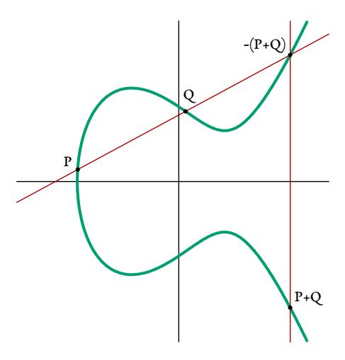
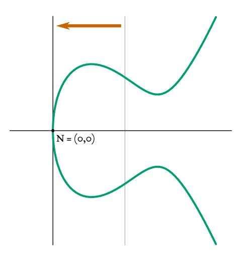
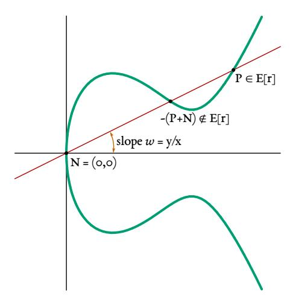
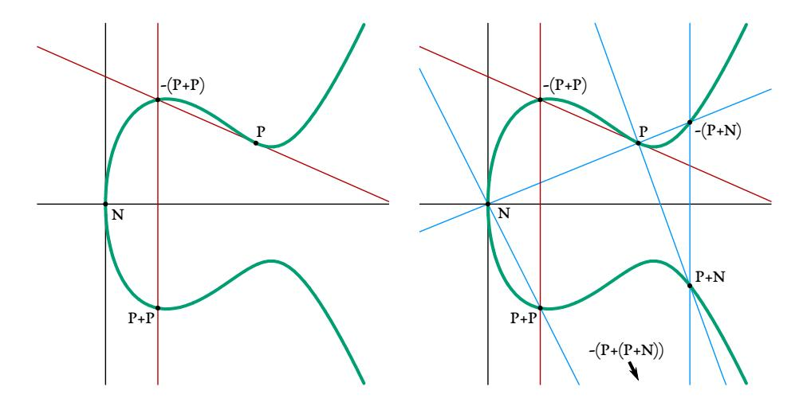

## Double-Odd Elliptic Curves

#### Thomas Pornin

NCC Group, thomas.pornin@nccgroup.com

13 December, 2020

Abstract. This article explores the use of elliptic curves with order 2*r* = 2 mod 4, which we call *double-odd elliptic curves*. This is a very large class, comprising about 1/4th of all curves over a given eld. On such curves, we manage to dene a prime order group with appropriate characteristics for building cryptographic protocols:

- **–** Element encoding is canonical, and veried upon decoding. For a 2*n*-bit group (with *n*-bit security), encoding size is 2*n* + 1 bits, i.e. as good as compressed points on classic prime order curves.
- **–** Unified and complete formulas allow secure and efficient computations in the group.
- **–** Efficiency is on par with twisted Edwards curves, and in some respects slightly better; e.g. half of double-odd curves have formulas for computing point doublings with only six multiplications (down to 1M+5S per doubling on some curves).

We describe here various formulas and discuss implementations. We also dene two specific parameter choices for curves with 128-bit security, called do255e and do255s. Our own implementations on 64-bit x86 (Coee Lake) and low-end ARM Cortex M0+ achieve generic point multiplication in 76696 and 2.19 million cycles, respectively, with curve do255e.

Note. A summary of the results presented here, and links to all implementations in various languages, can be found on the double-odd curves site:

<https://doubleodd.group/>

## 1 Introduction

## 1.1 Motivation

A number of cryptographic functionalities, such as key exchange (Die-Hellman[\[13\]](#page-64-0)) and signatures (ECDSA[\[1,](#page-64-1)[21\]](#page-65-0), Schnorr[\[35\]](#page-65-1)), can be built on top of a suitable group. Informally, proper security can be achieved if:

- **–** the group order is a large enough prime number;
- **–** computations over the group can be performed efficiently (encoding and decoding of elements, applying the group law);
- **–** but discrete logarithm in the group is computationally infeasible.

It is unknown whether such a group can exist, in absolute terms, because there is no proof that discrete logarithm can ever be "infeasible". However, we know of some candidates which fulfill the first two properties, and for which no efficient enough method to solve discrete logarithm is known. Among such candidates, elliptic curves offer good performance, in particular in terms of encoding size: a curve may offer "n-bit security", i.e. a discrete logarithm cost of at least  $2^n$  simple operations, with only  $2^{2n}$  elements, which can be represented over about 2n bits. This is the best that can be hoped for, since there are known algorithms for computing discrete logarithm over any group, with cost proportional to the square root of the group size.

Several kinds of elliptic curves have been explored, with various characteristics and draw-backs. The two main classes in wide usage are dubbed *Weierstraß curves* and *twisted Edwards curves*.

**Weierstraß curves.** Given a base finite field  $\mathbb{F}_q$ , the curve is the set of points  $(x, y) \in \mathbb{F}_q \times \mathbb{F}_q$  that fulfill the *short Weierstraß equation*  $y^2 = x^3 + Ax + B$  for two given constants A and B in  $\mathbb{F}_q$  such that  $4A^3 + 27B^2 \neq 0$ ; an extra formal point with no defined coordinates, called the point-at-infinity (denoted  $\mathbb{O}$ ), is adjoined to the curve and is used as the neutral element in the group law<sup>1</sup>.

<span id="page-1-1"></span>The group law (traditionally called "addition") is defined geometrically, as illustrated on figure 1. For two points P and Q on the curve, the line (PQ) is drawn; it intersects the curve at a third point, which is -(P+Q). The sum P+Q is the opposite of this point, which is defined to be its image by the symmetry relative to the horizontal axis.



**Fig. 1:** Point addition on a Weierstraß curve.

This law can be expressed with a few arithmetic operations on the *x* and *y* coordinates. Since these operations include divisions, which are in practice much more expensive to compute than additions or multiplications, it is customary to use some sort of fractional repre-

<span id="page-1-0"></span><sup>&</sup>lt;sup>1</sup>In the whole of this document, we assume that the characteristic of  $\mathbb{F}_q$  is neither 2 or 3. When the characteristic is 2 or 3, the short Weierstraß equation and the formulas are different.

sentation (often Jacobian or projective coordinates)[2](#page-2-0) . This yields practical formulas, whose main problem is that they have *exceptional cases* which must be handled differently:

- **–** The point-at-innity does not have defined coordinates, and requires a specific representation and formulas.
- **–** When adding a point *P* to its opposite−*P*, both points have the same *x* coordinate, so the line from *P* to −*P* is vertical and cannot be expressed as an equation *y* = *Cx* + *D*. Moreover, in that case, the third point of intersection with the curve is the point-at-innity, again with no well-defined coordinates.
- **–** When adding a point *P* to itself, the line (*PP*) is not defined; different formulas must be used to obtain the tangent to the curve on *P*.

Exceptional cases are a source of implementation issues if not properly handled; ad hoc tests can be added, but they usually lead to vulnerabilities through side channels leaks (non constant-time implementation), or to ineciency (if all possible code paths are executed and the correct one selected with constant-time selection routines). There are known formulas working over projective coordinates that are*complete*, i.e. with no exceptional case[\[34\]](#page-65-2); these, however, are more expensive than the traditional incomplete formulas.

It is customary to express formula cost in terms of the number of multiplications and squarings involved in point addition and point doubling. The traditional Jacobian coordinates (with incomplete formulas) lead to a cost of 12M+4S for general point addition, and 4M+4S for point doubling[3](#page-2-1) .With complete formulas in projective coordinates, general point addition cost is lowered to 12M, but doubling cost raises to 8M+3S; since multiplication of a point by a scalar uses way more point doublings than general additions, this makes these formulas less efficient.

Weierstraß curves can have a prime order, and *n*-bit security is obtained with a curve order of size 2*n* bits, and whose elements can be encoded to, and decoded from, a compact representation in 2*n* + 1 bits (2*n* bits for the *x* coordinate of the point, and one extra bit to allow unambiguous reconstruction of the *y* coordinate).

Twisted Edwards curves. Twisted Edwards curves[\[5\]](#page-64-2) use a degree-4 equation *Cx*<sup>2</sup> + *y* <sup>2</sup> = 1 + *Dx*<sup>2</sup> *y* 2 , for two constants *C* and *D*. They are, in fact, birationally equivalent to some Weierstraß curves, specifically Montgomery curves (with equation *By*<sup>2</sup> = *x* <sup>3</sup> + *Ax*<sup>2</sup> + *x*). Twisted Edwards curves have the advantage of leading to a representation and formulas which are both complete and efficient: there is no exceptional case; general point addition is computed with cost 8M, and doubling with cost 4M+4S (using "extended coordinates"[\[20\]](#page-65-3)). With some alternate coordinate representations, doublings can be made faster (3M+4S) but it makes general point addition slower (9M).

While the complete formulas for twisted Edwards curves are roughly 1.5 times faster than complete formulas for Weierstraß curves, they have a drawback known as the *cofactor*: the number of elements in such a curve is necessarily a multiple of 4, and therefore cannot be

<span id="page-2-0"></span><sup>2</sup> In some specific elds defined as extensions of smaller elds, it is possible to compute inversions efficiently enough to use ane coordinates, but this depends on the implementation architecture and tends to have suboptimal performance on CPUs with large registers[\[30\]](#page-65-4).

<span id="page-2-1"></span><sup>3</sup> Subject to the additional condition that *A* = −3, which can be achieved on most curves through the use of an isomorphic or at worst isogenous representation of the curve.

a large prime. At best, such curves can have order 4r, with r being the prime order of the (sub)group on which cryptographic functionality can be expressed; the cofactor is the ratio between the total curve order and the prime order of the target subgroup. An immediate consequence is that n-bit security needs r to be a 2n-bit integer, thus a total curve order of at least 2n + 2 bits, with elements encoded over 2n + 3 bits. This slight inefficiency (2 extra bits) is rarely significant in practice, although it can be burdensome in some cases, e.g. when trying to encode meaningful data into curve points.

Less anecdotally, the non-trivial cofactor can lead to difficulties, and even security vulner-abilities, depending on the situation. The main cause is that there is no known efficient way to verify that a given point is part of a specific subgroup<sup>4</sup>. For instance, the Ed25519 signature algorithm, built over a twisted Edwards curve with cofactor 8, has two different verification equations; in the words of RFC 8032[23]:

Check the group equation 8sB = 8R + 8kA'. It's sufficient, but not required, to instead check sB = R + kA'.

With valid signatures, the two equations will both be fulfilled; moreover, building a case where the first equation matches but the second does not requires knowledge of the private key. Therefore, this feature does not contradict the assertion that Ed25519 is a secure signature algorithm. However, the possibility to craft malicious values such that different verifier implementations disagree on the signature validity is enough to induce serious issues in some applications, in particular consensus-based distributed systems[40]. More serious breaches exploiting the non-trivial cofactor have been reported[27]. Generally speaking, the cofactor may cause issues that must be mitigated in the protocol that uses the curve as base group; the solution is usually a generous application of extra multiplications by the cofactor in some places, along with some filtering of low-order points. Such extra operations are not expensive, but complicate the design and security analysis of cryptographic protocols. It can be said that the overall simplicity of use of complete point addition formulas has been obtained not by removing complexity, but by foisting it into upper design layers. When available, prime order groups with no cofactor issue are preferable[12].

**Decaf and Ristretto.** Decaf[19] and its successor Ristretto[3] are encoding and decoding maps that aim at solving the cofactor issues of twisted Edwards curves with cofactor 4 (for Decaf) or 8 (for Ristretto). A given curve point P can be encoded into a base field element; when decoding, this yields a point P' which will not necessarily be the point P, but which will be such that P' - P is a low-order point. All points that differ with each other by a low-order point encode into the same sequence of bits. This process allows using the curve of order 4r or 8r as if it were a group of order r.

Decaf and Ristretto remove security issues related to the cofactor, without introducing any new security hypothesis, since they work over an existing twisted Edwards curve and are provably as secure as that curve. However, they have some remaining (but smaller) drawbacks:

- The encoding size is not fully optimal, in that n-bit security will need a curve defined over a field of at least 2n + 2 bits (2n + 3 bits with Ristretto), and use as many bits for encoding. This is close, but not equal to the 2n+1 bits achievable with Weierstraß curves.

<span id="page-3-0"></span><sup>&</sup>lt;sup>4</sup>By "efficient" we mean here having cost negligible with regard to that of a generic point multiplication by a scalar.

**–** Both the decoding and encoding process require the computation of an inverse square root in the eld, which needs an exponentiation with an exponent of about the same size as the eld. "Normal" twisted Edwards curves require a similar operation for decoding from compressed coordinates, but encoding only needs an inversion. Constant-time inversion is traditionally performed with Fermat's little theorem, at a cost similar to that of a square root, but faster solutions are known[\[32\]](#page-65-8), especially on embedded systems, where the cost of inversion can be as low as 1/5th of the cost of a square root or an inverse square root, for a typical 255-bit eld[\[33\]](#page-65-9).

Goal. We want to nd curve equations and formulas that improve on the currently known solutions. Specifically, we would like to obtain the following desirable properties:

- **–** A group of order*r* prime, backed by an elliptic curve of order*r* (or possibly a multiple of *r*, as long as the extra cofactor is tamed through an appropriate encoding, as in Ristretto).
- **–** Group elements should have a canonical encoding into at most 2*n* + 1 bits, for a security level of *n* bits (i.e. *r* having a size of 2*n* bits).
- **–** The decoding process should be efficiently verifiable: it should be easy to check (with negligible overhead) that the sequence of bits that was used as input is indeed exactly what would be obtained as output if the decoded element were to be encoded again.
- **–** The group law should be computable with efficient complete formulas, amenable to fast and secure implementations (notably, constant-time implementations). The efficiency of point doublings is critical, since most of the cost in usual cryptographic operations (multiplication of a curve point by a scalar) is spent in computing sequences of successive doublings.
- **–** The underlying elliptic curve should be from a large class, so that the usual well-studied assumptions of resistance to discrete logarithm may be leveraged without introducing any new cryptographic hypothesis.

In this document, we explore such a class of elliptic curves, and show how they fulll all these goals (and some more).

## 1.2 Core Ideas

Let F*<sup>q</sup>* be a given finite eld where operations are efficient. It can be any eld of characteristic different from 2 and 3, but, for the purposes of this introduction, let's imagine that we use integers modulo a prime which is close to a power of 2, such *q* = 2 <sup>255</sup> − 19, as used in Curve25519[\[4\]](#page-64-6). All elliptic curves can be described as Weierstraß curves with a short Weierstraß equation, and, as we explained, we can choose curves with a prime order. This is how most standard elliptic curves have historically been defined. Relevant classic standards (e.g. ANSI X9.62[\[1\]](#page-64-1)) support arbitrary curves with both trivial and non-trivial cofactors, but if we are to use the generic short Weierstraß equation, then it makes little sense not to choose a curve with prime order, to at least remove cofactor issues. *A contrario*, when using a twisted Edwards curve (or its Montgomery counterpart), the cofactor is at least 4. This raises the following question: what of the "intermediate" curves with a cofactor of 2, i.e. with a total order which is not prime, but still a cofactor lower than 4?[5](#page-4-0)

<span id="page-4-0"></span><sup>5</sup>We have not studied the case of elliptic curves with a cofactor equal to 3. This is an open research area.

This document explores the class of elliptic curves with order 2*r*, with *r* being an odd integer (in practical situations, we will choose curves such that *r* is prime). For want of a better name, we call them *double-odd elliptic curves*.

<span id="page-5-0"></span>On a short Weierstraß curve, points of order 2 are points that have *y* = 0. A double-odd elliptic curve has, by construction, a single point of order 2; let's call it *N*. We rst apply a simple change of variable to make it so that the *x* coordinate of *N* is also zero. This is illustrated on figure [2.](#page-5-0) This change of variable transforms the curve equation into a similar but not identical form: *y* <sup>2</sup> = *x*(*x* <sup>2</sup> + *ax* + *b*), for two constants *a* and *b*.



Fig. 2: Change of variable on a double-odd elliptic curve.

Let's call *E*[*r*] the subgroup of points of*r*-torsion on the curve (i.e. the points that, multiplied by *r*, yield O). It is a group of order *r*, thus a good candidate for a foundation for the prime order group we are looking for. All curve points can be separated into two disjoint sets: *E*[*r*], and points *P* + *N* where *P* ∈ *E*[*r*]. In other words, if a point *P* is in *E*[*r*], then *P* + *N* is not, and vice versa.

For a point *P* = (*x, y*) on the curve, distinct from *N* and O, let's consider the addition *P* + *N* from a geometric point of view. The line (*PN*) has a well-defined slope *w* = *y*/*x* and intersects the curve on a third point, which is, by definition, the point −(*P* + *N*). The important remark here is that if *P* ∈ *E*[*r*], then −(*P* + *N*) ∉ *E*[*r*], and vice versa. This is illustrated on figure [3.](#page-6-0)

<span id="page-6-0"></span>

Fig. 3: Adding the point *N* (of order 2) to a point *P*.

The consequence of that addition is that for a given slope value *w*, there is a unique line with that slope that goes through *N*. That line might not intersect the curve at any other point; but if it does, then it will intersect the curve in two points, exactly one of which is part of *E*[*r*]. This implies that any point (*x, y*) ∈ *E*[*r*] can be encoded into a eld element *w* = *y*/*x*, which is the slope of the line from *N* to that point, and this encoding is injective[6](#page-6-1) .

For decoding, we use *w* to dene the line (*PN*) and resolve the equation that yields the coordinates of both *P* and −(*P* + *N*); this is a degree-2 equation, so it is solvable, in all generality, with a square root computation. To nalize decoding, we need a way to distinguish between *P* and −(*P* + *N*), i.e. nd out which of the two solutions is the point which is part of *E*[*r*]. It turns out (this is not obvious geometrically) that for all points *P* = (*x, y*) (distinct from O and *N*) on a double-odd elliptic curve, *P* is in *E*[*r*] if and only if *x* is a quadratic residue in the eld. Thus, we can nd the correct *P* by way of testing the quadratic residue, which can be done with relative ease with a Legendre symbol computation.

At that point, we have the following:

- **–** For a 2*n*-bit odd prime integer *r*, we use a curve with order 2*r*, based on a eld F*<sup>q</sup>* of size 2*n* + 1 bits.
- **–** *E*[*r*] is a prime order group suitable for cryptographic functionalities. Each element (*x, y*) ∈ *E*[*r*] can be encoded into the value *w* = *y*/*x*. This encoding requires a division, which we can hope to be implicit in the use of fractional coordinates; this is similar to what is done for other curves (short Weierstraß and twisted Edwards), and more efficient than Decaf/Ristretto.
- **–** Decoding is intrinsically veried and involves a square root *and* a Legendre symbol computation. Depending on target architectures, the Legendre symbol may have minor overhead; on ARM Cortex M0+ CPUs, we nd for instance that the cost of a Legendre symbol is less than 1/6th of that of a square root[\[33\]](#page-65-9).

<span id="page-6-1"></span><sup>6</sup> Since the slope is never zero, we can use the value zero to encode the neutral O.

This is a promising debut. Now, we want at least unified formulas, i.e. formulas for which addition of a point to itself is not an exceptional case. This could be done generically by using a change of variable after decoding (the reverse of the one illustrated on figure [2\)](#page-5-0) and then using the known complete formulas for short Weierstraß curves[\[34\]](#page-65-2). However, we can do better, leveraging again the point *N*.

Consider the situation of adding a point *P* to itself, shown on figure [4.](#page-7-0) On the left side, the classical solution involves detecting that case and then using the tangent to the curve. This leads to incomplete formulas and thus implementation safety issues. However, on a doubleodd elliptic curve, we can use the point *N* to instead add point *P* with point *P* +*N*, as shown on the right side of figure [4](#page-7-0) (blue lines); *P* and *P* + *N* are distinct and have distinct *x* coordinates, therefore the normal addition method works. More generally, when adding points *P* and*Q* together, and *P* and*Q* are both on *E*[*r*], then we compute *P* +*Q* = (*P* + (*Q*+*N*)) +*N*. Points *P* and *Q* + *N* necessarily have distinct *x* coordinates, since *P* is in *E*[*r*] but *Q* + *N* is not. This avoids the exceptional cases related to adding a point to itself, and naturally leads to at least unified formulas.

<span id="page-7-0"></span>

Fig. 4: Point doubling, without and with the help of the point *N*.

A further trick will help: instead of working with points in *E*[*r*], we will work with points which are *not* in *E*[*r*]; we will dene our group law as (*P* + *N*) ∗ (*Q* + *N*) = (*P* + *Q*) + *N*. This is equivalent to saying that we *represent* point *P* ∈ *E*[*r*] by point *P* + *N*; we are still conceptually working with points on the prime order group *E*[*r*], but through their dual points. This small transform has the nice side-effect of making *N* the neutral point in the group, i.e. a point with well-defined *x* and *y* coordinates. This will help in making *complete* formulas, that handle the neutral just like any other point.

It remains to be seen whether all this leads to efficient formulas. As will be described in the rest of this document, it does.

#### 1.3 Summary of Results

We summarize here the results which will be explained at length in the remaining pages:

- Double-odd elliptic curves are exactly (up to isomorphism) curves of equation:

$$y^2 = x(x^2 + ax + b)$$

where a and b are two field elements such that neither b nor  $a^2 - 4b$  is a quadratic residue. This is a large class; about 1/4th of all curves are double-odd curves (this is similar to, for instance, Montgomery curves).

- A group of order r is defined as  $\mathbb{G} = \{P + N \mid P \in E[r]\}$ . The group is homomorphic to the curve subgroup of points of r-torsion; its neutral element is N = (0, 0). Addition in  $\mathbb{G}$  of P + N and Q + N is performed as:

$$(P+N)*(Q+N) = P + (Q+N)$$

- Group element (x, y) is canonically encoded as the value w = y/x (value zero for the neutral N). A group with n-bit security is encoded over 2n + 1 bits, which is about the best that can be hoped for with elliptic curves, and matches what can be achieved with prime order short Weierstraß curves. Decoding is intrinsically verified; invalid encodings can be reliably detected and rejected. When decoded, the obtained element is necessarily in the right prime order group.
- Several coordinate systems can be used. We define (x, w) and (x, u) systems (with w = y/x and u = x/y). With (x, w), we get unified formulas (that can be implemented in complete *routines*); in (x, u) coordinates, we achieve complete formulas.
- With Jacobian (x, w) coordinates, we represent points in  $\mathbb{G}$  as triplets (X:W:Z) such that  $x = X/Z^2$  and w = W/Z. These coordinates lead to unified addition formulas with cost 8M+6S, and complete doubling formulas with cost 2M+5S (generically on all curves) that can be reduced to 1M+6S or even 2M+4S on some curves. Moreover, in sequences of successive doublings, marginal cost per doubling is 4M+2S for half of double-odd elliptic curves, and as low as 2M+4S or even 1M+5S for some curves (a sequence of n doublings on these last curves can be done in cost 1S+n(1M+5S)). This doubling cost is lower than the fastest known doublings on twisted Edwards curves.
- With fractional (x, u) coordinates, we represent points in  $\mathbb{G}$  as quadruplets (X:Z:U:T) such that x = X/Z and u = U/T. With this representation, generic point addition cost is 10M, with complete formulas (for mixed addition, with one operand in affine (x, u) coordinates, cost is 8M). Doubling cost is 3M+6S. Just like in Jacobian (x, w) coordinates, sequences of successive doublings can be done with a low per-doubling marginal cost (on some curves, cost of n doublings is 3M+n(1M+5S)).
- Last but not least, the family of double-odd curves includes the GLV curves  $y^2 = x^3 + bx$  (in a field  $\mathbb{F}_q$  with  $q = 1 \mod 4$ ), which have been described in 2001[16]. Such curves are precisely those for which we achieve the lowest per-doubling cost (1M+5S), and they also feature an efficient endomorphism that can be used to further speed up point multiplication by a scalar<sup>7</sup>.

<span id="page-8-0"></span><sup>&</sup>lt;sup>7</sup>This optimization method has long been rumoured to be patented, but it seems that the relevant patents have expired in September 2020; see discussion in section 5.3.

Following these results, we dene and implement two curves (called do255e and do255s) that operate over 255-bit elds (integers modulo 2 <sup>255</sup> − 18651and 2 <sup>255</sup> − 3957, respectively) and oer the usual "128-bit" security level[8](#page-9-0) . Curve do255e is a GLV curve; curve do255s is an ordinary curve with no fast endomorphism. On 64-bit x86 systems (Coee Lake core), with curve do255e,we get generic point multiplication in less than 77k cycles (fully constant-time). This translates to the following performance for high-level operations:

- **–** Key pair generation: 49122 cycles (including public key encoding into 32 bytes).
- **–** Key exchange: 105340 cycles (this is a multiplication of the point from the peer by our private key; this cost includes the 18220 cycles for the decoding of the peer's point from its compact 32-byte representation, and the key derivation process with SHAKE256).
- **–** Signature generation: 53584 cycles.
- **–** Signature verification: 111900 cycles on average (including the 18220 cycles for decoding the public key from its compact 32-byte encoding).

We also implement our curves in ARMv6-M assembly (for the Cortex M0+), and obtain the following:

- **–** Key pair generation: 1.42m cycles[9](#page-9-1) .
- **–** Key exchange: 2.62m cycles.
- **–** Signature generation: 1.50m cycles.
- **–** Signature verification: 3.26m cycles (average).

These performance figures compare favourably to other existing fast curves. For instance, with Curve25519 on ARM Cortex M0+, the fastest reported key exchange has cost 3.23m cycles[\[33\]](#page-65-9).

We also support a constant-time hash-to-curve process, by using a mapping function, applied twice (two 32-byte chunks are derived from the input with a suitable hash function, each chunk is mapped to a curve point, and the two points are added together). Most double-odd elliptic curves can use Elligator2[\[7\]](#page-64-8), which is efficient. For GLV curves with *a* = 0, Elligator2 is not applicable; we instead describe a novel map function applicable to such curves.

## 1.4 Article Outline

In the next section (section [2\)](#page-10-0), we study the structure of double-odd elliptic curves; in particular, we establish their equation and formally dene the prime order group G.

In section [3,](#page-17-0) we establish several formulas for computing the group law in various ane coordinate systems that apply to double-odd elliptic curve. We also show that double-odd elliptic curves can be viewed as a subgroup of a twisted Edwards curve in a degree-2 eld extension, and we describe some isogenies which are useful in deriving fast formulas for computing point doublings. We finally describe two maps from arbitrary eld elements to curve points (one is Elligator2, the other is a new map applicable to GLV curves with equation *y* <sup>2</sup> = *x*(*x* <sup>2</sup> + *b*)).

<span id="page-9-0"></span><sup>8</sup>Technically, they have only 127-bit security level, but that's still more than the 126 bits from Curve25519.

<span id="page-9-1"></span><sup>9</sup>We are using "m" to denote one million.

Section 4 details the application of these formulas in several fractional coordinate systems, which allow computations to proceed with only multiplications but no division (except a single one, at the end, when encoding a point into bytes). These algorithms represent the template for practical implementations.

Specific parameter sets for curves do255e and do255s are defined in section 5. The criteria which led to these specific choices are explained. We also provide in this section a succinct specification of key exchange and signature algorithms using these curves.

Implementation details and issues are covered in section 6. There we describe our implementation techniques for both 64-bit x86 (C code with intrinsics and some inline assembly) and ARM Cortex M0+ (mostly assembly code).

## <span id="page-10-0"></span>2 Structure of Double-Odd Elliptic Curves

#### 2.1 Notations

In all the subsequent analysis, we will work in the finite field  $\mathbb{F}_q$  of cardinal  $q = p^m$  for a prime  $p \ge 5$  (the field characteristic) and integer  $m \ge 1$ . Integer constants such as 4 or 27 are to be understood as elements of  $\mathbb{F}_q$  when appropriate (all such constants will be products of powers of 2 and 3 only, therefore non-zero in  $\mathbb{F}_q$ ).

QR(K) is the set of quadratic residues in field  $K: QR(K) = \{x^2 \mid x \in K\}$ . Note that  $0 \in QR(K)$ . Most of the time, we will work with the field  $\mathbb{F}_q$  and will use the shorthand QR to designate  $QR(\mathbb{F}_q)$ .

x, y, u, w... designate point coordinates, i.e. elements of  $\mathbb{F}_q$ . In this section, X is the symbolic identifier for the generator of the ring of polynomials  $\mathbb{F}_q[X]$ , which is used for some of the demonstrations (in some other later sections, X will be used to denote some point coordinates in various projective representations; the context should make it clear).

#### <span id="page-10-1"></span>2.2 Curve Characterization

In this section, we characterize the set of curves over  $\mathbb{F}_q$ , with order 2r for an odd integer r. All elliptic curves on  $\mathbb{F}_q$  can be transformed through changes of variables into a *short Weierstraß* curve, i.e. the set of points  $(x, y) \in \mathbb{F}_q \times \mathbb{F}_q$  such that:

$$y^2 = x^3 + Ax + B$$

for two given constants A and B in  $\mathbb{F}_q$ . The curve also includes an extra "point-at-infinity" which we will denote  $\mathbb{O}$ ; that point does not have x and y coordinates. The curve is an Abelian group with the following addition law:

- The neutral element is  $\mathbb{O}$ .
- The opposite of P = (x, y) is -P = (x, -y).
- For any two points  $P_1$  and  $P_2$  such that  $P_1 \neq \mathbb{O}$ ,  $P_2 \neq \mathbb{O}$  and  $P_1 \neq -P_2$ , the line going through  $P_1$  and  $P_2$  will intersect the curve on a third point, which is  $-(P_1 + P_2)$ . When  $P_1 = P_2$ , the line to consider is the tangent to the curve on  $P_1$ .

When adding point  $P_1 = (x_1, y_1)$  to  $P_2 = (x_2, y_2)$ , the slope of the line from  $P_1$  to  $P_2$  can be computed as  $\lambda = (y_2 - y_1)/(x_2 - x_1)$ . If  $P_1 = P_2$ , this expression is not usable; instead, we use the tangent, whose slope is  $\lambda = (3x^2 + A)/2y$ .

The three following properties are equivalent to each other:

- There is no point (x, y) on the curve such that both  $3x^2 + A = 0$  and 2y = 0.
- $-4A^3 + 27B^2 \neq 0.$
- The polynomial  $X^3 + AX + B \in \mathbb{F}_q[X]$  does not have a multiple root (i.e. it is relatively prime to its derivative  $3X^2 + A$ ).

If these properties are met, then the law is well-defined and imbues the curve with an Abelian group structure.

We now want to study double-odd curves, i.e. curves whose order is equal to 2r for an odd integer r. The fundamental theorem of finitely generated Abelian groups<sup>10</sup> states that any finite Abelian group is homomorphic to:

$$\mathbb{Z}_{n_1} \times \mathbb{Z}_{n_2} \times ... \times \mathbb{Z}_{n_k}$$

for some integers  $n_i$  such that  $n_i$  divides  $n_{i+1}$  for all i in 1 to k-1. This implies that:

- Any Abelian group with an even order must have at least one element of order 2 (if the product of all  $n_i$  is even, then at least one of them is even).
- Any Abelian group whose order is a multiple of 4 must include at least one element of order 4, or at least three elements of order 2 (if the product of all  $n_i$  is a multiple of 4, and  $n_k = 2 \mod 4$ , then  $n_{k-1}$  must be even as well).

Therefore, curves with order  $2r = 2 \mod 4$  are the curves which contain a single element of order 2, and no element of order 4. Elements of order 2 are points (u, 0) for some integer u which is a root of  $X^3 + AX + B$ . We can then write:

$$X^{3} + AX + B = (X - u)(X^{2} + uX + (A + u^{2}))$$

We will now apply the change of variable  $x \mapsto x + u$ ; this is an isomorphism between curves, since it preserves lines (straight lines are mapped to straight lines) and therefore also preserves the structure induced by the group law. This turns the curve equation into:

$$y^2 = x(x^2 + ax + b)$$

for constants a and b such that:

$$a = 3u$$
$$b = A + 3u^2$$

From now on, we will consider curves using this alternate equation. Conversely, any curve using that equation can be turned back into a short Weierstraß equation by applying the  $x \mapsto x - a/3$  change of variable, yielding:

$$A = (3b - a^2)/3$$
$$B = a(2a^2 - 9b)/27$$

The curve is well-defined if and only if there is no double root to the polynomial  $X^3 + aX^2 + bX$ , i.e. if and only if the two following properties hold:

<span id="page-11-0"></span><sup>&</sup>lt;sup>10</sup>The history of the discovery and proof of this theorem is complicated, especially since it predates the formal definition of groups. Here, we use the sub-case of finite groups, for which the theorem was proven by Kronecker[24].

- $-b \neq 0$  (otherwise, 0 would be a double root).
- $-a^2-4b\neq 0$  (otherwise,  $X^2+aX+B$  would have a double root).

The point N = (0, 0) is part of the curve, and has order 2. This is, by construction, the only point with x = 0. As will be detailed below (section 2.3), for any point P = (x, y) with  $x, y \neq 0$ , the point P + N has coordinates  $(b/x, -by/x^2)$ .

For the curve to have order  $2r = 2 \mod 4$ , N must be the only point of order 2, i.e. there should be no other root to  $X^3 + aX^2 + bX$ . This implies that  $a^2 - 4b \notin QR$ . Moreover, if  $b \in QR$ , then let c be a square root of b; in that case:

$$a^2 - 4b = (a + 2c)(a - 2c)$$

Since  $a^2 - 4b \notin QR$ , then one of a + 2c and a - 2c must be a quadratic residue. Without loss of generality, suppose that  $a + 2c \in QR$ . Then, points  $(\pm c, \pm c\sqrt{a + 2c})$  are on the curve, and have order 4: each such point P is such that P + N = -P. Therefore, a curve of order  $2r = 2 \mod 4$  must have  $b \notin QR$ .

Conversely, consider a curve with equation  $y^2 = x(x^2 + ax + b)$  for any  $a, b \in \mathbb{F}_q$  such that  $b \neq 0$  and  $a^2 - 4b \neq 0$ . Such a curve contains the point N = (0, 0), and thus its order is even. If its order is a multiple of 4, then either:

- there is at least another point of order 2, which implies that  $X^2 + aX + b$  has roots in  $\mathbb{F}_q$ , and therefore  $a^2 4b \in QR$ ; or
- the curve contains a point  $Q = (x_4, y_4)$  of order 4 such that 2Q = N, which means that Q + N = -Q, which implies that  $x_4 = b/x_4$ , and thus  $b \in QR$ .

All these facts can be summarized into the following:

#### Characterization of double-odd elliptic curves:

Elliptic curves E, over a finite field  $\mathbb{F}_q$  of characteristic  $p \ge 5$ , and whose order is equal to 2 modulo 4, are exactly, up to isomorphisms, the curves with equation:

$$y^2 = x(x^2 + ax + b)$$

for two constants  $a, b \in \mathbb{F}_q$  such that:

- $-a^2-4b$  is not a quadratic residue;
- b is not a quadratic residue.

#### <span id="page-12-0"></span>2.3 Core Addition Formulas

Let  $P_1 = (x_1, y_1)$  and  $P_2 = (x_2, y_2)$  two points on a curve E of equation  $y^2 = x(x^2 + ax + b)$ ; neither point is the special point-at-infinity ( $\mathbb{O}$ ) since that point does not have coordinates. Let  $P_3 = P_1 + P_2$ . The coordinates  $(x_3, y_3)$  of  $P_3$  can be obtained as follows:

- If  $x_1 = x_2$  and  $y_1 = -y_2$ , then  $P_3 = \mathbb{O}$  (with no defined coordinates).
- Otherwise, if  $x_1 = x_2$ , then  $y_1 = y_2$  and  $P_1 = P_2$ ; define the slope of the tangent to the curve on  $P_1$  as:

$$\lambda = \frac{3x_1^2 + 2ax_1 + b}{2y_1}$$

and the coordinates of *P*<sup>3</sup> are:

$$x_3 = \lambda^2 - a - 2x_1$$
  
 $y_3 = \lambda(x_1 - x_3) - y_1$ 

**–** Otherwise, *x*<sup>1</sup> ≠ *x*2, and we can compute the slope *λ* of the line from *P*<sup>1</sup> to *P*<sup>2</sup> as:

$$\lambda = \frac{y_2 - y_1}{x_2 - x_1}$$

and the coordinates of *P*<sup>3</sup> are:

$$x_3 = \lambda^2 - a - x_1 - x_2$$
  
 $y_3 = \lambda(x_1 - x_3) - y_1$ 

From these formulas, we now consider two important sub-cases. The rst one is when adding a point *P* = (*x, y*) to *N* = (0*,* 0) (the point of order 2). If *P* ≠ *N*, then *x* ≠ 0 and the slope of the line (*PN*) is:

$$\lambda = \frac{y}{x}$$

yielding the coordinates (*x* 0 *, y*0 ) of *P* <sup>0</sup> = *P* + *N*:

$$x' = \frac{y^2}{x^2} - a - x$$

$$= \frac{x^3 + ax^2 + bx - ax^2 - x^3}{x^2}$$

$$= \frac{b}{x}$$

$$y' = \frac{y}{x} \left( x - \frac{b}{x} \right) - y$$

The second sub-case is that of point doubling, i.e. adding a point to itself. Let*P* = (*x, y*) ≠ *N*, and *P*<sup>2</sup> = 2*P*. The coordinate *x* of *P*<sup>2</sup> is computed as:

= − *by x* 2

$$x_{2} = \left(\frac{3x^{2} + 2ax + b}{2y}\right)^{2} - a - 2x$$

$$= \frac{9x^{4} + 12ax^{3} + (4a^{2} + 6b)x^{2} + 4abx + b^{2}}{(2y)^{2}}$$

$$- \frac{4ax^{3} - 4a^{2}x^{2} - 4abx}{(2y)^{2}} - \frac{8x^{4} - 8ax^{3} - 8bx^{2}}{(2y)^{2}}$$

$$= \frac{x^{4} - 2bx^{2} + b^{2}}{(2y)^{2}}$$

$$= \left(\frac{x^{2} - b}{2y}\right)^{2}$$

Therefore, the *x* coordinate of 2*P*, for any point *P* ≠ O*, N*, is a quadratic residue.

#### <span id="page-14-0"></span>2.4 A Prime Order Group

Let E be a curve of order  $2r=2 \mod 4$ ; r is an odd integer. We will now define a group of order r, homomorphic to a subgroup of size r in E, with a canonical encoding as field elements. All the analysis here works for any odd integer r, but most cryptographic applications (e.g. signatures) will require r to be prime; we then assume that the curve parameters ( $\mathbb{F}_q$ , a and b) are chosen so that r is a prime of appropriate length.

Let E[r] be the set of points of r-torsion in E, i.e. the points which, multiplied by r, yield  $\mathbb{O}$ . This is a subgroup of E. In fact, any point on E can be decomposed into a sum of two points  $P_r + P_t$ , where  $P_r \in E[r]$  and  $P_t \in \{\mathbb{O}, N\}$ ; points  $P_r$  and  $P_t$  can be computed as:

$$P_r = (r+1)P$$
$$P_t = rP$$

This decomposition is unique. Note that  $N \notin E[r]$ .

Suppose that  $P=(x,y)\in E[r]$  and  $P\neq \mathbb{O}$ ; consider the line that goes from N to P. Since N is the only point on the curve with x=0, and also the only point on the curve with y=0, the line (PN) has a defined non-zero slope w=y/x. This line, by construction, intersects the curve at a third point which is -P+N. In particular,  $-P+N\notin E[r]$ . Similarly, if we had started from  $P'\notin E[r]$  and  $P'\neq N$ , then the line (P'N) has slope w'=y'/x' and intersects the curve on a third point, which is -P'+N, and which is part of E[r]. Thus, any given slope  $w\neq 0$  may correspond to only two points on the curve, exactly one of which is in E[r].

If  $P \in E[r]$ , then  $P = P_r = (r+1)P = 2((r+1)/2)P$ : every point in E[r] is the double of some other point. As we saw in section 2.3, this implies that the x coordinate of any point  $P \in E[r]$  ( $P \neq \mathbb{O}$ ) is a quadratic residue. Conversely, for any point  $P' = (x', y') \notin E[r]$  (and  $P' \neq N$ ), we saw that P' = P + N with x' = b/x, for some point P which will then be a point of r-torsion. Thus,  $x \in QR$ . Since  $p \notin QR$ , it follows that  $p' \notin QR$ . These properties lead to the following important fact:

#### Characterization of r-torsion points

For any point  $P = (x, y) \in E$  such that  $P \neq \mathbb{O}, N, P \in E[r]$  if and only if  $x \in QR$ .

We will now define a group of order r whose elements can be uniquely encoded to, and decoded from, field elements. The group will be homomorphic to E[r], but we choose to represent elements by points which are *not* in E[r] for reasons which will be explained below. Here is the group definition:

#### Group of odd order r

Elements of  $\mathbb{G}$  are the curve points which are not in E[r]:

$$\mathbb{G} = \{ P + N \mid P \in E[r] \}$$

These are exactly the points of E whose x coordinate is either 0 (for point N) or not a quadratic residue in  $\mathbb{F}_q$ .

For  $P_1 + N$  and  $P_2 + N$  in  $\mathbb{G}$ , the group law yields:

$$(P_1 + N) * (P_2 + N) = (P_1 + P_2) + N$$

The neutral point is N. The opposite of  $P_1 + N$  is  $-P_1 + N = -(P_1 + N)$ .

Elements of G can be encoded into field elements with the following map:

$$\phi: \qquad \mathbb{G} \longrightarrow \mathbb{F}_q$$

$$(P_1 + N) \longmapsto 0 \qquad \text{if } (P_1 + N) = N$$

$$y/x \quad \text{if } (P_1 + N) = (x, y) \neq N$$

As we saw above, this map is injective: any value  $w = y/x \neq 0$  corresponds to only two points on the curve, only one of which being in  $\mathbb{G}$ . The decoding process, from a given  $w \in \mathbb{F}_q$ , is as follows:

- If w = 0, then the point is N.
- Otherwise, consider the equation  $x^2 (w^2 a)x + b = 0$  (this is a rewriting of the curve equation, replacing y with wx, and dividing by x). This is a quadratic equation in x, whose discriminant is  $\Delta = (w^2 a)^2 4b$ ; note that  $\Delta \neq 0$  (otherwise, it would imply that  $b \in QR$ ). If  $\Delta \notin QR$ , then there is no solution (the provided w is not the image of a group element by  $\phi$ ); otherwise, there are two distinct solutions:

$$x = \frac{w^2 - a \pm \sqrt{\Delta}}{2}$$

The two solutions are such that their product is b, which is not a quadratic residue; thus, exactly one of the solutions is not a quadratic residue: this is the x coordinate of the point P + N such that  $\phi(P + N) = w$ . The y coordinate of P + N is obtained as: y = xw.

We could have defined  $\mathbb{G}$  to be E[r], using point addition as group law, and with the same mapping to field elements (decoding would then have chosen the solution x which is a quadratic residue). However, we prefer the formulation above for the following reasons:

- Every element of  $\mathbb{G}$  has defined (x, y) coordinates. The neutral element is N = (0, 0); the curve point-at-infinity  $\mathbb{G}$  is not in  $\mathbb{G}$ .
- The group law can be computed as:

$$(P_1 + N) * (P_2 + N) = (P_1 + P_2) + N = P_1 + (P_2 + N)$$

Notice that  $P_1 \in E[r]$  but  $P_2+N \notin E[r]$ . Therefore, it cannot happen that  $P_1 = P_2+N$ . This means that addition formulas can be applied without encountering the special case of adding a point to itself. This will help in establishing unified and complete formulas, as will be detailed in section 3.

#### <span id="page-16-0"></span>2.5 Curve Isomorphisms

For any non-zero value  $\varepsilon$  in  $\mathbb{F}_q$ , the mapping  $(x,y) \mapsto (x',y') = (x\varepsilon^2, y\varepsilon^3)$  is an isomorphism from curve  $y^2 = x(x^2 + ax + b)$  to curve  $y'^2 = x'(x'^2 + (a\varepsilon^2)x' + (b\varepsilon^4))$  (this is the usual isomorphism on Weierstraß curves, applied to our curve equation).

The *j-invariant* of an elliptic curve is a quantity which is conserved by such isomorphisms. For a short Weierstraß curve  $y^2 = x^3 + Ax + B$ , the *j-*invariant is defined as:

$$j = 1728 \frac{4A^3}{4A^3 + 27B^2}$$

In our case, for curves  $y^2 = x(x^2 + ax + b)$ , we obtain:

$$j = \frac{256(3b - a^2)^3}{b^2(4b - a^2)}$$

When  $j \neq 0$  and  $j \neq 1728$ , there are exactly two curves (up to isomorphism) that have this *j*-invariant, and they are quadratic twists of each other (i.e. they become the same curve when lifted into the extension field  $\mathbb{F}_{q^2}$ ). For curve  $y^2 = x(x^2 + ax + b)$ , the quadratic twist has equation  $y^2 = x(x^2 - ax + b)$ . If a curve has order 2r, then its twist has order 2q + 2 - 2r, which is then also equal to 2 modulo 4.

The case j=0 is not very interesting to us. Indeed, such a curve is isomorphic to the short Weierstraß curve  $y^2=x^3+B$  for some  $B\neq 0$ . If q=1 mod 3, then such a curve has either no point of order 2, or three distinct points of order 2; in both cases, the curve order cannot be equal to 2 modulo 4. If q=2 mod 3, the curve is supersingular with order exactly q+1; this can be equal to 2 modulo 4 if q=1 mod 4 (which, combined with q=2 mod 3, implies q=5 mod 12). However, such a supersingular curve has embedding degree 2: the Weil pairing maps discrete logarithm on the curve into the discrete logarithm problem on the multiplicative subgroup of  $\mathbb{F}_{q^2}$ , for which sub-exponential algorithms are known[28]. In order to obtain a decent level of security, one would have to make q quite large (at least 1024 bits), implying poor computing performance and large values.

Curves with j=1728 are more useful: this situation is obtained with a=0. Note that the condition  $a^2-4b\notin QR$  then implies that  $-b\notin QR$ . Since we also need  $b\notin QR$ , a curve of order 2 modulo 4 can have j=1728 only if q=1 mod 4 (indeed, if q=3 mod 4, then the curve would be supersingular and its order would be a multiple of 4). A non-supersingular curve with j=1728 admits one quadratic twist and two quartic twists that share the same j-invariant; if  $\zeta$  is a non-quadratic residue in  $\mathbb{F}_q$ , then the twists of curve  $y^2=x(x^2+b)$  can be obtained as:

- quadratic twist: 
$$y^2 = x(x^2 + b\zeta^2)$$
  
- quartic twists:  $y^2 = x(x^2 + b\zeta)$  and  $y^2 = x(x^2 + b\zeta^3)$ 

This works from any  $\zeta \notin QR$ , in particular  $\zeta = b$ . Note that if  $b \notin QR$ , then  $b\zeta$  and  $b\zeta^3$  are quadratic residues, which means that the quartic twists are *not* curves with order 2 modulo 4.

Curves with j=1728 are a type of GLV curve[16]: the map  $(x, y) \mapsto (-x, \eta y)$ , for  $\eta$  a primitive 4-th root of unity in  $\mathbb{F}_q$ , can be very efficiently computed, and it is an endomorphism of the curve, corresponding to multiplication of the point by a certain constant  $\mu$ . This endomorphism can be used to speed up point multiplication; this will be explained in more details in section 6.2.

#### <span id="page-17-0"></span>3 Formulas

In this section, we derive several addition formulas for our group  $\mathbb{G}$ , defined in section 2.4, using various representations of coordinates. We still stick to "affine" coordinates; practical implementations would rather use one of the fractional systems which will be detailed in section 4. Thus, this section is still concerned with laying out mathematical foundations.

We use the following conventions:

- Group element  $P_1 + N$  has coordinates  $(x_1, y_1)$ . Take care that  $(x_1, y_1)$  are the coordinates of  $P_1 + N$ , not of  $P_1$ .
- We seek formulas to compute the coordinates  $(x_3, y_3)$  of point  $P_3 + N$ , which is equal to  $(P_1 + N) * (P_2 + N)$ .
- When explicitly considering element doubling (applying the law on a point and itself), the point P + N has coordinates (x, y), and its double 2P + N has coordinates (x', y').

The group law in  $\mathbb{G}$  is denoted with the "\*" operator; in the rest of the article, we will call it "addition in  $\mathbb{G}$ ". Conversely, in the few instances where we refer to the traditional addition of curve points, we will use the expression "addition on the curve".

## 3.1 On Formula Completeness

In all generality, formulas that work for most input points may have exceptional cases, for which they do not return the right result. Following the terminology in [8], we will say that:

- Formulas with no exceptional case are *complete*.
- Formulas whose only exceptional cases are such that one of the input points, or the output point, is the group neutral element (N), are unified.

On standard Weierstraß curves, with affine (x, y) coordinates, the formulas for adding two points together are neither complete nor unified, since they must make a special case for adding a point to itself. Thanks to our definition of the group  $\mathbb{G}$  and its law, we will naturally avoid such issues, since we compute the addition of  $P_1 + N$  and  $P_2 + N$  in  $\mathbb{G}$  as the addition on the curve of points  $P_1$  and  $P_2 + N$ ; these two points are always distinct since  $P_1 \in E[r]$  but  $P_2 + N \notin E[r]$ . All our formulas are thus always unified, and we will see that some of them are complete.

Non-unified formulas can be a problem for secure implementation: correct handling of exceptional cases will imply either side channels (some of the code will be executed conditionally, depending on the input points) or substantial execution overhead (the general and the exceptional cases being both executed systematically). In some cases, it can be shown that operations cannot be exceptional. For instance, suppose that a routine multiplies a given curve point by a scalar, the point being part of a curve of prime order and different from the pointat-infinity, and the scalar being non-zero and lower than the curve order (this is the classic situation of a Diffie-Hellman key exchange). In that situation, a classic double-and-add algorithm will involve explicit doublings, and extra additions; it can be shown that none of the extra additions can be a doubling, and therefore a routine that cannot handle that exceptional case is usable. However, most implementations of point multiplications will improve the double-and-add algorithm with window optimizations, and will furthermore apply Booth recoding on the scalar [9] to reduce the size of the individual digits; in that case, it is no longer true that

all point additions are exception-less. More generally, this kind of analysis depends on how the point addition is used, and cannot necessarily be extended to all protocols.

Unified formulas avoid most of these issues. A complete *routine* can be made out of unified formulas, by handling the remaining exceptional cases with a pair of constant-time conditional copy operations (adding an element with the neutral element should yield back the first element). Using complete *formulas* can avoid even such conditional copies. Generally speaking, complete routines are sufficient for most secure implementations; complete formulas are helpful in some specific contexts, such as the following:

- Some hardware platforms may provide efficient accelerators for arithmetic operations on field elements, but not for making efficient constant-time comparisons and conditional copies.
- In some homomorphic encryption or zero-knowledge proof systems, coordinates are not directly accessible, but manipulated through a blinding layer that allows arithmetic operations on field elements, but not constant-time conditional copies.

Additionally, in some cases, formulas which are only unified with affine coordinates become complete when used with some fractional coordinate systems, leading to complete algorithms (and implementations). Some such examples will be seen in section 4.

### 3.2 Affine (x, y) Coordinates

Let  $P_1 + N = (x_1, y_1)$ ,  $P_2 + N = (x_2, y_2)$ , and their sum (in  $\mathbb{G}$ )  $P_3 + N = (x_3, y_3)$ . We first suppose that neither  $P_1 + N$  nor  $P_2 + N$  is the neutral element N; thus,  $x_1, y_1, x_2$  and  $y_2$  are non-zero. The curve point  $P_2$  has coordinates  $(b/x_2, -by_2/x_2^2)$ . The slope of the line from  $P_1 + N$  to  $P_2$  is:

$$\lambda = \frac{\frac{-by_2}{x_2^2} - y_1}{\frac{b}{x_2} - x_1}$$
$$= \frac{x_1 x_2^2 y_1 + bx_1 y_2}{x_1 x_2 (x_1 x_2 - b)}$$

The coordinates of  $P_3 + N$  are then:

$$x_3 = \lambda^2 - a - x_1 - \frac{b}{x_2}$$
  
 $y_3 = \lambda(x_1 - x_3) - y_1$ 

Applying the expression of  $\lambda$  above, and simplifying (replacing  $y_1^2 = x_1^3 + ax_1^2 + bx_1$ , and similarly for  $y_2^2$ , and taking into account that  $x_1x_2 \neq 0$ ), yields the following formulas:

Addition in 
$$\mathbb{G}((x, y) \text{ coordinates, complete})$$

$$x_3 = \frac{b((x_1 + x_2)(x_1x_2 + b) + 2ax_1x_2 + 2y_1y_2)}{(x_1x_2 - b)^2}$$

$$y_3 = \frac{b(2a(x_1y_2 + x_2y_1)(x_1x_2 + b) + (x_1^2y_2 + x_2^2y_1)(x_1x_2 + 3b) + (y_1 + y_2)(3bx_1x_2 + b^2))}{-(x_1x_2 - b)^3}$$

These formulas are complete: they are unified by construction, and it is easily seen that if (*x*1 *, y*1) = (0*,* 0) or (*x*2*, y*2) = (0*,* 0), the correct result is obtained. Noticing that:

$$\frac{(y_1x_2 + y_2x_1)^2}{x_1x_2} = (x_1 + x_2)(x_1x_2 + b) + 2ax_1x_2 + 2y_1y_2$$

and that:

$$(y_1x_2 + y_2x_1)((y_1y_2 + ax_1x_2)(x_1x_2 + b) + 2bx_1x_2(x_1 + x_2)) = x_1x_2(2a(x_1y_2 + x_2y_1)(x_1x_2 + b) + (x_1^2y_2 + x_2^2y_1)(x_1x_2 + 3b) + (y_1 + y_2)(3bx_1x_2 + b^2))$$

we can simplify the formulas into:

$$x_3 = \frac{b(y_1x_2 + y_2x_1)^2}{x_1x_2(x_1x_2 - b)^2}$$

$$y_3 = \frac{-b(y_1x_2 + y_2x_1)((y_1y_2 + ax_1x_2)(x_1x_2 + b) + 2bx_1x_2(x_1 + x_2))}{x_1x_2(x_1x_2 - b)^3}$$

However, these alternate formulas are only unified, not complete, since setting *x*<sup>1</sup> = 0 or *x*<sup>2</sup> = 0 implies an undefined division by zero.

## <span id="page-19-0"></span>3.3 Aine (x, w) Coordinates

Since group elements are encoded as the ratio *w* = *y*/*x*, we may try to use *w* itself as a coordinate. In (*x, w*) coordinates, the curve equation is:

$$w^2x = x^2 + ax + b$$

The neutral point *N* cannot be represented in (*x, w*) coordinates: that point does not have a defined *w* coordinate. Therefore, we will not obtain complete formulas as long as we keep to ane representation (we may still get complete formulas when switching to fractional representations, e.g. Jacobian coordinates; this will be investigated in section [4.1\)](#page-30-0).

(*x, w*) coordinates have a number of properties which are useful for deriving formulas:

- **–** No point with defined (*x, w*) coordinates has *x* = 0 or *w* = 0.
- **–** If point *P* ≠ O*, N* has coordinates (*x, w*), then:

$$-P = (x, -w)$$

$$P + N = (b/x, -w)$$

$$-P + N = (b/x, w)$$

- If 
$$x \neq 0$$
, then  $x + b/x = w^2 - a$  and  $x - b/x = 2x + a - w^2$ .

We now derive formulas in (*x, w*) coordinates. We consider two group elements *P*<sup>1</sup> +*N* = (*x*1 *, w*1) and *P*<sup>2</sup> + *N* = (*x*2*, w*2), and their sum *P*<sup>3</sup> + *N* = (*x*3*, w*3) in the group G. For now, we assume that *P*<sup>1</sup> + *N* ≠ *N*, *P*<sup>2</sup> + *N* ≠ *N*, and *P*<sup>3</sup> + *N* ≠ *N*. This implies that *x*<sup>1</sup> , *x*2, *w*<sup>1</sup> , *w*<sup>2</sup> and  $w_1 + w_2$  are non-zero. Using the alternate formulas from the previous section, replacing each y with xw and simplifying fractions by removing common non-zero factors, we obtain the following unified formulas (they are not complete since N does not have a well-defined w coordinate).

**Addition in**  $\mathbb{G}((x, w) \text{ coordinates, unified})$ 

$$x_3 = \frac{bx_1x_2(w_1 + w_2)^2}{(x_1x_2 - b)^2}$$

$$w_3 = -\frac{(w_1w_2 + a)(x_1x_2 + b) + 2b(x_1 + x_2)}{(w_1 + w_2)(x_1x_2 - b)}$$

When adding a point to itself, the generic formulas above can be simplified. Suppose that we want to compute 2P + N = (x', w') from P + N = (x, w); the generic formulas become:

$$x' = \frac{4bx^2w^2}{(x^2 - b)^2}$$
$$w' = -\frac{(w^2 + a)(x^2 + b) + 4bx}{2w(x^2 - b)}$$

Dividing numerator and denominator in both fractions by x, and replacing  $(x^2 + b)/x$  and  $(x^2 - b)/x$  with  $w^2 - a$  and  $2x + a - w^2$ , respectively, yields the following doubling formulas:

**Doubling in**  $\mathbb{G}$  ((x, w) coordinates, unified)

$$x' = \frac{4bw^2}{(2x + a - w^2)^2}$$
$$w' = -\frac{w^4 + (4b - a^2)}{2w(2x + a - w^2)}$$

Note that if  $P + N \neq N$ , then  $2P + N \neq N$ , since we work in a group  $\mathbb{G}$  of odd order. Therefore, the only exceptional case to worry about for doublings is when the input point is already the neutral point N.

#### <span id="page-20-0"></span>3.4 Mapping to a Twisted Edwards Curve Subgroup

Double-odd curves are *not* equivalent to twisted Edwards curves over the same field, since the order of a twisted Edwards curve is always a multiple of 4. However, a double-odd curve can be mapped into a subgroup of a twisted Edwards curve in a field extension of degree 2, using the formulas described in this section.

Let *i* such that  $i^2 = b$ . Since  $b \notin QR$ , *i* cannot exist in  $\mathbb{F}_q$ ; therefore, *i* defines a field extension  $\mathbb{F}_{q^2}$ . An element  $v \in \mathbb{F}_{q^2}$  can be uniquely written as:

$$v = \Re(v) + i\Im(v)$$

for two values  $\mathfrak{X}(v)$  and  $\mathfrak{I}(v)$  in  $\mathbb{F}_q$ , which we will call, by analogy with complex numbers, the "real part" and "imaginary part" of the value v.

For a point  $P = (x, y) \in E$ , we define the two coordinates u and v as follows:

$$u = \frac{x}{y}$$

$$v = \frac{x - i}{x + i}$$

If P = N, the fraction x/y is undefined, and we set u = 0. In that case, v = -1. If  $P = \mathbb{O}$ , we set u = 0 and v = 1. Note that:

- $-u \in \mathbb{F}_q$  for all points  $P \in \mathbb{G}$ ; moreover,  $u \neq 0$  when  $P \neq N$ ,  $\mathbb{O}$ .
- $-v \notin \mathbb{F}_q$  except when P = N or  $\mathbb{O}$ , in which case  $v = \pm 1$ .

This transformation is reversible; the original *x* and *y* can be recomputed with:

$$x = i\frac{1+v}{1-v}$$
$$y = \frac{x}{v}$$

(and the mapping to N or  $\mathbb{O}$  when  $v \in \mathbb{F}_q$ .)

Note that if  $P \in E$  is mapped to (u, v), then P + N is mapped to (-u, -v). This is true for all points of E, including N and  $\mathbb{O}$ .

Replacing x and y with their expressions in u and v into the curve equation  $y^2 = x(x^2 + ax + b)$  leads to the following:

$$(a + 2i)u^2 + v^2 = 1 + (a - 2i)u^2v^2$$

which is the equation of a twisted Edwards curve.

Twisted Edwards curves are defined and analyzed in [5]. If points  $P_1$  and  $P_2$  have coordinates  $(u_1, v_1)$  and  $(u_2, v_2)$ , respectively, and  $P_1 + P_2$  has coordinates  $(\hat{u}, \hat{v})$ , then:

$$\hat{u} = \frac{u_1 v_2 + u_2 v_1}{1 + (a - 2i)u_1 u_2 v_1 v_2}$$

$$\hat{v} = \frac{v_1 v_2 - (a + 2i)u_1 u_2}{1 - (a - 2i)u_1 u_2 v_1 v_2}$$

Take care that we are here talking about point addition, i.e. not the composition law in our group  $\mathbb{G}$ . We will investigate the formulas for  $\mathbb{G}$  later on.

[5] shows that these formulas are complete provided that the first curve equation constant (here a-2i) is a quadratic residue, and the second constant (here a+2i) is not. However, this is not the case here; indeed, none of the four values  $\pm a \pm 2i$  can be a quadratic residue in  $\mathbb{F}_{q^2}$ , because that would imply that  $a^2-4b \in QR(\mathbb{F}_q)$ , which would be incompatible with our initial curve construction.

We can still show that the formulas, while not necessarily complete *in general*, are still complete for the subset of points which are the mapping of points from our original curve E. As explained in [5], the twisted Edwards curve is isomorphic to a non-twisted curve by the mapping  $u \mapsto u/\sqrt{a-2i}$ ; since  $a-2i \notin QR(\mathbb{F}_{q^2})$ , such a mapping requires lifting the curve into another field extension, this time into  $\mathbb{F}_{q^4}$ . Then, the demonstration in [8] (section

3) applies and shows that the formulas are correct for all inputs such that the denominators  $(1 \pm (a - 2i)u_1u_2v_1v_2)$  in our case) are non-zero. Thus, we only need to prove that there are no points  $(x_1, y_1)$  and  $(x_2, y_2)$  in E, such that their mappings into coordinates  $(u_1, v_1)$  and  $(u_2, v_2)$  would lead to  $1 \pm (a - 2i)u_1u_2v_1v_2 = 0$ .

First, notice that if  $P_1 = N$  or  $\mathbb{O}$ , then  $u_1 = 0$  and  $1 \pm (a - 2i)u_1u_2v_1v_2 = 1 \neq 0$ . This is also the case if  $P_2 = N$  or  $\mathbb{O}$ . We can thus restrict ourselves to the case where  $P_1 \neq N$ ,  $\mathbb{O}$  and  $P_2 \neq N$ ,  $\mathbb{O}$ , i.e.  $x_1, x_2, u_1$  and  $u_2$  are non-zero. Replacing v with (x - i)/(x + i), we obtain that:

$$\Im\left((a-2i)u_1u_2v_1v_2\right) = \frac{-2u_1u_2x_1x_2}{(x_1^2-b)(x_2^2-b)} \left(\frac{1}{u_1^2u_2^2} - (a^2-4b)\right)$$

which is non-zero, since  $a^2 - 4b \notin QR(\mathbb{F}_q)$ . Therefore, the denominators can never be zero for the points mapped from E, and the formulas are complete for these points.

### <span id="page-22-0"></span>3.5 Affine (x, u) Coordinates

We now use the twisted Edwards curve formulas to derive additional formulas for  $\mathbb{G}$ . As previously, we consider two points  $P_1 + N$  and  $P_2 + N$  in  $\mathbb{G}$ , and their sum (in  $\mathbb{G}$ )  $P_3 + N = (P_1+N)*(P_2+N)$ . Since this means that  $P_3 = (P_1+P_2)+N$ , we can use the formulas above, then apply the +N operation, which, in (u, v) coordinates, is just negation of the values:

$$u_3 = -\frac{u_1 v_2 + u_2 v_1}{1 + (a - 2i)u_1 u_2 v_1 v_2}$$
$$v_3 = -\frac{v_1 v_2 - (a + 2i)u_1 u_2}{1 - (a - 2i)u_1 u_2 v_1 v_2}$$

For better performance, we want to work only in  $\mathbb{F}_q$ , and thus we need to use x instead of v as input, and revert to x on output. Applying the map  $v \mapsto x$  into the equation for  $v_3$  yields the following (after multiplying numerator and denominator by  $(x_1 - i)(x_2 - i)$ , which is always non-zero since  $x_1, x_2 \in \mathbb{F}_q$ ):

$$v_3 = -\frac{(x_1 - i)(x_2 - i) - (a + 2i)u_1u_2(x_1 + i)(x_2 + i)}{(x_1 + i)(x_2 + i) - (a - 2i)u_1u_2(x_1 - i)(x_2 - i)}$$

Developing this expression, then multiplying numerator and denominator by i and inserting the minus sign in the numerator leads us to:

$$v_3 = \frac{C - iD}{C + iD}$$

with:

$$C = b((x_1 + x_2)(1 + au_1u_2) + 2u_1u_2(x_1x_2 + b))$$
  

$$D = (x_1x_2 + b)(1 - au_1u_2) - 2bu_1u_2(x_1 + x_2)$$

Since we know that  $v_3 = (x_3 - i)/(x_3 + i)$  for some  $x_3 \in \mathbb{F}_q$ , it follows that  $x_3 = C/D$ .

A similar treatment to the expression of  $u_3$  yields:

$$u_3 = -\frac{F + iG}{H + iJ}$$

with:

$$F = (u_1 + u_2)(x_1x_2 - b)$$

$$G = (u_1 - u_2)(x_2 - x_1)$$

$$H = (x_1x_2 + b)(1 + au_1u_2) + 2bu_1u_2(x_1 + x_2)$$

$$J = (x_1 + x_2)(1 - au_1u_2) - 2u_1u_2(x_1x_2 + b)$$

We always have  $x_1x_2 \neq b$ , since  $x_1x_2 \in QR(\mathbb{F}_q)$  and  $b \notin QR(\mathbb{F}_q)$ . If  $u_1 + u_2 \neq 0$ , then the real part of the numerator (F) is non-zero. Since the expression of  $u_3$  is known to be well-defined and to yield an element of  $\mathbb{F}_q$ , it follows that the real part of the denominator (H) is also non-zero, and  $u_3 = -F/H$ .

In case  $u_1 + u_2 = 0$ , then  $P_1 + N = -P_2 + N$ , which means that  $x_1 = x_2$  and  $P_3 + N = N$ ; we then have F = 0, and we should get  $u_3 = 0$ . If  $x_1 = 0$ , then  $H = b \neq 0$ . If  $x_1 \neq 0$ , then:

$$H = (x_1^2 + b)(1 - au_1^2) - 4bu_1^2x_1$$

$$= u_1^2x_1((x_1 + b/x_1)(1/u_1^2 - a) - 4b)$$

$$= u_1^2x_1((x_1 + b/x_1)^2 - 4b)$$

$$= u_1^2x_1(x_1 - b/x_1)^2$$

$$= u_1^2(x_1^2 - b)^2/x_1$$

which is a non-zero value, since  $b \notin QR(\mathbb{F}_q)$ . Thus, even when  $u_1 + u_2 = 0$ , we always have  $H \neq 0$ ; the fraction -F/H is well-defined and has the correct value (0).

We therefore have obtained complete formulas for addition in  $\mathbb{G}$ :

**Addition in** 
$$\mathbb{G}((x, u) \text{ coordinates, complete})$$

$$x_3 = \frac{b((x_1 + x_2)(1 + au_1u_2) + 2u_1u_2(x_1x_2 + b))}{(x_1x_2 + b)(1 - au_1u_2) - 2bu_1u_2(x_1 + x_2)}$$
$$u_3 = \frac{-(u_1 + u_2)(x_1x_2 - b)}{(x_1x_2 + b)(1 + au_1u_2) + 2bu_1u_2(x_1 + x_2)}$$

We may note that the expression for  $u_3$  could have been obtained by simply replacing w with 1/u in the expression for  $w_3$  shown in section 3.3; however, the proof above also shows that the formula is complete.

Another, different formula for  $u_3$  can be obtained. Split v into its real and imaginary parts:

$$v = \frac{x - i}{x + i}$$

$$= \frac{(x - i)^2}{x^2 - b}$$

$$= \frac{x^2 + b}{x^2 - b} + i \frac{-2x}{x^2 - b}$$

We write  $m = \Re(v)$  and  $n = \Im(v)$ , respectively. Replacing v inside the expression of  $u_3$ , and multiplying numerator and denominator by  $(x_1^2 - b)(x_2^2 - b)$  (which is always non-zero, since  $b \notin QR(\mathbb{F}_q)$ ) yields:

$$u_3 = -\frac{(u_1m_2 + u_2m_1) + i(u_1n_2 + u_2n_1)}{I_1 + iM}$$

with:

$$L = 1 + u_1 u_2 (a(m_1 m_2 + b n_1 n_2) - 2b(m_1 n_2 + m_2 n_1))$$
  

$$M = u_1 u_2 (a(m_1 n_2 + m_2 n_1) - 2(m_1 m_2 + b n_1 n_2))$$

Note that  $M=(x_1^2-b)(x_2^2-b)\Im((a-2i)u_1u_2v_1v_2)$ , which we proved (in section 3.4) to be non-zero when  $u_1$  and  $u_2$  are non-zero. We will now assume that  $u_1\neq 0$  and  $u_2\neq 0$ , i.e. that  $P_1+N\neq N$  and  $P_2+N\neq N$ ; this also implies that  $x_1\neq 0$  and  $x_2\neq 0$ .

We can multiply numerator and denominator by L - iM:

$$u_3 = -\frac{(u_1 m_2 + u_2 m_1)L - b(u_1 n_2 + u_2 n_1)M}{L^2 - bM^2}$$
$$-i\frac{(u_1 n_2 + u_2 n_1)L - (u_1 m_2 + u_2 m_1)M}{L^2 - bM^2}$$

Since  $u_3 \in \mathbb{F}_q$ , its imaginary part is zero, which implies that:

$$u_1 m_2 + u_2 m_1 = \frac{(u_1 n_2 + u_2 n_1)L}{M}$$

Replacing this value in the expression of  $u_3$  leads to:

$$u_3 = -\frac{(u_1 n_2 + u_2 n_1)(L^2 - bM^2)}{M(L^2 - bM^2)}$$
$$= \frac{u_1 n_2 + u_2 n_1}{M}$$

Replacing  $m_1$ ,  $m_2$ ,  $n_1$  and  $n_2$  with their expressions in  $x_1$  and  $x_2$ , and using the fact that  $x + b/x = 1/u^2 - a$  (by the curve equation), we can then obtain the following:

$$u_3 = -\frac{u_1(x_1 - \frac{b}{x_1}) + u_2(x_2 - \frac{b}{x_2})}{u_1 u_2(\frac{1}{u_1^2 u_2^2} + 4b - a^2)}$$

Then, replacing  $x - b/x = 2x - x - b/x = 2x - 1/u^2 + a$ , we get to:

$$u_3 = -\frac{u_1((2x_2 + a)u_2^2 - 1) + u_2((2x_1 + a)u_1^2 - 1)}{1 + (4b - a^2)u_1^2u_2^2}$$

We derived this formula under the assumption that  $P_1 + N \neq N$  and  $P_2 + N \neq N$ , but it can be easily verified that if  $P_1 + N = N$ , then it yields  $u_3 = u_2$ , which is correct; similarly, if  $P_2 + N = N$ , then it yields  $u_3 = u_1$ , which is again correct. Therefore, this formula is complete.

#### <span id="page-25-0"></span>3.6 Some Isogenies

We present here a family of isogenies that apply to double-odd elliptic curves, and are helpful for building efficient implementations. For the presentation in this section, we work in (x, w) coordinates.

**Warning:** in this section, we are considering point addition on the curve, not in the group  $\mathbb{G}$ . We will denote points  $P_1 = (x_1, w_1)$  and  $P_2 = (x_2, w_2)$ , and consider their sum on the curve  $P_3 = (x_3, w_3)$ .

We denote E(a, b) the double-odd elliptic curve with equation  $w^2x = x^2 + ax + b$ . Our odd-order group  $\mathbb{G}$ , when defined as the non-r-torsion points of E(a, b), will be referred to as  $\mathbb{G}(a, b)$ .

For any  $\pi \in \mathbb{F}_q$  such that  $\pi \neq 0$ , we define the following function:

$$\psi_{\pi}: E(a,b) \longrightarrow E(-2a\pi^2, \pi^4(a^2 - 4b))$$

$$P \longmapsto \mathbb{O} \text{ if } P = \mathbb{O} \text{ or } N$$

$$\left(\pi^2 w^2, -\frac{\pi(x - b/x)}{w}\right) \text{ otherwise}$$

This function is well-defined, because the output is indeed on the expected curve:

$$\left(-\frac{\pi(x-b/x)}{w}\right)^2 = \frac{\pi^2((w^2-a)^2-4b)}{w^2}$$
$$= \frac{\pi^2(w^4-2aw^2+a^2-4b)}{w^2}$$
$$= \pi^2w^2-2a\pi^2+\frac{\pi^4(a^2-4b)}{\pi^2w^2}$$

The  $\psi_{\pi}$  function is an *isogeny* between curves E(a,b) and  $E(-2a\pi^2, \pi^4(a^2-4b))$ . To prove it, we need to show that for points  $P_1=(x_1,w_1)$ ,  $P_2=(x_2,w_2)$ , and  $P_3=(x_3,w_3)=P_1+P_2$ , then  $\psi_{\pi}(P_1+P_2)=\psi_{\pi}(P_1)+\psi_{\pi}(P_2)$ . Reusing the formulas described in sections 3.3 and the alternate formula obtained at the end of section 3.5, and taking into account that we are here using addition on the curve, not addition in  $\mathbb{G}$ , we can derive the following formulas:

$$x_3 = \frac{(x_1 x_2 - b)^2}{x_1 x_2 (w_1 + w_2)^2}$$

$$w_3 = \frac{w_1^2 w_2^2 - (a^2 - 4b)}{w_1 (x_2 - b/x_2) + w_2 (x_1 - b/x_1)}$$

Such formulas are valid on the curve E(a,b) as long as  $P_1,P_2$  and  $P_1+P_2$  are distinct from both  $\mathbb O$  and N. Using these formulas, it is straightforward (but tedious) to show that  $\psi_{\pi}(P_1+P_2)$  and  $\psi_{\pi}(P_1)+\psi_{\pi}(P_2)$  have the same w coordinate. Note that the x coordinate of  $\psi_{\pi}(P)$  is a quadratic residue for all points P; this implies that  $\psi_{\pi}(P)$  is an r-torsion point. As we saw in section 2.4, a value w may correspond to at most one point of r-torsion; therefore, a match on w coordinates is sufficient to prove the equality of the points, which completes the proof.

In general,  $E(-2a\pi^2, \pi^4(a^2-4b))$  is not isomorphic to E(a, b). As explained in section 2.5, these two curves are isomorphic if and only if there exists  $\varepsilon \in \mathbb{F}_q$  such that:

$$-2a\pi^2 = a\varepsilon^2$$
$$\pi^4(a^2 - 4b) = b^4$$

This may happen only in the following situations:

- if a = 0, in which case the *j*-invariant of the curve E(a, b) is j = 1728;
- if  $a \ne 0$  and  $a^2 = 8b$ , in which case the *j*-invariant of the curve E(a, b) is j = 8000.

In such situations,  $\psi_{-1/2}$  is an endomorphism over the curve, which can be used to speed up some curve operations, in particular multiplication of a point by a scalar, with the GLV method[16]. For curves with j=1728, this is not very interesting in practice, since faster endomorphisms exist.

While E(a, b) and  $E(-2a\pi^2, \pi^4(a^2 - 4b))$  are not, in general, isomorphic to each other, applying  $\psi_{\pi}$  twice will bring us back to a curve isomorphic to E(a, b), even if using distinct constants  $\pi$  and  $\pi'$ . Indeed:

$$-2(-2a\pi^2)\pi'^2 = (2\pi\pi')^2 a$$
$$\pi'^4((-2a\pi^2)^2 - 4\pi^4(a^2 - 4b)) = (2\pi\pi')^4 b$$

If  $2\pi\pi' = 1$ , then we will be back to the original curve E(a, b) itself. Using these properties, we define the following functions:

$$\psi_1 : E(a, b) \longrightarrow E(-2a, a^2 - 4b)$$

$$(x, w) \longmapsto \left(w^2, -\frac{(x - b/x)}{w}\right)$$

$$\psi'_{1/2} : E(-2a, a^2 - 4b) \longrightarrow E(a, b)$$

$$(x, w) \longmapsto \left(w^2/4, -\frac{(x - (a^2 - 4b)/x)}{2w}\right)$$

with  $\psi_1(\mathbb{O}) = \psi_1(N) = \mathbb{O}$ , and similarly for  $\psi'_{1/2}$ .

Since all these functions output points in E[r] and we prefer to work with our group  $\mathbb{G}$  which consists in, precisely, the points which are not in E[r], we also define dual functions:

$$\theta_1: E(a,b) \longrightarrow \mathbb{G}(-2a, a^2 - 4b)$$

$$(x,w) \longmapsto \left(\frac{a^2 - 4b}{w^2}, \frac{(x - b/x)}{w}\right)$$

$$\theta'_{1/2}: E(-2a, a^2 - 4b) \longrightarrow \mathbb{G}(a,b)$$

$$(x,w) \longmapsto \left(\frac{4b}{w^2}, \frac{(x - (a^2 - 4b)/x)}{2w}\right)$$

with  $\theta_1(\mathbb{O}) = \theta_1(N) = N'$  (neutral of the destination group  $\mathbb{G}(-2a, a^2 - 4b)$ ), and similarly for  $\theta'_{1/2}$ . The  $\theta_{\pi}$  functions are the composition of  $\psi_{\pi}$  with an addition (on the curve) of N;

thus,  $\theta_1$  is an homomorphism from  $\mathbb{G}(a, b)$  to  $\mathbb{G}(-2a, a^2 - 4b)$ , and  $\theta'_{1/2}$  is an homomorphism from  $\mathbb{G}(-2a, a^2 - 4b)$  to  $\mathbb{G}(a, b)$ .

By using the formulas above, we straightforwardly obtain the following results for any  $P \in E(a, b)$ :

$$\begin{split} \psi_{1/2}'(\psi_1(P)) &= \psi_{1/2}'(\theta_1(P)) = 2P \\ \theta_{1/2}'(\psi_1(P)) &= \theta_{1/2}'(\theta_1(P)) = 2P + N \end{split}$$

This leads to possible variants for computing point doublings in  $\mathbb{G}$ , and, in particular, to optimize sequences of successive doublings in  $\mathbb{G}$ , depending on whether  $\psi_1$  or  $\theta_1$  happens to be more efficient to compute in any particular system of coordinates for a specific curve.

### <span id="page-27-0"></span>3.7 Mappings Into Double-Odd Curves

We consider here deterministic functions that map from arbitrary field elements into points on a double-odd elliptic curve. Such mappings are not bijective (if only because the field  $\mathbb{F}_q$  and the curve do not have the same number of elements). The main use of a mapping is the implementation of a hash-to-curve process, in which an arbitrary binary input is mapped into a curve point which is indifferentiable from a point chosen at random and uniformly on the curve; in order to obtain indifferentiability, the following algorithm is used:

- 1. Hash the input into two distinct field elements with an appropriate collision-resistant hash function. Practically, if the target field size is n bits, we can produce two sequences of n + 128 bits from the input, with an extensible output function such as SHAKE[22], then interpret each sequence as a big integer, which we reduce modulo the field order q.
- 2. Map each obtained field element into a curve point with the deterministic mapping.
- 3. Add the two points together.

A generic method for defining such a mapping over any short Weierstraß curve has been published by Shallue and van de Woestijne[36], and a simplified version thereof by Ulas[38]. The original method is, by definition, applicable to double-odd elliptic curves, since we can always use the changes of variable defined in section 2.2 to convert between equation  $y^2 = x(x^2 + ax + b)$  and the short Weierstraß equation  $y^2 = x^3 + Ax + B$ . The simplified method is applicable (and faster) to *most* curves, provided that they lead to  $AB \neq 0$ . In particular, it does not work for GLV curves with j = 1728, which lead to  $A = b \neq 0$  and B = 0.

A different mapping function is Elligator2[7], which is applicable to all curves with even order, including double-odd curves, except, again, GLV curves with j=1728. Since Elligator2 is somewhat simpler and faster than the SW and SWU mappings, we use it for double-odd curves with  $j \neq 1728$ . We recall it below. For GLV curves with j=1728, we define a custom mapping, which builds on the same ideas as the original Shallue-van de Woestijne mapping, but tailored to the specificities of the curve.

**Elligator2.** This mapping is applicable to double-odd curves as long as  $a \neq 0$ . Let d be a conventional fixed value in  $\mathbb{F}_q$  such that  $d \notin QR$  (e.g. we can use d = -1 when  $q = 3 \mod 4$ ). For an input  $e \in \mathbb{F}_q$ :

1. If  $1 + de^2 = 0$ , then return the point-at-infinity  $\mathbb{O}$ .

- 2. Otherwise, set  $v = a/(1+de^2)$  and  $z = v(v^2+av+b)$ , and compute the Legendre symbol of z (the Legendre symbol of a value t is 0 if t = 0, 1 if  $t \neq 0$  and  $t \in QR$ , or -1 if  $t \notin QR$ ). Note that  $v \neq 0$ , and therefore  $z \neq 0$  (otherwise, the curve would not be double-odd). Then:
  - If  $\chi(z) = 1$ , then set x = v.
  - Otherwise, set x = -v a.
- 3. At that point it is guaranteed that  $x(x^2+ax+b)$  is a square, and a square root is extracted from it. A fixed convention is used to select one of the two square roots. In the original Elligator 2, that square root is then multiplied by  $\chi(z)$  to obtain the coordinate y.

**GLV curves with** j = 1728. When a = 0, Elligator2 cannot be applied (and neither can the simplified SWU mapping). We define here a custom mapping. Let  $d \in \mathbb{F}_q$  such that  $d^2 = -1$  (d must exist since, in that case,  $q = 1 \mod 4$ ). For an input  $e \in \mathbb{F}_q$ :

- 1. If e = 0 then return the point-at-infinity  $\mathbb{O}$ .
- 2. Otherwise, define:

$$x_1 = e + (1 - b)/(4e)$$
  
 $x_2 = d(e - (1 - b)/(4e))$ 

With such definitions, then it is easy to show that:

$$(x_1^3 + bx_1)(x_2^3 + bx_2) = (x_1x_2)^3 + bx_1x_2$$

Therefore, at least one of  $x_1$ ,  $x_2$  and  $x_1x_2$  is the x coordinate for a point on the curve:

- If  $x_1 \in QR$ , then set  $x = x_1$ .
- Otherwise, if  $x_2 \in QR$ , then set  $x = x_2$ .
- Otherwise, set  $x = x_1x_2$ .
- 3. Once *x* is chosen, use a square root extraction to compute *y*. A fixed convention is used to deterministically select one of the two square roots.

An alternate method (proposed in [39]) to the one exposed just above would be to find an isogeny between the target double-odd elliptic curve and an alternate curve for which  $a \neq 0$  and Elligator2 can be applied. Depending on the curve parameters and the target architecture, that alternate method may or may not be more efficient. Elligator2 involves one Legendre symbol and one square root computation; our custom map needs two Legendre symbols and one square root computation. Thus, using an isogeny from an alternate curve with  $j \neq 1728$  may provide a faster process if the isogeny itself is faster than a Legendre symbol computation. As described in [33], on ARM Cortex M0+ processors with the field of integers modulo  $2^{255}-19$ , the cost of a constant-time Legendre symbol computation is lower than that of 30 multiplications in the base field; for many curves, there is no suitable isogeny that can be computed with that few multiplications. On the other hand, on larger architectures (e.g. 64-bit x86), cost of Legendre computation rises to more than 100M.

**Mapping to**  $\mathbb{G}$ . Since we will want, in general, to map to the prime order group  $\mathbb{G}$  and not the complete curve, we need to "clear the cofactor". The simplest way is to apply the mapping not to the curve E(a, b), but to the dual curve  $E(-2a, a^2 - 4b)$ . Once a point on that curve is obtained, the isogeny  $\theta'_{1/2}$  (defined in section 3.6) can be applied, to obtain a point in  $\mathbb{G}(a, b)$ .

Inversions. The mappings described above involve divisions in F*q*, in the computation of the value *v* (for Elligator2) or (1−*b*)/(4*e*) (for the mapping for GLV curves). It is possible to combine that inversion with a square root computation in order to perform both at the cost of a single modular exponentiation; this is leveraged in, for instance, Ristretto[\[3\]](#page-64-5). However, this is not especially useful in our case, because even if the ane coordinates of the curve point on *E* are obtained, the application of *θ* 0 1/2 introduces further inversions. Moreover, in general, such mappings are used as part of a hash-to-curve process, where the mapping is applied twice, and the two points added together, which will again involve some inversions. It is thus more efficient to make each mapping produce a point in fractional coordinates, and convert back to ane only after the nal point addition; or, even, not to convert to ane coordinates at all, if the obtained point is to be used in further computations on G.

## <span id="page-29-0"></span>4 Algorithms

In section [3,](#page-17-0) we saw various formulas for computing operations in G. These formulas involve arithmetic operations on eld elements, notably inversions. In general, inversion is much more expensive than multiplication, and implementations strive to reduce the number of required inversions, even if that implies making more multiplications[11](#page-29-1). The usual trick is to represent coordinates as *fractions*, and then apply arithmetic operations on numerators and denominators. Using fractions makes operations more expensive (e.g. an addition on fractions requires, in general, three multiplications in the eld) but removes all inversions from the computation, except a single one at the end of the algorithm, when the fractional result must be reduced to an ane value (usually for encoding purposes). Various coordinate systems using fractions have been defined, e.g. projective and Jacobian coordinates.

In this section, we describe algorithms for generic point addition and specialized point doubling in several systems of coordinates. All the algorithms presented here are complete; some achieve completeness by using complete formulas, while others rely on some inexpensive conditional copy operations to handle exceptional cases.We useCONDCOPY(*m, n, c*) to denote the action of overwriting the contents of *m* with the value of *n* is *c* is true, or leaving *m* untouched if *c* is false. This operation can be implemented with constant-time selection in an efficient manner, with a cost roughly similar to that of an addition in the eld when operands *m* and *n* are eld elements.

All algorithm costs are expressed with the notation *e*M+*f* S, with *e* and *f* being integers; "M" represents a multiplication in the eld, and "S" is a squaring. Depending on the used eld, used software and hardware architecture, and implementation strategy, a squaring may have the same cost as a multiplication, or it may be somewhat faster; in typical software implementations, squaring cost will typically be between 65 and 85% of that of a multiplication. A squaring can always be computed as a multiplication; thus, the cost of a squaring cannot exceed that of a multiplication. Conversely, any multiplication can be computed with two squarings and some additions and subtractions, using 4*mn* = (*m* + *n*) <sup>2</sup> − (*m* − *n*) 2 ; thus, squaring cost cannot really be less than half that of a multiplication.

Thus, algorithms described below strive primarily to reduce the total number of multiplications and squarings, and, for a given total number, favour squarings over multiplications. It

<span id="page-29-1"></span><sup>11</sup>As shown in [\[30\]](#page-65-4), this is not always true; in some eld extensions, inversions are efficient enough, relatively to multiplications, that sticking to ane coordinates is a reasonable implementation strategy.

must be noted that all these costs are *estimates*, which, in particular, do not take into account the costs of additions, subtractions, and conditional copies. These operations are less expensive than multiplications and squarings, but not necessarily negligible, especially on "fast" systems (e.g. 64-bit x86 CPUs). Therefore, on any given target system, an algorithm that (for instance) has cost 1M+6S may turn out to be less efficient than another with cost 2M+5S, if the latter uses fewer of these cheap operations, or has a lower computing depth and more easily maps to the computing resources of a superscalar CPU.

An additional effect is that modern "large" CPUs use heavily pipelined and out-of-order evaluation, to the point that interdependencies between values become more important than raw operation counts. As a rule of thumb, counts of multiplications and squarings yield reasonably accurate estimates of actual performance on small embedded CPUs (say, within 10% of the actual value), but less so on large superscalar CPUs, where two algorithms with seemingly equivalent costs may differ in performance by 20% or more. Only real implementations and benchmarks can provide better accuracy.

In all cost estimates, we systematically consider that the curve constants a and b are chosen such that multiplication by either, or by any constant value derived from a and b, is inexpensive.

### <span id="page-30-0"></span>4.1 Jacobian (x, w) Coordinates

*Jacobian coordinates* are a fractional representation of x and w that is analogous to curve isomorphisms: a point  $P + N \in \mathbb{G}$  will be represented by a triplet of field elements (X:W:Z) such that:

$$x = \frac{X}{Z^2}$$
$$w = \frac{W}{Z}$$

It can be verified that these coordinates are analogous to the usual Jacobian coordinates in (x, y) representation, and that they can be interpreted as an application of the isomorphism presented in section 2.5 (with  $\varepsilon = 1/Z$ ).

Jacobian coordinates can represent the neutral point N by setting Z=0; for any point in  $\mathbb G$  distinct from N, Z will be a non-zero field element. However, we can be a bit more restrictive, which will be helpful in some cases: we define that valid representations of N are triplets (0:W:0), where  $W\neq 0$ . This implies that W is never equal to 0 for any element of  $\mathbb G$ . These Jacobian coordinates will be extended later to cover all curve points, not just  $\mathbb G$ ; in that case, we will represent the point-at-infinity  $\mathbb O$  as  $(W^2:W:0)$  for any  $W\neq 0$ .

#### 4.1.1 Addition in Jacobian (x, w) Coordinates

Using the formulas from section 3.3, we can express the sum in Jacobian coordinates of group elements  $P_1 + N = (X_1: W_1: Z_1)$  and  $P_2 + N = (X_2: W_2: Z_2)$  as point  $P_3 + N = (X_3: W_3: Z_3)$ 

with:

$$X_3 = bX_1X_2(W_1Z_2 + W_2Z_1)^4$$

$$W_3 = -((W_1W_2 + aZ_1Z_2)(X_1X_2 + bZ_1^2Z_2^2) + 2bZ_1Z_2(X_1Z_2^2 + X_2Z_1^2))$$

$$Z_3 = (X_1X_2 - bZ_1^2Z_2^2)(W_1Z_2 + W_2Z_1)$$

These values can be computed in cost 8M+6S (eight multiplications and six squarings in  $\mathbb{F}_q$ ) as shown in algorithm 1.

#### <span id="page-31-0"></span>**Algorithm 1** Addition (Jacobian (x, w)) (cost: 8M+6S)

```
Require: P_1 + N = (X_1:W_1:Z_1) and P_2 + N = (X_2:W_2:Z_2)
Ensure: (P_1 + P_2) + N = (X_3: W_3: Z_3)
 1: t_1 \leftarrow Z_1^2
 2: t_2 \leftarrow Z_2^2
 3: t_3 \leftarrow ((Z_1 + Z_2)^2 - t_1 - t_2)/2
4: t_4 \leftarrow t_3^2
                                                                                                                             t_3 = Z_1 Z_2 
 t_4 = Z_1^2 Z_2^2 
 5: t_5 \leftarrow W_1W_2
 6: t_6 \leftarrow X_1 X_2
                                                                                                              t_7 = W_1 Z_2 + W_2 Z_1 
 t_8 = X_1 Z_2^2 + X_2 Z_1^2 
 7: t_7 \leftarrow (W_1 + Z_1)(W_2 + Z_2) - t_3 - t_5
 8: t_8 \leftarrow (X_1 + t_1)(X_2 + t_2) - t_4 - t_6
 9: Z_3 \leftarrow (t_6 - bt_4)t_7
                                                                                                         \triangleright t_9 = (W_1 Z_2 + W_2 Z_1)^4
10: t_9 \leftarrow t_7^4
11: X_3 \leftarrow bt_6t_9
                                                                               \triangleright t_{10} = (W_1W_2 + aZ_1Z_2)(X_1X_2 + bZ_1^2Z_2^2)
12: t_{10} \leftarrow (t_5 + at_3)(t_6 + bt_4)
13: W_3 \leftarrow -t_{10} - 2bt_3t_8
14: CONDCOPY((X_3: W_3: Z_3), (X_1: W_1: Z_1), Z_2 = 0)
15: CONDCOPY((X_3:W_3:Z_3), (X_2:W_2:Z_2), Z_1 = 0)
```

If either (or both)  $P_1 + N$  or  $P_2 + N$  is N, then the CONDCOPY calls set the output to one of the inputs, therefore valid by definition. If neither  $P_1 + N$  nor  $P_2 + N$  is N, but their sum in  $\mathbb{G}$  is N, then:

- Coordinates are such that  $w_1 + w_2 = 0$ , therefore  $W_1Z_2 + W_2Z_1 = 0$ , which implies that  $X_3$  and  $Z_3$  are set to 0.
- Similarly,  $x_1 = x_2$ , thus  $W_3$  is set to:

$$W_3 = -Z_1^3 Z_2^3 ((-w_1^2 + a)(x_1^2 + b) + 4bx_1)$$
  
=  $-Z_1^3 Z_2^3 (-(w_1^2 - a)(w_1^2 x_1 - ax_1) + 4bx_1)$   
=  $-x_1 Z_1^3 Z_2^3 (4b - (w_1^2 - a)^2)$ 

Since, in that situation,  $x_1$ ,  $Z_1$  and  $Z_2$  are non-zero, and  $4b \notin QR$ , it follows that  $W_3$  is set to a non-zero value.

Thus, if the output is N, then what is returned is a valid representation of N ( $X_3$  and  $Z_3$  are zero,  $W_3$  is not). We conclude that algorithm 1 is complete.

The cost of algorithm 1 is 8M+6S. If point  $P_2$  is really in affine coordinates ( $Z_2$  statically known to be equal to 1), then  $t_2 = 1$ ,  $t_3 = Z_1$  and  $t_4 = t_1$ , thereby saving three squarings; in that case (often called "mixed addition"), the cost is 8M+3S. If *both* input points are in affine coordinates, then  $t_1 = t_2 = t_3 = t_4 = 1$ ,  $t_7 = W_1 + W_2$ ,  $t_8 = X_1 + X_2$ , and the multiplication  $t_3t_8$  in the computation of  $W_3$  is trivial, leading to a total cost of 5M+2S.

Note that the first two operations are squarings of  $Z_1$  and  $Z_2$ , respectively; each depends on the coordinates of only one operand, not the other. We may therefore cache these values, with an alternate representation which is reminiscent of Chudnovsky coordinates[10]: a point (X:W:Z) can be represented and stored as a quadruplet  $(X:W:Z:Z^2)$ . If Chudnovsky coordinates are used in algorithm 1, then the first two steps (computations of  $t_1$  and  $t_2$ ) are free, since these values are directly provided as inputs; on the other hand, an extra squaring must be performed at the end, to compute  $Z_3^2$ , so that the returned point is also in Chudnovsky coordinates. Overall, this decreases the cost of addition in  $\mathbb G$  to 8M+5S. We do not use this representation in our implementation because it increases RAM usage (which can be a problem on RAM-constrained embedded systems), and also because these savings are subsumed under the use of window normalization and mixed addition.

#### <span id="page-32-0"></span>4.1.2 Doubling in Jacobian (x, w) Coordinates

While the generic point addition, with cost 8M+6S, is not especially fast for an addition routine, point doublings can be made much faster. Using formulas from section 3.3, we find that if P + N = (X:W:Z) and 2P + N = (X':W':Z':), then:

$$X' = 16bW^{4}Z^{4}$$

$$W' = -(W^{4} + (4b - a^{2})Z^{4})$$

$$Z' = 2WZ(2X + aZ^{2} - W^{2})$$

Even though the corresponding affine formulas are only unified, we find that these formulas are complete: if  $P + N \neq N$ , then  $2P + N \neq N$  (since the order of  $\mathbb G$  is odd); if P + N = N, then X = Z = 0 but  $W \neq 0$ , which leads to X' = Z' = 0 and  $W' = -W^4 \neq 0$ , i.e. a valid representation of the neutral point N. Therefore, any algorithm leveraging these formulas will be complete, without needing any invocation of CONDCOPY.

Point doublings in  $\mathbb{G}$  can be computed with these formulas in cost 2M+5S, as shown in algorithm 2.

#### <span id="page-33-0"></span>**Algorithm 2** Doubling (Jacobian (x, w)) (cost: 2M+5S)

```
Require: P + N = (X:W:Z)

Ensure: 2P + N = (X':W':Z')

1: t_1 \leftarrow Z^2

2: t_2 \leftarrow t_1^2  \triangleright t_2 = Z^4

3: t_3 \leftarrow W^2

4: t_4 \leftarrow t_3^2  \triangleright t_4 = W^4

5: X' \leftarrow 16bt_2t_4

6: W' \leftarrow -(t_4 + (4b - a^2)t_2)  \triangleright This step does not require any expensive operation.

7: t_5 \leftarrow (W + Z)^2 - t_1 - t_3  \triangleright t_5 = 2WZ

8: Z' \leftarrow t_5(2X + at_1 - t_3)
```

Doubling can be further optimized if there exists  $e \in \mathbb{F}_q$  such that  $4b-a^2=e^2$ . Note that since (by construction of the curve)  $a^2-4b \notin QR$ , a square root of  $4b-a^2$  exists if and only if  $q=3 \mod 4$ . Using the value e, cost can be turned into 1M+6S as shown on algorithm 3.

## <span id="page-33-1"></span>**Algorithm 3** Doubling (Jacobian (x, w)) with $q = 3 \mod 4$ (cost: 1M+6S)

```
Require: P + N = (X:W:Z)

Ensure: 2P + N = (X':W':Z')

1: t_1 \leftarrow Z^2

2: t_2 \leftarrow W^2

3: t_3 \leftarrow (W + Z)^2 - t_1 - t_2

4: X' \leftarrow bt_3^4

5: W' \leftarrow (e/2)t_3 - (t_1 + et_2)^2

6: Z' \leftarrow t_3(2X + at_1 - t_2)
```

Algorithm 3 is complete since it computes exactly the same output values as algorithm 2, which is complete.

As previously explained, cost 1M+6S can be lower than 2M+5S, depending on implementation target and strategy. Note that even if a and b are small integers, the value e (a square root of  $4b-a^2$  in field  $\mathbb{F}_q$ ) may be a "non-simple" value, and multiplications by e and e/2 may be considerably more expensive, nullifying the savings induced by this algorithm. To use algorithm 3 efficiently, the curve parameters a and b must be chosen so that the constant e leads to fast multiplications by e and e/2.

Another possible optimization is in the specific case of  $2b = a^2$ . This implies that  $4b - a^2 \in QR$ , hence  $q = 3 \mod 4$ ; moreover, this case requires that  $2 \notin QR$ . These conditions can be met if and only if  $q = 3 \mod 8$ . Note that if  $2b = a^2$ , then the *j*-invariant of the curve is:

$$j = \frac{256(3b - 2b)^3}{b^2(4b - 2b)} = 128$$

Therefore, there are only two curves (up to isomorphisms) in a given field that match these conditions. We can thus enforce the curve equation to be either  $y^2 = x(x^2 + x + 1/2)$  or

 $y^2 = x(x^2 - x + 1/2)$ ; we furthermore assume that the latter equation is used. On such a curve, we can compute point doubling with cost 2M+4S, as described in algorithm 4.

<span id="page-34-0"></span>**Algorithm 4** Doubling (Jacobian (x, w)), curve  $y^2 = x(x^2 - x + 1/2)$  (cost: 2M+4S)

```
Require: P + N = (X:W:Z)

Ensure: 2P + N = (X':W':Z')

1: t_1 \leftarrow WZ

2: t_2 \leftarrow t_1^2 \Rightarrow t_2 = W^2Z^2

3: X' \leftarrow 8t_2^2

4: t_3 \leftarrow (W + Z)^2 - 2t_1 \Rightarrow t_3 = W^2 + Z^2 = W^2 - aZ^2

5: W' \leftarrow 2t_2 - t_3^2

6: Z' \leftarrow 2t_1(2X - t_3)
```

Algorithm 4 again computes the same output values as algorithm 2, and is thus complete; it simply leverages the specific choice of curve parameters to compute the values more efficiently.

While the generic addition routine, with cost 8M+6S, is relatively slow by modern standards (e.g. there are generic complete formulas, on any subgroup of odd order of a Weierstraß curve, that can compute point addition in projective coordinates in 12M[34]), the computation of doublings in 2M+4S is very fast; it is, in fact, faster than the best known doubling formulas in twisted Edwards curves (3M+4S in inverted coordinates[5]). When computing a multiplication of a group element by a scalar, a generic double-and-add algorithm with window optimizations will consist mostly of doublings; e.g, with a 5-bit window, there will be only one extra addition for every five doublings, making any saving in the doubling procedure much more important than the overhead of the point addition.

#### <span id="page-34-1"></span>4.1.3 Successive Doublings in Jacobian (x, w) Coordinates

When computing a sequence of successive doublings, we can obtain additional savings (depending on the curve) by leveraging the isogenies described in section 3.6. The morphism  $\psi_1$ , that maps (X:W:Z) (arbitrary curve point) to (X':W':Z') (on  $E(-2a, a^2-4b)[r]$ ) can be computed with the following formulas:

$$X' = W4$$

$$W' = -(2X + aZ2 - W2)$$

$$Z' = WZ$$

while  $\psi'_{1/2}(X':W':Z') = (X''':W''':Z''')$  is computed with:

$$X'' = W'^4$$

$$W'' = -(2X' - 2aZ'^2 - W'^2)$$

$$Z'' = 2W'Z'$$

and 
$$\theta'_{1/2}(X':W':Z') = (X'':W'':Z'')$$
 uses:

$$X'' = 16bZ'^{4}$$

$$W''' = 2X' - 2aZ'^{2} - W'^{2}$$

$$Z'' = 2W'Z'$$

To discuss completeness of these formulas, we must define what is a valid representation of the point-at-infinity. Indeed, we only specified that (0:W:0) (for any  $W \neq 0$ ) represents the point N (the point of order 2 on the curve, with coordinates (x,y)=(0,0)). We formally define that the point-at-infinity is  $\mathbb{O}=(W^2:W:0)$  for any  $W\neq 0$ . It is easily verified that when applied on either N or  $\mathbb{O}$ , then  $\psi_1$  and  $\psi'_{1/2}$  yield a valid representation of  $\mathbb{O}$ , while  $\theta'_{1/2}$  yields a valid representation of N. Therefore, all these formulas are complete.

By using  $2WZ = (W + Z)^2 - W^2 - Z^2$ , all three functions can be computed with cost 4S. Since  $2P + N = \theta'_{1/2}(\psi_1(P))$ , this naturally leads to an algorithm with cost 8S. This is rarely competitive with the 2M+5S cost of algorithm 2; however, on some specific curves, additional savings can be obtained.

In particular, if a=0 (i.e. curves with j=1728), then  $\psi_1$  and  $\psi'_{1/2}$  can both be computed in cost 1M+2S each. In the context of computing  $n \ge 1$  successive doublings, we can use  $\psi_1$  and  $\psi'_{1/2}$  alternately, with only one final  $\theta'_{1/2}$  at the end to get back to  $\mathbb{G}$ . Moreover, the computation of Z' (in  $\psi_1$ ) then Z'' (in  $\psi'_{1/2}$ ) can be slightly optimized, replacing one multiplication with one squaring. This leads to algorithm 5:

## <span id="page-35-0"></span>**Algorithm 5** *n* doublings (Jacobian (x, w)), curve $y^2 = x(x^2 + b)$ (cost: n(1M+5S)+1S)

```
Require: P + N = (X:W:Z), integer n \ge 1
Ensure: 2^n P + N = (X':W':Z')
 1: (X_t:W_t:Z_t) \leftarrow (X:W:Z)
 2: for 1 \le i \le n - 1 do
         t_1 \leftarrow W_t^2
                                                                                                               b t_2 = W_t^2 - 2X_t = W_t'
b t_3 = {W_t'}^2
b Z_t'' = 2W_t W_t' Z_t
b \text{ Note that } t_1^2 = X_t'^2
         t_2 \leftarrow t_1 - 2X_t
 5: t_3 \leftarrow t_2^2
       Z_t \leftarrow ((W_t + t_2)^2 - t_1 - t_3)Z_t
       W_t \leftarrow t_3 - 2t_1^2
 8: X_t \leftarrow t_3^2
 9: t_1 \leftarrow W_t^2
                                                                                                             ▶ Final computation of \psi_1.
10: Z_t \leftarrow W_t Z_t
11: W_t \leftarrow t_1 - 2X
12: X_t \leftarrow t_1^2
13: X' \leftarrow 16bZ_t^4
                                                                                                           ▶ Final computation of \theta'_{1/2}.
14: W' \leftarrow 2X_t - W_t^2
15: Z' \leftarrow 2W_tZ_t
16: return (X':W':Z')
```

With algorithm 5, a sequence of n doublings on a GLV curve  $y^2 = x^3 + bx$  can be computed with cost 1M+5S per doubling, and only 1S of overhead for the whole sequence. For a single doubling (n = 1 in algorithm 5), we get a cost of 1M+6S, which is marginally better than 2M+5S and similar to that of algorithm 3 (which we cannot use on such GLV curves, since they require  $q = 1 \mod 4$ ).

A per-doubling cost of 4M+2S can also be obtained on a large class of double-odd elliptic curves, provided that the curve equation constants are chosen appropriately. This relies on the observation that application of  $\theta_1$  or  $\theta'_{1/2}$  yields a value of X which is the square of a known value, multiplied by a small constant. Suppose now that we work in a field  $\mathbb{F}_q$  such that  $2 \notin QR$ ; this is equivalent to saying that q=3 or  $5 \mod 8$ . In that case, for a point  $(x,w)\in \mathbb{G}$ , there exists values F, W and Z such that  $x=2(F^2/Z^2)$  and w=W/Z. The X coordinate (in Jacobian coordinates) is then  $X=2F^2$ . The application of  $\theta_1$  on the point can then be computed as:

$$F' = \left(\sqrt{(a^2 - 4b)/2}\right)Z^2$$

$$W' = (2F + W)(2F - W) + aZ^2$$

$$Z' = WZ$$

Similarly, application of  $\theta'_{1/2}$  on the result will use:

$$F'' = (\sqrt{2b})Z'^{2}$$

$$W'' = (2F' + W')(2F' - W') - 2aZ'^{2}$$

$$Z'' = 2W'Z'$$

These formulas hinge on the fact that if  $2 \notin QR$ , then  $(a^2 - 4b)/2 \in QR$  and  $2b \in QR$ . Both  $\theta_1$  and  $\theta'_{1/2}$  can be computed in cost 2M+1S, leading to a per-doubling cost of 4M+2S, i.e. "six multiplications". Note though that on small architectures, the relative costs of multiplications and squarings is likely to make it so that an algorithm in 1M+6S per doubling is preferable. Moreover, the requirement that  $\sqrt{(a^2-4b)/2}$  and  $\sqrt{2b}$  are "small" (so that multiplication by these constants has low cost) may be restrictive in curve choice.

#### <span id="page-37-0"></span>**Algorithm 6** *n* doublings (Jacobian (x, w)) with q = 3 or 5 mod 8 (cost: n(4M+2S)+1M)

```
Require: P + N = (X:W:Z), integer n \ge 1
Ensure: 2^n P + N = (X': W': Z')
 1: t_1 \leftarrow W^2
                                                                                                                  ▶ Application of \theta_1.
 2: t_2 \leftarrow Z^2
 3: t_3 \leftarrow (W + Z)^2 - t_1 - t_2
                                                                                                                            \triangleright t_3 = 2WZ
 4: F_t \leftarrow (\sqrt{(a^2 - 4b)/2})t_1
 5: W_t \leftarrow 2X + at_2 - t_1
 6: Z_t \leftarrow t_3/2
 7: for 1 \le i \le n - 1 do
           t_1 \leftarrow (2F_t + W_t)(2F_t - W_t)
                                                                                                               ▶ Application of \theta'_{1/2}.
           t_2 \leftarrow Z_t^2
 9:
           Z_t \leftarrow 2W_tZ_t
10:
           F_t \leftarrow (\sqrt{2b})t_2
11:
12:
           W_t \leftarrow t_1 - 2at_2
           t_1 \leftarrow (2F_t + W_t)(2F_t - W_t)
13:
                                                                                                                  ▶ Application of \theta_1.
14:
           t_2 \leftarrow Z_t^2
          Z_{t} \leftarrow W_{t}Z_{t}
F_{t} \leftarrow (\sqrt{(a^{2} - 4b)/2})t_{2}
15:
16:
           W_t \leftarrow t_1 + at_2
17:
18: t_1 \leftarrow (2F_t + W_t)(2F_t - W_t)
                                                                                                        ▶ Final application of \theta'_{1/2}.
19: t_2 \leftarrow Z_t^2
20: Z' \leftarrow 2W_tZ_t
21: X' \leftarrow 4bt_2^2
22: W' \leftarrow t_1 - 2at_2
23: return (X':W':Z')
```

#### 4.2 Fractional (x, u) Coordinates

In order to apply the formulas in (x, u) coordinates without having to compute a division in  $\mathbb{F}_q$  for each point addition, we will use *fractional coordinates*: point (x, u) is represented by a quadruplet (X:Z:U:T) which is such that:

$$x = \frac{X}{Z}$$

$$u = \frac{U}{T}$$

$$ZT \neq 0$$

#### 4.2.1 Addition in Fractional (x, u) Coordinates

With the fractional (x, u) representation, using the formulas from section 3.5, the sum of group elements  $P_1 + N = (X_1:Z_1:U_1:T_1)$  and  $P_2 + N = (X_2:Z_2:U_2:T_2)$  is  $P_3 + N = (X_1:Z_1:U_1:T_1)$ 

 $(X_3:Z_3:U_3:T_3)$  such that:

```
\begin{split} X_3 &= b((X_1Z_2 + X_2Z_1)(T_1T_2 + aU_1U_2) + 2U_1U_2(X_1X_2 + bZ_1Z_2)) \\ Z_3 &= (X_1X_2 + bZ_1Z_2)(T_1T_2 - aU_1U_2) - 2bU_1U_2(X_1Z_2 + X_2Z_1) \\ U_3 &= -(U_1T_2 + U_2T_1)(X_1X_2 - bZ_1Z_2) \\ T_3 &= (X_1X_2 + bZ_1Z_2)(T_1T_2 + aU_1U_2) + 2bU_1U_2(X_1Z_2 + X_2Z_1) \end{split}
```

Since the original affine formulas are complete, these fractional formulas are equally complete, and guarantee that  $Z_3$  and  $T_3$  are non-zero. These formulas are evaluated by algorithm 7:

#### <span id="page-38-0"></span>**Algorithm 7** Addition (fractional (x, u)) (cost: 10M)

```
Require: P_1 + N = (X_1:Z_1:U_1:T_1) and P_2 + N = (X_2:Z_2:U_2:T_2)
Ensure: (P_1 + P_2) + N = (X_3:Z_3:U_3:T_3)
 1: t_1 \leftarrow X_1X_2
 2: t_2 \leftarrow Z_1 Z_2
 3: t_3 \leftarrow U_1U_2
 4: t_4 \leftarrow T_1 T_2
 5: t_5 \leftarrow (X_1 + Z_1)(X_2 + Z_2) - t_1 - t_2
                                                                                                               \triangleright t_5 = X_1 Z_2 + X_2 Z_1
 6: t_6 \leftarrow (U_1 + T_1)(U_2 + T_2) - t_3 - t_4
                                                                                                               \triangleright t_6 = U_1 T_2 + U_2 T_1
 7: t_7 \leftarrow t_1 + bt_2
                                                                                                               t_7 = X_1 X_2 + b Z_1 Z_2 
 8: t_8 \leftarrow t_4 t_7
 9: t_9 \leftarrow t_3(2bt_5 + at_7)
                                                                                  ▶ Using constant \alpha = (4b - a^2)/(2b - a)
10: t_{10} \leftarrow (t_4 + \alpha t_3)(t_5 + t_7)
11: X_3 \leftarrow b(t_{10} - t_8 + \beta t_9)
                                                                                      ▶ Using constant \beta = (a-2)/(2b-a)
12: Z_3 \leftarrow t_8 - t_9
13: U_3 \leftarrow -t_6(t_1 - bt_2)
14: T_3 \leftarrow t_8 + t_9
```

Algorithm 7 has cost 10M. This assumes that multiplications by the constants  $\alpha$  and  $\beta$  are inexpensive, i.e. that the curve parameters a and b are chosen such that  $\alpha$  and  $\beta$  are small integers or fractions. For instance, if a=-1 and b=1/2, then  $\alpha=1/2$  and  $\beta=-3/2$ . When working with a given curve, it is possible to use an isomorphic curve, by applying the isomorphism described in section 2.5 when input data is converted into or out of fractional coordinates. For instance, still with a=-1 and b=1/2, we can use  $\varepsilon=\sqrt{-2}$  (square root in the field  $\mathbb{F}_q$ ), which turns the curve equation into  $y^2=x(x^2+2x+2)$  and leads, in algorithm 7, to  $\alpha=2$  and  $\beta=0$ , making operations involving  $\beta$  even simpler.

Similarly, if the curve parameters are such that 2b = a, then  $\alpha$  and  $\beta$  are not defined, and algorithm 7 cannot be applied as is. In that case, the curve can be converted to an isomorphic curve by applying a change of variable, as we just described. More simply, we will avoid that case when selecting our curve parameters.

If the second input  $P_2 + N$  is in affine coordinates, i.e.  $Z_2 = T_2 = 1$  (mixed addition), then computations of  $t_2$  and  $t_4$  become trivial and the total cost drops to 8M. If both inputs are in affine coordinates, then  $t_2$ ,  $t_4$ ,  $t_5$  and  $t_6$  are inexpensive and the total cost is 6M.

#### 4.2.2 Doubling in Fractional (x, u) Coordinates

If applying algorithm 7 on a point and itself, to compute a doubling, then computations of  $t_1$  to  $t_6$  are actually squarings, making the cost 4M+6S, which can be lower than 10M if squarings are faster than multiplication on a specific architecture. However, one can do better by temporarily switching to Jacobian coordinates, and converting back to fractional (x, u) coordinates on output. Specifically, given a point P + N = (X:Z:U:T) on the group  $\mathbb{G}$  on curve E(a, b), we can apply the isogeny  $\psi_1$  (described in section 3.6) to obtain a point (X':W':Z') in Jacobian coordinates on curve  $E(-2a, a^2 - 4b)[r]$ , with the following formulas:

$$X' = Z^{2}T^{4}$$

$$W' = ZT^{2} - (2X + aZ)U^{2}$$

$$Z' = ZUT$$

These formulas are obtained straightforwardly, by applying the expression of  $\psi_1$ . They are moreover complete: if P+N=N, then X=U=0 and  $ZT\neq 0$ , hence  $W'=ZT^2\neq 0$ ,  $X'=W'^2$ , and Z'=0, which is a valid representation of the point-at-infinity  $\mathbb O$  in Jacobian coordinates, as we defined it in section 4.1.3.

On such a point, we can then apply  $\theta'_{1/2}$  with an output back in  $\mathbb{G}$  (on curve E(a, b)) and expressed in fractional (x, u) coordinates (X'':Z'':U'':T''), with these formulas:

$$X'' = 4bZ'^{2}$$

$$Z'' = W'^{2}$$

$$U'' = 2W'Z'$$

$$T'' = 2X' - 2aZ'^{2} - W'^{2}$$

We can again verify that these formulas are complete: if (X':W':Z') is either N or  $\mathbb{O}$ , then a valid representation of N is obtained (with X''=U''=0 and  $Z''T''\neq 0$ ).

Since  $\theta'_{1/2}(\psi_1(P+N)) = 2P+N$ , the composition of these two isogenies computes the double in  $\mathbb{G}$  of the source point P+N. This is expressed by algorithm 8:

#### <span id="page-39-0"></span>**Algorithm 8** Doubling (fractional (x, u)) (cost: 4M+5S)

```
Require: P + N = (X:Z:U:T)
Ensure: 2P + N = (X'':Z'':U'':T'')
 1: t_1 \leftarrow ZT
                                                                                                                                ▶ Start of \psi_1
 2: t_2 \leftarrow t_1 T
                                                                                                                              \triangleright X' = Z^2 T^4
 3: X' \leftarrow t_2^2
 4: Z' \leftarrow t_1^2 U
 5: t_3 \leftarrow \bar{U^2}
 6: W' \leftarrow t_2 - (2X + aZ)t_3
7: t_4 \leftarrow Z'^2
                                                                                                     \triangleright W' = ZT^2 - (2X + aZ)U^2
                                                                                                                             ▶ Start of \theta'_{1/2}
 8: X'' \leftarrow 4bt_4
                                                                                                                             \triangleright X'' = 4bZ'^2
 9: Z'' \leftarrow W'^2
10: t_5 \leftarrow W^2
11: U'' \leftarrow (W' + Z')^2 - t_4 - t_5
                                                                                                                         \triangleright U'' = 2W'Z'
12: T^{\prime\prime} \leftarrow 2X^{\prime} - 2at_4 - t_5
                                                                                                       T'' = 2X' - 2aZ'^2 - W'^2
```

As explained above, algorithm 8 is complete; it has cost 4M+5S, which is better than the 4M+6S cost resulting from the application of algorithm 7 on two identical operands.

We can do better by using a different way to compute the x coordinate of isogenies. Consider that when applying  $\theta_1$  on a point (x, w) to obtain (x', w'), then  $x' = (a^2 - 4b)/w^2$ . We can use the curve equation to replace  $w^2$  with x + a + b/x, yielding the following formulas:

$$X' = (a^{2} - 4b)XZ$$

$$Z' = X^{2} + aXZ + bZ^{2}$$

$$X''' = 4bX'Z'$$

$$Z'' = X'^{2} - 2aX'Z' + (a^{2} - 4b)Z'^{2}$$

$$U''' = 2(a^{2} - 4b)(X^{2} - bZ^{2})Z'U$$

$$T''' = (X'^{2} - (a^{2} - 4b)Z'^{2})T$$

It can be easily verified that these formulas are complete (because  $X^2 + aXZ + bZ^2$  cannot be zero if  $Z \neq 0$ ). These formulas lead to a point doubling algorithm with cost 3M+6S:

### **Algorithm 9** Doubling (fractional (x, u)) $\overline{(\cos t: 3M+6S)}$

```
Require: P + N = (X:Z:U:T)
Ensure: 2P + N = (X'':Z'':U'':T'')
 1: t_1 \leftarrow X^2
 2: t_2 \leftarrow Z^2
 3: t_3 \leftarrow (X+Z)^2 - t_1 - t_2
                                                                                                                      \triangleright t_3 = 2XZ
 4: X' \leftarrow ((a^2 - 4b)/2)t_3
 5: Z' \leftarrow t_1 + bt_2 + (a/2)t_3
 6: t_4 \leftarrow X'^2
 7: t_5 \leftarrow Z'^2
 8: t_6 \leftarrow (X' + Z')^2 - t_4 - t_5
                                                                                                                   \triangleright t_6 = 2X'Z'
 9: X'' \leftarrow 2bt_6
10: Z'' \leftarrow t_4 + (a^2 - 4b)t_5 - at_6
11: U'' \leftarrow 2(a^2 - 4b)(t_1 - bt_2)Z'U
12: T'' \leftarrow (t_4 - (a^2 - 4b)t_5)T
```

#### 4.2.3 Successive Doublings in Fractional (x, u) Coordinates

Algorithm 8 naturally extends to the case of computing n successive doublings by noticing that extra doublings on  $E(-2a, a^2-4b)[r]$  can be inserted between the initial  $\psi_1$  and the final  $\theta'_{1/2}$ . Each such doubling can be computed as  $\psi_1(\psi'_{1/2}(P))$ , which is generically computable in 8S (since both  $\psi_1$  and  $\psi'_{1/2}$  can be computed in 4S each). On some curves, better performance can be obtained. In particular, for GLV curves (with a=0), the inner doublings can be done in only 1M+5S. This leads to the following algorithm:

### <span id="page-41-0"></span>**Algorithm 10** *n* doublings (fractional (x, u)), curve $y^2 = x(x^2 + b)$ (cost: n(1M+5S)+3M)

```
Require: P + N = (X:Z:U:T), integer n \ge 1
Ensure: 2^n P + N = (X'':Z'':U'':T'')
 1: t_1 \leftarrow ZT
                                                                                                                              ▶ Start of \(\psi_1\)
 2: t_2 \leftarrow t_1 T
                                                                                                                            \triangleright X' = Z^2 T^4
 3: X' \leftarrow t_2^2
 4: Z' \leftarrow t_1^2 U
                                                                                                                             \triangleright Z' = ZUT
 5: t_3 \leftarrow U^2
 6: W' \leftarrow t_2 - 2Xt_3
                                                                                 W' = ZT^2 - (2X + aZ)U^2, with a = 0.
 7: for 1 \le i \le n - 1 do
          t_1 \leftarrow W'^2
 8:
 9:
          t_2 \leftarrow t_1 - 2X_t
        t_3 \leftarrow t_2^2
10:
          Z' \leftarrow ((W' + t_2)^2 - t_1 - t_3)Z'
11:
           W' \leftarrow t_3 - 2t_1^2
12:
13:
           X' \leftarrow t_3^2
                                                                                                                            ▶ Start of \theta'_{1/2}
14: t_4 \leftarrow Z'^2
15: t_5 \leftarrow W'^2
                                                                                                                           \triangleright X^{\prime\prime} = 4bZ^{\prime2}
16: X^{\prime\prime} \leftarrow 4bt_4
17: U'' \leftarrow (W' + Z')^2 - t_4 - t_5
                                                                                                                        \triangleright U'' = 2W'Z'
18: Z^{\prime\prime} \leftarrow t_5
19: T'' \leftarrow 2X' - t_5
                                                                                   T'' = 2X' - 2aZ'^2 - W'^2, with a = 0.
```

We note that algorithm 10 has only moderate overhead compared to algorithm 5 (+3M but -1S). Since addition in fractional (x, u) coordinates is faster than addition in Jacobian (x, w) coordinates (10M instead of 8M+6S), this makes fractional (x, u) coordinates nominally competitive with Jacobian (x, w) coordinates for point multiplication by a scalar. This also holds when multiplying a base point in affine coordinates (or using a window optimization with window points normalized to affine coordinates).

For other curves, we can use the following generic technique:

- First doubling is performed is  $\psi_1$  followed by  $\theta'_{1/2}$  with result in Jacobian (x,w) coordinates
- Next n-2 doublings are done in Jacobian (x, w) coordinates.
- Last doubling includes the conversion back into fractional (x, u) coordinates.

In the first doubling,  $\psi_1$  is computed in cost 4M+2S, then  $\theta'_{1/2}$  in cost 4S. The next n-2 doublings can use any of the algorithms from section 4.1.2 with cost 2M+5S (algorithm 2, for all curves), 1M+6S (algorithm 3, when  $q=3 \mod 4$ ) or 2M+4S (algorithm 4, for curve  $y^2=x(x^2-x+1/2)$ ). The last doubling must include the conversion back to fractional (x,u) coordinates; this can be done in cost 2M+5S for all curves, and 2M+4S for curve  $y^2=x(x^2-x+1/2)$ .

We show below the generic case (valid for all double-odd curves) in algorithm 11, and the specialized case for curve  $y^2 = x(x^2 - x + 1/2)$  in algorithm 12.

#### <span id="page-42-0"></span>**Algorithm 11** n doublings (fractional (x, u)) (cost: n(2M+5S)+2M+1S)

```
Require: P + N = (X:Z:U:T), integer n \ge 2
Ensure: 2^n P + N = (X'':Z'':U'':T'')
  1: t_1 \leftarrow ZT
                                                                                                                                ▶ Start of \psi_1
  2: t_2 \leftarrow t_1 T
 3: X' \leftarrow t_2^2
4: Z' \leftarrow t_1 U
                                                                                                                              \triangleright X' = Z^2 T^4
                                                                                                                               \triangleright Z' = ZUT
 5: t_3 \leftarrow U^2
6: W' \leftarrow t_2 - (2X + aZ)t_3
                                                                                                     W' = ZT^2 - (2X + aZ)U^2
 7: t_4 \leftarrow \overline{W'^2}
                                                                                       ▶ Start of \theta'_{1/2}, output in Jacobian (x, w).
 8: t_5 \leftarrow Z'^2
 9: X \leftarrow 16bt_5^2
                                                                                                                             \triangleright X = 16bZ'^4
10: W \leftarrow 2X' - 2at_5 - t_4
                                                                                                        W = 2X' - 2aZ'^2 - W'^2
11: Z \leftarrow (W' + Z')^2 - t_4 - t_5
                                                                                                                             \triangleright Z = 2W'Z'
12: for 1 \le i \le n - 2 do
13:
          t_1 \leftarrow Z^2
                                                                                              ▶ Simple doubling with algorithm 2.
14:
          t_2 \leftarrow t_1^2
                                                                                                                                    t_2 = Z^4
           t_3 \leftarrow W^2
15:
            t_4 \leftarrow t_3^2
                                                                                                                                 \triangleright t_4 = W^4
16:
            t_5 \leftarrow (W + Z)^2 - t_1 - t_3
17:
                                                                                                                               \triangleright t_5 = 2WZ
            X' \leftarrow 16bt_2t_4
18:
           W' \leftarrow -(t_4 + (4b - a^2)t_2)
19:
           Z' \leftarrow t_5(2X + at_1 - t_3)
20:
21: t_1 \leftarrow W^2
                                                                              \triangleright Final doubling with result in fractional (x, u).
22: t_2 \leftarrow Z^2
23: t_3 \leftarrow (W+Z)^2 - t_1 - t_2
24: W' \leftarrow t_1 - 2X - at_2
                                                                                                                               \triangleright t_3 = 2WZ
                                                                                                            \triangleright W' = W^2 - 2X - aZ^2
25: X^{\prime\prime} \leftarrow bt_3^2
                                                                                                                       \triangleright X^{\prime\prime} = 4bW^2Z^2
26: Z'' \leftarrow W'^2
27: U'' \leftarrow t_3 W'
                                                                                                                       \triangleright U'' = 2WW'Z
                                                                                                T'' = 2W^4 - 2aW^2Z^2 - W'^2
28: T^{\prime\prime} \leftarrow 2t_1(t_1 - at_2) - Z^{\prime\prime}
```

<span id="page-43-0"></span>**Algorithm 12** *n* doublings (fractional (x, u)), curve  $y^2 = x(x^2 - x + 1/2)$  (cost: n(2M+4S)+2M+2S)

```
Require: P + N = (X:Z:U:T), integer n \ge 2
Ensure: 2^n P + N = (X'':Z'':U'':T'')
 1: t_1 \leftarrow ZT
                                                                                                                  ▶ Start of \psi_1
 2: t_2 \leftarrow t_1 T
 3: X' \leftarrow t_2^2
                                                                                                                \triangleright X' = Z^2 T^4
 4: Z' \leftarrow t_1^2 U
                                                                                                                 \triangleright Z' = ZUT
 5: t_3 \leftarrow U^2
 6: W' \leftarrow t_2 - (2X - Z)t_3
                                                                        W' = ZT^2 - (2X + aZ)U^2, with a = -1.
 7: t_4 \leftarrow W'^2
                                                                             ▶ Start of \theta'_{1/2}, output in Jacobian (x, w).
 8: t_5 \leftarrow Z'^2
 9: X \leftarrow 8t_5^2
                                                                                             > X = 16bZ'^4, with b = 1/2.
                                                                          W = 2X' - 2aZ'^2 - W'^2, with a = -1.
10: W \leftarrow 2X' + 2t_5 - t_4
11: Z \leftarrow (W' + Z')^2 - t_4 - t_5
                                                                                                              \triangleright Z = 2W'Z'
12: for 1 \le i \le n - 2 do
          t_1 \leftarrow WZ
                                                                                   ▶ Simple doubling with algorithm 4.
13:
         t_2 \leftarrow t_1^2
                                                                                                               rightarrow t_2 = W^2 Z^2
14:
         t_3 \leftarrow (W+Z)^2 - 2t_1
W \leftarrow 2t_2 - t_3^2
                                                                       \Rightarrow t_3 = W^2 + Z^2 = W^2 - aZ^2, with a = -1.
15:
          Z \leftarrow 2t_1(2X - t_3)
17:
         X \leftarrow 8t_2^2
18:
19: t_1 \leftarrow WZ
                                                                     \triangleright Final doubling with result in fractional (x, u).
20: t_2 \leftarrow t_1^2
                                                                                                               rac{1}{2} = W^2 Z^2
                                                                                        b t_3 = W^2 - aZ^2, with a = -1.

b X'' = 4bW^2Z^2
21: t_3 \leftarrow (W + Z)^2 - 2t_1
22: X'' \leftarrow 4t_2
                                                                          \triangleright Z'' = (2X + aZ^2 - W^2)^2, with a = -1.
23: Z'' \leftarrow (2X - t_3)^2
                                                                    U'' = 2WZ(2X + aZ^2 - W^2), with a = -1.
24: U'' \leftarrow 2t_1(2X - t_3)
25: T'' \leftarrow 2t_2 - t_2^2
                                                      T'' = -(W^4 - (a^2 - 4b)Z^4), with a = -1 and b = 1/2.
```

Algorithms 10, 11 and 12 are complete, since they only use complete formulas.

In the case of using a base field such that  $q=3 \mod 4$  and computing n doublings with algorithm 11, the n-2 inner doublings can use algorithm 3 (with cost 1M+6S each) instead of algorithm 2 (with cost 2M+5S each), which can yield a slight speed-up on architectures where squarings are faster than generic multiplications. Similarly, when q=3 or p=10 mod 8, the formulas used in algorithm 6 can also be applied here, leading to an overall cost of p=11 or p=12 or p=13.

#### <span id="page-43-1"></span>4.3 Ladders

Ladder algorithms are a type of point multiplication algorithm in which scalar bits are processed one by one, in a succession of steps which are identical to each other save for a conditional exchange of some state values, controlled by the current scalar bit. The main example is that of Montgomery curves, such as the well-known Curve25519[4]. A comprehensive sur-

vey of formulas pertaining to Montgomery curves and some other curves is presented in [11]. The gist of the ladder on Montgomery curves is the following:

- The successive steps are a double-and-add algorithm, starting with a base point  $P_0$ . Each step modifies the current point P, replacing it with either 2P or  $2P + P_0$ .
- The current point is not stored as a pair of coordinates, but represented by the x coordinates of two points  $P_1$  and  $P_2$ , which are such that  $P_1 = P$  and  $P_2 = P_1 + P_0$ .
- The x coordinate of either  $2P_1$  (respectively  $2P_2$ ) can be computed from the x coordinate of  $P_1$  (respectively  $P_2$ ) directly. The x coordinate of  $P_3 = P_1 + P_2$  can be computed with relatively simple formulas from the x coordinates of  $P_1$ ,  $P_2$  and  $P_0$ .

An important feature of this algorithm is that only x coordinates are used. The formulas typically use a fractional representation (each x coordinate is provided as a fraction). On Montgomery curves, the overall cost is 5M+4S per scalar bit, assuming that curve equation constants are small integers, and that the x coordinate of the base point  $P_0$  is provided as a single non-fractional value  $x_0$ .

In [11], the general case of short Weierstraß curves, and the more specific case of curves of even order (a class of curves that includes both double-odd curves and Montgomery curves), are briefly studied. In there, it is asserted that for curves with equation  $y^2 = x(x^2 + ax + b)$ , the corresponding ladder has a cost of 7M+6S (2M+4S for computing 2 $P_1$ , and 5M+2S for  $P_1 + P_2$ , assuming a non-fractional  $x_0$ ). We can, however, do better on double-odd curves. First, consider a source point P = (x, w) in  $\mathbb{G}$ . The  $\theta_1$  isogeny (defined in section 3.6) maps  $P_1$  to (x', w'), with:

$$x' = \frac{a^2 - 4b}{w^2}$$
$$= \frac{(a^2 - 4b)x}{x^2 + ax + b}$$

If x is expressed as the fraction X/Z, and similarly x' = X'/Z', then we get:

$$X' = (a^2 - 4b)XZ$$
$$Z' = X^2 + aXZ + bZ^2$$

Note that these expressions are complete, since, on a double-odd curve,  $X^2 + aXZ + bZ^2$  cannot be zero as long as  $Z \neq 0$ . We can rewrite Z' as:

$$Z' = (X + Z)(X + bZ) + (a - 1 - b)XZ$$

which implies that, in that representation,  $\theta_1$  can be computed in cost 2M. The same applies to  $\theta'_{1/2}$ . Since the composition of  $\theta_1$  and  $\theta'_{1/2}$  is equivalent to a point doubling, this implies that we can compute the x coordinate of  $2P_1$ , from the x coordinate of  $P_1$ , in cost 4M (take care that we are considering here doubling in  $\mathbb{G}$ ).

For the addition  $P_3 = P_1 + P_2$ , we can use the formulas from section 3.3:

$$x_3 = \frac{bx_1x_2(w_1 + w_2)^2}{(x_1x_2 - b)^2}$$

and, similarly, for  $P_0 = P_2 - P_1$ :

$$x_0 = \frac{bx_1x_2(w_2 - w_1)^2}{(x_1x_2 - b)^2}$$

Multiplying the two values together, and simplifying with  $xw^2 = x^2 + ax + b$ , we obtain that:

$$x_3x_0 = \frac{b(x_1x_2(w_2^2 - w_1^2))^2}{(x_1x_2 - b)^4}$$
$$= \frac{b((x_1x_2 - b)(x_1 - x_2))^2}{(x_1x_2 - b)^4}$$
$$= \frac{b(x_1 - x_2)^2}{(x_1x_2 - b)^2}$$

Applying a fractional representation of  $x_1$ ,  $x_2$  and  $x_3$  (but assuming that  $x_0$  is non-fractional), we obtain the following:

$$X_3 = b(X_1Z_2 - X_2Z_1)^2$$
  

$$Z_3 = x_0(X_1X_2 - bZ_2Z_1)^2$$

We derived these expressions assuming that none of the points  $P_0$ ,  $P_1$ ,  $P_2$  or  $P_3$  was the neutral N, but it can easily be seen that the formulas are still correct if  $P_1$ ,  $P_2$  and/or  $P_3$  is N, as long as  $P_0 \neq N$ , i.e.  $x_0 \neq 0$ .

These formulas can be computed in cost 4M+2S by noticing that:

$$X_1Z_2 - X_2Z_1 = (X_1 - Z_1)(X_2 + Z_2) - X_1X_2 + Z_1Z_2$$

In total, these formulas lead to a ladder algorithm with cost 8M+2S per scalar bit. This is slower than the 5M+4S achievable with Montgomery ladders, but quite faster than the previously reported 7M+6S.

**Using only w.** We saw in section 2.4 that elements of  $\mathbb{G}$  are encoded as their w coordinate. While it is possible to recover the x coordinate from w, this has a non-negligible cost (a square root and a Legendre symbol) which we would prefer to avoid when using a ladder implementation. In Montgomery curves, no point decompression is needed as long as the x coordinate of  $P_0$  is provided, and the required final result is not the complete point  $kP_0$  (for scalar k) but only the x coordinate thereof; this is sufficient for key exchange with Diffie-Hellman, which is traditionally defined to only use the x coordinate of the resulting point as shared key.

We can obtain similar characteristics if we define that a key exchange over a double-odd curve should use, as final shared secret, the value  $w^2$ , for the w coordinate of  $kP_0$ . Indeed:

- For any point P = (x, w) in  $\mathbb{G}(a, b)$ , the x coordinate of  $\theta_1(P)$  is  $(a^2 4b)/w^2$ . We can thus apply the ladder not in  $\mathbb{G}(a, b)$ , but in the dual curve  $\mathbb{G}(-2a, a^2 4b)$ .
- The value  $x_0$  is obtained as  $x_0 = (a^2 4b)/w_0^2$ , which *seems* fractional, but does not induce any additional overhead in practice: in the computation of  $X_3$  and  $Z_3$ , this merely implies that the multiplication by  $x_0$  on the denominator is replaced with a multiplication by  $w_0^2/(a^2 4b)$  on the numerator.
- The final value is obtained as a fraction. Since it contains  $(a^2 4b)/w^2$ , where  $w^2$  is the sought value, it suffices to reduce the inverse of the fraction instead of the fraction, with no extra overhead.

**Input validation and "twist security".** Curve25519[4] avoids any validation on the input by selecting the curve such that it has order 8r for some prime r, but its quadratic twist also has order 4r' for some other prime r'. It can be shown that when a value x is received and it is *not* the x coordinate of a point on the curve in the base field, then it is the x coordinate of a point on the same curve but in a quadratic field extension  $\mathbb{F}_{q^2}$ . The x-only ladder algorithm can thus proceed, but it really computes in a subgroup of the curve over  $\mathbb{F}_{q^2}$ , and that specific subgroup happens to be homomorphic to a subgroup of the quadratic twist of the curve on the base field  $\mathbb{F}_q$ . Since the algorithm takes care to always use a scalar (private key) which is a multiple of 8, this usage is safe within the context of a Diffie-Hellman key exchange: even if an attacker sends an invalid point which is not on the curve, the computation proceeds in another group of large prime order, which is sufficient to avoid leaking information about the private key.

This trick has been called "twist security", and presented as an extra security feature of the curve. It could have equally been described as a constraint on curve selection, made necessary by the absence of input validation in the scalar multiplication algorithm. It must be noted, also, that *x*-only algorithms are the only situation where that constraint is useful: the "twist security" is *not* a general protection against invalid curve attacks. For instance, on short Weierstraß curves but also on twisted Edwards curves, accepting an invalid input does not imply that subsequent operations will run over a curve subgroup homomorphic to a subgroup of the quadratic twist.

In the case of double-odd elliptic curves, our goal is to provide a verifiable prime order group, free of extra issues that may complicate design and analysis of protocols built upon it. In the case of a Diffie-Hellman key exchange, this stance would call for proper input validation, instead of implicitly using the quadratic twist, because the latter would require extra analysis to show that it is safe in the context of the protocol that uses this key exchange. Therefore, we *prefer* to verify that the input value w is correct. This can be done relatively efficiently by noticing that point decoding involves computing the discriminant  $\Delta = (w^2 - a)^2 - 4b$  of a quadratic equation (see section 2.4); the value w is decodable, i.e. correct, if and only if  $\Delta$  is a quadratic residue. This can be tested with a Legendre symbol computation; there is no need for a square root computation. As previously described, on some architectures (especially small embedded systems), Legendre symbol computations are much cheaper than square roots. This input validation would cost less than 2% of the overall point multiplication on an ARM Cortex M0+ with a 256-bit field.

As long as we perform input validation, there is no need to select a curve with "twist security". This is not a bad property that should be avoided, but it has a definitely lower priority in the curve selection process than, for instance, choosing the curve parameters a and b so that the multiplications by the constants involved in the various formulas are efficient.

#### 4.4 Formula Summary

Table 1 shows a summary of the costs of the formulas presented in the previous sections. For half of possible field choices (specifically, fields  $\mathbb{F}_q$  where q=3 or 5 mod 8), we can compute sequences of successive doublings with a cost of six multiplications per doubling (4M+2S generally, but down to 1M+5S for GLV curves with j=1728). The overhead for such a sequence is higher when working in fractional (x, u) coordinates than in Jacobian (x, w) co-

ordinates; *a contrario*, fractional (*x, u*) coordinates have better performance for generic point addition and mixed point addition.

Point additions (but not doublings) in Jacobian coordinates use unified formulas and can be implemented into complete routines by way of using a few inexpensive CONDCOPY calls to properly handle situations when one of the inputs is the neutral *N*. All other formulas, including doublings in Jacobian coordinates, are complete, and their implementation is straightforward from the arithmetic formulation.

The *x*-only addition (called "X-add" in table[1\)](#page-47-1) relies on the specific relationship between the operands maintained in the ladder algorithm (namely, that the *x* coordinate of the dierence of the two points is known and a non-fractional value).

<span id="page-47-1"></span>

| Coordinates           | Curve                              |       | Addition Mixed add Doubling |                         | n doublings    |  |
|-----------------------|------------------------------------|-------|-----------------------------|-------------------------|----------------|--|
| Jacobian (x, w)       | any                                | 8M+6S | 8M+3S                       | 2M+5S                   | n(2M+5S)       |  |
|                       | q = 3 mod 4                        | 8M+6S | 8M+3S                       | 1M+6S                   | n(1M+6S)       |  |
|                       | q = 3 or 5 mod 8                   | 8M+6S | 8M+3S                       | 2M+5S                   | n(4M+2S)+1M    |  |
|                       | a = 0 (GLV)                        | 8M+6S | 8M+3S                       | 1M+6S                   | n(1M+5S)+1S    |  |
|                       | 2 =<br>2 −<br>x(x<br>x + 1/2)<br>y | 8M+6S | 8M+3S                       | 2M+4S                   | n(2M+4S)       |  |
| Fractional (x, u) any |                                    | 10M   | 8M                          | 3M+6S                   | n(2M+5S)+2M+1S |  |
|                       | q = 3 mod 4                        | 10M   | 8M                          | 3M+6S                   | n(1M+6S)+4M-1S |  |
|                       | q = 3 or 5 mod 8                   | 10M   | 8M                          | 3M+6S                   | n(4M+2S)+2M+2S |  |
|                       | a = 0 (GLV)                        | 10M   | 8M                          | 3M+6S                   | n(1M+5S)+3M    |  |
|                       | 2 =<br>2 −<br>x(x<br>x + 1/2)<br>y | 10M   | 8M                          | 3M+6S                   | n(2M+4S)+2M+2S |  |
| Coordinates           | Curve                              | X-add | X-double                    | Ladder (per scalar bit) |                |  |
| Fractional x          | any                                | 4M+2S | 4M                          | 8M+2S                   |                |  |

Table 1: Summary of formula costs.

## <span id="page-47-0"></span>5 Curve Choices

In this section, we select and describe two specific curves that leverage the algorithms explained in section [4.](#page-29-0)

## 5.1 Selection Criteria

Curve parameters should be chosen so as to maximize performance for a given security level. "Performance" is a polysemic term; it covers consumption of many resource types such as computation time, RAM, power, and ROM/Flash size, and these values greatly vary depending on the target architecture. Here, we focus on *software*architectures, with the three following classes of hardware platforms:

**–** Small embedded systems, whose internal multiplier cannot handle operands larger than 16 bits without truncation. This category includes the ARM Cortex M0+ CPU, whose muls opcode accepts 32-bit operands, but returns only the low 32 bits of the result.

- Larger embedded systems that can compute 32 × 32 → 64 multiplications with relative\nease. In this category, one will find the ARM Cortex M4, many microcontrollers based
  on MIPS or RISC-V cores, and others 32-bit platforms.
- Big desktop and server systems with 64-bit registers and efficient 64 × 64 → 128 multipliers. Such systems offer what can practically be viewed as infinite RAM, but with heavy access penalties when reaching values which are not in L1 cache. These architectures also often have extensive SIMD instruction sets that can help with parallel implementations. This category also includes powerful mobile devices such as laptop computers and smartphones.

We are aiming for the "128-bit" security level, which, in practice, means that the prime order group  $\mathbb G$  should have order  $r \geq 2^{250}$  or so<sup>12</sup>. Typical existing curves in that category include NIST P-256 (order about  $2^{256}$ ), secp256k1 (order about  $2^{256}$ ) and Curve25519 (order about  $2^{252}$ ). We favour fields of integers modulo a prime  $q = 2^{255} - m$  for a very small integer m; this format has some advantages:

- Reduction of a large integer modulo q is inexpensive, thanks to the choice of m. The best choice of m would be 1, but this is not possible since  $2^{255} 1$  is not prime. The next best choice is a small  $m < 2^{15}$ ; on small systems with the ARM Cortex M0+ CPU, all multipliers m up to 15 bits yield basically equivalent performance.
- Use of the exponent 255 instead of 256 makes the curves more directly comparable to Curve25519 (which uses  $q=2^{255}-19$ ) and can enable some alternate representations, e.g. using 51-bit limbs (since  $255=5\times51$ ). Even when representing values over 32-bit or 64-bit limbs, the use of a 255-bit modulus q means that an extra bit is available to spill carries, which is convenient in some corner cases.

In all our algorithms, we made cost estimates under the assumption that multiplication by the curve constants a and b, and derived constants such as  $\alpha = (4b - a^2)/(2b - a)$  and  $\beta = (a-2)/(2b-a)$ , are inexpensive. Best constant values are then, in increasing order of cost:  $0, \pm 1, 1/2, \pm 2, 2^t$  for t < 16, other small integers. Keeping to these "optimal" constants means that our primary selection variable is the field order, rather than the constants themselves.

We do not aim specifically for "twist security", i.e. choosing a curve of order 2r (with r prime) such that the quadratic twist has order 2r' with r' being also prime; see section 4.3 for a discussion about this feature and its usefulness in our case.

#### 5.2 do255e

Our first choice is a GLV curve, with j = 1728. We saw that such curves allow for some of our most efficient algorithms, especially for repeated doublings; moreover, such curves come with efficiently computable endomorphisms that yield substantial performance improvements for

<span id="page-48-0"></span> $<sup>^{12}</sup>$ The "128-bit" level means that attacks should require at least  $2^{128}$  simple operations. Generic algorithms for computing discrete logarithm in a group with  $2^{2n}$  elements require  $2^n$  operations, where each operation is an application of the group law. However, application of the group law implies quite a few "simple operations"; e.g. on double-odd curves, it requires at least 6 multiplications or squarings in the field, and each such multiplication or squaring itself needs a substantial amount of work, and close to 40 cycles on modern large 64-bit CPUs. This is why we can normally claim to reach the traditional level of "128 bits" with fewer than  $2^{256}$  group elements.

some operations (see section [6.2\)](#page-57-0). We explore moduli *q* = 2 <sup>255</sup> − *m* with increasing values of *m*, aiming for curve *y* <sup>2</sup> = *x*(*x* <sup>2</sup> +*b*) with order 2*r*, with *r* prime. The following shall be noted:

- **–** As was noted in section [2.5,](#page-16-0) we need *q* = 1 mod 4, since otherwise the curve would be supersingular, and weak. We further require that *q* = 5 mod 8 because it helps with the implementation of square roots, compared with *q* = 1 mod 8.
- **–** We want *b* = ±2, in order to minimize the cost of multiplying by *b*. We cannot have *b* = 0, 1 or −1, since all of these are quadratic residues in F*<sup>q</sup>* when *q* = 1 mod 4, so the next best choice is ±2. This is not, in fact, a restrictive condition: for a given *q*, there are only four possible curves with *j* = 1728 (up to isomorphism) and only two of them will have *b* ∉ *QR*; using *b* = ±2 exhausts all possibilities for double-odd curves.

With such criteria, we nd that the rst match is for *m* = 18651. This gives use our rst curve, which we call *do255e* ("do" stands for "double-odd", "255" is the eld width, and "e" is for "endomorphism", i.e. the dening characteristic of a GLV curve):

#### Curve do255e:

- **–** Field F*<sup>q</sup>* with *q* = 2 <sup>255</sup> − 18651
- **–** Curve equation: *y* <sup>2</sup> = *x*(*x* <sup>2</sup> − 2)
- **–** Curve order: 2*r*, with *r* = 2 <sup>254</sup> − 131528281291764213006042413802501683931
- **–** Conventional generator *G*:

$$G_x = 2$$

*G<sup>y</sup>* = 2

The conventional generator*G* was chosen by selecting the group element with the lowest non-zero *u* coordinate (when interpreted as an integer in the 0 to *q* − 1 range); in this case, *u* = 1 corresponds to a valid element on G with *x* = 2 and *y* = 2.

The*embedding degree*is the minimal eld extension degree required for definition ofWeil pairings (and similar constructions). For a random curve, this is expected to be very high, close to the group order itself. This is the case here: embedding degree is (*r*−1)/12 ≈ 2 <sup>250</sup>*.*42. Thus, the MOV attack[\[28\]](#page-65-11) is not applicable to do255e.

It so happens that the prime order *r* which we obtain is slightly *below* 2 <sup>254</sup>, which is convenient for scalar decomposition, as will be explained in section [6.2.](#page-57-0)

## <span id="page-49-0"></span>5.3 do255s

GLV curves have some internal structure which is not found in randomly selected curves, namely the small complex multiplication (CM) discriminant. For any curve defined over eld F*<sup>q</sup>* and with cardinal *n*, the quantity (*q* + 1 − *n*) <sup>2</sup> − 4*q* is a negative integer. If we factorize that integer and remove all squares of prime factors, then what remains is the CM discriminant; i.e. we write the integer as *DV*<sup>2</sup> where *D* is square-free. For randomly selected curves, *D* is normally very large, close to *q* itself in size. However, for curves with *j* = 1728, *D* is minimal: the discriminant is *D* = −1. This small discriminant is the reason why there are ef ciently computable endomorphisms on the curve (roughly speaking, the smallest degree of any endomorphism on a curve, as a rational function, rises with *D*).

This small discriminant has historically generated some unease about GLV curves. Most of the reluctance was in fact related to the patents which cover the acceleration technique with endomorphisms; however, the relevant patents seem to have expired worldwide in 2019, and in the US in September 2020[\[17\]](#page-64-13) [13](#page-50-0). Another well-known GLV curve (with *j* = 0) is secp256k1, which has been extensively used in Bitcoin, and no weakness has been detected in it so far, despite its visibility. Nevertheless, there might still be some lingering resistance to such curves, which is why we propose another double-odd curve which has a large CM discriminant.

We saw (e.g. algorithm [4\)](#page-34-0) that there are some advantages to aim for a curve such that *a* <sup>2</sup> = 2*b*. As was pointed out in section [4.1.2,](#page-32-0) such curves require *q* = 3 mod 8 and have *j* = 128; therefore, for any *q*, there are only two potential curves to test, with equation *y* <sup>2</sup> = *x*(*x* <sup>2</sup> ± *x* + 1/2). Moreover, we prefer to have *a* = −1 (so that −*a* is a square), so we end up with only a single equation to test, which is *y* <sup>2</sup> = *x*(*x* <sup>2</sup> − *x* + 1/2).

We thus explore elds of integers modulo *q* = 2 <sup>255</sup> − *m* for increasing values of *m*, such that *q* is prime and *q* = 3 mod 8, until we nd a eld such that curve *y* <sup>2</sup> = *x*(*x* <sup>2</sup> − *x* + 1/2) has order 2*r* over that eld, for a prime integer *r*. The rst match is for *m* = 3957, yielding the curve *do255s*:

#### Curve do255s:

- **–** Field F*<sup>q</sup>* with *q* = 2 <sup>255</sup> − 3957
- **–** Curve equation: *y* <sup>2</sup> = *x*(*x* <sup>2</sup> − *x* + 1/2)
- **–** Curve order: 2*r*, with *r* = 2 <sup>254</sup> + 56904135270672826811114353017034461895
- **–** Conventional generator *G*:

*G<sup>x</sup>* = 26116555989003923291153849381583511726 884321626891190016751861153053671511729 *G<sup>y</sup>* = 28004200202554007000979780628642488551 173104653237157345493551052336745442580

As with do255e, the conventional generator *G* has been chosen as the element of G with the lowest non-zero *u* coordinate; in this case, the rst match is for *u* = 3.

It can be noticed that the curve order *n* = 2*r* induces:

$$(q+1-n)^2 - 4q = -2^3 \times 4733 \times 21559 \times 4008140143618905971$$
$$\times 66821379857449408346450655102995637941435764209893$$

leading to the CM discriminant *D* = ( (*q* + 1 − *n*) <sup>2</sup> − 4*q*)/4 ≈ −2 <sup>254</sup>*.*917, which is very large, as is expected of any "non-special" curve.

The embedding degree of do255s is *r* − 1 ≈ 2 <sup>254</sup>*.*00: just like do255e, do255s is not vulnerable to pairing-based attacks.

<span id="page-50-0"></span><sup>13</sup>This assertion is not legal advice, and does not constitute a guarantee that no patent is applicable. In any case, the nature of patent law is such that no such guarantee can really exist; patent registration authorities emphatically do *not* establish whether any given process implementation infringes on any specific patent or not.

## <span id="page-51-0"></span>6 Implementations and Benchmarks

In this section we discuss implementation issues. In particular:

- **–** A succinct specication for high-level cryptographic operations (key exchange, signatures) over do255e and do255s is given in section [6.1.](#page-51-1)
- **–** Section [6.2](#page-57-0) shows how the GLV endomorphism applies to curve do255e to speed up multiplications of points by scalars.
- **–** Our implementation on 64-bit x86 (Coee Lake) is described in section [6.3.](#page-59-0) The implementation on the much smaller ARM Cortex M0+ is described in section [6.4.](#page-61-0)

## <span id="page-51-1"></span>6.1 High-Level Cryptographic Operations

While do255e and do255s are, by nature, generic groups usable in arbitrarily many high-level protocol designs, it is benecial to specify the core functionalities of key pair generation, public and private key encoding, key exchange (Die-Hellman) and signatures. In the case of Curve25519 and Ed25519, this was historically not done in the initial publications, and it led to a large variety of behaviours of implementations when faced with edge cases such as keys with value zero, low-order points, ignored bits and malleability[\[40\]](#page-65-6).We would prefer to avoid such a situation for do255e and do255s, hence this section.

### 6.1.1 Bytes and Encoding Formats

We use 8-bit bytes (formally, octets) and every encoding format is an ordered sequence of bytes with a xed length. Two types of primitive elements are encoded: elements of the base eld F*<sup>q</sup>* (integers modulo *q*), and scalars (integers modulo the prime *r*). The following rules apply:

- **–** The value is encoded as an integer on the 0 to *q* − 1 (for base eld elements) or 0 to *r* − 1 (for scalars) range. Encoding convention is unsigned little-endian over exactly 32 bytes (size does not depend on the numerical value); the least significant byte comes rst, the last significant comes last.
- **–** When decoding, the value MUST be veried to be in the proper range. Any value which is not strictly lower than the modulus MUST be rejected.
- **–** It so happens that *q* and *r* are lower than 2 <sup>255</sup> for both curves. Therefore, the most significant bit of the last encoding byte is always zero. However, this bit MUST NOT be ignored when decoding; the encoding has length exactly 32 bytes and all bits of all bytes are taken into account[14](#page-51-2) .

In the specications below, we use literal strings in various places as domain separation tags. The strings are listed with double-quote characters, e.g. "do255e-ecdh:"; this must be understood as a sequence of bytes, one per string character, without the double quotes. There is no length prefix, and no terminating null bytes; thus, this example string has length 12 bytes, the rst byte is 0x64, and the last byte is 0x3A.

<span id="page-51-2"></span><sup>14</sup>It is of course feasible for any application to apply further encoding layers and to leverage the fact that the top bit is always zero to, for instance, encode some other data in that bit. However, in that case, the top bit MUST be cleared before considering the value as an encoded base eld element or scalar.

#### 6.1.2 Group Elements, Private and Public Keys

An element of the group G is a point with coordinates (*x, w*), or the neutral *N*. The encoding of a group element is the encoding of its *w* coordinate, which is a base eld element (for point *N*, the value is zero). The decoding process is described in section [2.4](#page-14-0) and involves computing a square root, then a Legendre symbol. The square root computation may fail, in which case the input sequence of bytes is not a valid point encoding. All point decoding activities MUST reject invalid encodings. Note that all rules for eld element encoding apply as well; thus, a sequence of bytes may be successfully decoded into a group element only if that element would be encoded back into that exact sequence of bytes, and none other. In other words, encoding is always *canonical*.

Public keys are group elements which are distinct from the neutral *N*. If the decoding process specified above succeeds but the obtained group element is *N*, then it MUST be explicitly rejected.

Private keys are scalars, and encoded as scalars (over 32 bytes). A private key of value zero is NOT valid, and it MUST be rejected if encountered.

The public key corresponding to a private key *d* is the point *dG*, where *G* is the conventional generator for the group. Since *d* is a non-zero scalar, the public key is a non-neutral group element, and every non-neutral group element corresponds to a single private key. Applications may nd it convenient, for performance reasons, to store key pairs (*d, dG*), instead of just private keys: the public key corresponding to a given private key can always be recomputed from the private key, but retrieval from storage is usually faster. If an application uses key pair storage, then it is up to it to ensure that stored public keys match the corresponding stored private keys.

#### 6.1.3 Private Key Generation

A properly generated private key is chosen uniformly at random among non-zero integers modulo the prime group order*r*. The source of randomness must be cryptographically strong and have sufficient entropy for the target security level (128 bits). In the case of do255e and do255s, *r* is very close to a power of two (in both cases, |*r* − 2 <sup>254</sup>| *<* 2 <sup>127</sup>); this implies that it is acceptable to obtain only 256 bits (32 bytes) from a source of uniformly random bytes, interpret that value as an integer in the 0 to 2 <sup>256</sup> − 1 range, then reduce it modulo *r* (which can be done with only two conditional subtractions).

#### 6.1.4 Key Exchange

Key exchange happens between two parties. Each party has generated its own key pair, denoted (*d*<sup>1</sup> *, d*1*G*) and (*d*2*, d*2*G*) for parties 1 and 2, respectively. The parties send their public keys to each other. Party 1 computes *P*<sup>1</sup> = *d*1(*d*2*G*), while party 2 computes *P*<sup>2</sup> = *d*<sup>2</sup> (*d*1*G*); if no communication error or alteration happened, then *P*<sup>1</sup> = *P*2. This is a Die-Hellman process[\[13\]](#page-64-0). The resulting shared secret is the eld element *w* , for the coordinate *w* of the shared element *P*<sup>1</sup> = *P*2.

The following rules apply:

**–** Elements are private and public keys; thus, the relevant rules apply. In particular, private keys are non-zero, and public keys are not the neutral. Parties MUST reject public keys with invalid encodings, notably public keys that are the valid encoding of the neutral *N*.

- **–** If the process succeeds, then the key rules imply that the resulting point is not the neutral *N*. Therefore, its*w*coordinate iswell-defined.We use*w* 2 , not*w*, as the shared secret, in order to allow use of *w*-only ladders as described in section [4.3](#page-43-1) (these ladder algorithms are not as efficient as "normal" point multiplication, but they lead to simpler implementations with very low RAM requirements, and thus may be preferable in some situations).
- **–** The shared secret is not used as is; it must be derived into shared key material. For key derivation, we use the SHAKE256[\[22\]](#page-65-12) function. The input to SHAKE256 is the concatenation of the following elements:
  - 1. The ASCII-encoded string "do255e-ecdh:" or "do255s-ecdh:", depending on whether the used curve is do255e or do255s.
  - 2. If the key exchange process succeeded (local private key was properly encoded and non-zero; peer public key was properly encoded and non-neutral), then:
    - (a) A single byte of value 0x00.
    - (b) The encoding of the eld element *w* 2 (shared secret). Otherwise:
    - (a) A single byte of value 0xFF.
    - (b) The encoding of the local private key (*d*<sup>1</sup> for party 1, *d*<sup>2</sup> for party 2).
  - 3. The two public keys involved in the exchange, each as a 32-byte sequence. For this step, the two public keys are interpreted as integers (with unsigned little endian convention), and the numerically lower of the two is injected rst.

The SHAKE256 output is then the shared key material resulting from the exchange. Since SHAKE256 output length is unbounded, an arbitrary amount of key material can thus be obtained, depending on the requirements of the protocol that leverages this key exchange.

The key derivation mechanism specified above was designed so that it is possible to hide from outsiders whether the key exchange succeeded or not. This can be useful in some protocols where the sent public keys are not visible to attackers, and it more closely matches the behaviour of Curve25519, albeit with the important dierence that the two parties are here perfectly aware of whether the exchange actually worked or not. The use of the local private key in lieu of the shared secret makes the resulting key material unpredictable by attackers, but still reproducible for a given input public key. Since public and private keys are both encoded over exactly 32 bytes, the implementation can make it so that the success status cannot be detected through timing-based side channels.

SHAKE256 processes data by chunks of 136 bytes; the key derivation process above injects only 109 bytes, and thus requires only a single invocation of the internal Keccak permutation.

#### 6.1.5 Signatures

We dene an application of Schnorr signatures. Such a signature is the concatenation of a group element *R* and a scalar *s*; its length is 64 bytes. Take care that the group element *R* is not a public key, i.e. it can be the neutral *N*; similarly, the scalar *s* can be zero. For an input data *m* which is to be signed, we dene the *hashed message* (*h*) as the concatenation of:

1. An identifier for the used hash function. This is the ASCII encoding of the decimaldotted format of the object identifier (OID) that designates the hash function, followed

- by a colon (":"). For instance, if using SHA3-256 (as specified in [\[22\]](#page-65-12)), then the identifier is the string "2.16.840.1.101.3.4.2.8:".
- 2. The binary output of the identified hash function, when applied to the message *m*. The length is uniquely determined by the hash function; for instance, a SHA3-256 output always has length exactly 32 bytes.

It is possible the use the "raw" data without prehashing. In that case, the value of *h* is the concatenation of a single byte of value 0x3A (this is the ASCII encoding of a colon character) and the message *m* itself. Using raw unhashed data can help in making the signature process resilient to weaknesses in hash functions with regard to collisions; however, it also makes signature processing harder for RAM-constrained systems (either generation or verification, or both, will require buering of the whole message). We therefore *recommend* that input data be hashed with a collision-resistant hash function[15](#page-54-0) .

The signature process goes as follows:

- 1. The private key is the scalar *d*; the public key is *Q* = *dG*.
- 2. A per-signature scalar *k* is generated. This can nominally be obtained with any method that ensures that *k* is chosen uniformly at random in the 0 to *r* − 1 range and kept fully secret from outsiders, and that a new scalar *k* is generated for each signature in a way unrelated to previously produced values *k*. These rules can be hard to guarantee, especially in embedded systems. The following process can be used. Apply SHAKE256 on the concatenation of the following elements:
  - (a) The ASCII encoding of the string "do255e-sign-k:" or "do255s-sign-k:" (depending on the used curve).
  - (b) The encoding of the private key *d* (32 bytes).
  - (c) Some optional extra seed with a length prefix. A non-constant seed value can be injected here; it will make signatures non-deterministic and may help in providing additional protection against some physical attacks such as fault attacks. The extra seed needs not be secret or unpredictable. Signatures are still secure if the seed is absent. The seed encoding format is the concatenation of:
    - i. The seed length (expressed in bytes), encoded over 64 bits (8 bytes) in unsigned little-endian format.
    - ii. The seed value.

If no optional seed is provided, then this is considered equivalent to a zero-length seed: the length prefix is still injected into SHAKE256 and then consists of eight bytes of value 0x00.

(d) The hashed message *h*, as specified above.

A SHAKE256 output of length 32 bytes is then extracted, and interpreted as an integer (unsigned little-endian convention) in the 0 to 2 <sup>256</sup> − 1 range, which is then reduced modulo *r*, which requires at most two conditional subtractions (of 2*r*, then *r*) [16](#page-54-1) .

The use of this process to obtain *k* is not mandatory, but following it exactly has the additional benet of making the implementation testable against precomputed test vectors.

<span id="page-54-1"></span><span id="page-54-0"></span><sup>15</sup>I.e.: don't use MD5 or SHA-1! SHA-256, SHA-512, or all SHA3 variants should be ne.

<sup>16</sup>As in the case of private key generation, we leverage here the fact that *r* is very close to a power of two; thus, the modular reduction will not induce any statistically significant bias. In full generality, for arbitrary double-odd curves, one would need to generate more data with SHAKE256, e.g. an excess of at least 128 bits over the size of *r*, and then perform full modular reduction.

It also ensures signature safety even if the local hardware source for randomness is biased or unavailable at signature time.

- 3. Once *k* is obtained, the group element *R* = *kG* is computed.
- 4. The*challenge* value (denoted *e*) is computed. This process again uses SHAKE256 over a concatenation of elements:
  - (a) The ASCII string "do255e-sign-e:" or "do255s-sign-e:" (depending on the used curve).
  - (b) The 32-byte encoding of *R*.
  - (c) The 32-byte encoding of the signer's public key *Q*.
  - (d) The hashed message *h* (as specified above).

A 32-byte output is then obtained from SHAKE256; it is interpreted as an integer (unsigned little-endian convention) in the 0 to 2 <sup>256</sup> − 1 range, which is reduced modulo *r*. This yields the scalar value *e*.

5. The scalar *s* = *k* + *de* mod *r* is computed.

As stated above, the signature is the concatenation of the encodings of *R* and *s*, in that order. A signature always has length 64 bytes.

The verification process is the following:

- 1. The signer's public key is *Q* = *dG*. This is an input to the process. We assume here that some assurance has been obtained that the public key is indeed owned by the expected signer, and that the public key has been validly decoded and is thus not the neutral point *N*.
- 2. The signature is parsed into its two elements*R*and *s*,which are both decoded.All rules on canonical encodings apply. Note that it is allowed (though very improbable in practice) that *R* = *N* and/or that *s* = 0.
- 3. The challenge value *e* is computed using the same process as in the signature generation (see above).
- 4. The signature is valid if and only if the following equation is fullled:

$$sG - eQ = R$$

Note that we are using here addition in the group G, not classic addition of points on the curve.

There are several ways in which that equation can be veried, but they do not impact the definition of what is a valid signature.

These signatures are not malleable: without knowledge of the private key, it is not computationally feasible to modify an existing signature over a given message into another valid signature over the same message and verifiable against the public key. However, since each signature involves a signer-generated value *k*, the private key owner can produce many different signature values over the same message *m*, all verifiable against the public key. This is a known feature of all Schnorr and similar signatures (e.g. ECDSA).

### 6.1.6 Hash-to-curve

To support hash-to-curve operations, we use the mappings defined in section [3.7.](#page-27-0) For both curves, the process is as follows, for an input message *m*:

- 1. Use SHAKE256 over the the concatenation of the following elements:
  - (a) The string "do255e-hash-to-curve:" or "do255s-hash-to-curve:" (again depending on which curve is used).
  - (b) The hashed message *h*. This value contains either the input data*m*, or a hash thereof, with a prefix identifying the used hash function. Refer to the specication of signatures above for the value of *h*.

Then 64 bytes of output are obtained from SHAKE256.

- 2. The rst 32 bytes of output of SHAKE256 are mapped into a group element *P*<sup>1</sup> with the mappings defined below. The remaining 32 bytes of output are also mapped into a group element *P*2.
- 3. The hash output is the group element *P*<sup>1</sup> + *P*<sup>2</sup> (this is addition in the group G, not on the curve).

Square root normalization. The mappings below use square roots. Since any non-zero quadratic residue has two distinct square roots, a rule must be chosen to select which root to keep. In this specication, we dene that the primary square root of a eld element is the unique square root which, as an integer in the 0 to *q* − 1range, is even (i.e. its least significant bit is 0).

Mapping for do255e. Let *d* be the square root of −1in the eld; with the normalization rule, the value of *d* is:

*d* = 76560637424630265686798235723953257990 27601838558345258426535816504372595438

We apply the mapping into the dual curve *y* <sup>0</sup><sup>2</sup> = *x* <sup>0</sup><sup>3</sup> + *b* 0 *x* 0 , with *b* <sup>0</sup> = −4*b* = 8. The input bytes are interpreted as an integer in unsigned little-endian convention; this integer is then reduced modulo *q*, yielding the eld element *e*. If *e* = 0, then the mapping output is *N* and all subsequent steps may be skipped[17](#page-56-0). Otherwise, dene the following values:

$$E_1 = 4e^2 - 7$$

$$E_2 = d(4e^2 + 7)$$

$$F = 4e$$

$$G_1 = 64e^7 + 176e^5 - 308e^3 - 343e$$

$$G_2 = -d(64e^7 - 176e^5 - 308e^3 + 343e)$$

$$H = 8e^2$$

It can be shown that none of these values may be zero at this point.

We compute Legendre symbols on *G*<sup>1</sup> and *G*2; each symbol will be either 1 (value is a quadratic residue) or −1 (value is not a quadratic residue). Then:

- If 
$$G_1 \in QR$$
, then set  $x' = E_1/F$  and  $y' = (\sqrt{G_1})/H$ .

<span id="page-56-0"></span><sup>17</sup>Although in practice all other steps SHOULD be performed nonetheless, and the value adjusted at the end, so that the whole process is constant-time.

- Otherwise, if  $G_2 \in QR$ , then set  $x' = E_2/F$  and  $y' = (\sqrt{G_2})/H$ . Otherwise, set  $x' = (E_1E_2)/F^2$  and  $y' = (\sqrt{G_1G_2})/H^2$ .

The square root computation MUST be normalized as explained above.

The obtained (x', y') is a point on the dual curve. We apply the  $\theta'_{1/2}$  isogeny to obtain (x, w) on  $\mathbb{G}$  on curve do255e:

$$x = -8x'^{2}/y'^{2}$$

$$w = x'(x'^{2} - 8)/(2x'y')$$

**Mapping for do255s.** We apply the mapping into the dual curve  $y'^2 = x'(x'^2 + a'x + b')$ , with a' = -2a = 2 and  $b' = a^2 - 4b = -1$ . The input bytes are interpreted as an integer in unsigned little-endian convention; this integer is then reduced modulo q, yielding the field element e. If  $e = \pm 1$ , then the mapping output is N and all subsequent steps may be skipped<sup>18</sup>. Otherwise, define the following values:

$$E_1 = -2$$

$$E_2 = 2e^2$$

$$F = 1 - e^2$$

$$G_1 = -2e^6 + 14e^4 - 14e^2 + 2$$

$$G_2 = 2e^8 - 14e^6 + 14e^4 - 2e^2$$

$$H = (1 - e^2)^2$$

None of  $G_1$ , F and H can be zero; however,  $G_2$  can be zero (but only if e = 0). We compute a Legendre symbol on  $G_1$ :

- If  $G_1 \in QR$ , then set  $x' = E_1/F$  and  $y' = (\sqrt{G_1})/H$ .
- Otherwise, set  $x' = E_2/F$  and  $y' = (\sqrt{G_2})/H$ .

The obtained (x', y') is a point on the dual curve. We apply the  $\theta'_{1/2}$  isogeny to obtain (x, w) on  $\mathbb{G}$  on curve do255s:

$$x = 2x'^{2}/y'^{2}$$

$$w = x'(x'^{2} + 1)/(2x'y')$$

Take care that if e = 0 then we get the neutral N, with no defined w coordinate.

#### <span id="page-57-0"></span>The GLV Method 6.2

The GLV method[16] leverages an easily computed endomorphism on the curve to speed up point multiplication by a scalar. This is applicable to curve do255e, as described here.

<span id="page-57-1"></span><sup>&</sup>lt;sup>18</sup>As in the case of the do255e mapping, all other steps SHOULD still be performed, to achieve a constant-time implementation.

Let  $\eta$  be a square root of -1 in  $\mathbb{F}_q$ . There are two such square roots; we use the one whose least significant bit is 0:

$$\eta = 76560637424630265686798235723953257990$$
$$27601838558345258426535816504372595438$$

We use it to define the function  $\delta$  such that  $\delta(N) = N$  and  $\delta(x, w) = (-x, -\eta w)$  (in (x, u) coordinates, this yields  $\delta(x, u) = (-x, \eta u)$ ).  $\delta$  is an endomorphism on the group  $\mathbb{G}$ ; therefore,  $\delta(P) = \mu P$  for a constant  $\mu$  which is a square root of -1 modulo r. With our choice of  $\eta$ , we have:

$$\mu = 23076176648693837106500022901799924463$$
 072024427516564762134831823525232195341

Suppose that we have a scalar k; we can decompose it into two smaller scalars  $k_0$  and  $k_1$  such that  $k = k_0 + \mu k_1 \mod r$ . To do that, we consider the lattice of dimension two with basis vectors  $(\mu, 1)$  and (r, 0). The original GLV article[16] describes a method that heuristically finds a short basis, but we can also apply Lagrange's algorithm to obtain a shortest basis[31]. It may additionally be noted that since  $r = 1 \mod 4$ , it can be written as a sum of two squares  $r = s^2 + t^2$ , which means that  $\mu = s/t$  or t/s. Therefore, the vectors (t, s) and (-s, t) are a short and orthogonal basis for the lattice; this is thus a shortest basis, and Lagrange's algorithm will reveal it. For do255e, we have:

Given k, we can compute integers c and d as:

$$c = \lfloor kt/r \rceil$$
$$d = \lfloor ks/r \rceil$$

Integers c and d are nonnegative, and less than  $2^{127}$ . We can then compute  $k_0$  and  $k_1$ :

$$k_0 = k - ds - ct$$
$$k_1 = dt - cs$$

Note that  $k_0$  and  $k_1$  are signed integers; they may be negative. As shown in [16], we always have  $k_0^2 + k_1^2 \le s^2 + t^2$ . Since the latter sum is equal to r which is slightly below  $2^{254}$  in the case of do255e, this guarantees that  $k_0$  and  $k_1$  will fit over 128 bits each (including the sign bit). This allows us to compute the products and subtractions over 128 bits only, ignoring upper bits.

Computing c and d involves rounded divisions. A generic method due to Grandlund and Montgomery [18] allows computing these rounded divisions with only multiplications and shifts. In the case of do255e, we can leverage the fact that r is close to  $2^{254}$  to specialize that method into the following process. Let x be an integer such that  $x \le (r-1)\max(s,t)$ , and we want to compute  $\lfloor x/r \rfloor$ :

- 1. Set: *z* ← *x* + (*r* − 1)2
- 2. Set: *y* ← b*z*/2 <sup>254</sup>c + 1
- 3. If *yr > z*, then set: *y* ← *y* − 1
- 4. Return *y*

This process relies on the fact that b*z*/2 <sup>254</sup>c (which is a simple right shift) is a good approximation of *z*/*r*. Indeed, if we write *z* = *z*<sup>0</sup> + 2 <sup>254</sup>*z*<sup>1</sup> , with 0 ≤ *z*<sup>0</sup> *<* 2 <sup>254</sup>, then it can be shown that *z*1*r < z <* (*z*<sup>1</sup> + 3/2)*r*; therefore, the rounded division result is either *z*<sup>1</sup> or *z*<sup>1</sup> + 1.

The most expensive operation above is the computation of the product *yr*, but this can be again optimized by noticing that we don't actually need that product; we just need to know whether it is greater than *z*. Moreover, if we write*r* = 2 <sup>254</sup> − *r*<sup>0</sup> (with *r*<sup>0</sup> *<* 2 <sup>127</sup>), then we can write:

$$z - yr = 2^{254}(y - 1) + z_0 - 2^{254}y + yr_0$$
$$= z_0 + yr_0 - 2^{254}$$

This reduces the cost of the product *yr* to that of *yr*0, with both *y* and *r*<sup>0</sup> tting on 127 bits each.

Once we have decomposed *k* into *k*<sup>0</sup> + *µk*<sup>1</sup> , we can compute *kP* for a point *P* as:

$$kP = k_0 P + k_1 (\mu P)$$
$$= k_0 P + k_1 \delta(P)$$

The point *δ*(*P*) is inexpensively computed with a single multiplication by a constant (*η*). In a classic double-and-add algorithm, these two scalar multiplications can share the doublings, using the method often called "Shamir's trick" but rst described by Straus[\[37\]](#page-65-17); namely, after one doubling, *P* and/or *δ*(*P*) is added to the current accumulator. This is compatible with window optimizations. Since *k*<sup>0</sup> and *k*<sup>1</sup> are half the size of *k*, the total number of extra point additions is unchanged, but the number of point doublings is halved, thus making the whole point multiplication process substantially faster.

In general, such speed-ups can be achieved when multiplying a xed, conventional point for which appropriate windows may be precomputed (e.g. when doing key pair generation, or signature generation). The GLV method also handles the case of a dynamically obtained point *P*, in particular during a Die-Hellman key exchange.

## <span id="page-59-0"></span>6.3 64-bit x86 Implementation

Our x86 implementations are written mostly in C; one variant includes a few assembly routines to leverage the mulx and adcx/adox opcodes on x86 CPUs that support them. Base eld elements are represented as 256-bit integers over four 64-bit limbs; all routines accept integer inputs in the complete range 0 to 2 <sup>256</sup> − 1, but they don't enforce full reduction of the result on output. Reduction of an intermediate 512-bit integer (e.g. the result of multiplication or squaring) modulo 2 <sup>255</sup> − *m* is performed as follows:

**–** The value to reduce is split into a low half *a*<sup>0</sup> (four limbs) and a high half *a*<sup>1</sup> (also four limbs).

- **–** Using 2 <sup>256</sup> = 2*m* mod *q*, the value 2*ma*<sup>1</sup> is added to *a*0. This results in a value that ts in ve limbs; moreover, the highest limb value cannot exceed 2*m*. Let's write this value as *b* + 2 <sup>256</sup>*h*, with *b <* 2 <sup>256</sup> and *h* being the high limb.
- **–** *b* is truncated to 255 bits, while its former top bit is injected into *h*; i.e.:

$$b \leftarrow 2b + \lfloor b/2^{255} \rfloor$$
$$b \leftarrow b \bmod 2^{255}$$

**–** The value *b* + *hm* is computed and returned. At that point, the value of *hm* is at most *m*(4*m* + 1), and therefore ts on a single limb, since we work in elds such that *m <* 2 15 . Since *b <* 2 <sup>255</sup>, the addition result will necessarily t in 256 bits.

Our implementation of operations on elds, especially multiplications and squaring, is very similar to that of Nath and Sarkar[\[29\]](#page-65-18) for the eld of integers modulo 2 <sup>255</sup> − 19, and offers similar performance. For inversion in the eld, we use a constant-time optimized binary GCD, as described in [\[32\]](#page-65-8); a variant of that algorithm is used to compute Legendre symbols, still in constant-time, and with similar performance: we perform an inversion or a Legendre symbol with a cost of approximately 2/3rd of that of a square root, which uses a modular exponentiation. For square roots, optimized addition chains are used on the exponent, so that the exponentiation uses 251 squarings and 13 multiplications (for do255e), or 252 squarings and 12 multiplications (for do255s).

For key pair generation and signature generation, when multiplying the conventional generator, a double-and-add algorithm with 5-bit windows is used; four windows are precomputed, corresponding to*G*, 2 <sup>65</sup>*G*, 2 <sup>130</sup>*G* and 2 <sup>195</sup>*G*, so that only 60 doublings are needed, along with 51 point additions. The doublings are performed as 12 sequences of 5 successive doublings, for which we have described optimized formulas. Window points use ane coordinates, so that mixed addition formulas are used, and each point uses only 64 bytes of storage for two coordinates. Since Booth recoding[\[9\]](#page-64-10) is used, each window contains 16 points, so the total size of these precomputed tables is about 4 kilobytes. Some marginal speed-ups could be obtained by using larger tables and/or more of them; the current 4-way split seems to be a good compromise that avoids putting too much pressure on the L1 cache. Of course, all lookups in the tables are done in a fully constant-time way.

For multiplying a random point by a scalar, we use dynamically generated windows, again with 5-bit windows and Booth recoding. For do255e, the GLV method (described in section [6.2\)](#page-57-0) is applied to reduce the number of doublings. Windows are also normalized to ane coordinates; we can invert all *Z* coordinates with a single shared inversion, using a trick due to Montgomery: for all non-zero *x* and *y*, we have 1/*x* = *y*/(*xy*) and 1/*y* = *x*/(*xy*), so it suces to invert *xy*. This trick can be applied recursively. Once the windows are normalized to ane coordinates, mixed addition formulas can be used. Moreover, using ane coordinates makes points smaller in RAM, and thus lowers the cost of constant-time lookups.

For signature verification, we use a combined 4-way scalar multiplication with half-size scalars, again with 5-bit windows and Booth recoding. For do255e, the GLV scalar splitting method is used; for do255s, we use the Antipa *et al* method[\[2\]](#page-64-15), along with the implementation of Lagrange's lattice basis reduction in dimension two described in [\[31\]](#page-65-16). Signature veri cation nominally operates on public data (public key and signature value) and thus does not require a constant-time implementation; this helps in making window lookups.

For all operations, we have the choice between the Jacobian (*x, w*) coordinates and the fractional (*x, u*) coordinates. It is not easy to predict in advance which representation is best. Raw multiplication and squaring counts only provide an approximate estimate of performance. Modern x86 CPUs have deep pipelines with out-of-order execution, and will freely and dynamically mix opcodes from several arithmetic operations, on top of the optimizations already performed by the compiler; this implies that dependencies between operations are also an important aspect. In our code, after some benchmarks, we settled on the following:

- **–** For do255e, we use (*x, u*) coordinates for multiplying *G* (key pair generation, signature generation) and for verifying signatures; we use (*x, w*) coordinates for multiplying a dynamically received point by a scalar.
- **–** For do255s, we use (*x, w*) coordinates for all operations.

For signature verification on do255s, we furthermore use wNAF to reduce the average number of point additions. We do *not* apply the wNAF techniques to signature verification on do255e, because they would imply shorter sequences of doublings and thus a greater overhead with our optimized formulas in (*x, u*) coordinates.

Our test machine is an Intel Core i5-8295U clocked at 2.3 GHz ("Coee Lake"), running Linux (Ubuntu 20.04). TurboBoost was disabled. Performance was measured by rst running 1000 "blank" runs, then 1000 other runs, and using the median cycle count from the latter. For signature verification, the algorithms and implementations are not constanttime, so we use random signatures, leading to some extra variance; the reported value is thus less precise. Obtained performance measurements are shown on table [2](#page-61-1) (code compiled with Clang 10.0, ags -O2 and -march=skylake).

<span id="page-61-1"></span>

| Operation                                       | do255e do255s |               |
|-------------------------------------------------|---------------|---------------|
| Key pair generation (with public key encoding)  | 49122         | 52146         |
| Key exchange (with decoding and key derivation) | 105340        | 141688        |
| Signature generation                            | 53584         | 56872         |
| Signature verification (with public key decoding) |               | 111894 158602 |

Table 2: Measured performance on 64-bit x86 (clock cycles). Note: point encoding (about 7000 cycles) and decoding (about 18000 cycles) costs are included.

## <span id="page-61-0"></span>6.4 ARM Cortex M0+ Implementation

Compared with large 64-bit x86 CPUs, the ARM Cortex M0+ is at the other end of the spectrum, and one of the smallest and least-powered on which implementing elliptic curve cryptography still makes sense. Our implementation is written mostly in assembly. Values are represented over 8 limbs of 32 bits. Multiplication and squaring in the eld use a three-level signed Karatsuba decomposition, using techniques very similar to those described in [\[14\]](#page-64-16); we indeed obtain very similar performance as well (1464 cycles for multiplication, 997 cycles for squaring).

Our implementation is fully constant-time (except for signature verification, which is assumed to use only public data). In particular, we do *not* assume that RAM accesses don't leak information about the target address. Indeed, while the Cortex M0+ core does not by itself include a cache, it is integrated into a microcontroller circuit which may provide a cache; that circuit will also route all memory accesses from the core into an interconnection matrix which arbitrates between accesses from the core and from peripherals, in ways which are rarely documented. Therefore, we cannot in general guarantee that even on a specific target microcontroller model, all RAM accesses are free of such side channels. It is safer to use a fully constant-time strategy. The overhead is not great: about 40k cycles for a complete point multiplication, i.e. less than 2% of the overall cost.

All our external functions comply with the standard ABI for ARMv6-M. Notably, none of our assembly-written functions touches the r9 register, which, depending on the target system, may be reserved for all purposes. On some systems (e.g. iOS up to and including version 2), r9 may even be reserved *at all times*, and cannot be used by any function even if the original value is restored on exit. For maximum portability, we thus shun that register completely.

Algorithms are mostly the same as in the x86 code, with some notable dierences:

- **–** We use 4-bit windows instead of 5-bit windows. This is made so in order to lower RAM usage; RAM is typically a scarce resource on small microcontrollers. With Booth recoding, a 4-bit window contains 8 points, hence 512 bytes with ane coordinates, but extra room is needed for temporaries in order to ll the window and invert the *Z* coordinates. Our target RAM usage is 1.5 kB of stack space.
- **–** All operations on do255e use (*x, u*) coordinates, including generic point multiplication. The window is computed in (*x, w*) coordinates, but converted to (*x, u*) during normalization to ane coordinates. On the other hand, all operations on do255s use (*x, w*) coordinates.
- **–** On the ARM Cortex M0+, inversions (with the binary GCD) and Legendre symbol computations are much faster than square roots; their costs are similar to, respectively, 37 and 30 multiplications in the eld.

We veried correctness of the implementation and performed benchmarks on an Atmel (now Microchip) SAMD20 Xplained Pro board, using an ATSAMD20J18 microcontroller[\[26\]](#page-65-19). The board was clocked at 8 MHz; Flash access did not incur any wait state, and all measures are reproducible with 1-cycle accuracy (signature verification is still intrinsically variable-time, and the reported value is an average). Measured performance is shown in table [3.](#page-62-0)

<span id="page-62-0"></span>

| Operation                                                       | do255e | do255s          |
|-----------------------------------------------------------------|--------|-----------------|
| Key pair generation (with public key encoding)                  |        | 1422257 1572978 |
| Key exchange (with decoding and key derivation) 2616600 3591395 |        |                 |
| Signature generation                                            |        | 1502127 1653043 |
| Signature verification (with public key decoding) 3255000 3747000 |        |                 |

Table 3: Measured performance on ARM Cortex M0+ (clock cycles). Note: point encoding (about 57000 cycles) and decoding (about 325000 cycles) costs are included.

## 7 Conclusion

In this document, we studied double-odd elliptic curves, an hitherto neglected class of elliptic curves. This class is large, since it includes about 1/4th of all curves; algorithms using these curves do not rely on any new security hypothesis about elliptic curves (in that respect, double-odd elliptic curves are very similar to Montgomery curves when they were rst introduced). We showed that double-odd elliptic curves can oer the comfortable abstraction of a prime order group, which simplies usage and analysis in various cryptographic protocols. This property is similar to what Decaf and Ristretto provide over twisted Edwards curves; however, double-odd elliptic curves are slightly more economical in space (2*n* + 1 bits for *n*-bit security, instead of 2*n* + 2 or 2*n* + 3 for Decaf / Ristretto).

At the same time, safe (complete) formulas for operations on that prime order group are described, and we show that they can achieve performance levels which are on par with what can be obtained from twisted Edwards curves. This makes double-odd elliptic curves attractive.

Many subjects related to double-odd elliptic curves remain to be explored; for instance:

- **–** Parallel implementations, leveraging SIMD opcodes such as AVX2 or AVX512, have not been studied.
- **–** There may be other coordinate systems with better formulas. Intuitively, the four unconstrained values in fractional (*x, u*) coordinates seem wasteful; there may exist a more constrained system (similar to extended coordinates for twisted Edwards curves[\[20\]](#page-65-3)) with lower cost.
- **–** Proper use of the formulas, and benchmarks, for batch signature verification should be studied.
- **–** Some of the ideas developed here might be applicable to other kinds of curves. In particular, using the (0*,* 0) point as pivot to make unified formulas might be usable, under some conditions, on Montgomery curves. General binary curves (curves over elds of characteristic 2) may also benet from similar techniques.
- **–** Nothing prevents definition of double-odd elliptic curves on eld extensions, and potentially use of combinations of GLV and GLS endomorphisms[\[15\]](#page-64-17) for even better performance.

# Acknowledgements

Paul Bottinelli, Gérald Doussot and Eric Schorn provided reviews of this text and are working on extra implementations. Samuel Neves sent me the links to the (presumed expired) GLV patents. Filippo Valsorda helped with the design of the Go implementation API.

My employer, NCC Group, provided the most important resource for research: free time (although many week-ends were also used, because science happens when it happens).

## References

- <span id="page-64-1"></span>1. Accredited Standard Committee X9, Inc., *ANSI X9.62: Public Key Cryptography for the Financial Services Industry: the Elliptic Curve Digital Signature Algorithm (ECDSA)*, 2005.
- <span id="page-64-15"></span>2. A. Antipa, D. Brown, R. Gallant, R. Lambert, R. Struik and S. Vanstone, *Accelerated Verification of ECDSA signatures*, Selected Areas in Cryptography - SAC 2005, Lecture Notes in Computer Science, vol 3897, pp. 307-318, 2005.
- <span id="page-64-5"></span>3. T. Arcieri, I. Lovecruft and H. de Valence, *The Ristretto Group*, <https://ristretto.group/>
- <span id="page-64-6"></span>4. D. Bernstein, *Curve25519: new Diffie-Hellman speed records*, PKC 2006, Lecture Notes in Computer Science, vol. 3958, pp. 207–228, 2006.
- <span id="page-64-2"></span>5. D. Bernstein, P. Birkner, M. Joye, T. Lange and C. Peters, *Twisted Edwards Curves*, <https://eprint.iacr.org/2008/013>
- 6. D. Bernstein, N. Duif, T. Lange, P. Schwabe and B.-Y. Yang, *High-speed high-security signatures*, Journal of Cryptographic Engineering, vol. 2, issue 2, pp. 77-89, 2012.
- <span id="page-64-8"></span>7. D. Bernstein, M. Hamburg, A. Krasnova and T. Lange, *Elligator: elliptic-curve points indistinguishable from uniform random strings*, Proceedings of the 2013 ACM SIGSAC Conference on Computer and Communications Security, 2013, <https://doi.org/10.1145/2508859.2516734>
- <span id="page-64-9"></span>8. D. Bernstein and T. Lange, *Faster addition and doubling on elliptic curves*, Advances in Cryptology - ASIACRYPT 2007, Lecture Notes in Computer Science, vol. 4833, pp. 29-50, 2007. <https://eprint.iacr.org/2007/286>
- <span id="page-64-10"></span>9. A. Booth, *A Signed Binary Multiplication Technique*, The Quarterly Journal of Mechanics and Applied Mathematics, vol. 4, issue 2, pp. 236-240, 1951.
- <span id="page-64-11"></span>10. D. Chudnovsky and G. Chudnovsky, *Sequences of numbers generated by addition in formal groups and new primality and factorization tests*, Advances in Applied Mathematics, vol. 7, issue 4, pp. 385-434, 1986.
- <span id="page-64-12"></span>11. C. Costello and B. Smith, *Montgomery curves and their arithmetic*, Journal of Cryptographic Engineering, vol. 8, issue 3, pp. 227-240, 2018.
- <span id="page-64-3"></span>12. C. Cremers and D. Jackson, *Prime, Order Please! Revisiting Small Subgroup and Invalid Curve Attacks on Protocols using Diffie-Hellman*, IEEE 32nd Computer Security Foundations Symposium (CSF), 2019.
- <span id="page-64-0"></span>13. W. Die and M. Hellman, *New Directions in Cryptography*, IEEE Transactions on Information Theory, vol. 22, issue 6, pp. 644-654, 1976.
- <span id="page-64-16"></span>14. M. Düll, B. Haase, G. Hinterwälder, M. Hutter, C. Paar, A. Sánchez and P. Schwabe, *Highspeed Curve25519 on 8-bit, 16-bit, and 32-bit microcontrollers*, Designs, Codes and Cryptography, vol. 77, issue 2-3, pp.493-514, 2015.
- <span id="page-64-17"></span>15. S. Galbraith, X. Lin and M. Scott, *Endomorphisms for faster elliptic curve cryptography on a large class of curves* Journal of Cryptology, vol. 24, issue 3, pp. 446–469, 2011.
- <span id="page-64-7"></span>16. R. Gallant, J. Lambert and S. Vanstone, *Faster Point Multiplication on Elliptic Curves with Efficient Endomorphisms*, Advances in Cryptology - CRYPTO 2001, Lecture Notes in Computer Science, vol. 2139, pp. 190-200, 2001.
- <span id="page-64-13"></span>17. R. Gallant, R. Lambert and S. Vanstone; R. Lambert and A. Vadekar, *Method for accelerating cryptographic operations on elliptic curves*, <https://patents.google.com/patent/US7110538B2/en>
  - <https://patents.google.com/patent/US7995752B2/en>
- <span id="page-64-14"></span>18. T. Grandlund and P. Montgomery, *Division by Invariant Integers using Multiplication*, ACM SIGPLAN Notices, vol. 29, issue 6, pp. 61-72, 1994.
- <span id="page-64-4"></span>19. M. Hamburg, *Decaf: Eliminating cofactors through point compression*, Advances in Cryptology - CRYPTO 2015, Lecture Notes in Computer Science, vol. 9215, pp. 705-723, 2015.

- <span id="page-65-3"></span>20. H. Hisil, K. Wong, G. Carter and E. Dawson, *Twisted Edwards Curves Revisited*, Advances in Cryptology - ASIACRYPT 2008, Lecture Notes in Computer Science, vol 5350, pp. 326-343, 2008.
- <span id="page-65-0"></span>21. Information Technology Laboratory, *Digital Signature Standard (DSS)*, National Institute of Standard and Technology, FIPS 186-4, 2013.
- <span id="page-65-12"></span>22. Information Technology Laboratory, *SHA-3 Standard: Permutation-Based Hash and Extendable-Output Functions*, National Institute of Standard and Technology, FIPS 202, 2015.
- <span id="page-65-5"></span>23. S. Josefsson and I. Liusvaara, *Edwards-Curve Digital Signature Algorithm (EdDSA)*, <https://tools.ietf.org/html/rfc8032>
- <span id="page-65-10"></span>24. L. Kronecker, *Auseinandersetzung einiger Eigenschaften der Klassenzahl idealer complexen Zahlen*, 1870.
- 25. I. Lovecruft and H. de Valence, *Dalek cryptography*, <https://dalek.rs/>
- <span id="page-65-19"></span>26. Microchip, *SAM D20 Family* (microcontroller datasheet), [http://ww1.microchip.com/](http://ww1.microchip.com/downloads/en/DeviceDoc/SAM_D20_%20Family_Datasheet_DS60001504C.pdf) [downloads/en/DeviceDoc/SAM\\_D20\\_%20Family\\_Datasheet\\_DS60001504C.pdf](http://ww1.microchip.com/downloads/en/DeviceDoc/SAM_D20_%20Family_Datasheet_DS60001504C.pdf)
- <span id="page-65-7"></span>27. luigi1111 and R. Spagni, *Disclosure of a Major Bug in CryptoNote Based Currencies*, [https://www.getmonero.org/2017/05/17/disclosure-of-a-major-bug-in](https://www.getmonero.org/2017/05/17/disclosure-of-a-major-bug-in-cryptonote-based-currencies.html)[cryptonote-based-currencies.html](https://www.getmonero.org/2017/05/17/disclosure-of-a-major-bug-in-cryptonote-based-currencies.html)
- <span id="page-65-11"></span>28. A. Menezes, T. Okamoto and S. Vanstone, *Reducing elliptic curve logarithms to a finite field*, IEEE Transactions on Information Theory, vol. 39, issue 5, pp. 1639–1646, 1993.
- <span id="page-65-18"></span>29. K. Nath and P. Sarkar, *Efficient Arithmetic In (Pseudo-)Mersenne Prime Order Fields*, <https://eprint.iacr.org/2018/985>
- <span id="page-65-4"></span>30. T. Pornin, *Efficient Elliptic Curve Operations On Microcontrollers With Finite Field Extensions*, <https://eprint.iacr.org/2020/009>
- <span id="page-65-16"></span>31. T. Pornin, *Optimized Lattice Basis Reduction In Dimension 2, and Fast Schnorr and EdDSA Signature Verification*,
  - <https://eprint.iacr.org/2020/454>
- <span id="page-65-8"></span>32. T. Pornin, *Optimized Binary GCD for Modular Inversion*, <https://eprint.iacr.org/2020/972>
- <span id="page-65-9"></span>33. T. Pornin, *Faster Modular Inversion and Legendre Symbol, and an X25519 Speed Record*, [https://research.nccgroup.com/2020/09/28/faster-modular-inversion](https://research.nccgroup.com/2020/09/28/faster-modular-inversion-and-legendre-symbol-and-an-x25519-speed-record/)[and-legendre-symbol-and-an-x25519-speed-record/](https://research.nccgroup.com/2020/09/28/faster-modular-inversion-and-legendre-symbol-and-an-x25519-speed-record/)
- <span id="page-65-2"></span>34. J. Renes, C. Costello and L. Batina, *Complete addition formulas for prime order elliptic curves*, Advances in Cryptology – Eurocrypt 2016, Lecture Notes in Computer Science, vol. 9665, pp. 403-428, 2016.
- <span id="page-65-1"></span>35. C.-P. Schnorr, *Efficient Identification and Signatures for Smart Cards*, Advances in Cryptology - CRYPTO '89, Lecture Notes in Computer Science, vol. 435, pp. 239-252, 1989.
- <span id="page-65-13"></span>36. A. Shallue and C. van de Woestijne, *Construction of rational points on elliptic curves over finite fields*, Algorithm Number Theory Symposium - ANTS 2006, Lecture Notes in Computer Science, vol. 4076, pp. 510-524, 2006.
- <span id="page-65-17"></span>37. E. Straus, *Addition chains of vectors (problem 5125)*, American Mathematical Monthly, vol. 70, pp. 806-808, 1964.
- <span id="page-65-14"></span>38. M. Ulas, *Rational Points on Certain Hyperelliptic Curves over Finite Fields*, Bulletin of the Polish Academy of Sciences - Mathematics, vol. 55, issue 2, pp. 97-104, 2007.
- <span id="page-65-15"></span>39. R. Wahby and D. Boneh, *Fast and simple constant-time hashing to the BLS12-381 elliptic curve*, IACR Transactions on Cryptographic Hardware and Embedded Systems, vol. 2019, issue 4, pp. 154-179, 2019.
- <span id="page-65-6"></span>40. H. de Valence, *ZIP 215: Explicitly Defining and Modifying Ed25519 Validation Rules*, <https://zips.z.cash/zip-0215>