{0}------------------------------------------------

# On Exploiting Message Leakage in (few) NIST PQC Candidates for Practical Message Recovery and Key Recovery Attacks

Prasanna Ravi\*<sup>†</sup>, Shivam Bhasin\*, Sujoy Sinha Roy<sup>‡</sup>, Anupam Chattopadhyay\*<sup>†</sup>

\*Temasek Labs, NTU Singapore

Email: prasanna.ravi@ntu.edu.sg, sbhasin@ntu.edu.sg, anupam@ntu.edu.sg

<sup>†</sup>School of Computer Science and Engineering, NTU Singapore

<sup>‡</sup>University of Birmingham, United Kingdom

Email: s.sinharoy@cs.bham.ac.uk

Abstract—With the NIST Post quantum cryptography competition in final round, the importance of implementation security is highlighted in the latest call. In this regard, we report practical side-channel assisted message recovery attacks over embedded implementations of several post-quantum public key encryption (PKE) and key encapsulation mechanisms (KEM) based on the Learning With Errors (LWE) and Learning With Rounding (LWR) problem, which include three finalists and three semi-finalist candidates of the NIST standardization process. The proposed attacks target storage of the decrypted message in memory, a basic operation found in all libraries and typically unavoidable in any embedded implementation. We also identify interesting ciphertext malleability properties for LWE/LWR-based PKEs and exploit them to generalise proposed attack to different implementation choices as well as implementations protected with sidechannel countermeasures such as shuffling and masking. All proposed attacks are validated on ARM Cortex-M4 microcontroller, targeting optimized open source implementations of PQC schemes using electromagnetic side-channel measurements.

#### I. Introduction

The impending threat of large scale quantum computers to conventional RSA and ECC-based public-key cryptographic schemes has prompted significant interest in the cryptographic community towards developing alternate public-key cryptographic schemes that are resistant to attacks from quantum computers [1]. Thus, NIST in 2017 initiated a global standardization process for postquantum cryptographic (PQC) schemes [2], whose first round received 69 submissions. After about three years of intense scruting by the cryptographic community, the process is currently in its third and final round with seven main candidates and eight alternate candidates [3] for Public Key Encryption (PKE), Key Establishment Mechanisms (KEM) and Digital Signature (DS) schemes. NIST and the PQC research community anticipate that a subset of PQC candidates will be standardized around 2024 and soon reach wide scale adoption.

While the initial rounds considered theoretical postquantum security and implementation performance on hardware and software platforms as key selection criteria, NIST has made it clear that resistance against side-channel and fault attacks will also be considered as an important criteria for standardization. NIST states that it "encourages additional research regarding side-channel analysis" of the finalist candidates and that it "hopes to collect more information about the costs of implementing these algorithms in a way that provides resistance to such attacks" [3]. This is especially relevant for adoption of PQC in embedded devices, which are most likely to be used in environemnts where an attacker can have unimpeded physical access to the device.

In this respect, we focus on Side-channel Analysis (SCA) of lattice-based PKE/KEMs built upon hardness of the well known Learning With Errors (LWE) and Learning With Rounding (LWR) problem. They formed the majority in the standardization process with six (6) out of seventeen (17) candidate PKE/KEMs in the semi-final round and three (3) out of the nine (9) candidate PKE/KEMs in the final round. Several works have demonstrated the efficacy of implementing LWE/LWR-based PKE/KEMs on constrained embedded devices such as 8-bit/32-bit microcontrollers and FPGAs [4], [5], [6] and thus side-channel analyses of their embedded implementations gained considerable traction among researchers with several works on practical attacks [7], [8], [9] as well as protected implementations [10], [11], [12].

We observe that a majority of these side-channel attacks have focused on recovery of the long term secret key used in the decryption procedure, however much less attention has been devoted to side-channel security of the secret message, whose knowledge leads to recovery of the session key. The known message recovery attacks [13], [14] on LWE/LWR-based schemes only target the message encoding operation within the encryption procedure, exploiting preventable implementation level vulnerabilities that leak information about the message. Remarkably, we observe that LWE/LWR-based PKE/KEMs manipulate the message in a unique manner compared to conventional RSA and ECC-based schemes which could pave way for a wider class

{1}------------------------------------------------

of side-channel vulnerabilities leading to message recovery.

In this paper, we demonstrate novel and generic sidechannel assisted message recovery attacks over embedded implementations of several chosen ciphertext secure LWE/LWR-based PKE/KEMs (IND-CCA secure) that directly target storage of the decrypted message in memory, which is an unavoidable operation in most embedded software targets that are typically RISC-based with very few working registers. The attack operates into two phases i.e. pre-processing and exploitation phase. We demonstrate a single trace message recovery on public pqm4 library [15] running on RM Cortex-M4 microcontroller. The overall attack flow is illustrated in Fig.1. We also identify that LWE/LWR-based PKEs possess interesting ciphertext malleability properties which can be used as a powerful tool in the context of side-channel analysis to perform message recovery. We demonstrate adaptability of our message recovery attacks in a generic manner to different implementation variants and also break implementations protected with concrete side-channel based shuffling and masking countermeasures.

<span id="page-1-0"></span>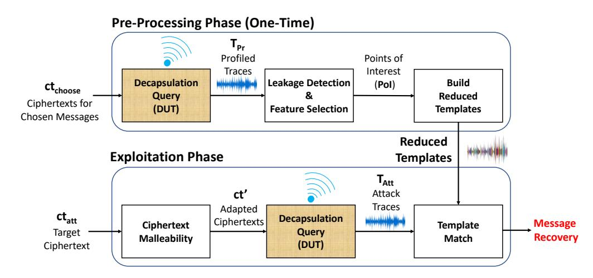

Figure 1: Illustration of our proposed message attacks targeting the IND-CCA secure decapsulation procedure

Contributions: The contributions of this work are manifold:

- 1) (a) We demonstrate the first message recovery attack targeting the *message decoding* operation within the decryption procedure, exploiting a side-channel vulnerability due to bit-wise *incremental storage* of the decrypted message in memory in several IND-CCA secure LWE/LWR-based PKE/KEMs (Sec.IV).
  - (b) We perform experimental validation of our attacks with **only one trace** using the Electromagnetic Emanation (EM) side-channel from optimized implementations of PQC schemes from the *pqm4* public library [15], a testing and benchmarking framework for PQC schemes on the ARM Cortex-M4 microcontroller (**Sec.V**).
- 2) (a) To the best of our knowledge, we identify and exploit the notion of *ciphertext malleability* for LWE/LWR-based PKE/KEMs and propose two specific ways to modify unknown messages in valid ciphertexts: 1 Targeted flipping of message bits and

- 2 Cyclic message rotation (Sec.VI).
- (b) We subsequently exploit the *ciphertext malleability* property to devise a generic attack methodology to target storage of the decrypted message in memory, at any bit width as compared to only bit-wise in the previous attack (Sec.VII).
- (c) Our proposed attacks are applicable to *six* LWE/LWR-based PKE/KEMs that competed in the NIST standardization process Kyber (main finalist), Saber (main finalist), Frodo (alternative finalist) and semi-finalist candidates such as NewHope, Round5 and LAC.
- 3) We also exploit the *ciphertext malleability* property to break well known side-channel countermeasures such as (Sec. VIII):
  - (a) Shuffling countermeasure for the message encoding operation proposed by Amiet *et al.* [14] in PQCrypto'20.
  - (b) Adaptation of the PQCrypto'20 countermeasure to the *message decoding* operation.
  - (c) Masking countermeasures such as that of Oder *et al.* [10] of CHES'18.
- 4) Subsequently, we also propose improvements to the chosen ciphertext based key recovery attacks proposed by Xu et al. [16] which rely upon complete message recovery. While the original attack proposed on Kyber512 required 8 decrypted messages for full key recovery, we improve the requirement to 6 queries and also propose non-trivial extensions of the same attack to LWE/LWR-based schemes such as NewHope (Sec.IX).

#### II. LATTICE PRELIMINARIES

#### A. Notation

We use  $\mathcal{B}^n$  to refer to the space of all byte arrays of length n bytes. We refer to the  $i^{\text{th}}$  byte of  $\mathbf{m} \in \mathcal{B}^n$  as  $\mathbf{m}[i]$ , while the  $j^{\text{th}}$  bit of  $\mathbf{m}$  is denoted as  $\mathbf{m}_j$  and the  $k^{\text{th}}$  bit of  $\mathbf{m}[i]$  as  $\mathbf{m}[i]_k$ . The polynomial ring  $\mathbb{Z}_q(x)/\phi(x)$  is denoted as  $R_q$  where  $\phi(x)$  is its reduction polynomial. Polynomials in  $R_q$  are shown in bold lower case letters and the  $i^{\text{th}}$  coefficient of  $\mathbf{a} \in R_q$  is referred to as  $\mathbf{a}[i]$ . Matrices/vectors in  $\mathbb{Z}_q^{k \times l}$  are shown in bold upper case letters. Multiplication of two polynomials  $\mathbf{a}$  and  $\mathbf{b}$  in  $R_q$  is denoted as  $\mathbf{c} = \mathbf{a} \times \mathbf{b}$ . An element  $\mathbf{x} \in R_q$  sampled from the distribution  $\chi$  with standard deviation  $\sigma$  is denoted as  $\mathbf{x} \leftarrow \chi_{\sigma}(R_q)$ .

#### B. Learning With Errors/Rounding Problem (LWE/LWR)

The security of several lattice-based PKE/KEMs are governed by the well known average-case hard problem known as the Learning With Errors (LWE) problem [17]. A standard LWE instance is denoted as a tuple  $(\mathbf{A}, \mathbf{T}) \in (\mathbb{Z}_q^{k \times \ell} \times \mathbb{Z}_q^{k \times n})$  where  $\mathbf{A} \leftarrow \mathcal{U}(\mathbb{Z}_q^{k \times \ell})$  is a public constant and  $\mathbf{T} = \mathbf{A} \times \mathbf{S} + \mathbf{E}$  where  $\mathbf{S} \in \mathcal{D}_{\sigma}(\mathbb{Z}_q^{\ell \times n})$  is the secret and  $\mathbf{E} \in \mathcal{D}_{\sigma}(\mathbb{Z}_q^{k \times n})$  is the error. There is no known algorithm (classical or quantum) that can solve for  $\mathbf{S}$ 

{2}------------------------------------------------

given polynomially many tuples  $(\mathbf{A}, \mathbf{T})$  [18]. Learning With Rounding (LWR) is a slight variant of the LWE problem where the error component  $\mathbf{E}$  is implicitly generated by rounding the elements of the product  $(\mathbf{A} \times \mathbf{S})$  to a lower modulus p [19].

Frodo [20] is the only scheme that is based on the standard LWE problem while most other schemes are based on the more efficient variants of the LWE/LWR problem known as the Ring-LWE/Ring-LWR (RLWE/RLWR) [18] and Module-LWE/Module-LWR (MLWE/MLWR) problem [21]. These variants involve computation over polynomials in polynomial rings such as  $R_q = \mathbb{Z}_q[x]/(x^n + 1)$  or  $R_q = \mathbb{Z}_q[x]/(x^n - x - 1)$ . Schemes such as NewHope [22], LAC [23] and Round5 [24] are based on the RLWE/RLWR problem which involve computation over polynomials in  $R_q$ , while schemes such as Kyber [25] and Saber [26] are based on the MLWE/MLWR problem which involve computation over small matrices and vectors of polynomials in polynomial rings  $R_q^k$  for k > 1 referred to as modules.

#### Algorithm 1: LPE Encryption Scheme [18]

```
1 Procedure PKE.KeyGen()
2
              \mathbf{a} \in R_q
              \mathbf{s}, \mathbf{e} \leftarrow \chi_{\sigma}(R_q) \in R_q
3
              \mathbf{t} = \mathbf{a} \times \mathbf{s} + \mathbf{e} \in R_q
4
              return pk = (a, t), sk = (s)
5
6
    Procedure PKE.Encrypt(pk, m \in \mathcal{B}^{32}, r \in \mathcal{B}^{32})
1
              \mathbf{s}', \mathbf{e}', \mathbf{e}'' \leftarrow \chi_{\sigma}(R_q)
2
              \mathbf{u} = \mathbf{a} \times \mathbf{s}' + \mathbf{e}'
3
              \mathbf{v}' = \mathbf{t} \times \mathbf{s}' + \mathbf{e}''
4
              \mathbf{x} = \mathsf{Encode}(\mathsf{m})
5
              \mathbf{v} = \mathbf{v}' + \mathbf{x}
6
              return ct = (u, v)
7
8
1 Procedure PKE.Decrypt(ct, sk)
              \mathbf{x}' = (\mathbf{v} - \mathbf{u} \times \mathbf{s}) \in R_q
\mathbf{2}
              \mathsf{m}' = \mathsf{Decode}(\mathbf{x}')
3
4
              return m'
```

#### <span id="page-2-0"></span>C. A Generic Framework for LWE/LWR based PKE/KEMs

Most LWE/LWR-based PKE/KEMs are built upon a generalized paradigm for public key encryption schemes proposed by Lyubashevskey, Peikert and Regev [18] in 2010, now well known as the "LPR Encryption scheme". We provide a high level description of the LPR encryption scheme based on the RLWE problem in Alg. 1, while the same can be adapted to both the standard and module variants of the LWE/LWR problem. We define the procedure Encode which encodes a byte array in  $\mathcal{B}^n$  into a corresponding polynomial in the ring  $R_q$  and the corresponding inverse procedure Decode which maps a polynomial in  $R_q$  into a corresponding byte array in  $\mathcal{B}^n$ .

1) Security in the Chosen-Ciphertext Model: The LPR PKE is provably secure in the Indistinguishability under Adaptive Chosen-Plaintext Attack (IND-CPA) security model. However, an adversary with access to the decrypted message for chosen ciphertexts can recover the long term secret key. Thus, most LWE/LWR-based schemes typically employ the Fujisaki-Okamoto (FO) transform [27] in order

to achieve security in the *Indistinguishability under Adap*tive Chosen-Ciphertext Attack (IND-CCA) security model. The FO transform forms a wrapper around the encryption and decryption procedures using several instantiations of one-way hash functions resulting in IND-CCA secure encapsulation (KEM.Encaps) and decapsulation (KEM.Decaps) procedures respectively, which are shown in Alg.2. The main feature of the FO transform is the recomputation of the ciphertext from the decrypted message through a re-encryption procedure (line 4 in KEM.Decaps). The computed ciphertext  $\mathbf{ct}'$  is subsequently compared with the received ciphertext **ct** (line 5). For an invalid ciphertext, this comparison step will always fail and thus an adversary does not get any information about the decrypted message for maliciously chosen ciphertexts, thereby defeating chosen ciphertext attacks.

D. Tools for Feature Selection in Side-Channel Analysis

### **Algorithm 2:** FO transform of a IND-CPA secure PKE into a IND-CCA secure KEM

```
Procedure KEM.Encaps(pk)
 1
            \rho \leftarrow \mathcal{U}(\mathcal{B}^{32})
 2
            \mathsf{m} = \mathcal{H}(\rho)
 3
            r = \mathcal{G}(m, \mathsf{pk})
 4
5
            ct = PKE.Encrypt(pk, m, r)
            K = \mathcal{H}(r,\mathsf{ct})
 6
            return(ct, K)
 7
 8
    Procedure KEM.Decaps(sk, pk, ct)
 1
            m' = PKE.Decrypt(sk, ct)
 \mathbf{2}
            r' = \mathsf{PRF}(\mathsf{m}', \mathsf{pk})
 3
            \mathsf{ct}' = \mathsf{PKE}.\mathsf{Encrypt}(\mathsf{pk},\mathsf{m}',r')
 4
 5
            if ct' = ct then
                   \mathbf{return}\ K = \mathsf{KDF}(r'\|\mathsf{ct}')
 6
 7
            end
            else
 8
                   return K = \mathsf{KDF}(z \| \mathsf{ct}') \ / / \ z \in \mathcal{B}^{32} is a random secret
 9
10
            end
```

<span id="page-2-1"></span>1) Test Vector Leakage Assessment (TVLA) [28]: TVLA is a popular conformance-based evaluation methodology widely used by both academia and the industry to perform side-channel evaluation of cryptographic implementations. TVLA involves computation of the well known univariate Welch's t-test over two sets of side-channel measurements to identify differentiating features in them. The formulation of TVLA over two sets of measurements  $\mathcal{T}_r$  and  $\mathcal{T}_f$  is given by:

$$\mathsf{TVLA} = \frac{\mu_r - \mu_f}{\sqrt{\frac{\sigma_r^2}{m_r} + \frac{\sigma_f^2}{m_f}}} \ , \tag{1}$$

where  $\mu_r$ ,  $\sigma_r$  and  $m_r$  (resp.  $\mu_r$ ,  $\sigma_r$  and  $m_r$ ) are univariate mean, standard deviation and cardinality of the trace set  $\mathcal{T}_r$  (resp.  $\mathcal{T}_f$ ). The null hypothesis (two means are equal) is rejected with a confidence of 99.999% when the absolute value of the t-test score is greater than 4.5 [28]. A rejected hypothesis implies that the two sets are noticeably different and hence could leak some side-channel information.

{3}------------------------------------------------

*2) Normalized Inter-Class Variance (NICV) [\[28\]](#page-13-27):* While TVLA is used to differentiate between two classes, a more generic metric known as Normalized Inter Class Variance (NICV) can be used to simultaneously differentiate between two or more classes. We assume the variable *X* of interest can be partitioned into *n* classes and let C(*X*) denotes the class of given value of *X*. If the observed leakage of *X* is denoted as T , then NICV can be calculated as follows:

$$NICV = \frac{\sigma^2(\mu(\mathcal{T}|C(X)))}{\sigma^2(\mathcal{T})} , \qquad (2)$$

where *µ*(*x*) and *σ*(*x*) refer to the univariate mean and standard deviation of *x*. It is an univariate ANOVA (ANalysis Of VAriance) F-test, as a ratio between the variance of means of leakage conditioned upon the class and the total leakage variance. There is no definitive threshold for NICV as in the case of TVLA. Thus, higher the value of NICV at a given point, more significant is the difference in leakage between each class.

While both NICV and TVLA have been used is mainly used as a metric for side-channel evaluation, we utilize TVLA as a tool for *feature selection* from side-channel traces [\[29\]](#page-13-28), [\[30\]](#page-13-29).

#### III. Prior Works and Motivation

LWE/LWR-based PKE/KEMs have been subjected to different types of SCA and they can be broadly divided as (1) Key Recovery Attacks and (2) Message Recovery Attacks. However, most works on SCA of LWE/LWRbased PKE/KEMs have focussed on key recovery attacks targeting the long term secret key, while message recovery attacks leading to session key recovery are much less studied.

#### *A. Key Recovery Attacks*

Key recovery attacks on LWE/LWR-based PKE/KEMs can be broadly split into the following two classes.

- *1) Direct Key Recovery:* The first class of attacks work by directly targeting the polynomial/matrix-vector multiplication that manipulates the long term secret key in the decryption procedure. Several attacks have targeted different polynomial multiplication algorithms such as the schoolbook polynomial multiplier [\[31\]](#page-13-30), Number Theoretic Transform (NTT) [\[9\]](#page-13-8), [\[8\]](#page-13-7) and the product-scanning based polynomial multiplier [\[32\]](#page-13-31).
- *2) Message Recovery leading to Key Recovery:* The second class of key-recovery attacks are closely tied to message recovery and work by gaining crucial side-channel information about the decrypted message for *chosen ciphertexts*, which leads to key recovery in several LWE/LWRbased PKE/KEMs. D'Anvers *et al.* [\[33\]](#page-14-0) reported the first such attack on two post-quantum KEMs LAC and RAMSTAKE by extracting binary information about the message through the timing side-channel of error correcting procedures used in decryption. Subsequently, Ravi *et al.* [\[7\]](#page-13-6) proposed generic side-channel assisted chosen ciphertext

attacks on six LWE/LWR-based PKE/KEMs which work by gaining binary information about the message through EM side-channel leakage in error correcting procedures and FO transform, leading to key recovery in a few thousand traces. The aforementioned key recovery attacks worked by using side-channels to instantiate an oracle that provides binary information about the decrypted message for chosen ciphertexts.

More recently, Xu *et al.* [\[16\]](#page-13-15) furthered in the same direction to show that an attacker with complete knowledge of the decrypted message for chosen ciphertexts can perform full key recovery only using 8 decryption queries for Kyber (Kyber512) and the same attack can be extended to other LWE/LWR-based schemes as well. This work highlights the need to protect the message in LWE/LWRbased schemes since any SCA vulnerability that leaks the complete message easily leads to recovery of the long term secret in a handful of decryption queries. This motivates us to analyze the presence of SCA leakage of the message in LWE/LWR-based PKE/KEMs.

#### *B. Message Recovery Attacks*

However, side-channel attacks targeting complete message recovery is much less studied and the *message encoding* operation within the encryption procedure is the only operation that has been analyzed in the context of message recovery. In this respect, Amiet *et al.* [\[14\]](#page-13-13) in PQCrypto 2020 proposed the first single trace template style attack on NewHope KEM targeting the message encoding function. Their attack exploits leakage from a sensitive intermediate variable referred to as the *determiner* which leaks information about single bits of the message. We refer to it as the Determiner-Leakage vulnerability throughout this work. Subsequently, Sim *et al.* [\[13\]](#page-13-12) generalized the attack to target several LWE/LWR-based PKE/KEMs. In the following, we briefly analyze the source of Determiner-Leakage at the micro-architectural level.

#### *C. Analyzing* Determiner*-*Leakage *Vulnerability:*

Referring to the encryption procedure PKE*.*Encrypt in Alg[.1,](#page-2-0) the function Encode maps a given message **m** ∈ B*<sup>r</sup>* (*r* bytes and *n* bits) into a corresponding polynomial **x** ∈ *Rq*. It works by iteratively encoding a given message bit m*<sup>i</sup>* for *i* ∈ [0*, n* − 1] into a corresponding coefficient **x**[*i*] such that **x**[*i*] = *C* · m*<sup>i</sup>* where *C* is the center of the operating integer ring Z*q*.

Schemes such as NewHope and Kyber compute **x**[*i*] = mask &*C* where & is a *bitwise-and* operation and the mask variable takes two possible values (i.e) mask = 0xFFFF if m*<sup>i</sup>* = 1 else mask = 0x0000 otherwise. Though an efficient technique to encode, side-channel leakage from the *bitwiseand* operation with the mask easily leaks the value of mask (0x0000 or 0xFFFF) which inturn reveals the corresponding message bit **m***<sup>i</sup>* , which is referred to as the *determiner* in [\[13\]](#page-13-12). This is however a well known vulnerability that was the main target of a couple of attacks on embedded ECC

{4}------------------------------------------------

implementations [34], [35]. Thus, the same vulnerability within the Encode operation could have been avoided with a little more care. However, schemes such as Saber and Frodo avoid the use of the leaky mask and compute the product  $\mathbf{x}[i] = C \cdot \mathbf{m}_i$  using a simple arithmetic shift operation since C is a power of 2. In these schemes, the determiner mainly arises due to storage of the encoded coefficients  $\mathbf{x}[i]$  (C or 0) of the message polynomial in memory. It is well known that the storage operation leaks the hamming weight (HW) of the stored value [36], [37] (i.e) storage of X leaks HW(X). Thus, an attacker who can distinguish between HW(C) and HW(0) = 0 can recover  $\mathbf{m}_i$  and subsequently the complete message.

#### D. Looking Beyond Determiner-Leakage Vulnerability

The determiner vulnerability is not generic as it does not apply to schemes such as Round5 and LAC. Upon analyzing the implementation of Round5 and LAC, we found that a mere alternate implementation choice for the Encode function seems to unintentionally eliminate the vulnerability. Instead of implementing Encode as a standalone function, implementation of Round5 and LAC compute the message encoding operation with the subsequent polynomial addition operation (line 6) in an interleaved manner. As a result,  $\mathbf{x}[i] = k_d \cdot \mathbf{m}_i$  is computed and immediately added to the corresponding coefficient  $\mathbf{v}[i]$  which is then stored to memory. This eliminates direct storage of  $\mathbf{x}[i]$  in memory thereby eliminated Determiner-Leakage. Alternatively, vectorized computation of multiple coefficients also can be potentially used as a fix which prevents targeting of single coefficients. Thus, we observe that the Determiner-Leakage purely arises due to design choices of the Encode function and could be avoided using fixes at the implementation level.

<span id="page-4-1"></span>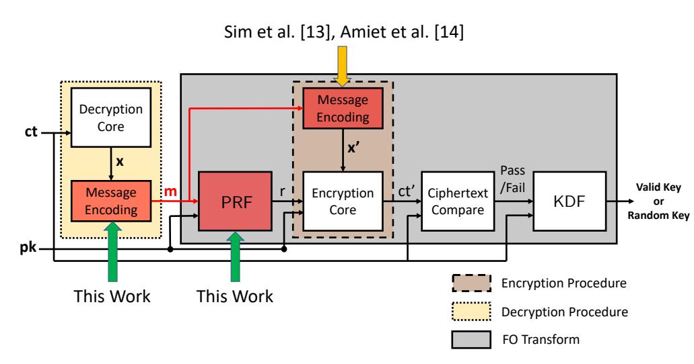

Figure 2: Illustration of our message recovery attacks targeting the IND-CCA secure decapsulation procedure (KEM.Decaps() in Alg.2) of LWE/LWR-based PKE/KEMs

In the following, we demonstrate generic message recovery attacks targeting a more fundamental operation within the decryption procedure (i.e) storage of the decrypted message in memory. This operation cannot be easily avoided as the computed message is typically too long to be retained in registers (i.e) 256 bits or more and hence has to be moved to

memory. This is especially true for embedded RISC based devices which typically contain very few working registers. Furthermore, we exploit inherent algorithmic properties of LWE/LWR-based schemes to adapt our attack to different implementation variants and also break well known side-channel countermeasures such as shuffling and masking. Fig.2 illustrates the target vulnerability presented in the rest of the paper to perform message recovery attack on the IND-CCA secure decapsulation procedure of LWE/LWR-based PKE/KEMs.

## <span id="page-4-0"></span>IV. SIDE-CHANNEL ANALYSIS OF THE MESSAGE DECODING OPERATION

We observe that the secret message in LWE/LWR-based PKE/KEMs is manipulated in a very unique manner compared to conventional PKE/KEMs based on RSA and ECC. The decryption procedure computes the message polynomial  $\mathbf{x}' \in R_q$  from the ciphertext ct (line 2 in PKE.Decrypt of Alg.1). Subsequently, a decoding procedure denoted as Decode (line 3) is used to iteratively map each coefficient  $\mathbf{x}'[i]$  for  $i \in [0, n-1]$  into a corresponding message bit  $\mathbf{m}'_i$ , thereby computing the message one bit at a time. This type of bitwise manipulation at the algorithmic level is not observed in RSA/ECC-based schemes where the message is typically computed as a whole. In the following, we show that this behaviour gives rise to an exploitable side-channel vulnerability within the message decoding function, leading to full message recovery.

#### A. SCA Vulnerability of Message Decoding Operation:

We use Kyber based on the MLWE problem, which is one finalist of the NIST PQC competition, as a representative scheme for illustration, while our analysis applies in the same manner to schemes such as Saber, NewHope, Round5 and LAC unless otherwise specified. Refer Fig.3 for the C code snippet of the message decoding function Decode used in Kyber KEM [25] ( $m \in \mathcal{B}^{32}$ ). Please note that the same implementation is used in the NIST submission as well as within several indepdendently developed PQC libraries such as pqm4 [15] and LibOQS [38].

1) Vulnerability Analysis: The Decode function takes as input  $\mathbf{x} \in R_q$  (n=256 coefficients) and outputs the message  $\mathbf{m} \in \mathcal{B}^{32}$ . The message bytes are first initialized to zero (line 9 in Fig.3). Every coefficient  $\mathbf{x}[k]$  for  $k \in [0, 256]$  with k = (8 \* i + j) is iteratively decoded to bit t (line  $\mathbf{x}$ ) which is then updated in  $\mathbf{m}[i]_j$  (i.e) bit j of byte  $\mathbf{m}[i]$  in memory (line 17). Thus, every byte  $\mathbf{m}[i]$  for  $i \in [0, 31]$  is incrementally updated in memory one bit at a time in 8 iterations of the innermost for loop running over variable j.

We analyze the compiled assembly code to better understand the effect of bitwise manipulation at the microarchitectural level on our target platform (i.e) 32-bit ARM Cortex-M4. We compiled our implementations using the arm-none-eabi-gcc compiler with the highest compiler optimization level -03. Refer to Fig.4 for the compiled

{5}------------------------------------------------

```
1 void Decode ( unsigned char *m , poly * x )
2 {
3 uint16_t t ;
4 int i , j ;
5 poly_csubq ( x ) ;
6 for ( i = 0; i < 32; i ++)
7 {
8 /* init byte m[i] to zero */
9 m [ i ] = 0;
10 for ( j = 0; j < 8; j ++)
11 {
12 k = 8* i + j ;
13 t = (x - > coeffs [ k ]  1) + Q /2;
14 /* Calculate Message Bit */
15 t = ( t / Q ) & 1;
16 /* Bit Update in Memory */
17 m[i] |= t  j;
18 }
19 }
20 }
```

Figure 3: C code snippet of message decoding operation in Kyber KEM

```
1 /* t = (x- > coeffs [n] < <1)+Q/2; in r6 */
2 LDRSH . W r6 , [ r4 , #2]
3 LSLS r6 , r6 , #1
4 ADD . W r6 , r6 , #1664 ; 0 x680
5 /* t = (t/Q) & 1; in r6 */
6 SMULL ip , r7 , r1 , r6
7 ADD r7 , r6
8 ASRS r6 , r6 , #31
9 RSB r6 , r6 , r7 , asr #11
10 AND . W r6 , r6 , #1
11 /* m[i] |= t << j; in r3 */
12 ORR . W r3 , r3 , r6 , lsl #1
13 /* Store updated m[i] in memory */
14 STRB r3, [r2, #0]
```

Figure 4: Assembly code snippet of a single iteration of the message decoding function in Kyber KEM

assembly code for the body of the innermost loop running over variable *j* in the C code of Fig[.3.](#page-5-1) We denote the intermediate value of message byte m[*i*] at the end of the *j th* iteration as m[*i, j*] with *j* ∈ [0*,* 7]. We consider the update of bit m[*i*]*<sup>j</sup>* to the intermediate byte m[*i, j* − 1] in memory for illustration. Register r3 contains the current value (i.e) m[*i, j* − 1] and the decoded bit *t* is computed in register r6 (line 10). Then, r6 is left shifted by *j* positions (in our case, *j* = 1) and subsequently *bitwise-or'red* with r3 to compute the updated message byte m[*i, j*] (line 12). The result in r3 is then stored to memory using the STRB instruction (line 14). The same set of operations is repeated 8 times for every message byte m[*i*] with *i* ∈ [0*,* 31].

*2) Attack Methodology:* Since the power/EM sidechannel leaks the hamming weight (HW) of the stored value, side-channel information from the STRB instruction of every iteration leaks (roughly) the HW of the corresponding intermediate value m[*i, j*]. Recovery of HW(m[*i, j*]) for all *j* ∈ [0*,* 7] can be used to trivially recover m[*i*] in the

following manner. Since m[*i*] starts with a value of zero, HW of the first store m[*i,* 0] is nothing but the first bit m[*i*]0. Subsequently, the other bits m[*i*]*<sup>j</sup>* for *j* ∈ [1*,* 7] can be retrieved using the following rule:

<span id="page-5-3"></span>
$$\mathsf{m}[i]_j = \begin{cases} 0, & \text{if } \mathsf{HW}(\mathsf{m}[i,j]) = \mathsf{HW}(\mathsf{m}[i,j-1]) \\ 1, & \text{if } \mathsf{HW}(\mathsf{m}[i,j]) = \mathsf{HW}(\mathsf{m}[i,j-1]+1) \end{cases} \tag{3}$$

The same procedure can be applied to the other message bytes for full message recovery. Thus, we observe that bitwise computation of the decrypted message leads to an incremental update of message in memory and we refer to this as the Incremental-Storage vulnerability throughout the paper. Thus, an attacker with a perfect HW classifier can recover the full message in a single trace. The same vulnerability/behaviour also exists in the compiled code at all optimization levels (-O0 to -03) of Kyber KEM and we also observe a very similar behaviour in implementations of *four* other schemes - NewHope, Round5, Saber and LAC. We refer the reader to Appendix [B](#page-14-6) for a detailed analysis of the individual schemes.

#### <span id="page-5-0"></span>V. Single Trace Message Recovery Attack

We now demonstrate efficient attack techniques to perform practical single trace message recovery attacks targeting the Incremental-Storage vulnerability in LWE/LWRbased PKE/KEMs.

#### <span id="page-5-4"></span>*A. Adversary Model*

Given a ciphertext ct, the attacker's main motive is to recover the hidden message m. The ciphertext corresponds to a valid PKE/KEM instance between the target device (DUT) and another legitimate device. With the recovered message and the corresponding ciphertext, an attacker can recover the corresponding shared secret/session key as shown in Alg[.2.](#page-2-1) We assume the following attacker capabilities:

- Physical access to DUT performing decapsulation for power/EM measurement.
- Ability to request the DUT to decrypt arbitrary number of chosen ciphertexts.
- No knowledge of secret key of the DUT or any innate knowledge of the underlying implementation such as the source or compiled executable.

While recent works have shown that remote power measurement on embedded devices is possible [\[39\]](#page-14-7),our experiments assume physical access and uses the setup described in the following.

#### *B. Experimental Setup*

The DUT is the STM32F407VG microcontroller housed on the STM32F4DISCOVERY evaluation board. The implementations of the targeted schemes are taken from the well known public *pqm4* library [\[15\]](#page-13-14), a benchmarking and testing framework for PQC schemes on the 32-bit ARM Cortex-M4 microcontroller, which is a NIST recommended

{6}------------------------------------------------

optimization target for embedded software implementations. All our target implementations are clocked at 24 MHz. We use the EM side-channel for our experiments and side-channel measurements/traces were observed using a Langer RF-U 5-2 near-field probe placed on top of the chip and are then collected using a Lecroy 610Zi oscilloscope at a sampling rate of 1.25 GSam/sec, amplified 30dB with a pre-amplifier. Refer Fig[.11](#page-14-8) in Appendix [A](#page-14-9) for our EMbased SCA setup used for our experiments. *We omit results of measurements at 100MSam/sec, which also reported successful attacks. Attack success at these low sampling rate make our work compatible with low-cost platforms like Chipwhisperer.*

For efficient attacks, measured traces are desired to have a high SNR. Some common techniques to boost SNR involve employing high precision EM probes, hardware analog filters, averaging of repeated measurements, advanced digital filtering, trace re-synchronization to remove jitter, averaging etc. The choice of noise reduction technique is completely platform dependent. For all our experiments, we emulate SNR boosting by averaging of side-channel information from repeated experiments.

#### *C. Leakage Detection*

We first validate the presence of side-channel leakage due to the Incremental-Storage vulnerability. We adopt the TVLA metric to perform leakage detection and focus on detecting leakage from the first byte m[0]. We construct two sets of ciphertexts, denoted as CT<sup>0</sup> and CT1. Both sets contain ciphertexts of random messages except that their first message byte is fixed to 0 (m[0] = 0) and 1 (m[0] = 1) respectively. If m[0] = 0, then HW(m[0*, j*]) = 0 ∀ *j* ∈ [0*,* 7], else HW(m[0*, j*]) = 1 ∀ *j* ∈ [0*,* 7] if m[0] = 1. This persistent 1 bit difference in the hamming weight of all eight intermediate updates (i.e) HW(m[0*, j*])∀*j* ∈ [0*,* 7] should be detectable through the EM side-channel.

We collect two sets of *`* = 500 EM side-channel traces corresponding to decapsulation of ciphertexts in sets CT<sup>0</sup> and CT<sup>1</sup> denoted as T<sup>0</sup> and T<sup>1</sup> respectively. We normalize each trace and compute the Welch's *t*-test to identify the differentiating features between the trace sets. Refer Fig[.12\(](#page-14-10)a) for the *t*-test plot for Kyber which shows eight distinct peaks (greater than the pass-fail threshold ±4*.*5) that correspond to the storage of m[0*, j*] for *j* ∈ [0*,* 7]. We repeated the same experiments between *m*[0] = 0 and *m*[0] = 2 and observed 7 distinct peaks since HW(*m*[0*,* 0]) = 0 for both sets (Fig[.12\(](#page-14-10)b)). For validation, we also repeat the same experiments on NewHope which also showed the same behaviour (Refer Fig[.6\(](#page-6-0)a) and Fig[.6\(](#page-6-0)b)), thus confirming our hypothesis of side-channel leakage due to the Incremental-Storage vulnerability. This leakage detection test also helps us precisely identify the narrow time window W*<sup>j</sup>* of every intermediate byte update m[*i, j*] for *j* ∈ [0*,* 7] as shown in Fig[.12](#page-14-10) and Fig[.6.](#page-6-0)

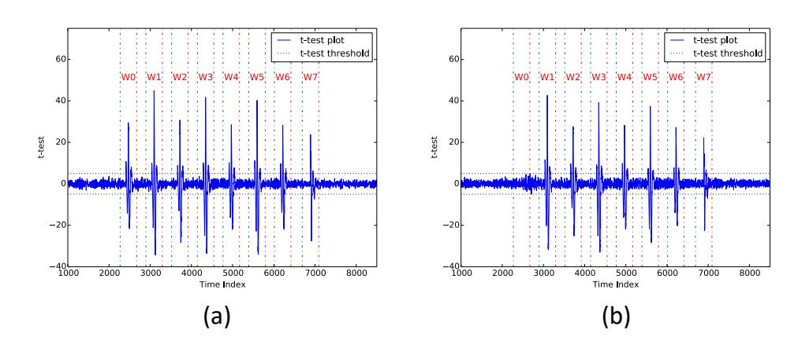

Figure 5: TVLA results for Kyber targeting *m*[0] (a) *m*[0] = 0 and *m*[0] = 1 (b) *m*[0] = 0 and *m*[0] = 2

<span id="page-6-0"></span>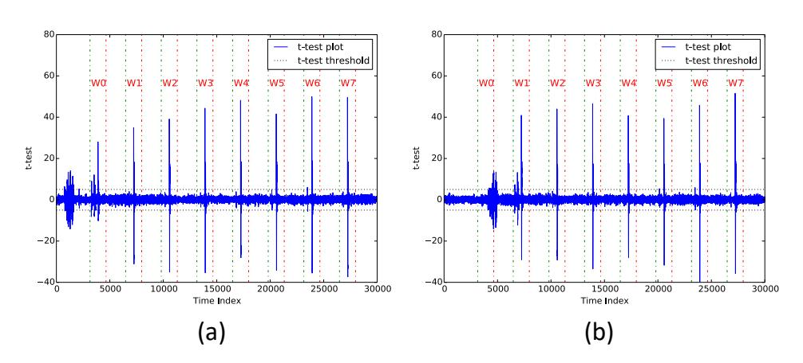

Figure 6: TVLA results for NewHope targeting *m*[0] (a) *m*[0] = 0 and *m*[0] = 1 (b) *m*[0] = 0 and *m*[0] = 2

#### *D. Two Phase Message Recovery Attack*

Our message recovery attack works in two phases - (1) *Pre-Processing* phase and (2) *Exploitation* phase. The attack technique must not be confused with popular profiled attacks which needs complete access to a clone device used for profiling. *In our attack, the pre-processing is done over public information without any knowledge of secret information. Thus, the attacker can directly perform the pre-processing on DUT without a need of clone device. The attack technique also applies in a generic manner to all schemes that exhibit* Incremental*-*Storage *of the decrypted message.*

*1)* Pre-Processing *Phase:* It involves building sidechannel templates for different values of the decrypted message. It is only a one-time process for a given target device since the same templates can be used for multiple attacks. Moroever, the chosen ciphertexts used for profiling can correspond to different public-private key pairs (pk*,*sk) used by the target device since templates are only built for the message.

We individually profile each message byte and profiling byte m[*i*] requires to build HW templates independently for all of its eight intermediate updates (i.e) update of m[*i, j*] for *j* ∈ [0*,* 7]. The first update *m*[*i,* 0] only has two possible HWs (0 and 1). The number of possible HWs increases by one with every iteration, with 9 possible HWs (0 to 8) in the last iteration *j* = 7. Thus, (*j* + 2) HWs (i.e) (0 to *j* + 1) are possible for the update of m[*i, j*]. We focus on building templates for the update of m[*i, j*] in memory.

For each class *k* ∈ [0*, j* + 1], we construct a valid

{7}------------------------------------------------

<span id="page-7-0"></span>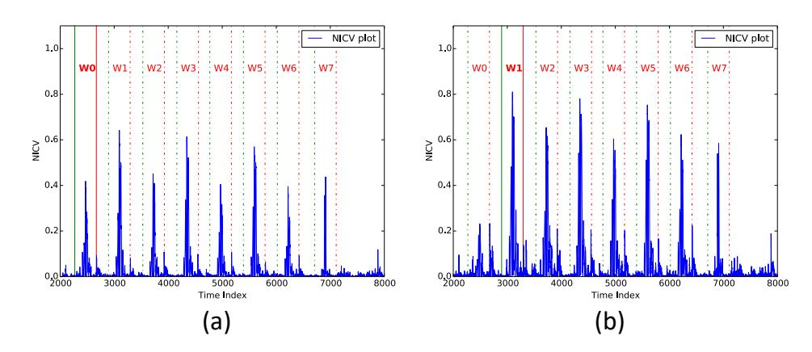

Figure 7: NICV plot for iterations (a) j = 0 and (b) j = 1 for Kyber. The corresponding time windows W0 and W1 have been highlighted in bold.

ciphertext set  $\mathsf{CT}^k_{(i,j)}$  containing  $\ell$  ciphertexts of random messages which satisfy the condition: HW(m[i,j]) = k. The corresponding side-channel traces are denoted as  $\mathcal{T}_{(i,j)}^k$ . We use the well known Normalized Inter Class Variance metric (NICV) [40] to select those features in  $\mathcal{T}_{(i,j)}^k$  for  $k \in [0, j+1]$  that distinguishes the corresponding HW class. We compute NICV over  $\mathcal{T}_{(i,j)}^k$  for  $k \in [0,j+1]$  and select those features within the corresponding window  $W_i$ whose NICV value is above a certain threshold  $Th_{(i,j)}$  as our set of Points of Interest (PoI) denoted as  $\mathcal{P}_{(i,j)}$ .  $Th_{(i,j)}$ for each m|i,j| is a parameter of the experimental setup and is empirically determined. Please refer Fig.7(a)-(b) for the NICV plot for iterations j=0 and j=1 of byte m[0]in Kyber where we can identify clear NICV peaks within their respective time windows  $W_0$  and  $W_1$ . When profiling iteration j, we also observe NICV peaks in time windows of other iterations  $(W_k \neq W_j)$  but they can be ignored.

We now use the selected features  $\mathcal{P}_{(i,j)}$  to build a reduced trace set  $\mathcal{RT}_{(i,j)}^k$  from  $\mathcal{T}_{(i,j)}^k$  and the mean of each reduced trace set  $\mathcal{RT}_{(i,j)}^k$  denoted as  $\mathsf{rt}_{(i,j)}^k$  serves as the reduced template for  $\mathsf{HW}(\mathsf{m}[i,j]) = k$ . Building similar templates for all  $k \in [0,j+1]$  completes the profiling of the update of  $\mathsf{m}[i,j]$ . Similarly, the other iterations  $j \in [0,7]$  of  $\mathsf{m}[i]$  can be profiled in the same manner resulting in a full template set for message byte  $\mathsf{m}[i]$ . For practical measurements, we collected 500 traces each for every 256 possible values of the message byte  $\mathsf{m}[0]$  and used these traces to build all the required profiles for the message byte  $\mathsf{m}[0]$  which amounts to about 128k traces.

Since the message bytes are processed independently, it is possible to simultaneously profile multiple bytes at the same time in the following manner. We create ciphertexts for messages whose alternate bytes (i.e) m[j] for  $j \in \{0, 2, ..., r-1\}$  are fixed to a given value k for  $k \in [0, 256]$  while the remaining bytes are random. This enables to use the same trace set to simultaneously build profiles for half the number of message bytes (r/2). Thus, all message bytes can be profiled only using  $(128 \times 2) = 256k$  traces. Note that the exact number of traces required for profiling is an empirical parameter of the experimental setup.

2) Exploitation *Phase*: The attacker now matches the obtained HW templates with the trace tr obtained from decapsulation of target ciphertext ct to perform message recovery. A given byte  $\mathsf{m}[i]$  can be recovered using the HWs of all of its intermediate updates (i.e)  $\mathsf{HW}(\mathsf{m}[i,j]) \ \forall \ j \in [0,7]$ .

To recover  $\mathsf{HW}(\mathsf{m}[i,j])$ , we build a reduced trace  $\mathsf{tr}'_{(i,j)}$  corresponding to the PoI set  $\mathcal{P}_{(i,j)}$ . We then compute the sum-of-squared difference  $\Gamma_k$  between  $\mathsf{tr}'$  and each reduced template  $\mathsf{rt}^k_{(i,j)}$  for  $k \in [0,j+1]$  as follows:

$$\Gamma^k = (\mathsf{tr'} - \mathsf{rt}^k_{(i,j)})^T \cdot (\mathsf{tr'} - \mathsf{rt}^k_{(i,j)})$$

We then assign  $\mathsf{HW}(\mathsf{m}[i,j]) = k$  based on the smallest value of  $\Gamma^k$  (i.e) reduced template with the least distance from the reduced attack trace. We can similarly recover  $\mathsf{HW}(\mathsf{m}[i,j]) \ \forall \ j \in [0,7]$  leading to recovery of  $\mathsf{m}[i]$  and similarly the full message.

Confidence in HW Classification: The SNR available in the side-channel measurements heavily impacts the success rate of hamming weight classification. We devise a techique to label a given HW classification of HW(m[i,j]) as confident or doubtful in the following manner. We sort the classes in increasing order of  $\Gamma^k$  for  $k \in [0, j+1]$  and let the corresponding ordered set of HW classes be denoted as  $\mathcal{W} = \{HW_k\}$  with  $k \in [0, j+1]$ . We label the classification as confident only if  $\Gamma_{HW_2} \geq (\mathcal{C}_{(i,j)} \cdot \Gamma_{\mathcal{HW}_1})$  else the classification is labelled doubtful. The value of  $\mathcal{C}_{(i,j)}$  for each iteration is a parameter of the experimental setup and is empirically determined. Thus, all the updates whose hamming weight class is labelled as doubtful will need to be brute-forced for message recovery.

We summarize our *pre-processing* and *attack* methodology in the form of an algorithm in Alg.3. The function NICV-Select() refers to NICV-based feature selection. LSQ-Test() refers to the least sum-of-squared difference computation and Recover() refers to retrieval of byte m[i] from  $HW(m[i,j]) \forall j \in [0,7]$ , according to Eqn.3.

3) Experimental Results: We perform experimental validation of our attack on Kyber which serves as an exemplar for Module-LWE/LWR based schemes such as Saber. We additionally validate our attacks on NewHope which serves as an exemplar for Ring-LWE/LWR based schemes such as Round5 and LAC. Fig.8(a)-(b) shows the evolution of success rate against SNR for full message recovery for Kyber. Without SNR enhancement, the success rate stands at 81.25% with a brute-force complexity of  $2^{67}$ , however the success rate quickly ramps to 98.24% with just 5 averaged traces and settles to about 99.5% with a bruteforce complexity of  $2^6$ . As stated earlier, there are a range of techniques which can adopted to boost SNR. We emulate SNR boosting by averaging repeated measurements. Similarly, we also validate our attack on NewHope (Refer Fig.9(a)-(b)) and without SNR enhancement, the success rate stands at 91.25% with a  $2^{24}$  brute-force however the success rate quickly goes to 100% with increase in SNR. An attacker with an optimized attack setup with high SNR can

{8}------------------------------------------------

## **Algorithm 3:** SCA-Assisted Message Recovery Attack

```
1 Procedure Pre-Processing()
            for i = 0 \ to \ r - 1 \ do
 2
                  for j = 0 to 8 do
 3
                         /* Trace Acquisition */
 4
                         for k = 0 to j + 1 do
                              \mathcal{T}_{(i,j)} \iff \mathsf{Decaps}(\mathsf{CT}_{(i,j)});
 5
                          end
 6
                          /* NICV-based Feature Selection */
                         \mathcal{P}_{(i,j)} = \mathsf{NICV-Select}(\mathcal{T}^0_{(i,j)}, \mathcal{T}^1_{(i,j)}, \dots, \mathcal{T}^{(j+1)}_{(i,j)});
 7
                         /* Build Reduced HW templates */
                         for k = 0 to j do
 8
                                \begin{split} \mathcal{RT}^k_{(i,j)} &= \mathcal{T}^k_{(i,j)}(\mathcal{P}_{(i,j)});\\ rt^k_{(i,j)} &= \mathsf{Mean}(\mathcal{RT}^k_{(i,j)}); \end{split}
 9
10
11
                          end
12
                   end
           end
13
    Procedure Attack (rt^*_{(i,j)}, \mathcal{P}_{(i,j)} \text{ for } i \in [0,r-1] \text{ and } j \in [0,7])
1
            for i = 0 to r - 1 do
 2
                  for j = 0 to 8 do
 3
                          /* Build Reduced trace */
                         tr' = tr(\mathcal{P}_{(i,j)});
 4
                          /* LSQ-Test with Reduced HW templates */
                         for k = 0 \ to \ j + 1 \ do
 5
                               \Gamma[k] = \mathsf{LSQ}\text{-}\mathsf{Test}(tr', rt_{(i,j)}^k);
  6
                         end
 7
                          /* Class Assignment based on LSQ-test */
                         k_* = \operatorname{argmin}(\Gamma);
 8
                         \mathsf{HW}(\mathsf{m}_{(i,j)}) = k_*;
 9
                   end
10
                  /* Recover m[i] using HW progression */
                  \mathbf{m}[i] = \mathsf{Recover}(\mathsf{HW}(\mathsf{m}_{(i,0)}), \mathsf{HW}(\mathsf{m}_{(i,1)}), \ldots, \mathsf{HW}(\mathsf{m}_{(i,7)}));
11
           end
12
```

<span id="page-8-2"></span><span id="page-8-1"></span>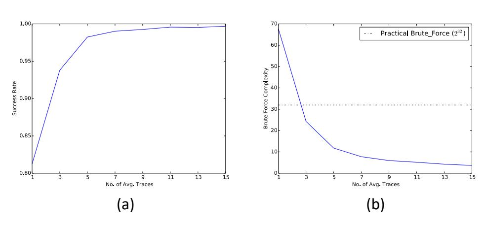

Figure 8: Success rate and Brute Force Complexity for full message recovery against SNR for Kyber

<span id="page-8-3"></span>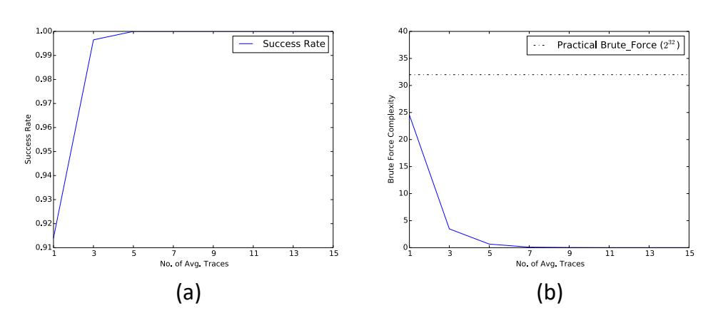

Figure 9: Success rate and Brute Force Complexity for full message recovery against SNR for NewHope

perform full message recovery in a single trace. Thus, a sidechannel based HW classifier can be efficiently used to target the Incremental-Storage of decrypted message to perform full message recovery in LWE/LWR-based schemes.

## <span id="page-8-0"></span>VI. CIPHERTEXT MALLEABILITY IN LWE/LWR-BASED PKE/KEMS

In this section, we identify two novel ciphertext malleability properties for LWE/LWR-based PKEs which can serve as a crucial tool for a side-channel attacker to perform generic message recovery attacks. Given a ciphertext  $\mathbf{ct}$  for an unknown message  $\mathbf{m}$ , it is possible to construct adapted ciphertexts  $(\mathbf{ct'})$  from  $\mathbf{ct}$ , that decrypt to deterministic variants  $\mathbf{m'}$  of the original message  $\mathbf{m}$ . We identified two ways to manipulate unknown messages hidden in target ciphertexts - (1) Targeted flip of message bits and (2) Cyclic message rotation.

1) Targeted Flip of Message Bits: Referring to the encryption procedure PKE.Encrypt in Alg.1, the encoded message polynomial  $\mathbf{x}$  is simply added to a pseudorandom LWE instance  $\mathbf{v}'$ , which is subsequently output as the ciphertext component v (line 6). Thus, the message polynomial is only additively hidden within the ciphertext  $\mathbf{v}$  (i.e)  $\mathbf{v}[i] = \mathbf{x}[i] + \mathbf{v}'[i]$  for  $i \in [0, n-1]$ . Moreover,  $\mathbf{x}[i]$  can only take two values (i.e)  $\mathbf{x}[i] = C$  (center of the integer ring  $\mathbb{Z}_q$ ) if the corresponding bit  $\mathbf{m}_i = 1$ , else  $\mathbf{x}[i] = 0$  otherwise. We also observe that the decryption procedure PKE.Decrypt extracts a noisy version of the message polynomial by simply subtracting the pseudorandom LWE instance  $\mathbf{v}'$  from  $\mathbf{v}$  (line 2). Thus in essence, there is no mixing/interaction between the different coefficients  $\mathbf{x}[i]$  of the encoded message polynomial  $\mathbf{x}$ . This type of scalar behaviour in handling the message within LWE/LWR-based PKE/KEMs is very different compared to classical RSA and ECC-based schemes and enables to target individual bits of the message.

Thus, a given bit  $\mathbf{m}_i$  can be flipped  $(1 \rightarrow 0 \text{ or }$  $0 \to 1$ ) by simply subtracting C from the corresponding ciphertext coefficient  $\mathbf{v}[i]$ . While schemes such as Kyber, Saber, Round5 and LAC encode a given bit into a single coefficient, we observe that NewHope and Frodo adopt slightly modified approaches in the encoding/decoding operation. NewHope redundantly encodes a single bit  $\mathsf{m}_i$  into multiple coefficients to reduce decryption failure rate (i.e) two coefficients  $\mathbf{x}[i+w]$  with  $w \in \{0,256\}$  in case of NewHope512 and four coefficients  $\mathbf{x}[i+w]$  with  $w \in \{0, 256, 512, 768\}$  in case of NewHope1024. In this case,  $m_i$  can be flipped by subtracting C from all the corresponding coefficients  $\mathbf{v}[i+w]$ . Frodo on the other hand encodes multiple bits into a single element in  $\mathbb{Z}_q$  and the number of encoded bits depends upon the parameter set. However, we observe that the bit flipping property also holds true for Frodo and we refer the reader to Appendix D for a detailed explanation.

Since all the message bits are handled independently, it is possible to simultaneously flip any number of bits of the message  $\mathbf{m}$  by subtracting C from the corresponding coefficients of  $\mathbf{v}$ . We can thus build ciphertexts  $\mathbf{ct'}$  which decrypts to a modified message  $\mathbf{m'}$  whose targeted bits are flipped compared to the original message  $\mathbf{m}$ . We denote

{9}------------------------------------------------

 $\mathsf{m}_i' = \mathsf{Flip}(m,i)$  whose  $i^{th}$  bit has been flipped compared to  $\mathsf{m}$  and the corresponding ciphertext is denoted as  $\mathsf{ct}_i' = \mathsf{Flip}(ct,i)$ . This is very similar to the malleability property of Cipher block chaining (CBC) mode of operation for block ciphers that allows to selectively flip single bits of the decrypted plaintext [41]. We refer to this as the Bit-Flip property of LWE/LWR-based PKE/KEMs throughout this paper.

2) Cyclic Rotation: MessageSeveral efficient LWE/LWR-based PKE/KEMs including the schemes covered in this work operate over polynomials in rings  $\mathbb{R}_q$ modulo special cyclotomic polynomials, denoted as cyclic and anti-cyclic polynomial rings. Multiplication in these polynomial rings possess special rotational properties and hence the name. In schemes operating over such rings, we identify that it is possible to construct adapted ciphertexts ct' from ct which decrypt to cyclic rotations of the original message m. We denote the message rotated by i positions as m' = Rotr(m, i) for  $i \in [0, n-1]$ . We refer to it as the Rotate-Message property throughout this paper. We do not utilize this property to aid the message recovery attacks reported in this work, but we speculate that this could potentially be used to aid possible message recovery attacks in the future. We refer the reader to a detailed explanation of the Rotate-Message property in Appendix С.

## <span id="page-9-0"></span>VII. GENERIC MESSAGE RECOVERY ATTACKS FOR LWE/LWR-BASED PKE/KEMS

In this section, we demonstrate efficient exploitation of ciphertext mall eability as a powerful tool to perform generic message recovery attacks targeting different implementation variants of message storage in LWE/LWR-based PKE/KEMs.

#### A. Eliminating the Incremental-Storage Vulnerability

As shown in Sec.V, bitwise manipulation of the decrypted message manifests as an Incremental-Storage vulnerability at the implementation level leading to efficient message recovery. We attempt to propose an implementation fix to eliminate the Incremental-Storage vulnerability. Referring to Fig.13 for the C code snippet of the message decoding function, we observe that the message bit is directly updated within m[i] in memory, resulting in a store in each iteration (line 17). Instead, the message byte m[i] can simply be accumulated in a temporary variable temp over eight iterations (i.e)  $temp|=t \ll j$  in line 17. Subsequently, the temp variable can be pushed to m[i] after the innermost for loop over variable j (i.e) once every eight iterations.

We compiled the modified implementation and observed that the message bits are now aggregated in *registers* and only the fully updated message byte is stored in memory once every eight iterations, thereby eliminating the intermediate stores. Note that this was not automatically done by the compiler even at the highest optimization level (03). We refer to this as the Bytewise-Storage style of the decrypted message in this paper. Though this seems to defeat our single trace message recovery attack, we demonstrate that ciphertext malleability can be effectively used to perform full message recovery over the improved implementation.

#### B. Exploiting Ciphertext Malleability for Message Recovery

Firstly, we observe that the modified implementation still stores all message bytes m[i] for  $i \in [0, r-1]$  in memory. Thus, we can use our side-channel HW classifier to recover the hamming weight of all message bytes (i.e) HW(m[i]) for  $i \in [0, m-1]$ . We exploit the Bit-Flip property to construct  $\mathbf{ct'} = Flip(\mathbf{ct}, 0)$ ) which decrypts to m' = Flip(m, 0)) (i.e) flip bit  $m_0$ . We then query the target device to decrypt  $\mathbf{ct'}$  and recover HW(m'[0]). Flipping  $m_0$  will create a perturbation in HW(m[0]) and bit  $m_0$  can be recovered as follows:

$$\mathbf{m}_{0} = \begin{cases} 0, & \text{if } \mathsf{HW}(\mathsf{m}'[0]) = \mathsf{HW}(\mathsf{m}[0]) + 1\\ 1, & \text{if } \mathsf{HW}(\mathsf{m}'[0]) = \mathsf{HW}(\mathsf{m}[0]) - 1 \end{cases} \tag{4}$$

In a similar manner, we can construct ciphertexts to separately flip other bits of m[0] and fully recovery m[0] one bit at a time. Since all message bytes are stored iteratively, it is possible to simultanouesly flip one bit in each byte m[i] for  $i \in [0, r-1]$  and recover these r bits in a single decapsulation query/trace. Thus, complete message recovery is possible only using 8 adapted ciphertext queries and 1 original ciphertext query. While our attack on the Incremental — Storage implementation only required a single trace (provided enough SNR), our attack on the Bytewise-Storage requires 9 traces for full message recovery.

It is straightforward to see that the aforementioned attack methodology exploiting malleability can be used to target storage of the decrypted message in memory of any width (i.e) bytewise (8-bits), half-wordwise (16-bits) or wordwise (32-bits). In the presence of a side-channel HW classifier, full message recovery can be performed in (w+1) traces where w is the storage width. This makes our attack applicable not only to the message decoding operation, but to any other operation that involves storage of the decrypted message in memory.

1) Targeting Other Operations: In this respect, we analyze the IND-CCA secure decapsulation procedure to identify other operations that manipulate the decrypted message (procedure KEM.Decaps in Alg.2). We observe that the decrypted message is appended to the public key and passed to a Pseudo Random Function (PRF), immediately after decryption (line 3). The PRF is implemented in several schemes using the well known Keccak permutation and we identified an internal operation in the KeccakAbsorb function that copied the decrypted message from one memory location to another, 32-bits at a time.

We used the same t-test based leakage detection approach to confirm leakage from HW storage of the decrypted words and for illustration, we focus on leakage from the first word denoted as  $m[0 \rightarrow 3]$ . Please refer

{10}------------------------------------------------

<span id="page-10-1"></span>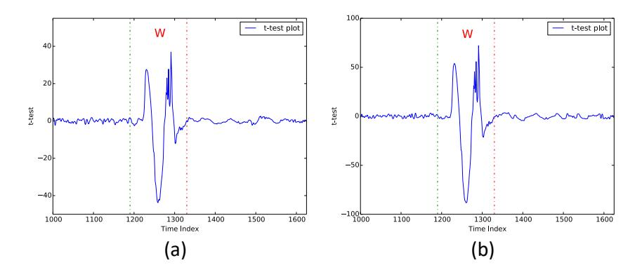

Figure 10: TVLA results for Kyber KEM (Kyber512) to distinguish HW(m[0 → 3]) between HW classes (a) HW = 1 and HW = 2 and (b) HW = 1 and HW = 3

Fig[.10\(](#page-10-1)a) for the *t*-test plot computed between two sets of *`* = 500 traces each corresponding to HW(m[0 → 3]) = 1 and HW(m[0 → 3]) = 2, which shows a single *t*-test peak well beyond the *t*-test threshold. Similarly, the *t*-test plot between HW(m[0 → 3]) = 1 and HW(m[0 → 3]) = 3 in Fig[.10\(](#page-10-1)b) shows a higher peak at the same time instance due to a larger difference in hamming weight, thus concretely proving presence of HW leakage, which can also be exploited in a similar manner.

In a nutshell, the proposed generic message recovery attacks show that any leakage related to storing of the message (bit-wise or otherwise) can be exploited. The earlier attacks of [\[13\]](#page-13-12), [\[14\]](#page-13-13) targeting encoded message storage can thus be considered to specific instances of our generic message recovery attacks.

#### <span id="page-10-0"></span>VIII. Attacking Protected Implementations

Shuffling and masking are two well known countermeasures used to protect against side-channel analysis [\[42\]](#page-14-14), [\[43\]](#page-14-15). In this section, we show that ciphertext malleability can yet again be used as an effective tool to break implementations of LWE/LWR-based PKE/KEMs protected with the aforementioned countermeasures.

*Attack Assumption:* We make an additional attack assumption along with the attacker capabilities stated in the adversary model in Sec[.V-A.](#page-5-4) The *pre-processing* phase requires to build HW templates using decapsulation queries for known messages. However, both shuffling and masking countermeasures randomly modify the processed message, thereby disabling the attacker from building HW templates. Hence, for attacks on protected implementation, we assume the presence of a clone device, in which the attacker can turn off or deactivate the countermeasure to build the required HW templates. This is a common assumption used often in profiled attacks [\[44\]](#page-14-16).

#### *A. Attacking the Shuffling Countermeasure*

Shuffling the order of processing of message bits was proposed as a concrete countermeasure by Amiet *et al.* [\[14\]](#page-13-13) in PQCrypto'20 as well as Sim *et al.* [\[13\]](#page-13-12), to protect against single trace attacks targeting Determiner-Leakage in the message encoding operation [\[13\]](#page-13-12), [\[14\]](#page-13-13), which we denote as the Shuffled-Determiner-Leakage in this work. While shuffling is also applicable for storage of the decrypted

message in memory, we demonstrate efficient utilization of ciphertext malleability to propose the first concrete attack on the shuffling countermeasure for full message recovery.

<span id="page-10-2"></span>*1) Breaking PQCrypto'20 Countermeasure for Message Encoding:* We target the message encoding operation of the re-encryption procedure in IND-CCA secure decapsulation (line 4 in KEM*.*Decaps of Alg[.2\)](#page-2-1). Shuffling does not remove the source of Determiner-Leakage and hence a side-channel attacker targeting Determiner-Leakage can still recover all the bits m*<sup>i</sup>* for *i* ∈ [0*, n* − 1] but not its correct ordering, thus preventing message recovery. However, we observe that it is possible to compute the hamming weight of m (i.e) HW(m) even without knowledge of the shuffling order. In simpler terms, shuffling does not modify the count of 1s/0s in the message and hence does not have any effect on its hamming weight.

We can thus exploit the Bit-Flip property to construct ct<sup>0</sup> = *Flip*(ct*, i*) which decrypts to m<sup>0</sup> = Flip(m*, i*) (i.e) flip bit m*<sup>i</sup>* . We query the target device to decapsulate ct<sup>0</sup> and recover the modified hamming weight HW(m<sup>0</sup> ). Subsequently, the message bit m*<sup>i</sup>* can be recovered as follows:

<span id="page-10-3"></span>
$$\mathbf{m}_{i} = \begin{cases} 0, & \text{if } \mathsf{HW}(\mathsf{m}') = \mathsf{HW}(\mathsf{m}) + 1\\ 1, & \text{if } \mathsf{HW}(\mathsf{m}') = \mathsf{HW}(\mathsf{m}) - 1 \end{cases}$$
 (5)

In the same way, we can construct ciphertexts to flip other bits of the message to recover the full message in (*n* + 1) traces (*n* adapted ciphertexts queries and 1 target ciphertext query).

- *2) Breaking PQCrypto'20 Countermeasure for Message Decoding:* We now demonstrate novel attacks to break the shuffling countermeasure for the message decoding operation. We consider two implementation variants - (1) Shuffled-Incremental-Storage and (2) Shuffled-Bytewise-Storage.
- a) *Attacking* Shuffled*-*Incremental*-*Storage*:* To recall, our attack targeting Incremental-Storage works by recovering HW(m[*i, j*]) ∀*j* ∈ [0*,* 7] for every message byte m[*i*] ∀ *i* ∈ [0*, r*−1], resulting in full message recovery in a single trace. Shuffling the order of processing of message bits does not remove the source of leakage and hence an attacker can still recover the hamming weight of all intermediate byte updates albeit without the correct ordering. However, we exploit the Bit\_Flip property to perform message recovery one bit at a time in the following manner.

We observe that a single bit flip will create a slight bias in the average hamming weight of the intermediate byte updates observed across several executions. From decapsulation of ct, we compute the average hamming weight of all shuffled intermediate byte updates, denoted as *hwavg*. Similarly, we retrieve *hwavg* for *`* such executions which together form the set HW*avg*(m). We repeat the same experiments for an adapted ciphertext ct<sup>0</sup> = Flip(ct*, i*) which decrypts to m<sup>0</sup> = Flip(m*, i*) (i.e) flip bit m*<sup>i</sup>* . Let the resulting set of average hamming weights be denoted as HW*avg*(m<sup>0</sup> ). If m*<sup>i</sup>* = 1, then the mean of set HW*avg*(m) 

{11}------------------------------------------------

should be higher than that of set HW*avg*(m<sup>0</sup> ) since m<sup>0</sup> *<sup>i</sup>* = 0 and vice versa for m*<sup>i</sup>* = 0. We use the *t*-test score (denoted as D) to distinguish the mean of the two sets and recover m*<sup>i</sup>* as follows:

$$\mathsf{m}_i = \begin{cases} 0, & \text{if } \mathcal{D} > +4.5\\ 1, & \text{if } \mathcal{D} < -4.5 \end{cases} \tag{6}$$

We performed attack simulations over Kyber and NewHope whose message size is 256 bits and we empirically observed that about *`* = 1500 observations are required to recover a single message bit with a 100% success rate. This amounts to a total of 1500 × 256 + (1500) = 385*.*5*k* traces for full message recovery targeting Shuffled-Incremental-Storage, while its unprotected variant could be broken in a single trace.

b) *Attacking Shuffled* Shuffled*-*Bytewise*-*Storage*:* Even if the order of storage of the message bytes are randomized, we observe that it is possible to retrieve hamming weight of the full message m by simply summing the hamming weights of all shuffled byte updates in a single execution. Thus, we can perform message recovery in a very similar manner to our attack on the shuffled message encoding operation (Sec[.VIII-A1\)](#page-10-2). We first recover HW(m) from decapsulation of the target ciphertext ct. We then query the adapted ciphertext ct<sup>0</sup> = Flip(ct*, i*) which decrypts to m<sup>0</sup> = Flip(m*, i*), to recover HW(m<sup>0</sup> ). The perturbation in HW due to flip of m*<sup>i</sup>* can be used to recover m*<sup>i</sup>* as in Eqn[.5.](#page-10-3) Thus, full message recovery (*n* bits) can be done in only (*n* + 1) side-channel traces. Please note that this attack also applies in the same manner to other operations which shuffle the storage of the decrypted message in memory (irrespective of storage width).

#### *B. Attacking the Masking Countermeasure*

In the following, we assess the impact of masking countermeasures for protection against message recovery attacks in LWE/LWR-based PKE/KEMs. There have been several masking schemes proposed for LWE/LWR-based PKE/KEMs [\[10\]](#page-13-9), [\[45\]](#page-14-17), [\[46\]](#page-14-18) and almost all schemes work by additively splitting the long term secret key **s** into two random shares **s1**, **s2** which are processed individually in each execution such that **s** = **s1** + **s2**. Subsequently, the resulting decrypted message m is also processed as two random shares m1 and m2 such that m = m1 ⊕ m2 where ⊕ is the *bitwise-xor* operation.

While masking is effective against DPA style attacks that work over multiple traces, they do not protect against single trace attacks since both shares can be attacked individually to recover the masked variable. Thus, the masking countermeasure is not effective against the single trace attacks targeting the Determiner-Leakage vulnerability [\[14\]](#page-13-13), [\[13\]](#page-13-12) as well as our proposed single trace attacks targeting Incremental-Storage of the decrypted message (Sec[.V\)](#page-5-0). However, our message recovery attack targeting the Bytewise-Storage of the message is not a single trace attack

<span id="page-11-1"></span>Table I: Number of traces required for full message recovery across different implementation variants of the storage of decrypted message in memory. The numbers are reported for messages of length 256 bits and assuming a perfect single trace side-channel HW classifier

| Vulnerability                            | No. of Traces |  |  |
|------------------------------------------|---------------|--|--|
| No Protection                            |               |  |  |
| Determiner-Leakage [13], [14]            | 1             |  |  |
| Incremental-Storage [This work]          | 1             |  |  |
| Bytewise-Storage [This work]             | 9             |  |  |
| Wordwise-Storage [This work]             | 33            |  |  |
| Shuffling Countermeasure                 |               |  |  |
| Shuffled-Determiner-Leakage [This work]  | 257           |  |  |
| Shuffled-Incremental-Storage [This work] | 385, 500      |  |  |
| Shuffled-Bytewise-Storage [This work]    | 257           |  |  |
| Masking Countermeasure                   |               |  |  |
| Masked-Determiner-Leakage [This work]    | 1             |  |  |
| Masked-Incremental-Storage [This work]   | 1             |  |  |
| Masked-Bytewise-Storage [This work]      | 1100          |  |  |

(requires 8 traces) and hence breaking the Masked-Bytewise-Storage is not trivial. We yet again demonstrate use of ciphertext malleability to perform full message recovery, one bit at a time. We focus on recovery of the first bit m0.

In the presence of Masked-Bytewise-Storage, we can recover hamming weight of the first byte of both shares (i.e) HW(m1[0]) and HW(m2[0]), which we denote as the ordered pair (*v*1*, v*2) for simplicity. We observe that the set of possible values of (*v*1*, v*2) for a given m[0] = *k* uniquely identifies HW(*k*) and this is due to linearity of the *bitwise-xor* operation. Thus, we can obtain enough ordered pairs (*v*1*, v*2) from several decapsulations of the target ciphertext ct to uniquely determine HW(m[0]). We then repeat the same for the adapted ciphertext ct<sup>0</sup> = Flip(ct*,* 0) that decrypts to m<sup>0</sup> = Flip(m*,* 0) (i.e) flip m0, to determine HW(m<sup>0</sup> [0]). Perturbation in the hamming weight of m[0] can help recover bit m<sup>0</sup> based on the same rule as in Eqn[.5.](#page-10-3) We performed attack simulations over both NewHope and Kyber (*n* = 256) and obtained 100% success rate with an average trace requirement of about 1100 traces for full message recovery.

We summarize the trace requirement of our attacks over different implementation variants of storage of the decrypted message in memory in Tab[.I.](#page-11-1)

#### <span id="page-11-0"></span>IX. Key Recovery From Recovered Messages

While message recovery leads to trivial recovery of the session key, message recovery for specially structured chosen ciphertexts also leads to recovery of the long term secret key in LWE/LWR-based PKE/KEMs [\[7\]](#page-13-6). Recently, Xu *et al.* [\[33\]](#page-14-0) demonstrated full key recovery in Kyber512 with the knowledge of just *eight* decrypted messages for specially crafted ciphertexts. This work brought to light the serious impact of full message recovery, easily leading to long term secret key recovery in LWE/LWR-based schemes. However, their proposed technique does not trivially extend to schemes like NewHope which adopts redundancy in the message encoding/decoding operation. In this section, we propose improvements to the key recovery attack of Xu

{12}------------------------------------------------

et al. [16] and also propose generic extensions to schemes such as NewHope.

#### A. Constructing Chosen Ciphertexts:

We first explain the attack of Xu et al. [16], assuming operation over polynomials in  $R_q$  (RLWE). Given ciphertext  $ct = (\mathbf{u}, \mathbf{v}) \in (R_q \times R_q)$ , the decryption procedure computes  $\mathbf{x} = (\mathbf{v} - \mathbf{w})$  where  $\mathbf{w} = \mathbf{u} \cdot \mathbf{s}$ , which is then decoded to m. The attacker chooses  $\mathbf{u} = k_u$  and  $\mathbf{v} = (k_v \cdot \sum_{i=0}^{n-1} x^i)$  with  $(k_u, k_v) \in (\mathbb{Z}_q \times \mathbb{Z}_q)$  which results in

$$\mathbf{m}_i = \mathsf{Decode}(k_v - k_u \cdot \mathbf{s}[i]) \tag{7}$$

$$= \mathcal{F}(k_u, k_v, \mathbf{s}[i]) \tag{8}$$

Thus, message bit  $\mathbf{m}_i$  only depends upon  $\mathbf{s}[i]$  and an attacker can choose values for  $(k_u, k_v)$  which distinguish every candidate of  $\mathbf{s}[i]$  based on the corresponding values of  $\mathbf{m}_i$ . To search for tuples  $(k_u, k_v)$ , Xu et al. [16] fix the value of  $k_v$  and exhaustively vary  $k_u$  over [0, q-1] to compute  $\mathbf{m}_i$  for all candidates of  $\mathbf{s}[i]$ . They use the responses to build a One-versus-the-Rest (OvR) classifier [47] for each candidate, resulting in four ciphertexts to uniquely identify 5 candidates for  $\mathbf{s}[i] \in [-2, 2]$ . All coefficients of  $\mathbf{s}$  can be recovered simultaneously and the secret key of Kyber512 has two polynomials, thus resulting in full key recovery in eight queries.

An OvR classifier for n = 5 candidates requires (n-1) = 4 queries for classification while adopting a binary decision tree approach only requires  $Q = \lceil log_2(n) \rceil$  queries, provided all possible  $2^n$  set of responses for  $\mathbf{m}_i$  exist. Unlike Xu et al. [16], we thus propose to perform a randomized search for  $(k_u, k_v)$  to yield a unique response for each candidate in just  $\log_2(n)$  queries. Please refer Tab.II for the decision table which optimally yields  $\mathbf{s}[i]$  only using three queries, resulting in full key recovery in just six traces for Kyber512.

<span id="page-12-0"></span>Table II: Chosen values of  $(k_{\mathbf{u}}, k_{\mathbf{v}})$  that uniquely identify  $\mathbf{s}[i]$  based on  $\mathbf{m}_i$  for Kyber512. While  $\mathbf{O}$  refers to the case of m' = 0,  $\mathbf{X}$  refers to m' = 1.

| _             | $m_i = 0 \; (\mathbf{O})/m_i = 1 \; (\mathbf{X})$ $(k_{\mathbf{u}}, k_{\mathbf{v}})$ |              |              |
|---------------|--------------------------------------------------------------------------------------|--------------|--------------|
| Secret Coeff. |                                                                                      |              |              |
| _             | (211, 416)                                                                           | (627, 1248)  | (1252, 0)    |
| -2            | O                                                                                    | О            | О            |
| -1            | Ο                                                                                    | О            | $\mathbf{X}$ |
| 0             | Ο                                                                                    | $\mathbf{X}$ | Ο            |
| 1             | Ο                                                                                    | $\mathbf{X}$ | $\mathbf{X}$ |
| 2             | $\mathbf{X}$                                                                         | O            | Ο            |

While this technique easily applies to schemes with a small error span, extension to schemes such as NewHope encounters two challenges: (1) Wide Error distribution:  $\mathbf{s}[i] \in [-8,8]$  with 17 candidates and (2) Redundant Encoding: NewHope512 and NewHope1024 encode a single bit into two and four coefficients respectively. For brevity, we use NewHope512 for analysis, while the same can also extended to NewHope1024. Each bit  $\mathbf{m}_i$  for  $i \in [0, n/2 - 1]$  in NewHope512 is encoded to  $\mathbf{x}[i+w]$  for  $w \in \{0, n/2\}$ . We

propose to choose  $\mathbf{v} = (k_{v1} \cdot \sum_{i=0}^{n/2-1} x^i) + (k_{v2} \cdot \sum_{i=n/2}^{n-1} x^i),$  which results in

$$\mathbf{m}_i = \mathsf{Decode}(k_{v1} - k_u \cdot \mathbf{s}[i], k_{v2} - k_u \cdot \mathbf{s}[i + n/2]) \qquad (9)$$

$$= \mathcal{F}(k_u, k_{v1}, k_{v2}, \mathbf{s}[i], \mathbf{s}[i+n/2]) \tag{10}$$

Thus,  $m_i$  depends upon the pair (s[i], s[i+n/2]), which need to be distinguished together, thus increasing the number of candidates to  $17^2 = 289$ . Similarly for NewHope1024,  $m_i$  depends upon four coefficients ( $\mathbf{s}[i+w\cdot n/4]$  with  $w \in [0,3]$ , thus increasing the number of candidates to  $17^4 = 83521$ . Given the large number of candidates to distinguish, we adopt a two-staged approach similar to that of Ravi et al. [7]. For Stage - 1, we perform a randomized search for a fixed number of  $Q_1$  tuples  $(k_u, k_{v1}, k_{v2})$  which can minimize the possible candidates for  $\mathbf{s}[i]$  as much as possible, in  $Q_1$  queries. For  $\mathsf{Stage} - 2$ , we pre-compute tuples to uniquely resolve the conflict between the remaining candidates for  $\mathbf{s}|i|$  using a knock-out tournament style One-versus-One (OvO) approach [47]. We refer the reader to [7] for a detailed explanation of the two-stage approach.

Experimental Results: We performed attack simulations to validate key recovery attacks on NewHope and assume knowledge of complete decrypted message. For NewHope512, full key recovery with 100% success rate needs only 20 Stage-1 queries. For NewHope1024, we adopt the two stage approach with  $Q_1 = 20$  queries in Stage-1 and an average of  $Q_2 \approx 150$  queries in Stage – 2, thus an average of  $Q \approx 170$  queries for full key recovery with 100% success rate.

#### X. Countermeasures

Based on the range of attacks presented earlier, we discuss few mitigation technques here.

- Random Jitter: Introducing jitter adds horizontal noise and disturbs alignment of PoI across measurements. Thus, it increases the attack effort. However, a stronger adversary can adopt re-alignment techniques [48] to boost the SNR.
- Combined Masking and Shuffling: While individual shuffling and masking countermeasures were shown to be vulnerable, a combination of masking and shuffling would increase the trace requirement for the attack. However, a concrete analysis require further investigation and out of scope of this work.
- Key Refreshment Rate: An ephemeral key setting will limit the attacker to only one trace. Combining this with jitter, shuffling and masking can make single trace attacks infeasible. Even in case the key is used for multiple runs, the refresh rate must be upper bounded by no. of runs in Tab.I.

#### XI. CONCLUSION

This work demonstrates generic side-channel assisted message recovery attacks over LWE/LWR-based PKE/KEMs targeting storage of the decrypted message

{13}------------------------------------------------

in memory, a fundamental and unavoidable operation in any embedded implementation. We have also shown efficient exploitation of the *ciphertext malleability* property to adapt our attacks to different implementation variants, including implementations protected with concrete sidechannel countermeasures such as masking and shuffling. Our attacks essentially exploit the algorithmic properties of LWE/LWR-based PKE/KEMs and highlight the susceptibility of LWE/LWR-based PKE/KEMs to side-channel based message recovery attacks. All attacks are validated with practical EM measurement from ARM Cortex-M4 microcontroller and capable of recovering the message with only a single trace when targeting several implementations in *pqm4* library.

#### References

- <span id="page-13-0"></span>[1] D. J. Bernstein, "Introduction to post-quantum cryptography," in *Post-quantum cryptography*. Springer, 2009, pp. 1–14.
- <span id="page-13-1"></span>[2] NIST, "Submission requirements and evaluation criteria for the post-quantum cryptography standardization process," [https://csrc.nist.gov/csrc/media/](https://csrc.nist.gov/csrc/media/projects/post-quantum-cryptography/documents/call-for-proposals-final-dec-2016.pdf) [projects/post-quantum-cryptography/documents/](https://csrc.nist.gov/csrc/media/projects/post-quantum-cryptography/documents/call-for-proposals-final-dec-2016.pdf) [call-for-proposals-final-dec-2016.pdf,](https://csrc.nist.gov/csrc/media/projects/post-quantum-cryptography/documents/call-for-proposals-final-dec-2016.pdf) 2016.
- <span id="page-13-2"></span>[3] G. Alagic, J. Alperin-Sheriff, D. Apon, D. Cooper, Q. Dang, J. Kelsey, Y.-K. Liu, C. Miller, D. Moody, R. Peralta *et al.*, "Status report on the second round of the nist pqc standardization process," *NIST, Tech. Rep., July*, 2020.
- <span id="page-13-3"></span>[4] T. Güneysu, V. Lyubashevsky, and T. Pöppelmann, "Practical lattice-based cryptography: A signature scheme for embedded systems," in *International Workshop on Cryptographic Hardware and Embedded Systems*. Springer, 2012, pp. 530–547.
- <span id="page-13-4"></span>[5] A. Karmakar, J. M. B. Mera, S. S. Roy, and I. Verbauwhede, "Saber on ARM CCA-secure module lattice-based key encapsulation on ARM," *IACR Trans. Cryptogr. Hardw. Embed. Syst.*, vol. 2018, no. 3, pp. 243–266, 2018. [Online]. Available:<https://doi.org/10.13154/tches.v2018.i3.243-266>
- <span id="page-13-5"></span>[6] J. Buchmann, F. Göpfert, T. Güneysu, T. Oder, and T. Pöppelmann, "High-performance and lightweight lattice-based publickey encryption," in *Proceedings of the 2nd ACM International Workshop on IoT Privacy, Trust, and Security*. ACM, 2016, pp. 2–9.
- <span id="page-13-6"></span>[7] P. Ravi, S. S. Roy, A. Chattopadhyay, and S. Bhasin, "Generic side-channel attacks on cca-secure lattice-based pke and kems," *IACR Transactions on Cryptographic Hardware and Embedded Systems*, pp. 307–335, 2020.
- <span id="page-13-7"></span>[8] R. Primas, P. Pessl, and S. Mangard, "Single-trace side-channel attacks on masked lattice-based encryption," in *Cryptographic Hardware and Embedded Systems – CHES 2017*, W. Fischer and N. Homma, Eds. Cham: Springer International Publishing, 2017, pp. 513–533.
- <span id="page-13-8"></span>[9] P. Pessl and R. Primas, "More practical single-trace attacks on the number theoretic transform," in *International Conference on Cryptology and Information Security in Latin America*. Springer, 2019, pp. 130–149.
- <span id="page-13-9"></span>[10] T. Oder, T. Schneider, T. Pöppelmann, and T. Güneysu, "Practical CCA2-secure and masked ring-LWE implementation," *IACR Transactions on Cryptographic Hardware and Embedded Systems*, vol. 2018, no. 1, pp. 142–174, 2018.
- <span id="page-13-10"></span>[11] T. Zijlstra, K. Bigou, and A. Tisserand, "FPGA Implementation and Comparison of Protections against SCAs for RLWE," in *International Conference on Cryptology in India*. Springer, 2019, pp. 535–555.
- <span id="page-13-11"></span>[12] P. Ravi, R. Poussier, S. Bhasin, and A. Chattopadhyay, "On configurable sca countermeasures against single trace attacks for the ntt," *IACR Cryptology ePrint Archive*, vol. 2020, p. 1038.
- <span id="page-13-12"></span>[13] B.-Y. Sim, J. Kwon, J. Lee, I.-J. Kim, T.-H. Lee, J. Han, H. Yoon, J. Cho, and D.-G. Han, "Single-trace attacks on message encoding in lattice-based kems," *IEEE Access*, vol. 8, pp. 183 175– 183 191, 2020.

- <span id="page-13-13"></span>[14] D. Amiet, A. Curiger, L. Leuenberger, and P. Zbinden, "Defeating newhope with a single trace," in *International Conference on Post-Quantum Cryptography*. Springer, 2020, pp. 189–205.
- <span id="page-13-14"></span>[15] M. J. Kannwischer, J. Rijneveld, P. Schwabe, and K. Stoffelen, "PQM4: Post-quantum crypto library for the ARM Cortex-M4," [https://github.com/mupq/pqm4.](https://github.com/mupq/pqm4)
- <span id="page-13-15"></span>[16] Z. Xu, O. Pemberton, S. S. Roy, and D. Oswald, "Magnifying side-channel leakage of lattice-based cryptosystems with chosen ciphertexts: The case study of kyber," Cryptology ePrint Archive, Report 2020/912, Tech. Rep., 2020, [https://eprint.iacr.org/2020/](https://eprint.iacr.org/2020/912) [912.](https://eprint.iacr.org/2020/912)
- <span id="page-13-16"></span>[17] O. Regev, "On lattices, learning with errors, random linear codes, and cryptography," *Journal of the ACM (JACM)*, vol. 56, no. 6, p. 34, 2009.
- <span id="page-13-17"></span>[18] V. Lyubashevsky, C. Peikert, and O. Regev, "On ideal lattices and learning with errors over rings," in *Annual International Conference on the Theory and Applications of Cryptographic Techniques*. Springer, 2010, pp. 1–23.
- <span id="page-13-18"></span>[19] A. Banerjee, C. Peikert, and A. Rosen, "Pseudorandom functions and lattices," in *Annual International Conference on the Theory and Applications of Cryptographic Techniques*. Springer, 2012, pp. 719–737.
- <span id="page-13-19"></span>[20] E. Alkim, J. W. Bos, L. Ducas, P. Longa, I. Mironov, M. Naehrig, V. Nikolaenko, C. Peikert, A. Raghunathan, and D. Stebila, "Frodo : Algorithm Specifications And Supporting Documentation (March 25, 2020)," *Submission to the NIST post-quantum project*, 2020.
- <span id="page-13-20"></span>[21] A. Langlois and D. Stehlé, "Worst-case to average-case reductions for module lattices," *Designs, Codes and Cryptography*, vol. 75, no. 3, pp. 565–599, 2015.
- <span id="page-13-21"></span>[22] E. Alkim, R. Avanzi, J. W. Bos, L. Ducas, A. d. la Piedra, T. Poppelmann, P. Schwabe, and D. Stebila, "NewHope (Version 1.1): Algorithm Specifications And Supporting Documentation (April 10, 2020)," *Submission to the NIST post-quantum project*, 2020.
- <span id="page-13-22"></span>[23] X. Lu, Y. Liu, D. Jia, H. Xue, J. He, Z. Zhang, Z. Liu, H. Yang, B. Li, and K. Wang, "LAC: Practical Ring-LWE Based Public-Key Encryption with Byte-Level Modulus (19th Dec, 2019)," 2019.
- <span id="page-13-23"></span>[24] H. Baan, S. Bhattacharya, S. Fluhrer, O. G.-M. Garcia-Morchon, T. Laarhoven, R. Player, R. Rietman, M.-J. O. Saarinen, , L. Tolhuizen, J. L. Torre-Arce, and Z. Zhang, "Round5 : Algorithm Specifications And Supporting Documentation (10th April, 2020)," *Submission to the NIST post-quantum project*.
- <span id="page-13-24"></span>[25] R. Avanzi, J. Bos, L. Ducas, E. Kiltz, T. Lepoint, V. Lyubashevsky, J. Schanck, P. Schwabe, G. Seiler, and D. Stehlé, "CRYSTALS-Kyber (version 2.0) - Algorithm Specifications And Supporting Documentation (April 1, 2019)," *Submission to the NIST post-quantum project*, 2020.
- <span id="page-13-25"></span>[26] J.-P. D'Anvers, A. Karmakar, S. Sinha Roy, and F. Vercauteren, "Saber: Algorithm Specifications And Supporting Documentation (Round 3)," *Submission to the NIST post-quantum project*, 2020.
- <span id="page-13-26"></span>[27] E. Fujisaki and T. Okamoto, "Secure integration of asymmetric and symmetric encryption schemes," in *Annual International Cryptology Conference*. Springer, 1999, pp. 537–554.
- <span id="page-13-27"></span>[28] B. J. Gilbert Goodwill, J. Jaffe, P. Rohatgi *et al.*, "A testing methodology for side-channel resistance validation," in *NIST non-invasive attack testing workshop*, vol. 7, 2011, pp. 115–136.
- <span id="page-13-28"></span>[29] B. Gierlichs, K. Lemke-Rust, and C. Paar, "Templates vs. stochastic methods," in *International Workshop on Cryptographic Hardware and Embedded Systems*. Springer, 2006, pp. 15–29.
- <span id="page-13-29"></span>[30] P. Ravi, B. Jungk, D. Jap, Z. Najm, and S. Bhasin, "Feature selection methods for non-profiled side-channel attacks on ecc," in *2018 IEEE 23rd International Conference on Digital Signal Processing (DSP)*. IEEE, 2018, pp. 1–5.
- <span id="page-13-30"></span>[31] A. Aysu, Y. Tobah, M. Tiwari, A. Gerstlauer, and M. Orshansky, "Horizontal side-channel vulnerabilities of post-quantum key exchange protocols," in *2018 IEEE International Symposium on Hardware Oriented Security and Trust (HOST)*. IEEE, 2018, pp. 81–88.
- <span id="page-13-31"></span>[32] W.-L. Huang, J.-P. Chen, and B.-Y. Yang, "Power analysis on ntru prime," *IACR Transactions on Cryptographic Hardware and Embedded Systems*, pp. 123–151, 2020.

{14}------------------------------------------------

- <span id="page-14-0"></span>[33] J.-P. D'Anvers, M. Tiepelt, F. Vercauteren, and I. Verbauwhede, "Timing attacks on error correcting codes in post-quantum secure schemes." *IACR Cryptology ePrint Archive*, vol. 2019, p. 292, 2019.
- <span id="page-14-1"></span>[34] E. Nascimento and Ł. Chmielewski, "Applying horizontal clustering side-channel attacks on embedded ecc implementations," in *International Conference on Smart Card Research and Advanced Applications*. Springer, 2017, pp. 213–231.
- <span id="page-14-2"></span>[35] E. Nascimento, Ł. Chmielewski, D. Oswald, and P. Schwabe, "Attacking embedded ecc implementations through cmov side channels," in *International Conference on Selected Areas in Cryptography*. Springer, 2016, pp. 99–119.
- <span id="page-14-3"></span>[36] P. Kocher, J. Jaffe, and B. Jun, "Differential power analysis," in *Annual international cryptology conference*. Springer, 1999, pp. 388–397.
- <span id="page-14-4"></span>[37] A. Bauer, E. Jaulmes, E. Prouff, and J. Wild, "Horizontal and vertical side-channel attacks against secure rsa implementations," in *Cryptographers' Track at the RSA Conference*. Springer, 2013, pp. 1–17.
- <span id="page-14-5"></span>[38] D. Stebila and M. Mosca, "Post-quantum key exchange for the internet and the open quantum safe project," in *International Conference on Selected Areas in Cryptography*. Springer, 2016, pp. 14–37.
- <span id="page-14-7"></span>[39] C. O'Flynn and A. Dewar, "On-device power analysis across hardware security domains." *IACR Transactions on Cryptographic Hardware and Embedded Systems*, pp. 126–153, 2019.
- <span id="page-14-11"></span>[40] S. Bhasin, J.-L. Danger, S. Guilley, and Z. Najm, "Nicv: normalized inter-class variance for detection of side-channel leakage," in *2014 International Symposium on Electromagnetic Compatibility, Tokyo*. IEEE, 2014, pp. 310–313.
- <span id="page-14-12"></span>[41] U. Maurer and B. ö. Tackmann, "On the soundness of authenticate-then-encrypt: formalizing the malleability of symmetric encryption," in *Proceedings of the 17th ACM conference on Computer and communications security*, 2010, pp. 505–515.
- <span id="page-14-14"></span>[42] M. Rivain, E. Prouff, and J. Doget, "Higher-order masking and shuffling for software implementations of block ciphers," in *International Workshop on Cryptographic Hardware and Embedded Systems*. Springer, 2009, pp. 171–188.
- <span id="page-14-15"></span>[43] P. Pessl, "Analyzing the shuffling side-channel countermeasure for lattice-based signatures," in *International Conference on Cryptology in India*. Springer, 2016, pp. 153–170.
- <span id="page-14-16"></span>[44] L. Wu and S. Picek, "Remove some noise: On pre-processing of side-channel measurements with autoencoders," *IACR Transactions on Cryptographic Hardware and Embedded Systems*, pp. 389–415, 2020.
- <span id="page-14-17"></span>[45] O. Reparaz, R. de Clercq, S. S. Roy, F. Vercauteren, and I. Verbauwhede, "Additively homomorphic ring-LWE masking," in *Post-Quantum Cryptography - 7th International Workshop, PQCrypto 2016, Fukuoka, Japan, February 24-26, 2016, Proceedings*, 2016, pp. 233–244. [Online]. Available: [https://doi.org/10.1007/978-3-319-29360-8\\_15](https://doi.org/10.1007/978-3-319-29360-8_15)
- <span id="page-14-18"></span>[46] O. Reparaz, S. S. Roy, F. Vercauteren, and I. Verbauwhede, "A masked ring-LWE implementation," in *Cryptographic Hardware and Embedded Systems - CHES 2015 - 17th International Workshop, Saint-Malo, France, September 13-16, 2015, Proceedings*, 2015, pp. 683–702. [Online]. Available: [https://doi.org/10.1007/978-3-662-48324-4\\_34](https://doi.org/10.1007/978-3-662-48324-4_34)
- <span id="page-14-19"></span>[47] C. M. Bishop, *Pattern recognition and machine learning*. springer, 2006.
- <span id="page-14-20"></span>[48] S. Guilley, K. Khalfallah, V. Lomne, and J.-L. Danger, "Formal framework for the evaluation of waveform resynchronization algorithms," in *IFIP International Workshop on Information Security Theory and Practices*. Springer, 2011, pp. 100–115.

#### <span id="page-14-9"></span>Appendix A

#### Experimental Setup for SCA

The actual experimental setup and validation of leakage on low sampling rate setting (low-cost setup) is shown in Fig. [11](#page-14-8) and Fig. [12.](#page-14-10)

<span id="page-14-8"></span>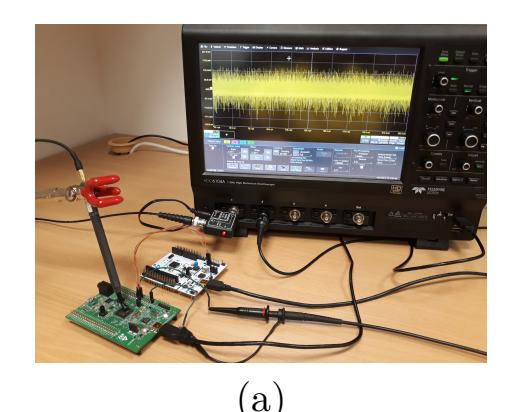

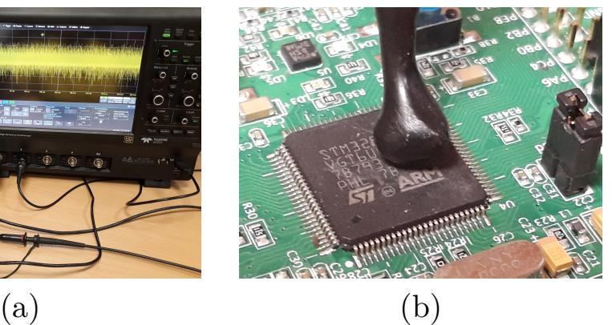

Figure 11: Experimental Setup for SCA (a) SCA Setup (b) Zoomed-in view of EM-probe over the DUT

<span id="page-14-10"></span>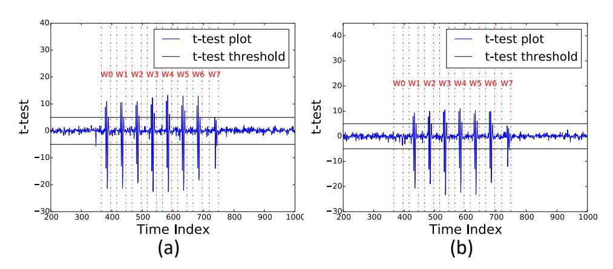

Figure 12: TVLA results for Kyber targeting *m*[0] (a) *m*[0] = 0 and *m*[0] = 1 (b) *m*[0] = 0 and *m*[0] = 2 at low sampling rate of 100 MSam/sec

#### <span id="page-14-6"></span>Appendix B

#### Side-channel Analysis of Message Storage in several LWE/LWR-based PKE/KEMs

In the following, we analyze the side-channel vulnerability due to storage of the decrypted message in memory in several LWE/LWR-based schemes. All the analyzed implementations are compiled in the same manner as described in Sec[.IV.](#page-4-0) Note that we hae made minor modifications such as altering variable names in C code, for better readability.

```
1 void poly_to_msg ( unsigned char *m , const
      poly * x )
2 {
3 unsigned int i ;
4 uint16_t t ;
5 /* init byte array m to zero */
6 memset (m ,0 ,32) ;
7 for ( i =0; i <256; i ++)
8 {
9 t = flipabs(x→coeffs[i+0]);
10 t += flipabs(x→coeffs[i+256]);
11 t = ((t - Q/2));
12 /* Calculate message bit in t */
13 t = 15;
14 /* Inc . Update of t in m[i > >3] */
15 m[i3] |= t  (i&7);
16 }
17 }
```

Figure 13: C code snippet of message decoding operation in NewHope KEM

{15}------------------------------------------------

#### *A. NewHope KEM*

Refer to Fig[.13](#page-14-13) for the C code snippet of the message decoding operation in NewHope, which demonstrates Incremental-Storage of the decrypted message, simliar to Kyber. Instructions that incrementally update the message in memory (line 15) are highlighted in the C code snippet and the target store instruction is also highlighted in red in the assembly code in Fig[.14.](#page-15-0)

```
1 /* msg [i > >3] is present in r6 */
2 /* Compute t > >= 15 in r3 */
3 UBFX r3, r3, #15, #1
4 /* Compute t < <(i&7) in r3 */
5 AND.W r2, r0, #7
6 LSLS r3, r2
7 /* Compute byte msg [i > >3] in r6; */
8 ORRS r6, r3
9 /* Store r6 in msg [i > >3] */
10 STRB r6, [r4, r5]
```

Figure 14: Assembly code snippet of Incremental-Storage of decrypted message in NewHope KEM

#### *B. Round5 PKE*

```
1 /* init all bytes of message m to zero */
2 memset (m , 0 , sizeof ( m ) ) ;
3 for ( i = 0; i < PARAMS_MU ; i ++)
4 {
5 /* Compute bit i of m in x_p */
6 x_p = (( v [ i ] << ( P - T ) ) - x [ i ]) ;
7 x_p = ((( x_p + H3 ) >> ( P - 1) ) \& 1;
8 /* Inc. Update of x_p in m[i > >3] */
9 m[i  3] = (m[i  3] | (x_p  (i & 7)));
10 }
```

Figure 15: C code snippet of message decoding operation in Round5 PKE

Refer to Fig[.15](#page-15-1) for the C code snippet of the message decoding operation in Round5. The message decoding operation is not implemented as a separate function, but is inlined within the decryption procedure. The message bit m*<sup>i</sup>* is computed in variable *x<sup>p</sup>* (line 7) subsequently updated within m[*i* 3] (line 9) as an Incremental-Storage, similar to Kyber. The corresponding operations in the C code snippet and the target store instruction in assembly are highlighted in red in Fig[.15](#page-15-1) and Fig[.16](#page-15-2) respectively. LAC which is another RLWE based KEM also performs Incremental-Storage of the decrypted message in memory, but we do not analyse the same due to space constraints. We however refer the reader to [\[15\]](#page-13-14) for more details on the implementation of LAC.

#### *C. Saber KEM*

In Saber KEM, we observe that the decrypted message is stored in memory by two different operations. Schemes such as Kyber, NewHope and Frodo decode individual bits

```
1 /* Compute x_p in r3 */
2 UBFX r3 , r3 , #6 , #1
3 /* Load byte m[i >> 3] in lr */
4 LDRB . W lr , [ r4 , ip ]
5 /* Compute (i \& 7) in r2 */
6 AND . W r2 , r2 , #7
7 /* Compute byte m[i > >3] in r3 */
8 LSLS r3 , r2
9 ORR . W r3 , r3 , lr
10 CMP r1 , r0
11 /* Store updated byte in m[i > >3] */
12 STRB.W r3, [r4, ip]
```

Figure 16: Assembly code snippet of a Incremental-Storage of message in Round5 PKE

```
1 /* Compute message in v */
2 for( i =0; i < SABER_N ; i ++)
3 {
4 v [ i ] = v [ i ] + h2 ;
5 v [ i ] = v [ i ] - ( op [ i ] << ( EP - ET ) ) ;
6 /* Compute and Store bit i in v[i] */
7 v[i] = (v[i] & MP)  (EP-1);
8 }
```

Figure 17: C code snippet of message decoding operation in SABER KEM

m*<sup>i</sup>* and store them into the message byte array in memory in a tightly packed fashion. However, Saber chooses to store single bits m*<sup>i</sup>* in separate memory locations (16-byte) in an unpacked fashion. Refer Fig[.17](#page-15-3) for the C code snippet of the message decoding operation where bit m*<sup>i</sup>* is stored in a memory location v[*i*]. The corresponding operation in the C code snippet and the target store instruction in assembly is highlighted in red in Fig[.17](#page-15-3) and Fig[.18](#page-15-4) respectively. Thus, **v**[*i*] can only take two possible values 0 or 1 and hence a side-channel attacker who can distinguish between 0 and 1 can recover m[*i*] and subsequently perform full message recovery in a single trace. This can be considered as a simpler variant of the Incremental-Storage vulnerability.

```
1 /* Load v[i] in r3 */
2 LDRH . W r3 , [ r2 , #2]!
3 /* Load op[i] in r4 */
4 LDRH . W r4 , [ r0 , #2]!
5 /* Compute (v[i] + h2) in r3 */
6 ADDS r3 , #228
7 /* Compute (v[i] -( op[i] < <(EP -ET))) in r3
      */
8 SUB . W r3 , r3 , r4 , lsl #6
9 /* Compute ((v[i] & MP) > >(EP -1) ) in r3 */
10 UBFX r3 , r3 , #9 , #1
11 CMP r2 , r5
12 /* Store bit i in v[i] */
13 STRH r3, [r2, #0]
```

Figure 18: Assembly code snippet of Incremental-Storage of message in SABER KEM

Saber subsequently performs an additional operation to pack the message bits into a compact byte array m in 

{16}------------------------------------------------

memory, denoted as POL2MSG. We analyzed its C code snippet in Fig.19 and identified an Incremental-Storage of message bits in memory (line 12 in Fig.19 highlighted in red). However upon compilation, we observed that the compiler unrolled the innermost loop 8 times, thereby resulting in a Bytewise-Storage of the message in memory (Refer Fig.20). Thus, this operation can be targeted using our malleability assisted message recovery attack presented in Sec.VII leading to message recovery in 9 side-channel traces.

```
void POL2MSG(uint16_t *v, unsigned char *
      m)
2 {
     int32_t i,j;
3
     for(j=0; j<SABER_KEYBYTES; j++)</pre>
4
     {
5
       /* init message byte m[j] to zero */
6
       m[j] = 0;
7
       for(i=0; i<8; i++)</pre>
8
       {
9
         n = j*8 + i;
10
         /* Update bit v[n] in m[j] */
11
         m[j] = m[j] \mid (v[n] \ll i);
12
       }
13
     }
14
15 }
```

Figure 19: C code snippet of message packing operation in SABER KEM

#### <span id="page-16-4"></span>D. Frodo KEM

```
1 /* Unrolled Computation of m[j] |= (v[n
      ]<<i) */
2 LSLS
          r2, r2, #2
3 ORRS
          r3, r2
4 ORR.W
          r2, r2, r8, lsl #1
5 ORR.W
          r3, r3, lr, lsl #3
6 ORR.W
          r3, r3, ip, lsl #4
7 ORR.W
          r3, r3, r7, lsl #5
8 ORR.W
          r3, r3, r5, lsl #6
9 ORR.W
          r3, r3, r4, lsl #7
10 /* Store packed byte in m[j] */
11 STRB.W r3, [r0, #1]!
```

Figure 20: Assembly code snippet of Bytewise-Storage of decrypted message within message packing operation in Saber KEM

Frodo KEM is based on the standard LWE problem and hence operates upon matrices and vectors with elements in  $\mathbb{Z}_q$ , instead of polynomials in  $R_q$ . While most schemes encode one bit into a single coefficient/element (i.e) ( $\mathbf{m}_i \to \mathbf{x}[i]$ ), Frodo KEM encodes multiple message bits into a single element and the number of encoded bits differs based on the parameter set. For simplicity, we utilize Frodo640 for our analysis which encodes two coefficients into a single element (i.e) ( $\mathbf{m}_{2\cdot i}, \mathbf{m}_{2\cdot i+1} \to \mathbf{x}[i]$ ) and the corresponding mapping is done as follows: The integer ring  $\mathbb{Z}_q$  is divided

into four equal quadrants and each quadrant thus maps to  $00,\,01,\,10$  and 11 in increasing order starting from 0 upto q-1.

```
void key_decode(uint16_t *out, const
      uint16_t *in)
2 {
    unsigned int i, j, index = 0;
3
    uint16_t temp, maskex = 3;
4
    uint16_t maskq = 0x7FFF;
5
    uint8_t temp_bits;
6
    uint64_t tt;
7
    for (i = 0; i < 8; i++)
8
    {
9
      tt = 0;
10
      /* Extract 16 bits from 8 elements */
11
      for (j = 0; j < 8; j++)
12
13
      {
         temp = (in[index] & maskq);
14
         temp = (temp + 0x4000) >> 14;
15
         /* Decode 2 bits */
16
         temp_bits = (temp & maskex);
17
         /* Aggregate the bits in tt */
18
         tt |= (temp_bits) << (2*j);
19
         index++;
20
21
      }
      for (j = 0; j < 2; j++)
22
23
      {
         /* Store 8 bits from tt to out */
24
         out [2*i + j] = (tt \gg (8*j)) \& 0xFF;
25
      }
26
    }
27
28 }
```

Figure 21: C code snippet of message decoding operation in Frodo KEM

Refer Fig.21 for the C code snippet of the message decoding operation where a given element of the encoded message vector "in" is decoded into two bits, that are aggregated in a temporary variable templong (line 16). Subsequently, 16 message bits aggregated over eight such iterations are then stored into the message byte array "out" in memory (line 22 highlighted in red). We analyzed the corresponding assembly implementation (Fig.22) and observed that these 16 bits are stored using two successive store instructions (line 7, 9 highlighted in red). Here again, we observe Bytewise-Storage of the decrypted message in memory, which can be targeting through our malleability assisted message recovery attack. Please refer Appendix D-A for the adaptation of our attack to Frodo KEM.

## <span id="page-16-0"></span>APPENDIX C CYCLIC MESSAGE ROTATION IN LWE/LWR-BASED PKE/KEMS

Schemes such as NewHope, Kyber, Saber, LAC operate over a *anti-cyclic* polynomial ring  $R_q = \mathbb{Z}_q[x]/(x^n+1)$  and some variants of Round5 operate over a *cyclic* polynomial ring  $R_q = \mathbb{Z}_q[x]/(x^{n+1}-1)$ . The product of a polynomial  $\mathbf{g}$  with  $\alpha_i(x) = x^i$  in the anti-cyclic polynomial ring results in  $\mathbf{g}_i' = \mathsf{AntiRotr}(\mathbf{g}, i)$  which is an anti-cyclic rotation of

{17}------------------------------------------------

```
1 /* 16 message bits in tt computed in r3
```

Figure 22: Assembly code snippet of Bytewise-Storage of decrypted message bits within message decoding operation in Frodo KEM

the polynomial  $\mathbf{g}$  by i positions. Thus, any given coefficient  $\mathbf{g}'_i[k] = \mathbf{g}[k']$  where  $k' = (n - i + k) \mod n$ . Similarly, cyclic rotation is observed when performing polynomial multiplication in cyclic polynomial rings.

This rotation property can be used to construct hand-crafted ciphertexts  $\mathbf{ct}_i'$  from a given ciphertext  $\mathbf{ct}$  whose corresponding messages  $\mathbf{m}_i'$  are cyclic rotations of the original message  $\mathbf{m}$  (i.e)  $\mathbf{m}_i' = \mathsf{Rotr}(m,i)$ . We refer to it as the Rotate-Message property in this work. We illustrate this property using using the RLWE problem over  $R_q = \mathbb{Z}_q[x]/(x^n+1)$ , while the same can be adapted to other similar rings as well.

The ciphertext  $\mathbf{ct}$  contains two components - polynomials  $\mathbf{u} \in R_q$  and  $\mathbf{v} \in R_q$ . The decryption procedure computes  $\mathbf{x} = (\mathbf{v} - \mathbf{u} \times \mathbf{s})$  where  $\mathbf{s} \in R_q$  is the long term secret polynomial. The polynomial  $\mathbf{x}$  is subsequently decoded to retrieve the message  $\mathbf{m}$  (i.e)  $\mathbf{m} = \mathcal{P}(\mathbf{x})$ . Thus, the first message bit  $\mathbf{m}_0$  is computed as:

$$m_0 = \mathcal{P}(\mathbf{x}[0])$$
  
=  $\mathcal{P}(\mathbf{v}[0] - \mathbf{us}[0])$ 

where  $\mathbf{us} \in R_q$  is the product of polynomials  $\mathbf{u}$  and  $\mathbf{s}$ . The decoding operation  $\mathcal{P}()$  determines  $\mathbf{m}_0$  based on the distance of  $\mathbf{x}[0]$  from the center C (i.e)  $|\mathbf{x}[0] - C|$ . We can create modified ciphertexts of the form  $\mathbf{ct}_i' = (\mathbf{v}_i', \mathbf{u}_i')$  where  $\mathbf{u}_i' = (\mathbf{u} \times \alpha_i) = \mathsf{AntiRotr}(\mathbf{u}, i)$  and  $\mathbf{v}_i' = \mathsf{AntiRotr}(\mathbf{v}, i)$  with  $\alpha_i = x^i$  and subsequently,  $\mathbf{us}_i' = (\mathbf{u}_i' \times \mathbf{s}) = \mathsf{AntiRotr}(\mathbf{us}, i)$ . Thus, the resulting first bit  $\mathbf{m}_0'$  is given as:

$$\mathbf{m}'_0 = \mathcal{P}(\mathbf{v}'_i[0] - \mathbf{u}\mathbf{s}'_i[0])$$

$$= \mathcal{P}(-\mathbf{v}[k] + \mathbf{u}\mathbf{s}[k]) \ (k = (n-i) \bmod n)$$

$$= \mathcal{P}(-\mathbf{x}[k])$$

$$= \mathbf{m}_k$$

Thus, bit  $\mathbf{m}_k$  is now present at the first position and similarly other bits of the original message are rotated accordingly. Thus, by changing the value of the rotational constant i, one can perform arbitrary cyclic rotations of the message. This property only applies to schemes such as Kyber, Saber, NewHope, LAC and a few variants of Round5 working over cyclic or anti-cyclic polynomial rings, while Frodo KEM is not applicable since it is based on the standard LWE problem.

<span id="page-17-3"></span>Table III: Unique distinguishability of every candidate for the pair  $(\mathsf{m}_0,\mathsf{m}_1)$  based on the perturbation of the hamming weight of  $\mathsf{K}'$  and  $\mathsf{K}$  when adding a constant P to  $\mathbf{v}[0]$  in Frodo KEM

|   | $HW_d = HW(K$                             | ') – HW(K) |
|---|-------------------------------------------|------------|
| K | $P\;(\mathbf{v}'[i] = \mathbf{v}[i] + P)$ |            |
|   | C                                         | C/2        |
| 0 | +1                                        | +1         |
| 1 | +1                                        | 0          |
| 2 | -1                                        | +1         |
| 3 | -1                                        | -2         |

<span id="page-17-0"></span>APPENDIX D
TARGETED BIT FLIPS IN FRODO KEM

We observe that Frodo encodes multiple bits into a single element in  $\mathbb{Z}_q$  and the number of encoded bits depends upon the parameter set. For simplicity, we utilize Frodo640 for our analysis which encodes two coefficients into a single element and the mapping is done as follows: k is mapped to  $k \cdot C/2$  for  $k \in [0,3]$ . Alternatively, the mapping from bits  $(\mathsf{m}_{2\cdot i},\mathsf{m}_{2\cdot i+1}) \to \mathbf{x}[i]$  is done as follows:  $00 \to 0$ ,  $01 \to C/2$ ,  $10 \to C$  and  $11 \to 3C/2$ . Thus, modifying  $\mathbf{v}[i]$  affects to message bits  $(\mathsf{m}_{2\cdot i},\mathsf{m}_{2\cdot i+1})$  which we denote together as K. There are four possible values for K and hence adding C/2 to  $\mathbf{v}[i]$  modifies K to  $\mathsf{K}' = (\mathsf{K}+1) \bmod 4$ . Similarly, one can simultaneously modify multiple pairs of message bits by altering the corresponding element of  $\mathbf{v}$ .

#### <span id="page-17-2"></span>A. Exploiting Ciphertext Malleability in Frodo KEM

As shown in Appendix B-D, Frodo performs Bytewise – Storage of the message in memory. We focus our analysis on recovery of the first two bits  $K = (m_0, m_1)$  of m|0|. We utilize the HW classifier to recover HW(m|0|) through decryption of the target ciphertext ct. We modify  $\mathbf{v}[0]$  of ct to  $\mathbf{v}'|0| = \mathbf{v}|0| + P$  which modifies K while the remaining 6 bits of m[0] stay the same. Let the resulting modified message be denoted as m' and we recover HW(m'). Please refer Tab.III for the perturbation in HW(K) which can uniquely recover the value of K only using two adapted ciphertext queries. Since the message bytes are stored independently, an attacker can simultaneously recover two bits from each message byte using two queries or side-channel traces. Thus, complete message recovery can be performed only using *nine* side-channel traces (eight adapted ciphertext queries and one original ciphertext query) assuming the presence of a perfect side-channel HW classifier.