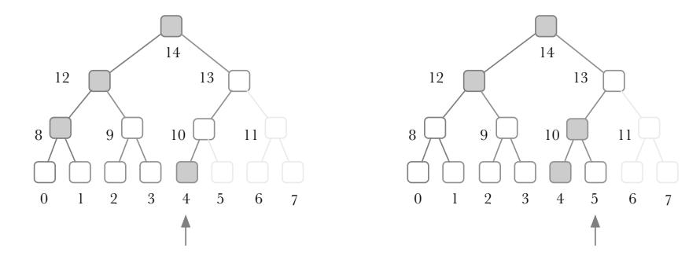
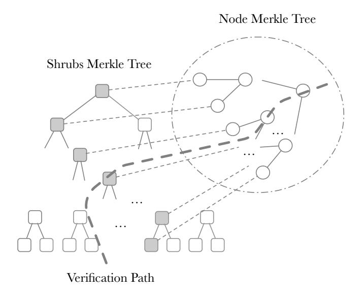
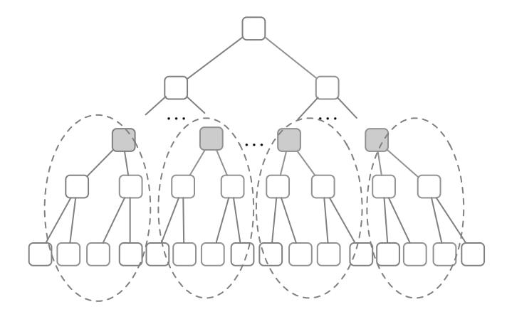
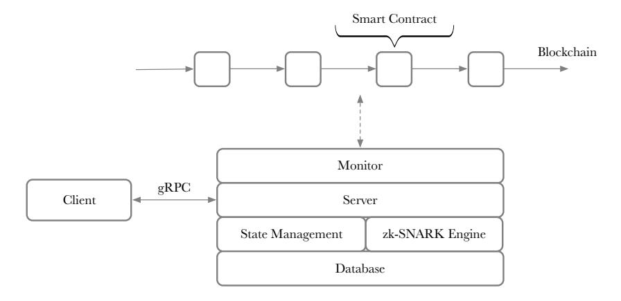
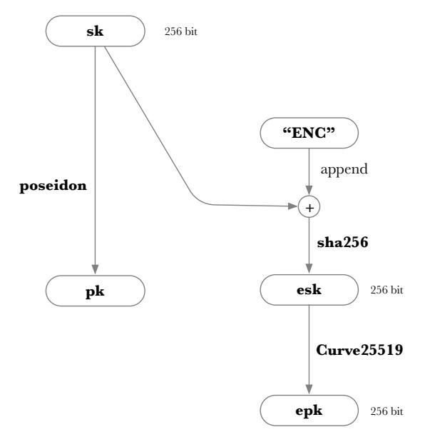
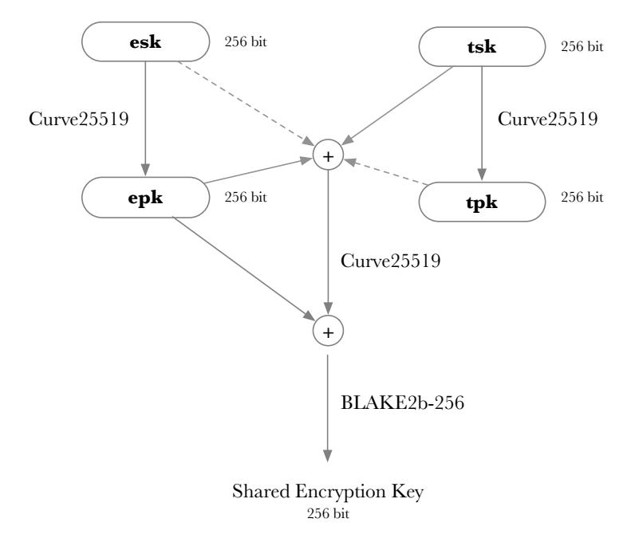
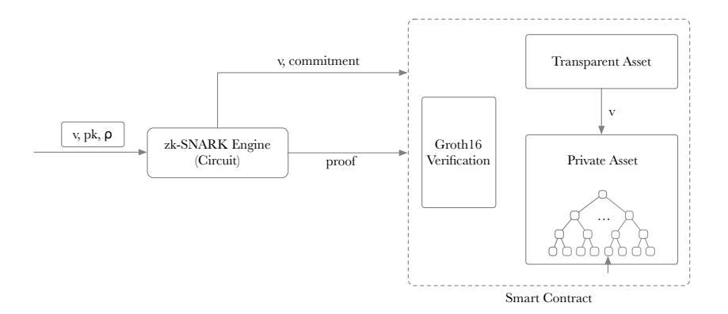
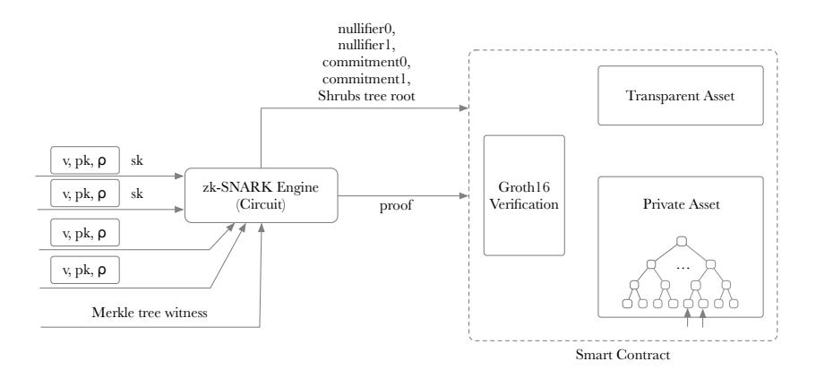
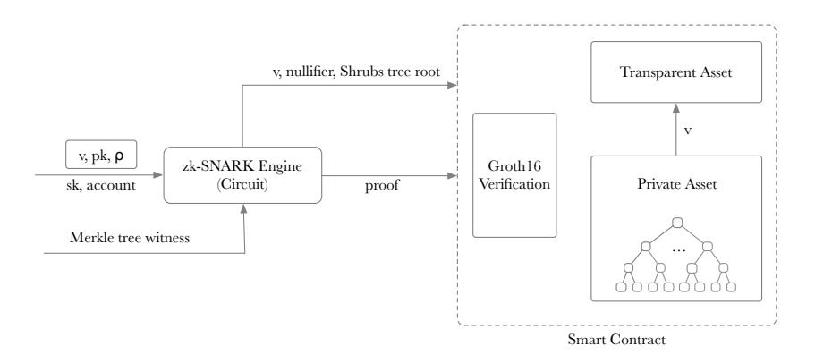

# Phantom: An Efficient Privacy Protocol Using zk-SNARKs Based on Smart Contracts

Xing Li <sup>1</sup>, Yi Zheng2, Kunxian Xia1, Tongcheng Sun3, and John Beyler<sup>2</sup>

- <sup>1</sup> Unita Technology, lixing@unita.tech <sup>2</sup> Qtum Chain Foundation, zhengyi@qtum.info
- <sup>3</sup> Peking University, suntongcheng@pku.edu.cn

February 16, 2020

Abstract. Privacy is a critical issue for blockchains and decentralized applications. Currently, there are several blockchains featured for privacy. For example, Zcash uses zk-SNARKs to hide the transaction data, where addresses and amounts are not visible to the public. The zk-SNARK technology is secure and has been running stably in Zcash for several years. However, it cannot support smart contracts, which means people are not able to build decentralized applications on Zcash.

To solve this problem, two protocols, Quorum ZSL and Nightfall, have tried to implement zk-SNARKs through smart contracts. In this way, decentralized applications with privacy features are enabled by these protocols on the blockchain. However, experiments on the Ethereum Virtual Machine show that these protocols cost a lot of time and gas for running, meaning they are not suitable for everyday use.

In this paper, we propose an efficient privacy protocol using zk-SNARKs based on smart contracts. It helps to make several decentralized applications, like digital assets, stable coins, and payments, confidential. The protocol balances the trade-off between the gas cost of smart contracts and the computational complexity of zk-SNARK proof generation. Moreover, it uses the In-band Secret Distribution to store private information on the blockchain. The gas cost for a confidential transaction is only about 1M, and the transaction generation takes less than 6 seconds on a regular computer.

Keywords: Blockchain Privacy *·* zk-SNARKs *·* Smart Contracts.

## 1 Introduction

In September 2008, Satoshi Nakamoto published the Bitcoin whitepaper [[1](#page-14-0)]. In January 2009, the Bitcoin mainnet was formally launched, creating a new era of cryptocurrency and launching the new technology to the public's view. In July 2015, the Ethereum[\[2\]](#page-14-1) was launched. The embedded EVM (Ethereum Virtual Machine) could execute Turing-complete smart contracts, bringing about the second generation of blockchain technology. Afterwards, a large number of blockchains with smart contracts (like Qtum, Tron, EOS) and decentralized applications implemented through smart contracts (like CryptoKitties, MakerDAO, Uniswap) emerged.

In 2016, the Zcash [[3\]](#page-14-2) protocol was proposed, which uses cryptography to provide enhanced privacy to the blockchain. There are two types of addresses in Zcash: transparent address (taddr) and shielded address (zaddr). A transparent address sends and receives transactions such that the address and associated amount are publicly recorded on the Zcash blockchain, similar to the Bitcoin. A shielded address, however, uses zk-SNARKs to hide the transaction data, where the address and amount are not visible to the public.

Based on the design of Zcash, more protocols and platforms have been proposed to enhance the privacy of Ethereum. Quorum [\[4\]](#page-15-0) is an opensource blockchain platform that combines enhancements and innovations from the Ethereum community to satisfy enterprise needs. Quorum ZSL (zero-knowledge security layer) is a protocol that leverages zk-SNARKs to enable transfers of digital assets using smart contracts without revealing any information about the sender, recipient, and amount. According to [[5](#page-15-1)], one JoinSplit operation takes 42.6 seconds on an Intel Xeon E3-1225 v2 3.2GHz processor (4 cores) and requires nearly 3GB of RAM. The consumption of time and resources is excessive for everyday use.

In October 2018, Ernst and Young introduced Nightfall [[6](#page-15-2)] at the Ethereum Devcon in Prague. On May 31, 2019, EY released Nightfall, which enables private transfers of ERC-20 and ERC-721 tokens on the Ethereum mainnet using zk-SNARK smart contracts. Nightfall uses the SHA256 hash function for the Merkle tree with a depth of 33. The transfer of ERC-20 needs 2,292,000 zk-SNARK constraints and costs about 2.7M gas, which is relatively high since the gas limit for each block is 8M in Ethereum.

From the above, we can see that existing privacy protocols on smart contracts are not practical enough. Users have to wait more than 40 seconds to generate a transaction, and the gas cost is hardly acceptable to the blockchain. With the same security level, we reduce the circuit size and gas cost of the zk-SNARK proof. Similar to Nightfall, our protocol provides two kinds of assets: transparent and confidential assets. The former is a generic ERC-20 token, while the latter has a design similar to Zcash but much simpler. By utilizing a new approach for confidential assets, the resulting performance is impressive: the gas cost for a transaction is about 1M, and the proof generation of a transaction takes less than 6 seconds on a regular computer.

### 2 Preliminary

## 2.1 Terminology

- Note. A note is an encrypted representation of the value of digital assets. It specifies an amount and a recipient address. Moreover, it can be spent by a private spending key corresponding to the address.
- Commitment. For each note, there is an associated commitment, which is generated by a hash function.
- Nullifier. There is also an associated nullifier generated by the hash function. For each note, only one valid commitment and nullifier exist.
- Merkle tree. The Merkle tree is a tree in which each leaf node records the hash value of a data block, and each non-leaf node records the cryptographic hash of its child nodes.
- Incremental Merkle tree. The incremental Merkle tree is an appendonly Merkle tree that only supports data block insertions. An incremental Merkle tree of fixed depth is used to store note commitments.
- In-band Secret Distribution. It is used to store the transmitted part of notes on the blockchain in an encrypted form.

#### 2.2 Shrubs Merkle Tree

Shrubs Merkle tree [\[7\]](#page-15-3) is a variant of the incremental Merkle tree. In comparison, it is not represented by the root of the tree, but by a series of nodes, which are the roots of subtrees. This design allows a commitment to be inserted with *O*(1) updates, at the expense of a slightly more complicated zk-SNARK proof used to prove that the commitment is in the tree.

Suppose a Shrubs Merkle tree with a height of *h*. Totally *h* + 1 nodes are used to represent the tree, one from each depth. We call these nodes Shrub nodes. At each depth, the Shrub node is either the only node or the rightmost node that is the root of a perfect left subtree. In this way, when inserting a new leaf node, only one Shrub node needs to be updated, through switching to a new node or recalculating its hash value.

Here we take a Shrubs Merkle tree with a height of 3 as an example, as shown in Fig. [1](#page-3-0). When node 4 is inserted, the Shrub nodes are 14, 12, 8, 4. When node 5 is inserted, the Shrub nodes become 14, 12, 10, 4, since node 10 turns out to be the root of a perfect subtree.



<span id="page-3-0"></span>Fig. 1. An example of the Shrubs Merkle tree.

As a result, the gas cost for data block insertion is much less than the original incremental Merkle tree. For each non-leaf node, its hash value would be calculated at most once, and totally <sup>2</sup>*<sup>h</sup>* <sup>−</sup> <sup>1</sup> times for the entire tree after all leaf nodes are inserted. Therefore, on average, it takes only one hash calculation for inserting each leaf node.

#### 2.3 Hash Function Selection

Two factors need to be considered when choosing an appropriate hash function for zk-SNARKs: gas cost and proof generation time. Generally speaking, the hash function with a lower gas cost would lead to a larger circuit size (more constraints), causing a longer time for the proof generation. For the hash function used off the blockchain, we only need to consider the latter factor. But for the one used on-chain, the trade-off between these two factors should be balanced.

<span id="page-3-1"></span>Table 1. Hash Function Selection

| Hash Func        |       | Gas Cost zk-SNARK constraints |
|------------------|-------|-------------------------------|
| SHA256           | 60    | 28k                           |
| MiMC e7r91       | 8.9k  | 646                           |
| Poseidon t6f8p57 | 58.4k | 317                           |

Candidate hash functions, their gas costs (for two inputs) and zk-SNARK constraints are listed in Table [1.](#page-3-1) We can see there is no function that is both low in gas cost and small in circuit size. However, because the Shrubs Merkle tree has made it possible to build a Merkle tree with relatively low gas cost, we can reduce the weight of gas cost in the tradeoff. Finally, Poseidon or MiMC is a better choice for our system. Note that Poseidon and MiMC hash functions have not been audited by most cryptographic experts so that they may be vulnerable.

#### 2.4 Shrubs Public Input Packing

As we mentioned above, although the Shrubs Merkle tree dramatically reduces the gas cost for inserting a commitment into the tree, it increases the gas cost for proving the commitment in the tree. To prove a leaf node is in a Shrubs Merkle tree, one should provide not only the path from the leaf node to its nearest Shrub node but also all Shrub nodes, where the latter is used to prove the validity of the nearest node. As a result, the size of the public input increases from 1 to *h* + 1 because of *h* + 1 Shrub nodes. The corresponding gas cost is calculated by the following:

```
V erificationGas = n ∗ ScalarMulGas
       + PairingBaseGas
       + 4 ∗ PairingPerPointGas
```

where *n* is the size of the public input and *ScalarMulGas*, *PairingBaseGas*, *PairingPerPointGas* are the gas costs of three elliptic curve operations. These operations are implemented through precompiled contracts on EVM, and their gas costs are shown in Table [2](#page-4-0). We can see that, for every 1 increased in the size of the public input, the gas cost would be increased by 40,000. Therefore, the Shrubs Merkle tree costs 40*,*000 ∗ *h* more gas than the original incremental Merkle tree.

Table 2. Gas Costs for Elliptic Curve Operations on EVM

<span id="page-4-0"></span>

| Operation          | Gas Cost |
|--------------------|----------|
| ScalarMulGas       | 40,000   |
| PairingBaseGas     | 100,000  |
| PairingPerPointGas | 80,000   |

We introduce an approach, Shrubs Public Input Packing, to reduce the size of the public input. One additional Merkle tree, named Node Merkle tree, is created for all Shrub nodes, as illustrated in Fig. [2](#page-5-0). One can use a path in the Node Merkle tree, instead of all Shrub nodes, to prove the validity of a Shrub node. In this way, the size of the public input is reduced to 1.



Fig. 2. Shrubs public input packing.

<span id="page-5-0"></span>The Node Merkle tree is updated whenever a leaf node is inserted into the Shrubs Merkle tree since a Shrub node is updated. It would bring an extra gas cost to the insertion process. To reduce this cost, the Node Merkle tree uses a new scheme for calculating the Merkle root, as shown in Fig. [3.](#page-6-0) The tree is divided into several subtrees, and the roots of these subtrees are saved. When a leaf node is updated, only the corresponding subtree is recalculated as well as the Merkle root. Moreover, the MiMC hash is selected as the hash function for the Node Merkle tree to balance the circuit size and gas cost.

#### 2.5 Public Input Packing

Shrubs Public Input Packing works because all Shrub nodes are public recorded, and their Merkle root is fixed. But for other public inputs, this scheme can no longer work. All public inputs must be constrained by a single circuit. We use an approach, Public Input Packing, to reduce the size of all public inputs. It is also described in a blog [[8](#page-15-4)] written by Christian Reitwiessner.

Suppose a circuit represented by the function *F*(*u, w*), in which *u* stands for all public inputs and *w* for private inputs. This function can be changed to the form of *F*(*H, f*(*u, w*)∧*H*(*u*)), and the size of all public



Fig. 3. Node Merkle tree.

<span id="page-6-0"></span>inputs becomes 1 (the hash of all public input). The MiMC hash is used as the hash function for Public Input Packing in our protocol.

### 3 Protocol

The proposed protocol provides two kinds of assets: transparent and confidential assets. The former is an ERC-20 token, while the latter has a design similar to Zcash. The confidential asset can also be regarded as a private representation of the ERC-20 token. Using this protocol, users can easily transfer their transparent and confidential assets.

Fig. [4](#page-7-0) illustrates the overall architecture of the protocol. Several smart contracts are deployed on the blockchain. The Monitor is responsible for monitoring transactions of these contracts and send transactions to the blockchain. The Server is the core component, which calls the zk-SNARK engine to generate proofs and synchronizes the state of the blockchain.

#### 3.1 Key Derivation

Two private/public key pairs defined over the field *F<sup>r</sup>* are used for the protocol. *sk, pk* pair is for identification. *esk, epk* pair is the encryption private/public key pair for In-band Secret Distribution. Their relationship is shown in Fig. [5](#page-7-1).



<span id="page-7-0"></span>Fig. 4. The overall architecture of the protocol.



<span id="page-7-1"></span>Fig. 5. Key Derivation.

#### 3.2 Note, Commitment, Nullifier

The protocol uses the same UTXO model as Zcash. All note commitments are kept in a Shrubs Merkle tree. The height of the tree is set to 31 to support a total number of 2<sup>31</sup> notes. A note consists of the following fields:

- *v*. Value, which stands for the amount of the digital asset.
- ρ. A random value where ρ ∈ *Fr*.
- *pk*. Public key of the note where *pk* ∈ *Fr*.

The note itself is hidden from the public. Instead, the note commitment is kept on the blockchain, which is calculated from the note as:

$$commitment = commit\_hash(pk, v, \rho)$$

To spend a note, one must provide the corresponding nullifier and send it to the blockchain. The nullifier can be calculated as:

$$nullifier = nf\_hash(sk, \rho)$$

#### 3.3 In-band Secret Distribution

In zk-SNARKs, for transferring a note, the sender needs to send the note commitment to the recipient through the blockchain and the note value through a peer-to-peer manner. Our protocol uses the In-band Secret Distribution, which allows the sender to share the note also through the blockchain secretly. In this way, the entire process can be done on the blockchain for convenience.

The In-band Secret Distribution is illustrated in Fig. [6.](#page-9-0) The sender first generates a temporary key pair, *tsk,tpk*. Then, a "shared encryption key" is generated through the *tsk* and the *epk* from the recipient. At last, the sender uses the shared encryption key to encrypt the note and send the encrypted note as well as the *tpk* to the blockchain. For the recipient, the shared encryption key can be recovered based on its *esk* and the *tpk* from the blockchain. Finally, the note can be decrypted from the encrypted note on-chain using the shared encryption key by the recipient.

#### 3.4 Confidential Operations

Confidential assets in the protocol support three operations: MINT, TRANSFER, and BURN.



<span id="page-9-0"></span>Fig. 6. In-band Secret Distribution.

MINT The MINT operation is used for issuing a certain amount of confidential assets by locking equivalent transparent assets in the contract. It would create a new note for the issued assets, as shown in Fig. [7](#page-10-0). The zk-SNARK engine helps generate the proof for the note using the MINT circuit with the note value and commitment as the public input. Then they are all sent to the smart contract. If the proof is successfully verified, the note commitment is added to the Shrubs Merkle tree.

TRANSFER The TRANSFER operation is used to transfer the confidential assets from the sender to the recipient, as shown in Fig. [8.](#page-10-1) It would generate a transaction containing four notes: two as the input and two as the output. The sender has to provide two nullifiers for the input and two commitments for the output. The zk-SNARK engine helps generate proofs for the output using the TRANSFER circuit. Then the transaction is sent to the smart contract. If it is verified, two nullifiers are recorded in the smart contract, and two commitments are appended to the Shrubs Merkle tree.



<span id="page-10-0"></span>Fig. 7. MINT Operation.



<span id="page-10-1"></span>Fig. 8. TRANSFER Operation.

BURN The BURN operation helps destroy a certain amount of confidential assets and get equivalent transparent assets as payback, as shown in Fig. [9](#page-11-0). First, one has to prove the ownership of a note by providing the note and its Merkle path. The zk-SNARK engine generates the proof for the note using the BURN circuit. The value, note nullifier, Shrubs Merkle tree root, and account are the public input sent to the smart contract. If it is verified, the note nullifier is recorded in a smart contract, and the note cannot be used anymore.



<span id="page-11-0"></span>Fig. 9. BURN Operation.

# 4 zk-SNARK Circuits

We use an example to describe the zk-SNARK circuits in the protocol. A certain amount of confidential assets are minted by Alice, transferred to Bob, and burnt by Bob. Notations with the subscript of *A* indicate the notation belongs to Alice and *B* for Bob.

# 4.1 MINT circuit

The MINT circuit is used for Alice to issue confidential assets.

- 1. Generate a random salt ρ.
- 2. Compute the note commitment *cm* = *commit hash*(*pkA, v,* ρ).
- 3. Generate the zk-SNARK proof π which asserts the note commitment is correctly constructed:
  - (a) public inputs (*v, cm*),
  - (b) private inputs (*pkA,* ρ),

- (c) invoke zk-SNARK prover with public and private inputs to output a proof π that checks *cm* = *commit hash*(*v, pkA,* ρ) and *v* is a 64 bit unsigned integer.
- 4. Generate the temporary key pair, *tsk,tpk*, and calculate the shared encryption key *EK* = *BLAKE*2*b*(*Curve*25519(*tsk, epkA*)*, epkA*).
- 5. Encrypt the note *ciphertext* = *encryption*(*EK,*(ρ*, pkA*)).
- 6. Send π*,*(*v, cm*)*, ciphertext* to the smart contract.

#### 4.2 TRANSFER circuit

Suppose Alice wishes to transfer confidential assets with the amount of *e* to Bob. Alice must ensure she has enough commitments whose total amount is at least *e*. For convenience, suppose Alice has minted two commitments with amounts of *c* and *d*, where *c*+*d* ≥ *e*. Let *f* be the balancing amount, so that *c* + *d* = *e* + *f*.

- 1. Generate two random salts (ρ*e,* ρ*<sup>f</sup>* ), one for each output note.
- 2. Compute the commitments of two output notes:
  - (a) *output cm*[0] = *commit hash*(*pkB, e,* ρ*e*),
  - (b) *output cm*[1] = *commit hash*(*pkB, f,* ρ*<sup>f</sup>* ).
- 3. Compute the nullifiers of two input notes:
  - (a) *input nf*[0] = *nf hash*(ρ*c, skA*),
  - (b) *input nf*[1] = *nf hash*(ρ*d, skA*).
- 4. Generate zk-SNARK proof π which asserts the TRANSFER operation is valid:
  - (a) public intput (*input nf*[0]*,input nf*[1]*, output cm*[0]*, output cm*[1]*, shrubs*).
  - (b) private inputs:
    - i. old input notes (*pkA, c,* ρ*c*) and (*pkB, d,* ρ*d*).
    - ii. new output notes (*pkB, e,* ρ*e*) and (*pkB, f,* ρ*<sup>f</sup>* ).
    - iii. Alice's spending key *sk*.
    - iv. Merkle witness (Shrubs and Node Merkle tree) for each input note.
  - (c) invoke zk-SNARK prover with public and private inputs to output a proof π that checks the following constraints hold:
    - i. *output cm*[*i*] are correctly constructed.
    - ii. *input nf*[*i*] are correctly constructed.
    - iii. *pk<sup>A</sup>* = *pk hash*(*sk*).
    - iv. Merkle witness is valid for each input note.
    - v. the balance equation *c* + *d* = *e* + *f* holds.

- 5. Generate the temporary key pair, *tsk,tpk* and calculate the encryption key *EK* = *BLAKE*2*b*(*Curve*25519(*tsk, epkB*)*, epkB*).
- 6. Encrypt the note: *cxt<sup>e</sup>* = *encrypt*(*EK,*(*e,* ρ*e, pkB*)).
- 7. Encrypt the note: *cxt<sup>f</sup>* = *encrypt*(*EK,*(*f,* ρ*<sup>f</sup> , pkB*)).
- 8. Send π, public inputs, and two output notes' ciphertexts *cxte, cxt<sup>f</sup>* to the smart contract.

# 4.3 BURN circuit

Bob can burn his confidential assets using the BURN operation.

- 1. Compute the nullifier for the input note *nf* = *nf hash*(*e,* ρ*e, skB*).
- 2. Generate zk-SNARK proof π which asserts the BURN operation is valid:
  - (a) public input: *nf*, *e*, *account*, *shrubs*.
  - (b) private input: input note, *sk* and its Merkle witness (Shrubs and Node merkle witness).
  - (c) invoke zk-SNARK prover with public and private inputs to output a proof π that checks the following constraints hold:
    - i. *nf* is correctly constructed from the input note.
    - ii. Merkle witness is valid for the input note.
    - iii. the value of input note is e.
    - iv. the zk-SNARK proof is bound to the public *account*.
- 3. Send π and public input to the smart contract.

### 5 Performance

The protocol was evaluated on a computer with an Intel(R) Core(TM) i5-7500 CPU 3.40GHz processor (4 cores) and 8GB of RAM. We used Qtum v0.18.1 to launch a private blockchain with EVM build-in and then deployed our smart contracts to it. Each of the MINT, TRANSFER, and BURN operations was performed 20 times to measure the average of the proof generation time, and their gas costs are obtained from the blockchain data.

The parameters and results are shown in Table [3.](#page-14-3) We can see that the gas cost for the TRANSFER operation is about 1M, and the proof generation time is 5.68s, which are obviously lower than other protocols. The MINT and BURN operations consume even fewer resources than the TRANSFER. Overall, the protocol performs more efficiently on EVM compared to others.

<span id="page-14-3"></span>Table 3. Protocol Performance

|          |       |       |       | Operation Gas Cost Circuit Constraints Circuit Variables Proof Generation Time (s) |
|----------|-------|-------|-------|------------------------------------------------------------------------------------|
| Mint     | 551k  | 1892  | 1896  | 0.45                                                                               |
| TRANSFER | 1014k | 35323 | 35328 | 5.68                                                                               |
| BURN     | 542k  | 16844 | 16895 | 3.05                                                                               |

### 6 Conclusion

This paper presents an efficient privacy protocol using zk-SNARKs based on smart contracts. By using an improved Merkle tree and carefully selected hash functions, it reduces the gas cost to only about 1M, and the transaction generation takes less than 6 seconds on a regular computer. Moreover, it uses the In-band Secret Distribution to store private information on the blockchain, enabling non-interactive transaction generation between the sender and recipient.

To deploy a zk-SNARK circuit, a trusted setup is required to generate a proving key and a verifying key. Unfortunately, this process also produces a piece of data called toxic waste, which must be discarded after the setup since it can be used to produce fake proofs and thereby violate the security of the system. To solve this problem, the trusted setup is always realized through a cryptographic ceremony in which multiple participants take turns to perform a computation to get the final results.

The Zcash project has performed such a ceremony in 2017. In Aug 2019, the Semaphore team conducted phase 1 of a multi-party trusted setup ceremony [[9\]](#page-15-5) based on the Zcash Powers of Tau ceremony. The ceremony can be perpetual; any zk-SNARK project can pick any point of the ceremony to begin their circuit-specific second phase, and there is no limit to the number of participants required. Our protocol can benefit from the new ceremony and generate its own proving key and verifying key for circuits.

### References

- <span id="page-14-0"></span>1. Satoshi Nakamoto. Bitcoin: A [peer-to-peer](https://bitcoin.org/bitcoin.pdf) electronic cash system. https:// bitcoin.org/bitcoin.pdf, Dec 2008.
- <span id="page-14-1"></span>2. Vitalik Buterin. Ethereum: A next-generation smart contract and decentralized application platform. <https://github.com/ethereum/wiki/wiki/White-Paper>, 2014.
- <span id="page-14-2"></span>3. Daira Hopwood, Sean Bowe, Taylor Hornby, and Nathan Wilcox. Zcash protocol specific[ation.](https://github.com/zcash/zips/blob/master/protocol/protocol.pdf) https://github.com/zcash/zips/blob/master/protocol/ protocol.pdf, Oct 2016.

- <span id="page-15-0"></span>4. J.P. Morgan. Quorum [whitepaper.](https://github.com/jpmorganchase/quorum/wiki/) https://github.com/jpmorganchase/quorum/ wiki/, Nov 2016.
- <span id="page-15-1"></span>5. J.P. Morgan. Quorum - zsl [integration:](https://github.com/jpmorganchase/zsl-q) Proof of concept. https://github.com/ jpmorganchase/zsl-q, Oct 2017.
- <span id="page-15-2"></span>6. Chaitanya Konda, Michael Connor, Duncan Westland, Quentin Drouot, and Paul Brody. Nightfall. [https://github.](https://github.com/EYBlockchain/nightfall/blob/master/doc/whitepaper/nightfall-v1.pdf)com/EYBlockchain/nightfall/blob/master/ doc/whitepaper/nightfall-v1.pdf, Oct 2018.
- <span id="page-15-3"></span>7. Marek Olszewski, Eran Tromer, Alexander Vlasov, and Alex Gluchowski. Shrubs - a new gas efficient privacy [protocol.](https://devcon.org/agenda?talk=recdu4K0tVPyZahSv) https://devcon.org/agenda?talk= recdu4K0tVPyZahSv, 2019.
- <span id="page-15-4"></span>8. Reitwiessner Christian. zksnarks in a [nutshell.](https://blog.ethereum.org/2016/12/05/zksnarks-in-a-nutshell) https://blog.ethereum.org/2016/ 12/05/zksnarks-in-a-nutshell, Dec 2016.
- <span id="page-15-5"></span>9. Semaphore team. Perpetual [powers](https://github.com/weijiekoh/perpetualpowersoftau) of tau. https://github.com/weijiekoh/ perpetualpowersoftau, 2019.