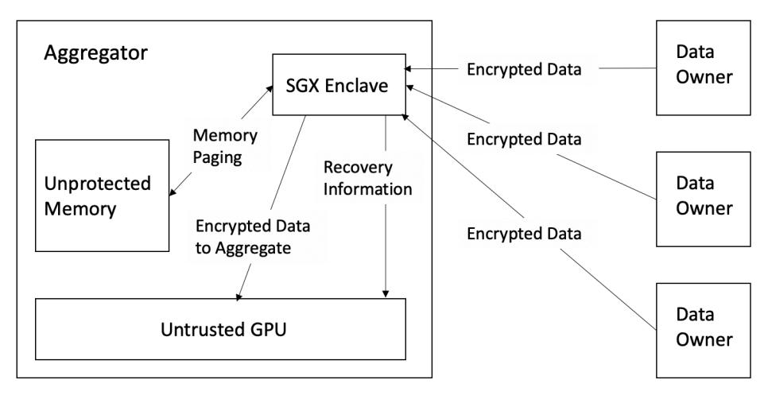
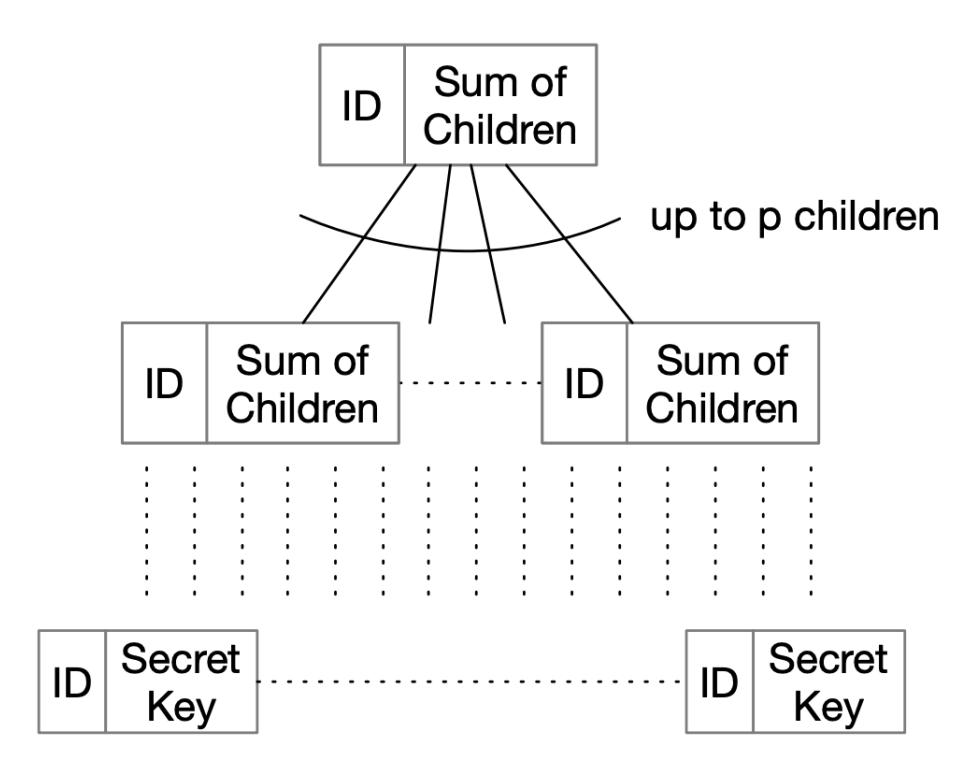
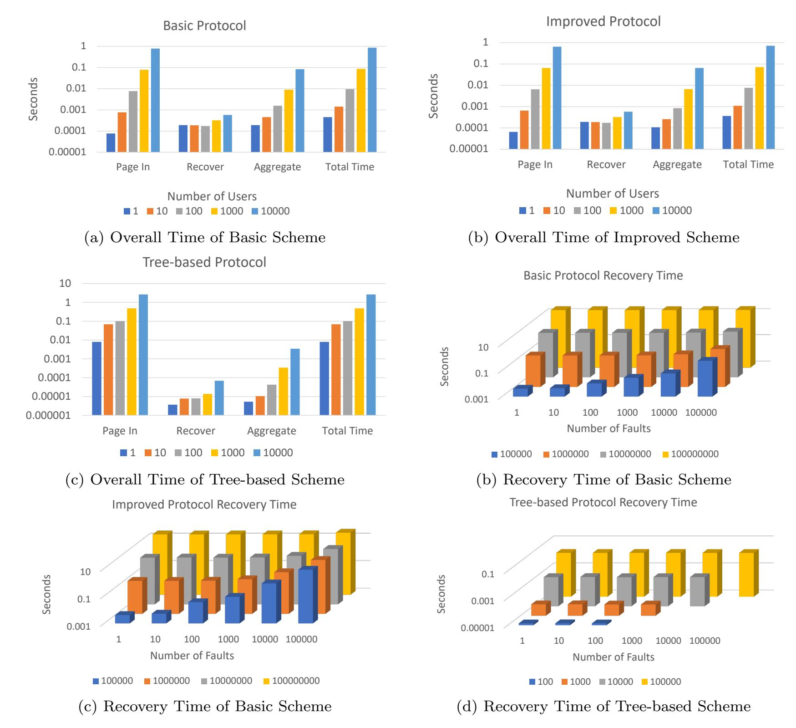
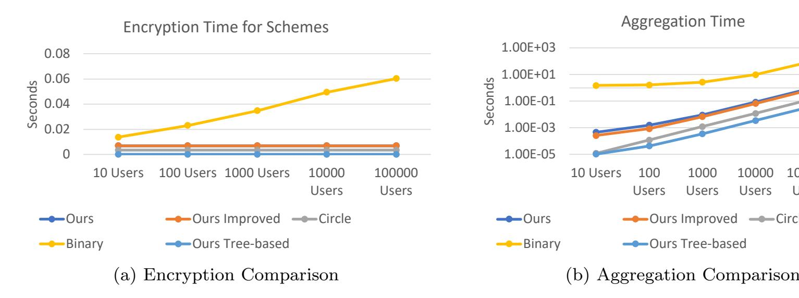
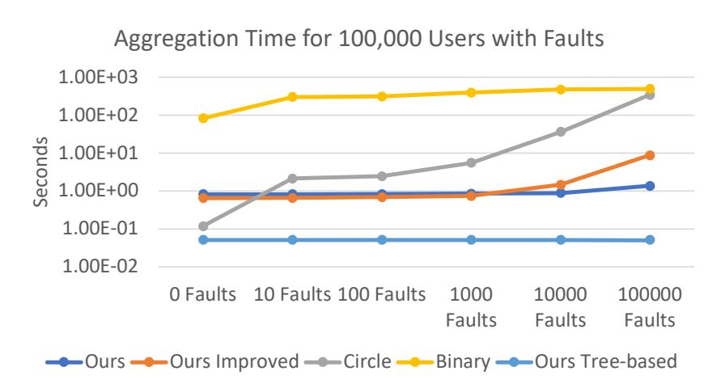
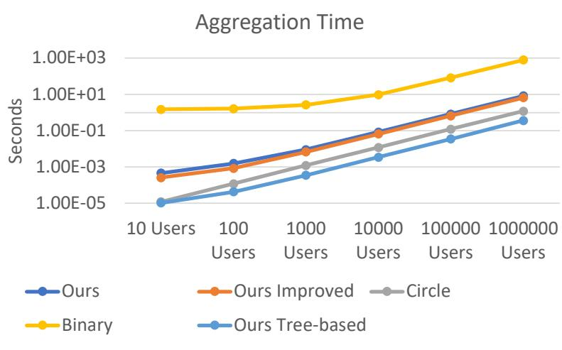

{0}------------------------------------------------

# Cryptonite: A Framework for Flexible Time-Series Secure Aggregation with Non-interactive Fault Recovery

Ryan Karl · Jonathan Takeshita · Nirajan Koirla · Taeho Jung

Received: 1 December 2021 / Accepted: DD Month YEAR

Abstract Private stream aggregation (PSA) is a technique that allows an untrusted server to compute aggregate statistics over a group of multiple users' data while ensuring each user's individual input remains private. Existing work in the literature requires a trusted third party to communicate with the server if the server needs to support fault tolerance, in a way that requires interactive recovery. In the real world, this may not be practical or secure. In our work, we develop a new formalized framework for PSA that takes fault tolerance into account, and is able to support non-interactive recovery, while still preserving strong privacy guarantees for individual users. A new level of security needs to be defined for the non-interactive model due to the malicious adversaries, as preexisting definitions do not account for faults and their impact on security during non-interactive fault recovery especially due to the residual function attacks. Following this, we develop the first protocol that provably reaches our new level of security, where individual inputs remain private even after the aggregation server performs fault recovery operations. The techniques we use are general, and can be used to augment any PSA scheme to support non-interactive fault recovery. Furthermore, we reach new levels of scalability and communication efficiency over existing work, and develop a protocol based on trusted hardware, cryptographic hashing, and p-ary tress that is roughly 3x faster than existing work in PSA, even if faults do not occur.

Taeho Jung Department of Computer Science University of Notre Dame Notre Dame, Indiana, USA Tel.: +574-631-8322

E-mail: tjung@nd.edu

Keywords Fault Tolerance · Trusted Hardware · Secure Aggregation

### 1 Introduction

Within the context of many applications that process large amounts of data, it is paramount that fresh results be available to consumers, despite the presence of frequent system faults [25]. For example, web companies such as Facebook and LinkedIn execute daily data mining queries to analyze their latest web logs, and online marketplace providers such as eBay and BetFair run fraud detection algorithms on real-time consumer trading activity[27]. Similarly, various types of failures are common in systems with user interactions, and the fault recovery must not affect performance adversely. Critically, due to the number of users participating in such protocols, the per-machine resource overhead of any fault tolerance mechanism should be low. Thus, such systems must be able to recover from failures without significantly impacting output accuracy, computation time expectations, or requiring interaction with unreliable/untrusted parties.

It is well known that existing work has proposed to support privacy preserving computation (secure multiparty computation (MPC), functional encryption (FE), perturbation, etc.) over multiple users' data. Of the existing techniques, Private Stream Aggregation (PSA) is very promising. PSA allows a third-party aggregator to receive encrypted values from multiple parties and compute an aggregate function without learning anything else, except what is learnable from the aggregate value. PSA is generally superior to other types of secure computation paradigms (e.g., MPC, FE) in large-scale applications involving time-series data be-

{1}------------------------------------------------

cause of its extremely low overhead and the ease of key management [29, 16]. Notably, PSA is non-interactive (i.e., users send their time-series data in a "stream" and only one message is sent per time interval) and asynchronous (i.e., users can leave after submitting their inputs), making it more efficient in communication than most existing alternative techniques [32]. However, existing solutions fail to achieve tolerance against faults during the aggregation without placing trust in the aggregators. We distinguish between non-interactive fault tolerance, which is the ability to recover from faults dynamically and "on the fly" without requiring extra messages be sent from/to faulted users or some trusted party, and interactive fault tolerance, which requires additional messages be exchanged to support recovery.

In this paper, we present a novel framework, Cryptonite, that allows any PSA scheme to gain non-interactive fault tolerance without significant additional overhead. There are many existing works that build ad-hoc solutions for this purpose that generally focus on providing one or a few of the following goals: privacy, efficiency, practical benefits such as permitting a user to drop in and out, or some type of interactive fault recovery mechanism. In contrast, our framework generalizes data aggregation, while still achieving traditional levels of performance and security, but more importantly, it introduces non-interactive recovery against faults to existing secure aggregation primitives without requiring users to trust the aggregator or requiring extra interaction.

This is a challenging problem to solve efficiently and securely, as most existing solutions require communicating with a trusted third party key dealer, which requires sending additional messages (generally two) during the protocol, greatly increasing the total overhead. A better solution would be non-interactive and would allow the aggregator to recover from a fault locally without sending additional messages, or requiring additional computation on the user end. However, a non-interactive protocol would need to guarantee correct function output with only one communication round [12, 5, 13]. As a result, such a protocol would be by its nature vulnerable to the residual function attack [17] in the standard model. In this attack, an adversary can repeatedly evaluate the function locally, while varying some inputs and fixing the inputs of others, to deduce the values entered by the participants. This vulnerability occurs because an aggregator that does not receive all of the users' encrypted inputs must be able to simulate acquiring such inputs, in order to complete the calculation. Existing work allows an aggregator to recover some partial data from the function they were to compute, but does so by sending a message to a trusted third party [9, 14] or aggregator to provide sensitive information that could

harm an individual user's privacy if released publicly [7, 20]. Such existing work supports interactive fault tolerance simply by allowing the aggregator to evaluate an aggregation multiple times, which is essentially the residual function attack. This technique is insecure, and presents a serious privacy risk even if the data is protected with privacy preserving (e.g., differentially private) noise. We need a new, more rigorous notion of privacy that accounts for fault tolerance without sacrificing traditional security expectations.

In contrast, our scheme does not rely on any interaction with a third party, thus cutting down on communication, while also supporting partial aggregation among the surviving participants (thus achieving noninteractive fault tolerance), to maximize utility for the aggregator. Our simulations show that the fault recovery mechanism introduces negligible extra overhead to a PSA scheme when no faults occur. More importantly, when faults occur, our framework allows the PSA to recover from faults much more efficiently than other fault recovery mechanisms for PSA. We achieve all of this while providing security in the presence of stronger adversaries, and our scheme can be easily extended to support a wider variety of functions, such as max, average, etc. [30, 14]. Our goals in designing this framework are to 1) devise a system that is able to recover from failures without significantly impacting processing result accuracy or computation/communication time expectations. 2) maximize user's trust in the protocol by requiring that any servers used to facilitate the aggregation not be trusted by the users, and 3) enable computations at aggregate levels while still protecting any individual level data. Any system seeking to support such goals should provide a formal privacy analysis to demonstrate that the mechanism achieves the above privacy goals.

Our original protocol leverages trusted hardware, specifically Intel SGX, combined with elliptic curve cryptography (ECC) to recover from faults, which may result in a high overhead when the number of the participants, and/or dropped users is high. For example, assuming a 1% drop-out rate for 1 billion users, the sheer list of 10 million users' IDs is at least 35MB since 30 bits are needed at the minimum for the IDs among 1 billion users. Passing such a large amount of messages/data in and out of an SGX enclave would likely lead to excessive paging due to the small 256MB limit of enclave memory [21]. In addition, all users' keys need to be kept inside SGX (with paging) after the initial creation, and later used during fault recovery, during which the expensive paging is inevitable. Thus, to continue to support the high efficiency benefit of PSA, this overhead needs to be significantly reduced. To solve this problem, we can

{2}------------------------------------------------

create and maintain a recursively-defined p-ary tree to keep the list of users and their keys in a form that can be efficiently used for non-interactive recovery.

It is also known that utilizing ECC based techniques on the users' end for encryption and on the aggregator's end for aggregation is significantly less efficient that other state-of-the-art techniques based on HMACs [20], and in situations where faults are relatively unlikely, our original protocol may be less useful than existing work. To expand on our original idea and build a protocol that can be practically deployed in a more realistic setting, where faults may be unlikely but can quickly cripple a system if they occur (especially in large numbers), we develop a technique for supporting PSA that combines TEEs with cryptographic hash chains. The hash chains can be used to mask user inputs but can be generated in a synchronized way within the TEE so we can unmask these inputs locally even if a fault occurs. Our resulting protocol is competitive with state-of-the-art techniques whether or not faults occur, and is a more practical scheme for deploying PSA in the wild.

This paper is expanded from our conference publication [18], and it has the following additional contributions:

- 1. We develop a novel technique based on p-ary trees that reduces the amount of work that must be done inside a trusted execution environment during the non-interactive fault recovery if more than one fault occur.
- 2. We develop a novel method for performing provably secure aggregation that leverages keyed cryptographic hashing combined with a TEE that is competitive with existing work, even if no faults occur.
- 3. We demonstrate new levels of scalability and communication efficiency over existing work that supports interactive fault tolerance. Our code is available at: https://github.com/RyanKarl/CryptoniteDemo.

### 2 Related Work

Recently there has been interest in constructing PSA systems that allow for dynamic user groups or interactive fault tolerance, that are similar to fault-tolerable deterministic threshold signatures[26]. Fault tolerance in this context is the property that in the event that a user or group of users do not send data to the aggregator, either due to a natural failure or a malicious act, the aggregator can still recover a partial sum over the remaining users' messages that were successfully sent. There are primarily two existing paradigms for this.

- (1) Recovery via trusted parties: In the first [20, 14, 2, 1], the aggregator communicates with an independent third party to notify them of the fault, and the third party provides the inputs to the aggregator to allow for the successful completion of the protocol for each aggregation. Since the third party knows the secrets assigned to every node, if some nodes fail to submit data, the aggregator asks the dealer to submit synthetic data on behalf of those failed nodes. This method incurs a round trip communication overhead between the key dealer and the aggregator for each aggregation (i.e., interactive). Some researchers [20] used a circle based construction to improve efficiency, but had to interact with a third party to recover from faults, which can lead to high communication delay. Other work [2, 1] explored using elliptic curves to improve the overhead of communication and computation, while still supporting interactive fault tolerance, but this requires that some trusted, independent third parties be communicated with each round for fault recovery. Similar work explored outsourcing expensive computations to the cloud [14] to support a wider variety of functions instead of just sum, such as min, average, etc., but they also require interactions with trusted third parties.
- (2) Recovery via input buffering: In the second paradigm [3, 8, 9], users buffer their inputs that they send to the aggregator. Essentially, in this method users send a set of ciphertexts corresponding to several timestamps/inputs to the aggregator. Thus, if a user fails to communicate in the future, the aggregator can utilize these ciphertexts to complete the aggregation and cancel out the noise needed to recover the partial sum. This increases the overall message size by a factor of how many rounds the user buffers their input (to buffer for 2 rounds, the size of the message is twice as large, etc.). One of the first works explicitly interested in supporting interactive fault tolerance [7] used a novel approach based on a binary interval tree technique to reduce the communication cost for joins and leaves, via input buffering. However, their scheme has a high aggregation error, which leads to the poor utility of the aggregate. Another technique [36] for buffering future ciphertexts was developed to reduce communication overhead, and was later made more efficient and scalable [3, 8]. A security-enhanced data aggregation scheme [9] with interactive fault tolerance based on Paillier's encryption scheme has been proposed. Unfortunately, internal attacks are not considered in the above data aggregation schemes thereby allowing internal attackers to access the consumers' data. This was later improved [24] by leveraging lifted El-Gamal encryption to improve performance, and authentication methods were added for message integrity, although the vulnerability to internal

{3}------------------------------------------------

attackers was left as an open problem. Later work [10] investigated using techniques to make key generation non-interactive. There has been some work that tries to solve this problem by allowing users to communicate with each other if a fault is detected to restart the protocol [37, 34], but we are interested in developing better approaches that do not require interaction among users, as this can lead to significant overhead and scalability issues.

Advantage of our work: The aforementioned schemes are either inefficient, fail to achieve non-interactive fault tolerance (i.e. extra messages must be sent to trusted parties), and/or are insecure against the residual function attack. In contrast, our scheme supports non-interactive fault tolerance, thus cutting down on communication, while also supporting partial aggregation among the surviving participants without introducing residual function attack vulnerabilities.

Orthogonal work: Defending against users that lie about their values to pollute the final output is outside the scope of the paper, but one possible defense is for each user to use a non-interactive zero-knowledge proof to prove the encrypted input is either in a valid range or an already-committed value.

Common misconceptions: Note that it is not possible to simply leverage historical data, or utilize machine learning techniques to estimate possible inputs of faulted users and use the inferred inputs to recover the final aggregation. This is because, to have provable security guarantees, the ciphertexts shared with the aggregator in the PSA are computationally indistinguishable from random numbers. Therefore, no inference approaches can gain meaningful information from the ciphertexts to predict and recover the missing inputs (e.g., due to faults).

#### 3 Preliminaries: Private Stream Aggregation

The field of PSA seeks to solve the following problem. Suppose an aggregator wishes to calculate the sum of n users periodically. Let  $x_i^{(t)}$  (where  $x_i^{(t)} \in \{0,1,\ldots,\Delta\}$ ) denote the data of user i in aggregation period t (where  $t=1,2,3,\ldots$ ). Then, the sum for time period t is  $\sum_{i=1}^n x_i^{(t)}$ . In some scenarios, in each time period t, each user i adds noise  $r_i^{(t)}$  to their data  $x_i^{(t)}$ , encrypts the noisy data  $\hat{x}_i^{(t)} = x_i^{(t)} + r_i^{(t)}$  with their key  $k_i^{(t)}$  and sends the ciphertext to the aggregator. The aggregator can then use their own key,  $k_0^{(t)}$  to decrypt the noisy sum  $\sum_{i=1}^n \left(x_i^{(t)} + r_i^{(t)}\right)$ . In this scenario,  $k_i^{(t)}$  and  $k_0^{(t)}$  change in every time period. Note that we focus on the aggregation scheme over the same time period and omit the t to save space when the context is clear. We also do not

add noise  $r_i^{(t)}$  for simplicity of presentation. We assume that every user communicates with the aggregator via a wireless connection, but note that in our setup there is no need for users to communicate with each other. We assume that time is synchronized among nodes. Generally speaking, for a private aggregation protocol to be secure, it must achieve three properties: 1) the aggregator cannot achieve any meaningful intermediate results (i.e. they learn the final noisy sum but nothing else), 2) the scheme is aggregator oblivious (a party without the aggregator learns nothing), and 3) the scheme achieves differential privacy. Note that requirement 3 is needed in some contexts where it is assumed the accurate sum may leak user privacy in presence of side information. Thus, the aggregator is only allowed to obtain a noisy sum (the accurate sum plus noise).

### 4 New Notion of Security

To achieve a meaningful level of security, current aggregation schemes strive to guarantee aggregator obliviousness which is informally defined as follows:

### Definition 1 (Aggregator Obliviousness)

Assuming that each honest participant  $p_i$  only encrypts once in each time period, a secure aggregation scheme achieves aggregator obliviousness if: 1) the aggregator can only learn the final aggregate for each time period, 2) without knowing the aggregator key, no one can learn anything about the encrypted data, even if several users collude, and 3) if the aggregator colludes with a subset of the users, or if a subset of the encrypted data has been leaked, the aggregator learns no additional information about the honest participants' individual data, beyond what can be inferred by the final aggregation.

While this definition is useful in schemes that do not consider fault tolerance, it becomes less useful once faults occur and need to be recovered without interactions. To recover from a fault without interactions. an aggregator must be able to generate synthetic input from any user to complete the calculation. This is because PSA schemes must encode data in such a way that no partial information can be gained unless every participant's key is used in the final aggregation (for the sake of aggregator obliviousness). However, this actually violates the aggregator obliviousness, since to recover from faults without interactions, an aggregator must be able to calculate any partial sums, which would allow the aggregator to deduce everyone's input by subtracting the partial sums (i.e., residual function attack). Introducing differential privacy is not sufficient as the noise must be

{4}------------------------------------------------

significantly larger than that in the PSA schemes with computational differential privacy (O(n) where n is the number of users rather than O(1) in existing schemes [4, 29]) to prevent such residual function attack. Many applications cannot afford to operate over results with excessive noise, as the significant loss in data accuracy prevents the subsequent data analysis from having any utility to analysts [11]. Therefore, we are primarily interested in investigating how to design a system where the residual function attack is not possible even without differentially private noise being introduced to the input.

Note that introducing computational differential privacy [4, 29] on top of such a system is trivial. Users can locally add calibrated noise to their inputs before encryption for the sake of computational differential privacy. This is independent from the rest of the PSA and our framework, therefore we omit the description due to the space limit.

Issues with Existing Techniques: Existing works try to avoid this issue by introducing a trusted, independent third party that can assist the untrusted aggregator with completing the protocol. This is facilitated by allowing the aggregator to request the third party provide the keys or ciphertexts the user was supposed to send to the aggergator so that they can complete the calculation and determine the partial sum. While there may be scenarios where this adversary model is acceptable, in the real world, it may be difficult or even impossible to find such a trusted third party (arguably, if such a third party exists it may be easier for users to send their plaintexts directly to them to speed up processing). More specifically, we are interested in supporting privacy in a scenario where there are no independent third parties involved in fault recovery. In this setting, the two existing methods of achieving fault tolerance are ineffective, as they are vulnerable to the residual function attack. An aggregator can compute the same function over different inputs, compute the difference between the final outputs, to infer individual values inputted by different users.

Consider the first family of fault tolerant protocols, which allow the aggregator to ask an independent third party to provide the information needed to recover the output. If such an third party is not trusted, the aggregator can request all of the private information from this third party and recover every party's individual input via the residual function attack. We also note that even if this third party is trusted, in existing work, it is unclear how to prevent the untrusted aggregator from lying about users faulting, even if they complete their part of the protocol, to recover the synthetic inputs they need to launch the residual function attack. The second

family of fault tolerant protocols, where users buffer future inputs to the aggregator is similarly vulnerable. If there is no trusted third party, the aggregator can simply request the buffered inputs, even if a user does not fault, to execute the residual function attack. Similarly, even if the third party that stores the buffer is trusted, the security guarantee is somewhat unclear, as the aggregator can lie about the fault status of users to recover the synthetic input needed to execute the residual function attack. Clearly, we need a new definition of aggregator obliviousness within the context of fault tolerant systems, that accounts for such scenarios. By extending the existing definitions [29, 15], we define the fault-tolerable aggregator obliviousness as follows:

# Definition 2 (Fault-Tolerable Aggregator Obliviousness)

Define a set of users i ∈ N, where 0 ≤ i ≤ |N|, where the subset of users that fault is denoted U and the set of users that do not fault is denoted J, were N = U ∪ J. A set of users N participating in a secure aggregation scheme β, with public parameters params, during timestep t, whose inputs and secret keys are denoted xi and ski respectively, achieve aggregator obliviousness with fault tolerance if no probabilistic polynomial-time adversary has more than negligible advantage in winning the below security game:

Setup : Challenger runs a Setup algorithm, and returns the public parameters params to the adversary.

Queries: The adversary makes the following three types of queries:

- 1. Encrypt: The adversary may specify (i, t, x) and ask for the ciphertext. Challenger returns the ciphertext affiliated with Enc(ski , t, xi) to the adversary.
- 2. Compromise: The adversary specifies an integer i ∈ {0, . . . , |N|} If i = 0, the challenger returns the aggregator key sk0 to the adversary. If i ̸= 0, the challenger returns ski the secret key for the i th participant, to the adversary.
- 3. Challenge: This query can be made only once throughout the game. The adversary specifies a set of participants Q and a time t ∗ Any q ∈ Q must not have been compromised at the end of the game. The adversary also specifies a subset of Q denoted Y of users they claim faulted (i.e. a user in Y may not have actually faulted). For each user q ∈ Q the adversary chooses four plaintexts (xq),(x ′ q ),(xy),(x ′ y ). The challenger flips a random bit b. If b = 0, the challenger computes ∀q ∈ Q\Y : Enc (skq, t∗ , xq), ∀y ∈ Y : Enc (sky, t∗ , xy) and returns the ciphertexts to the adversary. If b = 1, the challenger computes and returns the ciphertexts ∀q ∈ Q\Y : Enc skq, t∗ , x′ q , ∀y ∈ Y : Enc sky, t∗ , x′ y instead.

{5}------------------------------------------------

Guess: The adversary outputs a guess of whether b is 0 or 1. We say that the adversary wins the game if they correctly guess b and the following condition holds. Let K ⊆ N denote the set of compromised participants at the end of the game. Let M ⊆ N denote the set of participants for whom an Encrypt query has been made on time t ∗ by the end of the game. Let Q ⊆ N denote the set of (uncompromised) participants specified in the Challenge phase. If Q = K ∪ M := N\(K ∪ M), J ∪ Y ≠ ∅, and the adversary has compromised the aggregator key, the following condition must be met: P q∈Q xq + P y∈Y xy = P q∈Q x ′ q + P y∈Y x ′ y .

Essentially we say that a secure aggregation scheme achieves fault-tolerable aggregator obliviousness if: 1) the aggregator can only learn one sum for each time period, even if a subset of users fault, 2) without knowing the aggregator key, no one can learn anything about the encrypted data, even if several users collude, and 3) if the aggregator colludes with a subset of the users, or if a subset of the encrypted data has been leaked, the aggregator learns no additional information about the honest participants' individual data. This better captures the requirements needed to protect against the residual function attack, since at least two separate function evaluations must be completed by an adversary for the attack to be successful. In the previous definition, multiple sums could still be calculated by an attacker, while still fulfilling the requirements of the definition. Also, to be fault tolerant, multiple ciphertexts associated with one user need to be available to the aggregator, so making an assumption that only one ciphertext is associated with each user may limit the utility of the previous definition, as if a user faults, another ciphertext associated with the user, but generated independently from the user may be needed for recovery.

# 5 Cryptonite: A Novel Framework for Any PSA Scheme

# 5.1 The Framework Definition

To achieve the above notion of privacy, we design a new secure aggregation framework β in 1, that addresses fault tolerance. At a high level, our framework follows the same general procedure used by existing PSA schemes based on additive key homomorphism to distribute private keys to each participant during Setup. Following this, each user leverages their private key to encrypt their private data during Enc. After the aggregator receives all the users' ciphertexts, the aggregator can optionally invoke a fault recovery mechanism, FaultRecover, for a subset of users they claim faulted. This mechanism will verify that the aggregator's claim is accurate, and they

did not claim a user faulted when they in fact received their ciphertext. If it is found the aggregator made a false claim the protocol aborts. After this, the aggregator can recover the final aggregation result of the data it successfully received from the users with AggrDec. We formalize the fault recovery mechanism so that we can better enforce that protocols will not be vulnerable to the residual function attack. This framework supports the same general functionality as the previous framework, but allows the aggregator to recover the needed information regarding users who fault to complete the protocol in a privacy preserving manner as described in 2.

### 5.2 Framework Instantiation

To formally investigate the correctness and the security of our framework, we instantiate a precise protocol, θ, using Cryptonite. We first present our basic approach, and we later overcome performance limitations in our optimized version, which is presented in the following section. The greatest challenge we face when designing this protocol is how to guarantee that the aggregator cannot act maliciously and acquire the synthetic data it needs to execute a residual function attack. Since any actions taken by an aggregator must be tightly controlled to support non-interactive fault recovery, and previous work has shown achieving specific security guarantees in certain non-interactive protocols is impossible in the standard model without additional hardware assumptions [17], a natural choice to support this functionality is to leverage trusted hardware, such as a Trusted Execution Environment (TEE), combined with PSA based on additive key homomorphism. We summarize the requisite background below.

Trusted Hardware: One of the most prevalent forms of trusted hardware in modern computing is Intel SGX, a set of new CPU instructions that can be used by applications to set aside private regions of code and data. It allows developers to protect sensitive data from unauthorized access or modification by malicious software running at higher privilege levels. To support this, the CPU protects an isolated region of memory called Processor Reserved Memory (PRM) against other nonenclave memory accesses. Sensitive code and data is encrypted and stored as 4KB pages in the Enclave Page Cache (EPC), a region inside the PRM. Although EPC pages are allocated and mapped to frames by the OS kernel, page-level encryption guarantees confidentiality and integrity. To provide access protection to the EPC pages, the CPU maintains an Enclave Page Cache Map (EPCM) that stores security attributes and metadata

{6}------------------------------------------------

#### Framework $\beta$

**Setup**( $1^{\lambda}$ ): Takes in a security parameter  $\lambda$ , and outputs public parameters param, a private key  $sk_i$  for each participant, as well as a aggregator key  $sk_0$  needed for decryption of aggregate statistics in each time period. Each participant i obtains the private key  $sk_i$ , and the data aggregator obtains the key  $sk_0$  at the end of this algorithm.

 $\mathbf{Enc}(param, sk_i, t, x_i)$ : During time step t, each participant calls the Enc algorithm to encode its data  $x_i$  via  $sk_i$ . The result is an encryption of  $x_i$  using the additive key homomorphism from the chosen PSA, denoted  $ENC(x_i)$  or  $c_i$ .

FaultRecover(J, U, t): The fault recovery algorithm takes in the set of all the IDs of all the users that the aggregator reports as having faulted, denoted J, during time period t, along with the IDs of all of the users that successfully sent their encrypted data U. The algorithm then verifies that the two sets of users are disjoint. If the sets are not disjoint the algorithm outputs nothing and the protocol aborts. If the two sets are disjoint, the algorithm outputs for all  $j \in J$  the ciphertexts corresponding to an encryption of 0 as  $c_j$ . This algorithm can only be called once for each time period.

**AggrDec**  $(param, sk_0, t, c_u \forall u \in U, c_j \forall j \in J)$  Takes in the public parameters param, a key  $sk_0$ , the ciphertexts for all users in the set of users that did not fault  $u \in U$  as  $c_u$ , and the ciphertexts for all users in the set of users that did fault  $j \in J$  as  $c_j$ , for the same time period t. For each  $i \in N$  where N is the union of U and J let  $c_i = \text{Enc}(sk_i, t, x_i)$ . Let  $\mathbf{x} := (x_1, \dots, x_n)$ . The decryption algorithm outputs  $f(\mathbf{x})$ .

Fig. 1 Our Framework

associated with EPC pages. Note our framework can work with any TEE. To utilize Intel SGX, applications must be written in a two part model, where applications must be seperated into secure parts and non-secure parts. The application can then launch an enclave, that is placed in protected memory, to allow user-level code to define private segments of memory. The contents of these segments are protected and unable to be read or saved by any process outside the enclave. Enclave entry points are defined during compilation, such that the secure execution environment is part of the host process, and the application contains its own code, data, and the enclave, but the enclave contains its own code and data too [23].

Elliptic Curves: Note that our framework instantiation can work with any PSA that is based on additive key homomorphism [31], but we chose elliptic curve cryptography (ECC) for our concrete instantiation. ECC provides the same level of security as RSA, Paillier, or discrete logarithm systems over  $Z_p$  with considerably shorter operands (approximately 160–256 bit vs. 1024–3072 bit), which results in shorter ciphertexts and signatures. As a result, in many cases, ECC has performance advantages over other public-key algorithms [6].

**Protocol**  $\theta$ : Note that [31] uses a key-homomorphic weak PRF to construct PSA, and uses the seminal PSA of Shi et al. [29] as an example. Thus we choose to instantiate our framework with theirs, so that our framework can be adapted to turn any PSA that is based on additive key homomorphism into a fault-tolerable version. When the context is clear, we sometimes use standard addition and multiplication operators, as done in previous PSA papers [29, 7], when operating over ciphertexts, for simplicity of presentation. Let  $\mathbb{G}$  denote a cyclic group of prime order p for which Decisional

Fig. 2 System Diagram

Diffie-Hellman is hard. Let  $H : \mathbb{Z} \to \mathbb{G}$  denote a hash function modeled as a random oracle. We assume the aggregator is equipped with an Intel SGX, and model our system design in Figure 2.

**Setup**( $1^{\lambda}$ ): Each user first performs attestation with the aggregator's Intel SGX, to verify it will faithfully execute the protocol (this is a one time process). The Intel SGX performs key generation, and chooses a random generator  $g \in \mathbb{G}$ , and n+1 random secrets  $s_0, s_1, \ldots, s_n \in \mathbb{Z}_p$  such that  $s_0 + s_1 + s_2 + \ldots + s_n = 0$ . The public parameters param := g. The aggregator obtains the key  $sk_0 := s_0$  and participant i obtains the secret key  $sk_i := s_i$ . For practical purposes, we can use secret shares that sum to zero as secret keys.

 $\mathbf{Enc}(param, sk_i, t, x_i)$ : For participant i to encrypt a value  $x \in \mathbb{Z}_p$  for time step t, they compute the following ciphertext  $c_i \longleftarrow g^{x_i} \cdot H(t)^{sk_i}$ , where H(t) denotes the hash of t that maps t to an elliptic curve. Note, after this the user sends its ciphertext and unique id to the aggregator's SGX.

FaultRecover $(c_j, c_u, t)$ : Here, after the time period has ended, within the Intel SGX, we check each ciphertext that was received against a data structure of all users who participated in the setup process, and record which users failed to respond within the time window.

{7}------------------------------------------------

Note this process cannot be tampered with from outside the enclave. Then, since the Intel SGX has each user's secret key, it can compute  $c_i \leftarrow g^0 \cdot H(t)^{sk_j}$  for all users  $j \in J$ . Notice that a nice property of this setup is that if a user is late and sends a ciphertext associated with time period t after that time period has passed, the Intel SGX can simply discard it and there is no danger of it being leaked to the aggregator.

**AggrDec**(param,  $sk_0, t, c_j, c_u$ ): Compute within the enclave (note  $N = U \cup J$ )  $V \leftarrow H(t)^{\operatorname{sk}_0} \prod_{i=1}^n c_i$ . To decrypt the sum, we can leverage Pollard's lambda method, as done in previous works [29], to compute the discrete log of V base g. This method requires decryption time roughly square root in the plaintext space, although in general solving the discrete log is highly parallelizable and can be done efficiently in practice as long as the plaintext is small [7].

Note that this construction is secure under 2, and we can prove this via a security game, using proof techniques from existing work [29]. We include the full proof in 8, and sketch it here for completeness. Essentially, assuming that the Decisional Diffie-Hellman problem is hard in the group  $\mathbb{G}$  and that the hash function H is a random oracle, we can prove that the above construction satisfies aggregator oblivious security with fault tolerance, by showing via reduction to a series of hybrid games that the game described above is hard to win for our scheme. More specifically, to prove the theorem, we will modify the aggregator oblivious security game as such. In the **Encrypt** queries, if the adversary submits a request for some tuple  $(q, x, t^*)$  where  $t^*$  is the time step specified in the **Challenge** phase, the challenger treats this as a **Compromise** query, and simply returns the  $sk_q$  to the adversary. Given  $sk_q$ , the adversary can compute the requested ciphertext. The adversary has access to a the functionality, **FaultRecover**, that can only be called once (since this is enforced via trusted hardware), which takes in a set of users that have not been compromised  $(j \in J)$ , and returns the set of ciphertexts that correspond to those users encrypting 0. This modification actually gives more power to the adversary. Note that this protocol is not vulnerable to the residual function attack, as the adversary cannot access multiple ciphertexts associated with a user for a given timestamp. Here, the individual ciphertexts are sent into the enclave, which can independently handle the computations needed for fault recovery in an isolated environment that cannot be spoofed or tampered with by an attacker (unlike in the previously discussed techniques that provide fault tolerance that requires additional communication rounds). Thus, the fault recovery process can be performed in a secure, non-interactive way, that removes the opportunity for an attacker to spoof the fault recovery to obtain an encryption of 0 for a user, even when the user participates and does not fault, such that the attacker can perform the residual function attack by utilizing both ciphertexts to deduce the user's plaintext input. Achieving differential privacy is not the primary focus of this paper, but we can easily adapt the methods of existing works if needed [29, 7].

A More Efficient Protocol The above protocol achieves security according to 2, but it incurs additional computational overhead since the aggregation is done inside the TEE. It would be better if we could outsource the aggregation computation to the untrusted aggregator to improve performance and avoid the MEE's overhead. We can accomplish this by following the same **Setup** procedure as before, but instead having users send two messages simultaneously. They can send their ciphertext (i.e. the result of **Enc**) to the untrusted aggregator, and also send one separate message to the Intel SGX to indicate they are participating in the protocol. Intuitively, the aggregator can simultaneously begin the partial summation of the ciphertexts of the users that did not fault outside the TEE (by calling **AggrDec**), while inside the SGX, FaultRecover is run to determine which users faulted and computes their synthetic ciphertexts which are sent out of the TEE to the aggregator. In this way, the somewhat expensive aggregation step can be done on more powerful, albeit untrusted hardware (e.g., GPU, FPGA), that has better access to parallel computing resources, without compromising security. We note that this scheme is not secure if the adversary can disrupt communication between the users and the Intel SGX, but we can solve this by simply having all users send their ciphertexts signed with a digital signature directly to the SGX first, instead of just the separate message. Then the SGX can output the users' ciphertexts who did not fault to the untrusted space controlled by the aggregator, along with the synthetic data used to overcome existing, verified faults, which can be more efficiently aggregated outside the enclave.

Outsourcing to Parallel-friendly Processors It may seem more efficient to simply send plaintext data to an SGX enclave to be aggregated, but it is known that Intel SGX has difficulties exploiting multi-threading due to the lack of common synchronization primitive support often found on traditional operating systems [23] (threading can also introduce security vulnerabilities [35]). Also, TEEs have been shown to run common functionalities over an order of magnitude slower than what can be achieved on comparable untrusted hardware, due to the overhead of computing within the enclave [23], and performing a large number of context switches to send each user's data into the TEE can add serious

{8}------------------------------------------------

overhead, especially in a big data setting. Overall performance can be improved if we minimize the number of context switches and outsource the aggregation step (i.e., AggrDec over inputs without faults) to processors with high parallel computing ability (e.g., many-core CPUs, GPUs, or FPGAs), because the additions of AggrDec are perfectly parallelizable.

PSA Schemes Requiring Trusted Parties In PSA schemes, the Setup is run only once and in a trusted manner [4, 29, 15]. This is typically accomplished through the use of an additional trusted third party key dealer or secure multiparty computation. However, with our framework, this can be replaced with the TEE, since the integrity of private key generation that is secure from eavesdropping will be guaranteed via remote attestation. Thus, our framework can remove the reliance on an external trusted third party in our PSA building block.

#### Efficient Online Fault Recovery via p-ary Trees

Our original protocol leverages SGX to recover from faults, which may result in a high overhead when the number of the dropped users is high. Recall with a 1% drop-out rate for 1 billion users, the list of 10 million users' IDs is at least 35MB since 30 bits are needed at the minimum for the IDs among 1 billion users. Passing such information into SGX enclaves may cause expensive paging due to the small limit of enclave memory, and during recovery from faults the expensive paging is inevitable. This overhead needs to be reduced significantly such that the high efficiency benefit of secure aggregation schemes is not diluted.

To solve this problem, we can create and maintain a recursively-defined p-ary tree (Figure 3) to keep the list of users and their keys in a form that can be efficiently used for non-interactive recovery. Each user's ID and the secret key will be stored in a leaf node. Leaf nodes will be clustered into non-overlapping groups of up to p leaf nodes, and one parent node is created for each group such that all leaf nodes become its child nodes. The parent node gets assigned a unique ID and contains the sum of all the secret keys of its child nodes. Then, the p-ary tree is defined recursively as follows. All trees of depth d will be clustered into non-overlapping groups of up to p subtrees, and a new root is created for each group such that the roots of the subtrees become child nodes of the new root. The new root gets assigned a unique ID and contains the sum of all the secret keys of its child nodes. This repeats until all leaf nodes/trees are merged into one single p-ary tree. The complexities of insertion and deletion in this tree are both O(logpn). We will also maintain a partial copy of the p-ary tree which contains the IDs of the nodes only, and let the aggregator keep the copy in an unencrypted form. When

Fig. 3 A p-ary Tree

a set of users drop out in the middle of aggregation, the aggregator will determine the minimum set of internal/leaf nodes that contain the users who did not drop, and pass the IDs of these nodes to the SGX enclaves such that the sum of secret keys of the remaining users can be calculated efficiently inside SGX, after which the partially aggregated PSA ciphertexts can be decrypted inside SGX enclaves.

### New Secure Aggregation Technique Based on Cryptographic Hashing

To improve the speed of the protocol, we developed a technique that combines a stream cipher, based on keyed cryptographic hashing (HMAC) slightly similar to that of Lamport [19], with a TEE. This makes encryption, aggregation, and decryption faster since we do not need to use relatively more expensive elliptic curve operations as in our earlier work. Without a TEE this approach would not be practical, because for the users' private keys/masking values we would need to rely on a trusted third party key dealer to communicate the demasking values to the untrusted aggregator every time they want to recover the final aggregation. The trusted third party would need to know all of the individual private keys/masking values, so if they were to collude with the aggregator, security would be broken (and if they are already trusted enough to know all the secret keys/masking values, it might make more sense to just have them do the aggregation over the users' plaintexts without resorting to encryption). For fault tolerance, we need to have some way of safely updating these individual keys/masking values in a synchronized way between the aggregator and the users. We can get around these problems by creatively utilizing SGX. We provide a high level summary our approach below, before providing a more rigorous description.

{9}------------------------------------------------

First, the SGX generates secret seeds  $s_i$  and sends them over a secure channel to the users. The users generate their secret key  $sk_i$  by computing the cryptographic hash of  $s_i$  as  $sk_i = H(s)$ , and take a keyed cryptographic hash of time step t using the secret key to generate a random masking value  $b_i = K(sk_i, t)$ , where H denotes taking a cryptographic hash, and K denotes taking a keyed cryptographic hash (HMAC). The users encrypt their input  $x_i$  using the  $b_i$  to get ciphertext  $c_i = b_i + x_i$ . They then each send  $c_i$  to the aggregator, who sums them to get  $C = \sum c_i$ . Because the  $s_i$  are still in the SGX, during the time step inside the SGX for all the users/keys we can calculate  $B = -\sum b_i$ . Then we can compute  $C + B = \sum x_i = X$  to recover the final aggregation result X. We can still provide fault recovery by adding back in the appropriate  $b_i$  to cancel the masking out to 0. We need to update the masking values at both the user end and in the SGX in a synchronized way, and to do this we can take the cryptographic hash of the previous  $sk_i$  on both ends. We can continue doing this each round for each new time step.

More formally, the protocol consists of the following algorithms, and it is assumed the choice of secure hash function (SHA, etc.) is shared beforehand as a public parameter:

**Setup**( $1^{\lambda}$ ): Each user first performs attestation with the aggregator's Intel SGX, to verify it will faithfully execute the protocol (this is a one time process). The Intel SGX performs key generation, and chooses n random secret seeds  $s_1, \ldots, s_n$ , that are used to generate secret keys by computing  $sk_i = HASH(s_i)$ , where  $HASH(s_i)$  denotes the cryptographic hash of  $s_i$ . The aggregator computes the demasking value  $b_0 := \sum_{i=1}^{n} HASH(s_i)$ 

 $-\sum_{i=1}^{n} HMAC(sk_i,t)$  and participant i computes the secret key  $sk_i = HASH(s_i)$  and then computes their masking value as  $b_i := HMAC(sk_i,t)$ . after receiving  $s_i$  over a secure channel.

 $\mathbf{Enc}(sk_i, x_i, t)$ : For participant i to encrypt a value  $x_i \in \mathbb{Z}_p$  they encrypt the plaintext by computing  $c_i = b_i + x_i$ . Note, after this the user sends their ciphertext to the aggregator's SGX, and they can update their key by computing  $sk_i := HASH(sk_i)$ , and then update their masking value as  $b_i := HMAC(sk_i, t')$  where  $HASH(sk_i)$  denotes the cryptographic hash of  $sk_i$  and t' is the next time step (note key updates can be precomputed and stored).

FaultRecover $(c_j, c_u, t)$ : Here, after the time period has ended, we check each ciphertext that was received and record which users failed to respond within the time window. Then, since the Intel SGX has each user's secret key, within the Intel SGX, we update the aggregators' demasking value by computing  $b_0 := b_0 + b_j$  for all users  $j \in J$  where J is the set of users that faulted.

**AggrDec** $(sk_0, t, c_j, c_u)$ : Outside the enclave the aggregator computes  $C = \sum_{u \in U} c_u$ , where U is the set of users that responded. After this, the C is sent into the enclave. Compute within the enclave  $b_0 + C$  to recover the final sum  $\sum_{u \in U} x_u$ . We can then update the secret keys and demasking value inside the enclave by computing  $sk_i := HASH(sk_i)$  and  $b_0 := -\sum_{i=1}^n HMAC(sk_i, t')$  (note key updates can be precomputed and stored). Finally the aggregated sum is returned to the aggregator and sent out of the enclave.

We provide a sketch of a proof of security below for completeness, and an extended discussion can be found in the appendix. Essentially, by the security and collision resistance of the cryptographic hash function and the security of generating a truly random seed inside the Enclave, the random streams generated by each user are indistinguishable from random. Because these streams of numbers are used to perform the stream cipher encryption, the adversary cannot deduce which ciphertext corresponds to which input for each user for each round, as this would require them to be able to distinguish from random numbers and the streams of numbers. As a result, the semantic security of the ciphertexts generated in our scheme follows directly from the security and collision resistance of the cryptographic hash. We note that even if the untrusted aggregator colludes with some malicious users, although they can learn the individual inputs of the malicious users, since they only receive the aggregated sum as a final result, they cannot learn which honest user inputted which individual value, provided there is more than one honest user. Thus, the protocol is secure.

#### 6 Experiments

To better understand the practical performance of our protocol we ran experiments using C++11 that simulated having thousands of users run our protocol, as is standard in the literature [7, 20]. For these tests, we used a workstation running Ubuntu 16.04 LTS equipped with a Intel(R) Core(TM) i7-8700 CPU @ 3.20GHz with Intel SGX support. We did not leverage GPUs/FPGAs because we did not have access to computers equipped with both Intel SGX and GPUS/FPGAs. During tests we simulated the cryptosystem over Koblitz curve secp160k1, that offers 160 bits of security. We used time series data from the 3W dataset from the UCI machine learning data repository [33], and report the average time for 50 trials for each experiment.

Although there are space constraints associated with an Enclave, and a program that exceeds the allocated space incurs paging overhead, we found that in practice we could efficiently process aggregation over large

{10}------------------------------------------------

Fig. 4 Experimental Results

numbers of users without major issues. Note the data footprint per user is roughly 100 bytes, and since in practice we can fit roughly 93 mb of data into an Enclave before triggering paging, we conservatively estimate that we can support about 900,000 users per Enclave, assuming we can fit the remaining program logic and metadata into roughly 3 mb. Since Intel plans to support Enclaves up to 1 terabyte in size in upcoming releases, we anticipate this being less of an issue in the future [22].

Basic Scheme: The results for our basic scheme, assuming no users fault, are shown in 4a. It is interesting to note that in all cases the overall time is dominated by the overhead of paging into and out of the enclave, and other important operations, such as performing the aggregation, only minimally contribute to the overall runtime. This makes sense, as it has been documented that these operations are comparatively expensive, due to the expensive cryptographic operations involved and

the time needed to marshal the data. However, our results show that the overall time scales well in the presence of a large number of users. For instance our protocol takes about a second to finish when there are 10,000 users, assuming the attestation setup is precomputed. We report the additional time needed to recover from faults in 4d. We notice that since the dummy ciphertexts can be precomputed, the amount of time needed to recover is dominated by the time needed to traverse the data structure to determine which users faulted. As a result, the more users that are involved in the protocol, the longer this process takes. However, we note that even in the worst case, when many thousands of users fault, the additional recovery time is under 30 seconds. Unlike existing work that requires additional communication to support fault recovery, since we leverage a co-located TEE, we can remove the time needed for two communication rounds over existing works [9, 14], while

{11}------------------------------------------------

still supporting strong privacy guarantees, to improve communication complexity.

Improved Scheme: Since the amount of time needed to page into the enclave leads to significant overhead, we designed an improved protocol to try and minimize the performance impact by safely outsourcing more computations to the untrusted adversary. We report our results, assuming no users fault, in 4b. It is interesting to note that because we reduce the amount of enclave computation, we are able to improve our overall aggregation performance by at least 26% in most cases. This makes sense, as we are able to reduce the amount of expensive enclave operations. We report the recovery time in 4e. We note that the amount of time needed to recover is comparatively more expensive than in the basic scheme, as we need to marshal out of the enclave the dummy ciphertexts needed to recover from faults to the untrusted aggregator. As a result, this can sometimes increase the overall runtime by several seconds in the worst case practical scenario when many users fault. This is tolerable for our applications, but it does illustrate a tradeoff that may inform which scheme should be used on a case by case basis.

Tree-based Scheme: Since there was a significant amount of overhead and scalability issues from utilizing ECC on its own, we designed an improved protocol that utilizes keyed cryptographic hashing and secure pseudorandom number generators slightly similar to that of Lamport [19] combined with a TEE. We also minimize the overhead of fault recovery by utilizing a p-ary tree to store recovery information within the TEE. We report our results, assuming no users fault, in 4c. It is interesting to note that because we replace the expensive ECC computation with other techniques based on cryptographic hashing, we are able to improve our overall aggregation performance by over an order of magnitude in most cases. This makes sense, as we are able to reduce the amount of expensive elliptic curve operations operations and replace them with hash-based operations. Interestingly, the time to page-in increases due to the extra time needed to generate and traverse the tree. However, this is a one-time cost. We report the recovery time in 4f. It took roughly 3 days to generate a p-ary tree for 1,000,000 users (in practice this would be a one-time cost) so we only report results for ≤ 100,000 users. It is interesting to note that the overall growth rate of the recovery time is less than the original schemes, as we have precomputed the potential recovery values needed and stored them in the p-ary tree (here p=2). This reduces the relative increase in recovery time as more users fault. However, there is some overhead associated with traversing the tree, and in situations

where only a few users fault (less than 10) the tree-based recovery is slightly slower. Thus we recommend that the tree be deployed in situations where it is expected that faults are relatively frequent (i.e. 0.001% fault rate).

Comparison to Existing Work: We experimentally evaluated our work when compared to baseline techniques, and ran simulations to compare our scheme to two state of the art secure aggregation schemes: 1) the Binary scheme [7] which has users buffer their inputs that they send to the aggregator, and 2) the Circle scheme [20], which has the aggregator communicate with a trusted party, to support fault tolerance. Our technique outperforms these schemes in scenarios where faults occur, often by several orders of magnitude. We compare times reported in Figs. 4,5.

We compare the encryption time and the aggregation time of the respective protocols, assuming no users fault, and vary the number of users. Note that the computational complexity of both of our schemes and the Circle Scheme is much less than that of the Binary scheme. This makes sense, as the Binary scheme requires that users compute ⌊(log2(n)⌋ encryptions per round where n is the number of users, in order to support fault tolerance via their binary tree mechanism, which negatively impacts the run time. In contrast, our schemes and the Circle scheme only require one encryption per round, and thus support more efficient encryption. Note that the Circle scheme is slightly faster than our first two schemes, as they leverage a more efficient cryptographic primitive, the HMAC. The HMAC also contributes to the improved performance of the Circle scheme over our schemes and the Binary technique during aggregation. However, our Tree-based technique, which uses a cryptographic primitive that is known to be faster than ECC, offers the best performance, due the underlying efficiency of computing a hash on modern hardware. Thus we conclude that our encryption scheme scales well and is efficient in the presence of large numbers of users.

We also compared the aggregation time of the respective protocols when there are 100,000 participants, and varied the number of user faults. We report results in 6. Note our Tree-based scheme has the fastest overall run time whether or not faults are introduced, sometimes by several orders of magnitude. This makes sense, as to recover from faults, we can efficiently interact with the on board TEE. In contrast the Circle Scheme incurs the roundtrip time of communicating with a trusted key dealer to collect the cryptographic keys needed to recover from the faults, and the Binary scheme must traverse the binary tree of ciphertexts it constructed to gather the ciphertexts it needs to cancel the appropriate randomness and recover the noisy plaintext. Unlike

{12}------------------------------------------------

Fig. 5 Experimental Comparison Results

Fig. 6 Aggregation with Faults Comparison

both of these schemes, we can recover from faults without either buffering ciphertexts, which causes increased communication overhead, or requiring additional rounds of communication, while supporting a stronger level of security overall, that does not require that we communicate with a trusted third party to recover from a fault.

### 7 Conclusion

We defined a new level of security for Private Stream Aggregation in the presence of faults and malicious adversaries. After describing a new framework for PSA that accounts for fault tolerance, we developed the first protocol that provably reaches this security level. Our simulations demonstrated our work reaches high levels of scalability and communication efficiency over existing work while supporting a higher level of security and better fault tolerance. Our techniques are general, and can extend any PSA scheme to support non-interactive fault recovery.

#### Acknowledgements

This work was supported by Facebook as a winner of the Role of Applied Cryptography in a Privacy-Focused

Advertising Ecosystem Facebook RFP. Any opinions, findings and conclusions or recommendations expressed in this material are those of the authors and do not necessarily reflect those of the sponsor.

#### Declarations

### Conflict of interest

The authors declare that they have no conflict of interest.

#### Ethical approval

This article does not contain any studies with human participants or animals performed by any of the authors.

#### References

- 1. Bao H, Lu R (2015) Ddpft: Secure data aggregation scheme with differential privacy and fault tolerance. In: IEEE ICC 2015, IEEE, pp 7240–7245
- 2. Bao H, Lu R (2015) A new differentially private data aggregation with fault tolerance for smart grid communications. IEEE IoT-J 2(3):248–258
- 3. Bao H, Lu R (2017) A lightweight data aggregation scheme achieving privacy preservation and data integrity with differential privacy and fault tolerance. Peer-to-Peer Networking and Applications 10(1):106–121
- 4. Becker D, Guajardo J, Zimmermann KH (2018) Revisiting private stream aggregation: Lattice-based psa. In: NDSS
- 5. Beimel A, Gabizon A, Ishai Y, Kushilevitz E, Meldgaard S, Paskin-Cherniavsky A (2014) Noninteractive secure multiparty computation. In: CRYPTO, Springer, pp 387–404

{13}------------------------------------------------

6. Boneh D, Goh EJ, Nissim K (2005) Evaluating 2-dnf formulas on ciphertexts. In: Theory of cryptography conference, Springer, pp 325–341

- 7. Chan THH, Shi E, Song D (2012) Privacy-preserving stream aggregation with fault tolerance. In: FC, Springer, pp 200–214
- 8. Chen J, Ma H, Zhao D (2017) Private data aggregation with integrity assurance and fault tolerance for mobile crowd-sensing. Wireless Networks 23(1):131– 144
- 9. Chen L, Lu R, Cao Z (2015) Pdaft: A privacypreserving data aggregation scheme with fault tolerance for smart grid communications. Peer-to-Peer networking and applications 8(6):1122–1132
- 10. Chotard J, Sans ED, Gay R, Phan DH, Pointcheval D (2018) Decentralized multi-client functional encryption for inner product. In: Asiacrypt, Springer, pp 703–732
- 11. Gillin D (2000) The federal trade commission and internet privacy. Marketing Research 12(3):39
- 12. Halevi S, Ishai Y, Jain A, Komargodski I, Sahai A, Yogev E (2017) Non-interactive multiparty computation without correlated randomness. In: ASI-ACRYPT, Springer, pp 181–211
- 13. Halevi S, Ishai Y, Kushilevitz E, Rabin T (2018) Best possible information-theoretic mpc. In: Theory of Cryptography Conference, Springer, pp 255–281
- 14. Han S, Zhao S, Li Q, Ju CH, Zhou W (2015) Ppm-hda: privacy-preserving and multifunctional health data aggregation with fault tolerance. IEEE Transactions on Information Forensics and Security 11(9):1940–1955
- 15. Joye M, Libert B (2013) A scalable scheme for privacy-preserving aggregation of time-series data. In: FC, Springer, pp 111–125
- 16. Jung T, Mao X, Li X, Tang S, Gong W, Zhang L (2013) Privacy-preserving data aggregation without secure channel: multivariate polynomial evaluation. In: IEEE INFOCOM
- 17. Karl R, Burchfield T, Takeshita J, Jung T (2019) Non-interactive mpc with trusted hardware secure against residual function attacks. In: SecureComm, Springer, pp 425–439
- 18. Karl R, Takeshita J, Jung T (2021) Cryptonite: A framework for flexible time-series secure aggregation with non-interactive fault recovery. In: International Conference on Security and Privacy in Communication Systems, Springer
- 19. Lamport L (1981) Password authentication with insecure communication. Communications of the ACM 24(11):770–772
- 20. Li Q, Cao G (2013) Efficient privacy-preserving stream aggregation in mobile sensing with low ag-

- gregation error. In: PETS, Springer, pp 60–81
- 21. Martin D (2020) Intel xeon ice lake cpus to get sgx with expanded security features
- 22. Martin D (2020) Intel xeon ice lake cpus to get sgx with expanded security features
- 23. Mofrad S, Zhang F, Lu S, Shi W (2018) A comparison study of intel sgx and amd memory encryption technology. In: ACM HASP, pp 1–8
- 24. Ni J, Zhang K, Alharbi K, Lin X, Zhang N, Shen XS (2017) Differentially private smart metering with fault tolerance and range-based filtering. IEEE Transactions on Smart Grid 8(5):2483–2493
- 25. Parikh N, Sundaresan N (2008) Scalable and near real-time burst detection from ecommerce queries. In: ACM SIGKDD, ACM, KDD '08, p 972–980
- 26. Rabin T (1998) A simplified approach to threshold and proactive rsa. In: Annual International Cryptology Conference, Springer, pp 89–104
- 27. Russell MA (2011) Mining the social web. " O'Reilly Media, Inc."
- 28. Shannon CE (1949) Communication theory of secrecy systems. Bell system technical journal 28(4):656–715
- 29. Shi E, Chan TH, Rieffel E, Chow R, Song D (2011) Privacy-preserving aggregation of time-series data. In: Proc. NDSS, Citeseer, vol 2, pp 1–17
- 30. Shi J, Zhang R, Liu Y, Zhang Y (2010) Prisense: privacy-preserving data aggregation in peoplecentric urban sensing systems. In: INFOCOM, IEEE, pp 1–9
- 31. Valovich F (2017) Aggregation of time-series data under differential privacy. In: LATINCRYPT, Springer, pp 249–270
- 32. Valovich F, Ald`a F (2017) Computational differential privacy from lattice-based cryptography. In: NutMiC, Springer, pp 121–141
- 33. Vargas REV, Munaro CJ, Ciarelli PM, Medeiros AG, do Amaral BG, Barrionuevo DC, de Ara´ujo JCD, Ribeiro JL, Magalh˜aes LP (2019) A realistic and public dataset with rare undesirable real events in oil wells. Journal of Petroleum Science and Engineering 181:106,223
- 34. Wang X, Liu Y, Choo K (2020) Fault tolerant, multisubset aggregation scheme for smart grid. IEEE Transactions on Industrial Informatics
- 35. Weichbrodt N, Kurmus A, Pietzuch P, Kapitza R (2016) Asyncshock: Exploiting synchronisation bugs in sgx enclaves. In: ESORICS, Springer, pp 440–457
- 36. Won J, Ma CY, Yau DK, Rao NS (2014) Proactive fault-tolerant aggregation protocol for private smart metering. In: INFOCOM, IEEE, pp 2804–2812
- 37. Xue K, Yang Q, Li S, Wei DS, Peng M, Memon I, Hong P (2018) Ppso: A privacy-preserving service

{14}------------------------------------------------

outsourcing scheme for real-time pricing demand response in smart grid. IEEE Internet of Things Journal 6(2):2486–2496

### 8 Proof of Fault Tolerable Aggregator Obliviousness

**Theorem 1** Assuming that the Decisional Diffie-Hellman problem is hard in the group G and that the hash function H is a random oracle, then the above construction satisfies aggregator oblivious security with fault tolerance, as described in 2.

*Proof.* First, we prove that the following intermediate game is difficult to win, given that Decisional Diffie-Hellman is hard. Let  $\mathbb{G}$  be a group of prime order p.

**Setup**: The challenger picks random generators  $g, h \in \mathbb{G}$ , and random  $\alpha_0, \alpha_1, \ldots, \alpha_n \in \mathbb{Z}_p$  such that  $\sum_{i=0}^n \alpha_i = 0$ . The challenger gives the adversary:  $g, h, g^{\alpha_0}, g^{\alpha_2}, \ldots, g^{\alpha_n}$ .

**Queries**: The adversary can compromise users adaptively and ask for the value of  $\alpha_i$ . The challenger returns  $\alpha_i$  to the adversary when queried.

Challenge: The adversary selects an uncompromised set  $Q \subseteq \{0,\ldots,N\}$ , and specifies a subset of Q denoted Y of users they claim faulted, where J=Y for the duration of the game. The challenger flips a random bit b. If b=0, the challenger returns to the adversary  $\{h^{\alpha_q} \mid q \in Q \setminus Y\}$ ,  $\{h^{\alpha_y} \mid y \in Y\}$ . If b=1, the challenger picks |Q|/|Y| random elements  $h'_q$ , for  $q \in Q/Y$  and |Y| random elements  $h'_q$ , for  $y \in Y$  from the group  $\mathbb{G}$ , such that  $\sum_{q \in Q} h'_q + \sum_{y \in Y} h'_y = \sum_{q \in Q} h^{\alpha_q} + \sum_{y \in Y} h^{\alpha_y}$ . The challenger returns  $h'_q$ , for  $q \in Q/Y$  and  $h'_y$ , for  $y \in Y$  to the adversary. The adversary can make additional compromise queries, as described in the above step as they see fit.

**Guess**: The adversary guesses either b=0 or 1. The adversary wins if they have not asked for any  $\alpha_q$  for  $q \in Q$ , Y = J, and if they successfully guess b.

**Lemma 1** The above game is difficult for computationally bounded adversaries assuming Decisional Diffie Hellman is hard for group  $\mathbb{G}$ .

We define the following sequence of hybrid games, and assume that the set Q specified by the adversary in the challenge stage is  $Q = \{q_1, q_2, \ldots, q_m\}$ . For simplicity, we write  $(\beta_1, \ldots, \beta_m) := (\alpha_{q_1}, \ldots, \alpha_{q_m})$ , and include Y within Q to save space. In  $Game_d$ , the challenger sends the following to the adversary:  $R_1, R_2, \ldots, R_d$ ,  $h^{\beta_{d+1}}, \ldots, h^{\beta_m}$ . Here, each  $R_q(q \in [d])$  means an independent fresh random number, and the following condition holds:  $\prod_{1 \leq q \leq d} R_q = \prod_{1 \leq q \leq d} h^{\beta_q}$ . Clearly  $Game_1$  is equivalent to the case when b = 0, and  $Game_{m-1}$  is equivalent to the case when b = 1. With the hybrid argument we can show that games  $Game_{d-1}$  and  $Game_d$  are computationally indistinguishable. To demonstrate this, we show that if, for some d, there exists a polynomial-time adversary  $\mathcal{A}$  who can distinguish between  $Game_{d-1}$ 

{15}------------------------------------------------

and  $Game_d$ , we can then construct an algorithm  $\mathcal{B}$  which can solve the DDH problem.

Suppose  $\mathcal{B}$  obtains a DDH tuple  $(g, g^x, g^l, T)$ .  $\mathcal{B}$ 's task is to decide whether  $T = g^{xl}$  or whether T is a random element from  $\mathbb{G}$ . Now  $\mathcal{B}$  randomly guesses two indices e and b to be the  $d^{\text{th}}$  and the  $(d+1)^{\text{th}}$  values of the set Q specified by the adversary in the challenge phase. The guess is correct with probability  $\frac{1}{N^2}$ , and in case the guess is wrong, the algorithm  $\mathcal{B}$  aborts. Now  $\mathcal{B}$  picks random exponents  $\{\alpha_q\}_{q\neq e, q\neq b}$  and sets  $\alpha_b = x$  and  $\alpha_e = -\sum_{q\neq e} \alpha_q$ . Notice that  $\mathcal{B}$  does not know the values of  $\alpha_e$  and  $\alpha_b$ , however, it can compute the values of  $g^{\alpha_b} = g^x$  and  $g^{\alpha_e} = \left(\prod_{q\neq e} g^{\alpha_q}\right)^{-1} = (g^x)^{-1}$ .  $\prod_{q\neq e, q\neq b} g^{\alpha_q} \cdot \mathcal{B}$  gives  $\mathcal{A}$  the tuple  $(g, h = g^l, g^{\alpha_1}, \ldots, g^{\alpha_n})$ . If  $\mathcal{A}$  asks for any exponent except  $\alpha_e$  and  $\alpha_b$ ,  $\mathcal{B}$  returns the corresponding  $\alpha_q$  value to  $\mathcal{A}$ ; if  $\mathcal{A}$  asks for  $\alpha_e$  or  $\alpha_b$ , the algorithm  $\mathcal{B}$  aborts.

In the challenge phase,  $\mathcal{A}$  submits a set  $Q = \{q_1, q_2, ...\}$  If e and b are not the  $d^{\text{th}}$  and the  $(d+1)^{\text{th}}$  values of the set Q, i.e., if  $q_d \neq e$  or  $q_{d+1} \neq b$ , the algorithm  $\mathcal{B}$  aborts. If  $q_d = e$  and  $q_{d+1} = b$ , then  $\mathcal{B}$  returns to  $\mathcal{A}$ :  $R_1, R_2, ..., R_{d-1}, (\prod_{q \notin \{q_1, ..., q_{d+1}\}} (g^l)^{\alpha_q} \cdot \prod_{q=1}^{d-1} R_q \cdot T)^{-1}, T$ , and  $(g^l)^{\alpha_{q_{d+2}}, ..., (g^l)^{\alpha_{q_m}}}$ . Clearly if  $T = g^{x_l}$ , then the above game is equivalent to  $Game_{d-1}$ . Otherwise, if  $T \in_R \mathbb{G}$ , then the above game is equivalent to  $Game_d$ . Thus, if  $\mathcal{A}$  has a non-negligible advantage in guessing whether it is playing  $Game_{d-1}$  or  $Game_d$  and  $\mathcal{B}$  could solve the DDH problem with non-negligible advantage.

Now to prove the theorem, we will modify the aggregator oblivious security game. In the Encrypt queries, if the adversary submits a request for some tuple  $(q, x, t^*)$ where  $t^*$  is the time step specified in the **Challenge** phase, the challenger treats this as a Compromise query, and simply returns the  $sk_q$  to the adversary. Given  $sk_q$ , the adversary can compute the requested ciphertext. The adversary has access to a the functionality, FaultRecover, that can only be called once (since this is enforced via trusted hardware), which takes in a set of users that have not been compromised  $(j \in J)$ , and returns the set of ciphertexts that correspond to those users encrypting 0. Note that this modification actually gives more power to the adversary. From now on, we will assume that the adversary does not make any **Encrypt** queries for the time  $t^*$ .

Let  $K\subseteq N$  denote the set of compromised participants. Let  $\bar{K}:=N\backslash K$  denote the set of uncompromised participants. Since we assume the aggregator is untrusted, we are interested in the case where  $Q=\bar{K}$  or the aggregator key has been compromised. We must show that the adversary cannot distinguish whether the challenger returns a true encryption of the plaintext

submitted in the challenge stage, or a random tuple with the same aggregation.

Given an adversary  $\mathcal{A}$  who can break the PSA game with non-negligible probability, we construct an algorithm  $\mathcal{B}$  that can solve the above intermediate problem with non-negligible probability.  $\mathcal{B}$  obtains from the challenger  $\mathcal{C}$  the tuple  $g, h, g^{\alpha_0}, g^{\alpha_1}, \ldots, g^{\alpha_n}$ .  $\mathcal{B}$  sets  $\alpha_0$  to be the aggregator's key, and  $\alpha_1, \ldots, \alpha_n$  to be the secret keys of participants 1 through n respectively. Note param is g.

Let  $q_H$  denote the total number of oracle queries made by the adversary  $\mathcal{A}$  and by the algorithm  $\mathcal{B}$  itself.  $\mathcal{B}$  guesses at random an index  $b \in [q_H]$ . Suppose the input to the  $b^{\text{th}}$  random oracle query is  $t^*$ . The algorithm  $\mathcal{B}$  assumes that  $t^*$  will be the challenge time step. If the guess is found to be wrong later,  $\mathcal{B}$  aborts.

binding  $\alpha_q$  value to  $\mathcal{A}$ ; if  $\mathcal{A}$  asks for  $\alpha_e$  or  $\alpha_b$ , the orithm  $\mathcal{B}$  aborts.

In the challenge phase,  $\mathcal{A}$  submits a set  $Q = \{q_1, q_2, \dots, q_m\}$  hist  $\mathcal{L}$  to see if t has appeared in any entry (t, z). If so,  $\mathcal{B}$  returns  $g^z$  to the adversary. Otherwise, if this is not the  $d^{th}$  and the  $(d+1)^{th}$  values of  $\mathcal{B}$  returns  $\mathcal{B}$  picks a random exponent z and returns orts. If  $q_d = e$  and  $q_{d+1} = b$ , then  $\mathcal{B}$  returns to  $\mathcal{A}$ :  $\mathcal{B}$  returns  $\mathcal{B}$  to the adversary, and saves (t, z) to a list  $\mathcal{L}$ . For the  $\mathcal{B}$  returns  $\mathcal{B}$  returns  $\mathcal{B}$  returns  $\mathcal{B}$  returns  $\mathcal{B}$  returns  $\mathcal{B}$  returns  $\mathcal{B}$  returns  $\mathcal{B}$  returns  $\mathcal{B}$  returns  $\mathcal{B}$  returns  $\mathcal{B}$  returns  $\mathcal{B}$  returns  $\mathcal{B}$  returns  $\mathcal{B}$  returns  $\mathcal{B}$  returns  $\mathcal{B}$  returns  $\mathcal{B}$  returns  $\mathcal{B}$  returns  $\mathcal{B}$  returns  $\mathcal{B}$  returns  $\mathcal{B}$  returns  $\mathcal{B}$  returns  $\mathcal{B}$  returns  $\mathcal{B}$  returns  $\mathcal{B}$  returns  $\mathcal{B}$  returns  $\mathcal{B}$  returns  $\mathcal{B}$  returns  $\mathcal{B}$  returns  $\mathcal{B}$  returns  $\mathcal{B}$  returns  $\mathcal{B}$  returns  $\mathcal{B}$  returns  $\mathcal{B}$  returns  $\mathcal{B}$  returns  $\mathcal{B}$  returns  $\mathcal{B}$  returns  $\mathcal{B}$  returns  $\mathcal{B}$  returns  $\mathcal{B}$  returns  $\mathcal{B}$  returns  $\mathcal{B}$  returns  $\mathcal{B}$  returns  $\mathcal{B}$  returns  $\mathcal{B}$  returns  $\mathcal{B}$  returns  $\mathcal{B}$  returns  $\mathcal{B}$  returns  $\mathcal{B}$  returns  $\mathcal{B}$  returns  $\mathcal{B}$  returns  $\mathcal{B}$  returns  $\mathcal{B}$  returns  $\mathcal{B}$  returns  $\mathcal{B}$  returns  $\mathcal{B}$  returns  $\mathcal{B}$  returns  $\mathcal{B}$  returns  $\mathcal{B}$  returns  $\mathcal{B}$  returns  $\mathcal{B}$  returns  $\mathcal{B}$  returns  $\mathcal{B}$  returns  $\mathcal{B}$  returns  $\mathcal{B}$  returns  $\mathcal{B}$  returns  $\mathcal{B}$  returns  $\mathcal{B}$  returns  $\mathcal{B}$  returns  $\mathcal{B}$  returns  $\mathcal{B}$  returns  $\mathcal{B}$  returns  $\mathcal{B}$  returns  $\mathcal{B}$  returns  $\mathcal{B}$  returns  $\mathcal{B}$  returns  $\mathcal{B}$  returns  $\mathcal{B}$  returns  $\mathcal{B}$  returns  $\mathcal{B}$  returns  $\mathcal{B}$  returns  $\mathcal{B}$  returns  $\mathcal{B}$  returns  $\mathcal{B}$  returns  $\mathcal{B}$  returns  $\mathcal{B}$  returns  $\mathcal{B}$  returns  $\mathcal{B}$  returns  $\mathcal{B}$  returns  $\mathcal{B}$  returns  $\mathcal{B}$  returns  $\mathcal{B}$  returns  $\mathcal{B}$  returns  $\mathcal{B}$  returns  $\mathcal{B}$  returns  $\mathcal{B}$  returns  $\mathcal{B}$  returns  $\mathcal{B}$  returns  $\mathcal{B}$  returns  $\mathcal$ 

Then the following **Queries** can take place:

- •Encrypt: The adversary  $\mathcal{A}$  submits an Encrypt query for the tuple (q, x, t). In the modified version of the game, we ensure that  $t \neq t^*$ , as otherwise, we simply treat it as a Compromise query.  $\mathcal{B}$  checks if a hash query has been made on t, and if not,  $\mathcal{B}$  makes a hash oracle query on t. Thus,  $\mathcal{B}$  learns the discrete log of H(t). Now  $H(t) = g^z$ , so  $\mathcal{B}$  knows z, and since  $\mathcal{B}$  also knows  $g^{\alpha_q}$ ,  $\mathcal{B}$  can compute the ciphertext  $g^x \cdot (g^z)^{\alpha_q}$  as  $g^x \cdot (g^{\alpha_q})^z$ .
- •Compromise:  $\mathcal{B}$  forwards  $\mathcal{A}$ 's query to its own challenger  $\mathcal{C}$ , and forwards the answer  $\alpha_q$  to  $\mathcal{A}$ .
- •FaultRecover:  $\mathcal{B}$  forwards  $\mathcal{A}$ 's query to its own challenger  $\mathcal{C}$ , and forwards the set of ciphertexts (i.e.  $\forall j \in J, c \longleftarrow g^0 \cdot H(t)^{sk_j}$ )) to  $\mathcal{A}$ .

Challenge: The adversary  $\mathcal{A}$  submits a set  $N = J \cup Q$  and a time  $t^*$ , as well as plaintexts  $\{x_q \mid q \in N\}$ . If  $t^*$  does not agree with the value submitted in the  $b^{\text{th}}$  hash query, then  $\mathcal{B}$  aborts.  $\mathcal{B}$  submits the set Q in a Challenge query to its own challenger, and it obtains a tuple  $\{T_q\}_{q \in N}$ . The challenger returns the following ciphertexts to the adversary:  $\forall q \in Q: g^{x_q} \cdot T_q$  (i.e.  $c \longleftarrow g^{x_q} \cdot H(t)^{sk_q} \cdot T_q$ ).

More queries: Same as the Query stage.

**Guess**: If the adversary  $\mathcal{A}$  guesses that  $\mathcal{B}$  has returned a random tuple then  $\mathcal{B}$  guesses b'=1. Otherwise,  $\mathcal{B}$  guesses that b'=0

If the challenger C returns  $\mathcal{B}$  a faithful Diffie-Hellman tuple  $\forall q \in Q : T_q = h^{\alpha_q}$ , then the ciphertext returned to the adversary  $\mathcal{A}$  is a true encryption of the plaintext

{16}------------------------------------------------

submitted by the adversary. Otherwise, if the challenger returns to  $\mathcal{B}$  a random tuple, then the ciphertext returned to  $\mathcal{A}$  is random under the product constraint.

#### 9 Proof of Security for Tree-based Scheme

Within the field of cryptography, semantic security is a concept used to describe the following functionality: Suppose there exists an adversary that is permitted to choose between two plaintext messages, that we denote  $p_0$  and  $p_1$ , and they later receive an encryption of either one of the two. An encryption scheme is semantically secure if such an adversary cannot guess with probability exceeding  $\frac{1}{2}$  if the provided ciphertext is either an encryption of  $p_0$  or and encryption of  $p_1$ . This requirement is equivalent to requiring encryptions to be indistinguishable.

For the following proof of semantic security, we first make remarks regarding the additive stream cipher (one time pad) for completeness. The privacy of users' sensitive data is ensured in our scheme using an approach similar to symmetric cryptography (in particular an additive stream cipher). With the additive stream cipher, if we use  $F_z$  to denote a field, we can have the TEE generate a stream of pseudorandom elements  $r_1, r_2, ... r_j, ... \in F_z$  in an offline phase. Later, the remote client i can send an input  $c_i = x_i \oplus r_j$  during an online phase, and the TEE can compute  $x_i = c_i \oplus r_j$ , where  $\oplus$  is the one-time pad operation to recover the  $x_i$  inside of the TEE, while keeping this activity hidden from the untrusted aggregator.

We recall Shannon's definition of perfect secrecy [28]:

**Definition 3 (Perfect Secrecy)** An encryption scheme achieves perfect secrecy if for all messages  $m_1, m_2$  in message space  $\mathcal{M}$  and all ciphertexts  $c \in \mathcal{C}$ , we have

$$\operatorname{Prob}_{K \leftarrow \mathcal{K}} \left[ \operatorname{Enc} \left( K, m_1 \right) = c \right] = \operatorname{Prob}_{K \leftarrow \mathcal{K}} \left[ \operatorname{Enc} \left( K, m_2 \right) = c \right]$$

where both probabilities are taken over the choice of K in K and over the coin tosses of the probabilistic algorithm Enc.

This means that for any given ciphertext, every possible message in the message space has the same likelihood of being the actual plaintext message, and the plaintext is completely independent from the ciphertext. As a result, this definition of secrecy means that the adversary can learn no information regarding the underlying plaintext. Note that as long as the length of the key is the same length of the message, it is well known that the Additive Stream Cipher can be shown to fulfill this definition.

This results from the fact that every ciphertext could correspond to any message as the total keyspace is as large as the message space. This means that utilizing a brute force search will give the adversary no additional information.

Below is a proof of this [28] for completeness.

**Theorem 2** The Additive Stream Cipher satisfies Perfect Secrecy as defined in Def. 3.

Proof Proof: Take any  $m \in \mathcal{M}$  and  $c \in \mathcal{C}$ , and let  $k^* = m \oplus c$ . Recall that:  $\operatorname{Prob}_{K \leftarrow \mathcal{K}}[\operatorname{Enc}(K, m) = c] = \operatorname{Prob}_{K \leftarrow \mathcal{K}}[(K \oplus m) = c] = \operatorname{Prob}_{K \leftarrow \mathcal{K}}[K = c \oplus m] = \operatorname{Prob}_{K \leftarrow \mathcal{K}}[K = k^*] = \frac{1}{2^{\ell}}$  Since the above equation holds for each  $m \in \mathcal{M}$ , this means for every  $m_1, m_2 \in \mathcal{M}$  we have  $\operatorname{Prob}_{K \leftarrow \mathcal{K}}[\operatorname{Enc}(K, m_1) = c] = \frac{1}{2^{\ell}}$ , and  $\operatorname{Prob}_{K \leftarrow \mathcal{K}}[\operatorname{Enc}(K, m_2) = c] = \frac{1}{2^{\ell}}$ , thus  $\operatorname{Prob}_{K \leftarrow \mathcal{K}}[\operatorname{Enc}(K, m_1) = c] = \operatorname{Prob}_{K \leftarrow \mathcal{K}}[\operatorname{Enc}(K, m_2) = c]$ .

We now prove the security of our scheme in the following theorem:

**Theorem 3** Assuming the TEE is secure, the random number generator is cryptographically secure, and trusted setup infrastructure is secure, our protocol securely computes the final aggregation result via the aggregation calculation function f in the presence of malicious adversaries.

*Proof* Without loss of generality, we assume the attacker controls the first m < n users, where n denotes the total number of users. Our task is to show that a probabilistic polynomial time simulator can generate an entire simulated view, given  $\hat{\mathbb{B}}$  and  $x_1, \dots x_m$  for an attacker indistinguishable from the view an attacker sees during the real protocol execution, where  $x_i$  denotes the input value from user i, f denotes the aggregation function, and ydenotes the final aggregation. Notice that the simulator can find  $x'_{m+1}, \dots, x'_n$  such that  $y = f(x_1, \dots, x_m, x_m)$  $x'_{m+1}, \dots, x'_n$ ). Besides this, it follows the protocol as described pretending to be the honest players. As the trusted setup was performed successfully and is exactly the same in both the ideal and real worlds, every user (adversary controlled or otherwise) has secret key  $s_i$  or  $s_i'$  they may use to generate a cryptographically secure stream of numbers denoted  $r_i \in \mathbb{R}$  or  $r_i' \in \mathbb{R}'$  during an offline phase. Note in either world, when the users run Enc, because the algorithm has access to an infinite stream (for practical purposes) of cryptographically secure random numbers via [19], the randomness used during the one-time pad encryption indistinguishable from a truly random sequence within the ciphertext range. In addition, we can continue computing the hash

{17}------------------------------------------------

algorithm to generate numbers that are indistinguishable from a truly random sequence within the ciphertext range.

This means when users in either world run **Enc** over their messages  $x_i$  or  $x'_i$  to compute the associated  $c_i$  or  $c'_i$ , this is the same as computing the additive stream cipher calculation  $c_i = x_i \oplus r_j$ , since the ciphertext is indistinguishable from the random  $r_i$ . By the perfect secrecy of the additive stream cipher, the messages sent in both worlds by all users are semantically secure, and indistinguishable from each other for each message sent. Once the aggregator receives all the given ciphertexts for the current time window, no information about the corresponding plaintexts for the honest users can be inferred at this point in the protocol, since this encryption is semantically secure, and each user (honest or otherwise) used their own unique cryptographically secure random seed to generate their cryptographically secure random stream. From here, the attacker sends the ciphertexts into the TEE, where they isolated from the adversary (and encrypted via AES with Intel SGX), and the trusted TEE can safely run **AggrDec** over the ciphertexts to recover the set of plaintexts for either world. Following this, the final aggregation  $\hat{\mathbb{B}}$  or  $\hat{\mathbb{B}}'$  is outputted to the aggregator, while the plaintexts remain in the TEE and are kept secret. Now since the plaintexts used are identical in both worlds,  $\hat{\mathbb{B}}$  and  $\hat{\mathbb{B}}'$  are identical too. Note that the proof of aggregator obliviousness for this scheme is very similar to the one above, and would use similar techniques to those already in the literature [29, 4], so we omit it to avoid redundancy. Thus, all the attacker can learn is what can be inferred based on the output of the final aggregation and inputs they control. As we know the attacker cannot distinguish between real and simulated executions and our protocol securely computes the aggregation over the participants data.