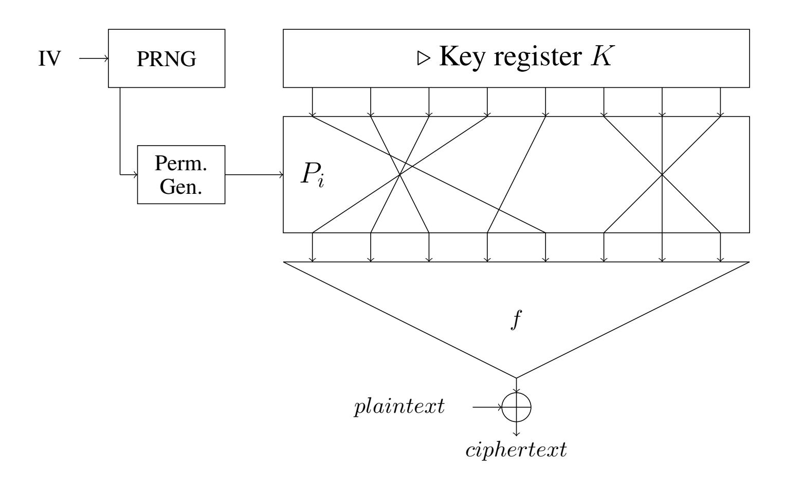
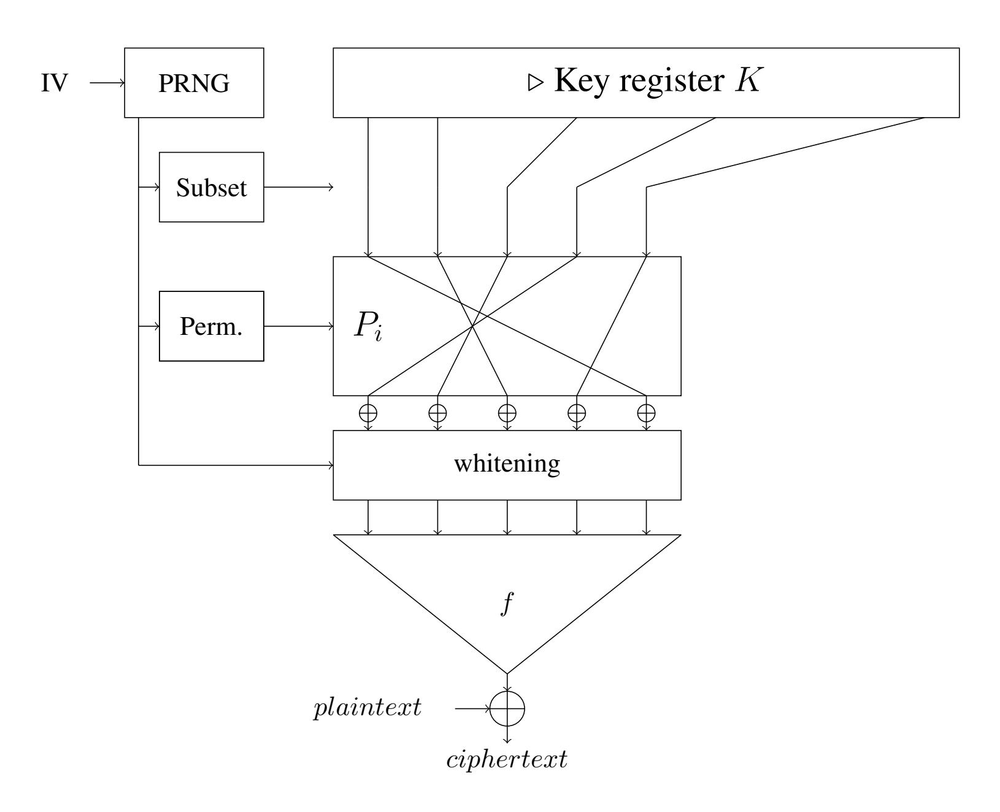

{0}------------------------------------------------

# <span id="page-0-0"></span>A complete study of two classes of Boolean functions for homomorphic-friendly stream ciphers?

Claude Carlet<sup>1</sup> and Pierrick Meaux ´ 2 ,

<sup>1</sup> Department of Informatics, University of Bergen, Norway and LAGA, University of Paris 8, France claude.carlet@gmail.com 2 ICTEAM/ELEN/Crypto Group, Universite catholique de Louvain, Belgium ´ pierrick.meaux@uclouvain.be

Abstract. In this paper, we completely study two classes of Boolean functions that are suited for hybrid symmetric-FHE encryption with stream ciphers like FiLIP. These functions (which we call homomorphic-friendly) need to satisfy contradictory constraints: 1) allow a fast homomorphic evaluation, and have then necessarily a very elementary structure, 2) be secure, that is, allow the cipher to resist all classical attacks (and even more, since guess and determine attacks are facilitated in such framework). Because of constraint 2, these functions need to have a large number of variables (often more than 1000), and this makes even more difficult to satisfy constraint 1 (hence the interest of these two classes). We determine exactly all the main cryptographic parameters (algebraic degree, resiliency order, nonlinearity, algebraic immunity) for all functions in these two classes and we give close bounds for the others (fast algebraic immunity, dimension of the space of annihilators of minimal degree). This is the first time that this is done for all functions in classes of a sufficient cryptographic interest.

## 1 Introduction.

In the recent years, the cloud has become an indispensable complement to a diversity of embedded devices such as smart-phones, smart-cards, smart-watches, since these cannot locally perform all the storage and computation needed by their use. This raises a new privacy concern: the functionality of the object should be preserved while preventing the cloud servers to learn about the data of the users. The breakthrough work of Gentry [\[Gen09\]](#page-37-0) gave the first scheme of Fully Homomorphic Encryption (FHE), a public key primitive allowing to perform computations on data by implementing operations on the encrypted data only. FHE enables, given an encrypted version of some data, to publicly compute the encrypted version of the image of this data by any function, without learning neither the value of the data nor that of the result. It gives then a theoretical solution to the privacy-preserving issue when outsourcing computation.

Since 2009, a variety of works improved or developed new FHE schemes, allowing to understand better its implications and limitations. But outsourcing computation efficiently is not a present outcome of FHE. Nevertheless, in [\[LNV11\]](#page-38-0), the authors introduced a hybrid framework combining symmetric encryption and FHE, which allows this application, even from limited devices. Outsourcing computation is then possible through expressing the computations as functions easy to perform homomorphically, and finding symmetric encryption schemes as adapted as possible to the FHE scheme used. It led to build new symmetric encryption schemes optimized for this purpose such as [\[ARS](#page-37-1)+16,[MJSC16,](#page-38-1) [CCF](#page-37-2)+16, [DEG](#page-37-3)+18,[MCJS19b\]](#page-38-2), where the decryption algorithm is designed to be efficiently evaluated by an homomorphic encryption scheme. This is crucial since the cloud, that receives from the user: 1) his/her homomorphic public key, 2) the homomorphic ciphertext of his/her symmetric key, 3) the symmetric ciphertext of the data, needs after encrypting the latter by the FHE scheme, to perform the symmetric decryption on it.

<sup>?</sup> Some results of the present paper have been presented at the Conference on Algebra, Codes and Cryptology (A2C), held in Dakar, Senegal, in December 2019; they were published without proof in the proceedings of this conference.

{1}------------------------------------------------

The stream cipher paradigm of the filter permutator [\[MJSC16\]](#page-38-1) (and of its successor, the improved filter permutator [\[MCJS19b\]](#page-38-2)), pushes the design to the extreme point where the homomorphic evaluation consists only of the evaluation of a single Boolean function. For the ciphers based of the improved filter permutator model, the main steps to compute a bit of ciphertext are the choice of a part of the key, a permutation of its bits, and the application of a filtering function to this permuted part of the key. The choice of the part of the key and of the permutation are publicly derivable information. The filtering function, that is also public, is the main component to be optimized for the FHE efficiency and for the security of the symmetric scheme. For the design of concrete stream cipher instances, an important difference with the classical filtered model, is in the number of variables, that is very large in the case of the filter permutator (about 1000) while it is much smaller for the classical filtered model (say, at most 20). This, together with the constraints due to FHE, leads to studying types of Boolean functions having structures that were considered as probably too extreme for being used in the classical filtered model: with less than 20 variables, such structures would allow high speed but would not provide optimal security. This uncommon design framework has similarities with Goldreich's Pseudo-random generator [\[Gol00\]](#page-37-4) and local PRG.

The constraints from the homomorphic perspective on the filtering function oblige indeed to use relatively simple functions, easy to evaluate in a specific calculation model. Depending on the FHE scheme considered, good performances will be obtained from functions evaluated as extremely sparse polynomial, or as a succession of multiplexers. These constraints are compatible with a function acting on a large number of variables (which can go from some hundreds to thousands [\[MJSC16\]](#page-38-1)), which is the first security requirement coming from this extreme design, differing largely from filtered register constructions, as we mentioned. The security analysis of (improved) filter permutators [\[MCJS19b\]](#page-38-2) requires not only to determine or bound the cryptographic parameters (corresponding to criteria) of the filtering function, but also to determine these parameters for a family of function containing it. More specifically, assessing the security of these paradigms against guess and determine strategies needs to determine the cryptographic parameters of all bit-fixing descendants of the filtering function, that is, of the functions obtained from it by fixing some of its input bits.

As these observations show, the new framework of (improved) filter permutators such as FLIP [\[MJSC16\]](#page-38-1) and FiLIP [\[MCJS19b\]](#page-38-2) motivates to study new Boolean functions, and in a different context. As we can see, determining the properties of the families of functions suitable for homomorphic evaluation is more demanding than just adapting known constructions, since the known constructions do not fit with the new framework. Moreover, the study of the well-chosen classes of functions is also more demanding since, for each function to be chosen that fits with the new constraints coming from hybrid FHE framework, a whole class of functions must be studied, and precise timings for cloud-based outsourcing must be investigated. In this article, we shall completely determine the main cryptographic parameters of all Boolean functions in two families adapted to homomorphic evaluation. We shall see that some proofs pose delicate problems. We note that no paper in the literature has ever determined the parameters of all the functions in whole classes of interest. Some simple classes contain functions whose cryptographic parameters are all known, but these classes are too elementary for containing functions presenting cryptographic interest. We detail our contributions in the following sub-section. More technical details on the context (fully homomorphic encryption, hybrid framework and [improved] filter permutators) will be given in Section [5,](#page-38-3) that is not indispensable for understanding our contribution.

### 1.1 Our Contributions.

We investigate the main cryptographic properties of the two families of Direct Sums of Monomials (DSM), and XOR-Threshold functions. These two classes have the advantage of being stable under the operation of 

{2}------------------------------------------------

fixing some bits in the input to the functions, and this simplifies the necessary study, mentioned above, of the parameters of what we called the "bit-fixing descendants" of the functions belonging to these classes. The first family is obtained by iteratively applying to those functions having the simplest algebraic normal forms (i.e., monomials) the secondary construction called direct sum, consisting in adding two Boolean functions which depend on different variables. By construction, the functions from this class can be represented as extremely sparse polynomials, since their algebraic normal forms are sums of products of disjoint sets of variables. We determine the cryptographic parameters for all DSM. This is the first time that the parameters of all functions in a large class of functions are exhibited [3](#page-0-0) . The functions of the second family, XOR-Threshold functions, are defined as the direct sums of an affine function and a symmetric function giving 1 if and only if the Hamming weight of the input is at least equal to a fixed threshold value. The threshold functions can be evaluated simply with multiplexers, and this makes XOR-threshold functions appealing in our context. Despite symmetric functions have been the focus of different studies in cryptography, the main parameters have been determined only for the majority functions, or symmetric functions in less than 20 variables. The majority functions correspond to the particular case of threshold functions where the threshold value is half of the number of variables (n even or odd). We exhibit the main cryptographic parameters of the whole class of threshold functions, showing that the parameters of majority functions cannot be used to estimate those of other threshold functions. This allows to determine the parameters of all XOR-Threshold functions.

The criteria we study on these functions coincide with the common cryptographic criteria for Boolean functions used in the filter register model. [\[MCJS19b\]](#page-38-2) shows how to bound the complexity of the attacks known to apply on (improved) filter permutators from the corresponding parameters of the filter function. Hence, we focus on the resiliency and nonlinearity, which classically quantify the complexity of correlationlike attacks. Then, to study the complexity of algebraic-like attacks, we investigate the algebraic immunity AI(f) of the functions f in the two families, the dimension dAN(f) of the vector space of annihilators of algebraic degree AI(f), and the fast algebraic immunity. The security analysis of improved filter permutators requires to know the parameters of functions obtainable by fixing a bounded number of variables in the filtering function. As we already mentioned, for the two considered families of functions, fixing variables always gives functions from the same family, in less variables, and this is one of the main motivations why we chose to characterize the parameters for these two families. For the class of DSM, we determine exactly the resiliency order, the nonlinearity and the algebraic immunity for all functions. The fast algebraic immunity and dAN are exactly proven for a large proportion of the functions, and a close bound is given for the other cases. For all XOR-threshold functions we determine the exact value of the resiliency order, the nonlinearity, the algebraic immunity and dAN, and we give a close upper bound for the fast algebraic immunity.

To determine the parameters of these entire families of functions, we develop new tools for analyzing the properties of Boolean functions, and in some cases, we apply known tools in different ways. We highlight more specifically the interest of two techniques here. First, using the connections between the numerical normal form and the Walsh transform of a Boolean function, we provide the nonlinearity of all threshold functions. The properties of the numerical normal form are often under-utilized, whereas here it allows to get a proof simpler than when using the approach through Krawtchouk polynomials (as done in [\[DMS06\]](#page-37-5) for determining the nonlinearity of majority functions). The techniques used could also apply for the nonlinearity of other symmetric functions. Second, since the common tools do not allow to determine

<sup>3</sup> The functions in the Maiorana-McFarland class (that are affine on parallel affine subspaces of F n <sup>2</sup> ) are also well understood, see [\[Car21\]](#page-37-6), but their parameters can be exactly determined only when these affine spaces have very large dimension, and the functions present then little interest; moreover, the functions in this class do not have quite good algebraic immunity

{3}------------------------------------------------

the exact algebraic properties of functions obtained by direct sums (even for the algebraic immunity, they usually only provide a small range of possible values), we develop a new representation of functions, which we call Partitioned Algebraic Normal Form (PANF), that generalizes the algebraic normal form for direct sums. Studying the PANF, we exhibit sufficient conditions for the Algebraic Immunity (AI) of a direct sum to exceed the maximum of the AI of its components. We also show how to determine the different algebraic properties of DSM and XOR-threshold functions by combining results on the PANF, on monomials and on threshold functions. Finally, we use this new tool to exhibit different families of functions with optimal algebraic immunity. The PANF representation and the techniques developed allow a precise study of the algebraic properties of direct sums, a further outcome could be the characterization when direct sums have optimal algebraic immunity.

### 1.2 Organization.

In Section 2 we give the necessary preliminaries on Boolean functions, cryptographic criteria and families of functions we study. The parameters and proofs related to the resiliency order, nonlinearity, algebraic immunity and fast algebraic immunity of DSM and threshold functions are presented in Section 3. In Section 4 we introduce the partitioned algebraic normal form and the results derived with this tool: the remaining parameters of DSM and XOR-threshold functions, and more precise results on the algebraic properties of direct sum constructions. Section 5 is a complementary introduction on the context of homomorphic-friendly stream-ciphers, meant for the readers who wish to know more about the framework of our results.

### 1.3 Relation With The Invited Paper at Algebra Codes and Cryptology 2019

Some results of this paper have been presented by the first author as an invited speaker at the conference Algebra Codes and Cryptology (A2C) 2019, which was held in Dakar, Senegal, in December 2019. Both authors have written the invited paper [CM19] for the proceedings of this conference. In this invited paper are given the parameters of DSM and XOR-threshold functions, without any proof. The similar parts (with however some differences) between [CM19] and the present paper are: the section on preliminaries, the statements of the lemmas and theorems giving the main criteria of DSM and XOR-threshold functions, and Section 5, which was more or less the introduction of [CM19]. The parts which are new are the present introduction, the explanations about the new tools we developed, the general results on the algebraic properties of direct sums, and last but not least, the proofs of all results.

#### <span id="page-3-0"></span>2 Preliminaries.

For readability we use the notation + instead of  $\oplus$  to denote addition in  $\mathbb{F}_2$ , and  $\{1,\ldots,n\}$  to denote [n].

### 2.1 Boolean Functions.

We recall here some core notions on Boolean functions in cryptography, restricting our study to the single-output Boolean functions.

**Definition 1** (Boolean Function). A Boolean function f in n variables (an n-variable Boolean function) is a function from  $\mathbb{F}_2^n$  to  $\mathbb{F}_2$ . The set of all Boolean functions in n variables is denoted by  $\mathcal{B}_n$ . We call pseudo-Boolean function a function with input space  $\mathbb{F}_2^n$  but output space different from  $\mathbb{F}_2$  (e.g.  $\mathbb{R}$ ).

{4}------------------------------------------------

The following representation is commonly used, and its basic properties also.

<span id="page-4-1"></span>**Definition 2** (Algebraic Normal Form (ANF)). We call Algebraic Normal Form of a Boolean function f its n-variable polynomial representation over  $\mathbb{F}_2$  (i.e. belonging to  $\mathbb{F}_2[x_1,\ldots,x_n]/(x_1^2+x_1,\ldots,x_n^2+x_n)$ ):

$$f(x) = \sum_{I \subseteq [n]} a_I \left( \prod_{i \in I} x_i \right) = \sum_{I \subseteq [n]} a_I x^I,$$

where  $a_I \in \mathbb{F}_2$ .

- The algebraic degree of f equals the global degree of its ANF:  $\deg(f) = \max_{\{I \mid a_I=1\}} |I|$  (with the convention that  $\deg(0) = 0$ ).
- Any term  $\prod_{i \in I} x_i$  in such an ANF is called a monomial and its degree equals |I|. A function with only one non-zero coefficient  $a_I$ , where I is non-empty, is called a monomial function.
- The function f is affine if and only if its algebraic degree is at most 1, the function is linear if in addition  $a_{\emptyset} = 0$ .

### <span id="page-4-0"></span>2.2 Cryptographic Criteria

In this part, we recall the main cryptographic properties of Boolean functions (for more details, see e.g. [Car21]): balancedness, resiliency, nonlinearity, algebraic immunity, fast algebraic immunity, and minimal degree annihilator space's dimension.

**Definition 3** (Balancedness). A Boolean function  $f \in \mathcal{B}_n$  is said to be balanced if its output is uniformly distributed over  $\mathbb{F}_2$ .

**Definition 4** (**Resiliency**). A Boolean function  $f \in \mathcal{B}_n$  is called m-resilient if any of its restrictions obtained by fixing at most m of its coordinates is balanced. We denote by res(f) the resiliency order of f, that is, the maximal value of m such that f is m-resilient, and we set res(f) = -1 if f is unbalanced.

Note that the notion of resiliency includes that of balancedness, since "f is balanced" is equivalent to "f is 0-resilient".

We now recall the definition of the Fourier-Hadamard transform, since it is an important tool to study the resiliency of a Boolean function.

**Definition 5** (Fourier-Hadamard Transform). The Fourier-Hadamard transform is the linear mapping which maps any pseudo-Boolean function f on  $\mathbb{F}_2^n$  (that is, any function from  $\mathbb{F}_2^n$  to  $\mathbb{Z}$ ) to the function  $\hat{f}$  defined on  $\mathbb{F}_2^n$  as:

$$\hat{f}(a) = \sum_{x \in \mathbb{F}_2^n} f(x)(-1)^{a \cdot x},$$

where  $a \cdot x$  denotes the inner product in  $\mathbb{F}_2^n$ , and the sum is performed in  $\mathbb{Z}$ .

Given a Boolean function f, the Fourier-Hadamard transform can be applied to f itself (viewed as a function valued in  $\{0,1\}\subset\mathbb{Z}$ ), and the resulting function is then denoted by  $\hat{f}$ , or to the sign function  $f_{\chi}(x)=(-1)^{f(x)}$ , and the resulting function is then called the Walsh transform of f:

{5}------------------------------------------------

**Definition 6 (Walsh Transform).** Let  $f \in \mathcal{B}_n$  be a Boolean function. Its Walsh transform  $W_f$  is the function that maps any vector  $a \in \mathbb{F}_2^n$  to the integer:

$$W_f(a) = \sum_{x \in \mathbb{F}_2^n} (-1)^{f(x) + a \cdot x}.$$

We have:

<span id="page-5-2"></span>
$$W_f(a) = -2\hat{f}(a), \forall a \neq 0; \quad W_f(0) = 2^n - 2\hat{f}(0).$$
 (1)

Note that the Walsh transform is strongly connected to the nonlinearity:

**Definition 7** (Nonlinearity). The nonlinearity NL(f) of a Boolean function  $f \in \mathcal{B}_n$ , where n is a positive integer, is the minimum Hamming distance between f and all the affine functions in  $\mathcal{B}_n$ :

$$\mathsf{NL}(f) = \min_{g, \deg(g) \le 1} \{ d_H(f, g) \},$$

where  $d_H(f,g)$  denotes the Hamming distance  $\#\{x \in \mathbb{F}_2^n \mid f(x) \neq g(x)\}$  between f and g; and  $g(x) = a \cdot x + \varepsilon$ ,  $a \in \mathbb{F}_2^n$ ,  $\varepsilon \in \mathbb{F}_2$  (where  $\cdot$  is some inner product in  $\mathbb{F}_2^n$ ; any choice of an inner product will give the same value of  $\mathsf{NL}(f)$ ). We have:

<span id="page-5-0"></span>
$$NL(f) = 2^{n-1} - \frac{1}{2} \max_{a \in \mathbb{F}_2^n} |W_f(a)|.$$
 (2)

The n-variable Boolean functions maximizing the nonlinearity for n even are called bent; their nonlinearity equals  $2^{n-1} - 2^{\frac{n}{2}-1}$ . Many families of bent functions are known (see surveys in [Car21, CM16, Mes16]). The nonlinearity can be generalized to the notion of higher-order nonlinearity: the rth-order nonlinearity of a Boolean function f, where r is some positive integer, equals the Hamming distance between f and all functions of algebraic degree less than or equal to r (the nonlinearity corresponds to the case r=1).

**Definition 8** (Algebraic Immunity and Annihilators). The algebraic immunity of a Boolean function  $f \in \mathcal{B}_n$ , denoted as Al(f), is defined as:

$$\mathsf{AI}(f) = \min_{g \neq 0} \{ \deg(g) \mid fg = 0 \ or \ (f+1)g = 0 \},$$

where deg(g) is the algebraic degree of g. The function g is called an annihilator of f (or f+1). We additionally use the notation AN(f) for the minimum algebraic degree of nonzero annihilators of f:

$$\mathsf{AN}(f) = \min_{g \neq 0} \{ \mathsf{deg}(g) \mid fg = 0 \}.$$

We also use the notation dAN(f) for the dimension of the vector space made of the annihilators of f of algebraic degree AI(f) and the zero function. Note that, for every function f we have  $dAN(f) \leq \binom{n}{AI(f)}$ , because two distinct annihilators of algebraic degree AI(f) cannot have in their ANF the same part of degree AI(f) (their difference being itself an annihilator).

Note that, for every Boolean function f, we have that f and f + 1 are mutual annihilators, and:

<span id="page-5-1"></span>Property 1 (Algebraic Immunity Properties).

{6}------------------------------------------------

- The null and the all-one functions are the only functions such that AI(f) = 0.
- All monomial (non constant) functions f are such that AI(f) = 1.
- For all non constant f it holds:  $AI(f) \leq AN(f) \leq deg(f)$ .

<span id="page-6-0"></span>**Definition 9 (Fast Algebraic Immunity).** The fast algebraic immunity of a Boolean function  $f \in \mathcal{B}_n$ , denoted as  $\mathsf{FAl}(f)$ , is defined as:

$$\mathsf{FAI}(f) = \min\{2\mathsf{AI}(f), \min_{1 \leq \deg(g) < \mathsf{AI}(f)} \deg(g) + \deg(fg)\}.$$

Balancedness, algebraic degree, nonlinearity, algebraic immunity, dimension of the vector space of annihilators and fast algebraic immunity are *affine invariant* parameters: for every affine permutation L of  $\mathbb{F}_2^n$  and every Boolean function f, function  $f \circ L$  has parameters with the same values.

#### 2.3 Families of Boolean Functions.

In this part, we highlight three families of functions: those of direct sums of monomials, of threshold functions, and of XOR-Threshold functions. We start by introducing a secondary construction called direct sum, enabling to construct the first family.

**Definition 10 (Direct sum).** Let f be a Boolean function of n variables and g a Boolean function of m variables, f and g depending on distinct variables, the direct sum h of f and g is defined by:

$$h(x,y) = f(x) + g(y), \quad \text{where } x \in \mathbb{F}_2^n \text{ and } y \in \mathbb{F}_2^m.$$

Families of functions obtained by direct sums can be of particular interest when looking for functions simple to evaluate. Note that the direct sum has been generalized into the so-called indirect sum (see [Car21]), but this latter construction leads to functions which are already too complex for being homomorphic-friendly. We shall focus on direct sums of monomials, the simplest functions from the viewpoint of their representation by the ANF.

**Definition 11 (Direct Sum of Monomials).** Let f be a non constant n-variable Boolean function. We call f a Direct Sum of Monomials (or DSM) if the following holds for its ANF:

$$\forall (I, J) \text{ such that } a_I = a_J = 1, I \cap J \in \{\emptyset, I \cup J\}.$$

In other words, in the ANF of such functions, each variable appears at most once.

**Definition 12** (Direct Sum Vector [MJSC16]). Let f be a DSM, we define its direct sum vector (DSV):

$$\mathbf{m}_f = [m_1, m_2, \dots, m_k],$$

of length  $k = \deg(f)$ , where  $m_i$  is the number of monomials of degree i, i > 0, in the ANF of f:

$$m_i = |\{I \subset \{1, \dots, n\}; a_I = 1 \text{ and } |I| = i\}|.$$

All DSM admitting  $[m_1, m_2, \ldots, m_k]$  for direct sum vector and having no ineffective variable are equivalent to each others, under permutation of their input coordinates and addition of a constant. Their ANFs contain  $M = \sum_{i=1}^k m_i$  monomials, and have  $N = \sum_{i=1}^k i m_i$  variables. We shall always view in the

{7}------------------------------------------------

sequel DSM as functions having no ineffective variable. A DSM f and its complementary to 1 ( *i.e.*f + 1) admit the same direct sum vector. This is coherent with the fact that the parameters of resiliency, nonlinearity, algebraic immunity, and fast algebraic immunity are invariant under the addition of constant function 1 to f. On the contrary, the parameter of dAN can be different for f and f + 1; therefore we shall also consider the constant coefficient (represented as m0) when we study this parameter.

A sub-family of particular interest of DSM is the family of triangular functions:

Definition 13 (Triangular Functions [\[MJSC16\]](#page-38-1)). *Let* k *be a strictly positive integer. The* k*-th triangular function* T<sup>k</sup> *is the following direct sum of monomials of* k(k + 1)/2 *variables:*

$$T_k(x_1, \dots, x_{k(k+1)/2}) = \sum_{i=1}^k \prod_{j=1}^i x_{j+i(i-1)/2}.$$

*It can also be defined from its direct sum vector which is the all-*1 *vector of length* k*:* mT<sup>k</sup> = [1, 1, . . . , 1]*.*

Let us now define the family of threshold functions:

<span id="page-7-0"></span>Definition 14 (Threshold function). *For any positive integers* d ≤ n + 1 *we define the Boolean function* Td,n *as follows:*

$$\forall x = (x_1, \dots, x_n) \in \mathbb{F}_2^n, \quad \mathsf{T}_{d,n}(x) = \begin{cases} 0 & \textit{if } \mathsf{w}_\mathsf{H}(x) < d, \\ 1 & \textit{otherwise.} \end{cases}$$

Of course, a sub-family of particular interest of threshold functions is the family of majority functions:

Definition 15 (Majority function). *For any positive odd integer* n *we define the Boolean function* MAJ<sup>n</sup> *as:*

$$\forall x = (x_1, \dots, x_n) \in \mathbb{F}_2^n, \quad \mathsf{MAJ}_n(x) = \mathsf{T}_{\lceil \frac{n+1}{2} \rceil, n} = \begin{cases} 0 & \textit{if } \mathsf{w}_\mathsf{H}(x) \leq \lfloor \frac{n}{2} \rfloor, \\ 1 & \textit{otherwise.} \end{cases}$$

Note that threshold functions are symmetric functions (changing the order of the input bits does not change the output), which have been the focus of many studies *e.g.* [\[Car04,](#page-37-9) [CV05,](#page-37-10) [DMS06,](#page-37-5) [QLF07,](#page-38-5) [SM07,](#page-38-6) [QFLW09\]](#page-38-7). These functions can be described more succinctly through the simplified value vector.

Definition 16 (Simplified value vector). *Let* f *be a symmetric function in* n *variables, we define its simplified value vector:*

$$\mathbf{s}_{=}[w_0, w_1, \dots, w_n]$$

*of length* n + 1*, where for each* k ∈ {0, . . . , n}*,* w<sup>k</sup> = f(x) *where* wH(x) = k*, i.e.* w<sup>k</sup> *is the value of* f *on all inputs of Hamming weight* k*.*

Note that for a threshold function, we have w<sup>k</sup> = 0 for k < d and 1 otherwise, so the simplified value vector of a threshold function Td,n is the length n + 1 vector of d consecutive 0's and n + 1 − d consecutive 1's.

<span id="page-7-1"></span>*Remark 1 (Constant Functions).* The two n-variable constant functions 0 and 1 correspond to the threshold functions Tn+1,n and T0,n respectively. Since the cryptographic parameters of these functions are already known, we will not include these functions in our study. We recall their parameters: deg = AI = FAI = NL = 0, and res = −1.

{8}------------------------------------------------

We will also be interested in functions obtained by the direct sum of the linear symmetric function and a threshold function, called XOR-THR (or XOR-MAJ when the threshold function happens to be a majority function). The main advantage of these functions is to provide a high resiliency in contrast to threshold functions.

**Definition 17 (XOR-THR Function).** For any positive integers k,d and n such that  $d \leq n+1$  we define  $\mathsf{XOR}_k + \mathsf{T}_{d,n}$  for all  $z = (x_1, \ldots, x_k, y_1, \ldots, y_n) \in \mathbb{F}_2^{k+n}$  as follows:

$$(\mathsf{XOR}_k + \mathsf{T}_{d,n})(z) = x_1 + \dots + x_k + \mathsf{T}_{d,n}(y_1, \dots, y_n) = \mathsf{XOR}_k(x) + \mathsf{T}_{d,n}(y).$$

### 2.4 Boolean Functions and Bit-Fixing.

In this part, we give the necessary vocabulary relatively to bit-fixing (as defined in [AL16]), the action on Boolean functions consisting in fixing the values of some of their input variables, and then considering the resulting Boolean function. These notions are important when guess-and-determine attacks are investigated.

**Definition 18 (Bit-fixing descendant).** Let f be a Boolean function in n variables  $x_1, \ldots, x_n$ , let  $\ell$  be an integer such that  $0 \le \ell < n$ , let  $I \subset [n]$  be of size  $\ell$  (i.e.  $I = \{i_1, \ldots, i_\ell\}$  with  $i_j < i_{j+1}$  for all  $j \in [\ell-1]$ ), and let  $b \in \mathbb{F}_2^{\ell}$ . We denote then by  $f_{I,b}$  the so-called  $\ell$ -bit fixing descendant of f on subset I with binary vector b the Boolean function in  $n - \ell$  variables:

$$f_{I,b}(x') = f(x) \mid \forall j \in [\ell], \ x_{i_j} = b_j, \quad \text{where } x' = (x_i, \text{ for } i \in [n] \setminus I).$$

**Definition 19** (Bit-fixing stability). Let  $\mathcal{F}$  be a family of Boolean functions,  $\mathcal{F}$  is called bit-fixing stable, or stable relatively to guessing and determining, if for all functions  $f \in \mathcal{F}$  such that f is a n-variable function with n > 1, the following holds:

- for every number of variables  $\ell$  such that  $0 \le \ell < n$ ,
- for every choice of the variables  $1 \le i_1 < i_2 < \cdots < i_\ell \le n$ ,
- for every value of the guess  $(b_1, \ldots, b_\ell) \in \mathbb{F}_2^\ell$ ,

at least one of the following properties is fulfilled:  $f_{I,b} \in \mathcal{F}$ , or  $f_{I,b} + 1 \in \mathcal{F}$ , or  $\deg(f_{I,b}) = 0$ .

<span id="page-8-0"></span>Remark 2. Both DSM and XOR-THR functions are bit-fixing stable families. More precisely, for a DSM, considering the behavior on its ANF, fixing a variable to 0 cancels a monomial, fixing a variable to 1 reduces the degree of one of the monomials. Then, the property on the ANF coefficients defining a DSM is still complied by the descendant function. Fixing variables recursively does not change this property, and when  $\ell$  is greater than the number of monomials, it is possible to have only the constant coefficient nonzero, adding the constant functions to the list of descendants.

For the family of XOR-THR functions, first note that fixing variables maintains the direct sum structure. If a variable is fixed to 0 in the XOR part, the descendant has a XOR part with one variable less and the threshold part is the same. If the variable is fixed to 1, the descendant has a XOR part with one variable less and the threshold part is the complement of the initial one, therefore 1+f' is a XOR-THR function. If a variable is fixed in the threshold part, it gives a threshold function. Indeed, for n>1 using Definition 14, fixing a variable to 1 for  $T_{d,n}$  gives the function  $T_{d-1,n-1}$ , and fixing a variable to 0 gives the function  $T_{d,n-1}$ . Therefore, these descendants are also XOR-THR functions. Then, recursively fixing  $\ell < n$  variables gives descendants which are XOR-THR functions or their complements (note that the constant functions are in this family too).

{9}------------------------------------------------

### <span id="page-9-0"></span>3 Parameters of Direct Sums of Monomials and XOR-Threshold Functions.

In this section and in the following, we determine the relevant parameters relative to the main Boolean cryptographic criteria for the two families of DSM and XOR-THR functions. The results relative to balancedness, resiliency and nonlinearity and the first part of the algebraic properties are proven in this section. The second part of the algebraic properties requiring new techniques based on the so-called partitioned algebraic normal form (PANF) coefficients, we give them in the next section where this new tool is developed.

In sub-section [3.1](#page-9-1) we give the parameters and proofs related to the resiliency, nonlinearity, algebraic immunity and fast algebraic immunity of DSM functions. In sub-section [3.2](#page-13-0) we give the parameters and proofs of threshold functions. Combining it with results on direct sums (Lemma [1\)](#page-9-2) gives the resiliency order and nonlinearity of XOR-THR.

### <span id="page-9-1"></span>3.1 Direct Sum of Monomials.

<span id="page-9-2"></span>First we recall some properties on direct sums (see *e.g.* [\[MJSC16\]](#page-38-1)).

Lemma 1 (Direct sum properties ( [\[MJSC16\]](#page-38-1) Lemma 3)). *Let* h *be the direct sum of two functions* f*, in* n *variables, and* g*, in* m *variables. Then* h *has the following cryptographic properties:*

- *1. Resiliency:* res(h) = res(f) + res(g) + 1*.*
- *2. Walsh transform:* Wh(a, b) = Wh(a) Wg(b)*.*
- *3. Nonlinearity:* NL(h) = 2mNL(f) + 2nNL(g) − 2NL(f)NL(g)*.*
- *4. Algebraic Immunity:* max(AI(f), AI(g)) ≤ AI(h) ≤ AI(f) + AI(g)*.*
- *5. Fast Algebraic Immunity:* FAI(h) ≥ max(FAI(f), FAI(g))*.*

Resiliency and Nonlinearity Lemma [1](#page-9-2) directly provides the resiliency order and the nonlinearity of any direct sum of monomials (which are already well known).

<span id="page-9-3"></span>Lemma 2 (Resiliency of direct sum of monomials). *Let* f ∈ B<sup>n</sup> *be a direct sum of monomials with associated direct sum vector* = [m1, . . . , mk]*. The resiliency order of* f *equals:*

$$\operatorname{res}(f) = m_1 - 1$$

*Proof.* A monomial function of algebraic degree larger than 1 has resiliency order −1, as it is unbalanced. A monomial function of algebraic degree 1 has resiliency 0. Then, applying the first item of Lemma [1](#page-9-2) recursively (adding one by one the monomial functions) gives the result.

<span id="page-9-4"></span>Lemma 3 (Nonlinearity of direct sum of monomials). *Let* f ∈ B<sup>n</sup> *be a direct sum of monomials with associated direct sum vector* [m1, . . . , mk]*. The nonlinearity of* f *equals:*

$$NL(f) = 2^{n-1} - \frac{1}{2} \left( 2^{(n - \sum_{i=2}^{k} i m_i)} \prod_{i=2}^{k} (2^i - 2)^{m_i} \right)$$

*Proof.* This is a straightforward consequence of Relation [\(2\)](#page-5-0), of item 2 of Lemma [1](#page-9-2) and of the fact that, for a monomial function g of algebraic degree d ≥ 1 in m variables, maxa∈F<sup>m</sup> 2 |Wg(a)| equals 2 <sup>m</sup> if d = 1 and 2 <sup>m</sup> − 2 m−d if d > 1.

{10}------------------------------------------------

Algebraic Immunity The exact value of the algebraic immunity of general direct sums of monomials has never been determined in the literature. Particular cases have been addressed, in particular that of triangular functions in [\[MJSC16,](#page-38-1) Lemma 6]); in the general case, only bounds are known. To determine this exact value, we shall use this very result on triangular functions, recalled in Lemma [4,](#page-10-0) and an inequality shown in [\[CMR17\]](#page-37-12) and recalled in Lemma [5,](#page-10-1) between the algebraic immunity of some functions satisfying a particular property and their restrictions obtained by fixing one of their input bit.

<span id="page-10-0"></span>Lemma 4 (Algebraic immunity of triangular functions (adapted from [\[MJSC16\]](#page-38-1), Lemma 6)). *Let* k *be a strictly positive integer and let* T<sup>k</sup> *be the* k*-th triangular function, then* AI(Tk) = k*.*

<span id="page-10-1"></span>Lemma 5 ( [\[CMR17\]](#page-37-12) Proposition 11). *Let* f(x1, x2, x3, . . . , xn) *be a Boolean function in* n *variables such that there exist two variables (*x<sup>1</sup> *and* x<sup>2</sup> *without loss of generality) satisfying:*

$$\forall x \in \mathbb{F}_2^{n-2} \ f(0,0,x) = f(0,1,x) = f(1,0,x)$$

*Let* g(x0, x3, . . . , xn) *be the Boolean function in* n − 1 *variables defined by :*

$$\forall x \in \mathbb{F}_2^{n-2} \ g(1,x) = f(1,1,x) \ and \ g(0,x) = f(0,0,x).$$

*Then* AI(g) ≤ AI(f)*.*

Note that any non-affine direct sum of monomials has such property, the two variables being those present in some monomial of degree at least 2. Using these two lemmata we can determine the exact algebraic immunity of any direct sum of monomials:

<span id="page-10-2"></span>Theorem 1 (Algebraic Immunity of Direct Sums of Monomials). *Let* f ∈ F n 2 *be a Boolean function obtained by direct sum of monomials with associated direct sum vector* m<sup>f</sup> = [m1, . . . , mk]*, its algebraic immunity is:*

$$\mathsf{AI}(f) = \min_{0 \le d \le k} \left( d + \sum_{i=d+1}^{k} m_i \right).$$

*Proof.* First, we prove the inequality:

$$\mathsf{AI}(f) \le \min_{0 \le d \le k} \left( d + \sum_{i=d+1}^k m_i \right).$$

We know that the algebraic immunity of a direct sum of functions is bounded above by the sum of the algebraic immunities of the functions (as recalled in Lemma [1\)](#page-9-2), that the algebraic immunity of any function is bounded above by its algebraic degree, and that the algebraic immunity of a monomial equals 1 (as recalled with Property [1\)](#page-5-1). We fix d, and express f as a direct sum of two functions f<sup>1</sup> and f2, with direct sum vectors:

$$\mathbf{m}_{f_1} = [m_1, \dots, m_d], \text{ and } \mathbf{m}_{f_2} = [0, \dots, 0, m_{d+1}, \dots, m_k].$$

From mf<sup>1</sup> , we have deg(f1) ≤ d and we deduce the inequality[4](#page-0-0) .

<sup>4</sup> Note that this inequality shows that the algebraic immunity of a direct sum of monomials is upper bounded by both the number of monomials (case d = 0) and the algebraic degree of the function (case d = k).

{11}------------------------------------------------

Then, we prove the inequality in the other sense:

$$\mathsf{AI}(f) \ge \min_{0 \le d \le k} \left( d + \sum_{i=d+1}^{k} m_i \right).$$

Let us denote by e one of the values of d at which the minimum is taken, and let  $E = e + \sum_{i=e+1}^{k} m_i$ be this minimum. The principle of the proof is to repetitively use Lemma 5, to go from the function fto a function g, whose algebraic immunity is not larger than that of f, thanks to Lemma 5, and satisfies  $AI(h) \geq E$ . For a DSM f, we can apply Lemma 5 on any pair of variables appearing in a monomial of degree at least 2. This monomial is then contracted into a monomial, the degree of which is reduced by one unit. Applying this on a degree  $d \geq 2$  monomial in the ANF of f gives a DSM whose direct sum vector is obtained from that of f by increasing by 1 its (d-1)-th element and decreasing by 1 its d-th element. We will apply such "monomial contractions" until reaching the function g which is the direct sum of the triangular function  $T_E$  and another function, therefore having algebraic immunity at least E. Note that during all this process, the value of e will not change.

We first handle the monomials of degrees at most e. Let us show that, by contracting monomials, we can obtain from f a DSM f' having the same direct sum vector values for the indices (i.e. degrees) strictly larger than e, and having direct sum vector values which are nonzero for the index 1 and equal to 1 for the indices between 1 and e. When e = 0, the condition on f' is empty and we can take f' = f. We assume then that  $e \ge 1$ . For all integers d such that  $0 \le d < e$ , we have the following property, that we denote by (P):

$$(P) \quad e + \sum_{i=e+1}^k m_i \le d + \sum_{i=d+1}^k m_i, \quad \text{ or equivalently: } \quad e - d \le \sum_{i=d+1}^e m_i.$$

Property (P) will allow us to contract monomials until obtaining the function f'. In the following, we show that applying Lemma 5 on a monomial of degree  $\ell = \max_{1 \le d \le e} \{d \mid m_d > 1\}$  in a DSM with direct sum vector  $[m_1, \dots, m_k]$  satisfying (P) gives a DSM having the same number of monomials and also satisfying (P). By definition of  $\ell$ :

- for  $\ell \leq d \leq e$ :  $\sum_{i=d+1}^{e} m_i = e d$ , because the value  $d + \sum_{i=d+1}^{k} m_i$  cannot decrease when d moves from  $\ell$  to e since the  $m_i$ 's are smaller than or equal to 1, and this same value cannot increase either since the value at e is minimal,
- for  $d = \ell 1$ :  $\sum_{i=d+1}^{e} m_i = m_\ell + e \ell > e d$ , since  $m_\ell > 1$ , for  $0 \le d \le \ell 2$ :  $\sum_{i=d+1}^{e} m_i \ge e d$ .

Applying Lemma 5, denoting by  $m'_i$  the elements of the direct sum vector of the obtained function, we get  $m'_{\ell} = m_{\ell} - 1$ ,  $m'_{\ell-1} = m_{\ell-1} + 1$  and the other elements are unchanged. Therefore, the number of monomials remains the same, the sums  $\sum_{i=d+1}^{e} m'_i$  and  $\sum_{i=d+1}^{e} m_i$  differ only for  $d \in \{\ell-1, \ell-2\}$ . Indeed, for  $d = \ell-1$ , we have  $\sum_{i=\ell}^{e} m'_i = (\sum_{i=\ell}^{e} m_i) - 1 \ge e - d$ , and for  $d = \ell-2$ , we have  $\sum_{i=\ell-1}^{e} m_i' = (\sum_{i=\ell-1}^{e} m_i) + 1 \ge e - d + 1$ . Hence, the function obtained satisfies Property (P). Note that e is then still such that  $e + \sum_{i=e+1}^{k} m'_i$  is minimal.

We can apply the transformation of Lemma 5 repetitively, until the elements of indices  $e, \ldots, 2$  in the resulting direct sum vector are all smaller than or equal to 1, and they are then all equal to 1, since Property (P) for d=1 shows that the sum of these elements equals e-1. The resulting function f' (in terms of the initial elements  $m_i$  of  $\mathbf{m}_f$ ) has for direct sum vector:

$$\mathbf{m}_{f'} = \left[ \left( \sum_{i=1}^{e} m_i \right) - e + 1, 1, \dots, 1, m_{e+1}, \dots, m_k \right].$$

{12}------------------------------------------------

Now, let us consider the monomials of degrees larger than e. Let us show that, by contracting monomials similarly, we can obtain from f' a DSM g having the same direct sum vector values of indices at most e, having value 1 for the indices between e+1 and E, and having value 0 for the indices strictly larger than E. When e=k (equivalently, when e=E), we have f'=g; we assume then that e< k and we focus on the elements of the direct sum vector between e+1 and k. By definition of e, for all integers d such that  $e+1 \le d \le k$ , we have the following property that we denote by (P'):

$$(P')$$
  $d + \sum_{i=d+1}^k m_i \ge e + \sum_{i=e+1}^k m_i$ , or equivalently:  $d \ge e + \sum_{i=e+1}^d m_i$ .

Similarly as above, we repetitively apply Lemma 5 on DSM functions from f' until obtaining g. Recall that contracting this way a monomial of degree  $\ell$  decreases the  $\ell$ -th direct sum vector's element by one and increases the  $(\ell-1)$ -th element by one, and that it keeps constant the other elements and the total number of monomials. Let us show that we can do this with  $\ell = \max(\max\{d > E \; ; \; m_d > 0\}, \max\{d > e \; ; \; m_d > 1\})$  and that it transforms a DSM satisfying (P') into a DSM also satisfying (P'). Note that, according to what we recalled above, the only position where Property (P') could become unsatisfied is for  $d = \ell - 1$ . Let us denote again by  $m_i$  the elements of the direct sum vector of the function before contraction and by  $m_i'$  those of the function after contraction. By definition of  $\ell$ , two cases are possible:  $\ell > E$  or  $\ell \in [e+1, E]$ .

- of the function after contraction. By definition of  $\ell$ , two cases are possible:  $\ell > E$  or  $\ell \in [e+1,E]$ .

   In the first case, since we have  $\ell 1 \ge E \ge e + \sum_{i=e+1}^{\ell} m_i \ge e + \sum_{i=e+1}^{\ell-1} m_i + 1 = e + \sum_{i=e+1}^{\ell-1} m_i'$ , Property (P') is still satisfied.
- In the second case, for all i>E, we have  $m_i=0$  and for all  $i\in [\ell+1,E]$ , we have  $m_i\le 1$ . Let us show that this implies that  $m_i=1$  for all  $i\in [\ell+1,E]$ : before the contraction, we had, according to Property (P'), that  $\ell\ge e+\sum_{i=e+1}^\ell m_i$ , and there were then at most  $\ell-e$  monomials of indices in the interval  $[e+1,\ell]$ , and therefore at least  $E-\ell$  of indices in the interval  $[\ell+1,E]$ . Since all the  $m_i$ 's for  $i\in [\ell+1,E]$  are bounded above by 1 and their sum is bounded below by their number, they are all equal to 1. We have then  $\sum_{i=\ell+1}^k m_i' = \sum_{i=\ell+1}^E m_i' = E-\ell$ , and then, since the global number of monomials has not changed,  $\ell=e+\sum_{i=e+1}^\ell m_i'$  and therefore  $\ell=e+1$  and Property (P') is then satisfied for  $\ell=e+1$  and therefore for every  $\ell=e+1$ .

We can apply such contractions repetitively (but never contracting a monomial of degree e+1), until the elements of the resulting direct sum vector of indices in the interval [e+1,E] are all at most equal to 1 and the elements of higher indices are all equal to 0. Since the number of monomials of indices in the interval [e+1,k] remained constantly equal to E-e, the elements of indices  $e+1,\ldots,E$  are equal to 1, and the resulting function g (in terms of the initial elements  $m_i$  of  $m_f$ ) is a DSM with direct sum vector  $\mathbf{m}_g = [m_1'', \cdots, m_E'']$  such that:

$$m_1'' = \left(\sum_{i=1}^e m_i\right) - e + 1$$
, and  $m_i'' = 1$  for  $i \in [2, E]$ .

By the repetitive application of Lemma 5, we have  $AI(f) \ge AI(g)$ , and since g is the direct sum of  $T_E$  and a function of degree at most 1, we have then  $AI(g) \ge E$ , thanks to Lemmas 1 and 4. This completes the proof.

Note that to estimate accurately the time complexity of the algebraic attack (mounted on f), it is better to additionally know the number of annihilators of f or f+1 of degree  $\mathsf{Al}(f)$ . As determining this number requires additional concepts on algebraic immunity and direct sums, we defer its study to Section 4.

{13}------------------------------------------------

Fast Algebraic Immunity Concerning the fast algebraic immunity criterion, its definition (recalled in Subsection 2.2) leads to the bound  $\mathsf{FAl}(f) \geq \mathsf{Al}(f) + 1$  for any f, since for any g such that  $1 \leq \deg(g) < \mathsf{Al}(f)$ , fg is a nonzero annihilator of f+1. In the case of those direct sums of monomials whose algebraic immunity equals the algebraic degree (and is then optimal, given the degree), we can show that the FAI is reaching this bound in some cases and exceeds it by 1 in the other cases (hence, when  $\mathsf{Al}(f) = \deg(f)$ , the fast algebraic immunity is not good, given the algebraic immunity<sup>5</sup>). Note that, because of Theorem 1, having a direct sum vector  $\mathbf{m}_f = [m_1, \dots, m_k]$  such that  $m_k > 1$ , where  $k = \deg(f)$ , increases the chances that  $\mathsf{Al}(f) = \deg(f)$ , but there are examples where we have  $m_k = 1$  and  $\mathsf{Al}(f) = \deg(f)$  (take a triangular function).

**Proposition 1** (Fast algebraic immunity of direct sums of monomials). Let  $f \in \mathbb{F}_2^n$  be a Boolean function obtained by the direct sum of monomials with associated direct sum vector  $\mathbf{m}_f = [m_1, \dots, m_k]$  such that  $\mathsf{Al}(f) = \mathsf{deg}(f) = k > 1$ , its fast algebraic immunity is:

$$\mathsf{FAI}(f) = \begin{cases} \mathsf{AI}(f) + 1 & \textit{if } m_k = 1, \\ \mathsf{AI}(f) + 2 & \textit{otherwise}. \end{cases}$$

*Proof.* We first consider the case where  $m_k = 1$ . As  $\mathsf{AI}(f) = \mathsf{deg}(f) = k$ , we have  $m_{k-1} \geq 1$  by Theorem 1 (indeed, if  $m_{k-1} = 0$ , then  $d + \sum_{i=d+1}^k m_i$  is smaller for d = k-2 than for d = k). Let us denote by  $x_1$  one of the variables of the monomial of degree k, then we consider the degree of the product of f and  $1 + x_1$ ; this function has degree k (as the only monomial of degree k of f is canceled, and the  $m_{k-1}$  monomials of degree k-1 do not contain  $x_1$ ). Then, by definition of the FAI (see Definition 9), we have  $\mathsf{FAI}(f) \leq \mathsf{AI}(f) + 1$ , and then  $\mathsf{FAI}(f) = \mathsf{AI}(f) + 1$ .

We consider now the case  $m_k > 1$ . Multiplying f by a linear function g we study the degree of fg. As f is a DSM, denoting without loss of generality by  $x_1$  a variable present in the ANF of g,  $x_1$  appears in either zero or one of the higher degree monomials of f. If it does not appear then fg produces  $m_k$  monomials of degree k+1 containing  $x_1$ , as k>1, all these monomials are different, so  $\deg(fg)=k+1$ . If  $x_1$  appears in a degree k monomial, the same reasoning applies for the  $m_k-1$  others, leading to  $\deg(fg)=k+1$ . This gives:

$$\mathsf{FAI}(f) \le \min(2\mathsf{AI}(f), \mathsf{AI}(f) + 2).$$

And therefore  $\mathsf{FAI}(f) \leq \mathsf{AI} + 2$ . Then, as for all nonzero function g such that  $\deg(g) < \mathsf{AI}(f)$  we have  $\deg(fg) \geq \mathsf{AI}(f)$  (property of the AI), any nonlinear function g leads to consider a maximum greater than or equal to  $\mathsf{AI}(f) + 2$  leading to an equal or higher upper bound. It enables to conclude:  $\mathsf{FAI}(f) = \mathsf{AI}(f) + 2$ .  $\square$ 

Note that this lemma does not consider the case AI(f) = 1 (linear or monomial functions), for this case the fast algebraic immunity is not very relevant as the algebraic attack already targets a linear system.

### <span id="page-13-0"></span>3.2 Threshold Functions.

In order to obtain the parameters of XOR-THR functions we first need to determine those of threshold functions, and then to use the properties of direct sum constructions.

Threshold functions are symmetric functions, and symmetric functions have been much studied for their cryptographic criteria (e.g. [CV05]). But the exact values of the parameters of symmetric functions could

<sup>&</sup>lt;sup>5</sup> Nevertheless, the algebraic immunity is here assumed optimal, given the algebraic degree, and the fast algebraic immunity, even if not much larger, may not be that bad, in our context. Recall that we must deal with functions of a very elementary structure but having many variables. The context is different from the usual one, and comparing with the optimum is more or less pointless. What we need with homomorphic-friendly functions is only to have a fast algebraic immunity larger than some threshold.

{14}------------------------------------------------

seldom be determined. Threshold functions make no exception. Here, we determine the exact values of their parameters. We first observe an obvious relation between  $T_{d,n}$  and  $T_{n-d+1,n}$ , which will simplify the number of cases to be considered in some proofs.

*Property* 2. Let  $n \in \mathbb{N}^*$  and  $d \in [0, n+1]$ . For all  $x \in \mathbb{F}_2^n$ , let 1+x denote the element  $(1+x_1, \dots, 1+x_n) \in \mathbb{F}_2^n$ . Then:

<span id="page-14-1"></span>
$$\forall x \in \mathbb{F}_2^n, \quad 1 + \mathsf{T}_{d,n}(1+x) = \mathsf{T}_{n-d+1,n}(x).$$

Indeed, we have  $w_H(1+x) = n - w_H(x)$  and then  $w_H(1+x) < d \Leftrightarrow w_H(x) > n - d$ .

We now study the main criteria of threshold functions, note that the particular cases d=0 and d=n+1 are already taken care of in Remark 1.

### <span id="page-14-2"></span>**Resiliency**

**Proposition 2** (Resiliency of threshold functions). Let  $n \in \mathbb{N}^*$  and  $d \in [n]$ . Let f be the threshold function  $T_{d,n}$ , then we have:

$$\operatorname{res}(\mathsf{T}_{d,n}) = \begin{cases} 0 & \textit{if } n = 2d-1, \\ -1 & \textit{otherwise}. \end{cases}$$

*Proof.* The Hamming weight of a symmetric function is equal to  $\sum_{i=0}^{n} w_i \binom{n}{i}$ . We deduce:

$$\mathsf{w_H}\left(\mathsf{T}_{d,n}\right) = \sum_{i=d}^n \binom{n}{i} = \sum_{i=0}^{n-d} \binom{n}{i}.$$

This sum equals  $2^{n-1}$  if and only if d=(n+1)/2, that is, when the function is the majority functions in odd dimension. To complete the proof, let us recall why the majority functions is not 1-resilient. As the family of XOR-MAJ functions is bit-fixing stable, fixing one variable of a majority function gives a threshold function in n-1 variables, which cannot be balanced, as shown in the previous part, since n-1 is even.

**Nonlinearity** In [DMS06] is determined the nonlinearity of the majority functions  $T_{\frac{n+1}{2},n}$  (n odd) and  $T_{\frac{n}{2}+1,n}$  (n even), by expressing their Walsh transform by means of Krawtchouk polynomials and using relations on these polynomials to obtain the maximal absolute value. But the resulting proof, when written for all threshold functions, needs to consider several particular cases, and is 5 page long (preliminaries on Krawtchouk polynomials excluded). There is a better way to obtain the nonlinearity by using an efficient representation of Boolean functions called the numerical normal form (see e.g. [Car21]).

**Definition 20** (Numerical normal form). For every n-variable Boolean function f, we call numerical normal form (NNF) of f the unique polynomial  $N_f(x) = \sum_{I \subseteq [n]} \lambda_I x^I \in \mathbb{Z}[x_1, \dots, x_n]/(x_1^2 - x_1, \dots, x_n^2 - x_n)$ , where  $x^I$  stands for  $\prod_{i \in I} x_i$ , such that  $f(x) = N_f(x)$  for every  $x \in \mathbb{F}_2^n$ .

<span id="page-14-0"></span>Note that the ANF (see Definition 2) is simply the reduction modulo 2 of the NNF. Both representations determine uniquely the Boolean function, and the NNF needs more storage space than the ANF and has the drawback that not all polynomials in  $\mathbb{Z}[x_1,\ldots,x_n]/(x_1^2-x_1,\ldots,x_n^2-x_n)$  can be the NNF of Boolean functions, but it gives more direct information on the function. First we recall some useful properties of the NNF, then using them we prove a lemma linking the Walsh transform of threshold functions to already studied functions, and we conclude by giving the exact nonlinearity of all threshold functions.

{15}------------------------------------------------

#### Lemma 6 (Properties of NNF and Walsh transform, adapted from [Car21]).

1. Let f be any Boolean function in n variables and any  $I \subseteq [n]$ , then we have:

$$\lambda_I = (-1)^{|I|} \sum_{x \in \mathbb{F}_2^n; \; \operatorname{supp}(x) \subseteq I} (-1)^{w_H(x)} f(x),$$

where supp(x) denotes the support  $\{i \in [n] \mid x_i \neq 0\}$  of vector x, this sum being calculated in  $\mathbb{Z}$ .

2. Let f be the indicator function  $1_{E_{n,r}}$  of the set  $E_{n,r}$  of all vectors of Hamming weight r and length n, then for any  $I \subseteq [n]$ , we have:

$$\lambda_I = (-1)^{|I|} \sum_{\substack{x \in \mathbb{F}_2^n; \ w_H(x) = r \\ \sup (x) \subseteq I}} (-1)^{w_H(x)} = (-1)^{|I| - r} \binom{|I|}{r}.$$

3. Let f be any Boolean function in n variables, then

$$W_f(0) = 2^n - 2 \sum_{I \subseteq \{1,\dots,n\}} 2^{n-|I|} \lambda_I,$$

and for  $u \neq 0$ , then:

$$W_f(u) = 2(-1)^{\mathsf{w_H}(u)+1} \sum_{I \subseteq [n]; \; \mathsf{supp}(u) \subseteq I} 2^{n-|I|} \lambda_I.$$

<span id="page-15-0"></span>**Lemma 7.** For every n and  $d \in [n]$  and every nonzero  $u \in \mathbb{F}_2^n$ , we have  $W_{1_{E_{n,d}}}(u) = -W_{\mathsf{T}_{d+1,n+1}}(u,1)$  (where (u,1) is the concatenation of u and the length one vector (1)) and for u=0, we have  $W_{1_{E_{n,d}}}(u)=2^n-W_{\mathsf{T}_{d+1,n+1}}(u,1)$ .

*Proof.* Using the second item of Lemma 6, since  $T_{d,n} = \sum_{r=d}^{n} 1_{E_{n,r}}$  (this sum being calculated in  $\mathbb{Z}$ ), the coefficient of  $x^{I}$ , for  $I \neq \emptyset$ , in the NNF of  $T_{d,n}(x)$  equals:

$$(-1)^{|I|} \sum_{r=d}^{|I|} (-1)^r \binom{|I|}{r} = (-1)^{|I|-1} \sum_{r=0}^{d-1} (-1)^r \binom{|I|}{r} = (-1)^{|I|-d} \binom{|I|-1}{d-1},$$

where the first equality comes from  $\sum_{r=0}^{|I|} (-1)^r \binom{|I|}{r} = 0$ , and the latter equality is obtained by induction on  $d \geq 1$ , using Pascal's identity, with induction step:  $(-1)^{|I|-d} \binom{|I|-1}{d-1} + (-1)^{|I|-1-d} \binom{|I|}{d} = (-1)^{|I|-1-d} \binom{|I|-1}{d}$ . For  $I = \emptyset$ , the coefficient of  $x^I$  also equals  $(-1)^{|I|-d} \binom{|I|-1}{d-1} = 0$ .

Using the third item of Lemma 6, we deduce that the Walsh transform of the threshold function satisfies for  $u \neq 0$ :

$$W_{\mathsf{T}_{d,n}}(u) = 2(-1)^{w_H(u)+1} \sum_{\substack{I \subseteq [n] \\ \mathsf{supp}(u) \subseteq I}} 2^{n-|I|} (-1)^{|I|-d} \binom{|I|-1}{d-1}.$$

Using the second and third items of Lemma 6, we obtain for  $1_{E_{n,r}}$  that for  $u \neq 0$ :

$$W_{1_{E_{n,r}}}(u) = 2(-1)^{\operatorname{w_H}(u)+1} \sum_{I \subseteq [n]; \ \operatorname{supp}(u) \subseteq I} 2^{n-|I|} (-1)^{|I|-r} \binom{|I|}{r}.$$

For u=0, we have  $W_{1_{E_{n,r}}}(0)=2^n-2\sum_{I\subseteq [n]}2^{n-|I|}(-1)^{|I|-r}\binom{|I|}{r}$  and  $W_{\mathsf{T}_{d,n}}(0,\dots,0,1)=2\sum_{n\in I\subseteq [n]}2^{n-|I|}(-1)^{|I|-d}\binom{|I|-1}{d-1}$ . This completes the proof.  $\square$ 

{16}------------------------------------------------

Remark 3. Given an n-variable (resp. (n+1)-variable) Boolean function g (resp. f), we have  $W_f(u,1)=-W_g(u)$  for every nonzero  $u\in\mathbb{F}_2^n$  and  $W_f(u,1)=2^n-W_g(u)$  for u=0 if and only if, by the bijectivity of the Fourier transform, for every  $x\in\mathbb{F}_2^n$ , we have  $\sum_{u\in\mathbb{F}_2^n}W_f(u,1)(-1)^{u\cdot x}=2^n-\sum_{u\in\mathbb{F}_2^n}W_g(u)(-1)^{u\cdot x}$ , that is,  $\sum_{u,y\in\mathbb{F}_2^n,\epsilon\in\mathbb{F}_2}(-1)^{f(y,\epsilon)+u\cdot y+\epsilon+u\cdot x}=2^n-\sum_{u,y\in\mathbb{F}_2^n}(-1)^{g(y)+u\cdot y+u\cdot x}$ , or equivalently, using that  $\sum_{u\in\mathbb{F}_2^n}(-1)^{u\cdot (y+x)}$  equals  $2^n$  if y=x and equals 0 otherwise, and dividing by  $2^n$ :

$$\sum_{\epsilon \in \mathbb{F}_2} (-1)^{f(x,\epsilon)+\epsilon} = 1 - (-1)^{g(x)}, \text{ that is, } f(x,1) - f(x,0) = g(x).$$

It is easily checked that this property is true for  $f = T_{d+1,n+1}$  and  $g = 1_{E_{n,d}}$ .

We can finally give the exact nonlinearity of all threshold functions through the following theorem:

# <span id="page-16-0"></span>**Theorem 2** (Nonlinearity of threshold functions). Let n > 0 and $1 \le d \le n$ , then:

$$\mathsf{NL}(\mathsf{T}_{d,n}) = \begin{cases} 2^{n-1} - \binom{n-1}{(n-1)/2} & \text{if } d = \frac{n+1}{2}, \\ \sum_{k=d}^{n} \binom{n}{k} = \mathsf{w_H}(\mathsf{T}_{d,n}) & \text{if } d > \frac{n+1}{2}, \\ \sum_{k=0}^{d-1} \binom{n}{k} = 2^n - \mathsf{w_H}(\mathsf{T}_{d,n}) & \text{if } d < \frac{n+1}{2}. \end{cases}$$

*Proof.* 1. The first case, corresponding to the majority function for n odd, is proved in [DMS06].

2. For the case d > (n+1)/2, we use Relation (1) and Lemma 7. For every nonzero  $u \in \mathbb{F}_2^{n-1}$ :

$$|W_{\mathsf{T}_{d,n}}(u,1)| = |W_{1_{E_{n-1,d-1}}}(u)| = 2 \, |\sum_{x \in E_{n-1,d-1}} (-1)^{u \cdot x}| \leq 2 \, \mathsf{w}_{\mathsf{H}}(1_{E_{n-1,d-1}}) = 2 \binom{n-1}{d-1}.$$

For u=0, we have  $|W_{\mathsf{T}_{d,n}}(u,1)|=|2^n-W_{1_{E_{n-1},d-1}}(0)|=2\binom{n-1}{d-1}$ . Since  $\mathsf{T}_{d,n}$  is symmetric, for every nonzero  $v\in\mathbb{F}_2^n$ :  $|W_{\mathsf{T}_{d,n}}(v)|\leq 2\binom{n-1}{d-1}$ . For the null vector:

$$|W_{\mathsf{T}_{d,n}}(0)| = 2^n - 2\sum_{i=d}^n \binom{n}{i} = \sum_{i=n-d+1}^{d-1} \binom{n}{i}.$$

Let us show that  $|W_{\mathsf{T}_{d,n}}|$  takes its maximum at the 0 input. When d=n/2+1, using Pascal's identity, we have:

$$\sum_{i=n-d+1}^{d-1} \binom{n}{i} = \binom{n}{\frac{n}{2}} = \binom{n-1}{\frac{n}{2}} + \binom{n-1}{\frac{n}{2}-1} = 2\binom{n-1}{\frac{n}{2}} = 2\binom{n-1}{d-1}.$$

When d > n/2 + 1, we have:

$$\sum_{i=n-d+1}^{d-1} \binom{n}{i} \ge \binom{n}{n-d+1} + \binom{n}{d-1} = 2\binom{n}{d-1} \ge 2\binom{n-1}{d-1}.$$

3. The case d<(n+1)/2 is then deduced from the case d>(n+1)/2, since Property 2 states that, for all  $x\in\mathbb{F}_2^n$ , we have  $1+\mathsf{T}_{d,n}(x+1)=\mathsf{T}_{n-d+1,n}(x)$  and this implies  $|W_{\mathsf{T}_{d,n}}|=|W_{\mathsf{T}_{n-d+1,n}}|$  and then  $\mathsf{NL}(\mathsf{T}_{d,n})=\mathsf{NL}(\mathsf{T}_{n-d+1,n}),$  with  $n-d+1>\frac{n+1}{2}.$ 

{17}------------------------------------------------

#### 3.3 Algebraic Immunity, dAN, and Fast Algebraic Immunity.

We now study the algebraic immunity of threshold functions. Recall that very few examples of infinite classes of Boolean functions with optimal algebraic immunity are known and that the majority functions  $\mathsf{T}_{(n+1)/2,n}$  and  $\mathsf{T}_{n/2+1,n}$  provide one of them (see [BP05, DMS06]). As far as we know, the exact algebraic immunity of general threshold functions has not been determined. We opt for the following proof strategy: we consider as known the algebraic immunity of the majority function in an odd number of variables,  $\mathsf{Al}(\mathsf{T}_{(n+1)/2,n}) = \frac{n+1}{2}$ , and we use the connections between various threshold functions to get the algebraic immunity of all functions of the family. A method for determining the algebraic immunity of threshold functions consists in using the following known result on the algebraic immunity of restrictions of functions.

**Lemma 8.** Fixing  $\ell \in [0, n]$  variables of an n-variable Boolean function f decreases it algebraic immunity by at most  $\ell$ .

Indeed, given a nonzero annihilator g of the restriction of f (resp. of f+1), obtained by fixing  $x_i$  to  $a_i$  for any  $i \in I \subseteq \{1, \ldots, n\}$ , a nonzero annihilator of f (resp. f+1) equals  $g(x) \prod_{i \in I} (x_i + a_i + 1)$ , which has algebraic degree at most  $\deg(g) + |I|$ .

This result could be used in conjunction with the fact that, if  $d \leq \frac{n+1}{2}$ , then  $\mathsf{T}_{d,n}$  can be obtained by fixing n-2d+1 input bits to 1 in the (2n-2d+1)-variable majority function (indeed we saw in Remark 2 that fixing a variable to 1 in  $\mathsf{T}_{d,n}$  gives  $\mathsf{T}_{d-1,n-1}$ ). But we can also give a direct proof of the algebraic immunity of threshold functions (and also determine their annihilators of minimum algebraic degree):

<span id="page-17-0"></span>**Proposition 3** (Algebraic immunity of threshold functions). Let n > 0 and  $1 \le d \le n$ . The threshold function  $T_{d,n}$  has the following algebraic immunity:

$$\mathsf{AI}(\mathsf{T}_{d,n}) = \min(d, n - d + 1).$$

Moreover, the minimum algebraic degree of the nonzero annihilators of  $T_{d,n}$  and  $1 + T_{d,n}$  satisfy  $AN(T_{d,n}) = n - d + 1$  and  $AN(1 + T_{d,n}) = d$ .

Proof. Applying the transformation  $x\mapsto x+1_n$ , where  $1_n$  is the all-1 vector of length n, changes  $\mathsf{T}_{d,n}$  into the indicator of the set of vectors of Hamming weight at most n-d; the relations relating the expressions of the coefficients of the ANF  $\sum_{I\subseteq\{1,\dots,n\}}a_Ix^I$  by means of the values of the function, namely,  $a_I=\sum_{\sup (x)\subseteq I}f(x)$  and  $f(x)=\sum_{I\subseteq\sup (x)}a_I$ , show that the annihilators of this indicator are all the linear combinations over  $\mathbb{F}_2$  of the monomials of degrees at least n-d+1; hence, the annihilators of  $\mathsf{T}_{d,n}$  are obtained from these latter linear combinations by the transformation  $x\mapsto x+1_n$ , which preserves the algebraic degree. They can then have every algebraic degree at least n-d+1. And the annihilators of  $1+\mathsf{T}_{d,n}$  are similarly the linear combinations over  $\mathbb{F}_2$  of the monomials of degrees at least d. They can have every algebraic degree at least d. Hence  $\mathsf{Al}(\mathsf{T}_{d,n})=\min(d,n-d+1)$ .

We finally study the dimension dAN of the space of annihilators of minimal degree of threshold functions, and we derive a bound on the fast algebraic immunity.

<span id="page-17-1"></span>**Proposition 4** (dAN of threshold functions). Let n > 0 and  $1 \le d \le n$ . The threshold function  $T_{d,n}$  and its complementary have the following dAN:

$$\mathsf{dAN}(\mathsf{T}_{d,n}) = \begin{cases} 0 & \text{if } d < \frac{n+1}{2}, \\ \binom{n}{d-1} & \text{if } d \geq \frac{n+1}{2}, \end{cases} \quad \text{and} \quad \mathsf{dAN}(1+\mathsf{T}_{d,n}) = \begin{cases} \binom{n}{d} & \text{if } d \leq \frac{n+1}{2}, \\ 0 & \text{if } d > \frac{n+1}{2}. \end{cases}$$

{18}------------------------------------------------

*Proof.* First, we investigate  $dAN(T_{d,n})$  for  $d \ge \frac{n+1}{2}$ . According to Property 2 and using that the dimension of the annihilators of a fixed degree is affine invariant, this is equivalent to considering the annihilators of degree d of  $1 + T_{d,n}$  with  $d \le \frac{n+1}{2}$ .

When  $d \leq \frac{n+1}{2}$ , the function  $1 + \mathsf{T}_{d,n}$  has simplified value vector  $[1,\ldots,1,0,\ldots,0]$  where the first 0 corresponds to the Hamming weight d. All monomial functions of degree d are then annihilators since they vanish on the support of  $1 + \mathsf{T}_{d,n}$ . Since  $d = \mathsf{AI}(1 + \mathsf{T}_{d,n})$  from Proposition 3, we have then  $\mathsf{dAN}(1 + \mathsf{T}_{d,n}) = \binom{n}{d}$ , since, of course,  $\mathsf{dAN}(1 + \mathsf{T}_{d,n})$  cannot be larger than  $\binom{n}{d}$ . Therefore, denoting d' = n - d + 1, we have  $\mathsf{dAN}(\mathsf{T}_{d',n}) = \mathsf{dAN}(\mathsf{T}_{n-d+1,n}) = \binom{n}{d} = \binom{n}{d'-1}$ .

For the function  $\mathsf{T}_{d,n}$  itself with  $d<\frac{n+1}{2}$ , using Proposition 3 we know that  $\mathsf{AI}(\mathsf{T}_{d,n})=d$  and  $\mathsf{AN}(\mathsf{T}_{d,n})=n-d+1$ , in this case  $\mathsf{AN}(\mathsf{T}_{d,n})>\mathsf{AI}(\mathsf{T}_{d,n})$  which implies  $\mathsf{dAN}(\mathsf{T}_{d,n})=0$ . Accordingly, using Property 2, for  $d>\frac{n+1}{2}$  it gives  $\mathsf{dAN}(1+\mathsf{T}_{d,n})=0$ .

We use the following property of the fast algebraic immunity to derive a bound for the threshold functions.

<span id="page-18-0"></span>**Lemma 9.** For every Boolean function f,  $\mathsf{FAI}(f) \ge \min(2\mathsf{AI}(f), 1 + \mathsf{AN}(f+1))$ .

*Proof.* This bound comes from the definition of  $\mathsf{FAI}(f)$  (see Definition 9). If  $\mathsf{AI}(f) \leq 1$ , then we have  $\mathsf{FAI}(f) = 2\mathsf{AI}(f) \geq \min(2\mathsf{AI}(f), 1 + \mathsf{AN}(f+1))$ . If  $\mathsf{AI}(f) \geq 2$ , then let us denote h = fg; we have (1+f)h = 0. Since f is non constant (when f is constant  $\mathsf{AI}(f) = 0$  as seen in Property 1), and since g is taken such that  $\deg(g) < \mathsf{AI}(f)$ , h is nonzero, therefore h is a nonzero annihilator of 1+f, and by definition  $\deg(h) \geq \mathsf{AN}(f+1)$ .

**Proposition 5** (Lower bound on the fast algebraic immunity of threshold functions). Let n > 0 and  $1 \le d \le n$ . The fast algebraic immunity of the threshold function  $T_{d,n}$  follows the following bound:

$$\mathsf{FAI}(\mathsf{T}_{d,n}) \geq \begin{cases} \min(2d, n-d+2) & \text{if } d \leq \frac{n+1}{2}, \\ \min(2(n-d+1), d+1) & \text{if } d > \frac{n+1}{2}. \end{cases}$$

*Proof.* Since the fast algebraic immunity is invariant when we add 1 to f, using Lemma 9 on f and f+1 we get:

$$\mathsf{FAI}(f) = \mathsf{FAI}(f+1) \ge \min(2\mathsf{AI}(f), 1 + \max(\mathsf{AN}(f), \mathsf{AN}(f+1))).$$

Plugging the values of  $AI(T_{d,n})$  and  $AN(1 + T_{d,n})$  from Proposition 3 formula gives the result.

Remark 4. Note that this bound can be reached, as proven in [TLD16] for the majority functions  $\mathsf{T}_{2^{m-1},2^m}$  and  $\mathsf{T}_{2^{m-1}+1,2^m+1}$  for all integers  $m\geq 2$ .

#### 3.4 Parameters of XOR-THR Functions.

The particular structure of XOR-THR functions, that are the direct sums of a linear function and a threshold function, makes their parameters easy to deduce from those of these two components. For k > 1 the function  $\mathsf{XOR}_k + \mathsf{T}_{d,n}$  is affine equivalent to  $\mathsf{XOR}_1 + \mathsf{T}_{d,n}$ , hence these functions have the same nonlinearity, (fast) algebraic immunity, and dAN. The resiliency and nonlinearity can be directly determined by combining Lemma 1 with the parameters of the threshold functions for these criteria (Proposition 2 and Theorem 2). For the exact algebraic immunity, the dimension of the vector space of annihilators of minimum degree and the bound on the fast algebraic immunity, we need more advanced tools developed in Section 4.

{19}------------------------------------------------

Proposition 6 (Resiliency of XOR-THR functions). *Let* n, k, d > 0 *and* d ≤ n*. The resiliency order of the* XOR-THR *function* XOR<sup>k</sup> + Td,n *is given by:*

$$\mathsf{res}(\mathsf{XOR}_k + \mathsf{T}_{d,n}) = \begin{cases} k & \textit{if } n = 2d-1, \ k-1 & \textit{otherwise.} \end{cases}$$

*Proof.* The resiliency of XOR<sup>k</sup> equals k − 1, then combining the first item of Lemma [1](#page-9-2) and Proposition [2](#page-14-2) gives the result.

Proposition 7 (Nonlinearity of XOR-THR functions). *Let* n, k, d > 0 *and* d ≤ n*. The nonlinearity of the* XOR-THR *function* XOR<sup>k</sup> + Td,n *is given by:*

$$\mathsf{NL}(\mathsf{XOR}_k + \mathsf{T}_{d,n}) = \begin{cases} 2^{n+k-1} - 2^k \binom{n-1}{(n-1)/2} & \text{ if } d = \frac{n+1}{2}, \\ 2^k \sum_{i=d}^n \binom{n}{i} & \text{ if } d > \frac{n+1}{2}, \\ 2^k \sum_{i=0}^{d-1} \binom{n}{i} & \text{ if } d < \frac{n+1}{2}. \end{cases}$$

Indeed, adding a linear function to Td,n does not change its nonlinearity, that is given by Theorem [2.](#page-16-0)

*Remark 5.* Note that for the special cases not addressed in these two lemmas, the result is already known: when k = 0, the XOR-THR function is simply a threshold function, with resiliency order and nonlinearity addressed in Remark [1](#page-7-1) for d ∈ {0, n + 1} and given by Proposition [2](#page-14-2) and Theorem [2](#page-16-0) for the other cases; and when k 6= 0 and d ∈ {0, n + 1}, the XOR-THR function is a DSM associated to the DSV [k], hence with resiliency order k − 1 (Lemma [2\)](#page-9-3) and nonlinearity 0 (Lemma [3\)](#page-9-4).

### <span id="page-19-0"></span>4 Partitioned Algebraic Normal Form Coefficients and Applications.

In this section we introduce the partitioned normal form coefficients, and we use this tool to prove different results relatively to the algebraic properties of direct sums, that will be applied to XOR-THR functions. In Subsection [4.1](#page-19-1) we begin by defining the partitioned algebraic normal form, and we exhibit conditions for a direct sum construction to exceed the maximum algebraic immunity of its 2 components. Then, we use it in Subsection [4.2](#page-22-0) to determine the exact algebraic immunity of all XOR-THR functions and a lower bound on the fast algebraic immunity. Another application of the partitioned normal form is given in Subsection [4.3,](#page-23-0) enabling to determine the dAN of XOR-THR functions. In Subsection [4.4](#page-26-0) we determine and prove the dAN of DSM functions. It finishes to prove all relevant cryptographic criteria on the two families of functions we consider in this article. Finally, in Subsection [4.5](#page-34-0) we exhibit families of direct sums with optimal algebraic immunity.

### <span id="page-19-1"></span>4.1 Partitioned Algebraic Normal Form and Algebraic Immunity of Direct Sums.

We develop here some techniques to better estimate the algebraic immunity, or the dimension of the space of annihilators of degree at most the algebraic immunity, in the case of direct sums. First recall from Lemma [1](#page-9-2) that the algebraic immunity of a direct sum is always between the maximum of the algebraic immunities of its components and their sum. The upper bound is reduced in [\[BP05\]](#page-37-13) to:

<span id="page-19-2"></span>
$$AI(f_1 + f_2) \le \min(\max[\deg(f_1), \deg(f_2)], AI(f_1) + AI(f_2)).$$
 (3)

{20}------------------------------------------------

This upper bound is obtained by considering specific annihilators of  $f_1$  and  $f_2$ :  $f_1 + f_2$  or  $1 + f_1 + f_2$  for the maximum on the degree, and the product of a function defining the algebraic immunity of  $f_1$  by a function defining the algebraic immunity of  $f_2$  for the sum. In the following, we determine sufficient conditions to refine these bounds, beginning with conditions under which the lower bound cannot be achieved.

The ANF (see Definition 2) can be a useful tool to study the algebraic immunity of a function. Here, in the particular case of direct sum, we will modify the form of this representation. Instead of considering binary coefficients related to subsets of all variables, we represent a function in N variables as a function in M variables with  $M \leq N$ , but with coefficients which are functions in the N-m other variables. We partition then the set of all variables into two sets of sizes M and (say) M and M are functions obtained by direct sum (adapting the variable partition to the direct sum).

<span id="page-20-2"></span>**Definition 21 (Partitioned Algebraic Normal Form).** We call (n,m)-Partitioned Algebraic Normal Form of an (n+m)-variable Boolean function f its polynomial representation over  $\mathbb{F}_2$  (i.e. belonging to  $(\mathbb{F}_2[x_1,\ldots,x_n]/(x_1^2+x_1,\ldots,x_n^2+x_n))[y_1,\ldots,y_m]/(y_1^2+y_1,\ldots,y_m^2+y_m)$ :

$$f(x,y) = \sum_{I \subseteq [m]} a_I(x_1, \dots, x_n) \left( \prod_{i \in I} y_i \right) = \sum_{I \subseteq [m]} a_I(x) y^I,$$

where  $a_I \in \mathbb{F}_2[x_1, \dots, x_n]/(x_1^2 + x_1, \dots, x_n^2 + x_n)$  and  $x = (x_1, \dots, x_n)$ . We call partitioned-(n, m)-ANF coefficients the coefficients  $a_I$ .

Note that when the partition into the n and m parts is clear, we shall refer to the (n,m)-partitioned ANF coefficients as PANF coefficients. Note also that the uniqueness of the ANF representation guarantees the uniqueness of the (n,m) partitioned algebraic form. The standard ANF corresponds to the (0,n)-partitioned ANF. In the following we give a characterization of the annihilators of a direct sum based on the PANF coefficients.

<span id="page-20-0"></span>**Lemma 10.** Let f be a Boolean function in the variables  $x_1, \ldots x_n$  and g be a Boolean function in the variables  $y_1, \ldots y_m$ . Let  $\varphi$  be the direct sum of f and g. Let  $\varepsilon \in \{0,1\}$ , and let h be a function in  $x_1, \ldots, x_n, y_1, \ldots, y_m$  with the (n, m)-partitioned algebraic normal form:  $h(x, y) = \sum_{I \subseteq [m]} h_I(x) y^I$ . We denote accordingly by  $g_I$  the (standard) ANF coefficients of g. Then h is an annihilator of  $\varphi + \varepsilon$  if and only if the following relation holds on its PANF coefficients:

<span id="page-20-1"></span>
$$\forall I \subseteq [m], \quad h_I(x) \left( f(x) + \varepsilon + \sum_{J \subseteq I} g_J \right) = \sum_{J \subsetneq I} h_J(x) \sum_{K \subseteq J} g_{K \cup (I \setminus J)}. \tag{4}$$

{21}------------------------------------------------

*Proof.* We first consider the case ε = 0. We have:

$$\varphi h = 0 \Leftrightarrow \sum_{I \subseteq [m]} h_I(x) y^I(f(x) + g(y)) = 0$$

$$\Leftrightarrow \left( \sum_{I \subseteq [m]} h_I(x) f(x) y^I \right) + \left( \sum_{J \subseteq [m]} h_J(x) y^J \left( \sum_{K \subseteq [m]} g_K y^K \right) \right) = 0,$$

$$\Leftrightarrow \sum_{I \subseteq [m]} \left( h_I(x) f(x) + \sum_{\substack{J \subseteq [m], K \subseteq [m] \\ J \cup K = I}} h_J(x) g_K \right) y^I = 0$$

$$\Leftrightarrow \forall I \subseteq [m], \quad h_I(x) f(x) + \sum_{\substack{J \subseteq [m], K \subseteq [m] \\ J \cup K = I}} h_J(x) g_K = 0.$$

Then, rewriting the last part as follows:

$$\sum_{\substack{J\subseteq [m], K\subseteq [m]\\ J\cup K=I}} h_J(x) g_K = \sum_{J\subseteq I} h_J(x) \sum_{K\subseteq J} g_{K\cup (I\setminus J)} = h_I(x) \sum_{K\subseteq I} g_K + \sum_{J\subsetneq I} h_J(x) \sum_{K\subseteq J} g_{K\cup (I\setminus J)},$$

we obtain:

$$\varphi h = 0 \Leftrightarrow \forall I \subseteq [m], \quad h_I(x) \left( f(x) + \sum_{J \subseteq I} g_J \right) = \sum_{J \subsetneq I} h_J(x) \sum_{K \subseteq J} g_{K \cup (I \setminus J)}.$$

The general case follows by changing f into f + ε.

Now we can show a sufficient condition for obtaining AI(f + g) > max (AI(f), AI(g)):

<span id="page-21-1"></span>Lemma 11. *Let* ϕ *be the direct sum of two Boolean functions* f *and* g *in respectively* n *and* m *variables, and such that (without loss of generality)* AI(f) ≥ AI(g)*.*

If g is non-constant, and 
$$AN(f) \neq AN(f+1)$$
 then  $AI(\varphi) > AI(f)$ .

*Proof.* First we assume that h is a nonzero annihilator of ϕ, and we use Lemma [10](#page-20-0) to obtain relations on its PANF coefficients. Since h is nonzero, at least one of the functions h<sup>I</sup> (x) is nonzero. Let I<sup>0</sup> be such that, for all J ( I0, h<sup>J</sup> = 0, and hI<sup>0</sup> 6= 0, then Equation [\(4\)](#page-20-1) relatively to I<sup>0</sup> gives: hI<sup>0</sup> (x)(f(x) + P J⊆I<sup>0</sup> g<sup>J</sup> ) = 0. Thus, hI<sup>0</sup> (x) is a nonzero annihilator of f or f + 1, giving deg(hI<sup>0</sup> ) ≥ AI(f) and therefore deg(h) ≥ |I0| + AI(f). The unique possibility to get AI(ϕ) = AI(f) is that I<sup>0</sup> = ∅, *i.e.* h<sup>∅</sup> is a nonzero annihilator of f + g<sup>∅</sup> and deg(h<sup>∅</sup> ) ≥ AI(f). Then we consider two cases:

- either h<sup>∅</sup> (x) is the unique non-zero (x-dependent) coefficient of h; then for all I 6= ∅, Equation [\(4\)](#page-20-1) gives: 0 = h<sup>∅</sup> (x)g<sup>I</sup> , which is impossible as g is nonzero;
- or there is a least another nonzero coefficient; then there exists a subset I<sup>1</sup> 6= ∅ such that for all non-empty J ( I1, we have h<sup>J</sup> = 0, and hI<sup>1</sup> 6= 0. Relatively to I1, Equation [\(4\)](#page-20-1) gives then:

<span id="page-21-0"></span>
$$h_{I_1}(x)\left(f(x) + \sum_{J\subseteq I_1} g_J\right) = h_{\emptyset}(x)g_{I_1}.$$
 (5)

{22}------------------------------------------------

Note that, since h<sup>∅</sup> is nonzero, for all non-empty I ( I1, Equation [\(4\)](#page-20-1) gives: 0 = h<sup>∅</sup> (x)g<sup>I</sup> , forcing g<sup>I</sup> to be 0. Then from Equation [\(5\)](#page-21-0) we get:

<span id="page-22-1"></span>
$$h_{I_1}(x) (f(x) + g_{\emptyset} + g_{I_1}) = h_{\emptyset}(x) g_{I_1}.$$
 (6)

If gI<sup>1</sup> = 0, then hI<sup>1</sup> is a nonzero annihilator of f + g<sup>∅</sup> , leading to deg(h) ≥ |I1| + AI(f) > AI(f). Else, gI<sup>1</sup> = 1 and multiplying Equation [\(6\)](#page-22-1) by (f(x) + g<sup>∅</sup> + 1) implies then:

$$(h_{I_1}(x) + h_{\emptyset}(x)) (f(x) + g_{\emptyset} + 1) = 0.$$

So, hI<sup>1</sup> + h<sup>∅</sup> is an annihilator of f + g<sup>∅</sup> + 1, and we already know that h<sup>∅</sup> is a nonzero annihilator of f + g<sup>∅</sup> . If deg(hI<sup>1</sup> + h<sup>∅</sup> ) 6= deg(h<sup>∅</sup> ) then either deg(hI<sup>1</sup> + h<sup>∅</sup> ) > deg(h<sup>∅</sup> ), and then deg(hI<sup>1</sup> ) > deg(h<sup>∅</sup> ), or deg(hI<sup>1</sup> + h<sup>∅</sup> ) < deg(h<sup>∅</sup> ) and deg(hI<sup>1</sup> ) = deg(h<sup>∅</sup> ) implying in all cases deg(hI<sup>1</sup> ) ≥ deg(h<sup>∅</sup> ) ≥ AI(f) and then deg(h) > AI(f). Otherwise, we have deg(hI<sup>1</sup> + h<sup>∅</sup> ) = deg(h<sup>∅</sup> ), but recall that hI<sup>1</sup> + h<sup>∅</sup> is a nonzero annihilator of f + g<sup>∅</sup> + 1; hence deg(hI<sup>1</sup> + h<sup>∅</sup> ) ≥ AN(f + g<sup>∅</sup> + 1), and h<sup>∅</sup> is a nonzero annihilator of f + g<sup>∅</sup> hence deg(h<sup>∅</sup> ) ≥ AN(f + g<sup>∅</sup> ). Since we assumed AN(f) 6= AN(f + 1), the degree of h<sup>∅</sup> being greater than or equal to both of them implies deg(h<sup>∅</sup> ) > AI(f) and therefore deg(h) > AI(f). This concludes this part. The same reasoning applies to the annihilators of ϕ + 1, replacing g by g + 1, since we made no assumption on the value of g<sup>∅</sup> in the proof. Hence, for h 6= 0 the relation h(ϕ + 1) = 0 implies deg(h) > AI(f), allowing to conclude AI(ϕ) > AI(f).

In the following we show how to use these lemmata to determine the remaining parameters of XOR-THR Functions and DSM.

### <span id="page-22-0"></span>4.2 Algebraic Immunity of XOR-THR Functions.

We can now apply the results of the previous subsection to particular classes. The algebraic immunity of direct sums of monomials has already been determined in Theorem [1.](#page-10-2) We consider then the family of XOR-THR functions.

<span id="page-22-2"></span>Proposition 8 (Algebraic immunity of XOR-THR functions). *Let* XOR<sup>k</sup> +Td,n *be a* XOR-THR *function with* k > 0 *and* d 6∈ {0, n+1 2 , n + 1} *then:*

$$\mathsf{AI}(\mathsf{XOR}_k + \mathsf{T}_{d,n}) = \min(d+1, n-d+2).$$

*Let* XOR<sup>k</sup> + Td,n *be a* XOR-THR *function with* k > 0 *and* d = n+1 2 *,* n *odd, then:*

$$AI(XOR_k + T_{d,n}) = (n+1)/2.$$

*Proof.* For d 6∈ {0, n+1 2 , n + 1}, using Lemma [1](#page-9-2) and decomposing XOR<sup>k</sup> + Td,n as the direct sum of XOR<sup>k</sup> and Td,n, we get AI(XOR<sup>k</sup> + Td,n) ≤ AI(Td,n) + 1. Then, we show that this decomposition complies the requirements of Lemma [11](#page-21-1) and achieves then this upper bound with equality. We take XOR<sup>k</sup> as the function g, which does not have null algebraic degree, since k > 0, and has algebraic immunity 1. Then, we take the threshold function as the function f. Using Proposition [3](#page-17-0) with d 6∈ {0, n + 1} gives AI(Td,n) = min(d, n − d + 1) ≥ 1. The condition AN(Td,n) 6= AN(1 + Td,n) is also verified since d 6= n − d + 1 (Proposition [3](#page-17-0) gives the two values), which corresponds to d 6= n+1 2 . Finally applying Lemma [11](#page-21-1) gives AI(XORk+Td,n) > AI(Td,n), which enables to conclude with the first bound and Proposition [3:](#page-17-0) AI(XORk+ Td,n) = 1 + AI(Td,n) = min(d + 1, n − d + 2).

{23}------------------------------------------------

For  $d=\frac{n+1}{2}$ , the function is affinely equivalent to a  $\mathsf{XOR}_1 + \mathsf{T}_{d,n}$  function with k-1 fictitious variables.  $\mathsf{XOR}_1 + \mathsf{T}_{d,n}$  has algebraic immunity (n+1)/2 thanks to Lemma 1 and to the upper bound on the algebraic immunity of Boolean functions in even numbers of variables, and we know that adding fictitious variables does not change the algebraic immunity. This completes the proof.

Note that some values of k, d and n are not tackled by Proposition 8. For the extreme cases k=0, d=0 or d=n+1, at least one of the two components is constant, therefore the algebraic immunity of the whole function is determined by the other one (using Proposition 3 if k=0, or Theorem 1).

**Proposition 9** (Fast algebraic immunity of XOR-THR functions). For k > 0, we have:

$$\mathsf{FAI}(\mathsf{XOR}_k + \mathsf{T}_{d,n}) \geq \begin{cases} \frac{n+3}{2} & \textit{if } d = \frac{n+1}{2}, \\ 2 + \min(d, n-d+1) & \textit{otherwise}. \end{cases}$$

*Proof.* Using Lemma 9 on f and f+1 for all f:  $\mathsf{FAI}(f) \ge \min(2\mathsf{AI}(f), 1 + \max(\mathsf{AN}(f), \mathsf{AN}(f+1)))$ . For k>0,  $\mathsf{AN}(f) = \mathsf{AN}(f+1)$  since the affine transformation  $x_i \mapsto x_i+1$  for  $x_i$  one variable of the XOR part does not change the degree of an annihilator, and changes f into 1+f. Hence, for d=(n+1)/2,  $2\mathsf{AI}(f)=n+1$  and  $\mathsf{AN}(f)=(n+1)/2$ , it leads to the bound of (n+3)/2. For  $d\ne (n+1)/2$ ,  $\mathsf{AI}(f)=\mathsf{AN}(f)=1+\min(d,n-d+1)$ , it gives the bound of  $2+\min(d,n-d+1)$ .

### <span id="page-23-0"></span>4.3 Determining the dAN of XOR-THR Functions.

We shall need the following proposition, where we denote by  $XOR_k \mathcal{B}_n$ , with k > 0, the direct sum of the function  $XOR_k$  and a n-variable Boolean function.

<span id="page-23-1"></span>**Proposition 10** ([CDM<sup>+</sup>18]). Let f be a XOR<sub>k</sub>  $\mathcal{B}_n$  Boolean function with k > 0 then:

$$\forall a \in [0, k+n], \quad N_a^0 = N_a^1,$$

where  $N_a^b$  for  $b \in \{0,1\}$  denotes the number of independent annihilators of f+b of degree at most a.

When a = AN(f), this gives dAN(f) = dAN(f+1).

**Proposition 11** (dAN of XOR-THR Functions). Let  $XOR_k + T_{d,n}$  be a XOR-THR function such that k > 0,  $n \in \mathbb{N}$ , and  $1 \le d \le n$ , then:

$$\mathsf{dAN}(\mathsf{XOR}_k + \mathsf{T}_{d,n}) = \begin{cases} \binom{n}{d} & \textit{if } d < \frac{n}{2}, \\ \binom{n+1}{d+1} & \textit{if } d = \frac{n}{2}, \\ \binom{n}{d} & \textit{if } d = \frac{n+1}{2}, \\ \binom{n+1}{d} & \textit{if } d = \frac{n}{2} + 1, \\ \binom{n}{d-1} & \textit{otherwise}. \end{cases}$$

Furthermore  $dAN(XOR_k + T_{d,n}) = dAN(1 + XOR_k + T_{d,n}).$ 

*Proof.* Using Proposition 10, we have  $\mathsf{dAN}(\mathsf{XOR}_k + \mathsf{T}_{d,n}) = \mathsf{dAN}(1 + \mathsf{XOR}_k + \mathsf{T}_{d,n})$ . Then, according to Property 2, the affine transformation defined as:  $\forall (x,y) \in \mathbb{F}_2^{k+n}, (x,y) \mapsto (x,y+1_n)$ , maps  $\mathsf{XOR}_k + \mathsf{T}_{d,n}$  to  $1 + \mathsf{XOR}_k + \mathsf{T}_{n-d+1,n}$ , and the dimension of the annihilators of fixed degree being affine invariant, we have  $\mathsf{dAN}(\mathsf{XOR}_k + \mathsf{T}_{d,n}) = \mathsf{dAN}(1 + \mathsf{XOR}_k + \mathsf{T}_{n-d+1,n})$ . We deduce:

$$\mathsf{dAN}(\mathsf{XOR}_k + \mathsf{T}_{d,n}) = \mathsf{dAN}(1 + \mathsf{XOR}_k + \mathsf{T}_{d,n}) = \mathsf{dAN}(\mathsf{XOR}_k + \mathsf{T}_{n-d+1,n}) = \mathsf{dAN}(1 + \mathsf{XOR}_k + \mathsf{T}_{n-d+1,n}),$$

{24}------------------------------------------------

which enables to determine the dAN only considering  $d \leq (n+1)/2$ .

We will proceed then in three steps: first we will study the PANF coefficients of the annihilators of a direct sum of two functions, one of which is a XOR function. Then, we will focus on the XOR-THR functions where the threshold function is the majority function in odd dimension (i.e. d=(n+1)/2). Finally we will determine the dAN of the other XOR-THR functions for which d < (n+1)/2 (case of Proposition 8).

#### Direct sum with a XOR function and PANF coefficients:

First, we focus on the behavior of the PANF coefficients of an annihilator h(x,y) of any direct sum f(x)+g(y) where g is a XOR function of  $m \neq 0$  variables. We recall the equations on the PANF coefficients given by Lemma 10:

$$\forall I \subseteq [m], \quad h_I(x) \left( f(x) + \sum_{J \subseteq I} g_J \right) = \sum_{J \subsetneq I} h_J(x) \sum_{K \subseteq J} g_{K \cup (I \setminus J)}.$$

Since g equals  $\mathsf{XOR}_m$ , this gives:  $g_J = 1 \Leftrightarrow |J| = 1$ ,  $\sum_{J \subseteq I} g_J = |I| \mod 2$ , and  $\forall J \subseteq I$ ,  $\sum_{K \subseteq J} g_{K \cup (I \setminus J)} = g_{I \setminus J}$  (since  $I \setminus J$  being non-empty,  $K \cup (I \setminus J)$  has size stricttly larger than 1 for every  $K \neq \emptyset$ ). We obtain then the following equations (simpler than in the general case):

$$\forall I \subseteq [m], \quad h_I(x) \left( f(x) + (|I| \mod 2) \right) = \sum_{J \subseteq I} h_J(x) g_{I \setminus J} = \sum_{\substack{J \subseteq I \\ |I \setminus J| = 1}} h_J(x). \tag{7}$$

When the cardinality of the subset I is at most 2, this gives in particular:

<span id="page-24-0"></span>
$$\begin{cases}
\text{If } |I| = 0, \text{ then } I = \emptyset, & h_{\emptyset} f = 0, \\
\text{if } |I| = 1, \text{ then } I = \{i\}, & h_{\{i\}}(f+1) = h_{\emptyset}, \\
\text{if } |I| = 2, \text{ then } I = \{i, j\}, & h_{I} f = h_{\{i\}} + h_{\{j\}}.
\end{cases}$$
(8)

Case d = (n+1)/2:

In this case, we know that  $AI(XOR_k + T_{d,n}) = \frac{n+1}{2} = d$ . Consequently, we have the following bound on the PANF coefficients:  $deg(h_I) \le deg(h) - |I| \le d - |I|$ . We consider the system of PANF coefficients given by (8) with  $f = T_{d,n}$ .

Then, based on Proposition 4 we know that for d=(n+1)/2 both  $\mathsf{T}_{d,n}$  and  $\mathsf{T}_{d,n}+1$  do not have nonzero annihilators of degree less than d. So, the first equation (|I|=0) implies that  $h_\emptyset$  is an annihilator of  $\mathsf{T}_{d,n}$  of degree d or the null function. As we saw in the proof of Lemma 11,  $h_\emptyset \neq 0$  otherwise  $\mathsf{Al}(f+g) > \mathsf{Al}(f)$  which is not the case here, hence  $\deg(h_\emptyset) = d$ . Considering the second equation (|I|=1) with any pair  $(i,j) \in [m]^2, i \neq j$ , gives  $(h_{\{i\}} + h_{\{j\}})(f+1) = 0$ , and since  $\deg(h_I) \leq d - |I|$ , it means that  $h_{\{i\}} = h_{\{j\}}$ . Hence, all PANF coefficients related to a subset of cardinal 1 are equal, and for all  $I \subseteq [m]$  such that  $|I| \geq 2$ ,  $h_I = 0$  (by induction on the cardinal of the subset, taking |I| = 2 as initialization step).

Then, any degree d annihilator of  $\mathsf{XOR}_k + \mathsf{T}_{d,n}$  in this case has the form  $h_\emptyset + h_{\{1\}}(\mathsf{XOR}_k)$ . We finish this part by showing that when  $h_\emptyset$  is chosen, it fixes  $h_{\{1\}}$ , enabling to conclude on the dimension of vector space of nonzero annihilators of minimum degree. Let us write  $h_\emptyset$  as  $h_{\emptyset,< d} + h_{\emptyset,d}$ , where we separate the function  $h_\emptyset$  (in ANF representation) in two parts, one with all monomials of degree less than d and the other part of degree exactly d.

Since  $h_{\emptyset}f=0$ ,  $\deg(h_{\emptyset})=d$ , and  $\mathsf{dAN}(\mathsf{T}_{d,n})=\binom{n}{(n-1)/2}$  by Proposition 4 we consider as  $h_{\emptyset}$  any nonzero element of this vector space. Then, we consider the following equation:  $(h_{\{1\}}+h_{\emptyset})(1+\mathsf{T}_{d,n})=0$  (obtained when  $\mathsf{XOR}_k=1$ ). Since the product of any function with only monomials of degree d or more

{25}------------------------------------------------

with  $1 + \mathsf{T}_{d,n}$  gives 0, we obtain  $h_{\{1\}} = h_{\emptyset, < d}$ . Therefore, any nonzero annihilator of minimal degree of  $\mathsf{XOR}_k + \mathsf{T}_{(n+1)/2,n}$  can be written as:

$$h_{\emptyset} + h_{\emptyset, \leq d} \cdot (XOR_k)$$
, where  $h_{\emptyset} \cdot T_{d,n} = 0$ , and  $h_{\emptyset} \neq 0$ .

Finally, since the null function is always an annihilator, we get:

$$\mathsf{dAN}\left(\mathsf{XOR}_k + \mathsf{T}_{\frac{n+1}{2},n}\right) = \mathsf{dAN}\left(\mathsf{T}_{\frac{n+1}{2},n}\right) = \binom{n}{\frac{n-1}{2}} = \binom{n}{\frac{n+1}{2}}.$$

Case d < (n+1)/2:

In this case (note that we do not consider the case d=0), from Proposition 8, we know that  $\mathsf{AI}(\mathsf{XOR}_k+\mathsf{T}_{d,n})=d+1$ . Consequently it gives the following bound on the PANF coefficients:  $\forall I\subseteq [m], \deg(h_I)\leq d+1-|I|$ . We consider the system of PANF coefficients described in the first part with  $f=1+\mathsf{T}_{d,n}$ , hence with  $\mathsf{AN}(f)=d$  and  $\mathsf{AN}(1+f)=n-d+1$  accordingly to Proposition 3.

The first equation (|I|=0) gives:  $h_{\emptyset}=0$  or  $d \leq \deg(h_{\emptyset}) \leq d+1$ . Similarly to the precedent part, the second equation (|I|=1) implies:

<span id="page-25-0"></span>
$$\forall i \in [m], \quad (h_{\{i\}} + h_{\emptyset})(f+1) = 0.$$
 (9)

Since  $deg(h_{\emptyset} + h_{\{i\}}) \le d+1$  and AN(f+1) = n-d+1, two cases appear depending on d, giving a different situation for d+1 = n-d+1 i.e. d = n/2 and for  $d+1 \ne n-d+1$ .

We begin with the case  $d \neq n/2$ . Equation (9) gives that  $\forall i \in [m]$  we have  $h_{\{i\}} = h_{\emptyset}$ , and by induction  $h_I = 0$  for all I such that  $|I| \geq 2$ . Since  $\deg(h_{\{i\}}) \leq d$ ,  $h_{\emptyset}$  is a degree d annihilator of  $1 + \mathsf{T}_{d,n}$  or the null function. All annihilators of  $\mathsf{XOR}_k + \mathsf{T}_{d,n}$  are then of the form  $h_{\emptyset} + h_{\emptyset} \cdot (\mathsf{XOR}_k)$ , and using Proposition 4 we can conclude in this case:

$$\mathsf{dAN}(1 + \mathsf{XOR}_k + \mathsf{T}_{d,n}) = \mathsf{dAN}(1 + \mathsf{T}_{d,n}) = \binom{n}{d}.$$

Finally, we consider the case d=n/2. In this case, Equation (9) gives that  $\forall i \in [m]$ , the function  $h_{\{i\}}+h_{\emptyset}$  of degree at most d+1 annihilates  $\mathsf{T}_{d,n}$ , and since d=n/2 from Proposition 3 we know that  $\mathsf{AN}(\mathsf{T}_{d,n})=d+1$ . So either  $h_{\emptyset}=h_{\{i\}}$  as in the precedent case, either  $h_{\{i\}}+h_{\emptyset}$  is a degree d+1 annihilator of  $\mathsf{T}_{d,n}$ . Then, we determine the PANF coefficients for the subsets of bigger cardinality. From the system, multiplying by f+1, the equation for the case |I|=2 implies that for any  $i\in[m]$  and  $j\in[m]\setminus i$ , we get  $(h_{\{i\}}+h_{\{j\}})\mathsf{T}_{d,n}=0$  whereas  $\deg(h_{\{i\}}+h_{\{j\}})\leq d$ . Thereafter,  $h_{\{i\}}=h_{\{j\}}$  for all i and j both taken in [m], and by induction all  $h_I$  such that  $|I|\geq 2$  are null. Then, we choose  $h_{\emptyset}$  in a particular vectorial space and show that only one value for  $h_{\{i\}}$  is possible, and we express it relatively to  $h_{\emptyset}$ , giving the expression of all annihilator of  $\mathsf{XOR}_k+\mathsf{T}_{d,n}$  of degree less than or equal to d+1 when  $d=\frac{n}{2}$ .

Since  $\mathsf{AN}(1+\mathsf{T}_{d,n})=d$ , and since for all functions with all monomials ( $\mathsf{ANF}$  representation) of degree greater than or equal to d the product with  $1+\mathsf{T}_{d,n}$  gives the null function, the vectorial space of annihilators of  $1+\mathsf{T}_{d,n}$  of degree less than or equal to d+1 has dimension  $\binom{n}{d}+\binom{n}{d+1}$ . Note that it corresponds to the null function and the functions with monomials of degree d and d+1 only, we denote this vectorial space  $\mathcal{S}$ . Let  $h_\emptyset \in \mathcal{S}$ , we consider the affine transformation  $x\mapsto x+1_n$ , transforming  $\mathsf{T}_{d,n}(x)$  into  $\mathsf{T}_{d,n}(x+1_n)$  for all  $x\in\mathbb{F}_2^n$ . Using Property 2, we know that  $\mathsf{T}_{d,n}(1_n+x)=1+\mathsf{T}_{n-d+1,n}(x)$ , then we can equivalently write Equation 9 (for any  $i\in[m]$ ):

$$\forall x \in \mathbb{F}_2^n, \quad (h_{\emptyset} + h_{\{i\}})(x)\mathsf{T}_{d,n}(x) = 0,$$

$$\iff \forall x \in \mathbb{F}_2^n, \quad (h_{\emptyset} + h_{\{i\}})(1_n + x)\mathsf{T}_{d,n}(1_n + x) = 0,$$

$$\iff \forall x \in \mathbb{F}_2^n, \quad (\widetilde{h_{\emptyset}} + \widetilde{h_{\{i\}}})(x)(1 + \mathsf{T}_{d+1,n})(x) = 0,$$

{26}------------------------------------------------

where  $\widetilde{h_{\emptyset}}$  denotes the function such that  $\forall x \in \mathbb{F}_2^n$ ,  $\widetilde{h_{\emptyset}}(x) = h_{\emptyset}(1_n + x)$ , and similarly for  $\widetilde{h_{\{i\}}}$ .

Since the affine transformation  $x \mapsto x + 1_n$  preserves the degree, we can write  $h_{\emptyset}$  as  $h_{\emptyset, < d+1} + h_{\emptyset, d+1}$  (similarly to what we did with  $h_{\emptyset}$  in the case d = (n+1)/2). For all functions whose monomials (in ANF representation) have all degree greater than or equal to d+1, the product with  $1 + \mathsf{T}_{d+1,n}$  gives the null function, then:

$$(\widetilde{h_{\emptyset,< d+1}} + \widetilde{h_{\{i\}}})(1 + \mathsf{T}_{d+1,n}) = 0.$$

Since  $\deg(\widetilde{h_{\emptyset,< d+1}} + \widetilde{h_{\{i\}}}) \leq d$ , it implies that  $\widetilde{h_{\emptyset,< d+1}} = \widetilde{h_{\{i\}}}$ , and since the transformation  $x \mapsto x + 1_n$  is a bijection,  $h_{\{i\}}$  is fixed by the choice of  $h_{\emptyset}$ . In conclusion, it gives that  $h_{\emptyset} + h'_{\emptyset,< d+1} \cdot (\mathsf{XOR}_k)$ , where  $h'_{\emptyset,< d+1}$  is the result of  $h_{\emptyset,< d+1}$  through the transformation  $x \mapsto x + 1_n$ , is an annihilator of  $1 + \mathsf{XOR}_k + \mathsf{T}_{d,n}$  of minimal degree (or null) for any  $h_{\emptyset} \in \mathcal{S}$ . Finally:

$$\mathsf{dAN}(1+\mathsf{XOR}_k+\mathsf{T}_{d,n}) = \binom{n}{d} + \binom{n}{d+1} = \binom{n+1}{d+1},$$

concluding the case d < (n+1)/2. The identity  $\binom{n}{k} = \binom{n}{n-k}$  enables to obtain the value of  $\mathsf{dAN}(\mathsf{XOR}_k + \mathsf{T}_{d,n})$  for the case d > (n+1)/2.

Note that this lemma does not give the dAN of XOR functions (the threshold part is constant, thus it corresponds to a DSM, the dAN of such functions will be given in Section 4.4) nor threshold functions which is already given in Proposition 4.

### <span id="page-26-0"></span>4.4 Determining the dAN of DSM.

We shall use again Lemma 10 to study now the dimension dAN of a DSM f (recall that this is the dimension of the vector space whose nonzero elements are those annihilators of f whose algebraic degree is bounded above by  $\mathsf{Al}(f)$ , and therefore equals  $\mathsf{Al}(f)$ ). We shall first study, in Lemma 12 below, the evolution of the dAN when a new monomial is added to a DSM (and we shall need to address only the case where the monomial has degree not smaller than the algebraic degree of f). We shall then use this lemma to prove Lemma 13, which studies the dAN of homogeneous polynomials, and Lemma 14, which studies the evolution of the dAN when a homogeneous polynomial is added to a DSM. These two lemmas will allow us to address the initialization and the generic step of a recursion proving finally Theorem 3, which determines an upper bound on the dAN of any DSM, with a simple expression by means of the direct sum vector.

<span id="page-26-1"></span>**Lemma 12.** Let f be a degree k > 0 DSM, we consider the direct sum of f and of the monomial  $y^T$  such that  $t = |T| \ge k$ , then:

$$\mathsf{dAN}(f+y^T) = \begin{cases} 1 & \textit{if} \ \mathsf{AI}(f) = t, \\ 1+t\cdot\mathsf{dAN}(f) & \textit{if} \ \mathsf{AI}(f) = t-1, \\ t\cdot\mathsf{dAN}(f) & \textit{otherwise,} \end{cases}$$

*Proof.* To study the annihilators of  $f + y^T$ , we first apply Lemma 10 to the (n, t)-partitioned algebraic normal form of  $f + y^T$ . Since g is here a monomial function, for all  $I \subsetneq T$  we get  $g_I = 0$ , and  $g_T = 1$ . The relation

$$\forall I \subseteq [m], \quad h_I(x) \left( f(x) + \sum_{J \subseteq I} g_J \right) = \sum_{J \subsetneq I} h_J(x) \sum_{K \subseteq J} g_{K \cup (I \setminus J)}.$$

{27}------------------------------------------------

gives:

<span id="page-27-2"></span>
$$\begin{cases} h_I f = 0 & \text{for all } I \subsetneq T, \\ h_T (f+1) = \sum_{J \subsetneq T} h_J & \text{for } J = T. \end{cases}$$
 (10)

Since we are looking for nonzero annihilators h of minimal degree, we also use the following equation for each subset I ⊆ T:

<span id="page-27-1"></span>
$$\deg(h_I) \le \mathsf{AI}(f + y^T) - |I|. \tag{11}$$

We now decompose the rest of the proof in three parts:

#### 1. Expression of the algebraic immunity of f + y <sup>T</sup> by means of that of f:

We have determined the algebraic immunity of DSM functions in Theorem [1.](#page-10-2) Here we want to find an explicit expression of AI(f + y T ) by means of AI(f).

Since f + y T is a degree t function, its algebraic immunity is at most t. Let us show that, if AI(f) < t, then AI(f + y T ) = AI(f) + 1, and that (otherwise) AI(f) = t (which supposes that t = k) implies AI(f + y T ) = AI(f).

- Let us start with the case AI(f) = t. Then, since the function f + y T cannot have a higher AI than t since its degree is equal to t, and since it is a direct sum and we know by Lemma [1](#page-9-2) that its AI is then at least AI(f) = t, we get AI(f + y T ) = AI(f).
- Let us now address the case AI(f) < t. We use the formalization of direct sum vector. Considering m<sup>f</sup> = [m1, . . . , mk], we have:

$$\mathbf{m}_{f+y^T} = \begin{cases} [m_1, \dots, m_{k-1}, m_k + 1] & \text{if } t = k, \\ [m_1, \dots, m_k, \underbrace{0, \dots, 0}_{t-k-1}, 1] & \text{if } t > k. \end{cases}$$

We deduce the algebraic immunity of f + y <sup>T</sup> using the characterization of Theorem [1](#page-10-2) on f + y T : - If t = k, then the kth coefficient in mf+<sup>y</sup> <sup>T</sup> being m<sup>k</sup> + 1, we have according to Theorem [1:](#page-10-2)

<span id="page-27-0"></span>
$$\mathsf{AI}(f+y^T) = \min\left(\min_{0 \le d < k} \left[d + \left(\sum_{i=d+1}^k m_i\right) + 1\right], k\right). \tag{12}$$

.

Since we are considering the case AI(f) < t, which corresponds here to AI(f) < k, we necessarily have: AI(f) = min0≤d<k d + P<sup>k</sup> <sup>i</sup>=d+1 m<sup>i</sup> . Therefore, Relation [\(12\)](#page-27-0) can be simplified as AI(f + y T ) = min(AI(f) + 1, k). Since AI(f) < k, we deduce AI(f + y T ) = AI(f) + 1.

- If t > k, the characterization of Theorem [1](#page-10-2) gives:

$$\mathsf{AI}(f+y^T) = \min\left(\min_{0 \le d \le k} \left[d + \left(\sum_{i=d+1}^k m_i\right) + 1\right], \min_{k+1 \le d \le t-1} d + 1, t\right)$$

It can be simplified to AI(f + y T ) = min (AI(f) + 1, k + 2, t). Since f is a degree k function and t > k, the minimum is always equal to AI(f) + 1. Summarizing: if AI(f) < t, then AI(f + y T ) = AI(f) + 1.

{28}------------------------------------------------

#### 2. Degrees of the PANF coefficients:

Now that we know the exact value of  $AI(f + y^T)$ , we can apply Equation (11).

• In the case AI(f) = t, then we know that  $AI(f + y^T) = t$  and Equation (11) can be rewritten as:  $deg(h_I) \le t - |I|$ . We deduce, by also using (10), that:

$$\begin{cases} \deg(h_{\emptyset}) \leq t \text{ and } h_{\emptyset}f = 0 & \text{for the subset } \emptyset, \\ h_If = 0 \text{ and } \deg(h_I) < t = \mathsf{AI}(f), \text{ hence } h_I = 0 & \text{for all } I \subsetneq T, I \neq \emptyset, \\ \deg(h_T) \leq 0 \text{ and } h_T(f+1) = h_{\emptyset} & \text{for the substet } T. \end{cases}$$

If  $h_T = 0$  then  $h_\emptyset = 0$ , which gives that h = 0, and if  $h_T = 1$ , then  $h_\emptyset = 1 + f$  and  $h(x, y) = (1 + f(x)) + y^T$ . Note that this shows that  $dAN(f + y^T) = 1$ .

• In the case AI(f) < t, then we know that  $AI(f + y^T) = AI(f) + 1$  and therefore we can rewrite Equation (11) as:  $deg(h_I) \le AI(f) + 1 - |I|$ . We deduce, by also using (10), that:

<span id="page-28-0"></span>
$$\begin{cases} \deg(h_{\emptyset}) \leq \mathsf{AI}(f) + 1 \text{ and } h_{\emptyset}f = 0 & \text{for the subset } \emptyset, \\ \deg(h_I) \leq \mathsf{AI}(f) \text{ and } h_I f = 0 & \text{for all } I \subsetneq T \text{ such that } |I| = 1, \\ h_I f = 0 \text{ and } \deg(h_I) < \mathsf{AI}(f), \text{ hence } h_I = 0 & \text{for all } I \subsetneq T \text{ such that } |I| > 1, \\ \deg(h_T) \leq \mathsf{AI}(f) + 1 - t \text{ and } h_T(f+1) = \sum_{\substack{I \subsetneq T \\ |I| \leq 1}} h_I & \text{for the substet } T. \end{cases}$$
(13)

Considering the last equation, the case  $h_T=0$  is always possible and the only possibility for  $h_T$  to be nonzero is when  $\mathsf{AI}(f)=t-1$  (since  $\mathsf{AI}(f)< t$ ). But we have  $\mathsf{AI}(f)\leq k\leq t$ ; hence this latter case can occur only if t=k and  $\mathsf{AI}(f)=k-1$ , or t=k+1 and  $\mathsf{AI}(f)=k$ . In these two cases  $h_T$  is constant and if it equals 1, then we have:

<span id="page-28-1"></span>
$$f + 1 = \sum_{I \subsetneq T, |I| \le 1} h_I. \tag{14}$$

# **3. Determining** $dAN(f + y^T)$ :

- In the case AI(f) = t, we have shown that  $dAN(f + y^T) = 1$ .
- $\bullet$  In the case AI(f) < t, we use the system of equations (13), and consider different subcases:
- Case  $\mathsf{AN}(f) \ge \mathsf{AI}(f) + 2$ .

Since  $\deg(h_{\emptyset}) \leq \mathsf{AI}(f) + 1 < \mathsf{AN}(f)$  and  $h_{\emptyset}f = 0$ , we necessarily have  $h_{\emptyset} = 0$ . Similarly, all the PANF coefficients  $h_I$  (where by definition  $I \subseteq T$ ) such that |I| = 1 are null, since  $\deg(h_I) \leq \mathsf{AI}(f) < \mathsf{AN}(f)$ , and  $h_I f = 0$ .

We have seen above (after Relation (13)) that the only possibility for  $h_T$  to be nonzero is t=k and  $\mathsf{AI}(f)=k-1$ , or t=k+1 and  $\mathsf{AI}(f)=k$ , and  $f+1=\sum_{I\subsetneq T,\,|I|\le 1}h_I=0$ , which is impossible,

therefore  $h_T = 0$ , the null function is the only annihilator of  $f + y^T$  of degree less than or equal to  $AI(f + y^T)$ , giving  $dAN(f + y^T) = 0$ .

- Case AN(f) = AI(f) + 1.
  - In this case, we still have  $h_I=0$  for all  $I\subsetneq T$  such that |I|=1, because  $h_If=0$  and  $\deg(h_I)<\mathsf{AN}(f)$ .
  - If  $h_{\emptyset} = 0$ , then as in the previous case, h = 0 is the unique possibility and  $dAN(f + y^T) = 0$ .
  - Otherwise,  $h_{\emptyset}$  is a nonzero annihilator of f of algebraic degree AN(f), and the last line in (13) gives  $h_T(f+1)=h_{\emptyset}$ . Then,  $h_T=0$  is impossible. According to what we observed above after Relation

{29}------------------------------------------------

- (13), we have then  $h_T = 1$ ,  $h_\emptyset = f + 1$ , and either t = k and AI(f) = k 1, or t = k + 1 and AI(f) = k. In the latter case, f + 1 is then a minimum degree annihilator of f (and vice versa), implying  $AN(f) = \deg(f + 1) = \deg(f) \neq AI(f) + 1$ , a contradiction. In the former case, the annihilators of  $f + y^T$  are 0 and  $1 + f + y^T$ , giving  $dAN(f + y^T) = 1$ .
- Case AN(f) = AI(f).

In this case,  $h_{\emptyset}$  can be either zero or an annihilator of f of degree AN(f) or of degree AN(f) + 1. For all  $I \subseteq T$  such that |I| = 1,  $h_I$  can be either zero or an annihilator of f of degree AN(f).

- If  $h_T=0$ , then  $\sum_{\substack{I\subsetneq T\\|I|\leq 1}}h_I=0$ . This implies that  $h_\emptyset$  cannot be of degree  $\mathsf{AN}(f)+1$ . Then, among the

t+1 coefficients, exactly t can be chosen freely in the vectorial space of annihilators of f of degree less than or equal to  $\mathsf{AN}(f)$  and the last one is equal to the sum. We get  $\mathsf{dAN}(f+y^T) = t \cdot \mathsf{dAN}(f)$ .

- If  $h_T = 1$ , we saw after Relation (13) that only two cases happen:
- (i) If t=k and  $\mathsf{AI}(f)=k-1$ , then for all  $I\subsetneq T$ ; |I|=1, the coefficients  $h_I$  are such that  $\deg(h_I)\le k-1$  whereas f+1 has degree k. Therefore, according to (14),  $h_\emptyset$  equals f+1+h' where h' is a function such that  $\deg(h')\le k-1$ , and according to (13),  $h_\emptyset$  annihilates f. Since f+1 is an annihilator of f, and since the annihilators form a vectorial space, h' is an annihilator of f of degree  $\mathsf{AN}(f)$  or is null. Summarizing, building an annihilator of  $f+y^T$  in such case consists in choosing h' and the t-1 first coefficients  $h_I$ ; |I|=1, from the vector space of annihilators of f of degree less than or equal to  $\mathsf{AN}(f)$ , the last coefficient being equal to the sum of the others in order to fulfill Equation (14). Note that all the annihilators of  $f+y^T$  created this way are of the form  $f+1+y^T+h''$ , where h'' is an annihilator of  $f+y^T$  given by the case  $h_T=0$  (indeed, h' and the  $h_I$  such that |I|=1 are chosen exactly under the same constraints as  $h_\emptyset$  and the same  $h_I$  in the previously studied case). We get  $\mathsf{dAN}(f+y^T)=1+t\cdot\mathsf{dAN}(f)$ .
- (ii) If t=k+1 and  $\mathsf{AI}(f)=k$ , then  $\mathsf{deg}(h_\emptyset) \leq k+1$  and for all  $I \subsetneq T$ ; |I|=1, the coefficients  $h_I$  are such that  $\mathsf{deg}(h_I) \leq k$ . Then, again according to (14) and since  $\mathsf{deg}(f+1)=k$ ,  $h_\emptyset$  cannot be of degree k+1. Hence, building an annihilator of  $f+y^T$  in this case consists in choosing t coefficients from the vectorial space of annihilators of f of degree less than or equal to  $\mathsf{AN}(f)$ , the last one being equal to f+1 plus this sum. This part (where  $h_T=1$ ) gives  $2^{t\cdot\mathsf{dAN}(f)}$  annihilators, adding the annihilators for  $h_T=0$  enables to conclude: we get  $\mathsf{dAN}(f+y^T)=1+t\cdot\mathsf{dAN}(f)$ .

### **Putting all together:**

Let summarize what we obtain for the different cases:

- 1. If AI(f) = t then  $dAN(f + y^T) = 1$ .
- 2. Else, AI(f) < t:
  - (a) If  $AN(f) \ge AI(f) + 2$ , then  $dAN(f + y^T) = 0$ .
  - (b) If AN(f) = AI(f) + 1, then:
    - i. If t = k and AI(f) = k 1 then  $dAN(f + y^T) = 1$ .
    - ii. Else,  $dAN(f + y^T) = 0$ .
  - (c) Else, AN(f) = AI(f):
    - i. If t=k and  $\mathsf{AI}(f)=k-1$  then  $\mathsf{dAN}(f+y^T)=1+t\cdot\mathsf{dAN}(f)$
    - ii. If t = k + 1 and  $\mathsf{AI}(f) = k$  then  $\mathsf{dAN}(f + y^T) = 1 + t \cdot \mathsf{dAN}(f)$ .
    - iii. Else,  $dAN(f + y^T) = t \cdot dAN(f)$ .

### Then:

– if  $\mathsf{AI}(f) = t$ , this corresponds to item 1 only, then  $\mathsf{dAN}(f + y^T) = 1$ .

– if AI(f) = t - 1 then we are in item 2, as proven previously AI(f) = t - 1 corresponds to AI(f) = k and t = k + 1, or AI(f) = k - 1 and t = k.

{30}------------------------------------------------

- Case 2 (a) is impossible since it gives AN(f) > t whereas f + 1 is an annihilator of f of degree t 1 or t.
- Case 2 (b) is possible, since we have dAN(f) = 0 by definition, if t = k and AI(f) = k 1 we are in the case 2 (b) i. then  $dAN(f + y^T) = 1 = 1 + t \cdot dAN(f)$ , and the case t = k + 1 and AI(f) = k is impossible (it corresponds to AN(f) > deg(f)).
- We are then reduced to Case 2 (c), AI(f) = k 1 and t = k or AI(f) = k and t = k + 1 correspond to cases 2 (c) i. or 2 (c) ii., then we have that  $dAN(f + y^T) = 1 + t \cdot dAN(f)$ .
- if AI(f) < t 1 also enters in item 2.
- In Case 2 (a) and 2 (b) i. since dAN(f) = 0 by definition we get  $dAN(f + y^T) = 0 = t \cdot dAN(f)$ .
- Case 2 (c) iii. leads to  $dAN(f + y^T) = t \cdot dAN(f)$ .

<span id="page-30-0"></span>**Lemma 13.** Let f be an homogeneous DSM of degree k > 0, or its complement, with direct sum vector  $\mathbf{m}_f = [0, \dots, 0, m_k]$ , then: if  $\mathbf{m}_f = [1]$  then  $\mathsf{dAN}(f) = 1$ , otherwise:

$$\mathsf{dAN}(f) \le \begin{cases} 1 & \text{if } m_k > k, \\ 1 + k^{m_k} & \text{if } m_k = k, \\ k^{m_k} & \text{if } m_k < k. \end{cases}$$

When  $m_0$  (the constant coefficient of f) is equal to 0, this inequality becomes an equality.

*Proof.* First we address the case of a monomial function, that is, the case  $m_k = 1$ . We have  $f = x^T$ , with  $|T| = k \in \mathbb{N}^*$ . Without loss of generality we assume  $T = \{1, \dots, k\}$ . We have  $\mathsf{AN}(x^T) = 1$ , since for any  $i \in T$ ,  $1 + x_i$  is an annihilator of  $x^T$ , and the constant function 1 does not annihilate  $x^T$ . Note that exactly k independent annihilators can be created this way (1 for each variable indexed by T), therefore  $\mathsf{dAN}(x^T) = k$ .

We address now the case of the complement of a monomial function  $1+x^T$ . For k=1, the constant function 1 is not an annihilator and  $x_1$  is one. Then  $\mathsf{AN}(1+x_1)=1$  and  $\mathsf{dAN}(1+x_1)=1$ , since there is no other nonzero annihilator of degree 1 than  $x_1$ . For k>1, note than  $1+x^T$  cannot be annihilated by a nonzero function of degree lesser than k. Indeed, let g be a nonzero function of degree lesser than k, then  $g\cdot (1+x^T)=g$  or  $g\cdot (1+x^T)=g+x^T$ , since each monomial  $x^I$  in the ANF of g is such that  $I\subsetneq T$ , implying that  $x^I\cdot x^T=x^T$  (and the same holds for the constant coefficient), then none of these products is null. Therefore, it gives  $\mathsf{AN}(1+x^T)=k$ , and there is no nonzero annihilator of  $1+x^T$  of degree  $\mathsf{AI}(x^T)=1$ , and then we have  $\mathsf{dAN}(1+x^T)=0$ .

Concluding this part, when f is a DSM whose associated direct sum vector has a unique nonzero coefficient equal to 1, then  $dAN(f) \le k$ , and the upper bound is reached when the constant coefficient of f is null.

Then, we address the general case of homogeneous DSM. Let f be a homogeneous DSM of degree k (or its complement), its associated vector is  $\mathbf{m}_f = [0, \dots, 0, m_k]$ , where  $m_k > 0$ . Such function can be constructed recursively by adding degree-k monomials to  $x^T$  (or  $1 + x^T$ ), where |T| = k. To study the parameters of these functions used in the recursion, we denote by  $f_i$  the function such that the k-th coefficient of  $\mathbf{m}_{f_i}$  is equal to i, all the other coefficients being zeros. Using Theorem 1 we obtain  $\mathsf{Al}(f_i) = \min\{i, k\}$ . Let us combine this with Lemma 12 for various values of i > 0:

- Case  $1 \le i < k - 1$ :

 $\mathsf{AI}(f_i) = i < k-1$ , it corresponds to the third item of Lemma 12, giving  $\mathsf{dAN}(f_{i+1}) = k \cdot \mathsf{dAN}(f_i)$ . Since  $\mathsf{dAN}(f_1) \le k$  by the previous part of the proof, an immediate recursion gives  $\mathsf{dAN}(f_i) \le k^i$  for  $i \in [k-1]$ . When  $m_0$ , the constant coefficient of f, is null, then we also know that  $\mathsf{dAN}(f_1) = k$ , and therefore  $\mathsf{dAN}(f_i) = k^i$  for  $i \in [k-1]$ .

{31}------------------------------------------------

- Case i = k − 1: AI(fi) = k − 1, it corresponds to the second item of Lemma [12,](#page-26-1) then dAN(fi+1) = 1 + k · dAN(fi), so since i > 0, dAN(fk) ≤ 1 + k k for k > 1. When m<sup>0</sup> = 0 since dAN(fk−1) = k k−1 then dAN(fk) = 1 + k k .
- Case i ≥ k: AI(fi) = k, it corresponds to the first item of Lemma [12,](#page-26-1) then dAN(fi+1) = 1, hence dAN(f<sup>j</sup> ) = 1 for j ≥ k + 1.

Note that the special case i = 1 = k is not tackled by these cases, but it corresponds to the monomial function x<sup>1</sup> or its complement, treated in beginning of this proof: if m<sup>f</sup> = [1] then dAN(f) = 1. For the other homogeneous functions (and there complements), summarizing the three cases gives dAN(f) ≤ k m<sup>k</sup> if m<sup>k</sup> < k, dAN(f) ≤ 1 + k <sup>m</sup><sup>k</sup> if m<sup>k</sup> = k and dAN(f) ≤ 1 if m<sup>k</sup> > k, with the inequality becoming an equality when m<sup>0</sup> = 0.

<span id="page-31-0"></span>Lemma 14. *Let* f *be a DSM of degree* k > 0*, and* g *be an homogeneous DSM of degree* t *such that* t > k *with associated vector* m<sup>g</sup> = [0, . . . , 0, m<sup>t</sup> ]*, the direct sum* f + g *has the following property:*

$$\mathsf{dAN}(f+g) = \begin{cases} t^{m_t} \cdot \mathsf{dAN}(f) & \text{if } \mathsf{AI}(f) + m_t < t, \\ 1 + t^{m_t} \cdot \mathsf{dAN}(f) & \text{if } \mathsf{AI}(f) + m_t = t, \\ 1 & \text{if } \mathsf{AI}(f) + m_t > t. \end{cases}$$

*Proof.* First, let us denote by g<sup>i</sup> the DSM function such that the t-th coefficient of mg<sup>i</sup> is equal to i, all the other coefficients being zeros. For i > 0, we determine AI(f + gi) by using Theorem [1:](#page-10-2)

$$\mathsf{AI}(f+g_i) = \min_{0 \le d \le t} \left( d + \sum_{j > d} m_j \right) = \min \left( \min_{0 \le d \le t-1} \left( d + \sum_{j > d}^k m_j + i \right), t \right) = \min(\mathsf{AI}(f) + i, t).$$

Then, depending on the value of i, Lemma [12](#page-26-1) enables to determine dAN(f + gi):

- 1. Case 1 ≤ i < t − 1 − AI(f): we have AI(f+gi) < t−1 and we are in the case of the third item of Lemma [12,](#page-26-1) giving dAN(f+gi+1) = t · dAN(f + gi). Since AI(f) < t − 1, dAN(f + g1) = t · dAN(f), an immediate recursion gives: dAN(f + g<sup>j</sup> ) = t j · dAN(f) for j ∈ [t − 1 − AI(f)].
- 2. Case i = t − 1 − AI(f): AI(f + gi) = t − 1, then we are in the case of the second item of Lemma [12,](#page-26-1) dAN(f + gi+1) = 1 + t · dAN(f + gi), so: dAN(f + gt−AI(f) ) = 1 + t t−AI(f) · dAN(f),
- 3. Case i ≥ t − AI(f): AI(f + gi) = t, then we are in the case of the first item of Lemma [12,](#page-26-1) and dAN(f + gi+1) = 1, hence: dAN(f + g<sup>j</sup> ) = 1 for j > t − AI(f).

Summing up, if the condition of Case 1 is satisfied for all i < m<sup>t</sup> , that is if m<sup>t</sup> ∈ {1, . . . , t − 1 − AI(f)}, or equivalently, AI(f)+m<sup>t</sup> < t, then we have dAN(f +g) = t mt · dAN(f). If we reach Case 2 for i = m<sup>t</sup> −1, that is if AI(f) + m<sup>t</sup> = t, then we have dAN(f +g) = 1 +t mt · dAN(f), and if we reach Case 3 for i < m<sup>t</sup> , that is if AI(f) + m<sup>t</sup> > t, then we have dAN(f + g) = 1.

{32}------------------------------------------------

Given a DSM f, using Lemma 14 in the generic step of a recursion, and Lemma 13 in the initialization step, we derive a tight bound on the dimension dAN(f) of the vector space whose nonzero elements are those annihilators of f whose degree equals the algebraic immunity of f.

<span id="page-32-0"></span>**Theorem 3.** Let f be a DSM with associated direct sum vector  $\mathbf{m}_f = [m_1, \dots, m_k]$ . Let us define the following set:

$$S(f) = \begin{cases} \{0 < d \le k \mid d + \sum_{i > d} m_i = \mathsf{AI}(f)\} & \text{if } m_1 = 1, \\ \{0 \le d \le k \mid d + \sum_{i > d} m_i = \mathsf{AI}(f)\} & \text{if } m_1 \ne 1. \end{cases}$$

Then, we have the following relation:

$$\mathsf{dAN}(f) \le \sum_{d \in \mathsf{S}(f)} \prod_{i>d}^{k+1} i^{m_i}.$$

And when  $m_0$  (the constant coefficient of f) is equal to 0, the inequality becomes an equality.

*Proof.* Let us denote by SD(f) the quantity  $\sum_{d \in S(f)} \prod_{i>d}^{k+1} i^{m_i}$  and prove by recursion on the number of nonzero coefficients  $m_i$  that  $dAN(f) \leq SD(f)$ , and that, when  $m_0 = 0$ , dAN(f) = SD(f).

The initialization is when there is one nonzero coefficient  $m_i$ , that is, for an homogeneous DSM or its complement.

In the case  $\mathbf{m}_f = [1]$ , Lemma 13 gives  $\mathsf{dAN}(f) = 1$ . Let us check the assertion of the theorem in this case: we have  $\mathsf{AI}(f) = 1 = k = m_k$ , so  $\mathsf{S}(f) = \{1\}$ , and  $\mathsf{SD}(f) = \prod_{i>1}^2 i^{m_i} = 2^0 = 1$ , which is consistent with the hypothesis.

In all the other cases, we have a homogeneous DSM of degree at least 1 or its complement, with  $\mathbf{m}_f = [0, \dots, 0, m_k]$ ,  $m_k > 0$ , and  $m_k > 1$  if k = 1. Note that for these functions we have:

$$d + \sum_{i>d} m_i = \begin{cases} d + m_k & \text{if } 0 \le d < k, \\ k & \text{if } d = k. \end{cases}$$

According to Theorem 1, AI(f) (involved in the definition of S(f)) is the minimum of this value when d ranges between 0 and k. Note that the minimum when d ranges between 0 and k-1 equals  $m_k$ ; then we have  $AI(f) = \min(m_k, k)$ . Lemma 13 gives three possible cases for dAN(f), depending on the value of the nonzero coefficient  $m_k$  relatively to k:

- Case  $1 \le m_k \le k-1$ : In this case  $\mathsf{dAN}(f) \le k^{m_k}$ , it corresponds to  $\mathsf{AI}(f) = m_k \ne k$  which implies  $\mathsf{S}(f) = \{0\}$ . Here  $\mathsf{SD}(f) = \prod_{i>0}^{k+1} i^{m_i} = k^{m_k}$ .
- Case  $m_k = k$ : This setting corresponds to  $dAN(f) \le 1 + k^k$  (since k > 1), and  $AI(f) = m_k = k$ . The condition on the algebraic immunity gives  $S(f) = \{0, k\}$  Then:

$$\mathsf{SD}(f) = \sum_{d \in \mathsf{S}(f)} \prod_{i > d}^{k+1} i^{m_i} = \prod_{i > 0}^{k+1} i^{m_i} + \prod_{i > k}^{k+1} i^{m_i} = k^k + 1.$$

– Case  $m_k > k$ : In this case  $dAN(f) \le 1$ , it corresponds to  $AI(f) = k \ne m_k$  which implies  $S(f) = \{k\}$ , and then  $SD = \prod_{i>k}^{k+1} i^{m_i} = 1$  

{33}------------------------------------------------

For these three cases  $dAN(f) \leq SD(f)$  and since when  $m_0$  the constant coefficient of f is equal to 0 the inequality becomes an equality (Lemma 13) it is consistent with the hypothesis, which concludes the initialization of the recursion.

We consider the recursion step: let f be a DSM with  $\ell+1$  nonzero  $m_i$  coefficients, f can always be written as a direct sum of g and h such that:

- g is a DSM with  $\ell \geq 1$  nonzero direct sum vector coefficients, with  $\mathbf{m}_g = [m'_1, \dots, m'_k]$  and same constant coefficient as f,
- h is an homogeneous DSM of degree t > k.

We denote  $\mathbf{m}_f = \mathbf{m}_{g+h}$  as  $[m_1, \dots, m_t]$ , note that by construction:

$$m_i = \begin{cases} m'_i & \text{for } 1 \le i \le k, \\ 0 & \text{for } k < i < t, \\ m_t > 0 & \text{for } i = t. \end{cases}$$

Applying the recursion hypothesis on g we use Lemma 14 to study dAN(f). First, let consider the potential sets S(f), using Theorem 1, we get:

$$\mathsf{AI}(f) = \min_{0 \le d \le t} \left\{ d + \sum_{i > d}^t m_i \right\} = \min \left\{ \min_{0 \le d \le k} \left( d + \left( \sum_{i > d}^k m_i' \right) + m_t \right), t \right\} = \min \left\{ \mathsf{AI}(g) + m_t, t \right\}.$$

The values of d giving  $AI(f) + m_t$  are the ones such that  $d + \sum_{i>d}^k m_i' = AI(f)$ , which constitutes S(g) when  $m_1 \neq 1$ , and withdrawing 1 it constitute S(g) when  $m_1 = 1$ . By construction  $m_1 = m_1'$ , then the potential sets for S(f) are S(g),  $S(g) \cup \{t\}$ , or  $\{t\}$ , depending on the relation between  $AI(g) + m_t$  and t. We study the three cases for dAN(f) given by Lemma 14:

- Case  $AI(g) + m_t < t$ : In this case, Lemma 14 gives  $dAN(f) = dAN(g + h) = t^{m_t} \cdot dAN(g)$ . Since in this case  $AI(f) = AI(g) + m_t \neq t$ , it implies S(f) = S(g), and then:

$$\sum_{d \in \mathsf{S}(f)} \ \prod_{i > d}^{t+1} i^{m_i} = \sum_{d \in \mathsf{S}(g)} \ \prod_{i > d}^{t+1} i^{m_i} = t^{m_t} \left( \sum_{d \in \mathsf{S}(g)} \ \prod_{i > d}^{k+1} i^{m_i'} \right).$$

By the recursion hypothesis, this last sum is an upper bound of dAN(g) or the value of dAN(g) if  $m_0 = 0$ , hence the hypothesis is valid at this step.

- Case  $AI(g) + m_t = t$ : This setting corresponds to  $dAN(f) = dAN(g+h) = 1 + t^{m_t} \cdot dAN(g)$ , and to  $AI(f) = AI(g) + m_t = t$ , then  $S(f) = S(g) \cup \{t\}$ . We consider the sum indexed by S(f):

$$\mathsf{SD}(f) = \left( \sum_{d \in \mathsf{S}(f) \backslash t} \prod_{i > d}^{t+1} i^{m_i} \right) + \prod_{i > t}^{t+1} i^{m_i} = t^{m_t} \left( \sum_{d \in \mathsf{S}(g)} \prod_{i > d}^{k+1} i^{m_i'} \right) + 1.$$

By the recursion hypothesis, the last sum upper bounds dAN(g) (and equals dAN(g) when  $m_0 = 0$ ), hence the hypothesis is valid at this step.

{34}------------------------------------------------

```
- Case AI(g) + m_t > t:
In this case dAN(f) = dAN(g+h) = 1, it corresponds to AI(f) = t \neq AI(g) + m_t, then S(f) = \{t\}.
Therefore: SD(f) = \prod_{i>t}^{t+1} i^{m_i} = 1.
```

In conclusion, for the three cases we proved  $dAN(f) \leq SD(f)$  and dAN(f) = SD(f) when the constant coefficient of f is null. It finishes the recursion step and therefore concludes the proof.

This formula gives a tight upper bound on the dimension of the annihilators of a DSM. In the following remark we give some intuition on the shape of these annihilators.

Remark 6. The relation between dAN(f) and the set S(f) gives more intuition on these annihilators. We consider the case here of f being a DSM such that the constant coefficient is null. From the proof of Theorem 1 (lower bound part) we know that these functions are such that AN(f) = AI(f) since we can construct nonzero annihilators of degree AI(f). These annihilators are built considering  $d \in S(f)$  and f as  $f_1 + f_2$  where  $f_1$  consists in the monomials of degree less than or equal to d of f, and  $f_2$  is the part with the other monomials.  $1 + f_1$  is an annihilator of  $f_1$ , and taking one variable of each monomial of  $f_2$ , the product of the complement of each of these variables is an annihilator of  $f_2$ . Then,  $\prod_{i>d}^k i^{m_i}$  linearly independent annihilators can be created this way.

Note that in the formula of Theorem 3 the products runs until k+1 where k is the degree of the considered function, this extra term in the product aims to get the "+1" term occurring only when  $k \in S(f)$ . The variation of definition for S(f) depending on the value of  $m_1$  can also been remarked with these annihilators. Indeed, when  $m_1 = 1$ , both 0 and 1 can fulfill the formula  $AI(f) = d + \sum_{d>1} m_i$ , and in this case, the same annihilators are produced, since the degree-exactly-1 component function of f is a monomial function then annihilated by  $1 + x_1$  both for d = 0 (canceling the monomial  $x_1$  in  $f_2$ ) and d = 1 (annihilating  $f_1$  with its complement). For all the other cases, by construction two different d lead to linearly independent annihilators of f.

Finally, a counting argument shows directly that for these functions all the annihilators of degree less than or equal to  $\mathsf{Al}(f)$  are linear combination of the annihilators described in this remark, it characterize the annihilators of minimal degree of all DSM with null constant coefficient.

#### <span id="page-34-0"></span>4.5 Direct Sums and Optimal Algebraic Immunity.

In this part we study cases where the algebraic immunity of a direct sum reaches its upper bound. More particularly, we are interested in the cases of direct sums h such that  $\mathsf{AI}(h) = \mathsf{AI}(f) + \mathsf{AI}(g)$ , which corresponds to the upper bound of Equation 3 being tight.

<span id="page-34-1"></span>Since the maximum value of the algebraic immunity of a n-variable Boolean function is  $\lceil (n/2) \rceil$ , different cases are possibles depending on the parity of the number of variables of the two component functions. If both are even, the only possibility is when both f and g have optimal AI. If n and m have different parities, it is also necessary for f and g to be of optimal AI, otherwise the sum of their AI cannot reach the maximal value for F. The situation is different when n and m have odd parity, if both functions have optimal AI, then AI(f) + AI(g) > (n+m+1)/2 giving that the bound is not tight but functions with optimal AI could be obtained in this case. The only other possibility is if one of the function has optimal AI and the other one has almost optimal AI. We summarize it in the following proposition before giving examples:

{35}------------------------------------------------

**Proposition 12.** Let  $n, m \in \mathbb{N}^*$  be the number of variables of f and g respectively, the direct sum h having maximal Al implies:

$$\begin{cases} \mathsf{AI}(f) = \frac{n}{2}, \, \mathsf{AI}(g) = \frac{m}{2} & \text{if } n \equiv m \equiv 0 \mod 2, \\ \mathsf{AI}(f) = \lceil \frac{n}{2} \rceil, \, \mathsf{AI}(g) = \lceil \frac{m}{2} \rceil & \text{if } n \not\equiv m \mod 2, \\ \mathsf{AI}(f) = \frac{n + (-1)^a}{2}, \, \mathsf{AI}(g) = \frac{m + (-1)^b}{2}, \, a, b \in \{0, 1\} \, | \, a + b \leq 1 \quad \text{if } n \equiv m \equiv 1 \mod 2. \end{cases}$$

Some examples of direct sums having maximum algebraic immunity are given by direct sums of monomials (the AI of DSM is stated in Theorem 1):

- $x_1 + x_2 + x_3x_4$  with direct sum vector [2,1] is the direct sum of  $f = x_1 + x_2$  and  $g = x_3x_4$ , both of algebraic immunity 1 since f is linear and g is a monomial function (see Property 1). It is an example with  $n \equiv m \equiv 0 \mod 2$ .
- $T_2 = x_1 + x_2 x_3$  is an example where  $n \not\equiv m \mod 2$ .
- $x_1 + x_2$  is an example where  $n \equiv m \equiv 1 \mod 2$ , where f, g and h have optimal algebraic immunity.
- $T_3 = x_1 + x_2x_3 + x_4x_5x_6$  where  $f = T_2$  is an example of a direct sum where  $n \equiv m \equiv 1 \mod 2$  and one of the function has almost optimal AI.

More general families of functions having this property can be exhibited using the PANF coefficients. For example Lemma 11 allows to build direct sums of optimal AI from a function optimal in an even number of variables. Instead, the following lemma enables to build direct sums of optimal AI from a function almost optimal in an odd number of variables.

<span id="page-35-0"></span>**Lemma 15.** Let F be the direct sum of  $T_2$  and  $f \in \mathcal{B}_n$ :

$$\mathit{If}\,\mathsf{AI}(f) \geq 1 \;\mathit{and}\; |\mathsf{AN}(f) - \mathsf{AN}(f+1)| \geq 2 \;\mathit{then}\;\mathsf{AI}(F) = \mathsf{AI}(f) + 2.$$

*Proof.* For this proof we use the PANF coefficients introduced in Definition 21. Using Lemma 10 with  $g=T_2$  we obtain the following system of equations:

$$\forall I \subseteq [3], \quad h_I(f + \varepsilon + \sum_{J \subseteq I} g_J) = \sum_{J \subsetneq I} h_J \sum_{K \subseteq J} g_{K \cup (I \setminus J)},$$

for h an annihilator of  $F + \varepsilon$ . Triangular functions have a sparse ANF, here  $T_2$  has only two nonzero ANF coefficients:  $g_{\{1\}}$  and  $g_{\{2,3\}}$ . Therefore the system can be rewritten:

$$\begin{cases} h_{\emptyset}(f+\varepsilon) = 0 & \text{for the subset } \emptyset, \\ h_{\{1\}}(f+\varepsilon+1) = h_{\emptyset} & \text{for the subset } \{1\}, \\ h_{\{i\}}(f+\varepsilon) = 0 & \text{for } i \in \{2,3\}, \\ h_{\{1,i\}}(f+\varepsilon+1) = h_{\{i\}} & \text{for } i \in \{2,3\}, \\ h_{\{2,3\}}(f+\varepsilon+1) = h_{\{2\}} + h_{\{3\}} + h_{\emptyset} & \text{for the subset} \{2,3\}, \\ h_{[3]}(f+\varepsilon) = h_{\{1,2\}} + h_{\{1,3\}} + h_{\{2,3\}} + h_{\{1\}} & \text{for the subset} \{1,2,3\}. \end{cases}$$

We show by contradiction that  $\mathsf{AI}(F) = \mathsf{AI}(f) + 2$  (note that it cannot be more since  $\mathsf{AI}(T_2) = 2$ ). We denote  $\mathsf{AI}(f)$  as d, from the hypothesis of the lemma, f and f+1 are such that one has AN equal to d and the other one at least d+2. Let assume  $\mathsf{AI}(F) \leq d+1$ , it means that there exists  $\varepsilon \in \{0,1\}$  such that h is nonzero and for the coefficients of the system above:  $\forall I \subseteq [3] \deg(h_I) \leq d+1 - |I|$ . We will first study the case where  $f+\varepsilon$  has AN at least d+2, then the case equal to d.

{36}------------------------------------------------

Note that if  $\mathsf{AN}(f+\varepsilon) \geq d+2$ , it implies that  $h_\emptyset = h_{\{2\}} = h_{\{3\}} = 0$  since they are annihilators of f of degree at most d+1 or at most d. Thereafter, all the PANF coefficients for I such that |I|=2 are annihilators of  $f+\varepsilon+1$  of degree at most d-1, which implies their nullity. Hence, the last equation (for I=[3]) implies  $(h_{[3]}+h_{\{1\}})(f+\varepsilon)=0$ , which implies that  $(h_{[3]}+h_{\{1\}})$  has degree at least d+2 or is null. Due to the degree restriction the former case is impossible, the latter case implies  $h_{[3]}=h_{\{1\}}$ , and therefore  $\deg(h_{\{1\}})\leq d-2$ , forcing  $h_{\{1\}}$  to be null (since it annihilates  $f+\varepsilon+1$ ). Consequently, all coefficients are null: the unique solution is the null function.

We handle the case  $\mathsf{AN}(f+\varepsilon)=d$  and  $\mathsf{AN}(f+\varepsilon+1)\geq d+2$ . The latter implies that  $(h_\emptyset+h_{\{1\}})$  annihilates  $f+\varepsilon+1$  and therefore  $h_\emptyset=h_{\{1\}}$ , with degree at most d. Similarly, for  $i\in\{2,3\}$ , we obtain  $(h_{\{1,i\}}+h_{\{i\}})$  annihilates  $f+\varepsilon+1$  and therefore  $h_{\{1,i\}}=h_{\{i\}}$ , with degree at most d-1, forcing these coefficients to be null (since  $h_{\{i\}}$  annihilates  $f+\varepsilon$ ). Then  $(h_{\{2,3\}}+h_\emptyset)$  is also null, forcing both coefficients to be null by the same arguments. Hence, the last coefficient  $h_{[3]}$  is an annihilator of  $f+\varepsilon$ , and its degree is at most d-2, implying its nullity. Again, only the null function is solution to this system, proving the contradiction.

In the following lemma we give direct sums' constructions reaching the optimal algebraic immunity for the different possible parities of n and m. The four constructions correspond to the four cases of Proposition 12, the last case corresponding to n and m both odd and one of the function having almost optimal AI. We exhibit concrete functions in a corollary.

<span id="page-36-0"></span>**Lemma 16.** Let us denote  $\mathcal{B}(n,r,s)$  the set of n-variable Boolean functions f such that  $\mathsf{AI}(f) = r$  and  $|\mathsf{AN}(f) - \mathsf{AN}(f+1)| = s$ . As usually,  $\mathcal{B}_n$  stands for the set of n-variable Boolean functions, and we additionally denote  $\mathcal{B}_n^*$  this set without the two constant functions.

For  $k \in \mathbb{N}^*$ , the direct sum of the following pairs of functions has optimal algebraic immunity:

- 1. (f,g), where  $f \in \mathcal{B}(2k,k,1)$  and  $g \in \mathcal{B}_2^*$ ,
- 2. (f,g), where  $f \in \mathcal{B}(2k,k,1)$  and  $g \in \mathcal{B}_1^*$ ,
- 3. (f,g), where  $f \in \mathcal{B}(2k-1,k,0)$  and  $g \in \mathcal{B}_1$ ,
- 4.  $(f, T_2)$ , where  $f \in \mathcal{B}(2k + 1, k, 2)$ .

*Proof.* The two first cases come from applying Lemma 11 on f and g. Any non constant Boolean function in 1 or 2 variables has AI equal to 1 since only constant functions are such that AI = 0 (Property 1), and the maximal AI for these number of variables is 1. Hence, AI(g) = 1,  $AI(g) \le AI(f)$ ,  $AN(f) \ne AN(f+1)$  therefore we can apply Lemma 11, giving AI(F) > k where we denote F the direct sum of f and g. We obtain AI(F) = k+1, the maximal value for functions in 2k+1 or 2k+2 variables.

In the third case, the function f has optimal algebraic immunity, and since 2k-1 is odd, it is possible only when  $\mathsf{AN}(f) = \mathsf{AN}(f+1) = k$ . Adding a function of  $\mathcal{B}_1$  gives  $k \leq \mathsf{AI}(F) \leq k$ , the upper bound coming form the number of variables and the lower one from the fourth item of Lemma 1. When g is not constant, this construction is an example with f and g both with optimal AI. The last case is proven by Lemma 15.  $\mathsf{AI}(f) \geq 1$  and  $|\mathsf{AN}(f) - \mathsf{AN}(f+1)| = 2$ , allowing to apply the lemma, then  $\mathsf{AI}(F) = k+2$ : the maximum for a function in 2k+3 variables.

**Corollary 1.** Let  $d \in \mathbb{N}^*$ , all the following direct sums have maximal algebraic immunity:

$$XOR_2 + T_{d,2d}$$
,  $XOR_1 + T_{d,2d}$ ,  $XOR_1 + T_{d,2d-1}$ , and  $T_2 + T_{d,2d+1}$ .

*Proof.* The 4 families correspond to the examples of Lemma 16. Recall from Proposition 3 that  $AN(T_{d,n}) = n - d + 1$  and  $AN(1 + T_{d,n}) = d$ .

{37}------------------------------------------------

### References

- <span id="page-37-11"></span>AL16. Benny Applebaum and Shachar Lovett. Algebraic attacks against random local functions and their countermeasures. In Daniel Wichs and Yishay Mansour, editors, *48th ACM STOC*. ACM Press, June 2016.
- <span id="page-37-1"></span>ARS<sup>+</sup>16. Martin R. Albrecht, Christian Rechberger, Thomas Schneider, Tyge Tiessen, and Michael Zohner. Ciphers for MPC and FHE. *IACR Cryptology ePrint Archive*, 2016:687, 2016.
- <span id="page-37-17"></span>BGV12. Zvika Brakerski, Craig Gentry, and Vinod Vaikuntanathan. (Leveled) fully homomorphic encryption without bootstrapping. In Shafi Goldwasser, editor, *ITCS 2012*, pages 309–325. ACM, January 2012.
- <span id="page-37-13"></span>BP05. An Braeken and Bart Preneel. On the algebraic immunity of symmetric boolean functions. In *Progress in Cryptology - INDOCRYPT 2005, 6th International Conference on Cryptology in India, Bangalore, India, December 10-12, 2005, Proceedings*, pages 35–48, 2005.
- <span id="page-37-16"></span>BV11. Zvika Brakerski and Vinod Vaikuntanathan. Efficient fully homomorphic encryption from (standard) LWE. In Rafail Ostrovsky, editor, *52nd FOCS*, pages 97–106. IEEE Computer Society Press, October 2011.
- <span id="page-37-9"></span>Car04. Claude Carlet. On the degree, nonlinearity, algebraic thickness, and nonnormality of boolean functions, with developments on symmetric functions. *IEEE Trans. Information Theory*, pages 2178–2185, 2004.
- <span id="page-37-6"></span>Car21. Claude Carlet. *Boolean Functions for Cryptography and Coding Theory*. Cambridge University Press, 2021.
- <span id="page-37-2"></span>CCF<sup>+</sup>16. Anne Canteaut, Sergiu Carpov, Caroline Fontaine, Tancrede Lepoint, Mar ` ´ıa Naya-Plasencia, Pascal Paillier, and Renaud Sirdey. Stream ciphers: A practical solution for efficient homomorphic-ciphertext compression. In Thomas Peyrin, editor, *FSE 2016*, volume 9783 of *LNCS*. Springer, Heidelberg, March 2016.
- <span id="page-37-14"></span>CDM<sup>+</sup>18. Geoffroy Couteau, Aurelien Dupin, Pierrick M ´ eaux, M ´ elissa Rossi, and Yann Rotella. On the concrete security of ´ goldreich's pseudorandom generator. In *ASIACRYPT 2018, Part I*, LNCS. Springer, Heidelberg, December 2018.
- <span id="page-37-22"></span>CGGI16. Ilaria Chillotti, Nicolas Gama, Mariya Georgieva, and Malika Izabachene. Faster fully homomorphic encryption: ` Bootstrapping in less than 0.1 seconds. In Jung Hee Cheon and Tsuyoshi Takagi, editors, *ASIACRYPT 2016, Part I*, volume 10031 of *LNCS*, pages 3–33. Springer, Heidelberg, December 2016.
- <span id="page-37-8"></span>CM16. Claude Carlet and Sihem Mesnager. Four decades of research on bent functions. *Designs, Codes and Cryptography*, 78(1):5–50, 2016.
- <span id="page-37-7"></span>CM19. Claude Carlet and Pierrick Meaux. Boolean functions for homomorphic-friendly stream ciphers. In ´ *Conference on Algebra, Codes and Cryptology (A2C)*, pages 166–182. Springer, Cham, 2019.
- <span id="page-37-12"></span>CMR17. Claude Carlet, Pierrick Meaux, and Yann Rotella. Boolean functions with restricted input and their robustness; ´ application to the FLIP cipher. *IACR Trans. Symmetric Cryptol.*, 2017(3), 2017.
- <span id="page-37-10"></span>CV05. Anne Canteaut and Marion Videau. Symmetric boolean functions. *IEEE Trans. Information Theory*, pages 2791–2811, 2005.
- <span id="page-37-3"></span>DEG<sup>+</sup>18. Christoph Dobraunig, Maria Eichlseder, Lorenzo Grassi, Virginie Lallemand, Gregor Leander, Eik List, Florian Mendel, and Christian Rechberger. Rasta: A cipher with low anddepth and few ands per bit. In *CRYPTO 2018*, pages 662–692, 2018.
- <span id="page-37-23"></span>DLR16. Sebastien Duval, Virginie Lallemand, and Yann Rotella. Cryptanalysis of the FLIP family of stream ciphers. In ´ Matthew Robshaw and Jonathan Katz, editors, *CRYPTO 2016, Part I*, volume 9814 of *LNCS*, pages 457–475. Springer, Heidelberg, August 2016.
- <span id="page-37-15"></span>DM15. Leo Ducas and Daniele Micciancio. FHEW: Bootstrapping homomorphic encryption in less than a second. In Elisabeth ´ Oswald and Marc Fischlin, editors, *EUROCRYPT 2015, Part I*, volume 9056 of *LNCS*, pages 617–640. Springer, Heidelberg, April 2015.
- <span id="page-37-5"></span>DMS06. Deepak Kumar Dalai, Subhamoy Maitra, and Sumanta Sarkar. Basic theory in construction of boolean functions with maximum possible annihilator immunity. *Designs, Codes and Cryptography*, 2006.
- <span id="page-37-18"></span>FV12. Junfeng Fan and Frederik Vercauteren. Somewhat practical fully homomorphic encryption. Cryptology ePrint Archive, Report 2012/144, 2012. <http://eprint.iacr.org/2012/144>.
- <span id="page-37-0"></span>Gen09. Craig Gentry. Fully homomorphic encryption using ideal lattices. In Michael Mitzenmacher, editor, *41st ACM STOC*, pages 169–178. ACM Press, May / June 2009.
- <span id="page-37-4"></span>Gol00. Oded Goldreich. Candidate one-way functions based on expander graphs. *Electronic Colloquium on Computational Complexity (ECCC)*, 7(90), 2000.
- <span id="page-37-20"></span>GSW13. Craig Gentry, Amit Sahai, and Brent Waters. Homomorphic encryption from learning with errors: Conceptuallysimpler, asymptotically-faster, attribute-based. In Ran Canetti and Juan A. Garay, editors, *CRYPTO 2013, Part I*, volume 8042 of *LNCS*, pages 75–92. Springer, Heidelberg, August 2013.
- <span id="page-37-19"></span>HS14. Shai Halevi and Victor Shoup. Algorithms in HElib. In Juan A. Garay and Rosario Gennaro, editors, *CRYPTO 2014, Part I*, LNCS, pages 554–571. Springer, Heidelberg, August 2014.
- <span id="page-37-21"></span>KGV14. Alhassan Khedr, Glenn Gulak, and Vinod Vaikuntanathan. SHIELD: Scalable homomorphic implementation of encrypted data-classifiers. Cryptology ePrint Archive, Report 2014/838, 2014.

{38}------------------------------------------------

- <span id="page-38-9"></span>KLP06. T. Kasami, Shu Lin, and W. Peterson. Polynomial codes. *IEEE Trans. Inf. Theor.*, 14(6):807–814, September 2006.
- <span id="page-38-0"></span>LNV11. Kristin Lauter, Michael Naehrig, and Vinod Vaikuntanathan. Can homomorphic encryption be practical? Cryptology ePrint Archive, Report 2011/405, 2011.
- <span id="page-38-12"></span>MCJS19a. Pierrick Méaux, Claude Carlet, Anthony Journault, and François-Xavier Standaert. Improved filter permutators: Combining symmetric encryption design, boolean functions, low complexity cryptography, and homomorphic encryption, for private delegation of computations. Cryptology ePrint Archive, Report 2019/483, 2019.
- <span id="page-38-2"></span>MCJS19b. Pierrick Méaux, Claude Carlet, Anthony Journault, and François-Xavier Standaert. Improved filter permutators for efficient FHE: better instances and implementations. In Feng Hao, Sushmita Ruj, and Sourav Sen Gupta, editors, *Progress in Cryptology - INDOCRYPT*, volume 11898 of *LNCS*, pages 68–91. Springer, 2019.
- <span id="page-38-4"></span>Mes16. Sihem Mesnager. Bent functions: fundamentals and results. Springer, 2016.
- <span id="page-38-1"></span>MJSC16. Pierrick Méaux, Anthony Journault, François-Xavier Standaert, and Claude Carlet. Towards stream ciphers for efficient FHE with low-noise ciphertexts. In Marc Fischlin and Jean-Sébastien Coron, editors, *EUROCRYPT 2016*, *Part I*, volume 9665 of *LNCS*, pages 311–343. Springer, Heidelberg, May 2016.
- <span id="page-38-7"></span>QFLW09. Longjiang Qu, Keqin Feng, Feng Liu, and Lei Wang. Constructing symmetric boolean functions with maximum algebraic immunity. *IEEE Trans. Information Theory*, pages 2406–2412, 2009.
- <span id="page-38-5"></span>QLF07. Longjiang Qu, Chao Li, and Keqin Feng. A note on symmetric boolean functions with maximum algebraic immunity in odd number of variables. *IEEE Transactions on Information Theory*, 53, 2007.
- <span id="page-38-11"></span>Reg05. Oded Regev. On lattices, learning with errors, random linear codes, and cryptography. In Harold N. Gabow and Ronald Fagin, editors, *37th ACM STOC*, pages 84–93. ACM Press, May 2005.
- <span id="page-38-6"></span>SM07. Palash Sarkar and Subhamoy Maitra. Balancedness and correlation immunity of symmetric boolean functions. *Discrete Mathematics*, pages 2351 – 2358, 2007.
- <span id="page-38-8"></span>TLD16. Deng Tang, Rong Luo, and Xiaoni Du. The exact fast algebraic immunity of two subclasses of the majority function. *IEICE Transactions*, pages 2084–2088, 2016.

### <span id="page-38-3"></span>5 Appendix: complements on the context.

The cloud has become nowadays an unavoidable complement to a variety of embedded devices such as mobile phones, smart cards, smart-watches, as these cannot perform all the storage and computing needed by their use. This raises a new privacy concern: it must be impossible to the cloud servers to learn about the data of the users. The first scheme of *fully homomorphic encryption* (FHE) realized by Gentry [Gen09] gives a solution to this problem by providing an encryption scheme  $\mathbf{C}^H$  preserving both operations of addition and multiplication:

<span id="page-38-10"></span>
$$\mathbf{C}^{H}(m+m') = \mathbf{C}^{H}(m) \boxplus \mathbf{C}^{H}(m'); \ \mathbf{C}^{H}(mm') = \mathbf{C}^{H}(m) \boxdot \mathbf{C}^{H}(m').$$
(15)

Then, combining these two operations allows to evaluate any polynomial over the algebraic structure where m and m' live, allowing to perform any computation if this structure is a finite field, or even if it is a vector space over a finite field, since we know that any function over such structure is (univariate, resp. multivariate) polynomial (see [KLP06]). Let us recall how such scheme can be used if one wants to compute the image of some data by some function, and needs the help of the cloud for that. We first represent the data by elements  $m_i$  of a finite field  $\mathbb{F}_q$  (or a ring but we shall restrict ourselves to a field), where  $i \in I \subseteq \mathbb{N}$ ; the function, transposed as a function over  $\mathbb{F}_q^I$ , that we shall denote by  $F(m_i, i \in I)$ , becomes then a polynomial, according to what we recalled above (or according to the fact that the vector space  $\mathbb{F}_q^I$  can be identified with the field  $\mathbb{F}_{q^{|I|}}$ ). If one needs the help of the cloud for the computation, it is sufficient to send  $\mathbf{C}^H(m_i)$  for  $i \in I$  to the cloud server, which will compute  $F(\mathbf{C}^H(m_i), i \in I)$ . Thanks to (15), this value will equal  $\mathbf{C}^H(F(m_i, i \in I))$  and decryption by the owner of the private decryption key will provide  $F(m_i, i \in I)$ , and the server will have not learned anything about the  $m_i$  nor about  $F(m_i, i \in I)$ . The computation to perform is transposed as a function F over this field since the homomorphic operations allowed by a FHE scheme are only defined for this field (or ring), and it does not allow to perform other operations using different representation of the data. For example, a FHE scheme for plaintexts from  $(\mathbb{F}_{2^n}, +, \times)$  cannot

{39}------------------------------------------------

handle the plaintexts as elements from F n 2 , therefore in this case any computation is evaluated based on the univariate representation.

But the theoretical solution we just described is not practical by itself, because the repetitive use of homomorphic encryption (and even in most cases a single use!) requires itself too much computational power and storage capacity than what can offer a device like those listed above. In practice, FHE schemes come from noise-based cryptography such as schemes relying on the learning with errors assumption [\[Reg05\]](#page-38-11). Each ciphertext contains an error part, also called noise, hiding the relation with the plaintext and the secret key. When a plaintext is encrypted, the error corresponds to a vector of low norm, and a ciphertext can be decrypted correctly until the amount of noise reaches a fixed bound. When homomorphic operations are performed on ciphertexts, the noise increases. The cornerstone of FHE is a function called bootstrapping, that allows to obtain a ciphertext for m with a low noise from a noisy ciphertext of m. This function corresponds to homomorphically performing the decryption of the FHE scheme and requires an extra key. Bootstrapping is the most costly algorithm of a FHE cryptosystem in terms of computation and storage, and two different strategies are used to get around this bottleneck. The most spread strategy consists in minimizing the number of bootstrappings during an evaluation; the parameters are taken to allow a bounded number of operations (or levels) on fresh ciphertexts before bootstraping. The best performances are obtained by expressing the functions to evaluate in a way minimizing the noise growth. A more recent strategy initiated by [\[DM15\]](#page-37-15), later referred as gate-bootstrapping, performs a bootstrapping at each operation, amortizing the cost by combining the two functions (the operation and the bootstrapping) at once. Such strategy can lead to good performances when function F can be evaluated as a circuit with a limited number of gates. For both strategies, some functions F imply a low noise growth (and can be qualified as homomorphic-friendly, but the functions qualified this way in the title of this paper are also functions involved in the hybrid symmetric-FHE encryption itself; they need then extra properties, see below); these functions depend on the particular FHE scheme chosen.

The main drawback of FHE constructions is the huge expansion factor, the ratio between the size of the plaintext (in bits) and the size of the corresponding ciphertexts. The expansion factor can be as big as 1.000.000, and it implies the major constraints for small devices. Indeed, doing computations on small devices with these ciphertexts is challenging, and only a limited number of homomorphic ciphertexts can be handled at the same time. A solution to this problem for the user, traditionally called Alice, is to use a *hybrid symmetric-FHE encryption* protocol:

- 1. Alice sends to the server her public key pk<sup>H</sup> associated to the chosen homomorphic encryption protocol and the ciphertext CH(sk<sup>S</sup> ) corresponding to the homomorphic encryption of her key sk<sup>S</sup> associated to a chosen symmetric encryption scheme C<sup>S</sup> ,
- 2. she encrypts her data m with C<sup>S</sup> , and sends C<sup>S</sup> (m) to the server,
- 3. the server computes CH(C<sup>S</sup> (m)) and homomorphically evaluates the decryption of the symmetric scheme on Alice's data; it obtains CH(m),
- 4. the server homomorphically executes polynomial function F on Alice's data, and obtains CH(F(m)),
- 5. the server sends CH(F(m)) to Alice who obtains F(m) by decrypting (whose operation is much less costly than encrypting in FHE).

Such symmetric-FHE framework allows Alice to circumvent the huge costs implied by the expansion factor. In this context she uses homomorphic encryption only in the first step (on a small data, the symmetric key), and then she uses symmetric encryption and homomorphic decryption. Both of these algorithms are operations that can be efficiently performed on limited devices. Consequently, the performance of the whole hybrid framework is mainly determined by the third and fourth steps. Since the homomorphic evaluation of the symmetric decryption algorithm is independent of the applications wanted by Alice, one 

{40}------------------------------------------------

natural goal consists in making its over-cost as low as possible. It would make correspond the time cost of the framework to the computations of the fourth step only, linking the performances to the complexity of computations delegated. As explained above, for reasons of efficiency, the choice of the symmetric cipher itself  $\mathbb{C}^S$  is central in this matter, since its decryption should keep as low as possible the noise of homomorphic ciphertexts. The error-growth given by the basic homomorphic operations is different for each FHE scheme but some general trends can be exhibited, therefore giving guidelines to understand which symmetric schemes are homomorphic-friendly. For the schemes often qualified as second generation such as [BV11,BGV12,FV12], the sum corresponds to adding the noises whereas the error produced in a product is way more important. Each level in the tree representing the multiplication corresponds to a level of noise ([HS14]), hence the final noise is often well approximated by relating it to the multiplicative depth of the circuit evaluated, or equivalently,  $\lceil \log(d)_2 \rceil$  where d is the degree of the (univariate, resp. multivariate) polynomial evaluated (note that there is no ambiguity on the degree since the homomorphic operations are valid over one field or ring only, therefore allowing only one representation). The homomorphic-friendly functions for this generation are the ones with a low multiplicative depth (and a bounded number of additions). For the schemes following the blueprint of [GSW13] such as [KGV14, CGGI16], referred as third generation, the error-growth of a product is asymmetric in the input ciphertexts. This property allows to obtain a small noise for the result of many products, with some limitations. More precisely, products of ciphertexts where always one (of both) has a small noise results in a small noise. This more complex error-growth gives access to other homomorphic-friendly functions, beyond the restrictions of very small degree. Examples of homomorphic-friendly functions for this generation are given by the sums of successive products, or combinations of multiplexers using a fresh variable.

When the decryption function of a symmetric scheme is evaluated as a polynomial in one field rather than combining computations over different representations, such as alternating operations from  $\mathbb{F}_2^n$  to  $\mathbb{F}_2^n$  and operations from  $\mathbb{F}_{2^n}$  to  $\mathbb{F}_{2^n}$  on a value from the same register, it often leads to a high degree and many terms. For example, the multiplicative depth of AES is often too large, and its additive depth is still more, to efficiently evaluate it homomorphically. Thus, other symmetric encryption schemes have been proposed in the context of symmetric-FHE frameworks: a block cipher LowMC [ARS+16], and stream ciphers such as Kreyvium [CCF<sup>+</sup>16], Rasta and Agrasta [DEG<sup>+</sup>18]. These solutions have drawbacks: Kreyvium becomes more and more expensive during the encryption since the noise in the produced ciphertexts increases (or the system has to be reboot often). The others provides low noise at each round, but the iteration of rounds makes it unadapted, since the lower bound on the round number for security reverberates on the homomorphic evaluation. We can observe this impact by studying how they can work with HElib [HS14] for instance, where the number of homomorphic levels required is always at least the number of rounds. This is however a minor drawback in this generation (HElib implements the FHE of [BGV12]) for Rasta and Agrasta, since they allow a very small number of rounds. These schemes are also well adapted for multiparty computation, but not for all FHE, for example their high number of sums are not well suited for the third generation. In this paper, we focus our study on symmetric encryption schemes that could be tailored for any FHE scheme, and more precisely on the functions used in these homomorphic-friendly constructions.

The *FLIP* cipher is an also very efficient encryption scheme, described in [MJSC16], which tries to minimize the noise involved in homomorphic evaluation. More precisely it intents to optimize the parameters mentioned above, targeting the most homomorphic-friendly functions which are sufficient to ensure security (for example minimizing the multiplicative depth). This scheme is based on a new stream cipher model, called the *filter permutator* (see Figure 5). It consists in updating at each clock cycle a key register by a permutation of the coordinates. A pseudorandom number generator (PRNG) pilots the choice of the permutation. The permuted key is then filtered, like in a classical stream cipher, by a Boolean function

{41}------------------------------------------------

f whose output provides the *keystream*. Note that the input to f is the whole key register and this is a difference with the classical way of using filter functions. Applying the non-linear filtering function directly on the key bits allows to greatly reduce the noise level in the framework of hybrid symmetric-FHE encryption protocols. More precisely, the noise is given by the evaluation of one function only: the filtering function, rather than by the combination of all the functions used in the decryption algorithm as for other schemes. In theory, there are no big differences between the filter model and the filter permutator: the LFSR is simply replaced by a permutator. Nevertheless, in practice there are huge differences since the filter function has hundreds of input bits instead of about 20.



Fig. 1. Filter permutator construction.

In the versions of the cipher proposed in [MJSC16], the function f has  $n=n_1+n_2+n_3\geq 500$  variables, where  $n_2$  is even and  $n_3$  equals  $\frac{k(k+1)}{2}t$  for some integers k and t. The functions  $f(x_0,\ldots,x_{n_1-1},y_0,\ldots,y_{n_2-1},z_0,\ldots,z_{n_3-1})$  is defined as:

$$\sum_{i=0}^{n_1-1} x_i + \sum_{i=0}^{n_2/2-1} y_{2i} y_{2i+1} + \sum_{j=0}^{t-1} T_k \left( z_{\frac{jk(k+1)}{2}}, z_{\frac{jk(k+1)}{2}+1}, \dots, z_{\frac{jk(k+1)}{2}+\frac{k(k+1)}{2}-1} \right),$$

where the triangular function  $T_k$  is defined as:

$$T_k(z_0,\ldots,z_{j-1})=z_0+z_1z_2+z_3z_4z_5+\cdots+z_{\frac{k(k-1)}{2}}\cdots z_{\frac{k(k+1)}{2}-1}.$$

The filter permutator has been improved in [MCJS19a] (see Figure 2). There are two modifications. Firstly, at each clock cycle, the function is applied on a part of the key rather than on the whole key register and, secondly, a public vector (called whitening) is added before the computation of f. The subset of the key register used and the whitening are derived from the PRNG's output at each clock cycle, like the permutation. These modifications have no impact on the noise when the cipher decryption is homomorphically evaluated, the final noise is the one given by the evaluation of f only. On the security side, the resulting register

{42}------------------------------------------------

extension allows to obtain the same security with simpler functions, and the whitening allows to temper the attacks using guess-and-determine strategies. The combination of both makes possible to study the security more easily, relating it with the Boolean cryptographic criteria of f, and those of the functions obtained by fixing variables in the input to f.



<span id="page-42-0"></span>Fig. 2. Improved filter permutator construction.

The attacks which classically apply on the filter model, or slightly modified ones, can apply on the filter permutator or its improved version. Then, the usual Boolean cryptographic criteria have to be taken into consideration for the choice of f. More precisely, for algebraic attacks or variants, the parameters of algebraic immunity, fast algebraic immunity, and number of annihilators of minimal algebraic degree are important. Standard correlation attacks do not apply on these models, but some variations can; this motivates to address the resiliency and nonlinearity of f. Since, unlike the filter model, the key register in the filter permutator is not updated, guessing some key bits importantly simplifies the system of equations given by the keystream. It makes attacks using guess-and-determine strategies more efficient [\[DLR16\]](#page-37-23) than regular ones. Bounding the complexity of these attacks necessitates to determine the cryptographic parameters of the functions obtained by fixing various variables in f. These security considerations bring us to focus on families of functions with more variables than usually and whose sub-function parameters can be determined or at least be efficiently bounded.