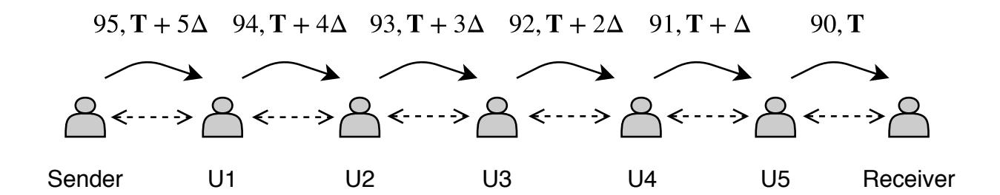
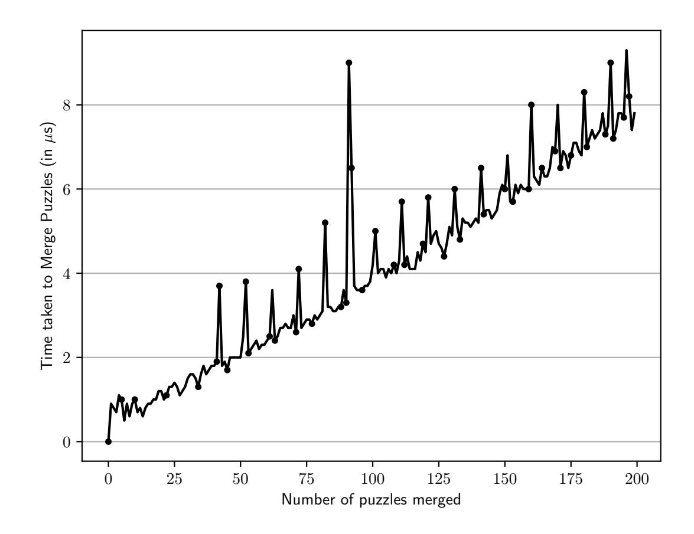

{0}------------------------------------------------

# Verifiable Timed Signatures Made Practical

Sri Aravinda Krishnan Thyagarajan<sup>1</sup> Adithya Bhat<sup>2</sup> Giulio Malavolta<sup>3</sup> Nico D¨ottling<sup>4</sup> Aniket Kate<sup>2</sup> Dominique Schr¨oder<sup>1</sup>

> Friedrich Alexander Universit¨at Erlangen-N¨urnberg Purdue University, USA UC Berkeley and Carnegie Mellon University CISPA Helmholtz Center for Information Security

> > December 14, 2020

#### Abstract

A verifiable timed signature (VTS) scheme allows one to time-lock a signature on a known message for a given amount of time T such that after performing a sequential computation for time T anyone can extract the signature from the time-lock. Verifiability ensures that anyone can publicly check if a time-lock contains a valid signature on the message without solving it first, and that the signature can be obtained by solving the same for time T.

This work formalizes VTS, presents efficient constructions compatible with BLS, Schnorr, and ECDSA signatures, and experimentally demonstrates that these constructions can be employed in practice. On a technical level, we design an efficient cut-and-choose protocol based on the homomorphic time-lock puzzles to prove the validity of a signature encapsulated in a time-lock puzzle. We also present a new efficient range proof protocol that significantly improves upon existing proposals in terms of the proof size, and is also of independent interest.

While VTS is a versatile tool with numerous existing applications, we demonstrate VTS's applicability to resolve three novel challenging issues in the space of cryptocurrencies. Specifically, we show how VTS is the cryptographic cornerstone to construct: (i) Payment channel networks with improved on-chain unlinkability of users involved in a transaction, (ii) multiparty signing of transactions for cryptocurrencies without any on-chain notion of time and (iii) cryptocurrency-enabled fair multi-party computation protocol.

{1}------------------------------------------------

## Contents

| 1 | Introduction                                                                                       | 1        |
|---|----------------------------------------------------------------------------------------------------|----------|
|   | 1.1<br>Applications of VTS<br><br>1.2<br>Our Contributions<br>                                     | 1<br>3   |
| 2 | Technical Overview                                                                                 | 4        |
|   | 2.1<br>Related Work                                                                                | 7        |
| 3 | Preliminaries                                                                                      | 7        |
|   | 3.1<br>Cryptographic Building Blocks<br>                                                           | 8        |
|   | 3.2<br>Verifiable Timed Signatures<br>                                                             | 9        |
| 4 | Efficient VTS Constructions                                                                        | 10       |
|   | 4.1<br>Verifiable Timed BLS Signatures (VT-BLS)<br>                                                | 11       |
|   | 4.2<br>Verifiable Timed Schnorr Signatures (VT-Schnorr)<br>                                        | 12       |
|   | 4.3<br>Verifiable Timed ECDSA Signatures (VT-ECDSA)                                                | 12       |
|   | 4.4<br>Batching Puzzle Solving<br>                                                                 | 15       |
|   | 4.5<br>Range Proof for Homomorphic Time-Lock Puzzles<br><br>4.6<br>On The Setup Assumption<br>     | 16<br>16 |
|   |                                                                                                    |          |
| 5 | Applications Of VTS                                                                                | 17       |
|   | 5.1<br>Payment Channel Network (PCNs)                                                              | 17       |
|   | 5.1.1<br>Payment Channels Without Time On Blockchain                                               | 19       |
|   | 5.2<br>Multisig Without Time On Chain                                                              | 23       |
|   | 5.3<br>Fair Computation Without Timing On Chain<br><br>5.3.1<br>Claim and Refund Functionality<br> | 26<br>27 |
| 6 | Performance Evaluation                                                                             | 31       |
|   | 6.1<br>Setup and Preliminaries<br>                                                                 | 31       |
|   | 6.2<br>Performance Evaluation<br>                                                                  | 33       |
|   | 6.3<br>VTS and Lightning Network                                                                   | 33       |
| 7 | Conclusion And Future Work                                                                         | 35       |
| A | Cryptographic Building Blocks                                                                      | 40       |
|   | A.1<br>Digital Signatures<br>                                                                      | 40       |
|   | A.2<br>Time-Lock Puzzles<br>                                                                       | 40       |
|   | A.3<br>Homomorphic Time-Lock Puzzles                                                               | 41       |
| B | More Related Work                                                                                  | 42       |
| C | Security analysis of VTS constructions                                                             | 42       |
|   | C.1<br>Proof of Theorem 1 and Theorem 2                                                            | 42       |
|   | C.2<br>Proof of Theorem 3 and Theorem 4                                                            | 43       |
|   | C.3<br>Proof of Theorem 5 and Theorem 6                                                            | 44       |
| D | Proof Analysis for Range Proofs                                                                    | 45       |
| E | Verifiable Timed Commitment                                                                        | 46       |
|   |                                                                                                    |          |

{2}------------------------------------------------

| F | Security Analysis for PCN based on VTS                     |    |  |  |  |
|---|------------------------------------------------------------|----|--|--|--|
|   | F.1<br>Formalization of Payment Channel Network (PCNs)<br> | 49 |  |  |  |

{3}------------------------------------------------

## <span id="page-3-0"></span>1 Introduction

Timed cryptography studies a general class of primitives that allows a sender to send information to the future. After a pre-determined amount of time, anyone (possibly at the end of a sequential computation) can learn the enclosed secret. Time-Lock puzzles [\[11,](#page-38-0) [47,](#page-41-0) [53\]](#page-41-1), Timed Commitment [\[15\]](#page-38-1), and Timed release of Signatures [\[27\]](#page-39-0) are prominent primitives in this class with wide-ranging applications [\[4,](#page-38-2) [15,](#page-38-1) [34,](#page-40-0) [39\]](#page-40-1).

For many applications, it is important that the receiver is convinced that the message of the sender is well-formed (e.g., it contains a valid signature on a certain message) before committing a large amount of time and resources to solve the corresponding puzzle. Therefore, it is natural to augment the above mentioned primitives with the notion of verifiability. In this work we formally introduce the notion of Verifiable Timed Signature Scheme (VTS), where a sender commits to a signature σ on a known message in a verifiable and extractable way[1](#page-3-2) . Verifiability refers to the property that one can publicly check that a valid signature is contained in the commitment, whereas extractability guarantees that the signature σ can be recovered from the commitment in time T.

### <span id="page-3-1"></span>1.1 Applications of VTS

Although the utility of VTS in classical applications such as fair contract signing is already well known [\[15,](#page-38-1)[27\]](#page-39-0), we observe that it can further solve challenging privacy and compatibility problems in the cryptocurrency (or blockchain) space. Concretely, we discuss three new applications of VTS.

Applications I: Privacy-Preserving Payment Channels Networks. Bitcoin [\[50\]](#page-41-2) and most permissionless blockchains are inherently limited in transaction throughput and typically have large fees associated with each payment. Payment channels [\[2,](#page-37-1)[52\]](#page-41-3) have emerged as a prominent scalability solution to mitigate these issues by allowing a pair of users to perform multiple payments without committing every intermediate payment to the blockchain. Abstractly, a payment channel consists of three phases: (i) Two users Alice and Bob open a payment channel by adding a single transaction to the blockchain. Intuitively, this transaction promises that Alice may pay up to a certain amount of coins to Bob, which he must claim before a certain time T; (ii) Within this time window, Alice and Bob may send coins from the joint address to either of them by sending a corresponding transaction to the other user; (iii) The channel is considered closed when the latest of the payment transactions is posted on the chain, thus spending coins from the joint address.

An extension of payment channels is payment channel networks (PCN) [\[52\]](#page-41-3). As shown in Figure [1,](#page-4-0) in a PCN, users can perform multi-hop payments, i.e., coins can be transferred to other users in the network without having a common payment channel, routing the payment through a set of intermediate users. For Bitcoin, the atomicity of these payments is ensured using multi-hop locks (in particular, Hash Time Lock Contracts or HTLCs) which guarantee the transfer of v coins if a certain condition is satisfied (e.g., for HTLC, the knowledge of a pre-image x such that H(x) = y, where H is a cryptographic hash function) before time T. PCNs are not only well-studied in the academia [\[6,](#page-38-3) [22,](#page-39-1) [23,](#page-39-2) [45,](#page-41-4) [46,](#page-41-5) [56\]](#page-41-6), but also in industry and the Lightning Network (LN) [\[3,](#page-38-4) [52\]](#page-41-3) has emerged as the most prominent example.

PCNs are found to be no better than Bitcoin in terms of transaction privacy. By using anonymous multi-hop locks (AMHL) [\[45,](#page-41-4) [46\]](#page-41-5), one can make HTLCs unlinkable from the perspective of an on-chain observer, however these proposals do not achieve strong unlinkability

<span id="page-3-2"></span><sup>1</sup> In [\[15\]](#page-38-1), the notion of verifiability for the timed signature is implicitly assumed to exist. We explicitly formalize it and propose efficient protocols for real world applications.

{4}------------------------------------------------

<span id="page-4-0"></span>

Figure 1: A multi-hop transaction over a payment channel network. Dotted lines with two arrowheads indicate payment channels between successive users. In this example, the Sender pays 90 coins to the Receiver through five intermediate users, each collecting a fee of one coin. Each payment hop is associated with a decreasing expiry time (T + c∆, for c ∈ {0, . . . , 5}).

of hops as the time-lock information T is still present in the contract: To avoid race conditions to redeem the coins, the time-lock for the i-th hop is ∆ larger than the time-lock for hop i + 1 (see Figure [1\)](#page-4-0). An attacker observing the on-chain contracts can correlate this time-lock information and detect if certain payments belong to the same multi-hop payment path.

We observe that VTS can solve this privacy issue, by completely removing the time-lock information from the payment transactions. At the time of opening a channel between Alice and Bob, Bob signs an additional "steal" transaction for v coins (as in the HTLC) for Alice using a VTS (with time parameter TA). Alice is then guaranteed that she can redeem these coins after time TA, by forcing the opening of the VTS: If Bob tried to transfer the coins to his address after time TA, then Alice would immediately steal them, using the "steal" transaction also signed by Bob. To avoid race conditions, we introduce an artificial delay δ to the payment to Bob. It is important to observe that δ is fixed and in particular is identical for all payment channels. This time delay gives Alice a sufficient window to post the steal transaction with Bob's signature from the VTS (in case of Bitcoin with a relative time-lock using checkSequenceVerify OP CODE.

For PCNs, apart from Alice, Bob obtains a steal transaction and a VTS (with timing hardness TB) from Carol, who in turns is sent a steal transaction and a VTS (with timing hardness TC) from Dave. The timing hardnesses of these VTS's are structured similarly to the time-locks for HTLC, i.e., T<sup>A</sup> > T<sup>B</sup> > TC. The important difference is that, even though the time-locks still have the correlation, they are never posted on-chain.

Application II: Multisig Transactions. Computations with multiple parties in blockchains often rely on transactions with multisig scripts, i.e., conditions that require multiple signatures in order to authenticate transactions. Bitcoin offers t-out of-n multisig scripts that accepts signed transactions from any t-sized subsets of the n users. These have wide ranging applications including [\[12,](#page-38-5) [48\]](#page-41-7). This has motivated a large body of literature on improving security and efficiency of multisig protocols [\[8,](#page-38-6) [12,](#page-38-5) [19,](#page-39-3) [48\]](#page-41-7) and more efficient constructions of threshold signature schemes [\[29,](#page-39-4) [41,](#page-40-2) [42,](#page-40-3) [58,](#page-41-8) [59\]](#page-42-3). All of these works however (implicitly) assume an expiration time T for the multisig scripts. This is used to ensure that, even if a large threshold of participants go offline, the coins of the few remaining users are not locked indefinitely. Therefore the scope of multisig-based protocol is limited to those cryptocurrencies that support on-chain notion of time. Those blockchains that do not offer the time-lock functionality are therefore not compatible with these protocols.

We propose to use VTS to bypass this problem. Prior to transferring the funds to the multisig address, all users agree on a default redeem transaction. The redeem transaction transfers the coins from the multisig address back to the respective users. It is signed using a VTS with time parameter T. Once the funds are transferred to the multisig address, users 

{5}------------------------------------------------

can jointly spend coins by negotiating new refund transactions for which a VTS is given, using a progressively smaller time parameter. If at any point in time, less then t signatures are exchanged by the users, the VTSs exchanged in the previous round make sure that the funds will be redistributed consistently across all participants. Eventually all parties are going to redeem the coins agreed on the previous "stable" state. As an interesting byproduct of our solution, multisig transactions are also indistinguishable from any other kind of transaction, to the eyes of an external observer. This is because the expiration time is never uploaded on-chain.

Application III: Fair Multi-party Computation. In the multi-party computation (MPC) settings, a computation is fair if either all parties involved receive the output or none of them does. Recent efforts [\[10,](#page-38-7) [36,](#page-40-4) [37\]](#page-40-5) have proposed leveraging blockchains as a solution to achieve fairness. The general idea is to incentivize users to complete the protocol execution by enforcing some financial penalty in case they fail to do so. More concretely, the participants lock a certain amount of coins in addresses addr <sup>i</sup> from which funds can be spent if user U<sup>i</sup> reveals a witness to some condition before time T. Alternatively, if all participants sign the transaction, these coins can be spent and redistributed among the other users after time T. Intuitively, an adversary loses coins if he does not reveal the witness, which in turn is crucial to learn the output of the computation. As a compensation, the coins of the adversary are given to the honest users involved in the computation, which incentivizes publishing of such witness, thus ensuring that other users also learn the output of the computation.

This alternate way of spending is negotiated in a payout phase in the form of payout transactions, where all users generate signatures and exchange them with each other. However, these payout transactions are time-locked on chain and are only valid after time T. This ensures that other users cannot take the coins and distribute among themselves before the termination of the protocol.

One of the major shortcomings of this proposal (along with similar privacy issues as described above) is that this solution is incompatible with blockchains that do not offer the time-lock functionality, such as Zcash [\[9\]](#page-38-8) and Monero [\[38\]](#page-40-6). VTS[2](#page-5-1) can be used to solve such a limitation as follows: All participants sign their payout transaction using a VTS, instead of sending signatures in plain. The privacy of VTS ensures that no party learns the signatures on the payout transaction before time T.

### <span id="page-5-0"></span>1.2 Our Contributions

In summary, in this work we define the notion of verifiable timed signatures, propose a number of efficient constructions, and rigorously design and analyze the various applications discussed above. More concretely, our contributions are as follows.

Definitions. We formalize the notion of Verifiable Timed Signatures (VTS) (Section [3.2\)](#page-11-0) where the committer creates a commitment to a signature that can be solved and opened after time T, along with a proof that certifies that the embedded signature is a valid signature on a message with respect to the correct public key. Anyone can verify this proof and be convinced of the validity of the commitment. In terms of security we require that the commitment and the proof reveal no information about the embedded signature to any PRAM adversary whose running time is bounded by T (privacy) and that an adversary should not be able to output a valid proof to a commitment that does not embed a valid signature on a message with respect to a public key (soundness).

<span id="page-5-1"></span><sup>2</sup> In this work we actually solve the problem using a slightly relaxed variant of VTS, i.e., Verifiable Timed Discrete Logarithm where, instead of the signature, the signing key of signature scheme is committed to. This makes it compatible with Zcash and Monero.

{6}------------------------------------------------

Efficient Constructions. We offer three efficient constructions for VTS (Section [4\)](#page-12-0): VT-BLS, VT-Schnorr and VT-ECDSA where the signatures being committed to are BLS, Schnorr and ECDSA signatures, respectively. Our constructions do not require any modification to these signature schemes. Our constructions exploit the group structure of these signature schemes and combine threshold secret-sharing with a cut-and-choose type of argument to achieve practical performance. We also leverage the recently introduced linearly homomorphic time-lock puzzles [\[47\]](#page-41-0) to reduce the number of puzzles to solve to one (Section [4.4\)](#page-17-0) puzzle. Apart from improving efficiency by decreasing the computational resources needed, this improves security in applications where users may possess different amounts of parallel processors: A user with n processors has no advantage over a user with one processor as they both need to solve only a single puzzle for time T. We also present a concretely efficient construction of Verifiable Timed Commitments (VTC) (Appendix [E\)](#page-48-0), where the signing key is committed instead. Our VTC scheme is applicable to any signature scheme where the secret key is the discrete logarithm of the public key.

Range Proofs. Along the way, we present efficient range proofs (Section [4.5\)](#page-18-0) for proving that the solution of a time-lock puzzle lies within some interval. In contrast with prior works, the protocol batch-proves well-formedness of ` time-lock puzzles and the proof size is independent of `. The protocol is generically applicable to all time-lock puzzles/ciphertexts that possess plaintext- and randomness-homomorphism. Such a protocol might be of independent interest.

New Applications. Apart from classical applications such as fair contract signing [\[15\]](#page-38-1), we identify several applications for VTS where our constructions can be readily used. The primary focus of this paper is on cryptocurrency-based applications where we wish to improve privacy and compatibility of existing solutions. Specifically, (i) we show how to construct privacypreserving PCNs that prevent de-anonymizing attacks based on on-chain timing correlations, (ii) we construct single-hop payment channels without requiring any time-lock functionality from the underlying blockchain, (iii) we present solutions (with different efficiency tradeoffs) to realize blockchain-based fair computation without requiring the time-lock functionality from the blockchain, and (iv) we propose a new way to construct multisig contracts from VTS which does not require any time-lock functionality from the corresponding blockchain.

Implementation. We implement our proposed constructions by building an LHTLP library, the range proof, and the other cryptographic primitives. We find that all LHTLP operations are efficient. The homomorphic batching adds a small overhead while outputting a single puzzle to solve. As the most computationally relevant operation, we also estimate the cost of commit and verify operations of our VTS constructions. Results (in an unoptimized implementation) indicate that for practical purposes with a low powered machine, setting the statistical security parameter n = 40, our VT-ECDSA verifier takes 9.942s with a soundness error of 7.25 × 10−<sup>12</sup> .

## <span id="page-6-0"></span>2 Technical Overview

On a high level, our VTS schemes are built by computing a standard digital signature σ on a message m and emcoding it into a time-lock puzzle. Then a non-interactive zero-knowledge (NIZK) proof is used to prove that the puzzle contains a valid signature on m. There are several non-trivial components in our construction, such as encoding the signatures inside the puzzles that is compatible with our efficient instantiation of a non-interactive zero-knowledge proof, novel use of homomorphic operations on the puzzles to ensure better security, all while ensuring that our construction can work with a large class of signature schemes. Throughout the following overview, we describe the VTS as an interactive protocol between a committer and a verifier, which can be made non-interactive using the Fiat-Shamir transformation [\[25\]](#page-39-5).

{7}------------------------------------------------

**High-Level Overview.** To illustrate our approach, let us consider the BLS signature scheme [14], the other schemes follow a similar blueprint. Recall that BLS public-secret key pair are of the form  $(g_0^{\alpha}, \alpha)$  and the signature on a message m is  $\sigma := H(m)^{\alpha}$ , where  $g_0 \in \mathbb{G}_0$  is a generator of  $\mathbb{G}_0$ ,  $\alpha \in \mathbb{Z}_q$ , and  $H : \{0,1\}^* \to \mathbb{G}_1$  is a full domain hash function. The verification algorithm checks if  $e(g_0, \sigma) = e(g_0^{\alpha}, H(m))$ . To generate a VTS on a message m, the committer secret shares the signature  $\sigma$  together with the public using a t-out-of-n threshold sharing scheme: The first t-1 shares are defined as  $\sigma_i := H(m)^{\alpha_i}$  for a uniformly sampled  $\alpha_i \in \mathbb{Z}_q$ . It is important to observe that such a signature  $\sigma_i$  is a valid BLS signature on m under the public-key  $pk_i = g_0^{\alpha_i}$ . The rest of the shares are sampled consistently using Lagrange interpolation in the exponent, i.e., for  $i \in \{t, t+1, \ldots, n\}$  we set

$$\sigma_i = \left(\frac{\sigma}{\prod_{j \in [t-1]} \sigma_j^{\ell_j(0)}}\right)^{\ell_i(0)^{-1}}$$

where  $\ell_i(\cdot)$  is the *i*-th Lagrange polynomial basis. Note that this is a valid signature on m under the corresponding public-key defined as

$$pk_i = \left(\frac{pk}{\prod_{j \in [t-1]} h_j^{\ell_j(0)}}\right)^{\ell_i(0)^{-1}}.$$

This ensures that we can reconstruct (via Lagrange interpolation) the valid signature  $\sigma$  from any t-sized set of shares of the signature. Analogously, we can reconstruct the public key pk from any set of shares of size at least t.

The committer then computes a time-lock puzzle  $Z_i$  with time parameter  $\mathbf{T}$  for each share separately. The first message consists of all puzzles  $(Z_1, \ldots, Z_n)$  together with all public keys  $(pk_1, \ldots, pk_n)$  as defined above. The verifier then chooses a random set I of size (t-1). For the challenge set, the committer opens the time-lock puzzles  $\{Z_i\}_{i\in I}$  and reveals the underlying message  $\sigma_i$  (together with the corresponding random coins) that it committed to. The verifier accepts the commitment as legitimate if all of the following conditions are satisfied:

- 1. All  $\{\sigma_i\}_{i\in I}$  are consistent with the corresponding public-key pk, i.e.,  $e(g_0, \sigma_i) = e(pk_i, H(m))$ .
- 2. All public keys  $\{pk_j\}_{j\notin I}$  reconstruct to the public key of the scheme, i.e.,  $\prod_{i\in I} pk_i^{\ell_i(0)} \cdot pk_j^{\ell_j(0)} = pk$ .

Taken together, these conditions ensure that, as long as at least one of the partial signatures in the *unopened* puzzles is consistent with respect to the corresponding partial public-key, then we can use it to reconstruct  $\sigma$ . This means that a malicious prover would need to guess the set I ahead of time to pass the above checks without actually committing a valid signature  $\sigma$ . Setting t and n appropriately we can guarantee that this happens only with negligible probability.

We exploit similar structural features in the case of Schnorr and ECDSA signatures. In case of Schnorr we additionally secret share the randomness used in signing and in ECDSA we do not secret share the public key but only the randomness and the signature.

Reducing the Work of the Verifier. As described above, our protocol requires the verifier to solve  $\tilde{n} = (n - t + 1)$  puzzles to force the opening of a VTS. Ideally, we would like to reduce his workload to the minimal one of solving a single puzzle. If this was not the case, some applications may have users with  $\tilde{n}$  processors who can solve  $\tilde{n}$  puzzles in parallel and spending time  $\mathbf{T}$  in total. While other users with less number of processors will have to solve the puzzles one by one thereby spending more time than  $\mathbf{T}$ . This could drastically affect security in the case

{8}------------------------------------------------

of PCN for instance, where a honest user with less number of processors may be still solving the VTS while his steal transactions becomes invalid on the chain. Our observation is that if the time-lock puzzle has some homomorphic properties, then this can indeed be achieved. Specifically, if we instantiate the time-lock puzzle with a recently introduced linearly homomorphic construction [\[47\]](#page-41-0), then we can use standard packing techniques to compress ˜n puzzles into a single one Section [4.4.](#page-17-0) Concretely, the verifier, on input (Z1, . . . , Zn˜) homomorphically evaluates the linear function

$$f(x_1, \dots, x_{\tilde{n}}) = \sum_{i=1}^{\tilde{n}} 2^{(i-1)\cdot\lambda} \cdot x_i$$

to obtain a single puzzle Z˜, which he can solve in time T. Observe that, once the puzzle is solved, all signatures can be decoded from the bit-representations of the resulting message. However this transformation comes with two caveats:

- 1. The message space of the homomorphic time-lock puzzle must be large enough to accommodate for all ˜n signatures.
- 2. The signatures σ<sup>i</sup> encoded in the the input puzzles must not exceed the maximum size of a signature (say λ bits).

Condition (1) can be satisfied instantiating the linearly homomorphic time-lock puzzles with a large enough message space. On the other hand, condition (2) is enforced by including a range NIZK, which certifies that the message of each time-lock puzzles falls into the range [0, 2 λ ].

Efficient Range Proofs. What is left to be discussed is how to implement the range NIZK for homomorphic time-lock puzzle. In the following we outline a protocol that allows us to prove the well-formedness of ` puzzles with proof size logarithmic in `. The proof is generically applicable to any homomorphic time-lock puzzle (or even encryption scheme) that is linearly homomorphic over both the plaintext space and the randomness space, i.e.,

$$\mathsf{PGen}(\mathbf{T}, m; r) \cdot \mathsf{PGen}(\mathbf{T}, m'; r') = \mathsf{PGen}(\mathbf{T}, m + m'; r + r').$$

Our proof system uses similar ideas as the range proof system of [\[43\]](#page-40-7), but we are able to batch range proofs for a large number ` of homomorphic time-lock puzzles in a proof which has size independent of `.

For the sake of this overview, let us assume that we want to make sure that plaintexts lie in an interval [−L, L]. However, to prove correctness and zero-knowledge we will need to require that honest plaintexts actually lie in a much smaller range [−B, B], where B/L is negligible. This will introduce a slack in the size of the time-lock puzzles, which for practical purposes is roughly 50 bits.

We describe the protocol in its interactive form, although the actual instantiation is going to be made non-interactive via the standard Fiat-Shamir transformation. The prover is given ` puzzles (Z1, . . . , Z`) together with each corresponding plaintext x<sup>i</sup> and randomness r<sup>i</sup> . The prover samples a drowning term y uniformly from the interval [−L/4, L/4], then computes time-lock puzzles D = PGen(T, y; r 0 ) for some randomness r 0 . The verifier is given all puzzles (including the one that contains the drowning term) and returns a random subset I of these puzzles. The prover computes the homomorphic sum of the selected puzzles

$$Z = \prod_{i \in I} Z_i \cdot D = \prod_{i \in I} \mathsf{PGen}(\mathbf{T}, x_i; r_i) \cdot \mathsf{PGen}(\mathbf{T}, y; r').$$

By the plaintext and randomness homomorphism, this is equal to

$$Z = \mathsf{PGen}\left(\mathbf{T}, \sum_{i \in I} x_i + y; \sum_{i \in I} r_i + r'\right).$$

{9}------------------------------------------------

The prover computes the opening for Z, i.e., P i∈I x<sup>i</sup> + y and P i∈I r<sup>i</sup> + r 0 , and sends them to the verifier. The verifier accepts if (i) Z is correctly computed (which he can check since he is given the random coins) and if (ii) the plaintext P i∈I x<sup>i</sup> +y lies within the interval [−L/2, L/2]. Given that B is sufficiently smaller than L, specifically B ≤ L/(4`) the protocol is correct. We can further show that, if any of the input plaintexts is outside the range [−L, L], then the above check fails with constant probability. Negligible soundness is then achieved by repeating the above procedure k times in parallel. For zero-knowledge it suffices to observe that the random term ˜m statistically hides any information about P i∈I x<sup>i</sup> by a standard drowning argument, given that B/L is negligible.

### <span id="page-9-0"></span>2.1 Related Work

Notice that VTS can also be seen as a "timed" variant of verifiably encrypted signatures [\[13,](#page-38-10)[31\]](#page-40-8), with the difference that no trusted party is needed to recover the signature. Boneh and Naor [\[15\]](#page-38-1) give an interactive protocol to prove that a time-lock puzzle is well-formed. The verifier is convinced that the sequential squaring is correctly performed. They identify several applications of time-lock puzzles. Garay and Jakobsson [\[27\]](#page-39-0) and later Garay and Pomerance [\[28\]](#page-39-6) proposed constructions where they construct special-purpose zero-knowledge proofs to convince a verifier that the time-lock puzzle indeed has a valid signature embedded. However their construction requires both the prover and the verifier to locally store a list of group elements as a "time-line" whose length is equal to the number of timed checkpoints. For instance, the time-line consists of T group elements if the largest timing hardness is 2T. And in a multi-user system, a single user may have to store several time-lines of several other users with whom he has interaction. If they run a one-time setup for the whole system, it needs to be accompanied by a proof of well-formedness of the time-line. To the best of our knowledge, these protocols have never been implemented and in contrast, with our construction, the setup consist of an RSA modulus N and can be shared across all users in the system or sampled by the signer, depending on the application.

Banasik, Dziembowski and Malinowski [\[7\]](#page-38-11) propose a cut and choose technique to prove that a time-lock puzzle has a valid signing key embedded. The prover sends a puzzles with signing keys for a public keys and the verifier asks to open a − b of them. The verifier checks if the opened puzzles are well-formed and solves the rest of the puzzles. The verifier can finally post a transaction spending from a 'b-out of-2b−1' multisig script where b−1 of the keys are verifier's keys. For a 2−<sup>48</sup> security they require b = 8 which means the spending transaction consists of 8 signatures and 15 public keys. Our VTS and VTC constructions would only require the solver to solve a single puzzle after homomorphic evaluation and post a transaction with single signature for a corresponding public key. As stated before, given that they require b puzzles to be solved, this could lead problems in applications such as PCN if users have different parallel processing power. Moreover, since signing keys are embedded, parties in their protocol can learn the signing keys of other parties after a given time, contrary to our VTS where parties only learn signatures. There may be scenarios where parties may not wish to share their signing keys: Learning a single signing key could compromise security of the entire wallet of the party [\[1\]](#page-37-2) (especially in cases of hierarchical wallets).

## <span id="page-9-1"></span>3 Preliminaries

We denote by λ ∈ N the security parameter and by x ← A(in) the output of the algorithm A on input in. We denote by A(in; r) if algorithm A is randomized with r ← {0, 1} <sup>∗</sup> as its randomness. We omit this randomness where it is obvious and only mention it explicitly when

{10}------------------------------------------------

required. We denote the set {1, . . . , n} by [n].

#### <span id="page-10-0"></span>3.1 Cryptographic Building Blocks

We recall the cryptographic primitives used in our protocol and refer to Appendix [A](#page-42-0) for formal definitions and security.

Digital Signatures. A digital signature scheme consists of the following triple of efficient algorithms: A key generation algorithm KGen(1<sup>λ</sup> ) that takes as input the security parameter 1 <sup>λ</sup> and outputs the public/secret key pair (pk, sk). The signing algorithm Sign(sk, m) inputs a secret key and a message m ∈ {0, 1} <sup>∗</sup> and outputs a signature σ. The verification algorithm Vf(pk, m, σ) outputs 1 if σ is a valid signature on m under the public key pk, and outputs 0 otherwise. We require standard notions of correctness and unforgeability for the signature scheme [\[33\]](#page-40-9).

Time-Lock Puzzles. A time-lock puzzle (PGen, PSolve) allows one to conceal a value for a certain amount of time [\[53\]](#page-41-1). Intuitively, time-lock puzzles guarantee that a puzzle can be solved in polynomial time, but strictly higher than T ∈ N. The only efficient candidate construction of time-lock puzzles was given by Rivest, Shamir, and Wagner and is based on the sequential squaring assumption [\[53\]](#page-41-1). The puzzle generation PGen is a probabilistic algorithm that takes as input a hardness-parameter T, a solution s ∈ {0, 1} <sup>∗</sup> and some random coins r, and outputs a puzzle Z. The solving algorithm PSolve takes as input a puzzle Z and outputs a solution s. In this context, we refer to Parallel Random Access Machines (PRAM): which is a model considered for most of the parallel algorithms. Multiple processors are attached to a single block of memory and n number of processors can perform independent operations on n number of data in a particular unit of time. The security requirement is that for every PRAM adversary A of running time ≤ T<sup>ε</sup> (λ), and every pair of solutions (s0, s1) ∈ {0, 1} 2 , it cannot distinguish a puzzle Z that is generated with solution s<sup>0</sup> from a puzzle generated with solution s<sup>1</sup> where the timing hardness of the puzzle is T except with negligible probability.

Homomorphic Time-Lock Puzzles. Homomorphic Time-Lock Puzzles (HTLPs) were proposed by Malavolta and Thyagarajan [\[47\]](#page-41-0). An HTLP is a tuple of four algorithms (HTLP.PSetup, HTLP.PGen, HTLP.PSolve, HTLP.PEval) that lets one perform homomorphic operations over different time-lock puzzles. Apart from the two algorithms for a time-lock puzzle, HTLPs additionally have a setup algorithm PSetup and a homomorphic evaluation algorithm PEval: PSetup takes as input a security parameter 1<sup>λ</sup> and a time hardness parameter T, and outputs public parameters pp, and PEval takes as input a circuit C : {0, 1} <sup>n</sup> → {0, 1}, public parameters pp and a set of n puzzles Z1, . . . , Z<sup>n</sup> and outputs a puzzle Z 0 . The puzzle generation and solving algorithms also take the public parameters pp as input. The homomorphism property for computing a circuit C states that Pr -HTLP.PSolve(pp, Z<sup>0</sup> ) 6= C(s1, . . . , sn) ≤ µ(λ), where Z <sup>0</sup> ← HTLP.PEval(C, pp, Z1, . . . , Zn) and Z<sup>i</sup> ← HTLP.PGen(pp, si) for (s1, . . . , sn) ∈ {0, 1} n .

In their work, they show an efficient construction that is linearly homomorphic over the ring ZN<sup>s</sup> , where N is an RSA modulus and s is an arbitrary constant. The scheme is perfectly correct and it satisfies the notion of randomness homomorphism, which is needed for our purposes.

Non-Interactive Zero-Knowledge. Let R : {0, 1} <sup>∗</sup> × {0, 1} <sup>∗</sup> → {0, 1} be a n NP-witnessrelation with corresponding NP-language L := {x : ∃w s.t. R(x, w) = 1}. A non-interactive zero-knowledge proof (NIZK) [\[17\]](#page-39-7) system for R is initialized with a setup algorithm ZKsetup(1<sup>λ</sup> ) that, on input the security parameter, outputs a common reference string crs. A prover can show the validity of a statement x with a witness w by invoking ZKprove(crs, x, w), which outputs a proof π. The proof π can be efficiently checked by the verification algorithm ZKverify(crs, x, π). We require a NIZK system to be (1) zero-knowledge, where the verifier does not learn more than the validity of the statement x, and (2) simulation sound, where it is hard for any prover

{11}------------------------------------------------

to convince a verifier of an invalid statement (chosen by the prover) even after having access to polynomially many simulated proofs for statements of his choosing.

Threshold Secret Sharing. Secret sharing is a method of creating shares of a given secret and later reconstructing the secret itself only if given a threshold number of shares. Shamir [55] proposed a threshold secret sharing scheme where the SS.share algorithm takes a secret  $s \in \mathbb{Z}_q$  and generates shares  $(s_1, \ldots, s_n)$  each belonging to  $\mathbb{Z}_q$ . The SS.reconstruct algorithm takes as input at least t shares and outputs a secret s. The security of the secret sharing scheme demands that knowing only a set of shares smaller than the threshold size does *not* help in learning any information about the choice of the secret s.

### <span id="page-11-0"></span>3.2 Verifiable Timed Signatures

A timed signature [15] is a scheme when a committer commits to a signature on a message and shares it with some user. After some time **T** has passed, the committer reveals the committed signature to the user. If he fails to reveal the signature, then the user is guaranteed to forcibly retrieve the signature from the timed commitment given initially. We explicitly state the notion of verifiability for a timed signature, and therefore refer to it as a *Verifiable Timed Signature* (VTS), which lets the user verify if the signature  $\sigma$  committed to in C can be obtained by ForceOp in time **T** and is indeed a valid signature on the message m, that is, if  $Vf(pk, m, \sigma) = 1$  in a *non-interactive* manner. This verifiability ensures that the user is guaranteed to obtain a valid signature from the commitment C which he can retrieve using ForceOp. For the sake of clarity, we let Commit additionally output a proof  $\pi$  for the embedded signature to be a valid signature on the message m with respect to pk and we have a Vrfy algorithm that is defined below.

**Definition 1** (Verifiable Timed Signatures). A VTS for a signature scheme  $\Pi = (\mathsf{KGen}, \mathsf{Sign}, \mathsf{Vf})$  is a tuple of four algorithms (Commit, Vrfy, Open, ForceOp) where:

- $(C,\pi) \leftarrow \mathsf{Commit}(\sigma,\mathbf{T})$ : the commit algorithm (randomized) takes as input a signature  $\sigma$  (generated using  $\Pi.\mathsf{Sign}(sk,m)$ ) and a hiding time  $\mathbf{T}$  and outputs a commitment C and a proof  $\pi$ .
- $0/1 \leftarrow \mathsf{Vrfy}(pk, m, C, \pi)$ : the verify algorithm takes as input a public key pk, a message m, a commitment C of hardness  $\mathbf{T}$  and a proof  $\pi$  and accepts the proof by outputting 1 if and only if, the value  $\sigma$  embedded in c is a valid signature on the message m with respect to the public key pk (i.e.,  $\Pi.\mathsf{Vf}(pk, m, \sigma) = 1$ ). Otherwise it outputs 0.
- $(\sigma, r) \leftarrow \mathsf{Open}(C)$ : the open phase where the committer takes as input a commitment C and outputs the committed signature  $\sigma$  and the randomness r used in generating C.
- $\sigma \leftarrow \mathsf{ForceOp}(C)$ : the force open algorithm takes as input the commitment C and outputs a signature  $\sigma$ .

The security requirements for a VTS are that (soundness) the user is convinced that, given C, the ForceOp algorithm will produce the committed signature  $\sigma$  in time  $\mathbf{T}$  and that (privacy) all PRAM algorithms whose running time is at most t (where  $t < \mathbf{T}$ ) succeed in extracting  $\sigma$  from the commitment C and  $\pi$  with at most negligible probability. We formalize the definition of soundness below.

<span id="page-11-1"></span>**Definition 2** (Soundness). A VTS scheme VTS = (Commit, Vrfy, Open, ForceOp) for a signature scheme  $\Pi = (\mathsf{KGen}, \mathsf{Sign}, \mathsf{Vf})$  is sound if there is a negligible function negl such that for all

{12}------------------------------------------------

probabilistic polynomial time adversaries A and all  $\lambda \in \mathbb{N}$ , we have:

$$\Pr \begin{bmatrix} b_1 = 1 \land b_2 = 0 : & (pk, m, C, \pi, \mathbf{T}) \leftarrow \mathcal{A}(1^{\lambda}) \\ b_1 := \mathsf{Vrfy}(pk, m, C, \pi) \\ b_2 := \Pi.\mathsf{Vf}(pk, m, \sigma) \end{bmatrix} \leq negl(\lambda).$$

We say that a VTS is *simulation-sound* if it is sound even when the prover has access to simulated proofs for (possibly false) statements of his choice; i.e., the prover must not be able to compute a valid proof for a fresh false statement of his choice. In the following definition we present the definition of privacy.

<span id="page-12-1"></span>**Definition 3** (Privacy). A VTS scheme VTS = (Commit, Vrfy, Open, ForceOp) for a signature scheme  $\Pi = (\mathsf{KGen}, \mathsf{Sign}, \mathsf{Vf})$  is private if there exists a PPT simulator  $\mathcal{S}$ , a negligible function negl, and a polynomial  $\tilde{\mathbf{T}}$  such that for all polynomials  $\mathbf{T} > \tilde{\mathbf{T}}$ , all PRAM algorithms  $\mathcal{A}$  whose running time is at most  $t < \mathbf{T}$ , all messages  $m \in \{0,1\}^*$ , and all  $\lambda \in \mathbb{N}$  it holds that

$$\left| \begin{array}{l} \Pr \left[ \begin{matrix} (pk,sk) \leftarrow \Pi.\mathsf{KGen}(1^{\lambda}) \\ \mathcal{A}(pk,m,C,\pi) = 1: \quad \sigma \leftarrow \Pi.\mathsf{Sign}(sk,m) \\ (C,\pi) \leftarrow \mathsf{Commit}(\sigma,\mathbf{T}) \end{matrix} \right] \right| \leq negl(\lambda). \\ -\Pr \left[ \mathcal{A}(pk,m,C,\pi) = 1: \begin{matrix} (pk,sk) \leftarrow \Pi.\mathsf{KGen}(1^{\lambda}) \\ (C,\pi,m) \leftarrow \mathcal{S}(pk,\mathbf{T}) \end{matrix} \right]$$

## <span id="page-12-0"></span>4 Efficient VTS Constructions

In the following sections we construct VTS for BLS, Schnorr and ECDSA signatures. The key ingredients for constructing VTS are time-lock puzzles, specifically we consider the Linearly-HTLP [47] (LHTLP.PSetup, LHTLP.PGen, LHTLP.PSolve, LHTLP.PEval) and public coin interactive zero-knowledge proofs for the language  $\mathcal L$  described as follows.

$$\mathcal{L} := \begin{cases} \mathsf{stmt} = (pk, m, Z, \mathbf{T}) : \exists \mathsf{wit} = (\sigma, r) \text{ s.t.} \\ (\mathsf{Vf}(pk, m, \sigma) = 1) \ \land (Z \leftarrow \mathsf{LHTLP.PGen}(\mathbf{T}, \sigma; r)) \end{cases}$$

The Commit algorithm embeds the signatures inside time-lock puzzles and uses the zero-knowledge proof system for  $\mathcal{L}$  to prove the validity of the time-locked signature. In practice all of the schemes will be made non-interactive using the Fiat-Shamir transformation [25]. We additionally make use of a zero-knowledge proof system (ZKsetup, ZKprove, ZKverify) for the language  $\mathcal{L}_{range}$  as defined below. Intuitively, the language consists of all puzzles whose solution lies in some range [a, b]. We give an efficient instantiation of this proof system in Section 4.5.

$$\mathcal{L}_{\mathsf{range}} := \begin{cases} \mathsf{stmt} = (Z, a, b, \mathbf{T}) : \exists \mathsf{wit} = (\sigma, r) \text{ s.t.} \\ (Z \leftarrow \mathsf{LHTLP.PGen}(\mathbf{T}, \sigma; r)) \ \land (\sigma \in [a, b]) \end{cases}$$

In all protocols described in Figures 2 to 4 we let n be a statistical security parameter and set t:=n/2+1. We let  $|\sigma|=\lambda$  is the max number of bits of the signature  $\sigma$ . Define a hash function  $H':\{0,1\}^* \to I \subset [n]$  with |I|=t-1 modeled as a random oracle. Throughout the following description, we make the simplifying assumption that the ForceOp algorithm solves  $\tilde{n}=(n-t+1)$  puzzles in parallel. In Section 4.4 we show how to reduce the number of puzzles to solve to a single puzzle exploiting the (linear) homomorphic evaluation algorithm of time-lock puzzles.

{13}------------------------------------------------

<span id="page-13-1"></span>Setup: On input 1<sup>λ</sup> the setup algorithm does the following.

- Run ZKsetup(1<sup>λ</sup> ) to generate crsrange
- Generate the public parameters pp ← LHTLP.PSetup(1<sup>λ</sup> , T)
- Output crs := (crsrange, pp)

Commit and Prove: On input (crs,wit) the Commit algorithm does the following.

- Parse wit := σ, crs := (crsrange, pp), pk as the BLS public key, and m as the message to be signed
- For all i ∈ [t − 1] sample a uniform α<sup>i</sup> ← Z<sup>q</sup> and set σ<sup>i</sup> = H(m) <sup>α</sup><sup>i</sup> h<sup>i</sup> := g αi 0
- For all i ∈ {t, . . . , n} compute

$$\sigma_i = \left(\frac{\sigma}{\prod_{j \in [t-1]} \sigma_j^{\ell_j(0)}}\right)^{\ell_i(0)^{-1}}, h_i = \left(\frac{pk}{\prod_{j \in [t-1]} h_j^{\ell_j(0)}}\right)^{\ell_i(0)^{-1}}$$

where `i(·) is the i-th Lagrange polynomial basis.

– For i ∈ [n], generate puzzles with corresponding range proofs as shown below

$$r_i \leftarrow \{0,1\}^{\lambda}, Z_i \leftarrow \mathsf{LHTLP.PGen}(pp, \sigma_i; r_i)$$

$$\pi_{\mathsf{range},i} \leftarrow \mathsf{ZKprove}(\mathit{crs}_{\mathsf{range}}, (Z_i, 0, 2^{\lambda}, \mathbf{T}), (\sigma_i, r_i))$$

- Compute I ← H<sup>0</sup> (pk,(h1, Z1, πrange,1), . . . ,(hn, Zn, πrange,n))
- Output C := (Z1, . . . , Zn, T) and π := ({h<sup>i</sup> , πrange,i}i∈[n] , I, {σ<sup>i</sup> , ri}i∈<sup>I</sup> )

Verification: On input (crs, pk, m, C, π) the Vrfy algorithm does the following.

- Parse C := (Z1, . . . , Zn, T), π := ({h<sup>i</sup> , πrange,i}i∈[n] , I, {σ<sup>i</sup> , ri}i∈<sup>I</sup> ) and crs := (crsrange, pp)
- If any of the following conditions is satisfied output 0, else return 1:
  - 1. There exists some j /∈ I such that Q i∈I h `i(0) i · h `<sup>j</sup> (0) j 6= pk
  - 2. There exists some i ∈ [n] such that ZKverify(crsrange,(Z<sup>i</sup> , 0, 2 λ , T), πrange,i) 6= 1
  - 3. There exists some i ∈ I such that Z<sup>i</sup> 6= LHTLP.PGen(pp, σ<sup>i</sup> ; ri) or e(g0, σi) 6= e(h<sup>i</sup> , H(m))
  - 4. I 6= H<sup>0</sup> (pk,(h1, Z1, πrange,1), . . . ,(hn, Zn, πrange,n))

Open: The Open algorithm outputs (σ, {ri}i∈[n] ).

Force Open: The ForceOp algorithm take as input C := (Z1, . . . , Zn, T) and works as follows:

- Runs σ<sup>i</sup> ← LHTLP.PSolve(pp, Zi) for i ∈ [n] to obtain all signatures. Notice that since t − 1 puzzles are already opened by the committer, this only means that ForceOp has to solve only (n − t + 1) puzzles.
- Output σ := Q j∈[t] (σ<sup>j</sup> ) `<sup>j</sup> (0) where wlog., the first t signatures are valid shares.

Figure 2: VT-BLS Signatures

## <span id="page-13-0"></span>4.1 Verifiable Timed BLS Signatures (VT-BLS)

Let (G0, G1, Gt) be a bilinear group of prime order q, where q is a λ bit prime. Let e be an efficiently computable bilinear pairing e : G<sup>0</sup> × G<sup>1</sup> → G<sup>T</sup> , where g<sup>0</sup> and g<sup>1</sup> are generators of G<sup>0</sup>

{14}------------------------------------------------

and  $\mathbb{G}_1$  respectively. Let H be a hash function  $H: \{0,1\}^* \to \mathbb{G}_1$ . We briefly recall here the BLS construction [14] and our VT-BLS protocol is described in Figure 2.

- $(pk, sk) \leftarrow \mathsf{KGen}(1^{\lambda})$ : Choose  $\alpha \leftarrow \mathbb{Z}_q$ , set  $h \leftarrow g_0^{\alpha} \in \mathbb{G}_0$  and output pk := h and  $sk := \alpha$ .
- $\sigma \leftarrow \mathsf{Sign}(sk, m)$ : Output  $\sigma := H(m)^{sk} \in \mathbb{G}_1$ .
- $0/1 \leftarrow \mathsf{Vf}(pk, m, \sigma)$ : If  $e(g_0, \sigma) = e(pk, H(m))$ , then output 1 and otherwise output 0.

The following theorems show that our construction from Figure 2 satisfies privacy and soundness. The formal proofs are deferred to Appendix C.1.

<span id="page-14-2"></span>**Theorem 1** (Privacy). Let (ZKsetup, ZKprove, ZKverify) be a NIZK for  $\mathcal{L}_{range}$  and let LHTLP. be a secure time-lock puzzle. Then the protocol as described in Figure 2 satisfies privacy as in Definition 3 in the random oracle model.

<span id="page-14-3"></span>**Theorem 2** (Soundness). Let (ZKsetup, ZKprove, ZKverify) be a NIZK for  $\mathcal{L}_{range}$  and let LHTLP. be a time-lock puzzle with perfect correctness. Then the protocol as described in Figure 2 satisfies soundness as in Definition 2 in the random oracle model.

### <span id="page-14-0"></span>4.2 Verifiable Timed Schnorr Signatures (VT-Schnorr)

The Schnorr signature scheme [54] is defined over a cyclic group  $\mathbb{G}$  of prime order q with generator g, and use a hash function  $H:\{0,1\}^* \to \mathbb{Z}_q$ . We briefly recall the construction here and VT-Schnorr protocol is given in Figure 3.

- $(pk, sk) \leftarrow \mathsf{KGen}(1^{\lambda})$ : Choose  $x \leftarrow \mathbb{Z}_q$  and set sk := x and  $pk := g^x$ .
- $\sigma \leftarrow \mathsf{Sign}(sk, m; r)$ : Sample a randomness  $r \leftarrow \mathbb{Z}_q$  to compute  $R := g^r, c := H(g^x, R, m), s := r + cx$  and output  $\sigma := (R, s)$ .
- $0/1 \leftarrow \mathsf{Vf}(pk, m, \sigma)$ : Parse  $\sigma := (R, s)$  and then compute c := H(pk, R, m) and if  $g^s = R \cdot pk^c$  output 1, otherwise output 0.

In the following theorems we show that our construction of VT-Schnorr from Figure 3 satisfies privacy and soundness. The formal proofs are deferred to Appendix C.2.

<span id="page-14-4"></span>**Theorem 3** (Privacy). Let (ZKsetup, ZKprove, ZKverify) be a NIZK for  $\mathcal{L}_{range}$  and let LHTLP. be a secure time-lock puzzle. Then the protocol as described in Figure 3 satisfies privacy as in Definition 3 in the random oracle model.

<span id="page-14-5"></span>**Theorem 4** (Soundness). Let (ZKsetup, ZKprove, ZKverify) be a NIZK for  $\mathcal{L}_{range}$  and let LHTLP. be a time-lock puzzle with perfect correctness. Then the protocol as described in Figure 3 satisfies soundness as in Definition 2 in the random oracle model.

### <span id="page-14-1"></span>4.3 Verifiable Timed ECDSA Signatures (VT-ECDSA)

The ECDSA signature scheme [32] is defined over an elliptic curve group  $\mathbb{G}$  of prime order q with base point (generator) g. The construction assumes the existence of a hash function  $H:\{0,1\}^* \to \mathbb{Z}_q$  and is given in the following. Our VT-ECDSA protocol is given in Figure 4.

- $(pk, sk) \leftarrow \mathsf{KGen}(1^{\lambda})$ : Choose  $x \leftarrow \mathbb{Z}_q$  and set sk := x and  $pk := g^x$ .
- $\sigma \leftarrow \text{Sign}(sk, m; r)$ : Sample an integer  $k \leftarrow \mathbb{Z}_q$  and compute  $c \leftarrow H(m)$ . Let  $(r_x, r_y) := R = g^k$ , then set  $r := r_x \mod q$  and  $s := (c + r_x)/k \mod q$ . Output  $\sigma := (r, s)$ .
- $0/1 \leftarrow \mathsf{Vf}(pk, m, \sigma)$ : Parse  $\sigma := (r, s)$  and compute c := H(m) and return 1 if and only if  $(x, y) = (g^c \cdot h^r)^{s^{-1}}$  and  $x = r \mod q$ . Otherwise output 0.

{15}------------------------------------------------

<span id="page-15-0"></span>Setup: Same as Figure [2.](#page-13-1)

Commit and Prove: On input (crs,wit) the Commit algorithm does the following.

- Parse wit := σ = (R, s), crs := (crsrange, pp), pk as the Schnorr public key, and m as the message to be signed
- For all i ∈ [t − 1] sample a uniform pair (x<sup>i</sup> , ki) ← Z<sup>q</sup> and set h<sup>i</sup> := g xi , R<sup>i</sup> := g ki , and si := k<sup>i</sup> + cx<sup>i</sup> where c = H(pk, R, m)
- For all i ∈ {t, . . . , n} compute

$$s_{i} = \left(s - \sum_{j \in [t-1]} s_{j} \cdot \ell_{j}(0)\right) \cdot \ell_{i}(0)^{-1}, \ h_{i} = \left(\frac{pk}{\prod_{j \in [t-1]} h_{j}^{\ell_{j}(0)}}\right)^{\ell_{i}(0)^{-1}}$$

$$R_{i} = \left(\frac{R}{\prod_{j \in [t-1]} R_{j}^{\ell_{j}(0)}}\right)^{\ell_{i}(0)^{-1}}$$

j

where `i(·) is the i-th Lagrange polynomial basis

– For i ∈ [n], generate puzzles with corresponding range proofs as shown below (|σ| = λ is the max number of bits of σ)

$$r_i \leftarrow \{0,1\}^{\lambda}, Z_i \leftarrow \mathsf{LHTLP.PGen}(pp, s_i; r_i)$$

$$\pi_{\mathsf{range},i} \leftarrow \mathsf{ZKprove}(\mathit{crs}_{\mathsf{range}}, (Z_i, 0, 2^{\lambda}, \mathbf{T}), (s_i, r_i))$$

- Compute I ← H<sup>0</sup> (pk, R,(h1, R1, Z1, πrange,1), . . . ,(hn, Rn, Zn, πrange,n))
- Output C := (R, Z1, . . . , Zn, T) and π := ({h<sup>i</sup> , R<sup>i</sup> , πrange,i}i∈[n] , I, {s<sup>i</sup> , ri}i∈<sup>I</sup> )

Verification: On input (crs, pk, m, C, π) the Vrfy algorithm does the following.

- Parse C := (R, Z1, . . . , Zn, T), π := ({h<sup>i</sup> , R<sup>i</sup> , πrange,i}i∈[n] , I, {s<sup>i</sup> , ri}i∈<sup>I</sup> ), and crs := (crsrange, pp)
- If any of the following conditions is satisfied output 0, else return 1:
  - 1. There exists some j /∈ I such that Q i∈I h `i(0) i · h `<sup>j</sup> (0) j 6= pk or Q <sup>i</sup>∈<sup>I</sup> R `i(0) i · R `<sup>j</sup> (0) j 6= R
  - 2. There exists some i ∈ [n] such that ZKverify(crsrange,(Z<sup>i</sup> , 0, 2 λ , T), πrange,i) 6= 1
  - 3. There exists some i ∈ I such that Z<sup>i</sup> 6= LHTLP.PGen(pp, s<sup>i</sup> ; ri) or g <sup>s</sup><sup>i</sup> 6= R<sup>i</sup> · h c i
  - 4. I 6= H<sup>0</sup> (pk, R,(h1, R1, Z1, πrange,1), . . . ,(hn, Rn, Zn, πrange,n))

Open: The Open algorithm outputs ((R, s), {ri}i∈[n] ).

Force Open: The ForceOp algorithm take as input C := (R, Z1, . . . , Zn, T) and works as follows:

- Runs s<sup>i</sup> ← LHTLP.PSolve(pp, Zi) for i ∈ [n] to obtain all signatures. ForceOp has to solve only (n − t + 1) puzzles, as t − 1 puzzles are already opened.
- Output (R, s := P j∈[t] (s<sup>j</sup> ) · `<sup>j</sup> (0)) where wlog., the first t are valid shares.

Figure 3: VT-Schnorr Signatures

{16}------------------------------------------------

<span id="page-16-0"></span>Setup: Same as Figure 2.

Commit and Prove: On input (crs, wit) the Commit algorithm does the following.

- Parse wit :=  $\sigma = (r, s)$ ,  $crs := (crs_{\mathsf{range}}, pp)$ , pk as the ECDSA public key, and m as the message to be signed
- Define  $R := (x, y) = (g^c \cdot h^r)^{s^{-1}}$  and  $B = g^c \cdot h^r$ , where c = H(m)
- For all  $i \in [t-1]$  sample a uniform pair  $s_i \leftarrow \mathbb{Z}_q$  and set  $R_i := B^{s_i}$
- For all  $i \in \{t, \ldots, n\}$  compute

$$s_i = \left(s^{-1} - \sum_{j \in [t-1]} s_j \cdot \ell_j(0)\right) \cdot \ell_i(0)^{-1}$$
, and

$$R_{i} = \left(\frac{R}{\prod_{j \in [t-1]} R_{j}^{\ell_{j}(0)}}\right)^{\ell_{i}(0)^{-1}}$$

where  $\ell_i(\cdot)$  is the *i*-th Lagrange polynomial basis

– For  $i \in [n]$ , generate puzzles with corresponding range proofs as shown below  $(|\sigma| = \lambda)$  is the max number of bits of  $\sigma$ )

$$r_i \leftarrow \{0,1\}^{\lambda}, Z_i \leftarrow \mathsf{LHTLP.PGen}(pp, s_i; r_i)$$

$$\pi_{\mathsf{range},i} \leftarrow \mathsf{ZKprove}(\mathit{crs}_{\mathsf{range}}, (Z_i, 0, 2^{\lambda}, \mathbf{T}), (s_i, r_i))$$

- Compute  $I \leftarrow H'(pk, r, R, (R_1, Z_1, \pi_{\mathsf{range}, 1}), \dots, (R_n, Z_n, \pi_{\mathsf{range}, n}))$
- Output  $C := (r, R, Z_1, \dots, Z_n, \mathbf{T})$  and  $\pi := (\{R_i, \pi_{\mathsf{range},i}\}_{i \in [n]}, I, \{s_i, r_i\}_{i \in I})$

**Verification:** On input  $(crs, pk, m, C, \pi)$  the Vrfy algorithm does the following.

- Parse  $C := (r, R, Z_1, \dots, Z_n, \mathbf{T}), \ \pi := (\{R_i, \pi_{\mathsf{range},i}\}_{i \in [n]}, I, \{s_i, r_i\}_{i \in I}), \ \text{and} \ crs := (crs_{\mathsf{range}}, pp)$
- If any of the following conditions is satisfied output 0, else return 1:
  - 1. It holds that  $x \neq r \mod q$  where (x, y) := R
  - 2. There exists some  $j \notin I$  such that  $\prod_{i \in I} R_i^{\ell_i(0)} \cdot R_i^{\ell_j(0)} \neq R$
  - 3. There exists some  $i \in [n]$  such that  $\mathsf{ZKverify}(\mathit{crs}_{\mathsf{range}}, (Z_i, 0, 2^{\lambda}, \mathbf{T}), \pi_{\mathsf{range}, i}) \neq 1$
  - 4. There exists some  $i \in I$  such that  $Z_i \neq \mathsf{LHTLP.PGen}(pp, s_i; r_i)$  or  $R_i \neq (g^c \cdot h^r)^{s_i}$
  - 5.  $I \neq H'(pk, r, R, (R_1, Z_1, \pi_{\mathsf{range}, 1}), \dots, (R_n, Z_n, \pi_{\mathsf{range}, n}))$

**Open:** The Open algorithm outputs  $((r,s), \{r_i\}_{i\in[n]})$ .

Force Open: The ForceOp algorithm take as input  $C := (r, R, Z_1, \dots, Z_n, \mathbf{T})$  and works as follows:

- Obtain  $s_i \leftarrow \mathsf{LHTLP.PSolve}(pp, Z_i)$  for  $i \in [n]$  same as in Figure 3.
- Output  $(r, s := \sum_{j \in [t]} (s_j) \cdot \ell_j(0))$  where wlog., the first t are valid shares.

Figure 4: VT-ECDSA Signatures

{17}------------------------------------------------

Notice that ECDSA signature has a non-linear verification unlike in Schnorr. Consequently, notice that unlike VT-BLS and VT-Schnorr, the public key is not secret shared in VT-ECDSA.

The theorems below are for privacy and soundness of our VT-ECDSA protocol. The formal proofs are deferred to Appendix [C.3.](#page-46-0)

<span id="page-17-1"></span>Theorem 5 (Privacy). Let (ZKsetup, ZKprove, ZKverify) be a NIZK for Lrange and let LHTLP. be a secure time-lock puzzle. Then the protocol as described in Figure [4](#page-16-0) satisfies privacy as in Definition [3](#page-12-1) in the random oracle model.

<span id="page-17-2"></span>Theorem 6 (Soundness). Let (ZKsetup, ZKprove, ZKverify) be a NIZK for Lrange and let LHTLP. be a time-lock puzzle with perfect correctness. Then the protocol as described in Figure [4](#page-16-0) satisfies soundness as in Definition [2](#page-11-1) in the random oracle model.

### <span id="page-17-0"></span>4.4 Batching Puzzle Solving

As described above, our protocols require the verifier to solve ˜n = (n − t + 1) puzzles in the forced opening phase. In the following we show how to leverage the homomorphic properties of the time-lock puzzles to ensure that the computation is reduced to the solution of a single puzzle, regardless of the parameters n and t. This is crucial for our real world applications as without HTLP, users with different degrees of parallelisms can solve ˜n puzzles in different times: A user with several computers can solve ˜n puzzles in parallel effectively spending time T, and a user with a single computer solves one puzzle after the other sequentially thus spending ˜n · T.

The high-level idea of exploiting the homomorphism of LHTLP is to pack all partial signatures into a single puzzle, provided that the message space is large enough.

Concretely, the solver, given ˜n puzzles Z1, . . . , Zn˜ encoding λ-bits signatures, homomorphically evaluates the linear function

$$f(x_1, \dots, x_{\tilde{n}}) = \sum_{i=1}^{\tilde{n}} 2^{(i-1)\cdot\lambda} \cdot x_i$$

to obtain the puzzle Z˜, which can be solved in time T. Observe that, once the puzzle is solved, all signatures can be decoded from the bit-representations of the resulting plaintext. Note that in order for this transformation to work we need two conditions to be satisfied:

- 1. The signatures σ<sup>i</sup> encoded in the the input puzzles must not exceed the maximum size of a signature (which we fix to λ bits)
- 2. The message space of the homomorphic time-lock puzzle must be large enough to accommodate for all ˜n signatures.

Condition (1) is enforced by including a range NIZK, which certifies that the message of each time-lock puzzles falls into the range [0, 2 λ ]. On the other hand we can satisfy condition (2) by instantiating the linearly homomorphic time-lock puzzles with modulus N<sup>s</sup> , instead of N<sup>2</sup> , for a large enough s. This is reminiscent of the Damg˚ard-Jurik [\[16\]](#page-39-8) extension of Paillier's cryptosystem [\[51\]](#page-41-11) and was already suggested in [\[47\]](#page-41-0).

We stress that, even though we can increase the message space arbitrarily, the squaring operations are still performed modulo N, which is important to reduce the gap between the honest and the malicious solver: While squaring is conjectured to be a sequential operation (in groups of unknown order), the computation of a single squaring operation can be internally parallelized to boot the overall efficiency of the algorithm. For this reason it is important to keep the modulus as small as possible, at least as far as squaring is concerned. For further details, we refer the reader to [\[47\]](#page-41-0).

{18}------------------------------------------------

```
Setup: An RSA modulus N, public parameters pp for HTLP, interval parameters L and B with B < L. In this protocol we use k as a statistical security parameter.

Common input: Time-lock puzzles Z_1, \ldots, Z_\ell.

Prover: On input wit, where wit := ((x_1, r_1), \ldots, (x_\ell, r_\ell)) and x_i \in [-B, B] such that for all i it holds Z_i \leftarrow \mathsf{HTLP.PGen}(\mathsf{pp}, x_i; r_i), the prover algorithm ZKprove does the following.

- Choose y_1, \ldots, y_k \leftarrow [-L/4, L/4] and random coins r'_1, \ldots, r'_k from their corresponding ring.

- For i = 1, \ldots, k compute D_i \leftarrow \mathsf{HTLP.PGen}(\mathsf{pp}, y_i; r'_i)

- Compute (\mathbf{t}_1, \ldots, \mathbf{t}_k) \leftarrow H(Z_1, \ldots, Z_\ell, D_1, \ldots, D_k), where the \mathbf{t}_i \in \{0, 1\}^\ell.

- For i = 1, \ldots, k compute v_i \leftarrow y_i + \sum_{j=1}^\ell t_{i,j} \cdot x_j and w_i \leftarrow r'_i + \sum_{j=1}^\ell t_{i,j} \cdot r_j

- Set \pi \leftarrow (D_i, v_i, w_i)_{i \in [k]} and output \pi

Verifier: On input \pi = (D_i, v_i, w_i)_{i \in [k]} the do the following.

- Compute (\mathbf{t}_1, \ldots, \mathbf{t}_k) \leftarrow H(Z_1, \ldots, Z_\ell, D_1, \ldots, D_k)

- For i = 1, \ldots, k check if v_i \in [-L/2, L/2], compute F_i \leftarrow D_i \cdot \prod_{j=1}^\ell Z_j^{t_{i,j}} and check if F_i = HTLP.PGen(\mathsf{pp}, v_i; w_i).

- If all checks pass output 1, otherwise 0.
```

Figure 5: NIZK protocol for well-formedness of a vector of homomorphic time-lock puzzles

### <span id="page-18-0"></span>4.5 Range Proof for Homomorphic Time-Lock Puzzles

In this Section we will provide a protocol which allows a prover to convince a verifier in zero-knowledge that a list of linearly homomorphic time-lock puzzles are well-formed. This allows us to homomorphically pack them into a single time-lock puzzle.

Our protocol follows the Fiat-Shamir heuristic and we prove soundness and zero-knowledge in the random oracle model. For our construction we require a linearly homomorphic time-lock puzzle which is also homomorphic in the random coins. The construction of [47] satisfies this property.

In this Section we will always assume that plaintexts in a ring  $\mathbb{Z}_q$  are represented via the central representation in [-q/2, q/2].

Our protocol ensures that every plaintext is in the interval [-L, L], given that 2L is smaller than the modulus of the plaintext space. We remark that this protocol can be readily used to prove that plaintexts are in a non-centered interval [a,b] via homomorphically shifting plaintexts by -(a+b)/2, mapping the interval [a,b] to [-(b-a)/2,(b-a)/2]. Consequently, for the sake of simplicity we will only discuss the case of centered intervals. In order to achieve zero-knowledge, we actually need that the plaintexts come form a smaller interval [-B,B], where B < L. For our protocols, this means that we need to use slightly looser intervals when batching time-lock puzzles, but the efficiency of the schemes is otherwise unaffected. Formal analysis of soundness and zero-knowledge of our protocol is deferred to Appendix D due to space constraints.

**Correctness** Correctness of the protocol can be established given that  $B \leq L/(4\ell)$ . Assuming that  $x_1, \ldots, x_\ell \in [-B, B]$ , it follows that  $|y_i + \sum t_{i,j} x_j| \leq \ell \cdot B + L/4 \leq L/2$ , as  $B \leq L/(4\ell)$ . Consequently the verifier's checks will pass.

#### <span id="page-18-1"></span>4.6 On The Setup Assumption

Our VTS protocols require a one-time setup that is computed once and for all by a trusted party. A careful analysis of the structure of our protocol reveals that the setup consists of the common reference string  $crs_{\mathsf{range}}$  for the range proof and the public parameters  $\mathsf{pp}$  of the homomorphic

{19}------------------------------------------------

time-lock puzzles. In our instantiations, crsrange consists of sampling a random oracle and pp is a (uniformly sampled) RSA integer N = p · q, so the problem boils down to securely sampling N, which is then made available to all parties. In general, this can be resolved by sampling N via a multi-party computation protocol, for which many ad-hoc solutions exist [\[26\]](#page-39-9).

However, when looking at specific applications of VTS, we do not always need to resort to the power of multi-party computation. As an example, for applications where VTS are exchanged only among pairs of users (such as payment channel networks or claim-and-refund) it suffices to enforce that the verifier does not learn the factorization of N and therefore we can sample N in key generation algorithm of the signer.

## <span id="page-19-0"></span>5 Applications Of VTS

In this section we discuss the major applications of VTS and that of Verifiable Timed Commitments where the timed commitment is for the signing key instead of the signature. We consider these applications in the realm of privacy in blockchain and cryptocurrency. In all the applications below, we assume that the underlying blockchain provides double spending security. This is true in Bitcoin where the miners do not accept a transaction that conflicts with a transaction that is already on chain. Our protocols work with bitcoin without needing any modification to the Bitcoin protocol. Given that the scripting capabilities of Bitcoin are fairly restricted and our protocols in other systems like Ethereum only become less complex given their Turing complete scripting language.

## <span id="page-19-1"></span>5.1 Payment Channel Network (PCNs)

In this section we describe in detail how one could use VTS to build protocols that realize FPCN ( [\[45\]](#page-41-4)) in a way that prevents time-lock information of payments in PCN from being recorded on chain. Recall that in the state of the art PCN, each payment hop is bound to a locktime script that ensures that the payment in the hop expires after some time. And farther you go from the sender towards the receiver, this lock-time decreases. This is to ensure that hop i expires before hop i − 1 and an honest user at the i-th position does not lose coins. Hop expiration means that the payment in that hop is no longer valid for the receiver in that hop to get coins from the sender of the hop. A pictorial description of a multi-hop PCN can be found in Figure [1,](#page-4-0) where we can see how the expiry times are structured.

Intuition We realize the time-lock functionality using VTS, where we need to ensure that the timing hardness of VTS for each hop along the path are ordered as before. Our protocol makes black-box use of the Atomic Multi-Hop Locks (AMHL) ideal functionality F<sup>L</sup> from Figure [6](#page-20-0) and a blockchain functionality FB. We define a publicly computable function addr : {0, 1} <sup>∗</sup> → {0, 1} λ , that takes a public key as input and outputs an address string for that public key. For a public key pk <sup>∗</sup> , its address is denoted by addr(pk <sup>∗</sup> ) = addr <sup>∗</sup> . For simplicity we start with an example with two users and uni-directional payment: Alice and Bob open a payment channel AB with capacity cap(AB) = c coins. Alice makes several payments to Bob. Our protocol goes through the following steps:

#### 1. For the k-th payment,

- (a) Alice creates fresh address addrA,pay := addr(pkA,pay ) and addrA,steal := addr(pkA,aid ), Bob creates fresh address addr B,pay := addr(pk B,pay ).
- (b) Alice and Bob negotiate the transaction P k AB(lid, xk, addrA,pay , addr B,pay , addrA,steal), and Bob holds this transaction.

{20}------------------------------------------------

```
\mathbf{KeyGen}(sid, U_j, \{L, R\})
                                                                                  \mathbf{GetStatus}(sid, lid)
upon invocation by U_i
                                                                                  upon invocation by U_i
sends (sid, U_i, \{L, R\}) to U_i
                                                                                  return (sid, lid, getStatus(lid)) to U_i
if b = \bot send \bot to U_i and abort
if L insert (U_i, U_j) into \mathcal{U} and sends (sid, U_i, U_j) to U_i
                                                                                  \mathbf{Setup}(sid, U_0, \dots, U_n)
if R insert (U_j, U_i) into \mathcal{U} and sends (sid, U_i, U_i) to U_i
                                                                                  upon invocation by U_i
                                                                                  if \forall i \in [0, n-1] : (U_i, U_{i+1}) \notin \mathcal{U} then abort
                                                                                  \forall i \in [0, n-1] : lid_i \leftarrow \{0, 1\}^{\lambda}
\mathbf{Lock}(sid, lid)
                                                                                  insert (lid_0, U_0, U_1, init, lid_1), (lid_{n-1}, U_{n-1}, U_n, init, \bot)
upon invocation by U_i
                                                                                  into \mathcal{L}
if getStatus(lid) \neq init \vee getLeft(lid) \neq U_i then abort
                                                                                  send<sub>an</sub> (sid, \perp, lid_0, \perp, U_1, init) to U_0
send_s (sid, lid, Lock) to getRight(lid)
                                                                                  send<sub>an</sub> (sid, lid<sub>n-1</sub>, \perp, U_{n-1}, \perp, init) to U_n
receive<sub>s</sub> (sid, b) from getRight(lid)
                                                                                  \forall i \in [1, n-1]: insert (lid_i, U_i, U_{i+1}, \mathtt{init}, lid_{i+1}) into \mathcal{L}
if b = \bot send \botto U_i and abort
                                                                                        \operatorname{send}_{an} (sid, lid_{i-1}, lid_i, U_{i-1}, U_{i+1}, \operatorname{init}) \text{ to } U_i
updateStatus(lid, Lock)
send<sub>s</sub> (sid, lid, Lock) to U_i
                                                                                  \mathbf{Release}(sid, lid)
                                                                                  upon invocation by U_i
                                                                                  if getRight(lid) \neq U_i or getStatus(lid) \neq Lock or
                                                                                     getStatus(getNextLock(lid)) \neq Rel
                                                                                     and getNextLock(lid) \neq \perp then abort
                                                                                  updateStatus(lid, Rel)
                                                                                  \operatorname{send}_s(sid, lid, \operatorname{\mathsf{Rel}}) to \operatorname{\mathsf{getLeft}}(lid)
```

Figure 6: Ideal functionality  $\mathcal{F}_{\mathbb{L}}$  for cryptographic locks (AMHL) [46]

- (c) Alice and Bob negotiate the transaction  $\mathsf{St}_{AB}^k(x_k', addr_{B,pay}, addr_{A,steal}, addr_{A,aid})$  where  $x_k' = x_k x_{k-1}$ , Bob generates a VTS signature  $\sigma_{B,pay}$  and using Commit generates a commitment  $Z_k$  of  $\sigma_{B,pay}$  for time hardness  $t_k$  and a proof  $\pi_k$ . Bob sends the VTS commitment  $Z_k$  and the proof  $\pi$ .
- (d) If the payment is successful, Alice and Bob go for the k + 1-th payment.
- 2. If Bob wishes to close the payment channel, Bob posts the last payment transaction  $\mathsf{P}_{AB}^{\ell}(lid,x_{\ell},addr_{A,pay},addr_{B,pay},addr_{A,steal})$  where  $\ell$ -th payment is the last payment.
- 3. Alice uses ForceOp on  $Z_{\ell}$  associated with the  $\mathsf{St}^{\ell}_{AB}(x'_{\ell}, addr_{B,pay}, addr_{A,steal}, addr_{A,aid})$  at time  $t_{\ell}$  to retrieve  $\sigma_{B,pay}$ . If the transaction  $\mathsf{P}^{\ell}_{AB}(\mathit{lid}, x_{\ell}, addr_{A,pay}, addr_{B,pay}, addr_{A,steal})$  is in the chain and the coins from address  $addr_{B,pay}$  have not been spent already, Alice generates signature  $\sigma_{A,aid}$  on  $\mathsf{St}^{\ell}_{AB}(x'_{\ell}, addr_{B,pay}, addr_{A,steal}, addr_{A,aid})$  and broadcasts it to the network along with Bob's signature  $\sigma_{B,pay}$  that was retrieved.

The transactions are described in Figure 7. The constraint Const is a script that helps prevent race conditions between Alice and Bob. More specifically, without this constraint, Bob could publish the payment transaction  $\mathsf{P}^\ell_{AB}$  along with a transaction spending from  $B_0$  even after the time  $t_\ell$  has expired. Even if Alice swiftly broadcasts the steal transaction  $\mathsf{St}^\ell_{AB}$ , there is no way to know if this transaction or Bob's transactions make it into the final longest chain. The constraint  $\mathsf{Const}(B_0,A_2)$  is designed to avoid this race condition by forcing Bob to wait for time  $\delta$  after posting the payment transaction  $\mathsf{P}^\ell_{AB}$ . During this time interval Alice can post her steal transaction to reclaim the coins. This prevents Bob from getting paid after a payment has expired. Note that  $\delta$  is time that is not a system parameter, rather a parameter agreed between Alice and bob only. This relative time requirement from the chain is enforceable using checkSequenceVerify script that is available in Bitcoin.

{21}------------------------------------------------

```
PAB(lid, x, A0, B0, A2)
if getStatus(lid) = Rel
  Send x coins from AB to B0 with constraint Const(B0, A2)
  Send the rest from AB to A0
Const(B0, A2) is defined as follows:
if time δ has passed since B0 received coins then
  spend from B0 with a valid signature
else
  spend from B0 with valid signatures for A2 and B0
StAB(x, B0, A1, A2)
if valid signature for B0 and A2
  Transfer x coins from B0 to A1
```

Figure 7: Payment and Steal transactions used in realizing FPCN with VTS. A<sup>i</sup> , B<sup>i</sup> represent addresses of user A and B respectively.

Our Protocol We now give the detailed protocol that uses VTS to remove information about payment expiry time from going public and on-chain. Towards this, we describe the routines for the sender Algorithm [1,](#page-22-0) receiver Algorithm [2](#page-22-1) and an intermediate user Algorithm [3](#page-23-0) involved in a multi-hop payment. Our routines make use of the ideal functionality F<sup>L</sup> Figure [6](#page-20-0) in a black box manner and therefore can be instantiated with any multi-hop lock mechanism that securely realizes FL. In this detailed version we extend the two party payment case explained above to a payment between users only connected via multiple hops of payment channels.

<span id="page-21-2"></span>Theorem 7. Let (Commit, Vrfy, Open, ForceOp) be a VTS with privacy and soundness for the signature scheme (KGen, Sign, Vf) that is unforgeable. Then the protocol Γ with access to (FL, FB, Fanon) securely realizes the functionality FPCN as described in Figure [17.](#page-52-0)

The proof of the theorem can be found in Appendix [F.](#page-51-0)

#### <span id="page-21-0"></span>5.1.1 Payment Channels Without Time On Blockchain

Contrary to Payment Channel Networks, in this section we deal with payment channels (there are no hops) where Alice shares a channel with Bob and the payment is only between Alice and Bob. Notice that in the protocol for VTS based PCN we needed the steal transaction to be posted after a relative time δ has passed after posting the payment transaction. For systems that do not offer such time based script functionalities we propose a simpler version of our previous protocol that only holds for payment channels.

In an uni-directional case, the high level idea is for Bob to generate a verifiable timed commitment (VTC) (Appendix [E\)](#page-48-0) to his signing key of the payment transaction PAB with Alice for time T0, instead of creating a VTS for his signature on the steal transaction. The verifiability of the timed commitments for having the valid signing key embedded, proceeds the same way as we described for the verifiability of timed signatures in Appendices [C.1](#page-44-2) to [C.3.](#page-46-0) Except that, instead of having time-lock puzzles of shares of signatures, the time-lock puzzles embed shares of the signing key. Unlike the three protocols we had for BLS, Schnorr and

{22}------------------------------------------------

#### Algorithm 1: Sender routine in a PCN Section 5.1

```
input : (U_0, ..., U_{n+1}, \mu, crs)
 1 \mu_1 := \mu + \sum_{i=1}^n \text{fee}(U_i);
 _2 if \mu_1 \leq \mathsf{cap}(U_0, U_1) then
           query \mathcal{F}_{\mathbb{L}} on \mathsf{Setup}(U_0,\ldots,U_n);
 3
            \mathcal{F}_{\mathbb{L}} returns (\perp, lid_0, \perp, U_1, \mathtt{init});
 4
            cap(U_0, U_1) := cap(U_0, U_1) - \mu_1;
 5
            \mathbf{T}_0 := t_{\mathsf{now}} + \Delta \cdot n;
 6
            for i = 1, \ldots, n do
 7
                  \mu_i := \mu_1 - \sum_{j=1}^{i-1} \text{fee}(U_j);
 8
                  \mathbf{T}_i := \mathbf{T}_{i-1} - \Delta;
 9
               send ((U_{i-1}, U_{i+1}, \mu_{i+1}, \mathbf{T}_{i-1}, \mathbf{T}_i), \text{fwd}) to U_i
10
            send (U_n, \mu_{n+1}, \mathbf{T}_n) to U_{n+1};
11
            query \mathcal{F}_{\mathbb{L}} on Lock(lid_0);
12
            if \mathcal{F}_{\mathbb{L}} returns (lid_0, \mathsf{Lock}) then
13
                  receive pk_{1,pay} from U_1;
14
                  generate (pk_{0,pay}, sk_{0,pay}), (pk_{0,steal}, sk_{0,steal}), (pk_{0,aid}, sk_{0,aid}) \leftarrow \mathsf{KGen}(1^{\lambda});
15
                  send (pk_{0,steal}, pk_{0,aid}) to U_1;
16
                  \mathtt{set}\ addr_{0,pay} := \mathsf{addr}(pk_{0,pay}), addr_{1,pay} := \mathsf{addr}(pk_{1,pay});
17
                  send P_{U_0,U_1}(lid_0,\mu_1,addr_{0,pay},addr_{1,pay},pk_{0,aid}) to U_1;
18
                  receive (C_2, C, \pi) from U_1;
19
                  parse C_2 as \mathsf{St}_{U_0,U_1}(\mu_1, addr_{1,pay}, addr_{0,steal}, pk_{0,aid});
20
                  if Vrfy(pk_{1,nay}, C_2, C, \pi) \neq 1 then abort;
\mathbf{21}
                   else
22
                         \sigma_{1,pay} \leftarrow \mathsf{ForceOp}(C);
\mathbf{23}
                        \sigma_{0,aid} \leftarrow \mathsf{Sign}(sk_{0,aid}, C_2);
send (C_2, \sigma_{1,pay}, \sigma_{0,aid}) to \mathcal{F}_{\mathbb{B}}
24
25
            else abort;
26
```

#### <span id="page-22-0"></span>Algorithm 2: Receiver routine in a PCN Section 5.1

```
input : (U_n, \mu', \mathbf{T}_n, \mu, crs)
 1 \mathcal{F}_{\mathbb{L}} returns (lid_n, \perp, U_n, \perp, init);
 2 generate (pk_{n+1,pay}, sk_{n+1,pay}) \leftarrow \mathsf{KGen}(1^{\lambda});
 \mathbf{s} send (pk_{n+1,pay}, pay) to U_n;
 4 receive (pk_{n,steal}, pk_{n,aid}) from U_n;
 5 receive P_{U_n,U_{n+1}}(lid_n,\mu_{n+1},addr_{n,pay},addr_{n+1,pay},pk_{n,aid}) from U_n;
 6 if (\mathbf{T}_n > t_{\mathsf{now}} + \Delta) \wedge (\mu' = \mu_{n+1} = \mu) then
          \operatorname{set}\ addr_{n,steal} := \operatorname{\mathsf{addr}}(pk_{n,steal}), addr_{n+1,pay} := \operatorname{\mathsf{addr}}(pk_{n+1,pay});
 7
           generate C_2 := \mathsf{St}_{U_n, U_{n+1}}(\mu, addr_{n+1, pay}, addr_{n, steal}, pk_{n, aid});
 8
           generate \sigma \leftarrow \mathsf{Sign}(sk_{n+1,pay}, C_2; r_{\mathsf{sig}}) using randomness r_{\mathsf{sig}} \leftarrow \{0,1\}^{\lambda} if the signing
 9
             algorithm is randomized;
           generate random r \leftarrow \{0,1\}^{\lambda};
10
           (C,\pi) \leftarrow \mathsf{Commit}(\sigma,\mathbf{T}_n;r);
11
           send (C_2, C, \pi) to U_n;
12
           if getStatus(lid) = Lock then
13
                 query \mathcal{F}_{\mathbb{L}} on Release(lid_n);
14
                send ok to U_n
15
           else send abort to U_n;
16
17 else send abort to U_n;
```

{23}------------------------------------------------

#### **Algorithm 3:** Intermediate user routine in a PCN Section 5.1

```
input : (m, decision, crs)
 1 if decision = fwd then
           parse m as (U_{i-1}, U_{i+1}, \mu_{i+1}, \mathbf{T}_{i-1}, \mathbf{T}_i);
 \mathbf{2}
           generate (pk_{i,pay}, sk_{i,pay}) \leftarrow \mathsf{KGen}(1^{\lambda});
 3
           send (pk_{i,pay}, pay) to U_{i-1};
 4
           receive (pk_{i-1,steal}, pk_{i-1,aid}) from U_{i-1};
 5
           receive P_{U_{i-1},U_i}(lid_{i-1},\mu_i,addr_{i-1,pay},addr_{i,pay},pk_{i-1,aid}) from U_{i-1};
 6
           if (\mathbf{T}_{i-1} = \mathbf{T}_i + \Delta) \wedge (\mu_i = \mu_{i+1} + \mathsf{fee}(U_i)) then
 7
                 set addr_{i-1,steal} := addr(pk_{i-1,steal});
 8
                 C_2 := \mathsf{St}_{U_{i-1},U_i}(\mu_i, addr_{i,pay}, addr_{i-1,steal}, pk_{i-1,aid});
 9
                 generate \sigma \leftarrow \mathsf{Sign}(sk_{i,pay}, C_2; r_{\mathsf{sig}}) using randomness r_{\mathsf{sig}} \leftarrow \{0,1\}^{\lambda} if the signing
10
                    algorithm is randomized;
                  generate random r \leftarrow \{0,1\}^{\lambda};
11
                  (C,\pi) \leftarrow \mathsf{Commit}(\sigma,\mathbf{T}_{i-1};r);
12
                 send (C_2, C, \pi) to U_{i-1};
13
           \mathcal{F}_{\mathbb{L}} returns (lid_{i-1}, lid_i, U_{i-1}, U_{i+1}, \mathtt{init});
14
           if (\mu_{i+1} \leq \mathsf{cap}(U_i, U_{i+1})) \land (\mathbf{T}_{i-1} = \mathbf{T}_i - \Delta) \land \mathsf{getStatus}(\mathit{lid}_{i-1}) = \mathsf{Lock} \ \mathsf{then}
15
                  cap(U_i, U_{i+1}) := cap(U_i, U_{i+1}) - \mu_{i+1};
16
                  query \mathcal{F}_{\mathbb{L}} on lock(lid_i);
17
                 if \mathcal{F}_{\mathbb{L}} returns (lid<sub>i</sub>, Lock) then receive pk_{i+1,pay} from U_{i+1};
18
                 generate (pk_{i,pay}, sk_{i,pay}), (pk_{i,steal}, sk_{i,steal}), (pk_{i,aid}, sk_{i,aid}) \leftarrow \mathsf{KGen}(1^{\lambda});
19
                 send (pk_{i,steal}, pk_{i,aid}) to U_{i+1};
20
                 set addr_{i,pay} := \mathsf{addr}(pk_{i,pay}), addr_{i+1,pay} := \mathsf{addr}(pk_{i+1,pay});
\mathbf{21}
                 send P_{U_{i},U_{i+1}}(lid_{i},\mu_{i+1},addr_{i,pay},addr_{i+1,pay},pk_{i,aid}) to U_{i+1};
22
                 receive (C'_2, C', \pi') from U_{i+1};
23
                 parse C'_2 as \mathsf{St}_{U_i,U_{i+1}}(\mu_{i+1}, addr_{i+1,pay}, addr_{i,steal}, pk_{i.aid});
\mathbf{24}
                 \mathbf{if}\ \mathsf{Vrfy}(C_2',pk_{i+1,pay},C',\pi') \neq 1\ \mathbf{then}\ \mathtt{abort};
25
                  else
26
                        \sigma_{i+1,pay} \leftarrow \mathsf{ForceOp}(C');
27
                       \sigma_{i,aid} \leftarrow \operatorname{Sign}(sk_{i,aid}, C_2');

\operatorname{send}(C_2', \sigma_{i+1,pay}, \sigma_{i,aid}) \text{ to } \mathcal{F}_{\mathbb{B}}
28
29
30
                 else send \perp to U_{i-1};
31
           else send \perp to U_{i-1};
32
зз else if decision = \bot then
           cap(U_i, U_{i+1}) := cap(U_i, U_{i+1}) + \mu_{i+1};
34
           send \perp to U_{i-1}
35
36 else if decision = ok \land getStatus(lid_i) = Rel then
           query \mathcal{F}_{\mathbb{L}} on Release(lid_{i-1});
37
           send ok to U_{i-1}
38
39 else send \perp to U_{i-1};
```

{24}------------------------------------------------

ECDSA, proving the timed commitment of a valid signing key is generic to any signature scheme where the signing key is the discrete log of the public key. The timed commitment once solved lets the sender learn the signing key of the receiver. This commitment once solved, lets Alice learn the signing key of Bob, which she can use along with her own signing key to spend from AB. The transaction that Alice uses to spend from AB can be of her choice as she has the necessary signing keys to spend from AB. This means, Bob has to close the channel with a payment transaction well before  $\mathbf{T}_0$  (accounting for the confirmation time of the transaction). In Algorithm 4 we see a formal description of a bi-directional case. We can see that the users exchange VTC of their respective signing keys which are required to generate signatures closing the payment channel. The parties learn the signing keys after time  $\mathbf{T}_0$ , which lets them to spend from  $addr^*$ . However, if both parties agree on some balances before time  $\mathbf{T}_0$ , they can close the channel by posting a transaction spending from  $addr^*$ .

**Algorithm 4:** Routine for user  $U_i, i \in \{0,1\}$  in opening a payment channel with VTC Section 5.1.1

```
input : (x_i, addr_i, \mathbf{T}_0, crs)
 1 generate (pk_{i,fund}, sk_{i,fund}) \leftarrow \mathsf{KGen}(1^{\lambda});
 2 generate random r \leftarrow \{0,1\}^{\lambda} (C_i, \pi_i) \leftarrow \mathsf{Commit}(sk_{i,fund}, \mathbf{T}_0; r);
 3 send (pk_{i,fund}, addr_i, x_i) to user U_{i-1};
 4 receive (pk_{i-1,fund}, addr_{i-1}, x_{i-1}) from user U_{i-1};
 5 jointly generate transaction tx^* sending x_i and x_{i-1} coins from addr_i and addr_{i-1} respectively,
      to multisig address addr^* that represents both pk_{i,fund} and pk_{i-1,fund};
 6 send (C_i, \pi_i) to user U_i;
 7 receive (C_{i-1}, \pi_{i-1});
 s if Vrfy(pk_{i-1,fund}, C_{i-1}, \pi_{i-1}) = 1 then
         generate \sigma_i \leftarrow \mathsf{Sign}(sk_i, tx^*);
 9
         send \sigma_i to user U_{i-1};
10
         receive \sigma_{i-1} from user U_{i-1};
11
         send (tx^*, \sigma_i, \sigma_{i-1}) to \mathcal{F}_{\mathbb{B}}
12
13 else
         abort
14
```

<span id="page-24-0"></span>Security The privacy of VTC ensures that user  $U_0$  cannot learn the signing key  $sk_{1,fund}$  before time  $\mathbf{T}_0$  unless  $U_1$  reveals it. The same holds for user  $U_1$  who cannot learn the signing key  $sk_{0,fund}$  before time  $\mathbf{T}_0$ . Therefore, to close the channel, either parties can use a payment transaction before time  $\mathbf{T}_0$ . Either users after learning the signing key after time  $\mathbf{T}_0$  can try to sign a new transaction and double spend with a different closing transaction. But this can be prevented if the original closing transaction was posted on the chain at least k blocks deep. Here k denotes the number of blocks required to be mined for a transaction to be confirmed on chain, which in Bitcoin's case is equal to 6. Soundness of VTS ensures that either users will learn the correct signing key after time  $\mathbf{T}_0$  and close the channel with its choice of transaction if the channel is not closed already.

Remark: The reason why we cannot achieve a network of payment channels (PCN) is because, any user i in the payment path can stay idle for time  $\mathbf{T}_{i-1}$  and force user i-1 to learn his signing key and post a transaction  $\mathsf{P}_{U_{i-1},U_i}$  that closes the channel  $U_{i-1}U_i$ . User i-1 is forced to do the same which lets user i-2 solve its time-lock puzzle by time  $\mathbf{T}_{i-2}$  and post a transaction  $\mathsf{P}_{U_{i-2},U_{i-1}}$  that closes the channel  $U_{i-2}U_{i-1}$ . This continues through the path closing all the channels in the path till the sender's channel with  $U_1$ . A malicious user could force the closing of channels for all users behind him in the payment path. And this happens

{25}------------------------------------------------

whenever the malicious player forces a payment failure. The strategy is an attack as it can force honest players in the path to close their channels and spend coins in the form of transaction fees.

**Lightning Network Scripts** In Figure 8, we give the bitcoin script form of the contract. We note that the original LN transaction costs 663 WU.

```
Input: Output of the funding transaction Output - I (with x coins): P2WSH OP_IF

# Can be spent using \langle \sigma_{pk_{B_0}} \sigma_{pk_{A_2}} 1 \rangle
2 \langle pk_{B_0} \rangle \langle pk_{A_2} \rangle 2 OP_CHECKMULTISIG
OP_ELSE

# Can be spent using \langle \sigma_{pk_{B_0}} 0 \rangle after \delta blocks
\langle \delta \rangle OP_CHECKSEQUENCEVERIFY
OP_DROP \langle pk_{B_0} \rangle OP_CHECKSIG
OP_ENDIF
Output - II (with c-x coins): P2WSH
2 \langle pk_{B_0} \rangle \langle pk_{A_2} \rangle 2 OP_CHECKMULTISIG
```

Figure 8: Bitcoin Script implementing  $P_{AB}(lid, x, A_0, B_0, A_2)$ . This is the script used for the  $k^{th}$  payment.

### <span id="page-25-0"></span>5.2 Multisig Without Time On Chain

A set of n users can come together to sign a transaction and redeem the coins. In Bitcoin this is done with t-out of-n multisig scripts, where the transaction contains n public keys and t signatures. This redeeming script lets any t users in the n user set to spend the coins. The security guarantee is of unforgeability where an adversary controlling less than t users cannot generate a valid signature.

Denial of Spending Attack An adversary can mount a Denial of Spending (DoSp) attack where neither the adversary nor the honest users can reach the threshold t. This case is possible for instance when 51% of the users are controlled by the adversary and the threshold t = 52%. The DoSp attack can be quite devastating if honest users have locked high amounts of coin in the multisig address. One solution to this problem is to use a locktime for the multisig transaction output to prevent an indefinite DoSp attack by the adversary. Such a locktime could give a 'default' path way to spend the funds from the multisig address if the time has expired on chain and the multisig address has not spent its coin yet. This time-lock functionality or feature is available in the scripting languages of Bitcoin, Ethereum, etc.

The locktime script based solution has several drawbacks, namely: (1) it is not compatible with chains that do not offer the time-lock functionality, like Zcash and Monero, (2) it is a form of information leakage on to the chain which is a privacy concern and (3) it does not extend to the goal of 'scriptlessness' for transactions. While the former two points are clear, we elaborate now on (3).

Threshold signatures [18] have been actively developed recently as an efficient replacement to several applications of the multisig transaction output. The two main objectives behind developing threshold signatures for cryptocurrencies are to have smaller transactions with just one public key and one signature instead of n and t respectively, and to have the transaction be indistinguishable from any other common transaction in the system. Though it may be possible to replace the naive multisig implementation in Bitcoin with a threshold signature, it is not

{26}------------------------------------------------

```
F({Aj , vj}j∈[n]
                , A∗
                     , {pkj}j∈[n]
                                  )
if valid signatures for {Aj}j∈[n]
  Transfer {vj}j∈[n]
                      from {Aj}j∈[n] to A
                                           ∗ with constraint
   Const(A
            ∗
             , {pk j}j∈[n])
Const(A
          ∗
           , {pkj}j∈[n]
                        ) is defined as follows:
if valid signatures for {pk j}j∈[n] then
  spend coins from A
                       ∗
Rdmi
      (A∗
          , {Bj , vj}j∈[n]
                         )
Transfer {vj}j∈[n]
                   from A
                           ∗
                             to {Bj}j∈[n] respectively
```

Figure 9: Fund and Redeem Transactions used in multisig applications. A<sup>i</sup> , B<sup>i</sup> , A<sup>∗</sup> represent addresses at different stages of the protocol

clear how to get rid of the locktime script to simultaneously achieve indistinguishability of the transaction from other transactions and prevent the DoSp attack.

Our solution The DoSp attack in multisig (or threshold) transaction output arises only if the honest parties cannot reach the threshold by themselves. Our solution is based on VTS that enables the honest parties to reach the threshold after a pre-determined amount of time. On a high level, our solution makes use of (threshold variant of) the underlying signature scheme and proceeds in the following way: n users when they setup a funding transaction, sending coins to an (multisig) address, also agree to a default redeem transaction. The signatures for the default redeeming transaction are locked in a VTS for time T<sup>0</sup> by all users involved. Important to note here is that this is done before posting the funding transaction on chain (Algorithm [5\)](#page-27-0). Afterward, the users iteratively agree on successive redeem transactions and generate a VTS for each of those redeem transactions. In each of these iterations, the VTS is generated with decreasing timing hardness, to ensure that a successful redeem transaction from the i-th iteration is posted on chain before the redeem transaction signatures from i−1-th iteration are obtained. If the adversary fails to broadcast a redeem transaction in the j-th iteration in an attempt to perform a DoSp attack, the honest users can solve the VTS for the last agreed upon redeem transaction (j −1-th iteration) and obtain a valid signature for the same. In the worst case, the last agreed upon redeem transaction could be the default redeem transaction from the setup phase (Algorithm [6\)](#page-27-1). This way we get rid of the locktime script entirely. The funding and redeem transactions are described in Figure [9.](#page-26-0) Our VTS based solution is applicable to any scenario wherever there is a time-lock required of a multisig transaction, for instance in the fair computation application we see in!Section [5.3](#page-28-0)

Security In the threshold variant, unforgeability means that the adversary controlling less than t users cannot forge a signature on a fresh message. Unforgeability of our VTS based solution described above against an (threshold) adversary follows directly from the unforgeability of the underlying (threshold) signature scheme. To see why, a PPT adversary can solve the VTS of honest users and obtain their shares of signatures after time T0. We are now back to the case of the regular multi-user signing protocol for the underlying signature scheme which is unforgeable. Therefore we argue that our VTS based solution is unforgeable. Note that the unforgeability we seek is that of weak unforgeability. This is because the adversary can only only harm the

{27}------------------------------------------------

### **Algorithm 5:** User $U_i$ 's routine in funding and setup phase Section 5.2

```
input: (U_1, addr'_1, v_1), \dots, (U_n, addr'_n, v_n)
 1 User U_i generates (pk_{i,fund}, sk_{i,fund}) and (pk_{i,rdm}, sk_{i,rdm}) by running \mathsf{KGen}(1^{\lambda});
 2 send other users pk_{i,fund}, pk_{i,rdm};
 з receive pk_{j,fund}, pk_{j,rdm} from all other users U_j;
 4 jointly generate F_0 := \mathsf{F}(\{addr'_j, v_j\}_{j \in [n]}, addr^*, \{pk_{j,fund}\}_{j \in [n]});
 5 jointly generate R_0 := \mathsf{Rdm}^0(addr^*, \{addr_{j,rdm}, v_j'\}_{j \in [n]});
 6 generate \sigma_i \leftarrow \mathsf{Sign}(sk_{i,fund}, R_0; r_{\mathsf{sig}}) using randomness r_{\mathsf{sig}} \leftarrow \{0, 1\}^{\lambda} if the signing algorithm is
      randomized;
 7 generate random r \leftarrow \{0,1\}^{\lambda};
 s(C,\pi) \leftarrow \mathsf{Commit}(\sigma_i,\mathbf{T}_0;r);
 9 send (R_0, C, \pi) to all other users;
10 receive (R_{0,j}, C_j, \pi_j) from user U_j for j \in [n] \setminus i;
11 for j \in [n] \setminus i do
     if R_{0,j} \neq R_0 \vee \mathsf{Vf}(C_j, \pi_j) \neq 1 then abort;
12
13 generate \sigma'_i \leftarrow \mathsf{Sign}(sk'_i, F_0; r'_{\mathsf{sig}}) using randomness r'_{\mathsf{sig}} \leftarrow \{0, 1\}^{\lambda} if the signing algorithm is
      randomized;
14 send (F_0, \sigma_i') to all other users;
15 receive (F_0, \sigma'_i) from user U_j for j \in [n] \setminus i;
16 send (F_0, \sigma'_1, \ldots, \sigma'_n) to \mathcal{F}_{\mathbb{B}};
17 for j \in [n] \setminus i do
     \sigma_j \leftarrow \mathsf{ForceOp}(C_j) if they have not been redeemed already;
18
19 send (R_0, \sigma_1, \ldots, \sigma_n) to \mathcal{F}_{\mathbb{B}} and redeem the funds;
```

#### <span id="page-27-0"></span>**Algorithm 6:** User $U_i$ 's routine in $\ell$ -th redeem phase Section 5.2

```
input: \mathbf{T}_{\ell-1}, addr^*, (U_1, pk_{1,fund}, addr_{1,rdm}, v_1), \ldots, (U_n, pk_{n,fund}, addr_{n,rdm}, v_n)

1 jointly generate R_{\ell} := \operatorname{Rdm}^{\ell}(addr^*, \{addr_{j,rdm}, v'_j\}_{j \in [n]});

2 generate \sigma_i \leftarrow \operatorname{Sign}(sk_{i,fund}, R_{\ell}; r_{\operatorname{sig}}) using randomness r_{\operatorname{sig}} \leftarrow \{0, 1\}^{\lambda} if the signing algorithm is randomized;

3 generate random r \leftarrow \{0, 1\}^{\lambda};

4 (C, \pi) \leftarrow \operatorname{Commit}(\sigma_i, \mathbf{T}_{\ell}; r) where \mathbf{T}_{\ell} < \mathbf{T}_{\ell-1};

5 send (R_{\ell}, C, \pi) to all other users;

6 receive (R_{\ell,j}, C_j, \pi_j) from user U_j for j \in [n] \setminus i;

7 for j \in [n] \setminus i do

8 | \mathbf{if} R_{\ell,j} \neq R_{\ell} \vee \operatorname{Vrfy}(pk_{j,fund}, R_{\ell}, C_j, \pi_j) \neq 1 then abort;

9 else

10 | \mathbf{G}_{\ell} \leftarrow \operatorname{ForceOp}(C_j) if the funds have not been redeemed already

11 send (R_{\ell}, \sigma_1, \ldots, \sigma_n) to \mathcal{F}_{\mathbb{B}} and redeem the funds;
```

{28}------------------------------------------------

<span id="page-28-1"></span>FML with session identifier sid, running with users U1, . . . , U<sup>n</sup> and a parameter 1<sup>λ</sup> , proceeds as follows:

- Lock phase: Wait to receive (lock, sid, ssid, i, D<sup>i</sup> = (x, φ1, . . . , φn, T0), coins(x)) from each U<sup>i</sup> and record (locked, sid, ssid, i, Di). Then if ∀i, j : D<sup>i</sup> = D<sup>j</sup> send message (locked, sid, ssid) to all parties and proceed to the Redeem phase. Otherwise, for all i, if the message (locked, sid, ssid, i, Di) was recorded then delete it and send message (abort, sid, ssid, i, coins(x)) to U<sup>i</sup> , and terminate.
- Redeem phase: In round T0: upon receiving a message (redeem, sid, ssid, i, wi) from U<sup>i</sup> , if φi(wi) = 1 then delete (locked, sid, ssid, i, Di), send (redeem, sid, ssid, coins(x)) to U<sup>i</sup> and (redeem, sid, ssid, i, wi) to all users.
- Payout phase: In round T0+1: for all i ∈ [n]: if (locked, sid, ssid, i, Di) was recorded but not yet deleted, then delete it and send the message (payout, sid, ssid, i, j, coins( x n−1 )) to every user U<sup>j</sup> 6= U<sup>i</sup> .

Figure 10: Ideal functionality FML for fair computation from [\[36\]](#page-40-4).

honest users when it comes with up with a fresh redeem transaction for which honest parties did not broadcast their VTS.

### <span id="page-28-0"></span>5.3 Fair Computation Without Timing On Chain

In a line of research [\[10,](#page-38-7)[36,](#page-40-4)[37\]](#page-40-5) techniques to design fair protocols based on the Bitcoin blockchain were proposed. The notion we consider here is that of ideal transaction functionality FML from [\[36\]](#page-40-4) that achieves fair computation in MPC by using a public ledger. The functionality is described in Figure [10.](#page-28-1) On a high level, the functionality proceeds with three phases. The first phase is the locking phase (or the setup phase as above), where users deposit some coins using transaction Lock[n] into multiple addresses but with a condition: to spend from these addresses, one requires the signatures of all users or a user produces a witness for a condition and his own signature. Additionally in this phase, users sign a (default) pay transaction for each of the above addresses, that transfers coins from that address to the rest of the users, but this transaction is valid only after some lock-time T0. The second phase is the redeem phase where a user can redeem coins from one of the addresses in the Lock[n] transaction before time T<sup>0</sup> provided he knows the witness for the condition specified in that address. The final phase is the payout phase, where if after time T<sup>0</sup> any of the addresses in Lock[n] have not been spent, any user can use the default pay transaction for that address to distribute the coins locked in that address to every other user involved in the computation.

We realize the timeout feature of the public ledger using VTS and in this direction we give a protocol based on VTS that realizes FML. This makes our protocol compatible with chains that do not offer the time-lock functionality and is also promising for substitution of multisig with threshold signatures as discussed in Section [5.2.](#page-25-0)

Intuition Similar to the multisig case we saw in the previous application, in the lock phase each user locks x(n − 1) coins into an address addr i,fund which has a spending constraint Const<sup>i</sup> associated with it. This is done using a single transaction Lock[n] . The constraint says that either spend from addr i,fund if all users sign (signatures verifying for keys {pki,`,pout}`∈[n] ), else if user U<sup>i</sup> produces a witness w<sup>i</sup> such that φi(wi) = 1 and a valid signature of itself. But before signing and posting this transaction, users generate dPO<sup>i</sup> transaction that spends from addr i,fund of the locking transaction Lock[n] . Each user generates a VTS on all dPO<sup>i</sup> transactions

{29}------------------------------------------------

```
Lock[n]
       ({Ai
             , p}i∈[n]
                     , {Bi
                          , {pki,`}`∈[n]
                                        , φi}i∈[n]
                                                  )
if valid signatures for {Ai}i∈[n]
  Transfer p coins to Bi with constraint
     Consti(Bi
               , pki,i{pki,`}`∈[n]
                                 , φi) for all i ∈ [n]
Consti({B, pk, {pk`}`∈[n]
                             , φ}) is defined as follows:
if valid w such that φ(w) = 1 and valid signature for pk then
  can spend p coins from B
elseif valid signatures for all pk `
                                   , ` ∈ [n] then
  can spend p coins from B
dPO(B, {pk k}k∈[n]
                     , {x, Cj}j∈[n]
                                   )
if valid signatures for all pk k
                               , k ∈ [n] then
  transfer from B, x coins to each of Cj where j ∈ [n]
```

Figure 11: Lock and Payout transactions used in realizing FML. Here A<sup>i</sup> , B<sup>i</sup> , C<sup>i</sup> represent addresses for different stages of the protocol.

for i ∈ [n]. Each of the VTS has a timing hardness of T0. Once the default pay transactions and their VTS's are verified successfully, each user signs the lock transaction Lock[n] and one of them posts it on the blockchain. The redeem phase proceeds as usual, where if a user U<sup>i</sup> posts the witness w<sup>i</sup> and signs, can claim funds from addr i,fund . The payout phase proceeds after T<sup>0</sup> where if any addr <sup>i</sup> if still unclaimed in Lock[n] can be claimed using dPO<sup>i</sup> . This is because, after time T0, all the n VTS for dPO<sup>i</sup> would have been successfully retrieved. Refer to Figure [11](#page-29-1) for the formalization of the Lock[n] and dPO transactions. We formalize the above discussed intuition in Algorithms [7](#page-30-0) and [8](#page-30-1) respectively. The protocol follows the Bitcoin specific protocol given in [\[36\]](#page-40-4) with the exception that instead of relying on the locktime script from Bitcoin, we employ VTS to implement the payout phase.

Security The privacy of VTS ensures that the adversary cannot learn the signatures for dPO<sup>i</sup> before time T<sup>0</sup> for an honest user U<sup>i</sup> . Therefore no dPO transaction can be posted on chain before time T0. This realizes the feature offered by the script locktime in Bitcoin where the adversary cannot post dPO<sup>i</sup> before T<sup>0</sup> as it becomes valid only after that time. The soundness of VTS ensures the correctness of the protocol. Given the soundness, no adversary A can generate a VTS commitment and proof (C, π) that does not embed a valid signature on its payout transaction dPOA. This ensures correct completion of the lock phase. We refer the reader to [\[36\]](#page-40-4) for a detailed analysis for the functionality and its instantiation with Bitcoin achieving fairness in MPC.

#### <span id="page-29-0"></span>5.3.1 Claim and Refund Functionality

Similar to FML, the functionality FCR referred to as claim and refund as described in Figure [12](#page-31-0) was formalized in [\[10,](#page-38-7) [36\]](#page-40-4). On a high level, the sender locks some amount of coins as a deposit for a certain amount of time. The deposit also dictates the necessary conditions to claim these coins. If the receiver claims the deposit coins within the specific time with the valid witness, the state is updated as the deposit to have been claimed. If the receiver fails to claim the deposit

{30}------------------------------------------------

### **Algorithm 7:** Routine for user $U_i$ in lock phase and the payout phase Section 5.3

```
input : (U_1, \ldots, U_n, \phi_i, addr'_i, p = x(n-1), \mathbf{T}_0, crs)
 1 generate (pk_{i,\ell,pout}, sk_{i,\ell,pout}) by running \mathsf{KGen}(1^{\lambda}) for \ell \in [n];
 2 send pk_{i,\ell,pout} to all users for \ell \in [n];
 з receive pk_{j,\ell,pout} from all other users U_j;
 4 jointly generate L := \mathsf{Lock}_{[n]}(\{addr'_j, p\}_{j \in [n]}, \{addr_{j,fund}, \{addr_{j,\ell,pout}\}_{\ell \in [n]}, \phi_j\}_{j \in [n]});
 5 generate P_i := \mathsf{dPO}_i(addr_{i,fund}, \{pk_{k,i,pout}\}_{k \in [n]}, \{x,pout_j\}_{j \in [n] \setminus i}) for all \ell \in [n];
 \mathbf{6} send P_i to all users;
 7 receive P_j := \mathsf{dPO}_j(addr_{j,fund}, \{pk_{k,j,pout}\}_{k \in [n]}, \{x, addr_{k,pout}\}_{k \in [n] \setminus j}) from all other users U_j;
 s for \ell \in [n] do
           generate \sigma_{i,\ell} \leftarrow \mathsf{Sign}(sk_{i,\ell,pout}, P_\ell; r_{\ell,\mathsf{sig}}) using randomness r_{\ell,\mathsf{sig}} \leftarrow \{0,1\}^{\lambda} if the signing
 9
              algorithm is randomized;
           generate random r \leftarrow \{0,1\}^{\lambda};
10
           (C_{i,\ell}, \pi_{i,\ell}) \leftarrow \mathsf{Commit}(\sigma_{i,\ell}, \mathbf{T}_0; r);
11
           send (P_{\ell}, C, \pi) to all users;
12
           receive (P_{\ell}, C_{j,\ell}, \pi_{j,\ell}) from user U_j for all j \in [n] \setminus i;
13
           if \exists j \in [n] \setminus i, Vrfy(C_{j,\ell}, \pi_{j,\ell}) \neq 1 then abort;
14
15 generate \sigma_i \leftarrow \mathsf{Sign}(sk_i', L);
16 send (L, \sigma_i) to all other users;
17 receive (L, \sigma_i) from all other users U_i;
18 send (L, \{\sigma_i\}_{i \in [n]}) to \mathcal{F}_{\mathbb{B}};
19 for \ell \in [n] do
           for j \in [n] \setminus i do
20
             \sigma_{j,\ell} \leftarrow \mathsf{ForceOp}(C_{j,\ell});
\mathbf{21}
           send (P_{\ell}, {\sigma_{j,\ell}}_{j \in [n]}) to \mathcal{F}_{\mathbb{B}}
\mathbf{22}
```

#### <span id="page-30-0"></span>**Algorithm 8:** Routine for user $U_i$ in the redeem phase Section 5.3

```
input: (L, w_i, crs)

1 parse L := \mathsf{Lock}_{[n]}(\{addr'_j, p\}_{j \in [n]}, \{addr_{j,fund}, \{addr_{j,\ell,pout}\}_{\ell \in [n]}, \phi_j\}_{j \in [n]});

2 generate (pk', sk') \leftarrow \mathsf{KGen}(1^{\lambda});

3 generate transaction R := tx(addr_{i,fund}, addr', p) which transfers p coins from addr_{i,fund} to addr';

4 generate \sigma_{i,i,pout} \leftarrow \mathsf{Sign}(sk_{i,i,pout}, R);

5 send (R, w_i, \sigma_{i,i,pout}) to \mathcal{F}_{\mathbb{B}};
```

{31}------------------------------------------------

<span id="page-31-0"></span>FCR with session identifier sid, running with users U<sup>s</sup> and Ur, a parameter λ and adversary S proceeds as follows:

- Deposit phase: Upon receiving the tuple (deposit, sid, ssid, s, r, φs,r, τ, coins(x)) from Us, record the message (deposit, sid, ssid, s, r, φs,r, τ, x) and send it to all users. Ignore any future deposit messages with the same ssid from U<sup>s</sup> to Ur.
- Claim phase: In round τ , upon receiving the tuple (claim, sid, ssid, s, r, φs,r, τ, x, w) from Ur, ensure that (1) a tuple (deposit, sid, ssid, s, r, φs,r, τ, x) was recorded, and (2) if φs,r(w) = 1. If both checks pass, send (claim, sid, ssid, s, r, φs,r, τ, x, w) to all users, send (claim, sid, ssid, s, r, φs,r, τ, coins(x)) to Ur, and delete the record (deposit, sid, ssid, s, r, φs,r, τ, x).
- Refund phase: In round τ + 1, if the record (deposit, sid, ssid, s, r, φs,r, τ, x) was not deleted, then send (refund, sid, ssid, s, r, φs,r, τ, coins(x)) to Us, and delete the record (deposit, sid, ssid, s, r, φs,r, τ, x).

Figure 12: Ideal functionality for claim and refund FCR from [\[36\]](#page-40-4)

within the specified time, the original depositor gets back his coin referred to as the refund phase. There are wide range of applications that can achieve fair computation among the users with protocols that realize the claim and refund functionality.

It is easy to see that the time-lock functionality of the underlying chain plays a crucial role in preventing DoS and DoSp attacks on the sender by a malicious receiver. As mentioned earlier, both from a privacy and compatibility point of view, heavily relying on the time-lock script functionality of the underlying blockchain system is not desirable.

Our Solution. We give two solutions that achieve the time-lock feature of the claim and refund functionality. In the first solution we make use of VTS, and in the second solution we use timed commitments to signing keys instead of signatures.

- 1. Verifiable Timed Commitments in FCR: The sender in this case posts a transaction tx deposit on chain that has an output script of the form: spend if a valid witness to some condition or, if both the sender and receiver sign. The receiver generates a timed commitment (using time-lock puzzles) with timing hardness T of her signing key corresponding to her public key specified in tx deposit. The timed commitment once solved lets the sender learn the signing key of the receiver. The sender can then post a transaction tx refund along with her signature and receiver's signature (generated by the sender) in the refund phase. Notice that from the security of the timed commitments (time-lock puzzles) we know that this transaction becomes valid only after time T (provided the sender and the receiver do not collude) as the sender obtains the signing key of the receiver only after this time and generate receiver's signature. The claim phase works with the receiver generating a transaction tx claim containing the valid witness for the condition specified in tx deposit.
- 2. VTS in FCR: Notice that in the above solution the sender learns the signing key of the receiver. Our second solution that is based on VTS. In this case, sender during the deposit phase posts a transaction tx deposit with a similar script as in the above case. But now the receiver gives the sender a VTS with timing hardness T for a transaction tx refund that spends the above output script. The sender can force open the VTS to obtain the receiver's signature on tx refund and add her own signature before posting the transaction. Notice that from the security of VTS we know that this transaction becomes valid only after time T as the sender obtains the signature of the receiver only after that time. The

{32}------------------------------------------------

Figure 13: Deposit and Refund transactions used for realizing  $\mathcal{F}_{CR}$ . Here  $S, S^*, R$  are addresses of users and RS is a joint address the sender and the receiver

claim phase works exactly as in the above case.

We present the VTS based solution and it is easy to see how the other solution works. The algorithms are formalized in Algorithms 9 and 10 that make use of transactions described in Figure 13.

**Algorithm 9:** Routine for user  $U_s$  in deposit phase and the refund phase Section 5.3.1

```
\begin{array}{l} \textbf{input} : (U_r, \phi, addr_s, p, \mathbf{T}, crs) \\ \textbf{1} \ \ \text{generate} \ (pk_s', sk_s'), (pk^*, sk^*) \leftarrow \mathsf{KGen}(1^\lambda) \ ; \\ \textbf{2} \ \ \text{send} \ (pk_s', addr^*) \ \ \text{to user} \ U_r; \\ \textbf{3} \ \ \ \text{receive} \ pk_r' \ \ \text{from user} \ U_r; \\ \textbf{4} \ \ \ \text{generate} \ D := \mathsf{Dep}(\{addr_s, p\}, \{addr_{rs}, pk_s', pk_r', \phi\}); \\ \textbf{5} \ \ \text{send} \ D \ \ \text{to user} \ U_r; \\ \textbf{6} \ \ \ \ \text{receive} \ (R, C, \pi) \ \ \text{from user} \ U_r; \\ \textbf{7} \ \ \ \text{parse} \ R \ \ \text{as} \ \ \mathsf{Rfd}(addr_{rs}, p, pk_r', pk_s', addr^*); \\ \textbf{8} \ \ \ \ \ \ \ \ \ \ \ \ \ \ \ \ \ \ \
```

<span id="page-32-0"></span>**Security** A corrupt user  $U_s$  could learn the witness w and try to double spend the coins from  $addr_{rs}$  to itself. However, this means that  $U_s$  has to rewind back the blockchain to the block just before  $U_r$  posted the witness on the chain. However, it will have to forge the signature  $\sigma'_r$  which is prevented by the unforgeability of the signature scheme. It could however rewind back to the point where the Dep transaction was posted on chain and modify the address  $addr_{rs}$  to  $addr_{s'}$  that is fully controlled by  $U_s$ . But this requires the user  $U_s$  to rewind the blockchain which is highly expensive. Moreover, if user  $U_r$  waits for k blocks (where k is the number

{33}------------------------------------------------

### **Algorithm 10:** Routine for user $U_r$ in deposit and the claim phase Section 5.3.1

```
input: (U_s, w, crs)

1 generate (pk'_r, sk'_r)(pk''_r, sk''_r) \leftarrow \mathsf{KGen}(1^\lambda);

2 receive (pk'_s, addr^*) from user U_s;

3 send pk'_r to user U_s;

4 receive D := \mathsf{Dep}(\{addr_s, p\}, \{addr_{rs}, pk'_s, pk'_r, \phi\}) from user U_s;

5 generate R := \mathsf{Rfd}(addr_{rs}, p, pk'_r, pk'_s, addr^*);

6 generate randomness r', r_{\mathsf{sig}} \leftarrow \{0, 1\}^\lambda;

7 generate \sigma'_r \leftarrow \mathsf{Sign}(sk'_r, R; r_{\mathsf{sig}}) if the signature scheme is randomized;

8 (C, \pi) \leftarrow \mathsf{Commit}(\sigma'_r, \mathbf{T}; r');

9 send (R, C, \pi) to user U_r;

10 receive \sigma_s from user U_s;

11 send (D, \sigma_s) to \mathcal{F}_{\mathbb{B}};

12 generate transaction Clm that spends from addr_{rs} to addr''_r;

13 generate \sigma''_r \leftarrow \mathsf{Sign}(sk'_r, \mathsf{Clm});

14 send (\mathsf{Clm}, w, \sigma'_r) to \mathcal{F}_{\mathbb{B}};
```

<span id="page-33-2"></span>blocks required for a transaction to be confirmed), before posting the witness w, this means the adversary  $U_s$  had to rewind more than k blocks. From the probabilistic guarantees for the underlying blockchain we know that this happens with negligible probability.

### <span id="page-33-0"></span>6 Performance Evaluation

In this section we present empirical results for VTS. In this regard, we first survey AWS machines and benchmark squaring operations on various machines. Then we implement and evaluate key components: the standard signature schemes, BLS, Schnorr and ECDSA, and Linearly Homomorphic Time-Lock Puzzles on the weakest AWS machine to justify practicality of the construction. Then we estimate the cost of the VTS operations: Commit and Vrfy. As part of these operations, we also implement the range proofs Section 4.5. Our implementation is in C programming language and does not use any optimizations (logical and others) or concurrency. Our numbers are proof-of-concept and can be significantly improved in production.

We estimate the HTLCs that are posted on the Bitcoin blockchain as a payment closing step in a PCN heuristically. We estimate the number of outputs present in the closing transaction to get a real-world estimate on the number of times the worst-case, i.e. a channel closes with pending payments.

We also measure the size of transactions (in bytes) for our VTS based solution for the current implementation in Lightning Network (the PCN in Bitcoin). Our VTS solution does not leak any information about the time-lock on-chain with a negligible overhead in terms of on-chain space (steal transaction in the worst case).

#### <span id="page-33-1"></span>6.1 Setup and Preliminaries

System Specifications. We use the following versions of the software and libraries for our experiments: Bitcoin-client bitcoin-cli, Bitcoin daemon bitcoind (v0.18.0.0-g2472733), Bitcoin blockchain parser blocksci (master branch with commit hash 49e97ad) and Lightning client lnd (0.5.1-beta commit=v0.5.1-beta-579-gb7387a) to analyze the Bitcoin blockchain and the Lightning network. We employ OpenSSL Library openssl (1.1.1.d-2), GNU Multi-Precision library gmp (6.1.2-3) and Pairing Based Cryptography Library pbc (0.5.14-1) to estimate the cryptographic computations. The machine used for data capture has the following hardware

{34}------------------------------------------------

configuration: CPU (Intel(R) Xeon(R) Silver 4116 CPU @ 2.10GHz with 20 cores) and RAM (128GB).

Table 1: AWS Machine Types and Squaring Performance

<span id="page-34-0"></span>

| Machine    | RAM  | vCPU | Disk | Special Features                    | Cost(\$/Hr) | N  and Squarings |             |
|------------|------|------|------|-------------------------------------|-------------|------------------|-------------|
|            |      |      |      |                                     |             | 1024             | 2048        |
| t2.xlarge  | 16.0 | 4    | EBS  | -                                   | 0.1856      | 5.853 × 109      | 1.881 × 109 |
| t3a.large  | 8.0  | 2    | EBS  | -                                   | 0.0752      | 5.685 × 109      | 1.806 × 109 |
| c5n.large  | 5.25 | 2    | EBS  | Compute Optimized                   | 0.108       | 8.069 × 109      | 2.600 × 109 |
| d2.xlarge  | 30.5 | 4    | HDD  | Storage Optimized                   | 0.69        | 5.025 × 109      | 1.525 × 109 |
| m5ad.large | 8.0  | 2    | SSD  | 1 × 75 NVMe                         | 0.103       | 6.600 × 109      | 2.097 × 109 |
| r5ad.large | 16.0 | 2    | SSD  | 1 × 75 NVMe and<br>Memory Optimized | 0.131       | 6.626 × 109      | 2.108 × 109 |

Parameters. For all the experiments, unless otherwise specified, we use RSA 1024-bit modulus, random messages m with size |m| = 100 bits and threshold t = dn/2e.

Squarings in AWS. Given that practical constructions of time-lock puzzles are based on sequential squaring in an RSA group [\[53\]](#page-41-1), we use different AWS machines to perform squarings to capture the role played by hardware. We use 6 different types of AWS machines whose configurations are detailed in Table [1.](#page-34-0)

First we ran the squaring experiment on the various AWS machines (presented in Table [1\)](#page-34-0). As expected, we observe that the RAM and number of cores do not help in improving the number of squarings performed. However, we note that AWS' compute optimized machines perform better than the regular machines. We also observe that the SSD equipped machines seem to perform more squarings than the EBS counterparts.

For the subsequent experiments, we implement using t3a.large, the weakest (and the cheapest) of the AWS machines in Table [1](#page-34-0) to show the efficiency and practicality of our constructions.

Benchmarks. Since, we use BLS, ECDSA and Schnorr, we first measure the cost of basic operations for these signature schemes. For VT-BLS, we use the Type A curves using PBC (pairing based cryptography) library [\[44\]](#page-41-12) for pairing implementation. For VT-ECDSA, we use the implementation and the secp256k1 curve present in OpenSSL [\[24\]](#page-39-11). For VT-Schnorr, we use the proposed BIP schnorr standard [\[57\]](#page-41-13) to instantiate Schnorr in secp256k1 elliptic curves. A summary of the cost of key generation, signing and verification for these signature schemes is presented in Table [2.](#page-34-1)

<span id="page-34-1"></span>Table 2: A summary of costs for KGen, Sign and Vf

| Operation | Schnorr | ECDSA   | BLS     |  |
|-----------|---------|---------|---------|--|
| Keygen    | 1.69 ms | 1.70 ms | 0.024 s |  |
| Sign      | 1.63 ms | 1.67 ms | 0.023 s |  |
| Verify    | 1.55 ms | 1.57 ms | 0.047 s |  |

{35}------------------------------------------------

<span id="page-35-2"></span>

Figure 14: The time to batch puzzles vs the number of puzzles batched.

#### <span id="page-35-0"></span>6.2 Performance Evaluation

Linearly Homomorphic Time-Lock Puzzles. We first implement a library for LHTLP variant proposed in [47] and use the library to estimate the cost (time) of various cryptographic operations needed to be performed in LHTLP.PSetup, LHTLP.PGen, LHTLP.PEval and LHTLP.PSolve.

We ran each phase of LHTLP 10 times and present the average. We used an RSA modulus of 1024 bits and  $\mathbf{T} = 1.0 \times 10^6$ , on average:

- LHTLP.PSetup takes **5.521** s,
- LHTLP.PGen takes 9.93 ms,
- LHTLP.PSolve takes 0.692 s.
- Batching using LHTLP.PEval is very efficient (linear in number of puzzles merged) and this is presented in Figure 14.

**Verifiable Timed Signatures.** We estimate the time required to perform *Commit and Prove* and *Verification* algorithms for VT-BLS (Figure 2), VT-Schnorr (Figure 3) and VT-ECDSA (Figure 4), and present them in Table 3. We observe that the curves used for BLS are not optimized and therefore lead to much slower computations. All three implementations can be significantly improved using concurrency and other efficient data structures. We also observe that despite this, the operations are still practical for use in the real-world.

#### <span id="page-35-1"></span>6.3 VTS and Lightning Network

In order to get an idea for the hiding time parameter T and understand how the Commit transactions are employed in PCNs today, we study the Bitcoin PCN - the Lightning network.

Bitcoin uses elliptic curve secp256k1 for signature generation. There is a proposal to use Schnorr signatures [57]. We study the graph statistics for the Lightning Network (LN) [52] and analyze the number of outputs from the Bitcoin blockchain for our analysis. The number of outputs indicate the number of times a channel is closed before completion of PCN payment.

{36}------------------------------------------------

<span id="page-36-0"></span>Table 3: The cost (time) of commit and prove, and verification steps for Schnorr, ECDSA and BLS for different values of n.

| Operation  |        | Parameter<br>n (Soundness error) |                      |  |
|------------|--------|----------------------------------|----------------------|--|
|            |        | 10−9<br>30 (6.44 ×<br>)          | 10−12)<br>40 (7.25 × |  |
| VT-BLS     | Commit | 20.44 s                          | 32.19 s              |  |
|            | Verify | 33.24 s                          | 41.37 s              |  |
| VT-ECDSA   | Commit | 7.77 s                           | 10.41 s              |  |
|            | Verify | 7.53 s                           | 9.94 s               |  |
| VT-Schnorr | Commit | 7.93 s                           | 10.71 s              |  |
|            | Verify | 7.93 s                           | 10.72 s              |  |

Table 4: Lightning Graph Data (as of November 23, 2019)

<span id="page-36-1"></span>

| Parameter                | Value          | Unit        |
|--------------------------|----------------|-------------|
| Nodes                    | 4, 692         | -           |
| Channels                 | 30, 665        | -           |
| Percentage Disabled      | 80.05          | %           |
| Avg. Channel Capacity    | 2, 673, 295.67 | sat         |
| Avg. Minimum HTLC Amount | 1, 237.42      | 10−3<br>sat |
| Avg. Base Fee            | 1, 008.51      | 10−3<br>sat |
| Avg. Fee Rate            | 683, 536.66    | 10−6<br>sat |
| Avg. Time Lock Delta     | 85.53          | blocks      |

Lightning Graph Statistics. We scanned their network using the describegraph command of the lightning client. We consolidated the information into Table [4.](#page-36-1) We observe that 80.05% of the payment channels are disabled, i.e do not allow the channel to be a part of a PCN for a payment. We also observe that the time lock duration is 85.53 blocks which is equivalent to 14.25 hours giving an estimate to T.

Estimating Channel Closures. When a channel between Alice and Bob is closed, there are two primary outputs. The first output is the to local output which settles the money to the address going on-chain after a delay using P2WSH. This delay ensures that if Alice closes the channel using a stale transaction, Bob can use a revocation key to penalize Alice by stealing the money from the output. The second output to remote pays money (using P2WPKH) directly to the other user in the channel. Other outputs can exist if Alice and Bob were a part of a payment network, but one of them decides to close the channel. In this case, there are extra outputs which contain HTLC -Claim or Refund Scripts or a new channel creation. Since, we cannot know what these outputs until the witness is produced on chain, we conservatively estimate them as HTLC-Claim or Refund outputs.

Therefore estimating the number of closure transactions on the blockchain whose outputs are more than 2 gives an estimate of how likely the closure of a channel with an ongoing payment 

{37}------------------------------------------------

is in the real-world.

From the main chain, we observe 116, 502 closing transactions by examining opened outputs with one output matching a to local output. These are transactions that are used to close the payment channel. Among them, 66.84 % (77, 867) of transactions contain more than one P2W SH outputs. We present the number of P2W SH outputs in these closing transactions in Table [5.](#page-37-3)

<span id="page-37-3"></span>Table 5: A histogram of the number of outputs in a lightning closing transaction. There is one standard output called the to local which pays self after a delay giving the remote user time to penalize the party if a stale transaction is published. Any output more than 1, indicates that the user was involved as a intermediate in a payment channel but decided to close the channel.

| # of P2WSH Outputs | # of Closing Tx |
|--------------------|-----------------|
| 1 (No HTLC output) | 38, 635         |
| 2 (1 HTLC output)  | 47, 172         |
| 3 −<br>10          | 20, 634         |
| 11 −<br>100        | 9, 245          |
| ≥<br>100           | 10              |

From Table [4,](#page-36-1) we observe that the average base-fee is 1 satoshi which equates to 0.000087 USD (as of today) and the average fee-rate is 683 satoshis which amounts to 0.06 USD. From Table [1,](#page-34-0) we observe that a faster machine can perform a lot more (2×) squarings than the cheaper machines. However, this is not beneficial for the attacker. Lighting network consists of micro-transactions, whose cost to exploit outweigh the gain. For privacy-critical applications, VTS provides an efficient alternative.

## <span id="page-37-0"></span>7 Conclusion And Future Work

We theoretically analyze and present secure constructions for Verifiable Timed Signatures compatible with standard signatures such as BLS, Schnorr and ECDSA. Our constructions are efficient in terms of cost for verifying the timed commitments if they indeed encapsulate a valid signature on a message and if it can be obtained after the given time T. Our constructions are readily usable in several current day systems for achieving improved privacy and compatibility across several settings. We present several cryptocurrency-related applications for VTS and a variant of VTS where the signing key is committed instead of the signature. We experimentally evaluate our approach to show that our constructions are practical. In terms of future work, the next step is developing VTS-based solutions for other real world systems that can benefit from the timed nature of the primitive. Our verifiability techniques leaves open the question of whether we can improve the efficiency of the verifier and the size of the proof even further. Developing efficient range proofs with smaller slack for HTLP is of independent interest.

## References

- <span id="page-37-2"></span>[1] "bip32," [https://github.com/bitcoin/bips/blob/master/bip-0032.mediawiki.](https://github.com/bitcoin/bips/blob/master/bip-0032.mediawiki)
- <span id="page-37-1"></span>[2] "Bitcoin wiki: Payment channels," [https://en.bitcoin.it/wiki/Payment](https://en.bitcoin.it/wiki/Payment_channels) channels.

{38}------------------------------------------------

- <span id="page-38-4"></span>[3] "Bolt #3: Bitcoin transaction and script formats," [https://github.com/lightningnetwork/](https://github.com/lightningnetwork/lightning-rfc/blob/master/03-transactions.md#offered-htlc-outputs) [lightning-rfc/blob/master/03-transactions.md#offered-htlc-outputs.](https://github.com/lightningnetwork/lightning-rfc/blob/master/03-transactions.md#offered-htlc-outputs)
- <span id="page-38-2"></span>[4] "Self decrypting files," [https://www.gwern.net/Self-decrypting-files.](https://www.gwern.net/Self-decrypting-files)
- <span id="page-38-12"></span>[5] B. Applebaum, Y. Ishai, and E. Kushilevitz, "How to garble arithmetic circuits," in 52nd FOCS, R. Ostrovsky, Ed. Palm Springs, CA, USA: IEEE Computer Society Press, Oct. 22– 25, 2011, pp. 120–129.
- <span id="page-38-3"></span>[6] V. K. Bagaria, J. Neu, and D. Tse, "Boomerang: Redundancy improves latency and throughput in payment-channel networks," in 24th International Conference on Financial Cryptography and Data Security FC 2020, 2020, pp. 304–324.
- <span id="page-38-11"></span>[7] W. Banasik, S. Dziembowski, and D. Malinowski, "Efficient zero-knowledge contingent payments in cryptocurrencies without scripts," in ESORICS 2016, Part II, ser. LNCS, I. G. Askoxylakis, S. Ioannidis, S. K. Katsikas, and C. A. Meadows, Eds., vol. 9879. Heraklion, Greece: Springer, Heidelberg, Germany, Sep. 26–30, 2016, pp. 261–280.
- <span id="page-38-6"></span>[8] R. E. Bansarkhani and J. Sturm, "An efficient lattice-based multisignature scheme with applications to bitcoins," in CANS 16, ser. LNCS, S. Foresti and G. Persiano, Eds., vol. 10052. Milan, Italy: Springer, Heidelberg, Germany, Nov. 14–16, 2016, pp. 140–155.
- <span id="page-38-8"></span>[9] E. Ben-Sasson, A. Chiesa, C. Garman, M. Green, I. Miers, E. Tromer, and M. Virza, "Zerocash: Decentralized anonymous payments from bitcoin," in 2014 IEEE Symposium on Security and Privacy. Berkeley, CA, USA: IEEE Computer Society Press, May 18–21, 2014, pp. 459–474.
- <span id="page-38-7"></span>[10] I. Bentov and R. Kumaresan, "How to use bitcoin to design fair protocols," in CRYPTO 2014, Part II, ser. LNCS, J. A. Garay and R. Gennaro, Eds., vol. 8617. Santa Barbara, CA, USA: Springer, Heidelberg, Germany, Aug. 17–21, 2014, pp. 421–439.
- <span id="page-38-0"></span>[11] N. Bitansky, S. Goldwasser, A. Jain, O. Paneth, V. Vaikuntanathan, and B. Waters, "Timelock puzzles from randomized encodings," in ITCS 2016, M. Sudan, Ed. Cambridge, MA, USA: ACM, Jan. 14–16, 2016, pp. 345–356.
- <span id="page-38-5"></span>[12] D. Boneh, M. Drijvers, and G. Neven, "Compact multi-signatures for smaller blockchains," in ASIACRYPT 2018, Part II, ser. LNCS, T. Peyrin and S. Galbraith, Eds., vol. 11273. Brisbane, Queensland, Australia: Springer, Heidelberg, Germany, Dec. 2–6, 2018, pp. 435– 464.
- <span id="page-38-10"></span>[13] D. Boneh, C. Gentry, B. Lynn, and H. Shacham, "Aggregate and verifiably encrypted signatures from bilinear maps," in EUROCRYPT 2003, ser. LNCS, E. Biham, Ed., vol. 2656. Warsaw, Poland: Springer, Heidelberg, Germany, May 4–8, 2003, pp. 416–432.
- <span id="page-38-9"></span>[14] D. Boneh, B. Lynn, and H. Shacham, "Short signatures from the Weil pairing," in ASI-ACRYPT 2001, ser. LNCS, C. Boyd, Ed., vol. 2248. Gold Coast, Australia: Springer, Heidelberg, Germany, Dec. 9–13, 2001, pp. 514–532.
- <span id="page-38-1"></span>[15] D. Boneh and M. Naor, "Timed commitments," in CRYPTO 2000, ser. LNCS, M. Bellare, Ed., vol. 1880. Santa Barbara, CA, USA: Springer, Heidelberg, Germany, Aug. 20–24, 2000, pp. 236–254.

{39}------------------------------------------------

- <span id="page-39-8"></span>[16] I. Damg˚ard and M. Jurik, "A generalisation, a simplification and some applications of Paillier's probabilistic public-key system," in PKC 2001, ser. LNCS, K. Kim, Ed., vol. 1992. Cheju Island, South Korea: Springer, Heidelberg, Germany, Feb. 13–15, 2001, pp. 119–136.
- <span id="page-39-7"></span>[17] A. De Santis, S. Micali, and G. Persiano, "Non-interactive zero-knowledge proof systems," in Conference on the Theory and Application of Cryptographic Techniques. Springer, 1987, pp. 52–72.
- <span id="page-39-10"></span>[18] Y. Desmedt, "Society and group oriented cryptography: A new concept," in CRYPTO'87, ser. LNCS, C. Pomerance, Ed., vol. 293. Santa Barbara, CA, USA: Springer, Heidelberg, Germany, Aug. 16–20, 1988, pp. 120–127.
- <span id="page-39-3"></span>[19] M. Drijvers, K. Edalatnejad, B. Ford, E. Kiltz, J. Loss, G. Neven, and I. Stepanovs, "On the security of two-round multi-signatures," in On the Security of Two-Round Multi-Signatures. IEEE, 2019, p. 0.
- <span id="page-39-12"></span>[20] S. Dziembowski, L. Eckey, S. Faust, and D. Malinowski, "Perun: Virtual payment hubs over cryptocurrencies," in 2019 IEEE Symposium on Security and Privacy. IEEE Computer Society Press, 2019, pp. 106–123.
- <span id="page-39-13"></span>[21] S. Dziembowski, S. Faust, and K. Host´akov´a, "General state channel networks," in ACM CCS 2018, D. Lie, M. Mannan, M. Backes, and X. Wang, Eds. Toronto, ON, Canada: ACM Press, Oct. 15–19, 2018, pp. 949–966.
- <span id="page-39-1"></span>[22] L. Eckey, S. Faust, K. Host´akov´a, and S. Roos, "Splitting payments locally while routing interdimensionally." IACR Cryptol. ePrint Arch., vol. 2020, p. 555, 2020.
- <span id="page-39-2"></span>[23] C. Egger, P. Moreno-Sanchez, and M. Maffei, "Atomic multi-channel updates with constant collateral in bitcoin-compatible payment-channel networks," in ACM CCS 2019. ACM Press, 2019, pp. 801–815.
- <span id="page-39-11"></span>[24] R. S. Engelschall, "Openssl: The open source toolkit for ssl/tls," URL: http://www. openssl. org, pp. 2001–04, 2001.
- <span id="page-39-5"></span>[25] A. Fiat and A. Shamir, "How to prove yourself: Practical solutions to identification and signature problems," in CRYPTO'86, ser. LNCS, A. M. Odlyzko, Ed., vol. 263. Santa Barbara, CA, USA: Springer, Heidelberg, Germany, Aug. 1987, pp. 186–194.
- <span id="page-39-9"></span>[26] T. K. Frederiksen, Y. Lindell, V. Osheter, and B. Pinkas, "Fast distributed rsa key generation for semi-honest and malicious adversaries," in Annual International Cryptology Conference. Springer, 2018, pp. 331–361.
- <span id="page-39-0"></span>[27] J. A. Garay and M. Jakobsson, "Timed release of standard digital signatures," in FC 2002, ser. LNCS, M. Blaze, Ed., vol. 2357. Southampton, Bermuda: Springer, Heidelberg, Germany, Mar. 11–14, 2003, pp. 168–182.
- <span id="page-39-6"></span>[28] J. A. Garay and C. Pomerance, "Timed fair exchange of standard signatures: [extended abstract]," in FC 2003, ser. LNCS, R. Wright, Ed., vol. 2742. Guadeloupe, French West Indies: Springer, Heidelberg, Germany, Jan. 27–30, 2003, pp. 190–207.
- <span id="page-39-4"></span>[29] R. Gennaro and S. Goldfeder, "Fast multiparty threshold ecdsa with fast trustless setup," in Proceedings of the 2018 ACM SIGSAC Conference on Computer and Communications Security. ACM, 2018, pp. 1179–1194.

{40}------------------------------------------------

- <span id="page-40-11"></span>[30] M. Green and I. Miers, "Bolt: Anonymous payment channels for decentralized currencies," in ACM CCS 2017, B. M. Thuraisingham, D. Evans, T. Malkin, and D. Xu, Eds. Dallas, TX, USA: ACM Press, Oct. 31 – Nov. 2, 2017, pp. 473–489.
- <span id="page-40-8"></span>[31] C. Hanser, M. Rabkin, and D. Schr¨oder, "Verifiably encrypted signatures: Security revisited and a new construction," in ESORICS 2015, Part I, ser. LNCS, G. Pernul, P. Y. A. Ryan, and E. R. Weippl, Eds., vol. 9326. Vienna, Austria: Springer, Heidelberg, Germany, Sep. 21–25, 2015, pp. 146–164.
- <span id="page-40-10"></span>[32] D. Johnson, A. Menezes, and S. Vanstone, "The elliptic curve digital signature algorithm (ecdsa)," International Journal of Information Security, vol. 1, no. 1, pp. 36–63, Aug 2001. [Online]. Available: <https://doi.org/10.1007/s102070100002>
- <span id="page-40-9"></span>[33] J. Katz, Digital signatures. Springer Science & Business Media, 2010.
- <span id="page-40-0"></span>[34] J. Katz, A. Miller, and E. Shi, "Pseudonymous secure computation from time-lock puzzles," 2014.
- <span id="page-40-13"></span>[35] R. Khalil and A. Gervais, "Revive: Rebalancing off-blockchain payment networks," in ACM CCS 2017, B. M. Thuraisingham, D. Evans, T. Malkin, and D. Xu, Eds. Dallas, TX, USA: ACM Press, Oct. 31 – Nov. 2, 2017, pp. 439–453.
- <span id="page-40-4"></span>[36] R. Kumaresan and I. Bentov, "How to use bitcoin to incentivize correct computations," in ACM CCS 2014, G.-J. Ahn, M. Yung, and N. Li, Eds. Scottsdale, AZ, USA: ACM Press, Nov. 3–7, 2014, pp. 30–41.
- <span id="page-40-5"></span>[37] R. Kumaresan, T. Moran, and I. Bentov, "How to use bitcoin to play decentralized poker," in ACM CCS 2015, I. Ray, N. Li, and C. Kruegel, Eds. Denver, CO, USA: ACM Press, Oct. 12–16, 2015, pp. 195–206.
- <span id="page-40-6"></span>[38] R. W. F. Lai, V. Ronge, T. Ruffing, D. Schr¨oder, S. A. K. Thyagarajan, and J. Wang, "Omniring: Scaling private payments without trusted setup," in Proceedings of the 2019 ACM SIGSAC Conference on Computer and Communications Security, ser. CCS '19. New York, NY, USA: Association for Computing Machinery, 2019, p. 31–48. [Online]. Available: <https://doi.org/10.1145/3319535.3345655>
- <span id="page-40-1"></span>[39] H. Lin, R. Pass, and P. Soni, "Two-round and non-interactive concurrent non-malleable commitments from time-lock puzzles," in 58th FOCS, C. Umans, Ed. Berkeley, CA, USA: IEEE Computer Society Press, Oct. 15–17, 2017, pp. 576–587.
- <span id="page-40-12"></span>[40] J. Lind, O. Naor, I. Eyal, F. Kelbert, P. Pietzuch, and E. G. Sirer, "Teechain: Reducing storage costs on the blockchain with offline payment channels," in Proceedings of the 11th ACM International Systems and Storage Conference. ACM, 2018, pp. 125–125.
- <span id="page-40-2"></span>[41] Y. Lindell, "Fast secure two-party ecdsa signing," in Annual International Cryptology Conference. Springer, 2017, pp. 613–644.
- <span id="page-40-3"></span>[42] Y. Lindell and A. Nof, "Fast secure multiparty ecdsa with practical distributed key generation and applications to cryptocurrency custody," in Proceedings of the 2018 ACM SIGSAC Conference on Computer and Communications Security. ACM, 2018, pp. 1837–1854.
- <span id="page-40-7"></span>[43] ——, "Fast secure multiparty ECDSA with practical distributed key generation and applications to cryptocurrency custody," in ACM CCS 2018, D. Lie, M. Mannan, M. Backes, and X. Wang, Eds. Toronto, ON, Canada: ACM Press, Oct. 15–19, 2018, pp. 1837–1854.

{41}------------------------------------------------

- <span id="page-41-12"></span>[44] B. Lynn et al., "Pbc library," Online: http://crypto. stanford. edu/pbc, vol. 59, pp. 76–99, 2006.
- <span id="page-41-4"></span>[45] G. Malavolta, P. Moreno-Sanchez, A. Kate, M. Maffei, and S. Ravi, "Concurrency and privacy with payment-channel networks," in ACM CCS 2017, B. M. Thuraisingham, D. Evans, T. Malkin, and D. Xu, Eds. Dallas, TX, USA: ACM Press, Oct. 31 – Nov. 2, 2017, pp. 455–471.
- <span id="page-41-5"></span>[46] G. Malavolta, P. Moreno-Sanchez, C. Schneidewind, A. Kate, and M. Maffei, "Anonymous multi-hop locks for blockchain scalability and interoperability," in NDSS 2019. San Diego, CA, USA: The Internet Society, Feb. 24-27, 2019.
- <span id="page-41-0"></span>[47] G. Malavolta and S. A. K. Thyagarajan, "Homomorphic time-lock puzzles and applications," in CRYPTO 2019, Part I, ser. LNCS, H. Shacham and A. Boldyreva, Eds. Santa Barbara, CA, USA: Springer, Heidelberg, Germany, Aug. 18–22, 2019, pp. 620–649.
- <span id="page-41-7"></span>[48] G. Maxwell, A. Poelstra, Y. Seurin, and P. Wuille, "Simple schnorr multi-signatures with applications to bitcoin," Cryptology ePrint Archive, Report 2018/068, 2018, [https://eprint.](https://eprint.iacr.org/2018/068) [iacr.org/2018/068.](https://eprint.iacr.org/2018/068)
- <span id="page-41-14"></span>[49] A. Miller, I. Bentov, S. Bakshi, R. Kumaresan, and P. McCorry, "Sprites and state channels: Payment networks that go faster than lightning," in FC 2019, ser. LNCS. Springer, Heidelberg, Germany, 2019, pp. 508–526.
- <span id="page-41-2"></span>[50] S. Nakamoto, "Bitcoin: A peer-to-peer electronic cash system," 2008.
- <span id="page-41-11"></span>[51] P. Paillier, "Public-key cryptosystems based on composite degree residuosity classes," in EUROCRYPT'99, ser. LNCS, J. Stern, Ed., vol. 1592. Prague, Czech Republic: Springer, Heidelberg, Germany, May 2–6, 1999, pp. 223–238.
- <span id="page-41-3"></span>[52] J. Poon and T. Dryja, "The bitcoin lightning network: Scalable off-chain instant payments," 2016.
- <span id="page-41-1"></span>[53] R. L. Rivest, A. Shamir, and D. A. Wagner, "Time-lock puzzles and timed-release crypto," Cambridge, MA, USA, Tech. Rep., 1996.
- <span id="page-41-10"></span>[54] C.-P. Schnorr, "Efficient identification and signatures for smart cards," in CRYPTO'89, ser. LNCS, G. Brassard, Ed., vol. 435. Santa Barbara, CA, USA: Springer, Heidelberg, Germany, Aug. 20–24, 1990, pp. 239–252.
- <span id="page-41-9"></span>[55] A. Shamir, "How to share a secret," Communications of the ACM, vol. 22, no. 11, pp. 612–613, 1979.
- <span id="page-41-6"></span>[56] V. Sivaraman, S. B. Venkatakrishnan, K. Ruan, P. Negi, L. Yang, R. Mittal, G. Fanti, and M. Alizadeh, "High throughput cryptocurrency routing in payment channel networks," in 17th {USENIX} Symposium on Networked Systems Design and Implementation ({NSDI} 20), 2020, pp. 777–796.
- <span id="page-41-13"></span>[57] P. Wuille, "Schnorr's bip," 2018.
- <span id="page-41-8"></span>[58] J. H. Ziegeldorf, F. Grossmann, M. Henze, N. Inden, and K. Wehrle, "Coinparty: Secure multi-party mixing of bitcoins," in Proceedings of the 5th ACM Conference on Data and Application Security and Privacy. ACM, 2015, pp. 75–86.

{42}------------------------------------------------

<span id="page-42-3"></span>[59] J. H. Ziegeldorf, R. Matzutt, M. Henze, F. Grossmann, and K. Wehrle, "Secure and anonymous decentralized bitcoin mixing," Future Generation Computer Systems, vol. 80, pp. 448–466, 2018.

## <span id="page-42-0"></span>A Cryptographic Building Blocks

## <span id="page-42-1"></span>A.1 Digital Signatures

Definition 4 (Digital Signatures). A (digital) signature scheme consists of three probabilistic polynomial time algorithms (KGen, Sign, Vf) such that:

- (pk, sk) ← KGen(1<sup>λ</sup> ): the key generation algorithm takes as input a security parameter 1 λ and outputs a pair of keys (pk, sk). We assume that pk and sk each has length at least λ, and that λ can be determined from pk or sk .
- σ ← Sign(sk, m): the signing algorithm takes as input a private key sk and a message m from some message space (that may depend on pk ). It outputs a signature σ.
- 0/1 ← Vf(pk, m, σ): the deterministic verification algorithm Vf takes as input a public key pk , a message m, and a signature σ. It outputs a bit b, with b = 1 meaning valid and b = 0 meaning invalid.

It is required that except with negligible probability over (pk, sk) output by KGen(1<sup>λ</sup> ), it holds that Vf(pk, m, Sign(sk, m)) = 1 for every (legal) message m.

Definition 5. A signature scheme DS = (KGen, Sign, Vf) is existentially unforgeable under an adaptive chosen-message attack, or just secure, if for all probabilistic polynomial-time adversaries A, there is a negligible function negl such that:

$$\Pr\left[\mathsf{ExpEUFCMA}_{\mathcal{A},\mathsf{DS}}(\lambda) = 1\right] \leq negl$$

$$\begin{array}{ll} \mathsf{ExpEUFCMA}_{\mathcal{A},\mathsf{DS}}(\lambda) & \mathsf{Oracle} \ \mathsf{Sign}\mathcal{O}(m) \\ Q := \emptyset & \sigma \leftarrow \mathsf{Sign}(sk,m) \\ (pk,sk) \leftarrow \mathsf{KGen}(1^{\lambda}) & Q := Q \cup \{\sigma\} \\ (m^*,\sigma^*) \leftarrow \mathcal{A}^{\mathsf{Sign}\mathcal{O}}(pk) & \mathbf{return} \ \sigma \\ b^* = \mathsf{Vf}(pk,m^*,\sigma^*) \wedge (m^* \notin Q) \\ \mathbf{return} \ b^* & \end{array}$$

Figure 15: Experiment for unforgeability of the signature scheme DS

### <span id="page-42-2"></span>A.2 Time-Lock Puzzles

We recall the definition of standard time-lock puzzles [\[11\]](#page-38-0). For conceptual simplicity we consider only schemes with binary solutions.

Definition 6 (Time-Lock Puzzles). A time-lock puzzle is a tuple of two algorithms (PGen, PSolve) defined as follows.

• Z ← PGen(T, s) a probabilistic algorithm that takes as input a hardness-parameter T and a solution s ∈ {0, 1}, and outputs a puzzle Z.

{43}------------------------------------------------

•  $s \leftarrow \mathsf{PSolve}(Z)$  a deterministic algorithm that takes as input a puzzle Z and outputs a solution s.

**Definition 7** (Correctness). For all  $\lambda \in \mathbb{N}$ , for all polynomials  $\mathbf{T}$  in  $\lambda$ , and for all  $s \in \{0,1\}$ , it holds that  $s = \mathsf{PSolve}(\mathsf{PGen}(\mathbf{T},s))$ .

**Definition 8** (Security). A scheme (PGen, PSolve) is secure with gap  $\varepsilon < 1$  if there exists a polynomial  $\tilde{\mathbf{T}}(\cdot)$  such that for all polynomials  $\mathbf{T}(\cdot) \geq \tilde{\mathbf{T}}(\cdot)$  and every polynomial-size adversary  $\mathcal{A} = \{\mathcal{A}_{\lambda}\}_{\lambda \in \mathbb{N}}$  of depth  $\leq \mathbf{T}^{\varepsilon}(\lambda)$ , there exists a negligible function  $\mu(\cdot)$ , such that for all  $\lambda \in \mathbb{N}$  it holds that

 $\Pr\left[b \leftarrow \mathcal{A}(Z): \ Z \leftarrow \mathsf{PGen}(\mathbf{T}(\lambda), b) \ \right] \leq \frac{1}{2} + \mu(\lambda).$ 

### <span id="page-43-0"></span>A.3 Homomorphic Time-Lock Puzzles

**Definition 9** (Homomorphic Time-Lock Puzzles [47]). Let  $C = \{C_{\lambda}\}_{{\lambda} \in \mathbb{N}}$  be a class of circuits and let S be a finite domain. A homomorphic time-lock puzzle (HTLP) with respect to C and with solution space S is tuple of four algorithms (HTLP.PSetup, HTLP.PGen, HTLP.PSolve, HTLP.PEval) defined as follows.

- $pp \leftarrow \mathsf{HTLP.PSetup}(1^\lambda, \mathbf{T})$  a probabilistic algorithm that takes as input a security parameter  $1^\lambda$  and a time hardness parameter  $\mathbf{T}$ , and outputs public parameters pp.
- $Z \leftarrow \mathsf{HTLP.PGen}(\mathsf{pp}, s)$  a probabilistic algorithm that takes as input public parameters  $\mathsf{pp}$ , and a solution  $s \in S$ , and outputs a puzzle Z.
- $s \leftarrow \mathsf{HTLP.PSolve}(\mathsf{pp}, Z)$  a deterministic algorithm that takes as input public parameters  $\mathsf{pp}$  and a puzzle Z and outputs a solution s.
- $Z' \leftarrow \mathsf{HTLP.PEval}(C, \mathsf{pp}, Z_1, \ldots, Z_n)$  a probabilistic algorithm that takes as input a circuit  $C \in \mathcal{C}_{\lambda}$ , public parameters  $\mathsf{pp}$  and a set of n puzzles  $(Z_1, \ldots, Z_n)$  and outputs a puzzle Z'.

Security requires that the solution of the puzzles is hidden for all adversaries that run in (parallel) time less than  $\mathbf{T}$ . Here we consider a basic version where the time is counted from the moment the public parameters are published.

**Definition 10** (Security of HTLP). An HTLP scheme consisting of HTLP.PSetup, HTLP.PGen, HTLP.PSolve, HTLP.PEval, is secure with gap  $\varepsilon < 1$  if there exists a polynomial  $\tilde{\mathbf{T}}(\cdot)$  such that for all polynomials  $\mathbf{T}(\cdot) \geq \tilde{\mathbf{T}}(\cdot)$  and every polynomial-size adversary  $(\mathcal{A}_1, \mathcal{A}_2) = \{(\mathcal{A}_1, \mathcal{A}_2)_{\lambda}\}_{\lambda \in \mathbb{N}}$  where the depth of  $\mathcal{A}_2$  is bounded from above by  $\mathbf{T}^{\varepsilon}(\lambda)$ , there exists a negligible function  $\mu(\cdot)$ , such that for all  $\lambda \in \mathbb{N}$  it holds that

$$\Pr\left[b \leftarrow \mathcal{A}_2(\mathsf{pp}, Z, \tau): \begin{array}{l} (\tau, s_0, s_1) \leftarrow \mathcal{A}_1(1^\lambda) \\ \mathsf{pp} \leftarrow \mathsf{HTLP.PSetup}(1^\lambda, \mathbf{T}(\lambda)) \\ b \leftarrow \$\{0, 1\} \\ Z \leftarrow \mathsf{HTLP.PGen}(\mathsf{pp}, s_b) \end{array}\right] \leq \frac{1}{2} + \mu(\lambda)$$

and  $(s_0, s_1) \in S^2$ .

**Definition 11** (Compactness). Let  $C = \{C_{\lambda}\}_{{\lambda} \in \mathbb{N}}$  be a class of circuits (along with their respective representations). An HTLP scheme (HTLP.PSetup, HTLP.PGen, HTLP.PSolve, HTLP.PEval) is compact (for the class C) if for all  ${\lambda} \in \mathbb{N}$ , all polynomials  $\mathbf{T}$  in  ${\lambda}$ , all circuits  $C \in C_{\lambda}$  and respective inputs  $(s_1, \ldots, s_n) \in S^n$ , all pp in the support of HTLP.PSetup $(1^{\lambda}, \mathbf{T})$ , and all  $Z_i$  in the support of HTLP.PGen $(pp, s_i)$ , the following two conditions are satisfied:

- There exists a fixed polynomial  $p(\cdot)$  such that  $|Z| = p(\lambda, |C(s_1, \ldots, s_n)|)$ , where  $Z \leftarrow \mathsf{HTLP.PEval}(C, \mathsf{pp}, Z_1, \ldots, Z_n)$ .
- There exists a fixed polynomial  $\tilde{p}(\cdot)$  such that the runtime of HTLP.PEval $(C, pp, Z_1, \ldots, Z_n)$  is bounded by  $\tilde{p}(\lambda, |C|)$ .

{44}------------------------------------------------

#### <span id="page-44-0"></span>B More Related Work

Lightning Network is a real world company that offers payment channel services over Bitcoin using Hash Time Lock Contracts (HTLC). Malavolta et al. [45] proposed a solution that ensures that users involved in a single payment are not linked by an on-chain observer. Malavolta et al. [46] soon improved upon their result where now the locks were just signatures instead of hash values thereby not requiring any script. However, neither proposal deals with timing correlation that is leaked on the chain. An intelligent attacker could observe the time-lock information in the transactions and deduce the users involved in a payment. Time-locking of transactions in Bitcoin is also used to realize various notions of fairness in secure computations [10, 36, 37]. If a user fails to respond within some specified time, a transaction goes on chain that either financially penalizes him or ensures he does not obtain any coins. Apart from on-chain privacy, these applications do not work with blockchains that do not offer the required time-lock functionalities. Green and Miers presented BOLT [30], a hub-based privacy-preserving payment for PCNs using cryptographic primitives available in Zcash. Some of the other existing PCN proposals with a trusted execution environment [40] or with a Turing complete scripting language [20,21,35,49] compatible with Ethereum.

## <span id="page-44-1"></span>C Security analysis of VTS constructions

#### <span id="page-44-2"></span>C.1 Proof of Theorem 1 and Theorem 2

*Proof.* We show that the protocol (Figure 2) is private against an adversary of depth bounded by  $\mathbf{T}^{\varepsilon}$ , for some non-negative  $\varepsilon < 1$ . We now gradually change the simulation through a series of hybrids and then we argue about the proximity of neighbouring experiments.

Hybrid  $\mathcal{H}_0$ : This is the original execution.

<u>Hybrid</u>  $\mathcal{H}_1$ : This is identical to the previous hybrid except that the random oracle is simulated by lazy sampling. In addition a random set  $I^*$  (where  $|I^*| = t - 1$ ) is sampled ahead of time, and the output of the random oracle on the cut-and-choose instance is programmed to  $I^*$ . Note that the changes of this hybrid are only syntactical and therefore the distribution is unchanged.

<u>Hybrid</u>  $\mathcal{H}_2$ : In this hybrid we sample a simulated common reference string  $crs_{\mathsf{range}}$ . By the zero-knowledge property of (ZKsetup, ZKprove, ZKverify) this change is computationally indistinguishable.

Hybrid  $\mathcal{H}_3 \dots \mathcal{H}_{3+n}$ : In the hybrid  $\mathcal{H}_{3+i}$ , for all  $i \in [n]$ , the proof  $\pi_{\mathsf{range},i}$  is computed via the simulator provided by the underlying NIZK proof. By the zero-knowledge property of (ZKsetup, ZKprove, ZKverify), the distance between neighbouring hybrids is bounded by a negligible function in the security parameter.

<u>Hybrid</u>  $\mathcal{H}_{3+n} \dots \mathcal{H}_{3+2n-t+1}$ : In the *i*-th hybrid  $\mathcal{H}_{3+i}$ , for all  $i \in [n-(t-1)]$ , the puzzle corresponding to the *i*-th element of the set  $\bar{I}^*$  is computed as LHTLP.PGen(pp,  $0^{\lambda}; r_i$ ), where  $\bar{I}^*$  is the complement of  $I^*$ . Since the distinguisher is depth-bounded, indistinguishability follows from an invocation of the security of LHTLP..

Hybrid  $\mathcal{H}_{3+2n-t+2}$ : In this hybrid the prover behaves as follows. For all  $i \in I^*$  it samples a uniform  $\alpha_i \leftarrow \mathbb{Z}_q$  and sets  $h_i = g_0^{\alpha_i}$  and computes the puzzle as described in the protocol. On the other hand, for all  $i \notin I^*$  it computes  $h_i$  as

$$h_i = \left(\frac{pk}{\prod_{j \in I^*} h_j^{\ell_j(0)}}\right)^{\ell_i(0)^{-1}}.$$

{45}------------------------------------------------

The rest of the execution is unchanged. Note that for all  $i \notin I^*$  we have that

$$\prod_{j \in I^*} h_j^{\ell_j(0)} \cdot h_i^{\ell_i(0)} = pk$$

as expected. It follows that the changes in this hybrid are only syntactical and the distribution induced is identical to that of the previous hybrid.

Simulator  $\mathcal{S}$ : The simulator is defined to be identical to the last hybrid. Note that no information about the witness is used to compute the proof. This concludes our proof.

We now show that our protocol (Figure 2) is sound and the proof of Theorem 2.

*Proof.* We analyze the protocol in its interactive version and the soundness of non-interactive protocol follows from the Fiat-Shamir transformation [25] for constant-round protocols. Let  $\mathcal{A}$  be an adversary that efficiently breaks the soundness of the protocol. In particular this means that the adversary produces a commitment  $(Z_1, \ldots, Z_n)$  such that for all  $Z_i \notin I$  it holds that LHTLP.PSolve(pp,  $Z_i$ ) =  $\tilde{\sigma}_i$  such that

$$e(g_0, \tilde{\sigma}_i) \neq e(h_i, H(m)).$$

Assume the contrary, then we could recover a valid signature on m by interpolating  $\tilde{\sigma}_i$  with  $\{\sigma_i\}_{i\in I}$ , which satisfy the above relation by definition of the verification algorithm. Further observe that all puzzles  $(Z_1,\ldots,Z_n)$  are well-formed, i.e., the solving algorithm always outputs some well-defined value, except with negligible probability, by the soundness of the range NIZK.

It follows that, given  $(Z_1, \ldots, Z_n)$  we can recover some set I' in polynomial time by solving the puzzles and checking which of the signatures satisfy the above relation. In order for the verifier to accept, it must be the case that I' = I which means that the prover correctly guesses a random n-bit string uniformly chosen from the set of strings with exactly n/2-many 0's. This happens with probability exactly  $\frac{(n/2!)^2}{n!}$ .

Observe that, in the non-interactive variant of the protocol, the above argument holds even in the presence of an arbitrary (polynomial) number of simulated proofs, as long as the range NIZK is simulation-sound. Therefore, if we instantiate the range NIZK with a simulation-sound scheme, then so is the resulting VTS.  $\Box$ 

#### <span id="page-45-0"></span>C.2 Proof of Theorem 3 and Theorem 4

*Proof.* We show that the protocol (Figure 3) is private against an adversary of depth bounded by  $\mathbf{T}^{\varepsilon}$ , for some non-negative  $\varepsilon < 1$ . Consider the following sequence of hybrids.

Hybrid  $\mathcal{H}_0 \dots \mathcal{H}_{3+2n-t+1}$ : Defined as in the proof of Theorem 1.

<u>Hybrid</u>  $\mathcal{H}_{3+2n-t+2}$ : In this hybrid the prover behaves as follows. For all  $i \in I^*$  it samples a uniform  $(x_i, k_i) \leftarrow \mathbb{Z}_q$  and sets  $h_i = g^{x_i}$ ,  $R_i = g^{k_i}$ , and  $s_i = k_i + cx_i$  and computes the corresponding puzzle as described in the protocol. On the other hand, for all  $i \notin I^*$  it computes  $h_i$  as

$$h_i = \left(\frac{pk}{\prod_{j \in I^*} h_j^{\ell_j(0)}}\right)^{\ell_i(0)^{-1}}$$
 and

$$R_{i} = \left(\frac{R}{\prod_{j \in I^{*}} R_{j}^{\ell_{j}(0)}}\right)^{\ell_{i}(0)^{-1}}.$$

{46}------------------------------------------------

The rest of the execution is unchanged. Note that for all  $i \notin I^*$  we have that

$$\prod_{i \in I^*} h_j^{\ell_j(0)} \cdot h_i^{\ell_i(0)} = pk \text{ and }$$

$$\prod_{j \in I^*} R_j^{\ell_j(0)} \cdot R_i^{\ell_i(0)} = R$$

as expected. It follows that the changes in this hybrid are only syntactical and the distribution induced by this hybrid is identical to that of the previous hybrid.

Hybrid  $\mathcal{H}_{3+2n-t+3}$ : Defined as in the previous hybrid except that R is sampled uniformly over  $\mathbb{G}$ . Note that this does not change the distribution observed by the distinguisher.

Simulator  $\mathcal{S}$ : The simulator is defined to be identical to the last hybrid. Note that no information about the witness is used to compute the proof. This concludes our proof.

We show that the protocol (Figure 3) satisfies soundness which is the proof for Theorem 4.

*Proof.* As for the proof of Theorem 2 we assume that the challenge set is sampled interactively by the verifier. The soundness of the non-interactive version follows by a standard argument. Consider an adversary that can efficiently violate the soundness of the protocol. This implies that such and adversary produces a commitment  $(R, Z_1, \ldots, Z_n)$  such that for all  $Z_i \notin I$  it holds that LHTLP.PSolve(pp,  $Z_i$ ) =  $\tilde{s}_i$  where

$$g^{\tilde{s}_i} \neq R_i \cdot h_i^c$$
.

Assume the contrary, then we could recover a valid signature on m by interpolating  $\tilde{s}_i$  with  $\{s_i\}_{i\in I}$ , which gives us a valid signature (R,s) on m, by linearity. Further observe that all puzzles  $(Z_1,\ldots,Z_n)$  are well-formed, i.e., the solving algorithm always outputs some well-defined value, except with negligible probability, by the soundness of the range NIZK.

It follows that, given  $(Z_1, \ldots, Z_n)$  we can define some set I' in polynomial time by solving the puzzles and checking which of the resulting  $\tilde{s}_i$  satisfy the above relation. In order for the verifier to accept, it must be the case that I' = I which means that the prover correctly guesses a random n-bit string uniformly chosen from the set of strings with exactly n/2-many 0's. This happens with probability exactly  $\frac{(n/2!)^2}{n!}$ .

As discussed in the proof of Theorem 2, the non-interactive variant of the protocol can be shown to be simulation sound with the same argument, assuming a simulation-sound range NIZK.  $\Box$ 

#### <span id="page-46-0"></span>C.3 Proof of Theorem 5 and Theorem 6

*Proof.* We show that the protocol (Figure 4) is private against an adversary of depth bounded by  $\mathbf{T}^{\varepsilon}$ , for some non-negative  $\varepsilon < 1$ . We do this by defining a series of hybrids.

Hybrid  $\mathcal{H}_0 \dots \mathcal{H}_{3+2n-t+1}$ : Defined as in the proof of Theorem 1.

Hybrid  $\mathcal{H}_{3+2n-t+2}$ : In this hybrid the prover does the following. For all  $i \in I^*$  it samples a uniform  $s_i \leftarrow \mathbb{Z}_q$  and sets  $R_i = B^{s_i} = (g^c \cdot h^r)^{s_i}$  and computes the corresponding puzzle as described in the protocol. On the other hand, for all  $i \notin I^*$  it computes  $R_i$  as

$$R_i = \left(\frac{R}{\prod_{j \in I^*} R_j^{\ell_j(0)}}\right)^{\ell_i(0)^{-1}}.$$

{47}------------------------------------------------

The rest of the execution is unchanged. Note that for all i /∈ I <sup>∗</sup> we have that

$$\prod_{j \in I^*} R_j^{\ell_j(0)} \cdot R_i^{\ell_i(0)} = R$$

as expected. It follows that the changes in this hybrid are only syntactical and the distribution induced by this hybrid is identical to that of the previous hybrid.

Hybrid H3+2n−t+3 : Defined as the previous hybrid except that R = (x, y) is sampled as a uniform point in the curve and r is set to x mod q. Again this change is only syntactical since R is uniformly distributed in the previous hybrid.

Simulator S : The simulator is defined to be identical to the last hybrid. Note that no information about the witness is used to compute the proof. This concludes our proof.

We now give the formal proof of Theorem [6.](#page-17-2)

Proof. As discussed in the proof of Theorem [2,](#page-14-3) it suffices to show that we can correctly reconstruct a valid signature as long as at least one of the unopened puzzles contains some s<sup>i</sup> such that

$$R_i = (g^c \cdot h^r)^{s_i}.$$

Let I be the set of disclosed puzzles, then we have that

$$R_{i}^{\ell_{i}(0)} \cdot \prod_{j \in I} R_{j}^{\ell_{j}(0)} = (g^{c} \cdot h^{r})^{s_{i} \cdot \ell_{i}(0)} \cdot \prod_{j \in I} (g^{c} \cdot h^{r})^{s_{j} \cdot \ell_{j}(0)}$$

$$R = (g^{c} \cdot h^{r})^{s_{i} \cdot \ell_{i}(0) + \sum_{i \in I} s_{j} \cdot \ell_{j}(0)}$$

$$R = (g^{c} \cdot h^{r})^{\tilde{s}}$$

and x = r mod q, where R := (x, y), by definition of the verification equation. It follows that (r, s˜) is a valid signature on m. Then the proof is completed by observing that a prover that commits invalid s<sup>i</sup> on all unopened puzzles must have guessed the challenge set I ahead of time, which happens only with negligible probability.

We again stress that the non-interactive variant of the proof can be shown to be simulationsound with the same argument, assuming an appropriate instantiation of the range NIZK.

# <span id="page-47-0"></span>D Proof Analysis for Range Proofs

Soundness We now establish soundness of our protocol. As usual for Fiat-Shamir protocols, we will consider soundness of the interactive protocol. Thus, fix time-lock puzzles Z1, . . . , Z` . Since the public parameters pp are chosen honestly, each time-lock puzzle Z<sup>j</sup> has a unique corresponding plaintext x<sup>j</sup> , i.e. the time-lock puzzles are perfectly binding commitments.

Now assume that Z1, . . . , Z` is a false statement, i.e. there exists an index j ∗ such that xj <sup>∗</sup> ∈/ [−L, L]. We now show that the verifier rejects the statement, except with negligible probability.

Let t1, . . . , t<sup>k</sup> be the verifier's challenge. We only consider a single index i and show that the verifier accepts for this index with probability at most 1/2. It follows by a standard parallel repetition argument that the verifier accepts with probability at most 2−<sup>k</sup> . Thus fix an index i. Further fix all ti,j for j 6= j ∗ for the moment. We distinguish two cases.

1. In this case it holds that yi+ P j∈[k],j6=j <sup>∗</sup> ti,jx<sup>j</sup> ∈/ [−L/2, L/2]. Since ti,j<sup>∗</sup> is uniform in {0, 1}, it holds that Pr[ti,j<sup>∗</sup> = 0] = <sup>1</sup> 2 . Thus, it follows that Pr[y<sup>i</sup> + P j∈[k] ti,jx<sup>j</sup> ∈ [−L/2, L/2]] ≤ 1/2. 

{48}------------------------------------------------

2. In this case it holds that  $y_i + \sum_{j \in [k], j \neq j^*} t_{i,j} x_j \in [-L/2, L/2]$ . It follows that  $y_i + x_{j^*} + \sum_{j \in [k], j \neq j^*} t_{i,j} x_j \notin [-L/2, L/2]$  as  $x_{j^*} \notin [-L, L]$ . Consequently, as  $t_{i,j^*}$  is uniform on  $\{0, 1\}$ , it holds that  $\Pr[y_i + \sum_{j \in [k]} t_{i,j} x_j \in [-L/2, L/2]] \leq 1/2$ 

Applying the law of total probability, i.e. marginalizing over all choices of  $t_{i,j}$  for  $j \neq j^*$ , Pr[Verifier accepts for index i]  $\leq 1/2$ . It follows that Pr[Verifier accepts]  $\leq 2^{-k}$ .

**Zero-Knowledge** We now show that the proof-system is zero-knowledge. We do this by showing that the corresponding interactive proof system is honest-verifier statistical zero-knowledge. We use the following standard lemma, proven e.g. in [5].

<span id="page-48-1"></span>**Lemma 1.** Let  $U_{[-r,r]}$  be the uniform distribution on the interval [-r,r] and  $\beta \in \mathbb{Z}$ . Then the statistical distance between  $U_{[-r,r]}$  and  $U_{[-r,r]} + \beta$  is  $\beta/r$ .

Our simulator S is now given as follows.

```
– Input: Statement pp, Z_1, \ldots, Z_\ell and challenge \mathbf{t}_1, \ldots, \mathbf{t}_\ell
```

- Choose  $\tilde{v}_1, \ldots, \tilde{v}_k \leftarrow [-L/2, L/2]$  and  $\tilde{w}_1, \ldots, \tilde{w}_k \leftarrow \mathbb{Z}_N$ .
- For i = 1, ..., k compute  $G_i \leftarrow \mathsf{HTLP.PGen}(\mathsf{pp}, \tilde{v}_i; \tilde{w}_i)$ .
- For i = 1, ..., k set  $\tilde{D}_i \leftarrow G_i \cdot \left(\prod_{j=1}^{\ell} Z_j^{t_{i,j}}\right)^{-1}$ .
- Output  $\pi \leftarrow (\tilde{D}_i, \tilde{v}_i, \tilde{w}_i)_{i \in [k]}$

First note that the simulator S is efficient and produces an accepting proof  $\pi$  if the statement is valid. We argue that the distributions produced by the prover and the simulator S are statistically close, given that B/L is negligible. A reasonable practical choice of parameters may be  $B/L=2^{-50}$ , i.e. B is 50 bits shorter than L.

To prove the ZK property, it is sufficient to argue that the  $(D_1, \ldots, D_k)$  produced by the prover and  $(\tilde{D}_1, \ldots, \tilde{D}_k)$  produced by the simulator are statistically close. Note that the  $(D_1, \ldots, D_k)$  are uniquely specified by  $((v_1, w_1), \ldots, (v_k, w_k))$  and the  $(\tilde{D}_1, \ldots, \tilde{D}_k)$  by  $((\tilde{v}_1, \tilde{w}_1), \ldots, (\tilde{v}_k, \tilde{w}_k))$ .

First note that the distributions of the  $w_i$  and the  $\tilde{w}_i$  are each i.i.d uniformly random. Define the  $\tilde{y}_i$  to be the plaintexts corresponding to the time-lock puzzles  $\tilde{D}_i$  produced by the simulator S. It holds for all  $i \in [k]$  that  $\tilde{y}_i = \tilde{v}_i - \sum_{j=1}^{\ell} t_{i,j} x_j$ , where as above the  $x_1, \ldots, x_{\ell}$  are the plaintexts corresponding to  $Z_1, \ldots, Z_{\ell}$ . By Lemma 1 and a hybrid argument it follows that  $(y_1, \ldots, y_k)$  and  $(\tilde{y}_1, \ldots, \tilde{y}_k)$  have statistical distance at most  $k \cdot \frac{B}{L/2} = 2k \cdot B/L$ , which is negligible. This also implies that  $(D_1, \ldots, D_k)$  and  $(\tilde{D}_1, \ldots, \tilde{D}_k)$  are statistically close.

We remark that since our simulator does not use a trapdoor, one can readily show that our proof-system satisfies simulation-soundness, as is typical for proof-systems constructed via the Fiat-Shamir methodology.

### <span id="page-48-0"></span>E Verifiable Timed Commitment

Verifiable Timed Commitments for signing keys are similar to VTS except that now the committer creates a commitment of a discrete log (signing key) instead of a signature. In the context of a signature scheme, formally, the Commit algorithm outputs a timed commitment C to a signing key corresponding to a public key and a proof  $\pi$  for the same. The definitions of privacy and soundness follow same as VTS.

**Theorem 8** (Privacy). Let (ZKsetup, ZKprove, ZKverify) be a NIZK for  $\mathcal{L}_{range}$  and let LHTLP. be a secure time-lock puzzle. Then the protocol as described in Figure 16 satisfies privacy in the random oracle model.

{49}------------------------------------------------

<span id="page-49-0"></span>**Setup:** Same as Figure 2.

Commit and Prove: On input (crs, wit) the Commit algorithm does the following.

- Parse wit := sk,  $crs := (crs_{range}, pp)$ , pk = h as the public key
- For all  $i \in [t-1]$  sample a uniform  $x_i \leftarrow \mathbb{Z}_q$  and set  $h_i := g^{x_i}$
- For all  $i \in \{t, \ldots, n\}$  compute

$$x_i = \left( sk - \sum_{j \in [t]} x_j \cdot \ell_j(0) \right) \cdot \ell_i(0)^{-1} \text{ and } h_i = \left( \frac{pk}{\prod_{j \in [t]} h_j^{\ell_j(0)}} \right)^{\ell_i(0)^{-1}}$$

where  $\ell_i(\cdot)$  is the *i*-th Lagrange polynomial basis.

• For  $i \in [n]$ , generate puzzles with corresponding range proofs as shown below

$$r_i \leftarrow \{0,1\}^{\lambda}, Z_i \leftarrow \mathsf{LHTLP.PGen}(\mathsf{pp}, x_i; r_i)$$

$$\pi_{\mathsf{range},i} \leftarrow \mathsf{ZKprove}(\mathit{crs}_{\mathsf{range}}, (Z_i, a, b, \mathbf{T}), (x_i, r_i))$$

- Compute  $I \leftarrow H'(pk, (h_1, Z_1, \pi_{\mathsf{range}, 1}), \dots, (h_n, Z_n, \pi_{\mathsf{range}, n}))$
- The Commit algorithm outputs  $C := (Z_1, \ldots, Z_n, \mathbf{T})$  and  $\pi := (\{h_i, \pi_{\mathsf{range},i}\}_{i \in [n]}, I, \{\sigma_i, r_i\}_{i \in I})$
- Finally output  $(pk, C, \pi)$

**Verification:** On input  $(crs, pk, C, \pi)$  the Vrfy algorithm does the following.

- Parse  $C := (Z_1, \ldots, Z_n, \mathbf{T}), \ \pi := (\{h_i, \pi_{\mathsf{range}, i}\}_{i \in [n]}, I, \{x_i, r_i\}_{i \in I}) \ \text{and} \ crs := (crs_{\mathsf{range}}, \mathsf{pp})$
- If any of the following conditions is satisfied output 0, else return 1:
  - 1. There exists some  $j \notin I$  such that  $\prod_{i \in I} h_i^{\ell_i(0)} \cdot h_i^{\ell_j(0)} \neq pk$
  - 2. There exists some  $i \in [n]$  such that  $\mathsf{ZKverify}(\mathit{crs}_{\mathsf{range}}^{\mathsf{J}}, (Z_i, a, b, \mathbf{T}), \pi_{\mathsf{range},i}) \neq 1$
  - 3. There exists some  $i \in I$  such that  $Z_i \neq \mathsf{LHTLP.PGen}(\mathsf{pp}, x_i; r_i)$  or  $h_i = g^{x_i}$
  - 4.  $I \neq H'(pk, (h_1, Z_1, \pi_{\mathsf{range}, 1}), \dots, (h_n, Z_n, \pi_{\mathsf{range}, n}))$

Figure 16: Verifiable Timed commitments for signing keys of the form  $pk = g^{sk}, sk \in \{0, 1\}^{\lambda}$ 

{50}------------------------------------------------

*Proof.* We show that the protocol (Figure 16) is private against an adversary of depth bounded by  $\mathbf{T}^{\varepsilon}$ , for some non-negative  $\varepsilon < 1$ . We now gradually change the simulation through a series of hybrids and then we argue about the proximity of neighbouring experiments.

Hybrid  $\mathcal{H}_0$ : This is the original execution.

<u>Hybrid</u>  $\mathcal{H}_1$ : This is identical to the previous hybrid except that the random oracle is simulated by lazy sampling. In addition a random set  $I^*$  (where  $|I^*| = t - 1$ ) is sampled ahead of time, and the output of the random oracle on the cut-and-choose instance is programmed to  $I^*$ . Note that the changes of this hybrid are only syntactical and therefore the distribution is unchanged.

<u>Hybrid</u>  $\mathcal{H}_2$ : In this hybrid we sample a simulated common reference string  $crs_{\mathsf{range}}$ . By the zero-knowledge property of (ZKsetup, ZKprove, ZKverify) this change is computationally indistinguishable.

Hybrid  $\mathcal{H}_3 \dots \mathcal{H}_{3+n}$ : In the hybrid  $\mathcal{H}_{3+i}$ , for all  $i \in [n]$ , the proof  $\pi_{\mathsf{range},i}$  is computed via the simulator provided by the underlying NIZK proof. By the zero-knowledge property of (ZKsetup, ZKprove, ZKverify), the distance between neighbouring hybrids is bounded by a negligible function in the security parameter.

<u>Hybrid</u>  $\mathcal{H}_{3+n} \dots \mathcal{H}_{3+2n-t+1}$ : In the *i*-th hybrid  $\mathcal{H}_{3+i}$ , for all  $i \in [n-(t-1)]$ , the puzzle corresponding to the *i*-th element of the set  $\bar{I}^*$  is computed as LHTLP.PGen(pp,  $0^{\lambda}; r_i$ ), where  $\bar{I}^*$  is the complement of  $I^*$ . Since the distinguisher is depth-bounded, indistinguishability follows from an invocation of the security of LHTLP..

Hybrid  $\mathcal{H}_{3+2n-t+2}$ : In this hybrid the prover behaves as follows. For all  $i \in I^*$  it samples a uniform  $x_i \leftarrow \mathbb{Z}_q$  and sets  $h_i = g^{x_i}$  and computes the puzzle as described in the protocol. On the other hand, for all  $i \notin I^*$  it computes  $h_i$  as

$$h_i = \left(\frac{pk}{\prod_{j \in I^*} h_j^{\ell_j(0)}}\right)^{\ell_i(0)^{-1}}.$$

The rest of the execution is unchanged. Note that for all  $i \notin I^*$  we have that

$$\prod_{j \in I^*} h_j^{\ell_j(0)} \cdot h_i^{\ell_i(0)} = pk$$

as expected. It follows that the changes in this hybrid are only syntactical and the distribution induced is identical to that of the previous hybrid.

Simulator  $\mathcal{S}$ : The simulator is defined to be identical to the last hybrid. Note that no information about the witness is used to compute the proof. This concludes our proof.

**Theorem 9** (Soundness). Let (ZKsetup, ZKprove, ZKverify) be a NIZK for  $\mathcal{L}_{range}$  and let LHTLP. be a time-lock puzzle with perfect correctness. Then the protocol as described in Figure 16 satisfies soundness in the random oracle model.

*Proof.* We analyze the protocol in its interactive version and the soundness of non-interactive protocol follows from the Fiat-Shamir transformation [25] for constant-round protocols. Let  $\mathcal{A}$  be an adversary that efficiently breaks the soundness of the protocol. In particular this means that the adversary produces a commitment  $(Z_1, \ldots, Z_n)$  and for all  $Z_i \notin I$  it holds that LHTLP.PSolve(pp,  $Z_i$ ) =  $\tilde{x}_i$  such that

$$h_i \neq g^{\tilde{x_i}}$$
.

Assume the contrary, then we could recover a valid signing key by interpolating  $\tilde{x}_i$  with  $\{x_i\}_{i\in I}$ , which satisfy the above relation of the public key and secret key. Further observe that all puzzles

{51}------------------------------------------------

 $(Z_1, \ldots, Z_n)$  are well-formed, i.e., the solving algorithm always outputs some well-defined value, except with negligible probability, by the soundness of the range NIZK.

It follows that, given  $(Z_1, \ldots, Z_n)$  we can recover some set I' in polynomial time by solving the puzzles and checking which of the signing keys satisfy the above relation. In order for the verifier to accept, it must be the case that I' = I which means that the prover correctly guesses a random n-bit string uniformly chosen from the set of strings with exactly n/2-many 0's. This happens with probability exactly  $\frac{(n/2!)^2}{n!}$ .

## <span id="page-51-0"></span>F Security Analysis for PCN based on VTS

We formalize PCN and later discuss the security analysis.

### <span id="page-51-1"></span>F.1 Formalization of Payment Channel Network (PCNs)

**Definition 12** (Payment Channel Network (PCN) [52]). A PCN is defined as graph G := (V, E), where V is the set of Bitcoin accounts and E is the set of currently open payment channels. A PCN is defined with respect to a blockchain  $\mathbb B$  and is equipped with the three operations (openCh, closeCh, pay) described below:

- openCh $(u_1, u_2, \beta, t, f) \rightarrow \{1, 0\}$ . On input two Bitcoin addresses  $u_1, u_2 \in V$ , an initial channel capacity  $\beta$ , a timeout t, and a fee value f, if the operation is authorized by  $u_1$ , and  $u_1$  owns at least  $\beta$  bitcoins, openCh creates a new payment channel  $(c_{\langle u_1, u_2 \rangle}, \beta, f, t) \in E$ , where  $c_{\langle u_1, u_2 \rangle}$  is a fresh channel identifier. Then it uploads it to  $\mathbb B$  and returns 1. Otherwise, it returns 0.
- closeCh $(c_{\langle u_1,u_2\rangle},v) \to \{1,0\}$ . On input a channel identifier  $c_{\langle u_1,u_2\rangle}$  and a balance v (i.e., the distribution of bitcoins locked in the channel between  $u_1$  and  $u_2$ ), if the operation is authorized by both  $u_1$  and  $u_2$ , closeCh removes the corresponding channel from G, includes the balance v in  $\mathbb B$  and returns 1. Otherwise, it returns 0.
- $\mathsf{pay}((c_{\langle s,u_1\rangle},\ldots,c_{\langle u_n,r\rangle}),v)\to\{1,0\}$ . On input a list consisting of channel identifiers  $(c_{\langle s,u_1\rangle},\ldots,c_{\langle u_n,r\rangle})$  and a payment value v, if the payment channels form a path from the sender s to the receiver r and each payment channel  $c_{\langle u_i,u_{i+1}\rangle}$  in the path has at least a current balance  $\gamma_i\geq v_i'$ , where  $v_i'=v-\sum_{j=1}^{i-1}\mathsf{fee}(u_j)$ , the pay operation decreases the current balance for each payment channel  $c_{\langle u_i,u_{i+1}\rangle}$  by  $v_i'$  and returns 1. Otherwise, none of the balances at the payment channels is modified and the pay operation returns 0.

Here we give the formal proof of Theorem 7

*Proof.* In order to prove that protocol  $\Gamma$  is secure, we need to describe a simulator  $\mathcal{S}$  that simulates the PCN operations to an adversary. Below we describe the simulation for the channel opening, channel closing and payment operation of  $\mathcal{F}_{PCN}$ . Let VTS constitute a signature scheme (KGen, Sign, Vf) and (Commit, Vrfy, Open, ForceOp) that is private and sound. Let  $\mathcal{S}_{vts}$  be the simulator guaranteed for the privacy property that simulates a proof without the knowledge of the signature.

 $\frac{\mathsf{openCh}(c_{\langle u_1,u_2\rangle},\beta,t,f)}{\mathsf{analyze}}$  Let  $u_1$  be the user that initiates the request. We have two cases to

1. Corrupted  $u_1$ : simulator  $\mathcal{S}$  receives a  $(c_{\langle u_1,u_2\rangle},\beta,t,f)$  request from the adversary on behalf of  $u_1$  and initiates a two-user agreement protocol with A to convey upon a local fresh channel identifier  $c_{\langle u_1,u_2\rangle}$ . If the protocol successfully terminates,  $\mathcal{S}$  sends  $(\text{open}, c_{\langle u_1,u_2\rangle}, \beta,t,f)$  to  $\mathcal{F}_{PCN}$ , which eventually returns  $(c_{\langle u_1,u_2\rangle},h)$ .

{52}------------------------------------------------

<span id="page-52-0"></span>**Open Channel:** On input (open,  $c_{\langle u,u'\rangle}$ , v,u',t,f) from a user u, the functionality checks whether  $c_{\langle u,u'\rangle}$  is well-formed (contains valid identifiers and it is not a duplicate) and eventually sends  $(c_{\langle u,u'\rangle},v,t,f)$  to u', who can either abort or authorize the operation. In the latter case, the functionality appends the tuple  $(c_{\langle u,u'\rangle},v,t,f)$  to  $\mathbb B$  and the tuple  $(c_{\langle u,u'\rangle},v,t,h)$  to  $\mathcal P$ , for some random h. The functionality returns h to u and u'.

Close Channel: On input (close,  $c_{\langle u,u'\rangle},h$ ) from either user u or u', the ideal functionality parses  $\mathbb B$  for an entry  $(c_{\langle u,u'\rangle},v,t,f)$  and  $\mathcal P$  for an entry  $(c_{\langle u,u'\rangle},v',t',h)$ , for  $h\neq \bot$ . If  $c_{\langle u,u'\rangle}\in\mathcal {CL}$  and  $t>|\mathbb B|$  or  $t'>|\mathbb B|$ , the functionality aborts. Otherwise the functionality adds  $(c_{\langle u,u'\rangle},u',v',t')$  to  $\mathbb B$  and adds  $c_{\langle u,u'\rangle}$  to  $\mathcal {CL}$ . The functionality then notifies other parties with the message  $(c_{\langle u,u'\rangle},\bot,h)$ .

**Pay:** On input  $(pay, v, c_{\langle u_0, u_1 \rangle}, \dots, c_{\langle u_n, u_{n+1} \rangle}), (t_0, \dots, t_n))$  from a user  $u_0$ , the functionality executes the following interactive protocol:

- For all  $i \in 1, ..., (n+1)$ , it samples a random  $h_i$  and parses  $\mathbb{B}$  for an entry of the form  $(c_{\langle u_{i-1}, u_i' \rangle}, v_i, t_i', f_i)$ . If such an entry does exist, it sends the tuple  $(h_i, h_{i+1}, c_{\langle u_{i-1}, u_i \rangle}, c_{\langle u_i, u_{i+1} \rangle}, v \sum_{j=i}^n f_j, t_{i-1}, t_i)$  to the user  $u_i$  via an anonymous channel (for the specific case of the receiver the tuple is only  $(h_{n+1}, c_{\langle u_n, u_{n+1} \rangle}, v, t_n)$ ). Then it checks whether for all entries of the form  $(c, v', \cdot, \cdot) \in \mathcal{P}$  it holds that  $v' \geq (v \sum_{j=i}^n f_j)$  and that  $t_{i-1} \geq t_i$ . If this is the case it adds  $d_i = (c_{\langle u_{i-1}, u_i \rangle}, (v'_i (v \sum_{j=i}^n f_j), t_i, \bot)$  to  $\mathcal{P}$ , where  $(c_{\langle u_{i-1}, u_i \rangle}, v'_i, \cdot, \cdot) \in \mathcal{P}$  is the entry with the lowest  $v'_i$ . If any of the conditions above is not met, it removes from  $\mathcal{P}$  all the entries  $d_i$  added in this phase and aborts.
- For all  $i \in \{(n+1), \ldots, 1\}$ , it queries all  $u_i$  with  $(h_i, h_{i+1})$ , through an anonymous channel. Each user can reply with either  $\top$  or  $\bot$ . Let j be the index of the user that returns  $\bot$  such that for all  $i > j : u_i$  returned  $\top$ . If no user returned  $\bot$  we set j = 0.
- For all  $i \in \{j+1,\ldots,n\}$  the ideal functionality updates  $d_i \in \mathcal{P}$  (defined as above) to  $(-,-,-,h_i)$  and notifies the user of the success of the operation with with some distinguished message (success,  $h_i, h_{i+1}$ ). For all  $i \in \{0,\ldots,j\}$  (if  $j \neq 0$ ), it removes  $d_i$  from  $\mathcal{P}$  and notifies the user with the message  $(\perp, h_i, h_{i+1})$ .

Figure 17: Ideal functionality  $\mathcal{F}_{PCN}$  for Payment Channel Networks (PCN) from [45]

{53}------------------------------------------------

2. Corrupted  $u_2$ : S receives a message  $(c_{\langle u_1, u_2 \rangle}, v, t, f)$  from  $\mathcal{F}_{PCN}$  engages the adversary  $\mathcal{A}$  in a two-user agreement protocol on behalf of  $u_1$  for the opening of the channel. If the execution is successful,  $\mathcal{S}$  sends an accepting message to  $\mathcal{F}_{PCN}$  which returns  $(c_{\langle u_1, u_2 \rangle}, h)$ , otherwise it outputs  $\bot$ .

If the opening was successful the simulator initializes an empty list  $\mathcal{P}_{c_{\langle u_1,u_2\rangle}}$  and appends the value  $(h,v,\perp,\top)$ .

 $\mathsf{closeCh}(c_{\langle u_1,u_2\rangle},v)$ : Let  $u_1$  be the user that initiates the request. We have two cases to analyze:

- 1. Corrupted  $u_1$ :  $\mathcal{S}$  receives a closing request from the adversary on behalf of  $u_1$ , then it fetches  $\mathcal{P}_{c_{\langle u_1,u_2\rangle}}$  for some value (h,v,x,y). If such a value does not exist then it aborts. Otherwise it sends (close,  $c_{\langle u_1,u_2\rangle}$ , h) to  $\mathcal{F}_{PCN}$ .
- 2. Corrupted  $u_2$ : S receives  $(c_{\langle u_1, u_2 \rangle}, h, \bot)$  from  $\mathcal{F}_{PCN}$  and simply notifies  $\mathcal{A}$  of the closing of the channel  $c_{\langle u_1, u_2 \rangle}$ .

 $\underline{\operatorname{pay}((c_{\langle u_0,u_1\rangle},\ldots,c_{\langle u_n,u_{n+1}\rangle}),v)}$ : We consider the individual cases where different users executing this operation are corrupted. Since different users follow different algorithms, namely for sender, receiver and an intermediate user, we have different simulation strategies for each of them. In this regard, let  $\mathcal{S} = (\mathcal{S}_S, \mathcal{S}_R, \mathcal{S}_{I,i})$ , where each simulator simulates the view for the respective cases.

**Corrupted Sender:** The simulation outline follows a series of hybrid simulators starting from the real world experiment. In more detail, consider the following simulated executions:

Simulator  $S_0$ : behaves exactly as in the real world execution.

Simulator  $S_1$ : the execution follows the same as in  $S_0$  with the exception that the VTS proof  $\pi$  received by the adversary is one that is simulated using  $S_{\text{vts}}$  instead of the real prover.

Simulator  $S_2$ : the execution is along the same lines as in  $S_1$  except that it aborts by outputting abort<sub>forge</sub> when the adversary sends  $(C'_2, \sigma'_{1,pay}, \sigma_{0,aid})$  to  $\mathcal{F}_{\mathbb{B}}$  where  $C'_2 \neq C_2$  when  $C_2$  is the steal contract received from the simulator on behalf of  $U_1$  and  $\mathsf{Vf}(pk_{1,pay}, C'_2, \sigma'_{1,pay}) = 1$ .

Simulator  $S_3$ : the execution is the same as in  $S_2$  except that the simulator aborts with a message abort<sub>puzzle</sub> if the adversary sends  $(c_2, \sigma_{1,pay}, \sigma_{0,aid})$  before a factor  $\varepsilon$  of time  $\mathbf{T}_0$ . Note that the simulator had given the adversary C which is a commitment to  $\sigma_{1,pay}$  with hardness  $\mathbf{T}_0$ .

We now discuss the indistinguishability in the executions of these simulators.

 $\underline{S_0 \approx_c S_1}$ : since the only difference between the executions is that  $S_{\text{vts}}$  is used to simulate the VTS proof  $\pi$ , the indistinguishability follows from privacy of VTS. Meaning that, if the executions are distinguishable by a PPT distinguisher D, one can construct a distinguisher that breaks the privacy of the VTS proof with non-negligible probability. Since this is a contradiction, it follows that the executions are indistinguishable.

 $S_1 \approx_c S_2$ : the only difference is that  $S_2$  aborts with a message abort<sub>forge</sub>. The event when  $S_2$  outputs abort<sub>forge</sub> is when the adversary sends  $(C'_2, \sigma'_{1,pay}, \sigma_{0,aid})$  where  $C'_2 \neq C_2$  and  $C_2$  is the steal contract received from the simulator and  $Vf(pk_{1,pay}, C'_2, \sigma'_{1,pay}) = 1$ . Given an adversary that enables this event with non-negligible probability, one can construct a PPT adversary A' that outputs  $(C'_2, \sigma_{1,pay})$  as a signature forgery for the key  $pk_{1,pay}$ . Since (KGen, Sign, Vf) is unforgeable, this is a contradiction. Therefore

$$\Pr[S_2 \text{ outputs abort}_{\mathsf{forge}}] \leq negl$$

. Thus it is infeasible for a PPT distinguisher D to distinguish between the executions.

{54}------------------------------------------------

 $S_2 \approx_c S_3$ : the only difference in the executions is that  $S_3$  aborts with abort<sub>puzzle</sub>. The event when this happens is if the adversary is able to retrieve  $\sigma_{1,pay}$  from the VTS commitment of hardness  $\mathbf{T}_0$  a significant fraction of time earlier. We argue that if there exists such an adversary A, we can construct an adversary A' that simply runs A and breaks the  $\varepsilon$  privacy of the VTS commitment. Note that A' is depth- $\mathbf{T}_0$  bounded as A outputs the solution to a  $\mathbf{T}$  hard commitment in less than  $\varepsilon$  fraction of  $\mathbf{T}_0$ . Therefore, we have  $\Pr[S_3 \text{ outputs abort}_{puzzle}] \leq negl$ . Therefore the two simulations are computationally indistinguishable.

Simulator  $S_S$ : follows the same execution as  $S_3$  and therefore the simulated execution of  $S_S$  is indistinguishable from that of the real world execution for a corrupted sender.

Notice that in  $S_S$ , it is guaranteed that the adversary cannot send the steal contract  $C_2 := \mathsf{St}_{U_0,U_1}(\mu_1,addr_{1,pay},addr_{0,steal},pk_{0,aid})$  with valid signatures before  $\mathbf{T}_0$ . However, once time  $\mathbf{T}_0$  has passed,  $S_S$  will send  $C_2$  with valid signatures to  $\mathcal{F}_{\mathbb{B}}$ . If  $\mathsf{P}_{U_0,U_1}(lid_0,\mu_1,addr_{0,pay},addr_{1,pay},pk_{0,aid})$  is recorded in  $\mathcal{F}_{\mathbb{B}}$ , the constraint  $\mathsf{Const}(addr_{1,pay},pk_{0,aid})$  ensures that for time  $\delta$  since  $\mathsf{P}_{U_0,U_1}$  was recorded in  $\mathcal{F}_{\mathbb{B}}$ , coins cannot be spent from  $addr_{1,pay}$ . This ensures that  $U_0$  can steal the coins from  $addr_{1,pay}$  during this  $\delta$  time interval using  $C_2$  if time  $\mathbf{T}_0$  has passed and not before. This securely realizes the payment expiry of  $\mathcal{F}_{PCN}$  where the user  $U_1$  does not get paid after time  $\mathbf{T}_0$  has passed.

Corrupted Receiver: The simulation outline follows a series of hybrid simulators starting from the real world experiment. In more detail, consider the following simulated executions:

Simulator  $S_0$ : Gets as input  $(h_{n+1}, c_{\langle u_n, u_{n+1} \rangle}, v, t_n)$  from  $\mathcal{F}_{PCN}$ . It gives the adversary as input  $(U_n, v, t_n, v, crs)$  where crs is generated by the simulator and behaves like the real world execution.

Simulator  $S_1$ : behaves exactly like  $S_0$  except that when it receives  $(C_2, C, \pi)$ , it checks if  $Vrfy(C, \pi) = success$ . If the check holds, it does the following:

- Obtain  $\sigma \leftarrow \mathsf{ForceOp}(Z)$
- Abort by outputting abort<sub>sound</sub> if the above step fails or if  $Vf(pk_{n+1,pay}, C_2, \sigma) \neq 1$

Note that  $S_1$  is not depth bounded and therefore can force open the VTS commitment. Now we argue that the following holds:

 $\underline{S_0} \approx_c \underline{S_1}$ : the only difference between the executions is that the simulator  $S_1$  outputs  $\mathtt{abort}_{\mathtt{sound}}$  when the proof  $\pi$  verifies but the commitment Z does not embed the correct solution as per the statement C. One can see that given VTS proof is sound with negligible soundness error, we have  $\Pr[S_1 \text{ outputs } \mathtt{abort}_{\mathtt{sound}}] \leq negl$ . Therefore the executions are indistinguishable for a PPT distinguisher D.

Simulator  $S_R$ : follows the same execution as  $S_1$  and therefore the simulated execution of  $S_S$  is indistinguishable from the real world execution for a corrupted receiver.

Corrupted Intermediate User  $U_i$ : The simulation outline follows a series of hybrid simulators starting from the real world experiment. On a high level, the simulation has to do a combination of what the above simulations for corrupted sender and corrupted receiver had to do. This is because the intermediate user  $U_i$  'acts' as a receiver for user  $U_{i-1}$  and 'acts' as a sender to user  $U_{i+1}$ . In more detail, consider the following simulated executions:

Simulator  $S_0$ : The simulator gets as input  $(h_i, h_{i+1}, c_{\langle u_{i-1}, u_i \rangle}, c_{\langle u_i, u_{i+1} \rangle}, v, t_{i-1}, t_i)$  from  $\mathcal{F}_{PCN}$ . Give the adversary as input  $(U_{i-1}, U_{i+1}, v + \mathsf{fee}(U_i), t_{i-1}, t_i, \mathsf{fwd}, crs)$ . It then continues to behave like in the real world execution.

Simulator  $S_1$ : the execution follows the same as in  $S_1$  with the exception that the VTS proof  $\pi'$  received by the adversary is one that is simulated using  $S_{\text{vts}}$ .

Simulator  $S_2$ : behaves exactly like  $S_1$  except that when it receives  $(C_2, C, \pi)$  from the adversary on behalf of user  $U_{i-1}$ , it checks if  $Vrfy(C, \pi) = success$ . If the check holds, it does the following:

{55}------------------------------------------------

- Obtain  $\sigma \leftarrow \mathsf{ForceOp}(Z)$
- Abort by outputting abort<sub>sound</sub> if the above step fails or if  $Vf(pk_{i,pay}, C_2, \sigma) \neq 1$

Simulator  $S_3$ : the execution is along the same lines as in  $S_2$  except that it aborts by outputting abort<sub>forge</sub> when the adversary sends  $(C''_2, \sigma''_{i+1,pay}, \sigma'_{i,aid})$  to  $\mathcal{F}_{\mathbb{B}}$  where  $C''_2 \neq C'_2$  when  $C'_2$  is the steal contract received from the simulator on behalf of  $U_{i+1}$  and  $Vf(pk_{i+1,pay}, C''_2, \sigma''_{i+1,pay}) = 1$ . Simulator  $S_4$ : the execution is the same as in  $S_3$  except that the simulator aborts with a message abort<sub>puzzle</sub> if the adversary sends  $(c_2, \sigma_{i+1,pay}, \sigma_{i,aid})$  before a factor  $\varepsilon$  of time  $T_i$ . Note that the simulator had given the adversary C which was a VTS commitment of hardness  $T_0$ .

The indistinguishability of the above simulated executions follows similar arguments as we saw for the cases of corruption of sender and receiver. More specifically, we have  $S_0 \approx_c S_1$  given that the VTS proof, is private. We then have  $S_1 \approx_c S_2$  due to the simulation soundness of the VTS proof. We reduce the indistinguishability to simulation soundness as the adversary has access to simulated proofs for the same language (proof is simulated using  $S_{\text{vts}}$ ). We have  $S_2 \approx_c S_3$  due to the unforgeability of the signature scheme. Finally we have  $S_3 \approx_c S_4$ , due to the security of the privacy of VTS commitment against depth- $\mathbf{T}_i$  bounded adversaries as argued in the case of the corrupted sender.

Simulator  $S_{I,i}$ , 0 < i < n+1 follows the same execution as  $S_4$  and therefore the simulated execution of  $S_{I,i}$  is indistinguishable from the real world execution for a corrupted intermediate user.

Similar to the case in corrupted sender, we securely realize the payment expiry of  $\mathcal{F}_{PCN}$  using time-lock puzzles. User  $U_i$  can use the steal contract  $\mathsf{St}_{U_i,U_{i+1}}(\mu_{i+1},addr_{i+1,pay},addr_{i,steal},pk_{i,aid})$  to take the coins back from  $U_{i+1}$  after time  $\mathbf{T}_i$  has elapsed and not before (due to the security of time-lock puzzles).

Note that all users have access to a getStatus interface and they might be able to query  $\mathcal{F}_{\mathbb{L}}$  on a certain lid and learn its status even when they are not involved in the generation of such a lock. But it is easy to see that this happen only with negligible probability since it require guessing lid, which is a string sampled uniformly at random.

We have thus described simulators  $\mathcal{S}_S$ ,  $\mathcal{S}_R$ ,  $\mathcal{S}_{I,i}$  when different users are corrupted. In all their simulated executions, the view of the adversary was independent of any secret of honest parties. Moreover,  $\mathcal{F}_{\mathbb{L}}$  guarantees balance and atomicity of payments.