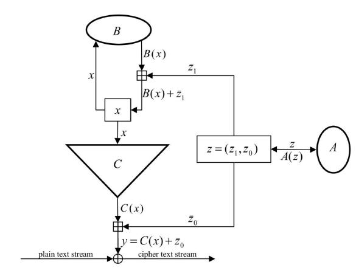
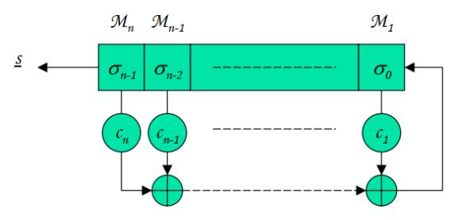
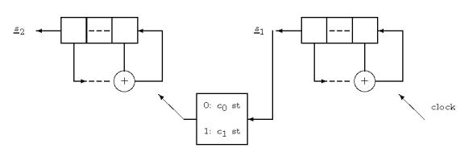

# Jump Index in T-functions for designing a new basic structure of stream ciphers

Ali Hadipour, Seyed Mahdi Sajadieh and Raheleh Afifi

*Abstract*—The stream ciphers are a set of symmetric algorithms that receive a secret message as a sequence of bits and perform an encryption operation using a complex function based on key and IV, and combine xor with bit sequences. One of the goals in designing stream ciphers is to obtain a minimum period, which is one of the primary functions of using T-functions. On the other hand, the use of jump index in the design of LFSRs has made the analysis of LFSR-based stream ciphers more complicated. In this paper, we have tried to introduce a new method for designing the initial functions of stream ciphers with the use of T-functions concepts and the use of jump indexes, that has the maximum period. This method is resist side-channel attacks and can be efficiently implemented in hardware for a wide range of target processes and platforms.

*Index Terms*—T-Function, Jump Index, Stream cipher, Maximum Period.

## I. INTRODUCTION

S TREAM ciphers have many utilities in hardware and software platforms, and there are a lot of ways to design stream ciphers in general. A common approach is to use a block encription in recursive modes such as the OFB style of operation. Many stream ciphers are based on transfer registers, which are made in two ways, with nonlinear feedback shift register (NLFSR) and linear feedback shift register (LFSR). However, LFSR-based generators have good statistical properties and easy hardware implementation. The LFSR-based stream ciphers have different design principles that can be used to obtain more complex and secure encryption combinations, for example, using nonlinear functions on transfer registers, the linear complexity is much higher. On the other hand, by applying the clock on the LFSRs of a stream cipher, the key sequence can be nonlinear and further complicate the sequence. The advantage of using irregular clocks, as well as having a higher linear complexity, is resistant to correlation attacks but is not resistant to side-channel attacks. For that, in addition to have the advantage an irregular clock, Jansen has tried to fix this problem since 2004. He solved that via introducing of Jump whereby It caused a resistant stream cipher against side channel attack. An important property in stream ciphers is their high period, which is best achieved 2 L − 1 for a L-bit sequence. Therefore, in order to produce

A. Hadipour is in Cryptography Departman of Isfahan Mathematic House, Isfahan, Iran.

E-mail: a.hadipour64@gmail.com

S.M. Sajadieh is in Islamic Azad University Branch Khorasgan, Isfahan, Iran.

E-mail: m.sajadieh@khuisf.ac.ir

R. Afifi is in NonProfit Organization AleTaha, Tehran, Iran.

E-mail: ra.afifi61@gmail.com

sequences with more periodic, we consider the T-functions that have the maximum period. One of the other advantages of the T-functions is that its inverse operation is very difficult and this superiority is the most important superiority of the Tfunctions to the LFSRs. In this paper, we try to maintain a high period, transition with a polynomial between the jump and the T-function that has a good complexity. Therefore, Section II, after explanation the initial discussions in cryptography, explains in more detail, the T-functions and its definitions. And is mentioned in Section III jump discussions. In Section IV, by presenting a mapping of a T-function, the relation between it and the jump is proposed, and the lower bound for the period is presented. In Section V, a conclusion is presented from the paper.

# II. T-FUNCTION

The pyramid cryptographic tools can be considered to be the lowest level of the components of the cryptographic algorithms, which is referred to as Primitive. The higher levels are encryption algorithms, such as RSA and AES encryption algorithms. The highest level of the pyramid consists of encryption protocols, such as the protocol of sending a private message from one person to another through the desired communication channel. In other words, with a combination of primary components, cryptographic algorithms are designed and by encryption algorithms used, generate encryption protocols. It can be said that there are two main approaches to the design of cryptographic algorithms, in the first approach, we tried to understand only simple basic components (such as LFSRs in stream ciphers, S-Boxs and P-Boxs in block ciphers and hash functions) with a good understanding, as well as mathematical theorems fixed regarding their cryptographic properties, and in the other approach, a combination of operations is used, in which a variety of non-algebraic and nonlinear methods are combined. Hoping that neither designers nor attackers are able to analysis math behavior the design. In addition to there is evidences for its security. It should be noted that the design of cryptography algorithms with the secret key is often used in the second approach. In this section, a set of T-functions is defined that includes arbitrary combinations of addition, subtraction, multiplication, or and logical and, and binary addition over n-bit words. The T-functions were first introduced by Aleksandr Kalimov under the supervision of Eddy Shamir in 2002, centering on "a new class of invertible mappings"[1]. Given the definition of these functions, they can be used in the design of the initial components of symmetric algorithms. One of the schemes based on T-functions can be ABC (in 2005 by Waldimier Anashin and et al.) [2] and TSC (2005 by Han and et al.) in versions TSC-1, TSC-2 and TSC-3 [3], which is a family of T-functions based on SBox. Mir-1 (T-function-based structure and SBox) [4] and Vest (a structure based on NLFSR, SPN and T-function) [5] are also other schemes based on T-functions. For more information, in Section 2.A a summary of the above algorithms is described.

Suppose  $\mathbf{B}^n = \{(\mathbf{x}_{(n-1)}, \dots, \mathbf{x}_0) \mid \mathbf{x}_i \in \mathbf{B}\}$  a set of n-tuple are elements  $\mathbf{B} = \{0, 1\}$ . In this case, an element of B, a single bit and an element of  $B^n$ , a n-bit word is called. So that an x element in  $B^n$ , is represented as  $([\mathbf{x}]_{n-1}, [\mathbf{x}]_{n-2}, \dots, [\mathbf{x}]_0)$  and each bit  $[\mathbf{x}]_{i-1}$  the bit number *i*-th, in x words called. Therefore  $[x]_0$  is the least significant bit x and  $[x]_{n-1}$  is the most significant bit x. As stated, the word x is expressed to represent the n-bit vector  $([\mathbf{x}]_{n-1},\ldots,[\mathbf{x}]_0)\in\mathbf{B}^n$  , which can be achieved by using the conversion function  $x \leftrightarrow \sum_{i=0}^{n-1} 2^i [\mathbf{x}]_i$  to the modulus  $2^n$ .

**Definition 1.** The function  $f: \mathbf{B}^{m \times n} \to \mathbf{B}^{l \times n}$  is called a Tfunction, if the trusted i-th column of the output  $[f(x)]_{i-1}$  depends only on the first i columns of the inputs  $[x]_0, \ldots, [x]_{i-1}$ .

$$\begin{bmatrix} [\mathbf{x}]_0 \\ [\mathbf{x}]_1 \\ [\mathbf{x}]_2 \\ \vdots \\ [\mathbf{x}]_{n-1} \end{bmatrix}^T \rightarrow \begin{bmatrix} f_0([\mathbf{x}]_0) \\ f_1([\mathbf{x}]_0, [\mathbf{x}]_1) \\ f_2([\mathbf{x}]_0, [\mathbf{x}]_1, [\mathbf{x}]_2) \\ \vdots \\ f_{n-1}([\mathbf{x}]_0, \dots, [\mathbf{x}]_{n-2}, [\mathbf{x}]_{n-1}) \end{bmatrix}^T$$
(1)

In other words, each bit i of outputs for  $0 \le i \le n$  can only depend on bits  $0, \ldots, i$  of inputs. In fact, it is a m-word to l-word mapping each of which are n-bit and each output bit depends on itself and the preceding bits [6]. In the above definition, the mapping of a n-bit word into a n-bit word is

Example 1.  $\mathbf{x} + 1$  is a T-function, because  $(x_2, x_1, x_0) +$  $(0,0,1)=(x_2\oplus x_1x_0,x_1\oplus x_0,x_0\oplus 1)$ . As it is known, the first bit is  $x_0 + 1$  that is the least significant bit. The second bit depends on the sum of the first bits, therefore  $x_1$  only with  $x_0$  that unknown, is summed up, and also for the third bit,  $x_2$ with combination of  $x_0$  and  $x_1$  has been binary addition. The display of definition 1 for this example can be seen below.

$$\begin{bmatrix} [\mathbf{x}]_0 \\ [\mathbf{x}]_1 \\ [\mathbf{x}]_2 \\ \vdots \end{bmatrix}^T \rightarrow \begin{bmatrix} [\mathbf{x}_0]_0 \oplus 1 \oplus [\mathbf{x}_1]_0 \\ [\mathbf{x}_0]_1 \oplus [\mathbf{x}_0]_0 \oplus [\mathbf{x}_1]_1 \\ [\mathbf{x}_0]_2 \oplus [\mathbf{x}_0]_0 [\mathbf{x}_0]_1 \oplus [\mathbf{x}_1]_2 \\ \vdots \end{bmatrix}^T$$

Example 2.  $\mathbf{x} \oplus \mathbf{x}^2$  is a T-function. This example is for  $\mathbf{x} = (x_2, x_1, x_0)$  and n = 3 is reviewed.

$$\mathbf{x} \oplus \mathbf{x}^2 = (x_2, x_1, x_0) \oplus (x_2, x_1, x_0)^2 = (x_2, x_1, x_0) \oplus (x_1 \oplus x_1, x_0) \oplus (x_0)$$

That  $(x_2, x_1, x_0)^2$  is calculated as follows and as it is known, each of the resulting bits depends on the previous bits by calculating the carry bits.

$$(x_2, x_1, x_0)(x_2, x_1, x_0) \mod 2^3 = (x_0 x_2, x_0 x_1, x_0) \oplus (x_1 x_2, x_1, x_1 x_0) \oplus (x_2, x_2 x_1, x_2 x_0) = (x_1 \oplus x_0 x_1, 0, x_0) \mod 2^3.$$

Example 3. With reference to the two examples above, one can refer to mappings  $\mathbf{x} \to \mathbf{x} \wedge \mathbf{x}^2$  and  $\mathbf{x} \to (\mathbf{x} \oplus \mathbf{x}^2) + (\mathbf{x} \wedge \mathbf{x}^2)$  $(3\mathbf{x} \uparrow 5) \lor (\mathbf{x} - 1)$  as a T-function. It should be noted that the symbols  $\land$ ,  $\lor$  and  $\lnot$  ( $\ll$ ) respectively represents bitwise and or logical, and transitive to the left of the bit. It should be noted that the transfer of the bit to the right  $\uparrow$  ( $\gg$ ) does not have the properties of the T-functions.

**Definition 2.** A mapping  $\phi: \mathbf{B}^k \to \mathbf{B}^k$  is inverse if we have  $\phi(\mathbf{x}) = \phi(\mathbf{y})$  if and only if  $\mathbf{x} = \mathbf{y}$ . Therefore, it should be checked that a given T-function is the inverse. In the following, cases are considered for invertible mappings.

Example 4. One-variable mappings  $\mathbf{x} \to \mathbf{x} + 2\mathbf{x}^2$ ,  $\mathbf{x} \to$  $\mathbf{x} + (\mathbf{x}^{2} \lor 1), \ \mathbf{x} \to \mathbf{x} \oplus (\mathbf{x}^{2} \lor 1)$  for each word size, are invertible, but mappings  $\mathbf{x} \to \mathbf{x} + \mathbf{x}^2$ ,  $\mathbf{x} \to \mathbf{x} + (\mathbf{x}^2 \wedge 1)$ ,  $\mathbf{x} \to \mathbf{x} + (\mathbf{x}^3 \vee 1)$  are not invertible. For example, checked on invertible of the mapping  $\mathbf{x} \to \mathbf{x} + (\mathbf{x}^2 \vee 1)$  and noninvertible of the mapping  $x \to x + (x^2 \wedge 1)$ . The invertible and non-invertible of the rest of the mappings are fixed in the same way. For mapping  $\mathbf{x} \to \mathbf{x} + (\mathbf{x}^2 \vee 1)$  in one-bit mode, is trusted the follow result:

$$\forall \mathbf{x} \in \{0,1\} : \mathbf{x}^2 \lor 1 = 1, \forall \mathbf{y} \in \{0,1\} : \mathbf{y}^2 \lor 1 = 1 \Rightarrow \mathbf{x} + (\mathbf{x}^2 \lor 1) = \mathbf{y} + (\mathbf{y}^2 \lor 1) \Rightarrow \mathbf{x} + 1 = \mathbf{y} + 1 \Rightarrow \mathbf{x} = \mathbf{y}$$

According to Definition 2, above mapping is clearly invertible. For mapping  $\mathbf{x} \to \mathbf{x} + (\mathbf{x}^2 \wedge 1)$  in one-bit mode, one can also check that:

$$\forall \mathbf{x} \in \{0,1\} : \mathbf{x}^2 \wedge 1 \in \{0,1\}, \forall \mathbf{y} \in \{0,1\} : \mathbf{y}^2 \wedge 1 \in \{0,1\} \Rightarrow \mathbf{x} + (\mathbf{x}^2 \wedge 1) = \mathbf{y} + (\mathbf{y}^2 \wedge 1) \Rightarrow 2\mathbf{x} = 2\mathbf{y}.$$

Now because  $2 \times 1 = 2 \mod 2 = 0$  and then  $2 \times 0 = 0$  $\mod 2 = 0$ , and so on  $0 \neq 1$ . Therefore, with respect to Definition 2, this mapping is clearly non-invertible.

**Definition 3.** The mapping whose its associated graph is isomorphic with a single cycle  $\mathbf{x} \to \phi(\mathbf{x})$ , is called a single cycle mapping [6] if the sequence is repeated by  $\mathbf{x}_0$ ,  $\mathbf{x}_1 = \phi(\mathbf{x}_0), \ \mathbf{x}_2 = \phi(\mathbf{x}_1) = \phi(\phi(\mathbf{x}_0))$  and .... So that has a periodicity of magnitude  $2^n$ , which is the maximum possible period for the n-bit words.

It can be shown that mapping  $\mathbf{x} \to \mathbf{x} + (\mathbf{x}^2 \vee 5) \mod 2^n$  is a single-cycle mapping for each word size n, while mapping  $\mathbf{x} \to \mathbf{x} + (\mathbf{x}^2 \vee 1) \mod 2^n$  is not. It is also possible to m-variables map with n-bits, which has a single-cycle with maximal size of the size  $2^{mn}$ .

Example 5. One-variable mapping  $x \rightarrow x + (x^2 \lor 5)$  $\mod 2^n$  is defined a single-cycle mapping. Because, with the assumption of choice x = 1 and n = 3 (arbitrarily) can be seen after 8 repetitions, the mappings returned to x = 1. The trend x is as follows:

$$\mathbf{x} = 1 \to 6 \to 3 \to 0 \to 5 \to 2 \to 7 \to 4 \to 1.$$

As it is known, the periodicity of the above mapping is equal to  $2^3$  that is its maximum period.

Example 6. The below three-variables mapping is a single-

cycle mapping so that we have: 
$$\mathbf{s} = ((\mathbf{x}_0 \land \mathbf{x}_1 \land \mathbf{x}_2) - 1) \oplus (\mathbf{x}_0 \land \mathbf{x}_1 \land \mathbf{x}_2)$$
. Because by selecting  $\begin{bmatrix} \mathbf{x}_0 \\ \mathbf{x}_1 \\ \mathbf{x}_2 \end{bmatrix} = \begin{bmatrix} 1 \\ 0 \\ 1 \end{bmatrix}$  and  $n = 3$ 

(arbitrarily) after the repeat load  $2^9$  the mapping returns to the original.

$$\begin{bmatrix} \mathbf{x}_0 \\ \mathbf{x}_1 \\ \mathbf{x}_2 \end{bmatrix} \rightarrow \begin{bmatrix} \mathbf{x}_0 \oplus 2\mathbf{x}_1\mathbf{x}_2 \\ \mathbf{x}_1 \oplus (\mathbf{s} \wedge \mathbf{x}_0) \oplus 2\mathbf{x}_2\mathbf{x}_0 \\ \mathbf{x}_2 \oplus (\mathbf{s} \wedge \mathbf{x}_0 \wedge \mathbf{x}_1) \oplus 2\mathbf{x}_0\mathbf{x}_1 \end{bmatrix}$$

It can be said that any invertible T-function does not have a single-cycle, that is, could find an invertible T-function that does not form a single-cycle, such as the T-function  $\mathbf{x}+(\mathbf{x}^2\vee 1)$  mod  $2^n$ .

**Theorem 1.** Mapping  $\mathbf{x} \to (\mathbf{x} + \mathbf{C}) \mod 2^n$  is a single-cycle mapping if and only if  $\mathbf{C}$  is an odd [7].

**Theorem 2.** Suppose  $N_O$  that mapping  $\mathbf{x} \to \mathbf{x} \oplus r(\mathbf{x})$  is a single-cycle module  $2^{N_O}$ . This single-cycle mapping is defined for all n's in module  $2^n$  if and only if for all  $n \ge N_O$ ,  $r(\mathbf{x})$  is an odd parameter [7].

**Theorem 3.** T-function  $f(\mathbf{x}) = \mathbf{x} + (\mathbf{x}^2 \vee \mathbf{C}) \mod 2^n$  is assumed. It can be proved for this function if  $[\mathbf{C}]_0 = 1$ , in this case f is invertible. It is also a single-cycle mapping if and only if  $[\mathbf{C}]_0 = [\mathbf{C}]_2 = 1$ .

**Theorem 4.** Suppose S is a single-cycle Sbox and  $\alpha$  an odd parameter. If  $S^o$  the odd power of S and  $S^e$  even power of S are, then the mapping  $\mathbf{T}(\mathbf{X}) = (\alpha(\mathbf{X}).S^o(\mathbf{X})) \oplus (\sim \alpha(\mathbf{X}).S^e(\mathbf{X}))$  of a single-cycle T-function is defined. For better understanding, the mapping T can be shown as follows.

$$[T(\mathbf{X})]_i = \begin{cases} S^e([\mathbf{X}]_i) & \text{if } [\alpha(\mathbf{X})]_i = 0\\ S^o([\mathbf{X}]_i) & \text{if } [\alpha(\mathbf{X})]_i = 1 \end{cases}$$
 (2)

**Lemma 1.** Suppose S is a single-cycle Sbox and  $\alpha$  an odd parameter. The mapping  $\mathbf{X} \to \mathbf{X} \oplus (\alpha(\mathbf{X}).S(\mathbf{X}))$  defines a single-cycle T-function.

### A. A summary of algorithms based on T-functions

As discussed in section II, some stream cipher algorithms based on T-functions are presented, which are briefly cited below.

1) TSC Algorithm: In this section, an algorithm is described based on Theorem 4 in the previous section. A new family of stream cipher algorithms based on T-functions were introduced in 2005 by Han and et al.

The TSC-1 algorithm is composed of four 32-bit words  $\mathbf{x}_0$ ,  $\mathbf{x}_1$ ,  $\mathbf{x}_2$  and  $\mathbf{x}_3$ . In this algorithm, an odd parameter  $\alpha_1(\mathbf{X}) = (\mathbf{p} + \mathbf{C}) \oplus \mathbf{p} \oplus 2\mathbf{s}$  has been used, that  $\mathbf{C} = 0x12488421$ ,  $\mathbf{p} = \mathbf{x}_0 \wedge \mathbf{x}_1 \wedge \mathbf{x}_2 \wedge \mathbf{x}_3$  and  $\mathbf{s} = \mathbf{x}_0 + \mathbf{x}_1 + \mathbf{x}_2 + \mathbf{x}_3$ . It should be noted that all the additions are done in a modulus  $2^{32}$ . With the definition of a single-cycle  $4 \times 4$  Sbox S can be checked  $S^o = S$  and  $S^e = S^2$  established. This is defined as follows.

$$S_1[16] = \{3, 5, 9, 13, 1, 6, 11, 15, 4, 0, 8, 14, 10, 7, 2, 12\}$$

Therefore, we can define a single-cycle T-function using theorem 4. It should be noted that the filtering algorithm TSC-1 is defined  $f(\mathbf{x}) = (\mathbf{x}_{0 \le 9} + \mathbf{x}_1)_{\le 15} + (\mathbf{x}_{2 \le 7} + \mathbf{x}_3)$ , which results in the output of 32 bits.

The TSC-2 algorithm is quite similar to the TSC-1 algorithm and uses a single-cycle  $4 \times 4$  Sbox as follows.

3

$$S_2[16] = \{5, 2, 11, 12, 13, 4, 3, 14, 15, 8, 1, 6, 7, 10, 9, 0\}$$

The odd parameter used in this algorithm is used in the form  $\alpha_2(\mathbf{X}) = (\mathbf{p}+1) \oplus \mathbf{p} \oplus 2\mathbf{s}$  and filter defined as follows.

$$f_2(\mathbf{x}) = (\mathbf{x}_{0 \le 11} + \mathbf{x}_1)_{\le 14} + (\mathbf{x}_{0 \le 13} + \mathbf{x}_2)_{\le 22} + (\mathbf{x}_{0 \le 12} + \mathbf{x}_3)$$

In 2005, Hun and his et.al presented the TSC-3 algorithm in ECRYPT competition [3]. This algorithm uses 4 words and each with 40-bits size. The design changes the architecture of its previous 32-bits algorithms and is designed to be hardware platform. In addition, the size of the layout has increased to 160 bits. So the security level is  $2^{80}$  anticipated to deal with attacks such as the TMTO. Each layer is updated by Sbox, which is more complicated than the previous two algorithms of its family. The parameter is made up of two words  $\mathbf{p}_0$  and  $\mathbf{p}_1$ , so that the following is calculated from the i-th layer:

$$tmp = 2 \times [\mathbf{p}_1]_i + [\mathbf{p}_0]_i \in \{0, 3\}$$

Based on the value of tmp,  $[\mathbf{x}]_i$  updated using S,  $S^2$ ,  $S^5$  or  $S^6$ , so that S is the same as the Sbox of the TSC-1 algorithm. The TSC-3 filter function is updated so that 4 32-bits variables  $\mathbf{y}_i$  are created in the same way, with 8 least significant bits from each of the 40-bit words  $\mathbf{x}_i$  being deleted. Then,  $\mathbf{y}_i$  are permuted depending on the least significant layer of the mode  $[\mathbf{x}]_0$ . Therefore, there are 16 possible permutations and the output function is obtained as follows.

$$f(\mathbf{y}) = (\mathbf{y}_{0 \le 9} + \mathbf{y}_{1 \ge 2})_{\le 8} + (\mathbf{y}_{2 \le 7} + \mathbf{y}_3)_{\ge 9}$$

2) ABC Algorithm: ABC is an optimized simultaneous stream cipher for software applications. This algorithm is provided with a 128-bits key and 32-bits internal variables. That's why its security level  $2^{128}$  to expect. The ABC algorithm uses three main generators A, B and C. The generator A is an LFSR of length 128 whose its states are represented by z. The generator B is a single-cycle mapping based on the arithmetic summation in the field  $\mathbf{Z}/2^{32}\mathbf{Z}$  and the bitwise summation modulus 2 (xor) and is represented by the x variable. The generator C is also a filter function based on search tables, an arithmetic summation in the field  $\mathbf{Z}/2^{32}\mathbf{Z}$ , and a bitwise rotation to the right ( $\gg$ ).

As stated above, A is an LFSR of length 128 and its characteristic polynomial equal to  $\phi(\theta) = \psi(\theta)\theta$  that  $\psi(\theta) = \theta^{127} + \theta^{63} + 1$  is a primitive polynomial. The next 32 bits of at the one time clock are as follows.

$$\varsigma \leftarrow \overline{z_2} \oplus (\overline{z_1} = 31) \oplus (\overline{z_0} = 1) \mod 2^{32}$$

$$\overline{z_0} \leftarrow \overline{z_1}$$

$$\overline{z_1} \leftarrow \overline{z_2}$$

$$\overline{z_2} \leftarrow \overline{z_3}$$

$$\overline{z_3} \leftarrow \overline{z_5}$$

The single-cycle function B used in ABC algorithm, and its type is a T-function, is represented by the following equation.

$$\mathbf{B}(\mathbf{x}) = ((\mathbf{x} \oplus d_0) + d_1) \oplus d_2 \mod 2^{32}.$$

So that  $d_0, d_1, d_2 \in \mathbb{Z}/2^{32}\mathbb{Z}$  and  $d_0 = 0 \mod 4$ ,  $d_1 = 1$  $\mod 4$  and  $d_2 = 0 \mod 4$ . In other words, the following equations must exist at a time:

$$d_{0,0} = d_{0,1} = 0, d_{1,0} = 1, d_{1,1} = 0, d_{2,0} = d_{2,1} = 0.$$

To display the filter C of the ABC algorithm, suppose that the mapping  $S: \mathbb{Z}/2^{32}\mathbb{Z} \to \mathbb{Z}/2^{32}\mathbb{Z}$  is defined by the means  $S(x) = e + \sum_{i=0}^{31} e_i \delta_i(x) \mod 2^{32}$  so that  $e_{31} = 2^{16}$  $\mod 2^{17}$ . The filter function C produces the output y as follows.

$$\zeta = S(x); y = \zeta \gg 16$$

The generator of the key stream of the ABC algorithm is as follows.

Fig. 1: Representation ABC Algorithm

As shown in the figure, the input and output of the algorithm are as follows:

### **Algorithm 1** ABC Algorithm [4]

procedure RUNNING ABC ENCRYPTION ALGORITHM **Input:**  $z \in Z/2^{64}Z, x \in Z/2^{32}Z$ **Output:**  $z \in Z/2^{64}Z, x \in Z/2^{32}Z, y \in Z/2^{32}Z$  $z \leftarrow A(z)$ 

 $x \leftarrow \overline{z_1} + B(x) \mod 2^{32}$  $y \leftarrow \overline{z_0} + C(x) \mod 2^{32}$ 

Refer to resources [4] and [5] to describe other proposed

# III. JUMP

algorithms.

As discussed in Section I, the use of an irregular clock method in stream ciphers will cause side channel attacks. One of the methods close to the irregular clock method is the use of the jump concept, in which case the current status is accumulated with the updated state. To describe this state, assume that A transition matrix of a linear finite state machine is independent and  $f(\mathbf{x})$  its recursive polynomial is meant  $f(\mathbf{x}) = det(\mathbf{x}I + A)$ . In this case, if there is power J that  $A^{J} = A + I$ , it can be said that by changing the LFSM transition matrix from A to A+I, effectively J steps made up from the space of the original LFSM, regardless of the initial state.

Jansen first proposed the jump idea. He used this idea to resist the stream cipher algorithms against side channel attacks. The algorithms used to this idea are Pomaranch [8] and Mickey [9]. In the generating sequence of LFSRs with irregular clocks, the following linear recursive relation is important.

$$S_{j+n} = \sum_{i=1}^{n} c_i S_{j+n-i} \Leftrightarrow \sum_{i=0}^{n} c_i S_{j+n-i} = 0; (c_0 = -1) \quad (3)$$

So that the recursive coefficients  $c_i$  are usually expressed, and these coefficients cause the resulting polynomials to be called recursive polynomials. The descriptive polynomial F(x)of degree is equal to the recursive length n, which is evident in relation  $F(x) = \sum_{i=0}^{n} c_i x^i$ . The *n*-th order of linear recursive is usually represented by its recursive polynomials C(x), which is expressed by the relation  $C(x) = \sum_{i=0}^{n} c_i x^{n-i}$ of degree n.

LFSR can be considered as a linear finite state machine. In this case, a state of the LFSM is displayed with a vector,  $\underline{\sigma}^t =$  $(\sigma_{n-1}^t, \sigma_{n-2}^t, \dots, \sigma_0^t)$ , which  $\sigma_i^t$  specifies the content of the memory cell  $M_i$  after the t transitions. Transitions from one state to another are described by a state vector multiplication with a transition matrix T, that is, for  $t \ge 0$ , the relation  $\sigma^{t+1} = \sigma^t T$  is true. The transition matrix for an LFSR is

specified as 
$$T = \begin{bmatrix} 0 & 0 & \dots & 0 & c_n \\ 1 & 0 & \dots & 0 & c_{n-1} \\ 0 & 1 & \dots & 0 & c_{n-2} \\ \vdots & \vdots & \ddots & \vdots & \vdots \\ 0 & 0 & \dots & 1 & c_1 \end{bmatrix}$$
 by the following

representation.

Fig. 2: Representation LFSR as LFSM

The above matrix is called an polynomial companion matrix  $C(x) = x^n - c_1 x^{n-1} - \dots - c_{n-1} x - c_n$ . The recursive polynomial T in the concept of linear algebra C(x) = det(xI - T)is exactly the same as the polynomial and then C(T) = 0. Therefore the companion matrix plays the role of a C root, and can be used sequentially to formulate the solution of the recursive equations.

**Definition 4.** Assume f(x) an irreducible polynomial on GF(2). If  $x^J = x + 1 \mod f(x)$  there is for the correct values J, then J the jump index f is called [10].

So, according to Definition 4 and its before content, if a power J exists and the state vector  $\underline{\sigma}^t$  is multiplied by  $A^J$ or A + I multiplied, the result will be the same. In addition, changing A to A + I is generally simpler than converting A to  $A^{J}$  for an arbitrary transfer matrix A. Therefore, if f(x) is irreducible, then A can be written as an companion matrix f(x) with the proper matrix multiplication, so that  $A' = MAM^{-1}$  exists. The matrices A and A' are called similar matrices. The powers of the companion matrix can be considered as the representation of all the finite field elements.

It should be noted that there is not jump index for any irreducible polynomial, since this matter depends on the establishment of the relation  $x^J = x+1 \mod f(x)$ , or equivalently, the relation  $f(x) \mid (x^J + x + 1)$  exists for some Js. In other words,  $\alpha^J = \alpha + 1$ , that  $\alpha$  is rooted f(x) and therefore an element of the field  $GF(2^n)$ . Therefore, the equivalent of expressions can be said to be the problem of finding an element  $\alpha^J$  in finite field  $GF(2^n)$ , so that f is a polynomial definition and  $n = \deg(f)$ . The term  $\alpha^J = \alpha + 1$  implies that  $\alpha$  is an element of  $GF(2^n)$  and by changing the transmission matrix of the LFSM from A to A+I, effectively constructs the J steps from the LFSM master state space, regardless of the initial state.

The following figure represents a stream cipher generator with two LFSRs and uses an irregular clock.

Fig. 3: LFSR Generator by Irregular Clock

The first LFSR produces a binary sequence  $\underline{S_1}$  with a period  $p_1$ , which with some partial divisors of the order  $2^{L_1}-1$ , will make an irreducible recursive polynomial, such that  $L_1$  is the length of the LFSR. This sequence has  $N_0$  zero and  $N_1$  one that is used for clocking the second LFSR, that is, the second LFSR moves through its state space, which depends on the bits of the result of the sequence, by its stepping,  $c_0$  times or  $c_1$  times, if The output bit is one zero or one one, respectively. The total number  $(N_s)$  of the steps is made by the second LFSR with a polynomial in a period of the first LFSR that relation  $N_s = N_0c_0 + N_1c_1$  holds true. Suppose that the second LFSR has irreducible recursive polynomial. Therefore, a necessary condition in the output sequence  $\underline{S_2}$  of the second LFSR should be for a maximal period  $p_1p_2$ , which  $\gcd(N_s, p_2) = 1$  is also a sufficient condition.

The LFSRs of length L have a period  $2^L-1$ . In this case, the number of zeros and ones is  $N_0=(p-1)/2$  and  $N_1=(p+1)/2$ . Given that the zero-state mode does not occur, the minimum difference between zeros and ones is the size of a unit. Therefore, the total number of steps is expressed by relationship  $N_s=c_0p+(c_1-c_0)2^{L-1}$ . Consequently, if the second LFSR has a period  $p_2$  equal to p (or one of its diversions), then the necessary condition for the maximum period  $\underline{S_2}$  is obtained by the relation  $\gcd(N_s,p_2)=\gcd(c_1-c_0,p)=1$ . In a special case that used to jump LFSRs, a step or a jump equivalent to J steps is constructed from the space of the state, which can be expressed  $\gcd(J-1,p)=1$  or expressed  $\gcd(J^*,p)=1$  in the previous condition in which  $J^*=1-J$  mod (period(f)), is the opposite polynomial jump coefficient f(x) meant  $f^*(x)$ . In other words, the recursive polynomial

jump coefficient of the jump LFSR should be the prime in relation to its period.

In the following section. Mickey's algorithm uses a jump index

### A. Mickey algorithm

The Mickey algorithm is designed for use in hardware applications and is used for generators of a key stream with a mutual irregular clocking.

Mickey takes two input parameters key and IV. The key used in Mickey's algorithm is 80 bits as shown by  $k_0, \ldots, k_{79}$ . The value of IV also has a length between 0 to 80 bits as shown by  $iv_0, \ldots, iv_{(IVLENGTH-1)}$ . The output of the key stream is shown by  $z_0, z_1, \ldots$  and consequently the cipher text will be obtained with the binary addition of the resulting key stream bits and the plain text. But the key stream generator is made up of two registers R and S, so that each register contains 80 single-bit cells. The registers R by  $r_0, \ldots, r_{79}$  and registers S by  $S_0, \ldots, S_{79}$  are labeled. Here, the register S is assumed as linear register and register S, nonlinear register.

In order to clocking the register R, the RTAPS set is defined as:

 $\{0, 2, 4, 6, 7, 8, 9, 13, 14, 16, 17, 20, 22, 24, 26, 27, 28, 34, 35, 37, 39, 41, 43, 49, 51, 52, 54, 56, 62, 67, 69, 71, 73, 76, 78, 79\}$ 

Now a clock operation  $CLOCK\_R(R, INPUT\_BIT\_R, CONTROL\_BIT\_R)$  is defined as follows:

Assuming that  $r_0, \ldots, r_{79}$  the register R state is before of the clock and  $r'_0, \ldots, r'_{79}$  after the clock operation, the following relationships hold true:

 $\begin{array}{l} FEEDBACK\_BIT = r_{79} \oplus INPUT\_BIT\_R \\ FOR: 1 \leq i \leq 79, \ r'_i = r_{i-1}; \ r'_0 = 0 \\ FOR: 0 \leq i \leq 79, \ if: i \in RTAPS, \ r'_i = r'_i \oplus FEEDBACK\_BIT \\ if: CONTROL\_BIT\_R = 1: \ FOR: 0 \leq i \leq 79, \ r'_i = r'_i \oplus r_i \end{array}$ 

Also, in order to have a register clock S, four sequences  $COP0_1, \ldots, COP0_{78}$ ,  $COP1_1, \ldots, COP1_{78}$ ,  $FB0_0, \ldots, FB0_{79}$  and  $FB1_0, \ldots, FB1_{79}$  in tabular form are defined in [9].

Now a clock action  $CLOCK\_S(S, INPUT\_BIT\_S$ ,  $CONTROL\_BIT\_S$ ) is defined as follows.

Assuming that  $s_0, \ldots, s_{79}$  the register state S, before the clock operation and  $s'_0, \ldots, s'_{79}$  after the clock operation, and also used  $\widehat{s_0}, \ldots, \widehat{s_{79}}$  as the middle variables for descriptive simplicity, the following relationships hold true:

 $FEEDBACK\_BIT = s_{79} \oplus INPUT\_BIT\_S \\ FOR: 1 \le i \le 78, \ \widehat{s_i} = s_{i-1} \oplus ((s_i \oplus COP0_i)(s_{i+1} \oplus COP1_i)); \ \widehat{s_0} = 0, \ \widehat{s_{79}} = s_{78} \\ if: CONTROL\_BIT\_S = 0: \\ FOR: 0 \le i \le 79, \ s_i' = \widehat{s_i} \oplus FB0_iFEEDBACK\_BIT \\ if: CONTROL\_BIT\_S = 1: \\ FOR: 0 \le i \le 79, \ s_i' = \widehat{s_i} \oplus FB1_iFEEDBACK\_BIT$ 

After expressing the registers functions, a generator clock as named  $CLOCK\_KG(R, S, MIXING, INPUT\_BIT)$  is defined as:

$$\begin{split} &CONTROL\_BIT\_R = s_{27} \oplus r_{53} \\ &CONTROL\_BIT\_S = s_{53} \oplus r_{26} \\ &if: MIXING = TRUE: \\ &INPUT\_BIT\_R = INPUT\_BIT \oplus s_{40} \\ &if: MIXING = FALSE: \\ &INPUT\_BIT\_R = INPUT\_BIT \\ &CLOCK\_R(R, INPUT\_BIT\_R, CONTROL\_BIT\_R) \\ &CLOCK\_S(S, INPUT\_BIT\_S, CONTROL\_BIT\_S) \end{split}$$

To further describe the algorithm, refer to [9]. Also, the Pomaranch algorithm is mentioned as the T-function algorithms, which can be referred to [8].

### IV. RELATIONSHIP BETWEEN T-FUNCTIONS AND JUMP

**Theorem 5.** Assume that a function  $f: \mathbf{Z}_{2^n} \to \mathbf{Z}_{2^n}$  is a mutual T-function. In this case, the function  $f^i: \mathbf{Z}_{2^n} \to \mathbf{Z}_{2^n}$  with the criterion

$$f^{i}(x) = \begin{cases} x & \text{if } i = 0\\ f(f^{i-1}(x)) & \text{if } i > 1 \end{cases}$$
 (4)

for each i is a mutual T-function.

The main purpose of this article is the jump in T-functions. One of the functions of one variable with a maximum period is the function  $\mathbf{x} \to \mathbf{x} + (\mathbf{x}^2 \vee 5) \mod 2^n$ .

One of the interesting features in the function  $\mathbf{x} \to \mathbf{x} + (\mathbf{x}^2 \vee 5) \mod 2^n$  is differences  $2^{n-1}$  in two functions  $\mathbf{x} \to \mathbf{x} + (\mathbf{x}^2 \vee 5) \mod 2^n$  and  $\mathbf{x} \to \mathbf{x} + (\mathbf{x}^2 \vee (5 + 2^{n-1})) \mod 2^n$ .

Proof of this observation is very convenient because if the msb  $\mathbf{x}^2$  is zero, the proof of the above is clear. But if the msb  $\mathbf{x}^2$  is equal to 1, the sum of the bits is written to the n-th bit and according to the modulus  $2^n$ , this bit is deleted and the difference is the same  $2^{n-1}$ .

Another important point that can be expressed for all T-functions with periodicity  $2^n$  and modulus  $2^n$ , such as in the function  $f(\mathbf{x}) = \mathbf{x} + (\mathbf{x}^2 \vee (5+2^{n-1})) \mod 2^n$  is that the equality of the relationship  $f^{2^{n-1}}(\mathbf{x}) = (\mathbf{x}+2^{n-1}) \mod 2^n$  is established. The reason for this is that we know  $f^{2^n}(\mathbf{x}) = \mathbf{x}$ . Now if we suppose  $f^{2^{n-1}}(\mathbf{x}) = (\mathbf{x}+2^{n-1}) \mod 2^n$ , then the relation  $\mathbf{x} = f^{2^{n-1}}(f^{2^{n-1}}(\mathbf{x})) = f^{2^{n-1}}(\mathbf{x}) + 2^{n-1} \mod 2^n = \mathbf{x} + 2^{n-1} + 2^{n-1} \mod 2^n = \mathbf{x}$ , is established. Of course, with inductance, it must be confirmed for an initial point, and finally, for each function f, this should be investigated. Based on the two points above, the following lemma is easily proved.

**Lemma 2.** If  $f(\mathbf{x}) = \mathbf{x} + (\mathbf{x}^2 \vee 5) \mod 2^n$  is established, this is the case we have  $f^{2^{n-1}+1}(\mathbf{x}) = \mathbf{x} + (\mathbf{x}^2 \vee (5+2^{n-1})) \mod 2^n$ .

**Theorem 6.** Suppose the mapping  $\mathbf{x} \to \mathbf{x} + (\mathbf{x}^2 \vee (5+a))$  mod  $2^n$  is defined that a random bit determines that a is zero or  $2^{n-1}$ . In this case, the period of the above function is at least equal to  $2^{n-1}$ .

*Proof.* Given that if the function  $f(\mathbf{x}) = \mathbf{x} + (\mathbf{x}^2 \vee 5) \mod 2^n$  is selected, the jump is equal to 1, and if the function  $f(\mathbf{x}) = \mathbf{x} + (\mathbf{x}^2 \vee (5+2^{n-1})) \mod 2^n$  is selected, the jump is equal to  $c = 2^{n-1} + 1$  in comparing by mapping

 $\mathbf{x} \to \mathbf{x} + (\mathbf{x}^2 \vee 5) \mod 2^n$ . The reason for setting the value c is specified in lemma 1.

In this case, in order to find the period of this function, assume that is t times jump to one and the s times jump to  $2^{n-1}+1$ . In this case, you must find the smallest value t+s such that  $t+s(2^{n-1}+1)=k\times 2^n$ .

Also values s, t and t + s should be positive. In this case, the following result will be obtained:

$$t + s = k \times 2^n - s \times 2^{n-1} = k' \times 2^{n-1}$$
.

In this way, it can be shown that t + s is equal to the minimum positive value that can be obtained  $2^{n-1}$ .

Although the above proof is presented for one variable T-functions, this argument can be proved for the n variables T-function.

Assume that the relation  $(\mathbf{x}_1, \dots, \mathbf{x}_n) = f^{2^n}(\mathbf{x}_1, \dots, \mathbf{x}_n)$  is true, since after the  $2^n$  repeats  $f(\mathbf{x}_1, \dots, \mathbf{x}_n)$ , we will arrive at n-tuple  $(\mathbf{x}_1, \dots, \mathbf{x}_n)$ , and the following relationships will be obtained:

### V. Conclusion

In this paper, after a brief description of the T-functions, an explanation of several algorithms based on T-functions, jump concepts and the description of a jump-based algorithm, a jump structure was presented using T-functions. This structure has a lower limit for the minimum period, and also in terms of implementation, there is no additional operation and can be used as a proper primitive structure for designing future stream ciphers. This structure is very suitable for designing a random generator. Having the maximum period in an *L*-bits sequence and resistance to side channel attacks due to the use of jump is the reason for this structure to be more appropriate than conventional structures.

#### REFERENCES

- [1] A. Klimov and A. Shamir, "A new class of invertible mappings," in Cryptographic Hardware and Embedded Systems - CHES 2002, 4th International Workshop, Redwood Shores, CA, USA, August 13-15, 2002, Revised Papers, ser. Lecture Notes in Computer Science, vol. 2523. Springer, 2002, pp. 470–483.
- [2] V. Anashin, A. Bogdanov, I. Kizhvatov, and S. Kumar, "ABC: A new fast flexible stream cipher," eSTREAM, ECRYPT Stream Cipher Project, Report 2005/001, 2005, http://www.ecrypt.eu.org/stream.
- [3] J. Hong, D. H. Lee, Y. Yeom, D. Han, and S. Chee, "T-function based stream cipher tsc-3," eSTREAM, ECRYPT Stream Cipher Project, Report 2005/031, 2005, http://www.ecrypt.eu.org/stream.
- [4] A. Maximov, "A new stream cipher Mir-1," eSTREAM, ECRYPT Stream Cipher Project, Report 2005/017, 2005, http://www.ecrypt.eu. org/stream.
- [5] H. L. Sean O'Neil, Benjamin Gittins, "VEST hardware-dedicated stream ciphers," eSTREAM, ECRYPT Stream Cipher Project, Report 2005/032, 2005, http://www.ecrypt.eu.org/stream.
- [6] A. Klimov, "Applications of t-functions in cryptography," Doctor Dissertation. Rehovot: Weizmann Institute of Science, 2005.
- [7] A. Klimov and A. Shamir, "New cryptographic primitives based on multiword t-functions," in *Fast Software Encryption*, B. Roy and W. Meier, Eds. Berlin, Heidelberg: Springer Berlin Heidelberg, 2004, pp. 1–15.

- [8] C. J. A. Jansen, T. Helleseth, and A. Kholosha, *Cascade Jump Controlled Sequence Generator and Pomaranch Stream Cipher* Berlin, Heidelberg: Springer Berlin Heidelberg, 2008, pp. 224–243. [Online]. Available: https://doi.org/10.1007/978-3-540-68351-3 17
- [9] S. Babbage and M. Dodd, *The MICKEY Stream Ciphers*. Berlin, Heidelberg: Springer Berlin Heidelberg, 2008, pp. 191–209. [Online]. Available: https://doi.org/10.1007/978-3-540-68351-3 15
- [10] C. J. A. Jansen, "Stream cipher design based on jumping finite state machines," *IACR Cryptology ePrint Archive*, vol. 2005, p. 267, 2005.