# CirC: Compiler infrastructure for proof systems, software verification, and more

Alex Ozdemir<sup>∗</sup> Fraser Brown∗† Riad S. Wahby∗† <sup>∗</sup>*Stanford University* †*Carnegie Mellon University*

*Abstract*—Cryptographic tools like proof systems, multi-party computation, and fully homomorphic encryption are usually applied to computations expressed as systems of arithmetic constraints. In practice, this means that these applications rely on compilers from high-level programming languages (like C) to such constraints. This compilation task is challenging, but not entirely new: the software verification community has a rich literature on compiling programs to logical constraints (like SAT or SMT). In this work, we show that building shared compiler infrastructure for compiling to constraint representations is *possible*, because these representations share a common abstraction: stateless, non-uniform, non-deterministic computations that we call *existentially quantified circuits*, or EQCs. Moreover, we show that this shared infrastructure is *useful*, because it allows compilers for proof systems to benefit from decades of work on constraint compilation techniques for software verification.

To make our approach concrete we create CirC, an infrastructure for building compilers to EQCs. CirC makes it easy to compile to new EQCs: we build support for three, R1CS (used for proof systems), SMT (used for verification and bug-finding), and ILP (used for optimization), in ≈2000 LOC. It's also easy to extend CirC to support new source languages: we build a feature-complete compiler for a cryptographic language in one week and ≈900 LOC, whereas the reference compiler for the same language took years to write, comprises ≈24000 LOC, and produces worse-performing output than our compiler. Finally, CirC enables novel applications that combine multiple EQCs. For example, we build the first pipeline that (1) automatically identifies bugs in programs, then (2) automatically constructs cryptographic proofs of the bugs' existence.

# 1. Introduction

Cryptographic proof systems allow one entity, a *prover*, to construct a short and easily verified proof that convinces another entity, a *verifier*, that the prover knows a witness W satisfying a relation R(X, W), for an instance X specified by the verifier. Roughly speaking, a proof convinces the verifier that X corresponds to a true input-output pair for a program specified by the relation R; a *zero-knowledge* proof does so without revealing W. [1](#page-0-0) Applications of this paradigm have seen explosive growth; examples include computing over the prover's secret data, as in Zcash [\[1,](#page-14-0) [2\]](#page-14-1), and verifiably outsourcing computation, as in Rollups [\[3–](#page-14-2)[6\]](#page-15-0).

In most general-purpose proof systems, the relation R must be reduced to a system of equations or *constraints*, often in a format called a *rank-1 constraint system* (R1CS; [§2.2\)](#page-2-0). Writing a proof about a program's execution thus requires expressing faithful execution of the program as a set of constraints. This has motivated a large body of work on creating compilers from various high- and low-level languages to constraints, both in academia [\[7–](#page-15-1)[11\]](#page-15-2) and in industry [\[12](#page-15-3)[–18\]](#page-15-4).

Besides proofs, other settings give rise to similar compilation problems. Secure multi-party computation (MPC) [\[19\]](#page-15-5) and fully homomorphic encryption (FHE) [\[20\]](#page-15-6) both support computation over secrets, and both require a computation to be expressed as a set of constraints, frequently an arithmetic or boolean circuit. And compiling to constraints is neither new nor peculiar to cryptography: the programming languages and formal methods communities have a long tradition of translating programs to logical constraints, e.g., Satisfiability Modulo Theories [\[21\]](#page-15-7) (SMT) formulas, to verify properties [\[22](#page-15-8)[–27\]](#page-15-9), synthesize new programs [\[28](#page-15-10)[–30\]](#page-15-11), and more. Further afield, researchers also compile to integer linear programs [\[31,](#page-15-12) [32\]](#page-15-13): a kind of constraint system used for optimization problems.

Compilers to constraints are crucial in all of these applications, but they are hard to build. For example, Torlak and Bodik identify compilers to SMT as "the most difficult aspect of creating solver-aided tools," taking "years to develop" [\[26\]](#page-15-14). As a result, communities that work on constraint compilers have poured enormous effort into building them ([§2.5\)](#page-3-0). Unfortunately, there has been little cross-pollination among communities, and duplicated efforts within them. Worse, many research results never escape the academy, largely because turning a research prototype into a robust, extensible toolchain is a huge amount of work. Anecdotally, deployed applications of proofs (e.g., Zcash [\[1,](#page-14-0) [2\]](#page-14-1)) eschew compilation in favor of *hand-crafted* constraints because, despite years of effort, no existing software artifact synthesizes research results and engineering know-how into a compelling case for compilation.

Thus, our animating question: *is it possible to create shared infrastructure for building constraint compilers that is useful across such disparate applications?* In this paper, we show that the answer is *yes!* This means that newer applications like proof systems can leverage decades of insights from the compilers and verification communities. It also means that future work can build on common infrastructure, avoiding duplication and promoting use beyond the prototype stage.

To start, we observe that shared infrastructure is possible *in principle*, because all the constraint representations discussed above can be viewed as instances of the same abstraction: a class of non-deterministic execution substrates that we call *existentially quantified circuits*, or EQCs.[2](#page-0-1) EQCs have two main features that differentiate them from CPUs, the targets of traditional compilers. First, EQCs are stateless—they do not support mutable variables, control flow, memory, or storage. Second, they admit non-determinism in the form of existentially quantified variables. As one example EQC: a system of rank-1 constraints (R1CS; [§2.2\)](#page-2-0) is "executed" by a cryptographic proof system; an R1CS is a system of equations, so it is stateless and free of control flow; and a cryptographic proof establishes ∃W.R(X, W), so the witness variables in an R1CS are existentially quantified.

By leveraging the EQC abstraction, we show that shared infrastructure for compiling to constraints is possible—*and*

<span id="page-0-0"></span><sup>1.</sup> Here, W captures the program's execution transcript and, in the zeroknowledge case, any secret inputs provided by the prover.

<span id="page-0-1"></span><sup>2.</sup> Note that EQCs *do not* capture digital circuits, which are stateful and deterministic; thus, we do not consider them in this work. See Section [2.5.](#page-3-0)

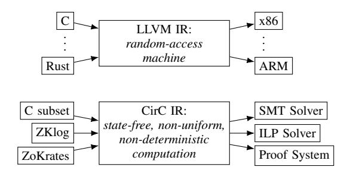

Figure 1. LLVM uses a random-access machine abstraction to make it easy for new front-ends to target CPUs. CirC uses a non-uniform non-deterministic state-free abstraction to make it easy to target EQCs.

useful—in practice, for three reasons. First, the process of compiling from a high-level language to an EQC is similar, even for very different EQCs. To compile, say, a C program to SMT, there is a well-known procedure: explore all paths through the program (i.e., unroll all loops, consider all branches) while guarding all state modifications by the condition under which the corresponding path is taken [27]. The same procedure is used to compile a program to boolean circuits for multi-party computation [33] or to R1CS for proof systems [11, 34]. Since this procedure is largely independent of the application, sharing compilation infrastructure avoids duplicated effort. We describe our language-agnostic machinery for turning programs into circuits in Section 3.

Second, EQCs have performance characteristics different from processors, but similar to other EQCs. As a result, shared EQC infrastructure can support shared optimizations, whereas reusing existing infrastructure geared towards CPUs wouldn't make sense. As one example, while CPUs support load and store instructions for memory access, simulating memory in EQCs (which are state-free) is very expensive: there are active lines of research on memory representations and related optimizations for both software verification [35–40] and proof systems [6, 7, 10, 11, 41, 42]. We show that proof system and software verifier performance both improve under the same memory optimizations (and more) in Section 6.

Finally, shared compiler infrastructure unlocks benefits with few analogs in traditional compilers. In a traditional compiler, each target CPU supported by the compiler does essentially the same thing: it executes code. EQCs, in contrast, often have very different purposes—and shared infrastructure makes it easy to combine those purposes in ways that enable new applications. For example, verification allows users to prove that a program has some property (e.g., "contains no undefined behavior"), while proof systems allow users to prove facts to one another in spite of mutual distrust (e.g., proving "I know my password" without revealing it). Combining these functionalities, we show in Section 7 that our work helps analysts find a bug (using expert hints and an SMT solver) and then prove the bug's existence without revealing how to trigger it (using a proof system). We also demonstrate other combinations, e.g., optimizing R1CS using an SMT solver.

To make these benefits concrete, we implement an infrastructure for building compilers to EQCs, which we call CirC ("SIR-see"). CirC is analogous to—and inspired by—LLVM [43], an infrastructure for compiling programs to machine code. LLVM's key abstraction is its intermediate representation, LLVM IR, which captures the computational

model of random-access machines (i.e., CPUs). CirC builds on a different abstraction (Fig. 1): *state-free, non-deterministic, non-uniform computation*, which captures the computational model of EQCs (§2.1). As in LLVM, language designers can write front-ends that compile to CirC-IR; build CirC-IR analyses, transformations, and optimizations; and create backends that lower from CirC-IR to a given EQC (e.g., R1CS), allowing them to run the resulting executable (e.g., by feeding the resulting R1CS to a proof system).

In sum, our contributions are:

- <span id="page-1-0"></span>• We build CirC, an infrastructure for compiling programs to circuits (§3).
- We demonstrate CirC's extensibility. We extend CirC to the ZoKrates proof language in a week with ≈900 lines of code, whereas the language's reference compiler was developed over years and comprises ≈24000 lines (§4).
- We evaluate the accuracy of CirC's SMT output and the performance (size) of its R1CS output. For example, we find that for ZoKrates programs, CirC produces R1CS instances which perform slightly better than those from the language's reference compiler. CirC also closely matches a hand-tuned constraint system deployed by Zcash [2] (§5).
- We evaluate the effect of common optimizations on the performance of verification and proof-system applications, finding that some optimizations provide substantial benefit to both (§6).
- We demonstrate the ease of combining back-end functionality using CirC. We use an SMT solver to optimize and analyze R1CS compilation, and use a proof system to prove knowledge of (1) a bug identified by an SMT solver and (2) a high-value input identified by an ILP solver (§7).

**Summarizing our key insights**: (1) many subfields rely on the same abstraction, the EQC; (2) compiling to different EQCs uses similar steps, and EQCs have similar performance characteristics, so shared infrastructure makes sense; and (3) with shared infrastructure, different EQCs can be combined in service of new applications.

#### <span id="page-1-2"></span>2. Background and related work

In this section, we start with a slightly more formal definition of EQCs. Then, to set the stage for our evaluation (\$5-\$7), we discuss our three example use cases: cryptographic proof systems (\$2.2), automated verification (\$2.3), and constrained optimization (\$2.4). Finally, we describe related work (\$2.5).

#### <span id="page-1-1"></span>2.1. Existentially quantified circuits

We refer to the broad class of non-deterministic execution substrates that this work targets as existentially quantified circuits (EQCs). EQCs share three key properties. First, they are circuit-like: they comprise sets of wires taking values from some domain (e.g., bits for a boolean circuit) and constraints that express relationships among wire values (e.g., an AND gate represents the constraint  $C = A \wedge B$ ).

Second, EQCs are *state free*: unlike variables in a computer program or registers in a CPU, wire values in an EQC *do not change* during execution. In a boolean circuit, for example, each gate's output is determined by its inputs, which are either the outputs of other gates or input wires.

Third, EQCs have two kinds of inputs: explicit inputs, i.e., arguments supplied at the start of execution, and existentially-quantified inputs, which may take any value consistent with the explicit input values and the set of constraints. Consider the trivial EQC  $\exists B.A \oplus B = 0$ , where A is an explicit input and  $\oplus$  is boolean XOR: when A is true, B must be true. In the language of formal logic, EQCs correspond to *quantifier-free first-order formulas*.

In complexity-theoretic terms, we say that EQCs capture non-deterministic, non-uniform computation [44, Ch. 6]. Their non-determinism stems from the existentially quantified inputs whose values are, in principle, "guessed" by the execution substrate. Their non-uniformity reflects the fact that a circuit of a given size encodes a computation for a fixed-size input; thus, for a given computation, computations with different input lengths have distinct circuit representations.

## <span id="page-2-0"></span>2.2. Cryptographic proof systems

Probabilistic proof systems are powerful cryptographic tools whose applications include verifying that outsourced computations are executed correctly [6, 8, 45], implementing private cryptocurrency transactions [1, 46], and defending against hardware back-doors [47, 48]. In this section, we describe the class of probabilistic proof systems CirC targets, focusing on their computational model. Readers should consult surveys [49, 50] for additional details.

At a high level, a probabilistic proof system is a cryptographic protocol between two parties, a prover  $\mathcal P$  and a verifier  $\mathcal V$ , whereby  $\mathcal P$  produces a short proof that convinces  $\mathcal V$  that  $\exists w.y = \Psi(x,w)$ , for  $\Psi$  a computation that takes input x and witness w and returns output y. Several lines of work [7–10, 41, 42, 51, 52] instantiate end-to-end built systems. Two key features of these systems are succinctness— $\mathcal P$ 's proof is small, as is  $\mathcal V$ 's work checking it—and zero knowledge—an accepting proof reveals nothing about the witness w other than the truth of  $y = \Psi(x,w)$ .

These systems comprise a *compilation stage* and a *proving stage*. The proving stage applies complexity-theoretic and cryptographic machinery to the compilation stage's output, allowing  $\mathcal{P}$  to generate a proof and  $\mathcal{V}$  to verify it. The compilation stage, our focus in this work, takes a source program  $\Psi$  (written, say, in a subset of  $\mathbb{C}$ ) and transforms it into a system of arithmetic constraints  $\mathbb{C}$  in vectors of formal variables W, X, Y, such that  $\exists w.y = \Psi(x, w) \iff \exists W.\mathcal{C}(W, X, Y)$  for X = x, Y = y. (Note that  $\exists W.\mathcal{C}(W, X, Y)$  is an EQC; §2.1.) The primary figure of merit for a compiler is the size of  $\mathbb{C}$ : fewer constraints means less work for  $\mathbb{P}$  to generate a proof, and in some proof systems it also means a shorter proof that is easier for  $\mathcal{V}$  to verify.

The constraint formalism. The formalism used by most proof systems is called a rank-1 constraint system (R1CS). An R1CS instance  $\mathcal C$  comprises a set of constraints over a finite field  $\mathbb F$  (usually the integers modulo a prime p) of the form  $\langle A_i,Z\rangle\cdot\langle B_i,Z\rangle=\langle C_i,Z\rangle$ , where  $\langle\cdot,\cdot\rangle$  is an inner product, Z is the concatenation  $(W,X,Y,1)\in\mathbb F^n$ , and  $A_i,B_i,C_i\in\mathbb F^n$  are constants. In other words, each constraint asserts that the product of two weighted sums of the wires in  $\mathcal C$  equals a third weighted sum, which generalizes arithmetic circuits.  $\mathcal C$  is *satisfied* when the values W,X,Y satisfy all constraints. To

generate a proof,  $\mathcal{P}$  first computes a satisfying assignment and then executes the cryptographic proving machinery.

Compiling programs from languages like C to R1CS instances is tricky. Domain differences are an immediate concern: while C has a non-trivial type system, for R1CS all computation must be encoded as arithmetic in  $\mathbb{F}$ , which can be awkward. For example, the assertion  $x \neq 0$  has no direct encoding as a rank-1 constraint. When  $\mathbb{F}$  is the integers mod p, by Fermat's little theorem the assertion could be rewritten as  $X^{p-1}=1$ , but this costs  $O(\log p)$  constraints;  $p\approx 2^{256}$  is common for security of the proof system, so this is very costly. In this and similar cases, an important optimization is to introduce *advice* in the form of entries in the (existentially quantified) vector W. In our example,  $x\neq 0$  becomes  $\exists W.W\cdot X=1$ : since only nonzero elements of  $\mathbb{F}$  have a multiplicative inverse, this constraint is satisfiable iff  $X\neq 0\in \mathbb{F}$ . For other examples see, e.g., [6, 10, 11, 34].

Beyond domain considerations lies a more insidious challenge: the fact that constraints cannot directly encode mutation, control flow, etc., so the compiler must transform input programs to eliminate these constructs. We defer discussion of this challenge to the next subsection.

#### <span id="page-2-1"></span>2.3. SMT-based verification

In this section we discuss SMT and SMT-LIB, then explain how verifiers use these tools to prove properties of programs.

SMT solvers are tools that determine whether logical formulas are *unsatisfiable* (i.e., can never evaluate to true) or *satisfiable* (i.e., can evaluate to true); if satisfiable, the SMT solver provides a *satisfying assignment* to the variables in the formula. For example, given the formula  $x \lor y$ , an SMT solver may return a satisfying assignment of x to true and y to false (or any other valid assignment). Free variables in SMT formulas thus have existential semantics, which means that SMT formulas are EQCs (§2.1). In addition to booleans, SMT formulas can include terms from various *theories*, including bit-vectors, arrays, uninterpreted functions, real and integer arithmetic, etc. Theories are higher level than logical formulas, so they make it easier for developers to use solvers.<sup>3</sup> The SMT-LIB [21] standard gives the semantics of each theory.

Compiling from high-level languages to SMT. SMT solvers are often applied in service of program correctness—everything from test case generation to bug finding to verification. Typically, a verifier translates a program and assertions about that program (e.g., index is within bounds of array) into SMT formulas (or similar). The verifier then asks the solver if the assertions make the program's formula satisfiable or not, either finding bugs or verifying their absence.

Compiling code into SMT formulas is challenging [26, 27, 53]. Since SMT (like R1CS) does not support mutable variables or branching, programs must be substantially transformed. As an example, consider this snippet of C code, and its mutation-free translation:

```
// input program (x, y, z previously defined) if (x < 20) { x = 2; } else { y += z; }
```

<span id="page-2-2"></span>3. Theories have other benefits too: they allow solvers to use theory-specific algorithms for faster solving, and they allow users to specify formulas over infinite domains (e.g., the integers), which booleans cannot represent.

```
// mutation-free program x_1 = x_0 < 20 ? 2 : x_0; y_1 = !(x_0 < 20) ? (y_0 + z_0) : y_0;
```

This snippet features variable mutations within an if-else statement. By introducing new versions of the variables, and guarding their new value by the condition of the statement, we can rewrite the snippet without mutations. While simple examples like this are easy enough to understand, eliminating mutation and branching quickly becomes complex. All branches must be recorded, all mutations guarded, all loops unrolled, and all program paths separately explored. Not only is this process complex—it also produces large formulas.

## <span id="page-3-1"></span>2.4. Integer linear programs

Mixed integer linear programs (ILPs) are a ubiquitous language for constrained optimization. An ILP comprises (1) a set of real variables:  $X = \{x_1, \ldots, x_n\}$ , (2) a set of constraints, each having form  $\sum_i c_i x_i \leq b$  (for real constants  $c_i$ , b), (3) an objective function  $f(x) = \sum_i c_i x_i$  (for real constants  $c_i$ ) and (4) a subset of integral variables  $I \subset X$ . Given an ILP, an assignment  $v: X \to \mathbb{R}$  is satisfying if it respects all constraints and assigns integers to the variables in I. An ILP can be infeasible (there are no satisfying assignments), unbounded (the constraints do not entail an upper bound on f's value), or solvable. An ILP solver determines whether an ILP is infeasible, unbounded, or solvable; if the ILP is solvable, the solver searches for a satisfying variable assignment that achieves the maximum value of f.

#### <span id="page-3-0"></span>2.5. Related work

CirC is related to and inspired by LLVM [43] and SUIF [54], but CirC targets EQCs instead of CPUs. MLIR [55] generalizes the LLVM methodology with a toolkit for constructing and manipulating interlocking IRs; in other words, MLIR is infrastructure for constructing compiler infrastructure. This work is orthogonal to CirC, which is compiler infrastructure for a specific family of non-deterministic computational models.

High-level synthesis (HLS) turns programs (say, in C) into digital circuits ([56] surveys). While digital circuits appear superficially similar to EQCs, there are two key differences: first, digital circuits do not allow existential quantification, which is very important for efficiently compiling to EQCs. Second, digital circuits are stateful; indeed, efficient use of stateful elements like flip-flops is a key focus of HLS.

Many compilers to specific EQCs exist; we discuss closely related work below. The main difference between CirC and these compilers is that CirC is infrastructure for compiling to EQCs generally, not just SMT, R1CS, etc. Generalizing existing compilers to support a wide range of EQCs would require essentially duplicating the work of building CirC.

The other difference between CirC and existing work is that most other work combines compilation with front-end-based optimization strategies. As examples: KLEE [37] combines a core constraint compilation engine with a path exploration front-end that forks at every branch; and Giraffe [48] uses program analysis to "slice" programs, then compiles a subset of these slices to proof system constraints. We don't

currently support such strategies in CirC because they do not generalize to all back-ends. For example, forking compiles only a subset of program paths to constraints. This is fine for bug-finding, but is problematic for proof systems: some correct executions might not induce a valid proof. Supporting certain front-end-based optimization strategies is future work (§8).

Compilers for cryptography. A long line of prior work develops techniques for compiling to R1CS constraints. Ginger [34], Zaatar [57], Pantry [7], and Buffet [11] compile a subset of C and support proof-specific optimizations for rational numbers, memory, key-value stores, complex control flow, etc. Pinocchio [8] also compiles a subset of C with techniques similar to Ginger's. Geppetto [9] consumes LLVM IR and provides efficient cryptographic primitives. xJsnark [10] consumes a Java-like language and refines techniques from Buffet and Geppetto. Zinc [14] and ZoKrates [12, 13] compile from eponymous DSLs to R1CS using existing techniques. Finally, Circom [15] is essentially a hardware description language that relies on the programmer to write constraints.<sup>4</sup>

Another line of work [41, 42] uses hand-crafted constraints that simulate a simple CPU, then modifies GCC to emit code for that CPU; while conceptually simple, this entails enormous overhead [11, §5]. Yet another approach, embodied by libsnark [58], ZEXE [4], and Bellman [59], effectively uses a macro assembler to compose hand-crafted R1CS "gadgets."

Fairplay [33] is the earliest example of a compiler to circuits for two-party computation (2PC); FairplayMP [60] targets multi-party computation. Later works like Tasty [61], HyCC [62], and Viaduct [63] optimize by matching pieces of the source program to suitable cryptographic protocols.

CBMC-GC [64] adapts the CBMC [27] model checker to emit boolean circuits for 2PC, implicitly leveraging the similarities between compiling for model checking and for 2PC. Unlike CirC, however, CBMC-GC applies *only* to the case of boolean circuits optimized to 2PC, rather than to EQCs generally. Because of this, it cannot be used to compile to, say, arithmetic constraints for proof systems, nor does it enable the crossover applications that CirC does (§7).

Compilers for SMT. Many projects compile high-level programs or parts of programs to SMT in order to prove program properties [27, 53, 65–76] (e.g., using bounded model checking). For example, the CBMC verifier [27, 66] translates C programs and assertions about their correctness into SMT, unrolling loops up to a given bound. Then, it uses a solver to prove or refute verification assertions. Other program analyzers verify code written in verification-specific domain specific languages (DSLs) [77–80]. For example, Alive [77] presents a DSL for peephole optimizations: programmers write optimizations in the DSL and Alive automatically verifies them. Some projects even allow users to manipulate constraints from within a higher-level language [81–84].

All of the projects listed above handle their own compilation from a high-level language to SMT, but that is not always the case: there are many projects that present infrastructure for *building* verifiers [22, 23, 25, 26, 85–87]—often by handling the details of SMT compilation—and there are many verifiers that depend on them [88–91]. Intermediate Verification Languages [22, 86, 87, 92] (IVLs), for example, decouple

<span id="page-3-2"></span>4. Section 4 discusses building CirC-based Circom and ZoKrates compilers.

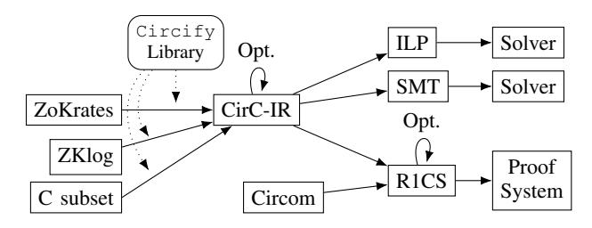

Figure 2. CirC's architecture, with extensions ([§3\)](#page-4-0).

language details from verifier details; the Boogie IVL [\[22\]](#page-15-8) targets SMT-like back-ends, so building a new verifier just requires translating a source language to the IVL. Taking a slightly different tack, Rosette [\[26\]](#page-15-14) builds a virtual machine for symbolic execution, and Serval [\[88\]](#page-16-7) uses it to lift interpreters into symbolic execution engines. CirC has a similar but broader goal: it aims to decouple source languages from *all* EQC targets, not just verifiers—so it generalizes lessons from these works to a wider range of constraint systems.

Symbolic execution (symex) tools [\[93,](#page-16-11) [94\]](#page-16-12) combine SMT compilation of a single program path with, typically, either concrete execution or forking strategies [\[37,](#page-15-37) [40,](#page-15-18) [95](#page-16-13)[–102\]](#page-16-14); some systems use a hybrid of symex and model checking [\[26\]](#page-15-14). After SMT compilation, different tools proceed differently: many [\[37\]](#page-15-37) fork execution at each conditional jump, some use a mixture of concrete and symbolic (concolic) execution [\[40,](#page-15-18) [98\]](#page-16-15), some combine static analysis and symex [\[101\]](#page-16-16), some combine symex and fuzzing [\[40,](#page-15-18) [100\]](#page-16-17), and more. In each case, the symbolic tool relies on a core component that compiles programs to SMT.

Optimization Languages. A variety of tools translate from high-level modeling languages to ILPs, including AMPL [\[31\]](#page-15-12) and Pyomo [\[32\]](#page-15-13). ILPs themselves are solved by a variety of tools including Gurobi [\[103\]](#page-16-18) and CBC [\[104\]](#page-16-19).

# <span id="page-4-0"></span>3. Design

CirC is designed to make new compilers easy to build: it should be easy for designers to add support for new input languages and new target EQCs. In CirC (as in LLVM), designers do so with new front-ends (e.g., for C) and new backends (e.g., for R1CS). Front-ends target CirC's intermediate representation (IR) and back-ends lower from IR to a target representation (Fig. [2\)](#page-4-1).

In this section we present CirC's IR, which is a representation of an abstract EQC. We also present Circify, a language-independent library for writing new CirC front-ends. Section [4](#page-6-0) discusses specific front-ends and back-ends.

# 3.1. CirC-IR

CirC's IR is a rich circuit language and is thus state-free and non-uniform; conceptually, this IR represents an abstract EQC. It's based on the SMT-LIB standard ([§2.3\)](#page-2-1), limited to booleans, floating-point numbers, bit-vectors, and arrays. These theories cover common primitive types in high-level languages, but one can extend the IR with other theories. For example, we have built an extension to the IR that adds a notion of finite fields, since this type underlies R1CS ([§2.2\)](#page-2-0).

```
1 uint8_t cond_add(uint8_t x, uint8_t y, uint8_t z) {
2 if (x == 0)
3 y = y + z;
4 else if (y == 1)
5 y = y + z + z;
6 return y;
7 }
```

Figure 3. A small C program.

# <span id="page-4-4"></span><span id="page-4-2"></span><span id="page-4-1"></span>3.2. **Circify**: managing state when compiling to CirC-IR

To support a new language, the first step is to build a front-end from that language to CirC-IR.

Building a front-end from scratch is hard. For example, consider the C program in Figure [3.](#page-4-2) This program includes variable mutations and conditional branches, two semantic phenomena that cannot be directly represented in CirC-IR because EQCs do not support mutation or branching. Other challenges include functions with early returns, loops with break or continue statements, and random-access memory, e.g., to access an array at a data-dependent index [\[11,](#page-15-2) [41,](#page-15-20) [53,](#page-15-33) [66\]](#page-15-51). While semantics of front-end languages differ in the details, these challenges are similar across many languages. Taking a broad view, we identify *state* as the key issue in these challenges—the state of variables, the state of memory, and even the state of the program counter. To help different language front-ends overcome challenges related to state, CirC provides Circify, a language-independent library for expressing state updates in CirC-IR.

**Circify** makes building front-ends easier. To construct a front-end, a developer essentially writes an interpreter for the source language using the Circify library.[5](#page-4-3) In particular, Circify is responsible for managing the interpreter's execution environment: interactions with variables (e.g., declarations or mutations), functions (e.g., entry or returns), control flow (e.g., branches or breaks), lexical scopes, and even arrays (e.g., initializations, accesses), are delegated to Circify functions. Circify automatically handles the details of expressing stateful semantics in EQCs.

In the rest of this section, we describe Circify's support for variables and conditional branching. This is only a small subset of Circify's functionality, but it gives intuition for how Circify and a language-specific interpreter interact.

At a high level, Circify handles variable mutation by transforming the program into static single assignment form using a standard technique [\[105\]](#page-16-20): each time the source program assigns a new value to a variable, Circify creates a fresh version of that variable in CirC-IR, then constrains this version to be equal to the new value. For example, "x = 1" turns into "x\_*i* = 1" for the next unused version number i.

This naive approach works for straight-line code, but handling control flow requires a technique called *guarding* [\[66\]](#page-15-51), which works as follows: Circify records the conditions that must hold for any given program path to execute, and then guards all assignments on that path with those conditions. For example, consider the assignment on line 3 of Figure [3:](#page-4-2) this assignment only executes when x = 0. To achieve this, Circify uses an if-then-else (ITE) guard term, which evaluates

<span id="page-4-3"></span>5. This is vaguely reminiscent of Serval [\[88\]](#page-16-7)).

```
1 data CVal = Bool IR.Bool
2
```

<span id="page-5-0"></span>Figure 4. C's  $\mathcal{V}\text{-type}$ , in Haskell. The IR module contains the CirC-IR definition.

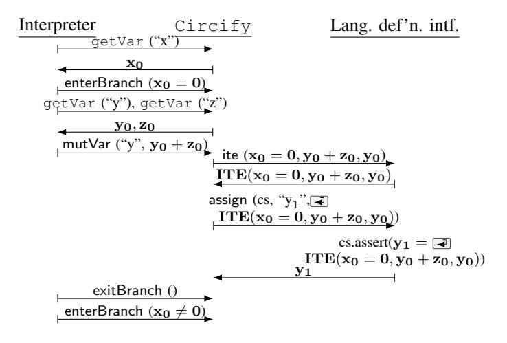

<span id="page-5-1"></span>Figure 5. Interactions between the ZoKrates front-end, Circify, and the front-end's language definition. Quotes denote strings, boldface denotes language values or CirC-IR terms.

to the new value (y + z) when the condition is true (i.e., when x is zero), and to the old value (y) otherwise.

Much of this guarded versioning machinery is language-independent. The only language-dependent pieces are: a definition of language values, a function that assigns values, and a function that constructs ITE terms over values. Together, these three pieces comprise Circify's language definition interface, which Circify's language-independent functionality uses to manipulate source language values. Simplifying slightly, that interface comprises one type and two functions:

- V: a CirC-IR embedding of language values,
- assign $(cs, id, v \in \mathcal{V})$ : adds constraints to cs that assign (the next version of) the variable id to value v, and
- ite $(c, t \in \mathcal{V}, f \in \mathcal{V}) \to \mathcal{V}$ : takes a CirC-IR boolean c and two language values t and f, and returns a language value that equals t when c is true and f otherwise.

An example: Circify for C. Figure 4 shows part of our C front-end's  $\mathcal{V}$ -type, CVal, a recursive data type. Its base constructors wrap CirC-IR booleans and fixed-width integers (lines 1-3); there is also a recursive constructor for named structures (line 4). The corresponding assign and ite definitions are direct when their value arguments are non-recursive: they simply emit an IR assignment or an IR ITE term for the wrapped CirC-IR value. For values with recursive constructors, these functions recursively deconstruct the values, emitting IR assignments or IR ITE terms for each sub-value. For example, calling assign with a v that is structure results in recursive assign calls to each of the field in the structure.

After defining the Circify language definition interface for C, completing the front-end requires (1) writing a parser for the C source text, and (2) writing an interpreter that uses Circify's functionality to translate stateful C code into CirC-IR. As an example, consider the <code>cond\_add</code> C function in Figure 3. Figure 5 depicts the interpreter's calls to <code>Circify</code>, and <code>Circify</code>'s corresponding calls to the C language definition interface as the interpreter steps through this function line-by-line. After argument declarations (not shown), the interpreter requires a few steps to interpret line 2. First, it uses the <code>Circify getVar</code> function to retrieve the IR representation of <code>x</code>'s current value; the result in this case is <code>x</code>'s initial version, <code>x</code>0. Next, the interpreter builds the symbolic condition <code>x</code>0 = 0, and uses <code>Circify</code>'s <code>enterBranch</code> to indicate that subsequent calls are conditionally executed (only when <code>x</code>0 = 0) until a matching <code>exitBranch</code>.

For line 3, the interpreter first gets the values of y and z, then calls Circify's mutVar to set y to  $y_0 + z_0$ . Behind the scenes, this causes Circify to use the functions provided by the language definition interface. Specifically, Circify invokes the ite function to build a new term that is conditioned on the current path (where  $x_0 = 0$ ), then uses the assign function to bind the next version of y (i.e.,  $y_1$ ) to that term.

Finally, the interpreter exits the branch and enters the alternative branch, i.e., the one corresponding to the  $\mathbf{x} \neq \mathbf{0}$  condition. The rest of the interpretation process is similar: the interpreter walks the program, using Circify functions to handle variable interactions and branching. In the next paragraphs, we describe how the interpreter uses Circify to handle other stateful operations.

Breakable blocks: the foundation for exceptional control flow. Most imperative languages include *exceptional control flow* (e.g., early returns). CirC supports exceptional control flow through a construct that we call the *breakable block*. A breakable block comprises a sequence (block) of statements; within that block, a break directs control flow to the end of the block. Early returns, loop breaks, continues, and try-catch blocks can all be implemented using breakable blocks, but the construct cannot simulate all control flow (e.g., gotos).

We implement breakable blocks in CirC by extending the guarding system. Recall that CirC guards the side-effects of side-effect inducing statements on a condition c equal to the conjunction of enclosing branch conditions:  $c = \bigwedge_i \operatorname{branch}_i$ . For each breakable block i, Circify also stores the condition under which the block has been broken out of as  $\operatorname{break}_i$ . Then, Circify guards side effects within the block under  $c = \bigwedge_i \operatorname{branch}_i \wedge \bigwedge_i \neg \operatorname{break}_i$ , and when Circify encounters a break for block j, it updates  $\operatorname{break}_i$  to  $(\operatorname{break}_i \vee c)$ .

**Scopes & functions.** Circify supports function-local variables and lexical scoping rules. Circify exposes methods for entering and exiting lexical scopes; variable lookups are informed by this scoping structure. Circify also supports function scopes; these hide the variables of enclosing scopes.

To compile a program to an EQC, the compiler must inline all functions. Circify helps compiler-writers with this task by supporting function scopes and return statements (implemented using breakable blocks).

Early returns, breaks, and continues. Recall that a *break-able block* is a sequence (block) of statements that can be interrupted by a break, which (conditionally) jumps to the end of the block. Circify implements returns by setting the return value and jumping to the end of a breakable block containing the function body. Similarly, one can implement

```
1 n = getBound(loop)
2 circify.enterBreakable(loop.label)
3 for i in {0, .., n-1}:
4 cond = compileExpr(loop.cond).asBool()
5 circify.enterBranch(cond)
6 circify.enterScope()
7 # may contain: circify.break(label)
8 compileStmt(loop.body)
9 circify.exitScope()
10 for i in {0, .., n-1}:
11 circify.exitBranch()
12 circify.exitBreakable()
```

<span id="page-6-1"></span>Figure 6. Pseudocode for loop-handling in a Circify-based compiler.

loop breaks by jumping to the end of a breakable block containing the whole loop, and continues by jumping to the end of a breakable block containing just the loop body.

An example: loops with lexical scopes and breaks. Circuits are non-uniform, so circuit compilers must unroll loops. In CirC, front-ends implement unrolling. Figure [6](#page-6-1) shows pseudocode for how a front-end might unroll a while-loop. First, the front-end decides how many times to unroll the loop (line 1); this information may come from a programmer annotation or an SMT-assisted analysis ([§7.1\)](#page-12-1). In each unrolling, the frontend branches on the loop's condition (lines 3, 4) and enters a lexical scope (line 5). It then compiles the loop body; within the body, loop breaks target the breakable block that begins on line 2 and ends on line 12. Finally, the front-end exits the lexical scope (line 9) and the branches (line 11).

Stack Arrays. Circify supports accesses to dynamic locations within statically-known stack arrays of bit-vectors. Compiler developers must serialize their types as bitvectors to use stack arrays. Circify supports allocating stack arrays (using "circify.alloc(addr\_bits, val\_bits, size)"); allocation returns a concrete *allocation identifier*, id. Loads and stores use id to indicate which array to access. Load operations take a concrete id and a CirC-IR offset; they return an IR value. Store operations take a concrete id, an IR offset, and an IR value. The effect of a store operation is guarded on the current path condition.

References. Circify supports fixed references to (potentially out-of-scope) variables, similar to C++. References are modeled as a kind of *location*, similar to a variable. References can be created to any variable, and Circify allows new values to be written to references. Circify's reference system is useful for capturing C pointers with fixed referents, e.g., pointers used as output arguments.

An example: functions and references. Figure [7](#page-6-2) shows an example of how a front-end uses Circify's reference and function support. This example calls a function with signature int f(bool& out, int a, int b). Line 1 creates a reference to callee variable mybool, line 2 enters the new function scope, and line 3 binds the function-local variable out to the reference. Lines 4 and 5 set function-local variables a and b to constants. We elide the function body (line 6); note that is may include early return statements. Finally, line 7 exits the function and fetches the return value.

Together, Circify's features provide a useful framework for constructing front-ends for new languages. Once a language designer has used Circify to attach a front-end to

```
1 ref = circify.mkRef("mybool")
2 circify.enterFn("f", CTy::Int)
3 circify.declAssign("out", ref)
4 circify.declAssign("a", cInt(5))
5 circify.declAssign("b", cInt(6))
6 # ... fn body, including circify.return(val)
7 retVal = circify.exitFn()
```

<span id="page-6-2"></span>Figure 7. Pseudocode for references and function calls.

CirC, they can create their own optimizations over CirC-IR or use any existing ones.

## <span id="page-6-3"></span>3.3. IR Optimization

Once a front-end has compiled its input to CirC-IR, the optimization phase begins. CirC includes a large suite of CirC-IR–based optimizations that language designers can selectively apply, depending on their input language and target circuit. Many optimizations are standard, e.g., constant-folding, n-ary operator flattening, and inlining; these are almost always beneficial. Other optimizations are more complex and should be selectively applied. For example, CirC can replace operations over bit-vector arrays with operations over bit-vectors, via memory-checking techniques [\[7,](#page-15-1) [10,](#page-15-19) [11,](#page-15-2) [41,](#page-15-20) [42,](#page-15-21) [106\]](#page-16-21). This is *essential* for proof systems, which do not support arrays. When compiling to SMT—which natively supports arrays the optimization is unnecessary.

Optimizations motivated by one pipeline often help others, too. As one example, while implementing our ZoKrates-to-R1CS compiler, we added a bit-shifting optimization in the constant folding pass; this pass also helps the C-to-R1CS compiler (and likely any future R1CS pipelines, too). The optimization replaces terms of the form x>>k (for bit-vector x and constant k) with a rearrangement of the bits of x. The latter ultimately requires substantially fewer R1CS constraints than a variable offset bit-shift.

Optimizations can also help multiple *targets*. In Section [6,](#page-10-0) we present experiments demonstrating that some optimizations are beneficial for both SMT and R1CS, despite significant differences in these targets' execution semantics.

# <span id="page-6-4"></span>3.4. Back-ends: from CirC-IR to circuits

To support a new EQC back-end, designers lower CirC-IR to their chosen representation. Generally, writing a back-end for a new circuit representation is easier than writing a frontend, since CirC-IR is already a circuit IR. Once a developer has lowered CirC-IR to their target of choice, they can perform target-specific optimizations. This is relatively standard: many compilers support such optimizations [\[77,](#page-16-1) [107\]](#page-16-22), and we discuss those that we implement in Section [4.2.](#page-8-1)

# <span id="page-6-0"></span>4. Extensibility and implementation

As we discussed in the previous section, CirC's main goal is extensibility to new source languages and target EQCs. The compiler's design made it easy to implement five front-ends for Circom, ZoKrates 0.6.1, a modified version of ZoKrates 0.7.6 that we call Z#, a Datalog dialect, and a subset of C and three back-ends—to SMT, R1CS, and ILP. The rest of this section gives background on the languages and back-ends, and describes using CirC to support each of them.

#### <span id="page-7-2"></span>4.1. Front-ends

Circify makes certain aspects of supporting a new language easy, because it manages the transformation of stateful programs with complex control flow into flat circuits. On the other hand, Circify does not assist with features that are likely to be language-specific, such as type checking and namespacing. In this section, we discuss CirC's front-ends and describe what was easy and what was hard for each.

C. CirC supports a subset of C that includes floats, doubles, booleans, integers, structures, stack arrays, and pointers to a statically known variable or array. Our C front-end also includes an opt-in taint-tracking system for definedness, which is useful, e.g., for detecting bugs due to undefined behavior ([§7.3\)](#page-13-0). It does not support recursion or goto. [6](#page-7-0) In spite of these limitations, CirC's C semantics are richer and more standardscompliant than prior work. As important examples: CirC wraps integer arithmetic modulo powers of two, as required by C11; Pequin [\[108\]](#page-16-23) instead wraps modulo a large prime. CirC supports data-dependent array accesses and pointer offsets; PICCO [\[109\]](#page-16-24) and CMBC-GC [\[66\]](#page-15-51) only support constant offsets that are known at compile time.

ZoKrates. ZoKrates [\[12,](#page-15-3) [13\]](#page-15-41) is a recent (2018) language for programming zero-knowledge proof systems. Developers write ZoKrates programs that check properties (e.g., "account balance is positive"), and the ZoKrates compiler converts those programs into equivalent R1CS. ZoKrates is a mature project: at least 42 contributors have authored over 3600 commits in the past several years, and there have been dozens of versions of the ZoKrates language to date. We now describe our experience implementing front-ends for two versions.

ZoKrates 0.6.1's types are fixed-width integers, finite field elements, booleans, field element–indexed arrays, and structures. The language supports mutable variables, conditional expressions, and statically bounded loops. Neither datadependent control flow (e.g., conditional statements) nor loops with an input-dependent number of iterations are supported.

Our ZoKrates front-end builds on Circify ([§3.2\)](#page-4-4), which handles essentially all of the complexity (variable mutation, scoping, and function calls). The most complex remaining issue is ZoKrates's module and import system: import directives can rename imported identifiers, so name resolution depends on the current module (e.g., a structure might be defined as S but imported into another module as S 0 ). To handle this, the front-end tracks the current module and uses this information for name resolution (≈50 LOC).

Building this compiler took one person less than one week; the ZoKrates front-end comprises less than 900 lines of (non-parser, non-AST) code. For comparison, the core of the ZoKrates 0.6.1 reference compiler (which also excludes parsers, ASTs, and tooling) comprises over 24,000 lines and was written over the course of multiple years. Furthermore, our compiler supports a strict superset of the ZoKrates language, including (for example) if-statements. Finally, as [§5](#page-8-0) will show, our compiler produces slightly better output.

```
6. Prior work [11, 27] shows how to support some of these constructs.
```

```
1 pow(X: u16, E: u16, Y: u16) % Y = X ** E
2 if E = 0, Y = 1;
3 or E > 0, E & 1 = 0, pow(X * X, E / 2, Y);
4 or exists Z: u16,
5 E > 0, E & 1 = 1, pow(X * X, E / 2, Z), Z * X = Y.
```

<span id="page-7-1"></span>Figure 8. Recursive ZKlog rule for computing powers.

ZoKrates 0.7.6 adds support for structures and functions that are generic over integer constants (used to write code that is generic over array lengths; recall that these must be known at compile time). We have adopted these features in Z#, a language based on—but not fully compatible with—ZoKrates 0.7.6 that is being used in a commercial deployment of zeroknowledge proofs. Our Z# implementation invokes the SMT solver during compilation to infer generic parameters, a simple but useful example of invoking a CirC back-end to implement a language feature ([§7\)](#page-12-0). Adding support for the above, plus a Z# AST analysis library (used for type checking and inference) and an AST-walking interpreter (used to support compiletime macros, testing, and debugging), took roughly 3 kLOC. Importantly, none of these features required changes to CirC-IR or Circify, giving us confidence that CirC's abstractions will easily support more advanced language features.

ZKlog. Datalog is a class of logic programming languages; Datalog dialects have been used to express database queries, program analyses, and more. We build a front-end for a Datalog dialect that we call ZKlog, to show that CirC can support a very different programming paradigm from that of C or ZoKrates. ZKlog programs are a collection *rules* over input variables; rules are defined in terms of *cases*, which can introduce (existentially quantified) variables and enumerate *conditions*. Figure [8](#page-7-1) shows a ZKlog rule for the relation Y = X E . ZKlog supports booleans, fixed-width integers, finite field elements, and fixed-length array types; it (like other Datalog dialects) does not allow negated rule applications, so any ZKlog rule can be compiled to an EQC. Appendix [B](#page-18-0) presents ZKlog's syntax.

The main challenge in supporting ZKlog is recursion: ZKlog, as a Datalog dialect, relies on recursion for iteration there is no looping construct. Naively inlining recursive calls would cause the compiler to diverge, so we bound recursion in two ways. First, we use a programmer-specified, commandline *recursion limit* that bounds the number of times any rule can be recursively inlined. Using this construct, the programmer must correctly specify a recursion limit that's sufficiently large to compile a given rule into an EQC. If the recursion limit is too low, the generated EQC is *incomplete*—unsatisfiable for some inputs that it should be satisfiable for.

To alleviate the burden on the programmer, we support arbitrary recursion for *primitive recursive rules* applied to *compile-time constants*. From computability theory, a rule (more generally, a function) is primitive recursive in a formal argument x if all recursive calls are strictly decreasing in x. For example, the rule pow in Figure [8](#page-7-1) is primitive recursive in E. However, without the condition E > 0 on line 3, it would not be, since E / 2 might not be less E.

To identify rules and arguments with primitive recursion, we allow programmers to annotate one rule argument as "decreasing". If the rule recurses and the annotated argument is a compile-time-constant that is strictly less than its

```
def difflog(private u8 x) -> u8:
  u8 acc = 0x00
  for field i in 0..8 do
      acc = if x != 0x00 then acc + 0x01 else acc fi
      x = x >> 1
  endfor
  return x - acc
```

<span id="page-8-2"></span>Figure 9. A small ZoKrates program that computes x − blog<sup>2</sup> xc.

previous value, the compiler ignores the recursion limit while compiling the rule to an EQC. We use CirC's constant-folding pass to check whether a value is a compile-time-constant that is less than in previous calls.

We can also use an SMT solver to determine whether a decreasing annotation is valid for *all* compile time constants. We describe this analysis in Section [7.2.](#page-12-2)

Circom. Circom is a hardware description language for arithmetic circuits. Our Circom compiler thus bypasses CirC-IR, and only takes advantage of the R1CS optimizations in CirC. This demonstrates the CirC framework's modularity: it's possible to attach front-ends to CirC-IR, but it's also possible to attach directly to back-ends in order to take advantage of target-specific optimizations.

#### <span id="page-8-1"></span>4.2. Back-ends and target-specific optimizations

We've implemented three EQC back-ends in CirC: SMT, R1CS, and ILP. We will use the ZoKrates program in Figure [9](#page-8-2) as a running example to illustrate the semantics of these backends. This program takes a private input x and computes an (implicitly public) output x − blog<sup>2</sup> xc. The front-end marks private inputs as existential in the compiled EQC. As we will see, existential inputs have slightly different semantics in each back-end.

SMT. Targeting SMT from CirC is trivial, since CirC-IR is based on SMT-LIB. Our SMT back-end (based on Z3's Haskell bindings [\[110\]](#page-16-25)) supports all of CirC-IR except finite field elements. Finite field arithmetic could be represented as modular arithmetic over bit-vectors of sufficient width, but existing SMT solvers are hopelessly inefficient on this encoding, so we omit it. Efficiently supporting finite fields in SMT solvers is future work.

When paired with the ZoKrates front-end, the SMT backend requires values for public inputs and outputs of the entry function (in Fig. [9](#page-8-2) this is only the return value, e.g., 9). Then, the backend produces an SMT formula that allows an SMT solver to search for an assignment to the private inputs corresponding to a valid execution (e.g., x 7→ 13).

R1CS. Our R1CS back-end supports booleans, finite field elements, bit-vectors, and arrays checkable using memory checking techniques ([§3.3\)](#page-6-3).[7](#page-8-3) We use prior techniques [\[7,](#page-15-1) [10,](#page-15-19) [34,](#page-15-16) [57,](#page-15-38) [111,](#page-16-26) [112\]](#page-16-27) to lower booleans and bit-vectors to R1CS. Our lowering pass also optimizes translation of certain CirC-IR terms. For example, the bit-vector term "(c & t) | ((not c) & f)" is better translated as a bitwise if-thenelse than as two ANDs and an OR.

Following prior work on proof system compilers [\[10,](#page-15-19) [15\]](#page-15-42), we implement one simple but powerful R1CS-specific optimization in CirC: linearity reduction. This optimization looks for linear constraints, e.g., 0 = c + P i cix<sup>i</sup> . It solves for one of the variables in the constraint, then eliminates that variable from the constraint system using substitution.

When paired with the ZoKrates front-end, the R1CS backend implements ZKPs of function execution that reveal nothing additional about the values of private inputs. For instance, a prover can show that they know an input x such that the program in Figure [9](#page-8-2) outputs 4 (e.g., x 7→ 7 or x 7→ 8).

ILP. Our ILP back-end supports booleans, bit-vectors, and arrays captured by memory checking techniques ([§3.4\)](#page-6-4). Given a CirC-IR circuit C that outputs an unsigned bit-vector, the back-end uses techniques from [\[113\]](#page-16-28) and [\[114\]](#page-16-29) to build an ILP. This ILP includes variables that encode C's inputs, and its objective is maximized when C's output is. Thus, by giving the ILP to a solver (we use CBC [\[104\]](#page-16-19)), one can discover output-maximizing inputs for C.

When paired with the ZoKrates front-end, the ILP backend requires values for public inputs to the entry function (in Fig. [9,](#page-8-2) there are none). Then, the ILP backend produces a circuit that allows an ILP solver to search for an assignment to the private inputs (in Fig. [9,](#page-8-2) x) that maximizes the return value. For example, in Figure [9,](#page-8-2) the ILP solver finds that x 7→ 255 achieves the maximum output value of 247.

## 4.3. Implementation

CirC's v1.0 implementation comprises ≈15k lines of Haskell. The core (i.e, Circify and the IR definition and optimizations) is ≈5.7k lines; tests and extensions are the rest. This is the implementation that we evaluate ([§5\)](#page-8-0). CirC v2.0 is a ground-up re-implementation in Rust (≈11k lines), which makes it easier to reason about and optimize compilation times and to bring new developers onboard. CirC v2.0 is under active development and will be the main focus of future efforts.

The two versions have different sets of extensions. All extensions described in this paper were implemented for CirC v1.0, except those for ILP and ZKlog. CirC v2.0 doesn't support Circom, and its subset of the C language is more restricted. All benchmarks in this paper were run using CirC 1.0 unless otherwise noted. Both versions are open-source.[8](#page-8-4)

# <span id="page-8-0"></span>5. Output performance and correctness

Language designers should be able to use CirC to create *correct*, *efficient* circuits. In this section, we evaluate both performance—does CirC produce circuits that perform well with respect to a given target?—and correctness—can CirC accurately model input language semantics? We measure performance by comparing CirC's proof system pipelines to stateof-the-art, dedicated R1CS compilers. We evaluate correctness by running CirC's SMT pipeline on two standard verification benchmarks. Ultimately, we answer two questions. Does CirC:

• Emit R1CS outputs competitive in size with those emitted by state-of-the-art proof-system compilers? ([§5.1\)](#page-9-0)

<span id="page-8-4"></span>8. v1.0: [github.com/circify/compiler](https://github.com/circify/compiler) and v2.0: [github.com/circify/circ](https://github.com/circify/circ)

<span id="page-8-3"></span><sup>7.</sup> CirC does not currently lower floating-point arithmetic to R1CS. Although prior work supports a rudimentary floating-point representation [\[34\]](#page-15-16), embedding IEEE 754–compatible floats in R1CS remains an open problem.

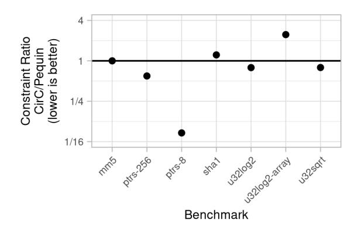

Figure 10. Comparison between CirC and Pequin ([§5.1\)](#page-9-0). Relative performance depends on the benchmark, with neither compiler dominating the other.

• Emit SMT circuits that capture C program semantics with enough fidelity to find simple bugs? ([§5.3\)](#page-10-1)

We find that CirC's R1CS outputs perform exactly the same as the Circom compiler's, roughly the same as Pequin's, and slightly better than the ZoKrates compiler's. We also find that CirC's SMT formulas are correct on two benchmark suites from the sv-comp [\[115\]](#page-16-30) verifier competition. Finally, we evaluate CirC on a deployed proof-system application, verifying Merkle paths, by compiling ZoKrates code to R1CS ([§5.2\)](#page-10-2); CirC matches Zcash's hand-tuned implementation.

## <span id="page-9-0"></span>5.1. Performance

We consider three compilation pipelines when evaluating the performance of CirC's output: C-to-R1CS, ZoKrates-to-R1CS, and Circom-to-R1CS. We find that CirC is competitive with the state of the art in all cases, and slightly outperforms the ZoKrates compiler; our metric is the number of rank-1 constraints, which is standard ([§2.2;](#page-2-0) [\[6,](#page-15-0) [10,](#page-15-19) [11\]](#page-15-2)).

C-to-R1CS. Compiling C to R1CS stresses CirC's handling of boolean, bit-vector, and array (memory) constraints. On this task, we evaluate CirC against Pequin [\[108\]](#page-16-23), a state-of-the-art compiler from a subset of C to R1CS that builds on a long line of work [\[7,](#page-15-1) [11,](#page-15-2) [34,](#page-15-16) [57\]](#page-15-38). We use 6 benchmarks from the Pequin software distribution covering a representative sample of control-flow patterns and primitive operations. Pequin assumes that arithmetic never overflows; we use a modified version of CirC's R1CS machinery that matches Pequin's semantics. For each benchmark, we report the ratio between the number of constraints that CirC and Pequin produce, which is lower when CirC performs better.

Figure [10](#page-9-1) shows the results: the compilers perform comparably. On simple arithmetic (mm5: matrix multiplication), they produce an identical number of constraints. On a binary-search implementation of integer square-root (u32sqrt), CirC has a slight edge, probably because of aggressive constant folding. On an addition- and bit manipulation–intensive hash (sha1), however, CirC performs slightly worse, likely due to missed inlining opportunities. CirC uses 11.9x fewer constraints for small arrays (ptrs-8) because CirC optimizes its memory representation for memory size (as in xJsnark [\[10\]](#page-15-19)), whereas Pequin uses a single memory representation that is asymptotically cheap but concretely costly for small arrays.

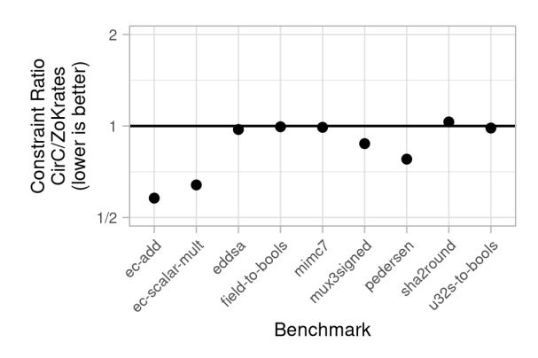

<span id="page-9-2"></span><span id="page-9-1"></span>Figure 11. Comparison between CirC and ZoKrates's reference compiler ([§5.1\)](#page-9-0). CirC generally produces better output.

Pequin performs better on one benchmark, u32log2 array, which computes integer logarithms by decomposing the input into an (integer-typed) array of bits, then scanning that array. CirC does not yet optimize integer-typed arrays containing only boolean values, so it treats the intermediate array as if it contains integers rather than bits, yielding much worse performance than Pequin. (This is a relatively simple optimization; adding it is future work.) When we instead evaluate a version of this function written in a more standard way (u32log2; Fig. [17\)](#page-12-3), CirC outperforms Pequin slightly.

For consistency with prior work, Appendix [A](#page-17-0) compares CirC and Pequin on the benchmark set from [\[11\]](#page-15-2). On these benchmarks, CirC produces between 1x and 10x fewer constraints than Pequin. This is because small array accesses are the bottleneck in many of these benchmarks.

ZoKrates-to-R1CS. We evaluate CirC's ZoKrates-to-R1CS pipeline relative to the ZoKrates compiler, version 0.6.1. (We use this version because CirC's ZoKrates front-end is fully compatible with it ([§4.1\)](#page-7-2).) This comparison tests how CirC performs when the source language includes R1CS-friendly features like field elements and control-flow limitations.

We benchmark all major modules in the ZoKrates standard library. The modules (and benchmarks) are: utilities (mux3, field-to-bools, u32s-to-bools), hashes (mimc7, pedersen, sha2round), elliptic curve operations (ec-scalar-mult, ec-add), and signature verification (eddsa). In Appendix [A,](#page-17-0) we evaluate on the entire standard library. As above, we report the ratio of constraint counts.

Figure [11](#page-9-2) shows the results: CirC slightly outperforms the reference compiler. On straight-line computations with simple operations (mimc7, fields-to-bools, u32s-tobools), the compilers perform similarly. When there are opportunities for common sub-expression elimination (ecscalar-mult, ec-add), or when CirC can optimize conditional expressions (pedersen, mux3signed), CirC performs better. In one case, sha2round, CirC performs very slightly worse, likely due to missed inlining opportunities. Our evaluation on the whole ZoKrates standard library (App. [A\)](#page-17-0) corroborates these results.

Circom-To-R1CS. Circom [\[15\]](#page-15-42) is effectively a hardware description language for R1CS. We support it in CirC by writing a front-end that directly targets R1CS. Thus, compiling Circom to R1CS is a test of CirC's R1CS-specific optimizations ([§3\)](#page-4-0).

We evaluate CirC against the Circom compiler (v0.0.30) on the test suite for Circom's standard library. The compilers perform identically on all nearly all benchmarks. This is because Circom designs explicitly describe R1CS constraints, and the compilers apply the same R1CS optimizations. Appendix [A](#page-17-0) contains the details of the evaluation.

## <span id="page-10-2"></span>5.2. Performance on a ZK proof application

We evaluate CirC's ZoKrates compilation pipeline on a key primitive for zero-knowledge proof applications: *Merkle path validation*. A valid Merkle path establishes that an element x is in a committed set S. By implementing Merkle path validation inside a zero-knowledge proof, one can prove that a *secret* x is in some publicly committed S. This is used, for example, in the Zcash cryptocurrency [\[1,](#page-14-0) [2\]](#page-14-1): a private transaction contains a proof that the coin being spent is in the global set of unspent coins. Since the proof hides *which* coin is being spent, an analyst cannot trace the flow of funds through the system.

We start by implementing a simple 6-line ZoKrates function that verifies a Merkle proof using an elliptic curve–based hash function from the ZoKrates standard library. Figure [12](#page-10-3) compares cost in constraints versus depth of Merkle tree. Compared to the ZoKrates reference compiler, CirC produces ≈21% fewer constraints for this naive implementation.

Zcash's deployed Sapling implementation [\[116\]](#page-16-31), however, has less than half as many constraints as CirC produces in the naive approach. The reason for this discrepancy is that the Sapling constraint system uses *algorithmic* optimizations that are not reflected in ZoKrates's standard library.[9](#page-10-4) CirC makes it easy to implement Sapling's optimized algorithm: we do so in just 87 lines of ZoKrates code (and without using the standard library), whereas Sapling requires well over 1500 lines of Rust[10](#page-10-5) to generate constraints using Bellman [\[59\]](#page-15-44), which is effectively a macro assembler for R1CS. CirC generates essentially the same number of constraints as in Sapling's implementation, and ≈20% less than the ZoKrates reference compiler on our optimized ZoKrates code (Fig. [12\)](#page-10-3).

Appendix [D](#page-19-0) gives our optimized ZoKrates implementation.

#### <span id="page-10-1"></span>5.3. Correctness

To evaluate the *correctness* of CirC's output, we run it on a subset of the tests from the Software Verification Competition (sv-comp). This annual competition includes many benchmarks that stress the speed and accuracy of software verifiers. By extending CirC's C front-end to support sv-comp conventions for existential inputs, assertions, and assumptions (≈40 LOC), we can run CirC on sv-comp benchmarks.

We run CirC on two benchmark categories: signedintegeroverflow-regression, which tests the precision with which overflow is modeled, and bitvector-loops, which tests the precision with which branches, stack arrays, and basic pointers-to-stack-arrays are modeled. We choose

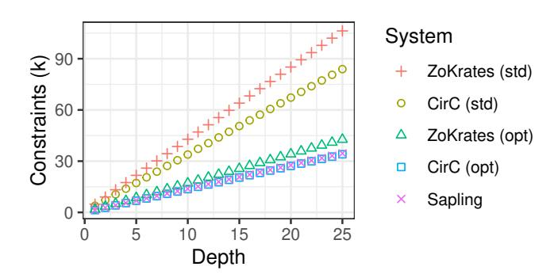

<span id="page-10-3"></span>Figure 12. Constraint cost for Merkle path validation versus tree depth ([§5.2\)](#page-10-2). "ZoKrates" denotes the reference compiler; "Sapling" denotes the Zcash constraint generation library [\[116\]](#page-16-31). For ZoKrates and CirC, "(std)" is a naive implementation using the ZoKrates standard library, whereas "(opt)" incorporates algorithmic optimizations from Sapling. CirC consistently outperforms the ZoKrates reference compiler, and matches Sapling's hand-tuned constraint count on the Sapling algorithm.

these categories since they exercise most of CirC's support for C semantics ([§3\)](#page-4-0). CirC is correct in both categories.

We do *not* compare CirC's performance (e.g., the SMT solver's execution time) on sv-comp benchmarks relative to other systems. While CirC supports simple IR-level optimization passes, it does not currently include machinery for sophisticated static analysis (e.g., SMACK's static analysis for its memory representation [\[25\]](#page-15-53)). Moreover, though CirC handles the "compilation to SMT" piece of a verifier, it is often not comparable to the *whole* verifier or symbolic execution engine (e.g., CirC does not currently support a front-end forking phase like KLEE [\[37\]](#page-15-37)). We discuss combining CirC with existing verifiers and high-performance verification strategies in Section [8.](#page-14-3)

## <span id="page-10-0"></span>6. Common performance characteristics

This section shows how SMT solvers and proof systems have similar performance characteristics, which means that optimizations for one pipeline (e.g., C-to-R1CS) can improve performance in another pipeline (e.g., C-to-SMT). This fact is not obvious at first glance. Proof system performance metrics (i.e., prover runtime) are almost entirely determined by the number of rank-1 constraints in the input circuit, while SMT solver performance metrics (i.e., solver runtime) are more difficult to understand—and are sometimes surprising [\[118,](#page-16-33) [119\]](#page-16-34). Nevertheless, CirC's optimization passes reveal performance similarities between both targets. We find that CirC's SMTinspired constant-folding helps proof systems, too, ([§6.1\)](#page-10-6), and that CirC's *oblivious array elimination* pass ([§6.2\)](#page-11-0) and granular array modeling ([§6.3\)](#page-11-1) help both solver and proof system back-ends.

## <span id="page-10-6"></span>6.1. Constant folding

*SMT term rewriting*—replacing one SMT term with an equivalent one to assist in SMT solving—is an old technique [\[120\]](#page-16-35) used in all major solvers [\[121](#page-16-36)[–126\]](#page-16-37). *Constant folding* refers to a simple but important class of rewrites such

<span id="page-10-4"></span><sup>9.</sup> Sapling's elliptic curve–based hash function uses optimized point representations and incomplete arithmetic formulas. This optimization is thus unsound, but the Zcash developers show that this unsoundness is computationally infeasible to exploit assuming the hardness of discrete log [\[2,](#page-14-1) §A.3.3.9].

<span id="page-10-5"></span><sup>10.</sup> This count includes the Sapling pedersen\_hash implementation [\[117\]](#page-16-32) and transitive dependencies within the Sapling codebase; it does not include external libraries, unrelated functionality, or tests.

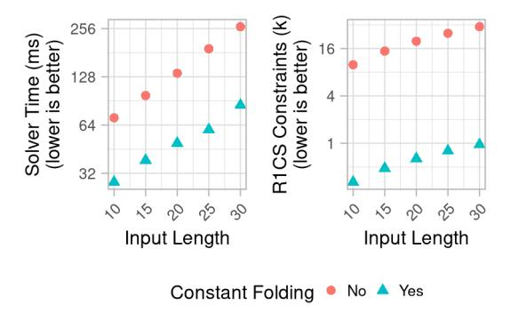

Figure 13. Solver and proof system performance when operating on the predicate ∃x.H(x)[0..8] = 0 ([§6.1\)](#page-10-6). Constant folding improves performance for both back-ends.

as replacing 4+5 with 9 or replacing the bit-vector term x<<1 with extractions and concatenations.

Constant folding helps the proof system back-end, too: the following experiment shows that it reduces the number of output constraints. We write a small (insecure!) hash function, H, which digests N 32-bit blocks into a 32-bit result. We wrap the function with an assertion that the output ends in a zero byte, encoding the predicate ∃x.H(x)[0..8] = 0. We use CirC to translate this predicate to R1CS and SMT, varying N and turning constant folding on and off. For R1CS, we measure the number of constraints; for SMT we measure the time that the SMT solver takes to find a satisfying x.

Figure [13](#page-11-2) shows the results: constant folding reduces R1CS constraint count and SMT solver runtime. The benefit for R1CS is substantial: constant folding reduces constraint count by a factor of more than 16. The effect is smaller for SMT, likely because the SMT solver already does constant folding.[11](#page-11-3)

## <span id="page-11-0"></span>6.2. Oblivious array elimination

In the spirit of *oblivious Turing machines*, whose head movements are input-independent, we use the term *oblivious array* to refer to an array that is accessed only at inputindependent indices. CirC includes an optimization pass that identifies such arrays and replaces them with a sequence of distinct terms which are accessed independently. This optimization is essentially a strengthening of well-known scalar replacement optimizations: rather than just replacing a few array references with scalars, the entire array is eliminated.

We conduct an experiment showing that both targets respond similarly to oblivious array elimination. We write a C program that (1) declares an array of N ints (2) fills the array with non-deterministic inputs (3) sums all array elements and (4) asserts that sum to be non-zero. Since the array is only accessed at input-independent indices, the oblivious array elimination pass replaces it with distinct terms. We use CirC to find assertion-violating inputs using an SMT solver, and measure the solver's runtime. We also use CirC to compile

<span id="page-11-3"></span>11. Because the SMT solver performs a search, while the R1CS simply encodes the predicate, solver time scales exponentially with input length, while R1CS constraints scale linearly. This difference is orthogonal to the benefit of constant folding to both performance metrics.

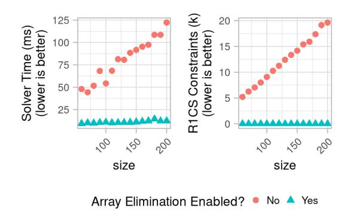

<span id="page-11-4"></span><span id="page-11-2"></span>Figure 14. Solver and proof system performance are both improved by

the program (and assertion) to R1CS, and count the number of constraints. Figure [14](#page-11-4) shows the results with and without the optimization, with varied N. [12](#page-11-5) Both targets perform better when array elimination is enabled.

#### <span id="page-11-1"></span>6.3. Array granularity

oblivious array elimination ([§6.2\)](#page-11-0).

Compiling programs that use random-access storage (henceforth, arrays) requires the compiler to model those arrays. CirC uses a *fine-grained* model: each source array is represented by its own SMT array. An alternative, *coarsegrained* model would use a single large "stack" array containing all source-level arrays. While the coarse-grained approach has some benefits [\[101\]](#page-16-16), it is generally more expensive for SMT solvers to reason about [\[127,](#page-16-38) [128\]](#page-16-39). We now present an experiment demonstrating that the coarse-grained approach is also much more expensive for proof systems.

Our benchmark in this experiment is a function that takes as input an integer between 0 and w−1, and applies a sequence of n permutations of {0, 1, . . . , w −1} to it. Each permutation is encoded as an array, so applying the permutation is just an array index operation (the program assumes that the input is in bounds). To vary array granularity, we apply a source transformation that fuses separate arrays into shared arrays, which simulates coarser- or finer-grained arrays (e.g., fusing all arrays simulates the "stack" approach discussed above).

Figure [15](#page-12-4) shows our benchmark program for the case n = 2, w = 4; the program uses sv-comp style assumptions and assertions. The final line of the program asserts that the output i is not 0, which we use to measure performance as follows. For the SMT back-end, we ask the solver to find an assertion violation and measure how long it takes to produce a result (a violation is guaranteed to exist, because permutations are invertible). For the proof back-end, we measure the number of R1CS constraints to construct a proof that the input violates the assertion about the output.

Figure [16](#page-12-5) shows the results for n = 6 and w ∈ {2, 4, 8}, varying the percentage of permutations fused into a single array. The results show that fusing permutations together—i.e., coarsening granularity—significantly reduces performance for both the SMT and proof back-ends.

<span id="page-11-5"></span>12. When array elimination is disabled, the R1CS target falls back to its standard array implementation, which was briefly discussed in Section [5.1.](#page-9-0)

```
void perm(int i) {
   __VERIFIER_assume(i >= 0 && i < 4);
   int perm0[4] = {2, 0, 1, 3}; i = perm0[i];
   int perm1[4] = {0, 1, 3, 2}; i = perm1[i];
   __VERIFIER_assert(i != 0);
}</pre>
```

<span id="page-12-4"></span>Figure 15. Array granularity benchmark: this C program applies two permutations, which are implemented as arrays, to its input (§6.3).

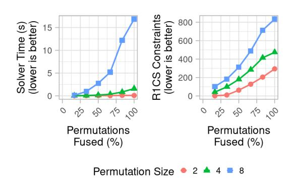

Figure 16. Effect of array granularity on solver and proof system performance (§6.3). Increasing x-axis corresponds to increasingly coarse-grained array representations, which increase costs for both the SMT and proof back-ends.

# <span id="page-12-0"></span>7. Crossover applications and techniques

In contrast to traditional compilers, CirC's targets serve substantially different purposes. This opens the door to applications that combine targets, and to techniques that use one target to help another. In this section, we discuss four such cross-overs: SMT-driven optimization of R1CS size, SMT-based analysis of ZKlog code, automatic detection and zero-knowledge proof of bugs, and automatic optimization and zero-knowledge proof of high value. With CirC, these cross-overs are easy to implement: each requires between 16 and ≈60 new lines of code.

#### <span id="page-12-1"></span>7.1. Optimizing R1CS using SMT

SMT-guided optimization is an old idea, and SMT solvers have been used to optimize everything from code [129] to smart contracts [130] to TensorFlow graphs [131]. CirC makes it easy to apply SMT-guided optimizations to R1CS, too.

To illustrate this, we use one critical compilation task—loop unrolling—as a case study. To embed a loop like the one in Figure 17 in an EQC, the compiler must unroll it some number of times N, and in some cases emit an assertion that the bound is respected ( $\S 2$ ). If N is too small, the resulting circuit won't handle some valid executions; if N is too large, the extra unrollings increase circuit size, and thus solving or proving time. Precisely determining N guarantees completeness while minimizing circuit size.

For this case study, we extend CirC ( $\approx$ 18 LOC) to use an SMT solver to determine the maximum number of iterations of a loop. Obviously this approach cannot work for all programs, but it is quite effective for some: for the u32log2 function of Figure 17, CirC and the SMT solver determine that N=32 in well under one second. Figure 18 shows the workflow for

```
#include "stdint.h"\nuint32_t u32log2(uint32_t x) {
    uint32_t n_bits = 0;
    while (x != 0) {
        n_bits++;
        x >>= 1u;
    }
    return n_bits - 1;
}
```

<span id="page-12-3"></span>Figure 17. This function computes  $\lfloor \log_2 x \rfloor$ . The SMT solver determines how many iterations to unroll (§7.1).

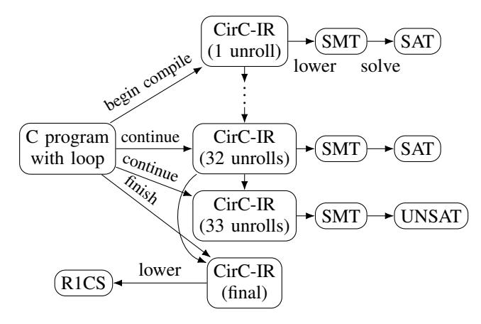

<span id="page-12-6"></span><span id="page-12-5"></span>Figure 18. Workflow for determining loop bounds with SMT while compiling to R1CS. Incrementally compiled circuit fragments are lowered to SMT for analysis. An UNSAT result causes unrolling to end.

u321og2. Initially, the loop is unrolled once into CirC-IR which is is lowered to SMT that is satisfiable, so unrolling continues. After 33 unrollings, the corresponding SMT is now unsatisfiable, so the IR for 32 unrollings is used to finish compiling to CirC-IR. The final IR is lowered to R1CS for use in a proof system, the intended target.

In future work we hope to improve this technique, e.g., by using the SMT solver's incremental mode, and to use the SMT solver for more complex R1CS optimizations.

#### <span id="page-12-2"></span>7.2. Analyzing ZKlog with SMT

Our ZKlog compiler (based on CirC v2.0) does not limit recursion when a rule that is annotated as primitive recursive is applied to decreasing compile-time-constants (§4)—but it can be difficult to tell if a rule is primitive recursive at all. Consider a rule r with arguments  $x_1,\ldots,x_m$  that (without loss of generality) purports to be primitive recursive in  $x_1$ . Now, consider a recursive case c for rule r that binds existential variables  $x_{m+1},\ldots,x_n$  with conditions  $t_1\wedge\cdots\wedge t_\ell$  such that (without loss of generality) condition  $t_1$  is the recursive application of rule r where the first argument depends only on  $x_1$ . Thus, the case c encodes the implication:

$$[\exists x_{m+1},\ldots,x_n.\ r(f(x_1),\ldots)\land t_2\land\cdots\land t_\ell]\to r(x_1,\ldots,x_m)$$

<span id="page-12-7"></span>13. Other languages that consider primitive recursion (e.g., Gallina, the language of Coq [132]) occasionally require the programmer to prove to the compiler that a recursion is primitive.

For this to be a primitive recursion, it suffices to show that the other conditions in c imply f(x1) < x1. That is, that the following is unsatisfiable:

<span id="page-13-1"></span>
$$(f(x_1) \ge x_1) \wedge t_2 \wedge \dots \wedge t_{\ell} \tag{1}$$

Our analysis pass checks this property by lowering it to SMT. The programmer can run the analysis on any rule that they've annotated as primitive recursive. If [\(1\)](#page-13-1) is UNSAT for each recursive case, then the rule may be applied to any compile-time constant without introducing incompleteness.

#### <span id="page-13-0"></span>7.3. Automatically finding and proving bugs

*Bug bounties* are a popular way for software companies to incentivize bug reporting, by offering cash rewards to reporters. But the incentives in these programs are imperfect. As examples, a company might accept a bug report but refuse to pay a bounty; or it might refuse to acknowledge a severe bug, leaving the reporter with an uncomfortable choice between remaining silent and publicly revealing the bug's details, both of which could harm innocent users. One way to address problems like this may be to prove the existence of bugs *in zero knowledge*; in fact, this application is a key element of an ongoing DARPA program [\[133,](#page-16-44) [134\]](#page-16-45).

Prior work [\[135](#page-17-1)[–137\]](#page-17-2) constructs manual proof-of-bug pipelines, but none automatically detects bugs and then automatically proves their existence in zero knowledge: existing compilers to R1CS have no way of automatically detecting bugs, and existing SMT-based verifiers have no way of generating zero-knowledge proofs. In fact, just proving the presence of many types of bugs is beyond the reach of existing proof compilers that, like Pequin [\[108\]](#page-16-23) ([§5.1\)](#page-9-0), model language semantics too imprecisely ([§4.1\)](#page-7-2). Since CirC models language semantics precisely ([§5.3\)](#page-10-1) and can embed those semantics into both SMT and R1CS, CirC seems ideally suited to building a semi-automated proof-of-bug pipeline.

But zero-knowledge proofs-of-bug generally, and automated pipelines in particular, are still unrealistic. The main issue is that proof systems and SMT solvers both fall hopelessly short of practical applicability to production-sized codebases. Naively, this means that proving the existence of a bug in a large system might require first isolating the buggy code and then generating a proof—in the process revealing the bug's location and potentially allowing anyone to rediscover it!

Nevertheless, we see two strong reasons to hope for a path forward, with CirC as a key component. First, recent theoretical advances in efficient proofs of disjunctions [\[138–](#page-17-3) [141\]](#page-17-4) promise proof systems well suited to proving statements like "there is a bug in one of the thousands of functions in this codebase"—and CirC makes it easy to marry such proof systems to SMT-based bug-finding techniques.[14](#page-13-2) Second, prior work shows that tools capable of detecting subtle bugs or verifying complex properties often rely on analysts' expert knowledge [\[88,](#page-16-7) [101\]](#page-16-16)—of a class of bug, of a codebase, or even of the SMT solver itself [\[142\]](#page-17-5). In the case of solver-based bug finding, furnishing expert hints to the solver can dramatically

```
1 #define mul_add_c2(a,b,c0,c1,c2) { \
2 BN_ULONG ta=(a),tb=(b),t0; \
3 BN_UMULT_LOHI(t0,t1,ta,tb); \
4 t2 = t1+t1; c2 += (t2<t1)?1:0; \
5 t1 = t0+t0; t2 += (t1<t0)?1:0; \
6 c0 += t1; t2 += (c0<t1)?1:0; \
7 c1 += t2; c2 += (c1<t2)?1:0; }
```

<span id="page-13-3"></span>Figure 19. Incorrect carry handling in OpenSSL, responsible for CVE-2014- 3570 ([§7.3\)](#page-13-0). Appendix [C](#page-18-1) explains the bug in detail.

```
#include "stdint.h"
int wrapper(uint64_t a, uint64_t b, uint64_t c2,
    uint64_t c1, uint64_t c0) {
  uint64_t cc2 = c2, cc1 = c1, cc0 = c0;
  mul_add_c2(a, b, c2, c1, c0);
  "SMT_assert: (= (concat c2 c1 c0) (+ (concat cc2
,→ cc1 cc0) (* [192]2 (uext 128 a) (uext 128 b))";
  return 0;
}
```

<span id="page-13-4"></span>Figure 20. Function wrapper for mul\_add\_c2 with assertion of correct behavior ([§7.3\)](#page-13-0). CirC's assertion language is more verbose; we simplify for brevity. BN\_ULONG's size depends on the architecture; we use 64 bits.

increase the reach of bug-finding tools. Crucially, a zeroknowledge proof of a bug's existence does not reveal these expert hints; as a result, knowing the approximate location of a bug may not help non-experts rediscover it.

As a proof of concept, we augment CirC's C front-end with support for *assertions* and *assumptions* (≈60 LOC). Codebase owners use *assertions* to specify intended behavior. Consider a small example: the macro mul\_add\_c2 (Fig. [19\)](#page-13-3). It is intended to compute c = c + 2\*a\*b, where c is a multiprecision integer comprising three words, c0, c1, and c2. Figure [20](#page-13-4) shows how a codebase owner would add an assertion of this behavior. Unfortunately, the macro mishandles integer overflow (see App. [C](#page-18-1) for details). Indeed, an analyst who compiles the macro and assertion to SMT can find a violation using the Z3 SMT solver in ≈700 seconds. The analyst can then produce a zero-knowledge proof that the codebase owner can verify in milliseconds (Figure [21\)](#page-14-5). The above pipeline is impractical for larger programs and more complex properties, since the solving step quickly becomes intractable.

*Assumptions* allow the security analyst to use their expertise to make bug-finding tractable: the analyst encodes facts about the program or its potential bugs that reduce the SMT solver's search burden. As an example, consider again mul\_add\_c2 (Fig. [19\)](#page-13-3). Since overflow is a traditional source of bugs, and mul\_add\_c2 does not explicitly handle overflow caused by its increment steps, the analyst may suspect that overflow as a possible bug source. With an (overflow) assumption that t2 == 0 && c0 < t1 after line 6, the SMT solver can find a bug after only 2.5s. This improves on the unassisted search time by more than two orders of magnitude, but expert assumptions can also allow the solver to finish when it was unable to previously (e.g., [\[143,](#page-17-6) §4.2]).

## 7.4. Automatically finding and proving high-value inputs

CirC also supports *proofs of high-value* (which is very similar to proof-of-bug). Let f(x) → y be a function, and y<sup>0</sup> be a threshold output. A proof of high-value shows that one

<span id="page-13-2"></span><sup>14.</sup> Standard ZKPs give disjunction proofs with proving time dependent on the sum of the disjunct sizes. The recent advances yield proving time dependent on the maximum disjunct size.


Figure 21. Workflow for finding and proving bugs (§7.3). Left steps are performed by the codebase owner; right steps by the analyst. (Step 2 samples cryptographic parameters for the zero-knowledge proof system.)

knows an x such that  $\phi(x,y_0):=f(x)\geq y_0$ , without revealing x. Proofs of high-value might be applied to *optimization competitions*. In an optimization competition (e.g., a Kaggle competition [144] or the ARPA-E Grid Optimization Competition [145]), competitors submit parameters which maximize an objective function, and high-performing competitors receive a reward. This setup has a similar drawback to bug bounty programs (§8): if competitors submit their parameters in the clear, then the competition operator could choose not to compensate them—but zero-knowledge proofs of high-value avoid this counterparty risk.

With CirC it's easy to compile an objective function and constraints to an optimization format (e.g., an ILP) for finding high-value solutions. Then, it's easy to compile the same objective function to a proof-system constraint format (like R1CS) for writing zero-knowledge proofs. (Just as in the previous section, making this pipeline realistic requires using human insight to assist the ILP solver.) As a proof of concept, we build an automated pipeline for proofs of high-value (similar to Figure 21, but with an ILP solver in place of an SMT solver). The pipeline ( $\approx$ 30 LOC) takes a function f and (a) compiles the predicate  $\phi(x,y) := f(x) \geq y$  to R1CS, (b) compiles f to an ILP, (c) solves the ILP to find an  $x^*$  such that  $f(x^*) = y^*$ , and finally, (d) writes a zero-knowledge proof of knowledge of an  $x^*$  that satisfies  $\phi(x^*, y^*)$ .

#### <span id="page-14-3"></span>8. Discussion, future work, and conclusion

Targeting other applications. CirC has applications beyond SMT, ILP, and proof systems. As one example, CirC could support *multi-party computation* (MPC), which enables mutually distrusting parties to collaboratively evaluate a function while revealing only the result [19]. MPC frameworks require the function to be expressed as a boolean [146] or arithmetic circuit [147–149], where each input is labeled with the parties that know its value. Thus, extending CirC to MPC applications would require adding support for these fine-grained knowledge labels. Even after this modification, however, lowering CirC-IR to MPC targets requires care when handling existential quantifiers. We conjecture that in many (and perhaps all) cases, these quantifiers can be transformed either into private

inputs supplied by one party, or into values computed from the private inputs of multiple parties. A related transformation is implicit in the seminal work of Ishai et al. on constructing zero-knowledge proofs via MPC protocols [150].

**Program analysis infrastructure.** CirC supports IR-level optimizations, but sophisticated static analysis infrastructure—at both the language and IR level—would improve most compilation pipelines. For example, CirC could use a range analysis to shrink IR-level bit-vectors, which would make their R1CS embedding more efficient. As another example, designers could build analyses into their language front-end, e.g., to select the cryptographic protocol that gives the best efficiency on a particular program [48, 61, 62, 151]. Designing new analyses of this kind is future work.

<span id="page-14-5"></span>Beyond static analyses, there is potential to leverage more powerful SMT-based analyses in CirC. Section 7 shows that CirC's SMT target can be used to search for loop bounds. One could also imagine searching for loop invariants, tighter range bounds, aliasing relationships, and more. The program verification literature is full of SMT-based analyses which may be useful for optimizing the size of emitted circuits.

Combining CirC with existing verifiers. It may be interesting to combine CirC with modern verification machinery. For example, CirC could benefit from SMACK's [25] frontend–based optimizations, while Boogie front-ends [22] could benefit from targeting cryptographic applications.

**Conclusion.** In this work, we show how CirC makes it easy to compile new source languages, support new EQC targets, and write optimizations that apply to multiple pipelines: all of these can be done with very little code, and all yield high-quality compiler output. Moreover, with CirC it's easy to combine different EQC compilation pipelines to support novel applications., e.g., automatically finding bugs and proving their existence. In short: shared infrastructure for constraint compilers *is* both possible and useful.

#### Acknowledgments

We are grateful to Sebastian Angel, Clark Barrett, Andrew Blumberg, Dan Boneh, Patrick Cousot, Dawson Engler, Ranjit Jhala, Soren Lerner, Andres Nötzli, Deian Stefan, Michael Walfish, and Thomas Wies for helpful conversations. We thank the anonymous reviewers and our shepherd, Trevor Perrin, for making our work stronger with their careful feedback. This work was supported in part by the NSF, the Stanford Center for Blockchain Research, and the Simons Foundation. It was also supported by DARPA under Agreement HR00112020022. The views in this paper are the authors' and do not necessarily represent the views of the United States Government or DARPA. Riad's work was partly supported by Algorand.

#### References

- <span id="page-14-0"></span> E. Ben-Sasson, A. Chiesa, C. Garman, M. Green, I. Miers,
   E. Tromer, and M. Virza, "Zerocash: Decentralized anonymous payments from Bitcoin," in *IEEE S&P*, May 2014.
- <span id="page-14-1"></span>[2] D. Hopwood, S. Bowe, T. Hornby, and N. Wilcox, "Zcash protocol specification." https://zips.z.cash/protocol/protocol.pdf, 2016.
- <span id="page-14-2"></span>[3] B. Whitehat, "roll\_up: Scale ethereum with SNARKs." https://github.com/barryWhiteHat/roll\_up.
- <span id="page-14-4"></span>[4] S. Bowe, A. Chiesa, M. Green, I. Miers, P. Mishra, and H. Wu, "ZEXE: Enabling decentralized private computation," in *IEEE S&P*, May 2020.

- [5] J. Lee, K. Nikitin, and S. Setty, "Replicated state machines without replicated execution," in *IEEE S&P*, May 2020.
- <span id="page-15-0"></span>[6] A. Ozdemir, R. S. Wahby, B. Whitehat, and D. Boneh, "Scaling verifiable computation using efficient set accumulators," in *USENIX Security*, Aug. 2020.
- <span id="page-15-1"></span>[7] B. Braun, A. J. Feldman, Z. Ren, S. Setty, A. J. Blumberg, and M. Walfish, "Verifying computations with state," in *SOSP*, Nov. 2013. Extended version: [http://eprint.iacr.org/2013/356.](http://eprint.iacr.org/2013/356)
- <span id="page-15-24"></span>[8] B. Parno, J. Howell, C. Gentry, and M. Raykova, "Pinocchio: Nearly practical verifiable computation," in *IEEE S&P*, May 2013.
- <span id="page-15-39"></span>[9] C. Costello, C. Fournet, J. Howell, M. Kohlweiss, B. Kreuter, M. Naehrig, B. Parno, and S. Zahur, "Geppetto: Versatile verifiable computation," in *IEEE S&P*, May 2015.
- <span id="page-15-19"></span>[10] A. E. Kosba, C. Papamanthou, and E. Shi, "xJsnark: A framework for efficient verifiable computation," in *IEEE S&P*, May 2018.
- <span id="page-15-2"></span>[11] R. S. Wahby, S. Setty, Z. Ren, A. J. Blumberg, and M. Walfish, "Efficient RAM and control flow in verifiable outsourced computation," in *NDSS*, Feb. 2015.
- <span id="page-15-3"></span>[12] J. Eberhardt and S. Tai, "ZoKrates—scalable privacy-preserving off-chain computations," in *IEEE Blockchain*, July 2018.
- <span id="page-15-41"></span>[13] "ZoKrates." [https://zokrates.github.io/.](https://zokrates.github.io/)
- <span id="page-15-40"></span>[14] "Zinc." [https://zinc.matterlabs.dev/.](https://zinc.matterlabs.dev/)
- <span id="page-15-42"></span>[15] J. Baylina, "Circom." [https://github.com/iden3/circom.](https://github.com/iden3/circom)
- [16] "Noir." [https://noir-lang.github.io/book/index.html.](https://noir-lang.github.io/book/index.html)
- [17] "Leo." [https://developer.aleo.org/aleo/getting](https://developer.aleo.org/aleo/getting_started/overview/) started/overview/.
- <span id="page-15-4"></span>[18] C. Chin, H. Wu, R. Chu, A. Coglio, E. McCarthy, and E. Smith, "Leo: A programming language for formally verified, zero-knowledge applications," 2021. [https://ia.cr/2021/651.](https://ia.cr/2021/651)
- <span id="page-15-5"></span>[19] Y. Lindell, "Secure multiparty computation (MPC)." [https://eprint.iacr.org/2020/300.](https://eprint.iacr.org/2020/300) To appear in *CACM*.
- <span id="page-15-6"></span>[20] V. Vaikuntanathan, "Computing blindfolded: New developments in fully homomorphic encryption," in *FOCS*, Oct. 2011.
- <span id="page-15-7"></span>[21] C. Barrett, A. Stump, and C. Tinelli, "The SMT-LIB standard: Version 2.0," in *SMT*, 2010.
- <span id="page-15-8"></span>[22] M. Barnett, B.-Y. E. Chang, R. DeLine, B. Jacobs, and K. R. M. Leino, "Boogie: A modular reusable verifier for object-oriented programs," in *FMCO*, 2005.
- <span id="page-15-52"></span>[23] K. R. M. Leino, "Dafny: An automatic program verifier for functional correctness," in *LPAR*, 2010.
- [24] N. Bjørner and L. de Moura, "Applications of SMT solvers to program verification," in *Notes for the Summer School on Formal Techniques*, 2014.
- <span id="page-15-53"></span>[25] Z. Rakamaric and M. Emmi, "Smack: Decoupling source language ´ details from verifier implementations," in *CAV*, 2014.
- <span id="page-15-14"></span>[26] E. Torlak and R. Bodik, "A lightweight symbolic virtual machine for solver-aided host languages," in *PLDI*, 2014.
- <span id="page-15-9"></span>[27] E. Clarke, D. Kroening, and F. Lerda, "A tool for checking ANSI-C programs," in *TACAS*, 2004.
- <span id="page-15-10"></span>[28] A. Solar-Lezama, L. Tancau, R. Bodik, S. Seshia, and V. Saraswat, "Combinatorial sketching for finite programs," in *ASPLOS*, 2006.
- [29] E. Kneuss, I. Kuraj, V. Kuncak, and P. Suter, "Synthesis modulo recursive functions," in *OOPSLA*, 2013.
- <span id="page-15-11"></span>[30] S. Srivastava, S. Gulwani, and J. S. Foster, "From program verification to program synthesis," in *POPL*, 2010.
- <span id="page-15-12"></span>[31] R. Fourer, D. M. Gay, and B. W. Kernighan, *AMPL: A Modeling Language for Mathematical Programming*. Boston, MA, USA:
- <span id="page-15-13"></span>Cengage Learning, 2nd ed., 2002. [32] W. E. Hart, C. D. Laird, J.-P. Watson, D. L. Woodruff, G. A. Hackebeil, B. L. Nicholson, and J. D. Siirola, *Pyomo-optimization modeling in Python*, vol. 67. Springer, 2017.
- <span id="page-15-15"></span>[33] D. Malkhi, N. Nisan, B. Pinkas, and Y. Sella, "Fairplay–A secure two-party computation system," in *USENIX Security*, Aug. 2004.
- <span id="page-15-16"></span>[34] S. T. V. Setty, V. Vu, N. Panpalia, B. Braun, A. J. Blumberg, and M. Walfish, "Taking proof-based verified computation a few steps closer to practicality," in *USENIX Security*, Aug. 2012. Extended version: [https://ia.cr/2012/598.](https://ia.cr/2012/598)
- <span id="page-15-17"></span>[35] A. Gurfinkel and J. A. Navas, "A context-sensitive memory model for verification of C/C++ programs," in *SAS*, 2017.
- [36] C. Sinz, S. Falke, and F. Merz, "A precise memory model for low-level bounded model checking," in *SSV*, 2010.
- <span id="page-15-37"></span>[37] C. Cadar, D. Dunbar, and D. R. Engler, "KLEE: Unassisted and automatic generation of high-coverage tests for complex systems programs," in *OSDI*, 2008.
- [38] K. R. M. Leino, "This is Boogie 2." [https://www.microsoft.com/](https://www.microsoft.com/en-us/research/wp-content/uploads/2016/12/krml178.pdf) [en-us/research/wp-content/uploads/2016/12/krml178.pdf,](https://www.microsoft.com/en-us/research/wp-content/uploads/2016/12/krml178.pdf) 2008.

- [39] E. Cohen, M. Moskal, S. Tobies, and W. Schulte, "A precise yet efficient memory model for C," in *SSV*, Oct. 2009.
- <span id="page-15-18"></span>[40] I. Yun, S. Lee, M. Xu, Y. Jang, and T. Kim, "QSYM: A practical concolic execution engine tailored for hybrid fuzzing," in *USENIX Security*, 2018.
- <span id="page-15-20"></span>[41] E. Ben-Sasson, A. Chiesa, D. Genkin, E. Tromer, and M. Virza, "SNARKs for C: Verifying program executions succinctly and in zero knowledge," in *CRYPTO*, Aug. 2013.
- <span id="page-15-21"></span>[42] E. Ben-Sasson, A. Chiesa, E. Tromer, and M. Virza, "Succinct non-interactive zero knowledge for a von Neumann architecture," in *USENIX Security*, Aug. 2014.
- <span id="page-15-22"></span>[43] C. Lattner and V. Adve, "LLVM: A compilation framework for lifelong program analysis and transformation," in *CGO*, 2004.
- <span id="page-15-23"></span>[44] S. Arora and B. Barak, *Computational Complexity: A Modern Approach*. Cambridge, UK: Cambridge University Press, 2009.
- <span id="page-15-25"></span>[45] Y. Zhang, D. Genkin, J. Katz, D. Papadopoulos, and C. Papamanthou, "vSQL: Verifying arbitrary SQL queries over dynamic outsourced databases," in *IEEE S&P*, 2017.
- <span id="page-15-26"></span>[46] G. Danezis, C. Fournet, M. Kohlweiss, and B. Parno, "Pinocchio coin: Building Zerocoin from a succinct pairing-based proof system," in *PETShop*, 2013.
- <span id="page-15-27"></span>[47] R. S. Wahby, M. Howald, S. Garg, a. shelat, and M. Walfish, "Verifiable ASICs," in *IEEE S&P*, 2016.
- <span id="page-15-28"></span>[48] R. S. Wahby, Y. Ji, A. J. Blumberg, a. shelat, J. Thaler, M. Walfish, and T. Wies, "Full accounting for verifiable outsourcing," in *CCS*, 2017.
- <span id="page-15-29"></span>[49] M. Walfish and A. J. Blumberg, "Verifying computations without reexecuting them: from theoretical possibility to near practicality," *CACM*, vol. 58, pp. 74–84, Feb. 2015.
- <span id="page-15-30"></span>[50] J. Thaler, "Proofs, arguments, and zero-knowledge." [http://people.cs.georgetown.edu/jthaler/ProofsArgsAndZK.pdf.](http://people.cs.georgetown.edu/jthaler/ProofsArgsAndZK.pdf)
- <span id="page-15-31"></span>[51] E. Ben-Sasson, A. Chiesa, E. Tromer, and M. Virza, "Scalable zero knowledge via cycles of elliptic curves," in *CRYPTO*, Aug. 2014.
- <span id="page-15-32"></span>[52] M. Fredrikson and B. Livshits, "Zø: An optimizing distributing zero-knowledge compiler," in *USENIX Security*, Aug. 2014.
- <span id="page-15-33"></span>[53] Y. Xie and A. Aiken, "Saturn: A scalable framework for error detection using boolean satisfiability," in *TOPLAS*, 2007.
- <span id="page-15-34"></span>[54] M. W. Hall, J. M. Anderson, S. P. Amarasinghe, B. R. Murphy, S.-W. Liao, E. Bugnion, and M. S. Lam, "Maximizing multiprocessor performance with the SUIF compiler," *IEEE Computer*, 1996.
- <span id="page-15-35"></span>[55] C. Lattner, J. A. Pienaar, M. Amini, U. Bondhugula, R. Riddle, A. Cohen, T. Shpeisman, A. Davis, N. Vasilache, and O. Zinenko, "MLIR: A compiler infrastructure for the end of Moore's law." https://arxiv.org/abs/2002.11054.
- <span id="page-15-36"></span>[56] L. Daoud, D. Zydek, and H. Selvaraj, "A survey of high level synthesis languages, tools, and compilers for reconfigurable high performance computing," in *ICSS*, Apr. 2013.
- <span id="page-15-38"></span>[57] S. Setty, B. Braun, V. Vu, A. J. Blumberg, B. Parno, and M. Walfish, "Resolving the conflict between generality and plausibility in verified computation," in *EuroSys*, Apr. 2013.
- <span id="page-15-43"></span>[58] "libsnark." [https://github.com/scipr-lab/libsnark.](https://github.com/scipr-lab/libsnark)
- <span id="page-15-44"></span>[59] "bellman." [https://github.com/zkcrypto/bellman.](https://github.com/zkcrypto/bellman)
- <span id="page-15-45"></span>[60] A. Ben-David, N. Nisan, and B. Pinkas, "FairplayMP: a system for secure multi-party computation," in *CCS*, Oct. 2008.
- <span id="page-15-46"></span>[61] W. Henecka, S. Kogl, A.-R. Sadeghi, T. Schneider, and ¨ I. Wehrenberg, "TASTY: tool for automating secure two-party computations," in *CCS*, Oct. 2010.
- <span id="page-15-47"></span>[62] N. Buscher, D. Demmler, S. Katzenbeisser, D. Kretzmer, and ¨ T. Schneider, "HyCC: Compilation of hybrid protocols for practical secure computation," in *CCS*, Oct. 2018.
- <span id="page-15-48"></span>[63] C. Acay, R. Recto, J. Gancher, A. C. Myers, and E. Shi, "Viaduct: An extensible, optimizing compiler for secure distributed programs," in *PLDI*, 2021.
- <span id="page-15-49"></span>[64] A. Holzer, M. Franz, S. Katzenbeisser, and H. Veith, "Secure two-party computations in ANSI C," in *CCS*, Oct. 2012.
- <span id="page-15-50"></span>[65] L. Cordeiro, B. Fischer, and J. Marques-Silva, "SMT-based bounded model checking for embedded ANSI-C software," in *ASE*, 2009.
- <span id="page-15-51"></span>[66] D. Kroening and M. Tautschnig, "CBMC–C bounded model checker," in *TACAS*, 2014.
- [67] P. Cuoq, F. Kirchner, N. Kosmatov, V. Prevosto, J. Signoles, and B. Yakobowski, "Frama-C," in *SEFM*, 2012.
- [68] F. Kirchner, N. Kosmatov, V. Prevosto, J. Signoles, and B. Yakobowski, "Frama-C: A software analysis perspective," in *FAC*, 2015.
- [69] T. Ball, V. Levin, and S. K. Rajamani, "A decade of software model

- checking with SLAM," *CACM*, vol. 54, pp. 68–76, July 2011.
- [70] T. Ball, E. Bounimova, V. Levin, R. Kumar, and J. Lichtenberg, "The Static Driver Verifier research platform," in *CAV*, 2010.
- [71] K. R. M. Leino, P. Muller, and J. Smans, "Verification of concurrent ¨ programs with Chalice," in *FOSAD*, 2009.
- [72] B. Jacobs, J. Smans, P. Philippaerts, F. Vogels, W. Penninckx, and F. Piessens, "VeriFast: A powerful, sound, predictable, fast verifier for C and Java," in *NASA Formal Methods Symposium*, 2011.
- [73] N. Vazou, *Liquid Haskell: Haskell as a theorem prover*. PhD thesis, UC San Diego, 2016.
- [74] N. Vazou, E. L. Seidel, R. Jhala, D. Vytiniotis, and S. Peyton-Jones, "Refinement types for haskell," in *ICFP*, 2014.
- [75] N. Swamy, C. Hrit¸cu, C. Keller, A. Rastogi, A. Delignat-Lavaud, S. Forest, K. Bhargavan, C. Fournet, P.-Y. Strub, M. Kohlweiss, J.-K. Zinzindohoue, and S. Zanella-Beguelin, "Dependent types and ´ multi-monadic effects in F?," in *POPL*, 2016.
- <span id="page-16-0"></span>[76] L. Cordeiro, P. Kesseli, D. Kroening, P. Schrammel, and M. Trtik, "JBMC: A bounded model checking tool for verifying Java bytecode," in *CAV*, 2018.
- <span id="page-16-1"></span>[77] N. P. Lopes, D. Menendez, S. Nagarakatte, and J. Regehr, "Provably correct peephole optimizations with Alive," in *PLDI*, 2015.
- [78] D. Menendez, S. Nagarakatte, and A. Gupta, "Alive-FP: Automated verification of floating point based peephole optimizations in LLVM," in *SAS*, 2016.
- [79] A. Notzli and F. Brown, "Lifejacket: Verifying precise floating-point ¨ optimizations in LLVM," in *SOAP*, 2016.
- <span id="page-16-2"></span>[80] K. v. Gleissenthall, R. G. Kıcı, A. Bakst, D. Stefan, and R. Jhala, "Pretend synchrony: synchronous verification of asynchronous distributed programs," in *POPL*, 2019.
- <span id="page-16-3"></span>[81] R. Uhler and N. Dave, "Smten with satisfiability-based search," in *OOPSLA*, 2014.
- [82] A. Koksal, V. Kuncak, and P. Suter, "Constraints as control," in ¨ *POPL*, 2012.
- [83] L. Moura, "Z3Py guide: Z3 API in Python." [https://ericpony.github.io/z3py-tutorial/guide-examples.htm.](https://ericpony.github.io/z3py-tutorial/guide-examples.htm)
- <span id="page-16-4"></span>[84] L. Erkok, "SBV: SMT based verification in Haskell." ¨ [https://hackage.haskell.org/package/sbv.](https://hackage.haskell.org/package/sbv)
- <span id="page-16-5"></span>[85] E. Torlak and R. Bodik, "Growing solver-aided languages with Rosette," in *Onward!*, 2013.
- <span id="page-16-9"></span>[86] J.-C. Filliatre and A. Paskevich, "Why3—where programs meet ˆ provers," in *ESOP*, 2013.
- <span id="page-16-6"></span>[87] P. Muller, M. Schwerhoff, and A. J. Summers, "Viper: A verification ¨ infrastructure for permission-based reasoning," in *VMCAI*, 2016.
- <span id="page-16-7"></span>[88] L. Nelson, J. Bornholt, R. Gu, A. Baumann, E. Torlak, and X. Wang, "Scaling symbolic evaluation for automated verification of systems code with Serval," in *SOSP*, 2019.
- [89] Z. Nehai and F. Bobot, "Deductive proof of Ethereum smart contracts using Why3." arXiv:1904.11281, 2019.
- [90] M. Baranowski, S. He, and Z. Rakamaric, "Verifying Rust programs ´ with SMACK," in *ATVA*, 2018.
- <span id="page-16-8"></span>[91] A. Hajdu and D. Jovanovi ´ c, "solc-verify: A modular verifier for ´ Solidity smart contracts," in *VSTTE*, 2019.
- <span id="page-16-10"></span>[92] N. Swamy, J. Weinberger, C. Schlesinger, J. Chen, and B. Livshits, "Verifying higher-order programs with the Dijkstra monad," in *PLDI*, 2013.
- <span id="page-16-11"></span>[93] R. Baldoni, E. Coppa, D. C. D'elia, C. Demetrescu, and I. Finocchi, "A survey of symbolic execution techniques," *ACM Computing Surveys*, vol. 51, no. 3, pp. 1–39, 2018.
- <span id="page-16-12"></span>[94] C. Cadar and K. Sen, "Symbolic execution for software testing: Three decades later," *CACM*, vol. 56, no. 2, pp. 82–90, 2013.
- <span id="page-16-13"></span>[95] D. A. Ramos and D. Engler, "Under-constrained symbolic execution: Correctness checking for real code," in *USENIX Security*, 2015.
- [96] P. Godefroid, M. Y. Levin, and D. Molnar, "SAGE: Whitebox fuzzing for security testing," *CACM*, vol. 55, no. 3, pp. 40–44, 2012.
- [97] P. Godefroid, N. Klarlund, and K. Sen, "DART: Directed automated random testing," in *PLDI*, 2005.
- <span id="page-16-15"></span>[98] K. Sen, D. Marinov, and G. Agha, "CUTE: A concolic unit testing engine for C," in *ESEC-FSE*, 2005.
- [99] V. Chipounov, V. Kuznetsov, and G. Candea, "S2E: A platform for in-vivo multi-path analysis of software systems," in *ASPLOS*, 2011.
- <span id="page-16-17"></span>[100] N. Stephens, J. Grosen, C. Salls, A. Dutcher, R. Wang, J. Corbetta, Y. Shoshitaishvili, C. Kruegel, and G. Vigna, "Driller: Augmenting fuzzing through selective symbolic execution," in *NDSS*, 2016.
- <span id="page-16-16"></span>[101] F. Brown, D. Stefan, and D. Engler, "Sys: A static/symbolic tool for finding good bugs in good (browser) code," in *USENIX Security*,

- 2020.
- <span id="page-16-14"></span>[102] S. Poeplau and A. Francillon, "Symbolic execution with SymCC: Don't interpret, compile!," in *USENIX Security*, 2020.
- <span id="page-16-18"></span>[103] "Gurobi." [https://www.gurobi.com/.](https://www.gurobi.com/)
- <span id="page-16-19"></span>[104] J. Forrest and R. Lougee-Heimer, "CBC user guide," in *Emerging theory, methods, and applications*, pp. 257–277, 2005.
- <span id="page-16-20"></span>[105] A. V. Aho, R. Sethi, and J. D. Ullman, *Compilers, principles, techniques*. Addison Wesley, 1986.
- <span id="page-16-21"></span>[106] M. Blum, W. S. Evans, P. Gemmell, S. Kannan, and M. Naor, "Checking the correctness of memories," in *FOCS*, 1991.
- <span id="page-16-22"></span>[107] E. Mullen, D. Zuniga, Z. Tatlock, and D. Grossman, "Verified peephole optimizations for CompCert," in *PLDI*, 2016.
- <span id="page-16-23"></span>[108] "Pequin: A system for verifying outsourced computations and applying SNARKs." [https://github.com/pepper-project/pequin.](https://github.com/pepper-project/pequin)
- <span id="page-16-24"></span>[109] Y. Zhang, A. Steele, and M. Blanton, "PICCO: A general-purpose compiler for private distributed computation," in *CCS*, Nov. 2013.
- <span id="page-16-25"></span>[110] I. Abal, "Haskell Z3 bindings." [https://github.com/PLSysSec/haskell-z3.](https://github.com/PLSysSec/haskell-z3)
- <span id="page-16-26"></span>[111] J. Bootle, A. Cerulli, J. Groth, S. Jakobsen, and M. Maller, "Arya: Nearly linear-time zero-knowledge proofs for correct program execution," in *ASIACRYPT*, 2018.
- <span id="page-16-27"></span>[112] B. Braun, "Compiling computations to constraints for verified computation." UT Austin Honors Thesis HR-12-10, Dec. 2012.
- <span id="page-16-28"></span>[113] R. Brinkmann and R. Drechsler, "RTL-datapath verification using integer linear programming," in *ASP-DAC/VLSI*, 2002.
- <span id="page-16-29"></span>[114] Z. Zeng, P. Kalla, and M. Ciesielski, "LPSAT: A unified approach to RTL satisfiability," in *DATE*, 2001.
- <span id="page-16-30"></span>[115] D. Beyer, "Automatic verification of C and Java programs: SV-COMP 2019," in *TACAS*, 2019.
- <span id="page-16-31"></span>[116] "Zcash Sapling circuit library." [https://github.com/zcash-hackworks/sapling-crypto,](https://github.com/zcash-hackworks/sapling-crypto) 2018.
- <span id="page-16-32"></span>[117] "pedersen hash.rs." [https://github.com/zcash-hackworks/](https://github.com/zcash-hackworks/sapling-crypto/blob/49017b4e055ba4322dad1f03fe7d80dc0ed449cc/src/circuit/pedersen_hash.rs) [sapling-crypto/blob/49017b4e055ba4322dad1f03fe7d80dc0ed449cc/](https://github.com/zcash-hackworks/sapling-crypto/blob/49017b4e055ba4322dad1f03fe7d80dc0ed449cc/src/circuit/pedersen_hash.rs) [src/circuit/pedersen](https://github.com/zcash-hackworks/sapling-crypto/blob/49017b4e055ba4322dad1f03fe7d80dc0ed449cc/src/circuit/pedersen_hash.rs) hash.rs, 2018.
- <span id="page-16-33"></span>[118] M. Chang, "Performance issue on QF NIRA formula. CVC4 Issue 5354." [https://github.com/CVC4/CVC4/issues/5354.](https://github.com/CVC4/CVC4/issues/5354)
- <span id="page-16-34"></span>[119] N. Becker, P. Muller, and A. J. Summers, "The Axiom Profiler: ¨ Understanding and debugging SMT quantifier instantiations," in *TACAS*, 2019.
- <span id="page-16-35"></span>[120] F. Baader and T. Nipkow, *Term rewriting and all that*. Cambridge, UK: Cambridge University Press, 1999.
- <span id="page-16-36"></span>[121] C. Barrett, C. L. Conway, M. Deters, L. Hadarean, D. Jovanovic,´ T. King, A. Reynolds, and C. Tinelli, "CVC4," in *CAV*, 2011.
- [122] A. Niemetz and M. Preiner, "Bitwuzla at the SMT-COMP 2020." arXiv:2006.01621, 2020.
- [123] A. Niemetz, M. Preiner, C. Wolf, and A. Biere, "Btor2 , BtorMC and Boolector 3.0," in *CAV*, 2018.
- [124] L. De Moura and N. Bjørner, "Z3: An efficient SMT solver," in *TACAS*, 2008.
- [125] B. Dutertre, "Yices 2.2," in *CAV*, 2014.
- <span id="page-16-37"></span>[126] R. Bruttomesso, A. Cimatti, A. Franzen, A. Griggio, and ´ R. Sebastiani, "The MathSAT 4 SMT solver," in *CAV*, 2008.
- <span id="page-16-38"></span>[127] W. Wang, C. Barrett, and T. Wies, "Partitioned memory models for program analysis," in *VMCAI*, 2017.
- <span id="page-16-39"></span>[128] R. M. Burstall, "Some techniques for proving correctness of programs which alter data structures," *Machine intelligence*, vol. 7, no. 23-50, p. 3, 1972.
- <span id="page-16-40"></span>[129] R. Sasnauskas, Y. Chen, P. Collingbourne, J. Ketema, G. Lup, J. Taneja, and J. Regehr, "Souper: A synthesizing superoptimizer." arXiv:1711.04422, 2017.
- <span id="page-16-41"></span>[130] E. Albert, P. Gordillo, A. Rubio, and M. A. Schett, "Synthesis of super-optimized smart contracts using Max-SMT," in *CAV*, 2020.
- <span id="page-16-42"></span>[131] Z. Jia, O. Padon, J. Thomas, T. Warszawski, M. Zaharia, and A. Aiken, "TASO: optimizing deep learning computation with automatic generation of graph substitutions," in *SOSP*, 2019.
- <span id="page-16-43"></span>[132] Y. Bertot and P. Casteran, ´ *Interactive theorem proving and program development: Coq'Art: the calculus of inductive constructions*. Springer Science & Business Media, 2013.
- <span id="page-16-44"></span>[133] J. Baron, "Securing information for encrypted verification and evaluation." [https://web.archive.org/web/20200221151433/https:](https://web.archive.org/web/20200221151433/https://www.darpa.mil/attachments/SIEVEProposersDaySlidesv4.pdf) [//www.darpa.mil/attachments/SIEVEProposersDaySlidesv4.pdf,](https://web.archive.org/web/20200221151433/https://www.darpa.mil/attachments/SIEVEProposersDaySlidesv4.pdf) 2019. DARPA SIEVE Program Proposers Day Slides.
- <span id="page-16-45"></span>[134] "Researchers demonstrate potential for zero-knowledge proofs in vulnerability disclosure." [https://www.darpa.mil/news-events/2021-04-22,](https://www.darpa.mil/news-events/2021-04-22) 2021. DARPA Press

- Release.
- <span id="page-17-1"></span>[135] F. Tramer, F. Zhang, H. Lin, J.-P. Hubaux, A. Juels, and E. Shi, ` "Sealed-glass proofs: Using transparent enclaves to prove and sell knowledge," in *IEEE S&P*, 2017.
- [136] L. Breidenbach, P. Daian, F. Tramer, and A. Juels, "The Hydra ` framework for principled, automated bug bounties," *IEEE Security & Privacy Magazine*, vol. 17, pp. 53–61, July 2019.
- <span id="page-17-2"></span>[137] L. Breidenbach, P. Daian, F. Tramer, and A. Juels, "Enter the Hydra: ` Towards principled bug bounties and exploit-resistant smart contracts," in *USENIX Security*, 2018.
- <span id="page-17-3"></span>[138] D. Heath and V. Kolesnikov, "Stacked garbling with O(b log b) computation," in *EUROCRYPT*, 2021.
- [139] D. Heath and V. Kolesnikov, "Stacked garbling for disjunctive zero-knowledge proofs.," *EUROCRYPT*, 2020.
- [140] C. Baum, A. J. Malozemoff, M. B. Rosen, and P. Scholl, "Mac'n'cheese: Zero-knowledge proofs for boolean and arithmetic circuits with nested disjunctions," in *CRYPTO*, 2021.
- <span id="page-17-4"></span>[141] D. Heath, Y. Yang, D. Devecsery, and V. Kolesnikov, "Zero knowledge for everything and everyone: Fast ZK processor with cached ORAM for ANSI C programs," in *IEEE S&P*, 2021.
- <span id="page-17-5"></span>[142] K. R. M. Leino and C. Pit-Claudel, "Trigger selection strategies to stabilize program verifiers," in *CAV*, Springer, 2016.
- <span id="page-17-6"></span>[143] M. Andrysco, A. Notzli, F. Brown, R. Jhala, and D. Stefan, "Towards ¨ verified, constant-time floating point operations," in *CCS*, 2018.
- <span id="page-17-7"></span>[144] Kaggle, "Compeitions." [https://www.kaggle.com/docs/competitions.](https://www.kaggle.com/docs/competitions)
- <span id="page-17-8"></span>[145] ARPA-E, "Grid optimization competition." [https://gocompetition.energy.gov/.](https://gocompetition.energy.gov/)
- <span id="page-17-9"></span>[146] A. C. Yao, "Protocols for secure computations," in *FOCS*, 1982.
- <span id="page-17-10"></span>[147] O. Goldreich, S. Micali, and A. Wigderson, "How to play any mental game or A completeness theorem for protocols with honest majority," in *STOC*, 1987.
- [148] M. Ben-Or, S. Goldwasser, and A. Wigderson, "Completeness theorems for non-cryptographic fault-tolerant distributed computation (extended abstract)," in *STOC*, 1988.
- <span id="page-17-11"></span>[149] D. Beaver, "Efficient multiparty protocols using circuit randomization," in *CRYPTO*, 1991.
- <span id="page-17-12"></span>[150] Y. Ishai, E. Kushilevitz, R. Ostrovsky, and A. Sahai, "Zero-knowledge from secure multiparty computation," in *STOC*, 2007.
- <span id="page-17-13"></span>[151] V. Vu, S. Setty, A. J. Blumberg, and M. Walfish, "A hybrid architecture for interactive verifiable computation," in *IEEE S&P*, 2013.
- <span id="page-17-15"></span>[152] J.-C. Filliatre and S. Conchon, "Type-safe modular hash-consing," in ˆ *ML*, 2006.
- <span id="page-17-16"></span>[153] A. P. Ershov, "On programming of arithmetic operations," *CACM*, vol. 1, no. 8, pp. 3–6, 1958.

# <span id="page-17-0"></span>Appendix A. Full Benchmarks

In this section, we compare CirC v1.0 against the ZoKrates, Circom, and Pequin compilers on a full set of benchmarks. We use the same testbed described in Section [5.1.](#page-9-0)

ZoKrates-to-R1CS. We benchmark every circuit in the ZoKrates standard library (v0.6.1), reporting compile time and constraint count for CirC and the ZoKrates reference compiler (v0.6.1). Figure [22](#page-17-14) shows the results. Generally, CirC produces slightly fewer constraints. For the elliptic curve module (ecc), CirC produces many fewer constraints, but it produces slightly more for bit-intensive hashing (sha256). In almost all cases, the ZoKrates compiler is faster; this is probably because of the term representation in CirC's v1.0 implementation. Terms are recursive Haskell GADTs, and maps from them are either (a) hash maps on a hash that traverses the full term or (b) tree maps on the term's full string representation. CirC v2.0 represents terms with hash-consing [\[152,](#page-17-15) [153\]](#page-17-16); this yields better performance.

Circom-to-R1CS. We evaluate on every test circuit in the test suite of the Circom standard library (v0.20). We omit circuits

| File                         | CirC        |          | ZoKrates    |          |
|------------------------------|-------------|----------|-------------|----------|
|                              | Constraints | Time (s) | Constraints | Time (s) |
| ecc/babyjubjubParams         | 10          | 0.08     | 10          | 0.01     |
| ecc/edwardsAdd               | 11          | 0.07     | 19          | 0.01     |
| ecc/edwardsCompress          | 763         | 3.66     | 766         | 0.13     |
| ecc/edwardsNegate            | 2           | 0.06     | 2           | 0.02     |
| ecc/edwardsOnCurve           | 6           | 0.12     | 9           | 0.01     |
| ecc/edwardsOrderCheck        | 40          | 0.09     | 60          | 0.03     |
| ecc/edwardsScalarMult        | 6394        | 6.04     | 9994        | 0.46     |
| ecc/proofOfOwnership         | 6350        | 7.92     | 9989        | 0.85     |
| mimc7/mimc7R10               | 40          | 0.48     | 42          | 0.02     |
| mimc7/mimc7R20               | 80          | 0.84     | 82          | 0.03     |
| mimc7/mimc7R50               | 200         | 1.31     | 202         | 0.19     |
| mimc7/mimc7R90               | 360         | 1.96     | 362         | 0.88     |
| mimcSponge/mimcFeistel       | 661         | 7.29     | 662         | 11.10    |
| mimcSponge/mimcSponge        | 2632        | 46.46    | 2643        | 89.39    |
| pedersen/512bit              | 3062        | 9.38     | 3940        | 1.90     |
| sha256/1024bitPadded         | 84237       | 193.11   | 79575       | 18.13    |
| sha256/1024bit               | 57098       | 122.31   | 56674       | 8.82     |
| sha256/1536bit               | 85791       | 182.48   | 87345       | 16.38    |
| sha256/256bitPadded          | 27547       | 61.72    | 26587       | 3.80     |
| sha256/512bitPacked          | 55544       | 141.51   | 50398       | 10.70    |
| sha256/512bitPadded          | 55544       | 125.13   | 48904       | 8.74     |
| sha256/512bit                | 28405       | 60.45    | 27470       | 3.18     |
| sha256/shaRound              | 28949       | 56.42    | 28070       | 2.49     |
| utils/256bitsDirectionHelper | 529         | 0.10     | 1105        | 0.02     |
| signatures/verifyEddsa       | 96765       | 205.78   | 99359       | 22.20    |
| casts/1024to256array         | 2048        | 7.80     | 2048        | 0.19     |
| casts/bool 128 to u32 4      | 132         | 0.37     | 132         | 0.01     |
| casts/bool 256 to u32 8      | 264         | 0.65     | 264         | 0.05     |
| casts/u32 4 to bool 128      | 256         | 0.42     | 260         | 0.01     |
| casts/u32 8 to bool 256      | 512         | 0.64     | 520         | 0.02     |
| multiplexer/lookup1bit       | 2           | 0.06     | 4           | 0.02     |
| multiplexer/lookup2bit       | 5           | 0.08     | 6           | 0.01     |
| multiplexer/lookup3bitSigned | 7           | 0.07     | 8           | 0.02     |
| bool/nonStrictUnpack256      | 508         | 1.49     | 511         | 0.05     |
| bool/pack128                 | 128         | 0.42     | 129         | 0.05     |
| bool/pack256                 | 256         | 1.10     | 257         | 0.06     |
| bool/unpack128               | 382         | 1.30     | 635         | 0.02     |
| u32/nonStrictUnpack256       | 254         | 2.05     | 263         | 0.11     |
| u32/pack128                  | 128         | 0.54     | 133         | 0.05     |
| u32/pack256                  | 256         | 0.96     | 265         | 0.09     |
| u32/unpack128                | 254         | 1.55     | 511         | 0.08     |

<span id="page-17-14"></span>Figure 22. CirC vs. the ZoKrates 0.6.1 reference compiler on the ZoKrates standard library.

that the Circom compiler (v0.30) could not compile (either because the test was invalid or because our testbed did not have enough memory).

Figure [23](#page-18-2) shows the results. The compilers give identical constraint counts in nearly every case. Recall ([§5.1\)](#page-9-0) that Circom is essentially a hardware description language for R1CS, and both compilers perform the same R1CS optimizations. The runtime of CirC is typically better than the reference compiler, which is written in JavaScript.

C-to-R1CS. We evaluate on all C-language benchmarks from [\[11\]](#page-15-2). We get these benchmarks from the Pequin source distribution [\(https://github.com/pepper-project/pequin\)](https://github.com/pepper-project/pequin). In [\[11\]](#page-15-2), these benchmarks are parameterized; we use the default parameters from the source distribution.

We apply two transforms to the benchmarks before evaluation. First, since CirC's C front-end does not support Pequin's (bespoke) I/O conventions for multi-dimensional input arrays, we flatten the inputs to the matrix-multiplication benchmark. (Note that CirC's C front-end *does* support standard Clanguage multi-dimensional arrays.) Second, since CirC's C front-end does not evaluate C constant expressions before type checking, we evaluate constant expressions in array lengths. For benchmarks that use Buffet's loop-flattening directives, we manually apply Buffet's C-to-C flattening pass. This is

| File                  |             | CirC     |             | Circom   |  |
|-----------------------|-------------|----------|-------------|----------|--|
|                       | Constraints | Time (s) | Constraints | Time (s) |  |
| aliascheck test       | 261         | 0.10     | 261         | 0.30     |  |
| babyadd tester        | 6           | 0.08     | 6           | 0.30     |  |
| babycheck test        | 3           | 0.09     | 3           | 0.27     |  |
| babypbk test          | 776         | 0.42     | 776         | 4.96     |  |
| binsub test           | 49          | 0.07     | 49          | 0.22     |  |
| constants test        | 1           | 0.08     | 1           | 0.13     |  |
| eddsamimc test        | 5712        | 0.83     | 5712        | 19.05    |  |
| eddsaposeidon test    | 4208        | 1.07     | 4208        | 18.44    |  |
| edwards2montgomery    | 2           | 0.08     | 2           | 0.15     |  |
| escalarmulany test    | 2554        | 0.36     | 2554        | 1.18     |  |
| escalarmulfix test    | 776         | 0.44     | 776         | 5.00     |  |
| greatereqthan         | 65          | 0.11     | 65          | 0.18     |  |
| greaterthan           | 65          | 0.10     | 65          | 0.17     |  |
| isequal               | 2           | 0.08     | 2           | 0.17     |  |
| iszero                | 2           | 0.07     | 2           | 0.18     |  |
| lesseqthan            | 65          | 0.07     | 65          | 0.17     |  |
| lessthan              | 65          | 0.09     | 65          | 0.17     |  |
| mimc sponge hash test | 2640        | 0.24     | 2640        | 0.71     |  |
| mimc sponge test      | 660         | 0.14     | 660         | 0.31     |  |
| mimc test             | 364         | 0.08     | 364         | 0.20     |  |
| montgomery2edwards    | 2           | 0.06     | 2           | 0.18     |  |
| montgomeryadd         | 3           | 0.05     | 3           | 0.13     |  |
| montgomerydouble      | 4           | 0.07     | 4           | 0.13     |  |
| mux1 1                | 1           | 0.07     | 2           | 0.15     |  |
| mux2 1                | 3           | 0.07     | 3           | 0.20     |  |
| mux3 1                | 5           | 0.07     | 5           | 0.21     |  |
| mux4 1                | 9           | 0.07     | 9           | 0.22     |  |
| pedersen2 test        | 701         | 0.40     | 701         | 3.91     |  |
| sha256 2 test         | 30134       | 53.77    | 30134       | 80.88    |  |
| sign test             | 262         | 0.13     | 262         | 0.33     |  |
| smtprocessor10 test   | 7895        | 5.07     | 7895        | 158.39   |  |
| smtverifier10 test    | 4783        | 2.72     | 4783        | 50.12    |  |
| sum test              | 97          | 0.07     | 97          | 0.20     |  |

Figure 23. CirC vs. the Circom compiler on the Circom test suite.

| Benchmark     | CirC        |          | Pequin      |          |
|---------------|-------------|----------|-------------|----------|
|               | Constraints | Time (s) | Constraints | Time (s) |
| sparse matvec | 5806        | 1.47     | 23466       | 7.63     |
| mm            | 27000       | 577.97   | 27001       | 17.44    |
| rle decode    | 4560        | 1.10     | 9847        | 6.23     |
| mergesort     | 10400       | 3.32     | 19781       | 5.45     |
| kmp search    | 75650       | 23.13    | 163664      | 30.56    |
| ptrchase      | 168         | 0.11     | 1993        | 1.43     |
| boyer moore   | 2016        | 0.91     | 5612        | 2.06     |

Figure 24. CirC vs. the Pequin compiler on C-language benchmarks from [\[11\]](#page-15-2).

identical to the way that Pequin uses loop flattening, except that Pequin invokes the source-to-source transformation automatically as the first step in compilation.

Figure [24](#page-18-3) shows the results. Generally, CirC produces many fewer constraints. This is because these benchmarks similar to ptrs-8 from our main evaluation—are bottlenecked on accesses to small arrays. Recall ([§5.1\)](#page-9-0) that CirC compiles small arrays more efficiently than Pequin.

Since small array accesses are the bottleneck, we think that this benchmark set portrays CirC in an unfairly favorable light. Nonetheless, we include these benchmarks for consistency with [\[11\]](#page-15-2); see Section [5.1](#page-9-0) for a fairer comparison (in our view).

# <span id="page-18-0"></span>Appendix B. ZKlog abstract syntax

Figure [25](#page-18-4) shows the abstract syntax of ZKlog, our Datalog dialect. A *type* is a bool, field element, unsigned integer, or a fixed-size array. A *rule* holds for some input variables if any *case* does. Each case can quantify existential variables and holds if all of its *atoms* hold for some variable assignment. n ∈ N i ∈ *identifiers* ` ∈ *constant literals* ⊕ ∈ *binary ops.* ∈ *unary ops.*

$$\begin{array}{lll} \tau ::= \operatorname{un} \mid \operatorname{bool} \mid \operatorname{field} \mid \tau[n] & \textit{types} \\ q ::= \operatorname{public} \mid \epsilon & \textit{qual. types} \\ d ::= i : q \, \tau & \textit{declarations} \\ t ::= \ell \mid i \mid t \oplus t \mid \ominus t \mid t[t] \mid [\vec{t}] & \textit{terms} \\ a ::= t \mid i(\vec{t}) & \textit{atoms} \\ c ::= \exists \vec{d}. \ \vec{a} & \textit{cases} \\ r ::= i(\vec{d}) :- \vec{c} & \textit{rules} \end{array}$$

<span id="page-18-2"></span>Figure 25. The abstract syntax of our Datalog dialect. For a term class represented by x, ~x denotes lists of such terms.

<span id="page-18-4"></span>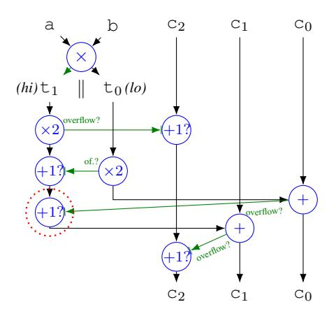

<span id="page-18-5"></span><span id="page-18-3"></span>Figure 26. Dataflow for the code in Figure [19.](#page-13-3) Conditional increments handle overflow. If the circled operation overflows, c<sup>2</sup> should be (but is not) incremented again.

Each atom is a rule application or a *term*: a literal, variable, array, or an operator applied to other terms. A *program* comprises rules, including a distinguished *entry* rule: main.

Types can be qualified as *public*. For a zero knowledge proof, inputs to the entry rule are public if so qualified and private otherwise. All variables quantified by cases are private.

# <span id="page-18-1"></span>Appendix C. OpenSSL Bug Details

Figure [26](#page-18-5) illustrates the bug in the OpenSSL macro mul\_add\_c2 (Figure [19\)](#page-13-3). Double and add operations can overflow by a single bit; these overflows are handled by conditional increments to c<sup>2</sup> and t1. However, the conditional increments themselves can also overflow. In some cases, this does not introduce a bug. Overflows in c<sup>2</sup> can be soundly ignored, since this macro implements triple-word arithmetic. The first conditional increment to t<sup>1</sup> cannot overflow, because t<sup>1</sup> must be even before the increment. However, if the second condition increment to t<sup>1</sup> (circled with a dashed red line) overflows, c<sup>2</sup> should be—but is not—incremented again.

# <span id="page-19-0"></span>Appendix D. Optimized ZoKrates Pedersen hash

The listing below contains our optimized implementation of an elliptic curve—based hash function (87 LOC; some lines have been broken for clarity). First, we define a structure for Montgomery-form elliptic curve points and Montgomery-form elliptic curve parameters (lines 1–12). Then, we implement incomplete formulas for adding, doubling, and negating curve points in this form (lines 15–49). We also implement conversions between Montgomery and twisted Edwards form, and multiplexers (lines 45–94). These primitives make it easy to implement optimized Pedersen hashing (lines 101–130).

60 // edwards to montgomery for defi def ed\_to\_mont(field[2] p) -> Mont:

61 // cotwards to montgomery
62 // formula:
63 // xx = (p.y + 1) / (p.y - 1)
64 // yy = xx / p.x
65 field x = p[0]
67 field xx = (y + 1) / (y - 1)
68 field yy = xx / x
69 return Mont { x: xx, y: yy }
69 // edwards to montgomery

```
struct Mont {
    field x
   field y
5 struct MontParams {
6 field A
    field B
8 }
10 // The parameters for our curve
ii def mont_params() -> MontParams:
   return MontParams { A: 40962, B: 1 }
13
14 // montgomery (incomplete) addition
is def mont_add(Mont p1, Mont p2) -> Mont:
   // Formula:
   // lam = (y2 - y1) / (x2 - x1)
17
   // x3 = B*lam^2 - A - x1 - x2
18
    // y3 = lam*(x1 - x3) - y1
19
   field A = mont_params().A
20
   field B = mont_params().B
   field lam = (p2.y - p1.y) / (p2.x - p1.x)
22
   field x3 = B*lam*lam - A - p1.x - p2.x
23
   field y3 = lam*(p1.x - x3) - p1.y
   return Mont { x: x3, y: y3 }
25
27 // montgomery (incomplete) doubling
28 def mont_doub(Mont p1) -> Mont:
29
   // Formula:
   // x2 = x * x
30
   // lam = (3*x2 + 2*A*x + 1) / (2*B*y)
   // xx = B*lam*lam - A - 2*x
32
33
    // yy = lam*(x - xx) - y
   field A = mont_params().A
34
   field B = mont_params().B
   field x = p1.x
36
   field y = p1.y
37
   field x2 = x * x
   field lam = (3*x2 + 2*A*x + 1) / (2*B*y)
39
    field xx = B*lam*lam - A - 2*x
   field yy = lam*(x - xx) - y
41
   return Mont { x: xx, y: yy }
44 // montgomery (incomplete) conditional negation
45 def mont_cond_neg(Mont p, bool s) -> Mont:
   return Mont {
46
47
     x: p.x,
      y: if s then (0-1)*p.y else p.y fi
48
50
51 // montgomery to edwards
52 def mont_to_ed(Mont p) -> field[2]:
  // formula:
   // xx = p.x / p.y
// yy = (p.x - 1) / (p.x + 1)
54
55
   field xx = p.x / p.y
```

```
field yy = (p.x - 1) / (p.x + 1)
    return [xx, yy]
 58
 60 // edwards to montgomery
     // formula:
     // xx = (p.y + 1) / (p.y - 1)
// yy = xx / p.x
     field x = p[0]
     field y = p[1]
     field xx = (y + 1) / (y - 1)
     field yy = xx / x
     return Mont { x: xx, y: yy }
 \eta // return x[s], good for constant x
 n def mux_2b(field[2] s, field[4] x, field s01) -> field:
     field s0 = s[0]
     field s1 = s[1]
     return x[0] + s0*(x[1] - x[0]) + \
 75
        s1*(x[2] - x[0]) + s01*(x[3] - x[2] - x[1] + x[0])
 77
 78 // return x[s], good for constant x
 79 def mont_mux_2b(bool[2] s, Mont x0, Mont x1, Mont x2,
                   Mont x3) -> Mont:
     field s0 = if s[0] then 1 else 0 fi
 81
    field s1 = if s[1] then 1 else 0 fi
 82
    field s01 = s0*s1
     return Mont {
       x: mux_2b([s0, s1], [x0.x, x1.x, x2.x, x3.x], s01),
 85
       y: mux_2b([s0, s1], [x0.y, x1.y, x2.y, x3.y], s01)
 86
 87
 88
89 // return x[s[0], s[1]], conditionally negated
 90 // good for constant x
 91 def mont_mux_2b_cond_neg(bool[3] s, Mont x0, Mont x1,
                             Mont x2, Mont x3) -> Mont:
 92
93 Mont sel = mont_mux_2b([s[0], s[1]], x0, x1, x2, x3)
    return mont_cond_neg(sel, s[2])
94
% // pedersen hash generators, in montgomery form
 97 def mont_gens() -> field[1384]:
98 return [ /* ommitted: a constant array */ ]
100 // pedersen hash (collision-resistant)
101 def main(private bool[512] pbits) -> field[2]:
102
     // pseudo-personalization, for cost accuracy
     bool[518] bits = [...[true; 6], ...pbits]
103
     field[1384] G = mont_gens()
     bool first = true
105
     Mont sum = Mont \{x: 0, y: 0\}
106
107
     for field seq_i in 0..172 do
       field i = seg_i * 3
108
       field j = 8*seg_i
109
       bool[3] s = [bits[i], bits[i+1], bits[i+2]]
110
       Mont p0 = Mont\{x: G[j+0], y: G[j+1]\}
111
       Mont p1 = Mont{x: G[j+2], y: G[j+3]}
112
       Mont p2 = Mont\{x: G[j+4], y: G[j+5]\}
113
       Mont p3 = Mont \{x: G[j+6], y: G[j+7]\}
114
115
       Mont summand = mont_mux_2b_cond_neg(s,p0,p1,p2,p3)
116
       sum = if first then summand \
117
             else mont_add(sum, summand) fi
       first = false
     endfor
119
     field seg_i = 172
120
     field i = seq_i * 3
121
122
     field j = 8*seg_i
     bool[2] s = [bits[i], bits[i+1]]
123
     Mont p0 = Mont\{x: G[j+0], y: G[j+1]\}
124
     Mont p1 = Mont\{x: G[j+2], y: G[j+3]\}
125
     Mont p2 = Mont\{x: G[j+4], y: G[j+5]\}
126
     Mont p3 = Mont\{x: G[j+6], y: G[j+7]\}
127
     Mont summand = mont_mux_2b(s,p0,p1,p2,p3)
128
     sum = mont_add(sum, summand)
129
     return mont to ed(sum)
130
```