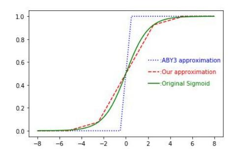

# PRIVACY-PRESERVING COLLABORATIVE MACHINE LEARNING ON GENOMIC DATA USING TENSORFLOW

# Cheng Hong, Zhicong Huang, Wen-jie Lu, Hunter Qu

Gemini Lab, Alibaba Group

{vince.hc,zhicong.hzc,juhou.lwj,fuping.qfp}@alibaba-inc.com

Li Ma

Morten Dahl, Jason Mancuso

Alibaba Health

ml96386@alibaba-inc.com

Dropout Labs mortendahlcs@gmail.com,jason@manc.us

# ABSTRACT

Machine learning (ML) methods have been widely used in genomic studies. However, genomic data are often held by different stakeholders (e.g. hospitals, universities, and healthcare companies) who consider the data as sensitive information, even though they desire to collaborate. To address this issue, recent works have proposed solutions using Secure Multi-party Computation (MPC), which train on the decentralized data in a way that the participants could learn nothing from each other beyond the final trained model.

We design and implement several MPC-friendly ML primitives, including class weight adjustment and parallelizable approximation of activation function. In addition, we develop the solution as an extension to TF Encrypted [\(Dahl et al., 2018\)](#page-7-0), enabling us to quickly experiment with enhancements of both machine learning techniques and cryptographic protocols while leveraging the advantages of TensorFlow's optimizations. Our implementation compares favorably with state-ofthe-art methods, winning first place in Track IV of the iDASH2019 secure genome analysis competition. [1](#page-0-0)

# 1 INTRODUCTION

Machine learning methods have been applied to a huge variety of problems in genomics and genetics [\(Libbrecht & Noble, 2015\)](#page-7-1). A typical example is to train a model to classify healthy and (potentially) diseased people according to their genomic information. Generally speaking, larger amount of training data is required to make more successful ML models. Unfortunately, genomic data are considered to be highly sensitive information for individuals, and thus are usually held by different data owners in a strictly access-controlled way [\(Cho et al., 2018\)](#page-7-2). Therefore, it becomes highly important to allow two or more genomic data owners to jointly train a model without compromising each other's data privacy.

iDASH (integrating Data for Analysis, Anonymization, Sharing), a National Center for biomedical computing funded by National Institutes of Health (NIH), has hosted a secure genome analysis competition for the past 5 years. This contest has encouraged cryptography experts all over the world to develop secure and practical solutions for privacy-preserving genomic data analysis. Specifically, the iDASH competition announced four tracks this year, with Track IV calling for solutions on secure collaborative training of ML model using MPC. The organizers provided two genomic datasets: GSE2034, containing 142 positive and 83 negative tumor samples with 12,634 features each, and BC-TCGA, containing 422 positive and 48 negative tumor samples with 17,814 features each.

The challenge of Track IV is threefold: 1) A protocol in the 3-party semi-honest (with honest majority) model is required, but implementations of recent state-of-the-art MPC protocols for solving such machine learning tasks were not available[2](#page-0-1) . 2) It is hard to avoid overfitting due to the small

<span id="page-0-0"></span>http://www.humangenomeprivacy.org/2019/

<span id="page-0-1"></span><sup>2</sup>The code of [Rindal](#page-8-0) [\(2019\)](#page-8-0) came out in 2019.7, two months after the competition began.

sample size and large number of features. 3) The dataset is heavily imbalanced but common countermeasures such as resampling are difficult in MPC.

We summarize our contributions as follows:

- We implemented the state-of-the-art **ABY3** (Mohassel & Rindal, 2018) protocol using the TF Encrypted framework (Dahl et al., 2018). With the advantages of TF Encrypted, our implementation is  $1.1 1.8 \times$  faster than the original ABY3 implementation for large-scale ML training. The code has been open-sourced to the TF Encrypted repository.
- We developed a secure collaborative ML solution on top of our TF Encrypted-ABY3 framework, together with several MPC-friendly ML primitives, including class weight adjustment for the imbalanced dataset and more accurate and parallelized sigmoid approximation. The solution tied for first place in Track IV of iDASH2019 competition.

#### 2 BACKGROUND AND RELATED WORK

#### 2.1 LOGISTIC REGRESSION

The datasets have many more features than samples and are prone to overfitting, so we decided to use a simple logistic regression (LR) instead of more complex modeling approaches after initial experimentation. Let  $\mathbf{x} \in \mathbb{R}^f$  denote the f-dimensional feature vector,  $\mathbf{w} \in \mathbb{R}^f$  the corresponding weight vector, and  $y \in \{0,1\}$  the corresponding label of  $\mathbf{x}$ , the goal of LR training is to solve the following empirical risk minimization problem:

$$\underset{\mathbf{w} \in \mathbb{R}^f}{\arg\min} \, L(\mathbf{w}) = \underset{\mathbf{w} \in \mathbb{R}^f}{\min} \, \underset{\mathbf{x}, y}{\mathbb{E}} \left[ y \log \left( \sigma(\mathbf{w}^\top \mathbf{x}) \right) + (1 - y) \log \left( 1 - \sigma(\mathbf{w}^\top \mathbf{x}) \right) \right]$$

While second-order Newtonian optimization is more commonly used in cleartext LR training, such methods are costly in MPC. We can instead use stochastic gradient descent: given a dataset  $\{(\mathbf{x}_i, y_i)\}_{i \leq N}$ , the gradient of  $L(\mathbf{w})$  at each  $(\mathbf{x}_i, y_i)$  could be defined as:

$$\nabla|_{\mathbf{x}_i, y_i} L(\mathbf{w}) = -(y_i - \sigma(\mathbf{w}^\top \mathbf{x}_i)) \mathbf{x}_i,$$

where  $\sigma(z) = \frac{1}{1+e^{-z}}$  is the sigmoid function.

# 2.2 SECURE MULTI-PARTY COMPUTATION (MPC) AND ABY3

MPC is a set of cryptographic techniques allowing parties to jointly compute a public function over their private inputs. Many different MPC protocols specialized for ML have been introduced under various security models, examples include EzPC (Chandran et al., 2017) and SecureML (Mohassel & Zhang, 2017). iDASH seeks a solution in the 3-party semi-honest (with honest majority) model, and so far the best protocol satisfying that model is **ABY3** proposed by Mohassel & Rindal (2018), so we chose ABY3 as the underlying protocol of our solution. Due to space limitations, we briefly describe ABY3 in Appendix A.3 and refer the reader to their paper for further details.

# 3 SOLUTION DESCRIPTION

### 3.1 OPTIMIZED LOGISTIC REGRESSION IN MPC

Class weight adjustment for imbalanced training set. The numbers of positive and negative samples in the given dataset are imbalanced, which inflates false positives for the majority class. A common countermeasure is resampling, which either remove samples from the majority class or add more duplicated examples from the minority class. But in MPC, the labels are private so resampling is difficult. Differential privacy is another possible solution, but it will lead to a non-negligible accuracy loss for such a small dataset. So we adopt the simpler yet well-motivated approach of weighting samples in the loss function to place more emphasis on minority classes:

$$C_0 = \frac{N}{2\sum_{i=1}^{N}(1-y_i)}, C_1 = \frac{N}{2\sum_{i=1}^{N}y_i}$$

and the gradient becomes:  $\nabla L(\mathbf{w}) = -(y_i - \sigma(\mathbf{w}^\top \mathbf{x}_i))\mathbf{x}_i \cdot C_{y_i}$ . Note that we cannot lookup  $C_{y_i}$  directly since  $y_i$  is a private input, so instead we compute it via  $C_{y_i} = (C_1 - C_0) \cdot y_i + C_0$ .

Parallel piecewise approximation of the sigmoid function. The sigmoid function in LR has to calculate exponents, which is not practical in MPC. The original ABY3 paper uses piecewise polynomials (described in Algorithm 1) to approximately compute sigmoid. In particular, they use a 3-piece approximation, which unfortunately achieves subpar accuracy relative to the non-secure model (See Table 2). Instead, we use a 5-piece approximation as shown in Figure 1.

# <span id="page-2-0"></span>Algorithm 1 Piecewise polynomial function

#### Input:

Private input: x;

Segmentation points:  $\{s_i\}_{0 \le i \le n}$ , where  $s_0 =$ 

 $-\infty$  and  $s_n = \infty$ ;

Expressions for n polynomials  $\{f_i\}_{0 \le i \le n}$ ;

**Output:**  $f_i(x)$  if  $s_i < x \le s_{i+1}$ 

1: **for** i := 0 to n **do** 

 $p_i \leftarrow (x < s_i)$ 

3: **for** i := 0 to n - 1 **do** 

4:  $b_i \leftarrow \neg p_i \wedge p_{i+1}$ 5:  $r \leftarrow \sum_{i=0}^{n-1} b_i \cdot f_i(x)$ 



<span id="page-2-1"></span>Figure 1: Different approximate sigmoid functions. Function bodies are deferred to Appendix A.2 for space limit.

### 3.2 MPC PROGRAMMING IN TF ENCRYPTED

**TensorFlow** (Abadi et al., 2016) is a high-performance ML framework with built-in support for executing distributed dataflow graphs across a cluster of servers, and TF Encrypted (TFE) is an opensourced layer on top of TensorFlow for privacy-preserving computations. TFE has a TensorFlow-like interface and allows ML engineers who are non-experts in cryptography to easily develop encrypted machine learning solutions. For instance, with an existing TFE MPC protocol, implementing secure LR training is just 20 lines of code. An example could be found in Appendix A.4.

Advantages of TF Encrypted & TensorFlow in MPC programming. In TensorFlow, code execution is broken into two phases: graph building and graph execution. The former is typically done through a high-level Python API, while the latter is performed by a C++ runtime that eventually partitions the distributed graph into a set of local operations to be executed by the MPC servers. This separation allows the engine to optimize the computation at several levels.

One concrete benefit of this declarative approach is that parallel execution is determined at the discretion of the runtime and not the programmer. Take Algorithm 1 for example, n comparisons in Step 2 will be run in parallel automatically. Although this parallelization could be manually achieved in other frameworks such as Rindal (2019), it is made conveniently automatic in TensorFlow.

Another benefit of the distributed graph representation is that it hides the low-level networking operations. Tensors held by one server may seamlessly be used by another, and it is the responsibility of the runtime to insert the required send/recv operations during graph partitioning, and may even choose a communication technology optimized for the runtime environment. In other words, the programmers do not have to deal with complicated socket programming, which is an important component of MPC protocols and easy to get wrong. An example could be found in Appendix A.3.

<span id="page-3-0"></span>Table 1: Comparison of LR training speed, measured in iterations per second (larger = better). Both frameworks use the 3-piece sigmoid approximation.

| Batchsize | Framework     | 64 features | 1024 features | 4096 features | 16384 features |
|-----------|---------------|-------------|---------------|---------------|----------------|
| 64        | Rindal (2019) | 1408        | 704           | 257           | 52             |
|           | TFE ABY3      | 824         | 564           | 225           | 58             |
| 128       | Rindal (2019) | 1265        | 421           | 114           | 25             |
|           | TFE ABY3      | 754         | 380           | 124           | 30             |
| 256       | Rindal (2019) | 1068        | 209           | 34            | 8.5            |
|           | TFE ABY3      | 720         | 211           | 60            | 11             |

Finally, as a framework for large-scale machine learning, TensorFlow ships with several useful functionalities, including high-performance data pipelines, a high-level language for building machine learning models, and abstractions for clusters of potentially heterogeneous compute devices.

ABY3 as a TFE module. Considering all the advantages above, we chose TF Encrypted as the underlying framework, and implemented the ABY3 protocol on top of it. The code has been contributed to TFE as one of its protocol modules.

# 4 RESULTS

We test our implementation using three ecs.g6.2xlarge instances of Alibaba Cloud, each with an 8–core 2.50 GHZ CPU and 32GB of RAM.

## 4.1 PERFORMANCE OF THE TFE ABY3 FRAMEWORK

To evaluate our TFE ABY3 implementation, we compare with [Rindal](#page-8-0) [\(2019\)](#page-8-0), a C++ framework written by the authors of ABY3. The results in Table [1](#page-3-0) indicate that we are 1.5 − 1.8× slower for small-scale data , while 1.1 − 1.8× faster for large-scale data because of TensorFlow's graph optimizations[3](#page-3-1) . The reason is that for small-scale data, the higher amount of iterations per second leads to more frequent API calls, so the overhead introduced by the TensorFlow C++ wrappers is non-negligable. On the other hand, for large-scale data, TensorFlow's graph optimizations begin to show advantages from many aspects, such as automatic parallel processing and faster matrix multiplication.

# 4.2 PERFORMANCE OF THE IDASH SOLUTION

We preprocess the dataset with a feature selection step (see Appendix [A.1\)](#page-4-1) and test our model with 10-fold cross-validation. To make the training algorithm generalizable, we use the "optimal" adaptive learning rate (See Appendix [A.5\)](#page-7-5) proposed by [Bottou](#page-7-6) [\(2012\)](#page-7-6), and set L2 penalty = 1. All the evaluations in this subsection are written using TFE ABY3.

Accuracy. We test the balanced accuracy ( T P T P <sup>+</sup>F N + T N F P <sup>+</sup>T N )/2 using the three Sigmoid functions described in Figure 1[4](#page-3-2) . The result in Table [2](#page-4-0) shows that the 3-piece one is unsatisfactory for this case, while our 5-piece one are nearly as accurate as the cleartext version (about 70%).

Training time. We test on two cases: a LAN network with 1Gbps bandwidth and sub-milisecond latency, and a WAN network with 100Mbps bandwidth and 25 miliseconds latency (i.e., 50 miliseconds round trip time). The result is shown in Table [2.](#page-4-0) We can see that the 5-piece Sigmoid is 1.5 − 1.7× slower in LAN because of more computational cost, but there's no observable difference in WAN because the pieces are evaluated in parallel, thus they trigger the same number of send/recv operations, and the latency dominates the total training time. We emphasize again that this parallelism is automatically achieved by TensorFlow, rather than manually multithread coding.

<span id="page-3-1"></span><sup>3</sup>We make these comparisons in localhost because their code lack a WAN test case. The relative difference is expected to disappear in WAN, because latency will dominate any extra computational time.

<span id="page-3-2"></span><sup>4</sup>Only GSE2034 is described here because BC-TCGA is easily separable (accuracy 100%) thus omitted.

|  |  | Table 2: Comparison of Sigmoid approximations. Training speed measured in iterations per second. |  |
|--|--|--------------------------------------------------------------------------------------------------|--|
|  |  |                                                                                                  |  |
|  |  |                                                                                                  |  |
|  |  |                                                                                                  |  |

<span id="page-4-0"></span>

| Methods                | Batchsize | Training speed |      | Accuracy       |                |
|------------------------|-----------|----------------|------|----------------|----------------|
|                        |           | LAN            | WAN  | 100 iterations | 200 iterations |
| ABY3's 3-piece Sigmoid |           | 834            | 2.09 | 63.13%         | 64.19%         |
| Our 5-piece Sigmoid    | 32        | 496            | 2.09 | 66.42%         | 67.54%         |
| ABY3's 3-piece Sigmoid |           | 800            | 2.08 | 58.45%         | 65.22%         |
| Our 5-piece Sigmoid    | 64        | 475            | 2.08 | 67.47%         | 69.48%         |

The final submission was tested in a LAN network with slightly higher latency. We achieved the highest accuracy (68 − 70%) and the second fastest training speed (560 iterations in about 20 seconds) among the nine participating teams, and were named first place in a tie of three.

# A APPENDIX

# <span id="page-4-1"></span>A.1 DOMAIN-SPECIFIC KNOWLEDGE FROM BIOINFORMATICS

We noticed that the datasets are about breast cancer, and there are already several works that have picked out the most significant genomes (signatures) to predict the clinical outcome of breast cancer [\(Ross et al., 2008\)](#page-8-3). A few examples are Oncotype DX [\(Paik et al., 2004\)](#page-8-4), MammaPrint[\(Van De Vi](#page-8-5)[jver et al., 2002\)](#page-8-5), the Rotterdam Signature [\(Wang et al., 2005\)](#page-8-6), and the Invasiveness Gene Signature (IGS) [\(Liu et al., 2007\)](#page-7-7). After testing multiple signatures on both datasets with cross validation, we found that the Rotterdam Signature of 76 genes (but only 67 of them exist in both datasets) turns out to be the best performing one, boosting the balanced accuracy (with our Sigmoid approximation) from 62–66% to 68–71%. It is worth mentioning that it's almost impossible to pick those signatures using feature selection methods, because they are picked based on lots of extra information that is not listed in the dataset, such as genome functions, medical diagnosis and relapse time.

Separating breast cancer subtypes. The accuracy could be further improved by exploiting deeper domain-specific knowledge: Breast cancer could be divided into several subtypes, and different subtypes are correlated with different genes. As [Carey et al.](#page-7-8) describes, breast cancers could be divided into ER+ and ER- subtypes based on ER status, which is correlated with the gene "ESR1". Specifically, 16 genes of the Rotterdam Signature are related with ER-, and the other 60 are related with ER+.

Based on the above fact, a two-model solution could be developed: Two LR models are trained on the dataset, the first one uses the full Rotterdam Signature as training features, while the second one uses only the 16 ER- genes as training features. When we want to predict on a patient X, we first observe X's gene expression of "ESR1". If it's significantly lower than average, it indicates a high chance that X belongs to the ER- subgroup, and the second model will be used to predict. Otherwise the first one will be used.

We did experiments and found that this new method could increase the accuracy significantly (sometimes above 76%), and submitted it to the competition. But due to some misunderstandings, this two-model solution was not tested by the organizers, and only the one using the full signature (with accuracy 68–70%) was tested.

#### A.2 PIECEWISE FUNCTIONS USED

$$\text{ABY3}: \sigma(x) = \begin{cases} 0, & x<-0.5 \\ x+0.5, & -0.5 \leq x {<} 0.5 \\ 1, & x \geq 0.5 \end{cases}$$

```
Ours : σ(x) =

               10−4
                    , x ≤ −5
               0.02776 · x + 0.145, −5 < x ≤ −2.5
               0.17 · x + 0.5, −2.5 < x ≤ 2.5
               0.02776 · x + 0.85498, 2.5 < x ≤ 5
               1 − 10−4
                       , x > 5
```

#### <span id="page-5-0"></span>A.3 A LITTLE MORE DETAILS OF ABY3 IN TENSORFLOW

Replicated secret sharing. In ABY3, each private data x ∈ Z<sup>2</sup> <sup>k</sup> (k is the length of bits we used to represent a number, e.g. k = 64) is secret-shared to three parties P0, P1, P2, using one of the following three kinds of techniques:

- Arithmetic sharing: Sample three random values x0, x1, x<sup>2</sup> ∈ Z<sup>2</sup> <sup>k</sup> , such that x = x<sup>0</sup> + x<sup>1</sup> + x2. Each party P<sup>i</sup> holds x<sup>i</sup> and xi+1 mod 3. We call these shares as "A-shares" of x, denoted as [[x]].
- Boolean sharing: Sample three random values x0, x1, x<sup>2</sup> ∈ Z<sup>2</sup> <sup>k</sup> , such that x = x<sup>0</sup> ⊕ x<sup>1</sup> ⊕ x2. Each party P<sup>i</sup> holds x<sup>i</sup> and xi+1 mod 3. We call these shares as "B-shares" of x, denoted as << x >>.
- Yao sharing: Yao sharing is used for Garbled Circuit (GC). Unfortunately we found that GC is inefficient in TensorFlow, so we decided to use only A/B shares here. Y shares are not discussed in this paper and left for our future work.

Addition and substraction. Given two A-shared data [[x]] and [[y]], it's easy to see that addition (and substraction) could be done locally: [[x + y]] = [[x]] + [[y]]

Multiplication. To multiply two shared values [[x]] and [[y]], Party P<sup>i</sup> locally computes z<sup>i</sup> = xiy<sup>i</sup> + xiyi+1 mod 3+xi+1 mod 3y<sup>i</sup> [5](#page-5-1) , and send z<sup>i</sup> to party Pi−1 mod 3. We can see that [[z]]=[[xy]] . Similar method works for matrix multiplication, and an example code of multiplication could be found in Appendix [A.3.](#page-5-0)

Other operations that we have implemented include:

- Sharing conversion between A-shares and B-shares.
- Bit extraction, MSB extraction, and Comparison.
- Piecewise polynomial evaluation, Sigmoid approximation.

Due to space limitations, we refer the reader to the original paper [\(Mohassel & Zhang, 2017\)](#page-8-2) for further details of these operations.

ABY3 in TensorFlow. The Tensor data structure, which is the output of some computation primitive, will stay only on the server that executes the primitive, unless it is explicitly instructed to be used in another server. This gives an intuition about the natural integration between ABY3 and TensorFlow: each pair of shares (x<sup>i</sup> ; xi+1%3) will be held by its corresponding party i, and most computation primitives are defined purely on each servers local shares; when a server uses a share held by another server, it is equivalent to a network send/recv operation between the two servers.

Take the following code for example, the script z[1][1] = z2 in the re-sharing step triggers z2 to be send from servers[2] to servers[1], and no network programming is needed.

```
def _matmul_private_private(prot, x, y):
 assert isinstance(x, ABY3PrivateTensor), type(x)
 assert isinstance(y, ABY3PrivateTensor), type(y)
 x_shares = x.unwrapped
 y_shares = y.unwrapped
 # Tensorflow supports matmul for more than 2 dimensions,
```

<span id="page-5-1"></span><sup>5</sup>The zero sharings are omitted in this section for clearer understanding

```
# with the inner-most 2 dimensions specifying the 2-D matrix
   multiplication
result_shape = tf.TensorShape((*x.shape[:-1], y.shape[-1]))
z = [[None, None], [None, None], [None, None]]
with tf.name_scope("matmul"):
 a0, a1, a2 = prot._gen_zero_sharing(result_shape)
 with tf.device(prot.servers[0].device_name):
   z0 = x_shares[0][0].matmul(y_shares[0][0]) \
      + x_shares[0][0].matmul(y_shares[0][1]) \
      + x_shares[0][1].matmul(y_shares[0][0]) \
      + a0
 with tf.device(prot.servers[1].device_name):
   z1 = x_shares[1][0].matmul(y_shares[1][0]) \
      + x_shares[1][0].matmul(y_shares[1][1]) \
      + x_shares[1][1].matmul(y_shares[1][0]) \
      + a1
 with tf.device(prot.servers[2].device_name):
   z2 = x_shares[2][0].matmul(y_shares[2][0]) \
      + x_shares[2][0].matmul(y_shares[2][1]) \
      + x_shares[2][1].matmul(y_shares[2][0]) \
      + a2
 # Re-sharing
 with tf.device(prot.servers[0].device_name):
   z[0][0] = z0
   z[0][1] = z1
 with tf.device(prot.servers[1].device_name):
   z[1][0] = z1
   z[1][1] = z2
 with tf.device(prot.servers[2].device_name):
   z[2][0] = z2
   z[2][1] = z0
 z = ABY3PrivateTensor(prot, z, x.is_scaled or y.is_scaled,
     x.share_type)
 z = prot.truncate(z) if x.is_scaled and y.is_scaled else z
 return z
```

### <span id="page-6-0"></span>A.4 20 LINES OF CODE FOR LR IN TFE

Once the underlying primitives (namely addition, substraction, multiplication, sigmoid, matrix multiplication) were done, an ML engineer with little background in cryptography could develop privacy-preserving ML programs easily. As is shown in the example, logistic regression training in MPC could be done in 20 lines of code, with few differences compared to common TensorFlow code.

```
def logistic_regression():
   prot = ABY3()
   tfe.set_protocol(prot)
   # define inputs
   x = tfe.define_private_variable(x_raw, name="x")
   y = tfe.define_private_variable(y_raw, name="y")
   # define initial weights
   w = tfe.define_private_variable(tf.random_uniform([10, 1], -0.01,
      0.01),name="w")
   learning_rate = 0.01
   with tf.name_scope("forward"):
    out = tfe.matmul(x, w) + b
```

```
y_hat = tfe.sigmoid(out)
with tf.name_scope("loss-grad"):
 dy = y_hat - y
batch_size = x.shape.as_list()[0]
with tf.name_scope("backward"):
 dw = tfe.matmul(tfe.transpose(x), dy) / batch_size
 assign_ops = [tfe.assign(w, w - dw * learning_rate)]
with tfe.Session() as sess:
 # initialize variables
 sess.run(tfe.global_variables_initializer())
 for i in range(1):
   sess.run(assign_ops)
```

# <span id="page-7-5"></span>A.5 THE "OPTIMAL" LEARNING RATE

In Section 5.2 of [Bottou](#page-7-6) [\(2012\)](#page-7-6), they proposed the following adaptive learning rate:

$$\eta = \eta_0 / (1 + \lambda \eta_0 t) \tag{1}$$

, where η<sup>0</sup> is a heuristic initial value, λ is the decreasing factor, and t means it's the t th iteration.

This formula has been proved to be effective in practise, and is used in the SGDClassifier of Scikitlearn when we set learning rate =<sup>0</sup> optimal<sup>0</sup> .

For our implementation, we set η = 1/(1.2 + t).

# REFERENCES

<span id="page-7-4"></span>Mart´ın Abadi, Paul Barham, Jianmin Chen, Zhifeng Chen, Andy Davis, Jeffrey Dean, Matthieu Devin, Sanjay Ghemawat, Geoffrey Irving, Michael Isard, Manjunath Kudlur, Josh Levenberg, Rajat Monga, Sherry Moore, Derek G. Murray, Benoit Steiner, Paul Tucker, Vijay Vasudevan, Pete Warden, Martin Wicke, Yuan Yu, and Xiaoqiang Zheng. Tensorflow: A system for largescale machine learning. In *12th USENIX Symposium on Operating Systems Design and Implementation (OSDI 16)*, pp. 265–283, Savannah, GA, November 2016. USENIX Association. ISBN 978-1-931971-33-1. URL [https://www.usenix.org/conference/osdi16/](https://www.usenix.org/conference/osdi16/technical-sessions/presentation/abadi) [technical-sessions/presentation/abadi](https://www.usenix.org/conference/osdi16/technical-sessions/presentation/abadi).

<span id="page-7-6"></span>Leon Bottou. Stochastic gradient descent tricks. In ´ *Neural networks: Tricks of the trade*, pp. 421– 436. Springer, 2012.

<span id="page-7-8"></span>L. A. Carey, E. C. Dees, L. Sawyer, L. Gatti, D. T. Moore, F. Collichio, D. W. Ollila, C. I. Sartor, M. L. Graham, and C. M. Perou. The triple negative paradox: Primary tumor chemosensitivity of breast cancer subtypes. *Clinical Cancer Research*, 13(8):2329–2334.

<span id="page-7-3"></span>Nishanth Chandran, Divya Gupta, Aseem Rastogi, Rahul Sharma, and Shardul Tripathi. Ezpc: Programmable, efficient, and scalable secure two-party computation for machine learning. *ePrint Report*, 1109, 2017.

<span id="page-7-2"></span>Hyunghoon Cho, David J Wu, and Bonnie Berger. Secure genome-wide association analysis using multiparty computation. *Nature biotechnology*, 36(6):547, 2018.

<span id="page-7-0"></span>Morten Dahl, Jason Mancuso, Yann Dupis, Ben Decoste, Morgan Giraud, Ian Livingstone, Justin Patriquin, and Gavin Uhma. Private machine learning in tensorflow using secure computation. *arXiv preprint arXiv:1810.08130*, 2018.

<span id="page-7-1"></span>Maxwell W Libbrecht and William Stafford Noble. Machine learning applications in genetics and genomics. *Nature Reviews Genetics*, 16(6):321–332, 2015.

<span id="page-7-7"></span>Rui Liu, Xinhao Wang, Grace Y Chen, Piero Dalerba, Austin Gurney, Timothy Hoey, Gavin Sherlock, John Lewicki, Kerby Shedden, and Michael F Clarke. The prognostic role of a gene signature from tumorigenic breast-cancer cells. *New England Journal of Medicine*, 356(3):217–226, 2007.

- <span id="page-8-1"></span>Payman Mohassel and Peter Rindal. Aby 3: a mixed protocol framework for machine learning. In *Proceedings of the 2018 ACM SIGSAC Conference on Computer and Communications Security*, pp. 35–52. ACM, 2018.
- <span id="page-8-2"></span>Payman Mohassel and Yupeng Zhang. Secureml: A system for scalable privacy-preserving machine learning. In *2017 IEEE Symposium on Security and Privacy (SP)*, pp. 19–38. IEEE, 2017.
- <span id="page-8-4"></span>Soonmyung Paik, Steven Shak, Gong Tang, Chungyeul Kim, Joffre Baker, Maureen Cronin, Frederick L Baehner, Michael G Walker, Drew Watson, Taesung Park, et al. A multigene assay to predict recurrence of tamoxifen-treated, node-negative breast cancer. *New England Journal of Medicine*, 351(27):2817–2826, 2004.
- <span id="page-8-0"></span>Peter Rindal. The ABY3 Framework for Machine Learning and Database Operations. [https:](https://github.com/ladnir/aby3) [//github.com/ladnir/aby3](https://github.com/ladnir/aby3), 2019.
- <span id="page-8-3"></span>Jeffrey S Ross, Christos Hatzis, W Fraser Symmans, Lajos Pusztai, and Gabriel N Hortobagyi. ´ Commercialized multigene predictors of clinical outcome for breast cancer. *The Oncologist*, 13 (5):477–493, 2008.
- <span id="page-8-5"></span>Marc J Van De Vijver, Yudong D He, Laura J Van't Veer, Hongyue Dai, Augustinus AM Hart, Dorien W Voskuil, George J Schreiber, Johannes L Peterse, Chris Roberts, Matthew J Marton, et al. A gene-expression signature as a predictor of survival in breast cancer. *New England Journal of Medicine*, 347(25):1999–2009, 2002.
- <span id="page-8-6"></span>Yixin Wang, Jan GM Klijn, Yi Zhang, Anieta M Sieuwerts, Maxime P Look, Fei Yang, Dmitri Talantov, Mieke Timmermans, Marion E Meijer-van Gelder, Jack Yu, et al. Gene-expression profiles to predict distant metastasis of lymph-node-negative primary breast cancer. *The Lancet*, 365(9460):671–679, 2005.