# Pushing the Limits of Valiant's Universal Circuits: Simpler, Tighter and More Compact

Hanlin Liu1 , Yu Yu∗1 , Shuoyao Zhao1 , Jiang Zhang2 , and Wenling Liu1

1Department of Computer Science and Engineering, Shanghai Jiao Tong University, Shanghai 200240, China

2State Key Laboratory of Cryptology, P.O. Box 5159, Beijing 100878, China

May 10, 2020

#### Abstract

A universal circuit (UC) is a general-purpose circuit that can simulate arbitrary circuits (up to a certain size n). Valiant provides a k-way recursive construction of universal circuits (STOC 1976), where k tunes the complexity of the recursion. More concretely, Valiant gives theoretical constructions of 2-way and 4-way UCs of asymptotic (multiplicative) sizes 5n log n and 4.75n log n respectively, which matches the asymptotic lower bound Ω(n log n) up to some constant factor.

Motivated by various privacy-preserving cryptographic applications, Kiss et al. (Eurocrypt 2016) validated the practicality of 2-way universal circuits by giving example implementations for private function evaluation. Günther et al. (Asiacrypt 2017) and Alhassan et al. (J. Cryptology 2020) implemented the 2-way/4-way hybrid UCs with various optimizations in place towards making universal circuits more practical. Zhao et al. (Asiacrypt 2019) optimized Valiant's 4-way UC to asymptotic size 4.5n log n and proved a lower bound 3.64n log n for UCs under Valiant framework. As the scale of computation goes beyond 10 million-gate (n = 107 ) or even billion-gate level (n = 109 ), the constant factor in circuit size plays an increasingly important role in application performance. In this work, we investigate Valiant's universal circuits and present an improved framework for constructing universal circuits with the following advantages.

Simplicity. Parameterization is no longer needed. In contrast to that previous implementations resort to a hybrid construction combining k = 2 and k = 4 for a tradeoff between fine granularity and asymptotic size-efficiency, our construction gets the best of both worlds when configured at the lowest complexity (i.e., k = 2).

Compactness. Our universal circuits have asymptotic size 3n log n, improving upon the best previously known 4.5n log n by 33% and beating the 3.64n log n lower bound for UCs constructed under Valiant's framework (Zhao et al., Asiacrypt 2019).

Tightness. We show that under our new framework the universal circuit size is lower bounded by 2.95n log n, which almost matches the 3n log n circuit size of our 2-way construction.

We implement the 2-way universal circuits and evaluate its performance with other implementations, which confirms our theoretical analysis.

Keywords: Universal Circuits, Private Function Evaluation, Multiparty Computation.

∗E-mail: yuyuathk@gmail.com

### 1 Introduction

A universal circuit (UC) is a programmable circuit capable of simulating arbitrary circuits (up to a certain scale), which is analogous to that a universal Turing machine is configured to simulate an arbitrary Turing machine or that a central processing unit (CPU) carries out computations specified by a sequence of instructions. More specifically, a universal circuit refers to a sequence of circuits, i.e., UC = {UCn}n∈N, such that every circuit C of size n can be (efficiently) encoded into a string of control bits pC to fulfill the simulation, i.e., for every valid input x: C(x) = UCn(pC, x). An explicit construction is an efficient algorithm that (on input n) produces as output UCn in time polynomial in n.

Universal model of computation. Valiant's universal circuits [Val76] gave inspirations to universal parallel computers [GP81,Mey83]. Cook and Hoover [CH85] proposed depth-optimal universal circuits, i.e., for any n, c, d they constructed a universal circuit UC(n, c, d) of size O(c 3d/ log c) and depth O(d) that can simulate any circuit having n inputs, of size c and depth d. Bera et al. [BFGH10] used the frameworks of universal circuit from [Val76, CH85] in their design of universal quantum circuits.

### 1.1 Cryptographic applications

We sketch some cryptographic applications of universal circuits. The performance of most applications crucially rely on the size efficiency of universal circuits. We refer the readers to the cited publications for full details.

Private function evaluation. A major cryptographic application of universal circuits is private function evaluation (PFE) [AF90, BBKL17, KR11, KS08b], which can be based on the protocols for secure two-party/multiparty computation (2PC/MPC) [Yao82, Yao86, GMW87]. Take the two-party setting as an example: a 2PC protocol enables two parties Alice and Bob to securely compute a publicly known function f on their respective private inputs x and y without revealing anything substantial more than the output of computation f(x,y), whereas in a PFE scenario Alice with private input x and Bob with private function f engage in a protocol such that in the end Alice (resp., Bob) learns nothing about f (resp., x) beyond what can be revealed from the output f(x). A PFE reduces to a 2PC/MPC with the aid of a universal circuit: Alice and Bob invoke a 2PC to securely compute a publicly known universal circuit UC on Alice's private input x and Bob's private input pf (a string that encodes f), which yields UC(pf , x) = f(x). It is easy to see that the PFE protocol is as secure as the underlying 2PC/MPC protocol against the same type (semi-honest, covert or malicious) of adversaries, and the time/space efficiency of the PFE mainly depends on the size/depth of the UC. The takeaway is that one simply plugs a PFE into a MPC framework (without changes to the underlying infrastructure) to enjoy the corresponding benefits and additional features, such as non-interactive PFE [LMS16] and outsourced PFE [KR11] that are generalized from non-interactive and outsourced secure computation protocols [AMPR14] respectively. As its name suggests, PFE [AF90] can be applied to scenarios where some party wants to keep his function private but still hopes to evaluate it on others' inputs. Depending on the concrete instantiations of the private function, applications include privacy-preserving checking of loanee's credit worthiness [FAZ05], protection of the code privacy of an autonomous mobile agent [CCKM00], oblivious filtering of remote streaming data [OS05], medical diagnostics [BFK+09], remote software fault diagnosis [BPSW07], blinded policy evaluation protocols [FAL06, FLA06], query-hiding database management systems (DBMSs) [PKV+14,FVK+15], private evaluation of branching programs [MS13, IP07] and privacy-preserving intrusion detection [MS13, NSMS14].

Applications beyond PFE. Universal circuits can be applied to various other cryptographic scenarios. UCs were used to hide the functions in verifiable computation [FGP14] and multihop homomorphic encryption [GHV10], to reduce verifier's preprocessing costs in NIZK argument [GGPR13], and to build the attribute-based encryption (ABE) scheme in [GGHZ14]. Attrapadung [Att14] used UCs to transform the ABE schemes for any polynomial-size circuits [GGH+13b,GVW13] into ciphertext-policy ABE. Garg et al. [BV15,GGH+13a] used UCs to construct universal branching programs, which were in turn used to build a candidate indistinguishability obfuscation (iO). The iO scheme [GGH+13a] was implemented in [BOKP15], whose efficiency is closely related to size of UCs. Zimmerman [Zim15] proposed a new scheme to obfuscate programs by viewing UC as a keyed program for circuit families. Lipmaa et al. [LMS16] suggested that UC can used for efficient batch execution of secure two-party computation. The batch execution techniques [HKK+14, LR15] were originally intended for amortizing the cost of maliciously secure garbled circuits for the same function, and UCs can now enable batched execution for circuits of different functions (realized by the same UC). This protocol was made round-optimal in [MR17].

#### 1.2 Valiant's universal circuits and subsequent works

Valiant [Val76] took a graph-theoretic approach to construct universal circuits that was followed by almost all size-efficient universal circuits [KS16,LMS16,GKS17,ZYZL19,AGKS20]. One may represent an arbitrary circuit by a direct acyclic graph (DAG) and then see a universal circuit as a special DAG called edge universal graph (EUG). The construction of UCs reduces to that of EUGs in a recursive manner: "an EUG simulating any DAG of size n", denoted by EUG(n), can be constructed based on k instances of EUG( n k ), and the recursion can be repeated many times until a sufficiently small EUG to be built by hand, where parameter k ≥ 2 is proportional to the complexity of the construction. Valiant provided 2-way and 4-way (i.e., k = 2 and k = 4) theoretical constructions of universal circuits of multiplicative sizes1 5n log n and 4.75n log n respectively (omitting smaller terms), which match the lower bound Ω(n log n) up to constant factors [Val76,Weg87]. Therefore, as a theoretical problem, explicit construction of size-efficient universal circuits was mostly solved by Valiant [Val76] more than forty years ago.

Valiant's universal circuit had long been recognized more as a feasibility result than a practical application. Kolesnikov and Schneider [KS08b] turned to (and implemented for the first time) a modular design of universal circuits with circuit size 1.5n log2 n + 2.5n log n. Despite not asymptotically size optimal, the UC [KS08b] enables efficient simulation of small-scale circuits (e.g., for n < 106 ), thanks to the smaller constant factor in circuit size. Further, they gave the first implementation of UC-based PFE under the Fairplay secure computation framework [MNPS04]. More recently, Kiss et al. [KS16] implemented a hybrid UC combining Valiant's 2-way UC [Val76] and the UC of Kolesnikov and Schneider [KS08b] integrated with various optimizations for many typical PFE applications. Günther et al. [GKS17] gave a generic edge embedding algorithm for Valiant's k-way construction, and implemented a hybrid of Valiant's 2-way and 4-way UCs. Concurrently, Lipmaa et al. [LMS16, Sad15] gave a generic construction of k-way supernode (an important building block of Valiant's k-way universal circuit) and based on the method they estimated that k's optimal value for minimizing the size of UC was k = 3.147 (i.e., k ∈ {3, 4} as an integer). In addition, Lipmaa et al. [LMS16] brought down the size of 4-way UC from 19n log n to 18n log n by optimizing out some XOR gates. However, the number of AND gates remained the same as Valiant's 4-way UC [Val76] (i.e., 4.75n log n) and thus the improvement offers limited help to PFE or other applications with free XOR optimizations [KS08a]. Zhao et al. [ZYZL19] gave a more efficient 4-way UC of multiplicative circuit size 4.5n log n (and circuit size 17.75n log n), which was the best size-efficient construction prior

1 It is typically assumed that a circuit C consists of AND gates and XOR gates. The size of C refers to the number of gates in C, and its multiplicative size is the number of AND gates. As a major performance indicator for Valiant's (and our optimized) framework, the multiplicative size of a UC is roughly a quarter of its total size.

| Universal Circuit                | MUL size          | Lower                  | Total Size         |
|----------------------------------|-------------------|------------------------|--------------------|
|                                  | (# of ANDs)       | Bound on               |                    |
|                                  |                   | MUL size               |                    |
| Kolesnikov et al.'s UC [KS08b]   | log2 n 0.25n   | N/A                    | log2 n n        |
| Valiant's 2-way UC [Val76]       | 5n log n    | ≥ 3.64n log n | 20n log n    |
| Valiant's 3-way UC [Val76,GKS17] | 5.05n log n | ———"———                | 20.19n log n |
| Valiant's 4-way UC [Val76]       | 4.75n log n | ———"———                | 19n log n    |
| Lipmaa et al.'s 4-way UC [LMS16] | 4.75n log n | ———"———                | 18n log n    |
| Zhao et al.'s 4-way UC [ZYZL19]  | 4.5n log n  | ———"———                | 17.75n log n |
| Our 2-way UC                     | 3n log n    | ≥ 2.95n log n | 12n log n    |

Table 1: The sizes, multiplicative sizes and lower bounds for previous universal circuits and ours, keeping only dominant terms.

to our work. Alhassan et al. [AGKS20] designed an efficient and scalable algorithm for UC generation and programming, and implemented a hybrid construction of Valiant's 2-way UC and the 4-way UC by Zhao et al. [ZYZL19]. We refer to Table 1 for asymptotic sizes of existing theoretical constructions.

### 1.3 Our contributions

An overview of outstanding issues. For efficiency and granularity of the construction 2 , k is desired to be smallest possible, i.e., k = 2, but 2-way universal circuits are less sizeefficient than UC tuned at other values, e.g., k = 4. Therefore, the state-of-the-art implementations [GKS17, AGKS20] resort to a hybrid construction of 2-way and 4-way UCs for a tradeoff between granularity and size efficiency. Further, there remains a significant gap between the 4.5n log n achieved by the best size-efficient UC and the 3.64n log n lower bound under Valiant's framework. With the growing trend of secure computation exceeding 10-million-gate or even billion-gate scale (e.g., [ABF+17, ZCSH18]), improving upon the constant factor in asymptotic universal circuit size becomes increasingly important and practically relevant. To summarize, it is natural to raise the following question:

Can we build a UC with low(est) complexity and small(est) circuit size at the same time, ideally matching (or even beating) the 3.64n log n lower bound?

Note that the 3.64n log n lower bound [ZYZL19] applies only to UCs under Valiant's framework. Hence, getting around the lower bound is not impossible but needs new ideas to break the shackles of Valiant's framework.

In this paper, we first carry out an in-depth study and analysis of Valiant's UC framework. We then present an intermediate tweaked version of Valiant's construction (in a somewhat weaker form), which well demonstrates the redundancy of Valiant's construction, and further provide an optimized version as the final construction. As a complement, we prove a 2.95n log n lower bound on size of UCs under our optimized framework. In general, this bound is incomparable to (and thus not implied by) the 3.64n log n bound [ZYZL19] obtained under Vailiant's framework, and it creates more room for efficiency improvement. Compared with previous constructions (see Table 1), our universal circuit brings the following advantages:

2The edge embedding algorithm for constructing 2-way UC is simply a bipartite matching algorithm, while in contrast a generic algorithm for k-way UC is much more complex and less efficient. Moreover, Valiant's construction only explicitly hands the case n = Bkj for arbitrary j ∈ N + (i.e., the number of recursions) and small B ∈ N + (i.e., EUG(B) is the initial EUG built from scratch). Optimization techniques [GKS17, AGKS20] are helpful adapting to arbitrary n, especially for k = 2.

- **Simplicity.** Our approach inherits Valiant's framework but removes the need for parameter k. That is, always set k = 2 to obtain UCs that are most efficient to construct and offer good size efficiency simultaneously.
- **Compactness.** Our universal circuits have asymptotic size  $3n \log n$ , improving upon the previous state-of-the-art  $4.5n \log n$  by 33% and beating the  $3.64n \log n$  lower bound in Valiant's framework [ZYZL19].
- **Tightness.** Our new framework bridges the gap between theory and practice of universal circuits: the universal circuit size  $3n \log n$  achieved almost tightly matches the  $2.95n \log n$  lower bound.

We implement, optimize and evaluate (the performance of) the universal circuit, which confirms our theoretical analysis and validates its practicality.

### 2 Preliminaries

**Notations.** We use [n] to denote the set of the first n positive integers, i.e.,  $\{1, \ldots, n\}$ . |G| (resp., |C|) refers to the size of a graph G (resp., circuit C), namely, the number of nodes (resp., inputs and gates) in G (resp., C). More specifically,  $\mathsf{C}^g_{s,t}$  denotes a circuit of s inputs, t outputs and g gates of fan-in and fan-out 2, where circuit size n = s + t by definition.  $\mathsf{DAG}_2(n)$  refers to a Directed Acyclic Graph (DAG) of fan-in and fan-out 2, and size n, and  $\mathsf{UC}_n$  denotes a UC of fan-in and fan-out 2 that can simulate any  $\mathsf{C}^g_{s,t}$  of size  $s + g \leq n$ .

**Definition 1** (Universal Circuits [Weg87,LMS16,ZYZL19]). A circuit  $UC_n$  is a universal circuit, if for any circuit  $C_{s,t}^g$  with  $s+g \leq n$ , there exists a bit-string  $p_C \in \{0,1\}^m$  that configures  $UC_n$  to simulate  $C_{s,t}^g$ , i.e.,  $\forall x \in \{0,1\}^s$ ,  $UC(n)(p_C,x) = C_{s,t}^g(x)$ .

Universality refers to the ability to simulate arbitrary circuits (up to a certain scale), and the correctness of simulation requires that for every eligible circuit  $\mathsf{C}^g_{s,t}$  there exists a configuration  $p_\mathsf{C}$  such that  $\mathsf{UC}_n(p_\mathsf{C},\cdot)$  is functionally equivalent to  $\mathsf{C}^g_{s,t}(\cdot)$ . Following previous works, we consider circuits with fan-in and fan-out bounded by 2 without loss of generality.

**Graph representation.** A circuit  $C_{s,t}^g$  of fan-in and fan-out 2 can be represented by a  $\mathsf{DAG}_2(n)$  for n=s+g and vice versa, where circuit wires correspond to graph edges, and inputs and gates become nodes on the corresponding graph. As illustrated in Fig. 1, Valiant introduced a special DAG, referred to as edge-universal graph (EUG), such that "a universal circuit simulates arbitrary circuits" can be compared to that "an  $\mathsf{EUG}_2(n)$  edge-embeds arbitrary  $\mathsf{DAG}_2(n)$ ", where subscript 2 indicates fan-in and fan-out of the DAG and n is the size of the DAG. We provide an example of edge embedding for n=4 in Fig. 2. Informally, the  $\mathsf{DAG}_2(4)$  on the left-hand edge embeds into  $\mathsf{EUG}_2(4)$  on the right-hand in the sense that all nodes (i.e., inputs x, y and gates  $\oplus$ ,  $\wedge$ ) in  $\mathsf{DAG}_2(4)$  one-to-one map to the counterparts in  $\mathsf{EUG}_2(4)$  and all edges in  $\mathsf{DAG}_2(4)$  find their respective edge-disjoint paths in  $\mathsf{EUG}_2(4)$ , e.g., edge e corresponds to path  $(e_1, e_2, e_3)$  and f maps to  $(f_1, f_2)$ . The edge universality of  $\mathsf{EUG}_2(4)$  refers to that for every  $\mathsf{DAG}_2(4)$  such an edge embedding always exists (and can be efficiently identified). We refer to Definition 2 and Definition 3 for formal statements about edge embedding and edge universal graphs.

**Definition 2** (Edge-Embedding [Val76, LMS16, AGKS20]). Edge-embedding is a mapping from graph G = (V, E) into G' = (V', E'), denoted by  $G \leadsto G'$ , such that

- 1. V maps to V' one-to-one, but not necessarily surjective (i.e.,  $|V| \leq |V'|$ ).
- 2. Every edge  $e \in E$  maps to a directed path in E' in an edge-disjoint manner, i.e., any edge  $e' \in E'$  is found at most once (in the paths that are mapped from the edges in E).

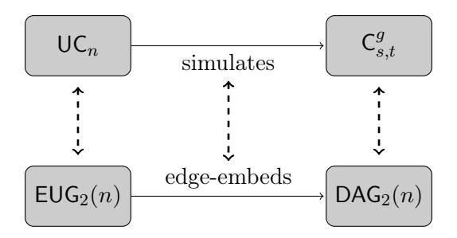

Figure 1: " $\mathsf{UC}_n$  simulates  $\mathsf{C}_{s,t}^g$ " compares to " $\mathsf{EUG}_2(n)$  edge-embeds  $\mathsf{DAG}_2(n)$ ".

**Definition 3** (Edge-Universal Graph [Val76,LMS16,AGKS20]). A directed graph G' is an Edge-Universal Graph for  $\mathsf{DAG}_d(n)$ , denoted by  $\mathsf{EUG}_d(n)$ , if it satisfies the following conditions:

- 1. (acyclicness). G' is a DAG.
- 2. (universality). Every  $G = (V, E) \in \mathsf{DAG}_d(n)$  can be edge-embedded into G'.
- 3. (bounded fan-in/fan-out). G' has bounded fan-in/fan-out, typically bounded by 2.

Further, G' is a weak Edge-Universal Graph for  $\mathsf{DAG}_d(n)$ , denoted by  $\mathsf{wEUG}_d(n)$ , if it satisfies conditions 2 and 3 above.

Remark 1. In the above definition, the condition that "G' is a DAG of bounded fan-in/fan-out" is decoupled into "acyclicness" (condition 1) and "bounded fan-in/fan-out" (condition 3). This facilitates the definition of weak EUG. In general, weak EUG is not a useful notion since it doesn't guarantee acyclicness, and thus does not give rise to a universal circuit (not even a circuit). However, looking ahead, we find the weak EUG notion simplfying our presentation when introducing our intermediate construction. Condition 3 is not strictly necessary for universal circuits, but it was respected by almost all previous works of universal circuits, and satisfying this condition makes comparison easy since the multiplicative size (resp., total size) of the resulting UC is roughly equal to (resp., four times) the size of the EUG.

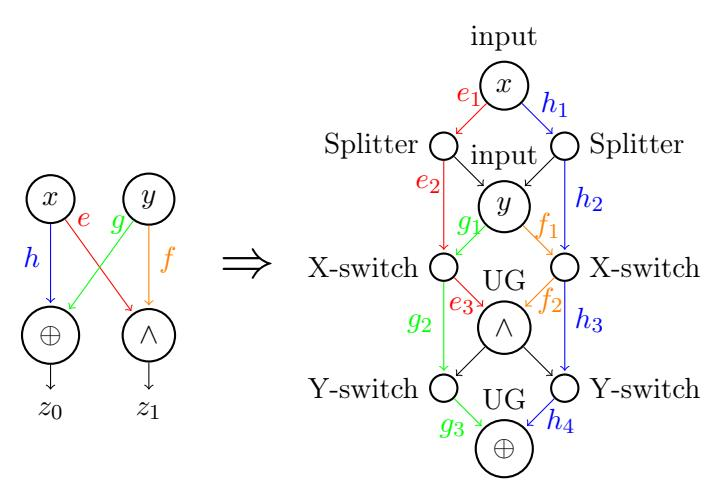

Figure 2: An example of edge-embedding.

Configuring EUG. Still using Fig. 2, we explain how edge embedding translates to the simulation of circuits. First, input nodes (e.g., x and y) simply map to the corresponding input poles in the EUG, and the gates (e.g.,  $\oplus$  and  $\wedge$ ) are implemented by the universal gates in the EUG. As the name suggests, a universal gate can be configured to simulate any binary gate

(see Appendix A for more details). In addition to poles, there are also control nodes in the EUG (i.e., the smaller ones in the right-hand of Fig. 2), which can be further instantiated with X-switching gates, Y -switching gates, and splitters. They are labelled in Fig. 2. A control node with a single incoming edge and two outgoing edges is implemented by a splitter, where only two wires (i.e., no gates) are needed as the two outputs simply copy the value from the input. The control nodes with in-degree 2 and out-degree 2 (resp., 1) are implemented by Xswitching (resp., Y -switching) gates, which can be configured in two different ways (see Fig 3). In summary, the universal gates simulate the corresponding gates in the original circuit, and the X/Y -switching gates are configured such that every intermediate value is carried from the origin to the destination (by following the route of edge embedding). For example in Fig. 2, the input x goes all the way, following the path (e1, e2, e3), to the universal gate that computes ∧, with a correct configuration of the X/Y - switching gates along the way. We refer to Appendix A for details about universal gates and switching gates and their implementations. Finally, the control bits of universal gates and switching gates make up the program bits pC for the universal circuits.

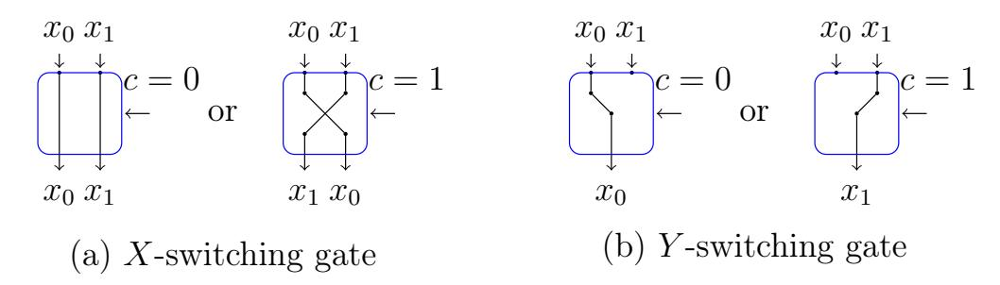

Figure 3: The configurations of X-switching and Y -switching gates.

Therefore, Valiant reduces the problem of constructing universal circuits to that of constructing edge-universal graphs. The size efficiency of universal circuit mainly concerns total size and multiplicative size (the number of AND gates), both of which are proportional to the size of the EUG.

$$|\mathsf{UC}_n| = 4n_X + 3n_Y + 9n \le 4(n_X + n_Y + n) + 5n = 4|\mathsf{EUG}_2(n)| + 5n$$
,  
 $\#(\mathsf{AND}) = n_X + n_Y + 3n = (n_X + n_Y + n) + 2n = |\mathsf{EUG}_2(n)| + 2n$ ,

where nX, nY and n are the numbers of X-switching gates, Y -switching gates and universal gates respectively. 4nX, 3nY and 9n further account for the numbers of basic gates needed to construct X-switching gates, Y -switching gates and universal gates respectively. Details about the implementations are provided in Appendix A. Recall that |EUG2(n)| = Ω(n log n) and thus

$$|\mathsf{EUG}_2(n)| \approx \#(\mathsf{AND}) \approx |\mathsf{UC}_n|/4$$

will be used as the major efficiency indicator.

### 3 Simplifying Constructions of Universal Circuits

#### 3.1 Valiant's universal circuits

Following Valiant's blueprint [Val76] (see Fig 4), the construction of universal circuits consists of the following steps:

- 1. Construct a UCn based on an EUG2(n);
- 2. Construct an EUG2(n) by merging two instances of EUG1(n);

- 3. Construct an  $\mathsf{EUG}_1(n)$  based on  $\mathsf{EUG}_1(\lceil n/k \rceil 1)$ , where the reduction is enabled with a special graph referred to as a k-way supernode, abbreviated as  $\mathsf{SN}(k)$ , for some small k (typically  $k \in \{2,3,4\}$ );
- 4. Repeat Step 3 recursively until EUG1 is small enough to build by hand.

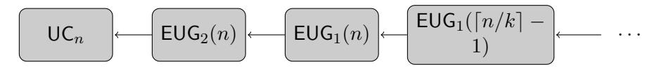

Figure 4: A high-level view of Valiant's framework for contructing universal circuits.

The construction of universal circuit  $UC_n$  from  $EUG_2(n)$  was already explained in the previous section. We proceeding to the rest steps.

Construct  $EUG_2(n)$  from  $EUG_1(n)$ . We introduce Lemma 1 and Lemma 2 in order to show that  $EUG_2(n)$  can be based on two instances of  $EUG_1(n)$ .

**Theorem 1** (König's theorem [Dén31, LP09]). If G is bipartite and its nodes have at most k incoming and k outgoing edges, then the number of colors necessary to color G is k.

**Lemma 1** (Lemma 2.1 from [Val76]). For any  $\mathsf{DAG}_d(n) = (V, E)$ , there exist d disjoint sets  $E_1$ ,  $E_2, \ldots, E_d$  such hat  $E = \bigcup_{i=1}^d E_i$  and each  $(V, E_i)$  (for  $1 \le i \le d$ ) constitutes a  $\mathsf{DAG}_1(n)$ .

**Lemma 2** ( [Val76]). For any  $n \in \mathbb{N}^+$  and any  $\mathsf{EUG}_1(n)$  of size T, there exists an  $\mathsf{EUG}_2(n)$  of size 2T-n.

We only sketch the proofs for completeness and to avoid redundancy. As exemplified in Fig. 5, we simply construct an  $\mathsf{EUG}_2(n)$  based on two instances of  $\mathsf{EUG}_1(n)$  by merging the corresponding poles and thus the size of the resulting  $\mathsf{EUG}_2(n)$  is twice that of  $\mathsf{EUG}_1(n)$  minus n. We now argue that the merged graph must be an  $\mathsf{EUG}_2(n)$ . Any  $G = (V, E) \in \mathsf{DAG}_2(n)$  can be decomposed into  $G_1 = (V, E_1), G_2 = (V, E_2) \in \mathsf{DAG}_1(n)$  by Lemma 1, for which there exist edge embeddings  $\rho_1$  and  $\rho_2$  that map  $G_1$  and  $G_2$  into the two instances of  $\mathsf{EUG}_1(n)$  respectively. It is not hard to see that  $\rho_1 \cup \rho_2$  is also an edge embedding (since edge-disjointness is preserved) that maps this (arbitrarily chosen)  $G \in \mathsf{DAG}_2(n)$  into the candidate  $\mathsf{EUG}_2(n)$ , which is a merge of the two  $\mathsf{EUG}_1(n)$  instances.

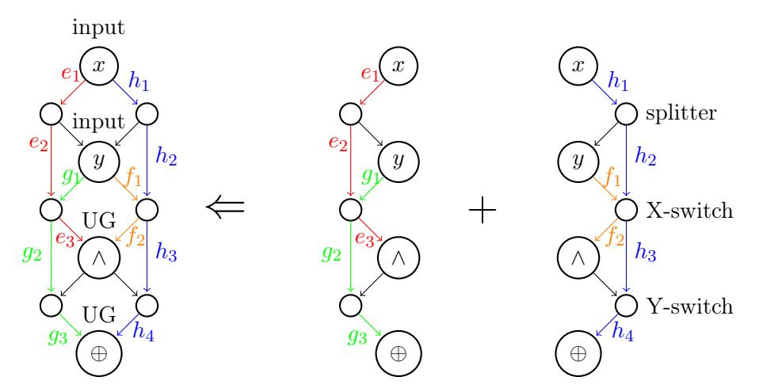

Figure 5: An  $EUG_2(n)$  based on two instances of  $EUG_1(n)$ .

**DAG Augmentation.** We introduce the notion of augmentation, as specified in Definition 4. Informally, a  $\mathsf{DAG}_1(k)$  is augmented by adding k input nodes and k output nodes, and connecting every source (resp., sink) with a single edge from (resp., to) an input (resp., output) node. Each input/output node is connected by at most one edge and thus the resulting augmented DAG remains of fan-in/fan-out 1, namely, an augmented  $\mathsf{DAG}_1(k)$  is a  $\mathsf{DAG}_1(3k)$ . Notice that inputs/outputs always suffice for augmentation since they are as many as the nodes in the original DAG. We also define k-way supernode, denoted by  $\mathsf{SN}(k)$ , in Definition 5 as a special  $\mathsf{EUG}_1(3k)$  that edge embeds any augmented  $\mathsf{DAG}_1(k)$ , much as that an  $\mathsf{EUG}_1(k)$  edge embeds any  $\mathsf{DAG}_1(k)$ . We refer to Fig. 6 for an example, where a  $\mathsf{DAG}_1(4)$  is augmented and then edge embedded into an  $\mathsf{SN}(4)$ .

**Definition 4** (Augmented DAG). For any  $k \in \mathbb{N}^+$  and any  $G = (V, E) \in \mathsf{DAG}_1(k)$ , we say that  $G' = (V', E') \in \mathsf{DAG}_1(3k)$  is an augmented DAG for G if

$$V' = \left(I = \{in^1, \dots, in^k\}\right) \cup \left(V = (P_1, \dots, P_k)\right) \cup \left(O = \{out^1, \dots, out^k\}\right)$$

and  $E' = E \cup E_{aux}$  satisfy

- 1. (Soundness). Every  $e \in E_{aux}$  satisfies either  $e = (in_i, P_i)$  or  $e = (P_i, out_i)$ ;
- 2. (Completeness). For every source (resp., sink)  $P_j \in V$ , there exists exactly one  $i \in [k]$  such that  $(in_i, P_i) \in E_{aux}$  (resp.,  $(P_i, out_i) \in E_{aux}$ ).

**Definition 5** (Supernode [LMS16, ZYZL19]). A k-way supernode, denoted by SN(k), is a DAG that can edge embed any augmented  $DAG_1(k)$ .

**Remark 2.** To be in line with augmented  $\mathsf{DAG}_1(k)$ , an  $\mathsf{SN}(k)$  needs k inputs, k poles, k outputs and potentially more, say m, control nodes. We define the size of  $\mathsf{SN}(k)$ , denoted by  $|\mathsf{SN}(k)|$ , to be m+k rather than m+3k, i.e., excluding inputs and outputs. This seems a slight abuse of the definition of graph size, but it comes in handy when counting the size of Valiant's EUG construction (see Fig. 7), where the input/output nodes coincide with the poles in the smaller EUG (and hence their contribution to the graph size has already been counted).

Construct  $\mathsf{EUG}_1(n)$  based on  $\mathsf{EUG}_1(\lceil \frac{n}{k} \rceil - 1)$  and  $\mathsf{SN}(k)$ . The core of Valiant's construction is to reduce the problem of  $\mathsf{EUG}_1$  to itself of a smaller size (by a constant factor k), with the aid of the special gadget called supernode.

**Theorem 2** (Valiant's reduction [Val76]). There exists an explicit construction of  $EUG_1(n)$  based on k instances of  $EUG_1(\lceil \frac{n}{k} \rceil - 1)$  and  $\lceil \frac{n}{k} \rceil$  instances of k-way supernodes SN(k) such that

$$\mathsf{EUG}_1(n) = k \cdot |\mathsf{EUG}_1(\lceil \frac{n}{k} \rceil - 1)| + \lceil \frac{n}{k} \rceil \cdot |\mathsf{SN}(k)| .$$

As visualized in Fig. 7, the n poles of the candidate  $\mathsf{EUG}_1(n)$  come from the poles of  $\frac{n}{k}$  instances of  $\mathsf{SN}(k)$ , i.e.,  $n = \frac{n}{k} \cdot k$ . Merge the corresponding output and input nodes of neighboring  $\mathsf{SN}(k)$  (e.g.,  $out_1^1$  and  $in_2^1$  in Fig. 7), which results in the merged nodes of in-degree and outdegree 1. Further, let the merged nodes coincide with the poles3 of  $\mathsf{EUG}_1(\lceil \frac{n}{k} \rceil - 1)$  that are also of in-degree and out-degree 1. Then, the eventually merged nodes are of in-degree/out-degree 2 and are thus instantiated with X-switching nodes. The fact below states that as long as one starts with an initial  $\mathsf{EUG}_1$  and an  $\mathsf{SN}(k)$  that are  $\mathsf{DAG}_2^4$  with all poles of in-degree/out-degree

&lt;sup>3Note that the poles of  $\mathsf{EUG}_1(\lceil \frac{n}{k} \rceil - 1)$  do not constitute the poles of the  $\mathsf{EUG}_1(n)$ , but become X-switching nodes after merging with input/output nodes.

&lt;sup>4Recall that subscript 1 in  $\mathsf{EUG}_1(n)$  refers to its capability of edge embedding arbitrary  $\mathsf{DAG}_1(n)$ , instead of that  $\mathsf{EUG}_1(n)$  is of fan-in/fan-out 1. In fact, an  $\mathsf{EUG}_1$  needs fan-in/fan-out 2 to cater for control nodes such as X/Y switching nodes.

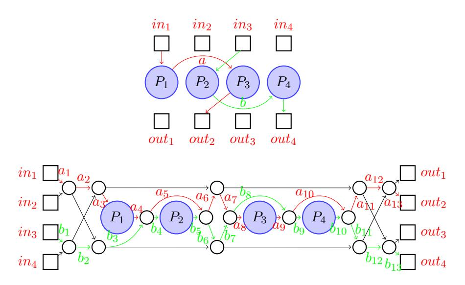

Figure 6: A  $\mathsf{DAG}_1(4)$  with edges a, b is augmented and then edge embedded to an  $\mathsf{SN}(4)$ .

1, then the condition will be preserved for the recursively constructed  $\mathsf{EUG}_1$  of arbitrary size. Note that G's all poles are of in-degree/out-degree 1 doesn't conflict  $G \in \mathsf{DAG}_2$  since the control nodes have in-degree/out-degree 2.

Fact 1 (degree preservingness). Consider the recursive construction in Fig. 7 (or Fig. 8). As long as the building block SN(k) and the initial  $EUG_1$  satisfy

- 1. Each graph is of fan-in/fan-out 2;
- 2. The poles of each graph are of in-degree and out-degree 1.

Then, the resulting  $EUG_1$  (or  $wEUG_1$ ) candidate satisfies the two conditions as well.

*Proof.* The proof goes by an induction. During each iteration, the poles of  $\mathsf{EUG}_1(\lceil \frac{n}{k} \rceil - 1)$  are of in-degree and out-degree 1, and thus after merging with  $\mathsf{SN}(k)$ 's intput/output nodes, it yields nodes of in-degree and out-degree 2 (i.e., not violating condition 1). Further, the poles of the  $\mathsf{SN}(k)$ 's now become the poles of the new  $\mathsf{EUG}_1(n)$  candidate, and thus the "all poles are of in-degree and out-degree 1" condition is preserved for  $\mathsf{EUG}_1(n)$  candidate.

**Proof sketch of Theorem 2.** It suffices to show any  $G = (V, E) \in \mathsf{DAG}_1(n)$  can be edge embedded into the candidate  $\mathsf{EUG}_1(n)$ . For concreteness we give a working example (for n = 30 and k = 6) of how an arbitrary  $G \in \mathsf{DAG}_1(30)$  (see Fig. 18) is edge embedded into a candidate  $\mathsf{EUG}_1(30)$  in Appendix D. Denote the topologically sorted nodes in G by  $V = \{p_1, p_2, \ldots, p_n\}$ , and group them such that every k successive nodes make up a set, i.e., for each  $i \in \lceil \frac{n}{k} \rceil$ 

$$V_i \stackrel{\text{def}}{=} \{ p_{(i-1)k+1}, p_{(i-1)k+2}, \dots, p_{(i-1)k+k} \}$$
,

let  $E_i$  be the set of edges connecting the nodes in  $V_i$ 

$$E_i \stackrel{\mathsf{def}}{=} \{ (p_u, p_v) \in E, \mid p_u, p_v \in V_i \}$$

and let  $E_{\setminus}$  be the rest edges (connecting nodes from different sets)

$$E_{\setminus} \stackrel{\mathsf{def}}{=} E \setminus (E_1 \cup \ldots \cup E_{\lceil \frac{n}{k} \rceil})$$
.

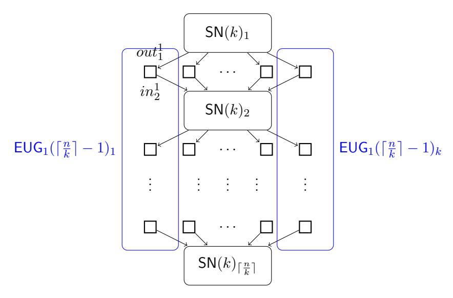

Figure 7: Valiant's construction of  $\mathsf{EUG}_1(n)$  based on k instances of  $\mathsf{EUG}_1(\lceil \frac{n}{k} \rceil - 1)$  and  $\lceil \frac{n}{k} \rceil$  instances of  $\mathsf{SN}(k)$ .

First, augment (as per Definition 4) each  $(V_i, E_i) \in \mathsf{DAG}_1(k)$  to a  $(V_i', E_i') \in \mathsf{DAG}_1(3k)$  by adding input (resp., output) nodes, and connecting them to sources (resp., from sinks) in  $(V_i, E_i)$ . There are also edges connecting nodes between different  $V_i$ , i.e.,  $(p_u, p_v) \in E_{\setminus}$  with  $p_u \in V_i$  and  $p_v \in V_j$  (i < j), where  $p_u$  (resp.,  $p_v$ ) must be a sink (resp., source) within  $(V_i, E_i)$  (resp.,  $(V_j, E_j)$ ) because any additional  $e \in E$  other than  $(p_u, p_v)$  from  $p_u$  (resp., to  $p_v$ ) would contradict that G is a  $\mathsf{DAG}_1$ . Therefore,  $p_u$  will be connected to  $out_i^t$  and  $in_j^{t'}$  will be linked to  $p_v$  when augmenting  $(V_i, E_i)$  and  $(V_j, E_j)$  respectively. In order to edge embed  $(p_u, p_v)$  to the augmented graph, we connect  $out_i^t$  to  $in_j^{t'}$ , and add  $(out_i^t, in_j^{t'})$  to  $E_{vert}$ . Thus, we have the following edge embedding

$$G = (V, E) \leadsto G' = \left(\bigcup_{i=1}^{\lceil \frac{n}{k} \rceil} (I_i \cup V_i \cup O_i), \left(\bigcup_{i=1}^{\lceil \frac{n}{k} \rceil} E_i'\right) \cup E_{vert}\right) ,$$

where every node in V maps to itself, every edge in  $E_i$  maps to itself, and every  $(p_u, p_v) \in E_{\setminus}$  maps to path  $(p_u, out_i^t, in_j^{t'}, p_v)$ . Thus, the edge embedding is not unique but up to the choices of (t, t'). Lemma 3 below guarantees  $(V_1, E_1), \ldots, (V_{\lceil \frac{n}{k} \rceil}, E_{\lceil \frac{n}{k} \rceil})$  can be jointly augmented such that every pair  $(out_i^t, in_j^{t'})$  is aligned vertically (i.e., t = t').

**Lemma 3.** For every  $G = (V, E) \in \mathsf{DAG}_1(n)$  divided into  $(V_i, E_i)$  and  $E_{\setminus}$  as aforementioned, one can augment  $(V_1, E_1), \ldots, (V_{\lceil \frac{n}{k} \rceil}, E_{\lceil \frac{n}{k} \rceil}) \in \mathsf{DAG}_1(k)$  to the respective

$$\left(I_1 \cup V_1 \cup O_1, \ E_1'\right), \dots, \left(I_{\lceil \frac{n}{k} \rceil} \cup V_{\lceil \frac{n}{k} \rceil} \cup O_{\lceil \frac{n}{k} \rceil}, \ E_{\lceil \frac{n}{k} \rceil}'\right) \in \mathsf{DAG}_1(3k)$$

where  $I_i = \{in_i^t\}_{t \in [k]}$  and  $O_i = \{out_i^t\}_{t \in [k]}$ , such that for every  $(p_u, p_v) \in E_{\setminus}$  with  $p_u \in V_i$  and  $p_v \in V_j$  (i < j), the corresponding added edges  $(p_u, out_i^t) \in E_i'$  and  $(in_j^{t'}, p_v) \in E_j'$  satisfy t = t'.

Lemma 3 falls into a corollary of Theorem 1. To see this, view each  $I_i/O_i$  as a node (instead of a set of nodes) and consider the bipartite graph  $(O \cup I, E_{bp})$  with disjoint node sets  $O = \{O_1, \ldots, O_{\lceil \frac{n}{k} \rceil}\}$  and  $I = \{I_1, \ldots, I_{\lceil \frac{n}{k} \rceil}\}$ , where  $(O_i, I_j) \in E_{bp}$  if and only if there exists  $(p_u, p_v) \in E_{\backslash}$  with  $p_u \in V_i$ ,  $p_v \in V_j$  and  $i < j^5$ . By Theorem 1, the bipartite graph is of fan-in/fan-out k and

&lt;sup>5No edge  $(p_u, p_v) \in E_i$  (i.e., i = j) is considered, and the case for i > j is not possible as nodes are topologically sorted in the first place. Further, if there are multiple edges from a node in  $V_i$  to one in  $V_j$ , then equally many copies of  $(O_i, I_j)$  are added.

thus can be k-colored say with colors C-1 to C-k. Therefore, Lemma 3 follows by translating the coloring to graph augmentation, i.e., for every  $(O_i, I_j) \in E_{bp}$  colored with C-t we add edges  $(p_u, out_i^t)$  and  $(in_i^t, p_v)$  to  $E_i'$  and  $E_j'$  respectively (and add  $(out_i^t, in_j^t)$  to  $E_{vert}$ ).

G can be edge embedded to G', but G' cannot be edge embedded into the candidate  $\mathsf{EUG}_1(n)$  because after adding the input/output nodes G' does not even look like (a subgraph of) the candidate  $\mathsf{EUG}_1(n)$ . To be compatible, we merge every output-input pair from the neighboring  $O_i$  and  $I_{i+1}$ , i.e., merge  $out_i^t$  and  $in_{i+1}^t$  for every  $i \in [\lceil \frac{n}{k} \rceil - 1]$  and  $t \in [k]$ , and rename the merged node from  $out_i^t/in_{i+1}^t$  to  $oi_i^t$ . Let  $OI_i \stackrel{\mathsf{def}}{=} \{oi_i^t\}_{t \in [k]}, \text{ let } E''_i \text{ and } E'_{vert} \text{ be the counterparts of } E'_i \text{ and } E_{vert} \text{ respectively (by renaming } out_i^t/in_{i+1}^t \text{ to } oi_i^t) \text{ and eliminating self loops}^6$ . We denote the merged version of G' by

$$G'' = \left(I_1 \cup \bigcup_{i=1}^{\lceil \frac{n}{k} \rceil - 1} (V_i \cup OI_i) \cup O_{\lceil \frac{n}{k} \rceil}, \left(\bigcup_{i=1}^{\lceil \frac{n}{k} \rceil} E_i''\right) \cup E_{vert}'\right) ,$$

whose example is illustrated in Fig. 19 and it remains to edge embed G'' to the candidate  $\mathsf{EUG}_1(n)$ . To achieve this, we edge embed every  $(OI_{i-1} \cup V_i \cup OI_i, E_i'')$  into  $\mathsf{SN}(k)_i$  as shown in Fig. 20, where  $OI_0 = I_1$  and  $OI_{\lceil \frac{n}{k} \rceil} = O_{\lceil \frac{n}{k} \rceil}$ . The task then reduces to

$$\left(\bigcup_{i=1}^{\lceil\frac{n}{k}\rceil-1}OI_i=\bigcup_{t=1}^k\{oi_i^t\}_{i\in\left[\lceil\frac{n}{k}\rceil-1\right]},E'_{vert}\right)\leadsto\bigcup_{t=1}^k\mathrm{EUG}_1(\lceil\frac{n}{k}\rceil-1)_t\ .$$

Thanks to Lemma 3, every  $(oi_i^t, oi_j^{t'}) \in E'_{vert}$  satisfies t = t', and thus the job furthers reduces to do edge embedding independently, i.e., for every  $t \in [k]$ 

$$\left(V_t^{oi} \stackrel{\mathsf{def}}{=} \left\{oi_i^t\right\}_{i \in \left[\lceil \frac{n}{k} \rceil - 1\right]}, \ E_t^{oi} \stackrel{\mathsf{def}}{=} \left\{(oi_i^t, oi_j^t) \in E_{vert}'\right\}\right) \leadsto \mathsf{EUG}_1(\lceil \frac{n}{k} \rceil - 1)_t \ ,$$

where  $\cup_{t=1}^k E_t^{oi} = E_{vert}'$ . This is trivial (see Fig. 21 for the example) since any  $\mathsf{DAG}_1(\lceil \frac{n}{k} \rceil - 1)$  such as  $(V_t^{oi}, E_t^{oi})$  can be edge embedded into an  $\mathsf{EUG}_1(\lceil \frac{n}{k} \rceil - 1)$ .

**Theorem 3** (Valiant's universal circuits [Val76]). For any integer  $k \geq 2$ , there exist explicit k-way constructions of  $\mathsf{EUG}_2(n)$  and  $\mathsf{UC}_n$  with

$$|\mathsf{EUG}_2(n)| = \frac{2|\mathsf{SN}(k)|}{k\log k} n\log n - \Omega(n) \quad and \quad |\mathsf{UC}_n| \le 4|\mathsf{EUG}_2(n)| + O(n)$$
.

The construction of  $\mathsf{EUG}_2(n)$  eventually reduces to that of  $\mathsf{EUG}_1(B)$  for small B, whose optimal sizes were known for  $B \in \{2, \ldots, 8\}$  [Val76, LMS16, GKS17] (see Table 2). The size of  $\mathsf{EUG}_2(n)$  follows from Lemma 2 and Theorem 2, i.e.,

$$|\mathsf{EUG}_2(n)| = 2|\mathsf{EUG}_1(n)| - n , \qquad (1)$$

$$|\mathsf{EUG}_1(n)| = k|\mathsf{EUG}_1(\lceil \frac{n}{k} \rceil - 1)| + \lceil \frac{n}{k} \rceil |\mathsf{SN}(k)| , \qquad (2)$$

where  $|\mathsf{EUG}_1(B)|$  is irrelevant to the dominant term of  $|\mathsf{EUG}_2(n)|$  but is reflected in (and absorbed by) the term  $\Omega(n)$ . Similarly, we get

$$|\mathsf{UC}_n| = \frac{2|\mathsf{CircuitSN}(k)|}{k\log k} n\log n - \Omega(n) \le \frac{8|\mathsf{SN}(k)|}{k\log k} n\log n - \Omega(n) , \qquad (3)$$

where CircuitSN(k) denotes the circuit counterpart of SN(k). Clearly, the size of universal circuits monotonically depends on the k-way supernode size, and thus constructing size-optimal universal circuits reduces to the search for optimal size-efficient supernodes. We know from literature

| n            | 2 | 3 | 4 | 5  | 6  | 7  | 8  |
|--------------|---|---|---|----|----|----|----|
| $ EUG_1(n) $ | 2 | 4 | 6 | 10 | 13 | 19 | 23 |

Table 2: The concrete sizes of size-optimal  $EUG_1(n)$  for  $n \in \{2, \dots, 8\}$  [Val76, LMS16, GKS17].

| Construction                   | k | SN(k) | $ EUG_2(n) $  | $ UC_n $        |
|--------------------------------|---|-------|---------------|-----------------|
| Valiant's 2-way [Val76]        | 2 | 5     | $5n\log n$    | $20n \log n$    |
| Günther et al.'s 3-way [GKS17] | 3 | 12    | $5.05n\log n$ | $20.19n \log n$ |
| Valiant's 4-way [Val76]        | 4 | 19    | $4.75n\log n$ | $19n\log n$     |
| Zhao et al.'s 4-way [ZYZL19]   | 4 | 18    | $4.5n\log n$  | $17.75n\log n$  |

Table 3: Size-efficient universal circuits for  $k \in \{2, 3, 4\}$  under Valiant' framework, where graph and circuit sizes keep only dominant terms.

[Val76, GKS17, ZYZL19] the minimum of |SN(k)| for practical values k = 2, 3, 4 along with the corresponding sizes of edge universal graphs and universal circuits, as shown in Appendix C and Table 3.

The supernode sizes in Table 3, i.e., |SN(k)| = 5, 12 and 18 for  $k \in \{2, 3, 4\}$  respectively, were shown optimal by an exhaustive search that no candidate graph of smaller sizes can constitute a k-way supernode [ZYZL19]. However, size-optimal supernodes, for  $k \geq 5$ , are not known and even if they are found, the corresponding universal circuits are not practical because the time/memory complexity of the compiler (that involves EUG configuration, edge embedding, etc.) blows up dramatically with respect to k. Further, Zhao et al. [ZYZL19] showed that under Valiant's framework  $|EUG_2(n)|$  is lower bounded by  $3.64n \log n$  with minimum achieved at k = 69 (and thus unattainable in practice). Therefore, it is necessary to break Valiant's mindset to beat the  $3.64n \log n$  lower bound.

#### 3.2 An intermediate $wEUG_1(n)$ construction

As concluded, improvement to Valiant's universal circuits seemingly relies on better constructions of  $\mathsf{EUG}_1(n)$ . As shown in Fig. 8, we give an intermediate construction of a candidate  $\mathsf{wEUG}_1(n)$ : for every row i (i.e.,  $\mathsf{SN}(k)_i$ ) we horizontally (i.e., for  $t \in [k]$ ) merge every inputoutput pair  $(in_i^t, out_i^t)$  to node  $io_i^t$  of in-degree and out-degree 1, and we further merge the nodes vertically, for every column t, let  $(io_1^t, io_2^t, \ldots, io_{\lceil \frac{n}{k} \rceil}^t)$  merge with the poles of the  $\mathsf{wEUG}_1(\lceil \frac{n}{k} \rceil)_t$  component-wise. Prior to merging the poles of  $\mathsf{wEUG}_1(\lceil \frac{n}{k} \rceil)$  are of in-degree and out-degree 1 (see Fact 1), and therefore the merged nodes are X-switching nodes of in-degree and out-degree 2. This construction seems to be a variant of Valiant's construction in Fig. 7. The difference is that, instead of merging every pair of  $out_i^t$  and  $in_{i+1}^t$   $(1 \le t \le k)$  from the neighboring  $\mathsf{SN}(k)_i$  and  $\mathsf{SN}(k)_{i+1}$ , one merges  $in_i^t$  and  $out_i^t$  for the same  $\mathsf{SN}(k)_i$  and for every  $i \in [\lceil \frac{n}{k} \rceil]$  and  $t \in [k]$ . This introduces cycles to the graph and thus the best hope is to prove it to be a  $\mathsf{wEUG}_1(n)$ .

Corollary 1 (The intermediate wEUG1(n)). The graph constructed from k instances of wEUG1( $\lceil \frac{n}{k} \rceil$ ) and  $\lceil \frac{n}{k} \rceil$  instances of SN(k), as in Fig. 8, is a wEUG1(n).

We sketch how the proof of Theorem 2 can be adapted to prove the above corollary. Consider an arbitrary  $G = (V, E) \in \mathsf{DAG}_1(n)$  with topologically sorted nodes  $V = \{p_1, p_2, \ldots, p_n\}$ , and let  $V_i$ ,  $E_i$  and  $E_i$  be defined the same way (as in proof of Theorem 2). After augmenting every

&lt;sup>6After merging, edge  $(out_i^t, in_{i+1}^t)$  becomes a self-loop which is not included in  $E'_{vert}$ .

 $(V_i, E_i) \in \mathsf{DAG}_1(k)$  to a  $(V_i', E_i') \in \mathsf{DAG}_1(3k)$ , we can (efficiently) obtain such an edge embedding

$$G = (V, E) \leadsto G' = \left(\bigcup_{i=1}^{\lceil \frac{n}{k} \rceil} (I_i \cup V_i \cup O_i), \left(\bigcup_{i=1}^{\lceil \frac{n}{k} \rceil} E_i'\right) \cup E_{vert}\right) ,$$

where by Lemma 3 for every  $(p_u, p_v) \in E_{\setminus}$  (i.e.,  $p_u \in V_i$ ,  $p_v \in V_j$ , i < j) there exists  $t \in [k]$  such that edge  $(p_u, p_v)$  maps to path  $(p_u, out_i^t, in_j^t, p_v)$  in the edge embedding. Notice that up till now the proof is exactly the same as that of Theorem 2. Next, instead of merging every pair of  $out_i^t$  and  $in_{i+1}^t$   $(t \in [k])$  from the neighboring  $O_i$  and  $I_{i+1}$   $(i \in [\lceil \frac{n}{k} \rceil - 1])$ , we merge  $in_i^t$  and  $out_i^t$  for the same i, and for every  $i \in [\lceil \frac{n}{k} \rceil]$  and  $t \in [k]$ , as shown in Fig. 8. Rename the merged node  $in_i^t/out_i^t$  to  $io_i^t$ , let  $IO_i \stackrel{\text{def}}{=} \{io_i^t\}_{t \in [k]}$ , and let  $E_i''$  and  $E_{vert}'$  be the counterparts of  $E_i'$  and  $E_{vert}$  respectively by renaming the nodes (from  $in_i^t/out_i^t$  to  $io_i^t$ ). This simplifies G' to

$$G'' = \left(\bigcup_{i=1}^{\lceil \frac{n}{k} \rceil} (IO_i \cup V_i), \left(\bigcup_{i=1}^{\lceil \frac{n}{k} \rceil} E_i''\right) \cup E_{vert}'\right) ,$$

and it remains to show G'' can be edge embedded into the candidate weak EUG. Every  $(I_i \cup V_i \cup O_i, E'_i)$  can be edge embedded into  $\mathsf{SN}(k)_i$  and so can do it when the corresponding  $in_i^t$  and  $out_i^t$  are merged, which ensures that every edge in  $E_i$  maps to a path in the candidate  $\mathsf{wEUG}_1(n)$ . Further, by the definition of weak EUG we have for every  $t \in [k]$ 

$$\left(V_t^{io} \stackrel{\mathsf{def}}{=} \{io_i^t\}_{i \in [\lceil \frac{n}{k} \rceil]}, \ E_t^{io} \stackrel{\mathsf{def}}{=} \left\{(io_i^t, io_j^t) \in E_{vert}'\right\}\right) \leadsto \mathsf{wEUG}_1(\lceil \frac{n}{k} \rceil)_t \ ,$$

which ensures that every  $(p_u, p_v) \in E_{\setminus}$  maps to a path in the candidate  $\mathsf{wEUG}_1(n)$ . Finally, it is important to note that the aforementioned mappings of edges in E to the corresponding paths in the candidate  $\mathsf{wEUG}_1(n)$  are edge disjoint.  $\square$ 

Note that wEUG1 is cyclic, and there are cycles that first leave a block (e.g., over edge 2 in Fig. 22) and eventually returns to the same block (e.g., edge 3 in Fig. 22). However, it is interesting to observe that such self-feedback paths will never appear in the edge-disjoint paths for edge-embedding any DAG1(n). This is because for any topologically sorted DAG1(n) and any edge  $(u,v) \in \mathsf{DAG}_1(n)$  that belong to the same block we have  $1+(i-1)k \le u < v \le k+(i-1)k$ , and by the definition of supernode  $\mathsf{SN}(k)_i$  edge embeds (u,v) with a path that never leaves the block. Otherwise said, the X-switching nodes resulting from merging input/output nodes for every  $\mathsf{SN}(k)_i$  (see node a in Fig. 8) are actually redundant, e.g., the self-feedback option (4,2)/(1,3) for node a is never used. This motivates further optimizations in our final construction, and thanks to the removal of the redundant nodes, the end construction results in a DAG and we get an EUG in the end.

#### 3.3 The final constructions of $EUG_1(n)$ and universal circuits

On optimizing the intermediate construction. At first glance, this construction is nothing more than a weak version of Valiant's EUG, with roughly the same (actually slightly worse) circuit size. However, it serves to exhibit the redundancy of Valiant's construction. Our universal circuits use the EUG1 construction in Fig. 9, which optimizes (differs to) Fig. 8 by avoiding merging the nodes (and save X-switching nodes). That is, for every  $t \in [k]$  and  $i \in [\lceil \frac{n}{k} \rceil]$ , let  $(in_i^t, out_i^t)$  be the input-output pair from  $\mathsf{SN}(k)_i$  and let  $p_i^t$  be the i-th pole of  $\mathsf{wEUG}_1(\lceil \frac{n}{k} \rceil)_t$ , we remove  $in_i^t$ ,  $out_i^t$  and  $p_i^t$  (their associated edges) and add an edge connecting  $p_i^t$ 's precursor node to  $in_i^t$ 's successor node and another one linking  $out_i^t$ 's precursor to  $p_i^t$ 's successor. Here  $in_i^t$ 's successor and  $out_i^t$ 's precursor refer to the respective successor/precursor in  $\mathsf{SN}(k)_i$  and  $p_i^t$ 's precursor/successor is with respect to  $\mathsf{wEUG}_1(\lceil \frac{n}{k} \rceil)_t$ . These precursors/successors are all guaranteed to be unique by the definition of augmentation and Fact 1. It is important to note

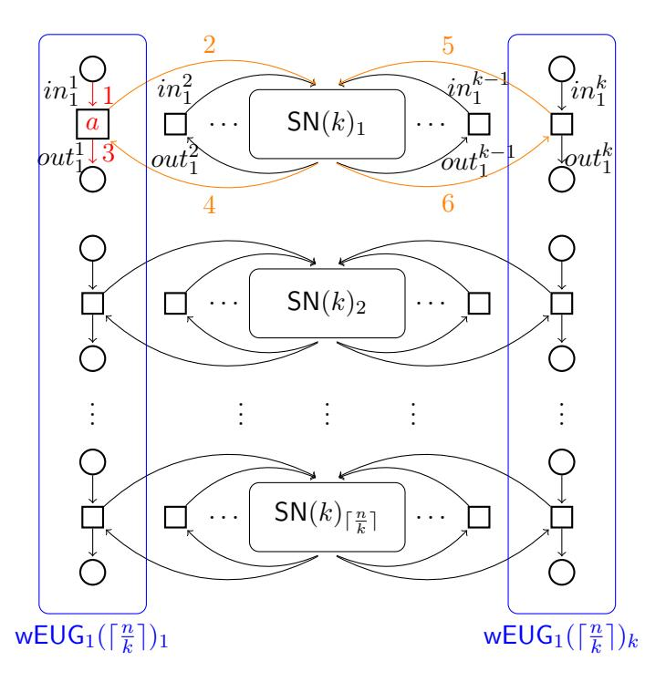

Figure 8: The intermediate  $\mathsf{wEUG}_1(n)$  based on k instances of  $\mathsf{wEUG}_1(\lceil \frac{n}{k} \rceil)$  and  $\lceil \frac{n}{k} \rceil$  instances of  $\mathsf{SN}(k)$ .

that after removing the nodes (and their associated edges, and making necessary adjustment), the candidate  $EUG_1$  in Fig. 9 now becomes a  $DAG_2$ . We can prove that it is  $EUG_1$  by showing that the universality is preserved from the  $wEUG_1$  in Fig. 8 (i.e., not affected by the optimization).

**Theorem 4** (Universal circuits). For any integer  $k \geq 2$ , there exists explicit k-way constructions of  $\mathsf{EUG}_2(n)$  and  $\mathsf{UC}_n$  with

$$|\mathsf{EUG}_2(n)| = \frac{2(|\mathsf{SN}(k)| - k)}{k \log k} n \log n - \Omega(n) \quad and \quad |\mathsf{UC}_n| \le 4|\mathsf{EUG}_2(n)| + O(n) \ .$$

In particular, for k = 2 we have  $|\mathsf{EUG}_2(n)| = 3n \log n - \Omega(n)$ .

*Proof.* Now that Fig. 8 presents a correct wEUG1 construction by Corollary 1, we further argue that Fig. 9 gives rise to an EUG1 as well. By comparing Fig. 9 with Fig. 8, the difference is all X-switching nodes  $io_i^t$ , that merges  $(in_i^t, out_i^t)$  from  $SN(k)_i$  and pole  $p_i^t$  from wEUG1( $\lceil \frac{n}{k} \rceil$ )t, are now bypassed in Fig. 9. By right the X-switch node  $io_i^t$  offers two switching options:

$$\begin{array}{l} \text{option 0: } (p_i^{t,pre}, io_i^t, in_i^{t,suc}) \And (out_i^{t,pre}, io_i^t, p_i^{t,suc}) \\ \text{option 1: } (p_i^{t,pre}, io_i^t, p_i^{t,suc}) \And (out_i^{t,pre}, io_i^t, in_i^{t,suc}) \end{array}$$

where  $p_i^{t,pre}$  and  $p_i^{t,suc}$  denote the precursor and successor of  $p_i^t$  within the  $\mathsf{wEUG}_1(\lceil \frac{n}{k} \rceil)$  respectively, and  $in_i^{t,suc}$  (resp.,  $out_i^{t,pre}$ ) denotes the successor (resp., precursor) of  $in_i^t$  (resp.,  $out_i^t$ ) within the  $\mathsf{SN}(k)$ . In contrast, Fig. 9 simply hardwires the option-0 configuration and short-circuits every node  $io_i^t$  as follows:

$$(p_i^{t,pre}, in_i^{t,suc}) \& (out_i^{t,pre}, p_i^{t,suc})$$
.

It suffices to show that option 1 is redundant and is thus not needed. Recall the main idea of the  $\mathsf{wEUG}_1(n)$  construction is that  $\mathsf{wEUG}_1(\lceil \frac{n}{k} \rceil)$  edge-embeds inter-group edges, i.e.,  $(p_u, p_v)$  for  $p_u \in V_{i_1}$ ,  $p_v \in V_{i_2}$  and  $i_1 < i_2$ , and  $\mathsf{SN}(k)$  takes care of intra-group edges, i.e.,  $(p_u, p_v)$  for

| Our k-way UC | SN(k) | $ EUG_2(n) $  | $ UC_n $       |
|--------------|-------|---------------|----------------|
| 2-way        | 5     | $3n \log n$   | $12n\log n$    |
| 3-way        | 12    | $3.79n\log n$ | $15.14n\log n$ |
| 4-way        | 18    | $3.5n\log n$  | $14n\log n$    |

Table 4: Our k-way universal circuits from Theorem 4 for  $k \in \{2, 3, 4\}$ .

 $p_u, p_v \in V_i$ . In the former case, edges  $(p_u, out_{i_1}^t)$  and  $(in_{i_2}^t, p_v)$  will be added during augmentation, where two option-0 configurations are needed: for  $i = i_1$  we need  $(out_i^{t,pre}, io_i^t, p_i^{t,suc})$  to make a path that originates from  $p_u$ 's corresponding pole; and for  $i = i_2$  it is necessary to have  $(p_i^{t,pre}, io_i^t, in_i^{t,suc})$  for a path ending at  $p_v$ 's pole. Note that edge  $(out_{i_1}^t, in_{i_2}^t)$  will be mapped to a path in wEUG1( $\lceil \frac{n}{k} \rceil$ )t. In the latter case, the edge embedding of  $(p_u, p_v)$  is handled by  $\mathsf{SN}(k)_i$  internally and thus no switching configurations are needed. Therefore, the wEUG1 after optimization (by removing the cycles) becomes a  $\mathsf{DAG}_1$  (and is therefore an  $\mathsf{EUG}_1$ ). The optimized  $\mathsf{EUG}_1$  construction yields

$$|\mathsf{EUG}_1(n)| = k \cdot |\mathsf{EUG}_1(\lceil \frac{n}{k} \rceil)| + \lceil \frac{n}{k} \rceil \cdot |\mathsf{SN}(k)| - n$$
,

where n accounts for the number of X-switching node  $io_i^t$  saved (cf. Eq 2). Based on this optimized  $\mathsf{EUG}_1$  construction, we follow Valiant's blueprint (see Fig 4) to get an  $\mathsf{EUG}_2(n)$  of size

$$|\mathsf{EUG}_2(n)| = 2|\mathsf{EUG}_1(n)| - n = \frac{2(|\mathsf{SN}(k)| - k)}{k \log k} n \log n - \Omega(n) ,$$

where choosing k=2,  $\mathsf{SN}(2)=5$  yields efficient 2-way construction of size  $3n\log n - \Omega(n)$ .

**Remark 3** (Why not optimizing Valiant's  $\mathsf{EUG}_1$ ?). One might ask why not directly optimize the Valiant's original construction in Fig 7 and instead introduce the intermediate one in Fig. 8. This is because the merged nodes in Fig 7 are actually necessary and cannot be saved for free. To see this, for every  $i \in [\lceil \frac{n}{k} \rceil - 1]$  and  $t \in [k]$ , merge out\_i^t,  $in_{i+1}^t$  and the i-th pole  $p_i^t$  of  $\mathsf{EUG}_1(\lceil \frac{n}{k} \rceil - 1)_t$  to an X-switching node  $oi_i^t$ , where the switching options are as follows

$$\begin{array}{l} \textit{option 0:} \ (p_i^{t,pre}, oi_i^t, in_{i+1}^{t,suc}) \ \& \ (out_i^{t,pre}, oi_i^t, p_i^{t,suc}) \ , \\ \textit{option 1:} \ (p_i^{t,pre}, oi_i^t, p_i^{t,suc}) \ \& \ (out_i^{t,pre}, oi_i^t, in_{i+1}^{t,suc}) \ . \end{array}$$

We mention that both options are necessary. Option 0 is needed for edge embedding  $(p_u, p_v)$  with either  $p_u \in V_j$ ,  $p_v \in V_{i+1}$  (j < i) or  $p_u \in V_i$ ,  $p_v \in V_{j+1}$  (j > i), whereas option 1 is required for the case that  $p_u \in V_i$  and  $p_v \in V_{i+1}$ . Hence, we cannot save XOR switching node oit by hardwiring either options. In retrospect, the latter configuration is only needed for handling edges connecting neighboring node sets, which motivates us to use the variant in Fig 8 to eliminate the need for option 1.

As explicitly stated in Theorem 4, our 2-way universal circuits already improve upon the best previously known by reducing a third in circuit size. Curiously, one may wonder if the advantage can be further increased by using a large k. We list out the results in Table 4 for k up to 4 based on the corresponding optimal-size k-way supernodes.

#### 3.4 A lower bound on circuit size in our Framework

We lower bound the size of the k-way  $\mathsf{EUG}_2(n)$  (and UC) in our framework based on the techniques introduced in [ZYZL19].

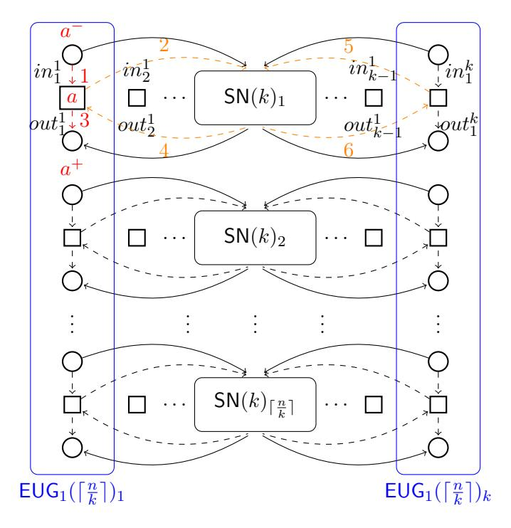

Figure 9: The end  $\mathsf{EUG}_1(n)$  based on k instances of  $\mathsf{EUG}_1(\lceil \frac{n}{k} \rceil)$  and  $\lceil \frac{n}{k} \rceil$  instances of k-way supernodes  $\mathsf{SN}(k)$ , where  $a^-$  and  $a^+$  are the precursor and successor of pole a within  $\mathsf{EUG}_2(\lceil \frac{n}{k} \rceil)_1$  respectively, and dashed edges do not exist (cf. Fig. 8).

**Theorem 5** (A lower bound on  $|EUG_2(n)|$ ). For any integer  $k \geq 2$ , any k-way  $EUG_2(n)$  constructed via the following two steps

- 1. Recursively construct an  $EUG_1(n)$  as in Fig. 9;
- 2. Use Valiant's  $EUG_1$ -to- $EUG_2$  transform (see Lemma 2) to get an  $EUG_2(n)$ .

must satisfy  $|\mathsf{EUG}_2(n)| \ge 2.95n \log n$  for all sufficiently large n's.

*Proof.* Recall that by Theorem 3 we have

$$|\mathsf{EUG}_2(n)| = \frac{2(|\mathsf{SN}(k)| - k)}{k \log k} n \log n - \Omega(n) \ge \frac{2\lceil \log(F_k) \rceil}{k \log k} n \log n - \Omega(n)$$

where the inequality comes from [ZYZL19], stated as Lemma 4, whose proof is reproduced in Appendix B for completeness. It thus suffices to bound the factor  $g(k) \stackrel{\mathsf{def}}{=} \frac{2\lceil \log(F_k) \rceil}{k \log k}$  using Lemma 5.

**Lemma 4** ( [ZYZL19]).  $|SN(k)| \ge \lceil \log(F_k) + k \rceil$ , where  $F_k = \sum_{i=1}^k (\frac{k!}{(k-i)!})^2 A_{i,k}$  and  $A_{i,k}$  in turn can be computed by dynamic programming with the following:

- 1. (Base case).  $A_{1,k} = 1, \forall k \in \mathbb{N}^+;$
- 2. (Recursive formula).  $A_{i,k} = \sum_{j=0}^{k-i} {k-1 \choose j} A_{i-1,k-j-1}$ .

 $F_k$  is defined as the number of augmented  $\mathsf{DAG}_1(k)$  (as per Definition 4), and  $A_{i,k}$  denotes the number of ways to spread k different balls into i ( $i \leq k$ ) identical boxes with the condition that no boxes are empty.

**Lemma 5.** For any integer  $k \geq 2$ ,  $g(k) \stackrel{\mathsf{def}}{=} \frac{2\lceil \log(F_k) \rceil}{k \log k} > 2.95$ .

| k    | 2 | 3      | 4      |  8      | 9      | 10     |  29     | 30     |
|------|---|--------|--------|------------|--------|--------|------------|--------|
| g(k) | 3 | 3.0158 | 2.9943 |  2.9547 | 2.9547 | 2.9565 |  3.0419 | 3.0449 |

Table 5: The values of g(k) for  $k \leq 30$ .

*Proof.* As a general closed-form expression for  $F_k$  seems difficult, we use dynamic programming to compute the values of  $A_{i,k}$   $F_k$  and g(k) for k up to a few hundred, and list only partial results (up to k = 30) in Table 5 due to lack of space. Note that g(8) and g(9) are roughly the same and seemingly reach the minimum in terms of the values we computed. It remains to show that "g(k) is monotonically increasing for  $k \geq 9$ " to complete the proof. We have

$$F_k = \sum_{i=1}^k \left(\frac{k!}{(k-i)!}\right)^2 A_{i,k} \ge \sum_{i=k-1}^k \left(\frac{k!}{(k-i)!}\right)^2 A_{i,k} = (A_{k-1,k} + A_{k,k})(k!)^2,$$

and  $A_{k,k}=1, A_{k-1,k}=\binom{k}{2}=\frac{(k-1)k}{2}$ . Thus,  $F_k\geq (\frac{(k-1)k}{2}+1)(k!)^2$ . It follows from Stirling's formula  $\forall k\in\mathbb{N}^+$   $k!\geq \sqrt{2\pi k}(\frac{k}{e})^k$ 

$$F_k \ge (2\pi k) \left(\frac{(k-1)k}{2} + 1\right) \left(\frac{k}{e}\right)^{2k} ,$$

and therefore

$$g(k) \geq \frac{2\log(F_k)}{k\log k} \geq \frac{2\log(\pi k((k-1)k+2)(\frac{k}{e})^{2k})}{k\log k} \stackrel{\text{def}}{=} h(k)$$
,

where by taking the derivative we know that h(k) in the right-hand is monotonically increasing for  $k \geq 2$ , and thus  $g(k) \geq h(k) \geq h(9) \approx 2.95$  for all  $k \geq 9$ , which completes the proof.

On the (un)tightness of the  $2.95n \log n$  bound. The bound is obtained by applying Lemma 4 and Lemma 5. The latter is tight as equality holds for k=9 while the former is not. We observe that  $\log(F_k) + k$  equals 5, 10.17 and 15.98 for k=2,3,4 respectively, so  $|\mathsf{SN}(k)|$ , as an integer, is no less than 5, 11, and 16 for the respective k=2,3,4. However, as shown in Table 4, the minimum of  $|\mathsf{SN}(k)|$  equals 5, 12, 18 for k=2,3,4 respectively. That is, the equality holds only at k=2 and the gap seems to increase over k, where the untightness is attributed to the proof technique, i.e., that the number of possible configurations is no less than that of augmented k-way  $\mathsf{DAG}_1$  is a loose argument due to the existence of redundant configurations (not all control nodes are needed to edge embed a specific  $\mathsf{DAG}$ ). To conclude, the lower bound  $2.95n \log n$  is very close to  $3n \log n$  achieved by our efficient construction, and the loose steps for deriving the lower bound suggests that the construction might already be optimal under the framework we introduced.

### 4 Implementation and Performance Evaluation

In this section, we give more details about the implementation and optimization of the universal circuits, and a performance comparison with the previous works. The source code of our implementation and optimization is available at [oTP20].

#### 4.1 Implementing and optimizing the 2-way universal circuits

We briefly describe how to implement and optimize our 2-way UC. Following previous implementations [KS16, GKS17, AGKS20], we use the Fairplay compiler [MNPS04, BNP08] with the Fairplay extension [KS08b] to transform any functionality described in a high-level language

into the standard circuit description written in SHDL (Secure Hardware Definition Language). The produced circuit description has fan-in 2, but has not limit on its fan-out. As required by Valiant's universal circuits, the fan-out of the circuit to be simulated must be bounded by 2 as well. Hence, the next step is to convert the circuit to a functionality equivalent one with fan-in/fan-out 2, which is achieved by using copying gates for those gates with out-degree more than 2. We refer to [KS16] for implementation details and how the conversion affects the size of practical circuits. Following [KS16, GKS17, AGKS20], the circuit description format of the generated UC numbers the wires in sequential order and specifies universal, X-switching and Y-switching gates as follows:

U  $in_1$   $in_2$   $out_1$  X  $in_1$   $in_2$   $out_1$   $out_2$ Y  $in_1$   $in_2$   $out_1$ 

where a gate with type (U, X or Y) and input wires  $in_1$  and  $in_2$  produces as output(s) wire  $out_1$  (and possibly wire  $out_2$ ), and control bits for the gates are not present in the above description but stored in the programming file of UC.

Our 2-way UC should be more efficient to generate than the hybrid counterparts in [KS16, GKS17, ZYZL19, AGKS20] due to the simplicity. However, a straightforward implementation of a 2-way construction in Fig. 9 requires that n is a two's power and therefore optimization is need to adapt to arbitrary n. Similar to [GKS17], we define in Fig. 10 sub-components of SN(2) called head block and tail blocks by removing the respective input and output nodes (and their associated edges and control nodes). This enables a more fine-grained recursive construction of  $EUG_1(n)$  for arbitrary  $n \in \mathbb{N}^+$  as follows:

- 1. If n is even, construct  $\mathsf{EUG}_1(n)$  as in Fig. 11(a) and invoke the two instances of  $\mathsf{EUG}_1(\frac{n}{2})$ ;
- 2. Otherwise (n is odd), construct  $\mathsf{EUG}_1(n)$  as in Fig. 11(b), and invoke  $\mathsf{EUG}_1(\frac{n+1}{2})$  and  $\mathsf{EUG}_1(\frac{n-1}{2})$ .
- 3. Repeat until n is sufficiently small to build  $EUG_1(n)$  by hand.

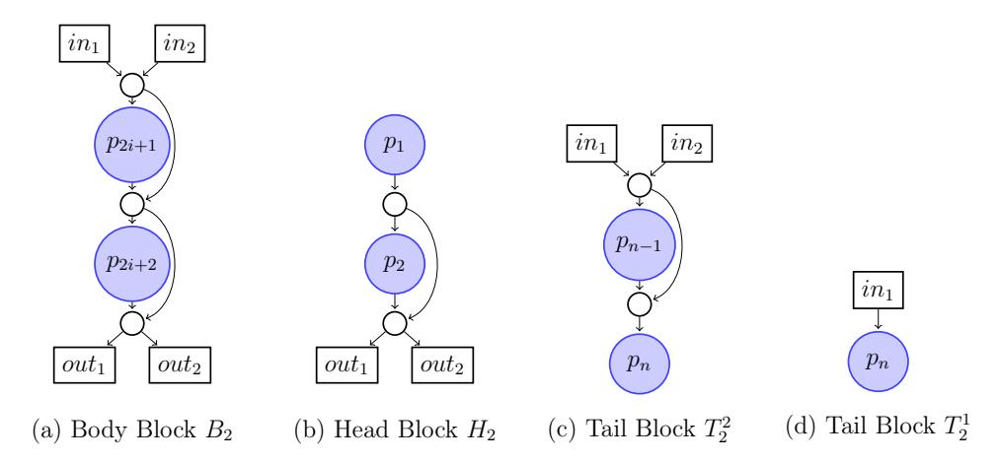

Figure 10: (a) is Valiant's 2-way supernode, (b) is the head block that excludes input nodes, (c) and (d) are the tail blocks for two poles and a single pole respectively.

The construction gives the recursive relation on the size of  $EUG_1(n)$  as follows:

$$|\mathsf{EUG}_{1}(n)| = |\mathsf{head}| + (\lceil \frac{n}{2} \rceil - 2) \cdot |\mathsf{body}| + |\mathsf{tail}(p_{n})| + |\mathsf{EUG}_{1}(\lceil \frac{n}{2} \rceil)| + |\mathsf{EUG}_{1}(\lfloor \frac{n}{2} \rfloor)| - n ,$$

$$(4)$$

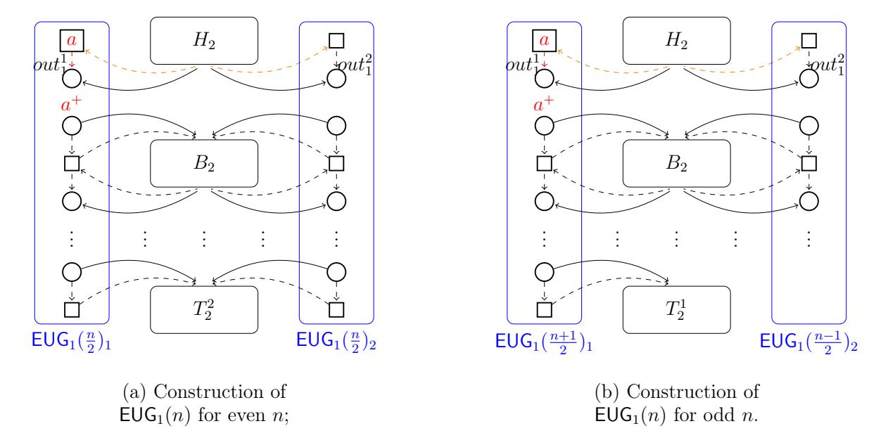

Figure 11: A more fine-grained construction of  $\mathsf{EUG}_1(n)$  for arbitrary n (cf. Fig. 9), which starts with a head block, followed by  $\lceil \frac{n}{2} - 2 \rceil$  standard blocks of  $\mathsf{SN}(2)$ , and ends with a tail block with one or two poles depending on the parity of n.

where  $p_n = 2$  if n is even, or  $p_n = 1$  otherwise, |head| = 4 and |body| = 5 are the sizes of the head and standard body blocks respectively, and |tail(1)| = 1 and |tail(2)| = 4 are the sizes of different tail blocks determined by the parity of n as shown in Fig. 10. The above relation is more precise but it yields the same asymptotic sizes about  $\mathsf{EUG}_2(n)$  and  $\mathsf{UC}_n$  as stated in Theorem 4, which are obtained in the simplified scenario  $n = 2^j \cdot B$ .

#### 4.2 Performance evaluation

We evaluate the multiplicative circuit sizes of our UC in simulating a set of typical circuits such as AES-128 with key expansion, MD5 and SHA-256 from [TS15] and compare the results with those from previous ones [KS16, GKS17, ZYZL19, AGKS20] in Table 6. We also run the experiments for a wider range of (fan-in/fan-out 2) circuits of size  $15 \le n \le 10^8$ , in particular, for every range  $n \in \{10^i, \ldots, 10^{i+1}\}$  pick 100 equidistant points for n (or evaluate all if the number of points are less than 100). The comparison with previous implementations are visualized in Fig. 12. Both comparisons confirm that our 2-way universal circuits achieves roughly 33%, 37% and 40% reductions in circuit size over Zhao et al.'s UC, Valiant's 2-way and 4-way UCs respectively.

Admittedly, our implementation only verifies the correctness of the construction and its size advantages over previous constructions. Further engineering efforts are needed to optimize UC generation and programming process for practical use, and in this respect the scalable UC generation algorithm from [AGKS20] that reduces memory consumption from  $O(n \log n)$  to O(n) serves as a good reference.

### Acknowledgments

We are grateful to the team members of [AGKS20], in particular, Daniel Günther and Ágnes Kiss, for pointing out the issue in a previous version that our intermediate construction yields only a weak EUG, and for many helpful suggestions.

| Functionality   | n      | Valiant's | Valiant's  | Zhao et    | Valiant's     | Our      |
|-----------------|--------|-----------|------------|------------|---------------|----------|
|                 |        | 2-way     | 2-way&4-   | al.'s      | 2-way &       | 2-way    |
|                 |        | UC        | way        | 4-way      | Zhao et al.'s | UC       |
|                 |        | [Val76,   | hybrid UC  | UC         | 4-way hybrid  |          |
|                 |        | AGKS20]   | [GKS17]    | [ZYZL19]   | UC            |          |
|                 |        |           |            |            | [AGKS20]      |          |
| Credit Checking | 82     | 1.50·103  | 1.49 · 103 | 1.43 · 103 | 1.43 · 103    | 1.16·103 |
| Mobile Code     | 160    | 3.65·103  | 3.61 · 103 | 3.58 · 103 | 3.46 · 103    | 2.73·103 |
| ADD-32          | 342    | 9.58·103  | 9.44 · 103 | 9.00 · 103 | 9.00 · 103    | 6.93·103 |
| ADD-64          | 674    | 2.21·104  | 2.17 · 104 | 2.14 · 104 | 2.07 · 104    | 1.57·104 |
| MULT-32×32      | 12202  | 6.54·105  | 6.35 · 105 | 6.12 · 105 | 6.02 · 105    | 4.39·105 |
| AES-exp         | 38518  | 2.39·106  | 2.31 · 106 | 2.19 · 106 | 2.19 · 106    | 1.58·106 |
| MD5             | 66497  | 4.42·106  | 4.26 · 106 | 4.05 · 106 | 4.02 · 106    | 2.90·106 |
| SHA-256         | 201206 | 1.49·107  | 1.44 · 107 | 1.38 · 107 | 1.36 · 107    | 9.65·106 |

Table 6: A comparison (in terms of the sizes) of the Valiant's 2-way UCs [KS16], two hybrid UCs [GKS17, AGKS20], Zhao et al.'s 4-way [ZYZL19] and our 2-way UC implementations to simulate sample circuits from [TS15].

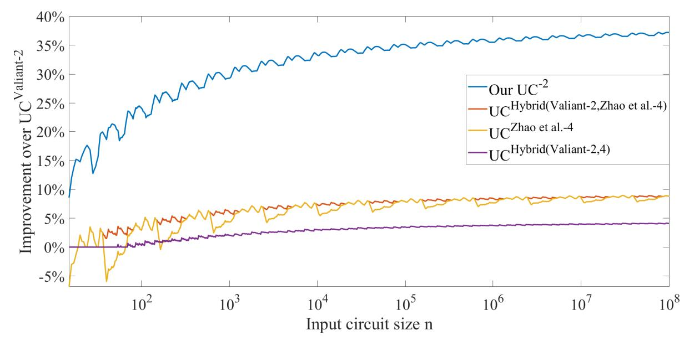

Figure 12: Improvement in size of our 2-way UCs, two hybrid UCs [GKS17, AGKS20] and Valiant's 4-way UCs [ZYZL19] over Valiant's 2-way UCs [GKS17] for 15 ≤ n ≤ 108 with logarithmic x axis.

### References

[ABF+17] Toshinori Araki, Assi Barak, Jun Furukawa, Tamar Lichter, Yehuda Lindell, Ariel Nof, Kazuma Ohara, Adi Watzman, and Or Weinstein. Optimized honest-majority MPC for malicious adversaries - breaking the 1 billion-gate per second barrier. In 2017 IEEE Symposium on Security and Privacy, pages 843–862, San Jose, CA, USA, May 22–26, 2017. IEEE Computer Society Press.

[AF90] Martín Abadi and Joan Feigenbaum. Secure circuit evaluation. Journal of Cryptology, 2(1):1–12, February 1990.

[AGKS20] Masaud Y. Alhassan, Daniel Günther, Ágnes Kiss, and Thomas Schneider. Efficient and scalable universal circuits. Journal of Cryptology, x(y):xx–yy, 2020. published online https://doi.org/10.1007/s00145-020-09346-z on April 8, 2020.

- [AMPR14] Arash Afshar, Payman Mohassel, Benny Pinkas, and Ben Riva. Non-interactive secure computation based on cut-and-choose. In Phong Q. Nguyen and Elisabeth Oswald, editors, EUROCRYPT 2014, volume 8441 of LNCS, pages 387–404, Copenhagen, Denmark, May 11–15, 2014. Springer, Heidelberg, Germany.
- [Att14] Nuttapong Attrapadung. Fully secure and succinct attribute based encryption for circuits from multi-linear maps. Cryptology ePrint Archive, Report 2014/772, 2014. http://eprint.iacr.org/2014/772.
- [BBKL17] Osman Bicer, Muhammed Ali Bingol, Mehmet Sabir Kiraz, and Albert Levi. Towards practical PFE: An efficient 2-party private function evaluation protocol based on half gates. Cryptology ePrint Archive, Report 2017/415, 2017. http://eprint.iacr.org/2017/415.
- [BFGH10] Debajyoti Bera, Stephen A. Fenner, Frederic Green, and Steven Homer. Efficient universal quantum circuits. Quantum Information & Computation, 10(1&2):16–27, 2010.
- [BFK+09] Mauro Barni, Pierluigi Failla, Vladimir Kolesnikov, Riccardo Lazzeretti, Ahmad-Reza Sadeghi, and Thomas Schneider. Secure evaluation of private linear branching programs with medical applications. In Michael Backes and Peng Ning, editors, ES-ORICS 2009, volume 5789 of LNCS, pages 424–439, Saint-Malo, France, September 21–23, 2009. Springer, Heidelberg, Germany.
- [BNP08] Assaf Ben-David, Noam Nisan, and Benny Pinkas. FairplayMP: a system for secure multi-party computation. In Peng Ning, Paul F. Syverson, and Somesh Jha, editors, ACM CCS 2008, pages 257–266, Alexandria, Virginia, USA, October 27–31, 2008. ACM Press.
- [BOKP15] Sebastian Banescu, Martín Ochoa, Nils Kunze, and Alexander Pretschner. Idea: benchmarking indistinguishability obfuscation–a candidate implementation. In International Symposium on Engineering Secure Software and Systems, pages 149– 156. Springer, 2015.
- [BPSW07] Justin Brickell, Donald E. Porter, Vitaly Shmatikov, and Emmett Witchel. Privacypreserving remote diagnostics. In Peng Ning, Sabrina De Capitani di Vimercati, and Paul F. Syverson, editors, ACM CCS 2007, pages 498–507, Alexandria, Virginia, USA, October 28–31, 2007. ACM Press.
- [BV15] Nir Bitansky and Vinod Vaikuntanathan. Indistinguishability obfuscation from functional encryption. In Venkatesan Guruswami, editor, 56th FOCS, pages 171– 190, Berkeley, CA, USA, October 17–20, 2015. IEEE Computer Society Press.
- [CCKM00] Christian Cachin, Jan Camenisch, Joe Kilian, and Joy Müller. One-round secure computation and secure autonomous mobile agents. In Ugo Montanari, José D. P. Rolim, and Emo Welzl, editors, ICALP 2000, volume 1853 of LNCS, pages 512–523, Geneva, Switzerland, July 9–15, 2000. Springer, Heidelberg, Germany.
- [CH85] Stephen A. Cook and H. James Hoover. A depth-universal circuit. SIAM J. Comput., 14(4):833–839, 1985.
- [Dén31] König Dénes. Gráfok és mátrixok. Matematikai és Fizikai Lapok, 38:116–119, 1931.
- [FAL06] Keith Frikken, Mikhail Atallah, and Jiangtao Li. Attribute-based access control with hidden policies and hidden credentials. IEEE Transactions on Computers, 55(10):1259–1270, 2006.

- [FAZ05] Keith Frikken, Mikhail Atallah, and Chen Zhang. Privacy-preserving credit checking. In Proceedings of the 6th ACM conference on Electronic commerce, pages 147–154, 2005.
- [FGP14] Dario Fiore, Rosario Gennaro, and Valerio Pastro. Efficiently verifiable computation on encrypted data. In Gail-Joon Ahn, Moti Yung, and Ninghui Li, editors, ACM CCS 2014, pages 844–855, Scottsdale, AZ, USA, November 3–7, 2014. ACM Press.
- [FLA06] Keith B. Frikken, Jiangtao Li, and Mikhail J. Atallah. Trust negotiation with hidden credentials, hidden policies, and policy cycles. In NDSS 2006, San Diego, CA, USA, February 2–3, 2006. The Internet Society.
- [FVK+15] Ben A. Fisch, Binh Vo, Fernando Krell, Abishek Kumarasubramanian, Vladimir Kolesnikov, Tal Malkin, and Steven M. Bellovin. Malicious-client security in blind seer: A scalable private DBMS. In 2015 IEEE Symposium on Security and Privacy, pages 395–410, San Jose, CA, USA, May 17–21, 2015. IEEE Computer Society Press.
- [GGH+13a] Sanjam Garg, Craig Gentry, Shai Halevi, Mariana Raykova, Amit Sahai, and Brent Waters. Candidate indistinguishability obfuscation and functional encryption for all circuits. In 54th FOCS, pages 40–49, Berkeley, CA, USA, October 26–29, 2013. IEEE Computer Society Press.
- [GGH+13b] Sanjam Garg, Craig Gentry, Shai Halevi, Amit Sahai, and Brent Waters. Attributebased encryption for circuits from multilinear maps. In Ran Canetti and Juan A. Garay, editors, CRYPTO 2013, Part II, volume 8043 of LNCS, pages 479–499, Santa Barbara, CA, USA, August 18–22, 2013. Springer, Heidelberg, Germany.
- [GGHZ14] Sanjam Garg, Craig Gentry, Shai Halevi, and Mark Zhandry. Fully secure attribute based encryption from multilinear maps. Cryptology ePrint Archive, Report 2014/622, 2014. http://eprint.iacr.org/2014/622.
- [GGPR13] Rosario Gennaro, Craig Gentry, Bryan Parno, and Mariana Raykova. Quadratic span programs and succinct NIZKs without PCPs. In Johansson and Nguyen [JN13], pages 626–645.
- [GHV10] Craig Gentry, Shai Halevi, and Vinod Vaikuntanathan. i-Hop homomorphic encryption and rerandomizable Yao circuits. In Tal Rabin, editor, CRYPTO 2010, volume 6223 of LNCS, pages 155–172, Santa Barbara, CA, USA, August 15–19, 2010. Springer, Heidelberg, Germany.
- [GKS17] Daniel Günther, Ágnes Kiss, and Thomas Schneider. More efficient universal circuit constructions. In Tsuyoshi Takagi and Thomas Peyrin, editors, ASIACRYPT 2017, Part II, volume 10625 of LNCS, pages 443–470, Hong Kong, China, December 3–7, 2017. Springer, Heidelberg, Germany.
- [GMW87] Oded Goldreich, Silvio Micali, and Avi Wigderson. How to play any mental game or A completeness theorem for protocols with honest majority. In Alfred Aho, editor, 19th ACM STOC, pages 218–229, New York City, NY, USA, May 25–27, 1987. ACM Press.
- [GP81] Zvi Galil and Wolfgang J. Paul. An efficient general purpose parallel computer. In 13th ACM STOC, pages 247–262, Milwaukee, WI, USA, May 11–13, 1981. ACM Press.

- [GVW13] Sergey Gorbunov, Vinod Vaikuntanathan, and Hoeteck Wee. Attribute-based encryption for circuits. In Dan Boneh, Tim Roughgarden, and Joan Feigenbaum, editors, 45th ACM STOC, pages 545–554, Palo Alto, CA, USA, June 1–4, 2013. ACM Press.
- [HKK+14] Yan Huang, Jonathan Katz, Vladimir Kolesnikov, Ranjit Kumaresan, and Alex J. Malozemoff. Amortizing garbled circuits. In Juan A. Garay and Rosario Gennaro, editors, CRYPTO 2014, Part II, volume 8617 of LNCS, pages 458–475, Santa Barbara, CA, USA, August 17–21, 2014. Springer, Heidelberg, Germany.
- [IP07] Yuval Ishai and Anat Paskin. Evaluating branching programs on encrypted data. In Salil P. Vadhan, editor, TCC 2007, volume 4392 of LNCS, pages 575–594, Amsterdam, The Netherlands, February 21–24, 2007. Springer, Heidelberg, Germany.
- [JN13] Thomas Johansson and Phong Q. Nguyen, editors. EUROCRYPT 2013, volume 7881 of LNCS, Athens, Greece, May 26–30, 2013. Springer, Heidelberg, Germany.
- [KR11] Seny Kamara and Mariana Raykova. Secure outsourced computation in a multitenant cloud. In IBM Workshop on Cryptography and Security in Clouds, pages 15–16, 2011.
- [KS08a] Vladimir Kolesnikov and Thomas Schneider. Improved garbled circuit: Free XOR gates and applications. In Luca Aceto, Ivan Damgård, Leslie Ann Goldberg, Magnús M. Halldórsson, Anna Ingólfsdóttir, and Igor Walukiewicz, editors, ICALP 2008, Part II, volume 5126 of LNCS, pages 486–498, Reykjavik, Iceland, July 7–11, 2008. Springer, Heidelberg, Germany.
- [KS08b] Vladimir Kolesnikov and Thomas Schneider. A practical universal circuit construction and secure evaluation of private functions. In Gene Tsudik, editor, FC 2008, volume 5143 of LNCS, pages 83–97, Cozumel, Mexico, January 28–31, 2008. Springer, Heidelberg, Germany.
- [KS16] Ágnes Kiss and Thomas Schneider. Valiant's universal circuit is practical. In Marc Fischlin and Jean-Sébastien Coron, editors, EUROCRYPT 2016, Part I, volume 9665 of LNCS, pages 699–728, Vienna, Austria, May 8–12, 2016. Springer, Heidelberg, Germany.
- [LMS16] Helger Lipmaa, Payman Mohassel, and Saeed Sadeghian. Valiant's universal circuit: Improvements, implementation, and applications. Cryptology ePrint Archive, Report 2016/017, 2016. http://eprint.iacr.org/2016/017.
- [LP09] László Lovász and Michael D Plummer. Matching theory, volume 367. American Mathematical Soc., 2009.
- [LR15] Yehuda Lindell and Ben Riva. Blazing fast 2PC in the offline/online setting with security for malicious adversaries. In Indrajit Ray, Ninghui Li, and Christopher Kruegel, editors, ACM CCS 2015, pages 579–590, Denver, CO, USA, October 12– 16, 2015. ACM Press.
- [Mey83] Friedhelm Meyer auf der Heide. Efficiency of universal parallel computers. In Theoretical Computer Science, pages 221–241, 1983.
- [MNPS04] Dahlia Malkhi, Noam Nisan, Benny Pinkas, and Yaron Sella. Fairplay secure twoparty computation system. In Matt Blaze, editor, USENIX Security 2004, pages 287–302, San Diego, CA, USA, August 9–13, 2004. USENIX Association.

- [MR17] Payman Mohassel and Mike Rosulek. Non-interactive secure 2PC in the offline/online and batch settings. In Jean-Sébastien Coron and Jesper Buus Nielsen, editors, EUROCRYPT 2017, Part III, volume 10212 of LNCS, pages 425–455, Paris, France, April 30 – May 4, 2017. Springer, Heidelberg, Germany.
- [MS13] Payman Mohassel and Seyed Saeed Sadeghian. How to hide circuits in MPC an efficient framework for private function evaluation. In Johansson and Nguyen [JN13], pages 557–574.
- [NSMS14] Salman Niksefat, Babak Sadeghiyan, Payman Mohassel, and Saeed Sadeghian. Zids: a privacy-preserving intrusion detection system using secure two-party computation protocols. The Computer Journal, 57(4):494–509, 2014.
- [OS05] Rafail Ostrovsky and William E. Skeith III. Private searching on streaming data. In Victor Shoup, editor, CRYPTO 2005, volume 3621 of LNCS, pages 223–240, Santa Barbara, CA, USA, August 14–18, 2005. Springer, Heidelberg, Germany.
- [oTP20] Authors of This Paper. The C++ source code of our 2-way uc implementation, 2020.
- [PKV+14] Vasilis Pappas, Fernando Krell, Binh Vo, Vladimir Kolesnikov, Tal Malkin, Seung Geol Choi, Wesley George, Angelos D. Keromytis, and Steve Bellovin. Blind seer: A scalable private DBMS. In 2014 IEEE Symposium on Security and Privacy, pages 359–374, Berkeley, CA, USA, May 18–21, 2014. IEEE Computer Society Press.
- [Sad15] S. S. Sadeghian. New Techniques for Private Function Evaluation. PhD thesis, 2015.
- [TS15] Stefan Tillich and Nigel Smart. Circuits of basic functions suitable for MPC and FHE, 2015.
- [Val76] Leslie G. Valiant. Universal circuits (preliminary report). In Proceedings of the 8th Annual ACM Symposium on Theory of Computing (STOC 1976), pages 196–203, 1976.
- [Weg87] I. Wegener. The Complexity of Boolean Functions. Wiley, 1987.
- [Yao82] Andrew Chi-Chih Yao. Protocols for secure computations (extended abstract). In 23rd FOCS, pages 160–164, Chicago, Illinois, November 3–5, 1982. IEEE Computer Society Press.
- [Yao86] Andrew Chi-Chih Yao. How to generate and exchange secrets (extended abstract). In 27th FOCS, pages 162–167, Toronto, Ontario, Canada, October 27–29, 1986. IEEE Computer Society Press.
- [ZCSH18] Ruiyu Zhu, Darion Cassel, Amr Sabry, and Yan Huang. NANOPI: Extremescale actively-secure multi-party computation. In David Lie, Mohammad Mannan, Michael Backes, and XiaoFeng Wang, editors, ACM CCS 2018, pages 862–879, Toronto, ON, Canada, October 15–19, 2018. ACM Press.
- [Zim15] Joe Zimmerman. How to obfuscate programs directly. In Elisabeth Oswald and Marc Fischlin, editors, EUROCRYPT 2015, Part II, volume 9057 of LNCS, pages 439–467, Sofia, Bulgaria, April 26–30, 2015. Springer, Heidelberg, Germany.
- [ZYZL19] Shuoyao Zhao, Yu Yu, Jiang Zhang, and Hanlin Liu. Valiant's universal circuits revisited: An overall improvement and a lower bound. In ASIACRYPT 2019, Part I, LNCS, pages 401–425. Springer, Heidelberg, Germany, December 2019.

### A The gadgets of universal circuits

To translate an  $\mathsf{EUG}_2(n)$  into a  $\mathsf{UC}_n$ , one needs to instantiate the poles of  $\mathsf{EUG}_2(n)$  with universal gates and replace control nodes by X/Y-switching gates, and configure them accordingly.

Universal gates. Each pole in an EUG (that corresponds to a gate in the original DAG) is implemented by a universal gate. A universal gate on 2 binary inputs, when configured with 4 control bits  $(c_1, c_2, c_3, c_4)$ , can simulate all  $2^4 = 16$  binary gates. The universal gate  $ug: \{0,1\}^2 \times \{0,1\}^4 \to \{0,1\}$  can be defined as follows:

$$ug(x_1, x_2, c_1, c_2, c_3, c_4) = \overline{x_1 x_2} c_1 + \overline{x_1} x_2 c_2 + x_1 \overline{x_2} c_3 + x_1 x_2 c_4 \quad , \tag{5}$$

and can be implemented with 3 AND and 6 XOR gates [LMS16,KS16,GKS17,ZYZL19,AGKS20]. Note that  $(c_1, c_2, c_3, c_4)$  belong to control bits  $p_{\mathsf{C}}$  of the universal circuits.

X-switching gates. As its name suggests, an X-switching gate is dedicated for a control node with in-degree and out-degree 2. Depending on the value of the control bit c (see Fig. 3(a)), the gate simply outputs the two values of its inputs correspondingly (i.e., c = 0) or in a switched way (i.e., c = 1). This unit can be implemented with 1 AND gate and 3 XOR gates as shown in Fig. 13(a).

Y-switching gates. Similar to an X-switching gate, a Y-switching gate is intended for the control node with in-degree 2 but out-degree 1. In particular, the gate takes as input two bits and produces one of them as the output, based on the value of the control bit c. This unit can be implemented with 1 AND gate and 2 XOR gates, as given in Fig. 13(b).

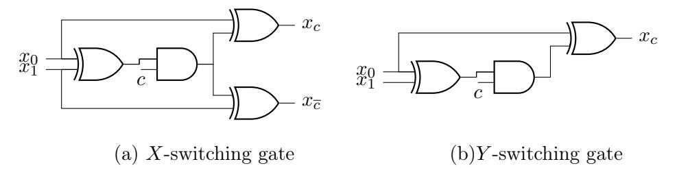

Figure 13: Circuit implementations of switching gates.

### B Proofs omitted in the main body

Proof of Lemma 4. Every augmented  $G \in \mathsf{DAG}_1(k)$  can be configured (by setting the control bits) to be edge-embedded into  $\mathsf{SN}(k)$ , and the common nodes should be switching gates. Therefore, for an  $\mathsf{SN}(k)$  we need set the control bits of its  $|\mathsf{SN}(k)| - k$  common nodes to cater for all augmented graph (amount to  $F_k$ ), i.e.,  $2^{|\mathsf{SN}(k)|-k} \geq F_k$ , where  $|\mathsf{SN}(k)|$  is an integer. This completes the proof for the inequality. Any  $G = (V, E) \in \mathsf{DAG}_1(3k)$  that is augmented from a  $\mathsf{DAG}_1(k)$ , by Definition 4, can be viewed as a set of paths. It remains to sum up the numbers of augmented  $\mathsf{DAG}_1$  for  $1 \leq i \leq k$  paths: the number of ways to "put" k poles into k paths is k-k-k-k-k-k-k-k-k-k-

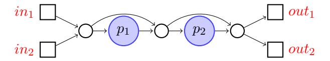

Figure 14: A 2-way supernode that consists of 5 nodes [Val76].

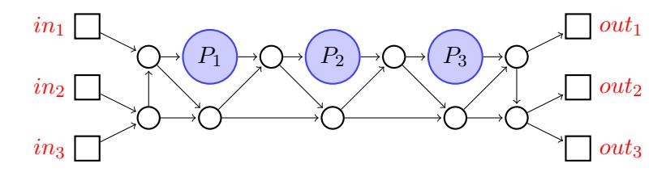

Figure 15: A 3-way supernode that consists of 12 nodes [GKS17].

( k−1 j different choices), it remains to put the rest k −j −1 balls into the remaining i−1 boxes, which can be done in Ai−1,k−j−1 different ways by definition.

### C Size-optimal 2-way, 3-way and 4-way Supernodes

## D How EUG1(30) is constructed from EUG1(4) and SN(6)

This section provides a working example on the correctness of the EUG1(n) construction in Fig. 7. Concretely, consider n = 30 and k = 6 and an arbitrary G ∈ DAG1(30) as in Fig. 18, and the goal is to edge embed it into the EUG1(30) candidate in Fig. 7. As explained in the proof of Theorem 2, we augment G in Fig. 18 and merge the corresponding input and output nodes, which result in G00 as in Fig. 19. As for G00, the five rows of subgraphs can be edge embedded into five instances of SN(6), as shown in Fig. 20, and the six columns of subgraphs (that consist of merged input/output nodes) are edge embedded into 6 instances of EUG1(4) as depicted in Fig. 21. This completes the task: G G00 EUG1(30).

#### E The intermediate wEUG1(n) based on 2 instances of wEUG1(d n 2 e) and d n 2 e instances of SN(2)

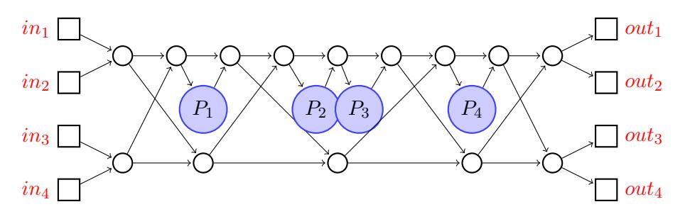

Figure 16: A 4-way supernode that consists of 18 nodes [ZYZL19].

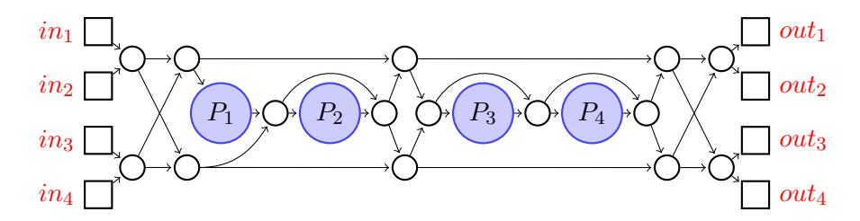

Figure 17: A 4-way supernode that consists of 19 nodes [Val76].

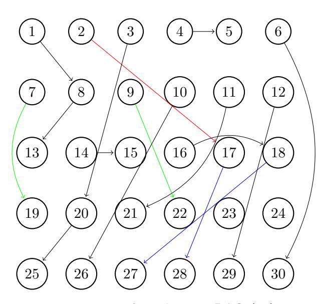

Figure 18: An arbitrary DAG1(30).

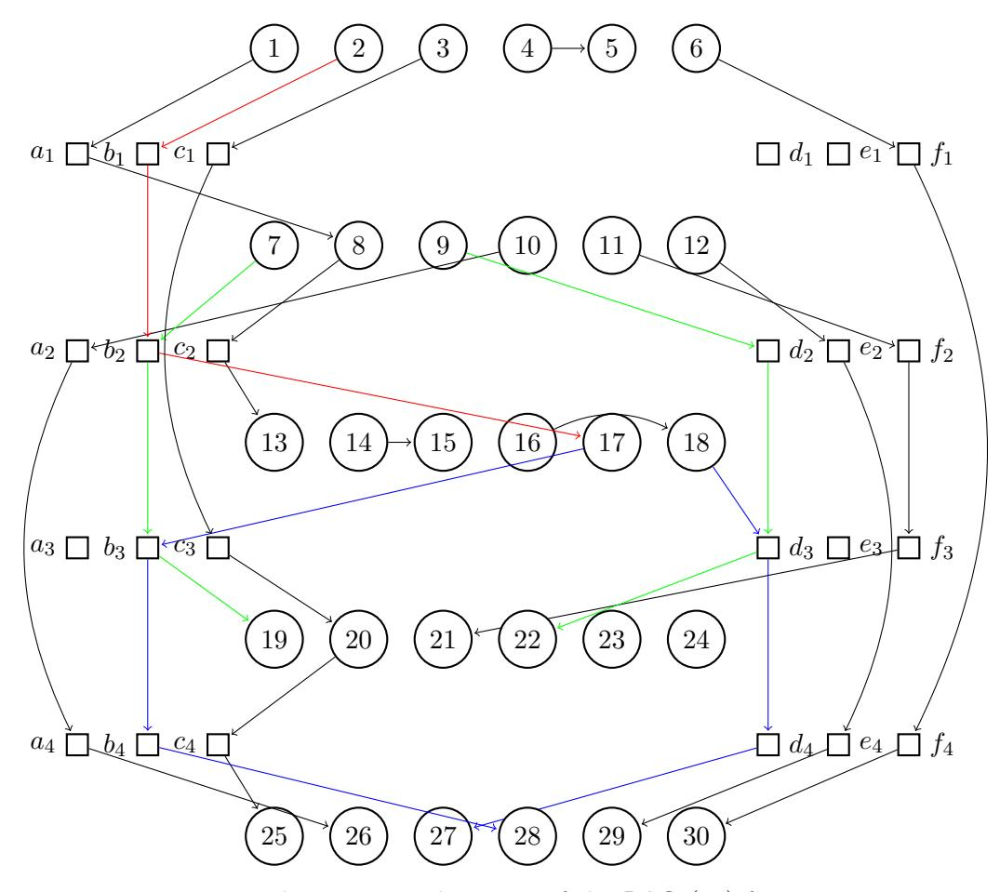

Figure 19: The augmented version of the DAG1(30) from Fig. 18.

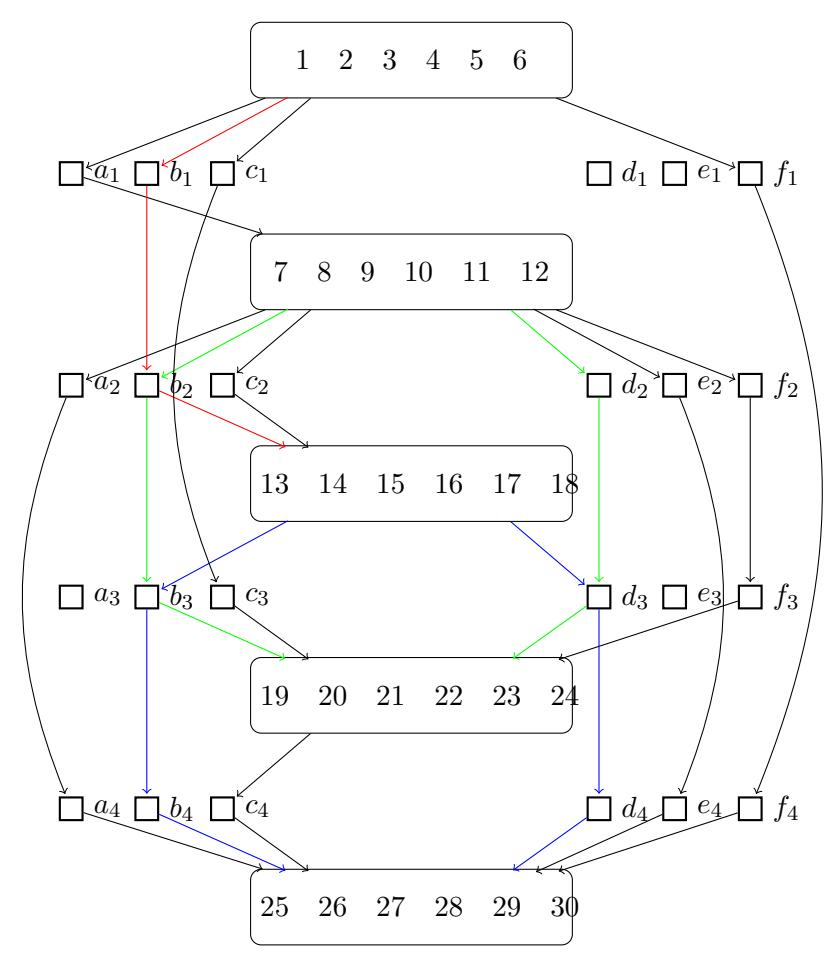

Figure 20: Partially edge embed the augmented DAG from Fig. 19 with 5 instances of SN(6), which take care of the 5 rows of subgraphs accordingly.

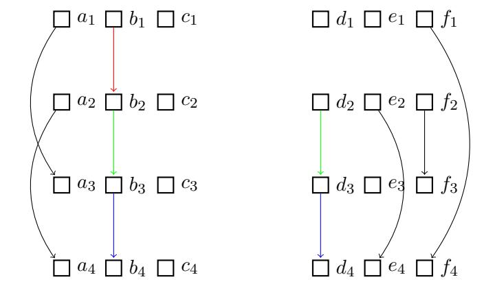

Figure 21: A subgraph of Fig 20 by excluding the supernodes (and their associated edges), which can be further edge embedded by 6 instances of EUG1(4) independently.

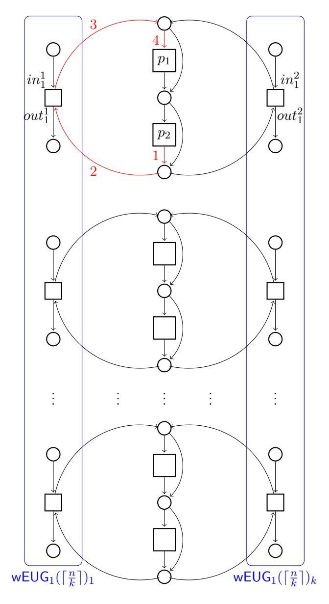

Figure 22: A wEUG1(n) constructed from 2 instances of wEUG1( $\lceil \frac{n}{2} \rceil$ ) and  $\lceil \frac{n}{2} \rceil$  instances of SN(2), where a cycle is highlighted for illustration purpose.