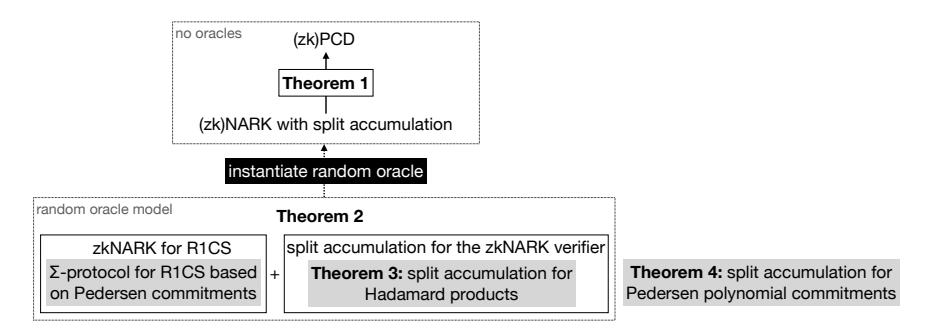
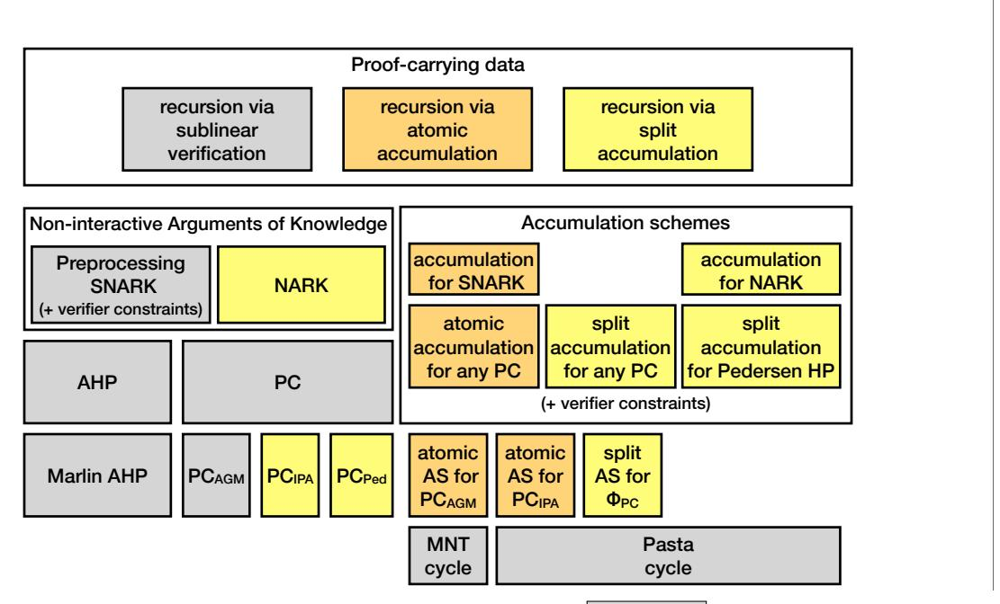
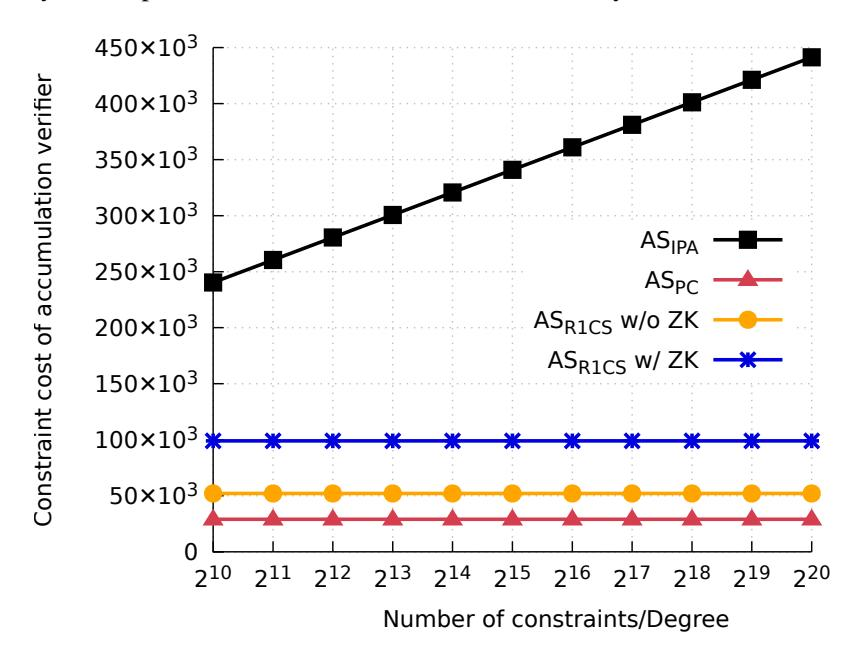

# <span id="page-0-0"></span>Proof-Carrying Data without Succinct Arguments

## Benedikt Bunz ¨

Alessandro Chiesa

benedikt@cs.stanford.edu Stanford University

alexch@berkeley.edu UC Berkeley

William Lin

Pratyush Mishra

Nicholas Spooner

will.lin@berkeley.edu UC Berkeley

pratyush@berkeley.edu UC Berkeley

nspooner@bu.edu Boston University

December 1, 2021

## Abstract

Proof-carrying data (PCD) is a powerful cryptographic primitive that enables mutually distrustful parties to perform distributed computations that run indefinitely. Known approaches to construct PCD are based on succinct non-interactive arguments of knowledge (SNARKs) that have a succinct verifier or a succinct accumulation scheme.

In this paper we show how to obtain PCD without relying on SNARKs. We construct a PCD scheme given any non-interactive argument of knowledge (e.g., with linear-size arguments) that has a *split accumulation scheme*, which is a weak form of accumulation that we introduce.

Moreover, we construct a transparent non-interactive argument of knowledge for R1CS whose split accumulation is verifiable via a (small) *constant number of group and field operations*. Our construction is proved secure in the random oracle model based on the hardness of discrete logarithms, and it leads, via the random oracle heuristic and our result above, to concrete efficiency improvements for PCD.

Along the way, we construct a split accumulation scheme for Hadamard products under Pedersen commitments and for a simple polynomial commitment scheme based on Pedersen commitments.

Our results are supported by a modular and efficient implementation.

Keywords: proof-carrying data; accumulation schemes; recursive proof composition

# Contents

| 1 | Introduction<br>1.1<br>Contributions<br>                                                                                                                                                                                                                                                                                                                     | 3<br>3                                     |
|---|--------------------------------------------------------------------------------------------------------------------------------------------------------------------------------------------------------------------------------------------------------------------------------------------------------------------------------------------------------------|--------------------------------------------|
| 2 | Techniques<br>2.1<br>Accumulation: atomic vs split<br><br>2.2<br>PCD from split accumulation<br>2.3<br>NARK with split accumulation based on DL<br>2.4<br>On proving knowledge soundness<br><br>2.5<br>Split accumulation for Hadamard products<br>2.6<br>Split accumulation for Pedersen polynomial commitments<br><br>2.7<br>Implementation and evaluation | 8<br>8<br>10<br>12<br>15<br>17<br>19<br>22 |
| 3 | Preliminaries<br>3.1<br>Non-interactive arguments in the ROM<br>3.2<br>Proof-carrying data<br><br>3.3<br>Instantiating the random oracle<br>3.4<br>Post-quantum security<br><br>3.5<br>Commitment schemes                                                                                                                                                    | 25<br>25<br>26<br>27<br>27<br>28           |
| 4 | Split accumulation schemes for relations<br>4.1<br>Special case: accumulators and predicate inputs are identical<br><br>4.2<br>A relaxation of knowledge soundness<br>                                                                                                                                                                                       | 29<br>30<br>31                             |
| 5 | PCD from arguments of knowledge with split accumulation<br>5.1<br>Construction<br>5.2<br>Completeness<br>5.3<br>Knowledge soundness<br>5.4<br>Zero knowledge<br>5.5<br>Efficiency<br><br>5.6<br>Post-quantum security<br>                                                                                                                                    | 33<br>34<br>35<br>35<br>38<br>38<br>39     |
| 6 | An expected-time forking lemma<br>6.1<br>Notation for oracle algorithms<br><br>6.2<br>An expected-time forking lemma                                                                                                                                                                                                                                         | 40<br>40<br>40                             |
| 7 | Split accumulation for Hadamard products<br>7.1<br>Construction<br>7.2<br>Proof of Theorem 7.2                                                                                                                                                                                                                                                               | 43<br>43<br>45                             |
| 8 | Split accumulation for R1CS<br>8.1<br>zkNARK for R1CS<br><br>8.2<br>Split accumulation for the zkNARK verifier<br><br>8.3<br>Security proofs<br>                                                                                                                                                                                                             | 50<br>50<br>51<br>53                       |
| 9 | Implementation                                                                                                                                                                                                                                                                                                                                               | 60                                         |
|   | 10 Evaluation<br>10.1 Split accumulation for R1CS<br><br>10.2 Accumulation for polynomial commitments based on DL                                                                                                                                                                                                                                            | 62<br>62<br>63                             |
| A | Split accumulation for Pedersen polynomial commitments<br>A.1<br>Construction<br>A.2<br>Zero-finding games<br>A.3<br>Proof of Theorem A.2                                                                                                                                                                                                                    | 65<br>65<br>66<br>67                       |
|   | Acknowledgements                                                                                                                                                                                                                                                                                                                                             | 70                                         |
|   | References                                                                                                                                                                                                                                                                                                                                                   | 70                                         |

# <span id="page-2-0"></span>1 Introduction

*Proof-carrying data* (PCD) [\[CT10\]](#page-70-0) is a powerful cryptographic primitive that enables mutually distrustful parties to perform distributed computations that run indefinitely, while ensuring that the correctness of every intermediate state of the computation can be verified efficiently. A special case of PCD is *incrementallyverifiable computation* (IVC) [\[Val08\]](#page-70-1). PCD has found applications in enforcing language semantics [\[CTV13\]](#page-70-2), verifiable MapReduce computations [\[CTV15\]](#page-70-3), image authentication [\[NT16\]](#page-70-4), blockchains [\[Mina;](#page-70-5) [KB20;](#page-70-6) [BMRS20;](#page-69-2) [CCDW20\]](#page-69-3), and others. Given the theoretical and practical relevance of PCD, it is an important research question to build efficient PCD schemes from minimal cryptographic assumptions.

PCD from succinct verification. The canonical construction of PCD is via *recursive composition* of succinct non-interactive arguments (SNARGs) [\[BCCT13;](#page-69-4) [BCTV14;](#page-69-5) [COS20\]](#page-69-6). Informally, a proof that the computation was executed correctly for t steps consists of a proof of the claim "the t-th step of the computation was executed correctly, and there exists a proof that the computation was executed correctly for t − 1 steps". The latter part of the claim is expressed using the SNARG verifier itself. This construction yields secure PCD (with IVC as a special case) provided the SNARG satisfies an adaptive knowledge soundness property (i.e., is a SNARK). Efficiency requires the SNARK to have sublinear-time verification, achievable via SNARKs for machine computations [\[BCCT13\]](#page-69-4) or preprocessing SNARKs for circuit computations [\[BCTV14;](#page-69-5) [COS20\]](#page-69-6).

Requiring sublinear-time verification, however, significantly restricts the choice of SNARK, which limits what is achievable for PCD. These restrictions have practical implications: the concrete efficiency of recursion is limited by the use of expensive curves for pairing-based SNARKs [\[BCTV14\]](#page-69-5) or heavy use of cryptographic hash functions for hash-based SNARKs [\[COS20\]](#page-69-6).

PCD from accumulation. Recently, [\[BCMS20\]](#page-69-7) gave an alternative construction of PCD using SNARKs that have succinct *accumulation schemes*; this developed and formalized a novel approach for recursion sketched in [\[BGH19\]](#page-69-8). Informally, rather than being required to have sublinear-time verification, the SNARK is required to be accompanied by a cryptographic primitive that enables "postponing" the verification of SNARK proofs by way of an accumulator that is updated at each recursion step. The main efficiency requirement on the accumulation scheme is that the accumulation procedure must be succinctly verifiable, and in particular the accumulator itself must be succinct.

Requiring a SNARK to have a succinct accumulation scheme is a weaker condition than requiring it to have sublinear-time verification. This has enabled constructing PCD from SNARKs that do *not* have sublinear-time verification [\[BCMS20\]](#page-69-7), which in turn led to PCD constructions from assumptions and with efficiency properties that were not previously achieved. Practitioners have exploited this freedom to design implementations of recursive composition with improved practical efficiency [\[Halo20;](#page-70-7) [Pickles20\]](#page-70-8).

Our motivation. The motivation of this paper is twofold. First, can PCD be built from a weaker primitive than SNARKs with succinct accumulation schemes? If so, can we leverage this to obtain PCD constructions with improved *concrete* efficiency?

## <span id="page-2-1"></span>1.1 Contributions

We make theory and systems contributions that advance the state of the art for PCD: (1) We introduce *split accumulation schemes for relations*, a cryptographic primitive that relaxes prior notions of accumulation. (2) We obtain PCD from any non-interactive argument of knowledge that satisfies this weaker notion of accumulation; surprisingly, this allows for arguments with no succinctness whatsoever. (3) We construct a noninteractive argument of knowledge based on discrete logarithms (and random oracles) whose accumulation verifier has constant size (improving over the logarithmic-size verifier of prior accumulation schemes in this

setting). (4) We implement and evaluate constructions from this paper and from [\[BCMS20\]](#page-69-7). We elaborate on each of these contributions next.

(1) Split accumulation for relations. Recall from [\[BCMS20\]](#page-69-7) that an accumulation scheme for a predicate Φ: X → {0, 1} enables proving/verifying that each input in an infinite stream q1, q2, . . . satisfies the predicate Φ, by augmenting the stream with *accumulators*. Informally, for each i, the prover produces a new accumulator acci+1 from the input q<sup>i</sup> and the old accumulator acc<sup>i</sup> ; the verifier can check that the triple (q<sup>i</sup> , acc<sup>i</sup> , acci+1) is a valid accumulation step, much more efficiently than running Φ on q<sup>i</sup> . At any time, the decider can validate acci+1, which establishes that for all j ≤ i it was the case that Φ(q<sup>j</sup> ) = 1. The accumulator size (and hence the running time of the three algorithms) cannot grow in the number of accumulation steps.

We extend this notion in two orthogonal ways. First we consider relations Φ: X × W → {0, 1} and now for a stream of instances qx<sup>1</sup> , qx<sup>2</sup> , . . . the goal is to establish that there exist witnesses qw<sup>1</sup> , qw<sup>2</sup> , . . . such that Φ(qx<sup>i</sup> , qw<sup>i</sup> ) = 1 for each i. Second, we consider accumulators acc<sup>i</sup> that are split into an instance part acc<sup>i</sup> .x and a witness part acc<sup>i</sup> .w with the restriction that the accumulation verifier only gets to see the instance part (and possibly an auxiliary accumulation proof pf). We refer to this notion as *split accumulation for relations*, and refer to (for contrast) the notion from [\[BCMS20\]](#page-69-7) as *atomic accumulation for languages*.

The purpose of these extensions is to enable us to consider accumulation schemes in which predicate witnesses and accumulator witnesses are large while still requiring the accumulation verifier to be succinct (it receives short predicate instances and accumulator instances but not large witnesses). We will see that such accumulation schemes are both simpler and cheaper, while still being useful for primitives such as PCD.

See Section [2.1](#page-7-1) for more on atomic vs. split accumulation, and Section [4](#page-28-0) for formal definitions.

(2) PCD via split accumulation. A non-interactive argument has a split accumulation scheme if the relation corresponding to its verifier has a split accumulation scheme (we make this precise later). We show that any non-interactive argument of knowledge (NARK) having a split accumulation scheme where the *accumulation verifier* is sublinear can be used to build a proof-carrying data (PCD) scheme, *even if the NARK does not have sublinear argument size*. This significantly broadens the class of non-interactive arguments from which PCD can be built, and is the first result to obtain PCD from non-interactive arguments that need not be succinct. Similarly to [\[BCMS20\]](#page-69-7), if the NARK and accumulation scheme are post-quantum secure, so is the PCD scheme. (It remains an open question whether there are non-trivial post-quantum instantiations of these.)

<span id="page-3-0"></span>Theorem 1 (informal). *There is an efficient transformation that compiles any NARK with a split accumulation scheme into a PCD scheme. If the NARK and its split accumulation scheme are zero knowledge, then the PCD scheme is also zero knowledge. Additionally, if the NARK and its accumulation scheme are post-quantum secure then the PCD scheme is also post-quantum secure.*

Similarly to all PCD results known to date, the above theorem holds in a model where all parties have access to a common reference string, *but no oracles*. (The construction makes non-black-box use of the accumulation scheme verifier, and the theorem does not carry over to the random oracle model.)

A corollary of Theorem [1](#page-3-0) is that any NARK with a split accumulation scheme can be "bootstrapped" into a SNARK for machine computations. (PCD implies IVC and, further assuming collision-resistant hashing, also efficient SNARKs for machine computations [\[BCCT13\]](#page-69-4).) This is surprising: an argument with decidedly weak efficiency properties implies an argument with succinct proofs and succinct verification!

See Section [2.2](#page-9-0) for a summary of the ideas behind Theorem [1,](#page-3-0) and Section [5](#page-32-0) for technical details.

(3) NARK with split accumulation based on DL. Theorem [1](#page-3-0) motivates the question of whether we can leverage the weaker condition on the argument system to improve the efficiency of PCD. Our focus is on minimizing the cost of the accumulation verifier for the argument system, because it is the only component that is not used as a black box, and thus typically determines concrete efficiency. Towards this end, we present a (zero knowledge) NARK with (zero knowledge) split accumulation based on discrete logarithms, with a *constant-size* accumulation verifier; the NARK has a transparent (public-coin) setup.

<span id="page-4-0"></span>Theorem 2 (informal). *In the random oracle model and assuming the hardness of the discrete logarithm problem, there exists a transparent (zero knowledge) NARK for R1CS and a corresponding (zero knowledge) split accumulation scheme with the following efficiency:*

|             | NARK          |               | split accumulation scheme |               |              |                                |  |  |
|-------------|---------------|---------------|---------------------------|---------------|--------------|--------------------------------|--|--|
| prover time | verifier time | argument size | prover time               | verifier time | decider time | accumulator size               |  |  |
| O(M) G      | O(M) G        | O(1) G        | O(M) G                    | O(1) G        | O(M) G       | = O(1) G<br>+ O(1) F<br> acc.x |  |  |
| O(M) F      | O(M) F        | O(M) F        | O(M) F                    | O(1) F        | O(M) F       | acc.w <br>= O(M) F             |  |  |

*Above,* M *denotes the number of constraints in the R1CS instance,* G *denotes group scalar multiplications or group elements, and* F *denotes field operations or field elements.*

The NARK construction from Theorem [2](#page-4-0) is particularly simple: it is obtained by applying the Fiat–Shamir transformation to a sigma protocol for R1CS based on Pedersen commitments (and linear argument size). The only "special" feature about the construction is that, as we prove, it has a very efficient split accumulation scheme for the relation corresponding to its verifier. By heuristically instantiating the random oracle, we can apply Theorem [1](#page-3-0) (and [\[BCCT13\]](#page-69-4)) to obtain a SNARK for machines from this modest starting point.

We find it informative to compare Theorem [2](#page-4-0) and SNARKs with atomic accumulation based on discrete logarithms [\[BCMS20\]](#page-69-7):

- the SNARK's argument size is O(log M) group elements, *much less* than the NARK's O(M) field elements;
- the SNARK's accumulator verifier uses O(log M) group scalar multiplications and field operations, *much more* than the NARK's O(1) group scalar multiplications and field operations.

Therefore Theorem [2](#page-4-0) offers a tradeoff that minimizes the cost of the accumulator at the expense of argument size. (As we shall see later, this tradeoff has concrete efficiency advantages.)

Our focus on argument systems based on discrete logarithms is motivated by the fact that they can be instantiated based on efficient curves suitable for recursion: the Tweedle [\[BGH19\]](#page-69-8) or Pasta [\[Hop20\]](#page-70-9) curve cycles, which follow the curve cycle technique for efficient recursion [\[BCTV14\]](#page-69-5). (In fact, as our construction does not rely on any number-theoretic properties of |G|, we could even use the (secp256k1, secq256k1) cycle, where secp256k1 is the curve used in Bitcoin.) This focus on discrete logarithms is a choice made for this paper, and we believe that our ideas can lead to efficiency improvements to recursion in other settings (e.g., pairing-based and hash-based arguments) and leave these to future work.

See Section [2.3](#page-11-0) for a summary of the ideas behind Theorem [1,](#page-3-0) and Section [8](#page-49-0) for technical details.

- (4) Split accumulation for common predicates. We obtain split accumulation schemes with constant-size accumulation verifiers for common predicates: (i) *Hadamard products (and more generally any bilinear function) under Pedersen commitments* (see Section [2.5](#page-16-0) for a summary and Section [7](#page-42-0) for details); (ii) *polynomial evaluations under Pedersen commitments* (see Section [2.6](#page-18-0) for a summary and Appendix [A](#page-64-0) for technical details). Split accumulation for Hadamard products is a building block that we use to prove Theorem [1.](#page-3-0)
- (5) Implementation and evaluation. We contribute a set of Rust libraries that realize PCD via accumulation via modular combinations of interchangeable components: (a) generic interfaces for atomic and split accumulation; (b) generic construction of PCD from arguments with atomic and split accumulation; (c) split accumulation for our zkNARK for R1CS; (d) split accumulation for Hadamard products under Pedersen commitments; (e) split accumulation for polynomial evaluations under Pedersen commitments; (f) atomic accumulation for polynomial commitments based on inner product arguments and pairings from [\[BCMS20\]](#page-69-7);

(g) constraints for all the foregoing accumulation verifiers. Practitioners interested in PCD will find these libraries useful for prototyping and comparing different types of recursion (and, e.g., may help decide if current systems based on atomic recursion [\[Halo20;](#page-70-7) [Pickles20\]](#page-70-8) are better off via split recursion or not).

We additionally conduct experiments to evaluate our implementation. Our experiments focus on determining the *recursion threshold*, which informally is the number of constraints that need to be proved at each step of the recursion. Our evaluation demonstrates that, over curves from the popular "Pasta" cycle [\[Hop20\]](#page-70-9), the recursion threshold for split accumulation of our NARK for R1CS is as low as 52,000 constraints, which is at least 8.5× cheaper than the cost of IVC constructed from atomic accumulation for discrete-logarithm-based protocols [\[BCMS20\]](#page-69-7). In fact, the recursion threshold is even lower than that for IVC constructed from prior state-of-the-art pairing-friendly SNARKs [\[Gro16\]](#page-70-10). While this comes at the expense of much larger proof sizes, this overhead is attractive for notable applications (e.g., incrementally-verifiable ledgers).

See Section [9](#page-59-0) and Section [10](#page-61-0) for more details on our implementation and evaluation, respectively.

Remark 1.1 (concurrent work). A concurrent work [\[BDFG20\]](#page-69-9) studies similar questions as this paper. Below we summarize the similarities and the differences between the two papers.

*Similarities.* Both papers are study by the goal of reducing the cost of recursive arguments. The main object of study in [\[BDFG20\]](#page-69-9) is additive polynomial commitment schemes (PC schemes), for which [\[BDFG20\]](#page-69-9) considers different types of *aggregation schemes*: (1) *public* aggregation in [\[BDFG20\]](#page-69-9) is closely related to atomic accumulation specialized to PC schemes from a prior work [\[BCMS20\]](#page-69-7); and (2) *private* aggregation in [\[BDFG20\]](#page-69-9) is closely related to split accumulation specialized to PC schemes from this paper. Moreover, the private aggregation scheme for additive PC schemes in [\[BDFG20\]](#page-69-9) is similar to our split accumulation scheme for Pedersen PC schemes (overviewed in Section [2.6](#page-18-0) and detailed in Appendix [A\)](#page-64-0). The protocols differ in how efficiency depends on the n claims to aggregate/accumulate: the verifier in [\[BDFG20\]](#page-69-9) uses n + 1 group scalar multiplications while ours uses 2n. (Informally, [\[BDFG20\]](#page-69-9) first randomly combines claims and then evaluates at a random point, while we first evaluate at a random point and then randomly combine claims.)

*Differences.* The two papers develop distinct, and complementary, directions.

The focus of [\[BDFG20\]](#page-69-9) is to design protocols for any additive PC scheme (and, even more generally, any PC scheme with a linear combination scheme), including the aforementioned private aggregation protocol and a compiler that endows a given PC scheme with zero knowledge.

In contrast, our focus is to formulate a definition of split accumulation for general relation predicates that (a) we demonstrate suffices to construct PCD, and (b) in the random oracle model, we can also demonstrably achieve via a split accumulation scheme based on Pedersen commitments. We emphasize that our definitions are materially different from the case of atomic accumulation in [\[BCMS20\]](#page-69-7), and necessitate careful consideration of technicalities such as the flavor of adaptive knowledge soundness, which algorithms can be allowed to query oracles, and so on. Hence, we cannot simply rely on the existing foundations for atomic accumulation of [\[BCMS20\]](#page-69-7) in order to infer the correct definitions and security reductions for split accumulation. Overall, our theoretical work enables us to achieve the first construction of PCD without succinct arguments, and also to obtain a novel NARK for R1CS with a constant-size accumulation verifier.

We stress that the treatment of accumulation at a higher level of abstraction than for PC schemes is essential to prove theorems about PCD. In particular, contrary to what is claimed as a theorem in [\[BDFG20\]](#page-69-9), it is *not* known how to build PCD from a PC scheme with an aggregation/accumulation scheme in any model without making additional heuristic assumptions. This is because obtaining a NARK from a PC scheme using known techniques requires the use of a random oracle, which we do not know how to accumulate. In contrast, we construct PCD in the standard model starting directly from an aggregation/accumulation scheme *for a NARK*, and *no additional assumptions*. Separately, the security of our accumulation scheme for a NARK in the standard model *is* an assumption, which is conjectured based on a security proof in the ROM.

Another major difference is that we additionally contribute a comprehensive and modular implementation of protocols from [\[BCMS20\]](#page-69-7) and this paper, and conduct an evaluation for the discrete logarithm setting. This supports the asymptotic improvements with measured improvements in concrete efficiency.

# <span id="page-7-0"></span>2 Techniques

We summarize the main ideas behind our results. In Section [2.1](#page-7-1) we discuss our new notion of split accumulation for relation predicates, and compare it with the notion of atomic accumulation for language predicates from [\[BCMS20\]](#page-69-7). In Section [2.2](#page-9-0) we discuss the proof of Theorem [1.](#page-3-0) In Section [2.3](#page-11-0) we discuss the proof of Theorem [2;](#page-4-0) for this we rely on a new result about split accumulation for Hadamard products, which we discuss in Section [2.5.](#page-16-0) Then, in Section [2.6,](#page-18-0) we discuss our split accumulation for a Pedersen-based polynomial commitment, which can act as a drop-in replacement for polynomial commitments used in prior SNARKs, such as those of [\[BGH19\]](#page-69-8). Finally, in Section [2.7](#page-21-0) we elaborate on our implementation and evaluation. Figure [1](#page-7-2) illustrates the relation between our results. The rest of the paper contains technical details, and we provide pointers to relevant sections along the way.

<span id="page-7-2"></span>

Figure 1: Diagram showing the relation between our results. Gray boxes within a result are notable subroutines.

## <span id="page-7-1"></span>2.1 Accumulation: atomic vs split

We review the notion of accumulation from [\[BCMS20\]](#page-69-7), which we refer to as *atomic accumulation*, and then describe the weaker notion that we introduce, which we call *split accumulation*.

Atomic accumulation for languages. An *accumulation scheme for a language predicate* Φ: X → {0, 1} is a tuple of algorithms (P, V, D), known as the prover, verifier, and decider, that enable proving/verifying statements of the form Φ(q1) ∧ Φ(q2) ∧ · · · more efficiently than running the predicate Φ on each input.

This is done as follows. Starting from an initial ("empty") accumulator acc1, the prover is used to accumulate the first input q<sup>1</sup> to produce a new accumulator acc<sup>2</sup> ← P(q1, acc1); then the prover is used again to accumulate the second input q<sup>2</sup> to produce a new accumulator acc<sup>3</sup> ← P(q2, acc2); and so on.

Each accumulator produced so far enables efficient verification of the predicate on all inputs that went into the accumulator. For example, to establish that Φ(q1) ∧ · · · ∧ Φ(q<sup>T</sup> ) = 1 it suffices to check that:

- the verifier accepts each accumulation step: V(q1, acc1, acc2) = 1, V(q2, acc2, acc3) = 1, and so on; and
- the decider accepts the final accumulator: D(acc<sup>T</sup> ) = 1.

Qualitatively, this replaces the naive cost T · |Φ| with the new cost T · |V| + |D|. This is beneficial when the verifier is much cheaper than checking the predicate directly and the decider is not much costlier than checking the predicate directly. Crucially, the verifier and decider costs (and, in particular, the accumulator size) should not grow with the number T of accumulation steps (which need not be known in advance).

The properties of an accumulation scheme are summarized in the following informal definition, which additionally includes an accumulation proof used to check an accumulation step (but is not passed on).

Definition 2.1 (informal). *An* accumulation scheme *for a predicate* Φ: X → {0, 1} *consists of a triple of algorithms* (P, V, D)*, known as the prover, verifier, and decider, that satisfies the following properties.*

- Completeness: *For every accumulator* acc *and predicate input* q ∈ X*, if* D(acc) = 1 *and* Φ(q) = 1*, then for* (acc? , pf? ) ← P(acc, q) *it holds that* V(q, acc, acc? , pf? ) = 1 *and* D(acc? ) = 1*.*
- Soundness: *For every efficiently-generated old accumulator* acc*, predicate input* q ∈ X*, new accumulator* acc? *, and accumulation proof* pf? *, if* D(acc? ) = 1 *and* V(q, acc, acc? , pf? ) = 1 *then, with all but negligible probability,* Φ(q) = 1 *and* D(acc) = 1*.*

The above definition omits many details, such as the ability to accumulate multiple accumulators [acc<sup>j</sup> ] m j=1 and multiple predicate inputs [q<sup>i</sup> n <sup>i</sup>=1 in one step, the optional property of zero knowledge (enabled by the accumulation proof pf? ), the fact that P, V, D should receive keys apk, avk, dk generated by an indexer algorithm that receives the specification of Φ, and others. We refer the reader to [\[BCMS20\]](#page-69-7) for more details.

The aspect that we wish to highlight here is the following: in order for the verifier to be much cheaper than the predicate (|V| |Φ|) it must be that the accumulator itself is much smaller than the predicate (|acc| |Φ|) because the verifier receives the accumulator as input. (And if the accumulator is accompanied by a validity proof pf then this proof must also be small.)

We refer to this setting as *atomic accumulation* because the entirety of the accumulator is treated as one short monolithic string. In contrast, in this paper we consider a relaxation where this is not the case, and will enable us to obtain new instantiations that lead to new theoretical and practical results.

Split accumulation for relations. We propose a relaxed notion of accumulation: a *split accumulation scheme for a relation predicate* Φ: X × W → {0, 1} is again a tuple of algorithms (P, V, D) as before. Split accumulation differs from atomic accumulation in that: (a) an input to Φ consists of a short instance part qx and a (possibly) long witness part qw; (b) an accumulator acc is split into a short instance part acc.x and a (possibly) long witness part acc.w; (c) the verifier only needs the short parts of inputs and accumulators to verify an accumulation step, along with a short validity proof instead of the long witness parts.

As before, the prover is used to accumulate a predicate input q<sup>i</sup> = (qx<sup>i</sup> , qw<sup>i</sup> ) into a prior accumulator acc<sup>i</sup> to obtain a new accumulator and validity proof (acci+1, pfi+1) ← P(q<sup>i</sup> , acci). Different from before, however, we wish to establish that given instances qx<sup>1</sup> , . . . , qx<sup>T</sup> there exist (more precisely, a party knows) witnesses qw<sup>1</sup> , . . . , qw<sup>T</sup> such that Φ(qx<sup>1</sup> , qw<sup>1</sup> ) ∧ · · · ∧ Φ(qx<sup>T</sup> , qw<sup>T</sup> ) = 1. For this it suffices to check that:

- the verifier accepts each accumulation step given only the short instance parts: V(qx<sup>1</sup> , acc1.x, acc2.x, pf<sup>2</sup> ) = 1, V(qx<sup>2</sup> , acc2.x, acc3.x, pf<sup>3</sup> ) = 1, and so on; and
- the decider accepts the final accumulator (made of both the instance and witness part): D(acc<sup>T</sup> ) = 1. Again the naive cost T ·|Φ| is replaced with the new cost T ·|V|+|D|, but now it could be that an accumulator is, e.g., as large as |Φ|; we only need the *instance part* of the accumulator (and predicate inputs) to be short.

The security property of a split accumulation scheme involves an extractor that outputs a long witness part from a short instance part and proof, and is reminiscent of the knowledge soundness of a succinct non-interactive argument. Turning this high level description into a working definition requires some care, however, and we view this as a contribution of this paper.[1](#page-0-0) Informally the security definition could be summarized as follows.

Definition 2.2 (informal). *A* split accumulation scheme *for a predicate* Φ: X × W → {0, 1} *consists of a triple of algorithms* (P, V, D) *that satisfies the following properties.*

• Completeness: *For every accumulator* acc *and predicate input* q = (qx, qw) ∈ X × W*, if* D(acc) = 1 *and* Φ(q) = 1*, then for* (acc? , pf? ) ← P(q, acc) *it holds that* V(qx, acc.x, acc? .x, pf? ) = 1 *and* D(acc? ) = 1*.*

<sup>1</sup>By "working definition" we mean a definition that we can provably fulfill under concrete hardness assumptions in the random oracle model, and, separately, that provably suffices for recursive composition in the plain model without random oracles.

• Knowledge: *For every efficiently-generated old accumulator instance* acc.x*, old input instance* qx*, accumulation proof* pf? *, and new accumulator* acc? *, if* D(acc? ) = 1 *and* V(qx, acc.x, acc? .x, pf? ) = 1 *then, with all but negligible probability, an efficient extractor can find an old accumulator witness* acc.w *and predicate witness* qw *such that* Φ(qx, qw) = 1 *and* D((acc.x, acc.w)) = 1*.*

One can verify that split accumulation is indeed a relaxation of atomic accumulation: any atomic accumulation scheme is (trivially) a split accumulation scheme with empty witnesses. Crucially, however, a split accumulation scheme alleviates a major restriction of atomic accumulation, namely, that accumulators and predicate inputs have to be short.

See Section [4](#page-28-0) for formal definitions for split accumulation.[2](#page-0-0)

Next, in Section [2.2](#page-9-0) we show that split accumulation suffices for recursive composition (which has surprising theoretical consequences) and then in Section [2.3](#page-11-0) we present a NARK with split accumulation scheme based on discrete logarithms.

## <span id="page-9-0"></span>2.2 PCD from split accumulation

We summarize the main ideas behind Theorem [1,](#page-3-0) which obtains proof-carrying data (PCD) from any NARK that has a split accumulation scheme. To ease exposition, in this summary we focus on IVC, which can be viewed as the special case where a circuit F is repeatedly applied. That is, we wish to incrementally prove a claim of the form "F T (z0) = z<sup>T</sup> " where F <sup>T</sup> denotes F composed with itself T times.

Prior work: recursion via atomic accumulation. Our starting point is a theorem from [\[BCMS20\]](#page-69-7) that obtains PCD from any SNARK that has an atomic accumulation scheme. The IVC construction implied by that theorem is roughly follows.

- The *IVC prover* receives a previous instance z<sup>i</sup> , proof π<sup>i</sup> , and accumulator acc<sup>i</sup> ; accumulates (z<sup>i</sup> , πi) with acc<sup>i</sup> to obtain a new accumulator acci+1 and accumulation proof pfi+1; and generates a SNARK proof πi+1 of the following claim expressed as a circuit R (see Fig. [2,](#page-11-1) middle box): "zi+1 = F(zi), and there exist a SNARK proof π<sup>i</sup> , accumulator acc<sup>i</sup> , and accumulation proof pfi+1 such that the accumulation verifier accepts ((z<sup>i</sup> , πi), acc<sup>i</sup> , acci+1, pfi+1)". The IVC proof for zi+1 is (πi+1, acci+1).
- The *IVC verifier* validates an IVC proof (π<sup>i</sup> , acci) for z<sup>i</sup> by running the SNARK verifier on the instance (z<sup>i</sup> , acci) and proof π<sup>i</sup> , and running the accumulation scheme decider on the accumulator acc<sup>i</sup> .

In each iteration we maintain the invariant that if acc<sup>i</sup> is a valid accumulator (according to the decider) and π<sup>i</sup> is a valid SNARK proof, then the computation is correct up to the i-th step.

Note that while it would suffice to prove that "zi+1 = F(zi), π<sup>i</sup> is a valid SNARK proof, and acc<sup>i</sup> is a valid accumulator", we cannot afford to do so. Indeed: (i) proving that π<sup>i</sup> is a valid proof requires proving a statement about the argument verifier, which may not be sublinear; and (ii) proving that acc<sup>i</sup> is a valid accumulator requires proving a statement about the decider, which may not be sublinear. Instead of proving this claim directly, we "defer" it by having the prover accumulate (z<sup>i</sup> , πi) into acc<sup>i</sup> to obtain a new accumulator acci+1. The soundness property of the accumulation scheme ensures that if acci+1 is valid and the accumulation verifier accepts ((z<sup>i</sup> , πi), acc<sup>i</sup> , acci+1, pfi+1), then π<sup>i</sup> is a valid SNARK proof and acc<sup>i</sup> is a valid accumulator. Thus all that remains to maintain the invariant is for the prover to prove that the accumulation verifier accepts; this is possible provided that the *accumulation verifier* is sublinear.

<sup>2</sup>The definitions in Section [4](#page-28-0) are stated for the ROM, and one can obtain the definitions for the standard model (no ROM) by simply omitting the random oracle. Jumping ahead, the definitions in the standard model are those that we use for constructing PCD, while the definitions in the ROM are those that we prove are satisfied by our constructions of accumulation schemes.

Our construction: recursion via split accumulation. Our construction naturally extends the above idea to the setting of NARKs with split accumulation schemes. Indeed, the only difference to the above construction is that the proof πi+1 generated by the IVC prover is for the statement "zi+1 = F(zi), and there exist a NARK proof *instance* π<sup>i</sup> .x, an accumulator *instance* acc<sup>i</sup> .x, and an accumulation proof pfi+1 such that the accumulation verifier accepts ((z<sup>i</sup> , π<sup>i</sup> .x), acc<sup>i</sup> .x, acci+1.x, pfi+1)", and accordingly the IVC verifier runs the NARK verifier on ((z<sup>i</sup> , acc<sup>i</sup> .x), πi) (in addition to running the accumulation scheme decider on the accumulator acci). This is illustrated in Fig. [2](#page-11-1) (lower box). Note that the circuit R itself is unchanged from the atomic case; the difference is in whether we pass the *entire* proof and accumulators or just the x part.

Proving that this relaxation yields a secure construction is more complex. Similar to prior work, the proof of security proceeds via a recursive extraction argument, as we explain next.

For an atomic accumulation scheme ([\[BCMS20\]](#page-69-7)), one maintains the following extraction invariant: the i-th extractor outputs (z<sup>i</sup> , π<sup>i</sup> , acci) such that π<sup>i</sup> is valid according to the SNARK, acc<sup>i</sup> is valid according to the decider, and F T −i (zi) = z<sup>T</sup> . The T-th "extractor" is simply the malicious prover, and we can obtain the i-th extractor by applying the knowledge guarantee of the SNARK to the (i + 1)-th extractor. That the invariant is maintained is implied by the soundness guarantee of the atomic accumulation scheme.

For a split accumulation scheme, we want to maintain the same extraction invariant; however, the extractor for the NARK will only yield (z<sup>i</sup> , π<sup>i</sup> .x, acc<sup>i</sup> .x), and not the corresponding witnesses. This is where we make use of the extraction property of the split accumulation scheme itself. Specifically, we interleave the knowledge guarantees of the NARK and accumulation scheme as follows: the i-th NARK extractor is obtained from the (i + 1)-th accumulation extractor using the knowledge guarantee of the NARK, and the i-th accumulation extractor is obtained from the i-th NARK extractor using the knowledge guarantee of the accumulation scheme. We take the malicious prover to be the T-th accumulation extractor.

From sketch to proof. In Section [5,](#page-32-0) we give the formal details of our construction and a proof of correctness. In particular, we show how to construct PCD, a more general primitive than IVC. In the PCD setting, rather than each computation step having a single input z<sup>i</sup> , it receives m inputs from different nodes. Proving correctness hence requires proving that *all* of these inputs were computed correctly. For our construction, this entails checking m proofs and m accumulators. To do this, we extend the definition of an accumulation scheme to allow accumulating multiple instance-proof pairs and multiple "old" accumulators.

We also note that the application to PCD leads to other definitional considerations, which are similar to those that have appeared in previous works [\[COS20;](#page-69-6) [BCMS20\]](#page-69-7). In particular, the knowledge soundness guarantee for both the NARK *and* the accumulation scheme should be of the stronger "multi-instance witnessextended emulation with auxiliary input and output" type used in previous work. Additionally, the underlying construction of split accumulation achieves only expected polynomial-time extraction (in the ROM), and so the recursive extraction technique requires that we are able to extract from expected-time adversaries.

Remark 2.3 (knowledge soundness for PCD vs. IVC). The proof of security for PCD extracts a transcript *one full layer at a time*. Since a layer consists of many nodes, each with an *independently-generated* proof and accumulator, a standard "single-instance" extraction guarantee is insufficient in general. However, in the special case of IVC, every layer consists of exactly one node, and so single-instance extraction does suffice.

<span id="page-10-0"></span>Remark 2.4 (flavors of PCD). The recent advances in PCD from accumulation achieve weaker efficiency guarantees than PCD from succinct verification, and formally these results are incomparable. (Starting from weaker assumptions they obtain weaker conclusions.) The essential feature that all these works achieve is that the efficiency of PCD algorithms is independent of the number of nodes in the PCD computation, which is how PCD is defined (see Section [3.2\)](#page-25-0). That said, prior work on PCD from succinct verification [\[BCCT13;](#page-69-4) [BCTV14;](#page-69-5) [COS20\]](#page-69-6) additionally guarantees that verifying a PCD proof is sublinear in a node's computation;

```
R((ivk, z_{i+1}), (z_i, \pi_i)):
                                   • check that z_{i+1} = F(z_i)
recursion circuit via
                                   • set SNARK instance x_i := (ivk, z_i)
succinct verification
                                   • check that SNARK.\mathcal{V}(ivk, \mathbf{x}_i, \pi_i) = 1
                                    R((\mathsf{avk}, z_{i+1}, \mathsf{acc}_{i+1}), (z_i, \pi_i, \mathsf{acc}_i, \mathsf{pf}_{i+1})):
recursion circuit via
                                   • check that z_{i+1} = F(z_i)
                                   • set predicate input q_i := ((avk, z_i, acc_i), \pi_i)
atomic accumulation
                                   • check that ACC. V(avk, q_i, acc_i, acc_{i+1}, pf_{i+1}) = 1
                                   R((\mathsf{avk}, z_{i+1}, \mathsf{acc}_{i+1}.x), (z_i, \pi_i.x, \mathsf{acc}_i.x, \mathsf{pf}_{i+1})):
recursion circuit via
                                   • check that z_{i+1} = F(z_i)
split accumulation
                                   • set predicate instance qx_i := ((avk, z_i, acc_i.x), \pi_i.x)
                                   • check that ACC.V(avk, qx_i, acc<sub>i</sub>.x, acc<sub>i+1</sub>.x, pf_{i+1}) = 1
```

**Figure 2:** Comparison of circuits used to realize recursion with different techniques.

and prior work on PCD from atomic accumulation [BCMS20] merely ensures that a PCD proof has size (but not necessarily verification time) that is sublinear in a node's computation. The PCD scheme obtained in this paper does not have these additional features: a PCD proof has size that is linear in a node's computation.

## <span id="page-11-0"></span>2.3 NARK with split accumulation based on DL

We summarize the main ideas behind Theorem 2, which provides, in the discrete logarithm setting with random oracles, a (zero knowledge) NARK for R1CS that has a (zero knowledge) split accumulation scheme whose accumulation verifier has constant size (more precisely, performs a constant number of group scalar multiplications, field operations, and random oracle calls).

Recall that R1CS is a standard generalization of arithmetic circuit satisfiability where the "circuit description" is given by coefficient matrices, as specified below. ("o" denotes the entry-wise product.)

**Definition 2.5** (R1CS problem). Given a finite field  $\mathbb{F}$ , coefficient matrices  $A, B, C \in \mathbb{F}^{M \times N}$ , and an instance vector  $x \in \mathbb{F}^n$ , is there a witness vector  $w \in \mathbb{F}^{N-n}$  such that  $Az \circ Bz = Cz$  for  $z := (x, w) \in \mathbb{F}^N$ ?

We explain our construction incrementally. In Section 2.3.1 we begin by describing a NARK for R1CS that is *not* zero knowledge, and a "basic" split accumulation scheme for it that is also not zero knowledge. In Section 2.3.2 we show how to extend the NARK and its split accumulation scheme to both be zero knowledge. In Section 2.3.3 we explain why the accumulation scheme described so far is limited to the special case of 1 old accumulator and 1 predicate input (which suffices for IVC), and sketch how to obtain accumulation for m old accumulators and n predicate inputs (which is required for PCD); this motivates the problem of accumulating Hadamard products, which we subsequently address in Section 2.5.

We highlight here that both the NARK and the accumulation scheme are particularly simple compared to other protocols in the SNARK literature (especially with regard to constructions that enable recursion!), and view this as a significant advantage for potential deployments of these ideas in the real world.

#### <span id="page-11-2"></span>2.3.1 Without zero knowledge

Let  $\mathsf{ck} = (G_1, \dots, G_\mathsf{M}) \in \mathbb{G}^\mathsf{M}$  be a commitment key for the Pedersen commitment scheme with message space  $\mathbb{F}^\mathsf{M}$ , and let  $\mathsf{Commit}(\mathsf{ck}, a) := \sum_{i \in [\mathsf{M}]} a_i \cdot G_i$  denote its commitment function. Consider the following non-interactive argument for R1CS:

$$\begin{array}{lll} \mathcal{P} \Big( \mathsf{ck}, (A, B, C), x, w \Big) & & \mathcal{V} \Big( \mathsf{ck}, (A, B, C), x \Big) \\ z := (x, w) \in \mathbb{F}^{\mathsf{N}} & \\ z_A := Az \in \mathbb{F}^{\mathsf{M}} & C_A := \mathsf{Commit}(\mathsf{ck}, z_A) \in \mathbb{G} \\ z_B := Bz \in \mathbb{F}^{\mathsf{M}} & C_B := \mathsf{Commit}(\mathsf{ck}, z_B) \in \mathbb{G} \\ z_C := Cz \in \mathbb{F}^{\mathsf{M}} & C_C := \mathsf{Commit}(\mathsf{ck}, z_C) \in \mathbb{G} \end{array} \qquad \begin{array}{l} & - C_A, C_B, C_C, w \longrightarrow \\ & z_A := Az & C_A \stackrel{?}{=} \mathsf{Commit}(\mathsf{ck}, z_A) \\ & z_B := Bz & C_B \stackrel{?}{=} \mathsf{Commit}(\mathsf{ck}, z_B) \\ & z_C := Cz & C_C \stackrel{?}{=} \mathsf{Commit}(\mathsf{ck}, z_C) \\ & & C_C := \mathsf{Commit}(\mathsf{ck}, z_A) \\ & & C_C := \mathsf{Commit}(\mathsf{ck}, z_A) \\ & & C_C := \mathsf{Commit}(\mathsf{ck}, z_A) \\ & & C_C := \mathsf{Commit}(\mathsf{ck}, z_A) \\ & & C_C := \mathsf{Commit}(\mathsf{ck}, z_A) \\ & & C_C := \mathsf{Commit}(\mathsf{ck}, z_A) \\ & & C_C := \mathsf{Commit}(\mathsf{ck}, z_A) \\ & & C_C := \mathsf{Commit}(\mathsf{ck}, z_A) \\ & & C_C := \mathsf{Commit}(\mathsf{ck}, z_A) \\ & & C_C := \mathsf{Commit}(\mathsf{ck}, z_A) \\ & & C_C := \mathsf{Commit}(\mathsf{ck}, z_A) \\ & & C_C := \mathsf{Commit}(\mathsf{ck}, z_A) \\ & & C_C := \mathsf{Commit}(\mathsf{ck}, z_A) \\ & & C_C := \mathsf{Commit}(\mathsf{ck}, z_A) \\ & & C_C := \mathsf{Commit}(\mathsf{ck}, z_A) \\ & & C_C := \mathsf{Commit}(\mathsf{ck}, z_A) \\ & & C_C := \mathsf{Commit}(\mathsf{ck}, z_A) \\ & & C_C := \mathsf{Commit}(\mathsf{ck}, z_A) \\ & & C_C := \mathsf{Commit}(\mathsf{ck}, z_A) \\ & & C_C := \mathsf{Commit}(\mathsf{ck}, z_A) \\ & & C_C := \mathsf{Commit}(\mathsf{ck}, z_A) \\ & & C_C := \mathsf{Commit}(\mathsf{ck}, z_A) \\ & & C_C := \mathsf{Commit}(\mathsf{ck}, z_A) \\ & & C_C := \mathsf{Commit}(\mathsf{ck}, z_A) \\ & & C_C := \mathsf{Commit}(\mathsf{ck}, z_A) \\ & & C_C := \mathsf{Commit}(\mathsf{ck}, z_A) \\ & & C_C := \mathsf{Commit}(\mathsf{ck}, z_A) \\ & & C_C := \mathsf{Commit}(\mathsf{ck}, z_A) \\ & & C_C := \mathsf{Commit}(\mathsf{ck}, z_A) \\ & & C_C := \mathsf{Commit}(\mathsf{ck}, z_A) \\ & & C_C := \mathsf{Commit}(\mathsf{ck}, z_A) \\ & & C_C := \mathsf{Commit}(\mathsf{ck}, z_A) \\ & & C_C := \mathsf{Commit}(\mathsf{ck}, z_A) \\ & & C_C := \mathsf{Commit}(\mathsf{ck}, z_A) \\ & & C_C := \mathsf{Commit}(\mathsf{ck}, z_A) \\ & & C_C := \mathsf{Commit}(\mathsf{ck}, z_A) \\ & & C_C := \mathsf{Commit}(\mathsf{ck}, z_A) \\ & & C_C := \mathsf{Commit}(\mathsf{ck}, z_A) \\ & & C_C := \mathsf{Commit}(\mathsf{ck}, z_A) \\ & & C_C := \mathsf{Commit}(\mathsf{ck}, z_A) \\ & & C_C := \mathsf{Commit}(\mathsf{ck}, z_A) \\ & & C_C := \mathsf{Commit}(\mathsf{ck}, z_A) \\ & & C_C := \mathsf{Commit}(\mathsf{ck}, z_A) \\ & & C_C := \mathsf{Commit}(\mathsf{ck}, z_A) \\ & & C_C := \mathsf{Commit}($$

The NARK's security follows from the binding property of Pedersen commitments. (At this point we are not using any homomorphic properties, but we will in the accumulation scheme.) Moreover, denoting by  $K = \Omega(M)$  the number of non-zero entries in the coefficient matrices, the NARK's efficiency is as follows:

| NARK prover time   | NARK verifier time | NARK argument size           |
|--------------------|--------------------|------------------------------|
| $O(M)  \mathbb{G}$ | $O(M)  \mathbb{G}$ | $O(1) \mathbb{G}$            |
| $O(K)\ \mathbb{F}$ | $O(K)\ \mathbb{F}$ | $O({\mathsf N})\ \mathbb{F}$ |

The NARK may superficially appear useless because it has linear argument size and is not zero knowledge. Nevertheless, we can obtain an efficient split accumulation scheme for it, as we describe next.<sup>3</sup>

The predicate to be accumulated is the NARK verifier with a suitable split between predicate instance and predicate witness:  $\Phi$  takes as input a predicate instance qx =  $(x, C_A, C_B, C_C)$  and a predicate witness qw = w, and then runs the NARK verifier with R1CS instance x and proof  $\pi = (C_A, C_B, C_C, w)$ .

An accumulator acc is split into an accumulator instance  $\operatorname{acc}.\mathbb{x} = (x, C_A, C_B, C_C, C_\circ) \in \mathbb{F}^n \times \mathbb{G}^4$  and an accumulator witness  $\operatorname{acc}.\mathbb{w} = w \in \mathbb{F}^{N-n}$ . The accumulation decider D validates a split accumulator  $\operatorname{acc} = (\operatorname{acc}.\mathbb{x}, \operatorname{acc}.\mathbb{w})$  as follows:  $\operatorname{set} z := (x, w) \in \mathbb{F}^N$ ; compute the vectors  $z_A := Az$ ,  $z_B := Bz$ , and  $z_C := Cz$ ; and check that the following conditions hold:

$$C_A \stackrel{?}{=} \mathsf{Commit}(\mathsf{ck}, z_A) \;,\; C_B \stackrel{?}{=} \mathsf{Commit}(\mathsf{ck}, z_B) \;,\; C_C \stackrel{?}{=} \mathsf{Commit}(\mathsf{ck}, z_C) \;,\; C_\circ \stackrel{?}{=} \mathsf{Commit}(\mathsf{ck}, z_A \circ z_B) \;.$$

Note that the accumulation decider D is similar, but not equal, to the NARK verifier.

We are left to describe the accumulation prover and accumulation verifier. Both have access to a random oracle  $\rho$ . For adaptive security, queries to the random oracle should include a hash  $\tau$  of the coefficient matrices A, B, C and instance size n, which can be precomputed in an offline phase. (Formally, this is done via the *indexer* algorithm of the accumulation scheme, which receives the coefficient matrices and instance size, performs all one-time computations such as deriving  $\tau$ , and produces an accumulator proving key apk, an accumulator verification key avk, and a decision key dk for P, V, and D respectively.)

The intuition for accumulation is to set the new accumulator to be a random linear combination of the old accumulator and predicate input, and use the accumulation proof to collect cross terms that arise from the Hadamard product (a bilinear, not linear, operation). This naturally leads to the following simple construction.

 $<sup>^{3}</sup>$ We could even "re-arrange" computation between the NARK and the accumulation scheme, and simplify the NARK further to be the NP decider (the verifier receives just the witness w and checks that the R1CS condition holds). We do not do so because this does not lead to any savings in the accumulation verifier (the main efficiency metric of interest) and also because the current presentation more naturally leads to the zero knowledge variant described in Section 2.3.2. (We note that the foregoing rearrangement is a general transformation that does not preserve zero knowledge or succinctness of the given NARK.)

<sup>&</sup>lt;sup>4</sup>For now we view the commitment key ck and coefficient matrices A, B, C as hardcoded in the accumulation predicate  $\Phi$ ; our definitions later handle this more precisely.

```
V^{\rho_{AS}}(\text{acc.}\mathbb{x},\mathsf{qx},\text{acc}^{\star}.\mathbb{x},\mathsf{pf}):
  P^{\rho_{AS}}(acc, (qx, qw)):
  1. z_A := A \cdot (\mathsf{qx}.x, \mathsf{qw}.w), z_B := B \cdot (\mathsf{qx}.x, \mathsf{qw}.w).
                                                                                                                                                                1. \beta := \rho_{AS}(\tau, acc.x, qx, pf).
  2. z'_A := A \cdot (\text{acc.} x. x, \text{acc.} w. w), z'_B := B \cdot (\text{acc.} x. x, \text{acc.} w. w).
                                                                                                                                                                2. \operatorname{acc}^* . x. x \stackrel{?}{=} \operatorname{acc.} x. x + \beta \cdot \operatorname{qx.} x.
  3. pf := Commit(ck, z_A \circ z_B' + z_A' \circ z_B).
                                                                                                                                                                3. \operatorname{acc}^{\star}.x.C_{A} \stackrel{?}{=} \operatorname{acc}.x.C_{A} + \beta \cdot \operatorname{qx}.C_{A}.
  4. \beta := \rho_{AS}(\tau, acc.x, qx, pf).
                                                                                                                                                                4. \operatorname{acc}^{\star}.x.C_B \stackrel{?}{=} \operatorname{acc}.x.C_B + \beta \cdot \operatorname{qx}.C_B.
  5. acc^*.x.x := acc.x.x + \beta \cdot qx.x.
                                                                                                                                                                5. \operatorname{acc}^{\star}.x.C_{C} \stackrel{?}{=} \operatorname{acc}.x.C_{C} + \beta \cdot \operatorname{qx}.C_{C}.
  6. \operatorname{acc}^{\star}.x.C_A := \operatorname{acc}.x.C_A + \beta \cdot \operatorname{qx}.C_A.
                                                                                                                                                                6. \operatorname{acc}^*.x.C_{\circ} \stackrel{?}{=} \operatorname{acc.x.}C_{\circ} + \beta \cdot \operatorname{pf} + \beta^2 \cdot \operatorname{qx.}C_{C}.
  7. \operatorname{acc}^{\star}.x.C_B := \operatorname{acc}.x.C_B + \beta \cdot \operatorname{qx}.C_B.
  8. \operatorname{acc}^{\star}.x.C_C := \operatorname{acc}.x.C_C + \beta \cdot \operatorname{qx}.C_C.
  9. \operatorname{acc}^*.x.C_{\circ} := \operatorname{acc.x.}C_{\circ} + \beta \cdot \operatorname{pf} + \beta^2 \cdot \operatorname{qx.}C_{C}.
10. \operatorname{acc}^{\star}.w.w := \operatorname{acc}.w.w + \beta \cdot \operatorname{qw}.w.
11. Output (acc*, pf).
```

The efficiency of the split accumulation scheme can be summarized by the following table:

| accumulation prover time | accumulation verifier time | decider time        | accumulator size                                       |
|--------------------------|----------------------------|---------------------|--------------------------------------------------------|
| $O(M)$ $\mathbb G$       | $4~\mathbb{G}^{-5}$        | $O(M)$ $\mathbb{G}$ | $ acc.\mathtt{x}  = 4 \; \mathbb{G} + n \; \mathbb{F}$ |
| $O(K)\ \mathbb{F}$       | $O(n)\ \mathbb{F}$         | $O(K)\ \mathbb{F}$  | $ acc.w  = (N - n) \; \mathbb{F}$                      |
| 1 RO                     | 1 RO                       | _                   | _                                                      |

The key efficiency feature is that the accumulation verifier only performs 1 call to the random oracle, a constant number of group scalar multiplications, and field operations. (More precisely, the verifier makes n field operations, but this does not grow with circuit size and, more fundamentally, is inevitable because the accumulation verifier must receive the R1CS instance  $x \in \mathbb{F}^n$  as input.)

## <span id="page-13-0"></span>2.3.2 With zero knowledge

We explain how to add zero knowledge to the approach described in the previous section.

First, we extend the NARK to additionally achieve zero knowledge. For this we construct a sigma protocol for R1CS based on Pedersen commitments, which is summarized in Figure 3; then we apply the Fiat–Shamir transformation to it to obtain a corresponding zkNARK for R1CS. Here the commitment key for the Pedersen commitment is  $ck := (G_1, \ldots, G_M, H) \in \mathbb{C}^{M+1}$ , as we need a spare group element for the commitment randomness. The blue text in the figure represents the "diff" compared to the non-zero-knowledge version, and indeed if all such text were removed the protocol would collapse to the previous one.

Second, we extend the split accumulation scheme to accumulate the modified protocol for R1CS. Again the predicate being accumulated is the NARK verifier but now since the NARK verifier has changed so does the predicate. A zkNARK proof  $\pi$  now can be viewed as a pair  $(\pi_1, \pi_2)$  denoting the prover's commitment and response in the sigma protocol. Then the predicate  $\Phi$  takes as input a predicate instance  $qx = (x, \pi_1) \in \mathbb{F}^n \times \mathbb{G}^8$  and a predicate witness  $qw = \pi_2 \in \mathbb{F}^{N-n+4}$ , and then runs the NARK verifier with R1CS instance x and proof  $\pi = (\pi_1, \pi_2)$ .

An accumulator acc is split into an accumulator instance  $\operatorname{acc}.\mathbb{x} = (x, C_A, C_B, C_C, C_\circ) \in \mathbb{F}^n \times \mathbb{G}^4$  (the same as before) and an accumulator witness  $\operatorname{acc}.\mathbb{w} = (w, \sigma_A, \sigma_B, \sigma_C, \sigma_\circ) \in \mathbb{F}^{N-n+4}$ . The decider is essentially the same as in Section 2.3.1, except that now the four commitments are computed using the corresponding randomness in  $\operatorname{acc}.\mathbb{w}$ .

The accumulation prover and accumulation verifier can be extended, in a straightforward way, to support the new zkSNARK protocol; we provide these in Figure 4, with text in blue to denote the "diff" to accumulate

<sup>&</sup>lt;sup>5</sup>The verifier performs 4 group scalar multiplication by computing  $\beta \cdot \operatorname{qx}.C_C$  and then  $\beta \cdot \operatorname{pf} + \beta^2 \cdot \operatorname{qx}.C_C = \beta \cdot (\operatorname{pf} + \beta \cdot \operatorname{qx}.C_C)$  via another group scalar multiplication. Further it is possible to combine  $C_A$  and  $C_B$  in one commitment in both the NARK and the accumulation scheme. This reduces the group scalar multiplications in the verifier to 3, and the accumulator size to 3  $\mathbb{G} + \operatorname{n} \mathbb{F}$ .

the zero knowledge features of the NARK and with text in red to denote the features to make accumulation itself zero knowledge. There we use  $\rho_{NARK}$  to denote the oracle used for the zkNARK for R1CS, which is obtained via the Fiat–Shamir transformation applied to a sigma protocol (as mentioned above); for adaptive security, the Fiat–Shamir query includes, in addition to  $\pi_1$ , a hash  $\tau := \rho_{NARK}(A, B, C, n)$  of the coefficient matrices and the R1CS input  $x \in \mathbb{F}^n$  (this means that the Fiat–Shamir query equals  $(\tau, qx) = (\tau, x, \pi_1)$ ).

Note that now the accumulation prover and accumulation verifier are each making 2 calls to the random oracle, rather than 1 as before, because they have to additionally compute the sigma protocol's challenge.

#### <span id="page-14-1"></span>2.3.3 Towards general accumulation

The accumulation schemes described in Sections 2.3.1 and 2.3.2 are limited to a special case, which we could call the "IVC setting", where accumulation involves 1 old accumulator and 1 predicate input. However, the definition of accumulation requires supporting m old accumulators  $[\mathsf{acc}_j]_{j=1}^m = [(\mathsf{acc}_j.x, \mathsf{acc}_j.w)]_{j=1}^m$  and n predicate inputs  $[(\mathsf{qx}_i, \mathsf{qw}_i)]_{i=1}^n$ , for any m and n. (E.g., to construct PCD we set both m and n equal to the "arity" of the compliance predicate.) How can we extend the ideas described so far to this more general case? The zkNARK verifier performs two types of computations: linear checks and a Hadamard product check. We describe how to accumulate each of these in the general case.

- Linear checks. A split accumulator  $\operatorname{acc} = (\operatorname{acc}.\mathbb{x}, \operatorname{acc}.\mathbb{w})$  in Section 2.3.2 included sub-accumulators for different linear checks:  $x, C_A, C_B, C_C$  in  $\operatorname{acc}.\mathbb{x}$  and  $w, \sigma_A, \sigma_B, \sigma_C$  in  $\operatorname{acc}.\mathbb{w}$ . We can keep these components and simply use more random coefficients or, as we do, further powers of the element  $\beta$ . For example, in the accumulation prover P a computation such as  $\operatorname{acc}^*.\mathbb{x}.x:=\operatorname{acc}.\mathbb{x}.x+\beta\cdot\operatorname{qx}.x$  is replaced by a computation such as  $\operatorname{acc}^*.\mathbb{x}.x:=\sum_{i=1}^m \beta^{j-1}\cdot\operatorname{acc}_j.\mathbb{x}.x+\sum_{i=1}^n \beta^{m+j-1}\cdot\operatorname{qx}_i.x$ .
- Hadamard product check. A split accumulator  $\operatorname{acc} = (\operatorname{acc.x}, \operatorname{acc.w})$  in Section 2.3.2 also included a sub-accumulator for the Hadamard product check:  $C_\circ$  in  $\operatorname{acc.x}$  and  $\sigma_\circ$  in  $\operatorname{acc.w}$ . Because a Hadamard product is a bilinear operation, combining two Hadamard products via a random coefficient led to a quadratic polynomial whose coefficients include the two original Hadamard products and a cross term. This is indeed why we stored the cross term in the accumulation proof pf. However, if we consider the cross terms that arise from combining more than two Hadamard products (i.e., when m+n>2) then the corresponding polynomials do not lend themselves to accumulation because the original Hadamard products appear together with other cross terms. To handle this issue, we introduce in Section 2.5 a new subroutine that accumulates Hadamard products via an additional round of interaction.

We work out, and prove secure, the above ideas in full generality in Section 8.

## <span id="page-14-0"></span>2.4 On proving knowledge soundness

In order to construct accumulation schemes that fulfill the type of knowledge soundness that we ultimately need for PCD (see Section 2.2), we formulate a new *expected-time forking lemma in the random oracle model*, which is informally stated below. In our setting,  $(\mathfrak{q}, \mathfrak{b}, \mathfrak{o}) \in L$  if  $\mathfrak{o} = ([\mathfrak{q}\mathsf{x}_i]_{i=1}^n, \mathsf{acc}, \mathfrak{pf})$  is such that  $D(\mathsf{acc}) = 1$  and, given that  $\rho(\mathfrak{q}) = \mathfrak{b}$ , the accumulation verifier accepts:  $V^{\rho}([\mathfrak{q}\mathsf{x}_i]_{i=1}^n, \mathsf{acc}, \mathfrak{x}, \mathsf{pf}) = 1$ .

**Lemma 1** (informal). Let L be an efficiently recognizable set. There exists an algorithm Fork such that for every expected polynomial time algorithm A and integer  $N \in \mathbb{N}$  the following holds. With all but negligible probability over the choice of random oracle  $\rho$ , randomness r of A, and randomness of Fork, if  $A^{\rho}(r)$  outputs a tuple  $(\mathfrak{q},\mathfrak{b},\mathfrak{o}) \in L$  with  $\rho(\mathfrak{q}) = \mathfrak{b}$ , then  $\mathsf{Fork}^{A,\rho}(1^N,\mathfrak{q},\mathfrak{b},\mathfrak{o},r)$  outputs  $[(\mathfrak{b}_j,\mathfrak{o}_j)]_{j=1}^N$  such that  $\mathfrak{b}_1,\ldots,\mathfrak{b}_N$  are pairwise distinct and for each  $j \in [N]$  it holds that  $(\mathfrak{q},\mathfrak{b}_j,\mathfrak{o}_j) \in L$ .

```
\mathcal{P}(\mathsf{ck}, (A, B, C), x, w)
                                                                                                                                                                                                                   \mathcal{V}(\mathsf{ck}, (A, B, C), x)
 z := (x, w) \quad r \leftarrow \mathbb{F}^{\mathsf{N}-\mathsf{n}}
\begin{array}{ll} z_A := Az & \omega_A \leftarrow \mathbb{F} & C_A := \mathsf{Commit}(\mathsf{ck}, z_A; \omega_A) \\ z_B := Bz & \omega_B \leftarrow \mathbb{F} & C_B := \mathsf{Commit}(\mathsf{ck}, z_B; \omega_B) \\ z_C := Cz & \omega_C \leftarrow \mathbb{F} & C_C := \mathsf{Commit}(\mathsf{ck}, z_C; \omega_C) \end{array}
\begin{array}{ll} r_A := A \cdot (0^{\mathsf{n}}, r) & \omega_A' \leftarrow \mathbb{F} & C_A' := \mathsf{Commit}(\mathsf{ck}, r_A; \omega_A') \\ r_B := B \cdot (0^{\mathsf{n}}, r) & \omega_B' \leftarrow \mathbb{F} & C_B' := \mathsf{Commit}(\mathsf{ck}, r_B; \omega_B') \\ r_C := C \cdot (0^{\mathsf{n}}, r) & \omega_C' \leftarrow \mathbb{F} & C_C' := \mathsf{Commit}(\mathsf{ck}, r_C; \omega_C') \end{array}
\omega_1 \leftarrow \mathbb{F} \quad C_1 := \mathsf{Commit}(\mathsf{ck}, z_A \circ r_B + z_B \circ r_A; \omega_1)
\omega_1 \leftarrow \mathbb{F} C_2 := \mathsf{Commit}(\mathsf{ck}, r_A \circ r_B; \omega_2) C_A, C_B, C_C
                                                                                                                                  C'_A, C'_B, C'_C, C_1, C_2 \longrightarrow
                                                                                                                                        \gamma \in \mathbb{F}
 s := w + \gamma r \in \mathbb{F}^{\mathsf{N}-\mathsf{n}}
\sigma_A := \omega_A + \gamma \omega_A' \in \mathbb{F}
\sigma_B := \omega_B + \gamma \omega_B' \in \mathbb{F}
\sigma_C := \omega_C + \gamma \omega_C' \in \mathbb{F}
\sigma_{\circ} := \omega_C + \gamma \omega_1 + \gamma^2 \omega_2 \in \mathbb{F}
                                                                                                                                 =s,\sigma_A,\sigma_B,\sigma_C,\sigma_\circ=
                                                                                                                                                                                                  s_A := A \cdot (x, s) C_A + \gamma C'_A \stackrel{?}{=} \mathsf{Commit}(\mathsf{ck}, s_A; \sigma_A)
                                                                                                                                                                                                  s_B := B \cdot (x, s) C_B + \gamma C_B' \stackrel{?}{=} \mathsf{Commit}(\mathsf{ck}, s_B; \sigma_B)
                                                                                                                                                                                                   s_C := C \cdot (x, s) C_C + \gamma C'_C \stackrel{?}{=} \mathsf{Commit}(\mathsf{ck}, s_C; \sigma_C)
                                                                                                                                                                                                  C_C + \gamma C_1 + \gamma^2 C_2 \stackrel{?}{=} \mathsf{Commit}(\mathsf{ck}, s_A \circ s_B; \sigma_\circ)
```

Figure 3: The sigma protocol for R1CS that underlies the zkNARK for R1CS.

```
V^{\rho_{AS}}(qx, acc.x, acc^*.x, pf):
   P^{\rho_{AS}}((qx,qw),acc):
   1. z_A := A \cdot (qx.x, qw.s), z_B := B \cdot (qx.x, qw.s).
                                                                                                                                                                           1. \beta := \rho_{AS}(\tau, acc.x, qx, pf).
   2. z_A' := A \cdot (\text{acc.} x.x, \text{acc.} w.s), z_B' := B \cdot (\text{acc.} x.x, \text{acc.} w.s). 2. \gamma := \rho_{\text{NARK}}(\tau, \mathsf{qx}).
   3. Sample x^* \leftarrow \mathbb{F}^n and s^* \leftarrow \mathbb{F}^{N-n} and \omega_2^* \leftarrow \mathbb{F}.
                                                                                                                                                                          3. \operatorname{acc}^{\star}.x.x \stackrel{?}{=} \operatorname{acc}.x.x + \beta \cdot x^{\star} + \beta^{2} \cdot \operatorname{qx}.x.
   4. s_A^* := A \cdot (x^*, s^*), s_B^* := B \cdot (x^*, s^*), s_C^* := C \cdot (x^*, s^*).
                                                                                                                                                                          4. \operatorname{acc}^{\star}.x.C_{A} \stackrel{?}{=} \operatorname{acc}.x.C_{A} + \beta \cdot C_{A}^{\star} + \beta^{2} \cdot (\operatorname{qx}.C_{A} + \gamma \cdot \operatorname{qx}.C_{A}^{\prime}).
   5. C_A^{\star} := \mathsf{Commit}(\mathsf{ck}, s_A^{\star}; \omega_A^{\star}) \text{ for } \omega_A^{\star} \leftarrow \mathbb{F}.
                                                                                                                                                                           5. \operatorname{acc}^{\star}.x.C_{B} \stackrel{?}{=} \operatorname{acc}.x.C_{B} + \beta \cdot C_{B}^{\star} + \beta^{2} \cdot (\operatorname{qx}.C_{B} + \gamma \cdot \operatorname{qx}.C_{B}^{\prime}).
   6. C_B^{\star} := \mathsf{Commit}(\mathsf{ck}, s_B^{\star}; \omega_B^{\star}) \text{ for } \omega_B^{\star} \leftarrow \mathbb{F}.
                                                                                                                                                                          6. \operatorname{acc}^{\star}.x.C_{C} \stackrel{?}{=} \operatorname{acc.}x.C_{C} + \beta \cdot C_{C}^{\star} + \beta^{2} \cdot (\operatorname{qx}.C_{C} + \gamma \cdot \operatorname{qx}.C_{C}^{\prime}).
   7. C_C^{\star} := \mathsf{Commit}(\mathsf{ck}, s_C^{\star}; \omega_C^{\star}) \text{ for } \omega_C^{\star} \leftarrow \mathbb{F}.
                                                                                                                                                                          7. \operatorname{acc}^{\star}.x.C_{\circ} \stackrel{?}{=} \operatorname{acc.}x.C_{\circ} + \beta \cdot \operatorname{pf}_{1} + \beta^{2} \cdot \operatorname{pf}_{2} + \beta^{3} \cdot \operatorname{pf}_{3}
   8. \mathsf{pf}_1 := \mathsf{Commit}(\mathsf{ck}, z_A \circ s_B^\star + s_A^\star \circ z_B; 0).
  9. \operatorname{pf}_2 := \operatorname{Commit}(\operatorname{ck}, s_A^{\star} \circ s_B^{\star} + z_A \circ z_B' + z_A' \circ z_B; \omega_2^{\star}).
                                                                                                                                                                                                                               +\beta^4 \cdot (\mathsf{qx}.C_C + \gamma \cdot C_1 + \gamma^2 \cdot C_2).
 10. \mathsf{pf}_3 := \mathsf{Commit}(\mathsf{ck}, s_A^\star \circ z_B' + z_A' \circ s_B^\star; 0).
11. \mathsf{pf} := (x^{\star}, C_A^{\star}, C_B^{\star}, C_C^{\star}, \mathsf{pf}_1, \mathsf{pf}_2, \mathsf{pf}_3).
12. \beta := \rho_{AS}(\tau, acc.x, qx, pf).
13. Compute \gamma := \rho_{NARK}(\tau, qx).
14. \operatorname{acc}^{\star} . x. x := \operatorname{acc} . x. x + \beta \cdot x^{\star} + \beta^{2} \cdot \operatorname{qx} . x.
15. \operatorname{acc}^{\star}.x.C_A := \operatorname{acc}.x.C_A + \beta \cdot C_A^{\star} + \beta^2 \cdot (\operatorname{qx}.C_A + \gamma \cdot \operatorname{qx}.C_A').
16. \operatorname{acc}^{\star}.x.C_{B} := \operatorname{acc}.x.C_{B} + \beta \cdot C_{B}^{\star} + \beta^{2} \cdot (\operatorname{qx}.C_{B} + \gamma \cdot \operatorname{qx}.C_{B}^{\prime}).
17. \operatorname{acc}^{\star}.x.C_{C} := \operatorname{acc}.x.C_{C} + \beta \cdot C_{C}^{\star} + \beta^{2} \cdot (\operatorname{qx}.C_{C} + \gamma \cdot \operatorname{qx}.C_{C}^{\prime}).
18. \operatorname{acc}^{\star}.x.C_{\circ} := \operatorname{acc.x.}C_{\circ} + \beta \cdot \operatorname{pf}_{1} + \beta^{2} \cdot \operatorname{pf}_{2} + \beta^{3} \cdot \operatorname{pf}_{3} + \beta^{4} \cdot (\operatorname{qx.}C_{C} + \gamma \cdot C_{1} + \gamma^{2} \cdot C_{2}).
19. \operatorname{acc}^{\star}.w.s := \operatorname{acc}.w.s + \beta \cdot s^{\star} + \beta^{2} \cdot \operatorname{qw}.s.
20. \operatorname{acc}^{\star}.w.\sigma_{A} := \operatorname{acc.}w.\sigma_{A} + \beta \cdot \omega_{A}^{\star} + \beta^{2} \cdot \operatorname{qw.}\sigma_{A}.
21. \operatorname{acc}^{\star}.w.\sigma_{B} := \operatorname{acc}.w.\sigma_{B} + \beta \cdot \omega_{B}^{\star} + \beta^{2} \cdot \operatorname{qw}.\sigma_{B}.
22. \operatorname{acc}^{\star}.w.\sigma_{C} := \operatorname{acc.}w.\sigma_{C} + \beta \cdot \omega_{C}^{\star} + \beta^{2} \cdot \operatorname{qw.}\sigma_{C}.
23. \operatorname{acc}^{\star}.w.\sigma_{\circ} := \operatorname{acc}.w.\sigma_{\circ} + \beta^{2} \cdot \omega_{2}^{\star} + \beta^{4} \cdot \operatorname{qw}.\sigma_{\circ}.
24. Output (acc*, pf).
```

Figure 4: Accumulation prover and accumulation verifier for the zkNARK for R1CS.

This forking lemma differs from prior forking lemmas in three significant ways. First, it is in the random oracle model rather than the interactive setting (unlike [BCCGP16]). Second, we can obtain any polynomial number of accepting transcripts in expected polynomial time with only negligible loss in success probability (unlike forking lemmas for signature schemes, which typically extract two transcripts in strict polynomial time [BN06]). Finally, it holds even if the adversary itself runs in expected (as opposed to strict) polynomial time. This is important for our application to PCD where the extractor in one recursive step becomes the adversary in the next. This last feature requires some care, since the running time of the adversary, and in particular the length of its random tape, may not be bounded. For more details, see Section 6.2.

Moreover, in our security proofs we at times additionally rely on an expected-time variant of the *zero-finding game lemma* from [BCMS20] to show that if a particular polynomial equation holds at a point obtained from the random oracle via a "commitment" to the equation, then it must with overwhelming probability be a polynomial identity. For more details, see Appendix A.2.

## <span id="page-16-0"></span>2.5 Split accumulation for Hadamard products

We construct a split accumulation scheme for a predicate  $\Phi_{\mathsf{HP}}$  that considers the Hadamard product of committed vectors. For a commitment key ck for messages in  $\mathbb{F}^\ell$ , the predicate  $\Phi_{\mathsf{HP}}$  takes as input a predicate instance  $\mathsf{qx} = (C_1, C_2, C_3) \in \mathbb{G}^3$  consisting of three Pedersen commitments, a predicate witness  $\mathsf{qw} = (a, b, \omega_1, \omega_2, \omega_3)$  consisting of two vectors  $a, b \in \mathbb{F}^\ell$  and three opening randomness elements  $\omega_1, \omega_2, \omega_3 \in \mathbb{F}$ , and checks that  $C_1 = \mathsf{CM}.\mathsf{Commit}(\mathsf{ck}, a; \omega_1), C_2 = \mathsf{CM}.\mathsf{Commit}(\mathsf{ck}, b; \omega_2)$ , and  $C_3 = \mathsf{CM}.\mathsf{Commit}(\mathsf{ck}, a \circ b; \omega_3)$ . In other words,  $C_3$  is a commitment to the Hadamard product of the vectors committed in  $C_1$  and  $C_2$ .

<span id="page-16-1"></span>**Theorem 3** (informal). The Hadamard product predicate  $\Phi_{HP}$  has a split accumulation scheme  $\mathsf{AS}_{HP}$  that is secure in the random oracle model (and assuming the hardness of the discrete logarithm problem) where verifying accumulation requires 5 group scalar multiplications and O(1) field operations per claim, and results in an accumulator whose instance part is 3 group elements and witness part is  $O(\ell)$  field elements. Moreover, the accumulation scheme can be made zero knowledge at a sub-constant overhead per claim.

We formalize and prove this theorem in Section 7. Below we summarize the ideas behind this result. Our construction directly extends to accumulate any bilinear function (see Remark 2.6).

A bivariate identity. The accumulation scheme is based on a bivariate polynomial identity, and is the result of turning a public-coin two-round reduction into a non-interactive scheme by using the random oracle. Given n pairs of vectors  $[(a_i,b_i)]_{i=1}^n$ , consider the following two polynomials with coefficients in  $\mathbb{F}^{\ell}$ :

$$a(X,Y) := \sum_{i=1}^{n} X^{i-1} Y^{i-1} a_i$$
 and  $b(X) := \sum_{i=1}^{n} X^{n-i} b_i$ .

The Hadamard product of the two polynomials can be written as

$$a(X,Y) \circ b(X) = \sum_{i=1}^{2n-1} X^{i-1} t_i(Y)$$
 where  $t_n(Y) = \sum_{i=1}^n Y^{i-1} a_i \circ b_i$ .

The expression of the coefficient polynomials  $\{t_i(Y)\}_{i\neq n}$  is not important; instead, the important aspect here is that a coefficient polynomial, namely  $t_n(Y)$ , includes the Hadamard products of all n pairs of vectors as different coefficients. This identity is the starting point of the accumulation scheme, which informally evaluates this expression at random points to reduce the n Hadamard products to 1 Hadamard product. Similar ideas are used to reduce several Hadamard products to a single inner product in [BCCGP16; BBBPWM18].

**Batching Hadamard products.** We describe a public-coin two-round reduction from n Hadamard product claims to 1 Hadamard product claim. The verifier receives n predicate instances  $[qx_i]_{i=1}^n = [(C_{1,i}, C_{2,i}, C_{3,i})]_{i=1}^n$  each consisting of three Pedersen commitments, and the prover receives corresponding predicate witnesses  $[qw_i]_{i=1}^n = [(a_i, b_i, \omega_{1,i}, \omega_{2,i}, \omega_{3,i})]_{i=1}^n$  containing the corresponding openings.

- The verifier sends a first challenge  $\mu \in \mathbb{F}$ .
- The prover computes the product polynomial  $a(X,\mu) \circ b(X) = \sum_{i=1}^{2n-1} X^{i-1} t_i(\mu) \in \mathbb{F}^{\ell}[X]$ ; for each  $i \in [2n-1] \setminus \{n\}$ , computes the commitment  $C_{t,i} := \mathsf{CM}.\mathsf{Commit}(\mathsf{ck}, t_i; 0) \in \mathbb{G}$ ; and sends to the verifier an accumulation proof  $\mathsf{pf} := [C_{t,i}, C_{t,n+i}]_{i=1}^{n-1}$ .
- The verifier sends a second challenge  $\nu \in \mathbb{F}$ .
- The verifier computes and outputs a new predicate instance  $qx = (C_1, C_2, C_3)$ :

$$C_{1} = \sum_{i=1}^{n} \nu^{i-1} \mu^{i-1} C_{1,i} ,$$

$$C_{2} = \sum_{i=1}^{n} \nu^{n-i} C_{2,i} ,$$

$$C_{3} = \sum_{i=1}^{n-1} \nu^{i-1} C_{t,i} + \nu^{n-1} \sum_{i=1}^{n} \mu^{i-1} C_{3,i} + \sum_{i=1}^{n-1} \nu^{n+i-1} C_{t,n+i} .$$

• The prover computes and outputs a corresponding predicate witness qw =  $(a, b, \omega_1, \omega_2, \omega_3)$ :

$$a := \sum_{i=1}^{n} \nu^{i-1} \mu^{i-1} a_{i} \qquad \qquad \omega_{1} := \sum_{i=1}^{n} \nu^{i-1} \mu^{i-1} \omega_{1,i} ,$$

$$b := \sum_{i=1}^{n} \nu^{n-i} b_{i} \qquad \qquad \omega_{2} := \sum_{i=1}^{n} \nu^{n-i} \omega_{2,i} ,$$

$$\omega_{3} := \nu^{n-1} \sum_{i=1}^{n} \mu^{i-1} \omega_{3,i} .$$

Observe that the new predicate instance  $qx = (C_1, C_2, C_3)$  consists of commitments to  $a(\nu, \mu), b(\nu), a(\nu, \mu) \circ b(\nu)$  respectively, and the predicate witness  $qw = (a, b, \omega_1, \omega_2, \omega_3)$  consists of corresponding opening information. The properties of low-degree polynomials imply that if any of the n claims is incorrect (there is  $i \in [n]$  such that  $\Phi_{HP}(qx_i, qw_i) = 0$ ) then, with high probability, so is the output claim  $(\Phi_{HP}(qx, qw) = 0)$ .

**Split accumulation.** The batching protocol described above yields a split accumulation scheme for  $\Phi_{HP}$  in the random oracle model. An accumulator acc has the same form as a predicate input (qx, qw): acc.x has the same form as a predicate instance qx, and acc.w has the same form as a predicate witness qw. The accumulation decider D simply equals  $\Phi_{HP}$  (this is well-defined due to the prior sentence). The accumulation prover and accumulation verifier are as follows.

- The accumulation prover P runs the interactive reduction by relying on the random oracle to generate the random verifier messages (i.e., it applies the Fiat–Shamir transformation to the reduction), in order to produce an accumulation proof pf as well as an accumulator acc = (qx, qw) whose instance part is computed like the verifier of the reduction and witness part is computed like the prover of the reduction.
- The accumulation verifier V re-derives the challenges using the random oracle, and checks that qx was correctly derived from  $[qx_i]_{i=1}^n$  (also via the help of the accumulation proof pf).

The construction described above is not zero knowledge. One way to achieve zero knowledge is for the accumulation prover to sample a random predicate input that satisfies the predicate, accumulate it, and include it as part of the accumulation proof pf. In our construction (detailed in Section 7), we opt for a more efficient solution, leveraging the fact that we are not actually interested in accumulating the random predicate input.

**Efficiency.** The efficiency claimed in Theorem 3 is evident from the construction. The (short) instance part of an accumulator consists of 3 group elements, while the (long) witness part of an accumulator consists of  $O(\ell)$  field elements. The accumulator verifier V performs 2 random oracle calls, 5 group scalar multiplication, and O(1) field operations per accumulated claim.

**Security.** Given an adversary that produces Hadamard product claims  $[qx_i]_{i=1}^n = [(C_{1,i}, C_{2,i}, C_{3,i})]_{i=1}^n$ , a single Hadamard product claim  $qx = (C_1, C_2, C_3)$  and corresponding witness  $qw = (a, b, \omega_1, \omega_2, \omega_3)$ , and an accumulation proof pf that makes the accumulation verifier accept, we need to extract witnesses

 $[qw_i]_{i=1}^n = [(a_i, b_i, \omega_{1,i}, \omega_{2,i}, \omega_{3,i})]_{i=1}^n$  for the instances  $[qx_i]_{i=1}^n$ . Our security proof (in Section 7.2) works in the random oracle model, assuming hardness of the discrete logarithm problem.

In the proof we apply our expected-time forking lemma *twice* (see Section 2.4 for a discussion of this lemma and Section 6.2 for details including a corollary that summarizes its double invocation). This lets us construct a two-level tree of transcripts with branching factor n on the first challenge  $\mu$  and branching factor 2n-1 on the second challenge  $\nu$ . Given such a transcript tree, the extractor works as follows:

- 1. Using the transcripts corresponding to challenges  $\{(\mu_1, \nu_{1,k})\}_{k \in [n]}$  we extract  $\ell$ -element vectors  $[a_i]_{i=1}^n, [b_i]_{i=1}^n$  and field elements  $[\omega_{1,i}]_{i=1}^n, [\omega_{2,i}]_{i=1}^n$  such that  $[a_i]_{i=1}^n$  and  $[b_i]_{i=1}^n$  are committed in  $[C_{1,i}]_{i=1}^n$  and  $[C_{2,i}]_{i=1}^n$  under randomness  $[\omega_{1,i}]_{i=1}^n$  and  $[\omega_{2,i}]_{i=1}^n$ , respectively.
- under randomness  $[\omega_{1,i}]_{i=1}^n$  and  $[\omega_{2,i}]_{i=1}^n$ , respectively.

  2. Define  $a(X,Y):=\sum_{i=1}^n X^{i-1}Y^{i-1}a_i\in\mathbb{F}^\ell[X,Y]$  and  $b(X):=\sum_{i=1}^n X^{n-i}b_i\in\mathbb{F}^\ell[X]$ , using the vectors extracted above; then let  $t_i(Y)$  be the coefficient of  $X^{i-1}$  in  $a(X,Y)\circ b(X)$ . For each  $j\in[n]$ , using the transcripts corresponding to challenges  $\{(\mu_j,\nu_{j,k})\}_{k\in[2n-1]}$ , we extract field elements  $[\tau_i^{(j)}]_{i=1}^{2n-1}$  such that  $t_n(\mu_j)$  is committed in  $\sum_{i=1}^{n-1} \mu_j^{i-1}C_{3,i}$  under randomness  $\tau_n^{(j)}$  and  $[t_i(\mu_j),t_{n+i}(\mu_j)]_{i=1}^{n-1}$  are committed in  $\mathsf{pf}^{(j)}:=[C_{t,i}^{(j)},C_{t,n+i}^{(j)}]_{i=1}^{n-1}$  under randomness  $[\tau_i^{(j)},\tau_{n+i}^{(j)}]_{i=1}^{n-1}$  respectively.
- 3. Compute the solution  $[\omega_{3,i}]_{i=1}^n$  to the linear system  $\{\tau_n^{(j)} = \sum_{i=1}^{n-1} \mu_j^{i-1} \omega_{3,i}\}_{j \in [n]}$ . Together with the relation  $\{t_n(\mu_j) = \sum_{i=1}^{n-1} \mu_j^{i-1} a_i \circ b_i\}_{j \in [n]}$ , we deduce that  $C_{3,i}$  is a commitment to  $a_i \circ b_i$  under randomness  $\omega_{3,i}$  for all  $i \in [n]$ .
- 4. For each  $i \in [n]$ , output  $qw_i := (a_i, b_i, \omega_{1,i}, \omega_{2,i}, \omega_{3,i})$ .

<span id="page-18-1"></span>Remark 2.6 (extension to any bilinear operation). The ideas described above extend, in a straightforward way, to accumulating any bilinear operation of committed vectors. Let  $f: \mathbb{F}^\ell \times \mathbb{F}^\ell \to \mathbb{F}^m$  be a bilinear operation, i.e., such that: (a) f(a+a',b)=f(a,b)+f(a',b); (b) f(a,b+b')=f(a,b)+f(a,b'); (c)  $\alpha \cdot f(a,b)=f(\alpha a,b)=f(\alpha a,b)$ . Let  $\Phi_f$  be the predicate that takes as input a predicate instance qx =  $(C_1,C_2,C_3)\in \mathbb{G}^3$  consisting of three Pedersen commitments, a predicate witness qw =  $(a,b,\omega_1,\omega_2,\omega_3)$  consisting of two vectors  $a,b\in \mathbb{F}^\ell$  and three opening randomness elements  $\omega_1,\omega_2,\omega_3\in \mathbb{F}$ , and checks that  $C_1=\mathsf{CM}.\mathsf{Commit}(\mathsf{ck}_\ell,a;\omega_1),\ C_2=\mathsf{CM}.\mathsf{Commit}(\mathsf{ck}_\ell,b;\omega_2),\ \mathsf{and}\ C_3=\mathsf{CM}.\mathsf{Commit}(\mathsf{ck}_m,f(a,b);\omega_3).$  The Hadamard product  $\circ: \mathbb{F}^\ell \times \mathbb{F}^\ell \to \mathbb{F}^\ell$  is a bilinear operation, as is the scalar product  $\langle \cdot, \cdot \rangle: \mathbb{F}^\ell \times \mathbb{F}^\ell \to \mathbb{F}$ . Our accumulation scheme for Hadamard products works the same way, mutatis mutandis, for a general bilinear map f.

#### <span id="page-18-0"></span>2.6 Split accumulation for Pedersen polynomial commitments

We construct an efficient split accumulation scheme  $\mathsf{AS}_{\mathsf{PC}}$  for a predicate  $\Phi_{\mathsf{PC}}$  that checks a polynomial evaluation claim for a "trivial" polynomial commitment scheme  $\mathsf{PC}_{\mathsf{Ped}}$  based on Pedersen commitments (see Fig. 5). In more detail, for a Pedersen commitment key ck for messages in  $\mathbb{F}^{d+1}$ , the predicate  $\Phi_{\mathsf{PC}}$  takes as input a predicate instance  $\mathsf{qx} = (C, z, v) \in \mathbb{G} \times \mathbb{F} \times \mathbb{F}$  and a predicate witness  $\mathsf{qw} = p \in \mathbb{F}^{\leq d}[X]$ , and checks that  $C = \mathsf{CM}.\mathsf{Commit}(\mathsf{ck}, p), p(z) = v$ , and  $\deg(p) \leq d$ . In other words, the predicate  $\Phi_{\mathsf{PC}}$  checks that the polynomial p of degree at most d committed in C evaluates to v at z.

<span id="page-18-2"></span>**Theorem 4** (informal). The (**Pedersen**) polynomial commitment predicate  $\Phi_{PC}$  has a split accumulation scheme  $\mathsf{AS}_{PC}$  that is secure in the random oracle model (and assuming the hardness of the discrete logarithm problem). Verifying accumulation requires 2 group scalar multiplications and O(1) field additions/multiplications per claim, and results in an accumulator whose instance part is 1 group element and 2 field elements and whose witness part is d field elements. (See Table 1.)

- <span id="page-19-0"></span>• *Setup*: On input  $\lambda, D \in \mathbb{N}$ , output  $pp_{CM} \leftarrow CM.Setup(1^{\lambda}, D+1)$ .
- $\mathit{Trim}$ : On input  $\mathsf{pp}_{\mathsf{CM}}$  and  $d \in \mathbb{N}$ , check that  $d \leq D$ , set  $\mathsf{ck} := \mathsf{CM}$ .  $\mathsf{Trim}(\mathsf{pp}_{\mathsf{CM}}, d+1)$ , and output  $(\mathsf{ck}, \mathsf{rk} := \mathsf{ck})$ .
- Commit: On input ck and  $p \in \mathbb{F}[X]$  of degree at most  $|\mathsf{ck}| 1$ , output  $C \leftarrow \mathsf{CM}.\mathsf{Commit}(\mathsf{ck}, p)$ .
- *Open:* On input  $(\mathsf{ck}, p, C, z)$ , output  $\pi := p$ .
- Check: On input  $(\mathsf{rk}, (C, z, v), \pi = p)$ , check that  $C = \mathsf{CM}.\mathsf{Commit}(\mathsf{rk}, p), p(z) = v$ , and  $\deg(p) < |\mathsf{rk}|$ . Completeness of  $\mathsf{PC}_\mathsf{Ped}$  follows from that of CM, while extractability follows from the binding property of CM.

**Figure 5:** PC<sub>Ped</sub> is a trivial polynomial commitment scheme based on the Pedersen commitment scheme CM.

One can use  $AS_{PC}$  to obtain a split accumulation scheme for a different NARK; see Remark 2.7 for details. In Table 1 we compare the efficiency of our split accumulation scheme  $AS_{PC}$  for the predicate  $\Phi_{PC}$  with the efficiency of the atomic accumulation scheme  $AS_{IPA}$  [BCMS20] for the equivalent predicate defined by the check algorithm of the (succinct) PC scheme  $PC_{IPA}$  based on the inner-product argument on cyclic groups [BCCGP16; BBBPWM18; WTSTW18]. The takeaway is that the accumulation verifier for  $AS_{PC}$  is significantly cheaper than the accumulation verifier for  $AS_{IPA}$ .

<span id="page-19-1"></span>Technical details are in Appendix A; in the rest of this section we sketch the ideas behind Theorem 4.

| accumulation scheme type assumption |        | assumption                                                                                                                                                  | accumulation<br>prover (per claim)      | accumulation<br>verifier (per claim)                                                     | accumulation decider                    | accumulate<br>instance                  | or size<br>witness |
|-------------------------------------|--------|-------------------------------------------------------------------------------------------------------------------------------------------------------------|-----------------------------------------|------------------------------------------------------------------------------------------|-----------------------------------------|-----------------------------------------|--------------------|
| AS <sub>IPA</sub><br>[BCMS20]       | atomic | $\begin{array}{c} O(\log d) \; \mathbb{G} \\ \text{DLOG + RO} \dagger & O(d) \; \mathbb{F} \\ [+O(d) \; \mathbb{G} \; \text{per accumulation}] \end{array}$ |                                         | $O(\log d) \ \mathbb{G}$ $O(\log d) \ \mathbb{F}$ $O(\log d) \ RO$                       | $O(d) \ \mathbb{G}$ $O(d) \ \mathbb{F}$ | $1  \mathbb{G}$ $O(\log d)  \mathbb{F}$ | 0                  |
| AS <sub>PC</sub> [this work]        | split  | DLOG + RO                                                                                                                                                   | $O(d) \ \mathbb{G}$ $O(d) \ \mathbb{F}$ | $\begin{array}{c} 2  \mathbb{G} \\ O(1)  \mathbb{F} \\ 2  \operatorname{RO} \end{array}$ | $O(d) \ \mathbb{G}$ $O(d) \ \mathbb{F}$ | 1 G<br>2 F                              | $d \; \mathbb{F}$  |

**Table 1:** Efficiency comparison between the atomic accumulation scheme  $AS_{IPA}$  for  $PC_{IPA}$  in [BCMS20] and the split accumulation scheme  $AS_{PC}$  for  $PC_{Ped}$  in this work. Above  $\mathbb{G}$  denotes group scalar multiplications or group elements, and  $\mathbb{F}$  denotes field operations or field elements. (†:  $AS_{IPA}$  relies on knowledge soundness of  $PC_{IPA}$ , which results from applying the Fiat–Shamir transformation to a logarithmic-round protocol. The security of this protocol has only been proven via a superpolynomial-time extractor [BMMTV19] or in the algebraic group model [GT20].)

First we describe a simple public-coin interactive reduction for combining two or more evaluation claims into a single evaluation claim, and then explain how this interactive reduction gives rise to the split accumulation scheme. We prove security in the random oracle model, using an expected-time extractor.

**Batching evaluation claims.** First consider two evaluation claims  $(C_1, z, v_1)$  and  $(C_2, z, v_2)$  for the *same* evaluation point z (and degree d). We can use a random challenge  $\alpha \in \mathbb{F}$  to combine these claims into one claim (C', z, v') where  $C' := C_1 + \alpha C_2$  and  $v' := v_1 + \alpha v_2$ . If either of the original claims does not hold then, with high probability over the choice of  $\alpha$ , neither does the new claim. This idea extends to any number of claims for the same evaluation point, by taking  $C' := \sum_i \alpha^i C_i$  and  $v' := \sum_i \alpha^i v_i$ .

Next consider two evaluation claims  $(C_1, z_1, v_1)$  and  $(C_2, z_2, v_2)$  at (possibly) different evaluation points  $z_1$  and  $z_2$ . We explain how these can be combined into four claims all at the *same* point. Below we use the fact that p(z) = v if and only if there exists a polynomial w(X) such that  $p(X) = w(X) \cdot (X - z) + v$ .

Let  $p_1(X)$  and  $p_2(X)$  be the polynomials "inside"  $C_1$  and  $C_2$ , respectively, that are known to the prover.

1. The prover computes the witness polynomials  $w_1:=\frac{p_1(X)-v_1}{X-z_1}$  and  $w_2:=\frac{p_2(X)-v_2}{X-z_2}$  and sends the commitments  $W_1:=\mathsf{Commit}(w_1)$  and  $W_2:=\mathsf{Commit}(w_2)$ .

- 2. The verifier sends a random evaluation point  $z^* \in \mathbb{F}$ .
- 3. The prover computes and sends the evaluations  $y_1 := p_1(z^*), y_2 := p_2(z^*), y_1' := w_1(z^*), y_2' := w_2(z^*).$
- 4. The verifier checks the relation between each witness polynomial and the original polynomial at the random evaluation point  $z^*$ :

$$y_1 = y_1' \cdot (z^* - z_1) + y_1'$$
 and  $y_2 = y_2' \cdot (z^* - z_2) + y_2'$ .

Next, the verifier outputs four evaluation claims for  $p_1(z^*)=y_1, p_2(z^*)=y_2, w_1(z^*)=y_1', w_2(z^*)=y_2'$ :

$$(C_1, z^*, y_1)$$
,  $(C_2, z^*, y_2)$ ,  $(W_1, z^*, y_1')$ ,  $(W_2, z^*, y_2')$ .

More generally, we can reduce m evaluation claims at m points to 2m evaluation claims all at the same point. By combining the two techniques, one obtains a public-coin interactive reduction from any number of evaluation claims (regardless of evaluation points) to a single evaluation claim.

**Split accumulation.** The batching protocol described above yields a split accumulation scheme for  $\Phi_{PC}$  in the random oracle model. An accumulator acc has the same form as a predicate input: the instance part is an evaluation claim and the witness part is a polynomial. Next we describe the algorithms of the accumulation scheme.

- The accumulation prover P runs the interactive reduction by relying on the random oracle to generate the random verifier messages (i.e., it applies the Fiat–Shamir transformation to the reduction), in order to combine the instance parts of old accumulators and inputs to obtain the instance part of a new accumulator. Then P also combines the committed polynomials using the same linear combinations in order to derive the new committed polynomial, which is the witness part of the new accumulator. The accumulation proof pf consists of the messages to the verifier in the reduction, which includes the commitments to the witness polynomials  $W_i$  and the evaluations  $y_i, y_i'$  at  $z^*$  of  $p_i, w_i$  (that is,  $p_i' := [(W_i, y_i, y_i')]_{i=1}^n$ ).
- The accumulation verifier V checks that the challenges were correctly computed from the random oracle, and performs the checks of the reduction (the claims were correctly combined and that the proper relation between each  $y_i, y'_i, z_i, z^*$  holds).
- The accumulation decider D reads the accumulator in its entirety and checks that the polynomial (the witness part) satisfies the evaluation claim (the instance part). (Here the random oracle is not used.)

**Efficiency.** The efficiency claimed in Theorem 4 (and Table 1) is evident from the construction. The accumulation prover P computes n+m commitments to polynomials when combining n old accumulators and m predicate inputs (all polynomials are for degree at most d). The (short) instance part of an accumulator consists of 1 group element and 2 field elements, while the (long) witness part of an accumulator consists of O(d) field elements. The accumulator decider D computes 1 commitment (and 1 polynomial evaluation at 1 point) in order to validate an accumulator. Finally, the cost of running the accumulator verifier V is dominated by O(n+m) scalar multiplication of the linear commitments.

**Security.** Given an adversary that produces evaluation claims  $[qx_i]_{i=1}^n = [(C_i, z_i, v_i)]_{i=1}^n$ , a single claim qx = (C, z, v) and polynomial qw = s(X) with  $s(z^*) = v$  to which C is a commitment, and accumulation proof pf that makes the accumulation verifier accept, we need to extract polynomials  $[qw_i]_{i=1}^n = [p_i(X)]_{i=1}^n$  with  $p_i(z_i) = v_i$  to which  $C_i$  is a commitment. Our security proof (in Appendix A.3.1) works in the random oracle model, assuming hardness of the discrete logarithm problem.

In the proof, we apply our expected-time forking lemma (see Sections 2.4 and 6.2) to obtain 2n polynomials  $[s^{(j)}]_{j=1}^{2n}$  for the same evaluation point  $z^*$  but distinct challenges  $\alpha_j$ , where n is the number of evaluation claims. The checks in the reduction procedure imply that  $s^{(j)}(X) = \sum_{i=1}^n \alpha_j^i p_i(X) + \sum_{i=1}^n \alpha_j^{n+i} w_i(X)$ , where  $w_i(X)$  is the witness corresponding to  $p_i(X)$ ; hence we can recover the  $p_i(X), w_i(X)$  by solving a linear system (given by the Vandermonde matrix in the challenges  $[\alpha_j]_{j=1}^{2n}$ ). We then use an expected-time variant of the zero-finding game lemma from [BCMS20] (see Appendix A.2) to show that if a particular polynomial equation on  $p_i(X), w_i(X)$  holds at the point  $z^*$  obtained from the random oracle, it must with overwhelming probability be an identity. Applying this to the equation induced by the reduction shows that, with high probability, each extracted polynomial  $p_i$  satisfies the corresponding evaluation claim  $(C_i, z_i, v_i)$ .

<span id="page-21-1"></span>**Remark 2.7** (from PC<sub>Ped</sub> to an accumulatable NARK). If one replaced the (succinct) polynomial commitment scheme that underlies the preprocessing zkSNARK in [CHMMVW20] with the aforementioned (non-succinct) trivial Pedersen polynomial commitment scheme then (after some adjustments and using our Theorem 4) one would obtain a zkNARK for R1CS with a split accumulation scheme whose accumulation verifier *is* of constant size but other asymptotics would be worse compared to Theorem 2.

First, the cryptographic costs and the quasilinear costs of the NARK and accumulation scheme would also grow in the number K of non-zero entries in the coefficient matrices, which can be much larger than M and N (asymptotically and concretely). Second, the NARK prover would additionally use a quasilinear number of field operations due to FFTs. Finally, in addition to poorer asymptotics, this approach would lead to a concretely more expensive accumulation verifier and overall a more complex protocol.

Nevertheless, one *can* design a concretely efficient zkNARK for R1CS based on the Pedersen PC scheme and our accumulation scheme for it. This naturally leads to an alternative construction to the one in Section 2.3 (which is instead based on accumulation of Hadamard products), and would lead to a slightly more expensive prover (which now would use FFTs) and a slightly cheaper accumulation verifier (a smaller number of group scalar multiplications). We leave this as an exercise for the interested reader.

## <span id="page-21-0"></span>2.7 Implementation and evaluation

We elaborate on our implementation and evaluation of accumulation schemes and their application to PCD. **The case for a PCD framework.** Different PCD constructions offer different trade-offs. The tradeoffs are both about asymptotics (see Remark 2.4) and about practical concerns, as we review below.

- *PCD from sublinear verification* [BCCT13; BCTV14; COS20] is typically instantiated via preprocessing SNARKs based on pairings.<sup>6</sup> This route offers excellent verifier time (a few milliseconds regardless of the computation at a PCD node), but requires a private-coin setup (which complicates deployment) and cycles of pairing-friendly elliptic curves (which are costly in terms of group arithmetic and size).
- *PCD from atomic accumulation* [BCMS20] can, e.g., be instantiated via SNARKs based on cyclic groups [BGH19]. This route offers a transparent setup (easy to deploy) and logarithmic-size arguments (a few kilobytes even for large computations), using cycles of standard elliptic curves (more efficient than their pairing-friendly counterparts). On the other hand, this route yields linear verification times (expensive for large computations) and logarithmic costs for accumulation (increasing the cost of recursion).
- *PCD from split accumulation* (this work) can, e.g., be instantiated via NARKs based on cyclic groups. This route still offers a transparent setup and allows using cycles of standard elliptic curves. Moreover, it offers constant costs for accumulation, but at the expense of argument size, which is now linear.

<sup>&</sup>lt;sup>6</sup>Instantiations based on hashes are also possible [COS20] but are (post-quantum and) less efficient.

It would be desirable to have a *single framework that supports different PCD constructions via a modular composition of simpler building blocks*. Such a framework would enable a number of desirable features: (a) ease of replacing older building blocks with new ones; (b) ease of prototyping different PCD constructions for different applications (which may have different needs), thereby enabling practitioners to make informed choices about which PCD construction is best for them; (c) simpler and more efficient auditing of complex cryptographic systems with many intermixed layers. (Realizing even a single PCD construction is a substantial implementation task.); and (d) separation of "application" logic from the underlying recursion via a common PCD interface. Together, these features would enable further industrial deployment of PCD, as well as making future research and comparisons simpler.

Implementation (Section [9\)](#page-59-0). The above considerations motivated our implementation efforts for PCD. Our code base has two main parts, one for realizing accumulation schemes and another for realizing PCD from accumulation (the latter is integrated with PCD from succinct verification under a unified PCD interface).

- *Framework for accumulation.* We designed a modular framework for (atomic and split) accumulation schemes, and use it to implement, under a common interface, several accumulation schemes: (a) the atomic accumulation scheme ASAGM in [\[BCMS20\]](#page-69-7) for the PC scheme PCAGM; (b) the atomic accumulation scheme ASIPA in [\[BCMS20\]](#page-69-7) for the PC scheme PCIPA; (c) the split accumulation scheme ASPC in this paper for the PC scheme PCPed; (d) the split accumulation scheme ASHP in this paper for the Hadamard product predicate ΦHP; (e) the split accumulation scheme for our NARK for R1CS. Our framework also provides a generic method for defining R1CS constraints for the verifiers of these accumulation schemes; we leverage this to implement R1CS constraints for all of these accumulation schemes.
- *PCD from accumulation.* We use the foregoing framework to implement a generic construction of PCD from accumulation. We support the PCD construction of [\[BCMS20\]](#page-69-7) (which uses atomic accumulation) and the PCD construction in this paper (which uses split accumulation). Our code builds on, and extends, an existing PCD library.[7](#page-0-0) Our implementation is modular: it takes as ingredients an implementation of any NARK, an implementation of any accumulation scheme for that NARK, and constraints for the accumulation verifier, and produces a concrete PCD construction. This allows us, for example, to obtain a PCD instantiation based on our NARK for R1CS and its split accumulation scheme.

Evaluation for DL setting (Section [10\)](#page-61-0). When realizing PCD in practice the main goal is to "minimize the cost of recursion", that is, to minimize the number of constraints that need to be recursively proved in each PCD step (excluding the constraints for the application) without hurting other parameters too much (prover time, argument size, and so on). We evaluate our implementation with respect to this goal, with a focus on understanding the trade-offs between atomic and split accumulation *in the discrete logarithm setting*.

The DL setting is of particular interest to practitioners, as it leads to systems with a transparent (publiccoin) setup that can be based on efficient cycles of (standard) elliptic curves [\[BGH19;](#page-69-8) [Hop20\]](#page-70-9); indeed, some projects are developing real-world systems that use PCD in the DL setting [\[Halo20;](#page-70-7) [Pickles20\]](#page-70-8). The main drawback of the DL setting is that verification time (and sometimes argument size) is linear in a PCD node's computation. This inefficiency is, however, tolerable if a PCD node's computation is not too large, as is the case in the aforementioned projects. (Especially so when taking into account the disadvantages of PCD based on pairings, which involves relying on a private-coin setup and more expensive curve cycles.)

We evaluate our implementation to answer two questions: (a) how efficient is recursion with split accumulation for our simple zkNARK for R1CS? (b) what is the constraint cost of split accumulation for

<sup>7</sup><https://github.com/arkworks-rs/pcd>

PCPed compared to atomic accumulation for PCIPA? All our experiments are performed over the 255-bit Pallas curve in the Pasta cycle of curves [\[Hop20\]](#page-70-9), which is used by real-world deployments.

- *Split accumulation for R1CS.* Our evaluation demonstrates that the cost of recursion for IVC with our split accumulation scheme for the simple NARK for R1CS is low, both with zero knowledge (∼ 99 × 10<sup>3</sup> constraints) and without (∼ 52 × 10<sup>3</sup> constraints). In fact, this cost is even lower than the cost of IVC based on highly efficient pairing-based circuit-specific SNARKs. Furthermore, like in the pairing-based case, this cost does not grow with the size of computation being checked. This is much better than prior constructions of IVC based on atomic accumulation for PCIPA in the DL setting, as we will see next.
- *Comparison of accumulation for PC schemes.* Several (S)NARKs are built from PC schemes, and the primary cost of recursion for these is determined by the cost of accumulation for the PC scheme. In light of this we compare the costs of two accumulation schemes:
  - the atomic accumulation scheme for the PC scheme PCIPA [\[BCMS20\]](#page-69-7);
  - the split accumulation scheme for PCPed (Appendix [A\)](#page-64-0).

Our evaluation demonstrates that the constraint cost of the ASPC accumulation verifier is 8 to 20 times cheaper than that of the ASIPA accumulation verifier.

We note that the cost of all the aforementioned accumulation schemes is dominated by the cost of many common subcomponents, and so improvements in these subcomponents will preserve the relative cost. For example, applying existing techniques [\[Halo20;](#page-70-7) [Pickles20\]](#page-70-8) for optimizing the constraint cost of elliptic curve scalar multiplications should benefit all our schemes in a similar way.

## <span id="page-24-0"></span>3 Preliminaries

**Indexed relations.** An *indexed relation*  $\mathcal{R}$  is a set of triples (i, x, w) where i is the index, x is the instance, and w is the witness; the corresponding *indexed language*  $\mathcal{L}(\mathcal{R})$  is the set of pairs (i, x) for which there exists a witness w such that  $(i, x, w) \in \mathcal{R}$ . For example, the indexed relation of satisfiable boolean circuits consists of triples where i is the description of a boolean circuit, x is a partial assignment to its input wires, and w is an assignment to the remaining wires that makes the boolean circuit output 0.

**Security parameters.** For simplicity of notation, we assume that all public parameters have length at least  $\lambda$ , so that algorithms which receive such parameters can run in time  $poly(\lambda)$ .

**Random oracles.** We denote by  $\mathcal{U}(\lambda)$  the set of all functions that map  $\{0,1\}^*$  to  $\{0,1\}^{\lambda}$ . We denote by  $\mathcal{U}(*)$  the set  $\bigcup_{\lambda \in \mathbb{N}} \mathcal{U}(\lambda)$ . A *random oracle* with security parameter  $\lambda$  is a function  $\rho \colon \{0,1\}^* \to \{0,1\}^{\lambda}$  sampled uniformly at random from  $\mathcal{U}(\lambda)$ .

**Adversaries.** All of the definitions in this paper should be taken to refer to non-uniform adversaries. An adversary (or extractor) running in *expected polynomial time* is then a Turing machine provided with a *polynomial-size* non-uniform advice string and access to an infinite random tape, whose expected running time for all choices of advice is polynomial. We sometimes write  $(o; r) \leftarrow A(x)$  when A is an expected polynomial-time algorithm, where o is A's output and r is the randomness used by A (i.e., up to the rightmost position of the head on the randomness tape). We also write  $(o, r') \leftarrow A(x; r)$ , where r is a string of finite length: this denotes executing A with an infinite random tape with prefix r and r' is the randomness used by A (and in particular its prefix is consistent with r). Finally, we write  $o \leftarrow A(x; \sigma)$  where  $\sigma \in \{0, 1\}^*$  is an infinite string representing the entire random tape.

## <span id="page-24-1"></span>3.1 Non-interactive arguments in the ROM

A tuple of algorithms ARG =  $(\mathcal{G}, \mathcal{I}, \mathcal{P}, \mathcal{V})$  is a (preprocessing) *non-interactive argument* in the random oracle model (ROM) for an indexed relation family  $\{\mathcal{R}_{pp}\}_{pp}$  if the following properties hold.

• Completeness. For every adversary A,

$$\Pr\left[\begin{array}{c|c} (i, \mathbb{x}, \mathbb{w}) \not\in \mathcal{R}_{\mathsf{pp}} & \rho \leftarrow \mathcal{U}(\lambda) \\ \forall & \mathsf{pp} \leftarrow \mathcal{G}^{\rho}(1^{\lambda}) \\ \forall & (i, \mathbb{x}, \mathbb{w}) \leftarrow \mathcal{A}^{\rho}(\mathsf{pp}) \\ \mathcal{V}^{\rho}(ivk, \mathbb{x}, \pi) = 1 & (ipk, ivk) \leftarrow \mathcal{I}^{\rho}(\mathsf{pp}, i) \\ & \pi \leftarrow \mathcal{P}^{\rho}(ipk, \mathbb{x}, \mathbb{w}) \end{array}\right] = 1 \ .$$

• Soundness. For every polynomial-size adversary  $\tilde{\mathcal{P}},$ 

$$\Pr\left[\begin{array}{c|c} (i, x) \not\in \mathcal{L}(\mathcal{R}_{\mathsf{pp}}) & \rho \leftarrow \mathcal{U}(\lambda) \\ \wedge & \text{pp} \leftarrow \mathcal{G}^{\rho}(1^{\lambda}) \\ \mathcal{V}^{\rho}(ivk, x, \pi) = 1 & (i, x, \pi) \leftarrow \tilde{\mathcal{P}}^{\rho}(\mathsf{pp}) \\ (ipk, ivk) \leftarrow \mathcal{I}^{\rho}(\mathsf{pp}, i) \end{array}\right] \leq \operatorname{negl}(\lambda) \ .$$

Completeness allows (i, x, w) to depend adversarially on the random oracle  $\rho$  and public parameters pp; and soundness allows (i, x) to depend adversarially on the random oracle  $\rho$  and public parameters pp.

Our PCD construction makes use of the stronger property of *knowledge soundness*, and optionally also the property of (statistical) *zero knowledge*. We define both of these properties below.

We refer to an argument with knowledge soundness as a NARK (non-interactive argument of knowledge) whereas an argument that just satisfies soundness is a NARG.

**Knowledge soundness.** ARG =  $(\mathcal{G}, \mathcal{I}, \mathcal{P}, \mathcal{V})$  has knowledge soundness (with respect to auxiliary input distribution  $\mathcal{D}$ ) if for every expected polynomial time adversary  $\tilde{\mathcal{P}}$  there exists an expected polynomial time extractor  $\mathcal{E}$  such that for every set Z,

$$\begin{split} & \Pr\left[ \begin{array}{c} (\mathsf{pp},\mathsf{ai},\vec{\bar{i}},\vec{\bar{\mathbf{x}}},\mathsf{ao}) \in Z \\ \wedge \, \forall \, j \in [\ell] \,, (\dot{\mathbf{i}}_j,\mathbf{x}_j,\mathbf{w}_j) \in \mathcal{R}_\mathsf{pp} \end{array} \right| \begin{array}{c} \mathsf{pp} \leftarrow \mathcal{U}(\lambda) \\ \mathsf{pp} \leftarrow \mathcal{G}(1^\lambda) \\ \mathsf{ai} \leftarrow \mathcal{D}(\mathsf{pp}) \\ (\vec{\bar{\mathbf{i}}},\vec{\bar{\mathbf{x}}},\vec{\mathbf{w}},\mathsf{ao}) \leftarrow \mathcal{E}_{\tilde{\mathcal{P}}}(\mathsf{pp},\mathsf{ai}) \end{array} \right] \\ & \geq \Pr\left[ \begin{array}{c} (\mathsf{pp},\mathsf{ai},\vec{\bar{\mathbf{i}}},\vec{\bar{\mathbf{x}}},\mathsf{ao}) \in Z \\ \mathsf{pp} \leftarrow \mathcal{G}(1^\lambda) \\ \mathsf{pp} \leftarrow \mathcal{G}(1^\lambda) \\ \mathsf{ai} \leftarrow \mathcal{D}(\mathsf{pp}) \\ (\vec{\bar{\mathbf{i}}},\vec{\bar{\mathbf{x}}},\vec{\bar{\mathbf{x}}},\mathsf{ao}) \leftarrow \tilde{\mathcal{P}}^\rho(\mathsf{pp},\mathsf{ai}) \\ \forall \, j \in [\ell] \,, \, (\mathsf{ipk}_j,\mathsf{ivk}_j) \leftarrow \mathcal{I}^\rho(\mathsf{pp},\dot{\bar{\mathbf{i}}}_j) \end{array} \right] - \mathsf{negl}(\lambda) \ . \end{split}$$

**Remark 3.1.** The definition of knowledge soundness that we use is stronger than usual, to prove post-quantum security in Theorem 5.3. This stronger definition is similar to witness-extended emulation [Lin03].

**Zero knowledge.** ARG =  $(\mathcal{G}, \mathcal{I}, \mathcal{P}, \mathcal{V})$  has (statistical) zero knowledge if there exists a probabilistic polynomial-time simulator S such that for every honest adversary A (on input pp it only outputs triples in the indexed relation  $\mathcal{R}_{pp}$ ) the distributions below are statistically close:

$$\left\{ (\rho, \mathsf{pp}, \mathbf{i}, \mathbf{x}, \pi) \left| \begin{array}{c} \rho \leftarrow \mathcal{U}(\lambda) \\ \mathsf{pp} \leftarrow \mathcal{G}^{\rho}(1^{\lambda}) \\ (\mathbf{i}, \mathbf{x}, \mathbf{w}) \leftarrow \mathcal{A}^{\rho}(\mathsf{pp}) \\ (\mathbf{ipk}, \mathbf{ivk}) \leftarrow \mathcal{I}^{\rho}(\mathsf{pp}, \mathbf{i}) \\ \pi \leftarrow \mathcal{P}^{\rho}(\mathbf{ipk}, \mathbf{x}, \mathbf{w}) \end{array} \right\} \quad \text{and} \quad \left\{ (\rho[\mu], \mathsf{pp}, \mathbf{i}, \mathbf{x}, \pi) \left| \begin{array}{c} \rho \leftarrow \mathcal{U}(\lambda) \\ (\mathsf{pp}, \tau) \leftarrow \mathcal{S}^{\rho}(1^{\lambda}) \\ (\mathbf{i}, \mathbf{x}, \mathbf{w}) \leftarrow \mathcal{A}^{\rho}(\mathsf{pp}) \\ (\pi, \mu) \leftarrow \mathcal{S}^{\rho}(\tau, \mathbf{i}, \mathbf{x}) \end{array} \right\} \right.$$

Above,  $\rho[\mu]$  is the function that, on input x, equals  $\mu(x)$  if  $\mu$  is defined on x, or  $\rho(x)$  otherwise. This definition uses explicitly-programmable random oracles [BR93]. (Non-interactive zero knowledge with non-programmable random oracles is impossible for non-trivial languages [Pas03; BCS16].)

## <span id="page-25-0"></span>Proof-carrying data

A triple of algorithms  $PCD = (\mathbb{G}, \mathbb{I}, \mathbb{P}, \mathbb{V})$  is a (preprocessing) proof-carrying data scheme (PCD scheme) for a class of compliance predicates F if the properties below hold.

<span id="page-25-1"></span>**Definition 3.2.** A transcript T is a directed acyclic graph where each vertex  $u \in V(T)$  is labeled by local data  $z_{\mathsf{loc}}^{(u)}$  and each edge  $e \in E(T)$  is labeled by a message  $z^{(e)} \neq \bot$ . The **output** of a transcript T, denoted o(T), is  $z^{(e)}$  where e = (u, v) is the lexicographically-first edge such that v is a sink.

**Definition 3.3.** A vertex  $u \in V(T)$  is  $\varphi$ -compliant for  $\varphi \in F$  if for all outgoing edges  $e = (u, v) \in E(T)$ :

- (base case) if u has no incoming edges,  $\varphi(z^{(e)}, z_{\mathsf{loc}}^{(u)}, \perp, \ldots, \perp)$  accepts;
- (recursive case) if u has incoming edges  $e_1, \ldots, e_m$ ,  $\varphi(z^{(e)}, z_{\mathsf{loc}}^{(u)}, z^{(e_1)}, \ldots, z^{(e_m)})$  accepts. We say that  $\mathsf{T}$  is (2-compliant if all of its v-compliant  $\mathsf{T}$ ). We say that T is  $\varphi$ -compliant if all of its vertices are  $\varphi$ -compliant.

**Completeness.** PCD has perfect completeness if for every adversary  $\mathcal{A}$  the following holds:

$$\Pr\left[\begin{array}{c} \varphi \in \mathsf{F} \\ \wedge \, \varphi(z, z_{\mathsf{loc}}, z_1, \dots, z_m) = 1 \\ \wedge \, \left( \forall \, i, z_i = \bot \lor \forall \, i, \, \mathbb{V}(\mathsf{ivk}, z_i, \pi_i) = 1 \right) \right] \quad \left| \begin{array}{c} \mathbb{pp} \leftarrow \mathbb{G}(1^\lambda) \\ (\varphi, z, z_{\mathsf{loc}}, [z_i, \pi_i]_{i=1}^m) \leftarrow \mathcal{A}(\mathbb{pp}) \\ (\mathsf{ipk}, \mathsf{ivk}) \leftarrow \mathbb{I}(\mathbb{pp}, \varphi) \\ \pi \leftarrow \mathbb{P}(\mathsf{ipk}, z, z_{\mathsf{loc}}, [z_i, \pi_i]_{i=1}^m) \end{array} \right] = 1 \ .$$

**Knowledge soundness.** PCD has knowledge soundness (with respect to auxiliary input distribution  $\mathcal{D}$ ) if for every expected polynomial-time adversary  $\tilde{\mathbb{P}}$  there exists an expected polynomial-time extractor  $\mathbb{E}_{\tilde{\mathbb{P}}}$  such that for every set Z,

$$\begin{split} \Pr\left[ \begin{array}{c|c} \varphi \in \mathsf{F} & & \mathbb{pp} \leftarrow \mathbb{G}(1^{\lambda}) \\ \wedge \left(\mathbb{pp}, \mathsf{ai}, \varphi, \mathsf{o}(\mathsf{T}), \mathsf{ao}\right) \in Z & & \mathsf{ai} \leftarrow \mathcal{D}(\mathbb{pp}) \\ \wedge \mathsf{T} \text{ is } \varphi\text{-compliant} & \left(\varphi, \mathsf{T}, \mathsf{ao}\right) \leftarrow \mathbb{E}_{\tilde{\mathbb{p}}}(\mathbb{pp}, \mathsf{ai}) \end{array} \right] \\ \geq \Pr\left[ \begin{array}{c|c} \varphi \in \mathsf{F} & & \mathbb{pp} \leftarrow \mathbb{G}(1^{\lambda}) \\ \wedge \left(\mathbb{pp}, \mathsf{ai}, \varphi, \mathsf{o}, \mathsf{ao}\right) \in Z \\ \wedge \mathcal{V}(\mathsf{ivk}, \mathsf{o}, \pi) = 1 & & \mathbb{pp} \leftarrow \mathbb{D}(\mathbb{pp}) \\ & (\varphi, \mathsf{o}, \pi, \mathsf{ao}) \leftarrow \tilde{\mathbb{P}}(\mathbb{pp}, \mathsf{ai}) \\ & (\mathsf{ipk}, \mathsf{ivk}) \leftarrow \mathbb{I}(\mathbb{pp}, \varphi) \end{array} \right] - \mathsf{negl}(\lambda) \enspace . \end{split}$$

**Zero knowledge.** PCD has (statistical) zero knowledge if there exists a probabilistic polynomial-time simulator  $\mathbb{S}$  such that for every honest adversary  $\mathcal{A}$  the distributions below are statistically close:

$$\left\{ (\operatorname{pp}, \varphi, z, \pi) \middle| \begin{array}{c} \operatorname{\mathbb{pp}} \leftarrow \operatorname{\mathbb{G}}(1^{\lambda}) \\ (\varphi, z, z_{\operatorname{loc}}, [z_{i}, \pi_{i}]_{i=1}^{m}) \leftarrow \operatorname{\mathcal{A}}(\operatorname{pp}) \\ (\operatorname{ipk}, \operatorname{ivk}) \leftarrow \operatorname{\mathbb{I}}(\operatorname{pp}, \varphi) \\ \pi \leftarrow \operatorname{\mathbb{P}}(\operatorname{ipk}, z, z_{\operatorname{loc}}, [z_{i}, \pi_{i}]_{i=1}^{m}) \end{array} \right\} \text{ and } \left\{ (\operatorname{pp}, \varphi, z, \pi) \middle| \begin{array}{c} (\operatorname{pp}, \tau) \leftarrow \operatorname{\mathbb{S}}(1^{\lambda}) \\ (\varphi, z, z_{\operatorname{loc}}, [z_{i}, \pi_{i}]_{i=1}^{m}) \leftarrow \operatorname{\mathcal{A}}(\operatorname{pp}) \\ \pi \leftarrow \operatorname{\mathbb{S}}(\tau, \varphi, z) \end{array} \right\} \ .$$

An adversary is honest if its output satisfies the implicant of the completeness condition with probability 1, namely:  $\varphi \in F$ ,  $\varphi(z, z_{\text{loc}}, z_1, \dots, z_m) = 1$ , and either  $\forall i, z_i = \bot$  or  $\forall i, \mathbb{V}(\text{ivk}, z_i, \pi_i) = 1$ .

**Efficiency.** The generator  $\mathbb{G}$ , prover  $\mathbb{P}$ , indexer  $\mathbb{I}$ , and verifier  $\mathbb{V}$  run in polynomial time. A proof  $\pi$  has size  $\operatorname{poly}(\lambda, |\varphi|)$ ; in particular, it is not permitted to grow with each application of  $\mathbb{P}$ .

## <span id="page-26-0"></span>3.3 Instantiating the random oracle

Almost all results in this paper are proved in the *random oracle model*, and so we give definitions which include random oracles. The single exception is our construction of proof-carrying data, in Section 5.1. We do not know how to build PCD schemes which are secure in the random oracle model from any standard assumption. Instead, we show that assuming the existence of a non-interactive argument with security in the standard (CRS) model, we obtain a PCD scheme that is also secure in the standard (CRS) model.

For this reason, the definition of PCD above is stated in the standard model (without oracles). We do not explicitly define non-interactive arguments in the standard model; the definition is easily obtained by removing the random oracle from the definitions in Section 3.1.

#### <span id="page-26-1"></span>3.4 Post-quantum security

The definitions of both non-interactive arguments (in the standard model) and proof-carrying data can be strengthened, in a straightforward way, to express post-quantum security. In particular, we replace

"polynomial-size circuit" and "polynomial-time algorithm" with their quantum analogues. Since we do not prove post-quantum security of any construction in the random oracle model, we do not discuss the quantum random oracle model.

#### <span id="page-27-0"></span>3.5 **Commitment schemes**

We define commitment schemes and specify the Pedersen commitment scheme (used throughout this work).

**Definition 3.4.** A commitment scheme is a tuple CM = (Setup, Trim, Commit) with the following syntax.

- CM.Setup, on input a message format L, outputs public parameters pp, which in particular specify a message universe  $\mathcal{M}_{pp}$  and a commitment universe  $\mathcal{C}_{pp}$ .
- CM.Trim, on input public parameters pp and a **trim specification**  $\ell$ , outputs a commitment key ck containing a description of a message space  $\mathcal{M}_{ck} \subseteq \mathcal{M}_{pp}$  corresponding to  $\ell$ .
- CM.Commit, on input a commitment key ck, a message  $m \in \mathcal{M}_{ck}$ , and randomness  $\omega$ , outputs a commitment  $C \in \mathcal{C}_{pp}$ .

The commitment scheme CM is **binding** if, for every message format L with  $|L| = poly(\lambda)$  and every expected polynomial-time adversary A, the following holds:

$$\Pr\left[\begin{array}{c|c} m_1 \in \mathcal{M}_{\mathsf{ck}_1} \,,\, m_2 \in \mathcal{M}_{\mathsf{ck}_2} \\ \wedge m_1 \neq m_2 \\ \wedge \mathsf{CM.Commit}(\mathsf{ck}_1, m_1; \, \omega_1) = \mathsf{CM.Commit}(\mathsf{ck}_2, m_2; \, \omega_2) \end{array} \right| \begin{array}{c} \mathsf{pp} \leftarrow \mathsf{CM.Setup}^{\rho}(1^{\lambda}, L) \\ \binom{\ell_1, m_1, \omega_1}{\ell_2, m_2, \omega_2} \leftarrow \mathcal{A}^{\rho}(\mathsf{pp}) \\ \mathsf{ck}_1 \leftarrow \mathsf{CM.Trim}^{\rho}(\mathsf{pp}, \ell_1) \\ \mathsf{ck}_2 \leftarrow \mathsf{CM.Trim}^{\rho}(\mathsf{pp}, \ell_2) \end{array} \right] = \mathsf{negl}(\lambda) \ .$$

Note that  $m_1 \neq m_2$  is well-defined since  $\mathcal{M}_{\mathsf{ck}_1}, \mathcal{M}_{\mathsf{ck}_2} \subseteq \mathcal{M}_{\mathsf{pp}}$ .

**Remark 3.5.** The binding property is stated for expected polynomial time adversaries, since this is how it will be used in this work. This is equivalent to the standard definition of binding (i.e., for polynomial size adversaries) via a non-uniform reduction.

The **Pedersen commitment scheme** CM = (Setup, Trim, Commit) operates as follows, for some algorithm SampleGrp that outputs  $(\mathbb{G}, q, G)$  where  $\mathbb{G}$  is a group of prime order q generated by G.

- The message format L and trim specification  $\ell$  are nonnegative integers with  $\ell \leq L$ .
- CM.Setup $(1^{\lambda}, L)$  runs  $(\mathbb{G}, q, G) \leftarrow \mathsf{SampleGrp}(1^{\lambda})$ , samples  $\vec{G} = (G_1, \dots, G_L, H) \in \mathbb{G}^{L+1}$  uniformly at random, and outputs  $\mathsf{pp} := ((\mathbb{G}, q, G), \vec{G}); \mathcal{M}_{\mathsf{pp}} := \mathbb{F}^L$  where  $\mathbb{F}$  is the prime field of size q, and  $\mathcal{C}_{\mathsf{pp}} := \mathbb{G}$ .
- CM. Trim(pp,  $\ell$ ) outputs  $\mathsf{ck} = ((\mathbb{G}, q, G), (G_1, \dots, G_\ell, H));$  this key determines  $\mathcal{M}_{\mathsf{ck}} := \mathbb{F}^\ell$ . CM. Commit( $\mathsf{ck}, m; \omega$ ) outputs  $\sum_{i=1}^\ell m_i \cdot G_i + \omega \cdot H$ , where  $\omega \in \mathbb{F}$ .

CM is binding when the discrete logarithm problem is hard in  $\mathbb{G}$  as sampled by SampleGrp. CM is perfectly hiding: for any message m, CM.Commit(ck,  $m; \omega$ ) is uniformly random in  $\mathbb{G}$  when  $\omega$  is uniformly random in  $\mathbb{F}$ . CM satisfies the following homomorphic property: for all keys ck,  $\alpha, \beta \in \mathbb{F}$ ,  $m_1, m_2 \in \mathbb{F}^{\ell}$ ,  $\omega_1, \omega_2 \in \mathbb{F}$ ,

$$\alpha \cdot \mathsf{CM.Commit}(\mathsf{ck}, m_1; \omega_1) + \beta \cdot \mathsf{CM.Commit}(\mathsf{ck}, m_2; \omega_2) = \mathsf{CM.Commit}(\mathsf{ck}, \alpha m_1 + \beta m_2; \alpha \omega_1 + \beta \omega_2)$$

where  $\cdot$  above represents scalar multiplication in  $\mathbb{G}$  (the natural action of  $\mathbb{F}$  on  $\mathbb{G}$ ).

## <span id="page-28-0"></span>4 Split accumulation schemes for relations

Let  $\Phi \colon \{0,1\}^* \to \{0,1\}$  be a (relation) predicate and  $\mathcal{H}$  a randomized oracle algorithm that outputs predicate parameters  $\mathsf{pp}_\Phi$  (see below). A **split accumulation scheme for**  $(\Phi,\mathcal{H})$  is a tuple of algorithms  $\mathsf{AS} = (G,I,P,V,D)$  of which P,V have access to the same random oracle  $\rho$ . The algorithms have the following syntax and properties.

**Syntax.** The algorithms comprising AS have the following syntax:

- Generator: On input a security parameter  $\lambda$  (in unary), G samples and outputs public parameters pp.
- Indexer: On input public parameters pp, predicate parameters pp<sub>Φ</sub> (generated by H), and a predicate index i<sub>Φ</sub>, I deterministically computes and outputs a triple (apk, avk, dk) consisting of an accumulator proving key apk, an accumulator verification key avk, and a decision key dk.<sup>8</sup>
- Accumulation prover: On input the accumulator proving key apk, predicate inputs  $[(qx_i, qw_i)]_{i=1}^n$ , and old accumulators  $[acc_j]_{j=1}^m = [(acc_j.x, acc_j.w)]_{j=1}^m$ , P outputs a new accumulator acc = (acc.x, acc.w) and a proof pf for the accumulation verifier.
- Accumulation verifier: On input the accumulator verification key avk, predicate input instances  $[qx_i]_{i=1}^n$ , accumulator instances  $[acc_j.x]_{j=1}^m$ , a new accumulator instance acc.x, and a proof pf, V outputs a bit indicating whether acc.x correctly accumulates  $[(qx_i, qw_i)]_{i=1}^n$  and  $[acc_j.x]_{j=1}^m$ .
- *Decider:* On input the decision key dk, and an accumulator acc = (acc.x, acc.w), D outputs a bit indicating whether acc is a valid accumulator.

These algorithms must satisfy two properties, *completeness* and *knowledge soundness*, defined below. We additionally define a notion of zero knowledge that we use to achieve zero knowledge PCD (see Section 5).

**Completeness.** For every (unbounded) adversary A,

$$\Pr\left[\begin{array}{c} \forall j \in [m], \, \mathsf{D}(\mathsf{dk}, \mathsf{acc}_j) = 1 \\ \forall i \in [n], \, \Phi(\mathsf{pp}_\Phi, \mathsf{i}_\Phi, \mathsf{qx}_i, \mathsf{qw}_i) = 1 \\ \\ \mathsf{V}^\rho(\mathsf{avk}, [\mathsf{qx}_i]_{i=1}^n, [\mathsf{acc}_j.\mathtt{x}]_{j=1}^m, \mathsf{acc}.\mathtt{x}, \mathsf{pf}) = 1 \\ \\ \mathsf{D}(\mathsf{dk}, \mathsf{acc}) = 1 \end{array}\right. \quad \begin{array}{c} \rho \leftarrow \mathcal{U}(\lambda) \\ \mathsf{pp}_\Phi \leftarrow \mathsf{G}(1^\lambda) \\ \mathsf{pp}_\Phi \leftarrow \mathcal{H}(1^\lambda) \\ \\ (\mathsf{i}_\Phi, [(\mathsf{qx}_i, \mathsf{qw}_i)]_{i=1}^n, [\mathsf{acc}_j]_{j=1}^m) \leftarrow \mathcal{A}^\rho(\mathsf{pp}, \mathsf{pp}_\Phi) \\ \\ (\mathsf{apk}, \mathsf{avk}, \mathsf{dk}) \leftarrow \mathsf{I}(\mathsf{pp}, \mathsf{pp}_\Phi, \mathsf{i}_\Phi) \\ \\ (\mathsf{acc}, \mathsf{pf}) \leftarrow \mathsf{P}^\rho(\mathsf{apk}, [(\mathsf{qx}_i, \mathsf{qw}_i)]_{i=1}^n, [\mathsf{acc}_j]_{j=1}^m) \end{array}\right] = 1 \ .$$

Note that for m = n = 0 the precondition on the left-hand side holds vacuously and this is required for the completeness condition to be non-trivial.

**Knowledge soundness.** There exists an extractor E running in expected polynomial time such that for every adversary  $\tilde{P}$  running in expected (non-uniform) polynomial time and auxiliary input distribution  $\mathcal{D}$ , the following probability is negligibly close to 1:

$$\Pr\left[\begin{array}{c} \mathbf{V}^{\rho}(\mathsf{avk},[\mathsf{qx}_i]_{i=1}^n,[\mathsf{acc}_j.\mathbf{x}]_{j=1}^m,\mathsf{acc}.\mathbf{x},\mathsf{pf}) = 1 \\ \mathbf{D}(\mathsf{dk},\mathsf{acc}) = 1 \\ & \downarrow \\ \forall i \in [n], \ \Phi(\mathsf{pp}_\Phi,\mathsf{i}_\Phi,\mathsf{qx}_i,\mathsf{qw}_i) = 1 \\ \forall j \in [m], \ \mathbf{D}\big(\mathsf{dk},(\mathsf{acc}_j.\mathbf{x},\mathsf{acc}_j.\mathbf{w})\big) = 1 \end{array}\right. \\ \left[\begin{array}{c} \rho \leftarrow \mathcal{U}(\lambda) \\ \mathsf{pp}_\Phi \leftarrow \mathbf{G}(1^{\lambda}) \\ \mathsf{pp}_\Phi \leftarrow \mathcal{H}(1^{\lambda}) \\ \mathsf{ai} \leftarrow \mathcal{D}(1^{\lambda}) \\ (\mathsf{i}_\Phi,[\mathsf{qx}_i]_{i=1}^n,[\mathsf{acc}_j.\mathbf{x}]_{j=1}^m,\mathsf{acc},\mathsf{pf};r) \leftarrow \tilde{\mathbf{P}}^{\rho}(\mathsf{pp},\mathsf{pp}_\Phi,\mathsf{ai}) \\ ([\mathsf{qw}_i]_{i=1}^n,[\mathsf{acc}_j.\mathbf{w}]_{j=1}^m) \leftarrow \mathbf{E}^{\tilde{\mathbf{P}},\rho}(\mathsf{pp},\mathsf{pp}_\Phi,\mathsf{ai},r) \\ (\mathsf{apk},\mathsf{avk},\mathsf{dk}) \leftarrow \mathbf{I}(\mathsf{pp},\mathsf{pp}_\Phi,\mathsf{i}_\Phi) \end{array}\right].$$

 $<sup>^8</sup>$ In some schemes, for efficiency, the indexer I should have oracle access to the predicate parameters pp $_{\Phi}$  and predicate index  $i_{\Phi}$ , rather than reading them in full. All of our constructions and statements extend, in a straightforward way, to this case.

**Zero knowledge.** There exists a polynomial-time simulator S such that for every polynomial-size "honest" adversary  $\mathcal{A}$  (see below) the following distributions are (statistically/computationally) indistinguishable:

$$\left\{ (\rho, \mathsf{pp}, \mathsf{pp}_\Phi, \mathsf{i}_\Phi, \mathsf{acc}) \middle| \begin{array}{c} \rho \leftarrow \mathcal{U}(\lambda) \\ \mathsf{pp} \leftarrow G(1^\lambda) \\ \mathsf{pp}_\Phi \leftarrow \mathcal{H}(1^\lambda) \\ (\mathsf{i}_\Phi, [(\mathsf{qx}_i, \mathsf{qw}_i)]_{i=1}^n, [\mathsf{acc}_j]_{j=1}^m) \leftarrow \mathcal{A}^\rho(\mathsf{pp}, \mathsf{pp}_\Phi) \\ (\mathsf{apk}, \mathsf{avk}, \mathsf{dk}) \leftarrow I(\mathsf{pp}, \mathsf{pp}_\Phi, \mathsf{i}_\Phi) \\ (\mathsf{acc}, \mathsf{pf}) \leftarrow P^\rho(\mathsf{apk}, [(\mathsf{qx}_i, \mathsf{qw}_i)]_{i=1}^n, [\mathsf{acc}_j]_{j=1}^m) \end{array} \right\}$$
 and 
$$\left\{ \left( \rho[\mu], \mathsf{pp}, \mathsf{pp}_\Phi, \mathsf{i}_\Phi, \mathsf{acc} \right) \middle| \begin{array}{c} \rho \leftarrow \mathcal{U}(\lambda) \\ (\mathsf{pp}, \tau) \leftarrow S^\rho(1^\lambda) \\ \mathsf{pp}_\Phi \leftarrow \mathcal{H}(1^\lambda) \\ (\mathsf{i}_\Phi, [(\mathsf{qx}_i, \mathsf{qw}_i)]_{i=1}^n, [\mathsf{acc}_j]_{j=1}^m) \leftarrow \mathcal{A}^\rho(\mathsf{pp}, \mathsf{pp}_\Phi) \\ (\mathsf{acc}, \mu) \leftarrow S^\rho(\tau, \mathsf{pp}_\Phi, \mathsf{i}_\Phi) \end{array} \right\} \ .$$

Here  $\mathcal{A}$  is *honest* if it outputs, with probability 1, a tuple  $(i_{\Phi}, [(qx_i, qw_i)]_{i=1}^n, [acc_j]_{j=1}^m)$  such that  $\Phi(pp_{\Phi}, i_{\Phi}, qx_i, qw_i) = 1$  and  $D(dk, acc_j) = 1$  for all  $i \in [n]$  and  $j \in [m]$ . Note that the simulator S is *not* required to simulate the accumulation verifier proof pf.

**Remark 4.1** (predicates with oracles). In Section 8 we accumulate predicates  $\Phi$  that themselves have access to oracles, as do their associated parameter generation algorithms  $\mathcal{H}$ . These oracles are *disjoint* from the random oracle  $\rho$  used by the accumulation scheme. The definitions above can be adapted to this setting by providing all algorithms ((G, I, P, V, D) of the accumulation scheme, adversaries  $\mathcal{A}$  and  $\tilde{P}$ , the extractor E, and the simulator S) with access to these oracles.

## <span id="page-29-0"></span>4.1 Special case: accumulators and predicate inputs are identical

Some accumulation schemes have the property that the decider is equal to the predicate itself:  $D(dk, acc) \equiv \Phi(pp_{\Phi}, i_{\Phi}, acc.x, acc.w)$ . This implies that predicate inputs and accumulators have the same form, and are split in the same way. In this case, the definitions can be simplified. Below we state these simplified definitions because we use them in Section 7 and Appendix A.

**Completeness.** For every (unbounded) adversary A:

$$\Pr\left[\begin{array}{c} \forall i \in [n], \, \Phi(\mathsf{pp}_\Phi, \mathsf{i}_\Phi, \mathsf{qx}_i, \mathsf{qw}_i) = 1 \\ \forall \forall i \in [n], \, \Phi(\mathsf{pp}_\Phi, \mathsf{i}_\Phi, \mathsf{qx}_i, \mathsf{qw}_i) = 1 \\ \forall \forall \forall \forall \forall i \in [n], \, \Phi(\mathsf{pp}_\Phi, \mathsf{i}_\Phi, \mathsf{qx}_i, \mathsf{qw}_i) = 1 \\ \forall \forall \forall \forall \forall \forall \forall i \in [n], \, \Phi(\mathsf{pp}_\Phi, \mathsf{i}_\Phi, \mathsf{qx}_i, \mathsf{qw}_i) = 1 \\ \forall \forall \forall \forall \forall \forall \forall \forall \forall \forall \forall i \in [n], \, \Phi(\mathsf{pp}_\Phi, \mathsf{qx}_i, \mathsf{qw}_i) = 1 \\ \forall \forall \forall \forall \forall \forall \forall \forall i \in [n], \, \Phi(\mathsf{pp}_\Phi, \mathsf{qx}_i, \mathsf{qw}_i) = 1 \\ \forall \forall \forall \forall \forall \forall \forall \forall i \in [n], \, \Phi(\mathsf{pp}_\Phi, \mathsf{qx}_i, \mathsf{qw}_i) = 1 \\ \forall \forall \forall \forall \forall \forall \forall i \in [n], \, \Phi(\mathsf{pp}_\Phi, \mathsf{qx}_i, \mathsf{qw}_i) = 1 \\ \forall \forall \forall \forall \forall \forall \forall i \in [n], \, \Phi(\mathsf{pp}_\Phi, \mathsf{qx}_i, \mathsf{qw}_i) = 1 \\ \forall \forall \forall \forall \forall \forall i \in [n], \, \Phi(\mathsf{pp}_\Phi, \mathsf{qx}_i, \mathsf{qw}_i) = 1 \\ \forall \forall \forall \forall \forall \forall \forall i \in [n], \, \Phi(\mathsf{pp}_\Phi, \mathsf{qx}_i, \mathsf{qw}_i) = 1 \\ \forall \forall \forall \forall \forall \forall i \in [n], \, \Phi(\mathsf{pp}_\Phi, \mathsf{qx}_i, \mathsf{qw}_i) = 1 \\ \forall \forall \forall \forall \forall \forall i \in [n], \, \Phi(\mathsf{pp}_\Phi, \mathsf{qx}_i, \mathsf{qw}_i) = 1 \\ \forall \forall \forall \forall \forall i \in [n], \, \Phi(\mathsf{qx}_i, \mathsf{qw}_i, \mathsf{qw}_i) = 1 \\ \forall \forall \forall \forall \forall i \in [n], \, \Phi(\mathsf{qx}_i, \mathsf{qw}_i, \mathsf{qw}_i) = 1 \\ \forall \forall \forall \forall \forall i \in [n], \, \Phi(\mathsf{qx}_i, \mathsf{qw}_i, \mathsf{qw}_i) = 1 \\ \forall \forall \forall \forall i \in [n], \, \Phi(\mathsf{qx}_i, \mathsf{qw}_i, \mathsf{qw}_i) = 1 \\ \forall \forall \forall i \in [n], \, \Phi(\mathsf{qx}_i, \mathsf{qw}_i, \mathsf{qw}_i) = 1 \\ \forall \forall \forall i \in [n], \, \Phi(\mathsf{qx}_i, \mathsf{qw}_i, \mathsf{qw}_i) = 1 \\ \forall \forall i \in [n], \, \Phi(\mathsf{qx}_i, \mathsf{qw}_i, \mathsf{qw}_i) = 1 \\ \forall \forall i \in [n], \, \Phi(\mathsf{qx}_i, \mathsf{qw}_i, \mathsf{qw}_i) = 1 \\ \forall \forall i \in [n], \, \Phi(\mathsf{qx}_i, \mathsf{qw}_i, \mathsf{qw}_i) = 1 \\ \forall \forall i \in [n], \, \Phi(\mathsf{qx}_i, \mathsf{qw}_i, \mathsf{qw}_i) = 1 \\ \forall \forall i \in [n], \, \Phi(\mathsf{qx}_i, \mathsf{qw}_i, \mathsf{qw}_i) = 1 \\ \forall \forall i \in [n], \, \Phi(\mathsf{qx}_i, \mathsf{qw}_i, \mathsf{qw}_i) = 1 \\ \forall \forall i \in [n], \, \Phi(\mathsf{qx}_i, \mathsf{qw}_i, \mathsf{qw}_i) = 1 \\ \forall \forall i \in [n], \, \Phi(\mathsf{qx}_i, \mathsf{qw}_i, \mathsf{qw}_i) = 1 \\ \forall \forall i \in [n], \, \Phi(\mathsf{qx}_i, \mathsf{qw}_i, \mathsf{qw}_i) = 1 \\ \forall \forall i \in [n], \, \Phi(\mathsf{qx}_i, \mathsf{qw}_i, \mathsf{qw}_i) = 1 \\ \forall \forall i \in [n], \, \Phi(\mathsf{qx}_i, \mathsf{qw}_i, \mathsf{qw}_i, \mathsf{qw}_i) = 1 \\ \forall \forall i \in [n], \, \Phi(\mathsf{qx}_i, \mathsf{qw}_i, \mathsf{qw}_i, \mathsf{qw}_i) = 1 \\ \forall \forall i \in [n], \, \Phi(\mathsf{qx}_i, \mathsf{qw}_i, \mathsf{qw}_i, \mathsf{qw}_i, \mathsf{qw}_i) = 1 \\ \forall \forall i \in [n], \, \Phi(\mathsf{qx}_i, \mathsf{qw}_i, \mathsf{qw}_i, \mathsf{qw}_i, \mathsf{qw}_i, \mathsf{qw}_i, \mathsf{qw}_i, \mathsf{qw}_i, \mathsf{qw}_i, \mathsf{qw}_i, \mathsf{qw}_i, \mathsf{qw}_i, \mathsf{qw}_i, \mathsf{qw}_i, \mathsf{qw}_i, \mathsf{qw}_i, \mathsf{qw}_i, \mathsf{qw}_i, \mathsf{qw}_i, \mathsf{qw}_i, \mathsf{qw}_i, \mathsf{qw}_i, \mathsf{qw}_i, \mathsf{qw}_i,$$

**Knowledge soundness.** There exists an extractor E running in expected polynomial time such that for every

adversary  $\tilde{P}$  running in expected (non-uniform) polynomial time and auxiliary input distribution  $\mathcal{D}$ ,

$$\Pr\left[\begin{array}{c|c} \mathbf{V}^{\rho}(\mathsf{avk},[\mathsf{qx}_i]_{i=1}^n,\mathsf{acc}.\mathbf{x},\mathsf{pf}) = 1 \\ \mathsf{D}(\mathsf{dk},\mathsf{acc}) = 1 \\ \forall i \in [n], \ \Phi(\mathsf{pp}_\Phi,\mathsf{i}_\Phi,\mathsf{qx}_i,\mathsf{qw}_i) = 1 \end{array}\right. \begin{array}{c} \rho \leftarrow \mathcal{U}(\lambda) \\ \mathsf{pp}_\Phi \leftarrow \mathsf{G}(1^{\lambda}) \\ \mathsf{pp}_\Phi \leftarrow \mathcal{H}(1^{\lambda}) \\ \mathsf{ai} \leftarrow \mathcal{D}(1^{\lambda}) \\ \mathsf{qw}_i]_{i=1}^n, \mathsf{acc}, \mathsf{pf}; r) \leftarrow \tilde{\mathsf{P}}^{\rho}(\mathsf{pp},\mathsf{pp}_\Phi,\mathsf{ai}) \\ [\mathsf{qw}_i]_{i=1}^n \leftarrow \mathsf{E}^{\tilde{\mathsf{P}},\rho}(\mathsf{pp},\mathsf{pp}_\Phi,\mathsf{ai},r) \\ (\mathsf{apk},\mathsf{avk},\mathsf{dk}) \leftarrow \mathsf{I}(\mathsf{pp},\mathsf{pp}_\Phi,\mathsf{i}_\Phi) \end{array}\right] \geq 1 - \mathsf{negl}(\lambda) \ .$$

## <span id="page-30-0"></span>4.2 A relaxation of knowledge soundness

The definitions of knowledge soundness that we presented so far are convenient for proving schemes secure in the random oracle model, but are stronger than what we need. To prove security for PCD in Section 5 a weaker notion of "multi-instance" extraction will suffice. This is motivated by analyses in the quantum random oracle model, where the no-cloning principle necessitates that the extractor simulate the oracle itself in order to extract. In contrast, in the classical setting the extractor may simply "observe" the adversary's queries to the real oracle, which justifies the prior definition. Below we state the property we use, and then explain how it is implied (in the classical setting) by the prior definitions of knowledge soundness.

Knowledge soundness (with respect to auxiliary input distribution  $\mathcal{D}$ ). For every (non-uniform) adversary  $\tilde{P}$  running in expected polynomial time there exists an extractor E running in expected polynomial time such that for every set Z the following probabilities are within  $negl(\lambda)$  of each other:

$$\Pr\left\{\begin{array}{l} \left( \mathsf{pp}, \mathsf{pp}_{\Phi}, \mathsf{ai}, \begin{bmatrix} \mathsf{i}_{\Phi}^{(k)} \\ \mathsf{acc}^{(k)} \\ [\mathsf{qx}_i^{(k)}]_{i=1}^n \\ [\mathsf{acc}_j, \mathbb{X}^{(k)}]_{j=1}^m \end{bmatrix}_{k=1}^\ell \right) \in Z \\ \left\{ \begin{array}{l} \mathsf{pp}, \mathsf{pp}_{\Phi}, \mathsf{ai}, \begin{bmatrix} \mathsf{i}_{\Phi}^{(k)} \\ \mathsf{acc}^{(k)} \\ [\mathsf{qx}_i^{(k)}]_{i=1}^n \\ [\mathsf{acc}_j, \mathbb{X}^{(k)}]_{j=1}^m \end{bmatrix}_{k=1}^\ell \right\} \in Z \\ \left\{ \begin{array}{l} \mathsf{v}_j \in [m], \; \mathsf{D}(\mathsf{dk}^{(k)}, \mathsf{acc}_j^{(k)}) = 1 \\ \forall i \in [n], \; \Phi(\mathsf{pp}_{\Phi}, \mathsf{i}_{\Phi}^{(k)}, \mathsf{qw}_i^{(k)}, \mathsf{qw}_i^{(k)}) = 1 \\ [\mathsf{qx}_i^{(k)}]_{j=1}^n \end{bmatrix}_{k=1}^\ell \\ \mathsf{v}_k, \; (\mathsf{apk}^{(k)}, \mathsf{avk}^{(k)}, \mathsf{dk}^{(k)}) \leftarrow \mathsf{I}(\mathsf{pp}, \mathsf{pp}_{\Phi}, \mathsf{ai}) \\ \mathsf{pp}_{\Phi} \leftarrow \mathcal{U}(\lambda) \\ \mathsf{pp}_{\Phi} \leftarrow \mathcal{H}(1^{\lambda}) \\ \mathsf{acc}^{(k)} \\ [\mathsf{qx}_i^{(k)}]_{i=1}^n \\ [\mathsf{acc}_j, \mathbb{X}^{(k)}]_{j=1}^n \end{bmatrix}_{k=1}^\ell \\ \left\{ \begin{array}{l} \mathsf{v}_{\Phi} \leftarrow \mathcal{U}(\lambda) \\ \mathsf{pp}, \mathsf{pp}_{\Phi}, \mathsf{ai}, \begin{bmatrix} \mathsf{i}_{\Phi}^{(k)} \\ \mathsf{acc}^{(k)} \\ [\mathsf{qx}_i^{(k)}]_{i=1}^n \\ [\mathsf{acc}_j, \mathbb{X}^{(k)}]_{j=1}^n \end{bmatrix}_{k=1}^\ell \\ \mathsf{D}(\mathsf{dk}^{(k)}, \mathsf{acc}^{(k)}) = 1 \end{array} \right\}_{k=1}^\ell \\ \left\{ \begin{array}{l} \mathsf{v}_{\Phi} \leftarrow \mathcal{U}(\lambda) \\ \mathsf{pp}_{\Phi} \leftarrow \mathcal{H}(1^{\lambda}) \\ \mathsf{pp}_{\Phi} \leftarrow \mathcal{H}(1^{\lambda}) \\ \mathsf{acc}^{(k)} \\ [\mathsf{qx}_i^{(k)}]_{i=1}^n \\ [\mathsf{acc}_j, \mathbb{X}^{(k)}]_{i=1}^n \end{bmatrix}_{k=1}^\ell \\ \mathsf{pp}_{\Phi} \leftarrow \mathcal{H}(1^{\lambda}) \\ \mathsf{pp}_{\Phi} \leftarrow \mathcal{H}(1^{\lambda}) \\ \mathsf{pp}_{\Phi} \leftarrow \mathcal{H}(1^{\lambda}) \\ \mathsf{pp}_{\Phi} \leftarrow \mathcal{H}(1^{\lambda}) \\ \mathsf{pp}_{\Phi} \leftarrow \mathcal{H}(1^{\lambda}) \\ \mathsf{pp}_{\Phi} \leftarrow \mathcal{H}(1^{\lambda}) \\ \mathsf{pp}_{\Phi} \leftarrow \mathcal{H}(1^{\lambda}) \\ \mathsf{pp}_{\Phi} \leftarrow \mathcal{H}(1^{\lambda}) \\ \mathsf{pp}_{\Phi} \leftarrow \mathcal{H}(1^{\lambda}) \\ \mathsf{pp}_{\Phi} \leftarrow \mathcal{H}(1^{\lambda}) \\ \mathsf{pp}_{\Phi} \leftarrow \mathcal{H}(1^{\lambda}) \\ \mathsf{pp}_{\Phi} \leftarrow \mathcal{H}(1^{\lambda}) \\ \mathsf{pp}_{\Phi} \leftarrow \mathcal{H}(1^{\lambda}) \\ \mathsf{pp}_{\Phi} \leftarrow \mathcal{H}(1^{\lambda}) \\ \mathsf{pp}_{\Phi} \leftarrow \mathcal{H}(1^{\lambda}) \\ \mathsf{pp}_{\Phi} \leftarrow \mathcal{H}(1^{\lambda}) \\ \mathsf{pp}_{\Phi} \leftarrow \mathcal{H}(1^{\lambda}) \\ \mathsf{pp}_{\Phi} \leftarrow \mathcal{H}(1^{\lambda}) \\ \mathsf{pp}_{\Phi} \leftarrow \mathcal{H}(1^{\lambda}) \\ \mathsf{pp}_{\Phi} \leftarrow \mathcal{H}(1^{\lambda}) \\ \mathsf{pp}_{\Phi} \leftarrow \mathcal{H}(1^{\lambda}) \\ \mathsf{pp}_{\Phi} \leftarrow \mathcal{H}(1^{\lambda}) \\ \mathsf{pp}_{\Phi} \leftarrow \mathcal{H}(1^{\lambda}) \\ \mathsf{pp}_{\Phi} \leftarrow \mathcal{H}(1^{\lambda}) \\ \mathsf{pp}_{\Phi} \leftarrow \mathcal{H}(1^{\lambda}) \\ \mathsf{pp}_{\Phi} \leftarrow \mathcal{H}(1^{\lambda}) \\ \mathsf{pp}_{\Phi} \leftarrow \mathcal{H}(1^{\lambda}) \\ \mathsf{pp}_{\Phi} \leftarrow \mathcal{H}(1^{\lambda}) \\ \mathsf{pp}_{\Phi} \leftarrow \mathcal{H}(1^{\lambda}) \\ \mathsf{pp}_{\Phi} \leftarrow \mathcal{H}(1^{\lambda}) \\ \mathsf{pp}_{\Phi} \leftarrow \mathcal{H}(1^{\lambda}) \\ \mathsf{pp}_{\Phi} \leftarrow \mathcal{H}(1^{\lambda}) \\ \mathsf{pp}_{\Phi} \leftarrow \mathcal{H}(1^{\lambda}) \\ \mathsf{pp}_{\Phi} \leftarrow \mathcal{H}(1^{\lambda}) \\ \mathsf{pp}_{\Phi} \leftarrow \mathcal{H}(1^{\lambda}) \\ \mathsf{pp}_{\Phi} \leftarrow \mathcal{H}(1^{\lambda}) \\ \mathsf{pp}_{\Phi} \leftarrow \mathcal{H}(1^{\lambda}) \\ \mathsf{pp}_{\Phi} \leftarrow \mathcal{H}(1^{\lambda})$$

The above definition is implied. In the classical setting, the above definition is implied by the definition of knowledge soundness given earlier in this section. The multi-instance extractor  $E_{\tilde{P}}$  as follows:

 $E_{\tilde{P}}(\mathsf{pp}_{\mathsf{AS}},\mathsf{pp}_{\Phi},\mathsf{ai})$ :

- 1. Initialize the table  $\operatorname{tr}\colon \{0,1\}^* \rightharpoonup \{0,1\}^\lambda$  to be empty.
- $\text{2. Run }([\mathsf{i}_{\Phi}^{(k)},\mathsf{acc}^{(k)},[\mathsf{qx}_i^{(k)}]_{i=1}^n,[\mathsf{acc}_j.\mathtt{x}^{(k)}]_{j=1}^m,\mathsf{pf}^{(k)}]_{k=1}^\ell,\mathsf{ao};r)\leftarrow \tilde{\mathbf{P}}^{(\cdot)}(\mathsf{pp},\mathsf{pp}_\Phi,\mathsf{ai}),\text{ simulating its access to the random oracle using tr.}$
- 3. For each  $k \in [\ell]$ , let  $\tilde{P}^{(k)}$  equal  $\tilde{P}$  with its output is restricted to the index k. Run

$$([\mathsf{qw}_i^{(k)}]_{i=1}^n,[\mathsf{acc}_j.\mathbf{w}^{(k)}]_{j=1}^m) \leftarrow \mathbf{E}^{\tilde{\mathbf{P}}^{(k)},(\cdot)}(\mathsf{pp},\mathsf{pp}_\Phi,\mathsf{ai},r)$$

simulating its access to the random oracle using tr.

$$\text{4. Output } \big( \big[\mathsf{i}_{\Phi}^{(k)}, \mathsf{acc}^{(k)}, [(\mathsf{qx}_i^{(k)}, \mathsf{qw}_i^{(k)})]_{i=1}^n, [(\mathsf{acc}_j.\mathbf{x}^{(k)}, \mathsf{acc}_j.\mathbf{w}^{(k)})]_{j=1}^m \big]_{k=1}^\ell, \mathsf{ao} \big).$$

# <span id="page-32-0"></span>5 PCD from arguments of knowledge with split accumulation

We formally restate and then prove Theorem [1,](#page-3-0) which provides a construction of proof-carrying data (PCD) from any NARK that has a split accumulation scheme with certain efficiency properties.

First, we provide definitions and notation for these properties.

<span id="page-32-2"></span>Definition 5.1 (accumulation for ARG). *We say that* AS = (G,I,P, V, D) *is a split accumulation scheme for the non-interactive argument system* ARG = (G, I,P, V) *if* AS *is a split accumulation scheme for the pair* (ΦV, HARG := G) *where* Φ<sup>V</sup> *is defined below:*

$$\Phi_{\mathcal{V}}(\mathsf{pp}_{\Phi} = \mathsf{pp}, \mathsf{i}_{\Phi} = \mathsf{i}, \mathsf{qx} = (\mathsf{x}, \pi.\mathsf{x}), \mathsf{qw} = \pi.\mathsf{w}): 
1. (ipk, ivk) \leftarrow \mathcal{I}(\mathsf{pp}, \mathsf{i}). 
2. Output  $\mathcal{V}(\mathsf{ivk}, \mathsf{x}, (\pi.\mathsf{x}, \pi.\mathsf{w})).$$$

Definition 5.2. *Let* AS = (G,I,P, V, D) *be an accumulation scheme for a non-interactive argument (see Definition [5.1\)](#page-32-2). We denote by* V(λ,m,N,k) *the circuit corresponding to the computation of the accumulation verifier* V*, for security parameter* λ*, when checking the accumulation of* m *instance-proof pairs and accumulators, on an index of size at most* N*, where each instance is of size at most* k*.*

*We denote by* v(λ, m, N, k) *the size of the circuit* V(λ,m,N,k) *, by* |avk(λ, m, N)| *the size of the accumulator verification key* avk*, and by* |acc.x(λ, m, N)| *the size of an accumulator instance.*

Note that here we have specified that the size of acc.x is bounded by a function of λ, m, N; in particular, it *may not* depend on the number of instances accumulated, or on the input size bound k.

When we invoke the accumulation verifier in our construction of PCD, an instance will consist of an accumulator verification key, an accumulator *instance*, and some additional data of size `. Thus the size of the accumulation verifier circuit used in the scheme is given by

$$\mathsf{v}^*(\lambda, m, N, \ell) := \mathsf{v}(\lambda, m, N, |\mathsf{avk}(\lambda, m, N)| + |\mathsf{acc.}_{\mathbb{X}}(\lambda, m, N)| + \ell) .$$

The notion of "sublinear verification" which is important here is that v ∗ is sublinear in N. The following theorem shows that when this is the case, this accumulation scheme can be used to construct PCD.

<span id="page-32-1"></span>Theorem 5.3. *There exists a polynomial-time transformation* T *such that if* ARG = (G, I,P, V) *is a NARK for circuit satisfiability and* AS *is a split accumulation scheme for* ARG *then* PCD = (G,I, P, V):= T(ARG, AS) *is a PCD scheme for constant-depth compliance predicates, provided*

$$\exists \epsilon \in (0,1) \text{ and a polynomial } \alpha \text{ s.t. } \mathbf{v}^*(\lambda,m,N,\ell) = O(N^{1-\epsilon} \cdot \alpha(\lambda,m,\ell))$$
.

*Moreover:*

- *If* ARG *and* AS *are secure against quantum adversaries, then* PCD *is secure against quantum adversaries.*
- *If* ARG *and* AS *are (post-quantum) zero knowledge, then* PCD *is (post-quantum) zero knowledge.*
- *If the size of the predicate* ϕ: F (m+2)` → F *is* f = ω(α(λ, m, `) <sup>1</sup>/) *then:*
  - *the cost of running* I *is equal to the cost of running both* I *and* I *on an index of size* f + o(f)*;*
  - *the cost of running* P *is equal to the cost of accumulating* m *instance-proof pairs using* P*, and running* P*, on an index of size* f + o(f) *and instance of size* o(f)*;*
  - *the cost of running* V *is equal to the cost of running both* V *and* D *on an index of size* f + o(f) *and an instance of size* o(f)*.*

This last point gives the conditions for a *sublinear additive* recursive overhead; i.e., when the *additional* cost of proving that  $\varphi$  is satisfied recursively is asymptotically smaller than the cost of proving that  $\varphi$  is satisfied locally. Note that the smaller the compliance predicate  $\varphi$ , the more efficient the accumulation scheme has to be in order to achieve this.

Remark 5.4 (accumulator instance size). Theorem 5.3 requires that the size of an accumulator instance acc.xx be *independent* of the instance size k. This is achieved by our split accumulation scheme in Section 8.2. It is also straightforward to convert any split accumulation scheme into one that satisfies this condition, using a collision resistant hash function h. Specifically, the accumulator instance of the new scheme will be h(acc.x), and acc.x is appended to the accumulator witness and accumulation proof. The accumulation verifier and decider then simply verify the hash in addition to performing their original computation.

#### <span id="page-33-0"></span>5.1 Construction

Let ARG =  $(\mathcal{G}, \mathcal{I}, \mathcal{P}, \mathcal{V})$  be a non-interactive argument for circuit satisfiability and AS = (G, I, P, V, D) an accumulation scheme for ARG (see Definition 5.1). Below we construct a PCD scheme PCD =  $(\mathbb{G}, \mathbb{I}, \mathbb{P}, \mathbb{V})$ . Given a compliance predicate  $\varphi \colon \mathbb{F}^{(m+2)\ell} \to \mathbb{F}$ , the circuit that realizes the recursion is as follows.

```
R_{\mathrm{V}.\omega}^{(\lambda,N,k)}\big((\mathsf{avk},z,\mathsf{acc}.\mathtt{x}),(z_{\mathsf{loc}},[z_i,\pi_i.\mathtt{x},\mathsf{acc}_i.\mathtt{x}]_{i=1}^m,\mathsf{pf})\big):
```

- 1. Check that the compliance predicate  $\varphi(z, z_{loc}, z_1, \dots, z_m)$  accepts.
- 2. If there exists  $i \in [m]$  such that  $z_i \neq \bot$ , check that the NARK accumulation verifier accepts:

$$\mathbf{V}^{(\lambda,m,N,k)}(\mathsf{avk},[\mathsf{qx}_i]_{i=1}^m,[\mathsf{acc}_i.\mathtt{x}]_{i=1}^m,\mathsf{acc}.\mathtt{x},\mathsf{pf}) = 1 \quad \text{where} \quad \mathsf{qx}_i \coloneqq \left((\mathsf{avk},z_i,\mathsf{acc}_i.\mathtt{x}),\pi_i.\mathtt{x}\right) \ .$$

3. If the above checks hold, output 1; otherwise, output 0.

Above,  $V^{(\lambda,m,N,k)}$  refers to the circuit representation of V with input size appropriate for security parameter  $\lambda$ , number of instance-proof pairs and accumulators m, circuit size N, and circuit input size k.

Next we describe the generator  $\mathbb{G}$ , indexer  $\mathbb{I}$ , prover  $\mathbb{P}$ , and verifier  $\mathbb{V}$  of the PCD scheme.

- $\mathbb{G}(1^{\lambda})$ : Sample  $pp \leftarrow \mathcal{G}(1^{\lambda})$  and  $pp_{AS} \leftarrow G(1^{\lambda})$ , and output  $\mathbb{pp} := (pp, pp_{AS})$ .
- $\mathbb{I}(\mathbb{pp}, \varphi)$ :

  - 1. Compute the integer  $N:=N(\lambda,|\varphi|,m,\ell)$ , where N is defined in Lemma 5.5 below. 2. Construct the circuit  $R:=R_{V,\varphi}^{(\lambda,N,k)}$  where  $k:=|\operatorname{avk}(\lambda,N)|+|\operatorname{acc.x}(\lambda,m,N)|+\ell$ . 3. Compute the index key pair  $(\operatorname{ipk},\operatorname{ivk}):=\mathcal{I}(\operatorname{pp},R)$  for the circuit R for the NARK.

  - 4. Compute the index key triple (apk, dk, avk) :=  $I(pp_{AS}, pp_{\Phi} = pp, i_{\Phi} = R)$  for the accumulator.
  - 5. Output the proving key ipk := (ipk, apk) and verification key ivk := (ivk, dk, avk).
- $\mathbb{P}(\mathsf{ipk}, z, z_{\mathsf{loc}}, [z_i, (\pi_i, \mathsf{acc}_i)]_{i=1}^m)$ :
  - 1. If  $z_i = \bot$  for all  $i \in [m]$  then sample (acc, pf)  $\leftarrow P(\mathsf{apk}, \bot)$ .
  - 2. If  $z_i \neq \bot$  for some  $i \in [m]$  then:
    - (a) set predicate input instance  $qx_i := ((avk, z_i, acc_i.x), \pi_i.x);$
    - (b) set predicate input witness  $qw_i := (acc_i.w, \pi_i.w);$
    - (c) sample (acc, pf)  $\leftarrow P(\mathsf{apk}, \lceil (\mathsf{qx}_i, \mathsf{qw}_i) \rceil_{i=1}^m, \lceil \mathsf{acc}_i \rceil_{i=1}^m)$ .
  - 3. Sample  $\pi \leftarrow \mathcal{P}(\text{ipk}, (\text{avk}, z, \text{acc.x}), (z_{\text{loc}}, [z_i, \pi_i.x, \text{acc}_i.x]_{i=1}^m, \text{pf}))$ .
  - 4. Output  $(\pi, acc)$ .
- $\mathbb{V}(ivk, z, (\pi, acc))$ : Accept if both  $\mathcal{V}(ivk, (avk, z, acc.x), \pi)$  and D(dk, acc) accept.

## <span id="page-34-0"></span>5.2 Completeness

Let  $\mathcal{A}$  be any adversary that causes the completeness condition of PCD to be satisfied with probability p. We construct an adversary  $\mathcal{B}$ , as follows, that causes the completeness condition of AS to be satisfied with probability at most p.

```
\mathcal{B}(\mathsf{pp},\mathsf{pp}_{\mathsf{AS}}):
1. Set \mathbb{pp} := (\mathsf{pp},\mathsf{pp}_{\mathsf{AS}}) and compute (\varphi,z,z_{\mathsf{loc}},[z_i,\pi_i,\mathsf{acc}_i]_{i=1}^m) \leftarrow \mathcal{A}(\mathbb{pp}).
2. Set (\mathsf{apk},\mathsf{dk},\mathsf{avk}) := \mathrm{I}(\mathsf{pp}_{\mathsf{AS}},\mathsf{pp},R_{\mathrm{V},\varphi}^{(\lambda,N,k)}).
3. Construct [(\mathsf{qx}_i,\mathsf{qw}_i)]_{i=1}^m as in the PCD prover \mathbb{P}.
4. Output (R_{\mathrm{V},\varphi}^{(\lambda,N,k)},[(\mathsf{qx}_i,\mathsf{qw}_i)]_{i=1}^m,[\mathsf{acc}_i]_{i=1}^m).
```

Suppose that  $\mathcal{A}$  outputs  $(\varphi,z,z_{\text{loc}},[z_i,\pi_i,\operatorname{acc}_i]_{i=1}^m)$  such that the completeness precondition is satisfied, but  $\mathbb{V}(\operatorname{ivk},z,(\pi,\operatorname{acc}))=0$ . Then, by construction of  $\mathbb{V}$ , it holds that either  $\mathcal{V}(\operatorname{ivk},(\operatorname{avk},z,\operatorname{acc}_{.\mathbb{X}}),\pi)=0$  or  $\mathrm{D}(\operatorname{dk},\operatorname{acc})=0$ . If  $z_i=\bot$  for all i, then by perfect completeness of ARG both of these algorithms output 1; hence there exists i such that  $z_i\ne\bot$ . Hence it holds that for all i,  $\mathbb{V}(\operatorname{ivk},z_i,(\pi_i,\operatorname{acc}_i))=1$ , whence for all i,  $\mathbb{V}(\operatorname{ivk},(\operatorname{avk},z_i,\operatorname{acc}_i.\mathbb{X}),\pi_i)=\Phi_{\mathcal{V}}(\operatorname{pp},R_{V,\varphi}^{(\lambda,N,k)},(\operatorname{avk},z_i,\operatorname{acc}_i.\mathbb{X}),\pi_i)=1$  and  $\mathrm{D}(\operatorname{dk},\operatorname{acc}_i)=1$ .

If  $\mathcal{V}(\text{ivk}, (\text{avk}, z, \text{acc.} \mathbb{x}), \pi) = 0$ , then, by perfect completeness of ARG, we know that  $R_{V,\varphi}^{(\lambda,N,k)}$  rejects  $\left((\text{avk}, z, \text{acc}), (z_{\text{loc}}, [z_i, \pi_i.\mathbb{x}, \text{acc}_i.\mathbb{x}]_{i=1}^m), \text{pf}\right)$ , and so  $V(\text{avk}, [\text{qx}_i]_{i=1}^m, [\text{acc}_i.\mathbb{x}]_{i=1}^m, \text{acc.}\mathbb{x}) = 0$ . Otherwise, D(dk, acc) = 0.

Now consider the completeness experiment for AS with adversary  $\mathcal{B}$ . Since pp, pp<sub>AS</sub> are drawn identically to the PCD experiment, the distribution of the output of  $\mathcal{A}$  is identical. Hence in particular it holds that for all i,  $\Phi_{\mathcal{V}}(\mathsf{pp}, R_{\mathcal{V},\varphi}^{(\lambda,N,k)}, (\mathsf{avk}, z_i, \mathsf{acc}_i), \pi_i) = 1$  and  $\mathrm{D}(\mathsf{dk}, \mathsf{acc}_i) = 1$ . By the above, it holds that either  $\mathrm{V}(\mathsf{avk}, [\mathsf{qx}_i]_{i=1}^m, [\mathsf{acc}_i.x]_{i=1}^m, \mathsf{acc}) = 0$  or  $\mathrm{D}(\mathsf{dk}, \mathsf{acc}) = 0$ , and so  $\mathcal{B} := (\mathcal{B}_1, \mathcal{B}_2)$  causes the completeness condition for AS to be satisfied with probability at most p.

#### <span id="page-34-1"></span>**5.3** Knowledge soundness

The extracted transcript T will be a tree, so for convenience we associate the label  $z^{(u,v)}$  of the unique outgoing edge of a node u with the node u itself, so that the node u is labelled with  $(z^{(u)}, z^{(u)}_{loc})$ . In this proof we also associate with each node u a NARK proof  $\pi^{(u)}$  and an accumulator  $acc^{(u)}$ , so the full label for a node is  $(z^{(u)}, z^{(u)}_{loc}, \pi^{(u)}, acc^{(u)})$ . One can transform such a transcript into one that satisfies Definition 3.2.

Given a malicious prover  $\tilde{\mathbb{P}}$ , we will construct an extractor  $\mathbb{E}_{\tilde{\mathbb{P}}}$  that satisfies knowledge soundness.

We do so via an iterative process that constructs a sequence of extractors  $\mathbb{E}_1, \dots, \mathbb{E}_d$  where d is the depth of  $\varphi$  and  $\mathbb{E}_j$  outputs a tree of depth j+1. The extractor  $\mathbb{E}_{\tilde{\mathbb{P}}}$  is then equal to  $\mathbb{E}_d$ .

In the base case, we define  $\mathbb{E}_0(\mathbb{pp}, \mathsf{ai})$  to compute  $(\varphi, \mathsf{o}, \pi, \mathsf{acc}) \leftarrow \tilde{\mathbb{P}}(\mathbb{pp}, \mathsf{ai})$  and output  $(\varphi, \mathsf{T}_0)$ , where  $\mathsf{T}_0$  is a single node labeled with  $(\mathsf{o}, \pi, \mathsf{acc})$ .

Next, we construct the extractor  $\mathbb{E}_j$  inductively for each recursion depth  $j \in [d]$ , given that we have already constructed  $\mathbb{E}_{j-1}$ . We use the notation  $l_{\mathsf{T}}(j)$  to denote the vertices of T at depth j (so that  $l_{\mathsf{T}}(0) := \varnothing$  and  $l_{\mathsf{T}}(1)$  is the singleton containing the root). We proceed in several steps.

• First, we construct a NARK prover  $\tilde{\mathcal{P}}_j$  as follows:

```
\tilde{\mathcal{P}}_{j}(\mathsf{pp},(\mathsf{pp}_{\mathsf{AS}},\mathsf{ai})):

1. Compute (\varphi,\mathsf{T}_{j-1},\mathsf{ao}) \leftarrow \mathbb{E}_{j-1}((\mathsf{pp},\mathsf{pp}_{\mathsf{AS}}),\mathsf{ai}).

2. For each vertex v \in l_{\mathsf{T}_{j-1}}(j), denote its label by (z^{(v)},\pi^{(v)},\mathsf{acc}^{(v)}).

3. Run the argument indexer (\mathsf{ipk},\mathsf{ivk}) := \mathcal{I}(\mathsf{pp},R_{\mathsf{V},\varphi}^{(\lambda,N,k)}).

4. Run the accumulator indexer (\mathsf{apk},\mathsf{dk},\mathsf{avk}) := \mathsf{I}(\mathsf{pp}_{\mathsf{AS}},\mathsf{pp},R_{\mathsf{V},\varphi}^{(\lambda,N,k)}).

5. Output
```

$$(\vec{\mathbf{i}}, \vec{\mathbf{x}}, \vec{\pi}, \mathsf{ao'}) := \left(\vec{R}, (\mathsf{avk}, z^{(v)}, \mathsf{acc}^{(v)}. \mathbf{x})_{v \in l_{\mathsf{T}_{j-1}}(j)}, (\pi^{(v)})_{v \in l_{\mathsf{T}_{j-1}}(j)}, (\varphi, \mathsf{T}_{j-1}, \mathsf{ao})\right)$$

where  $\vec{R}$  is the vector  $(R_{V,\varphi}^{(\lambda,N,k)},\dots,R_{V,\varphi}^{(\lambda,N,k)})$  of the appropriate length.

- Second, we let  $\mathcal{E}_{\tilde{\mathcal{P}}_j}$  be the extractor that corresponds to  $\tilde{\mathcal{P}}_j$ , via the knowledge soundness of the non-interactive argument ARG.
- Third, we construct an accumulation scheme prover  $\tilde{P}_i$  as follows:

```
\begin{split} \tilde{\mathbf{P}}_{j}(\mathsf{pp}_{\mathsf{AS}},(\mathsf{pp},\mathsf{ai})) &: \\ 1. \text{ Run the extractor } (\vec{\mathbf{i}},\vec{\mathbb{x}},\vec{\mathbb{w}},\mathsf{ao}') \leftarrow \mathcal{E}_{\tilde{\mathcal{P}}_{j}}(\mathsf{pp},(\mathsf{pp}_{\mathsf{AS}},\mathsf{ai})). \\ 2. \text{ Parse the auxiliary output ao' as } (\varphi,\mathsf{T}',\mathsf{ao}). \text{ If } \mathsf{T}' \text{ is not a transcript of depth } j, \text{ abort.} \\ 3. \text{ For each vertex } v \in l_{\mathsf{T}'}(j), \\ &- \text{ obtain acc}^{(v)} \text{ from } \mathsf{T}'; \\ &- \text{ obtain the local data } z_{\mathsf{loc}}^{(v)}, \text{ input messages } (z_{i}^{(v)}, \pi_{i}^{(v)}.\mathbb{x}, \mathsf{acc}_{i}^{(v)}.\mathbb{x})_{i \in [m]} \text{ and accumulation proof } \mathsf{pf}^{(v)} \\ &- \text{ from } \mathbb{w}^{(v)}; \\ &- \text{ append } z_{\mathsf{loc}}^{(v)} \text{ to the label of } v \text{ in } \mathsf{T}'; \\ &- \text{ let } S_{j} := \{v \in l_{\mathsf{T}'}(j) : \exists i, z_{i}^{(v)} \neq \bot\}; \\ &- \text{ attach } m \text{ children to each } v \in S_{j}, \text{ where the } i\text{-th child is labeled with } z_{i}^{(v)}; \\ &- \text{ define } \mathsf{qx}_{i}^{(v)} := \left((\mathsf{avk}, z_{i}^{(v)}, \mathsf{acc}_{i}^{(v)}.\mathbb{x}), \pi_{i}^{(v)}.\mathbb{x}\right). \\ 4. \text{ Output } \left((\mathsf{i}^{(v)}, \mathsf{acc}^{(v)}, \mathsf{pf}^{(v)}, [\mathsf{qx}_{i}^{(v)}]_{i=1}^{m}, [\mathsf{acc}_{i}^{(v)}.\mathbb{x}]_{i=1}^{m}\right)_{v \in S_{j}}, (\varphi, \mathsf{T}', \mathsf{ao})\right). \end{split}
```

- Fourth, we let  $E_{\tilde{P}_j}$  be the extractor corresponding to  $\tilde{P}_j$ , by the knowledge soundness of the split accumulation scheme AS.
- Finally, we define the extractor  $\mathbb{E}_i$  as follows:

```
\begin{split} &\mathbb{E}_{j}(\mathbb{p}\mathbb{p}=(\mathsf{pp},\mathsf{pp}_{\mathsf{AS}}),\mathsf{ai}) \colon \\ &1. \text{ Run the extractor } \left(\left(\mathbf{i}^{(v)},\mathsf{acc}^{(v)},\left[\mathsf{qx}_{i}^{(v)},\mathsf{qw}_{i}^{(v)}\right]_{i=1}^{m},\left[\mathsf{acc}_{i}^{(v)}\right]_{i=1}^{m}\right)_{v\in S_{j}},\mathsf{ao'}\right) \leftarrow \mathrm{E}_{\tilde{\mathsf{P}}_{j}}(\mathsf{pp},\mathsf{pp}_{\mathsf{AS}},\mathsf{ai}). \\ &2. \text{ Parse the auxiliary output ao' as } (\varphi,\mathsf{T'},\mathsf{ao}). \text{ If }\mathsf{T'} \text{ is not a transcript of depth } j, \text{ abort.} \\ &3. \text{ Let } S_{j} := \{v \in l_{\mathsf{T'}}(j) : \exists i, z_{i}^{(v)} \neq \bot\}. \\ &4. \text{ Parse each } \mathsf{qx}_{i}^{(v)} \text{ as } ((\mathsf{avk}^{(v)}, z_{i}^{(v)}, \mathsf{acc}_{i}^{(v)}.\mathbb{x}), \pi_{i}^{(v)}.\mathbb{x}) \text{ and } \mathsf{qw}_{i}^{(v)} \text{ as } \pi_{i}^{(v)}.\mathbb{w}; \text{ combine each pair } (\pi_{i}^{(v)}.\mathbb{x}, \pi_{i}^{(v)}.\mathbb{w}) \text{ into a proof } \pi_{i}^{(v)}. \\ &5. \text{ Output } (\varphi, \mathsf{T}_{j}, \mathsf{ao}) \text{ where } \mathsf{T}_{j} \text{ is the transcript constructed from } \mathsf{T'} \text{ by adding, for each vertex } v \in S_{j}, \\ &(\pi_{i}^{(v)}, \mathsf{acc}_{i}^{(v)}) \text{ to the label of its } i\text{-th child.} \end{split}
```

We now show that  $\mathbb{E}_{\tilde{\mathbb{P}}}$  runs in expected polynomial time and that it outputs a transcript that is  $\varphi$ -compliant.

**Running time of the extractor.** It follows from the extraction guarantees of ARG and AS that  $\mathbb{E}_j$  runs in expected time polynomial in the expected running time of  $\mathbb{E}_{j-1}$ . Hence if  $d(\varphi)$  is a constant,  $\mathbb{E}_{\tilde{\mathbb{P}}} = \mathbb{E}_{d(\varphi)}$  runs in expected polynomial time.

**Correctness of the extractor.** Fix a set Z, and suppose that  $\tilde{\mathbb{P}}$ 's output falls in Z and causes  $\mathbb{V}$  to accept, with probability  $\mu$ . We show by induction that, for all  $j \in \{0, \dots, d\}$ , the transcript  $\mathsf{T}_j$  output by  $\mathbb{E}_j$  is  $\varphi$ -compliant up to depth j, and that for all  $v \in \mathsf{T}_j$ , both  $\mathcal{V}(\mathrm{ivk}, (\mathsf{avk}, z^{(v)}, \mathsf{acc}^{(v)}, \mathbf{x}), \pi^{(v)})$  and  $\mathrm{D}(\mathsf{dk}, \mathsf{acc}^{(v)})$ accept, and that  $(pp, ai, \varphi, o(T_i), ao) \in Z$  and  $\varphi \in F$ , with probability  $\mu - \text{negl}(\lambda)$ .

For j = 0 the statement holds by assumption.

Now suppose that  $(\varphi, \mathsf{T}_{j-1}) \leftarrow \mathbb{E}_{j-1}(pp, \mathsf{ai})$  is such that  $\mathsf{T}_{j-1}$  is  $\varphi$ -compliant up to depth j-1, and that both  $\mathcal{V}(ivk, (avk, z^{(v)}, acc^{(v)}.x), \pi^{(v)})$  and  $D(dk, acc^{(v)})$  accept for all  $v \in T_{j-1}$  with probability  $\mu - \text{negl}(\lambda)$ .

Let  $(\vec{i}, (\mathsf{avk}_v, z^{(v)}, \mathsf{acc}^{(v)}.\mathbf{x})_v, (\pi^{(v)})_v, (\varphi, \mathsf{T}'), \vec{\mathbf{w}})$  be the output of  $\mathcal{E}_{\tilde{\mathcal{P}}_j}(\mathsf{pp}, (\mathsf{pp}_{\mathsf{AS}}, \mathsf{ai}))$ .

We let  $(\mathsf{pp},(\mathsf{pp}_\mathsf{AS},\mathsf{ai}),\vec{i},(\mathsf{avk}_v,z^{(v)},\mathsf{acc}^{(v)}.\mathtt{x})_v,(\varphi,\mathsf{T}',\mathsf{ao})) \in Z'$  if and only if, for  $(\mathsf{apk},\mathsf{dk},\mathsf{avk}) \leftarrow I(\mathsf{pp}_\mathsf{AS},\mathsf{pp},R_{V,\varphi}^{(\lambda,N,k)})$  it holds that:

- $\begin{array}{l} \bullet \ \ ((\mathsf{pp},\mathsf{pp}_{\mathsf{AS}}),\mathsf{ai},\varphi,\mathsf{o}(\mathsf{T}'),\mathsf{ao}) \in Z \ \mathrm{and} \ \varphi \in \mathsf{F}; \\ \bullet \ \ \dot{\mathfrak{u}}^{(v)} = R_{\mathsf{V},\varphi}^{(\lambda,N,k)} \ \mathrm{and} \ \mathsf{avk}_v = \mathsf{avk} \ \mathrm{for} \ \mathrm{all} \ v; \end{array}$
- T' is  $\varphi$ -compliant up to depth j-1;
- $D(dk, acc^{(v)})$  accepts for all  $v \in T'$ ; and
- for  $v \in l_{\mathsf{T}'}(j)$ , v is labeled in  $\mathsf{T}'$  with  $(z^{(v)}, \pi^{(v)}, \mathsf{acc}^{(v)})$ .

By knowledge soundness, with probability  $\mu - \text{negl}(\lambda)$ ,  $(pp, (pp_{AS}, ai), \vec{i}, (ivk_v, z^{(v)})_v, (\varphi, T')) \in Z'$  and for every vertex  $v \in l_{\mathsf{T}'}(j)$ ,  $(R_{\mathsf{V},\varphi}^{(\lambda,N,k)},(\mathsf{avk}_v,z^{(v)},\mathsf{acc}^{(v)}), \mathsf{w}^{(v)}) \in \mathcal{R}_{\mathrm{R1CS}}$ . Here we use Z' and the auxiliary output in the knowledge soundness definition of ARG to ensure consistency between the values  $z^{(v)}$  and T', and to ensure that T' is  $\varphi$ -compliant and that the decider accepts.

Consider some  $v \in l_{\mathsf{T}'}(j)$ . Since  $(R_{\mathsf{V},\varphi}^{(\lambda,N,k)},(\mathsf{avk}^{(v)},z^{(v)},\mathsf{acc}^{(v)}.\mathtt{x}),\mathtt{w}^{(v)}) \in \mathcal{R}_{\mathrm{R1CS}}$ , we obtain from

- local data  $z_{\mathsf{loc}}^{(v)}$ , input messages  $\left(z_i^{(v)}, \pi_i^{(v)}.\mathtt{x}, \mathsf{acc}_i^{(v)}.\mathtt{x}\right)_{i \in [m]}$  and proof pf such that  $\varphi(z^{(v)}, z_{\mathsf{loc}}, z_1, \ldots, z_m)$ accepts and the accumulation verifier  $V^{(\lambda,N,k)}(\mathsf{avk}^{(v)},[\mathsf{qx}_i^{(v)}]_{i=1}^m,[\mathsf{acc}_i^{(v)}.x]_{i=1}^m,\mathsf{acc}^{(v)},\mathsf{pf}^{(v)})$  accepts, where 
  $$\begin{split} \operatorname{qx}_i^{(v)} &:= ((\operatorname{avk}^{(v)}, z_i^{(v)}, \operatorname{acc}_i^{(v)}.\mathbb{x}), \pi_i^{(v)}.\mathbb{x}); \text{ or} \\ \bullet & \operatorname{local data} \ z_{\operatorname{loc}}^{(v)} \ \operatorname{such that} \ \varphi(z^{(v)}, z_{\operatorname{loc}}^{(v)}, \bot, \ldots, \bot) \ \operatorname{accepts}. \end{split}$$

In both cases we append  $z_{loc}^{(v)}$  to the label of v. In the latter case, v has no children and so is  $\varphi$ -compliant by the base case condition. In the former case we label the children of v with  $(z_i, \pi_i, acc_i)$ , and so v is  $\varphi$ -compliant.

We define  $(pp_{AS}, pp, ai, (i^{(v)}, acc^{(v)}, [qx_i^{(v)}]_{i=1}^m, [acc_i^{(v)}, x]_{i=1}^m)_v, (\varphi, T', ao)) \in Z''$  if and only if

- $$\begin{split} \bullet \ & ((\mathsf{pp},\mathsf{pp}_{\mathsf{AS}}),\mathsf{ai},\varphi,\mathsf{o}(\mathsf{T}'),\mathsf{ao}) \in Z \text{ and } \varphi \in \mathsf{F}, \\ \bullet \ & \dot{\mathbf{i}}^{(v)} = R_{\mathsf{V},\varphi}^{(\lambda,N,k)} \text{ for all } v, \end{split}$$
- T' is  $\varphi$ -compliant up to depth j,
- for all v,  $\mathsf{qx}_i^{(v)} = ((\mathsf{avk}, z_i^{(v)}, \mathsf{acc}_i^{(v)}.\mathtt{x}), \pi_i^{(v)})$  where  $(\mathsf{apk}, \mathsf{avk}, \mathsf{dk}) \leftarrow \mathsf{I}(\mathsf{pp}_{\mathsf{AS}}, \mathsf{pp}_\Phi, \mathsf{i}_\Phi)$ , and
- for  $u \in l_{\mathsf{T}'}(j+1)$ , where u is the i-th child of  $v \in l_{\mathsf{T}'}(j)$ , u is labeled in  $\mathsf{T}'$  with  $z_i^{(v)}$ .

 $\text{Let } \left( \left( \mathbf{i}^{(v)}, \mathsf{acc}^{(v)}, [\mathsf{qx}_i^{(v)}, \mathsf{qw}_i^{(v)}]_{i=1}^m, [\mathsf{acc}_i^{(v)}]_{i=1}^m \right)_{v \in S_i}, \mathsf{ao'} \right) \; \leftarrow \; \mathbf{E}_{\tilde{\mathbf{P}}_i}(\mathsf{pp}_{\mathsf{AS}}, \mathsf{pp}, \mathsf{ai}). \; \; \text{By the knowledge} \right)$ soundness guarantee of the accumulation scheme,  $(\mathsf{pp}, \mathsf{pp}_\Phi, \mathsf{ai}, (\mathsf{i}^{(v)}, \mathsf{acc}^{(v)}, [\mathsf{qx}_i^{(v)}]_{i=1}^m, [\mathsf{acc}_i^{(v)}.\mathtt{x}]_{i=1}^m)_v, \mathsf{ao'}) \in Z''$ , and it holds that for all descendants u of v in  $\mathsf{T}_j$ ,  $\mathsf{D}(\mathsf{dk}, \mathsf{acc}^{(u)})$  accepts and  $\Phi_{\mathcal{V}}(\mathsf{pp}, R_{\mathsf{V},\varphi}^{(\lambda,N,k)}, (\mathsf{avk}, z^{(u)}, \mathsf{acc}^{(u)}.\mathtt{x}), \pi_\mathsf{in}^{(u)}) = \mathsf{condition}(\mathsf{pp}, \mathsf{pp}, \mathsf{pp}_{\mathsf{pq}})$  $\mathcal{V}(\text{ivk}, (\text{avk}, z^{(u)}, \text{acc}^{(u)}.x), \pi_{\text{in}}^{(u)})$  accepts, with probability  $\mu - \text{negl}(\lambda)$ ; this completes the inductive step.

Hence by induction,  $(\varphi, \mathsf{T}, \mathsf{ao}) \leftarrow \mathbb{E}(\mathbb{pp}, \mathsf{ai})$  has  $\varphi$ -compliant  $\mathsf{T}$ ,  $(\mathbb{pp}, \mathsf{ai}, \varphi, \mathsf{o}(\mathsf{T}), \mathsf{ao}) \in Z$ , and  $\varphi \in \mathsf{F}$ , with probability  $\mu - \mathrm{negl}(\lambda)$ .

## <span id="page-37-0"></span>5.4 Zero knowledge

The simulator  $\mathbb{S}$  operates as follows.

 $\mathbb{S}(1^{\lambda})$ :

- 1. Sample simulated parameters for the non-interactive argument:  $(pp, \tau) \leftarrow \mathcal{S}(1^{\lambda})$ .
- 2. Sample simulated parameters for the accumulation scheme:  $(pp_{AS}, \tau_{AS}) \leftarrow S(1^{\lambda})$ .
- 3. Output ( $\mathbb{pp} := (\mathsf{pp}, \mathsf{pp}_{\mathsf{AS}}), (\mathsf{pp}, \mathsf{pp}_{\mathsf{AS}}, \tau, \tau_{\mathsf{AS}})$ ).

 $\mathbb{S}((\mathsf{pp},\mathsf{pp}_{\mathsf{AS}},\tau,\tau_{\mathsf{AS}}),\varphi,z) \colon$ 

- $\text{1. Compute accumulator keys: } (\mathsf{apk},\mathsf{dk},\mathsf{avk}) := \mathrm{I}(\mathsf{pp}_{\mathsf{AS}},\mathsf{pp}_\Phi = \mathsf{pp},\mathsf{i}_\Phi = R_{\mathrm{V}.\omega}^{(\lambda,N,k)}).$
- 2. Sample simulated accumulator:  $\operatorname{acc} \leftarrow \operatorname{S}(\tau_{\mathsf{AS}}, \mathsf{pp}_{\Phi} = \mathsf{pp}, \mathsf{i}_{\Phi} = R_{V,\wp}^{(\lambda,N,k)}).$
- 3. Sample simulated argument:  $\pi \leftarrow \mathcal{S}(\tau, R_{\mathrm{V}, \varphi}^{(\lambda, N, k)}, (\mathsf{avk}, z, \mathsf{acc}.\mathtt{x}))$ .
- 4. Output  $(\pi, acc)$ .

We consider the following sequence of hybrids.

- $\mathbf{H}_0$ : The original experiment.
- $\mathbf{H}_1$ : As  $\mathbf{H}_0$ , but the public parameters pp and proof  $\pi$  are generated by the simulator  $\mathcal{S}$  for ARG.
- $\mathbf{H}_2$ : As  $\mathbf{H}_1$ , but the public parameters  $pp_{AS}$  and accumulator acc is generated by the simulator S for AS.

We need to argue that  $\mathbf{H}_0$  and  $\mathbf{H}_2$  are indistinguishable.

Since  $\mathcal{A}$  is honest (for PCD), by completeness of AS it induces an honest adversary for ARG, whence  $\mathbf{H}_0$  and  $\mathbf{H}_1$  are indistinguishable by the zero knowledge property of ARG. Note that since they are part of the witness, the input and accumulator lists  $[(q\mathbf{x}_i,q\mathbf{w}_i)]_{i=1}^n, [acc_j]_{j=1}^m$  and verifier proof pf are not used in  $\mathbf{H}_1$ . Hence, since  $\mathcal{A}$  induces an honest adversary for AS and the simulated pp is indistinguishable from the real pp (sampled by  $\mathcal{G}(1^{\lambda})$ ),  $\mathbf{H}_1$  and  $\mathbf{H}_2$  are indistinguishable by the zero knowledge property of AS.

## <span id="page-37-1"></span>5.5 Efficiency

The efficiency argument follows from Lemma 5.5 and is essentially identical to that of [BCMS20], and so we will not repeat it. We note only that the quantity  $v^*$  (i) describes the size of the *accumulation* verifier, which in particular need not read the entire NARK proof, which may be large, and (ii) is a function of the size of the accumulator *instance* alone; the accumulator witness may be large.

<span id="page-37-2"></span>**Lemma 5.5.** Suppose that for every security parameter  $\lambda \in \mathbb{N}$ , arity m, and message size  $\ell \in \mathbb{N}$  the ratio of accumulation verifier circuit size to index size  $\mathsf{v}^*(\lambda, m, N, \ell)/N$  is monotone decreasing in N. Then there exists a size function  $N(\lambda, f, m, \ell)$  such that

$$\forall \lambda, f, m, \ell \in \mathbb{N} \quad S(\lambda, f, m, \ell, N(\lambda, f, m, \ell)) \leq N(\lambda, f, m, \ell)$$
.

Moreover if for some  $\epsilon > 0$  and some increasing function  $\alpha$  it holds that, for all  $N, \lambda, m, \ell$  sufficiently large,

$$\mathsf{v}^*(\lambda,m,N,\ell) \leq N^{1-\epsilon}\alpha(\lambda,m,\ell)$$

then, for all  $\lambda, m, \ell$  sufficiently large,  $N(\lambda, f, m, \ell) \leq O(f + \alpha(\lambda, m, \ell)^{1/\epsilon})$ .

## <span id="page-38-0"></span>5.6 Post-quantum security

We consider post-quantum knowledge soundness and zero knowledge.

**Knowledge soundness.** In the quantum setting,  $\tilde{\mathbb{P}}$  is taken to be a polynomial-size *quantum* circuit; hence also  $\tilde{\mathcal{P}}_j$ ,  $\mathcal{E}_{\tilde{\mathcal{P}}_j}$ ,  $\tilde{\mathbb{P}}_j$ ,  $\mathbb{E}_{\tilde{\mathcal{F}}_j}$ ,  $\mathbb{E}_j$  are quantum circuits for all j, as is the final extractor  $\mathbb{E}$ . Our definition of knowledge soundness is such that our proof then generalizes immediately to show security against quantum adversaries. In particular, the only difficulty arising from quantum adversaries is that they can generate their own randomness, whereas in the classical case we can force an adversary to behave deterministically by fixing its randomness. This difference is resolved by our strong adaptive knowledge extraction property, which we use to enforce that the extractor's output is consistent with the transcript obtained so far.

**Zero knowledge.** From the argument in the preceding section it is clear that, by modifying the definitions of zero knowledge as appropriate for the quantum setting, if ARG and AS both achieve post-quantum zero knowledge, then so does PCD.

## <span id="page-39-0"></span>An expected-time forking lemma

We establish useful notation for algorithms with access to oracles (Section 6.1), and then provide an expectedtime forking lemma with negligible loss (Section 6.2). We use this technical lemma to prove the security of split accumulation schemes in later sections.

## <span id="page-39-1"></span>Notation for oracle algorithms

Let A be a t-query oracle algorithm with access to an oracle  $\rho: \{0,1\}^* \to \{0,1\}^{\lambda}$ . For  $\vec{\mathfrak{a}} = (\mathfrak{a}_1,\ldots,\mathfrak{a}_t) \in$  $(\{0,1\}^{\lambda})^t$ , we denote by  $(\mathfrak{q},\mathfrak{o};\mathsf{tr},r)\leftarrow A^{\vec{\mathfrak{q}}}(x)$  the following procedure: run A on input x, and answer the *i*-th query  $\mathfrak{q}_i$  of A to its oracle with  $\mathfrak{a}_i$  for each i; output  $(\mathfrak{q}, \mathfrak{o}; \mathsf{tr}, r)$ , where r is the randomness used by A. We write  $(\mathfrak{q}, \mathfrak{o}; \mathsf{tr}, r) \leftarrow A^{\rho}(x)$  to denote the same procedure when each  $\mathfrak{a}_i$  is adaptively set to  $\rho(\mathfrak{q}_i)$ .

We assume without loss of generality that A makes no duplicate queries; in particular, we can interpret tr as partial function tr:  $\{0,1\}^* \rightharpoonup \{0,1\}^{\lambda}$ . For a query transcript tr =  $[(\mathfrak{q}_i,\mathfrak{a}_i)]_{i=1}^t$  and query  $\mathfrak{q}$ , if  $\mathfrak{q} = \mathfrak{q}_j$  for some  $j \in [t]$  then let j be the smallest such index, and define  $\operatorname{tr}_{\mathfrak{q}} := [(\mathfrak{q}_i, \mathfrak{a}_i)]_{i=1}^{j-1}$ . That is, tr is truncated to the query before the first query to  $\mathfrak{q}$ . If  $\mathfrak{q}$  does not appear in tr, define  $\operatorname{tr}_{\mathfrak{q}} := \bot$ .

## <span id="page-39-2"></span>An expected-time forking lemma

We give an expected-time forking lemma that is suitable for our setting. In particular, it handles adversaries with an expected running time guarantee, which is a requirement of our knowledge soundness definition.

<span id="page-39-5"></span>**Lemma 6.1.** Let p be a predicate computable in time  $t_p$ . There exists an algorithm Fork such that for every public parameter string  $pp \in \{0,1\}^{poly(\lambda)}$  and oracle algorithm A,

$$\Pr\left[\begin{array}{c|c} \mathsf{tr}_{\mathfrak{q}} \neq \bot \ \land \ \mathsf{p}(\mathsf{pp}, (\mathfrak{q}, \rho(\mathfrak{q})), \mathsf{o}, \mathsf{tr}_{\mathfrak{q}}) = 1 \\ \forall j \in [N], \ \mathsf{p}(\mathsf{pp}, (\mathfrak{q}, \mathfrak{b}_j), \mathsf{o}_j, \mathsf{tr}_{\mathfrak{q}}) = 1 \\ \land \mathfrak{b}_1, \dots, \mathfrak{b}_N \ \textit{are pairwise distinct} \end{array} \right| \begin{array}{c} \rho \leftarrow \mathcal{U}(\lambda) \\ (\mathfrak{q}, \mathsf{o}; \mathsf{tr}, r) \leftarrow A^{\rho}(\mathsf{pp}) \\ [\mathfrak{b}_j, \mathsf{o}_j]_{j=1}^N \leftarrow \mathsf{Fork}^A(\mathsf{pp}, 1^N, (\mathfrak{q}, \rho(\mathfrak{q})), \mathsf{o}, \mathsf{tr}_{\mathfrak{q}}, r) \end{array} \right] \geq 1 - \frac{2N\sqrt{t}}{2^{\lambda/2}} \ .$$

In the above experiment, Fork runs in expected time  $O(tN \cdot (t_A + t_p))$ , where t is a strict bound on the number of oracle queries made by A and  $t_A$  is its **expected** running time.

*Proof.* The algorithm Fork on input  $(pp, 1^N, (q, a), o, tr, r)$  operates as follows.

- <span id="page-39-4"></span>1. If  $tr = \bot$  or  $p(pp, (\mathfrak{q}, \mathfrak{a}), o, tr) = 0$ , output  $\bot$ .
- 2. Parse tr as  $[(q_1, a_1), \dots, (q_{i-1}, a_{i-1})]$ .
- 3. Set  $\mathfrak{b}_1 := \mathfrak{a}$  and  $\mathfrak{o}_1 := \mathfrak{o}$ .
- <span id="page-39-3"></span>4. Set J := 1 and repeat the following until J = N:

  - (a) Draw  $\mathfrak{a}'_i,\ldots,\mathfrak{a}'_t\leftarrow\{0,1\}^{\lambda}$ . (b) Run  $A^{\mathfrak{a}_1,\ldots,\mathfrak{a}_{i-1},\mathfrak{a}'_i,\ldots,\mathfrak{a}'_t}(\mathsf{pp};r)$  until it halts and outputs  $(\mathfrak{q}',\mathfrak{o}';\mathsf{tr}',r')$ . If r' is longer than r, set r:=r'.
  - (c) If  $\mathfrak{q}' = \mathfrak{q}$  (in particular,  $\mathsf{tr}'_{\mathfrak{q}} = \mathsf{tr}_{\mathfrak{q}}$ ) and  $\mathsf{p}(\mathsf{pp}, (\mathfrak{q}, \mathfrak{a}'_i), \mathsf{o}', \mathsf{tr}) = 1$ , set J := J + 1,  $\mathfrak{b}_J := \mathfrak{a}'_i$ , and  $o_J := o'$ .
- 5. Output  $(\mathfrak{b}_1, \mathfrak{o}_1, \dots, \mathfrak{b}_N, \mathfrak{o}_N)$ .

For the purposes of analysis, we consider an experiment where both A and Fork obtain their randomness from a shared infinite tape  $\sigma \in \{0,1\}^*$ . This is indistinguishable from the real experiment since we can view the (common) randomness generated by all runs of A as being the prefix of  $\sigma$ .

Let 
$$S_i := \{(\vec{\mathfrak{a}}, \sigma) : (\mathfrak{q}, \mathsf{o}; \mathsf{tr}) \leftarrow A^{\vec{\mathfrak{a}}}(\mathsf{pp}; \sigma) \wedge |\mathsf{tr}_{\mathfrak{q}}| = i \wedge \mathsf{p}(\mathsf{pp}, (\mathfrak{q}, \mathfrak{a}_i), \mathsf{o}, \mathsf{tr}_{\mathfrak{q}}) = 1\}$$
. Define 
$$\delta_i(\mathfrak{a}_1, \dots, \mathfrak{a}_{i-1}; \sigma) := \Pr_{\mathfrak{a}'_i, \dots, \mathfrak{a}'_t \in \{0,1\}^{\lambda}} [(\mathfrak{a}_1, \dots, \mathfrak{a}_{i-1}, \mathfrak{a}'_i, \dots, \mathfrak{a}'_t, \sigma) \in S_i] .$$

Observe that if  $(\vec{\mathfrak{a}}, \sigma) \in S_i$  then the probability that one iteration of Step 4 increments J is  $\delta_i(\mathfrak{a}_1, \dots, \mathfrak{a}_{i-1}; \sigma)$ . If the precondition on the left of the probability statement holds then Fork does not terminate in Step 1. In this case  $\delta_i(\mathfrak{a}_1, \dots, \mathfrak{a}_{i-1}; \sigma) > 0$ , and Fork's output (if it halts) satisfies " $\forall j \in [N]$ ,  $p(pp, (\mathfrak{q}, \mathfrak{b}_j), o_j, tr_{\mathfrak{q}}) = 1$ ".

We now bound the expected running time of Fork. Let  $T_A, T_{\mathsf{Fork}}$  be random variables denoting the running time of A, Fork respectively, and let  $t(\mathfrak{a}_1, \dots, \mathfrak{a}_{i-1}; \sigma)$  denote the expected running time of a single iteration of Step 4. The number of iterations between J=j and J=j+1, which we denote  $X^{(j)}$ , is geometrically distributed with parameter  $\delta_i(\mathfrak{a}_1, \dots, \mathfrak{a}_{i-1}; \sigma) > 0$  when  $(\vec{\mathfrak{a}}, \sigma) \in S_i$ . We denote the *time* between these increments of J by  $T^{(j)}$  and note that, when  $(\vec{\mathfrak{a}}; \sigma) \in S_i$ ,  $\mathbb{E}[T^{(j)} \mid X^{(j)} = m] = m \cdot t(\mathfrak{a}_1, \dots, \mathfrak{a}_{i-1}; \sigma)$  by linearity. Let

$$f(\mathfrak{a}_1,\ldots,\mathfrak{a}_{i-1};\sigma) := \begin{cases} \frac{t(\mathfrak{a}_1,\ldots,\mathfrak{a}_{i-1};\sigma)}{\delta_i(\mathfrak{a}_1,\ldots,\mathfrak{a}_{i-1};\sigma)} & \text{if } \delta_i(\mathfrak{a}_1,\ldots,\mathfrak{a}_{i-1};\sigma) \neq 0\\ 0 & \text{otherwise} \end{cases}.$$

By the law of total expectation:

$$\begin{split} &\mathbb{E}[T_{\mathsf{Fork}}] = \mathbb{E}_{\vec{\mathfrak{a}},\sigma} \left[ \mathbb{E}[T_{\mathsf{Fork}} \mid (\vec{\mathfrak{a}},\sigma)] \right] \\ &= \mathbb{E}_{\vec{\mathfrak{a}},\sigma} \left[ \sum_{j=1}^{N} \sum_{m=1}^{\infty} \Pr[X^{(j)} = m \mid (\vec{\mathfrak{a}},\sigma)] \cdot \mathbb{E}[T^{(j)} \mid X^{(j)} = m, (\vec{\mathfrak{a}},\sigma)] \right] \\ &= \frac{N}{2^{t\lambda}} \cdot \sum_{i=1}^{t} \mathbb{E}_{\sigma} \left[ \sum_{\vec{\mathfrak{a}} \text{ s.t. } (\vec{\mathfrak{a}},\sigma) \in S_{i}} \sum_{m=1}^{\infty} \left( 1 - \delta_{i}(\mathfrak{a}_{1}, \dots, \mathfrak{a}_{i-1}; \sigma) \right)^{m-1} \cdot \delta_{i}(\mathfrak{a}_{1}, \dots, \mathfrak{a}_{i-1}; \sigma) \cdot m \cdot t(\mathfrak{a}_{1}, \dots, \mathfrak{a}_{i-1}; \sigma) \right] \\ &= \frac{N}{2^{t\lambda}} \cdot \sum_{i=1}^{t} \mathbb{E}_{\sigma} \left[ \sum_{\vec{\mathfrak{a}} \text{ s.t. } (\vec{\mathfrak{a}},\sigma) \in S_{i}} \frac{t(\mathfrak{a}_{1}, \dots, \mathfrak{a}_{i-1}; \sigma)}{\delta_{i}(\mathfrak{a}_{1}, \dots, \mathfrak{a}_{i-1}; \sigma)} \right] \\ &= \frac{N}{2^{t\lambda}} \cdot \sum_{i=1}^{t} \mathbb{E}_{\sigma} \left[ \sum_{\vec{\mathfrak{a}} \text{ s.t. } (\vec{\mathfrak{a}},\sigma) \in S_{i}} f(\mathfrak{a}_{1}, \dots, \mathfrak{a}_{i-1}; \sigma) \right] \\ &\leq N \cdot \sum_{i=1}^{t} \mathbb{E}_{\mathfrak{a}_{1}, \dots, \mathfrak{a}_{i-1}, \sigma} [t(\mathfrak{a}_{1}, \dots, \mathfrak{a}_{i-1}; \sigma)] \\ &= N \cdot t \cdot (\mathbb{E}[T_{A}] + t_{D} + O(t)) \ . \end{split}$$

Above the inequality follows because for all functions  $f(\mathfrak{a}_1,\ldots,\mathfrak{a}_{i-1};\sigma)$  into  $\mathbb{R}$  and  $\sigma\in\{0,1\}^*$ ,

$$\begin{split} \sum_{\vec{\mathfrak{a}} \text{ s.t. } (\vec{\mathfrak{a}},\sigma) \in S_i} f(\mathfrak{a}_1,\ldots,\mathfrak{a}_{i-1};\sigma) &= \sum_{\mathfrak{a}_1,\ldots,\mathfrak{a}_{i-1}} f(\mathfrak{a}_1,\ldots,\mathfrak{a}_{i-1};\sigma) \sum_{\mathfrak{a}_i,\ldots,\mathfrak{a}_t} 1_{S_i}(\vec{\mathfrak{a}},\sigma) \\ &= 2^{(t-i+1)\lambda} \sum_{\mathfrak{a}_1,\ldots,\mathfrak{a}_{i-1}} f(\mathfrak{a}_1,\ldots,\mathfrak{a}_{i-1};\sigma) \cdot \delta_i(\mathfrak{a}_1,\ldots,\mathfrak{a}_{i-1};\sigma) \end{split} .$$

It remains to show that the  $\mathfrak{b}_1, \ldots, \mathfrak{b}_N$  are pairwise distinct. Similarly to the above, it can be shown that the expected number of iterations is at most Nt, and so the probability that Fork performs more than

 $\sqrt{t} \cdot 2^{\lambda/2}$  iterations is at most  $\frac{Nt}{\sqrt{t} \cdot 2^{\lambda/2}} = \frac{N\sqrt{t}}{2^{\lambda/2}}$ . Conditioned on this, the probability that in any iteration we draw  $\mathfrak{a}_i'$  such that  $\mathfrak{a}_i' = \mathfrak{b}_j$  for any j < J is at most  $\frac{N\sqrt{t}2^{\lambda/2}}{2^{\lambda}} = \frac{N\sqrt{t}}{2^{\lambda/2}}$ . By a union bound we obtain that the probability that there exist two elements among  $\mathfrak{b}_1, \ldots, \mathfrak{b}_N$  that are equal is at most  $2 \cdot \frac{N\sqrt{t}}{2^{\lambda/2}}$ .

The following corollary enables extraction from protocols with two sequential oracle queries; e.g., those arising from the Fiat–Shamir transformation applied to a five-message protocol. It is shown by "recursively" applying the above forking lemma to an adversary constructed using the Fork algorithm itself.

<span id="page-41-0"></span>**Corollary 6.2.** Let p be a predicate computable in time  $t_p$ . There exists an algorithm  $Fork_2$  such that for all  $pp \in \{0,1\}^{poly(\lambda)}$  and oracle algorithms A,

$$\Pr\left[\begin{array}{c} \operatorname{tr}_{\mathfrak{q}} \neq \bot \land \\ \operatorname{p}(\operatorname{pp}, (\mathfrak{q}, \rho(\mathfrak{q})), \operatorname{o}, \rho(\rho(\mathfrak{q}), \operatorname{o}), \operatorname{o}', \operatorname{tr}_{\mathfrak{q}}) = 1 \\ \downarrow \\ \mathfrak{b}_{1}, \dots, \mathfrak{b}_{N} \text{ are pairwise distinct} \\ \land \forall j \in [N], \\ \operatorname{p}(\operatorname{pp}, (\mathfrak{q}, \mathfrak{b}_{j}), \operatorname{o}_{j}, \mathfrak{b}'_{j,k}, \operatorname{o}'_{j,k}, \operatorname{tr}_{\mathfrak{q}}) = 1 \\ \land \mathfrak{b}'_{j,1}, \dots, \mathfrak{b}'_{j,N'} \text{ are pairwise distinct} \end{array}\right] \begin{bmatrix} \mathfrak{p}_{j,k} \circ_{j,k} \circ_{j,k}^{\prime} \circ_{j,k}^{\prime} \circ_{j,k}^{\prime} \circ_{j,k}^{\prime} \circ_{j,k}^{\prime} \circ_{j,k}^{\prime} \circ_{j,k}^{\prime} \circ_{j,k}^{\prime} \circ_{j,k}^{\prime} \circ_{j,k}^{\prime} \circ_{j,k}^{\prime} \circ_{j,k}^{\prime} \circ_{j,k}^{\prime} \circ_{j,k}^{\prime} \circ_{j,k}^{\prime} \circ_{j,k}^{\prime} \circ_{j,k}^{\prime} \circ_{j,k}^{\prime} \circ_{j,k}^{\prime} \circ_{j,k}^{\prime} \circ_{j,k}^{\prime} \circ_{j,k}^{\prime} \circ_{j,k}^{\prime} \circ_{j,k}^{\prime} \circ_{j,k}^{\prime} \circ_{j,k}^{\prime} \circ_{j,k}^{\prime} \circ_{j,k}^{\prime} \circ_{j,k}^{\prime} \circ_{j,k}^{\prime} \circ_{j,k}^{\prime} \circ_{j,k}^{\prime} \circ_{j,k}^{\prime} \circ_{j,k}^{\prime} \circ_{j,k}^{\prime} \circ_{j,k}^{\prime} \circ_{j,k}^{\prime} \circ_{j,k}^{\prime} \circ_{j,k}^{\prime} \circ_{j,k}^{\prime} \circ_{j,k}^{\prime} \circ_{j,k}^{\prime} \circ_{j,k}^{\prime} \circ_{j,k}^{\prime} \circ_{j,k}^{\prime} \circ_{j,k}^{\prime} \circ_{j,k}^{\prime} \circ_{j,k}^{\prime} \circ_{j,k}^{\prime} \circ_{j,k}^{\prime} \circ_{j,k}^{\prime} \circ_{j,k}^{\prime} \circ_{j,k}^{\prime} \circ_{j,k}^{\prime} \circ_{j,k}^{\prime} \circ_{j,k}^{\prime} \circ_{j,k}^{\prime} \circ_{j,k}^{\prime} \circ_{j,k}^{\prime} \circ_{j,k}^{\prime} \circ_{j,k}^{\prime} \circ_{j,k}^{\prime} \circ_{j,k}^{\prime} \circ_{j,k}^{\prime} \circ_{j,k}^{\prime} \circ_{j,k}^{\prime} \circ_{j,k}^{\prime} \circ_{j,k}^{\prime} \circ_{j,k}^{\prime} \circ_{j,k}^{\prime} \circ_{j,k}^{\prime} \circ_{j,k}^{\prime} \circ_{j,k}^{\prime} \circ_{j,k}^{\prime} \circ_{j,k}^{\prime} \circ_{j,k}^{\prime} \circ_{j,k}^{\prime} \circ_{j,k}^{\prime} \circ_{j,k}^{\prime} \circ_{j,k}^{\prime} \circ_{j,k}^{\prime} \circ_{j,k}^{\prime} \circ_{j,k}^{\prime} \circ_{j,k}^{\prime} \circ_{j,k}^{\prime} \circ_{j,k}^{\prime} \circ_{j,k}^{\prime} \circ_{j,k}^{\prime} \circ_{j,k}^{\prime} \circ_{j,k}^{\prime} \circ_{j,k}^{\prime} \circ_{j,k}^{\prime} \circ_{j,k}^{\prime} \circ_{j,k}^{\prime} \circ_{j,k}^{\prime} \circ_{j,k}^{\prime} \circ_{j,k}^{\prime} \circ_{j,k}^{\prime} \circ_{j,k}^{\prime} \circ_{j,k}^{\prime} \circ_{j,k}^{\prime} \circ_{j,k}^{\prime} \circ_{j,k}^{\prime} \circ_{j,k}^{\prime} \circ_{j,k}^{\prime} \circ_{j,k}^{\prime} \circ_{j,k}^{\prime} \circ_{j,k}^{\prime} \circ_{j,k}^{\prime} \circ_{j,k}^{\prime} \circ_{j,k}^{\prime} \circ_{j,k}^{\prime} \circ_{j,k}^{\prime} \circ_{j,k}^{\prime} \circ_{j,k}^{\prime} \circ_{j,k}^{\prime} \circ_{j,k}^{\prime} \circ_{j,k}^{\prime} \circ_{j,k}^{\prime} \circ_{j,k}^{\prime} \circ_{j,k}^{\prime} \circ_{j,k}^{\prime} \circ_{j,k}^{\prime} \circ_{j,k}^{\prime} \circ_{j,k}^{\prime} \circ_{j,k}^{\prime} \circ_{j,k}^{\prime} \circ_{j,k}^{\prime} \circ_{j,k}^{\prime} \circ_{j,k}^{\prime} \circ_{j,k}^{\prime} \circ_{j,k}^{\prime} \circ_{j,k}^{\prime} \circ_{j,k}^{\prime} \circ_{j,k}^{\prime} \circ_{j,k}^{\prime} \circ_{j,k}^{\prime} \circ_{j,k}^{\prime} \circ_{j,k}^{\prime} \circ_{j,k}^{\prime} \circ_{j,k}^{\prime} \circ_{j,k$$

In the above experiment, Fork<sub>2</sub> runs in expected time  $O(t^2NN' \cdot (t_A + t_p))$ , where t is a strict bound on the number of oracle queries made by A and  $t_A$  is its **expected** running time.

# <span id="page-42-0"></span>7 Split accumulation for Hadamard products

We construct a split accumulation scheme for the Hadamard products. We define the predicate to accumulate and then state our theorem. The remainder of the section is dedicated to proving the theorem.

<span id="page-42-3"></span>**Definition 7.1.** The **Hadamard product predicate**  $\Phi_{\mathsf{HP}}$  takes as input: (i) public parameters  $\mathsf{pp}_{\Phi} = \mathsf{pp}_{\mathsf{CM}}$  for the Pedersen commitment scheme (for messages of some maximum length L); (ii) an index  $\mathsf{i}_{\Phi} = \ell$  specifying a message length (at most L); (iii) an instance  $\mathsf{qx} = (C_1, C_2, C_3) \in \mathbb{G}^3$  consisting of three Pedersen commitments; (iv) a witness  $\mathsf{qw} = (a, b, \omega_1, \omega_2, \omega_3)$  consisting of two vectors  $a, b \in \mathbb{F}^\ell$  and three opening randomness elements  $\omega_1, \omega_2, \omega_3 \in \mathbb{F}$ . The predicate  $\Phi_{\mathsf{HP}}$  computes the commitment key  $\mathsf{ck} := \mathsf{CM}.\mathsf{Trim}(\mathsf{pp}_{\mathsf{CM}}, \ell)$  for messages of length  $\ell$  and checks that

<span id="page-42-4"></span>
$$C_1 = \mathsf{CM.Commit}(\mathsf{ck}, a; \omega_1) \land C_2 = \mathsf{CM.Commit}(\mathsf{ck}, b; \omega_2) \land C_3 = \mathsf{CM.Commit}(\mathsf{ck}, a \circ b; \omega_3)$$
. (1)

<span id="page-42-2"></span>**Theorem 7.2.** The scheme AS = (G, I, P, V, D) constructed in Section 7.1 is a zero-knowledge split accumulation scheme in the random oracle model for the Hadamard product predicate in Definition 7.1. AS achieves the efficiency stated below.

- Generator:  $G(1^{\lambda})$  runs in time  $O(\lambda)$ .
- Indexer: The time of  $I(pp, pp_{\Phi}, i_{\Phi} = \ell)$  is dominated by the time to run CM. Trim with message length  $\ell$ .
- Accumulation prover: The time of  $P^{\rho}(\mathsf{apk}, [(\mathsf{qx}_i, \mathsf{qw}_i)]_{i=1}^n, [\mathsf{acc}_j]_{j=1}^m)$  is dominated by  $O(n+m) \cdot \ell$  group scalar multiplications and  $\tilde{O}(n+m) \cdot \ell$  field additions/multiplications.
- Accumulation verifier:  $V^{\rho}(avk, [qx_i]_{i=1}^n, [acc_j.x]_{j=1}^m, acc.x, pf)$  requires making 2 calls to the random oracle, O(n+m) field additions/multiplications, and O(n+m) group scalar multiplications.
- Decider: The time of D(dk, acc) equals the time to run the predicate  $\Phi_{HP}$ .
- Sizes: An accumulator acc is split into an accumulator instance acc.x of 3 group elements, and an accumulator witness acc.w of  $O(\ell)$  field elements. An accumulation proof pf consists of O(n+m) group elements.

## <span id="page-42-1"></span>7.1 Construction

We describe the accumulation scheme AS = (G, I, P, V, D) for the Hadamard product predicate  $\Phi_{HP}$ . An accumulator acc is split in two parts that are analogous to instance-witness pairs given to  $\Phi_{HP}$  (see Definition 7.1). Jumping ahead, the decider D is equal to the predicate  $\Phi_{HP}$ ; hence, there is no distinction between inputs and prior accumulators, and so it suffices to accumulate inputs only.

**Generator.** The generator G receives as input  $pp := 1^{\lambda}$  and outputs  $1^{\lambda}$ . (In other words, G does not have to create additional public parameters beyond those used by  $\Phi_{HP}$ .)

**Indexer.** On input the accumulator parameters pp, predicate parameters  $pp_{\Phi} = pp_{CM}$ , and a predicate index  $i_{\Phi} = \ell$ , the indexer I computes the commitment key  $ck := CM.Trim(pp_{CM}, \ell)$ , and then outputs the accumulator proving key  $apk := (ck, \ell)$ , the accumulator verification key  $avk := \ell$ , and the decision key dk := ck.

**Accumulation prover.** On input the accumulation proving key apk and predicate instance-witness pairs  $[(qx_i, qw_i)]_{i=1}^n$  (of the same form as split accumulators  $[acc_j]_{j=1}^m = [(acc_j.x, acc_j.w)]_{j=1}^m$ ), P works as below.

```
P^{\rho}(\mathsf{apk} = (\mathsf{ck}, \ell), [(\mathsf{qx}_i, \mathsf{qw}_i)]_{i=1}^n):
  1. For each i \in [n], parse the predicate instance qx_i as (C_{1,i}, C_{2,i}, C_{3,i}).
  2. For each i \in [n], parse the predicate witness qw_i as (a_i, b_i, \omega_{1,i}, \omega_{2,i}, \omega_{3,i}).
  3. Sample a^{\star}, b^{\star} \in \mathbb{F}^{\ell} and \omega_1^{\star}, \omega_2^{\star}, \omega_3^{\star} \in \mathbb{F} and compute
                                                                   C_1^{\star} := \mathsf{CM}.\mathsf{Commit}(\mathsf{ck}, a^{\star}; \omega_1^{\star}) \ ,
                                                                   C_2^{\star} := \mathsf{CM}.\mathsf{Commit}(\mathsf{ck}, b^{\star}; \omega_2^{\star}) ,
                                                                   C_3^\star := \mathsf{CM}.\mathsf{Commit}(\mathsf{ck}, a^\star \circ b_1 + a_n \circ b^\star; \omega_3^\star) .
  4. Use the random oracle to compute the challenge \mu := \rho(\ell, [qx_i]_{i=1}^n, C_1^{\star}, C_2^{\star}, C_3^{\star}) \in \mathbb{F}.
  5. Compute a(X, \mu) := \sum_{i=1}^{n} X^{i-1} \mu^{i-1} a_i + \mu^n a^* \in \mathbb{F}^{\ell}[X].
6. Compute b(X, \mu) := \sum_{i=1}^{n} X^{n-i} b_i + \mu b^* \in \mathbb{F}^{\ell}[X].
  7. Compute the product polynomial a(X, \mu) \circ b(X, \mu), which is of the form \sum_{i=1}^{2n-1} X^{i-1} t_i \in \mathbb{F}^{\ell}[X].
  8. For each i \in [2n-1] \setminus \{n\}, compute the commitment C_{t,i} := \mathsf{CM}.\mathsf{Commit}(\mathsf{ck}, t_i; 0) \in \mathbb{G}.
9. Use the random oracle to compute the challenge \nu := \rho(\mu, [C_{t,i}, C_{t,n+i}]_{i=1}^{n-1}) \in \mathbb{F}.

10. Compute the commitment to a(\nu, \mu): C_1 := \sum_{i=1}^n \nu^{i-1} \mu^{i-1} C_{1,i} + \mu^n C_1^* \in \mathbb{G}.

11. Compute the commitment to b(\nu, \mu): C_2 := \sum_{i=1}^n \nu^{n-i} C_{2,i} + \mu C_2^* \in \mathbb{G}.

12. Compute the commitment to a(\nu, \mu) \circ b(\nu, \mu):
                            C_3 := \sum_{i=1}^{n-1} \nu^{i-1} C_{t,i} + \nu^{n-1} (\mu^n C_3^* + \sum_{i=1}^n \mu^{i-1} C_{3,i}) + \sum_{i=1}^{n-1} \nu^{n+i-1} C_{t,n+1} \in \mathbb{G}.
13. Compute opening value and opening randomness for C_1:
                              a := \sum_{i=1}^n \nu^{i-1} \mu^{i-1} a_i + \mu^n a^* \in \mathbb{F}^\ell and \omega_1 := \sum_{i=1}^n \nu^{i-1} \mu^{i-1} \omega_{1,i} + \mu^n \omega_1^* \in \mathbb{F}.
14. Compute opening value and opening randomness for C_2:
                                          b := \sum_{i=1}^n \nu^{n-i} b_i + \mu b^* \in \mathbb{F}^\ell and \omega_2 := \sum_{i=1}^n \nu^{n-i} \omega_{2,i} + \mu \omega_2^* \in \mathbb{F}.
15. Compute opening randomness for C_3:
                                                                         \omega_3 := \nu^{n-1} (\mu^n \omega_3^* + \sum_{i=1}^n \mu^{i-1} \omega_{3,i}) \in \mathbb{F}.
```

16. Set the accumulator  $\mathsf{acc} := (\mathsf{acc}.\mathbb{X}, \mathsf{acc}.\mathbb{W})$  where  $\mathsf{acc}.\mathbb{X} := (C_1, C_2, C_3)$  and  $\mathsf{acc}.\mathbb{W} := (a, b, \omega_1, \omega_2, \omega_3)$ .

17. Set the accumulation proof  $\mathsf{pf} := (C_1^\star, C_2^\star, C_3^\star, [C_{t,i}, C_{t,n+i}]_{i=1}^{n-1})$ .

18. Output (acc, pf).

**Accumulation verifier.** On input the accumulator verification key avk, predicate instances  $[qx_i]_{i=1}^n$  (of the same form as accumulator instances  $[acc_j.x]_{j=1}^m$ ), a new accumulator instance acc.x, and an accumulation proof pf, V works as below.

```
\begin{split} & V^{\rho}(\mathsf{avk} = \ell, [\mathsf{qx}_i]_{i=1}^n, \mathsf{acc}.\mathbb{x}, \mathsf{pf}) : \\ & 1. \  \  \, \mathsf{Compute} \ \mu := \rho(\ell, [\mathsf{qx}_i]_{i=1}^n, \textcolor{red}{C_1^\star}, \textcolor{red}{C_2^\star}, \textcolor{red}{C_2^\star}) \ \mathsf{and} \ \nu := \rho(\mu, [C_{t,i}, C_{t,n+i}]_{i=1}^{n-1}). \\ & 2. \  \  \, \mathsf{Check} \ \mathsf{that} \ \mathsf{acc}.\mathbb{x}.C_1 = \sum_{i=1}^n \nu^{i-1} \mu^{i-1} \mathsf{qx}_i.C_1 + \mu^n \textcolor{red}{C_1^\star}. \\ & 3. \  \  \, \mathsf{Check} \ \mathsf{that} \ \mathsf{acc}.\mathbb{x}.C_2 = \sum_{i=1}^n \nu^{n-i} \mathsf{qx}_i.C_2 + \mu \textcolor{red}{C_2^\star}. \\ & 4. \  \, \mathsf{Check} \ \mathsf{that} \ \mathsf{acc}.\mathbb{x}.C_3 = \sum_{i=1}^{n-1} \nu^{i-1} C_{t,i} + \nu^{n-1} (\mu^n \textcolor{red}{C_3^\star} + \sum_{i=1}^n \mu^{i-1} \mathsf{qx}_i.C_3) + \sum_{i=1}^{n-1} \nu^{n+i-1} C_{t,n+i}. \end{split}
```

**Decider.** On input the decision key dk = ck and an accumulator acc = (acc.x, acc.w), D performs the checks from the Hadamard product predicate  $\Phi_{HP}$  on acc (see Equation (1)). That is, D checks that acc.x. $C_1$  = CM.Commit(ck, acc.x.w.w.w.w.w.w.w.w.w.w

#### <span id="page-44-0"></span>7.2 Proof of Theorem 7.2

We prove that the accumulation scheme constructed in the previous section satisfies the claimed efficiency properties, achieves completeness, and achieves zero knowledge. Then in Section 7.2.1 we prove that it achieves knowledge soundness.

**Efficiency.** We now analyze the efficiency of our accumulation scheme.

- Generator:  $G(1^{\lambda})$  outputs  $1^{\lambda}$ , and hence runs in time  $O(\lambda)$ .
- *Indexer*:  $I^{\rho}(pp, pp_{\Phi}, i_{\Phi})$  runs CM. Trim with message length  $\ell$ .
- Accumulation prover:  $P^{\rho}(\mathsf{apk}, [(\mathsf{qx}_i, \mathsf{qw}_i)]_{i=1}^n)$  performs  $O(n) \cdot \ell$  group scalar multiplications and  $\tilde{O}(n) \cdot \ell$  field additions/multiplications. (The quasilinear cost in n is due to multiplication of polynomials of degree n.)
- Accumulation verifier:  $V^{\rho}(avk, [qx_i]_{i=1}^n, acc.x, pf)$  makes 2 calls to the random oracle, O(n) field operations, and 5n-5 group scalar multiplications.
- Decider: D(dk, acc) invokes the Hadamard product predicate  $\Phi_{HP}$  and performs  $3\ell$  scalar multiplications.
- Sizes: The accumulator instance acc.x consists of 3 group elements. The accumulator witness acc.w consists of  $2\ell + 3$  field elements. The accumulation proof pf consists of 2n 2 group elements.

**Completeness.** Since we need only accumulate predicate inputs (as accumulators are split like predicate inputs and the decider equals the predicate being accumulated), it suffices to demonstrate that the simplified completeness property from Section 4.1 holds. Fix an (unbounded) adversary A. For each  $i \in [n]$ , since

$$\Phi_{\rm HP} \big( \mathsf{pp}_\Phi, \mathsf{i}_\Phi = \ell, \mathsf{qx}_i = (C_{1,i}, C_{2,i}, C_{3,i}), \mathsf{qw}_i = (a_i, b_i, \omega_{1,i}, \omega_{2,i}, \omega_{3,i}) \big) = 1 \enspace ,$$

we know that  $C_{1,i}=\mathsf{CM}.\mathsf{Commit}(\mathsf{ck},a_i;\omega_{1,i}), C_{2,i}=\mathsf{CM}.\mathsf{Commit}(\mathsf{ck},b_i;\omega_{2,i}),$  and  $C_{3,i}=\mathsf{CM}.\mathsf{Commit}(\mathsf{ck},a_i\circ b_i;\omega_{3,i}).$  This implies for  $a:=\sum_{i=1}^n \nu^{i-1} \mu^{i-1} a_i + \mu^n a^\star$  and  $b:=\sum_{i=1}^n \mu^{n-i} b_i + \mu b^\star$  that  $a\circ b=\sum_{i=1}^{2n-1} \nu^{i-1} t_i$  and that  $t_n=\mu^n (a^\star\circ b_1+a_n\circ b^\star)+\sum_{i=1}^n \mu^{i-1} a_i\circ b_i.$  Further we have that  $\omega_1=\sum_{i=1}^n \nu^{i-1} \mu^{i-1} \omega_{1,i} + \mu^n \omega_1^\star, \omega_2=\sum_{i=1}^n \mu^{n-i} \omega_{2,i} + \mu \omega_2^\star,$  and  $\omega_3=\nu^{n-1}(\mu^n \omega_3^\star+\sum_{i=1}^n \mu^{i-1} \omega_{3,i}).$  This implies that  $C_1=\mathsf{CM}.\mathsf{Commit}(\mathsf{ck},a;\omega_1), C_2=\mathsf{CM}.\mathsf{Commit}(\mathsf{ck},b;\omega_2),$  and  $C_3=\mathsf{CM}.\mathsf{Commit}(\mathsf{ck},a\circ b;\omega_3);$  that is, the new accumulator is accepted by the decider. That the accumulation verifier accepts the corresponding instance parts also follows form the above equations, and the homomorphic properties of the Pedersen commitment.

**Zero knowledge.** Consider the simulator S for AS that works as follows:

```
S^{\rho}(\tau = \bot, pp_{\Phi} = pp_{CM}, i_{\Phi} = \ell):
```

- 1. Sample vectors  $a, b \in \mathbb{F}^{\ell}$ .
- 2. Sample opening randomness elements  $\omega_1, \omega_2, \omega_3 \in \mathbb{F}$ .
- 3. Compute  $C_1 := \mathsf{CM}.\mathsf{Commit}(\mathsf{ck}, a; \omega_1)$ .
- 4. Compute  $C_2 := \mathsf{CM}.\mathsf{Commit}(\mathsf{ck}, b; \omega_2)$ .
- 5. Compute  $C_3 := \mathsf{CM}.\mathsf{Commit}(\mathsf{ck}, a \circ b; \omega_3)$ .
- 6. Set the accumulator instance  $acc.x := (C_1, C_2, C_3)$ .
- 7. Set the accumulator witness acc.  $w := (a, b, \omega_1, \omega_2, \omega_3)$ .
- 8. Output acc := (acc.x, acc.w).

By construction, the sampled accumulator satisfies the decider. Moreover, the accumulator is distributed identically to an accumulator output by the (honest) accumulation prover. This is because all elements of the accumulator are random within the respective domains subject only to the condition that the decider accepts the accumulator.

#### <span id="page-45-0"></span>7.2.1 **Knowledge soundness**

We need only accumulate predicate inputs (as accumulators are split like predicate inputs and the decider equals the predicate being accumulated), so it suffices to demonstrate that the simplified knowledge soundness property from Section 4.1 holds. We describe an extractor and then analyze why it satisfies the property.

Define the following algorithm:

```
A^{\rho}((pp, pp_{\Phi}, ai)):
```

- 1.  $(i_{\Phi} = \ell, [qx_i]_{i=1}^n, acc, pf) \leftarrow \tilde{P}^{\rho}(pp, pp_{\Phi}, ai).$
- 2. Parse the accumulation proof pf as  $(C_1^{\star}, C_2^{\star}, C_3^{\star}, [C_{t,i}, C_{t,n+i}]_{i=1}^{n-1})$ .
- 3. Set the query  $\mathfrak{q} := (\ell, [\mathfrak{q}\mathsf{x}_i]_{i=1}^n, C_1^\star, C_2^\star, C_3^\star)$ .
- 4. Set the first output o to be  $[C_{t,i}, C_{t,n+i}]_{i=1}^{n-1}$ .
- 5. Set the second output o' to be the accumulator acc.
- 6. Query the random oracle  $\rho$  at  $\mathfrak{q}$  and at  $(\rho(\mathfrak{q}), \mathfrak{o})$ .
- 7. Output  $(\mathfrak{q}, \mathfrak{o}, \mathfrak{o}')$ .

Define the forking lemma predicate:

```
p((pp, pp_{\Phi}, ai), (\mathfrak{q}, \mathfrak{a}), o, \mathfrak{a}', o', tr):
```

- 1. Parse the query  $\mathfrak{q}$  as  $(\ell, [\mathfrak{q}\mathsf{x}_i]_{i=1}^n, C_1^\star, C_2^\star, C_3^\star)$ . 2. Parse the first output  $\mathfrak{o}$  as  $[C_{t,i}, C_{t,n+i}]_{i=1}^{n-1}$ .
- 3. Parse the second output o' as an accumulator acc.
- 4. Set the accumulation proof pf :=  $(C_1^{\star}, C_2^{\star}, C_3^{\star}, [C_{t,i}, C_{t,n+i}]_{i=1}^{n-1})$ .
- 5. Compute  $(\mathsf{apk}, \mathsf{avk}, \mathsf{dk}) := \mathrm{I}(\mathsf{pp}, \mathsf{pp}_\Phi, \ell)$ .
- 6. Check that  $\mathfrak{a} \neq 0$ .
- 7. Check that  $V(avk, [qx_i]_{i=1}^n$ , acc.x, pf) outputs 1 when answering its first random oracle query with a and its second random oracle query with  $\mathfrak{a}'$ .
- 8. Check that D(dk, acc) outputs 1.

For the remainder of the proof we implicitly consider only the case that  $V^{\rho}(avk, [qx_i]_{i=1}^n, acc.x, pf) = 1$  and  $D(\mathsf{dk},\mathsf{acc}) = 1 \text{ for } (\mathsf{i}_{\Phi},[\mathsf{qx}_i]_{i=1}^n,\mathsf{acc},\mathsf{pf}) \leftarrow \tilde{\mathrm{P}}^{\rho}(\mathsf{pp},\mathsf{pp}_{\Phi},\mathsf{ai}) \text{ and } (\mathsf{apk},\mathsf{avk},\mathsf{dk}) := \mathrm{I}(\mathsf{pp},\mathsf{pp}_{\Phi},\ell); \text{ otherwise,}$ the implication holds vacuously. In this case the output of A satisfies p with probability  $1 - \text{negl}(\lambda)$ , where the negligible loss accounts for the case that  $\rho(\mathfrak{q})=0$ . Let Fork<sub>2</sub> be the algorithm given by applying Corollary 6.2 to the forking lemma predicate p.

```
E^{\tilde{P},\rho}(pp,pp_{\Phi},ai,r):
 1. Run (\mathfrak{q}, \mathsf{o}, \mathsf{o}'; \mathsf{tr}) \leftarrow A^{\rho}((\mathsf{pp}, \mathsf{pp}_{\Phi}, \mathsf{ai}); r).
2. Parse q as (\ell, [qx_i]_{i=1}^n, C_1^{\star}, C_2^{\star}, C_3^{\star}), o as [C_{t,i}, C_{t,n+i}]_{i=1}^{n-1}, and o' as acc.
3. Set the accumulation proof pf := (C_1^{\star}, C_2^{\star}, C_3^{\star}, [C_{t,i}, C_{t,n+i}]_{i=1}^{n-1}).

4. Run [\mu_j, \mathsf{o}_j, [\nu_{j,k}, \mathsf{o}'_{j,k}]_{k=1}^{2n-1}]_{j=1}^{n+1} \leftarrow \mathsf{Fork}_2^A(\mathsf{pp}, 1^{n+1}, 1^{2n-1}, (\mathfrak{q}, \rho(\mathfrak{q})), \mathsf{o}, \rho(\rho(\mathfrak{q}), \mathsf{o}), \mathsf{o}', \mathsf{tr}, r).

5. For each j \in [n+1] and for each k \in [2n-1]:
```

parse 
$$o'_{j,k}$$
 as  $\operatorname{acc}^{(j,k)} = \left( (C^{(j,k)}_{1,\star}, C^{(j,k)}_{2,\star}, C^{(j,k)}_{3,\star}), (a^{(j,k)}_{\star}, b^{(j,k)}_{\star}, \omega^{(j,k)}_{1,\star}, \omega^{(j,k)}_{2,\star}, \omega^{(j,k)}_{3,\star}) \right).$  6. Set  $U_j$  to be the Vandermonde matrix on  $(\mu_j \nu_{1,1}, \dots, \mu_j \nu_{1,n})$ .

- 7. Set  $V_j$  to be the *descending* Vandermonde matrix on  $(\nu_{j,1}, \ldots, \nu_{j,n})$ :  $V_j := \begin{pmatrix} \nu_{j,1}^{n-1} & \nu_{j,1}^{n-2} & \cdots & 1 \\ \vdots & \vdots & \ddots & \vdots \\ \nu_{j,n}^{n-1} & \nu_{j,n}^{n-2} & \cdots & 1 \end{pmatrix}$ .
- 8. If  $U_1, U_2, V_1, V_2$  are not invertible, abort. Otherwise compute

$$\begin{pmatrix} \bar{a}_1 & \bar{\omega}_{1,1} \\ a_2 & \omega_{1,2} \\ \vdots & \vdots \\ a_n & \omega_{1,n} \end{pmatrix} := U_1^{-1} \begin{pmatrix} a_\star^{(1,1)} & \omega_{1,\star}^{(1,1)} \\ \vdots & \vdots \\ a_{1,n}^{(1,n)} & \omega_{1,\star}^{(1,n)} \end{pmatrix} \qquad \begin{pmatrix} b_1 & \omega_{2,1} \\ \vdots & \vdots \\ b_{n-1} & \omega_{2,n-1} \\ \bar{b}_n & \bar{\omega}_{2,n} \end{pmatrix} := V_1^{-1} \begin{pmatrix} b_\star^{(1,1)} & \omega_{2,\star}^{(1,1)} \\ \vdots & \vdots \\ b_{1,n}^{(1,n)} & \omega_{2,\star}^{(1,n)} \end{pmatrix}$$

$$\begin{pmatrix} \bar{a}_1' & \bar{\omega}_{1,1}' \\ a_2' & \omega_{1,2}' \\ \vdots & \vdots \\ a_n' & \omega_{1,n}' \end{pmatrix} := U_2^{-1} \begin{pmatrix} a_\star^{(2,1)} & \omega_{1,\star}^{(2,1)} \\ \vdots & \vdots \\ a_{2,n}^{(2,n)} & \omega_{1,\star}^{(2,n)} \end{pmatrix} \qquad \begin{pmatrix} b_1' & \omega_{2,1}' \\ \vdots & \vdots \\ b_{n-1}' & \omega_{2,n}' \\ \vdots & \vdots \\ b_{n-1}' & \omega_{2,n}' \\ \bar{b}_n' & \bar{\omega}_{2,n}' \end{pmatrix} := V_2^{-1} \begin{pmatrix} b_\star^{(2,1)} & \omega_{2,\star}^{(2,1)} \\ \vdots & \vdots \\ b_{2,n}' & \omega_{2,\star}' \\ \vdots & \vdots \\ b_{n-1}' & \omega_{2,n}' \\ \bar{b}_n' & \bar{\omega}_{2,n}' \end{pmatrix}$$

9. Compute

$$a_{1} := \frac{\mu_{2}^{n} \bar{a}_{1} - \mu_{1}^{n} \bar{a}'_{1}}{\mu_{2}^{n} - \mu_{1}^{n}} \qquad \qquad \omega_{1,1} := \frac{\mu_{2}^{n} \bar{\omega}_{1,1} - \mu_{1}^{n} \bar{\omega}'_{1,1}}{\mu_{2}^{n} - \mu_{1}^{n}}$$

$$b_{n} := \frac{\mu_{2} \bar{b}_{n} - \mu_{1} \bar{b}'_{n}}{\mu_{2} - \mu_{1}} \qquad \qquad \omega_{2,n} := \frac{\mu_{2} \bar{\omega}_{2,n} - \mu_{1} \bar{\omega}'_{2,n}}{\mu_{2} - \mu_{1}}$$

- 10. For each  $j \in [n + 1]$ :
  - (a) Set  $P_j$  to be the Vandermonde matrix on  $(\nu_{j,1}, \dots, \nu_{j,2n-1})$ .
  - (b) If  $P_j$  is not invertible, abort. Otherwise compute

$$\begin{pmatrix} \tau_1^{(j)} \\ \vdots \\ \tau_{2n-1}^{(j)} \end{pmatrix} := P_j^{-1} \begin{pmatrix} \omega_{3,\star}^{(j,1)} \\ \vdots \\ \omega_{3,\star}^{(j,2n-1)} \end{pmatrix} \ .$$

- 11. Set M to be the Vandermonde matrix on  $(\mu_1, \ldots, \mu_{n+1})$ .
- 12. If M is not invertible, abort. Otherwise compute

$$\begin{pmatrix} \omega_{3,1} \\ \vdots \\ \omega_{3,n+1} \end{pmatrix} := M^{-1} \begin{pmatrix} \tau_n^{(1)} \\ \vdots \\ \tau_n^{(n+1)} \end{pmatrix} .$$

- 13. For each  $i \in [n]$ , set  $\mathsf{qw}_i := (a_i, b_i, \omega_{1,i}, \omega_{2,i}, \omega_{3,i})$ .
- 14. Output  $(i_{\Phi}, [(qx_i, qw_i)]_{i=1}^n, acc, pf)$ .

By the properties of Fork<sub>2</sub> guaranteed in Corollary 6.2,  $E_{\tilde{P}}$  runs in expected polynomial time and, moreover, except with probability  $negl(\lambda)$  the following event E occurs:

$$\begin{split} \{\mu_j\}_{j\in[n+1]} &\text{ are pairwise distinct} \\ &\text{ and } \forall\, j\in[n+1] \text{ it holds that } \{\nu_{j,k}\}_{k\in[2n-1]} \text{ are pairwise distinct} \\ &\text{ and } \forall\, j\in[n+1] \,\forall\, k\in[2n-1] \text{ it holds that } \mathsf{p}\big((\mathsf{pp},\mathsf{pp}_\Phi,\mathsf{ai}),(\mathfrak{q},\mu_j),\mathsf{o}_j,\nu_{j,k},\mathsf{o}'_{j,k},\mathsf{tr}_\mathfrak{q}\big)=1. \end{split}$$

Conditioned on E, since the challenges are all distinct, the Vandermonde matrices  $\{U_j\}_{j=1,2}$ ,  $\{V_j\}_{j=1,2}$ ,  $\{P_j\}_{j=1,\dots,n+1}$ , and M are all invertible, and so the extractor does not abort. (Note that for  $U_j$  to be invertible, we need that  $\mu_j \neq 0$ , which we guarantee by the definition of p.)

The claim below completes the proof, because it is immediate from that claim and the above discussion that with all but negligible probability, for all  $i \in [n]$ ,

$$\Phi_{\mathsf{HP}} \big( \mathsf{pp}_{\Phi}, \mathsf{i}_{\Phi} = \ell, \mathsf{qx}_i = (C_{1,i}, C_{2,i}, C_{3,i}), \mathsf{qw}_i = (a_i, b_i, \omega_{1,i}, \omega_{2,i}, \omega_{3,i}) \big) = 1 \ .$$

**Claim 7.3.** The event E implies that for every  $i \in [n]$  it holds that:

$$\begin{split} &C_{1,i} = \mathsf{CM.Commit}(\mathsf{ck}, a_i; \omega_{1,i}) \;\;, \\ &C_{2,i} = \mathsf{CM.Commit}(\mathsf{ck}, b_i; \omega_{2,i}) \;\;, \\ &C_{3,i} = \mathsf{CM.Commit}(\mathsf{ck}, a_i \circ b_i; \omega_{3,i}) \;\;. \end{split}$$

*Proof.* Define the following vectors:

$$\forall j \in [n], \ \vec{C}_{1}^{(j)} := (C_{1,1} + \mu_{j}^{n} C_{1}^{\star}, C_{1,2}, \dots, C_{1,n}) \qquad \forall j \in [n], \ \vec{C}_{1,\star}^{(j)} := (C_{1,\star}^{(j,1)}, \dots, C_{1,\star}^{(j,n)})$$
 
$$\forall j \in [n], \ \vec{C}_{2}^{(j)} := (C_{2,1}, \dots, C_{2,n-1}, C_{2,n} + \mu_{j} C_{2}^{\star}) \qquad \forall j \in [n], \ \vec{C}_{2,\star}^{(j)} := (C_{2,\star}^{(j,1)}, \dots, C_{2,\star}^{(j,n)})$$
 
$$\vec{C}_{3} := (C_{3,1}, \dots, C_{3,n}, C_{3}^{\star}) \qquad \forall j \in [n], \ \vec{C}_{3,\star}^{(j)} := (C_{3,\star}^{(j,1)}, \dots, C_{3,\star}^{(j,2n-1)})$$

For each  $j \in [n]$ , define the following vector

$$\vec{C}_t^{(j)} := \left( C_{t,1}^{(j)}, \dots C_{t,n-1}^{(j)}, \mu_j^n C_3^{\star} + \sum_{i=1}^n \mu_j^{i-1} C_{3,i}, C_{t,n+1}^{(j)}, \dots, C_{t,2n-1}^{(j)} \right) .$$

Fix  $j \in [n]$  and  $k \in [2n-1]$ . Since the accumulation verifier accepts  $(avk, [qx_i]_{i=1}^n, acc^{(j,k)}, pf)$ , we have

$$\vec{C}_{1,\star} = U_1 \cdot \vec{C}_1^{(1)} \quad , \quad \vec{C}_{2,\star} = V_1 \cdot \vec{C}_2^{(1)} \quad , \quad \vec{C}_{3,\star}^{(j)} = P_j \cdot \vec{C}_t^{(j)} \quad , \quad \vec{C}_{1,\star} = U_2 \cdot \vec{C}_1^{(2)} \quad , \quad \vec{C}_{2,\star} = V_2 \cdot \vec{C}_2^{(2)} \quad .$$

Moreover, since the decider accepts  $(dk, acc^{(j,k)})$ , it holds that

$$\begin{split} C_{1,\star}^{(j,k)} &= \mathsf{CM.Commit}(\mathsf{ck}, a_{\star}^{(j,k)}; \omega_{1,\star}^{(j,k)}) \ , \\ C_{2,\star}^{(j,k)} &= \mathsf{CM.Commit}(\mathsf{ck}, b_{\star}^{(j,k)}; \omega_{2,\star}^{(j,k)}) \ , \\ C_{3,\star}^{(j,k)} &= \mathsf{CM.Commit}(\mathsf{ck}, a_{\star}^{(j,k)} \circ b_{\star}^{(j,k)}; \omega_{3,\star}^{(j,k)}) \ . \end{split}$$

Using the homomorphic property of CM.Commit, and because  $\vec{C}_1 = U_1^{-1}\vec{C}_{1,\star}$ , it holds for all  $i \in \{2,\ldots,n\}$  that

$$\begin{split} C_{1,i} &= \textstyle \sum_{k=1}^n U_1^{-1}[i,k] C_{1,\star}^{(1,k)} \\ &= \textstyle \sum_{k=1}^n U_1^{-1}[i,k] \text{CM.Commit}(\mathsf{ck}, a_\star^{(j,k)}; \omega_{1,\star}^{(j,k)}) \\ &= \text{CM.Commit}(\mathsf{ck}, \textstyle \sum_{k=1}^n U_1^{-1}[i,k] a_\star^{(1,k)}; \textstyle \sum_{k=1}^n U_1^{-1}[i,k] \omega_{1,\star}^{(1,k)}) \end{split}$$

$$= CM.Commit(ck, a_i; \omega_{1,i})$$
.

Similarly, since  $\vec{C}_2 = V_1^{-1}\vec{C}_{2,\star}$ , it holds that, for all  $i \in \{1, \dots, n-1\}$ ,  $C_{2,i} = \mathsf{CM.Commit}(\mathsf{ck}, b_i; \omega_{2,i})$ . Furthermore,

$$\begin{split} C_{1,1} + \mu_1^n C_1^\star &= \mathsf{CM.Commit}(\mathsf{ck}, \bar{a}_1; \bar{\omega}_{1,1}) \ , \\ C_{2,n} + \mu_1 C_2^\star &= \mathsf{CM.Commit}(\mathsf{ck}, \bar{b}_n; \bar{\omega}_{2,n}) \ , \\ \end{split} \qquad \begin{aligned} C_{1,1} + \mu_2^n C_1^\star &= \mathsf{CM.Commit}(\mathsf{ck}, \bar{a}_1'; \bar{\omega}_{1,1}') \ , \\ C_{2,n} + \mu_2 C_2^\star &= \mathsf{CM.Commit}(\mathsf{ck}, \bar{b}_2'; \bar{\omega}_{2,n}') \ . \end{aligned}$$

From this we can see that if  $\mu_1 \neq \mu_2$  (which is implied by E) then  $C_{1,1} = \mathsf{CM.Commit}(\mathsf{ck}, a_1; \omega_{1,1})$  and  $C_{2,n} = \mathsf{CM.Commit}(\mathsf{ck}, b_n; \omega_{2,n})$ . Define  $a^\star := \frac{\bar{a}_1 - \bar{a}_1'}{\mu_1^n - \mu_2^n}, \omega_1^\star := \frac{\bar{\omega}_{1,1} - \bar{\omega}_{1,1}'}{\mu_1^n - \mu_2^n}$  and  $b^\star := \frac{\bar{b}_n - \bar{b}_n'}{\mu_1 - \mu_2}, \omega_2^\star := \frac{\bar{\omega}_{2,n} - \bar{\omega}_{2,n}'}{\mu_1 - \mu_2}$ . By the homomorphic property of the commitment scheme we have that for all  $j \in [n]$ 

$$\begin{split} C_{1,1} + \mu_j^n C_1^\star &= \mathsf{CM.Commit}(\mathsf{ck}, a_1 + \mu_j^n a^\star; \omega_{1,1} + \mu_j^n \omega_1^\star) \enspace , \\ C_{2,n} + \mu_j C_2^\star &= \mathsf{CM.Commit}(\mathsf{ck}, b_n + \mu_j b^\star; \omega_{2,n} + \mu_j \omega_2^\star) \enspace . \end{split}$$

Fix  $j \in [n]$ . Recall that  $U_j$  is the Vandermonde matrix on  $(\mu_j \nu_{j,1}, \ldots, \mu_j \nu_{j,n})$ , and that  $V_j$  is the descending Vandermonde matrix on  $(\nu_{j,1}, \ldots, \nu_{j,n})$ . Observe that since  $\vec{C}_{1,\star}^{(j)} = U_j \cdot \vec{C}_1^{(j)}$  and  $\vec{C}_{2,\star}^{(j)} = V_j \cdot \vec{C}_2^{(j)}$ ,  $C_{3,\star}^{(j,k)} = \text{CM.Commit}(\operatorname{ck}, (a^\star \mu_j^n + \sum_{i=1}^n a_i \mu_j^{i-1} \nu_{j,k}^{i-1}) \circ (b^\star \mu_j + \sum_{i=1}^n b_i \nu_{j,k}^{n-i}); \omega_{3,\star}^{(j,k)})$ . For  $i \in [2n-1]$ , let  $t_i^{(j)}$  be the coefficient of  $X^{i-1}$  in the polynomial  $z_j(X) := (a^\star \mu_j^n + \sum_{i=1}^n a_i \mu_j^{i-1} X^{i-1}) \circ (b^\star \mu_j + \sum_{i=1}^n b_i X^{n-i})$ , so that  $C_{3,\star}^{(j,k)} = \text{CM.Commit}(\operatorname{ck}, \sum_{i=1}^{2n-1} t_i^{(j)} \nu_{j,k}^{i-1}; \omega_{3,\star}^{(j,k)})$ . Recall that  $t_n^{(j)} = \mu^n \cdot (a^\star \circ b_1 + a_n \circ b^\star) + \sum_{i=1}^n \mu_i^{i-1} a_i \circ b_i$ .

Next, for each  $j\in[n]$ , since  $\vec{C}_t^{(j)}=P_j^{-1}\vec{C}_{3,\star}^{(j)}$ , it follows that for  $i\in[2n-1]\setminus\{n\},\ C_{t,i}^{(j)}=$  CM.Commit(ck,  $t_i^{(j)};\tau_i^{(j)}$ ) and that  $C_{t,n}^{(j)}:=\mu_j^nC_3^\star+\sum_{i=1}^n\mu_j^{i-1}C_{3,i}=$  CM.Commit(ck,  $t_n^{(j)};\tau_n^{(j)}$ ). Letting  $\vec{C}_\circ:=(C_{t,n}^{(1)},\ldots,C_{t,n}^{(n+1)})$  we see that  $\vec{C}_\circ=M\cdot\vec{C}_3$ , so that for all  $i\in[n],\ C_{3,i}=$  CM.Commit(ck,  $a_i\circ b_i;\omega_{3,i}$ ). Note that the (n+1)-th entry of  $\vec{C}_3$  is  $C_3^\star$ , which commits to  $a^\star\circ b_1+a_n\circ b^\star$ .

# <span id="page-49-0"></span>8 Split accumulation for R1CS

In Section 8.1 we describe a zkNARK for R1CS and then in Section 8.2 we describe a split accumulation scheme for it; security proofs are in Section 8.3.

#### <span id="page-49-1"></span>8.1 zkNARK for R1CS

We describe a zkNARK for R1CS (see Definition 8.1) in the ROM; the protocol is the result of applying the Fiat–Shamir transformation to an underlying sigma protocol for R1CS based on Pedersen commitments. Following the definition of a non-interactive argument in the ROM from Section 3.1, we describe the generator  $\mathcal{G}$ , indexer  $\mathcal{I}$ , prover  $\mathcal{P}$ , and verifier  $\mathcal{V}$ .

<span id="page-49-2"></span>**Definition 8.1.** The indexed relation  $\mathcal{R}_{R1CS}(\mathbb{F})$  is the set of all triples (i, x, w) where i = (A, B, C, n) is a triple of three coefficient matrices in  $\mathbb{F}^{M \times N}$  and an instance size  $n \in \mathbb{N}$ ,  $x = x \in \mathbb{F}^n$  is an R1CS input, and  $w = w \in \mathbb{F}^{N-n}$  is an R1CS witness such that  $Az \circ Bz = Cz$  for z := (x, w).

**Generator.** The generator  $\mathcal{G}$  has query access to a random oracle  $\rho_{\mathsf{NARK}}$  (but happens not to use it here) and receives as input the security parameter  $\lambda$  in unary and works as follows. Sample the description of a prime-order group  $(\mathbb{G}, q, G) \leftarrow \mathsf{SampleGrp}(1^{\lambda})$ ; here q is the prime order of the group and G is a generator for the group; henceforth we denote by  $\mathbb{F}$  the field of prime order q. Output the public parameters  $\mathsf{pp} := (\mathbb{G}, q, G)$ .

Indexer. The indexer  $\mathcal{I}$  has query access to a random oracle  $\rho_{\mathsf{NARK}}$ , receives as input public parameters pp and an index  $i = (A, B, C, \mathsf{n})$ , and works as follows. Use the random oracle to hash the coefficient matrices:  $\tau := \rho_{\mathsf{NARK}}(A, B, C, \mathsf{n})$ . Letting M be the number of rows in a coefficient matrix, use the random oracle  $\rho_{\mathsf{NARK}}$  to sample group generators to form a commitment key  $\mathsf{ck} := (G_1, \dots, G_M, H) \in \mathbb{G}^{\mathsf{M}+1}$  for the Pedersen commitment with messages in  $\mathbb{F}^\mathsf{M}$  (the extra group element H is used for hiding). Output the index proving key ipk  $:= (\mathsf{ck}, A, B, C, \mathsf{n}, \tau)$  and index verification key ivk  $:= \mathsf{ipk}$ . (Here, unlike in the split accumulation scheme in Section 8.2, the indexer can be folded into the prover and verifier as the verifier runs in linear time.)

**Prover.** The prover  $\mathcal{P}$  has query access to a random oracle  $\rho_{NARK}$ , receives as input the index proving key  $ipk = (ck, A, B, C, n, \tau)$ , an instance  $x = x \in \mathbb{F}^n$ , and a witness  $w = w \in \mathbb{F}^{N-n}$ , and works as follows.

- 1. Assemble the full assignment  $z := (x, w) \in \mathbb{F}^{\mathbb{N}}$ .
- 2. Sample randomness  $r \in \mathbb{F}^{N-n}$  that will be used to blind the witness w.
- 3. Compute linear combinations of the full assignment z and (padded) randomness r (they are in  $\mathbb{F}^{M}$ ):

$$z_A := Az$$
,  $z_B := Bz$ ,  $z_C := Cz$ ,  $r_A := A \begin{bmatrix} 0^n \\ r \end{bmatrix}$ ,  $r_B := B \begin{bmatrix} 0^n \\ r \end{bmatrix}$ ,  $r_C := C \begin{bmatrix} 0^n \\ r \end{bmatrix}$ .

4. Commit to all the linear combinations: sample  $\omega_A, \omega_B, \omega_C, \omega_A', \omega_B', \omega_C' \in \mathbb{F}$  and compute

$$\begin{split} C_A &:= \mathsf{CM.Commit}(\mathsf{ck}, z_A; \omega_A) \,, \quad C_B := \mathsf{CM.Commit}(\mathsf{ck}, z_B; \omega_B) \,, \quad C_C := \mathsf{CM.Commit}(\mathsf{ck}, z_C; \omega_C) \,, \\ C_A' &:= \mathsf{CM.Commit}(\mathsf{ck}, r_A; \omega_A') \,, \quad C_B' := \mathsf{CM.Commit}(\mathsf{ck}, r_B; \omega_B') \,, \quad C_C' := \mathsf{CM.Commit}(\mathsf{ck}, r_C; \omega_C') \,. \end{split}$$

5. Commit to cross terms: sample  $\omega_1, \omega_2 \in \mathbb{F}$  and compute

$$C_1 := \mathsf{CM}.\mathsf{Commit}(\mathsf{ck}, z_A \circ r_B + z_B \circ r_A; \omega_1)$$
 and  $C_2 := \mathsf{CM}.\mathsf{Commit}(\mathsf{ck}, r_A \circ r_B; \omega_2)$ .

6. Set  $\pi_1 := (C_A, C_B, C_C, C_A', C_B', C_C', C_1, C_2)$  as the sigma protocol's prover commitment.

- 7. Use the random oracle to compute the sigma protocol's challenge  $\gamma := \rho_{\text{NARK}}(\tau, x, \pi_1) \in \mathbb{F}$ .
- 8. Blind the witness by computing  $s := w + \gamma r \in \mathbb{F}^{N-n}$ .
- 9. Blind the randomness for linear combinations:  $\sigma_A := \omega_A + \gamma \omega_A'$ ,  $\sigma_B := \omega_B + \gamma \omega_B'$ ,  $\sigma_C := \omega_C + \gamma \omega_C'$ .
- 10. Blind the randomness for cross terms:  $\sigma_0 := \omega_C + \gamma \omega_1 + \gamma^2 \omega_2$ .
- 11. Set  $\pi_2 := (s, \sigma_A, \sigma_B, \sigma_C, \sigma_\circ)$  as the sigma protocol's prover response.
- 12. Output the proof string  $\pi := (\pi_1, \pi_2)$ .

**Verifier.** The prover V has query access to a random oracle  $\rho_{NARK}$ , receives as input the index verification key ivk = (ck,  $A, B, C, n, \tau$ ) and an instance  $x = x \in \mathbb{F}^n$ , and works as follows.

- 1. Parse the proof  $\pi$  as a pair  $(\pi_1, \pi_2)$  consisting of a sigma protocol commitment and response.
- 2. Use the random oracle to compute the sigma protocol's challenge  $\gamma := \rho_{\text{NARK}}(\tau, x, \pi_1) \in \mathbb{F}$ .
- 3. Compute linear combinations of the shifted assignment (they are in  $\mathbb{F}^{M}$ ):

$$s_A := A \begin{bmatrix} x \\ s \end{bmatrix}, \ s_B := B \begin{bmatrix} x \\ s \end{bmatrix}, \ s_C := C \begin{bmatrix} x \\ s \end{bmatrix}$$
.

4. Check consistency of the linear combinations with the commitments:

$$\begin{split} &C_A + \gamma C_A' = \mathsf{CM.Commit}(\mathsf{ck}, s_A; \sigma_A) \,, \\ &C_B + \gamma C_B' = \mathsf{CM.Commit}(\mathsf{ck}, s_B; \sigma_B) \,, \\ &C_C + \gamma C_C' = \mathsf{CM.Commit}(\mathsf{ck}, s_C; \sigma_C) \,. \end{split}$$

5. Check consistency of the Hadamard product with the commitment:

$$C_C + \gamma C_1 + \gamma^2 C_2 = \mathsf{CM.Commit}(\mathsf{ck}, s_A \circ s_B; \sigma_\circ)$$
.

## <span id="page-50-0"></span>8.2 Split accumulation for the zkNARK verifier

We describe a split accumulation scheme AS = (G, I, P, V, D) for the zkNARK for R1CS in Section 8.1. As a subroutine we use an accumulation scheme AS<sub>HP</sub> =  $(G_{HP}, I_{HP}, P_{HP}, V_{HP}, D_{HP})$  for the Hadamard product predicate  $\Phi_{HP}$  (e.g., the one we construct in Section 7). We use domain separation on the given random oracle  $\rho$  for different tasks: we use  $\rho_{HP}$  to denote the oracle used for one invocation of AS<sub>HP</sub>;  $\rho_{NARK}$  to denote the oracle used to run the zkNARK for R1CS; and  $\rho_{AS}$  to denote the random oracle used by AS for other tasks. We use red text to denote features required to achieve zero knowledge accumulation, provided that AS<sub>HP</sub> is itself a zero knowledge accumulation scheme. (Dropping the red text leads to secure, but not zero knowledge, accumulation.)

**Predicate inputs.** Following Definition 5.1, the predicate to accumulate is the NARK verifier, with the following split in a predicate input q obtained from an R1CS instance x and proof  $\pi = (\pi_1, \pi_2)$ :

- The instance part of q consists of the R1CS input x and the sigma protocol's commitment  $\pi_1$ . This amounts to 8 group elements and n field elements (which is short).
- The witness part of q consists of the sigma protocol's response  $\pi_2$ . This amounts to N n + 4 field elements (which is proportional to the number of rows of the R1CS matrices).

**Accumulator.** The format of an accumulator acc is as follows:

- The instance part of acc consists of acc. $\mathbb{x} = (C_x, C_A, C_B, C_C, \mathsf{acc}_{\mathsf{HP}}.\mathbb{x}).$
- The witness part of acc consists of acc.  $w = (x, s, \sigma_A, \sigma_B, \sigma_C, acc_{HP}.w)$ .

Note that a split accumulator has a different format to a predicate input. The size of acc.x does not depend on the size of the public input x, as required by our PCD construction (Theorem 5.3).

**Generator.** The generator G runs  $G_{HP}$  as a subroutine and outputs its output  $pp := pp_{HP}$ .

**Indexer.** The indexer I receives as input accumulation public parameters  $pp = pp_{HP}$  (output by G), predicate public parameters  $pp_{\Phi} = pp_{NARK}$  (the public parameters of the NARK per Definition 5.1), predicate index  $i_{\Phi} = (A, B, C, n)$  (the index of the relation verified by the NARK per Definition 5.1), and works as follows:

- Invoke the NARK indexer  $(ipk,ivk) := \mathcal{I}_{NARK}^{\rho_{NARK}}(pp_{NARK},i_{\Phi})$ , and then obtain ck and  $\tau$  from ipk.
- Set the vector length to be  $\ell := M$ , the number of rows in each R1CS coefficient matrix.
- Invoke  $I_{HP}(pp_{HP}, ck, \ell)$  to obtain  $(apk_{HP}, avk_{HP}, dk_{HP})$ . (Here we provide ck in place of  $pp_{\Phi_{HP}}$ , making use of the fact that for the Pedersen commitment, these have the same form.)
- Output (apk, avk, dk) :=  $((A, B, C, n, \tau, apk_{HP}), (\tau, n, avk_{HP}), (A, B, C, n, ck, dk_{HP}))$ .

**Accumulation prover.** On input the accumulation proving key apk =  $(A, B, C, n, \tau, apk_{HP})$ , predicate instance-witness pairs  $[(qx_i, qw_i)]_{i=1}^n$ , and old split accumulators  $[acc_j]_{j=1}^m = [(acc_j.x, acc_j.w)]_{j=1}^m$ , P works as below.

- <span id="page-51-1"></span><span id="page-51-0"></span>1. For each  $i \in [n]$ :
  - (a) Compute the challenge of the *i*-th proof:  $\gamma_i := \rho_{\text{NARK}}(\tau, qx_i)$ .
  - (b) Set  $qx_{HP,i} := (qx_i \cdot C_A + \gamma_i \cdot qx_i \cdot C'_A, qx_i \cdot C_B + \gamma_i \cdot qx_i \cdot C'_B, qx_i \cdot C_C + \gamma_i \cdot qx_i \cdot C_1 + \gamma_i^2 \cdot qx_i \cdot C_2)$ .
  - $\text{(c) Set } \mathsf{qw}_{\mathsf{HP},i} := \left(A \cdot (\mathsf{qx}_i.x, \mathsf{qw}_i.s), B \cdot (\mathsf{qx}_i.x, \mathsf{qw}_i.s), \mathsf{qw}_i.\sigma_A, \mathsf{qw}_i.\sigma_B, \mathsf{qw}_i.\sigma_\circ\right).$
- <span id="page-51-2"></span>2. For each  $j \in [m]$ :
  - (a) Set  $acc_{HP,j}.x := acc_j.x.acc_{HP}.x$ .
  - (b) Set  $acc_{HP,j}$ . $w := acc_j$ . $w.acc_{HP}$ .w.
- 3. Accumulate Hadamard products:

$$(\mathsf{acc}_{\mathsf{HP}},\mathsf{pf}_{\mathsf{HP}}) := \mathsf{AS}_{\mathsf{HP}}.\mathsf{P}^{\rho_{\mathsf{HP}}}(\mathsf{apk}_{\mathsf{HP}},[(\mathsf{qx}_{\mathsf{HP},i},\mathsf{qw}_{\mathsf{HP},i})]_{i=1}^n,[(\mathsf{acc}_{\mathsf{HP},j}.\mathtt{x},\mathsf{acc}_{\mathsf{HP},j}.\mathtt{w})]_{i=1}^m) \enspace .$$

4. Sample randomness  $x^* \in \mathbb{F}^n$ ,  $s^* \in \mathbb{F}^{N-n}$ , and  $\omega_A^*, \omega_B^*, \omega_C^* \in \mathbb{F}$  and compute the following commitments:

$$\begin{split} C_x^\star &:= \mathsf{CM.Commit}(\mathsf{ck}, x^\star; 0) \ , \\ C_A^\star &:= \mathsf{CM.Commit}\left(\mathsf{ck}, A \cdot \begin{bmatrix} x^\star \\ s^\star \end{bmatrix}; \omega_A^\star \right) \ , \\ C_B^\star &:= \mathsf{CM.Commit}\left(\mathsf{ck}, B \cdot \begin{bmatrix} x^\star \\ s^\star \end{bmatrix}; \omega_B^\star \right) \ , \\ C_C^\star &:= \mathsf{CM.Commit}\left(\mathsf{ck}, C \cdot \begin{bmatrix} x^\star \\ s^\star \end{bmatrix}; \omega_C^\star \right) \ . \end{split}$$

- <span id="page-51-3"></span>5. Use the random oracle to compute  $\beta := \rho_{\mathsf{AS}}(\tau, [\mathsf{acc}_j.\mathtt{x}]_{j=1}^m, [\mathsf{qx}_i]_{i=1}^n, C_x^\star, C_A^\star, C_B^\star, C_C^\star) \in \mathbb{F}.$
- <span id="page-51-4"></span>6. Compute the accumulator instance  $acc.x := (C_x, C_A, \check{C}_B, C_C, acc_{HP}.x)$  where:

$$\begin{split} C_x &:= \textstyle \sum_{j=1}^m \beta^{j-1} \cdot \mathsf{acc}_j. \\ & x.C_x + \textstyle \sum_{i=1}^n \beta^{m+i-1} \cdot \mathsf{CM.Commit}(\mathsf{ck}, \mathsf{qx}_i.x; 0) + \beta^{m+n} \cdot C_x^{\star} \\ C_A &:= \textstyle \sum_{j=1}^m \beta^{j-1} \cdot \mathsf{acc}_j. \\ & x.C_A + \textstyle \sum_{i=1}^n \beta^{m+i-1} \cdot \left(\mathsf{qx}_i.C_A + \gamma_i \cdot \mathsf{qx}_i.C_A'\right) + \beta^{m+n} \cdot C_A^{\star} \\ \end{split},$$

$$\begin{split} C_{\scriptscriptstyle B} &:= \textstyle \sum_{j=1}^m \beta^{j-1} \cdot \mathsf{acc}_j. \\ & \times .C_{\scriptscriptstyle B} + \textstyle \sum_{i=1}^n \beta^{m+i-1} \cdot \left(\mathsf{qx}_i.C_{\scriptscriptstyle B} + \gamma_i \cdot \mathsf{qx}_i.C_{\scriptscriptstyle B}'\right) + \beta^{m+n} \cdot C_{\scriptscriptstyle B}^\star \;, \\ C_{\scriptscriptstyle C} &:= \textstyle \sum_{j=1}^m \beta^{j-1} \cdot \mathsf{acc}_j. \\ & \times .C_{\scriptscriptstyle C} + \textstyle \sum_{i=1}^n \beta^{m+i-1} \cdot \left(\mathsf{qx}_i.C_{\scriptscriptstyle C} + \gamma_i \cdot \mathsf{qx}_i.C_{\scriptscriptstyle C}'\right) + \beta^{m+n} \cdot C_{\scriptscriptstyle C}^\star \;. \end{split}$$

7. Compute the accumulator witness acc.  $\mathbf{w} := (x, s, \sigma_A, \sigma_B, \sigma_C, \mathsf{acc}_{\mathsf{HP}}, \mathbf{w})$  where:

$$\begin{split} x &:= \sum_{j=1}^m \beta^{j-1} \cdot \mathsf{acc}_j. \le x + \sum_{i=1}^n \beta^{m+i-1} \cdot \mathsf{qx}_i. x + \beta^{m+n} \cdot x^{\star} \;, \\ s &:= \sum_{j=1}^m \beta^{j-1} \cdot \mathsf{acc}_j. \le s + \sum_{i=1}^n \beta^{m+i-1} \cdot \mathsf{qw}_i. s + \beta^{m+n} \cdot s^{\star} \;, \\ \sigma_A &:= \sum_{j=1}^m \beta^{j-1} \cdot \mathsf{acc}_j. \le \sigma_A + \sum_{i=1}^n \beta^{m+i-1} \cdot \mathsf{qw}_i. \sigma_A + \beta^{m+n} \cdot \omega_A^{\star} \;, \\ \sigma_B &:= \sum_{j=1}^m \beta^{j-1} \cdot \mathsf{acc}_j. \le \sigma_B + \sum_{i=1}^n \beta^{m+i-1} \cdot \mathsf{qw}_i. \sigma_B + \beta^{m+n} \cdot \omega_B^{\star} \;, \\ \sigma_C &:= \sum_{j=1}^m \beta^{j-1} \cdot \mathsf{acc}_j. \le \sigma_C + \sum_{i=1}^n \beta^{m+i-1} \cdot \mathsf{qw}_i. \sigma_C + \beta^{m+n} \cdot \omega_C^{\star} \;. \end{split}$$

- 8. Set the split accumulator acc := (acc.x, acc.w) and accumulation proof  $pf := (pf_{HP}, C_x^{\star}, C_A^{\star}, C_B^{\star}, C_C^{\star})$ .
- 9. Output (acc, pf).

**Accumulation verifier.** On input the accumulator verification key avk =  $(\tau, n, avk_{HP})$ , predicate instances  $[\mathsf{qx}_i]_{i=1}^n$ , old accumulator instances  $[\mathsf{acc}_j.\mathtt{x}]_{j=1}^m$ , a new accumulator instance  $\mathsf{acc}.\mathtt{x} = (C_x, C_A, C_B, C_C, \mathsf{acc}_{\mathsf{HP}}.\mathtt{x})$ , and an accumulation proof pf =  $(pf_{HP}, C_x^{\star}, C_A^{\star}, C_B^{\star}, C_C^{\star})$ , V works as below.

- 1. Compute  $[\gamma_i]_{i=1}^n$  as in Step 1a of the accumulation prover P.
- 2. Compute  $[qx_{HP,i}]_{i=1}^n$  as in Step 1b of the accumulation prover P.
- 3. Compute  $[\mathsf{acc}_{\mathsf{HP},j}.\mathtt{x}]_{j=1}^m$  as in Step 2a of the accumulation prover P. 4. Check that  $\mathsf{AS}_{\mathsf{HP}}.\mathsf{V}^{\rho\mathsf{HP}}(\mathsf{avk}_{\mathsf{HP}},[\mathsf{qx}_{\mathsf{HP},i}]_{i=1}^n,[\mathsf{acc}_{\mathsf{HP},j}.\mathtt{x}]_{j=1}^m,\mathsf{acc}_{\mathsf{HP}}.\mathtt{x},\mathsf{pf}_{\mathsf{HP}})=1.$
- 5. Compute  $\beta$  as in Step 5 of the accumulation prover P.
- 6. Perform the assignments in Step 6 of the accumulation prover P as equality checks (between the new accumulator instance and the input instances and old accumulator instances).

**Decider.** On input the decision key  $dk = (A, B, C, n, ck, dk_{HP})$  and an accumulator acc, D works as follows.

- 1. Parse the accumulator instance acc.x as  $(C_x, C_A, C_B, C_C, \mathsf{acc}_{\mathsf{HP}}.x)$ .
- 2. Parse the accumulator witness acc.w as  $(x, s, \sigma_A, \sigma_B, \sigma_C, \text{acc}_{HP}.w)$ .
- 3. Compute  $s_A := A \begin{bmatrix} x \\ s \end{bmatrix}$ ,  $s_B := B \begin{bmatrix} x \\ s \end{bmatrix}$ ,  $s_C := C \begin{bmatrix} x \\ s \end{bmatrix}$ , which are vectors in  $\mathbb{F}^M$ .
- 4. Check that  $C_x = \mathsf{CM}.\mathsf{Commit}(\mathsf{ck}, x; 0)$
- 5. Check that  $C_A = \mathsf{CM}.\mathsf{Commit}(\mathsf{ck}, s_A; \sigma_A)$ .
- 6. Check that  $C_B = \mathsf{CM}.\mathsf{Commit}(\mathsf{ck}, s_B; \sigma_B)$ .
- 7. Check that  $C_C = \mathsf{CM}.\mathsf{Commit}(\mathsf{ck}, s_C; \sigma_C)$ .
- 8. Set  $acc_{HP} := (acc_{HP}.x, acc_{HP}.w)$  and check that  $AS_{HP}.D(dk_{HP}, acc_{HP}) = 1$ .

#### <span id="page-52-0"></span>**Security proofs** 8.3

We prove that the non-interactive argument for R1CS in Section 8.1 satisfies the zero knowledge and knowledge soundness definitions from Section 3.1. Then we provide proof sketches that the accumulation scheme for it in Section 8.2 satisfies the zero knowledge and knowledge soundness definitions from Section 4.

**Lemma 8.2.** The non-interactive argument for R1CS satisfies perfect zero knowledge.

*Proof.* Consider the simulator S that is first given the security parameter  $\lambda$  in unary and invokes the generator  $\mathcal G$  to sample the public parameters (in particular, there are no trapdoors). Subsequently,  $\mathcal S$  receives as input an index i = (A, B, C, n) and an instance  $x = x \in \mathbb{F}^n$ , and works as follows.

- 1. Compute a commitment key ck and hash of coefficient matrices  $\tau$  like the indexer  $\mathcal{I}$  does.
- 2. Sample the following at random:  $s \in \mathbb{F}^{N-n}$ ,  $\sigma_A, \sigma_B, \sigma_C, \sigma_o \in \mathbb{F}$ , and  $C'_A, C'_B, C_1, C_2 \in \mathbb{G}$ .
- 3. Set  $\pi_2 := (x, s, \sigma_A, \sigma_B, \sigma_C, \sigma_\circ)$ .
- 3. Set  $\pi_2 := (x, s, \sigma_A, \sigma_B, \sigma_C, \sigma_O)$ . 4. Compute  $s_A := A \begin{bmatrix} x \\ s \end{bmatrix}, s_B := B \begin{bmatrix} x \\ s \end{bmatrix}, s_C := C \begin{bmatrix} x \\ s \end{bmatrix}$ .
- 5. Compute  $C_x := \mathsf{CM}.\mathsf{Commit}(\mathsf{ck}, x; 0)$
- 6. Sample a random challenge  $\gamma \in \mathbb{F}$ .
- 7. Compute  $C_A := \mathsf{CM}.\mathsf{Commit}(\mathsf{ck}, s_A; \sigma_A) \gamma C_A'$ .
- 8. Compute  $C_B := \mathsf{CM.Commit}(\mathsf{ck}, s_B; \sigma_B) \gamma C_B'$ . 9. Compute  $C_C := \mathsf{CM.Commit}(\mathsf{ck}, s_A \circ s_B; \sigma_C) \gamma C_1 \gamma^2 C_2$ .
- 10. Compute  $C'_C := \gamma^{-1}(\mathsf{CM}.\mathsf{Commit}(\mathsf{ck}, s_C; \sigma_C) C_C)$ .
- 11. Set  $\pi_1 := (C_A, C_B, C_C, C'_A, C'_B, C'_C, C_1, C_2)$ .
- 12. Program the random oracle  $\rho$  to output  $\gamma$  on input  $\pi_1$ .
- 13. Output  $\pi := (\pi_1, \pi_2)$ , along with the programming  $\mu := [\pi_1 \mapsto \gamma]$ .

By construction the output proof string  $\pi$  makes the verifier accept when its random oracle is programmed with  $\mu$ . Moreover, the distribution of all elements in the proof string  $\pi$  is random subject to the condition that the proof string  $\pi$  is accepting. 

## **Lemma 8.3.** The non-interactive argument for R1CS satisfies knowledge soundness.

*Proof.* We prove a stronger knowledge soundness property that what is required in Section 3.1: there exists an extractor  $\mathcal{E}$  such that for every (non-uniform) adversary  $\tilde{\mathcal{P}}$  running in expected polynomial time and auxiliary input distribution  $\mathcal{D}$ ,

$$\Pr\left[\begin{array}{c|c} \mathcal{V}^{\rho}(\mathrm{ivk}, \mathbf{x}, \pi) = 1 \\ & \downarrow \\ (\mathbf{i}, \mathbf{x}, \mathbf{w}) \in \mathcal{R} \end{array}\right| \begin{array}{c} \rho \leftarrow \mathcal{U}(\lambda) \\ \mathrm{pp} \leftarrow \mathcal{G}(\mathbf{1}^{\lambda}) \\ \mathrm{ai} \leftarrow \mathcal{D}(\mathbf{1}^{\lambda}) \\ (\mathbf{i}, \mathbf{x}, \pi; r) \leftarrow \tilde{\mathcal{P}}^{\rho}(\mathrm{pp, ai}) \\ & \mathbf{w} \leftarrow \mathcal{E}^{\tilde{\mathcal{P}}, \rho}(\mathrm{pp, ai}, r) \\ (\mathrm{ipk, ivk}) \leftarrow \mathcal{I}^{\rho}(\mathrm{pp, i}) \end{array}\right| \geq 1 - \mathrm{negl}(\lambda) \ .$$

We construct the extractor  $\mathcal{E}$  based on our forking lemma (Lemma 6.1).

Define the following algorithm:

$$A^{\rho}((\mathsf{pp},\mathsf{ai}))$$
:

- 1.  $(i, x, \pi) \leftarrow \tilde{\mathcal{P}}^{\rho}(pp, ai)$ .
- 2. Compute (ipk, ivk) :=  $\mathcal{I}^{\rho}(pp, i)$ .
- 3. Parse the index verification key ivk as (ck,  $A, B, C, n, \tau$ ), and the proof string  $\pi$  as  $(\pi_1, \pi_2)$ .
- 4. Set the query  $\mathfrak{q} := (\tau, \mathbb{x}, \pi_1)$ .
- 5. Set the output o to  $(i, \pi_2)$ .
- 6. Query the random oracle  $\rho$  at  $\mathfrak{q}$ .
- 7. Output (q, o).

Define the forking lemma predicate:

```
p((pp, ai), (q, a), o, tr):
```

- 1. Parse the query  $\mathfrak{q}$  as  $(\tau, \mathbf{x}, \pi_1)$ .
- 2. Parse the output o as a pair  $(i, \pi_2)$ .
- 3. Check that  $\tau = tr(i)$ ; if not, output 0.
- 4. Compute (ipk, ivk) :=  $\mathcal{I}^{\rho}(pp, i)$ , answering its queries to  $\rho$  with tr.
- 5. Check that  $\mathcal{V}^{\rho}(ivk, \mathbf{x}, (\pi_1, \pi_2))$  outputs 1 when answering its query to  $\rho$  with  $\mathfrak{a}$ .

Let  $\mathcal{E}$  be the extractor that runs the forking algorithm Fork<sup>A</sup> obtained by applying Lemma 6.1 to p to obtain three outputs. With all but negligible probability it obtains  $(\tau, \mathbf{x}, \pi_1)$  and tuples  $(\gamma, (\mathbf{i}, \pi_2)), (\gamma', (\mathbf{i}', \pi_2')),$  $(\gamma'', (i'', \pi_2''))$  satisfying p with  $\gamma, \gamma', \gamma''$  pairwise distinct. This implies that  $(\pi_1, \gamma, \pi_2)$  is an accepting transcript for the underlying sigma protocol with respect to i; similarly for  $(\pi_1, \gamma', \pi_2')$  with respect to i' and  $(\pi_1, \gamma'', \pi_2'')$  with respect to i''. Moreover, since  $\tau = \mathsf{tr}(i) = \mathsf{tr}(i') = \mathsf{tr}(i'')$ , it holds by collision resistance of the random oracle that i = i' = i'' with all but negligible probability. The extractor then computes and outputs  $w := \frac{\gamma}{\gamma - \gamma'} s' - \frac{\gamma'}{\gamma - \gamma'} s \in \mathbb{F}^{\mathsf{N} - \mathsf{n}}.$ 

We argue that w := w is a valid witness for the index-instance pair (i, x) output by  $\tilde{\mathcal{P}}$ . Define  $r := \frac{1}{\gamma - \gamma'}(s - s') \in \mathbb{F}^{\mathsf{N} - \mathsf{n}}$ . We first extract an opening of  $C_A$  to  $A[x \| w]$ . Since the verifier accepts,  $C_A + \gamma C_A'$  opens to  $A[x||s] = A[x||(w+\gamma r)]$ ; likewise for  $\gamma'$  and s'. Using the linear homomorphism of CM, we can solve the system to open  $C_A$  to A[x||w]. Similar reasoning allows us to open  $C_B$ ,  $C_C$  to B[x||w|, C[x||w|] respectively.

By definition of w, r it holds that  $s = w + \gamma r$  and  $s' = w + \gamma' r$ . Moreover by the binding property of CM it holds that  $s_A'' = A[x||(w + \gamma''r)]$ , and likewise for  $s_B''$ .

Next we use this fact with the Hadamard product check to show that the R1CS equation holds.

We argue that  $C_C$  commits to the Hadamard product of the vectors inside  $C_A$  and  $C_B$ . Note that the following holds as a polynomial identity in Y:

$$A\begin{bmatrix} x \\ w + Yr \end{bmatrix} \circ B\begin{bmatrix} x \\ w + Yr \end{bmatrix} \equiv A\begin{bmatrix} x \\ w \end{bmatrix} \circ B\begin{bmatrix} x \\ w \end{bmatrix} + \left( A\begin{bmatrix} x \\ w \end{bmatrix} \circ B\begin{bmatrix} 0 \\ r \end{bmatrix} + A\begin{bmatrix} 0 \\ r \end{bmatrix} \circ B\begin{bmatrix} x \\ w \end{bmatrix} \right) Y + \left( A\begin{bmatrix} 0 \\ r \end{bmatrix} \circ B\begin{bmatrix} 0 \\ r \end{bmatrix} \right) Y^2 \ .$$

Since the NARK verifier accepts, we know that  $C_C + \gamma C_1 + \gamma^2 C_2$  is a commitment to the evaluation of the above polynomial at  $\gamma$ ; the same is true with respect to  $\gamma'$  and  $\gamma''$  for the associated commitments. We can hence solve a linear system to open  $C_C$  to  $A[x||w|] \circ B[x||w|]$ . By the binding of CM, it then holds that  $C[x||w] = A[x||w] \circ B[x||w]$ . This means that w = w is a valid R1CS witness with respect to (i, x).

**Lemma 8.4.** The split accumulation scheme for R1CS satisfies perfect zero knowledge.

*Proof.* Let  $S_{HP}$  be the simulator for  $AS_{HP}$ , and suppose that it does not rely on a trapdoor or program the random oracle (this is the case for our construction in Section 7). Consider the simulator S for AS that works as follows:

$$S^{\rho}(\tau = \bot, pp_{\Phi} = pp_{NARK}, i_{\Phi} = (A, B, C, n))$$
:

- 1. Sample  $(x,s) \in \mathbb{F}^{\mathsf{N}}$ .
- 2. Compute  $s_A := A \cdot (x, s)$ ,  $s_B := B \cdot (x, s)$ ,  $s_C := C \cdot (x, s)$ , which are vectors in  $\mathbb{F}^M$ .
- 3. Compute  $C_x := \mathsf{CM}.\mathsf{Commit}(\mathsf{ck}, x; 0)$ .
- 4. Compute  $C_A := \mathsf{CM}.\mathsf{Commit}(\mathsf{ck}, s_A; \sigma_A)$ .

- 5. Compute  $C_B := \mathsf{CM}.\mathsf{Commit}(\mathsf{ck}, s_B; \sigma_B)$ .
- 6. Compute  $C_C := \mathsf{CM}.\mathsf{Commit}(\mathsf{ck}, s_C; \sigma_C)$ .
- 7. Sample  $\operatorname{acc}_{HP} \leftarrow \operatorname{S}_{HP}(\tau_{HP} = \bot, \operatorname{pp}_{\Phi}, \ell)$ .
- 8. Set the accumulator instance  $acc.x := (C_x, C_A, C_B, C_C, acc_{HP}.x)$ .
- 9. Set the accumulator witness  $acc.w := (x, s, \sigma_A, \sigma_B, \sigma_C, acc_{HP}.w)$ .
- 10. Output acc := (acc.x, acc.w).

By construction, the sampled accumulator satisfies the decider. Moreover, the accumulator is distributed identically as an accumulator output by the (honest) accumulation prover. This is because  $acc_{HP}$  is sampled by the simulator  $S_{HP}$  for  $AS_{HP}$  (which we have assumed is zero knowledge) and all other elements of the accumulator are random within the respective domains subject only to the condition that the decider accepts the accumulator.

## **Lemma 8.5.** The split accumulation scheme for R1CS satisfies knowledge soundness.

*Proof.* We describe an extractor E and then argue that it satisfies the knowledge property in Section 4; E has access to the random oracle  $\rho$  that consists of three domain-separated random oracles  $\rho = (\rho_{AS}, \rho_{HP}, \rho_{NARK})$ .

Below we use the notation  $(A^{\rho_{\rm int}})^{\rho_{\rm ext}}$  to distinguish between an "external" oracle  $\rho_{\rm ext}$  that is exposed to the extractor and "internal" oracles  $\rho_{\rm int}$  that are used only to run the adversary  $\tilde{\rm P}$ .

Define the following algorithm:

```
(A^{\rho_{\mathsf{HP}},\rho_{\mathsf{NARK}}})^{\rho_{\mathsf{AS}}} ((\mathsf{pp},\mathsf{pp}_\Phi,\mathsf{ai})):
```

- 1.  $(\mathbf{i}_{\Phi} = (A, B, C, \mathbf{n}), [\mathsf{acc}_{j}.\mathbf{x}]_{i=1}^{m}, [\mathsf{qx}_{i}]_{i=1}^{n}, \mathsf{acc}, \mathsf{pf}) \leftarrow \tilde{\mathbf{P}}^{\rho}(\mathsf{pp}, \mathsf{pp}_{\Phi}, \mathsf{ai}).$
- 2. Compute  $\tau := \rho_{\mathsf{NARK}}(A, B, C, \mathsf{n})$ .
- 3. Set the query  $\mathfrak{q} := (\tau, [\mathsf{acc}_j.\mathtt{x}]_{j=1}^m, [\mathsf{qx}_i]_{i=1}^n, C_x^\star, C_A^\star, C_B^\star, C_C^\star).$
- 4. Set the output  $o := (i_{\Phi}, acc, pf)$ .
- 5. Query the random oracle  $\rho_{AS}$  at q.
- 6. Output (q, o).

## Define the forking lemma predicate:

```
\mathsf{p}^{\rho_{\mathsf{HP}},\rho_{\mathsf{NARK}}}\big((\mathsf{pp},\mathsf{pp}_\Phi,\mathsf{ai}),(\mathfrak{q},\mathfrak{a}),\mathsf{o},\mathsf{tr}\big) \colon
```

- 1. Parse the query  $\mathfrak{q}$  as  $(\tau, [\mathsf{acc}_j.\mathtt{x}]_{i=1}^m, [\mathsf{qx}_i]_{i=1}^n, C_x^\star, C_A^\star, C_B^\star, C_C^\star)$ .
- Parse the output o as (i<sub>Φ</sub>, acc, pf).
- 3. Check that  $\tau = \rho_{NARK}(i_{\Phi})$ .
- 4. Compute  $(\mathsf{apk}, \mathsf{avk}, \mathsf{dk}) := I^{\rho_{\mathsf{NARK}}}(\mathsf{pp}, \mathsf{pp}_{\Phi}, \mathsf{i}_{\Phi}).$
- 5. Check that  $V^{\rho_{HP},\rho_{NARK}}(avk, [qx_i]_{i=1}^n, [acc_j.x]_{j=1}^m, acc.x, pf)$  outputs 1 when answering its query to  $\rho_{AS}$  with  $\mathfrak{a}$ .
- 6. Check that D(dk, acc) outputs 1.

Finally, define an adversary  $\tilde{P}_{\text{HP}}$  for the Hadamard product accumulation scheme  $\mathsf{AS}_{\text{HP}}.$ 

```
(\tilde{P}_{\rm HP}^{\rho_{\sf AS},\rho_{\sf NARK}})^{\rho_{\sf HP}}({\sf pp},{\sf pp}_\Phi,{\sf ai}) :
```

- $1. \ \, (\mathsf{i}_\Phi = (A,B,C,\mathsf{n}),[\mathsf{qx}_i]_{i=1}^n,[\mathsf{acc}_j.\mathtt{x}]_{j=1}^m,\mathsf{acc},\mathsf{pf}) \leftarrow \tilde{\mathrm{P}}^\rho(\mathsf{pp} = \mathsf{pp}_{\mathsf{AS}_{\mathsf{HP}}},\mathsf{pp}_\Phi = \mathsf{pp}_{\mathsf{HP}},\mathsf{ai}).$
- 2. Compute  $qx_{HP,i}$  from  $qx_i$  for all  $i \in [n]$  as in Step 1b of the accumulation prover.
- 3. Set the vector length to be  $\ell := M$ , the number of rows in each R1CS coefficient matrix.
- 4. Output  $(\ell, [\mathsf{qx}_{\mathsf{HP},i}]_{i=1}^n, [\mathsf{acc}_j.\mathtt{x}.\mathsf{acc}_{\mathsf{HP}}.\mathtt{x}]_{j=1}^m)$ .

For the remainder of the proof we implicitly consider only the case that  $V^{\rho}(avk, [qx_i]_{i=1}^n, [acc_j.x]_{j=1}^m, acc.x, pf) = 0$ 1 and  $D(\mathsf{dk},\mathsf{acc}) = 1$  for  $(\mathsf{i}_{\Phi},[\mathsf{qx}_i]_{i=1}^n,[\mathsf{acc}_j.\mathtt{x}]_{i=1}^m,\mathsf{acc},\mathsf{pf}) \leftarrow \tilde{\mathrm{P}}^{\rho}(\mathsf{pp},\mathsf{pp}_{\Phi},\mathsf{ai})$  and  $(\mathsf{apk},\mathsf{avk},\mathsf{dk}) := \mathrm{I}(\mathsf{pp},\mathsf{pp}_{\Phi},\mathsf{i}_{\Phi});$ otherwise, the implication holds vacuously. In this case the output of A satisfies p with probability 1. Let Fork be the algorithm given by applying Lemma 6.1 to the forking lemma predicate p.

 $E^{P,\rho}(pp,pp_{\Phi},ai,r)$  for  $\rho=(\rho_{AS},\rho_{HP},\rho_{NARK})$ :

- 1. Run  $(\mathfrak{q}, \mathsf{o}; \mathsf{tr}) \leftarrow A^{\rho}((\mathsf{pp}, \mathsf{pp}_{\Phi}, \mathsf{ai}); r)$ .
- 2. Parse the query  $\mathfrak{q}$  as  $(\tau, [\mathsf{acc}_j.\mathbb{x}]_{j=1}^m, [\mathsf{qx}_i]_{i=1}^n, C_x^\star, C_A^\star, C_B^\star, C_C^\star)$ .

  3. Parse the output o as a tuple  $(\mathsf{i}_\Phi, \mathsf{acc}, \mathsf{pf})$ .
- 4. Run  $\mathbf{E}_{\mathsf{HP}}^{(\tilde{\mathbf{P}}_{\mathsf{HP}}^{\mathsf{PAS}}, \hat{\mathbf{P}}_{\mathsf{NARK}}), \rho_{\mathsf{HP}}}$  to extract predicate witnesses  $[\mathsf{qw}_{\mathsf{HP},i}]_{i=1}^n$  and accumulator witnesses  $[\mathsf{acc}_{\mathsf{HP},j}.\mathbf{w}]_{j=1}^m$ .
- 5. Run  $[\beta_j, \mathsf{o}_j]_{j=1}^{n+m+1} \leftarrow \mathsf{Fork}^{(A^{\rho_{\mathsf{HP}}, \rho_{\mathsf{NARK}}})}(\mathsf{pp}, 1^{n+m+1}, (\mathfrak{q}, \rho(\mathfrak{q})), \mathsf{o}, \mathsf{tr}_{\mathfrak{q}}, r).$
- 6. For each  $j \in [n+m+1]$ :
  - parse the output  $o_i$  as a tuple  $(i_{\Phi}^{(j)}, acc^{(j)}, pf^{(j)})$ , and the accumulator  $acc^{(j)}$  as  $(acc.x^{(j)}, acc.w^{(j)})$ ;
  - parse the accumulator instance  $\operatorname{acc.x}^{(j)}$  as  $(C_{x,\star}^{(j)}, C_{A,\star}^{(j)}, C_{B,\star}^{(j)}, C_{C,\star}^{(j)}, \operatorname{acc}_{\operatorname{HP},\star}.x^{(j)});$
  - parse the accumulator witness acc.  $\mathbf{w}^{(j)}$  as  $(x_{\star}^{(j)}, s_{\star}^{(j)}, \sigma_{A,\star}^{(j)}, \sigma_{B,\star}^{(j)}, \sigma_{C,\star}^{(j)}, \operatorname{acc}_{\mathsf{HP},\star}.\mathbf{w}^{(j)})$ .
- 7. Set M to be the Vandermonde matrix on  $(1, \beta, \dots, \beta^{m+n})$ .
- 8. If M is not invertible, abort. Otherwise compute

$$\begin{pmatrix} x_1 & s_1 & \sigma_{A,1} & \sigma_{B,1} & \sigma_{C,1} \\ \vdots & \vdots & \vdots & \vdots & \vdots \\ x_k & s_k & \sigma_{A,k} & \sigma_{B,k} & \sigma_{C,k} \end{pmatrix} := M^{-1} \cdot \begin{pmatrix} x_{\star}^{(1)} & s_{\star}^{(1)} & \sigma_{A,\star}^{(1)} & \sigma_{B,\star}^{(1)} & \sigma_{C,\star}^{(1)} \\ \vdots & \vdots & \vdots & \vdots & \vdots \\ x_{\star}^{(k)} & s_{\star}^{(k)} & \sigma_{A,\star}^{(k)} & \sigma_{B,\star}^{(k)} & \sigma_{C,\star}^{(k)} \end{pmatrix} ,$$

where k := n + m + 1.

- 9. For each  $i \in [n]$ , set  $qw_i = (s_i, \sigma_{A,i}, \sigma_{B,i}, \sigma_{C,i}, qw_{HP,i})$ .
- 10. For each  $j \in [m]$ ,  $\mathsf{acc}_j.w = (x_{n+j}, s_{n+j}, \sigma_{A,n+j}, \sigma_{B,n+j}, \sigma_{C,n+j}, \mathsf{acc}_{\mathsf{HP},j}.w)$ 11. Output  $(\mathsf{i}_\Phi, \mathsf{acc}, [(\mathsf{qx}_i, \mathsf{qw}_i)]_{i=1}^n, [(\mathsf{acc}_j.x, \mathsf{acc}_j.w)]_{j=1}^m, \mathsf{pf}).$

By the properties of Fork guaranteed in Lemma 6.1, and the extraction guarantee of AS<sub>HP</sub> (Theorem 7.2),  $E_{\tilde{p}}$  runs in expected polynomial time and, except with probability  $negl(\lambda)$ , the following event E holds:

$$\begin{split} &[\beta_j]_{j=1}^{n+m+1} \text{ are pairwise distinct} \\ &\text{ and } \forall j \in [n+m+1], \ \mathsf{p}\big((\mathsf{pp},\mathsf{pp}_\Phi,\mathsf{ai}),(\mathfrak{q},\beta_j),\mathsf{o}_j,\mathsf{tr}_\mathfrak{q}\big) = 1, \\ &\text{ and } \forall i \in [n], \ \Phi_{\mathsf{HP}}(\mathsf{pp},\mathsf{pp}_\Phi,\mathsf{qx}_{\mathsf{HP},i},\mathsf{qw}_{\mathsf{HP},i}) = 1, \\ &\text{ and } \forall j \in [m], \ D_{\mathsf{HP}}\big(\mathsf{dk},(\mathsf{acc}_{\mathsf{HP},j}.\mathtt{x},\mathsf{acc}_{\mathsf{HP},j}.\mathtt{w})\big) = 1. \end{split}$$

Moreover, since  $\rho_{\text{NARK}}(i_{\Phi}^{(j)}) = \tau$  for all j, with all but negligible probability (over the randomness of  $\rho_{\text{NARK}}$ ),  $i_{\Phi}^{(1)} = \cdots = i_{\Phi}^{(n+m+1)}$ . Hence we consider a single index  $i_{\Phi} = (A, B, C, n)$  for the remainder of the proof.

We complete the proof of knowledge soundness by showing two claims. Claim 8.6 shows that the extracted assignments  $s_i$  obey the correct linear relations with respect to the commitments output by A. Claim 8.7 then uses the binding property of the commitment scheme and the guarantee of the Hadamard product extractor to show that these assignments satisfy the R1CS equation and the decider as appropriate.  $\Box$ 

<span id="page-56-0"></span>**Claim 8.6.** Define the following:

$$\forall\,i\in[n] \hspace{1cm} s_{\scriptscriptstyle A}^{(i)}:=A\begin{bmatrix}\operatorname{qx}_i.x\\s_i\end{bmatrix} \hspace{1cm} s_{\scriptscriptstyle B}^{(i)}:=B\begin{bmatrix}\operatorname{qx}_i.x\\s_i\end{bmatrix} \hspace{1cm} s_{\scriptscriptstyle C}^{(i)}:=C\begin{bmatrix}\operatorname{qx}_i.x\\s_i\end{bmatrix}$$

$$\forall j \in [m] \qquad s_A^{(n+j)} := A \begin{bmatrix} x_{n+j} \\ s_{n+j} \end{bmatrix} \qquad s_B^{(n+j)} := B \begin{bmatrix} x_{n+j} \\ s_{n+j} \end{bmatrix} \qquad s_C^{(n+j)} := C \begin{bmatrix} x_{n+j} \\ s_{n+j} \end{bmatrix}$$

The event E implies that with overwhelming probability:

$$\begin{split} \forall\,i \in [n] & \qquad \operatorname{qx}_i.C_A + \gamma_i \cdot \operatorname{qx}_i.C_A' = \operatorname{CM.Commit}(\operatorname{ck},s_A^{(i)};\sigma_{A,i}) \ , \\ & \qquad \operatorname{qx}_i.C_B + \gamma_i \cdot \operatorname{qx}_i.C_B' = \operatorname{CM.Commit}(\operatorname{ck},s_B^{(i)};\sigma_{B,i}) \ , \\ & \qquad \operatorname{qx}_i.C_C + \gamma_i \cdot \operatorname{qx}_i.C_C' = \operatorname{CM.Commit}(\operatorname{ck},s_C^{(i)};\sigma_{C,i}) \ , \\ & \qquad \operatorname{acc}_j.\mathtt{x}.C_x = \operatorname{CM.Commit}(\operatorname{ck},x_{n+j};0) \ , \\ & \qquad \operatorname{acc}_j.\mathtt{x}.C_A = \operatorname{CM.Commit}(\operatorname{ck},s_A^{(n+j)};\sigma_{A,n+j}) \ , \\ & \qquad \operatorname{acc}_j.\mathtt{x}.C_B = \operatorname{CM.Commit}(\operatorname{ck},s_B^{(n+j)};\sigma_{B,n+j}) \ , \\ & \qquad \operatorname{acc}_j.\mathtt{x}.C_C = \operatorname{CM.Commit}(\operatorname{ck},s_C^{(n+j)};\sigma_{C,n+j}) \ . \end{split}$$

*Proof.* We prove the statements for A. The statements for B, C follow similarly. Define the following (n + m + 1)-entry vectors:

$$\begin{split} \vec{C}_{\scriptscriptstyle{A}} &:= (\mathsf{qx}_1.C_{\scriptscriptstyle{A}} + \gamma_1 \cdot \mathsf{qx}_1.C_{\scriptscriptstyle{A}}', \dots, \mathsf{qx}_n.C_{\scriptscriptstyle{A}} + \gamma_n \cdot \mathsf{qx}_n.C_{\scriptscriptstyle{A}}', \mathsf{acc}_1.\mathtt{x}.C_{\scriptscriptstyle{A}}, \dots, \mathsf{acc}_m.\mathtt{x}.C_{\scriptscriptstyle{A}}, C_{\scriptscriptstyle{A}}') \enspace, \\ \vec{C}_{\scriptscriptstyle{A},\star} &:= (C_{\scriptscriptstyle{A},\star}^{(1)}, \dots, C_{\scriptscriptstyle{A},\star}^{(n+m+1)}) \enspace. \end{split}$$

Recall that if p holds then both the accumulation verifier and decider accept. Since the accumulation verifier accepts, it holds that  $\vec{C}_{A,\star} = M\vec{C}_A$ . Moreover, since the decider accepts  $[(\mathsf{dk},\mathsf{acc}^{(j)})]_{i=1}^{n+m+1}$ , it holds for all  $j \in [n+m+1]$  that  $C_{A,\star}^{(j)} = \mathsf{CM.Commit}(\mathsf{ck},A[x_\star^{(j)}\ s_\star^{(j)}];\sigma_{A,\star}^{(j)})$ . Using the homomorphic property of CM.Commit and that  $M^{-1}\vec{C}_{A,\star} = \vec{C}_A$ , we conclude that

$$\forall \, i \in [n] \ \, \mathsf{qx}_i.C_A + \gamma_i \cdot \mathsf{qx}_i.C_A' = \mathsf{CM.Commit}(\mathsf{ck}, A \begin{bmatrix} x_i \\ s_i \end{bmatrix}; \sigma_{A,i}) = \mathsf{CM.Commit}(\mathsf{ck}, s_A^{(i)}; \sigma_{A,i}) \ \, , \\ \forall \, j \in [m] \ \, \mathsf{acc}_j.\mathtt{x}.C_A = \mathsf{CM.Commit}(\mathsf{ck}, A \begin{bmatrix} x_{n+j} \\ s_{n+j} \end{bmatrix}; \sigma_{A,n+j}) = \mathsf{CM.Commit}(\mathsf{ck}, s_A^{(n+j)}; \sigma_{A,n+j}) \ \, .$$

Finally, similarly to the above, since the accumulation verifier and decider accept, it holds that

$$\begin{split} \forall\,i\in[n] \quad \mathsf{CM.Commit}(\mathsf{qx}_i.x;0) &= \mathsf{CM.Commit}(x_i;0) \ , \\ \forall\,j\in[m] \quad \mathsf{acc}_j.\mathtt{x}.C_x &= \mathsf{CM.Commit}(x_{n+j};0) \ . \end{split}$$

Hence by the binding property of CM,  $x_i = qx_i x$  for all  $i \in [n]$  with all but negligible probability.

<span id="page-57-0"></span>**Claim 8.7.** The event E implies that with overwhelming probability it holds that

$$\begin{split} \forall\, i \in [n] \ \, A \begin{bmatrix} \mathsf{qx}_i.x \\ s_i \end{bmatrix} \circ B \begin{bmatrix} \mathsf{qx}_i.x \\ s_i \end{bmatrix} = C \begin{bmatrix} \mathsf{qx}_i.x \\ s_i \end{bmatrix} \;\;, \\ \forall\, j \in [m] \;\; \mathsf{D} \Big( \mathsf{dk}, (\mathsf{acc}_j.\mathtt{x}, \mathsf{acc}_j.\mathtt{w}) \Big) = 1 \;\;. \end{split}$$

*Proof.* Fix  $i \in [n]$  and write  $qw_{{\sf HP},i} = (a^{(i)},b^{(i)},\omega_1^{(i)},\omega_2^{(i)},\omega_3^{(i)})$ . The event E implies that

$$C_1 = \mathsf{CM.Commit}(\mathsf{ck}, a^{(i)}; \omega_1^{(i)}) = \mathsf{CM.Commit}(\mathsf{ck}, s_A^{(i)}, \sigma_{A,i})$$

$$\begin{split} C_2 &= \mathsf{CM.Commit}(\mathsf{ck}, b^{(i)}; \omega_2^{(i)}) = \mathsf{CM.Commit}(\mathsf{ck}, s_{\scriptscriptstyle B}^{(i)}; \sigma_{\scriptscriptstyle B,i}) \enspace, \\ C_3 &= \mathsf{CM.Commit}(\mathsf{ck}, a^{(i)} \circ b^{(i)}; \omega_3^{(i)}) = \mathsf{CM.Commit}(\mathsf{ck}, s_{\scriptscriptstyle C}^{(i)}; \sigma_{\scriptscriptstyle C,i}) \enspace. \end{split}$$

If it is not the case that a (i) = s (i) <sup>A</sup> , b (i) = s (i) <sup>B</sup> , and a (i) ◦ b (i) = s (i) <sup>C</sup> , then the extractor breaks the binding property of CM, which can occur with only negligible probability. It follows that with all but negligible probability, s (i) <sup>A</sup> ◦ s (i) <sup>B</sup> = s (i) <sup>C</sup> .

The event E also implies that EHP produces [accHP,j .w] m <sup>j</sup>=1 such that DHP dk,(accHP,j .x, accHP,j .w) = 1 for all j ∈ [m]. Together with Claim [8.6](#page-56-0) this shows that for all j ∈ [m], D dk,(acc<sup>j</sup> .x, acc<sup>j</sup> .w) = 1.

# <span id="page-59-0"></span>9 Implementation

We contribute a generic and modular implementation of proof-carrying data based on accumulation schemes. Our implementation includes several components of independent interest.

Framework for accumulation. We design and implement a generic framework for accumulation schemes that supports arbitrary predicates/relations. The main interface is a Rust trait that defines the behavior of any (atomic or split) accumulation scheme. We implement this trait for several accumulation schemes:

- the atomic accumulation scheme ASAGM in [\[BCMS20\]](#page-69-7) for the PC scheme PCAGM;
- the atomic accumulation scheme ASIPA in [\[BCMS20\]](#page-69-7) for the PC scheme PCIPA;
- the split accumulation scheme ASPC in Appendix [A](#page-64-0) for the polynomial commitment predicate ΦPC (corresponding to the check algorithm of the trivial PC scheme PCPed);
- the split accumulation scheme ASHP in Section [7](#page-42-0) for the Hadamard product predicate ΦHP;
- the split accumulation scheme ASR1CS for the zkNARK for R1CS in Section [8.](#page-49-0)

Our framework also provides a generic trait for defining R1CS constraints for the verifier of an accumulation scheme. We use this trait to implement R1CS constraints for all of these accumulation schemes.

PCD from accumulation. We provide a generic construction of PCD from accumulation, which simultaneously supports the case of atomic accumulation from [\[BCMS20\]](#page-69-7) and the case of split accumulation from Section [5.](#page-32-0) Our code builds on and extends an existing PCD library that offers a generic "PCD" trait.[9](#page-0-0) We instantiate this PCD trait via a modular construction, which takes as ingredients any NARK (as defined by an appropriate trait), accumulation scheme for that NARK that implements the accumulation trait (from above), and constraints for the accumulation verifier. We use our concrete instantiations of these ingredients to achieve recursion based on accumulation for each of PCAGM, PCIPA, ΦPC, and ΦHP. In particular, we obtain a simple construction of PCD based on the zkNARK for R1CS and its split accumulation from Section [8.1.](#page-49-1)

Cycles of elliptic curves. All PCD constructions in our implementation rely on the technique of cycles of elliptic curves [\[BCTV14\]](#page-69-5): PCD based on PCAGM uses cycles of pairing-friendly curves, while PCD based on PCIPA, ΦPC, and ΦHP uses cycles of standard curves. For all of these, we rely on existing implementations from the arkworks ecosystem:[10](#page-0-0) for pairing-friendly cycles we use the MNT cycle of curves (low security and high security variants), while for standard cycles we use the Pasta cycle of curves [\[Hop20\]](#page-70-9).

Remark 9.1. Many of the aforementioned accumulation schemes compute linear combinations with respect to powers of a single challenge derived from the random oracle. In our implementation, when possible, we instead use linear combinations where the coefficients are multiple independent challenges obtained from the random oracle, because this leads to lower constraint costs for the accumulation verifier.

This modification requires minor modifications in the security proofs. The knowledge extractor rewinds the prover several times to build a tree of accepting transcripts, and extraction succeeds if certain matrices constructed from the challenges of these transcripts are invertible. When using powers of challenges each matrix is a Vandermonde matrix, which is invertible precisely when the challenges are distinct, and this occurs with all but negligible probability. Similarly, when using independent challenges, each matrix consists of rows of random independent challenges, and such a matrix is invertible with all but negligible probability.

<sup>9</sup><https://github.com/arkworks-rs/pcd>

<sup>10</sup><https://github.com/arkworks-rs/curves>



Figure 6: Diagram illustrating components in our implementation. The gray boxes denote components that exist in prior libraries; the orange boxes denote our implementation of components from [\[BCMS20\]](#page-69-7); and the yellow boxes denote our implementation of components contributed in this work.

## <span id="page-61-0"></span>10 Evaluation

We perform an evaluation focused on the discrete logarithm setting.<sup>11</sup> In Section 10.1 we describe the concrete costs of our zkNARK for R1CS and its split accumulation scheme; and in Section 10.2 we compare the costs of atomic versus split accumulation for PC schemes based on Pedersen commitments.

In Figure 7 we report the asymptotic cost of |V| (the constraint cost of V) in  $AS_{IPA}$ ,  $AS_{PC}$ , and  $AS_{RICS}$ . Note that because these accumulation schemes share many common subcomponents (scalar multiplication, random oracle calls, non-native field arithmetic), any improvements would preserve the relative cost.

<span id="page-61-2"></span>**Experimental setup.** All experiments are performed using a single thread on a machine with an Intel Xeon 6136 CPU at 3.0 GHz. The reported numbers are for schemes instantiated over the 255-bit prime-order Pallas curve in the Pasta cycle [Hop20]; results for the Vesta curve in that cycle would be similar.



**Figure 7:** Comparison of the constraint cost of the accumulation verifier V in  $AS_{IPA}$ ,  $AS_{PC}$ , and  $AS_{RICS}$  when varying the number of constraints (for  $AS_{RICS}$ ) or the degree of the accumulated polynomial (for  $AS_{IPA}$  and  $AS_{PC}$ ) from  $2^{10}$  to  $2^{20}$ . Note that the cost of accumulating  $PC_{IPA}$  and  $PC_{Ped}$  is a lower bound on the cost of accumulating any SNARK built atop those, and this enables comparing against the cost of  $AS_{RICS}$ .

## <span id="page-61-1"></span>10.1 Split accumulation for R1CS

In Tables 2 and 3, we compare the costs of our accumulation scheme for our zkNARK for R1CS for an illustrative number of constraints, with and without zero knowledge. We include the metric of lines of code (LoC) to highlight the simplicity of our constructions. We focus on the special case where the accumulation scheme is used to accumulate one new proof into one old accumulator to obtain a new accumulator (this corresponds to the case of IVC). We find that the cost in both cases is modest, and the overhead of zero knowledge is less than a factor of 2 in the number of constraints. Furthermore, the measured cost matches

<sup>&</sup>lt;sup>11</sup>The pairing setting is also part of our implementation, as described in Section 9, but we do not include an evaluation for it here.

<sup>&</sup>lt;sup>12</sup>This comparison is meaningful because the cost of accumulating polynomial commitments provides a lower bound on the cost accumulating SNARKs that rely on these PC schemes.

<span id="page-62-1"></span>the expected asymptotic cost. In more detail, while the prover time and decider time are both linear in the number of constraints, the verifier cost (both wall-clock time and constraint cost) does not grow with the number of constraints. This latter point is illustrated in Fig. [7.](#page-61-2)

| zk? | P     | V     | π       | LoC |
|-----|-------|-------|---------|-----|
| no  | 2.9 s | 3.9 s | 4.19 MB | 618 |
| yes | 6.9 s | 3.9 s | 4.19 MB |     |

Table 2: Cost of proving and verifying a constraint system containing 2 <sup>17</sup> constraints.

| zk?       | P              | V            | D              |                | acc              |                  |        | LoC         |
|-----------|----------------|--------------|----------------|----------------|------------------|------------------|--------|-------------|
|           |                |              |                | x              | w                |                  | native | constraints |
| no<br>yes | 2.0 s<br>8.1 s | 2 ms<br>3 ms | 6.0 s<br>6.3 s | 392 B<br>392 B | 8.4 MB<br>8.4 MB | 52×103<br>99×103 | 1258   | 1120        |

Table 3: Cost of accumulating a NARK proof and an old accumulator, for a constraint system of size 2 17 .

## <span id="page-62-0"></span>10.2 Accumulation for polynomial commitments based on DL

We compare the costs of two accumulation schemes for two PC schemes:

- the atomic accumulation scheme ASIPA in [\[BCMS20\]](#page-69-7) for the PC scheme PCIPA;
- the split accumulation scheme ASPC in Appendix [A](#page-64-0) for the predicate ΦPC corresponding to PCPed. In Section [10.2.1](#page-62-2) we compare the two polynomial commitment schemes PCIPA and PCPed, and in Section [10.2.2](#page-62-3) we compare the two corresponding accumulation schemes ASIPA and ASPC.

## <span id="page-62-2"></span>10.2.1 Comparing polynomial commitments based on DL

We compare the performance of PCIPA and PCPed in Table [4,](#page-62-4) reporting experiments for an illustrative choice of polynomial degree d. In both PC schemes all operations (commit, open, check) are linear in the degree d, though for PCPed opening is concretely much cheaper than PCIPA (primarily because PCPed has a trivial opening procedure). The main difference between the two PC schemes is that an evaluation proof in PCPed is O(d) field elements while an evaluation proof in PCIPA is O(log d) group elements; this asymptotic difference is apparent in the reported numbers (the proof size for PCPed is significantly larger than for PCIPA). We also report lines of code to realize the same abstract PC scheme trait, to support the (intuitive) claim that PCPed is a much simpler primitive than PCIPA.

| PC scheme | Commit | Open    | Check | C    | π                 | LoC  |
|-----------|--------|---------|-------|------|-------------------|------|
| PCIPA     | 8.0 s  | 106.6 s | 8.2 s | 33 B | 1.4 kB O(log d) G | 1120 |
| PCPed     | 8.1 s  | 0.43 s  | 8.3 s | 33 B | 33.5 MB O(d) F    | 608  |

<span id="page-62-4"></span>Table 4: Comparison between the PC schemes PCIPA and PCPed for polynomials of degree d = 2<sup>20</sup> .

## <span id="page-62-3"></span>10.2.2 Comparing accumulation schemes based on DL

We compare the performance of ASIPA and ASPC in Table [5,](#page-63-0) reporting experiments for an illustrative choice of polynomial degree d. We focus on the special case where the accumulation scheme is used to accumulate one new polynomial evaluation claim into one old accumulator to obtain a new accumulator. Our experiments indicate that ASPC is cheaper than ASIPA across all metrics *except for accumulator size*, and more generally that performance is consistent with the asymptotic comparison from Table [1.](#page-19-1) In more detail:

- While prover time (per claim) in both ASIPA and ASPC are linear in the degree d, our experiments show that ASIPA is concretely much more expensive than ASPC.
- Decider time in both ASIPA and ASPC are linear in the degree d, and our experiments show that the two schemes have similar concrete performance.
- Verifier time (per claim) in ASIPA is logarithmic while in ASPC it is constant, and our experiments confirm that ASIPA is concretely significantly more expensive than ASPC.
- Verifier constraint cost is *much* higher for ASIPA, even though both schemes use the same underlying constraint gadget libraries.
- The size of an atomic accumulator for ASIPA is logarithmic, and amounts to a few kilobytes; in contrast an accumulator for ASPC is much larger, but is split into a short instance part (106 bytes) and a long witness part (33.5 megabytes).

<span id="page-63-0"></span>Overall the expensive parts of ASPC are exactly where intended (a large accumulation witness part) in exchange for a very cheap verifier and a very short accumulation instance part; all other metrics are comparable to (and concretely better than for) ASIPA.

| scheme        | P                 | V             | D              |                  | acc <br> V   |                   |            | LoC         |
|---------------|-------------------|---------------|----------------|------------------|--------------|-------------------|------------|-------------|
|               |                   |               |                | x                | w            |                   | native     | constraints |
| ASIPA<br>ASPC | 117.6 s<br>25.2 s | 14 ms<br>2 ms | 8.3 s<br>8.1 s | 1.58 kB<br>106 B | 0<br>33.5 MB | 435×103<br>30×103 | 664<br>571 | 1232<br>395 |

Table 5: Comparison between the accumulation schemes ASIPA and ASPC for polynomials of degree d = 2<sup>20</sup> , when accumulating one old accumulator and one evaluation claim into a new accumulator.

In Figure [7,](#page-61-2) we also compare |V| (the constraint cost of V) in both ASPC and ASIPA as we accumulate polynomial evaluation claims of degree d in the range 2 <sup>10</sup> to 2 <sup>20</sup>. As expected, the cost for ASPC is a small constant, whereas the cost of ASIPA grows logarithmically (and is concretely much larger).

# <span id="page-64-0"></span>A Split accumulation for Pedersen polynomial commitments

We construct a split accumulation scheme for Pedersen commitments to polynomials. We define the predicate we accumulate and then state our theorem. The remainder of the section is dedicated to proving the theorem.

<span id="page-64-3"></span>Definition A.1. *The* (Pedersen) polynomial commitment predicate ΦPC *takes as input: (i) public parameters* pp<sup>Φ</sup> = ppCM *for the Pedersen commitment scheme (for messages of some maximum length* D + 1*); (ii) an index* i<sup>Φ</sup> = d *specifying a supported degree (at most* D*); (iii) an instance* qx = (C, z, v) ∈ G × F × F *consisting of a commitment to a polynomial, a point at which it is evaluated, and the evaluation; (iv) a witness* qw = p ∈ F ≤d [X] *consisting of the committed polynomial. The predicate* ΦPC *computes the Pedersen commitment key* ck := CM.Trim(ppCM, d + 1) *for messages of length* d + 1*, and checks that* C = CM.Commit(ck, p)*,* p(z) = v*, and* deg(p) ≤ d*.*

<span id="page-64-2"></span>Theorem A.2. *The scheme* AS = (G,I,P, V, D) *constructed in Appendix [A.1](#page-64-1) is a split accumulation scheme in the random oracle model (assuming the hardness of the discrete logarithm problem) for the polynomial commitment predicate* ΦPC *in Definition [A.1.](#page-64-3)* AS *achieves the efficiency stated below.*

- Generator: G(1<sup>λ</sup> ) *runs in time* O(λ)*.*
- Indexer: *The time of* I(pp, ppΦ, i<sup>Φ</sup> = d) *is dominated by the time to run* CM.Trim *for messages of length* d + 1*.*
- Accumulation prover: *The time of* P ρ (apk, [(qx<sup>i</sup> , qw<sup>i</sup> )]n <sup>i</sup>=1, [acc<sup>j</sup> ] m <sup>j</sup>=1) *is dominated by the time to commit to* n + m *polynomials of degree* d *(i.e,* n + m *multi-scalar multiplications of size* d + 1*).*
- Accumulation verifier: *The time of* V<sup>ρ</sup> (avk, [qx<sup>i</sup> n <sup>i</sup>=1, [acc<sup>j</sup> .x] m <sup>j</sup>=1, acc.x, pf) *is dominated by* O(n + m) *field additions/multiplications and* O(n + m) *group scalar multiplications.*
- Decider: *The time of* D(dk, acc) *is dominated by the time to commit to a polynomial of degree at most* d*.*
- Sizes: *An accumulator* acc *consists of (a) an accumulator instance* acc.x *consisting of a commitment and two field elements, and (b) an accumulator witness* acc.w *consisting of a polynomial of degree less than* d*. An accumulation proof* pf *consists of* n *commitments and* 2n + 2m *field elements.*

Recall from Section [2.6](#page-18-0) that the predicate ΦPC can be seen as equivalent to checking an evaluation claim in the trivial polynomial commitment (PC) scheme PCPed: the evaluation proof is simply the original polynomial. This PC scheme is a drop-in replacement for PC schemes used in existing SNARKs [\[GWC19;](#page-70-15) [CHMMVW20\]](#page-69-14), and facilitates accumulation of the verifier for the resulting SNARKs.

## <span id="page-64-1"></span>A.1 Construction

We describe the accumulation scheme AS = (G,I,P, V, D) for the Pedersen polynomial commitment predicate ΦPC. Predicate instances qx have the form (C, z, v), and predicate witnesses qw consist of a polynomial p (allegedly, committed inside C and such that p(z) = v and deg(p) < d). An accumulator acc is split in two parts that are analogous to predicate instances and predicate witnesses. Jumping ahead, the decider D is equal to the predicate ΦPC; therefore, there is no distinction between inputs and prior accumulators, and so it suffices to accumulate inputs only.

Generator. The generator G receives as input pp := 1<sup>λ</sup> and outputs 1 λ . (In other words, G does not have to create additional public parameters beyond those used by ΦPC.)

Indexer. On input the accumulator parameters pp, predicate parameters pp<sup>Φ</sup> = ppPC, and a predicate index i<sup>Φ</sup> = d, the indexer I computes the commitment key ck := CM.Trim(ppPC, d + 1), and then outputs the accumulator proving key apk := ck, the accumulator verification key avk := d, and the decision key dk := ck. **Accumulation prover.** On input the accumulation proving key apk and predicate instance-witness pairs  $[(qx_i, qw_i)]_{i=1}^n$  (of the same form as split accumulators  $[acc_j]_{j=1}^m = [(acc_j.x, acc_j.w)]_{j=1}^m$ ), P works as below.

```
\begin{aligned} & \mathbf{P}^{\rho}(\mathsf{apk} = \mathsf{ck}, [(\mathsf{qx}_i, \mathsf{qw}_i)]_{i=1}^n) \colon \\ & 1. \text{ For each } i \text{ in } [n] \colon \\ & (a) \text{ Parse the predicate instance } \mathsf{qx}_i \text{ as an evaluation claim } (C_i, z_i, v_i) \in \mathbb{G} \times \mathbb{F} \times \mathbb{F}. \\ & (b) \text{ Parse the predicate witness } \mathsf{qw}_i \text{ as a polynomial } p_i(X) \in \mathbb{F}^{\leq \mathsf{ck}.d}[X]. \\ & (c) \text{ Compute the witness polynomial } w_i(X) \coloneqq \frac{p_i(X) - v_i}{X - z_i} \in \mathbb{F}[X]. \\ & (d) \text{ Compute a commitment to } w_i(X) \colon W_i \coloneqq \mathsf{CM}.\mathsf{Commit}(\mathsf{ck}, w_i) \in \mathbb{G}. \\ & 2. \text{ Use the random oracle to compute the evaluation point } z_\star \coloneqq \rho(d, [(C_i, z_i, v_i, W_i)]_{i=1}^n) \in \mathbb{F}. \\ & 3. \text{ For each } i \text{ in } [n], \text{ compute the evaluations } y_i \coloneqq p_i(z_\star) \in \mathbb{F} \text{ and } y_i' \coloneqq w_i(z_\star) \in \mathbb{F}. \\ & 4. \text{ Use the random oracle to compute the challenge } \alpha \coloneqq \rho(z_\star, [(y_i, y_i')]_{i=1}^n) \in \mathbb{F}. \\ & 5. \text{ Compute the linear combination } p_\star(X) \coloneqq \sum_{i=1}^n \alpha^{i-1} \cdot p_i(X) + \sum_{i=1}^n \alpha^{n+i-1} \cdot w_i(X) \in \mathbb{F}[X]. \\ & 6. \text{ Compute the evaluation } v_\star \coloneqq p_\star(z_\star) \in \mathbb{F}. \\ & 7. \text{ Compute the linear combination } C_\star \coloneqq \sum_{i=1}^n \alpha^{i-1} \cdot C_i + \sum_{i=1}^n \alpha^{n+i-1} \cdot W_i \in \mathbb{G}. \\ & 8. \text{ Set the split accumulator acc} \coloneqq (\mathsf{acc}.\mathbb{X}, \mathsf{acc}.\mathbb{W}) \text{ where acc}.\mathbb{X} \coloneqq (C_\star, z_\star, v_\star) \text{ and acc}.\mathbb{W} \coloneqq p_\star. \\ & 9. \text{ Set the accumulation proof } \mathsf{pf} \coloneqq [(W_i, y_i, y_i')]_{i=1}^n. \\ & 10. \text{ Output } (\mathsf{acc}, \mathsf{pf}). \end{aligned}
```

**Accumulation verifier.** On input the accumulator verification key avk, predicate instances  $[qx_i]_{i=1}^n$  (of the same form as accumulator instances  $[acc_j.x]_{j=1}^m$ ), a new accumulator instance acc.x, and an accumulation proof pf, V works as below.

```
\begin{aligned} & \mathbf{V}^{\rho}(\mathsf{avk} = d, [\mathsf{qx}_i]_{i=1}^n, \mathsf{acc}.\mathbb{X}, \mathsf{pf}): \\ & 1. \text{ For each } i \in [n], \mathsf{parse } \mathsf{qx}_i \text{ as } (C_i, z_i, v_i). \\ & 2. \text{ Parse acc}.\mathbb{X} \text{ as } (C_{\star}, z_{\star}, v_{\star}), \text{ and } \mathsf{pf } \text{ as } [(W_i, y_i, y_i')]_{i=1}^n. \\ & 3. \text{ Check that } z_{\star} = \rho(d, [(C_i, z_i, v_i, W_i)]_{i=1}^n). \\ & 4. \text{ For each } i \in [n], \text{ check that } y_i - v_i = y_i' \cdot (z_{\star} - z_i). \\ & 5. \text{ Compute } \alpha := \rho(z_{\star}, [(y_i, y_i')]_{i=1}^n). \\ & 6. \text{ Check that } v_{\star} = \sum_{i=1}^n \alpha^{i-1} \cdot y_i + \sum_{i=i}^n \alpha^{n+i-1} \cdot y_i'. \\ & 7. \text{ Check that } C_{\star} = \sum_{i=1}^n \alpha^{i-1} \cdot C_i + \sum_{i=1}^n \alpha^{n+i-1} \cdot W_i. \end{aligned}
```

<span id="page-65-3"></span><span id="page-65-2"></span>**Decider.** On input the decision key dk = ck and an accumulator acc, D parses acc.x as (C, z, v), parses acc.x as p, and checks  $C = \mathsf{CM}.\mathsf{Commit}(\mathsf{ck}, p), p(z) = v$ , and  $\deg(p) < |\mathsf{ck}|$ .

#### <span id="page-65-0"></span>A.2 Zero-finding games

The following lemma, due to [BCMS20], bounds the probability that applying the random oracle to a binding commitment to a polynomial yields a zero of that polynomial. We refer to this as a *zero-finding game*. Here we have adapted the lemma to expected-time adversaries; the proof is essentially unchanged.

The statement of the lemma involves the definition of a binding commitment scheme, given below. Even if in this paper we focus on accumulation schemes based on Pedersen commitments, in the security proofs we need to invoke the lemma on binding commitment schemes that are related, *but not equal*, to Pedersen commitments. Hence we require this technical lemma with respect to a general binding commitment scheme.

<span id="page-65-1"></span>**Lemma A.3** ([BCMS20]). Let CM = (Setup, Trim, Commit) be a binding commitment scheme and L a message format for CM. Let  $F: \mathbb{N} \to \mathbb{N}$  be a field size function,  $N \in \mathbb{N}$  a number of variables, and  $D \in \mathbb{N}$  a total degree bound. For every family of (possibly inefficient) functions  $\{f_{pp}: \mathcal{M}_{pp} \to \mathbb{F}_{pp}^{\leq D}[X_1, \ldots, X_N]\}_{pp}$ 

mapping messages to polynomials of degree at most D over fields of size  $|\mathbb{F}_{pp}| \geq F(\lambda)$  and every t-query oracle algorithm A that runs in expected polynomial time, the following holds:

$$\Pr\left[\begin{array}{c|c} p \in \mathcal{M}_{\mathsf{ck}} & \rho \leftarrow \mathcal{U}(\lambda) \\ \mathfrak{pp} \in \mathsf{CM}.\mathsf{Setup}(1^{\lambda}, L) \\ \wedge \mathbf{z} \in \mathbb{F}^{N}_{\mathsf{pp}} \\ \wedge p \not\equiv 0 \\ \wedge p(\mathbf{z}) = 0 \end{array} \right| \begin{array}{c} \rho \leftarrow \mathcal{U}(\lambda) \\ \mathsf{pp} \leftarrow \mathsf{CM}.\mathsf{Setup}(1^{\lambda}, L) \\ (\ell, \mathfrak{p}, \omega) \leftarrow \mathcal{A}^{\rho}(\mathsf{pp}) \\ \mathsf{ck} \leftarrow \mathsf{CM}.\mathsf{Trim}(\mathsf{pp}, \ell) \\ C \leftarrow \mathsf{CM}.\mathsf{Commit}(\mathsf{ck}, \mathfrak{p}; \omega) \\ \mathbf{z} \leftarrow \rho(C) \\ p \leftarrow f_{\mathsf{pp}}(\mathfrak{p}) \end{array} \right] \leq \sqrt{\frac{(t+1) \cdot D}{F(\lambda)}} + \mathsf{negl}(\lambda) \ .$$

**Remark A.4.** For Lemma A.3 to hold, the algorithms of CM *must not* have access to the random oracle  $\rho$ used to generate the challenge point z. The lemma is otherwise black-box with respect to CM, and so CM itself may use *other* oracles. The lemma continues to hold when A has access to these additional oracles. We use this fact later to justify the security of domain separation.

## <span id="page-66-0"></span>A.3 Proof of Theorem A.2

We prove that the accumulation scheme constructed in the previous section satisfies the claimed efficiency properties and achieves completeness, and then, in Appendix A.3.1, that it achieves knowledge soundness. **Efficiency.** We now analyze the efficiency of our accumulation scheme.

- Generator:  $G(1^{\lambda})$  outputs  $1^{\lambda}$ , and hence runs in time  $O(\lambda)$ .
- Indexer:  $I^{\rho}(pp, pp_{\Phi}, i_{\Phi})$  invokes CM. Trim, and hence runs in time  $O_{\lambda}(d)$ .
- Accumulation prover:  $P^{\rho}(\mathsf{apk}, [(\mathsf{qx}_i, \mathsf{qw}_i)]_{i=1}^n)$  computes a commitment to the degree  $\deg(p_i) 1$  witness polynomial  $w_i$  for each input  $qx_i = (C_i, z_i, v_i)$ . The time to generate these n commitments dominates the running time of P.
- Accumulation verifier:  $V^{\rho}(avk, [qx_i]_{i=1}^n, acc.x, pf)$  computes a random linear combination between 2ncommitments, and hence its running time is as claimed.
- Decider: D(dk, acc) invokes CM. Commit and checks that the output matches the accumulator.
- Sizes: The accumulator instance acc.x consists of a polynomial commitment C, an evaluation point z and an evaluation claim v. The accumulator witness acc. w is a polynomial of degree d. The accumulation proof pf contains O(n) group and field elements.

**Completeness.** Since we need only accumulate predicate inputs (as accumulators are split like predicate inputs and the decider equals the predicate being accumulated), it suffices to demonstrate that the simplified completeness property from Section 4.1 holds. Fix an (unbounded) adversary A. For each  $i \in [n]$ , since

$$\Phi_{\rm PC} \big( {\rm pp}_\Phi, {\rm i}_\Phi, {\rm qx}_i = (C_i, z_i, v_i), {\rm qw}_i = p_i \big) = 1 \ , \label{eq:ppp}$$

we know that  $C_i = \mathsf{CM}.\mathsf{Commit}(\mathsf{ck}, p_i)$  and  $p_i(z_i) = v_i$ ; this implies that each witness polynomial  $w_i(X) = \frac{p_i(X) - v_i}{X - z_i}$  is indeed a polynomial of degree d-1. Together with the fact that the accumulation prover P behaves honestly, the foregoing facts imply that C

is a well-formed commitment to  $p_{\star} = \sum_{i=1}^{n} \alpha^{i} p_{i} + \sum_{i=1}^{n} \alpha^{n+i} w_{i}$ , and that  $p_{\star}(z_{\star}) = v_{\star}$ , as required.

#### <span id="page-67-0"></span>A.3.1 Knowledge soundness

We need only accumulate predicate inputs (as accumulators are split like predicate inputs and the decider equals the predicate being accumulated), so it suffices to demonstrate that the simplified knowledge soundness property from Section 4.1 holds. We describe an extractor and then analyze why it satisfies the property.

Define the following algorithm:

```
A^{\rho}\big((\mathsf{pp},\mathsf{pp}_{\Phi},\mathsf{ai}))\colon
1. (\mathsf{i}_{\Phi}=d,[\mathsf{qx}_i]_{i=1}^n,\mathsf{acc},\mathsf{pf}) \leftarrow \tilde{\mathrm{P}}^{\rho}(\mathsf{pp},\mathsf{pp}_{\Phi},\mathsf{ai}).
2. Parse, for each i \in [n], \mathsf{qx}_i as (C_i,z_i,v_i).
3. Parse acc as (C,z,v;p), and \mathsf{pf} as [(W_i,y_i,y_i')]_{i=1}^n.
4. Set \mathfrak{q}:=(z,[y_i,y_i']_{i=1}^n).
5. Set \mathfrak{o}:=(\mathsf{i}_{\Phi},[\mathsf{qx}_i]_{i=1}^n,\mathsf{acc},\mathsf{pf}).
6. Query \rho at the points (d,[(C_i,z_i,v_i,W_i)]_{i=1}^n) and \mathfrak{q}, if not already queried by \tilde{\mathrm{P}}.
7. Output (\mathfrak{q},\mathfrak{o}).
```

Define the forking lemma predicate:

```
p((pp, pp_{\Phi}, ai), (q, a), o, tr):
```

- 1. Check that tr contains no collisions.
- 2. Parse the query  $\mathfrak{q}$  as  $(z, [(y_i, y_i')]_{i=1}^n)$ , and the output o as  $(i_{\Phi} = d, [qx_i]_{i=1}^n, acc, pf)$ .
- 3. Compute (apk, avk, dk) :=  $I(pp, pp_{\Phi}, d)$ .
- 4. Check that  $V(avk, [qx_i]_{i=1}^n$ , acc.x, pf) outputs 1 when answering its first query according to tr and its second query with a. (If the first query is outside of the support of tr then output 0.)
- 5. Check that D(dk, acc) outputs 1.

For the remainder of the proof we implicitly consider only the case that  $V^{\rho}(avk, [qx_i]_{i=1}^n, acc.x, pf) = 1$  and D(dk, acc) = 1 for  $(i_{\Phi}, [qx_i]_{i=1}^n, acc, pf) \leftarrow \tilde{P}^{\rho}(pp, pp_{\Phi}, ai)$  and  $(apk, avk, dk) := I(pp, pp_{\Phi}, d)$ ; otherwise, the implication holds vacuously. The probability that V accepts when its first query is outside of the support of  $tr_q$ , or that tr contains a collision, is  $O(t^2/2^{\lambda})$ , and so the output of A fails to satisfy p with probability at most  $negl(\lambda)$ . Let Fork be the algorithm given by applying Lemma 6.1 to the forking lemma predicate p.

```
\begin{split} & \mathbb{E}^{\tilde{\mathbf{p}},\rho}(\mathsf{pp},\mathsf{pp}_{\Phi},\mathsf{ai},r) \colon \\ & 1. \ \mathsf{Run} \ (\mathsf{q},\mathsf{o};\mathsf{tr}) \leftarrow A^{\rho}\big((\mathsf{pp},\mathsf{pp}_{\Phi},\mathsf{ai});r\big); \, \mathsf{parse} \, \mathsf{o} \, \mathsf{as} \, (\mathsf{i}_{\Phi} = d,[\mathsf{qx}_{i}]_{i=1}^{n},\mathsf{acc},\mathsf{pf}). \\ & 2. \ \mathsf{Run} \ (\alpha_{1},\mathsf{o}_{1},\ldots,\alpha_{2n},\mathsf{o}_{2n}) \leftarrow \mathsf{Fork}^{A}((\mathsf{pp},\mathsf{pp}_{\Phi},\mathsf{ai}),1^{2n},(\mathsf{q},\rho(\mathsf{q})),\mathsf{o},\mathsf{tr}_{\mathsf{q}},r). \\ & 3. \ \mathsf{For} \ j \in [2n] \colon \\ & \bullet \ \mathsf{parse} \, \mathsf{o}_{j} \, \mathsf{as} \, (\mathsf{i}_{\Phi}^{(j)} = d,[\mathsf{qx}_{i}^{(j)}]_{i=1}^{n},\mathsf{pf}^{(j)},\mathsf{acc}^{(j)}); \\ & \bullet \ \mathsf{parse} \, \mathsf{acc}^{(j)} \, \mathsf{as} \, \mathsf{acc}^{(j)}.\mathsf{x} = (C_{\star}^{(j)},z_{\star}^{(j)},v_{\star}^{(j)}) \in \mathbb{G} \times \mathbb{F} \times \mathbb{F} \, \mathsf{and} \, \mathsf{acc}^{(j)}.\mathsf{w} = p_{\star}^{(j)} \in \mathbb{F}^{\leq d}[X]. \\ & 4. \ \mathsf{Set} \ \vec{p}_{\star} := \begin{pmatrix} p_{\star}^{(1)} \\ \vdots \\ p_{\star}^{(2n)} \end{pmatrix}, \, \mathsf{and} \, \mathsf{set} \, M \, \mathsf{to} \, \mathsf{be} \, \mathsf{the} \, \mathsf{Vandermonde} \, \mathsf{matrix} \, \mathsf{on} \, (\alpha_{1},\ldots,\alpha_{2n}). \\ & 5. \ \mathsf{If} \, M \, \mathsf{is} \, \mathsf{invertible}, \, \mathsf{compute} \, (\vec{p} \| \vec{w}) := M^{-1} \cdot \vec{p}_{\star}; \, \mathsf{otherwise}, \, \mathsf{abort}. \\ & 6. \ \mathsf{Output} \, \big(\mathsf{i}_{\Phi}, [(\mathsf{qx}_{i},p_{i})]_{i=1}^{n}, \mathsf{acc}, \mathsf{pf} \big). \end{split}
```

By the properties of Fork guaranteed in Lemma 6.1,  $E_{\tilde{p}}$  runs in expected polynomial time and, moreover, except with probability  $negl(\lambda)$  the following event E holds:

$$\{\alpha_j\}_{j\in[2n]}$$
 are pairwise distinct and  $\forall j\in[2n] \ \mathsf{p}\big((\mathsf{pp},\mathsf{pp}_\Phi,\mathsf{ai}),(\mathfrak{q},\alpha_j),\mathsf{o}_j,\mathsf{tr}_\mathfrak{q}\big)=1.$ 

Conditioned on E, we observe the following. First, since the  $\alpha_j$  are distinct, M is invertible. Next, let  $(z_\star, [(y_i, y_i')]_{i=1}^n) := \mathfrak{q}$ ; note that  $z_\star^{(j)} = z_\star$  and  $(d^{(j)}, [\mathfrak{q}\mathsf{x}_i^{(j)}, W_i^{(j)}]_{i=1}^n) = \mathsf{tr}_\mathfrak{q}^{-1}(z_\star) = (d, [\mathfrak{q}\mathsf{x}_i, W_i]_{i=1}^n)$  for all j, whence also  $\mathsf{pf}^{(j)} = \mathsf{pf}$  for all j. The function  $\mathsf{tr}_\mathfrak{q}^{-1}$  is well-defined only because  $\mathsf{p}$  requires that  $\mathsf{tr}_\mathfrak{q}$  contains no collisions. For the remainder of the proof we therefore omit the superscripts on  $d, z_\star, \mathsf{q}\mathsf{x}_i = (C_i, z_i, v_i)$ , and  $\mathsf{pf} = [(W_i, y_i, y_i')]_{i=1}^n$ .

We conclude the proof with two claims. In Claim A.5 we argue that the extracted polynomials  $\vec{p}, \vec{w}$  are openings of the corresponding commitments, and that their evaluations at  $z_{\star}$  are as claimed. In Claim A.6 we argue that the evaluations of the polynomials  $\{p_i\}_{i\in[n]}$  on the original query points  $\{z_i\}_{i\in[n]}$  are as claimed. Together these claims establish that, with all but negligible probability, for all  $i\in[n]$  it holds that  $\Phi_{\sf PC}({\sf pp}_{\sf CM},d,(C_i,z_i,v_i),p_i)=1$ , which completes the proof of knowledge soundness.

<span id="page-68-0"></span>**Claim A.5.** The event E implies that for each  $i \in [n]$ :

$$\begin{split} C_i &= \mathsf{CM.Commit}(\mathsf{ck}, p_i) \;, & \deg(p_i) \leq d \;, & p_i(z_\star) = y_i \;, \\ W_i &= \mathsf{CM.Commit}(\mathsf{ck}, w_i) \;, & \deg(w_i) \leq d \;, & w_i(z_\star) = y_i' \;. \end{split}$$

*Proof.* Define the following vectors:

$$\vec{C} := (C_1, \dots, C_n) , \qquad \vec{W} := (W_1, \dots, W_n) , \qquad \vec{C}_{\star} := (C_{\star}^{(1)}, \dots, C_{\star}^{(2n)}) ,$$

$$\vec{y} := (y_1, \dots, y_n) , \qquad \vec{y'} := (y'_1, \dots, y'_n) , \qquad \vec{v}_{\star} := (v_{\star}^{(1)}, \dots, v_{\star}^{(2n)}) .$$

Above, for each  $j \in [2n]$ ,  $C^j_{\star}$  and  $v^{(j)}_{\star}$  are the commitment and claimed evaluation in  $acc^{(j)}.x$ .

By the definition of the forking lemma predicate p, the accumulation verifier V accepts  $(\mathsf{avk}, [\mathsf{qx}_i]_{i=1}^n, \mathsf{acc}^{(j)}.\mathtt{x}, \mathsf{pf})$  for all  $j \in [2n]$ . By the polynomial evaluation check in Step 6 of V we obtain that  $\vec{v} = M \cdot (\vec{y} || \vec{y'})$ , and by the commitment check in Step 7 we obtain that  $\vec{C}_\star = M \cdot (\vec{C} || \vec{W})$ . Moreover, since the decider accepts  $(\mathsf{avk}, \mathsf{acc}^{(j)})$  for all  $j \in [2n]$ , it holds for all j that

$$C_{\star}^{(j)} = \mathsf{CM.Commit}(\mathsf{ck}, p_{\star}^{(j)}) \;,\; p_{\star}^{(j)}(z_{\star}) = v_{\star}^{(j)} \;,\; \deg(p_{\star}^{(j)}) \leq d \;.$$

From this the degree bounds on  $p_i$ ,  $w_i$  follow by linearity.

Since  $(\vec{C} || \vec{W}) = M^{-1} \cdot \vec{C}_{\star}$ , and by the homomorphic property of  $PC_{Ped}$ , for each  $i \in [n]$  we have that

$$C_i = \sum_j M_{i,j}^{-1} C_\star^{(j)} = \mathsf{PC}_\mathsf{Ped}.\mathsf{Commit}(\mathsf{ck}, \sum_j M_{i,j}^{-1} p_\star^{(j)}) = \mathsf{PC}_\mathsf{Ped}.\mathsf{Commit}(\mathsf{ck}, p_i)$$
 .

Similarly,  $W_i = \mathsf{PC}_{\mathsf{Ped}}.\mathsf{Commit}(\mathsf{ck}, w_i)$  for each  $i \in [n]$ .

In addition, since 
$$(\vec{y}, \vec{y'}) = M^{-1} \cdot \vec{v}$$
, and  $p_{\star}^{(j)}(z_{\star}) = v_{\star}^{(j)}$ , we have that  $p_{i}(z_{\star}) = \sum_{j} M_{i,j}^{-1} v_{\star}^{(j)} = y_{i}$ , and  $w_{i}(z_{\star}) = \sum_{j} M_{n+i,j}^{-1} v_{\star}^{(j)} = y_{i}'$ .

<span id="page-68-1"></span>**Claim A.6.** With probability at least  $1 - \text{negl}(\lambda)$ , it holds that E implies  $p_i(z_i) = v_i$  for all  $i \in [n]$ .

Proof. Consider a modification to  $E_{\tilde{p}}$  that also outputs  $\vec{w}$ . By Claim A.5, if E occurs then for each  $i \in [n]$  the tuple  $(C_i, z_i, v_i, W_i)$  is a binding commitment to the polynomial  $p_i(X) - v_i - w_i(X) \cdot (X - z_i)$  of degree at most d+1, and further it holds that  $p_i(z_i) = y_i$  and  $w_i(z_i) = y_i'$ . Since the verifier accepts the output of  $E_{\tilde{p}}$ , we have that  $z_\star = \operatorname{tr}(d, [(C_i, z_i, v_i, W_i)]_{i=1}^n) = \rho(d, [(C_i, z_i, v_i, W_i)]_{i=1}^n)$ , and that  $\forall i \in [n]$   $y_i - v_i = y_i' \cdot (z_\star - z_i)$ . By Lemma A.3, except with probability  $\operatorname{negl}(\lambda)$ ,  $p_i(X) - v_i - w_i(X) \cdot (X - z_i)$  is the zero polynomial, and so  $p_i(z_i) = v_i$ .

# <span id="page-69-0"></span>Acknowledgements

This research was supported in part by the Ethereum Foundation, NSF, DARPA, a grant from ONR, and the Simons Foundation. Nicholas Spooner was supported by DARPA under Agreement No. HR00112020023.

# <span id="page-69-1"></span>References

- <span id="page-69-12"></span>[BBBPWM18] B. Bunz, J. Bootle, D. Boneh, A. Poelstra, P. Wuille, and G. Maxwell. "Bulletproofs: Short Proofs ¨ for Confidential Transactions and More". In: *Proceedings of the 39th IEEE Symposium on Security and Privacy*. S&P '18. 2018, pp. 315–334.
- <span id="page-69-10"></span>[BCCGP16] J. Bootle, A. Cerulli, P. Chaidos, J. Groth, and C. Petit. "Efficient Zero-Knowledge Arguments for Arithmetic Circuits in the Discrete Log Setting". In: *Proceedings of the 35th Annual International Conference on Theory and Application of Cryptographic Techniques*. EUROCRYPT '16. 2016, pp. 327–357.
- <span id="page-69-4"></span>[BCCT13] N. Bitansky, R. Canetti, A. Chiesa, and E. Tromer. "Recursive Composition and Bootstrapping for SNARKs and Proof-Carrying Data". In: *Proceedings of the 45th ACM Symposium on the Theory of Computing*. STOC '13. 2013, pp. 111–120.
- <span id="page-69-7"></span>[BCMS20] B. Bunz, A. Chiesa, P. Mishra, and N. Spooner. "Proof-Carrying Data from Accumulation Schemes". ¨ In: *Proceedings of the 18th Theory of Cryptography Conference*. TCC '20. 2020.
- <span id="page-69-16"></span>[BCS16] E. Ben-Sasson, A. Chiesa, and N. Spooner. "Interactive Oracle Proofs". In: *Proceedings of the 14th Theory of Cryptography Conference*. TCC '16-B. 2016, pp. 31–60.
- <span id="page-69-5"></span>[BCTV14] E. Ben-Sasson, A. Chiesa, E. Tromer, and M. Virza. "Scalable Zero Knowledge via Cycles of Elliptic Curves". In: *Proceedings of the 34th Annual International Cryptology Conference*. CRYPTO '14. 2014, pp. 276–294.
- <span id="page-69-9"></span>[BDFG20] D. Boneh, J. Drake, B. Fisch, and A. Gabizon. *Halo Infinite: Recursive zk-SNARKs from any Additive Polynomial Commitment Scheme*. Cryptology ePrint Archive, Report 2020/1536. 2020.
- <span id="page-69-8"></span>[BGH19] S. Bowe, J. Grigg, and D. Hopwood. *Halo: Recursive Proof Composition without a Trusted Setup*. Cryptology ePrint Archive, Report 2019/1021. 2019.
- <span id="page-69-13"></span>[BMMTV19] B. Bunz, M. Maller, P. Mishra, N. Tyagi, and P. Vesely. ¨ *Proofs for Inner Pairing Products and Applications*. Cryptology ePrint Archive, Report 2019/1177. 2019.
- <span id="page-69-2"></span>[BMRS20] J. Bonneau, I. Meckler, V. Rao, and E. Shapiro. *Coda: Decentralized Cryptocurrency at Scale*. Cryptology ePrint Archive, Report 2020/352. 2020.
- <span id="page-69-11"></span>[BN06] M. Bellare and G. Neven. "Multi-signatures in the plain public-Key model and a general forking lemma". In: *Proceedings of the 13th ACM Conference on Computer and Communications Security*. CCS '06. 2006, pp. 390–399.
- <span id="page-69-15"></span>[BR93] M. Bellare and P. Rogaway. "Random Oracles Are Practical: A Paradigm for Designing Efficient Protocols". In: *Proceedings of the 1st ACM Conference on Computer and Communications Security*. CCS '93. 1993, pp. 62–73.
- <span id="page-69-3"></span>[CCDW20] W. Chen, A. Chiesa, E. Dauterman, and N. P. Ward. *Reducing Participation Costs via Incremental Verification for Ledger Systems*. Cryptology ePrint Archive, Report 2020/1522. 2020.
- <span id="page-69-14"></span>[CHMMVW20] A. Chiesa, Y. Hu, M. Maller, P. Mishra, N. Vesely, and N. Ward. "Marlin: Preprocessing zkSNARKs with Universal and Updatable SRS". In: *Proceedings of the 39th Annual International Conference on the Theory and Applications of Cryptographic Techniques*. EUROCRYPT '20. 2020, pp. 738–768.
- <span id="page-69-6"></span>[COS20] A. Chiesa, D. Ojha, and N. Spooner. "Fractal: Post-Quantum and Transparent Recursive Proofs from Holography". In: *Proceedings of the 39th Annual International Conference on the Theory and Applications of Cryptographic Techniques*. EUROCRYPT '20. 2020, pp. 769–793.

- <span id="page-70-0"></span>[CT10] A. Chiesa and E. Tromer. "Proof-Carrying Data and Hearsay Arguments from Signature Cards". In: *Proceedings of the 1st Symposium on Innovations in Computer Science*. ICS '10. 2010, pp. 310–331.
- <span id="page-70-2"></span>[CTV13] S. Chong, E. Tromer, and J. A. Vaughan. *Enforcing Language Semantics Using Proof-Carrying Data*. Cryptology ePrint Archive, Report 2013/513. 2013.
- <span id="page-70-3"></span>[CTV15] A. Chiesa, E. Tromer, and M. Virza. "Cluster Computing in Zero Knowledge". In: *Proceedings of the 34th Annual International Conference on Theory and Application of Cryptographic Techniques*. EUROCRYPT '15. 2015, pp. 371–403.
- <span id="page-70-10"></span>[Gro16] J. Groth. "On the Size of Pairing-Based Non-interactive Arguments". In: *Proceedings of the 35th Annual International Conference on Theory and Applications of Cryptographic Techniques*. EURO-CRYPT '16. 2016, pp. 305–326.
- <span id="page-70-12"></span>[GT20] A. Ghoshal and S. Tessaro. *Tight State-Restoration Soundness in the Algebraic Group Model*. Cryptology ePrint Archive, Report 2020/1351. 2020.
- <span id="page-70-15"></span>[GWC19] A. Gabizon, Z. J. Williamson, and O. Ciobotaru. *PLONK: Permutations over Lagrange-bases for Oecumenical Noninteractive arguments of Knowledge*. Cryptology ePrint Archive, Report 2019/953. 2019.
- <span id="page-70-7"></span>[Halo20] S. Bowe, J. Grigg, and D. Hopwood. *Halo2*. 2020. URL: [https://github.com/zcash/](https://github.com/zcash/halo2) [halo2](https://github.com/zcash/halo2).
- <span id="page-70-9"></span>[Hop20] D. Hopwood. *The Pasta Curves for Halo 2 and Beyond*. [https://electriccoin.co/blog/](https://electriccoin.co/blog/the-pasta-curves-for-halo-2-and-beyond/) [the-pasta-curves-for-halo-2-and-beyond/](https://electriccoin.co/blog/the-pasta-curves-for-halo-2-and-beyond/). 2020.
- <span id="page-70-6"></span>[KB20] A. Kattis and J. Bonneau. *Proof of Necessary Work: Succinct State Verification with Fairness Guarantees*. Cryptology ePrint Archive, Report 2020/190. 2020.
- <span id="page-70-13"></span>[Lin03] Y. Lindell. "Parallel Coin-Tossing and Constant-Round Secure Two-Party Computation". In: *Journal of Cryptology* 16.3 (2003), pp. 143–184.
- <span id="page-70-5"></span>[Mina] O(1) Labs. *Mina Cryptocurrency*. <https://minaprotocol.com/>. 2017.
- <span id="page-70-4"></span>[NT16] A. Naveh and E. Tromer. "PhotoProof: Cryptographic Image Authentication for Any Set of Permissible Transformations". In: *Proceedings of the 37th IEEE Symposium on Security and Privacy*. S&P '16. 2016, pp. 255–271.
- <span id="page-70-14"></span>[Pas03] R. Pass. "On Deniability in the Common Reference String and Random Oracle Model". In: *Proceedings of the 23rd Annual International Cryptology Conference*. CRYPTO '03. 2003, pp. 316– 337.
- <span id="page-70-8"></span>[Pickles20] O(1) Labs. *Pickles*. URL: <https://github.com/o1-labs/marlin>.
- <span id="page-70-1"></span>[Val08] P. Valiant. "Incrementally Verifiable Computation or Proofs of Knowledge Imply Time/Space Efficiency". In: *Proceedings of the 5th Theory of Cryptography Conference*. TCC '08. 2008, pp. 1– 18.
- <span id="page-70-11"></span>[WTSTW18] R. S. Wahby, I. Tzialla, A. Shelat, J. Thaler, and M. Walfish. "Doubly-Efficient zkSNARKs Without Trusted Setup". In: *Proceedings of the 39th IEEE Symposium on Security and Privacy*. S&P '18. 2018, pp. 926–943.