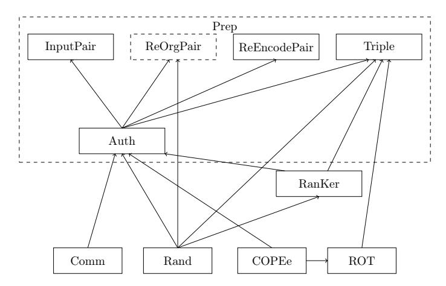

# A Secret-Sharing Based MPC Protocol for Boolean Circuits with Good Amortized Complexity

Ignacio Cascudo1 and Jaron Skovsted Gundersen2??

1 IMDEA Software Institute, Madrid, Spain, ignacio.cascudo@imdea.org 2 Aalborg University, Aalborg, Denmark, jaron@math.aau.dk

Abstract We present a new secure multiparty computation protocol in the preprocessing model that allows for the evaluation of a number of instances of a boolean circuit in parallel, with a small online communication complexity per instance of 10 bits per party and multiplication gate. Our protocol is secure against an active dishonest majority, and can also be transformed, via existing techniques, into a protocol for the evaluation of a single "well-formed" boolean circuit with the same complexity per multiplication gate at the cost of some overhead that depends on the topology of the circuit.

Our protocol uses an approach introduced recently in the setting of honest majority and information-theoretical security which, using an algebraic notion called reverse multiplication friendly embeddings, essentially transforms a batch of evaluations of an arithmetic circuit over a small field into one evaluation of another arithmetic circuit over a larger field. To obtain security against a dishonest majority we combine this approach with the well-known SPDZ protocol that operates over a large field. Structurally our protocol is most similar to MiniMAC, a protocol which bases its security on the use of error-correcting codes, but our protocol has a communication complexity which is half of that of MiniMAC when the best available binary codes are used. With respect to certain variant of MiniMAC that utilizes codes over larger fields, our communication complexity is slightly worse; however, that variant of MiniMAC needs a much larger preprocessing than ours. We also show that our protocol also has smaller amortized communication complexity than Committed MPC, a protocol for general fields based on homomorphic commitments, if we use the best available constructions for those commitments. Finally, we construct a preprocessing phase from oblivious transfer based on ideas from MASCOT and Committed MPC.

## 1 Introduction

The area of secure multiparty computation (MPC) studies how to design protocols that allow for a number of parties to jointly perform computations on private

?? Jaron Skovsted Gundersen wants to acknowledge the SECURE project at Aalborg University. Furthermore, he wants to thank IMDEA Software Institute for hosting a visit to Ignacio Cascudo in connection to this paper.

inputs in such a way that each party learns a private output, but nothing else than that. In the last decade efficient MPC protocols have been developed that can be used in practical applications.

In this work we focus on secret-sharing based MPC protocols, which are among the most used in practice. In secret-sharing based MPC, the target computation is represented as an arithmetic circuit consisting of sum and multiplication gates over some algebraic ring; each party initially shares her input among the set of parties, and the protocol proceeds gate by gate, where at every gate a sharing of the output of the gate is created; in this manner eventually parties obtain shares of the output of the computation, which can then be reconstructed.

A common practice is to use the preprocessing model, where the computation is divided in two stages: a preprocessing phase, that is completely independent from the inputs and whose purpose is to distribute some correlated randomness among the parties; and an online phase, where the actual computation is performed with the help of the preprocessing data. This approach allows for pushing much of the complexity of the protocol into the preprocessing phase and having very efficient online computations in return.

Some secret sharing based MPC protocols obtain security against any static adversary which actively corrupts all but one of the parties in the computation, assuming that the adversary is computationally bounded. Since in the active setting corrupted parties can arbitrarily deviate from the protocol, some kind of mechanism is needed to detect such malicious behaviour, and one possibility is the use of information-theoretic MACs to authenticate the secret shared data, which is used in protocols such as BeDOZa [3] and SPDZ [13].

In SPDZ this works as follows: the computation to be performed is given by an arithmetic circuit over a large finite field  $\mathbb{F}$ . There is a global key  $\alpha \in \mathbb{F}$  which is secret shared among the parties. Then for every value  $x \in \mathbb{F}$  in the computation, parties obtain not only additive shares for that value, but also for the product  $\alpha \cdot x$  which acts as a MAC for x. The idea is that if a set of corrupt parties change their shares and pretend that this value is x+e, for some nonzero error e, then they would also need to guess the correction value  $\alpha \cdot e$  for the MAC, which amounts to guessing  $\alpha$  since  $\mathbb{F}$  is a field. In turn this happens with probability  $1/|\mathbb{F}|$  which is small when the field is large.

The problem is that over small fields the cheating success probability  $1/|\mathbb{F}|$  is large. While one can take a large enough extension field  $\mathbb{L}$  of  $\mathbb{F}$  (e.g. if  $\mathbb{F} = \mathbb{F}_2$ , then  $\mathbb{L}$  could be the field of  $2^s$  elements) and embed the whole computation into  $\mathbb{L}$ , this looks wasteful as communication is blown up by a factor of s.

An alternative was proposed in MiniMAC [14]. MiniMAC uses a batch authentication idea: if we are willing to simultaneously compute k instances of the same arithmetic circuit over a small field at once, we can bundle these computations together and see them as a computation of an arithmetic circuit over the ring  $\mathbb{F}^k$ , where the sum and multiplication operations are considered coordinatewise. Note the same authentication technique as in SPDZ does not directly work over this ring (if  $|\mathbb{F}|$  is small): if we define the MAC of a data vector  $\mathbf{x}$  in  $\mathbb{F}^k$  to be  $\alpha * \mathbf{x}$  where the key  $\alpha$  is now also a vector in  $\mathbb{F}^k$  and \* is the coordinate-

wise product, the adversary can introduce an error in a single coordinate with probability  $1/|\mathbb{F}|$ . Instead, MiniMAC first encodes every vector  $\mathbf{x}$  as a larger vector  $C(\mathbf{x})$  by means of a linear error-correcting code C with large minimum distance d, and then defines the MAC as  $\alpha * C(\mathbf{x})$ . Now introducing an error requires to change at least d coordinates of  $C(\mathbf{x})$  and the MAC can be fooled with probability only  $1/|\mathbb{F}|^d$ . However, when processing multiplication gates, the minimum distance  $d^*$  of the so-called Schur square code  $C^*$  also needs to be large. These requirements on the minimum distance of these two codes have an effect on the communication overhead of the protocol, because the larger d and  $d^*$  are, the worse the relation between the length of messages and the length of the encoding.

This same article shows how to adapt this technique for computing a single boolean "well-formed" circuit while retaining the efficiency advantages of the batch simultaneous computation of k circuits. The idea is that if the target boolean circuit is structured into layers of addition and multiplication gates, where each layer has a large number of gates and its inputs are outputs of previous layers, then we can organize them into blocks of k gates of the same type, which can be computed using the above method. We then need an additional step that directs each block of outputs of a layer into the right block of inputs of next layers; this uses some additional preprocessed random sharings, and some openings, which slightly increases the communication complexity of the protocol.

In this paper, we explore an alternative to the error-correcting codes approach from MiniMAC, using an idea recently introduced in the honest majority, information-theoretically secure setting [8]. The point is that we can embed the ring  $\mathbb{F}_q^k$  in some extension field of  $\mathbb{F}_q$  in such a way that we can make the operations of both algebraic structures, and in particular the products (in one case the coordinatewise product, in the other the product in the extension field), "somewhat compatible": i.e., we map  $\mathbb{F}_q^k$  into a slightly larger field  $\mathbb{F}_{q^m}$  with some dedicated linear "embedding" map  $\phi$ , that satisfies that for any two vectors  $\mathbf{x}, \mathbf{y}$ in  $\mathbb{F}_q^k$  the field product  $\phi(\mathbf{x}) \cdot \phi(\mathbf{y})$  contains all information about  $\mathbf{x} * \mathbf{y}$ , in fact there exists a "recovery" linear map  $\psi$  such that  $\mathbf{x} * \mathbf{y} = \psi(\phi(\mathbf{x}) \cdot \phi(\mathbf{y}))$ . The pair  $(\phi, \psi)$  is called a (k, m)-reverse multiplication friendly embedding (RMFE) and was introduced in [5,8]. With such tool, [8] embeds k evaluations of a circuit over  $\mathbb{F}_q$  (i.e. an evaluation of an arithmetic circuit over  $\mathbb{F}_q^k$  with coordinatewise operations) into one evaluation of a related circuit over  $\mathbb{F}_{q^m}$ , which is securely computed via an information-theoretically secure MPC protocol for arithmetic circuits over that larger field (more precisely the Beerliova-Hirt protocol [2]). The use of that MPC protocol over  $\mathbb{F}_{q^m}$  is not black-box, however, as there are a number of modifications that need to be done at multiplication and input gates, for which certain additional correlated information has to be created in the preprocessing phase. Note that the reason for introducing this technique was that Beerliova-Hirt uses Shamir secret sharing schemes and hyperinvertible matrices, two tools that are only available over large finite fields (larger than the number of parties in the protocol).

#### 1.1 Our contributions

In this paper we construct a new secure computation protocol in the dishonest majority setting that allows to compute several instances of a boolean circuit at an amortized cost.3 We do this by combining the embedding techniques from [8] with the SPDZ methodology. As opposed to [8], where one of the points of the embedding was precisely to use Shamir secret sharing, in our construction vectors  $\mathbf{x} \in \mathbb{F}_2^k$  are still additively shared in  $\mathbb{F}_2^k$ , and it is only the MACs which are constructed and shared in the field  $\mathbb{F}_{2^m}$ : the MAC of  $\mathbf{x}$  will be  $\alpha \cdot \phi(\mathbf{x})$  where  $\phi$  is the embedding map from the RMFE. Only when processing a multiplication gate, authenticated sharings where the data are shared as elements in  $\mathbb{F}_{2^m}$  are temporarily used. MACs are checked in a batched fashion at the output gate, at which point the protocol aborts if discrepancies are found.

By this method we obtain a very efficient online phase where processing multiplication gates need each party to communicate around 10 bits4 per evaluation of the circuit, for statistical security parameters like s = 64, 128 (meaning the adversary can successfully cheat with probability at most  $2^{-s}$ , for which in our protocols we need to set m > s).

Our protocol can also be adapted to evaluating a single instance of a boolean circuit by quite directly adapting the ideas in MiniMAC that we mentioned above, based on organizing the circuit in layers, partitioning the layers in blocks of gates and adding some preprocessing that allows to map each block into the appropriate one in the next layer. The reason is that the maps used between layers of gates are  $\mathbb{F}_2$ -linear, and essentially all we need to use is the  $\mathbb{F}_2$ -linearity of the map  $\phi$  from the RMFE. The actual complexity added by this transformation is quite dependent on the topology of the circuit. Under some general assumptions one can expect to add 2 bits of communication per gate.

Our online phase follows a similar pattern to MiniMAC in the sense that, up to the output phase, every partial opening of a value in  $\mathbb{F}_2^k$  takes place when a partial opening of a C-encoding occurs in MiniMAC. Respectively, we need to open values in  $\mathbb{F}_{2^m}$  whenever MiniMAC opens  $C^*$ -encodings. At every multiplication gate, both protocols need to apply "re-encoding functions" to convert encodings back to the base authentication scheme, which requires a preprocessed pair of authenticated sharings of random correlated elements.

However, the encoding via RMFE we are using is more compact than the one in MiniMAC; the comparison boils down to comparing the "expansion factor" m/k of RMFEs with the ratio  $k^*/k$  between the dimensions of  $C^*$  and C for the best binary codes with good distances of  $C^*$  [7]. We cut the communication cost of multiplication gates by about half with respect to MiniMAC where those binary codes are used. We achieve even better savings in the case of the output gates since in this case MiniMAC needs to communicate full vectors of the same length as the code, while the input and addition gates have the same cost.

&lt;sup>3 Our ideas can be extended to arithmetic circuits over other small fields.

&lt;sup>4 Here we assume that broadcasting messages of M bits requires to send M bits to every other player, which one can achieve with small overhead that vanishes for large messages [13, full version]

We also compare the results with a modified version of MiniMAC proposed by Damgård, Lauritsen and Toft [\[12\]](#page-29-5), that allows to save communication cost of multiplication gates, by essentially using MiniMAC over the field of 256 elements, at the cost of a much larger amount of preprocessing that essentially provides authenticated sharings of bit decompositions of the F256-coordinates of the elements in a triple, so that parties can compute bitwise operations. This version achieves a communication complexity that is around 80% of that of our protocol, due to the fact that this construction can make use of Reed-Solomon codes. However, it requires to have created authenticated sharings of 19 elements, while ours need 5 and as far as we know there is no explicit preprocessing protocol that has been proposed for this version of MiniMAC.

Finally we compare the results with Committed MPC [\[15\]](#page-29-6), a secret-sharing based protocol which uses (UC-secure) homomorphic commitments for authentication, rather than information-theoretical MACs. In particular, this protocol can also be used for boolean circuits, given that efficient constructions of homomorphic commitments [\[16,](#page-29-7)[10](#page-29-8)[,9\]](#page-29-9) over F2 have been proposed. These constructions of homomorphic commitments also use error-correcting codes. We find that, again, the smaller expansion m/k of RMFE compared to the relations between the parameters for binary error-correcting codes provides an improvement in the communication complexity of a factor ∼ 3 for security parameters s = 64, 128.

We also provide a preprocessing phase producing all authenticated sharings of random correlated data that we need. The preprocessing follows the steps of MASCOT [\[19\]](#page-29-10) (see also [\[17\]](#page-29-11)) based on OT extension, with some modifications due to the slightly different authentication mechanisms we have and the different format of our preprocessing. All these modifications are easily to carry out based on the fact that φ and ψ are linear maps over F2. Nevertheless, using the "triple sacrificing steps" from MASCOT that assure that preprocessed triples are not malformed presents problems in our case for technical reasons. Instead, we use the techniques from Committed MPC [\[15\]](#page-29-6) in that part of the triple generation.

#### 1.2 Related Work

The use of information-theoretical MACs in secret-sharing based multiparty computation dates back to BeDOZa (Bendlin et al., [\[3\]](#page-28-0)), where such MACs where established between every pair of players. Later SPDZ (Damgård et al., [\[13\]](#page-29-0)) introduced the strategy consisting of a global MAC for every element of which every party has a share, and whose key is likewise shared among parties. Tiny OT (Nielsen et al., [\[21\]](#page-29-12)), a 2-party protocol for binary circuits, introduced the idea of using OT extension in the preprocessing phase. Larraia et al., [\[20\]](#page-29-13) extended these ideas to a multi-party protocol by using the SPDZ global shared MAC approach. MiniMAC (Damgård and Zakarias, [\[14\]](#page-29-1)), as explained above, used error-correcting codes in order to authenticate vectors of bits, allowing for efficient parallel computation of several evaluations of the same binary circuits on possibly different inputs. Damgård et al., [\[12\]](#page-29-5) proposed several improvements for the implementation of MiniMAC, among them the use of an error correcting code over an extension field, trading smaller communication complexity for a larger amount of preprocessing. Frederiksen et al., [17] gave new protocols for the construction of preprocessed multiplication triples in fields of characteristic two, based on OT extension, and in particular provided the first preprocessing phase for MiniMAC. MASCOT (Keller et al., [19]) built on some of these ideas to create preprocessing protocols for SPDZ based on OT extension. Committed MPC (Frederiksen et al., [15]) is a secret-sharing based secure computation protocol that relies on UC-secure homomorphic commitments instead of homomorphic MACs for authentication, but other than that, it follows a similar pattern to the protocols above. Efficient constructions of UC-secure homomorphic commitments from OT have been proposed by Frederiksen et al., [16] and Cascudo et al., [10] based on error correcting codes. Later, in [9] a modified construction from extractable commitments, still using error-correcting codes, was proposed that presents an important advantage for its use in Committed MPC, namely the commitment schemes are multi-verifier.

The notion of reverse multiplication friendly embedding was first explicitly defined and studied in the context of secure computation by Cascudo et al. in [8] and independently by Block et al. in [5]. The former work is in the context of information-theoretically secure protocols, while the latter studied 2-party protocols over small fields where the assumed resource is OLE over an extension field. This is partially based on a previous work also by Block et al., [4] where (asymptotically less efficient) constructions of RMFEs were implicitly used.

### 2 Preliminaries

Let  $\mathbb{F}_q$  denote a finite fields with q elements. Vectors are denoted with bold letters as  $\mathbf{x} = (x_1, x_2, \dots, x_n)$  and componentwise products of two vectors are denoted by  $\mathbf{x} * \mathbf{y} = (x_1 \cdot y_1, x_2 \cdot y_2, \dots, x_n \cdot y_n)$ . Fixing an irreducible polynomial f of degree m in  $\mathbb{F}_q[X]$ , elements in the field  $\mathbb{F}_{q^m}$  with  $q^m$  elements can be represented as polynomials in  $\mathbb{F}_q[X]$  with degree m-1, i.e  $\alpha = \alpha_0 + \alpha_1 \cdot X + \dots + \alpha_{m-1} \cdot X^{m-1} \in \mathbb{F}_{q^m}$ , where  $\alpha_i \in \mathbb{F}_q$ . The sums and products of elements are defined modulo f.

In our protocols we will assume a network of n parties who communicate by secure point-to-point channels, and an static adversary who can actively corrupt up to n-1 of these parties. Our proofs will be in the universal composable security model [6] (see Appendix C for a brief description of that model).

We recall the notion of reverse multiplication friendly embeddings from [8].

**Definition 1.** Let  $k, m \in \mathbb{Z}^+$ . A pair of  $\mathbb{F}_q$ -linear maps  $(\phi, \psi)$ , where  $\phi \colon \mathbb{F}_q^k \to \mathbb{F}_{q^m}$  and  $\psi \colon \mathbb{F}_{q^m} \to \mathbb{F}_q^k$  is called a  $(k, m)_q$ -reverse multiplication friendly embedding (RMFE) if for all  $\mathbf{x}, \mathbf{y} \in \mathbb{F}_q^k$ 

$$\mathbf{x} * \mathbf{y} = \psi(\phi(\mathbf{x}) \cdot \phi(\mathbf{y}))$$

In other words, this tool allows to multiply coordinatewise two vectors over  $\mathbb{F}_q$  by first embedding them in a larger field with  $\phi$ , multiplying the resulting images and mapping the result back to a vector over  $\mathbb{F}_q$  with the other map  $\psi$ .

Several results about the existence of such pairs can be found in [8], both in the asymptotic and concrete settings. For our results we will only need the following construction, which can be obtained via simple interpolation techniques:

**Theorem 1** ([8]). For all  $r \leq 33$ , there exists a  $(3r, 10r - 5)_2$ -RMFE.

For completion we describe how to construct these RMFE in Appendix B.1.

However, we remark that for implementations, it might be more useful to consider the following constructions of RMFEs which can also be deduced from the general framework in [8] (also based on polynomial interpolation). They have worse rate k/m than those in Theorem 1, but they have the advantage that their image can be in a field of degree a power of two, e.g.  $\mathbb{F}_{q^m} = \mathbb{F}_{2^{64}}$  or  $\mathbb{F}_{2^{128}}$ .

**Theorem 2.** For any  $r \leq 16$ , there exists a  $(2r, 8r)_2$ -RMFE.5

For our numerical comparisons we will mainly consider the constructions with better rate in Theorem 1 and point out that, should one want to use Theorem 2 instead, then some small overhead in communication is introduced.

It is important to understand some properties and limitations of the RMFEs. Because  $\phi$  and  $\psi$  are  $\mathbb{F}_q$ -linear then

$$\phi(\mathbf{x} + \mathbf{y}) = \phi(\mathbf{x}) + \phi(\mathbf{y}), \quad \psi(x+y) = \psi(x) + \psi(y)$$

holds for all  $\mathbf{x}, \mathbf{y} \in \mathbb{F}_q^k$  and  $x, y \in \mathbb{F}_{q^m}$ . However, for example

$$\phi(\mathbf{x} * \mathbf{y}) \neq \phi(\mathbf{x}) \cdot \phi(\mathbf{y})$$

in general. Likewise we will need to take into account that the composition  $\phi \circ \psi : \mathbb{F}_{q^m} \to \mathbb{F}_{q^m}$  is a linear map over  $\mathbb{F}_q$  but not over  $\mathbb{F}_{q^m}$ . Therefore

$$(\phi \circ \psi)(x+y) = (\phi \circ \psi)(x) + (\phi \circ \psi)(y) \text{ for all } x, y \in \mathbb{F}_{q^m}, \text{ but}$$
$$(\phi \circ \psi)(\alpha \cdot x) \neq \alpha \cdot (\phi \circ \psi)(x)$$

for  $\alpha, x \in \mathbb{F}_{q^m}$  in general (it does hold when  $\alpha \in \mathbb{F}_q$ , but this is not too relevant).

These limitations on the algebra of  $\phi$  and  $\psi$  posed certain obstacles in the information-theoretical setting [8], since processing multiplication gates required to compute gates given by the map  $\phi \circ \psi$ , and this cannot be treated as a simple linear gate over  $\mathbb{F}_{q^m}$ . The additivity of  $\phi \circ \psi$  combined with certain involved preprocessing techniques saved the day there. For completion (and comparison to our paper) we sum up some of the main details of [8] in Appendix B.2. In our case, we will again encounter problems caused by these limitations as we explain next, but can solve them in a different way.

&lt;sup>5 Specifically the result is obtained by noticing that the proof of Lemma 4 in [8] can also be used to show the existence of  $(k, 2k)_q$ -RMFE for any  $q \le k + 1$ , and then composing  $(2, 4)_2$  and  $(r, 2r)_{16}$ -RMFEs in the manner of Lemma 5 in the same paper.

### 3 The online phase

In this section we present our protocol for computing simultaneously k instances of a boolean circuit in parallel, which we can see as computing one instance of an arithmetic circuit over the ring  $\mathbb{F}_2^k$  of length k boolean vectors with coordinatewise sum and product.

Our strategy is to have mixed authenticated sharings: inputs and the rest of values in the computation  $\mathbf{x}$  are additively shared as vectors over  $\mathbb{F}_2^k$  (we refer to this as data shares), but their MACs are elements  $\alpha \cdot \phi(\mathbf{x})$  in the larger field  $\mathbb{F}_{2^m}$ , where  $\alpha \in \mathbb{F}_{2^m}$  is (as in SPDZ) a global key that is additively shared among the parties from the beginning (with  $\alpha^{(i)}$  denoting the share for party  $P_i$ ), and parties hold additive shares of  $\alpha \cdot \phi(\mathbf{x})$  also in the field  $\mathbb{F}_{2^m}$  (the MAC shares). We will denote the authentication of  $\mathbf{x}$  by  $\langle \mathbf{x} \rangle$ . That is

$$\langle \mathbf{x} \rangle = \left( (\mathbf{x}^{(1)}, \mathbf{x}^{(2)}, \dots, \mathbf{x}^{(n)}), (m^{(1)}(\mathbf{x}), m^{(2)}(\mathbf{x}), \dots, m^{(n)}(\mathbf{x})) \right)$$

where each party  $P_i$  holds an additive share  $\mathbf{x}^{(i)} \in \mathbb{F}_2^k$  and a MAC share  $m^{(i)}(\mathbf{x}) \in \mathbb{F}_{2^m}$ , such that  $\sum_{i=1}^n m^{(i)}(\mathbf{x}) = \alpha \cdot \sum_{i=1}^n \phi(\mathbf{x}^{(i)}) = \alpha \cdot \phi(\mathbf{x})$ .

The additivity of  $\phi$  guarantees that additions can still be computed locally, and we can define  $\langle \mathbf{x} \rangle + \langle \mathbf{y} \rangle = \langle \mathbf{x} + \mathbf{y} \rangle$  where every party just adds up their shares for both values. Moreover, given a public vector  $\mathbf{a}$  and  $\langle \mathbf{x} \rangle$ , parties can also locally compute an authenticated sharing of  $\mathbf{a} + \mathbf{x}$  as

$$\mathbf{a} + \langle \mathbf{x} \rangle = \left( (\mathbf{x}^{(1)} + \mathbf{a}, \mathbf{x}^{(2)}, \dots, \mathbf{x}^{(n)}), (\alpha^{(1)} \cdot \phi(\mathbf{a}) + m^{(1)}(\mathbf{x}), \dots, \alpha^{(n)} \cdot \phi(\mathbf{a}) + m^{(n)}(\mathbf{x})) \right)$$

This allows to easily process addition with constants. Moreover, this also allows us to explain how inputs are shared in the first place. In the preprocessing phase parties have created for each input gate an authenticated random values  $\langle \mathbf{r} \rangle$  where  $\mathbf{r}$  is known to the party that will provide the input  $\mathbf{x}$  at that gate. This party can just broadcast the difference  $\epsilon = \mathbf{x} - \mathbf{r}$ , and then parties simply add  $\epsilon + \langle \mathbf{r} \rangle = \langle \mathbf{x} \rangle$  by the rule above.

As in SPDZ, parties in our protocol do not need to open any MAC until the output gate. At the output gate, the parties check MACs on random linear combinations of all values partially opened during the protocol, ensuring that parties have not cheated except with probability at most  $2^{-m}$  (we need that  $m \geq s$  if s is the statistical security parameter); then, they open the result of the computation and also check that the MAC of the result is correct.

A harder question, as usual, is how to process multiplication gates; given  $\langle \mathbf{x} \rangle$ ,  $\langle \mathbf{y} \rangle$  parties need to compute  $\langle \mathbf{x} * \mathbf{y} \rangle$  which implies not only obtaining an additive sharing of  $\mathbf{x} * \mathbf{y}$  but also of its MAC  $\alpha \cdot \phi(\mathbf{x} * \mathbf{y})$ . If we try to apply directly the well-known Beaver's technique [1] we encounter the following problem. Suppose we have obtained a random triple  $\langle \mathbf{a} \rangle$ ,  $\langle \mathbf{b} \rangle$ ,  $\langle \mathbf{a} * \mathbf{b} \rangle$  from the preprocessing phase and, proceeding as usual, parties partially open the values  $\epsilon = \mathbf{x} - \mathbf{a}$ ,  $\delta = \mathbf{y} - \mathbf{b}$  (a partially opening is an opening of the shares but not the MAC shares). From here, computing data shares for  $\mathbf{x} * \mathbf{y}$  is easy; however, the obstacle lies in computing

shares of  $\alpha \cdot \phi(\mathbf{x} * \mathbf{y})$ . Indeed

$$\alpha \cdot \phi(\mathbf{x} * \mathbf{y}) = \alpha \cdot \phi(\mathbf{a} * \mathbf{b}) + \alpha \cdot \phi(\mathbf{a} * \boldsymbol{\delta}) + \alpha \cdot \phi(\boldsymbol{\epsilon} * \mathbf{b}) + \alpha \cdot \phi(\boldsymbol{\epsilon} * \boldsymbol{\delta}),$$

and the two terms in the middle present a problem: for example for  $\alpha \cdot \phi(\mathbf{a} * \boldsymbol{\delta})$  we have by the properties of the RMFE

$$\alpha \cdot \phi(\mathbf{a} * \boldsymbol{\delta}) = \alpha \cdot \phi(\psi(\phi(\mathbf{a}) \cdot \phi(\boldsymbol{\delta}))) = \alpha \cdot (\phi \circ \psi)(\phi(\mathbf{a}) \cdot \phi(\boldsymbol{\delta}))$$

However,  $\phi \circ \psi$  is only  $\mathbb{F}_2$ -linear, and not  $\mathbb{F}_{2^m}$ -linear, so we cannot just "take  $\alpha$  inside the argument" and use the additive sharing of  $\alpha \cdot \phi(\mathbf{a})$  given in  $\langle \mathbf{a} \rangle$  to compute a sharing of the expression above. Instead, we use a two-step process to compute multiplication gates, for which we need to introduce regular SPDZ sharings on elements  $x \in \mathbb{F}_{2^m}$ . I.e. both x and its MAC  $\alpha \cdot x$  are additively shared in  $\mathbb{F}_{2^m}$ . We denote these by [x], that is

$$[x] = ((x^{(1)}, x^{(2)}, \dots, x^{(n)}), (m^{(1)}(x), m^{(2)}(x), \dots, m^{(n)}(x))),$$

where  $P_i$  will hold  $x^{(i)}$  and  $m^{(i)}(x) \in \mathbb{F}_{2^m}$  with  $\sum_{i=1}^n m^{(i)}(x) = \alpha \cdot \sum_{i=1}^n x^{(i)}$ .

To carry out the multiplication we need to preprocess a triple  $(\langle \mathbf{a} \rangle, \langle \mathbf{b} \rangle, \langle \mathbf{c} \rangle)$  where  $\mathbf{c} = \mathbf{a} * \mathbf{b}$ , and a pair of the form  $(\langle \psi(r) \rangle, [r])$  where r is a random element in  $\mathbb{F}_{2^m}$ . In the first step of the multiplication we compute and partially open

$$[\sigma] = [\phi(\mathbf{x}) \cdot \phi(\mathbf{y}) - \phi(\mathbf{a}) \cdot \phi(\mathbf{b}) - r]. \tag{1}$$

This can be computed from the  $\boldsymbol{\epsilon}$  and  $\boldsymbol{\delta}$  described above (details will be given later). In the second step, we create  $\langle \mathbf{x} * \mathbf{y} \rangle$  from (1) by using the properties of the RMFE; namely,  $\mathbf{x} * \mathbf{y} = \psi(\phi(\mathbf{x}) \cdot \phi(\mathbf{y}))$  and  $\mathbf{a} * \mathbf{b} = \psi(\phi(\mathbf{a}) \cdot \phi(\mathbf{b}))$ , so applying  $\psi$  on  $\sigma$  in (1) yields  $\mathbf{x} * \mathbf{y} - \mathbf{a} * \mathbf{b} - \psi(r)$  because of the additivity of  $\psi$ . Adding  $\langle \mathbf{a} * \mathbf{b} \rangle + \langle \psi(r) \rangle$  (the yet unused preprocessed elements) gives  $\langle \mathbf{x} * \mathbf{y} \rangle$ .

We still need to explain how to construct  $[\sigma]$ . For this we introduce some algebraic operations on the two types of authenticated sharings and public values. First given a public vector  $\mathbf{a}$  and a shared vector  $\mathbf{x}$  we define:

$$\mathbf{a} * \langle \mathbf{x} \rangle = \left( (\phi(\mathbf{a}) \cdot \phi(\mathbf{x}^{(1)}), \dots, \phi(\mathbf{a}) \cdot \phi(\mathbf{x}^{(n)})), (\phi(\mathbf{a}) \cdot m^{(1)}(\mathbf{x}), \dots, \phi(\mathbf{a}) \cdot m^{(n)}(\mathbf{x})) \right)$$

Note that the data shares are shares of  $\phi(\mathbf{a}) \cdot \phi(\mathbf{x})$ , which is an element of  $\mathbb{F}_{2^m}$ , and the MAC shares also correspond to additive shares of  $\alpha \cdot \phi(\mathbf{a}) \cdot \phi(\mathbf{x})$ . However, the data shares are not distributed uniformly in  $\mathbb{F}_{2^m}$  because  $\phi$  is not surjective, so one cannot say this equals  $[\phi(\mathbf{a}) \cdot \phi(\mathbf{x})]$ . Nevertheless, given another [z], with  $z \in \mathbb{F}_{2^m}$ , it is true that  $\mathbf{a} * \langle \mathbf{x} \rangle + [z] = [\phi(\mathbf{a}) \cdot \phi(\mathbf{x}) + z]$  where the sum on the left is defined by just local addition of the data and MAC shares. We also define

$$\begin{split} \langle \mathbf{x} \rangle + [y] &= \Big( (\phi(\mathbf{x}^{(1)}) + y^{(1)}, \dots, \phi(\mathbf{x}^{(n)}) + y^{(n)}), \\ &\qquad \qquad (m^{(1)}(\mathbf{x}) + m^{(1)}(y), \dots, m^{(n)}(\mathbf{x}) + m^{(n)}(y)) \Big) = [\phi(\mathbf{x}) + y] \end{split}$$

Now, given  $\langle \mathbf{x} \rangle, \langle \mathbf{y} \rangle$  and a triple  $\langle \mathbf{a} \rangle, \langle \mathbf{b} \rangle, \langle \mathbf{a} * \mathbf{b} \rangle$ , parties can open  $\epsilon = \mathbf{x} - \mathbf{a}$ ,  $\delta = \mathbf{y} - \mathbf{b}$  and construct

$$\epsilon * \langle \mathbf{y} \rangle + \delta * \langle \mathbf{x} \rangle - \phi(\epsilon) \cdot \phi(\delta) - [r] = [\phi(\epsilon) \cdot \phi(\mathbf{y}) + \phi(\delta) \cdot \phi(\mathbf{x}) - \phi(\epsilon) \cdot \phi(\delta) - r]$$
$$= [\phi(\mathbf{x}) \cdot \phi(\mathbf{y}) - \phi(\mathbf{a}) \cdot \phi(\mathbf{b}) - r],$$

where the latter equality can be seen by developing the expressions for  $\epsilon$  and  $\delta$ , and using the additivity of  $\phi$ . The obtained sharing is the  $[\sigma]$  we needed above . Summing up, the whole multiplication gate costs 2 openings of sharings of vectors in  $\mathbb{F}_2^k$  and one opening of a share of an element in  $\mathbb{F}_{2^m}$ . Every multiplication gate requires fresh preprocessed correlated authenticated sharings  $(\langle \mathbf{a} \rangle, \langle \mathbf{b} \rangle, \langle \mathbf{a} * \mathbf{b} \rangle)$  and  $(\langle \psi(r) \rangle, [r])$  for random  $\mathbf{a}, \mathbf{b}, r$ .

We present formally the online protocol we just explained, the functionality it implements, and the functionalities needed from preprocessing. The functionality constructing the required preprocessed randomness is given in Figure 2, and relies on the authentication functionality in Figure 1. The latter augments the one in MASCOT [19] allowing to also authenticate vectors and to compute linear combinations involving the two different types of authenticated values and which can be realized by means of the  $[\cdot]$ - and  $\langle \cdot \rangle$ -sharings.

The functionality for our MPC protocol is in Figure 3 and the protocol implementing the online phase is in Figure 4.

**Theorem 3.**  $\Pi_{\text{Online}}$  securely implements  $\mathcal{F}_{\text{MPC}}$  in the  $\mathcal{F}_{\text{Prep}}$ -hybrid model.

*Proof.* The correctness follows from the explanation above. For more details we refer Appendix A.1, but we also note that the online phase from this protocol is similar to the online phases of protocols such as [13,14,15,19], except that in every multiplication we additionally need to use the pair  $(\langle \psi(r) \rangle, [r])$  in order to transform a  $[\cdot]$ -sharing into  $\langle \mathbf{x} * \mathbf{y} \rangle$ . However, since r is uniformly random in the field  $\mathbb{F}_{2^m}$ , the opened value  $\sigma$  masks any information on  $\mathbf{x}$ ,  $\mathbf{y}$ .

#### 3.1 Comparison with MiniMAC and Committed MPC

We compare the communication complexity of our online phase with that of MiniMAC [14] and Committed MPC [15], two secret-sharing based MPC protocols which are well-suited for simultaneously evaluating k instances of the same boolean circuit. We will count broadcasting a message of M bits as communicating M(n-1) bits (M bits to each other party). This can be achieved using point-to-point channels as described in the full version of [13].

Communication complexity of our protocol. Partially opening a  $\langle \cdot \rangle$ -authenticated secret involves 2k(n-1) bits of communication, since we have one selected party receive the share of each other party and broadcast the reconstructed value. Likewise, partially opening a  $[\cdot]$ -authenticated value communicates 2m(n-1) bits. In our online phase, every input gate requires k(n-1)

## Functionality $\mathcal{F}_{Auth}$

The functionality maintains two dictionaries Val and ValField, to keep track of authenticated values. We remark that we can store elements from  $\mathbb{F}_2^k$  in Val and elements from  $\mathbb{F}_{2^m}$  in ValField. Entries in the dictionaries cannot be changed.

1. Input: On input

$$(Input, (id_1, id_2, ... id_s), (id'_1, id'_2, ... id'_t), (\mathbf{x}_1, \mathbf{x}_2, ..., \mathbf{x}_s), (x_1, x_2, ..., x_t), P_i)$$

from  $P_i$  and  $(Input, (id_1, id_2, ... id_s), (id'_1, id'_2, ... id'_t), P_i)$  from all other parties, set  $Val[id_j] = \mathbf{x}_j$  for j = 1, 2, ..., s and  $ValField[id'_j] = x_j$  for j = 1, 2, ..., t.

- 2. **Add:** On input (Add,  $i\bar{d}$ , id, a)) from all parties. If a is an id store  $Val[i\bar{d}] = Val[i\bar{d}] + Val[a]$ . If a is a vector in  $\mathbb{F}_2^k$  store  $Val[i\bar{d}] = Val[i\bar{d}] + a$ .
- 3. LinComb: On input

$$(\operatorname{LinComb}, \operatorname{id}, (\operatorname{id}_1, \operatorname{id}_2, \dots \operatorname{id}_s), (\operatorname{id}'_1, \operatorname{id}'_2, \dots \operatorname{id}'_t), a_1, a_2, \dots, a_{s+t}, a)$$

from all parties, where  $a_j$  is in  $\mathbb{F}_{2^m}$  or  $\mathbb{F}_2^k$  and  $t \geq 1$ . Define  $\tilde{a}_j$  to be  $a_j$  if  $a_j \in \mathbb{F}_{2^m}$ , and  $\phi(a_j)$  if  $a_j \in \mathbb{F}_2^k$ , and store ValField $[\bar{\mathrm{id}}] = \sum_{j=1}^s \tilde{a}_j \cdot \phi(\mathrm{Val}[\mathrm{id}_j]) + \sum_{j=1}^t \tilde{a}_{s+j} \cdot \mathrm{ValField}[\bar{\mathrm{id}}'_i] + \tilde{a}$ .

- 4. **Open:** On input (Open, Dict, id, S) from all parties, where S is a non-empty subset of parties. If Dict = Val and Val[id]  $\neq \bot$  wait for an **x** from the adversary and send **x** to the honest parties in S. If Dict = ValField and ValField[id]  $\neq \bot$  wait for an x from the adversary and send x to the parties in S.
- 5. Check: On input

$$(Check, (id_1, id_2, ..., id_s), (id'_1, id'_2, ..., id'_t), (\mathbf{x}_1, \mathbf{x}_2, ..., \mathbf{x}_s), (x_1, x_2, ..., x_t))$$

from every party wait for an input from the adversary. If they input OK,  $\operatorname{Val}[\operatorname{id}_j] = \mathbf{x}_j$  for  $j = 1, 2, \dots, s$  and  $\operatorname{ValField}[\operatorname{id}'_j] = x_j$  for  $j = 1, 2, \dots, t$  return OK to all parties. Otherwise abort.

Notation: We will use the notation  $\langle \mathbf{x} \rangle$  to refer to a value  $\mathbf{x} \in \mathbb{F}_2^k$  stored in Val, and the notation [x] to refer to a value  $x \in \mathbb{F}_{2^m}$  stored in ValField.

Figure 1. Functionality – Authentication

## Functionality $\mathcal{F}_{Prep}$

This functionality has the same features as  $\mathcal{F}_{Auth}$  along with the following commands.

- 1. **InputPair:** On input (InputPair,id, $P_i$ ) from all parties let  $P_i$  choose  $\mathbf{r} \in \mathbb{F}_2^k$  at random and call  $\mathcal{F}_{\text{Auth}}$  with input (Input,id, $\mathbf{r},P_i$ ) to obtain  $\langle \mathbf{r} \rangle$ . Output  $\langle \mathbf{r} \rangle$  to all parties and  $\mathbf{r}$  to  $P_i$ .
- 2. **ReEncodePair:** On input (ReEncodePair, id1, id2) sample a random field element  $r \in \mathbb{F}_{2^m}$  and set Val[id1] =  $\psi(r)$  and ValField[id2] = r.
- 3. **Triple:** On input (Triple, ida, idb, idc) from all parties, sample two random vectors  $\mathbf{a}, \mathbf{b} \in \mathbb{F}_2^k$  and set (Val[ida], Val[idb], Val[idc]) =  $(\mathbf{a}, \mathbf{b}, \mathbf{a} * \mathbf{b})$ .

**Figure 2.** Functionality – Preprocessing

#### Functionality $\mathcal{F}_{\mathrm{MPC}}$

- 1. Initialize: On input Init from all players setup an empty dictionary Val.
- 2. **Input:** On input (Input,id, $\mathbf{x}$ , $P_i$ ) from  $P_i$  and (Input,id, $P_i$ ) from all other parties where  $\mathbf{x} \in \mathbb{F}_2^k$  and Val[id] =  $\bot$  set Val[id] =  $\mathbf{x}$ .
- 3. **Add:** On input  $(Add,id_1,id_2,id_3)$  from all parties where  $Val[id_1] \neq \bot$  and  $Val[id_2] \neq \bot$ , set  $Val[id_3] = Val[id_1] + Val[id_2]$ .
- 4. **Multiply:** On input (Mult,id1,id2,id3) from all parties where  $Val[id_1] \neq \bot$  and  $Val[id_2] \neq \bot$ , set  $Val[id_3] = Val[id_1] * Val[id_2]$ .
- 5. **Output:** On input (Output,id) from all parties when  $Val[id] \neq \bot$  retrieve z = Val[id] and send z to the adversary. Wait for an input from the adversary, if the adversary inputs OK send z to the honest parties. Otherwise abort.

#### Figure 3. Functionality – MPC

#### Protocol $\Pi_{\text{Online}}$

- 1. **Initialize:** The parties call the preprocessing functionality  $\mathcal{F}_{Prep}$  to obtain input pairs  $(\mathbf{r}, \langle \mathbf{r} \rangle)$  for each party, re-encode pairs  $(\langle \psi(r) \rangle, [r])$ , and multiplication triples  $(\langle \mathbf{a} \rangle, \langle \mathbf{b} \rangle, \langle \mathbf{c} \rangle)$ .
- 2. **Input:** For an input gate for which  $P_i$  has input  $\mathbf{x} \in \mathbb{F}_2^k$  the parties do the following (a)  $P_i$  takes a pair  $(\mathbf{r}, \langle \mathbf{r} \rangle)$  and broadcasts  $\boldsymbol{\epsilon} = \mathbf{x} \mathbf{r}$ .
  - (b) The parties compute  $\langle \mathbf{x} \rangle = \epsilon + \langle \mathbf{r} \rangle$ .
- 3. **Add:** To compute componentwise addition of  $\langle \mathbf{x} \rangle$  and  $\langle \mathbf{y} \rangle$  the parties locally compute  $\langle \mathbf{x} + \mathbf{y} \rangle = \langle \mathbf{x} \rangle + \langle \mathbf{y} \rangle$ .
- 4. **Multiply:** To compute a componentwise multiplication of  $\langle \mathbf{x} \rangle$  and  $\langle \mathbf{y} \rangle$ , take the next available multiplication triple  $(\langle \mathbf{a} \rangle, \langle \mathbf{b} \rangle, \langle \mathbf{c} \rangle)$  and pair  $(\langle \psi(r) \rangle, [r])$ .
  - (a) Set  $\langle \boldsymbol{\epsilon} \rangle = \langle \mathbf{x} \rangle \langle \mathbf{a} \rangle$  and  $\langle \boldsymbol{\delta} \rangle = \langle \mathbf{y} \rangle \langle \mathbf{b} \rangle$  and partially open  $\boldsymbol{\epsilon}$  and  $\boldsymbol{\delta}$ .
  - (b) Compute  $[\sigma] = \boldsymbol{\epsilon} * \langle \mathbf{y} \rangle + \boldsymbol{\delta} * \langle \mathbf{x} \rangle \phi(\boldsymbol{\epsilon}) \cdot \phi(\boldsymbol{\delta}) [r] = [\phi(\mathbf{x}) \cdot \phi(\mathbf{y}) \phi(\mathbf{a}) \cdot \phi(\mathbf{b}) r]$  and partially open  $\sigma$ .
  - (c) Compute  $\psi(\sigma) + \langle \mathbf{c} \rangle + \langle \psi(r) \rangle = \langle \mathbf{x} * \mathbf{y} \rangle$  and output this value.
- 5. **Output:** This stage is entered when the players have an unopened sharing  $\langle \mathbf{z} \rangle$  which they want to output. Let  $\mathbf{x}_1, \mathbf{x}_2, \dots, \mathbf{x}_s$  be all opened  $\langle \cdot \rangle$ -sharings, i.e.  $\mathbf{x}_j \in \mathbb{F}_2^k$  and let  $x_1, x_2, \dots, x_t$  be all opened  $[\cdot]$ -sharings, i.e.  $x_j \in \mathbb{F}_{2^m}$ . The parties do the following:
  - (a) Call  $\mathcal{F}_{Auth.Check}$  with inputs  $(\mathbf{x}_1, \mathbf{x}_2, ..., \mathbf{x}_s)$  and  $(x_1, x_2, ..., x_t)$ .
  - (b) If the check passes, partially open z.
  - (c) Call  $\mathcal{F}_{Auth.Check}$  with input  $\mathbf{z}$
  - (d) If the check passes, output  $\mathbf{z}$  to all parties.

#### Figure 4. Online phase

bits of communication. Multiplication gates require the partial opening of two  $\langle \cdot \rangle$ -authenticated values and one  $[\cdot]$ -authenticated value, hence (4k+2m)(n-1) bits of communication. An output gate requires to do a MAC-check on (a linear combination of) previously partially opened values, then partially opening the output, and finally doing a MAC check on the output. A MAC check require every party to communicate a MAC share in  $\mathbb{F}_{2^m}$ , for a total of mn bits communicated. Hence output gates require 2k(n-1)+2mn bits of communication.

**MiniMAC.** MiniMAC uses a linear error correcting code C with parameters  $[\ell,k,d]$  (i.e., it allows for encoding of messages from  $\mathbb{F}_2^k$  into  $\mathbb{F}_2^\ell$  and has minimum distance d). Parties have additive shares of encodings  $C(\mathbf{x})$ , where the shares are also codewords, and shares of the MAC  $\alpha * C(\mathbf{x})$ , which can be arbitrary vectors in  $\mathbb{F}_2^{\ell}$ . In addition, at multiplication gates  $C^*$ -encodings of information are needed, where  $C^*$  is the code  $C^* = \operatorname{span}\{\mathbf{x} * \mathbf{y} \mid \mathbf{x}, \mathbf{y} \in C\}$ , the smallest linear code containing the coordinatewise product of every pair of codewords in  $C^*$ , with parameters  $[\ell, k^*, d^*]$ . We always have  $d \geq d^*$ , and the cheating success probability of the adversary in the protocol is  $2^{-d^*}$ , so we need  $d^* \geq$ s for the statistical parameter s. The online phase of MiniMAC has a very similar communication pattern to ours: a multiplication requires to open two elements encoded with C (coming from the use of Beaver's technique) and one encoded with  $C^*$ . Since shares of C-(resp  $C^*$ -)encodings are codewords in C (resp  $C^*$ ), and describing such codewords require k bits (resp.  $k^*$  bits)6 the total communication complexity is  $(4k+2k^*)(n-1)$ , so the difference with our protocol depends on the difference between the achievable parameters for their  $k^*$  and our m, compared below. Input gates require k(n-1) bits, as in our case, and for output gates, since MAC shares are arbitrary vectors in  $\mathbb{F}_2^{\ell}$ , a total of  $2k(n-1)+2\ell n$  bits are sent. See Appendix B.3 for more details on this.

Committed MPC. Committed MPC [15] is a secret-sharing based MPC protocol that relies on UC-secure additively homomorphic commitments for authentication, rather than on MACs. Efficient commitments of this type have been proposed in works such as [16,10,9] where the main ingredient7 is again a linear error correcting code C with parameters  $[\ell, k, d]$ . In committed MPC, for every  $\mathbf{x} \in \mathbb{F}_2^k$ , each party  $P_i$  holds an additive share  $\mathbf{x}_i \in \mathbb{F}_2^k$  to which she commits towards every other party  $P_i$  (in the multi-receiver commitment from [9], this can be accomplished by only one commitment). During most of the online phase there are only partial openings of values and only at output gates the commitments are checked. Multiplication is done through Beaver's technique. In this case only two values  $\epsilon$ ,  $\delta$  are partially opened. In exchange, parties need to communicate in order to compute commitments to  $\delta * \mathbf{a}$  (resp.  $\epsilon * \mathbf{b}$ ) given  $\delta$ , and commitments to a (resp.  $\epsilon$  and commitments to b) at least with current constructions for UC-secure homomorphic commitments. [15, full version, fig. 16 provides a protocol where each of these products with known constant vectors requires to communicate one full vector of length  $\ell$  and two vectors of  $k^*$ components (again  $\ell$  is the length of C and  $k^*$  is the dimension of  $C^*$ ). In total the communication complexity of a multiplication is  $(4k+2k^*+\ell)(n-1)$  bits. Output gates require to open all the commitments to the shares of the output. Since opening commitments in [16,10,9] requires to send two vectors of length

&lt;sup>6 We observe that this is more lenient than the description of MiniMAC in [14,12] where it is implied that  $\ell$  bits need to be sent in order to do these openings.

&lt;sup>7 The constructions rely also on OT (in the first two cases) and extractable commitments (in the third) but these primitives are only used in a preprocessing phase.

` to every other party, which has a total complexity of 2`(n − 1)n. Input gates have the same cost as the other two protocols.

Concrete parameters. Summing up we compare the communication costs of multiplication and output gates in Table [1](#page-13-0) since these are the gates where the communication differs.

|          | MiniMAC                   | Committed MPC                | Our protocol          |
|----------|---------------------------|------------------------------|-----------------------|
| Multiply | ∗ (4k + 2k )(n − 1) | ∗ + (4k + 2k `)(n − 1) | (4k + 2m)(n − 1)      |
| Output   | 2 · ` · n + 2k(n − 1)     | 2 · ` · (n − 1)n             | 2 · m · n + 2k(n − 1) |

Table 1. Total number of bits communicated in the different gates in the online phases, when computing k instances of a boolean circuit in parallel. Communication per party is obtained dividing by n.

The key quantities are the relation between m/k (in our case) and k ∗/k and `/k in the other two protocols. While the possible parameters `,k,d of linear codes have been studied exhaustively in the theory of error-correcting codes, relations between those parameters and k ∗ , d ∗ are much less studied, at least in the case of binary codes. As far as we know, the only concrete non-asymptotic results are given in [\[7](#page-29-4)[,11\]](#page-29-15). In particular, the parameters in Table [2](#page-13-1) are achievable.

| ` | k | d ≥ | ∗ k                | ∗ ≥ d | ∗/k k | `/k        |
|---|---|-----|-----------------------|----------|----------|------------|
|   |   |     | 2047 210 463 1695     | 67       | 8.07     | 9.75       |
|   |   |     | 4095 338 927 3293 135 |          |          | 9.74 12.11 |

Table 2. Parameters for C and C ∗2 from [\[7\]](#page-29-4).

| k | m m/k       |
|---|-------------|
|   | 21 65 3.10  |
|   | 42 135 3.21 |

Table 3. Parameters for RMFE from [\[8\]](#page-29-2).

On the other hand, the parameters for our protocol depend on parameters achievable by RMFEs. By Theorem [1](#page-6-0) for all 1 ≤ r ≤ 33, there exists a RMFE with k = 3r and m = 10r − 5. Some specific values are shown in Table [3.](#page-13-2)

This leads to the communication complexities per computed instance of the boolean circuit for security parameters s = 64 and s = 128 given in Table [4.](#page-14-0) For larger security parameter, the comparison becomes more favourable to our technique, since the "expansion factor" m/k degrades less than the one for known constructions of squares of error correcting codes.

If instead we want to use Theorem [2,](#page-6-1) so that we can define the MACs over a field of degree a power of two, then the last column would have complexities 12 · (n − 1) and 8 · n + 2(n − 1) in both the cases s = 64 and s = 128.

Comparison with an online communication-efficient version of MiniMAC. In [\[12\]](#page-29-5), a version of MiniMAC is proposed which uses linear codes over

| Sec. par. | Phase    | MiniMAC                  | Committed MPC        | Our protocol            |
|-----------|----------|--------------------------|----------------------|-------------------------|
| a — 64    | Multiply | $20.14 \cdot (n-1)$      | $29.89 \cdot (n-1)$  | $10.2 \cdot (n-1)$      |
| s = 64    | Output   | $19.5 \cdot n + 2(n-1)$  | $19.5 \cdot (n-1)n$  | $6.2 \cdot n + 2(n-1)$  |
| s = 128   | Multiply | $23.48 \cdot (n-1)$      | $35.58 \cdot (n-1)$  | $10.42 \cdot (n-1)$     |
|           | Output   | $24.22 \cdot n + 2(n-1)$ | $24.22 \cdot (n-1)n$ | $6.42 \cdot n + 2(n-1)$ |

Table 4. Total number of bits sent per instance at multiplication and output gates

the extension field  $\mathbb{F}_{256}$ . The larger field enables to use a Reed-Solomon code, for which  $k^*=2k-1$ . However, because this only gives coordinatewise operations in  $\mathbb{F}^k_{256}$ , the protocol needs to be modified in order to allow for bitwise operations instead. The modified version requires the opening of two  $C^*$ -encodings at every multiplication gate and a more complicated and much larger preprocessing, where in addition to creating certain type of multiplication triple, the preprocessing phase needs to provide authenticated sharings of 16 other vectors created from the bit decompositions of the coordinates of the two "factor" vectors in the triple. As far as we know, no preprocessing phase that creates these authenticated elements has been proposed.

The amortized communication complexity of that protocol is of 8(n-1) bits per multiplication gate, per instance of the circuit, which is slightly less than 80% of ours. On the other hand, we estimate that the complexity of the preprocessing would be at least 4 times as that of our protocol and possibly larger, based on the number of preprocessed elements and their correlation.

Computation and storage. In terms of storage, each authenticated share of a k-bit vector is m+k bits, which is slightly over 4 bits per data bit. MiniMAC and Committed MPC require a larger storage of  $\ell + k$  bits because the MAC shares/commitments are in  $\mathbb{F}_2^{\ell}$ . In [12] shares are also 4 bits per data bit because of using RS codes, but the amount of preprocessed data is much larger. In terms of computation, while our protocol does slightly better for additions (again because of the shorter shares, and since the addition in  $\mathbb{F}_{2^m}$  is as in  $\mathbb{F}_2^m$ ), and the same happens with additions required by multiplication gates, computing the terms  $\boldsymbol{\epsilon} * \langle \mathbf{y} \rangle$ ,  $\boldsymbol{\delta} * \langle \mathbf{x} \rangle$ ,  $\boldsymbol{\phi}(\boldsymbol{\epsilon}) \cdot \boldsymbol{\phi}(\boldsymbol{\delta})$  requires in total 5 multiplications in  $\mathbb{F}_{2^m}$  which, being field multiplications, are more expensive than the coordinatewise ones required by MiniMAC, even if some of them are in a larger space  $\mathbb{F}_2^{\ell}$ .

#### 4 From batch computations to single circuit computations

We explain now how to adapt our protocol, which was presented as a protocol for the simultaneous secure evaluation of k instances of the same boolean circuit, into a protocol that computes a single evaluation of a boolean circuit with little overhead, as long as the circuit is sufficiently "well-formed". This is a quite straightforward adaptation of the ideas presented in [14]. The technique can be used in general for any boolean circuit but it works better when the circuit satisfies a number of features, which we can loosely sum up as follows:

- The circuit is organized in layers, each layer consisting of the same type of gate (either additive or multiplicative). We number the layers in increasing order from the input layer (layer 0) to the output layer.
- For most layers, the number of gates u is either a multiple of k or large enough so that the overhead caused by the need to add u 0 dummy gates to obtain a multiple of k and compute the gates in batches of k is negligible.
- For most pairs of layers i and j, where i < j, the number of output bits from layer i that are used as inputs in layer j is either 0 or sufficiently large so that we do not incur in much overhead by adding dummy outputs or inputs (again to achive blocks of size exactly k).

The idea from [\[14\]](#page-29-1) is that given a layer of u gates, where we can assume u = t· k we organize the inputs of the layers in t blocks of k gates, and we will compute each block by using the corresponding subroutine in our protocol.

For that we need to have authenticated shared blocks of inputs hxi, hyi where the i-th coordinates xi ,yi are the inputs of the i-th gate in the block. This assumes gates are of fan-in 2. For the case of addition gates, we can also support of course arbitrary fan-in gates, but then we want to have the same fan-in in every gate in the same block, again to avoid overheads where we need to introduce dummy 0 inputs. In any case at the end of the computation of this layer we obtain t authenticated sharings hzi.

The question is how to now transition to another layer j. Let us assume that layer j takes inputs from l blocks hx1i,...,hxli of k bits each coming from some previous layer. Of course the issue is that we are not guaranteed that we can use these as input blocks for the layer j. We will likely need to reorganize the bits in blocks, we may need to use some of the bits more than once, and we may not need to use some of the bits of some output blocks. At first sight this reorganization may look challenging, because note that the bits of each xi can be "quite intertwined" in the MAC α · φ(xi).

However in all generality, we can define l 0 functions F1,...,Fl 0 : F kl 2 → F k 2 such that if we write X = (x1,x2,...,xl) the concatenation of the output blocks, then F1(X),...,Fl 0 (X) are the input blocks we need. These maps are F2-linear; in fact, each of the coordinates of each Fi are either a projection to one coordinate of the input or the 0-map. We assume that all these reorganizing functions can be obtained from the description of the function and therefore they are known and agreed upon by all parties.

Calling F = (F1,F2,...,Fl 0 ), suppose we can obtain by preprocessing

$$((\langle \mathbf{r}_1 \rangle, \langle \mathbf{r}_2 \rangle, \dots, \langle \mathbf{r}_l \rangle), (\langle F_1(\mathbf{R}) \rangle, \langle F_2(\mathbf{R}) \rangle, \dots, \langle F_{l'}(\mathbf{R}) \rangle),$$

where R = (r1,r2,...,rl) is again the concatenation in F kl 2 . To ease the notation we will write (hRi,hF(R)i) and call this a reorganizing pair.

Then, reorganizing is done in the following way. The parties compute hxj i − hrj i and open these values for j = 1,2,...,l. Afterwards, they compute

$$F_j(\mathbf{x}_1 - \mathbf{r}_1, \dots, \mathbf{x}_l - \mathbf{r}_l) + \langle F_j(\mathbf{r}_1, \dots, \mathbf{r}_l) \rangle = \langle F_j(\mathbf{x}_1, \dots, \mathbf{x}_l) \rangle$$

which holds by the linearity of Fj .

We can add this property to our setup above by including the supplements in Figure 5 to  $\mathcal{F}_{\text{Prep}}$ ,  $\mathcal{F}_{\text{MPC}}$ , and  $\Pi_{\text{Online}}$ . Apart from this we also need to point out that at the input layer, a party may need to add dummy inputs so that her input consists of a number of blocks of k bits.

## Functionality $\mathcal{F}_{Prep}$ (supplement)

4. **ReOrgPair:** On input (ReOrgPair, F, (id1,id2,...,idl), (id'1,id'2,...,id'l')) where  $F = (F_1, F_2,...,F_{l'})$ , sample l random vectors  $\mathbf{r}_1, \mathbf{r}_2,...,\mathbf{r}_l$  and set  $Val[id_j], = \mathbf{r}_j$  for j = 1, 2, ..., l and  $Val[id'_j], = F_j(\mathbf{r}_1, \mathbf{r}_2, ..., \mathbf{r}_l)$  for j = 1, 2, ..., l'.

#### Functionality $\mathcal{F}_{\mathrm{MPC}}$ (supplement)

6. **Reorganize:** On input (ReOrg, F, (id1, id2,...,idl), (id'1, id'2,...,id'l') compute F(Val[id1], Val[id2],...,Val[idl]) = ( $\mathbf{z}_1$ ,  $\mathbf{z}_2$ ,..., $\mathbf{z}_{l'}$ ). Set Val[id'j] =  $\mathbf{z}_j$  for j = 1, 2, ..., l'.

## Protocol $\Pi_{\text{Online}}$ (supplement)

- 6. **Reorganize:** To reorganize between the layers, take a corresponding reorganizing pair  $(\langle \mathbf{R} \rangle, \langle F(\mathbf{R}) \rangle)$ .
  - (a) Compute  $\langle \boldsymbol{\epsilon}_j \rangle = \langle \mathbf{x}_j \rangle \langle \mathbf{r}_j \rangle$  and open  $\boldsymbol{\epsilon}_j$  for j = 1, 2, ..., l.
  - (b) Compute  $F_j(\epsilon_1, \epsilon_2, ..., \epsilon_l) + \langle F_j(\mathbf{R}) \rangle = \langle F_j(\mathbf{x}_1, \mathbf{x}_2, ..., \mathbf{x}_l) \rangle$  for j = 1, 2, ..., l' and input these to the next layer.

Figure 5. Reorganizing supplement

Of course, it looks as though we have moved the problem to the preprocessing phase, as we still need to construct the reorganizing random pairs  $(\langle \mathbf{R} \rangle, \langle F(\mathbf{R}) \rangle)$ . But this will be easy because of the  $\mathbb{F}_2$ -linearity of the maps  $\phi$  and F.

The communication complexity of each reorganizing round is that of opening l vectors in  $\mathbb{F}_2^k$ , therefore 2lk(n-1) bits of communication. Therefore, the efficiency of this technique clearly depends much on the topology of the circuit. For example if all the output bits of a given layer are used in the next layer and only there, then we can say that this technique adds roughly 2 bits of communication per party per gate.

### 5 Preprocessing

In this section, we present how to obtain the preprocessed correlated information we need in our online protocols. The implementation of authentication and construction of multiplication triples is adapted in a relatively straightforward way from MASCOT. This is because MASCOT is based on bit-OT extension, and working bit-by-bit is well suited for our situation because of the maps  $\phi, \psi$  being  $\mathbb{F}_2$ -linear. For the preprocessing of multiplication triples we do need to introduce some auxiliary protocols with respect to MASCOT: one is the preprocessing of reencoding pairs  $(\langle \psi(r) \rangle, [r])$  that we anyway need for the online

protocol; another one creates [r] for a random r in the kernel of  $\psi$ , which we need in order to avoid some information leakage in the sacrifice step. Both types of preprocessing can be easily constructed based on the  $\mathbb{F}_2$ -linearity of  $\psi$ . Finally, we use the sacrifice step in Committed MPC, rather than the one in MASCOT, because of some technical issues regarding the fact that the image of  $\phi$  is not the entire  $\mathbb{F}_{2^m}$  which creates problems when opening certain sharings.

Figure 6. Overview of dependency of the protocols needed for the preprocessing.

Aside from the aforementioned multiplication triples  $(\langle \mathbf{a} \rangle, \langle \mathbf{b} \rangle, \langle \mathbf{c} \rangle)$  where  $\mathbf{c} = \mathbf{a} * \mathbf{b}$ , for the online phase we also need to generate input pairs  $(\mathbf{r}, \langle \mathbf{r} \rangle)$ , reencoding pairs of the form  $(\langle \psi(r) \rangle, [r])$ , and (in case we want to use the techniques in Section 4) layer reorganizing pairs  $(\langle \mathbf{R} \rangle, \langle F(\mathbf{R}) \rangle)$ .

To obtain an overview of the way the functionalities presented in this section are dependent on each consider Figure 6. We use the following basic ideal functionalities: parties can generate uniform random elements in a finite set using the functionality  $\mathcal{F}_{\text{Rand}}$  (for the sake of notational simplicity we omit referring to  $\mathcal{F}_{\text{Rand}}$  in protocols). Moreover, parties have access to a commitment functionality  $\mathcal{F}_{\text{Comm}}$ , see Figure 7. We will also make use of a functionality  $\mathcal{F}_{\text{ROT}}^{n,k}$  that implements n 1-out-of-2 oblivious transfers of k-bit strings (Figure 8).

We adapt the correlated oblivious product evaluation functionality  $\mathcal{F}_{\text{COPEe}}$  defined in MASCOT [19]. We recall how this functionality works: we again see the field  $\mathbb{F}_{2^m}$  as  $\mathbb{F}_2[X]/(f)$  for some irreducible polynomial  $f \in \mathbb{F}_2[X]$ . Then  $\{1, X, X^2, \ldots, X^{m-1}\}$  is a basis for  $\mathbb{F}_{2^m}$  as a  $\mathbb{F}_2$ -vector space. The functionality as described in [19] takes an input  $\alpha \in \mathbb{F}_{2^m}$  from one of the parties  $P_B$  in the initialization phase; then there is an arbitrary number of extend phases where on input  $x \in \mathbb{F}_{2^m}$  from  $P_A$ , the functionality creates additive sharings of  $\alpha \cdot x$  for the two parties. However, if  $P_A$  is corrupted it may instead decide to input a vector of elements  $(x_0, x_1, \ldots, x_{m-1}) \in (\mathbb{F}_{2^m})^m$ , and in that case the functionality outputs a sharing of  $\sum_{i=0}^{m-1} x_i \cdot \alpha_i \cdot X^i$  (where  $\alpha_i$  are the coordinates of  $\alpha$  in the

#### Functionality $\mathcal{F}_{\mathrm{Rand}}$

1. Upon receiving (Rand, S) from all parties, where S is a finite set, choose a uniform random number  $r \in S$  and send it to all parties.

## Functionality $\mathcal{F}_{\mathrm{Comm}}$

1. Upon receiving  $(Comm, x, P_i)$  from  $P_i$  and  $(Comm, P_i)$  from all other parties the functionality stores x. When receiving an opening command from all parties, the functionality sends x to all parties.

Figure 7. Functionalities – Randomness generation and Commitment

## Functionality $\mathcal{F}_{\mathrm{ROT}}^{n,k}$

1. Upon receiving (ROT,  $P_i$ ,  $P_j$ ) from party  $P_i$  and (ROT,  $P_i$ ,  $P_j$ ,  $\mathbf{b}$ ) from party  $P_j$ , where  $\mathbf{b} \in \{0,1\}^n$ , the functionality chooses  $\mathbf{r}_0^l$ ,  $\mathbf{r}_1^l \in \{0,1\}^k$  uniformly at random and sends these to  $P_i$ , while it sends  $\mathbf{r}_{b_l}^l$  to  $P_j$  for l = 1, 2, ..., n.

Figure 8. Functionality - Random OT

above basis). The honest case would correspond to all  $x_i$  being equal to x. This functionality from MASCOT corresponds to the steps Initialize and ExtendField in our version Figure 10. We augment this by adding the step ExtendVector, where party  $P_A$  can input a vector  $\mathbf{x} \in \mathbb{F}_2^k$  and the functionality outputs an additive sharing of  $\alpha \cdot \phi(\mathbf{x}) \in \mathbb{F}_{2^m}$ . If party  $P_A$  is corrupted it may instead input  $(\mathbf{x}_0, \mathbf{x}_1, \dots, \mathbf{x}_{m-1}) \in (\mathbb{F}_2^k)^m$ . In that case the functionality outputs an additive sharing of  $\sum_{i=0}^{m-1} \phi(\mathbf{x}_i) \cdot \alpha_i \cdot X^i$ , and note that this is more restrictive for the corrupted adversary than ExtendField since the values  $\phi(\mathbf{x}_i)$  are not free in  $\mathbb{F}_{2^m}$  but confined to the image of  $\phi$ . We define the functionality  $\mathcal{F}_{\text{COPEe}}$  in Figure 9 and present a protocol implementing the functionality in Figure 10.

**Proposition 1.**  $\Pi_{\text{COPEe}}$  securely implements  $\mathcal{F}_{\text{COPEe}}$  in the  $\mathcal{F}_{OT}^{m,\lambda}$ -hybrid model.

*Proof.* The commands Initialize and ExtendField are as in [19] (the latter being called Extend there). The proof for our ExtendVector command is analogous to the one for the ExtendField except, as explained, because the ideal functionality restricts the choice by a corrupt  $P_A$  of the element that is secret shared. We briefly show the simulation of ExtendVector together with Initialize.

If  $P_B$  is corrupted, the simulator receives  $(\alpha_0, ..., \alpha_{m-1})$  from the adversary, and simulates the initialization phase by sampling the seeds at random, and sending the corresponding one to the adversary. It simulates the ExtendVector phase by choosing  $\mathbf{u}_i$  uniformly at random in the corresponding domain, computes q as an honest  $P_B$  would do and inputs this to the functionality. Indistinguishability holds by the pseudorandomness of F, as shown in [19].

If  $P_A$  is corrupted then the simulator receives the seeds from the adversary in the Initialize phase, and from there it computes all the  $\mathbf{t}_b^i$  in the ExtendVector phase. Then when the adversary sends  $\mathbf{u}_i$ , the simulators extract  $\mathbf{x}_i = \mathbf{u}_i - \mathbf{t}_0^i + \mathbf{t}_1^i$  and inputs  $t = -\sum_{i=0}^{m-1} \phi(\mathbf{t}_0^i) \cdot X^i$  and  $(\mathbf{x}_1, \mathbf{x}_2, ..., \mathbf{x}_m)$  to  $\mathcal{F}_{\text{COPEe}}$ . In this case all outputs are computed as in the real world and indistinguishability follows.

#### Functionality $\mathcal{F}_{\text{COPEe}}$

This functionality runs with two parties  $P_A$  and  $P_B$  and an adversary  $\mathcal{A}$ . The Initialize phase is run once first. The ExtendVector and ExtendField may be run an arbitrary number of times, in arbitrary order.

- 1. **Initialize:** On input  $\alpha \in \mathbb{F}_{2^m}$  from  $P_B$  the functionality stores this value. We identify  $\alpha$  by the vector  $(\alpha_0, \alpha_1, ..., \alpha_{m-1}) \in \mathbb{F}_2^m$ , s.t.  $\alpha = \sum_{i=0}^{m-1} \alpha_i \cdot X^i$ .
- 2. **ExtendVector:**  $P_A$  inputs a vector  $\mathbf{x} \in \mathbb{F}_2^k$ .
  - (a) If  $P_A$  is corrupt receive  $t \in \mathbb{F}_{2^m}$  and  $(\mathbf{x}_0, \mathbf{x}_1, \dots, \mathbf{x}_{m-1}) \in (\mathbb{F}_2^k)^m$  from  $\mathcal{A}$ , where the numbers indicate that  $\mathbf{x}_i$  might be different from  $\mathbf{x}$ . Then compute q such that  $q + t = \sum_{i=0}^{m-1} \phi(\mathbf{x}_i) \cdot \alpha_i \cdot X^i$ .
  - (b) If both parties are honest sample  $t \in \mathbb{F}_{2^m}$  at random and compute q such that  $q + t = \alpha \cdot \phi(\mathbf{x})$ .
  - (c) If only  $P_B$  is corrupt then receive  $q \in \mathbb{F}_{2^m}$  from  $\mathcal{A}$  and compute t such that  $q + t = \alpha \cdot \phi(\mathbf{x})$ .
  - (d) Output t to  $P_A$  and q to  $P_B$ .
- 3. **ExtendField:**  $P_A$  inputs a field element  $x \in \mathbb{F}_{2^m}$ .
  - (a) If  $P_A$  is corrupt receive  $t \in \mathbb{F}_{2^m}$  and  $(x_0, x_1, ..., x_{m-1}) \in (\mathbb{F}_{2^m})^m$  from  $\mathcal{A}$ , where the numbers indicate that  $x_i$  might be different from x. Then compute q such that  $q + t = \sum_{i=0}^{m-1} x_i \cdot \alpha_i \cdot X^i$ .
  - (b) If both parties are honest sample  $t \in \mathbb{F}_{2^m}$  at random and compute q such that  $q + t = \alpha \cdot x$ .
  - (c) If only  $P_B$  is corrupt then receive  $q \in \mathbb{F}_{2^m}$  from  $\mathcal{A}$  and compute t s.t.  $q+t = \alpha \cdot x$ .
  - (d) Output t to  $P_A$  and q to  $P_B$ .

Figure 9. Functionality - Correlated oblivious product evaluation with errors.

#### 5.1 Authentication

In protocol  $\Pi_{\text{Auth}}$  (Figures 11, 12, and 13), we use  $\mathcal{F}_{\text{COPEe}}$  to implement  $\mathcal{F}_{\text{Auth}}$ .

In the initialize phase each pair of parties  $(P_i, P_j)$  call the initialize phase from  $\mathcal{F}_{\text{COPEe}}$  where  $P_i$  inputs a MAC key. Afterwards  $P_j$  can create authenticated sharings to the desired values, both of boolean vectors and of elements in the larger field: namely  $P_j$  constructs additive random sharings of the individual values and uses the appropriate extend phase of  $\mathcal{F}_{\text{COPEe}}$  to obtain additive sharings of the MACs. At last, a random linear combination of the values chosen by  $P_j$  is checked. Here privacy is achieved by letting  $P_j$  include a dummy input  $x_{t+1}$  to mask the other inputs.

**Proposition 2.**  $\Pi_{Auth}$  securely implements  $\mathcal{F}_{Auth}$  in the  $(\mathcal{F}_{COPEe}, \mathcal{F}_{Rand}, \mathcal{F}_{Comm})$ -hybrid model

*Proof.* Since the proof is similar to the proof of security for  $\Pi_{[[\cdot]]}$  in [19], we point out the differences and argue why it does not have an impact on the security.

First of all note that our functionality, in contrary to  $\Pi_{[[\cdot]]}$ , has an Add command and a LinComb command. This is because we reserve the LinComb command for linear combinations which output  $[\cdot]$ -sharings, while Add outputs a  $\langle \cdot \rangle$ -sharing. In any case, the Add and LinComb command consist of local

#### Protocol $\Pi_{\text{COPEe}}$

The protocol is a two party protocol with parties  $P_A$  and  $P_B$  that uses PRFs  $F: \{0,1\}^{\lambda} \times \{0,1\}^{\lambda} \to \mathbb{F}_2^k$  and  $F_{\text{Field}}: \{0,1\}^{\lambda} \times \{0,1\}^{\lambda} \to \mathbb{F}_{2^m}$ , has access to the ideal functionality  $\mathcal{F}_{\text{ROT}}^{m,\lambda}$ , and maintains a global counter j:=0. The Initialize phase is run once first, and then the ExtendVector and ExtendField may be run an arbitrary number of times, in arbitrary order.

- 1. **Initialize:** On input  $\alpha \in \mathbb{F}_{2^m}$  from  $P_B$ :
  - (a) The parties engage in  $\mathcal{F}_{ROT}^{m,\lambda}$  where  $P_B$  inputs  $(\alpha_0,\alpha_1,\ldots,\alpha_{m-1}) \in \mathbb{F}_2^m$  s.t.  $\alpha = \sum_{i=0}^{m-1} \alpha_i \cdot X^i \in \mathbb{F}_{2^m}$ .  $P_A$  receives  $\{(\mathbf{k}_0^i,\mathbf{k}_1^i)\}_{i=0}^{m-1}$  and  $P_B$  receives  $\mathbf{k}_{\alpha_i}^i$  for  $i = 0, 1, \dots, m - 1.$
- 2. **ExtendVector:** On input  $\mathbf{x} \in \mathbb{F}_2^k$  from  $P_A$ :
  - (a) For i = 0, 1, ..., m 1:
    - i. Define  $\mathbf{t}_0^i = F(\mathbf{k}_0^i, j) \in \mathbb{F}_2^k$ ,  $\mathbf{t}_1^i = F(\mathbf{k}_1^i, j) \in \mathbb{F}_2^k$  so  $P_A$  knows  $(\mathbf{t}_0^i, \mathbf{t}_1^i)$  and  $P_B$  knows  $\mathbf{t}_{\alpha_i}^i$ .

    - ii.  $P_A$  sends  $\mathbf{u}_i = \mathbf{t}_0^i \mathbf{t}_1^i + \mathbf{x}$  to  $P_B$ . \niii.  $P_B$  computes  $\mathbf{q}_i = \alpha_i \cdot \mathbf{u}_i + \mathbf{t}_{\alpha_i}^i = \mathbf{t}_0^i + \alpha_i \cdot \mathbf{x} \in \mathbb{F}_2^k$ .

  - (c)  $P_B$  outputs  $q = \sum_{i=0}^{m-1} \phi(\mathbf{q}_i) \cdot X^i$  and  $P_A$  outputs  $t = -\sum_{i=0}^{m-1} \phi(\mathbf{t}_0^i) \cdot X^i$
- 3. **ExtendField:** On input  $x \in \mathbb{F}_{2^m}$  from  $P_A$ :
  - (a) For i = 0, 1, ..., m 1:
    - i. Define  $t_0^i = F_{\text{Field}}(\mathbf{k}_0^i, j) \in \mathbb{F}_{2^m}, t_1^i = F_{\text{Field}}(\mathbf{k}_1^i, j) \in \mathbb{F}_{2^m}$ , so  $P_A$  knows  $(t_0^i, t_1^i)$  and  $P_B$  knows  $t_{\alpha_i}^i$ .
    - ii.  $P_A$  sends  $u_i = t_0^i t_1^i + x$  to  $P_B$ .
    - iii.  $P_B$  computes  $q_i = \alpha_i \cdot u_i + t_{\alpha_i}^i$ .
  - (b) j := j + 1.
  - (c)  $P_B$  outputs  $q = \sum_{i=0}^{m-1} q_i \cdot X^i$  and  $P_A$  outputs  $t = -\sum_{i=0}^{m-1} t_0^i \cdot X^i$ .

Figure 10. Correlated oblivious product evaluation with errors.

computations so it is trivial to argue their security. The Initialize command only invokes the Initialize command from the ideal functionality  $\mathcal{F}_{\text{COPEe}}$ , which is exactly the same as in [19]. Since the Open command lets the adversary choose what to open to there is not much to discuss here either.

Therefore, what we need to discuss is the Input and Check commands. The idea is that if the check in the input phase is passed and the adversary opens to incorrect values later on, then the probability to pass a check later on will be negligible. In comparison to [19], we have both values in  $\mathbb{F}_{2^m}$  and vectors in  $\mathbb{F}_2^k$ , but we can still use the same arguments there, because the check in the Input phase and all further checks are in  $\mathbb{F}_{2^m}$  and therefore the simulation and indistinguishability is following by the exact same arguments as in [19].

#### Input, reencoding, and reorganizing pairs

The two functionalities  $\mathcal{F}_{\text{COPEe}}$  and  $\mathcal{F}_{\text{Auth}}$  are the building blocks for the preprocessing. They are very similar in shape to the MASCOT functionalities but with some few corrections to include that sharings can be of vectors instead of field elements in  $\mathbb{F}_{2^m}$ . With these building blocks we can produce the randomness

#### Protocol $\Pi_{\text{Auth}}$ – Part 1

This protocol additively shares and authenticates elements in  $\mathbb{F}_2^k$  or  $\mathbb{F}_{2^m}$ , and allows linear operations and openings to be carried out on these shares. Note that the Initialize procedure only needs to be called once, to set up the MAC key. We assume access to the ideal functionalities  $\mathcal{F}_{Rand}$ ,  $\mathcal{F}_{Comm}$ , and  $\mathcal{F}_{COPEe}$ .

- 1. Initialize: Each party  $P_i$  samples a MAC key share  $\alpha^{(i)} \in \mathbb{F}_{2^m}$ . Each pair of parties  $(P_i, P_j)$  for  $i \neq j$  calls  $\mathcal{F}_{\text{COPEe.Initialize}}$  where  $P_i$  inputs  $\alpha^{(i)}$ .
- 2. Input: On input  $\mathbf{x}_1, \mathbf{x}_2, \dots, \mathbf{x}_s \in \mathbb{F}_2^k$  and  $x_1, x_2, \dots, x_t \in \mathbb{F}_{2^m}$  from  $P_j$  the parties do the following:
  - (a)  $P_i$  samples random element  $x_{t+1} \in \mathbb{F}_{2^m}$ .
  - (b) For h = 1, 2, ..., s,  $P_j$  generates additive sharing  $\sum_{i=1}^n \mathbf{x}_h^{(i)} = \mathbf{x}_h$  and sends  $\mathbf{x}_h^{(i)}$ to  $P_i$ . Similarly, for  $l=1,2,\ldots,t+1,$   $P_j$  generates additive sharing  $\sum_{i=1}^n x_i^{(i)}=1$  $x_l$  and sends  $x_l^{(i)}$  to  $P_i$ .
  - (c) For every  $i \neq j$ ,  $P_i$  and  $P_j$  call  $\mathcal{F}_{\text{COPEe.ExtendVector}}$  s times where  $P_j$  inputs  $\mathbf{x}_1, \mathbf{x}_2, \dots, \mathbf{x}_s$  and  $\mathcal{F}_{\text{COPEe.ExtendField}}$  t+1 times with inputs  $x_1, x_2, \dots, x_{t+1}$ . (d)  $P_i$  receives  $q_h^{(i,j)} \in \mathbb{F}_{2^m}$  and  $P_j$  receives  $t_h^{(j,i)} \in \mathbb{F}_{2^m}$  such that

$$q_h^{(i,j)} + t_h^{(j,i)} = \alpha^{(i)} \cdot \phi(\mathbf{x}_h), \qquad \text{for } h = 1, 2, \dots, s$$

$$q_{l+s}^{(i,j)} + t_{l+s}^{(j,i)} = \alpha^{(i)} \cdot x_l, \qquad \text{for } l = 1, 2, \dots, t+1$$

(e) Each  $P_i$ ,  $i \neq j$  defines the MAC shares  $m^{(i)}(\mathbf{x}_h) = q_h^{(i,j)}$  for  $h=1,2,\ldots,s$  and  $m^{(i)}(x_l) = q_{l+s}^{(i,j)}$  for  $l=1,2,\ldots,t+1$ .  $P_j$  computes MAC share

$$m^{(j)}(\mathbf{x}_h) = \alpha^{(j)} \cdot \phi(\mathbf{x}_h) + \sum_{i \neq j} t_h^{(j,i)} \qquad \text{for } h = 1, 2, ..., s$$
$$m^{(j)}(x_l) = \alpha^{(j)} \cdot x_l + \sum_{i \neq j} t_{l+s}^{(j,i)} \qquad \text{for } l = 1, 2, ..., t+1$$

This implies that we have  $\langle \mathbf{x}_h \rangle$  for h = 1, 2, ..., s and  $[x_l]$  for l = 1, 2, ..., t + 1

- (f) The parties call  $\mathcal{F}_{\text{Rand}}(\mathbb{F}_{2^m}^{s+t+1})$  to obtain  $(r_1,\ldots,r_{s+t+1})$ .
- (g) Compute  $[y] = \sum_{h=1}^{s} r_h \cdot \langle \mathbf{x}_h \rangle + \sum_{l=1}^{t+1} r_{s+l} \cdot [x_l]$  by calling  $\Pi_{\text{Auth.LinComb}}$  and open y by calling  $\Pi_{\text{Auth.Open}}$ .
- (h) Call  $\Pi_{\text{Auth.Check}}$  on y. If the check succeeds output  $\langle \mathbf{x}_h \rangle$  for h = 1, 2, ..., s, and  $[x_l]$  for l = 1, 2, ..., t.

**Figure 11.** Authenticated shares – Part 1.

needed for the online phase. First of all, we produce input pairs with protocol  $\Pi_{\text{InputPair}}$  in Figure 14. Proposition 3 is straightforward.

**Proposition 3.**  $\Pi_{\text{InputPair}}$  securely implements  $\mathcal{F}_{\text{Prep.InputPair}}$  in the  $\mathcal{F}_{\text{Auth}}$ -hybrid model.

We also need to construct pairs to re-encode [·]-sharings to  $\langle \cdot \rangle$ -sharings after a multiplication. A protocol  $\Pi_{\text{ReEncodePair}}$  for producing the pairs  $(\langle \psi(r) \rangle, [r])$ for random  $r \in \mathbb{F}_{2^m}$  is shown in Figure 15.

#### Protocol $\Pi_{Auth}$ – Part 2

3. Add: On input (Add, $i\bar{\mathbf{d}}$ ,id,a) the parties do the following. If a is an index of Val they retrieve shares and MAC shares  $\mathbf{x}^{(i)}, \mathbf{y}^{(i)}, m^{(i)}(\mathbf{x}), m^{(i)}(\mathbf{y})$  where  $\mathbf{x}$  corresponds to id and  $\mathbf{y}$  corresponds to the index a in Val.  $P_i$  computes

$$\mathbf{x}^{(i)} + \mathbf{y}^{(i)}$$
 and  $m^{(i)}(\mathbf{x}) + m^{(i)}(\mathbf{y})$ 

and stores these under id. If a is a vector, i.e.  $a = \mathbf{a}$ , they retrieve the share and MAC share  $\mathbf{x}^{(i)}, m^{(i)}(\mathbf{x})$  where  $\mathbf{x}$  corresponds to id in Val.  $P_i$  computes

$$\mathbf{x}^{(i)} + \begin{cases} \mathbf{a} & \text{if } i = 1 \\ 0 & \text{if } i \neq 1 \end{cases} \text{ and } m^{(i)}(\mathbf{x}) + \alpha^{(i)} \cdot \phi(\mathbf{a}).$$

and stores these under Val[id].

4. **LinComb:** On input (LinComb, id, (id1, id2,...ids), (id'1, id'2,...id't),  $c_1, c_2,..., c_{s+t}, c$ ) where  $t \geq 1$ , the  $P_i$  retrieves its shares and MAC shares  $\left\{\mathbf{x}_j^{(i)}, m^{(i)}(\mathbf{x}_j)\right\}_{j=1,2,...,s}$  corresponding to idj in Val and  $\left\{x_j^{(i)}, m^{(i)}(x_j)\right\}_{j=1,2,...,t}$  corresponding to id'j in ValField.  $P_i$  computes

$$y^{(i)} = \sum_{j=1}^{s} c_j \cdot \phi(\mathbf{x}_j^{(i)}) + \sum_{j=1}^{t} c_{s+j} \cdot x_j^{(i)} + \begin{cases} c & \text{if } i = 1\\ 0 & \text{if } i \neq 1 \end{cases}$$
$$m^{(i)}(y) = \sum_{j=1}^{s} c_j \cdot m^{(i)}(\mathbf{x}_j) + \sum_{j=1}^{t} c_{s+j} \cdot m^{(i)}(x_j) + c \cdot \alpha^{(i)}$$

and stores these under id in ValField.

Figure 12. Authenticated shares – Part 2.

**Proposition 4.**  $\Pi_{\text{ReEncodePair}}$  securely implements  $\mathcal{F}_{\text{Prep.ReEncodePair}}$  in the  $(\mathcal{F}_{\text{Auth}}, \mathcal{F}_{\text{Rand}})$ -hybrid model with statistical security parameter s.

*Proof.* First notice that at least one of the parties is honest and hence  $r_j = \sum_{i=1}^n r_j^{(i)}$  is random because one of the terms is. Suppose that at the end of the Combine phase parties have created  $(\langle \mathbf{s}_j \rangle, [r_j])$ , where possibly  $\mathbf{s}_j \neq \psi(r_j)$ .

Let  $\epsilon_j = \mathbf{s}_j - \psi(r_j)$  for all j. By  $\mathbb{F}_2$ -linearity of  $\psi$ ,  $\mathbf{b}_i - \psi(b_i) = \sum_{j=1}^{t+s} a_{ij} \epsilon_j$ . Hence if all  $\epsilon_j = \mathbf{0}$ , the check passes for all i. While if there is some  $\epsilon_j \neq \mathbf{0}$ , j = 1, ..., t, then for every i the probability that  $\sum_{j=1}^{t+s} a_{ij} \epsilon_j = \mathbf{0}$  is at most 1/2.

Since the checks are independent we obtain that if some  $\epsilon_j \neq 0$ , j = 1,...,t then the protocol will abort except with probability at most  $2^{-s}$ . Note also that  $b_i = r_{t+i} + \sum_{j=1}^t a_{ij} r_j$ , so opening the  $b_i$  reveals no information about the output values  $r_1,...,r_t$ .

Finally, a protocol for producing reorganizing pairs is given in Figure 16.

**Proposition 5.**  $\Pi_{\text{ReOrgPair}}$  securely implements  $\mathcal{F}_{\text{Prep.ReOrgPair}}$  in the  $(\mathcal{F}_{\text{Auth}}, \mathcal{F}_{\text{Rand}})$ -hybrid model with statistical security parameter s.

#### Protocol $\Pi_{\text{Auth}}$ – Part 3

- 5. **Open:** On input (Open, Dict, id, S) party  $P_i$  retrieves the share corresponding to the dictionary and index, sends the share to  $P_j$  (the party with lowest index in S) who sums the shares and sends the sum back to the other parties in S.
- 6. Check:
  - (a) On input

$$(\text{Check}, (\text{id}_1, \text{id}_2, \dots, \text{id}_s), (\text{id}'_1, \text{id}'_2, \dots, \text{id}'_t), (\mathbf{x}_1, \mathbf{x}_2, \dots, \mathbf{x}_s), (x_1, x_2, \dots, x_t))$$

parties sample a random vector  $(r_1, r_2, ..., r_{s+t}) \in \mathbb{F}_{2^m}^{s+t}$ .  $P_i$  retrieves its MAC shares  $m^{(i)}(\mathbf{x}_j)$  for j = 1, 2, ..., s corresponding to  $\mathrm{id}_j$  in Val and  $m^{(i)}(x_j)$  for j = 1, 2, ..., t corresponding to  $\mathrm{id}_j'$  in ValField. Define

$$y = \sum_{i=1}^{s} r_j \cdot \phi(\mathbf{x}_j) + \sum_{i=1}^{t} r_{s+j} \cdot x_j$$

and let  $P_i$  compute

$$m^{(i)}(y) = \sum_{j=1}^{s} r_j \cdot m^{(i)}(\mathbf{x}_j) + \sum_{j=1}^{t} r_{s+j} \cdot m^{(i)}(x_j)$$

- (b)  $P_i$  calls  $\mathcal{F}_{\text{Comm}}$  to commit to  $\sigma^{(i)} = m^{(i)}(y) \alpha^{(i)} \cdot y$  and afterwards open the commitment.
- (c) The parties check if  $\sigma^{(1)} + \sigma^{(2)} + \cdots + \sigma^{(n)} = 0$  and abort otherwise.

Figure 13. Authenticated shares – Part 3.

## Protocol $\Pi_{\text{InputPair}}$

The protocol generates  $(\mathbf{r}, \langle \mathbf{r} \rangle)$  where  $\mathbf{r} \in \mathbb{F}_2^k$  is chosen randomly by  $P_i$ , the party calling the protocol.

- 1. Construct:
  - (a)  $P_i$  chooses  $\mathbf{r} \in \mathbb{F}_2^k$  uniformly at random.
  - (b)  $P_i$  calls  $\mathcal{F}_{\text{Auth.Input}}$  to obtain  $\langle \mathbf{r} \rangle$  and output this authenticated share.

Figure 14. Creating input pairs.

The proof of this proposition is similar to that of Proposition 4.

#### 5.3 Multiplication triples

Our protocol  $\Pi_{\text{Triple}}$  for constructing triples is given in Figure 18. We note that  $\mathbf{c} = \mathbf{a} * \mathbf{b} = \sum_{i,j} \mathbf{a}^{(i)} * \mathbf{b}^{(j)}$  and hence sharings of  $\mathbf{c}$  can be obtained by adding sharings of the summands, where each of the summands only require two parties  $P_i$  and  $P_j$  to interact. Again, the construction step is much like the construction step from the protocol  $\Pi_{\text{Triple}}$  in [19]. where we have modified the protocol such that it produces triples  $(\langle \mathbf{a} \rangle, \langle \mathbf{b} \rangle, \langle \mathbf{c} \rangle)$  instead of ([a], [b], [c]).

#### Protocol $\Pi_{\text{ReEncodePair}}$

The protocol generates  $(\langle \psi(r_j) \rangle, [r_j])$  for j = 1, 2, ..., t, where  $r_j$  is random in  $\mathbb{F}_{2^m}$  and unknown to all parties. We assume access to the functionalities  $\mathcal{F}_{Rand}$  and  $\mathcal{F}_{Auth}$ .

#### 1. Construct:

- (a)  $P_i$  chooses  $r_j^{(i)}$  for j = 1, 2, ..., t + s uniformly at random in  $\mathbb{F}_{2^m}$ .
- (b)  $P_i$  calls  $\mathcal{F}_{\text{Auth.Input}}$  to obtain  $[r_j^{(i)}]$  and  $\langle \psi(r_j^{(i)}) \rangle$ . (c) Compute  $[r_j] = \sum_{i=1}^n [r_j^{(i)}]$  and  $\langle \psi(r_j) \rangle = \sum_{i=1}^n \langle \psi(r_j^{(i)}) \rangle$  for j = 1, 2, ..., t + s.

#### 2. Sacrifice:

- (a) Call  $\mathcal{F}_{\text{Rand}}(\mathbb{F}_2^t)$  to obtain  $\mathbf{a}_i'$  for  $i=1,2,\ldots,s$  and define  $\mathbf{a}_i=(\mathbf{a}_i',\mathbf{e}_i)\in\mathbb{F}_2^{t+s}$
- where  $\mathbf{e}_i$  is the *i*'th canonical basis vector of length *s*. Compute  $[b_i] = \sum_{j=1}^{t+s} a_{ij}[r_j]$  and  $\langle \mathbf{b}_i \rangle = \sum_{j=1}^{t+s} a_{ij} \langle \psi(r_j) \rangle$ , where  $a_{ij}$  is the *j*'th entry of  $\mathbf{a}_i$ , and partially open  $b_i$  and  $\mathbf{b}_i$ .
- (c) If  $\psi(b_i) \neq \mathbf{b}_i$  for some  $i \in \{1, 2, ..., s\}$  then abort.
- (d) Call  $\mathcal{F}_{\text{Auth.Check}}$  on the opened values  $\mathbf{b}_i$  and  $b_i$ .
- 3. **Output:** Output  $(\langle \psi(r_i) \rangle, [r_i])$  for j = 1, 2, ..., t.

Figure 15. Re-encode pairs.

## Protocol $\Pi_{\text{ReOrgPair}}$

The protocol generates  $(\langle \mathbf{R}_h \rangle, \langle F(\mathbf{R}_h) \rangle)$  where  $\mathbf{R}_h = (\mathbf{r}_{h,1}, \dots, \mathbf{r}_{h,l})$  and F = $(F_1,...,F_{l'})$  is a linear function  $F: \mathbb{F}_2^{kl} \to \mathbb{F}_2^{kl'}$  for h = 1,2,...,t. Furthermore,  $\mathbf{r}_{h,j}$ is random in  $\mathbb{F}_2^k$  and unknown to all parties. We assume access to the functionalities  $\mathcal{F}_{\text{Rand}}$  and  $\mathcal{F}_{\text{Auth}}$ .

#### 1. Construct:

- (a)  $P_i$  chooses  $\mathbf{r}_{h,j}^{(i)}$  for j=1,2,...,l and h=1,2,...t+s uniformly at random in
- (b)  $P_i$  calls  $\mathcal{F}_{\text{Auth,Input}}$  to obtain  $\langle \mathbf{r}_{h,j}^{(i)} \rangle$  and  $\langle F_{j'}(\mathbf{r}_{h,1}^{(i)}, \dots, \mathbf{r}_{h,l}^{(i)}) \rangle$  for  $j=1,2,\dots,l,j$   $j'=1,2,\dots,l'$  and  $j'=1,2,\dots,l'$  and  $j'=1,2,\dots,l'$  and  $j'=1,2,\dots,l'$  and  $j'=1,2,\dots,l'$  and  $j'=1,2,\dots,l'$  and  $j'=1,2,\dots,l'$  and  $j'=1,2,\dots,l'$  and  $j'=1,2,\dots,l'$  and  $j'=1,2,\dots,l'$  and  $j'=1,2,\dots,l'$  and  $j'=1,2,\dots,l'$  and  $j'=1,2,\dots,l'$  and  $j'=1,2,\dots,l'$  and  $j'=1,2,\dots,l'$  and  $j'=1,2,\dots,l'$  and  $j'=1,2,\dots,l'$  and  $j'=1,2,\dots,l'$  and  $j'=1,2,\dots,l'$  and  $j'=1,2,\dots,l'$  and  $j'=1,2,\dots,l'$  and  $j'=1,2,\dots,l'$  and  $j'=1,2,\dots,l'$  and  $j'=1,2,\dots,l'$  and  $j'=1,2,\dots,l'$  and  $j'=1,2,\dots,l'$  and  $j'=1,2,\dots,l'$  and  $j'=1,2,\dots,l'$  and  $j'=1,2,\dots,l'$  and  $j'=1,2,\dots,l'$  and  $j'=1,2,\dots,l'$  and  $j'=1,2,\dots,l'$  and  $j'=1,2,\dots,l'$  and  $j'=1,2,\dots,l'$  and  $j'=1,2,\dots,l'$  and  $j'=1,2,\dots,l'$  and  $j'=1,2,\dots,l'$  and  $j'=1,2,\dots,l'$  and  $j'=1,2,\dots,l'$  and  $j'=1,2,\dots,l'$  and  $j'=1,2,\dots,l'$  and  $j'=1,2,\dots,l'$  and  $j'=1,2,\dots,l'$  and  $j'=1,2,\dots,l'$  and  $j'=1,2,\dots,l'$  and  $j'=1,2,\dots,l'$  and  $j'=1,2,\dots,l'$  and  $j'=1,2,\dots,l'$  and  $j'=1,2,\dots,l'$  and  $j'=1,2,\dots,l'$  and  $j'=1,2,\dots,l'$  and  $j'=1,2,\dots,l'$  and  $j'=1,2,\dots,l'$  and  $j'=1,2,\dots,l'$  and  $j'=1,2,\dots,l'$  and  $j'=1,2,\dots,l'$  and  $j'=1,2,\dots,l'$  and  $j'=1,2,\dots,l'$  and  $j'=1,2,\dots,l'$  and  $j'=1,2,\dots,l'$  and  $j'=1,2,\dots,l'$  and  $j'=1,2,\dots,l'$  and  $j'=1,2,\dots,l'$  and  $j'=1,2,\dots,l'$  and  $j'=1,2,\dots,l'$  and  $j'=1,2,\dots,l'$  and  $j'=1,2,\dots,l'$  and  $j'=1,2,\dots,l'$  and  $j'=1,2,\dots,l'$  and  $j'=1,2,\dots,l'$  and  $j'=1,2,\dots,l'$  and  $j'=1,2,\dots,l'$  and  $j'=1,2,\dots,l'$  and  $j'=1,2,\dots,l'$  and  $j'=1,2,\dots,l'$  and  $j'=1,2,\dots,l'$  and  $j'=1,2,\dots,l'$  and  $j'=1,2,\dots,l'$  and  $j'=1,2,\dots,l'$  and  $j'=1,2,\dots,l'$  and  $j'=1,2,\dots,l'$  and  $j'=1,2,\dots,l'$  and  $j'=1,2,\dots,l'$  and  $j'=1,2,\dots,l'$  and  $j'=1,2,\dots,l'$  and  $j'=1,2,\dots,l'$  and  $j'=1,2,\dots,l'$  and  $j'=1,2,\dots,l'$  and  $j'=1,2,\dots,l'$  and  $j'=1,2,\dots,l'$  and  $j'=1,2,\dots,l'$  and  $j'=1,2,\dots,l'$  and  $j'=1,2,\dots,l'$  and  $j'=1,2,\dots,l'$  and  $j'=1,2,\dots,l'$
- (c) The parties compute  $\langle \mathbf{r}_{h,j} \rangle = \sum_{i=1}^{n} \langle \mathbf{r}_{h,j}^{(i)} \rangle$  and  $\langle F_{j'}(\mathbf{r}_{h,1}, \dots \mathbf{r}_{h,l}) \rangle = \sum_{i=1}^{n} \langle F_{j'}(\mathbf{r}_{h,1}^{(i)}, \dots \mathbf{r}_{h,l}^{(i)}) \rangle$ . Thus we have  $(\langle \mathbf{R}_{h} \rangle, \langle F(\mathbf{R}_{h}) \rangle)$  for  $h = 1, 2, \dots, t + s$ .

- (a) Call  $\mathcal{F}_{\text{Rand}}(\mathbb{F}_2^t)$  to obtain  $\mathbf{a}_i'$  for  $i=1,2,\ldots,s$  and define  $\mathbf{a}_i=(\mathbf{a}_i',\mathbf{e}_i)\in\mathbb{F}_2^{t+s}$
- where  $\mathbf{e}_i$  is the *i*'th canonical basis vector of length *s*. (b) Compute  $\langle \mathbf{B}_i \rangle = \sum_{h=1}^{t+s} a_{ih} \langle \mathbf{R}_h \rangle$  and  $\langle \mathbf{D}_i \rangle = \sum_{h=1}^{t+s} a_{ih} \langle F(\mathbf{R}_h) \rangle$ , where  $a_{ih}$  is the h'th entry of  $\mathbf{a}_i$ , and partially open  $\mathbf{B}_i$  and  $\mathbf{D}_i$ .
- (c) If  $F(\mathbf{B}_i) \neq \mathbf{D}_i$  for some  $i \in \{1, 2, ..., s\}$  then abort.
- (d) Call  $\mathcal{F}_{Auth,Check}$  on the opened values  $\mathbf{B}_i$  and  $\mathbf{D}_i$ .
- 3. **Output:** Output  $(\langle \mathbf{R}_h \rangle, \langle F(\mathbf{R}_h) \rangle)$  for h = 1, 2, ..., t.

Figure 16. Re-organize pairs.

However, after authentication, we use techniques from Committed MPC [15] to check correctness and avoid leakage on the produced triples. Indeed using the combine and sacrifice steps in MASCOT presents some problems in our case: in the sacrificing step in MASCOT parties take two triples ([a],[b],[c]) and  $([\hat{a}],[b],[\hat{c}])$  and start by opening a random combination  $s \cdot [a] - [\hat{a}]$  to some value

## Protocol $\Pi_{\text{TripleConstruct}}$

The protocol produces N multiplication triples.

- 1. Construction:
  - (a)  $P_i$  samples  $\mathbf{a}_l^{(i)}, \mathbf{b}_l^{(i)} \in \mathbb{F}_2^k$  for l = 1, 2, ..., N. Denote by  $a_{h,l}^{(i)}, b_{h,l}^{(i)}$  the h'th entry of  $\mathbf{a}_{l}^{(i)}$ ,  $\mathbf{b}_{l}^{(i)}$ , respectively.
  - (b) For l = 1, 2, ..., N every ordered pair  $(P_i, P_j)$  does the following:

    - i. The pair call  $\mathcal{F}_{\mathrm{ROT}}^{k,1}$  where  $P_i$  inputs  $a_{h,l}^{(i)}$  for the h'th instance. \nii.  $P_j$  receives  $t_{0,h,l}^{(j,i)}, t_{1,h,l}^{(j,i)} \in \mathbb{F}_2$  and  $P_i$  receives  $t_{a_{h,l}^{(i)},h,l}^{(j,i)}$  for  $h=1,2,\ldots,k$ . Denote by  $\mathbf{t}_{l}^{(j,i)}$  the vector having  $t_{0,h,l}^{(j,i)}$  as entries and  $\mathbf{t}_{1,l}^{(j,i)}$  the vector having  $t_{1,h,l}^{(j,i)}$  as entries for  $h=1,2,\ldots,k$ . Similarly, denote by  $\mathbf{t}_{\mathbf{a}_{l}^{(i)}}^{(j,i)}$  the

- $\begin{array}{l} \text{vector having } t_{a_{h,l}^{(j,i)}}^{(j,i)} \text{ as entries.} \\ \text{iii. } P_j \text{ sends } \mathbf{u}_l^{(j,i)} = \mathbf{t}_l^{(j,i)} \mathbf{t}_{1,l}^{(j,i)} + \mathbf{b}_l^{(j)}. \\ \text{iv. } P_i \text{ sets } \mathbf{q}_l^{(j,i)} = \mathbf{a}_l^{(i)} * \mathbf{u}_l^{(j,i)} + \mathbf{t}_{a_l^{(i)}}^{(j,i)} = \mathbf{t}_l^{(j,i)} + \mathbf{a}_l^{(i)} \cdot \mathbf{b}_l^{(j)}. \end{array}$
- v.  $P_{i}$  sets  $\mathbf{c}_{i,j,l}^{(i)} = \mathbf{q}_{l}^{(j,i)}$  and  $P_{j}$  sets  $\mathbf{c}_{i,j,l}^{(j)} = -\mathbf{t}_{l}^{(j,i)}$ (c) Each party  $P_{i}$  computes  $\mathbf{c}_{l}^{(i)} = \mathbf{a}_{l}^{(i)} * \mathbf{b}_{l}^{(i)} + \sum_{j \neq i} \mathbf{c}_{i,j,l}^{(i)} + \mathbf{c}_{j,i,l}^{(i)}$ Now we have  $\mathbf{c}_{l} = \sum_{i=1}^{n} \mathbf{c}_{l}^{(i)} = \sum_{i=1}^{n} \mathbf{a}_{l}^{(i)} * \sum_{i=1}^{n} \mathbf{b}_{l}^{(i)} = \mathbf{a}_{l} * \mathbf{b}_{l}$  for l = 1, 2, ..., N
- 2. Authenticate:

  - (a)  $P_i$  calls  $\mathcal{F}_{\text{Auth.Input}}$  to obtain  $\langle \mathbf{a}_l^{(i)} \rangle$ ,  $\langle \mathbf{b}_l^{(i)} \rangle$ , and  $\langle \mathbf{c}_l^{(i)} \rangle$ . (b) Parties compute  $\langle \mathbf{a}_l \rangle = \sum_{i=1}^n \langle \mathbf{a}_l^{(i)} \rangle$  and similarly to obtain  $\langle \mathbf{b}_l \rangle$  and  $\langle \mathbf{c}_l \rangle$ .

Figure 17. Construction of multiplication triples.

 $\rho$ , so that they can later verify that  $s \cdot [c] - [\hat{c}] - \rho \cdot [b]$  opens to 0. Since the second triple will be disregarded, and  $s \cdot a - \hat{a}$  completely masks a since  $\hat{a}$  is uniformly random, no information is revealed about a. In our case we would have triples  $(\langle \mathbf{a} \rangle, \langle \mathbf{b} \rangle, \langle \mathbf{c} \rangle)$  and  $(\langle \hat{\mathbf{a}} \rangle, \langle \mathbf{b} \rangle, \langle \hat{\mathbf{c}} \rangle)$  and sample a random  $s \in \mathbb{F}_{2^m}$ , it would not be the case that  $\phi(\hat{\mathbf{a}})$  would act as a proper one-time pad for  $s \cdot \phi(\mathbf{a})^8$ . A similar problem would arise for adapting the combine step in [19].

Therefore, we proceed as in [15]: in the protocol  $\Pi_{\text{Triple}}$  we start by constructing additive sharings of  $N = \tau_1 + \tau_1 \cdot \tau_2^2 \cdot T$  triples. Then some of these triples are opened and it is checked that they are correct. This guarantees that most of the remaining triples are correct. The remaining triples are then organized in buckets and for each bucket all but one of the triples are sacrified in order to guarantee that the remaining triple is correct with very high probability. In order to be able to open proper sharings in the sacrifice step we need to add authen ticated sharings of an element in the kernel of  $\psi$ . We present a functionality serving that purpose in Figure 19 and a protocol implementing it in Figure 20.

**Proposition 6.**  $\Pi_{\text{RanKer}}$  securely implements  $\mathcal{F}_{\text{RanKer}}$  in the  $(\mathcal{F}_{\text{Auth}}, \mathcal{F}_{\text{Rand}})$ hybrid model with statistical security parameter s.

&lt;sup>8 Sampling  $\mathbf{s} \in \mathbb{F}_2^k$  instead would not solve the problem since  $\mathbf{s} * \langle \mathbf{a} \rangle - \langle \hat{\mathbf{a}} \rangle$  is not a proper [·]-sharing as described in Section 3.

## Protocol $\Pi_{\text{Triple}}$

The protocol generates T multiplication triples  $(\langle \hat{\mathbf{a}} \rangle, \langle \mathbf{b} \rangle, \langle \mathbf{c} \rangle)$  where  $\mathbf{a}, \mathbf{b} \in \mathbb{F}_2^k$  are random vectors and  $\mathbf{c} = \mathbf{a} * \mathbf{b}$ . The integers  $\tau_1, \tau_2$  are bucket sizes and are for security reasons. Let  $N = \tau_1 + \tau_1 \cdot \tau_2^2 \cdot T$ . We assume access to the functionalities  $\mathcal{F}_{\text{Auth}}$ ,  $\mathcal{F}_{\text{ROT}}^{m,k}$ ,  $\mathcal{F}_{Rand}$ , and  $\mathcal{F}_{RanKer}$ , and we call  $\Pi_{TripleConstruct}$  as a subprotocol.

- 1. Construction: Call  $\Pi_{\text{TripleConstruct}}$  to produce N multiplication triples.
- 2. Cut-and-choose:
  - (a) Call  $\mathcal{F}_{Rand}$  to obtain  $(l_1, l_2, ..., l_{\tau_1})$ , where  $l_i \neq l_j$  when  $i \neq j$ .
  - (b) Open  $\langle \mathbf{a}_{l_i} \rangle$ ,  $\langle \mathbf{b}_{l_i} \rangle$ , and  $\langle \mathbf{c}_{l_i} \rangle$  for  $j = 1, 2, ..., \tau_1$ . Abort if  $\mathbf{c}_{l_i} \neq \mathbf{a}_{l_i} * \mathbf{b}_{l_i}$  for some

#### 3. Sacrifice:

- (a) Use  $\mathcal{F}_{Rand}$  to randomly divide the remaining  $N-\tau_1$  triples into  $\tau_2^2 \cdot T$  buckets with  $\tau_1$  triples in each.
- (b) In each bucket we denote the triples by  $(\langle \mathbf{a}_l \rangle, \langle \mathbf{b}_l \rangle, \langle \mathbf{c}_l \rangle)$  for  $l = 1, \dots, \tau_1$  and call  $\mathcal{F}_{\text{RanKer}}$  to obtain  $[r_l]$ ,  $l = 2, ..., \tau_1$  for each bucket.
  - i. Compute  $\langle \boldsymbol{\epsilon}_l \rangle = \langle \mathbf{a}_l \rangle \langle \mathbf{a}_1 \rangle$  and  $\langle \boldsymbol{\delta}_l \rangle = \langle \mathbf{b}_l \rangle \langle \mathbf{b}_1 \rangle$  and open  $\boldsymbol{\epsilon}_l$  and  $\boldsymbol{\delta}_l$  for  $l = 2, \ldots, \tau_1$ .
  - ii. Compute  $[\sigma_l] = 1 * \langle \mathbf{c}_l \rangle 1 * \langle \mathbf{c}_1 \rangle \epsilon_l * \langle \mathbf{b}_1 \rangle \delta_l * \langle \mathbf{a}_1 \rangle \phi(\epsilon_l) \cdot \phi(\delta_l) + \delta_l * \langle \mathbf{c}_1 \rangle \delta_l * \langle \mathbf{c}_1 \rangle \phi(\epsilon_l) \cdot \phi(\delta_l) + \delta_l * \langle \mathbf{c}_1 \rangle \delta_l * \langle \mathbf{c}_1 \rangle \delta_l * \langle \mathbf{c}_1 \rangle \delta_l * \langle \mathbf{c}_1 \rangle \delta_l * \langle \mathbf{c}_1 \rangle \delta_l * \langle \mathbf{c}_1 \rangle \delta_l * \langle \mathbf{c}_1 \rangle \delta_l * \langle \mathbf{c}_1 \rangle \delta_l * \langle \mathbf{c}_1 \rangle \delta_l * \langle \mathbf{c}_1 \rangle \delta_l * \langle \mathbf{c}_1 \rangle \delta_l * \langle \mathbf{c}_1 \rangle \delta_l * \langle \mathbf{c}_1 \rangle \delta_l * \langle \mathbf{c}_1 \rangle \delta_l * \langle \mathbf{c}_1 \rangle \delta_l * \langle \mathbf{c}_1 \rangle \delta_l * \langle \mathbf{c}_1 \rangle \delta_l * \langle \mathbf{c}_1 \rangle \delta_l * \langle \mathbf{c}_1 \rangle \delta_l * \langle \mathbf{c}_1 \rangle \delta_l * \langle \mathbf{c}_1 \rangle \delta_l * \langle \mathbf{c}_1 \rangle \delta_l * \langle \mathbf{c}_1 \rangle \delta_l * \langle \mathbf{c}_1 \rangle \delta_l * \langle \mathbf{c}_1 \rangle \delta_l * \langle \mathbf{c}_1 \rangle \delta_l * \langle \mathbf{c}_1 \rangle \delta_l * \langle \mathbf{c}_1 \rangle \delta_l * \langle \mathbf{c}_1 \rangle \delta_l * \langle \mathbf{c}_1 \rangle \delta_l * \langle \mathbf{c}_1 \rangle \delta_l * \langle \mathbf{c}_1 \rangle \delta_l * \langle \mathbf{c}_1 \rangle \delta_l * \langle \mathbf{c}_1 \rangle \delta_l * \langle \mathbf{c}_1 \rangle \delta_l * \langle \mathbf{c}_1 \rangle \delta_l * \langle \mathbf{c}_1 \rangle \delta_l * \langle \mathbf{c}_1 \rangle \delta_l * \langle \mathbf{c}_1 \rangle \delta_l * \langle \mathbf{c}_1 \rangle \delta_l * \langle \mathbf{c}_1 \rangle \delta_l * \langle \mathbf{c}_1 \rangle \delta_l * \langle \mathbf{c}_1 \rangle \delta_l * \langle \mathbf{c}_1 \rangle \delta_l * \langle \mathbf{c}_1 \rangle \delta_l * \langle \mathbf{c}_1 \rangle \delta_l * \langle \mathbf{c}_1 \rangle \delta_l * \langle \mathbf{c}_1 \rangle \delta_l * \langle \mathbf{c}_1 \rangle \delta_l * \langle \mathbf{c}_1 \rangle \delta_l * \langle \mathbf{c}_1 \rangle \delta_l * \langle \mathbf{c}_1 \rangle \delta_l * \langle \mathbf{c}_1 \rangle \delta_l * \langle \mathbf{c}_1 \rangle \delta_l * \langle \mathbf{c}_1 \rangle \delta_l * \langle \mathbf{c}_1 \rangle \delta_l * \langle \mathbf{c}_1 \rangle \delta_l * \langle \mathbf{c}_1 \rangle \delta_l * \langle \mathbf{c}_1 \rangle \delta_l * \langle \mathbf{c}_1 \rangle \delta_l * \langle \mathbf{c}_1 \rangle \delta_l * \langle \mathbf{c}_1 \rangle \delta_l * \langle \mathbf{c}_1 \rangle \delta_l * \langle \mathbf{c}_1 \rangle \delta_l * \langle \mathbf{c}_1 \rangle \delta_l * \langle \mathbf{c}_1 \rangle \delta_l * \langle \mathbf{c}_1 \rangle \delta_l * \langle \mathbf{c}_1 \rangle \delta_l * \langle \mathbf{c}_1 \rangle \delta_l * \langle \mathbf{c}_1 \rangle \delta_l * \langle \mathbf{c}_1 \rangle \delta_l * \langle \mathbf{c}_1 \rangle \delta_l * \langle \mathbf{c}_1 \rangle \delta_l * \langle \mathbf{c}_1 \rangle \delta_l * \langle \mathbf{c}_1 \rangle \delta_l * \langle \mathbf{c}_1 \rangle \delta_l * \langle \mathbf{c}_1 \rangle \delta_l * \langle \mathbf{c}_1 \rangle \delta_l * \langle \mathbf{c}_1 \rangle \delta_l * \langle \mathbf{c}_1 \rangle \delta_l * \langle \mathbf{c}_1 \rangle \delta_l * \langle \mathbf{c}_1 \rangle \delta_l * \langle \mathbf{c}_1 \rangle \delta_l * \langle \mathbf{c}_1 \rangle \delta_l * \langle \mathbf{c}_1 \rangle \delta_l * \langle \mathbf{c}_1 \rangle \delta_l * \langle \mathbf{c}_1 \rangle \delta_l * \langle \mathbf{c}_1 \rangle \delta_l * \langle \mathbf{c}_1 \rangle \delta_l * \langle \mathbf{c}_1 \rangle \delta_l * \langle \mathbf{c}_1 \rangle \delta_l * \langle \mathbf{c}_1 \rangle \delta_l * \langle \mathbf{c}_1 \rangle \delta_l * \langle \mathbf{c}_1 \rangle \delta_l * \langle \mathbf{c}_1 \rangle \delta_l * \langle \mathbf{c}_1 \rangle \delta_l * \langle \mathbf{c}_1 \rangle \delta_l * \langle \mathbf{c}_1 \rangle \delta_l * \langle \mathbf{c}_1 \rangle$  $[r_l]$  and open  $\sigma_l$  for  $l=2,\ldots,\tau_2$ . Abort if  $\psi(\sigma_l)\neq \mathbf{0}$ . Otherwise, call  $(\langle \mathbf{a}_1 \rangle, \langle \mathbf{b}_1 \rangle, \langle \mathbf{c}_1 \rangle)$  a correct triple.

#### 4. Combine:

- (a) Combine on a: Use  $\mathcal{F}_{Rand}$  to randomly divide the remaining  $\tau_2^2 \cdot T$  nonmalformed triples into  $\tau_2 \cdot T$  buckets with  $\tau_2$  in each. Denote the triples in each bucket by  $(\langle \mathbf{a}_l \rangle, \langle \mathbf{b}_l \rangle, \langle \mathbf{c}_l \rangle)$  for  $l = 1, ..., \tau_2$  and call  $\mathcal{F}_{\text{ReEncodePair}}$  to obtain one pair for each bucket. Combine the triples in each bucket as follows:
  - i. Compute  $\langle \mathbf{a}' \rangle = \sum_{l=1}^{\tau_2} \langle \mathbf{a}_l \rangle$  and  $\langle \mathbf{b}' \rangle = \langle \mathbf{b}_1 \rangle$
  - ii. For  $l = 2, 3, ... \tau_2$ : Compute  $\langle \boldsymbol{\epsilon}_l \rangle = \langle \mathbf{b}_1 \rangle \langle \mathbf{b}_l \rangle$  and open  $\boldsymbol{\epsilon}_l$
  - iii. Compute  $[\sigma'] = \mathbf{1} * \langle \mathbf{c}_1 \rangle + \sum_{l=2}^{\tau_2} \epsilon_l * \langle \mathbf{a}_l \rangle + \mathbf{1} * \langle \mathbf{c}_l \rangle [r]$ , where [r] is from the reencoding pair.
  - iv. Open  $\sigma'$  and set  $\langle \mathbf{c}' \rangle = \psi(\sigma') + \langle \psi(r) \rangle = \langle \mathbf{a}' * \mathbf{b}' \rangle$  and call  $(\langle \mathbf{a}' \rangle, \langle \mathbf{b}' \rangle, \langle \mathbf{c}' \rangle)$ a good triple.
- (b) Combine on **b**: Use  $\mathcal{F}_{Rand}$  to randomly divide the remaining  $\tau_2 \cdot T$  nonmalformed triples into T buckets with  $\tau_2$  in each. Denote the triples in each bucket by  $(\langle \mathbf{a}_l \rangle, \langle \mathbf{b}_l \rangle, \langle \mathbf{c}_l \rangle)$  for  $l = 1, ..., \tau_2$  and call  $\mathcal{F}_{\text{ReEncodePair}}$  to obtain one pair for each bucket. Combine the triples in each bucket as follows:

  - i. Compute  $\langle \mathbf{b}' \rangle = \sum_{l=1}^{\tau_2} \langle \mathbf{b}_l \rangle$  and  $\langle \hat{\mathbf{a}}' \rangle = \langle \mathbf{a}_1 \rangle$ ii. For  $l = 2, 3, \dots \tau_2$ : Compute  $\langle \epsilon_l \rangle = \langle \mathbf{a}_1 \rangle \langle \mathbf{a}_l \rangle$  and open  $\epsilon_l$
  - iii. Compute  $[\sigma'] = \mathbf{1} * \langle \mathbf{c}_1 \rangle + \sum_{l=2}^{\tau_2} \epsilon_l * \langle \mathbf{b}_l \rangle + \mathbf{1} * \langle \mathbf{c}_l \rangle [r]$ , where [r] is from the reencoding pair.
  - iv. Open  $\sigma'$  and set  $\langle \mathbf{c}' \rangle = \psi(\sigma') + \langle \psi(r) \rangle = \langle \mathbf{a}' * \mathbf{b}' \rangle$  and call  $(\langle \mathbf{a}' \rangle, \langle \mathbf{b}' \rangle, \langle \mathbf{c}' \rangle)$ a good triple.
- (c) Call  $\mathcal{F}_{Auth.Check}$  on all opened values so far. If the check succeeds output the T good triples.

Figure 18. Multiplication triples.

## Functionality $\mathcal{F}_{\mathrm{RanKer}}$

This functionality is an extension to  $\mathcal{F}_{Prep}$ 

1. RanKer On input (RanKer,id) sample a random field element  $r \in \ker(\psi)$  and set ValField[id] = r.

**Figure 19.** Functionality – Authenticated random element in  $\ker(\psi)$ .

 ${\bf Protocol} \ \Pi_{\rm RanKer}$  The protocol generates  $[r_j]$  for  $j=1,2,\ldots,t,$  where  $[r_j]$  is random in  $\ker(\psi)$  and unknown to all parties. We assume access to the functionality  $\mathcal{F}_{Rand}$ .

#### 1. Construct:

- (a)  $P_i$  chooses  $r_i^{(i)}$  for j=1,2,...,t+s uniformly at random in  $\ker(\psi)$ .
- (b)  $P_i$  calls  $\mathcal{F}_{\text{Auth.Input}}$  to obtain  $[r_j^{(i)}]$ . (c) Compute  $[r_j] = \sum_{i=1}^n [r_j^{(i)}]$  for j = 1, 2, ..., t + s.

#### 2. Sacrifice:

- (a) Call  $\mathcal{F}_{\text{Rand}}(\mathbb{F}_2^t)$  to obtain  $\mathbf{a}_i'$  for i=1,2,...,s and define  $\mathbf{a}_i=(\mathbf{a}_i',\mathbf{e}_i)\in\mathbb{F}_2^{t+s}$ where  $\mathbf{e}_i$  is the *i*'th canonical basis vector of length s.
- (b) Compute  $[b_i] = \sum_{j=1}^{t+s} a_{ij}[r_j]$ , where  $a_{ij}$  is the j'th entry of  $\mathbf{a}_i$ , and partially
- (c) If  $b_i \notin \ker(\psi)$  for some  $i \in \{1, 2, ..., s\}$  then abort.
- (d) Call  $\mathcal{F}_{\text{Auth.Check}}$  on the opened values  $b_i$ .
- 3. Output: Output  $[r_i]$  for j = 1, 2, ..., t.

**Figure 20.** Authenticated random element in  $ker(\psi)$ .

The proof of this proposition is similar to that of Proposition 4. The correctness follows from the additivity of  $\psi$ .

The sacrifice step opens the door for a selective failure attack, where the adversary can guess some information about the remaining triples from the fact that it has not aborted, so a final combining step is used to remove this leakage.

**Proposition 7.**  $\Pi_{\text{Triple}}$  securely implements  $\mathcal{F}_{\text{Prep.Triple}}$  in the  $(\mathcal{F}_{\mathrm{Auth}}, \mathcal{F}_{\mathrm{ROT}}^{m,k}, \mathcal{F}_{\mathrm{Rand}}, \mathcal{F}_{\mathrm{RanKer}})$ -hybrid model.

The proof uses similar arguments as in [15] and can be found in Appendix A.2.

Proposition 8.  $\Pi_{\text{InputPair}}$ ,  $\Pi_{\text{ReEncodePair}}$ , and  $\Pi_{\text{Triple}}$  securely implements  $\mathcal{F}_{\text{Prep}}$ in the  $(\mathcal{F}_{Auth}, \mathcal{F}_{ROT}^{m,k}, \mathcal{F}_{Rand})$ -hybrid model.

*Proof.* This follows directly from Propositions 3, 4, and 7.

#### Complexity of Preprocessing

We briefly describe the communication complexity for producing the randomness needed for the online phase. Starting by considering the construction of an input pair the only communication we have to consider here is a single call to  $\mathcal{F}_{\text{Auth.Input}}$ . The main cost of authentication is the call to  $\Pi_{\text{COPEe}}$  where the parties needs to send mk(n-1) bits for each vector authenticated. In the case where a field element is authenticated instead they need to send  $m^2(n-1)$  bits. Furthermore, the party who is authenticating needs to send the shares of the vector authenticating but this has only a cost of k(n-1) bits. At last, the check is carried out but we assume that the parties authenticate several vectors/values in a batch and hence this cost is amortized away.

For the re-encoding pairs we assume that t is much larger than s. This means that in order to obtain a single pair the parties need to authenticate n field elements and n vectors. Once again we assume that the check is amortized away, so this gives a total cost of sending  $(m^2 + mk)n(n-1)$  bits.

The same assumption, that t is much larger than s, is made for the reorganizing pairs and the random elements in the kernel of  $\psi$ . This means that the amortized cost of producing a reorganizing pair is (l+l')n vector-authentications and to obtain [r] for  $r \in \ker(\psi)$  costs n authentication amortized.

Regarding the communication for obtaining a single multiplication triple we ignore the vectors sent in the construction since the authentication is much more expensive. Besides authentication we make  $\tau_1\tau_2^2n(n-1)$  calls to  $\mathcal{F}_{\mathrm{ROT}}^{k,1}$ . We authenticate  $3\tau_1\tau_2^2n$  vectors in the construction. Furthermore, we need  $(\tau_2-1)\tau_2^2$  elements from  $\mathcal{F}_{\mathrm{RanKer}}$  and 2 reencoding pairs for the construction of the triple. The cost of the remaining steps is not close to be as costly, so we ignore these.

In [15] it is suggested to use  $\tau_1 = \tau_2 = 3$ . The cost of preparing a multiplication gate using these parameters is that of producing 3 reencoding pairs (2 for the preprocessing and 1 for the online phase), 18 authenticated elements in the kernel of  $\psi$  and the multiplication triple which yields 27 calls to  $\mathcal{F}_{\mathrm{ROT}}^{k,1}$  and  $3\cdot 27$  authentication of vectors. Thus using m=3.1k from Table 3 in order to obtain security  $s\geq 64$  and ignoring the calls to  $\mathcal{F}_{\mathrm{ROT}}^{k,1}$  the communication becomes

$$3 \cdot (3.1^2 + 3.1)k^2n(n-1) + 18 \cdot 3.1^2k^2n(n-1) + 3 \cdot 27 \cdot 3.1 \cdot k^2n(n-1)$$
 bits =  $462.21 \cdot k^2n(n-1)$  bits.

Similarly, in order to obtain  $s \ge 128$  we use m = 3.21k from Table 3 and the communication becomes  $486.03 \cdot k^2 n(n-1)$  bits.

### References

- 1. Donald Beaver. Efficient multiparty protocols using circuit randomization. In Advances in Cryptology — CRYPTO '91, pages 420–432. Springer, 1992.
-  Zuzana Beerliová-Trubíniová and Martin Hirt. Perfectly-secure MPC with linear communication complexity. In *Theory of Cryptography*, pages 213–230. Springer, 2008.
- 3. Rikke Bendlin, Ivan Damgård, Claudio Orlandi, and Sarah Zakarias. Semi-homomorphic encryption and multiparty computation. In *Advances in Cryptology* – *EUROCRYPT 2011*, pages 169–188. Springer, 2011.
-  Alexander R. Block, Hemanta K. Maji, and Hai H. Nguyen. Secure computation based on leaky correlations: High resilience setting. In Advances in Cryptology – CRYPTO 2017, pages 3–32. Springer, 2017.

- 5. Alexander R. Block, Hemanta K. Maji, and Hai H. Nguyen. Secure computation with constant communication overhead using multiplication embeddings. In Progress in Cryptology – INDOCRYPT 2018, pages 375–398. Springer, 2018.
- 6. Ran Canetti. Universally composable security: a new paradigm for cryptographic protocols. In Proceedings 42nd FOCS, pages 136–145, 10 2001.
- 7. Ignacio Cascudo. On squares of cyclic codes. IEEE Transactions on Information Theory, 65(2):1034–1047, 02 2019.
- 8. Ignacio Cascudo, Ronald Cramer, Chaoping Xing, and Chen Yuan. Amortized complexity of information-theoretically secure MPC revisited. In Advances in Cryptology – CRYPTO 2018, pages 395–426. Springer, 2018.
- 9. Ignacio Cascudo, Ivan Damgård, Bernardo David, Nico Döttling, Rafael Dowsley, and Irene Giacomelli. Efficient UC commitment extension with homomorphism for free (and applications). In Advances in Cryptology – ASIACRYPT 2019, pages 606–635. Springer, 2019.
- 10. Ignacio Cascudo, Ivan Damgård, Bernardo David, Nico Döttling, and Jesper Buus Nielsen. Rate-1, linear time and additively homomorphic UC commitments. In Advances in Cryptology – CRYPTO 2016, pages 179–207. Springer, 2016.
- 11. Ignacio Cascudo, Jaron Skovsted Gundersen, and Diego Ruano. Squares of matrixproduct codes. Finite Fields and Their Applications, 62:101606, 2020.
- 12. Ivan Damgård, Rasmus Lauritsen, and Tomas Toft. An empirical study and some improvements of the minimac protocol for secure computation. In Security and Cryptography for Networks, pages 398–415. Springer, 2014.
- 13. Ivan Damgård, Valerio Pastro, Nigel Smart, and Sarah Zakarias. Multiparty computation from somewhat homomorphic encryption. In Advances in Cryptology – CRYPTO 2012, pages 643–662. Springer, 2012.
- 14. Ivan Damgård and Sarah Zakarias. Constant-overhead secure computation of boolean circuits using preprocessing. In Theory of Cryptography, pages 621–641. Springer, 2013.
- 15. Tore K. Frederiksen, Benny Pinkas, and Avishay Yanai. Committed MPC. In Public-Key Cryptography – PKC 2018, pages 587–619. Springer, 2018.
- 16. Tore Kasper Frederiksen, Thomas P. Jakobsen, Jesper Buus Nielsen, and Roberto Trifiletti. On the complexity of additively homomorphic UC commitments. In Theory of Cryptography, pages 542–565. Springer, 2016.
- 17. Tore Kasper Frederiksen, Marcel Keller, Emmanuela Orsini, and Peter Scholl. A unified approach to MPC with preprocessing using OT. In Proceedings, Part I, of the 21st International Conference on Advances in Cryptology – ASIACRYPT 2015 - Volume 9452, page 711–735. Springer, 2015.
- 18. Jun Furukawa, Yehuda Lindell, Ariel Nof, and Or Weinstein. High-throughput secure three-party computation for malicious adversaries and an honest majority. In Advances in Cryptology – EUROCRYPT 2017, pages 225–255. Springer, 2017.
- 19. Marcel Keller, Emmanuela Orsini, and Peter Scholl. MASCOT: Faster malicious arithmetic secure computation with oblivious transfer. In Proceedings of the 2016 ACM SIGSAC Conference on Computer and Communications Security, CCS '16, pages 830–842. ACM, 2016.
- 20. Enrique Larraia, Emmanuela Orsini, and Nigel P. Smart. Dishonest majority multiparty computation for binary circuits. In Advances in Cryptology – CRYPTO 2014, pages 495–512. Springer, 2014.
- 21. Jesper Buus Nielsen, Peter Sebastian Nordholt, Claudio Orlandi, and Sai Sheshank Burra. A new approach to practical active-secure two-party computation. In Advances in Cryptology – CRYPTO 2012, pages 681–700. Springer, 2012.

#### A Proofs

#### A.1 Proof of Theorem 3

Proof. The initialization phase is just communication with  $\mathcal{F}_{\text{Prep}}$ . For simulating an input by a party  $P_i$ , if the party who inputs the value is not corrupted, then the simulator samples and broadcasts a random  $\epsilon$ . If it is corrupted, then when the adversary broadcasts  $\epsilon$ , then the simulator extracts  $\mathbf{x} = \epsilon + \mathbf{r}$  and inputs (Input,id, $\mathbf{x}, P_i$ ) to  $\mathcal{F}_{\text{MPC}}$ . Additions consist of local computations and are trivial to simulate. For every multiplication, the simulator generates uniformly random vectors  $\epsilon$  and  $\delta$  and a uniformly random field element  $\sigma$ . The simulator sends these values to the (internal copy of the) adversary who opens ( $\epsilon', \delta', \sigma'$ ). If for some multiplication, the tuple ( $\epsilon', \delta', \sigma'$ ) is different from the one sent by the simulator, the simulator will abort when simulating the first check in the output phase. If not, the simulator receives the output  $\mathbf{z}$  from  $\mathcal{F}_{\text{MPC.Output}}$  and sends this to the adversary. If the adversary replies with a value  $\mathbf{z}'$  which is different from  $\mathbf{z}$  then the simulator aborts at the second check.

#### A.2 Proof of Proposition 7

*Proof.* The proof uses similar arguments as the one from [15].

Denote by  $\mathbf{a}_l^{(j,i)}$  and  $\mathbf{b}_l^{(j,i)}$  the actual values sent by a corrupt party to an honest party where it should have sent  $\mathbf{a}_l^{(j)}$  and  $\mathbf{b}_l^{(j)}$  in the Construction step. We can fix some  $\mathbf{a}_l^{(j)}$  and  $\mathbf{b}_l^{(j)}$  to be considered as the "input" for some specific instance (for example lowest index of honest party i) and define the errors  $\mathbf{e}_{\mathbf{b}_l}^{(j,i)} = \mathbf{b}_l^{(j,i)} - \mathbf{b}_l^{(j)}$  and  $\mathbf{e}_{\mathbf{a}_l}^{(j,i)} = \mathbf{a}_l^{(j,i)} - \mathbf{a}_l^{(j)}$ . Denoting the set of corrupt parties by A, we define  $\mathbf{e}_{\mathbf{b}_l}^{(i)} = \sum_{j \in A} \mathbf{e}_{\mathbf{b}_l}^{(j,i)}$  and  $\mathbf{e}_{\mathbf{a}_l}^{(i)} = \sum_{j \in A} \mathbf{e}_{\mathbf{b}_l}^{(j,i)}$  and  $\mathbf{e}_{\mathbf{a}_l}^{(i)} = \sum_{j \in A} \mathbf{e}_{\mathbf{a}_l}^{(j,i)}$ . Summing up the shares  $\mathbf{c}_l^{(i)}$  we see that we end up with

$$\mathbf{c}_l = \mathbf{a}_l * \mathbf{b}_l + \sum_{i \notin A} \mathbf{b}_l^{(i)} * \mathbf{e}_{\mathbf{a}_l}^{(i)} + \mathbf{a}_l^{(i)} * \mathbf{e}_{\mathbf{b}_l}^{(i)},$$

where the adversary controls  $\mathbf{e}_{a_l}^{(i)}$  and  $\mathbf{e}_{\mathbf{b}_l}^{(i)}$ . Additionally, the adversary can add an extra error by authenticating to another value. That is, the adversary can introduce an error  $\mathbf{e}_{auth,l}$  such that

$$\mathbf{c}_l = \mathbf{a}_l * \mathbf{b}_l + \sum_{i \notin A} \mathbf{b}_l^{(i)} * \mathbf{e}_{\mathbf{a}_l}^{(i)} + \mathbf{a}_l^{(i)} * \mathbf{e}_{\mathbf{b}_l}^{(i)} + \mathbf{e}_{auth,l}$$

We call the triple malformed if  $\sum_{i \notin A} \mathbf{b}_l^{(i)} * \mathbf{e}_{\mathbf{a}_l}^{(i)} + \mathbf{a}_l^{(i)} * \mathbf{e}_{\mathbf{b}_l}^{(i)} + \mathbf{e}_{auth,l} \neq \mathbf{0}$ . We now discuss that the bucketing technique in [15] guarantees that after

We now discuss that the bucketing technique in [15] guarantees that after the cut-and-choose and sacrifice steps, if the protocol does not abort then the surviving triples are not malformed with very large probability. This is based in the following lemma. **Lemma 1** ([15],[18]). Let  $N = \tau_1 + \tau_1 \cdot \tau_2^2 \cdot T$  be the number of constructed triples where the statistical security parameter satisfies  $s < \log_2\left(\frac{N!}{\tau_2^2 \cdot T \cdot \tau_1! \cdot (\tau_1 \cdot \tau_2^2 \cdot T)!}\right)$ . If  $\tau_1$  random triples are opened and all are correct, splitting the remaining  $\tau_1 \cdot \tau_2^2 \cdot T$  into buckets of size  $\tau_1$  will ensure that except with probability  $2^{-s}$  either all buckets consist of correct triples or there will be at least one bucket with both correct and malformed triples.

The lemma states that if the cut-and-choose step passes, we will be in one of the two situations described with large probability. Notice that in the first case the sacrifice step will pass and we end up with  $\tau_2^2 \cdot T$  correct triples. In the second case there will be some bucket where the protocol aborts in the sacrifice step. To see that the sacrifice step aborts notice that if there is a pair of triples where one is malformed and the other is not, then there exists an index l such that either the first or the l-th triple, but not both, is malformed. Then when opening

$$\sigma_l = \phi(\mathbf{1}) \cdot \phi(\mathbf{c}_l) - \phi(\mathbf{1}) \cdot \phi(\mathbf{c}_1) - \phi(\boldsymbol{\epsilon}_l) \cdot \phi(\mathbf{b}_1) - \phi(\boldsymbol{\delta}_l) \cdot \phi(\mathbf{a}_1) - \phi(\boldsymbol{\epsilon}_l) \cdot \phi(\boldsymbol{\delta}_l) + r_l$$

and taking  $\psi$  on this we obtain

$$\psi(\sigma_l) = \mathbf{c}_l - \mathbf{c}_1 - \mathbf{a}_l * \mathbf{b}_l + \mathbf{a}_1 * \mathbf{b}_1$$

since  $\psi(r_l) = \mathbf{0}$  due to  $\mathcal{F}_{\text{RanKer}}$ . However, if one of the triples is malformed we have  $\psi(\sigma_l) \neq \mathbf{0}$ . Furthermore notice that if both triples are correct  $\sigma_l$  is simply a random element from the kernel of  $\psi$ .

However, after the cut-and-choose and sacrifice phases passes, the adversary may now have information about some of the triplets. This is because of the following selective failure attacks.

Assume that the adversary has chosen  $\mathbf{e}_{a_l}^{(i)} \neq \mathbf{0}$  for single i. If the adversary is able to guess the entries in  $\mathbf{b}_l^{(i)}$  corresponding to the nonzero entries in  $\mathbf{e}_{a_l}^{(i)}$  it can still obtain  $\mathbf{c}_l = \mathbf{a}_l * \mathbf{b}_l$ . The probability of this happens is  $2^{-|\operatorname{supp}(\mathbf{e}_{a_l}^{(i)})|}$ . The argument generalizes to the case where the adversary chooses  $\mathbf{e}_{\mathbf{a}_l}^{(i)} \neq 0$  for several i's.

A similar argument holds when the adversary chooses  $\mathbf{e}_{\mathbf{b}_l}^{(i)} \neq 0$ . In this way, the adversary can be lucky to introduce some errors which cancel out and cause the triples to be correct, and this fact will give the adversary information about some parts of  $\mathbf{a}$  and  $\mathbf{b}$ , when the protocol does not abort when opening values in the sacrifice step. To make sure that this leakage is cleaned, we execute a combine step in order to re-establish the randomness.

We call the l-th triple leaky if the adversary has introduced some errors, i.e. if  $\mathbf{e}_{\mathbf{a}_l}^{(j,i)}$  or  $\mathbf{e}_{\mathbf{b}_l}^{(j,i)}$  is nonzero, but the resulting triple is correct (not malformed). With very high probability, at most s triples will be leaky if the sacrifice phase has succeeded.

In order to remove the leakage we apply the Combine steps. For this we need to ensure that after the sacrifice step there is at least one non-leaky triple in each bucket. This is ensured by the following lemma.

**Lemma 2 ([15]).** Inputting at least  $\tau_2 - \sqrt{\frac{(s \cdot e)^{\tau_2} \cdot 2^s}{\tau_2}}$  triples to the combine step where at most s of them are leaky in the component being combined on, we have that every bucket of  $\tau_2$  triples contains at least one non-leaky triple (in the component) with overwhelming probability in s.

Notice that if a bucket contains at least one non-leaky triple in the component being combined on the outputted triple cannot be leaky in that component and hence **a** and **b** are random in  $\mathbb{F}_2^k$  after the combine steps.

## B Results and techniques from [14] and [8]

#### B.1 Reverse Multiplication Friendly Embeddings (RMFE) [8]

In this section we describe how to construct the RMFEs presented in Theorem 1. The resulting RMFEs are concatenations of two RMFEs each coming from the following lemma (Lemma 4 in [8]).

In first place remember that the extension field  $\mathbb{F}_{q^m}$  can be represented as  $\mathbb{F}_{q^m} = \mathbb{F}_q[X]/(h(X))$  that is polynomials in  $\mathbb{F}_q[X]$  modulo an irreducible polynomial h. Let us call  $\beta = X \mod h(X)$ . We can write  $\mathbb{F}_{q^m} = \mathbb{F}_q(\beta)$  in the sense that all elements in  $\mathbb{F}_{q^m}$  can be seen as polynomials of degree at most m-1 in  $\beta$ , where we apply the rule  $h(\beta) = 0$  when multiplying.

Moreover, recall that if we have  $m = m_1 \cdot m_2$  we can also see the field  $\mathbb{F}_{q^m}$  as  $\mathbb{F}_{q^{m_2}}[Y]/(h'(Y))$  where  $h'(Y) \in \mathbb{F}_{q^{m_2}}[Y]$  is irreducible of degree  $m_1$  (we do remark however that despite being the same field, the representations we obtain are not the same, so if we work with both representations we need to find an isomorphism that takes one representation into the other).

**Lemma 3.** For all 
$$1 \le k \le q+1$$
 there exists a  $(k,2k-1)_q$ -RMFE

*Proof.* The proof is constructive. Let  $\mathbb{F}_q[X]_{\leq k-1}$  denote the set of polynomials over  $\mathbb{F}_q$  with degree  $\leq k-1$ . Choose k different elements in  $\mathbb{F}_q \cup \{\infty_{k-1}\}$ ,  $(x_1, x_2, \ldots, x_k)$ , where  $\infty_r$  is a formal symbol which gives the coefficient of  $X^r$  if we evaluate  $f \in \mathbb{F}_q[X]_{\leq r}$ . Let  $\mathbb{F}_{q^{2k-1}} = \mathbb{F}_q(\beta)$  and define the following maps, where

$$\xi_1 \colon \mathbb{F}_q[X]_{\leq k-1} \to \mathbb{F}_q^k; \quad f \mapsto (f(x_1), f(x_2), \dots, f(x_k))$$
  
$$\xi_2 \colon \mathbb{F}_q[X]_{\leq 2k-2} \to \mathbb{F}_{q^{2k-1}}; \quad f \mapsto f(\beta)$$
  
$$\xi_1' \colon \mathbb{F}_q[X]_{\leq 2k-2} \to \mathbb{F}_q^k; \quad f \mapsto (f(x_1'), f(x_2'), \dots, f(x_k')),$$

where  $x_i' = x_i$  if  $x_i \in \mathbb{F}_q$  and  $x_i' = \infty_{2k-2}$  if  $x_i = \infty_{k-1}$ . With these mappings in mind we define

$$\phi = \xi_2 \circ \xi_1^{-1} \colon \mathbb{F}_q^k \to \mathbb{F}_{q^m}$$
$$\psi = \xi_1' \circ \xi_2^{-1} \colon \mathbb{F}_{q^m} \to \mathbb{F}_q^k.$$

Using the fact that  $(f \cdot g)(\beta) = f(\beta) \cdot g(\beta)$  and  $(f \cdot g)(x_i') = f(x_i) \cdot g(x_i)$  for all  $f, g \in \mathbb{F}_q[X]_{\leq k-1}$  the property for RMFE holds.

How to concatenate the RMFEs is described in the following lemma (Lemma 5 in [8])

**Lemma 4.** If  $(\phi_1, \psi_1)$  is a  $(k_1, m_1)_{q^{m_2}}$ -RMFE and  $(\phi_2, \psi_2)$  is a  $(k_2, m_2)_q$ -RMFE then

$$\phi \colon (\mathbf{x}_1, \dots, \mathbf{x}_{k_1}) \mapsto \phi_1(\phi_2(\mathbf{x}_1), \dots, \phi_2(\mathbf{x}_{k_1}))$$

$$\psi \colon \alpha \mapsto \psi_1(\alpha) = (\mathbf{u}_1, \dots, \mathbf{u}_{k_1}) \mapsto (\psi_2(\mathbf{u}_1), \dots, \psi_2(\mathbf{u}_{k_1}))$$

is a  $(k_1k_2, m_1m_2)_q$ -RMFE

*Proof.* Let 
$$\mathbf{x} = (\mathbf{x}_1, \dots, \mathbf{x}_{k_1}), \mathbf{y} = (\mathbf{y}_1, \dots, \mathbf{y}_{k_1}) \in \mathbb{F}_q^{k_1 k_2}$$
.

$$\begin{split} \psi(\phi(\mathbf{x}) \cdot \phi(\mathbf{y})) &= \psi_2 \circ \psi_1 \big( \phi_1(\phi_2(\mathbf{x}_1), \cdots, \phi_2(\mathbf{x}_{k_1})) \cdot \phi_1(\phi_2(\mathbf{y}_1), \cdots, \phi_2(\mathbf{y}_{k_1})) \big) \\ &= \big( \psi_2(\phi_2(\mathbf{x}_1) \cdot \phi_2(\mathbf{y}_1)), \dots, \psi_2(\phi_2(\mathbf{x}_{k_1}) \cdot \phi_2(\mathbf{y}_{k_2})) \big) \\ &= \big( \mathbf{x}_1 * \mathbf{y}_1, \dots, \mathbf{x}_{k_1} * \mathbf{y}_{k_1} \big) = \mathbf{x} * \mathbf{y}. \end{split}$$

Furthermore, the composition of  $\mathbb{F}_q$ -linear maps are linear, implying that  $(\phi, \psi)$  is a  $(k_1k_2, m_1m_2)_q$ -RMFE.

In the paper we use  $(21,65)_2$ - and  $(42,135)_2$ -RMFEs. We can obtain these by concatenating a  $(3,5)_2$ -RMFE as  $(\phi_2,\psi_2)$  with respectively a  $(7,13)_2$ 5- and a  $(14,27)_2$ 5-RMFE (as  $(\phi_1,\psi_1)$ ) which can be constructed using the strategy in the proof of Lemma 3. For completion note that the  $(3,5)_2$ -RMFE is given as follows: fix some irreducible polynomial h of degree 5 over  $\mathbb{F}_2$  to have  $\mathbb{F}_2$ 5 =  $\mathbb{F}_2[X]/(h(X))$  for example  $h = X^5 + X^2 + 1$ , let  $\beta = X \mod h$  and set

$$\phi_2(b_0, b_1, b_2) = b_0 + (b_0 + b_1 + b_2)\beta + b_2\beta^2.$$

Here we have implicitly used  $x_1 = 0, x_2 = 1, x_3 = \infty_2$  as evaluation points. The map  $\psi_2$  is

$$\psi_2(b_0 + b_1\beta + b_2\beta^2 + b_3\beta^3 + b_4\beta^4) = (b_0, b_0 + b_1 + b_2 + b_3 + b_4, b_4).$$

### B.2 The MPC embedding technique in [8]

The protocol in [8] works in the information-theoretical setting. The idea is to embed an evaluation of k instances of a boolean circuit C into one evaluation of an associated arithmetic circuit  $\widetilde{C}$  over the extension field  $\mathbb{F}_{2^m}$  using the RMFE, meaning that we will take the inputs of C, map them into  $\mathbb{F}_{2^m}$  using the map  $\phi$  from the RMFE and evaluate  $\widetilde{C}$  on them.

Replacing (coordinatewise) sum and product gates in  $\mathbb{F}_2^k$  by sum and products gates in  $\mathbb{F}_{2^m}$  would fall short, since the multiplication property of the RMFE only works for products of exactly two elements, so in general  $\mathbf{x} * \mathbf{y} * \mathbf{z} \neq \psi(\phi(\mathbf{x}) \cdot \phi(\mathbf{y}) \cdot \phi(\mathbf{z}))$  (and this naturally extends to more factors). Moreover, generally  $\mathbf{x} \neq \psi(\phi(\mathbf{x}))$ .

The solution to this problem is to replace every multiplication gate in  $\mathbb{F}_2^k$  by a "multiplication gadget" that consists of the concatenation of a multiplication

gate in  $\mathbb{F}_{2^m}$ , followed by a "refreshing" gate computing the concatenation map  $\phi \circ \psi : \mathbb{F}_{2^m} \to \mathbb{F}_{2^m}$ . The addition gates over  $\mathbb{F}_2^k$  are simply replaced by addition gates over  $\mathbb{F}_{2^m}$ . This constitutes our new arithmetic circuit  $\widetilde{C}$ .

The evaluation strategy is then as follows: the inputs (as well as the constant all-one vectors) are mapped from  $\mathbb{F}_2^k$  into  $\mathbb{F}_{2^m}$  with  $\phi$ . We evaluate the circuit  $\widetilde{C}$  over  $\mathbb{F}_{2^m}$  described above, and in the last step we apply  $\phi^{-1}$ . The rationale is that, in such an evaluation, every wire of this circuit over  $\mathbb{F}_{2^m}$  (consisting of additive gates and multiplication gadgets) contains a value of the form  $\phi(\mathbf{x})$  where  $\mathbf{x}$  is the value that would travel in that wire for the corresponding evaluation of the circuit C over  $\mathbb{F}_2^k$ . The justification for this invariant is that in the case of additive gates this holds by linearity of  $\phi$ , and in the case of multiplication gadgets,

$$\phi(\mathbf{x} * \mathbf{y}) = \phi(\psi(\phi(\mathbf{x}) \cdot \phi(\mathbf{y}))) = (\phi \circ \psi)(\phi(\mathbf{x}) \cdot \phi(\mathbf{y})),$$

the first equality being a consequence of the RMFE definition.

Applying a secure computation protocol for an arithmetic circuit over  $\mathbb{F}_{2^m}$  presents two obstacles, as discussed in [8]: one is computing the map  $\phi \circ \psi$  from the multiplication gadgets, because this map is only linear over  $\mathbb{F}_2$ , and not over  $\mathbb{F}_{2^m}$ ; the other is that parties need to prove that they have embedded their inputs correctly in  $\mathbb{F}_{2^m}$  using  $\phi$ , as a standard MPC protocol over  $\mathbb{F}_{2^m}$  is oblivious to whether the inputs are in a particular subset of the field (in this case the image of  $\phi$ ). Both issues can be solved efficiently by use of an involved preprocessing step with generates randomness in  $\mathbb{F}_2$ -linear subspaces of  $\mathbb{F}_{2^m}$ , which involves the combination of hyperinvertible matrices [2] and tensoring of vector spaces.

#### B.3 MiniMAC

In this section, we describe the online phase of MiniMAC.

We use the notation  $\pi_k$  in this section to denote the projection map onto  $\mathbb{F}_2^k$ . Hence, for a vector  $\mathbf{x} \in \mathbb{F}_2^{k^*}$  where  $k^* \geq k$  let  $\pi_k(\mathbf{x})$  be the vector consisting of the first k entries of  $\mathbf{x}$ .

The MACs make use of an  $[\ell, k, d]$  linear code C and its square  $C^*$  with parameters  $[\ell, k^*, d^*]$ . The code  $C^*$  is defined as

$$C^* = \operatorname{span}\{\mathbf{x} * \mathbf{y} \mid \mathbf{x}, \mathbf{y} \in C\}$$

If  $\mathbf{x} \in \mathbb{F}_2^k$  we use the notation  $\langle \mathbf{x} \rangle$  to denote that  $\mathbf{x}$  is secretly shared along with MACs. I.e.

$$\langle \mathbf{x} \rangle = \left( (\mathbf{x}^{(1)}, \mathbf{x}^{(2)}, \dots, \mathbf{x}^{(m)}), (m^{(1)}(\mathbf{x}), m^{(2)}(\mathbf{x}), \dots, m^{(n)}(\mathbf{x})) \right),$$

where  $P_i$  holds  $\mathbf{x}^{(i)}$  and  $m^{(i)}(\mathbf{x})$  and it holds that

$$\mathbf{x} = \sum_{i=1}^{n} \mathbf{x}^{(i)},$$

$$m(\mathbf{x}) = \sum_{i=1}^{n} m^{(i)}(\mathbf{x}) = \boldsymbol{\alpha} * \sum_{i=1}^{n} C(\mathbf{x}^{(i)}) = \boldsymbol{\alpha} * C(\mathbf{x}),$$

where  $C(\mathbf{x}^{(i)})$  is the encoding of  $\mathbf{x}^{(i)}$  in C.

Similarly, by  $\langle \mathbf{y} \rangle^*$ , for  $\mathbf{y} \in \mathbb{F}_2^{k^*}$ , we represent the same type of authentication but using  $C^*$  instead of C.

We now describe the online phase of the MiniMAC protocol. The protocol is also presented in Figure 21. For an input gate corresponding to an input from  $P_i$ , the party takes a preprocessed pair  $(\mathbf{r}, \langle \mathbf{r} \rangle)$  and broadcasts  $\epsilon = \mathbf{x} - \mathbf{r}$ . All the parties can by local computations compute  $\epsilon + \langle \mathbf{r} \rangle = \langle \mathbf{x} \rangle$ . Parties do linear operations locally according to the following rules:

$$\begin{split} \langle \mathbf{x} \rangle + \langle \mathbf{y} \rangle &= \left( (\mathbf{x}^{(1)} + \mathbf{y}^{(1)}, \dots, \mathbf{x}^{(n)} + \mathbf{y}^{(n)}), \\ &\qquad \qquad (m^{(1)}(\mathbf{x}) + m^{(1)}(\mathbf{y}), \dots, m^{(n)}(\mathbf{x}) + m^{(n)}(\mathbf{y})) \right) \\ &= \langle \mathbf{x} + \mathbf{y} \rangle, \\ \mathbf{a} + \langle \mathbf{x} \rangle &= \left( (\mathbf{x}^{(1)} + \mathbf{a}, \mathbf{x}^{(2)}, \dots, \mathbf{x}^{(n)}), \\ &\qquad \qquad (\boldsymbol{\alpha}^{(1)} * C(\mathbf{a}) + m^{(1)}(\mathbf{x}), \dots, \boldsymbol{\alpha}^{(n)} * C(\mathbf{a}) + m^{(n)}(\mathbf{x})) \right) \\ &= \langle \mathbf{a} + \mathbf{x} \rangle, \\ \mathbf{a} * \langle \mathbf{x} \rangle &= \left( (C^{*-1}(C(\mathbf{a}) * C(\mathbf{x}^{(1)})), \dots, C^{*-1}(C(\mathbf{a}) * C(\mathbf{x}^{(n)})), \\ &\qquad \qquad (C(\mathbf{a}) * m^{(1)}(\mathbf{x}), \dots, C(\mathbf{a}) * m^{(n)}(\mathbf{x})) \right) \\ &= \langle \mathbf{t} \rangle^*, \end{split}$$

where  $\pi_k(\mathbf{t}) = \mathbf{a} * \mathbf{x}$  and  $C^{*-1}(\mathbf{y})$  means the vector in  $\mathbb{F}_2^{k^*}$  which is encoded to  $\mathbf{y}$ . Notice that this also describes how the parties locally can compute an addition gate and furthermore, it shows that when multiplying by a constant vector we end up with a  $\langle \cdot \rangle^*$ -sharing. This is what happens in the multiply step, where we end up with  $\langle \boldsymbol{\rho} \rangle^*$ . Notice that  $\pi_k(\boldsymbol{\rho}) = \mathbf{x} * \mathbf{y}$ . However, we need to transform it back to a  $\langle \cdot \rangle$ -sharing and this is what we need the preprocessed re-encode pair for. To see that the steps in the protocol make this transformation correctly notice that

$$\pi_k(\boldsymbol{\sigma}) + \mathbf{r} = \pi_k(\boldsymbol{\rho}) - \pi_k(\mathbf{s}) + \mathbf{r} = \mathbf{x} * \mathbf{y} - \mathbf{r} + \mathbf{r} = \mathbf{x} * \mathbf{y}.$$

We will not go into details about the MAC check for MiniMAC but we will mention that they do a batch check where they check random  $\mathbb{F}_2^{\ell}$ -linear combinations of the encodings of all opened vectors. For more information about the check see [14].

#### Protocol $\Pi_{\mathrm{MiniMAC}}$

- 1. **Initialize:** The parties call the preprocessing functionality  $\mathcal{F}_{Prep}$  to obtain input pairs  $(\mathbf{r}, \langle \mathbf{r} \rangle)$  for each party, re-encode pairs  $(\langle \mathbf{r} \rangle, \langle \mathbf{s} \rangle^*)$ , where  $\pi_k(\mathbf{s}) = \mathbf{r}$ , and multiplication triples  $(\langle \mathbf{a} \rangle, \langle \mathbf{b} \rangle, \langle \mathbf{c} \rangle^*)$ , where  $\pi_k(\mathbf{c}) = \mathbf{a} * \mathbf{b}$ .
- 2. **Input:** For an input gate belonging to  $P_i$  having input  $\mathbf{x} \in \mathbb{F}_2^k$  the parties do the following
  - (a)  $P_i$  takes a pair  $(\mathbf{r}, \langle \mathbf{r} \rangle)$  and broadcasts  $\epsilon = \mathbf{x} \mathbf{r}$ .
  - (b) The parties compute  $\langle \mathbf{x} \rangle = \boldsymbol{\epsilon} + \langle \mathbf{r} \rangle$ .
- 3. **Add:** To compute componentwise addition of  $\langle \mathbf{x} \rangle$  and  $\langle \mathbf{y} \rangle$  the parties locally compute  $\langle \mathbf{x} + \mathbf{y} \rangle = \langle \mathbf{x} \rangle + \langle \mathbf{y} \rangle$ .
- 4. **Multiply:** To compute a componentwise multiplication of  $\langle \mathbf{x} \rangle$  and  $\langle \mathbf{y} \rangle$ , take the next available multiplication triple  $(\langle \mathbf{a} \rangle, \langle \mathbf{b} \rangle, \langle \mathbf{c} \rangle^*)$  and pair  $(\langle \mathbf{r} \rangle, \langle \mathbf{s} \rangle^*)$ .
  - (a) Set  $\langle \epsilon \rangle = \langle \mathbf{x} \rangle \langle \mathbf{a} \rangle$  and  $\langle \delta \rangle = \langle \mathbf{y} \rangle \langle \mathbf{b} \rangle$  and partially open  $\epsilon$  and  $\delta$ .
  - (b) Compute  $\langle \boldsymbol{\rho} \rangle^* = \langle \mathbf{c} \rangle^* + \boldsymbol{\epsilon} * \langle \mathbf{y} \rangle + \boldsymbol{\delta} * \langle \mathbf{x} \rangle \boldsymbol{\epsilon} * \boldsymbol{\delta}$
  - (c) Compute  $\langle \boldsymbol{\sigma} \rangle^* = \langle \boldsymbol{\rho} \rangle^* \langle \mathbf{s} \rangle^*$  and partially open this value to obtain  $\boldsymbol{\sigma} \in \mathbb{F}_2^{k^*}$ .
  - (d) Compute  $\pi_k(\boldsymbol{\sigma}) + \langle \mathbf{r} \rangle = \langle \mathbf{x} * \mathbf{y} \rangle$  and output this value.
- 5. **Output:** This stage is entered when the players have an unopened sharing  $\langle \mathbf{z} \rangle$  which they want to output. The parties do the following:
  - (a) Execute a MAC check on all opened vectors.
  - (b) If the check passes, partially open z.
  - (c) Execute a MAC check on z
  - (d) If the check passes, output **z** to all parties.

Figure 21. Online phase of MiniMAC

## C Universal Composability

We will use the universal composability model by Canetti [6]. The model follows a real world-ideal world simulation paradigm. In order to prove security of a protocol in this model, we roughly need to show that for any adversary taking control of an allowed set of parties in  $\Pi$ , there exists a simulator, interacting with the ideal functionality  $\mathcal{F}$  and corrupting the same parties, that produces an indistinguishable view towards any "environment", as described below. The environment (which intuitively captures everything that happens outside of the protocol) provides inputs and reads the outputs of individual parties, and can communicate with the adversary/simulator during the protocol. At the end of the protocol, the environment tries to distinguish whether it has interacted with the real protocol and the real adversary or with the ideal world and simulator, based on the view it has received.  $\Pi$  UC-securely implements  $\mathcal{F}$  if the environment cannot distinguish with non-negligible probability.

In the ideal model, parties simply relay inputs from the environment to the functionality, and outputs from the functionality to the environment. On the other hand, the order of quantifiers indicates that the simulator needs to be constructed for a specific adversary, we can have the simulator interact in a black-box way with an internal copy of the adversary and so by abuse of language we say in the proofs that the simulator is interacting with the adversary.

#### 38 I. Cascudo and J. S. Gundersen

In addition to these two worlds, the UC-composability framework also considers a G-hybrid model, where the real protocol π makes use of one or more calls to an ideal functionality G. We can extend the definition above and say that π UC-securely implements F if for any adversary for that protocol there is a simulator in the ideal world that can produce the same view for any environment. Then the fundamental result in the UC-framework asserts that if there is another protocol ρ that UC-securely implements G, we can replace the calls in π to the functionality G by calls to ρ without affecting the security.