# From discrete-log to lattices: maybe the real lessons were our broken schemes along the way?

Alexander Bienstock New York University Allison Bishop Proof Trading Eli Goldin Columbia University

> Garrison Grogan Columbia University Victor Lecomte∗ Columbia University

#### Abstract

In the fall of 2018, a professor became obsessed with conspiracy theories of deeper connections between discrete-log based cryptography and lattice based cryptography. That obsession metastasized and spread to some of the students in the professor's cryptography course through a cryptanalysis challenge that was set as a class competition. The students and the professor continued travelling further down the rabbit hole, refusing to stop when the semester was over. Refusing to stop even as some of the students graduated, and really refusing to stop even now, but pausing long enough to write up this chronicle of their exploits.

# 1 Introduction

We learn very early in life that when we fail, it can help to go back to the beginning. We make sense of why this helps by reasoning that if we return to where we started, we will be freed of any wrong turns that we took, and we can have a new chance to make better decisions. There is a delicate balance between using what we learned from previous failures and trying not to allow our minds to slip into the same grooves that will lead us inexorably down the same failed paths.

This kind of balance is often neglected when we succeed. Having reached a checkpoint of progress, we may be loathe to start over, and we have little incentive to do so. We would much rather go forward, building further successes upon the foundation of our previous ones. This is obviously a constructive impulse: without it, the steady march of progress would not exist. But what happens if we succeed at one goal in a way that actually hinders our progress toward later goals? Locking in our prior successes, especially features of them that may be more coincidental than fundamental, can saddle us with ultimately untenable constraints. We can become victims of our successes as much as our failures.

Sometimes it helps to go back to the beginning. Even if it doesn't seem we should have to. To rid ourserlves of the burdens of success.

Starting in the fall of 2018, we set out to better understand the fundamental similarities and differences between discrete-log based cryptography and lattice based cryptography. We went back to the basics: what do we know how to build from assumptions like DDH and bilinear DDH? What do we know how to build from assumptions like LWE? There are many cryptographic primitives on both lists, such as non-interactive key exchange between two or three parties, public key encryption, identity-based encryption, and attribute-based encryption. There are a few primitives we only know how to build from LWE, like fully homomorphic encryption. Conversely, there are a few powerful proof techniques, like dual

∗This research was supported by a Belgian American Educational Foundation fellowship.

system encryption, that we only know how to deploy in the bilinear setting and have no known translations to the LWE setting.

One could spend several years reading through all of the recent papers that present cryptographic schemes in one setting or the other (tracing back to origins like [\[7,](#page-37-0) [17\]](#page-37-1)). In doing so, one would surely notice some implicit but rather naked connections between bilinear map schemes and lattice based ones. One doesn't need to be a conspiracy theorist to see the bones of the Boneh-Boyen bilinear IBE scheme [\[6\]](#page-37-2) inside the Agrawal-Boneh-Boyen lattice IBE scheme [\[1\]](#page-37-3). But it can quickly become unsatisfying to stare at these surface commonalities as they tease a deeper meaning. The recent explosion of research into multilinear map candidates (e.g.[\[15,](#page-37-4) [13,](#page-37-5) [8,](#page-37-6) [10,](#page-37-7) [11,](#page-37-8) [28,](#page-38-0) [12\]](#page-37-9) and many subsequent works) can be seen as one ambitious attempt to carve out a deeper connection. But it may not be necessary to build new primitives to shed more light on this subject. In this paper, we explore a different, and hopefully complementary path. We go back to the basic constructions of noninteractive key exchange, public key encryption, and identity-based encryption in both the discrete-logarithm and lattice settings to interrogate their differences, seeking variants that come closer to sharing a common structure. In doing so, we will allow ourselves to create schemes that are explicitly worse in some respects than the ones we started with. In other words, we'll free ourselves from the typical requirement to construct "better" schemes than prior work, and explore constructions that only serve as intermediary points on our quest to understand the deeper connections (if any!) between discrete-log and lattice schemes. We'll even start with a construction approach that is entirely broken, and slowly walk it towards something that is less so.

We will also spend a considerable amount of time building up a structural understanding of how constructions of key exchange, public key encryption, and identity-based encryption relate to each other, and what features of them facilitate these relationships and facilitate various proof techniques. Much of this ground is covered implicitly across prior works, but not all in one place and not quite with the same perspective. Our long term goal is take the ethereal suggestions of connection between discrete-log schemes and lattice schemes and make them flesh. We fail much more than we succeed.

#### 1.1 Roadmap

In section [2,](#page-2-0) we lay some groundwork for our exploration by developing intuition for the two cryptographic settings of groups and lattices. (Yes, we know a lattice is also a group in the mathematical sense. This terminology collision is annoying, but hopefully you know what we mean!) Next in section [3,](#page-5-0) we attempt to build close analogies to Diffie-Hellman key exchange in the lattice setting. This is our first try at probing the fundamental connections between the two settings, and our desired analogy leads us to a broken lattice scheme. In section [4,](#page-10-0) we obtain a more reasonable lattice scheme for key exchange, but with the threads of connection to our group setting already beginning to fray.

We next turn to our core example of proof techniques known in the bilinear group setting that we wish to translate to the lattice setting: dual system encryption. In section [5,](#page-12-0) we give a conceptual overview of dual system encryption techniques, through the lens of identitybased encryption (IBE), which remains one of the simplest and core applications of dual system encryption methodologies. We discuss the primary challenges to implementing dual system encryption in lattices. In section [6,](#page-16-0) we draw what inspiration we can from the original Boneh-Franklin construction of IBE in the bilinear group setting, especially the connection it forges between public key encryption and IBE in the random oracle model. This sends us looking for known lattice PKE constructions that have the particular desirable property of avoiding short vectors as keys, which we expect will be important for building up to a translation of dual system encryption techniques. In section [7,](#page-19-0) we fall down a rabbit hole of making demands on our lattice based sampling that we aren't able to convincingly satisfy.

In section [8,](#page-23-0) we march boldly forward anyway, formulating a few constructions of IBE in the lattice setting that preserve the desired avoidance of short keys, even though we don't yet know how to implement dual system proof techniques on top of their scaffolding. In section [9,](#page-29-0) we consider variants of LWE that could be helpful to reasoning about the security of our proposed schemes, though we are unable to concretely connect them to our IBE constructions. In section 10, we show that (unsurprisingly) one of our LWE variants is broken and discuss the implications for our IBE constructions.

In section 11, we go back to drawing board once again, and revisit the Boneh-Franklin transformation from PKE to IBE in the random oracle and re-cast it as a transformation from an augmented key exchange protocol to IBE in the random oracle model. We were hoping to connect this to our earlier work on understanding key exchange schemes in the lattice setting, perhaps augmenting with techniques from fully homomorphic encryption (FHE), but this connection continues to elude us. Finally, we offer some concluding thoughts on what we learned along the way.

### 2 Intuition for cryptographic groups and lattices

Before we introduce the formal mathematical notation, let's build some intuition for a basic cryptographic group through an (imperfect) auditory analogy. Imagine we are in a sound studio, surrounded by very complicated audio equipment that we mostly do not understand. There is a selection of pre-made audio tracks (all of the same length), and a few recognizable buttons: "play," "record," and "copy." We can select any subset of the pre-made tracks and hit "play," and what we hear is a superposition of the selected tracks. The sounds on the tracks are somewhat random, and due to constructive and deconstructive interference of the sound waves and automatic processing performed by the equipment, there isn't a fundamental difference in volume or any other basic property between the original tracks and the resulting superpositions. We can hit "record" along with "play" at any time to record one of the superpositions as a new track, and it will then be appended to the list of available tracks. If we select a single track and hit "copy," we get a new copy of the same sounds appearing as a new track in our selection list.

We might choose to remember how a new track was created from the original tracks and a sequence of buttons. But if we leave the room for awhile and someone else comes in to make new tracks using some arbitrary sequence of copying and playing and recording new superpositions, we won't have any idea how their newly created tracks relate to the originals or the ones that we created. We can still easily recognize when two tracks sound exactly the same, but that only allows us to (inefficiently) guess and check the procedures that the mysterious other DJ may have used.

This would be a terrible way to make music, of course, but it is a decent analogy for the properties of a cryptographic group where the discrete-logarithm (and further related problems) are computationally hard. In the cryptographic group setting, the "tracks" are group elements, all of the form  $g^a$  for some generator g, and some unknown exponent a in  $\mathbb{Z}_p$ . The group operation is assumed to be efficiently computable, and it corresponds to addition in the exponent:  $g^a \cdot g^b = g^{a+b}$ . A superposition of tracks corresponds to a sequence of additions in the exponent. The ability to recognize the identity element,  $g^0$ , and hence to test equality of two group elements, corresponds to the ability to recognize when two tracks are exactly the same. The modular p arithmetic in the exponent corresponds to the cumulative effects of constructive and destructive interference of sound waves as well as the automatic audio processing (which presumably re-normalizes volume, etc.) The difficulty of relating an arbitrary new track back to the original ones corresponds to the discrete logarithm problem, which is the problem of computing the exponent a from the group elements g and  $g^a$ .

The analogy certainly isn't perfect. In the group case, you also have the ability to efficiently compute inverses,  $(g^a)^{-1} = g^{-a}$ . It feels weirdly contrived in the audio analogy to say there's also an "Inverse" button that say, inverts all of the individual sound waves in a track to produce it's perfect cancellation. But the audio analogy nonetheless provides some useful intuition.

Let's now move to a visual analogy to develop a similar level of intuition for cryptographic lattices. Imagine a treasure map, drawn crudely and not to scale. Each step along the journey is described in terms like "travel X meters in direction Y," and there are landmarks

drawn at the end of each step. With all of this information, the map is easy enough to follow. We could measure our meters and direction (say with degrees on a compass), and continually confirm our progress by recognizing the landmarks along the way. Now imagine the same map, but with all of the landmarks omitted. We could still follow the map successfully if we are very precise, but we have vastly reduced our margin for error. If we perform some steps slightly wrong and start the next steps from the wrong places, our errors will begin to compound, and eventually we will end up very far away from the desired treasure. Now imagine that in addition to omitting the landmarks, our map has some individually small errors in the values of the meter measurements X and the direction measurements Y. Now we are lost - no matter how precisely we follow the map, the intrinsic errors in the directions we are following will compound, and we will not find the treasure. We could try a brute force search where we perform all combinations of all approximations of the individual actions, but this would take an exponential number of attempts, relative to the number of steps in the path to the treasure.

There is a similar effect at work in lattice-based cryptography. In the lattice setting, we start with an (approximately) uniformly random matrix A in  $\mathbb{Z}_q^{m \times n}$ , where m >> n. If we sample a uniformly random vector  $s \in \mathbb{Z}_q^n$  and compute  $As \in \mathbb{Z}_q^m$ , we get a random linear combination of the n columns of A inside the larger dimensional space,  $\mathbb{Z}_q^m$ . This is recognizable to someone who knows A but not s: essentially they can solve for the n unknown entries of s using the m linear equations over  $\mathbb{Z}_q$  (which are linearly independent with all but negligible probability). We can think of the combination of A and As as being like the map with only the exact step descriptions but no landmarks. Now instead let's add some small noise to As to produce  $As + \epsilon$ :  $\epsilon$  here is a vector in  $\mathbb{Z}_q^m$  (the larger dimension) whose entries are "close" to 0 modulo q, where we think of  $\mathbb{Z}_q$  as being represented by a range of integers centered at 0, and equivalence classes modulo q with representatives like 0, 1, -1, 2, -2, ...are considered "small" or "short," while equivalence classes with representatives like  $\left|\frac{q}{2}\right|$  and  $-|\frac{q}{2}|$  are considered "large." Don't worry about the precise divide between large and small for now, as we're just developing high level intuition. The combination of  $A, As + \epsilon$  is more like the map with errors in the directions and no landmarks - if the errors are significant enough and n, m are sufficiently large, than it might as well be gibberish. The learning with errors assumption asserts that, given A precisely, we nonetheless can't tell the difference between  $As + \epsilon$  and a uniformly random vector in  $\mathbb{Z}_q^m$ . Note that information-theoretically at least, there is a difference: we will stay within parameter ranges where all the possible values of  $\epsilon$  are not enough when added to all of the  $q^n$  values of As (ranging over all possible s while A is fixed) to fill up the full space of  $\mathbb{Z}_q^m$ , since  $q^m >> q^n$ .

If we add two vectors of this form,  $As_1 + \epsilon_1$  and  $As_2 + \epsilon_2$ , we get a new vector of (roughly) the same form:  $A(s_1 + s_2) + (\epsilon_1 + \epsilon_2)$ . It's true that the entries of  $\epsilon_1 + \epsilon_2$  will tend to be a little less small than the entries of  $\epsilon_1, \epsilon_2$  individually, but qualitatively we are still in a similar position if we do this kind of addition a limited number of times. In a vague sense (this is a stretch, but humor me please), this is analogous to following two treasure maps sequentially, where the first is designed to lead to the starting point of the second.

The landmarks in this analogy (imperfectly) correspond to a trapdoor basis T, which is a basis of short row vectors  $t \in \mathbb{Z}_q^m$  such that  $tA \sim 0 \mod q$  (here we abuse notation and write 0 for the all zero row vector in  $\mathbb{Z}_q^n$ ). Such a basis cannot typically be found after the fact for a randomly sampled A, but there are well-known ways of sampling such an A and T together such that the distribution of A is still statistically close to uniformly random. Note that even one such vector allows us to distinguish  $As + \epsilon$  from random, as for any s,  $t(As + \epsilon) \sim t \cdot \epsilon$  will be small modulo q, where as t dotted with a random vector typically would not be. Having a full basis of such vectors t is even more powerful. It allows us to solve for a small vector u such that uA = v, for instance, for any particular target vector v of our choosing. Without the trapdoor basis, we could find some u with this property, but it would generally not have short entries. Using the trapdoor basis, we can massage an arbitrary solution into a short one by adding/subtracting linear combinations of the vectors in T, which do not change the product with A modulo q.

It is perhaps no coincidence that we have used different senses to build heuristic analogies

for cryptographic groups and lattices. Amusingly, though "noise" is an auditory term, the audio analogy we described above for groups does not fit well for lattices. Adding small "noise" to an audio track is not a very effective way of disguising it (though it can be a huge pain to clean out - just ask any professional sound editor!) And the visual analogy we described for lattices is not a good fit for a typical cryptographic group, where all computations remain exact and there are no "errors." But there is some commonality of structure in the mathematical representation: namely the operation of addition. We can perform the operation  $g^a \cdot g^b = g^{a+b}$  in the group setting, even if we don't know the secret exponents a and b, and we can perform the operation  $As_1 + \epsilon_1 + As_2 + \epsilon_2$  in the lattice setting, even if we don't know the secret vectors  $s_1, s_2$ .

In both cases, there is an underlying structure that can be manipulated additively, but not extracted. The secret underlying structure lives in the exponent in the group case, and in the range of A in the lattice case. More complex cryptographic structures are built on top of these additive foundations by finding (sometimes precarious) ways of extending manipulative capabilities without going so far as to allow efficient extraction of the underlying secret structure. Bilinear maps, for instance, augment the ability to add in the exponent with the ability to perform a single multiplication in the exponent. More precisely, a bilinear map e takes pairs of elements of the group  $G = \langle g \rangle$  into a new group,  $G_T$ , such that:

$$e(g^a, g^b) = e(g, g)^{ab}.$$

The final result here depends precisely upon the multiplied exponent (assuming e(g,g) is a generating element of  $G_T$ ). But since it is in the new group  $G_T$ , the process is not repeatable. Nor is the exponent ab extractable from the group element  $e(g,g)^{ab}$  - we assume the discrete logarithm problem is hard in  $G_T$  as well. There are further variations of this, e.g. when the map e takes input from  $G_1 \times G_2$  for different groups  $G_1$  and  $G_2$  instead of  $G \times G$ , but this will not be important for our high level purposes. A variation that will be conceptually helpful for us later is that the groups G and  $G_T$  can be of composite order with prime order subgroups, rather than prime order. [Aside: you might wonder if it's possible to extend the auditory analogy to bilinear groups, or more generally, what a meaningful analogy for bilinear groups might be. We wonder that too! If you come up with a good one (or a bad one that is mildly interesting), please let us know!]

In the lattice setting, we can augment our available operations with multiplication if we set ourselves up to work with matrices of compatible dimensions for multiplication. In the GSW construction of fully homomorphic encryption from LWE, for example, ciphertexts are matrices that can be multiplied and added: this manipulates their underlying content but does not enable decryption. The secret key is an approximate eigenvector of the ciphertexts. The matrix multiplication of the secret key with a single ciphertext matrix creates a noise term that is small on its own, but we might worry what will happen to this term when several ciphertexts are multiplied together. This will give us new "noise" terms that are formed by ciphertext matrices multiplied by original noise terms. The GSW scheme employs a clever trick to make the entries of ciphertext matrices effectively small: it converts them to a bit decomposition, which becomes a "short" matrix in a higher dimension. This matrix can be multiplied by noise terms in the higher dimensional space without the product blowing up to be large. More intuition and details can be found in [18].

But for now, let's hold off on thinking about these kind of extensions and spend a little more time with the basic structures of groups and lattices. We've already noted the similar additive structure, and the lack of ability to multiply the underlying secret structures in both basic settings. However, in the group case, there is an ability to multiply an unknown exponent by a known scalar: given group elements g and  $g^a$  and an exponent  $b \in \mathbb{Z}_p$ , we can compute  $g^{ab}$ . We can do this by computing a binary decomposition of b, and using repeated squaring to produce  $(g^a)^{2^j}$  for all the powers  $2^j$  that appear in the decomposition of b. We can then add these together in the exponent (using the group operation) to form  $g^{ab}$ .

This operation, and the beautiful symmetry of the resulting  $g^{ab}$  is the core of Diffie-Hellman key exchange for two parties in a cryptographic group [14]: Alice chooses a and publishes  $g^a$ . Bob chooses b and publishes  $g^b$ . Alice can compute the shared secret key  $g^{ab}$  by

taking g b and raising it to her known exponent a, and Bob can compute it by taking g a and raising it to his known exponent b. However, someone who only sees the published values g, ga , gb and does not know either secret exponent, is presumed to be unable to compute g ab .

This naturally raises the question: is there a clean analog of this capability to "raise to a known power" in the lattice setting? In the next section, we will explore that topic in detail.

# 3 A twice-broken key-exchange scheme

While it is instructive to think about analogies between cryptographic groups and lattices at an operation level, it is also helpful for us to ground our exploration in fundamental applications such as key exchange, public key encryption, and identity-based encryption. Since no connection we draw between groups and lattices is likely to be immediately perfect, we need to use such applications as tests of how effective our proposed analogies may be, and guides to show us what we must improve.

#### 3.1 Paying tribute to Diffie-Hellman

And so, our journey started with the following question: what would be the dumbest possible translation of the Diffie-Hellman key exchange in the lattice world? If we want to translate this into lattice lingo, there are three questions we need to answer: what are the secrets (a and b), what is published (g a and g b ), and what is the key (g ab).

For the secrets, let's go for the simplest thing: let's pick a prime q and say that Alice and Bob draw integers a, b uniformly in Zq, where q is a very large prime. What is published should give some information about a and b, but not reveal them completely. The simplest way to do this in the lattice world is to add some noise: let's say that Alice publishes a + (mod q) and Bob publishes b + δ, where , δ are small noise values chosen in an interval [−N, N] with N q.

Now, what should the key be, that is, what combination of a and b should Alice and Bob try to compute? First, it seems inevitable that whichever result is computed won't be computed exactly. Indeed, in the absence of a clean, irreversible operation (the foundation of discrete-log cryptography), if Alice were able to compute some combination of a and b exactly, she would be able to recover b.

Let's see what operations we have at our disposal. How about the sum a + b? Alice can easily approximate it as a + (b + δ), but outside observers could do almost as well with (a + ) + (b + δ). That won't do. What about the product ab? The attack won't work anymore, but legitimate computation also fails. Let's say Alice computes a(b+δ) = ab+aδ. Since a can be large (on the same order of magnitude as q), aδ can also be large, which means that ab + aδ could be arbitrarily far from ab.

It seems like multiplying a noisy value will always produce an explosion of errors, so should we give up? Not necessarily: what if we were able to decompose the multiplication into a small series of additions?

On Alice's side, we can use the binary decomposition of a: imagine that we approximately know the product 2i b for each i such that 2i < q, then we can sum up all the terms that correspond to 1s in a's binary decomposition, and obtain an estimate for ab whose error is only log q bigger than the errors for the individual products 2i b.

Concretely, Alice and Bob will need to send out the following information. Let λ = blog2 qc. Alice will generate a secret a ∈ Zq uniformly at random, as well as noise values 0, . . . , λ ∈ [−N, N] with some appropriate distribution. She will then output the following values modulo q.

$$\begin{cases} \alpha_0 \leftarrow a + \epsilon_0 \\ \alpha_1 \leftarrow 2a + \epsilon_1 \\ \alpha_2 \leftarrow 2^2 a + \epsilon_2 \\ \dots \\ \alpha_{\lambda} \leftarrow 2^{\lambda} a + \epsilon_{\lambda} \end{cases}$$

Similarly, Bob will generate  $b \in \mathbb{Z}_q$  and noise  $\delta_0, \ldots, \delta_{\lambda} \in [-N, N]$ , and output the following modulo q.

$$\begin{cases} \beta_0 \leftarrow b + \delta_0 \\ \beta_1 \leftarrow 2b + \delta_1 \\ \beta_2 \leftarrow 2^2b + \delta_2 \\ \dots \\ \beta_{\lambda} \leftarrow 2^{\lambda}b + \delta_{\lambda} \end{cases}$$

Then both Alice and Bob are able to approximate ab up to error  $N \log q$ , while any attempts by an outside observer to multiply Alice's and Bob's outputs together will result in an explosion of errors.

Is this scheme secure? Is it the perfect translation we're looking for? As we all know, the best way to make sure of this is to reduce it to a well-known security assumption abuse one's professor position and offer extra credit to any student who finds a break.

Unbeknownst to us at the time, it turns out that this is closely related to the "Hidden Number Problem with Chosen Multipliers." In common variants of that problem, we suppose an attacker has access to an unreliable oracle for a function of the form  $f_b(x) := f(bx)$ . This is not an exact match to our use case, where the equivalent x values are fixed in advance and not under the attacker's control. Hidden number problems with chosen multipliers and hidden number problems more generally have a rich history, and a good recent and comprehensive source is Barak Shani's thesis on hidden number problems [34] and the references for the chosen multiplier variant therein [4, 3, 36, 2, 19].

Admittedly, we did not search the literature very thoroughly, as we did not know what exactly to search for, and also, our core purpose was to build intuition for ultimately constructing dual system encryption style proofs from LWE. For this purpose, trying to break it ourselves from first principles was a more appealing exercise than doing an extensive literature search. Here we present what we learned from that effort. It is quite possible that what we discovered can be derived from the known results on hidden number problems with chosen multipliers or other related problems, but we feel it is worthwhile to detail it here nonetheless for self-containment, as it certainly influenced our thinking going forward.

#### 3.2 Using powers of two as a ladder

As expected, a student took the bait and found a break. In fact, it turns out that the information given by Alice suffices to determine her secret a exactly in polynomial time, that is, polynomial in  $\log q$ .

The intuition is as follows. If we were given the values  $\alpha_i = 2^i a + \epsilon_i$  as integers in  $\mathbb{Z}$  instead of just their remainder modulo q, it would be pretty easy to find a: we would know that  $2^{\lambda}a$  lies in interval  $[\alpha_{\lambda} - N, \alpha_{\lambda} + N]$ , and therefore a lies in interval

$$\left[\frac{\alpha_{\lambda}-N}{2^{\lambda}},\frac{\alpha_{\lambda}+N}{2^{\lambda}}\right].$$

This interval has size  $2N/2^{\lambda}$ , which is less than 1, so there would be the only one integer in it: the correct value of a.

However, this doesn't work well when we're working in  $\mathbb{Z}_q$ . One way to see this is that, because q is odd, for any value  $v \in [\alpha_{\lambda} - N, \alpha_{\lambda} + N]$ , there is some x such that  $2^{\lambda}x \equiv v \pmod{q}$ . So unfortunately we would still have 2N + 1 values to consider.

&lt;sup>1This is because a multiplicative inverse for  $2^{\lambda}$  exists: just set  $x = v \cdot (2^{\lambda})^{-1}$ .

Let's take the particular case of division by two. Imagine we know that 2x ∈ [l, r] for some x, l, r ∈ Zq. What can we say about x? To get a sense of what's happening, let's fix q = 31 and [l, r] = [10, 20].

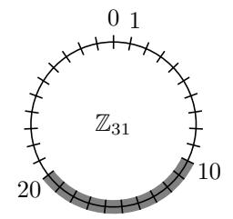

we know that 2x ∈ [10, 20]

Clearly, if x ∈ [5, 10], then 2x ∈ [10, 20]. But is that all? No: again, since q is odd, for any v ∈ Zq there must exist some x such that 2x = v. But we have only found this for 2x ∈ {10, 12, . . . , 20}. So where are the 5 missing x's? They are on the other side of the circle! For example, if x = 21, then 2x = 42 ≡ 11 (mod q).

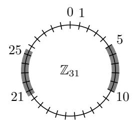

the possible values for x

This is because operations in Zq wrap around if the result exceeds q. So in general, if we want to find x such that 2x ∈ [l, r], we should either have

$$l \le 2x \le r$$
 or  $l+q \le 2x \le r+q$ ,

when doing computations in Z. Therefore, we should have

$$x \in \left[ \left\lceil \frac{l}{2} \right\rceil, \left\lfloor \frac{r}{2} \right\rfloor \right] \quad \text{or} \quad x \in \left[ \left\lceil \frac{l+q}{2} \right\rceil, \left\lfloor \frac{r+q}{2} \right\rfloor \right]$$

where the divisions and roundings are performed in Q.

So the bad news is that we have two intervals now, but the good news is that they are smaller. So what if we could tell which one of these is the one that actually contains x? Let's see how we can do that.

From Alice's output, we know an interval of length 2N that contains 2λa: just take [αλ − N, αλ + N] as mentioned before. This means that we can find two possible intervals of length N for 2λ−1a. The nice thing is that we also know an interval of length 2N for 2λ−1a: just take [αλ−1 − N, αλ−1 + N].

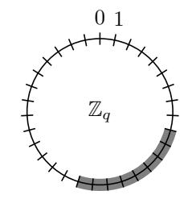

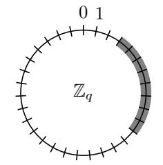

what we already knew before about 2λ−1a the correct interval for 2λ−1a

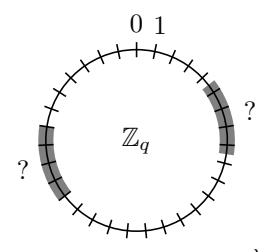

what we know about 2λa what we deduce about 2λ−1a

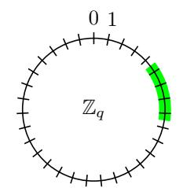

Because N is small compared to q, the two intervals of length N are very far apart, and therefore our interval of length 2N for 2λ−1a can't intersect with both of them.[2](#page-8-0) So we just have to look at which one it intersects with, and pick that one.

Now that we know an interval of length N for 2λ−1a, why stop there? We can repeat the exact same process and find an interval of length bN/2c for 2λ−2a, then use that to find an interval of length bN/4c for 2λ−3a, etc. If we repeat this until we get to a, we will find an interval of length bN/2 λ−1 c for a. Since N < 2 λ−1 , this length is 0, so we have determined a exactly.

The number of operations needed to go down one power of two is constant, so in total the attack runs in O(log q) integer operations.

### 3.3 If life doesn't give you a ladder, start chopping wood

At first sight, it seems that the attack described above relies heavily on the fact that Alice and Bob used representations in terms of powers of 2. If we don't have this convenient structure that allows us to reduce interval sizes by dividing by a small factor every time, the attack falls apart. So maybe this is what needs to change in the scheme?

Consider a more general framework where instead of giving approximate values for 2ia for all i, Alice gives approximate values for cia for some arbitrary coefficients c1, . . . , cm ∈ Zq that are decided in advance and publicly known. The errors 1, . . . , m are still assumed to be distributed in [−N, N]. Note that m doesn't necessarily have to be close to log2 q.

Let's assume we are still using the same trick for the legitimate computation of the key. Then once Bob has chosen his b, he must be able to efficiently find a linear combination of the ci 's that sums to b, in order to compute his estimate of ab. Therefore, we have to assume that there is an efficient procedure or oracle that, given some b, returns m integer weights w1, . . . , wm such that

$$\sum_{i=1}^{m} w_i c_i = b \quad \text{and} \quad \sum_{i=1}^{m} |w_i| \le W.$$

The first part ensures correctness, while the second part ensures that the error made when computing ab from the cia · wi will be bounded by W N. If the weights were too big, they would amplify the errors in the approximations of cia given by Alice, and the error on ab would cease being small.

2More precisely, because of our assumption that 2(3N + 1) ≤ q, the gaps separating the two intervals of length N have length bigger than 2N. An interval of length 2N cannot span such a large gap, and therefore cannot touch both intervals at the same time.

Perhaps the aforementioned student wasn't solely motivated by the extra credit, because he kept going and extended the attack to also cover schemes of this type. It uses the same division-based technique as the first attack, but is unfortunately not quite as intuitive.

The core idea is the following. Assume we currently know intervals of length  $\leq L$  for all  $c_i a$ , and we want to find an interval of length L/2 for a specific  $c_k a$ . Call the oracle on  $b := 2Wc_k$ , and compute an estimate for  $ba = 2Wc_k a$  using the weights that are returned. Because  $\sum |w_i| \leq W$ , the interval that we obtain for  $2Wc_k a$  has length at most LW. By "dividing this interval by 2W", we can find an interval of size  $\frac{LW}{2W} = L/2$  for  $c_k a$ , as desired.

Let's look at how division by 2W would work. More generally, assume that we know  $kx \in [l,r]$  for some small integer k. What can we say about x? For k=2 we saw that the possible values for x lay in two diametrically opposite intervals. In general, the possible values for x will lie in k intervals evenly spread around  $\mathbb{Z}_q$ .

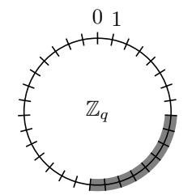

what we know about kx

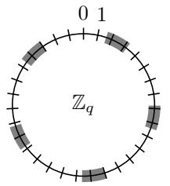

the possible values for x (here, k = 5)

More precisely, if  $kx \in [l, r]$ , then x lies in one of the k intervals

$$\left[ \left\lceil \frac{l+iq}{k} \right\rceil, \left\lfloor \frac{r+iq}{k} \right\rfloor \right]$$

for some  $i = 0, \dots, k-1$ . Again, the division and rounding are performed in  $\mathbb{Q}$  here.

In our case, we have an interval of length LW for  $2Wc_ka$ , so dividing by 2W gives us 2W possible intervals of length at most  $\lfloor L/2 \rfloor$  for  $c_ka$ . As for the first attack, we will use the interval of length L we already know to determine which one of the 2W smaller intervals is the correct one.

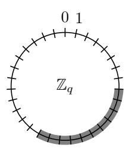

the interval we computed for  $2Wc_ka$ 

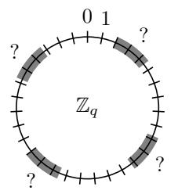

what we deduce about  $c_k a$  (here, 2W = 4)

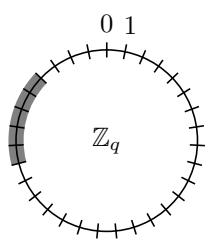

what we already knew before about  $c_k a$ 

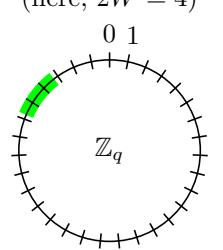

the correct interval for  $c_k a$ 

Initially, we have L=2N. In order to be sure that we can determine the correct interval uniquely, we need the 2W intervals to be spaced by more than 2N, so we need  $2W(3N+1) \leq q$ . This is quite a reasonable assumption to make: since the error made by

Alice and Bob can be as large as NW, the interval in which a successful value of ab lies has size 2NW. So if q were smaller than 2W(3N+1), then the attacker would have a roughly 1/3 probability of getting the key right by just randomly guessing an element in  $\mathbb{Z}_q$ , which is not great from a security standpoint.

If we apply this operation for all k, we go from intervals of size 2N to intervals of size at most N for all  $c_k a$ . Then, since the precision we get depends on the current interval sizes for all  $c_k a$ , we can run it on all k again to get intervals of size  $\lfloor N/2 \rfloor$ , then  $\lfloor N/4 \rfloor$ , etc. Once an exact value is obtained for all  $c_k a$ , we can compute a as  $c_1 a c_1^{-1}$ .

A single division step can be implemented in O(m) operations, and we need to do  $O(m \log N)$  of them, so the running time of this attack is  $O(m^2 \log N)$  integer operations.

#### 3.4 LWE with varying secret dimension

This kind of attack does not apply, however, if we remove the oracle to compute an arbitrary b as a suitable sum of the coefficients  $c_i$ , and instead choose the  $c_i$ 's uniformly at random. Let's put aside for a moment the not-so-minor problem that this kills our intended functionality and note the relationship between our problem and LWE.

The standard decisional-LWE assumption is defined in terms of a matrix A uniform random in  $\mathbb{Z}_q^{m \times n}$  and a secret vector s uniform random in  $\mathbb{Z}_q^n$ . It is assumed that given A, it is hard to distinguish between  $As + \varepsilon$ , where  $\varepsilon$  is an m-dimensional vector with entries drawn from an error distribution, and r, a vector drawn uniformly at random from  $\mathbb{Z}_q^m$ . For the purposes of the cryptanalysis challenge, and our subsequent constructions of cryptographic primitives, we wanted to know under what values of the dimension n of the secret vector would the decisional-LWE assumption possibly still hold.

By consulting Oded Regev, the founder of LWE, we were able to find an answer. Although most lattice cryptography papers only give a hint of what n can be, the actual conjecture is that the hardness of LWE scales with  $\exp(n\log q)$ , i.e. an attacker's advantage in distinguishing the two distributions is  $1/(\exp(n\log q))$ , and thus negligible. This means for sufficient n (e.g. linear in the security parameter), q only need be polynomially large, as most cryptography papers state. However, if we take n to be a constant value, namely n=1, then we can boost q to be exponentially large in the security parameter (and thus  $\log q$  polynomially large) and still conjecture hardness. More specifically, the value of the secret scalar s in this case still takes on only one of exponentially many values in  $\mathbb{Z}_q$ . Furthermore, since we can represent values in  $\mathbb{Z}_q$  using a compact binary representation of length polynomial in the security parameter, for example, this change does not incur a fatal loss in efficiency.

With this knowledge in hand, we confidently constructed a final cryptanalysis challenge, namely LWE with n=1, and brazenly conjectured it to be hard. Now we just needed to return to the pesky problem of correctness.

[Aside:] We did not know this at the time, but it was pointed out to us that LWE with n=1 is also known as the "Approximate GCD problem." This assumption was introduced by Howgrave-Graham [20], and has been studied in the context of FHE [35]. Cheon and Stehle [9] provide a reduction from LWE to approximate GCD.

# 4 A secure Diffie-Hellman-esque key exchange

Although the student's efforts finally paid off and they got the reward of extra credit and self-satisfaction, the original goal was still a constructive one. What would be the key exchange in the lattice world that looked most like Diffie-Hellman's group-based exchange? There are already known constructions of non-interactive 2-party key exchange from LWE (e.g. [21, 30]), but we purposely didn't look at these and tried to develop our own intuition for a Diffie-Hellman analog from scratch. In doing so, we basically recreated [21], but we'll describe it below in the way we developed it, to show how its structure arises from the ashes of our broken cryptanalysis challenge.

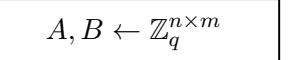

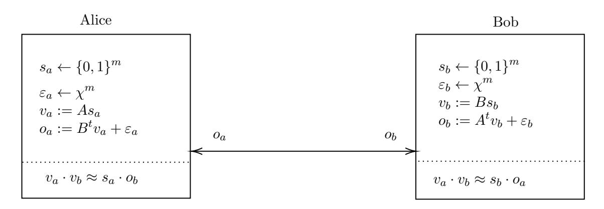

Figure 1: Lattice-based key exchange that is similar in nature to the Diffie-Hellman key exchange.

#### 4.1 The key exchange

One thing that we learned from this journey is that linear algebra is hard; both from the perspective of an attacker trying to uncover some secret, as well as from the perspective of cryptographers trying to squeeze out any information that can be obtained from the inherently noisy world of lattice cryptography. Fortunately, in this case, we were able to obtain the first perspective without the second.

We learned from our attacker's perspective that having a oracle to compute small weights to express an arbitrary b in terms of coefficients  $c_i$  is deadly to security. But without this, how will Bob know how decompose his secret element b as such a sum? A simple answer is: he cheats! He chooses b by choosing small weights  $w_i$ , and defines b as  $\sum_i w_i c_i$ . In this sense, his real secret becomes the weights  $w_i$ , rather than b. This trick gets us to a key exchange protocol relying on the hardness of LWE with n = 1, a plausible assumption as we discussed above. Though it turns out we can also easily expand from scalars a, b to vectors  $v_a, v_b$ , and have the shared secret be derived from their approximate dot product. This way, we can rely directly on the more general hardness of LWE without needing to force n = 1. We depict this key exchange in Figure 1. It proceeds as follows:

- 1. In the setup phase, we start by choosing a prime q super-polynomially large in the security parameter. Then, two public matrices A, B are chosen uniformly from  $\mathbb{Z}_q^{n \times m}$ , where  $m > n \log q$ .
- 2. Alice chooses her secret vector  $s_a$  uniformly from  $\{0,1\}^m$ , and then sets  $v_a := As_a \in \mathbb{Z}_q^n$  and draws a noise vector  $\varepsilon_a$  from  $\mathbb{Z}_q^m$ . She then publishes  $o_a := B^t v_a + \varepsilon_a$ .
- 3. Bob simultaneously generates  $s_b, v_b, \varepsilon_b$  symmetrically  $(v_b = Bs_b)$ , and outputs  $o_b := A^t v_b + \varepsilon_b$ .
- 4. The extra added layer of complexity here is that Alice's and Bob's shared secret will actually be an approximation of  $v_a \cdot v_b$ , two vectors that contain the information from their secrets. To approximate this value, Alice will compute  $s_a \cdot o_b$  and Bob will compute  $s_b \cdot o_a$ .

Observe that our key exchange very much resembles that of Diffie and Hellman. Alice and Bob act in an exactly symmetric manner, only using A and B for opposite purposes.

In the end, Alice and Bob will both select a bit  $\{0,1\}$  for this exchange, corresponding to whichever of 0 or  $\lfloor \frac{q}{2} \rfloor$  their approximation is closer to. We will now show that if Alice and Bob repeat this exchange n times, using the same matrices A, B but different vectors

 $s_a^i, s_b^i, \varepsilon_a^i, \varepsilon_b^i$ , then with all but negligible probability in n, they will obtain  $u_a, u_b \in \{0, 1\}^n$  such that  $u_a = u_b$ .

**Lemma 1** (Correctness). The probability that Alice and Bob do not agree on the same value  $u \in \{0,1\}^n$  is negl(n).

*Proof.* After a given key exchange round, Alice obtains  $s_a \cdot o_b = v_a \cdot v_b + s_a \cdot \varepsilon_b$  and Bob obtains  $s_b \cdot o_a = v_a \cdot v_b + \varepsilon_a \cdot s_b$ . Thus the approximations of Alice and Bob only differ by some sum of small error terms,  $e_a$  and  $e_b$ , drawn from a discrete Gaussian distribution. Observe that Alice and Bob will with all but negligible probability only round their approximations to different values if  $e_a$  and  $e_b$  are of different signs (or in the modulo q world, one is small and the other is big). Moreover, this will only happen if  $v_a \cdot v_b$  is close to some cutoff for the rounding (i.e., q/4 or 3q/4).

Therefore, we can select q to be super-polynomial and the parameters for our discrete Gaussian such that with only negligible probability,  $v_a \cdot v_b$  is in a subset of  $\mathbb{Z}_q$  such that the sums of small error terms  $e_a$  and  $e_b$  could result in Alice and Bob rounding differently.

Since there are only n rounds, the probability that Alice and Bob do not agree on the same value u is  $n \cdot \text{negl}(n) = \text{negl}(n)$ .

For the security proof, we show that, under the LWE assumption, given the public parameters A, B and the communicated vectors  $o_a^1, o_b^1, \ldots, o_A^n, o_b^n$ , there is no polynomial probabilistic time (PPT) adversary that can distinguish between u, the n-dimensional bit vector that Alice or Bob computes given their noisy approximations of  $v_a^i \cdot v_b^i$  for  $i \in [n]$ , and a random n-dimensional bit vector r.

**Lemma 2.** [Security] Assuming there is no PPT attack on LWE, there exists no PPT adversary A that given  $(A, B, o_a^1, o_b^1), \ldots, (A, B, o_a^n, o_b^n)$  can distinguish between the shared key  $u \in \{0,1\}^n$  and a random value  $r \in \{0,1\}^n$  with non-negligible probability.

The proof of this lemma is rather straightforward, and can be found in appendix A.

# 5 Identity based encryption and dual system proof techniques

Two party key exchange is a good initial sanity check for any approach to building group-like schemes in lattices, but as such schemes with satisfying features and security proofs are already known, it is not a goal in itself. Identity based encryption (IBE), however, offers a more serious test. There are already IBE schemes known in the lattice setting, and [1] in particular we will discuss below. But the flexible and adaptive toolkit of dual system encryption techniques which yields more satisfying trade-offs between efficiency and security guarantees in bilinear groups for IBE schemes and further applications has yet to be smoothly replicated in lattices. (We have not yet had time to digest and contrast the contemporaneous work of [37], which claims to do this for a particular kind of attribute based encryption.) Here we will give a quick overview of identity based encryption, how dual system encryption proof techniques work, and why it is challenging to instantiate them in lattices.

At first glance, identity based encryption may look like a small step from public key encryption. There are public parameters that can be used to encrypt to any particular identity, and for each identity there is an secret key, derived from a master secret key. Each secret key is only capable of decrypting the ciphertexts prepared precisely for it. But unlike basic public key encryption, the identity-parameterized secret keys of an IBE scheme are tied together by a common origin, the master secret key. Somehow, each individual secret key must have targeted decryption capabilities inherited from the master secret key that allow it to decrypt ciphertexts intended for its associated identity, but it must be too weak to decrypt ciphertexts intended for other identities. Crucially, this must remain true even when an arbitrary polynomial number of secret keys are collected together: they still should not combine to decrypt ciphertexts for any identity not in the set of associated identities.

In this way, collections of secret keys in an IBE system must never be greater than the sum of their parts.

This creates a fundamental challenge for proving security of IBE schemes that is avoided in proving, say, IND-CPA security for PKE schemes. To model an attacker's ability to amass secret keys for a dynamic set of legitimate identities while attacking a ciphertext intended for a particular identity not in the set, it seems the security reduction must know the master secret key in order to produce secret keys for arbitrary identities upon request, but should not know the master secret key, so it cannot trivially solve the challenge itself. This apparent paradox is similar to the challenge faced in proving existential unforgettability in public key signature schemes, where the reduction must be able to provide valid signatures for arbitrary messages upon request. A natural approach to resolving this paradox is to partition the space of identities. Informally, we'll refer to an identity as "easy" when the security reduction can produce a corresponding secret key that functions appropriately, and we'll refer to an identity as "hard" when this is not the case. For a party who knows the master secret key, all identities will be easy. For the security reduction, we seem to need most identities to be easy, but the identity that is ultimately attacked to be hard. It is important for the IBE attacker to be oblivious to this partition of keys so it cannot thwart our efforts by purposefully requesting a secret key for a hard identity or purposefully attacking an easy identity. The public parameters keep the security reduction honest, as they allow the attacker to test the functionality of the secret keys it receives against ciphertexts of its own creation.

We can only speculate, but the difficulty in balancing this tension may be substantially to blame for the relatively long gap between the definition of IBE functionality by Shamir in 1984 [\[33\]](#page-38-11) and the first proposed constructions of IBE schemes in 2001 [\[7\]](#page-37-0). It is no coincidence that the Boneh-Franklin IBE scheme uses bilinear groups, and is roughly contemporaneous to the use of bilinear groups to construct non-interactive three party key exchange. (Later in this paper, we formalize a connection between IBE schemes and three party key exchange protocols with certain properties.) The Boneh-Franklin scheme resolved the apparent paradox using the random oracle heuristic, a maneuver similar in spirit to random oracle proofs of security for signature schemes. The security reduction uses the ability to program the random oracle in order to create perfectly functional secret keys for identities on demand in an alternate way, without needing the master secret key. However, for one random oracle query, the actual computational challenge is embedded, and the reduction cannot generate a corresponding secret key for itself. The reduction essentially has the freedom to decide dynamically for each identity whether it wants to use the oracle programming to make the identity easy or the computational challenge to make the identity hard. The success of the reduction therefore depends upon guessing correctly which of the polynomially many identities that are referenced by the attacker will turn out to be the attack target, and to embed the computational challenge there.

Random oracle proofs are a bit unsatisfying to champions of theoretical rigor, as the random oracle model is only a heuristic. Since real hash functions are not idealized oracles, a security reduction in the random oracle model cannot be used to make a clean statement of the form "an attack on this scheme using resources X to achieve success probability Y must correspond to an attack on a standard computational assumption using resources Z and success probability ≥ V ." As a result, cryptographers continued to search for an IBE scheme similar to the Boneh-Franklin scheme, but with an accompanying security proof not relying on the random oracle heuristic. A next approach was to design a security reduction to implicitly commit to a fixed partition of which identities would be easy and which would be hard in the design of the public parameters, thereby eliminating the reliance on the random oracle for dynamically defining the key partition. The partition must be hidden from the attacker. The selective security model, used to prove the security of the Boneh-Boyen IBE in [\[6\]](#page-37-2), for example, makes this partitioning easier for the reduction by asserting that the attacker must declare the attack target identity immediately, without first seeing the public parameters. This restriction on the attacker is somewhat arbitrary, and makes the obtained security guarantee therefore weaker. The subsequent scheme of Waters [\[38\]](#page-38-12) avoids this by carefully choosing a proportion of identities to randomly make hard, so that it's reasonably likely that a dynamically chosen attack target will happen to be hard, while also reasonably likely that all dynamically requested identity secret keys will happen to be easy to produce.

This partitioning approach has been successfully employed for both bilinear group based IBE constructions as well as lattice based constructions. In fact, there is a strong connection between the Boneh-Boyen IBE in [6] based on bilinear groups, and the Agrawal-Boneh-Boyen in [1] based on lattices. Let's take a quick look at the core structure of each.

**Boneh-Boyen IBE** We let  $G = \langle g \rangle$  be a group of prime order p, with a bilinear map  $e: G \times G \to G_T$ . Our identities ID are assumed to be elements of  $\mathbb{Z}_p$ . We define  $u = g^a, h = g^b \in G$ , where a, b are randomly chosen during setup, as is the master secret key,  $g^{\alpha}$ , for a randomly chosen exponent  $\alpha$ . The public parameters are

$$PP := g, u, h, e(g, g)^{\alpha}.$$

To generate a secret key  $SK_{ID}$ , we choose a random exponent r and compute:

$$SK_{ID} := g^{\alpha}(u^{ID}h)^r, g^r.$$

To encrypt a message  $M \in G_T$  to an identity ID, we choose a random exponent s and compute:

$$CT := Me(g, g)^{\alpha s}, g^s, (u^{ID}h)^s.$$

When the identities for a secret key and a ciphertext match, we can decrypt by first computing:

$$e(q^{\alpha}(u^{ID}h)^r, q^s)e(q^r, (u^{ID}h)^s)^{-1} = e(q, q)^{\alpha s},$$

and then dividing this from the ciphertext element in  $G_T$  to reveal the message M.

**Agrawal-Boneh-Boyen IBE** The public parameters consist of:  $A_0, A_1, B \in \mathbb{Z}_q^{m \times n}$ , and the master secret key is a trapdoor basis for  $A_0$ . Identities are hashed to matrices  $H_{ID} \in \mathbb{Z}_q^{n \times n}$ . Ciphertexts for an identity ID as well as the secret key for ID revolve around the matrix

$$F_{ID} := (A_0|A_1 + H(ID)B) \in \mathbb{Z}_q^{n \times 2m},$$

which clearly has echoes of the structure  $u^{ID}h = q^{a+IDb}$  in it.

A key insight (pun intended!) is that a trapdoor basis for  $A_0$  can be used to generate a trapdoor basis for  $F_{ID}$ . Thus, basically  $F_{ID}$  becomes suitable for use as the "public key" in a typical lattice-based PKE structure, where the secret key  $SK_{ID}$  is a single short vector derived from that basis. For full details of the construction and security proof, see [1].

The security proofs for Boneh-Boyen in the bilinear group setting and Agrawal-Boneh-Boyen in the lattice setting rely on a similar trick relating to the aID+b structure. In the bilinear reduction, a,b are carefully chosen functions of the attack target identity ID\*, so that (aID+b)r for a strategically chosen r can be used to cancel out the unknown term in the master secret key in the exponent to produce a suitable  $SK_{ID}$  for any  $ID \neq ID*$ . When ID = ID\*, the unknown term cancels out inside the computation of aID\*+b, hence there is no value of r that can allow r(aID\*+b) to compensate for its appearance in  $\alpha$ .

Similarly in the lattice setting, the parameters are carefully chosen functions of H(ID\*) so that a trapdoor for B, rather than  $A_O$ , can be used to generate an trapdoor for  $F_{ID}$  if and only if  $F_{ID} \neq F_{ID*}$ . This is also arranged through a cancellation that occurs only when  $ID = ID^*$ .

While this works well in both the bilinear and lattice settings, partitioning methods for security reductions tend to require either unnatural restrictions on the attacker's choices (i.e. forcing the attacker to commit to the target immediately), or security loss in terms of parameters that grow unacceptably for increasingly complex cryptosystems like IBE, HIBE, ABE, etc. This motivated the search for security reductions that could transcend the partitioning paradigm. The dual system encryption technique, first developed in [39] and further evolved in [24, 23, 29, 26, 25] (e.g.), manages to accomplish this. Instead of

partitioning keys into easy and hard, it begins with the thought experiment: what if there were no public parameters? Schemes in a world without public parameters would be like teenagers in a world without parents: drastically under-supervised. In a world without public parameters, the burden on the security reduction would be greatly reduced, as the so-called keys it gave to the attacker upon request could not as meaningfully be tested against legitimate ciphertexts.

Of course, we live in a polite society and not a world of IBE without public parameters. The trick of dual system encryption is that we can prove that our real world with public parameters is computationally indistinguishable from an alternate universe effectively without public parameters. The basic trick works like this. We start in a bilinear group where subgroup decision problems are hard. In other words, our bilinear group secretly decomposes into a few different subgroups that behave independently, and are mutually orthogonal under the bilinear map. (For a more thorough exposition of subgroup structures, see [\[5\]](#page-37-15).) Subgroup decision problems concern the ability to discern which subgroups are non-trivially represented in which distributions of group elements. Some subgroup decision problems are trivially easy, like recognizing the difference between the identity element (which is trivial in all subgroups), and an element that is non-trivial in at least one subgroup. In some instantiations of bilinear groups, many non-trivial subgroup decision problems are believed to be hard: like recognizing the difference between a random element of one subgroup and a random element of of the whole group (as long as you aren't given an element with the relevant subgroup absent, as pairing this element against your challenge would result in the identity element in one case and not in the other). Essentially, pulling the different subgroup pieces apart is presumed to be hard, and we only get hints as to which subgroups are present by whether the results of pairings turn out to be trivial or non-trivial.

We can use one or more subgroups to execute our IBE scheme, while reserving one or more subgroups to be active only in the security reduction. Crucially, the public parameters will not contain any non-trivial contributions in the reserved subgroups. The security reduction uses the hardness of subgroup decision problems to iteratively attach non-trivial components in these reserved subgroups to the secret keys and challenge ciphertext given to the attacker. This effectively creates a "shadow" copy of the scheme that operates in parallel correctly in the reserved subgroups, but does not have corresponding public parameters in these subgroups to keep the reduction honest. In this way, the hardness of subgroup decision problems allows us to argue that our scheme is indistinguishable from a scheme that is less accountable to the public parameters, and this makes it easier for us to resolve the paradox without partitioning keys. Admittedly, we're simplifying quite liberally here. Often it is still challenging to prove security in a world with a no public parameters when there are many keys still floating around. However, this is typically addressable by a hybrid argument which effectively reduces the burden to the case of a single key or some other smaller unit for which security can be argued directly by other means.

The Bishop-Waters IBE scheme in [\[24\]](#page-38-14) executes this on top of the base structure of the Boneh-Boyen IBE. Ignoring some additional subgroups that exist for purposes of the hybrid argument, ciphertexts and keys in the Bishop-Waters scheme that have been transformed to include the shadow copy look like:

$$SK_{ID} := g_1^{\alpha} (u_1^{ID} h_1)^{r_1} (u_2^{ID} h_2)_2^r, g_1^{r_1} g_2^{r_2}$$
$$CT_{ID} := g_1^{s_1} g_2^{s_2}, (u_1^{ID} h_1)^{s_1} (u_2^{ID} h_2)_2^s$$

Here, the group elements with subscript 1 are one subgroup, while the group elements with subscript 2 are in a different subgroup. The two subgroups behave orthogonally under the bilinear map, so we basically get two copies of the scheme, operating independently in the two subgroups. However, the parameters g2, u2, h2 are not part of the public parameters, which only include g1, u1, h1. As a result, the second subgroup copy of the scheme is unmoored, and it is easier to argue its security.

No one has yet put forward an effective instantiation of this kind of shadow world in

the lattice setting[3](#page-16-1) . In particular, a hybrid security reduction that iteratively activates the reserved subgroup components on secret keys provided to the attacker seems incompatible with typical lattice constructions, which have short vectors/matrices as their secret keys. The Agrawal-Boneh-Boyen IBE we examined above, for instance, has secret keys that are comprised of short vectors. Shortness is a noticeable feature that we cannot hide from the attacker. And we do not know of a useful computational assumption in the lattice setting that argues computational indistinguishability for two distributions of short vectors. Recall that in LWE, the challenge vector As + has a short noise vector , but the overall value of As + is not a vector with short entries. As similar as they may look at first, the Boneh-Boyen IBE in bilinear groups and the Agrawal-Boneh-Boyen IBE in lattices diverge in a critical way: in the bilinear setting, the secret keys and ciphertexts are both made of group elements, things that additional subgroups can be attached to using computational assumptions. But in the lattice setting, the secret keys are short vectors and the ciphertexts are large vectors. We can hope to change the distribution of ciphertexts using computational assumptions like LWE, but we cannot really hope to change the distributions of short secret keys.

We should also mention here that the k-LWE assumption introduced in [\[27\]](#page-38-19) has some potential to illuminate a path to a lattice notion of a "shadow." In this assumption, a matrix A ∈ Z m×n q is sampled, along with k short vectors x1, . . . , xk such that xiA is the all zero vector for each i. Both A and {xi} k i=1 are given out, along with a challenge vector. Now, if the challenge vector were of the form As+ noise or uniformly random, one could distinguish by taking any xi times the challenge vector and observing whether the result is short. So the challenge is modified to be of the form As+ noise or T z + noise, where T spans the space of vectors orthogonal to the collection of {xi} k i=1. Now the same distinguishing approach fails, as the product with each xi will be short either way. This assumption is shown to hold under the typical LWE assumption for some eminently reasonable values of k [\[27\]](#page-38-19).

The additional space between the span of A and the larger span of T could be a fertile ground for a "shadow" copy of some lattice objects, but the challenge remains that correct behavior is defined though multiplication with short vectors. Unsuprisingly, the traitor tracing application of this assumption in [\[27\]](#page-38-19) uses short vectors as secret keys. We have yet to figure out an effective way to use k-LWE in our quest to build lattice schemes more amenable to dual system techniques. Admittedly though, we were unable to truly internalize the sampling techniques in the security reduction in [\[27\]](#page-38-19) that proves a k-LWE attacker can be leveraged to attack traditional LWE, and these sampling techniques may prove to be useful elsewhere, even if the black-box statement of k-LWE proves less so.

All of this motivated us to try to construct an IBE scheme in the lattice setting whose secret keys are not comprised of short vectors, but rather employ structures more similar to the structures employed in ciphertexts. Such a goal is not well-motivated on its own in terms of the performance of a scheme, but we hope that it may serve as a first step towards instantiating dual system proof techniques in the lattice setting.

# 6 A PKE and a random oracle walk into a bar...

Before jumping into the task of constructing an IBE scheme, we decided to survey some of the most direct techniques for proving security of IBE systems, so that we could keep them in mind to guide our construction efforts. The most natural starting point is the first IBE construction of Boneh-Franklin [\[7\]](#page-37-0), which employed a security reduction in the random oracle model. Interestingly, the Boneh-Franklin construction and accompanying security proof is developed around a public key encryption scheme at its core. Security is proven for the base PKE scheme first, and then a random oracle is used to boost the functionality and security of the base PKE scheme to a secure IBE scheme. It's really kind of magical. It's like a PKE found an oracle in a bottle that granted it's one wish to become an IBE.

3Again, we are not passing judgement on [\[37\]](#page-38-10), which came out too recently for us to have read before preparing this paper.

This is a tantalizing example to study, as there are already known PKE schemes in lattices that avoid having short secret keys. Here we'll give a quick tutorial on the heart of Boneh-Franklin PKE/IBE and its basic security reduction in the random oracle model. This will give us the proper context in which to consider a PKE in lattices without short keys, and study to what extent the same strategy might be used to boost it to an IBE without short keys.

#### 6.1 The Boneh-Franklin base PKE construction

First we'll define the core PKE scheme:

Setup The Setup algorithm fixes a bilinear group  $G = \langle g \rangle$  of prime order p, with bilinear map  $e: G \times G \to G_T$ . It selects two uniformly random exponents  $s, v \in \mathbb{Z}_p$  and defines  $P := q^s$  and  $Q := q^v$ . The public key is:

$$PK := (g, P, Q, H_1),$$

where  $H_1$  is a hash function from  $G_T$  to  $\{0,1\}^n$ . The secret key is:

$$SK := Q^s = q^{sv}.$$

Encrypt To encrypt a message  $m \in \{0,1\}^n$ , the encryptor chooses a random exponent  $r \in \mathbb{Z}_p$  and computes the ciphertext as:

$$CT := (g^r, m \oplus H_1(e(P,Q)^r))$$

Decrypt To decrypt a ciphertext CT, the decryptor computes

$$e(g^r, SK) = e(g, g)^{rsv} = e(P, Q)^r,$$

and then computes  $H_1(e(P,Q)^r)$ . By taking this  $\oplus$  the second component of CT, the decryptor obtains the message m.

#### 6.2 The Boneh-Franklin IBE construction

Now we give the basic IBE construction. It won't be hard to spot the PKE scheme inside it:

Setup Similarly to the setup algorithm of the PKE above, the IBE Setup algorithm first fixes a bilinear group  $G = \langle g \rangle$  of prime order p, with bilinear map  $e: G \times G \to G_T$ . It selects a uniformly random exponent  $s \in \mathbb{Z}_p$  and defines  $P := g^s$ . The public parameters are:

$$PP := (g, P, H_0, H_1),$$

where  $H_1$  is a hash function from  $G_T$  to  $\{0,1\}^n$ , and  $H_0$  is a hash function from  $\{0,1\}^*$  to G. The master secret key is s.

KeyGen Given the master secret key s and an identity  $ID \in \{0,1\}^*$ , the key generation algorithm computes  $Q_{ID} := H_0(ID)$ , and then computes the secret key as:

$$SK_{ID} := Q_{ID}^s$$
.

Encrypt To encrypt a message  $m \in \{0,1\}^n$  to an identity ID, the encryptor first chooses a random exponent  $r \in \mathbb{Z}_n$ . It computes the ciphertext as:

$$CT := (g^r, m \oplus H_1(e(P, H_0(ID))^r).$$

We note that  $e(P, H_0(ID))^r = e(P, Q_{ID})^r$ .

Decrypt To decrypt a ciphertext CT for ID, the decryptor computes:

$$e(g^r, SK_{ID}) = e(g, Q_{ID})^r s = e(P, Q_{ID})^r.$$

The decryptor can then apply  $H_1$  to this, and  $\oplus$  with the second component of the ciphertext to obtain the message m.

# 6.3 The Boneh-Franklin security reduction in the random oracle model

The paper [7] goes on to provide a further IBE scheme with chosen-ciphertext security, but the most basic security argument that [7] provides for this simple IBE scheme is a reduction of the IBE security to PKE security, where both hash functions are treated as random oracles. The details of this, as well as the straightforward proof of the PKE security under the bilinear diffie-hellman assumption in the random oracle model, can be found in [7]. Here we will briefly sketch the reduction of IBE security to PKE security, as that is most relevant to our purposes. The security guarantee we will consider, for both IBE and PKE, will be the weak notion of one-way encryption. This requires that an attacker cannot recover the plaintext when a randomly chosen message is encrypted under a randomly generated public key. In the IBE setting, the attacker can adaptively query for secret keys for various identities, and declares a target identity for the random message to be encrypted to.

Let's suppose we have an attacker  $\mathcal{A}$  on the IBE scheme in this sense, and we wish to attack the underlying PKE scheme. Our reduction algorithm  $\mathcal{B}$  gets to simulate the random oracle for  $H_0$ , which  $\mathcal{A}$  can query. (The fact that  $H_1$  is modeled as a random oracle is not relevant to this reduction, but is rather used in the security argument for the underlying PKE scheme.) Now, the PKE challenger gives  $\mathcal{B}$  a public key PK including g, P, Q.  $\mathcal{B}$  forwards g, P to  $\mathcal{A}$  as the PP for the IBE scheme. When  $\mathcal{A}$  makes a query ID to  $H_0$ ,  $\mathcal{B}$  essentially guesses whether this will turn out to be the attack target or not. If  $\mathcal{B}$  guesses it is not the attack target, it will choose a random exponent  $v \in \mathbb{Z}_p$  and set  $H_0(ID) := Q_ID := g^v$ . This enables  $\mathcal{B}$  to later respond with  $P^v = g^{vs}$  as the secret key for this identity if  $\mathcal{A}$  requests it. However, if  $\mathcal{B}$  guesses that this is the attack target identity, it will set  $Q_{ID} := Q$  from its on challenge, perfectly aligning an encryption under this identity with an encryption in the underlying PKE.

The core of this argument is that the programming of the random oracle, in this case setting  $Q_{ID} := g^v$  for a known exponent v, enables the computation of a corresponding secret key  $g^{vs}$  without knowledge of the master secret key s. This is an elegant use of the basic symmetry of s and v in the element  $g^{vs}$ : there are two ways of getting to the element  $g^{vs}$ . Either one can know  $g^s$  and v, or one can know  $g^v$  and s. In this way, the ability to program the random oracle can be substituted for the knowledge of the master secret key, dynamically at the reduction's will for each identity.

If we want to build a secure IBE in the random oracle model from a lattice PKE in a similar way, we need to have two different ways of computing a secret key - the legitimate way that uses knowledge of the master secret key, and an alternate way that uses the ability of the reduction to program the random oracle.

We'll come back to discussing this challenge of how to design two paths to the secret key, but for now we'll describe a reasonable candidate for the base PKE scheme in lattices. There are several known PKE schemes from LWE (starting with [31]), some of which have short vectors as secret keys and some of which do not. We choose here to look at one as an extreme simplification of the PKE inside the Gentry-Sahai-Waters FHE construction [18, 16], as we try later on to draw further inspiration from homomorphic techniques. In fact, we have (unsuccessfully) tried to draw inspiration from FHE already, as one can view our initial formulation of the cryptanalysis challenge with the powers of 2 as a failed attempt to use bit decomposition tricks to build a secure analog of "exponentiation to a known power" in the lattice setting.

#### 6.4 A Simple PKE without short keys

If you squint at the GSW FHE scheme as described in [16], and you strip off the trappings that are only relevant to homomorphic operations, you get something like:

1. Setup: Sample  $B \leftarrow_r \mathbb{Z}_q^{m \times (n-1)}, s \leftarrow_r \mathbb{Z}_q^{n-1}, \varepsilon \leftarrow_r \mathbb{Z}_q^{m \times 1}$  such that  $\varepsilon$  is composed of small entries

Set the public key  $PK := A := [B|Bs + \varepsilon]$  and the secret key  $SK := t := \begin{bmatrix} -s \\ 1 \end{bmatrix}$ 

$$\uparrow \qquad \qquad \qquad \downarrow \qquad \qquad \downarrow \qquad \qquad \downarrow \qquad \qquad \downarrow \qquad \qquad \downarrow \qquad \qquad \downarrow \qquad \qquad \downarrow \qquad \qquad \downarrow \qquad \qquad \downarrow \qquad \qquad \downarrow \qquad \qquad \downarrow \qquad \qquad \downarrow \qquad \qquad \downarrow \qquad \qquad \downarrow \qquad \qquad \downarrow \qquad \qquad \downarrow \qquad \qquad \downarrow \qquad \qquad \downarrow \qquad \qquad \downarrow \qquad \qquad \downarrow \qquad \qquad \downarrow \qquad \qquad \downarrow \qquad \qquad \downarrow \qquad \qquad \downarrow \qquad \qquad \downarrow \qquad \qquad \downarrow \qquad \qquad \downarrow \qquad \qquad \downarrow \qquad \qquad \downarrow \qquad \qquad \downarrow \qquad \qquad \qquad \downarrow \qquad \qquad \downarrow \qquad \qquad \downarrow \qquad \qquad \downarrow \qquad \qquad \downarrow \qquad \qquad \downarrow \qquad \qquad \downarrow \qquad \qquad \downarrow \qquad \qquad \downarrow \qquad \qquad \downarrow \qquad \qquad \downarrow \qquad \qquad \downarrow \qquad \qquad \downarrow \qquad \qquad \downarrow \qquad \qquad \downarrow \qquad \qquad \downarrow \qquad \qquad \downarrow \qquad \qquad \downarrow \qquad \qquad \downarrow \qquad \qquad \downarrow \qquad \qquad \downarrow \qquad \qquad \downarrow \qquad \qquad \downarrow \qquad \qquad \downarrow \qquad \qquad \downarrow \qquad \qquad \downarrow \qquad \qquad \downarrow \qquad \qquad \downarrow \qquad \qquad \downarrow \qquad \qquad \downarrow \qquad \qquad \downarrow \qquad \qquad \downarrow \qquad \qquad \downarrow \qquad \qquad \downarrow \qquad \qquad \downarrow \qquad \qquad \downarrow \qquad \qquad \downarrow \qquad \qquad \downarrow \qquad \qquad \downarrow \qquad \qquad \downarrow \qquad \qquad \downarrow \qquad \qquad \downarrow \qquad \qquad \downarrow \qquad \qquad \downarrow \qquad \qquad \downarrow \qquad \qquad \downarrow \qquad \qquad \downarrow \qquad \qquad \downarrow \qquad \qquad \downarrow \qquad \qquad \downarrow \qquad \qquad \downarrow \qquad \qquad \downarrow \qquad \qquad \downarrow \qquad \qquad \downarrow \qquad \qquad \downarrow \qquad \qquad \downarrow \qquad \qquad \downarrow \qquad \qquad \downarrow \qquad \qquad \downarrow \qquad \qquad \downarrow \qquad \qquad \downarrow \qquad \qquad \downarrow \qquad \qquad \downarrow \qquad \qquad \downarrow \qquad \qquad \downarrow \qquad \qquad \downarrow \qquad \qquad \downarrow \qquad \qquad \downarrow \qquad \qquad \downarrow \qquad \qquad \downarrow \qquad \qquad \downarrow \qquad \qquad \downarrow \qquad \qquad \downarrow \qquad \qquad \downarrow \qquad \qquad \downarrow \qquad \qquad \downarrow \qquad \qquad \downarrow \qquad \qquad \downarrow \qquad \qquad \downarrow \qquad \qquad \downarrow \qquad \qquad \downarrow \qquad \qquad \downarrow \qquad \qquad \downarrow \qquad \qquad \downarrow \qquad \qquad \downarrow \qquad \qquad \downarrow \qquad \qquad \downarrow \qquad \qquad \downarrow \qquad \qquad \downarrow \qquad \qquad \downarrow \qquad \qquad \downarrow \qquad \qquad \downarrow \qquad \qquad \downarrow \qquad \qquad \downarrow \qquad \qquad \downarrow \qquad \qquad \downarrow \qquad \qquad \downarrow \qquad \qquad \downarrow \qquad \qquad \downarrow \qquad \qquad \downarrow \qquad \qquad \downarrow \qquad \qquad \downarrow \qquad \qquad \downarrow \qquad \qquad \downarrow \qquad \qquad \downarrow \qquad \qquad \downarrow \qquad \qquad \downarrow \qquad \qquad \downarrow \qquad \qquad \downarrow \qquad \qquad \downarrow \qquad \qquad \downarrow \qquad \qquad \downarrow \qquad \qquad \downarrow \qquad \qquad \downarrow \qquad \qquad \downarrow \qquad \qquad \downarrow \qquad \qquad \downarrow \qquad \qquad \downarrow \qquad \qquad \downarrow \qquad \qquad \downarrow \qquad \qquad \downarrow \qquad \qquad \downarrow \qquad \qquad \downarrow \qquad \qquad \downarrow \qquad \qquad \downarrow \qquad \qquad \downarrow \qquad \qquad \downarrow \qquad \qquad \downarrow \qquad \qquad \downarrow \qquad \qquad \downarrow \qquad \qquad \downarrow \qquad \qquad \downarrow \qquad \qquad \downarrow \qquad \qquad \downarrow \qquad \qquad \downarrow \qquad \qquad \downarrow \qquad \qquad \downarrow \qquad \qquad \downarrow \qquad \qquad \downarrow \qquad \qquad \downarrow \qquad \qquad \downarrow \qquad \qquad \downarrow \qquad \qquad \downarrow \qquad \qquad \downarrow \qquad \qquad \downarrow \qquad \qquad \downarrow \qquad \qquad \downarrow \qquad \qquad \downarrow \qquad \qquad \downarrow \qquad \qquad \downarrow \qquad \qquad \downarrow \qquad \qquad \downarrow \qquad \qquad \downarrow \qquad \qquad \downarrow \qquad \qquad \downarrow \qquad \qquad \downarrow \qquad \qquad \downarrow \qquad \qquad \downarrow \qquad \qquad \downarrow \qquad \qquad \downarrow \qquad \qquad \downarrow \qquad \qquad \downarrow \qquad \qquad \downarrow \qquad \qquad \downarrow \qquad \qquad \downarrow \qquad \qquad \downarrow \qquad \qquad \downarrow \qquad \qquad \downarrow \qquad \qquad \downarrow \qquad \qquad \downarrow \qquad \qquad \downarrow \qquad \qquad \downarrow \qquad \qquad \downarrow \qquad \qquad \downarrow \qquad \qquad \downarrow \qquad \qquad \downarrow \qquad \qquad \downarrow \qquad \qquad \downarrow \qquad \qquad \downarrow \qquad \qquad \downarrow \qquad \qquad \downarrow \qquad \qquad \qquad \downarrow \qquad \qquad \downarrow \qquad \qquad \downarrow \qquad \qquad \downarrow \qquad \qquad \downarrow \qquad \qquad \downarrow \qquad \qquad \downarrow \qquad \qquad \downarrow \qquad \qquad \downarrow \qquad \qquad \downarrow \qquad \qquad \downarrow \qquad \qquad \downarrow \qquad \qquad \downarrow \qquad \qquad \downarrow \qquad \qquad \downarrow \qquad \qquad \downarrow \qquad \qquad \downarrow \qquad \qquad \downarrow \qquad \qquad \downarrow \qquad \qquad \downarrow \qquad \qquad \downarrow \qquad \qquad \qquad \downarrow \qquad \qquad \downarrow \qquad \qquad \downarrow \qquad \qquad \downarrow \qquad \qquad \downarrow \qquad \qquad \downarrow \qquad \qquad \downarrow \qquad \qquad \downarrow \qquad \qquad \downarrow \qquad \qquad \downarrow \qquad \qquad \downarrow \qquad \qquad \downarrow \qquad \qquad \downarrow \qquad \qquad \downarrow \qquad \qquad \downarrow \qquad \qquad \downarrow \qquad \qquad \downarrow \qquad \qquad \downarrow \qquad \qquad \downarrow \qquad \qquad \downarrow \qquad \qquad \downarrow \qquad \qquad \qquad \downarrow \qquad \qquad \downarrow \qquad \qquad \downarrow \qquad \qquad \downarrow \qquad \qquad \downarrow \qquad \qquad \downarrow \qquad \qquad \downarrow \qquad \qquad \downarrow \qquad \qquad \downarrow \qquad \qquad \downarrow \qquad \qquad \downarrow \qquad \qquad \downarrow \qquad \qquad \downarrow \qquad \qquad \downarrow \qquad \qquad \downarrow \qquad \qquad \downarrow \qquad \qquad \downarrow \qquad \qquad \downarrow \qquad \qquad \downarrow \qquad \qquad \downarrow \qquad \qquad \downarrow \qquad \qquad \qquad \downarrow \qquad \qquad \downarrow \qquad \qquad \downarrow \qquad \qquad \downarrow \qquad \qquad \downarrow \qquad \qquad \downarrow \qquad \qquad \downarrow \qquad \qquad \downarrow \qquad \qquad \downarrow \qquad \qquad \downarrow \qquad \qquad \downarrow \qquad \qquad \downarrow \qquad \qquad \downarrow \qquad \qquad \downarrow \qquad \qquad \downarrow \qquad \qquad \downarrow \qquad \qquad \downarrow \qquad \qquad \downarrow \qquad \qquad \downarrow \qquad \qquad \qquad \downarrow \qquad \qquad \downarrow \qquad \qquad \downarrow \qquad \qquad \downarrow \qquad \qquad \downarrow \qquad \qquad \downarrow \qquad \qquad \downarrow \qquad \qquad \downarrow \qquad \qquad \downarrow \qquad \qquad \downarrow \qquad \qquad \downarrow \qquad \qquad \downarrow \qquad \qquad \downarrow \qquad \qquad \downarrow \qquad \qquad \downarrow \qquad \qquad \downarrow \qquad \qquad \downarrow \qquad \qquad \downarrow \qquad \qquad \downarrow \qquad \qquad \downarrow \qquad \qquad \downarrow \qquad \qquad \downarrow \qquad \qquad \downarrow \qquad \qquad \qquad \downarrow \qquad \qquad \downarrow \qquad \qquad \downarrow \qquad \qquad \downarrow \qquad \qquad \downarrow \qquad \qquad \qquad \downarrow \qquad \qquad \qquad \downarrow \qquad \qquad \qquad \downarrow \qquad \qquad \qquad \downarrow \qquad \qquad \qquad \qquad \downarrow \qquad \qquad \qquad \qquad \downarrow \qquad \qquad \qquad \qquad \qquad \downarrow \qquad \qquad \qquad \qquad \qquad \qquad \qquad \qquad \qquad \qquad \qquad \qquad \qquad \qquad \qquad \qquad \qquad \qquad$$

Note that At is now a vector of small entries and that  $A \in \mathbb{Z}_q^{m \times n}$ .

- 2. Encrypt (Message  $m \in \{0,1\}$ ): If m=0 sample a matrix of small entries  $R \leftarrow_r \mathbb{Z}_q^{m \times n}$  and set the ciphertext CT := RA. If m=1 send a random ciphertext  $CT \leftarrow_r \mathbb{Z}_q^{m \times n}$
- 3. Decrypt $(CT \in \mathbb{Z}_q^{m \times n})$ : test if CT \* t is small.

Correctness easily follows from seeing that At is a vector of small entries, thus so is CT \* t, while if CT is a matrix of large random entries, it is highly unlikely that CT \* t is composed of small entries. Security also follows simply from Matrix-LWE.

This PKE seems suitable as a structure that could live inside an IBE with non-short secret keys. The further goal of such an IBE construction would be to execute a dual system proof strategy, but we will first set a more modest goal of getting any kind of provable security for any lattice IBE scheme without short keys. Even this more modest goal continues to elude us, but in the next sections we will detail what we have learned so far in our attempts.

# 7 Misadventures in sampling and the quest for twofaced keys

As we saw above, the structure that enables the random oracle boost from PKE to IBE in the Boneh-Franklin scheme is the two-faced nature of the secret keys. The keys  $g^{sv}$  can be computed either by knowing by s (the true key generation procedure) or by knowing v (the cheat allowed in the random oracle model). It is not at all clear how to accomplish an analog of this in the lattice setting. This is closely related to the necessity of avoiding efficient reconstruction of the master secret key from any collection of IBE secret keys. This suggests that keys themselves should be noisy objects in relation to the master secret key, since any non-noisy linear derivation would be reversible with enough equations in terms of the underlying unknowns.

Having both secret keys and ciphertexts be large, noisy objects would bode well for ultimately executing dual system encryption techniques, but it poses a challenge to achieving correctness in decryption. Decryption will likely involve some kind of multiplication between keys and ciphertexts, so the difficulty resides in controlling noise through this kind of operation. (See why we have kept close to FHE schemes as a guide?)

Attempts to understand the shape of this challenge sent us on a long digression into possible sampling algorithms in the lattice setting. We embarked on a general search for ways to jointly sample objects like (B,t) above such that Bt is small. An extreme generalization of this question becomes: what are all the ways to non-trivially sample noisy objects with small products over  $\mathbb{Z}_q$ ? Below, we give some answers and some non-answers to this question.

[Aside:] We should note here that the bit decomposition trick in FHE [18, 16] is a clever way to solve a tantalizingly related problem: when you have one secret key t and multiple

ciphertext matrices, say B and C, how can you control the noise in products like BCt, as well as individually controlling the noise in Bt and Ct? The bit decomposition trick accomplishes this by expanded t to PowersOf2(t), a redundant version of t that repeats each entry of t multiplied by each power of 2 (up to an appropriate bound), and then computes BitDecomp(B), BitDecomp(C) as the concatenated bit decompositions of each entry of B and C respectively. This preserves the matrix products Bt and Ct, which are now occurring over a higher dimensional space. It also allows a direct multiplication of BitDecomp(B) and BitDecomp(C) to take place in this higher dimension without blowing up the noise uncontrollably, as all of their entries are small. Making t an approximate eigenvector of each of B, C can then make the joint product BCt still meaningful. (We are glossing over many details here, but this is the main jist.)

It it not clear (at least not to us!) how to apply this to our case of IBE, where we don't have a single secret key t as an anchor. In the FHE setting, the two noisy ciphertexts that are being multiplied have a preserved relationship with a single secret key, not with each other. If one of them is essentially replaced by an identity-specific secret key, it's not clear how to accomplish decryption without needing the master secret key itself. We would love to be wrong on this: if you see a way to make bit decomposition work as a strategy for allowing noisy IBE keys to interact meaningfully with noisy IBE ciphertexts, we'd love to see it! In fact, you can view our basic construction with powers of 2 in Section 3.1 as a (broken) attempt to do something like this.

#### 7.0.1 Small cross terms: forget about scalars

Don't you just hate it when you multiply things and the product isn't small? We do. Say that in your scheme you want to multiply to (large) values  $A, B \in \mathbb{Z}_q$  but all you have is noisy versions of them:  $A + \delta$  and  $B + \epsilon$ , where  $\delta$  and  $\epsilon$  are small. If you directly multiply them, you get

$$(A + \delta)(B + \epsilon) = AB + A\epsilon + B\delta + \delta\epsilon.$$

Since  $\delta$  and  $\epsilon$  are small,  $\delta\epsilon$  is also (fairly) small. But the cross terms  $A\epsilon$  and  $B\delta$  can be arbitrarily large! Now, sometimes that's good: see Section 4 where we use this precise phenomenon to build a key-exchange scheme. But cryptography is all about wanting contradictory things, and sometimes you really want those cross terms to be small.

Of course, if you sample A uniformly at random in  $\mathbb{Z}_q$ , and  $\epsilon$  uniformly in, say,  $\{0, \ldots, s\}$  for  $s \ll q$ , then with high probability, their product  $A\epsilon$  will be large. But maybe it is possible to sample A and  $\epsilon$  in a coordinated way so that they somehow "cancel out" and their products are always small? We proceed to stifle that hope.

Concretely, say that we are trying to generate many different values for A and  $\epsilon$  in  $\mathbb{Z}_q$  such that all products  $A\epsilon$  are small, i.e.  $|A\epsilon| \leq s$  for some small  $s \in \mathbb{N}$ .4 We prove that in a sense you can't do better than to just have both A and  $\epsilon$  be small.

**Lemma 3.** Let  $S_A$  and  $S_{\epsilon}$  be two subsets of  $\mathbb{Z}_q$  with at least 2 elements (the sets of all possible values that A and  $\epsilon$  could take). Assume that for all  $A \in S_A$  and  $\epsilon \in S_{\epsilon}$ , we have  $|A\epsilon| \leq s \in \mathbb{N}$ . Then there is a factor  $f \in \mathbb{Z}_q^*$  such that

- (i) for all  $A \in S_A$ ,  $|f^{-1}A| \le 4s^2 \log_2(2s)$ ;
- (ii) for all  $\epsilon \in S_{\epsilon}$ ,  $|f\epsilon| \leq s$ .

This means that there is a way to divide all values in  $S_A$  and multiply all values in  $S_\epsilon$  by a constant f so that all their possible values are small, and assuming  $4s^3\log_2(2s) < q$ , such that their products are smaller than q even in  $\mathbb{Z}$  (not  $\mathbb{Z}_q$ ). In other words, any sampling procedure that manages to always keep  $A\epsilon$  small is just a scaled version of the trivial strategy which consists in making both A and  $\epsilon$  always small. The proof also shows the scaling factor f is easy to find: you can first set f to be the difference of any two elements of  $S_A$ , then divide it by the GCD of the possible values for  $|f\epsilon|$ .

 $^4|x|$  is a function from  $\mathbb{Z}_q$  to  $\mathbb{N}$  defined as  $\min(x, q - x)$  if x is viewed as an integer in  $\{0, \dots, q - 1\}$ . It retains basically the same properties as with regular integers (in particular, the triangle inequality).

*Proof.* Let  $A_1$  and  $A_2$  be distinct elements from  $S_A$ . Fix  $f = A_2 - A_1$ . Multiply all elements of  $S_A$  by  $f^{-1}$  and all elements of  $S_{\epsilon}$  by f. After this change we have  $A_2 - A_1 = 1$ , so for all  $\epsilon$  we have

$$|\epsilon| = |(A_2 - A_1)\epsilon| = |A_2\epsilon| + |A_1\epsilon| \le 2s, \tag{2}$$

i.e. all  $\epsilon$  are small. Now, forget about  $S_A$  for a moment and assume that the GCD of all  $|\epsilon|$   $(\epsilon \in S_{\epsilon})$  is 1.5 If instead the GCD is  $g \neq 1$ , then we can multiply f by  $g^{-1}$ , which will make it 1, while maintaining inequality (2) (since this divides the value of each  $|\epsilon|$  by g in  $\mathbb{N}$ , not in modular arithmetic).

In particular, we can find a subset  $T \subseteq S_{\epsilon}$  of size at most  $m = \log_2(2s) + 1$  that has GCD 1: just start with the smallest (by  $|\cdot|$ ) non-zero element of  $S_{\epsilon}$  and then greedily add any element that will decrease the value of the GCD. Each addition divides the value by at least 2, so we get to 1 in  $\leq \log_2(2s)$  steps. Let  $T = \{\epsilon_1, \ldots, \epsilon_m\}$ .

Now, by Bézout's identity, there are some weights  $w_i \in \mathbb{Z}$  such that  $\sum_i w_i |\epsilon_i| = 1$ .

Claim 4. We can choose those weights such that  $\sum_i |w_i| \le 4s \log_2(2s)$ .

*Proof.* Start with arbitrary  $w_i$ 's. While there is  $w_i$  with  $i \geq 2$  such that  $w_i \notin [0, |\epsilon_1|]$ , add/remove  $|\epsilon_1|$  to it to fix that, and add/remove  $|\epsilon_i|$  accordingly to  $w_1$  to keep  $\sum_i w_i |\epsilon_i|$  unchanged.

We now have all  $w_i$  with  $i \geq 2$  non-negative and  $\sum_{i=2}^m w_i \leq (m-1)|\epsilon_1|$ . On the other hand,  $w_1|\epsilon_1| + \sum_{i=2}^m w_i|\epsilon_i| = 1$ , so

$$|w_1| \le \frac{-1 + \sum_{i=2}^m w_i |\epsilon_i|}{|\epsilon_1|} \le \frac{\sum_{i=2}^m w_i |\epsilon_1|}{|\epsilon_1|} = \sum_{i=2}^m w_i.$$

So overall, we have

$$\sum_{i} |w_{i}| \le |w_{1}| + \sum_{i=2}^{m} w_{i} \le 2 \sum_{i=2}^{m} w_{i} \le 2(m-1)|\epsilon_{1}|$$

$$\le 2(\log_{2}(2s) + 1 - 1) \times 2s$$

$$= 4s \log_{2}(2s)$$

We now use this linear combination to bound the size of the A's. First, adapt the signs of the  $w_i$ 's to match the signs of the  $\epsilon_i$ 's, which gives us  $\sum_i w_i \epsilon_i = 1$ . Then for any A, we have

$$|A| = \left| \sum_{i} w_i A \epsilon_i \right| \le \sum_{i} |w_i| |A \epsilon_i| \le \left( \sum_{i} |w_i| \right) s \le 4s^2 \log_2(2s).$$

Of course, this impossibility result for sampling only applies to the case when A and  $\epsilon$  are scalars (single elements of  $\mathbb{Z}_q$ ), and leaves open the existence of a meaningful sampling scheme for  $A, \epsilon \in \mathbb{Z}_q^n$  such that  $A \cdot \epsilon$  is always small. Can linear algebra save us this time? Stay tuned.

#### 7.1 Out of the scalar pot and into the dimension fire

Let's see what happens if we expand the dimension of our objects. We want to understand how we might sample a single matrix  $A \in \mathbb{Z}_q^{m \times n}$  and many vectors  $\gamma \in \mathbb{Z}_q^{n \times 1}$  such that  $A\gamma$  is small. We are interested in the regime where m >> n, so choosing A randomly and then simply choosing a small vector  $\epsilon$  and trying to solve for  $\gamma$  such that  $A\gamma = \epsilon$  will not work.

&lt;sup>5Here, we're using  $|\epsilon|$ , not  $\epsilon$ , because  $|\epsilon|$  is in  $\mathbb{N}$ , so the GCD is well defined.

**Reformulating the PKE sampling** We observe that our lattice PKE above contains a base case of this where precisely one such  $\gamma$  is produced. In that sampling, we can define n:=1+n', first sample  $B\in Z_q^{m\times n'}$  at random,  $s\in Z_q^{n'\times 1}$  at random, and  $\epsilon\in Z_q^{m\times 1}$  to be small. We can then define:

$$A := [Bs + \epsilon \mid B]$$

$$\gamma := \begin{bmatrix} -1 \\ s \end{bmatrix}$$

We can think of B as a collection of m row vectors, which we'll denote by  $b_1, \ldots, b_m$ . We will also refer to rows (i.e. entries) of  $\epsilon$  as  $\epsilon_1, \ldots, \epsilon_m$ . We can thus rewrite the above as:

$$A := \begin{bmatrix} b_1 \cdot s + \epsilon_1 & b_1 \\ b_2 \cdot s + \epsilon_2 & b_2 \\ \vdots & \vdots \\ b_m \cdot s + \epsilon_m & b_m \end{bmatrix}$$

We can see in this format that the first entry of each row of A is being used to make the dot product with  $\gamma$  be precisely what we want it to be.

One thing to note here is that the -1 as the first entry of  $\gamma$  is not important. We could sample any constant  $\alpha$  for that entry and then choose the first column of A to be  $\frac{-1}{\alpha}$  times its values of above to make things work out to be the same.

Generalizing to multiple vectors If we want to sample multiple vectors  $\gamma$  in a similar way, we can use more entries in each row of A to satisfy more desired linear relationships.

We can set n = d + n' for some value d for instance, sample B uniformly as before, and now sample  $\gamma_1, \ldots, \gamma_d$  uniformly at random from  $\mathbb{Z}_q^n$ . For notational convenience, we'll write  $\alpha_i$  to denote the first d entries of  $\gamma_i$  and  $s_i$  to denote the remaining n' entries of  $\gamma_i$ . (So  $\gamma_i$  is a vertical concatenation of  $\alpha_i$  over  $s_i$ .) We'll also sample m-dimensional vectors  $\epsilon_i$  to be small, and we'll use the notation  $\epsilon_{i,j}$  to denote the  $j^{th}$  entry of  $\epsilon_i$ .

Now, for each j from 1 to m, we can solve for a d-dimensional row vector  $c_i$  such that

$$c_i \cdot \alpha_i = -b_i \cdot s_i + \epsilon_{i,j}$$

for all i from 1 to d. This is possible because there are d equations here in the d unknown entries of  $c_i$ .

We then define

$$A := \begin{bmatrix} c_1 & b_1 \\ c_2 & b_2 \\ \vdots & \vdots \\ c_m & b_m \end{bmatrix}$$

We then have for each j from 1 to m and each i from 1 to d:

$$c_i \cdot \alpha_i + b_i \cdot s_i = \epsilon_{i,j},$$

Hence  $A\gamma_i = \epsilon_i$  for each i from 1 to d.

**Limitations** The above allows us to sample A and  $\gamma_1, \ldots, \gamma_d$  such that  $A\gamma_i$  is small for each i. But obviously d must be polynomial here, and also must be < n. We can generate more such vectors  $\gamma$  by taking subset sums of  $\{\gamma_i\}$ , or more generally linear combinations with short coefficients, but these will still come from a subspace of rank d. It is unreasonable to hope, for example, that linear combinations of  $\epsilon_i$ 's will "look like" random noise, as random noise would not be rank d << m. It is also not immediately clear if our sampling of A here is suitable for LWE.

#### 8 A few proposed constructions for IBE in lattices

In parallel to our bottom-up exploration of sampling algorithms, we also worked on constructing IBE schemes in a top-down way, hoping to make the two efforts meet in the middle. This mythical union has not yet occurred, but we describe here our attempts at IBE constructions and what we know about them so far. Our initial goal was simply to write down correct IBE schemes with non-short keys that we could not immediately attack ourselves.

#### 8.1 Our first scheme

Our first approach was to figure out how to inject a master secret key into our GSW-based PKE scheme as described above. The simplest way we could see to do this was to add another instance of LWE in order to hide the master secret key. That is, we would make a scheme based off of the same cancellation as GSW but where one half of the cancellation is a separate approximation. Taking m and n to be the same as in the GSW scheme, one of our early iterations of this idea is as follows:

• The setup algorithm samples two  $m \times n$  matrices A and B and one  $n \times n$  matrix S uniformly at random over a field  $\mathbb{Z}_q$ . It then samples a  $m \times n$  matrix with small coefficients  $\Sigma$  from an appropriate distribution6. It also selects some collision-resistant hash function  $H: \text{ID-SPACE} \to \mathbb{Z}_q$ .

$$\uparrow \qquad \qquad \uparrow \qquad \qquad \uparrow \qquad \qquad \uparrow \qquad \qquad \uparrow \qquad \qquad \uparrow \qquad \qquad \uparrow \qquad \qquad \uparrow \qquad \qquad \uparrow \qquad \qquad \uparrow \qquad \qquad \uparrow \qquad \qquad \uparrow \qquad \qquad \uparrow \qquad \qquad \uparrow \qquad \qquad \uparrow \qquad \qquad \uparrow \qquad \qquad \uparrow \qquad \qquad \uparrow \qquad \qquad \uparrow \qquad \qquad \uparrow \qquad \qquad \uparrow \qquad \qquad \uparrow \qquad \qquad \uparrow \qquad \qquad \uparrow \qquad \qquad \uparrow \qquad \qquad \uparrow \qquad \qquad \uparrow \qquad \qquad \uparrow \qquad \qquad \uparrow \qquad \qquad \uparrow \qquad \qquad \uparrow \qquad \qquad \uparrow \qquad \qquad \uparrow \qquad \qquad \uparrow \qquad \qquad \uparrow \qquad \qquad \uparrow \qquad \qquad \uparrow \qquad \qquad \uparrow \qquad \qquad \uparrow \qquad \qquad \uparrow \qquad \qquad \uparrow \qquad \qquad \uparrow \qquad \qquad \uparrow \qquad \qquad \uparrow \qquad \qquad \uparrow \qquad \qquad \uparrow \qquad \qquad \uparrow \qquad \qquad \uparrow \qquad \qquad \uparrow \qquad \qquad \uparrow \qquad \qquad \uparrow \qquad \qquad \uparrow \qquad \qquad \uparrow \qquad \qquad \uparrow \qquad \qquad \uparrow \qquad \qquad \uparrow \qquad \qquad \uparrow \qquad \qquad \uparrow \qquad \qquad \uparrow \qquad \qquad \uparrow \qquad \qquad \uparrow \qquad \qquad \uparrow \qquad \qquad \uparrow \qquad \qquad \uparrow \qquad \qquad \uparrow \qquad \qquad \uparrow \qquad \qquad \uparrow \qquad \qquad \uparrow \qquad \qquad \uparrow \qquad \qquad \uparrow \qquad \qquad \uparrow \qquad \qquad \uparrow \qquad \qquad \uparrow \qquad \qquad \uparrow \qquad \qquad \uparrow \qquad \qquad \uparrow \qquad \qquad \uparrow \qquad \qquad \uparrow \qquad \qquad \uparrow \qquad \qquad \uparrow \qquad \qquad \uparrow \qquad \qquad \uparrow \qquad \qquad \uparrow \qquad \qquad \uparrow \qquad \qquad \uparrow \qquad \qquad \uparrow \qquad \qquad \uparrow \qquad \qquad \uparrow \qquad \qquad \uparrow \qquad \qquad \uparrow \qquad \qquad \uparrow \qquad \qquad \uparrow \qquad \qquad \uparrow \qquad \qquad \uparrow \qquad \qquad \uparrow \qquad \qquad \uparrow \qquad \qquad \uparrow \qquad \qquad \uparrow \qquad \qquad \uparrow \qquad \qquad \uparrow \qquad \qquad \uparrow \qquad \qquad \uparrow \qquad \qquad \uparrow \qquad \qquad \uparrow \qquad \qquad \uparrow \qquad \qquad \uparrow \qquad \qquad \uparrow \qquad \qquad \uparrow \qquad \qquad \uparrow \qquad \qquad \uparrow \qquad \qquad \uparrow \qquad \qquad \uparrow \qquad \qquad \uparrow \qquad \qquad \downarrow \qquad \qquad \downarrow \qquad \qquad \downarrow \qquad \qquad \downarrow \qquad \qquad \downarrow \qquad \qquad \downarrow \qquad \qquad \downarrow \qquad \qquad \downarrow \qquad \qquad \downarrow \qquad \qquad \downarrow \qquad \qquad \downarrow \qquad \qquad \downarrow \qquad \qquad \downarrow \qquad \qquad \downarrow \qquad \qquad \downarrow \qquad \qquad \downarrow \qquad \qquad \downarrow \qquad \qquad \downarrow \qquad \qquad \downarrow \qquad \qquad \downarrow \qquad \qquad \downarrow \qquad \qquad \downarrow \qquad \qquad \downarrow \qquad \qquad \downarrow \qquad \qquad \downarrow \qquad \qquad \downarrow \qquad \qquad \downarrow \qquad \qquad \downarrow \qquad \qquad \downarrow \qquad \qquad \downarrow \qquad \qquad \downarrow \qquad \qquad \downarrow \qquad \qquad \downarrow \qquad \qquad \downarrow \qquad \qquad \downarrow \qquad \qquad \downarrow \qquad \qquad \downarrow \qquad \qquad \downarrow \qquad \qquad \downarrow \qquad \qquad \downarrow \qquad \qquad \downarrow \qquad \qquad \downarrow \qquad \qquad \downarrow \qquad \qquad \downarrow \qquad \qquad \downarrow \qquad \qquad \downarrow \qquad \qquad \downarrow \qquad \qquad \downarrow \qquad \qquad \downarrow \qquad \qquad \downarrow \qquad \qquad \downarrow \qquad \qquad \downarrow \qquad \qquad \downarrow \qquad \qquad \downarrow \qquad \qquad \downarrow \qquad \qquad \downarrow \qquad \qquad \downarrow \qquad \qquad \downarrow \qquad \qquad \downarrow \qquad \qquad \downarrow \qquad \qquad \downarrow \qquad \qquad \downarrow \qquad \qquad \downarrow \qquad \qquad \downarrow \qquad \qquad \downarrow \qquad \qquad \downarrow \qquad \qquad \downarrow \qquad \qquad \downarrow \qquad \qquad \downarrow \qquad \qquad \downarrow \qquad \qquad \downarrow \qquad \qquad \downarrow \qquad \qquad \downarrow \qquad \qquad \downarrow \qquad \qquad \downarrow \qquad \qquad \downarrow \qquad \qquad \downarrow \qquad \qquad \downarrow \qquad \qquad \downarrow \qquad \qquad \downarrow \qquad \qquad \downarrow \qquad \qquad \downarrow \qquad \qquad \downarrow \qquad \qquad \downarrow \qquad \qquad \downarrow \qquad \qquad \downarrow \qquad \qquad \downarrow \qquad \qquad \downarrow \qquad \qquad \downarrow \qquad \qquad \downarrow \qquad \qquad \downarrow \qquad \qquad \downarrow \qquad \qquad \downarrow \qquad \qquad \downarrow \qquad \qquad \downarrow \qquad \qquad \downarrow \qquad \qquad \downarrow \qquad \qquad \downarrow \qquad \qquad \downarrow \qquad \qquad \downarrow \qquad \qquad \downarrow \qquad \qquad \downarrow \qquad \qquad \downarrow \qquad \qquad \downarrow \qquad \qquad \downarrow \qquad \qquad \downarrow \qquad \qquad \downarrow \qquad \qquad \downarrow \qquad \qquad \downarrow \qquad \qquad \downarrow \qquad \qquad \downarrow \qquad \qquad \downarrow \qquad \qquad \downarrow \qquad \qquad \downarrow \qquad \qquad \downarrow \qquad \qquad \downarrow \qquad \qquad \downarrow \qquad \qquad \downarrow \qquad \qquad \downarrow \qquad \qquad \downarrow \qquad \qquad \downarrow \qquad \qquad \downarrow \qquad \qquad \downarrow \qquad \qquad \downarrow \qquad \qquad \downarrow \qquad \qquad \downarrow \qquad \qquad \downarrow \qquad \qquad \downarrow \qquad \qquad \downarrow \qquad \qquad \downarrow \qquad \qquad \downarrow \qquad \qquad \downarrow \qquad \qquad \downarrow \qquad \qquad \downarrow \qquad \qquad \downarrow \qquad \qquad \downarrow \qquad \qquad \downarrow \qquad \qquad \downarrow \qquad \qquad \downarrow \qquad \qquad \downarrow \qquad \qquad \downarrow \qquad \qquad \downarrow \qquad \qquad \downarrow \qquad \qquad \downarrow \qquad \qquad \downarrow \qquad \qquad \downarrow \qquad \qquad \downarrow \qquad \qquad \downarrow \qquad \qquad \downarrow \qquad \qquad \downarrow \qquad \qquad \downarrow \qquad \qquad \downarrow \qquad \qquad \downarrow \qquad \qquad \downarrow \qquad \qquad \downarrow \qquad \qquad \downarrow \qquad \qquad \downarrow \qquad \qquad \downarrow \qquad \qquad \downarrow \qquad \qquad \downarrow \qquad \qquad \downarrow \qquad \qquad \downarrow \qquad \qquad \downarrow \qquad \qquad \downarrow \qquad \qquad \downarrow \qquad \qquad \downarrow \qquad \qquad \downarrow \qquad \qquad \downarrow \qquad \qquad \downarrow \qquad \qquad \downarrow \qquad \qquad \downarrow \qquad \qquad \downarrow \qquad \qquad \downarrow \qquad \qquad \downarrow \qquad \qquad \downarrow \qquad \qquad \downarrow \qquad \qquad \downarrow \qquad \qquad \downarrow \qquad \qquad \downarrow \qquad \qquad \downarrow \qquad \qquad \downarrow \qquad \qquad \downarrow \qquad \qquad \downarrow \qquad \qquad \downarrow \qquad \qquad \downarrow \qquad \qquad \downarrow \qquad \qquad \downarrow \qquad \qquad \downarrow \qquad \qquad \downarrow \qquad \qquad \downarrow \qquad \qquad \downarrow \qquad \qquad \downarrow \qquad \qquad \downarrow \qquad \qquad \downarrow \qquad \qquad \downarrow \qquad \qquad \downarrow \qquad \qquad \downarrow \qquad \qquad \downarrow \qquad \qquad \downarrow \qquad \qquad \downarrow \qquad \qquad \downarrow \qquad \qquad \downarrow \qquad \qquad \downarrow \qquad \qquad \downarrow \qquad \qquad \downarrow \qquad \qquad \downarrow \qquad \qquad \downarrow \qquad \qquad \downarrow \qquad \qquad \downarrow \qquad \qquad \downarrow \qquad \qquad \downarrow \qquad \qquad \downarrow \qquad \qquad \downarrow \qquad \qquad \downarrow \qquad \qquad \downarrow \qquad \qquad \downarrow \qquad \qquad \downarrow \qquad \qquad \qquad \downarrow \qquad \qquad \qquad \downarrow \qquad \qquad \downarrow \qquad \qquad \downarrow \qquad \qquad \downarrow \qquad \qquad \downarrow \qquad \qquad \downarrow \qquad \qquad \qquad \downarrow \qquad \qquad \downarrow \qquad \qquad \downarrow \qquad$$

- S, B are stored as the master secret key.  $A, \widetilde{A} = AS + \Sigma$ , and H are published as the public parameters.
- When any user requests a secret key for some identity ID, the master key generation algorithm first samples two  $n \times m$  matrices with small coefficients  $\Gamma, \Gamma'$ . It also samples a small  $m \times m$  matrix R from the appropriate distribution. It then computes

$$SK_{ID} = \begin{pmatrix} -B^T \\ \Gamma' + (SB^T + \Gamma)H(ID) \end{pmatrix} R$$

and sends  $SK_{ID}$  to the user.

- To encrypt a message M=1 to send to ID, we first sample a small  $m \times m$  matrix R' and a small  $m \times n$  matrix  $\Sigma'$  from the appropriate distributions. Then we compute  $\operatorname{CT}_{ID} := R' \left[ \widetilde{A}H(ID) + \Sigma' | A \right]$  to ID.
- To encrypt M=0 to send to ID, we simply sample a random  $m\times 2n$  matrix as  $CT_{ID}$

To summarize in a more visual form,

• Master Secret Key

$$\uparrow \qquad \qquad \downarrow \qquad \qquad \downarrow \qquad \qquad \downarrow \qquad \qquad \downarrow \qquad \qquad \downarrow \qquad \qquad \downarrow \qquad \qquad \downarrow \qquad \qquad \downarrow \qquad \qquad \downarrow \qquad \qquad \qquad \downarrow \qquad \qquad \qquad \qquad \qquad \qquad \qquad \qquad \qquad \qquad \qquad \qquad \qquad \qquad \qquad \qquad \qquad \qquad \qquad \qquad$$

&lt;sup>6Don't worry, the underspecification of such details will be the least of our problems.

#### • Public Parameters

$$\uparrow \qquad \qquad \qquad \qquad \qquad \qquad \qquad \qquad \uparrow \qquad \qquad \qquad \uparrow \qquad \qquad \qquad \uparrow \qquad \qquad \qquad \uparrow \qquad \qquad \qquad \uparrow \qquad \qquad \qquad \uparrow \qquad \qquad \qquad \uparrow \qquad \qquad \qquad \uparrow \qquad \qquad \qquad \uparrow \qquad \qquad \qquad \uparrow \qquad \qquad \qquad \downarrow \qquad \qquad \qquad \downarrow \qquad \qquad \downarrow \qquad \qquad \downarrow \qquad \qquad \downarrow \qquad \qquad \downarrow \qquad \qquad \downarrow \qquad \qquad \downarrow \qquad \qquad \downarrow \qquad \qquad \downarrow \qquad \qquad \downarrow \qquad \qquad \downarrow \qquad \qquad \downarrow \qquad \qquad \downarrow \qquad \qquad \downarrow \qquad \qquad \downarrow \qquad \qquad \downarrow \qquad \qquad \downarrow \qquad \qquad \downarrow \qquad \qquad \downarrow \qquad \qquad \downarrow \qquad \qquad \downarrow \qquad \qquad \downarrow \qquad \qquad \downarrow \qquad \qquad \downarrow \qquad \qquad \downarrow \qquad \qquad \downarrow \qquad \qquad \downarrow \qquad \qquad \downarrow \qquad \qquad \downarrow \qquad \qquad \downarrow \qquad \qquad \downarrow \qquad \qquad \downarrow \qquad \qquad \downarrow \qquad \qquad \downarrow \qquad \qquad \downarrow \qquad \qquad \downarrow \qquad \qquad \downarrow \qquad \qquad \downarrow \qquad \qquad \downarrow \qquad \qquad \downarrow \qquad \qquad \downarrow \qquad \qquad \downarrow \qquad \qquad \downarrow \qquad \qquad \downarrow \qquad \qquad \downarrow \qquad \qquad \downarrow \qquad \qquad \downarrow \qquad \qquad \downarrow \qquad \qquad \downarrow \qquad \qquad \downarrow \qquad \qquad \downarrow \qquad \qquad \downarrow \qquad \qquad \downarrow \qquad \qquad \downarrow \qquad \qquad \downarrow \qquad \qquad \downarrow \qquad \qquad \downarrow \qquad \qquad \downarrow \qquad \qquad \downarrow \qquad \qquad \downarrow \qquad \qquad \downarrow \qquad \qquad \downarrow \qquad \qquad \downarrow \qquad \qquad \downarrow \qquad \qquad \downarrow \qquad \qquad \downarrow \qquad \qquad \downarrow \qquad \qquad \downarrow \qquad \qquad \downarrow \qquad \qquad \downarrow \qquad \qquad \downarrow \qquad \qquad \downarrow \qquad \qquad \downarrow \qquad \qquad \downarrow \qquad \qquad \downarrow \qquad \qquad \downarrow \qquad \qquad \downarrow \qquad \qquad \downarrow \qquad \qquad \downarrow \qquad \qquad \downarrow \qquad \qquad \downarrow \qquad \qquad \downarrow \qquad \qquad \downarrow \qquad \qquad \downarrow \qquad \qquad \downarrow \qquad \qquad \downarrow \qquad \qquad \downarrow \qquad \qquad \downarrow \qquad \qquad \downarrow \qquad \qquad \downarrow \qquad \qquad \downarrow \qquad \qquad \downarrow \qquad \qquad \downarrow \qquad \qquad \downarrow \qquad \qquad \downarrow \qquad \qquad \downarrow \qquad \qquad \downarrow \qquad \qquad \downarrow \qquad \qquad \downarrow \qquad \qquad \downarrow \qquad \qquad \downarrow \qquad \qquad \downarrow \qquad \qquad \downarrow \qquad \qquad \downarrow \qquad \qquad \downarrow \qquad \qquad \downarrow \qquad \qquad \downarrow \qquad \qquad \downarrow \qquad \qquad \downarrow \qquad \qquad \downarrow \qquad \qquad \downarrow \qquad \qquad \downarrow \qquad \qquad \downarrow \qquad \qquad \downarrow \qquad \qquad \downarrow \qquad \qquad \downarrow \qquad \qquad \downarrow \qquad \qquad \downarrow \qquad \qquad \downarrow \qquad \qquad \downarrow \qquad \qquad \downarrow \qquad \qquad \downarrow \qquad \qquad \downarrow \qquad \qquad \downarrow \qquad \qquad \downarrow \qquad \qquad \downarrow \qquad \qquad \downarrow \qquad \qquad \downarrow \qquad \qquad \downarrow \qquad \qquad \downarrow \qquad \qquad \downarrow \qquad \qquad \downarrow \qquad \qquad \downarrow \qquad \qquad \downarrow \qquad \qquad \downarrow \qquad \qquad \downarrow \qquad \qquad \downarrow \qquad \qquad \downarrow \qquad \qquad \downarrow \qquad \qquad \downarrow \qquad \qquad \downarrow \qquad \qquad \downarrow \qquad \qquad \downarrow \qquad \qquad \downarrow \qquad \qquad \downarrow \qquad \qquad \downarrow \qquad \qquad \downarrow \qquad \qquad \downarrow \qquad \qquad \downarrow \qquad \qquad \downarrow \qquad \qquad \downarrow \qquad \qquad \downarrow \qquad \qquad \downarrow \qquad \qquad \downarrow \qquad \qquad \downarrow \qquad \qquad \downarrow \qquad \qquad \downarrow \qquad \qquad \downarrow \qquad \qquad \downarrow \qquad \qquad \downarrow \qquad \qquad \downarrow \qquad \qquad \downarrow \qquad \qquad \downarrow \qquad \qquad \qquad \downarrow \qquad \qquad \downarrow \qquad \qquad \downarrow \qquad \qquad \downarrow \qquad \qquad \downarrow \qquad \qquad \downarrow \qquad \qquad \downarrow \qquad \qquad \downarrow \qquad \qquad \downarrow \qquad \qquad \downarrow \qquad \qquad \downarrow \qquad \qquad \downarrow \qquad \qquad \downarrow \qquad \qquad \downarrow \qquad \qquad \downarrow \qquad \qquad \downarrow \qquad \qquad \downarrow \qquad \qquad \downarrow \qquad \qquad \downarrow \qquad \qquad \downarrow \qquad \qquad \downarrow \qquad \qquad \qquad \downarrow \qquad \qquad \downarrow \qquad \qquad \downarrow \qquad \qquad \downarrow \qquad \qquad \downarrow \qquad \qquad \downarrow \qquad \qquad \downarrow \qquad \qquad \downarrow \qquad \qquad \downarrow \qquad \qquad \downarrow \qquad \qquad \downarrow \qquad \qquad \downarrow \qquad \qquad \downarrow \qquad \qquad \downarrow \qquad \qquad \downarrow \qquad \qquad \downarrow \qquad \qquad \downarrow \qquad \qquad \downarrow \qquad \qquad \downarrow \qquad \qquad \downarrow \qquad \qquad \downarrow \qquad \qquad \qquad \downarrow \qquad \qquad \downarrow \qquad \qquad \downarrow \qquad \qquad \downarrow \qquad \qquad \downarrow \qquad \qquad \downarrow \qquad \qquad \downarrow \qquad \qquad \downarrow \qquad \qquad \downarrow \qquad \qquad \downarrow \qquad \qquad \downarrow \qquad \qquad \downarrow \qquad \qquad \downarrow \qquad \qquad \downarrow \qquad \qquad \downarrow \qquad \qquad \downarrow \qquad \qquad \downarrow \qquad \qquad \downarrow \qquad \qquad \downarrow \qquad \qquad \downarrow \qquad \qquad \downarrow \qquad \qquad \qquad \downarrow \qquad \qquad \downarrow \qquad \qquad \downarrow \qquad \qquad \qquad \downarrow \qquad \qquad \downarrow \qquad \qquad \downarrow \qquad \qquad \qquad \downarrow \qquad \qquad \downarrow \qquad \qquad \downarrow \qquad \qquad \downarrow \qquad \qquad \downarrow \qquad \qquad \downarrow \qquad \qquad \downarrow \qquad \qquad \downarrow \qquad \qquad \downarrow \qquad \qquad \downarrow \qquad \qquad \downarrow \qquad \qquad \downarrow \qquad \qquad \downarrow \qquad \qquad \downarrow \qquad \qquad \downarrow \qquad \qquad \downarrow \qquad \qquad \downarrow \qquad \qquad \downarrow \qquad \qquad \downarrow \qquad \qquad \downarrow \qquad \qquad \downarrow \qquad \qquad \downarrow \qquad \qquad \downarrow \qquad \qquad \downarrow \qquad \qquad \downarrow \qquad \qquad \qquad \downarrow \qquad \qquad \qquad \downarrow \qquad \qquad \qquad \downarrow \qquad \qquad \qquad \qquad \downarrow \qquad \qquad \qquad \qquad \qquad \downarrow \qquad \qquad \qquad \qquad \qquad \downarrow \qquad \qquad \qquad \qquad \qquad \qquad \qquad \qquad \qquad \qquad \qquad \qquad \qquad \qquad \qquad \qquad \qquad \qquad \qquad \qquad$$

#### • Secret Key

$$\begin{pmatrix}
 & & \downarrow \\
 & & \downarrow \\
 & & \downarrow \\
 & & \downarrow \\
 & & \downarrow \\
 & & \downarrow \\
 & & \downarrow \\
 & & \downarrow \\
 & & \downarrow \\
 & & \downarrow \\
 & & \downarrow \\
 & & \downarrow \\
 & & \downarrow \\
 & & \downarrow \\
 & & \downarrow \\
 & & \downarrow \\
 & & \downarrow \\
 & & \downarrow \\
 & & \downarrow \\
 & & \downarrow \\
 & & \downarrow \\
 & & \downarrow \\
 & & \downarrow \\
 & & \downarrow \\
 & & \downarrow \\
 & & \downarrow \\
 & & \downarrow \\
 & & \downarrow \\
 & & \downarrow \\
 & & \downarrow \\
 & & \downarrow \\
 & & \downarrow \\
 & & \downarrow \\
 & & \downarrow \\
 & & \downarrow \\
 & & \downarrow \\
 & & \downarrow \\
 & & \downarrow \\
 & & \downarrow \\
 & & \downarrow \\
 & & \downarrow \\
 & & \downarrow \\
 & & \downarrow \\
 & & \downarrow \\
 & & \downarrow \\
 & & \downarrow \\
 & & \downarrow \\
 & & \downarrow \\
 & & \downarrow \\
 & & \downarrow \\
 & & \downarrow \\
 & & \downarrow \\
 & & \downarrow \\
 & & \downarrow \\
 & & \downarrow \\
 & & \downarrow \\
 & & \downarrow \\
 & & \downarrow \\
 & & \downarrow \\
 & & \downarrow \\
 & & \downarrow \\
 & & \downarrow \\
 & & \downarrow \\
 & & \downarrow \\
 & & \downarrow \\
 & & \downarrow \\
 & & \downarrow \\
 & & \downarrow \\
 & & \downarrow \\
 & & \downarrow \\
 & & \downarrow \\
 & & \downarrow \\
 & & \downarrow \\
 & & \downarrow \\
 & & \downarrow \\
 & & \downarrow \\
 & & \downarrow \\
 & & \downarrow \\
 & & \downarrow \\
 & & \downarrow \\
 & & \downarrow \\
 & & \downarrow \\
 & & \downarrow \\
 & & \downarrow \\
 & & \downarrow \\
 & & \downarrow \\
 & & \downarrow \\
 & & \downarrow \\
 & & \downarrow \\
 & & \downarrow \\
 & & \downarrow \\
 & & \downarrow \\
 & & \downarrow \\
 & & \downarrow \\
 & & \downarrow \\
 & & \downarrow \\
 & & \downarrow \\
 & & \downarrow \\
 & & \downarrow \\
 & & \downarrow \\
 & & \downarrow \\
 & & \downarrow \\
 & & \downarrow \\
 & & \downarrow \\
 & & \downarrow \\
 & & \downarrow \\
 & & \downarrow \\
 & & \downarrow \\
 & & \downarrow \\
 & & \downarrow \\
 & & \downarrow \\
 & & \downarrow \\
 & & \downarrow \\
 & & \downarrow \\
 & & \downarrow \\
 & & \downarrow \\
 & & \downarrow \\
 & & \downarrow \\
 & & \downarrow \\
 & & \downarrow \\
 & & \downarrow \\
 & & \downarrow \\
 & & \downarrow \\
 & & \downarrow \\
 & & \downarrow \\
 & & \downarrow \\
 & & \downarrow \\
 & & \downarrow \\
 & & \downarrow \\
 & & \downarrow \\
 & & \downarrow \\
 & & \downarrow \\
 & & \downarrow \\
 & & \downarrow \\
 & & \downarrow \\
 & & \downarrow \\
 & & \downarrow \\
 & & \downarrow \\
 & & \downarrow \\
 & & \downarrow \\
 & & \downarrow \\
 & & \downarrow \\
 & & \downarrow \\
 & & \downarrow \\
 & & \downarrow \\
 & & \downarrow \\
 & & \downarrow \\
 & & \downarrow \\
 & & \downarrow \\
 & & \downarrow \\
 & & \downarrow \\
 & & \downarrow \\
 & & \downarrow \\
 & & \downarrow \\
 & & \downarrow \\
 & & \downarrow \\
 & & \downarrow \\
 & & \downarrow \\
 & & \downarrow \\
 & & \downarrow \\
 & & \downarrow \\
 & & \downarrow \\
 & & \downarrow \\
 & & \downarrow \\
 & & \downarrow \\
 & & \downarrow \\
 & & \downarrow \\
 & & \downarrow \\
 & & \downarrow \\
 & & \downarrow \\
 & & \downarrow \\
 & & \downarrow \\
 & & \downarrow \\
 & & \downarrow \\
 & & \downarrow \\
 & & \downarrow \\
 & & \downarrow \\
 & & \downarrow \\
 & & \downarrow \\
 & & \downarrow \\
 & & \downarrow \\
 & & \downarrow \\
 & & \downarrow \\
 & & \downarrow \\
 & & \downarrow \\
 & & \downarrow \\
 & & \downarrow \\
 & & \downarrow \\
 & & \downarrow \\
 & & \downarrow \\
 & & \downarrow \\
 & & \downarrow \\
 & & \downarrow \\
 & & \downarrow \\
 & & \downarrow \\
 & & \downarrow \\
 & & \downarrow \\
 & & \downarrow \\
 & & \downarrow \\
 & & \downarrow \\
 & & \downarrow \\
 & & \downarrow \\
 & & \downarrow \\
 & & \downarrow \\
 & & \downarrow \\
 & & \downarrow \\
 & & \downarrow \\
 & & \downarrow \\
 & & \downarrow \\
 & & \downarrow \\
 & & \downarrow \\
 & & \downarrow \\
 & & \downarrow \\
 & & \downarrow \\
 & & \downarrow \\
 & & \downarrow \\
 & & \downarrow \\
 & & \downarrow \\
 & & \downarrow \\
 & & \downarrow \\
 & & \downarrow \\
 & & \downarrow \\
 & & \downarrow \\
 & & \downarrow \\
 & & \downarrow \\
 & & \downarrow \\
 & & \downarrow$$

#### • Ciphertext

$$\uparrow \qquad \qquad \qquad \qquad \qquad \qquad \qquad \qquad \qquad \qquad \qquad \qquad \qquad \qquad \qquad \qquad \qquad \qquad \qquad$$

We note that the matrix B here is hidden randomness that is shared across the individual key generations. One could certainly make it a fresh matrix per key generation, but we left it shared on the principle that we would want to understand why the sharing would be problematic before choosing to refresh it per key.

#### 8.1.1 On decryption and correctness

As stated, this scheme is not correct, and possibly not secure. Similarly to GSW-encryption, the idea of this scheme is that multiplying the ciphertext and secret key should cancel out everything but the noise. However, in practice, decryption would look like the following. **Decryption**:

$$CT_{ID} \cdot SK_{ID}$$

$$= R' \left( -(AS + \Sigma)H(ID)B^T - \Sigma'B^T + A\Gamma' + ASB^TH(ID) + A\Gamma H(ID) \right) R$$

$$= R' \left( -H(ID)\Sigma B^T - \Sigma'B^t + A\Gamma' + A\Gamma' + H(ID)A\Gamma \right) R$$
(8)

Unlike in GSW, not every element here is small, and so decryption as stated above would not work. However, if A and B and H(ID) are instead sampled to have small entries, then this entire product is small as long as CTID is an encryption of 1. However, for an encryption of 0 the product is uniformly random and so therefore small with negligible probability.

#### 8.1.2 On security

One would hope that the IBE security of this scheme would stem from the LWE assumption. Note that under the LWE assumption, both AS + Σ and SBT + Γ should, separately, look sufficiently random. While there are many problems with this scheme, there are two key issues that must be addressed before attempting to prove security.

The fundamental issues here are as follows:

- We know that the LWE assumption holds even when multiple samples are given as this is essentially the same as increasing the value of m. However, does the LWE assumption hold when giving LWE samples operating on both the rows and columns of S separately, as we have here? Note that if the LWE assumption holds for symmetric secrets S then we can simply modify the scheme to sample S as a random symmetric matrix. This variant of LWE we call "Symmetric LWE," and is discussed in the next section of this paper.
- In order to achieve correctness, we required that A be small. However, the LWE assumption requires that A have uniformly random entries. In order to hope for a proof of security in this case, we would need to prove that the LWE assumption still holds with this added restriction. This variant on LWE is known as "Compact LWE," and is also discussed in the next section.

[Spoiler alert: the combination of small A and symmetric S yields insecurity! Read on to find out how.] Note that there are many other, less fundamental, issues. First of all, it is not clear that the ciphertext is sufficiently random. Note that Ae is public and Σ0 is small, so it is conceivable that the leftover hash lemma does not provide enough entropy to protect the ciphertext. Furthermore, it seems that we are not extracting enough entropy from the ID space. Here, H(ID) is a scalar, and so it seems unlikely that the various secret keys would be sufficiently different so as to protect from attack. Finally, the scheme is overly complex and does not seem to be an intuitive way to approach the problem.

However, the amount of power that this double-sided use of LWE gives when combined with the cancellation of GSW is a very promising technique if the fundamental issues can be somehow addressed. Thus, we continued to perform further experimentation and simplification until we arrived at a new scheme which we feel represents the same core ideas, but is a little easier to study.

#### 8.2 A simpler IBE construction

When you find yourself faced with a complicated scheme that seems to work, it is often useful to drop some parts and see if it breaks.[7](#page-25-0) In the worst case, it does break and now you know what that part was for. In the best case, it doesn't (immediately) break and you have a new, simpler scheme! This is one of those cases.

Let's first take a step back and understand what we're doing. What makes the GSW-style

7We do not recommend applying this advice to any real-life device.

encryption presented in Section 6.4 work is that when we generate

$$\uparrow \qquad \qquad \qquad \uparrow \qquad \qquad \uparrow \qquad \qquad \uparrow \qquad \qquad \uparrow \qquad \qquad \uparrow \qquad \qquad \uparrow \qquad \qquad \uparrow \qquad \qquad \uparrow \qquad \qquad \uparrow \qquad \qquad \uparrow \qquad \qquad \uparrow \qquad \qquad \downarrow \qquad \qquad \downarrow \qquad \qquad \downarrow \qquad \qquad \downarrow \qquad \qquad \downarrow \qquad \qquad \downarrow \qquad \qquad \downarrow \qquad \qquad \downarrow \qquad \qquad \downarrow \qquad \qquad \downarrow \qquad \qquad \downarrow \qquad \qquad \downarrow \qquad \qquad \downarrow \qquad \qquad \downarrow \qquad \qquad \downarrow \qquad \qquad \downarrow \qquad \qquad \downarrow \qquad \qquad \downarrow \qquad \qquad \downarrow \qquad \qquad \downarrow \qquad \qquad \downarrow \qquad \qquad \downarrow \qquad \qquad \downarrow \qquad \qquad \downarrow \qquad \qquad \downarrow \qquad \qquad \downarrow \qquad \qquad \downarrow \qquad \qquad \downarrow \qquad \qquad \downarrow \qquad \qquad \downarrow \qquad \qquad \downarrow \qquad \qquad \downarrow \qquad \qquad \downarrow \qquad \qquad \downarrow \qquad \qquad \downarrow \qquad \qquad \downarrow \qquad \qquad \downarrow \qquad \qquad \downarrow \qquad \qquad \downarrow \qquad \qquad \downarrow \qquad \qquad \downarrow \qquad \qquad \downarrow \qquad \qquad \downarrow \qquad \qquad \downarrow \qquad \qquad \downarrow \qquad \qquad \downarrow \qquad \qquad \downarrow \qquad \qquad \downarrow \qquad \qquad \downarrow \qquad \qquad \downarrow \qquad \qquad \downarrow \qquad \qquad \downarrow \qquad \qquad \downarrow \qquad \qquad \downarrow \qquad \qquad \downarrow \qquad \qquad \downarrow \qquad \qquad \downarrow \qquad \qquad \downarrow \qquad \qquad \downarrow \qquad \qquad \downarrow \qquad \qquad \downarrow \qquad \qquad \downarrow \qquad \qquad \downarrow \qquad \qquad \downarrow \qquad \qquad \downarrow \qquad \qquad \downarrow \qquad \qquad \downarrow \qquad \qquad \downarrow \qquad \qquad \downarrow \qquad \qquad \downarrow \qquad \qquad \downarrow \qquad \qquad \downarrow \qquad \qquad \downarrow \qquad \qquad \downarrow \qquad \qquad \downarrow \qquad \qquad \downarrow \qquad \qquad \downarrow \qquad \qquad \downarrow \qquad \qquad \downarrow \qquad \qquad \downarrow \qquad \qquad \downarrow \qquad \qquad \downarrow \qquad \qquad \downarrow \qquad \qquad \downarrow \qquad \qquad \downarrow \qquad \qquad \downarrow \qquad \qquad \downarrow \qquad \qquad \downarrow \qquad \qquad \downarrow \qquad \qquad \downarrow \qquad \qquad \downarrow \qquad \qquad \downarrow \qquad \qquad \downarrow \qquad \qquad \downarrow \qquad \qquad \downarrow \qquad \qquad \downarrow \qquad \qquad \downarrow \qquad \qquad \downarrow \qquad \qquad \downarrow \qquad \qquad \downarrow \qquad \qquad \downarrow \qquad \qquad \downarrow \qquad \qquad \downarrow \qquad \qquad \downarrow \qquad \qquad \downarrow \qquad \qquad \downarrow \qquad \qquad \downarrow \qquad \qquad \downarrow \qquad \qquad \downarrow \qquad \qquad \downarrow \qquad \qquad \downarrow \qquad \qquad \downarrow \qquad \qquad \downarrow \qquad \qquad \downarrow \qquad \qquad \downarrow \qquad \qquad \downarrow \qquad \qquad \downarrow \qquad \qquad \downarrow \qquad \qquad \downarrow \qquad \qquad \downarrow \qquad \qquad \downarrow \qquad \qquad \downarrow \qquad \qquad \downarrow \qquad \qquad \downarrow \qquad \qquad \downarrow \qquad \qquad \downarrow \qquad \qquad \downarrow \qquad \qquad \downarrow \qquad \qquad \downarrow \qquad \qquad \downarrow \qquad \qquad \downarrow \qquad \qquad \downarrow \qquad \qquad \downarrow \qquad \qquad \downarrow \qquad \qquad \downarrow \qquad \qquad \downarrow \qquad \qquad \downarrow \qquad \qquad \downarrow \qquad \qquad \downarrow \qquad \qquad \downarrow \qquad \qquad \downarrow \qquad \qquad \downarrow \qquad \qquad \downarrow \qquad \qquad \downarrow \qquad \qquad \downarrow \qquad \qquad \downarrow \qquad \qquad \downarrow \qquad \qquad \downarrow \qquad \qquad \downarrow \qquad \qquad \downarrow \qquad \qquad \downarrow \qquad \qquad \downarrow \qquad \qquad \downarrow \qquad \qquad \downarrow \qquad \qquad \downarrow \qquad \qquad \downarrow \qquad \qquad \downarrow \qquad \qquad \downarrow \qquad \qquad \downarrow \qquad \qquad \downarrow \qquad \qquad \downarrow \qquad \qquad \downarrow \qquad \qquad \downarrow \qquad \qquad \downarrow \qquad \qquad \downarrow \qquad \qquad \downarrow \qquad \qquad \downarrow \qquad \qquad \downarrow \qquad \qquad \downarrow \qquad \qquad \downarrow \qquad \qquad \downarrow \qquad \qquad \downarrow \qquad \qquad \downarrow \qquad \qquad \downarrow \qquad \qquad \downarrow \qquad \qquad \downarrow \qquad \qquad \downarrow \qquad \qquad \downarrow \qquad \qquad \downarrow \qquad \qquad \qquad \downarrow \qquad \qquad \downarrow \qquad \qquad \downarrow \qquad \qquad \downarrow \qquad \qquad \downarrow \qquad \qquad \downarrow \qquad \qquad \downarrow \qquad \qquad \downarrow \qquad \qquad \downarrow \qquad \qquad \downarrow \qquad \qquad \downarrow \qquad \qquad \downarrow \qquad \qquad \downarrow \qquad \qquad \downarrow \qquad \qquad \downarrow \qquad \qquad \downarrow \qquad \qquad \downarrow \qquad \qquad \downarrow \qquad \qquad \downarrow \qquad \qquad \downarrow \qquad \qquad \downarrow \qquad \qquad \qquad \downarrow \qquad \qquad \downarrow \qquad \qquad \downarrow \qquad \qquad \downarrow \qquad \qquad \downarrow \qquad \qquad \downarrow \qquad \qquad \downarrow \qquad \qquad \downarrow \qquad \qquad \downarrow \qquad \qquad \downarrow \qquad \qquad \downarrow \qquad \qquad \downarrow \qquad \qquad \downarrow \qquad \qquad \downarrow \qquad \qquad \downarrow \qquad \qquad \downarrow \qquad \qquad \downarrow \qquad \qquad \downarrow \qquad \qquad \downarrow \qquad \qquad \downarrow \qquad \qquad \downarrow \qquad \qquad \downarrow \qquad \qquad \downarrow \qquad \qquad \downarrow \qquad \qquad \downarrow \qquad \qquad \downarrow \qquad \qquad \downarrow \qquad \qquad \downarrow \qquad \qquad \downarrow \qquad \qquad \downarrow \qquad \qquad \downarrow \qquad \qquad \downarrow \qquad \qquad \downarrow \qquad \qquad \downarrow \qquad \qquad \downarrow \qquad \qquad \downarrow \qquad \qquad \downarrow \qquad \qquad \downarrow \qquad \qquad \downarrow \qquad \qquad \downarrow \qquad \qquad \downarrow \qquad \qquad \downarrow \qquad \qquad \downarrow \qquad \qquad \downarrow \qquad \qquad \downarrow \qquad \qquad \downarrow \qquad \qquad \downarrow \qquad \qquad \downarrow \qquad \qquad \downarrow \qquad \qquad \downarrow \qquad \qquad \downarrow \qquad \qquad \downarrow \qquad \qquad \downarrow \qquad \qquad \qquad \downarrow \qquad \qquad \downarrow \qquad \qquad \downarrow \qquad \qquad \downarrow \qquad \qquad \downarrow \qquad \qquad \downarrow \qquad \qquad \downarrow \qquad \qquad \downarrow \qquad \qquad \downarrow \qquad \qquad \downarrow \qquad \qquad \downarrow \qquad \qquad \downarrow \qquad \qquad \qquad \downarrow \qquad \qquad \qquad \downarrow \qquad \qquad \qquad \downarrow \qquad \qquad \qquad \qquad \downarrow \qquad \qquad \qquad \downarrow \qquad \qquad \qquad \qquad \downarrow \qquad \qquad \qquad \qquad \qquad \downarrow \qquad \qquad \qquad \qquad \qquad \downarrow \qquad \qquad \qquad \qquad \qquad \qquad \qquad \qquad \qquad \qquad \qquad \qquad \qquad \qquad \qquad \qquad \qquad \qquad \qquad \qquad$$

this creates a hidden relationship between A and b, where b is nearly a linear combination of the columns of A (something that is unlikely to happen by chance). Secret s is the key to this relationship. Let's call it a backdoor for b.

The relationship can then be used when both A and b are left-multiplied by a small random vector r:

$$\begin{array}{cccccccccccccccccccccccccccccccccccc$$

Indeed, we can use our backdoor to cancel out everything in rb except for the noise:

$$(rb) - (rA)s = r(As + \sigma) - rAs = r\sigma. \tag{11}$$

In IBE, we want to do the same thing, but we need to give partial backdoors. We can't give our whole secret away to the first random stranger who comes by and asks for a key. Instead we only want to give some partial view on the backdoor, which can only be used on particular kinds of ciphertext.

Of course, in our world, "partial view" means LWE samples. So we need to make our backdoor bigger, in order to be able to sample views of it. Instead of a single column s, it will be a matrix S, where each column is a backdoor for a particular b. And a view of S is a particular noisy linear combination of those backdoor columns.

Concretely, we would compute

$$\uparrow \qquad \qquad \uparrow \qquad \qquad \uparrow \qquad \qquad \uparrow \qquad \qquad \uparrow \qquad \qquad \uparrow \qquad \qquad \uparrow \qquad \qquad \uparrow \qquad \qquad \uparrow \qquad \qquad \uparrow \qquad \qquad \uparrow \qquad \qquad \uparrow \qquad \qquad \uparrow \qquad \qquad \downarrow \qquad \qquad \downarrow \qquad \qquad \downarrow \qquad \qquad \downarrow \qquad \qquad \downarrow \qquad \qquad \downarrow \qquad \qquad \downarrow \qquad \qquad \downarrow \qquad \qquad \downarrow \qquad \qquad \downarrow \qquad \qquad \downarrow \qquad \qquad \downarrow \qquad \qquad \downarrow \qquad \qquad \downarrow \qquad \qquad \downarrow \qquad \qquad \downarrow \qquad \qquad \downarrow \qquad \qquad \downarrow \qquad \qquad \downarrow \qquad \qquad \downarrow \qquad \qquad \downarrow \qquad \qquad \downarrow \qquad \qquad \downarrow \qquad \qquad \downarrow \qquad \qquad \downarrow \qquad \qquad \downarrow \qquad \qquad \downarrow \qquad \qquad \downarrow \qquad \qquad \downarrow \qquad \qquad \downarrow \qquad \qquad \downarrow \qquad \qquad \downarrow \qquad \qquad \downarrow \qquad \qquad \downarrow \qquad \qquad \downarrow \qquad \qquad \downarrow \qquad \qquad \downarrow \qquad \qquad \downarrow \qquad \qquad \downarrow \qquad \qquad \downarrow \qquad \qquad \downarrow \qquad \qquad \downarrow \qquad \qquad \downarrow \qquad \qquad \downarrow \qquad \qquad \downarrow \qquad \qquad \downarrow \qquad \qquad \downarrow \qquad \qquad \downarrow \qquad \qquad \downarrow \qquad \qquad \downarrow \qquad \qquad \downarrow \qquad \qquad \downarrow \qquad \qquad \downarrow \qquad \qquad \downarrow \qquad \qquad \downarrow \qquad \qquad \downarrow \qquad \qquad \downarrow \qquad \qquad \downarrow \qquad \qquad \downarrow \qquad \qquad \downarrow \qquad \qquad \downarrow \qquad \qquad \downarrow \qquad \qquad \downarrow \qquad \qquad \downarrow \qquad \qquad \downarrow \qquad \qquad \downarrow \qquad \qquad \downarrow \qquad \qquad \downarrow \qquad \qquad \downarrow \qquad \qquad \downarrow \qquad \qquad \downarrow \qquad \qquad \downarrow \qquad \qquad \downarrow \qquad \qquad \downarrow \qquad \qquad \downarrow \qquad \qquad \downarrow \qquad \qquad \downarrow \qquad \qquad \downarrow \qquad \qquad \downarrow \qquad \qquad \downarrow \qquad \qquad \downarrow \qquad \qquad \downarrow \qquad \qquad \downarrow \qquad \qquad \downarrow \qquad \qquad \downarrow \qquad \qquad \downarrow \qquad \qquad \downarrow \qquad \qquad \downarrow \qquad \qquad \downarrow \qquad \qquad \downarrow \qquad \qquad \downarrow \qquad \qquad \downarrow \qquad \qquad \downarrow \qquad \qquad \downarrow \qquad \qquad \downarrow \qquad \qquad \downarrow \qquad \qquad \downarrow \qquad \qquad \downarrow \qquad \qquad \downarrow \qquad \qquad \downarrow \qquad \qquad \downarrow \qquad \qquad \downarrow \qquad \qquad \downarrow \qquad \qquad \downarrow \qquad \qquad \downarrow \qquad \qquad \downarrow \qquad \qquad \downarrow \qquad \qquad \downarrow \qquad \qquad \downarrow \qquad \qquad \downarrow \qquad \qquad \downarrow \qquad \qquad \downarrow \qquad \qquad \downarrow \qquad \qquad \downarrow \qquad \qquad \downarrow \qquad \qquad \downarrow \qquad \qquad \downarrow \qquad \qquad \downarrow \qquad \qquad \downarrow \qquad \qquad \downarrow \qquad \qquad \downarrow \qquad \qquad \downarrow \qquad \qquad \downarrow \qquad \qquad \downarrow \qquad \qquad \downarrow \qquad \qquad \downarrow \qquad \qquad \downarrow \qquad \qquad \downarrow \qquad \qquad \downarrow \qquad \qquad \downarrow \qquad \qquad \downarrow \qquad \qquad \downarrow \qquad \qquad \downarrow \qquad \qquad \downarrow \qquad \qquad \downarrow \qquad \qquad \downarrow \qquad \qquad \downarrow \qquad \qquad \downarrow \qquad \qquad \downarrow \qquad \qquad \downarrow \qquad \qquad \downarrow \qquad \qquad \downarrow \qquad \qquad \downarrow \qquad \qquad \downarrow \qquad \qquad \downarrow \qquad \qquad \downarrow \qquad \qquad \downarrow \qquad \qquad \downarrow \qquad \qquad \downarrow \qquad \qquad \downarrow \qquad \qquad \downarrow \qquad \qquad \downarrow \qquad \qquad \downarrow \qquad \qquad \downarrow \qquad \qquad \downarrow \qquad \qquad \downarrow \qquad \qquad \downarrow \qquad \qquad \downarrow \qquad \qquad \downarrow \qquad \qquad \downarrow \qquad \qquad \downarrow \qquad \qquad \downarrow \qquad \qquad \downarrow \qquad \qquad \downarrow \qquad \qquad \downarrow \qquad \qquad \downarrow \qquad \qquad \downarrow \qquad \qquad \downarrow \qquad \qquad \downarrow \qquad \qquad \downarrow \qquad \qquad \downarrow \qquad \qquad \downarrow \qquad \qquad \downarrow \qquad \qquad \downarrow \qquad \qquad \downarrow \qquad \qquad \downarrow \qquad \qquad \downarrow \qquad \qquad \downarrow \qquad \qquad \downarrow \qquad \qquad \downarrow \qquad \qquad \downarrow \qquad \qquad \downarrow \qquad \qquad \downarrow \qquad \qquad \downarrow \qquad \qquad \downarrow \qquad \qquad \downarrow \qquad \qquad \downarrow \qquad \qquad \downarrow \qquad \qquad \downarrow \qquad \qquad \downarrow \qquad \qquad \downarrow \qquad \qquad \downarrow \qquad \qquad \downarrow \qquad \qquad \downarrow \qquad \qquad \downarrow \qquad \qquad \downarrow \qquad \qquad \downarrow \qquad \qquad \downarrow \qquad \qquad \downarrow \qquad \qquad \downarrow \qquad \qquad \downarrow \qquad \qquad \downarrow \qquad \qquad \downarrow \qquad \qquad \downarrow \qquad \qquad \downarrow \qquad \qquad \downarrow \qquad \qquad \downarrow \qquad \qquad \downarrow \qquad \qquad \downarrow \qquad \qquad \downarrow \qquad \qquad \downarrow \qquad \qquad \downarrow \qquad \qquad \downarrow \qquad \qquad \downarrow \qquad \qquad \downarrow \qquad \qquad \downarrow \qquad \qquad \downarrow \qquad \qquad \downarrow \qquad \qquad \downarrow \qquad \qquad \downarrow \qquad \qquad \downarrow \qquad \qquad \downarrow \qquad \qquad \downarrow \qquad \qquad \downarrow \qquad \qquad \downarrow \qquad \qquad \downarrow \qquad \qquad \downarrow \qquad \qquad \downarrow \qquad \qquad \downarrow \qquad \qquad \downarrow \qquad \qquad \downarrow \qquad \qquad \downarrow \qquad \qquad \downarrow \qquad \qquad \downarrow \qquad \qquad \downarrow \qquad \qquad \downarrow \qquad \qquad \downarrow \qquad \qquad \downarrow \qquad \qquad \downarrow \qquad \qquad \downarrow \qquad \qquad \downarrow \qquad \qquad \downarrow \qquad \qquad \downarrow \qquad \qquad \downarrow \qquad \qquad \downarrow \qquad \qquad \downarrow \qquad \qquad \downarrow \qquad \qquad \downarrow \qquad \qquad \downarrow \qquad \qquad \downarrow \qquad \qquad \downarrow \qquad \qquad \downarrow \qquad \qquad \downarrow \qquad \qquad \downarrow \qquad \qquad \downarrow \qquad \qquad \downarrow \qquad \qquad \downarrow \qquad \qquad \downarrow \qquad \qquad \downarrow \qquad \qquad \downarrow \qquad \qquad \downarrow \qquad \qquad \downarrow \qquad \qquad \downarrow \qquad \qquad \downarrow \qquad \qquad \downarrow \qquad \qquad \downarrow \qquad \qquad \downarrow \qquad \qquad \downarrow \qquad \qquad \downarrow \qquad \qquad \downarrow \qquad \qquad \downarrow \qquad \qquad \downarrow \qquad \qquad \downarrow \qquad \qquad \downarrow \qquad \qquad \downarrow \qquad \qquad \downarrow \qquad \qquad \downarrow \qquad \qquad \downarrow \qquad \qquad \downarrow \qquad \qquad \downarrow \qquad \qquad \downarrow \qquad \qquad \downarrow \qquad \qquad \downarrow \qquad \qquad \downarrow \qquad \qquad \downarrow \qquad \qquad \qquad \downarrow \qquad \qquad \qquad \downarrow \qquad \qquad \downarrow \qquad \qquad \downarrow \qquad \qquad \downarrow \qquad \qquad \qquad \downarrow \qquad \qquad \downarrow \qquad \qquad \downarrow \qquad \qquad \downarrow \qquad \qquad \downarrow \qquad \qquad \downarrow \qquad \qquad \downarrow \qquad \qquad \downarrow \qquad \qquad \downarrow \qquad \qquad \downarrow \qquad \qquad \downarrow \qquad \qquad \downarrow \qquad \qquad \downarrow \qquad \qquad \downarrow \qquad \qquad \downarrow \qquad \qquad \downarrow \qquad \qquad \downarrow \qquad \qquad \downarrow \qquad \qquad \downarrow \qquad \qquad \qquad \qquad \downarrow \qquad \qquad \qquad \downarrow \qquad \qquad \qquad \qquad \qquad \downarrow \qquad \qquad \qquad \qquad \qquad \downarrow \qquad \qquad \qquad \qquad \downarrow \qquad \qquad \qquad \qquad \qquad \qquad \qquad \qquad \qquad \qquad \qquad \qquad \qquad \qquad \qquad \qquad \qquad \qquad \qquad \qquad$$

The n columns of B give us n times more hidden relationships to work with than before. However, key owners are only given LWE samples8 of S, not S itself:

$$\uparrow \begin{bmatrix} S \\ T \\ T \end{bmatrix} := \uparrow \begin{bmatrix} T \\ T \\ T \end{bmatrix} S \qquad \uparrow \begin{bmatrix} T \\ T \\ T \end{bmatrix} + \uparrow \begin{bmatrix} T \\ T \\ T \end{bmatrix} \gamma .$$
(13)

If we ignore  $\gamma$  for a moment,9 it turns out that this gives a backdoor only for one specific "subspace" of B: product  $Bh_{ID}$ . Therefore when encrypting, in order to ensure that ID

&lt;sup>8Note that the LWE product is written in a different order in (12) and (13). In (12), the coefficients A are on the left and the secret S is on the right, while in (13), the coefficients  $h_{ID}$  are on the right and the secret S is on the left. Don't get confused and think that we're actually sampling  $h_{ID}$ !

&lt;sup>9As you can see, this sentence is full of sin.

and only ID can decrypt our message, we give our product by r in that subspace:

$$\begin{array}{cccccccccccccccccccccccccccccccccccc$$

So what if that's all there is to it? Let's go more concretely through the details of the scheme.

Generation The authority starts by sampling

$$\uparrow \qquad \qquad \qquad \qquad \qquad \qquad \qquad \qquad \qquad \qquad \qquad \qquad \qquad \qquad \qquad \qquad \qquad \qquad \qquad$$

It computes

$$\uparrow \qquad \qquad \downarrow \qquad \qquad \downarrow \qquad \qquad \downarrow \qquad \qquad \downarrow \qquad \qquad \downarrow \qquad \qquad \downarrow \qquad \qquad \downarrow \qquad \qquad \downarrow \qquad \qquad \downarrow \qquad \qquad \downarrow \qquad \qquad \downarrow \qquad \qquad \downarrow \qquad \qquad \downarrow \qquad \qquad \downarrow \qquad \qquad \downarrow \qquad \qquad \downarrow \qquad \qquad \downarrow \qquad \qquad \downarrow \qquad \qquad \downarrow \qquad \qquad \downarrow \qquad \qquad \downarrow \qquad \qquad \downarrow \qquad \qquad \downarrow \qquad \qquad \downarrow \qquad \qquad \downarrow \qquad \qquad \downarrow \qquad \qquad \downarrow \qquad \qquad \downarrow \qquad \qquad \downarrow \qquad \qquad \downarrow \qquad \qquad \downarrow \qquad \qquad \downarrow \qquad \qquad \downarrow \qquad \qquad \downarrow \qquad \qquad \downarrow \qquad \qquad \downarrow \qquad \qquad \downarrow \qquad \qquad \downarrow \qquad \qquad \downarrow \qquad \qquad \downarrow \qquad \qquad \downarrow \qquad \qquad \downarrow \qquad \qquad \downarrow \qquad \qquad \downarrow \qquad \qquad \downarrow \qquad \qquad \downarrow \qquad \qquad \downarrow \qquad \qquad \downarrow \qquad \qquad \downarrow \qquad \qquad \downarrow \qquad \qquad \downarrow \qquad \qquad \downarrow \qquad \qquad \downarrow \qquad \qquad \downarrow \qquad \qquad \downarrow \qquad \qquad \downarrow \qquad \qquad \downarrow \qquad \qquad \downarrow \qquad \qquad \downarrow \qquad \qquad \downarrow \qquad \qquad \downarrow \qquad \qquad \downarrow \qquad \qquad \downarrow \qquad \qquad \downarrow \qquad \qquad \downarrow \qquad \qquad \downarrow \qquad \qquad \downarrow \qquad \qquad \downarrow \qquad \qquad \downarrow \qquad \qquad \downarrow \qquad \qquad \downarrow \qquad \qquad \downarrow \qquad \qquad \downarrow \qquad \qquad \downarrow \qquad \qquad \downarrow \qquad \qquad \downarrow \qquad \qquad \downarrow \qquad \qquad \downarrow \qquad \qquad \downarrow \qquad \qquad \downarrow \qquad \qquad \downarrow \qquad \qquad \downarrow \qquad \qquad \downarrow \qquad \qquad \downarrow \qquad \qquad \downarrow \qquad \qquad \downarrow \qquad \qquad \downarrow \qquad \qquad \downarrow \qquad \qquad \downarrow \qquad \qquad \downarrow \qquad \qquad \downarrow \qquad \qquad \downarrow \qquad \qquad \downarrow \qquad \qquad \downarrow \qquad \qquad \downarrow \qquad \qquad \downarrow \qquad \qquad \downarrow \qquad \qquad \downarrow \qquad \qquad \downarrow \qquad \qquad \downarrow \qquad \qquad \downarrow \qquad \qquad \downarrow \qquad \qquad \downarrow \qquad \qquad \downarrow \qquad \qquad \downarrow \qquad \qquad \downarrow \qquad \qquad \downarrow \qquad \qquad \downarrow \qquad \qquad \downarrow \qquad \qquad \downarrow \qquad \qquad \downarrow \qquad \qquad \downarrow \qquad \qquad \downarrow \qquad \qquad \downarrow \qquad \qquad \downarrow \qquad \qquad \downarrow \qquad \qquad \downarrow \qquad \qquad \downarrow \qquad \qquad \downarrow \qquad \qquad \downarrow \qquad \qquad \downarrow \qquad \qquad \downarrow \qquad \qquad \downarrow \qquad \qquad \downarrow \qquad \qquad \downarrow \qquad \qquad \downarrow \qquad \qquad \downarrow \qquad \qquad \downarrow \qquad \qquad \downarrow \qquad \qquad \downarrow \qquad \qquad \downarrow \qquad \qquad \downarrow \qquad \qquad \downarrow \qquad \qquad \downarrow \qquad \qquad \downarrow \qquad \qquad \downarrow \qquad \qquad \downarrow \qquad \qquad \downarrow \qquad \qquad \downarrow \qquad \qquad \downarrow \qquad \qquad \downarrow \qquad \qquad \downarrow \qquad \qquad \downarrow \qquad \qquad \downarrow \qquad \qquad \downarrow \qquad \qquad \downarrow \qquad \qquad \downarrow \qquad \qquad \downarrow \qquad \qquad \downarrow \qquad \qquad \downarrow \qquad \qquad \downarrow \qquad \qquad \downarrow \qquad \qquad \downarrow \qquad \qquad \downarrow \qquad \qquad \downarrow \qquad \qquad \downarrow \qquad \qquad \downarrow \qquad \qquad \downarrow \qquad \qquad \downarrow \qquad \qquad \downarrow \qquad \qquad \downarrow \qquad \qquad \downarrow \qquad \qquad \downarrow \qquad \qquad \downarrow \qquad \qquad \downarrow \qquad \qquad \downarrow \qquad \qquad \downarrow \qquad \qquad \downarrow \qquad \qquad \downarrow \qquad \qquad \downarrow \qquad \qquad \downarrow \qquad \qquad \downarrow \qquad \qquad \downarrow \qquad \qquad \downarrow \qquad \qquad \downarrow \qquad \qquad \downarrow \qquad \qquad \downarrow \qquad \qquad \downarrow \qquad \qquad \downarrow \qquad \qquad \downarrow \qquad \qquad \downarrow \qquad \qquad \downarrow \qquad \qquad \downarrow \qquad \qquad \downarrow \qquad \qquad \downarrow \qquad \qquad \downarrow \qquad \qquad \downarrow \qquad \qquad \downarrow \qquad \qquad \downarrow \qquad \qquad \downarrow \qquad \qquad \downarrow \qquad \qquad \downarrow \qquad \qquad \downarrow \qquad \qquad \downarrow \qquad \qquad \downarrow \qquad \qquad \downarrow \qquad \qquad \downarrow \qquad \qquad \downarrow \qquad \qquad \downarrow \qquad \qquad \downarrow \qquad \qquad \downarrow \qquad \qquad \qquad \downarrow \qquad \qquad \downarrow \qquad \qquad \downarrow \qquad \qquad \downarrow \qquad \qquad \downarrow \qquad \qquad \downarrow \qquad \qquad \downarrow \qquad \qquad \downarrow \qquad \qquad \downarrow \qquad \qquad \downarrow \qquad \qquad \downarrow \qquad \qquad \downarrow \qquad \qquad \downarrow \qquad \qquad \downarrow \qquad \qquad \downarrow \qquad \qquad \downarrow \qquad \qquad \downarrow \qquad \qquad \downarrow \qquad \qquad \downarrow \qquad \qquad \downarrow \qquad \qquad \downarrow \qquad \qquad \qquad \downarrow \qquad \qquad \downarrow \qquad \qquad \downarrow \qquad \qquad \downarrow \qquad \qquad \downarrow \qquad \qquad \downarrow \qquad \qquad \downarrow \qquad \qquad \downarrow \qquad \qquad \downarrow \qquad \qquad \downarrow \qquad \qquad \downarrow \qquad \qquad \downarrow \qquad \qquad \downarrow \qquad \qquad \downarrow \qquad \qquad \downarrow \qquad \qquad \downarrow \qquad \qquad \downarrow \qquad \qquad \downarrow \qquad \qquad \downarrow \qquad \qquad \downarrow \qquad \qquad \downarrow \qquad \qquad \downarrow \qquad \qquad \downarrow \qquad \qquad \downarrow \qquad \qquad \downarrow \qquad \qquad \downarrow \qquad \qquad \downarrow \qquad \qquad \downarrow \qquad \qquad \downarrow \qquad \qquad \downarrow \qquad \qquad \downarrow \qquad \qquad \downarrow \qquad \qquad \downarrow \qquad \qquad \downarrow \qquad \qquad \downarrow \qquad \qquad \downarrow \qquad \qquad \downarrow \qquad \qquad \downarrow \qquad \qquad \downarrow \qquad \qquad \downarrow \qquad \qquad \downarrow \qquad \qquad \downarrow \qquad \qquad \downarrow \qquad \qquad \downarrow \qquad \qquad \downarrow \qquad \qquad \downarrow \qquad \qquad \downarrow \qquad \qquad \downarrow \qquad \qquad \downarrow \qquad \qquad \downarrow \qquad \qquad \downarrow \qquad \qquad \downarrow \qquad \qquad \downarrow \qquad \qquad \qquad \downarrow \qquad \qquad \downarrow \qquad \qquad \downarrow \qquad \qquad \downarrow \qquad \qquad \downarrow \qquad \qquad \downarrow \qquad \qquad \downarrow \qquad \qquad \downarrow \qquad \qquad \downarrow \qquad \qquad \downarrow \qquad \qquad \downarrow \qquad \qquad \downarrow \qquad \qquad \downarrow \qquad \qquad \downarrow \qquad \qquad \downarrow \qquad \qquad \downarrow \qquad \qquad \downarrow \qquad \qquad \downarrow \qquad \qquad \downarrow \qquad \qquad \downarrow \qquad \qquad \downarrow \qquad \qquad \qquad \downarrow \qquad \qquad \qquad \downarrow \qquad \qquad \downarrow \qquad \qquad \downarrow \qquad \qquad \downarrow \qquad \qquad \downarrow \qquad \qquad \downarrow \qquad \qquad \qquad \downarrow \qquad \qquad \downarrow \qquad \qquad \downarrow \qquad \qquad \downarrow \qquad \qquad \downarrow \qquad \qquad \downarrow \qquad \qquad \downarrow \qquad \qquad \downarrow \qquad \qquad \downarrow \qquad \qquad \downarrow \qquad \qquad \downarrow \qquad \qquad \downarrow \qquad \qquad \downarrow \qquad \qquad \qquad \qquad \downarrow \qquad \qquad \qquad \downarrow \qquad \qquad \qquad \qquad \downarrow \qquad \qquad \qquad \qquad \qquad \downarrow \qquad \qquad \qquad \qquad \qquad \qquad \qquad \qquad \qquad \qquad \qquad \qquad \qquad \qquad \qquad \qquad \qquad \qquad \qquad \qquad$$

The  $j^{\text{th}}$  column of B is made of m LWE samples (m noisy linear equations) of the  $j^{\text{th}}$  column of S.

Public parameters The authority publishes

$$\uparrow \qquad \qquad \uparrow \qquad \qquad \uparrow \qquad \qquad \uparrow \qquad \qquad \uparrow \qquad \qquad \downarrow \qquad \qquad \downarrow \qquad \qquad \downarrow \qquad \qquad \downarrow \qquad \qquad \downarrow \qquad \qquad \downarrow \qquad \qquad \downarrow \qquad \qquad \downarrow \qquad \qquad \downarrow \qquad \qquad \downarrow \qquad \qquad \downarrow \qquad \qquad \downarrow \qquad \qquad \downarrow \qquad \qquad \downarrow \qquad \qquad \downarrow \qquad \qquad \downarrow \qquad \qquad \downarrow \qquad \qquad \downarrow \qquad \qquad \downarrow \qquad \qquad \downarrow \qquad \qquad \downarrow \qquad \qquad \downarrow \qquad \qquad \downarrow \qquad \qquad \downarrow \qquad \qquad \downarrow \qquad \qquad \downarrow \qquad \qquad \downarrow \qquad \qquad \downarrow \qquad \qquad \downarrow \qquad \qquad \downarrow \qquad \qquad \downarrow \qquad \qquad \downarrow \qquad \qquad \downarrow \qquad \qquad \downarrow \qquad \qquad \downarrow \qquad \qquad \downarrow \qquad \qquad \downarrow \qquad \qquad \downarrow \qquad \qquad \downarrow \qquad \qquad \downarrow \qquad \qquad \downarrow \qquad \qquad \downarrow \qquad \qquad \downarrow \qquad \qquad \downarrow \qquad \qquad \downarrow \qquad \qquad \downarrow \qquad \qquad \downarrow \qquad \qquad \downarrow \qquad \qquad \downarrow \qquad \qquad \downarrow \qquad \qquad \downarrow \qquad \qquad \downarrow \qquad \qquad \downarrow \qquad \qquad \downarrow \qquad \qquad \downarrow \qquad \qquad \downarrow \qquad \qquad \downarrow \qquad \qquad \downarrow \qquad \qquad \downarrow \qquad \qquad \downarrow \qquad \qquad \downarrow \qquad \qquad \downarrow \qquad \qquad \downarrow \qquad \qquad \downarrow \qquad \qquad \downarrow \qquad \qquad \downarrow \qquad \qquad \downarrow \qquad \qquad \downarrow \qquad \qquad \downarrow \qquad \qquad \downarrow \qquad \qquad \downarrow \qquad \qquad \downarrow \qquad \qquad \downarrow \qquad \qquad \downarrow \qquad \qquad \downarrow \qquad \qquad \downarrow \qquad \qquad \downarrow \qquad \qquad \downarrow \qquad \qquad \downarrow \qquad \qquad \downarrow \qquad \qquad \downarrow \qquad \qquad \downarrow \qquad \qquad \downarrow \qquad \qquad \downarrow \qquad \qquad \downarrow \qquad \qquad \downarrow \qquad \qquad \downarrow \qquad \qquad \downarrow \qquad \qquad \downarrow \qquad \qquad \downarrow \qquad \qquad \downarrow \qquad \qquad \downarrow \qquad \qquad \downarrow \qquad \qquad \downarrow \qquad \qquad \downarrow \qquad \qquad \downarrow \qquad \qquad \downarrow \qquad \qquad \downarrow \qquad \qquad \downarrow \qquad \qquad \downarrow \qquad \qquad \downarrow \qquad \qquad \downarrow \qquad \qquad \downarrow \qquad \qquad \downarrow \qquad \qquad \downarrow \qquad \qquad \downarrow \qquad \qquad \downarrow \qquad \qquad \downarrow \qquad \qquad \downarrow \qquad \qquad \downarrow \qquad \qquad \downarrow \qquad \qquad \downarrow \qquad \qquad \downarrow \qquad \qquad \downarrow \qquad \qquad \downarrow \qquad \qquad \downarrow \qquad \qquad \downarrow \qquad \qquad \downarrow \qquad \qquad \downarrow \qquad \qquad \downarrow \qquad \qquad \downarrow \qquad \qquad \downarrow \qquad \qquad \downarrow \qquad \qquad \downarrow \qquad \qquad \downarrow \qquad \qquad \downarrow \qquad \qquad \downarrow \qquad \qquad \downarrow \qquad \qquad \downarrow \qquad \qquad \downarrow \qquad \qquad \downarrow \qquad \qquad \downarrow \qquad \qquad \downarrow \qquad \qquad \downarrow \qquad \qquad \downarrow \qquad \qquad \downarrow \qquad \qquad \downarrow \qquad \qquad \downarrow \qquad \qquad \downarrow \qquad \qquad \downarrow \qquad \qquad \downarrow \qquad \qquad \downarrow \qquad \qquad \downarrow \qquad \qquad \downarrow \qquad \qquad \downarrow \qquad \qquad \downarrow \qquad \qquad \downarrow \qquad \qquad \downarrow \qquad \qquad \downarrow \qquad \qquad \downarrow \qquad \qquad \downarrow \qquad \qquad \downarrow \qquad \qquad \downarrow \qquad \qquad \downarrow \qquad \qquad \downarrow \qquad \qquad \downarrow \qquad \qquad \downarrow \qquad \qquad \downarrow \qquad \qquad \downarrow \qquad \qquad \downarrow \qquad \qquad \downarrow \qquad \qquad \downarrow \qquad \qquad \downarrow \qquad \qquad \downarrow \qquad \qquad \downarrow \qquad \qquad \downarrow \qquad \qquad \downarrow \qquad \qquad \downarrow \qquad \qquad \downarrow \qquad \qquad \downarrow \qquad \qquad \downarrow \qquad \qquad \downarrow \qquad \qquad \downarrow \qquad \qquad \downarrow \qquad \qquad \downarrow \qquad \qquad \downarrow \qquad \qquad \downarrow \qquad \qquad \downarrow \qquad \qquad \downarrow \qquad \qquad \downarrow \qquad \qquad \downarrow \qquad \qquad \downarrow \qquad \qquad \downarrow \qquad \qquad \downarrow \qquad \qquad \downarrow \qquad \qquad \downarrow \qquad \qquad \downarrow \qquad \qquad \downarrow \qquad \qquad \downarrow \qquad \qquad \downarrow \qquad \qquad \downarrow \qquad \qquad \downarrow \qquad \qquad \downarrow \qquad \qquad \downarrow \qquad \qquad \downarrow \qquad \qquad \downarrow \qquad \qquad \downarrow \qquad \qquad \downarrow \qquad \qquad \downarrow \qquad \qquad \downarrow \qquad \qquad \downarrow \qquad \qquad \downarrow \qquad \qquad \downarrow \qquad \qquad \downarrow \qquad \qquad \downarrow \qquad \qquad \downarrow \qquad \qquad \downarrow \qquad \qquad \downarrow \qquad \qquad \downarrow \qquad \qquad \downarrow \qquad \qquad \downarrow \qquad \qquad \downarrow \qquad \qquad \downarrow \qquad \qquad \downarrow \qquad \qquad \downarrow \qquad \qquad \downarrow \qquad \qquad \downarrow \qquad \qquad \downarrow \qquad \qquad \downarrow \qquad \qquad \downarrow \qquad \qquad \downarrow \qquad \qquad \downarrow \qquad \qquad \downarrow \qquad \qquad \downarrow \qquad \qquad \downarrow \qquad \qquad \downarrow \qquad \qquad \downarrow \qquad \qquad \downarrow \qquad \qquad \downarrow \qquad \qquad \downarrow \qquad \qquad \downarrow \qquad \qquad \downarrow \qquad \qquad \downarrow \qquad \qquad \downarrow \qquad \qquad \downarrow \qquad \qquad \downarrow \qquad \qquad \downarrow \qquad \qquad \downarrow \qquad \qquad \downarrow \qquad \qquad \downarrow \qquad \qquad \downarrow \qquad \qquad \downarrow \qquad \qquad \downarrow \qquad \qquad \downarrow \qquad \qquad \downarrow \qquad \qquad \downarrow \qquad \qquad \downarrow \qquad \qquad \downarrow \qquad \qquad \downarrow \qquad \qquad \downarrow \qquad \qquad \downarrow \qquad \qquad \downarrow \qquad \qquad \downarrow \qquad \qquad \downarrow \qquad \qquad \downarrow \qquad \qquad \downarrow \qquad \qquad \downarrow \qquad \qquad \downarrow \qquad \qquad \downarrow \qquad \qquad \downarrow \qquad \qquad \downarrow \qquad \qquad \downarrow \qquad \qquad \downarrow \qquad \qquad \downarrow \qquad \qquad \downarrow \qquad \qquad \downarrow \qquad \qquad \downarrow \qquad \qquad \downarrow \qquad \qquad \downarrow \qquad \qquad \downarrow \qquad \qquad \downarrow \qquad \qquad \downarrow \qquad \qquad \downarrow \qquad \qquad \downarrow \qquad \qquad \downarrow \qquad \qquad \downarrow \qquad \qquad \downarrow \qquad \qquad \downarrow \qquad \qquad \downarrow \qquad \qquad \downarrow \qquad \qquad \downarrow \qquad \qquad \downarrow \qquad \qquad \downarrow \qquad \qquad \downarrow \qquad \qquad \downarrow \qquad \qquad \downarrow \qquad \qquad \downarrow \qquad \qquad \downarrow \qquad \qquad \downarrow \qquad \qquad \downarrow \qquad \qquad \downarrow \qquad \qquad \downarrow \qquad \qquad \downarrow \qquad \qquad \qquad \downarrow \qquad \qquad \downarrow \qquad \qquad \downarrow \qquad \qquad \downarrow \qquad \qquad \downarrow \qquad \qquad \downarrow \qquad \qquad \downarrow \qquad \qquad \downarrow \qquad \qquad \downarrow \qquad \qquad \downarrow \qquad \qquad \qquad \downarrow \qquad \qquad \downarrow \qquad \qquad \downarrow \qquad \qquad \downarrow \qquad \qquad \downarrow \qquad \qquad \downarrow \qquad \qquad \downarrow \qquad \qquad \downarrow \qquad \qquad \downarrow \qquad \qquad \downarrow \qquad \qquad \downarrow \qquad \qquad \downarrow \qquad \qquad \downarrow \qquad \qquad \downarrow \qquad \qquad \downarrow \qquad \qquad \downarrow \qquad \qquad \qquad \downarrow \qquad \qquad \downarrow \qquad \qquad \downarrow \qquad \qquad \downarrow \qquad \qquad \downarrow \qquad \qquad \qquad \downarrow \qquad \qquad \qquad \downarrow \qquad \qquad \downarrow \qquad \qquad \downarrow \qquad \qquad \qquad \downarrow \qquad \qquad \downarrow \qquad \qquad \downarrow \qquad \qquad \downarrow \qquad \qquad \qquad \qquad \downarrow \qquad \qquad$$

**Secret key** The secret key for identity ID is

$$\uparrow \begin{bmatrix} \mathbf{S} \\ \mathbf{n} \\ \mathbf{b} \end{bmatrix} := \uparrow \begin{matrix} \uparrow \\ \mathbf{n} \\ \mathbf{J} \end{matrix} \quad S \qquad \uparrow \begin{matrix} \downarrow \\ \mathbf{b} \\ \mathbf{J} \end{matrix} \quad + \begin{matrix} \uparrow \\ \mathbf{n} \\ \mathbf{J} \end{matrix} \quad \gamma , \tag{18}$$

where  $h_{ID}$  is the (pseudo)random vector corresponding to identity ID and  $\gamma$  is fresh noise. The  $i^{\text{th}}$  element of  $SK_{ID}$  is an LWE sample (a noisy linear equation) of the  $i^{\text{th}}$  row of S.

**Ciphertext** A ciphertext encrypting the message bit 1 is made of two elements

$$\begin{array}{cccccccccccccccccccccccccccccccccccc$$

where r is a small fresh random vector. A ciphertext encrypting the message bit 0 will have random elements.

**Decryption** The person who owns  $SK_{ID}$  can compute (written out in the case where the ciphertext encrypts 1):

$$(rBh_{ID}) - (rA)SK_{ID} = r(AS + \Sigma)h_{ID} - rA(Sh_{ID} + \gamma)$$
(20)

$$= r(\Sigma h_{ID} - A\gamma). \tag{21}$$

Now, of course, we want this to be small, so our sampling challenges are still there. How do we make  $\Sigma h_{ID}$  and  $A\gamma$  small? On the one hand,  $\Sigma$  and  $\gamma$  can be small since they are LWE noise. On the other hand, both A and  $h_{ID}$  are the random coefficients that define the LWE samples, and they are supposed to be drawn uniformly in  $\mathbb{Z}_q$ . So we still have to use a sampling trick such as the one outlined in Section 7.1 or rely on an assumption such as compact LWE to have a chance of making this work.

#### 8.3 A bird's eye view of the construction approach

It may be useful to note that  $h_{ID}$  and  $SK_{ID}$  play similar roles in this construction: they are n-dimensional vectors such that:

$$\uparrow \qquad \qquad \uparrow \qquad \qquad \uparrow \qquad \downarrow \qquad \downarrow \qquad \downarrow \qquad \downarrow \qquad \downarrow \qquad \downarrow \qquad$$

where our notation of  $\approx$  indicates that the subtraction of these resulting m-dimensional vectors will have small entries. For arbitrary matrices A and B with these dimensions, such vectors  $h_{ID}$  and  $SK_{ID}$  would not necessarily exist. It is the way that A and B are jointly sampled that makes this possible, and also that forms the basis of the master secret key that allows the creation of a suitable  $SK_{ID}$  for an arbitrary choice of  $h_{ID}$ .

If we try to leverage the random oracle heuristic to prove security for such a scheme, we naturally ask: is there some way to use the reductions ability to choose  $h_{ID}$  (while simulating the oracle) in order to compute a suitable  $SK_{ID}$  without knowing anything secret about A and B? This boils down to: we know that there exist vectors in the n-dimensional subspace spanned by the columns of A that are "close" to vectors in the n-dimensional subspace spanned by the columns of B. But without additional clues, it doesn't seem easy to find such vectors in the subspace spanned by A, even if we have the freedom to choose a target vector in the subspace spanned by B.

Zooming back in on the specifics of our construction, the hidden matrix S embedded in the relationship between A and B means that suitable values for  $SK_{ID}$  can be sampled as approximations to  $Sh_{ID}$ . We might hope to assemble an approximation to  $Sh_{ID}$  for a carefully chosen  $h_{ID}$  without knowing S by using noisy samples of S like  $AS + \Gamma$ , but there are two issues with this. One is the mismatch between rows and columns and S between  $Sh_{ID}$  and  $AS + \Gamma$ , and the other is the unwanted multiplications of noise terms with A and  $h_{ID}$  in the computation of  $ASK_{ID} - Bh_{ID}$  that is ultimately supposed to be small for correctness. One could resolve the first issue by requiring S to be symmetric. One could resolve the second issue by requiring all entries of S and S and S and S are small. However, as we shall see in the next section, imposing all of these requirements at once leads to a variant of the LWE assumption that is broken. And this is fundamental, as correct decryption capability for some identities will inherently distinguish the public parameters from random matrices.

Summary of barriers to security proofs Let's pause for a moment and summarize the barriers we see to proving security for IBE constructions like these. In our efforts, we consistently hit a tension between the largeness of the public parameters and the requirements we have for sampling our secret keys. In the basic PKE above, there are not multiple locations of LWE challenges, only the one in the public key A. It is clear that a security proof should proceed by replacing the LWE challenge embedded in the public key with a random vector. This is not a wholly promising step towards dual system encryption techniques, which will clearly require the flexibility to place an LWE challenge in keys and ciphertexts, not merely in the public parameters. This is not simply a quirk of dual system encryption, as it relates to a fundamental challenge of IBE: erecting a firewall between the master secret key and the identity secret keys. To do this in our constructions, we have tried to use a sort of nested structure in which one LWE challenges exist both in the public parameters/ciphertexts as well as in the secret keys for identities. But also, some multiplication of ciphertext with the secret key must be short in order to decrypt. If nothing is done to modify A, and it's a general random matrix as in a typical LWE instance, then it seems we open a door to a sampling hell in which one must magically sample the public parameter and secret key in such a way that nice short components pop out. We made some progress towards understanding this in Section 7, but not enough to yield a concrete approach for effectively embedding standard LWE into an IBE scheme with large secret keys.

However, there is a lot of LWE-like structure in our constructions. We can particularly see it in the terms  $AS + \Gamma$  and  $Sh_{ID} + \gamma$ . This looks like a variant of LWE where you take both noisy row and column samples of the hidden matrix S. To make this even simpler to study, we can force row and column samples to be the same and require S to be symmetric. This variant of LWE can be studied on its own, divorced from our IBE construction, as we do in the next section. But once combined with a stipulation that A and  $h_{ID}$  be short (the only obvious way to achieve correctness without succeeding at a more subtle joint sampling approach), this modification to LWE becomes deadly. This is not sheer bad luck: of course if you can create  $SK_{ID}$  and  $h_{ID}$  such that  $ASK_{ID} - Bh_{ID}$  is small, you can distinguish A and B from two random matrices. This is because such vectors  $SK_{ID}$  and  $h_{ID}$  will not generally exist. But this does not seem to immediately translate to an ability to distinguish  $rA, rBh_{ID}*$  from a random for a different  $h_{ID}^*$  if there is some reason you cannot create a suitable  $SK_{ID}^*$ . Hence things remain for now in the unsatisfying state of having no proof for our IBE scheme, as well as no decisive break.

# 9 LWE variants: try to be the assumption you wish to see in the world?

[Aside: do not take this section title too seriously. That would be terrible advice.] Nonetheless, let's take a detour to study this variant of LWE where the secret vector s is replaced by a secret square matrix S that is constrained to be symmetric. We later demonstrate what happens when we mix this with the notion of "compact LWE," where the public matrix A is constrained to have small entries rather than being chosen uniformly at random. But first, we are able to show that hardness for our symmetric variant of LWE follows from hardness of the more standard LWE definition if we set the smaller dimension parameter n=1.

#### 9.1 Symmetric-LWE

Now we introduce the decisional-symmetric-LWE assumption. First, we recall from section 2 that the standard decisional-LWE assumption takes a parameter n, that represents the dimension of the secret vector s. It is believed that n can take on any value in  $\mathbb{N}$ , as long as if the other parameters (q and the parameters of the discrete Gaussian) are set appropriately. The proof of our lemma below relies on this conjecture.

Now, we describe the distributions of symmetric-LWE. In this case, an attacker is given A drawn uniformly at random from  $\mathbb{Z}_q^{m \times n}$ , but is now asked to distinguish between

- $B_0$  drawn uniformly at random from  $\mathbb{Z}_q^{m \times n}$ , and
- $B_1 = AS + \Sigma$  and , where the upper right triangle of  $(n \times n)$ -dimensional S is drawn uniformly at random from  $\mathbb{Z}_q$  and the rest is symmetrically filled in, and once again  $(m \times n)$ -dimensional  $\Sigma$  is drawn from the appropriate discrete Gaussian distribution.

We prove the following lemma:

**Lemma 5.** If every attacker  $A_{n-i}$  of the decisional-LWE problem with secret vector s of dimension (n-i) for  $i \in \{0, 1, ..., n-1\}$  has advantage at most  $\epsilon_i$  in distinguishing between  $b_0$  and  $b_1$ , then there is no attacker  $\mathcal{B}$  of the decisional-symmetric-LWE problem that has advantage greater than  $\sum_{i=1}^{n} \epsilon_i$ .

*Proof.* We proceed in a series of hybrids. In game 0, we start with  $B_0$  drawn uniformly at random from  $\mathbb{Z}_q^{m \times n}$ . In game n, we end with  $B_1 = AS + \Sigma$ , S symmetric.

In game i, we have that  $B = [AS_i + \Sigma_i | U(\mathbb{Z}_q^{m \times n - i})]$ , where

$$S_i = \begin{bmatrix} S_i^t \\ S_i^b \end{bmatrix},$$

in which the upper right triangle of  $(i \times i)$ -dimensional  $S_i^t$  is drawn uniformly from  $\mathbb{Z}_q$  and the rest is symmetrically filled out,  $S_i^b$  is drawn uniformly from  $\mathbb{Z}_q^{n-i\times i}$ , and each element of the  $(m \times i)$ -dimensional  $\Sigma_i$  is drawn from the appropriate discrete Gaussian distribution. So our hybrids deal with distinguishing:

$$[AS_i + \Sigma_i | U(\mathbb{Z}_q^{m \times n - i})]$$

and

$$[AS_{i+1} + \Sigma_{i+1}|U(\mathbb{Z}_q^{m \times n - (i+1)})],$$

given A, for i = 0 to n (but this time,  $S_i, S_{i+1}$  are changed to denote a matrix of the form above).

Our reductions for games i and i+1 is as follows: we again will build an adversary  $\mathcal{A}_{n-i}$  for decisional-LWE given adversary  $\mathcal{B}$  trying to distinguish between games i and i+1.

- This time, the adversary  $\mathcal{A}_{n-i}$  receives an (n-i)-dimensional decisional-LWE challenge, i.e.  $\mathcal{A}_{n-i}$  is given  $A_{n-i}$  drawn uniformly from  $\mathbb{Z}_q^{m \times n-i}$ , and either  $b_0$  drawn uniformly at random from  $\mathbb{Z}_q^m$  or  $b_1 = A_{n-i}s + \varepsilon$ , where s is drawn uniformly from  $\mathbb{Z}_q^{n-i}$ , and each element of the m-dimensional  $\varepsilon$  is drawn from the appropriate discrete Gaussian distribution.
- $\mathcal{A}_{n-i}$  then draws  $A_i$  uniformly from  $\mathbb{Z}_q^{m \times i}$ ,  $S_i$  (as above) and  $\Sigma_i$  on its own, and sets  $A = [A_i | A_{n-i}]$ , to form  $AS_i + \Sigma_i$ .
- They next take the *i* elements of the (i+1)-th row of  $S_i$  (i.e., the first row of  $S_i^b$ ), denoted by  $s^*$ , and  $A_i$ , and compute  $b^* = b_{\delta} + A_i \cdot s^*$ .
- Finally, they construct the matrix

$$B = [AS_i + \Sigma_i | b^* | U(\mathbb{Z}_q^{m \times n - (i+1)})]$$

and send A, B to  $\mathcal{B}$ 

• When  $\mathcal{B}$  returns bit  $\delta'$  to  $\mathcal{A}_{n-i}$ ,  $\mathcal{A}_{n-i}$  returns  $\delta'$  to its challenger.

Observe that if  $\delta = 0$ , then  $b^* = b_0 + A_i \cdot s^*$ , where  $b_0$  is drawn uniformly at random, so each element of  $b^*$  is thus uniformly random as well (since the corresponding element of  $A_i \cdot s^*$  is displaced uniformly at random in  $\mathbb{Z}_q$ ). Thus, we end up with B constructed according to the distribution for game i. We depict this case in Figure 2.

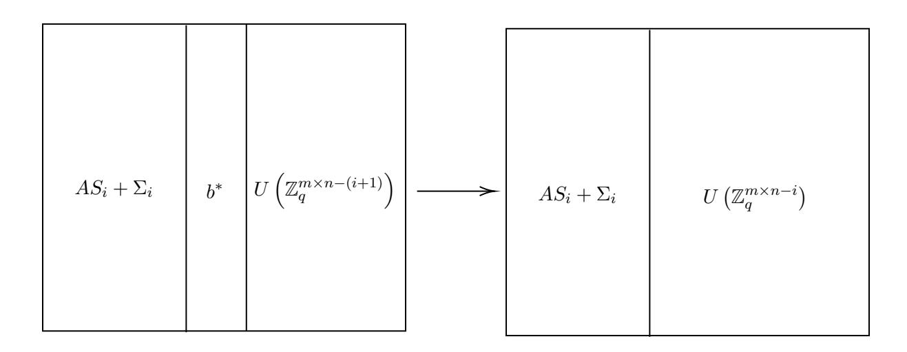

$$b^* = b_0 + A_i \cdot s^* \in U\left(\mathbb{Z}_q^m\right)$$

Figure 2: Reduction for games i and i+1 in the proof of Lemma 2 for the case of  $\delta=0$ .

If  $\delta=1$ , then  $b^*=A_{n-i}s+\varepsilon+A_i\cdot s^*=As'+\varepsilon$ , where  $A=[A_i|A_{n-i}]$  as above and  $s'=[s^*||s|]$  (|| denotes that s' is a column vector consisting of  $s^*$  on top of s). Thus, since the i elements of  $s^*$  are exactly the i elements of the (i+1)-th row of  $S_i$ , and the n-i elements of s are drawn uniformly at random from  $\mathbb{Z}_q$ , if we form  $S_{i+1}=[S_i||s']$ , then the top  $((i+1)\times(i+1))$ -dimensional matrix of  $S_{i+1}$  is distributed the same way that  $S_{i+1}^b$  should be, and the bottom is distributed the same way that  $S_{i+1}^b$  should be. Therefore, since we also have the noise  $\varepsilon$  from  $b^*$  to represent the noise in the (i+1)-th column of  $\Sigma_{i+1}$ , in this case, we have  $B=[AS_{i+1}+\Sigma_{i+1}|U(\mathbb{Z}_q^{m\times n-(i+1)})]$ , so B is constructed according to the distribution for game i+1. We depict this case in Figure 3

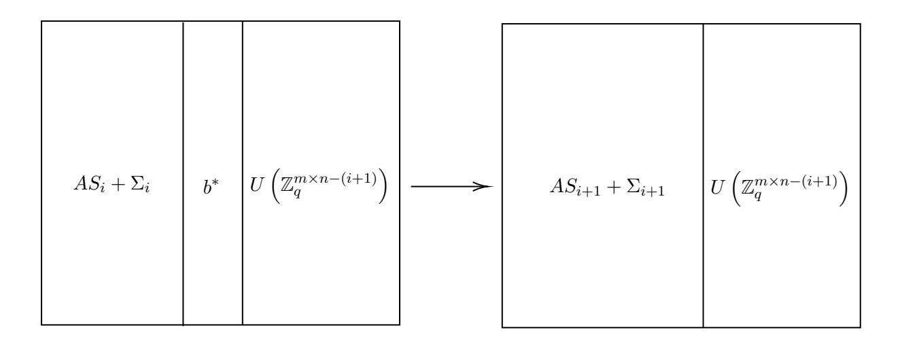

$$b^* = b_1 + A_i \cdot s^* = A \cdot [s^* \mid\mid s] + \varepsilon \Longrightarrow$$

$$i$$

$$S_i^t \qquad i$$

$$S_i^t \qquad s^*$$

$$= S_{i+1}$$

$$S_i^b \qquad s$$

Figure 3: Reduction for games i and i+1 in the proof of Lemma 2 for the case of  $\delta=1$ .

Thus, since  $A_{n-i}$  has a  $\leq \epsilon_i$  advantage in the decisional-LWE problem for i=0 to n-1, then games 0 and n are distinguishable with  $\leq \sum_{i=0}^{n-1} \epsilon_i$  advantage, which is still negligible in the security parameter.

Note that since the above reduction relies on a decisional-LWE instance with secret vector dimension as small as 1, we do not gain any extra security from increasing the dimension of the secret symmetric matrix S. We might as well use a scalar s, of dimension 1, which is inherently symmetric.

# 10 An attack on symmetric compact LWE

We can further define compact, symmetric LWE (CSLWE) as an instance of symmetric LWE where the lattice is described by a matrix with small entries. Consider an instance of CSLWE as follows, where an attacker is attempting to distinguish a proper CSLWE sample

$$B_{1} = \begin{array}{c} & \longleftarrow n \longrightarrow \\ \uparrow & & \uparrow \\ \downarrow & & \uparrow \\ \downarrow & & S \end{array} + \begin{array}{c} \longleftarrow n \longrightarrow \\ \uparrow & & \searrow \\ \downarrow & & \searrow \end{array}$$
 (23)

from a uniformly random  $m \times n$  matrix  $B_0$ .

Consider the following algebraic manipulation:

$$B_1 A^T - A B_1^T$$

$$= (AS + \Sigma) A^T - A (AS + \Sigma)^T$$

$$= ASA^T + \Sigma A^T - AS^T A^T - A\Sigma^T$$

$$= ASA^T + \Sigma A^T - ASA^T - A\Sigma^T$$

$$= \Sigma A^T - A\Sigma^T$$

$$= \Sigma A^T - A\Sigma^T$$
(24)

Since A and  $\Sigma$  are both matrices with small entries, so is  $B_1A^T - AB_1^T$ . However, with high probability  $B_0A^T - AB_0^T$  will not have small entries. Thus, as  $B_iA^T - AB_i^T$  can be computed in polynomial time, an attacker could efficiently distinguish these two distributions with non-negligible probability.

Note that this attack does not imply insecurity for compact LWE and symmetric LWE separately, as both the symmetry condition and the smallness condition are required for the proof.

#### 10.1 Implications for our IBE schemes

Our best ideas for a proof of security for the scheme outlined in section 8.2 boil down to using compact, symmetric LWE in some capacity. This is because the scheme has LWE samples on both sides with small lattices. However, just because compact, symmetric LWE is broken in the decisional case does not immediately imply that the scheme is broken. One could imagine a proof that instead relied on a computational version of compact, symmetric LWE. Furthermore, if there is a concrete attack on computational, compact, symmetric LWE, then that can easily be transformed into an attack on this scheme as the master secret key would be essentially revealed. Worryingly, there is a reduction from computational LWE to decisional LWE discussed by Oded Regev in [32]. Furthermore, this reduction directly applies to the compact, symmetric case. However, this reduction does require that the order of the field is polynomial in the security parameter. Thus, it is paramount that the order of the field used in these IBE constructions be superpolynomial in the security parameter.

# 11 Back to the beginning, again

Having failed thus far to jump from a lattice PKE with large secret keys to a provably secure lattice IBE with large secret keys, we return to our starting point. Armed with the experience we've gained, we try to retrace our steps, and consider where we might take a different path. We began by examining the operation of exponentiation by a known scalar in the group setting and its role in the elegant Diffie-Hellman key exchange. In the group setting, two party key exchange and public key encryption are nearly synonymous. The El-Gamal PKE has a public key that corresponds to Alice's published element  $g^a$  in the Diffie-Hellman scheme, and a ciphertext is formed by choosing a random exponent b and computing:  $g^b, Mg^{ab}$  where the message M is assumed to be a group element. In other words, the encryptor is Bob, and he publishes the element  $g^b$  as before, along with the message hidden by the secret key he now shares with Alice. The Boneh-Franklin PKE, in contrast, has a different structure that is far less natural on its own. Its secret keys are group elements rather than exponents, a seemingly necessary feature to enable the boost to an IBE, but also a feature that forces the "shared key" between the encryptor and decryptor into the target group of a bilinear map.

Once we are in a bilinear setting, however, we need no longer limit non-interactive key exchange to two parties. Instead, we can have a non-interactive three party key exchange [22] where Alice publishes  $g^a$ , Bob publishes  $g^b$ , Charlie publishes  $g^c$ , and the shared secret key is  $e(g,g)^{abc}$ . (Note that an adversary can compute  $e(g,g)^{ab}$ , or any other quadratic form of a,b,c in the exponent by using the published values and the bilinear map, but distinguishing the triple product abc in the exponent in  $G_T$  from a random element is assumed to be hard.)

This three party exchange is perhaps the right analog for the Boneh-Franklin PKE scheme. In fact, the three ways of getting to the triple product  $e(g,g)^{abc}$  (by knowing a and  $g^b, g^c$ , by knowing b and  $g^a, g^c$ , or by knowing c and  $g^a, g^b$ ) correspond roughly to the three ways of getting to a blinding factor computation in the extension to IBE: the legitimate secret key derivation by the master secret key holder, the (illegitimate but indistinguishable) approach of the reduction to creating keys by leveraging its strategic simulation of the random oracle, and the legitimate encryption algorithm.

In turns out we can formulate this relationship between non-interactive key exchange and random oracle IBE more abstractly. Next we define an augmented notion of non-interactive key exchange that suffices to imply IBE in the random oracle model.

# 11.1 A non-interactive key exchange and a random oracle walk into a bar...

The high level idea of this abstraction is codify a structure of three party key exchange that can generically map onto the three pieces of a random oracle security proof for IBE. These pieces are 1. The legitimate secret key derivation process from the master secret key, 2. The reduction's approach to responding to key requests, and 3. The encryption algorithm. We find it slightly more convenient to define this as a two-tiered exchange protocol rather than a straight three party protocol. More precisely, we imagine that we are first performing a key exchange between two parties, and their shared secret key goes on to behave like the new secret key for a single party in a final exchange with some new party. Since this is all non-interactive, this tiered structure is really just in our minds, but we find it clarifying nonetheless.

Let's first suppose we have a non-interactive two party key exchange with two algorithms: Generate and Construct. The Generate algorithm is used (symmetrically) by an individual party to produce two outputs: a public key PK and a secret key SK. The Construct algorithm takes in one public key and one secret key (produced by a opposite parties) and produces a shared secret key that we'll denote by  $SK_{12}$ . For now, we'll consider Generate to be a randomized algorithm, while Construct is assumed to be deterministic. We'll allow a negligible probability that Construct fails to produce the same shared secret key for the two parties when they each independently run Generate and publish the resulting public keys.

We'll next suppose that the distribution of  $SK_{12}$  induced by honestly running two independent instances of *Generate* and one instance of *Construct* is computationally indistinguishable from the distribution of  $SK_{12}^*$  produced by running  $Generate_{12}^*$ , an algorithm for another non-interactive two party key exchange scheme. This scheme may be asymmetric, so it also has an algorithm  $Generate_3^*$  for the other party to run, and separate construction algorithms  $Construct_{12}^*$  and  $Construct_3^*$ .

Furthermore, we suppose there is a publicly known and polynomial-time computable function f that takes in  $PK_1$  and  $PK_2$  generated by the two runs of the original *Generate* and outputs  $PK_{12}$  such that the joint distribution of  $PK_{12}$  and  $SK_{12}$  is computationally distinguishable from the output of  $Generate^*_{12}$ , i.e.

$$(PK_{12}, SK_{12}) \approx_c (PK_{12}^*, SK_{12}^*)$$

(This subsumes the prior requirement for  $SK_{12}^*$  alone.) The correctness condition for  $Construct_{12}^*$ ,  $Construct_3^*$ ,  $Generate_{12}^*$ ,  $Generate_3^*$  also allows for negligible failure.

Our security guarantee will be the starred scheme produces a shared key that is computationally difficult to distinguish from random, even in the presence of the publication of  $PK_1$  and  $PK_2$  (and not just  $PK_{12}$ ).

Finally, we'll suppose there is a random oracle H that can map identities to an output distribution that is computationally indistinguishable from the distribution of  $PK_{12}^*$  induced by running  $Generate_{12}^*$  honestly.

With these ingredients, we'll build a R.O. secure IBE:

 $Generate_{IBE}$ : Run Generate to produce  $SK_1$  and  $PK_1$ . Set  $MSK_{IBE} = SK_1$  and  $PP_{IBE} = PK_1$  as well as H.

 $KeyGen_{IBE}(ID)$ : Run H to produce  $PK_2 := H(ID)$ . Compute:

$$SK_{ID} := Construct(PK_2, SK_1).$$

Encrypt(ID, M): Run H to produce  $PK_2 := H(ID)$ . Compute

$$PK_{12} := f(PK_1, PK_2).$$

Run  $Generate_3^*$  to produce  $SK_3^*, PK_3^*$ . Run  $Construct_3^*(PK_{12}, SK_3^*)$  to produce a value R. We'll assume the message M is the same length as R. The ciphertext is produced as:

$$CT := M \oplus R$$
,  $PK_3$ ,

where  $\oplus$  denotes a bitwise XOR.

 $Decrypt(CT, SK_{ID})$ : run  $Construct_{12}^*(PK_3, SK_{ID})$  to produce what is (whp) the value of R. Bitwise XOR to extract M.

Now's let's try to prove the IBE is secure in the RO model relying on the security guarantee we gave for the key exchange. Let's assume we have an IBE attacker  $\mathcal{A}$  who can succeed at distinguishing an encryption of  $M_0$  from an encryption of  $M_1$  with non-negligible advantage in the RO setting. We'll build a PPT algorithm  $\mathcal{B}$  that attacks the underlying nested key exchange scheme, assuming B gets to act as the oracle for  $\mathcal{A}$ . We'll make the simplifying assumption (WLOG) that  $\mathcal{A}$  queries every identity to H that it references before it asks for the accompanying secret key or specifies it as the identity for the challenge ciphertext.

 $\mathcal{B}$  is given  $PK_1$ ,  $PK_2$ ,  $PK_3$ , and a candidate value R that may or may not be the final shared key. It gives  $PK_1$  to  $\mathcal{A}$  as the public parameters for the IBE scheme.

Over the course of the RO IBE security game,  $\mathcal{A}$  will query a polynomial number of identities to the random oracle.  $\mathcal{B}$  will guess which of these queries corresponds to the challenge identity. If  $\mathcal{B}$  is wrong, it will abort the game with A and guess randomly on its own challenge. For what follows, we'll assume  $\mathcal{B}$  guesses correctly.

Each time  $\mathcal{A}$  makes an oracle query for an identity ID that is not the challenge,  $\mathcal{B}$  runs Generate to produce SK, PK. It sets H(ID) := PK. If asked to provide  $SK_{ID}$ , it runs  $Construct(SK, PK_1)$  to produce  $SK_{ID}$ . By the correctness requirement on Generate, Construct and the distributional requirement above that  $SK_{12} \approx SK_{12}^*$ , this should be indistinguishable from the correct key distribution.

When it comes time to produce the challenge ciphertext,  $\mathcal{B}$  will set  $H(ID^*) = PK_2$  for the challenge identity  $ID^*$ , and will compute the ciphertext as:

$$CT^* := R \oplus M_b, PK_3$$

 $\mathcal{A}$ 's success should be correlated with R being the correct shared key in  $\mathcal{B}$ 's challenge.

**Boneh-Franklin IBE as an example** We can recast the Boneh-Franklin IBE scheme and its random oracle security reduction as a particular implementation of this abstraction: Generate is defined to output SK := a,  $PK := g^a$ , while Construct takes in b,  $g^a$ , outputs

Generate is defined to output SK := a,  $PK := g^a$ , while Construct takes in  $b, g^a$ , outputs  $g^{ab}$ .

 $Generate_{12}^*$  produces  $SK_{12}^* := g^r$ ,  $PK_{12}^* := e(g,g)^r$ , while  $Generate_3^*$  is the same as Generate (in the source group of a bilinear group).  $Construct_{12}^*$  computes  $e(SK_{12}^*, PK_3)$ , while  $Construct_3^*$  computes  $PK_{12}$  raised to the power of  $SK_3^*$ .

f takes  $PK_1$  and  $PK_2$  and pairs them using the bilinear map. H hashes identities into the source group of a bilinear group.

Instantiating this framework in lattices? Perhaps what's most appealing about this structural view of Boneh-Franklin is that it shows how the identity secret keys  $SK_{ID}$  have come to inherit some computational hiding properties. Unlike the short lattice keys of the Agrawal-Boneh-Boyen LWE-based scheme, the secret keys of any lattice construction following this framework might naturally come with more guidance into how to eventually change their distributions in a dual system style hybrid proof.

This template also feels reasonably suited to the lattice setting, where homomorphic techniques may provide a guide for constructing suitable functions f. However, we have not yet been able to produce an instantiation.

#### 11.2 Non-conclusion

With the benefit of hindsight, a visualization of the attack on our extended cryptanalysis challenge feels like an appropriate visualization of the process of research as well:

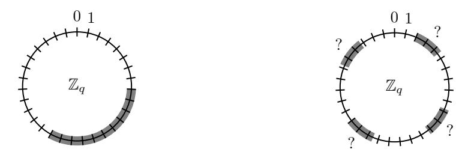

We seem to go from one consistent high level goal to a bunch of potentially inconsistent sub-goals. As in the attack, the ultimate success of our efforts hinges upon finding instructive sanity checks that can help us efficiently sort through the branching possibilities to narrow in on the extensible path. The sanity checks that we have tried to use for this purpose reside in the structural connections that underpin concrete applications of (bilinear) groups and lattices, namely key exchange, public key encryption, identity based encryption, and beyond. Along the way we've amassed a fuller understanding of the relationships between these primitives, their security proofs, and the features/necessities of their constructions.

Here is a rough map of what we've explored:

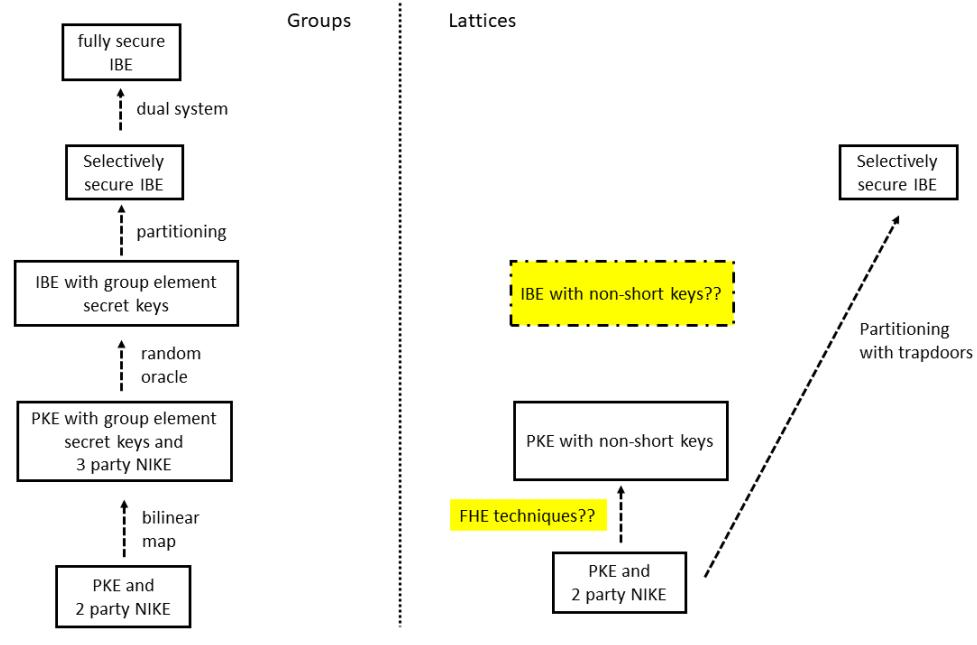

This map is not intended to be comprehensive (e.g. there are other ways of getting fully secure IBE besides dual system techniques). The highlighted parts here are the ones we still find the most unsatisfying: the persistent lack of a provably secure lattice IBE scheme with non-short secret keys, and the surprising lack of insight we seem to get from non-short key PKEs in the lattice world, when the group equivalent contained a powerful bilinear map, a power that continued to drive development up the pictured chain and far beyond. And yet the lattice world has FHE, its own powerful engine that has yet to have a clear word to say about any of this.

We can't shake the feeling that there's much more here to discover. And so, while others may chase further dreams past identity based encryption into functional encryption, obfuscation, multi-linear maps, and beyond, we stay here, slowly searching. Searching for the entrance to the tunnel that will connect the two worlds. It should be easier to spot here near the beginning, at the fork in the road before the paths too widely diverge. Before we take up the heavy burdens of success.

# Acknowledgements

We would like to thank Steven Galbraith for kindly pointing out to us several relationships between the problems we discuss here and other works that we were not aware of.

# References

- [1] S. Agrawal, D. Boneh, and X. Boyen. Efficient lattice (h)ibe in the standard model. In EUROCRYPT, pages 553–572, 2010.
- [2] A. Akavia, S. Goldwasser, and S. Safra. Proving hard-core predicates using list decoding. In FOCS, 2003.
- [3] W. Alexi, B. Chor, O. Goldreich, and C. P. Schnorr. Rsa and rabin functions: Certain parts are as hard as the whole. SIAM Journal on Computing, 17(2):194–209, 1988.
- [4] M. Ben-Or, B. Chor, and A. Shamir. On the cryptographic security of single rsa bits. In STOC, 1983.
- [5] A. Bishop, L. Kowalczyk, T. Malkin, V. Pastro, M. Raykova, and K. Shi. In pursuit of clarity in obfuscation. In CFAIL, 2019.
- [6] D. Boneh and X. Boyen. Efficient selective-id secure identity based encryption without random oracles. In EUROCRYPT, pages 223 – 238, 2004.
- [7] D. Boneh and M. Franklin. Identity based encryption from the weil pairing. In CRYPTO, pages 213–229, 2001.
- [8] J. H. Cheon, K. Han, C. Lee, H. Ryu, and D. Stehl´e. Cryptanalysis of the multilinear map over the integers. In EUROCRYPT, 2015.
- [9] J. H. Cheon and D. Stehl´e. Fully homomorphic encryption over the integers revisited. IACR Cryptology ePrint Archive, 2016:837, 2016.
- [10] J. Coron, C. Gentry, S. Halevi, T. Lepoint, H. K. Maji, E. Miles, M. Raykova, A. Sahai, and M. Tibouchi. Zeroizing without low-level zeroes: New MMAP attacks and their limitations. In CRYPTO, 2015.
- [11] J. Coron, M. S. Lee, T. Lepoint, and M. Tibouchi. Cryptanalysis of GGH15 multilinear maps. In CRYPTO, 2016.
- [12] J. Coron, M. S. Lee, T. Lepoint, and M. Tibouchi. Zeroizing attacks on indistinguishability obfuscation over CLT13. In PKC, 2017.
- [13] J. Coron, T. Lepoint, and M. Tibouchi. Practical multilinear maps over the integers. In CRYPTO, 2013.
- [14] W. Diffie and M. E. Hellman. New directions in cryptography. IEEE Trans. Information Theory, 22(6), 1976.
- [15] S. Garg, C. Gentry, and S. Halevi. Candidate multilinear maps from ideal lattices. In EUROCRYPT, pages 1–17, 2013.
- [16] C. Gentry. Computing on the edge of chaos: Structure and randomness in encrypted computation. IACR Cryptology ePrint Archive, 2014:610, 2014.
- [17] C. Gentry, C. Peikert, and V. Vaikuntanathan. Trapdoors for hard lattices and new cryptographic constructions. In Proceedings of the 40th annual ACM Symposium on Theory of Computing, pages 197–206, 2008.

- [18] C. Gentry, A. Sahai, and B. Waters. Homomorphic encryption from learning with errors: Conceptually-simpler, asymptotically-faster, attribute-based. In CRYPTO, 2013.
- [19] J. H˙astad and M. N¨aslund. The security of all rsa and discrete log bits. Journal of the ACM, 51(2):187–230, 2003.
- [20] N. A. Howgrave-Graham. Approximate integer common divisors. In CALC, 2001.
- [21] X. Lin J. Ding, X. Xie. A simple provably secure key exchange scheme based on the learning with errors problem. IACR Cryptology ePrint Archive, 2012:688, 2012.
- [22] A. Joux. A one round protocol for tripartite diffie-hellman. In ANTS-IV, 2000.
- [23] A. Lewko, T. Okamoto, A. Sahai, K. Takashima, and B. Waters. Fully secure functional encryption: Attribute-based encryption and (hierarchical) inner product encryption. In EUROCRYPT, pages 62–91, 2010.
- [24] A. Lewko and B. Waters. New techniques for dual system encryption and fully secure hibe with short ciphertexts. In TCC, pages 455–479, 2010.
- [25] A. Lewko and B. Waters. Decentralizing attribute-based encryption. In EUROCRYPT, pages 568–588, 2011.
- [26] A. Lewko and B. Waters. Unbounded hibe and attribute-based encryption. In EURO-CRYPT, pages 547–567, 2011.
- [27] S. Ling, D. H. Phan, D. Stehl´e, and R. Steinfeld. Hardness of k-lwe and applications in traitor tracing. In CRYPTO, 2014.
- [28] E. Miles, A. Sahai, and M. Zhandry. Annihilation attacks for multilinear maps: Cryptanalysis of indistinguishability obfuscation over GGH13. In CRYPTO, 2016.
- [29] T. Okamoto and K. Takashima. Fully secure functional encryption with general relations from the decisional linear assumption. In CRYPTO, pages 191–208, 2010.
- [30] C. Peikert. Lattice cryptography for the internet. In PQCrypto, 2014.
- [31] O. Regev. On lattices, learning with errors, random linear codes, and cryptography. In STOC, 2005.
- [32] O. Regev. The learning with errors problem (invited survey). In CCC, 2010.
- [33] A. Shamir. Identity-based cryptosystems and signature schemes. In CRYPTO, pages 47–53, 1984.
- [34] B. Shani. Hidden number problems. doctoral thesis, The University of Auckland, 2017.
- [35] M. van Dijk, C. Gentry, S. Halevi, and V. Vaikuntanathan. Fully homomorphic encryption over the integers. In EUROCRYPT, 2010.
- [36] M.I. Gonz´alez Vasco and M. N¨aslund. A survey of hard core functions. Progress in Computer Science and Applied Logic, 20:227–255, 2001.
- [37] G. Wang, M. Wan, Z. Liu, and D. Gu. Dual system in lattice: Fully secure abe from lwe assumption. IACR Cryptology ePrint Archive, 2020:064, 2020.
- [38] B. Waters. Efficient identity-based ecnryption without random oracles. In EURO-CRYPT, pages 114–127, 2005.
- [39] B. Waters. Dual system encryption: realizing fully secure ibe and hibe under simple assumptions. In CRYPTO, pages 619–636, 2009.

# A Proof of lemma [2](#page-12-1)

We first introduce a convenient variant of the LWE assumption and, for completeness, show that its hardness is inherited from the hardness of standard LWE.

#### A.1 Matrix-LWE

The first simple LWE extension, which has been seen in the literature, is that of matrix-LWE. In the standard definition of the decisional-LWE assumption used in the cryptography literature, an attacker is given A drawn uniformly at random from  $\mathbb{Z}_q^{m \times n}$ . They are then given one of either:

- $b_0$ , which is drawn uniformly at random from  $\mathbb{Z}_q^m$ , or
- $b_1 = As + \varepsilon$ , where s is uniformly random in  $\mathbb{Z}_q^n$  and each element of the m-dimensional  $\varepsilon$  is drawn from some appropriate discrete Gaussian distribution,

and are asked to distinguish between the two.

It of course is assumed that an attacker only has advantage of  $\epsilon$ , where  $\epsilon$  is negligible in the security parameter, in distinguishing between these two distributions, and thus the problem is deemed to be hard.

We consider a variant of the standard decisional-LWE assumption, called the decisional-matrix-LWE assumption. In this case, an attacker is once again given A drawn uniformly at random from  $\mathbb{Z}_q^{m\times n}$ , but this time is asked to distinguish between

- $B_0$ , which is drawn uniformly at random from  $\mathbb{Z}_q^{m \times n}$ , and
- $B_1 = AS + \Sigma$ , where S is uniformly random in  $\mathbb{Z}_q^{n \times n}$  and each element of the  $(m \times n)$ -dimensional matrix  $\Sigma$  is drawn from some appropriate discrete gaussian distribution.

We prove the following lemma:

**Lemma 6.** If every attacker A of the decisional-LWE problem has advantage at most  $\epsilon$  in distinguishing between  $b_0$  and  $b_1$ , then there is no attacker B of the decisional-matrix-LWE problem that has advantage greater than  $n \cdot \epsilon$ .

Now we are ready to prove Lemma 2.

We proceed in a series of hybrids. In game 0, we start with  $B_0$  drawn uniformly at random from  $\mathbb{Z}_q^{m\times n}$ ). In game n, we end with  $B_1=AS+\Sigma$ . In game i, we have that  $B=[AS_i+\Sigma_i|U(\mathbb{Z}_q^{m\times n-i})]$ , where  $S_i$  is drawn uniformly from  $\mathbb{Z}_q^{n\times i}$ , and each element of the  $(m\times i)$ -dimensional  $\Sigma_i$  is drawn from some the appropriate discrete Gaussian distribution (observe the notation).

Thus, our hybrids deal with distinguishing  $[AS_i + \Sigma_i | U(\mathbb{Z}_q^{m \times n - i})]$  and  $[AS_{i+1} + \Sigma_{i+1} | U(\mathbb{Z}_q^{m \times n - (i+1)}]$ , given A, for i = 0 to n.

Our reduction for games i and i+1 is as follows: we build an adversary  $\mathcal{A}$  for decisional-LWE given adversary  $\mathcal{B}$  trying to distinguish between games i and i+1.

• Given A and  $b_0$  drawn uniformly at random from  $\mathbb{Z}_q^m$ , or  $b_1 = As + \varepsilon$ ,  $\mathcal{A}$  constructs the matrix

$$B = [AS_i + \Sigma_i | b_{\delta} | U(\mathbb{Z}_q^{m \times n - (i+1)})],$$

by drawing  $S_i$  and  $\Sigma_i$  on its own from the proper distributions.

- $\mathcal{A}$  then sends A, B to  $\mathcal{B}$ .
- When  $\mathcal{A}$  returns bit  $\delta'$  (0 if game i, 1 if game i+1) to  $\mathcal{B}$ ,  $\mathcal{B}$  returns  $\delta'$  to its challenger.

Observe that if  $\delta = 0$ ,  $\mathcal{B}$  gets B for game i, but if  $\delta = 1$ , then  $\mathcal{B}$  gets B for game i + 1.

Therefore, since  $\mathcal{A}$  has  $\leq \epsilon$  advantage in the decisional-LWE problem, games 0 and n are  $\leq (n \cdot \epsilon)$ -distinguishable, which is still negligible in the security parameter.

 $\mathcal{A}$  wants to distinguish

$$A, B, (o_a^1 := B^t v_a^1 + \varepsilon_a^1, o_b^1 = A^t v_b^1 + \varepsilon_b^1), \dots, (o_a^n := B^t v_a^n + \varepsilon_a^n, o_b^n = A^t v_b^n + \varepsilon_b^n), u$$

from

$$A, B, (o_a^1 := B^t v_a^1 + \varepsilon_a^1, o_b^1 = A^t v_b^1 + \varepsilon_b^1), \dots, (o_a^n := B^t v_a^n + \varepsilon_a^n, o_b^n = A^t v_b^n + \varepsilon_b^n), r = A^t v_b^n + C^n v_b^n + C^n v_b^n + C^n v_b^n + C^n v_b^n + C^n v_b^n + C^n v_b^n + C^n v_b^n + C^n v_b^n + C^n v_b^n + C^n v_b^n + C^n v_b^n + C^n v_b^n + C^n v_b^n + C^n v_b^n + C^n v_b^n + C^n v_b^n + C^n v_b^n + C^n v_b^n + C^n v_b^n + C^n v_b^n + C^n v_b^n + C^n v_b^n + C^n v_b^n + C^n v_b^n + C^n v_b^n + C^n v_b^n + C^n v_b^n + C^n v_b^n + C^n v_b^n + C^n v_b^n + C^n v_b^n + C^n v_b^n + C^n v_b^n + C^n v_b^n + C^n v_b^n + C^n v_b^n + C^n v_b^n + C^n v_b^n + C^n v_b^n + C^n v_b^n + C^n v_b^n + C^n v_b^n + C^n v_b^n + C^n v_b^n + C^n v_b^n + C^n v_b^n + C^n v_b^n + C^n v_b^n + C^n v_b^n + C^n v_b^n + C^n v_b^n + C^n v_b^n + C^n v_b^n + C^n v_b^n + C^n v_b^n + C^n v_b^n + C^n v_b^n + C^n v_b^n + C^n v_b^n + C^n v_b^n + C^n v_b^n + C^n v_b^n + C^n v_b^n + C^n v_b^n + C^n v_b^n + C^n v_b^n + C^n v_b^n + C^n v_b^n + C^n v_b^n + C^n v_b^n + C^n v_b^n + C^n v_b^n + C^n v_b^n + C^n v_b^n + C^n v_b^n + C^n v_b^n + C^n v_b^n + C^n v_b^n + C^n v_b^n + C^n v_b^n + C^n v_b^n + C^n v_b^n + C^n v_b^n + C^n v_b^n + C^n v_b^n + C^n v_b^n + C^n v_b^n + C^n v_b^n + C^n v_b^n + C^n v_b^n + C^n v_b^n + C^n v_b^n + C^n v_b^n + C^n v_b^n + C^n v_b^n + C^n v_b^n + C^n v_b^n + C^n v_b^n + C^n v_b^n + C^n v_b^n + C^n v_b^n + C^n v_b^n + C^n v_b^n + C^n v_b^n + C^n v_b^n + C^n v_b^n + C^n v_b^n + C^n v_b^n + C^n v_b^n + C^n v_b^n + C^n v_b^n + C^n v_b^n + C^n v_b^n + C^n v_b^n + C^n v_b^n + C^n v_b^n + C^n v_b^n + C^n v_b^n + C^n v_b^n + C^n v_b^n + C^n v_b^n + C^n v_b^n + C^n v_b^n + C^n v_b^n + C^n v_b^n + C^n v_b^n + C^n v_b^n + C^n v_b^n + C^n v_b^n + C^n v_b^n + C^n v_b^n + C^n v_b^n + C^n v_b^n + C^n v_b^n + C^n v_b^n + C^n v_b^n + C^n v_b^n + C^n v_b^n + C^n v_b^n + C^n v_b^n + C^n v_b^n + C^n v_b^n + C^n v_b^n + C^n v_b^n + C^n v_b^n + C^n v_b^n + C^n v_b^n + C^n v_b^n + C^n v_b^n + C^n v_b^n + C^n v_b^n + C^n v_b^n + C^n v_b^n + C^n v_b^n + C^n v_b^n + C^n v_b^n + C^n v_b^n + C^n v_b^n + C^n v_b^n$$

If we organize the vectors  $v_a^i$  for  $i \in [n]$  to be columns of an  $(n \times n)$ -dimensional matrix  $V_a$ , do the same for the vectors  $v_b$  to get matrix  $V_b$ , again the same for vectors  $\varepsilon_b^i, \varepsilon_a^i$  to get

 $(m \times n)$ -dimensional matrices  $\Sigma_a, \Sigma_b$ , and finally, the same for vectors  $o_a^i, o_b^i$  to get  $(m \times n)$ -dimensional matrices  $O_a, O_b$ , then we can equivalently state the problem as distinguishing between

$$A, B, O_a := B^t V_a + \Sigma_a, O_b := A^t V_b + \Sigma_b, u$$

and

$$A, B, O_a := B^t V_a + \Sigma_a, O_b := A^t V_b + \Sigma_b, r$$

We can also group together the secret vectors  $s_a^i, s_b^i$  for  $i \in [n]$  as columns in  $(m \times n)$ -dimensional matrices  $S_a, S_b$ . Therefore, using Claim 5.3 from [31], since  $m > n \log q$  and  $S_a$  is only used to calculate  $V_a := AS_a$ , we have that  $(A, V_a)$  is statistically indistinguishable from  $(A, R_a)$ , where  $R_a$  is chosen uniformly from  $\mathbb{Z}_q^{n \times n}$ . The same holds for  $V_b$ . Therefore, the attacker is equivalently distinguishing

$$A, B, O_a := B^t R_a + \Sigma_a, O_b := A^t R_b + \Sigma_b, u'$$

from

$$A, B, O_a := B^t R_a + \Sigma_a, O_b := A^t R_b + \Sigma_b, r$$

where u' is determined by the approximate dot products  $R_a^i \cdot R_b^i$ , where  $R_a^i$  is the *i*-th column of  $R_a$ , and  $R_b^i$  is symmetrically defined.

We observe that this problem is only easier if  $R_a$  is given outright instead of  $O_a$ , since each entry  $u'_i$  of u' is determined by the dot product of  $R_a^i$  with  $R_b^i$ , and  $O_a$  only attempts to hide the columns of  $R_a$ . Thus, it is at least as easy to distinguish

$$A, B, R_a, O_b := A^t R_b + \Sigma_b, u' \tag{25}$$

from

$$A, B, R_a, O_b := A^t R_b + \Sigma_b, r \tag{26}$$

From Matrix LWE (see appendix A.1), we know that (26) is computationally indistinguishable from

$$A, B, R_a, R, r, \tag{27}$$

where R is a uniformly random matrix in  $\mathbb{Z}_q^{m \times n}$ .

Similarly, we can provide a reduction from Matrix LWE to show that (25) is also indistinguishable from (27):

Claim 7. Equation (25) is computationally indistinguishable from (27) for any PPT adversary  $\mathcal{B}_1$ .

*Proof.* Assume that  $\mathcal{B}_2$  is an adversary attacking Matrix LWE using  $\mathcal{B}_2$ .

- if  $\delta = 0$  for the Matrix LWE game,  $\mathcal{B}_2$  receives from its challenger  $(A, O_0 := A^t R_b + \Sigma_b)$ , where A is uniform random in  $\mathbb{Z}_q^{n \times m}$ ,  $R_b$  is uniformly random in  $\mathbb{Z}_q^{n \times n}$ , and  $(m \times n)$ -dimensional  $\Sigma_b$  is drawn from the proper discrete Gaussian.
- if  $\delta = 1$  for the Matrix LWE game,  $\mathcal{B}_2$  receives from its challenger  $(A, O_1)$ , where A is uniform random in  $\mathbb{Z}_q^{n \times m}$  and  $O_1$  is uniformly random in  $\mathbb{Z}_q^{m \times n}$ .
- $\mathcal{B}_2$  then samples uniformly at random  $B \leftarrow \mathbb{Z}_q^{n \times m}, S_a \leftarrow \mathbb{Z}_q^{m \times n}$  and sets  $R_a := AS_A$ .
- For each column of  $O_{\delta}$ ,  $S_a$ ,  $\mathcal{B}_2$  will compute  $O_{\delta}^i \cdot S_a^i$  and round it according to the key exchange protocol to obtain an n-dimensional bit vector  $u_{\delta}$ .
- $\mathcal{B}_2$  will then send  $(A, B, R_a, O_\delta, u)$  to  $\mathcal{B}_1$ , receive back a bit  $\delta'$  and forward this to the matrix LWE challenger.

Observe that if  $\delta = 0$ , then  $O_0^i \cdot S_a^i$  is an approximation of  $R_a^i \cdot R_b^i$ . Since we use it to determine  $u_0$ ,  $u_0$  is distributed equivalently to u' in (25). If  $\delta = 1$ , then  $O_1^i \cdot S_a^i$  is some random value in  $\mathbb{Z}_q$ , and thus  $u_1$  is some random n-dimensional bit vector that is distributed equivalently to r in (27).

Moreover, since we showed above that there does not exist any PPT adversary  $\mathcal{B}_2$  that can win the matrix LWE game, there must not exist any PPT adversary  $\mathcal{B}_1$  that can distinguish between (25) and (27)

Thus we have shown that there exists no PPT adversary A that can distinguish between the two distributions given in the lemma statement. In particular, since u is indistinguishable from random, every computationally bounded eavesdropper cannot discern which of exponentially many possibilities the bit vector u is.