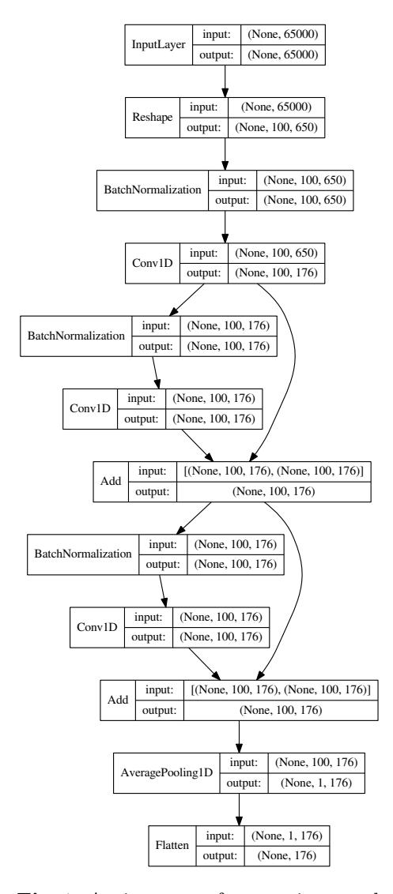
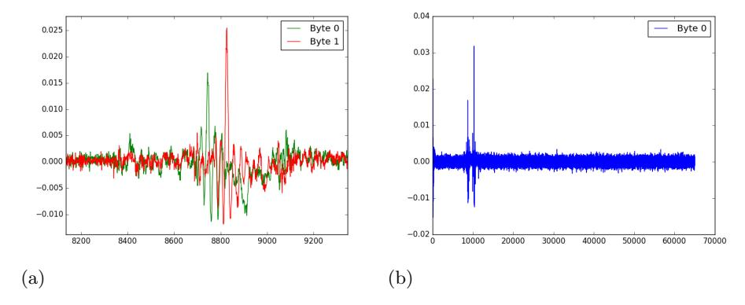
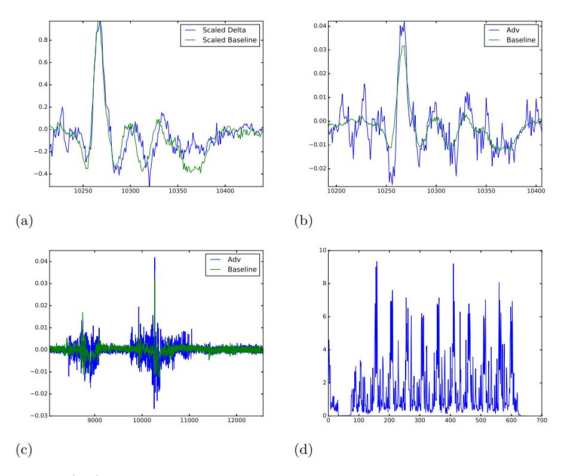

# Subsampling and Knowledge Distillation on Adversarial Examples: New Techniques for Deep Learning Based Side Channel Evaluations

Aron Gohr, Sven Jacob, Werner Schindler

Bundesamt f¨ur Sicherheit in der Informationstechnik (BSI) Godesberger Allee 185-189, 53175 Bonn, Germany {Aron.Gohr,Sven.Jacob,Werner.Schindler}@bsi.bund.de

Abstract. This paper has four main goals. First, we show how we solved the CHES 2018 AES challenge in the contest using essentially a linear classifier combined with a SAT solver and a custom error correction method. This part of the paper has previously appeared in a preprint by the current authors (e-print report 2019/094) and later as a contribution to a preprint write-up of the solutions by the winning teams (e-print report 2019/860).

Second, we develop a novel deep neural network architecture for sidechannel analysis that completely breaks the AES challenge, allowing for fairly reliable key recovery with just a single trace on the unknown-device part of the CHES challenge (with an expected success rate of roughly 70 percent if about 100 CPU hours are allowed for the equation solving stage of the attack). This solution significantly improves upon all previously published solutions of the AES challenge, including our baseline linear solution.

Third, we consider the question of leakage attribution for both the classifier we used in the challenge and for our deep neural network. Direct inspection of the weight vector of our machine learning model yields a lot of information on the implementation for our linear classifier. For the deep neural network, we test three other strategies (occlusion of traces; inspection of adversarial changes; knowledge distillation) and find that these can yield information on the leakage essentially equivalent to that gained by inspecting the weights of the simpler model.

Fourth, we study the properties of adversarially generated side-channel traces for our model. Partly reproducing recent computer vision work by Ilyas et al. in our application domain, we find that a linear classifier that generalizes to an unseen device much better than our linear baseline can be trained using only adversarial examples (fresh random keys, adversarially perturbed traces) for our deep neural network. This gives a new way of extracting human-usable knowledge from a deep side channel model while also yielding insights on adversarial examples in an application domain where relatively few sources of spurious correlations between data and labels exist.

The experiments described in this paper can be reproduced using code available at <https://github.com/agohr/ches2018>.

Key Words. Power Analysis, Machine Learning, Deep Learning, SAT solver.

# 1 Introduction, Related Work and Contributions

#### 1.1 Introduction

As an additional event to CHES 2018, Riscure ran a side-channel contest that was designed to pit Deep Learning against Classical Profiling. The goal of the competition was to break implementations of DES, AES and RSA based only on published examples of power traces and corresponding secret keys while implementation details were kept secret. In total, six challenges were published: two sets of attack traces were published for each primitive, one featuring traces from a physical device already represented in the training data set (known device setting)[1](#page-1-0) and one consisting of traces captured from a device not known to the participants (unknown device). For each sub-challenge, winners were determined by being the first to submit a solution to sets of challenge traces posted a few days prior to CHES 2018. A recent preprint by Hu et al. [\[4\]](#page-22-0) describes the winning solutions and gives some context to the challenge.

#### 1.2 Related Work

Previous Solutions of the CHES Challenges Of the solutions reported so far, most used classical side-channel analysis and none used deep learning:

- The DES challenges were won by team hut8 (Yongbo Hu, Yeyang Zheng, Pengwei Feng, Lirui Liu and Chen Zhang) using a non-profiled technique, essentially CPA [\[4\]](#page-22-0) followed by brute-force search for the remaining key bits.
- The AES challenges were won by team AGSJWS by a machine learning approach using ridge regression – a form of linear regression with l2-regularization – to derive the hamming weights of all subkeys during key expansion combined with a SAT-based strategy to solve for the exact key value and correct some remaining errors in the subkey guesses [\[4\]](#page-22-0). Later on, Damm, Freud and Klein combined classical profiling techniques (template attacks) with custom code to solve for the key [\[3\]](#page-22-1) to arrive at a solution with similar performance characteristics.
- The RSA challenges were won by team hut8. Their solution is essentially a template attack combined with some brute-force error correction.

In all of the challenges, the number of traces available for training was fairly low: in total 30000 training and 10000 test traces each were supplied for the DES and AES implementations, while the RSA training dataset consisted of only 30 training and 10 test traces (however, these were captured at a very high resolution, so a lot of data was available). Together with the strong linear leakage already shown in [\[3,](#page-22-1)[4\]](#page-22-0), this led Damm et al. to conjecture that it would be difficult to showcase a benefit of deep learning based methods on the AES challenge [\[3\]](#page-22-1).

1 To be precise, it was known which traces in the training dataset correspond to the challenge device, but no further details about this device were revealed.

Artificial Neural Networks A proper introduction to the machine learning techniques used in this work is beyond the scope of the present work; we refer the interested reader to current textbooks, for instance [\[1,](#page-22-2)[19\]](#page-23-0). We will, however, try to qualitatively introduce some of the intuitions and concepts relevant to this paper in Appendix A.

Deep Neural Networks for Side-Channel Analysis Several prior works have used deep convolutional neural networks for side channel analysis [\[8,](#page-22-3)[9,](#page-23-1)[10,](#page-23-2)[18,](#page-23-3)[25\]](#page-24-0). The neural architectures used have mostly been inspired by deep convolutional networks used in other one-dimensional signal processing tasks such as audio analysis. This is also true for [\[25\]](#page-24-0), who were the first to successfully apply deep residual networks to side-channel analysis.

The present work departs from this by using a network architecture that is guided by the idea that an approximate extraction of the target variables should (especially in the case of large traces, i.e. traces with high temporal resolution) often be possible already from a downsampled version of the side-channel signal and that a classifier that tries to extract the sensitive variables from all of the data given should treat different downsampled versions of the original signal quite similarly.

Intuitively, this can be viewed as a very natural symmetry property of the side channel prediction task (akin to e.g. translation invariance of the classification target in the image or speech recognition domains). Incorporating known symmetry properties into the design of a machine learning model is regularly very useful for finding a high-performing predictor, because it drastically lowers the number of weights in the model and the ability of the model to memorize training data without (provided that the symmetry property actually holds) excluding models with high predictive power from the search space over which model optimization is being performed.

Leakage Attribution Using Deep Neural Networks Leakage attribution for deep neural networks was recently studied by Hettwer, Gehrer and G¨uneysu [\[18\]](#page-23-3). They explored three different strategies for attributing leakage using deep neural networks and discovered ways to use leakage attribution techniques for improved side-channel key recovery. Our work adds more data on one attribution method they tried (occlusion of parts of the trace) and suggests two new strategies for leakage analysis (generation of adversarial examples and knowledge distillation on adversarial examples).

### 1.3 Main Contributions

We show in this work that deep neural networks can significantly outperform the solutions of the AES challenge so far presented. We propose a simple, scalable neural network design that allows us to directly recover the Hamming weights of the subkey bytes of all AES round keys of the attacked implementation from a single power trace with high success rate. The main idea behind our design is that subsampled parts at small offsets to each other of a trace acquired at a high resolution should be treated approximately alike. We show that our design gains considerable power especially if very deep networks are used. Appendix A contains further information on the intuitions behind our network architecture.

As in previous solutions to the AES challenge, a large equation system with a small number of erroneous equations is solved to derive the key. This is done by dropping some equations at random.

We then turn to the problem of leakage attribution and find that generation of adversarial examples seems to be a very useful strategy for attributing leakage in our example. Studying adversarial examples on our problem further, we show that a linear classifier that mimics the behaviour of our main network on an adversarially generated dataset generalizes much better to the unknown device challenge of the CHES contest than training on the original data. This partly reproduces work that has been previously done in the image domain [\[16\]](#page-23-4) in a setting where data acquisition and labelling is much less likely to introduce spurious correlations between data and labels than for images.

# 2 Our attack on the AES implementation

#### 2.1 Data

The organizers provided four sets of power traces of a masked AES-128 implementation together with key, input and output data. Following the notations and conventions of [\[2](#page-22-4)[,4\]](#page-22-0), we will in the sequel denote these sets of power traces as Set 1 to Set 4. Set 1 to Set 3 used fresh random keys for each trace and we denote the corresponding lists of keys as Keys 1 to Keys 3. The power traces of Set 4 were traces for a single shared key. We denote this single key as Key 4. Each of these sets contained 10000 power traces and keys, and all of these power traces came from three devices A, B, C (Set 1: A, Set 2: B, Set 3, Set 4: C).

In the competition, two additional sets of power traces were released, which we will call Set 5 and Set 6. Set 5 contained power traces from the known device C, while Set 6 was obtained from an unknown device D. Both of these additional sets of traces used a single key each, which we will denote by Key 5 and Key 6.

For the purposes of training, we generated a training data set (T, K) consisting of a randomly shuffled union of Set 1, Set 2 and Set 3[2](#page-3-0) . Here, T denotes the set of training traces and K denotes the set of corresponding Hamming weight vectors of expanded AES keys. The i-th trace in T is denoted by ti and the i-th key (or more precisely, the vector of Hamming weights of the corresponding AES key) in K is denoted by ki ∈ {0, . . . , 8} 176 .

In Section [3](#page-13-0) we will also introduce a training dataset where the keys ki have been exchanged for (expanded Hamming weight vectors of) freshly generated keys k 0 i and the traces ti have been replaced by subtly altered traces t 0 i to make

2 Shuffling of the training set is important here, since we will use the last 3000 traces of T as our validation set to monitor training progress and control learning rate drops

our deep neural network predict the new keys. This adversarially perturbed training set will be denoted by (T 0 , K0 ) in the sequel.

In the sequel, hw(x) will for any 8-bit value x denote the Hamming weight of x, ⊕ will denote binary addition and S will be the AES S-box.

#### 2.2 Attack Overview

Most side-channel attacks against AES implementations target the round function. Particularly the first and last round are attractive targets, since they may allow the adversary to see the results of combining the key with known plaintext or ciphertext. In the setting where the Hamming weights of these operations are leaking, this gives the adversary fairly straightforward ways of combining the results of many measurements to efficiently recover the actual key values even in the presence of significant noise.

After some preliminary studies, we came to the conclusion that the CHES challenge datasets have a masked round function but that the key schedule is not masked [\[2\]](#page-22-4). Basically, this conclusion is based on a comparison between Set 3 and Set 4 since both sets of power traces were generated by the same device, but Set 4 uses only one key. If the key expansion is non-randomized – as is the case here – in Set 4 the key expansion processes the same data for all traces. Indeed, calculating the empirical variance of measured current at each time step in both the Set 3 and Set 4 data, we found a pattern of dips in the Set 4 variance that was consistent with leakage from a non-randomized key expansion where the subkeys for round i are derived just in time for round i. This naturally leads to the idea of attacking the key schedule instead of the round function.

Our attack then follows a simple general plan: given a trace t, we try to guess the Hamming weights of all 176 AES subkey bytes (16 bytes for each of the 11 round keys). For each subkey, two plausible values of its Hamming weight are guessed.

Using these weight guesses and a set of equations describing the AES key schedule, we then solve for the key using a SAT solver[\[6\]](#page-22-5). This of course works only if the SAT solver gets a consistent system of equations to solve. In order to be able to tolerate a few wrong constraints, we randomly drop all constraints on the Hamming weight of 20 subkey bytes at each attempt of solving the system.

#### 2.3 Predicting the Hamming Weight

Overall Prediction Strategy We first decimate the traces by a factor of ten, i.e. of the 650000 data points in each trace, we keep only every tenth, thereby obtaining traces of 65000 points each. We did this mainly to save memory and computation time during training. For the linear models discussed in this article, this step also reduces the number of parameters to fit, thereby reducing the potential for overfitting somewhat.

For each reduced trace t we then calculate θ(t) ∈ R 176. Here, θ can be any suitable mathematical function; in the competition, we used an affine θ, determining the relevant matrix weights and offsets by ridge regression. In this contribution, our main predictor uses a deep neural network trained to minimize mean squared error (MSE) loss against the real Hamming weights on the training dataset. We interpret θi as a guess of the Hamming weight of bi , where bi is the i-th subkey byte produced by the AES key schedule.

If we have multiple traces, we run the predictor on each trace and average the predictions. This gives a vector of real-valued subkey predictions β ∈ R 176 , which is the final output of the Hamming weight guessing phase.

Baseline Model As a baseline model, we fitted an affine function

$$\lambda: \mathbb{R}^{65000} \to \mathbb{R}^{176}, x \mapsto Ax + b$$

using ridge regression with regularization parameter α = 214 to the 30000 traces and keys contained in Set 1, Set 2 and Set 3.

The regularization parameter was chosen using grid-search among small positive and negative powers of two, with generalized cross-validation being used to pick the best value. Before performing our final training run, we tested this training strategy on the union of Set 1 and Set 2, holding out Set 3 as a validation set coming from a different device; performance was sufficient that we were confident that we would be able to master the challenge on Set 6 given our overall solving strategy. The baseline model is the model we used to solve the AES challenges in the competition. For details we refer the interested reader to [\[2\]](#page-22-4).

#### Deep Neural Network

Overview In order to guess the 176 Hamming weights of interest, we first create 100 sub-sampled traces with 100-fold decimation at offsets 0, 1, . . . , 99 from each reduced power trace (consisting of 65, 000 data points) given and perform a batch-normalization. For each of these subsampled and batch-normalized traces, we then produce a first approximation to the weight prediction by applying a small neural network very similar in design to the baseline model. Subsequent layers of our neural network then refine this prediction, taking into account more non-linear features as well as information from neighbouring sub-traces. Finally, a joint prediction is produced by averaging the prediction vectors coming from all 100 sub-samplings of the given trace.

Preprocessing Given a trace t ∈ R 65000, we first map it into R 100×650, keeping the rows of this matrix contiguous in the original trace.

Overall Network Structure Our neural network follows the structure of a deep residual neural network. Basically, it consists of a chain of residual blocks, wherein each block is a shallow neural network (in our case, a batch normalization layer followed by a convolutional layer) that takes as input the sum of the outputs of the two preceding blocks and produces an output of its own which is likewise passed to the next block. This network structure has been originally introduced for image recognition tasks in [\[11\]](#page-23-5), but has since been successfully applied in a number of other domains.

The final residual block of our network outputs a real-valued matrix of size 100 × 176. This matrix is then sent through an average pooling layer which simply calculates the average of the row-vectors of the matrix. The resulting vector β ∈ R 176 is the output vector of our neural network. A version of our network with two residual blocks is illustrated in Figure [1.](#page-7-0)

To the best of our knowledge, the only previous uses of deep residual neural network architectures for side-channel analysis are given in [\[12,](#page-23-6)[25\]](#page-24-0). While in particular Zhou and Standaert [\[25\]](#page-24-0) showed a quite successful application of a residual network architecture (albeit with only three residual blocks) on a side channel task, both networks are quite different from ours. Deep residual neural networks have also been used quite recently in block cipher cryptanalysis [\[13\]](#page-23-7).

Networks very similar to those described in the current paper have been used with good results in the submissions to the CHES Challenge 2020 as well [\[23\]](#page-23-8).

Convolutional Layers The initial convolutional layer is of width one, i.e. each convolutional layer processes one length-650 slice of the original trace independently of all the others. The convolutional layers in the subsequent residual blocks are all of width 3. Accordingly, each filter sees three output slices of the previous layer. All convolutional layers use the same padding, meaning that the number of slices is preserved by the convolutions. In the main residual blocks, each convolution has 176 channels, with each channel corresponding to one subkey byte. All convolutional layers use rectifier activations.

Source Code A full implementation, including a fully trained version of our largest network, can be found in the supplementary data to this paper at [https:](https://github.com/agohr/ches2018) [//github.com/agohr/ches2018](https://github.com/agohr/ches2018).

Network Size In our final model, we use 19 residual blocks following the initial convolution layer; in our testing, both network loss on validation data and number of top-2 errors on the Set 6 challenge data decreased with number of residual blocks, indicating good scaling with network size. Table [1](#page-8-0) gives relevant data for exploratory training runs of 1000 epochs each. We did not test if this trend continues further past the largest tested size. Our final model has ≈ 1.9 · 106 parameters and a total of 62 layers after the input layer (including reformatting, batch normalization, addition and pooling layers). The difference between the performance of shallower and deeper models of this type is in our tests crucial for solving the challenge in the single-trace setting with high success rate.

Training the Network Training was performed on the shuffled concatenation of all training datasets, i.e. on (T, K). For this purpose, power traces and keys were extracted from the files published by Riscure. The keys were then expanded according to the AES key schedule and the Hamming weights of all subkeys

Fig. 1. An instance of our main neural network architecture with two residual blocks. The main network used in our attack on the CHES challenge has the same structure, but 19 residual blocks.

| Number of residual blocks                                |   |       |       |       |      |       |  |
|----------------------------------------------------------|---|-------|-------|-------|------|-------|--|
| 1 2 5 10 15 19                            |   |       |       |       |      |       |  |
| Validation loss 0.153 0.0934 0.0792 0.0787 0.0769 0.0749 |   |       |       |       |      |       |  |
| Mean top-2 errors, Set 6 8.334                           |   | 4.913 | 4.069 | 4.195 | 3.41 | 3.374 |  |
| Median top-2 errors, Set 6                               | 8 | 5     | 4     | 4     | 3    | 3     |  |

Table 1. Network performance as a function of network size. All networks here given follow the architecture and training regime of our main deep neural network predictor. However, the length of these test runs was only 1000 epochs instead of the full 5000 used in the final training run. The final training run produced a slightly better network, with an average of 3.144 top-2 errors on Set 6. Validation loss is computed on a subset of the union of Set 1, Set 2 and Set 3. Training took roughly 25 seconds per epoch for our largest network on a computer equipped with a GTX 1080 Ti graphics card, so a full training run with 5000 epochs can be completed in under two days.

were stored in an array of size 30000 × 176. The traces were preprocessed by ten-fold decimation and the resulting input matrix of size 30000 × 65000 was reformatted to fit the input layer of our neural network. The data (preprocessed traces and expanded AES keys) was then randomly shuffled and the last 3000 traces and keys after shuffling out of the total 30000 were withheld as validation data. Training on the remaining 27000 traces was performed for 5000 epochs using the Adam optimizer [\[14\]](#page-23-9) with a batch size of 100 against MSE loss with l2-regularization (with regularization parameter α = 10−5 ). Initially, Adam was run with default parameters in Keras [\[15\]](#page-23-10). Subsequently, validation loss was used to monitor the progress of training, and the learning rate was halved whenever 50 epochs had passed without improvement. The best model by validation loss was saved to disk.

Testing network performance Challenge dataset 6 was used as our primary test of network performance. On the positive side, this is data gathered on a device not seen in training. On the negative side, the test set only covers one key. However, testing on Device C would have meant training on only two different devices and at most 20000 traces. Our validation performance and our Set 4 performance both are much better than our test performance, indicating that the model will work for a wide range of key values.

### 2.4 Combining and Post-Processing Trace Predictions

If multiple traces for the same key are given, we predict hamming weight values individually based on each trace and average the results.[3](#page-8-1) For the baseline classifier, one could equivalently average the traces and then predict. For our

3 We tried other ways to combine outputs, such as taking the median of predictions. This did not yield significantly different results.

deep neural network, averaging five traces actually leads to a drop in the rate of error-free prediction and only to modest improvements in the success rates with one to four errors. This is natural, since averaging traces may destroy features useful to a nonlinear classifier. Averaging of predictions works very well, as can be seen from Table [3.](#page-12-0)

In order to turn our predictions into constraints on an equation system for the AES key schedule, we truncate neural network outputs to the range [0.01, 7.99] because byte Hamming weights are between 0 and 8. Then we set as constraint Ci that the Hamming weight of the i-th subkey ki is one of bθic, dθie.

#### 2.5 Full Key Recovery

Key recovery To recover the key given the information extracted by our neural network, we follow the exact same strategy as [\[2\]](#page-22-4). The neural network phase of our attack provides as output a list of constraints of the form ki ∈ {xi , xi + 1} for some xi ∈ {0, 1, . . . , 6, 7}. We transform these constraints as well as the AES key expansion into CNF clauses and use a SAT solver to find a solution. As some of our constraints may be wrong, each solving run randomly drops 20 of the Hamming weight constraints, in the hopes that this will yield a consistent system of clauses.

Heuristic motivation The probability that a uniformly distributed byte has Hamming weight m or m + 1 is ≤ 126/256 < 0.5 (with the probability of 126/256 being reached for m ∈ {3, 4}). Hence each top-2 guess provides more than 1 bit information. A straight-forward (admittedly heuristic) argumentation suggests that 156 top-2 guesses from attack Phase I should determine the AES-128 key uniquely. This conclusion matches with our experiments.

Implementation choices The Pseudoalgorithm below sketches our attack.

#### Pseudoalgorithm

Determine 176 top-2 guesses (Attack Phase I) Repeat (Attack Phase II)

- select randomly 20 top-2 guesses ('drop-out')
- input the remaining 156 top-2 guesses into the SAT solver
- terminate the SAT solver if it is unlikely that a solution exists

until the SAT solver finds the key

As SAT solver, we used CryptoMinisat 5.0.1 [\[6\]](#page-22-5) via the python interface given by the pycryptosat package (version 0.1.4) [\[7\]](#page-22-6). Search on a particular SAT instance was terminated if the number of conflicts encountered during search exceeded 300000 (thus limiting the size of the search tree explored by the SAT solver). This took on average 20 seconds on our machine (using a single logical core of a machine with six physical i7-6850K cores and 128 GB of RAM). The neural network was run on a GTX-1080 Ti graphics card on the same machine, but would not have added significant wall time to the overall computation even on a single CPU  $^4$ .

Building the CNF To obtain a CNF of the AES key schedule, we followed a very simple strategy. First, we created a function that takes as input the truth table of any boolean function and outputs its CNF. We then decomposed the AES key expansion into a sequence of S-box applications, shifts and bitwise additions; each of these operations was then defined as a concatenation of boolean functions. All of the boolean functions appearing in this representation have at most 8 input bits, so their conversion to CNF is easy. The final equation system holds all the subkey bytes and some helper variables that contain the result of applying the AES S-box to some subkey bytes.

The constraints on the hamming weights of subkey bytes are likewise treated just as arbitrary boolean functions and automatically converted to CNF via their truth table.

The exact number of clauses produced by this simple CNF strategy varies depending on the values of the subkey guesses and on dropout, but was generally around 120000 for Set 6 traces with our deep neural network as classifier and a dropout of 20 constraints. On a single thread of a single machine, consistent systems were frequently solved within about 20 seconds.

It is clear that a much smaller CNF could have been obtained, primarily by choosing a smarter strategy to encode the S-box and the weight constraints. We conjecture that a more compact representation of the equation system would reduce the amount of computation required by the SAT solver.

#### 2.6 Results

Attack Complexity Estimate The complexity analysis of our attack as a function of the number of errors within the top-2 guesses given by the network is basically the same as in [2]. Given m errors in the Hamming weight top-2 guesses, at each attempt at solving we eliminate all errors with probability  $p_{\text{good}} = \frac{\binom{20}{m}}{\binom{176}{m}}$ . Depending on the settings of the SAT solver, there is then a constant probability  $p_{\text{solve}}$  that the SAT solver will solve the equation system obtained within the search limits given. In total, at each try, we obtain the solution with probability  $p_{\text{win}} = p_{\text{solve}} \cdot p_{\text{good}}$ . The expected number of solving attempts is the reciprocal of this value.

Known device setting The known device challenge (attack traces from device C) was easily solved even in the single-trace setting already by our baseline solution as well as the template attack developed in [3]. Our neural network still improves on these solutions: it yields error-free top2-guesses for the 176 subkey

&lt;sup>4 Note that in order to solve the Set 6 challenge, the neural network will need to be invoked for at most two or three traces.

byte hamming weights for 916 of the 1000 traces in Set 5. A detailed comparison of the performance of different solutions may be found in Table [2.](#page-11-0)

| Number of false top-2 guesses                         |      |     |                        |     |     |  |  |
|-------------------------------------------------------|------|-----|------------------------|-----|-----|--|--|
|                                                       | 0    | ≤ 1 | ≤ 2                    | ≤ 3 | ≤ 4 |  |  |
| This paper, N = 1, CNN 91.6% 98.2% 99.8% 100% 100%    |      |     |                        |     |     |  |  |
| This paper, N = 1, base 50.7% 79.5% 92.0% 97.5% 99.4% |      |     |                        |     |     |  |  |
| Template [3], N = 1                                   | 2.4% |     | 8.7% 24.1% 40.1% 60.8% |     |     |  |  |
| Adv, N = 1 25.9% 58.8% 79.0% 92.6% 97.5%              |      |     |                        |     |     |  |  |

Table 2. Set 5 (known device challenge): Cumulative distribution of the number of top-2 errors on Set 5 when guessing all 176 Hamming weights based on N traces using the deep neural network of this paper (CNN), the single-layer perceptron baseline (base), the template attack of [\[3\]](#page-22-1), and the base solution trained on adversarially perturbed samples (Adv). Numbers given reflect the measured percentage of traces (trace-pairs in the case of two-trace prediction) within Set 5 for which the methods compared yield at most the given number of errors.

Unknown device performance In the sequel, we focus solely on the unknown device challenge (Set 6).

We divided the 1, 000 attack traces from Set 6 into non-overlapping subsets of N ∈ {1, 2} power traces. Table [3](#page-12-0) shows the empirical cumulative distribution of false top-2 guesses for these sample sizes and compares them to our baseline solution, a solution similar to our baseline solution that was trained on synthetic data (see the next section for details), and the template attack in [\[3\]](#page-22-1).

Cost of the SAT Solving Stage For the baseline model, running Cryptominisat with a conflict limit of 300000 does not lose a significant number of error-free problem instances (i.e., psolve ≈ 1). Unfortunately, however, this finding cannot be reproduced with the constraint systems guessed by our deep neural network. We find that solvable instances very frequently exceed the conflict limit, but that it is not difficult to find a solvable instance within the limit by trying again with fresh drop-out and that a modest upwards adjustment of the conflict limit would mostly fix this. However, this means that the average time to solve a satisfiable SAT instance of roughly 20 seconds [\[2\]](#page-22-4) cannot be upheld in our deep neural network based solution. The smaller number of guessing errors has to be 'paid' for by longer execution times of the SAT solver. In order to estimate psolve, we ran the SAT solver on the Hamming weight guesses corresponding to the first 100 traces of Set 6. In order to produce satisfiable instances, we dropped out a random selection of 20 guesses in each instance but made sure that all wrong guesses were included in the dropout. This resulted in 34 solutions, leading to a rough estimate of psolve ≈ 1/3 with our settings. Computing wall time on a single core of our machine ranged from 5.3 seconds to 27.6 seconds,

| Number of false top-2 guesses            |      |                              |      |                 |            |  |  |  |
|------------------------------------------|------|------------------------------|------|-----------------|------------|--|--|--|
|                                          | 0    | ≤ 1                          | ≤ 2  | ≤ 3             | ≤ 4        |  |  |  |
| This paper, N = 1, CNN                   |      | 7.4% 24.3% 43.0% 61.9% 76.0% |      |                 |            |  |  |  |
| This paper, N = 1, base                  | 0%   | 0%                           | 0.6% | 1.9%            | 5.6%       |  |  |  |
| Template [3], N = 1                      | 0%   | 0.1%                         | 0.6% | 2.1%            | 4.7%       |  |  |  |
| Adv, N = 1                               | 0.2% | 0.5%                         | 2.6% |                 | 7.1% 15.3% |  |  |  |
| CNN, N = 2 52, 4% 83.8% 95.4% 98.8% 100% |      |                              |      |                 |            |  |  |  |
| Base, N = 2                              | 1%   | 8%                           | 24%  | 41%             | 57%        |  |  |  |
| Template [3], N = 2                      | 1.4% | 9.8%                         |      | 25% 44.8% 62.6% |            |  |  |  |
| Adv, N = 2                               |      | 5.8% 23.4% 48.8% 65.6% 80.6% |      |                 |            |  |  |  |

Table 3. Set 6 (unknown device challenge): Cumulative distribution of the number of top-2 errors on Set 6 when guessing all 176 Hamming weights based on N traces using the deep neural network of this paper (CNN), the single-layer perceptron baseline (base), the template attack of [\[3\]](#page-22-1), and the base solution trained on adversarially perturbed samples designed to make the deep neural network predict fresh random keys (Adv). Numbers given reflect the measured percentage of traces (trace-pairs in the case of two-trace prediction) within Set 6 for which the methods compared yield less than the given number of errors.

with a median of 11.6 seconds for solved instances and 16.6 seconds for unsolved instances. Each of the first ten traces was solved within at most five attempts of solving a consistent system of constraints, which is in agreement with the claim of our complexity analysis that varying the randomness in the dropout is sufficient to obtain constraint systems that are solved within the conflict limit. The mean computational effort spent on inconsistent systems was in our trials slightly lower than the time used for consistent unsolved instances, since some inconsistent instances are solved very quickly. It seems reasonable to overestimate the time per constraint system with one minute. Under this assumption, solving an instance with up to 4 top-2 errors will take about 100 core-hours on our machine.

The finding that our neural model produces constraints that are harder to solve than the ones returned by the baseline model is likely due to the deep neural network making on average more cautious guesses (closer to the median 4). For instance, on Set 6, the top-2 guesses produced by the deep model contain on average 1.6 bits of information per subkey byte, whereas the baseline model produces slightly more specific guesses, at 1.7 bits of information per subkey byte (empirical results).

When 156 subkey bytes are guessed, this means that the constraints upon the key schedule provided by our network in expectation contain about 15.6 bits less information than the baseline model. It is logical that this will result in a higher workload on the SAT solving stage.

Overall Attack Cost On the whole, we can solve most of the traces in Set 6 within less than a day of computing time on a single i7-6850 core. Table [4](#page-13-1) gives further details.

| number of false top-2 guesses               |   |     |    |     |      |  |  |  |
|---------------------------------------------|---|-----|----|-----|------|--|--|--|
|                                             | 0 | 1   | 2  | 3   | 4    |  |  |  |
| E(# systems of eq.)                         | 1 | 8.8 | 78 | 682 | 5997 |  |  |  |
| E(exec. time) 1 min 9 min 78 min 11 h 100 h |   |     |    |     |      |  |  |  |

Table 4. Expected number of trials in Attack Phase II until a consistent system of constraints is found and the expected execution time depending on the number of false top-2 guesses (among all 176 top-2 guesses). Note that roughly two out of three consistent systems are not solved within the conflict limit. The expected time to solution already takes this into account.

We mention that further improvements might be possible by optimizing the size of the dropout and, as already pointed out, by a smarter way to derive a CNF.

# 3 Adversarial examples

Fooling Neural Networks The study of adversarial examples for neural networks was initiated by Szegedy et al. in 2014 [\[24\]](#page-23-11). They found that state of the art image recognition models could be made to output misclassifications by small, highly targeted perturbations of the input data and that these adversarial examples generalize to a surprising degree across model architectures. Since then, a large number of followup works have appeared examining this phenomenon; the original and the manipulated input data can often hardly be distinguished by human eyes [\[20\]](#page-23-12). Adversarial examples pose a real-world threat to the security of some machine-learning applications. In [\[22\]](#page-23-13), for example, a face recognition system is fooled by glasses with coloured frames.

It may be surprising that we consider adversarial examples in the context of side-channel analysis. We did it for several reasons. First of all, it is interesting by itself. Unlike e.g. images, side-channel data is complex to interpret, but is captured, produced and labelled by a completely mechanized process. This makes side-channel tasks in some ways a very complex toy domain for supervised machine learning and allows us to study adversarial examples in a setting where some potential confounding factors present in many other application domains have been removed.

Secondly, as a byproduct we obtain a new model that differs from our baseline solution only in the model weights. Interestingly, although trained on completely invented data it is more efficient than the baseline classifier on Set 6.

Thirdly, studying the adversarial examples provides an additional technique to probe the neural network for information on the design of the targeted implementation and the nature of its leakage (c.f. Section [4\)](#page-16-0). Understanding the leakage model or simply distilling the leakage model into a simpler form might lead to better conventional attacks (e.g. more efficient templates or more suitable vector subspaces for the stochastic approach).

Overall results We found that our neural network is very sensitive to generation of adversarial examples. Using projected gradient descent in a small l2 ball (radius 150) around a given trace, we can easily make the neural network output the Hamming weight vector of any desired AES key; distances between traces e.g. in Set 4 are on average around 600, so the radius in which adversarial examples can be found is very small compared to the distance between real traces[5](#page-14-0) . Much smaller adversarial perturbations suffice if we want to only cause a small change in the output, e.g. change just a single Hamming weight. However, we were unsuccessful in generating adversarial examples that change some target output byte by only changing parts of the trace that cannot plausibly affect the target byte. For instance, we could not change the Hamming weights of the very first subkey byte by altering (within a small l2 ball around the original trace) exclusively trace points after step 15000.

Specifically, we generated an adversarial version T 0 of the training database T by executing the following steps:

- 1. We generated 30000 fresh random AES keys k 0 i (independent from the correct keys that belong to the traces), expanded them, and determined the Hamming weights of all subkeys. In the sequel, we identify the keys with their Hamming weight vectors.
- 2. We performed 50 iterations of projected gradient descent on the input data with normalised gradients and step size 0.01 within an l2 ball of size 150 on each trace of the input database, minimizing the mean square error of the network output with respect to the desired new set of keys. In other words, here the power traces (instead of the weights) are adapted step by step.
- 3. We rounded the resulting trace values to the nearest 8-bit signed integer in order to make sure that the synthetic traces so obtained had the same format as the original traces. We denote the i-th trace in T 0 with t 0 i .

In this adversarial training database, in about 85 percent of the traces our neural network predicts the target Hamming weights (i.e., of the randomly assigned key bytes) without top-2 errors.

The examples do somewhat transfer to our baseline classifier, which produces 32 top-2 errors on the adversarial examples in the median, far less than the 86.625 top-2 errors expected under optimal blind guessing (for constant top-2 guesses {3, 4} or {4, 5}), standard deviation ≈ 6.6 top-2 errors. Nonetheless, some of the adversarial examples retain a fair part of the original leakage signal: in 627 out of the 30000 cases, the baseline classifier produces less than 66 errors in

5 Note that the traces in Set 4 all share the same key, and that a ball of radius 150 units in R 65000 covers a volume a factor of 2130000 smaller than a ball of radius 600 units.

predicting the keys  $k_i$  (3 $\sigma$  below expectation). In 127 of these cases, the deep neural network reconstructs  $k_i'$  with four top-2 errors or less, sufficient to allow full recovery. This shows that there is significant disagreement on the adversarial examples between the baseline classifier and the deep neural network and that in some cases, the baseline finds nontrivial leakage pointing towards the original keys in the adversarial examples even though the deep neural network is able to recover the adversarial target key.

Training a Side-Channel Attack Exclusively on Adversarial Examples Recent research by Ilyas et al. suggests that adversarial perturbations sometimes change some meaningful information occurring in natural data that is imperceptible to people [16]. With side-channel data, we reasoned that the very strongly localized nature of features should make the direct inspection of adversarial perturbations for meaning easier than in more standard domains. We therefore tested whether one of the experiments in [16] can be reproduced on the CHES challenge side-channel data.

Concretely, we trained a copy Adv of the baseline predictor on the adversarial training database (T', K') as constructed above. 6 We then tested the Adv predictor on the unchanged Set 6 as well as on Set 4. On Set 6, its performance in terms of top-2 accuracy is  $much\ better\ than\ baseline\ but\ on\ Set\ 4$  (predictably) it did not reach the level of the baseline predictor. The Adv predictor outperformed the template attack from [3] for both the non-portability challenge and the portability challenge. The baseline solution is superior to the template attack only for the non-portability challenge. This shows that even a very simple classifier can extract a lot of useful information from the adversarial training dataset. For details, see Tables 2 and 3.

We also checked that there is a part of the leakage signal that is robust to adversarial perturbation.7 To this end, we trained a version of the baseline classifier to predict the original keys K from the adversarially perturbed traces T'. This worked well enough that the resulting system could solve Set 6 challenge given all 1000 traces, although our other predictors were much better.

Explaining the Performance of the Adversarial Examples Predictor It might at first sight seem surprising that a linear predictor trained to predict random keys on an adversarially changed version of the original training dataset can quite drastically outperform both our baseline solution and a dedicated template attack in terms of generalizing to unseen devices. One attempt to explain this finding is to regard the process of training the Adv predictor as a form of knowledge distillation from our deep neural network to a linear classifier, with the linear predictor then inheriting some of the generalizing ability of the deep neural network.

&lt;sup>6 This means that we performed Ridge regression with the same hyperparameters as for the baseline predictor to predict K' given T'.

&lt;sup>7 This is not obvious for side-channel data, as useful features come from small parts of the trace.

To test this idea, we trained a linear predictor using the same settings as the baseline to predict deep neural network outputs given the training traces T, with and without adding a small amount of normally distributed noise. These experiments resulted in classifiers with a similar performance profile to baseline. A second run of the construction of (T 0 , K0 ) with a different set K0 of random keys, on the other hand, resulted in a version of the Adv predictor that was even stronger than the run reported here. Hence, training on the adversarially generated data reproducibly led to better unknown device performance than simple knowledge distillation.

We consider this partial reproduction of the results of [\[16\]](#page-23-4) interesting because the side-channel analysis setting eliminates some sources of not adversarially robust features that may be present e.g. in the image domain. Basically, it could be that the fairly complicated process in which images are acquired and labelled introduces subtle hints as to the contents of an image into the image itself that e.g. a robot exploring the world naturally would not have access to. For instance, if images of aquatic animals in ImageNet have a tendency to having been captured by underwater photographic equipment while images of cats do not, this could conceivably be a source of non-robust predictive features in the ImageNet data[8](#page-16-1) . In contrast, in the side-channel analysis problem considered in the present paper, all the available data has been produced by the same, fully mechanized process and all available evidence points at the data being very well aligned[9](#page-16-2) . In our setting, the data should not contain significant spurious features, i.e. features that have predictive value but are in the wild unrelated to the phenomenon being studied.

Ilyas et al. suggested in [\[16\]](#page-23-4) that modern image recognition systems successfully use features in images that are not robust to adversarial perturbation and virtually imperceptible to humans, but nonetheless useful for image classification. It is natural to ask whether these features can be explained away as artefacts induced by the image acquisition process. Our work shows similar highly useful non-robust features in an application domain that has comparatively simple and highly mechanized data acquisition and which should therefore be free of such problems. Similar to the case in our domain, it is, however, for instance possible that some non-robust signal in the image domain may be explained by other 'simple' reasons such as detection of very small structures.

# 4 Anatomy of our classifiers

In order to learn something about the AES implementation used in the contest, we performed several experiments using our baseline, Adv and deep neural network classifiers. First, we examined the weights of our baseline model to see

8 This idea regarding the source of non-robust features in images is not ours; it is taken from [\[17\]](#page-23-14) with minor changes.

9 Sampling is easier and sample collection is even better defined e.g. in cryptanalytic problems, but these have a discrete sample space and it is less clear what adversarial perturbation would mean in this case.

whether anything can be learned from them. Then, we tried to extract similar information from the deep neural network using occlusion and examination of adversarial changes.

Examining the Weights of the Baseline Model We find that the sixteen bytes of the original key cause a strong power signal in three active regions of the trace, while the remaining bytes of the expanded key have one active region of the trace each. The three active regions for bytes 0 and 1 are shown in Figure [2.](#page-17-0)

Fig. 2. (corresponds to Fig. 2(b), (d) in [\[2\]](#page-22-4)) Leakage attribution using the baseline model. The horizontal axis denotes the index within a reduced trace. Traces are reduced by using only every tenth data point. The vertical axis gives the numerical weights of our predictor. (a) Weights for the Hamming weight prediction of byte 0 (green) and byte 1 (red) of the AES key in our best classifier. Only the second active region of the trace is shown. (b) All weights for byte 0. The first active region is at the very beginning of the trace. Subkey bytes outside the first round key only have one active region in the trace.

We see that the active regions for byte 0 and byte 1 have significant overlap. Further, we see that the classifier assumes a negative relationship between the power consumption in some parts of the trace and the Hamming weight of both byte 0 and byte 1.

For some of the relevant points, single-point regression also shows a negative correlation. In other points of the trace, negative coefficients for the prediction of byte 0 seem to coincide with positive values for byte 1. A possible explanation might be that the negative coefficients are an adaptation minimizing crosstalk between the power signatures of consecutive bytes. In general, the curves for single-point regression and the coefficients of our classifier have a similar shape, but do not follow each other entirely.

A more thorough study of the baseline classifier can be found in [\[2\]](#page-22-4).

Testing the Neural Network Via Partial Occlusion of Traces In a first attempt to find the sources of leakage picked up by the neural network, we took 1000 traces from T, calculated Hamming weight predictions  $h_i \in \mathbb{R}^{176}$  for them using our deep neural network, and then modified the traces by zeroizing the time steps a to a+100 in each trace where a was run from 0 to 64900 in steps of size 100. This causes exactly one zeroed time instant in each downsampled slice. We ran our neural network on these modified traces to get new Hamming weight predictions  $\tilde{h}_i \in \mathbb{R}^{176}$ . We then calculated the average  $l_2$  distance between  $h_i$  and  $\tilde{h}_i$  and plotted the result. This yielded a rough global map of the leakage (see Figure 3 (d)). By restricting the prediction vector to some chosen subkey bytes before taking the  $l_2$  norm, it is also possible to find out where particular subkey bytes are leaking. This corroborates recent findings of Hettwer, Gehrer and Güneysu [18], who find that occlusion is one viable strategy for using deep neural networks for leakage attribution.

Leakage Attribution by Adversarial Examples In order to leverage adversarial examples for leakage attribution, we followed two strategies: on the one hand, we examined the weights (affecting the Hamming weight guess for byte 0) of the Adv model in the same way we did with baseline (c.f. Fig. 3 (b),(c)). This yielded generally similar information. Upon visual inspection, the weights of the Adv classifier seemed much less smooth than the weights of the baseline classifier. This suggested that the Adv classifier and by extension the deep neural network may use a high-frequency component of the trace signal that is ignored by baseline. We therefore processed the Set 6 traces by a hard low-pass filter, moving the angular cutoff frequency of the low-pass filter in 30 equidistant steps from  $\frac{2}{65}\pi$  to  $\frac{12}{13}\pi$ . We found that baseline and the CNN simply plateaued towards their final performance as the smoothing of the signal was reduced, whereas Adv performance peaked around  $\frac{14}{65}\pi$  and then slowly declined towards its level on the original data. Hence, the high-frequency signal components used by Adv are not useful.

We also averaged adversarial perturbations for the first 1000 traces of Set 4, where the target of adversarial optimization was to only increase the predicted Hamming weight of the first subkey byte. Results were qualitatively similar to examining the Adv model.

For details, see Figure 3.

# 5 Stability Against Non-Adversarial Changes in the Trace

We tested whether the Hamming weight guesses produced by our neural network are stable against various forms of non-adversarial manipulation of the input data. This is a natural question, as various possible side-channel defenses

&lt;sup>10 Our low-pass filter for angular frequency  $2\pi f$  keeps only the  $\lceil N \cdot f \rceil$  lowest-index coefficients of the DFT of the trace signal and their complex conjugates, where N is the size of the reduced traces.

Fig. 3. (All) Leakage Attribution Using the Deep Neural Network. All weights refer to the Hamming weight guess for byte 0 (Figs. (a) to (c)). (a) Average adversarial perturbation ∆ for the first 1000 traces of Set 4. The target of the adversary is to increase the Hamming weight prediction of the first subkey byte (byte 0) and leave everything else unchanged. The weights of the baseline classifier and the averaged ∆ vector have been rescaled so that their largest absolute value is one. (b) Comparison of the byte 0 coefficients (third active region) of the Adv and baseline predictors. (c) More context for the weights shown in (b). (d) Average l2 distance between deep neural network output vectors for partially occluded input and original input. The average is taken over all training traces. For each reduced trace, occlusion at window i means zeroisation of trace points 100i to 100(i + 1) − 1. The x-axis gives the index of the occlusion windows.

(such as introduction of intentional jitter) can be viewed as such (they change traces in systematic ways, but cannot be adversarial, since they cannot anticipate the capabilities of an attacker). In particular, we considered misalignment, hybridization of traces, and occlusion of trace data. Stability against occlusion of small parts of the traces was good, as has already been described in the previous section.

Misalignment We found that our neural network can only tolerate extremely small left-or-right shifts of the input trace; even a shift by just a few positions leads to a marked deterioration of network performance (see Table [5\)](#page-20-0). This suggests that the original trace data has very good alignment and is somewhat surprising given the architecture of our neural network, as the initial layers of the network explicitly treat subsampled slices at varying offsets of the original (decimated) trace alike. We mention that in [\[9\]](#page-23-1) the problem of misaligned traces was successfully tackled by 'stretching and compressing' the input data, followed by a convolutional network. In principle, such data augmentation techniques should also help our network become more resilient to misalignment.

| Shift amount k                                              |  |  |  |  |  |  |    |
|-------------------------------------------------------------|--|--|--|--|--|--|----|
| 0 1 2 5 10 15                                |  |  |  |  |  |  | 20 |
| E(# top-2 errors) 3.144 3.108 3.07 3.116 3.821 5.755 11.387 |  |  |  |  |  |  |    |

Table 5. Average number of top-2 errors for our deep neural network on shifted versions of the Set 6 data (single traces). The challenge traces published by Riscure were first shifted to the right by k steps, leaving the first k trace points constant, and then decimated by a factor of ten. The resulting 1000 decimated challenge traces were sent to the neural network for prediction and the number of top-2 errors in the predictions was counted and averaged. Performance deteriorated rapidly for higher shift amounts than here shown.

Hybridization In order to test whether our classifiers rely on non-local features, we decided to see how they respond to synthetic traces spliced together from two power traces corresponding to the same key. To this end, we created random pairs of decimated traces in Set 6 and created out of each pair a new trace consisting of the first 30000 steps of the first trace in the pair and the last 35000 steps of the second trace. On these artificial traces, our baseline classifier shows a clear decline in precision across the whole key. This suggests that the baseline model implicitly uses some global properties of the input traces for its prediction task: if it used only local features, hybridization should affect prediction only around the chosen splice point.[11](#page-20-1) For the deep neural network, similar effects were not

11 Note however that this does not imply that those global features are useful: for instance, overfitting by memorizing particular data-label pairs is using global features.

evident. See Figure [4](#page-21-0) for an overview of the effects of hybridization on different classifiers considered in this paper.

#### CNN Adv Baseline 0 50 100 150 47 87 145 85 44 17 44 45 14 Subkey bytes Predicting Hybridized Set 6 Original easier Even Hybrid easier

Fig. 4. Classification on Hybridized Traces. Reduced traces in Set 6 were randomly spliced together at time step 30000. For each subkey byte, the number of top-2 prediction errors was counted for the baseline, CNN and Adv models (c.f. Sect. [3\)](#page-13-0) on both hybridized Set 6 and original Set 6. The numbers given show for how many subkey bytes each predictor found the original or the hybridized dataset easier: for instance, the numbers given for the baseline predictor mean that for 145 of the 176 subkey bytes more top-2 errors were made on the hybridized than on the original dataset, for 17 subkey bytes the numbers were equal, and top-2 error was worse for 14 subkey bytes on the original dataset.

Discussion These experiments show that the neural network uses clearly localized features within the trace, with little or no need to take into account global properties. Our neural network also appears to be very dependent on near-perfect alignment of traces. We suspect that adding local convolution and pooling layers and/or not perfectly aligned training data would fix this.

# 6 Conclusions

We have shown in this contribution that the AES CHES challenge can be solved using a single trace by an attack that combines a deep neural network for trace exploitation with a SAT-solver based key recovery. This is significantly more efficient than all previous solutions of the same dataset that have been discussed in the open literature. We have also shown that various techniques can extract a lot of information about the implementation from such an attack.

Finally, we show that knowledge distillation from the deep neural network to a linear classifier aimed at exploiting only non-robust features yields a solution that generalizes to unseen devices better than training on the original data, i.e. better than the baseline solution.

This is a surprising finding and it suggests that one might be able to obtain traditional side-channel attacks better than the current state of the art by first aiming to optimally exploit the available leakage using deep learning methods and then building a profiling attack using primarily synthetic traces designed to evoke a chosen response from the neural network. In that case, deep learning may well turn out to be a tool for side channel analysis that supports classical profiling, instead of one that replaces it.

As regards machine learning, we have shown that non-robust features and susceptibility to adversarial examples appear in a natural application domain where sample generation is totally mechanized, in principle reproducible and where alignment of input features is near-perfect. This is interesting because such a setting eliminates some natural sources of non-robust features that are related to data collection complexity. The perfect alignment also makes it easier than in more standard domains to find meaning in adversarial perturbations.

Acknowledgements We thank Friederike Laus for her careful reading of an earlier iteration of this document. In the same vein, we also thank the anonymous reviewers of SAC 2020 for their thoughtful comments on the submitted version. Both helped us a lot to improve the paper.

# References

- 1. Christopher M. Bishop, Pattern Recognition and Machine Learning, New York, Springer 2016.
- 2. Aron Gohr, Sven Jacob, Werner Schindler, CHES 2018 Side Channel Contest CTF - Solution of the AES Challenges, IACR eprint archive report 2019/094, [https:](https://eprint.iacr.org/2019/094) [//eprint.iacr.org/2019/094](https://eprint.iacr.org/2019/094)
- 3. Tobias Damm, Sven Freud, Dominik Klein, Dissecting the CHES 2018 AES Challenge, IACR eprint archive report 2019/783, <https://eprint.iacr.org/2019/783>
- 4. Yongbo Hu, Yeyang Zheng, Pengwei Feng, Lirui Liu, Chen Zhang, Aron Gohr, Sven Jacob, Werner Schindler, Ileana Buhan, Karim Tobich, Machine Learning and Side-Channel Analysis in a CTF Competition, IACR eprint archive report 2019/860, <https://eprint.iacr.org/2019/860>
- 5. F. Pedregosa et al., Scikit-learn: Machine Learning in Python, Journal of Machine Learning Research, vol. 12, p. 2825-2830, 2011.
- 6. M. Soos, K. Nohl, C. Castelluccia, Extending SAT solvers to Cryptographic Problems, Theory and Applications of Satisfiability Testing - SAT 2009, 12th International Conference, SAT 2009.
- 7. Pycryptosat homepage, https://pypi.org/project/pycryptosat/, accessed 2018/10/08.
- 8. Stjepan Picek, Ioannis Samiotis, Annelie Heuser, Jaehun Kim, Shivam Bhasin, Axel Legay. On the Performance of Convolutional Neural Networks for Side-channel Analysis. SPACE 2018 - International Conference on Security, Privacy, and Applied Cryptography Engineering, Dec 2018, Kanpur, India. pp.157-176.

- 9. Eleonora Cagli, C´ecile Dumas, Emmanuel Prouff. Convolutional Neural Networks with Data Augmentation against Jitter-Based Countermeasures. Cryptographic Hardware and Embedded Systems - CHES 2017 - 19th International Conference, Sep 2017, Taipei, Taiwan.
- 10. Kim J, Picek S, Heuser A, Bhasin S, Hanjalic A (2019). Make Some Noise. Unleashing the Power of Convolutional Neural Networks for Profiled Side-channel Analysis. IACR Transactions on Cryptographic Hardware and Embedded Systems, 2019(3), 148-179. <https://doi.org/10.13154/tches.v2019.i3.148-179>
- 11. Kaiming He, Xiangyu Xang, Shaoquing Ren, Jian Sun, Deep Residual Learning for Image Recognition, Proceedings of the IEEE conference on computer vision and pattern recognition 2016, [https://www.cv-foundation.org/openaccess/](https://www.cv-foundation.org/openaccess/content_cvpr_2016/papers/He_Deep_Residual_Learning_CVPR_2016_paper.pdf) [content\\_cvpr\\_2016/papers/He\\_Deep\\_Residual\\_Learning\\_CVPR\\_2016\\_paper.](https://www.cv-foundation.org/openaccess/content_cvpr_2016/papers/He_Deep_Residual_Learning_CVPR_2016_paper.pdf) [pdf](https://www.cv-foundation.org/openaccess/content_cvpr_2016/papers/He_Deep_Residual_Learning_CVPR_2016_paper.pdf)
- 12. Ryad Emadjila, Emmanuel Prouff, Remi Strullu, Eleonora Cagli, Cecile Dumas, Study of Deep Learning Techniques for Side-Channel Analysis and Introduction to the ASCAD Database, IACR eprint report 2018/053, [https://eprint.iacr.org/](https://eprint.iacr.org/2018/053) [2018/053](https://eprint.iacr.org/2018/053)
- 13. Aron Gohr (2019) Improving Attacks on Round-Reduced Speck32/64 Using Deep Learning. In: Boldyreva A., Micciancio D. (eds) Advances in Cryptology – CRYPTO 2019. Lecture Notes in Computer Science, vol 11693., 150-179, Springer, Cham.
- 14. Diederik P. Kingma, Jimmy Lai Ba, ADAM: A Method for Stochastic Optimization, ICLR 2015, arXiv: <https://arxiv.org/abs/1412.6980>
- 15. Chollet, Francois (2015) keras, GitHub. <https://github.com/fchollet/keras>
- 16. Andrew Ilyas, Shibani Santurkar, Dimitris Tsipras, Logan Engstrom, Brandon Tran, Aleksandr Madry, Adversarial Examples Are Not Bugs, They Are Features, NeurIPS 2019, <https://arxiv.org/pdf/1905.02175.pdf>
- 17. Boaz Barak, Puzzles of Modern Machine Learning, windowsontheory research blog, accessed 2019-11-19, [https://windowsontheory.org/2019/11/15/](https://windowsontheory.org/2019/11/15/puzzles-of-modern-machine-learning/) [puzzles-of-modern-machine-learning/](https://windowsontheory.org/2019/11/15/puzzles-of-modern-machine-learning/)
- 18. Benjamin Hettwer, Stefan Gehrer, Tim G¨uneysu, Deep Neural Network Attribution Methods for Leakage Analysis and Symmetric Key Recovery, Proceedings of SAC 2019, <https://eprint.iacr.org/2019/143.pdf>
- 19. Ian Goodfellow, Yoshua Bengio, Aaron Courville: Deep Learning, MIT Press, 2016, <https://www.deeplearningbook.org>
- 20. Ian Goodfellow, Jonathon Shlens, Christian Szegedy: Explaining and harnessing adversarial examples, arXiv preprint arXiv:1412.6572 (2014).
- 21. Sergey Ioffe, Christian Szegedy: Batch Normalization: Accelerating Deep Network Training by Reducing Internal Covariate Shift. International Conference on Machine Learning. 2015.
- 22. Mahmood Sharif, Sruti Bhagavatula, Lujo Bauer, Michael K. Reiter: Accessorize to a Crime: Real and Stealthy Attacks on State-of-the-Art Face Recognition, ACM Conference on Computer and Communications Security 2016, New York 2016, 1528-1540.
- 23. Davide Belliza, Olivier Bronchain, Gaetan Cassiers, Charles Momin, Francois-Xavier Standaert, Balasz Udvarhelyi (organizers), CHES CTF 2020 Hall of Fame, <https://ctf.spook.dev/submissions/>, submissions for deadline 1 and 2, retrieved 2020-08-05.
- 24. Christian Szegedy, Wojclech Zaremba, Ilya Sutskever, Joan Bruna, Dumitru Erhan, Ian Goodfellow, Rob Fergus, Intriguing Properties of Neural Networks, arXiv: <https://arxiv.org/abs/1312.6199>

25. Yuanyuan Zhou, François-Xavier Standaert. Deep learning mitigates but does not annihilate the need of aligned traces and a generalized resnet model for side-channel attacks, Journal of Cryptographic Engineering (2019): 1-11.

# Appendix A Choice of Network Topology: Background and Intuitions

Motivation Artificial neural networks are machine learning systems which are very loosely inspired by animal brains. Like brains, they consist of a large number of relatively simple computing units (neurons) that are linked together in a directed graph which organizes the information flow within the network. Also like brains, artificial neural networks can be taught to perform complex tasks, sometimes at a very high level. However, for typical neural networks, many core elements, e.g. the functioning of individual neurons or the learning algorithms employed, have no resemblance to biology.

Artificial Neural Networks An artificial neural network is a function family  $f_w: \mathbb{R}^n \to \mathbb{R}^m$  defined by a directed graph G that connects n input nodes to m output nodes via a (possibly large) number of hidden nodes, where each node  $g \in G$  has associated to it an activation function  $\varphi_g$ . A specific member of the function family is selected by specifying a weight vector  $w \in \mathbb{R}^k$ . Essentially, each neuron sums up input values from nodes in the network that it has incoming connections to, applies its activation function, multiplies the result by the weights of its outgoing connections, and sends the results onwards12. Neurons are usually organized in layers.

Training Neural Networks Learning a task using an artificial neural network means finding a weight vector that results in the network being able to solve the task successfully. This is usually done by optimizing the weight vector using stochastic gradient descent (or variants thereof) on some training data with respect to a suitable loss function that is (piecewise) differentiable with respect to network weights.

A range of problems can prevent training from being successful, for instance:

- learning rates in stochastic gradient descent may be too low or too high to allow for meaningful convergence,
- the chosen network structure might define a function family that does not contain a good solution (e.g. the network is too shallow, too small or the range of output activations does not fit the problem),
- especially for deep networks, gradients may provide insufficient guidance towards a good solution,

Note, however, that modern neural network architectures regularly contain processing layers that cannot be naturally described in this framework, for instance layers that normalize data, reshape it, apply fixed transformations, drop some data during training, or add noise.

- the network might get stuck in some local optimum of the loss function, far away from any good solutions,
- the network may choose to memorize the training set instead of learning anything useful.

Various responses to these problems have been put forward in the literature. This paper uses quite a few of them. Concretely:

- We use a convolutional network architecture to enforce weight sharing among different parts of the network, thereby limiting the number of parameters to be optimized and the ability of the network to memorize training examples.
- We predict a large number of sensitive variables simultaneously. This should make it hard for the network to memorize desired response vectors.
- We use deep residual networks [\[11\]](#page-23-5) in order to counteract problems with the convergence of very deep network architectures. Intuitively, in deep residual networks each subsequent layer of the network only computes a correction term on the output of the previous layer. This means that all network layers contribute to the final output in a relatively direct way, making meaningful gradient-based weight updates somewhat easier.
- We use batch normalization to stabilize the statistical properties of hidden network layer inputs between weight updates. This is expected to improve convergence significantly on a wide range of tasks [\[21\]](#page-23-15).
- We monitor the progress of our network during training by keeping track of its performance on a set of validation examples and use this information to control reductions of a global learning rate parameter.
- We reduce dependency on the choice of a fixed learning rate by using a variant of gradient descent (namely Adam, [\[14\]](#page-23-9)) that keeps track of past weight updates to adapt learning speed on a per-parameter basis.

Architecture of Our Main Neural Network: Motivations The main idea behind our network architecture is that the design of a convolutional neural network should reflect symmetries known to exist in the data; previous neural network based approaches to side channel analysis have taken this to mean that low-width convolutions should pick up local features irrespective of their location and that higher network layers should combine these lower-level features to eventually predict the leakage target.

In an attack that is trying to recover all AES subkey bytes, this approach encounters the problem that subkey bytes involved in similar processing steps (e.g. subkey bytes 16 and 32) will cause similar local features, meaning that the convolutional network layers cannot distinguish between them very well; also, the convolutional layers will have trouble picking up global features of the entire trace and may fail to combine leakage on the same subkey byte coming from disparate parts of the trace. The standard way for convolutional networks to overcome these problems is to intersperse convolutional and pooling layers, followed by densely connected layers finally predicting the leakage target. In such a network, roughly speaking, local convolutions are used to detect local features and pooling layers drastically reduce the amount of data that filters through to the prediction layers; finally, a densely connected prediction head draws on the output of these layers to predict the target.

In our design, on the other hand, we assume only that prediction based on a downsampled version of the power signal should - within reason - be independent of the offset of the downsampling. Hence, we take the full trace signal, decompose it into downsampled slices according to a fixed decimation factor n, and treat each slice approximately as if predicting the target using a fully-connected deep feed-forward network operating on each slice in isolation. Therefore, in our design, each neuron sees information from the entire trace, but the information seen by each neuron differs from that seen by any other. In this architecture, the network is completely free to decide which parts of the trace are important for each feature to be predicted, while at the same time, internal weights are shared between all the subnetworks, thus greatly reducing the problem of overfitting.