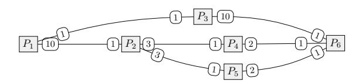
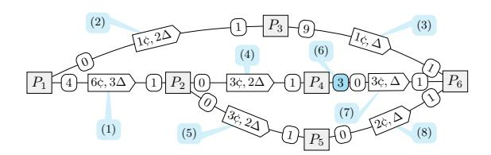
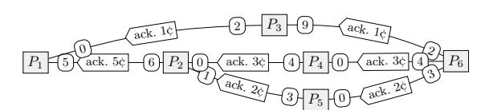
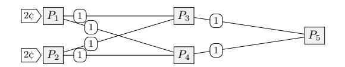
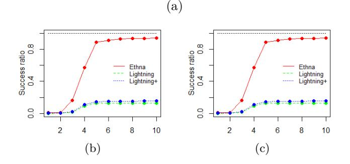
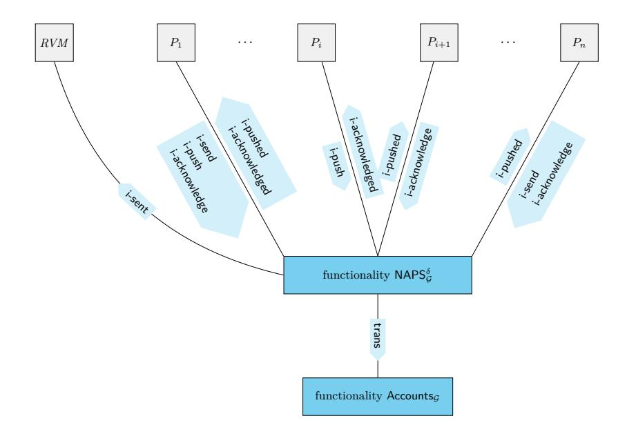
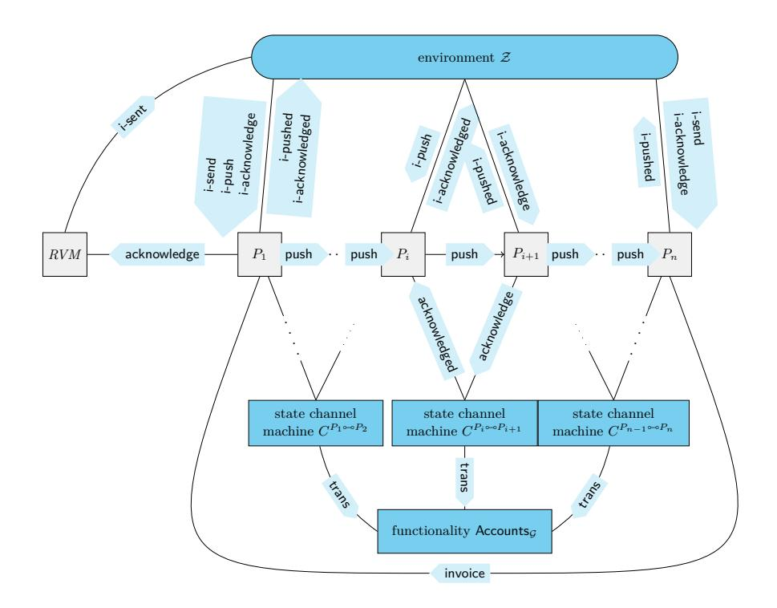

# **Non-Atomic Payment Splitting in Channel Networks**

**Stefan Dziembowski** [!](mailto:stefan.dziembowski@crypto.edu.pl)

University of Warsaw and IDEAS NCBR

**Paweł Kędzior** [!](mailto:Pawel.Kedzior@crypto.edu.pl)

University of Warsaw

## **Abstract**

*Off-chain channel networks* are one of the most promising technologies for dealing with blockchain scalability and delayed finality issues. Parties connected within such networks can send coins to each other without interacting with the blockchain. Moreover, these payments can be "routed" over the network. Thanks to this, even the parties that do not have a channel in common can perform payments between each other with the help of intermediaries.

In this paper, we introduce a new notion that we call *Non-Atomic Payment Splitting (NAPS) protocols* that allow the intermediaries in the network to split the payments recursively into several subpayments in such a way that the payment can be successful "partially" (i.e. not all the requested amount may be transferred). This contrasts with the existing splitting techniques that are "atomic" in that they did not allow such partial payments (we compare the "atomic" and "non-atomic" approaches in the paper). We define NAPS formally and then present a protocol that we call "EthNA", that satisfies this definition. EthNA is based on very simple and efficient cryptographic tools; in particular, it does not use expensive cryptographic primitives. We implement a simple variant of EthNA in Solidity and provide some benchmarks. We also report on some experiments with routing using EthNA.

**2012 ACM Subject Classification** Security and privacy → Systems security

**Keywords and phrases** Blockchain, Payment Channels Networks

**Related Version** This is an extended version of a paper that appeared at the 5th Conference on Advances in Financial Technologies (AFT 2023).

**Funding** This result is part of a project that received funding from the European Research Council (ERC) under the European Union's Horizon 2020 innovation program (grant PROCONTRA-885666). It was also party financed by the Foundation for Polish Science under grant TEAM/2016-1/4 founded within the UE 2014–2020 Smart Growth Operational Program and by the *Ethereum Foundation* grant FY18-0023.

## **1 Introduction**

Blockchain technology allows a large group of parties to reach a consensus about the contents of an (immutable) ledger, typically containing a list of transactions. In blockchain's initial applications, these transactions described transfers of *coins* between the parties. One of the very promising extensions of the original Bitcoin ledger is blockchains that allow to register and execute the so-called *smart contracts* (or simply "contracts"), i.e., formal agreements between the parties, written down in a programming language and having financial consequences (for more on this topic see, e.g., [\[13,](#page-26-0) [7\]](#page-26-1)). Probably the best-known example of such a system is *Ethereum*. Several blockchain-based systems' main limitations are delayed finality, lack of scalability, and non-trivial transaction fees. *Off-chain channels* [\[19,](#page-27-0) [4\]](#page-25-0) are a powerful approach for dealing with these issues. The simplest examples of this technology are the so-called "*payment* channels". Informally, such a channel between Alice and Bob is an object in which both parties have some coins that they can freely transfer without interacting with the blockchain ("off-chain"). We explain this in Sec. 1.1 below. Readers familiar with this topic can go quickly over it, just paying attention to some terminology and notation that we use

## <span id="page-1-0"></span>1.1 Background

Assume that the maximal blockchain reaction time is  $\Delta$ . We model amounts of coins as non-negative integers and write " $n \dot{\varsigma}$ " to denote n coins. A payment channel is opened when Alice and Bob deploy a smart contract on the ledger and deposit some number of coins (say: x, and y, respectively) into it. The initial balance of this channel is: " $x\dot{\varsigma}$  in Alice's account,  $y\dot{\varsigma}$  in Bob's account" (or [Alice  $\mapsto x$ , Bob  $\mapsto y$ ] for short). This balance can be updated (to some new balance [Alice  $\mapsto x'$ , Bob  $\mapsto y'$ ], such that x' + y' = x + y) by exchanging messages between the parties. The corresponding smart contract guarantees that each party can at any time close the channel and get the money corresponding to her latest balance. Only the opening and closing operations require interaction with the blockchain. Since updates do not require blockchain participation, each update is immediate (the network speed determines its time) and at essentially no cost.

Now, suppose we are given a set of parties  $P_1, \ldots, P_n$  and channels between some of them. These channels naturally form an (undirected) channel graph, which is a tuple  $\mathcal{G} = (\mathcal{P}, \mathcal{E}, \Gamma)$ with the set of vertices  $\mathcal{P}$  equal to  $\{P_1,\ldots,P_n\}$  and set  $\mathcal{E}$  of edges being a family of twoelement subsets of  $\mathcal{P}$ . The elements of  $\mathcal{P}$  will be typically denoted as " $P_i \hookrightarrow P_i$ " (instead of  $\{P_i, P_i\}$ ). Every  $P_i \leadsto P_i$  represents a channel between  $P_i$  and  $P_i$ , and the cash function  $\Gamma$ determines the number of coins available for the parties in every channel. More precisely, every  $\Gamma(P_i \leadsto P_j)$  is a function f of a type  $f: \{P_i, P_j\} \to \mathbb{Z}_{\geq 0}$ . We will often write  $\Gamma^{P_i \leadsto P_j}$ to denote this function. The value  $\Gamma^{P_i \leadsto P_j}(P)$  denotes the amount of coins that P has in her account in channel  $P_i \leadsto P_j$ . A path (in  $\mathcal{G}$ ) is a sequence  $P_{i_1} \to \cdots \to P_{i_t}$  such that for every j we have  $P_{i_j} \hookrightarrow P_{i_{j+1}} \in \mathcal{E}$ . In the formal part of the paper (see Sec. 3.1), we will also include "nonces" in the paths, but in this informal description, we ignore them. In this paper, for the sake of simplicity, we assume that (a) the channel system is deployed with some initial value of  $\Gamma$ , which evolves over time, (b) once a channel system is established, no new channels are created, and no channels are closed (i.e.,  $\mathcal{E}$  remains fixed), and (c) no coins are added to the existing channels, i.e., the total amount of coins available in every channel  $e = P_i \multimap P_j$  never exceeds the total amount available in it initially.

Channel graphs can serve for secure payment sending. Let us recall how this works in the most popular payment channel networks, such as Lightning or Raiden. Our description is very high-level (for the details, see, e.g., [19]). Consider the following example: we have three parties:  $P_1, P_2$ , and  $P_3$  and two channels:  $P_1 \hookrightarrow P_2$  and  $P_2 \hookrightarrow P_3$  between them. Now, suppose the sender  $P_1$  wants to send  $v \not c$  to the receiver  $P_3$  over the path  $P_1 \rightarrow P_2 \rightarrow P_3$ , with  $P_2$  being an intermediary that routes these coins. This is done as follows. First, party  $P_1$  asks  $P_2$  to forward  $v \in \mathbb{C}$  in the direction of  $P_3$  (we call such a request pushing coins from  $P_1$  to  $P_2$ ). The receipt from  $P_3$  confirming that she received these coins has to be presented by  $P_2$  within  $2\Delta$  (denote this receipt with  $\rho$ ). If  $P_2$  manages to do it by this deadline, she gets these coins in her account in the channel  $P_1 \hookrightarrow P_2$ . To guarantee this,  $P_1$  initially blocks these coins in the channel  $P_1 \hookrightarrow P_2$ . These coins can be claimed back by  $P_1$  if time  $2\Delta$  have passed, and  $P_2$  did not claim them. In a similar way,  $P_2$  pushes these coins to  $P_3$ , i.e., she offers  $P_3$  to claim (by providing proof  $\rho$  within  $\Delta$  time)  $v \not c$  in the channel  $P_3 \leadsto P_4$ . Now suppose that party  $P_3$  claims her  $v \not\subset$  in channel  $P_2 \hookrightarrow P_3$ . This can only be done by providing a receipt  $\rho$  confirming that she received these coins. We call this process acknowledging payment. Party  $P_2$  can now claim her coins in channel  $P_1 \hookrightarrow P_2$  by submitting an acknowledgment

containing the receipt *ρ*. In the above example, the number of coins that can be pushed via a channel *P<sup>i</sup> Pi*+1 is upper-bounded by the number of coins that *P<sup>i</sup>* has in this channel. Therefore the maximal amount of coins that can be pushed over path *<sup>P</sup>*<sup>1</sup> \_ *<sup>P</sup>*<sup>2</sup> \_ *<sup>P</sup>*<sup>3</sup> is equal to the minimum of these values. We will call this value the *capacity* of a given path.

On the technical level, in the Lightning network, the receipt *ρ* is constructed using so-called *hash-locked transactions* and "smart contracts" that guarantee that nobody loses money. This is possible thanks to how the *n*∆ deadlines in the channels *P*<sup>1</sup> *P*<sup>2</sup> and *P*<sup>2</sup> *P*<sup>3</sup> are chosen. An exciting feature of this protocol is that receipt *ρ* serves not only for internal purposes of the routing algorithm but can also be viewed as the output of the protocol, which can be used by *P*<sup>1</sup> as a receipt that she transferred some coins to *P*4. In other words: *P*<sup>1</sup> can use *ρ* to resolve disputes with *P*4, either in some smart contract (deployed earlier and using the given PCN for payments) or outside the blockchain. The notion of payment channels can be generalized to "*state* channels". Informally, such channels can serve not only for payments between the parties but also for executing contracts within them. For more on this, see, e.g., [\[7,](#page-26-1) [16,](#page-26-2) [3\]](#page-25-1).

## <span id="page-2-0"></span>**1.2 Our contribution and related work**

One of the main problems with the existing PCNs is that sending a payment between two parties requires a path from the sender to the receiver with sufficient capacity. This problem is amplified by the fact that the capacity of potential paths can change dynamically as several payments are executed in parallel. Although usually, the payments are swift, in the worst case, they can be significantly delayed since each "hop" in the network can take as long as the pessimistic blockchain reaction time. Therefore it is hard to predict a given path's capacity even in the very near future. This is especially a problem if the capacity of a given channel is close to being completely exhausted (i.e. it is close to zero because of several ongoing payments). A natural solution for solving this problem is to split the payments into several subpayments. This was described in several recent papers (see, e.g., [\[17,](#page-27-1) [18,](#page-27-2) [21,](#page-27-3) [8\]](#page-26-3)). However, up to our knowledge, all these papers considered so-called "*atomic* payment splitting", meaning that either all the subpayments got through or none of them. In this paper, we prove a new, alternative technique that we call "*non*-atomic payment splitting" that does not have this feature and hence is more flexible. (We compare atomic and non-atomic splitting in Sec. [2.1.2.](#page-7-0)) More concretely, our contribution can be summarized as follows.

**NAPS definition.** We introduce the concept of *non-atomic payment splitting* by defining formally a notion of *Non-Atomic Payment Splitting (NAPS)* protocols. In our definition, we require that splitting is done ad-hoc by the intermediaries, possibly in reaction to dynamically changing the capacity of the paths or fees. Perhaps the easiest way to describe NAPS is to look at payment networks as tools for outsourcing payment delivery. For example, in the scenario from Section [1.1](#page-1-0) party *<sup>P</sup>*<sup>1</sup> outsources to *<sup>P</sup>*<sup>2</sup> the task of delivering *<sup>v</sup>*¢ to *<sup>P</sup>*4, and gives *P*<sup>2</sup> time 2∆ to complete it (then *P*<sup>2</sup> outsources this task to *P*<sup>3</sup> with a more restrictive deadline). The sender might not be interested in *how* this money is transferred, and the only thing that matters to her is that it is indeed delivered to the receiver and that she gets the receipt. In particular, the sender may not care if the money gets split on the way to the receiver, i.e., if the coins that he sends are divided into smaller amounts that are transferred independently over different paths. In many cases, the sender may also be ok with not all money being transferred at once. NAPS protocol permits such recursive non-atomic payment splitting into "subpayments" and partial transfers of coins. This splitting can be done in

### **4 Non-Atomic Payment Splitting in Channel Networks**

an ad-hoc way. Moreover, the users can try to route the same payment over the same path multiple times (hoping that some more capacity becomes available in the meantime). We present a UC-like definition of NAPS. An additional advantage of our contribution is that our definition can be easily adapted to cover the *atomic* payment splitting protocols [\[18,](#page-27-2) [1,](#page-25-2) [20,](#page-27-4) [8\]](#page-26-3).

**EthNA construction.** We construct a protocol that we call EthNA that satisfies the NAPS definition. We call our protocol EthNA, in reference to Etna, one of the highest active volcanos in Europe. This is because the coin transfers in EthNA resemble a lava flood (with large streams recursively bifurcating into small substreams). The letter "h" is added so that the prefix "Eth-" is reminiscent of ETH, the symbol of Ether (the currency used in Ethereum), and "NA" stands for "Non-Atomic".

In EthNA the "subreceipts" for subpayments are aggregated by the intermediaries into one short subreceipt so that their size does not grow with the number of aggregated subreceipts. This is done efficiently, particularly by avoiding advanced and expensive techniques such as noninteractive zero knowledge or homomorphic signature schemes and hash functions. Instead, we rely on a technique called "fraud-proofs" in which an honest behavior of parties is enforced by a punishing mechanism (this method was used before, e.g., in [\[22,](#page-27-5) [7\]](#page-26-1)). We stress that the amount of data that is passed between two consecutive parties on the path does *not* depend on the number of subpayments in which the payment is later divided. The same applies to the data these two parties send to the blockchain if they conflict. We summarize the complexity of EthNA in Sec. [3.3.](#page-21-0)

**Security analysis and implementation.** We provide a formal security analysis of EthNA. More precisely, we prove that EthNA satisfies the NAPS definition. We also analyze EthNA's complexity. We also implement EthNA contracts in Solidity (the standard language for programming the smart contracts in Ethereum), and we provide some routing experiments. We describe this implementation and provide some benchmarks. We stress, however, that routing algorithms are *not* the main focus of this work and further research on designing algorithms that exploit the non-atomicity of payment splitting.

**Possible applications of NAPS.** As mentioned above, one obvious application of NAPS is to help efficiently send one big payment by dividing it into several ad-hoc installments: if it is impossible to route the total amount *u*, then the client can accept the fact that *v < u* coins were transferred (due to network capacity limitations), and try to transfer the remaining *u* − *v* coins later (in another installment). The same applies to other situations, e.g., when the user wants to exchange coins for another currency. Ideally, he would like to exchange the entire amount *u*, but exchanging *v < u* is better than nothing. A related scenario is making a partial "bank deposit" when the user wants to deposit as much money as possible but no more than *u*.

Moreover, in many cases, the goods the seller delivers in exchange for the payment can be divided into tiny units and sent to the buyer depending on how many coins have been transferred. One example is battery charging, where charging, say 1*/*2 of the battery is much better than having the battery dead. This applies both to mobile phones and to IoT devices that can trade energy with each other. Let us also mention applications like file sharing, where the client typically connects to several servers and tries to download as much data as possible from each. NAPS can be an attractive way to perform payments in this scenario. Note also that NAPS can be combined with other means of payment. If a user manages to send only *u < v* coins via NAPS, then she can decide to send the rest (*v* − *u*) in some more

expensive way (this makes sense, especially in systems where the fee depends on the amount being transferred, e.g., in the credit card payments).

**Related work.** Some of the related work was mentioned already before. Off-chain channels are a topic of intensive research, and there is no space here to describe all recent exciting developments [\[9,](#page-26-4) [16,](#page-26-2) [14,](#page-26-5) [7,](#page-26-1) [5,](#page-25-3) [6,](#page-26-6) [11,](#page-26-7) [15,](#page-26-8) [3\]](#page-25-1) in this area. The reader can also consult SoK papers on off-chain techniques (e.g. [\[10\]](#page-26-9)). Partial coin transfers were considered in [\[18\]](#page-27-2), but with no aggregation techniques and ad-hoc splitting. Atomic payment splitting has been considered in [\[18,](#page-27-2) [1,](#page-25-2) [20,](#page-27-4) [8\]](#page-26-3). All of these papers focus on routing techniques, which is not the main topic of this paper.

**Organization and notation.** Sec. [2](#page-4-0) contains an informal description of our ideas. Then, in Sec. [3,](#page-11-0) we provide the formal NAPS definition and the detailed description of EthNA and its security properties. An overview of our implementation and simulations is presented in Sec. [3.3.](#page-21-0) When we say that a message is "signed by some party", we mean that it is signed using some fixed signature scheme that is existentially unforgeable under a chosen-message attack. Natural numbers are denoted with N. We will also use the notion of *nonces*. Their set is denoted with N . We assume that N = N. We use some standard notations for functions, string operations, and trees. By [*a<sup>i</sup>* 7→ *x*1*, . . . , a<sup>m</sup>* 7→ *xm*] we mean a function *f* : {*a<sup>i</sup> , . . . , am*} → {*x*1*, . . . , xm*} such that for every *i* we have *f*(*ai*) := *x<sup>i</sup>* . Let *A* be some finite alphabet. Strings *δ* ∈ *A*<sup>∗</sup> are frequently denoted using angle brackets: *δ* = ⟨*δ*1*, . . . , δm*⟩. Let *δ* be a string ⟨*δ*1*, . . . , δn*⟩. For *i* = 1*, . . . , n* let *δ*[*i*] denote *δ<sup>i</sup>* . Let *ε* denote an empty string, and "||" denote the concatenation of strings. We overload this symbol, and write *δ*||*a* and *a*||*δ* to denote *δ*||⟨*a*⟩ and ⟨*a*⟩||*δ*, respectively (for *δ* ∈ *A*<sup>∗</sup> and *a* ∈ *A*). For *k* ≤ *n* let *δ*|*<sup>k</sup>* denote *δ*'s prefix of length *k*. A set of prefixes of *δ* is denoted prefix(*δ*) (note that it includes *ε*).

We define trees as prefix-closed sets of words over some alphabet *A*. Formally, a *tree* is a subset *T* of *A*<sup>∗</sup> such that for every *δ* ∈ *T* we have that any prefix of *δ* is also in *T*. Any element of *T* is called a *node* of this tree. For two nodes *δ, β* ∈ *T* such that *β* = *δ*||*a* (for some *a*) we say that *δ* is the *parent* of *β*, and *β* is a *child* of *δ*. A *labeled tree over A* is a pair (*T,*L), where *T* is a tree over *A*, and L is a function from *T* to some set of *labels*. For *δ* ∈ *T* we say that L(*δ*) is the *label of δ*.

## <span id="page-4-0"></span>**2 Informal description**

Below, in Sec. [2.1](#page-4-1) we provide an overview of NAPS definition, and in Sec. [2.2](#page-8-0) we informally describe EthNA.

## <span id="page-4-1"></span>**2.1 Overview of the NAPS definition**

Let us now explain the NAPS protocol features informally (for a formal definition, see Sec. [3.1\)](#page-12-0). Throughout this paper, we use the following convention: our protocols are run by a set of *parties* denoted P = {*P*1*, . . . , Pn*}, where *P*<sup>1</sup> be the *sender*, *P*2*, . . . , Pn*−<sup>1</sup> be the *intermediaries*, and *P<sup>n</sup>* is the *receiver*. A message *m* signed by a party *P<sup>i</sup>* will be denoted \**m*+*<sup>P</sup><sup>i</sup>* . Let *v* be the number of coins that *P*<sup>1</sup> wants to send to *Pn*, and let *t* be the maximal time until the transfer of coins should be completed. Since, in general, *P*<sup>1</sup> can perform multiple payments to *Pn*, we assume that each payment comes with a nonce *µ* ∈ N that can be later used to identify this payment. Sometimes we will simply call it "payment *µ*". For simplicity, we start with an informal description of how NAPS protocols operate when all parties are honest. The security properties (taking into account the malicious behavior of the parties) are described informally in Sec. 2.1.1, and formally defined in Sec. 3.1. proceeding with the description of ETHNA the reader may look at the example in Fig. 1.

To describe the protocol more generally, let us start by presenting it from the point of view of the sender  $P_1$ . Let  $P_{i_1}, \ldots, P_{i_t}$  be the neighbors of  $P_1$ , i.e., parties with which  $P_1$  has channels. Suppose the balance of each channel  $P_1 \hookrightarrow P_{i_j}$  is  $[P_1 \mapsto x_i, P_{i_j} \mapsto y_j]$  (meaning that  $P_1$  and  $P_{i_j}$  have  $x_i$  and  $y_j$  coins in their respective accounts in this channel). Now,  $P_1$  chooses to push some amount  $v_i$  of coins to  $P_n$  via some  $P_{i_i}$ , and set up a deadline  $t_j$  for this (we will also call  $v_j$  a subpayment of payment  $\mu$ ). This results in: (a) balance  $[P_1 \mapsto x_i, P_{i_j} \mapsto y_j]$  changing to  $[P_1 \mapsto x_i - v_j, P_{i_j} \mapsto y_j]$ , (b) the number of coins that  $P_1$ still wants to transfer to  $P_n$  is decreased as follows:  $v := v - v_j$ , and (c)  $P_{i_j}$  holding " $v_j$  coins that she should transfer to  $P_n$  within time  $t_i$ .

It is also ok if  $P_{i_i}$  transfers only some part  $v'_i < v_i$  of this amount (this can happen, e.g., if the paths that lead to  $P_n$  via  $P_j$  do not have sufficient capacity). In this case,  $P_1$  has to be given back the remaining ("non-transferred") amount  $r = v_j - v'_i$ . More precisely, before time  $t_i$  comes, party  $P_{i_i}$  acknowledges the amount  $v'_i$  that she managed to transfer. This results in (1) changing the balance of the channel  $P_1 \leadsto P_{i_i}$  by crediting  $v'_i$  coins to  $P_{i_i}$ 's account in it, and (2) r coins to  $P_1$ 's account. Moreover, (3)  $P_1$  adds back the non-transferred amount r to v, by letting v := v + r. Above (1) corresponds to the fact that  $P_{i_j}$  has to be given the coins that she transferred, and (2) comes from the fact that not all the coins were transferred (if  $P_{i_i}$  managed to transfer all the coins, then, of course, r=0). Finally, (3) is used for  $P_1$ 's "internal bookkeeping" purposes, i.e.,  $P_1$  simply writes down that r coins "were returned" and still need to be transferred. While the party  $P_1$  waits for  $P_{i_j}$  to complete the transfer that it requested, she can also contact some other neighbor  $P_{i_k}$  asking her to transfer some other amount  $v_k$  to  $P_n$ . This is done in the same way as transferring coins via  $P_{i_i}$ .

The intermediaries can repeat this process. Let P be a party that holds some coins that were "pushed" to her by some P' (which originate from  $P_1$  and must be delivered to  $P_n$ ). Now, P can split them further, and moreover, she can decide on her own how this splitting is done depending, e.g., on the current capacity of the possible paths leading to  $P_n$ . The payment splitting can be done arbitrarily, except for the two following restrictions. First, we do not allow "loops" (i.e. paths containing the same party more than once), as it is hard to imagine any application of such a feature. In the basic version of the protocol, we assume that the number of times a given payment subpayment is split by a single party P is bounded by a parameter  $\delta \in \mathbb{N}$ , called *arity* (for example arity on Figs. 1 is at most 2). In Sec. 5.2 we present an improved protocol where  $\delta$  is unbounded (at the cost of a mild increase of the pessimistic number of rounds of interaction). As mentioned, the essential feature of NAPS is the non-atomicity of payments. We discuss it further below.

#### <span id="page-5-0"></span>2.1.1 NAPS security properties

In the description in Sec. 2.1 we assumed that all parties behaved honestly. Like all other PCNs, we require that NAPS protocols work if the parties are malicious. In particular, no honest party P can lose money, even if all the other parties are not following the protocol and are working against P. The corrupt parties can act in a coalition modeled by an adversary A. Formal security definition appears in Sec. 3.1. Let us now informally list the security requirements, which are pretty standard and hold for most PCNs (including Lightning). Below, let u denote the total amount of coins  $P_1$  wants to transfer to  $P_n$  within some payment  $\mu$ .

The first property is called fairness for the sender. To define it, note that as a result of payment  $\mu$  (with timeout t), the total amount of coins that each party P has in the channels

<span id="page-6-0"></span>

(a) The channel graph with the initial coin distribution.



(b) The sender  $P_1$  wants to send 7¢ to the receiver  $P_6$ . She splits these coins into two amounts: 6¢ pushed to  $P_2$  and 1¢ pushed to  $P_3$ . This is indicated with labels (1) and (2), respectively. Then (3) party  $P_3$  simply pushes 1¢ further to  $P_6$ . Party  $P_2$  splits 6¢ into 3¢ + 3¢, and pushes 3¢ to both  $P_4$  (4) and  $P_5$  (5). Path  $P_4 \rightarrow P_6$  initially had capacity 2 only (see Fig. (a) above), but luckily in the meanwhile 1¢ got unlocked (6) for  $P_4$  in channel  $P_4 \leadsto P_6$ , and hence (7) party  $P_4$  pushes all 3¢ to  $P_6$ . Party  $P_5$  pushes only 2¢ to  $P_6$  (8). The channel balances correspond to the situation after the coins are pushed (except of channel  $P_4 \leadsto P_6$  where we also indicated the fact that 1¢ got unlocked (6)). Each party P can also decide on her own about the timeout t of each subpayment she pushes (this timeout is indicated with " $x\Delta$ "). The only restriction is that t has to come at least  $\Delta$  before the time she has to acknowledge that subpayment back. This is because P needs this "safety margin" of  $\Delta$  in case P' is malicious, and the acknowledgment has to be done "via the blockchain".



(c) Party  $P_6$  acknowledges subpayment of 1¢ to  $P_3$ , which, in turn acknowledges it to  $P_1$ . Party  $P_6$  also acknowledges subpayment of 3¢ to  $P_4$  and 2¢ to  $P_5$ , who later acknowledge them to  $P_2$ . Once  $P_2$  receives both acknowledgments, she "aggregates" them into a single acknowledgment (for 5¢) and sends it to  $P_1$ . As a result 5¢ + 1¢ = 6¢ are transferred from  $P_1$  to  $P_6$ . The channel balances correspond to the situation after the coins were acknowledged.

**Figure 1** An example of a NAPS protocol execution. An edge " $P_i$  - x - y -  $p_j$ " denotes the fact that there exists a channel between  $P_i$  and  $P_j$ , and the parties have x and  $y \not c$  in it, respectively.

#### 8 Non-Atomic Payment Splitting in Channel Networks

with other parties typically changes. Let  $net_{\mu}(P)$  denote the number of coins that P gained in all channels. Of course  $net_{\mu}(P)$  can be negative if P lost  $-net_{\mu}(P)$  coins. We require that by the time t an honest  $P_i$  holds a receipt of a form  $\mathsf{Receipt}(\mu, v) := "an amount v of$ coins has been transferred from  $P_1$  to  $P_n$  as a result of payment  $\mu$ ". Moreover, under normal circumstances, i.e. when everybody is honest, v is equal to  $-net_{\mu}(P_1)$  (i.e. the sum of the amounts that  $P_1$  lost in the channels). In case some parties (other than  $P_1$ ) are dishonest, the only thing that they can do is to behave irrationally and let  $v \geq -net_{\mu}(P_1)$ , in which case  $P_1$  holds a receipt for transferring more coins than she actually lost in the channels. A receipt can be later used in another smart contract (e.g., a contract that delivers some digital goods whose amount depends on v). Fairness for the receiver is defined analogously, i.e.: if  $P_1$  holds a receipt  $\mathsf{Receipt}(\mu, v)$  then typically  $v = net(P_n)$ , and if some parties (other than  $P_n$ ) are dishonest, then they can make  $v \leq net_{\mu}(P_n)$ . In other words,  $P_1$  cannot get a receipt for an amount higher than what  $P_n$  actually received in the channels. Finally, we require that the following property called balance neutrality for the intermediaries holds: for every honest  $P \in \{P_2, \dots, P_{n-1}\}$  we have that  $net_{\mu}(P) \geq 0$ . Again: if everybody else is also honest, then we have equality instead of inequality.

## <span id="page-7-0"></span>2.1.2 Atomic vs. non-atomic payment splitting

As already highlighted in Sec. 1.2, the previous protocols on payment splitting always required payments to be atomic, meaning that for a payment to succeed, all the subpayments had to reach the receiver. Technically, this means that to issue a receipt for *any* of the subpayments (this receipt is typically a preimage of a hash function, see, e.g., [8]) all of them need to reach the receiver. This has several disadvantages: (1) the coins remain blocked in every path at least until the last subpayment arrives to the receiver, (2) the success of a given subpayment depends not only on the subsequent intermediaries but also on the other "sibling" paths (this problem was observed in [8] where it is argued that this risk may lead to intermediaries rejecting subpayments that were split before, see Sec. 3.1 of [8]). Finally, atomic payments may result in "deadlock" situations in the network where two competing payments can prevent each other from being executed.

More precisely, consider a channel graph as below (for simplicity, we do not specify the coin amounts on the right-hand sides of the channels, as they are irrelevant to this example).



Now suppose that  $P_1$  and  $P_2$  decide to send 2¢ each to  $P_5$  via  $P_3$  and  $P_4$ . If now  $P_1$  pushes 1¢ to  $P_3$  and at the same time  $P_2$  pushes 1¢ to  $P_4$ , then none of the payments can be completed (since the channels  $P_3 \leadsto P_5$  and  $P_4 \leadsto P_5$  do not have sufficient capacity). On the other hand: if we allow *non*-atomic payments, then each payment will partially succeed (i.e. each sender will send 1¢ to the receiver  $P_5$ ). They may then try to send the remaining amounts after some time when new capacity in these channels is available. This can be generalized to larger graphs and more complicated "deadlocks".

Let us also remark that "atomicity" and even "fine-grained atomicity" can also be obtained in ETHNA by a small protocol modification. We write more about it in Sec. 5.1. Let us also remark that atomic payment splitting, in general, seems to be easier to achieve, which is probably the reason why there has been more focus on them in the literature (with papers

focusing more on other aspects of this problem, such as routing algorithms, e.g. [8]). Finally, let us stress that we do not claim that non-atomicity is superior to atomicity. We think both solutions have advantages and disadvantages, and there exist applications where each is better than the other.

## <span id="page-8-0"></span>2.2 Overview of the EthNA protocol

After presenting the NAPS definition, let us now explain the main ideas behind the ETHNA protocol that realizes it. An essential feature of ETHNA is that it permits "subreceipt aggregation", by which we mean the following. Consider some payment  $\mu$ . Once  $P_n$  receives some subpayment v that reached it via some path  $\pi = P_1 \rightarrow P_{i_1} \rightarrow \cdots P_{i_k} \rightarrow P_n$  she issues a subreceipt for this payment and sends it to  $P_{i_k}$ . Each intermediary that receives more than one subreceipt can aggregate them into one short subreceipt that she sends further in the direction of  $P_1$ . Finally,  $P_1$  also produces one short receipt for the entire payment. This results in small communication complexity, and in particular, the pessimistic gas costs are low (we discuss this in more detail in Sec. 4. One option would be to let the subreceipt be signed using a homomorphic signature scheme and then exploit this homomorphism to aggregate the subreceipts. This paper uses a simpler solution that can be efficiently and easily implemented in the current smart contract platforms.

Very informally speaking, we ask  $P_n$  to perform the "subpayment aggregation herself" (this is done when signing a subreceipt and does not require any further interaction with  $P_n$ ). Then, we let the other parties verify that this aggregation was performed correctly. If any "cheating by  $P_n$ " is detected (i.e. some party discovers that  $P_n$  did not behave honestly), then proof of this fact (called a "fraud-proof") will count as a receipt that a total amount has been transferred to  $P_n$ . From the security point of view, this is ok since an honest  $P_n$  will never cheat (hence, no fraud-proof against him will ever be produced). Thanks to this approach, we avoid entirely using any expensive advanced cryptographic techniques (such as homomorphic signatures or noninteractive proofs). Below we explain the main idea of Ethna by considering the example from Fig. 1. Again, we start by describing how the protocol works when everybody is honest, and then (in Sec. 2.2) we show how the malicious behavior is prevented.

**Invoice sending.** The protocol starts with the receiver  $P_n$  sending to  $P_1$  an "invoice" that specifies (among other things) the identifier  $\mu$  of the payment, and the maximal amount u of coins that  $P_n$  is willing to accept. As we explain below, this invoice may be later used together with fraud-proofs to produce proof that all u coins were transferred to  $P_n$  (if she turns out to be malicious).

**Pushing subpayments.** Pushing subpayments is done by sending messages containing information about the path that the subpayment "traveled" so far (together with the number of coins to be pushed and timeout information) and simultaneously blocking coins in the underlying channels. The messages sent between  $P_1, P_3$  and  $P_6$  in Fig. 1 (a)) are presented in the picture below.

$$\begin{array}{|c|c|c|c|c|c|c|c|c|c|c|c|c|c|c|c|c|c|c$$

Whenever a message (push,  $\pi$ , v, t) is sent from P to P', the party P blocks v coins in channel  $P \hookrightarrow P'$  for time t. These coins are claimed by P' if she provides a corresponding subreceipt within time t. Otherwise, they are claimed back by P.

Acknowledging subpayments by the receiver. The receiver  $P_n$  acknowledges the subpayments by replying with a signed subreceipt and claiming the coins blocked in the corresponding channels. At the same time, the receiver  $P_n$  constructs a labeled graph called the "payment tree" that is stored locally by  $P_n$  and grows with each acknowledged subpayment.

Let us now explain how the payment tree is constructed. Consider again Fig. 1 (c). As explained before, the order of message acknowledgment can be arbitrary. In what follows, we assume that the receiver  $P_6$  first acknowledges the subpayment that came along the path  $P_1 \rightarrow P_3 \rightarrow P_6$ . This means that  $P_6$  "accepts" that 1¢ will be transferred to her from  $P_1$  via path  $P_1 \rightarrow P_3 \rightarrow P_6$ , or, in other words: 1¢ will be "passed" through each of  $P_1, P_3$ , and  $P_6$  (note that we included here the sender  $P_1$  and the receiver  $P_6$ ). This can be depicted as the following graph that consists of a single path that we denote  $\alpha$ :

$$\begin{array}{c|c} \hline (1c)P_1 & \hline & 1c)P_3 & \hline & 1c)P_6 & =: \alpha \end{array} \tag{1}$$

<span id="page-9-0"></span>To acknowledge the subpayment that was pushed along the path  $P_1 \rightarrow P_3 \rightarrow P_6$  party  $P_6$  signs  $\alpha$  and sends it to  $P_3$ . Such signed information will be called a "subreceipt" and denoted  $\{\alpha\}_{P_n}$ . By providing this subreceipt, party  $P_6$  also gets 1¢ in the  $P_3 \leadsto P_6$  (these coins were blocked by  $P_3$  in this channel when the "push" message was sent). The graph from Eq. (1) is the first version of the payment tree that, as mentioned above, the receiver  $P_6$  stores locally.

<span id="page-9-1"></span>Now, suppose the next subpayment that  $P_6$  wants to acknowledge is the one that came along the path  $P_1 \rightarrow P_2 \rightarrow P_4 \rightarrow P_6$ , i.e.,  $P_6$  accepts that 3¢ will be transferred to her from  $P_1$  via path  $P_1 \rightarrow P_2 \rightarrow P_4 \rightarrow P_6$ . The receiver  $P_6$  now modifies the payment tree as follows:

$$\begin{array}{c|ccccccccccccccccccccccccccccccccccc$$

Analogously to what we saw before, this tree represents the total amount of coins that will be "passed" through different parties from  $P_1$  to  $P_6$  after acknowledging this subpayment is completed. In Eq. (2) the thick line (denoted  $\beta$ ) corresponds to the "new" path, and the thin one is taken from Eq. (1), except that  $P_1$  is labeled with "4¢". This is because the total amount of coins that will be passed through  $P_1$  is equal to the sum of the coins passed before (1¢) and now (3¢). Party  $P_6$  now signs path  $\beta$  to create a subreceipt that she sends to  $P_4$  to claim 3¢ in the channel  $P_4 \hookrightarrow P_6$ .

Finally,  $P_6$  acknowledges the subpayment along the path  $P_1 \rightarrow P_2 \rightarrow P_5 \rightarrow P_6$ . This is done similarly to what we did before. The resulting tree is now as follows.

<span id="page-9-2"></span>
$$\begin{array}{c|ccccccccccccccccccccccccccccccccccc$$

Note that we performed "summing" in two places on Eq. (3): at the node  $P_1$  (where we computed  $6\dot{\varphi}$  as  $4\dot{\varphi} + 2\dot{\varphi}$ ) and an  $P_2$  (where  $5\dot{\varphi} = 2\dot{\varphi} + 3\dot{\varphi}$ ). Labeled path  $\gamma$  is now signed by  $P_6$  and sent to  $P_5$  as subreceipt in order to claim  $2\dot{\varphi}$ .

The payment trees whose examples we saw in Eqs. (1)–(3) are defined formally (in a slightly more general version) in Sec. 3.2. Their main feature is that the value of coins in the label of each node P is equal to the sum of the labels of the children of P. A recursive application of this observation implies that the coin value of a label of P is equal to the sum of labels in the leaves of the subtree rooted in P. In particular: the label on the root of the entire tree equals the sum of the values in the leaves.

Acknowledging subpayments by the intermediaries. We now show how the intermediaries  $P_2, \ldots, P_{n-1}$  acknowledge the subpayments. On a high level, this is done by propagating the subreceipts (issued by  $P_n$ ) from right to left. Each party may receive several such subreceipts (if she decides to split a given subpayment). Let  $\mathcal{W}$  be the set of such subreceipts (such sets will be called "payment reports", see Sec. 3.2 for their formal definition). When a party P wants to acknowledge the subpayment, she chooses (in a way that we explain below) one of the subreceipts  $\zeta$  from her set  $\mathcal{W}$ . She then forwards it back in the left direction to the party P' that pushed the given subpayment to her. As a result P gets  $v \not c$  in the channel  $P' \leadsto P$ . To determine the value of  $v \not c$  the following rule is used: it is defined as the label of P on the path  $\zeta$ . Given this, the rule for choosing  $\zeta \in \mathcal{W}$  is pretty natural: P simply chooses such the  $\zeta$  that maximizes v. Such  $\zeta$  will be called a "leader" of  $\mathcal{W}$  (at node P). See Sec. 3.2 for the formal definition of this notion. To illustrate it, let us look again at our example from Fig. 1.

First, observe that  $P_3$  holds only one subreceipt (i.e., the signed path  $\alpha$ ). She simply forwards it to  $P_1$  and receives 1¢ in the channel  $P_1 \multimap P_3$ . Note that this is exactly equal to the value that she "lost" in the channel  $P_3 \multimap P_6$ , and hence the balance neutrality property holds. The situation is a bit more complicated for  $P_2$  since she holds two paths signed by the receiver:  $\beta$  (defined on Eq. (2)) and  $\gamma$  (from Eq. (3)). By applying the rule described above,  $P_2$  chooses the leader  $\zeta$  at  $P_2$  to be equal to  $\gamma$  (since 5¢ > 3¢). This is depicted below (the shaded area indicates the labels that are compared).

<span id="page-10-1"></span>
$$\beta = 4cP_1 3cP_2 3cP_4 3cP_6$$

$$\gamma = 6cP_1 5cP_2 2cP_5 2cP_6$$
(4)

What remains is to argue about balance neutrality for  $P_2$ , i.e., that number of coins received by  $P_2$  in the channel  $P_1 \multimap P_2$  is equal to the sum of coins that she "lost on the right-hand side". In this particular example, it can be easily verified just by looking at Eq. (4) (5¢ are "gained", and 2¢ + 3¢ are "lost"). In the general case, the formal proof is based on the property that the value of coins in the label of each node P in a payment tree is equal to the sum of the labels of the children of P. See Sec. 3.2 for the details.

Final receipt produced by  $P_1$ . Once all subpayments are completed,  $P_1$  decides to conclude the procedure and obtain the final receipt for the entire payment (see Sec. 2.1.1). Again,  $P_1$  holds a "payment report"  $\mathcal{W}$ , i.e. a set of paths signed by  $P_6$ . In the case of our example, these paths are  $\alpha$  (sent to  $P_1$  by  $P_3$ ) and  $\gamma$  (sent by  $P_2$ ). Party  $P_1$  chooses her "receipt" similarly as the intermediaries choose which subreceipt to forward. More precisely, let  $\zeta$  be the path that is the leader of  $\mathcal{W}$  at node  $P_1$ . This path becomes the final receipt. The amount of transferred coins equals the label of  $P_1$  in  $\zeta$ . In our case, the leader  $\zeta$  is clearly  $\gamma$  (since its label at P is "6 $\xi$ ", while the label of  $\gamma$  at P is "1 $\xi$ ", cf. Eqs (1) and (3)). Hence,  $\gamma$  becomes the final receipt for the payment of 6 coins.

"Fairness for the sender" follows the same argument as "balance neutrality for the intermediaries". For "fairness for the receiver," observe that  $\zeta$  is signed by the receiver and is taken from the payment tree (created and maintained by the receiver). To finish the argument, recall that: (a) as observed before, the label in the root of such a tree is always equal to the sum of the labels in its leaves, and (b) this sum is exactly equal to the total amount of coins that the receiver received from its neighbors during this payment procedure. For the details see Lemma 2.

<span id="page-10-0"></span>**Dealing with malicious behavior.** The primary type of malicious behavior that we have to deal with is cheating by the receiver  $P_n$ , whose goal could be to get more coins than appears

on the final receipt held by the sender  $P_1$ . This could potentially be done at the cost of  $P_1$  or some of the intermediaries. So far, we have not described how to guarantee that  $P_n$  produces the subreceipts correctly. As already highlighted, our trick is to let a malicious  $P_n$  arbitrarily produce the subreceipts and later let other parties verify  $P_n$ 's operation. This is based on the idea of fraud-proofs: if an intermediary P finds proof that  $P_n$  is cheating, she can automatically claim all coins that were pushed to her by forwarding this proof "to the left". In this way, the cheating proof reaches the sender  $P_1$ , who can now use it as the receipt for transferring the total amount that was requested (recall that  $P_1$  holds an "invoice" from  $P_n$ ). Suppose, e.g., that in our scenario  $P_6$  cheats by sending to  $P_5$ , instead of  $\gamma$  (see Eq. (3)), the following subreceipt:

$$\widehat{\gamma} := \underbrace{5 \Diamond P_1} \underbrace{4 \Diamond P_2} \underbrace{2 \Diamond P_5} \underbrace{2 \Diamond P_6}$$

$$(5)$$

The receiver does it to make  $P_1$  hold a receipt for 5¢, while in fact receiving 6¢. Party  $P_5$  has no way to discover this fraud attempt (since from her local perspective everything looks ok), so 2¢ get transferred to  $P_6$  in the channel  $P_5 \leadsto P_6$ . Party  $P_5$  forwards  $\widehat{\gamma}$  to  $P_2$  and gets 2¢ in the channel  $P_2 \leadsto P_5$  (hence the "balance neutrality" property for her holds). Now look at this situation from the point of view of  $P_2$ . In addition to  $\widehat{\gamma}$  she got one more subreceipt, namely  $\beta$  (see, e.g., Eq. (4)). Party  $P_2$  preforms a "consistency check" by combining  $\widehat{\gamma}$  and  $\beta$ . This is done by trying to locally reconstruct the part of the payment tree that concerns  $P_2$ . This is done as follows. First observe that the value on the label of  $P_1$  in  $\beta$  is 4¢, which is smaller than the label of  $P_1$  in  $\widehat{\gamma}$  (which is equal to 5¢). This means that  $\beta$  had to be signed by  $P_6$  before she signed  $\widehat{\gamma}$ . Hence  $P_2$  first writes down  $\beta$ , and then on top of it she writes  $\widehat{\gamma}$  (possibly overwriting some values). Normally (i.e. when  $P_6$  is honest), this should result in a subtree of the tree from Eq. (3). However, since  $P_6$  was cheating the resulting graph is different. Namely,  $P_2$  reconstructs the following:

$$\begin{array}{c|ccccccccccccccccccccccccccccccccccc$$

<span id="page-11-1"></span>It is now obvious that  $P_6$  is cheating since the labels on the children of  $P_2$  sum up to  $5\dot{\varsigma}$ , which is larger than  $4\dot{\varsigma}$  (the label of  $P_2$ ). This "inconsistency" is marked as a shaded region on Eq. (6). Hence the set  $\{\beta, \hat{\gamma}\}$  is a fraud-proof against  $P_6$ . As described above, once we get such proof, we are "done": each intermediary can claim all money that was blocked for her, and the receiver can use it as a receipt that *all* the coins were transferred. Let us stress that, of course, none of the parties assumes a priori that  $P_6$  is honest, and hence the "consistency check" is always performed.

## <span id="page-11-0"></span>3 Technical details

We now proceed to the formal exposition of the ideas already presented informally in Sec. 2. We start with defining a generalization of the term "paths" that were informally introduced before. As already explained, to be as general as possible, the NAPS definition permits that several subpayment of the same payment  $\mu$  are routed via the same party independently. Consider, e.g., the following scenario:  $2\xi$  is sent from  $P_1$  to  $P_4$  via a path  $P_1 \rightarrow P_2 \rightarrow P_3 \rightarrow P_4$ . This amount is first split by  $P_2$  as:  $1\xi + 1\xi$ , and each  $1\xi$  coin is pushed to  $P_3$ , who, in turn, pushes each of them further to  $P_4$ . Obviously, both  $1\xi$  coins traveled along  $P_1 \rightarrow P_2 \rightarrow P_3 \rightarrow P_4$ , but nevertheless, they have to be considered as separate subpayments. In order to uniquely identify each of them, we augment the definition

of "path" to include also "nonces" that will make them unique (in the abovementioned situations). To distinguish such paths from those we used in the informal part we denoted them as strings of pairs (party,nonce). A nonce is added in every hop. For example, in the above scenario: the (augmented) paths are as follows  $\langle (P_1, \mu_1), (P_2, \mu_2), (P_3, \mu_3), (P_4, \mu_4) \rangle$  and  $\langle (P_1, \mu_1), (P_2, \mu_2), (P_3, \mu_3'), (P_4, \mu_4') \rangle$  (where for both i = 3, 4 we have that  $\mu_i$  and  $\mu_i'$  are distinct). Moreover, we assume that  $\mu_1$  ("contributed" by the sender  $P_1$ ) is equal to the nonce that identifies the entire payment.

Formally, for a channel graph  $\mathcal{G} = (\mathcal{P}, E, \Gamma)$  a string  $\pi = \langle (P_{i_1}, \mu_1), \dots, (P_{i_{|\pi|}}, \mu_{|\pi|}) \rangle$  is a path over  $\mathcal{G}$  (for payment  $\mu$ ) if each  $\mu_i \in \mathcal{N}$  is a nonce, each  $P_{i_j} \leadsto P_{i_{j+1}}$  is an edge in  $\mathcal{G}$ , and  $P_{i_1} = P_1$ . We also assume that a path corresponding to a payment  $\mu$  always starts with  $(P_1, \mu)$ . We say that P appears on  $\pi$  (at position j) if we have that  $P = P_{i_j}$ . We assume that every P appears at most once on  $\pi$ , or, in other words: the paths have no loops. In the sequel, every party or functionality is modeled as poly-time interactive Turing machine. Throughout this section, P denotes a party, u, v and w are non-negative integers denoting the amounts of coins,  $\mu$  is a nonce,  $\pi$  is a path over  $\mathcal{G}$ , and t is time. For reference, the notation used in this section is summarized in Fig. 11 in the appendix.

## <span id="page-12-0"></span>3.1 NAPS formal security definition

The protocol is parameterized with a security parameter  $1^{\kappa}$  known to all machines. The protocol is executed by parties  $P_1, \ldots, P_n$ , who know each other's public keys (this is easy to achieve in real life using existing underlying blockchain infrastructure). The protocol also comes with an incorruptible party RVM called receipt verification machine. The role of this machine is to verify a receipt issued by  $P_n$  for payment  $\mu$ . If this machine outputs (i-sent,  $\mu, w$ ) to  $\mathcal{Z}$  then we consider payment  $\mu$  to be completed with the total amount of w coins transferred from  $P_1$  to  $P_n$ . It models that the receipts produced by  $P_1$  need to be publicly verifiable, so, e.g., they can be used later in another smart contract, see Sec. 2.1.1. Following the tradition in formal cryptography, we first describe how network communication is organized. Then we introduce the notions of "adversary" and "environment". Afterward, we specify the security requirements of the protocol by describing the "ideal" and "real" models. Finally, we define security by comparing these two models. Both the ideal and the real model come with a functionality  $\mathsf{Accounts}_{\mathcal{G}}$ . This functionality (depicted on Fig. 2) is used to model the amounts of coins that the parties have in the channels. It is initialized with  $\mathcal{G}$  and accepts messages (trans,  $P_i$ ,  $P_j$ , v) that are used to transfer v coins from  $P_i$  to  $P_j$ in channel  $P_i \leadsto P_j$ .

#### <span id="page-12-1"></span>Fig. 2: The functionality Accounts

The functionality  $\mathsf{Accounts}_{\mathcal{G}}$  is initialized with a channel graph  $\mathcal{G} = (\mathcal{P}, \mathcal{E}, \Gamma)$ .

Upon receiving a message of a form  $(\operatorname{trans}, P_i, P_j, v)$  (with  $v \leq \Gamma^{P_i \leadsto P_j}(P_i)$ ) from an ideal functionality  $\mathsf{NAPS}^{\delta}_{\mathcal{G}}$  or from a state channel machine  $\Gamma^{P_i \leadsto P_j}$  — decrease  $\Gamma^{P_i \leadsto P_j}(P_i)$  by v and increase  $\Gamma^{P_i \leadsto P_j}(P_i)$  by v.

We assume that if P is corrupt then for every channel  $P \hookrightarrow P'$  and every  $v \geq \Gamma^{P \hookrightarrow P'}(P)$  the simulator can at any moment decrease  $\Gamma^{P \hookrightarrow P'}(P)$  by v and increase some other  $\Gamma^{P' \hookrightarrow P''}(P')$  by v. The state of  $\Gamma$  is visible to  $\mathcal{Z}$ .

### **14 Non-Atomic Payment Splitting in Channel Networks**

**The network model.** We assume a synchronous communication network, i.e., the execution of the protocol happens in rounds. The notion of rounds is just an abstraction that simplifies our model and has been used frequently in this area in the past (see, e.g., [\[6,](#page-26-6) [7\]](#page-26-1)). Whenever we say that some operation (e.g. sending a message or simply staying in idle state) *takes between τ and τ* ′ *rounds*, we mean that it is up to the adversary to decide how long this operation takes (as long as it takes between *τ* and *τ* ′ rounds). The same convention applies to statements like "it takes at most/at least *τ* rounds". We assume that every machine is activated in each round. The communication between every two parties *P* and *P* ′ and between a party and an ideal functionality takes 1 round. The adversary can delay messages sent between other machines by at most ∆ rounds. This will always be stated explicitly. The links between all the entities in the system are secure (encrypted and authenticated). To avoid replay attacks, we assume that every party (both in the ideal and real scenario) rejects a message *m* if she already received *m* before. Messages are tuples starting with keywords written in sans-serif. We also use the following convention. When we say that a party waits to receive a "message *m* of a form *F*", we mean that all messages of a different form are ignored. For example, if form *F* is (i-push*,*(*π*||⟨(*P, µ*)*,*(*P* ′ *, µ*′ )⟩*, v, t*) this means that *m* has to start with an "i-push" keyword, followed by a parameter denoting a path that ends with two elements (denoted (*P, µ*) and (*P* ′ *, µ*′ ) for future reference), parameter *v* denoting a number of coins, and *t* denoting time.

**The adversary and the environment.** The protocol is attacked by a poly-time rushing adversary A who can *corrupt* some parties (when a party is corrupt A learns all its secrets and takes complete control over it). A party that has not been corrupt is called *honest*. To model that honest parties can make internal decisions about the protocol actions, we use the concept of an *environment*. This notion is taken from the UC framework; however, to keep things simple, we do not provide a complete UC-composable analysis of our protocol (in particular: since we do not aim at proving composability, we do not have the "session ids," and we use a simplified modeling of time). The environment and the adversary take as input G and the security parameter. The environment and the adversary can freely read the state of the Accounts<sup>G</sup> functionality. Additionally, we allow the ideal-model adversary to transfer coins from a dishonest party to an honest one. This corresponds to the fact that we allow corrupt parties to behave irrationally and lose coins. A and Z can communicate. At the end of its execution, Z produces an output.

**The ideal model.** Following the conventions of the UC framework, we assume that in the ideal model, the parties simply forward to the ideal functionality the messages that they receive from Z. For a NAPS protocol with arity *δ* executed over graph G the corresponding ideal functionality is denoted NAPS*<sup>δ</sup>* <sup>G</sup> and presented on Fig. [3.](#page-14-0)

The messages exchanged in the ideal model are indicated with a prefix "i-". Let us now discuss the messages exchanged between the parties and the ideal functionality parties (for reference, these messages and their syntax are summarized on a cheat sheet on Fig. [9,](#page-28-0) in the appendix, see p. [29\)](#page-28-0). Note that this functionality does not explicitly send any messages to the simulator. The simulator interacts with the ideal functionality via the corrupt parties she controls. To initiate a new payment *µ* parties *P*<sup>1</sup> and *P<sup>n</sup>* send respectively a message i-send(*µ, v, t*) to *P*<sup>1</sup> and i-receive(*µ, v, t*) to *Pn*. We require that these messages have to be sent simultaneously by *P*<sup>1</sup> and *Pn*. This corresponds to an assumption that the parties *P*<sup>1</sup> and *P<sup>n</sup>* agreed on transferring the coins beforehand. Once the transfer is finished, party *RVM* receives a message i-acknowledged(⟨(*P, µ*)⟩*, s*) from the ideal functionality. The

## <span id="page-14-0"></span>Fig. 3: The ideal functionality NAPS $_{\mathcal{C}}^{\delta}$

The ideal functionality  $\mathsf{NAPS}^{\delta}_{\mathcal{G}}$  is parametrized by a channel graph  $\mathcal{G} = (\mathcal{P}, \mathcal{E}, \Gamma)$  and an arity parameter  $\delta$ . It maintains a cash function  $\widehat{\Gamma}$  initially equal to  $\Gamma$  and a set  $\Psi$  initially equal to  $\Gamma$ . Function  $\Gamma$  is used to denote the current amount of coins available in the channels and set  $\Psi$  containing all *open push requests*. Moreover, the ideal functionality maintains a function  $\operatorname{remaining}: \Psi \to \mathbb{Z}_{>0}$ . It proceeds as follows.

Upon receiving a message of a form (i-send,  $\mu$ , u, t) from  $P_1$  and (i-receive,  $\mu$ , u, t) from  $P_n$  (in the same round) – check if the following holds:

Correctness condition: (a) you have not received an "i-send" or an "i-receive" message with this  $\mu$  before and (b) the current time is greater than  $t - \Delta$ .

If it does not hold, then ignore this message. Otherwise (a) add  $(\langle (P,\mu)\rangle, u, t)$  to  $\Psi$  and (b) let  $remaining(\langle (P,\mu)\rangle, u, t) := v$ .

Upon receiving a message of a form (i-push,  $(\pi||\langle (P,\mu),(P',\mu')\rangle),v,t)$  from P — check if the following holds:

Correctness condition: (a) you have not received an "i-pushed" message with this  $\langle (P,\mu),(P',\mu')\rangle$  before, (b)  $P' \leadsto P \in \mathcal{E}$ , (c)  $v \leq \widehat{\Gamma}^{P \leadsto P'}(P)$ , (d) the number of elements  $(\pi||\langle (P,\mu),(P',\mu'),(P'',\mu'')\rangle),v',t')$  in  $\Psi$  (for any  $P'',\mu'',v'$ , and t) is less than  $\delta$ , (e) the current time is greater than  $t-\Delta$ , and (f) if P is honest then  $(\pi||\langle (P,\mu)\rangle) \in \Psi$  and  $remaining(\pi||\langle (P,\mu)\rangle) \geq v$ .

If it does not hold, then ignore this message. Otherwise: (a) add  $(\pi||\langle (P,\mu),(P',\mu')\rangle),v,t)$  to  $\Psi$ , (b) decrement  $remaining(\pi||\langle (P,\mu)\rangle),v,t)$  by v, (c) let  $remaining(\pi||\langle (P,\mu),(P',\mu')\rangle),v,t):=v$ , (d) decrement  $\widehat{\Gamma}^{P\circ\circ P'}(P)$  by v, and (e) in the next round send a message (i-pushed,  $(\pi||\langle (P,\mu),(P',\mu')\rangle),v,t))$  to P'.

If time  $t + \Delta$  comes and  $((\pi || \langle (P, \mu), (P', \mu') \rangle), v, t))$  is still in  $\Psi$  then behave as if you received a message (i-acknowledge,  $(\pi || \langle (P, \mu), (P', \mu) \rangle))$  from P' (see below).

Upon receiving a message of a form (i-acknowledge,  $(\pi||\langle(P,\mu)\rangle))$  from P — check if the following holds:

Correctness condition: (a)  $(\pi || \langle (P, \mu) \rangle, t, v) \in \Psi$  (for some v and t), and (b) there does not exist a push request  $((\pi || \langle (P, \mu) \rangle || \langle (P', \mu') \rangle), v', t')$  in  $\Psi$  (for any  $P', \mu', v', t'$ ).

If it does not hold, then ignore this message. Otherwise let v be the value from the "Correctness condition" and let s be the sum of the v' values in all the messages i -acknowledged $((\pi||\langle(P,\mu)\rangle||\langle(P',\mu')\rangle)),v')$  (for any  $(P',\mu')$ ) that were ever sent to P. If  $P_n$  is corrupt, allow the simulator to increase the value of s to any amount at most v. Consider the following cases:

- $P = P_1$  (note that in this case  $\pi$  is empty) then in the next round send i-sent( $\langle (P, \mu) \rangle, s$ ) to RVM.
- $P \in \{P_2, \dots, P_{n-1}\}$  then let  $(P_k, \mu_k)$  be the last element of  $\pi$  and then within time  $\Delta$  (a) send a message (trans,  $P_k, P, s$ ) to Accounts $_{\mathcal{G}}$ , (b) increment  $\widehat{\Gamma}^{P_k \multimap P}(P_k)$  by v s, (c) increment  $\widehat{\Gamma}^{P_k \multimap P}(P)$  by s, (d) increment  $remaining(\pi, v, t)$  by v s, (e) remove  $(\pi ||\langle (P, \mu) \rangle)$  from  $\Psi$ , and (f) send i-acknowledged $((\pi ||\langle (P, \mu) \rangle), s)$  to  $P_k$ .
- $P = P_n$  then let  $(P_k, \mu_k)$  be the last element of  $\pi$  and then within time  $\Delta$  (a) send a message (trans,  $P_k, P, v$ ) to Accounts<sub> $\mathcal{G}$ </sub>, (b) increment  $\widehat{\Gamma}^{P_k \circ \circ P}(P_k)$  by v, (c) remove  $(\pi || \langle (P, \mu) \rangle)$  from  $\Psi$ , and (d) send i-acknowledged $((\pi || \langle (P, \mu) \rangle), s)$  to  $P_k$ .

functionality NAPS*<sup>δ</sup>* <sup>G</sup> maintains a set Ψ that contains all the push requests that have not yet been acknowledged. By push *requests* we mean tuples (*π, v, t*) such that some party sent (i-push*, π, v, t*) to the functionality. If such a push request is in Ψ then we say it is *open*. This indicates that the functionality is currently working on pushing *v* coins that already "traveled" along the path *π*, and the deadline for this is *t*. The amount of coins still waiting to be delivered is maintained using the function *remaining*. The push requests are created recursively. Suppose there is an open push request (*π*||⟨(*P, µ*)⟩*, v, t*). To push it to a party *P* ′ party *P* sends a message (i-push*,*(*π*||⟨(*P, µ*)*,*(*P* ′ *, µ*′ )⟩)*, v*′ *, t*′ ) to NAPS*<sup>δ</sup>* G . Once the transfer is finished, party *P* is informed about how many coins were transferred within this push request. This is done via a message i-acknowledged(⟨(*P, µ*)*,*(*P* ′ *, µ*′ )⟩)*, v*′′), where *v* ′′ specifies the amount of coins that were transferred. If there are no open push requests of a form (*π*||⟨(*P, µ*)*,*(*P* ′ *, µ*′ )⟩*, v, t*) then a party *P* can decide to close a given push request by sending a message i-acknowledge((*π*||⟨(*P, µ*)*,*(*P* ′ *, µ*′ )⟩*, v, t*) to NAPS*<sup>δ</sup>* G . The function *remaining* and the accounts in the *P P* ′ channels are updated accordingly (by sending messages to the Accounts<sup>G</sup> functionality). If *P*<sup>1</sup> wants to finish processing given payment *µ* (this is possible only if there are no open push requests corresponding to *µ* other than the request (⟨(*P, µ*)⟩*, v, t*)) then she sends an acknowledge message to NAPS*<sup>δ</sup>* G . The "ideal model" adversary will also be called the *simulator* and denoted S. We assume that S has access to the ideal functionality. The *output of the ideal execution of* NAPS*<sup>δ</sup>* <sup>G</sup> against S and Z with security parameter 1 *κ* is a random variable Ideal(NAPS*<sup>δ</sup>* G *,* S*,* Z*,* 1 *κ* ) denoting the output of Z.

It is easy to see that the informal properties from Sec. [2.1.1](#page-5-0) are implied by this ideal functionality. To see why, look at the "Upon receiving a message of a form (i-acknowledge)..." part of Fig. [3.](#page-14-0) Recall that *s* denotes the sum of all the coins a given party "lost" in the channels. From the construction of the ideal functionality, *P*<sup>1</sup> sends to *RVM* a receipt for exactly *s* coins (hence the "fairness for the sender" holds). Moreover, every intermediary *P<sup>i</sup>* gets back exactly *s* coins in the channel that she has with *P<sup>k</sup>* (this implies "balance neutrality for the intermediaries"). Finally, to see why "fairness for the receiver" holds, observe, by looking recursively at the flow of the financial transfers, that *P*<sup>1</sup> will never get a receipt for a value higher than the sum of the amounts of coins that the receiver "gained" in her channels.

**The real model.** In the real model, the parties communicate with the environment and interact with each other directly. Before the protocol starts, we generate a (public key, secret key) pair for each *P<sup>i</sup>* and give to *P<sup>i</sup>* its secret key as input. Moreover, all parties (including *RVM* and A) get the public keys of the other parties. For each pair {*P<sup>i</sup> , Pj*} such that *P<sup>i</sup> P<sup>j</sup>* ∈ E the parties *P<sup>i</sup>* and *P<sup>j</sup>* also have access to an uncorruptible *state channel machine C PiP<sup>j</sup>* , which in turn, has access to Accounts<sup>G</sup> (the parties do not have a direct access to AccountsG). Sending messages to Accounts<sup>G</sup> takes time at most ∆. The state channel machines and the parties know the public keys of all the parties. Altogether, a *NAPS protocol for a channel graph* G *with arity δ* is a tuple of machines Π*<sup>δ</sup>* G := (*RVM, P*1*, . . . , Pn,* {*C <sup>P</sup>iP<sup>j</sup>* }*<sup>P</sup>iPj*∈E ). The *output of the real execution of* Π with security parameter 1 *κ* is a random variable Real(Π*<sup>δ</sup>* G *,* A*,* Z*,* 1 *κ* ) denoting the output of Z. We define security by requiring that no environment can distinguish between the ideal and the real model. In the definition, we use the concept of computational indistinguishably. From the construction of the ideal functionality, it is easy to see that all the informal security properties (fairness to the sender and the receiver and the balance neutrality) hold for EthNA.

▶ **Definition 1.** *A tuple* Π*<sup>δ</sup>* G *is a* secure Non-Atomic Payment Splitting (NAPS) protocol for G and *δ if for every adversary* A *there exists a simulator* S *such that and every* Z

the families of random variables  $\{ Ideal(NAPS_{\mathcal{G}}^{\delta}, \mathcal{S}, \mathcal{Z}, 1^{\kappa}) \}_{\kappa} \ and \ \{ Real(\Pi_{\mathcal{G}}^{\delta}, \mathcal{A}, \mathcal{Z}, 1^{\kappa}) \}_{\kappa} \ are computationally indistinguishable$ 

## <span id="page-16-0"></span>3.2 Formal description of EthNA

Let us start by providing formal definitions of some of the terms already informally introduced in Sec. 2.2. For a graph  $\mathcal{G}$  and a nonce  $\mu$ , a subreceipt (over  $\mathcal{G}$ , for payment  $\mu$ ) is a pair  $\{\pi, \lambda\}_{P_n}$  signed by  $P_n$  such that  $\pi$  is a path over  $\mathcal{G}$  (for payment  $\mu$ ) with  $P_n$  appearing on the last position of  $\pi$ , and  $\lambda$  is a non-increasing sequence of positive integers, such that  $|\lambda| = |\pi|$ . A payment report for  $\mu$  is a set  $\mathcal{W}$  of subreceipts for  $\mu$  such that  $\pi$  identifies a member of  $\mathcal{W}$  uniquely, i.e.:  $(\{\pi, \lambda\}_{P_n} \in \mathcal{W})$  and  $\{\pi, \lambda'\}_{P_n} \in \mathcal{W}\}$  implies  $\lambda = \lambda'$ . For example,  $\alpha, \beta$ , and  $\gamma$  in Sec. 2.2 are subreceipts, and the set  $\{\beta, \gamma\}$  (see Eq. (4)) is a payment report (except that in that informal description, we omitted the nonces). For a payment report  $\mathcal{W}$  a subreceipt  $\{(\pi, \lambda)_{P_n}\}_{P_n}$  is a leader of  $\mathcal{W}$  at node P if P appears on  $\pi$  at some position i, and for every  $\{\pi', \lambda'\}_{P_n} \in \mathcal{W}$  we have that  $\lambda[i] \geq \lambda'[i]$ . This notion was already discussed in Sec. 2.2, where in particular, we said that the leader of a payment report  $\{\alpha', \gamma\}$  (on Eq. (4)) is  $\gamma$ . In normal cases (i.e. if  $P_n$  is honest), the leader is always unique and is equal to the last subreceipt of a from  $\{(\pi||\sigma'), \lambda'\}_{P_n}$  signed by  $P_n$ , however in general this does not need to be the case. When we talk about the leader of  $\mathcal{W}$  at P we mean the leader that is the smallest according to some fixed linear ordering.

As mentioned in Sec. 1.2, ETHNA is constructed using fraud-proofs. Formally, a fraud-proof (for  $\mu$ ) is a payment report  $\mathcal Q$  for  $\mu$  of a form  $\mathcal Q = \{ (\sigma | |\pi_i), \lambda_i \}_{i=1}^m$ , where all the  $\pi_i[1]$ 's are pairwise distinct, such that the following condition holds:  $\max_{i:=1,\dots,m} \lambda_i[|\sigma|] < \sum_{i:=1}^m \lambda_i[|\sigma|+1]$ . For an example of a fraud-proof (with nonce missing from the picture) see Eq. (6). If ETHNA has arity at most  $\delta$  (see Sec. 2.1), then we require that  $m \leq \delta$ . Informally speaking, these conditions mean simply that in  $\mathcal Q$  the largest label of  $\sigma$  is smaller than the sum of all labels of  $\sigma$ 's children. If none of the subsets of a payment report  $\mathcal W$  is a fraud-proof, then we say that  $\mathcal W$  is consistent. As we show later, if  $P_n$  is honest, then  $\mathcal W$  is always consistent. Note that the description of set  $\mathcal Q$  as defined above can be quite large (it is of size  $O(\delta \cdot (\ell + \kappa))$ ), where  $\delta$  is ETHNA's arity,  $\ell$  is the maximal length of paths, and  $\kappa$  is the security parameter (we need this to account for the signature size). Luckily, there is a simple way to "compress" it to  $O(\delta \cdot \kappa)$  (where  $\kappa$  is the security parameter) by exploiting the fact that the only values that are needed to prove cheating are the positions on the indices  $|\sigma|$  and  $|\sigma|+1$  of the  $\lambda$ 's. We describe the compression ideas in Sec. 5.2.

The formal description of ETHNA appears on Figs. 4, 5, and 6. It uses a subroutine algorithm  $\mathsf{Add}_{\Phi}$  that we describe in a moment. We outsource some of the protocol to a procedure handle-path (depicted in the same figure) to avoid repeating the same instructions. The receipt verification machine RVM is presented in Fig. 7

The parties receive the "ideal model" messages (starting with a prefix "i-") from  $\mathcal{Z}$ . By saying that a message (received from  $\mathcal{Z}$ ) is admissible, we mean that it satisfies the "correctness conditions" from Fig. 3. The push requests are executed by direct communication between the parties, and the payment acknowledgment is done via the state channel machines. Let us comment on the types of messages that are sent within the protocol (see also the cheat sheet on Fig. 10 on p. 30 in the appendix). The messages that are used are: "push" to push a subpayment (the corresponding message sent by the channel to the other party is "pushed"), "acknowledge" to acknowledge a subpayment (the corresponding message is "acknowledged"). The value R contains either a subreceipt (this is the most common case), or a fraud-proof, or a message "'empty" denoting the fact that no subpayments have been acknowledged by  $P_n$ .

#### <span id="page-17-0"></span>Fig. 4: The EthNA protocol for the parties

#### Party $P_1$

Upon receiving an admissible message of a form (i-send,  $\mu$ , u, t) from the environment  $\mathcal{Z}$  and in the next round a message (invoice,  $\langle \mu, u, t \rangle_{P_n}$ ) from  $P_n$  — store this message, and execute the handle-path( $P_1$ ,  $\langle (P_1, \mu) \rangle$ , v, t) procedure presented on Fig. 5. Let (R, v) be the output of this procedure. Send (acknowledged,  $\mu$ , ( $\langle u, \mu, t \rangle_{P_n}$ , R)) to RVM.

#### Party $P_i$ for $i = 2, \ldots, n-1$

Upon receiving a message of a form  $(\operatorname{push}, ((\pi | \langle (P, \mu), (P', \mu') \rangle), v, t)_P)$  from some party P— ignore this message if at least one of the following happens: (a)  $P' \neq P_i$  or (b)  $t > \tau + \Delta$  (where  $\tau$  is the current time). Otherwise run the path handling procedure handle-path $(P_i, (\pi | | \langle (P', \mu'), (P, \mu) \rangle), v, t)$  presented on Fig. 5. Let (R, v') be the output of this procedure and send (acknowledge,  $(\pi | | \langle (P', \mu'), (P, \mu) \rangle), v, t)_{P_i}$ , R) to  $C^{P \circ \neg P_i}$ .

#### Party $P_n$

Wait to receive admissible messages of a form (i-receive,  $\mu, u, t$ ) from the environment  $\mathcal{Z}$  Handle each of them as follows.

Otherwise let  $\beta^{\mu}$  be an integer variable initially equal to u and send a message (invoice,  $(\mu, u, t)_{P_n}$ ) to  $P_1$ . Let  $\Phi^{\mu}$  be a variable containing a payment report that is initially empty. Then wait (until time t comes) to receive messages of the following form:

Message (push,  $(\pi || \langle (P, \mu), (P_n, \mu') \rangle), v, t' \rangle_P)$  from some party P (with  $t' \leq t$ ) — send a message (pushed,  $(\pi || \langle (P, \mu), (P_n, \mu') \rangle), v, t')$  to  $\mathcal{Z}$ .

If within time t you receive a message (i-acknowledge( $\pi||\langle(P,\mu),(P_n,\mu')\rangle\rangle$ ) from  $\mathcal Z$  and  $v>\beta^\mu$  then execute  $\mathsf{Add}_{\Phi^\mu}((\pi||\langle(P,\mu),(P_n,\mu')\rangle),v)$ . Let  $\lambda$  be the output of this procedure. Send a message (acknowledge,  $\mathcal Z(\pi||\langle(P,\mu),(P_n,\mu')\rangle),v,t'\mathcal Z_P,\mathcal Z(\pi||\langle(P,\mu),(P_n,\mu')\rangle),\lambda\mathcal Z_P)$  to RVM.

As described above, the main tasks of each party  $P_i$  (for  $i=2,\ldots,n-1$ ) are: (a) receive push requests from some P, (b) forward corresponding push request in the direction of  $P_n$ , (c) receive information about how many coins were transferred, and (d) once you are done with handling all push requests: check if you received or you can find a fraud-proof - if yes, then forward this information back to P (via the state channel), and if not, then choose the leader of the set of receipts and forward it back to P (via the state channel). The procedure for  $P_1$  is similar, except that  $P_1$  is activated by a "send" message from  $\mathcal{Z}$ , and waits of the invoice from  $P_n$ . It then communicates with the receipt verification machine defined on Fig. 7 (see p. 20 in the appendix). Probably the most interesting part is the instructions for  $P_n$ . First,  $P_n$  (upon receiving an i-receive  $(\mu, u, t)$  message from  $\mathcal{Z}$ ) sends an invoice to  $P_1$ . For every payment,  $\mu$  party  $P_n$  maintains a payment tree  $\Phi^{\mu}$  that is initially empty. Payment trees were already discussed in Sec. 2.2. For a formal definition, consider some fixed  $\mu$  and  $\mathcal{G}$ . During the execution of ETHNA for  $\mathcal{G}$  and  $\mu$ , several subpayments are delivered to  $P_n$ . Let  $\pi^1, \ldots, \pi^t$  denote the consecutive paths over which these subpayments go (of course, they need to be distinct), and let  $v^i \in \mathbb{Z}_{>0}$  be the number of coins transmitted with each  $\pi^i$ . Let  $\mathcal{W} := \{(\pi^i, v^i)\}_{i=1}^t$ . Formally, a payment tree tree( $\mathcal{W}$ ) is a labeled tree  $(T, \mathcal{L})$ , where T is the set of all prefixes of the  $\pi^i$ 's, i.e.,  $T := \bigcup_i \operatorname{prefix}(\pi^i)$ . If EthNA has arity

#### <span id="page-18-0"></span>Fig. 5: Path handling procedure handle-path $(P, \pi, v, t)$

Let  $\mathcal{W}^{\pi}$  be a variable containing a set of subreceipts that initially is empty and let  $\omega^{\pi} := \delta$ . Send (i-pushed,  $\pi$ , v, t) to  $\mathcal{Z}$  and wait for the following messages forms from  $\mathcal{Z}$ :

Message (i-push,  $(\pi||\langle (P,\mu), (P',\mu')\rangle, v',t')$  (for some  $v' \leq \alpha^{\pi}$  and  $\mu$  and  $\mu'$  and P' such that  $P \leadsto P' \in \mathcal{E}$ ) — handle each such a message as follows. If  $\omega^{\pi} = 0$  then ignore this message. Otherwise let  $\alpha^{\pi} := \alpha^{\pi} - v'$  and decrease  $\omega^{\pi}$  by 1. Then send a message (push,  $(\pi||\langle (P',\mu')\rangle), v',t')_P$ ) to P' and wait until round t to receive a message od one of the following forms:

- (acknowledged,  $(\pi || \langle (P', \mu') \rangle)$ , empty) from  $C^{P_i \leadsto P'}$  then let  $\alpha^{\pi} := \alpha^{\pi} + v'$  and send a message (i-acknowledged,  $(\pi || \langle (P', \mu') \rangle), 0)$  to  $\mathcal{Z}$ ,
- (acknowledged,  $(\pi||\langle (P', \mu')\rangle), (\psi, \lambda)_{P_n}$ ), where  $\psi$  is such that  $(\pi||\langle (P', \mu')\rangle)$  is a prefix of  $\psi$  then store  $(\psi, \lambda)_{P_n}$  in  $\mathcal{W}^{\pi}$  by letting  $\mathcal{W}^{\pi} := \mathcal{W}^{\pi} \cup \{(\psi, \lambda)_{P_n}\}$ .

Let  $\widehat{v} := \lambda[|\pi| + 1]$ . Let  $\alpha^{\pi} := \alpha^{\pi} + v' - \widehat{v}$  and send (i-acknowledged,  $(\pi | |\langle (P', \mu') \rangle \rangle, \widehat{v})$  to  $\mathcal{Z}$ , or

• (acknowledged,  $(\pi || \langle (P', \mu') \rangle)$ , (fraud-proof, w)) — then store (fraud-proof, w) and send a message (i-acknowledged,  $(\pi || \langle (P', \mu') \rangle), v'$ ) to  $\mathcal{Z}$ .

Message (i-acknowledge,  $\pi$ ) (or time t comes) — if you are still waiting in the procedure of handling some "i-push" message (see above), then ignore this message. Otherwise, do the following

- If you stored (fraud-proof, w) (for some  $(P', \mu')$ ) or if  $\mathcal{W}^{\pi}$  is inconsistent and w is the fraud-proof then output ((fraud-proof, w), v).
- Otherwise: if  $\mathcal{W}^{\pi}$  is empty then output empty.
- Otherwise let  $[\psi, \lambda]_{P_n}$  be the leader of  $\mathcal{W}^{\pi}$  at P, where P is the last party on  $\pi$ . Output  $([\psi, \lambda]_{P_n}, \lambda(|\pi|))$ .

## <span id="page-18-1"></span>Fig. 6: The EthNA state channel machine $C^{P_i \circ \neg P_j}$

Recall that the values of registers  $\Gamma^{P_i \multimap P_j}(P_i)$  and  $\Gamma^{P_i \multimap P_j}(P_j)$  are pre-loaded before the execution started. Wait for messages from  $P_i$  and  $P_j$ .

Upon receiving a message of a form (acknowledge,  $[\pi, v, t]_{P_k}$ , empty) from a party P (such that  $\{P_k, P\} = \{P_i, P_j\}$ ) — send (acknowledged,  $\pi$ , empty) to  $P_k$ .

Upon receiving a message of a form (acknowledge,  $\{\pi, v, t\}_{P_k}, \{\psi, \lambda\}_{P_n}$ ) from a party P where (a) current time is at most t, (b)  $\pi$  is a path with a suffix  $\langle (P_k, \mu), (P, \mu') \rangle$  (for some  $\mu$  and  $\mu'$ ), (c)  $\pi$  is a prefix of  $\psi$ , (d)  $\lambda[|\pi|] \leq \Gamma^{P_i \leadsto P_j}(P_k)$ , and (e)  $\{P_k, P\} = \{P_i, P_j\}$ — then send a message of a form (trans,  $P_k, P, \lambda[|\pi|]$ ) to Accounts<sub> $\mathcal{G}$ </sub> and a message (acknowledged,  $\pi, \gamma \psi, \lambda \gamma_{P_n}$ ) to  $P_k$ .

Upon receiving a message of a form (acknowledge,  $\{\pi, v, t\}_{P_k}$ , (fraud-proof, w)) from a party P where (a) current time is at most t, (b)  $\pi$  is a path with a suffix  $\langle (P_k, \mu), (P, \mu') \rangle$  (for some  $\mu, \mu'$  and  $P_k$ ), (c)  $v \leq \Gamma^{P_i \circ \circ P_j}(P_k)$ , and (d) w is a fraud-proof — then send a message (trans,  $P_k$ , P, v) to Accounts G and send a message (acknowledged,  $\pi$ , (fraud-proof, w)) to  $P_k$ .

#### <span id="page-19-1"></span>Fig. 7: Receipt Verification Machine RVM

Upon receiving a message (acknowledged,  $\mu$ , ( $\{u, \mu', t\}_{P_n}, R$ )) from  $P_1$  (such that  $\mu = \mu'$  and you have not received an "acknowledged" message with this  $\mu$  from  $P_1$  before) — let

$$w := \left\{ \begin{array}{ll} u & \text{if } R = (\mathsf{fraud}\text{-}\mathsf{proof}, w), \\ 0 & \text{if } R = \mathsf{empty} \\ \lambda[1] & \text{if } R = \mathsf{\lceil}\mathsf{acknowledge}, \psi, \lambda \mathsf{\lceil}_{P_n}, \end{array} \right.$$

where w is a fraud-proof. Send (i-sent,  $\mu$ , w) to  $\mathcal{Z}$ 

 $\delta$  then the arity of T in every node  $(\pi||\langle(P,\mu)\rangle)$  is at most  $\delta$ . Then for every  $\pi \in T$  we let  $\mathcal{L}(\pi) := \sum_{i:\pi \in \mathsf{prefix}(\pi^i)} v^i$ . In other words: every path  $\pi$  gets labeled by the arithmetic sum of the value of the payments that were "passed through it". Clearly, the label  $\mathcal{L}(\varepsilon)$  of the root node of  $\mathsf{tree}(\mathcal{W})$  is equal to the sum of all  $v^i$ 's, and hence it is equal to the total number of coins transferred by the subpayments in  $\mathcal{W}$ . We also have that for every path  $\sigma$   $\mathcal{L}(\sigma) = \sum_{\pi \text{ is a child of } \sigma} \mathcal{L}(\pi)$ . It is also easy to see that  $\mathsf{tree}(\mathcal{W})$  can be constructed "dynamically" by processing elements of  $\mathcal{W}$  one after another. More precisely, this is done as follows. We start with an empty tree  $\Phi$ , and then iteratively apply the algorithm  $\mathsf{Add}_{\Phi}$  (see Alg. 1) for  $(\pi^1, v^1), (\pi^2, v^2), \ldots$  From the construction of the algorithm, it follows

#### Algorithm 1 Add $_{\Phi}(\pi, v)$

This algorithm operates on a global state  $\Phi = (T, \mathcal{L})$ . Its side effect is a change of the global state. We assume that  $v \in \mathbb{Z}_{>0}$  and  $\pi \notin T$ .

```
 \begin{split} & \textbf{for } j = 1, \dots, |\pi| \ \textbf{do} \\ & \quad | \ \textbf{if } \pi|_j \in T \ \textbf{then} \\ & \quad | \ \textbf{let } \mathcal{L}(\pi|_j) := \mathcal{L}(\pi|_j) + v \\ & \quad \text{else} \\ & \quad | \ \textbf{let } T := T \cup \{\pi|_j\} \ \textbf{let } \mathcal{L}(\pi|_j) := v \\ & \quad \textbf{output } \langle \mathcal{L}(\pi[1]), \dots, \mathcal{L}(\pi_{|\pi|}) \rangle \ \ (\textit{the labels on path } \pi) \end{split}
```

immediately that if  $P_n$  starts with  $\Phi$  being an empty tree, and then iteratively applies  $\mathsf{Add}_{\Phi}$  to  $(\pi^i, v^i)$ 's for  $i = 1, \ldots, t$ , then the final state of  $\Phi$  is equal to  $\mathsf{tree}(\mathcal{W})$ . For example, if  $P_n$  applies this procedure to the situation in Fig. 1 she obtains the trees depicted on Eqs. (1)–(3). It is easy to see that if  $P_n$  applies the  $\mathsf{Add}_{\Phi}$  algorithm correctly, then the resulting sets  $\mathcal{W}$  are never inconsistent (and hence no fraud-proof will ever be produced against an honest  $P_n$ ). Formally, this is proven in Fact 1.

The formal security analysis of this protocol is given in the proof of the following lemma.

<span id="page-19-0"></span>▶ **Lemma 2.** Assuming that the underlying signature scheme is existentially unforgeable under a chosen-message attack, ETHNA is a secure NAPS protocol for every  $\mathcal{G}$  and  $\delta$ .

**Proof.** To prove that ETHNA is a secure NAPS scheme, fix a channel graph  $\mathcal{G} = (\{P_1, \dots, P_n\}, \mathcal{E}, \Gamma)$  and an adversary  $\mathcal{A}$ . We need to construct a simulator  $\mathcal{S}$  such that the real and ideal executions are indistinguishable for every environment  $\mathcal{Z}$ .

Construction of the simulator. The simulator gets as input the security parameter  $1^{\kappa}$  and starts simulating the adversary  $\mathcal{A}$  with this input. She also generates (public key, secret key) pairs for all  $P_i$ 's and sends the public keys to the adversary. The simulator  $\mathcal{S}$  checks which

parties are corrupt by  $\mathcal{A}$  and corrupt the same parties in the ideal model. She also passes to  $\mathcal{A}$  all the secret keys of the corrupt parties. Recall that the honest parties are executed according to the ETHNA protocol. The simulator maintains a "simulated copy" of each  $P_i$ , denoted  $\widehat{P}_i$ . She passes  $1^{\kappa}$  and the secret and public keys to the  $\widehat{P}_i$ 's. She also maintains a "simulated copy" of each state channel machine  $C^{P_i \circ P_j}$  (denoted  $\widehat{C}^{P_i \circ P_j}$ ) and a simulated copy of the receipt verification machine (denoted  $\widehat{RVM}$ ). Then the simulator performs the execution of simulated  $\mathcal{A}$  against the honest parties. This simulation proceeds in rounds. Whenever the adversary  $\mathcal{A}$  sends (in the name of some corrupt  $P_i$ ) a message m to an honest  $P_j$ , the simulator forwards this message to  $\widehat{P}_j$ . If  $\widehat{P}_j$  ignores this message, then the simulator does nothing. Otherwise, consider the following cases:

- $m = (\text{invoice}, \{u, \mu, t\}_{P_n})$  (this happens only if  $P_i = P_n$  and  $P_j = P_1$ ) and in the same round  $P_1$  sent a message i-send $(\mu, u, t)$  to the ideal functionality then send i -receive $(\mu, u, t)$  to the ideal functionality (in the name of  $P_n$ ).
- $m = (\operatorname{push}, \langle (\pi || \langle (P_i, \mu), (P_j, \mu') \rangle), v, t \rangle_{P_i})$  then send a message (i-push,  $(\pi || \langle (P_i, \mu), (P_j, \mu') \rangle), v, t)$  to the ideal functionality (in the name of  $P_i$ ).

Now consider the state channel machine  $C^{P_i \circ \neg P_j}$  (recall that we assumed that it is incorruptible) and suppose the adversary  $\mathcal{A}$  sends to it (in the name of a corrupt  $P_i$ ) a message (acknowledge,  $(\pi, v, t)$ , R). Then forward this message to  $\widehat{C}^{P_i \circ P_j}$  and observe its reaction. It is easy to see that the only interesting case is when the other user of this channel  $(P_i)$  is honest. Recall that the execution of  $C^{P_i \circ \circ P_j}$  can result both in the change the Accounts<sub>G</sub> functionality (via the trans messages) and in sending acknowledged messages to  $P_i$ . Handle this as follows. The trans messages are simply forwarded to  $C^{P_i \circ \neg P_j}$ . For each (acknowledged,  $\pi$ , R) message first send a message (i-acknowledge,  $\pi$ ) to the ideal functionality (in the name of  $P_1$ ), and then consider the following cases: (a) if R = empty then send a message (acknowledged,  $\pi$ , 0) to  $\widehat{P}_j$ , (b) if  $R = (\text{acknowledged}, \pi, [\psi, \lambda]_{P_n})$  then send  $(\text{acknowledged}, \pi, \lambda[1])$  to  $\widehat{P}_j$ , and (c) if  $R = (\text{acknowledged}, \pi, (\text{fraud-proof}, w))$  then send a message (acknowledged,  $\pi, v$ ) to  $\hat{P}_i$ (where v is taken from the signed tuple  $\{\pi, v, t\}_{P_i}$  in the code of  $C^{P_i \multimap P_j}$ ). Recall that all messages sent by  $C^{P_i \circ P_j}$  can be delayed by some time  $\Delta' \leq \Delta$ . The simulator delays the messages she sends by the same time. Finally, consider the RVM machine (again, we assumed it is incorruptible). In this case, the simulator simply forwards to  $\overline{RVM}$  every message (acknowledge,  $(\pi, v, t)$ , R) that it receives from the adversary  $\mathcal{A}$  (in the name of some corrupt party).

Analysis of the simulator – the honest  $P_n$  case. We now proceed to the analysis of the simulator S constructed above. We start with the case when  $P_n$  is honest. We first show a fact that essentially states that if  $P_n$  is honest, no fraud-proof will ever be produced.

<span id="page-20-0"></span>▶ Fact 1. Suppose a party  $P_n$  executes  $\mathsf{Add}_{\Phi}$  multiple times (for some payment  $\mu$ , starting from  $\Phi = \emptyset$ ) and signs every output. Let  $\mathcal{W}$  be the set of subreceipts signed by party  $P_n$  during the execution of the  $\mathsf{Add}_{\Phi}$  algorithm. Then  $\mathcal{W}$  is consistent.

**Proof.** Take an arbitrary path  $\sigma$  and an arbitrary set  $\mathcal{Q} \subseteq \mathcal{W}$  that has a form  $\mathcal{Q} = \{[(\sigma||\pi_i), \lambda_i]_{P_n}\}_{i=1}^m$ . Without loss of generality, assume paths in  $\mathcal{Q}$  are sorted according to the time the paths in this set were signed (starting from the first). From the fact that in the Add algorithm, the values in the labels can only increase, we get that  $\max_{i=1,\dots,m} \lambda_i[|\sigma|] = \lambda_m[|\sigma|]$ . From the fact that  $\mathcal{L}(\sigma) = \sum_{\pi \text{ is a child of } \sigma} \mathcal{L}(\pi)$  (see Sec. 3.2) we know that the time when path  $[(\sigma||\pi_m), \lambda_m]_{P_n}$  was signed all the children on  $\sigma$  in the tree T were labeled by values that sum up to  $\lambda_m[|\sigma|]$ . The sum  $\sum_{j:=1}^m \lambda_i[|\sigma|+1]$  is at most equal to this value. This is because (a) it is a subset of the set of all children of  $\sigma$ , and (b) these paths were signed earlier than when

 $\{(\sigma||\pi_m), \lambda_m\}_{P_n}$  is signed (here we again use the fact that in the Add algorithm the values in the labels can only increase). Altogether we get that  $\max_{i:=1,\dots,m} \lambda_i[|\sigma|] \geq \sum_{i:=1}^m \lambda_i[|\sigma|+1]$ , and hence  $\mathcal{Q}$  cannot be a fraud-proof (see Sec. 3.2 for the definition of fraud-proofs). Therefore  $\mathcal{W}$  does not have fraud-proofs, so it is consistent.

<span id="page-21-2"></span>Hence, no valid (acknowledge,  $\{\pi, v, t\}_{P_k}$ , (fraud-proof, w)) message will be very sent to any state channel machine. The only things that a corrupt party P can do are: (a) send a message (acknowledge, n, v, t, empty) to the state channel machine while in fact your set  $\mathcal{W}^{\pi}$  was not empty, or (b) send a message (acknowledge,  $\langle \pi, v, t \rangle, \langle \psi, \lambda \rangle_{P_n}$ ), where  $\langle \psi, \lambda \rangle_{P_n}$ is chosen in some other way than described in the protocol. It is easy to see that in both cases, P acts "against her own financial interest". First, in the case of (a), party P claims 0 coins in the corresponding channel, while she might have lost some coins (corresponding to the same payment  $\mu$ ) in other channels. Second, in case of (b) the only thing that P can do is to send some other  $\{\psi', \lambda'\}_{P_n} \in \mathcal{W}^{\pi}$ . However, since we assumed that  $P_n$  is honest and that an honest P chooses  $\{\psi,\lambda\}_{P_n}$  that maximizes her gain, this can only lead to losing coins by P. Observe that this may lead to the situation in which the honest parties gain more coins in the real model than in the ideal model, meaning that Z can distinguish between bot models. To remedy this, we use the feature of the  $\mathsf{Accounts}_{\mathcal{G}}$  functionality that the simulator (in the ideal model) can always transfer some coins from a corrupt party to an honest one. Thanks to this, we can "correct" balances in Accounts<sub>G</sub> (in the ideal model) so that they are the same in both models.

Analysis of the simulator – the corrupt  $P_n$  case. Now consider the case when  $P_n$  is corrupt. Let  $\widehat{\Phi}^{\mu}$  be the set of all signed tuples  $(\psi, \lambda)_{P_n}$  that  $P_n$  ever sent to other parties (for payment  $\mu$ ). Clearly, the only interesting case is when  $\widehat{\Phi}^{\mu}$  is inconsistent (otherwise, we can use the same reasoning as in the "honest  $P_n$  case"). Suppose some honest intermediary P finds inconsistency proof. Then she can claim the full amount v of coins that she was supposed to push. Since she never pushes further a total amount higher than v she can only gain coins from this. Again, we handle this in the ideal model by transferring coins from corrupt  $P_n$  to P. If P receives an inconsistency proof due to one of her push requests, then by a similar argument, P can only "gain" coins (which we can handle by transferring coins from corrupt  $P_n$  to P). It is also easy to see that honest  $P_1$  cannot lose coins if she finds or receives fraud-proof for similar reasons. The complete security proof will be provided in the full version of this paper.

### <span id="page-21-0"></span>3.3 Efficiency analysis

We consider separately the *optimistic* scenario (when the parties are cooperating) and the *pessimistic* one when the malicious parties slow down the execution. In the optimistic case, the payments are almost immediate. It takes 1 round for a payment to be pushed and 2 rounds to be acknowledged (due to the communication with the state channel machine). Hence, in the most optimistic case, the time for executing a payment is  $3 \cdot \ell$  (where  $\ell$  is the depth of the payment tree). During the acknowledgment, every malicious party can delay the process by time at most  $\Delta$ . Hence, the maximal pessimistic time is  $(1 + \Delta) \cdot \ell$ . The second important measure is the blockchain costs, i.e., the fees that the parties need to pay. Below we provide a "theoretical" analysis of such costs. For the results of concrete experiments, see Sec. 4. Note that in the optimistic case, the only costs are channel opening and closing, and

<span id="page-21-1"></span>•

•

hence they are independent of the tree depth and of its arity. In the pessimistic case, all messages in state channels must be sent "via the blockchain". Let us consider two cases. In the first case, there is no fraud-proof. Then, the only message that is sent via the blockchain is acknowledge(\**ϕ, λ*+*<sup>P</sup><sup>n</sup>* ), which has size linear *O*(*ℓ* + *κ*) (where *ℓ* is as above, and *κ* is the security parameter and corresponds to space needed to store a signature). The situation is a bit different if a fraud-proof appears. As remarked in Sec. [3.2](#page-16-0) the size of a fraud-proof is *O*(*δ* · (*ℓ* + *κ*)), where *δ* is EthNA's arity, *ℓ* is the maximal length of paths, and *κ* is the security parameter. Note that the fraud-proof is "propagated", i.e., even if a given intermediary decided to keep its arity small (i.e., not to split her subpayments into too many subpayments), she might be forced to pay fees that depend on some (potentially larger) arity. This could result in griefing attacks, which is why we introduced a global limit on the arity. There are many ways around this. First, we could modify the protocol so that the fraud-proofs by *P<sup>n</sup>* are posted directly in a smart contract on a blockchain so that all other parties do not need to re-post and can just refer to it. Moreover, the proof size can be significantly reduced (see Sec. [5.2\)](#page-23-0).

## <span id="page-22-1"></span><span id="page-22-0"></span>**4 Practical aspects**

| δ | path   | constructor | close | addState | addChea   | addComple | close    |
|---|--------|-------------|-------|----------|-----------|-----------|----------|
|   | length |             |       |          | tingProof | tedTransa | Disagree |
|   |        |             |       |          |           | ction     | ment     |
| 5 | 10     | 2,391       | 14    | 93       | 1,053     | 155       | 14       |
| 5 | 5      | 2,249       | 14    | 94       | 871       | 145       | 14       |
| 2 | 5      | 2,088       | 14    | 93       | 779       | 145       | 14       |
| 2 | 3      | 2,191       | 14    | 93       | 590       | 140       | 14       |



**Figure 8** Experimental results.

Let us now we provide information about practical experiments of EthNA implementation. We implemented a simple version of EthNA in Solidity. The source code is available at [github.com/Sam16450/NAPS-EthNA.](https://github.com/Sam16450/NAPS-EthNA) The table in Fig. [8](#page-22-1) (a) summarizes the execution costs *in terms of thousands of gas*, and depending on the arity *δ* and the maximal path length. The constructor denotes the procedure for deploying a channel, close corresponds to closing a channel without disagreement, addState is used to register the balance in case of disagreement, addCheatingProof is used to add a fraud-proof, addCompletedTransaction — to add a subreceipt when no cheating was discovered, and closeDisagreement – to finally close a channel after disagreement.

Although routing algorithms are not the main topic of this work, we also performed some experiments with a routing algorithm built on top of EthNA. We took the network graph in our experiments from the Lightning network (from the website [gitlab.tu-](https://gitlab.tu-berlin.de/rohrer/discharged-pc-data)

#### 24 Non-Atomic Payment Splitting in Channel Networks

berlin.de/rohrer/discharged-pc-data) with approx. 6K nodes and 30K channels. Channel's capacities are chosen according to the normal distribution  $\mathcal{N}(200, 50)$ . Each transaction was split by applying the following rules. The sender and the intermediaries look at the channel graph and search for the set  $\mathcal{X}$  of shortest paths that lead to the receiver (and have different first elements). Then they split the payment into values proportional to the capacity of the first channel in the path. In our simulations, we performed 100K transaction. The results appear in Fig. 8. The "success ratio" denotes the probability of complete success of an average payment. Each transaction had to be completed in a maximum of 50 rounds. "Lightning" refers to standard Lightning routing, and "Lightning+" refers to the Lightning algorithm that attempts to push payments multiple times. Transaction values are chosen uniformly from set  $(x_0, x_1)$ , while in (b) we have  $(x_0, x_1) = (10, 500)$  and in (c) we have  $x_0 := 150, 200, 300, 400$  and  $x_1 := 500$ . Our experiments show that even this simple routing algorithm for ETHNA works much better than Lightning.

## 5 Extensions

In this section, we show some extensions of ETHNA. The formal proof that such "extended ETHNAs" satisfy the NAPS definition will be presented in the full version of this paper.

## <span id="page-23-1"></span>5.1 Obtaining atomicity and partial atomicity in EthNA

ETHNA can be easily converted into a payment system for atomic payments in the following way. Consider some payment  $\mu$  for  $v \not c$ . We simply let any subreceipt for a subpayment count as the receipt for the entire payment  $\mu$ , and at the same time, we instruct the receiver  $P_n$  to start acknowledging payments, i.e., signing such receipts only if she receives all the subpayments (for the full amount v). This works since (a) as long as  $P_n$  did not receive the full amount, there is no receipt that she received any coins, and (b) once she does it, it is in her own best interest to acknowledge all subpayments (and claim all coins). This can be naturally generalized further to obtain "partial atomicity" where, e.g., the receiver can either receive  $0 \not c$ ,  $v/2 \not c$ , or the full amount of  $v \not c$ . This way of obtaining atomicity may be used in the applications like the one described very recently in [8], where, in Sec. 3.1, we describe a way to obtain "unlinkability" in atomic payment splitting. The main idea here is to hide that a given payment has already been split. The "atomic ETHNA" satisfies this property while avoiding using homomorphic hash functions (used in [8]). We leave a full comparison of these two approaches as a direction for future work.

#### <span id="page-23-0"></span>5.2 Reducing the size of the fraud-proofs

Recall that a fraud-proof is a payment report Q of a form.  $Q = \{ [(\sigma | | \pi_i), \lambda_i]_{P_n} \}_{i=1}^m$ , all the  $\pi_i[1]$ 's are pairwise distinct, such that the following condition holds:

<span id="page-23-2"></span>
$$\max_{i:=1,\dots,m} \lambda_i[|\sigma|] < \sum_{i:=1}^m \lambda_i[|\sigma|+1]. \tag{7}$$

Hence, in the most straightforward implementation, it is of length  $\Omega(\delta \cdot (\ell + \kappa))$ , where  $\delta$  is ETHNA's arity,  $\ell$  is the maximal length of paths, and  $\kappa$  is the security parameter.

We now show how to reduce this to  $O(\delta \cdot \kappa)$ . We do it by designing an algorithm that signs the subreceipts  $\{\phi, \lambda\}_{P_n}$  differently. Let H be a collision-resistant hash function, and let (KGen, Sig, Vf) be a signature scheme. Suppose  $(\mathsf{sk}, \mathsf{pk}) \leftarrow \mathsf{skGen}(1^{\kappa})$  is the key pair of  $P_n$ . To sign  $(\phi, \lambda)$  we define a new signature scheme (KGen, Sig, Vf) (i.e. we later let

\**ϕ, λ*+*<sup>P</sup><sup>n</sup>* := ((*ϕ, λ*)*, σ*), where *σ* := Sig′ sk((*ϕ, λ*))). Let KGen′ := KGen. To define Sig((*ϕ, λ*)) first define ⟨*h* 1 *, . . . , h*|*ϕ*<sup>|</sup> ⟩ recursively as:

$$h^1 := H(\phi[1]),$$

and for *j* := 2*, . . . ,* |*ϕ*|:

$$h^j := H(\phi[j], h^{j-1}).$$

Then let Sig((*ϕ, λ*)) := ⟨*σ* 1 *, . . . , σ*|*ϕ*<sup>|</sup> ⟩, where for each *j* we have:

$$\sigma^j := \operatorname{Sig}^{\operatorname{sk}}(h^j, \lambda[j])$$

Verification of this signature is straightforward. It is also easy to see that if (KGen*,* Sig*,* Vf) is existentially unforgeable under chosen message attack, then so is (KGen′ *,* Sig′ *,* Vf′ ), assuming the signed messages are of a form (*ϕ, λ*), where *ϕ* is the path[1](#page-24-0) . For a message *M* let {*M*}*<sup>P</sup><sup>n</sup>* denote *M* signed with (KGen′ *,* Sig′ *,* Vf′ ). It is easy to see that now a fraud-proof from Eq. [\(7\)](#page-23-2) can be compressed to a sequence

<span id="page-24-1"></span>
$$\left\{ \left( \left\{ h_i^{|\sigma|}, \lambda_i[|\sigma|] \right\}_{P_n}, \pi_i[1], \right. \\
\left. \left\{ h_i^{|\sigma|+1}, \lambda_i[|\sigma|+1] \right\}_{P_n} \right) \right\}_{i=1}^m.$$
(8)

such that Eq. [\(7\)](#page-23-2) holds (above "*π<sup>i</sup>* [1]" is needed to check correctness of *h* |*σ*|+1 *i* ). Since all signed values are of size linear in the security parameter, and *m* ≤ *δ* we get that Eq. [\(8\)](#page-24-1) is *O*(*δ* · *κ*). Note that this requires the parties (and, pessimistically, the state channel contract) to verify *m* signatures. This can be reduced to 1 signature by using signature aggregation techniques, the simplest one being the Merkle trees technique, where we hash all pairs (*h j , λ*[*j*]) using Merkle hash and sign only the top of the tree. Note that this introduces additional data costs of size *O*(*κ* · log *δ*).

**Further proof size reduction using "bisection".** Finally, let us remark that the proof Eq. [\(8\)](#page-24-1) can be further compressed by allowing interaction between the party that discovered cheating (denote it *P*) and *Pn*. This is similar to the bisection technique [\[22\]](#page-27-5). Suppose *P* realizes that Eq. [7](#page-23-2) does not hold. She can then divide the set of paths in Q into two halves. Suppose *m* is even and let

$$A := \sum_{i=1}^{m/2} \lambda_i [|\sigma| + 1],$$

and

$$B := \sum_{i:=m/2+1}^{m} \lambda_i[|\sigma|+1].$$

*P* can now challenge *P<sup>n</sup>* (on the blockchain) to provide her own calculations of the above sums[2](#page-24-2) . Let *A*′ and *B*′ be *P<sup>n</sup>* respective answers. Then one of the following has to hold:

- max*<sup>i</sup>*:=1*,...,m λ<sup>i</sup>* [|*σ*|] *< A*′ + *B*′ – then *P* obtains the fraud-proof and we are done.
- *A*′ *< A* or *B*′ *< B* then we can apply this procedure recursively.

<span id="page-24-0"></span><sup>1</sup> This assumption is needed since paths have a clearly marked "ending", namely they have to finish with (*Pn, µn*), for some *µ<sup>n</sup>* Otherwise it would be possible to attack this scheme by taking a prefix of a signed message and a prefix of its signature.

<span id="page-24-2"></span><sup>2</sup> Since elements of Q can be sorted, such a challenge is short.

It is easy to see that in the logarithmic number of rounds, *P* obtains a fraud-proof. Note that this fraud-proof is short, so it can be easily propagated to other parties (who do not need to repeat the above "game" with *Pn*).

## **6 Conclusions and future work**

We have introduced a Non-Atomic Payment Splitting (NAPS) technique for the payment networks, constructed the EthNA protocol that uses it, and proven its security. Due to the limited space, we focused only on introducing the payment-splitting technique. This paper opens several exciting questions for future research. First, it would be interesting to develop routing algorithms that use this feature. Secondly, we did not address privacy and anonymity in this setting, and it would be interesting to explore this topic. Our solution strongly relies on the Turing completeness of the underlying blockchain platform. It would be interesting to examine if NAPS schemes can be implemented Non-Atomic also over legacy blockchains such as Bitcoin possibly using techniques such as "scriptless scripts" (see, e.g., [\[23\]](#page-27-6)), see also [\[2\]](#page-25-4), or those of [\[12\]](#page-26-10)). Another important question is to examine if one can reduce the pessimistic payment acknowledgment time from linear to constant analogously to the "Sprites" method [\[16\]](#page-26-2).

## **References**

- <span id="page-25-2"></span>**1** Vivek Kumar Bagaria, Joachim Neu, and David Tse. Boomerang: Redundancy improves latency and throughput in payment-channel networks. In Joseph Bonneau and Nadia Heninger, editors, *Financial Cryptography and Data Security - 24th International Conference, FC 2020, Kota Kinabalu, Malaysia, February 10-14, 2020 Revised Selected Papers*, volume 12059 of *Lecture Notes in Computer Science*, pages 304–324. Springer, 2020. URL: [https://doi.org/](https://doi.org/10.1007/978-3-030-51280-4_17) [10.1007/978-3-030-51280-4\\_17](https://doi.org/10.1007/978-3-030-51280-4_17), [doi:10.1007/978-3-030-51280-4\\\_17](https://doi.org/10.1007/978-3-030-51280-4_17).
- <span id="page-25-4"></span>**2** Waclaw Banasik, Stefan Dziembowski, and Daniel Malinowski. Efficient zero-knowledge contingent payments in cryptocurrencies without scripts. In Ioannis G. Askoxylakis, Sotiris Ioannidis, Sokratis K. Katsikas, and Catherine A. Meadows, editors, *Computer Security - ESORICS 2016 - 21st European Symposium on Research in Computer Security, Heraklion, Greece, September 26-30, 2016, Proceedings, Part II*, volume 9879 of *Lecture Notes in Computer Science*, pages 261–280. Springer, 2016. URL: [https://doi.org/10.1007/978-3-319-45741-3\\_14](https://doi.org/10.1007/978-3-319-45741-3_14), [doi:10.1007/978-3-319-45741-3\\\_14](https://doi.org/10.1007/978-3-319-45741-3_14).
- <span id="page-25-1"></span>**3** Manuel M. T. Chakravarty, Sandro Coretti, Matthias Fitzi, Peter Gazi, Philipp Kant, Aggelos Kiayias, and Alexander Russell. Fast isomorphic state channels. In Nikita Borisov and Claudia Díaz, editors, *Financial Cryptography and Data Security - 25th International Conference, FC 2021, Virtual Event, March 1-5, 2021, Revised Selected Papers, Part II*, volume 12675 of *Lecture Notes in Computer Science*, pages 339–358. Springer, 2021. URL: [https://doi.org/](https://doi.org/10.1007/978-3-662-64331-0_18) [10.1007/978-3-662-64331-0\\_18](https://doi.org/10.1007/978-3-662-64331-0_18), [doi:10.1007/978-3-662-64331-0\\\_18](https://doi.org/10.1007/978-3-662-64331-0_18).
- <span id="page-25-0"></span>**4** Christian Decker and Roger Wattenhofer. A fast and scalable payment network with bitcoin duplex micropayment channels. In Andrzej Pelc and Alexander A. Schwarzmann, editors, *Stabilization, Safety, and Security of Distributed Systems - 17th International Symposium, SSS 2015, Edmonton, AB, Canada, August 18-21, 2015, Proceedings*, volume 9212 of *Lecture Notes in Computer Science*, pages 3–18. Springer, 2015. URL: [https://doi.org/10.1007/](https://doi.org/10.1007/978-3-319-21741-3_1) [978-3-319-21741-3\\_1](https://doi.org/10.1007/978-3-319-21741-3_1), [doi:10.1007/978-3-319-21741-3\\\_1](https://doi.org/10.1007/978-3-319-21741-3_1).
- <span id="page-25-3"></span>**5** Stefan Dziembowski, Lisa Eckey, Sebastian Faust, Julia Hesse, and Kristina Hostáková. Multiparty virtual state channels. In Yuval Ishai and Vincent Rijmen, editors, *Advances in Cryptology - EUROCRYPT 2019 - 38th Annual International Conference on the Theory and Applications of Cryptographic Techniques, Darmstadt, Germany, May 19-23, 2019, Proceedings, Part I*, volume

- 11476 of *Lecture Notes in Computer Science*, pages 625–656. Springer, 2019. URL: [https:](https://doi.org/10.1007/978-3-030-17653-2_21) [//doi.org/10.1007/978-3-030-17653-2\\_21](https://doi.org/10.1007/978-3-030-17653-2_21), [doi:10.1007/978-3-030-17653-2\\\_21](https://doi.org/10.1007/978-3-030-17653-2_21).
- <span id="page-26-6"></span>**6** Stefan Dziembowski, Lisa Eckey, Sebastian Faust, and Daniel Malinowski. Perun: Virtual payment hubs over cryptocurrencies. In *2019 IEEE Symposium on Security and Privacy, SP 2019, San Francisco, CA, USA, May 19-23, 2019*, pages 106–123. IEEE, 2019. [doi:](https://doi.org/10.1109/SP.2019.00020) [10.1109/SP.2019.00020](https://doi.org/10.1109/SP.2019.00020).
- <span id="page-26-1"></span>**7** Stefan Dziembowski, Sebastian Faust, and Kristina Hostáková. General state channel networks. In David Lie, Mohammad Mannan, Michael Backes, and XiaoFeng Wang, editors, *Proceedings of the 2018 ACM SIGSAC Conference on Computer and Communications Security, CCS 2018, Toronto, ON, Canada, October 15-19, 2018*, pages 949–966. ACM, 2018. [doi:10.1145/](https://doi.org/10.1145/3243734.3243856) [3243734.3243856](https://doi.org/10.1145/3243734.3243856).
- <span id="page-26-3"></span>**8** Lisa Eckey, Sebastian Faust, Kristina Hostáková, and Stefanie Roos. Splitting payments locally while routing interdimensionally. *IACR Cryptol. ePrint Arch.*, 2020. URL: [https:](https://eprint.iacr.org/2020/555) [//eprint.iacr.org/2020/555](https://eprint.iacr.org/2020/555).
- <span id="page-26-4"></span>**9** Matthew Green and Ian Miers. Bolt: Anonymous payment channels for decentralized currencies. In Bhavani Thuraisingham, David Evans, Tal Malkin, and Dongyan Xu, editors, *Proceedings of the 2017 ACM SIGSAC Conference on Computer and Communications Security, CCS 2017, Dallas, TX, USA, October 30 - November 03, 2017*, pages 473–489. ACM, 2017. [doi:10.1145/3133956.3134093](https://doi.org/10.1145/3133956.3134093).
- <span id="page-26-9"></span>**10** Lewis Gudgeon, Pedro Moreno-Sanchez, Stefanie Roos, Patrick McCorry, and Arthur Gervais. Sok: Layer-two blockchain protocols. In Joseph Bonneau and Nadia Heninger, editors, *Financial Cryptography and Data Security - 24th International Conference, FC 2020, Kota Kinabalu, Malaysia, February 10-14, 2020 Revised Selected Papers*, volume 12059 of *Lecture Notes in Computer Science*, pages 201–226. Springer, 2020. URL: [https://doi.org/10.1007/](https://doi.org/10.1007/978-3-030-51280-4_12) [978-3-030-51280-4\\_12](https://doi.org/10.1007/978-3-030-51280-4_12), [doi:10.1007/978-3-030-51280-4\\\_12](https://doi.org/10.1007/978-3-030-51280-4_12).
- <span id="page-26-7"></span>**11** Aggelos Kiayias and Orfeas Stefanos Thyfronitis Litos. A composable security treatment of the lightning network. In *33rd IEEE Computer Security Foundations Symposium, CSF 2020, Boston, MA, USA, June 22-26, 2020*, pages 334–349. IEEE, 2020. [doi:10.1109/CSF49147.](https://doi.org/10.1109/CSF49147.2020.00031) [2020.00031](https://doi.org/10.1109/CSF49147.2020.00031).
- <span id="page-26-10"></span>**12** Aggelos Kiayias and Orfeas Stefanos Thyfronitis Litos. Elmo: Recursive virtual payment channels for bitcoin. *IACR Cryptol. ePrint Arch.*, page 747, 2021. URL: [https://eprint.](https://eprint.iacr.org/2021/747) [iacr.org/2021/747](https://eprint.iacr.org/2021/747).
- <span id="page-26-0"></span>**13** Ahmed E. Kosba, Andrew Miller, Elaine Shi, Zikai Wen, and Charalampos Papamanthou. Hawk: The blockchain model of cryptography and privacy-preserving smart contracts. In *IEEE Symposium on Security and Privacy, SP 2016, San Jose, CA, USA, May 22-26, 2016*, pages 839–858. IEEE Computer Society, 2016. [doi:10.1109/SP.2016.55](https://doi.org/10.1109/SP.2016.55).
- <span id="page-26-5"></span>**14** Giulio Malavolta, Pedro Moreno-Sanchez, Aniket Kate, Matteo Maffei, and Srivatsan Ravi. Concurrency and privacy with payment-channel networks. In Bhavani Thuraisingham, David Evans, Tal Malkin, and Dongyan Xu, editors, *Proceedings of the 2017 ACM SIGSAC Conference on Computer and Communications Security, CCS 2017, Dallas, TX, USA, October 30 - November 03, 2017*, pages 455–471. ACM, 2017. [doi:10.1145/3133956.3134096](https://doi.org/10.1145/3133956.3134096).
- <span id="page-26-8"></span>**15** Giulio Malavolta, Pedro Moreno-Sanchez, Clara Schneidewind, Aniket Kate, and Matteo Maffei. Anonymous multi-hop locks for blockchain scalability and interoperability. In *26th Annual Network and Distributed System Security Symposium, NDSS 2019, San Diego, California, USA, February 24-27, 2019*. The Internet Society, 2019. URL: [https://www.ndss-symposium.org/ndss-paper/](https://www.ndss-symposium.org/ndss-paper/anonymous-multi-hop-locks-for-blockchain-scalability-and-interoperability/) [anonymous-multi-hop-locks-for-blockchain-scalability-and-interoperability/](https://www.ndss-symposium.org/ndss-paper/anonymous-multi-hop-locks-for-blockchain-scalability-and-interoperability/).
- <span id="page-26-2"></span>**16** Andrew Miller, Iddo Bentov, Surya Bakshi, Ranjit Kumaresan, and Patrick McCorry. Sprites and state channels: Payment networks that go faster than lightning. In Ian Goldberg and Tyler Moore, editors, *Financial Cryptography and Data Security - 23rd International Conference, FC 2019, Frigate Bay, St. Kitts and Nevis, February 18-22, 2019, Revised Selected Papers*, volume

- 11598 of *Lecture Notes in Computer Science*, pages 508–526. Springer, 2019. URL: [https:](https://doi.org/10.1007/978-3-030-32101-7_30) [//doi.org/10.1007/978-3-030-32101-7\\_30](https://doi.org/10.1007/978-3-030-32101-7_30), [doi:10.1007/978-3-030-32101-7\\\_30](https://doi.org/10.1007/978-3-030-32101-7_30).
- <span id="page-27-1"></span>**17** Olaoluwa Osuntokun. [lightning-dev] amp: Atomic multi-path payments over lightning. <https://tinyurl.com/29m2d7wr>, 2018.
- <span id="page-27-2"></span>**18** Dmytro Piatkivskyi and Mariusz Nowostawski. Split payments in payment networks. In Joaquín García-Alfaro, Jordi Herrera-Joancomartí, Giovanni Livraga, and Ruben Rios, editors, *Data Privacy Management, Cryptocurrencies and Blockchain Technology - ESORICS 2018 International Workshops, DPM 2018 and CBT 2018, Barcelona, Spain, September 6-7, 2018, Proceedings*, volume 11025 of *Lecture Notes in Computer Science*, pages 67–75. Springer, 2018. URL: [https://doi.org/10.1007/978-3-030-00305-0\\_5](https://doi.org/10.1007/978-3-030-00305-0_5), [doi:10.1007/978-3-030-00305-0\\\_5](https://doi.org/10.1007/978-3-030-00305-0_5).
- <span id="page-27-0"></span>**19** Joseph Poon and Thaddeus Dryja. The Bitcoin Lightning Network: Scalable Off-Chain Instant Payments, 2016.
- <span id="page-27-4"></span>**20** Vibhaalakshmi Sivaraman, Shaileshh Bojja Venkatakrishnan, Kathleen Ruan, Parimarjan Negi, Lei Yang, Radhika Mittal, Giulia Fanti, and Mohammad Alizadeh. High throughput cryptocurrency routing in payment channel networks. In Ranjita Bhagwan and George Porter, editors, *17th USENIX Symposium on Networked Systems Design and Implementation, NSDI 2020, Santa Clara, CA, USA, February 25-27, 2020*, pages 777–796. USENIX Association, 2020. URL: <https://www.usenix.org/conference/nsdi20/presentation/sivaraman>.
- <span id="page-27-3"></span>**<sup>21</sup>** Erkan Tairi, Pedro Moreno-Sanchez, and Matteo Maffei. A<sup>2</sup> l: Anonymous atomic locks for scalability in payment channel hubs. In *42nd IEEE Symposium on Security and Privacy, SP 2021, San Francisco, CA, USA, 24-27 May 2021*, pages 1834–1851. IEEE, 2021. [doi:](https://doi.org/10.1109/SP40001.2021.00111) [10.1109/SP40001.2021.00111](https://doi.org/10.1109/SP40001.2021.00111).
- <span id="page-27-5"></span>**22** Jason Teutsch and Christian Reitwießner. A scalable verification solution for blockchains. *CoRR*, abs/1908.04756, 2019. URL: <http://arxiv.org/abs/1908.04756>, [arXiv:1908.04756](http://arxiv.org/abs/1908.04756).
- <span id="page-27-6"></span>**23** Sri Aravinda Krishnan Thyagarajan and Giulio Malavolta. Lockable signatures for blockchains: Scriptless scripts for all signatures. In *42nd IEEE Symposium on Security and Privacy, SP 2021, San Francisco, CA, USA, 24-27 May 2021*, pages 937–954. IEEE, 2021. [doi:](https://doi.org/10.1109/SP40001.2021.00065) [10.1109/SP40001.2021.00065](https://doi.org/10.1109/SP40001.2021.00065).

<span id="page-28-0"></span>

## Types of variables:

- v, u positive integers denoting amounts of coins,
- $\mu$  a nonce,
- $\pi$  path over  $\mathcal{G}$ , and
- *t* time.

#### Messages

The parties send to the  $\mathsf{NAPS}_\mathcal{G}^\delta$  functionality messages of the following form:

- (i-send,  $\mu$ , u, t) (such messages are sent only to  $P_1$ ),
- (i-receive,  $\mu$ , u, t) (such messages are sent only to  $P_n$ ),
- (i-push,  $\pi$ , v, t), and
- (i-acknowledge,  $\pi$ ).

The  $\mathsf{NAPS}_G^\delta$  functionality sends to the parties messages of the following forms:

- (i-sent,  $\mu$ , receipt) (such messages are sent only by  $P_1$ , in case of ETHNA receipt has a form  $( (u, \mu, t)_{P_n}, R) )$  (see Fig. 10),
- (i-pushed,  $\pi, v, t$ ), and
- (i-acknowledged,  $\pi, v$ ).

**Figure 9** Messages and variables exchanged in the ideal execution NAPS $_{\mathcal{G}}^{\delta}$  (assuming the payment path is  $P_1 \rightarrow \cdots \rightarrow P_n$ ).

<span id="page-29-0"></span>

## Types of variables

v, u — positive integers denoting amounts of coins,

 $\mu$  — a nonce,

 $\pi, \psi$  — path over  $\mathcal{G}$ , and

t - time

R has one of the following forms:

- R = empty (where "empty" is a keyword),
- $R = \{\psi, \lambda\}_{P_n}$  (where  $(\psi, \lambda)$  is a subreceipt), or
- $R = (\mathsf{fraud}\mathsf{-proof}, w)$ , where w is an fraud-proof.

#### Messages exchanged between the parties

Party  $P_n$  sends to party  $P_1$  a messages of a from (invoice,  $\{\mu, u, t\}_{P_n}$ ).

Each party P sends to other parties messages of a form (push,  $\{\pi, v, t\}_P$ ).

Party  $P_1$  sends to RVM a message of a form (acknowledged,  $\mu$ ,  $( ?u, \mu, t ?_{P_n}, R) )$ 

## Messages exchanged between the parties and the state channel machines

The parties send to the state channel machines messages of a form (acknowledge,  $\lfloor \psi, \lambda, t \rfloor_{P_n}, R)$ .

The state channel machines send the parties messages of a form (acknowledged,  $\pi, R$ ).

#### Messages sent and received by Z

The environment  $\mathcal Z$  sends the parties messages of the following forms:

- (i-send,  $\mu$ , u, t) (such messages are sent only to  $P_1$ ),
- (i-receive,  $\mu, u, t$ ) (such messages are sent only to  $P_n$ ),
- (i-push,  $\pi$ , v, t), and
- (i-acknowledge,  $\pi$ ).

The parties send to  ${\mathcal Z}$  messages of the following forms:

- (i-sent,  $\mu$ , receipt) (such messages are sent only by  $P_1$ , in case of ETHNA receipt has a form  $(\{u, \mu, t\}_{P_n}, R)$ ),
- (i-pushed,  $\pi, v, t$ ), and
- $\bullet \quad (\text{i-acknowledged}, \pi, v).$

**Figure 10** The messages exchanged in ETHNA (assuming the payment path is  $P_1 \to \cdots \to P_n$ ).

#### <span id="page-30-0"></span>Summary of notation and terminology

 $m rac{1}{P}$  – a message m together with a signature of P on m.

A channel graph is a tuple  $\mathcal{G} = (\mathcal{P}, \mathcal{E}, \Gamma)$  with the set of vertices  $\mathcal{P} = \{P_1, \dots, P_n\}$  and set  $\mathcal{E}$  of edges being a family of two-element subsets of  $\mathcal{P}$ . The elements of  $\mathcal{P}$  are denoted as " $P_i \leadsto P_j$ " (instead of  $\{P_i, P_j\}$ ). Every  $P_i \leadsto P_j$  represents a channel between  $P_i$  and  $P_j$ . The cash function  $\Gamma$  determines the number of coins available for the parties in every channel: every  $\Gamma(P_i \leadsto P_j)$  is a function f of a type  $f: \{P_i, P_j\} \to \mathbb{Z}_{\geq 0}$ . We often write  $\Gamma^{P_i \leadsto P_j}$  to denote this function. The value  $\Gamma^{P_i \leadsto P_j}(P)$  denotes the amount of coins that P has in her account in channel  $P_i \leadsto P_j$ .

For a channel graph  $\mathcal{G} = (\mathcal{P}, E, \Gamma)$  a string  $\pi = \langle (P_{i_1}, \mu_1), \dots, (P_{i_{|\pi|}}, \mu_{|\pi|}) \rangle$  is a path over  $\mathcal{G}$  (for payment  $\mu$ ) if each  $\mu_i \in \mathcal{N}$  is a nonce, each  $P_{i_j} \leadsto P_{i_{j+1}}$  is an edge in  $\mathcal{G}$ , and  $P_{i_1} = P_1$  such that a path corresponding to a payment  $\mu$  always starts with  $(P_1, \mu)$ .

For a channel graph  $\mathcal{G}$  and a nonce  $\mu$ , a subreceipt (over  $\mathcal{G}$ , for payment  $\mu$ ) is a pair  $\{\pi, \lambda\}_{P_n}$  signed by  $P_n$  such that  $\pi$  is a path over  $\mathcal{G}$  (for payment  $\mu$ ) with  $P_n$  appearing on the last position of  $\pi$ , and  $\lambda$  is a non-increasing sequence of positive integers, such that  $|\lambda| = |\pi|$ .

A payment report for  $\mu$  is a set  $\mathcal{W}$  of subreceipts for  $\mu$  such that  $\pi$  identifies a member of  $\mathcal{W}$  uniquely, i.e.:

$$(\partial_{\pi}, \lambda)_{P_n} \in \mathcal{W}$$
 and  $\partial_{\pi}, \lambda'_{P_n} \in \mathcal{W}$  implies  $\lambda = \lambda'$ .

For a payment report W a subreceipt  $\mathcal{U}(\pi, \lambda)_{P_n}$  is a leader of W at node P if P appears on  $\pi$  at some position i, and for every  $\mathcal{U}(\pi', \lambda')_{P_n} \in W$  we have that  $\lambda[i] \geq \lambda'[i]$ . When we talk about the leader of W at P we mean the leader that is the smallest according to some fixed linear ordering.

A fraud-proof (for  $\mu$ ) is a payment report  $\mathcal{Q}$  for  $\mu$  of a form  $\mathcal{Q} = \{[(\sigma||\pi_i), \lambda_i]\}_{i=1}^m$ , where all the  $\pi_i[1]$ 's are pairwise distinct, such that the following condition holds:  $\max_{i:=1,\dots,m} \lambda_i[|\sigma|] < \sum_{i:=1}^m \lambda_i[|\sigma|+1]$ .

A payment tree tree(W) is a pair  $(T, \mathcal{L})$ , where T is the set of all prefixes of the  $\pi^{i}$ 's, i.e.,

$$T:=\bigcup_i \operatorname{prefix}(\pi^i),$$

and for every  $\pi \in T$  we let

$$\mathcal{L}(\pi) := \sum_{i: \pi \in \mathsf{prefix}(\pi^i)} v^i.$$

Figure 11 Summary of notation