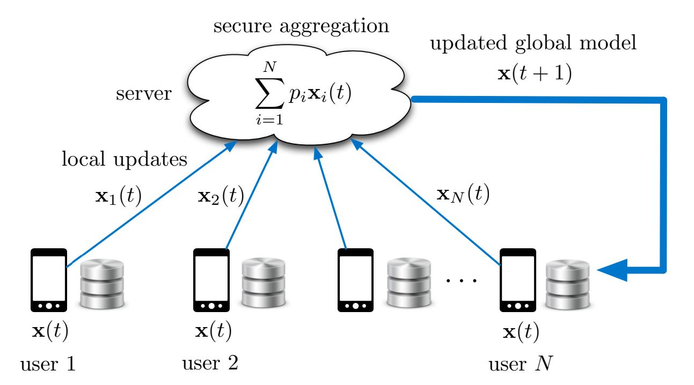
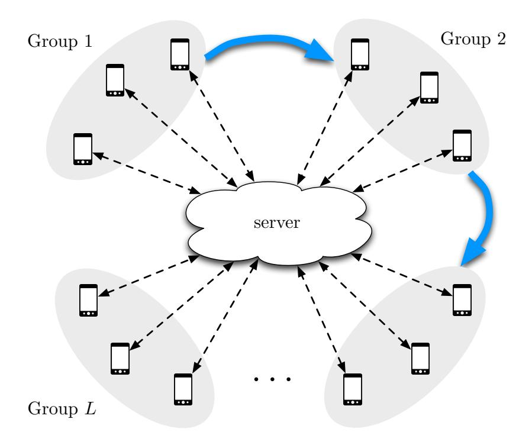
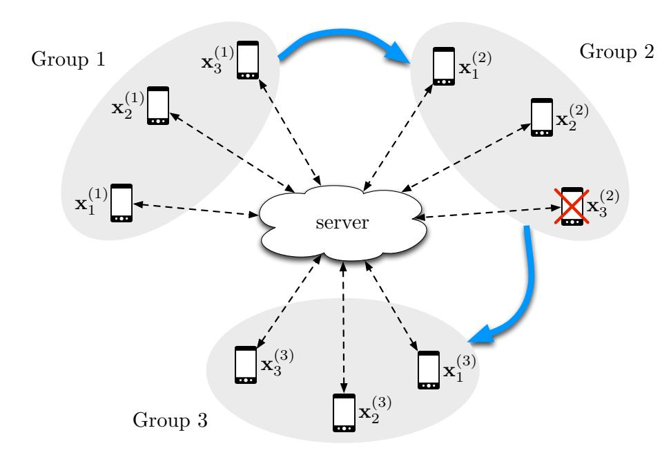
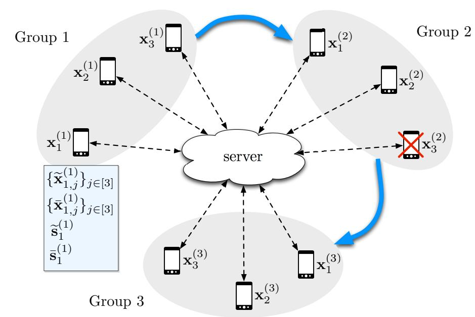
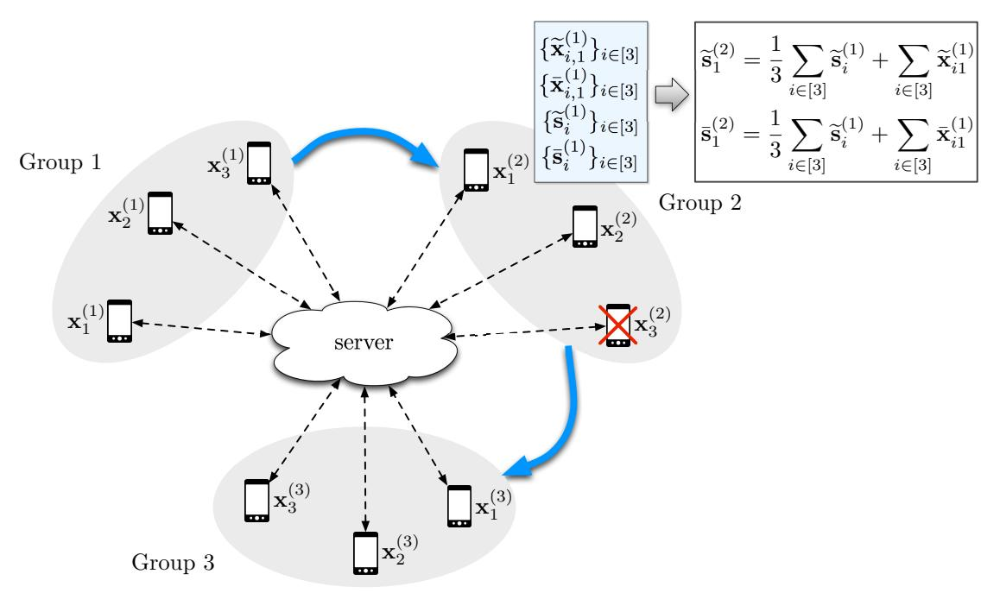
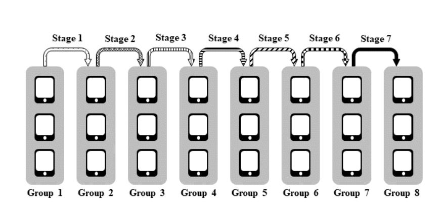
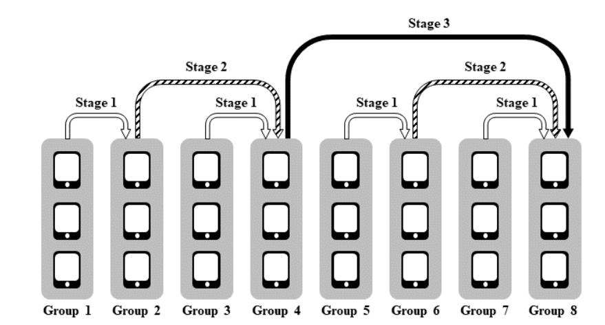
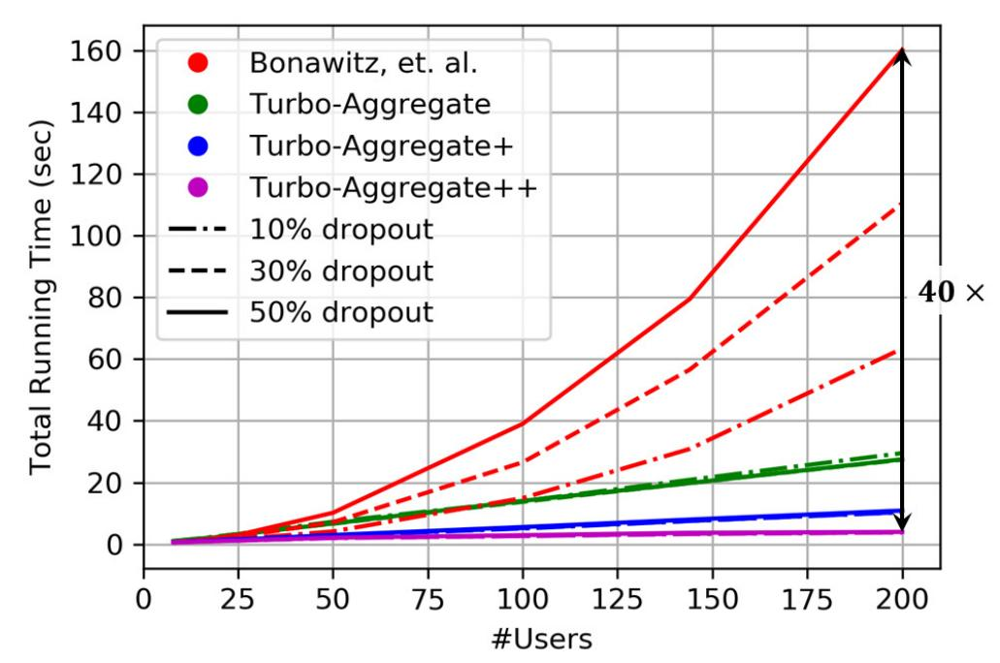
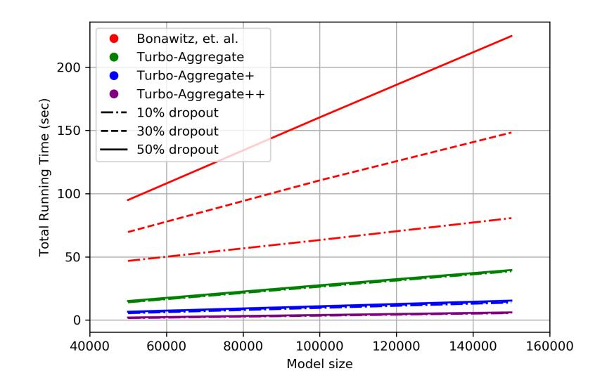
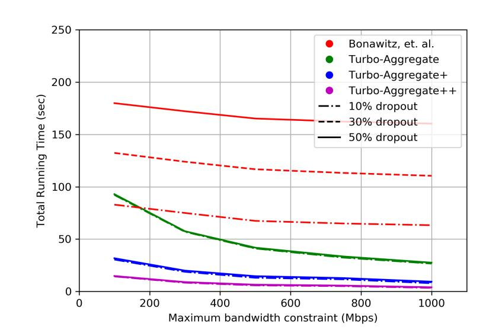

{0}------------------------------------------------

# TURBO-AGGREGATE: BREAKING THE QUADRATIC AGGREGATION BARRIER IN SECURE FEDERATED LEARNING

Jinhyun So, Basak Guler, and A. Salman Avestimehr Department of Electrical and Computer Engineering University of Southern California, Los Angeles, CA, USA

# ABSTRACT

Federated learning is gaining significant interests as it enables model training over a large volume of data that is distributedly stored over many users, while protecting the privacy of the individual users. However, a major bottleneck in scaling federated learning to a large number of users is the overhead of secure model aggregation across many users. In fact, the overhead of state-of-the-art protocols for secure model aggregation grows quadratically with the number of users. We propose a new scheme, named Turbo-Aggregate, that in a network with N users achieves a secure aggregation overhead of O(N log N), as opposed to O(N<sup>2</sup> ), while tolerating up to a user dropout rate of 50%. Turbo-Aggregate employs a multi-group circular strategy for efficient model aggregation, and leverages additive secret sharing and novel coding techniques for injecting aggregation redundancy in order to handle user dropouts while guaranteeing user privacy. We experimentally demonstrate that Turbo-Aggregate achieves a total running time that grows almost linear in the number of users, and provides up to 40× speedup over the state-of-the-art schemes with up to N = 200 users. We also experimentally evaluate the impact of several key network parameters (e.g., user dropout rate, bandwidth, and model size) on the performance of Turbo-Aggregate.

# I. Introduction

Federated learning is an emerging approach that enables model training over a large volume of decentralized data residing in mobile devices, while protecting the privacy of the individual users [\[1\]](#page-19-0), [\[2\]](#page-19-1), [\[3\]](#page-19-2), [\[4\]](#page-19-3). This is achieved by two key design principles. First, the training data is kept on the user device rather than sending it to a central server, and users locally perform model updates using their individual data. Second, local models are aggregated in a privacy-preserving framework, either at a central server (or in a distributed manner across the users) to update the global model. The global model is then pushed back to the mobile devices for inference. This process is illustrated in Figure [1.](#page-1-0)

The privacy of individual models in federated learning is protected through what is known as a *secure aggregation* protocol. In this protocol, each user locally masks its own model using pairwise random masks and sends the masked model to the server. The pairwise masks have a unique property that once the masked models from all users are summed up at the server, the pairwise masks cancel out. As a result, the server learns the aggregate of all models, but no individual model is revealed to the server during the protocol. This is a key property for ensuring user privacy in secure federated learning. In contrast, conventional distributed training setups that do not employ secure aggregation may reveal extensive information about the individual user models as well as the private training datasets of the users, which has been recently shown in [\[5\]](#page-19-4), [\[6\]](#page-19-5), [\[7\]](#page-19-6). To prevent such information leakage, secure aggregation protocols ensure that the individual update of each user is kept private, both from other users and the central server [\[2\]](#page-19-1), [\[3\]](#page-19-2). A recent promising implementation of federated learning, as well as is its application to Google keyboard query suggestions is demonstrated in [\[8\]](#page-19-7). Several other works have also demonstrated that leveraging the information that is distributed over many mobile users can increase the training performance dramatically, while ensuring data privacy and locality [\[9\]](#page-20-0), [\[10\]](#page-20-1), [\[11\]](#page-20-2).

{1}------------------------------------------------

<span id="page-1-0"></span>

Fig. 1: Federated learning framework. At iteration t, the central server sends the current version of the global model,  $\mathbf{x}(t)$ , to the mobile users. User  $i \in [N]$  updates the global model using its local data, and computes a local model  $\mathbf{x}_i(t)$ . The local models are then aggregated in a privacy-preserving manner. Using the aggregated models, the central server updates the global model  $\mathbf{x}(t+1)$  for the next round, and pushes it back to the mobile users.

A major bottleneck in scaling secure federated learning to a large number of users is the overhead of secure model aggregation across many users. In particular, in a network with N users, the state-of-the-art protocols for secure aggregation of locally updated models require pairwise random masks to be generated between each pair of users (for hiding the local model updates), and therefore the overhead of secure aggregation grows quadratically in the number of users (i.e.,  $O(N^2)$ ) [2], [3]. This quadratic growth of secure aggregation overhead limits its practical applications to hundreds of users [10]. The scale of current mobile systems, on the other hand, is in the order of tens of millions of users, in fact, the number of devices is expected to reach billions [10].

Another key challenge in model aggregation is the dropout or unavailability of the users. Device availability and connection quality in mobile networks change rapidly, and users may drop from federated learning systems at any time due to various reasons, such as poor connectivity, making a phone call, low battery, etc. The design protocol hence needs to be robust to operate in such environments, where users can drop at any stage of the protocol execution.

In this paper, we introduce a novel secure and robust aggregation framework for federated learning, named Turbo-Aggregate, with four salient features:

- 1) Turbo-Aggregate reduces the overhead of secure aggregation to  $O(N \log N)$  from  $O(N^2)$ ;
- 2) Turbo-Aggregate has provable robustness guarantees, by tolerating up to a user dropout rate of 50%;
- 3) Turbo-Aggregate protects the privacy of the local model updates of each individual user, in the strong information-theoretic sense;
- 4) Turbo-Aggregate experimentally achieves a total running time that grows almost linear in the number of users, and provides up to  $40\times$  speedup over the state-of-the-art with N=200 users, in distributed implementation over Amazon EC2 cloud.

At a high level, Turbo-Aggregate is composed of three main ingredients. First, Turbo-Aggregate employs a multigroup circular strategy for model aggregation. In particular, the users are partitioned into several groups, and at each stage of the aggregation the users in one group pass the aggregated model updates (weights) of all the users in the previous groups and the local model updates of the current group to users in the next group (in a privacy-preserving manner). We show that this structure enables the reduction of aggregation overhead to  $O(N \log N)$  (from  $O(N^2)$ ). However, there are two key challenges that need to be addressed in the proposed multi-group circular strategy for model aggregation. The first one is to protect the privacy of the individual user, i.e., the aggregation protocol should not allow the identification of individual model updates. The second one is handling the user dropouts. For instance, a user dropped at a higher stage of the protocol may lead to the loss of the aggregated model information from all the previous stages, and collecting this information again from the lower stages may incur a large communication overhead.

The second key ingredient of Turbo-Aggregate is to leverage additive secret sharing [12], [13] to enable privacy and security of the users. In particular, additive sharing masks each local model by adding randomness in a way that

{2}------------------------------------------------

can be cancelled out once the models are aggregated. Finally, the third novel ingredient of Turbo-Aggregate is to add aggregation redundancy via Lagrange coding [\[14\]](#page-20-5) to enable robustness against delayed or dropped users. In particular, Turbo-Aggregate injects redundancy via Lagrange polynomial in the model updates that are passed from one group to the next, so that the added redundancy can be exploited to reconstruct the aggregated model amidst potential dropouts.

Turbo-Aggregate allows the use of both centralized and decentralized communication architectures. The centralized architecture refers to the communication model used in the conventional federated learning setup where all communication goes through a central server, i.e., the server acts as an access point [\[1\]](#page-19-0), [\[3\]](#page-19-2), [\[4\]](#page-19-3). The decentralized architecture, on the other hand, refers to the setup where mobile devices communicate directly with each other via an underlay communication network (e.g., a peer-to-peer network) [\[15\]](#page-20-6), [\[16\]](#page-20-7) without requiring a central server for secure model aggregation. Turbo-Aggregate also allows additional parallelization opportunities for communication, such as broadcasting and multi-casting.

We theoretically analyze the performance guarantees of Turbo-Aggregate in terms of the aggregation overhead, privacy protection, and robustness to dropped or delayed users. In particular, we show that Turbo-Aggregate achieves an aggregation overhead of O(N log N) and can tolerate a user dropout rate of 50%. We then quantify the privacy guarantees of our system. An important implication of dropped or delayed users is that they may lead to privacy breaches [\[2\]](#page-19-1). Accordingly, we show that the privacy-protection of our algorithm is preserved in such scenarios, i.e., when users are dropped or delayed.

We also provide extensive experiments to empirically evaluate the performance of Turbo-Aggregate. To do so, we implement Turbo-Aggregate for up to 200 users on the Amazon EC2 cloud. We then compare the performance of Turbo-Aggregate with the state-of-the-art secure aggregation protocol from [\[3\]](#page-19-2), for varying user dropout rates (up to 50%). Our results indicate four key observations. First, Turbo-Aggregate can achieve an overall execution time that grows almost linear in the number of users, while for the benchmark protocol, the overall execution time grows quadratic in the number of users. Second, the overall execution time of Turbo-Aggregate remains stable as the user dropout rate increases, while for the benchmark protocol, the overall execution time significantly increases as the user dropout rate increases. Third, Turbo-Aggregate provides substantial opportunities for parallelization due to its multi-group structure, and broadcasting opportunities for further reducing the communication time. Finally, Turbo-Aggregate provides up to 40× speedup over the state-of-the-art with 200 users.

We further study the impact of important network parameters, in particular, the model size and the communication bandwidth, by measuring the total running time with various model size and bandwidth constraints. Our experimental results demonstrate that Turbo-Aggregate provides the same level of speedup over the state-of-the-art for various model sizes, and still provides substantial gain in environments with more severe bandwidth constraints.

Related Work. A potential solution for secure aggregation is to leverage cryptographic approaches, such as multiparty computation (MPC) or homomorphic encryption. MPC-based techniques mainly utilize Yao's garbled circuits or secret sharing (e.g., [\[17\]](#page-20-8), [\[18\]](#page-20-9), [\[19\]](#page-20-10), [\[20\]](#page-20-11)). Their main bottleneck is the high communication overhead, and communication-efficient implementations require an extensive offline computation part [\[19\]](#page-20-10), [\[20\]](#page-20-11). A notable recent work is [\[21\]](#page-20-12), which focuses on optimizing MPC protocols for network security and monitoring. Homomorphic encryption is a cryptographic secure computation scheme that allows aggregations to be performed on encrypted data [\[22\]](#page-20-13), [\[23\]](#page-20-14), [\[24\]](#page-20-15). However, the privacy guarantees of homomorphic encryption depends on the size of the encrypted data (more privacy requires a larger encypted data size), and performing computations in the encrypted domain is computationally expensive [\[25\]](#page-20-16), [\[26\]](#page-20-17).

A recent line of work has focused on secure aggregation by additive masking [\[3\]](#page-19-2), [\[27\]](#page-20-18). In [\[27\]](#page-20-18), users agree on pairwise secret keys using a Diffie-Hellman type key exchange protocol and then each user sends the server a masked version of their data, which contains the pairwise masks as well as an individual mask. The server can then sum up the masked data received from the users to obtain the aggregated value, as the summation of additive masks cancel out. If a user fails and drops out, the server asks the remaining users to send the sum of their pairwise keys with the dropped users added to their individual masks, and subtracts them from the aggregated value. The main limitation of this protocol is the communication overhead of this recovery phase, as it requires the entire sum of the missing masks to be sent to the server. Moreover, the protocol terminates if additional users drop during this phase.

A novel technique is proposed in [\[3\]](#page-19-2) to ensure that the protocol is robust if additional users drop during the recovery phase. It also ensures that the additional information sent to the server does not breach privacy. To do so, the protocol utilizes pairwise random masks between users to hide the individual models. The overhead of reconstructing these masks, which takes the majority of execution time, scales with respect to O(N<sup>2</sup> ), with N corresponding to the number of users. The execution time of [\[3\]](#page-19-2) increases as more users are dropped, as the protocol requires additional information corresponding to the dropped users. The recovery phase of our protocol does not require

{3}------------------------------------------------

any additional information to be shared between the users, which is achieved by a coding technique applied to the additively secret shared data. Hence, the execution time of our algorithm stays almost the same as more and more users are dropped, the only overhead comes from the decoding phase whose contribution is very small compared to the overall communication overhead. On the other hand, this requires each user to send  $O(\log N)$  messages whose size is equal to the model size, which is our main limitation. For very large models, one can use compression or quantization techniques to reduce the model size.

Notable approaches to reduce the communication overhead in federated learning include reducing the model size via quantization, or learning in a smaller parameter space [28]. In [29], a framework has been proposed for autotuning the parameters in secure federated learning, to achieve communication-efficiency. Another line of work has focused on approaches based on decentralized learning [30], [31] or edge-assisted hierarchical physical layer topologies [32]. Specifically, [32] utilizes edge servers to act as an intermediate aggregator for the local updates from edge devices. The global model is then computed at the central server by aggregating the intermediate computations available at the edge servers. These setups perform the aggregation using the clear (unmasked) model updates, i.e., the aggregation is not required to preserve the privacy of individual model updates. Our focus is different, as we study the secure aggregation problem which requires the server to learn no information about an individual update beyond the aggregated values. Finally, approaches that aim at alleviating the aggregation overhead by reducing the model size (e.g., quantization [28]) can also be leveraged in Turbo-Aggregate, which can be an interesting future direction.

Circular communication and training architectures have been considered previously in the context of distributed stochastic gradient descent on clear (unmasked) gradient updates, to reduce communication load [33] or to model data-heterogeneity [34]. Different from these setups, our main challenge in this work is handling user dropouts while ensuring user privacy, i.e., secure aggregation. Conventional federated learning frameworks consider a centralized communication architecture in which all communication between the mobile devices goes through a central server [1], [3], [4]. More recently, decentralized federated learning architectures without a central server have been considered for peer-to-peer learning on graph topologies [15] and in the context of social networks [16]. Model poisoning attacks on federated learning architectures have been analyzed in [35], [36]. Differentially-private federated learning frameworks have been studied in [37], [38]. A multi-task learning framework for federated learning has been proposed in [39], for learning several models simultaneously. [40], [41] have explored federated learning frameworks to address fairness challenges and to avoid biasing the trained model towards certain users. Convergence properties of trained models are studied in [42].

### <span id="page-3-0"></span>II. System Model, Key Parameters, and State-of-the-Art

Federated learning is a distributed learning framework that allows training machine learning models directly on the data held at distributed devices, such as mobile phones. The goal is to learn a single global model x with dimension d, using data that is generated, stored, and processed locally at millions of remote users. This can be represented by minimizing a global objective function,

$$\min_{\mathbf{x}} L(\mathbf{x}) \text{ such that } L(\mathbf{x}) = \sum_{i=1}^{N} p_i L_i(\mathbf{x}), \tag{1}$$

where N is the total number of remote devices, such as mobile phones,  $p_i \ge 0$  and  $\sum_i p_i = 1$ , and  $L_i$  is the local objective function for the  $i^{th}$  device.

Conventional federated learning architectures consider a centralized communication topology in which all communication between the individual devices goes through a central server [1], [3], [4], and no direct links are allowed between the mobile users. The learning setup is as demonstrated in Figure 1. At iteration t, the central server shares the current version of the global model,  $\mathbf{x}(t)$ , with the mobile users. Each user then updates the model using its local data. User  $i \in [N]$  then computes a local model  $\mathbf{x}_i(t)$ . The local models of the N users are then aggregated in a privacy-preserving manner. Using the aggregated models, the server updates the global model  $\mathbf{x}(t+1)$  for the next round. Then, the server pushes the updated global model to the mobile devices.

Compared to conventional training frameworks, secure federated learning has three unique features:

• *Full model aggregation:* Training data is stored and processed locally by remote devices. The global model is updated by a central server through a (secure) weighted aggregation of the locally trained models. The updated global model is then pushed back from the server to the remote users.

{4}------------------------------------------------

- *Privacy of individual models:* Data generated at mobile devices may contain privacy-sensitive information about their users. As such, we wish to ensure that the data stays on device, by processing it locally and communicating only the intermediate updates in a privacy-preserving manner, so that no user can be singled-out from the aggregated updates.
- Resiliency against user dropouts: As network conditions and user availability in mobile environments can vary widely, users may be dropped or delayed at any stage of protocol execution. As observed previously, such dropped or delayed users can lead to privacy breaches [3]. Therefore, privacy guarantees should hold even in the case when users are dropped or delayed.

We evaluate the performance of a secure federated learning protocol through the following key parameters.

- 1) Robustness guarantee: We consider a network model in which each user can drop from the network with a probability  $p \in [0,1]$ , called the user dropout rate, due to various reasons such as wireless channel conditions or user preferences. Users can drop from the network at any time during protocol execution. The robustness guarantee quantifies the maximum user dropout rate that a protocol can tolerate with a probability approaching to 1 as the number of users  $N \to \infty$  to correctly evaluate the aggregate of the surviving user models.
- 2) Privacy guarantee: We consider a security model in which the users and the server are honest but curious. We assume that up to T users can collude with each other as well as with the server for learning the models of other users. The privacy guarantee of a protocol quantifies the maximum number of colluding entities that the protocol can tolerate for the individual user models to keep private.
- 3) Aggregation overhead: The aggregation overhead, denoted by C, quantifies the asymptotic complexity of the secure aggregation protocol with respect to the number of mobile users, N. The aggregation overhead includes the costs incurred by communication and computation operations.

We now describe the state-of-the-art for secure aggregation in federated learning. A centralized secure aggregation protocol for federated learning has been proposed by [3], where each mobile user locally trains a model. The local models are securely aggregated through a central server, who then updates the global model. For secure aggregation, users create pairwise keys through a key exchange protocol, such as [43], then utilize them to communicate messages securely with other users, while all communication is forwarded through the server. Privacy of individual models is provided by pairwise random masking. Specifically, each pair of users  $u, v \in [N]$  first agree on a pairwise random seed  $s_{u,v}$ . In addition, user u creates a private random seed  $b_u$ . The role of  $b_u$  is to prevent the privacy breaches that may occur if user u is only delayed instead of dropped (or declared as dropped by a malicious server), in which case the pairwise masks alone are not sufficient for privacy protection. User  $u \in [N]$  then masks its model  $\mathbf{x}_u$ ,

<span id="page-4-2"></span><span id="page-4-1"></span>
$$\mathbf{y}_{u} = \mathbf{x}_{u} + \operatorname{PRG}(b_{u}) + \sum_{v:u < v} \operatorname{PRG}(s_{u,v}) - \sum_{v:u > v} \operatorname{PRG}(s_{v,u})$$
(2)

where PRG is a pseudo random generator, and sends it to the server. Finally, user u secret shares  $b_u$  as well as  $\{s_{u,v}\}_{v\in[N]}$  with the other users, via Shamir's secret sharing. From a subset of users who survived the previous stage, the server collects either the shares of the pairwise seeds belonging to a dropped user, or the shares of the private seed belonging to a surviving user (but not both). Using the collected shares, the server reconstructs the private seed of each surviving user, and the pairwise seeds of each dropped user, to be removed from the aggregate of the masked models. The server then computes the aggregated model,

$$\mathbf{z} = \sum_{u \in \mathcal{U}} \left( \mathbf{y}_u - \operatorname{PRG}(b_u) \right) - \sum_{u \in \mathcal{D}} \left( \sum_{v: u < v} \operatorname{PRG}(s_{u,v}) - \sum_{v: u > v} \operatorname{PRG}(s_{v,u}) \right) = \sum_{u \in \mathcal{U}} \mathbf{x}_u$$
 (3)

where  $\mathcal{U}$  and  $\mathcal{D}$  represent the set of surviving and dropped users, respectively.

This state-of-the-art protocol achieves robustness guarantee to user dropout rate of up to p=0.5, while providing privacy guarantee to up to  $T=\frac{N}{2}$  colluding users<sup>1</sup>. However, its aggregation overhead is quadratic with the number of users (i.e.,  $C=O(N^2)$ ). This quadratic aggregation overhead results from the fact that the server has to reconstruct and remove the pairwise random masks corresponding to dropped users. In order to recover the random masks of dropped users, the server has to execute a pseudo random generator based on the recovered seeds  $s_{u,v}$ , which has a quadratic computation overhead as the number of pairwise masks is quadratic in the number of users, which dominates the overall time consumed in the protocol. This quadratic aggregation overhead severely limits the network size for real-world applications [10].

Our goal in this paper is to develop a secure aggregation protocol that can provide comparable robustness and privacy guarantees as the state-of-the-art, while achieving a significantly lower (almost linear) aggregation overhead.

<span id="page-4-0"></span><sup>&</sup>lt;sup>1</sup>This is achieved by setting the parameter  $t = \frac{N}{2} + 1$  in Shamir's t-out-of-N secret sharing protocol. This allows each user to split its own random seeds into N shares such that any t shares can be used to reconstruct the seeds, but any set of at most t-1 shares reveals no information about the seeds.

{5}------------------------------------------------

<span id="page-5-0"></span>

Fig. 2: Network topology with N users partitioned into L groups, with  $N_l$  users in group  $l \in [L]$ . User i in group l holds a vector  $\mathbf{x}_i^{(l)}$  corresponding to its local model parameters.

# III. The Turbo-Aggregate Protocol

We now introduce the proposed Turbo-Aggregate protocol for secure federated learning that can simultaneously achieve robustness guarantee to user dropout rate of up to p=0.5, a privacy guarantee to up to  $T=\frac{N}{2}$  colluding users, and an almost linear aggregation overhead,  $C=O(N\log N)$ . Turbo-Aggregate is composed of three main components. First, it creates a multi-group circular aggregation structure for fast model aggregation. Second, it leverages additive secret sharing by adding randomness in a way that can be cancelled out once the models are aggregated, in order to guarantee the privacy of the users. Third, it adds aggregation redundancy via Lagrange polynomial in the model updates that are passed from one group to the next, so that the added redundancy can be exploited to reconstruct the aggregated model amidst potential dropouts. We now describe each of these components in detail, present the overall Turbo-Aggregate protocol, and finally provide an illustrative example of Turbo-Aggregate.

#### <span id="page-5-2"></span>A. Multi-group circular aggregation

Given a mobile network with N users, Turbo-Aggregate first partitions the users into L groups as shown in Figure 2, with  $N_l$  users in group  $l \in [L]$ , such that  $\sum_{l \in [L]} N_l = N$ . We consider a random partitioning strategy. That is, each user is assigned to one of the available groups uniformly at random, by using a bias-resistant public randomness generation protocol such as in [44]. This partitioning is purely hypothetical and does not require a physical layer topology such as geographical proximity. We use  $\mathcal{U}_l \subseteq [N_l]$  to represent the set of users that complete their part in the protocol (surviving users), and  $\mathcal{D}_l = [N_l] \setminus \mathcal{U}_l$  to denote the set of dropped users<sup>2</sup>.

User i in group  $l \in [L]$  holds a vector  $\mathbf{x}_i^{(l)}$  of dimension d, corresponding to the parameters of their locally trained model. The goal is to evaluate

$$\mathbf{z} = \sum_{l \in [L]} \sum_{i \in \mathcal{U}_l} \mathbf{x}_i^{(l)} \tag{4}$$

in a privacy-preserving fashion. Specifically, we require that each party involved in the protocol can learn nothing beyond the aggregate of all users.

The dashed links in Figure 2 represent the communication links between the server and the mobile users. In our general description, we assume that all communication takes place through a central server, via creating pairwise

<span id="page-5-1"></span>For modeling the user dropouts, we focus on the worst-case scenario, which is the case when a user drops during the execution of the corresponding group, i.e., when a user receives messages from the previous group but fails to propagate it to the next group. If a user drops before the execution of the corresponding group, the protocol can simply remove that user from the user list. If a user drops after the execution of the corresponding group, it will already have completed its part and propagated its message to the next group, hence the protocol can simply ignore that user.

{6}------------------------------------------------

secure keys using a Diffie-Hellman type key exchange protocol [43]. In particular, mobile users create pairwise keys through the key exchange protocol, then utilize them to communicate messages securely with other users, while all communication is forwarded through the server, for the details of this procedure we refer to [3]. Without loss of generality, Turbo-Aggregate can also use decentralized communication architectures by leveraging direct links between devices, if available, such as peer-to-peer communication structures, where users can communicate directly with each other through an underlay communication network [15], [16].

Turbo-Aggregate consists of L execution stages performed sequentially. At stage  $l \in [L]$ , users in group l encode their inputs, including their trained models and the partial summation of the models from lower stages, and send them to users in group l+1 (communication can take place through the server). Upon receiving the corresponding messages, users in group l+1 first recover (decode) the missing information due to potentially dropped users from the lower stage, and then aggregate the received data. At the end of the protocol, models of all users will be aggregated.

The proposed coding and aggregation mechanism guarantees that no party taking part in the protocol (mobile users or the server) can learn an individual model, or a partially aggregated model belonging to a subset of users. The server learns nothing but the final aggregated model of all users.

Recovery from dropped users is enabled through a coding technique, by adding redundancy to the additively masked data before transmission. This allows users in the upper stages to recover the information needed to cancel the effect of dropped users in the lower stages, without needing any extra communication. This enables secure aggregation of the individually trained models while guaranteeing user privacy and robustness to user dropouts. These components are explained below.

#### B. Masking with additive secret sharing

Turbo-Aggregate hides the individual user models using additive masks to protect their privacy against potential collusions between the interacting parties. This is done by a two-step procedure. In the first step, the server sends a random mask to each user, denoted by a random vector  $\mathbf{u}_i^{(l)}$  for user  $i \in [N_l]$  at group  $l \in [L]$ . Each user then masks its local model  $\mathbf{x}_i^{(l)}$  as  $\mathbf{x}_i^{(l)} + \mathbf{u}_i^{(l)}$ . Since this random mask is known only by the server and the corresponding user, it protects the privacy of each user against potential collusions between any subset of the remaining users, as long as the server is honest, i.e., does not collaborate with the adversarial users. On the other hand, privacy may be breached if the server is adversarial and colludes with a subset of users. The second step of Turbo-Aggregate aims at protecting user privacy against such scenarios. In this second step, users generate additive secret sharing of the individual models for privacy protection against potential collusions between the server and the users. To do so, user i in group i sends a masked version of its local model to each user i in group i in group i.

$$\widetilde{\mathbf{x}}_{i,j}^{(l)} = \mathbf{x}_i^{(l)} + \mathbf{u}_i^{(l)} + \mathbf{r}_{i,j}^{(l)},\tag{5}$$

where  $j \in [N_{l+1}]$ , and  $\mathbf{r}_{i,j}^{(l)}$  is a random vector such that,

<span id="page-6-2"></span><span id="page-6-0"></span>
$$\sum_{j \in [N_{l+1}]} \mathbf{r}_{i,j}^{(l)} = 0 \tag{6}$$

for each  $i \in [N_l]$ . The role of additive secret sharing is not only to mask the model to provide privacy against collusions between the server and the users, but also to maintain the accuracy of aggregation by making the sum of the received data over the users in each group equal to the original data (before additive secret sharing), as the random vectors in (6) cancel out.

In addition, each user holds a variable corresponding to the aggregated masked models from the previous group. For user i in group l, this variable is represented by  $\widetilde{\mathbf{s}}_i^{(l)}$ . At each stage of Turbo-Aggregate, users in the active group update and propagate these variables to the next group. Aggregation of these masked models is defined via the recursive relation,

<span id="page-6-1"></span>
$$\widetilde{\mathbf{s}}_{i}^{(l)} = \frac{1}{N_{l-1}} \sum_{j \in [N_{l-1}]} \widetilde{\mathbf{s}}_{j}^{(l-1)} + \sum_{j \in \mathcal{U}_{l-1}} \widetilde{\mathbf{x}}_{j,i}^{(l-1)}.$$
(7)

at user i in group l>1, whereas the initial aggregation at group l=1 is set as  $\widetilde{\mathbf{s}}_i^{(1)}=\mathbf{0}$ , for  $i\in[N_1]$ . While computing (7), any missing values in  $\{\widetilde{\mathbf{s}}_j^{(l-1)}\}_{j\in[N_{l-1}]}$  (due to the users dropped in group l-1) is reconstructed via the recovery technique presented in Section III-C.

{7}------------------------------------------------

User i in group l then sends the aggregated value in (7) to each user in group l+1. The average of the aggregated values of users in group l includes the aggregation of the models of users in up to group l-1, plus the individual random masks sent from the server. This can be observed by defining a partial summation,

$$\mathbf{s}^{(l+1)} = \frac{1}{N_l} \sum_{i \in [N_l]} \widetilde{\mathbf{s}}_i^{(l)} \tag{8}$$

<span id="page-7-4"></span>
$$= \frac{1}{N_l} \sum_{i \in [N_l]} \left( \frac{1}{N_{l-1}} \sum_{j \in [N_{l-1}]} \widetilde{\mathbf{s}}_j^{(l-1)} + \sum_{j \in \mathcal{U}_l} \widetilde{\mathbf{x}}_{j,i}^{(l-1)} \right)$$

$$= \frac{1}{N_{l-1}} \sum_{j \in [N_{l-1}]} \widetilde{\mathbf{s}}_{j}^{(l-1)} + \sum_{j \in \mathcal{U}_{l}} \mathbf{x}_{j}^{(l-1)} + \sum_{j \in \mathcal{U}_{l}} \mathbf{u}_{j}^{(l-1)}$$
(9)

<span id="page-7-6"></span><span id="page-7-1"></span>
$$= \mathbf{s}^{(l)} + \sum_{j \in \mathcal{U}_l} \mathbf{x}_j^{(l-1)} + \sum_{j \in \mathcal{U}_l} \mathbf{u}_j^{(l-1)}$$

$$\tag{10}$$

<span id="page-7-2"></span>where (9) follows from (6). With the initial partial summation  $\mathbf{s}^{(2)} = \frac{1}{N_1} \sum_{i \in [N_1]} \widetilde{\mathbf{s}}_i^{(1)} = \mathbf{0}$ , one can show that  $\mathbf{s}^{(l+1)}$  is equal to the aggregation of the models of users in up to group l-1, masked by the randomness sent from the server,

$$\mathbf{s}^{(l+1)} = \sum_{m \in [l-1]} \sum_{j \in \mathcal{U}_m} \mathbf{x}_j^{(m)} + \sum_{m \in [l-1]} \sum_{j \in \mathcal{U}_m} \mathbf{u}_j^{(m)}.$$
 (11)

At the final stage, the server obtains the final aggregate value from (11) and removes the added randomness  $\sum_{m \in [L]} \sum_{j \in \mathcal{U}_m} \mathbf{u}_j^{(m)}$ . During the process, the server learns only the final sum. Therefore, this process can securely compute the aggregation of all user models.

This approach works well if no user drops out during the execution of the protocol. On the other hand, the protocol will terminate if any party fails to complete its part. For instance, if user j in the (l+1)-th group drops out, the random vectors masking the models of the l-th group in the summation (9) cannot be cancelled out. In the following, we propose a recovery technique that is robust to dropped or delayed users, based on coding theory principles.

#### <span id="page-7-0"></span>C. Adding redundancies to recover the data of dropped or delayed users

The main intuition behind our recovery strategy is to encode the additive secret shares (masked models) in a way that guarantees secure aggregation when users are dropped or delayed. The key challenge for this problem is that one cannot simply use error correcting codes, as the code should be applied after the secrets are created, and the coding technique should enable the secrets to be aggregated. To solve this problem, we propose to leverage Lagrange coding, which is a recently introduced technique that satisfies these requirements [14]. It encodes a given set of K vectors  $(\mathbf{v}_1,\ldots,\mathbf{v}_K)$  by using a Lagrange interpolation polynomial. One can view this as embedding a given set of vectors on a Lagrange polynomial, such that each encoded value represents a point on the polynomial. The resulting encoding enables a set of users to compute a given polynomial function h on the encoded data in a way that any individual computation  $\{h(\mathbf{v}_i)\}_{i\in[K]}$  can be reconstructed using any subset of deg(h)(K-1)+1 other computations. The reconstruction is done through polynomial interpolation. Therefore, one can reconstruct any missing value as long as a sufficient number of other computations are available, i.e., enough number of points are available to interpolate the polynomial. In our problem of gradient aggregation, the function of interest, h, would be linear and accordingly have degree 1, since it corresponds to the summation of all individual gradient vectors.

Turbo-Aggregate utilizes Lagrange coding for recovery against user dropouts, via a strategy that encodes the secret shared values to compute secure aggregation. More specifically, in Turbo-Aggregate, the encoding is performed as follows. Initially, user i in the l-th group forms a Lagrange interpolation polynomial  $f_i^{(l)}: \mathbb{F}_q \to \mathbb{F}_q^d$  of degree  $N_{l+1}$  such that  $f_i^{(l)}(\alpha_j^{(l+1)}) = \widetilde{\mathbf{x}}_{i,j}^{(l)}$  for  $j \in [N_{l+1}]$ , where  $\alpha_j^{(l+1)}$  is an evaluation point allocated to user  $j \in [N_{l+1}]$  in group l+1.  $\mathbb{F}_q$  represents a finite field each element of the model vector belongs to, and q is a field size. This is accomplished by letting  $f_i^{(l)}$  be the Lagrange interpolation polynomial,

$$f_i^{(l)}(z) = \sum_{j \in [N_{l+1}]} \widetilde{\mathbf{x}}_{i,j}^{(l)} \cdot \prod_{k \in [N_{l+1}] \setminus \{j\}} \frac{z - \alpha_k^{(l+1)}}{\alpha_j^{(l+1)} - \alpha_k^{(l+1)}}.$$
 (12)

Then, we allocate another set of  $N_{l+1}$  distinct evaluation points  $\{\beta_j^{(l+1)}\}_{j\in[N_{l+1}]}$  from  $\mathbb{F}_q$  such that  $\{\beta_j^{(l+1)}\}_{j\in[N_{l+1}]}\cap\{\alpha_j^{(l+1)}\}_{j\in[N_{l+1}]}=\varnothing$ . Next, user  $i\in[N_l]$  in the l-th group generates the encoded data,

<span id="page-7-5"></span><span id="page-7-3"></span>
$$\bar{\mathbf{x}}_{i,j}^{(l)} = f_i^{(l)}(\beta_j^{(l+1)}) \tag{13}$$

{8}------------------------------------------------

## Algorithm 1 Turbo-Aggregate

```
input Local models \mathbf{x}_i^{(l)} of users i \in [N_l] in group l \in [L].
output Aggregated model \sum_{l \in [L]} \sum_{i \in \mathcal{U}_l} \mathbf{x}_i^{(l)}.
  1: for group l = 1, \ldots, L do
            for user i = 1, \ldots, N_l do
  2:
                 Compute the masked model \{\widetilde{\mathbf{x}}_{i,j}^{(l)}\}_{l \in [N_{l+1}]} from (5).
  3:
                Generate the encoded model \{\bar{\mathbf{x}}_{i,j}^{(l)}\}_{j\in[N_{l+1}]} from (13).
  4:
                \begin{array}{l} \mbox{if } l=1 \mbox{ then} \\ \mbox{Initialize } \widetilde{\mathbf{s}}_i^{(1)} = \overline{\mathbf{s}}_i^{(1)} = \mathbf{0}. \end{array}
  5:
  6:
  7:
                 else
                     Reconstruct the missing values in \{\widetilde{\mathbf{s}}_k^{(l-1)}\}_{k\in[N_{l-1}]} due to the dropped users in group l-1.
  8:
                     Update the aggregate value \widetilde{\mathbf{s}}_i^{(l)} from (7).
  9:
                      Compute the coded aggregate value \bar{\mathbf{s}}_{i}^{(l)} from (14).
10:
                 Send \{\widetilde{\mathbf{x}}_{i,j}^{(l)}, \overline{\mathbf{x}}_{i,j}^{(l)}, \widetilde{\mathbf{s}}_{i}^{(l)}, \overline{\mathbf{s}}_{i}^{(l)}\} to user j \in [N_{l+1}] in group l+1 (j \in [N_{final}]) if l=L).
11:
12: for user i = 1, \ldots, N_{final} do
            Reconstruct the missing values in \{\widetilde{\mathbf{s}}_k^{(L)}\}_{k\in[L]} due to the dropped users in group L. Compute \widetilde{\mathbf{s}}_i^{(final)} from (17) and \overline{\mathbf{s}}_i^{(final)} from (18). Send \{\widetilde{\mathbf{s}}_i^{(final)}, \overline{\mathbf{s}}_i^{(final)}\} to the server.
13:
14:
15:
16: Server computes the final aggregated model from (19).
```

for each  $j \in [N_{l+1}]$ , and sends the coded vector,  $\bar{\mathbf{x}}_{i,j}^{(l)}$ , to user j in (l+1)-th group.

In addition, user  $i \in [N_l]$  in group l aggregates the encoded models  $\{\bar{\mathbf{x}}_{j,i}^{(l-1)}\}_{j \in \mathcal{U}_{l-1}}$  received from the previous stage with the partial summation  $\mathbf{s}^{(l)}$ ,

$$\bar{\mathbf{s}}_{i}^{(l)} = \frac{1}{N_{l-1}} \sum_{j \in [N_{l-1}]} \tilde{\mathbf{s}}_{j}^{(l-1)} + \sum_{j \in \mathcal{U}_{l-1}} \bar{\mathbf{x}}_{j,i}^{(l-1)}$$

$$= \mathbf{s}^{(l)} + \sum_{j \in \mathcal{U}_{l-1}} \bar{\mathbf{x}}_{j,i}^{(l-1)}$$
(14)

The summation of the masked models in (7) and the summation of the coded models in (14) can be viewed as evaluations of a polynomial  $g^{(l)}$  such that,

<span id="page-8-2"></span><span id="page-8-0"></span>
$$\widetilde{\mathbf{s}}_{i}^{(l)} = g^{(l)}(\alpha_{i}^{(l)})$$
 (15)

$$\bar{\mathbf{s}}_{i}^{(l)} = g^{(l)}(\beta_{i}^{(l)}) \tag{16}$$

for  $i \in [N_l]$ , where  $g^{(l)}(z) = \mathbf{s}^{(l)} + \sum_{j \in \mathcal{U}_{l-1}} f_j^{(l-1)}(z)$  is a polynomial function with degree at most  $N_l - 1$ . Then, user  $i \in [N_l]$  sends these two summations to users in group l + 1. We note that each user in group l has two evaluations of  $g^{(l)}$ , hence users in group l + 1 should receive two evaluations of  $g^{(l)}$  from each user in group l.

Then, each user in group l+1 reconstructs the missing terms in  $\{\widetilde{\mathbf{s}}_i^{(l)}\}_{i\in[N_l]}$  (caused by the users dropped in the previous stage), computes the partial sum in (8), and then updates the aggregate term as in (7). Our coding strategy ensures that each user in group l+1 can reconstruct each term in  $\{\widetilde{\mathbf{s}}_i^{(l)}\}_{i\in[N_l]}$ , as long as they receive at least  $N_l$  evaluations from the previous stage. As a result, Turbo-Aggregate can tolerate up to half of the users dropping at each stage.

### D. Final aggregation and the overall Turbo-Aggregate protocol

For the final aggregation, we need a dummy stage to securely compute the aggregation of all user models, especially for the privacy of the trained models of users in group L. To do so, we arbitrarily select a set of users who will receive and aggregate the models sent from the users in group L. They can be any surviving user who has participated in the protocol, and will be called user  $j \in [N_{final}]$  in the final stage, where  $N_{final}$  is the number of users selected.

During this phase, users in group L mask their own model with additive secret sharing by using (5), and aggregate the models received from the users in group (L-1) by using (7) and (14). Then user i from group L sends  $\{\widetilde{\mathbf{x}}_{i,j}^{(L)}, \overline{\mathbf{x}}_{i,j}^{(L)}, \widetilde{\mathbf{s}}_{i}^{(L)}, \overline{\mathbf{s}}_{i}^{(L)}, \overline{\mathbf{s}}_{i}^{(L)}\}$  to user j in the final stage.

{9}------------------------------------------------

<span id="page-9-3"></span>

Fig. 3: Example with N=9 users and L=3 groups, with 3 users per group. User 3 in group 2 drops during protocol execution.

Upon receiving the set of messages, user  $j \in [N_{final}]$  in the final stage recovers the partial summations  $\{\widetilde{\mathbf{s}}_i^{(L)}\}_{i \in [N_L]}$ , aggregates them with the masked models,

<span id="page-9-0"></span>
$$\widetilde{\mathbf{s}}_{j}^{(final)} = \frac{1}{N_L} \sum_{i \in [N_L]} \widetilde{\mathbf{s}}_{i}^{(L)} + \sum_{i \in \mathcal{U}_L} \widetilde{\mathbf{x}}_{i,j}^{(L)}, \tag{17}$$

<span id="page-9-1"></span>
$$\bar{\mathbf{s}}_{j}^{(final)} = \frac{1}{N_L} \sum_{i \in [N_L]} \tilde{\mathbf{s}}_{i}^{(L)} + \sum_{i \in \mathcal{U}_L} \bar{\mathbf{x}}_{i,j}^{(L)}, \tag{18}$$

and sends the resulting  $\{\widetilde{\mathbf{s}}_{i}^{(final)}, \overline{\mathbf{s}}_{i}^{(final)}\}$  to the server.

The server then recovers the summations  $\{\widetilde{\mathbf{s}}_j^{(final)}\}_{j\in[N_{final}]}$ . Note that the server can reconstruct any missing aggregation in (17) using the set of received values (17) and (18) even in the case when some users in the final stage drop out. Finally, the server computes the average of the summations from (17) and removes the random masks  $\sum_{m\in[L]}\sum_{j\in\mathcal{U}_m}\mathbf{u}_j^{(m)}$  from the aggregate, which, as can be observed from (8)-(11), is equal to the aggregate of the individual models of all surviving users,

<span id="page-9-2"></span>
$$\frac{1}{N_{final}} \sum_{j \in [N_{final}]} \widetilde{\mathbf{s}}_j^{(final)} - \sum_{m \in [L]} \sum_{j \in \mathcal{U}_m} \mathbf{u}_j^{(m)} = \sum_{m \in [L]} \sum_{j \in \mathcal{U}_m} \mathbf{x}_j^{(m)}.$$
(19)

Having all above steps, the overall Turbo-Aggregate protocol can now be presented in Algorithm 1.

## IV. An Illustrative Example

We next demonstrate the execution of Turbo-Aggregate through an illustrative example. Consider the network in Figure 3 with N=9 users partitioned into L=3 groups with  $N_l=3$  ( $l \in [3]$ ) users per group, and assume that user 3 in group 2 drops during protocol execution.

In the first stage, user  $i \in [3]$  in group 1 masks its model  $\mathbf{x}_i^{(1)}$  using additive masking as in (5) and computes  $\{\widetilde{\mathbf{x}}_{i,j}^{(1)}\}_{j \in [3]}$ . Then, the user generates the encoded models,  $\{\overline{\mathbf{x}}_{i,j}^{(1)}\}_{j \in [3]}$ , by using the Lagrange polynomial in (12). Finally, the user initializes  $\widetilde{\mathbf{s}}_i^{(1)} = \overline{\mathbf{s}}_i^{(1)} = \mathbf{0}$ , and sends  $\{\widetilde{\mathbf{x}}_{i,j}^{(1)}, \overline{\mathbf{x}}_{i,j}^{(1)}, \overline{\mathbf{s}}_i^{(1)}, \overline{\mathbf{s}}_i^{(1)}\}$  to user  $j \in [3]$  in group 2. Figure 4 demonstrates this stage for one user.

In the second stage, user  $j \in [3]$  in group 2 generates the masked models  $\{\widetilde{\mathbf{x}}_{j,k}^{(2)}\}_{k \in [3]}$ , and the coded models  $\{\overline{\mathbf{x}}_{j,k}^{(2)}\}_{k \in [3]}$ , by using (5) and (13), respectively. Next, the user aggregates the messages received from group 1, by computing,  $\widetilde{\mathbf{s}}_{j}^{(2)} = \frac{1}{3} \sum_{i \in [3]} \widetilde{\mathbf{s}}_{i}^{(1)} + \sum_{i \in [3]} \widetilde{\mathbf{x}}_{i,j}^{(1)}$  and  $\overline{\mathbf{s}}_{j}^{(2)} = \frac{1}{3} \sum_{i \in [3]} \widetilde{\mathbf{s}}_{i}^{(1)} + \sum_{i \in [3]} \overline{\mathbf{x}}_{i,j}^{(1)}$ . Figure 5 shows this aggregation phase for one user. Finally, user j sends  $\{\widetilde{\mathbf{x}}_{j,k}^{(2)}, \overline{\mathbf{s}}_{j}^{(2)}, \overline{\mathbf{s}}_{j}^{(2)}, \overline{\mathbf{s}}_{j}^{(2)}\}$  to user  $k \in [3]$  in group 3. However, user 3 (in group 2) drops out during the execution of this stage and fails to complete its part.

{10}------------------------------------------------

<span id="page-10-0"></span>

<span id="page-10-1"></span>Fig. 4: Illustration of the computations performed by user 1 in group 1, who then sends  $\{\tilde{\mathbf{x}}_{1,j}^{(1)}, \bar{\mathbf{x}}_{1,j}^{(1)}, \tilde{\mathbf{s}}_{1}^{(1)}, \bar{\mathbf{s}}_{1}^{(1)}, \bar{\mathbf{s}}_{1}^{(1)}\}$  to user  $j \in [3]$  in group 2 (using pairwise keys through the server).



Fig. 5: The aggregation phase for user 1 in group 2. After receiving the set of messages  $\{\widetilde{\mathbf{x}}_{i,1}^{(1)}, \overline{\mathbf{x}}_{i,1}^{(1)}, \widetilde{\mathbf{s}}_{i}^{(1)}, \overline{\mathbf{s}}_{i}^{(1)}, \overline{\mathbf{s}}_{i}^{(1)}\}_{i \in [3]}$  from the previous stage, the user computes the aggregated values  $\widetilde{\mathbf{s}}_{1}^{(2)}$  and  $\overline{\mathbf{s}}_{1}^{(2)}$  (note that this is an aggregation of the masked values).

In the third stage, user  $k \in [3]$  in group 3 generates the masked models  $\{\widetilde{\mathbf{x}}_{k,t}^{(3)}\}_{t \in [3]}$  and the coded models  $\{\overline{\mathbf{x}}_{k,t}^{(3)}\}_{t \in [3]}$ . Then, the user runs a recovery phase due to the dropped user in group 2. This is facilitated by the Lagrange coding technique. Specifically, user k can decode the missing value  $\widetilde{\mathbf{s}}_3^{(2)} = g^{(2)}(\alpha_3^{(2)})$  due to the dropped user, by using the four evaluations  $\{\widetilde{\mathbf{s}}_1^{(2)}, \overline{\mathbf{s}}_2^{(2)}, \overline{\mathbf{s}}_2^{(2)}, \overline{\mathbf{s}}_2^{(2)}\} = \{g^{(2)}(\alpha_1^{(2)}), g^{(2)}(\beta_1^{(2)}), g^{(2)}(\alpha_2^{(2)}), g^{(2)}(\beta_2^{(2)})\}$  received from the remaining users in group 2. Then, user k aggregates the received and reconstructed values by computing  $\widetilde{\mathbf{s}}_k^{(3)} = \frac{1}{3} \sum_{j \in [3]} \widetilde{\mathbf{s}}_j^{(2)} + \sum_{j \in [2]} \widetilde{\mathbf{x}}_{j,k}^{(2)}$  and  $\overline{\mathbf{s}}_k^{(3)} = \frac{1}{3} \sum_{j \in [3]} \widetilde{\mathbf{s}}_j^{(2)} + \sum_{j \in [2]} \overline{\mathbf{x}}_{j,k}^{(2)}$ .

In the final stage, Turbo-Aggregate selects a set of surviving users to aggregate the models of group 3. Without loss of generality, we assume these are the users in group 1. Next, user  $k \in [3]$  from group 3 sends  $\{\widetilde{\mathbf{x}}_{k,t}^{(3)}, \widetilde{\mathbf{x}}_{k,t}^{(3)}, \widetilde{\mathbf{s}}_{k}^{(3)}, \overline{\mathbf{s}}_{k}^{(3)}\}$  to user  $t \in [3]$  in the final group. Then, user t computes the aggregation,  $\widetilde{\mathbf{x}}_{t}^{(final)} = \frac{1}{3} \sum_{k \in [3]} \widetilde{\mathbf{x}}_{k}^{(3)} + \sum_{k \in [3]} \widetilde{\mathbf{x}}_{k,t}^{(3)}$ , and sends  $\{\widetilde{\mathbf{x}}_{t}^{(final)}, \overline{\mathbf{s}}_{t}^{(final)}\}$  to the server.

Finally, the server computes the average of the summations received from the final group and removes the added randomness, which is equal to the aggregate of the original models of the surviving users.

$$\frac{1}{3} \sum_{t \in [3]} \widetilde{\mathbf{s}}_{t}^{(final)} - \sum_{i \in [3]} \mathbf{u}_{i}^{(3)} - \sum_{j \in [2]} \mathbf{u}_{j}^{(2)} - \sum_{k \in [3]} \mathbf{u}_{k}^{(3)} \\
= \sum_{i \in [3]} \mathbf{x}_{i}^{(1)} + \sum_{j \in [2]} \mathbf{x}_{j}^{(2)} + \sum_{k \in [3]} \mathbf{x}_{k}^{(3)}.$$

{11}------------------------------------------------

# V. Theoretical Guarantees of Turbo-Aggregate

In this section, we formally state our main theoretical result.

*Theorem 1:* Turbo-Aggregate can simultaneously achieve:

- <span id="page-11-0"></span>1) robustness guarantee to any user dropout rate p < 0.5, with probability approaching to 1 as the number of users  $N \to \infty$ ,
- 2) privacy guarantee of up to  $T = (0.5 \epsilon)N$  colluding users, with probability approaching to 1 as the number of users  $N \to \infty$ , and for any  $\epsilon > 0$ ,
- 3) aggregation overhead of  $C = O(N \log N)$ .

Remark 1: Theorem 1 states that Turbo-Aggregate can provide robustness guarantee against user dropout rate of up to p < 0.5 and privacy guarantee against up to  $(0.5 - \epsilon)N$  colluding users for any  $\epsilon > 0$ . Therefore, our protocol can tolerate up to a 50% user dropout rate and  $\frac{N}{2}$  collusions between the users, simultaneously. Turbo-Aggregate can guarantee robustness against an even higher number of user dropouts by sacrificing the privacy guarantee as a trade-off. Specifically, when we generate and communicate k set of evaluation points during Lagrange coding, we can recover the desired partial aggregation results by decoding the polynomial in (15) as long as each user receives  $N_l$  evaluations, i.e.,  $(1+k)(N_l-pN_l) \geq N_l$ . As a result, Turbo-Aggregate can tolerate up to a  $p < \frac{k}{1+k}$  user dropout rate. The parameter k is set as k=1, hence, Turbo-Aggregate can tolerate a dropout rate of p < 0.5. Increasing k can provide robustness guarantee against a higher user dropout rate. On the other hand, increasing k leads to a weaker privacy guarantee as the individual models will be revealed whenever  $T(k+1) \geq N$ . In this case, one can only guarantee privacy against up to  $(\frac{1}{k+1}-\epsilon)N$  colluding users for any given  $\epsilon > 0$ . This demonstrates a trade-off between robustness and privacy guarantees achieved by Turbo-Aggregate, that is, one can increase the robustness guarantee by reducing the privacy guarantee and vice versa.

Remark 2: The aggregation overhead of Turbo-Aggregate can be further reduced from  $O(N \log N)$  to O(N) by allowing the communication to take place in parallel, where users at any given group send their messages to the next group simultaneously. Messages can be delivered via direct user-to-user communication links or routed by a server with a sufficiently large bandwidth. We experimentally demonstrate this linearity in Section VI.

Remark 3: We note that the secure aggregation framework of [3] can also be applied to a similar multi-group structure, by partitioning the network into multiple groups and applying the secure aggregation protocol from [3] to each group. The difference between this setup, i.e., [3] applied to a multi-group structure, and our framework is that Turbo-Aggregate provides full privacy, i.e., server only learns the final aggregate of all groups (all N users), whereas in the multi-group version of [3], the server would learn the aggregate model of each group. Therefore, the two setups, i.e., [3] applied to a multi-group structure vs. Turbo-Aggregate, are not comparable.

Remark 4: Theorem 1 states that the privacy of each *individual model* is guaranteed against any collusion between the server and up to  $\frac{N}{2}$  users. On the other hand, a collusion between the server and a subset users can reveal the partial aggregation of a group of honest users. For instance, a collusion between the server and a user in group l can reveal the partial aggregation of the models of all users up to group l-2. This is because the colluding user in group l receives  $\{\tilde{\mathbf{s}}_j^{(l-1)}\}_{j\in[N_{l-1}]}$  in (7), and from (11), their average is equal to the aggregation of the models of users in up to group l-2, masked by the randomness sent from the server. As the colluding server can remove this randomness with the help of the server, they can learn the partial aggregation. In the worst-case, this can allow the server to learn the aggregate of the user models of a single group. However, the privacy protection of Turbo-Aggregate can be strengthened to guarantee the privacy of *any* partial aggregation, i.e., the aggregate of any subset of user models, with a simple modification discussed next.

Remark 5: Turbo-Aggregate can be generalized to provide privacy guarantee for any individual user model, as well as the aggregate of any subset of user models, while achieving the same aggregation overhead, with a simple modification described as follows. The modified protocol follows the same steps in Algorithm 1 except that the random mask  $\mathbf{u}_i^{(l)}$  in (5) is generated by each user individually, instead of being generated by the server. At the end of the aggregation phase, the server learns  $\sum_{m \in [L]} \sum_{j \in \mathcal{U}_m} \mathbf{x}_j^{(m)} + \mathbf{u}_j^{(m)}$ . Simultaneously, the protocol executes an additional random partitioning strategy allocating N users into L groups with a group size of  $N_l$ . In this second partitioning, user i in group l' secret shares  $\mathbf{u}_i^{(l')}$  with the users in group l'+1, by generating and sending a secret share denoted by  $[\mathbf{u}_i^{(l')}]_j$  to user j in group l'+1. To do so, we utilize Shamir's secret sharing protocol with a polynomial degree  $\frac{N_l}{2}$  [18]. User i in group then l' aggregates the received secret shares  $[\sum_{j \in \mathcal{U}_{l'-1}} \mathbf{u}_j^{(l'-1)}]_i$  where  $\mathcal{U}'_{l'}$  denotes the surviving

{12}------------------------------------------------

users in group l', and sends the sum to the server. Finally, the server reconstructs  $\sum_{j\in\mathcal{U}_{l'}}\mathbf{u}_j^{(l')}$  for all  $l'\in[L]$  and recovers the aggregate of the individual models of all surviving users by subtracting  $\left\{\sum_{j\in\mathcal{U}_{l'}}\mathbf{u}_j^{(l')}\right\}_{l'\in[L]}$  from the aggregate  $\sum_{m\in[L]}\sum_{j\in\mathcal{U}_m}\mathbf{x}_j^{(m)}+\mathbf{u}_j^{(m)}$ . In this generalized version of Turbo-Aggregate, the privacy of any partial aggregation can be protected as long as a collusion between the server and the users does not reveal the aggregation of the random masks,  $\sum_{j\in\mathcal{U}_l}\mathbf{u}_j^{(l)}$  in (11) for any  $l\in[L]$ . Since there are at least  $\frac{N}{2}$  unknown random masks generated by honest users and the server only knows  $L=\frac{N}{N_l}$  equations, i.e.,  $\left\{\sum_{j\in\mathcal{U}_l}\mathbf{u}_j^{(l)}\right\}_{l\in[L]}$ , the server cannot calculate  $\sum_{j\in\mathcal{U}_l}\mathbf{u}_j^{(l)}$  for any  $l\in[L]$ . We formally state the privacy guarantee, robustness guarantee, and aggregation overhead of the generalized Turbo-Aggregate in Corollary 1.1.

<span id="page-12-0"></span>Corollary 1.1: Generalized Turbo-Aggregate simultaneously achieves 1), 2), and 3) from Theorem 1. In addition, it provides privacy guarantee for the partial aggregate of any subset of user models, against any collusion between the server and up to  $T = (0.5 - \epsilon)N$  users for any  $\epsilon > 0$ , with probability approaching to 1 as the number of users  $N \to \infty$ .

Proof 1 (Theorem 1): As described in Section III-A, Turbo-Aggregate first employs an unbiased random partitioning strategy to allocate the N users into  $L = \frac{N}{N_l}$  groups with a group size of  $N_l$  for all  $l \in [L]$ . To prove the theorem, we choose  $N_l = \frac{1}{c} \log N$  where  $c \triangleq \min\{D(0.5||p), D(0.5||\frac{T}{N})\}$  and D(a||b) is the Kullback-Leibler (KL) distance between two Bernoulli distributions with parameter a and b (see e.g., page 19 of [45]). We now prove each part of the theorem separately.

(Robustness guarantee) In order to compute the aggregate of the user models, Turbo-Aggregate requires the partial summation in (10) to be recovered by the users in group  $l \in [L]$ . This requires users in each group  $l \in [L]$  to be able to reconstruct the term  $\widetilde{\mathbf{s}}_i^{(l-1)}$  of all the dropped users in group l-1. This is facilitated by our encoding procedure as follows. At stage l, each user in group l+1 receives  $2(N_l-D_l)$  evaluations of the polynomial  $g^{(l)}$ , where  $D_l$  is the number of users dropped in group l. Since the degree of  $g^{(l)}$  is at most  $N_l-1$ , one can reconstruct  $\widetilde{\mathbf{s}}_i^{(l)}$  for all  $i \in [N_l]$  using polynomial interpolation, as long as  $2(N_l-D_l) \geq N_l$ . If the condition of  $2(N_l-D_l) \geq N_l$  is satisfied for all  $l \in [L]$ , Turbo-Aggregate can compute the aggregate of the user models. Therefore, the probability that Turbo-Aggregate provides robustness guarantee against user dropouts is given by

$$\mathbb{P}[\text{robustness}] = \mathbb{P}\left[\bigcap_{l \in [L]} \{D_l \le \frac{N_l}{2}\}\right] = 1 - \mathbb{P}\left[\bigcup_{l \in [L]} \{D_l \ge \lfloor \frac{N_l}{2} \rfloor + 1\}\right]. \tag{20}$$

Now, we show that this probability goes to 1 as  $N \to \infty$ .  $D_l$  follows a binomial distribution with parameters  $N_l$  and p. When p < 0.5, its tail probability is bounded as

<span id="page-12-6"></span><span id="page-12-4"></span><span id="page-12-2"></span><span id="page-12-1"></span>
$$\mathbb{P}[D_l \ge \lfloor \frac{N_l}{2} \rfloor + 1] \le \exp\left(-c_p N_l\right) \tag{21}$$

where  $c_p = D(\frac{\lfloor \frac{N_l}{2} \rfloor + 1}{N_l} || p)$  [46]. When  $N_l$  is sufficiently large,  $c_p \approx D(0.5 || p)$ . Note that  $c_p > 0$  is a positive constant for any p < 0.5, since by definition the KL distance is non-negative and equal to 0 if and only if p = 0.5 (Theorem 2.6.3 of [45]). Then, using a union bound, the probability of failure can be bounded by

$$\mathbb{P}[\text{failure}] = \mathbb{P}\left[\bigcup_{l \in [L]} \{D_l \ge \lfloor \frac{N_l}{2} \rfloor + 1\}\right] \le \sum_{l \in [L]} \mathbb{P}[D_l \ge \lfloor \frac{N_l}{2} \rfloor + 1] \\
\le \frac{N}{N_l} \exp(-c_p N_l) \\
\triangleq B_{\text{failure}} \tag{22}$$

where (22) follows from (21). Asymptotic behavior of this upper bound is given by

<span id="page-12-5"></span><span id="page-12-3"></span>
$$\lim_{N \to \infty} B_{\text{failure}} = \exp \left\{ \lim_{N \to \infty} \log B_{\text{failure}} \right\}$$

$$= \exp \left\{ \lim_{N \to \infty} \left( \log N - \log N_l - c_p N_l \right) \right\}$$

$$= \exp \left( -\infty \right)$$

$$= 0$$
(24)
$$= 0$$

where (24) holds because  $N_l = \frac{1}{c} \log N \ge \frac{1}{c_p} \log N$ . From (23) and (25),  $\lim_{N \to \infty} \mathbb{P}[\text{failure}] = 0$ .

{13}------------------------------------------------

(Privacy guarantee) Let  $A_l$  be an event that a collusion between users and the server can reveal the local model of any honest user in group l-1, and  $X_l$  be a random variable corresponding to the number of colluding users in group  $l \in [L]$ . First, note that the colluding users in groups  $l' \leq l-1$  cannot learn any information about a user in group l-1 because communication in Turbo-Aggregate is directed from users in lower groups to users in upper groups. Moreover, colluding users in groups  $l' \geq l+1$  can learn nothing beyond the partial summation,  $s^{(l')}$ . Hence, information breach of a local model in group l-1 occurs only when the number of colluding users in group l is greater than or equal to half of the number of users in group l. In this case, colluding users can obtain a sufficient number of evaluation points to recover all of the masked models belonging to a certain user, i.e.,  $\widetilde{\mathbf{x}}_{i,j}^{(l-1)}$  in (5) for all  $j \in N_l$ . Then, they can recover the original model  $\mathbf{x}_i^{(l-1)}$  by adding all of the masked models and removing the randomness  $\mathbf{u}_i^{(l-1)}$ . Therefore,  $\mathbb{P}[A_l] = \mathbb{P}[X_l \geq \frac{N_l}{2}]$ .

To calculate  $\mathbb{P}[A_l]$ , we consider a random partitioning strategy allocating N users to  $L = \frac{N}{N_l}$  groups whose size is  $N_l$  for all groups, while T out of N users are colluding users. Then,  $X_l$  follows a hypergeometric distribution with parameters  $(N, T, N_l)$  and its tail probability is bounded as

<span id="page-13-2"></span>
$$\mathbb{P}[X_l \ge \frac{N_l}{2}] \le \exp\left(-c_T N_l\right) \tag{26}$$

where  $c_T = D(0.5||\frac{T}{N})$  [46]. Note that  $c_T > 0$  is a positive constant when  $T \le (0.5 - \epsilon)N$  for any  $\epsilon > 0$ . The probability of privacy leakage of any individual model is given by

$$\mathbb{P}[\text{privacy leakage}] = \mathbb{P}[\bigcup_{l \in [L]} A_l] \le \sum_{l \in [L]} \mathbb{P}[A_l]$$
(27)

<span id="page-13-1"></span><span id="page-13-0"></span>
$$\leq \frac{N}{N_l} \exp(-c_T N_l) 
\triangleq B_{\text{privacy}}$$
(28)

where (27) follows from a union bound and (28) follows from (26). Note that (28) can be bounded similarly to (22) by replacing  $c_p$  with  $c_T$ , from which we find that  $\lim_{N\to\infty} B_{\text{privacy}} = 0$ . As a result,  $\lim_{N\to\infty} \mathbb{P}[\text{privacy leakage}] = 0$ .

(Aggregation overhead) As described in Section II, aggregation overhead consists of two main components, computation and communication. The computation overhead quantifies the processing time for: (1) masking the models with additive secret sharing, (2) adding redundancies to the models through Lagrange coding, and (3) reconstruction of the missing information due to user dropouts. First, masking the model with additive secret sharing has a computation overhead of  $O(\log N)$ . Second, encoding the masked models with Lagrange coding has a computation overhead of  $O(\log N \log^2 \log N \log \log \log N)$ , because evaluating a polynomial of degree i at any j points has a computation overhead of  $O(j \log^2 i \log \log i)$  [47], and both i and j are  $\log N$  for the encoding operation. Third, the decoding operation to recover the missing information due to dropped users has a computation overhead of  $O(p \log N \log^2 \log N \log \log \log N)$ , because it requires evaluating a polynomial of degree  $\log N$  at  $p \log N$  points. Within each execution stage, the computations are carried out in parallel by the users. Therefore, computations per execution stage has a computation overhead of  $O(\log N \log^2 \log N \log \log \log N)$ , which is same as the computation overhead of a single user. Since there are  $L = \frac{cN}{\log N}$  execution stages, overall the computation overhead is  $O(N \log^2 \log N \log \log \log N)$ .

Communication overhead is evaluated by measuring the total amount of communication over the entire network, to quantify the communication time in the worst-case communication architecture, which corresponds to the centralized communication architecture where all communication goes through a central server. At execution stage  $l \in [L]$ , each of the  $N_l$  users in group l sends a message to each of the  $N_{l+1}$  users in group l+1, which has a communication overhead of  $O(\log^2 N)$ . Since there are  $L = \frac{cN}{\log N}$  stages, overall the communication overhead is  $O(N \log N)$ .

As the aggregation overhead consists of the overheads incurred by communication and computation, the aggregation overhead of Turbo-Aggregate is  $C = O(N \log N)$ .

Proof 2 (Corollary 1.1): The generalized version of Turbo-Aggregate creates two independent random partitionings of the users, where each partitioning randomly assigns N users into L groups with a group size of  $N_l$  for all  $l \in [L]$ . To prove the corollary, we choose  $N_l = O(\log N)$  as in the proof of Theorem 1 for both the first and second partitioning. We now prove the privacy guarantee for each individual model as well as any aggregate of a subset of models, robustness guarantee, and the aggregation overhead.

(Privacy guarantee) As the generalized protocol follows Algorithm 1, the privacy guarantee of individual models follows from the proof of the privacy guarantee in Theorem 1. We now prove the privacy guarantee of any partial

{14}------------------------------------------------

aggregation, i.e., aggregate of the models from any subset of users. A collusion between the server and users can reveal a partial aggregation in two events: (1) for any  $l, l' \in [L]$ ,  $\mathcal{U}_l$  and  $\mathcal{U'}_{l'}$  are exactly the same where  $\mathcal{U}_l$  and  $\mathcal{U}'_{l'}$  denote the set of surviving users in group l of the first partitioning and group l' of the second partitioning, respectively, or (2) the number of colluding users in group l' of the second partitioning is larger than half of the group size, and the number of such groups is large enough that colluding users can reconstruct the individual random masks  $\{\mathbf{u}_i^{(l)}\}_{j\in\mathcal{U}_l}$  in (5) for some group l of the first partitioning. In the first event, the server can reconstruct the aggregate of the random masks,  $\sum_{j \in \mathcal{U}_l} \mathbf{u}_j^{(l)}$ , and then if the server colludes with any user in group l+1 and any user in group l+2, they can reveal the partial aggregation  $\sum_{j\in\mathcal{U}_l}\mathbf{x}_j^{(l)}$  by subtracting  $\mathbf{s}^{(l+1)}+\sum_{j\in\mathcal{U}_l}\mathbf{u}_j^{(l)}$  from  $\mathbf{s}^{(l+2)}$  in (11). The probability that a given group from the second partitioning is the same as any group  $l\in[L]$  from the first partitioning is  $\frac{N}{N_l}\frac{1}{\binom{N}{N_l}}$ . As there are  $L=\frac{N}{N_l}$  groups in the second partitioning, the probability of the first event is bounded by  $\frac{N^2}{N_l^2}\frac{1}{\binom{N}{N_l}}$  from a union bound, which goes to zero as  $N\to\infty$  when  $N_l=O(\log N)$ . In the second event, the colluding users in group l' where the number of colluding users is larger than half of the group size can reconstruct the individual random masks of all users in group l'-1. If these colluding users can reconstruct the individual random masks of all users in group l for any  $l \in [L]$  and collude with any user in group l+1 and any user in group l+2, they can reveal the partial aggregation  $\sum_{j\in\mathcal{U}_l}\mathbf{x}_j^{(l)}$ . As the second event requires that the number of colluding users is larger than half of the group size in multiple groups, the probability of the second event is less than the probability in (26), which goes to zero as  $N \to \infty$ . Therefore, as the upper bounds on these two events go to zero, generalized Turbo-Aggregate can provide privacy guarantee for any partial aggregation with probability approaching to 1 as  $N \to \infty$ .

(Robustness guarantee) Generalized Turbo-Aggregate can provide the same level of robustness guarantee as Theorem 1. This is because the probability that all groups in the first partitioning have enough numbers of surviving users for the protocol to correctly compute the aggregate  $\sum_{j\in\mathcal{U}_l}\mathbf{x}_j^{(l)}+\mathbf{u}_j^{(l)}$  is the same as the probability in (20), and the probability that all groups in the second partitioning have enough numbers of surviving users is also the same as the probability in (20). Therefore, from a union bound, the upper bound on the failure probability of generalized Turbo-Aggregate is twice that of the bound in (23), which goes to zero as  $N \to \infty$ .

(Aggregation overhead) Generalized Turbo-Aggregate follows Algorithm 1 which achieves the aggregation overhead of  $O(N\log N)$ , and additional operations to secret share the individual random masks  $\mathbf{u}_i^{(l)}$  and decode the aggregate of the random masks also have an aggregation overhead of  $O(N\log N)$ . The aggregation overhead of the additional operations consists of four parts: (1) user i in group l generates the secret shares of  $\mathbf{u}_i^{(l)}$  via Shamir's secret sharing with a polynomial degree  $\frac{N_l}{2}$ , (2) user i in group l sends the secret shares to the  $N_l$  users in group l+1, (3) user i in group l aggregates the received secret shares,  $\left[\sum_{j\in\mathcal{U}'_{l-1}}\mathbf{u}_j^{(l-1)}\right]_i$ , and sends the sum to the server, and (4) server reconstructs the secret  $\sum_{j\in\mathcal{U}'_l}\mathbf{u}_j^{(l)}$  for all  $l\in[L]$ . The computation overhead of Shamir's secret sharing is  $O(N_l^2)$ , and these computations are carried out in parallel by the users in one group. As there are  $L=\frac{N}{N_l}$  groups and  $N_l=O(\log N)$ , the computation overhead of the first part is  $O(N\log N)$ . The communication overhead of the second part is  $O(N\log N)$  as the total number of secret shares is  $O(N\log N)$ . The communication overhead of the last part is  $O(N\log N)$  as each user sends a single message to the server. The computation overhead of the last part is  $O(N\log N)$  as the computation overhead of decoding the secret from the  $N_l=O(\log N)$  secret shares is  $O(\log^2 N)$  and the server must decode  $L=O(\frac{N}{\log N})$  secrets. Therefore, generalized Turbo-Aggregate also achieves an aggregation overhead of  $O(N\log N)$ .

## <span id="page-14-0"></span>VI. Experiments

In this section, we evaluate the performance of Turbo-Aggregate by experiments over up to N=200 users for various user dropout rates, bandwidth conditions, and model size.

## A. Experiment setup

**Platform.** In our experiments, we implement Turbo-Aggregate on a distributed platform and examine its total running time with respect to the state-of-the-art, which is the secure aggregation protocol from [3] as described in (3). The dimension of the individual models, d, is fixed to 100,000 with 32 bit entries. Computation is performed in a distributed manner over the Amazon EC2 cloud using m3.medium machine instances. Communication is

{15}------------------------------------------------

<span id="page-15-1"></span><span id="page-15-0"></span>



- (a) Turbo-Aggregate. Each arrow is carried out sequentially. Turbo-Aggregate requires 7 stages with L=8 groups.
- <span id="page-15-2"></span>(b) Turbo-Aggregate++. Arrows corresponding to the same execution stage are carried out simultaneously. Turbo-Aggregate++ requires only 3 stages with L=8 groups.

Fig. 6: Example networks with N = 24,  $N_l = 3$  and L = 8. An arrow represents that users in one group generate and send messages to the users in the next group.

implemented using the MPI4Py [48] message passing interface on Python. In order to simulate mobile network conditions for bandwidth-constrained mobile environments, we report our results for various bandwidth communication scenarios between the machine instances. The default setting for the maximum bandwidth constraint of m3.medium machine instances is 1Gbps, and we additionally measure the total training time while gradually decreasing the maximum bandwidth from 1Gbps to 100Mbps.

**Modeling user dropouts.** To model the dropped users in Turbo-Aggregate, we randomly select  $pN_l$  users out of  $N_l$  users in group  $l \in [L]$  where p is the dropout rate. We consider the worst case scenario where the selected users drop after receiving the messages sent from the previous group (users in group l-1) and do not complete their part in the protocol, i.e., send their messages to machines in group l+1. To model the dropped users in the benchmark protocol, we follow the scenario in [3]. We randomly select pN users out of N users, which artificially drop after sending their masked model  $\mathbf{y}_u$  in (2). In this case, the server has to reconstruct the pairwise seeds corresponding to the dropped user,  $\{s_{u,v}\}_{v\in[N]\setminus\{u\}}$ , and execute the pseudo random generator using the reconstructed seeds to remove the corresponding random masks.

**Implemented Schemes.** We implement the following schemes for performance evaluation. For the schemes with Turbo-Aggregate, we use  $N_l = \log N$ .

- 1) **Turbo-Aggregate**: For our first implementation, we directly implement Turbo-Aggregate described in Algorithm 1, where  $L = \frac{N}{\log N}$  execution stages are performed sequentially. At stage  $l \in [L]$ , users in group l communicate with users in group l+1, and communication can take place in parallel. This provides a complete comparison with the benchmark protocol.
- 2) **Turbo-Aggregate**+: We can optimize (speed up) Turbo-Aggregate by leveraging two observations. First, since  $\tilde{\mathbf{x}}_{i,j}^{(l)}$  from (5) and  $\bar{\mathbf{x}}_{i,j}^{(l)}$  from (13) do not depend on the information from the previous groups, users can generate and send them simultaneously, which can be performed in parallel across all groups. The overhead of this communication is  $O(\log N)$ . Second, in Turbo-Aggregate, user i in group l needs to send  $\{\tilde{\mathbf{s}}_i^{(l)}, \bar{\mathbf{s}}_i^{(l)}\}$  to every user  $j \in [N_{(l+1)}]$  in group l+1. This can be carried out in a more efficient manner, by utilizing broadcasting. Specifically, user i can broadcast  $\{\tilde{\mathbf{s}}_i^{(l)}, \bar{\mathbf{s}}_i^{(l)}\}$  to the users in group l+1, whose complexity is O(1). Since there are  $L = \frac{N}{\log N}$  stages where each of the  $\log N$  senders broadcast, overall the communication overhead is O(N). In our experiments, we also implement this optimized version of Turbo-Aggregate, which we term Turbo-Aggregate+.
- 3) **Turbo-Aggregate**++: We can further speed up Turbo-Aggregate+ by parallelizing the L execution stages. To do so, we again utilize the circular aggregation topology but leverage a tree structure for flooding the information between different groups across the network. Figure 6 demonstrates the difference between this implementation and Turbo-Aggregate through an example network of N=24 users and L=8 groups. As demonstrated in Figure 6a, Turbo-Aggregate carries out each execution stage sequentially, and requires 7 stages to complete the protocol. On the other hand, as demonstrated in Figure 6b, the new implementation requires only 3 stages to complete the protocol. In the first execution stage, users in group  $j \in \{1,3,5,7\}$

{16}------------------------------------------------

<span id="page-16-0"></span>

Fig. 7: Total running time of Turbo-Aggregate versus the benchmark protocol from [3] as the number of users increases, for various user dropout rates.

simultaneously send their messages to users in group j+1. After this step, users that have already sent their messages no longer participate in the protocol. Then, in the second execution stage, users in group 2 and 6 aggregate the messages received from the previous stage and send the aggregated messages to users in group 4 and 8, respectively. In the final stage, users in group 4 aggregate the messages from the previous stage and send the aggregated messages to users in group 8. This completes the protocol, as at the end of this step, the models of all of the users in the network will be aggregated. This implementation reduces the required number of execution stages from L-1 to  $\log L$ . In our experiments, we refer to this implementation of our protocol as Turbo-Aggregate++.

4) **Benchmark**: We implement the benchmark protocol [3] where a server mediates the communication between users to exchange information required for key agreements (rounds of advertising and sharing keys) and users send their own masked models to the server (masked input collection). One can also speed up the rounds of advertising and sharing keys by allowing users to communicate in parallel. However, as demonstrated below, this has minimal effect on the total running time of the protocol, as the total running time is dominated by the overhead that the server generates pairwise masks (the computation overhead of expanding the pseudo random generator seeds) and not the actual duration of communication. This has also been observed in [3]. That is, communication overhead for key agreements is essentially negligible compared to the computation overhead, both of which are quadratic in the number of users.

#### **B.** Performance evaluation

For performance analysis, we measure the total running time for secure aggregation with each protocol while increasing the number of users N gradually for different user dropout rates. Our results are demonstrated in Figure 7. We make the following key observations.

- Total running time of Turbo-Aggregate, Turbo-Aggregate+ and Turbo-Aggregate++ are almost linear in the number of users, while for the benchmark protocol, the total running time is quadratic in the number of users.
- Turbo-Aggregate, Turbo-Aggregate+ and Turbo-Aggregate++ provide a stable total running time as the user dropout rate increases. This is because the encoding and decoding time of Turbo-Aggregate do not change significantly when the dropout rate increases, and we do not require additional information to be transmitted from the remaining users when some users are dropped or delayed. On the other hand, for the benchmark protocol, the running time significantly increases as the dropout rate increases.
- Turbo-Aggregate, Turbo-Aggregate+ and Turbo-Aggregate++ provide a speedup of up to  $5.8\times$ ,  $15\times$  and  $40\times$  over the benchmark, respectively, for a user dropout rate of up to 50% with N=200 users. This gain is expected to increase further as the number of users increases.

To further illustrate the impact of user dropouts, we present the breakdown of the total running time of Turbo-Aggregate, Turbo-Aggregate+, and the benchmark protocol in Tables I, II and IV, respectively, for the case of N=200 users. Tables I and II demonstrate that, for Turbo-Aggregate and Turbo-Aggregate+, the encoding time stays constant with respect to the user dropout rate, and decoding time is linear in the number of dropout users, which takes only a small portion of the total running time. Table IV shows that, for the benchmark protocol, total

{17}------------------------------------------------

| DROP RATE | ENC. | DEC. | Сомм. | TOTAL |
|-----------|------|------|-------|-------|
| 10%       | 2070 | 2333 | 22422 | 26825 |
| 30%       | 2047 | 2572 | 22484 | 27103 |
| 50%       | 2051 | 3073 | 22406 | 27530 |

<span id="page-17-1"></span><span id="page-17-0"></span>TABLE I: Breakdown of the running time (ms) of Turbo-Aggregate with N=200 users.

| DROP RATE | ENC. | DEC. | Сомм. | TOTAL |
|-----------|------|------|-------|-------|
| 10%       | 87   | 2085 | 7761  | 9933  |
| 30%       | 88   | 2588 | 7762  | 10438 |
| 50%       | 88   | 3051 | 7777  | 10916 |

<span id="page-17-3"></span>TABLE II: Breakdown of the running time (ms) of Turbo-Aggregate+ with N=200 users.

| DROP RATE | ENC. | DEC. | Сомм. | TOTAL |
|-----------|------|------|-------|-------|
| 10%       | 93   | 356  | 3353  | 3802  |
| 30%       | 94   | 460  | 3282  | 3836  |
| 50%       | 94   | 559  | 3355  | 4009  |

<span id="page-17-2"></span>TABLE III: Breakdown of the running time (ms) of Turbo-Aggregate++ with N=200 users.

| DROP<br>RATE | COMM. OF MODELS | RECON.<br>AT SERVER | OTHER      | TOTAL            |
|--------------|-----------------|---------------------|------------|------------------|
| 10%          | 8670            | 53781               | 832        | 63284            |
| 30% $50%$    | 8470<br>8332    | 101256<br>151183    | 742<br>800 | 110468<br>160315 |

TABLE IV: Breakdown of the running time (ms) of the benchmark protocol [3] with N=200 users.

running time is dominated by the reconstruction of pairwise masks (using a pseudo random generator) at the server, which has a computation overhead of O((N-D)+D(N-D)) where D is the number of dropout users [3]. This leads to an increased running time as the number of user dropouts increases. The running time of Turbo-Aggregate, on the other hand, is relatively stable against varying user dropout rates, as the communication time is independent of the user dropout rate and the only additional overhead comes from the decoding phase, whose overall contribution is minimal. Table II shows that communication time of Turbo-Aggregate+ is reduced to a fourth of the communication time of original Turbo-Aggregate, and is even less than the communication time of the benchmark protocol. Encoding time of Turbo-Aggregate+ is also reduced to an L-th of the encoding time of original Turbo-Aggregate because encoding is performed in parallel across all groups. Table III shows that Turbo-Aggregate++ further speeds up the decoding and communication phases by reducing the number of execution stages from L-1 to  $\log L$ .

#### C. Impact of model size, bandwidth and stragglers

**Model size.** For simulating with various model sizes, we additionally experiment with smaller and larger dimensions for the individual models, by selecting d=50,000 and 150,000. As demonstrated in Figure 8a, we observe that for this setup, all three schemes have a total running time that is linear to the model size. For various model sizes, the gains of Turbo-Aggregate and Turbo-Aggregate+ are almost constant. Turbo-Aggregate provides a speedup of up to  $6.1\times$  and  $5.7\times$  over the benchmark with d=50,000 and d=150,000, respectively. Turbo-Aggregate++ provides a speedup of up to  $15\times$  and  $15\times$  over the benchmark with d=50,000 and d=150,000, respectively. Turbo-Aggregate++ provides a speedup of up to  $40\times$  and  $39\times$  over the benchmark with d=50,000 and d=150,000, respectively.

{18}------------------------------------------------

<span id="page-18-0"></span>



- (a) Total running time of Turbo-Aggregate versus the benchmark protocol from [\[3\]](#page-19-2) as the model size increases, for various user dropout rates.
- <span id="page-18-1"></span>(b) Total running time of Turbo-Aggregate versus the benchmark protocol from [\[3\]](#page-19-2) as the maximum bandwidth increases, for various user dropout rates.

Fig. 8: Total running time of Turbo-Aggregate versus the benchmark protocol from [\[3\]](#page-19-2) for various important network parameters. The number of users is fixed to N = 200.

Bandwidth. For simulating various bandwidth conditions in mobile network environments, we measure the total running time while decreasing the maximum bandwidth constraint for the communication links between the Amazon EC2 machine instances from 1Gbps to 100M bps. In Figure [8b,](#page-18-1) we observe that the gain of Turbo-Aggregate and Turbo-Aggregate+ over the benchmark decrease as the maximum bandwidth constraint decreases. This is because for the benchmark, the major bottleneck is the running time for the reconstruction of pairwise masks, which remains constant over various bandwidth conditions. On the other hand, for Turbo-Aggregate, the total running time is dominated by the communication time which is a reciprocal proportion to the bandwidth. This leads to a significantly decreased gain of Turbo-Aggregate over the benchmark, 1.9× with the maximum bandwidth constraint of 100M bps. However, total running time of Turbo-Aggregate+ and Turbo-Aggregate++ increase moderately as the maximum bandwidth constraint decreases because communication time of Turbo-Aggregate+ and Turbo-Aggregate++ are even less than the communication time of the benchmark. Turbo-Aggregate+ and Turbo-Aggregate++ still provide a speedup of 5.7× and 12.1×, respectively, over the benchmark with the maximum bandwidth constraint of 100M bps. In real setting, this gain is expected to increase further as the number of users increases.

Stragglers or delayed users. Beyond user dropouts, in a federated learning environment, stragglers or slow users can also significantly impact the total running time. Turbo-Aggregate can effectively handle these straggling users by simply treating them as user dropouts. At each stage of the aggregation, if some users send their messages later than a certain threshold, users at the higher group can start to decode those messages without waiting for stragglers. This has negligible impact on the total running time because Turbo-Aggregate provides a stable total running time as the number of dropout users increases. For the benchmark, however, stragglers can significantly delay the total running time even though it can also handle stragglers as dropout users. This is because the running time for the reconstruction of pairwise masks corresponding to the dropout users, which is the dominant time consuming part of the benchmark protocol, significantly increases as the number of dropout users increases.

# VII. Conclusion

We proposed Turbo-Aggregate that theoretically achieves a secure aggregation complexity of O(N log N), as opposed to the prior complexity of O(N<sup>2</sup> ), while tolerating up to a user dropout rate of 50%. Turbo-Aggregate leverages three main ingredients: a multi-group circular strategy for efficient model aggregation; additive secret sharing to protect model privacy; adding aggregation redundancy via Lagrange coding to enable robustness against delayed or dropped users. Furthermore, via experiments over Amazon EC2, we demonstrated that Turbo-Aggregate achieves a total running time that grows almost linearly in the number of users, and provides up to 40× speedup over the state-of-the-art scheme with N = 200 users. We also experimentally evaluated the effect of bandwidth and model size on the performance of Turbo-Aggregate and benchmark schemes.

{19}------------------------------------------------

Turbo-Aggregate is particularly suitable for wireless topologies, in which network conditions and user availability can vary rapidly. Turbo-Aggregate can provide a resilient framework to handle such unreliable network conditions. One may also leverage the geographic heterogeneity of wireless networks to better form the communication groups in Turbo-Aggregate. An interesting future direction would be to explore how to optimize the multi-group communication structure of Turbo-Aggregate based on the specific topology of the users, as well as the network conditions.

Another future direction would be to design aggregation protocols that adapt to new users that join the network. Current secure aggregation frameworks, while being robust to user dropouts, cannot accommodate new users in real-time, as this requires a new system configuration for additive masking and pairwise secret key generation phases. As such, one needs to design a federated learning framework that can adapt to such dynamic network topologies. This consists of developing a self-configurable protocol that can accommodate new users on-the-go and adapt to the changes in the network topology, by re-configuring the system specifications such as the multi-group structure and coding setup, to ensure that the resilience and privacy guarantees are satisfied.

In this paper, our focus was on honest but curious adversaries, i.e., the adversaries try to learn information about others but do not inject false information into the protocol, for instance, via modifying their local datasets. The setup when adversaries can modify their local datasets to influence the global model has been studied in the literature in the context of non-secure federated learning [\[49\]](#page-21-12), [\[50\]](#page-21-13). These frameworks often rely on comparing the distances between the local updates of the users, and excluding the outlier instances. Extending these frameworks to the secure federated learning paradigm is an interesting future direction, and requires additional challenges to be addressed, such as computing the distances between individual models of the users in a secure computation framework, without revealing the actual models.

Finally, Turbo-Aggregate can use any linear MDS (maximum distance separable) code for creating aggregation redundancies to enable robustness against delayed or dropped users. Lagrange coding is one example of a linear MDS code where coding and addition can commute. An interesting future direction would be to explore how to optimize the encoding and decoding complexity of linear MDS codes to speed up Turbo-Aggregate.

# Acknowledgments

This material is based upon work supported by Defense Advanced Research Projects Agency (DARPA) under Contract No. HR001117C0053, ARO award W911NF1810400, NSF grants CCF-1703575, ONR Award No. N00014- 16-1-2189, and CCF-1763673. The views, opinions, and/or findings expressed are those of the author(s) and should not be interpreted as representing the official views or policies of the Department of Defense or the U.S. Government.

# References

- <span id="page-19-0"></span>[1] H Brendan McMahan, Eider Moore, Daniel Ramage, Seth Hampson, and Blaise Aguera y Arcas. Communication-efficient learning of deep networks from decentralized data. In *Int. Conf. on Artificial Int. and Stat. (AISTATS)*, pages 1273–1282, 2017.
- <span id="page-19-1"></span>[2] Keith Bonawitz, Vladimir Ivanov, Ben Kreuter, Antonio Marcedone, H Brendan McMahan, Sarvar Patel, Daniel Ramage, Aaron Segal, and Karn Seth. Practical secure aggregation for federated learning on user-held data. *Conference on Neural Information Processing Systems*, 2016.
- <span id="page-19-2"></span>[3] Keith Bonawitz, Vladimir Ivanov, Ben Kreuter, Antonio Marcedone, H Brendan McMahan, Sarvar Patel, Daniel Ramage, Aaron Segal, and Karn Seth. Practical secure aggregation for privacy-preserving machine learning. In *ACM SIGSAC Conf. on Comp. and Comm. Security*, pages 1175–1191. ACM, 2017.
- <span id="page-19-3"></span>[4] Peter Kairouz, H Brendan McMahan, Brendan Avent, Aurélien Bellet, Mehdi Bennis, Arjun Nitin Bhagoji, Keith Bonawitz, Zachary Charles, Graham Cormode, Rachel Cummings, et al. Advances and open problems in federated learning. *arXiv preprint arXiv:1912.04977*, 2019.
- <span id="page-19-4"></span>[5] Ligeng Zhu, Zhijian Liu, and Song Han. Deep leakage from gradients. In *Advances in Neural Information Processing Systems 32*, pages 14774–14784, 2019.
- <span id="page-19-5"></span>[6] Z. Wang, M. Song, Z. Zhang, Y. Song, Q. Wang, and H. Qi. Beyond inferring class representatives: User-level privacy leakage from federated learning. In *IEEE INFOCOM 2019 - IEEE Conference on Computer Communications*, pages 2512–2520, 2019.
- <span id="page-19-6"></span>[7] Jonas Geiping, Hartmut Bauermeister, Hannah Dröge, and Michael Moeller. Inverting gradients – how easy is it to break privacy in federated learning? *arXiv preprint arXiv:2003.14053*, 2020.
- <span id="page-19-7"></span>[8] Timothy Yang, Galen Andrew, Hubert Eichner, Haicheng Sun, Wei Li, Nicholas Kong, Daniel Ramage, and Françoise Beaufays. Applied federated learning: Improving google keyboard query suggestions. *arXiv preprint arXiv:1812.02903*, 2018.

{20}------------------------------------------------

- <span id="page-20-0"></span>[9] H Brendan McMahan, Daniel Ramage, Kunal Talwar, and Li Zhang. Learning differentially private recurrent language models. *Int. Conf. on Learning Representations (ICLR)*, 2018.
- <span id="page-20-1"></span>[10] Keith Bonawitz, Hubert Eichner, Wolfgang Grieskamp, Dzmitry Huba, Alex Ingerman, Vladimir Ivanov, Chloe Kiddon, Jakub Konecny, Stefano Mazzocchi, H Brendan McMahan, et al. Towards federated learning at scale: System design. In *2nd SysML Conf.*, 2019.
- <span id="page-20-2"></span>[11] Tian Li, Anit Kumar Sahu, Ameet Talwalkar, and Virginia Smith. Federated learning: Challenges, methods, and future directions. *arXiv preprint arXiv:1908.07873*, 2019.
- <span id="page-20-3"></span>[12] Amos Beimel. Secret-sharing schemes: a survey. In *Int. Conf. on Coding and Cryptology*, pages 11–46. Springer, 2011.
- <span id="page-20-4"></span>[13] David Evans, Vladimir Kolesnikov, Mike Rosulek, et al. A pragmatic introduction to secure multi-party computation. *Foundations and Trends in Priv. and Sec.*, 2(2-3):70–246, 2018.
- <span id="page-20-5"></span>[14] Qian Yu, Songze Li, Netanel Raviv, Seyed Mohammadreza Mousavi Kalan, Mahdi Soltanolkotabi, and A Salman Avestimehr. Lagrange coded computing: Optimal design for resiliency, security and privacy. In *Int. Conf. on Artificial Int. and Stat. (AISTATS)*, 2019.
- <span id="page-20-6"></span>[15] Anusha Lalitha, Osman Cihan Kilinc, Tara Javidi, and Farinaz Koushanfar. Peer-to-peer federated learning on graphs. *arXiv preprint arXiv:1901.11173*, 2019.
- <span id="page-20-7"></span>[16] Chaoyang He, Conghui Tan, Hanlin Tang, Shuang Qiu, and Ji Liu. Central server free federated learning over single-sided trust social networks. *arXiv preprint arXiv:1910.04956*, 2019.
- <span id="page-20-8"></span>[17] Andrew C Yao. Protocols for secure computations. In *IEEE Ann. Symp. on Foundations of Comp. Sci.*, pages 160–164, 1982.
- <span id="page-20-9"></span>[18] Adi Shamir. How to share a secret. *Communications of the ACM*, 22(11):612–613, 1979.
- <span id="page-20-10"></span>[19] Michael Ben-Or, Shafi Goldwasser, and Avi Wigderson. Completeness theorems for non-cryptographic fault-tolerant distributed computation. In *ACM Symposium on Theory of Computing*, pages 1–10. ACM, 1988.
- <span id="page-20-11"></span>[20] Zuzana Beerliová-Trubíniová and Martin Hirt. Perfectly-secure MPC with linear communication complexity. In *Theory of Cryptography Conference*, pages 213–230. Springer, 2008.
- <span id="page-20-12"></span>[21] Martin Burkhart, Mario Strasser, Dilip Many, and Xenofontas Dimitropoulos. Sepia: Privacy-preserving aggregation of multi-domain network events and statistics. *Network*, 1(101101), 2010.
- <span id="page-20-13"></span>[22] Iraklis Leontiadis, Kaoutar Elkhiyaoui, and Refik Molva. Private and dynamic time-series data aggregation with trust relaxation. In *International Conference on Cryptology and Network Security*, pages 305–320. Springer, 2014.
- <span id="page-20-14"></span>[23] Vibhor Rastogi and Suman Nath. Differentially private aggregation of distributed time-series with transformation and encryption. In *ACM SIGMOD Int. Conf. on Management of data*, pages 735–746, 2010.
- <span id="page-20-15"></span>[24] Shai Halevi, Yehuda Lindell, and Benny Pinkas. Secure computation on the web: Computing without simultaneous interaction. In *Annual Cryptology Conf.*, pages 132–150. Springer, 2011.
- <span id="page-20-16"></span>[25] Craig Gentry and Dan Boneh. *A fully homomorphic encryption scheme*, volume 20. Stanford University, Stanford, 2009.
- <span id="page-20-17"></span>[26] Ivan Damgård, Valerio Pastro, Nigel Smart, and Sarah Zakarias. Multiparty computation from somewhat homomorphic encryption. In *Annual Cryptology Conf.*, pages 643–662. Springer, 2012.
- <span id="page-20-18"></span>[27] Gergely Ács and Claude Castelluccia. I have a dream! (differentially private smart metering). In *International Workshop on Information Hiding*, pages 118–132. Springer, 2011.
- <span id="page-20-19"></span>[28] Jakub Konecný, H. Brendan McMahan, Felix X. Yu, Peter Richtarik, Ananda Theertha Suresh, and Dave Bacon. Federated ˇ learning: Strategies for improving communication efficiency. In *Conference on Neural Information Processing Systems: Workshop on Private Multi-Party Machine Learning*, 2016.
- <span id="page-20-20"></span>[29] Keith Bonawitz, Fariborz Salehi, Jakub Konecnˇ y, Brendan McMahan, and Marco Gruteser. Federated learning with autotuned ` communication-efficient secure aggregation. *arXiv preprint arXiv:1912.00131*, 2019.
- <span id="page-20-21"></span>[30] Lie He, An Bian, and Martin Jaggi. Cola: Decentralized linear learning. In *Advances in Neural Information Processing Systems*, pages 4536–4546, 2018.
- <span id="page-20-22"></span>[31] Xiangru Lian, Ce Zhang, Huan Zhang, Cho-Jui Hsieh, Wei Zhang, and Ji Liu. Can decentralized algorithms outperform centralized algorithms? A case study for decentralized parallel stochastic gradient descent. In *Advances in Neural Information Processing Systems*, pages 5330–5340, 2017.
- <span id="page-20-23"></span>[32] Lumin Liu, Jun Zhang, SH Song, and Khaled B Letaief. Edge-assisted hierarchical federated learning with non-iid data. *arXiv preprint arXiv:1905.06641*, 2019.
- <span id="page-20-24"></span>[33] Youjie Li, Mingchao Yu, Songze Li, Salman Avestimehr, Nam Sung Kim, and Alexander Schwing. Pipe-sgd: A decentralized pipelined sgd framework for distributed deep net training. In *Advances in Neural Information Processing Systems*, pages 8045–8056, 2018.
- <span id="page-20-25"></span>[34] Hubert Eichner, Tomer Koren, H Brendan McMahan, Nathan Srebro, and Kunal Talwar. Semi-cyclic stochastic gradient descent. *arXiv preprint arXiv:1904.10120*, 2019.
- <span id="page-20-26"></span>[35] Arjun Nitin Bhagoji, Supriyo Chakraborty, Prateek Mittal, and Seraphin Calo. Analyzing federated learning through an adversarial lens. *arXiv preprint arXiv:1811.12470*, 2018.
- <span id="page-20-27"></span>[36] Minghong Fang, Xiaoyu Cao, Jinyuan Jia, and Neil Zhenqiang Gong. Local model poisoning attacks to byzantine-robust federated learning. *arXiv preprint arXiv:1911.11815*, 2019.

{21}------------------------------------------------

- <span id="page-21-0"></span>[37] Robin C Geyer, Tassilo Klein, and Moin Nabi. Differentially private federated learning: A client level perspective. *arXiv preprint arXiv:1712.07557*, 2017.
- <span id="page-21-1"></span>[38] Ziteng Sun, Peter Kairouz, Ananda Theertha Suresh, and H Brendan McMahan. Can you really backdoor federated learning? *arXiv preprint arXiv:1911.07963*, 2019.
- <span id="page-21-2"></span>[39] Virginia Smith, Chao-Kai Chiang, Maziar Sanjabi, and Ameet S Talwalkar. Federated multi-task learning. In *Advances in Neural Information Processing Systems*, pages 4424–4434, 2017.
- <span id="page-21-3"></span>[40] Mehryar Mohri, Gary Sivek, and Ananda Theertha Suresh. Agnostic federated learning. *arXiv preprint arXiv:1902.00146*, 2019.
- <span id="page-21-4"></span>[41] Tian Li, Maziar Sanjabi, and Virginia Smith. Fair resource allocation in federated learning. *arXiv preprint arXiv:1905.10497*, 2019.
- <span id="page-21-5"></span>[42] Xiang Li, Kaixuan Huang, Wenhao Yang, Shusen Wang, and Zhihua Zhang. On the convergence of fedavg on non-iid data. *arXiv preprint arXiv:1907.02189*, 2019.
- <span id="page-21-6"></span>[43] Whitfield Diffie and Martin Hellman. New directions in cryptography. *IEEE Trans. on Inf. Theory*, 22(6):644–654, 1976.
- <span id="page-21-7"></span>[44] Ewa Syta, Philipp Jovanovic, Eleftherios Kokoris Kogias, Nicolas Gailly, Linus Gasser, Ismail Khoffi, Michael J Fischer, and Bryan Ford. Scalable bias-resistant distributed randomness. In *2017 IEEE Symposium on Security and Privacy (SP)*, pages 444–460, 2017.
- <span id="page-21-8"></span>[45] Thomas M. Cover and Joy A. Thomas. *Elements of Information Theory (Wiley Series in Telecommunications and Signal Processing)*. Wiley-Interscience, USA, 2006.
- <span id="page-21-9"></span>[46] Wassily Hoeffding. Probability inequalities for sums of bounded random variables. *Journal of the American Statistical Association*, 58(301):13–30, 1963.
- <span id="page-21-10"></span>[47] Kiran S Kedlaya and Christopher Umans. Fast polynomial factorization and modular composition. *SIAM Journal on Computing*, 40(6):1767–1802, 2011.
- <span id="page-21-11"></span>[48] Lisandro Dalcín, Rodrigo Paz, and Mario Storti. MPI for Python. *Journal of Parallel and Dist. Comp.*, 65(9):1108–1115, 2005.
- <span id="page-21-12"></span>[49] Peva Blanchard, Rachid Guerraoui, Julien Stainer, et al. Machine learning with adversaries: Byzantine tolerant gradient descent. In *Advances in Neural Information Processing Systems*, pages 119–129, 2017.
- <span id="page-21-13"></span>[50] Dong Yin, Yudong Chen, Kannan Ramchandran, and Peter Bartlett. Byzantine-robust distributed learning: Towards optimal statistical rates. *arXiv preprint arXiv:1803.01498*, 2018.