{0}------------------------------------------------

# Securing Proof-of-Work Ledgers via Checkpointing

Dimitris Karakostas University of Edinburgh and IOHK dimitris.karakostas@ed.ac.uk

Aggelos Kiayias University of Edinburgh and IOHK akiayias@inf.ed.ac.uk

#### Abstract

Our work explores mechanisms that secure a distributed ledger in the presence of adversarial mining majorities. Distributed ledgers based on the Proof-of-Work (PoW) paradigm are typically most vulnerable when mining participation is low. During these periods an attacker can mount devastating attacks, such as double spending or censorship of transactions. We put forth the first rigorous study of checkpointing as a mechanism to protect distributed ledgers from such 51% attacks. The core idea is to employ an external set of parties that assist the ledger by finalizing blocks shortly after their creation. This service takes the form of checkpointing and timestamping; checkpointing ensures low latency in a federated setting, while timestamping is fully decentralized. Contrary to existing checkpointing designs, ours is the first to ensure both consistency and liveness. We identify a previously undocumented attack against liveness, "block lead", which enables Denial-of-Service and censorship to take place in existing checkpointed settings. We showcase our results on a checkpointed version of Ethereum Classic, a system which recently suffered a 51% attack, and build a federated distributed checkpointing service, which provides high assurance with low performance requirements. Finally, we fully decentralize our scheme, in the form of timestamping on a secure distributed ledger, and evaluate its performance using Bitcoin and Ethereum.

# <span id="page-0-1"></span>1 Introduction

During the early '80s, the seminal work of Shostak, Pease, and Lamport introduced the consensus problem [\[39,](#page-23-0) [49\]](#page-24-0). 30 Years later, Bitcoin [\[43\]](#page-24-1) accelerated research and development in this area by introducing what is frequently referred to as "Nakamoto consensus", as well as the blockchain data structure, which has been widely used in distributed ledger systems since. It is well-known that, to achieve consensus in any setting with an active adversary, (at least) a majority of participants need to be honest [\[21\]](#page-22-0). Equivalently, Proof-of-Work (PoW) blockchain systems, like Bitcoin, assume that over 50% of hashing power backs the correct protocol execution. If honest majority is violated dangers arise, ranging from attacks against the system's usability to complete hostile takeovers [\[6\]](#page-21-0).

Most commonly, attacks focus on reverting transaction finality. Finality ensures that transactions published on the ledger are stable after some time, i.e. cannot be reversed (unless with negligible probability). Attacks against finality are particularly devastating, since they invalidate the ledger's immutability. If finality is not ensured, problems like "double spending" arise; simply put, if the adversary can revert any transaction it wishes, then it can double spend the same assets by first issuing a payment and then reverting it, after it is presumed final by its counterparty.

Double spending is arguably the most notorious threat against cryptocurrencies. Attacks against systems like Horizen [\[55\]](#page-24-2), Bitcoin Gold [\[31\]](#page-23-1), and Ethereum Classic (ETC) [\[44\]](#page-24-3), resulted in over \$20 million worth of damage. The ETC attack is rather enlightening: at its all time high, the mining difficulty, i.e. the mining power which protected it, was 248 Th/s;[1](#page-0-0) 4 months later, at the time of the attack, it had dropped by more than half to 120 Th/s.

Another telling case is Bitcoin ABC, a Bitcoin Cash implementation. Bitcoin ABC 0.18.5 [\[1\]](#page-21-1) allows reverting only some of the 10 latest blocks. Although this prevents deep chain reorgani-

<span id="page-0-0"></span><sup>1</sup><https://bitinfocharts.com/comparison/difficulty-etc.html>

{1}------------------------------------------------

zations, it introduces the following network split hazard: Assume that a node N goes offline for 5 hours, i.e. enough time to create 10 Bitcoin Cash blocks. However, an adversary also creates 10 blocks during this time. When N re-joins the network, it adopts (with some non-negligible probability) the adversarial chain. Thus, a network split occurs, where the (otherwise honest) node N joins the adversarial side and cannot the honest side, since N's chain is a fork older than 10 blocks compared to the honest chain.

In addition to double spending, cryptocurrency systems may face Denial-of-Service (DoS) attacks. A particularly dangerous and nuanced DoS attack occurs when adversarial miners never include a certain transaction in their blocks, thus performing transaction censorship [53]. Although not as notorious as double spending, censorship attacks may also cause significant financial damage. For instance, an attacker may grind to a halt the operation of a company by censoring all transactions that spend assets from its wallet.<sup>4</sup> Additionally, several systems and protocols rely on the ability to publish a transaction within a certain time frame [16, 17]. Such attacks are hard to identify reliably, so it is important to ensure censorship resistance by construction; with foresight, this can be satisfied by guaranteeing transaction liveness.

In summary, honest majority is not always viable and its violation may lead to significant damages. A solution is to introduce external parties, which regularly *checkpoint* the system. Although many systems have opted for this solution, they typically checkpoint an old block, deeply "buried" in the chain. As we will show, this design ensures finality, but fails to provide any liveness guarantees; specifically, it is susceptible to the *block lead* attack of Section 3.2. In other cases, developers turn to ad-hoc solutions with questionable results, as exemplified by the split hazard in Bitcoin ABC.

Our Contributions and Roadmap. Our work provides, to the best of our knowledge, the first rigorous analysis of assisting mechanisms that mitigate mining majority attacks in Proof-of-Work ledgers. Our contributions are summarized as follows:

- 1. a provably secure, federated checkpointing mechanism, implemented as a prototype demonstrating high performance;
- 2. block lead, a novel attack against liveness which affects all existing checkpointing implementations;
- 3. a provably secure, decentralized timestamping-based checkpointing mechanism, evaluated in Bitcoin and Ethereum.

Section 2 covers the execution and threat models, the distributed ledger's properties, and Proof-of-Work. Section 3.1 defines  $\mathcal{F}_{\mathsf{Checkpoint}}$ , the checkpointing "ideal functionality".  $\mathcal{F}_{\mathsf{Checkpoint}}$  defines a chain resolution mechanism, which employs checkpoints to guarantee persistence and liveness with non-negligible probability. Guaranteeing liveness proved particularly more challenging than persistence, since an adversarial majority produces blocks at a faster rate than honest parties. Our analysis first identifies the necessary and sufficient conditions such that liveness is ensured. Then, we model the execution as an absorbing Markov chain (cf. Appendix A), such that absorption guarantees liveness, and show that absorption is always reached after a sufficiently large amount of time. We then evaluate liveness w.r.t. Ethereum Classic, demonstrating the impact of checkpointing on a ledger that recently suffered from double spending. The analysis includes "block lead", a novel attack against liveness which, to the best of our knowledge, has not been previously discussed and threatens all existing checkpointing designs. We counter block lead by ensuring that checkpointing acts as a "randomness beacon" that refreshes the execution with each checkpoint.

The key objective is an implementation that does not trivialize the task of maintaining the ledger. For instance, in a "permissioned" blockchain a closed set of nodes maintain the ledger. Instead, the checkpointing service should perform the minimal work to secure the — otherwise "permissionless" — ledger, i.e. without subverting the miners' role. Our protocol (Section 3.4) uses an updatable state that has (optimal) size  $O(\kappa)$ ,  $\kappa$  being the security parameter, where the

<span id="page-1-0"></span> $<sup>^2\</sup>mathrm{A}$  Bitcoin Cash block is (on average) created every 10 minutes.

<span id="page-1-2"></span><span id="page-1-1"></span><sup>&</sup>lt;sup>3</sup>This is achievable even with  $\frac{1}{3}$  of the total mining power.

<sup>&</sup>lt;sup>4</sup>Although cryptocurrencies are typically pseudonymous, it is common that addresses of well-known organizations are public (e.g. https://www.walletexplorer.com).

{2}------------------------------------------------

checkpointing parties only verify each block's headers and issue a collective checkpoint for their chosen chain. The protocol relies on an fail-stop protocol [\[46\]](#page-24-5) that enables parties to collectively compute an unpredictable nonce as part of a checkpoint; Appendix [B](#page-26-0) relaxes this assumption by tolerating byzantine faults among the checkpointing parties using an interactive consistency [\[49\]](#page-24-0) sub-protocol. We implement checkpointing as a prototype (Section [3.5\)](#page-13-0), which uses Raft [\[46\]](#page-24-5) and issues a checkpoint in less than a second.

Our second design is timestamping-based checkpointing (Section [4\)](#page-15-0). The key idea is to use a second distributed ledger, presumably more reliable than the one we seek to protect. The second ledger performs timestamping which, as we show, is equivalent to standard checkpoints. Timestamping demonstrates a high level of decentralization, compared to our first solution which requires a (closed) set of dedicated servers. Finally, timestamping is evaluated as an implementation on Bitcoin and Ethereum, the biggest (and arguably most secure) existing ledgers. We show that performance is worse than the federated prototype, increasing latency to multiple seconds and introducing fees, although within reasonable limits.

# <span id="page-2-0"></span>2 Preliminaries

### 2.1 The Protocol's Execution Model

We assume a multiparty setting, following Canetti's formulation of the "real world" [\[11\]](#page-21-2). An "environment" program Z drives the execution of a protocol Π by spawning an instance of an "interactive Turing machine" (ITI) which executes the protocol, thus instantiating a party P. Interaction between ITIs is controlled by a program C, such that (Z, C) form a system of ITMs. We restrict both to "locally polynomial-bounded" systems of ITMs, ensuring polynomial-time execution, and to a sequential execution of parties, i.e. first activating the adversary A and then the parties P<sup>1</sup> . . . P<sup>n</sup> in order. A is an ITI which, upon activation, may "corrupt" a number of parties by sending a corruption message to C, after the environment instructs it to do so. Next, when a corrupted party is supposed to be activated, A is activated instead.

We assume that the ledger protocol is set in the synchronous setting, i.e. it the execution proceeds in rounds. In each round, each party is activated to perform various operations. A message produced at round r is received by the receiving parties on round r+1. Also, the number of parties n is fixed for the duration of the execution (cf. the Bitcoin Backbone model [\[22\]](#page-22-3)). We note that, although the ledger protocol assumes a synchronous network, the checkpoint protocol may be asynchronous (cf. Section [3.4\)](#page-10-0). Future work will focus on relaxing both assumptions, i.e. exploring the effects of checkpoints in asynchronous ledgers under dynamic participation. Finally, we assume a diffuse functionality, i.e. a gossip protocol which allows the parties to share messages without the need of a fully connected graph.

A party maintains two types of internal state, the local chain and the transaction memory pool (mempool). The local chain is chosen from a pool of chains available on the network, according to the chain decision rules (e.g. the longest chain rule in Bitcoin). The mempool contains transactions which are valid and unpublished, i.e. can be added to the local chain but are not yet part of it. We assume that a transaction is removed from the mempool either when it is published on the adopted, local chain, or if u rounds pass since it was diffused. Finally, we assume blocks of unlimited size.[5](#page-2-1)

## 2.2 The Proof-of-Work Mechanism

Every distributed ledger hinges on the update eligibility mechanism, i.e. extending the chain with a new block. The core question, i.e. "which party is responsible for updating the ledger next?", has seen a number of answers, the most prominent being Proof-of-Work (PoW). PoW is based on computational power, thus each party creates a block with probability proportional to its computational power. Each party performs q queries to a random oracle; in practice, a miner repeatedly hashes the block's payload with a pseudorandom nonce. A query is successful

<span id="page-2-1"></span><sup>5</sup>Although seemingly unrealistic, this assumption is observed in practice, e.g. assuming the transaction defines large fees, incentivizing miners to prioritize it, or that the network is not congested. Particularly, it will allow us to posit that honest miners include a transaction in their blocks immediately after its creation (Theorem [2\)](#page-6-0).

{3}------------------------------------------------

if the produced hash adheres to a protocol-defined limit. The difficulty parameter p denotes the probability that a single query to the random oracle is successful, thus the overall probability that a party produces a block at any given round is q · p. We note that, although our work focuses on PoW ledgers, the applicability of our checkpoints on alternatives, like Proof-of-Stake or Proof-of-Space, is an interesting question.

### 2.3 The Ledger's Properties

Our analysis relies on the properties that each ledger should possess, as distilled in the Bitcoin Backbone model [\[22\]](#page-22-3). First, persistence ensures that the honest parties converge to a single accepted chain of ordered transactions. If persistence holds, then the probability of reverting or reordering a stable transaction is negligible. Second, liveness states that a valid transaction, i.e. one which is not in conflict with a stable transaction, eventually becomes stable, as long as it remains in the mempool of honest parties long enough. Intuitively, liveness ensures that A cannot censor an honest transaction. Finally, no insertions, copies, or predictions occur, i.e. that the employed hash function is secure. Concretely, we define the ledger's properties as follows:

<span id="page-3-2"></span>Definition 1 (Stable Transaction). A transaction is stable if every honest party reports it in the same position in the ledger.

<span id="page-3-1"></span>Definition 2 (Persistence). A transaction which is part of a block at least k blocks away from the ledger's head, i.e. a block which is part of the chain which results from removing the last k blocks of the current chain, is stable.

Definition 3 (Liveness). A transaction which is provided continuously as input to the parties is stable after u rounds.

### <span id="page-3-3"></span>2.4 Threat Model

A controls µ<sup>A</sup> of the network's mining power. In the case of PoW, µ<sup>A</sup> corresponds to hashing power. We stress that it is possible that µ<sup>A</sup> > 0.5, i.e. A might control the majority of the mining power. Our analysis considers the number of parties so, given the total number of parties n, it holds that µ<sup>A</sup> = t n . Naturally, since A controls t parties, the amount of honest parties is n − t. Additionally, A is "adaptive", i.e. corrupts parties on the fly, and "rushing", i.e. at each round retrieves all honest parties' messages before deciding its strategy.

We assume that A tries to break either persistence or liveness (or both). Regarding the former, A tries to force two honest nodes to accept different chains as stable, i.e. to report different transactions as stable in the same position in their respective ledger. To break liveness, A attempts to prevent a transaction from becoming stable within u rounds. Assuming that honest parties attempt to include the given transaction in their blocks, A's goal is to prevent any honest block from being adopted by all honest parties during these u rounds. With hindsight, a transaction becomes stable when it is reported in the checkpointed chain. Thus, to prove security we need to ensure that, regardless of the adversarial strategy, at least one honest block is checkpointed within u rounds.

# <span id="page-3-4"></span>3 The Checkpointed Ledger

Our first scheme is the checkpointed ledger. Checkpoints are messages which help the ledger's maintainers and users converge to a single chain, even if the adversary A controls a mining majority. We focus on making the chain decision rules generic enough to accommodate any PoW blockchain, rather than focus on specific implementations. The checkpointed ledger is realized in Section [3.5](#page-13-0) using standard cryptographic primitives.

### <span id="page-3-0"></span>3.1 The Checkpointing Functionality

As motivated in the introduction, our goal is to define a ledger which is resistant to attacks from an adversarial mining majority. In this section we achieve this via the checkpointing 

{4}------------------------------------------------

functionality  $\mathcal{F}_{\mathsf{Checkpoint}}$ .  $\mathcal{F}_{\mathsf{Checkpoint}}$  achieves this by establishing *checkpoints*, i.e. irreversible chains.  $\mathcal{F}_{\mathsf{Checkpoint}}$  maintains two chains: i) C, which is its local chain, and ii)  $C_c$ , which is the latest checkpoint. Upon retrieving a new candidate from the network, it decides whether to adopt it as its local chain by running  $\mathsf{maxvalid}(\cdot, \cdot)$ , i.e. the chain decision rule algorithm (cf. [22]); the inner workings of this algorithm depend on the blockchain, e.g. Bitcoin uses the *heaviest* chain, i.e. the chain with most hashing power. When  $\mathcal{F}_{\mathsf{Checkpoint}}$  adopts a chain which is  $k_c$  blocks longer than its local checkpoint, it issues a new checkpoint. Following, any chain which is not an extension of the checkpoint is automatically rejected. Observe that, even if a fork occurs right before a checkpoint issuing, the functionality checkpoints only one block, thus all parties will converge to the canonical chain identified by this checkpoint.

 $k_c$  identifies the rate of checkpoint production. For instance, larger  $k_c$  results in sparse checkpoints, but also less stress on the network communications. On the other hand, smaller  $k_c$  allows the parties to synchronize faster and restricts  $\mathcal{A}$ 's control over the chain's blocks, as shown in the security evaluation of Section 3.3. Additionally, checkpoints organize the protocol's execution in *epochs*, each beginning with the issuing of a checkpoint and consisting of a specific number of blocks. Finally, since the network is asynchronous,  $\mathcal{A}$  can choose to discard candidate blocks and has full control of the scheduling of messages.

Every checkpoint is identified by an unpredictable nonce r. To model fail-stop faults, which apply on the protocol of Section 3.4,  $\mathcal{F}_{\mathsf{Checkpoint}}$  produces a list of nonces equal to the number of parties. It then allows  $\mathcal{A}$  to discard a minority of them, thus enabling  $\mathcal{A}$  to partially influence the r. If  $\mathcal{A}$  discards a majority of the messages (equivalently if a majority of checkpointing nodes crash), then the checkpointing operation halts. The unpredictable nonce is paramount to the security of the system. As explored in Section 3.3.2, if r is predictable, an adversary with a mining majority can break liveness via the "block lead" attack described next.

Figure 1 defines the checkpointing functionality  $\mathcal{F}_{\mathsf{Checkpoint}}$ , parameterized by maxvalid and  $k_c$ . |C| denotes the length of a chain (in blocks),  $|\mathbb{V}|$  the size of set  $\mathbb{V}$ , || the concatenation of blocks, chains of blocks, and strings,  $\prec$  the prefix operation, e.g. if  $C = C'||\cdots$  then  $C' \prec C$ ,  $\backslash$  the difference of two chains, e.g. if  $C = C'||B||\cdots$  then  $C \setminus C' = B||\cdots$ , and tail(C) the last block of C.

## Functionality $\mathcal{F}_{\mathsf{Checkpoint}}$

 $\mathcal{F}_{\mathsf{Checkpoint}}$  interacts with a set of parties  $\mathbb{V}$ , holds the local chain C and the checkpoint chain  $C_c$ , both initially set to  $\epsilon$ , and is parameterized by  $k_c$ , i.e. the number of blocks between two consecutive checkpoints, and  $\mathsf{maxvalid}(\cdot, \cdot)$ .

Upon receiving (CandidateCheckpoint, C') from a party  $\mathcal{V}$ , forward it to  $\mathcal{A}$  and wait for a response (CandidateCheckpoint, C'). If  $C_c \prec C'$ , set  $C := \mathsf{maxvalid}(C, C')$ . Next, if  $|C \setminus C_c| = k_c$  compute a list R of  $|\mathbb{V}|$  random values as  $r_j \xleftarrow{\$} \{0,1\}^{\omega}$  and send (Nonce, R) to  $\mathcal{A}$ . Upon receiving from  $\mathcal{A}$  a response (Nonce, R'), where R' is a list of at least  $\frac{|\mathbb{V}|}{2}$  values in R, set  $r_i \xleftarrow{\$} R'$ , return (Checkpoint,  $tail(C)||r_i|$  to  $\mathcal{V}$  and set  $C := C_c := C||r_i|$ .

<span id="page-4-1"></span>Figure 1: The checkpointing ideal functionality.

#### <span id="page-4-0"></span>3.2 Block lead

As covered in the introduction, violating liveness enables devastating attacks. Before proceeding with the security analysis, we present block lead (cf. Figure 2), an attack which breaks liveness even in the presence of standard checkpointing mechanisms. To the best of our knowledge, this attack has not been previously discussed or taken into consideration, thus all existing checkpointing mechanisms fail to provide any liveness guarantees and protect the systems against adversarial mining majorities.

The core observation is that an adversary A with a mining majority produces blocks faster

{5}------------------------------------------------

than honest parties. Thus, A gains an advantage by mining in private, i.e. withholding newlymined blocks until a competing chain is produced (similar to Selfish Mining [\[20,](#page-22-4) [51\]](#page-24-6)). In the long term, A builds a significant advantage and, since A is rushing, can compete with and discard every future honest block. Liveness can thus be guaranteed only if this advantage is constrained. This is the role of the unpredictable nonce r in our design; r "refreshes" the execution and prevents A from retaining its advantage across epochs. Figure [3](#page-5-2) enhances intuition behind the block lead attack.

#### The Block Lead Attack

Assume A which controls µ<sup>A</sup> of the mining power and acts as follows: A extends a private chain, while not adopting any honest blocks; for every block which extends the longest honest chain, A reveals a block, while keeping all other adversarial blocks hidden. If µ<sup>A</sup> > 0.5, A produces (on average) more blocks than the honest parties, thus A will eventually have produced more blocks than the honest parties. Since A is rushing, the adversarial blocks are always adopted over the conflicting honest blocks. Eventually all blocks in the chain are adversarial.

<span id="page-5-1"></span>Figure 2: The block lead attack against liveness.

### <span id="page-5-0"></span>3.3 Security of the Checkpointed Ledger

We now show that the checkpointed ledger satisfies persistence and liveness w.r.t. the following parameters:

- k: the persistence parameter, i.e. the number of blocks after which a transaction is stable;
- u: the liveness parameter, i.e. the amount of time that a transaction needs to be continuously provided to all parties before it becomes stable;
- kc: the checkpointing interval, i.e. the epoch's length;
- q: the number of queries to the hashing oracle that a party can make during a single round;
- p: the block difficulty, i.e. the probability that a single query is successful in producing a block;
- n: the number of parties;
- t: the number of adversarial parties.

<span id="page-5-2"></span>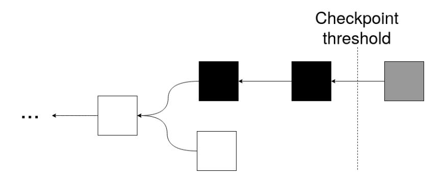

Figure 3: The adversary A produces a private chain (top) which spans multiple epochs. Upon publishing it, A can checkpoint all black blocks. However, it also contains a grey block, which allows A to build an advantage into the next epoch. Mitigating block lead would render the grey block invalid and restrict this advantage to only the black blocks.

{6}------------------------------------------------

#### 3.3.1 Persistence

The checkpointing definition directly implies persistence. Intuitively, every block that is an ancestor to a checkpoint is stable, thus persistence is satisfied for every block up to and including the latest-issued checkpoint. Theorem 1 formally proves this intuition, where  $C^{\lceil k \rceil}$  denotes the chain which is output by removing the k last blocks from C. We also note that  $k_c$  is typically small, thus persistence is guaranteed for relatively small k and transactions are finalized after a short amount of time.

<span id="page-6-2"></span>**Theorem 1** (Persistence). The checkpointed chain resolution protocol of Section 3.1 satisfies persistence (cf. Definition 2) for parameter  $k \geq k_c$ .

Proof. It suffices to show that, at any round r, for two honest parties  $\mathcal{V}_1, \mathcal{V}_2$  with chains  $C_1, C_2$  respectively, where  $|C_1| \leq |C_2|$ , it holds that  $C_1^{\lceil k} \prec C_2^{\lceil k}$ . In that case, a transaction in  $C_1^{\lceil k}$  is also reported by  $\mathcal{V}_2$  in the same position, since  $C_1^{\lceil k}$  is a prefix of its own chain. We observe that, if  $k \geq k_c$ , at least one of the last k blocks in both chains  $C_1, C_2$  is a checkpoint. Assume that this checkpoint is the  $l_1$ -th block from the head of  $C_1$  and the  $l_2$ -th from the head of  $C_2$ ; by definition of the chain decision rule,  $C_1^{\lceil l_1} = C_2^{\lceil l_2}$ .

#### <span id="page-6-1"></span>3.3.2 Liveness

Proving that the checkpointed ledger satisfies liveness is significantly more challenging, so our analysis proceeds in distinct steps. First, Theorem 2 shows that a transaction's liveness is guaranteed as long as an honest block is checkpointed. Second, we express the execution as an absorbing Markov chain (Algorithm 1). Third, Theorem 3 shows that an honest block gets checkpointed, i.e. liveness is guaranteed, as long as the execution reaches the absorbing state of the Markov chain. Finally, we show that absorption, which depends on the adversarial power and the checkpointing interval, is always reached with non-negligible probability, which increases w.r.t. the liveness parameter u.

<span id="page-6-0"></span>**Theorem 2.** For any execution of a checkpointed chain resolution protocol which securely realizes  $\mathcal{F}_{\mathsf{Checkpoint}}$  (cf. Section 3.1), a transaction  $\tau$  is stable (cf. Definition 1) if at least one honestly-generated block, which is mined after the creation of  $\tau$ , is part of the checkpointed chain after u rounds since  $\tau$  is diffused on the network.

Proof. Assume a block B which is honestly produced after  $\tau$  is diffused on the network and extends a chain C. By definition of the model of Section 2.4,  $\tau$  is part either of C or B. Next, assume that B is part of the checkpointed chain. By definition of the checkpointing functionality  $\mathcal{F}_{\mathsf{Checkpoint}}$ , the miners reject any chain which does not extend the checkpointed chain, i.e. which does not include B. Therefore, regardless of the adversarial strategy, after this point  $\tau$  is necessarily in the checkpointed chain.

An epoch begins with the creation of a new checkpoint and the accompanying unpredictable nonce r. r refreshes the process and ensures that the execution is memoryless across epochs. Thus, we can use a (somewhat) simple absorbing Markov chain, parameterized by  $k_c$ , to express the checkpointed ledger's execution. Theorem 3 will then show that reaching the absorbing state translates into checkpointing an honest block, i.e. achieving liveness.

Each state of the Markov chain is identified by a pair (i, j). i denotes the number of blocks that the *honest parties* need to *necessarily* produce to reach the next checkpoint; equiv. j is the number of blocks that  $\mathcal{A}$  needs to produce. Corollary 1 shows that, to violate liveness,  $\mathcal{A}$  cannot adopt honestly-generated blocks, thus  $\mathcal{A}$  mines separately from the honest parties.

<span id="page-6-3"></span>Corollary 1. Assume a transaction  $\tau$ , which is not part of the checkpointed chain. For any execution of a checkpointed chain resolution protocol which securely realizes  $\mathcal{F}_{\mathsf{Checkpoint}}$  of Section 3.1, if  $\mathcal{A}$  adopts an honest block which is produced after the creation of  $\tau$ , then liveness is guaranteed for  $\tau$ .

*Proof.* If  $\mathcal{A}$  adopts an honest block B, then either B or the chain that B extends contains the transaction under question (cf. Theorem 2), so the transaction is eventually checkpointed.  $\square$ 

{7}------------------------------------------------

Each epoch starts on state  $(k_c, k_c)$ , where all parties need exactly  $k_c$  blocks to "reach" the next checkpoint. The absorbing state compounds all states of the form (0, j) with j > 0. States (i, j) with i > 0 are transitional. Transitions represent the accumulation of honest and adversarial blocks in their respective chains. We assume that, if an honest party produces multiple blocks in a single round, it diffuses only the first. Therefore, the only allowed transitions from state (i, j) are towards states (i - a, j - b) with  $a \in \{0, 1\}, b \in [0, j]$ . We define the following random variables:

- H: H = 1 if at least one honest party produces a block at a given round, else H = 0;
- $M^{(i)}$ :  $M^{(i)} = 1$  if all adversarial parties produce exactly i blocks at a given round, else  $M^{(i)} = 0$ ;

for which the following hold, assuming that A cannot censor queries to the hashing oracle:

- $\mathbb{E}(H) = h = 1 (1 p)^{q \cdot (n t)};$
- $\mathbb{E}(M^{(i)}) = m^{(i)} = {q \cdot t \choose i} \cdot p^i \cdot (1-p)^{q \cdot t-i}$  for any i.

Lemma 1 shows that, when at least one honest block is created, *each* honest party's chain increases by one block, though not necessarily the same; this result is adjacent to the *chain growth* property first implied in [22] and explicitly highlighted in [33].

<span id="page-7-0"></span>**Lemma 1.** If an honest party V has a chain of length l at round r, at round r+1 every honest party has a chain of length at least l.

*Proof.* The proof is a direct result of the network synchronicity assumption. If, at round r,  $\mathcal{V}$  extends its chain to length l and diffuses the new block to the network, at round r+1 all other honest parties will adopt either  $\mathcal{V}$ 's chain or a longer one.

Lemma 2 defines the transition probability from a state (i, j) to a state  $(i - a, j - b), a \in \{0, 1\}, b \in [0, j]$ ; we use the following notation:  $\hat{m}_l = \sum_{\phi=0}^l m^{(\phi)}, \bar{h} = 1 - h$ . These probabilities are the minimum w.r.t. the honest chain growth, and assume that  $\mathcal{A}$  publishes a chain with length l only if the longest honest chain is also l-long. Indeed, if  $\mathcal{A}$  publishes its chain earlier, then the transition probabilities change in favor of the honest parties, since the honest parties converge quicker to the absorption state.

<span id="page-7-1"></span>**Lemma 2** (Transition Probabilities). For transitions from round (i, j), where i > 1, j > 0 and  $b \in [0, j - 1]$ , the following hold:

- transition to (i, j b) occurs with probability  $\bar{h} \cdot m^{(b)}$ ;
- transition to (i-1, j-b) occurs with probability  $h \cdot m^{(b)}$ .

Additionally, the following special cases hold:

- i) the state (0,0) is equivalent to the state  $(k_c,k_c)$ ;
- ii) transition from round (1,j), where j > 0, to the absorbing state occurs with probability  $h \cdot \hat{m}_{j-1}$ ;
- iii) from round (i, j), where i, j > 0, the following hold:
  - transition to (i,0) occurs with probability  $\bar{h} \cdot (1 \hat{m}_{j-1})$ ;
  - transition to (i-1,0) occurs with probability  $\bar{h} \cdot (1-\hat{m}_{j-1})$ ;
- iv) from round (i,0), where i > 0, the following hold:
  - transition to (i-1,0) occurs with probability h;
  - transition to (i,0) occurs with probability  $\bar{h}$ .

{8}------------------------------------------------

*Proof.* For the first part, at state (i, j), if at least one honest party computes a block, the first coordinate is necessarily reduced by 1 (Lemma 1). Also, the second coordinate is reduced by b if and only if all adversarial parties (sequentially) produce exactly b blocks, as A does not adopt honest blocks (Corollary 1).

Regarding the special cases:

- i)  $\mathcal{A}$  controls the message delivery order, so if both the honest parties and  $\mathcal{A}$  produce enough blocks,  $\mathcal{A}$  can ensure that its block is prioritized and is checkpointed over the honest block.
- ii) If an honest block is produced and  $\mathcal{A}$  produces less than j blocks, the absorbing state (0, l) (with l > 0) is reached.
- iii) If A produces at least j blocks, the next state is (i,0) if no honest block is produced (resp. (i-1,0) if one is).
- iv) At j = 0,  $\mathcal{A}$  has a long enough chain. So, the only possible transition (i.e. to state (i-1,0)) depends on the honest block production probability h.

Algorithm 1 constructs the Markov chain following the rules of Lemma 2.  $\operatorname{createGraph}(k_c, k_c)$  produces the chain and is parameterized by  $\operatorname{addEdge}$ , which creates a new edge given the source state, destination state, and transition probability. The connection of this Markov chain to liveness is established in Theorem 3.

<span id="page-8-0"></span>**Theorem 3** (Liveness). The Markov chain defined in Algorithm 1 has the property that, whenever it reaches the absorbing state, an honest block is guaranteed to be checkpointed in the corresponding execution with error probability  $L \cdot 2^{-\omega}$ , L being the protocol's execution total length.

*Proof.* The proof relies on two observations. We recall that the absorbing state is defined as (0,j) for j>1, i.e. in the current execution, and since the last checkpoint, the honest parties have produced enough blocks to reach the next checkpoint, while  $\mathcal{A}$  has produced at least one block less. The first observation is that, whenever an honest block is produced in a round, the chain of all honest parties is guaranteed to advance irrespectively of the adversarial strategy (cf. Lemma 1). As a result, when the absorbing state is reached, one honest party possesses a chain sufficiently long to be checkpointed. Next, we would like to show that such chain will have at least one honest block. We can derive this from the second observation, i.e. the fact that each checkpoint introduces unpredictable randomness  $r \stackrel{\$}{\leftarrow} \{0,1\}^{\omega}$ . Thus, any adversarial blocks produced prior to the calculation of the last checkpoint cannot contribute to the chain that an honest party possesses (unless  $\mathcal{A}$  correctly guesses the random nonce r of the checkpoint, prior to its introduction, an event which is conveyed in the error term of the theorem). It follows that, by definition, the absorbing state puts A at a position where it lacks a sufficient number of blocks to match the blocks in an honest party's chain and thus at least one honest block will be checkpointed.

Finally, it remains to observe that, starting from any state, there exists a path which reaches the absorption state with non-zero aggregate probability. Therefore, for a sufficiently large number of steps (equiv. rounds in our execution model), the absorption probability is non-negligible and, as this number of steps tends to infinity, the probability that liveness is guaranteed tends to 1.

**Liveness Evaluation.** To evaluate liveness, we take a snapshot of Ethereum Classic.<sup>6</sup> Each hash corresponds to a query and each party performs 237 MH/s.<sup>7</sup> The total hash rate is on average 8 TH/s, thus the total number of parties is  $n = \frac{8 \cdot 10^{12}}{237 \cdot 10^6} = 33755$ . A single round lasts 12 seconds (i.e. on average the time an Ethereum Classic block requires to be mined), so  $q = 12 \cdot 237 \cdot 10^6$ . Finally, difficulty implies the required number of most-significant bits of a

<span id="page-8-2"></span><span id="page-8-1"></span><sup>&</sup>lt;sup>6</sup>All data on Ethereum Classic are from https://bitinfocharts.com [6 February 2019].

<sup>&</sup>lt;sup>7</sup>This corresponds to the popular mining hardware "PandaMiner B1 Plus", thus we assume that each party is realized by a single such machine.

{9}------------------------------------------------

Algorithm 1 The recursive construction algorithm for the absorbing Markov chain, parameterized by kc.

```
function createMarkovChain(kc)
   createGraph(kc, kc)
   addEdge(final, final, 1)
end function
function createGraph(i, j)
   if j > 0 then
       for l ∈ [0, j − 1] do
           addEdge((i, j),(i, j − l), h¯ · m(l)
                                             )
           if l > 0 then
               createGraph(i, j − l)
           end if
           if i > 1 then
               addEdge((i, j),(i − 1, j − l), h · m(l)
                                                     )
               createGraph(i − 1, j − l)
           end if
       end for
       addEdge((i, j),(i, 0), h¯ · (1 − mˆ j−1))
       createGraph(i, 0)
       if i = 1 then
           addEdge((i, j), final, h · mˆ j−1)
           addEdge((i, j),(kc, kc), h · (1 − mˆ j−1))
       else
           addEdge((i, j),(i − 1, 0), h · (1 − mˆ j−1))
           createGraph(i − 1, 0)
       end if
   else
       addEdge((i, j),(i, j), h¯)
       if i = 1 then
           addEdge((i, j),(kc, kc), h)
       else
           addEdge((i, j),(i − 1, j), h)
           createGraph(i − 1, j)
       end if
   end if
end function
```

{10}------------------------------------------------

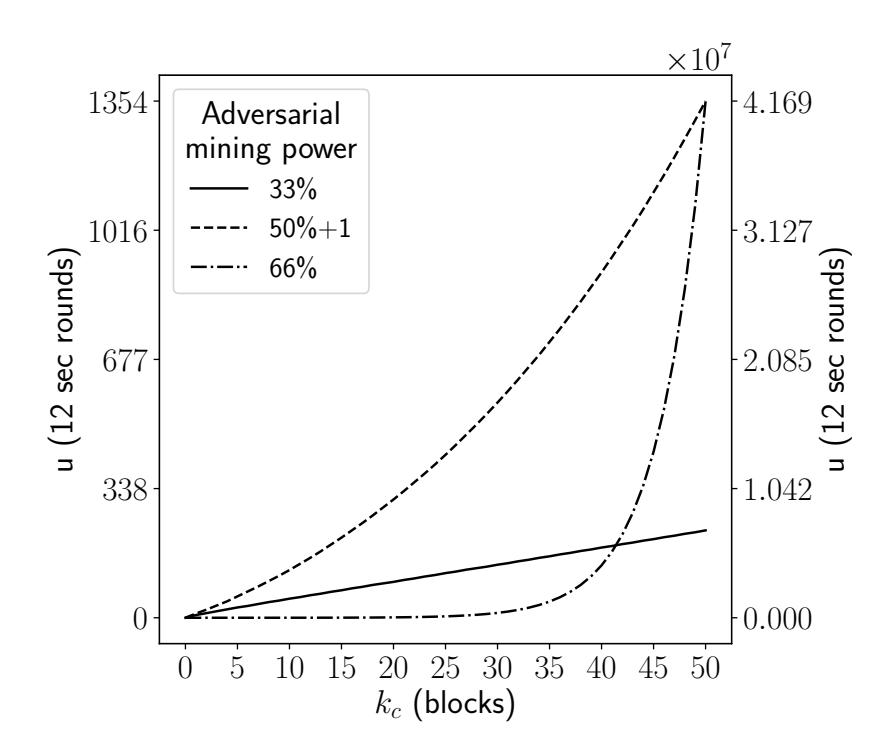

<span id="page-10-1"></span>Figure 4: The expected number of steps before absorption for the checkpointed Ethereum Classic w.r.t.  $k_c$ , i.e. the expected u before liveness is achieved with probability at least  $\frac{2}{3}$ . The primary (left) axis identifies the liveness parameter u for 33% and 50% + 1 adversarial control, while the secondary axis corresponds to 66% adversarial power. Our model is parameterized with  $q = 12 \cdot 237 \cdot 10^6$ , n = 33755,  $p = 9.1 \cdot 10^{-15}$ , and 12-second rounds.

block's hash being equal to 0. In our case, the difficulty is 110 TH, i.e. 1 out of every  $110 \cdot 10^{12}$  hashes is successful on average, so  $p = 9.1 \cdot 10^{-15}$ .

To compute the expected amount of time until absorption and the absorption probability w.r.t. u, we consider the transition matrix of the Markov chain of Algorithm 1. Additionally, we assume a sufficiently large value of  $\omega$ , such that the error probability is negligible.

Figure 4 depicts the expected number of steps before absorption w.r.t.  $k_c$  and Ethereum Classic's parameters. This provides an estimation of the number of rounds, i.e. the value of u, needed to achieve liveness with probability at least  $\frac{2}{3}$ . As expected, u increases with the adversarial power. u increases linearly with  $k_c$  if  $\mathcal{A}$  controls a minority of the mining power. However, if  $\mathcal{A}$  controls a mining majority, u increases exponentially with  $k_c$ , to the point where a 66% adversary is orders of magnitude more powerful (and we need a different axis to make the figure intelligible).

Figure 5 shows the liveness probability w.r.t. u for various values of  $k_c$ . Naturally, the liveness probability depends on the initial state of the graph, i.e. the state of the system when the transaction is published for the first time. Therefore, the minimum liveness is extracted as the minimum probability over all possible transient initial states. Our simulations show that, as expected, this state is  $(k_c, 0)$ , i.e. when  $\mathcal{A}$  has the biggest advantage; consequently, the liveness probability is non-zero after at least  $2 \cdot k_c$  rounds. To evaluate the liveness probability, we fix the adversarial mining power to 50% + 1. We observe that liveness is achieved with high probability after a relatively small amount of rounds for  $k_c = 1$ ; specifically after 50 rounds, i.e. after 10 minutes, the liveness probability is 0.9975. However, the liveness probability decreases significantly as the epoch length increases; for instance, again for 10 minutes, when  $k_c = 5$  the liveness probability is 0.5836, whereas when  $k_c = 10$  it drops significantly to 0.1434. This behavior is expected since, as  $k_c \to \infty$  the system downgrades to the standard non-checkpointed setting, where an adversary breaks liveness via a block lead attack.

Finally, Appendix C explores a checkpointing scheme with randomized  $k_c$  unknown to the adversary, whereas Appendix D explores liveness when the adversary is not rushing; both designs slightly improve the previous liveness results.

#### <span id="page-10-0"></span>3.4 The Checkpointed Chain Resolution Protocol

In this section we realize the checkpointing authority as a federated service distributed among parties communicating over an asynchronous network. To make our design most efficient we

{11}------------------------------------------------

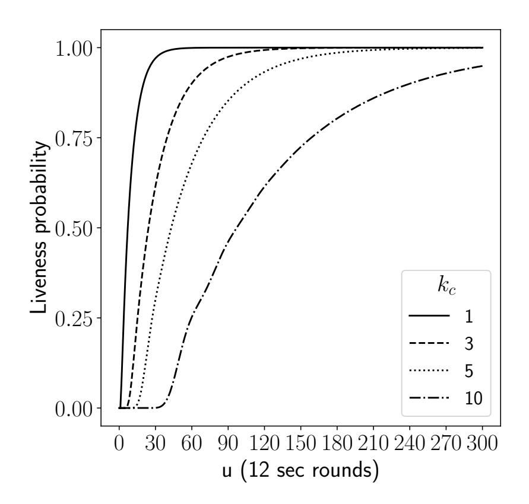

<span id="page-11-0"></span>Figure 5: Liveness of a checkpointed Ethereum Classic w.r.t. u and  $k_c$ . The vertical axis identifies the liveness probability, while the horizontal axis defines u, i.e. the number of consecutive rounds for which the transaction is supplied to the miners. Our model is parameterized with rounds which last 12 seconds,  $q = 12 \cdot 237 \cdot 10^6$ , n = 33755, and  $p = 9.1 \cdot 10^{-15}$ . The adversarial mining power is 50% + 1 so t = 16877.

assume that the checkpointing service runs among a set of parties that trust each other and tolerate benign faults e.g. crashes. Although not fully decentralized, like the timestamping solution (Section 4), checkpointing is in line with similar real-world mechanisms, e.g. Bitcoin, Peercoin, and Feathercoin, where checkpoints were issued by the software's developers. Our prototype implementation (Section 3.5) considers a scenario where 5 coordinating organizations, such as development companies and/or community foundations operating in the ledger's ecosystem, employ 3 nodes each (for redundancy purposes). Appendix B relaxes this assumption via a protocol that tolerates Byzantine Faults, although at the cost of using an expensive interactive consistency protocol over a synchronous network.

The checkpointing protocol is parameterized by a number of subroutines. First, it is parameterized by a validation predicate Validate. This predicate identifies whether a chain is valid, e.g. verifies the signatures and the Proof-of-Work of the chain's blocks, similar to the maxvalid function of the Bitcoin Backbone. Second, the parties coordinate via a fail-stop subprotocol  $\pi_{FS}$ , like RAFT [46] or Paxos [38]. This protocol enables the parties to both reach agreement on which block to checkpoint and the value of the unpredictable nonce r. Each party  $\mathcal{V}_j$  inputs  $\langle B_j, r_j \rangle$ , where  $B_j$  is a (valid) block and  $r_j \stackrel{\$}{\leftarrow} \{0,1\}^{\omega}$  is a random nonce. At the end of  $\pi_{FS}$ , each party outputs  $\langle B', r' \rangle$ , i.e. one of the input block and nonce. The checkpointing protocol is defined in Figure 6, where C[i] denotes the i-th block of chain C. Theorem 4 formally shows that  $\pi_{\mathsf{Checkpoint}}$  securely realizes  $\mathcal{F}_{\mathsf{Checkpoint}}$ ; the proof follows directly from the properties of the fail-stop protocol if a majority of parties is live. We note that the theorem restricts to environments that, when corrupting a party, they may force it to fail, rather than behave arbitrarily.

<span id="page-11-1"></span>**Theorem 4.** Protocol  $\pi_{\mathsf{Checkpoint}}$  securely realizes  $\mathcal{F}_{\mathsf{Checkpoint}}$  if a majority of parties in  $\mathbb{V}$  are live, i.e. do not fail-stop.

Proof. Since we assume only crash faults, a party either follows the protocol or is unresponsive. As a result, the blocks proposed for checkpointing are valid, since the protocol employs the validation predicate Validate before providing them as input to  $\pi_{FS}$ . Additionally, the value  $r_j$ , picked by each party at random, is unpredictable and indistinguishable from  $r_i$  chosen by  $\mathcal{F}_{Checkpoint}$ . Therefore, the inputs to  $\pi_{FS}$  are well-structured, i.e. indistinguishable from the corresponding values in  $\mathcal{F}_{Checkpoint}$ . Finally, if a majority of parties is available,  $\pi_{FS}$  is guaranteed to produce a checkpoint chosen according to maxvalid, as in  $\mathcal{F}_{Checkpoint}$ . We note that, in the

{12}------------------------------------------------

## Protocol $\pi_{\mathsf{Checkpoint}}$

A checkpointing party which runs  $\pi_{\mathsf{Checkpoint}}$  is parameterized by the list  $\mathbb{V}$  of n checkpointing parties, a (fail-stop) consensus protocol  $\pi_{\mathsf{FS}}$ , a validation predicate Validate, the function maxvalid, and  $k_c$ . It keeps a local checkpointed block,  $B_c$ , initially set to  $\epsilon$ .

Upon receiving (CANDIDATECHECKPOINT, C') check:

- $\exists i : C'[i] = B_c$  (i.e. if C' extends the checkpoint);
- Validate(C') = 1 (i.e. if C' is valid);
- $|C'| i = k_c$  (i.e. if C' is long enough).

If all hold:

- 1. pick  $r_j \stackrel{\$}{\leftarrow} \{0,1\}^{\omega}$ ;
- 2. pick input  $\langle C', r_j \rangle$  for the protocol  $\pi_{\mathsf{FS}}$ ;
- 3. execute  $\pi_{\mathsf{FS}}$  with the parties in  $\mathbb{V}$  to agree on an input  $\langle C', r' \rangle$ , such that  $\forall \langle \hat{C}, \hat{r} \rangle \in \mathbb{I}$ : maxvalid $(C', \hat{C}) = C'$  with  $\mathbb{I}$  the set of inputs, i.e. choose the output according to maxvalid;
- 4. set  $B_c := tail(C')||r'|$ .

Finally, return (CHECKPOINT,  $B_c$ ).

<span id="page-12-0"></span>Figure 6: The protocol run by the parties of the checkpointing authority.

ideal world, the simulator  $\mathcal{A}$  can control the delivery of messages to  $\mathcal{F}_{\mathsf{Checkpoint}}$ , such that the first valid candidate block which is proposed is also the heaviest (according to maxvalid).

Naturally, if the availability guarantee fails, i.e. if a majority of parties is unavailable, then  $\pi_{FS}$  stops. In that case, checkpoint consistency is guaranteed, i.e. no conflicting checkpoints will be issued, but also no new checkpoints are produced. In turn, the ledger downgrades to the plain execution model: persistence is guaranteed for all blocks prior to the last checkpoint and liveness is no longer guaranteed, under adversarial mining majority.

To incorporate checkpoints in the consensus protocol run by miners, we slightly adapt Bitcoin Backbone. Specifically, instead of using maxvalid directly for chain resolution, a miner now utilizes the checkpointing mechanism. The chain resolution protocol, which is run by miners in the checkpointed setting, is defined in Figure 7; C[:i] denotes the chain consisting of the first i blocks of C. When a miner creates a new block, they submit it to all checkpointing parties via the CandidateCheckpoint interface of  $\pi_{\mathsf{Checkpoint}}$ . When the new checkpoint is issued, they accept it and, following, they adopt a new chain only if it contains a newly-issued checkpoint.

Although  $\pi_{\mathsf{Checkpoint}}$  checkpoints valid chains, i.e. validates both the block's headers and transactions before selecting a chain, we can relax this assumption by requiring  $\pi_{\mathsf{Checkpoint}}$  to validate only the block's headers. This change reduces the computation and trust requirements of  $\pi_{\mathsf{Checkpoint}}$ , but also permits invalid transactions in the chain. Specifically, a block with invalid transactions may present valid headers, i.e. extend the hash chain correctly per the PoW rules. A party which validates only the headers, and not each transaction in the block, would thus accept it. In this case, the ledger's consensus mechanism should be adapted to accept only the first of the potential conflicting transactions, rather than rejecting the chain which contains invalid transactions altogether, as is the case in existing systems.

As motivated in the introduction, checkpoints are a temporary measure. Once honest majority is ensured and the ledger can securely exist without assistance, the shut down of the checkpointing service is initiated. Shutdown is parameterized by a security threshold, such that,

{13}------------------------------------------------

#### Protocol $\pi_{\mathsf{CheckpointMiningRes}}$

A party which runs  $\pi_{\mathsf{CheckpointMiningRes}}$  is parameterized by maxvalid, the n checkpointing parties  $\mathbb{V}$  which run  $\pi_{\mathsf{Checkpoint}}$ , and  $k_c$ . It keeps a local chain C and the checkpoint index  $i_c$ , initially set to  $\epsilon$  and 0.

Upon receiving (CandidateChain, C'), set  $C := \mathsf{maxvalid}(C, C')$ . If  $|C| \geq i_c + k_c$  set  $i_c := i_c + k_c$  and send  $C[: i_c]$  to all parties in  $\mathbb{V}$ . Upon receiving  $\lceil \frac{n}{2} \rceil$  messages (Checkpoint, B||r) from different checkpointing parties, if  $C[i_c] = B||r$  set  $C := C[: i_c]||r$ .

Upon receiving (READ) return (CHAIN, C).

<span id="page-13-1"></span>Figure 7: Checkpointed chain resolution for miners.

after it is reached, the checkpoint protocol halts and the ledger relies solely on PoW mining. Although the nature of this threshold is outside of the scope of this paper, potential candidates include the network's hash rate and the profitability of attacks. To future-proof the system we present two options: a) if the security threshold is publicly computable, then the miners know whether it has been reached and ignore future checkpoints; b) the authority produces a well-defined "shut down" message to alert the miners. Future work will explore additional mechanisms for shutting down the checkpointing service in a future-proof manner.

#### <span id="page-13-0"></span>3.5 Prototype Implementation

Following Section 3.3, checkpointing needs to occur frequently, so it is important that checkpoints are issued quickly and are lightweight. Therefore, we evaluate our checkpointing scheme by building a prototype. We assume a PKI for the checkpointing nodes; after agreeing on a checkpoint, the nodes produce and publish a collective signature. The collective signature is unpredictable, otherwise an attacker would be able to produce forged signatures. Therefore, the signature acts both as a non-interactive proof, used by miners to verify checkpoints, and as the necessary unpredictable nonce.

Our experiments ran on a private Ethereum network on Amazon's EC2 platform with t2.micro instances running Ubuntu 18.04 LTS. The network consisted of 3 mining nodes, which coordinated via a "bootnode" node. Our network replaced the costly PoW mechanism of Ethereum with Parity's Proof-of-Authority (PoA) [19], which uses the *Clique* algorithm to simulate PoW. All nodes were launched within the same geographical region (EU) and produced blocks on a 10 second interval (as opposed to the 15 second interval of the real-world Ethereum mainnet).

The checkpointing federation consisted of 15 nodes and was built using various existing tools. First, each node ran an Ethereum client which retrieved the blocks from the mining nodes. Second, to coordinate checkpointing we used etcd,<sup>9</sup> a distributed file system which employs Raft [46] to resolve conflicts. Using etcd the nodes reach agreement on a new checkpoint and also exchange and store signatures on newly-issued checkpoints. Third, each node was identified by a public key — we assume that the keys are well-known, e.g. are part of the genesis block of the system. The keys and signatures were generated using the JavaScript cryptographic library TweetNaCl.<sup>10</sup>

A checkpointing node connected to an Ethereum client and waited until at least  $k_c$  blocks had been mined on top of the latest checkpoint; our implementation set  $k_c := 4$ . At that point, the node signed the block's hash and stored it on etcd. A valid checkpoint consisted of at least 8 signatures on a block's hash. If the checkpointing nodes failed to reach agreement, i.e.

<span id="page-13-2"></span><sup>&</sup>lt;sup>8</sup>t2.micro instances use 1 virtual CPU and 1 GB of memory.

<span id="page-13-4"></span><span id="page-13-3"></span> $<sup>^9 {\</sup>tt https://etcd.io/}$ 

<sup>10</sup>https://tweetnacl.js.org

{14}------------------------------------------------

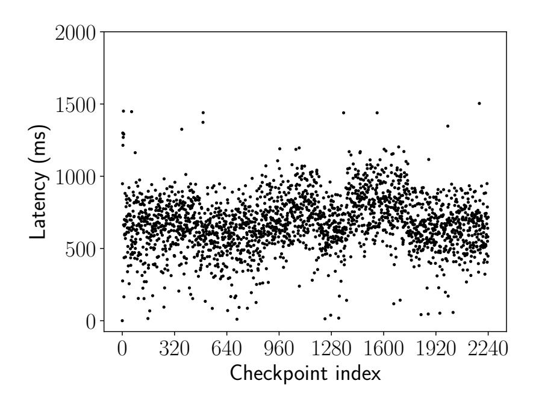

<span id="page-14-0"></span>Figure 8: Evaluation of latency, i.e. the time between retrieving a block and accepting it as a checkpoint, for the prototype checkpointing implementation. Each graph point corresponds to an independent checkpoint, over a period of more than 24 hours.

produced signatures on conflicting blocks, they dismissed it and proceeded to checkpoint the next candidate block, i.e. after k<sup>c</sup> blocks.

Our analysis focuses on the following metrics: i) network latency, i.e. the time between the transmission of a block and its acceptance as a checkpoint; ii) the storage overhead of checkpoints.

Regarding (i), we deployed a client outside of Amazon's service and connected it both to the Ethereum private network and the checkpoint federation. To estimate latency we measured the elapsed time between retrieving a block eligible for checkpointing and obtaining a majority of valid federation signatures for the block's hash. Our analysis lasted more than 24 hours, spanning over 2200 checkpoints. Figure [8](#page-14-0) depicts our results, which are rather positive. Specifically, latency was on average 679 ms — occasionally, a checkpoint would need more time to be published, although no more than 1.5 seconds. Additionally, we observed cases when the federation nodes would not produce a checkpoint, with this failure rate being approximately 15%. Each fail resulted in a 40 second delay, i.e. until a following checkpoint was issued. However, we expect production-grade implementations to minimize such fails.

Latency also depends on the geographical disparity of the node and the client connected. Specifically, a client residing in the United Kingdom performed as follows, when connecting to checkpointing nodes in different regions:

• London (EU): 557 ms

• N. California (US West): 620 ms

• S˜ao Paulo (South America): 711 ms

• Tokyo (Asia Pacific): 723 ms

• Singapore (Asia Pacific): 779 ms

Table [1](#page-15-1) provides a latency comparison based on geographical location. Nevertheless, regardless of the client's geographical location, we expect an average latency of less than 1 second in real-world implementation.

Regarding (ii), a checkpoint consists of the concatenated signatures of federation nodes. Since each TweetNaCl signature consists of 64 bytes, each checkpoint amounts to 8 · 64 = 512 bytes, thus checkpointing results in a 0.6% increase in the ledger's size.[11](#page-14-1) We expect production-grade implementations to offer better results, e.g. utilizing multi-signature schemes, like the ASM scheme of [\[5\]](#page-21-3), to reduce the checkpoint's size.

<span id="page-14-1"></span><sup>11</sup>An Ethereum block is on average 20 KB. (<https://etherscan.io/chart/blocksize>)

{15}------------------------------------------------

| Region                    | Average Latency (ms) |
|---------------------------|----------------------|
| London (EU)               | 557                  |
| N. California (US West)   | 620                  |
| São Paulo (South America) | 711                  |
| Tokyo (Asia Pacific)      | 723                  |
| Singapore (Asia Pacific)  | 779                  |

<span id="page-15-1"></span>Table 1: Latency based on the geographical location of the checkpointing node to which a client in the UK connects.

## <span id="page-15-0"></span>4 The Timestamped Ledger

Our second scheme, timestamping, is motivated by the need for fully decentralized checkpoints. Timestamping allows us to relax our assumptions, while still achieving the same guarantees as above. Following, we first model timestamping as an ideal functionality and then realize it as an interactive decentralized service built on top of an existing distributed ledger.

### <span id="page-15-3"></span>4.1 The Timestamping Functionality

Figure 9 defines the global timestamping functionality.  $\mathcal{F}_{\mathsf{Timestamp}}$  issues timestamps by keeping a monotonically increasing counter and a list of timestamped strings. It allows a party to timestamp a string s by submitting the message (TIMESTAMP, s); afterwards, every party can verify it via the Verify interface. We stress that the timestamping functionality is global, i.e. timestamps are not issued privately. Therefore, when a party timestamps a string, every other party can access both the string and its timestamp. We also note that the timestamp consists of both a counter and a random value. The latter helps mitigate the block lead attack (cf. Figure 2). In the decentralized implementation of Section 4.3, where the timestamping functionality is realized as a distributed ledger, the random value is the hash of the block which timestamps a given string.

### Functionality $\mathcal{F}_{\mathsf{Timestamp}}$

 $\mathcal{F}_{\mathsf{Timestamp}}$  holds the following items: i)  $T_{[]}$ : an initially empty list of timestamped strings; ii)  $\tau$ : a counter initially set to 0.

Upon receiving (TIMESTAMP, s), if  $\forall (s', \cdot) \in T_{[]} : s' \neq s$ , set  $\tau := \tau + 1$ . Then compute a list R of  $p(\kappa)$  random values as  $r_j \stackrel{\$}{\leftarrow} \{0,1\}^{\omega}$  and send (Nonce, R) to A. Upon receiving a response (Nonce,  $r_i$ ), such that  $r_i \in R$ , add  $(s, \tau, r_i)$  to  $T_{[]}$ .

Upon receiving (Verify,  $s, \tau$ ), if  $\exists (s, \tau) \in T_{[]}$  then return (VerifyTimestamp,  $\top$ ).

<span id="page-15-2"></span>Figure 9: The timestamping ideal functionality.

### 4.2 Timestamped Chain Resolution

Using  $\mathcal{F}_{\mathsf{Timestamp}}$  we can now construct the timestamped ledger. Similar to Section 3, we define the timestamped mining protocol, which leverages  $\mathcal{F}_{\mathsf{Timestamp}}$  and picks a chain among the set of all possible candidates. A miner can timestamp a new block by submitting it to  $\mathcal{F}_{\mathsf{Timestamp}}$ ; a timestamped block is the tuple  $B_t = (B, \tau)$ , where B is the block created by the miner and  $\tau$  is the timestamp issued by  $\mathcal{F}_{\mathsf{Timestamp}}$ ;  $B.\tau$  denotes the timestamp of the block B.

{16}------------------------------------------------

When a miner is given a new candidate chain, they compare it with their local chain. Starting from the genesis block, it parses both chains until it finds the *timestamped* position where the two diverge, i.e. the oldest timestamped block in each chain which does not exist in the other. If such point exists, then we adopt the chain with the oldest diverging block. Otherwise, i.e. if the last checkpointed block in both chains is the same, we employ the maxvalid algorithm. Finally, between timestamped and non-timestamped blocks, the former are preferred. Figure 11 provides intuition for the timestamped chain decision rules, showcasing a basic timestamped block graph, with the timestamped mining chain resolution protocol  $\pi_{\text{TimeMiningRes}}$  defined in Figure 10.

```
Protocol \pi_{\sf TimeMiningRes}
```

A party that runs  $\pi_{\mathsf{TimeMiningRes}}$  holds the local chain C, initially set to  $\epsilon$ , and is parameterized by  $\mathsf{maxvalid}(\cdot, \cdot)$ .

Upon receiving (CandidateChain, C'), for every timestamped block  $B \in C'$ , send (Verify,  $B, B.\tau$ ) to  $\mathcal{F}_{\mathsf{Timestamp}}$  and wait for (VerifyTimestamp,  $\top$ ). Next:

```
i) set i := 0;
```

```
ii) while C[i] = C'[i] do i := i + 1;
```

```
iii) set i' := i, c := i - 1;
```

- iv) while C[i] is not timestamped and i < |C| do i := i + 1;
- v) while C'[i'] is not timestamped and i' < |C'| do i' := i' + 1;
- vi) if i = |C| and i' = |C'| set  $C := \mathsf{maxvalid}(C \setminus C[:c], C' \setminus C'[:c])$ ,
- vii) else if i = |C| or  $C'[i'].\tau < C[i].\tau$  then set C := C'.

Upon receiving (READ) return (CHAIN, C).

<span id="page-16-0"></span>Figure 10: Timestamped chain resolution for miners.

Theorem 5 formally shows the security of  $\pi_{\mathsf{TimeMiningRes}}$ . The proof follows directly from observing that a block cannot be backdated, therefore the first block that extends a chain and gets timestamped acts as a checkpoint.

<span id="page-16-1"></span>**Theorem 5** (Timestamping). The timestamped resolution protocol  $\pi_{\text{TimeMiningRes}}$  and the timestamping functionality  $\mathcal{F}_{\text{Timestamp}}$  of Section 4.1 guarantee persistence and liveness with parameter  $k_c = 1$  (cf. Theorems 1 and 3).

Proof. Assume all parties hold the same chain C. It suffices to show that the first block which extends C (and gets timestamped) acts as a checkpoint. Assume the first such block  $B_1$  extends C and is assigned a timestamp  $t_1$ . Any subsequent block  $B_i$  which extends C is assigned a timestamp  $t_i$  strictly larger than  $t_1$ , by definition of the timestamping mechanism. Thus, an honest miner will always adopt the chain  $C||B_1$  over  $C||B_i$ . Regardless of the adversarial strategy, if the honest parties produce a block first, its timestamp is irreversible and older than any subsequent adversarial block. Also since the adversary cannot censor timestamp requests, honest blocks always get timestamped. Therefore, the timestamp produced for the first block that extends a chain acts as a checkpoint. Finally, there are two considerations for the randomness r which mitigates block lead. First, as above, the adversary can predict it with probability  $L \cdot 2^{-\omega}$ , L being the protocol's execution length. Second, in decentralized timestamping, where r is the timestamping block's hash, the adversary does not affect the block's randomness. The latter assumption implies that either the adversary does not participate in mining on the timestamping

{17}------------------------------------------------

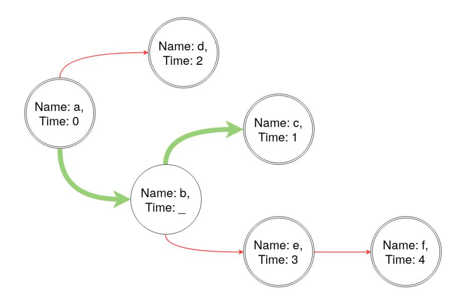

<span id="page-17-1"></span>Figure 11: A graph of (potentially) timestamped blocks. A chain is chosen by traversing the graph, starting with a which has children b and d. Since b is not timestamped, the tree of b is traversed until timestamped blocks are encountered. So the decision is among a||d, 0||b||c, and a||b||e||f; since block c has an older timestamp than d and e, a||b||c is chosen. However, if block b is later checkpointed, the canonical chain will become a||d, which is the reason why timestamping as soon as possible is paramount.

ledger, or that its participation power is limited; if its power is close to (but less than) 50%, then liveness is still guaranteed albeit for larger values of u.

Two important caveats need to be stressed here. First, timestamping blocks as they are produced is crucial, as A can discard an arbitrarily long non-timestamped chain. Additionally, the timestamping protocol needs to prevent A from producing forged timestamps; we build such decentralized mechanism next using a secure distributed ledger. Second, A could timestamp the hash and keep the block secret, resulting in a DoS where the honest miners halt until the block is revealed. In a centralized setting, this can be prevented by ensuring that the timestamping service timestamps only fully available blocks. Next, we show how to prevent this attack in the decentralized setting via the concept of consecutive timestamps.

### <span id="page-17-0"></span>4.3 Decentralized Implementation

We implement a fully decentralized timestamping service via a distributed ledger L; Appendix [E](#page-30-0) also provides a centralized solution similar to checkpoints.To timestamp a (possibly long) string s, a user submits a transaction τ to L containing d = H(s) for a hash function H(·). L is an append-only ledger, so a unique, monotonically increasing index can be assigned to every transaction in L, thus providing a total ordering of transactions; as long as L satisfies persistence, the ordering of stable transactions is irreversible. If L also satisfies liveness, then it is infeasible for A to censor an honest party's transaction. In our timestamping service, d is the hash of a block.

The miners of the timestamping ledger are divided in three categories: i) adversarial miners, controlled by A, ii) "indifferent" miners, who publish every available and valid transaction (under the timestamping ledger's validity rules), iii) "observing" miners. Observing miners publish the timestamping transaction for a block of the insecure ledger only if the block's content s is fully available; however, they do accept blocks created by other miners who contain such transactions. This results in a (non-disruptive) "velvet fork" [\[32\]](#page-23-4).

However, this assumption alone does not prevent A from timestamping private blocks, since adversarial and indifferent miners accept timestamping transactions. Therefore, we will require that d is published in v consecutive blocks. For large enough v, at least one block will be created by an observing miner, hence a private (adversarial) block cannot be timestamped, assuming a lower bound on the hashing power of observing miners.

The timestamp of a string is the index of the last timestamping transaction in the ledger, i.e. the transaction which finalizes the timestamping process. Additionally, the unpredictable nonce that mitigates block lead is the hash of the block which contains the first timestamping

{18}------------------------------------------------

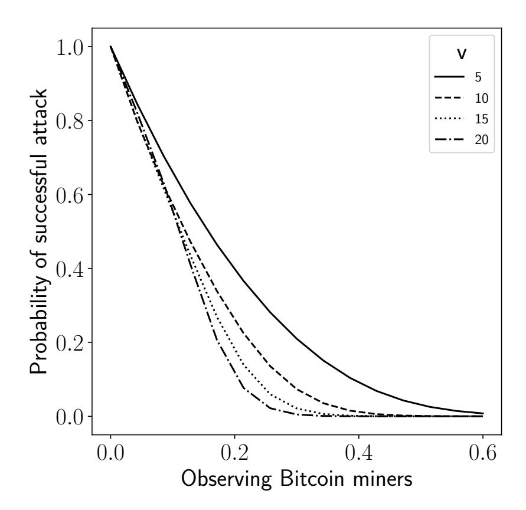

<span id="page-18-0"></span>Figure 12: Probability of a successful adversarial timestamping, w.r.t. the observing mining percentage and the number of consecutive timestamping blocks v. Adversarial miners control 10% of the timestamping ledger's power.

transaction. Evidently, the required public state's size is  $O(n \cdot v \cdot |d|)$ , n being the length of the "insecure" ledger in number of blocks.

Evaluation of Decentralized Timestamping. First, we evaluate the probability of an adversarial block getting timestamped, i.e. the probability of a successful DoS attack. Similar to Section 3.3.2, we construct a Markov chain (using equivalent random variables H, M for the observing and adversarial miners) with the following rules:

- the initial state is (v, v);
- all states (0, j), j > 0 compound to the "winning" absorbing state;
- all states (i, 0) compound to the "losing" absorbing state;
- from round (i, j), i, j > 0 and  $b \in [0, j 1]$ , the following transitions probabilities hold:
  - to (v, j b) occurs with probability  $m^{(b)}$ ;
  - to (i-1,v) occurs with probability  $h \cdot m^{(0)}$ ;
  - to (i-1,j-1) occurs with probability  $\bar{h} \cdot m^{(0)} \cdot \iota$ ,  $\iota$  the probability of an indifferent block being mined.

Figures 12 and 12 depict how the probability of a successful attack is affected by v and the adversarial mining power respectively.

We implement the timestamping service on two major blockchain systems, Bitcoin and Ethereum; the results of our constructions are demonstrated in Table 2. In Ethereum, a contract could simply receive the block's hash and emit an event.<sup>12</sup> The timestamping cost is identified as the gas cost per operation and is evaluated in USD.<sup>13</sup> Deploying our contract costs 176569 gas (\$4.7), whereas timestamping costs 27397 gas (\$0.7). In Bitcoin we can use the OP\_RETURN opcode [4] to timestamp arbitrary data up to 80 bytes, at a cost of \$0.1.<sup>14</sup>

<span id="page-18-1"></span><sup>&</sup>lt;sup>12</sup>An implementation of this contract has been deployed on the Ropsten testnet: https://ropsten.etherscan.io/address/0xf95c1b1caefe5f2b5050844f64cac906f15a78f1

<span id="page-18-3"></span><span id="page-18-2"></span> $<sup>^{13}1</sup>gas = 4.5 \cdot 10^{-8}$  ETH, 1ETH = \$593 (https://etherscan.io/chart/gasprice [December 2020])

<sup>&</sup>lt;sup>14</sup>Although Bitcoin's consensus rules do not impose such limit, the 80 byte threshold is a relay standard enforced by most miners. The Bitcoin dust fee for OP\_RETURN transactions is 546 satoshis and a single Bitcoin (10<sup>8</sup> satoshis) costs \$18700. (https://coinmarketcap.com [December 2020])

{19}------------------------------------------------

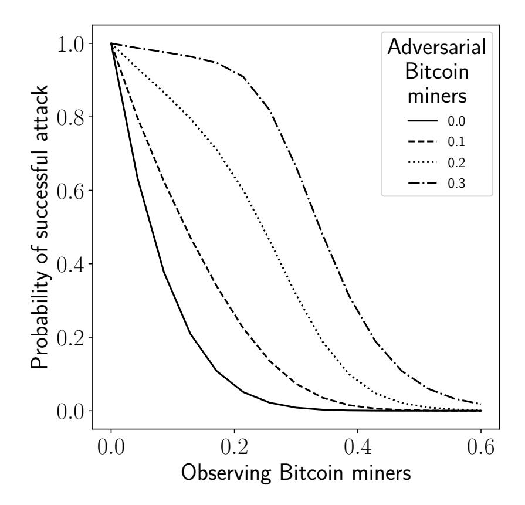

Figure 13: Probability of a successful adversarial timestamping, w.r.t. the observing mining percentage and the adversarial mining percentage. The number of consecutive timestamping blocks is v = 10.

|            | Ethereum | Contract deployment | \$4.7  |
|------------|----------|---------------------|--------|
| Cost       |          | Timestamping        | \$0.7  |
|            | Bitcoin  | Timestamping        | \$0.1  |
| Proof size | Ethereum | Full node           | 348 GB |
|            |          | SPV                 | 9 GB   |
|            |          | NIPoPoW             | 6 MB   |
|            |          | FlyClient           | 3 MB   |
|            | Bitcoin  | Full node           | 312 GB |
|            |          | SPV                 | 62 GB  |

<span id="page-19-0"></span>Table 2: Decentralized timestamping performance, using Ethereum and Bitcoin. [December 2020]

Latency is (expectedly) worse in the decentralized case. First, at least v rounds are required, a number which increases as adversarial timestamping miners increase and observing miners decrease. Additionally, Ethereum requires (on average) 35 confirmations until a transaction is stable, corresponding to 9 minutes, <sup>15</sup> while Bitcoin requires 10 minutes for unstable transactions and 60 minutes for stable transactions.

To verify a transaction, a node typically acquires and parses a full copy of the ledger. The Ethereum chain is 348 GB.  $^{16}$  An efficient alternative is Simplified Payment Verification (SPV) [43]. SPV clients retrieve only the blocks' headers, instead of the entire chain. Since the timestamp is only the index of a transaction in the ledger, to verify that the timestamp of a string d is  $\tau$ , the miner checks the chain's headers in a standard SPV fashion and additionally obtains the full block which contains the transaction of interest. The data which an SPV Ethereum client needs to retrieve and parse amount to about 9 GB. Finally, the state-of-the-art solutions are super-light client modes, like NIPoPoW [32] and FlyClient [7]. Super-light clients employ succinct proofs of synchronization, thus allowing to verify the timestamp of a string using a

<span id="page-19-1"></span><sup>15</sup> The reference numbers of confirmations as used by the Coinbase exchange: https://support.coinbase.com/customer/portal/articles/593836

<span id="page-19-2"></span><sup>&</sup>lt;sup>16</sup>https://etherscan.io/chartsync/chaindefault [December 2020]

{20}------------------------------------------------

proof of O(polylog(n)) size on the chain's length n. A super-light Ethereum-based timestamping client would thus require about 6 MB and 3 MB for NIPoPoW and FlyClient respectively [\[7\]](#page-21-5) as the timestamping proof. For Bitcoin, the timestamping proof is roughly 312 GB for a full node and 62 GB for an SPV node.[17](#page-20-0)

# 5 Related work

Checkpointing precedes blockchains as a method of stabilizing a consensus protocol. In their seminal paper on Practical Byzantine Fault Tolerance [\[12\]](#page-22-6), Castro and Liskov describe such mechanism in a replicated setting to bring up to date a replica "left behind".

In the blockchain engineering space, checkpoints are often used against network attacks and to enhance performance. Bitcoin introduced checkpoints[18](#page-20-1) to speed up the bootstrapping of network nodes and mitigate DoS and 51% attacks. The checkpoints were issued in an entirely centralized manner, a method also employed by Peercoin [\[35\]](#page-23-5) and Feathercoin [\[25\]](#page-23-6). Our checkpointing solution (Section [3\)](#page-3-4) is similar, albeit federated rather than fully centralized. In a different direction, Bitcoin ABC restricted chain re-orderings to a maximum depth of 10 blocks; similarly, Nxt [\[45\]](#page-24-7) applies a maximum re-ordering depth of 720 blocks. However, these solutions introduce the major "network split" hazard (Section [1\)](#page-0-1). Finally, RSK [\[40\]](#page-23-7) proposes a checkpoint system similar to Bitcoin, which is constructed as a federation. Notwithstanding, all mechanisms fail to counter the block lead attack (Section [3.2\)](#page-4-0) and ensure liveness, since the checkpoints exist outside of the chain.

Blockchain academic literature has primarily considered checkpoints in the context of longrange attacks against Proof-of-Stake (PoS), rather than protecting Proof-of-Work (PoW) systems. PoS protocols replace mining power with "stake", i.e. the subset of the coins that the block producer owns. Although such systems avoid the (environmentally) costly mining operations, they also enable an adversary to produce blocks at no-cost, which in turn results in a number of threats, such as the nothing-at-stake [\[18,](#page-22-7) [41\]](#page-24-8), long range [\[8\]](#page-21-6), and stake bleeding [\[23\]](#page-22-8) attacks. Checkpoints prevent such attacks in protocols like Ouroboros [\[34\]](#page-23-8), Snow White [\[13\]](#page-22-9), and Ouroboros Praos [\[14\]](#page-22-10), in the latter also serving as a mechanism to mitigate adaptive corruptions. In a slightly different direction, Fantomette [\[3\]](#page-21-7) employs decentralized checkpoints to secure a blockDAG-based ledger. In contrast, our mechanism prevents attacks from mining majorities; importantly, it assumes that the majority of online parties can be adversarial, as opposed to [\[2\]](#page-21-8).

Checkpoints are often used to improve transaction finality, by reducing the time until a transaction is stable. Casper [\[9,](#page-21-9) [10\]](#page-21-10) defines a checkpointing mechanism which, in conjunction with a PoW blockchain, protects against block reversions by (financially) penalizing misbehaving parties; a similar approach is taken by GRANDPA [\[52\]](#page-24-9). Afgjort [\[42\]](#page-24-10) describes a generic finality layer, which is run by a sub-committee and can be applied on top of any blockchain. HotPoW [\[30\]](#page-23-9) combines PoW with HotStuff [\[54\]](#page-24-11) to achieve constant-time finality via the creation of party quorums.

Employing a committee that irreversibly commits the ledger's state has also seen extensive research. On the PoW side, notable works include hybrid consensus [\[47\]](#page-24-12), which integrates a permissioned protocol with a decentralized ledger to elect rotating committees, Thunderella [\[48\]](#page-24-13), where a committee optimistically confirms transactions via an asynchronous consensus protocol with PoW as fallback, and ByzCoin [\[36\]](#page-23-10). On the PoS side, Algorand [\[24\]](#page-22-11) uses a Verifiable Random Function to elect a committee which runs a Byzantine Agreement protocol. Nonetheless, these systems also rely on the honest majority assumption of the underlying ledger. In turn, checkpointing could be used to secure instances of these protocols in cases when the majority is adversarial.

Finally, secure timestamping has been extensively researched. In a representative work, Haber and Stornetta [\[28\]](#page-23-11) construct a timestamping scheme with hashes and digital signatures. Blockchains increased interest in the topic, with a distributed ledger acting as a timestamping

<span id="page-20-1"></span><span id="page-20-0"></span><sup>17</sup><https://www.blockchain.com/charts/blocks-size> [December 2020]

<sup>18</sup>For a detailed discussion on checkpoints in the early versions of Bitcoin we refer to [https://bitcointalk.](https://bitcointalk.org/index.php?topic=437.msg3807) [org/index.php?topic=437.msg3807](https://bitcointalk.org/index.php?topic=437.msg3807)

{21}------------------------------------------------

service. Gipp et al. [\[26\]](#page-23-12) explored trusted timestamping using the Bitcoin blockchain, while projects such as OriginStamp [\[29\]](#page-23-13) aim to allow users to timestamp arbitrary data using Bitcoin's blockchain. Additionally, both Veriblock [\[50\]](#page-24-14) and Komodo [\[37\]](#page-23-14) provide elaborate mechanisms which leverage Bitcoin's blockchain to perpetually secure other chains, thus relying entirely on the Bitcoin chain's security. In comparison, our timestamping scheme (Section [4.3\)](#page-17-0) is only a temporary solution that avoids trivializing ledger maintenance.

# 6 Conclusion

This paper explores security mechanisms for protecting distributed ledgers from an adversarial mining majority. Given that, in this context, the ledger cannot protect itself by definition, the core idea is to introduce an external set of parties to guarantee security. We provide a rigorous treatment of two mechanisms, checkpointing and timestamping, which guarantee persistence and liveness, the two needed properties of a distributed ledger. Our analysis highlights a novel attack against liveness, block lead which threatens all existing checkpointing designs, and shows how to mitigate it. Finally, our timestamping solution achieves a high level of decentralization.

# References

- <span id="page-21-1"></span>[1] Bitcoin ABC. Bitcoin abc 0.18.5 released, 2018. [https://www.bitcoinabc.org/](https://www.bitcoinabc.org/2018-11-20-bitcoin-abc-0-18-5/) [2018-11-20-bitcoin-abc-0-18-5/](https://www.bitcoinabc.org/2018-11-20-bitcoin-abc-0-18-5/).
- <span id="page-21-8"></span>[2] Georgia Avarikioti, Lukas K¨appeli, Yuyi Wang, and Roger Wattenhofer. Bitcoin security under temporary dishonest majority. In Ian Goldberg and Tyler Moore, editors, FC 2019: 23rd International Conference on Financial Cryptography and Data Security, volume 11598 of Lecture Notes in Computer Science, pages 466–483, Frigate Bay, St. Kitts and Nevis, February 18–22, 2019. Springer, Heidelberg, Germany.
- <span id="page-21-7"></span>[3] Sarah Azouvi, Patrick McCorry, and Sarah Meiklejohn. Betting on blockchain consensus with fantomette. CoRR, abs/1805.06786, 2018.
- <span id="page-21-4"></span>[4] Bitcoin. Op return, 2019. [https://en.bitcoin.it/wiki/OP\\_RETURN](https://en.bitcoin.it/wiki/OP_RETURN).
- <span id="page-21-3"></span>[5] Dan Boneh, Manu Drijvers, and Gregory Neven. Compact multi-signatures for smaller blockchains. In Thomas Peyrin and Steven Galbraith, editors, Advances in Cryptology – ASIACRYPT 2018, Part II, volume 11273 of Lecture Notes in Computer Science, pages 435–464, Brisbane, Queensland, Australia, December 2–6, 2018. Springer, Heidelberg, Germany.
- <span id="page-21-0"></span>[6] Joseph Bonneau. Hostile blockchain takeovers (short paper). In Aviv Zohar, Ittay Eyal, Vanessa Teague, Jeremy Clark, Andrea Bracciali, Federico Pintore, and Massimiliano Sala, editors, FC 2018 Workshops, volume 10958 of Lecture Notes in Computer Science, pages 92–100, Nieuwpoort, Cura¸cao, March 2, 2019. Springer, Heidelberg, Germany.
- <span id="page-21-5"></span>[7] Benedikt B¨unz, Lucianna Kiffer, Loi Luu, and Mahdi Zamani. Flyclient: Super-light clients for cryptocurrencies. Cryptology ePrint Archive, Report 2019/226, 2019. [https://eprint.](https://eprint.iacr.org/2019/226) [iacr.org/2019/226](https://eprint.iacr.org/2019/226).
- <span id="page-21-6"></span>[8] Vitalik Buterin. On stake, 2014.
- <span id="page-21-9"></span>[9] Vitalik Buterin and Virgil Griffith. Casper the friendly finality gadget, 2017.
- <span id="page-21-10"></span>[10] Vitalik Buterin, Dani¨el Reijsbergen, Stefanos Leonardos, and Georgios Piliouras. Incentives in ethereum's hybrid casper protocol. In IEEE International Conference on Blockchain and Cryptocurrency, ICBC 2019, Seoul, Korea (South), May 14-17, 2019, pages 236–244. IEEE, 2019.
- <span id="page-21-2"></span>[11] Ran Canetti. Universally composable security: A new paradigm for cryptographic protocols. Cryptology ePrint Archive, Report 2000/067, 2000. <http://eprint.iacr.org/2000/067>.

{22}------------------------------------------------

- <span id="page-22-6"></span>[12] Miguel Castro and Barbara Liskov. Practical byzantine fault tolerance. In Margo I. Seltzer and Paul J. Leach, editors, Proceedings of the Third USENIX Symposium on Operating Systems Design and Implementation (OSDI), New Orleans, Louisiana, USA, February 22- 25, 1999, pages 173–186. USENIX Association, 1999.
- <span id="page-22-9"></span>[13] Phil Daian, Rafael Pass, and Elaine Shi. Snow white: Robustly reconfigurable consensus and applications to provably secure proof of stake. In Ian Goldberg and Tyler Moore, editors, FC 2019: 23rd International Conference on Financial Cryptography and Data Security, volume 11598 of Lecture Notes in Computer Science, pages 23–41, Frigate Bay, St. Kitts and Nevis, February 18–22, 2019. Springer, Heidelberg, Germany.
- <span id="page-22-10"></span>[14] Bernardo David, Peter Gazi, Aggelos Kiayias, and Alexander Russell. Ouroboros praos: An adaptively-secure, semi-synchronous proof-of-stake blockchain. In Jesper Buus Nielsen and Vincent Rijmen, editors, Advances in Cryptology – EUROCRYPT 2018, Part II, volume 10821 of Lecture Notes in Computer Science, pages 66–98, Tel Aviv, Israel, April 29 – May 3, 2018. Springer, Heidelberg, Germany.
- <span id="page-22-12"></span>[15] Panos Diamantopoulos, Stathis Maneas, Christos Patsonakis, Nikos Chondros, and Mema Roussopoulos. Interactive consistency in practical, mostly-asynchronous systems. In 21st IEEE International Conference on Parallel and Distributed Systems, ICPADS 2015, Melbourne, Australia, December 14-17, 2015, pages 752–759. IEEE Computer Society, 2015.
- <span id="page-22-1"></span>[16] Stefan Dziembowski, Lisa Eckey, Sebastian Faust, and Daniel Malinowski. PERUN: Virtual payment channels over cryptographic currencies. Cryptology ePrint Archive, Report 2017/635, 2017. <http://eprint.iacr.org/2017/635>.
- <span id="page-22-2"></span>[17] Stefan Dziembowski, Sebastian Faust, and Kristina Host´akov´a. General state channel networks. In David Lie, Mohammad Mannan, Michael Backes, and XiaoFeng Wang, editors, ACM CCS 2018: 25th Conference on Computer and Communications Security, pages 949– 966, Toronto, ON, Canada, October 15–19, 2018. ACM Press.
- <span id="page-22-7"></span>[18] Ethereum. Proof of stake faqs, 2018. [https://github.com/ethereum/wiki/wiki/](https://github.com/ethereum/wiki/wiki/Proof-of-Stake-FAQs) [Proof-of-Stake-FAQs](https://github.com/ethereum/wiki/wiki/Proof-of-Stake-FAQs).
- <span id="page-22-5"></span>[19] Parity Ethereum. Proof-of-authority chains, 2019. [https://wiki.parity.io/](https://wiki.parity.io/Proof-of-Authority-Chains) [Proof-of-Authority-Chains](https://wiki.parity.io/Proof-of-Authority-Chains).
- <span id="page-22-4"></span>[20] Ittay Eyal and Emin G¨un Sirer. Majority is not enough: Bitcoin mining is vulnerable. In Nicolas Christin and Reihaneh Safavi-Naini, editors, FC 2014: 18th International Conference on Financial Cryptography and Data Security, volume 8437 of Lecture Notes in Computer Science, pages 436–454, Christ Church, Barbados, March 3–7, 2014. Springer, Heidelberg, Germany.
- <span id="page-22-0"></span>[21] Matthias Fitzi. Generalized communication and security models in Byzantine agreement. PhD thesis, ETH Zurich, 2002.
- <span id="page-22-3"></span>[22] Juan A. Garay, Aggelos Kiayias, and Nikos Leonardos. The bitcoin backbone protocol: Analysis and applications. In Elisabeth Oswald and Marc Fischlin, editors, Advances in Cryptology – EUROCRYPT 2015, Part II, volume 9057 of Lecture Notes in Computer Science, pages 281–310, Sofia, Bulgaria, April 26–30, 2015. Springer, Heidelberg, Germany.
- <span id="page-22-8"></span>[23] Peter Gaˇzi, Aggelos Kiayias, and Alexander Russell. Stake-bleeding attacks on proof-ofstake blockchains. Cryptology ePrint Archive, Report 2018/248, 2018. [https://eprint.](https://eprint.iacr.org/2018/248) [iacr.org/2018/248](https://eprint.iacr.org/2018/248).
- <span id="page-22-11"></span>[24] Yossi Gilad, Rotem Hemo, Silvio Micali, Georgios Vlachos, and Nickolai Zeldovich. Algorand: Scaling byzantine agreements for cryptocurrencies. Cryptology ePrint Archive, Report 2017/454, 2017. <http://eprint.iacr.org/2017/454>.

{23}------------------------------------------------

- <span id="page-23-6"></span>[25] David Gilson. Feathercoin secures its block chain with advanced checkpointing, 2013. [https://www.coindesk.com/](https://www.coindesk.com/feathercoin-secures-block-chain-advanced-check-pointing) [feathercoin-secures-block-chain-advanced-check-pointing](https://www.coindesk.com/feathercoin-secures-block-chain-advanced-check-pointing).
- <span id="page-23-12"></span>[26] Bela Gipp, Norman Meuschke, and Andr´e Gernandt. Decentralized trusted timestamping using the crypto currency bitcoin, 2015.
- <span id="page-23-15"></span>[27] Charles Miller Grinstead and James Laurie Snell. Introduction to probability. American Mathematical Soc., 2012.
- <span id="page-23-11"></span>[28] Stuart Haber and W. Scott Stornetta. How to time-stamp a digital document. Journal of Cryptology, 3(2):99–111, January 1991.
- <span id="page-23-13"></span>[29] Thomas Hepp, Patrick Wortner, Alexander Sch¨onhals, and Bela Gipp. Securing physical assets on the blockchain: Linking a novel object identification concept with distributed ledgers. In Proceedings of the 1st Workshop on Cryptocurrencies and Blockchains for Distributed Systems, CRYBLOCK@MobiSys 2018, Munich, Germany, June 15, 2018, pages 60–65. ACM, 2018.
- <span id="page-23-9"></span>[30] Patrik Keller and Rainer B¨ohme. Hotpow: Finality from proof-of-work quorums. CoRR, abs/1907.13531, 2019.
- <span id="page-23-1"></span>[31] C. Edward Kelso. Bitcoin gold hacked for \$18 million, 2018. [https://news.bitcoin.com/](https://news.bitcoin.com/bitcoin-gold-hacked-for-18-million/) [bitcoin-gold-hacked-for-18-million/](https://news.bitcoin.com/bitcoin-gold-hacked-for-18-million/).
- <span id="page-23-4"></span>[32] Aggelos Kiayias, Andrew Miller, and Dionysis Zindros. Non-interactive proofs of proofof-work. Cryptology ePrint Archive, Report 2017/963, 2017. [http://eprint.iacr.org/](http://eprint.iacr.org/2017/963) [2017/963](http://eprint.iacr.org/2017/963).
- <span id="page-23-2"></span>[33] Aggelos Kiayias and Giorgos Panagiotakos. Speed-security tradeoffs in blockchain protocols. Cryptology ePrint Archive, Report 2015/1019, 2015. [http://eprint.iacr.org/2015/](http://eprint.iacr.org/2015/1019) [1019](http://eprint.iacr.org/2015/1019).
- <span id="page-23-8"></span>[34] Aggelos Kiayias, Alexander Russell, Bernardo David, and Roman Oliynykov. Ouroboros: A provably secure proof-of-stake blockchain protocol. In Jonathan Katz and Hovav Shacham, editors, Advances in Cryptology – CRYPTO 2017, Part I, volume 10401 of Lecture Notes in Computer Science, pages 357–388, Santa Barbara, CA, USA, August 20–24, 2017. Springer, Heidelberg, Germany.
- <span id="page-23-5"></span>[35] Sunny King and Scott Nadal. Ppcoin: Peer-to-peer crypto-currency with proof-of-stake, 2012.
- <span id="page-23-10"></span>[36] Eleftherios Kokoris-Kogias, Philipp Jovanovic, Nicolas Gailly, Ismail Khoffi, Linus Gasser, and Bryan Ford. Enhancing bitcoin security and performance with strong consistency via collective signing. In Thorsten Holz and Stefan Savage, editors, USENIX Security 2016: 25th USENIX Security Symposium, pages 279–296, Austin, TX, USA, August 10–12, 2016. USENIX Association.
- <span id="page-23-14"></span>[37] Komodo. Advanced blockchain technology, focused on freedom, 2018. [https://docs.](https://docs.komodoplatform.com/whitepaper/introduction.html) [komodoplatform.com/whitepaper/introduction.html](https://docs.komodoplatform.com/whitepaper/introduction.html).
- <span id="page-23-3"></span>[38] Leslie Lamport et al. Paxos made simple. ACM Sigact News, 32(4):18–25, 2001.
- <span id="page-23-0"></span>[39] Leslie Lamport, Robert Shostak, and Marshall Pease. The byzantine generals problem. ACM Transactions on Programming Languages and Systems (TOPLAS), 4(3):382–401, 1982.
- <span id="page-23-7"></span>[40] Sergio Demian Lerner. Rsk white paper overview, 2015. [https://docs.rsk.co/RSK\\_](https://docs.rsk.co/RSK_White_Paper-Overview.pdf) [White\\_Paper-Overview.pdf](https://docs.rsk.co/RSK_White_Paper-Overview.pdf).

{24}------------------------------------------------

- <span id="page-24-8"></span>[41] Wenting Li, S´ebastien Andreina, Jens-Matthias Bohli, and Ghassan Karame. Securing proof-of-stake blockchain protocols. In Data Privacy Management, Cryptocurrencies and Blockchain Technology, pages 297–315. Springer, 2017.
- <span id="page-24-10"></span>[42] Bernardo Magri, Christian Matt, Jesper Buus Nielsen, and Daniel Tschudi. Afgjort: A partially synchronous finality layer for blockchains. Cryptology ePrint Archive, Report 2019/504, 2019. <https://eprint.iacr.org/2019/504>.
- <span id="page-24-1"></span>[43] Satoshi Nakamoto. Bitcoin: A peer-to-peer electronic cash system, 2008.
- <span id="page-24-3"></span>[44] Mark Nesbitt. Deep chain reorganization detected on ethereum classic (etc), 2019. [https://blog.coinbase.com/](https://blog.coinbase.com/ethereum-classic-etc-is-currently-being-51-attacked-33be13ce32de) [ethereum-classic-etc-is-currently-being-51-attacked-33be13ce32de](https://blog.coinbase.com/ethereum-classic-etc-is-currently-being-51-attacked-33be13ce32de).
- <span id="page-24-7"></span>[45] Nxt. Nxt whitepaper, 2014. <https://nxtwiki.org/wiki/Whitepaper:Nxt>.
- <span id="page-24-5"></span>[46] Diego Ongaro and John K. Ousterhout. In search of an understandable consensus algorithm. In Garth Gibson and Nickolai Zeldovich, editors, 2014 USENIX Annual Technical Conference, USENIX ATC '14, Philadelphia, PA, USA, June 19-20, 2014, pages 305–319. USENIX Association, 2014.
- <span id="page-24-12"></span>[47] Rafael Pass and Elaine Shi. Hybrid consensus: Efficient consensus in the permissionless model. Cryptology ePrint Archive, Report 2016/917, 2016. [http://eprint.iacr.org/](http://eprint.iacr.org/2016/917) [2016/917](http://eprint.iacr.org/2016/917).
- <span id="page-24-13"></span>[48] Rafael Pass and Elaine Shi. Thunderella: Blockchains with optimistic instant confirmation. Cryptology ePrint Archive, Report 2017/913, 2017. <http://eprint.iacr.org/2017/913>.
- <span id="page-24-0"></span>[49] Marshall Pease, Robert Shostak, and Leslie Lamport. Reaching agreement in the presence of faults. Journal of the ACM (JACM), 27(2):228–234, 1980.
- <span id="page-24-14"></span>[50] Maxwell Sanchez and Justin Fisher. Veriblock whitepaper, 2018. [https://www.veriblock.](https://www.veriblock.org/wp-content/uploads/2018/03/PoP-White-Paper.pdf) [org/wp-content/uploads/2018/03/PoP-White-Paper.pdf](https://www.veriblock.org/wp-content/uploads/2018/03/PoP-White-Paper.pdf).
- <span id="page-24-6"></span>[51] Ayelet Sapirshtein, Yonatan Sompolinsky, and Aviv Zohar. Optimal selfish mining strategies in bitcoin. In Jens Grossklags and Bart Preneel, editors, FC 2016: 20th International Conference on Financial Cryptography and Data Security, volume 9603 of Lecture Notes in Computer Science, pages 515–532, Christ Church, Barbados, February 22–26, 2016. Springer, Heidelberg, Germany.
- <span id="page-24-9"></span>[52] Alistair Stewart. Poster: GRANDPA finality gadget. In Lorenzo Cavallaro, Johannes Kinder, XiaoFeng Wang, and Jonathan Katz, editors, ACM CCS 2019: 26th Conference on Computer and Communications Security, pages 2649–2651. ACM Press, November 11– 15, 2019.
- <span id="page-24-4"></span>[53] Fredrik Winzer, Benjamin Herd, and Sebastian Faust. Temporary censorship attacks in the presence of rational miners. Cryptology ePrint Archive, Report 2019/748, 2019. [https:](https://eprint.iacr.org/2019/748) [//eprint.iacr.org/2019/748](https://eprint.iacr.org/2019/748).
- <span id="page-24-11"></span>[54] Maofan Yin, Dahlia Malkhi, Michael K. Reiter, Guy Golan-Gueta, and Ittai Abraham. HotStuff: BFT consensus with linearity and responsiveness. In Peter Robinson and Faith Ellen, editors, 38th ACM Symposium Annual on Principles of Distributed Computing, pages 347–356, Toronto, ON, Canada, July 29 – August 2, 2019. Association for Computing Machinery.
- <span id="page-24-2"></span>[55] ZenCash. Zencash statement on double spend attack, 2018. [https://blog.zencash.com/](https://blog.zencash.com/zencash-statement-on-double-spend-attack/) [zencash-statement-on-double-spend-attack/](https://blog.zencash.com/zencash-statement-on-double-spend-attack/).

{25}------------------------------------------------

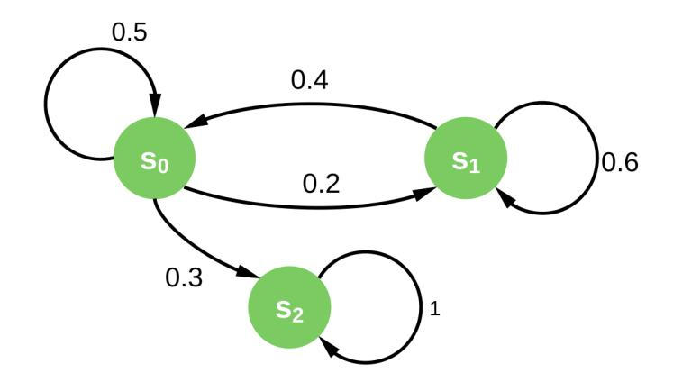

<span id="page-25-1"></span>Figure 14: The example Markov chain.

|    | s0  | s1  | s2  |
|----|-----|-----|-----|
| s0 | 0.5 | 0.2 | 0.3 |
| s1 | 0.4 | 0.6 | 0   |
| s2 | 0   | 0   | 1   |

Table 3: Example transition matrix.

# <span id="page-25-2"></span><span id="page-25-0"></span>A Mathematical Background

In this section we cover the mathematical details of the absorbing Markov chain [\[27\]](#page-23-15) used in Section [3.3.2.](#page-6-1)

The Markov chain. A Markov chain is identified by a set of states S = {s1, s2, . . . }. An execution starts at one of the states in S and progresses in steps, each corresponding to a transition from a state s<sup>i</sup> to a (different or the same) state s<sup>j</sup> . Each transition is identified by a probability pij , which is independent of the history of the execution, but only depends on the current state s<sup>i</sup> . Figure [14](#page-25-1) depicts an example Markov chain with 3 states, which we will use to provide intuition in the following paragraphs.

The absorbing state. A state s<sup>i</sup> is absorbing if for the transition probabilities it holds pii = 1 and pij = 0, i 6= j; in other words, if the execution reaches an absorbing state it will never transition to a different state after. Every state which is not absorbing is transient.

The transition matrix. The stochastic transition matrix of a Markov chain is a matrix which comprises of the transition probabilities between any two states of the Markov chain. Specifically, it is a n×n square matrix M, where n is the number of states of the Markov chain, such that the entry Mij = pij ; in other words, the ij-th entry in M contains the probability of transition from state s<sup>i</sup> to s<sup>j</sup> . The canonical form of the transition matrix M is:

$$M = \left(\begin{array}{cc} Q & R \\ \mathbb{O} & I_r \end{array}\right)$$

where Q is the t × t matrix, where each column corresponds to one of the t transient states, and R is the r × t matrix, where each column corresponds to one of the r absorption states; O is the r × t zero matrix and I<sup>r</sup> is the r × r identity matrix.

Table [3](#page-25-2) depicts the canonical form of the transition matrix of an example Markov chain with 3 states, where s<sup>2</sup> is the absorption state and s0, s<sup>1</sup> are transient states.

Absorption probability after u rounds. Assume a transition matrix M of an (absorbing) Markov chain. The ij-th entry of matrix M<sup>u</sup> identifies the probability that starting from state s<sup>i</sup> the execution is at state s<sup>j</sup> after exactly u steps.

Table [4](#page-26-1) depicts the canonical form of the transition matrix of the above Markov chain after 5 steps. Therefore, if the execution starts from the state s0, the probability of absorption in state s<sup>2</sup> after 5 steps is 0.68661.

The fundamental matrix and expected number of steps until absorption. For an absorbing Markov chain with transition matrix M as above, it holds (I − Q) <sup>−</sup><sup>1</sup> = N =

{26}------------------------------------------------

|       | $s_0$   | $s_1$   | $s_2$   |
|-------|---------|---------|---------|
| $s_0$ | 0.17061 | 0.14278 | 0.68661 |
| $s_1$ | 0.28556 | 0.242   | 0.47244 |
| $s_2$ | 0       | 0       | 1       |

<span id="page-26-1"></span>Table 4: Example transition matrix after 5 steps.

|       | $s_0$ | $s_1$ |
|-------|-------|-------|
| $s_0$ | 3.333 | 1.667 |
| $s_1$ | 3.333 | 4.167 |

Table 5: Example fundamental matrix.

<span id="page-26-2"></span> $I + Q + Q^2 + \cdots$ ; the matrix N is called the *fundamental matrix* for M. The *ij*-th entry in N denotes the expected number of times that the execution is in state  $s_j$  having started from state  $s_i$ .

Given the fundamental matrix N as above, the expected number t of steps before absorption is  $t = \lceil \sum_{j=0}^{t} N_{ij} \rceil$ , when the execution starts from the state  $s_i$ .

Table 5 depicts the fundamental matrix of the example Markov chain. The expected number of steps until absorption from the initial state  $s_0$  is 5.

# <span id="page-26-0"></span>B A Checkpointed Protocol That Tolerates Byzantine Faults

In this section we relax the trust assumption between the parties that realize the checkpointing authority. In Section 3.4 we assumed that a party may only fail by crushing. In order to allow arbitrary behavior, i.e. Byzantine Faults, instead of a fail-stop protocol we now employ an interactive consistency subprotocol  $\pi_{IC}$ , such as the schemes of [15]. This protocol enables the parties to both reach agreement on which block to checkpoint and also collectively produce the unpredictable nonce r.

Now, we need to slightly modify the ideal functionality  $\mathcal{F}_{\mathsf{Checkpoint}}$  to express the byzantine behavior. In  $\mathcal{F}_{\mathsf{CheckpointBFT}}$  of Figure 15, the adversary has more power by choosing among a polynomial number of potential random values  $r_j$ . This change models the ability to produce a (polynomial-bounded) number of random values to pick from and participate in the interactive consistency protocol.

# Functionality $\mathcal{F}_{\mathsf{CheckpointBFT}}$

 $\mathcal{F}_{\mathsf{Checkpoint}}$  interacts with a set of parties  $\mathbb{V}$  and holds the local chain C and the checkpoint chain  $C_c$ , both initially set to  $\epsilon$ . It is parameterized by  $k_c$ , which defines the number of blocks between two consecutive checkpoints, and the  $\mathsf{maxvalid}(\cdot,\cdot)$  algorithm.

Upon receiving (CandidateCheckpoint, C') from a party  $\mathcal{V}$ , if  $C_c \prec C'$  set  $C := \max \operatorname{valid}(C, C')$ . Next, if  $|C \setminus C_c| = k_c$  compute a list R of  $p(\kappa)$  random values as  $r_j \stackrel{\$}{\leftarrow} \{0,1\}^{\omega}$  and send (Nonce, R) to A. Upon receiving from A a response (Nonce,  $r_i$ ), such that  $r_i \in R$ , return (Checkpoint,  $tail(C)||r_i|$  to  $\mathcal{V}$  and set  $C := C_c := C||r_i|$ .

<span id="page-26-3"></span>Figure 15: The checkpointing ideal functionality that tolerates byzantine faults.

{27}------------------------------------------------

As before, the checkpointing protocol is also parameterized by a validation predicate Validate, which identifies whether a chain is valid. Each party V<sup>j</sup> inputs hB<sup>j</sup> , r<sup>j</sup> i, where B<sup>j</sup> is the block which it wishes to checkpoint and r<sup>j</sup> is a random nonce. At the end of πIC, each party outputs an ordered list [hB1, r1i, . . . ,hBn, rni], which contains the inputs of all parties; in case a party aborts a default value h⊥, ⊥i is chosen as its input. Following, the parties pick the block that has plurality among the blocks that are output, breaking ties in lexicographical order. Additionally, they produce the collective nonce as r = H(r1|| . . . ||r<sup>j</sup> ), where H : {0, 1} ? → {0, 1} <sup>ω</sup> is a hash function.

The checkpointing protocol is defined in Figure [16](#page-27-1) and Theorem [6](#page-27-2) shows that πCheckpointBFT securely realizes FCheckpointBFT.

### Protocol πCheckpointBFT

A checkpointing party which runs πCheckpoint is parameterized by the list V of n checkpointing parties, an interactive consistency protocol πIC, a hash function H, a validation predicate Validate, and kc. It keeps a local checkpointed block, Bc, initially set to .

Upon receiving (CandidateCheckpoint, C<sup>0</sup> ) from a party V, check:

- ∃i : C 0 [i] = B<sup>c</sup> (i.e. if C 0 extends the checkpoint);
- Validate(C 0 ) = 1 (i.e. if C 0 is valid);
- |C 0 | − i = k<sup>c</sup> (i.e. if C 0 is long enough).

If all hold do:

- 1. pick r<sup>j</sup> \$←− {0, 1} ω;
- 2. execute protocol πIC with the parties in V with input htail(C 0 ), r<sup>j</sup> i and wait for its output [hB1, r1i, . . . ,hBn, rni];
- 3. find the block B<sup>j</sup> which has plurality among the output blocks (breaking ties lexicographically) and set B<sup>c</sup> := B<sup>j</sup> ||H(r1|| . . . ||rn).

Finally, return (Checkpoint, Bc) to V.

<span id="page-27-1"></span>Figure 16: The protocol which is run by the parties of the checkpointing authority.

<span id="page-27-2"></span>Theorem 6. Protocol πCheckpointBFT securely realizes the functionality FCheckpointBFT, assuming a secure interactive consistency protocol πIC, which successfully terminates, and a hash function H.

Proof sketch. πIC is an interactive consistency protocol, so the honest parties agree on the same checkpoint block and produce the same nonce r. Since at least one honest party contributes to the output of the protocol and, since H is secure, r is pseudorandom and unpredictable, like r of FCheckpointBFT.

# <span id="page-27-0"></span>C Liveness for Epochs of Random Length

As shown above, longer epochs act in favor of the adversary. In order to sidestep this advantage, we will try instead to hide the epoch's length. The core idea here is, if the adversary can no longer plan when to publish its chain, it is in its best interest to publish it immediately, although allowing the honest parties to catch up; the following example showcases this argument.

Consider the case when the honest parties have produced only a single block and the adversary has produced 2 blocks. Since the adversary does not know the epoch's length, by withholding its chain it risks the possibility that the honest parties produce a second block and, 

{28}------------------------------------------------

if  $k_c = 2$ , reach the checkpoint. Additionally, observe that now the epoch's length becomes known only *after* the checkpoint has been issued, when it is too late for the adversary. Therefore, the only way for the adversary to be completely sure that it beats the honest parties to the checkpoint is to directly publish any new block it produces.

In order to apply this idea to our model we make a small change in the checkpointing functionality of Section 3.1. Now the functionality, defined in Figure 17, is parameterized by an upper bound  $k_c^{\top}$ , which is known to the adversary. Additionally, it holds an internal variable  $k_c$  unknown to the adversary, which is drawn from  $(0, k_c^{\top}]$  uniformly at random and is updated when a checkpoint is issued.

#### Functionality $\mathcal{F}_{\mathsf{CheckpointRand}}$

 $\mathcal{F}_{\mathsf{CheckpointRand}}$  interacts with a set of parties  $\mathbb{V}$ , is parameterized by  $k_c^{\top}$  and  $\mathsf{maxvalid}(\cdot, \cdot)$ , and holds the local chain C and the checkpointed chain  $C_c$ , both initially set to  $\epsilon$ , and  $k_c$ , the current epoch's length, initially set to  $k_c \stackrel{\$}{\leftarrow} (0, k_c^{\top}]$ .

Upon receiving a message (CANDIDATECHAIN, C'), if  $C_c \prec C'$  set  $C := \mathsf{maxvalid}(C, C')$ . If  $|C| - |C_c| \ge k_c$  then pick  $r \xleftarrow{\$} \{0, 1\}^{\omega}$ , and set  $C := C_c := C||r|$  and  $k_c \xleftarrow{\$} (0, k_c^{\top}]$ .

Upon receiving a message (Read) from a party  $\mathcal{V} \in \mathbb{V}$  return (Chain, C).

<span id="page-28-1"></span>Figure 17: The Randomized Checkpointing Functionality

In order to evaluate liveness we again consider the adversarial strategy and the Markov chain which results from it. As mentioned above, the plain strategy that an adversary follows is to immediately publish every block it produces. Indeed, this strategy gives the adversary the best chances of getting checkpointed, assuming that its chain is only 1 block shy of reaching the epoch's limit. However, if the checkpoint is further away, then publishing the chain will only allow the honest parties to "catch up". We note that this strategy is straightforward, but not necessarily the optimal; future work will explore alternative strategies which might produce better results for the adversary, such as taking into account the probability that  $k_c$  is equal to some value given  $k_c^{\top}$  and choosing whether to publish the chain accordingly.

Similar to Section 3.3.2, the adversary will not adopt any of the honestly-generated blocks. However, it cannot anymore gain an advantage over the honest parties. Therefore, the states (i, j) where i > j are now merged with the state (j, j). Algorithm 2 defines the updated chain generation mechanism; following the notation of Section 3.3.2, we set  $m = (1 - m_0^{\Sigma})$ , i.e. the probability that the adversary produces at least 1 block, and  $\bar{m} = m^{(0)}$ , i.e. the probability that the adversary does not produce any blocks.

Our simulations have shown that the behavior of the liveness probability and the expected steps is the same as in Section 3.3.2. Specifically, the liveness probability decreases significantly as the epoch length increases, while u increases roughly linearly with  $k_c$ , when the adversary controls a minority, and exponentially when it controls a large majority. However, randomizing the epoch lengths does improve both the liveness probability and the expected rounds compared to the plain setting of Section 3.3.2. Figures 18 and 19 depict the comparison of the expected rounds and the liveness probability respectively between the non-randomized and the randomized epoch length settings. For comparison, in the randomized setting after 300 steps for  $k_c = 3$  the liveness probability is 0.871, compared to 0.7173 in the non-randomized setting.

## <span id="page-28-0"></span>D Liveness for Non-Rushing Adversaries

In this section we slightly modify our model, in an attempt to both make it more realistic and achieve better liveness. Specifically, we no longer assume that the adversary is rushing, so now the adversary can no longer plan its strategy with the knowledge of the honest parties' messages during a round. More importantly, if, for a specific round, both an adversarial and an honest

{29}------------------------------------------------

#### Algorithm 2 The Markov chain construction algorithm for randomized epoch lengths.

```
function createMarkovChain(kc)
   createGraph(kc, kc)
end function
function createGraph(i, j)
   if i = 0 then
       addEdge(final, final, 1)
       return
   end if
   addEdge((i, j),(i, j), h¯ · m¯ )
   if i = j then
       if i = 1 then
           addEdge((i, j),(kc, kc), m)
           addEdge((i, j), final, h · m¯ )
       else
           addEdge((i, j),(i − 1, j − 1), m)
           createGraph(i − 1, j − 1)
           addEdge((i, j),(i − 1, j), h · m¯ )
           createGraph(i − 1, j)
       end if
   else
       addEdge((i, j),(i, j − 1), h¯ · m)
       createGraph(i, j − 1)
       if i = 1 then
           addEdge((i, j), final, h)
       else
           addEdge((i, j),(i − 1, j − 1), h · m)
           createGraph(i − 1, j − 1)
           addEdge((i, j),(i − 1, j), h · m¯ )
           createGraph(i − 1, j)
       end if
   end if
end function
```

<span id="page-29-0"></span>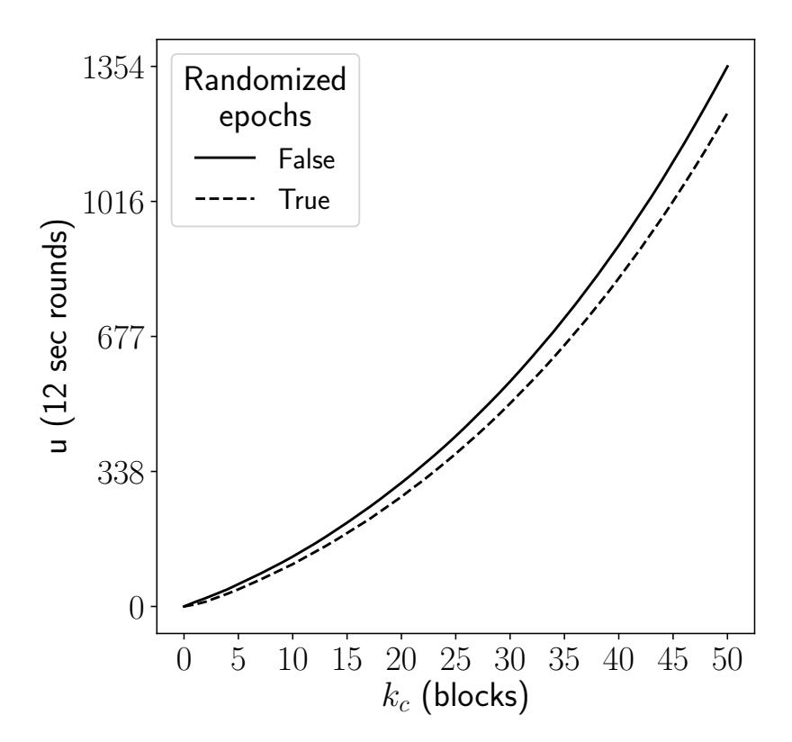

<span id="page-29-1"></span>Figure 18: Comparison of the expected number of steps before absorption in the nonrandomized and the randomized epoch length settings. The adversarial power is fixed to 51%.

{30}------------------------------------------------

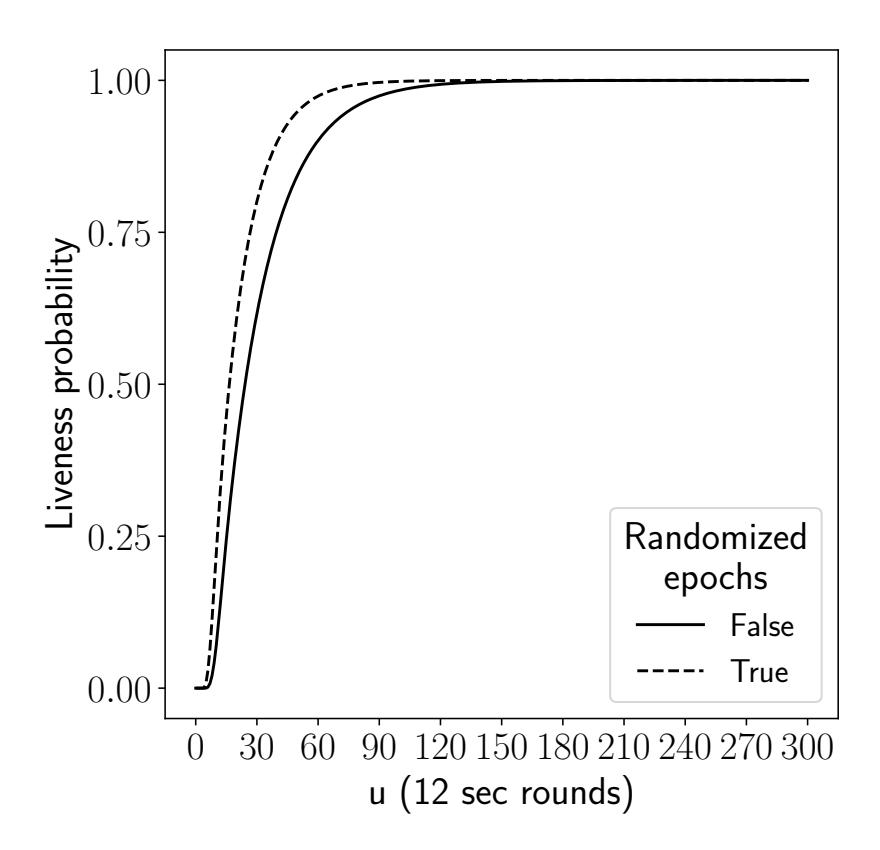

<span id="page-30-1"></span>Figure 19: Comparison of the liveness property in the non-randomized and the randomized epoch length settings. The adversarial power is fixed to 51% and the epoch length is set to  $k_c = 3$ .

chain are published, it is no longer the case that the adversarial chain will be adopted. Instead we introduce the *network adoption parameter*  $\gamma$  as follows:

•  $\gamma$ : the probability that an adversarial chain is adopted in a round over an honest chain.

This change affects the Markov chain production algorithm. Algorithm 3 defines the construction of the updated Markov chain, taking  $\gamma$  into account. Specifically, in case both the adversary and the honest parties produce chains which can be checkpointed, there exists now a probability  $1 - \gamma$  that honest parties' chain is checkpointed; it is evident that, when  $\gamma = 1$ , the algorithm produces the same chain as Algorithm 1.

However, now Algorithm 3 does not necessarily model a minimal execution. Specifically, it might be in the adversary's benefit to avoid risking a checkpoint of the honest parties' chain, and instead follow a conservative strategy. This strategy defines that the execution does not reach the state (1,0), i.e. the adversary publishes its chain when the honest parties are only one block short of reaching the checkpoint. Observe that, if the execution is at state (i,0), i > 1 then the adversary will always checkpoint its chain. Algorithm 4 is a slightly modified version of Algorithm 3 which accommodates this change.

In our analysis, in order to find the minimum liveness probability, we take into account both strategies. Specifically, for every execution we simulate both strategies and find the strategy which is best for the adversary, i.e. results in worse liveness probability. Figures 20 and 21 show the comparison between the optimistic setting and the standard execution of Section 3.3.2. The results in the optimistic setting are better both in terms of liveness probability and expected steps before absorption, which is expected since the adversary is now in a disadvantage compared to the standard setting.

# <span id="page-30-0"></span>E Centralized and Non-Interactive Timestamping

Similarly to checkpoints, the most straightforward way of realizing the timestamping functionality is as a centralized authority. The timestamping service is now parameterized by a EUF-CMA signature scheme and identified by a public key vk. Additionally, it keeps an internal counter c, which increases when a timestamp is issued. Interestingly, this counter can be removed under the assumption of a global clock which allows all parties to coordinate.

The timestamped object is the tuple  $\langle r||c, \mathsf{Sign}(sk, r||c||m)\rangle$ , consisting of the (monotonically increasing) time counter, the randomness r (cf. the checkpointing functionality  $\mathcal{F}_{\mathsf{Checkpoint}}$ ), and

{31}------------------------------------------------

**Algorithm 3** The absorbing Markov chain construction algorithm for the optimistic setting, defined by the chain construction function createMarkovChainOptimistic, parameterized by  $k_c$ , and the recursive helper function createGraph.

```
function createMarkovChainOptimistic(k_c)
    createGraph(k_c, k_c)
    addEdge(final, final, 1)
end function
function createGraph(i, j)
    if j > 0 then
         for l \in [0, j - 1] do
              \mathsf{addEdge}((i,\bar{j}),(i,j-l),\bar{h}\cdot m^{(l)})
             if l > 0 then
                  createGraph(i, j - l)
              end if
              if i > 1 then
                  \mathsf{addEdge}((i,j),(i-1,j-l),h\cdot m^{(l)})
                  \mathsf{createGraph}(i-1,j-l)
              end if
         end for
         \mathsf{addEdge}((i,j),(i,0),\bar{h}\cdot(1-m_{j-1}^\Sigma))
         createGraph(i, 0)
         if i = 1 then
              \mathsf{addEdge}((i,j), \mathit{final}, h \cdot m_{j-1}^\Sigma + \bar{m} \cdot h \cdot (1 - m_{j-1}^\Sigma))
              \mathsf{addEdge}((i,j),(k_c,k_c), \mathring{m \cdot h} \cdot (1-m_{j-1}^\Sigma))
         else
              \mathsf{addEdge}((i,j),(i-1,0),h\cdot(1-m_{j-1}^\Sigma))
              \mathsf{createGraph}(i-1,0)
         end if
    else
         \mathsf{addEdge}((i,j),(i,j),\bar{h})
         if i = 1 then
              addEdge((i, j), (k_c, k_c), m \cdot h)
              \mathsf{addEdge}((i,j),\mathsf{final},\bar{m}\cdot h)
         else
              addEdge((i, j), (i - 1, j), h)
              \mathsf{createGraph}(i-1,j)
         end if
    end if
end function
```

{32}------------------------------------------------

Algorithm 4 The absorbing Markov chain construction algorithm of the "conservative" strategy for the optimistic setting, defined by the chain construction function createMarkovChainOptimistic, parameterized by  $k_c$ , and the recursive helper function createGraph.

```
function createMarkovChainOptimisticConservative(k_c)
    createGraph(k_c, k_c)
    addEdge(final, final, 1)
end function
function createGraph(i, j)
    if j > 0 then
        for l \in [0, j - 1] do
             \mathsf{addEdge}((i,j),(i,j-l),\bar{h}\cdot m^{(l)})
             if l > 0 then
                 createGraph(i, j - l)
             end if
             if i > 1 then
                  \mathsf{addEdge}((i,j),(i-1,j-l),h\cdot m^{(l)})
                 \mathsf{createGraph}(i-1,j-l)
             end if
        end for
         if i = 1 then
             \mathsf{addEdge}((i,j),(k_c,k_c),\bar{h}\cdot(1-m_{j-1}^\Sigma)+\gamma\cdot h\cdot(1-m_{j-1}^\Sigma))
             \mathsf{addEdge}((i,j), \mathsf{final}, h \cdot m_{j-1}^\Sigma + \bar{\gamma} \cdot h \cdot (1 - m_{j-1}^\Sigma))
        else
             \mathsf{addEdge}((i,j),(i,0),\bar{h}\cdot(1-m_{i-1}^\Sigma))
             createGraph(i, 0)
             if i = 2 then
                  \mathsf{addEdge}((i,j),(k_c,k_c),h\cdot(1-m_{j-1}^\Sigma))
             else
                 \mathsf{addEdge}((i,j),(i-1,0),h\cdot(1-m_{j-1}^\Sigma))
                 createGraph(i-1,0)
             end if
         end if
    else
         \mathsf{addEdge}((i,j),(i,j),\bar{h})
        if i = 2 then
             addEdge((i, j), (k_c, k_c), h)
         else
             \mathsf{addEdge}((i,j),(i-1,j),h)
             createGraph(i-1,j)
         end if
    end if
end function
```

{33}------------------------------------------------

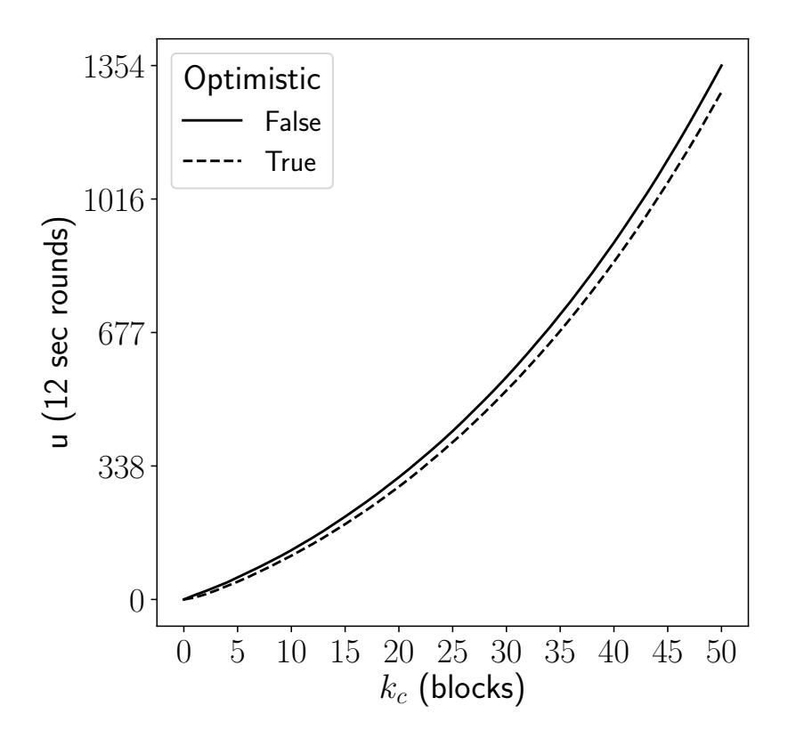

<span id="page-33-0"></span>Figure 20: Comparison of the expected number of steps before absorption in the non-optimistic and the optimistic settings. The adversarial power is fixed to 50% + 1 and the network adoption parameter to  $\gamma = 0.5$ .

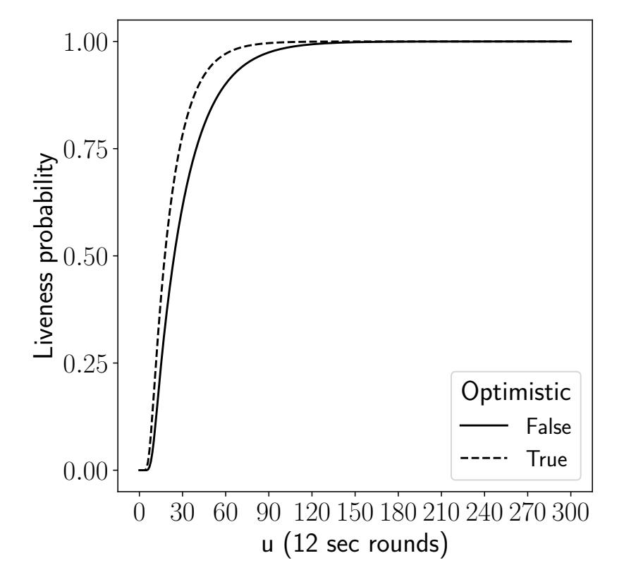

<span id="page-33-1"></span>Figure 21: Comparison of the liveness probability in the non-optimistic and the optimistic settings. The adversarial power is fixed to 50% + 1, the epoch length is set to  $k_c = 3$ , and the network adoption parameter to  $\gamma = 0.5$ .

{34}------------------------------------------------

the service's signature on the timestamped message m. In order to construct the authority as a federation of parties, a Byzantine Agreement protocol can again be deployed, similar to Section [3.4.](#page-10-0)

The major benefit of this mechanism lies in the non-interactive nature of signatures. A miner can broadcast the timestamped signature, along with the new block, and a validator can check it non-interactively; naturally, the security of the mechanism relies on the underlying signature scheme's security. Additionally, the timestamping authority does not need to maintain a list of timestamped objects; instead, the miners always choose the oldest, when provided with multiple timestamps for the same message. Therefore, the state that the timestamping service needs to maintain is O(|c| + κ), whereas, assuming a global clock, the state is non-updatable and only O(κ) long, comprising only of the signing key.

A further benefit of this approach is the ease of migration to a non-timestamped setting. When the blockchain achieves an adequate level of security and assistance is no longer needed, the timestamping service can simply halt its operation. In this case, the miners continue participating in the protocol uninterrupted, even though the chains are no longer timestamped. Therefore, the transition to the non-timestamped setting is seamless and without the need for extra effort, such as a hard fork of the blockchain.