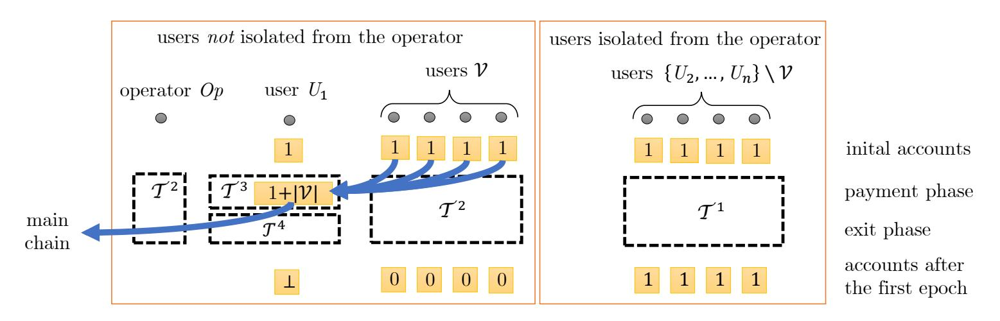
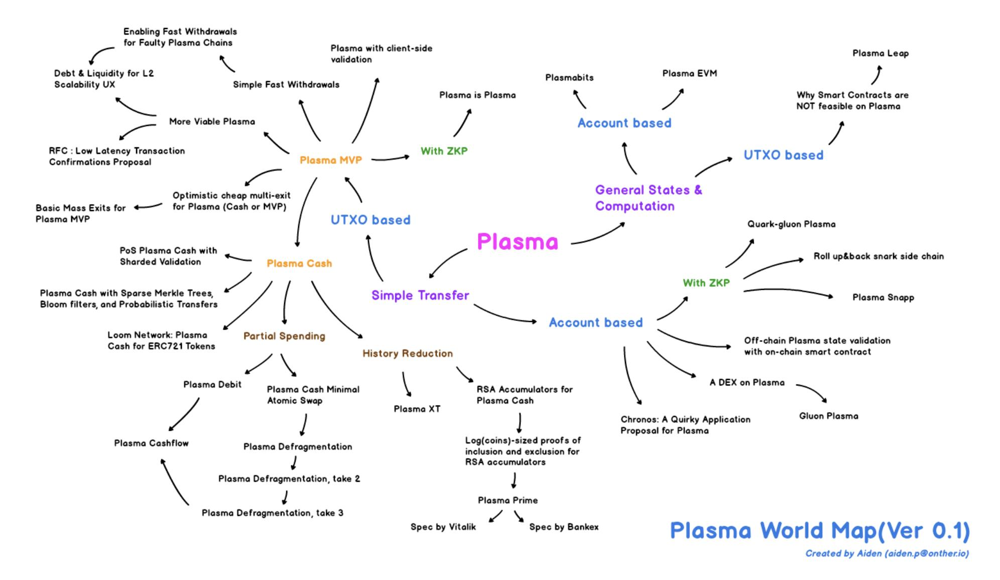

{0}------------------------------------------------

# Lower Bounds for Off-Chain Protocols: Exploring the Limits of Plasma?

Stefan Dziembowski1 , Grzegorz Fabiański1 , Sebastian Faust2 , and Siavash Riahi2

> 1 University of Warsaw 2 TU Darmstadt

Abstract. Blockchain is a disruptive new technology introduced around a decade ago. It can be viewed as a method for recording timestamped transactions in a public database. Most of blockchain protocols do not scale well, i.e., they cannot process quickly large amounts of transactions. A natural idea to deal with this problem is to use the blockchain only as a timestamping service, i.e., to hash several transactions tx 1, . . . , tx m into one short string, and just put this string on the blockchain, while at the same time posting the hashed transactions tx 1, . . . , tx m to some public place on the Internet ("off-chain"). In this way the transactions tx i remain timestamped, but the amount of data put on the blockchain is greatly reduced. This idea was introduced in 2017 under the name Plasma by Poon and Buterin. Shortly after this proposal, several variants of Plasma have been proposed. They are typically built on top of the Ethereum blockchain, as they strongly rely on so-called smart contracts (in order to resolve disputes between the users if some of them start cheating). Plasmas are an example of so-called off-chain protocols.

In this work we initiate the study of the inherent limitations of Plasma protocols. More concretely, we show that in every Plasma system the adversary can either (a) force the honest parties to communicate a lot with the blockchain, even though they did not intend to (this is traditionally called mass exit); or (b) an honest party that wants to leave the system needs to quickly communicate large amounts of data to the blockchain. What makes these attacks particularly hard to handle in real life is that these attacks do not have so-called uniquely attributable faults, i.e. the smart contract cannot determine which party is malicious, and hence cannot force it to pay the fees for the blockchain interaction. An important implication of our result is that the benefits of two of the most prominent Plasma types, called Plasma Cash and Fungible Plasma, cannot be achieved simultaneously.

Besides of the direct implications on real-life cryptocurrency research, we believe that this work may open up a new line of theoretical research, as, up to our knowledge, this is the first work that provides an impossibility result in the area of off-chain protocols.

## 1 Introduction

What does it mean to timestamp a digital document? Haber and Stornetta in their seminal paper [\[18\]](#page-17-0) define timestamping as a method to certify when a given document was created. In many settings the timestamped document T remains secret after it was timestamped, until its creator decides to make it public. This is often because of efficiency reasons – for example in the scheme of [\[18\]](#page-17-0) what is really timestamped is the cryptographic hash[3](#page-0-0) H(T) (not T), which leads to savings in communication between T's creator and the timestamping service. Sometimes the secrecy of T is actually a desired feature. According to [\[31\]](#page-18-0) several researchers in the past (including Galileo Galilei and Isaac Newton) have used ad-hoc methods to timestamp their research ideas before publishing them, in order to later claim priority.

Recently, in the context of blockchain, timestamping has been used in a slightly different way. Namely, in the paper that introduced this technology [\[27\]](#page-18-1), the "timestamping" mechanism is such that T's creator does not only get a proof that T has been created at a given time, but also that it has been made public at this time. Let us call this kind of scheme public timestamping, and let us refer to the former type of timestamping as secret timestamping. The public timestamping feature of blockchain has been one of the main reasons why this technology attracted so much attention. In fact one of the first projects that use blockchain for purposes

? This work was partly supported by the FY18-0023 PERUN from the Ethereum Foundation, by the TEAM/2016-1/4 grant from the Foundation for Polish Science, by the DFG CRC 1119 CROSSING (project S7), by the German Federal Ministry of Education and Research (BMBF) iBlockchain project (grant nr. 16KIS0902), and by the German Federal Ministry of Education and Research and the Hessen State Ministry for Higher Education, Research and the Arts within their joint support of the National Research Center for Applied Cybersecurity ATHENE.

3 In this paper we assume reader's familiarity with basic cryptographic notions such as hash functions, negligible functions, etc. For an introduction to this topic see, e.g., [\[21\]](#page-17-1).

{1}------------------------------------------------

other than purely financial was Namecoin that used the timestamping to create a decentralized domain name system (see, e.g., [\[20\]](#page-17-2) for more on this project).

In many cases timestamping is expensive, and its costs grow linearly with the length of the timestamped document. This is especially true for blockchain-based solutions, where all parties in the network need to reach consensus about what document was published and when. For example, Bitcoin (the blockchain system introduced in [\[27\]](#page-18-1)) can process at most around 1MB of data per 10 minutes. In Ethereum, which is another very popular blockchain system [\[33\]](#page-18-2) "timestamping" a word of 32 bytes cost currently around USD 0.80. A similar problem appears in several other blockchain protocols. We give a short introduction to blockchain in Sec. [1.1.](#page-2-0) For a moment let us just say that typical blockchains come with their own virtual currencies (also called cryptocurrencies). In the most standard case the "timestamped" messages define financial transfers between the network participants, and are hence called transactions. We will refer to timestamping a transaction as posting it on the blockchain.

To summarize, from the efficiency point of view the secret timestamping is better than the public one (as only hashes need to be timestamped). From the security perspective these two types of timestamping are incomparable as the fact that the timestamped document T needs to be published can be considered to be both an advantage and a disadvantage, depending on the particular application. For example, one could argue that considering timestamped hashes of academic papers as being sufficient evidence for claiming priority would slow down scientific progress, as it would disincentive making the papers public (until, say, the author writes down all followup papers that build upon the timestamped paper).

A natural question therefore is as follows. Suppose we have access to a timestamping service that is expensive to use (so we would rather timestamp only very short messages there). Can we use it to "emulate" public timestamping that would be cheap for long documents T? Of course this "emulation" cannot work in general, since some scenarios may simply require a proof that the whole T was available publicly at a given time. So the best we can hope for is to find some applications which permit such emulation. An idea for such emulation emerged recently within the cryptocurrency community under the names Plasma or commit chains[4](#page-1-0) [\[17,](#page-17-3) [22,](#page-17-4) [26,](#page-18-3) [28,](#page-18-4) [30\]](#page-18-5). Very informally speaking, Plasma allows to "compress" a number of blockchain transactions tx 1, . . . , tx m into one very short string h = H(T), where T := (tx 1, . . . , tx m). The transactions can from from different parties called users. The only document that gets posted on the blockchain is h. The compression and posting h is done by one designated party called the operator (denoted Op). Besides of posting h, the operator publishes all the transactions T on some public network (say: on her web-page). Since this publication is not done on the blockchain we also say that it is performed off-chain.

Publishing T off-chain is important since only then each user can verify that her transaction was indeed included into the hashed value. Moreover, typical Plasma designs use as H the so-called Merkle-tree hashing with tx 1, . . . , tx m being the labels of the leaves (see Appx. [A.1](#page-19-0) for more on this technique). Thanks to this, every user can prove that his transaction was included in H(T) with a proof of length O(log n). If the operator does not include some tx i in T then the user U that produced tx i can always post tx i directly to the blockchain. In this case using Plasma does not bring any benefits to U compared to just using the blockchain directly from the beginning. However, in reality it is expected that this is not going to happen often, especially since the operators are envisioned to be commercial entities that will charge some fee for their services.

What is much more problematic is the case when the malicious operator does not publish T off-chain. This situation is typically referred to as data unavailability. Note that data unavailability is subjective, i.e., the parties can have different views on whether it happened or not. This is because, unlike the situation on the blockchain, there may be no consensus on what was published off-chain. Moreover, there is no way to produce a proof that data unavailability happens: even if some parties complain on the blockchain that they did not receive T there is no way to determine (just by looking at the blockchain) whether they are right, or if they are just falsely accusing the operator. The situation when a disagreement between parties happens but there is no "blockchain-only" way to verify which party is corrupt, is commonly referred to as a non-uniquely attributable fault. Finally, some Plasma protocols require all the honest parties to immediately act on blockchain after a data unavailability attack happened. This is called "mass exit", although (for the reasons explained in Sec. [1.1](#page-2-0) in this paper we call it "large forced on-chain action")

Plasma comes in many variants and has been discussed in countless articles (see Sec. [1.1\)](#page-2-0). One of the most fundamental distinction is between the two types of Plasma systems: Plasma Cash and Fungible Plasma. As we explain in more detail in Sec. [1.1](#page-2-0) they both serve for the "emulation" that we outlined above, but have different incomparable features. From one point of view Fungible Plasma is better than Plasma Cash since it is "fungible",

4 In this paper we mostly use the name "Plasma" due to its brevity.

{2}------------------------------------------------

which means that the money can be arbitrarily divided and merged. On the other hand: Fungible Plasma suffers from some problems that Plasma Cash does not have, namely the adversary can cause a "non-uniquely attributable large forced mass actions" (we explain these notions Sec. [1.1\)](#page-2-0). The cryptocurrency community has been unsuccessfully looking for a Plasma solution that would have the benefits of both Plasma Cash and Fungible Plasma. The main result of this paper is that such Plasma cannot be achieved simultaneously. In other words, we show inherent limitations of the compression technique, at least for compressing blockchain financial transactions. Our paper can also be viewed as initiating the theoretical analysis of lower bounds for the smart contract protocols. We write more about our contribution in Sec. [1.2.](#page-5-0) First, however, let us provide some more introduction to blockchain and to Plasmas.

## 1.1 Introduction to Plasma

Let us start with providing some more background on blockchain and smart contracts. Blockchain can be viewed as a public ledger containing timestamped transactions that have to satisfy some correctness constraints. Moreover, several blockchains permit to execute the so-called smart contracts [\[29\]](#page-18-6) (or simply: "contracts"), which informally speaking, are "self-executable" agreements described in form of computer programs. Examples of such blockchain platforms include Ethereum, Hyperledger Fabric, or Cardano. Typically, it is assumed that contracts are deterministic and have a public state. Moreover, they can own some coins. Executing a contract is done by posting transactions on the blockchain and it costs fees that depend on the computational complexity of the given operation, and on the amount of data that needs to be transmitted to the contract.

Let us now explain the basic idea of Plasma, and introduce some standard terminology. Since it is an informal presentation, we mix the definition of the protocol with its construction. In the formal sections of the paper these two parts are separated (the definition appears in Sec. [2,](#page-6-0) and the constructions in Appx. [A\)](#page-18-7). As highlighted above Plasma address the scalability problem of blockchain by keeping the massive bulk of transactions outside of the blockchain ("off-chain"). The parties that are involved in the protocol rely on a smart contract that is deployed on the ledger of the underlying cryptocurrency, but they try to minimize interacting with it. Typically, this interaction happens only when the parties join and leave the protocol, or when they disagree. Since all parties know that in case of disagreement, disputes can always be settled on the ledger, there is no incentive for the users to disagree, and honest behavior is enforced.

In the optimistic case, when the parties involved in the protocol play honestly, and the off-chain transactions never hit the ledger, these protocols significantly reduce transaction fees and allow for instantaneous executions. Off-chain protocols also resemble an idea explored in cryptography around two decades ago under the name "optimistic protocols" [\[1,](#page-16-0) [7\]](#page-17-5). In this model the parties are given access to a trusted server that is "expensive to use", and hence they do not want to contact it, unless it is absolutely necessary

Plasma's operator Op provides a "simulated ledger", in which other parties can deposit their coins, and then perform operations between each other. The key requirement is that its users do not need to trust the operator, and in particular if they discover that she is cheating, then they can safely withdraw their funds. The latter is called an exit from the simulated ledger, and requires communication with the underlying ledger.

Plasma protocols come in different variants (see Sec. [1.1\)](#page-2-0), however, they are all based on a single framework proposed in [\[28\]](#page-18-4). The parties that execute Plasma are: the users U1, . . . , Un, and the operator Op. Moreover, the parties have access to a contract on the blockchain. In our formal modeling this contract will be represented as a trusted interactive machine Γ with public state, owning some amount of coins. Each user Ui has some number of coins initially deposited in his Plasma account which is maintained by Γ. This number is called a balance and is denoted with bi ∈ Z≥0. Users' balances are changing dynamically during the execution of the protocol. The total number of coins owned by the contract Γ is equal to the sum of all balances of its users. A vector −→b := (b1, . . . , bn) is called a Plasma chain. When referring to the underlying blockchain (i.e. the one on which Γ is deployed) we use the term main chain. Note that the operator Op has no account and only facilitates transfers of the users. In some variants of Plasma (see Sec. [1.1\)](#page-2-0) the operator blocks some amount of coins (called operator's collateral) that can be used to compensate the users their losses in case she misbehaves.

Let us briefly describe the different operations that parties of the Plasma protocol can execution during the lifetime of the system. We divide time into epochs (e.g. 1 epoch takes 1 hour). In the ith epoch the operator sends some information Ci to Γ. We can think of Ci as "compressed" information about the vector (b1, . . . , bn) containing the users' balances. By "compressed" we mean that |Ci | is much shorter than the description of (b1, . . . , bn), and usually its length is constant in every epoch. We will refer to Ci as a "commitment" to (b1, . . . , bn). The length of Ci is called the commit size.

{3}------------------------------------------------

In each epoch every user Ui can request to exit, by which we mean that all bi coins from her Plasma account get converted to the "real" coins on the main chain, and she is no longer a part of this Plasma chain (which, in our formal modeling will be indicated by setting bi := ⊥). Plasma's security properties guarantee that every user can exit with all the coins that she currently has in the given Plasma chain. It is often required that exiting can be done cheaply, and in particular that the total length of the messages sent by the exiting user to Γ is small. The amount of data that a user needs to send to Γ in order to exit the Plasma chain is called the exit size.

Finally, any two users of the same Plasma chain can make transfers between each other. Suppose Uk wants to transfer v coins from her account to Uj . This transfer operation involves only communicating with Uj , and with the operator Op, while no interaction with the contract Γ is needed. Under normal circumstances (i.e. when the operator is honest) the next Plasma block that is committed to the main chain will simply have v coins deduced from Uk's account and v coins added to Uj 's account.[5](#page-3-0)

Challenges in designing Plasma systems. The main challenge when designing a Plasma system is to guarantee that every user can exit with her money. This is usually achieved as follows: each Ci is a commitment to (b1, . . . , bn), computed using a Merkle tree. An honest operator Op is obliged to obey the following rule:

Explaining commitments — each time Op sends Ci to Γ, she sends the corresponding −→b := (b1, . . . , bn) to all the users.

Technically, sending −→b to the users can be realized, e.g., by publishing it on the operator's web-page (i.e.: "off-chain"). Every user Uj can now check if she has the correct amount on her account and if Ci was computed correctly. Moreover, thanks to the properties of Merkle trees, Uj has a short proof of size O(log(n)) that bj has been "committed" into Ci .

The above description assume that the operator is honest. If she is corrupt things get more complicated. Note that Ci sent by the operator to Γ is publicly known (due to the properties of the underlying blockchain). Hence, we can assume that all the users agree on whether Ci was published and what is its exact value. The situation is different when it comes to the vector −→b that should be published off-chain. In particular, if −→b has not been published, then the users have no way to prove this to Γ. This is because whether some data has been published off-chain or not does not have a digital evidence that can be interpreted by Γ. This leads us to the following attack that can be carried out by a malicious operator, and is intensively studied by the cryptocurrency community (see, e.g., [\[5\]](#page-16-1)).

Data unavailability attack — in this attack the corrupt operator publishes Ci but does not publish −→b .

Note that this attack has no extra cost for the operator because from the point of view of the smart contract Γ, the operator behaves honestly, and hence the users cannot complain to Γ and request, e.g., that Op sends −→b to Γ. Furthermore determining if this attack happened is "subjective", i.e., every user Uj has to detect it herself. Moreover, in case of data unavailability it is impossible for Γ to determine whether Uj or Op is dishonest, since a sheer declaration of Uj that Op did not send him the data obviously cannot serve as a proof that it indeed happened. This leads to the following definition.

Non-uniquely attributable faults — this refers to the situation when the contract has to intervene in the execution of the protocol (because the protocol is under attack), but it unable to determine which party misbehaved (see, e.g., [\[2\]](#page-16-2)).

Non-uniquely attributable faults appear typically in situations when a party claims that it has not received a message from another party. In contrast if a contract is able to determine which party is corrupt then we have a uniquely-attributable fault. A typical example of such a fault is when a party signs two contradictory messages. Unfortunately, non-uniquely attributable faults are hard to handle in real life, since it is not clear which party should pay the fees for executing the smart contract, or which party should be punished for misbehaving. In particular, what is unavoidable in such a case is that a malicious party P can force another participant P 0 to lose money on fees (potentially also loosing money herself). This phenomenon is known as griefing [\[2\]](#page-16-2).

When a user realizes that the operator is dishonest, then she often needs to start quickly interacting with Γ in order to protect her coins. This action has to be done quickly, and has to be performed by each honest user. This leads to the following definition.

5 To keep things simple, in this paper we do not discuss things like "transfer receipts", i.e., confirmations for the sender that the coins have been transferred.

{4}------------------------------------------------

Forced on-chain action of size α — this term refers to the situation that honest parties who did not intend to perform an exit are forced by the adversary to quickly interact with Γ, and the total length of the messages sent by them to Γ is α. Informally, when α is large (e.g. α = Ω(n)) we say this is a mass forced on-chain action.

Note that this definition talks about all honest "parties", and hence it includes also the case when the operator is honest, but it is forced to act because of the behavior of the corrupt users. Typically α = Ω(n) and by "quickly" we mean "1 epoch". In most Plasma proposals [\[3,](#page-16-3) [24,](#page-17-6) [28\]](#page-18-4) "interacting with the smart contract" means simply exiting the Plasma chain with all the coins. Hence, a more common term for this situation is "mass exit". Since in our work we are dealing with the lower bounds, we need to be ready to cover also other, non-standard, ways of protecting honest users' coins. For example, it could be the case that a user Uj does not exit immediately, but, instead, keeps her coins in a special account "within Γ" and withdraws them much later. Of course, this requires interacting with Γ immediately, but, technically speaking does not require "exiting". To capture such situations, we use the term "forced on-chain action", instead of "mass exit".

After a party announces an exit, we need to ensure that she is exiting with the right amount of coins. The main problem comes from the fact that we cannot require that users exit from the last Ci by sending the explanation for her balance bi to Γ. This is because it could be the case that a given user does not know the explanation −→b of Ci (due to the data unavailability attack). For a description of how this can be done in practice see [\[3,](#page-16-3) [28\]](#page-18-4), or Appx. [A.](#page-18-7)

Mass exits (or large forced on-chain actions) caused by data unavailability are considered a major problem for Plasma constructions. They are mentioned multiple times in the original Plasma paper [\[28\]](#page-18-4) (together with some ad-hoc mechanism for mitigating them). They are also routinely discussed on "Ethereum's Research Forum" [6](#page-4-0) , with even conferences organized on this topic[7](#page-4-1) . One of the main reasons why the mass exits are so problematic is that they may results in blockchain congestion (i.e., situations when too many users want to send transactions to the underlying blockchain). Moreover, the adversary can choose to attack Plasma precisely in the moments when the blockchain is already close to being congested (see, e.g., [\[32\]](#page-18-8) for a description of real-life incident of the Ethereum blockchain congestion). She can also attack different Plasma chains (established over the same main chain) so their users simultaneously send large amounts of data to the blockchain. In order to be prepared for such events in real-life Plasma proposals it is sometimes suggested that the time T for reacting to data unavailability should be very large (e.g. T = 2 weeks). This, unfortunately, has an important downside, namely that also an honest coin withdrawal requires time T.

Consider a non-fungible Plasma that supports coin identifiers from some set C. In a non-fungible Plasma the Plasma chain is of a different form than before: instead of a vector of balances −→b , it is a function f : C → {U1, . . . , Un, ⊥} that assigns to every coin c ∈ C its current owner f(c) (or ⊥ if the coin has been withdrawn). Similar to before the commitment to the value of f will be done using Merkle trees. Whenever a coin is withdrawn its identifier c is sent to the smart contract Γ, and hence it becomes public. This is important for the mechanism that prevents parties from stealing coins. To this end, each user U monitors Γ, and sends a complaint whenever some (corrupt) user U 0 tries to withdraw one of U's coins. For the contract Γ to decide if c belongs to U or U 0 can require some additional interaction, but the system is designed in such a way that the honest user is guaranteed that finally she will win such dispute. Hence, every malicious attempt to withdraw someone else's coin will be stopped.

The main difference between Plasma Cash and Fungible Plasma is that in Plasma Cash every user has to "protect" only her own coins. Thanks to this, even in case of the data unavailability attack, each honest user U does not need to immediately take any action. Instead, she can just monitor Γ, and has to act only if someone tries to withdraw one of U's coins. Of course, the corrupt user can still force all the honest ones to quickly act on the blockchain. However, this requires much more effort from them than in Fungible Plasma, namely: they need to withdraw many coins of the honest users at once, hence forcing the honest users to react. This is "fairer" both honest and malicious users have to make similar effort. Most importantly, however, this attack has uniquely-attributable faults.

This advantage of Plasma Cash comes at a price, namely the "exit size" is not constant anymore, as it depends on the number of coins that a user has (since each coin has to be withdrawn "independently"). The Ethereum research community has been making some efforts to deal with this problem. One promising approach is to "compress" the information about withdrawn coins. For example one could assume that the identifiers in C are natural numbers. Then a user U who owns coins from some interval [a, . . . , b] (with a, b ∈ N) could

6 Available at: [ethresear.ch](http://ethresear.ch).

7 See: [ethresear.ch/t/data-unavailability-unconference-devcon4](http://ethresear.ch/t/data-unavailability-unconference-devcon4).

{5}------------------------------------------------

simply withdraw them by posting a message "User U withdraws all coins from the interval [a, . . . , b] (instead of withdrawing each i ∈ [a, . . . , b] independently). This, of course, works only if the coins that users own can be divided into such intervals. Some authors (in particular V. Buterin) have been suggesting "defragmentation" techniques for achieving such a distribution of coins. This is based on the assumption that the parties periodically cooperate to "clean up" the system. Hence, it does not work in a fully malicious settings[8](#page-5-1) (if the goal of the adversary is to prevent the cleaning procedure).

The landscape of Plasmas. Soon after the original groundbreaking work on Plasma [\[28\]](#page-18-4), some concrete variants have been proposed. Some of them we already described in Sec. [1.1.](#page-2-0) Since this paper focuses on the impossibility results, we do not provide a complete overview of the many different variants that exist and what features they achieve. Plasma projects that are frequently mentioned in the media are Loom, Bankex, NOCUST and OmiseGO [\[26,](#page-18-3) [30\]](#page-18-5). This area is mostly developed by a very vibrant on-line community that typically communicates results in form of so-called "white-papers", blog articles, or post on discussion forums (such as the "Ethereum Research Forum", see footnote [6](#page-4-0) on page [5\)](#page-4-0). See also the diagram called "Plasma World Map" illustrating the different flavors of Plasma in Appx. [B](#page-29-0) (page [30\)](#page-29-0). A notable exception are NOCUST and NOCUST-ZKP described in [\[22\]](#page-17-4). This work, up to our knowledge, is the first academic paper on this topic. It provides a formal protocol description (with several interesting innovations such as " Merkle interval trees") and a security argument. Moreover, the authors of [\[22\]](#page-17-4) describe a version of NOCUST that puts a collateral on the operator (this is done in order to achieve instant transaction confirmation). The authors of [\[22\]](#page-17-4) (see also [\[17\]](#page-17-3)) introduce the term "commit chains". Yet, unfortunately, they do not define a full formal security model that we could re-use in our work.

Let us also mention some of the so-called "distributed exchanges" that look very similar to Plasma. One example is StarkDEX (informally described in [\[16\]](#page-17-7)), which is also based on the idea of a central operator batching transactions using Merkle trees, and a procedure for the users to "escape" from the system if something goes wrong. This protocol uses non-interactive zero-knowledge protocols to ensure correctness of the operator's actions (similar approach has been informally sketched in the original Plasma paper [\[28\]](#page-18-4), and has been also used in NOCUST-ZKP [\[22\]](#page-17-4)). While zero knowledge can be used to demonstrate that some data was computed correctly, it cannot be used to prove that the off-chain data was published at all. Consequently, the authors of this system also encountered the challenge of handling the data unavailability attack. Currently, in StarkDEX this problem is solved by introducing an external committee that certifies if data is available.[9](#page-5-2) StarkDEX plans to eventually replace the committee-based solution with an approach that is only based on trusting the underlying blockchain. Our result however shows that in general this will be impossible, as long as fungibility and short exits are required (unless the operator puts a huge collateral).

### 1.2 Our contribution and organization of the paper

We initiate the study of lower bounds (or: "impossibility results") in the area of off-chain protocols. Our results can also be viewed as a part of a general research program of "bringing order to Plasma". We believe that the scientific cryptographic community can provide significant help in the efforts to systematize this area, and to determine the formal security guarantees of the protocols (in a way that is similar to the work on "Bitcoin backbone" [\[15\]](#page-17-8), or more recently on "Mimblewimble" [\[14\]](#page-17-9), state channels [\[10\]](#page-17-10), or the Lightning Network [\[23\]](#page-17-11)). Investigating the limits of what Plasma can achieve is part of this process. We focus on proving lower bounds that concern the necessity of mass forced on-chain actions, especially caused by the attack that have no uniquely attributable faults (as a result of data unavailability). This is motivated by the fact that such attacks are particularly important for the off-chain protocols: since the main goal of such protocols is to move the transactions off -chain, the necessity of quickly acting on-chain can be viewed as a big disadvantage.

We start with a formal definition of Plasma (this is done in Sec. [2\)](#page-6-0). Since in this work we are interested only in the impossibility results, our definition is very restrictive for practical systems. By "restrictive" we mean that we make several assumptions about how the protocol operates. For example we have very strict synchronicity rules, and in particular we only allow the users to start the Plasma operations in certain moments (see "payment orders" and "exit orders" phases in Sec. [2.1\)](#page-7-0). Obviously, such restrictions make our lower bounds only stronger, since they also apply to a more realistic model (without such restrictions). We believe that fully formalizing real-life Plasma (e.g. in the style of [\[11,](#page-17-12) [13,](#page-17-13) [23\]](#page-17-11)) is an important future research project, but it is beyond the scope of this work.

8 See [ethresear.ch/t/plasma-cash-defragmentation](http://ethresear.ch/t/plasma-cash-defragmentation) and subsequent posts by Buterin on the Ethereum Research Forum.

9 See their FAQs at <https://www.starkdex.io>.

{6}------------------------------------------------

Our main result is presented in Thm. 1, stated formally in Sec. 3. It states that in certain cases the adversary can force mass on-chain actions of the honest users of any Plasma system. One subtle point that we want to emphasize is that whenever we talk about "forcing actions" on the honest users, we mean a situation when the users that did not want to exit (in a given epoch) are forced to act on-chain. This is important, as otherwise our theorem would hold trivially (one can always imagine a scenario when lots of users decide to exit Plasma because of some other, external, reasons). The notion of "wanting to exit" is formalized by an environment machine  $\mathcal{Z}$  (borrowed from the Universal Composability framework [8]) that "orders" the parties to behave in certain way.

More formally, Thm. 1 states that in Plasma either there exists an attack that provokes a mass action, or there is an attack that requires a party that exits to post long messages on the blockchain (i.e. this Plasma has large exits). Moreover, both attacks have no uniquely attributable faults. Note that, strictly speaking, this theorem also covers Plasma systems where the commit size is large (even  $\Omega(n)$ )10, but in this case it holds trivially since the honest operator needs to send the large commitments to  $\Gamma$  even if everybody is honest (hence: there is an "unprovoked" mass action in every epoch).

The most interesting practical implication of this theorem is that it confirms the need for "two different" Plasma flavors, as long as the operator is not required to put aside a collateral of size comparable to the total amount of coins in the system11. One way to look at it is: either we want to have a Plasma system that does not have large exits, in which case we need to have (non-uniquely attributable) mass actions (this is Fungible Plasma/Plasma MVP); or alternatively we insist on having Plasma without such mass actions, but then we have to live with large exits (as in Plasma Cash). Our theorem implies that there is no Plasma that would combine the benefits of both Fungible Plasma and Plasma Cash, and hence can serve as a justification why both approaches are complementary. Before our result one could hope that the opposite is true and that, e.g., the only reason why Plasma Cash is popular is its relative simplicity (compared to Fungible Plasma). Besides of this reason, and the general scientific interest, we believe that our lower bound has some other important practical applications. In particular, lower bounds often serve as a guideline for constructing new systems or tweaking the definitions. We hope it will contribute to consolidate the countless research efforts in constructing new Plasma systems12 and simplify identifying proposals that are not sound (e.g., because they claim to achieve the best of both worlds).

Let us also stress that our Thm. 1 does *not* rely on any assumptions of complexity-theoretic type and does *not* use a concept of "black-box separations" [19]. This means that the lower bound that we prove cannot be circumvented by introducing any kind of strong cryptographic assumptions. Hence, of course, it also holds for Plasmas that use non-interactive zero-knowledge (like NOCUST-ZKP [22] or StarkDEX [16]). Moreover, we manage to generalize our lower bound. Thm. 1 even holds for Plasma systems where the operator deposits a certain amount of coins for compensating parties for malicious behavior (e.g., it could be used when a malicious operator does not explain commitments).

For completeness, we also describe (in Appx. A) "positive" results, i.e., two protocols that satisfy our security definition (Plasma Cash and Fungible Plasma). We stress that we do not consider it to be a part of our main contribution, and we do not claim novelty with these constructions, as they strongly rely on ideas published earlier (in particular [3, 4, 16, 22, 24, 28]).

**Notation.** For a formal definition of an interactive (Turing) machine and a protocol, see, e.g., [8]. In our modeling the communication between the parties is synchronous and happens in rounds (see Sect. 2). During the execution of the protocol a party P may send messages to a party P'. A transcript of the messages sent from P to P' is a sequence  $\{(m_i, t_i)\}_{i=1}^{\ell}$ , where each  $m_i$  was sent by P to P' in the  $t_i$ -th round. A transcript of messages sent from some set of parties to a different set of parties is a sequence  $\{(W_i, W'_i, m_i, t_i)\}_{i=1}^{\ell}$ , where each  $m_i$  was sent by  $W_i$  to  $W'_i$  in the  $t_i$ -th round. By the length of a transcript we mean its bit-length (in some fixed encoding). We sometimes refer to it also as communication size (between the parties).

&lt;sup>10 In practice, Plasma systems with unbounded commit size are not interesting since they do not bring any advantages to the users. Moreover, they can be trivially constructed just by putting every transaction on the main chain.

&lt;sup>11 This is clearly impractical for most of the applications. Actually most of Plasma constructions assume no such collateral at all.

12 see https://ethresear.ch/c/plasma/.

{7}------------------------------------------------

## 2 Plasma Payment Systems

A Plasma payment system (or "Plasma" for short) is a protocol  $\Pi$  consisting of a randomized non-interactive machine  $\Psi$  representing the setup of the system; deterministic13 interactive poly-time machines  $U_1, \ldots, U_n, Op$  representing the users and the operator of the Plasma system (respectively); and a deterministic interactive poly-time machine  $\Gamma$ , which represents the Plasma contract. We use the notation  $\mathcal{U} = \{U_1, \ldots, U_n\}$  to refer to the set of users of the system. The contract machine  $\Gamma$  has no secret state, and moreover its entire execution history is known to all the parties. We can think of it as a Turing machine that keeps the entire log of its execution history, and moreover all the other parties in the system have a (read-only) access to this log. The Plasma system comes with a parameter  $\gamma \in \mathbb{R}_{\geq 0}$  called operator's collateral fraction. Informally, this parameter describes the amount of coins that are held by the operator as a "collateral" (as a fraction of user's coins). These coins can be used to cover users' losses if the operator misbehaves. This is formally captured in Sect. 2.2 (see "limited responsibility of the operator"). If  $\gamma = 0$  then we say that the operator is not collateralized. We introduce the notion of collateral in order to make our results stronger and to cover also cases of real-life systems that have such a collateral (e.g., NOCUST, see Sect. 1.1).

The protocol is attacked by a randomized poly-time adversary  $\mathcal{A}$ . We assume that  $\mathcal{A}$  can corrupt any number of users and the operator except the contract  $\Gamma$  (hence  $\Gamma$  can be seen as a trusted third party). Once  $\mathcal{A}$  corrupts a party P, she learns all its secrets, and takes full control over it (i.e. she can send messages on behalf of P). A party that has not been corrupted is called *honest*. An execution of a Plasma payment system  $\Pi$  is parametrized by the security parameter  $1^{\lambda}$ .

To model the fact that users perform actions, we use the concept of an environment  $\mathcal{Z}$  (which is also a polytime machine) that is responsible for "orchestrating" the execution of the protocol. The environment can send and receive messages from all the parties (it also has full access to the state of  $\Gamma$ ). It also knows which parties are corrupt and which are honest. For an adversary  $\mathcal{A}$  and an environment  $\mathcal{Z}$ , a pair  $(\mathcal{A}, \mathcal{Z})$  will be called an attack (on a given Plasma system  $\Pi$ ). The contract machine  $\Gamma$  can output special messages (attribute-fault, P) (where  $P \in \mathcal{U} \cup \{Op\}$ ). In this case we say that  $\Gamma$  attributed a fault to P. We require that the probability that  $\Gamma$  attributes a fault to an honest party is negligible in  $\lambda$ . An attack  $(\mathcal{A}, \mathcal{Z})$  has no attributable faults if the probability that  $\Gamma$  attributes a fault to some party is negligible.

### 2.1 Protocol operation

Let us now describe the general scheme in which a Plasma payment protocol operates. In this section, we focus only on describing what messages are sent between the parties. The "semantics" of these messages, and the security properties of the protocol are described in Sect. 2.2. We assume that all the parties are connected by authenticated and secret communication channels, and a message sent by a party P in the ith round, arrives to P' at the beginning of the (i+1)th round. The communication is synchronous and happens in rounds. It consists of three stages, namely: "setup", "initialization", and "payments". The execution starts with the setup stage. In this stage parameter  $1^{\lambda}$  is passed to all the machines in  $\Pi$ . Upon receiving this parameter, machine  $\Psi$  samples a tuple  $(\psi_{U_1}, \dots, \psi_{U_n}, \psi_{Op}, \psi_{\Gamma})$  (where each  $\psi_P \in \{0,1\}^*$ ). Then for each  $P \in \{U_1, \dots, U_n, Op, \Gamma\}$  the string  $\psi_P$  is passed to P. Afterwards, the parties proceed to the initialization stage. In this stage the environment generates a sequence  $(a_1^{\text{init}}, \dots, a_n^{\text{init}})$  of non-negative integers and passes it to the contract  $\Gamma$  (recall that the state of  $\Gamma$  is public, and hence, as a consequence, all the parties in the system also learn the  $a_i^{\text{init}}$ .). Then the protocol proceeds to the payment stage. This stage consist of an unbounded number of epochs. Each ith epoch (for  $i=1,2,\ldots$ ) is divided into two phases.

Payment phase. In this phase the environment sends a number of payment orders to the users (for simplicity we assume that this happens simultaneously in a single round). Each order has a form of a message "(send,  $v, U_i$ )", where  $v \in \mathbb{Z}_{\geq 0}$ , and  $U_i \in \mathcal{U}$ . It can happen that some users receive no payment orders in a given epoch. It is also ok if a user receives more than one order in an epoch. Informally, the meaning of these messages is as follows: if a user  $U_j$  receives a "(send,  $v, U_i$ )" message, then she is ordered to transfer v coins to user  $U_i$ . We require that this message can only be sent if none of  $b_i$  and  $b_j$  are equal to  $\bot$  (i.e.: if none of  $U_i$  and  $U_j$  "exited", see below). The parties execute a multiparty sub-protocol. During this executions some of the users send a message "(received,  $v, U_i$ )" to the environment Z. This sub-protocol ends when  $\Gamma$  outputs a message payments-processed. Exit phase. In this phase the environment sends exit orders to some of the users (again: this happens in a single round). Each such order is simply a message "exit". Informally, sending this message to some  $U_i$  means that  $U_i$  is ordered to exit the system with all her coins. The environment can send an exit message to  $U_i$  only

 $\overline{}^{13}$  We assume that these machines are deterministic, since all their internal randomness will be passed to them by  $\Psi$ .

{8}------------------------------------------------

if  $b_i \neq \bot$  (i.e.  $U_i$  has not already "exited", see below). The parties again execute a multiparty protocol. The protocol ends when  $\Gamma$  outputs a sequence

$$\{(\text{exited}, U_{i_j}, v_{i_j})\}_{j=1}^m,$$
 (1)

where m is some non-negative integer, and each  $U_{i_j} \in \mathcal{U}$  and  $v_{i_j} \in \mathbb{Z}_{\geq 0}$ . For each  $U_{i_j}$  in Eq. (1) we say that  $U_{i_j}$  exited (with  $v_{i_j}$  coins), and we let  $b_{i_j} := \bot$ . We require that no party can exit more than once. In other words: it cannot happen that two messages (exited,  $U_i, v$ ) and (exited,  $U_i, v'$ ) are issued by  $\Gamma$ .

We make some assumptions on the communication between the parties. Informally we require that if U and U' are some honest users, then the procedure of transferring coins from U to U' is done by a "sub-protocol" involving only parties in the set U and U'. Since we do not have a concept of "sub-protocol" this is formalized as follows:

Communication locality. Two honest users U and U' exchange messages only in epochs in which they do transactions between each other (i.e. a message (send, U, v) is sent by  $\mathcal{Z}$  to U', for some v).

This requirement is very natural since Plasma is supposed to work even when an arbitrary set of users is corrupt. Hence, relying on the other users' help in financial transfers would be impractical. Up to our knowledge all "pure" Plasma proposals in the literature satisfy this requirement. On the other hand: it may *not* hold if we incorporate some techniques that assume some type of cooperation between larger sets of parties (e.g. consensus mechanisms). Examples include: Buterin's Plasma Chash defragmentation (where a large set of users has to regularly cooperate in order to "clean-up" the system), and StarkDEX's "data availability committee" (see Sect. 1.1), if we treat the committee members as "users". One way to view our result is that it implies that such techniques are inherent for every fungible Plasma.

### 2.2 Security properties

During the interaction with the protocol, the environment keeps track of balances of honest users (we do not define balances of dishonest users). Formally, for each honest user  $U_i$  it maintains a variable  $b_i \in \mathbb{Z}_{\geq 0} \cup \{\bot\}$  (a balance of  $U_i$ ), where the symbol " $\bot$ " means that a party exited. It also maintains a variable  $t \in \mathbb{Z}_{\geq 0}$  (initially set to 0) that is used to keep track on the amount of coins that have been withdrawn. The rules for maintaining these variables are as follows. Initially, for each  $i := 1, \ldots, n$  the environment  $\mathcal{Z}$  lets  $b_i := a_i^{\text{init}}$ . Whenever  $\Gamma$  outputs (exited,  $U_i$ , v) (for some  $U_i$  and v) we let  $b_i := \bot$  and increment t by v. Each time  $\mathcal{Z}$  receives a message (received, v,  $U_i$ ) from some honest  $U_j$ , it adds v to v0 (recipient balance) and, if v0 (sender) is honest too, subtracts v0 from v0. We require that the environment never issues an order if v0 or v1 exited (i.e. if v2 or v3 or v3. The environment also never sends an order exit to the same user more than once, and it never sends exit order to a user v3 that already exited (i.e. such that v3. We have the following security properties.

Responsiveness to "send" orders. Suppose  $Op, U_i$ , and  $U_j$  are honest, and the environment issued an order (send,  $v, U_i$ ) to  $U_j$  then in the same epoch party  $U_i$  sends a message "(received,  $v, U_j$ )" to the environment.

Correctness of "received" messages. Suppose  $U_i$  and  $U_j$  are honest and  $U_i$  outputs a message "(received,  $v, U_j$ )", then environment has issued an order (send,  $v, U_i$ ) to  $U_j$  in the same epoch.

Responsiveness to "exit" orders. Suppose  $U_i$  is honest and the environment issued an order exit to  $U_i$  then in the same epoch  $\Gamma$  outputs a message (exited,  $U_i$ , v) (for some v).

No forced exits if operator honest. Suppose Op and  $U_i$  are honest and  $\Gamma$  outputs message (exited,  $U_i$ , v) at epoch r, then environment has sent the order exit to  $U_i$  in the same epoch.

**Fairness for the users.** If  $\Gamma$  outputs a message (exited,  $U_i, v$ ) (for some honest  $U_i$ ) then  $v \geq b_i$  (where  $b_i$  is the current balance of  $U_i$ ).

**Limited responsibility of the operator.** If the operator is honest, then the total amount of coins that are withdrawn from the system is at most  $a_1^{\mathsf{init}} + \cdots + a_n^{\mathsf{init}}$ . Otherwise (if she is dishonest) the total amount of coins that are withdrawn from the system is at most  $\lceil (1+\gamma)(a_1^{\mathsf{init}} + \cdots + a_n^{\mathsf{init}}) \rceil$ . This definition captures the notion of operator's collateral, and the fact that it is used (to cover users' losses) if the operator is caught cheating.

If an attack (A, Z) succeeds to violate any of the requirements from this section, then we say that (A, Z) broke a given Plasma payment system. We say that  $\Pi$  is secure if for every environment (A, Z) the probability that A breaks  $\Pi$  is negligible in  $1^{\lambda}$ .

As explained in the introduction, certain attacks on Plasma are of particular importance, due to the fact that they are hard to handle in real life. We say that  $(A, \mathcal{Z})$  force an on-chain action of size M (in some epoch i) if

{9}------------------------------------------------

the following happened. Let T be the set of honest parties that did not receive any order from Z in epoch i. Then the total length of messages sent by parties from T to Γ is at least M. As explained in the introduction, the term that is more standard than "forced on-chain action" is "mass exit". See [1.1](#page-2-0) for a discussion why "forced on-chain action" is a better term when impossibility results are considered.

## 3 Our main result

We now present Thm. [1,](#page-9-0) which is the main result of this paper. The main implication of this theorem is that for every non-collateralized Plasma system there exists an attack that provokes a mass forced on-chain action, i.e., it forces the honest users to make large communication with the contract even if they did not receive any exit order from the environment (see point [1](#page-9-2) in the statement of the theorem), unless a given Plasma system has large exits (point [2\)](#page-9-3). Moreover, this can be done by an attack that has no uniquely attributable faults. This fact cannot be circumvented by putting a collateral on the operator, unless this collateral is very large.

Theorem 1 (Mass forced on-chain actions or large exits without uniquely attributable faults are necessary). Let Π be a secure Plasma payment system with n users and let γ ≥ 0 be the operator's collateral fraction. Then either

- 1. there exists an attack on Π that causes a forced on-chain action of size greater than (n− dγne · log2 n−5)/4 with probability at least 1/16 + negl(λ), or
- 2. there exists an attack on Π such that one honest user, when ordered to exit by the environment, makes communication to Γ of size at least (n − dγne · log2 n − 5)/4 with probability at least 1/16 + negl(λ).

Moreover, both attacks have no uniquely attributable faults.

One way to look at this theorem is as follows. First, consider a non-collateralized Plasma, i.e., assume that γ = 0. Let P 1 be a class of non-collateralized Plasma that with overwhelming probability do not have uniquely attributable forced on-chain actions (of any size larger than 0). In this case point [1](#page-9-2) cannot hold, and hence, every Plasma Π ∈ P1 needs to satisfy point [2.](#page-9-3) This means that there exists an attack on every Π ∈ P1 such that one honest user, when ordered to exit by the environment, makes communication to Γ of size at least (n − 5)/4 with probability around 1/16. Or, in other words: every Plasma from class P 1 must have a large exist size with noticeable probability. We know Plasma with such properties: it is essentially Plasma Cash (see Sect. [A\)](#page-18-7).

On the other hand, let P 2 be a class of non-collateralized Plasmas that with high probability have no large exits, in the sense of point [2](#page-9-3) of Thm. [1.](#page-9-0) This means that point [1](#page-9-2) has to hold, which implies that every Π ∈ P2 needs to have large (at least around (n − 5)/4) non-uniquely attributable mass forced on-chain actions. Plasma with such properties is called Fungible Plasma (see Sect. [A\)](#page-18-7). Hence, informally speaking, Thm. [1](#page-9-0) states that we cannot have the "best of two types of Plasma" simultaneously.

If we consider non-zero collaterals, i.e., we let γ > 0 then the situation does not improve much, unless the collateral fraction is large, i.e., the total collateral blocked by the operator is at least around n · γ = n/ log2 n [14](#page-9-4) . This essentially means that we cannot get around the bounds from Thm. [1](#page-9-0) by introducing collateral, unless the amount of coins blocked in operator's collateral is of roughly the same order as the total amount of coins stored by the users.

Note that even trivial versions of Plasma "fit" into Thm. [1.](#page-9-0) For example, consider Plasma in which the operator always puts all the transactions on-chain. Of course, the details would need to be worked out, but clearly such a Plasma can be made secure. The existence of such a trivial Plasma does not contradict our Thm. [1,](#page-9-0) since it clearly satisfies point [1:](#page-9-2) a large number of transfers in one epoch will cause a forced mass on-chain action (by the operator). The same also holds if every user needs to put each transaction on-chain.

# 4 Proof of Thm. [1](#page-9-0)

Before we present the proof let us introduce some auxiliary machinery. This is done in the next section.

## 4.1 Isolation scenario

Let Π be a Plasma payment system, let Z be an environment, and let W be some subset of the users of Π. We now introduce a procedure that we call isolation of W. In this scenario Π is executed as in the normal execution, except that we "isolate" the users W ⊆ U from the operator. More precisely: all the messages sent between any U ∈ W and the operator Op are dropped, i.e., they never arrive to the destination. This scenario

14 This is because we need to have γ ≈ 1/ log2 n to make the expression "(n − dγne · log2 n − 5)/4" equal to 0.

{10}------------------------------------------------

can be viewed as an "attack" although it does not fit into the framework from Sect. 2.1, since it violates the assumption that messages sent by an honest party to another honest party always arrive to the destination.

Although the isolation scenario cannot be performed within our model, it can be "emulated" by corrupting either the operator Op, or the users from W. In the first case we corrupt the operator and instruct him to behave as if she was honest, except that she does not send messages to the users in W and ignores all messages sent by these users. This will be called the data unavailability (DU) attack against W by the operator. In the second, symmetric case (the pretended data unavailability (PDU) attack by W on the operator) we corrupt the users in W. Then, every user  $U \in W$  behaves as if she was honest, except that she does not send messages to Op, and ignores all messages from Op.

If this is the only type of malicious behavior, then "from the point of view" of all the other parties, and, most importantly, from the point of view of the contract machine  $\Gamma$ , it is impossible to say who is corrupt (the users in W or the operator Op). More precisely, we have the following.

**Observation 1.** Let  $\Pi$  be a Plasma payment system and consider the attack that isolates users in some set W from the operator. Let Z be an arbitrary environment and let  $\mathcal{T}^{\mathcal{W},\mathcal{Z}}_{isolate}$  be the random variable denoting the transcript of messages received by  $\Gamma$ . Moreover, let  $\mathcal{T}^{\mathcal{W},\mathcal{Z}}_{PDU}$  and  $\mathcal{T}^{\mathcal{W},\mathcal{Z}}_{DU}$  be the random variable denoting the transcripts of messages received by  $\Gamma$  in the PDU attack and in the DU attack (respectively), both with environment Z. Then  $\mathcal{T}^{\mathcal{W},\mathcal{Z}}_{DU} \stackrel{d}{=} \mathcal{T}^{\mathcal{W},\mathcal{Z}}_{Isolate} \stackrel{d}{=} \mathcal{T}^{\mathcal{W},\mathcal{Z}}_{PDU}$ .

This fact is useful in the proof of the following simple lemma.

**Lemma 1.** Fix an arbitrary Plasma  $\Pi$ . Let W be some set of users. Suppose A performs a DU attack against W or a PDU attack by W (either by corrupting the operator or by corrupting the users), and let Z be arbitrary. Then the attack (A, Z) has no uniquely attributable faults.

*Proof.* From the security of  $\Pi$  we get that if the users are corrupt then the probability that  $\Gamma$  attributes a fault to them is negligible. Symmetrically, if the operator is corrupt then the probability that  $\Gamma$  attributes a fault to her is negligible. By Observation 1 the transcripts of messages received by  $\Gamma$  in both attacks are distributed identically, so the probability that  $\Gamma$  attributes any fault has to be negligible.

## 4.2 Proof overview

Fix some secure Plasma payment system  $\Pi$  that works for n users. We construct either an attack such that

Pr 
$$\begin{bmatrix} \text{the set of all honest users makes communication to } \Gamma \text{ of size at least} \\ (n - \lceil \gamma n \rceil \cdot \log_2 n - 5)/4 \\ \text{(without receiving an exit order from the environment)} \end{bmatrix} \ge 1/16 + \mathsf{negl}(\lambda), \quad (2)$$

or an attack such that

Pr 
$$\left[\begin{array}{c} \text{user } U_1, \text{ when ordered to exit by the environment, makes} \\ \text{communication to } \Gamma \text{ of size at least} \\ (n - \lceil \gamma n \rceil \cdot \log_2 n - 5)/4 \end{array}\right] \geq 1/16 + \mathsf{negl}(\lambda). \quad (3)$$

In both of these attacks the amount of coins given to the users is n, but our proof can be generalized to cover cases when it is required that the amount of coins is larger than n (we comment more on this at the end of Sect. 4). On the other hand, the proof does not go through in the (unrealistic) case when this amount is very small (sublinear in n).

The attacks that we construct in both cases ((2) and (3)) have no uniquely attributable faults. Note that for  $n \leq 5$  Eq. (3) holds trivially, and therefore we can assume that n > 5. Let  $\Upsilon$  denote the family of all non-empty proper subsets of  $\{U_2, \ldots, U_n\}$ , i.e. sets  $\mathcal{V}$  such that  $\emptyset \subseteq \mathcal{V} \subseteq \{U_2, \ldots, U_n\}$  (note that  $U_1 \notin \mathcal{V}$ ). Since we assumed that n > 5 we have that  $\log |\Upsilon| = \log_2(2^{n-1} - 2) \geq n - 2$ , and, in particular,  $\Upsilon$  is non-empty. In the proof we construct an experiment (presented on Fig. 2 and denoted  $\mathsf{Exp}(\mathcal{V})$ ) and analyze its performance, assuming that  $\mathcal{V}$  is sampled uniformly at random from  $\Upsilon$ . Depending on this analysis, the experiment  $\mathsf{Exp}(\mathcal{V})$  can be "transformed" into an attack that satisfies Eq. (2) or Eq. (3).

Experiment  $\mathsf{Exp}(\mathcal{V})$  "simulates" an execution of two epochs of Plasma  $\Pi$ . In the first epoch the adversary isolates the users in  $\{U_2, \ldots, U_n\} \setminus \mathcal{V}$  from the operator (in the attacks that we construct later this will be done either by corrupting these users, or the operator). The environment gives 1 coin to each user  $U \in \mathcal{U}$ . Then, in

{11}------------------------------------------------

the "payment" phase of the first epoch all the users from  $\mathcal{V}$  transfer their coins to  $U_1$ . In the "exit" phase of the first epoch user  $U_1$  receives an exit order from the environment and consequently exits with all her coins. Note that in the first epoch every party behaved honestly (except of the isolation attack against the users in  $\{U_2, \ldots, U_n\} \setminus \mathcal{V}$ ), and hence  $U_1$  is guaranteed to successfully exit with her coins (she has 1 such coin from the "initialization" phase, and  $|\mathcal{V}|$  coins that were transferred to her by the users in  $\mathcal{V}$ ).

Of course the honest parties from  $\{U_2, \ldots, U_n\} \setminus \mathcal{V}$  will usually realize that they are isolated from the operator. As a reaction to this they may send some messages to  $\Gamma$ . This, in turn can provoke the other parties to react by sending their messages to  $\Gamma$ . Hence, in general there can be a longer interaction between all the parties and  $\Gamma$  in this phase. Let  $\mathcal{T}^1$  be the transcript of the messages sent by the users in  $\{U_2, \ldots, U_n\} \setminus \mathcal{V}$  to  $\Gamma$  in both phases, let  $\mathcal{T}^2$  be the messages sent by the users in  $\mathcal{V}$  and the operator to  $\Gamma$  in both phases, let  $\mathcal{T}^3$  be the messages sent by  $U_1$  to  $\Gamma$  in the "payment" phase, and finally let  $\mathcal{T}^4$  be the messages sent by  $U_1$  to  $\Gamma$  in the "exit" phase. The first epoch of the experiment  $\mathsf{Exp}(\mathcal{V})$  and the transcripts are depicted on Fig. 1.

Fig. 1: The first epoch of the experiment  $\mathsf{Exp}(\mathcal{V})$ . Gray circles denote the parties, and the  $\mathcal{T}^i$ 's denote the transcripts of the communication with  $\Gamma$  (see, e.g., Sect. 4.2 for their definitions).

Before discussing the second epoch of the experiment, let us note that in the first epoch the only way in which we deviate from the totally honest execution is the "isolation" of  $\{U_2, \ldots, U_n\} \setminus \mathcal{V}$ . This will later allow us to be "flexible" and corrupt different sets of parties  $(\{Op\})$  or  $\{U_2, \ldots, U_n\} \setminus \mathcal{V}$  depending on the results of our analysis of  $\mathsf{Exp}(\mathcal{V})$ . This will be different in the second epoch, where we always assume that parties from  $\mathcal{V}$  are corrupt. This is ok because while constructing the attacks that satisfy (2) or (3) we will only use the first epoch of  $\mathsf{Exp}(\mathcal{V})$ . The only reason to have the second epoch of  $\mathsf{Exp}(\mathcal{V})$  is to make sure that the users have to send large amounts of data to  $\Gamma$  during the first epoch, as otherwise corrupt  $\mathcal{V}$  can steal the money (in the second epoch).

Let us now present some more details of the second epoch. Initially we corrupt all the users from  $\mathcal{V}$  and "rewind" them to the state that they had at the beginning of the first epoch. This is done in order to let them "pretend" that they still have their coins. We then let all of them try to ("illegally") exit with these coins. Technically, "rewinding a user U" is done via a procedure denoted Reconstruct $_U$  (presented on Fig. 3). This procedure outputs the state that U would have at the end of the "payment" phase if she did not transfer her coins to  $U_1$ . To make it look consistent with the state of  $\Gamma$ , this procedure takes as input the transcripts defined above. Then, each user  $U \in \mathcal{V}$  tries to exit (in the "exit" phase) from her state computed by Reconstruct $_U$ . Also the honest users try to exit (they receive an "exit" order from the environment). Let  $\mathcal{Q}$  be the set of users that managed to exit with at least 1 coin. From the security of Plasma we get that  $\mathcal{Q}$  is equal to the set of honest users ( $\{U_2, \ldots, U_n\} \setminus \mathcal{V}$ ) plus a small (of size at most  $\lceil \gamma n \rceil$ ) subset  $\mathcal{D}$  of dishonest users (see Lemma 3 for details).

The key observation is now that all that is needed to "simulate" the second epoch of  $\mathsf{Exp}(\mathcal{V})$  are the transcripts  $\mathcal{T}^1, \mathcal{T}^2, \mathcal{T}^3$ , and  $\mathcal{T}^4$ . On the other hand  $\mathcal{V}$  can be approximately computed from  $\mathcal{Q}$  (i.e., we can compute  $\mathcal{V}$  with elements  $\mathcal{D}$  missing, where  $|\mathcal{D}| = \lceil \gamma n \rceil$ ). Hence the variable  $(\mathcal{T}^1, \mathcal{T}^2, \mathcal{T}^3, \mathcal{T}^4)$  carries enough information to "approximately" describe  $\mathcal{V}$ . Thanks to this we can construct a "compression" algorithm that "compresses" a random  $\mathcal{V} \leftarrow_{\$} \mathcal{T}$  by simulating the first epoch of  $\mathsf{Exp}(\mathcal{V})$  and obtaining  $(\mathcal{T}^1, \mathcal{T}^2, \mathcal{T}^3, \mathcal{T}^4)$  and then "decompresses" it by simulating the second epoch, and computing the output as  $\mathcal{V} := \{U_2, \ldots, U_n\} \setminus \mathcal{Q}$  (the additional  $\lceil \gamma n \rceil$  elements can be simply listed as an additional output of  $\mathsf{C}$  and passed to  $\mathsf{D}$  as input that has to be added to the output of  $\mathsf{D}$ ).

{12}------------------------------------------------

On the other hand, clearly (for completeness we show this fact in Lemma 2), a random  $\mathcal{V} \leftarrow_{\$} \mathcal{T}$  with high probability cannot be compressed to a string that is significantly shorter than  $\log |\mathcal{T}| \geq n-2$ . This implies that with a noticeable probability  $|(\mathcal{T}^1, \mathcal{T}^2, \mathcal{T}^3, \mathcal{T}^4)| \approx n - \lceil \gamma n \rceil \log_2 n$ , where  $\lceil \gamma n \rceil \log_2 n$  is the number of bits needed to describe set  $\mathcal{D}$  (for concrete parameters and a formal proof see Lemma 4).

Obviously, the above fact implies that for at least one  $i \in \{1, ..., 4\}$  we have that  $\mathcal{T}^i \geq (n - \lceil \gamma n \rceil \log_2 n)/4$  with noticeable probability (see Eq. (9) for concrete parameters). The rest of the proof of Thm. 1 is based on the case analysis of the implications of " $\mathcal{T}^i \geq n/4$ " for different i's. More concretely, we show that in the first three cases (i = 1, 2, and 3) we can construct attacks that satisfy Eq. (2), and in case i = 4 — an attack that satisfies Eq. (3). All these attacks are based on the experiment  $\mathsf{Exp}(\mathcal{V})$  from Fig. 2, but are only using its first epoch. In the proof we exploit the fact that the only malicious behavior that happens in this epoch is the "isolation" (i.e., not sending messages). Hence, we can use Observation 1 and "switch" between scenarios when different groups of parties are corrupt (while still getting the same transcripts  $\mathcal{T}^i$ ). Moreover these attacks do not have uniquely attributable faults.

### 4.3 Technical proof details

We are now ready to present the details of the proof of Thm. 1. As mentioned above, in the proof we use an intuitive fact that no algorithm C (even computationally unbounded) can compress a random element X of finite set  $\mathcal{X}$  into a string Y that is smaller than  $\log_2 |\mathcal{X}|$  in such a way that a "decompression" algorithm D can with a high probability "decompress" it, i.e., such that D(C(X)) = X. This is formalized in Lemma 2 (note that we also allow C and D to take an auxiliary random input R). This result is standard, but for completeness we prove it in Appx. A.4.

**Lemma 2.** Let  $1^{\lambda}$  be a security parameter, let  $\{\mathcal{X}_{\lambda}\}_{\lambda:=1}^{\infty}$  and  $\{\mathcal{R}_{\lambda}\}_{\lambda:=1}^{\infty}$  be families of finite sets such that  $\log_2 |\mathcal{X}_{\lambda}|$  and  $\log_2 |\mathcal{R}_{\lambda}|$  are polynomial in  $\lambda$ . For each  $\lambda$  let  $X_{\lambda}$  be a random variable distributed uniformly over  $\mathcal{X}_{\lambda}$ , and let  $R_{\lambda}$  be an arbitrary random variable over  $\mathcal{R}_{\lambda}$  that is independent from  $X_{\lambda}$  (for simplicity assume that the value of  $1^{\lambda}$  is encoded in  $R_{\lambda}$ ). Suppose  $(\mathsf{C},\mathsf{D})$  is a pair of arbitrary functions, such that for each  $\lambda$  the function  $\mathsf{C}$  takes as input a pair  $(x,r) \in \mathcal{X}_{\lambda} \times \mathcal{R}_{\lambda}$  and outputs a value  $y \in \{0,1\}^*$ , and  $\mathsf{D}$  takes as input a pair  $(y,r) \in \{0,1\}^{p(\lambda)} \times \mathcal{R}_{\lambda}$  and outputs  $x \in \mathcal{X}_{\lambda}$ . Assume also that

$$\Pr[\mathsf{D}(\mathsf{C}(X_{\lambda}, R_{\lambda}), R_{\lambda}) = X_{\lambda}] \text{ is overwhelming in } \lambda. \tag{4}$$

Then for every  $\kappa \in \mathbb{N}$  we have that

$$\Pr[|\mathsf{C}(X_{\lambda}, R_{\lambda})| \le \log_2 |\mathcal{X}_{\lambda}| - \kappa - 1] \le 2^{-\kappa} + \mathsf{negl}(\lambda)$$
 (5)

(for some negligible function negl).

We now construct experiment  $\mathsf{Exp}(\mathcal{V})$  (for  $\mathcal{V} \in \mathcal{T}$ ) that was already informally discussed in Sect. 4.2. It is presented on Fig. 2 (it uses a sub-routine a sub-procedure Reconstruct presented on Fig. 3). The experiment takes two epochs. In the first one (see also Fig. 1) the only deviation from the original protocol execution is that we isolate set  $\{U_2, \ldots, U_n\} \setminus \mathcal{V}$  from the operator (see Sect. 4.1). Hence, "from the point of view of the outside viewer" (and in particular: from the point of view of the contract  $\Gamma$ ), up until the end of the first epoch it is impossible to determine who is corrupt.

This changes in the second epoch, where in Step 7 the users from  $\mathcal{V}$  try to ("illegally") exit with 1 coin each. This is done by each U rewinding her state to the initial one, using the ReconstructU procedure (depicted also on Fig. 3). This procedure takes as input  $\psi_U, \psi_\Gamma$  (i.e., the initial values that U and  $\Gamma$  receive in the setup stage, recall that this includes U's randomness), and the transcript of the messages sent by all the parties to  $\Gamma$  (i.e.,  $(\mathcal{T}^1, \mathcal{T}^2, \mathcal{T}^3, \mathcal{T}^4)$ ) and reconstructs the state of U. This reconstruction is done as if no transfer order was made to U. We now have the following lemma that, informally speaking, states that if  $\Pi$  is secure then the set of parties that managed to exit in the experiment on Fig. 2 has to be roughly equal to the set of honest parties from  $\{U_2, \ldots, U_n\}$ .

**Lemma 3.** Suppose  $\mathcal{V} \leftarrow_{\$} \Upsilon$  and let  $\mathcal{Q}$  be the set of users that exited in the experiment  $\mathsf{Exp}(\mathcal{V})$  (see Step 7 on Fig. 2) with at least 1 coin, and let  $\mathcal{V}'$  be the users that did not exit, i.e.,  $\mathcal{V}' := \{U_2, \ldots, U_n\} \setminus \mathcal{Q}$ . Then with an overwhelming probability (in  $\lambda$ ) it holds that: (a)  $\mathcal{V}' \subseteq \mathcal{V}$  and (b)  $|\mathcal{V} \setminus \mathcal{V}'| \leq \lceil \gamma n \rceil$  (where the probability is taken over the choice of set  $\mathcal{V}$  and over the randomness of all the parties).

*Proof.* First, it is easy to see that every user from set  $\{U_2, \ldots, U_n\} \setminus \mathcal{V}$  can exit with her 1 coin. More precisely, with an overwhelming probability we have that  $\{U_2, \ldots, U_n\} \setminus \mathcal{V} \subseteq \{U_2, \ldots, U_n\} \setminus \mathcal{V}'$ . This follows immediately

{13}------------------------------------------------

### Procedure Exp(V), where $V \in \Upsilon$

### Initialization

1. In the initialization stage the environment gives to every user  $U_i$ , exactly one coin, i.e., she lets  $(a_1^{\mathsf{init}}, \ldots, a_n^{\mathsf{init}}) := (1, \ldots, 1)$ .

### The payment phase of epoch 1

2. During this phase we isolate the users of the set  $\{U_2, \ldots, U_n\} \setminus \mathcal{V}$  from the operator (see Sect. 4.1), but except for this all the parties behave honestly.

At the beginning of the "payment" phase the environment orders every user U from  $\mathcal{V}$  to send her coin to  $U_1$ , i.e., it sends an order  $\mathsf{send}(U_1, 1)$  to U.

3. At the end of this phase the environment receives messages  $\{\text{received}(U,1)\}_{U\in\mathcal{V}}$  from  $U_1$ .

### The exit phase of epoch 1

4. The environment asks  $U_1$  to exit with all its coins, i.e., she sends to  $U_1$  an exit order. As a result  $\Gamma$  outputs a message (exited,  $U_1, |\mathcal{V}| + 1$ ). Denote the transcripts of messages sent in the first epoch to  $\Gamma$  as follows. Let  $\mathcal{T}^1$  be the messages sent by the parties in  $\{U_2, \ldots, U_n\} \setminus \mathcal{V}$  in both phases, let  $\mathcal{T}^2$  be the messages sent by the parties in  $\mathcal{V}$  and the operator in both phases, let  $\mathcal{T}^3$  — the messages sent by  $U_1$  in the "payment" phase, and let  $\mathcal{T}^4$  — the messages sent by  $U_1$  in the "exit" phase.

### The payment phase of epoch 2

- 5. At the beginning of the second epoch  $\mathcal{A}$  corrupts  $U_1$ , the operator, and all the users in  $\mathcal{V}$  and for every  $U \in \mathcal{V}$  runs the procedure ReconstructU  $(\psi_U, \psi_{\Gamma}, \mathcal{T}^1, \mathcal{T}^2, \mathcal{T}^3, \mathcal{T}^4)$  (see Fig. 3 on the next page), where  $\psi$ 's are taken from the output of the setup procedure. The goal of this is to reconstruct the state of each  $U \in \mathcal{V}$  as if U did not make any transfers in the first epoch. Denote this state with  $\mathsf{state}_U$ . The users from  $\mathcal{V}$  execute the second epoch starting from this state.
- 6. In the second epoch there are no payments.

## The exit phase of epoch 2

- 7. During the "exit" phase every user U attempts to exit with 1 coin. More precisely, in the first round of the "exit" phase simultaneously the following happens:
- For every user  $U \in \mathcal{V}$  the adversary simulates the behavior of U from  $\mathsf{state}_U$  (computed above), and assuming the environment sent a message  $\mathsf{exit}$  to U.
- The environment sends a message exit to every  $U' \in \{U_2, \ldots, U_n\} \setminus \mathcal{V}$ .

During this phase the operator Op and  $U_1$  remain silent, i.e., they do not send any messages. We can assume this, since they are corrupt (see 5), so the adversary has a full control over them. Once this phase ends, some of the parties from set  $\{U_2, \ldots, U_n\}$  manage to exit with 1 coin. Denote this set with  $\mathcal{Q}$ , i.e., let:  $\mathcal{Q} := \{U_i : i \geq 2 \text{ and } \Gamma \text{ outputs (exited, } U, 1)\}.$ 

Fig. 2: Procedure Exp(V).

{14}------------------------------------------------

## Sub-procedure ReconstructU $(\psi_U, \psi_\Gamma, \mathcal{T}^1, \mathcal{T}^2, \mathcal{T}^3, \mathcal{T}^4)$

Here  $U \in \{U_2, \ldots, U_n\}$ ,  $\psi_U$  and  $\psi_\Gamma$  is the setup information of U and  $\Gamma$ , respectively, and the transcripts  $\mathcal{T}^1$  and  $\mathcal{T}^2$  are defined in Step 4 of  $\mathsf{Exp}(\mathcal{V})$ . In this sub-procedure we simulate the behavior of U during the "payment" phase, as if no order that involves U was made by the environment, and isolating U from the operator Op.

- 1. In the setup stage pass  $\psi_U$  to U.
- 2. Then start the simulation of U step-by-step. The main difficulty is handling the communication with the other parties. This is done as follows.
  - Communication with the operator Op: We isolate U from Op, and hence all the messages sent from U to Op are ignored, and no messages going backward are produced (of course, this typically will mean that U concludes that Op is corrupt).
  - Communication with the contract machine  $\Gamma$ : Recall that U has complete access to the internal state of  $\Gamma$ . To provide it to "simulated U" simultaneously with U execute  $\Gamma$  (initiating it with  $\psi_{\Gamma}$ ). Ignore all the messages that U sends to  $\Gamma$ . On the other hand: deliver the all the messages from  $\mathcal{T}^1, \mathcal{T}^2, \mathcal{T}^3$ , and  $\mathcal{T}^4$  to  $\Gamma$ .
  - Communication with other users: Since U is not involved in any order, by the "communication locality" property no other honest user  $U' \in \mathcal{U}$  sends or receives a message from U, so we do not need to simulate this communication.
- 3. Output the  $\mathsf{state}_U$  (the internal state of U).

Fig. 3: Procedure  $\mathsf{Exp}(\mathcal{V})$  describing the behavior of the adversary and the environment (continued from the previous page) and a sub-procedure  $\mathsf{Reconstruct}_U$ .

from the "fairness for the users" and responsiveness to "send" and "exit" orders. Clearly this implies that  $\mathcal{V}' \subseteq \mathcal{V}$ , and we are done with the first part of the proof.

For the second part we need to show that at most  $\lceil \gamma n \rceil$  parties from  $\mathcal{V}$  are able to exit with any non-zero amount of coins. This follows from Plasma's security properties. More precisely: at most  $\lceil (1+\gamma)n \rceil$  coins can be withdrawn from  $\Gamma$  (from the "limited responsibility of the operator"). Moreover,  $|\mathcal{V}|$  coins have to be withdrawn by  $U_1$  and  $n-|\mathcal{V}|$  must be withdrawn by the users (here we use "responsiveness to send and to exit orders" and "fairness for the users"). Therefore, the amount of coins that can be withdrawn by dishonest users is (with overwhelming) probability at most  $\lceil (1+\gamma)n \rceil - |\mathcal{V}| + n - |\mathcal{V}| = \lceil \gamma n \rceil$ . Since all corrupt users try to withdraw 1 coin, we obtain that  $|\mathcal{V} \setminus \mathcal{V}'| \leq \lceil \gamma n \rceil$ .

Lemma 3 is useful in showing that essentially, if Plasma is secure, then the total transcript of messages sent to  $\Gamma$  by the parties in the first epoch has to be large.

**Lemma 4.** Consider experiment  $\mathsf{Exp}(\mathcal{V})$  with  $\mathcal{V} \leftarrow_{\$} \Upsilon$ . Then

$$\Pr\left[|\mathcal{T}^1| + |\mathcal{T}^2| + |\mathcal{T}^3| + |\mathcal{T}^4| \le n - \lceil \gamma n \rceil \log_2 n - 5\right]$$

$$\le 1/4 + \mathsf{negl}(\lambda),$$
(6)

where the probability is taken over the choice of set V and over the randomness of all the parties

*Proof.* We show how Lemma 3 can be used to construct a "compression" algorithm for a set  $\mathcal{V} \in \Upsilon$ . A compression procedure  $\mathsf{C}$  and a decompression procedure  $\mathsf{D}$  that are depicted on Fig. 4. They are built using "approximate compression procedures"  $\widehat{\mathsf{C}}$  and  $\widehat{\mathsf{D}}$  (presented on the same figure). Here "approximate" corresponds to the fact that the set produced as a result of the decompression can be a subset of the set that was compressed, but the difference between the two sets has cardinality bounded by  $\lceil \gamma n \rceil$ . Let  $\mathcal{V}'$  be the output of  $\widehat{\mathsf{D}}$ . We first show that

with overwhelming probability 
$$\mathcal{V}' \subseteq \mathcal{V}$$
 and  $|\mathcal{V} \setminus \mathcal{V}'| \leq \lceil \gamma n \rceil$ . (7)

To see why it holds, observe that procedures  $\widehat{C}$  and  $\widehat{D}$  just repeated the scenario from the experiment  $\operatorname{Exp}(\mathcal{V})$  on Fig. 2. The only difference is that procedures  $(\widehat{C}, \widehat{D})$  reconstructed the internal state of all the parties, while in  $\operatorname{Exp}$  this was done only for the users from  $\mathcal{V}$  (see Step 5 on Fig. 2). We have the following lemma that essentially states that  $\operatorname{Reconstruct}_U$  correctly reconstructs the state of the *honest* parties after the "payment" phase of the experiment on Fig. 2.

{15}------------------------------------------------

**Fact 1.** Let V be an arbitrary set from the  $\Upsilon$  family. Then for every  $U \in \{U_2, \ldots, U_n\} \setminus V$  we have that the output of  $\mathsf{Reconstruct}_U(\psi_U, \psi_\Gamma, \mathcal{T}^1, \mathcal{T}^2)$  is equal to the value of  $\mathsf{state}_U$  at the end of Step 4 of the experiment  $\mathsf{Exp}(V)$  on Fig. 2.

*Proof.* Recall that each  $U \in \{U_2, \ldots, U_n\} \setminus \mathcal{V}$  is not involved in any transaction in the "payment" phase. Therefore the only external information that U can see is the state of  $\Gamma$ . Since the state of  $\Gamma$  depends only on the messages that  $\Gamma$  receives (i.e.,  $(\mathcal{T}^1, \mathcal{T}^2, \mathcal{T}^3, \mathcal{T}^4)$ ), which is identical in the experiment  $\mathsf{Exp}(\mathcal{V})$  and Reconstruct, there is no difference in the information that U receives in both cases. Thus, the output needs to be the same.

Coming back to the proof of Lemma 4, from Lemma 3 we get that  $\mathcal{V}' \subseteq \mathcal{V}$  and  $|\mathcal{V} \setminus \mathcal{V}'| \leq \lceil \gamma n \rceil$ . Hence Eq. (7) is proven.

Let us now analyze the compression procedures (C, D). Recall that C is a function that takes two inputs: the input that it is going to "compress" (in our case it is the set  $\mathcal{V} \in \mathcal{Y}$ ), and "randomness" (here this is the random variable  $\Psi(1^{\lambda})$ ). The intuition behind this construction is quite simple: C simply outputs the output of  $\widehat{C}$  and additionally a description of  $\mathcal{D}$  that will be used by D to "correct" the output of  $\widehat{D}$ . This correction is done by adding  $\mathcal{D}$  to the output of D. Hence, Eq. (7) implies that  $\Pr\left[\widehat{D}(\widehat{C}(\mathcal{V}, \overrightarrow{\psi}), \overrightarrow{\psi}) = \mathcal{V}\right]$  is overwhelming. We now apply Lemma 2 to this fact with  $X_{\lambda} := \mathcal{V}$  and  $R_{\lambda} := \Psi(1^{\lambda})$ , and  $\kappa := 2$ , obtaining:

$$\Pr\left[\left|\mathsf{C}(\mathcal{V}, \overrightarrow{\psi})\right| \le \log_2 |\varUpsilon| - 3\right] \le 1/4 + \mathsf{negl}(\lambda). \tag{8}$$

Now observe that the output of C is a pair  $((\mathcal{T}^1, \mathcal{T}^2, \mathcal{T}^3, \mathcal{T}^4), \mathcal{D}))$ , where  $\mathcal{D}$  has size at most  $\lceil \gamma n \rceil$ . Hence the output of C has length at most  $|\mathcal{T}^1| + |\mathcal{T}^2| + |\mathcal{T}^3| + |\mathcal{T}^4| + \lceil \gamma n \rceil \log_2 n$ . We therefore get that Eq. (8) implies that  $\Pr[\mathcal{T}^1| + |\mathcal{T}^2| + |\mathcal{T}^3| + |\mathcal{T}^4| + \lceil \gamma n \rceil \log_2 n \le n - 5] \le 1/4 + \mathsf{negl}(\lambda)$  (where we also used the fact that  $\log_2 |\mathcal{T}| \ge n - 2$ ). This is equivalent to Eq. (6), and hence the proof of Lemma 4 is finished.

We now use Lemma 4 to show that we can either construct  $(\mathcal{A}, \mathcal{Z})$  that satisfies Eq. (2), or  $(\mathcal{A}, \mathcal{Z})$  that satisfies Eq. (3). Clearly if  $|\mathcal{T}^1| + |\mathcal{T}^2| + |\mathcal{T}^3| + |\mathcal{T}^4| > n - \lceil \gamma n \rceil \log_2 n - 5$  then there exists  $i \in \{1, 2, 3, 4\}$  such that  $|\mathcal{T}^i| > (n - \lceil \gamma n \rceil \log_2 n - 5)/4$ . Hence, (from Lemma 4) for at least one i we have that

$$\Pr\left[|\mathcal{T}^i| > (n - \lceil \gamma n \rceil \log_2 n - 5)/4\right] \ge 1/16 + \mathsf{negl}(\lambda). \tag{9}$$

We consider each cases (i = 1, 2, 3 and 4) separately below. In our proof, in cases i = 1, 2, and 3 we show that Eq. (2) holds, and in case i = 4 we show Eq. (3). In all the cases we assume that  $\mathcal{V} \leftarrow_{\$} \Upsilon$ .

First, suppose Eq. (9) holds for i = 1. Let  $\mathcal{A}$  and  $\mathcal{Z}$  be the adversary and the environment that perform the Steps 1—4 of the experiment on Fig. 2. Moreover suppose  $\mathcal{A}$  isolates the users in set  $\{U_2, \ldots, U_n\} \setminus \mathcal{V}$ from the operator Op by corrupting Op (hence: this is a data unavailability attack against these users). Since  $\{U_2, \ldots, U_n\} \setminus \mathcal{V}$  is the set of honest parties that did not receive an exit order and (by Observation 1)  $\mathcal{T}^1$  is the transcript of messages that they sent to  $\Gamma$ , thus we get a forced on-chain action, and Eq. (2) is satisfied.

Now, assume Eq. (9) holds for i=2. Let  $(\mathcal{A},\mathcal{Z})$  be defined as in the previous case, except that now the adversary corrupts the parties in  $\{U_2,\ldots,U_n\}\setminus\mathcal{V}$ , who now launch a *pretended* data unavailability attack on the operator. By Observation 1 we get that the transcript of messages sent by parties in  $\mathcal{V}\cup\{Op\}$  to  $\Gamma$  is distributed identically to  $\mathcal{T}^2$ . Since  $\mathcal{V}\cup\{Op\}$  are honest and did not receive an exit order, thus Eq. (2) is proven.

Next, suppose Eq. (9) holds for i=3. This is handled as case i=1 above (remember that  $U_1$  is honest), except that the attack that we construct stops after the "payment" phase of the first epoch. Because of this  $U_1$  does not receive the exit order in this phase, the definition of forced on-chain action is satisfied. By Observation 1 the transcript of messages that  $U_1$  sends to  $\Gamma$  in this phase is distributed identically to  $\mathcal{T}^3$  and hence Eq. (2) holds.

Finally, let Eq. (9) hold for i = 4. In this case let  $(\mathcal{A}, \mathcal{Z})$  be as in case i = 1. Again, by Observation 1,  $\mathcal{T}^4$  is distributed identically to the transcript of messages that  $U_1$  sends to  $\Gamma$  in the real attack by  $(\mathcal{A}, \mathcal{Z})$ . Since this is sent as a reaction to Ext message from  $\mathcal{Z}$ , thus we get that Eq. (3) holds.

Since the only thing that the adversaries  $\mathcal{A}$  does is "data unavailability", or "pretended data unavailability" attacks, and by Lemma 1 these attacks are non-uniquely attributable.

Remark 1. Our proof would also go through even if a is arbitrarily large. The only difference would be that instead of giving 1 coin to every user, the environment would give to each user  $U_i$  (for i > 1)  $\lfloor a/n \rfloor$  coins, and to user  $U_1$  the environment would give the remaining coins (say). The rest of the proof would be essentially identical to the proof of Thm. 1.

{16}------------------------------------------------

# "Approximate compression procedure" $\widehat{\mathsf{C}}(\mathcal{V}, \overrightarrow{\psi})$

1. Emulate the execution of the Plasma protocol  $\Pi$  under the experiment Exp described on Fig. 2. and output  $(\mathcal{T}^1, \mathcal{T}^2, \mathcal{T}^3, \mathcal{T}^4)$ .

# "Approximate decompression" $\widehat{\mathsf{D}}((\mathcal{T}^1,\mathcal{T}^2,\mathcal{T}^3,\mathcal{T}^4),\overrightarrow{\psi})$

- 1. Simulate the "exit" phase from Step 5 on Fig. 2. Note that you do not know  $\mathcal{V}$ , and hence cannot just repeat it step-by-step. We show that the knowledge  $((\mathcal{T}^1, \mathcal{T}^2, \mathcal{T}^3, \mathcal{T}^4), \overline{\psi})$  suffices for this simulation. This is done as follows. First for every  $U \in \mathcal{U}$  run the sub-procedure Reconstruct $_U(\psi_U, \psi, \mathcal{T}^1, \mathcal{T}^2, \mathcal{T}^3, \mathcal{T}^4)$  to obtain state $_U$ .
- 2. Then starting from Step 5, simultaneously for every user  $U \in \mathcal{V}$  the adversary simulates the behavior of U from state  $\mathsf{state}_U$  (computed above), and assuming the environment  $\mathcal{Z}$  sent a message exit to U. For this to work, we need to simulate also  $\Gamma$ . We use the fact that  $\Gamma$  is deterministic, and we know its input  $\psi_{\Gamma}$ , as well as the messages it receives (since they are described in the transcripts. During this phase the operator Op and  $U_1$  remain silent (cf. step 7 on Fig. 2). This is needed, since Op and  $U_1$  "know"  $\mathcal{V}$  so it is impossible to simulate them here (this is precisely the reason why in this step we have to corrupt  $U_1$ ).
- 3. Once this phase ends let  $\mathcal{Q}$  be the set of those parties from  $\{U_2, \ldots, U_n\}$  that managed to exit with 1 coin. Output the set of these parties that did not manage to exit, i.e.,:  $\mathcal{V}' := \{U_2, \ldots, U_n\} \setminus \mathcal{Q}$ .

# Compression procedure $C(\mathcal{V}, \overrightarrow{\psi})$

- 1. Let  $(\mathcal{T}^1, \mathcal{T}^2, \mathcal{T}^3, \mathcal{T}^4) := \widehat{\mathsf{C}}(\mathcal{V}, \overrightarrow{\psi}).$
- 2. Recall that  $D((\mathcal{T}^1, \mathcal{T}^2, \mathcal{T}^3, \mathcal{T}^4), \overrightarrow{\psi})$  may not be equal to  $\mathcal{V}$ , but with very high probability  $D((\mathcal{T}^1, \mathcal{T}^2, \mathcal{T}^3, \mathcal{T}^4), \overrightarrow{\psi}) \subseteq \mathcal{V}$  and the difference between these two sets is of cardinality at most  $\lceil \gamma n \rceil$ . Let  $\mathcal{D} := \mathcal{V} \setminus \widehat{D}((\mathcal{T}^1, \mathcal{T}^2, \mathcal{T}^3, \mathcal{T}^4), \overrightarrow{\psi})$ .
- 3. If  $|\mathcal{D}| > \lceil \gamma n \rceil$  then output an arbitrary fixed value. Otherwise output  $((\mathcal{T}^1, \mathcal{T}^2, \mathcal{T}^3, \mathcal{T}^4), \mathcal{D})$ .

# Decompression procedure $\mathsf{D}(((\mathcal{T}^1,\mathcal{T}^2,\mathcal{T}^3,\mathcal{T}^4),\mathcal{D}),\overrightarrow{\psi})$

1. Output  $\widehat{D}((\mathcal{T}^1, \mathcal{T}^2, \mathcal{T}^3, \mathcal{T}^4), \overrightarrow{\psi}) \cup \mathcal{D}$ .

Fig. 4: Approx. compression and compression procedure.

## Conclusion

The main contribution of this work is that we have shown that the distinction between Plasma Cash and Fungible Plasma is inherent, i.e., we ruled out the possibility of constructing Plasma that combines benefits of both Plasmas. We believe that, besides of the general scientific interest, our work (especially ruling out existence of some Plasma constructions) can help the practical blockchain community in developing Plasma protocols, and in general can bringing more understanding in what is possible and what is impossible in the area of off-chain protocols, and under what assumptions. It can also serve as a formal justification why "hybrid" approaches (such a "rollups") [6] may be needed in real life. We also hope that this work may expand the scope of theory by identifying a new area where theoretical lower bounds can have direct impact on the real life problems.

## References

- [1] N. Asokan, M. Schunter, and M. Waidner. "Optimistic Protocols for Fair Exchange". In: CCS '97, Proceedings of the 4th ACM Conference on Computer and Communications Security, Zurich, Switzerland, April 1-4, 1997. Ed. by R. Graveman, P. A. Janson, C. Neuman, and L. Gong. ACM, 1997.
- [2] V. Buterin. A Note on Limits on Incentive Compatibility and Griefing Factors.
- [3] V. Buterin. Minimal Viable Plasma. 2018.
- [4] V. Buterin. Plasma Cash: Plasma with much less per-user data checking. 2018.
- [5] V. Buterin. Scalability, Part 2: Hypercubes.
- [6] V. Buterin. The Dawn of Hybrid Layer 2 Protocols. https://vitalik.ca/general/2019/08/28/hybrid\_layer\_2.html. (Accessed on 02/08/2020). 2019.

{17}------------------------------------------------

- [7] C. Cachin and J. Camenisch. "Optimistic Fair Secure Computation". In: Advances in Cryptology - CRYPTO 2000, 20th Annual International Cryptology Conference, Santa Barbara, California, USA, August 20-24, 2000, Proceedings. Ed. by M. Bellare. Vol. 1880. Lecture Notes in Computer Science. Springer, 2000.
- [8] R. Canetti. "Universally Composable Security: A New Paradigm for Cryptographic Protocols". In: 42nd Annual Symposium on Foundations of Computer Science, FOCS 2001, 14-17 October 2001, Las Vegas, Nevada, USA. IEEE Computer Society, 2001.
- [9] Y. Dodis, R. Ostrovsky, L. Reyzin, and A. D. Smith. "Fuzzy Extractors: How to Generate Strong Keys from Biometrics and Other Noisy Data". In: SIAM J. Comput. 38.1 (2008).
- [10] S. Dziembowski, L. Eckey, and S. Faust. "FairSwap: How To Fairly Exchange Digital Goods". In: Proceedings of the 2018 ACM SIGSAC Conference on Computer and Communications Security, CCS 2018, Toronto, ON, Canada, October 15-19, 2018. Ed. by D. Lie, M. Mannan, M. Backes, and X. Wang. ACM, 2018.
- [11] S. Dziembowski, L. Eckey, S. Faust, J. Hesse, and K. Hostáková. "Multi-party Virtual State Channels". In: Advances in Cryptology - EUROCRYPT 2019 - 38th Annual International Conference on the Theory and Applications of Cryptographic Techniques, Darmstadt, Germany, May 19-23, 2019, Proceedings, Part I. Ed. by Y. Ishai and V. Rijmen. Vol. 11476. Lecture Notes in Computer Science. Springer, 2019.
- [12] S. Dziembowski, L. Eckey, S. Faust, and D. Malinowski. "Perun: Virtual Payment Hubs over Cryptocurrencies". In: 2019 IEEE Symposium on Security and Privacy, SP 2019, San Francisco, CA, USA, May 19-23, 2019. IEEE, 2019.
- [13] S. Dziembowski, S. Faust, and K. Hostáková. "General State Channel Networks". In: Proceedings of the 2018 ACM SIGSAC Conference on Computer and Communications Security, CCS 2018, Toronto, ON, Canada, October 15-19, 2018. Ed. by D. Lie, M. Mannan, M. Backes, and X. Wang. ACM, 2018.
- [14] G. Fuchsbauer, M. Orrù, and Y. Seurin. "Aggregate Cash Systems: A Cryptographic Investigation of Mimblewimble". In: Advances in Cryptology - EUROCRYPT 2019 - 38th Annual International Conference on the Theory and Applications of Cryptographic Techniques, Darmstadt, Germany, May 19-23, 2019, Proceedings, Part I. Ed. by Y. Ishai and V. Rijmen. Vol. 11476. Lecture Notes in Computer Science. Springer, 2019.
- [15] J. A. Garay, A. Kiayias, and N. Leonardos. "The Bitcoin Backbone Protocol: Analysis and Applications". In: Advances in Cryptology - EUROCRYPT 2015 - 34th Annual International Conference on the Theory and Applications of Cryptographic Techniques, Sofia, Bulgaria, April 26-30, 2015, Proceedings, Part II. Ed. by E. Oswald and M. Fischlin. Vol. 9057. Lecture Notes in Computer Science. Springer, 2015.
- [16] L. Goldberg and O. Katz. StarkDEX Deep Dive: Contracts & Statement - StarkWare - Medium. [https:](https://medium.com/starkware/tagged/starkdex-specs) [//medium.com/starkware/tagged/starkdex-specs](https://medium.com/starkware/tagged/starkdex-specs). (Accessed on 02/08/2020). 2019.
- [17] L. Gudgeon, P. Moreno-Sanchez, S. Roos, P. McCorry, and A. Gervais. "SoK: Layer-Two Blockchain Protocols". In: Financial Cryptography and Data Security - 24th International Conference, FC 2020, Kota Kinabalu, Malaysia, February 10-14, 2020 Revised Selected Papers. Ed. by J. Bonneau and N. Heninger. Vol. 12059. Lecture Notes in Computer Science. Springer, 2020.
- [18] S. Haber and W. S. Stornetta. "How to Time-Stamp a Digital Document". In: J. Cryptology 3.2 (1991).
- [19] R. Impagliazzo and S. Rudich. "Limits on the Provable Consequences of One-Way Permutations". In: Proceedings of the 21st Annual ACM Symposium on Theory of Computing, May 14-17, 1989, Seattle, Washigton, USA. Ed. by D. S. Johnson. ACM, 1989.
- [20] H. A. Kalodner, M. Carlsten, P. Ellenbogen, J. Bonneau, and A. Narayanan. "An Empirical Study of Namecoin and Lessons for Decentralized Namespace Design". In: 14th Annual Workshop on the Economics of Information Security, WEIS 2015, Delft, The Netherlands, 22-23 June, 2015. 2015.
- [21] J. Katz and Y. Lindell. Introduction to Modern Cryptography (Chapman & Hall/Crc Cryptography and Network Security Series). Chapman & Hall/CRC, 2007. isbn: 1584885513.
- [22] R. Khalil, A. Zamyatin, G. Felley, P. Moreno-Sanchez, and A. Gervais. Commit-Chains: Secure, Scalable Off-Chain Payments. Cryptology ePrint Archive, Report 2018/642. <https://eprint.iacr.org/2018/642>. 2018.
- [23] A. Kiayias and O. S. T. Litos. "A Composable Security Treatment of the Lightning Network". In: IACR Cryptology ePrint Archive 2019 (2019).
- [24] G. Konstantopoulos. Plasma Cash: Towards more efficient Plasma constructions. 2019.
- [25] H. Lipmaa. "Succinct Non-Interactive Zero Knowledge Arguments from Span Programs and Linear Error-Correcting Codes". In: Advances in Cryptology - ASIACRYPT 2013 - 19th International Conference on the Theory and Application of Cryptology and Information Security, Bengaluru, India, December 1-5,

{18}------------------------------------------------

- 2013, Proceedings, Part I. Ed. by K. Sako and P. Sarkar. Vol. 8269. Lecture Notes in Computer Science. Springer, 2013.
- [26] R. Mitra. Plasma Breakthrough: OmiseGO (OMG) announces the launch of Ari. [https://www.fxstreet.](https://www.fxstreet.com/cryptocurrencies/news/plasma-breakthrough-omisego-omg-announces-the-launch-of-ari-201904120245) [com / cryptocurrencies / news / plasma - breakthrough - omisego - omg - announces - the - launch - of - ari -](https://www.fxstreet.com/cryptocurrencies/news/plasma-breakthrough-omisego-omg-announces-the-launch-of-ari-201904120245) [201904120245](https://www.fxstreet.com/cryptocurrencies/news/plasma-breakthrough-omisego-omg-announces-the-launch-of-ari-201904120245). (Accessed on 02/08/2020).
- [27] S. Nakamoto. Bitcoin: A Peer-to-Peer Electronic Cash System. 2009.
- [28] J. Poon and V. Buterin. Plasma: Scalable Autonomous Smart Contracts. 2017.
- [29] N. Szabo. Smart Contracts: Building Blocks for Digital Markets. Extropy Magazine. 1996.
- [30] Trustnodes. Ethereum Transactions Fall Off the Cliff, Three Plasma Projects Close to Release Says Buterin. 2018.
- [31] Wikipedia. Trusted timestamping.
- [32] J. I. Wong. The ethereum network is getting jammed up because people are rushing to buy cartoon cats on its blockchain. Quartz. 2017.
- [33] G. Wood. Ethereum: A Secure Decentralised Generalised Transaction Ledger. 2016.

## A Concrete Plasma constructions

We now describe the core idea behind the fungible and non-fungible Plasma constructions. We stress that we do not claim novelty with these constructions as they are strongly based on the ideas published earlier [\[3,](#page-16-3) [4,](#page-16-4) [16,](#page-17-7) [22,](#page-17-4) [24,](#page-17-6) [28\]](#page-18-4). The description of these constructions is provided only for the sake of completeness.

In both of these constructions the operator creates two Merkle trees per epoch, the first tree is used to store the transactions submitted by the users in the current epoch. In the fungible construction the second tree is used to store the final balances of user in each epoch i.e. the ith leaf stores a tuple of the form (Ui , bi) where Ui is the identifier if the ith user and bi is the balance of this party. In the non-fungible construction the second tree stores the coin id and its latest owner i.e. the ith leaf stores a tuple of the form (id, Ui) (we note that for technical reasons that are mentioned in the full description of the protocol the tuple also stores the previous owner of the coin and the epoch number in which it was transferred). Every epoch, the operator sends the Merkle root of these two trees to Γ, yet in order to prevent the operator from submitting arbitrary or invalid values, Op also has to submit a non-interactive succinct proof which guarantees consistency. More precisely, for the fungible Plasma this proof guarantees that the balances of users are updated correctly and according to the transactions made in this epoch (which are stored in the transaction Merkle tree). And in the non-fungible Plasma the proof guarantees that the owner of the coins are updated correctly according to the transactions stored in the first Merkle tree. Parties can exit the Plasma system by submitting their balance or coins (which are stored in the leafs of the second Merkle tree) and a proof that they do have a Merkle proof for these leafs (where the Merkle root is already stored on Γ) to the contract Γ.

As mentioned in previous sections, the operator can simply cheat by not publishing the list of transactions and balances (or coins) to some of the users (i.e. mount a data unavailability attack). This attack prevents users from exiting since they no longer have access to their Merkle proofs. In our fungible Plasma construction, users who do not receive the transaction or balance list from the operator must exit (at the end of the payment phase) by sending their proof and balance from the last epoch. In order to avoid recalculation and submission of the Merkle roots by Op to Γ, parties who still remain in the system must update their balance locally by removing the transactions made by these exiting parties and recalculate their balance. Hence, users of the fungible Plasma (when exiting) must provide a non-interactive succinct proof that they have updated their balance correctly. In the non-fungible Plasma however users who do not receive the transaction or coin list do not have to exit. The only ambiguity that must be addressed is the ownership of coins that are transferred in this epoch. To this end the sender must submit a confirmation message to the receiver after it receivers the transaction and coins list from the operator. This confirmation message is in fact the proof that the receiver must submit when it exits. In the non-fungible Plasma malicious users may try to exit coins that they no longer own. To mitigate this attack, users are allowed to challenge exits by posting their latest coin and proof to the contract. If the epoch number stored in the challenger's coin is newer, the (outdated) exit is no longer valid and the malicious user can be punished.

We omit defining the deposit protocol for these systems in order to be concise and follow our framework from Sect. [2.](#page-6-0) Some aspects of our protocols are similar to the protocol defined in [\[22\]](#page-17-4). For example in both approaches the operator submits SNARKS in order to convince the ledger that it has processed the transactions correctly or parties can challenge a malicious operator every epoch. Yet unlike [\[22\]](#page-17-4) we use simple Merkle trees, instead of the Merkleized Interval Tree-Structure introduced there, in order to store the balances and transactions.

{19}------------------------------------------------

Similar to [\[11\]](#page-17-12), in order to to be concise, we use the following notation for sending and receiving messages. Instead or writing "Send message m to party P we write m ,−→ P and the notation m ←−- P means that an entity received the message m from party P. In addition we use the attribute tuple definition from [\[11,](#page-17-12) [12,](#page-17-16) [13\]](#page-17-13). Let L be tuple of values, the individual values in L are called attributes where these attributes are identified using keywords. More formally, a tuple is a function from the set of its attributes to {0, 1} ∗ and is refereed to as attribute tuple. To identify the value of an attribute in a tuple L, we use the keyword attr and notation L.attr.

## A.1 Preliminaries

Merkle Tree. Most Plasma payment schemes use a data structure called Merkle tree in order to store the balances or transactions made by the users. Here we give a short introduction to Merkle trees and the notation used in our protocols. Let H be a collision resistant hash function (see, e.g., [\[21\]](#page-17-1)) and (x1, · · · , xn) a list of values (for simplicity we assume n = 2k for some k). A Merkle tree is created by hashing the elements x2l−1 and x2l for l ∈ {1, · · · , n/2} and getting n/2 values h2l−1,2l = H(x2l−1, x2l). This process is repeated on the hashed values. Eventually the last element created, also known as the Merkle root, is h1,··· ,n = H(h1,··· ,n/2, hn/2+1,··· ,n). In other words a Merkle tree is a binary tree where the leafs are (x1, · · · xn) and the internal nodes are the hashes of the respective child nodes. One can prove the inclusion of an element xi by providing a set of internal hash values of the tree. We omit the details on how to create and verify Merkle proofs and reference to [\[21\]](#page-17-1).

Signature Schemes. Cryptographic signature schemes (also called digital signature scheme) are used in order to authenticate the sender of a message. These schemes consist of three algorithms Gen that outputs a pair of public and private keys (pk, sk), Sig that gets as input a message m and the secret key sk and outputs a signature σm and Vf that gets as input a public key pk, a message m and signature σm and outputs 0 or 1 where 1 means that the signature is valid. It must hold that Vfpk (m, Sigsk (m)) = 1 except with negligible probability over λ. Informally, a party should not be able to create a valid signature σ for a fresh message m and public key pk without knowledge of sk. This property is called existentially unforgeability under chosen message attack. For a formal definition of a digital signature scheme, we refer the reader to [\[21\]](#page-17-1).

Succinct Non-interactive ARgument of Knowledge. SNARKS are succinct non-interactive proof systems in which the prover with a witness x convinces the verifier that is satisfies some relation C(x, y) = z, where C is some public circuit and y, z are public values. The main property is succinctness which guarantees that verifying the proof can be done in computation independent of the secret value x. Soundness of the proof systems guarantees the verifier that if the prover does not know such x it cannot convince the verifier except with negligible probability. In addition the proof π is succinct, namely polynomial in the security parameter for some fixed polynomial. Lastly verifying the proof should take time Oλ(|C| + |x| + |y|). We refer the reader to, e.g., [\[25\]](#page-17-17) for a formal definition of SNARKS where the authors provide a proof scheme in which proofs have constant size (they are independent of the circuit or input size). More precisely for 80 bits of security the proof size is 230 bytes, and 288 bytes for 128 bits of security. Note that for our use case we do not require the zero-knowledge property, namely the verifier can learn some information about the prover's input. In our protocols we say that a party creates a SNARK proof when this party must provide a proof that some execution was carried out correctly and the outputs are indeed valid.

## A.2 Fungible Plasma (aka "Plasma MVP")

We now present a fungible Plasma construction satisfying our model and definitions from Sect. [2.](#page-6-0) In a fungible Plasma the size of the exit message sent by users to Γ are short yet an adversary can force users to exit. This construction is inline with the second case of Theorem [1.](#page-9-0) More precisely, honest users can be forced to exit their balance. Recall, that according to our definition every Plasma construction has two phases in each epoch: the "payment" phase and the "exit" phase. The main idea of our protocol is that parties (operator and users) must prove the consistency and correctness of the values they send to the contract. Upon receiving the transactions from the users, the operator creates two Merkle commitments in each epoch: one for the transactions made in this epoch and one for the resulting balances after applying these transactions to the balances that the users had at the beginning of this epoch. In addition the operator creates a succinct proof that the balances are updated correctly. The operator sends the Merkle roots of these two trees to the contract together with the proof that they were created correctly and the balances were updated according to the transactions. This completes the description in the "all honest" case.

As we have discussed in the previous sections, the operator may misbehave by, e.g., not explaining the commitments to the users and causing data unavailability. In this case the users cannot exit based on their latest balance that takes into account the transactions of the current epoch. Therefore during the transaction 

{20}------------------------------------------------

phase after the operator has submitted the Merkle commitments to the contract, parties that are unhappy with the operator's work can exit the Plasma system from the commitment that was put by the operator in the previous epoch (i.e., with the balance they had in the last round). This can be done by sending the appropriate Merkle proofs for the user's balance in the previous epoch to the contract.

An additional technicality arises in case when the malicious operator explains to some subset of parties X the Merkle commitment, while he does not explain it to some other subset of users Y. In this case – as just discussed – the parties from subset Y will exit, but the users that received the correct explanation may want to remain in the Plasma system. Since in the current epoch (before the operator committed the Merkle roots to the contract), transactions still may have happened between users from set X and Y, we introduce a special mechanism that allows parties from X to "revert" all transactions that happened in the current epoch and involved users from subset Y. This is achieved as follows. All parties in subset X locally re-compute their balance by removing the transactions involving the users in Y and create a succinct proof that this re-computation was done correctly. This proof can then be used as part of an exit during the "exit" phase (see below), or when the user wants to exit during the transaction phase in the next epoch. Finally, we note that this re-calculation may also happen due to malicious users, in which case the operator proceeds as described above, and will use the proof when creating the Merkle tress in the next epoch.

Finally, the "exit" phase begins. During the "exit" phase users simply submit their recalculated balance and corresponding succinct proof that this recalculation was done correctly (if needed) and there exists a Merkle proof for their balance in the current epoch.

We note that the total communication between Op and  $\Gamma$  per epoch includes only two hashes and a SNARK proof. In addition the exits made by parties only include a SNARK proof, its recalculated balance and Merkle leaf. Hence the operators commitment size per epoch is  $p(\lambda)$  for some fixed polynomial p; and the amount of data that a user needs to communicate during an exit is  $\mathbb{O}(p(\lambda) + \lceil \log(b) \rceil + \lceil \log(n) \rceil)$  where b is the total balance of all users at the setup stage,  $\lceil \log(b) \rceil$  and  $\lceil \log(n) \rceil$  are the number of bits required to store the balance of each party and their identity (by giving each user a unique index). Therefore, we obtain the following theorem.

**Theorem 2** (Existence of Plasma). Let  $\lambda \in \mathbb{N}$  be the security parameter, n be the number of users and b be the initial total balance. Let p be a universal polynomial (independent of n and b). Suppose that digital signatures, SNARKs and collision resistant hash functions exists. Then there exists a secure Plasma payment system  $\Pi$  where the communication complexity of Op in every epoch with  $\Gamma$  is  $p(\lambda)$ , and the total communication complexity of each user with  $\Gamma$  is  $\mathbb{O}(p(\lambda) + \lceil \log(b) \rceil + \lceil \log(n) \rceil)$ .

Setup and terminology. We assume that at the beginning of the protocol all parties have access to the initial balances of each user  $b_i^0$ . During the execution of the protocol, the operator maintains for each epoch  $r \geq 1$  the balance of the user at the end of this epoch denoted by  $b_i^r$ . In addition the operator stores a list of all transactions sent to it in epoch r which we denote by  $\mathsf{Tx}^r$ . A transaction tx is a tuple of sender, receiver, value, number of epoch and unique nonce i.e. (send,  $U_i, U_j, v, r, nonce$ ). During the protocol these values will also be sent by the operator to the users so that they also locally maintain these values. We will in this case usually omit to explicitly mention the superscript r.

The contract  $\Gamma$  has a total balance denoted to by  $\Gamma$ -balance which initially is set to  $\sum_{i \in [n]} b_i^0$ . In addition  $\Gamma$  stored for each epoch r the Merkle root values  $root_{\mathsf{balance}}^r$  and  $root_{\mathsf{Tx}}^r$ . Here the first is a commitment to the balance  $\vec{b}^r := (b_1^r, \ldots, b_n^r)$  in epoch r, and  $root_{\mathsf{Tx}}^r$  is a commitment to the transactions  $\mathsf{Tx}^r$  that the operator received during epoch r.

We use the notation m.root to refer to the Merkle root of tree  $m, m.leaf_i$  and  $m.proof_i$  refer to the ith leaf and its Merkle proof in tree m. We note that the order of elements in the balance tree matter, in other words a correct balance tree must have the balance of the ith user in it's ith leaf. To be concise in the protocol we say "apply transaction list  $\mathsf{Tx}^r$  to the balances in  $\vec{b}^{r-1}$ " which simply means that for all tuples  $(\mathsf{send}, U_i, U_j, v, r, nonce) \in \mathsf{Tx}^r$  update  $b_i^r \leftarrow b_i^{r-1} - v$  and  $b_j^r \leftarrow b_j^{r-1} + v$ . We assume that all users are connected with authenticated communication channels.

## "Payment" Phase in epoch r

Party  $U_i \in \mathcal{U}$  upon  $(\text{send}, v, U_j) \hookleftarrow \mathcal{Z}$ :

{21}------------------------------------------------

1. Let  $b_i$  denote the balance of user  $U_i$  when receiving the above message. If  $b_i \geq v$  and  $U_j$  has not exited: Set  $b_i \leftarrow b_i - v$  and add  $tx \coloneqq (\mathsf{send}, U_i, U_j, v, r, nonce)$  to your local transaction list  $\mathsf{Tx}_i$ . Send  $(tx, \mathsf{Sig}_{sk_i}(tx)) \hookrightarrow Op$ .

Operator 
$$Op$$
 upon  $(tx := (\text{send}, U_i, U_j, v, r, nonce), \sigma_{tx}) \leftarrow U_i$ :

2. Denote by  $b_i$  the current balance of party  $U_i$  when Op receives the above message. If the transaction is signed correctly by  $U_i$  namely  $\mathsf{Vf}_{pk_i}(tx,\sigma_{tx})=1,\ b_i\geq v,\ r$  is the current epoch, nonce has not been used in a transaction before and neither  $U_i$  nor  $U_j$  have exited: Set  $b_i\leftarrow b_i-v$  and add  $(tx,\sigma_{tx})$  to the list  $\mathsf{Tx}^r$ .

Operator 
$$Op$$
 at the end of "payment" phase:

Denote by  $\vec{b}^{r-1}$  and  $\mathsf{Tx}^{r-1}$  the balances and transactions from epoch r-1. The operator Op carries out the following steps:

- 3. Correcting  $\vec{b}^{r-1}$  and  $\mathsf{Tx}^{r-1}$ : For all users  $U_i$  that have exited during epoch r-1 (either during the "payment" or "exit" phase) but were involved in transactions in epoch r-1 (i.e., there are transactions in  $\mathsf{Tx}^{r-1}$ , where they are part of): revert these transactions and denote by  $\vec{b}^{r-1}$  and  $\mathsf{Tx}^{r-1}$  the corrected balance and transactions for epoch r-1.
- 4. Correcting  $\mathsf{Tx}^r$ : For all users  $U_i$  that have exited during epoch r-1 but were involved in a transaction during epoch r: eliminate these transactions from  $\mathsf{Tx}^r$ .
- 5. Check validity of transactions: Delete transactions from  $\mathsf{Tx}^r$  that satisfy one of the following criteria:
  - they are not signed by their senders.
  - they are not for epoch number r.
  - they don't have a unique nonce.
- 6. Compute new balances: Apply transactions from  $\mathsf{Tx}^r$  to balances  $\vec{b}^{r-1}$ . Let the resulting balance be  $\vec{b}^r$ . Compute Merkle roots  $root^r_{\mathsf{balance}}$  and  $root^r_{\mathsf{Tx}}$  from  $\vec{b}^r$ , respectively  $\mathsf{Tx}^r$ .
- 7. Create succinct proof of correct computation: Create succinct non-interactive proof  $\pi_{Op}$  that shows that the steps (3)-(6) were carried out correctly with respect to the Merkle commitments  $root_{\mathsf{balance}}^{r-1}$ ,  $root_{\mathsf{Tx}}^{r-1}$  stored on the contract  $\Gamma$  during epoch r-1, the Merkle commitment  $root_{\mathsf{balance}}^r$ ,  $root_{\mathsf{Tx}}^r$  computed in Step (6) and the list of exits that occurred during epoch r-1.
- 8. Send (root,  $root_{\mathsf{balance}}^r, root_{\mathsf{Tx}}^r, \pi_{Op}) \hookrightarrow \Gamma$  to the contract  $\Gamma$  and (block,  $\vec{b}^r, \mathsf{Tx}^r) \hookrightarrow U_i$  to all users.

Contract 
$$\Gamma$$
 upon (root,  $root_{\mathsf{balance}}^r, root_{\mathsf{Tx}}^r, \pi_{Op}) \hookleftarrow Op$ :

9. Verify the proof  $\pi_{Op}$  given the values  $root_{\mathsf{balance}}^{r-1}$ ,  $root_{\mathsf{Tx}}^{r-1}$  currently stored on  $\Gamma$ , the values  $root_{\mathsf{balance}}^{r}$ ,  $root_{\mathsf{Tx}}^{r}$  just received from the operator Op and the list of exits from epoch r-1. If the verification succeeds, store  $root_{\mathsf{balance}}^{r}$ ,  $root_{\mathsf{Tx}}^{r}$  in the contract  $\Gamma$ .

User  $U_i$  upon storage of new roots on  $\Gamma$ :

10. If  $U_i$  has received (block,  $\vec{b}^r$ ,  $\mathsf{Tx}^r$ )  $\hookleftarrow Op$  check if these values match with  $root^r_{\mathsf{balance}}$ ,  $root^r_{\mathsf{Tx}}$  stored in the contract  $\Gamma$ . If the checks fail or the operator did not send (block,  $\vec{b}^r$ ,  $\mathsf{Tx}^r$ ), send the message (exit,  $\ell_i$ ,  $b'_i$ ,  $\pi_i$ )  $\hookrightarrow \Gamma$  where  $\ell_i = (U_i, b_i)$  (and calculation of  $b'_i$  and  $\pi_i$  are explained at the end of this phase).

Contract 
$$\Gamma$$
 upon (exit,  $\ell_i, v', \pi_i$ )  $\leftarrow U_i$ :

- 11. Parse  $\ell_i$  as  $(U_l, v)$  and add  $(U_l, r)$  to  $\mathcal{E}$ .
- 12. Check if  $\pi_i$  given the value  $root_{\mathsf{balance}}^{r-1}$  and  $\ell_i$  is valid,  $U_l = U_i$  (the owner of the leaf sent the exit request),  $U_i$  did not send an exit message before and  $\Gamma$ .balance  $\geq v'$ .
- 13. If the checks succeed, set  $\Gamma$  balance  $\leftarrow \Gamma$  balance -v' and output (exited,  $U_i, v'$ )  $\hookrightarrow \mathcal{Z}$ .
- 14. Otherwise output (exited,  $U_i, 0$ )  $\hookrightarrow \mathcal{Z}$

### End of "Payment" Phase/ Start of "Exit" Phase

User  $U_i$  at the end of "payment" phase:

{22}------------------------------------------------

- 15. Create Merkle trees  $m_{\mathsf{balance}}$  and  $m_{\mathsf{Tx}}$  from  $\vec{b}^r$  and  $\mathsf{Tx}^r$ . Set  $\ell_i \leftarrow m_{\mathsf{balance}}$ .leaf i and  $proof \leftarrow m_{\mathsf{balance}}$ .proof i.
- 16. For all  $tx \in \mathsf{Tx}^r$  such that the receiver is  $U_i$  and the sender did not exit during the "payment" phase output (received,  $v, U_j$ )  $\hookrightarrow \mathcal{Z}$  where  $U_j$  is the sender and v is the value of the transaction.
- 17. For all transactions made to and from  $U_i$  in  $\mathsf{Tx}^r$ , if the other party exited during the "payment" phase of this epoch: Recalculate the balance  $b_i^r$  after removing these transactions and denote it by  $b_i'$ .
- 18. Create a succinct proof  $\pi_i$  that shows Step 17 is done correctly and there exits a Merkle proof for the leaf  $\ell_i$  with Merkle root  $root_{\mathsf{balance}}^r$  (stored on the  $\Gamma$ ) and store  $\pi_i$ ,  $b_i$  and  $b_i'$  where  $b_i = b_i'$ .

## Operator *Op* at the end of "payment" phase:

19. For all users recalculate their balances by removing the transactions made to and from parties who exited in the "payment" phase of this epoch and store them in the list  $(b_1, \dots, b_n)$ .

#### Exit Phase

 $-\mathcal{Z}$  sends messages of the form exit to users in epoch r.

Party  $U_i \in \mathcal{U}$  upon exit  $\leftarrow \mathcal{Z}$  in exit Phase:

1. Output (exit,  $\ell_i, b_i, \pi_i$ )  $\hookrightarrow \Gamma$  where  $\ell_i = (U_i, b_i^r)$ .

Contract  $\Gamma$  upon (exit,  $\ell_i, v', \pi_i$ )  $\leftarrow U_i$ :

- 2. Parse  $\ell_i$  as  $(U_l, v)$  and add  $(U_l, r)$  to  $\mathcal{E}$ .
- 3. Check if, the  $\pi_i$  given the value  $root_{\mathsf{balance}}^{\mathsf{new}}$  stored on  $\Gamma$ ,  $\ell_i$  and v' is valid,  $U_l = U_i$  (the owner of the leaf sent the exit request),  $U_i$  did not send an exit message before and  $\Gamma$ .balance  $\geq v'$
- 4. If the checks succeed, set  $\Gamma$ .balance  $\leftarrow \Gamma$ .balance -v' and output (exited,  $U_i, v'$ )  $\hookrightarrow \mathcal{Z}$
- 5. Otherwise output (exited,  $U_i$ , 0)  $\hookrightarrow \mathcal{Z}$

We now show that the above protocol satisfies the security properties from Sect. 2.2.

Responsiveness to "send" orders: We show that if a user  $U_j$  receives the order (send,  $v, U_i$ )  $\hookrightarrow \mathcal{Z}$  in epoch  $r, U_i$  outputs (received,  $v, U_i$ )  $\hookrightarrow \mathcal{Z}$  in the same epoch if  $U_i, U_j$  and Op are honest. The user  $U_i$  outputs (received,  $v, U_i$ )  $\hookrightarrow \mathcal{Z}$  at the end of "payment" phase at Step (16), if the transaction (send,  $U_j, U_i, v, r, nonce$ ) is stored in the transaction list  $\mathsf{Tx}^r$  and neither itself nor  $U_j$  exited during this phase. Since  $U_j$  is honest and by assumption receives the order (send,  $v, U_i$ )  $\hookrightarrow \mathcal{Z}$ , it will send ( $tx \coloneqq (\mathsf{send}, U_i, U_j, v, r, nonce)$ ,  $\mathsf{Sig}_{sk_i}(tx)$ )  $\hookrightarrow Op$  in Step (1) and the operator will store (send,  $U_i, U_j, v, r, nonce$ ) in the list of transactions  $\mathsf{Tx}$  in Step (2). Neither  $U_i$  nor  $U_j$  will exit during the "payment" phase (at Step 10) since the (honest) operator sends the correctly calculated Merkle roots  $root^r_{\mathsf{balance}}$  and  $root^r_{\mathsf{Tx}}$  and proof to  $\Gamma$  during Steps (3)-(8) and also sends  $\vec{b}^r$  and  $\mathsf{Tx}^r$  to  $U_i$  and  $U_j$  in Step (8). Hence this protocol has responsiness to "send" orders.

Correctness of "received": We show that if a user  $U_i$  outputs (received,  $1, U_j$ )  $\hookrightarrow \mathcal{Z}$  in epoch r, user  $U_j$  has received the order (send,  $i, U_i$ )  $\hookleftarrow \mathcal{Z}$  in epoch r if both  $U_i$  and  $U_j$  are honest. We observe from the protocol that  $U_i$  outputs (received,  $v, U_j$ )  $\hookrightarrow \mathcal{Z}$  at the end of "payment" phase at Step (16) if the transaction  $tx := (\text{send}, U_j, U_i, v, r, nonce)$  is stored in the list  $\mathsf{Tx}^r$ . Op can only include tx and create a correct snark during Steps (3)-(8), if tx signed correctly by  $U_j$ . Hence except with negligible probability of forging a signature or SNARK proof,  $U_j$  has signed tx and  $U_j$  only signs such a message in Step 1 if it has received the order (send,  $v, U_i$ )  $\hookleftarrow \mathcal{Z}$ . Hence correctness of "received" holds except with negligible probability.

Responsiveness to "exit" orders: We show that if an honest user  $U_i$  receives (exit)  $\leftarrow \mathcal{Z}$  in epoch r,  $\Gamma$  outputs (exited,  $U_i, v$ )  $\hookrightarrow \mathcal{Z}$  for some value v in the same epoch. We first observe that  $\Gamma$  always outputs (exited,  $U_i, v$ )  $\hookrightarrow \mathcal{Z}$  if an exit message (exit, ext)  $\hookrightarrow \Gamma$  is sent by  $U_i$  (yet the value v can be different based on the validity of the exit message). We now show that  $U_i$  submits an exit request to  $\Gamma$  in epoch r. Assume that the operator is honest. In this case  $U_i$  does not exit during the "payment" phase and submits an exit during the "exit" phase and hence  $\Gamma$  outputs (exited,  $U_i, v$ )  $\hookrightarrow \mathcal{Z}$ . Now assume that the operator is dishonest (and does not send the  $\vec{b}^r$  and  $\operatorname{Tx}^r$  to  $U_i$ ). In this case  $U_i$  submits an exit message during the "payment" phase in Step (10). Hence as we can see  $U_i$  submits an exit message either during the "payment" phase if Op is malicious or during the "exit" phase otherwise.

{23}------------------------------------------------

Fairness for the users: We prove this property by an induction. We want to show that at any epoch an honest user can exit and it will only stay in the system (does not exit in "payment" phase) if it can exit during the "exit" phase of the same epoch or "payment" phase of the next epoch. We first show this for epoch 1. At the beginning of the protocol all parties have a correct Merkle proof of their initial balance. Let the initial balance of  $U_i$  be  $b_i$ . Assume that the operator is dishonest (i.e. the operator does send correct  $\vec{b}^r$  and  $\mathsf{Tx}^r$  to  $U_i$  at Step 8). Then  $U_i$  submits an exit order during the "payment" phase in Step 10. Since  $U_i$  has a valid Merkle proof, the checks made by  $\Gamma$  upon receiving (exit,  $\ell_i, v', \pi_i$ )  $\leftarrow U_i$  in the "payment" phase at Step 12 return true, namely  $U_i$  has sent a correct SNARK that proves it has a valid Merkle proof with Merkle root  $root_{old}$  for Merkle leaf leaf and v is its correct (potentially) re-calculated balance. Each party can exit at most once and the balance of all other parties is  $\Gamma$ .balance  $-b_i$ . Hence the last check namely  $\Gamma$ .balance  $\geq b_i$  will also return true except with negligible probability of another (malicious) users finding a collision for the hash function such that this user can submit a valid Merkle proof for a leaf  $(U_j, b'_j)$  where  $b'_j > b_j$  or forging a SNARK proof. Therefore the contract will output (exited,  $U_i, b_i$ )  $\hookrightarrow \mathcal{Z}$  with overwhelming probability. Now consider the case where  $U_i$  does not exit during the "payment" phase. This means that Op has sent the  $\vec{b}^r$  and  $\mathsf{Tx}^r$  to  $U_i$ .  $U_i$ 's balance in  $\vec{b}^r$  is correctly updated (according to the transactions sent and received by  $U_i$ ), and  $\sum_{b_j \in m. \text{balances}} b_j \leq \Gamma. \text{balance}$ .  $U_i$  recalculates her balance according to the protocol description and creates the snark proof for it in Steps (15)-(18). Hence analogous to the argument made above, during the "exit" phase the contract will output (exited,  $U_i, b_i$ )  $\hookrightarrow \mathcal{Z}$ except with the negligible probability of a user  $U_j$  or Op forging a proof or forging an invalid Merkle proof.

In addition we can conclude that the users will only remain in the system and don't exit during the "payment" phase, if they can exit in the "exit" phase of epoch 1 and subsequently in the next "payment" phase in epoch 2. Hence using the same argument made above, and assuming that in the r-1th epoch  $U_i$  has a correct Merkle proof and succinct proof of her updated balance,  $U_i$  can exit in epoch r and in addition will only proceed (stay in the system and not exit during "payment" phase) to epoch r+1 if it has a correct Merkle proof of her balance in epoch r.

Therefore the users can exit their balance with overwhelming probability in any (polynomial number of) rounds except with negligible probability.

No forced exits, if operators honest: We show that if  $U_i$  and Op are honest and  $\Gamma$  outputs message (exited,  $U_i$ , v) at epoch r, then environment has sent the order exit to  $U_i$  in the same epoch r. As we saw in Fairness for the users, if the operator is honest, an honest  $U_i$  does not exit during the "payment" phase. Hence if  $U_i$  exits in epoch r it exits during the "exit" phase in which it must have received (exit)  $\leftarrow \mathcal{Z}$ .

Fairness for the operator: Since the total amount of balance in the contract namely  $\Gamma$ .balance is equal to the sum of all initial balances and before outputting (exited,  $U_i, v$ )  $\hookrightarrow \mathcal{Z}$  the contract checks if  $\Gamma$ .balance  $\geq v$ , the total amount of coins withdrawn from the system is less than or equal to the sum of the initial balances of all parties.

### A.3 Non-Fungible Plasma (aka "Plasma Cash")

We now present our non-fungible Plasma construction satisfying our model and definitions from Sect. 2. In a non-fungible Plasma the size of the exit messages sent by users to  $\Gamma$  are larger than the fungible Plasma, yet the users cannot be forced to exit. This construction is inline with the first case of Theorem 1.

Similar to the fungible Plasma construction from Sect. A.2, our non-fungible Plasma construction also has two phases in each epoch, the "payment" phase and the "exit" phase. The main idea behind our non-fungible Plasma construction is to combine the consistency and correctness proof of the construction in Sect. A.2 while instead of storing the balance of each party we assign to each coin the user it belongs to (without loss of generality we assume all coins have the same value). Subsequently, instead of storing the balances of the users in the Merkle tree as described in Sect. A.2 the coins are stored in the Merkle tree. Each coin has a unique identifier, the id of its current owner, the id of its last owner and the number of epoch in which it was transferred. We note that it is not possible to split these coins into multiple coins with less values and therefore this class of Plasma protocols are called non-fungible. We now explain the "all honest" case for non-fungible Plasma systems. Upon receiving the transactions from the users (which now transfers the ownership of coins), the operator creates two Merkle commitments in each epoch: one for the transactions made in this epoch and one for the coins after applying these transactions to the coins at the beginning of this epoch. In addition the operator creates a succinct proof that the ownership of the coins are updated correctly. The operator sends the Merkle roots of these two trees to the contract alongside the proof that they were created correctly and the coins ownership were updated according to the transactions.

{24}------------------------------------------------

As in the fungible Plasma construction, the operator may misbehave by, not explaining the commitments to the users and causing data unavailability. But unlike the fungible Plasma, in the non-fungible construction the users do not have to submit an exit immediately and only stop making transactions. There is only one problem that must be addressed, if the latest commitment is not explained, who owns the coins transferred during this epoch: the sender or the receiver? To address this ambiguity we require the senders to sign and submit a "confirmation" message to the receiver after the operator explains the commitment. This resolved the ambiguity since the receiver only considers the transaction to be completed if it receives the confirmation message and the operator explains the commitment. The users who sent coins in this epoch create a succinct proof that they have a Merkle proof for the current epoch and the coin they transferred and have a signed confirmation message.

Finally, the "exit" phase begins. During this users submit their coins and corresponding succinct proof for these coins. One problem that can arise in this phase is users exiting coins they have already transferred to another user. To mitigate this issue users can challenge exits by providing their succinct proof for this coin. We note that the contract can compare the epochs in which this Merkle proof is generated and if the challenger provides a more recent proof the exit is canceled.

As in fungible Plasma, the total communication between Op and  $\Gamma$  per epoch includes only two hashes and a SNARK proof. In addition the exits made buy parties per coin includes a SNARK proof and Merkle leaf. Yet a user with many coins must submit all SNARK proofs and Merkle leaf it has. In addition users must challenge invalid exits for the coins it owns. On the other hand no user is forced to exit and therefore this protocol does not have mass exit. Hence, we obtain the following theorem.

**Theorem 3** (Existence of Plasma Without Mass Exit). Let  $\lambda \in \mathbb{N}$  be the security parameter, n be the number of users and b be the initial total balance. Let p be a universal polynomial (independent of n and b). Suppose that digital signatures, SNARKs and collision resistant hash functions exists. Then there exists a secure Plasma payment system  $\Pi$  where:

- the communication complexity of Op with  $\Gamma$  is of size  $p(\lambda)$  in every epoch, and
- the communication complexity of each exit is of size  $\mathbb{O}(p(\lambda) + \lceil \log(b) \rceil + \lceil \log(n) \rceil)$  where at most b such exits are carried out by each user.

We recall that users may be forced to submit challenge messages for invalid exit messages where the size of this challenges message per coin is equal to the size of an exit message. Yet  $\Gamma$  can determine which user acted maliciously, the user challenging an exit, or the user who submitted the challenged exit. Hence in practice, in case an exit is challenged successfully, the exiting party (who is now proven to be malicious) compensates the cost of submitting the challenge message (e.g. the transaction fee cost). Therefore the communication cost of challenge messages is not mentioned as a parameter of the protocol.

Setup and terminology. We now recall the relevant setup and terminologies from Sect. A.2 and modify them for our non-fungible construction. We assume that at the beginning of the protocol all parties have access to the initial set of coins of each user  $b_i^0$ . A coin c is a tuple of unique id, current owner, previous owner and the number of epoch in which the ownership of this coin was transferred from the previous owner to the current owner i.e.  $(id, U_i, U_j, r)$ . In addition users posses a succinct proof per coin which allows them to submit a valid exit message at the first epoch. During the execution of the protocol, the operator maintains for each epoch  $r \ge 1$  the set of coins belonging to each user at the end of this epoch denoted by  $b_i^r$ . In addition the operator stores a list of all transactions sent to it in epoch r which we denote by  $\mathsf{Tx}^r$ . A transaction tx is a tuple of sender, receiver, coin, a succinct proof, number of epoch and unique nonce i.e. (send,  $U_i, U_j, c, \pi_c, r, nonce$ ). A confirmation message is a tuple of sender, receiver, coin id, i.e. (confirm,  $U_i, U_j, id$ ).

The contract  $\Gamma$  has a total balance denoted to by  $\Gamma$ -balance which initially is set to the total number of coins i.e.  $\sum_{i \in [n]} |b_i^0|$  where  $|b_i^0|$  is the number of elements in the set  $b_i^0$ . In addition  $\Gamma$  stored for each epoch r the Merkle root values  $root_{\mathsf{balance}}^r$  and  $root_{\mathsf{Tx}}^r$ . Here the first is a commitment to the coin sets  $\vec{b}^r := (b_1^r, \ldots, b_n^r)$  in epoch r, and  $root_{\mathsf{Tx}}^r$  is a commitment to the transactions  $\mathsf{Tx}^r$  that the operator received during epoch r.

We use the notation m.root to refer to the Merkle root of tree m,  $m.leaf_i$  and  $m.proof_i$  refer to the ith leaf and its Merkle proof in tree m. As before the order of elements in the balance tree matter, in other words a correct balance tree must have the coin with id id in it's ith leaf. We use the notation c.id, c.owner, c.preowner and c.epoch to refer to the id, current owner, previous owner and epoch number of coin c. To be concise in the protocol we say "apply transaction list  $\mathsf{Tx}^r$  to the coins in  $\vec{b}^{r-1}$ " which simply means that for

{25}------------------------------------------------

all tuples (send,  $U_i, U_j, c, \pi_c, r, nonce$ )  $\in \mathsf{Tx}^r$  remove c from the set  $b_i^{r-1}$ , update c such that c-preowner  $= U_i$ , c-owner  $= U_j$ , c-epoch = r and add the updated c to  $b_j^{r-1}$ . We assume that all users are connected with authenticated communication channels. Without loss of generality we assume that the environment only sends send orders with value equal to 1.

#### "Payment" Phase in epoch r

Party  $U_i \in \mathcal{U}$  upon (send,  $1, U_j$ )  $\leftarrow \mathcal{Z}$ :

1. Let  $b_i$  denote the set of all coins belonging to user  $U_i$  when receiving the above message. If  $b_i$  is not empty and  $U_j$  has not exited: Select one of the coins from  $b_i$  denoted to by  $(c, \pi_c, conf, \sigma_{conf})$ . Remove this tuple from  $b_i$  and add  $tx := (\text{send}, U_i, U_j, c, conf, \sigma_{conf}, r, nonce)$  to your local transaction list  $\mathsf{Tx}_i$ . Send  $(tx, \mathsf{Sig}_{sk_i}(tx)) \hookrightarrow Op$ .

Operator 
$$Op$$
 upon  $(tx := (\text{send}, U_i, U_j, c := (id, U_i, U_k, r'), conf := (\text{confirm}, U_k, U_i, id), \sigma_{conf}, r, nonce), \sigma_{tx}) \leftarrow U_i$ :

- 2. Denote by  $b_i$  the current set of all coins belonging to user  $U_i$  when Op receives the above message. If  $c \in b_i$  and neither  $U_i$  nor  $U_j$  have exited check:
  - the transaction is signed correctly by  $U_i$  namely  $\mathsf{Vf}_{pk_i}(tx,\sigma_{tx})=1$
  - -r is the current epoch
  - nonce has not been used in a transaction before
  - the confirmation signature is signed correctly by the previous owner namely  $\mathsf{Vf}_{pk_k}(conf,\sigma_{conf})=1$  If all the above conditions hold: Remove coin c from  $b_i$  and add  $(tx,\sigma_{tx})$  to the list  $\mathsf{Tx}^r$ .

Operator Op at the end of "payment" phase:

Denote by  $\vec{b}^{r-1}$  and  $\mathsf{Tx}^{r-1}$  the set of coins and transactions from epoch r-1. The operator Op carries out the following steps:

- 3. Correcting  $\vec{b}^{r-1}$ : For all users  $U_i$  that have exited during epoch r-1, remove coin set  $b_i$  from  $\vec{b}^{r-1}$ .
- 4. Correcting  $\mathsf{Tx}^r$ : For all users  $U_i$  that have exited during epoch r-1 but were involved in a transaction during epoch r: eliminate these transactions from  $\mathsf{Tx}^r$ .
- 5. Check validity of transactions: Perform the checks in step (2) on all transactions in  $\mathsf{Tx}^r$  and if any of the checks fail remove this transaction from  $\mathsf{Tx}^r$  (this repeated check is necessary in order to prove the validity of the remaining transactions and creating the succinct non-interactive proof).
- 6. Update coins: Apply transactions from  $\mathsf{Tx}^r$  to  $\vec{b}^{r-1}$ . Let the resulting coin set be  $\vec{b}^r$ . Compute Merkle roots  $root^r_{\mathsf{balance}}$  and  $root^r_{\mathsf{Tx}}$  from  $\vec{b}^r$ , respectively  $\mathsf{Tx}^r$ .
- 7. Create succinct proof of correct computation: Create succinct non-interactive proof  $\pi_{Op}$  that shows that the steps (3)-(6) were carried out correctly with respect to the Merkle commitments  $root_{\mathsf{balance}}^{r-1}$ ,  $root_{\mathsf{Tx}}^{r-1}$  stored on the contract  $\Gamma$  during epoch r-1, the Merkle commitment  $root_{\mathsf{balance}}^r$ ,  $root_{\mathsf{Tx}}^r$  computed in Step (6) and the list of exits that occurred during epoch r-1.
- 8. Send (root,  $root_{\mathsf{balance}}^r, root_{\mathsf{Tx}}^r, \pi_{Op}) \hookrightarrow \Gamma$  to the contract  $\Gamma$  and (block,  $\vec{b}^r, \mathsf{Tx}^r) \hookrightarrow U_i$  to all users.

Contract  $\Gamma$  upon (root,  $root_{\mathsf{balance}}^r, root_{\mathsf{Tx}}^r, \pi_{Op}) \hookleftarrow Op$ :

9. Verify the proof  $\pi_{Op}$  given the values  $root_{\mathsf{balance}}^{r-1}$ ,  $root_{\mathsf{Tx}}^{r-1}$  currently stored on  $\Gamma$ , the values  $root_{\mathsf{balance}}^{r}$ ,  $root_{\mathsf{Tx}}^{r}$  just received from the operator Op and the list of exits from epoch r-1. If the verification succeeds, store  $root_{\mathsf{balance}}^{r}$ ,  $root_{\mathsf{Tx}}^{r}$  in the contract  $\Gamma$ .

User  $U_i$  upon storage of new roots on  $\Gamma$ :

- 10. If  $U_i$  has received (block,  $\vec{b}^r$ ,  $\mathsf{Tx}^r$ )  $\hookleftarrow Op$  check if these values match with  $root^r_{\mathsf{balance}}$ ,  $root^r_{\mathsf{Tx}}$  stored in the contract  $\Gamma$ .
- 11. If the checks fail ignore all incoming send orders from the environment  $\mathcal{Z}$  and set  $b_i$  to be equal to  $b'_i$

{26}------------------------------------------------

- 12. If the checks succeed, for all transactions where  $U_i$  is the sender in this epoch, create a SNARK proof  $\pi_c$  that shows there exists a Merkle proof for the leaf  $\ell_c := c$  with Merkle root  $root_{\mathsf{balance}}^r$  and a signed confirmation message, namely  $conf := (\mathsf{confirm}, U_i, c.\mathsf{owner}, c.\mathsf{id}), \mathsf{Sig}_{sk_i}(conf)$ . Send  $(\pi_c, conf, \mathsf{Sig}_{sk_i}(conf)) \hookrightarrow U_j$  and set  $b_i'$  to be equal  $b_i$ .
- 13. For all transactions made in this epoch where  $U_i$  is the receiver, if  $U_i$  receives  $(\pi_c, conf, \sigma_{conf}) \leftarrow c$ .preowner, check if  $\pi_c$  given  $root_{\mathsf{balance}}^{c.\mathsf{epoch}}$  stored in  $\Gamma$  is valid and the confirmation signature is signed correctly namely  $\mathsf{Vf}_{c.\mathsf{preowner}}(conf, \sigma_{conf}) = 1$  where  $conf = (\mathsf{confirm}, c.\mathsf{preowner}, U_i, c.\mathsf{id})$ : Store  $(c, \pi_c, conf, \sigma_{conf})$  in the set  $b_i$  output (received, 1, c.preowner)  $\hookrightarrow \mathcal{Z}$  and set  $b_i' = b_i$ .

#### "Exit" Phase

 $-\mathcal{Z}$  sends messages of the form exit to users in epoch r.

Party  $U_i \in \mathcal{U}$  upon exit  $\leftarrow \mathcal{Z}$  in exit Phase:

1. for all coins  $(c, \pi_c, conf, \sigma_{conf}) \in b_i$  Output  $(exit, c, \pi_c) \hookrightarrow \Gamma$ .

Contract  $\Gamma$  upon (exit,  $c, \pi_c$ )  $\leftarrow U_i$ :

2. Parse c as  $(id, U_l, U_j, r')$ . If, the  $\pi_c$  given the value  $root_{\mathsf{balance}}^{r'}$  stored on  $\Gamma$ ,  $pk_j$  (public key of the previous owner) and c is valid,  $U_l = U_i$  (the owner of the leaf sent the exit request),  $U_i$  did not send an exit message for c before and no tuple with the same id id is stored in  $\mathcal{E}$  that is not marked blamed during previous epochs (this coin is not exited in previous epochs): Add  $(id, U_i, U_j, r')$  to  $\mathcal{E}$ .

User  $U_i$  upon storage of new exit  $(id, U_l, U_k, \overline{r'})$  on  $\Gamma$ :

3. If there exits a tuple  $(c, \pi_c, conf, \sigma_{conf}) \in b_i$  where c.id = id and c.epoch > r': output (challenge,  $c, \pi_c$ )  $\hookrightarrow \Gamma$ 

Contract  $\Gamma$  upon (challenge,  $c, \pi_c$ )  $\leftarrow U_i$ :

- 4. Parse c as  $(id, U_x, U_y, r'')$ . Check if, the  $\pi_c$  given the value  $root_{\mathsf{balance}}^{r''}$  stored on  $\Gamma$ ,  $pk_y$  and c is valid,  $U_x = U_i$  (the owner of the coin sent the challenge) and there exists a tuple of the form  $(id, U_l, U_k, r')$  in the exit list  $\mathcal{E}$  and r'' > r'.
- 5. If the checks succeed (the exit is invalid) mark  $(id, U_l, U_k, r')$  as blamed and output (attribute-fault,  $U_l) \hookrightarrow \mathcal{Z}$ , otherwise (the challenge is invalid) output (attribute-fault,  $U_i) \hookrightarrow \mathcal{Z}$ .

Contract  $\Gamma$  at the end of "exit" phase:

6. For all exit messages of the form  $(id, U_i, U_j, r')$  stored in  $\mathcal{E}$  during the current epoch r that are not marked blamed, if  $\Gamma$ .balance  $\geq v$  set  $\Gamma$ .balance  $= \Gamma$ .balance -v and output (exited,  $U_i, v$ )  $\hookrightarrow \mathcal{Z}$  where v is the number of such tuples where the first element is  $U_i$ .

We now show that the above protocol satisfies the security properties from Sect. 2.2.

Responsiveness to "send" orders: We show that if a user  $U_j$  receives the order (send,  $1, U_i$ )  $\hookrightarrow \mathcal{Z}$  in epoch r,  $U_i$  outputs (received,  $1, U_i$ )  $\hookrightarrow \mathcal{Z}$  in the same epoch if  $U_i$ ,  $U_j$  and Op are honest. The user  $U_i$  outputs (received,  $1, U_j$ )  $\hookrightarrow \mathcal{Z}$  at the end of "payment" phase in Step (13) if it receives a valid proof  $\pi_c$  given  $root_{\mathsf{balance}}^{c.\mathsf{epoch}}$  stored in  $\Gamma$  and a correctly signed confirmation signature. Since  $U_j$  is honest it will output ( $tx := (\mathsf{send}, U_i, U_j, c, conf, \sigma_{conf}, r, nonce)$ ,  $\mathsf{Sig}_{sk_i}(tx)$ )  $\hookrightarrow Op$  in Step (1) after receiving ( $\mathsf{send}, 1, U_i$ )  $\hookleftarrow \mathcal{Z}$  and the operator will store ( $\mathsf{send}, U_i, U_j, v, r, nonce$ ) in the list of transactions  $\mathsf{Tx}^r$  in Step (2). Since the operator is honest, it follows Steps (3)-(8) and the new Merkle roots will be stored on  $\Gamma$  in Step (9). Finally the operator sends  $\vec{b}^r$  and  $\mathsf{Tx}^r$  to  $U_j$  in Step (10) and subsequently  $U_j$  sends a valid proof and confirmation message in Step (12) to  $U_i$ . Hence this protocol has Responsiness to " $\mathsf{send}$ " orders.

Correctness of "received": We show that if a user  $U_i$  outputs (received,  $1, U_j$ )  $\hookrightarrow \mathcal{Z}$  in epoch r, user  $U_j$  has received the order (send,  $1, U_i$ )  $\hookleftarrow \mathcal{Z}$  in epoch r if both  $U_i$  and  $U_j$  are honest. We observe from the protocol that

{27}------------------------------------------------

 $U_i$  outputs (received,  $1, U_j$ )  $\hookrightarrow \mathcal{Z}$  at the end of "payment" phase in Step (13). Op can only include tx and create a correct snark in steps Steps (3)-(8), if tx signed correctly by  $U_j$ . Hence except with negligible probability of forging a signature or SNARK proof,  $U_j$  has signed tx and  $U_j$  only signs such a message if it has received the order (send,  $1, U_i$ )  $\hookleftarrow \mathcal{Z}$ . Hence Correctness of "received" holds except with negligible probability.

Responsiveness to "exit" orders: We show that if an honest user  $U_i$  receives (exit)  $\leftarrow \mathcal{Z}$  in epoch r,  $\Gamma$  outputs (exited,  $U_i, v$ )  $\hookrightarrow \mathcal{Z}$  for some value v in the same epoch. We first observe that  $\Gamma$  always outputs (exited,  $U_i, v$ )  $\hookrightarrow \mathcal{Z}$  in Step (6) of the "exit" phase if an exit message (exit,  $c, \pi_c$ )  $\hookrightarrow \Gamma$  is sent by  $U_i$  (yet the value v can be different based on the validity of the exit message). In addition An honest  $U_i$  submits an exit message if it owns some coins (the set  $b_i$  is not empty) with a valid proof. Hence this protocol has Responsiveness to "exit" orders.

Fairness for the users: First we observe that each coin must have a valid proof and is only added to the exit list once according to the checks done in Step (2) of the "exit" phase. In addition each coin's proof guarantees that the there exists a valid Merkle proof for this coin (for a Merkle roots stored on the contract) and the previous owner of this coin has signed a confirmation message. We have to show that for all coins belonging to a user  $U_i$  who exits in an epoch,  $\Gamma$  will not mark the exits as blamed and no other user can successfully exit this coin. We observe that an exit  $(id, U_i, U_j, r')$  sent by  $U_i$  is marked blamed if and only if another user  $U_j$  sends a message (challenge,  $c, \pi_c$ ) where c.id = id, c.epoch > r' and  $\pi_c$  is a valid proof. But since  $U_i$  is honest, it would only submit an exit for coins it actually owns and has not transferred to other users. Therefore either  $U_j$  has forged a valid proof  $\pi_c$  or it has forged a correctly signed transaction made by  $U_i$ . Both of these cases can happen with only negligible probability and therefore an exit submitted by an honest user will not be marked blamed. Analogous to the argument made before no malicious user can submit a valid exit for a coin it has never owned before except with negligible probability. Lastly if a previous owner of a coin submits an exit for this coin, the current owner of the coin, namely  $U_i$ , can successfully challenge it since it posses the coin c and valid proof  $\pi_c$  such that c.epoch is more recent in this coin. Hence the Fairness for the users hold except with negligible probability

No forced exits, if operators honest: User only submit an exit request  $(exit, c, \pi_c) \hookrightarrow \Gamma$  in Step (1) of the "exit" phase if and only if it receives an exit order from the environment. As explained in the proof of Responsiveness to "exit" orders,  $\Gamma$  only outputs  $(exited, U_i, v) \hookrightarrow \mathcal{Z}$  if it receives an exit request from  $U_i$ . Hence this protocol does not force users to exit.

Fairness for the operator: Since the total amount of balance in the contract namely  $\Gamma$ -balance is equal to the the number of all initial coins and before outputting (exited,  $U_i, v$ )  $\hookrightarrow \mathcal{Z}$  the contract checks if  $\Gamma$ -balance  $\geq v$ , the total amount of coins withdrawn from the system is less than or equal to the sum of the initial coins of all parties.

### A.4 Proof of Lemma 2

We start with the following fact.

**Fact 2.** Let X be a random variable distributed uniformly over some finite set  $\mathcal{X}$ , let  $R \in \mathcal{R}$  be a random variable that is independent from X, let m be some integer, and let  $(C : \mathcal{X} \times \mathcal{R} \to \{0,1\}^m, D : \{0,1\}^* \times \mathcal{R} \to \mathcal{X})$  be an arbitrary pair of functions. Then

$$\Pr[\mathsf{D}(\mathsf{C}(X,R),R) = X] \le 2^m/|\mathcal{X}|. \tag{10}$$

*Proof.* We use the concepts of min-entropy (denoted " $\mathbb{H}_{\infty}$ "), and average (conditional) min-entropy (denoted " $\mathbb{H}_{\infty}$ "), see [9]. Define a random variable C as  $C := \mathsf{C}(X,R)$ . The probability in Eq. (10) is clearly upper bounded by

$$\mathbb{E}_{(c,r) \leftarrow \$ (C,R)} \left[ \max_{x} \left( \Pr[X = x \mid C = c, R = r] \right) \right], \tag{11}$$

which is equal to  $2^{-\widetilde{\mathbb{H}}_{\infty}(X|C,R)}$ . By part (b) of Lemma 2.2 of [9] we have that  $\widetilde{\mathbb{H}}_{\infty}(X|C,R) \geq \widetilde{\mathbb{H}}_{\infty}(X|R) - m = \log_2 |\mathcal{X}| - m$  (where in the last equality we used the fact that X is uniform over  $\mathcal{X}$  and independent from R). We hence get that (11) is at most  $2^{-\log_2 |\mathcal{X}|+m}$ , which is equal to  $2^m/|\mathcal{X}|$ . This finishes the proof.

We are now ready to prove Fact 2. Fix an arbitrary  $\kappa$ . Let  $\mathcal{E}$  be the event in (5) whose probability we need to bound, i.e.: let

event 
$$\mathcal{E} := \text{``}\mathsf{C}(X_{\lambda}, R_{\lambda})| \leq \log_2 |\mathcal{X}_{\lambda}| - \kappa - 1\text{''}.$$

{28}------------------------------------------------

Let us modify C so that its output is of fixed length `(λ) := log2 |Xλ| − κ (for all arguments (x, r) ∈ Xλ × Rλ). To this end, define a new compression function C 0 as follows:

- If E did not occur then let C 0 (Xλ, Rλ) be equal to some default value, say: 0 ` .
- If E did occur then let

$$\mathsf{C}'(X_{\lambda}, R_{\lambda}) := 0^{\ell(\lambda) - |\mathsf{C}(X_{\lambda}, R_{\lambda})| - 1} ||1|| \mathsf{C}(X_{\lambda}, R_{\lambda}), \tag{12}$$

Clearly [\(12\)](#page-28-0) is well-defined (since if E occurred, thus `(λ) − |C(Xλ, Rλ)| − 1 ≥ 0). It is also easy to see that |C 0 (Xλ, Rλ)| = `(λ).

For (y, r) ∈ {0, 1} ∗ × Rλ let us define D 0 (y, r) as follows:

- 1. if y = 0` then output some default value from Xλ,
- 2. otherwise parse y as if it was an output of Eq. [\(12\)](#page-28-0) and recover the value z := C(Xλ, Rλ) (it is easy to see that this value is unique: the decoding just discards the leading string 0 ∗1). Output D(z, r).

We now have that

$$\Pr\left[\mathsf{D}'(\mathsf{C}'(X_{\lambda}, R_{\lambda}), R_{\lambda}) = X_{\lambda}\right]$$

$$\leq 2^{\ell(\lambda)} / |\mathcal{X}_{\lambda}|$$

$$= 2^{\log_{2} |\mathcal{X}_{\lambda}| - \kappa} / |\mathcal{X}_{\lambda}|$$

$$\leq 2^{-\kappa},$$

$$(13)$$

where [\(13\)](#page-28-1) follows from Fact [2.](#page-27-3) It is also easy to see that if E occurred then the probability of successful encoding and decoding is the same for (C, D) and (C 0 , D 0 ). More formally:

$$\Pr[\mathsf{D}'(\mathsf{C}'(X_{\lambda}, R_{\lambda}), R_{\lambda}) = X_{\lambda} \mid \mathcal{E}]$$

is equal to

$$\Pr[\mathsf{D}(\mathsf{C}(X_{\lambda}, R_{\lambda}), R_{\lambda}) = X_{\lambda} \mid \mathcal{E}].$$

Since, by Eq. [\(14\)](#page-28-1) we know that Pr[D 0 (C 0 (Xλ, Rλ), Rλ) = Xλ ] is at most 2 κ , and from assumption [\(4\)](#page-12-3) we have that Pr[D(C(Xλ, Rλ), Rλ) = Xλ] is overwhelming, this implies that Pr[E ] is at most 2 −κ + negl(λ), where negl is some negligible function.[15](#page-28-2) .

15 Here we use the following simple fact. If Pr[A] ≥ 1− and Pr[B] ≤ δ and (\*) Pr[A | E ] = Pr[B | E ] then Pr[E ] ≤ δ+. To see why it holds, observe that (\*) is equivalent to Pr[A ∩ E ] = Pr[B ∩ E ], and clearly Pr[A ∩ E ] ≥ Pr[E ] − , while Pr[B ∩ E ] ≤ δ. Hence, altogether Pr[E ] − ≤ δ, which implies that Pr[E ] ≤ δ + .

Above, this fact is used with A being the event that D 0 (C 0 (Xλ, Rλ), Rλ) = Xλ, and B being the event that D(C(Xλ, Rλ), Rλ) = Xλ. Moreover, is negligible (since 1 − is overwhelming), and δ = 2−κ .

{29}------------------------------------------------

## B Plasma World Map

Fig. 5: The "Plasma World Map" illustrating the different flavors of Plasma. It appeared on ETH Research Forum in November 2018 (see: [https://ethresear.ch/t/](https://ethresear.ch/t/plasma-world-map-the-hitchhiker-s-guide-to-the-plasma/4333) [plasma-world-map-the-hitchhiker-s-guide-to-the-plasma/4333](https://ethresear.ch/t/plasma-world-map-the-hitchhiker-s-guide-to-the-plasma/4333)).