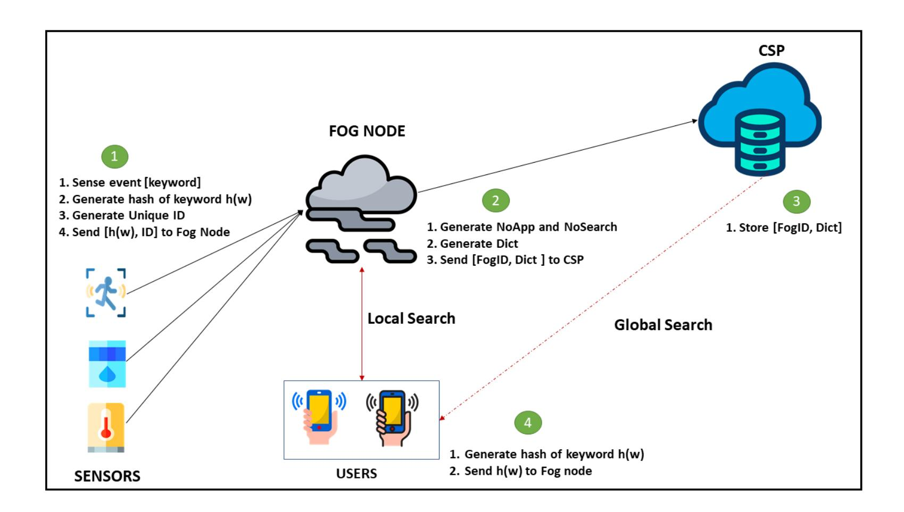

{0}------------------------------------------------

# **Do not tell me what I cannot do! (The constrained device shouted under the cover of the fog): Implementing Symmetric Searchable Encryption on Constrained Devices (Extended Version)**<sup>∗</sup>

Eugene Frimpong<sup>1</sup> , Alexandros Bakas<sup>1</sup> , Hai-Van Dang<sup>2</sup> and Antonis Michalas<sup>1</sup>

<sup>1</sup> Tampere University, [{eugene.frimpong,alexandros.bakas,antonios.michalas}@tuni.fi](mailto:{eugene.frimpong, alexandros.bakas, antonios.michalas}@tuni.fi) <sup>2</sup> University of Westminster, [H.Dang@westminster.ac.uk](mailto:H.Dang@westminster.ac.uk)

**Abstract.** Symmetric Searchable Encryption (SSE) allows the outsourcing of encrypted data to possible untrusted third party services while simultaneously giving the opportunity to users to search over the encrypted data in a secure and privacypreserving way. Currently, the majority of SSE schemes have been designed to fit a typical cloud service scenario where users (clients) encrypt their data locally and upload them securely to a remote location. While this scenario fits squarely the cloud paradigm, it cannot apply to the emerging field of Internet of Things (IoT). This is due to the fact that the performance of most of the existing SSE schemes has been tested using powerful machines and not the constrained devices used in IoT services. The focus of this paper is to prove that SSE schemes can, under certain circumstances, work on constrained devices and eventually be adopted by IoT services. To this end, we designed and implemented a forward private dynamic SSE scheme that can run smoothly on resource-constrained devices. To do so, we adopted a fog node scenario where edge (constrained) devices sense data, encrypt them locally and use the capabilities of fog nodes to store sensed data in a remote location (the cloud). Consequently, end users can search for specific keywords over the stored ciphertexts without revealing anything about their content. Our scheme achieves efficient computational operations and supports the multi-client model. The performance of the scheme is evaluated by conducting extensive experiments. Finally, the security of the scheme is proven through a theoretical analysis that considers the existence of a malicious adversary.

**Keywords:** Fog Computing · Symmetric Searchable Encryption · Wireless Sensor Networks · Internet of Things · Privacy

# **1 Introduction**

With the rapid advancement and development of innovative and pervasive computing, traditional security mechanisms such as public key cryptography have become inadequate

<sup>∗</sup>Funded by the ASCLEPIOS: Advanced Secure Cloud Encrypted Platform for Internationally Orchestrated Solutions in Healthcare Project No. 826093 EU research project and the European Union's Horizon 2020 research and innovation Programme under grant agreement No 825355 (CYBELE).

{1}------------------------------------------------

to properly protect users' artefacts on their own due to the increasingly complex nature of these networks. Computing paradigms such as Internet of Things (IoT), Cloud, and Fog computing have become mainstays in corporate organizations as well as in the everyday lives of individuals. The cloud and fog computing technologies allow users to outsource resources to external service providers. Fog computing, in particular, has garnered a lot of academic and industrial interest beginning from 2014 when it was first coined as a term by Cisco [\[cis19\]](#page-14-0).

Fog computing can be described as a virtualized platform that seeks to provide various technological services such as computing, storage, control and networking services between end users and the Cloud [\[IEE18\]](#page-14-1). This has gained lot of attention due to the increased adoption of IoT applications with the cloud computing ecosystem. This adoption has led to an exponential increase in the amount of data being generated and transmitted between the IoT devices and the cloud. One of the primary advantages of introducing Fog computing is to provide reduced latency, reliable operation and eliminate the need for devices to continually connect to the cloud.

The introduction of fog nodes between an IoT edge network and the cloud leads to increasingly advanced and complex network designs such as Vehicular ad-hoc networks (VANETs). A typical VANET consists of moving vehicles with sensors that constantly communicate with well placed fog nodes for instant or near real-time responses [\[KKZB17\]](#page-14-2). The fog nodes after processing the data, forward specific components to the cloud for further analysis. Such advanced networks face various security and privacy threats related to trust, authentication, secure communication and end device privacy [\[MMS](#page-15-0)<sup>+</sup>17], which are not easily mitigated with traditional security mechanisms.

To this end, researchers and industry stakeholders have touted the use of promising encryption techniques such as Symmetric Searchable Encryption (SSE). SSE allows users to search directly over encrypted data stored in remote locations maintained by possible untrusted third parties (e.g. a cloud service) without revealing anything about the contents of the data [\[EKPE18\]](#page-14-3). Additionally, SSE allows users to encrypt data with a secret key which is not known to the cloud provider. Hence, providing protection against both external and internal (e.g. a malicious administrator) attacks. An ideal SSE scheme should not leak any information during any of the core processes of the (i.e. add, delete, update files and search for specific keywords). Information leakage is a very important problem in SSE due to its direct impact on both the efficiency and security.

**Contribution:** The core contribution of this paper can be summarized in one single sentence: "*Running Symmetric Searchable Encryption on constrained devices is possible!* ". This is considered as an important step towards the wide adoption of SSE schemes since majority of SSE have been designed to fit a typical cloud service scenario that cannot apply to the emerging field of IoT. Additionally, the performance of most of the existing SSE schemes has been tested using powerful machines and not the constrained devices used in IoT services. In this paper, we show that SSE can run on constrained devices. The main idea of our approach came from the following observation: SSE schemes are computationally heavy for clients only during the setup phase where the entire database (known as the dictionary) is created. This process, requires the client to parse all of the contents of the files that are to be stored in the cloud, extract all individual keywords and store encrypted versions of all data in the cloud. The rest of the expensive operations (e.g. search, delete, add) are mainly taking place on the cloud where there are unlimited resources. If it was possible to bypass or limit the setup phase, then SSE could ran in any device. Having this in mind, our approach was based on the fact that in an IoT scenario, edge devices will have to sense data from their actual environment and store them on the fly in a remote database. In other words, in such a scenario *there is no setup phase* since there are no existing files that needs to be parsed and stored to the cloud. Each sensor node is sensing periodically data (e.g. every 5sec). Then, the operations that must be done

{2}------------------------------------------------

on the sensed data are simple calculations (such as hashing and symmetric encryption) that do not put any real burden on the device. Based on this assumption, we built a forward private dynamic SSE scheme that shifts majority of the computational burden from the IoT devices to the fog computing nodes and we showed that our scheme can run smoothly on devices with up to 32MHz and 32KB of RAM. We hope that this work will be seen as a starting point where researchers will start building more secure and robust IoT protocols based on the promising concept of SSE.

**Organization:** The rest of the paper is organized as follows. In section [2,](#page-2-0) we discuss related works regarding current implementations of SSE schemes and the fog computing technology as well as the various security issues relating to it. A brief description of the cryptographic primitives used throughout our work and the considered threat model are presented in section [3.](#page-3-0) We formally define our system model in section [4](#page-5-0) while in section [5,](#page-7-0) we present the our scheme. We then delve into a detailed security analysis in section [6.](#page-9-0) Section [7](#page-11-0) provides an extended evaluation and finally in section [8](#page-13-0) we conclude the paper.

# <span id="page-2-0"></span>**2 Related Work**

Currently, there is an apparent lack of existing literature on implementing and extending purely symmetric searchable encryption schemes to the Fog computing environment. However, there are a number of substantial research works in relation to designing SSE schemes for cloud computing environments as well as securing data in a fog computing environment. For example, authors in [\[EKPE18\]](#page-14-3) present an efficient dynamic searchable encryption with forward privacy in a cloud computing environment. This scheme offers efficient searching over outsourced encrypted data in an untrusted server. However, primary deficiencies with this scheme are its lack of support for multiple clients and the computational and storage overhead imposed on end entities (i.e. IoT devices in the context of this paper). Our work focuses on extending an SSE scheme to an environment with multiple data owners and end users who will use the search functionality of our scheme while reducing the computational overhead imposed on the resource constrained IoT devices.

An example of an innovative security scheme for the Fog and IoT ecosystem is the use of Blockchains and Trusted execution environments (TEE) in [\[FZS](#page-14-4)<sup>+</sup>19]. In this work, authors design a security scheme that guarantees data source trustworthiness in the fog domain by combining blockchains and TEE technologies. The scheme ensures that the information collected by the fog nodes from the IoT devices cannot be tampered with by any malicious adversary, while ensuring the safety of data interaction between interconnected fog devices. Although a very interesting approach, it does not provide an external user the ability to search over this secure data. Additionally, the proposed use of smart contracts essentially means that the IoT devices can not carry out the security scheme without incurring a substantial computational overhead cost.

To reduce the computational overhead on resource constrained devices, researchers in [\[CWQL19\]](#page-14-5), proposed a lightweight fine-grained search over encrypted data in a similar fog computing environment by adopting the Ciphertext-Policy Attribute based Keyword Search (CP-ABKS) [\[ZXA14\]](#page-15-1) and shifting majority of the computational burden to the Fog Nodes. Albeit a very powerful cryptographic algorithm that provides fine-grained access control and keyword search, CP-ABKS incurs very high computational and storage costs that our implementation avoids by utilizing SSE. Additionally, authors make the assumption that the CSP is an honest but curious entity. Hence, the CSP computes ciphertext retrieval operations based on received tokens. On the contrary, we propose to limit the functionalities of the CSP by restricting it to storing the ciphertexts of files while performing search queries in the Fog computing layer. As well as eliminating the need to 

{3}------------------------------------------------

trust the CSP, this reduces the communication latency involved in search queries and the return of search results.

# <span id="page-3-0"></span>**3 BACKGROUND**

**Notation:** Given a set X , we use *x* ← X to show that *x* is sampled uniformly from X and *x* \$←− X if *x* is sampled uniformly at random. |X | denotes the cardinality of X . Given two strings *x* and *y*, we use *x*||*y* to denote the concatenation of *x* and *y*. A function *negl*(·) is called negligible if ∀*n >* 0*,* ∃*N<sup>n</sup>* such that ∀*x > Nn*: |*negl*(*x*)|*<* 1*/poly*(*x*). Each IoT device is considered as a data owner. The set of all IoT devices is denoted by D = {*d*1*, . . . , dn*}. Similarly, the set of all fog nodes is denoted by F = {*f*1*, . . . , fm*}. In our constructions, the keywords are measurements sent by the IoT devices to a fog node. The universe of the measurements is denoted by W = {*w*1*, . . . , w`*}. Each measurement *w<sup>j</sup>* has a unique id, denoted by *id*(*w<sup>j</sup>* ) with corresponding ciphertext *cid*(*w<sup>j</sup>* ) . Moreover, we denote by *R* the result of a search query. We assume that each IoT device and each Fog Node holds a public/private key pair (pk*,*sk) used for signing and verifying messages. The encrypted data base is denoted by EDB and finally, we assume the existence of a hash function *h*(·) : {0*,* 1} <sup>∗</sup> → {0*,* 1} *<sup>m</sup>* and that of a keyed hash function *H*(·*,* ·) : {0*,* 1} *<sup>λ</sup>* × {0*,* 1} <sup>∗</sup> → {0*,* 1} *n*.

**Symmetric Searchable Encryption:** We now proceed with the definition of a dynamic symmetric searchable encryption scheme.

**Definition 1.** A Dynamic Symmetric Searchable Encryption (DSSE) scheme consists of the following PPT algorithms:

- Setup(1*<sup>λ</sup>* ): A key-generation algorithm that takes as input the security parameter *λ* and outputs the secret key K = (KSKE*,*Kh) where KSKE is a key for a IND-CPA secure symmetric key cryptosystem and K<sup>h</sup> is a key for the keyed hash function *H*(·*,* ·). This algorithm is executed by an IoT device.
- AddId: This algorithm is executed by an IoT device *d<sup>i</sup>* to add a new measurement *w<sup>j</sup>* to the encrypted data base (EDB). All the indexes are updated accordingly.
- LocalSearch: This algorithm is executed by a user in order to search for a measurement *w<sup>j</sup>* of a specific type, on the local Fog Node. The indexes are updated and the Fog Node returns to the user the encrypted ids that captured the measurement *w<sup>j</sup>* .
- GlobalSearch: This algorithm is executed by a user in order to search for a measurement *w<sup>j</sup>* of a specific type on the cloud. The indexes are updated and the CSP also returns to the user the encrypted ids that captured the measurement *w<sup>j</sup>* .

**Security Definitions:** The security of an SSE scheme depends on predefined leakage formalized by a leakage function L = (L*search,*L*add*), whose components correspond respectively to to the Search and Add operations. Whenever the user triggers one of these operations, the adversary ADV should not be able to learn anything that the output of the corresponding leakage function. The idea is the following: ADV has full control of the client in the sense that she can trigger search and add operations at will. ADV issues a polynomial number of queries and for each query she records the output. In the real experiment, everything runs honestly. In the ideal experiment however, a simulator S simulates all the functionalities of the real scheme. The scheme is said to be L-adaptively secure if ADV cannot distinguish between the real and ideal experiments

{4}------------------------------------------------

<span id="page-4-0"></span>**Definition 2** (Adaptive Security)**.** Let DSSE = (Setup*,* Search*,* Add) be a dynamic symmetric searchable encryption scheme. Moreover, let L = (L*search,*L*add*) be the leakage function of the scheme. We consider the following experiments between the adversary ADV and a simulator S:

### Real Experiment

- 1. Record = {}
- 2. **for** *κ* = 1 to *q* do
- 3. **if** op = Search
- 4. *R<sup>κ</sup>* ← Search(*paramκ,*EDB)
- 5. **else** (op = Add)
- 6. *R<sup>κ</sup>* ← Add(*paramκ,*EDB)
- 7. **end if**
- 8. Record = Record ∪ {*Rκ*}
- 9. **end for**
- 10. *b* ← ADV(Record)
- 11. **Output** *b*

### Ideal Experiment

- 1. Record = {}
- 2. **for** *κ* = 1 to *q* do
- 3. **if** op = Search
- 4. *R<sup>κ</sup>* ← S(L*search*(*paramκ*))
- 5. **else** (op = Add)
- 6. *R<sup>κ</sup>* ← S(L*add*(*paramκ*))
- 7. **end If**
- 8. Record = Record ∪ {*Rκ*}
- 9. **end for**
- 10. *b* ← ADV(Record)
- 11. **Output** *b*

The DSSE scheme is L- adaptively secure, with respect to the leakage function L, iff for any PPT adversary ADV issuing a polynomial number of queries *q*(*λ*), ∃ PPT simulator S such that:

$$|Pr[Real_{\mathcal{ADV}}(\lambda, q) = 1] -$$
  
 $Pr[Ideal_{\mathcal{ADV}, \mathcal{S}, \mathcal{L}}(\lambda, q) = 1 | = negl(\lambda)$ 

Informally, each search query leaks the outcome of the search – The Access pattern– and whether two queries were for the same keyword – The Search pattern. We proceed with the formal definitions.

{5}------------------------------------------------

**Definition 3** (Access Pattern)**.** The Access Pattern for a keyword *w<sup>i</sup>* is defined to be the set of nodes having measured *w<sup>i</sup>* at a given time *t*. The set is denoted by D*<sup>w</sup>i,t*.

**Definition 4** (Search Pattern)**.** The Search Pattern is a vector *sp* that maintains a mapping between executed queries and keywords. For example, *sp*[*t*] = *w<sup>j</sup>* denotes the query issued at time *t*, corresponding to *w<sup>j</sup>* .

Hence, we conclude that:

**Definition 5.** The leakage function corresponding to the Search operation, can be written as:

$$\mathcal{L}_{search} = \mathcal{L}'(\mathcal{D}_{w_i,t}, sp)$$

Where L 0 is a stateless function.

A DSSE scheme is said to be forward private if for all insertions that take place after the successful execution of the Setup algorithm, the leakage is limited to the size of the file, and the number of unique keywords contained in it. In our case, since we do not deal with files, the addition operation should not leak any information at all. More formally:

**Definition 6** (Forward Privacy)**.** An L-adaptively SSE scheme is forward private if the leakage function L*add* can be written as:

$$\mathcal{L}_{add}(id(d_i)) = \mathcal{L}'(c_{id(w_i)})$$

Where L 0 is a stateless function.

# <span id="page-5-0"></span>**4 SYSTEM MODEL**

In this section, we provide a description of our system model by defining the main entities along with their respective capabilities. Our system model consists of the sensor nodes referred to as Data Owners (DO), a set of registered users U, a set of fog nodes F, and a Cloud Service Provider CSP.

**Data Owners:** Let D = {*d*1*, . . . , dn*} be the set of all sensor nodes in our environment deployed to register the occurrence of specific environmental events. The data owners in our system model are able to add and update encrypted data using our proposed scheme. For the purposes of our implementation, we utilize the Zolertia Re-Mote board devices that are based on the Texas Instruments CC2538 ARM Cortex-M3 system on chip (SoC). These boards feature a 2.4GHz IEEE 802.15.4 RF Interface, running up to 32MHz with 512KB of programmable flash and 32KB of RAM while possessing a built-in battery charger (500 mA) with energy harvesting capabilities as well as a CC1200 868/915MHz RF transceiver which allows for dual band operation. The functions performed by a data owner are:

- Register the occurrence of a sensed event (e.g. Temperature, Humidity, etc). Data about a sensed data is referred to as *keyword* throughout the rest of this paper and is denoted by *w<sup>i</sup>* .
- Generate a hash of data about every sensed event *h*(*wi*).
- Generate a unique identifier *id<sup>j</sup>* for each sensed event based on the sensing device's id, timestamp and the nature of the event (i.e. temperature, humidity, etc).
- Encrypt the unique identifier with a symmetric key K to generate a keyword value, *cid*(*wi*) , that corresponds directly to each keyword.

{6}------------------------------------------------



**Figure 1:** System Architecture

The sensor device then sends both *h*(*wi*) and *cid*(*wi*) to the nearest fog node.

**Fog Nodes:** Let F = {*f*1*, . . . , fm*} be a set of all fog nodes in our environment. In this work, we consider a fog node that provides support for a TEE. The specifications of the TEE are considered to be beyond the scope of our implementation. Each fog node *f<sup>i</sup>* defines a sub-network that consists of multiple sensor devices *dfi*<sup>1</sup> *, . . . , dfin* . During the first run of our protocol, the fog node generates three indexes.

- The NoApp[w<sup>i</sup> ], which contains the hash of the keyword along with the number of times it has received that keyword.
- The NoSearch[w<sup>i</sup> ], which contains the number of times a user has searched for the keyword.
- The Dict, which contains a mapping between each keyword and a unique identifier of the sensor node that sent it.

The fog node then stores a local copy of all three indexes and sends a copy of Dict to CSP along with the identity of the fog node *f<sup>j</sup>* .

**Users:** We denote with U = {*u*1*, . . . , up*} the set of all users registered in the network to search, perform computations and receive updates on sensed events. These users submit a hash of a keyword *h*(*w<sup>j</sup>* ) to a nearest fog node for the computation of a search token. The user has the option to search locally on a single fog node *f<sup>j</sup>* or to perform a global search involving multiple fog nodes (in this case, the CSP performs the search).

**Cloud Service Provide (CSP):** In this work, we consider a top level cloud computing service much like the one described in [\[PGM17\]](#page-15-2). However, unlike the fog nodes, we do not require the CSP to have support for a TEE. The CSP creates a merged dictionary comprising of all Dict and the identity of the fog node *f<sup>j</sup>* that sent it.

{7}------------------------------------------------

### <span id="page-7-0"></span>5 SEARCHING IN THE FOG

In this section, we present a detailed description of the Searching in the Fog scheme (a multiclient DSSE scheme for IoT devices with forward privacy) along with the construction of the core algorithms the scheme utilizes. The proposed scheme takes advantage of the Fog computing paradigm to provide efficient computational operations and decrease communication latency. Our protocol is made up of two main algorithms; (i) Add Data and (ii) Search Data. The proposed scheme is influenced by the one proposed in [BM19b].

**Add Data** The Add Data algorithm is undertaken by both a sensor device,  $d_{f_{j_\ell}}$  and the nearest fog node  $f_j$ . The  $d_{f_{j_\ell}}$  is deployed to register the occurrence of an environmental event such as temperature, humidity, motion, etc. Data about a sensed event is referred to as a keyword  $w_i$ . Once an event has been registered,  $w_i$  is hashed to produce  $h(w_i)$ .  $d_{f_{j_\ell}}$  then generates a unique identifier that will be used to identify the particular keyword. This unique identifier ID is made up on the sensor device's id, timestamp and the type of event being registered (i.e. temperature, humidity, etc). The ID is then encrypted with a secret shared key  $\mathsf{K}_{\mathsf{SKE}}$  to produce  $c_{id(w_i)}$  (line 4 of algorithm 1). The sensor device sends  $h(w_i)$  and  $c_{id(w_i)}$  to the nearest fog node.

Upon receipt by the fog node,  $f_j$  retrieves the corresponding  $\mathsf{NoApp}[h(w_i)]$  and  $\mathsf{NoSearch}[h(w_i)]$  from the local database based on  $h(w_i)$ . Using  $\mathsf{NoApp}[h(w_i)]$ , the fog node computes the Dict address  $\mathsf{addr}_{w_i}$  for the  $c_{id(w_i)}$  received from  $d_{f_{j_\ell}}$  (line 6 - 9 of algorithm 1). Once this stage is done,  $f_j$  sends a copy of the dictionary and its identity [FogID, Dict] with the  $\mathcal{CSP}$ .

#### Algorithm 1 Add Data

#### Sensor

- 1: Register data about a sensed event  $w_i$
- 2: Compute hash of the data  $h(w_i)$
- 3: Generate a unique identifier for the sensed data ID. (ID = SensorID||t||T), where SensorID is the unique id of the sensor, t is the timestamp, T is the type of the measurement.
- 4: Compute  $c_{id(w_i)} = Enc_{K_{SKE}}(\mathsf{ID})$
- 5: Send  $[h(w_i), c_{id(w_i)}]$  to the nearest Fog Node

### Fog Node

- 6: NoApp $[h(w_i)] + +$
- 7:  $\mathsf{K}_{\mathsf{w_i}} = H\left(K_h, h(w_i) || \mathsf{NoSearch}[h(w_i)]\right)$
- 8:  $\operatorname{addr}_{w_i} = h\left(\mathsf{K}_{\mathsf{w}_i}, \mathsf{NoApp}[h(w_i)]||0\right)$
- 9:  $\mathsf{Map} = \mathsf{Map} \cup \{ \mathsf{addr}_{w_i}, c_{id(w_i)} \}$
- 10: Send [Map, FogID] to CSP

### $\underline{\mathbf{CSP}}$

11: Add Map into central Dict and store along with the FogID

**Search Data** For a successful run of the Search Data algorithm, we assume that the user has access to the secret shared key  $K_{SKE}$  (used by the sensor device in line 4 of algorithm 1 to encrypt the ID). Users can search for a sensed input value,  $w_i$  with the aid of the nearest fog node  $f_j$ . To perform the search data algorithm, a user  $u_k$  computes the hash value,  $h(w_i)$ , of the sort after value  $w_i$  and sends to the nearest fog node  $f_j$ . Our scheme provides support for two variations of the search algorithm; (i) Local search, which involves just one fog node, and (ii) Global search, which involves multiple fog nodes and the CSP. We describe both instances of the Search Data algorithm below;

{8}------------------------------------------------

**Local Search:** This search algorithm involves just the neighbouring fog node. Upon reception,  $f_j$  retrieves the corresponding  $\mathsf{NoApp}[h(w_i)]$  and  $\mathsf{NoSearch}[h(w_i)]$  from the local database. After  $f_j$  receives these values, it computes  $\mathsf{K}_{\mathsf{w}_i} = h(\mathsf{K}_\mathsf{h}, h(w_i)||\mathsf{NoSearch}[w_i])$  in order to calculate the addresses  $\mathsf{addr}_{\mathsf{w}_i}$  of all instances of  $h(w_i)$  in the dictionary Dict. The fog node then increases  $\mathsf{NoSearch}[h(w_i)]$ , which is then used to compute a new key  $\mathsf{K}_{\mathsf{w}_i}$ . The new key is used to calculate new addresses  $\mathsf{addr}_{\mathsf{w}_i}$ , which is packed in a list  $L_s$ . Based on the initial addresses generated,  $f_j$  retrieves the corresponding ciphertext values,  $c_{id(w_i)}$ , in the locally stored dictionary Dict. The ciphertext values are returned to the user for decryption and the addresses replaced with the new addresses in  $L_s$ .

Global Search: This search algorithm involves both the neighbouring fog node and the CSP. Upon reception of  $h(w_i)$  from the sensor device,  $f_j$  generates a search token that is forwarded to the CSP. The search token is generated by retrieving the  $\mathsf{NoApp}[h(w_i)]$  and  $\mathsf{NoSearch}[h(w_i)]$  values of  $h(w_i)$  from the local database. The fog node proceeds to compute  $\mathsf{K}_{\mathsf{w}_i} = h(\mathsf{K}_\mathsf{h}, h(w_i)||\mathsf{NoSearch}[w_i])$  in order to calculate the addresses  $\mathsf{addr}_{\mathsf{w}_i}$  of all possible instances of  $h(w_i)$  in the merged Dict at the CSP. A list  $L_s$  is created containing all the addresses. The fog node then increases  $\mathsf{NoSearch}[h(w_i)]$ , which is then used to compute a new key  $\mathsf{K}_{\mathsf{w}_i}$ . The new key is used to calculate new addresses  $\mathsf{addr}_{\mathsf{w}_i}$ , which is also packed into another list  $L_s$ . Both lists,  $(L_s, L_s)$ , along with the user's identity is sent to the CSP.

Upon reception of the lists, the CSP uses the addresses in  $L_s$  to search the central Dict for the corresponding ciphertext values  $c_{id(w_i)}$ . The CSP returns the ciphertext values to the user and replaces corresponding addresses with a new address in  $L_s'$ .

#### <span id="page-8-1"></span>Algorithm 2 Search Data - Local Search

```
User
 1: Compute and send h(w_i) to the Fog Node
                                                                                      ▶ Fog node is TEE enabled
     Fog Node
 2: Retrieve the values NoApp[h(w_i)] and NoSearch[h(w_i)] from the local database
 3: \mathsf{K}_{\mathsf{w}_{\mathsf{i}}} = H(\mathsf{K}_{\mathsf{h}}, h(w_i) || \mathsf{NoSearch}[w_i])
 4: NoSearch[w_i] + +
 5: \mathsf{K_{w_i}}' = H(\mathsf{K_h}, h(w_i) || \mathsf{NoSearch}[\mathsf{h}(\mathsf{w_i})])
 6: L_s = \{\}
 7: for i = 1 to i = NoApp|h(w_i)| do
         \operatorname{addr}_{\mathbf{w}_{i}} = h(\mathsf{K}_{\mathsf{w}_{i}}{}', i||0)
 8:
         L_s = L_s \cup \{ addr_{w_i} \}
 9:
10: for i = 1 to i = NoApp[h(w_i)] do
         c_{id(w_i)} = \text{Dict}[h(K_w, i||0)]
11:
12:
         R = R \cup \{c_{id(w_i)}\}\
         Delete the row on Dict and update it according to the address in L_s
13:
14: Send R to the user
```

#### 5.1 A PROTOCOL-BASED APPROACH

In this section, we present a protocol-based approach of our construction based on the algorithms we described. We assume that each entity has a public and private key pair and that all the public keys are pre-shared and that each sensor node of the same sub-network shares the same symmetric key  $\mathsf{K}_{\mathsf{SKE}}$  generated by the Fog Node<sup>1</sup>.

To add a new measurement  $w_i$  to the local Fog Node  $f_j$ , a sensor node  $d_{f_{j_i}}$  first calculates  $h(w_i)$  and then generates the unique ID of the measurement. As a next step, it computes

<span id="page-8-0"></span><sup>&</sup>lt;sup>1</sup>Key sharing is out of the scope of this paper. However, interesting approaches that fit squarely the cloud paradigm and leverage the power of secure hardware can be found in [Mic19, BM19a, MBDZ19].

{9}------------------------------------------------

#### <span id="page-9-1"></span>Algorithm 3 Search Data - Global Search

```
User
                                                                                     ▶ Fog node is TEE enabled
 1: Compute and send h(w_i) to the Fog Node
     Fog Node
 2: Retrieve the values NoApp[h(w_i)] and NoSearch[h(w_i)] from the local database
 3: \mathsf{K}_{\mathsf{w}_{\mathsf{i}}} = H(\mathsf{K}_{\mathsf{h}}, h(w_i) || \mathsf{NoSearch}[w_i])
 4: NoSearch[w_i] + +
 5: K_{w_i}' = H(K_h, h(w_i)||NoSearch[h(w_i)])
 6: L_s = \{\}
 7: for i = 1 to i = NoApp|h(w_i)| do
         \mathrm{addr}_{\mathbf{w_i}} = h(\mathsf{K}_{\mathsf{w_i}}, i||0)
 8:
         L_s = L_s \cup \{ addr_{w_i} \}
 9:
10: L_s' = \{\}
11: for i = 1 to i = NoApp[h(w_i)] do
         \operatorname{addr_{w_i}}' = h(\mathsf{K_{w_i}}', i||0)
12:
         L_s' = L_s' \cup \{ \operatorname{addr}_{w_i}' \}
13:
14: Send (L_s, L_s') to the CSP
     \underline{\mathbf{CSP}}
15: R = \{\}
16: for i = 1 to i = \text{Sizeof}(L_s) do
         c_{id(w_i)} = \operatorname{Dict}[L_s[i]]
17:
18:
         R = R \cup \{c_{id(w_i)}\}\
         Delete the row on Dict and update it according to the address in L_s'
19:
20: Send R to the user
```

the value  $c_{id(w_i)}$  and finally, sends  $m_1 = \langle r_1, h(w), c_{id(w_i)}, \sigma_i(h(r_1, h(w_i), c_{id(w_i)})) \rangle$ , where  $r_1$  is a random number. Upon reception,  $f_j$  verifies both the freshness of the message and the signature and proceeds by calculating the address of the measurement addr<sub>w<sub>i</sub></sub>. Finally,  $f_j$  stores addr<sub>w<sub>i</sub></sub> and  $c_{id(w_i)}$  to its local dictionary and also sends them to CSP along with its unique identifier FogID via  $m_2 = \langle r_2, \mathsf{Map}, \mathsf{pk}_{CSP}(\mathsf{FogID}), \sigma_{f_j}(h(r_2||\mathsf{Map}||\mathsf{FogID})) \rangle$ . The CSP verifies the freshness and the signature and stores  $w_{addr}$  and  $c_{id(w_i)}$  to the global dictionary Dict along with the identity of the fog node.

When a user  $u_i$  wishes to search on the encrypted database, she first hashes the keyword  $w_j$  she is looking for and then sends the result  $h(w_i)$  to the Fog Node  $f_k$  via  $m_3 = \langle r_3, h(w_i), Enc_{pk_{f_k}}(\text{flag}), \sigma_{u_i}(h(r_3||h(w_i)||\text{flag}))\rangle$ , where flag  $\in \{\text{local, global}\}$ . If flag = local, then  $f_k$  proceeds with the search as described in Algorithm 2 and sends the result R back to the  $u_i$  via  $m_4 = \langle r_4, R, \sigma_{f_k}(h(r_4||R)).$  R is a list on encrypted id's so there is no need to re-encrypt it. On the other hand, if flag = global,  $f_k$  computes the lists  $L_s$  and  $L'_s$  as described in Algorithm 3 and forwards them to the CSP via  $m_5 = \langle r_5, L_s, L'_s, \sigma_{f_k}(h(r_5||L_s||L'_s))\rangle$ . Upon reception, the CSP will verify the freshness and the signature of the message. If the verification is successful, the CSP proceeds with locating the entries on Dict that correspond to the search keyword and updates Dict as specified by the  $L'_s$ . Finally, the result R is outsourced to  $u_i$  via  $m_6 = \langle r_6, R, \sigma_{CSP}(h(r_7||R))\rangle$ .

### <span id="page-9-0"></span>**6 SECURITY ANALYSIS**

We prove the security of our construction according to definition 2 in Section 3. Our goal is to construct a simulator S that will simulate the addition and search tokens in such a way that no PPT adversary ADV will be able to distinguish whether the tokens were generated by the real algorithms or by S.

{10}------------------------------------------------

<span id="page-10-0"></span>**Theorem 1.** Let SKE be an IND-CPA secure symmetric key cryptosystem. Moreover, let h be a secure cryptographic hash function. Then, our construction is secure according to definition 2.

In a pre-processing phase S generates a key for the IND-CPA secure cryptosystem. Moreover, S generates a dictionary KeyStore to store the last key assigned to each keyword and a dictionary Oracle to reply to the random oracle queries. Both of these dictionaries can be resized over time. To prove our theorem, we make use of a hybrid argument.

*Proof.* | **Hybrid 0:** | Everything runs as specified by the protocol.

**Hybrid 1:** Like Hybrid 0 but now S gets as input  $\mathcal{L}_{add}$  and proceeds as follows:

```
Generate a random string s
val \leftarrow \mathsf{Enc}(\mathsf{K}_{\mathsf{SKE}}, 0^{\lambda})
v = val \oplus id(d_i)
Output (s, val)
Based on s simulate a random address a
Store (c_{id(w_i)}, \{a, v\}) into Dict
```

The random string s has exactly the same length as the output of the hash function h. Moreover, due to the IND-CPA security of the encryption scheme,  $\mathcal{ADV}$  cannot distinguish between the real encryption of the node id and that of zeros. Thus we have:

$$|Pr[Hybrid\ 0=1] - Pr[Hybrid\ 1=1]| = negl(\lambda)$$
 (1)

**Hybrid 2:** Like Hybrid 1 but now S gets as input  $\mathcal{L}_{search}$ . S proceeds as follows:

```
Search Token Simulation
  \ell: Number of c_{id(w_i)} to be retuned
  R = \{\}
  if KeyStore[w_j] = Null
      \mathsf{KeyStore}[w_j] \leftarrow \{0,1\}^{\lambda}
  for i = 1 to i = \ell
      if Oracle[K_{w_j}][0][i] is Null
         Pick a (c_{id(w_i)}, \{a_i, v_i\}) pair
      else
         a_i = \mathsf{Oracle}[\mathsf{K}_w][0][i]
         v_i = \mathsf{Oracle}[\mathsf{K}_w][1][i]] \oplus val
     end if
      Remove a_i from the dictionary but keep v_i
      R = R \cup \{c_{id(w_i)}\}\
  end for
  UpdatedVal = \{\}
  \mathsf{K}'_w \leftarrow \{0,1\}^\lambda
  \mathsf{KeyStore}[w_j] = \mathsf{K}'_{w_j}
  for i = 1 to i = \ell
      Generate new a_i and match it with v_i that was kept from before
```

{11}------------------------------------------------

Continuation of Search Token Simulation.

```
Add (c_{id(d_i)}, \{a_i, v_i\}) to the dictionary UpdatedVal = UpdatedVal \cup \{c_{id(w_i)}, a_i\} Oracle[\mathsf{K}'_{w_j}][0][i] = a_i Oracle[\mathsf{K}'_{w_j}][1][i] = v_i \oplus c_{id(w_i)} end for \tau_s(w) = (\mathsf{K}_{w_j}, \ell, UpdatedVal) R is retuned to \mathcal{ADV}
```

The KeyStore[w] dictionary is used to keep track of the last key  $K_w$  used for each keyword w. The Oracle[ $K_w$ ][j][i] dictionary is used to reply to ADV's queries. For example, Oracle[ $K_w$ ][0][i] represents the address of a Dict entry assigned to the i-th id contained in the result R. Similarly, Oracle[ $K_w$ ][1][i] represents the masked value needed to recover  $id(d_i)$ . It is clear, that the simulated search token has exactly the same size and format as the real one and thus:

$$|Pr[Hybrid 1 = 1] - Pr[Hybrid 2 = 1]| = negl(\lambda)$$
 (2)

By combining equations (1) and (2) we get:

$$|Pr[Hybrid\ 0=1] - Pr[Hybrid\ 2=1]| = negl(\lambda)$$

which is equivalent to:

$$\begin{aligned} |Pr[Real_{\mathcal{ADV}}(\lambda, q) = 1] - \\ Pr[Ideal_{\mathcal{ADV}, \mathcal{S}, \mathcal{L}}(\lambda, q) = 1 | = negl(\lambda) \end{aligned}$$

And thus our proof is complete.

#### 6.1 Side Channel Attacks

Many recent works [XCP15,LSG<sup>+</sup>17,CD16] have shown that SGX is vulnerable to software attacks. However, according to [FVBG17] leakage can be avoided if the programs running in the enclaves do not have memory access patterns or control flow branches that depend on the values of sensitive data. In our case, no heavy computations occur in the Fog Node enclave and the only operation is the application of a hash function. To this end, we could use leakage resilient primitives as in [TS14]. Hence, by assuming a constant time implementation for the software running in an SGX enclave, our construction is secure against timing attacks.

### <span id="page-11-0"></span>7 EXPERIMENTAL RESULTS

In this section, we present the results of experiments we conducted to demonstrate the feasibility of our proposed work. Our experiments focused primarily on evaluating the performance of the algorithms described in section 5 on both the sensor device and the fog node. For this work, we utilized a zolertia device with 512KB programmable flash and 32KB RAM as our sensor device while using an Intel i7 Ubuntu desktop with 16GB RAM as the fog node. To implement the necessary algorithms, we developed a Contiki-NG application on the sensor device written in C, using modified cryptographic functions from the Tinycrypt library [Woo19]. On the fog node, we developed a node js application to interact with a local database. With regards to this database, our dictionary is implemented as tables in a MySQL database hosted on the fog node. Although existing works in the

{12}------------------------------------------------

field of SSE rely on data structures such as arrays, maps, sets, lists, trees, etc, we opted for a relational database to represent a persistent storage.

The experiments measure the performance of the core cryptographic components of our work on the resource constrained sensor device, as well as the overall performance of the add and search algorithms using datasets of arbitrary sizes.

**Datasets** To comprehensively measured the performance of both the search and add algorithms, it was important that we utilized datasets of different sizes. Due to the uniqueness of our work, the datasets had to be created as part of our experiments (i.e. using the add algorithm of the protocol). We left the sensor device to collect the temperature in a room every 5s for a varying number of hours and forwarded that information to the fog node. We did this for 1hr, 4hrs, 12hrs and 24hrs with a temperature range of 10-to-35 degrees Table [1.](#page-12-0)

<span id="page-12-0"></span>**Duration (hrs) Number of Entries** DS1 1 737 DS2 4 2,844 DS3 12 8,617 DS4 24 17,287

**Table 1:** Dataset Size

**Add Algorithm** This part of our work consists of two phases and is performed on both the sensor device and the fog node:

**PH1:** The sensor device collects data on a sensed event, generate a unique id, hash the data about the sensed event, encrypt the unique id, and finally send both the hashed data and the ciphertext to the fog node;

**PH2:** The fog node retrieves the NoApp and NoSearch from the database based on the hashed message received from the sensor device, build the encrypted index and generate the dictionary.

We measure the total performance of the add algorithm by evaluating the performance of the cryptographic components on the sensor device and the time taken by the fog node to complete the algorithm.

**Performance of Cryptographic Components on Sensor Device:** As mentioned during the description of our dataset, the sensor device is left to collect measurements for a varying period of time. From table [1,](#page-12-0) it is observed that, for a timespan of 24 hours, the sensor device and the fog node run through various portions of the add algorithm 17,287 times. The system time for the CC2538 platform for which the sensor device is based on is represented as CPU ticks. As a result of this limitation, the performance metrics on the sensor devices are recorded in ticks and externally converted to seconds. Specific figures are derived by dividing the number of ticks by 128 (CPU ticks per second [\[Kur18\]](#page-14-10)). In 17,287 iterations of the first part of the add function, the sensor device takes an average of 4.5 ticks to generate the hash of the keyword (temperature) and the ciphertext of the unique filename. This corresponds to 0.035s.

**Execution Time on the Fog Node:** In this part of our experiments, we measured the time taken by the fog node to build the index table and generate the encrypted dictionary. For 17,287 runs of our protocol, the fog node takes an average of 14.516ms for each keyword hash received from the sensor device. This time includes the time taken to query and update the database. This is a very encouraging result as it illustrates that

{13}------------------------------------------------

| Function            | Execution Time (ms) |
|---------------------|---------------------|
| Add (Sensor Side)   | 35                  |
| Add (Fog Node Side) | 14.516              |
| Total Add Algorithm | 49.51               |

Search Token Generation 0.066

**Table 2:** Performance Summary

the fog node will continue to be very efficient even if we increase the number of sensor devices that communicate with it. We acknowledge that the results for this section would better resemble real life scenarios if we utilized multiple sensor devices. Unfortunately, our current implementation supports just one sensor device per fog node.

From the measurements described above, it can be seen that the add algorithm is quite efficient and fast. Hence, we can safely assume that there will be no backlog on both the sensor device and the fog node even if the sensor device collects data every 1s and sends to the fog node. The total execution time of the add algorithm is 0.0495s.

**Search Algorithm** In this part of our experiments, we measured the total time taken to complete the search algorithm over the encrypted dictionary generated by the add algorithm. As described in Section [5,](#page-7-0) the search algorithm is performed on the fog node in a *local search* and is performed on the CSP in a *global search*. For the purposes of our experiments, we assumed that the CSP has the same specifications as the fog node. Hence, the performance of both the local and global search will only vary based on the size of the dataset. The search time is calculated by measuring the following:

- 1. Time taken by the fog node to generate a search token from a hashed keyword sent by a user;
- 2. Time needed to find the respective matches in the database;
- 3. Generate a new keyword address to replace the address retrieved in the dictionary.

On average, the time taken to generate the search token is 0.066ms. The search algorithm involves generating a new keyword address for every keyword value found. As such, the actual search time also includes the time taken to generate new keyword addresses. Searching for a keyword that appears 760 times in a database with 17,287 entries takes approximately 11.36s (i.e. time taken to find all the keyword values and generate new keyword addresses for all 760). The search algorithm for a keyword that appears 22 times in a database with 737 entries takes approximately 134ms. These two times represent the lower and upper bounds of our experiments.

**Open Science & Reproducible Research** To support open science and reproducible research and to give the opportunity to other researchers to use, test and hopefully extend our scheme, we plan to make the source code of our scheme available. However, to keep our anonymity we will make the link available in the camera-ready version if the paper gets accepted.

# <span id="page-13-0"></span>**8 CONCLUSION**

In this paper, we proposed a forward private dynamic SSE scheme that can ran on constrained devices. Our system model is utilizing fog computing to reduce the computational burden on the sensor devices and increase the overall efficiency of the scheme. Our proposed

{14}------------------------------------------------

scheme allows sensor devices to securely encrypt data on sensed events, store them in a remote location and then search over the encrypted data without revealing anything about the content of the stored data. Our scheme achieves efficient computational operations and supports the multi-client model. The performance of the scheme is evaluated by conducting extensive experiments while its security is proven through a theoretical analysis that considers the existence of a malicious adversary. We believe this work can serve as groundwork for researchers who wish to build IoT services based on the promising concept of SSE.

# **References**

- <span id="page-14-7"></span>[BM19a] Alexandros Bakas and Antonis Michalas. Modern family: A revocable hybrid encryption scheme based on attribute-based encryption, symmetric searchable encryption and sgx. In *International Conference on Security and Privacy in Communication Systems*, pages 472–486. Springer, 2019.
- <span id="page-14-6"></span>[BM19b] Alexandros Bakas and Antonis Michalas. Multi-client symmetric searchable encryption with forward privacy. *IACR Cryptology ePrint Archive*, 2019:813, 2019.
- <span id="page-14-8"></span>[CD16] Victor Costan and Srinivas Devadas. Intel sgx explained. *IACR Cryptology ePrint Archive*, 2016(086):1–118, 2016.
- <span id="page-14-0"></span>[cis19] Edge computing vs. fog computing: Definitions and enterprise uses, Dec 2019.
- <span id="page-14-5"></span>[CWQL19] Mingsheng Cao, Luhan Wang, Zhiguang Qin, and Chunwei Lou. A lightweight fine-grained search scheme over encrypted data in cloud-assisted wireless body area networks. *Wireless Communications and Mobile Computing*, 2019:1–12, Jan 2019.
- <span id="page-14-3"></span>[EKPE18] Mohammad Etemad, Alptekin Küpçü, Charalampos Papamanthou, and David Evans. Efficient dynamic searchable encryption with forward privacy. *Proceedings on Privacy Enhancing Technologies*, 2018(1):5–20, Jan 2018.
- <span id="page-14-9"></span>[FVBG17] Ben Fisch, Dhinakaran Vinayagamurthy, Dan Boneh, and Sergey Gorbunov. Iron: functional encryption using intel sgx. In *Proceedings of the 2017 ACM SIGSAC Conference on Computer and Communications Security*, pages 765– 782. ACM, 2017.
- <span id="page-14-4"></span>[FZS<sup>+</sup>19] Yongkai Fan, Guanqun Zhao, Xiaofeng Sun, Jinghan Wang, Xia Lei, Fanglue Xia, and Cong Peng. A security scheme for fog computing environment of iot. *Proceedings of the 2nd International ACM Workshop on Security and Privacy for the Internet-of-Things - IoT S and P19*, Nov 2019.
- <span id="page-14-1"></span>[IEE18] IEEE. Ieee standard for adoption of openfog reference architecture for fog computing. 2018.
- <span id="page-14-2"></span>[KKZB17] Maxim Kalinin, Vasiliy Krundyshev, Peter Zegzhda, and Viacheslav Belenko. Network security architectures for vanet. *Proceedings of the 10th International Conference on Security of Information and Networks - SIN 17*, 2017.
- <span id="page-14-10"></span>[Kur18] Agus Kurniawan. *Practical Contiki-NG: Programming for Wireless Sensor Networks*. Apress, 2018.

{15}------------------------------------------------

- <span id="page-15-6"></span>[LSG<sup>+</sup>17] Sangho Lee, Ming-Wei Shih, Prasun Gera, Taesoo Kim, Hyesoon Kim, and Marcus Peinado. Inferring fine-grained control flow inside {SGX} enclaves with branch shadowing. In *26th* {*USENIX*} *Security Symposium (*{*USENIX*} *Security 17)*, pages 557–574, 2017.
- <span id="page-15-4"></span>[MBDZ19] Antonis Michalas, Alexandros Bakas, Hai-Van Dang, and Alexandr Zaltiko. Microscope: Enabling access control in searchable encryption with the use of attribute-based encryption and sgx. In *Nordic Conference on Secure IT Systems*, pages 254–270. Springer, 2019.
- <span id="page-15-3"></span>[Mic19] Antonis Michalas. The lord of the shares: Combining attribute-based encryption and searchable encryption for flexible data sharing. In *Proceedings of the 34th ACM/SIGAPP Symposium on Applied Computing*, SAC '19, pages 146–155, New York, NY, USA, 2019. ACM.
- <span id="page-15-0"></span>[MMS<sup>+</sup>17] Mithun Mukherjee, Rakesh Matem, Lei Shu, Leandros Maglaras, Mohamed Amine, Nkimani Choudhury, and Vikas Kumar. Security and privacy in fog computing: Challenges. *IEEE Access*, 2017.
- <span id="page-15-2"></span>[PGM17] Nicolae Paladi, Christian Gehrmann, and Antonis Michalas. Providing user security guarantees in public infrastructure clouds. *IEEE Transactions on Cloud Computing*, 5(3):405–419, Jan 2017.
- <span id="page-15-7"></span>[TS14] Mostafa Taha and Patrick Schaumont. *Side-channel countermeasure for SHA-3 at almost-zero area overhead*. 2014.
- <span id="page-15-8"></span>[Woo19] Matthew Wood. Tinycrypt, Apr 2019.
- <span id="page-15-5"></span>[XCP15] Yuanzhong Xu, Weidong Cui, and Marcus Peinado. Controlled-channel attacks: Deterministic side channels for untrusted operating systems. In *2015 IEEE Symposium on Security and Privacy*, pages 640–656. IEEE, 2015.
- <span id="page-15-1"></span>[ZXA14] Qingji Zheng, Shouhuai Xu, and Giuseppe Ateniese. Vabks: Verifiable attributebased keyword search over outsourced encrypted data. *IEEE INFOCOM 2014 - IEEE Conference on Computer Communications*, 2014.