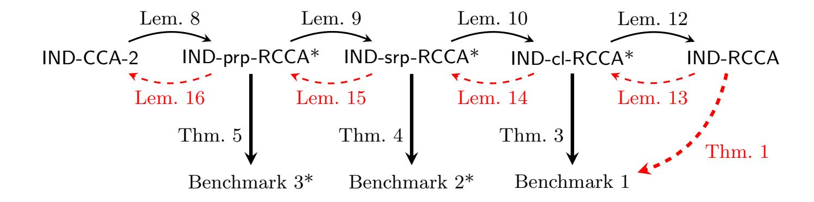
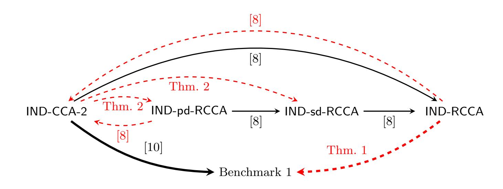
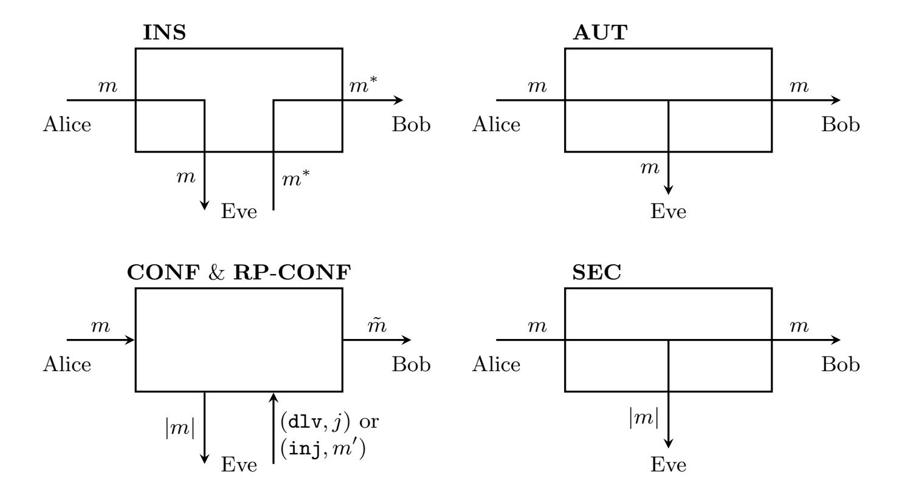
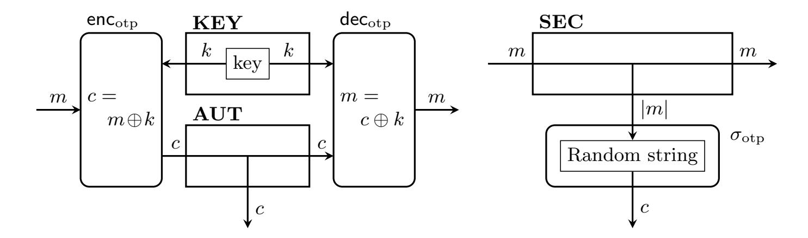
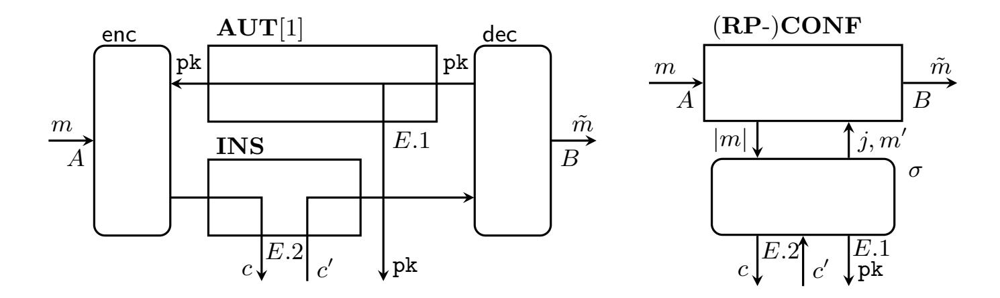
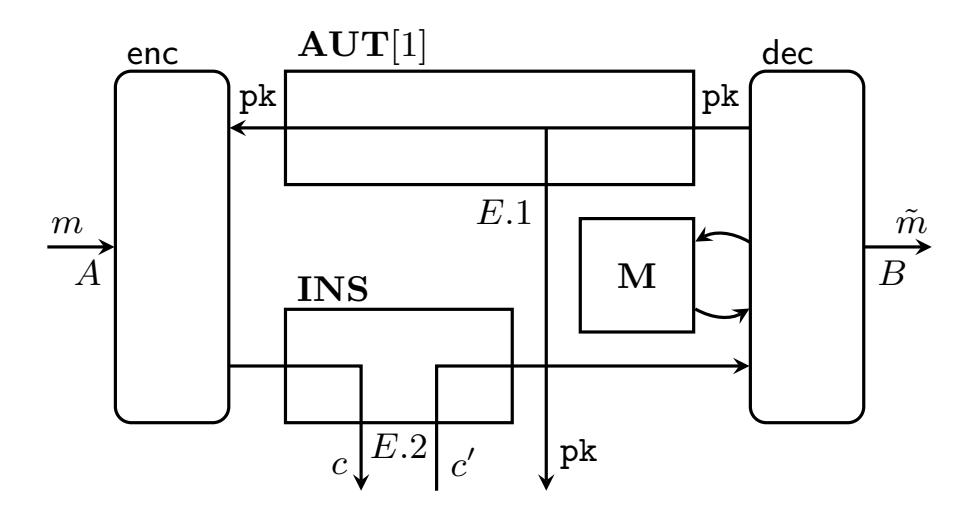
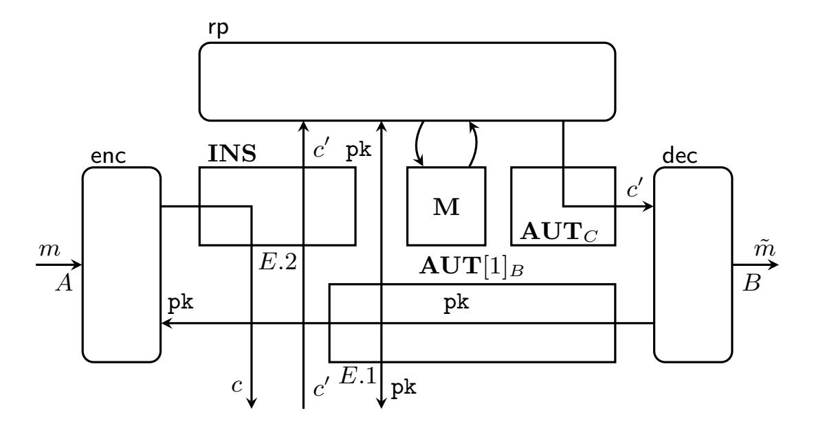

{0}------------------------------------------------

# Revisiting (R)CCA Security and Replay Protection?

Christian Badertscher1?? [,](https://orcid.org/0000-0002-1353-1922) Ueli Maurer<sup>2</sup> , Christopher Portmann<sup>2</sup> , and Guilherme Rito<sup>2</sup>

1 IOHK, Zurich, Switzerland christian.badertscher@iohk.io <sup>2</sup> Department of Computer Science, ETH Zurich, Switzerland {maurer,chportma,gteixeir}@inf.ethz.ch

Abstract. This paper takes a fresh approach to systematically characterizing, comparing, and understanding CCA-type security definitions for public-key encryption (PKE), a topic with a long history. The justification for a concrete security definition X is relative to a benchmark application (e.g. confidential communication): Does the use of a PKE scheme satisfying X imply the security of the application? Because unnecessarily strong definitions may lead to unnecessarily inefficient schemes or unnecessarily strong computational assumptions, security definitions should be as weak as possible, i.e. as close as possible to (but above) the benchmark. Understanding the hierarchy of security definitions, partially ordered by the implication (i.e. at least as strong) relation, is hence important, as is placing the relevant applications as benchmark levels within the hierarchy.

CCA-2 security is apparently the strongest notion, but because it is arguably too strong, Canetti, Krawczyk, and Nielsen (Crypto 2003) proposed the relaxed notions of Replayable CCA security (RCCA) as perhaps the weakest meaningful definition, and they investigated the space between CCA and RCCA security by proposing two versions of Detectable RCCA (d-RCCA) security which are meant to ensure that replays of ciphertexts are either publicly or secretly detectable (and hence preventable).

The contributions of this paper are three-fold. First, following the work of Coretti, Maurer, and Tackmann (Asiacrypt 2013), we formalize the three benchmark applications of PKE that serve as the natural motivation for security notions, namely the construction of certain types of (possibly replay-protected) confidential channels (from an insecure and an authenticated communication channel). Second, we prove that RCCA does not achieve the confidentiality benchmark and, contrary to previous belief, that the proposed d-RCCA notions are not even relaxations of CCA-2 security. Third, we propose the natural security notions corresponding to the three benchmarks: an appropriately strengthened version of RCCA to ensure confidentiality, as well as two notions for capturing public and secret replay detectability.

<sup>?</sup> This is the full version of article [\[4\]](#page-33-0), ©IACR 2021, https://doi.org/10.1007/978-3- 030-75248-4 7.

<sup>??</sup> Work done while author was at the University of Edinburgh, Scotland.

{1}------------------------------------------------

# <span id="page-1-2"></span>1 Introduction

When designing a cryptographic security notion, it is of central importance to keep in mind the purpose and applications it is developed for. For CCA-2 secure encryption schemes[3](#page-1-0) , the most important historical application is to enable confidential communication: assuming an insecure channel from Alice to Bob (over which ciphertexts are sent), and an authenticated channel from Bob to Alice (over which the public key can be transmitted authentically), the scheme should construct a confidential channel, i.e. an idealized object with the property that whatever Alice sends to Bob does not leak any information to an attacker (except possibly the length of the message), and where the only active capability of the attacker is to inject new messages (uncorrelated to Alice's inputs)[4](#page-1-1) . Coretti, Maurer, and Tackmann [\[10\]](#page-33-1) proved that indeed CCA-2 security is sufficient for this construction to be achieved, by having Bob generating a key-pair, sending the public key authentically to Alice, and by letting Alice encrypt all messages with respect to the obtained public key. It is also known that CCA-2 security is actually too strong for this task: a CCA-2 secure scheme can be easily modified, for example by appending a single bit to ciphertexts which is ignored by the decryption algorithm, to yield a scheme that is not CCA-2 secure but still allows to achieve a confidential channel.

To address the question what weaker security notion(s) would actually match more closely to the application of secure communication, Canetti, Krawczyk, and Nielsen [\[8\]](#page-33-2) study relaxed CCA-2 security notions and their relationships; they formalize an entire spectrum: at the weakest end, they propose RCCA security, which for large message spaces (size super-polynomial in the security parameter) is known to achieve confidential channels [\[10\]](#page-33-1). This fact has bolstered RCCA security into becoming the default security notion in settings where CCA-2 is not achievable, such as in rerandomizable encryption schemes [\[22](#page-34-0)[,14\]](#page-34-1) and updatable encryption schemes [\[16\]](#page-34-2). Intuitively, a scheme can be RCCA secure even if it is easy to create from a known ciphertext another one that still decrypts to the same message. Inheriting from prior work on relaxing CCA-2 security, most notably [\[1](#page-33-3)[,24,](#page-35-0)[17\]](#page-34-3), they further provide formalizations for intermediate notions between CCA-2 and RCCA. These so-called detectable notions of RCCA security further demand that modifications of an already known ciphertext can be efficiently detected—either with the help of the secret key (sd-RCCA) or the public key only (pd-RCCA) yielding two separate security notions. These notions of detectable RCCA security, and in particular pd-RCCA, are designed to capture an appealing property of CCA-2 security, namely that replays can be efficiently detected. This not only admits a more precise language to specify the types of replays a scheme admits, but furthermore is a useful property in applications like voting or access-control encryption, where a trusted third party must perform

<span id="page-1-0"></span><sup>3</sup> Note that throughout this work, if not otherwise stated, we refer to the indistinguishability-based versions of security notions.

<span id="page-1-1"></span><sup>4</sup> Hence, the confidential channel does not provide any authenticity to Bob.

{2}------------------------------------------------

the filtering without access to the secret key [\[3\]](#page-33-4). We elaborate on the former aspects later in Remark [1](#page-5-0) at the end of Sect. [1.1.](#page-2-0)

It has however never been formally investigated whether the detectable notions are suitable to capture the security of the intended application of replay detection. Moreover, our analysis shows that these detectable RCCA notions (i.e. pd-RCCA and sd-RCCA) are actually not proper relaxations of CCA-2, in that they are not implied by CCA-2.

In this work, we fill this gap and provide a systematic treatment of these relaxations of CCA-2 security using the Constructive Cryptography framework by Maurer and Renner [\[19,](#page-34-4)[18\]](#page-34-5) and building upon the work of Coretti et al. [\[10\]](#page-33-1). We formalize the intuitive security goals that RCCA security and the detectable RCCA security notions aim to achieve, yielding what we call benchmarks to assess whether the existing security notions are adequate. We observe that none of the previous notions seems to allow a proof that they meet this level of security and therefore propose new security notions for detectable RCCA security (which can be regarded as the corrections of the existing ones), show which benchmarks they achieve, and prove that they are implied by CCA-2. In summary, this shows that the newly introduced notions are placed correctly in the spectrum between CCA-2 and RCCA and that they can be safely used in the intended applications.

#### <span id="page-2-0"></span>1.1 Overview of Contributions

A systematic approach to RCCA and replay protection. Following the constructive paradigm, a construction consists of three elements: the assumed resources (such as an insecure communication channel), the constructed or ideal resource (such as a confidential channel), and the real-world protocol. A protocol is said to achieve the construction, if there is a simulator such that the real world (consisting of the protocol running with the assumed resources) is indistinguishable from the ideal system (consisting of the ideal resource and the simulator). This way, it is ensured that any attack on the real system can be translated into an attack to the ideal system, the latter being secure by definition.

Building upon the work of Coretti et al. [\[10\]](#page-33-1), we present three benchmarks to approach the intended security of RCCA and replay protection:

- The construction of a confidential channel between Alice and Bob from an insecure communication channel (and an authenticated channel to distribute the public key). This is arguably the most natural goal of confidential (and non-malleable) communication. An encryption scheme should achieve this construction by having Bob generating the key-pair and sending the public key to Alice over the authenticated channel. Alice sends encryptions of the messages over the insecure channel to Bob, who can decrypt the ciphertexts and output the resulting messages. This benchmark is formalized in Sect. [3.1.](#page-12-0)
- The construction of a replay-protected confidential channel from (essentially) the same resources as above. A replay-protected confidential channel is a channel that only allows an attacker to deliver each message sent by Alice at most once to Bob. This construction captures the most basic form of replay

{3}------------------------------------------------

protection. An encryption scheme can be applied as above, except that Bob must make use of the secret key (and a memory resource to store received ciphertexts) to detect and filter out replays. This construction is formalized in Sect. [3.2.](#page-13-0)

– The construction of a replay-protected confidential channel from basically the same resources, but where the task of detecting replays is done by a third-party, say Charlie, that does not need to have access to Bob's secret key. Hence, an encryption scheme is employed as above, but the task of filtering and detecting replays can be outsourced to any party possessing the public key (having sufficient memory to store the received ciphertexts). This benchmark is formalized in Sect. [3.3.](#page-13-1)

We note that only the first benchmark is taken from existing literature [\[10\]](#page-33-1) (which is an abstract version of the UC-formalization FRPKE defined in [\[8\]](#page-33-2))[5](#page-3-0) while the other benchmarks are new formulations and variants of the known goal of replay protection. The benefits of our benchmarks is that they yield a precise way to assess the guarantees provided by a security notion for an encryption scheme: does a scheme secure with respect to a certain notion achieve the above construction(s)?

New intermediate notions between CCA-2 and RCCA. We propose three game-based security notions, each designed to suffice for achieving the intended benchmark. The abbreviations stand for confidential (cl), secret-key replay protection (srp), and public-key replay protection (prp):

- We first propose IND-cl-RCCA, a security notion which is sufficient to achieve confidential communication even for small message spaces, which we prove in Sect. [6.1.](#page-20-0) This is the weakest new notion we introduce and we prove that it achieves the first benchmark; cl-RCCA should then take the role of RCCA as the default security notion when one aims at the design of schemes that enable confidential communication (in particular when the message space size is small). Note that cl-RCCA is strictly stronger than RCCA since the latter does not achieve confidential communication for small message spaces (see Theorem [1\)](#page-14-0).[6](#page-3-1)
- The second security notion we introduce is IND-srp-RCCA and it achieves the second benchmark: realizing a replay protected confidential channel. The notion is hence designed to enable the implementation of a replay-protection mechanism by the receiver, who knows the secret decryption key. We also argue why the strengthening compared to cl-RCCA (and sd-RCCA) is needed to achieve replay-protection: from a conceptual perspective, implementing a replay-protector as part of the receiver requires the detection of replays

<span id="page-3-0"></span><sup>5</sup> We note that all our results are independent of the specific details of the underlying composable framework; analogous results would be obtained when working in the UC framework [\[6\]](#page-33-5).

<span id="page-3-1"></span><sup>6</sup> We note that NM-RCCA [\[8\]](#page-33-2), which is stronger than IND-RCCA, does not seem to be sufficient to achieve the first benchmark either.

{4}------------------------------------------------



<span id="page-4-1"></span>Fig. 1. New notions of security between CCA-2 and RCCA, and their relations to each other and to the benchmarks. Solid black arrows denote implications and dashed red arrows denote separations. The new security notions introduced in this paper are marked with \*.

- without necessarily ever seeing the original ciphertext by the sender which is a security requirement that is not captured by cl-RCCA (nor sd-RCCA).[7](#page-4-0) The notion and the construction proof appear in Sect. [6.2.](#page-23-0)
- We finally propose a security notion to capture the idea of publicly-detectable RCCA that we call IND-prp-RCCA. This notion is sufficient to achieve the third benchmark and therefore captures the outsourced replay-protection mechanism that was originally envisioned from pd-RCCA. This notion and the construction proof appear in Sect. [6.3.](#page-27-0)

We finally show that all these notions can be strictly separated: IND-RCCA security, the weakest notion considered in this work, is strictly weaker than IND-cl-RCCA. The latter is strictly weaker than IND-srp-RCCA, which is in turn strictly weaker than IND-prp-RCCA. Finally, IND-prp-RCCA is strictly weaker than IND-CCA-2 security. These results are proven in Sect. [7;](#page-31-6) Fig. [1](#page-4-1) illustrates all these new notions, their relations to each other and to the benchmarks.

Technical inconsistencies with existing pd-RCCA and sd-RCCA notions. Numerous weaker versions of CCA-2 security have been proposed [\[1](#page-33-3)[,8](#page-33-2)[,17,](#page-34-3)[24\]](#page-35-0) which are essentially equivalent versions of what is formalized in [\[8\]](#page-33-2) as publicly detectable (pd)-RCCA and secretly detectable (sd)-RCCA. We show for the given formalizations that the notions are generally not implied by CCA-2 security (unless one would restrict, for example, explicitly to the case of deterministic decryption [\[1\]](#page-33-3), or alternatively to the case of perfect correctness), which seems to be a rather unintended artifact of the concrete definition as we show in Sect. [5.](#page-17-0) While these shortcomings can be fixed, the existing notions do not appear to suffice to achieve the intended benchmarks for replay protection (see Sect. [6\)](#page-20-1), leaving the state of affairs unclear, as depicted in Fig. [2.](#page-5-1) This justifies the need to propose new intermediate notions that provably avoid these shortcomings: on one hand, our notions are implied by CCA-2, and on the other hand, they deliver the

<span id="page-4-0"></span><sup>7</sup> More concretely, the simulator in the construction proof of a confidential channel only requires the (much milder) detection of honestly generated ciphertext replays.

{5}------------------------------------------------

desired level of security required by a replay protection mechanism. The security notions and results of this paper clean up the space between CCA-2 and RCCA security, yielding, as aforementioned, a clean hierarchy of security notions as depicted in Fig. 1: not only all notions are separated, but also we show that each of the notions we introduce is sufficient for achieving each of the benchmarks.



<span id="page-5-1"></span>Fig. 2. Relations between the notions of security from [8]. The solid black arrows denote implications whilst the dashed red arrows denote separations.

<span id="page-5-0"></span>Remark 1. Recall that the original motivation of introducing relaxed versions of CCA security stems from the observation that CCA is much stronger than the composable confidentiality requirement [8]. RCCA has the built-in assumption that generating replays of a (challenge) ciphertext is generally easy and therefore, in the security game the adversary is denied to decrypt a broad class of ciphertexts. Detectable RCCA as introduced in [8, Definition 7], develops a language to talk about the ability to detect specific kinds of replays and introduce a relation among ciphertexts accompanied by an efficient algorithm to evaluate it. Therefore, to capture detectable RCCA security, aside of the ordinary three algorithms of a PKE system, there is by definition an additional one to detect replays. While in this work we develop a composable understanding of what [8] calls the ability to detect replays, our IND-srp-RCCA and IND-prp-RCCA notions can equivalently be seen as ordinary PKE notions. Confidentiality then means that no adversary learns anything about the plaintext when the challenger denies decryption queries that the replay detection algorithm considers being replays of the challenge ciphertext.

#### 1.2 Further Related Work

The investigation of relaxed, enhanced, and modified versions of CCA-2 security has a rich history and has found numerous applications in proxy-reencryption,

{6}------------------------------------------------

updatable encryption, attribute based-encryption, rerandomizable encryption, or steganography [\[2](#page-33-6)[,5](#page-33-7)[,7,](#page-33-8)[9](#page-33-9)[,12](#page-34-6)[,13,](#page-34-7)[14,](#page-34-1)[16,](#page-34-2)[22](#page-34-0)[,23\]](#page-34-8).

The main relaxations of CCA-2, upon which the formalization of [\[8\]](#page-33-2) builds, have been proposed in [\[24\]](#page-35-0) as benign malleability and in [\[1\]](#page-33-3) as generalized CCA-2 security, and also relate to loose ciphertext-unforgeability [\[17\]](#page-34-3). All these versions fall essentially into the formalization of public detectability discussed above, and all suffer from analogous technical issues, and hence in this work we focus on the formalization given in [\[8\]](#page-33-2). Three different flavours of RCCA have been introduced: IND-RCCA, UC-RCCA and NM-RCCA. In this work we focus on IND-RCCA. Our first benchmark is an abstract version of UC-RCCA. While the third flavour, NM-RCCA, is a strengthening of IND-RCCA (since it captures one additional attack vector), it does not seem to suffice to construct a confidential channel (or imply UC-RCCA for small message spaces) and is superseded in our treatment by IND-cl-RCCA that provably constructs the confidential channel for any message space.

A further relaxation of CCA-2 security, only loosely related to this work, is called detectable CCA-2 [\[15\]](#page-34-9) and formalizes the detection of "dangerous" queries in CCA-2 (without considering replayable properties). This notion provides a rather weak level of security on its own (in that it does not imply RCCA) [\[15\]](#page-34-9).

Another line of research has consisted in studying q-bounded security definitions [\[11\]](#page-33-10) wherein a scheme is assumed to only be used to decrypt at most q messages. Cramer et al. [\[11\]](#page-33-10) give a black-box construction of a IND-q-bounded-CCA-2 secure PKE scheme from any IND-CPA secure one. The proposed construction crucially relies on knowing the value q in advance as it is hardcoded in the scheme.

# 2 Preliminaries

#### <span id="page-6-1"></span>2.1 Constructive Cryptography

The Constructive Cryptography (CC) framework [\[19,](#page-34-4)[18\]](#page-34-5) is a composable security framework which views cryptography as a resource theory: a protocol transforms the assumed resources into the constructed resources.[8](#page-6-0) For example, if Alice and Bob have (access to) a shared secret key and an authentic channel, by running a one-time pad they construct a secure channel—this example is treated more formally further in this section.

In this view, encryption is the task of constructing channel resources. We thus start by defining various channels—used and constructed in this work—here below. Then we give the formal definition of a construction in CC.

INS. The weakest channel we consider is the (completely) insecure channel INS, where any message input by the sender goes straight to the adversary, and the adversary may insert any messages into the channel, which are then delivered to the receiver. This is drawn in the top left in Fig. [3.](#page-7-0)

<span id="page-6-0"></span><sup>8</sup> Resources essentially correspond to (ideal) functionalities in UC [\[6\]](#page-33-5), though in CC we additionally model the ability of players to communicate as having access to a channel resource.

{7}------------------------------------------------



Fig. 3. A depiction of the channels used in this work. From top-left to bottom right: an insecure channel INS, an authentic channel AUT, a (replay protected) confidential channel (RP-)CONF, and a secure channel SEC.

- <span id="page-7-0"></span>AUT. In order to distribute the public keys used by PKE schemes, the players will also need an authentic channel AUT, which guarantees that anything received by the legitimate receiver was sent by the legitimate sender, but an adversary may also receive a copy of these messages. For simplicity, in our model we do not allow the adversary to either block an authentic channel or insert any replays. Such a channel is drawn in the top right of Fig. [3.](#page-7-0)
- CONF. A confidential channel CONF only leaks the message length (denoted |m|) to the adversary, i.e. when the message m is input by the sender, the adversary receives |m| at her interface. She can choose which message j ≤ i is delivered to the receiver, where i is the total number of messages input by the sender so far, or—since the channel is only confidential, but does not provide authenticity—the adversary may also inject a message of her own with (inj, m<sup>0</sup> ), and m<sup>0</sup> is then delivered to the receiver. This is depicted in the bottom left of Fig. [3.](#page-7-0)
- RP-CONF. The CONF channel described above allows the adversary to deliver multiple times the same message to the receiver by inserting multiple times (dlv, j). We define a stronger channel, the replay protected confidential channel RP-CONF, which will only process each (dlv, j) query at most once.
- SEC. Finally, the secure channel SEC is both confidential and authentic, and is drawn in the bottom right of Fig. [3.](#page-7-0)

We will often consider channels that only transmit n messages, i.e. the sender may only input n messages. These channels will be denoted NAME[n]. The main properties of these channels are summarized in Fig. [4.](#page-8-0)

{8}------------------------------------------------

| Channel Name                          | Symbol  | Leak $l(m)$ | Insert | Replays |
|---------------------------------------|---------|-------------|--------|---------|
| Insecure Channel                      | INS     | m           | Yes    | Yes     |
| Authentic Channel                     | AUT     | m           | No     | No      |
| Confidential Channel                  | CONF    | m           | Yes    | Yes     |
| Replay Protected Confidential Channel | RP-CONF | m           | Yes    | No      |
| Secure Channel                        | SEC     | m           | No     | No      |

<span id="page-8-0"></span>**Fig. 4.** A summary of the channel properties used in this work. *Leak* is the information about the message given to Eve, where |m| denotes the length of the message. *Insert* denotes whether Eve is allowed to insert messages of her own into the channel. *Replay* denotes whether Eve can force a channel to deliver multiple times a message that was sent only once.

Formally, a resource (e.g. a channel) in an N-player setting is an interactive system with N interfaces, where each player may interact with the system at their interface by receiving outputs and providing inputs. These may be mathematically modeled as random systems [20,21] and can be specified by pseudo-code or an informal description as the channels above. In this work we consider the 3 player setting, and the interfaces are labeled A, B, and E for Alice, Bob, and Eve.

If multiple resources  $\mathbf{R}_1, \dots, \mathbf{R}_\ell$  are accessible to players, we write  $[\mathbf{R}_1, \dots, \mathbf{R}_\ell]$  for the new resource resulting from having all resources accessible in parallel to the parties.

Operations run locally by some party (e.g. encrypting or decrypting a message) are modeled by interactive systems with two interface and are called *converters*. The inner interface connects to the available resources, whereas the outer interface is accessible to the corresponding party to provide inputs and receive outputs. The composition of the resource and the converter is a new resource. For example, let  $\mathbf{R}$  be a resource, and let  $\alpha$  be a converter which we connect at the A-interface of  $\mathbf{R}$ , then we write  $\alpha^A \mathbf{R}$  for the new resource resulting from this connection. Formally, a converter is thus a map between resources.

To illustrate this, we draw the real system corresponding to a one-time pad encryption in Fig. 5. Here, the players have access to a secret key **KEY** and an authentic channel **AUT**. Alice runs the encryption converter  $\mathsf{enc}_{\mathsf{otp}}$ , which sends the ciphertext on the authentic channel. Bob runs the decryption converter  $\mathsf{dec}_{\mathsf{otp}}$ , which outputs the result of the decryption. The entire resource drawn on the left in Fig. 5 is denoted  $\mathsf{enc}_{\mathsf{otp}}^A \mathsf{dec}_{\mathsf{otp}}^B [\mathsf{KEY}, \mathsf{AUT}]$ , where the order of  $\mathsf{enc}_{\mathsf{otp}}$  and  $\mathsf{dec}_{\mathsf{otp}}$  does not matter since converters at different interfaces commute.

In order to argue that the protocol  $\mathsf{otp} = (\mathsf{enc}_{\mathsf{otp}}, \mathsf{dec}_{\mathsf{otp}})$  constructs a secure channel **SEC** from a shared secret key **KEY** and an authentic channel **AUT**, we need to find a converter  $\sigma_{\mathsf{otp}}$  (called a  $\mathit{simulator}$ ) such that when this simulator is attached to the adversarial interface of the constructed resource **SEC** (resulting in  $\sigma_{\mathsf{otp}}^E \mathbf{SEC}$ ), the real and ideal systems are indistinguishable. As illustrated in Fig. 5, a simulator  $\sigma_{\mathsf{otp}}$  which outputs a random string of the right length is sufficient for proving that the one-time pad constructs a secure channel.

{9}------------------------------------------------



Fig. 5. The real and ideal systems for the one-time pad. Viewed as a black box, the real and ideal systems are indistinguishable.

<span id="page-9-0"></span>Distinguishability between two systems  $\mathbf{R}$  and  $\mathbf{S}$  is defined with respect to a distinguisher  $\mathbf{D}$  which interacts with one of the systems, and has to output a bit corresponding to its guess. Let  $\mathbf{D}[\mathbf{R}]$  and  $\mathbf{D}[\mathbf{S}]$  denote the random variables corresponding to the output of  $\mathbf{D}$  when interacting with  $\mathbf{R}$  and  $\mathbf{S}$ , respectively. Then its advantage in distinguishing between the two is given by

$$\Delta^{\mathbf{D}}(\mathbf{R}, \mathbf{S}) := \Pr[\mathbf{D}[\mathbf{R}] = 0] - \Pr[\mathbf{D}[\mathbf{S}] = 0].$$

In the case of the one-time pad example with **R** denoting the real system and **S** the ideal system (drawn on the left and right in Fig. 5) we have that for all **D**,  $\Delta^{\mathbf{D}}(\mathbf{R}, \mathbf{S}) = 0$ .

We now have all the elements needed to define a cryptographic construction in the three party setting.

<span id="page-9-1"></span>**Definition 1 (Asymptotic security [19,18]).** Let  $\pi = \{(\pi_k^A, \pi_k^B)\}_{k \in \mathbb{N}}$  be an efficient family of converters, and let  $\mathbf{R} = \{\mathbf{R}_k\}_{k \in \mathbb{N}}$  and  $\mathbf{S} = \{\mathbf{S}_k\}_{k \in \mathbb{N}}$  be two efficient families of resources. We say that  $\pi$  asymptotically constructs  $\mathbf{R}$  from  $\mathbf{S}$  if there exists an efficient family of simulators  $\sigma = \{\sigma_k\}_{k \in \mathbb{N}}$  such that for any efficient family of distinguishers  $\mathbf{D} = \{\mathbf{D}_k\}_{k \in \mathbb{N}}$ ,

$$\varepsilon(k) = \Delta^{\mathbf{D}_k}(\pi_k \mathbf{R}_k, \sigma_k \mathbf{S}_k)$$

is negligible. The construction is information-theoretically secure if the same holds for all (possibly inefficient) families of distinguishers.

For clarity we have made the security parameter k explicit in Definition 1, though in most of the technical part of this work we leave this parameter implicit to simplify the notation.

#### 2.2 Public Key Encryption

<span id="page-9-2"></span>We recap the basic definitions when a public-key encryption (PKE) system is considered correct and CCA/RCCA secure.

{10}------------------------------------------------

**Definition 2.** A Public Key Encryption (PKE) scheme  $\Pi$  with message space  $\mathcal{M} \subseteq \{0,1\}^*$ , is a triple  $\Pi = (G,E,D)$  of Probabilistic Polynomial-Time algorithms (PPTs) such that for any PPT adversary  $\mathbf{A}$ , the function Corr(k) defined below is at most negligible in (the security parameter) k

$$Corr(k) := \Pr \left[ \begin{array}{cc} (\mathtt{pk},\mathtt{sk}) \leftarrow G(1^k) \\ m \leftarrow \mathbf{A}(1^k,\mathtt{pk}) \end{array} \right] \quad D_{\mathtt{sk}}(E_{\mathtt{pk}}(m)) \neq m \end{array} \right]$$

We point out that the above condition is a succinct expression that captures the correctness of communication protocols in general and intuitively says that even under knowledge of the sampled public key of the system, no one can find (except with negligible probability) a message that would violate the correctness condition (where the error term can be understood as computational distance to a perfectly correct channel). Furthermore, the correctness requirement often holds w.r.t. all adversaries.

<span id="page-10-1"></span>**Definition 3.** A PKE scheme  $\Pi = (G, E, D)$  is IND-CCA-2 secure if no PPT distinguisher  $\mathbf{D}$  distinguishes the two game systems  $\mathbf{G}_0^{H\text{-IND-CCA-2}}$  and  $\mathbf{G}_1^{H\text{-IND-CCA-2}}$  (specified below) with non-negligible advantage (in the security parameter k) over random guessing (i.e. if  $\Delta^{\mathbf{D}}(\mathbf{G}_0^{H\text{-IND-CCA-2}}, \mathbf{G}_1^{H\text{-IND-CCA-2}}) \leq negl(k)$ ). For  $b \in \{0,1\}$ , game system  $\mathbf{G}_b^{H\text{-IND-CCA-2}}$  is as follows:

Initialization:  $\mathbf{G}_b^{\Pi\text{-IND-CCA-2}}$  generates a key-pair  $(\mathtt{pk},\mathtt{sk}) \leftarrow G(1^k)$ , and sends  $\mathtt{pk}$  to  $\mathbf{D}$ .

First decryption stage: Whenever **D** queries (ciphertext, c), the game system  $\mathbf{G}_b^{\Pi\text{-IND-CCA-2}}$  computes  $m = D_{\mathbf{sk}}(c)$  and sends m to **D**.

Challenge stage: When **D** queries (test messages,  $m_0, m_1$ ), for  $m_0, m_1 \in \mathcal{M}$  such that  $|m_0| = |m_1|$ ,  $\mathbf{G}_b^{\Pi\text{-IND-CCA-2}}$  computes  $c^* = E_{pk}(m_b)$ , and sends  $c^*$  to  $\mathbf{D}$ .

Second decryption stage: Whenever **D** queries (ciphertext, c), the game system  $\mathbf{G}_b^{II\text{-IND-CCA-2}}$  replies test if  $c=c^*$  and replies  $m=D_{\mathtt{sk}}(c)$  (i.e. the decryption of c) otherwise.

For simplicity, throughout the paper we will omit the prefix  $\Pi$  from the notation of the game systems, unless needed for clarity.

**Definition 4.** A PKE scheme  $\Pi = (G, E, D)$  is IND-RCCA secure if it is secure according to the definition of IND-CCA-2 security (Definition 3), but where the IND-RCCA game systems differ from the IND-CCA-2 game systems in the second decryption stage, which now works as follows: In the following, let  $m_0, m_1$  be the two challenge messages queried by distinguisher **D** during the Challenge stage:

Second decryption stage: When **D** queries (ciphertext, c), the game system computes  $m = D_{sk}(c)$ . If  $m \in \{m_0, m_1\}$ , then the game system replies with the special response test to **D**, and otherwise sends m to **D**.

<span id="page-10-0"></span> $<sup>\</sup>overline{}^{9}$  Unless explicitly stated, we assume that **D** can only perform a single challenge query.

{11}------------------------------------------------

#### <span id="page-11-1"></span>2.3 Public Key Encryption With Replay Filtering

We now introduce two new types of PKE schemes, namely ones in which ciphertext replays can be efficiently detected by an algorithm F that is defined as part of the scheme. For the correctness condition of these schemes we require, in addition to the usual correctness condition of PKE schemes, that with high probability F cannot relate two fresh encryptions of any messages. This is an essential requirement such that F can be used for filtering out ciphertext replays, because the correctness condition guarantees that it will not filter out honestly generated ciphertexts (later in Section 6.2 we couple such schemes with the proper security notions).

<span id="page-11-0"></span>**Definition 5.** A PKE scheme with Secret (Replay) Filtering (PKESF)  $\Pi$  with message space  $\mathcal{M} \subseteq \{0,1\}^*$ , is a 4-tuple  $\Pi = (G,E,D,F)$  of PPT algorithms such that for any PPT adversary  $\mathbf{A}$ , the function Corr(k) defined below is at most negligible in (the security parameter) k

$$Corr(k) := \Pr \left[ \begin{array}{c|c} (\mathtt{pk}, \mathtt{sk}) \leftarrow G(1^k) & F(\mathtt{pk}, \mathtt{sk}, E_{\mathtt{pk}}(m), E_{\mathtt{pk}}(m')) = 1 \\ (m, m') \leftarrow \mathbf{A}(1^k, \mathtt{pk}) & \vee D_{\mathtt{sk}}(E_{\mathtt{pk}}(m)) \neq m \end{array} \right]$$

A PKE scheme with Public (Replay) Filtering (PKEPF)  $\Pi$  is just like a PKESF except that F now does not receive the secret key sk.

As one might note, from any correct and IND-CCA-2 secure PKE scheme  $\Pi = (G, E, D)$ , one can define a correct PKEPF scheme  $\Pi' = (G, E, D, F)$  where F(pk, c, c') = 1 if and only if c = c'; the correctness of  $\Pi'$  with respect to Definition 5 follows from the correctness and IND-CCA-2 security of  $\Pi$ .

#### 2.4 Reductions

Most of the proofs in this work consist in showing reductions between various security definitions. Both the constructive statements introduced in Sect. 2.1 and game-based definitions such as IND-CCA-2 (Definition 3) can be viewed as distinguishing systems—the real world  $\mathbf{W}_0$  from the ideal world  $\mathbf{W}_1$  and game  $\mathbf{G}_0$  from game  $\mathbf{G}_1$ , respectively. A reduction between two such definitions consists in proving that if a distinguisher  $\mathbf{D}$  can succeed in one task, then a (related) distinguisher  $\mathbf{D}'$  can succeed in the other. We only give explicit reductions with single blackbox access to  $\mathbf{D}$  in this work, i.e. we define  $\mathbf{D}' := \mathbf{DC}$ , where  $\mathbf{DC}$  denotes the composition of two systems  $\mathbf{D}$  and  $\mathbf{C}$ .  $\mathbf{C}$  is called the reduction system (or simply the reduction).

For example, if we wish to reduce the task of breaking a constructive definition (with real and ideal systems  $\mathbf{W}_0 = \pi^{AB}\mathbf{R}$  and  $\mathbf{W}_1 = \sigma^E\mathbf{S}$  for some simulator  $\sigma$ ) to a game-based definition (with games  $\mathbf{G}_0$  and  $\mathbf{G}_1$ ), we will typically fix  $\sigma$  and find a system  $\mathbf{C}$  such that  $\mathbf{W}_0 = \mathbf{C}\mathbf{G}_0$  and  $\mathbf{W}_1 = \mathbf{C}\mathbf{G}_1$ . Then

$$\Delta^{\mathbf{D}}(\mathbf{W}_0, \mathbf{W}_1) = \Delta^{\mathbf{D}}(\mathbf{CG}_0, \mathbf{CG}_1) = \Delta^{\mathbf{DC}}(\mathbf{G}_0, \mathbf{G}_1),$$

{12}------------------------------------------------



**Fig. 6.** Real and ideal systems for (replay protected) confidential channel construction. Capital letters (A, B, E.1, E.2) represent interface labels and small letters  $(m, \tilde{m}, c, c', j, pk)$  represent values that are in- or output.

<span id="page-12-3"></span>i.e. given a distinguisher  $\mathbf{D}$  that can distinguish  $\mathbf{W}_0$  from  $\mathbf{W}_1$  with non-negligible advantage, we get an explicit new distinguisher  $\mathbf{DC}$  that can win the game with non-negligible advantage. Or, the contrapositive, if  $\mathbf{G}_0$  and  $\mathbf{G}_1$  are hard to distinguish, then in particular they are hard to distinguish for all distinguishers of the form  $\mathbf{DC}$  (for any efficient  $\mathbf{D}$  and fixed  $\mathbf{C}$ ). This means that no efficient distinguish  $\mathbf{D}$  can tell  $\mathbf{W}_0$  from  $\mathbf{W}_1$  for the given simulator  $\sigma$ .

# <span id="page-12-4"></span>3 Benchmarking Confidentiality

In this section we present three benchmark constructions to capture the security of confidential communication and replay protected confidential communication.

#### <span id="page-12-1"></span><span id="page-12-0"></span>3.1 Benchmark 1: The CONF Channel

The first channel we want to construct is the confidential channel **CONF** introduced in Sect. 2.1. The ideal system thus simply consists of this channel and a simulator  $\sigma$ , as depicted on the right in Fig. 6, and is denoted  $\sigma^E$ **CONF**.

In order to achieve this, Alice and Bob need an authentic channel for one message  $\mathbf{AUT}[1]$  (from Bob to Alice), so that Bob can send his public key authentically to Alice. They also use a completely insecure channel **INS** to transmit the ciphertexts. Alice's converter enc encrypts any messages with the public key obtained from  $\mathbf{AUT}[1]$ , and sends the resulting ciphertext on **INS** (i.e. for a PKE  $\Pi = (G, E, D)$ , enc runs E). Bob's converter dec generates the key-pair (pk, sk), sends pk over  $\mathbf{AUT}[1]$  to Alice, and decrypts any ciphertext received from **INS** using sk (i.e. dec runs G and D). The resulting message is output at Bob's outer interface B (to the environment/distinguisher). This real system is drawn on the left in Fig. 6), and is denoted  $\mathbf{enc}^A\mathbf{dec}^B[\mathbf{AUT}[1], \mathbf{INS}]$ .

<span id="page-12-2"></span>As already mentioned, we will often parameterize channels by the number messages that can be input at Alice's interface. As an example, we will denote by  $\mathbf{CONF}[n]$  the confidential channel where at most n messages can be input at Alice's interface.

{13}------------------------------------------------



Fig. 7. Real system for constructing a replay protected confidential channel. Capital letters (A, B, E.1, E.2) represent interface labels and small letters (m, m˜ , c, c 0 , pk) represent values that are in- or output.

#### <span id="page-13-3"></span><span id="page-13-0"></span>3.2 Benchmark [2:](#page-12-2) The RP-CONF Channel

As explained in Sect. [1.1,](#page-2-0) our second benchmark is the construction of a stronger channel, namely a replay protected confidential channel, i.e. one in which an adversary's input (dlv, j) may only be processed once for each j. The ideal system σ <sup>E</sup>RP-CONF is thus similar to the one of Benchmark [1,](#page-12-1) only differing in the underlying ideal channel which now is the stronger RP-CONF channel.

The real system is similar to the real system from Benchmark [1](#page-12-1) in that we want to construct RP-CONF from a single use authentic channel AUT[1] and an insecure channel INS. However, the replay detection algorithm requires memory to store the ciphertexts it has already processed. We model this memory use explicitly by providing a memory resource M to the decryption converter. This is drawn in Fig. [7.](#page-13-3) The real system is thus encAdecB[AUT[1], INS,M].

If one uses a public key encryption scheme with replay filtering defined by an algorithm F (see Sect. [2.3\)](#page-11-1), then Alice's converter enc runs the encryption algorithm as for a normal PKE, but Bob's converter additionally runs the filtering algorithm F before decrypting to detect (and filter out) replays.

# <span id="page-13-2"></span><span id="page-13-1"></span>3.3 Benchmark [3:](#page-13-2) The RP-CONF Channel With Outsourceable Replay Protection

In this section we again want to construct a replay protected confidential channel RP-CONF—but where the job of filtering out ciphertext replays is outsourced to a third party. The ideal system is thus identical to Benchmark [2,](#page-12-2) i.e σ <sup>E</sup>RP-CONF.

The real system now has three honest parties, Alice the sender, Bob the receiver, and Charlie the replay-filterer, where each runs its own converter enc, dec and rp, respectively. As before, a public key pk is generated by dec and sent on an authentic channel AUT[1]<sup>B</sup> to both Alice and Charlie—but Eve gets a copy as well—where the index B denotes the origin of the authenticated message.

{14}------------------------------------------------



**Fig. 8.** Real system for constructing a replay protected confidential channel with outsourced replay filtering. As in previous figures, the sender Alice is on the left, the receiver Bob is on the right and the eavesdropper Eve is below. In this setting we have another party, Charlie, above in the picture, to whom replay detection is outsourced, and who runs the converter rp. Capital letters (A, B, E.1, E.2) represent interface labels and small letters  $(m, \tilde{m}, c, c', pk)$  represent values that are in- or output.

<span id="page-14-2"></span>And as before, enc encrypts the message and sends it on an insecure channel INS, but this time Charlie is on the receiving end of INS. Charlie then runs rp, which decides if the message should be forwarded to Bob through  $\mathbf{AUT}_C$  or if it gets filtered out—this channel needs to be authenticated so that Eve cannot change the messages or inject replays again.<sup>10</sup> To do this, rp needs access to the memory resource  $\mathbf{M}$  so that it can store the previously forwarded (i.e. not filtered out) ciphertexts. Finally, dec decrypts the ciphertexts received. This is depicted in Fig. 8.

Note that in this setup, rp does not have access to the secret key and so it must detect replays with the public key only; since dec does not have access to the memory  $\mathbf{M}$ , it can not perform the replay filtering itself. In the case where the players use a PKEPF  $\Pi = (G, E, D, F)$ , then enc runs E, dec runs G and D, and rp runs F.

#### 4 IND-RCCA Is Not Sufficient for Benchmark 1

In this section we give a correct and IND-RCCA secure PKE scheme which does not achieve Benchmark 1 (see Sect. 3.1). As already mentioned, this separation result is in spirit with the separation proven in [8] between UC-RCCA and IND-RCCA for small message spaces.

<span id="page-14-1"></span><span id="page-14-0"></span>Note that omitting Eve's reading interface in  $\mathbf{AUT}_C$  is done here for simplicity and at no loss of generality.

{15}------------------------------------------------

Theorem 1. There is a correct and IND-RCCA secure PKE scheme Π<sup>0</sup> for which there is an efficient distinguisher D such that for any simulator σ,

$$\Delta^{\mathbf{D}}(\mathsf{enc}^A \mathsf{dec}^B[\mathbf{AUT}[1], \mathbf{INS}[1]], \sigma^E \mathbf{CONF}[1]) \geq \frac{1}{2}$$

.

At a high level, we construct an IND-RCCA secure PKE scheme Π<sup>0</sup> for the binary message space that is malleable, in that an adversary can tamper a ciphertext into another that decrypts to a related message. While such tampering attacks do not help an adversary winning the IND-RCCA game for Π0[11](#page-15-0), we show that Benchmark [1](#page-12-1) cannot be achieved using Π<sup>0</sup> , as it still allows an attacker to tamper with what Alice sends.

Let Π = (G, E, D) be a correct and IND-RCCA secure PKE scheme for the binary message M = {0, 1}. From Π, we construct a PKE scheme Π<sup>0</sup> = (G<sup>0</sup> , E<sup>0</sup> , D<sup>0</sup> ), which works just as Π, except that now, E<sup>0</sup> appends an extra bit 0 to the ciphertexts, and during decryption D<sup>0</sup> uses D internally to decrypt the input ciphertext (ignoring the last bit appended by E<sup>0</sup> ), and then XORs the plaintext output by D with the extra bit that was appended to the ciphertext during encryption (unless D outputs ⊥, in which case D<sup>0</sup> also outputs ⊥). It is easy to see, on one hand, that if Π is correct and IND-RCCA secure, then so is Π<sup>0</sup> . On the other hand, it is also easy to come up with a distinguisher that can distinguish, for any simulator σ <sup>E</sup> the real world system encAdecB[AUT[1], INS[1]] from the ideal world system σ <sup>E</sup>CONF[1], where protocol π = (enc, dec) uses Π<sup>0</sup> as the underlying PKE scheme. We now move to prove Theorem [1.](#page-14-0)

#### <span id="page-15-1"></span>Lemma 1. If Π is correct and IND-RCCA secure, then so is Π<sup>0</sup> .

Proof. First, note that the correctness of Π<sup>0</sup> follows trivially from the correctness of Π. Now, consider a distinguisher D for the IND-RCCA game systems of Π<sup>0</sup> . We create a distinguisher D<sup>0</sup> for the IND-RCCA game systems of Π that distinguishes the two systems with the same advantage: First, D<sup>0</sup> forwards the public key output by the game system to D. Whenever D makes a decryption query (ciphertext, c || mask), D<sup>0</sup> queries the game system on (ciphertext, c). If the game system replies with some plaintext m, D<sup>0</sup> sends m ⊕ mask back to D as the output of the decryption query. Otherwise, if the game system replies with ⊥, then D<sup>0</sup> simply forwards ⊥ back to D. When D issues the challenge query (test messages, m0, m1), D<sup>0</sup> forwards it to the game system; when D<sup>0</sup> receives the challenge ciphertext c <sup>∗</sup> back from the game system, it sends c ∗ || 0 as the challenge ciphertext to D. After the challenge ciphertext is set, whenever D issues a decryption query (ciphertext, c || mask), D<sup>0</sup> queries the game system on (ciphertext, c). If m<sup>0</sup> 6= m1, or, if m<sup>0</sup> = m<sup>1</sup> and mask = 0, then D<sup>0</sup> simply forwards the game system's reply back to D. Otherwise, if m<sup>0</sup> = m<sup>1</sup> and mask = 1, D0 replies to D:

<span id="page-15-0"></span><sup>11</sup> Note that, even if the adversary manages to maul the challenge ciphertext into one that decrypts to a different plaintext, it cannot leverage this attack into distinguishing the two game systems, because in the case of the binary message space the IND-RCCA game systems will not decrypt a ciphertext that decrypts to any of the two challenge plaintexts.

{16}------------------------------------------------

- test if the game system output a plaintext;
- $-m_0 \oplus 1$  if the game system output test; and
- $-\perp$  if the game system replied  $\perp$ .

Finally,  $\mathbf{D}'$  outputs as its guess whatever  $\mathbf{D}$  outputs as its guess. It is easy to see that  $\mathbf{D}'$  provides  $\mathbf{D}$  with a perfect emulation of the IND-RCCA game systems for  $\Pi'$ . It follows

$$\boldsymbol{\Delta^{\mathbf{D}'}(\mathbf{G}_0^{\varPi\text{-}\mathsf{IND-RCCA}}, \mathbf{G}_1^{\varPi\text{-}\mathsf{IND-RCCA}})} = \boldsymbol{\Delta^{\mathbf{D}}(\mathbf{G}_0^{\varPi'\text{-}\mathsf{IND-RCCA}}, \mathbf{G}_1^{\varPi'\text{-}\mathsf{IND-RCCA}}).$$

<span id="page-16-0"></span>

With this, we finally show that if  $\Pi'$  is used as the underlying PKE scheme for  $\operatorname{\mathsf{enc}}^A \operatorname{\mathsf{dec}}^B[\mathbf{AUT}[1], \mathbf{INS}[1]]$ , then Benchmark 1 is not achieved. More concretely, we show that there is a distinguisher  $\mathbf{D}$  such that for any simulator  $\sigma$ ,  $\mathbf{D}$  distinguishes  $\operatorname{\mathsf{enc}}^A \operatorname{\mathsf{dec}}^B[\mathbf{AUT}[1], \mathbf{INS}[1]]$  and  $\sigma^E \mathbf{CONF}[1]$ , where protocol  $\pi = (\operatorname{\mathsf{enc}}, \operatorname{\mathsf{dec}})$  uses  $\Pi'$  as the underlying PKE scheme.

**Lemma 2.** There is a distinguisher **D** such that, for any possible simulator  $\sigma$ ,  $\Delta^{\mathbf{D}}(\mathsf{enc}^A\mathsf{dec}^B[\mathbf{AUT}[1],\mathbf{INS}[1]],\sigma^E\mathbf{CONF}[1]) \geq \frac{1}{2}$ .

Proof. Distinguisher **D** behaves as follows: first, it chooses a message  $\tilde{m}$  uniformly at random from the message space  $\mathcal{M} = \{0,1\}$ . Then, it inputs  $\tilde{m}$  into the channel's interface A. If afterwards either no ciphertext is output at interface E or the ciphertext which is output ends with bit 1, then **D** can immediately output 1 as its guess (meaning that it is interacting with  $\sigma^E \mathbf{CONF}[1]$ ), since the real world system would never behave like this. Otherwise, upon receiving a ciphertext  $c \mid\mid 0$ , **D** inputs the ciphertext  $c \mid\mid 1$  into the same interface. Finally, if  $\tilde{m} \oplus 1$  is output at the B interface, then **D** guesses that it is interacting with  $\mathrm{enc}^A \mathrm{dec}^B[\mathbf{AUT}[1], \mathbf{INS}[1]]$  outputting 0 as its guess. Otherwise, it guesses that it is interacting with  $\sigma^E \mathbf{CONF}[1]$  and outputs 1.

First, note that if no ciphertext is output at interface E or the ciphertext which is output ends with bit 1, then **D** guesses correctly with probability 1. As such from now on, we assume that a ciphertext  $c \parallel 0$  is output at interface E after **D** inputs  $\tilde{m}$  into interface A. Note that, when **D** interacts with enc<sup>A</sup>dec<sup>B</sup>[AUT[1], INS[1]], the PKE scheme  $\Pi'$  allows **D** to tamper the ciphertext into one that decrypts to a different, but related, message. However, due to the definition of the ideal **CONF** channel, it is impossible for **D** to mount an analogous attack — where **D** manages to tamper with whatever Alice sends — when **D** is interacting with  $\sigma^E$ **CONF**[1]. Consequently, regardless of whichever simulator  $\sigma$  one connects to the ideal CONF channel, it is impossible for  $\sigma$  to translate such attack from the real world construction into the ideal **CONF** channel: When **D** injects the ciphertext  $c \parallel 1$  into  $\sigma$ ,  $\sigma$  can either choose to issue a (dlv, 1) query to the ideal CONF channel (forwarding whatever was input at the A interface to the B interface), or it can choose to issue a (inj, m) query (making the ideal **CONF** channel output m at the B interface), for some plaintext m. However, if  $\sigma$  issues a (dlv, 1) query, **D** immediately notices that it is interacting with the ideal CONF channel, as its attack had no effect. On the other hand, if  $\sigma$  

{17}------------------------------------------------

chooses to issue a (inj, m) query, then with probability  $\frac{1}{2}$ , the injected m will be such that  $m = \tilde{m}$ . Consequently, with probability  $\frac{1}{2}$ ,  $\mathbf{D}$  still learns that it is interacting with the ideal world (and thus outputs 1). Hence, for any simulator  $\sigma$ ,  $\Delta^{\mathbf{D}}(\mathsf{enc}^A\mathsf{dec}^B[\mathbf{AUT}[1],\mathbf{INS}[1]],\sigma^E\mathbf{CONF}[1]) \geq \frac{1}{2} - 0 = \frac{1}{2}$ .

From Lemmata 1 and 2 it follows that IND-RCCA security is not sufficient for achieving Benchmark 1, thus concluding the proof of Theorem 1.  $\Box$ 

### <span id="page-17-0"></span>5 Technical Issues with pd-RCCA and sd-RCCA

In [8], Canetti et al. introduce pd-RCCA and sd-RCCA as supposedly relaxed versions of CCA-2 security. Although other supposedly relaxed versions of CCA-2, such as Benign Malleability [24] and generalized CCA-2 security [1], had been introduced before, these notions are subsumed by the definition of pd-RCCA and suffer from the same technical issues we uncover in this section. For this reason, we will focus only on the pd-RCCA and sd-RCCA security notions. We now recall the definition of IND-pd-RCCA and IND-sd-RCCA [8].

<span id="page-17-2"></span>**Definition 6.** Let  $\Pi = (G, E, D)$  be an encryption scheme.

- 1. Say that a family of binary relations  $\equiv_{pk}$  (indexed by the public keys of  $\Pi$ ) on ciphertext pairs is a compatible relation for  $\Pi$  if for all key-pairs (pk, sk) of  $\Pi$ :
  - (a) For any two ciphertexts c, c', if  $c \equiv_{pk} c'$ , then  $D_{sk}(c) = D_{sk}(c')$ , except with negligible probability over the random choices of D.
  - (b) For any plaintext  $m \in \mathcal{M}$ , if c and c' are two ciphertexts obtained as independent encryptions of m (i.e. two applications of algorithm E on m using independent random bits), then  $c \equiv_{pk} c'$  only with negligible probability.
- <span id="page-17-1"></span>2. We say that a relation family as above is publicly computable (resp. secretly computable) if for all key pairs (pk, sk) and ciphertext pairs (c, c') it can be determined whether  $c \equiv_{pk} c'$  using a PPT algorithm taking inputs (pk, c, c') (resp. (pk, sk, c, c')).
- 3. We say that  $\Pi$  is publicly-detectable Replayable-CCA (IND-pd-RCCA) if there exists a compatible and publicly computable relation family  $\equiv_{pk}$  such that  $\Pi$  is secure according to the standard definition of IND-CCA-2 (Definition 3), but where the game systems differ from the IND-CCA-2 game systems in the second decryption stage, which now works as follows: In the following, let  $c^*$  be the challenge ciphertext output by the game system:
  - Second decryption stage: When **D** queries (ciphertext, c), the game system replies test if  $c^* \equiv_{pk} c$ , and otherwise computes  $m = D_{sk}(c)$  and then sends m to **D**.

Similarly, we say that  $\Pi$  is secretly-detectable Replayable-CCA (IND-sd-RCCA) if the above holds for a secretly computable relation family  $\equiv_{pk}$ .

{18}------------------------------------------------

Remark 2. Note that Condition 1b, which demands two fresh encryptions of any plaintext not to be detected as replays of one another, is equivalent to the additional correctness condition imposed for PKESF and PKEPF schemes (see Definition 5). As mentioned in [8], and as we will see later, the correctness of the replay filtering algorithm follows from the semantic security of the underlying PKE scheme.

It is claimed in [8] that IND-CCA-2 security implies IND-pd-RCCA security (with the equality relation serving as the compatible relation), which in turn implies IND-sd-RCCA security. However, as we now show, Definition 6 is not an actual relaxation of the IND-CCA-2 security notion. More concretely, we prove that IND-CCA-2 security does not entail IND-pd-RCCA nor even IND-sd-RCCA security, according to their definition.

<span id="page-18-0"></span>**Theorem 2.** If there is a correct and IND-CCA-2 secure PKE scheme, then there is a correct and IND-CCA-2 secure PKE scheme which is not IND-pd-RCCA nor IND-sd-RCCA secure.

Throughout the rest of the section, let  $\Pi=(G,E,D)$  be a correct and IND-CCA-2 secure PKE scheme. Without loss of generality, assume that all messages in  $\Pi$ 's message space have the same length. We create a scheme  $\Pi'=(G',E',D')$  (see Algorithm 1) that is a correct and IND-CCA-2 secure PKE scheme, but is not IND-pd-RCCA nor IND-sd-RCCA secure.

#### <span id="page-18-1"></span>**Algorithm 1** The $\Pi'$ scheme.

```
1: G'(1^n)
                                                                  8: D'_{sk':=(sk,c)}(c)
         (pk, sk) \leftarrow G(1^n)
                                                                  9:
                                                                           if sk'.c \neq c then
2:
         \tilde{m} \leftarrow^{\$} \mathcal{M}
3:
                                                                 10:
                                                                                 return D_{sk}(c)
4:
         c \leftarrow E_{pk}(\tilde{m})
                                                                 11:
                                                                            else
                                                                                 b \leftarrow^{\$} \{0,1\}
         return (pk', sk') \leftarrow (pk, (sk, c))
                                                                 12:
5:
                                                                 13:
                                                                                 if b = 0 then
                                                                 14:
                                                                                      \operatorname{return} \perp
6: E'_{pk':=pk}(m)
                                                                 15:
                                                                                 else
        return E_{pk}(m)
7:
                                                                 16:
                                                                                      return D_{sk}(c)
```

<span id="page-18-3"></span>**Lemma 3.** If  $\Pi$  is correct and IND-CCA-2 secure, then so is  $\Pi'$ .

*Proof.* It is easy to see that if  $\Pi$  is correct and IND-CCA-2 secure then  $\Pi'$  is a correct PKE scheme. We now prove that  $\Pi'$  is IND-CCA-2 secure.

Let **D** be a distinguisher for the IND-CCA-2 game systems for  $\Pi'$ . We construct a distinguisher **D**', which internally uses **D**, for the IND-CCA-2 game systems for  $\Pi$  such that

<span id="page-18-2"></span>
$$\boldsymbol{\Delta^{\mathbf{D}'}(\mathbf{G}_{0}^{\varPi\text{-IND-CCA-2}},\mathbf{G}_{1}^{\varPi\text{-IND-CCA-2}})} = \boldsymbol{\Delta^{\mathbf{D}}(\mathbf{G}_{0}^{\varPi'\text{-IND-CCA-2}},\mathbf{G}_{1}^{\varPi'\text{-IND-CCA-2}})}. \quad (5.1)$$

{19}------------------------------------------------

 $\mathbf{D}'$  works as follows: When  $\mathbf{D}'$  receives  $\mathbf{pk}$  from the game, it picks a plaintext  $\tilde{m}$ uniformly at random from  $\mathcal{M}$ , generates a ciphertext  $c = E_{pk}(\tilde{m})$ , and forwards pk to **D**. Before the challenge ciphertext is set, whenever **D** queries (ciphertext, c'),  $\mathbf{D}'$  first checks if c=c': if this is the case then  $\mathbf{D}'$  flips a coin uniformly at random and (depending on the outcome of the coin) either returns  $\perp$  as the result of the query, or forwards it to the IND-CCA-2 game. If  $c \neq c'$  then D' simply forwards the query to the game. Upon receiving the result of the decryption query,  $\mathbf{D}'$  forwards it to  $\mathbf{D}$ . When  $\mathbf{D}$  issues the challenge query,  $\mathbf{D}'$  forwards it to the game, and, upon receiving the challenge ciphertext  $c^*$  from the game,  $\mathbf{D}'$ forwards it back to **D**. After the challenge ciphertext is set, whenever **D** issues a decryption query (ciphertext, c'),  $\mathbf{D}'$  behaves just as before, unless  $c' = c^*$ . In such case,  $\mathbf{D}'$  simply forwards the decryption query to the IND-CCA-2 game and returns the result to **D**. When **D** outputs a guess b, **D'** outputs the same guess and terminates. Clearly, 5.1 holds, and thus, if  $\Pi$  is IND-CCA-2 secure, then so is  $\Pi'$ . 

We now show that a compatible relation for  $\Pi'$  cannot relate any freshly generated ciphertext to itself.

<span id="page-19-0"></span>**Lemma 4.** Let  $\equiv_{pk}$  be any family of compatible relations for  $\Pi'$  (indexed by the public keys of  $\Pi'$ ). Then, for each pk in the support of  $\Pi'$ 's public keys, we have: for any fresh encryption c of some plaintext  $m \in \mathcal{M}$  under pk,  $c \not\equiv_{pk} c$ .

*Proof.* For each public key pk in the support of  $\Pi'$ 's public keys, let  $\equiv_{pk}$  be a compatible relation for  $\Pi'$  with respect to pk. For each ciphertext c that can be generated as a fresh encryption of some plaintext m by E' under pk, there is a key-pair (pk, sk) (for the same public key pk) such that  $\Pr[D'_{sk}(c) \neq D'_{sk}(c)] \geq \frac{1}{2}$ . Hence, by the compatibility condition of Definition  $6, c \not\equiv_{pk} c$ .

#### <span id="page-19-1"></span>**Lemma 5.** $\Pi'$ is not IND-pd-RCCA nor IND-sd-RCCA secure.

*Proof.* By the definitions of IND-pd-RCCA and IND-sd-RCCA, the challenge ciphertext  $c^*$  is always a fresh encryption of some plaintext. By Lemma 4 it then follows  $c^* \not\equiv_{pk} c^*$ . As such, a distinguisher is allowed to simply ask for the decryption of the challenge  $c^*$  and thus distinguish the two game systems.

Lemmas 3 and 5 conclude the proof of Theorem 2.

A way to avoid this technical issue with the definitions of IND-pd-RCCA and IND-sd-RCCA is by restricting the class of schemes one considers. For instance, if one would require the decryption algorithm to be deterministic, then the equality relation between ciphertexts would be a compatible relation. Alternatively, one could require PKE schemes to have perfect correctness. In this case, the equality relation between ciphertexts that are in the support of the encryption algorithm (for some public key pk and message  $m \in \mathcal{M}$ ) would be a compatible relation. It however appears as more natural to have security notions that do not depend on this fact (which is true for most if not all confidentiality notions). Furthermore, it might not always be feasible to have perfect correctness or detectability [3] and therefore, avoiding this dependence is crucial.

{20}------------------------------------------------

### <span id="page-20-1"></span>6 Relaxing Chosen Ciphertext Security

As discussed in Sect. 1, while IND-CCA-2 is generally a too strong security notion, IND-RCCA security is too weak, in that it is not sufficient to achieve the weaker Benchmark 1 for small message spaces. In this section we introduce three new security notions—which are provably between IND-CCA-2 and IND-RCCA, see Sect. 7—and prove that they are sufficient to achieve the three benchmarks introduced in Sect. 3.

#### <span id="page-20-0"></span>6.1 Achieving Benchmark 1: Constructing the CONF Channel

A game-based security notion that captures the confidentiality of an encryption scheme against active adversaries is one which is sufficiently strong to achieve a confidential channel (as defined in Sect. 3.1). Yet, it must also be as weak as possible so that it does not exclude any schemes which provide confidentiality. To achieve this, we introduce the IND-cl-RCCA security notion, and its multi-challenge version [n]IND-cl-RCCA.

<span id="page-20-2"></span>**Definition 7.** We say that a PKE scheme  $\Pi = (G, E, D)$  is IND-cl-RCCA secure if there exists an efficient algorithm v that takes as input a key-pair (pk, sk) and a pair of ciphertexts c, c' and outputs a boolean (corresponding to whether the ciphertexts seem related or not), such that no PPT distinguisher  $\mathbf{D}$  distinguishes the game systems  $\mathbf{G}_0^{\mathsf{IND-cl-RCCA}}$  and  $\mathbf{G}_1^{\mathsf{IND-cl-RCCA}}$  (specified below) with non-negligible advantage (in the security parameter k) over random guessing. For  $b \in \{0,1\}$ , game system  $\mathbf{G}_b^{\mathsf{IND-cl-RCCA}}$  is as follows:

Initialization:  $\mathbf{G}_b^{\mathsf{IND-cl-RCCA}}$  generates a key-pair  $(\mathsf{pk}, \mathsf{sk}) \leftarrow G(1^k)$ , and sends  $\mathsf{pk}$  to  $\mathbf{D}$ .

First decryption stage: Whenever **D** queries (ciphertext, c), the game system  $\mathbf{G}_b^{\mathsf{IND-cl-RCCA}}$  computes  $m = D_{\mathtt{sk}}(c)$  and sends m to **D**.

Challenge stage: When **D** queries (test messages,  $m_0, m_1$ ), for  $m_0, m_1 \in \mathcal{M}$  such that  $|m_0| = |m_1|$ ,  $\mathbf{G}_b^{\mathsf{IND-cl-RCCA}}$  computes  $c^* = E_{\mathsf{pk}}(m_b)$ , and sends  $c^*$  to **D**.

Second decryption stage: Whenever **D** queries (ciphertext, c), the game system  $\mathbf{G}_b^{\mathsf{IND-cl-RCCA}}$  calls  $v(\mathsf{pk}, \mathsf{sk}, c^*, c)$  and decrypts c, obtaining a plaintext  $m = D_{\mathsf{sk}}(c)$ . If v's output is 1 and  $m = m_b$ , the game system replies test to **D**, and in all other cases the game replies with m.

At a high level, the job of algorithm v is to disallow strategies that an adversary could take to win the security game, but would not help break confidentiality of the encryption. In the context of the IND-cl-RCCA game, v is used to disallow adversaries to pursue strategies in which they would ask for the decryption of a ciphertext that would decrypt to the challenge message (a so-called replay). Thus, the game can only refuse to answer a decryption query for a ciphertext c if both of the following two conditions are met: 1. according to v, c is a replay of the challenge ciphertext; and 2. c indeed decrypts to the same plaintext as the challenge ciphertext. Note that if one would relax the second condition to

{21}------------------------------------------------

checking if c decrypts to one of the (two) challenge plaintexts, the resulting security notion would be equivalent to RCCA security; allowing the adversary to perform decryption queries of ciphertexts that do not decrypt to the same as the challenge ciphertext is the key for capturing the non-malleability feature of confidential channels.

IND-cl-RCCA security is sufficient for achieving Benchmark 1 for a single message (i.e. constructing an ideal  $\mathbf{CONF}[1]$  channel)—this follows from Theorem 3 below. However, it is not clear whether it is also sufficient for achieving Benchmark 1 for multiple messages: since, in order to check if two ciphertexts are related, v requires the secret key, it becomes apparently unfeasible to detect relations between pairs of arbitrary ciphertexts, which is crucial for making a hybrid reduction from distinguishing  $\mathsf{enc}^A \mathsf{dec}^B[\mathsf{AUT}[1], \mathsf{INS}[n]]$  from  $\mathsf{CONF}[n]$  to distinguishing the two IND-cl-RCCA game systems. To achieve Benchmark 1 for multiple messages, we now present the multi-challenge version of IND-cl-RCCA security, which we denote by [n]IND-cl-RCCA security, where n is the maximum number of challenge queries that a distinguisher can make.

<span id="page-21-0"></span>**Definition 8.** We say that a PKE scheme  $\Pi = (G, E, D)$  is [n]IND-cl-RCCA secure if it is secure according to Definition 7, but where, for  $b \in \{0, 1\}$ , the game system  $\mathbf{G}_b^{[n]}$ IND-cl-RCCA, which now accepts n challenge queries, behaves as follows:

**Initialization:** First,  $\mathbf{G}_b^{[n]\mathsf{IND-cl-RCCA}}$  creates and initializes a table t of plaintext-ciphertext pairs which is initially empty. Then,  $\mathbf{G}_b^{[n]\mathsf{IND-cl-RCCA}}$  runs  $(\mathtt{pk},\mathtt{sk}) \leftarrow G(1^k)$ , and sends  $\mathtt{pk}$  to  $\mathbf{D}$ .

**Decryption queries:** Whenever **D** queries (ciphertext, c), the game system calls, for each plaintext-ciphertext pair  $(m_{b,j}, c_j^*)$  stored in t,  $v(pk, sk, c_j^*, c)$  and decrypts c, obtaining a plaintext  $m = D_{sk}(c)$ . If for every plaintext-ciphertext pair stored in t, either v's output is 0 or  $m \neq m_{b,j}$ , then the game system replies with m to **D**. Otherwise, let  $(m_{b,l}, c_l^*)$  be the plaintext-ciphertext pair stored in t with the smallest l such that both  $v(pk, sk, c_l^*, c) = 1$  and  $m = m_{b,l}$ . Then,  $\mathbf{G}_b^{[n]\mathsf{IND-cl-RCCA}}$  replies (test, l) to **D**.

i-th challenge query (for  $i \leq n$ ): Whenever the distinguisher  $\mathbf{D}$  issues a challenge query (test messages,  $m_{0,i}, m_{1,i}$ ), where  $m_{0,i}, m_{1,i} \in \mathcal{M}$  such that  $|m_{0,i}| = |m_{1,i}|$ , the game system computes  $c_i^* = E_{pk}(m_{b,i})$ , stores  $(m_{b,i}, c_i^*)$  in table t, and sends  $c_i^*$  to  $\mathbf{D}$ .

We now show that [n]IND-cl-RCCA security is sufficient for achieving Benchmark 1 when Alice is restricted to sending up to n messages. Thus, we need to prove that the construction is indistinguishable from the ideal  $\mathbf{CONF}[n]$  channel up to the [n]IND-cl-RCCA security of the underlying PKE scheme.

Remark 3. Note that the above security notion stands in sharp contrast with the q-bounded security notions from [11], which bound to q the number of decryption queries an adversary can make. Even if a PKE scheme is only [1]IND-cl-RCCA secure—the weakest security notion introduced in this paper—the adversary is not restricted in the number of decryption queries it can issue to the game. Note

{22}------------------------------------------------

that in order to achieve our benchmarks, no such restriction can be imposed, as it would be a restriction on the distinguisher (sending at most q ciphertexts at Eve's interface) which would impede general composability.

Let  $\Pi = (G, E, D)$  be a correct and [n]IND-cl-RCCA secure PKE scheme, and let the protocol  $\pi = (\mathsf{enc}, \mathsf{dec})$  be such that Alice's converter  $\mathsf{enc}$  runs the encryption algorithm E to encrypt plaintexts, and Bob's converter  $\mathsf{dec}$  runs the key-pair generation algorithm G to generate a public-secret key-pair and runs D to decrypt the received ciphertexts.

To prove that  $\pi$  constructs  $\mathbf{CONF}[n]$  from  $\mathbf{AUT}[1]$  and  $\mathbf{INS}[n]$  (Definition 1), we show how to create, from any algorithm v that satisfies Definition 8, an efficient simulator  $\sigma$  which internally uses v such that any distinguisher  $\mathbf{D}$  for  $\mathsf{enc}^A\mathsf{dec}^B[\mathbf{AUT}[1],\mathbf{INS}[n]]$  and  $\sigma^E\mathbf{CONF}[n]$  can be transformed into an equally good distinguisher for the  $[n]\mathsf{IND-cl-RCCA}$  game systems. Then, from the  $[n]\mathsf{IND-cl-RCCA}$  security of  $\Pi$ , it follows that there is such an algorithm v, implying that no efficient distinguisher  $\mathbf{D}$  can distinguish between the real world  $\mathsf{enc}^A\mathsf{dec}^B[\mathbf{AUT}[1],\mathbf{INS}[n]]$  and the ideal world  $\sigma^E\mathbf{CONF}[n]$  with simulator  $\sigma$  attached. In turn, this implies that Benchmark 1 is achieved.

<span id="page-22-0"></span>**Theorem 3.** Let v be an algorithm that suits [n]IND-cl-RCCA (Definition 8). There exists an efficient simulator  $\sigma$  and an efficient reduction  $\mathbf{R}$  such that for every distinguisher  $\mathbf{D}$ ,

$$\Delta^{\mathbf{D}}(\mathsf{enc}^A \mathsf{dec}^B[\mathbf{AUT}[1], \mathbf{INS}[n]], \sigma^E \mathbf{CONF}[n])$$

$$= \Delta^{\mathbf{DR}}(\mathbf{G}_0^{[n]\mathsf{IND-cl-RCCA}}, \mathbf{G}_1^{[n]\mathsf{IND-cl-RCCA}}).$$

Proof. Consider the following simulator  $\sigma$  for interface E of  $\mathbf{CONF}[n]$ , which has two sub-interfaces denoted by E.1 and E.2 on the outside (since the real-world system also has two sub-interfaces at E): Initially,  $\sigma$  generates a key-pair (pk, sk) and outputs pk at E.1. When it receives the i-th input  $l_i$  at the inside interface in (which is connected to  $\mathbf{CONF}[n]$ ),  $\sigma$  generates an encryption  $c \leftarrow E_{pk}(\tilde{m})$  of a randomly chosen message  $\tilde{m}$  of length  $l_i$ , records  $(i, \tilde{m}, c)$  and outputs c at E.2. When c' is input at E.2,  $\sigma$  proceeds as follows: First, it decrypts c', obtaining some plaintext m'. If  $(j, \tilde{m}, c)$  has been recorded for some j such that  $\tilde{m} = m'$  and v(pk, sk, c, c') = 1, then  $\sigma$  outputs (dlv, j) at in (where j is the smallest index satisfying this condition). If no such triple has been recorded,  $\sigma$  outputs (inj, m') at in (unless  $m' = \bot$ ).

Having defined the simulator  $\sigma$ , we now introduce a reduction system **R**, such that for any efficient distinguisher **D** 

1. 
$$\mathbf{RG}_0^{[n]\mathsf{IND-cl-RCCA}} \equiv \mathsf{enc}^A \mathsf{dec}^B[\mathbf{AUT}[1], \mathbf{INS}[n]];$$
 and 2.  $\mathbf{RG}_1^{[n]\mathsf{IND-cl-RCCA}} \equiv \sigma^E \mathbf{CONF}[n].$ 

Consider the following reduction system  $\mathbf{R}$  (which processes at most n inputs at the outside A interface): Initially,  $\mathbf{R}$  forwards the public key  $\mathbf{pk}$  generated by the game system to the E.1 interface. When the j-th message m is input at the A interface of  $\mathbf{R}$ :  $\mathbf{R}$  chooses a message  $\tilde{m}$  of length |m| uniformly at random, and

{23}------------------------------------------------

makes the challenge query (test messages,  $m, \tilde{m}$ ) to the game system, which replies with some ciphertext c. Then,  $\mathbf{R}$  records  $m_j^* = m$ . Next,  $\mathbf{R}$  outputs c at the outside E.2 interface. When  $(\mathtt{inj}, c')$  is input at interface E.2,  $\mathbf{R}$  behaves as follows. First,  $\mathbf{R}$  makes a decryption query for c' to the game, obtaining some m'. If  $m' = (\mathtt{test}, j)$ , then  $\mathbf{R}$  outputs  $m_j^*$  at interface B. If  $m' = \bot$ ,  $\mathbf{R}$  ignores the injection, and nothing happens. Else,  $\mathbf{R}$  outputs m' at the B interface. It is easy to see that indeed  $\mathbf{RG}_0^{[n]\mathsf{IND-cl-RCCA}} \equiv \mathsf{enc}^A \mathsf{dec}^B[\mathbf{AUT}[1], \mathbf{INS}[n]]$  and  $\mathbf{RG}_1^{[n]\mathsf{IND-cl-RCCA}} \equiv \sigma^E \mathbf{CONF}[n]$ . Using the above facts, it finally follows

$$\begin{split} & \Delta^{\mathbf{D}}(\mathsf{enc}^{A}\mathsf{dec}^{B}[\mathbf{AUT}[1],\mathbf{INS}[n]],\sigma^{E}\mathbf{CONF}[n]) \\ &= \Delta^{\mathbf{D}}(\mathbf{RG}_{0}^{[n]\mathsf{IND-cl-RCCA}},\mathbf{RG}_{1}^{[n]\mathsf{IND-cl-RCCA}}) \\ &= \Delta^{\mathbf{DR}}(\mathbf{G}_{0}^{[n]\mathsf{IND-cl-RCCA}},\mathbf{G}_{1}^{[n]\mathsf{IND-cl-RCCA}}). \end{split}$$

#### <span id="page-23-0"></span>6.2 Achieving Benchmark 2: Constructing the RP-CONF Channel

Another use of IND-CCA-2 security is for achieving replay protected confidential communication. As hinted by Benchmarks 2 and 3, replay protection comes in two flavours: 1. private detection and filtering of replays; and 2. public detection and filtering of replays. We begin by looking into the setting where Bob is the one responsible for filtering out ciphertext replays (Benchmark 2).

Before introducing a new security notion, we first look into why IND-cl-RCCA does not seem to suffice for constructing the  $\mathbf{RP}$ - $\mathbf{CONF}$  channel. First, note that, the  $\mathbf{RP}$ - $\mathbf{CONF}$  channel construction (Benchmark 2) has to protect not only against replays of ciphertexts sent by Alice, but also against replays of ciphertexts injected by Eve. This is so since the receiving end (i.e. the  $\mathbf{dec}$  converter) does not know where the ciphertexts have originated. Hence, for each ciphertext that the converter receives, it has to make sure that it is not a replay of any previously received ciphertext, implying that the converter has to impede all ciphertext replays. When one tries to make a reduction from distinguishing the real world construction  $\mathbf{enc}^A\mathbf{dec}^B[\mathbf{AUT}[1],\mathbf{INS},\mathbf{M}]$  and the ideal world channel  $\mathbf{RP}$ - $\mathbf{CONF}$  to winning the IND-cl-RCCA game, two critical issues arise:

1. The algorithm v used by the game systems might not compute an equivalence relation: Consider the case where Alice inputs a message m into the channel which results in a ciphertext c being output at the E interface. Eve can create two distinct replays of the ciphertext c, say c' and c'', and input them into the E interface. While, from IND-cl-RCCA security, v should detect that ciphertext c is related to both c' and c'', it does not necessarily detect whether c' is related to c''. In such case, v cannot be used to detect ciphertext replays, as it would allow Eve to replay what Alice sends, by generating different replays of c and injecting them into the channel (without ever injecting c into the channel).

<span id="page-23-1"></span>Note that, other than the assumption that the public key is authentically transmitted, we are only assuming an insecure channel between Alice and Bob.

{24}------------------------------------------------

2. The reduction does not have access to the secret key generated by the game system: Even assuming that v computes an equivalence relation, it is not clear how one could reduce distinguishing the real and ideal worlds to distinguishing the two underlying IND-cl-RCCA game systems. Since any reduction system  $\mathbf{R}$  that one would attach to the game systems does not have access to the secret key, it is not clear how  $\mathbf{R}$  would be able to check if any arbitrary pair of ciphertexts c' and c'' are related according to v (i.e.  $\mathbf{R}$  would be able to compute v(pk, sk, c', c'') without knowing sk).

Interestingly these remarks also apply to the IND-sd-RCCA notion from [8], hinting at the fact that the IND-sd-RCCA security notion does not capture what it was meant to capture. Another interesting remark is that, as for IND-cl-RCCA, the single challenge and the multi challenge versions of IND-sd-RCCA security do not seem to be necessarily equivalent.<sup>13</sup> With this, we now introduce IND-srp-RCCA security, which captures the secret detectability of ciphertext replays.

<span id="page-24-1"></span>**Definition 9.** A PKE scheme  $\Pi = (G, E, D)$  is IND-srp-RCCA secure if there exists an efficient algorithm v that computes, for each key-pair (pk, sk), an equivalence relation over ciphertexts c, c' such that for every key-pair (pk, sk) in the support of  $G(1^k)$  and every pair of ciphertexts c, c', if v(pk, sk, c, c') = 1 then  $\delta(D_{sk}(c), D_{sk}(c')) \leq negl(k)$  (where the randomness is over the internal randomness of D), and if no efficient distinguisher D distinguishes the game systems  $G_0^{\mathsf{IND-srp-RCCA}}$  and  $G_1^{\mathsf{IND-srp-RCCA}}$  (specified below) with non-negligible advantage (in the security parameter k) over random guessing. The IND-srp-RCCA game systems work just as the IND-CCA-2 game systems, except that the IND-srp-RCCA game systems give distinguisher D oracle access to v throughout the entire game (so that D can check whether any two ciphertexts c, c' are related according to v with respect to the key-pair pk, sk generated by the game system), and also except for the second decryption stage, which now works as follows:

Second decryption stage: Whenever **D** queries (ciphertext, c), the game system replies test if  $v(pk, sk, c^*, c) = 1$  and replies  $m = D_{sk}(c)$  otherwise.

Definition 9 addresses both of the issues we mentioned above by, on one hand giving the distinguisher oracle access to v, and on the other hand by requiring that v computes an equivalence relation. The requirement that for any key-pair pk, sk and any pair of ciphertexts c, c', if v(pk, sk, c, c') = 1 then  $\delta(D_{sk}(c), D_{sk}(c')) \leq \text{negl}(k)$  is captures that the two ciphertexts c and c' can only be considered as replays of one another if they "carry essentially the same information".

The definition of IND-srp-RCCA security is written for a PKE scheme  $\Pi = (G, E, D)$ , but by taking the algorithm v required to exist by Definition 9 as a replay-filtering algorithm, we get a PKESF scheme  $\Pi' = (G, E, D, v)$ . Conversely, a PKESF scheme  $\Pi = (G, E, D, F)$  is IND-srp-RCCA secure if the underlying PKE scheme  $\Pi' = (G, E, D)$  is IND-srp-RCCA secure with respect to the filtering

<span id="page-24-0"></span><sup>&</sup>lt;sup>13</sup> We leave the problem of proving whether these notions are equivalent or not as open.

{25}------------------------------------------------

algorithm F of  $\Pi$ . Correctness of an IND-srp-RCCA secure PKESF  $\Pi'$  then follows from the correctness of the corresponding PKE  $\Pi = (G, E, D)$ .

It is instructive to see why IND-srp-RCCA security does indeed require the filtering algorithm v to be meaningful. Consider, e.g. a trivial filtering algorithm such as the one that always sets v(pk, sk, c, c') = 0. This algorithm will not satisfy the definition above. But more importantly, it turns out that the above definition implies that Benchmark 2 is satisfied (see Theorem 4 further below), and by definition, Benchmark 2 requires the filtering algorithm to be meaningful (as otherwise the real and ideal systems are trivially distinguishable).

<span id="page-25-0"></span>**Lemma 6.** Consider any correct PKE scheme  $\Pi = (G, E, D)$  that is IND-srp-RCCA secure, and let v be an algorithm with respect to which  $\Pi$  is IND-srp-RCCA secure. Then,  $\Pi' = (G, E, D, v)$  is a correct PKESF scheme.

*Proof.* We show a slightly stronger statement. The event  $D_{\mathtt{sk}}(E_{\mathtt{pk}}(m)) \neq m \lor v(\mathtt{pk},\mathtt{sk},E_{\mathtt{pk}}(m),E_{\mathtt{pk}}(m')) = 1$  can only occur if at least one of  $D_{\mathtt{sk}}(E_{\mathtt{pk}}(m)) \neq m$  or  $v(\mathtt{pk},\mathtt{sk},E_{\mathtt{pk}}(m),E_{\mathtt{pk}}(m')) = 1$  occurs (for any adversary producing such messages). From the correctness of  $\Pi$ , it follows that  $D_{\mathtt{sk}}(E_{\mathtt{pk}}(m)) \neq m$  only occurs with negligible probability. Thus, it now only remains to show that  $v(\mathtt{pk},\mathtt{sk},E_{\mathtt{pk}}(m),E_{\mathtt{pk}}(m')) = 1$  occurs with at most negligible probability too.

Letting  $c = E_{pk}(m)$  and  $c' = E_{pk}(m')$ , from the correctness of  $\Pi$  we have that  $\delta(m, D_{sk}(c)) \leq \operatorname{negl}(k)$  and  $\delta(m', D_{sk}(c')) \leq \operatorname{negl}(k)$ . From the definition of IND-srp-RCCA security we have that if v(pk, sk, c, c') = 1 then  $\delta(D_{sk}(c), D_{sk}(c')) \leq \operatorname{negl}(k)$ . Combining these last 3 inequalities with the triangle inequality we find that  $\delta(m, m') \leq \operatorname{negl}(k)$ . But note that m and m' are deterministic values (unlike  $D_{sk}(c)$  and  $D_{sk}(c')$  which are random variables over the distribution of the encryption and decryption randomness), hence we must have  $\delta(m, m') = 0$  and m = m'. Putting this together, we have just shown that if  $v(pk, sk, E_{pk}(m), E_{pk}(m')) = 1$  then m = m'.

Now, suppose that for some  $m \in \mathcal{M}$  we have that with non-negligible probability  $v(\mathtt{pk},\mathtt{sk},E_{\mathtt{pk}}(m),E_{\mathtt{pk}}(m))=1$  (i.e. v declares two fresh encryptions of the m as related). Then it is easy to create an efficient distinguisher  $\mathbf{D}$  that has non-negligible advantage in distinguishing the two IND-srp-RCCA game systems of  $\Pi$  with respect to v: First,  $\mathbf{D}$  makes a challenge query (test messages,  $m, \bar{m}$ ) to the game system (where  $m \neq \bar{m}$ ), and then  $\mathbf{D}$  generates a fresh encryption  $c = E_{\mathtt{pk}}(m)$  of m, and asks for the decryption of c to the game system. If the game system replies test, then  $\mathbf{D}$  outputs 0, and otherwise outputs 1. It is easy to see that  $\mathbf{D}$ 's advantage in distinguishing the two game systems is at least half of the probability that event  $v(\mathtt{pk},\mathtt{sk},E_{\mathtt{pk}}(m),E_{\mathtt{pk}}(m))=1$  occurs, which by our assumption is non-negligible. Thus,  $\mathbf{D}$  has non-negligible advantage in distinguishing the two game systems, contradicting that  $\Pi$  is IND-srp-RCCA secure with respect to v. From this contradiction, it follows that for any m,  $v(\mathtt{pk},\mathtt{sk},E_{\mathtt{pk}}(m),E_{\mathtt{pk}}(m))=1$  can only occur with negligible probability.  $\square$ 

The following result states that the IND-srp-RCCA security of a PKESF  $\Pi = (G, E, D, F)$  suffices for constructing an **RP-CONF**[n] channel, i.e. satisfying Benchmark 2. To prove this, one creates a simulator  $\sigma$  which internally

{26}------------------------------------------------

uses F such that any distinguisher **D** for  $enc^A dec^B[\mathbf{AUT}[1], \mathbf{INS}[n], \mathbf{M}]$  and  $\sigma^E \mathbf{RP}$ - $\mathbf{CONF}[n]$  can be transformed into an equally good distinguisher for the IND-srp-RCCA game systems.

<span id="page-26-0"></span>**Theorem 4.** Let  $\Pi = (G, E, D, F)$  be a correct PKESF scheme that is IND-srp-RCCA secure. There exists an efficient simulator  $\sigma$  and for any  $n \in \mathbb{N}$  there exists an efficient reduction **R** such that for every distinguisher **D**,

$$\begin{split} \Delta^{\mathbf{D}}(\mathsf{enc}^A \mathsf{dec}^B[\mathbf{AUT}[1], \mathbf{INS}[n], \mathbf{M}], \sigma^E \mathbf{RP\text{-}CONF}[n]) \\ &= n \cdot \Delta^{\mathbf{DR}}(\mathbf{G}_0^{\mathsf{IND\text{-}srp\text{-}RCCA}}, \mathbf{G}_1^{\mathsf{IND\text{-}srp\text{-}RCCA}}). \end{split}$$

*Proof.* Consider the following simulator  $\sigma$  (defined in Algorithm 2) for interface E of  $\mathbf{RP\text{-}CONF}[n]$ , which has two sub-interfaces denoted by E.1 and E.2 on the outside: Initially, the simulator generates a key-pair (pk, sk), initializes two tables (generatedCtxts and storedCtxts) to empty, and outputs pk at E.1. When it receives the i-th input  $l_i$ ,  $\sigma$  generates an encryption  $\tilde{c} \leftarrow E_{pk}(\tilde{m})$  of a randomly chosen message  $\tilde{m}$  of length  $l_i$ , records in the table generated Ctxts the pair  $(i, \tilde{c})$  and then outputs  $\tilde{c}$  at E.2. When c' is input at E.2,  $\sigma$  looks up the storedCtxts table for any ciphertext c that has been previously processed such that F(pk, sk, c, c') = 1. If the simulator finds one, then it simply ignores c'. Otherwise, it stores c' into the storedCtxts table, and then looks up the generated Ctxts table for any pair (i, c'') such that F(pk, sk, c'', c') = 1. If it finds any such pair,  $\sigma$  outputs (dlv, j) to the **RP-CONF**[n] channel (where j is the smallest index such that (j, c'') is such that F(pk, sk, c', c'') = 1). Otherwise, it decrypts c', obtaining some plaintext m', and then outputs (inj, m') into the  $\mathbf{RP\text{-}CONF}[n]$  channel (unless  $m' = \bot$ ).

A distinguisher **D** connected to  $enc^A dec^B[AUT[1], INS[n], M]$  initially sees a public key at interface E.1. If **D** inputs a message m at interface A, an encryption of m is output at interface E.2. When **D** inputs a ciphertext c' at E, a decryption m' of c' is output at interface B, unless an F-related ciphertext has already been processed. When **D** is connected to the ideal  $\sigma^E \mathbf{RP}$ - $\mathbf{CONF}[n]$ , it initially also sees a public key at E.1. But when it inputs the i-th message  $m_i$  at A, it sees an encryption  $c_i^*$  of a randomly chosen message  $m_i^*$  (where  $|m_i^*| = |m_i|$ ) output at interface E.2. When some c' is input at interface E.2, if c' is F-related to some cinput earlier then it is ignored and nothing happens. Otherwise, if a ciphertext  $c_i^*$  output earlier by  $\sigma$  is F-related to c' (where i is the smallest index satisfying this condition), then  $m_i$  is output at the B interface, unless it has already been processed by the  $\mathbf{RP\text{-}CONF}[n]$  channel, in which case nothing happens. Else, m' (the decryption of c') is output at interface B (unless  $m' = \bot$ ).

We now introduce n reduction systems  $\mathbf{R}_1, \dots, \mathbf{R}_n$ , such that

<span id="page-26-1"></span>S.1  $\mathbf{R}_1 \mathbf{G}_0^{\mathsf{IND-srp-RCCA}} \equiv \mathsf{enc}^A \mathsf{dec}^B[\mathbf{AUT}[1], \mathbf{INS}[n], \mathbf{M}];$ S.2  $\mathbf{R}_n \mathbf{G}_1^{\mathsf{IND-srp-RCCA}} \equiv \sigma^E \mathbf{RP-CONF}[n];$  and

<span id="page-26-2"></span>

<span id="page-26-3"></span>**S.3** for each  $i \in \{1, ..., n-1\}$  we have  $\mathbf{R}_i \mathbf{G}_1^{\mathsf{IND-srp-RCCA}} \equiv \mathbf{R}_{i+1} \mathbf{G}_0^{\mathsf{IND-srp-RCCA}}$ . For i = 1, ..., n, consider the following reduction system  $\mathbf{R}_i$  (defined in Algorithm 3) which processes at most n inputs at the outside A-interface: First,  $\mathbf{R}_i$ starts the game system, forwarding the public key pk generated by the game to 

{27}------------------------------------------------

the E.1-interface. In addition, it also initializes the variable ctr to 0, and the tables generatedCtxts and storedCtxts to empty. When a message m is input at the A-interface of R<sup>i</sup> , the variable ctr is incremented, and then R<sup>i</sup> proceeds as follows:

ctr < i : R<sup>i</sup> chooses a message m˜ of length |m| uniformly at random, and computes c ← Epk( ˜m); then, R<sup>i</sup> records (m, c) in the generatedCtxts table;

ctr = i : R<sup>i</sup> chooses a message m˜ of length |m| uniformly at random, and makes the challenge query (test messages, m, m˜ ) to the game, which replies with some ciphertext c; then, R<sup>i</sup> records (m, c) in the generatedCtxts table;

ctr > i : R<sup>i</sup> computes c ← Epk(m), and records the pair (m, c) in the generated-Ctxts table.

In all cases, R<sup>i</sup> then outputs c at the outside E.2-interface. When c 0 is input at the E.2-interface, R<sup>i</sup> behaves as follows. If an F-related ciphertext c has been recorded in the storedCtxts table, R<sup>i</sup> ignores c 0 , and so nothing happens. Otherwise, R<sup>i</sup> records c 0 into the storedCtxts table. Next, it checks for the existence of a pair (m, c) in the generatedCtxts table such that F(pk, sk, c, c<sup>0</sup> ) = 1. If there any such pair, then m is output at the B interface. Otherwise, R<sup>i</sup> queries the game for the decryption of c 0 , which returns some m. If m =6 ⊥ then R<sup>i</sup> outputs m at the B interface, and otherwise it does not take any action. With this, it is easy to see that indeed conditions [S.1](#page-26-1), [S.2](#page-26-2) and [S.3](#page-26-3) hold. To conclude the proof, consider the reduction R, which first chooses an index i ∈ {1, . . . , n} uniformly at random, and then simply behaves as the reduction system R<sup>i</sup> . Using the above facts it follows

$$\begin{split} \Delta^{\mathbf{D}}(\mathsf{enc}^{A}\mathsf{dec}^{B}[\mathbf{AUT}[1],\mathbf{INS}[n],\mathbf{M}],\sigma^{E}\mathbf{RP\text{-}CONF}[n]) \\ &= \Delta^{\mathbf{D}}(\mathbf{R}_{1}\mathbf{G}_{0}^{\mathsf{IND\text{-}srp\text{-}RCCA}},\mathbf{R}_{n}\mathbf{G}_{1}^{\mathsf{IND\text{-}srp\text{-}RCCA}}) \\ &= \sum_{i=1}^{n} \left( \Delta^{\mathbf{D}}(\mathbf{R}_{i}\mathbf{G}_{0}^{\mathsf{IND\text{-}srp\text{-}RCCA}},\mathbf{R}_{i}\mathbf{G}_{1}^{\mathsf{IND\text{-}srp\text{-}RCCA}}) \\ &+ \Delta^{\mathbf{D}}(\mathbf{R}_{i}\mathbf{G}_{0}^{\mathsf{IND\text{-}srp\text{-}RCCA}},\mathbf{R}_{i+1}\mathbf{G}_{0}^{\mathsf{IND\text{-}srp\text{-}RCCA}}) \right) \\ &= \sum_{i=1}^{n} \Delta^{\mathbf{D}}(\mathbf{R}_{i}\mathbf{G}_{0}^{\mathsf{IND\text{-}srp\text{-}RCCA}},\mathbf{R}_{i}\mathbf{G}_{1}^{\mathsf{IND\text{-}srp\text{-}RCCA}}) \\ &= n \cdot \Delta^{\mathbf{DR}}(\mathbf{G}_{0}^{\mathsf{IND\text{-}srp\text{-}RCCA}},\mathbf{G}_{1}^{\mathsf{IND\text{-}srp\text{-}RCCA}}). \end{split}$$

# <span id="page-27-0"></span>6.3 Achieving Benchmark [3:](#page-13-2) Constructing the RP-CONF Channel with Outsourceable Replay Protection

<span id="page-27-1"></span>We now look into the setting where a third party who does not possess the secret-key is responsible for filtering out ciphertext replays (Benchmark [3\)](#page-13-2). In this setting IND-srp-RCCA security seems too weak, as the algorithm v which the IND-srp-RCCA game systems use for detecting ciphertext replays (i.e. to check if two ciphertexts are replays of one another) have access to the secret-key. For this reason, we will now introduce the IND-prp-RCCA security notion, which is the analogous of IND-srp-RCCA security for public detection of ciphertext replays.

{28}------------------------------------------------

#### <span id="page-28-0"></span>Algorithm 2 Simulator σ for the proof of Theorem [4.](#page-26-0)

```
1: Initialization
2: (pk, sk) ← G(1k
                   )
3: ctr ← 0
4: generatedCtxts-Initialize(∅)
5: storedCtxts-Initialize(∅)
6: E.1-Output(pk)
7: RP-CONF-Input(l)
8: ctr ← ctr +1
9: m˜ ←$ Ml
10: c˜ ← Epk( ˜m)
11: generatedCtxts-Add(ctr,˜c)
12: E.2-Output(˜c)
13: E.2-Input(c
              0
               )
14: if storedCtxts-Contains(c) s.t. v(pk, sk, c, c0
                                          ) = 1 then
15: Ignore c
                0
16: else
17: storedCtxts-Add(c
                        0
                         )
18: if generatedCtxts-Contains(i, c) s.t. v(pk, sk, c, c0
                                                  ) = 1 then
19: RP-CONF-Output(dlv,i)
20: else
21: m0 ← Dsk(c
                      0
                      )
22: if m0
                 6= ⊥ then
23: RP-CONF-Output(inj,m0
                                      )
```

{29}------------------------------------------------

### <span id="page-29-0"></span>Algorithm 3 Reduction R<sup>i</sup> for the proof of Theorem [4.](#page-26-0)

```
1: Initialization
2: pk ← G.Initialize(1k
                      )
3: ctr ← 0
4: generatedCtxts-Initialize(∅)
5: storedCtxts-Initialize(∅)
6: E.1-Output(pk)
7: A-Input(m)
8: ctr ← ctr +1
9: m˜ ←$ M|m|
10: if ctr < i then
11: c ← Epk( ˜m)
12: generatedCtxts-Add(m,c)
13: else if ctr = i then
14: c ← G.query(test messages, m, m˜ )
15: generatedCtxts-Add(m,c)
16: else
17: c ← Epk(m)
18: generatedCtxts-Add(m,c)
19: E.2-Output(˜c)
20: E.2-Input(c
              0
              )
21: if storedCtxts-Contains(c) s.t. v(pk, sk, c, c0
                                         ) = 1 then
22: Ignore c
               0
23: else
24: storedCtxts-Add(c
                       0
                        )
25: if generatedCtxts-Contains(m, c) s.t. v(pk, sk, c, c0
                                                 ) = 1 then
26: B-Output(m)
27: else
28: m0 ← G.query(ciphertext, c0
                                   )
29: if m0
                6= ⊥ then
30: B-Output(m0
                         )
31: else
32: Ignore c
                     0
```

{30}------------------------------------------------

Definition 10. A scheme  $\Pi=(G,E,D)$  is IND-prp-RCCA secure if there is an efficient algorithm v that computes, for each public key pk, an equivalence relation over ciphertexts c,c' such that for every pk in the support of  $G(1^k)$  and every pair of ciphertexts c,c', if v(pk,c,c')=1 then  $\delta(D_{sk}(c),D_{sk}(c'))\leq negl(k)$  (where the randomness is over the internal randomness of D and over the conditional distribution of the secret key sk for the given public key pk according to the keypair distribution of  $G(1^k)$ ), and if no efficient distinguisher D distinguishes the two IND-prp-RCCA game systems (described ahead) with non-negligible advantage (in the security parameter k) over random guessing. The IND-prp-RCCA game systems work just as the IND-srp-RCCA game systems, except that now the game system does not have to provide the distinguisher with oracle access to v, as the distinguisher can anyway check whether any two ciphertexts are related according to v by itself.

Recall that IND-pd-RCCA security was introduced to capture efficient public detectability of ciphertext replays [8]. However, apart from the technical issues we already identified with its definition, it turns out to be crucial, like in the previous section, that the replay detection algorithm computes an equivalence relation over ciphertexts in order to meet the benchmark.

Just like for IND-srp-RCCA, Definition 10 is written for a PKE scheme  $\Pi = (G, E, D)$ , but by taking the algorithm v required to exist by Definition 10 as a replay-filtering algorithm, we get a PKEPF scheme  $\Pi' = (G, E, D, v)$ . Correctness of an IND-prp-RCCA secure PKEPF  $\Pi'$  then follows from the correctness of the corresponding PKE  $\Pi = (G, E, D)$ .

<span id="page-30-1"></span>**Lemma 7.** Consider any correct PKE scheme  $\Pi = (G, E, D)$  that is IND-prp-RCCA secure, and let v be an algorithm with respect to which  $\Pi$  is IND-prp-RCCA secure. Then,  $\Pi' = (G, E, D, v)$  is a correct PKEPF scheme.

We omit the proof of Lemma 7 as it resembles the one of Lemma 6.

Theorem 5 states that the IND-prp-RCCA security of a PKEPF scheme  $\Pi = (G, E, D, F)$  suffices for constructing an  $\mathbf{RP}\text{-}\mathbf{CONF}[n]$  channel even when the filtering is run by a third-party without access to the secret key, i.e. it satisfies Benchmark 3. To prove this, one would have to create a simulator  $\sigma$  which internally used F such that any distinguisher  $\mathbf{D}$  for  $\mathsf{enc}^A\mathsf{dec}^B\mathsf{rp}^C[\mathbf{AUT}[1]_B, \mathbf{AUT}_C, \mathbf{INS}[n], \mathbf{M}]$  and  $\sigma^E\mathbf{RP}\text{-}\mathbf{CONF}[n]$  could be transformed into an equally good distinguisher for the IND-prp-RCCA game systems. It is easy to see that this result can be obtained along the lines of Theorem 4.

<span id="page-30-0"></span>**Theorem 5.** Let  $\Pi = (G, E, D, F)$  be a correct and IND-prp-RCCA secure PKEPF scheme. There exists an efficient simulator  $\sigma$  and for any  $n \in \mathbb{N}$  there exists an efficient reduction  $\mathbf{R}$  such that for every distinguisher  $\mathbf{D}$ ,

$$\begin{split} \Delta^{\mathbf{D}}(\mathsf{enc}^A \mathsf{dec}^B \mathsf{rp}^C[\mathbf{AUT}[1]_B, \mathbf{AUT}_C, \mathbf{INS}[n], \mathbf{M}], \sigma^E \mathbf{RP\text{-}CONF}[n]) \\ &= \Delta^{\mathbf{DR}}(\mathbf{G}_0^{\mathsf{IND\text{-}prp\text{-}RCCA}}, \mathbf{G}_1^{\mathsf{IND\text{-}prp\text{-}RCCA}}). \end{split}$$

{31}------------------------------------------------

# <span id="page-31-6"></span>7 Relating the Security Games

In this section we prove all the implications and separations between the gamebased security notions that are depicted in Fig. [1.](#page-4-1)

<span id="page-31-0"></span>Lemma 8. IND-CCA-2 ⇒ IND-prp-RCCA.

Proof. Define v so that v(pk, c, c<sup>0</sup> ) = 1 if and only if c = c 0 . Note that v satisfies IND-prp-RCCA security, since if v(pk, c, c<sup>0</sup> ) = 1 then δ(Dsk(c), Dsk(c 0 )) = 0. ut

<span id="page-31-1"></span>Lemma 9. IND-prp-RCCA ⇒ IND-srp-RCCA.

Proof. Any algorithm v that satisfies IND-prp-RCCA also satisfies IND-srp-RCCA security (where v ignores the secret key sk). ut

The proof of the following result can be found in Sect. [A.](#page-35-1)

<span id="page-31-2"></span>Lemma 10. Any correct and IND-srp-RCCA secure PKE scheme Π is [n]INDcl-RCCA secure.

Lemma 11. [n]IND-cl-RCCA ⇒ [n − 1]IND-cl-RCCA.

Proof. Any distinguisher for the [n − 1]IND-cl-RCCA game systems is also a distinguisher for the [n]IND-cl-RCCA systems with the same advantage. ut

<span id="page-31-3"></span>Lemma 12. [1]IND-cl-RCCA ⇒ IND-RCCA.

Proof. From any distinguisher D for the IND-RCCA game systems we create a distinguisher D<sup>0</sup> for the [1]IND-cl-RCCA game systems: D<sup>0</sup> uses D internally forwarding every query between D and the [1]IND-cl-RCCA game, except for decryption queries, where it behaves as follows: If, after the challenge plaintexts m<sup>0</sup> and m<sup>1</sup> are set, D makes a decryption query of some ciphertext such that the [1]IND-cl-RCCA game replies with either m<sup>0</sup> or m1, then D<sup>0</sup> sends test to D, and otherwise it sends what was output by the IND-RCCA game system. ut

<span id="page-31-5"></span>Lemma 13. IND-RCCA 6⇒ [1]IND-cl-RCCA.

Proof. By Theorem [3,](#page-22-0) [1]IND-cl-RCCA security suffices for achieving Benchmark [1](#page-12-1) for a single message. By Theorem [1,](#page-14-0) IND-RCCA does not suffice for achieving Benchmark [1](#page-12-1) for a single message. ut

For the sake of simplicity, the two following results (Lemmata [14](#page-31-4) and [15\)](#page-32-1) assume the existence of an IND-CCA-2 secure PKE scheme. We note that both results can be generalized to only assume an [n]IND-cl-RCCA (IND-srp-RCCA, respectively) secure scheme at the price of having a less elegant proof.

<span id="page-31-4"></span>Lemma 14. [n]IND-cl-RCCA 6⇒ IND-srp-RCCA.

{32}------------------------------------------------

*Proof.* From a IND-CCA-2 secure scheme  $\Pi = (G, E, D)$ , we create a scheme  $\Pi' = (G', E', D')$  that is [n]IND-cl-RCCA secure but not IND-srp-RCCA secure.  $\Pi'$  works just as  $\Pi$  except that now during encryption E' appends a bit 0 to the ciphertexts generated by E, and during decryption, if the last bit of the ciphertext is 0 then D' ignores it and decrypts the ciphertext using D, and otherwise, with  $\frac{1}{2}$  probability D' outputs  $\bot$  and with the remaining  $\frac{1}{2}$  probability D' ignores the last bit and decrypts the ciphertext using D.

Clearly, it is easy to create an algorithm v that suits [n]IND-cl-RCCA such that no distinguisher has non-negligible advantage in distinguishing the two [n]IND-cl-RCCA game systems for  $\Pi'$  with respect to v: for  $b \in \{0,1\}$ ,  $v(pk, sk, c \mid\mid 0, c' \mid\mid b) = 1$  if and only if c = c'. On the other hand, any algorithm v' that suits IND-srp-RCCA cannot relate ciphertexts  $c \mid\mid 0$  and  $c \mid\mid 1$  since  $\delta(D'_{sk}(c \mid\mid 0), D'_{sk}(c \mid\mid 1))$  is not negligible anymore. As such, a distinguisher can ask for the decryption of  $c \mid\mid 1$  and use this to distinguish the game systems.

#### <span id="page-32-1"></span>Lemma 15. IND-srp-RCCA $\Rightarrow$ IND-prp-RCCA.

Proof. From a IND-CCA-2 secure scheme  $\Pi = (G, E, D)$ , we create a scheme  $\Pi' = (G', E', D')$  that is IND-srp-RCCA secure but not IND-prp-RCCA secure.  $\Pi'$  works just as  $\Pi$  except that now G' additionally picks a bit b uniformly at random and sets the key-pair to be (pk, (sk, b)), where (pk, sk) was the key-pair generated by G. More, during encryption E' uses E internally to generate a ciphertext c and outputs (c, c) as the ciphertext, and during decryption, on input  $(c_0, c_1)$ , D' uses D internally to decrypt  $c_b$  (where b is the bit of the secret key that was sampled by G').

It is easy to create an algorithm v that suits IND-srp-RCCA such that no distinguisher has non-negligible advantage in distinguishing the two IND-srp-RCCA game systems for  $\Pi'$  with respect to v: for  $b \in \{0,1\}$ ,  $v(pk, sk, (c_0, c_1), (c_0', c_1')) = 1$  if and only if  $c_b = c_b'$ , where b is again the bit of the secret key.

On the other hand, any algorithm v' that suits IND-prp-RCCA cannot relate ciphertext (c,c) with any of the following ciphertexts:  $(c,c_0')$ ,  $(c,c_1')$ ,  $(c_0',c)$  and  $(c_1',c)$ , where  $c_0'$  and  $c_1'$  are fresh encryptions of 0 and 1 respectively. This is so since, otherwise, either one could use v' to break the semantic security of  $\Pi$  (contradicting that it is IND-CCA-2 secure), or v' would not be suitable for IND-prp-RCCA, as one of  $\delta(D'_{sk}(c,c),D'_{sk}(c,c_0'))$ ,  $\delta(D'_{sk}(c,c),D'_{sk}(c,c_1'))$ ,  $\delta(D'_{sk}(c,c),D'_{sk}(c,c),D'_{sk}(c,c),D'_{sk}(c,c))$  and  $\delta(D'_{sk}(c,c),D'_{sk}(c_1',c))$  is not negligible anymore. As such, a distinguisher can ask for the decryption of these four ciphertexts and use the outputs to distinguish the IND-prp-RCCA game systems.

#### <span id="page-32-0"></span>Lemma 16. IND-prp-RCCA $\Rightarrow$ IND-CCA-2.

*Proof.* Consider an IND-prp-RCCA secure PKE scheme  $\Pi = (G, E, D)$ ; we create a scheme  $\Pi' = (G', E', D')$  that is IND-prp-RCCA secure but not IND-CCA-2 secure:  $\Pi'$  works exactly as  $\Pi$  except that E' appends a bit 0 to the ciphertexts generated by E, and during decryption D' ignores the last bit added by E' is ignored. Since  $\Pi$  is IND-prp-RCCA secure, so is  $\Pi'$ . However,  $\Pi'$  is not IND-CCA-2 secure.

{33}------------------------------------------------

# References

- <span id="page-33-3"></span>1. An, J.H., Dodis, Y., Rabin, T.: On the security of joint signature and encryption. In: Knudsen, L.R. (ed.) Advances in Cryptology – EUROCRYPT 2002. Lecture Notes in Computer Science, vol. 2332, pp. 83–107. Springer, Heidelberg, Germany, Amsterdam, The Netherlands (Apr 28 – May 2, 2002). [https://doi.org/10.1007/3-](https://doi.org/10.1007/3-540-46035-7_6) [540-46035-7˙6](https://doi.org/10.1007/3-540-46035-7_6)
- <span id="page-33-6"></span>2. Backes, M., Cachin, C.: Public-key steganography with active attacks. In: Kilian, J. (ed.) TCC 2005: 2nd Theory of Cryptography Conference. Lecture Notes in Computer Science, vol. 3378, pp. 210–226. Springer, Heidelberg, Germany, Cambridge, MA, USA (Feb 10–12, 2005). [https://doi.org/10.1007/978-3-540-30576-7˙12](https://doi.org/10.1007/978-3-540-30576-7_12)
- <span id="page-33-4"></span>3. Badertscher, C., Matt, C., Maurer, U.: Strengthening access control encryption. In: Takagi, T., Peyrin, T. (eds.) Advances in Cryptology – ASIACRYPT 2017, Part I. Lecture Notes in Computer Science, vol. 10624, pp. 502–532. Springer, Heidelberg, Germany, Hong Kong, China (Dec 3–7, 2017). [https://doi.org/10.1007/978-3-319-](https://doi.org/10.1007/978-3-319-70694-8_18) [70694-8˙18](https://doi.org/10.1007/978-3-319-70694-8_18)
- <span id="page-33-0"></span>4. Badertscher, C., Maurer, U., Portmann, C., Rito, G.: Revisiting (R)CCA security and replay protection. In: Garay, J. (ed.) PKC 2021: 24th International Conference on Theory and Practice of Public Key Cryptography, Part II. Lecture Notes in Computer Science, vol. 12711, pp. 173–202. Springer, Heidelberg, Germany, Virtual Event (May 10–13, 2021). [https://doi.org/10.1007/978-3-030-75248-4˙7](https://doi.org/10.1007/978-3-030-75248-4_7)
- <span id="page-33-7"></span>5. Bellare, M., Desai, A., Pointcheval, D., Rogaway, P.: Relations among notions of security for public-key encryption schemes. In: Krawczyk, H. (ed.) Advances in Cryptology – CRYPTO'98. Lecture Notes in Computer Science, vol. 1462, pp. 26–45. Springer, Heidelberg, Germany, Santa Barbara, CA, USA (Aug 23–27, 1998). <https://doi.org/10.1007/BFb0055718>
- <span id="page-33-5"></span>6. Canetti, R.: Universally composable security: A new paradigm for cryptographic protocols. In: 42nd Annual Symposium on Foundations of Computer Science. pp. 136–145. IEEE Computer Society Press, Las Vegas, NV, USA (Oct 14–17, 2001). <https://doi.org/10.1109/SFCS.2001.959888>
- <span id="page-33-8"></span>7. Canetti, R., Hohenberger, S.: Chosen-ciphertext secure proxy re-encryption. Cryptology ePrint Archive, Report 2007/171 (2007),<https://eprint.iacr.org/2007/171>
- <span id="page-33-2"></span>8. Canetti, R., Krawczyk, H., Nielsen, J.B.: Relaxing chosen-ciphertext security. In: Boneh, D. (ed.) Advances in Cryptology – CRYPTO 2003. Lecture Notes in Computer Science, vol. 2729, pp. 565–582. Springer, Heidelberg, Germany, Santa Barbara, CA, USA (Aug 17–21, 2003). [https://doi.org/10.1007/978-3-540-45146-](https://doi.org/10.1007/978-3-540-45146-4_33) [4˙33](https://doi.org/10.1007/978-3-540-45146-4_33)
- <span id="page-33-9"></span>9. Coretti, S., Dodis, Y., Tackmann, B., Venturi, D.: Self-destruct nonmalleability. Cryptology ePrint Archive, Report 2014/866 (2014), <https://eprint.iacr.org/2014/866>
- <span id="page-33-1"></span>10. Coretti, S., Maurer, U., Tackmann, B.: Constructing confidential channels from authenticated channels - public-key encryption revisited. In: Sako, K., Sarkar, P. (eds.) Advances in Cryptology – ASIACRYPT 2013, Part I. Lecture Notes in Computer Science, vol. 8269, pp. 134–153. Springer, Heidelberg, Germany, Bengalore, India (Dec 1–5, 2013). [https://doi.org/10.1007/978-3-642-42033-7˙8](https://doi.org/10.1007/978-3-642-42033-7_8)
- <span id="page-33-10"></span>11. Cramer, R., Hanaoka, G., Hofheinz, D., Imai, H., Kiltz, E., Pass, R., shelat, a., Vaikuntanathan, V.: Bounded CCA2-secure encryption. In: Kurosawa, K. (ed.) Advances in Cryptology – ASIACRYPT 2007. Lecture Notes in Computer Science, vol. 4833, pp. 502–518. Springer, Heidelberg, Germany, Kuching, Malaysia (Dec 2–6, 2007). [https://doi.org/10.1007/978-3-540-76900-2˙31](https://doi.org/10.1007/978-3-540-76900-2_31)

{34}------------------------------------------------

- <span id="page-34-6"></span>12. Dachman-Soled, D., Fuchsbauer, G., Mohassel, P., O'Neill, A.: Enhanced chosenciphertext security and applications. In: Krawczyk, H. (ed.) PKC 2014: 17th International Conference on Theory and Practice of Public Key Cryptography. Lecture Notes in Computer Science, vol. 8383, pp. 329–344. Springer, Heidelberg, Germany, Buenos Aires, Argentina (Mar 26–28, 2014). [https://doi.org/10.1007/978-](https://doi.org/10.1007/978-3-642-54631-0_19) [3-642-54631-0˙19](https://doi.org/10.1007/978-3-642-54631-0_19)
- <span id="page-34-7"></span>13. Green, M., Hohenberger, S., Waters, B.: Outsourcing the decryption of ABE ciphertexts. In: USENIX Security 2011: 20th USENIX Security Symposium. USENIX Association, San Francisco, CA, USA (Aug 8–12, 2011)
- <span id="page-34-1"></span>14. Groth, J.: Rerandomizable and replayable adaptive chosen ciphertext attack secure cryptosystems. In: Naor, M. (ed.) TCC 2004: 1st Theory of Cryptography Conference. Lecture Notes in Computer Science, vol. 2951, pp. 152– 170. Springer, Heidelberg, Germany, Cambridge, MA, USA (Feb 19–21, 2004). [https://doi.org/10.1007/978-3-540-24638-1˙9](https://doi.org/10.1007/978-3-540-24638-1_9)
- <span id="page-34-9"></span>15. Hohenberger, S., Lewko, A.B., Waters, B.: Detecting dangerous queries: A new approach for chosen ciphertext security. In: Pointcheval, D., Johansson, T. (eds.) Advances in Cryptology – EUROCRYPT 2012. Lecture Notes in Computer Science, vol. 7237, pp. 663–681. Springer, Heidelberg, Germany, Cambridge, UK (Apr 15–19, 2012). [https://doi.org/10.1007/978-3-642-29011-4˙39](https://doi.org/10.1007/978-3-642-29011-4_39)
- <span id="page-34-2"></span>16. Klooß, M., Lehmann, A., Rupp, A.: (R)CCA secure updatable encryption with integrity protection. In: Ishai, Y., Rijmen, V. (eds.) Advances in Cryptology – EUROCRYPT 2019, Part I. Lecture Notes in Computer Science, vol. 11476, pp. 68–99. Springer, Heidelberg, Germany, Darmstadt, Germany (May 19–23, 2019). [https://doi.org/10.1007/978-3-030-17653-2˙3](https://doi.org/10.1007/978-3-030-17653-2_3)
- <span id="page-34-3"></span>17. Krawczyk, H.: The order of encryption and authentication for protecting communications (or: How secure is SSL?). In: Kilian, J. (ed.) Advances in Cryptology – CRYPTO 2001. Lecture Notes in Computer Science, vol. 2139, pp. 310–331. Springer, Heidelberg, Germany, Santa Barbara, CA, USA (Aug 19–23, 2001). [https://doi.org/10.1007/3-540-44647-8˙19](https://doi.org/10.1007/3-540-44647-8_19)
- <span id="page-34-5"></span>18. Maurer, U.: Constructive cryptography—a new paradigm for security definitions and proofs. In: Proceedings of Theory of Security and Applications, TOSCA 2011. Lecture Notes in Computer Science, vol. 6993, pp. 33–56. Springer (2012). [https://doi.org/10.1007/978-3-642-27375-9˙3](https://doi.org/10.1007/978-3-642-27375-9_3)
- <span id="page-34-4"></span>19. Maurer, U., Renner, R.: Abstract cryptography. In: Chazelle, B. (ed.) ICS 2011: 2nd Innovations in Computer Science. pp. 1–21. Tsinghua University Press, Tsinghua University, Beijing, China (Jan 7–9, 2011)
- <span id="page-34-10"></span>20. Maurer, U.M.: Indistinguishability of random systems. In: Knudsen, L.R. (ed.) Advances in Cryptology – EUROCRYPT 2002. Lecture Notes in Computer Science, vol. 2332, pp. 110–132. Springer, Heidelberg, Germany, Amsterdam, The Netherlands (Apr 28 – May 2, 2002). [https://doi.org/10.1007/3-540-46035-7˙8](https://doi.org/10.1007/3-540-46035-7_8)
- <span id="page-34-11"></span>21. Maurer, U.M., Pietrzak, K., Renner, R.: Indistinguishability amplification. In: Menezes, A. (ed.) Advances in Cryptology – CRYPTO 2007. Lecture Notes in Computer Science, vol. 4622, pp. 130–149. Springer, Heidelberg, Germany, Santa Barbara, CA, USA (Aug 19–23, 2007). [https://doi.org/10.1007/978-3-540-74143-5˙8](https://doi.org/10.1007/978-3-540-74143-5_8)
- <span id="page-34-0"></span>22. Prabhakaran, M., Rosulek, M.: Rerandomizable RCCA encryption. In: Menezes, A. (ed.) Advances in Cryptology – CRYPTO 2007. Lecture Notes in Computer Science, vol. 4622, pp. 517–534. Springer, Heidelberg, Germany, Santa Barbara, CA, USA (Aug 19–23, 2007). [https://doi.org/10.1007/978-3-540-74143-5˙29](https://doi.org/10.1007/978-3-540-74143-5_29)
- <span id="page-34-8"></span>23. Prabhakaran, M., Rosulek, M.: Homomorphic encryption with CCA security. In: Aceto, L., Damg˚ard, I., Goldberg, L.A., Halld´orsson, M.M., Ing´olfsd´ottir, A.,

{35}------------------------------------------------

Walukiewicz, I. (eds.) ICALP 2008: 35th International Colloquium on Automata, Languages and Programming, Part II. Lecture Notes in Computer Science, vol. 5126, pp. 667–678. Springer, Heidelberg, Germany, Reykjavik, Iceland (Jul 7–11, 2008). https://doi.org/10.1007/978-3-540-70583-3.54

<span id="page-35-0"></span>24. Shoup, V.: A proposal for an ISO standard for public key encryption. Cryptology ePrint Archive, Report 2001/112 (2001), https://eprint.iacr.org/2001/112

# **Appendix**

#### <span id="page-35-1"></span>A Proof of Lemma 10

To prove the claim, we first introduce the notion of [n]IND-srp-RCCA security: A scheme  $\Pi = (G, E, D)$  is [n]IND-srp-RCCA secure if it is secure according to the definition of IND-srp-RCCA security, except that now the [n]IND-srp-RCCA game systems work as follows (for  $b \in \{0, 1\}$ ):

**Initialization:** First,  $\mathbf{G}_b^{[n]\mathsf{IND-srp-RCCA}}$  creates a table t of ciphertexts which is initially empty. Then, it runs  $(\mathsf{pk}, \mathsf{sk}) \leftarrow G(1^k)$ , and sends  $\mathsf{pk}$  to  $\mathbf{D}$ .

**Decryption queries:** Whenever **D** queries (ciphertext, c), the game system calls, for each ciphertext  $c_j^*$  stored in t,  $v(pk, sk, c_j^*, c)$ . If for every ciphertext in t, v's output is 0, then the game system replies with the decryption  $m = D_{sk}(c)$  of c to **D**. Otherwise, let  $c_k^*$  be the ciphertext stored in t with the smallest k such that  $v(pk, sk, c_k^*, c) = 1$ . Then,  $\mathbf{G}_b^{[n]\mathsf{IND-srp-RCCA}}$  replies (test, k) to **D**.

i-th challenge query (for  $i \leq n$ ): Whenever the distinguisher **D** issues a challenge query (test messages,  $m_{0,i}, m_{1,i}$ ), where  $m_{0,i}, m_{1,i} \in \mathcal{M}$  such that  $|m_{0,i}| = |m_{1,i}|$ , the game system computes  $c_i^* = E_{pk}(m_{b,i})$ , stores  $c_i^*$  in table t, and sends  $c_i^*$  to **D**.

As for IND-srp-RCCA security, the [n]IND-srp-RCCA game systems provide  $\mathbf{D}$  with oracle access to v throughout the entire game, so  $\mathbf{D}$  can check whether any two ciphertexts c, c' are related according to v with respect to the key-pair pk, sk generated by the game system.

Having introduced [n]IND-srp-RCCA security, we now prove that IND-srp-RCCA security implies [n]IND-srp-RCCA security. To conclude the proof, we will show [n]IND-srp-RCCA  $\Rightarrow [n]$ IND-cl-RCCA.

Consider a scheme  $\Pi$  which is IND-srp-RCCA secure with respect to some algorithm v. Thus, no efficient distinguisher has non-negligible advantage in distinguishing the two IND-srp-RCCA game systems for  $\Pi$  with respect to v. Note that, since v suits IND-srp-RCCA, it also suits [n]IND-srp-RCCA. We now construct, from any distinguisher  $\mathbf{D}$  for distinguishing the [n]IND-srp-RCCA game systems, a distinguisher  $\mathbf{DR}$  (where  $\mathbf{R}$  is an efficient reduction) for distinguishing the IND-srp-RCCA game systems, such that

$$\boldsymbol{\Delta^{\mathbf{DR}}}(\mathbf{G}_0^{\mathsf{IND-srp-RCCA}},\mathbf{G}_1^{\mathsf{IND-srp-RCCA}}) = \frac{1}{n} \cdot \boldsymbol{\Delta^{\mathbf{D}}}(\mathbf{G}_0^{[n]\mathsf{IND-srp-RCCA}},\mathbf{G}_1^{[n]\mathsf{IND-srp-RCCA}}).$$

To this end, we introduce n reduction systems  $\mathbf{R}_1, \dots, \mathbf{R}_n$ , such that

{36}------------------------------------------------

<span id="page-36-2"></span><span id="page-36-1"></span><span id="page-36-0"></span>S.1  $\mathbf{R}_1 \mathbf{G}_0^{\mathsf{IND-srp-RCCA}} \equiv \mathbf{G}_0^{[n]\mathsf{IND-srp-RCCA}};$ S.2  $\mathbf{R}_n \mathbf{G}_1^{\mathsf{IND-srp-RCCA}} \equiv \mathbf{G}_1^{[n]\mathsf{IND-srp-RCCA}};$  and **S.3** for each  $i \in \{1, ..., n-1\}$  we have  $\mathbf{R}_i \mathbf{G}_1^{\mathsf{IND-srp-RCCA}} \equiv \mathbf{R}_{i+1} \mathbf{G}_0^{\mathsf{IND-srp-RCCA}}$ For i = 1, ..., n, consider the following reduction system  $\mathbf{R}_i$  (which processes at most n challenge queries): Initially,  $\mathbf{R}_i$  forwards the public key pk generated by the game system to **D**. When **D** submits the j-th challenge query (test messages,  $m_{0,j}, m_{1,j}$ ) to  $\mathbf{R}_i$ : 1. if j < i,  $\mathbf{R}_i$  computes  $c_j^* \leftarrow E_{\mathtt{pk}}(m_{1,j})$ and then records the pair  $(j, c_i^*)$ ; 2. if j = i,  $\mathbf{R}_i$  makes the challenge query (test messages,  $m_{0,j}, m_{1,j}$ ) to the game system, which replies with some ciphertext  $c_j^*$  and then it records the pair  $(j, c_j^*)$ ; finally, 3. if j > i,  $\mathbf{R}_i$  computes  $c_j^* \leftarrow E_{pk}(m_{0,j})$ , and records the pair  $(j, c_j^*)$ . In all cases,  $\mathbf{R}_i$  then outputs  $c_j^*$  as the challenge ciphertext to **D**. When **D** makes a decryption query (ciphertext, c), and letting l denote the number of challenge queries already issued by  $\mathbf{D}$ ,  $\mathbf{R}_i$ behaves as follows:  $\mathbf{R}_i$  iterates each pair  $(j, c^*)$  recorded (where  $j = 1, \ldots, l$ ) in ascending order, and when it finds a pair such that  $v(pk, sk, c^*, c) = 1$ ,  $\mathbf{R}_i$ outputs (test, j). If it does not find any such pair,  $\mathbf{R}_i$  forwards the decryption query (ciphertext, c) to the game system, and forwards the game system's reply back to **D**. It is easy to see that all three conditions (**S.1**, **S.2** and **S.3**) hold. To conclude the proof that IND-srp-RCCA security implies |n|IND-srp-RCCA security, consider the reduction system **R**, which first chooses an index  $i \in \{1, \ldots, n\}$ uniformly at random, and then simply behaves as the reduction system  $\mathbf{R}_i$ . Using the above facts it follows

$$\begin{split} \boldsymbol{\Delta}^{\mathbf{D}}(\mathbf{G}_{0}^{[n]\mathsf{IND-srp-RCCA}}, \mathbf{G}_{1}^{[n]\mathsf{IND-srp-RCCA}}) \\ &= \boldsymbol{\Delta}^{\mathbf{D}}(\mathbf{R}_{1}\mathbf{G}_{0}^{\mathsf{IND-srp-RCCA}}, \mathbf{R}_{n}\mathbf{G}_{1}^{\mathsf{IND-srp-RCCA}}) \\ &= \sum_{i=1}^{n} \left( \boldsymbol{\Delta}^{\mathbf{D}}(\mathbf{R}_{i}\mathbf{G}_{0}^{\mathsf{IND-srp-RCCA}}, \mathbf{R}_{i}\mathbf{G}_{1}^{\mathsf{IND-srp-RCCA}}) \right. \\ &+ \boldsymbol{\Delta}^{\mathbf{D}}(\mathbf{R}_{i}\mathbf{G}_{0}^{\mathsf{IND-srp-RCCA}}, \mathbf{R}_{i+1}\mathbf{G}_{0}^{\mathsf{IND-srp-RCCA}}) \right) \\ &= \sum_{i=1}^{n} \boldsymbol{\Delta}^{\mathbf{D}}(\mathbf{R}_{i}\mathbf{G}_{0}^{\mathsf{IND-srp-RCCA}}, \mathbf{R}_{i}\mathbf{G}_{1}^{\mathsf{IND-srp-RCCA}}) \\ &= n \cdot \boldsymbol{\Delta}^{\mathbf{DR}}(\mathbf{G}_{0}^{\mathsf{IND-srp-RCCA}}, \mathbf{G}_{1}^{\mathsf{IND-srp-RCCA}}). \end{split}$$

To conclude, we now prove  $[n] \mathsf{IND}\mathsf{-srp}\mathsf{-RCCA} \Rightarrow [n] \mathsf{IND}\mathsf{-cl}\mathsf{-RCCA}$ . First, note that any algorithm v that suits  $[n] \mathsf{IND}\mathsf{-srp}\mathsf{-RCCA}$  security for some scheme II also suits  $[n] \mathsf{IND}\mathsf{-cl}\mathsf{-RCCA}$  security for II. Now, we show that any  $\mathbf D$  distinguishing the  $[n] \mathsf{IND}\mathsf{-cl}\mathsf{-RCCA}$  game systems for II with respect to v can be transformed via an efficient reduction  $\mathbf R$  into a distinguisher  $\mathbf D\mathbf R$  distinguishing the  $[n] \mathsf{IND}\mathsf{-srp}\mathsf{-RCCA}$  game systems for II (also with respect to v) with essentially the same advantage. For  $b \in \{0,1\}$ ,  $\mathbf D\mathbf R$  uses  $\mathbf D$  internally, forwarding everything back and forth between  $\mathbf D$  and the game system  $\mathbf G_b^{[n] \mathsf{IND}\mathsf{-srp}\mathsf{-RCCA}}$ . Note that,  $\mathbf R$ , when connected to the game system  $\mathbf G_b^{[n] \mathsf{IND}\mathsf{-srp}\mathsf{-RCCA}}$ , provides  $\mathbf D$  with a view that only negligibly differs from  $\mathbf G_b^{[n] \mathsf{IND}\mathsf{-cl}\mathsf{-RCCA}}$ :  $\mathbf R\mathbf G_b^{[n] \mathsf{IND}\mathsf{-srp}\mathsf{-RCCA}}$  behaves just

{37}------------------------------------------------

as  $\mathbf{G}_b^{[n]\mathsf{IND-cl-RCCA}}$  for every query that  $\mathbf{D}$  makes, except for decryption queries. When  $\mathbf{D}$  makes a decryption query (ciphertext, c), if  $\mathbf{RG}_b^{[n]\mathsf{IND-srp-RCCA}}$  replies with a decryption m of c, then  $v(\mathtt{pk},\mathtt{sk},c^*,c)=0$ , implying that in this case  $\mathbf{G}_b^{[n]\mathsf{IND-cl-RCCA}}$  would also reply with m. Thus, in this case the two systems  $\mathbf{RG}_b^{[n]\mathsf{IND-srp-RCCA}}$  and  $\mathbf{G}_b^{[n]\mathsf{IND-cl-RCCA}}$  are perfectly indistinguishable. Now consider the case where  $\mathbf{RG}_b^{[n]\mathsf{IND-srp-RCCA}}$  replies (test, i). Then,  $v(\mathtt{pk},\mathtt{sk},c^*,c)=1$ , implying  $\delta(D_{\mathtt{sk}}(c^*),D_{\mathtt{sk}}(c))\leq \mathrm{negl}(k)$  (where k is the security parameter). From the correctness of H (Definition 2), it follows that with high probability (i.e. with probability at least  $1-\mathrm{negl}(k)$ ), the key-pair ( $\mathtt{pk},\mathtt{sk}$ ) is such that for every  $m\in\mathcal{M}$ ,  $\Pr[D_{\mathtt{sk}}(E_{\mathtt{pk}}(m))\neq m]\leq \mathrm{negl}(k)$ . Thus, with high probability  $\delta(D_{\mathtt{sk}}(c^*),m_b)\leq \mathrm{negl}(k)^{14}$ , implying  $\delta(D_{\mathtt{sk}}(c),m_b)\leq \mathrm{negl}(k)$ . Thus,  $\mathbf{RG}_b^{[n]\mathsf{IND-srp-RCCA}}$  and  $\mathbf{G}_b^{[n]\mathsf{IND-cl-RCCA}}$  are perfectly indistinguishable with high probability, up to when  $D_{\mathtt{sk}}(c)\neq m_b$ , which occurs with negligible probability. As such,  $\mathbf{DR}$  has essentially the same advantage in distinguishing  $\mathbf{G}_0^{[n]\mathsf{IND-srp-RCCA}}$  and  $\mathbf{G}_1^{[n]\mathsf{IND-cl-RCCA}}$  as  $\mathbf{D}$  has in distinguishing  $\mathbf{G}_0^{[n]\mathsf{IND-cl-RCCA}}$  and  $\mathbf{G}_1^{[n]\mathsf{IND-cl-RCCA}}$  and  $\mathbf{G}_1^{[n]\mathsf{IND-cl-RCCA}}$  as  $\mathbf{D}$  has in distinguishing  $\mathbf{G}_0^{[n]\mathsf{IND-cl-RCCA}}$  and  $\mathbf{G}_1^{[n]\mathsf{IND-cl-RCCA}}$  and  $\mathbf{G}_1^{[n]\mathsf{IND-cl-RCCA}}$  and  $\mathbf{G}_1^{[n]\mathsf{IND-cl-RCCA}}$  and  $\mathbf{G}_1^{[n]\mathsf{IND-cl-RCCA}}$  and  $\mathbf{G}_1^{[n]\mathsf{IND-cl-RCCA}}$  and  $\mathbf{G}_1^{[n]\mathsf{IND-cl-RCCA}}$  and  $\mathbf{G}_1^{[n]\mathsf{IND-cl-RCCA}}$  and  $\mathbf{G}_1^{[n]\mathsf{IND-cl-RCCA}}$  and  $\mathbf{G}_1^{[n]\mathsf{IND-cl-RCCA}}$  and  $\mathbf{G}_1^{[n]\mathsf{IND-cl-RCCA}}$  and  $\mathbf{G}_1^{[n]\mathsf{IND-cl-RCCA}}$  and  $\mathbf{G}_1^{[n]\mathsf{IND-cl-RCCA}}$ 

<span id="page-37-0"></span>Here,  $m_b$  denotes the probability distribution over  $\mathcal{M} \cup \{\bot\}$  such that only  $m_b$  is in the support, thus occurring with probability 1.