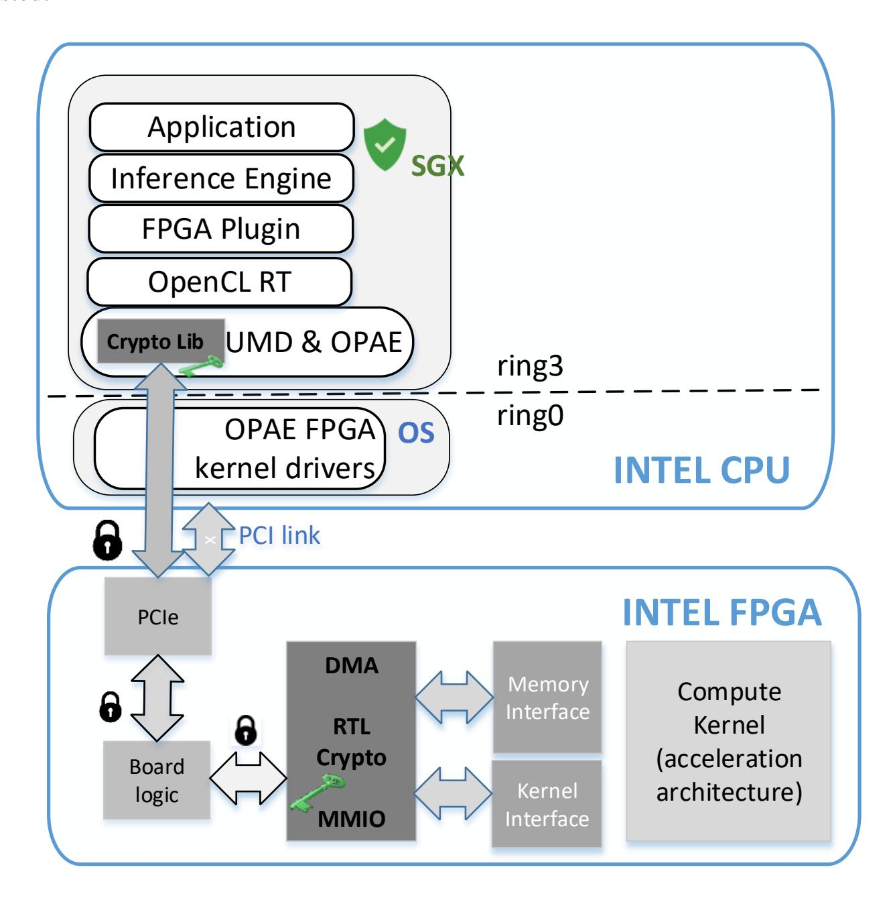
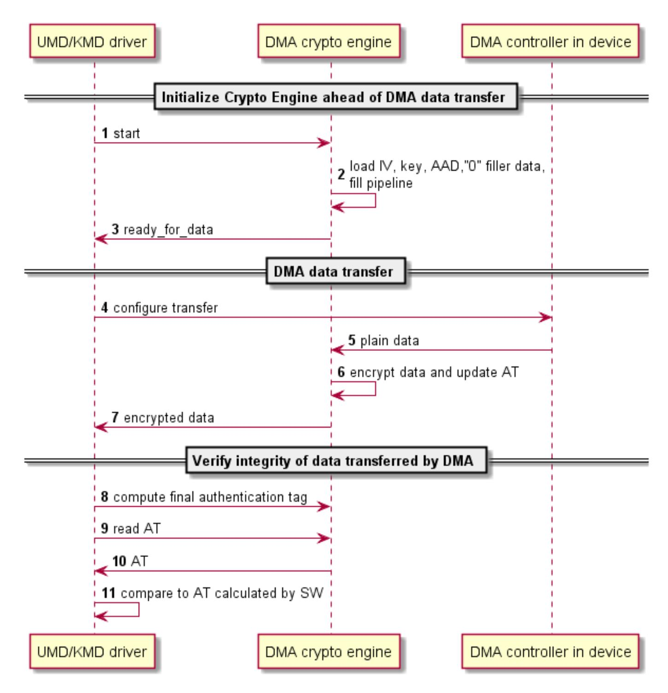
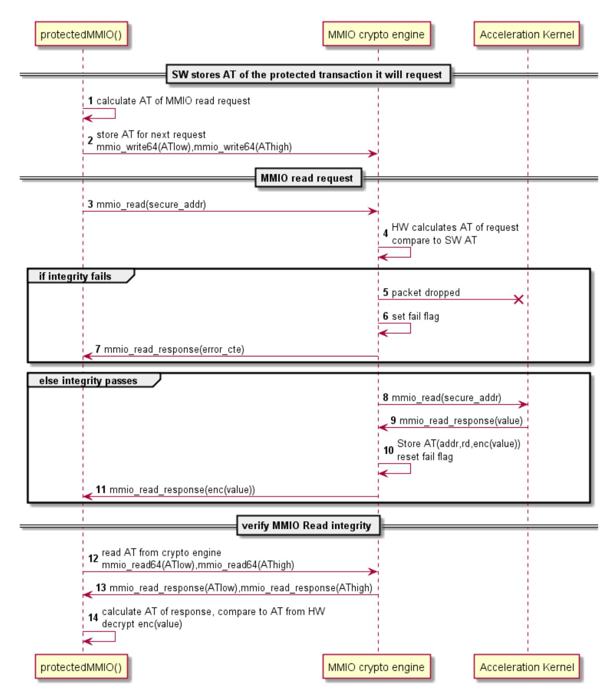
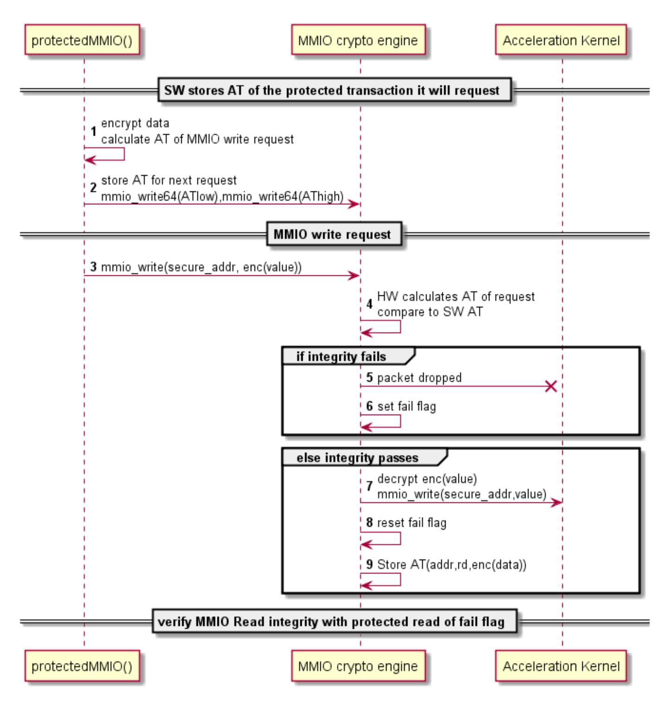
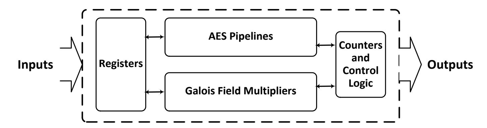
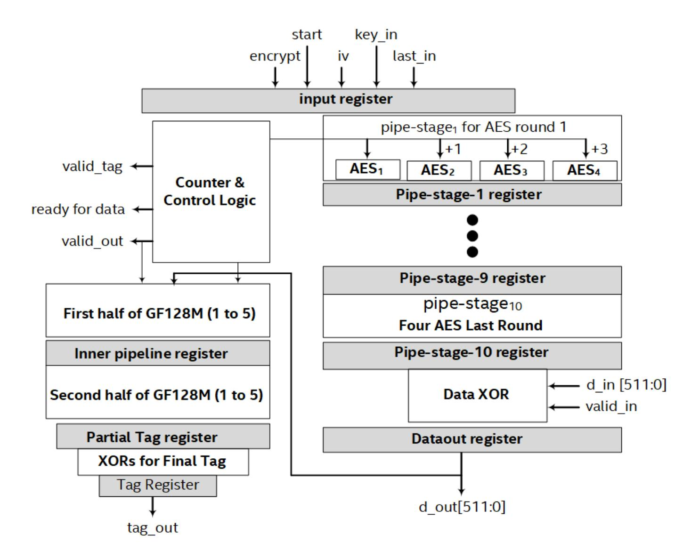
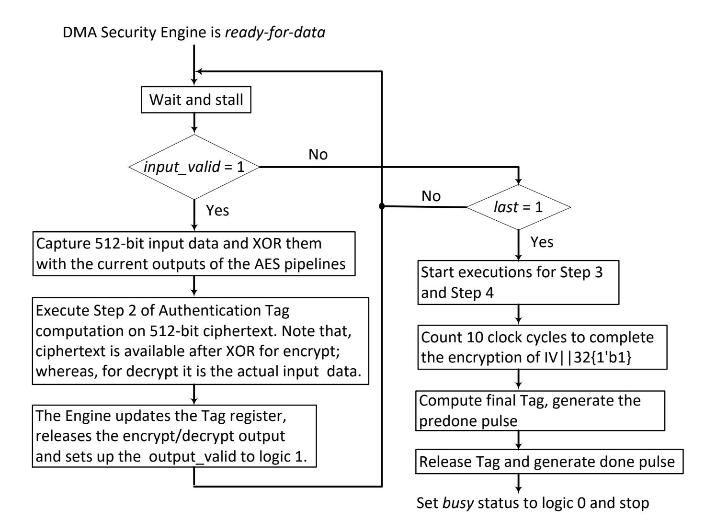
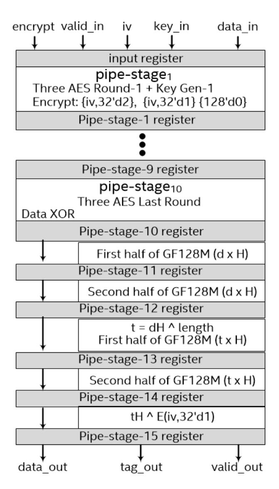

{0}------------------------------------------------

# **A >100 Gbps Inline AES-GCM Hardware Engine and Protected DMA Transfers between SGX Enclave and FPGA Accelerator Device**

Santosh Ghosh, Luis S Kida, Soham Jayesh Desai, Reshma Lal

Security and Privacy Research, Intel Labs Intel Corporation 2111 NE 25th Ave, Hillsboro, OR 97124 [Santosh.Ghosh@intel.com,](mailto:Santosh.Ghosh@intel.com) luis.s.kida@intel.com

**Abstract.** This paper proposes a method to protect DMA data transfer that can be used to offload computation to an accelerator. The proposal minimizes changes in the hardware platform and to the application and SW stack. The paper describes the end-to-end scheme to protect communication between an application running inside a SGX enclave and a FPGA accelerator optimized for bandwidth and latency and details the implementation of AES-GCM hardware engines with high bandwidth and low latency.

**Keywords:** cryptographic protection, heterogeneous computation, protected transfer, hardware for AES-GCM, TEE, SGX, FPGA, and accelerator.

# **1 Introduction**

Compute intensive applications are increasingly run on the cloud for benefits such as scalability and elasticity, reduction of IT costs, and business continuity. Cloud Service Providers (CSP) are starting to offer transfer of workloads to accelerators for better performance and energy efficiency.

Today, many applications have confidentiality requirements because information leak may cause loss of privacy or of intellectual property, or they cannot accept wrong results and must have integrity in the computation. These applications may utilize confidential computing offered by major CSPs [1][2][3] that provide hardware supported Trusted Execution Environment (TEE) based on Intel® Software Guard Extensions (SGX)[\[4\]](#page-19-0). Today, these applications may not benefit from heterogeneous computing because the TEE may not extend to the accelerator and the workload transfer to accelerators is not protected. For example, applications that analyze high volume of confidential data or use proprietary algorithms and require workload acceleration are exposed to exploits of vulnerabilities in system software (OS and VMM) and physical attacks to the link between CPU and accelerator.

Mechanisms to protect computation offload have been proposed using architectural enhancements to the accelerator and/or to the hardware support in the CPU for the TEE along with encryption of the communication between the TEE in the CPU and a trusted execution environment in the accelerator. But implementation of hardware changes to 

{1}------------------------------------------------

the CPU or to the accelerator are in most cases not under control of the CSPs or their customers and encryption consumes resources and adds performance overhead that reduce the benefit of acceleration. For example, Graviton[5] reports overhead of 17%- 33% largely from encryption and decryption of the transfers and requires architectural changes to the GPU to create a trusted execution environment in the GPU to resist potential exploits from a compromised host driver that manages GPU resources. HIX[\[6\]](#page-19-1) reports 26% average performance overhead for protected offload to GPU and requires modifications to the CPU to enforce context isolation, changes to the PCIe interconnect to support integrity, and changes to the OS to move GPU resource management from the OS to a service enclave.

We take hardware accelerated Deep Learning Network (DNN) inferencing as reference use case to propose a mechanism to protect the data transfers between an application running inside a TEE and an accelerator with low performance overhead. An important goal of our research was that the mechanism could run on existing hardware platforms or require hardware changes only to the device to make deployment of confidential heterogeneous computing practical in the near future. We also attempt to minimize changes to current software stacks, applications, and accelerators to lower the barrier of adoption.

#### **1.1 Scope**

A full protection scheme includes the device authentication, attestation, and key exchange to bind the application to the accelerator. In this paper, it is assumed the device has . The protocols described here start from a state with the device bound to the application via a shared key configured on the device after attestation. It is also assumed the protected SW on the host discovers the address layout of the registers and buffers in the device securely prior to the start of protected communication. The buffer for each function on the device is fixed or negotiated between the protected SW and device logic and must be protected from address remapping. How the application discovers the address mapping and capabilities are also not covered in this paper and assumed known to the application before protected communication starts. The paper does not discuss the device requirements to protect the workload during execution inside the device. Nor discuss device management by the OS/VMM such as device assignment and device recovery. Protection from Denial of Service (DoS) and Side Channel Attacks (SCA) are considered out of scope of the current work.

In scope is protection of data transfer via DMA between a device and a ring 3 enclave with confidentiality, integrity, replay protection and redirection protection in the presence of an adversary who is in control of system software (OS and VMM). The adversary may also steal, modify, or inject data in the physical link.

Within this scope we identified DNN inference which has growing importance in heterogeneous computing as the reference use case. And propose a cryptographic protocol and its hardware implementation in the device that meets the data transfer bandwidth for it on a currently available platform without additional buffering. The performance requirements instigated the implementation of AES-GCM authenticated encryption algorithm in HW with the following novel features:

{2}------------------------------------------------

- **In-line Encryption Capability:** Data is encrypted/decrypted and processed through Galois Field Multipliers in pipeline during transfer. No additional buffer is included to store data nor to stall transfers for crypto processing.
- **High Throughput:** We implemented parallel AES pipelines and Galois Field multipliers to meet 100Gbps DMA throughput.
- **Minimal Initial Latency for Setup:** The proposed engines are self-capable for computing the Round keys, Authentication key (H) and a few powers of H at initialization. The whole initialization takes 19 clock cycles for DMA and 16 clock cycles for MMIO for a given key.
- **On-time Authentication Tag:** There are stringent latency requirements for computing and validating Authentication Tag for DMA and MMIO transactions. Integrity against Authentication Tag is validated per clock for each 32-bit/64-bit MMIO transaction. And for DMA, we update the intermediate Tag in each clock cycle as: Tag = Tag×H<sup>4</sup> + d1×H<sup>4</sup> + d2×H<sup>3</sup>+ d3×H<sup>2</sup>+ d4×H, where d1, d2, d3, d4represents 512-bit data/clock; and compute the final Tag at the end of all data transmission with minimal additional cycles.

The paper describes in section 2 the contour conditions and rationale for the design choices that led to the proposed protection protocol described in section 3 and to the architecture of crypto engines in section 4. Section 4 describes the design challenges and microarchitecture techniques of the novel AES-GCM engines. Section 5 reports the prototyping of the encryption engines and the performance of the high bandwidth DMA crypto engine on a sample application before conclusions in section 6.

## **2 Design Decisions**

This section discusses the rationale behind the design decisions that shaped the architecture of the proposed solution. We chose to protect confidential computing applications running on SGX TEE because it is used in public cloud confidential computing [1][2][3] and because SGX enclaves are harder to protect because they do not include the OS kernel drivers in its Trusted Computing Base (TCB). A proposal that protects communication from potentially compromised drivers will likely also be effective in TEEs where the OS kernel drivers are in the TCB and would not be compromised.

A fundamental choice was to constrain to proposals that can run on an existing hardware platform and software stack with modifications adopters could implement themselves. We set out to investigate protection with end-to-end cryptography that binds the application in the enclave to the accelerator. With one encryption endpoint inside the enclave, the solution does not require additional TEE HW support because data is encrypted as it leaves the enclave and decrypted and integrity checked as it enters the TEE. With the other endpoint in the device, data is also encrypted as it leaves the device and decrypted and integrity checked as it enters the device. In this architecture the device is assumed to have proved its trustworthiness via attestation.

Our chosen protection scheme creates an encrypted tunnel between the two trusted endpoints leaving the transport link hardware outside of the TCB. We selected an integrity protection scheme that carries integrity information out of band to avoid changes 

{3}------------------------------------------------

to existing data transport protocols. We prototyped the architecture on a platform where the device is directly connected to the CPU through PCIe but the work may apply to other connectivity models and communication protocols because there is no dependency on support from the transport link to our cryptographic protocol.

We chose AES-GCM authentication encryption because it provides confidentiality, integrity and replay protection, and it can operate on arbitrary sized data, and the cipher text is of the same length as the plaintext.

We narrowed the scope of the devices and applications covered by our proposal to maximize optimization for performance and developer experience. To meet our goal of developing a solution that can be prototyped and deployed on existing platforms, we elected to start with protection of computation offload to accelerator devices based on FPGAs. FPGAs are reconfigured in current cloud computation usage and are modifiable by the CSP, application owner or accelerator board manufacture to add functionality such as data encryption. While the hardware in accelerators based on GPUs and ASICs can only be modified by the manufacturer of the silicon devices. Current usage models of FPGA accelerators are simpler, typical FPGA accelerators use cases have a single context and single user and support a simpler data sharing model. This simplifies the protection mechanism as it does not require implementation of isolation of multiple concurrent workloads and only transfer data through DMA and MMIO. While more complex accelerators such as GPUs support multiple concurrent workloads and has more tightly coupled data sharing models such as use of shared virtual memory.

We selected the OpenCL framework for heterogeneous platforms to guide our design and optimization choices because the OpenCL framework abstracts the hardware platform to a simpler common denominator where devices may not share memory with the host CPU. Data is transferred through buffers using DMA. MMIO is mostly used to control the device. The OpenCL application running on the host CPU has control over computation execution. The data transfer for processing in the accelerator is in two steps. First, SW configures the accelerator to transfer data through DMA. On the second step, it directs the accelerator to process the data after the transfer is complete. Transfers of final or intermediate results from the device are also transferred back to the application by DMA in two steps. First, the application configures the DMA to transfer the results back when it learns results are ready either by polling or by an interrupt from the device. Second, it consumes the results after learning the DMA has completed. This execution model with a clear demarcation between completion of data transfer and data consumption allows the insertion of verification of integrity of the transfer before the accelerator or the application consumes the data.

We selected image recognition using deep neural networks (DNN) accelerated with FPGAs as the reference use case because these applications are growing in importance as cloud workloads. For example, Project Brainwave [7] offers DNN models accelerated by FPGA as a service. We used the image recognition examples distributed with Intel*®* OpenVINO [\[8\]](#page-20-0) image recognition framework accelerated with Intel® FPGA Acceleration Stack [\[9\]](#page-20-1) a by Intel® Programmable Acceleration Card (PAC) [10] as reference to guide our optimizations and as a prototype vehicle.

Fig 1 shows a block diagram of the SW stack and PAC card with the placement of the encryption engines that form the encrypted tunnel to protect data transfer. The User 

{4}------------------------------------------------

Mode Drive (UMD) runs inside the enclave and access plaintext while the Kernel Mode Driver (KMD) while runs outside the enclave and only sees ciphertext. The RTL module intercepts all data transfer to the accelerator kernel. The FPGA hardware is all trusted.



**Fig. 1.** Architecture of the protection mechanism in the prototyping environment.

We chose to place the encryption and integrity verification for the application in the User Mode Drive to keep the changes to the SW stack mostly outside the application to ease the developer experience. The larger TCB which includes the application and the driver stack running inside the enclave is the tradeoff for fewer changes to the application to adopt data protection. Encryption in the FPGA is placed outside the boundary of the acceleration kernel to minimize the changes to existing acceleration architectures which ease porting to protect the architecture.

Execution profiling of the example applications showed that time spent in computation in the CPU and FPGA is much larger than the time transferring data and that time on DMA data transfer dominates the time spent on MMIO. For this reason, we elected to focus our initial work on optimization of the performance of DMA and prototyping 

{5}------------------------------------------------

hardware implementations of encryption for DMA in the FPGA. We leave performance optimization of the user mode drivers for future work.

This protocol encrypts as it writes secrets out of protected memory and decrypts as it reads secrets into protected memory. This choice was key to minimize latency and to reduce changes to the application to adopt protection. The protocol doesn't require double buffering, one buffer to decrypt/encrypt and one to move across the boundary between protected and unprotected memory. This avoided allocation of an additional memory buffer and additional data transfer relative to the current implementation. On the software side, the function that moves data to the enclave reads encrypted data from unprotected memory and writes decrypted data into protected memory. And the function that moves data outside the enclave reads data in the enclave and writes encrypted data out to unprotected memory. In the device hardware, encryption is implemented inline to not need additional block memory, a precious resource, based on examples of acceleration kernels in the OpenVINO distribution that use almost all block memory in the FPGA.

## **3 Proposed Data Transfer Protocol**

We propose a protocol that protects confidentiality, integrity and also offers protection against replay and remap attacks on transfers between a shared buffer in the host memory and a buffer in local device memory accessible only by the device. The DMA controller (DMAC) resides on the device to access local device memory. The host configures the DMAC interface through MMIO.

The protocol uses AES-GCM authenticated encryption of the data payload to provide confidentiality, replay protection and data ordering within the data transfer. It also uses AES-GCM authenticated encryption of MMIO to protect the integrity of the configuration of the DMA which prevents an untrusted agent from using DMA to corrupt private memory in the device.

The protocol protects MMIO to prevent tampering with the configuration of the targets of the DMA in the device memory which may corrupt the device memory and affect the integrity of the computation. The location of the buffer in host memory remains under control of the OS/VMM. The protocol configures the target addresses in host memory given by the OS/VMM without resulting in compromise of integrity of computation. Any difference in the data transferred from the one intended by the application that could be caused by remapping of the addresses in the host memory would be detected by data integrity verification of the payload.

The DMA UMD is extended to encrypt/decrypt as it copies data to/from the host DMA buffer and to verify the integrity of the transfer before returning to the calling application. The DMA UMD verifies the integrity of the transfer by comparing authentication tags (AT) calculated by the driver on the data inside the enclave against the AT calculated by the device on data in device memory. The DMA UMD can read the AT from the accelerator via MMIO which does not require protection because AT transfer does not need confidentiality, and any integrity violation would only result in denial of 

{6}------------------------------------------------

service. The result of the verification is returned reliably to the application since the UMD driver and the application are inside the same enclave.

For protected DMA transfers from host to device, the DMA UMD initializes the hardware encryption engine, and encrypts data and calculates the AT as it moves data outside the enclave to the host DMA buffer before calling the DMA KMD to perform the DMA transfer. When the KMD returns after completion of the DMA transfer, the UMD commands the hardware crypto engine in the device to finalize the authentication tag calculation over the entire DMA. The UMD reads the device's AT to compare to the AT it calculated. If they match, the UMD returns the status of a successful DMA transfer.

The reference hardware platform and sample application support a single DMA transfer running at a time, and instantiate a module that sorts memory read responses to enforce strict ordering. This allowed multiplexing of the hardware crypto engine to protect memory responses for DMA transfers from host to device and memory write requests for DMA transfers from host to device. The crypto engine is placed where it intercepts all DMA memory transactions and calculates the AT over all data received since initialization until asked to finalize AT calculation.

Figure 2 illustrates the protected DMA transfer from device to host that also executes in there phases. First, the DMA UMD initializes the hardware crypto engine. Next it configures the descriptors and calls the DMA KMD. The crypto engine encrypts data and calculates AT as the memory write requests generated by the DMA controller passes through the crypto engine on their way out of the device. On the third phase, after the data has been transferred, the DMA UMD decrypts and calculates the AT as it copies the data from the host DMA buffer into the enclave. The DMA UMD reads the AT calculated by the device on the data written out, and compares to the AT it calculated on the received data.

{7}------------------------------------------------



**Fig. 2.** Protected DMA from device local memory to host memory

By transferring the Authentication Tag via MMIO we were able to keep the DMA payload the same size to reuse of the existing DMA kernel mode driver and buffer memory allocation with no change. This minimized the changes to the application and to the OS to implement protection. The application adds logic to handle DMA transfer integrity errors but otherwise, changes to protect DMA payload are kept mostly to the User Mode Drivers (UMD) to add a phase before transfer to initializes the crypto engine and a phase after the transfer to verify the integrity.

{8}------------------------------------------------

#### **3.1 Protected MMIO**

In addition to configuration of the DMA controller, other device registers may compromise computation in ways that are not easily detectable by the application or are irreversible. For example, a read or write to a device register may reset portions of the device, select different computation on the accelerator, trigger computation, cause soft errors or even permanent damage by changing voltage, clock, or temperature operation limits. To avoid these hazards we insert hardware logic in the device on the path of MMIO transactions to enforce that access to security sensitive registers is integrity protected and originated by the enclave to which the device is currently assigned. MMIO requests that fail these tests are blocked from reaching the accelerator register. The application must be changed to replace access to security sensitive MMIO with a protocol executed in three phases that can be encapsulated in a function or sub-routine.

- 1. The function computes the authentication tag (AT) of the request and writes it by MMIO to a register in the accelerator that is not protected. The address offset of the register on the device is included in the AT to prevent misdirection of the request.
- 2. The function sends the MMIO request of the protected register to the device. The integrity verification logic in the device intercepts MMIO requests to protected address offsets, calculates the authentication tag and compares to the authentication tag currently stored in the device. The device exposes the status of the MMIO request in a protected register. The device only executes MMIO requests that pass integrity check. If integrity check passes, it exposes the authentication tag calculated by the device in an unprotected register and executes the MMIO request. If the integrity test fails, the authentication tag register is not updated, and on failure of a MMIO read request the device also returns a constant for MMIO read response.
- 3. The function confirms the MMIO request succeeded and returns the MMIO integrity verification status to allow the application to stop execution when an integrity failure is detected. For a MMIO read, the function calculates the authentication tag of the MMIO read response and reads the authentication exposed by the device with an MMIO read to confirm the data received and the data sent by the device are the same and from the requested register. For a MMIO write request the function reads the protected status bit following this protocol for protected MMIO read.

Figure 3 illustrates the flow diagram for protection of a MMIO read and Figure 4 illustrates the flow to protect MMIO writes which uses the protected MMIO read flow to retrieve the status flag of integrity verification.

{9}------------------------------------------------



**Fig. 3.** Protected MMIO read flow diagram

This scheme binds the device to its assigned owner cryptographically because protected registers can only be accessed with the protocol regardless of how the register is mapped by the OS/VMM and which process requests access because the logic in the device intercepts all MMIO requests to the protected address offsets. An actor without the key cannot perform an MMIO to a protected register. The application must be upgraded to use the protected MMIO protocol to access security sensitive registers. Conversely, device registers that are managed by other SW such as the OS should not be in address offsets protected by the device. For devices that have to support access to the same register by both the OS and the application, the application and OS would have to be enhanced so the application intermediates access to secure sensitive registers

{10}------------------------------------------------

for the OS. The device must provide means for the OS to regain control of the device from the application but also ensure secrets from the application are erased first. These requirements are not discussed in this paper.



**Fig. 4.** Protected MMIO write flow uses protected MMIO read to verify integrity

#### **3.2 Performance Analysis of the Protocol**

Profiling of computation offload of the selected applications showed that the bulk of the data transfer time is spent on a few relatively large DMA transfers. Accordingly, we focused our efforts in improving performance of DMA transfers. In order for hardware encryption in the FPGA to impose no restriction on bandwidth of DMA transfers nor require memory blocks to buffer data we set the requirement for the hardware crypto engine to match the bandwidth of the internal bus. The protocol was designed to 

{11}------------------------------------------------

initialize the pipeline of the crypto engine once before start of data transfer and calculate integrity over all the payload with a single AT calculation at the end. The combination of support for the maximum throughput and one AT for the transfer makes the latency overhead of protection in hardware almost independent of throughput and length of the DMA transfer. The hardware latency is approximately the time to fill the encryption pipeline and to calculate the final AT. Protection in SW optimizes latency by replacing copy of data though the enclave boundary with moving data across the boundary as part of encryption/decryption to avoid moving data twice, beyond that we made no further optimization of the drivers. For the sizes of DMA transfers profiled SW latency will be much longer than HW latency.

While protection on one MMIO has a high overhead, we do not expect a measurable impact on performance for the selected class of applications based on our profiling of MMIO transactions. When protection is enabled, 1 MMIO read to a protected register is replaced with logic that adds 2 MMIO read and 2 MMIO write to copy AT, and 2 encryption/decryption and AT calculations. A MMIO write to a protected register ads 3 MMIO read, 3 MMIO write, and 3 encryption/decryption and AT calculations of overhead. A MMIO write adds more overhead because it verifies success by reading a status flag in a protected register.

Although the time spent on MMIO is short on the applications profiled, we optimized the performance of the hardware implementation. The MMIO crypto engine was designed so the engine pipeline is initialized only once, the crypto engine doesn't have to be re-initialized before each MMIO transaction. The throughput of authentication tag calculation matches the throughput of the internal MMIO data bus as not to impose bandwidth restrictions. We minimized the latency of AT calculation as it is in the critical path of the protected MMIO protocol.

## **4 High performance Crypto Engine Implementation**

As described in the prior section, there are two different crypto requirements to minimize performance overhead to protect data transfer between host and accelerator. The bulk of data is transferred over DMA with inline encryption on a 512-bit wide bus; whereas to configure secure-DMA we need a set of out of band MMIO transactions with confidentiality & integrity protections. Figure 5 depicts the top level block diagram of the proposed encryption and authentication engine for securing inline DMA and MMIO transactions. We implement the AES-GCM algorithm for this purpose, so there is an AES pipeline datapath, Galois Field Multipliers for Authentication Tag computation with related registers and control circuits.

{12}------------------------------------------------



Fig. 5. Top lebel block diagram for AES-GCM Engine for DMA and MMIO

To meet latency and throughput requirements, we implemented two independent engines for DMA and MMIO transactions in between host and FPGA. For DMA we need to encrypt/decrypt 512-bit inline data in each clock cycle and compute related Galois Field operations for partial authentication tag generation to match the internal bus used for memory transactions. At the end of the final block processing we need to compute the final Tag with minimal additional latency. On the other hand, for MMIO we need to encrypt/decrypt and compute/validate the authentication tag for every 32-bit/64-bit MMIO read/write requests and read responses in one clock cycle to match the throughput of the bus.

Our goal was to implement the optimal AES-GCM HW engines that can be integrated easily and demonstrated running in the FPGA of the PAC PCIe accelerator card without limiting throughput. The PAC is connected to the Host via a PCIe interface running @100Gbps. Internal to the FPGA the data bus that carries DMA memory transactions and MMIO transactions are 512-bit wide and run @200Mhz. We implement our AES-GCM engines that can be instantiated inline on the 512-bit bus and operate at 200MHz or higher clocks. The following subsections describe the microarchitecture design challenges and the novel techniques that are applied to implement the AES-GCM engines.

#### 4.1 Microarchitecture of the 512-bit Inline AES-GCM Engine

Figure 6 depicts the microarchitecture of the HW engine that can process 512-bit inline data for AES-GCM encryption/decryption and partial authentication tag generation. To accommodate 512-bit inline data, the current AES-GCM pipeline has four AES encryption unrolled engines (1 round in each pipeline depth/stage) which run in parallel in CTR mode. There are five parallel 128-bit Galois Field Multipliers that are divided into two pipeline stages. Additionally, there are internal counters and other control logic to generate the encrypted counter streams, to compute the length of the data stream, and to control other microarchitectural operations to compute the final authentication tag.

{13}------------------------------------------------



**Fig. 6.** Microarchitecture of the 512-bit AES-GCM HW engine.

Our objective was to design the pipeline for AES-GCM that can process 512-bit data in each clock cycles at 200MHz clock to provide 100Gbps throughput. We targeted the Intel Arria 10 FPGA used in the PAC for demonstrating results. Our AES engine is based on GF((2<sup>4</sup> ) 2 ) for which the datapath for one round is suitable for a 200MHz clock period implementations, that is, the logic fitted in the FPGA meets timing. We implemented depth-10 pipeline for AES128 with one round in each clock period. Many AES implementations have been reported in the literature in the last 3 decades. Therefore we are not providing any further details about the internals of our AES engine based on GF((2<sup>4</sup> ) 2 ) and are not side-channel protected. Interested readers can follow [19 - 23].

We implemented the Galois Field GF(2<sup>128</sup>) multiplier for tag computation based on the hybrid Karatsuba multiplier [16] [18]. However, the critical path of the 128-bit multiplier circuit and polynomial reduction circuit do not fit within a single 200MHz clock period. Therefore, we split the Karatsuba multiplier and reduction datapath into two pipeline stages and put a pipeline register in between them. The first stage of the pipeline consists of the 32-bit hybrid Karatsuba multiplier circuit implemented with three 16-bit regular multiplier and the Karatsuba layer to produce 63-bit results. The second stage consists of 64-bit and 128-bit levels for Karatsuba multiplication and the XOR based reduction logic for irreducible polynomial x<sup>128</sup>+x<sup>7</sup>+x<sup>2</sup>+x+1. The critical paths of each of the stages fit, allowing us to run the complete AES-GCM engine at 200MHz.

{14}------------------------------------------------

The two cycle latency for GF(2<sup>128</sup>) multiplication creates a challenge to process 512 bit data in each cycle and run the pipeline. We took the following microarchitecture approaches to overcome this challenge.

To recap, the authentication tag (tag) in AES-GCM is computed as:

$$Tag = ((A \times H^n) \wedge (d_1 \times H^{n-1}) \wedge ... \wedge (d_{n-2} \times H^2) \wedge (Len \times H)) \wedge (E_k(IV | 32\{1'b1\}))$$

Where, "A" represents Additional Authentication Data, d<sup>1</sup> to dn-2 are 128-bit data blocks, "^" represents bitwise XOR operation, *E<sup>k</sup>* is the AES encryption with the secret key k, IV represents the initial vector, and *×* is the GF(2<sup>128</sup>) multiplication. We compute the Tag for the DMA transactions of 512-bit/clock as follows:

```
Step 1: Initialization: Tag = A×H, T2 = 0, T3 = 0;
Step 2: Repeat: 
          Clock 1: Tag = (Tag ^ T2 ^ T3) ×H8
 T2 = d1×H8 ^ d2×*H7 ^ d3×H6 ^ d4×H5
          Clock 2: T3 = d1×H4 ^ d2×*H3 ^ d3×H2 ^ d4×H
Step 3: Capture Length: Tag = Tag×H ^ Len×H
Step 4: Final Tag: Tag = Tag ^ Ek(IV||32{1'b1}).
```

Where, H, H<sup>2</sup> , H<sup>3</sup> , H<sup>4</sup> , H<sup>5</sup> , H<sup>6</sup> , H<sup>7</sup> , H<sup>8</sup> are precomputed during setup stage and stored in registers. We incorporated five Galois Field multipliers to the AES-GCM engine to compute all five multiplications in parallel. This works well if the DMA transfer is a multiple of 1024 bits, which would not always be the case. Therefore, the actual microarchitecture is much more complex than what is represented in the steps above. For example, to support data sizes of multiples of 512 bit we keep track of the last 512-bit block internally; and multiply them with lower powers of H as represented in Step 2/Clock 2 when the engine receives the "last\_in" pulse, to signal completion of data transfer. Things are even more complex if the block of data is a multiple of 128-bit but not a multiple of 512-bit. We select the H powers accordingly based on the length of the final block to handle this scenario. In this implementation we restrict support to data lengths that are multiple of 128-bit.

We use a "start" pulse to initiate the engine. The secret key and IV are applied to the engine with the start pulse. After receiving a start pulse the machine pushes a block of all zeros as the first input to the AES Pipeline-1 for encryption by the input key to generate the authentication key H. Additionally, at the start pulse the engine initializes its counters and related control logic. In the following cycle, it initializes all four AES pipelines with CTR, CTR+1, CTR+2 and CTR+3. It increments all counters by 4 and repeats for 9 cycles to fill the pipeline. On the 10th clock cycle, the computed H value is registered on the AES pipeline output. In the following cycle, the H value is pushed into a Galois Field multiplier to compute H2. On this same clock, the encrypted initial values of the four counter reach the output registers of the four AES pipeline and so we stop the AES pipeline and continue to precompute the other H power values (H<sup>3</sup> to H<sup>8</sup> ). 

{15}------------------------------------------------

Since each Galois Field multiplication requires two clock cycles, we require four additional cycles to compute  $H^3$  to  $H^8$ . At this point the engine asserts ready for data = 1.

Once the DMA protection engine asserted the ready-for-data signal, it is ready for DMA data streaming. It can grab 512-bit plaintext/ciphertext data in each clock cycle and produce the corresponding ciphertext/plaintext in the following clock cycle. It also executes the operations related to AT calculation in parallel with the ciphertext/plaintext generation. Figure 7 provides the execution flow of the DMA Protection Engine during data streaming operation.



Fig. 7. The DMA protection engine data streaming flow

After encrypting/decrypting all data blocks, the engine expects a last\_in input pulse to produce the final Tag by computing Step 3 and Step 4 described above. These two steps include two Galois Field multiplications, one AES encryption and two XOR operations. The operations in Step 3 takes just 2 clock cycles in the DMA Protection Engine. Step 4 involves an AES operation on IV||32{1'b1} which starts in parallel with Step 3 but takes 10 clock cycles and is followed by an XOR for computing the final Tag output. In total, Step 3 and Step 4 take 11 clock cycles.

{16}------------------------------------------------

#### **4.2 The 32/64-bit Inline Encryption & Tag generation for MMIO**

The initialization of DMA involves reading and writing a set of 32-bit or 64-bit values to addressable DMA controller and crypto engines registers. We call them MMIO transactions. As described in section 3, protected MMIO transactions are necessary to protect the configuration and initialization of the DMA controller. To protect these MMIO transactions it is necessary to provide cryptographic confidentiality and integrity assurance. These MMIO may be back to back operations. Therefore an inline encryption/decryption and Tag generation/validation must protect one MMIO in every clock cycle to keep up to the performance of the original platform.



**Fig. 8.** Microarchitecture of the 32-bit/64-bit inline encryption and authentication engine.

We implemented a separate AES-GCM pipeline engine to enable inline 32-bit / 64 bit encryption & authentication in each cycle as shown in Fig 8. The architecture consists of three AES128 pipelines to encrypt the 128-bit string of zero (for H), counter 1 (for final Tag) and 2 (for data encryption). After these encryptions are completed in the first 10 pipeline stages we start computing the Tag. We instantiated the same Galois Field multiplier circuit used for DMA processing in the MMIO AES\_GCM engine. Each multiplier requires two pipeline stages. We compute Tag = (((d×H) ^ length)×H) ^ E(iv,32'd1) inline on every cycle for independent 32-bit/64-bit data in five pipeline stages after the AES last round pipeline stage. In total, this AES-GCM engine for inline

{17}------------------------------------------------

encryption and Tag generation has a pipeline of depth15 and 16 clock cycles of latency. This engine is capable of computing the encryption/decryption and Tag computation for one 128-bit input block in each clock cycle. For MMIO transaction we had no additional authentication data (AAD). However, it would be easy to accommodate AAD in the pipeline stages involved in Tag computation.

#### 5 Results

We implemented the DMA crypto engine and the MMIO crypto engine in Verilog RTL. Table 1 provides the fitting report on Intel Arria 10 FPGA. Our microarchitectures and RTL are platform and technology independent and are flexible enough for implementation on both an FPGA and an ASIC. When synthesized and fitted on the Arria-10 10AT115S2F45E2SG device by themselves, the DMA engine requires 47K adaptive logic modules (ALM) and the MMIO engine requires 23K ALM an do not require any block memory nor DSP block of the FPGA. The maximum operating clock frequency reported by the Quartus timing analyzer tool is 309.78MHz for DMA. Our DMA engine is capable of processing 512-bit data in each cycle, which translates to a 154.89 Gbps throughput. Similarly, our AES-GCM engine used to protect MMIO is capable of processing up to 128-bit data in each 302.5 MHz clock cycle resulting in 38.72 Gbps throughput.

Table 1 also provides a comparative analysis of our AES-GCM engines to other reported works. Since the existing designs are reported for different FPGA devices it is difficult to perform a comparison. However, our AES-GCM engine for DMA provides 4.2x higher throughput when compared to the highest performant existing design [18] when both are operating at their respective maximum supported frequencies.

| AES-GCM<br>Engines | Device   | Key<br>schedule | Resource utilization [LUT/ALM, BRAM] | Throughput<br>[Gbps] |
|--------------------|----------|-----------------|--------------------------------------|----------------------|
| Ours for DMA       | Arria 10 | Y               | 47K                                  | 154.89               |
| Ours for MMIO      | Arria 10 | Y               | 23K                                  | 38.72                |
| [18]               | Virtex 5 | Y               | 30K                                  | 36.92                |
| [16]               | Virtex 5 | Y               | 26K                                  | 16.9                 |
| [14]               | Virtex 5 | N               | 22K                                  | 29.7                 |

Table 1. Implementation results and comparison with existing AES-GCM

We integrated the DMA data crypto engine to the GoogleNet.fp11, AlexNet.fp11 and Resnet18.fp16 acceleration kernel architectures distributed in the Deep Learning Acceleration (DLA) [24] package to prototyped protection of DMA data transfer without the protection against address remap and corruption to device memory the integration of the MMIO protection would afford.

The accelerator architecture in the PAC has multiple clock domains to run different units at different speeds. The data bus where the DMA crypto engine was instantiated runs at 200MHz clock domain and so our AES-GCM engines are connected to the same clock domain to perform inline encryption/decryption. As reported in Table 1 our AES-

{18}------------------------------------------------

GCM engines have maximum operating frequency higher than 200 MHz, and we are confident they would also operate at 200MHz clock at the slow corner conditions.

The acceleration kernel was synthesized and fitted to the Arria 10 GX FPGA based Intel Programmable Acceleration Card (PAC) [10] with different seeds until the generated bitstream met timing. The process was repeated after adding the logic to integrate a single DMA crypto engine that is multiplexed to interpose the paths of memory read responses and of memory write requests that travel on different busses. Table 2 shows the resource utilization report of FPGA logic in thousands of ALM for DNN accelerators with and without encryption of DMA data added. It would be expected that higher resource utilization would make fitting the accelerator with the encryption protection harder but the number of attempts to generate the first bitstream meeting timing was not consistently larger for the designs with protection. Averaging over the generation of multiple bitstreams that meet timing may show more consistency in the effort to synthesize and in the overhead of resource utilization as measured by the difference between the designs with and without protection.

**Accelerator architecture Resnet18.fp16 [ALM] GoogleNet.fp11 [ALM] AlexNet.fp11 [ALM]** Unprotected 260K 267K 305K DMA crypto integrated 312K 308K 357K Overhead 52K 41K 47K

**Table 2.** Resource utilization impact of DMA data protection

Table 3 shows preliminary latency measurements of an image classification application that uses OpenVINO accelerated with FPGA classifying 1 image of 228x228 pixels with and without protection averaged over 49,920 times. The overhead is measured as the difference between the time spent on data transfer with and without protection. The relative overhead values are the latency as a percentage of the transfer time and total inference time on the architecture without protection. The measurements were taken on a platform with Intel® Coffee Lake Server 2.60 GHz 8 cores CPU, Intel® Programmable Acceleration card with Intel Arria® 10 GX FPGA, CentOS 7.4, Kernel 3.10.0, and Intel® FPGA Acceleration Stack (version 1.1). While the complete architecture was designed to include MMIO protection for an application hosted inside the enclave on a cloud server where other applications are also running, we measured the application with protection of MMIO not implemented, not running in an enclave, and running in isolation in the platform.

**Table 3.** Latency of DMA transfer and classification for 1 image

| Accelerator architecture | Resnet18.fp16 | GoogleNet.fp11 | AlexNet.fp11 |
|--------------------------|---------------|----------------|--------------|
| Total inference [ms]     | 7.36          | 2.51           | 11.5         |
| Transfer time [ms]       | 0.152         | 0.152          | 0.111        |
| Protected transfer [ms]  | 0.275         | 0.276          | 0.196        |
| Overhead [ms]            | 0.123         | 0.124          | 0.085        |
| Transfer overhead [%]    | 81 %          | 82 %           | 77 %         |
| Inference overhead [%]   | 1.7%          | 4.9%           | 0.74%        |

{19}------------------------------------------------

Preliminary latency measurements of classification of 1 image of 228x228 on an image recognition application based on OpenVINO accelerated with FPGA with and without protection of Table 3 show transfer overhead of approximately 80% and inference overhead of less than 5% in accordance to the fraction data transfer relative to total computation. The DMA crypto engine instantiated inline as a pipeline stage on the data bus adds an estimated 150 ns (30 clocks \* 5 ns) of latency per DMA transfer. For the number and size of DMA transfers to classify one image in the applications (5 to 6 DMA transferring a total of approximately 600 KB), the overhead observed on transfer latency is dominated by SW encryption.

## **6 Conclusion**

In this work we observe the increasing use of heterogeneous cloud computing and select the DNN inferencing use case to propose a solution to protect data transfer to enable confidential heterogeneous computing. Further, we prototype the architecture to solve critical implementation challenges identified and validate performance and feasibility. We give evidence that the latency to protect data transfer can be made low enough to make it a practical solution for confidential computation offload with our implementation of highly optimized AES-GCM authenticated encryption in hardware.

Proposing a scheme that is feasible and practical for deployment in existing platforms was a key concern for this work. We believe this work is practical for deployment on devices for which encryption logic consumes a small fraction of total resources and device attestation and key exchange are supported.

# **References**

- 1. Azure Confidential Computing. [https://azure.microsoft.com/en-us/solutions/confidential](https://azure.microsoft.com/en-us/solutions/confidential-compute/)[compute/](https://azure.microsoft.com/en-us/solutions/confidential-compute/)
- 2. Google: Advancing Confidential Computing with Asylo. [https://cloud.google.com/blog/products/identity-security/advancing-confidential](https://cloud.google.com/blog/products/identity-security/advancing-confidential-computing-with-asylo-and-the-confidential-computing-challenge)[computing-with-asylo-and-the-confidential-computing-challenge](https://cloud.google.com/blog/products/identity-security/advancing-confidential-computing-with-asylo-and-the-confidential-computing-challenge)
- 3. IBM Cloud Data Shield. [https://www.ibm.com/cloud/blog/announcements/announcing](https://www.ibm.com/cloud/blog/announcements/announcing-ibm-cloud-data-shield-experimental)[ibm-cloud-data-shield-experimental](https://www.ibm.com/cloud/blog/announcements/announcing-ibm-cloud-data-shield-experimental)
- <span id="page-19-0"></span>4. Frank McKeen, Ilya Alexandrovich, Alex Berenzon, Carlos V. Rozas, Hisham Shafi, Vedvyas Shanbhogue, and Uday R. Savagaonkar. 2013. Innovative Instructions and Software Model for Isolated Execution. In *The 2nd International Workshop on Hardware and Architectural Support for Security and Privacy (HASP '13). 1–8.*
- 5. Stvros Volos, Kapil Vaswani, Rodrigo Bruno. Graviton: Trusted Execution Environments on GPUs. In Proceedings of the 13th USENIX Symposium on Operating Systems Design and Implementation (OSDI'18)
- <span id="page-19-1"></span>*6.* Insu Jang, Taehoon Kim, Simha Sethumadhavan, Jaehyuk Huh. Heterogeneous Isolated Execution for Commodity GPUs. In *Proceedings of ASPLOS'19, April 13–17, 2019*
- 7. Eric Chung, Jeremy Fowers, Kalin Ovtcharov, Michael Papamichael, Adrian Caulfield, Todd Massengill, Ming Liu, Mahdi Ghandi, Daniel Lo, Steve Reinhardt, Shlomi Alkalay, Hari Angepat, Derek Chiou, Alessandro Forin, Doug Burger, Lisa Woods, Gabriel Weisz,

{20}------------------------------------------------

- Michael Haselman, Dan Zhang. Serving DNNs in Real Time at Datacenter Scale with Project Brainwave . IEEE Micro | March 2018: , Vol 38: pp. 8-20
- <span id="page-20-0"></span>8. Intel® Distribution of OpenVINO™ toolkit <https://software.intel.com/en-us/openvino-toolkit>
- <span id="page-20-1"></span>9. Intel® Acceleration Stack for Intel Xeon® CPU with FPGA [https://www.intel.com/content/www/us/en/programmable/solutions/acceleration-hub/ac](https://www.intel.com/content/www/us/en/programmable/solutions/acceleration-hub/acceleration-stack.html)[celeration-stack.html](https://www.intel.com/content/www/us/en/programmable/solutions/acceleration-hub/acceleration-stack.html)
- 10. Intel® Programmable Accelerator Card with Intel Arria® 10 FPGA. [https://www.intel.com/content/www/us/en/programmable/products/boards\\_and\\_kits/dev](https://www.intel.com/content/www/us/en/programmable/products/boards_and_kits/dev-kits/altera/acceleration-card-arria-10-gx/overview.html)[kits/altera/acceleration-card-arria-10-gx/overview.html](https://www.intel.com/content/www/us/en/programmable/products/boards_and_kits/dev-kits/altera/acceleration-card-arria-10-gx/overview.html)
- 11. McGrew, D., Viega, J.: The security and performance of the Galois/Counter Mode (GCM) of operation. Progress in Cryptology-INDOCRYPT, 377–413, (2005).
- 12. IEEE, IEEE Standard for Local and metropolitan area networks–Media Access Control (MAC) Security Amendment 1: Galois Counter Mode–Advanced Encryption Standard– 256 (GCM-AES-256) Cipher Suite.Satoh, A.: High-speed hardware architectures for authenticated encryption mode GCM. IEEE International Symposium on Circuits and Systems. ISCAS (2006).
- 13. Crenne, J., Cotret, P., Gogniat, G., Tessier, R., Diguet, J.: Efficient key-dependent message authentication in reconfigurable hardware. International Conference on Field Programmable Technology (FPT), 1–6, (2011).
- 14. Abdellatif, K.M., Chotin-Avot, R., Mehrez, H.: Authenticated encryption on FPGAs from the static part to the reconfigurable part. Microprocessors and Microsystems (2014).
- 15. Zhou, G., Michalik, H., Hinsenkamp, L.: Efficient and High-Throughput Implementations of AES-GCM on FPGAs. International Conference on Field-Programmable Technology, FPT, 185–192, (2007).
- 16. Zhou, G., Michalik, H., Hinsenkamp, L.: Improving Throughput of AES-GCM with Pipelined Karatsuba Multipliers on FPGAs. Journal of Reconfigurable Computing: Architectures, Tools and Applications, 193–203, (2009).
- 17. Henzen, L., Fichtner, W.: FPGA parallel-pipelined AES-GCM core for 100g Ethernet applications. IEEE ESSCIRC, 202-205, (2010).
- 18. Abdellatif, M. K., Chotin-Avot, R., Mehrez, H.: AES-GCM and AEGIS: Efficient and High Speed Hardware Implementations. J. Sign. Process Syst. (88), 1–12, (2017).
- 19. Mathew, S., Sheikh, F., Kounavis, M. E., Gueron, S., Agarwal, A., Hsu, S., Kaul, H., Anders, M., Krishnamurthy, R.: 53 Gbps Native GF(2 4) 2 Composite-Field AES-Encrypt/Decrypt Accelerator for Content-Protection in 45 nm High-Performance Microprocessors. J. Solid-State Circuits 46(4), 767-776, (2011).
- 20. Gueron, S., Mathew, S.: Hardware Implementation of AES Using Area-Optimal Polynomials for Composite-Field Representation GF(2^4)^2 of GF(2^8). ARITH16, 112-117, (2016).
- 21. Moradi, A., Poschmann, A., Ling, S., Paar, C., Wang, H., Paterson, K. G.: Pushing the Limits: A Very Compact and a Threshold Implementation of AES. EUROCRYPT 2016, 69-88, (2016).
- 22. Bilgin, B., Gierlichs, B., Nikova, S., Nikov, V., Rijmen, V.: A More Efficient AES Threshold Implementation. Progress in Cryptology – AFRICACRYPT 2014, 267-284, (2014).
- 23. Baby Chellam, M., Natarajan, R.: AES Hardware Accelerator on FPGA with Improved Throughput and Resource Efficiency. Arabian Journal for Science and Engineering, Springer, 6873-6890, (2018).
- 24. Enno Luebbeers, Song Liu, Michael Chu Simplify Software Integration for FPGA accelerators with OPAE *Whitepaper* [https://01.org/sites/default/files/downloads/opae/open-pro](https://01.org/sites/default/files/downloads/opae/open-programmable-acceleration-engine-paper.pdf)[grammable-acceleration-engine-paper.pdf](https://01.org/sites/default/files/downloads/opae/open-programmable-acceleration-engine-paper.pdf)