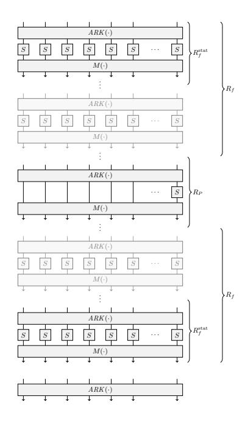

# Mind the Middle Layer: The HADES Design Strategy Revisited ?

Nathan Keller<sup>1</sup> and Asaf Rosemarin<sup>2</sup>

<sup>1</sup> Mathematics Department, Bar Ilan University, Israel nkeller@math.biu.ac.il

Abstract. The HADES design strategy combines the classical SPN construction with the Partial SPN (PSPN) construction, in which at every encryption round, the non-linear layer is applied to only a part of the state. In a HADES design, a middle layer that consists of PSPN rounds is surrounded by outer layers of SPN rounds. The security arguments of HADES with respect to statistical attacks use only the SPN rounds, disregarding the PSPN rounds. This allows the designers to not pose any restriction on the MDS matrix used as the linear mixing operation.

In this paper we show that the choice of the MDS matrix significantly affects the security level provided by HADES designs. If the MDS is chosen properly, then the security level of the scheme against differential and linear attacks is significantly higher than claimed by the designers. On the other hand, weaker choices of the MDS allow for extremely large invariant subspaces that pass the entire middle layer without activating any non-linear operation (a.k.a. S-box).

We showcase our results on the Starkad and Poseidon instantiations of HADES. For Poseidon, we significantly improve the lower bounds on the number of active S-boxes with respect to both differential and linear cryptanalysis provided by the designers – for example, from 28 to 60 active S-boxes for the t = 6 variant. For Starkad, we show that for any variant with t (i.e., the number of S-boxes in each round) divisible by 4, the cipher admits a huge invariant subspace that passes any number of PSPN rounds without activating any S-box (e.g., a subspace of size 2 <sup>1134</sup> for the t = 24 variant). Furthermore, for various choices of the parameters, this invariant subspace can be used to mount a preimage attack on the hash function that breakes its security claims. On the other hand, we show that the problem can be fixed easily by replacing t with any value that is not divisible by four.

<sup>2</sup> Department of Computer Science, Bar-Ilan University, Israel asaf.rosemarin@gmail.com

<sup>?</sup> Research supported by the European Research Council under the ERC starting grant agreement number 757731 (LightCrypt) and by the BIU Center for Research in Applied Cryptography and Cyber Security in conjunction with the Israel National Cyber Bureau in the Prime Minister's Office.

<sup>©</sup> 2021. This article is the final version submitted author(s) to the IACR and to Springer-Verlag on Mar 4 2021. The version published by Springer-Verlag is available at <DOI>.

Following our paper, the designers of Starkad and Poseidon amended their design, by adding requirements which ensure that the MDS matrix is chosen properly.

### 1 Introduction

#### 1.1 Background

Substitution-permutation network (SPN) is a classical design strategy of cryptographic permutations, used in the AES [\[14\]](#page-27-0) and in numerous other modern cryptosystems. An SPN iterates many times a sequence of operations called 'round', which consists of a layer of local non-linear operations (S-boxes) and a global linear mixing layer. The wide trail strategy, employed in the AES, allows designing SPNs with an easily provable lower bound on the number of active S-boxes in any differential or linear characteristic, thus providing a security guarantee with respect to the most common statistical cryptanalytic attacks.

In 2013, Gerard et al. [\[9\]](#page-26-0) proposed the Partial SPN (PSPN) construction, in which the S-box layer is applied to only a part of the state in each round (in exchange for somewhat increasing the number of rounds). This approach, that has obvious performance advantages in various scenarios, was used in the block ciphers Zorro [\[9\]](#page-26-0) and LowMC [\[1\]](#page-25-0). A drawback of this approach is that 'clean' security arguments (like the wide trail strategy) are not applicable for PSPNs, and thus, the security of these designs was argued by more ad-hoc approaches. These turned out to be insufficient, as Zorro was practically broken in [\[2\]](#page-26-1) and the security of the initial versions of LowMC was shown in [\[7,](#page-26-2)[8\]](#page-26-3) to be significantly lower than claimed by the designers.

At Eurocrypt 2020, Grassi et al. [\[12\]](#page-26-4) proposed the HADES design strategy that combines the classical SPN construction with the PSPN construction. In a HADES design, a middle layer of PSPN rounds is surrounded by two layers of SPN rounds. The scheme allows enjoying 'the best of the two worlds' – the efficiency provided by the PSPN construction, along with the clean security arguments applicable for the SPN construction. Specifically, the security arguments of the cryptosystem with respect to statistical (e.g., differential and linear) attacks are provided only by the SPN (a.k.a. 'full') rounds, using the wide trail strategy. The security arguments with respect to algebraic attacks use also the PSPN rounds, and take advantage of the fact that a partial non-linear layer increases the algebraic degree in essentially the same way as a 'full' non-linear layer. The linear layer in the HADES design is implemented by an MDS matrix (see [\[14\]](#page-27-0)), which guarantees that if the number of S-boxes in any full round is t, then any differential or linear characteristic over two full rounds activates at least t + 1 S-boxes. Since the PSPN rounds are not used in the security arguments with respect to statistical attacks, the HADES designers do not impose any restriction on the MDS used in the scheme. As a specific example, they propose using Cauchy matrices over finite fields (to be defined in Sec. [2\)](#page-5-0).

The designers of HADES presented applications of their strategy for securing data transfers with distributed databases using secure multiparty computation (MPC). Subsequently, Grassi et al. proposed Starkad [\[10,](#page-26-5) initial version] and Poseidon [\[11\]](#page-26-6) – hash functions whose underlying permutations are instantiations of the HADES methodology, aimed at applications for practical proof systems, such as SNARKs, STARKs, or Bulletproofs. The HADES family of algorithms (including various Starkad and Poseidon variants) was a candidate in the STARK-Friendly Hash Challenge [\[17\]](#page-27-1).

#### 1.2 Our results

In this paper we study the effect of the MDS matrix on the security level of HADES designs. We show that when the MDS is chosen properly, the PSPN rounds can be taken into consideration in the security arguments against differential and linear attacks, leading to a very significant improvement in the lower bound on the number of active S-boxes in differential and linear characteristics. On the other hand, we show that a weaker choice of the MDS matrix may lead to existence of huge invariant subspaces for the entire middle layer that do not activate any S-box (for any number of PSPN rounds). Furthermore, for certain instances (albeit, not for the specific instances chosen in [\[10,](#page-26-5) initial version] and [\[17\]](#page-27-1)), these invariant subspaces allow breaking the hash function with a Gr¨obner-basis [\[3\]](#page-26-7) preimage attack.

To be specific, we focus on the variants of Starkad and Poseidon suggested in [\[10,](#page-26-5) initial version]. Interestingly, our results point out a sharp difference between the cases of a prime field (Poseidon) and a binary field (Starkad).

Analysis of Poseidon. In the case of Poseidon (which operates over a prime field GF(p)), for all variants proposed in [\[10,](#page-26-5)[11\]](#page-26-6), we significantly improve the lower bound on the number of active S-boxes in differential and linear characteristics. The improvement is especially large for variants with a small number of S-boxes in each round (denoted in [\[12\]](#page-26-4) by t). For example, for t = 6 (which is the main reference variant provided in the supplementary material of [\[10\]](#page-26-5)), the designers claim a lower bound of 4 · (6 + 1) = 28 active S-boxes, based on application of the wide trail strategy to the 'full' rounds. We prove that the PSPN rounds must activate at least 32 S-boxes, thus more than doubling the lower bound on the number of active S-boxes to 60. For the t = 2 variant, the improvement is most striking: there are at least 41 active S-boxes in the PSPN rounds, while the designers' bound for the SPN rounds is 12 S-boxes. We obtain the new lower bounds using an automated characteristic search tool for PSPNs proposed in [\[2\]](#page-26-1). A comparison of our new lower bounds and the lower bounds of the designers is presented in Table [1.](#page-3-0)

Analysis of Starkad. In the case of Starkad (which operates over a binary field GF(2<sup>n</sup>)), perhaps surprisingly, there is a significant difference between different values of t. For t = 24 (which is the main reference variant provided in the supplementary material of [\[10,](#page-26-5) initial version]), we show that there exists an invariant subspace U of size 2<sup>18</sup>·<sup>63</sup> = 2<sup>1134</sup> that does not activate the S-box in the PSPN rounds. This means that U passes any number of PSPN rounds,

| Security | t  | $R_F = \text{Full}$ | $R_P = Partial$ | S-boxes  | S-boxes  | S-boxes  |
|----------|----|---------------------|-----------------|----------|----------|----------|
| Level    |    | Rounds              | Rounds          | in $R_F$ | in $R_P$ | in total |
| 128      | 2  | 8                   | 82              | 12       | 41       | 53       |
| 128      | 4  | 8                   | 83              | 20       | 36       | 56       |
| 128      | 6  | 8                   | 84              | 28       | 32       | 60       |
| 256      | 8  | 8                   | 127             | 36       | 42       | 78       |
| 128      | 16 | 8                   | 64              | 68       | 12       | 80       |

<span id="page-3-0"></span>**Table 1.** The lower bound on the number of active S-boxes in a differential/linear characteristic, for the full rounds (shown by the designers) and for the PSPN rounds (our results), for various versions of Poseidon

without activating any S-box! On the other hand, for t = 47 and t = 51 (the other variants of Starkad considered in [10, initial version]), there are no t-round differential or linear characteristics that do not activate any S-box.<sup>3</sup> We show that these results are not a coincidence, but rather follow from properties of Cauchy matrices over binary fields. Specifically, we prove the following:

<span id="page-3-2"></span>**Theorem 1.** Let  $\mathbb{F} = GF(2^n)$  be a binary field. Let  $t = 2^k \cdot s$  where  $s \in \mathbb{N}$ . Let M be a t-by-t Cauchy matrix over  $\mathbb{F}$  constructed according to the Starkad specification. Then there exists a linear subspace  $U \subset \mathbb{F}^t$  of dimension at least  $(1 - \frac{k+1}{2^k})t$  such that for any  $\ell \in \mathbb{N}$  and for any  $x \in U$ , the top n bits of  $M^\ell x$  are equal to zero. Consequently, application of any number of PSPN rounds to any  $x \in U$  does not activate any S-box.

Theorem 1 implies that for any t that is divisible by 4, there is a huge subspace U of size at least  $2^{nt/4}$  that passes any number of PSPN rounds without activating any S-box. (This follows from applying the theorem with k=2 and s=t/4.) In fact, we conjecture that the lower bound on the dimension of the subspace in Theorem 1 can be improved to  $(1-\frac{2}{2^k})t$  (which would fully explain the size of the invariant subspace for the t=24 variant of Starkad). We verified this conjecture experimentally for many values of n and t, including all variants of Starkad proposed in [10, initial version]. The sizes of the invariant subspace for n=63 and several representative values of t are given in Table 2.

<span id="page-3-3"></span>An especially notable case is Starkad variants with  $t = 2^k$ . For such variants, we show that the MDS is essentially an *involution*.

**Theorem 2.** Let  $\mathbb{F} = GF(2^n)$  be a binary field, and let  $t = 2^k$  for  $k \in \mathbb{N}$ . Let M be a t-by-t Cauchy matrix over  $\mathbb{F}$  constructed according to the Starkad specification. Then  $M^2 = \alpha I$ , where  $\alpha = (\sum_{j=2^k}^{2^{k+1}-1} j^{-1})^2$ . Consequently, there

<span id="page-3-1"></span><sup>&</sup>lt;sup>3</sup> We note that for the specific variants with t = 47,51 proposed in [10], there does exist a large subspace that does not activate any S-box in the PSPN rounds, since the number of these rounds (25 for t = 47 and 24 for t = 51) is smaller than t. While this might be undesirable, this is an inevitable result of the choice of the number of PSPN rounds, that does not depend on the MDS matrix.

| t  | Dimension of       | t  | Dimension of       | t  | Dimension of       |
|----|--------------------|----|--------------------|----|--------------------|
|    | invariant subspace |    | invariant subspace |    | invariant subspace |
| 4  | 2                  | 6  | 0                  | 8  | 6                  |
| 10 | 0                  | 13 | 0                  | 16 | 14                 |
| 18 | 0                  | 21 | 0                  | 24 | 18                 |
| 28 | 14                 | 32 | 30                 | 42 | 0                  |
| 46 | 0                  | 47 | 0                  | 48 | 42                 |
| 50 | 0                  | 51 | 0                  | 52 | 26                 |
| 56 | 42                 | 64 | 62                 | 70 | 0                  |

<span id="page-4-0"></span>**Table 2.** The dimension of the invariant subspace whose elements do not activate S-boxes for any number of PSPN rounds, as a function of t (the number of S-boxes in each round), for a Starkad cipher over the field  $GF(2^{63})$

exists a linear subspace  $U \subset \mathbb{F}^t$  of dimension at least t-2 such that for any  $\ell \in \mathbb{N}$  and for any  $x \in U$ , the top n bits of  $M^{\ell}x$  are equal to zero.

As can be seen in Table 2, Theorem 2 is tight for all checked variants (i.e., n=63 and t=4,8,16,32,64).

We obtain Theorems 1 and 2 via an extensive study of properties of Cauchy matrices over binary fields.<sup>4</sup> As Cauchy matrices are widely used (e.g., for error correcting codes, see [15]), these linear-algebraic results are of independent interest.

Of course, a crucial question is whether these invariant subspaces can be used to actually attack Starkad. We show that they indeed can be used to mount a Gröbner-basis preimage attack proposed by Beyne et al. [6, Sec. 6.2], and that for certain choices of the parameters (e.g., a variant over the field  $GF(2^{127})$  aimed at a 256-bit security level, like the variant proposed in the STARK-Friendly Hash Challenge [17], with 16 S-boxes in each round instead of 14), the resulting attack breaks the security claims of the hash function.

On the other hand, our results show that this deficiency can be fixed easily: it is sufficient to choose a value of t that is not divisible by 4 (see Table 2). Furthermore, we show that various other mild changes (such as slightly altering the way in which the sequences  $\{x_i\}, \{y_j\}$  used in the construction of the Cauchy matrix are selected) are also sufficient for avoiding the existence of an invariant subspace.

Hence, our results (both on Poseidon and on Starkad) suggest that properly designing the MDS matrix and taking it into consideration in the analysis allows significantly improving the security guarantee of HADES constructions with respect to statistical attacks.

<span id="page-4-1"></span><sup>&</sup>lt;sup>4</sup> We note that a variant of the easier Theorem 2 was independently and concurrently obtained in [6, Appendix C].

#### 1.3 Practical impact of our results and subsequent work

In the short time since the initial version of this paper appeared on eprint, its results had a practical impact:

Our results for strong MDS matrices. The designers of Starkad and Poseidon accepted our results and included them in the amended security analysis presented in [\[10,](#page-26-5) updated version, Sec. 5.4.1] and [\[11\]](#page-26-6). In particular, the authors of [\[10,](#page-26-5)[11\]](#page-26-6) agreed with our claim that as far as statistical attacks are concerned, several full rounds could be replaced by partial rounds without reducing the security claims. Nevertheless, they decided to not reduce the number of full rounds in the amended version, since the full rounds are advantageous over partial rounds also with respect to certain algebraic attacks, such as Gr¨obner basis attacks (see [\[10,](#page-26-5) updated version, Sec. 5.4.1]).

Our results for weak MDS matrices. Following our results, the designers of Starkad and Poseidon amended the design in such a way that invariant subspaces that pass an infinite number of PSPN rounds would not be possible (see [\[10\]](#page-26-5)). To this end, they adopted the amednments we proposed (and in particular, required t to be odd), along with other amendments.

In addition, the STARK-Friendly Hash Challenge [\[17\]](#page-27-1) cryptanalytic committee used our results, alongside other results, to motivate their recommendation to remove Starkad from consideration in the challenge (see [\[4,](#page-26-9) Sec. 4]).

Subsequent work. Motivated by our results, Grassi et al. [\[13\]](#page-27-3) presented a systematic study of linear layers for which the cipher admits an invariant subspace that passes all PSPN rounds for free. The results of the analysis were used to determine the requirements on the MDS matrix used in the amended variant of Starkad and Poseidon [\[10,](#page-26-5) updated version].

#### 1.4 Organization of the paper

This paper is organized as follows. We briefly describe the HADES construction and its instantiations, Starkad and Poseidon, in Section [2.](#page-5-0) In Section [3](#page-7-0) we present our results on variants of Poseidon. In Section [4](#page-8-0) we explore a special class of matrices over binary fields (which includes Cauchy matrices of the type used in Starkad) and obtain the linear-algebraic results required for proving Theorems [1](#page-3-2) and [2.](#page-3-3) In Section [5](#page-17-0) we present our results on variants of Starkad, and in particular, prove Theorems [1](#page-3-2) and [2.](#page-3-3) We conclude the paper with a discussion and open problems in Section [6.](#page-23-0)

## <span id="page-5-0"></span>2 The HADES construction

In this section we briefly describe the structure of a HADES permutation [\[12\]](#page-26-4). A block cipher / permutation designed according to the HADES strategy employs four types of operations:



<span id="page-6-0"></span>Fig. 1. The HADES construction

- 1. AddRoundKey, denoted by  $ARK(\cdot)$  a bitwise XOR of a round subkey (or a round constant for unkeyed designs) with the state;
- 2. Full S-box Layer, denoted by  $S(\cdot)$  parallel application of t copies of an identical S-box to the entire state;
- 3. Partial S-box Layer, denoted by  $S^*(\cdot)$  application of a single S-box to a part of the state, while the rest of the state remains unchanged;
- 4. Mixing Layer, denoted by  $M(\cdot)$  multiplication of the entire state by an MDS matrix.

A full round is defined as  $M \circ S \circ ARK(\cdot)$ , and a partial round is defined as  $M \circ S^* \circ ARK(\cdot)$ . The cipher consists of  $R_f$  full rounds, followed by  $R_P$  full rounds, followed by  $R_f$  full rounds, where the parameters  $R_P, R_f$  are chosen by a complex rule intended mainly to thwart algebraic attacks. The structure of HADES is demonstrated in Figure 1.

In this paper, we study the Poseidon and Starkad permutations [10], built according to the HADES design strategy. Poseidon works over a finite field GF(p), while Starkad works over a binary field  $GF(2^n)$ . Starkad uses only the S-box  $S(x) = x^3$ , while Poseidon uses also  $x^{-1}$  and  $x^5$ . For our purposes, the choice of the S-box is not relevant.

The block ciphers are parameterized by  $R_P, R_f$  (as in HADES), n – the logarithm of the field size, and t – the number of S-boxes applied in each full round.

The MDS matrix. The design component on which we focus in this work is the MDS matrix used in the linear layer. In the case of a binary field GF(2n), the matrix is a so-called Cauchy matrix, constructed as follows.

First, a constant r is chosen. Then, one sets up two sequences {xi}, {yj} of length t, by choosing a staring point x<sup>0</sup> and setting

$$\forall i \in [t] : x_i \triangleq x_0 + i - 1, y_i \triangleq x_i + r,$$

where + denotes integer addition. The t-by-t MDS matrix M is set as

$$M_{i,j} = (x_i \oplus y_j)^{-1},$$

where the inversion is taken in the field GF(2n). In all Starkad variants presented in [\[10\]](#page-26-5), the parameters x0, r are set to 0, t, respectively. The construction for a prime F<sup>p</sup> (on which we do not focus) is similar to the binary case.

# <span id="page-7-0"></span>3 Improved Security Bounds for Poseidon Permutations

In this section we show that the lower bounds on the number of active S-boxes in a differential or a linear characteristic obtained by the designers of Poseidon, can be improved significantly by taking into consideration active S-boxes in PSPN rounds and lower bounding their number.

In order to lower-bound the number of active S-boxes, we use a generic characteristic search algorithm for PSPNs, presented by Bar-On et al. [\[2\]](#page-26-1) at Eurocrypt 2015. For a parameter a, the algorithm allows computing the (provably) minimal number r of rounds such that any r-round differential/linear characteristic must activate at least a + 1 S-boxes.

The idea behind the algorithm is to enumerate patterns of active/non-active S-boxes and to check the validity of each pattern by posing a homogeneous linear equation on each non-active S-box, and linearizing the output of active S-boxes by introducing new variables. As for checking an r-round variant, the algorithm has to sieve rt<sup>0</sup> ≤a possible patterns of active S-boxes, where t 0 is the number of S-boxes in each PSPN round, the running time of the algorithm is determined by the parameters a, r, t<sup>0</sup> . In addition, the complexity depends on t – the number of S-boxes in each full round, which affects the complexity of multipication by the MDS matrix (an operation used extensively in the algorithm). As a result, for smaller values of t, we were able to run the algorithm up to larger values of a.

For t = 2, the algorithm is not needed. Indeed, the MDS property of the matrix guarantees that both S-boxes are active every second round, and hence, the lower bound on the number of active S-boxes in an r-round characteristic is at least r/2. The t = 2 variant of Poseidon has 82 PSPN rounds, and thus, any characteristic over the PSPN rounds has at least 41 active S-boxes. Interestingly, the lower bound obtained by the designers using the wide trail strategy is much lower – only 12 active S-boxes.

For t = 6, which is the main variant proposed by the designers, we were able to run the algorithm up to a = 8, showing that there is no characteristic with at most 8 active S-boxes for 22 rounds. As this variant of Poseidon contains 84 possible rounds, our result implies that any characteristic for the PSPN rounds of Poseidon activates at least 32 S-boxes. This number is higher than the lower bound proved by the designers – 28 active S-boxes in the SPN rounds. Combining the bounds, we obtain a provable lower bound of 60 active S-boxes for the entire cipher, more than doubling the bound proved by the designers.

For large values of t (e.g., t = 16), the lower bound that follows from the wide trail strategy becomes much more effective, and on the other hand, the number of PSPN rounds is reduced. As a result, our lower bound for the PSPN rounds is less effective for these variants.

It should be emphasized that for all variants and for all values of a we were able to check, the minimal number of rounds for which any characteristic must activate at least a + 1 S-boxes is t + 2a – matching exactly the generic estimate of [\[2\]](#page-26-1). This suggests that in this respect, the MDS matrices of all Poseidon variants achieve the effect of 'random' matrices.

The lower bounds we obtained on the number of active S-boxes for different variants of Poseidon, along with the maximal values of a we were able to check, are presented in Table [3.](#page-7-0) The code we used is publicly available.[5](#page-8-1) The exact description of the algorithm is given in Appendix [A.](#page-27-4)

| Security t RF |    |   | RP | Field       |       | a S-boxes S-boxes S-boxes |          |
|---------------|----|---|----|-------------|-------|---------------------------|----------|
| level         |    |   |    |             | in Rf | in RP                     | in total |
| 128           | 2  | 8 |    | 82 GF(p) -  | 12    | 41                        | 53       |
| 128           | 4  | 8 |    | 83 GF(p) 12 | 20    | 36                        | 56       |
| 128           | 6  | 8 |    | 84 GF(p) 8  | 28    | 32                        | 60       |
| 256           | 8  | 8 |    | 127 GF(p) 7 | 36    | 42                        | 78       |
| 128           | 16 | 8 |    | 64 GF(p) 5  | 68    | 12                        | 80       |

Table 3. Lower bounds on the number of active S-boxes in a differential or a linear characteristic over the PSPN rounds, for variants of Poseidon. The column 'a' denotes the number of active S-boxes checked by our algorithm.

# <span id="page-8-0"></span>4 A Class of Matrices over a Binary Field and its Properties

In this section we study the properties of a certain class of matrices over commutative rings with characteristic 2 (e.g., binary fields GF(2<sup>n</sup>)). As we will show

<span id="page-8-1"></span><sup>5</sup> The link to the code is: https://anonymous.4open.science/r/bc580cca-659f-4e8fb8c1-9dfcd5fb75a2/.

in Section 5, the MDS matrix used in Starkad belongs to this class (for all variants of Starkad), and thus, the results of this section will allow us to study the security of the middle layer of Starkad constructions.

#### 4.1 Special matrices and their basic properties

Special matrices 6 are matrices of order  $2^k$  (for  $k \in \mathbb{N} \cup \{0\}$ ) over a ring R, defined in the following inductive way.

**Definition 1.** For k=0, any  $1\times 1$  matrix over R is a special matrix. For  $k\geq 1$ , a matrix  $M\in R^{2^k\times 2^k}$  is a special matrix if  $M=\begin{bmatrix}A&B\\B&A\end{bmatrix}$ , where A and B are special matrices.

The following proposition summarizes some basic properties of special matrices. Most importantly, it shows that special matrices commute.

**Proposition 1.** Let R be a ring, let  $k \ge 0$ , and let  $S_k$  be the set of all  $2^k \times 2^k$  special matrices over R. Then  $S_k$  is a commutative subring of  $R^{2^k \times 2^k}$ .

*Proof.* We have to show that for any  $k \geq 0$ , if  $M_1, M_2 \in \mathbb{R}^{2^k \times 2^k}$  are special matrices, then:

- 1.  $-M_1, M_1 + M_2$ , and  $M_1 \cdot M_2$  are special matrices;
- 2.  $M_1$  and  $M_2$  commute.

The proof is a simple induction on k; we provide it for the sake of completeness. For k = 0 the claim is obvious. For k > 0, assume the claim holds for k - 1, and let

<span id="page-9-1"></span>
$$M_1 = \begin{bmatrix} A & B \\ B & A \end{bmatrix}, M_2 = \begin{bmatrix} C & D \\ D & C \end{bmatrix}$$

be  $2^k \times 2^k$  special matrices. We have  $M_1 + M_2 = \begin{bmatrix} A+C & B+D \\ B+D & A+C \end{bmatrix}$ . As by the induction hypothesis, A+C and B+D are special matrices,  $M_1+M_2$  is a special matrix as well.

Similarly, for any  $c \in R$  (and in particular, for c = -1),

$$c \cdot M_1 = \begin{bmatrix} c \cdot A & c \cdot B \\ c \cdot B & c \cdot A \end{bmatrix},$$

and thus by the induction hypothesis,  $c \cdot M_1$  is a special matrix.

Furthermore, we have

$$M_1 \cdot M_2 = \begin{bmatrix} A \cdot C + B \cdot D \ A \cdot D + B \cdot C \\ B \cdot C + A \cdot D \ B \cdot D + A \cdot C \end{bmatrix} = \begin{bmatrix} X \ Y \\ Y \ X \end{bmatrix},$$

<span id="page-9-0"></span><sup>&</sup>lt;sup>6</sup> We refrain from giving a meaningful name to this class of matrices, since most probably it was already considered in previous works (which we were not able to find so far).

where X = A · C + B · D and Y = A · D + B · C. By the induction hypothesis X and Y are special matrices, and thus, M<sup>1</sup> · M<sup>2</sup> is a special matrix as well.

To show that special matrices commute, we first observe that they are symmetric. Indeed, we have

$$M_1^T = \begin{bmatrix} A^T & B^T \\ B^T & A^T \end{bmatrix} = \begin{bmatrix} A & B \\ B & A \end{bmatrix} = M_1,$$

where the middle equality follows by induction on k. Now, let M1, M<sup>2</sup> be special matrices. We have

$$M_1 \cdot M_2 = (M_1 \cdot M_2)^T = M_2^T \cdot M_1^T = M_2 \cdot M_1,$$

where the first equality uses the fact that M<sup>1</sup> ·M<sup>2</sup> is a special matrix, and hence, is symmetric. This completes the proof.

#### 4.2 Special matrices over commutative rings of characteristic 2

When R is a commutative ring of characteristic 2 (i.e., a commutative ring such that for any x ∈ R, we have x + x = 0), special matrices over R have more interesting structural properties, as is shown in the following two propositions.

In particular, a special matrix has a single eigenvalue and is 'almost' an involution, and we have det(M<sup>1</sup> + M2) = det M<sup>1</sup> + det M<sup>2</sup> for any pair M1, M<sup>2</sup> of special matrices over R.

<span id="page-10-0"></span>Proposition 2. Let R be a commutative ring of characteristic 2, let k ∈ N∪{0}, and let M ∈ R<sup>2</sup> <sup>k</sup>×2 k be a special matrix. Then:

1. M has exactly one eigenvalue, which is the sum of elements in each of its rows. Consequently, the characteristic polynomial of M is

$$f_M(x) = (x - \lambda(M))^{2^k},$$

where λ(M) is the unique eigenvalue of M, and det(M) = λ(M) 2 k . 2. We have M<sup>2</sup> = λ(M) 2 · I.

Proof. By induction on k. For k = 0 the claim is obvious. For k > 0, assume the claim holds for k − 1, and let M = A B B A be a 2<sup>k</sup> × 2 k special matrix. The characteristic polynomial of M, which we denote by fM(λ), satisfies

$$f_M(\lambda) = \det(\lambda \cdot I - M) = \det\begin{pmatrix} \lambda \cdot I - A & -B \\ -B & \lambda \cdot I - A \end{pmatrix}$$
$$= \det(\lambda \cdot I - A + B) \cdot \det(\lambda \cdot I - A - B),$$

where the last equality uses the well-known formula

$$\det(\begin{bmatrix} X & Y \\ Y & X \end{bmatrix}) = \det(X + Y) \cdot \det(X - Y),$$

which is a special case of Theorem [3](#page-15-0) below. As char(R) = 2, we have

$$f_M(\lambda) = \det(\lambda \cdot I - A + B) \cdot \det(\lambda \cdot I - A - B) = \det(\lambda \cdot I - (A + B))^2.$$

Since A + B is a special matrix by Proposition [1,](#page-9-1) we can use the induction hypothesis to deduce

$$f_M(x) = f_{A+B}(x)^2 = (x - \lambda(A+B))^{2^k}.$$

Thus, λ(A+B) is the only eigenvalue of M, and so we have fM(x) = (x−λ(M))<sup>2</sup> k and det(M) = λ(M) 2 k , as asserted.

Since char(R) = 2, and as special matrices commute by Proposition [1,](#page-9-1) we have

$$M^2 = \begin{bmatrix} A^2 + B^2 & AB + BA \\ BA + AB & A^2 + B^2 \end{bmatrix} = \begin{bmatrix} (A+B)^2 & 0 \\ 0 & (A+B)^2 \end{bmatrix}.$$

Since A + B is a special matrix, we can use again the induction hypothesis to deduce

$$M^{2} = \begin{bmatrix} (A+B)^{2} & 0\\ 0 & (A+B)^{2} \end{bmatrix} = \begin{bmatrix} \lambda(A+B)^{2} \cdot I & 0\\ 0 & \lambda(A+B)^{2} \cdot I \end{bmatrix} = \lambda(M)^{2} \cdot I.$$

Finally, note that in any special matrix, the sums of elements in all rows are equal. Hence, the sum of elements in each row is an eigenvalue, that corresponds to the eigenvector (1, 1, . . . , 1). This completes the proof.

<span id="page-11-0"></span>Proposition 3. Let R be a commutative ring of characteristic 2, let k ∈ N∪{0}, and let M1, M<sup>2</sup> ∈ R<sup>2</sup> <sup>k</sup>×2 k be special matrices. Then

- 1. det(M<sup>1</sup> + M2) = det(M1) + det(M2);
- 2. λ(M<sup>1</sup> + M2) = λ(M1) + λ(M2);
- 3. λ(M<sup>1</sup> · M2) = λ(M1) · λ(M2),

where λ(M) denotes the unique eigenvalue of the special matrix M.

Proof. Let

$$M_1 = \begin{bmatrix} A & B \\ B & A \end{bmatrix}, M_2 = \begin{bmatrix} C & D \\ D & C \end{bmatrix} \in R^{2^k \times 2^k}.$$

We have

$$\lambda(M_1 + M_2) = \lambda(A + B + C + D) = \lambda(A + B) + \lambda(C + D) = \lambda(M_1) + \lambda(M_2),$$

where the first and last transitions follow from the fact that λ(M) = λ(A + B) as was shown in the proof of Proposition [2,](#page-10-0) and the middle transition uses the induction hypothesis.

Since char(R) = 2 and R is commutative, we have

$$\det(M_1 + M_2) = \lambda (M_1 + M_2)^{2^k} = (\lambda (M_1) + \lambda (M_2))^{2^k}$$
$$= \lambda (M_1)^{2^k} + \lambda (M_2)^{2^k} = \det(M_1) + \det(M_2).$$

Finally, as  $(1,1,\ldots,1)$  is an eigenvector of both  $M_1$  and  $M_2$ , corresponding to the eigenvalues  $\lambda(M_1)$  and  $\lambda(M_2)$ , respectively, it follows that  $\lambda(M_1) \cdot \lambda(M_2)$  is an eigenvalue of  $M_1 \cdot M_2$ , corresponding to the same eigenvector. As  $M_1 \cdot M_2$ is a special matrix, Proposition 2 implies  $\lambda(M_1 \cdot M_2) = \lambda(M_1) \cdot \lambda(M_2)$ . This completes the proof.

#### 4.3 Nilpotent special matrices over commutative rings with characteristic 2

In this subsection we consider the subring  $N_k$  of  $S_k$  which consists of the special matrices M that are nilpotent (i.e.,  $N_k = \{M \in S_k : \exists t, M^t = 0\}$ ). By Proposition 2,  $N_k$  has a simple characterization:  $N_k = \{M \in S_k : \lambda(M) = 0\}$ . We aim at showing that the product of any k+1 matrices in  $N_k$  equals zero. To this end, we need a somewhat complex inductive argument, which uses the following auxiliary operator.

**Definition 2.** For any  $k \geq 1$ , the operator  $*: S^k \to S^{k-1}$  is defined as follows. For any special matrix  $M = \begin{bmatrix} A & B \\ B & A \end{bmatrix} \in S_k$ , we define  $M^* = A + B$ . (Note that  $M^* \in S_{k-1}$  since the sum of special matrices is a special matrix.)

Basic properties of the operator \* are described in the following proposition. The easy proof is provided for the sake of completeness.

**Proposition 4.** Let  $M_1, M_2 \in S_k$  for some  $k \geq 1$ . We have:

1.
$$(M_1 + M_2)^* = M_1^* + M_2^*;$$

2.  $(M_1 \cdot M_2)^* = M_1^* \cdot M_2^*;$

2.
$$(M_1 \cdot M_2)^* = M_1^* \cdot M_2^*$$
;

3.
$$\lambda(M_1^*) = \lambda(M_1)$$
.

*Proof.* Let
$$M_1 = \begin{bmatrix} A & B \\ B & A \end{bmatrix}$$
 and  $M_2 = \begin{bmatrix} C & D \\ D & C \end{bmatrix}$  be special matrices. Then

<span id="page-12-0"></span>
$$(M_1 + M_2)^* = A + B + C + D = M_1^* + M_2^*.$$

Furthermore,
$$M_1 \cdot M_2 = \begin{bmatrix} AC + BD & AD + BC \\ AD + BC & AC + BD \end{bmatrix}$$
, and hence,

$$(M_1 \cdot M_2)^* = AC + BD + AD + BC = (A+B) \cdot (C+D) = M_1^* \cdot M_2^*.$$

Part (3) was shown in the proof of Proposition 2.

We now define, by induction on  $k + \ell$ , the notion of a special matrix  $M \in S_k$ which is a depth- $\ell$  zero.

**Definition 3.** For  $\ell = 0$  and for any  $k \in \mathbb{N}$ , a matrix  $M \in S_k$  is a depth-0 zero if and only if  $\lambda(M) = 0$ .

For any  $\ell, k$  such that  $\ell \geq k$ , a matrix  $M \in S_k$  is a depth- $\ell$  zero if and only if it is the zero matrix.

For all
$$k > \ell \geq 1$$
, a matrix  $M = \begin{bmatrix} A & B \\ B & A \end{bmatrix} \in S_k$  is a depth- $\ell$  zero if:

1. A and B are depth- $(\ell-1)$  zeros, and 2.  $M^* = A + B$  is a depth- $\ell$  zero.

The zero depth of a matrix  $M \in S_k$  is the maximal  $\ell$ , such that M is a depth- $\ell$  zero.

Intuitively, the higher is the zero depth of  $M \in S_k$  related to k, the 'closer' is M to the zero matrix. In particular, if the zero depth of M is 0, we only know that  $\lambda(M) = 0$ . If the zero depth of M is k-1, then M is 'almost zero', in the sense that  $M = \begin{bmatrix} X & X \\ X & X \end{bmatrix}$ , where  $X \in S_{k-1}$  has zero depth k-2. If the zero depth of M is k, then k is the zero matrix.

The two following propositions relate the zero depth of the sum and the product of special matrices to their zero depths.

<span id="page-13-0"></span>**Proposition 5.** Let  $M_1, M_2 \in S_k$  be special matrices over a commutative ring R with characteristic 2 that are depth- $\ell$  zeros, and let  $c \in R$ . Then  $c \cdot M_1$  and  $M_1 + M_2$  are depth- $\ell$  zeros as well.

*Proof.* For  $\ell=0$ , the assertion follows immediately from Proposition 3 (i.e., additivity of the eigenvalue for special matrices).

For  $\ell \geq 1$ , the proof is an easy induction on k. For k=0 the claim is obvious. Assume the claim holds for k-1 and let

$$M_1 = \begin{bmatrix} A & B \\ B & A \end{bmatrix}, M_2 = \begin{bmatrix} C & D \\ D & C \end{bmatrix} \in S_k$$

be depth- $\ell$  zeros. By definition, A,B,C,D are depth- $(\ell-1)$  zeros, and thus, by the induction hypothesis (or by Proposition 3, in the case  $\ell=1$ ), A+C,B+D (which are the blocks of  $M_1+M_2$ ) are depth- $(\ell-1)$  zeros as well. Furthermore,  $M_1^*=A+B$  and  $M_2^*=C+D$  are depth- $\ell$  zeros, and thus, by the induction hypothesis,  $(M_1+M_2)^*=A+B+C+D$  is a depth- $\ell$  zero as well. Hence,  $M_1+M_2$  is a depth- $\ell$  zero. The proof for  $c\cdot M_1$  is similar.

<span id="page-13-1"></span>**Proposition 6.** Let  $M, L \in S_k$  be special matrices over a commutative ring R with characteristic 2, and assume that:

- 1. M is a depth- $\ell$  zero for some  $\ell < k$ ;
- 2. L is a depth-0 zero.

Then  $M \cdot L$  is a depth- $(\ell + 1)$  zero.

*Proof.* We prove the claim by induction on  $k + \ell$ . For the base case, we consider  $k = 1, \ell = 0$ . In this case, since k = 1 and  $\lambda(M) = \lambda(L) = 0$ , M and L must be of the form

$$M = \begin{bmatrix} a & a \\ a & a \end{bmatrix}, L = \begin{bmatrix} b & b \\ b & b \end{bmatrix},$$

for some a, b. In such a case,  $M \cdot L = 0$ , which is a depth-1 zero, as asserted.

Assume the assertion holds for all  $k', \ell'$  with  $k' + \ell' < k + \ell$ , and let

$$M = \begin{bmatrix} A & B \\ B & A \end{bmatrix}, L = \begin{bmatrix} C & D \\ D & C \end{bmatrix} \in S_k$$

be such that M is a depth- $\ell$  zero and  $\lambda(L) = 0$ . We have

$$M \cdot L = \begin{bmatrix} AC + BD \ AD + BC \\ AD + BC \ AC + BD \end{bmatrix} = \begin{bmatrix} X \ Y \\ Y \ X \end{bmatrix}.$$

We consider several cases:

Case 1:  $0 < \ell < k-1$ . First, we show that  $X+Y=(M\cdot L)^*$  is a depth- $(\ell+1)$  zero. By Proposition 4, we have  $(M\cdot L)^*=M^*\cdot L^*$ .  $M^*$  is a depth- $\ell$  zero by definition and  $\lambda(L^*)=\lambda(L)=0$ . Thus, by the induction hypothesis (which can be applied since  $\ell < k-1$ ),  $M^*\cdot L^*$  is a depth- $(\ell+1)$  zero.

Now we show that X and Y are depth- $\ell$  zeros. As  $\lambda(M)=0$ , we have  $\lambda(C)=\lambda(D)$ . Denote  $\lambda(C)=\lambda(D)=\gamma$ , and let  $C'=C+\gamma\cdot I, D'=D+\gamma\cdot I$ . We have

$$X = A \cdot (C' + \gamma \cdot I) + B \cdot (D' + \gamma \cdot I) = A \cdot C' + B \cdot D' + \gamma \cdot M^*.$$

By Proposition 5,  $\gamma \cdot M^*$  is a depth- $\ell$  zero and by the induction hypothesis (which can be applied since  $\ell > 0$ ),  $A \cdot C'$  and  $B \cdot D'$  are depth- $\ell$  zeros as well. Hence, by Proposition 5, X is a depth- $\ell$  zero. The proof for Y is similar.

Case 2:  $\ell=0$ . In this case, the proof that X+Y is a depth-1 zero works like in Case 1.

We now prove that X is a depth-0 zero; the proof for Y is similar. Since M and L are depth-0 zeros, we have  $\lambda(A) = \lambda(B)$  and  $\lambda(C) = \lambda(D)$ . Hence, Proposition 3 implies

$$\lambda(X) = \lambda(AC + BD) = \lambda(A)\lambda(C) + \lambda(B)\lambda(D) = 0,$$

and thus, X is a depth-0 zero, as asserted.

Case 3:  $\ell = k - 1$ . In this case, the proof that X and Y are depth- $\ell$  zeros works like in Case 1. As  $X, Y \in S_{k-1}$ , this means that X = Y = 0, and thus,  $M \cdot L$  is the zero matrix, which is of course a depth- $(\ell + 1)$ -zero. This completes the proof.

Now we are ready to prove that the product of any k+1 elements of  $N_k$  is the zero matrix.

<span id="page-14-0"></span>**Proposition 7.** Let  $M_1, ..., M_{k+1}$  be  $2^k$ -by- $2^k$  nilpotent special matrices over a commutative ring R with characteristic 2. Then

$$\prod_{i=1}^{k+1} M_i = 0.$$

*Proof.* By applying Proposition 6 on the sequence of products  $P_j = \prod_{i=1}^j M_i$ , we deduce that for all  $j \geq 1$ ,  $P_j$  is a depth-(j-1) zero. In particular,  $P_{k+1} = \prod_{i=1}^{k+1} M_i$  is a depth-k zero, which means that it is the zero matrix by the definition of zero depth.

#### 4.4 Block matrices with special blocks

In this subsection we consider s-by-s block matrices over a commutative ring R with characteristic 2, in which each block is a special  $2^k$ -by- $2^k$  matrix. We aim at showing that the *minimal polynomial* of any such matrix is of degree at most s(k+1). As an intermediate result, we show that the characteristic polynomial of any such matrix has a very specific structure.

<span id="page-15-0"></span>We use the following classical result (see, e.g., [16, Theorem 1]) on determinants of block matrices with commuting blocks.

**Theorem 3.** Let  $\ell, m \in \mathbb{N}$ . Let R be a commutative ring and let S be a commutative subring of  $R^{\ell \times \ell}$ . Let  $X \in S^{m \times m}$  be an m-by-m block matrix over R with  $\ell$ -by- $\ell$  blocks in S. Then  $\det_R(X) = \det_R(\det_S(X))$ .

The theorem asserts that if the blocks of the matrix commute, then in order to compute its determinant, we can first compute the determinant of the 'matrix of blocks' (an m-by-m matrix over the ring S), which in itself is an  $\ell$ -by- $\ell$  matrix over R, and then compute the determinant (over R) of this determinant.

<span id="page-15-1"></span>In the case of block matrices over a commutative ring with characteristic 2 whose blocks are special matrices, the computation of the determinant can be further simplified.

**Proposition 8.** Let  $k, s \in \mathbb{N}$ . Let R be a commutative ring with characteristic 2, and let M be an s-by-s block matrix over R, each of whose blocks is a  $2^k$ -by- $2^k$  special matrix. Denote the blocks of M by  $\{M_{i,j}\}_{i,j=1}^s$ . Let  $M' \subset R^{s \times s}$  be defined by  $M'_{i,j} = \det(M_{i,j})$ . Then  $\det(M) = \det(M')$ .

The proposition asserts that for block matrices with special blocks, in order to compute the determinant, we can replace each block with its determinant and compute the determinant of the resulting s-by-s matrix.

*Proof.* By Theorem 3, we have  $\det(M) = \det_R(\det_S(M))$ . The expression  $\det_S(M)$  is a sum-of-products of special matrices. As in the subring  $S_k$  of special matrices, the determinant is multiplicative and additive by Proposition 3, the expression  $\det_R(\det_S(M))$  does not change if we replace each matrix in  $\det_S(M)$  with its determinant. The result is exactly  $\det(M')$ . Thus,  $\det(M) = \det(M')$ , as asserted.

We are now ready for computing the characteristic polynomial of a block matrix whose blocks are special matrices.

**Proposition 9.** Let  $k, s \in \mathbb{N}$ . Let R be a commutative ring with characteristic 2, and let M be an s-by-s block matrix over R, each of whose blocks is a  $2^k$ -by- $2^k$  special matrix. Denote the blocks of M by  $\{M_{i,j}\}_{i,j=1}^s$ . Let  $M'' \subset R^{s \times s}$  be defined by  $M''_{i,j} = \lambda(M_{i,j})$ , where  $\lambda(M_{i,j})$  is the unique eigenvalue of the special matrix  $M_{i,j}$ . Denote by  $p(x) = f_M(x)$  and  $q(x) = f_{M''}(x)$  the characteristic polynomials of M and M'', respectively. Then  $p(x) = q(x)^{2^k}$ .

Proof. Since  $\operatorname{char}(R) = 2$ , we have  $p(\lambda) = f_M(\lambda) = \det(\lambda \cdot I + M)$ . As the blocks of  $\lambda \cdot I + M$  are special matrices (over the commutative ring  $R[\lambda]$  that has characteristic 2), by Proposition 8 the expression  $\det(\lambda \cdot I + M)$  does not change if we replace each block with its determinant. For non-diagonal blocks  $M_{i,j}$ , the replacement yields  $M'_{i,j}$ , where M' is as defined in the proof of Proposition 8. For diagonal blocks  $M_{i,i}$ , by Proposition 3 we have

$$\det(\lambda \cdot I + M_{i,i}) = \det(\lambda \cdot I) + \det(M_{i,i}) = \lambda^{2^k} + M'_{i,i}.$$

Therefore, we have

$$p(\lambda) = \det(\lambda \cdot I + M) = \det(\lambda^{2^k} \cdot I + M') = f_{M'}(\lambda^{2^k}).$$

Denote  $f_{M'}(x) = \sum_{l=0}^{s} f_l(\{M'_{ij}\}) \cdot x^l$ , where each  $f_l(\{M'_{ij}\})$  is a sum of products of  $M'_{ij}$ 's. Recall that for any i, j,

$$M'_{i,j} = \det(M_{i,j}) = (\lambda(M_{i,j}))^{2^k} = (M''_{i,j})^{2^k}.$$

As char(R) = 2 (and so, the function  $x \mapsto x^{2^k}$  is linear over R), it follows that for each l,  $f_l(\{M'_{i,j}\}) = f_l(\{M''_{i,j}\})^{2^k}$ . Hence,

$$f_{M'}(\lambda^{2^k}) = \sum_{l=0}^s f_l(\{M''_{i,j}\})^{2^k} (\lambda^{2^k})^l = (\sum_{l=0}^s f_l(\{M''_{i,j}\})\lambda^l)^{2^k}.$$

Finally, as  $\sum_{l=0}^{s} f_l(\{M_{i,j}^{"}\})\lambda^l = f_{M''}(\lambda)$ , we obtain

<span id="page-16-0"></span>
$$p(\lambda) = f_{M'}(\lambda^{2^k}) = (f_{M''}(\lambda))^{2^k} = q(\lambda)^{2^k}.$$

This completes the proof.

We are now ready to show that the degree of the minimal polynomial of a block matrix whose blocks are special matrices is much lower than the degree of its characteristic polynomial. Specifically, we prove that its degree is at most s(k+1), while the degree of the characteristic polynomial is  $s \cdot 2^k$ .

**Proposition 10.** Let  $k, s \in \mathbb{N}$ . Let R be a commutative ring with characteristic 2, and let M be an s-by-s block matrix over R, each of whose blocks is a  $2^k$ -by- $2^k$  special matrix. Denote the blocks of M by  $\{M_{i,j}\}_{i,j=1}^s$ . Let  $M'' \subset R^{s \times s}$  be defined by  $M''_{i,j} = \lambda(M_{i,j})$ , where  $\lambda(M_{i,j})$  is the unique eigenvalue of the special matrix  $M_{i,j}$ . Denote by  $q(x) = f_{M''}(x)$  the characteristic polynomial of M''. Then  $q(M)^{k+1} = 0$ .

*Proof.* First, we claim that q(M) is a block matrix whose blocks are *nilpotent* special matrices (equivalently, special matrices whose unique eigenvalue is 0). Indeed, the blocks of q(M) are special matrices, since they are sums-of-products of special matrices. Hence, we can represent each such block  $(q(M))_{i,j}$  in the form  $\sum \prod A_i$ , where all  $A_i$  are special matrices. By Proposition 3, we have

$$\lambda(q(M)_{i,j}) = \lambda(\sum \prod A_i) = \sum \prod \lambda(A_i) = (q(M''))_{i,j} = 0,$$

where the last equality holds since q(M'')=0 by the Cayley-Hamilton theorem. Now, we can apply Proposition 7. Consider the matrix  $q(M)^{k+1}$ . Each block of this matrix is a sum of products of k+1 nilpotent  $2^k$ -by- $2^k$  special matrices. By Proposition 7, each such product is the zero matrix. Hence, each block of  $q(M)^{k+1}$  is the zero matrix, and thus,  $q(M)^{k+1}=0$ , as asserted.

#### 4.5 A stronger conjectured bound

<span id="page-17-2"></span>We conjecture that Proposition 10 can be further improved, and that in fact, the following holds:

Conjecture 1. Let  $k, s \in \mathbb{N}$ . Let R be a commutative ring with characteristic 2, and let M be an s-by-s block matrix over R, each of whose blocks is a  $2^k$ -by- $2^k$  special matrix. Denote the blocks of M by  $\{M_{i,j}\}_{i,j=1}^s$ . Let  $M'' \subset R^{s \times s}$  be defined by  $M''_{i,j} = \lambda(M_{i,j})$ , where  $\lambda(M_{i,j})$  is the unique eigenvalue of the special matrix  $M_{i,j}$ . Denote by  $q(x) = f_{M''}(x)$  the characteristic polynomial of M''. Then  $q(M)^2 = 0$ .

We proved this conjecture for s=2 by a direct computation (which we omit here, being not sufficiently illuminating), and verified it experimentally for many values of t, over various binary fields (including the field  $GF(2^{33})$  used in Starkad with t=47). In particular, it matches all sizes of invariant subspaces presented in Table 2. However, we were not able to prove the conjecture in general at this stage.

#### <span id="page-17-0"></span>5 A Large Invariant Subspace in the Middle Layer of Starkad Permutations

In this section we apply the results on special matrices obtained in Section 4 to show that for many choices of t (i.e., the number of S-boxes in each round), the Starkad permutation admits a huge invariant subspace that allows bypassing any number of PSPN rounds without activating any S-box. We then explain how the invariant subspace can be used to mount a Gröbner basis preimage attack on Starkad, using an attack strategy proposed by Beyne et al. [6]. Subsequently, we show that these invariant subspaces can be easily avoided, by a careful choice of parameters, or by very mild changes in the design.

#### 5.1 The Starkad MDS and special matrices

In this subsection we show that for any choice of the parameters, the Starkad MDS is a block matrix over a binary field  $GF(2^n)$  (which is, in particular, a commutative ring with characteristic 2), whose blocks are special matrices. This will allow us to deduce Theorems 1 and 2 from the results on special matrices obtained in Section 4.

<span id="page-17-1"></span>We start with the case  $t = 2^k$ .

**Proposition 11.** Let  $M \in GF(2^n)^{2^k \times 2^k}$  be a Cauchy matrix generated from the sequences  $\{x_i\}, \{y_j\}$ , where for each  $1 \le i \le 2^k$ , we have  $x_i = i - 1$  and  $y_i = x_i + r$  (integer summation), for some r such that  $2^k | r$ . Then M is a special matrix.

*Proof.* In the following, we use the symbols  $\boxplus$  and  $\boxminus$  to denote integer addition and subtraction and  $\oplus$  to denote bit-wise XOR, which is addition in the field.

We prove the claim by induction on k. For k=0 the claim is obvious, assume the claim holds for k-1. Let  $M=\begin{bmatrix}A&B\\C&D\end{bmatrix}\in\mathbb{F}^{2^k\times 2^k}$  be a Cauchy matrix generated as described above. A is obviously a  $2^{k-1}\times 2^{k-1}$  Cauchy matrix with

$$x_i = i \boxminus 1, y_i = x_i \boxminus r,$$

and thus, by the induction hypothesis, is a special matrix.

D is a  $2^{k-1} \times 2^{k-1}$  Cauchy matrix with

$$x_i = 2^{k-1} \boxplus i \boxminus 1, y_i = x_i \boxplus r,$$

for all  $1 \leq i \leq 2^{k-1}$ . Using the range of the  $i \boxminus 1$ 's, we conclude that  $x_i = 2^{k-1} \boxplus (i \boxminus 1) = 2^{k-1} \oplus x_i'$  for  $x_i' = i \boxminus 1$ . Similarly, as  $2^k | r, y_i = x_i \boxplus r = x_i \oplus r$ . Thus,

$$D_{ij} = (x_i \oplus y_j)^{-1} = (x_i' \oplus 2^{k-1} \oplus x_j \oplus r)^{-1} = (x_i' \oplus 2^{k-1} \oplus x_j' \oplus 2^{k-1} \oplus r)^{-1}$$
$$= (x_i' \oplus x_j' \oplus r)^{-1} = (x_i' \oplus (x_j' \oplus r))^{-1} = A_{ij}.$$

Hence, D = A.

Define  $r' \triangleq 2^{k-1} \oplus r$ . Notice that B is a Cauchy matrix with  $x_i = i \boxminus 1, y_i = x_i \boxminus r \boxminus 2^{k-1}$ . As  $0 \le x_i < 2^{k-1}$  and  $2^k | r$ , we have

$$y_i = x_i \oplus 2^{k-1} \oplus r = x_i \oplus r' = x_i \boxplus r'.$$

As r' is divisible by  $2^{k-1}$ , we can use the induction hypothesis to conclude that B is also a special matrix.

C is a Cauchy matrix with  $x_i = 2^{k \boxminus 1} \boxminus (i \boxminus 1) = 2^{k-1} \oplus (i-1), y_i = r \boxminus (i \boxminus 1) = r \oplus (i \boxminus 1)$ . Thus  $C_{ij} = (x_i \oplus y_j)^{-1} = ((i-1) \oplus (j-1) \oplus r')^{-1} = B_{ij}$ . Hence, C = B. We proved that A, B are special and that C = B, D = A. Thus, M is a special matrix, as asserted.

<span id="page-18-0"></span>**Corollary 1.** For any  $t = 2^k$ , the MDS in Starkad with t S-boxes in each SPN round is a special matrix.

Corollary 1 follows immediately from Proposition 11, since the sequences  $\{x_i\}$  and  $\{y_j\}$  used in Starkad to generate the Cauchy matrix are exactly those considered in the proposition, and since the parameter r is chosen in Starkad to be equal to t.

<span id="page-18-1"></span>Now we consider variants of Starkad with any number t of S-boxes in each round.

**Proposition 12.** Let  $t = 2^k \cdot s$ , for  $k \ge 0$  and  $s \ge 1$ . Let  $M \in GF(2^n)^{t \times t}$  be a Cauchy matrix generated from the sequences  $\{x_i\}, \{y_j\}$ , where for each  $1 \le i \le 2^k$ , we have  $x_i = i - 1$  and  $y_i = x_i + r$  (integer summation), for some r such that  $2^k | r$ . Then M is an  $s \times s$  block matrix of  $2^k \times 2^k$  special matrices.

*Proof.* Divide the matrix M into  $s \times s$  blocks of  $2^k \times 2^k$  matrices. Denote the blocks by  $M_{p,q}, 1 \leq p, q \leq s$ . Let  $M_{p,q}$  be one of the blocks and we will prove that it is a special matrix.  $M_{p,q}$  is a Cauchy matrix with

$$x_i = (i \boxminus 1) \boxplus p2^k = (i \boxminus 1) \oplus p2^k, y_i = (i \boxminus 1) \boxplus q2^k \boxplus t = (i \boxminus 1) \oplus (q2^k \boxplus t).$$

Define  $t' \triangleq p2^k \oplus (q2^k \boxplus t)$ . We have

$$(M_{p,q})_{ij} = ((i \boxminus 1) \oplus (j \boxminus 1) \oplus (p2^k \oplus (q2^k \boxminus t)))^{-1} = ((i \boxminus 1) \oplus (j \boxminus 1) \oplus t')^{-1} = ((i \boxminus 1) \oplus ((j \boxminus 1) \boxplus t'))^{-1}.$$

Notice that  $2^k|t'$ , and thus,  $M_{p,q}$  satisfies the assumption of Proposition 11, and thus, is a special matrix. This completes the proof.

<span id="page-19-0"></span>**Corollary 2.** For any  $t = 2^k \cdot s$ , the MDS in Starkad with t S-boxes in each SPN round is an s-by-s block matrix, each of whose blocks is a special matrix.

Corollary 1 follows immediately from Proposition 11, since  $\{x_i\}, \{y_j\}$ , and r used in Starkad satisfy the assumption of the proposition.

# 5.2 A large invariant subspace in Starkad with $4\ell$ S-boxes in each full round

In this subsection we prove Theorems 1 and 2. The former shows that for any  $t=4\ell$ , Starkad with t S-boxes in each SPN round admits a large invariant subspace. The latter asserts that if t is a power of 2, then the MDS of Starkad with t S-boxes in each SPN round is essentially an involution.

First, we prove Theorem 1. Let us recall its statement.

**Theorem 1.** Let  $\mathbb{F}=GF(2^n)$  be a binary field. Let  $t=2^k\cdot s$  where  $s\in\mathbb{N}$ . Let M be a t-by-t Cauchy matrix over  $\mathbb{F}$  constructed according to the Starkad specification. Then there exists a linear subspace  $U\subset\mathbb{F}^t$  of dimension at least  $(1-\frac{k+1}{2^k})t$  such that for any  $\ell\in\mathbb{N}$  and for any  $x\in U$ , the top n bits of  $M^\ell x$  are equal to zero. Consequently, application of any number of PSPN rounds to any  $x\in U$  does not activate any S-box.

*Proof.* Let M be a matrix that satisfies the assumptions of the theorem. By Corollary 2, it is an s-by-s block matrix, where each block is a  $2^k$ -by- $2^k$  special matrix. Hence, by Proposition 10, there exists a polynomial q' of degree s(k+1) such that q'(M) = 0.

Let

$$U = \{x \in GF(2^n)^t : \forall 0 \le i \le s(k+1) - 1, (M^i x)_1 = 0\},\$$

where  $(X)_1$  stands for the top n bits of X that enter the unique S-box in the PSPN rounds. Clearly, U is a linear subspace of dimension at least  $s(2^k - (k + 1)) = (1 - \frac{k+1}{2^k})t$ . We claim that for any  $\ell \in \mathbb{N}$  and for any  $x \in U$ , the top n bits of  $M^{\ell}x$  are equal to zero. Indeed, using division of polynomials we can write  $M^{\ell} = q'(M) \cdot q_0(M) + q_1(M)$ , where  $\deg(q_1(M)) < \deg(q'(M)) = s(k+1)$ . We have

$$(M^{\ell}x)_1 = (q'(M) \cdot q_0(M)x + q_1(M)x)_1 = (q_1(M)x)_1 = 0,$$

where the second equality holds since q'(M) = 0 and the last inequality holds since  $\deg(q_1(M)) < s(k+1)$  and  $x \in U$ . This completes the proof.

As for any  $k \ge 2$  we have  $(k+1)/2^k \le 3/4$ , Theorem 1 implies that whenever the number t of S-boxes in each full round of Starkad is divisible by 4, there exists a linear subspace of dimension at least t/4 that does not activate any S-box for any number of PSPN rounds. If t is divisible by 8, the lower bound on the dimension of the subspace increases to t/2, if 16|t, it increases to 11t/16, etc.

In the cases where t is a power of 2, the structure of the Starkad MDS is surprisingly simple, as is shown in Theorem 2. Let us recall its statement.

**Theorem 2.** Let  $\mathbb{F} = GF(2^n)$  be a binary field, and let  $t = 2^k$  for  $k \in \mathbb{N}$ . Let M be a t-by-t Cauchy matrix over  $\mathbb{F}$  constructed according to the Starkad specification. Then  $M^2 = \alpha I$ , where  $\alpha = (\sum_{j=2^k}^{2^{k+1}-1} j^{-1})^2$ . Consequently, there exists a linear subspace  $U \subset \mathbb{F}^t$  of dimension at least t-2 such that for any  $\ell \in \mathbb{N}$  and for any  $x \in U$ , the top n bits of  $M^{\ell}x$  are equal to zero.

*Proof.* Let M be a matrix that satisfies the assumption of the theorem. By Corollary 1, M is a special matrix. By Proposition 2, we have  $M^2 = \alpha \cdot I$ , where  $\alpha = \lambda(M)^2$ , and  $\lambda(M)$  (i.e., the unique eigenvalue of M) is the sum of elements in each row of M. By the construction of the Starkad MDS, these elements are the inverses of  $\{2^k + i\}_{i=0}^{2^k - 1}$ . Hence,

$$\alpha = (\sum_{j=2^k}^{2^{k+1}-1} j^{-1})^2,$$

as asserted. Finally, the dimension of the subspace U is at least t-2, since it is sufficient to require  $x_1 = 0$  and  $(Mx)_1 = 0$ , by the argument used in the proof of Theorem 1. This completes the proof.

#### 5.3 Using the invariant subspaces for a preimage attack

In [6, Sec. 6.2], Beyne et al. showed that if the linear layer of Starkad or Poseidon was an involution, this could be used to mount a Gröbner basis preimage attack on the scheme.

Brief description of the attack of [\[6\]](#page-26-8). The basic idea behind the attack is simple. Assuming that the linear layer is involutionary, it is easy to show that there exists an invariant subspace of dimension t−2 over the field (where t is the number of Sboxes in each round) that passes all PSPN rounds without activating any S-box. Hence, if we restrict ourselves to plaintexts whose intermediate values lie in the invariant subspace, a Gr¨obner basis attack on the scheme can bypass all PSPN rounds for free. The condition that the intermediate value resides in the invariant subspace can be added as a set of linear constraints to the system of equations in the Gr¨obner basis attack, without increasing its complexity significantly. The preimage is then found by representing the full rounds as a system of equations, adding the linear constraints, and solving the resulting system of equations using Gr¨obner basis methods.

The authors of [\[6\]](#page-26-8) conclude that a preimage can be found in time

<span id="page-21-1"></span>
$$2\gamma(2\pi)^{-\omega/2}(c+2)^{2-\omega/2}e^{\omega(c+2)}3^{(\omega(c+2)+1)(R_F-1)},\tag{1}$$

where the parameters γ and ω are such that the computational cost of computing the row-reduced echelon form of an m-by-n matrix is γmn<sup>ω</sup> (see [\[6,](#page-26-8) Appendix D]).[7](#page-21-0)

Application of the attack in our scenario. The preimage attack of [\[6\]](#page-26-8) is presented in terms of the multiplicative order of the linear layer (which is actually very high in Starkad, unless t is a power of 2). However, it is easy to see by going over the proof of [\[6,](#page-26-8) Lemma 2], that the multiplicative order of the matrix can be replaced by the co-dimension of the invariant subspace that passes the PSPN rounds without activating any S-box. (In other words, there is no difference between the case where M<sup>k</sup> = αI for some constant α and the more general case where the minimal polynomial of M is of degree at most k).

Therefore, the attack described above can be applied to Starkad, where in the formula of the time complexity (i.e., Equation [\(1\)](#page-21-1) above) c + 2 is replaced with c+d 0 , where d 0 is the degree of the minimal polynomial of M. In particular, if we take a variant of Starkad with the binary field GF(2127) as was proposed in the Starkware Challenge [\[17\]](#page-27-1) for 256-bit security, and take t to be any power of 2, then the scheme admits a preimage attack of complexity about 2220, which breaks the 256-bit security bound.

We note however that for all actually proposed sets of parameters, the complexity of the preimage attack we described does not break the security bound.

<span id="page-21-0"></span><sup>7</sup> Note that these results are weaker than the results claimed in [\[6,](#page-26-8) Sec. 6.2]; specifically, we replace c by c+ 2, which affects the results significantly. In particular, this means that among the results presented in [\[6,](#page-26-8) Table 5], the complexity of the attack on the variant 128-e is increased from 2<sup>44</sup>.<sup>2</sup> to about 2<sup>115</sup>, the complexity of the attack on 256-b is increased from 2<sup>150</sup>.<sup>9</sup> to about 2<sup>220</sup>, and the attack on 128-c becomes infeasible. In addition, the attack on the variant 256-a fails as well, since for that variant we have c = t/2, while the attack applies only for c < t/2, as is explained in [\[6,](#page-26-8) Sec. 6]. The authors of [\[6\]](#page-26-8) admitted (in private communication [\[5\]](#page-26-10)) that the formula they wrote was incorrect, and agreed with our correction.

#### 5.4 The invariant subspaces can be avoided easily

While it is not clear whether the invariant subspaces presented above can be exploited to attack the Starkad hash function, it seems clear that their existence is an undesirable feature. The 'good news' are that these subspaces can be easily avoided, by a careful choice of parameters. We present below three possible ways to make sure that the middle layer of Starkad cannot be bypassed without activating any S-box.

Choosing the value of t carefully. One possible way is to choose t that is not divisible by 4. As was exemplified in Table [2](#page-4-0) for several values of t, in most cases[8](#page-22-0) where t is not divisible by 4, there is no invariant subspace of the form described above. Furthermore, given a value of t, we can use the tool described in Section [3](#page-7-0) to guarantee that any t-round characteristic indeed activates at least one S-box.

Changing the parameter r. Another possible way is to change the parameter r used in the generation of the MDS matrix. Recall that the MDS matrix is a Cauchy matrix, generated by the sequences {xi}, {yj}, where x<sup>i</sup> = i − 1 and y<sup>i</sup> = x<sup>i</sup> + r (integer addition). The designers fixed r = t.

The relation of the Starkad matrix to special matrices, proved in Proposition [12,](#page-18-1) assumes that r is divisible by 2<sup>k</sup> (which is obviously satisfied by r = t). This suggests that choosing a different value of r might avoid the invariant subspace. Our experiments, performed with n = 2<sup>63</sup> and t = 24, indicate that indeed, whenever r is not divisible by 4, there is no invariant subspace of the form described above (see Table [4\)](#page-22-1). As before, given such a value of r, we can use the strategy described in Section [3](#page-7-0) to guarantee that any t-round characteristic indeed activates at least one S-box.

| r  | Dimension of       | r   | Dimension of       | r   | Dimension of       |
|----|--------------------|-----|--------------------|-----|--------------------|
|    | invariant subspace |     | invariant subspace |     | invariant subspace |
| 24 | 18                 | 25  | 0                  | 26  | 0                  |
| 27 | 0                  | 28  | 12                 | 29  | 0                  |
| 30 | 0                  | 31  | 0                  | 32  | 20                 |
| 40 | 18                 | 47  | 0                  | 52  | 12                 |
| 64 | 20                 | 101 | 0                  | 128 | 20                 |

<span id="page-22-1"></span>Table 4. The dimension of the invariant subspace whose elements do not activate Sboxes for any number of PSPN rounds, as a function of r, for a Starkad permutation over the field GF(2<sup>63</sup>) with t = 24

<span id="page-22-0"></span><sup>8</sup> We checked this experimentally, with numerous values of t and n. The only 'counterexamples' we are aware of occur for small values of n, that is, over small-sized binary fields.

Shifting the sequence {xi}. A third possible mild change is shifting the sequence {xi}, namely, taking x<sup>i</sup> = x0+i−1 for some x<sup>0</sup> 6= 0. In this case, our experiments (performed with n = 2<sup>63</sup> and t = 24, see Table [5\)](#page-23-1) indicate that non-divisibility of x<sup>0</sup> by 4 is not a sufficient condition. However, there exist many values of x<sup>0</sup> for which there is no invariant subspace of the form described above, and as before, for such values of x<sup>0</sup> we can guarantee that any t-round characteristic indeed activates at least one S-box using the technique of Section [3.](#page-7-0)

| x0 | Dimension of       |    | Dimension of       |    | Dimension of       |
|----|--------------------|----|--------------------|----|--------------------|
|    | invariant subspace |    | invariant subspace |    | invariant subspace |
| 0  | 18                 | 1  | 6                  | 2  | 0                  |
| 3  | 0                  | 4  | 12                 | 5  | 0                  |
| 6  | 0                  | 7  | 12                 | 8  | 18                 |
| 9  | 6                  | 10 | 0                  | 11 | 0                  |
| 12 | 12                 | 13 | 0                  | 14 | 0                  |
| 15 | 12                 | 16 | 18                 | 17 | 6                  |

<span id="page-23-1"></span>Table 5. The dimension of the invariant subspace whose elements do not activate Sboxes for any number of PSPN rounds, as a function of x<sup>0</sup> (the initial element of the sequence {xi} used in the construction of the Cauchy matrix), for a Starkad cipher over the field GF(2<sup>63</sup>) with t = 24

### <span id="page-23-0"></span>6 Discussion and Open Problems

We conclude this paper with a discussion on the implication of our results on the HADES design strategy, and with a few open problems.

#### 6.1 Discussion: PSPN rounds vs. SPN rounds

In this paper we showed that the MDS matrix used in HADES constructions significantly affects the security level provided by the cryptosystem. This emphasizes the need of choosing the MDS matrix in the construction carefully, but also gives rise to a more general question regarding the design strategy.

Specifically, we showed in Section [3](#page-7-0) that when the MDS matrix is chosen properly (which is the case for all suggested variants of Poseidon, an instantiation of HADES for prime fields), the lower bound on the number of active S-boxes in differential and linear characteristics can be significantly improved by taking into consideration the PSPN rounds. In some of the cases, the lower bound we obtain on the number of active S-boxes in the PSPN rounds is much larger than the lower bound obtained by the designers using the wide-trail strategy.

This gives rise to the question, whether full SPN rounds are 'cost effective' compared to PSPN rounds, in scenarios where the complexity is dominated by the number of S-boxes in the construction (which are the target scenarios of the HADES design strategy).

As was emphasized by the HADES designers, PSPN rounds are more cost-effective with respect to algebraic attacks, since when the linear layer is an MDS, the increase of the algebraic degree obtained by a PSPN round is the same as the increase obtained by an SPN round which uses t times more S-boxes. It should be noted (and was also emphasized by the HADES designers) that security with respect to algebraic attacks is determined not only by the algebraic degree, and thus, a single PSPN round provides less security with respect to algebraic attacks than an SPN round. However, it seems clear that t PSPN rounds provide a much larger security increase than a single SPN round, while employing the same number of S-boxes.

The HADES designers motivate the use of the SPN rounds by protection against statistical – mainly differential and linear – attacks, and in particular, by the ability to use the wide trail strategy for proving lower bounds on the number of active S-boxes in differential and linear characteristics. It turns out however that when the MDS matrix is chosen properly, the number of active S-boxes in a characteristic over PSPN rounds is not much smaller than the respective number for SPN rounds that employ the same number of S-boxes. Indeed, the wide trail strategy provides a tight lower bound of t+1 active S-boxes over two rounds which employ 2t S-boxes in total. For PSPN rounds with a single S-box in each round, the analysis of [2] suggests that for a 'good' MDS, the minimal number of active S-boxes over m rounds (which employ m S-boxes) is  $\frac{m-t}{2}+1$ . While the ratio  $\frac{t+1}{2t}$  obtained by SPN rounds is somewhat larger than the ratio  $\frac{m-t+2}{2m}$  obtained for PSPN rounds, the asymptotic difference between the ratios is small.

The wide trail strategy has the advantages of being generic, and of applicability to any number of active S-boxes (compared to the algorithm of [2] we use in this paper, which depends on the specific structure of the cipher and on the available computational resources). However, if indeed the advantage of SPN rounds with respect to statistical attacks is small, while the advantage of PSPN rounds with respect to algebraic attacks is very large, then it might make sense to change the balance between the numbers of rounds in favor of PSPN rounds.

#### 6.2 Open problems

Finding better ways to exploit the invariant subspace in Starkad. The first open problem arising from this paper is, whether there are more efficient ways to exploit the large invariant subspaces found for variants of Starkad to mount attacks on the schemes.

<span id="page-24-0"></span> $<sup>^9</sup>$  It should be noted that in our analysis, we considered only differential and linear attacks, and not other types of statistical attacks. However, for all other classes of attacks, the security arguments provided for SPN constructions are heuristic, and hence, there is no clear way to decide whether r full SPN rounds provide a better security guarantee against those attacks, compared to tr PSPN rounds. Therefore, we focus on differential and linear attacks, for which the results are 'measurable'.

Optimal bound on the size of the invariant subspace. Another open problem is to prove Conjecture [1](#page-17-2) – namely, to show that the dimension of the invariant subspace for t = 2<sup>k</sup> · s is at least t − 2s. Numerous experiments suggest that the conjecture (which would be tight if proved) indeed holds, and it seems that a proof is not out of reach.

Improved cryptanalysis techniques for PSPN rounds. As was pointed out by the HADES designers, the cryptanalysis tools available for PSPN designs are very scarce. Developing new tools (and improving existing ones, like that of [\[2\]](#page-26-1) we used) may enable a wider use of PSPN rounds, and further development of designs based on them. In particular, it seems unclear whether a design that contains only PSPN rounds with a few S-boxes in each round is necessarily problematic, despite the mixed success of previous designs of this class (Zorro and LowMC).

The recent paper [\[13\]](#page-27-3) is a first step in this direction, but the main problems in the understanding of PSPN designs are still open.

Balancing the number of SPN vs. PSPN rounds in HADES designs. As was mentioned in the above discussion, our results may suggest that one can design more efficient instantiations of HADES by choosing the MDS properly, taking into consideration the middle layer, and changing the balance between SPN and PSPN rounds. It will be interesting to find out whether this is indeed possible. To be concrete, we suggest studying the following variant.

Question 1. Consider a variant of Poseidon in which the 2R<sup>f</sup> SPN rounds are replaced by tR<sup>f</sup> PSPN rounds (and so, the cipher has only PSPN rounds, and the total number of S-boxed is reduced by tR<sup>f</sup> ). What is the security level of the new variant, compared to the initial variant?

If the security level of the new variant is not lower, this allows to speed up variants of Poseidon without reducing their security level, and suggests that using only PSPN rounds is advantageous over combining SPN and PSPN rounds, provided that the linear transformation is chosen properly.

#### Acknowledgements

The authors are grateful to Tim Beyne, Itai Dinur, Lorenzo Grassi and Christian Rechberger, for helpful discussions and suggestions.

#### References

<span id="page-25-0"></span>1. Albrecht, M.R., Rechberger, C., Schneider, T., Tiessen, T., Zohner, M.: Ciphers for MPC and FHE. In: Oswald, E., Fischlin, M. (eds.) Advances in Cryptology - EUROCRYPT 2015 - 34th Annual International Conference on the Theory and Applications of Cryptographic Techniques, Sofia, Bulgaria, April 26-30, 2015, Proceedings, Part I. Lecture Notes in Computer Science, vol. 9056, pp. 430–454. Springer (2015). [https://doi.org/10.1007/978-3-662-46800-5](https://doi.org/10.1007/978-3-662-46800-5_17) 17, [https:](https://doi.org/10.1007/978-3-662-46800-5_17) [//doi.org/10.1007/978-3-662-46800-5](https://doi.org/10.1007/978-3-662-46800-5_17) 17

- <span id="page-26-1"></span>2. Bar-On, A., Dinur, I., Dunkelman, O., Lallemand, V., Keller, N., Tsaban, B.: Cryptanalysis of SP networks with partial non-linear layers. In: Oswald, E., Fischlin, M. (eds.) Advances in Cryptology - EUROCRYPT 2015 - 34th Annual International Conference on the Theory and Applications of Cryptographic Techniques, Sofia, Bulgaria, April 26-30, 2015, Proceedings, Part I. Lecture Notes in Computer Science, vol. 9056, pp. 315–342. Springer (2015). [https://doi.org/10.1007/978-3-](https://doi.org/10.1007/978-3-662-46800-5_13) [662-46800-5](https://doi.org/10.1007/978-3-662-46800-5_13) 13, [https://doi.org/10.1007/978-3-662-46800-5](https://doi.org/10.1007/978-3-662-46800-5_13) 13
- <span id="page-26-7"></span>3. Becker, T., Weispfenning, V.: Gr¨obner bases – a computational approach to commutative algebra (1991)
- <span id="page-26-9"></span>4. Ben-Sasson, E., Goldberg, L., Levit, D.: STARK friendly hash - survey and recommendation. IACR Cryptol. ePrint Arch. 2020, 948 (2020), [https://eprint.iacr.](https://eprint.iacr.org/2020/948) [org/2020/948](https://eprint.iacr.org/2020/948)
- <span id="page-26-10"></span>5. Beyne, T.: Personal communication (2020)
- <span id="page-26-8"></span>6. Beyne, T., Canteaut, A., Dinur, I., Eichlseder, M., Leander, G., Leurent, G., Naya-Plasencia, M., Perrin, L., Sasaki, Y., Todo, Y., Wiemer, F.: Out of oddity - new cryptanalytic techniques against symmetric primitives optimized for integrity proof systems. In: Micciancio, D., Ristenpart, T. (eds.) Advances in Cryptology - CRYPTO 2020 - 40th Annual International Cryptology Conference, CRYPTO 2020, Santa Barbara, CA, USA, August 17-21, 2020, Proceedings, Part III. Lecture Notes in Computer Science, vol. 12172, pp. 299–328. Springer (2020). [https://doi.org/10.1007/978-3-030-56877-1](https://doi.org/10.1007/978-3-030-56877-1_11) 11, [https://doi.org/](https://doi.org/10.1007/978-3-030-56877-1_11) [10.1007/978-3-030-56877-1](https://doi.org/10.1007/978-3-030-56877-1_11) 11
- <span id="page-26-2"></span>7. Dinur, I., Liu, Y., Meier, W., Wang, Q.: Optimized interpolation attacks on LowMC. In: Iwata, T., Cheon, J.H. (eds.) Advances in Cryptology - ASIACRYPT 2015 - 21st International Conference on the Theory and Application of Cryptology and Information Security, Auckland, New Zealand, November 29 - December 3, 2015, Proceedings, Part II. Lecture Notes in Computer Science, vol. 9453, pp. 535–560. Springer (2015). [https://doi.org/10.1007/978-3-662-48800-3](https://doi.org/10.1007/978-3-662-48800-3_22) 22, [https:](https://doi.org/10.1007/978-3-662-48800-3_22) [//doi.org/10.1007/978-3-662-48800-3](https://doi.org/10.1007/978-3-662-48800-3_22) 22
- <span id="page-26-3"></span>8. Dobraunig, C., Eichlseder, M., Mendel, F.: Higher-order cryptanalysis of LowMC. In: Kwon, S., Yun, A. (eds.) Information Security and Cryptology - ICISC 2015 - 18th International Conference, Seoul, South Korea, November 25-27, 2015, Revised Selected Papers. Lecture Notes in Computer Science, vol. 9558, pp. 87–101. Springer (2015). [https://doi.org/10.1007/978-3-319-30840-1](https://doi.org/10.1007/978-3-319-30840-1_6) 6, [https://doi.org/10.](https://doi.org/10.1007/978-3-319-30840-1_6) [1007/978-3-319-30840-1](https://doi.org/10.1007/978-3-319-30840-1_6) 6
- <span id="page-26-0"></span>9. G´erard, B., Grosso, V., Naya-Plasencia, M., Standaert, F.: Block ciphers that are easier to mask: How far can we go? In: Bertoni, G., Coron, J. (eds.) Cryptographic Hardware and Embedded Systems - CHES 2013 - 15th International Workshop, Santa Barbara, CA, USA, August 20-23, 2013. Proceedings. Lecture Notes in Computer Science, vol. 8086, pp. 383–399. Springer (2013). [https://doi.org/10.1007/978-3-642-40349-1](https://doi.org/10.1007/978-3-642-40349-1_22) 22, [https://doi.org/10.1007/](https://doi.org/10.1007/978-3-642-40349-1_22) [978-3-642-40349-1](https://doi.org/10.1007/978-3-642-40349-1_22) 22
- <span id="page-26-5"></span>10. Grassi, L., Kales, D., Khovratovich, D., Roy, A., Rechberger, C., Schofnegger, M.: Starkad and Poseidon: New hash functions for zero knowledge proof systems. IACR Cryptology ePrint Archive 2019, 458 (2019), <https://eprint.iacr.org/2019/458>
- <span id="page-26-6"></span>11. Grassi, L., Khovratovich, D., Rechberger, C., Roy, A., Schofnegger, M.: Poseidon: A New Hash Function for Zero-Knowledge Proof Systems. In: USENIX Security Symposium. USENIX Association (2021)
- <span id="page-26-4"></span>12. Grassi, L., L¨uftenegger, R., Rechberger, C., Rotaru, D., Schofnegger, M.: On a Generalization of Substitution-Permutation Networks: The HADES Design Strat-

- egy. In: EUROCRYPT (2). Lecture Notes in Computer Science, vol. 12106, pp. 674–704. Springer (2020)
- <span id="page-27-3"></span>13. Grassi, L., Rechberger, C., Schofnegger, M.: Weak linear layers in word-oriented partial SPN and hades-like ciphers. IACR Cryptol. ePrint Arch. 2020, 500 (2020), <https://eprint.iacr.org/2020/500>
- <span id="page-27-0"></span>14. NIST: Advanced Encryption Standard, Federal Information Processing Standards publications no. 197 (2001)
- <span id="page-27-2"></span>15. Roth, R.M., Lempel, A.: On MDS codes via Cauchy matrices. IEEE Trans. Information Theory 35(6), 1314–1319 (1989). [https://doi.org/10.1109/18.45291,](https://doi.org/10.1109/18.45291) <https://doi.org/10.1109/18.45291>
- <span id="page-27-5"></span>16. Silvester, J.R.: Determinants of block matrices. The Mathematical Gazette 84(501), 460–467 (2000)
- <span id="page-27-1"></span>17. StarkWare: Stark-friendly hash challenge (2019–2020), [https://starkware.co/](https://starkware.co/hash-challenge) [hash-challenge](https://starkware.co/hash-challenge)

# <span id="page-27-4"></span>A Detailed Description of the Pattern Search Algorithm

In this appendix we describe in detail the pattern search algorithm we applied to variants of the Poseidon permutation. The code of the algorithm is publicly available at: https://anonymous.4open.science/r/bc580cca-659f-4e8f-b8c1- 9dfcd5fb75a2/.

#### A.1 Checking a single pattern

In order to check whether there exists a differential characteristic following a specific pattern, one can use the following algorithm:

```
algorithm Check-Pattern(pattern), pattern ∈

                                                  [n]
                                                  a

1. ST := (It; 0a+t)
2. E := ∅
3. s := t + 1
4. for every i = 1 : n
   (a) if i ∈ pattern: ST1 ← es, s ← s + 1
   (b) if i /∈ pattern: E ← E ∪ ST1
   (c) ST ← M · ST
5. Solve the equation system E, return TRUE if and only if there exists a
   nontrivial solution
```

Explanation of the algorithm. Each row of the state corresponds to the coefficients in the linear combination of the t + a variables. Thus, the beginnings of the rows consist of the unit vectors e1, . . . , et.

On a non-active S-box, we get a linear restriction by the coefficients in the first row. On an active S-box, we replace the first row by a new variable, which is represented by es.

The state is updated after the S-box layer, using the MDS matrix. When we finish posing the linear equations, we can solve the system E using Gaussian elimination and check whether there exists a solution. We note that for linear characteristics, the same algorithm can be used, with the matrix (M<sup>T</sup> ) −1 instead of M.

#### A.2 Checking all r-round patterns with a active S-boxes

We can also iterate over all the patterns of length r with a active S-boxes, using the following simple recursive algorithm:

```
function Search-Pattern(pref, s, a, i, n):
 1. if i ≥ n − 1 ∧ Check-Pattern(pref) : output pref
 2. if i < t + 2s: Search-Pattern(pref,s, a, i + 1, n)
 3. if s < a ∧ 2s < i: Search-Pattern(pref ∪{i}, s + 1, a, i + 1, n)
```

Explanation of the algorithm. The word "pref" denotes a prefix of the pattern, s is the number of active S-boxes in the prefix, i is the length of the prefix and n is the total number of S-boxes (i.e., the length of the final pattern). It should thus always hold that s ≤ a, s ≤ i.

The function should be called with pattern = ∅, s = 0, a, i = 2, n = t + 2a.

Note that we assume that the function was already called for each a <sup>0</sup> ≤ a and that no differential characteristic was found. We use this fact to reduce the number of checked patterns, since if a pattern contains a previously checked pattern as a substring, then we do not have to check it.

The condition for a non active S-box is : i < t + 2s. Indeed, if i ≥ t + 2s, then the prefix already cannot contain active S-boxes (this is the case of a lower a that was already checked), and thus we do not need to check this prefix at all.

The condition for an active S-box is: s < a ∧ 2s < i. Indeed, the condition s < a is obvious. The condition 2s < i appears, since if 2s ≥ i then the suffix (starting from i + 1) is a pattern that was already checked, as it corresponds to a <sup>0</sup> = a−s, n<sup>0</sup> = n−2s = t+ 2(a−s) = t+ 2a 0 , and thus we do not need to check this prefix.

The stopping condition is at n−1, as the last two S-boxes must be non-active or otherwise the prefix will correspond to a <sup>0</sup> = a − 1. By the same reasoning, we start from i = 2, meaning that the first two S-boxes are also inactive.