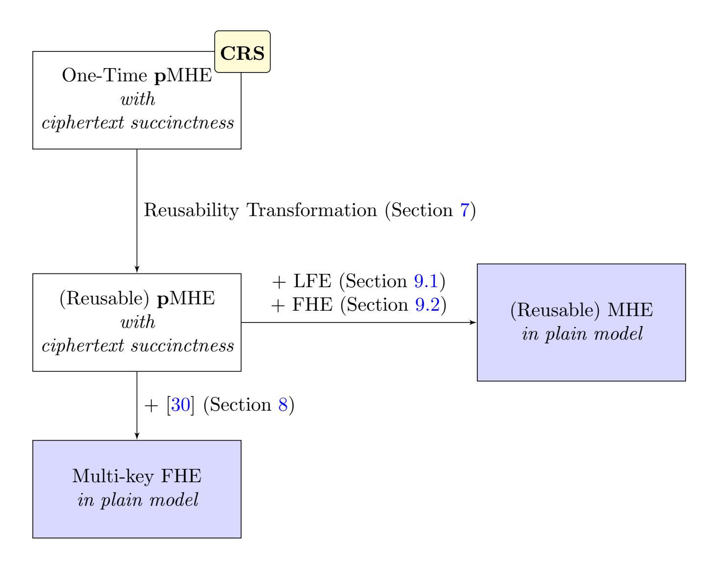
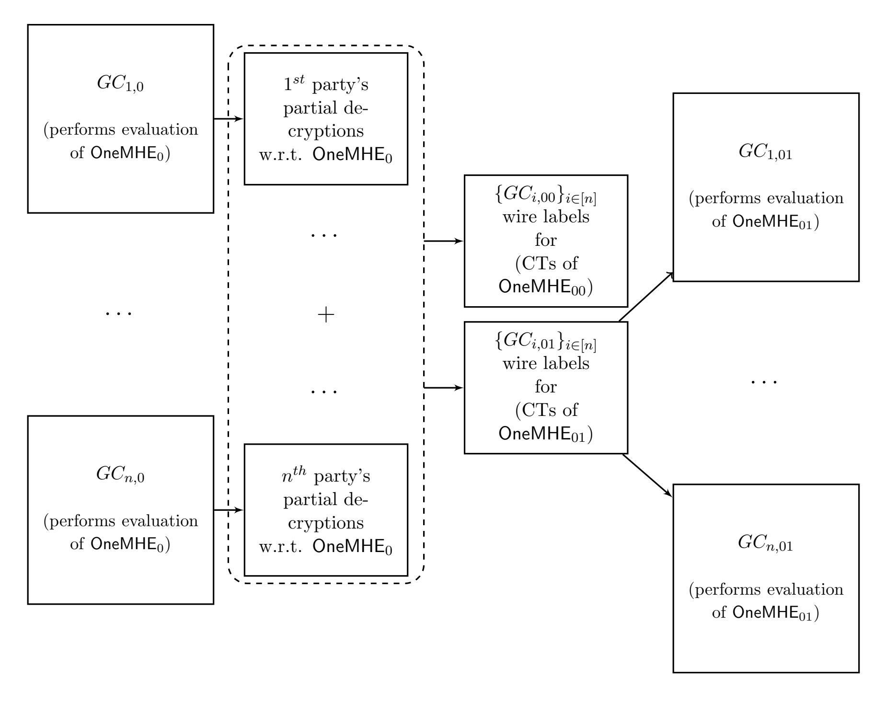

{0}------------------------------------------------

# <span id="page-0-0"></span>Multi-key Fully-Homomorphic Encryption in the Plain Model<sup>∗</sup>

Prabhanjan Ananth<sup>1</sup> , Abhishek Jain<sup>2</sup> , Zhengzhong Jin<sup>2</sup> , and Giulio Malavolta<sup>3</sup>

> <sup>1</sup>University of California Santa Barbara <sup>2</sup>Johns Hopkins University <sup>3</sup>Max Planck Institute for Security and Privacy

#### Abstract

The notion of multi-key fully homomorphic encryption (multi-key FHE) [L´opez-Alt, Tromer, Vaikuntanathan, STOC'12] was proposed as a generalization of fully homomorphic encryption to the multiparty setting. In a multi-key FHE scheme for n parties, each party can individually choose a key pair and use it to encrypt its own private input. Given n ciphertexts computed in this manner, the parties can homomorphically evaluate a circuit C over them to obtain a new ciphertext containing the output of C, which can then be decrypted via a decryption protocol. The key efficiency property is that the size of the (evaluated) ciphertext is independent of the size of the circuit.

Multi-key FHE with one-round decryption [Mukherjee and Wichs, Eurocrypt'16], has found several powerful applications in cryptography over the past few years. However, an important drawback of all such known schemes is that they require a trusted setup.

In this work, we address the problem of constructing multi-key FHE in the plain model. We obtain the following results:

- A multi-key FHE scheme with one-round decryption based on the hardness of learning with errors (LWE), ring LWE, and decisional small polynomial ratio (DSPR) problems.
- A variant of multi-key FHE where we relax the decryption algorithm to be non-compact i.e., where the decryption complexity can depend on the size of C – based on the hardness of LWE. We call this variant multi-homomorphic encryption (MHE). We observe that MHE is already sufficient for some applications of multi-key FHE.

# 1 Introduction

Fully-homomorphic encryption [\[22\]](#page-45-0) (FHE) allows one to compute on encrypted data. An important limitation of FHE is that it requires all of the data to be encrypted under the same public key in order to perform homomorphic evaluations. To circumvent this shortcoming, L´opez-Alt et al. [\[30\]](#page-45-1) proposed a multi-party extension of FHE, namely, multi-key FHE, where each party can sample a key pair (sk<sup>i</sup> , pk<sup>i</sup> ) locally and encrypt its message under its own public key. Then one can publicly evaluate any (polynomially computable) circuit over the resulting ciphertexts c<sup>i</sup> = Enc(pk<sup>i</sup> , mi), each encrypted under an independently sampled public key. Naturally, decrypting the resulting multi-key ciphertext requires one to know all the secret keys for the parties involved.

In this work we are interested in multi-key FHE schemes with a one-round decryption protocol: Given a multi-key ciphertext c = Enc((pk<sup>1</sup> , . . . , pk<sup>N</sup> ), C(m1, . . . , m<sup>N</sup> )), the decryption consists of (i)

<sup>∗</sup>This work subsumes [\[7\]](#page-43-0).

{1}------------------------------------------------

a local phase, where each party independently computes a decryption share p<sup>i</sup> using its secret key sk<sup>i</sup> , and a (ii) public phase, where the plaintext m can be publicly recovered from the decryption shares (p1, . . . , p<sup>N</sup> ).

Other than being an interesting primitive on its own, multi-key FHE with one-round (also referred to as "non-interactive") decryption implies a natural solution for secure multi-party computation (MPC) with optimal round complexity and communication complexity independent of the size of the circuit being computed [\[32\]](#page-45-2). Additionally, multi-key FHE with one-round decryption has proven to be a versatile tool to construct powerful cryptographic primitives, such as spooky encryption [\[19\]](#page-44-0), homomorphic secret sharing [\[12,](#page-44-1) [13\]](#page-44-2), obfuscation and functional encryption combiners [\[4,](#page-43-1) [5\]](#page-43-2), multiparty obfuscation [\[26\]](#page-45-3), homomorphic time-lock puzzles [\[31,](#page-45-4) [15\]](#page-44-3), and ad-hoc multi-input functional encryption [\[1\]](#page-43-3).

To the best of our knowledge, all known multi-key FHE schemes with one-round decryption assume a trusted setup [\[18,](#page-44-4) [32,](#page-45-2) [17,](#page-44-5) [33\]](#page-46-0) or require non-standard assumptions, such as the existence of sub-exponentially secure general-purpose obfuscation [\[19\]](#page-44-0). A major open question in this area (stated in [\[32,](#page-45-2) [17\]](#page-44-5)) is whether it is possible to avoid the use of a common setup and obtain a solution in the plain model.

### 1.1 Our Results

We present the first construction of a multi-key FHE with one-round decryption in the plain model, i.e. without a trusted setup, from standard assumptions over lattices. Specifically, we prove the following main theorem:

Theorem 1.1 (Informal). Assuming,

- Two-round semi-malicious oblivious transfer in the plain model,
- Multi-key FHE with trusted setup and one-round decryption and,
- Multi-key FHE in the plain model but with arbitrary round decryption,

there exists multi-key FHE in the plain model with one-round decryption.

A multi-key FHE with one-round decryption in the common reference string (CRS) model can be constructed assuming the hardness of the standard learning with errors (LWE) problem [\[18,](#page-44-4) [32\]](#page-45-2). Similarly, two-round semi-malicious oblivious transfer can also be instantiated assuming learning with errors [\[14\]](#page-44-6). On the other hand, a multi-key FHE scheme without setup, but with complex decryption, was proposed in [\[30\]](#page-45-1) assuming the hardness of the Ring LWE and the decisional small polynomial ratio (DSPR) problems,[1](#page-1-0) Thus, we obtain the following implication:

Theorem 1.2 (Informal). Assuming that the LWE, Ring LWE, and DSPR problems are hard, there exists a leveled multi-key FHE scheme in the plain model with one-round decryption. Additionally assuming circular security of our scheme, there exists multi-key FHE in the plain model with oneround decryption.

We remark that our compiler is completely generic in the choice of the scheme and thus can benefit from future development in the realm of multi-key FHE with multi-round decryption. We also point out that our construction achieves a relaxed security notion where, among other differences,

<span id="page-1-0"></span><sup>1</sup>These assumptions have been cryptanalyzed in [\[2,](#page-43-4) [28\]](#page-45-5), which affects the concrete choice of the parameters of the scheme. However, all known attacks (including these works) run in sub-exponential time. We refer the reader to [\[27\]](#page-45-6) for recommendations on the parameter choices for conjectured λ-bits of security.

{2}------------------------------------------------

we require computational indistinguishability of simulated decryption shares, whereas the works of [\[32,](#page-45-2) [17,](#page-44-5) [33\]](#page-46-0) achieved statistical indistinguishability (see Section [4](#page-12-0) for a precise statement). To the best of our knowledge, this definition suffices for known applications of multi-key FHE.

Multiparty Homomorphic Encryption. As a stepping stone towards our main result, we introduce the notion of multiparty homomorphic encryption (MHE). MHE is a variant of multikey FHE that retains its key virtue of communication efficiency but sacrifices on the efficiency of final output computation step. Specifically, the reconstruction of the message from the decryption shares is "non-compact", i.e. its computational complexity might depend on the size of the evaluated circuit. Crucially, we still require that the size of the (evaluated) ciphertexts is independent of size of the circuit. As we discuss below, MHE suffices for some applications of multi-key FHE, including a two-round MPC protocol where the first message depends only on the input of each party and can be reused for arbitrarily many evaluations of different circuits.

Note that unlike the case of (single-key) FHE, allowing for non-compact output computation does not trivialize the notion of MHE. Indeed, in the case of FHE, a trivial scheme with non-compact output computation can be obtained via any public-key encryption scheme by simply considering a decryption process that first recovers the plaintext and then evaluates the circuit to compute the output. Such an approach, however, does not extend to the multiparty setting since it would violate the security requirement of MHE (defined similarly to that of multi-key FHE).

We prove the following theorem:

Theorem 1.3 (Informal). Assuming the hardness of the LWE problem (with sub-exponential modulusto-noise ratio), there exists an MHE scheme in the plain model.

At a technical level, we develop a recursive self-synthesis transformation that lifts any one-time MHE scheme (i.e. where the first message can be securely used only for the evaluation of a single circuit) to an unbounded MHE. Our approach bears resemblance to and builds upon several seemingly unrelated works dating as far back as the construction of pseudorandom functions from pseudorandom generators [\[24\]](#page-45-7), as well as recent constructions of indistinguishability obfuscation from functional encryption [\[10,](#page-44-7) [6\]](#page-43-5) (and even more recently, constructions of identity-based encryption [\[21,](#page-45-8) [16\]](#page-44-8)).

Reusable MPC. A direct application of MHE is a two-round (semi-honest) MPC protocol in the plain model with the following two salient properties:

- The first round of the protocol, which only depends on the inputs of the parties, can be reused for an arbitrary number of computations. That is, after the completion of the first round, the parties can execute the second round multiple times, each time with a different circuit C` of their choice, to learn the output of C` over their fixed inputs.
- The communication complexity of the protocol is independent of the circuit size (and only depends on the circuit depth).

Alternately, we can use our multi-key FHE to achieve the same result with communication complexity independent of the circuit size, albeit based on stronger assumptions.

Previously, such a protocol – obtained via multi-key FHE – was only known in the CRS model [\[32\]](#page-45-2). Benhamouda and Lin [\[9\]](#page-44-9) recently investigated the problem of two-round reusable MPC (with circuit-size dependent communication) and give a construction for the same, in the plain model, based on bilinear maps.[2](#page-2-0) Our construction is based on a different assumption, namely, LWE, and therefore can be conjectured to satisfy post-quantum security.

<span id="page-2-0"></span><sup>2</sup>The authors communicated their result statement privately to us. A public version of their paper was not available at the time of first writing of this paper, but can now be found in [\[9\]](#page-44-9).

{3}------------------------------------------------

Concurrent Work on Reusable MPC. The work of Bartusek et al. [\[8\]](#page-43-6) investigate the question of two-round MPC with reusable first message. They propose schemes assuming the hardness of the DDH assumption over traditional groups. In contrast with our work, the resulting MPC is noncompact, i.e. the communication complexity is proportional to the size of the circuit. Moreover, unlike [\[8\]](#page-43-6), our scheme can be conjectured to be secure against quantum adversaries.

### 1.2 Open Problems

Our work leaves open some interesting directions for future research. The most compelling problem is to construct a multi-key FHE with one-round decryption assuming only the hardness of the (plain) LWE problem. Another relevant direction is to improve the practical efficiency of our proposal and to obtain a more "direct" construction of multi-key FHE from lattice assumptions.

# 2 Technical Overview

Towards constructing both multi-key FHE and MHE, we first consider a relaxed notion of MHE where the evaluation algorithm is allowed to be private; we call this notion pMHE.

MHE with Private Evaluation (pMHE). An MHE scheme with private evaluation, associated with n parties, consists of the following algorithms:

- Encryption: The i th party, for i ∈ [n], on input x<sup>i</sup> produces a ciphertext ct<sup>i</sup> and secret key sk<sup>i</sup> .
- Evaluation: The i th party on input all the ciphertexts ct1, . . . , ct<sup>N</sup> , secret key sk<sup>i</sup> , and circuit C, it evaluates the ciphertexts to obtain a partial decrypted value p<sup>i</sup> . We emphasize that the i th party requires sk<sup>i</sup> for its evaluation and thus is not a public operation.
- Final Decryption: Given all the partial decrypted values (p1, . . . , p<sup>N</sup> ) and the circuit C, reconstruct the output C(x1, . . . , x<sup>N</sup> ).

Towards obtaining our main results, we will also sometimes consider a version of pMHE in the CRS model, where the encryption, evaluation and the final decryption algorithms additionally take as input a CRS, generated by a trusted setup. Furthermore, we will also consider pMHE schemes with an efficiency property that we refer to as ciphertext succinctness. We postpone defining this property to later in this section.

Roadmap of our Approach. Using the abstraction of pMHE, we achieve both of our results as illustrated in Figure [1:](#page-4-0)

- The starting point of our approach is a one-time pMHE, namely, a pMHE scheme where the initial ciphertexts, i.e., encryptions of x<sup>i</sup> for every i ∈ [n], can be evaluated upon only once. The first step in our approach, involving the technical bulk of our work, is a reusability transformation that takes a one-time pMHE in the CRS model and converts it into a pMHE scheme (in the plain model), that allows for (unbounded) polynomially-many homomorphic evaluations (of different circuits) over the initial ciphertexts. We outline this in Section [2.1.](#page-4-1)
- We next describe two different transformations: The first transformation converts a pMHE scheme to multi-key FHE (Section [2.2\)](#page-8-0) and the second transformation converts it to an MHE scheme (Section [2.3\)](#page-9-0).
- Finally, in Section [2.4,](#page-9-1) we discuss instantiation of one-time pMHE.

{4}------------------------------------------------



<span id="page-4-0"></span>Figure 1: Our Approach

### <span id="page-4-1"></span>2.1 Reusability Transformation

We now proceed to describe our reusability transformation from a one-time pMHE scheme in the CRS model to a (reusable) pMHE scheme in the plain model. We will in fact first consider the simpler problem of obtaining a pMHE scheme in the CRS model. Later, we show how we can modify the transformation to get rid of the CRS.

Reusability: Naive Attempt. Let OneMHE denote a one-time pMHE scheme. Using two instantiations of OneMHE that we call OneMHE<sup>0</sup> and OneMHE1, we first attempt to build an pMHE scheme for a circuit class C = {C0, C1} that allows for only two decryption queries, denoted by TwoMHE.

- The i th party, for i ∈ [N], on input x<sup>i</sup> , produces two ciphertexts ct<sup>i</sup> 0 and ct<sup>i</sup> 1 , where ct<sup>i</sup> 0 is computed by encrypting x<sup>i</sup> using OneMHE<sup>0</sup> and ct<sup>1</sup> is computed by encrypting x<sup>i</sup> using OneMHE1.
- To evaluate a circuit Cb, for b ∈ {0, 1}, run the evaluation procedure of OneMHE<sup>b</sup> to obtain the partial decrypted values.
- The final decryption on input C<sup>b</sup> and partial decrypted values produces the output.

It is easy to see that the above scheme supports two decryption queries. While the above template can be generalized if C consists of polynomially many circuits; every circuit in C is associated with an instantiation of OneMHE. However, it is clear that this approach does not scale when C consists of exponentially many circuits.

Recursive Self-Synthesis. Instead of generating all the instantiations of OneMHE during the encryption phase, as is done in TwoMHE, our main insight is to instead defer the generation of the 

{5}------------------------------------------------

instantiations of OneMHE to the evaluation phase. The advantage of this approach is that, during the evaluation phase, we know exactly which circuit is being evaluated and thus we can afford to be frugal and only generate the instantiations of OneMHE that are necessary, based on the description of this circuit. The idea of bootstrapping a "one-time" secure scheme into a "multi-time" secure scheme is not new and has been studied in different contexts in cryptography; be it the classical result on pseudorandom functions from pseudorandom generators [\[25\]](#page-45-9) or the more recent results on indistinguishability from functional encryption [\[6,](#page-43-5) [11,](#page-44-10) [29\]](#page-45-10) and constructions of identity-based encryption [\[21,](#page-45-8) [16,](#page-44-8) [20\]](#page-44-11). In particular, as we will see soon, our implementation of deferring the executions of OneMHE and only invoke the instantiations as needed bears some resemblance to techniques developed in these works, albeit in a very different context.

Illustration. Before explaining our approach to handle any polynomial number of decryption queries, we start with the same example as before: The goal is to build pMHE scheme for a circuit class C = {C0, C1} that allows for 2 decryption queries. The difference, however, is, unlike before, the approach we describe below will scale to exponentially many circuits.

We employ a tree-based approach to solve this problem. The tree associated with this scheme consists of three nodes: a root and two leaves. The first leaf is associated with the circuit C<sup>0</sup> and the second leaf is associated with the circuit C1. Every node is associated with an instantiation of the one-time pMHE scheme. Denote the one-time pMHE scheme associated with the root to be OneMHE⊥, with the left leaf to be OneMHE<sup>0</sup> and the right leaf node to be OneMHE1.

Armed with the above notation, we now present an overview of construction of a pMHE scheme for C = {C0, C1} allowing for 2 decryption queries as follows:

- The i th party, for i ∈ [N], on input x<sup>i</sup> , produces the ciphertext ct<sup>i</sup> ⊥ , where ct<sup>i</sup> ⊥ is computed by encrypting x<sup>i</sup> using OneMHE⊥.
- To evaluate a circuit Cb, for b ∈ {0, 1}, the i th party does the following:
  - First run the evaluation procedure of OneMHE<sup>⊥</sup> on input circuit C<sup>⊥</sup> (defined below) to obtain the i th partial decrypted value associated with OneMHE⊥.

Denote C<sup>⊥</sup> to be the circuit[3](#page-5-0) that takes as input (x1, . . . , x<sup>N</sup> ) and produces: (i) GCi,<sup>0</sup> wire labels for OneMHE<sup>0</sup> ciphertext of x<sup>i</sup> under the i th party's secret key, for every i, and, (ii) GCi,<sup>1</sup> wire labels for OneMHE<sup>1</sup> ciphertext of x<sup>i</sup> under the i th party's secret key, for every i.

– It computes a garbled circuit GCi,b defined below.

Denote GCi,b to be the garbling of a circuit that takes as input OneMHE<sup>b</sup> ciphertexts of x1, . . . , x<sup>N</sup> , performs evaluation of C<sup>b</sup> using the i th secret key associated with OneMHE<sup>b</sup> and outputs the OneMHE<sup>b</sup> partial decryption values.

Output the i th partial decrypted value of OneMHE<sup>⊥</sup> and the garbled circuit GCi,b.

- The final decryption algorithm takes as input the OneMHE<sup>⊥</sup> partial decryption values from all the parties, garbled circuits GC1,b, . . . , GCN,b, circuit C<sup>b</sup> (to be evaluated) and performs the following operations:
  - It first runs the final decryption procedure of OneMHE<sup>⊥</sup> to obtain the wire labels corresponding to all the garbled circuits GC1,b, . . . , GCN,b.

<span id="page-5-0"></span><sup>3</sup>We consider the setting where the circuit is randomized; this is without loss of generality since we can assume that the randomness for this circuit is supplied by the parties

{6}------------------------------------------------

- It then evaluates all the garbled circuits to obtain the OneMHE<sup>b</sup> partial decryption values.
- Using the OneMHE<sup>b</sup> partial decryption values, compute the final decryption procedure of OneMHE<sup>b</sup> to obtain Cb(x1, . . . , x<sup>N</sup> ).

Full-Fledged Tree-Based Approach. We can generalize the above approach to construct a pMHE scheme for any circuit class and that handles any polynomially many queries. If s is the maximum size of the circuit in the class of circuits, we consider a binary tree of depth s.

- Every edge in the tree is labeled. If an edge e is incident from the parent to its left child then label it with 0 and if e is incident from the parent to its right child then label it with 1.
- Every node in the tree is labeled. The label is the concatenation of all the edge labels on the path from the root to the node.
- Every leaf is associated with a circuit of size s.

With each node v, associate with v a new instantiation of a one-time pMHE scheme, that we denote by OneMHEl(v) , where l(v) is the label associated with node v. If v is the root node l(v) = ⊥.

Informally, the encryption algorithm of pMHE generates OneMHE<sup>⊥</sup> encryption of x<sup>i</sup> under the i th secret key. During the evaluation procedure, on input C, each party generates s garbled circuits, one for every node on the path from the root to the leaf labeled with C. The role of these garbled circuits is to delegate the computation of the partial decrypted values to the final decryption phase. In more detail, the garbled circuit associated with the node v computes the partial decrypted values associated with OneMHEl(v) . The partial decryption values will be generated by homomorphically evaluating the following circuit: (i) the wire labels, associated with OneMHElv||<sup>0</sup> encryptions of x1, . . . , x<sup>N</sup> , of all the N garbled circuits associated with the node v||0 and, (ii) the wire labels, associated with OneMHElv||<sup>1</sup> encryptions of x1, . . . , x<sup>N</sup> , of all the N garbled circuits associated with the node v||1. Note that the homomorphic evaluation is performed inside the garbled circuit.

During the final decryption, starting from the root node, each garbled circuit (of every party) is evaluated to obtain wire labels of the garbled circuit associated with the child node on the path from the root to the leaf labelled with C. Finally, the garbled circuit associated with the leaf labelled with C is then evaluated to obtain the OneMHE<sup>C</sup> partial decrypted values. These partial decrypted values are then decoded to recover the final output C(x1, . . . , x<sup>N</sup> ).

We give an overview of the final decryption process in Figure [2.](#page-7-0)

Efficiency Challenges. To argue that the above scheme is a pMHE scheme, we should at the very least argue that the encryption, evaluation and final decryption algorithms can be executed in polynomial time. Let us first argue that all the garbled circuits can be computed in polynomial time by the i th party. The time to compute the garbled circuit associated with the root node is polynomial in the time to compute OneMHE<sup>0</sup> and OneMHE<sup>1</sup> ciphertexts. Even if the time to compute OneMHE<sup>0</sup> and OneMHE<sup>1</sup> ciphertexts only grows proportional to the depth of the circuits being evaluated, the recursion would already blow up the size of the first garbled circuit to be exponential in s! This suggests that we need to define a suitable succinctness property on OneMHE in order to make the above transformation work.

Identifying the Necessary Efficiency for Recursion. To make the above recursion idea work, we impose a stringent efficiency constraint on the encryption complexity of OneMHE. In particular, we require two properties to hold:

{7}------------------------------------------------



<span id="page-7-0"></span>Figure 2: A glimpse of the final decryption process of the reusable pMHE scheme when evaluated upon the circuit with the boolean representation C = 01 · · · . During the evaluation process, the i th party generates the garbled circuits GCi,0, GCi,01, · · · , GCi,C as part of the partial decrypted values. The garbled circuit GCi,l(v) , associated with the prefix l(v) of C, computes the evaluation procedure of OneMHEl(v) . The output of final decryption of OneMHEl(v) are (i) the wire labels of GCi,l(v)||<sup>0</sup> , for every i ∈ [n], of the encryptions of all the inputs of the parties, x1, . . . , x<sup>N</sup> generated with respect to OneMHEl(v)||<sup>0</sup> and, (ii) the wire labels of GCi,l(v)||<sup>1</sup> , for every i ∈ [n], for the encryptions of all the inputs of the parties, x1, . . . , x<sup>N</sup> generated with respect to OneMHEl(v)||<sup>1</sup> .

- 1. The size of the encryption circuit is a polynomial in the security parameter λ, the number of parties, the input length, and the depth of the circuit.
- 2. The depth of the encryption circuit OneMHE grows polynomially in λ, the number of parties and and the input length.

Put together, we refer to the above efficiency properties as ciphertext succinctness. It turns out that if we have an OneMHE scheme with ciphertext succinctness, then the resulting reusable pMHE scheme has polynomial efficiency and moreover, the ciphertext sizes in the resulting scheme are polynomial in the security parameter alone.[4](#page-7-1)

<span id="page-7-1"></span><sup>4</sup>An informed reader may wish to draw an analogy to recent works that devise recursive strategies to build indistinguishability obfuscation from functional encryption [\[6,](#page-43-5) [11,](#page-44-10) [29\]](#page-45-10). These works show that a functional encryption scheme with a sufficiently compact encryption procedure (roughly, where the complexity of encryption is sublinear in

{8}------------------------------------------------

Removing the CRS. Note that if we start with OneMHE in the CRS model, we end up with reusable pMHE scheme still in the CRS model. However, our goal was to construct a pMHE in the plain model. To fix this, we revisit the tree-based approach to construct pMHE and make two important changes.

The first change is the following: Instead of instantiating the root node with a OneMHE scheme satisfying ciphertext succinctness, we instantiate it by a OneMHE scheme that need not satisfy any succinctness property (and thus can be instantiated by *any* semi-malicious MPC in the plain model); if we work out the recursion analysis carefully it turns out that its not necessary that the OneMHE scheme associated with the root node satisfy ciphertext succinctness. The intermediate nodes, however, still need to satisfy ciphertext succinctness and thus need to be instantiated using OneMHE in the CRS model.

Since the intermediate nodes still require a CRS, we make the parent node generate the CRS for its children. That is, upon evaluating the partial decryption values output by a garbled circuit associated with node v (see Figure 2 for reference), we obtain: (i) wire labels for  $\mathsf{crs}_{\mathsf{l}v||0}$  and the  $\mathsf{OneMHE}_{\mathsf{l}(v)||0}$  ciphertexts computed with respect to the common reference string  $\mathsf{crs}_{\mathsf{l}(v)||0}$  and, (ii) wire labels for  $\mathsf{crs}_{\mathsf{l}v||1}$  and  $\mathsf{OneMHE}_{\mathsf{l}(v)||1}$  ciphertexts computed with respect to the common reference string  $\mathsf{crs}_{\mathsf{l}(v)||1}$ . That is, the circuit being homomorphically evaluated by  $\mathsf{OneMHE}_{\mathsf{l}(v)}$  first generates  $\mathsf{crs}_{\mathsf{l}(v)||0}$ ,  $\mathsf{crs}_{\mathsf{l}(v)||1}$ , then generates the  $\mathsf{OneMHE}_{\mathsf{l}(v)||0}$ ,  $\mathsf{OneMHE}_{\mathsf{l}(v)||1}$  ciphertexts followed by generating wire labels for these ciphertexts. This is the reason why we require the root node to be associated with a  $\mathsf{OneMHE}$  scheme in the plain model; if not, its unclear how we would be able to generate the CRS for the root node.

### <span id="page-8-0"></span>2.2 From pMHE to Multi-key FHE

Once we obtain a reusable pMHE in the plain model, our main result follows from a simple boot-strapping procedure. Our transformation lifts a multi-key FHE scheme in the plain model with "complex" (i.e. not one-round) decryption to a multi-key FHE in the plain model with one-round decryption, by additionally assuming the existence of a reusable pMHE. Plugging the scheme from [30] into our compiler yields our main result.

The high-level idea of our transformation is to use the pMHE scheme to securely evaluate the decryption circuit (no matter how complex is) of input the multi-key FHE. This allows us to combine the *compactness* of the multi-key FHE and the *one-round decryption* of the pMHE into a single scheme that inherits the best of both worlds. More concretely, our compiled scheme looks as follows.

- **Key Generation**: The *i*-th party runs the key generation algorithm of the underlying multikey FHE to obtain a key pair  $(pk_i, sk_i)$ , then computes the pMHE encryption of  $sk_i$  to obtain a ciphertext  $\tilde{ct}_i$  and an secret evaluation key  $\tilde{sk}_i$ . The public key is set to  $(pk_i, \tilde{ct}_i)$ .
- Encryption: To encrypt a message  $m_i$ , the *i*-th party simply runs the encryption algorithm of the multi-key FHE scheme to obtain a ciphertext  $\mathsf{ct}_i$ .
- Evaluation: On input the ciphertexts  $\mathsf{ct}_1, \ldots, \mathsf{ct}_N$  and a circuit C, the i-th party runs the (deterministic) multi-key evaluation algorithm to obtain an evaluated ciphertext  $\mathsf{ct}$ . Then each party runs the evaluation algorithm of the pMHE scheme for the circuit

$$\Gamma(\mathsf{sk}_1,\ldots,\mathsf{sk}_N) = \mathsf{Dec}((\mathsf{sk}_i,\ldots,\mathsf{sk}_N),\mathsf{ct})$$

the size of the circuit) can be used to build an indistinguishability obfuscation scheme. In a similar vein, ciphertext succinctness can be seen as the necessary efficiency notion for driving the recursion in our setting without blowing up efficiency.

{9}------------------------------------------------

over the pMHE ciphertexts  $\tilde{\mathsf{ct}}_1, \ldots, \tilde{\mathsf{ct}}_N$ , where the value  $\mathsf{ct}$  is hardwired in the circuit. The *i*-th party returns the corresponding output  $p_i$ .

• **Final Decryption**: Given the description of the circuit  $\Gamma$  (which is known to all parties) and the decryption shares  $(p_1, \ldots, p_N)$ , reconstruct the output using the final decryption algorithm of pMHE.

We stress that, in order to achieve the functionality of a multi-key FHE scheme, it is imperative that the underlying pMHE scheme has reusable ciphertexts, which was indeed the main challenge for our construction. It is important to observe that even thought the pMHE scheme does not have a compact decryption algorithm, this does not affect the compactness of the complied scheme. This is because the size of the circuit  $\Gamma$  is independent of the size of the evaluated circuit C, by the compactness of the underlying multi-key FHE scheme.

### <span id="page-9-0"></span>2.3 From pMHE to MHE

Equipped with pMHE, we discuss how to construct a full-fledged MHE scheme. There are two hurdles we need to cross to obtain this application. The first being the fact that pMHE only supports private evaluation and the second being that pMHE only satisfies ciphertext succinctness and in particular, could have large partial decryption values.

We address the second problem by applying a compiler that generically transforms a pMHE scheme with large partial decryption values into a scheme with succinct partial decryption values; that is, one that only grows proportional to the input, output lengths and the depth of the circuit being evaluated. Such compilers, that we refer to as *low communication* compilers were recently studied in the context of two-round secure MPC protocols [34, 3] and we adapt them to our setting. Once we apply such a compiler, we achieve our desired pMHE scheme that satisfies the required efficiency property.

To achieve an MHE scheme with public evaluation, we use a (single-key) leveled FHE scheme. Each party encrypts its secret key using FHE, that is, the  $i^{th}$  party generates an FHE key pair  $(pk_i, sk_i)$  and encrypts the  $i^{th}$  secret key of pMHE under  $pk_i$ ; we denote the resulting ciphertext as FHE.ct<sub>i</sub>. The  $i^{th}$  party ciphertext of the MHE scheme (MHE.ct<sub>i</sub>) now consists of the  $i^{th}$  party ciphertext of the pMHE scheme (pMHE.ct<sub>i</sub>) along with FHE.ct<sub>i</sub>. The public evaluation of MHE now consists of homomorphically evaluating the pMHE private evaluation circuit, with  $(C, pMHE.ct_1, ..., pMHE.ct_N)$  hardwired, on the ciphertext FHE.ct<sub>i</sub>. Since this is performed for each party, there are N resulting FHE ciphertexts (FHE.ct<sub>1</sub>,..., FHE.ct<sub>N</sub>). During the partial decryption phase, the  $i^{th}$  party decrypts FHE.ct<sub>i</sub> using  $sk_i$  to obtain the partial decryption value corresponds to the pMHE scheme. The final decryption of MHE is the same as the final decryption of pMHE.

### <span id="page-9-1"></span>2.4 Instantiating One-Time pMHE in the CRS model

So far we have shown that one-time pMHE suffices to achieve both of our results. All that remains is to instantiate the one-time pMHE in the CRS model. We instantiate this using the multi-key FHE scheme with one-round decryption in the CRS model. A sequence of works [18, 32, 17] have presented a construction of such a scheme based on the LWE problem.

{10}------------------------------------------------

### 3 Preliminaries

We denote the security parameter by  $\lambda$ . We focus only on boolean circuits in this work. For any circuit C, let C.in, C.out, C.depth be the input length, output length and depth of the circuit C, respectively. Denote C.params = (C.in, C.out, C.depth).

For any totally ordered sets  $S_1, S_2, \ldots, S_n$ , and any tuple  $(i_1^*, i_2^*, \ldots, i_n^*) \in S_1 \times S_2 \times \cdots \times S_n$ , we use the notation  $(i_1^*, i_2^*, \ldots, i_n^*) + 1$  (resp.  $(i_1^*, i_2^*, \ldots, i_n^*) - 1$ ) to denote the lexicographical smallest (resp. biggest) element in  $S_1 \times S_2 \times \cdots \times S_n$  that is lexicographical greater (resp. less) than  $(i_1^*, i_2^*, \ldots, i_n^*)$ .

**Pseudorandom Generators.** We recall the definition of pseudorandom generators. A function  $\mathsf{PRG}_{\lambda}: \{0,1\}^{\mathsf{PRG.in}_{\lambda}} \to \{0,1\}^{\mathsf{PRG.out}_{\lambda}}$  is a pseduorandom generator, if for any PPT distinguisher  $\mathcal{D}$ , there exits a negligible function  $\nu(\lambda)$  such that

$$\left|\Pr\left[s\leftarrow\{0,1\}^{\mathsf{PRG}.\mathsf{in}_{\lambda}}:\mathcal{D}(1^{\lambda},\mathsf{PRG}_{\lambda}(s))=1\right]-\Pr\left[u\leftarrow\{0,1\}^{\mathsf{PRG}.\mathsf{out}_{\lambda}}:\mathcal{D}(1^{\lambda},u)=1\right]\right|<\nu(\lambda).$$

**Learning with Errors.** We recall the learning with errors (LWE) distribution.

**Definition 3.1** (LWE distribution). For a positive integer dimension n and modulo q, the LWE distribution  $A_{\mathbf{s},\chi}$  is obtained by sampling  $\mathbf{a} \leftarrow \mathbb{Z}_q^n$ , and an error  $e \leftarrow \chi$ , then outputting  $(\mathbf{a}, b = \mathbf{s}^T \cdot \mathbf{a} + e) \in \mathbb{Z}_q^n \times \mathbb{Z}_q$ .

**Definition 3.2** (LWE problem). The decisional LWE<sub>n,m,q,\chi</sub> problem is to distinguish the uniform distribution from the distribution  $A_{\mathbf{s},\chi}$ , where  $\mathbf{s} \leftarrow \mathbb{Z}_q^n$ , and the distinguisher is given m samples.

Standard instantiation of LWE takes  $\chi$  to be a discrete Gaussian distribution.

**Definition 3.3** (LWE assumption). Let  $n = n(\lambda), m = m(\lambda), q = q(\lambda)$  and  $\chi = \chi(\lambda)$ . The Learning with Error (LWE) assumption states that for any PPT distinguisher  $\mathcal{D}$ , there exits a negligible function  $\nu(\lambda)$  such that

$$|\Pr[\mathcal{D}(1^{\lambda}, (\mathbf{A}, \mathbf{s}^T \mathbf{A} + \mathbf{e})) = 1] - \Pr[\mathcal{D}(1^{\lambda}, (\mathbf{A}, \mathbf{u})) = 1]| < \nu(\lambda)$$

where  $\mathbf{A} \leftarrow \mathbb{Z}_q^{n \times m}, \mathbf{s} \leftarrow \mathbb{Z}_q^n, \mathbf{u} \leftarrow \mathbb{Z}_q^m, \mathbf{e} \leftarrow \chi^m$ .

#### 3.1 Garbling Schemes

A garbling scheme [35] is a tuple of algorithms (GC.Garble, GC.Eval) defined as follows.

- $\mathsf{GC.Garble}(1^{\lambda}, C, \mathsf{lab})$  On input the security parameter, a circuit C, and a set of labels  $\mathsf{lab} = \{\mathsf{lab}_{i,b}\}$   $\{i \in [C.\mathsf{in}], b \in \{0,1\}^{\lambda}, it \text{ outputs a garbled circuit } \widetilde{C}.$
- $\mathsf{GC.Eval}(\widetilde{C},\mathsf{lab})$  On input a garbled circuit  $\widetilde{C}$  and a set of labels  $\mathsf{lab} = \{\mathsf{lab}_i\}_{i \in [C.\mathsf{in}]}$ , it outputs a value y.

We require the garbling scheme to satisfy the following properties.

**Correctness** For any circuit C, and any input  $x \in \{0,1\}^{C.\text{in}}$ ,

$$\Pr\left[ \begin{smallmatrix} \mathsf{lab} = \{\mathsf{lab}_{i,b}\}_{(i,b) \in [C.\mathsf{in}] \times \{0,1\}} \leftarrow \{0,1\}^{2\lambda C.\mathsf{in}}, \\ \widetilde{C} \leftarrow \mathsf{GC}.\mathsf{Garble}(1^{\lambda},C,\mathsf{lab}), y \leftarrow \mathsf{GC}.\mathsf{Eval}(\widetilde{C},(\mathsf{lab}_{i,x_i})_{i \in [C.\mathsf{in}]}) : y = C(x) \end{smallmatrix} \right] = 1.$$

{11}------------------------------------------------

**Simulation Security** There exits a simulator  $Sim = (Sim_1, Sim_2)$  such that, for any input x, any circuit C, and any non-uniform PPT distinguisher  $\mathcal{D}$ , we have

$$\left| \operatorname{Pr} \left[ \mathsf{lab} \leftarrow \{0,1\}^{2\lambda C.\mathsf{in}}, \widetilde{C} \leftarrow \mathsf{GC.Garble}(1^{\lambda}, C, \mathsf{lab}) : \mathcal{D}(1^{\lambda}, \mathsf{lab}_{x}, \widetilde{C}) = 1 \right] - \right| \\ \operatorname{Pr} \left[ (\mathsf{st}_{S}, \widetilde{\mathsf{lab}}) \leftarrow \mathsf{Sim}_{1}(1^{\lambda}, C.\mathsf{params}), \widetilde{C} \leftarrow \mathsf{Sim}_{2}(\mathsf{st}_{S}, C(x)) : \mathcal{D}(1^{\lambda}, \widetilde{\mathsf{lab}}, \widetilde{C}) = 1 \right] \right| < \nu(\lambda).$$

**Theorem 3.4** ([35]). There exists a garbling scheme for all poly-sized circuits from one-way functions.

**Remark 3.5.** For the ease of representation, for any labels  $\mathsf{lab} = \{\mathsf{lab}_{i,b}\}_{i \in [n], b \in \{0,1\}}$ , and any input  $x \in \{0,1\}^n$ , we denote  $\mathsf{lab}_x = \{\mathsf{lab}_{i,x_i}\}_{i \in [n]}$ .

### <span id="page-11-0"></span>3.2 Laconic Function Evaluation

A laconic function evaluation (LFE) scheme [34] for a class of poly-sized circuits consists of four PPT algorithms crsGen, Compress, Enc, Dec described below.

 $\mathsf{crsGen}(1^{\lambda},\mathsf{params})$  It takes as input the security parameter  $\lambda$ , circuit parameters  $\mathsf{params}$  and outputs a uniformly random common string  $\mathsf{crs}$ .

Compress(crs, C) It takes as input the common random string crs, poly-sized circuit C and outputs a digest digest C. This is a deterministic algorithm.

 $\mathsf{Enc}(\mathsf{crs},\mathsf{digest}_C,x)$  It takes as input the common random string  $\mathsf{crs},$  a digest  $\mathsf{digest}_C,$  a message x and outputs a ciphertext  $\mathsf{ct}.$ 

 $\mathsf{Dec}(\mathsf{crs}, C, \mathsf{ct})$  It takes as input the common random string  $\mathsf{crs}$ , circuit C, ciphertext  $\mathsf{ct}$  and outputs a message y.

**Correctness.** We require the following to hold:

$$\Pr \begin{bmatrix} \operatorname{crs} \leftarrow \operatorname{crsGen}(1^{\lambda}, \operatorname{params}) \\ \operatorname{digest}_{C} \leftarrow \operatorname{Compress}(\operatorname{crs}, C) \\ \operatorname{ct} \leftarrow \operatorname{Enc}(\operatorname{crs}, \operatorname{digest}_{C}, x) \\ y \leftarrow \operatorname{Dec}(\operatorname{crs}, C, \operatorname{ct}) \end{bmatrix} = 1.$$

**Efficiency.** The size of CRS should be polynomial in  $\lambda$ , the input, output lengths and the depth of C. The size of digest, namely  $\mathsf{digest}_C$ , should be polynomial in  $\lambda$ , the input, output lengths and the depth of C. The size of the output of  $\mathsf{Enc}(\mathsf{crs},\mathsf{digest}_C)$  should be polynomial in  $\lambda$ , the input, output lengths and the depth of C.

**Security.** For every PPT adversary  $\mathcal{A}$ , input x, circuit C, there exists a PPT simulator Sim such that for every PPT distinguisher  $\mathcal{D}$ , there exists a negligible function  $\nu(\lambda)$  such that

$$\left| \begin{array}{l} \Pr_{\substack{\mathsf{crs} \leftarrow \mathsf{crs}\mathsf{Gen}(1^\lambda,\mathsf{params}) \\ \mathsf{digest}_C \leftarrow \mathsf{Compress}(\mathsf{crs},C)}} \left[ 1 \leftarrow \mathcal{D}\left(1^\lambda,\mathsf{crs},\mathsf{digest}_C,\mathsf{Enc}(\mathsf{crs},\mathsf{digest}_C,x)\right) \right] - \\ \Pr_{\substack{\mathsf{crs} \leftarrow \mathsf{crs}\mathsf{Gen}(1^\lambda,\mathsf{params}) \\ \mathsf{digest}_C \leftarrow \mathsf{Compress}(\mathsf{crs},C)}} \left[ 1 \leftarrow \mathcal{D}\left(1^\lambda,\mathsf{crs},\mathsf{digest}_C,\mathsf{Sim}(\mathsf{crs},\mathsf{digest}_C,C(x))\right) \right] \right| < \nu(\lambda).$$

**Remark 3.6.** A strong version of security, termed as adaptive security, was defined in [34]; for our construction, selective security suffices.

**Theorem 3.7** ([34]). Assuming the hardness of learning with errors, there exists a laconic function evaluation protocol.

{12}------------------------------------------------

# <span id="page-12-0"></span>4 Multi-Key Fully Homomorphic Encryption

A multi-key FHE [30] allows one to compute functions over ciphertexts encrypted under different and independently sampled keys. One can then decrypt the result of the computation by gathering together the corresponding secret keys and run a decryption algorithm. In this work we explicitly distinguish between two families of schemes, depending on structural properties of the decryption algorithm.

- One-Round Decryption: The decryption algorithm consists of two subroutines (i) a local phase (PartDec) where each party computes a decryption share of the ciphertext based only on its secret key and (ii) a public phase (FinDec) where the plaintext can be publicly reconstructed from the decryption shares. This variant is the focus of our work.
- Unstructured Decryption: The decryption is a (possibly interactive) protocol that takes as input a ciphertext and all secret keys and returns the underlying plaintext. No special structural requirements are imposed.

In this work we are interested in constructing the former. However, the latter is going to be a useful building block in our transformation. More formally, a multi-key FHE is a tuple of algorithms MKFHE = (KeyGen, Enc, Eval, Dec) defined as follows.

- KeyGen $(1^{\lambda}, i)$  On input the security parameter  $\lambda$ , and an index  $i \in [N]$ , it outputs a public-key secret-key pair  $(\mathsf{pk}_i, \mathsf{sk}_i)$  for the *i*-th party.
- $\mathsf{Enc}(\mathsf{pk}_i, x_i)$  On input a public key  $\mathsf{pk}_i$  of the *i*-th party, and a message  $x_i$ , it outputs a ciphertext  $\mathsf{ct}_i$ .
- $\mathsf{Eval}(C,(\mathsf{ct}_j)_{j\in[N]})$  On input the circuit C of size polynomial in  $\lambda$  and the ciphertexts  $(\mathsf{ct}_j)_{j\in[N]}$ , it outputs the evaluated ciphertext  $\widehat{\mathsf{ct}}$ .
- $\mathsf{Dec}((\mathsf{sk}_j)_{j\in[N]},\widehat{\mathsf{ct}})$  On input a set of keys  $\mathsf{sk}_1,\ldots,\mathsf{sk}_N$  and the evaluated ciphertext  $\widehat{\mathsf{ct}}$ , it outputs a value  $y\in\{0,1\}^{C.\mathsf{out}}$ . We say that a multi-key FHE has a *one-round decryption* if the decryption protocol consists of the algorithms PartDec and FinDec with the following syntax.
  - $\mathsf{PartDec}(\mathsf{sk}_i, i, \widehat{\mathsf{ct}})$  On input the secret key  $\mathsf{sk}_i$  of  $i^{th}$  party, the index i, and the evaluated ciphertext  $\widehat{\mathsf{ct}}$ , it outputs the partial decryption  $p_i$  of the  $i^{th}$  party.
  - $\mathsf{FinDec}(C,(p_j)_{j\in[N]})$  On input all the partial decryptions  $(p_j)_{j\in[N]}$ , it outputs a value  $y\in\{0,1\}^{C.\mathsf{out}}$ .

We say that the scheme is fully homomorphic if it is homomorphic for P/poly.

**Trusted Setup.** We also consider multi-key FHE schemes in the presence of a trusted setup, in which case we also include an algorithm **Setup** that, on input the security parameter  $1^{\lambda}$ , outputs a common reference string **crs** that is given as input to all algorithms.

Correctness. We define correctness for multi-key FHE with one-round decryption, the more general notion can be obtained by modifying our definition in a natural way. Note that we only define correctness for a single application (single-hop) of the homomorphic evaluation procedure. It is well known that (multi-key) FHE schemes can be generically converted to satisfy the more general notion of multi-hop correctness [23].

{13}------------------------------------------------

**Definition 4.1** (Correctness). A scheme MKFHE = (KeyGen, Enc, Eval, PartDec, FinDec) is said to satisfy the correctness of an MHE scheme if for any inputs  $(x_i)_{i \in [N]}$ , and circuit C, the following holds:

$$\Pr \begin{bmatrix} \forall i \in [N], (\mathsf{pk}_i, \mathsf{sk}_i) \leftarrow \mathsf{KeyGen}(1^\lambda, i) \\ \mathsf{ct}_i \leftarrow \mathsf{Enc}(\mathsf{pk}_i, x_i) \\ \widehat{\mathsf{ct}} \leftarrow \mathsf{Eval}(C, (\mathsf{ct}_j)_{j \in [N]}) \\ p_i \leftarrow \mathsf{PartDec}(\mathsf{sk}_i, i, \widehat{\mathsf{ct}}) \\ y \leftarrow \mathsf{FinDec}((p_j)_{j \in [N]}) \end{bmatrix} = 1.$$

**Compactness.** We say that a scheme is compact if the size of the evaluated ciphertexts does not depend on the size of the circuit C and only grows with the security parameter (and possibly the number of keys N). Furthermore, we require that the runtime of the decryption algorithm (and of its subroutines PartDec and FinDec) is independent of the size of the circuit C.

Reusable Semi-Malicious Security. We define the notion of reusable security for multi-key FHE with one-round decryption. Intuitively, this notion says that the decryption share do not reveal anything beyond the plaintext that they reconstruct to. In this work we present a unified notion that combines semantic security and *computational* indistingushability of partial decryption shares. This is a weakening of the definition given in [32], where the simulated decryption shares were required to be *statistically* close to the honestly compute ones. To the best of our knowledge, this weaker notion is sufficient for all applications of multi-key FHE. Note that by default we consider a *semi-malicious* adversary, that is allowed to choose the random coins of the corrupted parties arbitrarily.

We define security in the real/ideal world framework. The experiments are parameterized by adversary  $\mathcal{A} = (\mathcal{A}_1, \mathcal{A}_2)$ , a PPT simulator Sim implemented as algorithms (Sim<sub>1</sub>, Sim<sub>2</sub>), the subset of honest parties  $H \subseteq [N]$ , and their input  $(x_i)_{i \in H}$ . For the simplicity, we denote  $\bar{H} = [N] \setminus H$ .

$$\begin{array}{lll} & \frac{\operatorname{Real}^{\mathcal{A}}(1^{\lambda},H,(x_{i})_{i\in H})}{\operatorname{for}\ i\in H,} & \frac{\operatorname{Ideal}^{\mathcal{A}}(1^{\lambda},H,(x_{i})_{i\in H})}{\operatorname{(st}_{S},(\operatorname{pk}_{i},\operatorname{ct}_{i})_{i\in H})} \leftarrow \operatorname{Sim}_{1}(1^{\lambda},H) \\ & (\operatorname{pk}_{i},\operatorname{sk}_{i}) \leftarrow \operatorname{KeyGen}(1^{\lambda},i) & (\operatorname{st}_{A},(x_{i},r_{i},r'_{i})_{i\in H}) \leftarrow \mathcal{A}_{1}(1^{\lambda},(\operatorname{pk}_{i},\operatorname{ct}_{i})_{i\in H}) \\ & \operatorname{endfor} & \operatorname{return} \operatorname{View}_{\mathcal{A}} \\ & \operatorname{st}_{A},(x_{i},r_{i},r'_{i})_{i\in H}) \leftarrow \mathcal{A}_{1}(1^{\lambda},(\operatorname{pk}_{i},\operatorname{ct}_{i})_{i\in H}) \\ & \operatorname{for}\ i\in \bar{H}, & (\operatorname{pk}_{i},\operatorname{sk}_{i}) = \operatorname{KeyGen}(1^{\lambda},i;r_{i}) \\ & \operatorname{ct}_{i} = \operatorname{Enc}(\operatorname{pk}_{i},x_{i};r'_{i}) \\ & \operatorname{endfor} & \mathcal{A}_{2}^{\mathcal{O}(1^{\lambda},\cdot)}(\operatorname{st}_{\mathcal{A}}) \\ & \operatorname{return} \operatorname{View}_{\mathcal{A}} \\ & \frac{\mathcal{O}(1^{\lambda},C)}{\widehat{\operatorname{ct}} \leftarrow \operatorname{Eval}(C,(\operatorname{ct}_{j})_{j\in [N]})} & \frac{\mathcal{O}'(1^{\lambda},C)}{(\operatorname{st}'_{S},(p_{i})_{i\in H}) \leftarrow \operatorname{Sim}_{2}(\operatorname{st}_{S},C,C((x_{i})_{i\in [N]}),(x_{i},r_{i},r'_{i})_{i\in \bar{H}})}{\operatorname{Update}\ \operatorname{st}_{S} = \operatorname{st}'_{S}} \\ & \operatorname{return}\ (p_{i})_{i\in H} & \operatorname{return}\ (p_{i})_{i\in H} \\ & \operatorname{curn}\ (p_{i})_{i\in H} & \operatorname{cond}\ (p_{i})_{i\in H} \\ & \operatorname{curn}\ (p_{i})_{i\in H} \\ & \operatorname{curn}\ (p_{i})_{i\in H} \\ & \operatorname{curn}\ (p_{i})_{i\in H} \\ & \operatorname{curn}\ (p_{i})_{i\in H} \\ & \operatorname{curn}\ (p_{i})_{i\in H} \\ & \operatorname{curn}\ (p_{i})_{i\in H} \\ & \operatorname{curn}\ (p_{i})_{i\in H} \\ & \operatorname{curn}\ (p_{i})_{i\in H} \\ & \operatorname{curn}\ (p_{i})_{i\in H} \\ & \operatorname{curn}\ (p_{i})_{i\in H} \\ & \operatorname{curn}\ (p_{i})_{i\in H} \\ & \operatorname{curn}\ (p_{i})_{i\in H} \\ & \operatorname{curn}\ (p_{i})_{i\in H} \\ & \operatorname{curn}\ (p_{i})_{i\in H} \\ & \operatorname{curn}\ (p_{i})_{i\in H} \\ & \operatorname{curn}\ (p_{i})_{i\in H} \\ & \operatorname{curn}\ (p_{i})_{i\in H} \\ & \operatorname{curn}\ (p_{i})_{i\in H} \\ & \operatorname{curn}\ (p_{i})_{i\in H} \\ & \operatorname{curn}\ (p_{i})_{i\in H} \\ & \operatorname{curn}\ (p_{i})_{i\in H} \\ & \operatorname{curn}\ (p_{i})_{i\in H} \\ & \operatorname{curn}\ (p_{i})_{i\in H} \\ & \operatorname{curn}\ (p_{i})_{i\in H} \\ & \operatorname{curn}\ (p_{i})_{i\in H} \\ & \operatorname{curn}\ (p_{i})_{i\in H} \\ & \operatorname{curn}\ (p_{i})_{i\in H} \\ & \operatorname{curn}\ (p_{i})_{i\in H} \\ & \operatorname{curn}\ (p_{i})_{i\in H} \\ & \operatorname{curn}\ (p_{i})_{i\in H} \\ & \operatorname{curn}\ (p_{i})_{i\in H} \\ & \operatorname{curn}\ (p_{i})_{i\in H} \\ & \operatorname{curn}\ (p_{i})_{i\in H} \\ & \operatorname{curn}\ (p_{i})_{i\in H} \\ & \operatorname{curn}\ (p_{i})_{i\in H} \\ & \operatorname{curn}\ (p_{i})_{i\in H} \\ & \operatorname{curn}\ (p_{i})_{i\in H} \\ & \operatorname{curn}\ (p_{i})_{i\in$$

**Definition 4.2.** A scheme MKFHE = (KeyGen, Enc, Eval, PartDec, FinDec) is said to satisfy the reusable semi-malicious security if the following holds: there exists a simulator  $Sim = (Sim_1, Sim_2)$ 

{14}------------------------------------------------

such that for any PPT adversary  $\mathcal{A}$ , for any set of honest parties  $H \subseteq [N]$ , any n.u. PPT distinguisher  $\mathcal{D}$ , and any messages  $(x_i)_{i\in H}$ , there exists a negligible function  $\nu(\lambda)$  such that

$$\left|\Pr\left[\mathcal{D}\left(1^{\lambda},\mathsf{Real}^{\mathcal{A}}(1^{\lambda},H,(x_{i})_{i\in H})\right)=1\right]-\Pr\left[\mathcal{D}\left(1^{\lambda},\mathsf{Ideal}^{\mathcal{A}}(1^{\lambda},H,(x_{i})_{i\in H})\right)=1\right]\right|<\nu(\lambda).$$

# 5 Multiparty Homomorphic Encryption

We define the notion of multiparty homomorphic encryption (MHE) in this section. As mentioned earlier, this notion can be seen as a variant of multi-key FHE [18, 32]; unlike multi-key FHE, this notion does not require a trusted setup, however, the final decryption phase needs to take as input the circuit being evaluated as input.

#### 5.1 Definition

A multiparty homomorphic encryption is a tuple of algorithms MHE = (KeyGen, Enc, Eval, PartDec, FinDec), which are defined as follows.

KeyGen $(1^{\lambda}, i)$  On input the security parameter  $\lambda$ , and an index  $i \in [N]$ , it outputs a public-key secret-key pair  $(\mathsf{pk}_i, \mathsf{sk}_i)$  for the *i*-th party.

 $\mathsf{Enc}(\mathsf{pk}_i, x_i)$  On input a public key  $\mathsf{pk}_i$  of the *i*-th party, and a message  $x_i$ , it outputs a ciphertext  $\mathsf{ct}_i$ .

Eval $(C, (\mathsf{ct}_j)_{j \in [N]})$  On input the circuit C of size polynomial in  $\lambda$  and the ciphertexts  $(\mathsf{ct}_j)_{j \in [N]}$ , it outputs the evaluated ciphertext  $\widehat{\mathsf{ct}}$ .

 $\mathsf{PartDec}(\mathsf{sk}_i, i, \widehat{\mathsf{ct}})$  On input the secret key  $\mathsf{sk}_i$  of  $i^{th}$  party, the index i, and the evaluated ciphertext  $\widehat{\mathsf{ct}}$ , it outputs the partial decryption  $p_i$  of the  $i^{th}$  party.

FinDec $(C, (p_j)_{j \in [N]})$  On input the circuit C, and all the partial decryptions  $(p_j)_{j \in [N]}$ , it outputs a value  $y \in \{0, 1\}^{C.\mathsf{out}}$ .

We require that a MHE scheme satisfies the properties of correctness, succinctness and reusable simulation security.

Correctness. We require the following definition to hold.

**Definition 5.1** (Correctness). A scheme MHE = (KeyGen, Enc, Eval, PartDec, FinDec) is said to satisfy the correctness of an MHE scheme if for any inputs  $(x_i)_{i \in [N]}$ , and circuit C, the following holds:

$$\Pr \begin{bmatrix} \forall i \in [N], (\mathsf{pk}_i, \mathsf{sk}_i) \leftarrow \mathsf{KeyGen}(1^\lambda, i) \\ \mathsf{ct}_i \leftarrow \mathsf{Enc}(\mathsf{pk}_i, x_i) \\ \widehat{\mathsf{ct}} \leftarrow \mathsf{Eval}(C, (\mathsf{ct}_j)_{j \in [N]}) \\ p_i \leftarrow \mathsf{PartDec}(\mathsf{sk}_i, i, \widehat{\mathsf{ct}}) \\ y \leftarrow \mathsf{FinDec}(C, (p_j)_{j \in [N]}) \end{bmatrix} = 1.$$

**Succinctness.** We require that the size of the ciphertexts and the partial decrypted values to be independent of the size of the circuit being evaluated. More formally,

<span id="page-14-0"></span>**Definition 5.2** (Succinctness). A scheme MHE = (KeyGen, Enc, Eval, PartDec, FinDec) is said to satisfy the succinctness property of an MHE scheme if for any inputs  $(x_i)_{i \in [N]}$ , and circuit C, the following holds: for any inputs  $(x_i)_{i \in [N]}$ , and circuit C,

{15}------------------------------------------------

- Succinctness of Ciphertext: for  $j \in [N]$ ,  $|\mathsf{ct}_j| = \mathsf{poly}(\lambda, |x_j|)$ .
- Succinctness of Partial Decryptions: for  $j \in [N]$ ,  $|p_j| = \text{poly}(\lambda, N, C.\text{in}, C.\text{out}, C.\text{depth})$ , where N is the number of parties, C.in is the input length of the circuit being evaluated, C.out is the output length and C.depth is the depth of the circuit.

where, for every  $i \in [N]$ , (i)  $(\mathsf{pk}_i, \mathsf{sk}_i) \leftarrow \mathsf{KeyGen}(1^\lambda, i)$ , (ii)  $\mathsf{ct}_i \leftarrow \mathsf{Enc}(\mathsf{pk}_i, x_i)$ , (iii)  $\widehat{\mathsf{ct}} \leftarrow \mathsf{Eval}(C, (\mathsf{ct}_j)_{j \in [N]})$  and, (iv)  $p_i \leftarrow \mathsf{PartDec}(\mathsf{sk}_i, i, \widehat{\mathsf{ct}})$ .

<span id="page-15-0"></span>**Remark 5.3.** En route to constructing MHE schemes satisfying the above succinctness properties, we also consider MHE schemes that satisfy the correctness and security (stated next) properties but fail to satisfy the above succinctness definition. We refer to such schemes as non-succinct MHE schemes.

### 5.2 Security

We define the security of MHE by real world-ideal world paradigm. We only consider the semihonest security notion.

In the real world, the adversary is given the public key  $\mathsf{pk}_i$  and ciphertext  $\mathsf{ct}_i$  for the honest parties, and also the uniform randomness coins  $r_i, r'_i$  for the dishonest parties, where  $r_i$  is used for the key generation, and  $r'_i$  is used for the encryption. In addition, the adversary is given access to an oracle  $\mathcal{O}$ . Each time, the adversary can query  $\mathcal{O}$  with a circuit C. The oracle  $\mathcal{O}$  firstly evaluates C homomorphically over the ciphertexts  $(\mathsf{ct}_i)_{i \in [N]}$ , and obtains an evaluated ciphertext  $\widehat{\mathsf{ct}}$ . Then it outputs the partial decryption of  $\widehat{\mathsf{ct}}$  of the honest parties.

In the ideal world, a simulator  $\mathsf{Sim}_1$  generates the  $\mathsf{pk}_i$  and  $\mathsf{ct}_i$  of honest parties, and also the random coins  $(r_i, r_i')_{i \in \bar{H}}$  of dishonest parties, and sends them the the adversary. Then, the adversary is given access to an oracle  $\mathcal{O}'$ . For each query C made by the adversary, the oracle  $\mathcal{O}'$  executes the *stateful* simulator  $\mathsf{Sim}_2$  to obtain the simulating partial decryption messages  $(p_i)_{i \in H}$  of honest parties. Then the oracle  $\mathcal{O}'$  outputs  $(p_i)_{i \in H}$ .

Reusable Semi-Honest Security. We define the real and ideal experiments below. The experiments are parameterized by adversary A, a PPT simulator Sim implemented as algorithms  $(Sim_1, Sim_2)$ , the subset of honest parties  $H \subseteq [N]$ , and the input  $(x_i)_{i \in [N]}$ . For the simplicity, we denote  $\bar{H} = [N] \setminus H$ .

$$\begin{array}{lll} \operatorname{Real}^{\mathcal{A}}(1^{\lambda},H,(x_{i})_{i\in H}) & \operatorname{Ideal}^{\mathcal{A}}(1^{\lambda},H,(x_{i})_{i\in H}) \\ & \operatorname{for}\ i\in [N], & (\operatorname{st}_{S},(\operatorname{pk}_{i},\operatorname{ct}_{i})_{i\in H},(r_{i},r'_{i})_{i\in \bar{H}}) \leftarrow \operatorname{Sim}_{1}(1^{\lambda},H,(x_{i})_{i\in \bar{H}}) \\ & r_{i},r'_{i}\leftarrow \{0,1\}^{*} & \mathcal{A}_{2}^{\mathcal{O}'(1^{\lambda},\cdot)}(1^{\lambda},(\operatorname{pk}_{i},\operatorname{ct}_{i})_{i\in H},(r_{i},r'_{i})_{i\in \bar{H}}) \\ & \operatorname{ct}_{i}=\operatorname{Enc}(\operatorname{pk}_{i},x_{i};r'_{i}) & \operatorname{return}\ \operatorname{View}_{\mathcal{A}} \\ & \operatorname{ctorm}(1^{\lambda},f_{i}) & \operatorname{return}\ \operatorname{View}_{\mathcal{A}} \\ & \mathcal{A}^{\mathcal{O}(1^{\lambda},\cdot)}(1^{\lambda},(\operatorname{pk}_{i},\operatorname{ct}_{i})_{i\in H},(r_{i},r'_{i})_{i\in \bar{H}}) \\ & \operatorname{return}\ \operatorname{View}_{\mathcal{A}} \\ & \mathcal{O}(1^{\lambda},C) & \mathcal{O}'(1^{\lambda},C) \\ & \widehat{\operatorname{ct}}\leftarrow\operatorname{Eval}(C,(\operatorname{ct}_{j})_{j\in[N]}) & (\operatorname{st}'_{S},(p_{i})_{i\in H})\leftarrow\operatorname{Sim}_{2}(\operatorname{st}_{S},C,C((x_{i})_{i\in[N]})) \\ & \operatorname{for}\ i\in H,p_{i}\leftarrow\operatorname{PartDec}(\operatorname{sk}_{i},i,\widehat{\operatorname{ct}}) & \operatorname{Update}\ \operatorname{st}_{S}=\operatorname{st}'_{S} \\ & \operatorname{return}\ (p_{i})_{i\in H} \\ \end{array}$$

{16}------------------------------------------------

<span id="page-16-0"></span>**Definition 5.4.** A scheme (MHE.KeyGen, MHE.Enc, MHE.Eval, MHE.PartDec, MHE.FinDec) is said to satisfy the reusable semi-honest security if the following holds: there exists a simulator MHE.Sim = (MHE.Sim<sub>1</sub>, MHE.Sim<sub>2</sub>) such that for any PPT adversary  $\mathcal{A}$ , for any set of honest parties  $H \subseteq [N]$ , any n.u. PPT distinguisher  $\mathcal{D}$ , and any messages  $(x_i)_{i \in [H]}$ , there exists a negligible function  $\nu(\lambda)$  such that

$$\left| \Pr \left[ \mathcal{D} \left( 1^{\lambda}, \mathsf{Real}^{\mathcal{A}} (1^{\lambda}, H, (x_i)_{i \in [N]}) \right) = 1 \right] - \left| \Pr \left[ \mathcal{D} \left( 1^{\lambda}, \mathsf{Ideal}^{\mathcal{A}} (1^{\lambda}, H, (x_i)_{i \in [N]}) \right) = 1 \right] \right| < \nu(\lambda).$$

**Remark.** Definition 5.4 directly captures the reusability property implied by the definition of [32]. However, our definition is somewhat incomparable to [32] due to the following reasons: [32] give a one-time (semi-malicious) statistical simulation security definition for threshold decryption, which implies multi-use security via a standard hybrid argument. In contrast, Definition 5.4, which guarantees (semi-honest) computational security, is given directly for the multi-use setting. Second, [32] define security of threshold decryption only for n-1 corruptions<sup>5</sup> whereas our definition captures any dishonest majority.

# 6 Intermediate Notion: MHE with Private Evaluation (pMHE)

Towards achieving MHE, we first consider a relaxation of the notion of MHE where we allow the evaluation algorithm to be a private-key procedure. We call this notion *MHE with private evaluation*, denoted by pMHE.

A multiparty homomorphic encryption with private evaluation (pMHE) is a tuple of algorithms (Enc, PrivEval, FinDec), which are defined as follows.

 $\mathsf{Enc}(1^\lambda, C.\mathsf{params}, i, x_i)$  On input the security parameter  $\lambda$ , the parameters of a circuit  $C, C.\mathsf{params} = (C.\mathsf{in}, C.\mathsf{out}, C.\mathsf{depth})$ , an index i, and an input  $x_i$ , it outputs a ciphertext  $\mathsf{ct}_i$ , and a partial decryption key  $\mathsf{sk}_i$ .

PrivEval( $\operatorname{sk}_i, C, (\operatorname{ct}_j)_{j \in [N]}$ )<sup>6</sup> On input the partial decryption key  $\operatorname{sk}_i$ , a circuit C, and the ciphertexts  $(\operatorname{ct}_j)_{j \in [N]}$ , it outputs a partial decryption message  $p_i$ .

 $\mathsf{FinDec}(C,(p_j)_{j\in[N]})$  On input the circuit C and the partial decryptions  $(p_j)_{j\in[N]}$ , it outputs  $y\in\{0,1\}^{C.\mathsf{out}}$ .

**Correctness.** For any input  $(x_i)_{i\in[N]}$ , and any circuit C, we have

$$\Pr \left[ \begin{smallmatrix} \forall i \ (\mathsf{ct}_i, \mathsf{sk}_i) \leftarrow \mathsf{Enc}(1^\lambda, C.\mathsf{params}, i, x_i) \\ \forall i \ p_i \leftarrow \mathsf{PrivEval}(\mathsf{sk}_i, C, (\mathsf{ct}_j)_{j \in [N]}) \\ y \leftarrow \mathsf{FinDec}(C, (p_j)_{j \in [N]}) \end{smallmatrix} : y = C((x_i)_{i \in [N]}) \right] = 1.$$

Reusable Semi-Malicious Security. The experiments are parameterized by the adversary  $\mathcal{A} = (\mathcal{A}_1, \mathcal{A}_2)$ , the subset of honest parties  $H \subseteq [N]$ , the inputs  $(x_i)_{i \in H}$ , and the PPT simulator Sim implemented as algorithms (Sim<sub>1</sub>, Sim<sub>2</sub>). Denote  $\bar{H} = [N] \setminus H$ .

<span id="page-16-1"></span> $<sup>\</sup>overline{\phantom{a}}^5$ As such, counter-intuitively, additional work is required when using it in applications such as MPC, when less than n-1 parties may be corrupted. We refer the reader to [32] for details.

{17}------------------------------------------------

$$\begin{array}{lll} \operatorname{Real}^{\mathcal{A}}(1^{\lambda},H,(x_{i})_{i\in H}) & \operatorname{Ideal}^{\mathcal{A}}(1^{\lambda},H,(x_{i})_{i\in H}) \\ & \operatorname{for}\ i\in H,(\operatorname{ct}_{i},\operatorname{sk}_{i}) \leftarrow \operatorname{Enc}(1^{\lambda},C.\operatorname{params},i,x_{i}) & (\operatorname{st}_{S},(\operatorname{ct}_{i})_{i\in H}) \leftarrow \operatorname{Sim}_{1}(1^{\lambda},H,C.\operatorname{params}) \\ & (\operatorname{st}_{\mathcal{A}},(x_{i},r_{i})_{i\in \bar{H}}) \leftarrow \mathcal{A}_{1}(1^{\lambda},(\operatorname{ct}_{i})_{i\in H}) & (\operatorname{st}_{\mathcal{A}},(x_{i},r_{i})_{i\in \bar{H}}) \leftarrow \mathcal{A}_{1}(1^{\lambda},(\operatorname{ct}_{i})_{i\in H}) \\ & \operatorname{for}\ i\in \bar{H},(\operatorname{ct}_{i},\operatorname{sk}_{i}) = \operatorname{Enc}(1^{\lambda},C.\operatorname{params},i,x_{i};r_{i}) & \mathcal{A}_{2}^{\mathcal{O}'(1^{\lambda},\cdot)}(\operatorname{st}_{\mathcal{A}}) \\ & \operatorname{return}\ \operatorname{View}_{\mathcal{A}} & \operatorname{return}\ \operatorname{View}_{\mathcal{A}} \\ & \mathcal{A}_{2}^{\mathcal{O}(1^{\lambda},\cdot)}(\operatorname{st}_{\mathcal{A}}) & \operatorname{return}\ \operatorname{View}_{\mathcal{A}} \\ & \mathcal{O}'(1^{\lambda},C) \\ & \underbrace{\mathcal{O}'(1^{\lambda},C)} \\ & \operatorname{for}\ i\in H,p_{i}\leftarrow\operatorname{PrivEval}(\operatorname{sk}_{i},C,(\operatorname{ct}_{j})_{j\in[N]}) & \operatorname{Update}\ \operatorname{st}_{S}=\operatorname{st}_{S}' \\ & \operatorname{return}\ (p_{i})_{i\in H} & \operatorname{return}\ (p_{i})_{i\in H} \\ \end{array}$$

**Definition 6.1.** A scheme pMHE = (Enc, PrivEval, FinDec) is said to satisfy the reusable semimalicious security if the following holds: there exists a simulator  $Sim = (Sim_1, Sim_2)$  such that for any PPT adversary A, for any set of honest parties  $H \subseteq [N]$ , PPT distinguisher D, and any messages  $(x_i)_{i \in H}$ , there exists a negligible function  $\nu(\lambda)$  such that

$$\left| \Pr \left[ \mathcal{D} \left( 1^{\lambda}, \mathsf{Real}^{\mathcal{A}} (1^{\lambda}, H, (x_i)_{i \in H}) \right) = 1 \right] - \Pr \left[ \mathcal{D} \left( 1^{\lambda}, \mathsf{Ideal}^{\mathcal{A}} (1^{\lambda}, H, (x_i)_{i \in H}) \right) = 1 \right] \right| < \nu(\lambda).$$

### 6.1 CRS model

A pMHE in the common random/reference string model is a tuple of algorithms pMHE = (Setup, Enc, PrivEval, FinDec), where the PrivEval, FinDec works the same way as in the plain model, while Setup, Enc are defined as follows.

 $\mathsf{Setup}(1^{\lambda})$  On input the security parameter, it outputs a common reference string crs.

 $\mathsf{Enc}(\mathsf{crs}, C.\mathsf{params}, i, x_i)$  On input the common reference string  $\mathsf{crs}$ , the parameters of C, an index i, and an input  $x_i$ , it output a ciphertext  $\mathsf{ct}_i$ , and a partial decryption key  $\mathsf{sk}_i$ .

### 6.2 One-Time pMHE

We consider a weak version of pMHE scheme called one-time pMHE.

**Definition 6.2.** A pMHE scheme is a one-time pMHE scheme, if the security holds for all n.u. PPT adversary A that only query the oracle O at most once.

We will use a one-time pMHE scheme as a starting point in the reusability transformation.

Remark 6.3. In this setting, without loss of generality, we assume that the private evaluation algorithm PrivEval is deterministic, and the secret key is the randomness used by Enc.

### 6.3 Ciphertext Succinctness

We define the notion of ciphertext succinctness associated with a pMHE scheme. Roughly, we require the size of the encryption circuit to only grow with the depth of the circuits being homomorphically evaluated. We additionally require the depth of the encryption circuit to be only poly-logarithmically in the depth. We allow the depth of the encryption circuit to, however, grow

{18}------------------------------------------------

polynomially in the number of parties and input lengths. We impose similar efficiency requirements on the setup procedure as well.

Note that this is an incomparable to the traditional succinctness property we defined for an MHE scheme; on one hand, ciphertext succinctness imposes an additional requirement on the encryption circuit whereas it doesn't say anything about the size of the partial decryption values. The succinctness property of MHE is about the size of the ciphertexts whereas the ciphertext succinctness property is about the complexity of the encryption circuit.

Definition 6.4 (Ciphertext Succinctness). A pMHE scheme with a setup pMHE = (Setup, Enc, PrivEval, FinDec) is said to satisfy strong ciphertext succinctness property if it satisfies the correctness, strong semi-honest security, and in addition, satisfies the following properties:

- The size of the Setup circuit is poly(λ, N, C.depth).
- The depth of the Setup circuit is poly(λ, N, log(C.depth)).
- The size of the Enc circuit is poly(λ, N, C.in, C.depth).
- The depth of the Enc circuit is poly(λ, N, C.in, log(C.depth)).

where N is the number of parties, and (C.in, C.out, C.depth) are the parameters associated with the circuits being evaluated.

Remark 6.5. The ciphertext succinctness property is incomparable with the succinctness property of an MHE scheme; while there is no requirement on the size of the partial decryptions in the above definitions, there is a strict requirement on the complexity of the encryption procedure in the above definition as against a requirement on just the size of the ciphertexts as specified in the succinctness definition of MHE.

### 6.4 Instantiation

We can instantiate any one-time pMHE scheme satisfying ciphertext succinctness in the CRS model from the multi-key FHE in the CRS model [\[32\]](#page-45-2). Thus, have the following:

<span id="page-18-0"></span>Theorem 6.6 (Ciphertext-Succinct One-Time pMHE with CRS from LWE). Let MKFHE = (Setup,KeyGen, Enc, Eval, PartDec, FinDec) be the multi-key FHE scheme with a trusted setup in [\[32\]](#page-45-2). There exists a pMHE scheme with a setup pMHE = (pMHE.Setup, pMHE.Enc, pMHE.PrivEval, pMHEFinDec) satisfying ciphertext succinctness property.

Proof. We briefly describe the construction. Let pMHE.Setup, pMHE.FinDec be the Setup and Dec in MKFHE scheme, respectively. For pMHE.Enc, to encrypt a message, it generates a public key for MKFHE, and use MKFHE to encrypt the message. For pMHE.PrivEval, it uses Eval to homomorphically evaluate the circuit on the ciphertext, and uses the PartDec of MKFHE to get the partial decryption.

Now we prove the ciphertext succinctness property. For the Setup in [\[32,](#page-45-2) [33\]](#page-46-0), it outputs a uniform random string. Hence, its depth is O(1). For the Enc, the size of the encryption circuit is poly(λ, N, |m|, C.depth), where |m| is the size of the plaintext. Since the encryption scheme involved in some matrix multiplications and additions that can be computed in parallel, the depth of Enc is poly(λ, N, log(C.depth)).

{19}------------------------------------------------

# <span id="page-19-0"></span>7 Main Step: One-time pMHE in $CRS \Longrightarrow Reusable pMHE$

In this section, we show how to bootstrap from a one-time pMHE with ciphertext succinctness property into a (possibly non-succinct) reusable pMHE scheme.

**Lemma 7.1** (Bootstrap from One-Time Ciphertext Succinctness Scheme to Reusable Scheme). From the following primitives,

- pMHE' = (pMHE'.Setup, pMHE'.Enc, pMHE'.PrivEval, pMHE'.FinDec): a one-time ciphertext succinct pMHE scheme in the CRS model.
- pMHE<sub>0</sub> = (pMHE<sub>0</sub>.Enc, pMHE<sub>0</sub>.PrivEval, pMHE<sub>0</sub>.FinDec): a one-time delayed-function semi-malicious pMHE scheme without setup. (Note: this pMHE scheme need not satisfy any succinctness property)
- PRG:  $\{0,1\}^{\mathsf{PRG.in}} \to \{0,1\}^{\mathsf{PRG.out}}$ , a pseduorandom generator, where PRG.out = poly(PRG.in) for some large polynomial poly. Moreover, we require the depth of PRG to be poly( $\lambda$ , log(PRG.out)) for some fixed poly independent of PRG.out.

 $we\ can\ build\ a\ reusable\ semi-malicious\ pMHE\ scheme\ pMHE\ = (pMHE.Enc,pMHE.PrivEval,pMHE.FinDec)$   $without\ the\ trusted\ setup.$ 

#### **Construction.** We present the construction below.

In our construction, each party generates a PRG seed  $k_i$ , then in on the t-th level of the tree, the i-th party uses  $k_i$  to generate a pseudorandom string, which is divided into the following 5 parts.

- 1.  $(\mathsf{lab}^{i,t+1,b})_{b \in \{0,1\}}$  is used as the labels of the children nodes.
- 2.  $(k_{i,b}^{t+1})_{b\in\{0,1\}}$  are the PRG seeds for the children nodes.
- 3.  $(r_{i,1,b}^{t+1})_{b\in\{0,1\}}$  is the randomness used to generate the two new ciphertexts for the children nodes.
- 4.  $(r_{i,2,b}^{t+1})_{b\in\{0,1\}}$  is the randomness used to generate the garbled circuits for the children nodes.
- 5.  $(r_{i,3,b}^{t+1})_{b\in\{0,1\}}$  is the randomness used to generate the CRS of the children nodes. We will xor the  $r_{i,3,b}$  for all the parties to achieve semi-malicious security.

# pMHE.Enc $(1^{\lambda}, C.$ params $, i, x_i)$ :

- Randomly sample  $k_i \leftarrow \{0,1\}^{\mathsf{PRG.in}}$ , and random coins  $r_i$ .
- $(\mathsf{ct}_i', \mathsf{sk}_i') \leftarrow \mathsf{pMHE}_0.\mathsf{Enc}(1^\lambda, \mathsf{NewEnc}^1.\mathsf{params}, i, (x_i, k_i))$ , where  $\mathsf{NewEnc}^1$  is defined in Figure 3.
- Let  $\operatorname{ct}_i = \operatorname{ct}'_i$  and  $\operatorname{sk}_i = (\operatorname{sk}'_i, (k_i, r_i))$ .

Output  $(ct_i, sk_i)$ .

# pMHE.PrivEval( $\mathsf{sk}_i, C, (\mathsf{ct}_j)_{j \in [N]}$ ):

• Parse  $\mathsf{sk}_i$  as  $(\mathsf{sk}'_i, (k_i, r_i))$ .

{20}------------------------------------------------

# $\mathsf{NewEnc}^t\left((x_j,k_j)_{j\in[N]}\right)$

- For any  $j \in [N]$ , parse  $PRG(k_j)$  as  $(lab^{j,t,b}, k_{j,b}^t, r_{j,1,b}^t, r_{j,2,b}^t, r_{j,3,b}^t)_{b \in \{0,1\}}$ .
- For any  $b \in \{0,1\}$ ,  $\operatorname{crs}_b = \mathsf{pMHE}'.\mathsf{Setup}(1^\lambda; \bigoplus_{j \in [N]} r_{j,3,b}^t)$
- For any  $j\in[N],b\in\{0,1\},$   $(\mathsf{ct}_{j,b},\mathsf{sk}_{j,b})=\mathsf{pMHE'}.\mathsf{Enc}(\mathsf{crs}_b,\mathsf{NewEnc}^{t+1}.\mathsf{params},j,(x_j,k_{j,b}^t);r_{j,1,b}^t)$
- For any  $b \in \{0,1\}$ , let  $\mathsf{ct}_b = (\mathsf{ct}_{j,b})_{j \in [N]}$ .
- Output  $(\mathsf{lab}_{\mathsf{ct}_0}^{i,t,0}, \mathsf{lab}_{\mathsf{ct}_1}^{i,t,1})_{i \in [N]}$ .

<span id="page-20-0"></span>Figure 3: Description of NewEnc<sup>t</sup>, for  $t \in [n]$ .

- Let id be the binary representation of the circuit C. Denote n = |id|.
- For  $t \in [n]$ , Boot<sup>t</sup> is defined as follows.

 $\mathsf{Boot}^t_{[\mathsf{sk}^t_i]}(\mathsf{ct}^t)$ 

- Let  $p_i^t = \mathsf{pMHE'}.\mathsf{PrivEval}(\mathsf{sk}_i^t,\mathsf{NewEnc}^{t+1},\mathsf{ct}^t),$  where NewEnc is defined in Figures 3 and 4.
- Output  $p_i^t$ .
- Let  $p_i^0 = \mathsf{pMHE'}.\mathsf{PrivEval}(\mathsf{sk}_i',\mathsf{NewEnc}^1,(\mathsf{ct}_j)_{j\in[N]};r_i),\,k_i^0 = k_i.$
- $$\begin{split} \bullet \ \ \text{For each} \ t &= 1, 2, \dots, n, \\ \text{Let} \ b &= \mathsf{id}[t]. \ \ \text{Parse} \ \mathsf{PRG}(k_i^{t-1}) \ \text{as} \ (\mathsf{lab}^{i,t,b'}, k_{i,b'}^t, r_{i,1,b'}^t, r_{i,2,b'}^t, r_{i,3,b'}^t)_{b' \in \{0,1\}} \\ \text{Let} \ \mathsf{sk}_i^t &= r_{i,1,b}^t, \ \widetilde{\mathsf{Boot}}_i^t \leftarrow \mathsf{GC}.\mathsf{Garble}(1^\lambda, \mathsf{Boot}^t_{[\mathsf{sk}_i^t]}, \mathsf{lab}^{i,t,b}; r_{i,2,b}^t). \\ \text{Let} \ k_i^t &= k_{i,b}^t. \end{split}$$
- Let  $p_i = (p_i^0, (\mathsf{Boot}_i^t)_{t \in [n]}, \mathsf{ct}_i).$
- Output  $p_i$ .

# $\mathsf{pMHE}.\mathsf{FinDec}(C,(p_i)_{i\in[N]})$ :

- Let id be the binary representation of C. Parse  $p_i$  as  $(p_i^0, (Boot_i^t)_{t \in [n]}, ct_i)$ .
- $$\begin{split} \bullet \ \ & \text{For each} \ t=1,2,\ldots,n, \\ & \text{Let} \ b=\operatorname{id}[t]. \\ & \text{If} \ t=1, \ (\operatorname{lab}'^{i,t,0},\operatorname{lab}'^{i,t,1})_{i\in[N]} \leftarrow \operatorname{pMHE}_0.\operatorname{FinDec}(\operatorname{NewEnc}^t,(p_i^{t-1})_{i\in[N]}). \\ & \text{Otherwise}, \ (\operatorname{lab}'^{i,t,0},\operatorname{lab}'^{i,t,1})_{i\in[N]} \leftarrow \operatorname{pMHE}'.\operatorname{FinDec}(\operatorname{NewEnc}^t,(p_i^{t-1})_{i\in[N]}). \\ & \text{For each} \ i\in[N], \ \operatorname{execute} \ p_i^t \leftarrow \operatorname{GC.Eval}(1^\lambda, \widecheck{\operatorname{Boot}}_i^t, \operatorname{lab}'^{i,t,b}). \end{split}$$

{21}------------------------------------------------

$$\underline{\mathsf{NewEnc}^{n+1}\left((x_j,k_j)_{j\in[N]}\right)}$$

- Let  $y = C((x_j)_{j \in [N]})$ .
- Output y.

<span id="page-21-0"></span>Figure 4: Description of NewEnc $^{n+1}$ .

- Let  $y \leftarrow \mathsf{pMHE}'.\mathsf{FinDec}(\mathsf{NewEnc}^{n+1},(p_i^n)_{i \in [N]}).$
- Output y.

#### 7.1 Correctness

**Lemma 7.2** (Correctness). The construction of pMHE is correct.

Proof. For any input  $(x_i)_{i \in [N]}$ , any circuit C, and any  $i \in [N]$ , let  $(\mathsf{ct}_i, \mathsf{sk}_i) \leftarrow \mathsf{pMHE}.\mathsf{Enc}(1^\lambda, C.\mathsf{params}, i, x_i)$ . Let  $p_i = (p_i^0, (\widetilde{\mathsf{Boot}}_i^t)_{t \in [n]}, \mathsf{ct}_i) \leftarrow \mathsf{pMHE}.\mathsf{PrivEval}(\mathsf{sk}_i, C, i, (\mathsf{ct}_j)_{j \in [N]})$ .

Now we consider each step in pMHE.FinDec $(C, (p_i)_{i \in [N]})$ . For each t = 1, 2, ..., n, we prove by induction the following claim.

Claim 7.3. For any  $t \in [n]$ ,

$$\forall j \in [N], \; let \; (\mathsf{lab}^{j,t,b}, k^t_{j,b}, r^t_{j,1,b}, r^t_{j,2,b}, r^t_{j,3,b})_{b \in \{0,1\}} = \mathsf{PRG}(k^{t-1}_j).$$

 $\forall j \in [N], \forall b \in \{0,1\}, \ let \ (\mathsf{ct}_{j,b}, \mathsf{sk}_{j,b}) = \mathsf{pMHE}'. \mathsf{Enc}(\mathsf{crs}_b, \mathsf{NewEnc}^{t+1}. \mathsf{params}, j, (x_j, k_{j,b}^t); r_{j,1,b}^t).$ 

$$\forall b \in \{0,1\}, \ let \ \mathsf{ct}_b = (\mathsf{ct}_{j,b})_{j \in [N]}.$$

Then we have

- $(\mathsf{lab}'^{i,t,0},\mathsf{lab}'^{i,t,1})_{i\in[N]}=(\mathsf{lab}^{i,t,0}_{\mathsf{ct}_0},\mathsf{lab}^{i,t,1}_{\mathsf{ct}_1})_{i\in[N]}.$
- $For \ any \ j \in [N], \ p_i^t = \mathsf{pMHE}'.\mathsf{PrivEval}(\mathsf{sk}_i^t, \mathsf{NewEnc}^{t+1}, \mathsf{ct}_{\mathsf{id}[t]}).$

We prove the claim by induction on t. We now show that the claim holds for t=1.

- $(\mathsf{lab}'^{i,1,0}, \mathsf{lab}'^{i,1,1}) = (\mathsf{lab}^{i,1,0}_{\mathsf{ct}_0}, \mathsf{lab}^{i,1,1}_{\mathsf{ct}_1})$  follows from the correctness of  $\mathsf{pMHE}_0$  scheme.
- From the correctness of the garbling scheme, we have

$$p_i^1 = \mathsf{Boot}^1_{[\mathsf{sk}_i^1]}(\mathsf{ct}_{\mathsf{id}[1]}) = \mathsf{pMHE}'.\mathsf{PrivEval}(\mathsf{sk}_i^1,\mathsf{NewEnc}^2,\mathsf{ct}_{\mathsf{id}[1]})$$

Now we assume the claim holds for  $t = t^* - 1$ , and we now prove for the case of  $t = t^*$ .

• From the induction hypothesis, we have  $p_i^{t^*-1} = \mathsf{pMHE'}.\mathsf{PrivEval}(\mathsf{sk}_i^{t^*-1}, \mathsf{NewEnc}^{t^*}, \mathsf{ct}_{\mathsf{id}[t^*-1]}).$  Then,  $(\mathsf{lab}'^{i,t,0}, \mathsf{lab}'^{i,t,1})_{i \in [N]} = (\mathsf{lab}_{\mathsf{ct}_0}^{i,t,0}, \mathsf{lab}_{\mathsf{ct}_1}^{i,t,1})_{i \in [N]}$  follows from the correctness of  $\mathsf{pMHE'}.$ 

{22}------------------------------------------------

• From the correctness of the garbling scheme, we have

$$p_i^{t^*} = \mathsf{Boot}_{[\mathsf{sk}_i^{t^*}]}^{t^*}(\mathsf{ct}_{\mathsf{id}[t^*]}) = \mathsf{pMHE'}.\mathsf{PrivEval}(\mathsf{sk}_i^{t^*}, \mathsf{NewEnc}^{t^*+1}, \mathsf{ct}_{\mathsf{id}[t^*]})$$

Thus, the claim holds for any  $t^* \in [n]$ . Hence,  $p_i^n = \mathsf{pMHE'}.\mathsf{PrivEval}(\mathsf{sk}_i^n, \mathsf{NewEnc}^{n+1}, \mathsf{ct}_{\mathsf{id}[n]})$ , and  $\mathsf{ct}_{\mathsf{id}[n]}$  is obtained from  $\mathsf{pMHE'}.\mathsf{Enc}(\mathsf{crs}, \mathsf{NewEnc}^{n+1}.\mathsf{params}, j, (x_j, k_{j,\mathsf{id}[n]}^n)_{j \in [N]})$ , for some  $\mathsf{crs}$ . From the correctness of  $\mathsf{pMHE'}$ , we have  $y = \mathsf{NewEnc}^{n+1}((x_j, k_{j,\mathsf{id}[n]}^n)_{j \in [N]}) = C((x_i)_{i \in [N]})$ .

### 7.2 Security

<span id="page-22-0"></span>**Lemma 7.4** (Reusable Semi-Malicious Security). The construction of pMHE is reusable semi-malicious secure.

We give a description of the simulator below.

# $\mathsf{pMHE}.\mathsf{Sim}_1(1^\lambda,H)$

Initialize the empty sets  $T, T', T'' = \phi$ .

 $(\mathsf{st}_S', (\mathsf{ct}_i')_{i \in H}) \leftarrow \mathsf{pMHE}_0.\mathsf{Sim}_1(1^\lambda, H, \mathsf{NewEnc}^1.\mathsf{params})$ 

Let st be the current state of pMHE.Sim<sub>1</sub>.

Output  $(\mathsf{st}, (\mathsf{ct}'_i)_{i \in H})$ .

### pMHE.Sim<sub>2</sub>(st, C, $C((x_i)_{i \in [N]}, (x_i, (k_i, r_i))_{i \in \bar{H}})$

• If  $A_2$  queries for the first time:

For each  $i \in \bar{H}$ , let  $(\mathsf{ct}_i', \mathsf{sk}_i) = \mathsf{pMHE}_0.\mathsf{Enc}(1^\lambda, C.\mathsf{params}, i, x_i; (k_i, r_i)).$ 

For each  $i \in \bar{H}$ , parse  $PRG(k_i)$  as  $(lab^{i,b}, k_{i,b}, r_{i,1,b}, r_{i,2,b}, r_{i,3,b})_{b \in \{0,1\}}$ .

For any  $b \in \{0,1\}$ ,  $(pMHE'.st_b, crs_b, (ct_{i,b})_{i \in H}) \leftarrow pMHE'.Sim_1(1^{\lambda}, H, NewEnc^2.params)$ , and update  $T'' = T'' \cup \{b\}$ .

For any  $i \in \bar{H}, b \in \{0,1\}$ , let  $(\mathsf{ct}_{i,b}, \mathsf{sk}_{i,b}) = \mathsf{pMHE'}.\mathsf{Enc}(\mathsf{crs}_b, \mathsf{NewEnc}^2.\mathsf{params}, i, (x_i, k_{i,b}); r_{i,1,b}).$ 

For any  $b \in \{0, 1\}$ , let  $\mathsf{ct}_b = (\mathsf{ct}_{j,b})_{j \in [N]}$ .

For any  $i \in H, b \in \{0, 1\}$ , let  $(\mathsf{GC.st}_{i,b}, \mathsf{lab}'^{i,b}) \leftarrow \mathsf{GC.Sim}_1(1^{\lambda}, \mathsf{Boot}^1.\mathsf{params})$ , and update  $T' = T' \cup \{(i, b)\}$ .

For any  $i \in \bar{H}, b \in \{0,1\}$ , let  $\mathsf{lab}'^{i,b} = \mathsf{lab}^{i,b}_{\mathsf{ct},b}$ 

 $(\mathsf{st}_S'', (p_i^0)_{i \in H}) \leftarrow \mathsf{pMHE}_0.\mathsf{Sim}_2(\mathsf{st}_S', \mathsf{NewEnc}^1, (\mathsf{lab}'^{i,0}, \mathsf{lab}'^{i,1})_{i \in [N]}, ((x_i, k_i), r_i)_{i \in \bar{H}})$ 

• Execute the following for every query of the adversary  $A_2$  (including the first one):

Let id be the binary representation of C, and let  $h = \max(0 \le h' \le n \mid \mathsf{id}[1 \dots h'] \in T)$ .

For each t = h + 1, h + 2, ... n,

Denote  $s = id[1 ... t], s_0 = s \circ 0, s_1 = s \circ 1.$ 

Now we generate  $(p_{i,s})_{i \in H}$ .

If t = n, let  $(p_{i,s})_{i \in H} \leftarrow \mathsf{pMHE'}.\mathsf{Sim}_2(\mathsf{pMHE}.\mathsf{st}_s, \mathsf{NewEnc}^{n+1}, C((x_i)_{i \in [N]}), ((x_i, k_{i,s}), r_{i,1,s})_{i \in \bar{H}}).$ 

If t < n, for each  $b \in \{0, 1\}$ ,

let  $(\mathsf{pMHE'}.\mathsf{st}_{s_b},\mathsf{crs}_b,(\mathsf{ct}_{i,b})_{i\in H}) \leftarrow \mathsf{pMHE'}.\mathsf{Sim}_1(1^\lambda,H,\mathsf{NewEnc}^{t+2}.\mathsf{params}),$ 

and update  $T'' = T'' \cup \{s_b\}$ .

For any  $i \in \bar{H}, b \in \{0, 1\},\$ 

{23}------------------------------------------------

```
let (\mathsf{ct}_{i,b},\mathsf{sk}_{i,b}) = \mathsf{pMHE}'.\mathsf{Enc}(\mathsf{crs}_b,\mathsf{NewEnc}^{t+2}.\mathsf{params},i,(x_i,k_{i,\mathsf{id}'_{b'}});r_{i,1,\mathsf{id}'_{b'}}). For any b \in \{0,1\}, let \mathsf{ct}_b = (\mathsf{ct}_{j,b})_{j \in [N]}. For each i \in H, b \in \{0,1\}, let (\mathsf{GC}.\mathsf{st}^i_{s_b},\mathsf{lab}'^{i,b}) \leftarrow \mathsf{GC}.\mathsf{Sim}_1(1^\lambda,\mathsf{Boot}^{t+1}.\mathsf{params}), and update T' = T' \cup \{(i,s_b)\}. For each i \in \bar{H}, b \in \{0,1\}, let \mathsf{lab}'^{i,b} = \mathsf{lab}^{i,s_b}_{\mathsf{ct}_b}. (p_{i,s})_{i \in H} \leftarrow \mathsf{pMHE}'.\mathsf{Sim}_2(\mathsf{pMHE}.\mathsf{st}_s,\mathsf{NewEnc}^{t+1},(\mathsf{lab}'^{i,0},\mathsf{lab}'^{i,1})_{i \in [N]},((x_i,k_{i,s}),r_{i,1,s})_{i \in \bar{H}}). For each i \in H, let \widehat{\mathsf{Boot}}^t_i \leftarrow \mathsf{GC}.\mathsf{Sim}_2(\mathsf{GC}.\mathsf{st}_{i,s},p_{i,s}), and \mathsf{Boot}_{i,s} = \widehat{\mathsf{Boot}}^t_i. Update T'' = T'' \setminus \{s\}, T' = T' \setminus \{(i,s)\}, and T = T \cup \{s\}. For each t \in [h], let \widehat{\mathsf{Boot}}^t_i = \mathsf{Boot}_{i,\mathsf{id}[1...t]}. Let p_i = (p_i^0,(\widehat{\mathsf{Boot}}^t_i)_{t \in [n]},\mathsf{ct}'_i). Let st be the current state of \mathsf{pMHE}.\mathsf{Sim}_2. Output (\mathsf{st},(p_i)_{i \in H}).
```

**Proof Sketch.** We first sketch the proof at a high level before giving formal description of the hybrids.

- First we simulate the messags of  $pMHE_0$  at the root node of the tree, using the output of  $NewEnc^1$ . Recall that, the root node uses a pMHE scheme  $pMHE_0$  to jointly compute the circuit  $NewEnc^1$ . This corresponds to  $Hybrid_1$ ; we rephrase  $Hybrid_1$  as another  $hybrid_1$  that will be easier to work with.
- Next, instead of computing the output of  $\mathsf{pMHE}_0$  using a PRG, we now compute the output using a uniformly random string. This is performed using a sequence of hybrids  $\mathsf{Hybrid}_{2.5}^1, \ldots, \mathsf{Hybrid}_{2.5}^N$ . Moreover, we define  $\mathsf{Hybrid}_3$  such that it will be identical to  $\mathsf{Hybrid}_{2.5}$ .
- Next, we simulate the garbled circuit associated with the root node. Note that independent of the number of times the initial ciphertexts are homomorphically evaluated, the garbled circuit associated with the root node will always be computed with respect to the same randomness and hence is fixed throughout the executions. This is covered by the hybrids  $\mathsf{Hybrid}_{3.5}^{1,0}, \mathsf{Hybrid}_{3.5}^{1,1}, \ldots, \mathsf{Hybrid}_{3.5}^{N,0}, \mathsf{Hybrid}_{3.5}^{N,1}$ .
- Next, generate the CRS for both the children of the root afresh. This corresponds to the hybrid Hybrid<sub>4</sub>.
- Simulate the pMHE' ciphertexts associated with the children of the root. This corresponds to Hybrid<sub>5</sub>.
- Let  $Q = Q(\lambda)$  be the number of decryption queries made by the adversary. For each query starting from the first, we simulate the partial decryption values returned to the adversary in many steps.

Let us start with the first query. At this point, we have already simulated the garbled circuit associated with the root node ( $\mathsf{Hybrid}_5$ ). We define the  $\mathsf{hybrid}$  Hybrid $_5$  to be the same as  $\mathsf{Hybrid}_6^0$ . In a sequence of  $\mathsf{hybrid}_7^{0,1},\ldots,\mathsf{Hybrid}_7^{0,n}$ , we perform the steps described in  $\mathsf{hybrid}_5$  Hybrid $_5$  for every garbled circuit along the path from the root to the leaf. That is,  $\mathsf{Hybrid}_7^{0,h}$  simulates all the garbled circuits until depth h and the rest of the garbled

{24}------------------------------------------------

circuits are generated honestly. Finally, we define  $\mathsf{Hybrid}_6^1$  to be the same as  $\mathsf{Hybrid}_7^{0,n}$ ; note that in this hybrid, the partial decryption values associated with the first query is completely simulated.

**Formal Details.** For any set of honest parties  $H \subseteq [N]$ , any input  $(x_i)_{i \in H}$ , and any PPT adversary  $\mathcal{A} = (\mathcal{A}_1, \mathcal{A}_2)$  that queries the oracle  $\mathcal{O}$  at most  $Q = Q(\lambda)$  times, we build the following hybrids. For simplicity, we denote  $\bar{H} = [N] \setminus H$ . Now we describe the hybrids in detail.

Hybrid<sub>0</sub> This hybrid is identical to the real execution  $\operatorname{Real}^{\mathcal{A}}(1^{\lambda}, H, (x_i)_{i \in H})$ .

Hybrid<sub>1</sub> From Hybrid<sub>0</sub> to Hybrid<sub>1</sub>, we replace  $(\mathsf{ct}_i')_{i \in [N]}$  and  $(p_i^0)_{i \in H}$  with the messages generated by the simulators of  $\mathsf{pMHE}_0$ .

```
For each i \in H, randomly sample k_i \leftarrow \{0,1\}^{\mathsf{PRG.in}}.  \underbrace{(\mathsf{st}'_S, (\mathsf{ct}'_i)_{i \in H})}_{i \in H} \leftarrow \mathsf{pMHE}_0.\mathsf{Sim}_1(1^\lambda, H, \mathsf{NewEnc}^1.\mathsf{params}).   \underbrace{(\mathsf{st}_A, (x_i, (k_i, r_i)_{i \in \bar{H}}))}_{i \in H} \leftarrow \mathcal{A}_1(1^\lambda, (\mathsf{ct}'_i)_{i \in H})  For each i \in \bar{H}, let (\mathsf{ct}'_i, \mathsf{sk}_i) = \mathsf{pMHE}_0.\mathsf{Enc}(1^\lambda, C.\mathsf{params}, i, (x_i, k_i); r_i).   \underbrace{(\mathsf{st}''_S, (p_i^0)_{i \in H})}_{i \in H} \leftarrow \mathsf{pMHE}_0.\mathsf{Sim}_2(\mathsf{st}'_S, \mathsf{NewEnc}^1, \mathsf{NewEnc}^1((x_i, k_i)_{i \in [N]}), ((x_i, k_i), r_i)_{i \in \bar{H}}).   \mathcal{A}_2^{\mathcal{O}(1^\lambda, \cdot)}(\mathsf{st}_{\mathcal{A}})  Output \mathsf{View}_{\mathcal{A}}.  PMHE.PrivEval(\mathsf{sk}_i, C, (\mathsf{ct}'_j)_{j \in [N]})  Let k_i^0 = k_i.  For each t = 1, 2, \ldots, n,  Let b = \mathsf{id}[t]. Parse \mathsf{PRG}(k_i^{t-1}) as (\mathsf{lab}^{i,t,b'}, k_{i,b'}^t, r_{i,1,b'}^t, r_{i,2,b'}^t, r_{i,3,b'}^t)_{b' \in \{0,1\}}  Let \mathsf{sk}_i^t = r_{i,1,b}^t, \mathsf{Boot}_i^t \leftarrow \mathsf{GC}.\mathsf{Garble}(1^\lambda, \mathsf{Boot}_{[\mathsf{sk}_i^t]}^t, \mathsf{lab}^{i,t,b}; r_{i,2,b}^t).  Let k_i^t = k_{i,b}^t.  Let p_i = (p_i^0, (\mathsf{Boot}_i^t)_{t \in [n]}, \mathsf{ct}_i).  Output p_i.
```

Hybrid<sub>2</sub> This hybrid is almost the same as Hybrid<sub>1</sub>, except that pMHE.PrivEval is replaced with the following functions, and NewEnc<sup>1</sup>( $(x_i, k_i)_{i \in [N]}$ ) is expanded in this hybrid.

```
For each i \in H, randomly sample k_i \leftarrow \{0,1\}^{\mathsf{PRG.in}}, and parse \mathsf{PRG}(k_i) as (\mathsf{lab}^{i,b}, k_{i,b}, r_{i,1,b}, r_{i,2,b}, r_{i,3,b})_{b \in \{0,1\}}. (\mathsf{st}'_S, (\mathsf{ct}'_i)_{i \in H}) \leftarrow \mathsf{pMHE}_0.\mathsf{Sim}_1(1^\lambda, H, \mathsf{NewEnc}^1.\mathsf{params}) (\mathsf{st}_A, (x_i, (k_i, r_i)_{i \in \bar{H}})) \leftarrow \mathcal{A}_1(1^\lambda, (\mathsf{ct}'_i)_{i \in H}) For each i \in \bar{H}, let (\mathsf{ct}'_i, \mathsf{sk}_i) = \mathsf{pMHE}_0.\mathsf{Enc}(1^\lambda, C.\mathsf{params}, i, (x_i, k_i); r_i). For each i \in \bar{H}, parse \mathsf{PRG}(k_i) as (\mathsf{lab}^{i,b}, k_{i,b}, r_{i,1,b}, r_{i,2,b}, r_{i,3,b})_{b \in \{0,1\}}. For any b \in \{0,1\}, \mathsf{crs}_b = \mathsf{pMHE}'.\mathsf{Setup}(1^\lambda; \bigoplus_{i \in [N]} r_{i,3,b}). For any j \in [N], b \in \{0,1\}, let (\mathsf{ct}_{j,b}, \mathsf{sk}_{j,b}) = \mathsf{pMHE}'.\mathsf{Enc}(\mathsf{crs}_b, \mathsf{NewEnc}^2.\mathsf{params}, j, (x_j, k_{j,b}); r_{j,1,b}). For any b \in \{0,1\}, let \mathsf{ct}_b = (\mathsf{ct}_{j,b})_{j \in [N]}.
```

{25}------------------------------------------------

```
(\mathsf{st}_S'', (p_i^0)_{i \in H}) \leftarrow \mathsf{pMHE}_0.\mathsf{Sim}_2(\mathsf{st}_S', \mathsf{NewEnc}^1, (\mathsf{lab}_{\mathsf{ct}_0}^{i,0}, \mathsf{lab}_{\mathsf{ct}_1}^{i,1})_{i \in [N]}, ((x_i, k_i), r_i)_{i \in \bar{H}})
           \mathcal{A}_{2}^{\mathcal{O}(1^{\lambda},\cdot)}(\mathsf{st}_{A})
           Output View<sub>\mathcal{A}</sub>.
            pMHE.PrivEval(\operatorname{sk}_i, C, (\operatorname{ct}'_i)_{i \in [N]})
                     \frac{\text{Let } (\mathsf{lab}^{i,1,b}, k_{i,b}^1, r_{i,1,b}^1, r_{i,2,b}^1, r_{i,3,b}^1)_{b \in \{0,1\}} = (\mathsf{lab}^{i,b}, k_{i,b}, r_{i,1,b}, r_{i,2,b}, r_{i,3,b})_{b \in \{0,1\}}}{\text{For each } t = 1, 2, \dots, n,}
                               Let b = \mathsf{id}[t]. Let \mathsf{sk}_i^t = r_{i,1,b}^t, \widetilde{\mathsf{Boot}_i^t} \leftarrow \mathsf{GC}.\mathsf{Garble}(1^\lambda, \mathsf{Boot}_{[\mathsf{sk}^t]}^t, \mathsf{lab}^{i,t,b}; r_{i,2,b}^t).
                               Let k_i^t = k_{i,b}^t.
                               Parse \mathsf{PRG}(k_{i,b}^t) as (\mathsf{lab}^{i,t+1,b'}, k_{i,b'}^{t+1}, r_{i,1,b'}^{t+1}, r_{i,2,b'}^{t+1}, r_{i,3,b'}^{t+1})_{i \in H, b' \in \{0,1\}}.
                      Let p_i = (p_i^0, (\widetilde{\mathsf{Boot}}_i^t)_{t \in [n]}, \mathsf{ct}_i).
                      Output p_i.
\mathsf{Hybrid}_{2.5}^{i^*}, \ \forall i^* \in \{1, \dots, N\} This hybrid is almost the same as \mathsf{Hybrid}_2, except that we replace the
           output of the PRG with the uniform random string for each i \in H one by one.
           For each i \in H, if i < i^*, then randomly sample (\mathsf{lab}^{i,b}, k_{i,b}, r_{i,1,b}, r_{i,2,b}, r_{i,3,b})_{b \in \{0,1\}}.
           Otherwise, sample k_i \leftarrow \{0,1\}^{\mathsf{PRG.in}}, and parse \mathsf{PRG}(k_i) as (\mathsf{lab}^{i,b}, k_{i,b}, r_{i,1,b}, r_{i,2,b}, r_{i,3,b})_{b \in \{0,1\}}.
\mathsf{Hybrid}_3 This hybrid is essentially identical to \mathsf{Hybrid}_{2.5}^{N+1}.
           For each i \in H, randomly sample (\mathsf{lab}^{i,b}, k_{i,b}, r_{i,1,b}, r_{i,2,b}, r_{i,3,b})_{b \in \{0,1\}}.
```

 $\mathsf{Hybrid}_{3.5}^{i^*,b^*}, \ \forall i^* \in \{1,\ldots,N\}, b^* \in \{0,1\}$  This hybrid is almost the same as  $\mathsf{Hybrid}_3$ , except that we generate the labels and garbled circuit by GC.Sim.

We maintain a set  $T' \subseteq [N] \times \{0,1\}^*$ . We put an element  $(i,s) \in T'$ , if the labels  $\mathsf{lab}^{i,s}$  have already been generated by  $GC.Sim_1$ , but  $Boot_{i,s}$  haven't been generated by  $GC.Sim_2$ .

Initialize an empty set  $T' = \phi$ .

For each  $i \in H, b \in \{0, 1\}$ , if  $(i, b) < (i^*, b^*)$ , randomly sample  $(k_{i,b}, r_{i,1,b}, r_{i,3,b})$ .

Otherwise, randomly sample  $(\mathsf{lab}^{i,b}, k_{i,b}, r_{i,1,b}, r_{i,2,b}, r_{i,3,b})$ .

 $(\mathsf{st}'_S, (\mathsf{ct}'_i)_{i \in H}) \leftarrow \mathsf{pMHE}_0.\mathsf{Sim}_1(1^\lambda, H, \mathsf{NewEnc}^1.\mathsf{params})$ 

$$(\mathsf{st}_{\mathcal{A}}, (x_i, (k_i, r_i)_{i \in \bar{H}})) \leftarrow \mathcal{A}_1(1^{\lambda}, (\mathsf{ct}'_i)_{i \in H})$$

For each  $i \in \overline{H}$ , let  $(\mathsf{ct}_i', \mathsf{sk}_i) = \mathsf{pMHE}_0.\mathsf{Enc}(1^\lambda, C.\mathsf{params}, i, (x_i, k_i); r_i).$ 

For each  $i \in \bar{H}$ , parse  $PRG(k_i)$  as  $(lab^{i,b}, k_{i,b}, r_{i,1,b}, r_{i,2,b}, r_{i,3,b})_{b \in \{0,1\}}$ .

For any  $b \in \{0,1\}$ ,  $\operatorname{crs}_b = \mathsf{pMHE}'.\mathsf{Setup}(1^\lambda; \bigoplus_{i \in [N]} r_{i,3,b})$ .

For any  $j \in [N], b \in \{0, 1\}, \text{ let } (\mathsf{ct}_{j,b}, \mathsf{sk}_{j,b}) = \mathsf{pMHE}'.\mathsf{Enc}(\mathsf{crs}_b, \mathsf{NewEnc}^2.\mathsf{params}, j, (x_j, k_{j,b}); r_{j,1,b}).$ 

For any  $b \in \{0, 1\}$ , let  $\mathsf{ct}_b = (\mathsf{ct}_{j,b})_{j \in [N]}$ .

For any  $i \in H, b \in \{0, 1\}$ , if  $(i, b) < (i^*, b^*)$ , let  $(\mathsf{GC.st}_{i,b}, \mathsf{lab}'^{i,b}) \leftarrow \mathsf{GC.Sim}_1(1^{\lambda}, \mathsf{Boot}^1.\mathsf{params})$ , and update  $T' = T' \cup \{(i, b)\}.$ 

For any  $i \in H, b \in \{0, 1\}$ , if  $(i, b) \ge (i^*, b^*)$ , let  $\mathsf{lab}'^{i, b} = \mathsf{lab}^{i, b}_{\mathsf{ct}_b}$ .

For any  $i \in \bar{H}, b \in \{0, 1\}$ , let  $\mathsf{lab}'^{i,b} = \mathsf{lab}^{i,b}_{\mathsf{ct}_{k}}$ .

{26}------------------------------------------------

```
\mathcal{A}_{2}^{\mathcal{O}(1^{\lambda},\cdot)}(\mathsf{st}_{\mathcal{A}})
            Output View_{\mathcal{A}}.
            pMHE.PrivEval(\operatorname{sk}_i, C, (\operatorname{ct}'_i)_{i \in [N]})
                      Let b = id[1], and (k_{i,b'}^1, r_{i,1,b'}^1, r_{i,2,b'}^1)_{b' \in \{0,1\}} = (k_{i,b'}, r_{i,1,b'}, r_{i,2,b'})_{b' \in \{0,1\}}.
                       \underline{\text{If }(i,b)<(i^*,b^*) \text{ and }(i,b)\notin T', \text{ let } \mathsf{Boot}_{i}^1=\mathsf{Boot}_{i,b}.} We will define \mathsf{Boot}_{i,b} soon.
                      \underline{\text{If }(i,b)<(i^*,b^*) \text{ and }(i,b)\in T', \text{ let }p_{i,b}=\mathsf{pMHE'}.\mathsf{PrivEval}(\mathsf{sk}_i^1=r_{i,1,b},\mathsf{NewEnc}^2,\mathsf{ct}_b),}
                        and \widetilde{\mathsf{Boot}}_i^1 \leftarrow \mathsf{GC.Sim}_2(\mathsf{GC.st}_{i,b}, p_{i,b}), define \mathsf{Boot}_{i,b} = \widetilde{\mathsf{Boot}}_i^1, and update T' = T' \setminus \{(i,b)\}.
                      \underline{\text{If }(i,b) \geq (i^*,b^*), \ \text{let } \mathsf{sk}_i^1 = r_{i,1,b}, \mathsf{Boot}_i^1 = \mathsf{GC}.\mathsf{Garble}(1^{\lambda}, \mathsf{Boot}_{[\mathsf{sk}_i^1]}^1; r_{i,2,b}^1).}
                      Parse PRG(k_{i,b}^1) as (lab^{i,2,b'}, k_{i,b'}^2, r_{i,1,b'}^2, r_{i,2,b'}^2, r_{i,3,b'}^2)_{b' \in \{0,1\}}.
                      For t = 2 \dots n,
                                Let b = \operatorname{id}[t]. Let \operatorname{sk}_i^t = r_{i,1,b}^t, \widetilde{\operatorname{Boot}_i^t} \leftarrow \operatorname{GC.Garble}(1^{\lambda}, \operatorname{Boot}_{[\operatorname{sk}_i^t]}^t, \operatorname{lab}^{i,t,b}; r_{i,2,b}^t).
                                Let k_i^t = k_{i\,b}^t.
                                Parse PRG(k_{i.b}^t) as (lab^{i,t+1,b'}, k_{i.b'}^{t+1}, r_{i,1,b'}^{t+1}, r_{i,2,b'}^{t+1}, r_{i,3,b'}^{t+1})_{i \in H, b' \in \{0,1\}}.
                      Let p_i = (p_i^0, (\mathsf{Boot}_i^t)_{t \in [n]}, \mathsf{ct}_i).
                      Output p_i.
\mathsf{Hybrid}_4 This hybrid is almost the same as \mathsf{Hybrid}_{3.5}^{(N,1)+1}, except that we do not sample r_{i,3,b} for
            any i \in H in this hybrid, and also sample \operatorname{crs}_b directly by \operatorname{pMHE}'.\operatorname{Setup}(1^{\lambda}).
            Initialize an empty set T' = \phi.
            For each i \in H, b \in \{0, 1\}, randomly sample (k_{i,b}, r_{i,1,b}).
            (\mathsf{st}'_S, (\mathsf{ct}'_i)_{i \in H}) \leftarrow \mathsf{pMHE}_0.\mathsf{Sim}_1(1^\lambda, H, \mathsf{NewEnc}^1.\mathsf{params})
            (\operatorname{\mathsf{st}}_{\mathcal{A}}, (x_i, (k_i, r_i)_{i \in \bar{H}})) \leftarrow \mathcal{A}_1(1^{\lambda}, (\operatorname{\mathsf{ct}}_i')_{i \in H})
            For each i \in \bar{H}, let (\mathsf{ct}_i', \mathsf{sk}_i) = \mathsf{pMHE}_0.\mathsf{Enc}(1^\lambda, C.\mathsf{params}, i, x_i; (k_i, r_i))
            For each i \in \bar{H}, parse PRG(k_i) as (lab^{i,b}, k_{i,b}, r_{i,1,b}, r_{i,2,b}, r_{i,3,b})_{b \in \{0,1\}}.
            For any b \in \{0,1\}, \operatorname{crs}_b \leftarrow \mathsf{pMHE}'.\mathsf{Setup}(1^{\lambda})
            For any j \in [N], b \in \{0,1\}, let (\mathsf{ct}_{j,b}, \mathsf{sk}_{j,b}) = \mathsf{pMHE}'.\mathsf{Enc}(\mathsf{crs}_b, \mathsf{NewEnc}^2.\mathsf{params}, j, (x_j, k_{j,b}); r_{j,1,b}).
            For any b \in \{0, 1\}, let \mathsf{ct}_b = (\mathsf{ct}_{j,b})_{j \in [N]}.
            For any i \in H, b \in \{0, 1\}, let (\mathsf{GC.st}_{i,b}, \mathsf{lab}'^{i,b}) \leftarrow \mathsf{GC.Sim}_1(1^{\lambda}, \mathsf{Boot}^1.\mathsf{params}),
            and update T' = T' \cup \{(i, b)\}.
            For any i \in \bar{H}, b \in \{0, 1\}, let \mathsf{lab}'^{i,b} = \mathsf{lab}^{i,b}_{\mathsf{ct}_b}.
            (\mathsf{st}_S'', (p_i^0)_{i \in H}) \leftarrow \mathsf{pMHE}_0.\mathsf{Sim}_2(\mathsf{st}_S', \mathsf{NewEnc}^1, (\mathsf{lab}'^{i,0}, \mathsf{lab}'^{i,1})_{i \in [N]}, ((x_i, k_i), r_i)_{i \in \bar{H}})
            \mathcal{A}_2^{\mathcal{O}(1^\lambda,\cdot)}(\mathsf{st}_\mathcal{A})
            Output View_{\mathcal{A}}.
```

 $(\mathsf{st}_S'', (p_i^0)_{i \in H}) \leftarrow \mathsf{pMHE}_0.\mathsf{Sim}_2(\mathsf{st}_S', \mathsf{NewEnc}^1, (\mathsf{lab}'^{i,0}, \mathsf{lab}'^{i,1})_{i \in [N]}, ((x_i, k_i), r_i)_{i \in \bar{H}})$ 

{27}------------------------------------------------

```
pMHE.PrivEval(\operatorname{sk}_i, C, (\operatorname{ct}'_i)_{i \in [N]})
                    Let b = id[1], and (k_{i,b'}^1, r_{i,1,b'}^1, r_{i,2,b'}^1)_{b' \in \{0,1\}} = (k_{i,b'}, r_{i,1,b'}, r_{i,2,b'})_{b' \in \{0,1\}}.
                    If (i, b) \notin T', let \mathsf{Boot}_i^1 = \mathsf{Boot}_{i, b}.
                    \underline{\text{If }(i,b)\in T',\ \text{let }p_{i,b}=\mathsf{pMHE'.PrivEval}(\mathsf{sk}_i^1=r_{i,1,b},\mathsf{NewEnc}^2,\mathsf{ct}_b),}
                    and \widetilde{\mathsf{Boot}}_i^1 \leftarrow \mathsf{GC.Sim}_2(\mathsf{GC.st}_{i,b}, p_{i,b}), define \mathsf{Boot}_{i,b} = \widetilde{\mathsf{Boot}}_i^1, and update T' = T' \setminus \{(i,b)\}.
                    Parse PRG(k_{i,b}^1) as (lab^{i,2,b'}, k_{i,b'}^2, r_{i,1,b'}^2, r_{i,2,b'}^2, r_{i,3,b'}^2)_{b' \in \{0,1\}}.
                    For t = 2 \dots n,
                            Let b = \mathsf{id}[t]. Let \mathsf{sk}_i^t = r_{i,1,b}^t, \mathsf{Boot}_i^t \leftarrow \mathsf{GC}.\mathsf{Garble}(1^\lambda, \mathsf{Boot}_{[\mathsf{sk}^t]}^t, \mathsf{lab}^{i,t,b}; r_{i,2,b}^t).
                            Let k_i^t = k_{i,h}^t.
                            Parse PRG(k_{i,b}^t) as (lab^{i,t+1,b'}, k_{i,b'}^{t+1}, r_{i,1,b'}^{t+1}, r_{i,2,b'}^{t+1}, r_{i,3,b'}^{t+1})_{i \in H, b' \in \{0,1\}}.
                    Let p_i = (p_i^0, (\mathsf{Boot}_i^t)_{t \in [n]}, \mathsf{ct}_i).
                    Output p_i.
Hybrid<sub>5</sub> This hybrid is almost the same as Hybrid<sub>4</sub>, except that we replace the (\mathsf{ct}_{i,b})_{i \in H, b \in \{0,1\}} and
          (p_i)_{i\in H} with the messages generated by the simulator pMHE'.Sim.
          To generate (p_i)_{i\in H} on the fly, we maintain a set T''\subseteq\{0,1\}^*. We put an element s\in T'',
          if (\mathsf{ct}_{i,s})_{i\in H} has already been generated by \mathsf{pMHE}'.\mathsf{Sim}_1, but the corresponding (p_{i,s})_{i\in H} has
          not been generated by pMHE'.Sim<sub>2</sub>.
          Initialize two empty sets T', T'' = \phi.
          For each i \in H, b \in \{0, 1\}, randomly sample k_{i,b}.
          (\mathsf{st}'_S, (\mathsf{ct}'_i)_{i \in H}) \leftarrow \mathsf{pMHE}_0.\mathsf{Sim}_1(1^\lambda, H, \mathsf{NewEnc}^1.\mathsf{params})
          (\operatorname{\mathsf{st}}_{\mathcal{A}}, (x_i, (k_i, r_i)_{i \in \bar{H}})) \leftarrow \mathcal{A}_1(1^{\lambda}, (\operatorname{\mathsf{ct}}_i')_{i \in H})
          For each i \in \bar{H}, let (\mathsf{ct}_i', \mathsf{sk}_i) = \mathsf{pMHE}_0.\mathsf{Enc}(1^\lambda, C.\mathsf{params}, i, x_i; (k_i, r_i))
          For each i \in \bar{H}, parse PRG(k_i) as (lab^{i,b}, k_{i,b}, r_{i,1,b}, r_{i,2,b}, r_{i,3,b})_{b \in \{0,1\}}.
          For any b \in \{0,1\}, (pMHE'.st_b, crs_b, (ct_{i,b})_{i \in H}) \leftarrow pMHE'.Sim_1(1^{\lambda}, H, NewEnc^2.params),
          and update T'' = T'' \cup \{b\}.
          For any i \in \bar{H}, b \in \{0,1\}, let (\mathsf{ct}_{i,b}, \mathsf{sk}_{i,b}) = \mathsf{pMHE'}.\mathsf{Enc}(\mathsf{crs}_b, \mathsf{NewEnc}^2.\mathsf{params}, i, (x_i, k_{i,b}); r_{i,1,b}).
          For any b \in \{0, 1\}, let \mathsf{ct}_b = (\mathsf{ct}_{i,b})_{i \in [N]}.
          For any i \in H, b \in \{0, 1\}, let (\mathsf{GC.st}_{i,b}, \mathsf{lab}'^{i,b}) \leftarrow \mathsf{GC.Sim}_1(1^{\lambda}, \mathsf{Boot}^1.\mathsf{params}),
          and update T' = T' \cup \{(i, b)\}.
          For any i \in \bar{H}, b \in \{0,1\}, let \mathsf{lab}^{i,b} = \mathsf{lab}^{i,b}_{\mathsf{ct}_b}
          (\mathsf{st}_S'', (p_i^0)_{i \in H}) \leftarrow \mathsf{pMHE}_0.\mathsf{Sim}_2(\mathsf{st}_S', \mathsf{NewEnc}^1, (\mathsf{lab}'^{i,0}, \mathsf{lab}'^{i,1})_{i \in [N]}, ((x_i, k_i), r_i)_{i \in \bar{H}})
          \mathcal{A}_2^{\mathcal{O}(1^\lambda,\cdot)}(\mathsf{st}_\mathcal{A})
          Output View_{\mathcal{A}}.
```

 $((x_j, \overline{k_{j,b}}), r_{j,1,b})_{i \in \overline{H}})$ , and update  $T'' = T'' \setminus \{b\}$ .

If  $b \in T''$ , let  $(p_{i,b})_{i \in H} \leftarrow \mathsf{pMHE}'.\mathsf{Sim}_2(\mathsf{pMHE}'.\mathsf{st}_b, \mathsf{NewEnc}^2, \mathsf{NewEnc}^2((x_j, k_{j,b})_{j \in [N]})$ ,

Oracle  $\mathcal{O}(1^{\lambda}, C)$ 

Let b = id[1].

{28}------------------------------------------------

```
For each i \in H, let p_i \leftarrow \mathsf{pMHE.PrivEval}(\mathsf{sk}_i, C, (\mathsf{ct}_j')_{j \in [N]}). Output (p_i)_{i \in H} \mathsf{pMHE.PrivEval}(\mathsf{sk}_i, C, (\mathsf{ct}_j')_{j \in [N]}) Let b = \mathsf{id}[1], and (k_{i,b'}^1, r_{i,1,b'}^1, r_{i,2,b'}^1)_{b' \in \{0,1\}} = (k_{i,b'}, r_{i,1,b'}, r_{i,2,b'})_{b' \in \{0,1\}}. If (i,b) \notin T', let \widetilde{\mathsf{Boot}}_i^1 = \mathsf{Boot}_{i,b}. \underbrace{\mathsf{If}\,(i,b) \in T', \mathsf{let}\, \widetilde{\mathsf{Boot}}_i^1 \leftarrow \mathsf{GC.Sim}_2(\mathsf{GC.st}_{i,b}, p_{i,b}), \mathsf{Boot}_{i,b} = \widetilde{\mathsf{Boot}}_i^1, \mathsf{update}\, T' = T' \setminus \{(i,b)\}. Parse \mathsf{PRG}(k_{i,b}^1) as (\mathsf{lab}^{i,2,b'}, k_{i,b'}^2, r_{i,1,b'}^2, r_{i,2,b'}^2, r_{i,3,b'}^2)_{b' \in \{0,1\}}. For t = 2 \ldots n, Let b = \mathsf{id}[t]. Let \mathsf{sk}_i^t = r_{i,1,b}^t, \widetilde{\mathsf{Boot}}_i^t \leftarrow \mathsf{GC.Garble}(1^\lambda, \mathsf{Boot}_{[\mathsf{sk}_i^t]}^t, \mathsf{lab}^{i,t,b}; r_{i,2,b}^t). Let k_i^t = k_{i,b}^t. Parse \mathsf{PRG}(k_{i,b}^t) as (\mathsf{lab}^{i,t+1,b'}, k_{i,b'}^{t+1}, r_{i,1,b'}^{t+1}, r_{i,3,b'}^{t+1}, r_{i,3,b'}^{t+1})_{i \in H,b' \in \{0,1\}}. Let p_i = (p_i^0, (\widetilde{\mathsf{Boot}}_i^t)_{t \in [n]}, \mathsf{ct}_i). Output p_i.
```

 $\mathsf{Hybrid}_6^{q^*}$  This hybrid is almost the same as  $\mathsf{Hybrid}_5$ , except that the oracle  $\mathcal O$  is replaced with the following oracle.

We maintain a set  $T \subseteq \{0,1\}^n$ . We put an element  $s \in T$ , if there exists a query C such that s is a prefix of the binary presentation of C. We initialize the empty set  $T = \phi$ .

For the simplicity, for any  $i \in \overline{H}$ , we recursively define  $(\mathsf{lab}_{i,s_b}, k_{i,s_b}, r_{i,1,s_b}, r_{i,2,s_b}, r_{i,3,s_b})_{b \in \{0,1\}} = \mathsf{PRG}(k_{i,s}).$ 

### Oracle $\mathcal{O}(1^{\lambda}, C)$

Let q be the number of times that  $\mathcal{O}(1^{\lambda}, \cdot)$  is invoked.

Let id be the binary representation of C, and let  $h = \max(0 \le h' \le n \mid \mathsf{id}[1 \dots h'] \in T)$ .

Case 1:  $q < q^*$ . In this case, we answer the query by simulation.

For each  $t = h + 1, h + 2, \dots n$ , Denote  $s = \text{id}[1 \dots t], s_0 = s \circ 0, s_1 = s \circ 1$ .

Now we generate  $(p_{i,s})_{i \in H}$ .

If t = n, let  $(p_{i,s})_{i \in H} \leftarrow \mathsf{pMHE}'.\mathsf{Sim}_2(\mathsf{pMHE}.\mathsf{st}_s, \mathsf{NewEnc}^{n+1}, C((x_i)_{i \in [N]}), ((x_j, k_{j,s}), r_{j,1,s})_{j \in \bar{H}}).$ 

If t < n, for each  $b \in \{0, 1\}$ ,

let  $(\mathsf{pMHE}'.\mathsf{st}_{s_b},\mathsf{crs}_b,(\mathsf{ct}_{i,b})_{i\in H}) \leftarrow \mathsf{pMHE}'.\mathsf{Sim}_1(1^\lambda,H,\mathsf{NewEnc}^{t+2}.\mathsf{params}),$ 

and update  $T'' = T'' \cup \{s_h\}$ .

For any  $i \in \bar{H}, b \in \{0,1\}$ , let  $(\mathsf{ct}_{i,b}, \mathsf{sk}_{i,b}) = \mathsf{pMHE'}.\mathsf{Enc}(\mathsf{crs}_b, \mathsf{NewEnc}^{t+2}.\mathsf{params}, i, (x_i, k_{i,\mathsf{id}'_{b'}}); r_{i,1,\mathsf{id}'_{b'}}).$ 

For any  $b \in \{0, 1\}$ , let  $\mathsf{ct}_b = (\mathsf{ct}_{j,b})_{j \in [N]}$ .

For each  $i \in H, b \in \{0,1\}$ , let  $(\mathsf{GC.st}^i_{s_b}, \mathsf{lab}'^{i,b}) \leftarrow \mathsf{GC.Sim}_1(1^\lambda, \mathsf{Boot}^{t+1}.\mathsf{params})$ ,

and update  $T' = T' \cup \{(i, s_b)\}.$ 

For each  $i \in \bar{H}, b \in \{0, 1\}$ , let  $\mathsf{lab}'^{i,b} = \mathsf{lab}^{i,s_b}_{\mathsf{ct}_b}$ .

 $(p_{i,s})_{i \in H} \leftarrow \mathsf{pMHE'}.\mathsf{Sim}_2(\mathsf{pMHE}.\mathsf{st}_s, \mathsf{NewEnc}^{t+2}, (\mathsf{lab}'^{i,0}, \mathsf{lab}'^{i,1})_{i \in [N]}, ((x_i, k_{i,s}), r_{i,1,s})_{i \in \bar{H}}).$ 

{29}------------------------------------------------

For each 
$$i \in H$$
, let  $\widetilde{\mathsf{Boot}}_i^t \leftarrow \mathsf{GC.Sim}_2(\mathsf{GC.st}_{i,s}, p_{i,s})$ , and  $\mathsf{Boot}_{i,s} = \widetilde{\mathsf{Boot}}_i^t$ .

Update 
$$T'' = T'' \setminus \{s\}, T' = T' \setminus \{(i, s)\}, \text{ and } T = T \cup \{s\}.$$

For  $i \in H, b \in \{0, 1\}$ , randomly sample  $k_{i, s_b} \leftarrow \{0, 1\}^{\mathsf{PRG.in}}$ .

For  $i \in H$ ,

For 
$$t \in [h]$$
, let  $\widetilde{\mathsf{Boot}}_i^t = \mathsf{Boot}_{i,\mathsf{id}[1...t]}$ .

Let 
$$p_i = (p_i^0, (\widetilde{\mathsf{Boot}_i^t})_{t \in [n]}, \mathsf{ct}_i').$$

Output  $(p_i)_{i \in H}$ .

Case 2:  $q \ge q^*$ . In this case, we answer the query by real execution.

Denote b = id[h + 1], s = id[1 ... h + 1].

If  $s \in T''$ , let  $(p_{i,s})_{i \in H} \leftarrow \mathsf{pMHE'}.\mathsf{Sim}_2(\mathsf{pMHE'}.\mathsf{st}_s, \mathsf{NewEnc}^{h+2}, \mathsf{NewEnc}^{h+2}((x_i, k_{i,s})_{i \in [N]}), ((x_i, k_{i,s}), r_{i,1,s})_{i \in \bar{H}})$ , and update  $T'' = T'' \setminus \{s\}$ .

For each  $i \in H$ ,

Let 
$$k_{i,b}^{h+1} = k_{i,s}$$
.

If 
$$(i, b) \notin T'$$
, let  $\widetilde{\mathsf{Boot}}_i^1 = \mathsf{Boot}_{i, b}$ .

If 
$$(i, b) \in T'$$
, let  $\widetilde{\mathsf{Boot}}_i^1 \leftarrow \mathsf{GC.Sim}_2(\mathsf{GC.st}_{i,b}, p_{i,b})$ ,  $\mathsf{Boot}_{i,b} = \widetilde{\mathsf{Boot}}_i^1$ ,

update 
$$T' = T' \setminus \{(i, b)\}.$$

Parse 
$$PRG(k_{i,b}^{h+1})$$
 as  $(lab^{i,h+2,b'}, k_{i,b'}^{h+2}, r_{i,1,b'}^{h+2}, r_{i,2,b'}^{h+2}, r_{i,3,b'}^{h+2})_{b' \in \{0,1\}}$ .

For each  $t = h + 2 \dots n$ ,

Let 
$$b = \operatorname{id}[t]$$
. Let  $\operatorname{sk}_i^t = r_{i,1,b}^t$ ,  $\widetilde{\operatorname{Boot}_i^t} \leftarrow \operatorname{GC.Garble}(1^{\lambda}, \operatorname{Boot}_{[\operatorname{sk}_i^t]}^t, \operatorname{lab}^{i,t,b}; r_{i,2,b}^t)$ .

Let 
$$k_i^t = k_{i,b}^t$$
.

Parse 
$$PRG(k_{i,b}^t)$$
 as  $(lab^{i,t+1,b'}, k_{i,b'}^{t+1}, r_{i,1,b'}^{t+1}, r_{i,2,b'}^{t+1}, r_{i,3,b'}^{t+1})_{b' \in \{0,1\}}$ .

For  $i \in H$ ,

For 
$$t \in [h]$$
, let  $\widetilde{\mathsf{Boot}}_i^t = \mathsf{Boot}_{i,\mathsf{id}[1...t]}$ .

Let 
$$p_i = (p_i^0, (\widetilde{\mathsf{Boot}}_i^t)_{t \in [n]}, \mathsf{ct}_i').$$

Output  $(p_i)_{i \in H}$ .

 $\mathsf{Hybrid}_7^{q^*,h^*}$  This hybrid is almost the same as  $\mathsf{Hybrid}_6$ .

Oracle  $\mathcal{O}(1^{\lambda}, C)$ 

Let q be the number of times that  $\mathcal{O}$  is invoked.

Let id be the binary representation of C, and let  $h = \max(0 \le h' \le n \mid \mathsf{id}[1 \dots h'] \in T)$ .

Case 1:  $q < q^*$ . In this case, we answer the query by simulation. The oracle does the same thing as the case 1 in  $\mathsf{Hybrid}_6$ .

Case 2:  $q = q^*$  In this case, we simulate the  $\widetilde{\mathsf{Boot}_i^t}$  for  $t = h + 1, 2, \dots, h^*$ , and get the  $\widetilde{\mathsf{Boot}_i^t}$  for  $t = h^* + 1, \dots n$  from the real execution.

{30}------------------------------------------------

```
For each t = h + 1, ..., h^*:
         Denote s = id[1 ... t], s_0 = s \circ 0, s_1 = s \circ 1.
         If t = n, let (p_{i,s})_{i \in H} \leftarrow \mathsf{pMHE}'.\mathsf{Sim}_2(\mathsf{pMHE}'.\mathsf{st}_s, \mathsf{NewEnc}^{n+1}, C((x_i)_{i \in [N]}), ((x_i, k_{i,s}), r_{i,1,s})_{i \in \bar{H}}).
         If t < n, for each b \in \{0, 1\},
         let (\mathsf{pMHE'.st}_{s_b}, \mathsf{crs}_b, (\mathsf{ct}_{i,b})_{i \in H}) \leftarrow \mathsf{pMHE'.Sim}_1(1^{\lambda}, H, \mathsf{NewEnc}^{t+2}.\mathsf{params}),
         and update T'' = T'' \cup \{s_b\}.
         For any i \in \bar{H}, b \in \{0,1\}, let (\mathsf{ct}_{i,b}, \mathsf{sk}_{i,b}) = \mathsf{pMHE'}.\mathsf{Enc}(\mathsf{crs}_b, \mathsf{NewEnc}^{t+2}.\mathsf{params}, i, (x_i, k_{i,\mathsf{id}'_{i,\ell}}); r_{i,1,\mathsf{id}'_{i,\ell}}).
         For any b \in \{0, 1\}, let \mathsf{ct}_b = (\mathsf{ct}_{j,b})_{j \in [N]}.
         For each i \in H, b \in \{0, 1\}, let (\mathsf{GC.st}_{s_b}^i, \mathsf{lab}^{\prime i, b}) \leftarrow \mathsf{GC.Sim}_1(1^{\lambda}, \mathsf{Boot}^{t+1}.\mathsf{params}),
         and update T' = T' \cup \{(i, s_b)\}.
         For each i \in \bar{H}, b \in \{0,1\}, let \mathsf{lab}'^{i,b} = \mathsf{lab}_{\mathsf{ct}_b}^{i,s_b}.
         (p_{i,s})_{i\in H} \leftarrow \mathsf{pMHE'}.\mathsf{Sim}_2(\mathsf{pMHE}.\mathsf{st}_s,\mathsf{NewEnc}^{t+2},(\mathsf{lab}'^{i,0},\mathsf{lab}'^{i,1})_{i\in [N]},((x_i,k_{i,s}),r_{i,1,s})_{i\in \bar{H}}).
         For each i \in H, let \mathsf{Boot}_i^t \leftarrow \mathsf{GC.Sim}_2(\mathsf{GC.st}_{i,s}, p_{i,s}), and \mathsf{Boot}_{i,s} = \widetilde{\mathsf{Boot}}_i^t.
         Update T'' = T'' \setminus \{s\}, T' = T' \setminus \{(i, s)\}, \text{ and } T = T \cup \{s\}.
Denote b = id[h^* + 1], s = id[1 \dots h^* + 1].
If b \in T'', let (p_{i,s})_{i \in H} \leftarrow \mathsf{pMHE'}.\mathsf{Sim}_2(\mathsf{pMHE'}.\mathsf{st}_s,\mathsf{NewEnc}^{h^*+2},\mathsf{NewEnc}^{h^*+2}((x_j,k_{j,s})_{j \in [N]}),
((x_j, k_{j,s}), r_{i,1,s})_{j \in \bar{H}}), and update T'' = T'' \setminus \{b\}.
For each i \in H,
        Let k_{i,b}^{h^*+1} = k_{i,s}.
         If (i, b) \notin T', let \mathsf{Boot}_i^1 = \mathsf{Boot}_{i,b}.
         If (i, b) \in T', let Boot_i^1 \leftarrow GC.Sim_2(GC.st_{i,b}, p_{i,b}), Boot_{i,b} = \widetilde{Boot}_i^1,
         update T' = T' \setminus \{(i, b)\}.
         Parse PRG(k_{i,b}^{h^*+1}) as (lab^{i,h^*+2,b'}, k_{i,b'}^{h^*+2}, r_{i,1,b'}^{h^*+2}, r_{i,2,b'}^{h^*+2}, r_{i,3,b'}^{h^*+2})_{b' \in \{0,1\}}.
         For each t = h^* + 2 \dots n,
                 Let b = \mathsf{id}[t]. Let \mathsf{sk}_i^t = r_{i,1,b}^t, \mathsf{Boot}_i^t \leftarrow \mathsf{GC}.\mathsf{Garble}(1^\lambda, \mathsf{Boot}_{[\mathsf{sk}_i^t]}^t, \mathsf{lab}^{i,t,b}; r_{i,2,b}^t).
                 Let k_i^t = k_{i,h}^t.
                 Parse PRG(k_{i,b}^t) as (lab^{i,t+1,b'}, k_{i,b'}^{t+1}, r_{i,1,b'}^{t+1}, r_{i,2,b'}^{t+1}, r_{i,3,b'}^{t+1})_{b' \in \{0,1\}}.
For i \in H,
         For t \in [h], let \mathsf{Boot}_i^t = \mathsf{Boot}_{i,\mathsf{id}[1...t]}.
         Let p_i = (p_i^0, (\widetilde{\mathsf{Boot}}_i^t)_{t \in [n]}, \mathsf{ct}_i').
Output (p_i)_{i \in H}.
```

Case 3:  $q > q^*$ . In this case, we answer the query by real execution. The oracle does the same thing as case 2 in  $\mathsf{Hybrid}_6$ .

Hybrid<sub>8</sub> This hybrid is identical to Hybrid<sub>7</sub><sup>(Q( $\lambda$ ),n)+1</sup>. It's output is the same with the Ideal output.

{31}------------------------------------------------

<span id="page-31-0"></span>**Lemma 7.5.** There exits a negligible function  $\nu(\lambda)$  such that  $|\Pr[\mathcal{D}(1^{\lambda}, \mathsf{Hybrid}_{0}^{\mathcal{A}}) = 1] - \Pr[\mathcal{D}(1^{\lambda}, \mathsf{Hybrid}_{1}^{\mathcal{A}}) = 1]$ 1||  $< \nu(\lambda)$ .

*Proof.* We build the following adversary  $\mathcal{A}' = (\mathcal{A}'_1, \mathcal{A}'_2)$  for  $\mathsf{pMHE}_0$ . For each  $i \in H$ , sample  $k_i \leftarrow \{0,1\}^{\mathsf{PRG.in}}$ . We will consider the experiment  $\mathsf{Real}^{\mathcal{A}'}(1^{\lambda}, H, (x_i, k_i)_{i \in H})$  and  $\mathsf{Ideal}^{\mathcal{A}'}(1^{\lambda}, H, (x_i, k_i)_{i \in H})$ .

### Adversary $\mathcal{A}'$ .

$$\mathcal{A}'_{1}(1^{\lambda},(\mathsf{ct}_{i})_{i\in H})$$

$$(\mathsf{st}_{\mathcal{A}},(x_{i},(k_{i},r_{i}))_{i\in \bar{H}}) \leftarrow \mathcal{A}_{1}(1^{\lambda},(\mathsf{ct}_{i})_{i\in \bar{H}})$$
Output  $(\mathsf{st}_{\mathcal{A}},((x_{i},k_{i}),r_{i})_{i\in \bar{H}})$ 

$$\mathcal{A}'^{\mathcal{O}(1^{\lambda},\cdot)}_{2}(\mathsf{st}_{\mathcal{A}})$$
Let  $(p_{i}^{0})_{i\in H} \leftarrow \mathcal{O}(1^{\lambda},\mathsf{NewEnc}^{1})$ .
$$\mathcal{A}^{\mathcal{O}_{\mathcal{A}}(1^{\lambda},\cdot)}_{2}(\mathsf{st}_{\mathcal{A}})$$
Output  $\mathsf{View}_{\mathcal{A}}$ 
Oracle  $\mathcal{O}_{\mathcal{A}}(1^{\lambda},C)$ 

For each  $i \in H$ , let  $k_i^0 = k_i$ . For each  $i \in H, t = 1, 2, ..., n$ , Let b = id[t]. Parse  $PRG(k_i^{t-1})$  as  $(lab^{i,t,b'}, k_{i,b'}^t, r_{i,1,b'}^t, r_{i,2,b'}^t, r_{i,3,b'}^t)_{b' \in \{0,1\}}$ Let  $\mathsf{sk}_i^t = r_{i.1.b}^t$ ,  $\widetilde{\mathsf{Boot}}_i^t \leftarrow \mathsf{GC}.\mathsf{Garble}(1^\lambda, \mathsf{Boot}_{[\mathsf{sk}_i^t]}^t, \mathsf{lab}^{i,t,b}; r_{i,2,b}^t)$ . Let  $k_i^t = k_{i,\mathsf{id}[t]}^t$ . Let  $p_i = (p_i^0, (\mathsf{Boot}_i^t)_{t \in [n]}, \mathsf{ct}_i).$ Output  $p_i$ .

In the experiment  $\text{Real}^{\mathcal{A}'}(1^{\lambda}, H, (x_i, k_i)_{i \in H})$ , for any  $i \in H$ ,  $\text{ct}_i$  is obtained from  $\text{pMHE}_0$ . $\text{Enc}(1^{\lambda}, H, (x_i, k_i)_{i \in H})$ C.params,  $i, (x_i, k_i)$ , and  $(p_i^0)_{i \in H}$  is obtained by  $p_i^0 \leftarrow \mathsf{pMHE}_0$ . PrivEval(sk', NewEnc<sup>1</sup>, (ct<sub>j</sub>)<sub>j \in [N]</sub>). Hence,  $\mathcal{A}'$  simulates the hybrid  $\mathsf{Real}^{\mathcal{A}}(1^{\lambda}, H, (x_i)_{i \in H})$  for  $\mathcal{A}$ , and we have

$$\Pr\left[\mathcal{D}(1^{\lambda},\mathsf{Real}^{\mathcal{A}'}(1^{\lambda},H,(x_i,k_i)_{i\in H})=1\right]=\Pr\left[\mathcal{D}(1^{\lambda},\mathsf{Hybrid}_0^{\mathcal{A}})=1\right]$$

On the other hand, in the experiment  $\mathsf{Ideal}^{\mathcal{A}'}(1^{\lambda}, H, (x_i, k_i)_{i \in H}), (\mathsf{ct}_i)_{i \in H}$  is obtained from  $\mathsf{pMHE}_0.\mathsf{Sim}_1(1^\lambda, H, \mathsf{NewEnc}^1.\mathsf{params}), \ \mathrm{and}\ (p_i^0)_{i\in H} \ \mathrm{is}\ \mathrm{obtained}\ \mathrm{by}\ \mathsf{pMHE}_0.\mathsf{Sim}_2(\mathsf{st}_S, \mathsf{NewEnc}^1, \mathsf{NewEnc}^1)$  $((x_i, k_i)_{i \in N}), ((x_i, k_i), r_i)_{i \in \bar{H}})$ , where  $\mathsf{st}_S$  is the state outputted by  $\mathsf{pMHE}_0.\mathsf{Sim}_1$ . Hence,  $\mathcal{A}'$  simulates the hybrid  $\mathsf{Hybrid}_1^{\mathcal{A}}$  for  $\mathcal{A}$ , and we have

$$\Pr\left[\mathcal{D}(1^{\lambda},\mathsf{Ideal}^{\mathcal{A}'}(1^{\lambda},H,(x_i,k_i)_{i\in H})=1\right]=\Pr\left[\mathcal{D}(1^{\lambda},\mathsf{Hybrid}_1^{\mathcal{A}})=1\right]$$

Since  $pMHE_0$  is semi-malicious secure, there exits a negligible function  $\nu(\lambda)$  such that  $|\Pr[\mathcal{D}(1^{\lambda}, \mathsf{Real}^{\mathcal{A}'})| = 0$  $[1] - \Pr[\mathcal{D}(1^{\lambda}, \mathsf{Ideal}^{\mathcal{A}'}) = 1]| < \nu(\lambda). \text{ Hence, we have } [\Pr[\mathcal{D}(1^{\lambda}, \mathsf{Hybrid}_{0}^{\mathcal{A}}) = 1] - \Pr[\mathcal{D}(1^{\lambda}, \mathsf{Hybrid}_{1}^{\mathcal{A}}) = 1]$ 1||  $< \nu(\lambda)$ . 

Note that  $\mathsf{Hybrid}_1$  and  $\mathsf{Hybrid}_2$  are essentially identical, since the only change is the expanding of NewEnc<sup>1</sup> $((x_i, k_i)_{i \in [N]})$  in Hybrid<sub>2</sub>.

{32}------------------------------------------------

<span id="page-32-0"></span>**Lemma 7.6.** Hybrid<sub>1</sub>, Hybrid<sub>2</sub> and Hybrid<sup>1</sup><sub>2.5</sub> are identical. Hybrid<sup>N+1</sup><sub>2.5</sub> is identical to Hybrid<sub>3</sub>. Moreover, there exits a negligible function  $\nu(\lambda)$  such that  $|\Pr[\mathcal{D}(1^{\lambda}, \mathsf{Hybrid}_{2.5}^{i*}) = 1] - \Pr[\mathcal{D}(1^{\lambda}, \mathsf{Hybrid}_{2.5}^{i*+1}) = 1]| < \nu(\lambda)$ .

Proof. We firstly show that  $\mathsf{Hybrid}_2$  and  $\mathsf{Hybrid}_{2.5}^1$  are identical, and  $\mathsf{Hybrid}_{2.5}^{N+1}$  is identical to  $\mathsf{Hybrid}_3$ . When  $i^* = 1$ ,  $(\mathsf{lab}^{i,b}, k_{i,b}, r_{i,1,b}, r_{i,2,b}, r_{i,3,b})_{b \in \{0,1\}}$  is generated by PRG for all  $i \in [N]$ . Hence,  $\mathsf{Hybrid}_{2.5}^1$  is identical to  $\mathsf{Hybrid}_2$ . When  $i^* = N+1$ , for every i,  $(\mathsf{lab}^{i,b}, k_{i,b}, r_{i,1,b}, r_{i,2,b}, r_{i,3,b})_{b \in \{0,1\}}$  is generated randomly. Hence,  $\mathsf{Hybrid}_{2.5}^{N+1}$  is identical to  $\mathsf{Hybrid}_3$ .

Now we prove  $\mathsf{Hybrid}_{2.5}^{i*} \approx \mathsf{Hybrid}_{2.5}^{i*}$ . Note that the only difference between  $\mathsf{Hybrid}_{2.5}^{i*}$  and  $\mathsf{Hybrid}_{2.5}^{i*+1}$  is that, in  $\mathsf{Hybrid}_{2.5}^{i*}$ ,  $(\mathsf{lab}^{i*,b}, k_{i*,b}, r_{i*,1,b}, r_{i*,2,b}, r_{i*,3,b})_{b \in \{0,1\}}$  is generated by PRG, while in  $\mathsf{Hybrid}_{2.5}^{i*+1}$ ,  $(\mathsf{lab}^{i*,b}, k_{i*,b}, r_{i*,2,b}, r_{i*,3,b})_{b \in \{0,1\}}$  is generated randomly.

Now, for any adversary  $\mathcal{A}$  for pMHE, we build the following distinguisher  $\mathcal{D}'$  for the PRG.

# Distinguisher $\mathcal{D}'(1^{\lambda}, v \in \{0, 1\}^{\mathsf{PRG.out}})$

For each  $i \in H$ , if  $i < i^*$ , then randomly sample  $(\mathsf{lab}^{i,b}, k_{i,b}, r_{i,1,b}, r_{i,2,b}, r_{i,3,b})_{b \in \{0,1\}}$ .

If  $i = i^*$ , then parse v as  $(\mathsf{lab}^{i,b}, k_{i,b}, r_{i,1,b}, r_{i,2,b}, r_{i,3,b})_{b \in \{0,1\}}$ .

If  $i > i^*$ , then parse  $PRG(k_i)$  as  $(lab^{i,b}, k_{i,b}, r_{i,1,b}, r_{i,2,b}, r_{i,3,b})_{b \in \{0,1\}}$ .

For each  $i \in [N]$ , if  $i \notin H$ , sample  $r_i \leftarrow \{0,1\}^*$ , otherwise, let  $r_i = \bot$ .

...(Continue the remaining part of  $\mathsf{Hybrid}_2^{i^*}$ , and finally output  $\mathcal{D}(1^{\lambda},\mathsf{View}_{\mathcal{A}})$ ...

When v is generated by  $\mathsf{PRG}(s)$ , where  $s \leftarrow \{0,1\}^{\mathsf{PRG}.\mathsf{in}}$ , the distinguisher simulates the  $\mathsf{Hybrid}_{2.5}^{i^*}$  for  $\mathcal{A}$ . Hence,  $\Pr[s \leftarrow \{0,1\}^{\mathsf{PRG}.\mathsf{in}} : \mathcal{D}'(1^{\lambda}, \mathsf{PRG}(s)) = 1] = \Pr[\mathcal{D}(1^{\lambda}, \mathsf{Hybrid}_{2.5}^{i^*}) = 1]$ .

When v is uniform random, the distinguisher simulates the  $\mathsf{Hybrid}_{2.5}^{i^*+1}$  for  $\mathcal{A}$ . Hence,  $\Pr[v \leftarrow \{0,1\}^{\mathsf{PRG.out}} : \mathcal{D}'(1^{\lambda},v) = 1] = \Pr[\mathcal{D}(1^{\lambda},\mathsf{Hybrid}_{2.5}^{i^*+1}) = 1].$ 

From the security of PRG, we derive that there exits a negligible function  $\nu(\lambda)$  such that  $|\Pr[\mathcal{D}(1^{\lambda}, \mathsf{Hybrid}_{2.5}^{i^*}) = 1] - \Pr[\mathcal{D}(1^{\lambda}, \mathsf{Hybrid}_{2.5}^{i^*+1}) = 1]| < \nu(\lambda).$ 

<span id="page-32-1"></span>**Lemma 7.7.** Hybrid<sub>3</sub> is identical to Hybrid<sub>3.5</sub><sup>1,1</sup>. Moreover, there exits a negligible function  $\nu(\lambda)$  such that  $|\Pr[\mathcal{D}(1^{\lambda}, \mathsf{Hybrid}_{3.5}^{i^*,b^*}) = 1] - \Pr[\mathcal{D}(1^{\lambda}, \mathsf{Hybrid}_{3.5}^{(i^*,b^*)+1}) = 1]| < \nu(\lambda)$ .

*Proof.* The main difference between  $\mathsf{Hybrid}_{3.5}^{(i^*,b^*)}$  and  $\mathsf{Hybrid}_{3.5}^{(i^*,b^*)+1}$  is  $(\mathsf{lab}'^{i^*,b^*},\mathsf{Boot}_i^1)$ . It is obtained from  $\mathsf{GC}.\mathsf{Garble}$  in  $\mathsf{Hybrid}_{3.5}^{(i^*,b^*)}$ , while it is obtained from  $\mathsf{GC}.\mathsf{Sim}$  in  $\mathsf{Hybrid}_{3.5}^{(i^*,b^*)+1}$ . Now we build a distinguisher  $\mathcal{D}'$  trying to break the garbling scheme for the input  $\mathsf{ct}_{b^*}$  and the circuit  $\mathsf{Boot}_{[r_{i^*,1,b}]}^t$ .

$$\mathcal{D}'(1^{\lambda},\widetilde{\mathsf{lab}},\widetilde{C})$$

Initialize an empty set  $T' = \phi$ .

For each  $i \in H, b \in \{0, 1\}$ , if  $(i, b) < (i^*, b^*)$ , randomly sample  $(k_{i,b}, r_{i,1,b}, r_{i,2,b})$ .

Otherwise, randomly sample  $(\mathsf{lab}^{i,b}, k_{i,b}, r_{i,1,b}, r_{i,2,b}, r_{i,3,b})$ .

 $(\mathsf{st}_S', (\mathsf{ct}_i')_{i \in H}) \leftarrow \mathsf{pMHE}_0.\mathsf{Sim}_1(1^\lambda, H, \mathsf{NewEnc}^1.\mathsf{params})$ 

$$(\operatorname{st}_{\mathcal{A}}, (x_i, (k_i, r_i)_{i \in \bar{H}})) \leftarrow \mathcal{A}_1(1^{\lambda}, (\operatorname{ct}'_i)_{i \in H})$$

For each  $i \in \bar{H}$ , let  $(\mathsf{ct}_i', \mathsf{sk}_i) = \mathsf{pMHE}_0.\mathsf{Enc}(1^\lambda, C.\mathsf{params}, i, x_i; (k_i, r_i)).$ 

For each  $i \in \bar{H}$ , parse  $PRG(k_i)$  as  $(lab^{i,b}, k_{i,b}, r_{i,1,b}, r_{i,2,b}, r_{i,3,b})_{b \in \{0,1\}}$ .

For any  $b \in \{0,1\}$ ,  $\operatorname{crs}_b = \mathsf{pMHE}'.\mathsf{Setup}(1^{\lambda}; \bigoplus_{i \in [N]} r_{i,3,b})$ .

{33}------------------------------------------------

For any  $j \in [N], b \in \{0, 1\}$ , let  $(\mathsf{ct}_{j,b}, \mathsf{sk}_{j,b}) = \mathsf{pMHE'}.\mathsf{Enc}(\mathsf{crs}_b, \mathsf{NewEnc}^2.\mathsf{params}, j, (x_j, k_{j,b}); r_{j,1,b}).$ For any  $b \in \{0, 1\}$ , let  $\mathsf{ct}_b = (\mathsf{ct}_{j,b})_{j \in [N]}.$ 

For any  $i \in H, b \in \{0, 1\}$ , if  $(i, b) < (i^*, b^*)$ , let  $(\mathsf{GC.st}_{i, b}, \mathsf{lab}'^{i, b}) \leftarrow \mathsf{GC.Sim}_1(1^{\lambda}, \mathsf{Boot}^1.\mathsf{params})$ , and update  $T' = T' \cup \{(i, b)\}$ .

For any  $i \in H, b \in \{0,1\}$ , if  $(i,b) = (i^*,b^*)$ , let  $\mathsf{lab}'^{i,b} = \widetilde{\mathsf{lab}}$ .

If  $(i,b) > (i^*,b^*)$ , let  $\mathsf{lab}'^{i,b} = \mathsf{lab}_{\mathsf{ct}_b}^{i,b}$ .

For any  $i \in \bar{H}, b \in \{0, 1\}$ , let  $\mathsf{lab}'^{i,b} = \mathsf{lab}_{\mathsf{ct}_b}^{i,b}$ .

 $(\mathsf{st}_S'', (p_i^0)_{i \in H}) \leftarrow \mathsf{pMHE}_0.\mathsf{Sim}_2(\mathsf{st}_S', \mathsf{NewEnc}^1, (\mathsf{lab}'^{i,0}, \mathsf{lab}'^{i,1})_{i \in [N]}, ((x_i, k_i), r_i)_{i \in \bar{H}})$ 

$$\mathcal{A}_2^{\mathcal{O}(1^\lambda,\cdot)}(\mathsf{st}_\mathcal{A})$$

Output  $\mathcal{D}(1^{\lambda}, \mathsf{View}_{\mathcal{A}})$ .

 $\mathsf{pMHE}.\mathsf{PrivEval}(\mathsf{sk}_i, C, (\mathsf{ct}_i')_{j \in [N]})$ 

Let b = id[1], and  $(k_{i,b'}^1, r_{i,1,b'}^1, r_{i,2,b'}^1)_{b' \in \{0,1\}} = (k_{i,b'}, r_{i,1,b'}, r_{i,2,b'})_{b' \in \{0,1\}}$ .

If  $(i,b) < (i^*,b^*)$  and  $(i,b) \notin T'$ , let  $\widetilde{\mathsf{Boot}}_i^1 = \mathsf{Boot}_b^i$ .

If  $(i,b) < (i^*,b^*)$  and  $(i,b) \in T'$ , let  $p_{i,b} = \mathsf{pMHE'}.\mathsf{PrivEval}(\mathsf{sk}_i^1 = r_{i,1,b}, \mathsf{NewEnc}^2, \mathsf{ct}_b)$ ,

and  $\widetilde{\mathsf{Boot}}_i^1 \leftarrow \mathsf{GC.Sim}_2(\mathsf{GC.st}_{i,b}, p_{i,b})$ , define  $\mathsf{Boot}_{i,b} = \widetilde{\mathsf{Boot}}_i^1$ , and update  $T' = T' \setminus \{(i,b)\}$ .

If  $(i,b) = (i^*,b^*)$ , let  $Boot_i^1 = \widetilde{C}$ .

 $\underline{\text{If }(i,b)>(i^*,b^*),\ \text{let }\mathsf{sk}_i^1=r_{i,1,b}, \mathsf{Boot}_i^1=\mathsf{GC}.\mathsf{Garble}(1^\lambda,\mathsf{Boot}_{[\mathsf{sk}_i^1]}^1;r_{i,2,b}^1).}$ 

Parse  $PRG(k_{i,b}^1)$  as  $(lab^{i,2,b'}, k_{i,b'}^2, r_{i,1,b'}^2, r_{i,2,b'}^2, r_{i,3,b'}^2)_{b' \in \{0,1\}}$ .

For  $t = 2 \dots n$ ,

Let  $b = \mathsf{id}[t]$ . Let  $\mathsf{sk}_i^t = r_{i,1,b}^t$ ,  $\widetilde{\mathsf{Boot}_i^t} \leftarrow \mathsf{GC}.\mathsf{Garble}(1^\lambda, \mathsf{Boot}_{[\mathsf{sk}_i^t]}^t, \mathsf{lab}^{i,t,b}; r_{i,2,b}^t)$ .

Let  $k_i^t = k_{i,b}^t$ .

Parse  $\mathsf{PRG}(k_{i,b}^t)$  as  $(\mathsf{lab}^{i,t+1,b'}, k_{i,b'}^{t+1}, r_{i,1,b'}^{t+1}, r_{i,2,b'}^{t+1}, r_{i,3,b'}^{t+1})_{i \in H, b' \in \{0,1\}}.$ 

Let  $p_i = (p_i^0, (\widetilde{\mathsf{Boot}}_i^t)_{t \in [n]}, \mathsf{ct}_i).$ 

Output  $p_i$ .

When  $\widetilde{\mathsf{lab}} = \mathsf{lab}_{\mathsf{ct}_{b^*}}$ , where  $\mathsf{lab}$  is sampled uniformly at random, and  $\widetilde{C}$  is a garbled circuit of  $\mathsf{Boot}^1_{[\mathsf{sk}^1_i = r_{i,1,b}]}$ , the distinguisher  $\mathcal{D}'$  simulates the hybrid  $\mathsf{Hybrid}^{(i^*,b^*)}_{3.5}$  for  $\mathcal{A}$ . Hence, we have

$$\Pr\left[ \begin{smallmatrix} \mathsf{lab} \leftarrow \{0,1\}^{2\lambda \mathsf{Boot}^1.\mathsf{in}} \\ \widetilde{C} \leftarrow \mathsf{GC.Garble}(1^\lambda,\mathsf{Boot}^1,\mathsf{lab}) \end{smallmatrix} : \mathcal{D}'(1^\lambda,\mathsf{lab}_{\mathsf{ct}_{b^*}},\widetilde{C}) = 1 \right] = \Pr\left[ \mathcal{D}(1^\lambda,\mathsf{Hybrid}_{3.5}^{i^*,b^*}) = 1 \right]$$

On the other hand, when  $(\widetilde{\mathsf{lab}},\widetilde{C})$  is obtained from the simulator GC.Sim. Then the adversary  $\mathcal{D}'$  simulates the environment of  $\mathsf{Hybrid}_{3.5}^{(i^*,b^*)+1}$  for  $\mathcal{A}$ . Hence,

$$\Pr\left[ \begin{smallmatrix} (\mathsf{st}_S, \widetilde{\mathsf{lab}}) \leftarrow \mathsf{GC.Sim}_1(1^\lambda, \mathsf{Boot}^1.\mathsf{params}) \\ \widetilde{C} \leftarrow \mathsf{GC.Sim}_2(\mathsf{st}_S, \mathsf{Boot}^1_{[r_{i,1,b}]}(\mathsf{ct}_{b^*}))) \end{smallmatrix} : \mathcal{D}'(1^\lambda, \widetilde{\mathsf{lab}}, \widetilde{C}) = 1 \right] = \Pr\left[ \mathcal{D}(1^\lambda, \mathsf{Hybrid}_{3.5}^{(i^*,b^*)+1}) = 1 \right]$$

{34}------------------------------------------------

From the security of the garbling scheme, there exits a negligible function  $\nu(\lambda)$  that bound the left hand sides. Hence, we have  $|\Pr[\mathcal{D}(1^{\lambda}, \mathsf{Hybrid}_{3.5}^{(i^*,b^*)}) = 1] - \Pr[\mathcal{D}(1^{\lambda}, \mathsf{Hybrid}_{3.5}^{(i^*,b^*)+1}) = 1]| < \nu(\lambda)$ .

<span id="page-34-0"></span>**Lemma 7.8.** Hybrid<sub>3.5</sub><sup>(N,1)+1</sup> is identical to Hybrid<sub>4</sub>. Moreover, There exists a negligible function  $\nu(\lambda)$  such that  $|\Pr[\mathcal{D}(1^{\lambda}, \mathsf{Hybrid}_{4}) = 1] - \Pr[\mathcal{D}(1^{\lambda}, \mathsf{Hybrid}_{5}) = 1]| < \nu(\lambda)$ .

Proof. In Hybrid<sub>3.5</sub><sup>(N,1)+1</sup>,  $\operatorname{crs}_b = \operatorname{pMHE}'.\operatorname{Setup}(1^{\lambda}; \bigoplus_{i \in [N]} r_{i,3,b})$ , where  $(r_{i,3,b})_{i \in H}$  are uniformly at random, and  $(r_{i,3,b})_{i \in \bar{H}}$  only depends on  $(k_i)_{i \in \bar{H}}$ , which is independent of  $(r_{i,3,b})_{i \in H}$ . Hence,  $\bigoplus_{i \in [N]} r_{i,3,b}$  is uniformly random.

To show that  $\mathsf{Hybrid}_4 \approx \mathsf{Hybrid}_5$ , the proof follows the same strategy as Lemma 7.5.

<span id="page-34-1"></span>**Lemma 7.9.** Hybrid<sub>5</sub> is identical to Hybrid<sub>6</sub><sup>1</sup>. Hybrid<sub>6</sub><sup>Q+1</sup> is identical to Ideal. Moreover, for any  $q^* \in [Q]$ , any PPT adversary  $\mathcal{A}$ , and any PPT distinguisher  $\mathcal{D}$ , there exists a negligible function  $\nu(\lambda)$  such that  $|\Pr[\mathcal{D}(1^{\lambda}, \mathsf{Hybrid}_{6}^{q^*}) = 1] - \Pr[\mathcal{D}(1^{\lambda}, \mathsf{Hybrid}_{6}^{q^*+1}) = 1]| < \nu(\lambda)$ .

Proof. We prove that for any  $(q^*, h^*)$ , there exits a negligible function  $\nu(\lambda)$  such that  $|\Pr[\mathcal{D}(1^{\lambda}, \mathsf{Hybrid}_{7}^{(q^*,h^*)}) = 1] - \Pr[\mathcal{D}(1^{\lambda}, \mathsf{Hybrid}_{7}^{(q^*,h^*)+1}) = 1]| < \nu(\lambda)$ .

The proof follows the same strategy as Lemma 7.5, and Lemma 7.6.

*Proof of Lemma 7.4.* Combining Lemma 7.5, Lemma 7.6, Lemma 7.7 Lemma 7.8, and Lemma 7.9, we finish the proof.  $\Box$ 

**Lemma 7.10** (Efficiency). If the underlying pMHE pMHE' is ciphertext succinct, then the construction of pMHE runs in polynomial time.

*Proof.* We bound the size of the circuit pMHE'.Enc.

From the efficiency of pMHE<sub>0</sub> scheme, the size of pMHE.Enc is poly( $\lambda, N$ , NewEnc<sup>1</sup>.in, NewEnc<sup>1</sup>.out, NewEnc<sup>1</sup>.depth). We now bound the size of NewEnc<sup>t</sup> for any t.

Recall that, NewEnc<sup>t</sup> takes the input  $(x_i, k_i)_{i \in [N]}$ , and does the following things.

- 1. Apply PRG to  $k_i$  to generate random coins for pMHE'. Setup and pMHE'. Enc, two sets of labels  $\mathsf{lab}^{i,t,0}, \mathsf{lab}^{i,t,1}$ , and also the randomness for the garbling scheme GC. Garble.
- 2. Generate two CRS crs<sub>0</sub>, crs<sub>1</sub> using pMHE'. Setup.
- 3. Generate new  $(\mathsf{ct}_{i,b})_{i \in [N], b \in \{0,1\}}$  using pMHE'.Enc.
- 4. Select labels according to  $(\mathsf{ct}_{i,b})_{i\in[N],b\in\{0,1\}}$ , and output.

Hence, for NewEnc<sup>t</sup>.in, we have NewEnc<sup>t</sup>.in = poly( $\lambda, N, \sum_{i \in [N]} |x_i|$ ). For NewEnc<sup>t</sup>.out, we have NewEnc<sup>t</sup>.out = poly( $\lambda, N, N$ ) NewEnc<sup>t+1</sup>.in, NewEnc<sup>t+1</sup>.depth). Now we only need to bound NewEnc<sup>t</sup>.depth.

- In step 1, the size of random coins for pMHE'. Setup is  $poly(\lambda, N, NewEnc^{t+1}.depth)$ , the size of random coins for pMHE'. Enc is  $poly(\lambda, N, NewEnc^{t+1}.in, NewEnc^{t+1}.depth)$ , the size of labels is  $poly(\lambda, N, NewEnc^{t+1}.in, NewEnc^{t+1}.depth)$ , and the size of randomness for GC. Garble can be  $poly(\lambda)$ . Hence, if we use a PRG in NC, then the depth of this step is  $poly(\lambda, \log N, \log NewEnc^{t+1}.in, \log NewEnc^{t+1}.depth)$ .
- In step 2, xor N randomness coins needs a  $O(\log N)$  depth circuit. Then, since the pMHE' scheme is ciphertext succinct, the depth of pMHE'. Setup is  $\mathsf{poly}(\lambda, N, \log \mathsf{NewEnc}^{t+1}.\mathsf{depth})$ . Hence, the depth of this step is  $\mathsf{poly}(\lambda, N, \log \mathsf{NewEnc}^{t+1}.\mathsf{depth})$ .

{35}------------------------------------------------

- In step 3, since the pMHE<sup>0</sup> scheme is ciphertext succinct, generating the new ciphertext requires a circuit of depth poly(λ, N, NewEnct+1 .in, log NewEnct+1 .depth).
- In step 4, selecting the labels according to the new ciphertext can be implemented as a O(1)-depth circuit.

Hence, we have NewEnc<sup>t</sup> .depth = poly(λ, N, NewEnct+1 .in, log NewEnct+1 .depth) = poly(λ, N, C.in, log NewEnct+1 .depth).

For t = n + 1, we have NewEnc<sup>t</sup> .in = C.in + PRG.in, NewEnc<sup>t</sup> .depth = C.depth.

Claim 7.11. There exits two constants c <sup>0</sup> and λ<sup>0</sup> such that for any λ > λ0, for all t ∈ [n], NewEnc<sup>t</sup> .depth < (λ · N · C.in · C.depth) c 0 .

Proof. There exits a c ≥ 1 such that, there exits a λ0, for any λ > λ0, for any t ∈ [n],

$$\mathsf{NewEnc}^t.\mathsf{depth} < (\lambda \cdot N \cdot C.\mathsf{in} \cdot \log \mathsf{NewEnc}^{t+1}.\mathsf{depth})^c$$

Set c <sup>0</sup> = c + 1. We prove the claim by induction on t. For t = n + 1, as c <sup>0</sup> > 1, the theorem clearly holds.

Now we assume the claim holds for t = t <sup>∗</sup> + 1, we prove the claim for t = t ∗ . By the induction hypothesis, we have that, for any λ > λ0,

$$\begin{split} \mathsf{NewEnc}^{t^*}.\mathsf{depth} &< \lambda^c \cdot N^c \cdot (C.\mathsf{in})^c \cdot \log^c(\mathsf{NewEnc}^{t^*+1}.\mathsf{depth}) \\ &< \lambda^c \cdot N^c \cdot (C.\mathsf{in})^c \cdot (c+1)^c \cdot \log^c(\lambda \cdot N \cdot C.\mathsf{in} \cdot C.\mathsf{depth}) \\ &< (\lambda \cdot N \cdot C.\mathsf{in} \cdot C.\mathsf{depth})^{c'} \end{split}$$

The last equality holds if λ > (c + 1)<sup>c</sup> . Thus, the claim holds for t = t ∗ . By induction, the claim holds for all t ∈ [n].

By the claim, we derive that the size of pMHE.Enc is a polynomial of λ, N, C.in, C.depth.

# 7.3 Instantiation

We can instantiate pMHE<sup>0</sup> based on any two-round semi-malicious MPC in the plain model and this in turn can be based on any two-round semi-malicious oblivious transfer (OT); we crucially use the fact that pMHE<sup>0</sup> need not satisfy any succinctness property for this implication. Furthermore, we can instantiate the two-round semi-malicious OT from learning with errors [\[14\]](#page-44-6). Similarly, we can also instantiate one-time pMHE in the CRS model with ciphertext succinctness from learning with errors (Theorem [6.6\)](#page-18-0) and finally, the pseudorandom generator mentioned above any pseudorandom function which in turn can be based on one-way functions. Thus, we have the following theorem.

<span id="page-35-1"></span>Theorem 7.12. Assuming LWE, there exists a (non-succinct) reusable pMHE scheme in the plain model.

# <span id="page-35-0"></span>8 Result #1: Construction of Multi-key FHE

In the following we show how to combine a multi-key FHE with unstructured decryption with a reusable pMHE without trusted setup to obtain a multi-key FHE scheme in the plain model with one-round decryption.

{36}------------------------------------------------

**Theorem 8.1** (Multi-key FHE in the Plain Model). *If there exists a semantically secure multi-key FHE scheme* MKFHE' = (MKFHE'.KeyGen, MKFHE'.Enc, MKFHE'.Eval, MKFHE'.Dec) *without trusted setup and with unstructured decryption, and a reusable semi-malicious pMHE scheme* pMHE = (pMHE.Enc, pMHE.PrivEval, pMHE.FinDec) *without trusted setup, then there exists a semi-malicious multi-key FHE scheme* MKFHE = (MKFHE.KeyGen, MKFHE.Enc, MKFHE.Eval, MKFHE.PartDec, MKFHE.FinDec) *without trusted setup.* 

Construction. Let  $\Gamma$ .params be the input, output size, and depth of the decryption circuit of the multi-key FHE scheme MKFHE'. The construction is described below.

```
MKFHE.KeyGen(1^{\lambda}, i):
         Let (\mathsf{MKFHE'.pk}_i, \mathsf{MKFHE'.sk}_i) \leftarrow \mathsf{MKFHE'.KeyGen}(1^{\lambda}, i).
         Let (pMHE.ct_i, pMHE.sk_i) \leftarrow pMHE.Enc(1^{\lambda}, \Gamma.params, i, MKFHE'.sk_i)
         Let pk_i = (MKFHE'.pk_i, pMHE.ct_i), and sk_i = (MKFHE'.sk_i, pMHE.sk_i).
         Output (pk_i, sk_i).
MKFHE.Enc(pk_i, x_i):
         Parse pk_i as (MKFHE'.pk_i, pMHE.ct_i).
         Let MKFHE'.ct<sub>i</sub> \leftarrow MKFHE'.Enc(MKFHE'.pk<sub>i</sub>, x_i).
         Let ct_i = (MKFHE'.ct_i, pMHE.ct_i).
         Output ct_i.
MKFHE.Eval(C,(\mathsf{ct}_j)_{j\in[N]}):
         For all j \in [N] parse \mathsf{ct}_j as (\mathsf{MKFHE}'.\mathsf{ct}_j, \mathsf{pMHE}.\mathsf{ct}_j).
         Compute MKFHE'.\widehat{\mathsf{ct}} \leftarrow \mathsf{MKFHE'}.\mathsf{Eval}(C, (\mathsf{ct}_j)_{j \in [N]}).
         Let \widehat{\mathsf{ct}} = (\mathsf{MKFHE}'.\widehat{\mathsf{ct}}, (\mathsf{pMHE}.\mathsf{ct}_j)_{j \in [N]}).
         Output ct.
MKFHE.PartDec(\mathsf{sk}_i, i, \widehat{\mathsf{ct}}):
         Parse \widehat{\mathsf{ct}} as (MKFHE'.\widehat{\mathsf{ct}}, (pMHE.\mathsf{ct}_j)_{j \in [N]}).
         Parse sk_i as (MKFHE'.sk_i, pMHE.sk_i).
         Define \Gamma((s_j)_{j\in[N]}) = \mathsf{MKFHE'}.\mathsf{Dec}((s_j)_{j\in[N]},\widehat{\mathsf{ct}}).
         Let pMHE.p_i \leftarrow pMHE.PrivEval(pMHE.sk_i, \Gamma, (pMHE.ct_j)_{j \in [N]}).
         Let p_i = (\mathsf{pMHE}.p_i, \widehat{\mathsf{ct}})
         Output p_i.
\mathsf{MKFHE}.\mathsf{FinDec}((p_j)_{j\in[N]}):
         For all j \in [N] parse p_j as (pMHE.p_j, \widehat{\mathsf{ct}}).
         Define \Gamma((s_j)_{j\in[N]}) = \mathsf{MKFHE'}.\mathsf{Dec}((s_j)_{j\in[N]},\widehat{\mathsf{ct}}).
         Let y \leftarrow \mathsf{pMHE}.\mathsf{FinDec}(\Gamma, (\mathsf{pMHE}.p_j)_{j \in [N]}).
         Output y.
```

{37}------------------------------------------------

*Proof.* The correctness follows immediately from the correctness of the multi-key FHE scheme MKFHE' and of the pMHE scheme pMHE. To see that the scheme is compact, observe that, by the compactness of MKFHE', the size of the circuit  $\Gamma$  is bounded by a fixed polynomial in  $\lambda$  and in particular is independent of the size of the evaluated circuit C. This implies that the size of the evaluated ciphertext and the runtime of the MKFHE.PartDec and MKFHE.FinDec algorithms is also independent of the size of C, except for its output.

Now we prove the reusable semi-malicious security. For any n.u. PPT adversary  $\mathcal{A}$ , any distinguisher  $\mathcal{D}$ , we build the following hybrids.

Hybrid<sub>0</sub> This hybrid is identical to the Real.

Hybrid<sub>1</sub><sup>i\*</sup> We replace the computation of pMHE.ct<sub>i</sub> and pMHE. $p_i$  with the output of Sim<sub>1</sub> and Sim<sub>2</sub>, respectively, for all  $i \in H$ .

Hybrid<sub>1.5</sub><sup>i\*</sup> We replace MKFHE'.ct<sub>i</sub> with an encryption of  $0^{|x_i|}$ .

```
MKFHE.Enc(pk_i, x_i):
```

Parse  $pk_i$  as (MKFHE'. $pk_i$ , pMHE. $ct_i$ ).

If  $i \in H$  and  $i \le i^*$ , let MKFHE'.ct<sub>i</sub>  $\leftarrow$  MKFHE'.Enc(MKFHE'.pk<sub>i</sub>,  $0^{|x_i|}$ ).

Otherwise, let MKFHE'.ct<sub>i</sub>  $\leftarrow$  MKFHE'.Enc(MKFHE'.pk<sub>i</sub>,  $x_i$ ).

Let  $ct_i = (MKFHE'.ct_i, pMHE.ct_i)$ .

Output  $ct_i$ .

Hybrid<sub>2</sub> We replace MKFHE'.ct<sub>i</sub> with an encryption of  $0^{|x_i|}$ .

MKFHE.Enc( $pk_i, x_i$ ):

Parse  $pk_i$  as (MKFHE'. $pk_i$ , pMHE. $ct_i$ ).

If  $i \in H$ , let MKFHE'.ct<sub>i</sub>  $\leftarrow$  MKFHE'.Enc(MKFHE'.pk<sub>i</sub>,  $0^{|x_i|}$ ).

Otherwise, let  $\mathsf{MKFHE'.ct}_i \leftarrow \mathsf{MKFHE'.Enc}(\mathsf{MKFHE'.pk}_i, x_i)$ .

Let  $ct_i = (MKFHE'.ct_i, pMHE.ct_i)$ .

Output  $ct_i$ .

Ideal Is identical to Hybrid<sub>2</sub>.

<span id="page-37-0"></span>**Lemma 8.2.** There exits a negligible function  $\nu(\lambda)$  such that

$$|\Pr[\mathcal{D}(1^{\lambda},\mathsf{Hybrid}_{0}^{\mathcal{A}})=1]-\Pr[\mathcal{D}(1^{\lambda},\mathsf{Hybrid}_{1}^{\mathcal{A}})=1]|<\nu(\lambda).$$

*Proof.* The proof follows by an invocation of the reusable semi-malicious security of pMHE.  $\Box$ 

<span id="page-37-1"></span>**Lemma 8.3.** Hybrid<sub>1</sub>, and Hybrid<sup>0</sup><sub>1.5</sub> are identical. Hybrid<sup>N</sup><sub>1.5</sub> and Hybrid<sub>2</sub> are also identical. For any  $i^* \in [N]$ , there exits a negligible function  $\nu(\lambda)$  such that

$$|\Pr[\mathcal{D}(1^{\lambda},\mathsf{Hybrid}_{1.5}^{i^*-1})=1] - \Pr[\mathcal{D}(1^{\lambda},\mathsf{Hybrid}_{1.5}^{i^*})=1]| < \nu(\lambda).$$

*Proof.* The proof follows by a standard reduction against the semantic security of MKFHE'.  $\Box$ 

We finish the proof by combining Lemma 8.2 and Lemma 8.3.

{38}------------------------------------------------

#### 8.1 Instantiation

By Theorem 7.12 we can instantiate the reusable semi-malicious pMHE scheme from the LWE problem (with sub-exponential modulus-to-noise ratio). For the multi-key FHE with unstructured decryption, we can use the scheme from [30], which is shown semantically secure against the Ring LWE and the DSPR problem. Thus we obtain the following implication.

**Theorem 8.4.** Assuming LWE, Ring LWE, and DSPR, there exists a multi-key FHE scheme with one-round decryption in the plain model.

# 9 Result #2: Construction of MHE

We now show how to construct an MHE scheme. In Section 7, we constructed a pMHE scheme satisfying ciphertext succinctness. To obtain an MHE scheme from pMHE with ciphertext succinctness, we perform the following two steps: (1) first, we transform the above pMHE scheme into another scheme satisfying succinctness (recall that succinctness is incomparable to ciphertext succinctness) and, (2) secondly, we show how to achieve public evaluation generically to obtain the MHE scheme.

### <span id="page-38-0"></span>9.1 Non-Succinct pMHE to Succinct pMHE

We now show how to generically transform a non-succinct pMHE scheme into a succinct pMHE scheme. Furthermore, the transformation preserves the number of queries the adversary can make to the decryption oracle. That is, if the underlying pMHE scheme is *reusable*, then so is the resulting scheme.

<span id="page-38-3"></span>**Theorem 9.1.** Assuming LWE, there exists a generic transformation from any non-succinct (Remark 5.3) semi-honest pMHE to a succinct (Definition 5.2) semi-honest pMHE scheme.

*Proof.* Let NSpMHE be a non-succinct pMHE scheme. We show how to transform NSpMHE into a succinct pMHE scheme SpMHE. We use laconic function evaluation (Section 3.2) as an intermediate tool in this construction. Denote the algorithms associated with laconic function evaluation to be LFE = (LFE.crsGen, LFE.Compress, LFE.Enc, LFE.Dec). Our construction, proceeds along the same lines as the construction of low-communication secure MPC in [34].<sup>7</sup>

SpMHE.Enc $(1^{\lambda}, C.\mathsf{params}, i, x_i)$ : On input security parameter  $\lambda$ , circuit parameters  $C.\mathsf{params}$ , index  $i \in [N]$ , input  $x_i$ , compute  $\mathsf{ct}_i^0 \leftarrow \mathsf{NSpMHE.Enc}(1^{\lambda}, G.\mathsf{params}, i, (x_i, r_i))$ ; where  $G.\mathsf{params}$  are circuit parameters associated with the LFE.Enc circuit and  $r_i$  is uniformly chosen at random. Output the ciphertext  $\mathsf{ct}_i^0$ . If i = 1, also additionally output  $\mathsf{crs}$ , where  $\mathsf{crs} \leftarrow \mathsf{LFE.crsGen}(1^{\lambda}, C.\mathsf{params})$ .

SpMHE<sub>wk</sub>.PrivEval( $\operatorname{sk}_i, i, C, (\operatorname{ct}_j)_{j \in [N]}$ ) On input the secret key  $\operatorname{sk}_i$ , index  $i \in [N]$ , circuit C, ciphertexts  $(\operatorname{ct}_j)_{j \in [N]}$ , first compute  $\operatorname{digest}_C \leftarrow \operatorname{Compress}(1^\lambda, C)$ . Then compute NSpMHE.PrivEval(  $\operatorname{sk}_i, i, G, (\operatorname{ct}'_j)_{j \in [N]}$ ), where  $\operatorname{ct}_1 = (\operatorname{ct}'_1, \operatorname{crs})$ , for every  $j \neq 1$ ,  $\operatorname{ct}_j = \operatorname{ct}'_j$ , and G takes as input  $((x_1, r_1), \ldots, (x_N, r_N))$  and computes  $p'_i \leftarrow \operatorname{LFE.Enc}(\operatorname{crs}, \operatorname{digest}_C, (x_1, \ldots, x_N); \oplus_{i \in [N]} r_i)$ . Output the partial decryption  $p_i = (\operatorname{crs}, p'_i)$ .

<span id="page-38-2"></span><span id="page-38-1"></span><sup>&</sup>lt;sup>7</sup>One can also use functional encryption combiners [3] to achieve the same result.

<sup>&</sup>lt;sup>8</sup>Note that we crucially use the fact that LFE.Compress is a deterministic algorithm to argue that all parties will compute the same digest<sub>C</sub>.

{39}------------------------------------------------

SpMHE.FinDec $(C,(p_j)_{j\in[N]})$  On input the circuit C, partial decryptions  $(p_j)_{j\in[N]}$ , first compute NSpMHE.FinDec $(C,(p_j')_{j\in[N]})$  to obtain LFE.ct. Compute LFE.Dec(crs,C,LFE.ct) to obtain the output y.

To argue succinctness, we show the following:

- First, we argue about the size of the ciphertexts output by SpMHE.Enc. To do this, it suffices to separately bound the sizes of the CRS of the LFE scheme annulate size of the ciphertexts of NSpMHE scheme. From the efficiency property of the LFE scheme, it follows that the size of CRS is  $poly(\lambda, C.in, C.out, C.depth)$ . The size of ciphertexts of NSpMHE is  $max_i(poly(\lambda, |x_i|, |r_i|))$ , which is  $poly(\lambda)$ .
- Next, we argue about the size of the partial decryption values output by SpMHE.PrivEval. Since we already established an upper bound on the size of the CRS output by SpMHE, it suffices to establish an upper bound on the ciphertexts of the LFE scheme. Again from the efficiency of the LFE scheme, we have that the size of the ciphertexts output by LFE.Enc is  $poly(\lambda, C.in, C.out, C.depth)$ .

We omit the proof of security since it follows from [34]. Since laconic function evaluation can be based on the hardness of learning with errors [34], we have the theorem.

### <span id="page-39-0"></span>9.2 pMHE to MHE: Private to Public Evaluation

We show how to construct an MHE scheme from pMHE and a leveled fully homomorphic encryption scheme.

<span id="page-39-1"></span>**Theorem 9.2** (From pMHE to MHE). If there exits a reusable semi-honest secure pMHE scheme pMHE with succinctness property, and a (leveled) fully homomorphic encryption scheme FHE = (FHE.KeyGen, FHE.Enc, FHE.Dec, FHE.Eval), then there exits a reusable semi-honest secure MHE scheme MHE with succinctness property.

**Construction.** The construction is described below.

$$\frac{C'_{i,[C,(\mathsf{ct}_j)_{j\in[N]}]}(\mathsf{pMHE}.\mathsf{sk}_i)}{}$$

- Let  $p_i = \mathsf{pMHE.PrivEval}(1^{\lambda}, \mathsf{pMHE.sk}_i, C, (\mathsf{ct}_j)_{j \in [N]}).$
- Output  $p_i$ .

Figure 5: Description of  $C'_i$ .

# MHE.KeyGen $(1^{\lambda}, i)$ :

```
Let (\mathsf{FHE}.\mathsf{pk}_i, \mathsf{FHE}.\mathsf{sk}_i) \leftarrow \mathsf{FHE}.\mathsf{KeyGen}(1^\lambda, 1^{C'.\mathsf{depth}}).
Let \mathsf{pk}_i = \mathsf{FHE}.\mathsf{pk}_i, \text{ and } \mathsf{sk}_i = \mathsf{FHE}.\mathsf{sk}_i.
Output (\mathsf{pk}_i, \mathsf{sk}_i).
```

{40}------------------------------------------------

```
MHE.Enc(pk_i, x_i):
          Parse pk_i as FHE.pk_i.
          Let (pMHE.ct_i, pMHE.sk_i) \leftarrow pMHE.Enc(1^{\lambda}, C.params, i, x_i).
          Let \mathsf{FHE}.\mathsf{ct}_i \leftarrow \mathsf{FHE}.\mathsf{Enc}(\mathsf{FHE}.\mathsf{pk}_i, \mathsf{pMHE}.\mathsf{sk}_i).
          Output ct_i = (pMHE.ct_i, FHE.ct_i).
MHE.Eval(C,(\mathsf{ct}_j)_{j\in[N]}):
          For each j \in [N], parse \mathsf{ct}_j as (\mathsf{pMHE}.\mathsf{ct}_j, \mathsf{FHE}.\mathsf{ct}_j).
          For each i \in [N], \widehat{\mathsf{ct}_i} \leftarrow \mathsf{FHE}.\mathsf{Eval}(C'_{i,[C,(\mathsf{pMHE}.\mathsf{ct}_j)_{j \in [N]}]}, \mathsf{FHE}.\mathsf{ct}_i).
          Output (\widehat{\mathsf{ct}}_i)_{i \in [N]}.
MHE.PartDec(\mathsf{sk}_i, i, \widehat{\mathsf{ct}_i}):
          Parse sk_i as FHE.sk_i.
          Let p_i \leftarrow \mathsf{FHE.Dec}(\mathsf{FHE.sk}_i, \widehat{\mathsf{ct}_i}).
          Output p_i.
MHE.FinDec(C,(p_j)_{j\in[N]}):
          Let y \leftarrow \mathsf{pMHE}.\mathsf{FinDec}(C,(p_j)_{j\in[N]}).
          Output y.
```

*Proof.* The correctness and succinctness follows from the correctness and succinctness of the pMHE scheme pMHE and FHE.

Now we prove the reusable semi-honest security. For any n.u. PPT adversary  $\mathcal{A}$ , any distinguisher  $\mathcal{D}$ , we build the following hybrids.

Hybrid<sub>0</sub> This hybrid is identical to the Real.

 $\mathsf{Hybrid}_1$  In this hybrid, we replace the oracle  $\mathcal{O}(1^\lambda,C)$  with the following, which doesn't use the  $\mathsf{FHE}$  secret keys  $(\mathsf{FHE}.\mathsf{sk}_i)_{i\in[N]}$ .

```
Oracle \mathcal{O}(1^{\lambda}, C)

Let p_i \leftarrow \mathsf{pMHE.PrivEval}(\mathsf{pMHE.sk}_i, i, C, (\mathsf{pMHE.ct}_j)_{j \in [N]}).

Output p_i.
```

Hybrid<sup>i\*</sup><sub>1.5</sub> We replace the function MHE.Enc( $\mathsf{pk}_i, x_i$ ) with the following, which doesn't use  $\mathsf{pMHE}$  secret keys for honest parties  $(\mathsf{pMHE.sk}_i)_{i \in H}$ .

```
\begin{split} \mathsf{MHE}.\mathsf{Enc}(\mathsf{pk}_i, x_i) \\ & \quad \mathsf{Let} \; (\mathsf{pMHE}.\mathsf{ct}_i, \mathsf{pMHE}.\mathsf{sk}_i) \leftarrow \mathsf{pMHE}.\mathsf{Enc}(1^\lambda, C.\mathsf{params}, i, m_i). \\ & \quad \underline{\mathsf{If} \; i \in H \; \mathrm{and} \; i \leq i^*, \; \mathsf{execute} \; \mathsf{FHE}.\mathsf{ct}_i \leftarrow \mathsf{FHE}.\mathsf{Enc}(\mathsf{FHE}.\mathsf{pk}_i, 0^{|\mathsf{pMHE}.\mathsf{sk}_i|}).} \\ & \quad \mathsf{Otherwise}, \; \mathsf{execute} \; \mathsf{FHE}.\mathsf{ct}_i \leftarrow \mathsf{FHE}.\mathsf{Enc}(\mathsf{FHE}.\mathsf{pk}_i, \mathsf{pMHE}.\mathsf{sk}_i).} \\ & \quad \mathsf{Output} \; \mathsf{ct}_i = (\mathsf{pMHE}.\mathsf{ct}_i, \mathsf{FHE}.\mathsf{ct}_i). \end{split}
```

Hybrid<sub>2</sub> We replace the function MHE. $\operatorname{Enc}(\operatorname{pk}_i, x_i)$  with the following, which doesn't use pMHE secret keys for honest parties  $(\operatorname{pMHE.sk}_i)_{i \in H}$ .

{41}------------------------------------------------

```
\begin{aligned} \mathsf{MHE}.\mathsf{Enc}(\mathsf{pk}_i, x_i) \\ & \quad \mathsf{Let}\ (\mathsf{pMHE}.\mathsf{ct}_i, \mathsf{pMHE}.\mathsf{sk}_i) \leftarrow \mathsf{pMHE}.\mathsf{Enc}(1^\lambda, C.\mathsf{params}, i, m_i). \\ & \quad \underline{\mathsf{If}\ i \in H,\ \mathsf{let}\ \mathsf{FHE}.\mathsf{ct}_i \leftarrow \mathsf{FHE}.\mathsf{Enc}(\mathsf{FHE}.\mathsf{pk}_i, 0^{|\mathsf{pMHE}.\mathsf{sk}_i|}).} \\ & \quad \mathsf{Otherwise},\ \mathsf{let}\ \mathsf{FHE}.\mathsf{ct}_i \leftarrow \mathsf{FHE}.\mathsf{Enc}(\mathsf{FHE}.\mathsf{pk}_i, \mathsf{pMHE}.\mathsf{sk}_i). \\ & \quad \mathsf{Output}\ \mathsf{ct}_i = (\mathsf{pMHE}.\mathsf{ct}_i, \mathsf{FHE}.\mathsf{ct}_i). \end{aligned}
```

Ideal We replace the Hybrid<sub>2</sub> with the ideal world, where the simulators are defined as follows.

```
\begin{split} & \text{MHE.Sim}_1(1^{\lambda}, H, (x_i)_{i \in \bar{H}}) \\ & \text{Let } (\text{pMHE.st}, (\text{pMHE.ct}_i)_{i \in H}, (\text{pMHE.}r_i)_{i \in H}) \leftarrow \text{pMHE.Sim}_1(1^{\lambda}, H, (x_i)_{i \in \bar{H}}). \\ & \text{For } \text{each } i \in H, \text{let } (\text{FHE.pk}_i, \text{FHE.sk}_i) \leftarrow \text{FHE.KeyGen}(1^{\lambda}), \text{FHE.ct}_i \leftarrow \text{FHE.Enc}(\text{FHE.pk}_i, 0^{|\text{pMHE.sk}_i|}). \\ & \text{Let } \text{MHE.st } \text{be } \text{the } \text{current } \text{state } \text{of } \text{MHE.Sim}_1. \\ & \text{For } \text{each } i \in \bar{H}, \text{ sample } r_i \text{ uniformly } \text{at } \text{random}. \\ & \text{Output } (\text{MHE.st}, (\text{FHE.pk}_i, (\text{pMHE.ct}_i, \text{FHE.ct}_i))_{i \in H}, (r_i, \text{pMHE.}r_i))_{i \in \bar{H}}). \\ & \text{MHE.Sim}_2(\text{MHE.st}, C, C((x_i)_{i \in [N]}))_{i \in \bar{H}}) \\ & \text{Let } (p_i)_{i \in H} \leftarrow \text{pMHE.Sim}_2(\text{pMHE.st}_S, C, C((x_i)_{i \in [N]})). \\ & \text{Let } \text{MHE.st } \text{be } \text{the } \text{current } \text{state } \text{of } \text{MHE.Sim}_2. \\ & \text{Output } (\text{MHE.st}, p_i)_{i \in H}. \end{split}
```

<span id="page-41-0"></span>**Lemma 9.3.** Hybrid<sub>0</sub>, Hybrid<sub>1</sub>, and Hybrid<sup>0</sup><sub>1.5</sub> are identical. For any  $i^* \in [N]$ , there exits a negligible function  $\nu(\lambda)$  such that

$$|\Pr[\mathcal{D}(1^{\lambda},\mathsf{Hybrid}_{1.5}^{i^*-1})=1] - \Pr[\mathcal{D}(1^{\lambda},\mathsf{Hybrid}_{1.5}^{i^*})=1]| < \nu(\lambda).$$

*Proof.* From correctness of the (leveled) FHE,  $\mathsf{Hybrid}_0$  and  $\mathsf{Hybrid}_1$  are identical. In  $\mathsf{Hybrid}_{1.5}^{i^*}$ , when  $i^* = 0$ , all  $\mathsf{FHE.ct}_i$  are generated in the same manner as the real execution. Hence,  $\mathsf{Hybrid}_1$  and  $\mathsf{Hybrid}_{1.5}^0$  are identical.

We build the following distinguisher  $\mathcal{D}'$  trying to break the ciphertext-indistinguishable security of FHE.

```
Adversary \mathcal{D}'(1^{\lambda}, \mathsf{FHE.pk})
```

```
For each i \in H, i \neq i^*, let (\mathsf{FHE.pk}_i, \mathsf{FHE.sk}_i) \leftarrow \mathsf{FHE.KeyGen}(1^\lambda).

For each i \in H, let (\mathsf{pMHE.ct}_i, \mathsf{pMHE.sk}_i) \leftarrow \mathsf{pMHE.Enc}(1^\lambda, C.\mathsf{params}, i, x_i).

For each i \in H and i < i^*, let \mathsf{FHE.ct}_i \leftarrow \mathsf{FHE.Enc}(\mathsf{FHE.pk}_i, 0^{|\mathsf{pMHE.sk}_i|}).

If i^* \in H, query the challenger with plaintext (0^{|\mathsf{pMHE.sk}_{i^*}|}, \mathsf{pMHE.sk}_{i^*}), and get a challenge ciphertext ct. Let \mathsf{FHE.pk}_{i^*} = \mathsf{FHE.pk}, \mathsf{FHE.ct}_{i^*} = \mathsf{ct}.

For each i \in H and i > i^*, let \mathsf{FHE.ct}_i \leftarrow \mathsf{FHE.Enc}(\mathsf{FHE.pk}_i, \mathsf{pMHE.sk}_i).

For each i \in \bar{H}, randomly sample r_i, r'_i, let \mathsf{pMHE.ct}_j = \mathsf{pMHE.Enc}(1^\lambda, C.\mathsf{params}, i, x_i; r'_i).

\mathcal{A}^{\mathcal{O}_{\mathcal{A}}(1^\lambda, \cdot)}(1^\lambda, (\mathsf{FHE.pk}_i, (\mathsf{pMHE.ct}_i, \mathsf{FHE.ct}_i))_{i \in H}, (r_i, r'_i)_{i \in \bar{H}})

Output \mathcal{D}(1^\lambda, \mathsf{View}_{\mathcal{A}}).
```

Oracle  $\mathcal{O}_{\mathcal{A}}(1^{\lambda}, C)$ 

For each  $i \in H$ , let  $p_i = \mathsf{pMHE.PrivEval}(\mathsf{pMHE.sk}_i, C, (\mathsf{pMHE.ct}_j)_{j \in [N]})$ . Output  $(p_i)_{i \in H}$ .

{42}------------------------------------------------

When the challenger ct is generated by FHE.Enc(FHE.pk,  $0^{|pMHE.sk_{i^*}|}$ ), then the adversary  $\mathcal{D}'$ simulates the environment of  $\mathsf{Hybrid}_{1.5}^{i^*}$  for  $\mathcal{A}$ . Hence,

$$\Pr\left[\mathsf{ct} \leftarrow \mathsf{FHE}.\mathsf{Enc}(\mathsf{FHE}.\mathsf{pk},0^{|\mathsf{pMHE}.\mathsf{sk}_{i^*}|}) : \mathcal{D}'(1^{\lambda},\mathsf{FHE}.\mathsf{pk}) = 1\right] = \Pr[\mathcal{D}(1^{\lambda},\mathsf{Hybrid}_{1.5}^{i^*}) = 1] \tag{1}$$

When the challenger ct is generated by FHE.Enc(FHE.pk, pMHE.sk<sub>i\*</sub>), then the adversary  $\mathcal{D}'$ simulates the environment of  $\mathsf{Hybrid}_{1.5}^{i^*-1}$  for  $\mathcal{A}$ . Hence,

$$\Pr\left[\mathsf{ct} \leftarrow \mathsf{FHE}.\mathsf{Enc}(\mathsf{FHE}.\mathsf{pk},\mathsf{pMHE}.\mathsf{sk}_{i^*}) : \mathcal{D}'(1^\lambda,\mathsf{FHE}.\mathsf{pk}) = 1\right] = \Pr[\mathcal{D}(1^\lambda,\mathsf{Hybrid}_{1.5}^{i^*-1}) = 1] \tag{2}$$

By the security of FHE, there exits a negligible function  $\nu(\lambda)$  such that the difference of the left hand sides of Equation (1) and (2) is bounded by  $\nu(\lambda)$ . Hence, we have  $|\Pr[\mathcal{D}(1^{\lambda},\mathsf{Hybrid}_{1.5}^{i^*-1})| =$ 1]  $-\Pr[\mathcal{D}(1^{\lambda},\mathsf{Hybrid}_{1.5}^{i^*})=1]|<\nu(\lambda).$ 

<span id="page-42-2"></span>**Lemma 9.4.** Hybrid<sub>1.5</sub><sup>N</sup> is identical to Hybrid<sub>2</sub>. There exits a negligible function  $\nu(\lambda)$  such that

<span id="page-42-1"></span><span id="page-42-0"></span>
$$|\Pr[\mathcal{D}(1^{\lambda},\mathsf{Hybrid}_2^{\mathcal{A}})=1]-\Pr[\mathcal{D}(1^{\lambda},\mathsf{Ideal}^{\mathcal{A}})=1]|<\nu(\lambda).$$

*Proof.* When  $i^* = N$ , all FHE.ct<sub>i</sub> are generated by encrypting  $0^{|\mathsf{pMHE.sk}_i|}$ . Hence, Hybrid<sup>N</sup><sub>1.5</sub> is identical to Hybrid<sub>2</sub>.

We build the following adversary  $\mathcal{A}'$  for pMHE.

Adversary  $\mathcal{A}'^{\mathcal{O}_{\mathcal{A}'}}(1^{\lambda}, (\mathsf{pMHE.ct}_i)_{i \in H}, (\mathsf{pMHE}.r_i)_{i \in \bar{H}})$ 

 $\text{For each } i \in H, \text{ let } (\mathsf{FHE}.\mathsf{pk}_i, \mathsf{FHE}.\mathsf{sk}_i) \leftarrow \mathsf{FHE}.\mathsf{KeyGen}(1^\lambda), \mathsf{FHE}.\mathsf{ct}_i \leftarrow \mathsf{FHE}.\mathsf{Enc}(\mathsf{FHE}.\mathsf{pk}_i, 0^{|\mathsf{pMHE}.\mathsf{sk}_i|}).$ 

For each  $i \in H$ , let  $\mathsf{ct}_i = (\mathsf{pMHE}.\mathsf{ct}_i, \mathsf{FHE}.\mathsf{ct}_i)$ .

For each  $i \in \bar{H}$ , randomly sample  $r_i$ .

 $\mathcal{A}^{\mathcal{O}_{\mathcal{A}}(1^{\lambda},\cdot)}(1^{\lambda},(\mathsf{FHE.pk}_i,(\mathsf{pMHE.ct}_i,\mathsf{FHE.ct}_i))_{i\in H},(r_i,\mathsf{pMHE}.r_i)_{i\in \bar{H}})$ 

Output View<sub> $\mathcal{A}$ </sub>.

# Oracle $\mathcal{O}_{\mathcal{A}}(1^{\lambda}, C)$

The adversary  $\mathcal{A}'$  queries the oracle  $\mathcal{O}_{\mathcal{A}'}(1^{\lambda},\cdot)$  with C, and obtains  $(p_i)_{i\in H}$ .

Output  $(p_i)_{i \in H}$ .

When  $\mathcal{A}'$  is interacting with Real world, it simulates the Hybrid<sub>2</sub> for  $\mathcal{A}$ . Hence,

$$\Pr\left[\mathcal{D}(1^{\lambda},\mathsf{Real}^{\mathcal{A}'})=1\right]=\Pr\left[\mathcal{D}(1^{\lambda},\mathsf{Hybrid}_2^{\mathcal{A}})=1\right]$$

When  $\mathcal{A}'$  is interacting with Ideal world, it simulates the Ideal world for  $\mathcal{A}$ . Hence,

$$\Pr\left[\mathcal{D}(1^{\lambda},\mathsf{Ideal}^{\mathcal{A}'})=1\right]=\Pr\left[\mathcal{D}(1^{\lambda},\mathsf{Ideal}^{\mathcal{A}})=1\right]$$

Since the pMHE scheme is semi-honest secure, there exits a negligible function  $\nu(\lambda)$  such that 
$$\begin{split} |\Pr[\mathcal{D}(1^{\lambda},\mathsf{Ideal}^{\mathcal{A}'}) = 1] - \Pr[\mathcal{D}(1^{\lambda},\mathsf{Real}^{\mathcal{A}'}) = 1]| < \nu(\lambda). \\ \text{Hence, we have } |\Pr[\mathcal{D}(1^{\lambda},\mathsf{Hybrid}_{2}^{\mathcal{A}}) = 1] - \Pr[\mathcal{D}(1^{\lambda},\mathsf{Ideal}^{\mathcal{A}}) = 1]| < \nu(\lambda). \end{split}$$

Hence, we have 
$$|\Pr[\mathcal{D}(1^{\lambda}, \mathsf{Hybrid}_{2}^{\mathcal{A}}) = 1] - \Pr[\mathcal{D}(1^{\lambda}, \mathsf{Ideal}^{\mathcal{A}}) = 1]| < \nu(\lambda).$$

We finish the proof by combining Lemma 9.3 and Lemma 9.4.

{43}------------------------------------------------

### 9.3 Instantiation

From Theorem [7.12,](#page-35-1) we can instantiate the reusable semi-malicious (but not necessarily succinct) pMHE scheme from the LWE problem (with sub-exponential modulus-to-noise ratio). Combining this with Theorems [9.1](#page-38-3) and [9.2,](#page-39-1) we have the following:

Theorem 9.5. Assuming LWE, there exists an MHE scheme.

# 10 Acknowledgements

The second and third author were supported in part by a DARPA/ARL Safeware Grant W911NF-15-C-0213, NSF CNS-1814919, NSF CAREER 1942789, Samsung Global Research Outreach award and Johns Hopkins University Catalyst award.

# References

- <span id="page-43-3"></span>[1] Agrawal, S., Clear, M., Frieder, O., Garg, S., O'Neill, A., Thaler, J.: Ad hoc multi-input functional encryption. In: Vidick, T. (ed.) ITCS 2020. vol. 151, pp. 40:1–40:41. LIPIcs, Seattle, WA, USA (Jan 12–14, 2020). https://doi.org/10.4230/LIPIcs.ITCS.2020.40
- <span id="page-43-4"></span>[2] Albrecht, M.R., Bai, S., Ducas, L.: A subfield lattice attack on overstretched NTRU assumptions - cryptanalysis of some FHE and graded encoding schemes. In: Robshaw, M., Katz, J. (eds.) CRYPTO 2016, Part I. LNCS, vol. 9814, pp. 153–178. Springer, Heidelberg, Germany, Santa Barbara, CA, USA (Aug 14–18, 2016). https://doi.org/10.1007/978-3-662-53018-4 6
- <span id="page-43-7"></span>[3] Ananth, P., Badrinarayanan, S., Jain, A., Manohar, N., Sahai, A.: From FE combiners to secure MPC and back. In: Hofheinz, D., Rosen, A. (eds.) TCC 2019, Part I. LNCS, vol. 11891, pp. 199–228. Springer, Heidelberg, Germany, Nuremberg, Germany (Dec 1–5, 2019). https://doi.org/10.1007/978-3-030-36030-6 9
- <span id="page-43-1"></span>[4] Ananth, P., Jain, A., Naor, M., Sahai, A., Yogev, E.: Universal constructions and robust combiners for indistinguishability obfuscation and witness encryption. In: Robshaw, M., Katz, J. (eds.) CRYPTO 2016, Part II. LNCS, vol. 9815, pp. 491–520. Springer, Heidelberg, Germany, Santa Barbara, CA, USA (Aug 14–18, 2016). https://doi.org/10.1007/978-3-662-53008-5 17
- <span id="page-43-2"></span>[5] Ananth, P., Jain, A., Sahai, A.: Robust transforming combiners from indistinguishability obfuscation to functional encryption. In: Coron, J., Nielsen, J.B. (eds.) EUROCRYPT 2017, Part I. LNCS, vol. 10210, pp. 91–121. Springer, Heidelberg, Germany, Paris, France (Apr 30 – May 4, 2017). https://doi.org/10.1007/978-3-319-56620-7 4
- <span id="page-43-5"></span>[6] Ananth, P., Jain, A.: Indistinguishability obfuscation from compact functional encryption. In: Gennaro, R., Robshaw, M.J.B. (eds.) CRYPTO 2015, Part I. LNCS, vol. 9215, pp. 308–326. Springer, Heidelberg, Germany, Santa Barbara, CA, USA (Aug 16–20, 2015). https://doi.org/10.1007/978-3-662-47989-6 15
- <span id="page-43-0"></span>[7] Ananth, P., Jain, A., Jin, Z.: Multiparty homomorphic encryption (or: On removing setup in multi-key fhe). Cryptology ePrint Archive, Report 2020/169 (2020), [https://eprint.iacr.](https://eprint.iacr.org/2020/169) [org/2020/169](https://eprint.iacr.org/2020/169)
- <span id="page-43-6"></span>[8] Bartusek, J., Garg, S., Masny, D., Mukherjee, P.: Reusable two-round mpc from ddh. Cryptology ePrint Archive, Report 2020/170 (2020), <https://eprint.iacr.org/2020/170>

{44}------------------------------------------------

- <span id="page-44-9"></span>[9] Benhamouda, F., Lin, H.: Multiparty reusable non-interactive secure computation. Cryptology ePrint Archive, Report 2020/221 (2020), <https://eprint.iacr.org/2020/221>
- <span id="page-44-7"></span>[10] Bitansky, N., Vaikuntanathan, V.: Indistinguishability obfuscation from functional encryption. In: Guruswami, V. (ed.) 56th FOCS. pp. 171–190. IEEE Computer Society Press, Berkeley, CA, USA (Oct 17–20, 2015). https://doi.org/10.1109/FOCS.2015.20
- <span id="page-44-10"></span>[11] Bitansky, N., Vaikuntanathan, V.: Indistinguishability obfuscation from functional encryption. Journal of the ACM (JACM) 65(6), 39 (2018)
- <span id="page-44-1"></span>[12] Boyle, E., Gilboa, N., Ishai, Y.: Breaking the circuit size barrier for secure computation under DDH. In: Robshaw, M., Katz, J. (eds.) CRYPTO 2016, Part I. LNCS, vol. 9814, pp. 509–539. Springer, Heidelberg, Germany, Santa Barbara, CA, USA (Aug 14–18, 2016). https://doi.org/10.1007/978-3-662-53018-4 19
- <span id="page-44-2"></span>[13] Boyle, E., Gilboa, N., Ishai, Y.: Group-based secure computation: Optimizing rounds, communication, and computation. In: Coron, J., Nielsen, J.B. (eds.) EUROCRYPT 2017, Part II. LNCS, vol. 10211, pp. 163–193. Springer, Heidelberg, Germany, Paris, France (Apr 30 – May 4, 2017). https://doi.org/10.1007/978-3-319-56614-6 6
- <span id="page-44-6"></span>[14] Brakerski, Z., D¨ottling, N.: Two-message statistically sender-private ot from lwe. In: Theory of Cryptography Conference. pp. 370–390. Springer (2018)
- <span id="page-44-3"></span>[15] Brakerski, Z., D¨ottling, N., Garg, S., Malavolta, G.: Leveraging linear decryption: Rate-1 fullyhomomorphic encryption and time-lock puzzles. In: Hofheinz, D., Rosen, A. (eds.) TCC 2019, Part II. LNCS, vol. 11892, pp. 407–437. Springer, Heidelberg, Germany, Nuremberg, Germany (Dec 1–5, 2019). https://doi.org/10.1007/978-3-030-36033-7 16
- <span id="page-44-8"></span>[16] Brakerski, Z., Lombardi, A., Segev, G., Vaikuntanathan, V.: Anonymous IBE, leakage resilience and circular security from new assumptions. In: Nielsen, J.B., Rijmen, V. (eds.) EU-ROCRYPT 2018, Part I. LNCS, vol. 10820, pp. 535–564. Springer, Heidelberg, Germany, Tel Aviv, Israel (Apr 29 – May 3, 2018). https://doi.org/10.1007/978-3-319-78381-9 20
- <span id="page-44-5"></span>[17] Brakerski, Z., Perlman, R.: Lattice-based fully dynamic multi-key FHE with short ciphertexts. In: Robshaw, M., Katz, J. (eds.) CRYPTO 2016, Part I. LNCS, vol. 9814, pp. 190–213. Springer, Heidelberg, Germany, Santa Barbara, CA, USA (Aug 14–18, 2016). https://doi.org/10.1007/978-3-662-53018-4 8
- <span id="page-44-4"></span>[18] Clear, M., McGoldrick, C.: Multi-identity and multi-key leveled FHE from learning with errors. In: Gennaro, R., Robshaw, M.J.B. (eds.) CRYPTO 2015, Part II. LNCS, vol. 9216, pp. 630–656. Springer, Heidelberg, Germany, Santa Barbara, CA, USA (Aug 16–20, 2015). https://doi.org/10.1007/978-3-662-48000-7 31
- <span id="page-44-0"></span>[19] Dodis, Y., Halevi, S., Rothblum, R.D., Wichs, D.: Spooky encryption and its applications. In: Robshaw, M., Katz, J. (eds.) CRYPTO 2016, Part III. LNCS, vol. 9816, pp. 93–122. Springer, Heidelberg, Germany, Santa Barbara, CA, USA (Aug 14–18, 2016). https://doi.org/10.1007/978-3-662-53015-3 4
- <span id="page-44-11"></span>[20] D¨ottling, N., Garg, S.: From selective IBE to full IBE and selective HIBE. In: Kalai, Y., Reyzin, L. (eds.) TCC 2017, Part I. LNCS, vol. 10677, pp. 372–408. Springer, Heidelberg, Germany, Baltimore, MD, USA (Nov 12–15, 2017). https://doi.org/10.1007/978-3-319-70500- 2 13

{45}------------------------------------------------

- <span id="page-45-8"></span>[21] D¨ottling, N., Garg, S.: Identity-based encryption from the Diffie-Hellman assumption. In: Katz, J., Shacham, H. (eds.) CRYPTO 2017, Part I. LNCS, vol. 10401, pp. 537–569. Springer, Heidelberg, Germany, Santa Barbara, CA, USA (Aug 20–24, 2017). https://doi.org/10.1007/978-3-319-63688-7 18
- <span id="page-45-0"></span>[22] Gentry, C.: Fully homomorphic encryption using ideal lattices. In: Mitzenmacher, M. (ed.) 41st ACM STOC. pp. 169–178. ACM Press, Bethesda, MD, USA (May 31 – Jun 2, 2009). https://doi.org/10.1145/1536414.1536440
- <span id="page-45-11"></span>[23] Gentry, C., Halevi, S., Vaikuntanathan, V.: i-Hop homomorphic encryption and rerandomizable Yao circuits. In: Rabin, T. (ed.) CRYPTO 2010. LNCS, vol. 6223, pp. 155–172. Springer, Heidelberg, Germany, Santa Barbara, CA, USA (Aug 15–19, 2010). https://doi.org/10.1007/978-3-642-14623-7 9
- <span id="page-45-7"></span>[24] Goldreich, O., Goldwasser, S., Micali, S.: How to construct random functions (extended abstract). In: 25th FOCS. pp. 464–479. IEEE Computer Society Press, Singer Island, Florida (Oct 24–26, 1984). https://doi.org/10.1109/SFCS.1984.715949
- <span id="page-45-9"></span>[25] Goldreich, O., Goldwasser, S., Micali, S.: How to construct random functions. Journal of the ACM (JACM) 33(4), 792–807 (1986)
- <span id="page-45-3"></span>[26] Halevi, S., Ishai, Y., Jain, A., Komargodski, I., Sahai, A., Yogev, E.: Non-interactive multiparty computation without correlated randomness. In: Takagi, T., Peyrin, T. (eds.) ASI-ACRYPT 2017, Part III. LNCS, vol. 10626, pp. 181–211. Springer, Heidelberg, Germany, Hong Kong, China (Dec 3–7, 2017). https://doi.org/10.1007/978-3-319-70700-6 7
- <span id="page-45-6"></span>[27] Kirchner, P., Fouque, P.A.: Comparison between subfield and straightforward attacks on ntru. IACR Cryptology ePrint Archive 2016, 717 (2016)
- <span id="page-45-5"></span>[28] Kirchner, P., Fouque, P.A.: Revisiting lattice attacks on overstretched NTRU parameters. In: Coron, J., Nielsen, J.B. (eds.) EUROCRYPT 2017, Part I. LNCS, vol. 10210, pp. 3–26. Springer, Heidelberg, Germany, Paris, France (Apr 30 – May 4, 2017). https://doi.org/10.1007/978-3-319-56620-7 1
- <span id="page-45-10"></span>[29] Lin, H., Pass, R., Seth, K., Telang, S.: Output-compressing randomized encodings and applications. In: Kushilevitz, E., Malkin, T. (eds.) TCC 2016-A, Part I. LNCS, vol. 9562, pp. 96–124. Springer, Heidelberg, Germany, Tel Aviv, Israel (Jan 10–13, 2016). https://doi.org/10.1007/978-3-662-49096-9 5
- <span id="page-45-1"></span>[30] L´opez-Alt, A., Tromer, E., Vaikuntanathan, V.: On-the-fly multiparty computation on the cloud via multikey fully homomorphic encryption. In: Karloff, H.J., Pitassi, T. (eds.) 44th ACM STOC. pp. 1219–1234. ACM Press, New York, NY, USA (May 19–22, 2012). https://doi.org/10.1145/2213977.2214086
- <span id="page-45-4"></span>[31] Malavolta, G., Thyagarajan, S.A.K.: Homomorphic time-lock puzzles and applications. In: Boldyreva, A., Micciancio, D. (eds.) CRYPTO 2019, Part I. LNCS, vol. 11692, pp. 620–649. Springer, Heidelberg, Germany, Santa Barbara, CA, USA (Aug 18–22, 2019). https://doi.org/10.1007/978-3-030-26948-7 22
- <span id="page-45-2"></span>[32] Mukherjee, P., Wichs, D.: Two round multiparty computation via multi-key FHE. In: Fischlin, M., Coron, J.S. (eds.) EUROCRYPT 2016, Part II. LNCS, vol. 9666, pp. 735–763. Springer, Heidelberg, Germany, Vienna, Austria (May 8–12, 2016). https://doi.org/10.1007/978-3-662- 49896-5 26

{46}------------------------------------------------

- <span id="page-46-0"></span>[33] Peikert, C., Shiehian, S.: Multi-key FHE from LWE, revisited. In: Hirt, M., Smith, A.D. (eds.) TCC 2016-B, Part II. LNCS, vol. 9986, pp. 217–238. Springer, Heidelberg, Germany, Beijing, China (Oct 31 – Nov 3, 2016). https://doi.org/10.1007/978-3-662-53644-5 9
- <span id="page-46-1"></span>[34] Quach, W., Wee, H., Wichs, D.: Laconic function evaluation and applications. In: Thorup, M. (ed.) 59th FOCS. pp. 859–870. IEEE Computer Society Press, Paris, France (Oct 7–9, 2018). https://doi.org/10.1109/FOCS.2018.00086
- <span id="page-46-2"></span>[35] Yao, A.C.C.: How to generate and exchange secrets (extended abstract). In: 27th FOCS. pp. 162–167. IEEE Computer Society Press, Toronto, Ontario, Canada (Oct 27–29, 1986). https://doi.org/10.1109/SFCS.1986.25