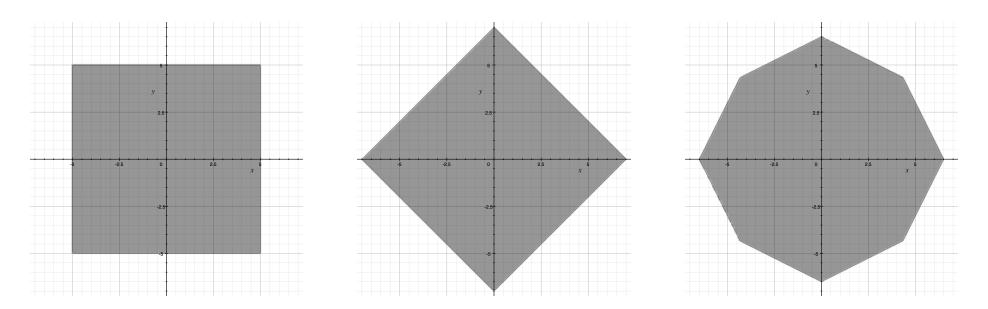

# *L*1-Norm Ball for CSIDH: Optimal Strategy for Choosing the Secret Key Space

Kohei Nakagawa, Hiroshi Onuki, Atsushi Takayasu, and Tsuyoshi Takagi Department of Mathematical Informatics, The University of Tokyo

February 14, 2020

#### **Abstract**

Isogeny-based cryptography is a kind of post-quantum cryptography whose security relies on the hardness of an isogeny problem over elliptic curves. In this paper, we study CSIDH, which is one of isogeny-based cryptography presented by Castryck et al. in Asiacrypt 2018. In CSIDH, the secret key is taken from an *L∞*-norm ball of integer vectors and the public key is generated by calculating the action of an ideal class corresponding to a secret key. For faster key exchange, it is important to accelerate the algorithm calculating the action of the ideal class group, many such approaches have been studied recently. Several papers showed that CSIDH becomes more efficient when a secret key space is changed to weighted *L∞*-norm ball.

In this paper, we revisit the approach and try to find an optimal secret key space which minimizes the computational cost of the group action. At first, we obtain an optimal secret key space by analyzing computational cost of CSIDH with respect to the number of operations on F*p*. Since the optimal key space is too complicated to sample a secret key uniformly, we approximate the optimal key space by using *L*1-norm ball and propose algorithms for uniform sampling with some precomputed table. By experiment with CSIDH-512, we show that the computational cost of the *L*1-norm ball is reduced by about 20% compared to that of the *L∞*-norm ball, using a precomputed table of 160 Kbytes. The cost is only 1.08 times of the cost of the optimal secret key space. Finally, we also discuss possible sampling algorithms using other norm balls and their efficiency.

## **1 Introduction**

RSA and elliptic-curve cryptography are known as the popular public-key cryptosystems. These cryptosystems have been considered to be hard to attack efficiently. Unfortunately, they were shown to be easily attacked by Shor's algorithm [22] which uses a quantum computer. Therefore, it is necessary to study post-quantum cryptography that cannot be attacked by using a quantum computer.

Isogeny-based cryptography is considered one candidate for post-quantum cryptography, and its security relies on the hardness of an isogeny problem. The isogeny problem is the problem of computing an isogeny between two given elliptic curves. It is believed to be hard to solve in polynomial time even with a quantum computer. Isogeny-based cryptography was initially proposed by Couveignes [6], and also independently proposed by Stolbunov and Rostovtsev [21]. In 2011, Jao and De Feo [11] proposed a more practical variant of isogeny-based cryptography called Supersingular Isogeny Diffie-Hellman (SIDH). SIDH uses supersingular elliptic curves for efficiency purpose, while [6, 21] uses ordinary elliptic curves. Then, in 2018, Castryck et al. [2]

proposed another key exchange protocol named Commutative Supersingular Isogeny Diffie-Hellman (CSIDH), which also uses supersingular elliptic curves and has smaller public key than SIDH.

In CSIDH, a public key is defined by calculating the action of an ideal class that is randomly determined on a supersingular elliptic curve, so we have to sample an ideal class from the ideal class group uniformly. In CSIDH, they sample an integer vector  $\mathbf{e}$  from some space and use the corresponding ideal class  $I^{\mathbf{e}} = \prod_{i=1}^{n} I_i^{e_i}$ , where  $I_i$  is an ideal class whose action is easy to calculate. We call this space the secret key space of CSIDH. Castryck et al. used an  $L_{\infty}$ -norm ball  $[-m, m]^n$  as the secret key space. Because the computational cost depends on an integer vector  $\mathbf{e}$ , the cost can be reduced by changing the secret key space, for example, weighted  $L_{\infty}$ -norm balls are used in [10, 14].

#### 1.1 Our contributions

In this paper, we show an optimal key space by evaluating the computational cost  $T(\mathbf{e})$  of a group action used in CSIDH as a function of the secret key  $\mathbf{e}$ . We evaluate  $T(\mathbf{e})$  as the number of operations on  $\mathbb{F}_p$ .  $T(\mathbf{e})$  consists of three main parts  $T_1$ ,  $T_2$ ,  $T_3$ , where  $T_1$  is the cost of scalar multiplications of outer loop,  $T_2$  is the cost of scalar multiplications of inner loop, and  $T_3$  is the cost of isogeny computations of CSIDH. In particular, the optimal secret key space  $\mathcal{A}_{\text{opt}}$  can be represented as follows:

$$\mathcal{A}_{\text{opt}} = \{ \mathbf{e} \in \mathbb{Z}^n \mid T(\mathbf{e}) \le r \}.$$

We evaluate  $T_1$ ,  $T_2$ , and  $T_3$  by using the efficient formulas for computing scalar multiplications and isogeny computations [4, 5, 15]. In addition, we propose an algorithm for estimating the upper bound r, and then we give the average cost  $\mathbb{E}_{\mathbf{e} \in \mathcal{A}_{\text{opt}}}[T(\mathbf{e})]$  by using n and r. Unfortunately, this optimal key space is too complicated to sample a secret key uniformly. Therefore, we consider using an  $L_1$ -norm ball to approximate the optimal space and show how to sample a secret key from these balls using some precomputed tables.

Moreover, we conduct the experiment of calculating the upper bound r and the average cost  $\mathbb{E}_{\mathbf{e} \in \mathcal{A}_{\mathrm{opt}}}[T(\mathbf{e})]$  for CSIDH-512 of n=74. As a result, r is about 336,000 and the average computational cost is about 332,000 operations. We also show that the computational cost is about 356,000 operations by using a sampling algorithm of the secret key from  $L_1$ -norm ball with a precomputed table of 160 Kbytes. Therefore, the cost is reduced by about 20% as compared to the cost when using the conventional key space  $[-5,5]^{74}$ , which is about 454,000 operations. In general,  $T_1$  and  $T_3$  become smaller by using  $L_{\infty}$ -norm ball and  $L_1$ -norm ball, respectively. Our experiment shows that  $T_2$  is smaller when using  $L_1$ -norm ball than  $L_{\infty}$ -norm ball, and the overall cost  $T(\mathbf{e})$  becomes smaller by using  $L_1$ -norm ball.

Furthermore, we propose a sampling algorithm for  $(L_1 + L_{\infty})$ -norm ball. The cost is reduced by 23% compared to  $L_{\infty}$ -norm ball. Though  $(L_1 + L_{\infty})$ -norm ball is better for reducing the cost than  $L_1$ -norm ball, we need about 11 Mbytes precomputed table to sample from this ball. It is an open problem to construct a sampling algorithm for the optimal key space.

#### 1.2 Related works

Beullens et al. also used the  $L_1$ -norm for CSI-FiSh in [1], for solving the closest vector problem in the related lattice  $\mathcal{L}$  generated by integer vectors  $\mathbf{z}$  such that the corresponding ideal class  $I^{\mathbf{z}}$  is principal. In other words, they took a vector  $\mathbf{z} \in \mathcal{L}$  to minimize  $\|\mathbf{e} - \mathbf{z}\|_1$  for a given  $\mathbf{e}$ , in order to reduce the number of the isogeny calculations by using  $\mathbf{e}' = \mathbf{e} - \mathbf{z}$  instead of  $\mathbf{e}$  since  $I^{\mathbf{e}'} = I^{\mathbf{e}}$  and  $\|\mathbf{e}'\|_1 \leq \|\mathbf{e}\|_1$  holds. In contrast, we use  $L_1$ -norm ball as an approximation of the optimal key space, and so our method does not need the relation lattice. Whether it is possible to combine these methods is an open problem.

Note that there are other efficient algorithms for computing a group action [3, 10, 14], which are not discussed in our method. We believe that we can improve our proposed method by combining with them, and it is a further research to estimate their improved efficiency.

#### **1.3 Organization of this paper**

In Section 2, we give mathematical backgrounds on the elliptic curve, isogeny, and ideal class group. In Section 3, we explain CSIDH and describe some existing speed-up techniques for CSIDH. In Section 4, we show the process of calculating the optimal key space. Among its subsections, in Section 4.1, we show how to determine the optimal key space and that we have to evaluate the computational cost *T*(**e**) and its upper bound *r*. In Section 4.2 and 4.3, we evaluate the computational cost *T*(**e**) and show its process, respectively. Finally, in Section 4.4, we propose an algorithm for estimating of the upper bound *r* and give the average cost E**e***∈A*[*T*(**e**)] by using *n* and *r*. In Section 5, we explain how to approximate the optimal key space. In Section 5.1, we take the *L*1-norm ball as an approximation and construct an algorithm for uniformly sampling from the space. In Section 5.2, we take other norm balls and show the outline about sampling from the norm balls. In Section 6, we describe the result of two experiments under the parameter setting of CSIDH-512. First, we calculate the upper bound *r* and the average computational cost E**<sup>e</sup>***∈A*[*T*(**e**)] by using our algorithm. Second, we measure the computational cost by using some norm balls and compare those costs with the minimum cost.

## **2 Preliminaries**

In this section, we give the mathematical background for CSIDH. For more details on elliptic curves, see Silverman [23], and for ideal class groups of number fields, refer to Neukirch [19].

## **2.1 Elliptic curve**

For a field *K*, an elliptic curve over *K* is an algebraic curve with no singular points defined by the following equation:

$$y^2 + a_1 xy + a_3 y = x^3 + a_2 x^2 + a_4 x + a_6,$$

where *a*1*, . . . , a*<sup>6</sup> *∈ K*. In this paper, we only use elliptic curves over F*p*, which are represented by the Montgomery form:

$$y^2 = x^3 + Ax^2 + x,$$

where *p* is a prime such that *p ≥* 5, *A* is in F*p*, and *A*<sup>2</sup> *6*= 4. For an extension field L *⊃* F*p*, *E*(*L*) is defined as follows:

$$E(L) = \{(x,y) \in L^2 \mid y^2 = x^3 + Ax^2 + x\} \cup \{O\},\$$

where *O* is the point at infinity in *E*.

We can define a group structure on *E*(*L*) by defining *P* + *Q* + *R* = *O* for the points *P*, *Q*, and *R* on the same line. In this group, the point at infinity *O* is the identity. Specifically, when *E* satisfies #*E*(F*p*) = *p* + 1, *E* is called a supersingular elliptic curve.

#### **2.2 Isogeny and endomorphism ring**

**Isogeny.** An isogeny *ϕ* is a group homomorphism between two elliptic curves *E*<sup>1</sup> and *E*2, which is represented by a non-constant rational polynomial. Furthermore, we say that *ϕ* is defined over F*<sup>p</sup>* when all the coefficients of the isogeny *ϕ* are in F*p*. Here, we state an important theorem about the isogenies below.

**Theorem 1** ([23], Proposition III.4.12, Remark III.4.13.2) Let E be an elliptic curve defined over  $\mathbb{F}_p$  and G be a subgroup stable under the p-th power Frobenius map. Then, there exists an elliptic curve F and an isogeny  $\phi: E \to F$  such that  $\operatorname{Ker} \phi = G$ . Moreover, such an elliptic curve F is unique up to  $\mathbb{F}_p$ -isomorphism.

We denote F in the above theorem by E/G. Next, we state the isogeny problem, which is related to the security of the isogeny-based cryptography.

#### Isogeny problem

Given two elliptic curves E, F that have an isogeny  $\phi: E \to F$ , then find the isogeny  $\phi$ .

This problem is considered to be hard to solve even with a quantum computer.

**Endomorphism ring.** For an elliptic curve E defined over  $\mathbb{F}_p$ , the isogeny or zero function from E to E is called an endomorphism. Specifically, the Frobenius map  $\pi:(x,y)\mapsto (x^p,y^p)$  is an important endomorphism. The set of all endomorphisms of E has a ring structure under the operations of addition and composition. This ring is denoted as  $\operatorname{End}(E)$  and called the endomorphism ring of E. Furthermore, set of endomorphisms defined over  $\mathbb{F}_p$  is denoted as  $\operatorname{End}_{\mathbb{F}_p}(E)$  and called the  $\mathbb{F}_p$ -endomorphism ring of E. If E is supersingular, then  $\operatorname{End}_{\mathbb{F}_p}(E)$  can be made isomorphic to  $\mathbb{Z}[\sqrt{-p}]$  or  $\mathbb{Z}[(1+\sqrt{-p})/2]$  by making the Frobenius map  $\pi$  correspond to  $\sqrt{-p}$  [8].

#### 2.3 Ideal class group and its action

Let  $\mathcal{O}$  be an order of an imaginary quadratic field  $\mathbb{Q}(\sqrt{-p})$ . Here, an order of an imaginary quadratic field K denotes a ring which is contained by the ring of integers of K and strictly contains  $\mathbb{Z}$ . For ideals I, J of  $\mathcal{O}$ , we define the following equivalence relation:

$$I \sim J \Leftrightarrow \exists \ a, b \in \mathcal{O} \setminus \{0\}, \ (a)I = (b)J.$$

Under this relation, we can make equivalent classes of ideals, which are called ideal classes. The set of ideal classes has a monoid structure under the operation of normal ideal production. The identity of this monoid is the class of principal ideals. The set of invertible elements of this monoid forms a commutative group, which is called the ideal class group of  $\mathcal{O}$ .

Let  $c\ell$  be the ideal class group of  $\mathbb{Z}[\sqrt{-p}]$  and  $\mathcal{ELL}$  be the set of supersingular elliptic curves over  $\mathbb{F}_p$ , whose  $\mathbb{F}_p$ -endomorphism ring is isomorphic to  $\mathbb{Z}[\sqrt{-p}]$ . Under this setting, we take  $I \in c\ell, E \in \mathcal{ELL}$ , and a representative  $\mathfrak{a} \in I$ . Here,  $E[\mathfrak{a}]$  is defined as follows:

$$E[\mathfrak{a}] := \bigcap_{\psi \in \mathfrak{a}} \operatorname{Ker} \psi.$$

By definition,  $E[\mathfrak{a}]$  is a subgroup of E and  $E/E[\mathfrak{a}]$  is determined regardless of how a representative of I is chosen. Therefore, the elliptic curve  $E/E[\mathfrak{a}]$  can be written as I\*E, and this induces a simply transitive action of  $c\ell$  on  $\mathcal{ELL}$  [2]. In addition, it is known that  $\#c\ell \approx \sqrt{p}$  when the prime p is large. Note that it takes sub-exponential time in the discriminant of the imaginary quadratic field to calculate  $\#c\ell$  strictly. For more details, see [9].

#### 3 CSIDH

In this section, we describe the parameter setting, key exchange method, and the algorithm of CSIDH. The details are given in [2].

#### 3.1 Parameter setting

Let p be a prime that is represented by the form  $p = 4 \prod_{i=1}^{n} l_i - 1$ , where  $l_i$  for i = 1, ..., n are distinct odd primes. Since  $p \equiv 3 \pmod{4}$ , the elliptic curve  $E_0 : y^2 = x^3 + x$  is supersingular. Moreover,  $E_0$  satisfies  $\operatorname{End}_{\mathbb{F}_p}(E_0) \simeq \mathbb{Z}[\sqrt{-p}]$ . Therefore,  $E_0 \in \mathcal{ELL}$ .

Let  $I_i := (l_i, \pi - 1) \in c\ell$ , and then  $(l_i^2, \pi^2 - 1) = (l_i^2, -4 \prod_{i=1}^n l_i) = (l_i)$ . Therefore,  $I_i^{-1} = (l_i, \pi + 1)$ . The action of  $I_i$  and  $I_i^{-1}$  on the elliptic curve is easy to calculate, as described below. To calculate the action of  $I_i$  and  $I_i^{-1}$  for all i, we have to determine the structures of  $E[I_i]$  and  $E[I_i^{-1}]$ . By definition,  $E[I_i] = \operatorname{Ker}(l_i) \cap \operatorname{Ker}(\pi - 1)$ . Therefore,  $E[I_i]$  is generated by a point P such that its order is  $l_i$  and it satisfies  $\pi(P) = P$ ; in other words,  $E[I_i]$  is generated by a point P that has order  $l_i$  and defined over  $\mathbb{F}_p$ . On the other hand,  $E[I_i^{-1}] = \operatorname{Ker}(l_i) \cap \operatorname{Ker}(\pi + 1)$ . Therefore,  $E[I_i^{-1}]$  is generated by a point Q such that its order is  $l_i$  and it satisfies  $\pi(Q) = -Q$ ; in other words,  $E[I_i^{-1}]$  is generated by a point Q that has order  $l_i$  and is represented by the form  $(x_Q, \sqrt{-1}y_Q)$ , where  $x_Q$  and  $y_Q$  are in  $\mathbb{F}_p$ . Note that  $\sqrt{-1} \notin \mathbb{F}_p$ . For an  $x_0 \in \mathbb{F}_p$ , a point  $P = (x_0, y_0)$  on  $E_A$  satisfies  $P \in \operatorname{Ker}(\pi - 1)$  when  $x_0^3 + Ax_0^2 + x_0$  is square and  $P \in \operatorname{Ker}(\pi + 1)$  when it is not. Let  $Q = (p+1)/l_i \cdot P$ , and then the order of Q is  $l_i$  and Q becomes the generator of  $E[I_i]$  or  $E[I_i^{-1}]$  if  $Q \neq O$ . Thus, we can determine the structures of  $E[I_i]$  and  $E[I_i^{-1}]$ , and so we can calculate the action of  $I_i$  and  $I_i^{-1}$  for all i.

Next, we consider sampling an element from  $c\ell$ . We express every element of  $c\ell$  by using  $I_i$  for  $i=1,\ldots,n$ . If we take a natural number m such that  $(2m+1)^n \geq \#c\ell$  and sample an integer vector  $\mathbf{e}=(e_1,\ldots,e_n)$  from  $[-m,m]^n$ —in other words,  $L_{\infty}$ -norm ball with the radius m—, then we expect that  $\prod_{i=1}^n I_{i}^{e_i}$  is sampled from  $c\ell$  uniformly. (Generally, we can use the integer vector set  $\mathcal{A}$  such that  $\#\mathcal{A} \geq \#c\ell$  if  $\mathcal{A}$  is expected to satisfy the Gaussian heuristic). Henceforth, we write  $I^{\mathbf{e}}$  instead of  $\prod_{i=1}^n I_i^{e_i}$ . From the above, we can uniformly sample an element from  $c\ell$ . Because of the hardness of the isogeny problem, finding  $I^{\mathbf{e}}$  from E and  $I^{\mathbf{e}} * E$  is expected to be hard. Henceforth, we use symbols like p or n with the meanings defined here.

#### 3.2 Key exchange method

Here, we define  $E_A$  as an elliptic curve represented by the Montgomery form  $y^2 = x^3 + Ax^2 + x$ . When  $E_A$  and  $E_B$  are  $\mathbb{F}_p$ -isomorphic, A = B holds. Therefore, A is uniquely determined by the  $\mathbb{F}_p$ -isomorphic class of  $E_A$ . Next, we show the key exchange method of CSIDH.

- **Key generation.** First, uniformly sample a vector **e** from  $[-m, m]^n$  as a secret key. Next, calculate the coefficient  $A \in \mathbb{F}_p$  of the elliptic curve  $E_A = I^e * E_0$  and set this coefficient A as a public key.
- **Key exchange.** For Alice and Bob, respectively, let  $\mathbf{a}, \mathbf{b} \in [-m, m]^n$  be their secret keys and  $A, B \in \mathbb{F}_p$  be their public keys. Alice calculates  $I^{\mathbf{a}} * E_B$  by using her own secret key  $\mathbf{a}$  and Bob's public key B. In the same way, Bob calculates  $I^{\mathbf{b}} * E_A$ . Since  $I^{\mathbf{a}} * E_B = I^{\mathbf{b}} * E_A = I^{\mathbf{a}+\mathbf{b}} * E_0$  holds, Alice and Bob can get the same elliptic curve  $E_S = I^{\mathbf{a}+\mathbf{b}} * E_0$  and its coefficient  $S \in \mathbb{F}_p$  as their shared secret.

#### 3.3 Algorithm

As we showed in the previous subsection, CSIDH requires calculating actions of  $I^{\mathbf{e}}$  on  $E_A$ . We describe the algorithm for this calculation in Algorithm 1. The algorithm calculates the coefficient B of elliptic curve  $E_B = I^e * E_A$  for a given vector  $\mathbf{e}$  and the coefficient A of an elliptic curve  $E_A$ . Here, we explain this algorithm in detail. In steps 2, 3, and 4, it finds a point P such that  $\pi(P) = P$  or  $\pi(P) = -P$ . Note that  $S = \{i \mid e_i > 0\}$  if  $\pi(P) = P$  and  $S = \{i \mid e_i < 0\}$ 

#### Algorithm 1 Action of ideal class group on elliptic curve

```
Input: A \in \mathbb{F}_p, \mathbf{e} \in \mathbb{Z}^n.

Output: Coefficient B \in \mathbb{F}_p of E_B = I^\mathbf{e} * E_A.

1: while e \neq 0 do

2: Randomly sample x_0 \in \mathbb{F}_p.

3: Let s \leftarrow 1 if x_0^3 + Ax_0^2 + x_0 is square in \mathbb{F}_p or let s \leftarrow -1 otherwise.

4: Let S = \{i \mid se_i > 0\} and P \leftarrow (x_0, y_0) (if S = \emptyset go to step 2).

5: Let k \leftarrow \prod_{i \in S} l_i and calculate Q \leftarrow \frac{p+1}{k}P.

6: for i \in S do

7: Calculate R \leftarrow \frac{k}{l_i}Q (if R = O, skip this i.)

8: Let G be the group generated by R and calculate E_B = E_A/G and the isogeny \phi such that \operatorname{Ker} \phi = G.

Update A \leftarrow B, Q \leftarrow \phi(Q), k \leftarrow \frac{k}{l_i}, e_i \leftarrow e_i - s.

9: end for

10: end while

11: return A.
```

otherwise. Next, in steps 5 and 7, the algorithm calculates  $\frac{p+1}{l_i}P$  for all  $i \in S$ . Note that it first calculates  $Q = \frac{p+1}{k}P$  and then  $R = \frac{k}{l_i}Q$  to reduce the computational cost. Finally, it calculates  $E_B = E_A/G$  and  $\phi(Q)$  in step 8. Every time it calculates the action of  $I_i$ , it reduces the absolute value of  $e_i$  by one. When  $\mathbf{e}$  becomes  $\mathbf{0}$ , the algorithm stops.

#### 3.4 Speed-up techniques

In [2], elliptic curves were represented by the Montgomery form [16], and they used the method of [4, 20] for the isogeny calculation. Also, [15] showed a method to reduce the computational cost of the isogeny calculation. Since then, further speed-up techniques have been proposed. [14] proposed splitting the isogeny calculations in the same for-loop and [3] showed a method to accelerate isogeny calculations and scalar multiplications. Moreover, [12, 18] proposed a method using Edwards curves instead of Montgomery curves. In addition, the isogeny calculation over the other curves such as a Hessian curve is studied recently, as in [7, 13, 17, 24], for example.

### 4 Our method

In this section, we discuss an optimal secret key space that minimizes the expectation of the computational cost of Algorithm 1, and we evaluate the minimum computational cost accordingly.

In Section 4.1, we show an idea to optimize the key space by evaluating the computational cost and its upper bound. In Section 4.2, we explain how to evaluate the computational cost and show the result (Theorem 2) of the evaluation. In Section 4.3, we give a proof of Theorem 2. Finally, in Section 4.4, we show how to calculate the upper bound of the computational cost.

#### 4.1 Optimal key space

In this subsection, we consider solving an optimization problem to minimize the expectation of the computational cost of Algorithm 1 by changing the secret key space A. Concretely, the problem

is as follows:

minimize 
$$\mathbb{E}_{\mathbf{e} \in \mathcal{A}}[T(\mathbf{e})]$$
  
subject to  $\#\mathcal{A} \ge \#c\ell$ ,

where *T*(**e**) denotes the computational cost of Algorithm 1 with the input **e** *∈* Z *<sup>n</sup>*. This optimization problem can be solved as follows:

- 1: Let *A* = *∅*.
- 2: Add **e** to *A* in the increasing order of *T*(**e**).
- 3: If #*A ≥* #*cℓ*, return *A*.

Therefore, *A* can be represented by the following form:

$$\mathcal{A} = \{ \mathbf{e} \in \mathbb{Z}^n \mid T(\mathbf{e}) \le r \},$$

where *r* is the minimum number that satisfies #*A ≥* #*cℓ*. If *T*(**e**) can be represented by a formula of **e** and the upper bound *r* can be calculated, then we can obtain the optimal secret key space. In the following subsection, we evaluate the computational cost *T*(**e**).

## **4.2 Evaluation of the computational cost** *T*(**e**)**.**

In this subsection, we show how to evaluate the computational cost *T*(**e**) and describe the result of the evaluation. We evaluate *T*(**e**) in terms of the number of multiplications on F*p*. We count a squaring and an addition as 0.8 times and 0.05, respectively, in terms of multiplication.

#### **4.2.1 How to evaluate.**

In Algorithm 1, the steps that constitute most of the computational cost are step 5 (scalar multiplications of outer loop), step 7 (scalar multiplications of inner loop), and step 8 (isogeny computations), with the other steps constituting less than 1% of the total. Therefore, we define *T*1(**e**), *T*2(**e**), and *T*3(**e**) as the computational costs of steps 5, 7, and 8, respectively and we assume that *T*(**e**) = *T*1(**e**) + *T*2(**e**) + *T*3(**e**). Note that we assume that the skip in step 7 does not happen, and that *i ∈ S* is randomly sampled in step 6, for simplicity.

In this paper, we assume that scalar multiplications in steps 5 and 7 are computed by using LADDER [5]. In step 8, there are three main calculations: calculation of *G* from a point *R*, calculation of *E<sup>B</sup>* from *E<sup>A</sup>* and *G*, and calculation of *ϕ*(*Q*) from *Q*, which are referred as Kernel-Points, Isogeny-Curve, and Isogeny-Point, respectively. We assume that these computations are computed by the algorithms of [4, 15]. In Table 1, we list the computational costs for LADDER, Kernel-Points, Isogeny-Curve, and Isogeny-Point, where *a* is a positive integer used in scalar multiplications *aP* and *l<sup>i</sup>* is degree of an isogeny. Note that **M**, **S**, and **a** denote the numbers of multiplications, squaring, and additions on F*p*, respectively.

We assume that **S** and **a** satisfy **S** = 0*.*8**M** and **a** = 0*.*05**M**, in this paper. Therefore, the computational costs (number of **M**) of a scalar multiplication *aP* and an isogeny computation of degree *l<sup>i</sup>* are respectively represented as follows:

Scalar multiplication: 11*.*6 log<sup>2</sup> *a −* 5*.*9, Isogeny computation: 6*l<sup>i</sup>* + 2*.*6 log<sup>2</sup> *l<sup>i</sup>* + 6*.*8.

Using the above formulas, we evaluate *T*1(**e**), *T*2(**e**), and *T*3(**e**) in the following.

At first, we prepare some symbols for evaluating *T*1(**e**), *T*2(**e**), and *T*3(**e**). Algorithm 1 divides the input **e** to a positive part and a negative part in step 4, and then we define **e** <sup>+</sup> and **e** *<sup>−</sup>* as the

| algorithm          | M                      | $\mathbf{S}$      | a               |
|--------------------|------------------------|-------------------|-----------------|
| LADDER [5]         | $8\log_2 a - 4$        | $4\log_2 a - 2$   | $8\log_2 a - 6$ |
| Kernel-Points [4]  | $2l_i - 2$             | $l_i - 1$         | $3l_i - 5$      |
| Isogeny-Curve [15] | $l_i + \log_2 l_i + 1$ | $2\log_2 l_i + 6$ | 6               |
| Isogeny-Point [4]  | $2l_i + 2$             | 2                 | $l_i + 3$       |

Table 1: Computational costs of the algorithms used

vector such that  $(\mathbf{e}^+)_i = \max\{0, e_i\}$  and  $(\mathbf{e}^-)_i = -\min\{0, e_i\}$ , respectively. Note that  $\mathbf{e}^+$  and  $\mathbf{e}^-$  satisfy  $\mathbf{e} = \mathbf{e}^+ - \mathbf{e}^-$ ,  $\mathbf{e}^+$ ,  $\mathbf{e}^- \geq \mathbf{0}$  by definition. Moreover,  $T_1$  is the cost of scalar multiplications and mainly depends on the number of while-loop in step 1. The number of this while-loop is  $(\max_i |\mathbf{e}^+_i| + \max_i |\mathbf{e}^-_i|)$ . Similarly,  $T_3$  is the cost of isogeny computations and the number of isogeny computations is  $\sum_{i=1}^n |e_i|$ . Therefore, we use the following notations:  $\|\mathbf{e}\|_{\infty} = \max_i |e_i|$  and  $\|\mathbf{e}\|_1 = \sum_{i=1}^n |e_i|$ , and call them  $L_{\infty}$ -norm and  $L_1$ -norm of  $\mathbf{e}$ , respectively. In addition, we define  $L = \operatorname{diag}(\log_2 l_1, \ldots, \log_2 l_n)$  and  $M = \operatorname{diag}(l_1, \ldots, l_n)$ , where  $\operatorname{diag}(x_1, \ldots, x_n)$  denotes the diagonal matrix whose (i, i)-th element is  $x_i$ . Let  $\mathbf{1}$  denote an n-dimensional vector whose all elements are 1, and let I denote the identity matrix.

#### 4.2.2 Representation of T(e) in terms of input e.

In evaluating the computational cost  $T(\mathbf{e})$  by the above way, we obtain the following theorem.

**Theorem 2** The computational cost  $T(\mathbf{e})$  is represented as follows:

$$T(\mathbf{e}) = \|U_1 \mathbf{e}\|_1 + \alpha (\|\mathbf{e}^+\|_{\infty} + \|\mathbf{e}^-\|_{\infty})$$
  
 
$$+ \mathbf{1}^\top U_2 \{P(\mathbf{e}^+)^\top N P(\mathbf{e}^+) \mathbf{e}^+ + P(\mathbf{e}^-)^\top N P(\mathbf{e}^-) \mathbf{e}^-\},$$

where

 $P(\mathbf{e}) = (Permutation \ matrix \ that \ sorts \ e_1, \dots, e_n \ in \ a \ decreasing \ order),$ 

$$U_1 = 6M - 14.8L + 0.9I, \ U_2 = 5.8L,$$

$$(N)_{ij} = \begin{cases} i & (i = j) \\ 1 & (i < j) \\ 0 & (i > j) \end{cases}$$

$$\alpha = 11.6 \log_2(p+1) - 5.9.$$

Note that the first and second terms of  $T(\mathbf{e})$  are norms of the vector  $\mathbf{e}$ . On the other hand, the third term is not a norm.

#### 4.3 Proof of Theorem 2

Now, we show the proof of Theorem 2. Since we assume  $T(\mathbf{e}) = T_1(\mathbf{e}) + T_2(\mathbf{e}) + T_3(\mathbf{e})$ , we evaluate  $T_1$ ,  $T_2$ , and  $T_3$ , individually.

#### **4.3.1 Evaluation of** *T*1**.**

First, we evaluate the computational cost of step 5 in one while-loop. Since this value depends on the set *S*, we denote it by *T*1*,S*. The value *T*1*,S* is represented as follows:

$$\begin{split} T_{1,S} &= 11.6 \log_2 \frac{p+1}{k} - 5.9 \\ &= 11.6 \log_2 \left( p+1 \right) - 5.9 - 11.6 \log_2 \prod_{i \in S} l_i \\ &= \alpha - 11.6 \sum_{i \in S} \log_2 l_i. \end{split}$$

Next, we evaluate *T*1. In every while-loop, the set *S* changes as follows:

$$S = S_0^+(\mathbf{e}), \dots, S_{\|\mathbf{e}^+\|_{\infty} - 1}^+(\mathbf{e}), \ S_0^-(\mathbf{e}), \dots, S_{\|\mathbf{e}^-\|_{\infty} - 1}^-(\mathbf{e}),$$

where *S* + *t* (**e**) = *{i | e<sup>i</sup> > t}, and S<sup>−</sup> t* (**e**) = *{i | e<sup>i</sup> < −t}*. Note that, while the order may be incorrect, the computational cost does not depend on this order. Therefore, *T*<sup>1</sup> can be represented as follows:

$$T_{1}(\mathbf{e}) = \sum_{t=0}^{\|\mathbf{e}^{+}\|_{\infty}-1} T_{1,S_{t}^{+}(\mathbf{e})} + \sum_{t=0}^{\|\mathbf{e}^{-}\|_{\infty}-1} T_{1,S_{t}^{-}(\mathbf{e})}$$

$$= \sum_{t=0}^{\|\mathbf{e}^{+}\|_{\infty}-1} \left(\alpha - 11.6 \sum_{i \in S_{t}^{+}(\mathbf{e})} \log_{2} l_{i}\right) + \sum_{t=0}^{\|\mathbf{e}^{-}\|_{\infty}-1} \left(\alpha - 11.6 \sum_{i \in S_{t}^{-}(\mathbf{e})} \log_{2} l_{i}\right)$$

$$= \alpha(\|\mathbf{e}^{+}\|_{\infty} + \|\mathbf{e}^{-}\|_{\infty}) - 11.6 \sum_{i=1}^{n} |e_{i}| \log_{2} l_{i}$$

$$= \alpha(\|\mathbf{e}^{+}\|_{\infty} + \|\mathbf{e}^{-}\|_{\infty}) - 11.6 \|L\mathbf{e}\|_{1}.$$

#### **4.3.2 Evaluation of** *T*2**.**

As with *T*1, we evaluate the computational cost of step 7 in one while-loop. Note that this value depends on the order of selecting *i ∈ S*. We assumed that the order is completely random for simplicity. Therefore, we evaluate the average for every order and denote this average by *T*2*,S*. First, we fix a calculation order for the elements of S. We denote the *j*-th element of S by *i<sup>j</sup>* and the cardinality of *S* by *s*. For this ordered set *S*, the calculation cost is as follows:

$$\sum_{m=1}^{s} \left\{ 11.6 \log_2 \left( \prod_{j=m+1}^{s} l_{i_j} \right) - 5.9 \right\}$$
$$= 11.6 \sum_{j=1}^{s} (j-1) \log_2 l_{i_j} - 5.9s.$$

Second, we change the order of *S*. Because the coefficient of log<sup>2</sup> *l<sup>i</sup>* passes over 0*, . . . , s−*1 for each *i ∈ S*, the average of the coefficient is (*s −* 1)*/*2. Therefore, *T*2*,S* can be represented as follows:

$$T_{2,S} = 5.8(s-1) \sum_{i \in S} \log_2 l_i - 5.9s$$
$$= 5.8s \sum_{i \in S} \log_2 l_i - \sum_{i \in S} (5.8 \log_2 l_i + 5.9)$$

Finally, we evaluate *T*2(**e**), which is the summation of *T*2*,S* for all *S* that appears in the calculation for **e**. The summation of the second term of *T*2*,S* can be calculated as *k*(5*.*8*L* + 5*.*9*I*)**e***k*<sup>1</sup> in the same way as for *T*1. Next, we evaluate the summation of the first term. Assuming that **e** *≥* **0**, we have

$$\sum_{S} \left( \#S \sum_{i \in S} \log_2 l_i \right) = \sum_{t=0}^{\|\mathbf{e}\|_{\infty} - 1} \left( \#S_t^+(\mathbf{e}) \sum_{i \in S_t^+(\mathbf{e})} \log_2 l_i \right).$$

Moreover, let **e**ˆ = *P*(**e**)**e***,*( ˆ*l*1*, . . . ,* ˆ*ln*) *<sup>⊤</sup>* = *P*(**e**)(*l*1*, . . . , ln*) *<sup>⊤</sup>*, and then we have

$$\#S_t^+(\mathbf{e}) = \#S_t^+(\hat{\mathbf{e}}), \sum_{i \in S_t^+(\mathbf{e})} \log_2 l_i = \sum_{i \in S_t^+(\hat{\mathbf{e}})} \log_2 \hat{l}_i$$

because **e**ˆ and (ˆ*l*1*, . . . ,* ˆ*ln*) are different from **e** and (*l*1*, . . . , ln*), respectively, only in their indices. Now, let **e**ˆ*n*+1 = 0, and then

$$\hat{\mathbf{e}}_{j+1} \le t \le \hat{\mathbf{e}}_j - 1 \Rightarrow S_t^+(\hat{\mathbf{e}}) = \{1, \dots, j\}$$

holds for each *j* = 1*, . . . , n*. Therefore, we have

$$\sum_{S} \left( \#S \sum_{i \in S} \log_2 l_i \right) = \sum_{j=1}^n \left( \hat{\mathbf{e}}_j - \hat{\mathbf{e}}_{j+1} \right) \cdot j \sum_{t=1}^j \log_2 \hat{l}_t$$
$$= \sum_{j=1}^n \left( j \log_2 \hat{l}_j + \sum_{t=1}^{j-1} \log_2 \hat{l}_t \right) \hat{\mathbf{e}}_j$$
$$= \left( \log_2 \hat{l}_1, \dots, \log_2 \hat{l}_n \right) N \hat{\mathbf{e}}$$
$$= \mathbf{1}^\top L P(\mathbf{e})^\top N P(\mathbf{e}) \mathbf{e}.$$

From the above, for the vector **e** *≥* **0**, *T*2(**e**) can be represented as follows:

$$T_2(\mathbf{e}) = 5.8 \cdot \mathbf{1}^{\top} LP(\mathbf{e})^{\top} NP(\mathbf{e}) \mathbf{e} - \|(5.8L + 5.9I)\mathbf{e}\|_1.$$

Finally, since every **e** satisfies

$$T(\mathbf{e}) = T(\mathbf{e}^+) + T(\mathbf{e}^-)$$

by the structure of the algorithm, *T*2(**e**) can be represented as follows:

$$T_2(\mathbf{e}) = 5.8 \cdot \mathbf{1}^{\top} L \{ P(\mathbf{e}^+)^{\top} N P(\mathbf{e}^+) \mathbf{e}^+ + P(\mathbf{e}^-)^{\top} N P(\mathbf{e}^-) \mathbf{e}^- \}$$
$$- \| (5.8L + 5.9I) \mathbf{e} \|_1.$$

#### **4.3.3 Evaluation of** *T*3**.**

Since *T*3(**e**) corresponds to *|e<sup>i</sup> |* calculations of the *li*-isogeny for each *i*, *T*3(**e**) can be represented as follows:

$$T_3(\mathbf{e}) = \sum_{i=1}^n (6l_i + 2.6 \log_2 l_i + 6.8)|e_i|$$
$$= \|(6M + 2.6L + 6.8I)\mathbf{e}\|_1$$

From the above, we obtain Theorem 2.

#### 4.4 Upper bound r and minimum computational cost $T_{\text{opt}}$

Let  $\mathcal{A}_{\mathrm{opt}}$  be the optimal secret key space and let  $T_{\mathrm{opt}}$  be the average computational cost when the secret key is  $\mathcal{A}_{\mathrm{opt}}$ . In the previous subsection, we evaluated  $T(\mathbf{e})$ . However, it's not easy to evaluate the minimum r such that  $\#\mathcal{A} = \#\{\mathbf{e} \in \mathbb{Z}^n \mid T(\mathbf{e}) \leq r\} \geq \#c\ell$ . Therefore, we approximate  $\#\mathcal{A}$  as follows:

$$\#\mathcal{A} \approx V(r) := \operatorname{vol}(\{\mathbf{e} \in \mathbb{R}^n \mid T(\mathbf{e}) \le r\}),$$

and we evaluate r in this approximation. Note that  $T(\mathbf{e})$  is defined by the equation of Theorem 2 for  $\mathbf{e} \in \mathbb{R}^n$ . In this approximation, the following theorem holds:

**Theorem 3** The upper bound of the computational cost r can be represented as follows:

$$r = \frac{p^{1/2n}}{2} \cdot \left( \mathbb{E}_{\sigma \in \mathfrak{S}_n, \ s \in \{1, -1\}^n} \left[ \prod_{i=1}^n (f_i^\top c(\sigma, s))^{-1} \right] \right)^{-1/n},$$

where  $\mathfrak{S}_n$  is the n-symmetric group,  $f_i$  is the n-dimensional vector whose i-th component is 1 and the other components are 0, and  $c(\sigma, s)$  is an n-dimensional vector that depends on  $\sigma$  and s. The details of  $c(\sigma, s)$  are included in the proof. Moreover, an estimation of r can be calculated by Algorithm 2.

#### **Algorithm 2** Estimation of upper bound *r*

**Input:** Number of trials  $\mathcal{T}$ , parameters of CSIDH:  $n, p, l_1, \ldots, l_n$ .

**Output:** Estimate of upper bound r.

```
1: Ave \leftarrow 0.
 2: for t = 1 to \mathcal{T} do
         Sum \leftarrow 0.
 4:
         Prod \leftarrow 1.
         Randomly sample \sigma \in \mathfrak{S}_n, s \in \{1, -1\}^n.
         Calculate c = c(\sigma, s) (see equation (1)).
         for i = 1 to n do
 7:
            Sum \leftarrow Sum + c_i.
            Prod \leftarrow Prod \cdot Sum^{-1}.
10.
         end for
         Ave \leftarrow Ave + Prod/\mathcal{T}.
12: end for
13: r \leftarrow \frac{p^{1/2n}}{2} \cdot Ave^{-1/n}.
14: \mathbf{return}^{\mathbf{r}} r.
```

By using this r, the following theorem holds.

**Theorem 4** When  $\mathcal{A}_{\mathrm{opt}} = \{\mathbf{e} \in \mathbb{Z}^n | T(\mathbf{e}) \leq r\}$  is used as the secret key space, the average computational cost  $T_{\mathrm{opt}}$  can be represented as

$$T_{\text{opt}} = \frac{n}{n+1} r.$$

From Theorem 3 and Theorem 4, we can compute  $\mathcal{A}_{\text{opt}}$  and  $T_{\text{opt}}$  Now, we show the proofs of Theorem 3 and Theorem 4.

*Proof of Theorem 3.* Since we *T*(*a***e**) = *aT*(**e**) holds for any positive number *a >* 0, we have

$$V(r) = V(1)r^n.$$

Therefore,

$$V(r) \ge \#c\ell \Leftrightarrow r \ge \left(\frac{\#c\ell}{V(1)}\right)^{1/n}$$

holds, and the upper bound *r* can be represented as

$$r = \left(\frac{\sqrt{p}}{V(1)}\right)^{1/n}$$

because #*cℓ ≈ <sup>√</sup>p*. Therefore, it suffices to evaluate *<sup>V</sup>* (1). Let *<sup>V</sup>* <sup>=</sup> *{***<sup>e</sup>** *<sup>∈</sup>* <sup>R</sup> *<sup>n</sup> | T*(**e**) *≤* 1*}* and let *V* also denote the volume of *V* . Moreover, for *σ ∈* S*<sup>n</sup>* and *s ∈ {*1*, −*1*} <sup>n</sup>*, let

$$V(\sigma, s) := V \cap \{ \mathbf{e} \in \mathbb{R}^n \mid s_1 e_{\sigma(1)} \ge s_2 e_{\sigma(2)} \ge \dots s_n e_{\sigma(n)} \ge 0 \},$$

and then

$$V = \sum_{\sigma \in \mathfrak{S}_n, \ s \in \{1, -1\}^n} V(\sigma, s)$$

holds. We now evaluate *V* (*σ, s*). First, we calculate the value of *T*(**e**) for **e** *∈ V* (*σ, s*). Let **e**ˆ = (*s*1*eσ*(1)*, . . . , sneσ*(*n*)). For a diagonal matrix *U* = diag(*u*1*, . . . , un*), we define that *σ*(*U*) = diag(*uσ*(1)*, . . . , uσ*(*n*)). Then, the first term of *T*(**e**) can be represented as follows:

$$||U_1\mathbf{e}||_1 = \mathbf{1}^{\top}\sigma(U_1)\hat{\mathbf{e}}.$$

Next, we evaluate the second term. Let *J*(*s*) be a diagonal matrix such that (*i, i*)-th component is 1 for the minimum *i* such that *s<sup>i</sup>* = 1 or the minimum *i* such that *s<sup>i</sup>* = *−*1; the other components are 0. In other words, we define

$$(J(s))_{i,j} = \begin{cases} 1 & (i = j \text{ and } \sum_{k=1}^{i} s_k = \pm (i-2)) \\ 0 & (\text{otherwise}) \end{cases}.$$

Then, the second term can be represented as follows:

$$\alpha(\|\mathbf{e}^+\|_{\infty} + \|\mathbf{e}^-\|_{\infty}) = \alpha \cdot \mathbf{1}^{\top} J(s) \hat{\mathbf{e}}.$$

Finally, we evaluate the third term. The value of **1** *<sup>⊤</sup>U*2*P*(**e** +) *<sup>⊤</sup>NP*(**e** <sup>+</sup>)**e** <sup>+</sup> does not change even if we assume that the components in *i*-th row and *i*-th column of *N* are all 0 for every *i* such that **e** + *<sup>i</sup>* = 0. Therefore,

$$\mathbf{1}^{\top} U_2 P(\mathbf{e}^+)^{\top} N P(\mathbf{e}^+) \mathbf{e}^+ = \mathbf{1}^{\top} \sigma(U_2) N^+(s) \hat{\mathbf{e}}$$

holds, where *N* <sup>+</sup>(*s*) is defined as

$$(N^{+}(s))_{i,j} = \begin{cases} \sum_{k=1}^{i} \frac{1+s_k}{2} & (i=j \text{ and } s_i = 1) \\ 1 & (i < j \text{ and } s_i = s_j = 1) \\ 0 & (\text{otherwise}) \end{cases}$$

In the same way, we define *N <sup>−</sup>*(*s*) and let *N*(*s*) = *N* <sup>+</sup>(*s*) + *N <sup>−</sup>*(*s*). Then, *N*(*s*) can be written as follows:

$$(N(s))_{i,j} = \begin{cases} \sum_{k=1}^{i} \frac{1+s_k}{2} & (i=j \text{ and } s_i = 1) \\ \sum_{k=1}^{i} \frac{1-s_k}{2} & (i=j \text{ and } s_i = -1) \\ 1 & (i < j \text{ and } s_i = s_j) \\ 0 & (\text{otherwise}) \end{cases},$$

and we have the following equation for the third term:

$$\mathbf{1}^{\top}U_2\{P(\mathbf{e}^+)^{\top}NP(\mathbf{e}^+)\mathbf{e}^+ + P(\mathbf{e}^-)^{\top}NP(\mathbf{e}^-)\mathbf{e}^-\} = \mathbf{1}^{\top}\sigma(U_2)N(s)\hat{\mathbf{e}}.$$

From the above, for the vector **e** *∈ V* (*σ, s*), *T*(**e**) can be written as follows:

$$T(\mathbf{e}) = c(\sigma, s)^{\top} \hat{\mathbf{e}},$$

where

$$c(\sigma, s) = (\sigma(U_1) + \alpha J(s) + \sigma(U_2)N(s))^{\mathsf{T}} \mathbf{1}. \tag{1}$$

Therefore, we have

$$V(\sigma, s) = \{ \mathbf{e} \in \mathbb{R}^n \mid e_1 \ge \dots \ge e_n \ge 0, \ c(\sigma, s)^\top \mathbf{e} \le 1 \}.$$

Since

$$e_1 \ge \dots \ge e_n \ge 0$$
  
 $\Leftrightarrow \exists p_i \ge 0 \text{ s.t. } \mathbf{e} = p_1 f_1 + p_2 f_2 + \dots + p_n f_n,$ 

holds, *V* (*σ, s*) can be represented as follows:

$$V(\sigma, s) = \{ F\mathbf{p} \mid \sum_{i=1}^{n} f_i^{\mathsf{T}} c(\sigma, s) p_i \le 1, \ \mathbf{p} \ge \mathbf{0} \},$$

where *F* = (*f*1*, . . . , fn*), and **p** = (*p*1*, . . . , pn*) *<sup>⊤</sup>*. Then, because det*F* = 1 holds,

$$V(\sigma, s) = \operatorname{vol}\left(\left\{\mathbf{p} \ge \mathbf{0} \mid \sum_{i=1}^{n} f_i^{\top} c(\sigma, s) p_i \le 1\right\}\right)$$
$$= \frac{1}{n!} \prod_{i=1}^{n} (f_i^{\top} c(\sigma, s))^{-1}$$

holds. Therefore, we have

$$\begin{split} V &= \sum_{\sigma,s} V(\sigma,s) \\ &= \sum_{\sigma,s} \frac{1}{n!} \prod_{i=1}^n (f_i^\top c(\sigma,s))^{-1} \\ &= 2^n \mathbb{E} \left[ \prod_{i=1}^n (f_i^\top c(\sigma,s))^{-1} \right], \\ r &= \frac{p^{1/2n}}{2} \cdot \left( \mathbb{E} \left[ \prod_{i=1}^n (f_i^\top c(\sigma,s))^{-1} \right] \right)^{-1/n} \end{split}$$

*.*

*Proof of Theorem 4.* By definition, we have

$$\begin{split} T_{\mathrm{opt}} &= \mathbb{E}_{\mathbf{e} \in \mathcal{A}_{\mathrm{opt}}}[T(\mathbf{e})], \\ \mathcal{A}_{\mathrm{opt}} &= \{\mathbf{e} \in \mathbb{R}^n \mid T(\mathbf{e}) \leq r\}. \end{split}$$

Let *X* = *T*(**e**), where *X* is the random variable that satisfies 0 *≤ X ≤ r*. Since *X* satisfies

$$\Pr(X \le x) = V(x)/V(r) \propto x^n,$$

the probability density function *fX*(*x*) is proportional to *x n−*1 . Therefore, we get

$$\begin{split} T_{\text{opt}} &= \mathbb{E}[X] = \int_0^r x \cdot x^{n-1} dx \cdot \left( \int_0^r x^{n-1} dx \right)^{-1} \\ &= \frac{n}{n+1} \ r. \end{split}$$

## **5 Approximation of** *A*opt

In the previous section, we obtained the optimal key space *A*opt and minimum computational cost *T*opt. However, we have to sample a secret key uniformly from the key space and this is hard since the key space is complicated. Therefore, we approximate *A*opt to more simple space under condition #*A ≥* #*cℓ*. In order to achieve an easy-to-sample space, wa change *A*opt to some norm balls. In fact, we approximate the representation of *T*(**e**) in Theorem 2, and our starting point is *T*(**e**) *≈ kU***e***k*<sup>1</sup> + *αk***e***k∞*. Note that *k***e***k<sup>∞</sup>* is a conventional space used in [2]. Now, we try to study the *L*1-norm *k***e***k*<sup>1</sup> at first.

## **5.1 Uniform sampling from** *L*1**-norm ball**

In this subsection, we take *L*1-norm ball as an approximation of *A*opt and show how to sample an integer vector from *L*1-norm ball uniformly.

```
Algorithm 3 Sampling of e uniformly from A1
```

```
Input: n: degree of vector e, R1: radius of norm ball.
Output: e ∈ A1 = {e ∈ Z
                             n | kek1 ≤ R1}.
 1: Sample (n
               ′
                , r′
                   ) with the weight of S(n
                                              ′
                                              , r′
                                                 ) (see equation (2)).
 2: e ← 0
 3: if (n
         ′
          , r′
             ) 6= (0, 0) then
 4: Sample s ∈ {1, −1}
                           n
                             ′
                             , {i1, . . . , in′} ⊂ {1, . . . , n}, {a1, . . . , an′−1} ⊂ {1, . . . , r′ − 1} uniformly,
      where i1 < · · · < in′ , a1 < · · · < an′−1.
 5: a0 ← 0, an′ ← r
                        ′
                         .
 6: for j = 1 to n
                      ′ do
 7: eij ← sj (aj − aj−1).
 8: end for
 9: end if
10: return e = (e1, . . . , en).
```

Let *A*<sup>1</sup> = *{e ∈* Z *<sup>n</sup> | kek*<sup>1</sup> *≤ R*1*}* for given integers *n* and *R*<sup>1</sup> and let *n ′* and *r ′* be integers such that 1 *≤ n ′ ≤ n* and *n ′ ≤ r ′ ≤ R*<sup>1</sup> or *n ′* = *r ′* = 0. Then, we define

$$S(n',r') := \#\{\mathbf{e} \mid \|\mathbf{e}\|_1 = r', \text{ (number of non-zero components of } \mathbf{e}) = n'\}.$$

In turn, we have

$$S(n',r') = \begin{cases} 2^{n'} \binom{n}{n'} \binom{r'-1}{n'-1} & (1 \le n' \le r' \le R_1, \ n' \le n) \\ 1 & (n'=r'=0) \end{cases}$$
 (2)



Figure 1: Regions of  $\|\mathbf{e}\|_{\infty} \leq 5$ ,  $\|\mathbf{e}\|_{1} \leq 7$ , and  $\|\mathbf{e}\|_{1} + \|\mathbf{e}\|_{\infty} \leq 13$  in 2-dimension. The numbers of integer points in these regions are 121, 113, and 121, respectively.

First, we calculate S(n',r') beforehand. Note that the size of this data is less than  $nr \log_2(\#\mathcal{A}_1)$  bits, and so it is bounded by the polynomial of the security parameter of CSIDH. Next, we sample (n',r') from the region of  $\{(n',r')|1 \le n' \le n \text{ and } n' \le r' \le R_1 \text{ or } n' = r' = 0\}$  with the weight of S(n',r').

Finally, we calculate e by using this (n', r'), and we have the following two cases.

• Case when  $1 \le n' \le n$  and  $n' \le r' \le R_1$ : Uniformly sample  $s \in \{1, -1\}^{n'}, \{i_1, \dots, i_{n'}\} \subset \{1, \dots, n\}$ , and  $\{a_1, \dots, a_{n'-1}\} \subset \{1, \dots, r'-1\}$ . Let  $i_1 < \dots < i_{n'}, \ a_1 < \dots < a_{n'-1}, \ a_0 = 0, \ a_{n'} = r'$ . Using these values, we calculate  ${\bf e}$  as below:

$$e_{i_j} = s_j(a_j - a_{j-1}) \quad (j = 1, \dots, n'),$$

and the other components of  $\mathbf{e}$  are 0.

• Case when n' = r' = 0: Let  $\mathbf{e} = \mathbf{0}$ .

From the above, we can uniformly sample  $\mathbf{e}$  from  $\mathcal{A}_1$ . We show the sampling algorithm in Algorithm 3. Moreover, we can calculate the cardinality of  $\mathcal{A}_1$  for every  $R_1$ , by computing the summation of S(n', r'). Therefore, we can choose an  $R_1$  such that  $\#\mathcal{A}_1 \geq \#c\ell$ .

## 5.2 Other approximations of $A_{\mathrm{opt}}$

As other approximations, we consider two norm balls:

$$||U\mathbf{e}||_1, \quad ||U\mathbf{e}||_1 + \alpha ||\mathbf{e}||_{\infty},$$

where U is a diagonal matrix and  $\alpha$  is a positive number. We call these norms weighted- $L_1$ -norm and weighted- $(L_1 + L_\infty)$ -norm, respectively. Unfortunately, these norm balls are hard to sample an integer vector uniformly. Instead, about the first norm ball, we can sample a vector over  $\mathbb{R}^n$  since  $\{\mathbf{e} \in \mathbb{R}^n | \|U\mathbf{e}\|_1 \leq R_1\} = \{U^{-1}\mathbf{e} \in \mathbb{R}^n | \|\mathbf{e}\|_1 \leq R_1\}$ . The second norm ball, on the other hand, is hard to sample uniformly even if we consider the space over  $\mathbb{R}^n$ . However, if U = I and  $\alpha = 1$ , we can sample an integer vector uniformly from the space. For more detail about this sampling, see Appendix A.

Finally, we give some small examples of 2-dimensional key spaces for  $L_{\infty}$ ,  $L_1$ , and  $(L_1 + L_{\infty})$ -norm balls in Figure 1.

## **6 Experiments with CSIDH-512**

In this section, we consider the parameters of CSIDH-512, which was proposed by [2]. Under this setting, we calculate the upper bound *r* of the computational cost by using Algorithm 2 given by Theorem 3. Moreover, we evaluate *T*opt by using Theorem 4. Then, we measure the computational cost of Algorithm 1 for some norm balls that approximate *A*opt and compare it to *T*opt. The parameter settings of CSIDH-512 is as follows: *n* = 74, *l<sup>i</sup>* is the *i*-th odd prime for *i* = 1*, . . . ,* 73, and *l*<sup>74</sup> = 587.

## **6.1 Minimum computational cost** *T*opt

As we showed in Section 4, we can compute the minimum value of the average computational cost *T*opt by using Algorithm 2 and Theorem 4. In this subsection, we calculate *T*opt under the setting of CSIDH-512.

First, we calculate the upper bound *r* by using Algorithm 2 required for Theorem 4. We set the number of trials in Algorithm 2 as 1,000,000 and execute this experiment 10 times. In Table 2, we list the average and the standard deviation of the upper bound *r* by this experiment.

Table 2: Estimation of the upper bound *r* of *T*(**e**) (average and standard deviation for 10 executions)

$$\begin{array}{c|c|c} \hline \text{Upper bound } r & \text{Standard deviation} \\ \hline \hline & 336,428 & 291 \\ \hline \end{array}$$

From this result, the optimal key space for CSIDH-512 can be written as follows:

$$\mathcal{A}_{\text{opt}} = \{ \mathbf{e} \in \mathbb{Z}^{74} | \ T(\mathbf{e}) \le 336,428 \}.$$

Next, we compute *T*opt. By using Theorem 4, we can estimate *T*opt as follows:

$$T_{\rm opt} = \frac{n}{n+1}r = \frac{74}{75} \times 336,428 \approx 332,000.$$

When we use the conventional *L∞*-norm ball for the key space, the average computational cost is about 454,000**M** and so we can reduce the cost by about 26.9% by using the optimal key space. However, to sample a vector from *A*opt is hard. Therefore, we consider to approximate *A*opt by some space from which we can sample a vector uniformly.

#### **6.2 Computational cost for some norm balls**

To approximate *A*opt, we use the following four norm balls:

$$\|\mathbf{e}\|_{1}, \|\mathbf{e}\|_{1} + \|\mathbf{e}\|_{\infty}, \|\widehat{U}_{1}\mathbf{e}\|_{1}, \|\widehat{U}_{1}\mathbf{e}\|_{1} + \hat{\alpha}\|\mathbf{e}\|_{\infty},$$

where we define *<sup>U</sup>*b<sup>1</sup> := 6*M/*(det6*M*) <sup>1</sup>*/n* and ˆ*α* := *α/*(det6*M*) <sup>1</sup>*/n*, using *M* and *α* in Theorem 2. For each norm, we measure the computational cost *T*(**e**) = *T*1(**e**) + *T*2(**e**) + *T*3(**e**) by using an input **e** sampled from the norm ball. We repeat this experiment for 10,000 times and calculate the average. As we said in Section 5, we sample an integer vector from weighted-*L*1-ball over R *n* and round it. Note that we ignore the skip in step 7 and sample *i ∈ S* randomly in step 6 for comparison to *T*opt.

Table 3 lists the results for *L∞*-norm ball, *L*1-norm ball, and (*L*<sup>1</sup> + *L∞*)-norm ball, from which we can sample an integer vector uniformly. We determine the radius of *L*1-norm ball and

Table 3: Comparison of average computational costs *T* of Algorithm 1 under various norm balls

| Norm            | Radius | Table size | T       | T /Topt |
|-----------------|--------|------------|---------|---------|
| kek∞<br>[2, 15] | 5      | –          | 454,034 | 1.37    |
| kek1            | 152    | 160 Kbytes | 355,804 | 1.08    |
| kek1<br>+ kek∞  | 162    | 11 Mbytes  | 350,068 | 1.05    |

(*L*<sup>1</sup> +*L∞*)-norm ball by computing the volume of the space from the precomputed table. "Radius" denotes a radius of each norm ball. "Table size" denotes a size of each precomputed table, where *L∞*-ball does not require the table.

Table 4: Comparison of average computational costs *T*1*, T*2*, T*3*, T* of Algorithm 1 under various norm balls

| Norm                    | Sampling    | T1      | T2      | T3      | T       |
|-------------------------|-------------|---------|---------|---------|---------|
|                         |             |         |         |         |         |
| kek∞<br>[2, 15]         | uniform     | 43,082  | 194,474 | 216,478 | 454,034 |
| kek1                    | uniform     | 91,797  | 102,776 | 161,231 | 355,804 |
| kek1<br>+ kek∞          | uniform     | 80,144  | 107,369 | 162,555 | 350,068 |
| kUˆ<br>1ek1             | approximate | 271,799 | 60,814  | 54,110  | 386,723 |
| kUˆ<br>1ek1<br>+ ˆαkek∞ | –           | –       | –       | –       | –       |

Table 4 lists each computational cost *T*1, *T*2, and *T*<sup>3</sup> for all the norms we used. Note that *T*<sup>1</sup> is the cost of scalar multiplications of outer loop, *T*<sup>2</sup> is the cost of scalar multiplications of inner loop, and *T*<sup>3</sup> is the cost of isogeny computations. In the column of "Sampling", "uniform" indicates that we sample every integer vectors strictly uniform in every norm balls, whereas "approximate" indicates that we do the operation approximately.

Table 3 shows that *L*1-norm ball reduces the total computational cost by about 20% as compared to the cost of the conventional *L∞*-norm ball. This computational cost is only 1.08 times of *T*opt. Moreover, (*L*<sup>1</sup> +*L∞*)-norm ball reduces the total cost by about 23% compared to the cost of *L∞*-norm ball and it is only 1.05 times of *T*opt. Though (*L*<sup>1</sup> +*L∞*)-norm ball is better for reducing the total cost than *L*1-norm ball, size of the precomputed table used for uniformly sampling from this norm ball is about 11 Mbytes. In contrast, size of table for sampling from *L*1-norm ball is only about 160 Kbytes. Note that we compute size of table as the sum of bit-length for all data in the table.

Table 4 shows that *T*<sup>1</sup> and *T*<sup>3</sup> are minimum in our experiments when we use *L∞*-norm ball and weighted-*L*1-norm ball, respectively. This experimental result meets our prediction in Section 4.2. In particular, *L∞*-norm and weighted-*L*1-norm present good approximations of *T*<sup>1</sup> and *T*3, respectively. Therefore, weighted-(*L*<sup>1</sup> + *L∞*) is considered to reduce *T*<sup>1</sup> + *T*<sup>3</sup> more. Unfortunately, we cannot sample a vector from the weighted-(*L*<sup>1</sup> + *L∞*)-norm ball. It is an open problem to construct a sampling algorithm for weighted-(*L*<sup>1</sup> + *L∞*)-norm ball.

#### 7 Conclusion

In this paper, we evaluated the computational cost  $T(\mathbf{e})$  of a group action used in CSIDH in terms of operations on  $\mathbb{F}_p$  for the purpose of determining an optimal secret key space  $\mathcal{A}_{\text{opt}} = \{\mathbf{e} \in \mathbb{Z}^n \mid T(\mathbf{e}) \leq r\}$ . In addition, we propose an algorithm for estimating the upper bound r, and then we give the average cost  $\mathbb{E}_{\mathbf{e} \in \mathcal{A}_{\text{opt}}}[T(\mathbf{e})]$  by using n and r. Next, we took  $L_1$ -norm ball as an approximation of the optimal key space and proposed an algorithm for uniformly sampling with some precomputed table.

Moreover, we showed that the optimal key space for CSIDH-512 can be written as  $\mathcal{A}_{\mathrm{opt}}^{512} = \{\mathbf{e} \in \mathbb{Z}^{74} \mid T(\mathbf{e}) \leq 336,000\}$  using efficient algorithms for computing scalar multiplications and isogeny [4, 5, 15], and the average cost  $\mathbb{E}_{\mathbf{e} \in \mathcal{A}_{\mathrm{opt}}^{512}}[T(\mathbf{e})]$  was about 332,000 operations. From our experiments, the average cost of  $L_1$ -norm ball was about 355,000 operations using a precomputed table of 160 KBytes. Note that this table can be precomputed without a secret key. This cost is reduced by 20% compared to the cost of the conventional  $L_{\infty}$ -norm ball of about 454,000 operations.

Finally, we state an open problem of uniform sampling from the optimal secret key space  $\mathcal{A}_{\text{opt}}$ . In this paper, we only constructed sampling algorithms for  $L_1$ -norm ball and  $(L_1 + L_{\infty})$ -norm ball, but the latter requires a huge precomputed table of 11 Mbytes. It is an interesting topic to construct a sampling algorithm for more general weighted- $(L_1 + L_{\infty})$ -norm ball. Moreover, further optimization by combining the methods in [3, 10, 14] is a future work.

## References

- [1] Beullens, W., Kleinjung, T., Vercauteren, F.: Csi-fish: Efficient isogeny based signatures through class group computations. In: International Conference on the Theory and Application of Cryptology and Information Security. pp. 227–247. Springer (2019)
- [2] Castryck, W., Lange, T., Martindale, C., Panny, L., Renes, J.: Csidh: an efficient post-quantum commutative group action. In: International Conference on the Theory and Application of Cryptology and Information Security. pp. 395–427. Springer (2018)
- [3] Cervantes-Vázquez, D., Chenu, M., Chi-Domínguez, J.J., De Feo, L., Rodríguez-Henríquez, F., Smith, B.: Stronger and faster side-channel protections for csidh. In: International Conference on Cryptology and Information Security in Latin America. pp. 173–193. Springer (2019)
- [4] Costello, C., Hisil, H.: A simple and compact algorithm for sidh with arbitrary degree isogenies. In: International Conference on the Theory and Application of Cryptology and Information Security. pp. 303–329. Springer (2017)
- [5] Costello, C., Smith, B.: Montgomery curves and their arithmetic. Journal of Cryptographic Engineering 8(3), 227–240 (2018)
- [6] Couveignes, J.M.: Hard homogeneous spaces. IACR Cryptology ePrint Archive **2006**, 291 (2006)
- [7] Dang, T., Moody, D.: Twisted hessian isogenies. Tech. rep., Cryptology ePrint Archive, Report 2019/1003. (2019)
- [8] Delfs, C., Galbraith, S.D.: Computing isogenies between supersingular elliptic curves over  $\mathbb{F}_p$ . Designs, Codes and Cryptography **78**(2), 425–440 (2016)
- [9] Hafner, J.L., McCurley, K.S.: A rigorous subexponential algorithm for computation of class groups. Journal of the American mathematical society **2**(4), 837–850 (1989)

- [10] Hutchinson, A., LeGrow, J., Koziel, B., Azarderakhsh, R.: Further optimizations of csidh: A systematic approach to efficient strategies, permutations, and bound vectors. Tech. rep., Cryptology ePrint Archive, Report 2019/1121. (2019)
- [11] Jao, D., De Feo, L.: Towards quantum-resistant cryptosystems from supersingular elliptic curve isogenies. In: International Workshop on Post-Quantum Cryptography. pp. 19–34. Springer (2011)
- [12] Kim, S., Yoon, K., Park, Y.H., Hong, S.: Optimized method for computing odd-degree isogenies on edwards curves. IACR Cryptology ePrint Archive 2019, 110 (2019)
- [13] Lontouo, P.B.F., Fouotsa, E.: Analogue of vélu's formulas for computing isogenies over hessian model of elliptic curves
- [14] Meyer, M., Campos, F., Reith, S.: On lions and elligators: An efficient constant-time implementation of csidh. In: International Conference on Post-Quantum Cryptography. pp. 307–325. Springer (2019)
- [15] Meyer, M., Reith, S.: A faster way to the csidh. In: International Conference on Cryptology in India. pp. 137–152. Springer (2018)
- [16] Montgomery, P.L.: Speeding the pollard and elliptic curve methods of factorization. Mathematics of computation 48(177), 243–264 (1987)
- [17] Moody, D., Shumow, D.: Analogues of vélu's formulas for isogenies on alternate models of elliptic curves. Mathematics of Computation 85(300), 1929–1951 (2016)
- [18] Moriya, T., Onuki, H., Takagi, T.: How to construct csidh on edwards curves. Tech. rep., Cryptology ePrint Archive, Report 2019/843 (2019)
- [19] Neukirch, J.: Algebraic number theory, vol. 322. Springer Science & Business Media (2013)
- [20] Renes, J.: Computing isogenies between montgomery curves using the action of (0, 0). In: International Conference on Post-Quantum Cryptography. pp. 229–247. Springer (2018)
- [21] Rostovtsev, A., Stolbunov, A.: Public-key cryptosystem based on isogenies. IACR Cryptology ePrint Archive 2006, 145 (2006)
- [22] Shor, P.W.: Algorithms for quantum computation: discrete logarithms and factoring. In: Proceedings 35th annual symposium on foundations of computer science. pp. 124–134. Ieee (1994)
- [23] Silverman, J.H.: The arithmetic of elliptic curves, vol. 106. Springer Science & Business Media (2009)
- [24] Xu, X., Yu, W., Wang, K., He, X.: Constructing isogenies on extended jacobi quartic curves. In: International Conference on Information Security and Cryptology. pp. 416–427. Springer (2016)

## Appendix A Uniformly sampling from $(L_1 + L_{\infty})$ -norm ball

As we showed in section 5, it is hard to sample a vector uniformly from the weighted- $(L_1 + L_\infty)$ norm ball  $\{\mathbf{e} \in \mathbb{Z}^n \mid \|\widehat{U}_1\mathbf{e}\|_1 + \widehat{\alpha}\|\mathbf{e}\|_\infty \leq R_1\}$ . However, if we approximate the secret key space as a
special case of  $\widehat{U}_1 = I$  and  $\widehat{\alpha} = 1$ , we can sample a vector from this space with a precomputed table.

In this section, we show how to sample a vector uniformly from  $\{\mathbf{e} \in \mathbb{Z}^n \mid \|\mathbf{e}\|_1 + \|\mathbf{e}\|_\infty \leq R_1\}$  for

given integers n and  $R_1$ . Since our proposed sampling algorithm is complicated and may be hard to follow, we first explain a general strategy of the algorithm in Section Appendix A.1. For simplicity, we assume an oracle that enables us to obtain suitable auxiliary values. In Section Appendix A.2, we show that a pre-computation table can be used to simulate the oracle.

**Notation.** In advance of a concrete sampling algorithm, we summarize some notations that will be used only in this section. For non-negative integers a and b such that  $a \leq b$ , let  $[a,b] := \{a,a+1,\ldots,b\}$  be a set of integers. As a special case for a=1, let [b] := [a,b]. We use a lowercase bold letter  $\mathbf{e}$  to denote a vector. For an n-dimensional vector  $\mathbf{e} := (e_1,\ldots,e_n)$  and two integers a,b such that  $1 \leq a \leq b \leq n$ , let  $\mathbf{e}_{[a,b]} := (e_a,e_{a+1},\ldots,e_b)$  denote a (b-a+1)-dimensional subvector of  $\mathbf{e}$ . As a special case for a=b=0,  $\mathbf{e}_{[0,0]}$  and  $e_0$  denote a special symbol  $\perp$ .

Let  $S^n$  denote a set of n-dimensional integer vectors. Specifically, we use  $S^n[\mathbf{e}:A]$  to denote a set of n-dimensional integer vectors  $\mathbf{e}$  that satisfy a condition A. Let  $\#S^n[\mathbf{e}:A]$  denote the number of elements in  $S^n[\mathbf{e}:A]$ . For example,  $S^2[\mathbf{e}:\|\mathbf{e}\|_1 \leq 1] = \{(0,0),(-1,0),(1,0),(0,-1),(0,1)\}$  is a set of two-dimensional integer vectors such that the  $L_1$ -norms are bounded by 1 and  $\#S^2[\mathbf{e}:\|\mathbf{e}\|_1 \leq 1] = 5$ . Similarly,  $S^2[\mathbf{e}:(e_1=0) \wedge (\|\mathbf{e}\|_1 \leq 1)] = \{(0,0),(0,-1),(0,1)\}$  is a set of two-dimensional integer vectors such that the first elements are 0 and the  $L_1$ -norms are bounded by 1, and  $\#S^2[\mathbf{e}:(e_1=0) \wedge (\|\mathbf{e}\|_1 \leq 1)] = 3$ .

## Appendix A.1 General Sampling Algorithm

The goal of this section is to explain how to sample uniformly from  $S^n[\mathbf{e} : \|\mathbf{e}\|_1 + \|\mathbf{e}\|_{\infty} \leq R_1]$  which is a set of *n*-dimensional integer vectors additions of whose  $L_1$ -norms and  $L_{\infty}$ -norms are bounded by  $R_1$ .

At first, we explain a general strategy for sampling uniformly from  $S^n[e:A]$  in Algorithm 4. Here, we use two assumptions. At first, we assume that a set  $S^n[e:A]$  is symmetric in the sense that

$$\#S^n[\mathbf{e}: (\mathbf{e}_{[i]} = \hat{\mathbf{e}}_{[i]}) \land (e_{i+1} = \hat{e}_{i+1}) \land A]$$
  
=  $\#S^n[\mathbf{e}: (\mathbf{e}_{[i]} = \hat{\mathbf{e}}_{[i]}) \land (e_{i+1} = -\hat{e}_{i+1}) \land A]$ 

hold for all  $i \in [0, n-1]$  and arbitrary  $\hat{e}_{i+1}$ . Indeed, the set  $\mathcal{S}^n[\mathbf{e} : (\|\mathbf{e}\|_1 + \|\mathbf{e}\|_{\infty} \leq R_1)]$  satisfies this requirement. Next, we assume that the existence of an oracle  $\mathcal{O}_A$  that is given an *i*-dimensional integer vector  $\hat{\mathbf{e}}_{[i]}$  and outputs a value of  $\#\mathcal{S}^n[\mathbf{e} : (\mathbf{e}_{[i]} = \hat{\mathbf{e}}_{[i]}) \wedge A]$ . As a special case, if  $\mathcal{O}_A$  is given a special symbol  $\bot$ , it outputs a value of  $\#\mathcal{S}^n[\mathbf{e} : A]$ .

A uniform sampling algorithm from  $S^n[\mathbf{e}:A]$  is summarized in Algorithm 4. To sample an integer vector uniformly from  $S^n[\mathbf{e}:A]$ , we first query  $\bot$  to  $\mathcal{O}_A$  and receive a value of  $\#S^n[\mathbf{e}:A]$ . Then, we pick an integer b uniformly from  $[\#S^n[\mathbf{e}:A]]$ . The value of b specifies  $(|e_1|,\ldots,|e_n|)$  consisting of absolute values of every elements of a sampled vector  $\mathbf{e}$ . Given  $b \in [\#S^n[\mathbf{e}:A]]$ , we specify the values of  $|e_i|$  from i=1 to n one by one. Specifically, b is divided into r+1 blocks so that  $|e_1| = \hat{e}_1$  if b belongs to the  $(\hat{e}_1 + 1)$ -th block, where we use r to denote the maximum of a  $L_\infty$ -norm of  $\mathbf{e} \in \#S^n[\mathbf{e}:A]$  hereafter. Every  $(\hat{e}_1 + 1)$ -th block has a size of  $2\#S^n[(|e_1| = \hat{e}_1) \land A]$  except that the first block has a size of  $\#S^n[(|e_1| = 0) \land A]$  so that  $\mathbf{e}$  will be sampled uniformly. Observe that  $\mathbf{e}$  will be sampled uniformly since

$$\Pr[|e_1| = 0 : \mathbf{e} \leftarrow \mathcal{S}^n[\mathbf{e} : A]] = \frac{\#\mathcal{S}^n[\mathbf{e} : (|e_1| = 0) \land A]}{\#\mathcal{S}^n[\mathbf{e} : A]}$$

and

$$\Pr[|e_1| = \hat{e}_1 : \mathbf{e} \leftarrow \mathcal{S}^n[\mathbf{e} : A]]$$

$$= \frac{\#\mathcal{S}^n[\mathbf{e} : (e_1 = \hat{e}_1) \land A] + \#\mathcal{S}^n[\mathbf{e} : (e_1 = -\hat{e}_1) \land A]}{\#\mathcal{S}^n[\mathbf{e} : A]}$$

#### Algorithm 4 Sample e uniformly from $S^n[e:A]$

```
Input: n, A.
Output: e = (e_1, ..., e_n) \in S^n[e : A].
 1: b \leftarrow [\#S^n[\mathbf{e} : A]].
 2: for i = 1, 2, ..., n do
          b \leftarrow b - \#\mathcal{S}^n[\mathbf{e} : (\mathbf{e}_{[i-1]} = \hat{\mathbf{e}}_{[i-1]}) \land (e_i = 0) \land A].
          if b \le 0 then
 4:
              \hat{e}_i \leftarrow 0.
 5:
 6:
          else
              \hat{e}_i \leftarrow 1.
 7:
              while b > 0 do
 8:
                  b \leftarrow b - 2\#\mathcal{S}^n[\mathbf{e} : (\mathbf{e}_{[i-1]} = \hat{\mathbf{e}}_{[i-1]}) \land (e_i = \hat{e}_i) \land A].
 9:
                  \hat{e}_i \leftarrow \hat{e}_i + 1.
10:
              end while
11:
          end if
12:
          c_i \leftarrow \{0, 1\}.
          e_i \leftarrow (-1)^{c_i} \cdot \hat{e}_i.
14:
15: end for
16: return e = (e_1, \dots, e_n).
```

$$=\frac{2\#\mathcal{S}^n[\mathbf{e}:(e_1=\hat{e}_1)\wedge A]}{\#\mathcal{S}^n[\mathbf{e}:A]}$$

hold for  $\hat{e}_1 \neq 0$ , where the last equality follows from the symmetry of  $\mathcal{S}^n[\mathbf{e}:A]$ . Similarly, every  $(\hat{e}_1+1)$ -th block is further divided into r+1 blocks so that  $|e_2|=\hat{e}_2$  if b belongs to the  $(\hat{e}_2+1)$ -th block. Every  $(\hat{e}_2+1)$ -th block has a size of  $2\#\mathcal{S}^n[(|e_1|=\hat{e}_1)\wedge(|e_2|=\hat{e}_2)\wedge A]$  except that the first block has a size of  $\#\mathcal{S}^n[(|e_1|=\hat{e}_1)\wedge(|e_2|=0)\wedge A]$ . The remaining absolute values  $|e_3|,\ldots,|e_n|$  are determined in the same way. Thus, we determine the first absolute value  $|e_1|$  as

•  $|e_1| = 0$  if

$$1 \le b \le \#\mathcal{S}^n[\mathbf{e} : (|e_0| = 0) \land A]$$
  

$$\Leftrightarrow b - \#\mathcal{S}^n[\mathbf{e} : (|e_0| = 0) \land A] \le 0,$$

•  $|e_1| = 1$  if

$$1 + \#\mathcal{S}^{n}[\mathbf{e} : (|e_{1}| = 0) \land A] \le b \le \#\mathcal{S}^{n}[\mathbf{e} : (|e_{1}| = 0) \land A]$$
$$+ 2\#\mathcal{S}^{n}[\mathbf{e} : (|e_{1}| = 1) \land A]$$
$$\Leftrightarrow 1 \le b - \#\mathcal{S}^{n}[\mathbf{e} : (|e_{1}| = 0) \land A] \le 2\#\mathcal{S}^{n}[\mathbf{e} : (|e_{1}| = 1) \land A],$$

•  $|e_1| = 2$  if  $1 + \#\mathcal{S}^n[\mathbf{e} : (|e_1| = 0) \land A] + 2\#\mathcal{S}^n[\mathbf{e} : (|e_1| = 1) \land A] \le b$  $\le \#\mathcal{S}^n[\mathbf{e} : (|e_1| = 0) \land A] + 2\#\mathcal{S}^n[\mathbf{e} : (|e_1| = 1) \land A]$  $+ 2\#\mathcal{S}^n[\mathbf{e} : (|e_0| = 2) \land A]$  $\Leftrightarrow 1 \le b - \#\mathcal{S}^n[\mathbf{e} : (|e_1| = 0) \land A] - 2\#\mathcal{S}^n[\mathbf{e} : (|e_0| = 1) \land A]$ 

 $< 2\#S^n[\mathbf{e}: (|e_1| = 2) \land A],$ 

and so on. In general, we set

• 
$$|e_1| = \hat{e}_1 \neq 0$$
 if

$$1 + \#\mathcal{S}^{n}[\mathbf{e} : (|e_{1}| = 0) \land A] + \sum_{e'_{1}=1}^{\hat{e}_{1}-1} 2\#\mathcal{S}^{n}[\mathbf{e} : (|e_{1}| = e'_{1}) \land A] \le b$$

$$\le \#\mathcal{S}^{n}[\mathbf{e} : (|e_{1}| = 0) \land A] + \sum_{e'_{1}=1}^{\hat{e}_{1}} 2\#\mathcal{S}^{n}[\mathbf{e} : (|e_{1}| = e'_{1}) \land A]$$

$$\Leftrightarrow 1 \le b - \#\mathcal{S}^{n}[\mathbf{e} : (|e_{1}| = 0) \land A] - \sum_{e'_{1}=1}^{\hat{e}_{1}-1} 2\#\mathcal{S}^{n}[\mathbf{e} : (|e_{1}| = e'_{1}) \land A]$$

$$\le 2\#\mathcal{S}^{n}[\mathbf{e} : (|e_{1}| = \hat{e}_{1}) \land A].$$

Similarly, we are able to set all *|e*2*|, . . . , |en|*. In Algorithm 4, we update the value of *b* so that the number of **while** loop is exactly *k***e***k*1.

When we obtain (*|e*1*|, . . . , |en|*), we are able to obtain **e** = ((*−*1)*c*<sup>1</sup> *·|e*1*|, . . . ,*(*−*1)*c<sup>n</sup> ·|en|*), where all *c*1*, . . . , c<sup>n</sup>* are sampled uniformly and independently from *{*0*,* 1*}*.

### **Appendix A.2 Pre-computation Table to Simulate the Oracle**

Hereafter, we discuss how to construct an oracle *O<sup>A</sup>* with a pre-computation table for the specific *A*, i.e., *S <sup>n</sup>*[**e** : (*k***e***k*<sup>1</sup> + *k***e***k<sup>∞</sup> ≤ R*1)].

To simulate the oracle for sampling uniformly from #*S <sup>n</sup>*[**e** : *k***e***k*<sup>1</sup> + *k***e***k<sup>∞</sup> ≤ R*1], we prepare a three-dimensional table *T* whose (*i, R, r*)-th element is

$$\#S^{n-i}[\mathbf{e}_{[i+1,n]}:(\|\mathbf{e}_{[i+1,n]}\|_1 \le R) \land (\|\mathbf{e}_{[i+1,n]}\|_{\infty} = r)]$$

for (*i, R, r*) *∈* [0*, n −* 1] *×* [0*, R*1] *×* [0*, R*]. Here, we use the fact that *k***e**[*i*+1*,n*]*k*<sup>1</sup> *≥ k***e**[*i*+1*,n*]*k<sup>∞</sup>* to bound the maximum of *r*. For simplicity, we assume that (*i, R, r*)-th element for *R < r* as 0 hereafter. In fact, we show that table *T* is sufficient for simulating the oracle. Observe that

$$\|\mathbf{e}\|_{1} + \|\mathbf{e}\|_{\infty} = \|\mathbf{e}_{[i]}\|_{1} + \|\mathbf{e}_{[i+1,n]}\|_{1} + \max\{\|\mathbf{e}_{[i]}\|_{\infty}, \|\mathbf{e}_{[i+1,n]}\|_{\infty}\}$$
(3)

holds. In other words, a value of

$$\begin{split} &\#\mathcal{S}^{n}[\mathbf{e}:(\mathbf{e}_{[i]}=\hat{\mathbf{e}}_{[i]})\wedge(\|\mathbf{e}\|_{1}+\|\mathbf{e}\|_{\infty}\leq R_{1})]\\ &=\#\mathcal{S}^{n}[\mathbf{e}:(\mathbf{e}_{[i]}=\hat{\mathbf{e}}_{[i]})\wedge(\|\hat{\mathbf{e}}_{[i]}\|_{1}+\|\mathbf{e}_{[i+1,n]}\|_{1}+\max\{\|\hat{\mathbf{e}}_{[i]}\|_{\infty},\|\mathbf{e}_{[i+1,n]}\|_{\infty}\}\leq R_{1})]\\ &=\#\mathcal{S}^{n-i}[\mathbf{e}_{[i+1,n]}:(\|\mathbf{e}_{[i+1,n]}\|_{1}\leq R_{1}-\|\hat{\mathbf{e}}_{[i]}\|_{1}-\|\hat{\mathbf{e}}_{[i]}\|_{\infty})\wedge(\|\mathbf{e}_{[i+1,n]}\|_{\infty}\leq\|\hat{\mathbf{e}}_{[i]}\|_{\infty})]\\ &+\#\mathcal{S}^{n-i}[(\|\mathbf{e}_{[i+1,n]}\|_{1}\leq R_{1}-\|\hat{\mathbf{e}}_{[i]}\|_{1}-\|\mathbf{e}_{[i+1,n]}\|_{\infty})\wedge(\|\mathbf{e}_{[i+1,n]}\|_{\infty}>\|\hat{\mathbf{e}}_{[i]}\|_{\infty})]\\ &=\sum_{r=0}^{\|\hat{\mathbf{e}}_{[i]}\|_{\infty}}\#\mathcal{S}^{n-i}[(\|\mathbf{e}_{[i+1,n]}\|_{1}\leq R_{1}-\|\hat{\mathbf{e}}_{[i]}\|_{1}-\|\hat{\mathbf{e}}_{[i]}\|_{\infty})\wedge(\|\mathbf{e}_{[i+1,n]}\|_{\infty}=r)]\\ &+\sum_{r=0}^{\|(R_{1}-\|\hat{\mathbf{e}}_{[i]}\|_{1})/2}\#\mathcal{S}^{n-i}[(\|\mathbf{e}_{[i+1,n]}\|_{1}\leq R_{1}-\|\hat{\mathbf{e}}_{[i]}\|_{1}-r)\wedge(\|\mathbf{e}_{[i+1,n]}\|_{\infty}=r)] \end{split}$$

depends only on (*i, R, r*) and is the same between all **e**ˆ[*i*] for the same *L*<sup>1</sup> and *L∞*-norms. The first equality follows from equality (3), the second equality divides the set *S <sup>n</sup>*[**e** : (**e**[*i*] = **e**ˆ[*i*]) *∧* (*k***e**ˆ[*i*]*k*<sup>1</sup> + *k***e**[*i*+1*,n*]*k*<sup>1</sup> + max*{k***e**ˆ[*i*]*k∞, k***e**[*i*+1*,n*]*k∞} ≤ R*1)] into two sets conditioned on whether *k***e**ˆ[*i*]*k<sup>∞</sup> ≤ k***e**ˆ*ik<sup>∞</sup>* holds, and we further divide those sets conditioned on values of *k***e**[*i*+1*,n*]*k<sup>∞</sup>* in the last equality. Moreover, we also use the fact that  $\|\mathbf{e}_{[i+1,n]}\|_1 \ge \|\mathbf{e}_{[i+1,n]}\|_{\infty}$  in the last equality to bound the maximum of  $\|\mathbf{e}_{[i+1,n]}\|_{\infty}$ . Given  $\hat{\mathbf{e}}_{[i]}$ , we can simulate the oracle by outputting a sum of the (i,R,r)-th elements of table  $\mathcal{T}$  for  $(R,r) \in \{(R_1 - \|\hat{\mathbf{e}}_{[i]}\|_1 - \|\hat{\mathbf{e}}_{[i]}\|_{\infty},r)\}_{r=0}^{\|\hat{\mathbf{e}}_{[i]}\|_{\infty}+1} \cup \{(R_1 - \|\hat{\mathbf{e}}_{[i]}\|_{\infty}+1)\}_{r=0}^{\|\hat{\mathbf{e}}_{[i]}\|_{\infty}+1}$ . Given  $\perp$ , we can simulate the oracle by outputting a sum of the (0,R,r)-th elements for  $(R,r) \in \{(R_1 - r,r)\}_{r=0}^{\lfloor R_1/2 \rfloor}$ .

(0, R, r)-th elements for  $(R, r) \in \{(R_1 - r, r)\}_{r=0}^{\lfloor R_1/2 \rfloor}$ . Next, we explain how to prepare the table  $\mathcal{T}$ . When r = 0, we have  $\mathcal{S}^{n-i}[\mathbf{e}_{[i+1,n]} : (\|\mathbf{e}_{[i+1,n]}\|_1 \leq R) \wedge (\|\mathbf{e}_{[i+1,n]}\|_{\infty} = 0)] = \{(0, \dots, 0)\}$  and the (i, R, 0)-th element is 1 for all  $(i, R) \in [0, n-1] \times [0, R_1]$ . When i = n-1, we have  $\mathcal{S}^1[\mathbf{e}_{[n,n]} : (\|\mathbf{e}_{[n,n]}\|_1 \leq R) \wedge (\|\mathbf{e}_{[n,n]}\|_{\infty} = r)] = \{-r, r\}$ , and the (n-1, R, r)-th element is 2 for all  $(R, r) \in [0, R_1] \times [R]$ . Observe that

$$\begin{split} &\#\mathcal{S}^{n-i+1}[\mathbf{e}_{[i,n]}: (\|\mathbf{e}_{[i,n]}\|_1 \leq R) \wedge (\|\mathbf{e}_{[i,n]}\|_{\infty} = r)] \\ &= \#\mathcal{S}^{n-i+1}[\mathbf{e}_{[i,n]}: (\|\mathbf{e}_{[i,n]}\|_1 \leq R) \wedge (\|\mathbf{e}_{[i,n]}\|_{\infty} \leq r)] \\ &- \#\mathcal{S}^{n-i+1}[(\|\mathbf{e}_{[i,n]}\|_1 \leq R) \wedge (\|\mathbf{e}_{[i,n]}\|_{\infty} \leq r - 1)] \end{split}$$

holds for all  $(i, R, r) \in [0, n-2] \times [0, R_1] \times [R]$ . To prepare the table  $\mathcal{T}$ , we further prepare another three-dimensional table  $\mathcal{T}'$  whose (i, R, r)-th element is  $\#\mathcal{S}^{n-i}[\mathbf{e}_{[i+1,n]}: (\|\mathbf{e}_{[i+1,n]}\|_1 \leq R) \wedge (\|\mathbf{e}_{[i+1,n]}\|_{\infty} \leq r)]$  for  $(i, R, r) \in [0, n-1] \times [0, R_1] \times [0, R_1]$ . We note that the upper bound of r in the table  $\mathcal{T}'$  is not R but  $R_1$ . When r=0, we have  $\mathcal{S}^{n-i}[\mathbf{e}_{[i+1,n]}: (\|\mathbf{e}_{[i+1,n]}\|_1 \leq R) \wedge (\|\mathbf{e}_{[i+1,n]}\|_{\infty} \leq 0)] = \{(0,\ldots,0)\}$ , and the (i, R, 0)-th element is 1 for all  $(i, R) \in [0, n-1] \times [0, R_1]$ . Similarly, when R=0, we have  $\mathcal{S}^{n-i}[\mathbf{e}_{[i+1,n]}: (\|\mathbf{e}_{[i+1,n]}\|_1 \leq 0) \wedge (\|\mathbf{e}_{[i+1,n]}\|_{\infty} \leq r)] = \{(0,\ldots,0)\}$ , and the (i, 0, r)-th element is 1 for all  $(i, r) \in [0, n-1] \times [0, R_1]$ . When i=n-1, we have  $\mathcal{S}^1[\mathbf{e}_{[n,n]}: (\|\mathbf{e}_{[n,n]}\|_1 \leq R) \wedge (\|\mathbf{e}_{[n,n]}\|_{\infty} \leq r)] = \{-\min\{R,r\}, -\min\{R,r\}+1,\ldots, \min\{R,r\}-1, \min\{R,r\}\}\}$ , and the (n-1, R, r)-th element is  $2\min\{R, r\}+1$  for all  $(R, r) \in [R_1] \times [R_1]$ . We can compute the other (i, R, r)-th elements for  $i \in [0, n-2]$  by using the (i+1, R', r)-th element for  $R' \in [0, R]$ . In particular, we compute the elements from i=n-2 to i=0. Observe that

$$#S^{n-i}[\mathbf{e}_{[i+1,n]}: (e_{i+1} = \hat{e}_{i+1}) \wedge (\|\mathbf{e}_{[i+1,n]}\|_{1} \leq R) \wedge (\|\mathbf{e}_{[i+1,n]}\|_{\infty} \leq r)]$$

$$= #S^{n-i-1}[\mathbf{e}_{[i+2,n]}: (\|\mathbf{e}_{[i+2,n]}\|_{1} \leq R - |\hat{e}_{i+1}|) \wedge (\|\mathbf{e}_{[i+2,n]}\|_{\infty} \leq r)]$$
(4)

holds when  $|\hat{e}_{i+1}| \leq r$ . Then,

$$\begin{split} &\#\mathcal{S}^{n-i}[\mathbf{e}_{[i+1,n]}:(\|\mathbf{e}_{[i+1,n]}\|_{1} \leq R) \wedge (\|\mathbf{e}_{[i+1,n]}\|_{\infty} \leq r)] \\ &= \sum_{\substack{\min\{R,r\}\\ \hat{e}_{i+1} = -\min\{R,r\}}} &\#\mathcal{S}^{n-i}[\mathbf{e}_{[i+1,n]}:(e_{i+1} = \hat{e}_{i+1}) \wedge (\|\mathbf{e}_{[i+1,n]}\|_{1} \leq R) \wedge (\|\mathbf{e}_{[i+1,n]}\|_{\infty} \leq r)] \\ &= \sum_{\substack{\min\{R,r\}\\ \hat{R}' = -\min\{R,r\}}} &\#\mathcal{S}^{n-i-1}[\mathbf{e}_{[i+2,n]}:(\|\mathbf{e}_{[i+2,n]}\|_{1} \leq R - |R'|) \wedge (\|\mathbf{e}_{[i+2,n]}\|_{\infty} \leq r)] \\ &= &\#\mathcal{S}^{n-i-1}[\mathbf{e}_{[i+2,n]}:(\|\mathbf{e}_{[i+2,n]}\|_{1} \leq R) \wedge (\|\mathbf{e}_{[i+2,n]}\|_{\infty} \leq r)] \\ &+ \sum_{\substack{R' = R - \min\{R,r\}}} 2\#\mathcal{S}^{n-i-1}[\mathbf{e}_{[i+2,n]}:(\|\mathbf{e}_{[i+2,n]}\|_{1} \leq R') \wedge (\|\mathbf{e}_{[i+2,n]}\|_{\infty} \leq r)] \end{split}$$

holds, where the first equality follows from the above discussion, the second equality follows from equality (4), and the last equality is trivial. Since we know the values of  $\#\mathcal{S}^{n-i-1}[\mathbf{e}_{[i+2,n]}: (\|\mathbf{e}_{[i+2,n]}\|_1 \leq R') \wedge (\|\mathbf{e}_{[i+2,n]}\|_{\infty} \leq r)]$  for arbitrary  $R' \in [0,R]$  as the (i+1,R',r)-th elements of table  $\mathcal{T}'$ , we can compute the (i,R,r)-th elements  $\#\mathcal{S}^{n-i}[\mathbf{e}_{[i+1,n]}: (\|\mathbf{e}_{[i+1,n]}\|_1 \leq R) \wedge (\|\mathbf{e}_{[i+1,n]}\|_{\infty} \leq r)]$  by  $O(R - \min\{R,r\})$  additions. Thus,  $O(nR_1^3)$  additions suffice to compute the whole table  $\mathcal{T}'$ . The size of the (i,R,r)-th element of  $\mathcal{T}'$  is  $O(R_1^{n-i+1})$ . Thus, the size of the whole table  $\mathcal{T}$  is  $O(n^2R_1^2\log R_1)$ -bit.