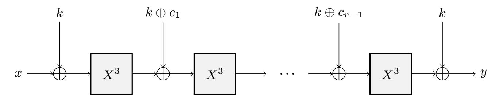
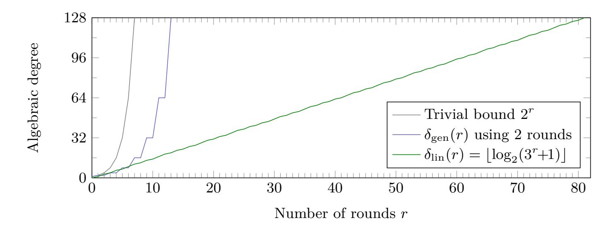

{0}------------------------------------------------

## **An Algebraic Attack on Ciphers with Low-Degree Round Functions: Application to Full MiMC**

**(Full Version)**

Maria Eichlseder<sup>1</sup> , Lorenzo Grassi<sup>1</sup>*,*<sup>2</sup> , Reinhard Lüftenegger<sup>1</sup> , Morten Øygarden<sup>3</sup> , Christian Rechberger<sup>1</sup> , Markus Schofnegger<sup>1</sup> , and Qingju Wang<sup>4</sup>

1 IAIK, Graz University of Technology (Austria) <sup>2</sup> Digital Security Group, Radboud University, Nijmegen (The Netherlands) <sup>3</sup> Simula UiB (Norway) <sup>4</sup> SnT, University of Luxembourg (Luxembourg) firstname.lastname@iaik.tugraz.at lgrassi@science.ru.nl morten.oygarden@simula.no qingju.wang@uni.lu

**Abstract.** Algebraically simple PRFs, ciphers, or cryptographic hash functions are becoming increasingly popular, for example due to their attractive properties for MPC and new proof systems (SNARKs, STARKs, among many others).

In this paper, we focus on the algebraically simple construction MiMC, which became an attractive cryptanalytic target due to its simplicity, but also due to its use as a baseline in a competition for more recent algorithms exploring this design space.

For the first time, we are able to describe key-recovery attacks on all full-round versions of MiMC over F2*<sup>n</sup>* , requiring half the code book. In the chosen-ciphertext scenario, recovering the key from this data for the *n*-bit full version of MiMC takes the equivalent of less than 2 *n*−log2(*n*)+1 calls to MiMC and negligible amounts of memory.

The attack procedure is a generalization of higher-order differential cryptanalysis, and it is based on two main ingredients. First, we present a higher-order distinguisher which exploits the fact that the algebraic degree of MiMC grows significantly slower than originally believed. Secondly, we describe an approach to turn this distinguisher into a key-recovery attack without guessing the full subkey. Finally, we show that approximately dlog<sup>3</sup> (2 · *R*)e more rounds (where *R* = d*n* · log<sup>3</sup> (2)e is the current number of rounds of MiMC-*n/n*) can be necessary and sufficient to restore the security against the key-recovery attack presented here.

The attack has been practically verified on toy versions of MiMC. Note that our attack does not affect the security of MiMC over prime fields.

**Keywords:** Algebraic attack · MiMC · Higher-order differential

{1}------------------------------------------------

### 1 Introduction

The design of symmetric cryptographic constructions exhibiting a clear and ideally low-degree algebraic structure is motivated by many recent use cases, for example the increasing popularity of new proof systems such as STARKs [8], SNARKs (e.g., Pinocchio [43]), Bulletproofs [19], and other concepts like secure multi-party computation (MPC). To provide good performance in these new applications, ciphers and hash functions are designed in order to minimize specific characteristics (e.g., the total number of multiplications, the depth, or other parameters related to the nonlinear operations). In contrast to traditional cipher design, the size of the field over which these constructions are defined has only a small impact on the final cost. In order to achieve this new performance goal, some crucial differences arise between these new designs and traditional ones. For example, we can consider the substitution (S-box) layer, that is, the operation providing nonlinearity in the permutation: In these new schemes, the S-boxes composing this layer are relatively large compared to the ones used in classical schemes (e.g., they operate over 64 or 128 bits instead of 4 or 8 bits) and/or they can usually be described by a simple low-degree nonlinear function (e.g.,  $x \mapsto x^d$  for some d). Examples of these schemes include LowMC [4], MiMC [3], Jarvis/Friday [6], GMiMC [2], HadesMiMC [30], Vision/Rescue [5], and STARKAD/POSEIDON [29].

The structure of these schemes has a significant impact on the attacks that can be mounted. While statistical attacks (including linear [41] and differential [11] ones) are among the most powerful techniques against traditional schemes, algebraic attacks turned out to be especially effective against these new primitives. In other words, these constructions are naturally more vulnerable to algebraic attacks than those which do not exhibit a clear and simple algebraic structure. For example, this has been shown in [1], in which algebraic strategies covering the full-round versions of the attacked primitives are described. Although the approaches can be quite different, most of them exploit the low degree of the construction.

In this paper, we focus on MiMC [3]. The MiMC design constructs a cryptographic permutation by iterated cubing, interleaved with additions of random constants to break any symmetries. A secret key is added after every such round to obtain a block cipher. The design of MiMC is very flexible and can work with binary strings as well as integers modulo some prime number. Security analysis by the designers rules out various statistical attacks, and the final number of rounds is derived from an analysis of attack vectors that exploit the simple algebraic structure. We remark that the designers chose the number of rounds with a minimal security margin for efficiency. For a more detailed specification and a summary of previous analysis, we refer to Section 2.3.

Since its publication in 2016, MiMC has become the preferred choice for many use cases that benefit from a low multiplication count or algebraic simplic-

{2}------------------------------------------------

<span id="page-2-1"></span>Table 1: Various attacks on MiMC. In this representation, n denotes the block size (and key size). The unit for the attack complexity is usually the cost of a single encryption (number of multiplications over  $\mathbb{F}_{2^n}$  necessary for a single encyption). The SK and KR attacks can be implemented using chosen plaintexts CP and/or chosen ciphertexts CC. The memory complexity is negligible for all approaches listed.

| Type           | n               | Rounds                                                                                    | $\operatorname{Time}$                              | Data                                                              | Source                              |
|----------------|-----------------|-------------------------------------------------------------------------------------------|----------------------------------------------------|-------------------------------------------------------------------|-------------------------------------|
| KR*            | 129             | 38                                                                                        | $2^{65.5}$                                         | $2^{60.2} \text{ CP}$                                             | [40]                                |
| SK<br>SK       | 129<br>n        | $\lceil \log_3(2^{n-1} - 1) \rceil - 1$                                                   | $2^{128} \text{ XOR} $ $2^{n-1} \text{ XOR}$       | $2^{128} \text{ CP/CC}$ $2^{n-1} \text{ CP/CC}$                   | Section 4.1<br>Section 4.1          |
| KK<br>KK       | 129<br>n        | $160 \ (\approx 2 \times \text{full})$ $2 \cdot \lceil \log_3(2^{n-1} - 1) \rceil - 2$    | _<br>_                                             | $2^{128} \\ 2^{n-1}$                                              | Section 4.3<br>Section 4.3          |
| KR<br>KR<br>KR | 129<br>255<br>n | $82 \text{ (full)}$ $161 \text{ (full)}$ $\lceil n \cdot \log_3(2) \rceil \text{ (full)}$ | $2^{122.64}$ $2^{246.67}$ $\leq 2^{n-\log_2(n)+1}$ | $2^{128} \text{ CC} $ $2^{254} \text{ CC} $ $2^{n-1} \text{ CC} $ | Section 5<br>Section 5<br>Section 5 |

 $KR \equiv Key\text{-Recovery}, KR^* \equiv attack$  on a variant of MiMC proposed in a low-memory scenario,  $SK \equiv Secret\text{-Key Distinguisher}, KK \equiv Known\text{-Key Distinguisher}$ 

ity [31,44]. It also serves as a baseline for various follow-up designs evaluated in the context of the public "STARK-Friendly Hash Challenge" competition<sup>5</sup>.

#### 1.1 Our Contribution

As the main results in this paper, we present

- (1) a new upper bound for the algebraic degree growth in key-alternating ciphers with low-degree round functions,
- (2) a secret-key higher-order distinguisher on almost full MiMC over  $\mathbb{F}_{2^n}$ ,
- (3) a known-key zero-sum distinguisher on almost double the rounds of MiMC,
- (4) the first key-recovery attack on full-round MiMC over  $\mathbb{F}_{2^n}$ .

We also show that the technique we use for MiMC is sufficiently generic to apply to any permutation fulfilling specific properties, which we will define in detail. Our attacks and distinguishers on MiMC, as well as other attacks in the literature, are listed in Table 1.

**Secret-Key Higher-Order Distinguishers.** After recalling some preliminary facts about higher-order differentials, in Section 3 we analyze the growth of the algebraic degree for key-alternating ciphers whose round function can be described as a low-degree polynomial over  $\mathbb{F}_{2^n}$ .

For an SPN cipher over a field  $\mathbb{F}$  where each round has algebraic degree  $\delta$ , the algebraic degree of the cipher is expected to grow essentially exponentially in

<span id="page-2-0"></span><sup>5</sup> https://starkware.co/hash-challenge/

{3}------------------------------------------------

 $\delta$ . Several analyses made in the literature [20,18,17] confirm this growth for most ciphers, except when the algebraic degree of the function is close to its maximum. As a result, the number of rounds necessary for security against higher-order differential attacks generally grows logarithmically in the size of  $\mathbb{F}$ . Different behaviour has been observed for certain non-SPN designs, such as some designs with partial nonlinear layers where the algebraic degree grows exponentially in some (not necessarily integer) value smaller than  $\delta$  [26].

In Section 3, we show that if the round function can be described as an invertible low-degree polynomial function in  $\mathbb{F}_{2^n}$ , then the algebraic degree grows linearly with the number of rounds, and not exponentially as generally expected. More precisely, let d denote the exponent of the power function  $x \mapsto x^d$  used to define the S-boxes. Then, we show that in the case of key-alternating ciphers over  $\mathbb{F}_{2^n}$ , the algebraic degree  $\delta(r)$  as a function in the number of rounds r is

$$\delta(r) \in \mathcal{O}(\log_2(d^r)) = \mathcal{O}(r).$$

As an immediate consequence, our observation implies that roughly  $n \cdot \log_d(2)$  rounds are necessary to provide security against higher-order differential attacks, much more than the expected  $\approx \log_{\delta}(n-1)$  rounds.

Distinguishers on MiMC over  $\mathbb{F}_{2^n}$ . Our new bounds on the number of rounds necessary to provide security against higher-order differential cryptanalysis have a major impact on key-alternating ciphers with large S-boxes. A concrete example for this class of ciphers is MiMC [3], a key-alternating cipher defined over  $\mathbb{F}_{2^n}$  (for odd  $n \in \mathbb{N}$ ), where the round function is simply defined as the cube map  $x \mapsto x^3$ . Since any cubic function over  $\mathbb{F}_{2^n}$  has algebraic degree 2, one may expect that approximately  $\log_2(n)$  rounds are necessary to prevent higher-order differential attacks. Our new bound implies that a much larger number of rounds is required to provide security, namely approximately  $n \cdot \log_3(2)$ .

As a concrete example, in Section 4 we show that MiMC-n/n has a security margin of only 1 or 2 rounds against (secret-key) higher-order distinguishers (depending on n), which is much smaller than expected by the designers. Moreover, we can set up a known-key distinguisher for approximately double the number of rounds of MiMC, by showing that the same number of rounds is necessary to reach the maximum degree in the decryption direction. Our findings have been practically verified on toy versions.

We remark that the designers presented other non-random properties (including GCD and interpolation attacks) that can cover a similar number of rounds. The number of rounds proposed by the designers were chosen in order to provide security against key-recovery attacks based on these properties. As we are going to show, the number of rounds is not sufficient against our new attack based on a higher-order differential property.

Results using the Division Property. For completeness, in Section 4.5 we search for higher-order distinguishers for MiMC-n/n with the division property [45] proposed by Todo at Eurocrypt 2015, a powerful tool for finding the best integral

{4}------------------------------------------------

distinguishers for block ciphers. By modeling the most recently proposed variant of the bit-based division property, which is called *three-subset bit-based division property without unknown subset* in [\[33\]](#page-28-6), we are able to reproduce exactly the same higher-order distinguishers for cases with small *n*-bit S-boxes, where *n* ∈ {5*,* 7*,* 9}. However, as far as we know, it is an open problem to model the three-subset bit-based division property for a larger S-box of size bigger than 9 in practical time. Therefore, we conclude that the division property is unlikely to help us for the ciphers we focus on.

**Key-Recovery Attack on MiMC-***n/n* **and on Generic Ciphers.** A trivial way to extend an *r*-round distinguisher to an (*r* + 1)-round key-recovery attack is based on guessing the last round key, partially decrypting/encrypting, and finally exploiting the distinguisher to filter wrong key guesses. Unfortunately, this strategy does not work for MiMC, since guessing the full last round key required to invert the large S-box is equivalent to exhaustive key search. Another key-recovery approach that has been combined with integral distinguishers is based on interpolating the Boolean polynomials that define the final rounds. However, this strategy requires evaluating the distinguisher several times to collect enough equations, which is not feasible for our distinguisher due to its large data complexity.

In Section [5,](#page-15-0) we show how to solve this problem. Instead of guessing the last round key, we set up an equation over F2*<sup>n</sup>* with the master key as a variable. To obtain this equation, we symbolically express the zero sum at the input to the last round as a polynomial function of the key, whose coefficients depend on the queried ciphertexts. We show how the resulting polynomial equation can be solved efficiently to recover the key. As a result, in the chosen-ciphertext case only, recovering the key from this data for the *full n*-bit version of MiMC takes the equivalent of less than 2 *n*−log<sup>2</sup> (*n*)+1 calls to MiMC, 2 *n*−1 chosen ciphertexts, and negligible amounts of memory. Moreover, we show that approximately dlog<sup>3</sup> (2 · *R*)e more rounds (where *R* = d*n* · log<sup>3</sup> (2)e is the current number of rounds of MiMC-*n/n*) can be necessary and sufficient to restore the security against the key-recovery attack presented here. This would, for example, imply that we need to add 5 more rounds for the most used version MiMC-129*/*129 (which currently has 82 rounds).

*A Generic Strategy.* Our strategy is an instance of a broader class of algebraic key-recovery approaches based on solving equations in the key variables. As such, it shares some ideas with other algebraic approaches like optimized interpolation attacks. However, while most algebraic key-recovery approaches of the last years construct and solve systems of many Boolean linear equations, we use a single univariate equation of higher degree that can be solved with polynomial factoring algorithms such as Berlekamp's algorithm. In Section [6,](#page-20-0) we outline a more detailed and generic procedure for such an attack. It is interesting to note that a comparatively old technique which basically disappeared for the cryptanalysis of AES-like ciphers turns out to be very competitive for schemes with large S-boxes.

{5}------------------------------------------------

#### 2 Preliminaries

In this section, we recall the most important results about polynomial representations of Boolean functions and summarize the currently best known results regarding the growth of the algebraic degree in the context of SP networks. We also provide the specification of MiMC and give an overview of previous cryptanalytic results.

We emphasize that in general it is only possible to give a *lower* bound regarding the number of rounds which we can attack using higher-order differential techniques, in the following denoted as "necessary number of rounds to provide security". While upper-bounding the algebraic degree is more important from an adversary's point of view, lower bounds on the degree are much more relevant when arguing about security against algebraic attacks (such as e.g. [39,37,48,24]) from a designer's viewpoint. However, at the current state of the art and to the best of our knowledge, it seems hard to find such a lower bound for a given cipher without investigating concrete instances experimentally – which, of course, limits the scope of any analysis.

#### 2.1 Polynomial Representations over Binary Extension Fields

We denote addition (and subtraction) in binary extension fields by the symbol  $\oplus$ . For  $n \in \mathbb{N}$ , every function  $F : \mathbb{F}_{2^n} \to \mathbb{F}_{2^n}$  can be uniquely represented by an n-tuple  $(F_1, F_2, \ldots, F_n)$  of polynomials over  $\mathbb{F}_2$  in n variables with a maximum degree of 1 in each variable. In this representation,  $F_i$  is of the form

<span id="page-5-0"></span>
$$F_i(X_1, \dots, X_n) = \bigoplus_{u = (u_1, \dots, u_n) \in \{0, 1\}^n} \varphi_i(u) \cdot X_1^{u_1} \cdot \dots \cdot X_n^{u_n}, \tag{1}$$

where the coefficients  $\varphi_i(u)$  can be computed by the *Moebius transform*.

As is common, we denote functions  $F: \mathbb{F}_2^n \to \mathbb{F}_2$  as Boolean functions and functions of the form  $F: \mathbb{F}_2^n \to \mathbb{F}_2^m$ , for  $n, m \in \mathbb{N}$ , as vectorial Boolean functions.

**Definition 1.** The algebraic normal form (ANF) of a Boolean function  $F: \mathbb{F}_2^n \to \mathbb{F}_2$ , as given in Eq. (1), is the unique representation as a polynomial over  $\mathbb{F}_2$  in n variables and with a maximum univariate degree of 1. The algebraic degree  $\delta(F)$  of F – or  $\delta$  for simplicity – is the degree of the above representation of F as a multivariate polynomial over  $\mathbb{F}_2$ . If  $G: \mathbb{F}_2^n \to \mathbb{F}_2^n$  is a vectorial Boolean function and  $(G_1, \ldots, G_n)$  is its representation as an n-tuple of multivariate polynomials over  $\mathbb{F}_2$ , then its algebraic degree  $\delta(G)$  is defined as  $\delta(G) := \max_{1 \le i \le n} \delta(G_i)$ .

The link between the algebraic degree and the univariate degree of a vectorial Boolean function is well-known, and is for example established in [22]: the algebraic degree of  $F: \mathbb{F}_{2^n} \to \mathbb{F}_{2^n}$  can be computed from its univariate polynomial representation, and is equal to the maximum hamming weight of the 2-ary expansion of its exponents.

{6}------------------------------------------------

**Lemma 1.** Let  $F: \mathbb{F}_{2^n} \to \mathbb{F}_{2^n}$  be a function and let  $F(X) = \sum_{i=0}^{2^n-1} \varphi_i \cdot X^i$  denote the corresponding univariate polynomial description over  $\mathbb{F}_{2^n}$ . The algebraic degree  $\delta(F)$  of F as a vectorial Boolean function is the maximum hamming weight<sup>6</sup> of its exponents, i.e., it is  $\delta(F) = \max_{0 \le i \le 2^n-1} \{ \operatorname{hw}(i) \mid \varphi_i \ne 0 \}$ .

#### <span id="page-6-4"></span>2.2 Higher-Order Differential Cryptanalysis

Higher-order differential attacks [39,37] form a prominent class of attacks exploiting the low algebraic degree of a nonlinear transformation such as a classical block cipher. If this degree is sufficiently low, an attack using multiple input texts and their corresponding output texts can be mounted. In more detail, if the algebraic degree of a Boolean function f is  $\delta$ , then, when applying f to all elements of an affine vector space  $\mathcal{V} \oplus c$  of dimension greater than  $\delta$  and taking the sum of these values, the result is 0, i.e.,  $\bigoplus_{v \in \mathcal{V} \oplus c} f(v) = 0$ .

#### Security Against Higher-Order Differential Attacks – State of the Art.

To prevent higher-order differential attacks against iterated block ciphers, one would usually want the maximum algebraic degree to be reached (well) within the suggested number of rounds. To achieve this goal, and to assess the security margins, it is crucial to estimate how the algebraic degree grows with the number of rounds.

The algebraic degree of composing two functions,  $F, G : \mathbb{F}_2^n \to \mathbb{F}_2^n$ , can be generically bounded by

<span id="page-6-1"></span>
$$\deg(F \circ G) \le \deg(F) \cdot \deg(G),\tag{2}$$

and hence an upper bound is found by iterative use of this on the round function. The resulting bound does, however, fail to reflect the real growth of the algebraic degree for many cryptosystems, and the problem of estimating the growth has been widely studied in the literature. After the initial work of Canteaut and Videau [20], a tighter upper bound was presented by Boura, Canteaut, and De Cannière [18] at FSE'11. There, the authors show how to deduce a new bound for the algebraic degree of iterated permutations for a special category of SP networks over  $(\mathbb{F}_{2^n})^t$ , which includes functions that have a number  $t \geq 1$  of balanced S-boxes as their nonlinear layer. Specifically, the authors show that the algebraic degree of the considered SP network grows almost exponentially, except when it is close to its maximum.

**Proposition 1** ([18]). Let F be a function from  $\mathbb{F}_2^N$  to  $\mathbb{F}_2^N$  corresponding to the concatenation of t smaller S-boxes  $S_1, \ldots, S_t$  defined over  $\mathbb{F}_2^n$ . Then, for any function G from  $\mathbb{F}_2^N$  to  $\mathbb{F}_2^N$ , we have

<span id="page-6-3"></span><span id="page-6-2"></span>
$$\deg(G \circ F(\cdot)) \le \min \left\{ \deg(F) \cdot \deg(G), N - \frac{N - \deg(G)}{\gamma} \right\}, \text{ where}$$
 (3)

<span id="page-6-0"></span>Given  $x = \sum_{i=0}^{\chi} x_i \cdot 2^i$  for  $x_i \in \{0,1\}$ , the hamming weight of x is  $hw(x) = \sum_{i=0}^{\chi} x_i$ .

{7}------------------------------------------------

<span id="page-7-1"></span>

Fig. 1: The MiMC encryption function with *r* rounds.

$$\gamma = \max_{i=1,\dots,n-1} \frac{n-i}{n-\delta_i} \le n-1,\tag{4}$$

*and where δ<sup>i</sup> is the maximum degree of the product of any i coordinates of any of the smaller S-boxes.*

Thus, the number of rounds necessary to prevent higher-order differential attacks is in general bigger than the one obtained using the trivial bound in Eq. [\(2\)](#page-6-1).

## <span id="page-7-0"></span>**2.3 Specification and Previous Analysis of MiMC**

MiMC [\[3\]](#page-26-2) is a key-alternating *n*-bit block cipher, where in each round the same *n*-bit key is added to the state. The nonlinear component of the construction is the evaluation of the cube function *f*(*x*) = *x* <sup>3</sup> over F2*<sup>n</sup>* . Additionally, a different round constant is added in each round to break symmetries, where the first round constant is 0. The total number of rounds is then

$$r = \lceil n \cdot \log_3(2) \rceil,$$

and we refer to Fig. [1](#page-7-1) for a graphical representation of the encryption function. MiMC is defined to work over prime fields and binary fields. In this paper, we focus on the binary field versions of MiMC[7](#page-7-2) , for which the block size *n* has to be odd in order for the S-box to be a permutation.

*MiMC: Related Attacks in the Literature.* The designers recommend MiMC with d*n*·log<sup>3</sup> (2)e rounds [\[3\]](#page-26-2). They derive this number of rounds by considering a variety of different key-recovery attacks on MiMC. According to their analysis, the most powerful attacks are interpolation [\[35\]](#page-28-10) and GCD attacks. About higher-order differential attacks, the authors claim that "*the large number of rounds ensures that the algebraic degree of MiMC in its native field will be maximum or almost maximum. This naturally thwarts higher-order differential attacks* [...]".

The first attack on MiMC-*n/n* [\[40\]](#page-28-2), presented at SAC 2019, targets a reducedround version of MiMC proposed by the designers for a scenario in which the attacker has only limited memory, but it does not affect the security claims of

<span id="page-7-2"></span><sup>7</sup> Since the only subspaces of F*p*, where *p* is a prime number, are {0} and F*<sup>p</sup>* itself, our attack does not affect the security of MiMC over prime fields.

{8}------------------------------------------------

full-round MiMC. The Feistel version of MiMC was attacked shortly after, by using generic properties of the used Feistel construction instead of exploiting properties of the primitive itself [16]. Finally, a specific attack on MiMC using Gröbner bases was considered in [1]. The authors state that by introducing a new intermediate variable in each round, the resulting multivariate system of equations is already a Gröbner basis and thus the first step of a Gröbner basis attack is for free. However, recovering univariate polynomials from this representation and then applying techniques like the GCD attack will result in a prohibitively large computational complexity, since the recovered polynomials will be of degree  $\approx 3^r$  after r rounds. Hence, the authors conclude that MiMC cannot be attacked directly by using known Gröbner basis techniques.

## <span id="page-8-0"></span>3 Higher-Order Differentials of Key-Alternating Ciphers

Our bound on the growth of the algebraic degree does not depend on the cubing of the round function in MiMC, so we introduce the following generalization of the result on MiMC from Section 2.3.

#### 3.1 Setting

Let  $E_k^r: \mathbb{F}_{2^n} \to \mathbb{F}_{2^n}$  be a key-alternating cipher defined by

$$E_k^r(x) := k_r \oplus R(\cdots R(k_1 \oplus R(k_0 \oplus x)) \cdots)$$
 (5)

over  $r \geq 1$  rounds, where  $k_0, k_1, \ldots, k_r \in \mathbb{F}_{2^n}$  are derived from a master key  $k \in \mathbb{F}_{2^n}$  using a key schedule. Each round function  $R : \mathbb{F}_{2^n} \to \mathbb{F}_{2^n}$  is defined as some invertible univariate polynomial function

<span id="page-8-1"></span>
$$R(x) := \rho_0 \oplus \bigoplus_{i=1}^d \rho_i \cdot x^i \tag{6}$$

of univariate degree  $d \geq 3$ , where  $\rho_i \in \mathbb{F}_{2^n}$  and  $\rho_d \neq 0$ . We will, without loss of generality, assume  $d \leq d_{\text{inv}}$ , where  $d_{\text{inv}}$  denotes the degree of the compositional inverse of R (otherwise, an attacker would target the decryption function instead). Furthemore, we assume that the round function has low univariate degree, i.e., low compared to the size of  $\mathbb{F}_{2^n}$ . In other words, we work with  $d \ll 2^n - 1$ .

## <span id="page-8-3"></span>3.2 Growth of the Degree

In this section, we show that the algebraic degree  $\delta$  of a key-alternating cipher  $E_k^r$  grows much slower than commonly presented in the literature. More precisely, in some cases it can grow linearly in the number of rounds and not exponentially.

<span id="page-8-2"></span>**Proposition 2.** Let  $E_k^r$  be a an r-round key-alternating block cipher with a round function R of degree d, as defined in Eq. (5). If  $r \leq \mathcal{R}_{lin} - 1$ , where

$$\mathcal{R}_{lin} = \left\lceil \log_d \left( 2^{n-1} - 1 \right) \right\rceil \approx (n-1) \cdot \log_d(2), \tag{7}$$

{9}------------------------------------------------

then the algebraic degree  $\delta$  of  $E_k^r$  is at most n-2. Consequently, a (secret-key) higher-order distinguisher using at most  $2^{n-1}$  data can be applied to  $E_k^r$ .<sup>8</sup>

*Proof.* Due to the relation between the word-level degree and the algebraic degree,  $E_k^r$  reaches its maximum algebraic degree of n-1 if at least one monomial with the exponent  $2^n-2^j-1$  (for  $0 \le j < n$ ) appears in the polynomial representation. Indeed, note that all these monomials have an algebraic degree of n-1. Since the smallest exponent of this form is  $2^n-2^{n-1}-1=2^{n-1}-1$ , and since the degree of  $E_k^r$  after r rounds is at most  $d^r$ , we require  $d^r \ge 2^{n-1}-1$  to make  $x^{2^{n-1}-1}$  appear, or equivalently,

$$r \ge \lceil \log_d(2^{n-1} - 1) \rceil.$$

Hence, the degree is not maximal for  $r < \lceil \log_d(2^{n-1} - 1) \rceil$  and a higher-order distinguisher using at most  $2^{n-1}$  data can be applied.

The Difficulty of Lower-Bounding the Growth of the Degree. We point out that it is always possible to set up a (secret-key) higher-order distinguisher if the number of rounds is smaller than  $\mathcal{R}_{lin}$ . However, a number of rounds greater than or equal to  $\mathcal{R}_{lin}$  does not necessarily provide security.

One of the main problems in order to derive a sufficient condition for the number of rounds that provides security is the difficulty of analyzing the non-vanishing coefficients in the polynomial representation of  $E_k^r$ . Note, in general it is not easy to give a condition guaranteeing that a particular monomial appears, since many factors (including the secret key, the constant addition, and the details of the S-box) influence the result.

Without going into the details, we consider the influence of the S-box in some concrete examples. Working with  $R(x) = x^d$  for a certain  $3 \le d \le 2^n - 2$  (where  $d \ne 2^{d'}$  for  $d' \in \mathbb{N}$ ), we focus for simplicity only on two extreme cases  $d = 2^{d'} \pm 1$ . By exploiting Lucas's Theorem<sup>9</sup>:

- If  $d = 2^{d'} + 1$  for some  $d' \in \mathbb{N}$ , then the output of a single round is sparse:

$$(x \oplus y)^{2^{d'}+1} = x^{2^{d'}+1} \oplus x^{2^{d'}} \cdot y \oplus y^{2^{d'}} \cdot x \oplus y^{2^{d'}+1}$$

(note that it contains only 4 terms instead of  $d+1=2^{d'}+2$ ).

- If  $d = 2^{d'} - 1$  for some  $d' \in \mathbb{N}$ , then the output of a single round is full, since

$$(x \oplus y)^{2^{d'}-1} = \bigoplus_{i=0}^{2^{d'}-1} x^i \cdot y^{2^{d'}-1-i}.$$

<span id="page-9-0"></span>We denote our bound by  $\mathcal{R}_{lin}$  to indicate the almost linear growth of the algebraic degree for this specific class of constructions.

<span id="page-9-1"></span><sup>&</sup>lt;sup>9</sup> By Lucas's Theorem,  $\binom{n}{m} \equiv \prod_{i=0}^k \binom{n_i}{m_i} \pmod{2}$ , it follows that where  $n = \sum_{i=0}^k n_i \cdot 2^i$  and  $m = \sum_{i=0}^k m_i \cdot 2^i$  is the 2-ary expansion of n and m, respectively.

{10}------------------------------------------------

Even if a single round is not sparse, the output of several combined rounds is not guaranteed to be full (even if it is in general dense). As a concrete example, while the output of  $(x \oplus k_0)^3 \oplus k_1$  is full, the same is not true for

<span id="page-10-0"></span>
$$((x \oplus k_0)^3 \oplus k_1)^3 \oplus k_2 = x^9 \oplus x^8 \cdot k_0 \oplus x^6 \cdot k_1 \oplus x^4 \cdot k_0^2 \cdot k_1 \oplus x^3 \cdot k_1^2 \oplus x^2 \cdot (k_0 \cdot k_1^2 \oplus k_0^2 \cdot k_1^2 \oplus k_0^4 \cdot k_1) \oplus x \cdot k_0^8 \oplus c(k_0, k_1, k_2),$$
(8)

where both  $x^5$  and  $x^7$  are missing, and where  $c(k_0, k_1, k_2)$  is a function that depends only on the keys. This simple example emphasizes the difficulty of analyzing the sparsity of the polynomial that defines  $E_k$ .

#### 3.3 Comparison with Other Bounds

We now compare the new number of rounds necessary to provide security against secret-key higher-order distinguishers with other possible bounds. An alternative strategy is to apply generic bounds focusing on the algebraic degree of the round function, as recalled in Proposition 1. Recall that  $\mathcal{R}_{\text{lin}}$  is the number of rounds from Proposition 2, and we will denote the number of round based on generic bounds by  $\mathcal{R}_{\text{gen}}$ . The comparison will make use of  $\delta_{\text{lin}}(r)$ , the upper bound on the algebraic degree after r rounds following Proposition 2. The upper bound from Eq. (3) will be denoted by  $\delta_{\text{gen}}(r)$ . Note that  $\delta_{\text{gen}}(r)$  can, for example, take advantage of a slower growth in the algebraic degree, as in Eq. (8) by considering two rounds instead of one. Despite this, the overall trend of  $\delta_{\text{gen}}(r)$  will still be exponential. On the other hand, if the round function can be described by a polynomial of low univariate degree d over  $\mathbb{F}_{2^n}$ , we expect a linear behaviour in  $\delta_{\text{lin}}(r)$ :

$$\delta_{\lim}(r) \leq |\log_2(d^r + 1)| \approx r \cdot \log_2(d).$$

As a result, the round numbers  $\mathcal{R}_{lin}$  and  $\mathcal{R}_{gen}$  necessary to provide security grow respectively linearly and logarithmically in the size n of the field, namely

$$\mathcal{R}_{\text{lin}} \in \mathcal{O}(n)$$
 and  $\mathcal{R}_{\text{gen}} \in \mathcal{O}(\log_{\delta}(n))$ .

A concrete comparison of  $\delta_{\text{lin}}(r)$  and  $\delta_{\text{gen}}(r)$  for MiMC-129/129 is given in Fig. 2. In this setting we have  $\delta_{\text{lin}}(r) = \lfloor \log_2(3^r + 1) \rfloor$ , and  $\delta_{\text{gen}}(r)$  has been derived using the observation that two rounds of MiMC have algebraic degree two (see Appendix A for more details). In particular, we find  $\mathcal{R}_{\text{gen}} = 13$  and  $\mathcal{R}_{\text{lin}} = 81$ .

Remark. We emphasize that every (invertible) S-box/round function in  $\mathbb{F}_2^n$  can be rewritten as a polynomial over  $\mathbb{F}_{2^n}$ . The crucial point here is that given a "random" S-box/round function over  $\mathbb{F}_2^n$ , the corresponding polynomial over  $\mathbb{F}_{2^n}$  has in general a high univariate degree (e.g.,  $d \approx 2^n - \varepsilon$  for some small  $\varepsilon$ ). In such a case, even if our argument still holds, the final result becomes meaningless, since  $\log_d(2^n-1) \approx \log_{2^n-\varepsilon}(2^n-1) \approx 1$  is basically constant (i.e., it does not grow linearly with n). Hence, our results turn out to be relevant only for S-boxes/round functions for which the corresponding polynomial over  $\mathbb{F}_{2^n}$  has "small" degree (namely, small compared to the field size, i.e.,  $d \ll 2^n$ ).

{11}------------------------------------------------

<span id="page-11-2"></span>

Fig. 2: Different upper bounds of the growth of the algebraic degree for MiMC-129*/*129. The trivial bound is 2 *r* . A tighter bound, *δ*gen(*r*), exploits the observation that 2 rounds only have degree 2 (see Eq. [\(8\)](#page-10-0)). Our new bound, *δ*lin(*r*), is linear in the number of rounds.

## <span id="page-11-1"></span>**4 Distinguishers for Reduced-Round and Full MiMC**

Exploiting the previous result, we now discuss the possibility to set up higher-order differential distinguishers and attacks on MiMC [\[3\]](#page-26-2). We show that

- *(1)* MiMC has a security margin of only 1 or 2 round(s) against (secret-key) higher-order distinguishers, depending on *n*, and that
- *(2)* a zero-sum known-key distinguisher can be set up for approximately double the number of rounds of MiMC.

#### <span id="page-11-0"></span>**4.1 Secret-Key Higher-Order Distinguisher for MiMC**

The results just presented allow to set up a nontrivial (secret-key) higher-order distinguisher on dlog<sup>3</sup> (2*n*−1−1)e−1 rounds of MiMC, where dlog<sup>3</sup> (2*n*−1−1)e−1 *<* d*n* · log<sup>3</sup> (2)e for all *n*. Consequently, the security margin is reduced to

$$1 \le \lceil n \cdot \log_3(2) \rceil - \left( \lceil \log_3(2^{n-1} - 1) \rceil - 1 \right) \le 2$$

rounds. To give some concrete examples, MiMC has 1 round of security margin for *n* ∈ {33*,* 63*,* 255}, and 2 rounds of security margin for *n* ∈ {31*,* 65*,* 127*,* 129}.

## <span id="page-11-4"></span>**4.2 Practical Results**

In this section we compare the results from Proposition [2](#page-8-2) with practical results from scaled-down versions of MiMC. The tests[10](#page-11-3) have been performed in the following way: Instead of computing the ANF of a keyed permutation (which

<span id="page-11-3"></span><sup>10</sup> The source code for the attacks and the tests is available on [https://github.com/](https://github.com/IAIK/mimc-analysis) [IAIK/mimc-analysis](https://github.com/IAIK/mimc-analysis).

{12}------------------------------------------------

<span id="page-12-1"></span>Table 2: Theoretical and practical round numbers *necessary* to prevent higherorder distinguishers for MiMC over F2*<sup>n</sup>* .

| Param. | Theoretical |      | Practical |  |
|--------|-------------|------|-----------|--|
| n      | Rlin        | Rgen | R         |  |
| 7      | 4           | 5    | 5         |  |
| 9      | 6           | 5    | 6         |  |
| 11     | 7           | 7    | 7         |  |
| 13     | 8           | 7    | 9         |  |
| 15     | 9           | 7    | 10        |  |
| 17     | 11          | 7    | 11        |  |
| 33     | 21          | 9    | 21        |  |
| 65     | 41          | 11   | -         |  |
| 129    | 81          | 13   | -         |  |

is expensive even for small field sizes), we evaluate the higher-order differential zero-sum property (as given in Section [2.2\)](#page-6-4) for a specific input vector space. Namely, for random keys, random constants, and an input subspace of dimension *n* − 1, we look for the minimum number of rounds *r* for which the corresponding sum of the ciphertexts is different from zero. Such a number corresponds to the number of rounds necessary to prevent higher-order distinguishers. In order to avoid the influence of weak keys or round constants, we repeated the tests multiple times (with new random keys and round constants). The practical number of rounds we give in each row is *the smallest number of rounds among all tested keys and round constants necessary* to prevent higher-order distinguishers. This means that a potentially higher number of rounds can be attacked by choosing the keys and round constants in a particular way.

The results, denoted R, are given in Table [2.](#page-12-1) We also present Rlin (from Proposition [2\)](#page-8-2) and Rgen (see Appendix [A\)](#page-30-0) for comparison. We emphasize that the theoretical values predicted by Rlin match the practical results in about half of the cases, and are off by at most one.

## <span id="page-12-0"></span>**4.3 Known-Key Zero-Sum Distinguisher for MiMC**

A known-key distinguisher is a scenario introduced in [\[38\]](#page-28-11) where the attacker knows the key, and it is important in all settings in which no secret material is present. To succeed, the attacker has to discover some property of the attacked cipher that holds with a probability higher than for an ideal cipher, or is believed to be hard to exhibit generically. The goal of a known-key zero-sum distinguisher is to find a set of plaintexts and ciphertexts whose sums are equal to zero. To do this, the idea is to exploit the inside-out approach. By choosing a subspace of texts V, one simply defines the plaintexts as the *r*dec-round decryption of V and the ciphertexts as the *r*enc-round encryption of V. Such a distinguisher can then cover *r*enc + *r*dec rounds. Examples of this approach are given in the literature for Keccak [\[18](#page-27-5)[,7,](#page-26-7)[10\]](#page-27-11), Luffa [\[18](#page-27-5)[,7\]](#page-26-7), or PHOTON [\[49\]](#page-28-12).

{13}------------------------------------------------

In the case of MiMC, the idea is to choose  $\mathcal{V}$  as a subspace of  $\mathbb{F}_{2^n}$  of dimension n-1. The maximum number of encryption rounds  $r_{\text{enc}}$  for which it is possible to guarantee a zero sum has been given in the previous paragraph. Based on Section 4.2, we can set up a known-key distinguisher on (more than) full MiMC-n/n. For our distinguisher on MiMC, we first recall the following result from [17].

<span id="page-13-0"></span>**Proposition 3 (Corollary 3 of [17]).** Let F be a permutation of  $\mathbb{F}_2^n$ . Then,  $\deg(F^{-1}) = n - 1$  if and only if  $\deg(F) = n - 1$ .

Corollary 1. Let  $r_{enc}$  be the number of rounds necessary for MiMC over  $\mathbb{F}_{2^n}$  to reach its maximum algebraic degree in the encryption direction. The same number of rounds is necessary for reaching the maximum algebraic degree in the decryption direction, i.e.,  $r_{dec} = r_{enc} = \lceil \log_3(2^{n-1} - 1) \rceil$ .

It follows that, given a subspace  $\mathcal{V} \subseteq \mathbb{F}_{2^n}$  of dimension n-1, the sums of the corresponding texts after  $r_{\text{dec}} - 1$  decryption rounds and  $r_{\text{enc}} - 1$  encryption rounds are always equal to zero, i.e.,

$$\underbrace{\bigoplus_{w \in \mathcal{V} \oplus v} R^{-(r_{\text{dec}}-1)}(w) = 0}_{\text{Zero sum}} \overset{R^{-(r_{\text{dec}}-1)}}{\sim} \mathcal{V} \oplus v \xrightarrow{R^{r_{\text{enc}}-1}} 0 = \bigoplus_{w \in \mathcal{V} \oplus v} R^{r_{\text{enc}}-1}(w)$$

for each  $v \in \mathbb{F}_{2^n}$ . Hence, a known-key zero-sum distinguisher can be set up for

$$2 \cdot (\lceil \log_3(2^{n-1} - 1) \rceil - 1) \approx 2(n-1) \cdot \log_3(2) - 2 =$$

$$= \underbrace{n \cdot \log_3(2)}_{\text{= full MiMC}} + [(n-2) \cdot \log_3(2) - 2]$$

rounds of MiMC-n/n, which is much more than full MiMC-n/n.

#### 4.4 Impact of the Known-Key Distinguisher on Full MiMC

**Sponge Function.** In [3], the authors propose a hash function by instantiating a sponge construction with  $\text{MiMC}^{\pi}$ , a fixed-key version of MiMC. The sponge hash function is indifferentiable from a random oracle up to  $2^{c/2}$  calls to the internal permutation P (where c is the capacity) if P is modeled as a randomly chosen permutation [9]. Thus, even if it is not strictly necessary, it is desirable that MiMC is resistant against known-key distinguishers.

For completeness, we mention that even if there is a way to distinguish a permutation from a random one, it seems difficult to exploit a zero-sum distinguisher of the internal permutation of a sponge construction in order to attack the hash function. To give a concrete example, consider the case of Keccak: As a consequence of the zero-sum distinguisher found on 18-round Keccak-f[1600], the number of rounds has been increased from 18 to 24 in the second round of the SHA-3 competition in order to avoid "non-ideal" properties

{14}------------------------------------------------

(see [\[18](#page-27-5)[,10\]](#page-27-11) for more details). However, the best known attack on the Keccak hash function can only be set up when using 6-/7-round Keccak-*f* [\[32\]](#page-28-13).

In any case, we remark that such distinguishers based on zero sums cannot be set up for an arbitrary number of rounds, and they do indeed exploit the internal properties of a primitive using the inside-out approach found in this paper and in other literature. Hence, they cannot be considered meaningless.

**Other Approaches.** Even though the original MiMC paper only specifies a sponge-based hash function using MiMC, there are various applications and/or specific considerations that would make a block-cipher-based approach more advantageous (like, for example, being forced to use a block size which is too small for a sponge-based approach). Another way to turn a block cipher into a hash function is to use a compression function like the Davies–Meyer one together with something like the Merkle–Damgård construction. Similar to the case of sponge constructions, the security of such an algorithm is proven in the ideal cipher model [\[12\]](#page-27-12). This choice is, however, not supported by the MiMC designers, who use our results to support their advice against using a block-cipher-based approach (even though such implementations can still be found[11](#page-14-1)). It follows that, since the attacker has control of the key in such scenarios, it is desirable for MiMC to be resistant against known- and chosen-key distinguishers, even if it does not seem to be strictly necessary.

#### <span id="page-14-0"></span>**4.5 Results Using the Division Property**

Finally, in Appendix [C](#page-31-0) we present our practical results obtained using "Mixed Integer Linear Programming (MILP)", which models the propagation of the (conventional) bit-based division property.

The (conventional) bit-based division property [\[47\]](#page-28-14) was proposed to investigate integral characteristics of block ciphers at a bit level. With this approach, the integral property of each bit is studied independently. Naturally, this strategy allows to capture more information of the propagation than the word-level version, and thus integral characteristics for more rounds can be found with this new technique. For example, the integral distinguishers of SIMON32 have been improved from 10 rounds [\[45\]](#page-28-5) (the current best result at word level) to 14 rounds [\[51\]](#page-28-15) (obtained by the experimental method cited before).

Instead of separating the parity into the two cases "0" and "unknown" as for the (conventional) bit-based division property, three-subset bit-based division property [\[47\]](#page-28-14) was introduced to enhance the accuracy of the conventional one, where the parity is separated into three sets, i.e., "0", "1", and "unknown". It shows that the three-subset bit-based division property can indeed be more accurate than the two-subset bit-based division property for some ciphers [\[34](#page-28-16)[,52\]](#page-28-17). However, it becomes harder to efficiently model the three-subset division property propagation even for ciphers with simple structures. Recently, [\[33\]](#page-28-6) pointed out

<span id="page-14-1"></span><sup>11</sup> <https://github.com/HarryR/ethsnarks/blob/master/src/gadgets/mimc.hpp>

{15}------------------------------------------------

that the three-subset division property has a couple of known problems when applied to cube attacks, and proposed a modified three-subset bit-based division without the "unknown" set to overcome these problems. By modeling this modified version of the three-subset bit-based division property for our cases with small n-bit S-boxes, where  $n \in \{5,7,9\}$ , we confirm the practical results given in Table 2.

However, as far as we know, it is still an open problem to model the (modified) three-subset bit-based division property for a larger S-box of size bigger than 9. The S-boxes we focus on in this paper can be described as a (low-degree) polynomial function in  $\mathbb{F}_{2^n}$ , where n is much larger than 9. Therefore, the division property, which is commonly believed as the most efficient tool to find the best integral distinguishers, might not help us as much for the ciphers we focus on.

## <span id="page-15-0"></span>5 Key-Recovery Attack on MiMC

Since the security margin of MiMC with respect to a (secret-key) higher-order distinguisher is of only 1 or 2 round(s) depending on n, it is potentially possible to extend a distinguisher to a key-recovery attack. Given a subspace  $\mathcal{V}$  of plaintexts whose sum is equal to zero after r rounds, we can consider r+1 rounds, partially guess the last subkey and decrypt, and filter wrong key guesses that do not satisfy the zero sum:

$$\mathcal{V} \oplus v \xrightarrow{R^r(\cdot)} \bigoplus_{w \in \mathcal{V} \oplus v} R^r(w) = 0 \quad \xleftarrow{R^{-1}(\cdot)}_{\text{Key guessing}} \underbrace{\{R^{r+1}(w) \mid w \in \mathcal{V} \oplus v\}}_{\text{Ciphertexts}}.$$

However, since the subkeys of MiMC are equal to the master key plus constants, and due to the single full-state S-box, even a (partial) decryption of a single round requires guessing the full key. As a result, a key-recovery attack on full MiMC based on this strategy seems infeasible.

In this section, we present an alternative strategy that allows to break full-round MiMC. Since a trivial key-guessing approach is inefficient, our idea is to construct a polynomial of low degree, which we can then try to solve.

#### <span id="page-15-1"></span>5.1 Strategy of the Attack

From Proposition 2 and Proposition 3, a zero sum can be set up for at least  $\lceil (n-1)\log_3(2) \rceil - 1 = \lceil n\log_3(2) \rceil - \varepsilon$  rounds in the encryption and decryption direction with a vector space  $\mathcal{V} \oplus v$  of dimension n-1, where  $\varepsilon \in \{1,2\}$ . Recalling that  $\lceil n \cdot \log_3(2) \rceil$  is the number of rounds of full MiMC, we define  $r_{\text{ZS}}$ ,  $r_{\text{KR}}$  as

$$r_{\rm ZS} = \lceil (n-1)\log_3(2) \rceil - 1$$
 and  $r_{\rm KR} = 1 + (\lceil n\log_3(2) \rceil - \lceil (n-1)\log_3(2) \rceil)$ ,

where  $r_{ZS}$  is the number of rounds that we can cover with a zero sum,  $r_{KR} = [n \cdot \log_3(2)] - r_{ZS} \in \{1, 2\}.$ 

Let  $f^r(x, K)$  be the function corresponding to r rounds of  $\mathrm{MiMC}_k(\cdot)$  (and  $f^{-r}(x, K)$  be r rounds of decryption,  $\mathrm{MiMC}_k^{-1}(\cdot)$ ), where x is the input text and

{16}------------------------------------------------

K is a symbolic variable that represents the secret key k. We intend to use these functions to create a polynomial from which we can deduce k. More precisely, for a fixed vector space  $\mathcal{V} \oplus v$ , we consider the equations

<span id="page-16-0"></span>
$$\underbrace{\bigoplus_{x \in \operatorname{MiMC}_{k}^{-1}(\mathcal{V} \oplus v)} f^{r_{\operatorname{KR}}}(x, K) = 0}_{=F(K)} \quad \text{and} \quad \underbrace{\bigoplus_{x \in \operatorname{MiMC}_{k}(\mathcal{V} \oplus v)} f^{-r_{\operatorname{KR}}}(x, K) = 0. \quad (9)$$

After having received all x values from an oracle, the attacker can construct one of the polynomials F(K) = 0 or G(K) = 0. The secret key k can now be determined by finding the roots of either of these polynomials.

In the case of MiMC, the degree of a single encryption round is 3, while the degree of a single decryption round is  $(2^{n+1}-1)/3$  (which is significantly larger than 3 for large n). Due to the slow degree growth in the encryption direction of MiMC, we will focus on finding the roots of F(K) given in Eq. (9).

Finding the Roots of Univariate Polynomials. Let  $F(X) \in \mathbb{F}_{2^n}[X]/\langle X^{2^n} + X \rangle$  be a univariate polynomial of degree D. Furthermore, let M(D) denote a number such that multiplying two polynomials of degree  $\leq D$  over  $\mathbb{F}_{2^n}$  requires  $\mathcal{O}(M(D))$  operations in  $\mathbb{F}_{2^n}$ . For instance, a straightforward method would yield  $M(D) = D^2$ , whereas  $M(D) = D \cdot \log(D) \cdot \log\log(D)$  holds for methods based on fast Fourier transforms [21]. The Berlekamp algorithm for determining the roots of F is then expected to require  $C \in \mathcal{O}(M(D)\log(D)\log(2^nD))$  operations in  $\mathbb{F}_{2^n}$  (see [28, Chapter 14.5]).

#### 5.2 Details of the Attack

Assume  $\mathcal{V} \oplus v$  is a coset of a subspace  $\mathcal{V}$  of dimension n-1. We define

$$\mathcal{W} = \operatorname{MiMC}_{k}^{-1}(\mathcal{V} \oplus v) \equiv \{\operatorname{MiMC}_{k}^{-1}(x) \in \mathbb{F}_{2^{n}} \mid x \in \mathcal{V} \oplus v\}$$

under a fixed secret key k. Here, we present the details of the attack for the cases  $r_{\rm KR} = 1$  and  $r_{\rm KR} = 2$ , and we analyze the computational cost. We introduce the following notation:

<span id="page-16-1"></span>
$$\forall d \in \mathbb{N}: \qquad \mathscr{P}_d := \bigoplus_{x \in \mathcal{W}} x^d, \tag{10}$$

and whenever possible we will make use of the fact that squaring is a linear operation over  $\mathbb{F}_{2^n}$ . More specifically, computing  $\mathscr{P}_{2d}$  only requires a single squaring operation once  $\mathscr{P}_d$  is calculated:

$$\mathscr{P}_{2d} := \bigoplus_{x \in \mathcal{W}} x^{2d} = \left(\bigoplus_{x \in \mathcal{W}} x^d\right)^2 = \mathscr{P}_d^2. \tag{11}$$

This allows to reduce the total number of XOR operations.

{17}------------------------------------------------

#### **Algorithm 1:** Attack on MiMC – Case: $r_{KR} = 1$ .

```
Input: Vector subspace V of ciphertexts of dimension \dim(V) = n - 1. Output: Secret key k.
```

- 1  $\mathscr{P}_1, \mathscr{P}_2, \mathscr{P}_3 \leftarrow 0$ .
- 2 for  $x \in \mathcal{V} \oplus v$  do
- $p \leftarrow \text{MiMC}_k^{-1}(x)$  from the decryption oracle.
- 4  $\mathscr{P}_1 \leftarrow \mathscr{P}_1 \oplus p$ .
- 5  $q \leftarrow p^2$ .
- 6  $\mathscr{P}_3 \leftarrow \mathscr{P}_3 \oplus q \cdot p$ .
- 7  $\mathscr{P}_2 \leftarrow (\mathscr{P}_1)^2$ .
- s  $F(K) = \mathscr{P}_1 \cdot K^2 \oplus \mathscr{P}_2 \cdot K \oplus \mathscr{P}_3$ .
- **9** Find a solution k of F(K) = 0 see Section 5.1 (filter multiple solutions by brute force).
- 10 return k.

Case:  $r_{KR} = 1$ . Since a single round of MiMC is described by  $(x \oplus k)^3 = k^3 \oplus k^2 \cdot x \oplus k \cdot x^2 \oplus x^3$ , the function F(K) is given by

$$F(K) = K^2 \cdot \mathscr{P}_1 \oplus K \cdot \mathscr{P}_2 \oplus \mathscr{P}_3.$$

A complete pseudo code of the attack can be found in Algorithm 1, which makes it easy to see that the cost of the attack is well approximated by

- $-|\mathcal{V}| = 2^{n-1}$  multiplications,
- $-|\mathcal{V}| = 2^{n-1} + 1$  squarings,
- $-2 \cdot |\mathcal{V}| + 1 = 2^n + 1$  n-bit XOR operations,
- cost of finding the roots of a univariate polynomial of degree 2.

Case:  $r_{KR} = 2$ . The attack for the case  $r_{KR} = 2$  is similar. From Eq. (8) (using  $k_0 = k$ ,  $k_1 = k \oplus c_1$  and  $k_2 = 0$ ), the function F(K) is described by

$$F(K) = K^{8} \cdot \mathscr{P}_{1} \oplus K^{5} \cdot \mathscr{P}_{2} \oplus K^{4} \cdot (\mathscr{P}_{2} \cdot c_{1} \oplus \mathscr{P}_{1}) \oplus K^{3} \cdot (\mathscr{P}_{4} \oplus \mathscr{P}_{2})$$
$$\oplus K^{2} \cdot (\mathscr{P}_{4} \cdot c_{1} \oplus \mathscr{P}_{3} \oplus \mathscr{P}_{1} \cdot c_{1}^{2}) \oplus K \cdot (\mathscr{P}_{8} \oplus \mathscr{P}_{6} \oplus \mathscr{P}_{2} \cdot c_{1}^{2}) \oplus (\mathscr{P}_{9} \oplus \mathscr{P}_{6} \cdot c_{1} \oplus \mathscr{P}_{3} \cdot c_{1}^{2}),$$

where  $c_1$  is the round constant of the first round. As also noted in Section 3.2, while  $\mathscr{P}_9$  is the largest  $\mathscr{P}_d$  in this expression, both  $\mathscr{P}_5$  and  $\mathscr{P}_7$  are missing, and hence do not need to be computed. A complete pseudo code of the attack can be found in Algorithm 2. Again, it is easy to see that the cost of the attack is well approximated by

- $-2 \cdot |\mathcal{V}| + 6 = 2^n + 6$  multiplications,
- $-2 \cdot |\mathcal{V}| + 4 = 2^n + 4 \text{ squarings},$
- $-3 \cdot |\mathcal{V}| + 8 = 3 \cdot 2^{n-1} + 8$  n-bit XOR operations,
- cost of finding the roots of a univariate polynomial of degree 8.

{18}------------------------------------------------

```
Algorithm 2: Attack on MiMC – Case: r_{KR} = 2.
```

```
Input: Vector subspace \mathcal{V} of ciphertexts of dimension \dim(\mathcal{V}) = n - 1.
                             Output: Secret key k.
         1 \mathscr{P}_1, \mathscr{P}_2, \mathscr{P}_3, \dots, \mathscr{P}_9 \leftarrow 0.
          2 for x \in \mathcal{V} \oplus v do
                                                        p \leftarrow \text{MiMC}_k^{-1}(x) from the decryption oracle.
         3
                                                         \mathscr{P}_1 \leftarrow \mathscr{P}_1 \oplus p.
         4
                                                          q_2 \leftarrow p^2.
         5
                                                           q_3 \leftarrow q_2 \cdot p.
         6
                                                         \mathscr{P}_3 \leftarrow \mathscr{P}_3 \oplus q_3.
         7
                                                          q_6 \leftarrow q_3^2.
          8
                                                          \mathscr{P}_9 \leftarrow \mathscr{P}_9 \oplus q_6 \cdot q_3.
         9
  10 \mathscr{P}_2 \leftarrow (\mathscr{P}_1)^2.
11 \mathscr{P}_4 \leftarrow (\mathscr{P}_2)^2
 12 \mathscr{P}_6 \leftarrow (\mathscr{P}_3)^2
 13 \mathscr{P}_8 \leftarrow (\mathscr{P}_4)^2.
14 F(K) = K^{8} \cdot \mathscr{P}_{1} \oplus K^{5} \cdot \mathscr{P}_{2} \oplus K^{4} \cdot (\mathscr{P}_{2} \cdot c_{1} \oplus \mathscr{P}_{1}) \oplus K^{3} \cdot (\mathscr{P}_{4} \oplus \mathscr{P}_{2}) \oplus K^{2} \cdot (\mathscr{P}_{4} \oplus \mathscr{P}_{2}) \oplus K^{2} \cdot (\mathscr{P}_{4} \oplus \mathscr{P}_{2}) \oplus K^{2} \cdot (\mathscr{P}_{4} \oplus \mathscr{P}_{2}) \oplus K^{2} \cdot (\mathscr{P}_{4} \oplus \mathscr{P}_{2}) \oplus K^{2} \cdot (\mathscr{P}_{4} \oplus \mathscr{P}_{2}) \oplus K^{2} \cdot (\mathscr{P}_{4} \oplus \mathscr{P}_{2}) \oplus K^{2} \cdot (\mathscr{P}_{4} \oplus \mathscr{P}_{2}) \oplus K^{2} \cdot (\mathscr{P}_{4} \oplus \mathscr{P}_{2}) \oplus K^{2} \cdot (\mathscr{P}_{4} \oplus \mathscr{P}_{2}) \oplus K^{2} \cdot (\mathscr{P}_{4} \oplus \mathscr{P}_{2}) \oplus K^{2} \cdot (\mathscr{P}_{4} \oplus \mathscr{P}_{2}) \oplus K^{2} \cdot (\mathscr{P}_{4} \oplus \mathscr{P}_{2}) \oplus K^{2} \cdot (\mathscr{P}_{4} \oplus \mathscr{P}_{2}) \oplus K^{2} \cdot (\mathscr{P}_{4} \oplus \mathscr{P}_{2}) \oplus K^{2} \cdot (\mathscr{P}_{4} \oplus \mathscr{P}_{2}) \oplus K^{2} \cdot (\mathscr{P}_{4} \oplus \mathscr{P}_{2}) \oplus K^{2} \cdot (\mathscr{P}_{4} \oplus \mathscr{P}_{2}) \oplus K^{2} \cdot (\mathscr{P}_{4} \oplus \mathscr{P}_{2}) \oplus K^{2} \cdot (\mathscr{P}_{4} \oplus \mathscr{P}_{2}) \oplus K^{2} \cdot (\mathscr{P}_{4} \oplus \mathscr{P}_{2}) \oplus K^{2} \cdot (\mathscr{P}_{4} \oplus \mathscr{P}_{2}) \oplus K^{2} \cdot (\mathscr{P}_{4} \oplus \mathscr{P}_{2}) \oplus K^{2} \cdot (\mathscr{P}_{4} \oplus \mathscr{P}_{2}) \oplus K^{2} \cdot (\mathscr{P}_{4} \oplus \mathscr{P}_{2}) \oplus K^{2} \cdot (\mathscr{P}_{4} \oplus \mathscr{P}_{2}) \oplus K^{2} \cdot (\mathscr{P}_{4} \oplus \mathscr{P}_{2}) \oplus K^{2} \cdot (\mathscr{P}_{4} \oplus \mathscr{P}_{2}) \oplus K^{2} \cdot (\mathscr{P}_{4} \oplus \mathscr{P}_{2}) \oplus K^{2} \cdot (\mathscr{P}_{4} \oplus \mathscr{P}_{2}) \oplus K^{2} \cdot (\mathscr{P}_{4} \oplus \mathscr{P}_{2}) \oplus K^{2} \cdot (\mathscr{P}_{4} \oplus \mathscr{P}_{2}) \oplus K^{2} \cdot (\mathscr{P}_{4} \oplus \mathscr{P}_{2}) \oplus K^{2} \cdot (\mathscr{P}_{4} \oplus \mathscr{P}_{2}) \oplus K^{2} \cdot (\mathscr{P}_{4} \oplus \mathscr{P}_{2}) \oplus K^{2} \cdot (\mathscr{P}_{4} \oplus \mathscr{P}_{2}) \oplus K^{2} \cdot (\mathscr{P}_{4} \oplus \mathscr{P}_{2}) \oplus K^{2} \cdot (\mathscr{P}_{4} \oplus \mathscr{P}_{2}) \oplus K^{2} \cdot (\mathscr{P}_{4} \oplus \mathscr{P}_{2}) \oplus K^{2} \cdot (\mathscr{P}_{4} \oplus \mathscr{P}_{2}) \oplus K^{2} \cdot (\mathscr{P}_{4} \oplus \mathscr{P}_{2}) \oplus K^{2} \cdot (\mathscr{P}_{4} \oplus \mathscr{P}_{2}) \oplus K^{2} \cdot (\mathscr{P}_{4} \oplus \mathscr{P}_{2}) \oplus K^{2} \cdot (\mathscr{P}_{4} \oplus \mathscr{P}_{2}) \oplus K^{2} \cdot (\mathscr{P}_{4} \oplus \mathscr{P}_{2}) \oplus K^{2} \cdot (\mathscr{P}_{4} \oplus \mathscr{P}_{2}) \oplus K^{2} \cdot (\mathscr{P}_{4} \oplus \mathscr{P}_{2}) \oplus K^{2} \cdot (\mathscr{P}_{4} \oplus \mathscr{P}_{2}) \oplus K^{2} \cdot (\mathscr{P}_{4} \oplus \mathscr{P}_{2}) \oplus K^{2} \cdot (\mathscr{P}_{4} \oplus \mathscr{P}_{2}) \oplus K^{2} \cdot (\mathscr{P}_{4} \oplus \mathscr{P}_{2}) \oplus K^{2} \cdot (\mathscr{P}_{4} \oplus \mathscr{P}_{2}) \oplus K^{2} \cdot (\mathscr{P}_{4} \oplus \mathscr{P}_{2}) \oplus K^{2} \cdot (\mathscr{P}_{4} \oplus \mathscr{P}_{2}) \oplus K^{2} \cdot (\mathscr{P}_{4} \oplus \mathscr{P}_{2}) \oplus K^{2} \cdot (\mathscr{P}_{4} \oplus \mathscr{P}_{2}) \oplus K^{2} \cdot (\mathscr{P}_{4} \oplus \mathscr{P}_{2}) \oplus K^{2} \cdot (\mathscr{P}_{4} \oplus \mathscr{P}_{2}) \oplus K^{2} \cdot (\mathscr{P}_{4} \oplus \mathscr{P}_{2}) \oplus K^{2} \cdot (\mathscr{P}_{4} \oplus \mathscr{P}_{2}) \oplus K^{2} \cdot (\mathscr{P}_{4} \oplus \mathscr{P}_{2}) \oplus K^{2
                                   (\mathscr{P}_4\cdot c_1\oplus \mathscr{P}_3\oplus \mathscr{P}_1\cdot c_1^2)\oplus K\cdot (\mathscr{P}_8\oplus \mathscr{P}_6\oplus \mathscr{P}_2\cdot c_1^2)\oplus (\mathscr{P}_9\oplus \mathscr{P}_6\cdot c_1\oplus \mathscr{P}_3\cdot c_1^2).
 15 Find a solution k of F(K) = 0 (filter multiple solutions by brute force).
 16 return k.
```

#### 5.3 Complexity Estimation

As we have just seen, our attack requires half of the code book (namely,  $2^{n-1}$  chosen ciphertexts). Here we show that our attacks are better than exhaustive search (from the computational point of view). In order to do this, we measure the time complexities in equivalent encryption operations.

A single encryption round in MiMC requires one addition, one squaring operation, and one multiplication in the extension field. Since the cost of a single n-bit XOR operation is much smaller than the cost of a multiplication over  $\mathbb{F}_{2^n}$ , and since the number of XOR operations is similar to the number of multiplications, in the following we do not consider XOR operations. After this simplification, we find that the time complexity of  $r_{\rm KR}=1$  is dominated by  $2^{n-1}$  squaring and multiplication operations or, equivalently,  $2^{n-1}$  encryption rounds. A similar line of reasoning reveals that  $r_{\rm KR}=2$  is comparable to  $2^n$  encryption rounds.

Since the cost of solving a single low-degree equation is negligible, and one unit of encryption contains  $\lceil n \cdot \log_3(2) \rceil$  rounds, it follows that the cost of our attacks is about

$$\frac{r_{\mathrm{KR}} \cdot 2^{n-1}}{\lceil n \cdot \log_3(2) \rceil}$$

encryptions for  $r_{KR} \in \{1, 2\}$ . That is, the computational cost of the key-recovery part of our attacks is upper-bounded by  $2^{n-\log_2(n)+1}$ , and hence the total cost is smaller than that of a brute-force attack (namely,  $2^n$  encryptions) for each  $n \geq 3$ .

{19}------------------------------------------------

#### 5.4 Practical Verification

We implemented Algorithm 1 and Algorithm 2 in the computer algebra system Magma, and verified both algorithms for all odd integers  $n \in [5,35]$ . We note that Algorithm 1  $(r_{KR} = 1)$  yields the correct answer for all the tested  $5 \le n \le 35$ , even if  $\lceil n \log_3(2) \rceil \ne \lceil (n-1) \log_3(2) \rceil$ . Namely, in practice it is possible to cover one more round with a zero sum than what we theoretically expect. In other words,  $\lceil (n-1) \log_3(2) \rceil$  rounds of the decryption function of MiMC fail to obtain the maximum algebraic degree for these parameters, which is reached after  $\lceil (n-1) \log_3(2) \rceil + 1$  rounds (see Appendix B for more details on the degree growth of MiMC<sup>-1</sup>). Since we are not able to prove this behavior for larger values of n, we leave it as an open question whether Algorithm 1 can be applied to MiMC for odd integers n > 35.

Considerations on Data and Computational Costs of this Attack. A possible drawback of our attack is the cost. Since we are not able to provide an estimation of the growth of the degree in the decryption direction, we can only exploit the fact that a certain number of rounds are necessary in order to achieve maximum degree. It follows that the attacker is forced to use half of the code book in order to set up the attack, which also has an impact on the computational cost.

Even if our attack is not practical, we believe it provides valuable theoretical insight. It is also in line with several other attacks found in the literature, which are set up under a similar assumption on the data and/or computational cost. To give some concrete examples, consider the case of zero-correlation attacks [14], which exploit linear approximations that hold with probability  $\frac{1}{2}$ . The crucial limitation for basic zero-correlation linear cryptanalysis is that it requires half of the code book. Only follow-up works have been able to reduce this data requirement, including the more powerful distinguisher called multiple zero-correlation (MPZC) linear distinguisher proposed in [15], which exploits the fact that there are numerous zero-correlation linear approximations in susceptible ciphers. While needing (close to) the full code book is an inherent property of zero-correlation attacks, the reason for the high data complexity in our case is purely due to the specification of MiMC and the attacked number of rounds, and not due to an inherent property of our attack.

Splice-and-cut meet-in-the-middle attacks and biclique attacks are other examples of attacks that often come with time complexities relatively close to exhaustive search. Indeed, an extension of the biclique approach first described in [13] has a brute-force phase for a number of rounds as part of the attack. It can in principle work for any number of rounds and is hence best described as a particular optimization of brute-force key guessing. However, later variants then showed examples where the gain over brute force was in the order of millions [36]. Still, we note that the complexity of biclique attacks scales differently than our attack, whose runtime cost depends strongly on the details of the target cipher MiMC.

{20}------------------------------------------------

Finally, we point out that any attack that is better than brute force is relevant, even if it requires unrealistic amounts of data or storage. Indeed, the main goal of cryptanalysis is finding a "certificated weakness", that is, an evidence that the cipher does not perform as advertised. In other words, in academic cryptography, a weakness or a break in a scheme is usually defined quite conservatively: It may require impractical amounts of time, memory, or data.

The Number of Rounds Needed for Security. It may be of interest to estimate the number of rounds needed for MiMC to be resistant against this attack. To this end, we bound the operations needed to compute all monomials of odd degree, up to a maximum degree D.

<span id="page-20-1"></span>**Lemma 2.** Let  $1 \leq D \leq 2^n - 1$  and  $x \in \mathbb{F}_{2^n}$ . The overall number of operations needed to compute all odd powers  $x^i$  for  $i \in [3, D]$  is given by 1 squaring and  $\lfloor \frac{D-1}{2} \rfloor$  multiplications.

*Proof.* From x, calculate and store  $q:=x^2$ . The odd powers of x can now be successively computed as  $x^{i+2}=x^i\cdot q$  for all odd integers i in the interval [1,D-2]. This yields a total of 1 squaring and  $\left\lfloor \frac{D-1}{2} \right\rfloor$  multiplications.

Assume for simplicity that  $\lceil n \cdot \log_3(2) \rceil - 1$  rounds can be covered by a zero sum, and that the cost of solving the final polynomial equation is negligible. As before, we expect the time complexity to be dominated by the number of operations needed to construct the polynomial F(K). Since the degree of this polynomial is upper-bounded by  $3^{r_{KR}}$ , by Lemma 2 at most  $[(3^{r_{KR}} - 1)/2] \cdot 2^{n-1}$  multiplications are required to compute all monomials with odd exponents in F(K) (where all monomials with even exponents are computed via Eq. (11)).

Since one encryption of MiMC costs  $\lceil n \cdot \log_3(2) \rceil$  multiplications, the number of extra rounds  $\rho$  for MiMC must satisfy

$$(3^{\rho+1}-1)\cdot 2^{n-2} \ge 2^n \cdot (\lceil n \cdot \log_3(2) \rceil + \rho)$$

in order to provide security against the attack just presented. This would, for example, require at least  $\rho = 5$  extra rounds for n = 129 (more generally, if R is the number of rounds of MiMC-n/n, then  $\rho \approx \lceil \log_3(2 \cdot R) \rceil$  more rounds are sufficient to restore the security<sup>12</sup>). We remark that this rough estimation is not intended to replace the number of rounds proposed by the designers.

## <span id="page-20-0"></span>6 An Algebraic Attack on Ciphers with Low-Degree Round Functions

Here we generalize the key-recovery attack on MiMC described in Section 5 and discuss a generic attack strategy for any block cipher working over  $(\mathbb{F}_{2^n})^t$ , where  $n, t \in \mathbb{N}, t \geq 2$  and  $n \geq 3$ .

<span id="page-20-2"></span>In more details,  $\rho \ge \log_3(4 \cdot (R+\rho) + 1) - 1$ . The previous estimation is obtained by assuming  $\rho \le R/2$ .

{21}------------------------------------------------

#### 6.1 Setting

We consider an r-round block cipher  $E_k^r: (\mathbb{F}_{2^n})^t \to (\mathbb{F}_{2^n})^t$  with

$$E_k^r(x) = (R_r \circ R_{r-1} \circ \cdots \circ R_1)(x \oplus k),$$

and where  $R, R_i : (\mathbb{F}_{2^n})^t \to (\mathbb{F}_{2^n})^t$  are defined by  $R_i(x) = R(x) \oplus k^{(i)}$ . Here, R denominates the (nonlinear) round function. Since  $E_k^r$  consists of t components, we can write

$$E_k^r(x) = (E_{k,1}^r(x), \dots, E_{k,t}^r(x)),$$

where  $E_{k,i}^r: (\mathbb{F}_{2^n})^t \to \mathbb{F}_{2^n}$ . We denote the compositional inverse of  $E_k^r$  by  $E_k^{-r}$ . We assume that

- (1) the *i*-th round key  $k^{(i)} \in (\mathbb{F}_{2^n})^t$  is derived from the master key  $k = (k_1, \ldots, k_t) \in (\mathbb{F}_{2^n})^t$  by some *low-degree* (e.g., linear) key schedule,
- (2) the round function R can be described by a polynomial

$$R(x = (x_1, \dots, x_t)) = \bigoplus_{\substack{j = (j_1, \dots, j_t) \in \{0, 1, \dots, 2^n - 1\}^t \\ j_1 + \dots + j_t < d}} \alpha_j \cdot x_1^{j_1} \cdot \dots \cdot x_t^{j_t}$$

of low-degree d with coefficients  $\alpha_j \in (\mathbb{F}_{2^n})^t$ .

Our attack requires the symbolic evaluation of the encryption function  $E_k^{r'}$  for a small number of rounds r' to be relatively easy, which motivates the requirements of a low-degree round function R and a low-degree key schedule. This ensures that the polynomial representation of  $E_k^{r'}$  can be computed efficiently. In both cases, low-degree means low compared to the size of the field  $\mathbb{F}_{2^n}$ , i.e.,  $d \ll 2^n - 1$ . A cipher in the literature that satisfies above assumptions and does indeed use low-degree round functions is, e.g., HadesMiMC [30].

#### 6.2 Strategy of the Attack

The idea of our generic attack is to recover the secret master key k of a cipher  $E_k^r$  by exploiting a given higher-order distinguisher over the subset  $\mathcal{X} \subseteq (\mathbb{F}_{2^n})^t$  covering  $1 \leq r_{ZS} < r$  rounds in the encryption or the decryption direction. For the sake of simplicity, we follow the approach of the attack on MiMC in Section 5 and assume that the higher-order distinguisher covers  $r_{ZS}$  rounds in the decryption direction.

In our attack, we symbolically evaluate  $E_k^{r_{\rm KR}}(y)$  with respect to the remaining  $r_{\rm KR}:=r-r_{\rm ZS}$  rounds in the encryption direction and obtain polynomials  $(1 \le i \le t)$ 

$$E_{(K_1,\ldots,K_t),i}^{r_{\mathrm{KR}}}(Y) \in \mathbb{F}_{2^n}[K_1,\ldots,K_t,Y_1,\ldots,Y_t]$$

over  $\mathbb{F}_{2^n}$  with the master key words  $K_j$  and plaintext variables  $(Y_1, \ldots, Y_t) =: Y$  as indeterminates – in short, one polynomial for each of the t components of  $E_k^{r_{\rm KR}}(y)$ . In general, we work with  $r_{KR} \ll r_{ZS}$ , since the symbolic evaluation of  $E_k^{r_{\rm KR}}(y)$  is expensive.

{22}------------------------------------------------

## **Algorithm 3:** Attack on a generic cipher $E_k^r$ over $(\mathbb{F}_{2^n})^t$ .

```
Input: Number of rounds r of the cipher E_k^r, number of rounds r_{\rm ZS} in the
                 decryption direction and a subset \mathcal{X} \subseteq (\mathbb{F}_{2^n})^t satisfying the zero sum
                 \bigoplus_{x \in \mathcal{X}} E_k^{-r_{\mathrm{ZS}}}(x) = 0.
     Output: Secret key k = (k_1, \ldots, k_t).
 1 r_{\text{KR}} \leftarrow r - r_{\text{ZS}}.
 2 for each 1 \le i \le t do
           Compute the symbolic evaluation
 3
             f_i = f_i(Y_1, \dots, Y_t, K_1, \dots, K_t) = E_{(K_1, \dots, K_t), i}^{r_{KR}}(Y_1, \dots, Y_t) of word i in the
             encryption direction for r_{\rm KR} rounds.
           for each monomial Y_1^{i_1} \dots Y_t^{i_t} \cdot K_1^{j_1} \dots K_t^{j_t} in f_i with i_1 + \dots + i_t \ge 1 do
 4
                 \mathscr{P}_{i_1,...,i_t} \leftarrow 0.
 5
                 for each x \in \mathcal{X} do
 6
                      y = (y_1, \dots, y_t) \leftarrow E_k^{-r}(x), via the decryption oracle.
 7
                      \mathscr{P}_{i_1,\ldots,i_t} \leftarrow \mathscr{P}_{i_1,\ldots,i_t} \bigoplus y_1^{i_1} \cdot \cdots \cdot y_t^{i_t}.
 8
                Replace Y_1^{i_1} \dots Y_t^{i_t} \cdot K_1^{j_1} \dots K_t^{j_t} with \mathscr{P}_{i_1,\dots,i_t} \cdot K_1^{j_1} \cdot \dots \cdot K_t^{j_t}.
 9
           F_i(K_1,\ldots,K_t) \leftarrow f_i(K_1,\ldots,K_t).
10
11 Find a solution k = (k_1, ..., k_t) of F_1(k_1, ..., k_t) = \cdots = F_t(k_1, ..., k_t) = 0.
12 return k = (k_1, ..., k_t).
```

Having a zero sum after  $r_{ZS}$  rounds in the decryption direction with respect to the subset  $\mathcal{X} \subseteq (F_{2^n})^t$  means that

<span id="page-22-1"></span>
$$\bigoplus_{x \in \mathcal{X}} E_k^{-r_{\mathrm{ZS}}}(x) = 0.$$

The main observation behind our attack is the following: We exploit the relation <sup>13</sup>

$$0 = \bigoplus_{x \in \mathcal{X}} E_k^{-r_{\mathrm{ZS}}}(x) = \bigoplus_{x \in \mathcal{X}} \left( E_k^{r_{\mathrm{KR}}} \circ E_k^{-r} \right)(x) = \bigoplus_{y \in E_k^{-r}(\mathcal{X})} E_k^{r_{\mathrm{KR}}}(y)$$
 (12)

to set up the following equations  $(1 \le i \le t)$  over  $\mathbb{F}_{2^n}$  in the variables  $k_1, \ldots, k_t$ :

$$F_i(k_1, \dots, k_t) := \bigoplus_{y \in E_k^{-r}(\mathcal{X})} E_{(k_1, \dots, k_t), i}^{r_{KR}}(y) = 0.$$
 (13)

Again,  $E_{(k_1,...,k_t),i}^{r_{\text{KR}}}(y)$  denotes the symbolic evaluation of the *i*-th word after  $r_{\text{KR}}$  rounds in the encryption direction with the master key words as variables  $k_1, \ldots, k_t$  and evaluated at  $y \in \mathbb{F}_{2^n}$ . Once we have set up the equation system arising from Eq. (13), we apply Gröbner basis techniques to solve this system over  $\mathbb{F}_{2^n}$  for the key variables  $k_1, \ldots, k_t$ .

In Algorithm 3 we summarize the approach of our generic attack and present a pseudo code of the attack procedure. For completeness, a rough complexity estimation of the attack is derived in Appendix E.

<span id="page-22-0"></span>Note that in this representation,  $E_k^r = E_k^{r_{\text{ZS}}} \circ E_k^{r_{\text{KR}}}$  and  $E_k^{-r_{\text{ZS}}} = E_k^{r_{\text{KR}}} \circ E_k^{-r}$ .

{23}------------------------------------------------

#### **6.3 Comparison with Related Work**

**Interpolation Attacks.** Originally introduced as a standalone attack, interpolation attacks [\[35\]](#page-28-10) are algebraic attacks that express the (potentially round-reduced) cipher as a polynomial equation with unknown, key-dependent coefficients, and recover these coefficients from known inputs and outputs. More recently, this approach has been combined as a key-recovery approach together with integral distinguishers.

*Attack on CAST.* In an attack [\[42\]](#page-28-19) on the CAST cipher the authors use a higher-order differential distinguisher to set up an equation system and finally solve this systems for the key variables. In contrast to our attack, the authors of [\[42\]](#page-28-19) work with linear equation systems over F2. While this is sufficient for CAST, working at bit level is in general more expensive than working on word level when analyzing ciphers that are natively defined at word level.

*Optimized Interpolation Attacks.* One type of optimized interpolation attacks was described in [\[23\]](#page-27-18), where the authors find attacks on reduced-round versions of LowMC which are more efficient than previous attacks based on key guessing [\[25\]](#page-27-19). A similar attack was also used to break the full-round version of the Frit permutation in an Even–Mansour setting [\[26\]](#page-27-7). The overall strategy of this interpolation attack is to find a distinguisher (for example a constant sum in the encryption direction in the case of LowMC) with which one attacks the construction by finding the unknown monomials of the sums of the symbolic representations in the inverse direction. By determining these (key-dependent) monomials, the full key can eventually be found. Since the approach in [\[23\]](#page-27-18) shares some similarities with our proposal, we describe the differences between these two strategies in detail.

The main difference regarding the two strategies concerns the way in which the system of equations *Fi*(*K*) = 0 is constructed and consequently solved:

- **–** In [\[23\]](#page-27-18), the idea is to construct the function using a "standard" interpolation technique. Specifically, the attacker does not care about the specification of the monomials of *F*, which are simply considered as unknowns. Hence, the idea is to recover (interpolate) the unknown coefficients of *FK*(*C*), and then use various ad-hoc techniques (which are not part of the framework described in this section) in order to recover the actual secret key.
- **–** In our case, we heavily exploit the simple algebraic structure of the round function in order to construct the system of equations *Fi*(*K*) = 0. In other words, the system of equations is constructed by using a symbolic evaluation and not by interpolation techniques.

We emphasize that the possibility to set up one of the two attacks does not imply the possibility to set up the other one. For example, it seems hard to use the attack presented in [\[23\]](#page-27-18) against full-round MiMC, while we show that our strategy can break it. Indeed, since we already need 2 *<sup>n</sup>*−<sup>1</sup> data for the distinguishing property (i.e., half of the code book), we do not see how to apply 

{24}------------------------------------------------

the approach from [23] to MiMC without further increasing the data complexity due to data needed for the interpolation step.

Attack on Pyjamask. Only recently, a similar attack on Pyjamask, competing in the ongoing NIST call for lightweight authenticated encryption, has been presented [27]. The authors propose an attack on the full block cipher Pyjamask-96 by combining higher-order differentials with an in-depth ad-hoc analysis of the system of equations obtained for 2.5 rounds of Pyjamask-96. As is the case for CAST, the attack is set up at bit level.

Cube Attacks. Although our attack and cube attacks [24] exploit low degrees in the polynomial description of a cipher, they are quite different from a conceptual point of view and can be regarded as two different cryptanalytic methods. To justify this conclusion, we briefly present the idea behind cube attacks and contrast them with our attack ideas.

Given a cipher with input variables  $x_0, \ldots, x_{n-1}$  as the public variables (IV bits, plaintext bits, tweak bits, etc.), and  $x_n, \ldots, x_{n+m-1}$  as the secret variables (key bits), the output of the cipher can be regarded as a polynomial f = f(x) in  $x = (x_0, \ldots, x_{n+m-1})$ . For every set  $I \subset \{0, \ldots, n-1\}$ , f can be uniquely decomposed into

$$f = t_I \cdot f_{S(I)} + q,$$

where  $t_I := \prod_{i \in I} x_i$  denotes the product of all variables indexed by elements in I, the polynomial  $f_{S(I)}$  does not contain any variables from  $t_I$ , and where q misses at least one variable from  $t_I$ . The polynomial  $f_{S(I)}$  is also called the *superpoly* with respect to I. For any subset  $I \subseteq \{0, \ldots, n-1\}$  of size |I|, the authors of [24] call the set  $C_I$  of  $2^{|I|}$  vectors, where all the |I| variables indexed by I range over all possible combinations of elements in  $\mathbb{F}_2$  and the remaining n + m - |I| variables remain undetermined, a |I|-dimensional Boolean cube. Then the sum of f over all values in the cube  $C_I$  yields the equation of polynomials

$$\bigoplus_{v \in C_I} f(v) = f_{S(I)}.$$

Cube attacks consist of two steps. First, attackers recover the superpoly in the offline phase. In this phase, the attacker might need to try sufficiently many cubes and assignments for the remaining public variables such that the superpoly  $f_{S(I)}$  is a balanced function of the secret variables. Moreover, determining the actual coefficients of  $f_{S(I)}$  requires the additional assumption that the attacker is allowed to tweak both public and secret variables. Then, with this usable superpoly, during the online phase, the attacker leaves the secret variables undetermined and queries the encryption oracle with every value  $c \in C_I$  and gets  $f(c) \in \mathbb{F}$ . Eventually, the attacker computes

$$f_I := \bigoplus_{c \in C_I} f(c).$$

The secret key information can be recovered by solving the corresponding equation system  $f_I = f_{S(I)}$ .

{25}------------------------------------------------

Compared with our attack, cube attacks involve an initial step of finding balanced superpolies that contain independent secret variables. Apart from that, cube attacks do *not* exploit the algebraic structure of a cipher, since they rely on the assumption of tweakable black box polynomials. In this sense, our attack is different, since it makes heavy use of the algebraic structure of a cipher when symbolically evaluating a certain number of rounds. Furthermore, cube attacks use the assumption that both key and plaintext variables are tweakable, while we rely on the assumption that some rounds of the cipher can be efficiently evaluated symbolically (which is why we work with low-degree round functions).

## 7 Concluding Remarks and Future Work

Reducing the Cost of the Attack. As shown in Appendix E, two steps – namely, (1st) the construction of the system of equations  $F_i(k_1, \ldots, k_t) = 0$  for  $1 \le i \le t$  and (2nd) solving such a system – mainly constitute the cost of the attack. In general, it could make sense to balance the costs of the two steps in order to either minimize the total cost of the attack or maximize the number of rounds that can be broken.

In more detail, consider the case in which the cost of the attack is well approximated by the cost of constructing the system of equations  $F_i(K) = 0$ . Since this cost grows with the size of the subspace  $\mathcal{V}$ , one strategy could be to consider a smaller subset  $\mathcal{X}^{14}$ . Obviously, this implies in general the possibility to cover fewer rounds  $r_{\rm ZS}$  using a higher-order distinguisher, which means that more rounds  $r_{\rm KR}$  must be covered in general. However, the overall cost of the attack may benefit from this strategy. On the other hand, the case in which the attack cost is well approximated by the cost of solving the system of equations  $F_i(K) = 0$  requires the opposite strategy.

Moreover, we point out that the attacks can be improved by exploiting the details of the cipher. To give a concrete example, consider the case of MiMC given in Algorithm 2: The attack and its computational complexity benefit from the fact that F(K) does not depend on  $\mathcal{P}_5$  or  $\mathcal{P}_7$ . As another example, consider the case of an SPN cipher where the round function is defined as

$$R(x = (x_1, \dots, x_t)) = M \times (S(x_1), S(x_2), \dots, S(x_t)),$$

where  $M \in (\mathbb{F}_{2^n})^{t \times t}$  and  $S : \mathbb{F}_{2^n} \to \mathbb{F}_{2^n}$  (here, 'x' denotes matrix-vector multiplication). The cost of the attack can potentially be reduced by taking into account the fact that all monomials in the polynomial representation R depend only on a single variable  $x_i$ .

Further Generalization: Ciphers over  $\mathbb{F}_p$ . Finally, the attack strategy can be generalized to include ciphers over  $(\mathbb{F}_p)^t$  for a prime p. This is of particular

<span id="page-25-0"></span>We note that we cannot adopt this strategy for MiMC since we are not able to predict the growth of the degree of MiMC<sup>-1</sup>. With such an estimation, the strategy proposed here can potentially reduce the cost of the attack.

{26}------------------------------------------------

importance since many of the new applications named in the introduction (e.g., STARKs and MPC) natively work over  $\mathbb{F}_p$ , which means that many of the recently proposed primitives are natively constructed over  $\mathbb{F}_p$ . We remark that the strategy of the attack does not depend on the details of the field  $\mathbb{F}$ . Hence, the only thing that seems to preclude this possibility seems to be a lack of knowledge regarding efficient distinguishers over  $(\mathbb{F}_p)^t$ . Indeed, while it is well-known how to find a higher-order distinguisher over Boolean fields (e.g., by exploiting division property tools present in the literature [46,50,52]), the same is not yet true for prime fields.

Acknowledgements. The authors thank the anonymous reviewers for their valuable comments and suggestions. Lorenzo Grassi is supported by the European Research Council under the ERC advanced grant agreement under grant ERC-2017-ADG Nr. 788980 ESCADA. Qingju Wang is funded by the University of Luxembourg Internal Research Project (IRP) FDISC. This project has received funding from the European Union's Horizon 2020 research and innovation programme (H2020 ICT 825225: Safe-DEED) and the European Research Council (ERC 681402: SOPHIA).

## References

- <span id="page-26-6"></span>1. Albrecht, M.R., Cid, C., Grassi, L., Khovratovich, D., Lüftenegger, R., Rechberger, C., Schofnegger, M.: Algebraic Cryptanalysis of STARK-Friendly Designs: Application to MARVELlous and MiMC. In: ASIACRYPT 2019. LNCS, vol. 11923, pp. 371–397 (2019)
- <span id="page-26-4"></span>2. Albrecht, M.R., Grassi, L., Perrin, L., Ramacher, S., Rechberger, C., Rotaru, D., Roy, A., Schofnegger, M.: Feistel Structures for MPC, and More. In: ESORICS 2019. LNCS, vol. 11736, pp. 151–171 (2019)
- <span id="page-26-2"></span>3. Albrecht, M.R., Grassi, L., Rechberger, C., Roy, A., Tiessen, T.: MiMC: Efficient Encryption and Cryptographic Hashing with Minimal Multiplicative Complexity. In: ASIACRYPT 2016. LNCS, vol. 10031, pp. 191–219 (2016)
- <span id="page-26-1"></span>4. Albrecht, M.R., Rechberger, C., Schneider, T., Tiessen, T., Zohner, M.: Ciphers for MPC and FHE. In: EUROCRYPT 2015. LNCS, vol. 9056, pp. 430–454 (2015)
- <span id="page-26-5"></span>5. Aly, A., Ashur, T., Ben-Sasson, E., Dhooghe, S., Szepieniec, A.: Design of Symmetric-Key Primitives for Advanced Cryptographic Protocols. IACR Cryptology ePrint Archive, Report 2019/426 (2019)
- <span id="page-26-3"></span>6. Ashur, T., Dhooghe, S.: MARVELlous: a STARK-Friendly Family of Cryptographic Primitives. IACR Cryptology ePrint Archive, Report 2018/1098 (2018)
- <span id="page-26-7"></span>7. Aumasson, J.P., Meier, W.: Zero-sum distinguishers for reduced Keccak-f and for the core functions of Luffa and Hamsi (2009), presented at the Rump Session of CHES 2009, https://l31002.net/data/papers/AM09.pdf
- <span id="page-26-0"></span>8. Ben-Sasson, E., Bentov, I., Horesh, Y., Riabzev, M.: Scalable, transparent, and post-quantum secure computational integrity. IACR Cryptology ePrint Archive **2018**, 46 (2018)
- <span id="page-26-8"></span>9. Bertoni, G., Daemen, J., Peeters, M., Assche, G.V.: On the indifferentiability of the sponge construction. In: EUROCRYPT 2008. LNCS, vol. 4965, pp. 181–197 (2008)

{27}------------------------------------------------

- <span id="page-27-11"></span>10. Bertoni, G., Daemen, J., Peeters, M., Van Assche, G.: Note on zero-sum distinguishers of Keccak-f, <http://keccak.noekeon.org/NoteZeroSum.pdf>
- <span id="page-27-3"></span>11. Biham, E., Shamir, A.: Differential cryptanalysis of DES-like cryptosystems. In: CRYPTO. LNCS, vol. 537, pp. 2–21. Springer (1990)
- <span id="page-27-12"></span>12. Black, J., Rogaway, P., Shrimpton, T.: Black-Box Analysis of the Block-Cipher-Based Hash-Function Constructions from PGV. In: CRYPTO 2002. LNCS, vol. 2442, pp. 320–335 (2002)
- <span id="page-27-17"></span>13. Bogdanov, A., Khovratovich, D., Rechberger, C.: Biclique cryptanalysis of the full AES. In: ASIACRYPT 2011. LNCS, vol. 7073, pp. 344–371 (2011)
- <span id="page-27-15"></span>14. Bogdanov, A., Rijmen, V.: Linear hulls with correlation zero and linear cryptanalysis of block ciphers. Des. Codes Cryptogr. **70**(3), 369–383 (2014), see also: Cryptology ePrint Archive, Report 2011/123
- <span id="page-27-16"></span>15. Bogdanov, A., Wang, M.: Zero Correlation Linear Cryptanalysis with Reduced Data Complexity. In: FSE 2012. LNCS, vol. 7549, pp. 29–48 (2012)
- <span id="page-27-10"></span>16. Bonnetain, X.: Collisions on Feistel-MiMC and univariate GMiMC. IACR Cryptology ePrint Archive **2019**, 951 (2019)
- <span id="page-27-6"></span>17. Boura, C., Canteaut, A.: On the Influence of the Algebraic Degree of F-1 on the Algebraic Degree of G ◦ F. IEEE Trans. Information Theory **59**(1), 691–702 (2013)
- <span id="page-27-5"></span>18. Boura, C., Canteaut, A., De Cannière, C.: Higher-Order Differential Properties of Keccak and *Luffa*. In: FSE 2011. LNCS, vol. 6733, pp. 252–269 (2011)
- <span id="page-27-0"></span>19. Bünz, B., Bootle, J., Boneh, D., Poelstra, A., Wuille, P., Maxwell, G.: Bulletproofs: Short proofs for confidential transactions and more. In: IEEE Symposium on Security and Privacy. pp. 315–334. IEEE Computer Society (2018)
- <span id="page-27-4"></span>20. Canteaut, A., Videau, M.: Degree of Composition of Highly Nonlinear Functions and Applications to Higher Order Differential Cryptanalysis. In: EUROCRYPT 2002. LNCS, vol. 2332, pp. 518–533 (2002)
- <span id="page-27-13"></span>21. Cantor, D.G., Kaltofen, E.: On Fast Multiplication of Polynomials over Arbitrary Algebras. Acta Inf. **28**(7), 693–701 (1991)
- <span id="page-27-9"></span>22. Carlet, C., Charpin, P., Zinoviev, V.A.: Codes, bent functions and permutations suitable for DES-like cryptosystems. DCC **15**(2), 125–156 (1998)
- <span id="page-27-18"></span>23. Dinur, I., Liu, Y., Meier, W., Wang, Q.: Optimized Interpolation Attacks on LowMC. In: ASIACRYPT 2015. LNCS, vol. 9453, pp. 535–560 (2015)
- <span id="page-27-8"></span>24. Dinur, I., Shamir, A.: Cube Attacks on Tweakable Black Box Polynomials. In: EUROCRYPT 2009. LNCS, vol. 5479, pp. 278–299 (2009)
- <span id="page-27-19"></span>25. Dobraunig, C., Eichlseder, M., Mendel, F.: Higher-Order Cryptanalysis of LowMC. In: ICISC 2015. LNCS, vol. 9558, pp. 87–101 (2015)
- <span id="page-27-7"></span>26. Dobraunig, C., Eichlseder, M., Mendel, F., Schofnegger, M.: Algebraic cryptanalysis of variants of Frit. In: SAC 2019. LNCS, vol. 11959, pp. 149–170 (2019)
- <span id="page-27-20"></span>27. Dobraunig, C., Rotella, Y., Schoone, J.: Algebraic and Higher-Order Differential Cryptanalysis of Pyjamask-96. IACR Transactions on Symmetric Cryptology **2020**(1), 289–312 (2020)
- <span id="page-27-14"></span>28. von zur Gathen, J., Gerhard, J.: Modern Computer Algebra (3. ed.). Cambridge University Press (2013)
- <span id="page-27-2"></span>29. Grassi, L., Kales, D., Khovratovich, D., Roy, A., Rechberger, C., Schofnegger, M.: Starkad and Poseidon: New Hash Functions for Zero Knowledge Proof Systems. Cryptology ePrint Archive, Report 2019/458 (2019)
- <span id="page-27-1"></span>30. Grassi, L., Lüftenegger, R., Rechberger, C., Rotaru, D., Schofnegger, M.: On a Generalization of Substitution-Permutation Networks: The HADES Design Strategy. In: EUROCRYPT 2020. LNCS, vol. 12106, pp. 674–704 (2020)

{28}------------------------------------------------

- <span id="page-28-3"></span>31. Grassi, L., Rechberger, C., Rotaru, D., Scholl, P., Smart, N.P.: Mpc-friendly symmetric key primitives. In: ACM Conference on Computer and Communications Security. pp. 430–443. ACM (2016)
- <span id="page-28-13"></span>32. Guo, J., Liao, G., Liu, G., Liu, M., Qiao, K., Song, L.: Practical Collision Attacks against Round-Reduced SHA-3. Journal of Cryptology **33**(1), 228–270 (2020)
- <span id="page-28-6"></span>33. Hao, Y., Leander, G., Meier, W., Todo, Y., Wang, Q.: Modeling for three-subset division property without unknown subset - improved cube attacks against Trivium and Grain-128AEAD. In: EUROCRYPT 2020. LNCS, vol. 12105, pp. 466–495. Springer (2020)
- <span id="page-28-16"></span>34. Hu, K., Wang, M.: Automatic Search for a Variant of Division Property Using Three Subsets. In: CT-RSA 2019. LNCS, vol. 11405, pp. 412–432 (2019)
- <span id="page-28-10"></span>35. Jakobsen, T., Knudsen, L.R.: The interpolation attack on block ciphers. In: FSE. LNCS, vol. 1267, pp. 28–40 (1997)
- <span id="page-28-18"></span>36. Khovratovich, D., Leurent, G., Rechberger, C.: Narrow-bicliques: Cryptanalysis of full IDEA. In: EUROCRYPT 2012. LNCS, vol. 7237, pp. 392–410 (2012)
- <span id="page-28-8"></span>37. Knudsen, L.R.: Truncated and Higher Order Differentials. In: FSE 1994. LNCS, vol. 1008, pp. 196–211 (1994)
- <span id="page-28-11"></span>38. Knudsen, L.R., Rijmen, V.: Known-Key Distinguishers for Some Block Ciphers. In: ASIACRYPT 2007. LNCS, vol. 4833, pp. 315–324 (2007)
- <span id="page-28-7"></span>39. Lai, X.: Higher Order Derivatives and Differential Cryptanalysis, pp. 227–233 (1994)
- <span id="page-28-2"></span>40. Li, C., Preneel, B.: Improved Interpolation Attacks on Cryptographic Primitives of Low Algebraic Degree. In: SAC 2019. LNCS, vol. 11959, pp. 171–193 (2019)
- <span id="page-28-1"></span>41. Matsui, M.: Linear Cryptanalysis Method for DES Cipher. In: EUROCRYPT 1993. LNCS, vol. 765, pp. 386–397 (1993)
- <span id="page-28-19"></span>42. Moriai, S., Shimoyama, T., Kaneko, T.: Higher order differential attack of a CAST cipher. In: FSE. LNCS, vol. 1372, pp. 17–31. Springer (1998)
- <span id="page-28-0"></span>43. Parno, B., Howell, J., Gentry, C., Raykova, M.: Pinocchio: Nearly practical verifiable computation. In: IEEE Symposium on Security and Privacy. pp. 238–252. IEEE Computer Society (2013)
- <span id="page-28-4"></span>44. Rotaru, D., Smart, N.P., Stam, M.: Modes of Operation Suitable for Computing on Encrypted Data. IACR Trans. Symmetric Cryptol. **2017**(3), 294–324 (2017)
- <span id="page-28-5"></span>45. Todo, Y.: Structural Evaluation by Generalized Integral Property. In: EUROCRYPT 2015. LNCS, vol. 9056, pp. 287–314 (2015)
- <span id="page-28-20"></span>46. Todo, Y., Isobe, T., Hao, Y., Meier, W.: Cube Attacks on Non-Blackbox Polynomials Based on Division Property. In: CRYPTO 2017. LNCS, vol. 10403, pp. 250–279 (2017)
- <span id="page-28-14"></span>47. Todo, Y., Morii, M.: Bit-Based Division Property and Application to Simon Family. In: FSE 2016. LNCS, vol. 9783, pp. 357–377 (2016)
- <span id="page-28-9"></span>48. Vielhaber, M.: Breaking ONE.FIVIUM by AIDA an algebraic IV differential attack. IACR Cryptology ePrint Archive **2007**, 413 (2007)
- <span id="page-28-12"></span>49. Wang, Q., Grassi, L., Rechberger, C.: Zero-Sum Partitions of PHOTON Permutations. In: CT-RSA 2018. LNCS, vol. 10808, pp. 279–299 (2018)
- <span id="page-28-21"></span>50. Wang, Q., Hao, Y., Todo, Y., Li, C., Isobe, T., Meier, W.: Improved Division Property Based Cube Attacks Exploiting Algebraic Properties of Superpoly. In: CRYPTO 2018. LNCS, vol. 10991, pp. 275–305 (2018)
- <span id="page-28-15"></span>51. Wang, Q., Liu, Z., Varici, K., Sasaki, Y., Rijmen, V., Todo, Y.: Cryptanalysis of Reduced-Round SIMON32 and SIMON48. In: INDOCRYPT 2014. LNCS, vol. 8885, pp. 143–160 (2014)
- <span id="page-28-17"></span>52. Wang, S., Hu, B., Guan, J., Zhang, K., Shi, T.: MILP-aided Method of Searching Division Property Using Three Subsets and Applications. In: ASIACRYPT 2019. LNCS, vol. 11923, pp. 398–427 (2019)

{29}------------------------------------------------

# **SUPPLEMENTARY MATERIAL**

{30}------------------------------------------------

## Scripts and Implementations

The MAGMA script  $Magma\_Script\_MiMC\_Univariate\_Attack$  has two input parameters: N and version. N is an odd integer that decides the block size of MiMC, i.e., MiMC-N/N. The second parameter  $version \in \{1,2\}$  determines whether to use Algorithm 1 or Algorithm 2. The script creates an instance of MiMC-N/N, and runs a key-recovery attack using the chosen algorithm. It outputs the roots of F(K), as well as the secret key k for comparison.

We also provide the file *zero\_sum\_tester.cpp*, which contains the code we used to find the zero sums for MiMC. It accepts three parameters: the field size, the number of rounds, and the dimension of the vector space.

# <span id="page-30-0"></span>A Key-Alternating Ciphers with $\delta=2$ : Lower Bound of $\mathcal{R}_{\mathrm{gen}}$

In order to compare our theoretical results (namely,  $\mathcal{R}_{lin}$ ) with the ones already known in the literature (namely,  $\mathcal{R}_{gen}$ ), we first provide a lower bound of  $\mathcal{R}_{gen}$  – similar to the one provided in Eq. (3) – for this specific case.

**Lemma 3.** Let  $n \geq 3$ . Under the assumption of Proposition 1, let S be an S-box on  $S: \mathbb{F}_2^n \to \mathbb{F}_2^n$  of algebraic degree 2, and let  $\gamma$  be defined as in Proposition 1. First of all,  $\gamma \leq \frac{n+1}{2}$ . Moreover, in the case in which the function  $F: \mathbb{F}_2^N \to \mathbb{F}_2^N$  for  $N = n \cdot t$  is the concatenation of t S-boxes just defined, then for any function G from  $\mathbb{F}_2^N$  to  $\mathbb{F}_2^N$ 

<span id="page-30-2"></span><span id="page-30-1"></span>
$$\deg(G \circ F) \le \min \left\{ \deg(G) \cdot \deg(F), N - 2 \times \frac{N - \deg(G)}{n+1} \right\}. \tag{14}$$

*Proof.* By definition, note that  $\delta_i \leq 2i$  and that  $\delta_i \leq n-1$  for each i. Since  $2i \leq n-1$  if  $i \leq (n-1)/2$ , it follows that

$$\gamma = \max_{1 \le i \le n-1} \left( \frac{n-i}{n-\delta_i} \right) \le \max \left\{ \max_{1 \le i \le \frac{n-1}{2}} \left( \frac{n-i}{n-2i} \right); n - \frac{n-1}{2} - 1 \right\} = \frac{n+1}{2},$$

where  $\max_{\frac{n-1}{2}+1 \le i \le n-1} \left(\frac{n-i}{n-\delta_i}\right) = n - \frac{n-1}{2} - 1$ . The bound given in Eq. (14) is obtained by replacing  $\gamma$  with (n+1)/2 in Eq. (3).

By experiments and working on the cube S-box  $S(x) = x^3$ , we found that  $\gamma = \frac{n+1}{2}$  for each odd  $n \leq 33$ . For this reason, we conjecture the following.

Conjecture 1. For the cube S-box  $S(x) = x^3 : \mathbb{F}_{2^n} \to \mathbb{F}_{2^n}$ , we conjecture that  $\gamma$  is always equal to  $\frac{n+1}{2}$  for every (odd) n.

Lastly, we have already noted in Eq. (8) that two rounds of MiMC have algebraic degree 2. Using this observation, along with Lemma 3, we derive an

{31}------------------------------------------------

iterative upper bound, *δ*gen(*r*), for *r* rounds of MiMC−*n/n*. Define *δ*gen(1) = 2, and for *r* ≥ 2 the following holds:

$$\delta_{\text{gen}}(r) = \min \left\{ \Delta(r), \left\lfloor n - 2 \times \frac{n - \delta_{\text{gen}}(r - 1)}{n + 1} \right\rfloor \right\},$$

$$\Delta(r) = \begin{cases} 2\delta_{\text{gen}}(r - 1) & \text{when } r \text{ is an odd integer,} \\ \delta_{\text{gen}}(r - 1) & \text{when } r \text{ is an even integer.} \end{cases}$$

This bound is used in Fig. [2](#page-11-2) and Table [2.](#page-12-1)

## <span id="page-31-1"></span>**B Algebraic Degree Growth of MiMC<sup>−</sup><sup>1</sup>**

While not needed for our attack, we also analyzed the degree growth of MiMC in the decryption direction. The results of the tests we applied and the size of the vector space dimensions necessary for higher-order distinguishers are shown in Table [3.](#page-31-2)

As we can see, the algebraic degree does not increase in the second round for the instances we tested, and after that it starts growing slowly. Moreover, it seems to remain consistent after roughly half the number of rounds, until it finally reaches its maximum in the final round.

<span id="page-31-2"></span>

| 0<br>r<br>2<br>3<br>4<br>5<br>6<br>7<br>8<br>9<br>10<br>11<br>n | 12<br>– |
|-----------------------------------------------------------------|---------|
|                                                                 |         |
| 7<br>5<br>6<br>6<br>–<br>–<br>–<br>–<br>–<br>–<br>–             |         |
| 9<br>6<br>7<br>8<br>8<br>–<br>–<br>–<br>–<br>–<br>–             | –       |
| 11<br>7<br>9<br>9<br>10<br>10<br>–<br>–<br>–<br>–<br>–          | –       |
| 13<br>8<br>10<br>11<br>11<br>12<br>12<br>12<br>–<br>–<br>–      | –       |
| 15<br>9<br>11<br>12<br>13<br>14<br>14<br>14<br>14<br>–<br>–     | –       |
| 17<br>10<br>13<br>14<br>15<br>16<br>16<br>16<br>16<br>16<br>–   | –       |
| 19<br>11<br>14<br>15<br>16<br>17<br>18<br>18<br>18<br>18<br>18  | –       |

Table 3: Data complexities necessary for zero sums when evaluating MiMC in the decryption direction for various block sizes and round numbers.

## <span id="page-31-0"></span>**C Division Property and Automatic Tools**

The division property [\[45\]](#page-28-5) – proposed as a generalization of integral and higherorder differential distinguishers at Eurocrypt 2015 – has already been applied to find new generic distinguishers for both SPN and Feistel constructions. However, the original division property treats the round function at word level, therefore by its nature some propagation information cannot be captured. In this paper,

{32}------------------------------------------------

we evaluate some of our practical cases by mixed integer linear programming (MILP) based on the bit-based division property, namely, two-subset bit-based division property and three-subset bit-based division property.

We first introduce some notations for bit vectors. For any n-bit vector  $\vec{x}$  and  $0 \le i \le n-1$ , we denote  $x_i$  as its i-th bit. Given two n-bit vectors  $\vec{u}$  and  $\vec{x}$ , we define  $\pi_{\vec{u}}(\vec{x}) = \prod_{i=0}^{n-1} x_i^{u_i}$ . Moreover,  $\vec{u} \succeq \vec{k}$  denotes  $u_i \ge k_i$  for all i.

## C.1 Two-Subset Bit-Based Division Property

Todo and Morii [47] first introduced the bit-based division property to investigate integral characteristics at a bit level for block ciphers. In the bit-based division property, two cases are considered where  $\vec{u}$  can be classified into two sets, which is therefore called the two-subset bit-based division property (2-Subset-BDP), according to which the parity of  $\pi_{\vec{u}}(\vec{x})$  is even or unknown. The definition of the two-subset bit-based division property is as follows.

**Definition 2 (Two-Subset Bit-Based Division Property [47]).** Let X be a multiset of n-bit vectors, and K be a set of n-bit vectors. When the multiset X has the division property  $\mathcal{D}_{K}^{1^{n}}$ , it fulfills the following conditions:

$$\bigoplus_{\vec{x} \in \mathbb{X}} \pi_{\vec{u}}(\vec{x}) = \begin{cases} unknown, & \text{if } \exists \ \vec{k} \in \mathbb{K} \ s.t. \ \vec{u} \succeq \vec{k}, \\ 0, & \text{otherwise.} \end{cases}$$

## Our Practical Results with 2-Subset-BDP.

"Small" S-Box. We model the S-boxes of size 5 and 7 by a set of linear inequalities as in [64]. Given an S-box, we first compute a set of vectors A (also called division trail table) that is composed of all pairs of division property input and output of the S-box, and then calculate the H-Representation of the convex hull of A, which is a set of linear inequalities that can describe the vectors of the S-box accurately, by using the inequality\_generator() in SageMath,  $^{15}$ . A greedy algorithm is usually applied to reduce the number of inequalities in order to speedup the process of the MILP.

Based on this method, we add 21 and 1216 inequalities respectively for the 5-bit and 7-bit cube S-boxes in Table 2 to the MILP model. After calling MILP solvers, we find a 2-round zero-sum property for them, i.e., this MILP-aided evaluation only provides us a lower bound of 3 rounds that are necessary to prevent higher-order distinguishing attacks. However, the practical results for n=5,7 are 4,5 rounds, which refutes the commonly believed fact that one can always find the best integral distinguisher using 2-Subset-BDP for block ciphers, even when not taking the secret keys into consideration.

<span id="page-32-0"></span><sup>15</sup> https://www.sagemath.org

{33}------------------------------------------------

"Big" S-Box. Generating linear inequalities for the H-representation of the convex hull, often by using SageMath, requires an exponential complexity in the number of input and output pairs. In the case of our 9-bit cube S-box, in order to build the MILP model, 15612 inequalities are added. Such a large number of linear equations make the whole MILP quite heavy for the off-shell optimization solvers, which might eventually result in out-of-memory errors. In [60], an exhaustive list of compact representations in logical condition modeling against 4-bit S-boxes was proposed, and in [53], the Quine-McCluskey and the Espresso algorithm was applied to generate inequalities for 8-bit S-boxes. Unfortunately neither method is helpful for applications with S-boxes much larger than 8 bits (e.g., 129 bits).

We choose to model larger an S-box by modeling COPY, AND, and XOR operations in the ANF following rules as given in [64]. The bounds obtained by this automatic tool are far worse than the practical results, actually they are even worse than the bounds retrieved by 2-Subset-BDP. Besides the hereditary inaccuracy of 2-Subset-BDP, this unpleasant gap originates from the way we model the S-box that easily inserts a large amount of invalid division trails to the solution pool, which leads to a quicker loss of the zero-sum property than the cipher would.

#### C.2 Three-Subset Bit-Based Division Property

Three-subset bit-based division property (3-Subset-BDP) [47], where  $\vec{u}$  is divided into three sets: "0", "1" and "unknown", is proposed to enhance 2-Subset-BDP for detecting more features. [34,52]. A formal definition is given as follows:

**Definition 3.** (Three-Subset Bit-Based Division Property [47]). Let X be a multiset of n-bit vectors. Let K and L be two sets of n-bit vectors. When the multiset X has the division property  $\mathcal{D}_{K,L}^{1^n}$ , it fulfills the following conditions:

$$\bigoplus_{\vec{x} \in \mathbb{X}} \pi_{\vec{u}}(\vec{x}) = \begin{cases} unknown, & \text{if } \exists \vec{k} \in \mathbb{K} \text{ s.t. } \vec{u} \succeq \vec{k}, \\ 1, & \text{else if } \exists \vec{\ell} \in \mathbb{L} \text{ s.t. } \vec{u} = \vec{\ell}, \\ 0, & \text{otherwise.} \end{cases}$$

Algorithms that can model this more precise version of the division property efficiently should enable us to achieve better results compared with the one obtained by the 2-Subset-BDP. However, when applied to block ciphers where secret keys are added, it raises phenomenons that counter the intuitive.

Influence of Involving Secret Keys. In the key-independent setting,  $\mathbb{K}$  and  $\mathbb{L}$  can be processed independently. However, when secret round keys are added to the intermediates, vectors in  $\mathbb{L}$  will affect the propagation of vectors in  $\mathbb{K}$ . A rule in [47] was proposed to handle the propagation: Assuming a round key is xored with the *i*-th bit, then for all  $\vec{\ell} \in \mathbb{L}$  satisfying  $\ell_i = 0$ , a new vector  $(\ell_1, \ell_2, \dots, \ell_i \vee 1, \dots, \ell_n)$  is appended to  $\mathbb{K}$ . This propagation rule evokes the problem which is called unknown-producing problem in [33].

{34}------------------------------------------------

Influence of Focusing on Single Trail. Another important propagation rule is XOR rules for calculating vectors in  $\mathbb{L}'$  from  $\mathbb{L}$ . If  $\vec{\ell}$  is not included in  $\mathbb{L}$  before, then it is inserted to  $\mathbb{L}'$ ; otherwise it is removed from  $\mathbb{L}'$ . This XOR rule results in the problem which is called *cancellation problem* in [33].

# C.3 Three-Subset Bit-Based Division Property without the Unknown Subset

According to the propagation rules for the 3-Subset-BDP, the unknown-producing problem implies that all the vectors in  $\mathbb{L}_i$  should be determined when the secret key is xored, and the cancellation problem implies that focusing only on one single trail is not enough. Furthermore, after iterating i rounds, the amount of vectors in  $\mathbb{K}_i$  and  $\mathbb{L}_i$  explodes, which makes it harder to trace the propagation of 3-Subset-BDP.

Motivated by modeling 3-Subset-BDP efficiently, the variant three-subset division property [34] was proposed to handle the unknown-producing problem. However, the cancellation problem is ignored in their model, which made their results worse than the ones by 3-Subset-BDP. In [52], the breadth-first search algorithm and the pruning technique were combined to model the 3-Subset-BDP. As a result, it guarantees that the sizes of  $\mathbb{K}_i$  and  $\mathbb{L}_i$  decrease dramatically. However, the pruning technique is useful only when the size of  $\mathbb{L}_i$  is reasonably small, which heavily limits its applications.

To overcome these problems and model the 3-Subset-BDP efficiently, recently, [33] proposed a model formulating the 3-Subset-BDP without the unknown subset<sup>16</sup>.

**Definition 4.** (Modified Three-Subset Bit-Based Division Property [33]). Let  $\mathbb{X}$  and  $\mathbb{L}$  be multisets of n-bit vectors. When  $\mathbb{X}$  has the division property  $\mathcal{D}_{\mathbb{L}}^{1^n}$ , it fulfills the following conditions:

$$\bigoplus_{\vec{x} \in \mathbb{X}} \pi_{\vec{u}}(\vec{x}) = \begin{cases} 1, & \text{if there are odd number of } \vec{u}' \text{s in } \mathbb{L}, \\ 0, & \text{otherwise.} \end{cases}$$

In this new model,  $\mathbb{L}$  is a multiset. When undertaking the propagation of bit vectors, we count the number of bit vectors in  $\mathbb{L}$ . Accordingly, the propagation rules are slightly modified to guarantee the propagation of vectors for the multiset. More details can be found in [33].

Our Practical Results with 3-Subset-BDP. We build MILP models for the modified 3-Subset-BDP for our practical experiments for cases of MiMC with an n-bit S-box, where  $n \in \{5,7,9\}$ . We obtain exactly the same results with the practical ones in Table 2. Therefore, we conclude that by modeling the modified 3-Subset-BDP with the help of MILP automatic tools, we can evaluate

<span id="page-34-0"></span>The idea of handling the cancellation problem is mentioned in [52], but it is not utilized in their MILP models.

{35}------------------------------------------------

an accurate bound resistant to higher-order distinguishing attacks for MiMC with "small" S-boxes.

However, as far as we know, there are no efficient methods to model a larger S-box with the (modified) 3-Subset-BDP. Thus, our  $\mathcal{R}_{lin}$  bound derived in this paper can evaluate S-boxes of any size, and give a bound very close to the practical result by experiments.

## D Multivariate Attack Approach for MiMC

In this section, we consider attacking MiMC by solving a system of equations over  $\mathbb{F}_2$ . We will thus have n key variables. While this approach leads to a less efficient attack on MiMC when compared to our main approach described in Section 5, it may be useful for other cryptographic constructions which work only over  $\mathbb{F}_2$ .

#### D.1 Generating Low-Degree Equations in the Key Bits

Our goal is to find the key bits by solving a system of n key variables in n polynomials over  $\mathbb{F}_2$ . Only for simplicity, we focus on the instances where we can choose  $r_{KR} = 1$  rounds of encryption. In order to build this system, we evaluate MiMC in the encryption direction over one single round symbolically, where we keep the key bits as variables and where we use the concrete values obtained by the oracle for the input bits.

This step results in n sums of  $2^{n-1}$  values, where each sum is a degree-1 polynomial over  $\mathbb{F}_2$  in the variables  $k_1, k_2, \ldots, k_n$ . This is the case because all monomials  $p_i, p_i \cdot p_j$  for  $i \neq j$ , and  $k_i \cdot k_j$  for  $i \neq j$ , where  $i \in [1, n], j \in [1, n]$ , are removed after substitution and summation. The remaining monomials  $p_i \cdot k_j$ , where  $i \in [1, n], j \in [1, n]$ , are linear in the key bits after substitution.

#### D.2 Solving a System of n Linear Equations in n Variables

Since we know that the sum in each bit after one single round is 0 due to the number of chosen ciphertexts, our equation system has the following structure:

$$\begin{cases} f_1(k_1, k_2, \dots, k_n) = 0 \\ f_2(k_1, k_2, \dots, k_n) = 0 \\ \vdots \\ f_n(k_1, k_2, \dots, k_n) = 0 \end{cases}$$

where each  $f_i: (\mathbb{F}_2)^n \to \mathbb{F}_2$  is a degree-1 polynomial. As shown in the following, the complexity of solving such a system of n linear equations in n variables can be given as the complexity of Gaussian elimination, which is

$$T_3 \in \mathcal{O}(n^3)$$

bit operations, and thus well within the allowed time frame for the attack.

{36}------------------------------------------------

| n   | Time         | Data      |
|-----|--------------|-----------|
| 33  | $2^{28.61}$  | $2^{n-1}$ |
| 63  | $2^{57.68}$  | $2^{n-1}$ |
| 193 | $2^{186.07}$ | $2^{n-1}$ |
| 255 | $2^{247.67}$ | $2^{n-1}$ |
| 513 | $2^{504.66}$ | $2^{n-1}$ |

<span id="page-36-1"></span>Table 4: Attack complexities when using the multivariate approach.

Low-Degree Polynomial. Here we briefly analyze the cost of solving a polynomial system over  $\mathbb{F}_2^n$  of algebraic degree d. For d=1, this system is linear and can be solved in a number of bit operations in  $\mathcal{O}(n^3)$  with Gaussian elimination. If d>2, the best strategy may be to solve the system using a dedicated brute-force algorithm, as presented in [56]. For optimal choices of algorithm parameters<sup>17</sup>, this is expected to require  $4d \cdot \log(n) \cdot 2^n$  bit operations. In many instances, it may therefore be less costly to brute-force the polynomial system in this way than brute-forcing the encryption system directly. Lastly, techniques of solving quadratic polynomial systems (i.e., d=2) have received extensive study from the cryptographic community. Under some assumptions on the polynomial system, [55] estimates the asymptotic time complexity of this problem to be in  $\mathcal{O}\left(2^{0.841n}\right)$ .

#### D.3 Summary of the Attack

In total, following steps are necessary.

- 1. (Online) Request the decryptions of  $2^{n-1}$  chosen ciphertexts.
- 2. (Offline) For each of the obtained plaintexts, evaluate a single round of MiMC in the encryption direction and keep the key bits as variables.
- 3. (Offline) Solve the resulting system of n linear equations in n unknown key variables.

#### D.4 Attack Complexity

Note that since the algebraic degree of one round is only 2, we can obtain at most n different monomials for each bit position (namely, degree-1 monomials in the key bits) if we directly substitute the plaintext bits with the concrete values obtained from our oracle. Since we can therefore omit the computation of all monomials of the form  $k_i \cdot k_j$ , where  $i \neq j$  and  $i \in [1, n], j \in [1, n]$ , the symbolic evaluation of a single round of MiMC is similarly expensive as the direct evaluation, and we approximate this complexity by  $n^2$ . Building the sums adds

<span id="page-36-0"></span>Here, we mean optimality with respect to the time complexity. In practice, the authors note that the optimal choice depends on the available hardware (see [56, Sect. 5]).

{37}------------------------------------------------

an additional  $\leq n^2$  bit operations, and due to the number of input vectors we thus arrive at a total complexity of

$$\mathcal{C}_{\mathcal{A}} \le 2^{n-1} \left(2n^2\right)$$

bit operations. Optimistically assuming<sup>18</sup> that we need only  $n^2$  bit operations for a direct evaluation of  $f(x) = x^3$ , the cost of exhaustively searching for the correct key is around

 $C_{\mathcal{E}} = 2^n \cdot \left( n^2 \cdot \left\lceil \frac{n}{\log_2(3)} \right\rceil \right)$ 

bit operations, and  $C_A < C_E$ .

Finally, the number of chosen ciphertexts required for the zero sum results in a data complexity of  $2^{n-1}$ , and the memory complexity is negligible at  $n^2$ , both for the symbolic evaluations and for the final solving step involving an  $n \times n$  matrix over  $\mathbb{F}_2$ . The final complexities are shown in Table 4.

## <span id="page-37-0"></span>E (Rough) Complexity Estimations of the Attack Proposed in Section 6

For our complexity estimations of the attack proposed in Section 6, we count finite field operations over  $\mathbb{F}_{2^n}$ . We consider multiplications and squarings separately, since the squaring operation is an  $\mathbb{F}_2$ -linear operation in fields of characteristic 2.

As is the case for the attack on MiMC in Section 5, the generic attack strategy is composed of two steps. First, we construct the system of equations  $F_i(k_1,\ldots,k_t)=0$  for  $1 \leq i \leq t$ , and then we solve this system over  $\mathbb{F}_{2^n}$  for  $k_1,k_2,\ldots,k_t$ . We recall that the cost of the first step grows with the size of  $\mathcal{X}$ , the subset needed for a zero sum. Since estimating the complexity for these steps more precisely would require a thorough analysis of the particular polynomial system in question, in the following we briefly describe these two steps without going into all the details an attacker could potentially exploit.

#### E.1 Setting Up the Equation System

For the equation system, we first need to symbolically evaluate  $r_{\rm KR}$  encryption rounds, which results in t polynomials

$$E_{(K_1,\ldots,K_t),i}^{r_{\rm KR}}(Y_1,\ldots,Y_t), \quad 1 \le i \le t,$$

of degree  $D = D(r_{KR})$  over  $\mathbb{F}_{2^n}$  in variables  $K_1, \ldots, K_t$  and  $Y_1, \ldots, Y_t$ . Every monomial  $Y_1^{i_1} \cdots Y_t^{i_t}$  in any polynomial  $E_{(K_1, \ldots, K_t), i}^{r_{KR}}(Y_1, \ldots, Y_t)$  needs to be replaced by

$$\mathscr{P}_{i_1,\dots,i_t} := \bigoplus_{y=(y_1,\dots,y_t)\in E_k^{-r}(\mathcal{X})} y_1^{i_1}\cdot\dots\cdot y_t^{i_t},$$

<span id="page-37-1"></span>We ignore the cost for key additions and constant additions, as well as the memory (or additional computation time) needed to store (or compute) the round constants.

{38}------------------------------------------------

leaving us with t polynomials in the key variables  $K_1, \ldots, K_t$  as indeterminates. Here we need an estimation for computing all  $\mathcal{P}_{i_1,\ldots,i_t}$ , or equivalently to write down a system of equations of the form as in Eq. (13).

For t=1, the number of multiplications and squarings needed was stated in Lemma 2. The situation is more complicated for  $t\geq 2$ , since several strategies can be used to compute the monomials and minimize the number of multiplications, the number of squarings, or the memory cost. Since this depends on the details of the considered primitives, in the following we limit ourselves to present a high-level analysis of two extreme cases, namely n=1 (which corresponds e.g. to LowMC) and  $n\geq 3$  and  $D\leq 2^n-1$  (which corresponds e.g. to HadesMiMC).

The Number of Needed Multiplications for Specific Cases. Here we limit ourselves to analyze two extreme cases, namely

- (1) n = 1;
- (2)  $n \ge 3$  and  $D \le 2^n 1$ .

In the first case, the number of multiplications can be upper-bounded by the number of different monomials, namely  $\sum_{i=1}^{D} {t \choose i}$  where D < t. This is done through successive multiplications by degree, i.e., every monomial of degree d can be computed by combining a monomial of degree d-1 with a single multiplication.

In the second case, we propose the following Lemma.

**Lemma 4.** Let D be an integer with  $1 \le D \le 2^n - 1$ . The number of non-squaring based multiplications needed to compute all monomials of total degree at most D in t variables over  $\mathbb{F}_{2^n}$  is upper-bounded by

<span id="page-38-0"></span>
$$\left(\sum_{i=2}^{D} \binom{i+t-1}{t-1}\right) - t \cdot \frac{D-1}{2}$$

*Proof.* It is a well-known fact that the number of different monomials of degree d in t variables is  $M_d = \binom{d+t-1}{t-1}$ . As above we use a successive multiplication, where every monomial of degree d can be computed by combining a monomial of degree d-1 with a single multiplication. It follows that the number of multiplications needed to compute all monomials in at least two variables up to degree D is upper-bounded by

$$M = \sum_{i=2}^{D} (M_i - t) = \left(\sum_{i=2}^{D} {i+t-1 \choose t-1}\right) - (D-1)t.$$

Lastly, we add the t univariate monomials to M, which by Lemma 2 amounts to at most  $t \cdot \frac{D-1}{2}$  multiplications.

We note that a monomial with all univariate degrees being even can be generated by squaring a lower-degree monomial. This fact is not considered in Lemma 4 since such a squaring is counted as a non-squaring-based multiplication.

{39}------------------------------------------------

Hence, there may be a different tradeoff between squarings and non-squaring-based multiplications when counting the number of multiplications for computing all monomials of total degree at most D in t variables. Potentially, the tradeoff may be improved in favour of squarings when dealing with a concrete cipher.

#### E.2 Complexity Estimation for Solving the Equation System

For t > 1, the resulting equation system is a multivariate polynomial system. If we additionally have n > 1, the standard strategy for finding the solutions of such systems<sup>19</sup> is through a Gröbner basis [57]. Such an attack essentially consists of first computing a Gröbner basis in degrevlex order, then converting it to the lex order, and finally factorizing a univariate polynomial in this basis and back-substituting its roots. It is in general a hard problem to estimate the complexity needed for these steps. As largely done in the literature, we assume that the most expensive step is the first one (i.e., computing a Gröbner basis in degrevlex order). For generic systems, the complexity of this step for a system of  $\mathfrak{N}$  polynomials  $f_i$  in  $\mathfrak{V}$  variables is  $\mathcal{O}\left(\binom{\mathfrak{V}+D_{\text{reg}}}{D_{\text{reg}}}\right)^{\omega}$  operations over the base field  $\mathbb{F}$ , where  $D_{\text{reg}}$  is the degree of regularity [54] and  $2 \leq \omega < 3$  is the linear algebra constant. The degree of regularity depends on the number of polynomials  $\mathfrak{N}$ , their degrees  $d_i$ , as well as the algebraic structure of the system. Closed-form formulas for  $D_{\text{reg}}$  are only known for some special cases. For example, if  $\mathfrak{V} = \mathfrak{N}$ (namely, the case considered in this attack), a simple closed form is given by  $D_{\text{reg}} = 1 + \sum_{i=0}^{\mathfrak{N}-1} (d_i - 1)$ . We remark that this is a pessimistic upper bound. Indeed, the algebraically simple ciphers we are considering may exhibit more algebraic structure than what is the case for generic systems.

#### Supplementary Material References

- <span id="page-39-0"></span>53. Abdelkhalek, A., Sasaki, Y., Todo, Y., Tolba, M., Youssef, A.M.: MILP Modeling for (Large) S-boxes to Optimize Probability of Differential Characteristics. IACR Trans. Symmetric Cryptol. **2017**(4), 99–129 (2017)
- <span id="page-39-5"></span>54. Bardet, M., Faugere, J., Salvy, B., Yang, B.: Asymptotic behaviour of the index of regularity of quadratic semi-regular polynomial systems. In: The Effective Methods in Algebraic Geometry Conference (MEGA). pp. 1–14 (2005)
- <span id="page-39-2"></span>55. Bardet, M., Faugère, J., Salvy, B., Spaenlehauer, P.: On the complexity of solving quadratic boolean systems. J. Complexity **29**(1), 53–75 (2013)
- <span id="page-39-1"></span>56. Bouillaguet, C., Chen, H., Cheng, C., Chou, T., Niederhagen, R., Shamir, A., Yang, B.: Fast Exhaustive Search for Polynomial Systems in  $F_2$ . In: CHES 2010. LNCS, vol. 6225, pp. 203–218 (2010)
- <span id="page-39-4"></span>57. Cox, D.A., Little, J., O'Shea, D.: Ideals, varieties, and algorithms - an introduction to computational algebraic geometry and commutative algebra (2. ed.). Undergraduate texts in mathematics, Springer (1997)
- 58. Hao, Y., Leander, G., Meier, W., Todo, Y., Wang, Q.: Modeling for three-subset division property without unknown subset improved cube attacks against Trivium

<span id="page-39-3"></span> $<sup>\</sup>overline{}^{19}$  Strategies that involve guessing (parts of) the variables may be more viable over  $\mathbb{F}_2$ .

{40}------------------------------------------------

- and Grain-128AEAD. In: EUROCRYPT 2020. LNCS, vol. 12105, pp. 466–495. Springer (2020)
- 59. Hu, K., Wang, M.: Automatic Search for a Variant of Division Property Using Three Subsets. In: CT-RSA 2019. LNCS, vol. 11405, pp. 412–432 (2019)
- <span id="page-40-1"></span>60. Sasaki, Y., Todo, Y.: New Impossible Differential Search Tool from Design and Cryptanalysis Aspects - Revealing Structural Properties of Several Ciphers. In: EUROCRYPT 2017. LNCS, vol. 10212, pp. 185–215 (2017)
- 61. Todo, Y.: Structural Evaluation by Generalized Integral Property. In: EUROCRYPT 2015. LNCS, vol. 9056, pp. 287–314 (2015)
- 62. Todo, Y., Morii, M.: Bit-Based Division Property and Application to Simon Family. In: FSE 2016. LNCS, vol. 9783, pp. 357–377 (2016)
- 63. Wang, S., Hu, B., Guan, J., Zhang, K., Shi, T.: MILP-aided Method of Searching Division Property Using Three Subsets and Applications. In: ASIACRYPT 2019. LNCS, vol. 11923, pp. 398–427 (2019)
- <span id="page-40-0"></span>64. Xiang, Z., Zhang, W., Bao, Z., Lin, D.: Applying MILP Method to Searching Integral Distinguishers Based on Division Property for 6 Lightweight Block Ciphers. In: ASIACRYPT 2016. LNCS, vol. 10031, pp. 648–678 (2016)