# Hardware Private Circuits: From Trivial Composition to Full Verification

Gaetan Cassiers, Benjamin Gr ¨ egoire, Itamar Levi and Franc¸ois-Xavier Standaert ´

**Abstract**—The design of glitch-resistant higher-order masking schemes is an important challenge in cryptographic engineering. A recent work by Moos et al. (CHES 2019) showed that most published schemes (and all efficient ones) exhibit local or composability flaws at high security orders, leaving a critical gap in the literature on hardware masking. In this paper, we first extend the simulatability framework of Bela¨ıd et al. (EUROCRYPT 2016) and prove that a compositional strategy that is correct without glitches remains valid with glitches. We then use this extended framework to prove the first masked gadgets that enable trivial composition with glitches at arbitrary orders. We show that the resulting "Hardware Private Circuits" approach the implementation efficiency of previous (flawed) schemes. We finally investigate how trivial composition can serve as a basis for a tool that allows verifying full masked hardware implementations (e.g., of complete block ciphers) at any security order from their HDL code. As side products, we improve the randomness complexity of the best published refreshing gadgets, show that some S-box representations allow latency reductions and confirm practical claims based on implementation results.

**Index Terms**—Cryptography, side-channel attacks, masking countermeasure, physical defaults, glitch-Based leakages, composability.

✦

### **1 INTRODUCTION**

O VER the last decade, the secure and efficient masking of block cipher implementations against side-channel attacks in hardware has been shown to be a very difficult task. One of the main issues it faces is that transient computations (usually denoted as glitches in the literature) can "re-combine" the shares of a masked hardware implementation, and therefore reduce its security order [1]. While some early attempts tried to mitigate glitches directly at the hardware level, it rapidly appeared that dealing with such low-level physical effects creates hard-to-fulfill engineering constraints [2]. This observation motivated the design of "Threshold Implementations" (TIs) [3], which solved the problem at the algorithmic level and in a principled manner. For this purpose, TIs add a "non-completeness" requirement to the computations in a masked implementation (no combinatorial logic should manipulate all the shares), and store the results of these non-complete operations in registers, in order to block the propagation of the glitches.

The main challenge in the design of TIs (and masked circuits in general) is to best trade the computation, memory, latency and randomness requirements that such countermeasures incur. As a result, a wide literature has tried to minimize these quantities. These optimizations were directly successful for low (typically first) security order(s), as witnessed by [4]. By contrast, their generalization to higher security orders turned out to be tricky. For example, the first proposal of higher-order TI of Bilgin et al. [5] was rapidly shown insecure against multivariate attacks [6]. Various follow-up papers then proposed efficient and innovative ways to implement higher-order masking in hardware. We mention for example the Consolidated Masking Scheme (CMS) in [7], the Domain-Oriented Masking (DOM) in [8], [9], the Unified Masking Approach (UMA) in [10] and the Generic Low Latency Masking (GLM) in [11]. Yet, and in contrast with the literature in software-oriented masking schemes (see [12], [13] for example), none of these proposals came with a security proof in a formal model such as Ishai et al.'s probing model [14]. Furthermore, a recent work by Moos et al. showed that this lack of proof is not only a theoretical concern, and that the higher-order generalizations of all these schemes suffer from local or composability flaws [15].1 These results are therefore revealing a gap in the hardware masking literature (i.e., the lack of efficient solutions for arbitrary-order secure and glitch-resistant implementations), and come as an advocacy for the design of new schemes with provable guarantees, for example in the hardware extension of the probing model (i.e., the glitchrobust probing model) formalized by Faust et al. [19].

In this respect, a partial solution to overcome this challenge is to use (what we denote as) direct verification tools that test implementations exhaustively, as initially proposed in the software context by Barthe et al. [20] and generalized to the hardware context with glitches in [21]. However, such tools are computationally limited to the analysis of small circuits and low security orders. So for analyzing full circuits at arbitrary security orders, one generally requires stronger properties from the masked gadgets in order to enable composition theorems that can then be exploited in (what we denote as) composition verification tools [22]. Unfortunately, when directly putting such composition re-

1. By local flaws, we mean cases where a single masked gadget (e.g., a multiplication, S-box, . . . ) does not deliver its security guarantees. An example of local flaw is the attack against the scheme of Schramm and Paar [16] by Coron et al. [1]. Composability flaws happen when the combination of locally secure gadgets leads to additional weaknesses. Such a flaw is at the root of the attack against the scheme of Rivain and Prouff [17] exhibited by Coron et al. [18].

<sup>•</sup> *G. Cassiers, I. Levi and F.-X. Standaert are with the Crypto Group, ICTEAM Institute, UCLouvain, Belgium.*

<sup>•</sup> *B. Gr´egoire is with Inria Sophia-Antipolis M´editerran´ee, France.*

<sup>•</sup> *I. Levi is with the Dept. of Electrical Engr., Bar-Ilan University, Israel.*

quirements together with the glitch-resistance requirements, the cost and latency overheads over efficient schemes such as TIs, DOM, UMA and GLM become significant. To the best of our knowledge, the only solution in this direction is the proposal by Faust et al. to implement a "glitch-robust Strong Non-Interfering (SNI)" multiplication in two cycles [19]. The latter can then be made trivially composable by refreshing one of the two inputs in another two cycles (following the strategy of Goudarzi and Rivain [23] proven by Cassiers and Standaert [24]), leading to a total of four cycles per multiplication, which limits its concrete relevance.2

**Our contributions.** The first main contribution of the paper is the formalization and a proof of the intuition from [19] that any (simulation-based) compositional strategy that is correct in the standard probing model remains valid in the glitch-robust probing model. Along the way, we additionally clarify a few subtleties such as the treatment of glitches that span multiple (e.g., addition) gadgets.

Following this formalization effort, the second contribution of the paper is to close the aforementioned gap in the hardware-oriented masking literature, and to propose efficient (low-latency) and glitch-resistant refreshing and multiplication gadgets that provably compose at arbitrary orders. We denote the resulting circuits as Hardware Private Circuits (HPC) since they can be viewed as a specialization of Ishai et al.'s private circuits to the hardware context [14].

Our first HPC multiplication gadget (HPC1) is a trade-off between the efficient (but non-composable) "DOM-indep" multiplication from [8], [9] and the conservative proposal by Faust et al. Our second HPC multiplication gadget (HPC2) is based on the PINI1 gadget of [24]. It has lower randomness cost but is limited to the binary field F<sup>2</sup> (whereas the HPC1 gadget works for any finite field). Both gadgets satisfy the hardware version of the Probe Isolating Non Interference (PINI) concept introduced with the trivial composition framework in [24]. We show that using the PINI framework allows latency gains compared to SNI-based multiplications. For the HPC1 gadget, we additionally design new and randomness-efficient (SNI) hardware refresh gadgets (needed for this multiplication) that achieve minimum latency w.r.t. the shared data by performing higher latency computations on randomness "off-path" and limiting the "on-path" computation to a single XOR and register.

Our third main contribution tackles the risk that even abstract circuits built only from glitch-robust and trivially composable gadgets may not translate into concrete implementations with the corresponding security guarantees. Typical reasons include programming bugs and synthesis optimizations which may break the requirements that circuits must fulfill for our composition theorems to apply. We contribute to this problem by proposing a new tool for (what we denote as) full verification.3 It takes as input the HDL code describing a masked implementation based on composable gadgets, and can verify its glitch-robust probing security after synthesis. This result answers a problem left open in [22], which introduces maskComp, an efficient composition verification tool applying to algorithms, but not to the resulting implementations and their physical defaults. As a result, to the best of our knowledge for the first time, we can efficiently verify synthesized masked hardware implementations of full block ciphers at any security order.

We additionally (1) improve the randomness complexity of the best reported refresh gadgets in the literature and demonstrate their relevance in a hardware implementation context; (2) show that some S-box representations allow further latency reductions and describe how to find such a representation for small S-boxes; (3) confirm our practical claims based on implementation results.

**Paper structure.** We start with some background about circuit model, (glitch-robust) probing security and composability notions (Section 2). We then analyze the solutions that are the basis of our investigations, namely the DOM scheme and Faust et al.'s multiplication (Section 3). We follow with a high-level presentation of our compositional strategy and new constructions (Section 4). Our verification tool is described in Section 5 and implementation results are in Section 6. We conclude with the formalization of our claims and security proofs (Section 7).

**Cautionary note.** Our new gadgets are based on a trivial compositional strategy, which is a first step in order to fix the flaws exhibited in [15]. Yet, trivial composability is not a necessary condition (as illustrated by TIs) for probing security and we also prove that any (simulationbased) compositional strategy is eligible to design glitchrobust masking schemes. Finding out whether more efficient circuits could be obtained is an interesting open problem. In this respect, we insist that our implementation results show that HPC gadgets already approach the level of performance of (not glitch-robust probing secure) DOM implementations which have low latency. So at least for ISW-like masking schemes and with respect to the latency metric, margins for improvements without significant area overheads (e.g., as in [11]) are limited.

#### **2 BACKGROUND**

#### **2.1 Circuit model**

We use a circuit model based on the one of [14]: a circuit is a directed acyclic graph whose vertices are gates and edges are wires carrying elements from a finite field F2<sup>n</sup> . Circuits also have input and output vertices. We denote field additions by ⊕ and field multiplications by ⊗. We consider various kinds of gates for the circuit: combinational gates which implement field operations, random gates that produce a uniformly distributed random element, and register gates whose functionality is discussed next.

#### **2.2 Standard probing model and security**

The t-probing model [14] quantifies the abstract security level of masked circuits as their security order. In this model, an adversary can probe t wires of a circuit, getting access to the carried field elements. A circuit is secure in the t-probing model if the values obtained from the probes are (jointly) independent of any sensitive variable. Masking aims to achieve security in this model by splitting every sensitive

<sup>2.</sup> By trivially composable, we mean that implementations mixing such multiplications with linear operations performed independently on each share are secure.

<sup>3.</sup> Open-source, Available at [https://github.com/cassiersg/fullverif.](https://github.com/cassiersg/fullverif)

variable into at least t + 1 shares. We focus on d = t + 1 additive masking: a sensitive variable x is represented by a (t + 1)-sharing (xi)<sup>i</sup> (where i is named the share index) such that x = x<sup>0</sup> ⊕ · · · ⊕ x<sup>t</sup> and any set of t shares of x is uniformly distributed. A (d, m<sup>i</sup> , mo)-gadget is a circuit that takes as inputs m<sup>i</sup> d-sharings and has m<sup>o</sup> output d-sharings. We usually denote by xi,j (respectively yi,j ) the j-th share of the i-th input (respectively output) sharing of a gadget. The index ∗ represents the whole set of possible values (e.g., x<sup>∗</sup>,<sup>∗</sup> denotes all the shares of all the input sharings).

#### **2.3 Composability**

The composition of t-probing secure gadgets is not always t-probing secure [18]. Since testing probing security exhaustively is computationally hard for large circuits and high security orders [20], [21], [25], stronger security definitions have been proposed to enable the security analysis of full circuits, viewed as composite gadgets: circuits made of the connection of multiple gadgets.

Simulatability is a key ingredient for such a secure composition of gadgets: if any set of probes on a gadget can be simulated using some of its input shares, the security analysis of a composition of gadgets can focus on those sets of input probes only. The so-called "probe propagation" technique [12] uses simulatability to prove the security of composite circuits. It works by analyzing gadgets in the composite circuit from the outputs to the inputs, and for each gadget replaces probes on its outputs and internal wires with simulator probes (i.e., the input wires needed for simulation) on its input wires. This technique ends with a set of input wires of the whole composite circuit. Knowing this set allows to simulate all the probes, hence if those inputs are independent of any secret, so are the probes.

Simulatability-based definitions are properties of the set of input wires required for simulation, given a set of probes. In other words, they describe how probes propagate through a gadget. Let us consider a generic composite circuit structure where the connections between various gadgets are specified, as well as the number of inputs and outputs of each gadget and their functionality (i.e., the logic gate they implement), but not the gadgets themselves. A *(simulatability-based) compositional strategy* is a policy that assigns a property (in the form of a simulatability-based definition) to each of the gadgets. It guarantees that if the circuit is instantiated with gadgets that satisfy those definitions, then the circuit is probing secure. There exists a large variety of compositional strategies based on diverse simulatability-based definitions, such as NI, SNI, MIMO-SNI, PINI and f-NI [22], [24], [26].

We next introduce the NI definition which can be seen as the most basic simulatability property, the SNI definition and the PINI definition.

**Definition 1** (t-(Strong)-Non-Interference [22])**.** *A gadget with one output sharing is* t*-Non-Interferent (*t*-NI) (resp.* t*-Strong Non-Interferent (*t*-SNI)) if any set of at most* t<sup>1</sup> *probes on its internal wires and* t<sup>2</sup> *probes on wires from its output sharings such that* t<sup>1</sup> + t<sup>2</sup> ≤ t *can be simulated with* t<sup>1</sup> + t<sup>2</sup> *(resp.* t1*) shares of each of its* m<sup>i</sup> *input sharings.*

In other words, a probe inside or on the output of a NI gadget propagates into one probe on each of the input sharings of the gadget, while only internal probes are propagated for SNI gadgets (informally, SNI guarantees independence between the inputs and outputs even in presence of a t-probing adversary which has access to the internals of the circuit). Many gadgets are NI, such as the trivial implementation of linear operations (where the operation is implemented share-by-share). Probing security can be achieved by combining NI gadgets and SNI "refresh" gadgets (that implement the identity in a SNI way).

Finally, Probe-Isolating Non-Interference (PINI) has been introduced as an alternative for composing masked gadgets. Intuitively, PINI formalizes the splitting of a circuit into t+1 shares. If there are no connections between the circuit shares (e.g., in the trivial implementation of linear operations), then each probe can propagate only into one circuit share, which implies that at least one circuit share remains "untouched" by probes and guarantees probing security. For gadgets which have connections between circuit shares (e.g., multiplications), the PINI definition imposes that they can be simulated as if these connections did not exist.

**Definition 2** (Probe-Isolating Non-Interference [24])**.** *Given a gadget* G*, let* I *be a set of at most* t<sup>1</sup> *probes on its internal wires and* O *a set of probes on its output shares. Let* A *be the set of the share indexes of the shares in* O*, and* t<sup>2</sup> = |A|*. Let* I *and* O *be chosen such that* t<sup>1</sup> + t<sup>2</sup> ≤ t*. The gadget* G *is* t*-PINI iff for all* I *and* O *there exist a set of at most* t<sup>1</sup> *share indexes* B *such that observations corresponding to* I *and* O *can be simulated using only the shares with indexes* A ∪ B *of each input sharing.*

Secure composition can follow two main approaches.

*Trivial composition* is the strongest possible form of composition. It was initially proposed by Barthe et al. who proved that if all the gadgets in a circuit are SNI, then the circuit is probing secure [22]. The main drawback of this compositional strategy is that it comes with significant performance overheads. In particular, the trivial implementation of linear operations is only NI and must be "refreshed" to satisfy SNI. The Probe Isolating Non-Interference (PINI) framework introduced in [24] provides an alternative and more efficient path to trivial composition: a circuit is probing secure if all its gadgets are PINI and the trivial implementation of masked linear operations is PINI. Two PINI multiplication gadgets are proposed in [24]: a SNI refresh followed by a SNI multiplication (the strategy of Gourdarzi and Rivain), and an ad-hoc gadget named PINI1.

*Optimized composition* is a complementary approach which aims at enabling more efficient masked implementations at the cost of more circuit-specific efforts in their design and evaluation. For example, one can combine NI and SNI gadgets so that the amount of refreshing in a protected implementation (hence its randomness complexity) is minimized. The (abstract) maskComp tool of Barthe et al. proposed at CCS 2016 is an example of such an approach, where all the multiplications are SNI and the number of SNI refreshes is optimized [22]. Another example can be found in [12], where it is shown that the AES S-box can be implemented securely with a mix of NI/SNI multiplications and SNI refreshes. The Tight Private Circuits (TPC) recently introduced by Bela¨ıd et al. establish yet another set of composition rules with additional optimizations that specifically apply to block ciphers with surjective linear layers [13].

The following sections exploit the trivial composition approach which allows the simplest possible composition rules, and serves as a basis for full verification. We use the PINI framework for this purpose because of the more efficient implementations it enables (compared to using only SNI gadgets) and because it is a formalization of the concept of domain (used in DOM) which is suitable to design masking schemes that prevent physical defaults such as glitches. Whether an optimized compositional strategy can be exploited in the glitch-robust probing model and lead to different performance trade-offs is an interesting question for further research. E.g., generalizing maskComp or TPC to the hardware context could lead to reduced randomness. By contrast, it is unlikely to reduce the circuits' latency with such strategies, since the glitch-robust SNI multiplication (gadget of Faust et al.) requires two cycles. For this latency budget, our gadgets enable trivial composition without the additional refresh gadgets that maskComp/TPC minimize.

## 2.4 Circuits with glitches: the glitch-robust probing model

The standard probing model does not handle physical phenomena such as glitches that are encountered when implementing masked circuits in hardware. Since the present work aims at designing gadgets that compose in the presence of glitches, we next describe how to capture them thanks to the glitch-robust probing model formalized by Faust et al. [19] as a way to formalize those non-idealities.

In the "glitch-robust" probing model, a probe on a wire does not only give access to the value carried by the wire, but also recursively to all the input wires of the combinational gate that generates the value on that wire. For simplicity, we sometimes name a probe in the glitch-robust probing model an extended probe, and a probe in the standard probing model a standard probe.

In order to limit the power of extended probes, a new kind of gate is introduced: the registers. Registers are sequential gates with one input wire and one output wire that implement the identity function. Formally, for a given execution of a circuit C and an extended probe on a wire p, the adversary has access to the tuple of values  $C_{rob,p}$ . Let  $C_{std,p}$  be the value carried by the wire p (i.e., the value associated to the probe in the standard probing model). If the gate that generates the value on p is a combinational gate, then  $C_{rob,p}$  is defined as  $\{C_{std,p}\} \cup C_{rob,w_1} \cup \cdots \cup C_{rob,w_n}$  where  $w_1,\ldots,w_n$  are the input wires of the combinational gate. If the gate is a register, then  $C_{rob,p} = \{C_{std,p}\}$ . That is, a register stops the glitches and probes on registers cannot be extended.

A register has however two negative impacts: it uses additional hardware resources (i.e., silicon area, power) and it acts as a synchronization barrier, increasing the latency of the computation (by one clock cycle).

Following, the definition of probing security in the glitch-robust probing model is a direct adaptation of the standard probing security: a circuit is glitch-robust t-probing secure if the values obtained from any set of t extended probes are jointly independent of any sensitive variable.

**Remark.** In some way, a glitch-extended probe propagates to inputs of its combinational circuit. It should be noted

```
Input: shares (a_i)_{0 \leq i \leq d-1} and (b_i)_{0 \leq i \leq d-1}, such that \bigoplus_i a_i = a and \bigoplus_i b_i = b.

Output: shares (c_i)_{0 \leq i \leq d-1}, such that \bigoplus_i c_i = a \otimes b.

for i = 0 to d - 1 do

for j = i + 1 to d - 1 do

r_{ij} \xleftarrow{\$} \mathbb{F}_{2^n};

u_{ij} \leftarrow \operatorname{Reg}\left[a_i \otimes b_j \oplus r_{ij}\right];

u_{ji} \leftarrow \operatorname{Reg}\left[a_j \otimes b_i \oplus r_{ij}\right];

for i = 0 to d - 1 do

c_i \leftarrow \operatorname{Reg}\left[a_i \otimes b_i\right] \oplus \bigoplus_{j=0, j \neq i}^{d-1} u_{ij};
```

Fig. 1. DOM implementation of the ISW multiplication (in one cycle).

that this propagation is distinct from the simulation-based propagation of probes: in the first case the propagation is due to physical glitches and is stopped by registers while in the second case the propagation is determined by statistical properties of the computed values.

# 3 Analysis of the state-of-the-art: DOM & Faust et al.

As mentioned in introduction, our results correspond to a trade-off between the efficient DOM (precisely, DOM-indep) multiplication [8], [9] and a conservative proposal by Faust et al. [19]. Both of them can be viewed as implementations of the ISW multiplication in hardware. We now discuss these two state-of-the-art solutions and their limitations.

We start with the DOM implementation of the ISW multiplication described in Algorithm 1. If it was implemented using only combinational logic and no registers, then glitch-extended probes would completely break its security: an extended probe on  $c_i$  indeed contains all the shares of b. The idea of DOM, which is formalized by the PINI definition, is to isolate domains (that we also name circuit shares) by ensuring that any wire crossing domains (i.e., corresponding to terms  $a_i \otimes b_j \oplus r_{ij}$ ) goes through a register. As a result, extended probes on the outputs contain only terms  $a_i \otimes b_j \oplus r_{ij}$ , which are independent from the input shares if  $r_{ij}$  is not known by the adversary.

Formally, the DOM gadget is glitch-robust NI (i.e., the definition of NI where probes are glitch-extended). Intuitively, this can be seen as follows: the most powerful extended probes are  $a_i \otimes b_j \oplus r_{ij}$  and  $c_i$  (other extended probes are subsets of those probes). By building adequately the required inputs sets, the simulator is able, for each pair (i,j), to either know  $a_i$  and  $b_j$ , or to assert that there is no probe on  $u_{ij}, u_{ji}$  and at most one probe on  $c_i$  or  $c_j$ . Therefore, simulation is done either by knowing the inputs, or by knowing that the adversary views  $u_{ij}$  from the extension of  $c_i$  (or  $u_{ji}$  from the extension of  $c_j$ ) as a fresh random. This (actually a stronger variant) is proven in Proposition 1.

The DOM multiplication is however not SNI with glitches (since an extended probe on an output cannot be simulated without input shares). Furthermore, using a NI multiplication is not enough for secure composition: a simple (although contrived) example is the evaluation of  $x \otimes x$ : a probe on an internal variable of the multiplication may

4. Registers for the  $a_i \otimes b_i$ 's are usually added for synchronization.

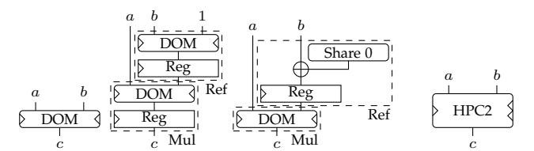

(a) DOM [9] (b) Faust et al. [19] (c) HPC1 (Section 4.2) (d) HPC2 (Section 4.4)

Fig. 2. Hardware-oriented multiplications gadgets. Left and right triangles mark sequential logic; they indicate the output latency with respect to the left and right input, respectively. Rounded corners indicate combinational logic.

require two shares of x to be simulated, which breaks the probing security. (Practical examples are discussed in [15].) In other words, using only DOM multiplications and trivial addition gadgets does not ensure the independence5 of the inputs of all the multiplications.6

In order to solve this issue, Faust et al. start by adding one register layer between the computations of c<sup>i</sup> and the outputs. This corresponds to adding a Reg [·] around the computations of the last line of Algorithm 1. It makes the gadget glitch-robust SNI in two cycles, since the output probes are then stored in (stable) registers and cannot anymore be extended. Hence, they are as powerful as in the standard probing model and the proof that the ISW algorithm is SNI applies (modulo modifications for internal extended probes). To make their multiplication trivially composable, Faust et al. then additionally exploit the "double-SNI" strategy initially proposed by Goudarzi and Rivain [23]: it consists in the use of a SNI multiplication gadget of which one input is systematically refreshed with one SNI refresh gadget. The refresh gadget is simply the SNI multiplication with the constant 1 as second input.

Yet, although Faust et al. prove that their multiplication (i.e., the DOM multiplication with an additional output register) is glitch-robust SNI, they do not prove that the composition strategy of Goudarzi and Rivain remains secure in the glitch-robust t-probing model when glitch-robust SNI gadgets are used. Furthermore, their solution is expensive: the SNI multiplication has a latency of two cycles, hence the double-SNI gadget takes four cycles w.r.t. one of the inputs and two cycles w.r.t. the other one. The refresh gadget is also expensive in randomness compared to the state-of-theart SNI refreshes in the standard probing model [12], [26], [27]. The one-cycle DOM glitch-robust NI multiplication and (2+2)-cycles Faust et al. "double-SNI" multiplication are illustrated in Figures 2a and 2b.

#### **4 EFFICIENT, GLITCH-RESISTANT AND COMPOS-ABLE GADGETS**

We now introduce our strategy for trivial composition in presence of glitches, together with efficient gadgets that can be used in this strategy. We focus on intuitive explanations, postponing formal definitions and proofs to Section 7. First

of all, we propose in Section 4.1 a general technique for applying some standard probing model compositional strategies to the glitch-robust probing model. Those strategies are the ones based on simulatability (e.g., using NI, SNI, PINI). We do this by defining glitch-robust simulatability, from which definitions of glitch-robust NI, SNI, PINI, . . . follow immediately. We show that they enjoy the same composition properties as their standard probing model counterparts. Second, we introduce in Sections 4.2 and 4.4 two glitchrobust PINI multiplication gadgets for any masking order. The first one (HPC1) is based on the refresh-then-multiply technique and is generic: it works for any field Fq. The second one (HPC2) is more randomness-efficient, but it is glitch-robust PINI only in F2. We also present in Section 4.3 new constructions for glitch-robust SNI refresh gadgets that are used in HPC1. Finally, we explore how the latency characteristics of HPC multiplication gadgets can be taken into account in logic circuit optimizations, in order to further reduce the overall latency.

#### **4.1 Composability with glitches**

We first analyze composition in presence of glitches. For that purpose, we define the concept of glitch-robust simulatability. As mentioned previously, the definitions of glitchrobust NI, SNI and PINI can be adapted directly from their standard probing model counterparts, by replacing the term "probe" (resp., "simulated") by "glitch-extended probe" (resp., "glitch-robustly simulated").

Based on these definitions, it seems natural to assume that simulation-based proofs apply just as for their standard counterparts (i.e., without glitches), which was implicitly assumed by Faust et al. [19]. We next formalize this expectation in Theorem 1 and show that despite essentially correct, some subtleties have to be considered, such as the treatment of glitches that span multiple gadgets.

**Definition 3** (Glitch-robust simulatability)**.** *A set of extended adversarial probes* P *in a gadget* G *can be glitch-robustly simulated by a set of input shares* I = {(i1, j1), . . . ,(ik, jk)} *if there exists a randomized simulator algorithm* S *such that the distributions* Grob,P (x<sup>∗</sup>,<sup>∗</sup>) *and* S(x<sup>i</sup>1,j<sup>1</sup> , . . . , x<sup>i</sup>k,j<sup>k</sup> ) *are equal for any value of the inputs* x<sup>∗</sup>,<sup>∗</sup> *when there are no glitches on the inputs.*

Glitch-robust simulatability is illustrated in Figure 3. The first circuit shows that if a probe is at the output of a register, the glitches do not extend the probe. However, the inputs of the circuit are still needed to simulate the circuit and the probes still propagate, as it is the case in the standard probing model. In the second circuit, we see that extended probes are more powerful than non-extended ones: in the standard probing model, no input would be needed to simulate the probe (the probe is \$ + x + y, hence independent of both x and y), however due to glitches, the input belongs to the extended probe y. The register prevents glitch propagation, hence the input x is not needed for simulation. For the third circuit, both inputs x and y are needed (both in the standard and glitch-robust probing models): the probes \$ and \$ + x + y depend on x and y.

This definition of glitch-robust simulatability is stronger than standard simulatability: probes are more powerful and

<sup>5.</sup> Two sharings (xi), (yi) are independent if their distributions are independent of each other conditioned on the unshared values x and y: that is, the distributions P r[(xi)|x, y and (yi)|x, y are independent.

<sup>6.</sup> The "DOM-dep" multiplication proposed in [8] would be needed to compose securely, but it was broken in [15] with no obvious fix.

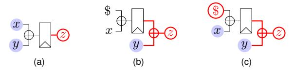

Fig. 3. Glitch-robust simulatability examples. Red circled variables are probes, thick red wires are glitches (probe extensions), blue background variables are inputs needed for simulation and the \$ sign denotes a random gate.

inputs given to the simulator are the same. It however relies on the hypothesis that there are no glitches on the inputs, which simplifies analysis of individual gadgets but is unrealistic when the gadgets are integrated in a larger circuit. This is actually not an issue: if glitches on an input share affect the probes, then the input itself affects the probes and thus the glitch-robust simulator can be extended to deal with glitches on the inputs. This idea is formalized in Lemma 1, Section 7.1. The lemma actually shows that including glitches on inputs would lead to an equivalent definition.

Next, we (informally) introduce a generic composition theorem showing that any simulation-based compositional strategy in the standard probing model also applies to the glitch-robust probing model.

**Theorem 1** (Glitch-robust composability (informal))**.** *Let* G *be a composition of gadgets where any set of probes in a gadget is glitch-robust simulatable. Restricting a glitch-robust simulator to a standard probing model simulator by discarding some of its inputs, any set of probes in* G *that can be simulated in the standard probing model using some of the input shares of* G *can be simulated in the glitch-robust probing model using the same input shares.*

This theorem is a consequence of Lemma 1 and of the way simulation-based composition works. We formalize it (along with the notion of simulation-based compositional strategy) and prove it in Section 7.1.

As a result, the idea of share isolation from the PINI definition is still valid in face of extended probes due to glitches. Therefore, the main properties of PINI are also satisfied by glitch-robust PINI:

- Affine gadgets implemented in the trivial way with t + 1 shares are glitch-robust t-PINI since the propagation and extension of probes are limited to one share (thanks to actual share isolation in the gadget).
- The glitch-robust composability theorem (Theorem 1) implies that the composition of glitch-robust t-PINI gadgets is glitch-robust t-PINI.
- Finally, a glitch-robust t-PINI gadget with at least t + 1 shares is glitch-robust t-probing secure since t extended probes can be simulated with t shares of each input sharing, which are independent of any sensitive value.

These observations lead to the *Hardware Private Circuits (HPC)* trivial composition strategy for glitch-robust masking: using trivial implementations for affine gadgets, along with glitch-robust PINI multiplication gadgets.

A first instance of the HPC strategy was proposed by Faust et al.: the Goudarzi and Rivain refresh-then-multiply gadget is proven to be PINI in [24] using a simulation-based proof. Therefore, Theorem 1 applies and the gadget made of glitch-robust SNI refresh and multiplication is glitch-robust PINI.

#### **4.2 Generic Hardware Private Circuits (HPC1)**

We introduce a first efficient glitch-robust PINI multiplication gadget, next denoted as Hardware Private Circuits 1 (HPC1), and prove it secure at arbitrary order and for any field Fq. It is based on the refresh-then-multiply technique and is represented in Figure 2c which highlights the similarities and differences with the DOM multiplication (to which we add a refresh gadget) and the Faust et al. multiplication (to which we remove an output register and optimize the input refresh gadget). The figure also shows the latency of the gadget: one cycle with respect to one input, and two cycles with respect to the other input.

The starting point for HPC1 is the observation that the DOM multiplication actually enjoys a property that is stronger than NI, which we call LPINI. We discussed in Section 3 that each extended probe in the DOM multiplication can be simulated using a<sup>i</sup> and b<sup>j</sup> , showing that it is glitch-robust NI. We additionally observe that the simulator needs the input share a<sup>i</sup> when c<sup>i</sup> is probed, which is one of the PINI requirements. The LPINI property formalizes this observation (see Definition 4).

To construct HPC1, we add a glitch-robust SNI refresh on the input b of the DOM gadget. This makes it glitchrobust PINI, since it stops the propagation of the probes from the b sharing of DOM to the input of HPC1, and the inputs a<sup>i</sup> required for simulation satisfy the PINI definition thanks to the LPINI observation. Interestingly, this result suggests that the probe isolation framework is well suited to enable composition with glitches at limited latency budget. For example, such guarantees would not be possible using SNI multiplications, since it seems that a (ISW-based) SNI multiplication gadget [19] requires at least two cycles latency with respect to both inputs.

HPC1 also enjoys optimized glitch-robust SNI refreshes with one cycle of latency and reduced randomness compared to Faust et al., as detailled next.

#### **4.3 New refresh gadgets**

In this section, we improve glitch-robust SNI refresh gadgets compared to the state-of-the-art (the SNI multiplication by 1 of Faust et al.). We describe several SNI refresh gadgets covering realistic orders d, have best-known randomness complexity (in small fields), are glitch-robust and have a latency of one cycle.

First, we take the order-generic and randomness efficient (O(d log d)) SNI refresh of Battistello et al. [27] and adapt it to the glitch-robust setting by adding a register after each addition gate. This construction and its security proof are detailed in Section 7.3. The main drawback of this construction is its high latency of 2 log<sup>2</sup> (d) − 1 clock cycles.

Next, we solve this latency issue by introducing a generic technique to reduce the latency of any glitch-robust SNI refresh gadget to one cycle. It works by using the original gadget while providing it with an all-zero input sharing, then summing its output with the sharing to be refreshed and adding a register layer after that. Intuitively, the original

$$\begin{array}{cccc} & t_0 \leftarrow \operatorname{Reg}\left[r_0 \oplus r_1\right] & \mathbf{t_0} \leftarrow \operatorname{Reg}[\mathbf{s^0} \oplus (\mathbf{s^0} \gg 1)] \\ y_0 \leftarrow \operatorname{Reg}\left[x_0 \oplus r_0\right] & y_0 \leftarrow \operatorname{Reg}\left[x_0 \oplus r_0\right] & \mathbf{t_1} \leftarrow \operatorname{Reg}[\mathbf{s^1} \oplus (\mathbf{s^1} \gg 3)] \\ y_1 \leftarrow \operatorname{Reg}\left[x_1 \oplus r_0\right] & y_1 \leftarrow \operatorname{Reg}\left[x_1 \oplus r_1\right] & \mathbf{t_2} \leftarrow \operatorname{Reg}[\mathbf{t^0} \oplus \mathbf{t^1}] \\ \text{(a) } d = 2 & y_2 \leftarrow \operatorname{Reg}\left[x_2 \oplus t_0\right] & \mathbf{y} \leftarrow \operatorname{Reg}[\mathbf{x} \oplus \mathbf{t^2}] \\ & \text{(b) } d = 3 & \text{(c) } d = 13, \dots, 16 \end{array}$$

Fig. 4. Optimized refresh gadgets for some d. The input sharing is denoted as  ${\bf x}$  and the output sharing as  ${\bf y}$ . All  $r_i$  variables are independent uniformly random elements, and  ${\bf s}^i$  are vectors of d independent random elements. The  $(\cdot \gg i)$  operator applied to a vector denotes a rotation of its elements: the first element becomes the i+1-th, etc.

refresh gadget outputs a "glitch-robust SNI-secure" sharing of zero (we formalize this notion in Section 7.4), which can then be simply added to the sharing that must be refreshed. The output register layer prevents output probes from being extended to the inputs of the refresh. Our construction is illustrated in Figure 2c, in the "Ref" frame (where "Share 0" is a SNI refresh provided with an all-zero input). In this way, the latency of the original gadget does not matter: since it is not on the main datapath, it can be computed in advance. The cost of this transformation is at most d registers, since the addition gates added compensate those that can be removed due to the addition with the all-zero sharing.

Finally, to further reduce randomness utilization, we provide a set of new optimized glitch-robust SNI refresh gadgets for low (and arguably all the practically-relevant) orders (i.e.,  $d \in \{2,\ldots,16\}$ , see Figure 4), which require less randomness. These gadgets were proven glitch-robust-SNI with the maskVerif tool [25]. The randomness complexity of the new refresh gadgets compares favorably to the state-of-the-art for both hardware and software implementations, with randomness gains of more than 30% for  $d \in \{3,4,5,7,8\}$  over the previous state-of-the-art hardware solutions. See https://github.com/cassiersg/opt-refresh for the full set of gadgets.

These new refresh gadgets are adaptations of the gadgets in [26], modified by first adding registers where needed, and then optimizing their randomness complexity by relaxing the parallel constraint (at the cost of making some software bitslice implementation strategies impossible). Optimization was performed by hand, iteratively solving flaws found by maskVerif.

#### 4.4 Randomness-optimized AND gadget (HPC2)

In this section, we present a multiplication gadget (Algorithm 5) for the practically-relevant field  $\mathbb{F}_2$  that has the same randomness cost as the DOM gadget. This gadget is based on the PINI1 multiplication of [24], and adapted to the hardware context by adding registers where needed to prevent glitches.

We explain briefly the main argument of the proof that this gadget is glitch-robust PINI and defer the full proof to Section 7.5.

First, lets us recall the "masked shares multiplication" trick of [24]: whereas ISW-based multiplication schemes such as DOM compute terms  $a_i \otimes b_j \oplus r_{ij}$ , the HPC2 gadget computes  $\bar{a}_i \otimes r_{ij} \oplus a_i \otimes (r_{ij} \oplus b_j)$  ( $\bar{\phantom{a}}$  denotes the NOT gate). In the standard probing model, this trick ensures

```
Input: shares (a_i)_{0 \leq i \leq d-1} and (b_i)_{0 \leq i \leq d-1}, such that \bigoplus_i a_i = a and \bigoplus_i b_i = b.

Output: shares (c_i)_{0 \leq i \leq d-1}, such that \bigoplus_i c_i = a \otimes b.

for i = 0 to d - 1 do

for j = i + 1 to d - 1 do

r_{ij} = r_{ji} \stackrel{\$}{\leftarrow} \mathbb{F}_2

for i = 0 to d - 1 do

for j = 0 to d - 1, j \neq i do

u_{ij} \leftarrow \bar{a}_i \otimes \operatorname{Reg}[r_{ij}]

v_{ij} \leftarrow b_j \oplus r_{ij}

for i = 0 to d - 1 do

c_i \leftarrow \operatorname{Reg}[a_i \otimes \operatorname{Reg}[b_i]] \oplus

\bigoplus_{i=0}^{d-1} i \neq i} (\operatorname{Reg}[u_{ij}] \oplus \operatorname{Reg}[a_i \otimes \operatorname{Reg}[v_{ij}]])
```

Fig. 5. Glitch-robust HPC2 multiplication for  $\mathbb{F}_2$ .

that any single probe does not depend jointly on  $a_i$  and  $b_j$ , enabling the gadget to be PINI. If there is more than one probe, both  $a_i$  and  $b_j$  are known to the simulator. In presence of glitches, registers are added as follows:  $\operatorname{Reg}\left[\bar{a}_i\otimes r_{ij}\right]\oplus\operatorname{Reg}\left[a_i\otimes\operatorname{Reg}\left[b_j\oplus r_{ij}\right]\right]$ . None of the glitch-extended probes in this computation depends on both  $a_i$  and  $b_j$ :

- extended probes on  $\bar{a}_i \otimes r_{ij}$  and  $b_j \oplus r_{ij}$  do not contain  $b_j$  and  $a_i$ , respectively;
- for the extended probe on  $a_i \otimes \text{Reg} [b_j \oplus r_{ij}]$ , we observe  $a_i$  and  $b_j \oplus r_{ij}$  does not depend on  $b_j$ , since it is masked with a fresh random  $r_{ij}$  (remember that we assume there is a single probe);
- for the extended probe on  $\operatorname{Reg}\left[\bar{a_i}\otimes r_{ij}\right] \oplus \operatorname{Reg}\left[a_i\otimes\operatorname{Reg}\left[b_j\oplus r_{ij}\right]\right]$ , we observe  $\bar{a_i}\otimes r_{ij}$  and  $a_i\otimes (b_j\oplus r_{ij})$ . If  $a_i=0$ , then those observations are  $r_{ij}$  and 0, while if  $a_i=1$ , the observations are 0 and  $b_j\oplus r_{ij}$  ( $b_j$  is perfectly masked). In both cases, observations are independent of  $b_j$ .

Note that this last probe is the reason why the HPC2 gadget is restricted to  $\mathbb{F}_2$ : in larger fields,  $\bar{a_i}$  would be replaced by  $a_i \oplus 1$  for correctness, but it would not be true anymore that one of  $a_i$  or  $a_i \oplus 1$  is zero.

#### 4.5 S-box optimizations

One quite peculiar feature of HPCs is the latency asymmetry that is caused by the fact that only one of their inputs must be refreshed. Take for example a simple (tree-based) implementation of the function  $\mathsf{f}(a,b,c,d) = (a \otimes b) \otimes (c \otimes d)$ : it will have a latency of four cycles, and three registers will be needed to synchronize the non-refreshed inputs. In this respect, an interesting observation is that if we can find a logic representation of a function to mask (e.g., an S-box) such that one input of each AND gate in the second (or later) stage of the circuit is a linear combination of inputs in an earlier stage, then we can reduce the latency by one cycle. For deep circuits, such an optimization therefore has the potential to reduce the latency by a factor two.

Concretely, we modified a baseline tool from Ko Stoffelen [28] in order to construct circuits that fulfill these conditions. Searching over circuit representations (for a given function) is a complex task. We used SAT (satisfiability) solvers, which work well for small S-boxes. The advance

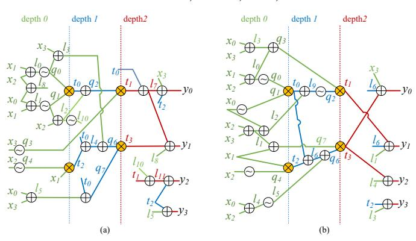

Fig. 6. PRESENT S-box circuit with AND depth 2 and 4 AND gates. Green, blue and red colors correspond to wires with multiplicative depth 0, 1 and 2 respectively. Circuit without optimization (a) and with latency optimization for multiplication gadget with asymmetric latency (b).

that we give (on top of the existing tool [28] which generates a circuit representation for a SAT solver) is to jointly encode the SAT solver problem to minimize the number of AND gates for a given AND depth target, while also constraining the logical equations so that one input of each AND gate is always assigned a linear combination of the main inputs and any signal generated in previous AND stages.

We then applied this approach to a set of 12 different 4-bit S-boxes to demonstrate its generality and efficiency, using the same SAT solver CryptoMiniSat-5 [29] as used in [28]. The resulting circuit with such an asymmetric structure is given in Figure 6 for PRESENT – the S-box circuits are given in appendix. They all cost 4 AND gates (except for PRINCE which costs 6 AND gates) and have AND depth 2, while the XOR gate count varies between 13 and 24. Note that we did not minimize XOR counts and therefore we do not claim any optimality in that respect. This is because for masked implementations, the XOR's associated area/latency penalty becomes negligible compared to the AND's-cost as d increases.

#### 5 FULL VERIFICATION TOOL

Despite the previous masking schemes being relatively simple and their composability guarantees being strong, implementing them still requires a skilled hardware designer. Besides implementing the correct functionality, which can be tested through standard techniques such as test vectors, all the assumptions of the underlying security proofs must also be fulfilled to ensure security.

In this respect, while it appears that masking composition proofs are only concerned with high-level assumptions, such as the kind of gadgets and the structure of the circuit, they in fact make other assumptions (implicit or not) which can be falsified by hardware implementations, have no impact on the functionality of the implementation, and are thus hard to verify by classical testing. Examples of such assumptions include:

- each gadget uses fresh, independent randomness;
- no more computation on shares is performed than specified by the algorithms (e.g., in parallel with or after useful computations are finished);
- the order of the shares in a sharing is never shuffled.

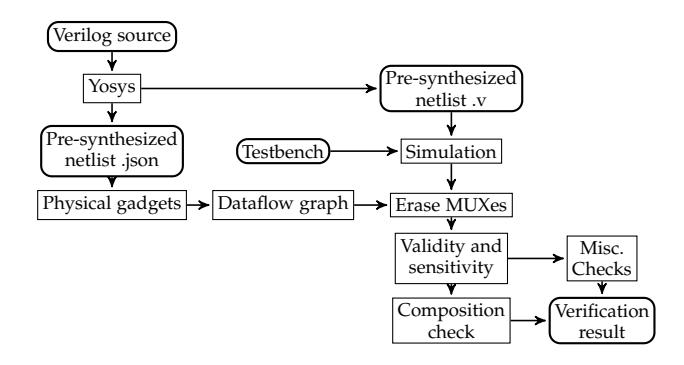

Fig. 7. Process of the verification tool.

We next describe a tool that allows verifying all these assumptions.<sup>7</sup> At a high level, it takes a Verilog implementation as an input and outputs another, pre-synthesized implementation (that is equivalent to the input implementation), along with the result of the verification (error or success). It works by following the steps illustrated in Figure 7 that we detail next.

First, the open-source synthesizer Yosys [30] is used to produce a netlist of all the gadgets, while preserving the hierarchy of the gadgets. Second, this netlist is simulated using a user-provided testbench (using IcarusVerilog). Third, the netlist is analyzed to build a graph of physical gadgets, which is then unrolled over all execution cycles, leading to a dataflow graph. This graph is close to the gadget composition graphs that we analyze in composition proofs, but with two major differences: it contains so-called "MUX gadgets" (MUXing two sharings according to a nonsensitive control signal), and it contains gadgets for which the inputs are invalid (i.e., do not carry a meaningful value). The next stage is to remove the MUX gadgets from the graph, which is simple: for each cycle, the control signal of the MUX is known (this is the single step where the result of the simulation is used), thus the MUX can be replaced by wires from the inputs to the outputs. Then, we annotate each sharing with validity ("Does it contain a meaningful value ?") and sensitivity ("Does it depend on the input sharings ?") information. Finally, the composition strategy is verified on the dataflow graph, of which we remove all the gadgets for which no input is sensitive. In the case of trivial composition, it simply checks that all the gadgets satisfy the security property (e.g., PINI). This may involve recursively checking a gadget if it is a composition of sub-gadgets, verifying that it is physically isolating shares (e.g., for linear operation gadgets) or just assuming that it is correct based on annotations. This last case happens for the multiplication gadgets. Automatically verifying them using a tool such as maskVerif of SILVER is left to future work.

Only the choice of which property to check for each subgadget (i.e., the "Composition check" in Figure 7) is specific to our trivial composition strategy. Therefore, the tool would require only minor modifications to be able to check other composition strategies (such as optimized SNI-based ones).

7. A library of elementary gadgets (XOR, NOT, AND HPC1 and HPC2, MUX, SNI refresh...) is provided with the tool. Those are annotated with keep and preserve attributes where needed in order to prevent security-damaging optimizations.

|                   | Abstract                    | Concrete        |
|-------------------|-----------------------------|-----------------|
| Direct            | Barthe et al. [20]          | REBECCA [21]    |
|                   |                             | maskVerif [25]  |
|                   |                             | SILVER [32]     |
| Composition-based | maskComp [22]               | Tornado [31]    |
|                   | Tight Private Circuits [13] | fullVerif (new) |

TABLE 1 Masking formal verification tools' overview.

During the processing stages, many security checks are performed. We list the main ones along with the stage where they are performed.

#### **Physical gadgets:**

- Any input sharing of a gadget must be connected to one and only one source gadget of which it is an output sharing;
- Each wire belonging to a sharing is only used as part of that sharing and not elsewhere;
- All the gadgets are connected to the same clock signal, otherwise cycle-based analysis of dataflow over time cannot be done properly. Handling more complex clock circuits (although still all synchronous, such as divided clocks) is left to future work.

#### **Dataflow graph:**

• No combinational loop exists in the circuit;

#### **Misc. checks:**

- All outputs of the composite gadget (at the specified cycle) should be connected to valid sharings;
- Each random input of a gadget is connected to a wire carrying randomness;
- Each random input of a gadget having a sensitive input should be connected to a fresh random bit. For this check, a dataflow graph of the sub-circuit handling randomness (i.e., wires, registers, MUXes) is built;
- At the cycle after all the outputs have been produced, there should be no sensitive sharing remaining in the gadget (otherwise non-verified computations might happen, since we stop analysis at that cycle).

**Performance.** The computational complexity of the tool is linear in the number of gadgets and quadratic in the number of shares (like a simulation tool). Practically, fullVerif is fast enough to be used "interactively" when developing or debugging an implementation: its overhead on top of the behavioral simulation of one encryption is at most 3 seconds for a full PRESENT with up to 16 shares.

**Related works.** We next provide a brief account of the state-of-the-art tools aimed at verifying masked algorithms to situate our contribution. The main tools to which our proposal compares are listed in Table 1. Such tools can verify abstract implementations or concrete ones (i.e., actual code, including physical defaults); they can also aim at direct verification (which is limited to small circuits and security orders) or composition-based verification. The fullVerif tool we propose is the first one that can verify the composability of concrete hardware implementations including glitches. The most similar tool is Tornado [31], which works for software implementations on micro-controllers.

Some other works are less directly comparable, either because they span multiple table cells or because they aim at different goals. For example, the work of Eldib et al. in [33] aims at similar goals as [20], but it is more concrete (it applies to C implementations) while still ignoring physical defaults. The work of Arribas et al. rather verifies the noncompleteness and uniformity properties of TIs [34].

We finally mention that the impact of extended probes in the randomness distribution circuit remains excluded from all these tools and, to the best of our knowledge, has never been analyzed. We leave it as an interesting scope for further investigations, together with the general challenge of better understanding the randomness' requirements in masked implementations.

#### **6 IMPLEMENTATION RESULTS**

In this section, we validate the claimed efficiency of HPCs. This is done for a complete (although non-optimized) encryption architecture test-case which allows realistic estimations of actual area constraints and randomness resources required. We selected the (128-bit version of the) PRESENT block-cipher for this purpose, as it is one of the most popular lightweight ciphers and has been shown to enable efficient masked implementations [4]. Its 4-bit S-box is also well suited to our optimizations of Section 4.5. The obtained results should be representative of other similar (lightweight) ciphers and permutations (for sponge constructions). The section starts by describing our generic architecture, follows with some design considerations, and finally exhibits the good performances that our approach allows.

We evaluate four types of masked implementations, all based on trivial composition.8 The strategies therefore differ only by their AND gadget:

- The gadget of **Faust et al.**: [19] (where we eliminate some logic in the refresh by propagating the constant sharing (1, 0, . . . , 0) where it is safe to do so). It uses 4 cycles per AND gate and is based on the standard description of the PRESENT S-box with AND depth 2 (so takes 8 cycles per S-box).
- The **HPC1** gadget with optimized refresh gadget (Figure 2c) and the **HPC2** gadget (Algorithm 5), with the Sbox architecture optimized for latency from Section 4.5. These implementations require 3 cycles for the full Sbox.
- The **DOM**-indep glitch-robust NI gadget, with the standard description of the PRESENT S-box (our optimization would not reduce the latency in this case), leading to 2 clock cycle for the S-box. While this last design does not come with composability guarantees, we use it as a lower bound for the cost of our masked implementations.

In all cases, the S-boxes are fully pipelined: it requires only one more clock cycle for each additional evaluation (if there is no data dependency across evaluations). This list already highlights one of the concrete achievements of this work. Namely, compared to the Faust et al design, the latency is reduced from 8 to 3 cycles, and compared to the DOM design, only a small overhead is observed.

8. The HPC1 and HPC2 implementations are available at [https://](https://github.com/cassiersg/present_hpc) [github.com/cassiersg/present](https://github.com/cassiersg/present_hpc) hpc.

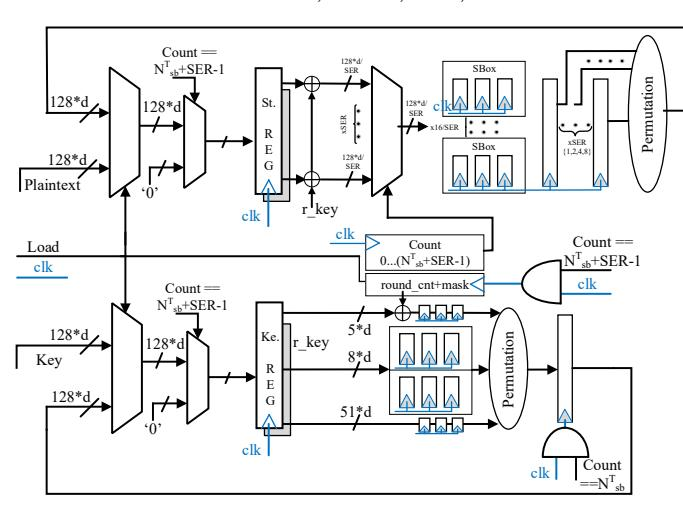

Fig. 8. Architecture of the PRESENT encryption core with serialization (SER) of parallel operations to reduce area cost.

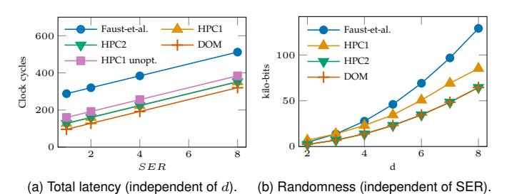

F 0 B 1

Fig. 9. Randomness and latency cost comparisons for a PRESENT core.

**Architecture.** We refer to Figure 8 for a detailed illustration of our hardware architecture. With the aim of providing a scalable example, we use the number of shares as main parameter. Besides, in order to allow understanding the natural space/speed trade-off in hardware implementations, we use a SER(serialization) factor as a secondary design parameter. Basically, we serialize the computation within an encryption round by this factor and consequently reduce the area by the same factor (e.g., SER = 1 is a fully parallel design, SER = 2 is a serialization of 2 blocks of 8 S-boxes each, SER = 4 is a serialization of 4 blocks, . . . ).

Our architecture is geared towards simplicity, genericity and reproducibility rather than minimal area/power. This is not an issue since the cost of the architecture is constant for all the implementations we compare. It is built around a 128d-bit state register, which feeds the serialized S-boxes. The outputs of the S-boxes are stored in a register whose output is connected to the state register through the bit-permutation layer. The key schedule unit uses two S-boxes and is similar to the main datapath.

**Comparison.** Starting the comparison with one main objective of the work, Figure 9a shows the cycle count in function of the serialization factor SERfor our architecture (which is independent of the number of shares *d*). With SER = 1 the HPC1 and HPC2 designs have a 60% latency reduction compared to Faust et al. and a 25% latency increase compared to DOM. As SERincrease, the S-box (internal) pipeline starts to be filled during encryption rounds, leading to a total latency increase, hence reduced factors of gain. We also show the HPC1 gadget (or equivalently HPC2, since they

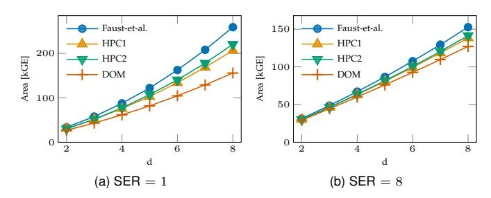

Fig. 10. Area utilization (in kGE, post-synthesis) as a function of d of a PRESENT-128 core in a commercial  $65\,\mathrm{nm}$  ASIC technology (excluding randomness generation).

have the same latency characteristics) without our S-box architecture optimization ("HPC1 unopt."), which confirms that the latency gain over Faust et al. is primarily due the to improved gadgets, but that the optimization helps further approaching the efficiency of DOM.<sup>9</sup>

Moving on to discuss the cost associated with randomness generation, Figure 9b shows the total randomness cost (refresh and multiplication) for the entire PRESENT core per encryption as a function of d. The cost for DOM and HPC2 is half of the cost of Faust et al., while HPC1 is in-between (thanks to the improved refresh gadgets). A designer can immediately deduce the total randomness requirements from his (hers) TRNG/PRNG.

Further investigating the area utilization of the proposed designs, Figure 10 shows the gate equivalent (GE) count as a function of d for two exemplary serialization factors. Overall, the area differences are (relatively) more important for SER = 1 (Figure 10a) than for SER = 8 (Figure 10b), because all non-S-box related logic is mostly independent of SER, and the S-box cost is proportional to 1/SER. Furthermore, relative area differences are more significant for higher d values, because the S-box cost is quadratic in d while the one of the other parts is linear in d. HPC1 and HPC2 have similar cost, in-between DOM and Faust et al. For very low masking orders (d = 2,3), HPC2 is slightly more area efficient, while HPC1 is getting better at higher orders. Power and energy consumption estimations are given in appendix. We observe that power consumption is roughly proportional to the area.

We note that randomness generation is out-of-scope for this work, therefore we did not include any random number generator in the area measurements and assume it comes from some RNG, the cost of which can be estimated from the randomness requirement of Figure 9b) and the RNG technology used.

We conclude that glitch-resistant and composable gadgets can be obtained at affordable cost. On the one hand, our implementations significantly outperform the ones based on the Faust et al. multiplication for all performance metrics. On the other hand, their latency and randomness are comparable with approaches such as DOM, despite their weaker algorithmic guarantees.

In order to confirm that these implementations satisfy minimum concrete security guarantees, we synthesized our

9. We do not show the "unopt." case in our other analyzes since it leads to almost identical results as the optimized case for the other metrics.

architecture on a Xilinx Spartan FPGA and ran leakage detection tests. These preliminary results are provided in appendix. We leave the thorough investigation of the worst-case security of our implementations as a scope for further investigations.

#### 7 SECURITY PROOFS

We finally prove the main results outlined in Section 4. Most of the proofs are within the simulatability framework: we describe a simulator algorithm, then we prove that its output has the same distribution as the circuit it simulates.

#### 7.1 Glitch-robustness proofs

Before proving our main composition result in the glitchrobust model (Theorem 1), we have to show that considering glitches on the input shares of a gadget would lead to an equivalent definition of glitch-robust simulatability.

**Lemma 1.** Let G be a gadget and P a set of extended probes that can be glitch-robustly simulated using a set of inputs I by a simulator S. In presence of glitches on the inputs of G, there exists a simulator  $S^g$  that can simulate P using extended probes on inputs I.

Proof. For a probe  $p \in P$ , let  $G^g_{rob,p}$  (resp.,  $G_{rob,p}$ ) be the wires to which the extended probes p expands to when there are (resp., there are no) input glitches. Then, any wire w belonging to  $G^g_{rob,p}$  either belongs to  $G^g_{rob,p}$  and can be simulated by  $S^g$  (by using S), or is due to a glitch on an input. Let i be that input wire, then w belongs to the extended probe  $G^g_{rob,p'}$  and i belongs to  $G_{rob,p}$  which implies that  $i \in I$  since S must have knowledge of i to simulate p. Therefore, the simulator  $S^g$  has access to w through the extended input probe i.

**Theorem 1** (Glitch-robust composability). For a gadget G made of the composition of gadgets  $G_i$ , let  $S_i^{rob}$  be a glitch-robust probing simulator for each gadget  $G_i$ , and let  $S_i^{std}$  be its restriction to a standard probing simulator (by discarding its outputs corresponding to probe extensions). Let P be a set of standard probes that can be simulated using some inputs I of G using the simulators  $S_i^{std}$  according to a simulatability-based compositional strategy (i.e., each simulator is asked to simulate some probes  $P_i$  using inputs  $I_i$  of  $G_i$  where wires in  $I_i$  are either in I or in some  $P_{i'}$  and  $P \subset \bigcap_i P_i$ ). In the glitch-robust probing model, the set of extended probes P can be simulated using inputs I (on which there are no glitches by the definition of simulatability).

*Proof.* From simulators  $S_i^{rob}$ , Lemma 1 gives simulators  $S_i^{rob,g}$  that work with glitches on the inputs of the gadgets. The compositional strategy can then be applied with the simulators  $S_i^{rob,g}$  as it would be in the restricted probing model with simulators  $S_i^{std}$ , except that the  $S_i^{rob,g}$  take extended probes as inputs and produces extended probes.  $\square$ 

#### 7.2 HPC1 is glitch-robust PINI

In this section, we prove that the gadget described in Section 4.2 is glitch-robust PINI. In order to keep the proof simple, we use a composability-based approach. We first give

the property (introducing a new technical simulatability-based definition) that is satisfied by the DOM gadget. Then, we prove that composing this gadget with a glitch-robust SNI refresh at one of the inputs (giving the HPC1 multiplication) is glitch-robust PINI.

**Definition 4** (t-Limited-PINI). Let G be a gadget, S a set of its input sharings,  $P_1$  a set of  $t_1$  (extended) internal probes and A a set of  $t_2$  share indexes such that  $t_1 + t_2 \le t$ . Let  $P_2$  be the set of all output shares of G whose index is in A. The gadget G is (glitch-robust) t-Limited-PINI (t-LPINI) with respect to I if, for any  $P_1$  and A, there exists a set B of at most  $t_1$  shares indexes such that the set of (extended) probes  $P_1 \cup P_2$  can be (glitch-robustly) simulated using the shares with indexes in  $A \cup B$  for input sharings not in I, and at most t shares of each input sharing in I.

**Remark.** *t*-LPINI stands between *t*-PINI and *t*-NI: if the set *S* is empty, *t*-LPINI is the same as *t*-PINI; if it contains all the input sharings, *t*-LPINI is *t*-NI.

**Lemma 2.** Let G be a (glitch-robust) t-LPINI gadget with respect to the set of input sharings S. Let G' be the gadget built by adding a (glitch-robust) t-SNI refresh gadget to each of the input sharings of G that are in S. The gadget G' is (glitch-robust) t-PINI.

*Proof.* Internal or output probes of G can be simulated by input in one circuit share for sharings not in S, by the t-LPINI definition. For input sharings in S, no input share is required thanks to the SNI gadget. Furthermore, each probe inside a SNI refresh gadget can be simulated using one share of one input sharing, which satisfies the definition. Combining both kinds of probes does not cause any issue, since the total number of probes in G is at most t and the total number of (adversarial of propagated) probes on a SNI refresh gadget is also at most t. The glitch-robust result follows from Theorem 1.

**Corollary 1.** A multiplication gadget built from a (glitch-robust) t-LPINI multiplication (with  $S = \{s_0\}$ ) where the input sharing  $s_0$  is refreshed by a t-SNI refresh is t-PINI.

We conclude by proving that the DOM multiplication is glitch-robust LPINI.

**Proposition 1.** The DOM-indep multiplication gadget (Algorithm 1) with d shares is glitch-robust (d-1)-LPINI with respect to input set  $\{b\}$ .

*Proof.* Let us build a simulator. Let P be the set of adversarial extended probes, and set  $I = J = \emptyset$ . Wlog, let use assume that the only extended probes in P are of the form  $u_{ij}$  or  $c_i$ , since any other extended probe is less powerful (i.e., the corresponding wires of a probe are all contained in the corresponding wires of either a  $u_{ij}$  or  $c_i$  probe). The glitch-extended probe on  $a_i \otimes b_i$  will be ignored since  $c_i$  supersedes it (simulating it requires knowledge of  $a_i$  and  $b_i$ ).

For all  $c_i$  probes in P, set  $I \leftarrow I \cup \{i\}$  and  $J \leftarrow J \cup \{i\}$ . Then, for each  $u_{ij}$  probe in P, if  $i \not\in I$ , set  $I \leftarrow I \cup \{i\}$ , otherwise set  $I \leftarrow I \cup \{j\}$ ; and if  $j \not\in J$ , set  $J \leftarrow J \cup \{j\}$ , otherwise set  $J \leftarrow J \cup \{i\}$ . We observe that the sets I and J, which are the inputs needed for simulation, satisfy the LPINI definition.

Simulation of the probes proceeds as follows: for each pair (i,j) such that either there is a probe  $u_{ij}$  or there is a probe  $c_i$ : if  $i \in I$  and  $j \in J$ , compute  $a_i \otimes b_j$  and  $u_{ij} = a_i \otimes b_j \oplus r_{ij}$  using the provided inputs (and set  $r_{ij} = r_{ji}$  to a fresh random if it is not yet set), otherwise set  $u_{ij}$  to a fresh random. Simulation is completed by computing  $c_i$  as it is done by the true gadget.

We conclude the proof by showing that the simulation is indistinguishable from the gadget. The simulator behaves in the same way as the circuit, except when it needs to simulate  $u_{ij}$  where  $i \not\in I$  or  $j \not\in J$ . In this case,  $u_{ij}$  is not probed but appears in a probe, therefore  $c_i$  is probed. This implies that  $i \in I$ , thus  $j \not\in J$ , which implies that neither  $c_j$  nor  $u_{ji}$  are probed. Since  $u_{ij}$  contains the random  $r_{ij}$ , which itself does not appear in any probe except  $c_i$  (through  $u_{ij}$ ),  $u_{ij}$  behaves as a fresh random from the point of view of the adversary, which is what the simulator generates.

**Remark** This proof shows that DOM is glitch-robust LPINI with respect to either  $\{a\}$  or  $\{b\}$ . (This does not imply that it is LPINI w.r.t.  $\emptyset$ , i.e., PINI).

## 7.3 Randomness-efficient generic glitch-robust SNI refresh

The refresh gadget of Battistello et al. [27] is the SNI refresh with best known asymptotic complexity in  $\mathbb{F}_2$  ( $\mathcal{O}(d\log d)$ ). We briefly recall its working principle (restricting to the cases where d is a power of 2). First, for input sharing  $(x_i)_{i=0,\dots,d-1}$ , the half refresh gadget  $R_d^{\text{half}}$  outputs

$$y_i = \begin{cases} x_i \oplus r_i & \text{if } i < n/2, \\ x_i \oplus r_{i-n/2} & \text{if } i \ge n/2. \end{cases}$$

For d=2, the SNI refresh gadget is the half refresh ( $R_2^{\mathrm{Bat.}}=R_2^{\mathrm{half}}$ ), while for d>2,  $R_2^{\mathrm{Bat.}}$  is defined as follows (input  $(a_i)_i$  and output  $(d_i)_i$ ):

$$\begin{split} &(b_i)_{i=0,...,d-1} \leftarrow R_d^{\text{half}} \left( (a_i)_{i=0,...,d-1} \right) \\ &(c_i)_{i=0,...,d-1} \leftarrow \left( R_{d/2}^{\text{Bat}} \left( (b_i)_{i=0,...,d/2-1} \right), R_{d/2}^{\text{Bat}} \left( (b_i)_{i=d/2,...,d-1} \right) \right) \\ &(d_i)_{i=0,...,d-1} \leftarrow R_d^{\text{half}} \left( (c_i)_{i=0,...,d-1} \right). \end{split}$$

This gadget can be made glitch-robust by adding a register after each addition in the half refresh gadgets, which results in a latency of  $2\log_2(d)-1$ .

We next sketch how the standard probing model proof from [27] can be adapted to the glitch-robust case. Proceeding by induction, the base case d=2 is glitch-robust SNI. There are two kinds of probes to consider: probes on the inner SNI refresh gadgets and extended probes on the input and output half refresh gadgets. The probes on the internal SNI refresh gadgets are handled inductively as in the original proof. For the output half refresh gadgets probes, we adapt Lemma 4 from [27] by allowing extended probes  $\{a_1, r, a_1 \oplus r\}$  and  $\{a_2, r, a_2 \oplus r\}$  in  $\mathcal V$ , and the proof of the lemma is trivially extended if the integer restriction on  $t_1$  and  $t_2$  is relaxed to being half of integers.

For the input half refresh, referring to the proof of Lemma 6 in [27] the only non-trivial case happens when one of  $R_1$  and  $R_2$  is saturated (let us assume wlog it is  $R_2$ ). In this case, probes  $\{a_{d/2+i}, r_i, a_{d/2+i} \oplus r_i\}$  are simulated

with input  $a_{d/2+i}$ , and probes  $\{a_i, r_i a_i \oplus r_i\}$  are not more powerful than their non-extended  $a_i \oplus r_i$  counterparts (if  $a_i \oplus r_i$  is probed, the inputs  $a_i$  and  $a_{d/2+i}$  are required), hence we can safely ignore them.

## 7.4 Glitch-robust SNI refresh gadgets with minimal latency

In this section, we prove that our generic latency-reducing transformation is correct. This transformation reduces the latency of any glitch-robust SNI refresh to once cycle (which is the minimum possible) at zero cost (see Section 4.3).

We formalize (and extend to the glitch-robust probing setting) the idea from [26] that if a sharing of zero can be generated without adversarial probes and is then added to the input x, one directly obtains a SNI refresh. Of course, adversaries can also probe the generation of this randomness, and we next show how this "zero probe requirement" can be relaxed if the generation of the 0-sharing is done in a proper way. For hardware implementations, registers are needed in the generation of the 0-sharing, and after the addition. We then show that a correct way to instantiate the 0-sharing generation is to use a (glitch-robust) SNI refresh and to feed it with an all-zero input sharing.

First, we formally define what is a 0-sharing generation gadget and give the security property it should satisfy.

**Definition 5** (0-sharing generation gadget). A 0-sharing generation gadget is a gadget with no inputs and one output sharing of t+1 shares  $r_0, \ldots, r_t$  such that  $r_0 \oplus \cdots \oplus r_t = 0$ .

**Definition 6.** A gadget with no inputs and one output sharing is (glitch-robust) Strongly Output Independent (SOI) if there exists a simulator S such that for any sets I and O, the distributions of the (extended) probes for the two following games are identical. Let I be a set of (extended) probes in the gadget and O a set of (extended) probes on the output of the gadget such that |I|+|O|=t=d-1.

**Real.** The output of the real game is the values corresponding to the probes (I, O) for an execution of the gadget.

**Simulated.** The simulator S outputs sets of probes  $(O_1,O_2)$  such that  $O_1 \cup O_2 = O$  and  $|O_1| \leq |I|$  and simulates the probes belonging to I and  $O_1$ . S takes as input I and O. The probes corresponding to  $O_2$  are generated independently according to the uniform distribution:  $P_{O_2} \leftarrow \$$ .

We next prove that a glitch-robust SNI refresh gadget connected to an all-zero input sharing is glitch-robust SOI.

**Proposition 2.** Let  $z \leftarrow R(x)$  be a glitch-robust t-SNI refresh gadget whose outputs can be written as  $z_i = x_i \oplus y_i$ , where  $y_i$  is independent of x.<sup>10</sup> The gadget  $G = R(0, \dots, 0)$  is glitch-robust t-SOI.

*Proof.* A *t*-SOI simulator proceeds as follows given sets I and O: first, run the R t-SNI simulator (with I as internal probes and O as output probes, answering "0" to oracle requests), then set  $O_1$  as the set of probes  $z_i$  in O whose corresponding input  $x_i$  is asked to the oracle by the SNI simulator. Set  $O_2 = O \setminus O_1$ . Finally, output the values for the probes in I and  $O_1$  obtained from the SNI simulator. The

10. As far as we know, this is satisfied by all the refresh gadgets in the additive boolean masking literature (such as [14], [26], [27]).

sets  $O_1$  and  $O_2$  satisfy the SOI definition: their union is O and  $|O_1| \le |I|$  by the SNI definition.

To complete the proof, we show that the statistical distribution of the output of the simulator satisfies the definition. For probes in I and  $O_1$ , correct simulation is a consequence of SNI simulation and correctness of the oracle.

Finally, let us prove the independence and uniformity of the distribution of the probes in  $O_2$ . Without loss of generality, let  $O_2 = \{z_1, \ldots, z_m\}$  where  $m = |O_2|$  (shares are re-ordered if needed). In the computation z = R(x), the assumption on the structure of R implies that  $z_i = x_i \oplus y_i$ , which we write in vector form  $\mathbf{z} := (z_1, \ldots, z_m) = \mathbf{x} \oplus \mathbf{y}$ . Since the SNI simulator can perfectly simulate  $T = (I, O_1, \mathbf{x} \oplus \mathbf{y})$  (where we consider I and  $O_1$  as vectors) for any value of  $\mathbf{x}$ , the distribution of the tuple is independent of  $\mathbf{x}$ . Therefore, for any  $\mathbf{x}$  and any possible value t of the tuple,  $\Pr[(I, O_1, \mathbf{y}) = t] = \Pr[(I, O_1, \mathbf{y} \oplus \mathbf{x}) = t]$ , and thus for any fixed  $(I, O_1)$ , the distribution of  $\mathbf{y}$  is uniform.

We finally show that the refresh construction based on a SOI 0-sharing generation gadget added to the input sharing with an output register is SNI.

**Proposition 3.** Let G be a glitch-robust t-SOI 0-sharing generation gadget. The gadget  $u \leftarrow G'(x)$  defined by  $r \leftarrow G()$ ,  $u \leftarrow \text{Reg}\left[x \oplus r\right]$  is a glitch-robust t-SNI refresh.

*Proof.* Let us give the following SNI simulator: for an internal probe set  $P_i$  and an output probe set  $P_o$  (such that  $|P_i| + |P_o| \le t$ ), run the glitch-robust t-SOI simulator with I being the restriction of  $P_i$  to probes in the 0-sharing generation and O being the randoms  $r_i$  corresponding to probes  $u_i$  in  $P_o$  or appearing in the extended probes  $P_i$ . The inputs asked to the SNI oracle are the  $x_i$  that appear in extended probes  $P_i$  and the  $x_i$  corresponding to the elements  $r_i$  in  $O_1$  (as obtained from the SOI simulator).

The simulator can thus simulate all the probes in  $P_i$ : they either are in I (hence are given by the SOI simulator) or are (subsets of) extended probes  $(r_i, x_i, r_i \oplus x_i)$ , and thus obtained from the oracle and the SOI simulator. For the probes  $y_i$  in  $P_o$  whose corresponding  $r_i$  is in  $O_1$ : the  $x_i$  is known from the oracle and  $r_i$  from the SOI simulator, hence it can be simulated. The output probes whose corresponding  $r_i$  is in  $O_2$  can be simulated as fresh uniform independent randoms since  $r_i$  are independent of any other input/observation.

#### 7.5 HPC2 is glitch-robust PINI

Finally, we prove that the HPC2 gadget is glitch-robust PINI.

**Proposition 4.** The HPC2 multiplication gadget (Algorithm 5) with d shares is glitch-robust (d-1)-PINI.

*Proof.* Let us build a PINI simulator. We assume wlog that only  $c_i, a_i \otimes b_i, u_{ij}, v_{ij}$  and  $a_i \otimes v_{ij}$  are probed (since other extended probes are less powerful). Given a set of probes adversarial extended probes P and probed output shares A, the set of required input shares X is computed as follows: for each probed  $c_i$  or  $a_i \otimes b_i$ , add i to X. Then, for each  $i \neq j$  pair, if two out of  $u_{ij}, v_{ij}$  and  $a_i \otimes v_{ij}$  are probed, or if i of j belongs to X: add i and j to X. Otherwise, if  $u_{ij}$  or  $a_i \times v_{ij}$  is probed, add i to i0. The set i1 is computed as i2 is probed, add i3 to i3. The set i3 is computed as i4 is computed as i5 is computed as i6 is computed as i7 is probed, add i8 is computed as i8 is computed as i8 is computed as i9 is probed.

We observe that the set B satisfies the PINI definition:  $|B| \leq |P|$  by construction. All the values to be simulated that depend only on input shares with index in X and on randomness are computed as specified by Algorithm 5 (required randomness is generated). The allows to simulate all  $a_i \otimes b_i$ ,  $u_{ij}$  and  $v_{ij}$  extended probes by construction of X. Then, for all remaining extended probes  $(c_i)$  (for which  $i \in A$ ) and  $a_i \otimes v_{ij}$ ), we observe that  $i \in X$ . They can therefore be computed as it is done by the gadget, except when simulation of  $v_{ij} = b_j \oplus r_{ij}$  is needed and  $j \notin X$ . In this case, the simulator simulates  $v_{ij}$  by sampling a fresh random  $r'_{ij}$  (we say that the simulator *cheats* for ij).

Let us show that this algorithm is indistinguishable from the true gadget. The behavior of the simulator is identical to the behavior of the gadget, except when it cheats for ij. We next prove that if the simulator cheats for ij, then  $r_{ij}$  is not observed in the set of probes, except through  $v_{ij}$ , therefore  $v_{ij}$  is indistinguishable from  $r_{ij}'$  and simulation is correct.

The simulator cheats for ij only if  $j \notin X$  and a value depending on  $v_{ij}$  is probed. The first condition implies that none of  $c_j$ ,  $u_{ji}$ ,  $a_j \otimes v_{ij}$  and  $v_{ij}$  are probed, and at most of  $c_i$ ,  $a_i \otimes v_{ij}$ ,  $u_{ij}$  and  $v_{ji}$  can be probed. The second condition implies that  $c_i$ , or  $a_i \otimes v_{ij}$  is probed ( $v_{ij}$  cannot be probed due to the previous observation). Therefore, the only values depending on  $r_{ij}$  that can be probed are  $c_i$ or  $a_i \otimes v_{ij}$ , and one (and only one) of those is probed. If  $a_i \otimes v_{ij}$  is probed, then the simulation is correct: the extended probe expands to  $\{a_i, v_{ij}, a_i \otimes v_{ij}\}$ , which are the only observations depending on  $r_{ij}$ . If  $c_i$  is probed, then observations depending on  $r_{ij}$  are  $\bar{a_i} \otimes r_{ij}$  and  $a_i \otimes v_{ij}$ , and functions of these. If  $a_i = 0$ , then  $a_i \otimes r_{ij} = 0$  does not depend on  $r_{ij}$ , which is thus only observed through  $v_{ij}$ , hence the simulation is correct. Otherwise, we have  $\bar{a_i} = 0$ , which implies that  $\bar{a_i} \otimes v_{ij} = 0$ , thus  $v_{ij}$  is not observed and cheating is not observed.

#### **ACKNOWLEDGMENTS**

Gaëtan Cassiers and François-Xavier Standaert are resp. Research Fellow and Senior Associate Researcher of the Belgian Fund for Scientific Research (FNRS-F.R.S.). This work has been funded in part by the ERC project 724725.

#### REFERENCES

- [1] J. Coron, E. Prouff, and M. Rivain, "Side channel cryptanalysis of a higher order masking scheme," in *CHES*, ser. Lecture Notes in Computer Science, vol. 4727. Springer, 2007, pp. 28–44.
- Computer Science, vol. 4727. Springer, 2007, pp. 28–44.

  [2] W. Fischer and B. M. Gammel, "Masking at gate level in the presence of glitches," in *CHES*, ser. Lecture Notes in Computer Science, vol. 3659. Springer, 2005, pp. 187–200.
- [3] S. Nikova, V. Rijmen, and M. Schläffer, "Secure hardware implementation of nonlinear functions in the presence of glitches," *J. Cryptology*, vol. 24, no. 2, pp. 292–321, 2011.
- [4] A. Poschmann, A. Moradi, K. Khoo, C. Lim, H. Wang, and S. Ling, "Side-channel resistant crypto for less than 2, 300 GE," J. Cryptology, vol. 24, no. 2, pp. 322–345, 2011.
- [5] B. Bilgin, B. Gierlichs, S. Nikova, V. Nikov, and V. Rijmen, "Higher-order threshold implementations," in ASIACRYPT, ser. Lecture Notes in Computer Science, vol. 8874. Springer, 2014, pp. 326–343.
- [6] O. Reparaz, "A note on the security of higher-order threshold implementations," *IACR Cryptology ePrint Archive*, vol. 2015, p. 1, 2015.
- [7] T. D. Cnudde, O. Reparaz, B. Bilgin, S. Nikova, V. Nikov, and V. Rijmen, "Masking AES with d+1 shares in hardware," in *CHES*, ser. Lecture Notes in Computer Science, vol. 9813. Springer, 2016, pp. 194–212.

- [8] H. Groß, S. Mangard, and T. Korak, "Domain-oriented masking: Compact masked hardware implementations with arbitrary protection order," *IACR Cryptology ePrint Archive*, vol. 2016, p. 486, 2016.
- [9] ——, "An efficient side-channel protected AES implementation with arbitrary protection order," in *CT-RSA*, ser. Lecture Notes in Computer Science, vol. 10159. Springer, 2017, pp. 95–112.
- [10] H. Groß and S. Mangard, "A unified masking approach," *J. Cryptographic Engineering*, vol. 8, no. 2, pp. 109–124, 2018.
- [11] H. Groß, R. Iusupov, and R. Bloem, "Generic low-latency masking in hardware," *IACR Trans. Cryptogr. Hardw. Embed. Syst.*, vol. 2018, no. 2, pp. 1–21, 2018.
- [12] S. Bela¨ıd, F. Benhamouda, A. Passelegue, E. Prouff, A. Thillard, ` and D. Vergnaud, "Randomness complexity of private circuits for multiplication," in *EUROCRYPT*, ser. Lecture Notes in Computer Science, vol. 9666. Springer, 2016, pp. 616–648.
- [13] S. Bela¨ıd, D. Goudarzi, and M. Rivain, "Tight private circuits: Achieving probing security with the least refreshing," in *ASI-ACRYPT*, ser. Lecture Notes in Computer Science, vol. 11273. Springer, 2018, pp. 343–372.
- [14] Y. Ishai, A. Sahai, and D. A. Wagner, "Private circuits: Securing hardware against probing attacks," in *CRYPTO*, ser. Lecture Notes in Computer Science, vol. 2729. Springer, 2003, pp. 463–481.
- [15] T. Moos, A. Moradi, T. Schneider, and F. Standaert, "Glitchresistant masking revisited or why proofs in the robust probing model are needed," *IACR Trans. Cryptogr. Hardw. Embed. Syst.*, vol. 2019, no. 2, pp. 256–292, 2019.
- [16] K. Schramm and C. Paar, "Higher order masking of the AES," in *CT-RSA*, ser. Lecture Notes in Computer Science, vol. 3860. Springer, 2006, pp. 208–225.
- [17] M. Rivain and E. Prouff, "Provably secure higher-order masking of AES," in *CHES*, ser. Lecture Notes in Computer Science, vol. 6225. Springer, 2010, pp. 413–427.
- [18] J. Coron, E. Prouff, M. Rivain, and T. Roche, "Higher-order side channel security and mask refreshing," in *FSE*, ser. Lecture Notes in Computer Science, vol. 8424. Springer, 2013, pp. 410–424.
- [19] S. Faust, V. Grosso, S. M. D. Pozo, C. Paglialonga, and F. Standaert, "Composable masking schemes in the presence of physical defaults & the robust probing model," *IACR Trans. Cryptogr. Hardw. Embed. Syst.*, vol. 2018, no. 3, pp. 89–120, 2018.
- [20] G. Barthe, S. Bela¨ıd, F. Dupressoir, P. Fouque, B. Gregoire, and ´ P. Strub, "Verified proofs of higher-order masking," in *EU-ROCRYPT*, ser. Lecture Notes in Computer Science, vol. 9056. Springer, 2015, pp. 457–485.
- [21] R. Bloem, H. Groß, R. Iusupov, B. Konighofer, S. Mangard, and ¨ J. Winter, "Formal verification of masked hardware implementations in the presence of glitches," in *EUROCRYPT*, ser. Lecture Notes in Computer Science, vol. 10821. Springer, 2018, pp. 321– 353.
- [22] G. Barthe, S. Bela¨ıd, F. Dupressoir, P. Fouque, B. Gregoire, ´ P. Strub, and R. Zucchini, "Strong non-interference and typedirected higher-order masking," in *ACM Conference on Computer and Communications Security*. ACM, 2016, pp. 116–129.
- [23] D. Goudarzi and M. Rivain, "How fast can higher-order masking be in software?" in *EUROCRYPT*, ser. Lecture Notes in Computer Science, vol. 10210, 2017, pp. 567–597.
- [24] G. Cassiers and F. Standaert, "Trivially and efficiently composing masked gadgets with probe isolating non-interference," *IEEE Trans. Information Forensics and Security*, vol. 15, pp. 2542–2555, 2020.
- [25] G. Barthe, S. Bela¨ıd, G. Cassiers, P. Fouque, B. Gregoire, and ´ F. Standaert, "maskverif: Automated verification of higher-order masking in presence of physical defaults," in *ESORICS*, ser. Lecture Notes in Computer Science, vol. 11735. Springer, 2019, pp. 300–318.
- [26] G. Barthe, S. Bela¨ıd, F. Dupressoir, P.-A. Fouque, B. Gregoire, ´ F. Standaert, and P.-Y. Strub, "Improved parallel mask refreshing algorithms: generic solutions with parametrized non-interference and automated optimizations," *Journal of Cryptographic Engineering*, vol. 2019, p. 10.
- [27] A. Battistello, J. Coron, E. Prouff, and R. Zeitoun, "Horizontal side-channel attacks and countermeasures on the ISW masking scheme," in *CHES*, ser. Lecture Notes in Computer Science, vol. 9813. Springer, 2016, pp. 23–39.
- [28] K. Stoffelen, "Optimizing s-box implementations for several criteria using SAT solvers," in *FSE*, ser. Lecture Notes in Computer Science, vol. 9783. Springer, 2016, pp. 140–160.

- [29] M. Soos, K. Nohl, and C. Castelluccia, "Extending SAT solvers to cryptographic problems," in *SAT*, ser. Lecture Notes in Computer Science, vol. 5584. Springer, 2009, pp. 244–257.
- [30] C. Wolf, J. Glaser, and J. Kepler, "Yosys-a free verilog synthesis suite," in *Proceedings of the 21st Austrian Workshop on Microelectronics (Austrochip)*, 2013.
- [31] S. Bela¨ıd, P. Dagand, D. Mercadier, M. Rivain, and R. Wintersdorff, "Tornado: Automatic generation of probing-secure masked bitsliced implementations," in *EUROCRYPT*, ser. Lecture Notes in Computer Science, vol. 12107. Springer, 2020, pp. 311–341.
- [32] D. Knichel, P. Sasdrich, and A. Moradi, "SILVER statistical independence and leakage verification," *IACR Cryptol. ePrint Arch.*, vol. 2020, p. 634, 2020.
- [33] H. Eldib, C. Wang, and P. Schaumont, "Formal verification of software countermeasures against side-channel attacks," *ACM Trans. Softw. Eng. Methodol.*, vol. 24, no. 2, pp. 11:1–11:24, 2014.
- [34] V. Arribas, S. Nikova, and V. Rijmen, "Vermi: Verification tool for masked implementations," in *ICECS*. IEEE, 2018, pp. 381–384.


**Gaetan Cassiers ¨** received the B.Sc and M.Sc degrees in electrical engineering from UCLouvain, Belgium, in 2016 and 2018, respectively. Since 2018, he is research fellow of the Belgian Fund for Scientific Research (FNRS-F.R.S) and PhD student at the UCLouvain Crypto Group.


**Benjamin Gregoire ´** received the theoretical computer science Ph.D degree from Paris 7 university in 2003. He is a researcher in the Marelle Team at Sophia Antipolis. Most of his work deals with compilers, formal proofs, certification of cryptographic algorithms, proof assistants, type theory and proof by reflexion.


**Itamar Levi** received the B.Sc. and M.Sc. degrees in electrical and computer engineering from Ben-Gurion University, Beersheba, Israel, in 2012 and 2013, respectively, and the Ph.D. degree from Bar-Ilan University, Ramat Gan, Israel, in 2017. He is currently a Senior Lecturer with the Faculty of Engineering, Bar-Ilan University, Ramat Gan, Israel.


**Franc¸ois-Xavier Standaert** received the Electrical Engineering degree and PhD degree from the Universite catholique de Louvain, respectively in 2001 and 2004. Since 2017, he is senior associate researcher of the Belgian Fund for Scientific Research (FNRS-F.R.S). Since 2018, he is professor at the UCL Institute of Information and Communication Technologies, Electronics and Applied Mathematics (ICTEAM).

# **Supplementary Material**

## Pseudo-code of optimized SNI refresh gadgets

#### Gaëtan Cassiers

### Benjamin Grégoire

The input (resp., output) sharing is denoted as  $\mathbf{x}$  (resp.,  $\mathbf{y}$ ). All  $r_i$  variables are independent uniform random elements, and  $\mathbf{s}^i$  are vectors of d independent randoms elements. The  $(\cdot \gg i)$  operator applied to a vector denotes a rotation of its elements: the 1st element becomes the i+1-th, etc. Registers are denoted as  $\mathbb{R}\left[\cdot\right]$ .

| d=2                                                                                                                           | $t_6^0 \leftarrow R\left[t_6^0 + r_2\right]$                                                                                       | $t_3^0 \leftarrow R\left[t_3^0 + r_3\right]$                                                                                         |
|-------------------------------------------------------------------------------------------------------------------------------|------------------------------------------------------------------------------------------------------------------------------------|--------------------------------------------------------------------------------------------------------------------------------------|
| $y_0 \leftarrow R\left[x_0 + r_0\right]  y_1 \leftarrow R\left[x_1 + r_0\right]$                                              | $\mathbf{y} \leftarrow R \left[ \mathbf{x} + \mathbf{t}^{0} \right] $ $d = 9$                                                      | $t_4^0 \leftarrow R \left[ t_4^0 + r_4 \right] $<br>$t_5^0 \leftarrow R \left[ t_5^0 + r_0 \right]$                                  |
| $d = 3$ $t_0 \leftarrow R\left[r_0 + r_1\right]$                                                                              | $\mathbf{t^0} \leftarrow R \left[ \mathbf{s^0} + (\mathbf{s^0} \gg 1) \right] $<br>$t_0^0 \leftarrow R \left[ t_0^0 + r_0 \right]$ | $t_6^{\circ} \leftarrow R\left[t_6^{\circ} + r_1\right]$                                                                             |
| $y_0 \leftarrow R\left[x_0 + r_0\right] \\ y_1 \leftarrow R\left[x_1 + r_1\right]$                                            | $t_0^0 \leftarrow R \left[ t_0^0 + r_0 \right] \ t_1^0 \leftarrow R \left[ t_1^0 + r_1 \right]$                                    | $t_7^0 \leftarrow R \left[ t_7^0 + r_2 + r_5 \right] \\ t_8^0 \leftarrow R \left[ t_8^0 + r_3 \right]$                               |
| $y_2 \leftarrow R\left[x_2 + t_0\right]$                                                                                      | $\begin{array}{l} t_3^0 \leftarrow R \left[ t_3^0 + r_2 \right] \\ t_4^0 \leftarrow R \left[ t_4^0 + r_0 \right] \end{array}$      | $t_9^0 \leftarrow R \left[ t_9^0 + r_4 \right]$                                                                                      |
| $\mathbf{t^0} \leftarrow R\left[\mathbf{s^0} + (\mathbf{s^0} \gg 1)\right]$                                                   | $t_6^{0} \leftarrow R\left[t_6^{0} + r_1\right]$                                                                                   | $t_{10}^{0} \leftarrow R \left[ t_{10}^{0} + r_{5} \right] \\ \mathbf{y} \leftarrow R \left[ \mathbf{x} + \mathbf{t}^{0} \right]$    |
| $\mathbf{y} \leftarrow R\left[\mathbf{x} + \mathbf{t^0}\right]$                                                               | $t_7^0 \leftarrow R\left[t_7^0 + r_2\right] \\ \mathbf{y} \leftarrow R\left[\mathbf{x} + \mathbf{t}^{0}\right]$                    | $d = 12$ $\mathbf{t^0} \leftarrow R \left[ \mathbf{s^0} + (\mathbf{s^0} \gg 1) \right]$                                              |
| $\mathbf{t^0} \leftarrow R\left[\mathbf{s^0} + (\mathbf{s^0} \gg 1)\right]$                                                   | d = 10                                                                                                                             | $t_0^0 \leftarrow R\left[t_0^0 + r_0\right]$                                                                                         |
| $t_0^0 \leftarrow R \left[ t_0^0 + r_0 \right] $<br>$t_3^0 \leftarrow R \left[ t_3^0 + r_0 \right]$                           | $\mathbf{t^0} \leftarrow R \left[ \mathbf{s^0} + (\mathbf{s^0} \gg 1) \right] $<br>$t_0^0 \leftarrow R \left[ t_0^0 + r_0 \right]$ | $t_1^0 \leftarrow R \left[ t_1^0 + r_1 \right]  t_2^0 \leftarrow R \left[ t_2^0 + r_2 + r_6 \right]$                                 |
| $\mathbf{y} \leftarrow R\left[\mathbf{x} + \mathbf{t^0}\right]$                                                               | $t_1^0 \leftarrow R\left[t_1^0 + r_1\right]$                                                                                       | $t_3^{\tilde{0}} \leftarrow R\left[t_3^{\tilde{0}} + r_3\right]$                                                                     |
| $d = 7$ $\mathbf{t^0} \leftarrow R \left[ \mathbf{s^0} + (\mathbf{s^0} \gg 1) \right]$                                        | $t_2^0 \leftarrow R \left[ t_2^0 + r_2 \right] $ $t_3^0 \leftarrow R \left[ t_3^0 + r_3 \right]$                                   | $t_4^0 \leftarrow R \left[ t_4^0 + r_4 \right] \\ t_5^0 \leftarrow R \left[ t_5^0 + r_5 + r_6 \right]$                               |
| $t_0^0 \leftarrow R\left[t_0^0 + r_0\right]$                                                                                  | $t_4^{0} \leftarrow R\left[t_4^{0} + r_4\right]$                                                                                   | $t_6^{\circ} \leftarrow R\left[t_6^{\circ} + r_0\right]$                                                                             |
| $t_2^0 \leftarrow R\left[t_2^0 + r_1\right] \\ t_4^0 \leftarrow R\left[t_4^0 + r_0\right]$                                    | $t_5^0 \leftarrow R \left[ t_5^0 + r_0 \right] $<br>$t_6^0 \leftarrow R \left[ t_6^0 + r_1 \right]$                                | $t_7^0 \leftarrow R \left[ t_7^0 + r_1 \right] $<br>$t_8^0 \leftarrow R \left[ t_8^0 + r_2 + r_7 \right] $                           |
| $t_6^{\hat{0}} \leftarrow R\left[t_6^{\hat{0}} + r_1\right]$                                                                  | $t_7^{0} \leftarrow R\left[t_7^{0} + r_2\right]$                                                                                   | $t_9^{0} \leftarrow R\left[t_9^{0} + r_3\right]$                                                                                     |
| $\mathbf{y} \leftarrow R \left[ \mathbf{x} + \mathbf{t}^{0} \right]$ $d = 8$                                                  | $t_8^0 \leftarrow R \left[ t_8^0 + r_3 \right] $<br>$t_9^0 \leftarrow R \left[ t_9^0 + r_4 \right]$                                | $t_{10}^{0} \leftarrow R \left[ t_{10}^{0} + r_{4} \right]  t_{11}^{0} \leftarrow R \left[ t_{11}^{0} + r_{5} + r_{7} \right]$       |
| $\mathbf{t^0} \leftarrow R\left[\mathbf{s^0} + (\mathbf{s^0} \gg 1)\right]$                                                   | $\mathbf{y} \leftarrow R\left[\mathbf{x} + \mathbf{t^0}\right]$                                                                    | $\mathbf{y} \leftarrow R\left[\mathbf{x} + \mathbf{t^0}\right]$                                                                      |
| $t_0^0 \leftarrow R \left[ t_0^0 + r_0 \right] $<br>$t_1^0 \leftarrow R \left[ t_1^0 + r_1 \right]$                           | $\mathbf{t^0} \leftarrow R \left[ \mathbf{s^0} + (\mathbf{s^0} \gg 1) \right]$                                                     | $d = 13, \dots, 16$ $\mathbf{t^0} \leftarrow R \left[ \mathbf{s^0} + (\mathbf{s^0} \gg 1) \right]$                                   |
| $t_2^{\bar{0}} \leftarrow R\left[t_2^{\bar{0}} + r_2\right]$                                                                  | $t_0^0 \leftarrow R\left[t_0^0 + r_0\right]$                                                                                       | $\mathbf{t^1} \leftarrow R\left[\mathbf{s^1} + (\mathbf{s^1} \gg 3)\right]$                                                          |
| $\begin{array}{l} t_4^0 \leftarrow R \left[ t_4^0 + r_0 \right] \\ t_5^0 \leftarrow R \left[ t_5^0 + r_1 \right] \end{array}$ | $t_1^0 \leftarrow R\left[t_1^0 + r_1\right] \\ t_2^0 \leftarrow R\left[t_2^0 + r_2\right]$                                         | $\mathbf{t^2} \leftarrow R\left[\mathbf{t^0} + \mathbf{t^1}\right] \\ \mathbf{y} \leftarrow R\left[\mathbf{x} + \mathbf{t^2}\right]$ |

## AND depth 2, 4 ANDs, 4-bit (optimized) S-boxes

#### Ga¨etan Cassiers Itamar Levi

This document contains circuit representation of 4-bit S-boxes that are optimized for minimum number of AND gates, and for minimum latency assuming the AND gate has latency of 1 cycle with respect to one input and 2 cycles with respect to the other input.

The S-boxes are the ones from PRESENT [1], PRINCE [2], Rectangle [3], Class13 [4], Spook [5], Skinny [6], involutive Class-13 [7] and Prost [8].

| PRESENT S.          | −1<br>PRESENT S                    | PRINCE S.                          |
|---------------------|------------------------------------|------------------------------------|
| ⊕ x2<br>l0<br>= x1  | ⊕ x2<br>l0<br>= x0                 | ⊕ x3<br>q0<br>= x1                 |
| q0<br>= ¬l0         | l1<br>= x1<br>⊕ x3                 | q1<br>= ¬q0<br>⊕ x2                |
| q1<br>= ¬x0         | q0<br>= l1<br>⊕ x2                 | q2<br>= x2<br>⊕ x3                 |
| ⊗ q1<br>t0<br>= q0  | = ¬l0<br>q1                        | ⊕ x1<br>q8<br>= x0                 |
| l1<br>= x2<br>⊕ x3  | t0<br>= q0<br>⊗ q1                 | q5<br>= ¬q8<br>⊕ q2                |
| q2<br>= ¬l1<br>⊕ x0 | q2<br>= ¬x2<br>⊕ t0                | q4<br>= ¬x0<br>⊕ x3                |
| l3<br>= x0<br>⊕ x3  | q3<br>= x1<br>⊕ x2                 | t0<br>= q0<br>· q1                 |
| q3<br>= l3<br>⊕ l0  | t1<br>= q2<br>⊗ q3                 | q3<br>= q8<br>⊕ x2<br>⊕ t0         |
| ⊗ q3<br>t1<br>= q2  | = ¬l1<br>q4                        | · q3<br>t1<br>= q2                 |
| q4<br>= ¬x2         | q5<br>= ¬l0                        | t2<br>= q4<br>· q5                 |
| t2<br>= q4<br>⊗ x1  | t2<br>= q4<br>⊗ q5                 | q7<br>= x2<br>⊕ t2                 |
| ⊕ x2<br>l4<br>= x0  | ⊕ t0<br>⊕ t2<br>q6<br>= q3         | = (¬x3) · q7<br>t3                 |
| l5<br>= t0<br>⊕ t2  | q7<br>= ¬x2<br>⊕ x3                | q9<br>= x0<br>⊕ t2                 |
| q6<br>= ¬l4<br>⊕ l5 | t3<br>= q6<br>⊗ q7                 | t4<br>= q8<br>· q9                 |
| q7<br>= l1<br>⊕ x1  | q8<br>= t1<br>⊕ t2                 | q10<br>= q4<br>⊕ t0<br>⊕ t2        |
| t3<br>= q6<br>⊗ q7  | y0<br>= l0<br>⊕ l1<br>⊕ q8<br>⊕ t3 | q11<br>= q4<br>⊕ x2                |
| ⊕ t3<br>l7<br>= l5  | ⊕ x2<br>⊕ q8<br>y1<br>= l1         | · q11<br>t5<br>= q10               |
| y0<br>= x3<br>⊕ l7  | y2<br>= l0<br>⊕ x3<br>⊕ t1         | l3<br>= t1<br>⊕ t2                 |
| l8<br>= l5<br>⊕ t1  | y3<br>= l0<br>⊕ l1<br>⊕ t0<br>⊕ t2 | l4<br>= t3<br>⊕ t4                 |
| ⊕ l8<br>y1<br>= l1  |                                    | ⊕ l4<br>l5<br>= l3                 |
| y2<br>= l4<br>⊕ t3  |                                    | y0<br>= q0<br>⊕ t0<br>⊕ t1<br>⊕ t3 |
| y3<br>= l3<br>⊕ t2  |                                    | y1<br>= q0<br>⊕ l5<br>⊕ t5         |
|                     |                                    | y2<br>= q0<br>⊕ l4                 |
|                     |                                    | y3<br>= x3<br>⊕ t0<br>⊕ l3         |

#### PRINCE S −1 .

q<sup>0</sup> = x<sup>0</sup> ⊕ x<sup>2</sup> q<sup>1</sup> = q<sup>0</sup> ⊕ x<sup>3</sup> q<sup>2</sup> = ¬x<sup>2</sup> ⊕ x<sup>3</sup> q<sup>8</sup> = ¬x<sup>1</sup> ⊕ x<sup>3</sup> q<sup>5</sup> = ¬x<sup>1</sup> ⊕ x<sup>2</sup> q<sup>4</sup> = ¬q<sup>1</sup> ⊕ x<sup>1</sup> t<sup>0</sup> = q<sup>0</sup> · q<sup>1</sup> q<sup>3</sup> = x<sup>1</sup> ⊕ t<sup>0</sup> t<sup>1</sup> = q<sup>2</sup> · q<sup>3</sup> t<sup>2</sup> = q<sup>4</sup> · q<sup>5</sup> q<sup>7</sup> = x<sup>2</sup> ⊕ t<sup>2</sup> t<sup>3</sup> = (¬x2) · q<sup>7</sup> q<sup>9</sup> = x<sup>0</sup> ⊕ q<sup>8</sup> ⊕ t<sup>2</sup> t<sup>4</sup> = q<sup>8</sup> · q<sup>9</sup> q<sup>10</sup> = q<sup>4</sup> ⊕ t<sup>0</sup> ⊕ t<sup>2</sup> q<sup>11</sup> = q<sup>0</sup> ⊕ x<sup>1</sup> t<sup>5</sup> = q<sup>10</sup> · q<sup>11</sup> l<sup>3</sup> = t<sup>1</sup> ⊕ t<sup>2</sup> l<sup>4</sup> = q<sup>0</sup> ⊕ t<sup>3</sup> l<sup>5</sup> = l<sup>3</sup> ⊕ l<sup>4</sup> y<sup>0</sup> = ¬l<sup>5</sup> ⊕ t<sup>4</sup> ⊕ t<sup>5</sup> y<sup>1</sup> = l<sup>4</sup> ⊕ t<sup>0</sup> ⊕ t<sup>5</sup> ⊕ t<sup>2</sup> y<sup>2</sup> = ¬x<sup>2</sup> ⊕ t<sup>0</sup> ⊕ l<sup>3</sup>

#### Rectangle S.

q<sup>0</sup> = ¬x<sup>0</sup> l<sup>0</sup> = x<sup>0</sup> ⊕ x<sup>2</sup> l<sup>1</sup> = x<sup>0</sup> ⊕ x<sup>1</sup> l<sup>3</sup> = l<sup>0</sup> ⊕ x<sup>1</sup> q<sup>1</sup> = ¬l<sup>0</sup> t<sup>0</sup> = q<sup>0</sup> ⊗ q<sup>1</sup> q<sup>2</sup> = ¬(x<sup>0</sup> ⊕ x<sup>3</sup> ⊕ t0) q<sup>3</sup> = ¬l<sup>3</sup> t<sup>1</sup> = q<sup>2</sup> ⊗ q<sup>3</sup> q<sup>4</sup> = ¬l<sup>0</sup> ⊕ x<sup>3</sup> q<sup>5</sup> = ¬x<sup>2</sup> t<sup>2</sup> = q<sup>4</sup> ⊗ q<sup>5</sup> q<sup>6</sup> = l<sup>0</sup> ⊕ x<sup>1</sup> ⊕ t<sup>2</sup> q<sup>7</sup> = l<sup>1</sup> ⊕ x<sup>3</sup> t<sup>3</sup> = q<sup>6</sup> ⊗ q<sup>7</sup> l<sup>2</sup> = t<sup>1</sup> ⊕ t<sup>2</sup> y<sup>0</sup> = l<sup>0</sup> ⊕ t<sup>0</sup> ⊕ l<sup>2</sup> y<sup>1</sup> = l<sup>3</sup> ⊕ l<sup>2</sup> ⊕ t<sup>3</sup> y<sup>2</sup> = l<sup>1</sup> ⊕ x<sup>3</sup> ⊕ t<sup>0</sup>

#### Rectangle S −1 .

l<sup>0</sup> = x<sup>1</sup> ⊕ x<sup>2</sup> l<sup>1</sup> = l<sup>0</sup> ⊕ x<sup>3</sup> l<sup>2</sup> = x<sup>0</sup> ⊕ l<sup>1</sup> t<sup>0</sup> = x<sup>0</sup> ⊗ x<sup>3</sup> q<sup>2</sup> = ¬l<sup>0</sup> ⊕ t<sup>0</sup> q<sup>3</sup> = ¬t<sup>0</sup> ⊕ x<sup>2</sup> t<sup>1</sup> = q<sup>2</sup> ⊗ q<sup>3</sup> q<sup>4</sup> = ¬x<sup>0</sup> ⊕ x<sup>1</sup> t<sup>2</sup> = q<sup>4</sup> ⊗ x<sup>3</sup> q<sup>6</sup> = l<sup>0</sup> ⊕ t<sup>2</sup> q<sup>7</sup> = ¬x<sup>2</sup> t<sup>3</sup> = q<sup>6</sup> ⊗ q<sup>7</sup> y<sup>0</sup> = l<sup>2</sup> ⊕ t<sup>1</sup> ⊕ t<sup>2</sup> y<sup>1</sup> = l<sup>2</sup> ⊕ t<sup>0</sup> y<sup>2</sup> = l<sup>1</sup> ⊕ t<sup>2</sup> y<sup>3</sup> = l<sup>1</sup> ⊕ t<sup>1</sup> ⊕ t<sup>3</sup>

#### Class-13 S.

y<sup>3</sup> = l<sup>4</sup> ⊕ t<sup>4</sup>

l<sup>0</sup> = x<sup>0</sup> ⊕ x<sup>1</sup> l<sup>1</sup> = l<sup>0</sup> ⊕ x<sup>2</sup> q<sup>0</sup> = x<sup>1</sup> ⊕ x<sup>3</sup> l<sup>2</sup> = q<sup>0</sup> ⊕ x<sup>2</sup> q<sup>1</sup> = ¬l<sup>2</sup> t<sup>0</sup> = q<sup>0</sup> ⊗ q<sup>1</sup> q<sup>2</sup> = l<sup>1</sup> ⊕ x<sup>3</sup> ⊕ t<sup>0</sup> q<sup>3</sup> = ¬x<sup>3</sup> t<sup>1</sup> = q<sup>2</sup> ⊗ q<sup>3</sup> q<sup>4</sup> = ¬x<sup>3</sup> t<sup>2</sup> = q<sup>4</sup> ⊗ x<sup>2</sup> l<sup>3</sup> = t<sup>0</sup> ⊕ t<sup>2</sup> q<sup>6</sup> = l<sup>1</sup> ⊕ t<sup>2</sup> q<sup>7</sup> = ¬x<sup>0</sup> t<sup>3</sup> = q<sup>6</sup> ⊗ q<sup>7</sup> y<sup>0</sup> = l<sup>2</sup> ⊕ t<sup>2</sup> ⊕ t<sup>3</sup> y<sup>1</sup> = l<sup>0</sup> ⊕ l<sup>3</sup>

y<sup>2</sup> = l<sup>1</sup> ⊕ t<sup>1</sup> ⊕ l<sup>3</sup> y<sup>3</sup> = x<sup>1</sup> ⊕ x<sup>2</sup> ⊕ t<sup>2</sup>

#### Class-13 S −1 .

y<sup>3</sup> = l<sup>1</sup> ⊕ t<sup>0</sup> ⊕ t<sup>2</sup>

l<sup>0</sup> = x<sup>1</sup> ⊕ x<sup>3</sup> l<sup>1</sup> = l<sup>0</sup> ⊕ x<sup>2</sup> l<sup>2</sup> = x<sup>0</sup> ⊕ x<sup>3</sup> q<sup>0</sup> = ¬l<sup>0</sup> t<sup>0</sup> = q<sup>0</sup> ⊗ x<sup>1</sup> q<sup>2</sup> = l<sup>2</sup> ⊕ x<sup>2</sup> ⊕ t<sup>0</sup> t<sup>1</sup> = q<sup>2</sup> ⊗ x<sup>2</sup> q<sup>4</sup> = ¬l<sup>2</sup> q<sup>5</sup> = x<sup>0</sup> ⊕ l<sup>0</sup> t<sup>2</sup> = q<sup>4</sup> ⊗ q<sup>5</sup> l<sup>3</sup> = t<sup>0</sup> ⊕ t<sup>2</sup> l<sup>4</sup> = l<sup>3</sup> ⊕ t<sup>1</sup> q<sup>6</sup> = x<sup>2</sup> ⊕ t<sup>0</sup> q<sup>7</sup> = x<sup>0</sup> ⊕ x<sup>2</sup> t<sup>3</sup> = q<sup>6</sup> ⊗ q<sup>7</sup> y<sup>0</sup> = x<sup>2</sup> ⊕ x<sup>3</sup> ⊕ l<sup>4</sup> ⊕ t<sup>3</sup> y<sup>1</sup> = l<sup>1</sup> ⊕ l<sup>4</sup> y<sup>2</sup> = x<sup>1</sup> ⊕ x<sup>2</sup> ⊕ l<sup>3</sup> y<sup>3</sup> = l<sup>2</sup> ⊕ t<sup>0</sup>

#### Spook S.

q<sup>1</sup> = x<sup>0</sup> ⊕ x<sup>2</sup> t<sup>0</sup> = x<sup>3</sup> ⊗ q<sup>1</sup> q<sup>2</sup> = x<sup>0</sup> ⊕ x<sup>1</sup> ⊕ t<sup>0</sup> t<sup>1</sup> = q<sup>2</sup> ⊗ x<sup>0</sup> q<sup>4</sup> = x<sup>3</sup> q<sup>5</sup> = ¬x<sup>0</sup> ⊕ x<sup>3</sup> t<sup>2</sup> = q<sup>4</sup> ⊗ q<sup>5</sup> l<sup>0</sup> = t<sup>1</sup> ⊕ t<sup>2</sup> q<sup>7</sup> = x<sup>1</sup> ⊕ x<sup>3</sup> q<sup>6</sup> = ¬q<sup>1</sup> ⊕ q<sup>7</sup> ⊕ t<sup>2</sup> t<sup>3</sup> = q<sup>6</sup> ⊗ q<sup>7</sup> y<sup>0</sup> = x<sup>0</sup> ⊕ x<sup>3</sup> ⊕ l<sup>0</sup> y<sup>1</sup> = l<sup>0</sup> ⊕ t<sup>3</sup> y<sup>2</sup> = x<sup>1</sup> ⊕ t<sup>0</sup> ⊕ t<sup>2</sup> y<sup>3</sup> = x<sup>2</sup> ⊕ t<sup>2</sup>

```
Spook S
          −1
            .
q1 = x1 ⊕ x3
q0 = q1 ⊕ x2
t0 = q0 ⊗ q1
l0 = x0 ⊕ x1
q2 = l0 ⊕ t0
q3 = ¬x3
t1 = q2 ⊗ q3
l1 = x2 ⊕ x3
q5 = ¬l1
t2 = x2 ⊗ q5
q6 = l0 ⊕ x2 ⊕ t2
q7 = x0 ⊕ x2
t3 = q6 ⊗ q7
y0 = x1 ⊕ t2
y1 = q1 ⊕ t0 ⊕ t1 ⊕ t3
y2 = x0 ⊕ l1 ⊕ t3
y3 = x0 ⊕ q1 ⊕ t0
                               iClass13 S.
                               l0 = x2 ⊕ x3
                               l2 = x0 ⊕ x3
                               q0 = ¬x1
                               t0 = q0 ⊗ x3
                               q2 = l2 ⊕ t0
                               q3 = ¬x2
                               t1 = q2 ⊗ q3
                               q4 = l0
                               q5 = ¬x1
                               t2 = q4 ⊗ q5
                               l1 = t0 ⊕ t2
                               q6 = ¬x0 ⊕ x2 ⊕ l1
                               q7 = x0 ⊕ l0
                               t3 = q6 ⊗ q7
                               y0 = q7 ⊕ x1 ⊕ t1 ⊕ t2
                               y1 = q7 ⊕ t2
                               y2 = l0 ⊕ l1
                               y3 = l2 ⊕ t1 ⊕ t3
                                                               Prøst S.
                                                               q1 = x0 ⊕ x2
                                                               q0 = q1 ⊕ x1
                                                               t0 = q0 ⊗ q1
                                                               q2 = ¬q1 ⊕ x3 ⊕ t0
                                                               t1 = q2 ⊗ x0
                                                               q4 = x0 ⊕ x1
                                                               q5 = ¬x0
                                                               t2 = q4 ⊗ q5
                                                               l1 = t0 ⊕ t2
                                                               q6 = q0 ⊕ t2
                                                               t3 = q6 ⊗ x3
                                                               y0 = x1 ⊕ x2 ⊕ t2
                                                               y1 = q0 ⊕ x3 ⊕ l1
                                                               y2 = q1 ⊕ t0 ⊕ t1 ⊕ t3
                                                               y3 = q1 ⊕ l1 ⊕ t3
Skinny S.
q0 = ¬x2
q1 = ¬x1
l0 = ¬x3
t0 = q0  q1
q2 = l0 ⊕ t0
l1 = x0 ⊕ x2
q3 = l1 ⊕ x3
t1 = q2  q3
t2 = q0  l0
l2 = t0 ⊕ t2
q4 = l1 ⊕ x1 ⊕ l2
t3 = q1  q4
y0 = x1 ⊕ t1
y1 = x2 ⊕ t3
y2 = x3 ⊕ t0
                               Skinny S
                                          −1
                                             .
                               q0 = ¬x2
                               q1 = ¬x3
                               l0 = ¬x1
                               t0 = q0  q1
                               q2 = l0 ⊕ t0
                               l1 = x0 ⊕ x2
                               q3 = l1 ⊕ x1
                               t1 = q2  q3
                               t2 = l1  q1
                               y1 = x0 ⊕ t0
                               q4 = l0 ⊕ y1
                               t3 = l0  q4
                               y0 = x3 ⊕ t0 ⊕ t1 ⊕ t2
                               y2 = x1 ⊕ t2
                               y3 = x2 ⊕ t2 ⊕ t3
```

## References

y<sup>3</sup> = x<sup>0</sup> ⊕ t<sup>2</sup>

- [1] A. Bogdanov, L. R. Knudsen, G. Leander, C. Paar, A. Poschmann, M. J. B. Robshaw, Y. Seurin, and C. Vikkelsoe, "PRESENT: an ultra-lightweight block cipher," in CHES, ser. Lecture Notes in Computer Science, vol. 4727. Springer, 2007, pp. 450–466.
- [2] J. Borghoff, A. Canteaut, T. G¨uneysu, E. B. Kavun, M. Knezevic, L. R. Knudsen, G. Leander, V. Nikov, C. Paar, C. Rechberger, P. Rombouts, S. S. Thomsen, and T. Yal¸cin, "PRINCE - A low-latency block cipher for

- pervasive computing applications extended abstract," in ASIACRYPT, ser. Lecture Notes in Computer Science, vol. 7658. Springer, 2012, pp. 208–225.
- [3] W. Zhang, Z. Bao, D. Lin, V. Rijmen, B. Yang, and I. Verbauwhede, "RECTANGLE: a bit-slice lightweight block cipher suitable for multiple platforms," Sci. China Inf. Sci., vol. 58, no. 12, pp. 1–15, 2015.
- [4] M. Ullrich, C. De Canniere, S. Indesteege, O. K¨u¸c¨uk, N. Mouha, and B. Pre- ¨ neel, "Finding optimal bitsliced implementations of 4× 4-bit s-boxes," in SKEW 2011 Symmetric Key Encryption Workshop, Copenhagen, Denmark, 2011, pp. 16–17.
- [5] D. Bellizia, F. Berti, O. Bronchain, G. Cassiers, S. Duval, C. Guo, G. Leander, G. Leurent, I. Levi, C. Momin, O. Pereira, T. Peters, F. Standaert, B. Udvarhelyi, and F. Wiemer, "Spook: Sponge-based leakage-resistant authenticated encryption with a masked tweakable block cipher," IACR Trans. Symmetric Cryptol., vol. 2020, no. S1, pp. 295–349, 2020.
- [6] C. Beierle, J. Jean, S. K¨olbl, G. Leander, A. Moradi, T. Peyrin, Y. Sasaki, P. Sasdrich, and S. M. Sim, "The SKINNY family of block ciphers and its low-latency variant MANTIS," IACR Cryptol. ePrint Arch., vol. 2016, p. 660, 2016.
- [7] V. Grosso, G. Leurent, F. Standaert, and K. Varici, "Ls-designs: Bitslice encryption for efficient masked software implementations," in FSE, ser. Lecture Notes in Computer Science, vol. 8540. Springer, 2014, pp. 18–37.
- [8] E. B. Kavun, M. M. Lauridsen, G. Leander, C. Rechberger, P. Schwabe, and T. Yal¸cin, "Prøst v1: Submission to the caesar competition," 2014. [Online]. Available: http://competitions.cr.yp.to/caesar-submissions.html

# HPC: Power and energy consumption of masked $$\operatorname{PRESENT}$$

Gaëtan Cassiers Itamar Levi

Figures 1 and 2 show the estimated power and energy consumption of a masked PRESENT-128 core.

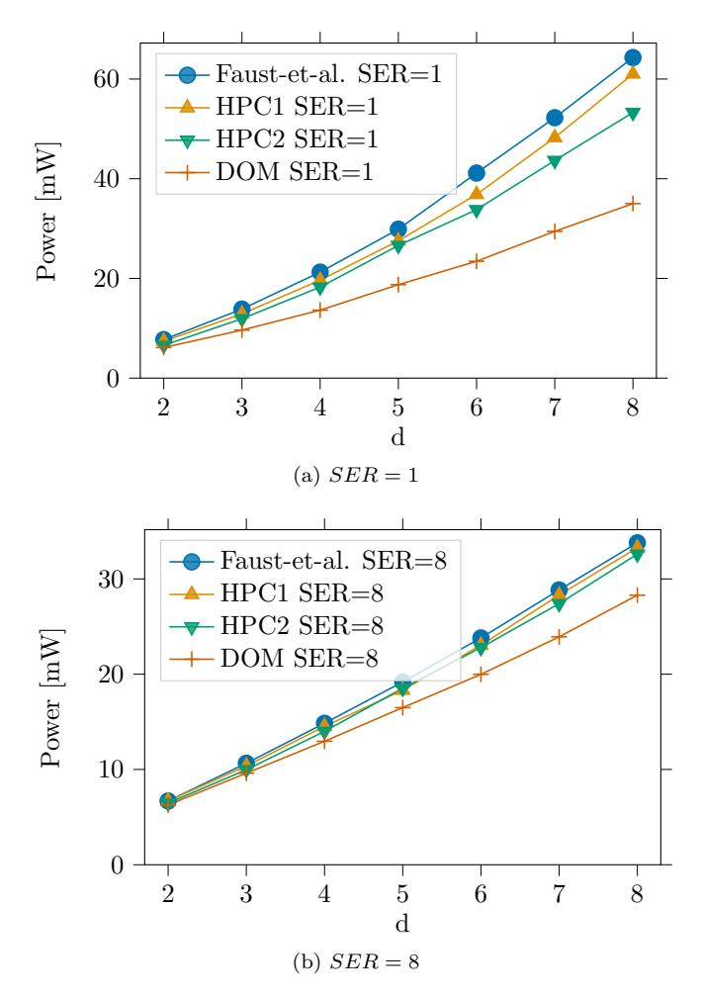

Figure 1: Power estimation (in mW, post-synthesis) as a function of d of a PRESENT-128 core in a commercial 65 nm ASIC technology at 100 MHz (excluding randomness generation).

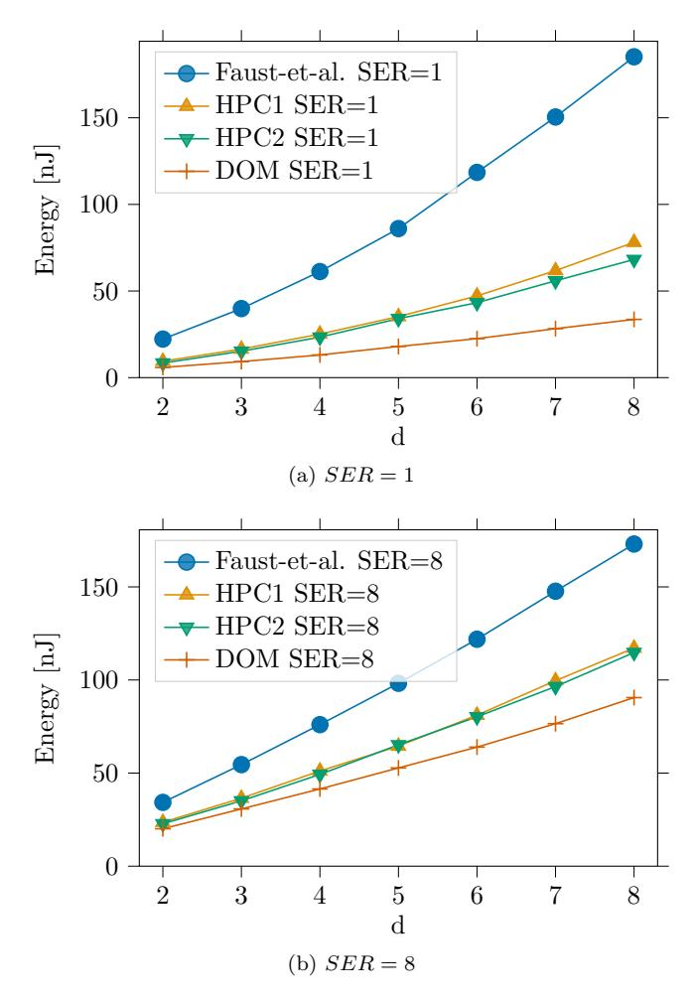

Figure 2: Energy estimation (in nJ, post-synthesis) as a function of d of one PRESENT-128 encryption in a commercial 65 nm ASIC technology at 100 MHz (excluding randomness generation).

## HPC: Low-orders leakage detection checks on masked PRESENT

Ga¨etan Cassiers Itamar Levi

#### Abstract

In this document, we present a preliminary side-channel security analysis of an FPGA implementation of the PRESENT block cipher with the hardware private circuits (HPC) masking scheme. We describe the methodology, the experimental setup and the results.

The evaluation setup which is used in this manuscript is composed of a PicoScope oscilloscope and a SAKURA-G board. The SAKURA-G board embeds a Xilinx FPGA (Spartan-6 in 45nm technology) was utilized to inhabit the evaluated PRESENT-128 architecture. The PicoScope 5244B oscilloscope was used to capture the power supply current with a passive inductive probe (Tektronix-CT1) connected serially to the measurement points. Sampling rate of 100 MS/s was practiced and the device was clocked at 4 MHz. Inputs were asserted through a UART interface to the FPGA. Fresh randomness was generated on the FPGA with an AES architecture in CTR mode supplied with a random key.

For leakage detection the detection method used is the traditional univariate one, based on Welch's (two-tailed) T-test. It is computed on two input sequences (Set<sup>0</sup> and Set1). In this work we compare two classes of leakages with so-called specific "fixed vs. fixed" tests to detect leakages, using the following statistic:

$$T_{value} = (\mu_{Set_0} - \mu_{Set_1}) / \sqrt{\sigma_{Set_0}^2 / |Set_0| + \sigma_{Set_1}^2 / |Set_1|},$$
(1)

where µ and σ are the populations' mean and standard-deviation, respectively. The leakages from the fixed sequences were recorded with fixed input and key. Detection was assumed for estimated statistics beyond a certain threshold.

In addition, we use the generalization in [2] to analyze higher-order statistical leakages. The left Subfigures column of Figure 1(a, c and e) shows the mean leakage, the 1st and 2nd order leakage-detection (T-tests) of a 2-shared implementation. The right Subfigures column of Figure 1(b, d, f and g) shows the mean leakage, the 1st, 2nd and 3rd order leakage-detection (T-tests) of a 3-shared implementation. Figure 2 shows the mean leakage, the 1st, 2nd, 3rd and 4th order leakage-detection (T-tests) of a 4-shared implementation.

As demonstrated in the figures for an d th order implementation, leakage is only visible at the d th statistical moment as exacted. The figures present the

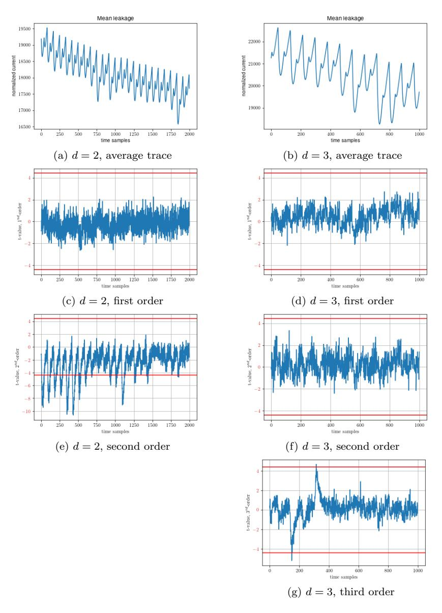

Figure 1: T-tests of masked PRESENT-128 HPC1 on FPGA for d = 2, 3.

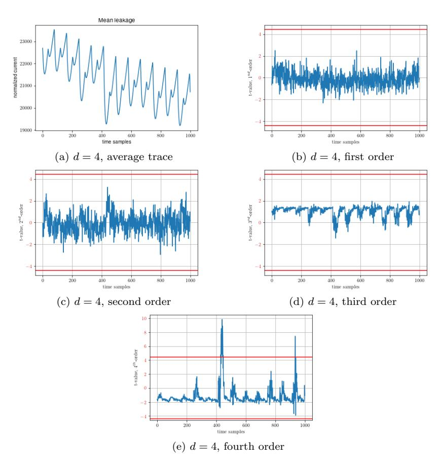

Figure 2: T-tests of masked PRESENT-128 HPC1 on FPGA for d = 4.

results with 240 · 103/6 · 10<sup>6</sup> and 9 · 10<sup>6</sup> traces (samples) for the 2/3 and 4-shares designs.

These numbers of traces denote the point where enough statistics have been collected to clearly show the d-th moment leakage. Those number should not be taken as absolute indications of the security level (i.e. number of traces an adversary needs to reach a given success rate) of the masked circuits, since they are strongly dependent on the noise level, in addition to the security order. We refer to [1] for the quantitative link between noise level, masking order and security level. Qualitatively, the security level grows as the noise level to the power of the masking order.

## References

- [1] Alexandre Duc, Sebastian Faust, and Fran¸cois-Xavier Standaert. Making masking security proofs concrete (or how to evaluate the security of any leaking device), extended version. J. Cryptology, 32(4):1263–1297, 2019.
- [2] Tobias Schneider and Amir Moradi. Leakage assessment methodology extended version. J. Cryptographic Engineering, 6(2):85–99, 2016.