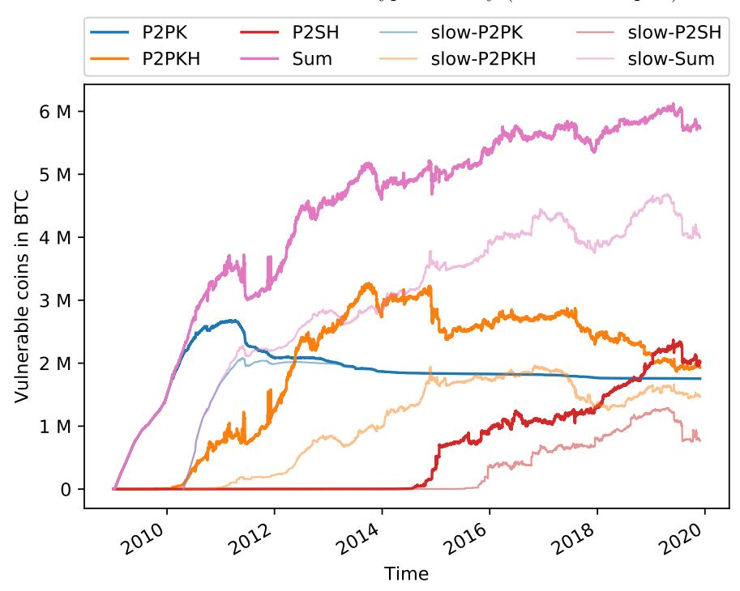
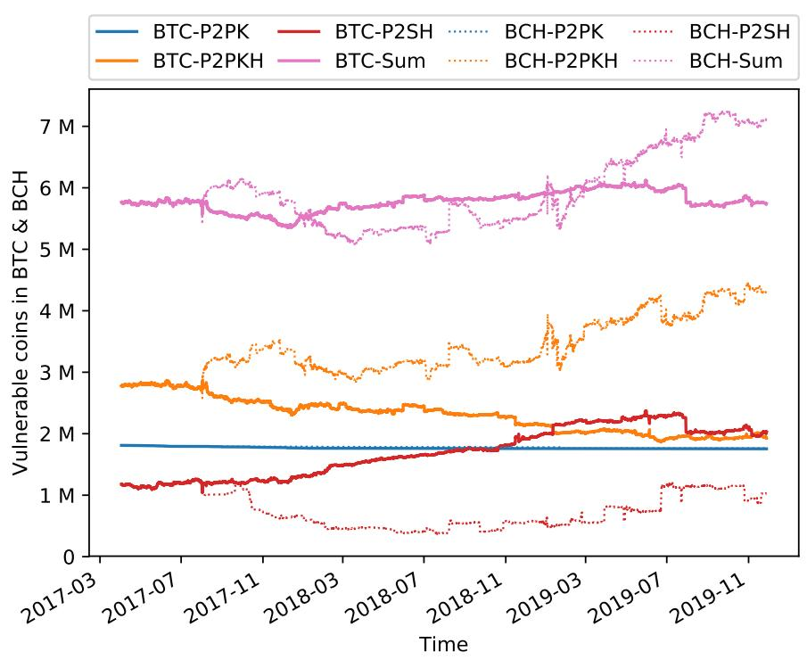
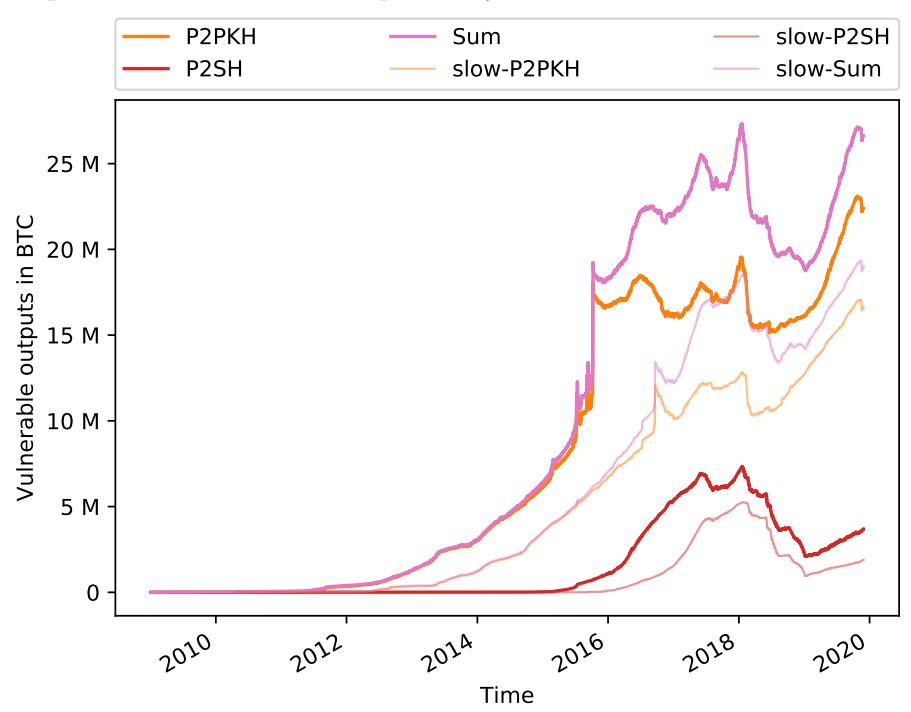
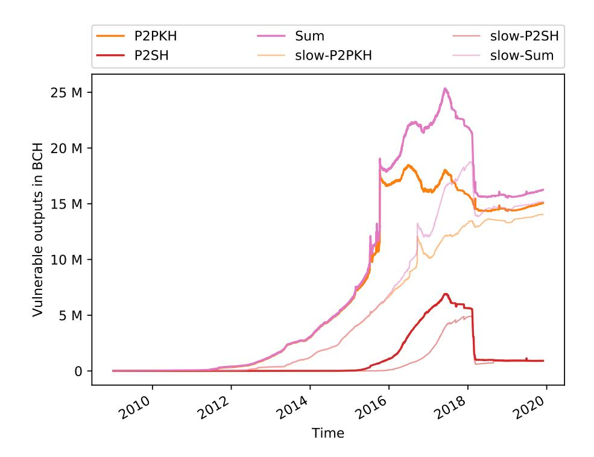

# Bitcoin Crypto–Bounties for Quantum Capable Adversaries

Dragos I. Ilie1 , Kostis Karantias2 , and William J. Knottenbelt1

1 Centre for Cryptocurrency Research and Engineering, Imperial College London {dii14, wjk}@imperial.ac.uk 2 IOHK kostis.karantias@iohk.io

Abstract. With the advances in quantum computing taking place over the last few years, researchers have started considering the implications on cryptocurrencies. As most digital signature schemes would be impacted, it is somewhat reassuring that transition schemes to quantum resistant signatures are already being considered for Bitcoin. In this work, we stress the danger of public key reuse, as it prevents users from recovering their funds in the presence of a quantum enabled adversary despite any transition scheme the developers decide to implement. We emphasise this threat by quantifying the damage a functional quantum computer could inflict on Bitcoin (and Bitcoin Cash) by breaking exposed public keys.

# 1 Introduction

The theory behind quantum computers (QC) was first introduced about 40 years ago. Research in the space has produced outstanding results, that have the potential to undermine the most popular cryptographic protocols in use today. One notable theoretical result is Peter Shor's quantum algorithm [25] which can be used to break digital signature schemes such as RSA or ECDSA. The engineering advancements needed to physically implement such a complex machine have only recently started to appear, but a sudden improvement in the approach towards scaling might lead to a powerful QC appearing virtually overnight.

The Bitcoin community is also affected by these developments, as the mechanism for ensuring ownership of funds relies on ECDSA. Bitcoin's cryptography must be updated; in fact there are plenty post-quantum cryptographic schemes to choose from if one is willing to sacrifice speed and storage. Such a scheme will be implemented in Bitcoin at some point and the majority of users will be able to safely lock their funds with quantum resistant signatures. However, in the extreme scenario of a Quantum Computer appearing without notice, not all users would be able to benefit from this upgrade. Interestingly, the recommended practices in Bitcoin would offer some level of quantum resistance that allows recovering funds safely, but unfortunately, many users do not follow these. In this paper we analyse Bitcoin (BTC) and Bitcoin Cash (BCH) for the amount of funds secured by exposed public keys; or, from the perspective of a quantum research group, the "crypto–bounty" for engineering a powerful quantum computer.

# 1.1 Contributions

This paper builds upon previous work of the authors [27] and brings the following contributions to the research space:

- 1. In Section 4.1 we describe the setting in which a quantum enabled adversary would operate if it were to start attacking the Bitcoin network considering developers and users take immediate measures to protect their funds and recover the network.
- 2. In Section 4.3 we present two models of attackers: one that can run Shor's algorithm virtually instantly and a slower one that might be more realistic for the first generations of attackers.
- 3. In Section 4.4 we describe attack vectors for maximising the crypto–bounty, i.e. the amount of funds that are impossible to recover by legitimate users in the presence of the attacker.
- 4. In Section 5 we present a study of the evolution of the crypto–bounty in Bitcoin and its most significant fork, Bitcoin Cash. Furthermore, we describe our methodology for obtaining these results and discuss what can be deduced from them.

# 2 Related Work

Previous work [27] of some of the authors of this paper has looked into revealed public keys to motivate the introduction of a protocol for transitioning to quantum resistance. They have found that approximately 33% of Bitcoin is secured by public keys that are exposed either trivially in an output, or in an input due to address reuse. In this study, we would like to consolidate that data and perform a more in-depth analysis looking not only at the current UTXO set, but also at the history of public key exposure and its source.

Other researchers have carried out a similar analysis [6], but their estimates represent a much lower bound than what we are providing and does not consider P2SH and P2WSH type addresses which are very popular in recent years. Furthermore, their study only looks at reused addresses, while we also inspect reused public keys between different addresses.

We have also become aware of other similar studies created by members of the cryptocurrency space, but we could not find descriptions of their methods or details of the results. One such analysis was done by one of the developers of BlockSci [12], who summarised his result that 5.8 million Bitcoins are secured by exposed public keys in an online discussion [11].

# 3 Background

In this section we briefly cover the basic concepts necessary for understanding the motivation behind the analysis we are conducting and the methods used to perform it. We present some of the structures that are used in Bitcoin to secure and move funds across the network and offer insight into the workings of Shor's quantum algorithm.

### 3.1 Bitcoin Fundamentals

Bitcoin transactions are data structures that encode the transfer of ownership of funds using inputs and outputs. Transactions are created, shared and stored by network participants following a protocol which dictates their validity and ordering. Funds reside in unspent transaction outputs (aka. UTXOs), each having an associated value and a locking script. For usability, some standard types of locking scripts are encoded in base 58 to produce addresses, which can easily be shared with others. To spend funds, a transaction input references an output and includes an unlocking script, which is used in combination with the locking script for validation. Ownership is guaranteed by a combination of hash commitments and public key cryptography. In general, each input contains a digital signature over the transaction spending the output. The signature is verified against a public key that is encoded in the output either in plaintext or inside a hash commitment which is revealed by the input. Depending on the type of locking script in the output, the input consuming it needs to provide unlocking data in various formats [4]. We can distinguish the following standard script types:

- 1. Pay-To-Public-Key (P2PK) is the script type used for the first Bitcoin transaction. This is the most simplified form of locking and unlocking scripts: the public key is written in plaintext in the locking script, and the digital signature appears in the input, also in plaintext. Only the owner of the corresponding private key can create a signature that would be verified against the public key from the locking script.
- 2. Pay-To-Multisig (P2MS) is a script pattern that allows users to lock funds to multiple public keys but require signatures only from a subset of those. Similarly to P2PK the public keys are all listed in plaintext in the locking script together with a minimum threshold number of signatures that need to be provided in the unlocking script. However, public keys are quite large and data on the blockchain costs fees, so this outputs are not very popular.
- 3. Pay-To-Public-Key-Hash (P2PKH) is an improved version of P2PK. The locking script contains a 20 byte hash commitment to the public key and the input contains both the public key and digital signature. This type of script was introduced to minimise the size of the output as hashes are only 20 bytes compared to public key which are 65 bytes uncompressed or 33 bytes compressed.
- 4. Pay-To-Script-Hash (P2SH) outputs are yet another improvement; instead of specifying the locking script in the output, a 20 byte hash commitment to it is stored instead. A valid input contains the unlocking script and the pre–image of the hash commitment from the output. This type of output has the same size as P2PKH outputs, but allows for more complex locking scripts to be encoded without requiring the payer to incur the fees associated with the extra data. This script is most commonly used to nest P2MS, P2WPKH, or P2WSH.

- 5. Pay-To-Witness-Public-Key-Hash (P2WPKH) was deployed in 2017 via a soft-fork in order to address several issues such as signature malleability and throughput limitations. Similarly to P2PKH the locking script contains a 20 byte hash of the public key and the input holds the public key and signature. The difference is that the input data is held in a segregated area called segwit which does not contribute towards the hash of the transaction and size limit of a block.
- 6. Pay-To-Witness-Script-Hash (P2WSH) is a script type introduced together with P2WPKH and represents the P2SH version of segwit. The output contains a 32 byte hash of the actual locking script, 12 bytes larger than the 20 byte hash from P2SH. This increase is meant to improve security against possible collision attacks as the work needed to find a collision in a 20 byte hash is no longer infeasible. This script type usually nests P2MS.

Digital Signatures in Bitcoin are implemented using the Elliptic Curve Digital Signature Algorithm (ECDSA); an implementation of the Digital Signature Standard (DSS) based on Elliptic Curve Cryptography (ECC) [3]. ECC is an approach to public key cryptography that relies on the mathematics of elliptic curves over finite fields. To this end, the public key is a point on an elliptic curve3 , and the secret key is the exponent at which a base point3 is raised in order to obtain the public key. As in any other digital signature scheme, the private key is kept secret and used to sign messages, while the public key is published and used to validate signatures. ECC and therefore ECDSA rely on the assumption that it is intractable to solve the Elliptic Curve Discrete Logarithm Problem (ECDLP) [7], which would allow deducing the private key from the public key, defeating the whole purpose of a digital signature algorithm. Similarly to the more famous integer factorisation problem [8], ECDLP has no known reasonably fast (e.g. polynomial–time) solution on a classical computer [17].

### 3.2 Quantum Computing

Quantum Computing is experiencing an increase in interest in the last few years as more giants of industry become interested in the possibilities promised by the theory behind quantum algorithms, i.e. they are able to solve certain classes of mathematical problems with drastically improved running time compared to classical algorithms. Although it is outside the scope of this paper to explain the mechanism through which quantum algorithms achieve quadratic or exponential speedups over their classical counterparts, we would like to offer some intuition about why they are of interest for ECC, and hence, Bitcoin. Usually, quantum computations encode many values on a single register and then perform computations on it. However, measuring the register would reduce the superposition to a single value, losing all information about the other solutions. Thus, quantum algorithms are designed to manipulate the register in order to extract knowledge about the hidden structure of the values on the register.

3 Bitcoin uses parameters defined in secp256k1 [20] due to several mathematical properties which allow computations to be optimised.

Shor's Algorithm [25] is a quantum algorithm that, in generalised form, can solve a class of problems known as the hidden subgroup problem over a finite Abelian field [18]. In fact most public key cryptography in use today relies on the intractability of this problem in certain groups. Indeed, the ECDLP can also be reduced to this problem, meaning that such an algorithm would be able to compute a private key from a public key in relatively short time. The core of the algorithm is the application of the Quantum Fourier Transform (QFT) circuit [15] which runs in polynomial–time. Proos and Zalka have approximated that approximately 6n (where n is the security parameter, 256 bits for Bitcoin) qubits would be needed to run the computation [19] .

# 4 Context & Modelling

In this section, we assume the setting under which the quantum capable attacker operates and explain what would constitute the crypto–bounty available to him, even if the community learns of his existence and tries to switch to a quantum resistant signature scheme. As described in previous work in [27,28], the main attack vectors available to quantum capable adversaries stem from exposed public keys. Such adversaries can use Shor's quantum algorithm with a revealed public key as input, and compute the associated private key, gaining complete control over the original owner's funds.

Live Transaction Hijacking is a type of attack similar to a double–spend [13, 14, 22, 26]. The attacker can create conflicting transactions that spend the same UTXOs as honest transactions but send the funds to addresses under his control. A quantum enabled adversary can perform this attack only if he is able to compute the private key associated to a public key revealed in the input of a transaction while the transaction is still in the miners' mempool. In the presence of a malicious actor capable of this attack, users would not be able to create any new transactions as this would reveal their public keys and their transactions would be susceptible to hijacking.

### 4.1 Transitioning to Quantum Resistance

As the community learns of the presence of a quantum attacker approaching the ability to perform live transaction hijacking, Bitcoin users would have to stop all activity and deploy a scheme for transitioning to quantum resistance under the assumption that they are in the presence of an adversary capable of live hijacking. Such a protocol would have to rely on some construction that does not expose the ECDSA public key immediately (or ever), but allows for the linking of transactions to it. Some schemes that achieve this feat, are described in [1, 27, 29], but the community can settle on any viable alternative. However, we note that only UTXOs secured by not–yet–revealed public keys could be safely transitioned to quantum resistance as public keys that are exposed at the time of deploying the transition protocol would still be cracked by the attacker who would be essentially indistinguishable from the actual owner. Therefore, any UTXOs secured by revealed public keys would constitute a bounty for the quantum capable attacker as the legitimate owners would not be able to move the funds to quantum resistant outputs under their control.

### 4.2 Attack Vectors Considered

Given this setting, quantum enabled adversaries could still consume any outputs associated to public keys revealed before the deployment of the transition scheme. Any attempt from the legitimate owner to transition the funds can be hijacked using the private key computed using Shor's quantum algorithm. Below we enumerate some types of UTXOs attackers can target by obtaining exposed public keys. We only focus on these scenarios as the information is publicly accessible and allows for the retrospective analysis of balances of revealed public keys at a certain block height. Other types of public key unveiling are presented in [27].

- 1. Outputs of type P2PK and P2MS display the public key in plaintext in the output of the transaction.
- 2. Outputs of type P2PKH, P2SH, P2WPKH, or P2WSH where the necessary public key has been used as part of P2PK or P2MS, thus exposing it.
- 3. Outputs of type P2PKH, P2SH, P2WPKH, or P2WSH where the locking script is being used to receive multiple payments which are not consumed at once. This sort of locking script reuse renders the unspent outputs vulnerable as the public key is exposed in the unlocking script of an input. Such behaviour is discouraged due to a number of privacy attacks [5, 9, 16, 24, 30], but many wallet providers and even large exchanges ignore these practices.

### 4.3 Adversary Model

Firstly, we assume the quantum capable attacker can only affect the blockchain using Shor's algorithm. As other studies [2,23,28] have discussed, quantum computers could be used to run Grover's quantum algorithm [10] in order to obtain a quadratic speedup in mining. It is not clear if this would lead to a real advantage as current ASIC miners are highly optimised and supposedly much cheaper to run than quantum computers. Therefore, our aim is to analyse only the stealing of funds by using Shor's algorithm.

The assumption we are working with is that once a quantum adversary starts acting maliciously, the Bitcoin community detects this behaviour and clients are quickly updated to use a scheme for transitioning to quantum resistance, thus invalidating simple ECDSA signatures4 . At this point, the attacker can only target the UTXOs secured by already revealed public keys. As legitimate users learn of this development, they race to spend the vulnerable UTXOs in order to transition them to quantum resistant outputs. At the same time, quantum– capable attackers try to spend the same UTXOs using the private keys they managed to break until this point. However, if the attacker cannot run Shor's algorithm fast enough, some users will manage to transition their funds without the attacker having time to break their public key even though it was revealed.

4 We use the word "simple" as any protocol for transitioning to quantum resistance that aims to be deployed via a soft fork, needs to verify ECDSA signatures for compatibility with un–upgraded clients. However, it must also verify some other form of quantum resistant cryptography such that attackers cannot exploit the scheme.

Therefore, in order to maximise the value of the crypto–bounty, an adversary would have to first collect all the revealed public keys, break them, and only then start the attack. This strategy allows him to collect at least all the UTXOs secured by revealed public keys at the time the transitioning protocol is deployed. Although it is impossible to estimate the clock speeds of quantum computers as the technology behind them is still in early stages and the most efficient approach has not been determined yet, we will differentiate between two purely hypothetical types of quantum capable attackers.

Instant attacker is able to deduce private keys from public keys considerably faster than a transaction sits in a miner's memory pool before it is included in a block. Our analysis indicates that the median input count per Bitcoin block in the past year is 5350. Thus, an instant quantum attacker should be able to break approximately 5350 public keys every 10 minutes5 , meaning he would need to run Shor's algorithm in approximately 100 milliseconds. This speed suffices because the attacker can offer higher fees than honest users, thus incentivizing miners to only select his transactions. Such an attacker could start acting maliciously immediately after he develops a quantum computer as the computation speed he benefits from allows him to scan the mempool and hijack any attempt at transitioning funds to a quantum resistant output.

Slow attacker represents a more realistic although still hypothetical adversary that is able to deduce private keys from revealed public keys but needs a much larger window of time in order to break all the public keys that are revealed. The attacker builds a database of computed private keys, but at the same time, some of these become unusable as users move their funds before the attacker has finished collecting a sufficient amount. There are heuristics the attacker could employ in order to minimise the amount of private keys he attempts to break and maximise profit. For instance, he could analyse patterns of public key usage and target those that are inactive for long periods of time, under the assumption that the original owners have lost the private keys, and therefore, control of the funds. Another effective strategy could be identifying public keys which are used mainly for receiving money, e.g. exchanges use addresses where users deposit their funds but rarely withdraw. However, for the purposes of this study, we assume that at any given moment the attacker has broken only the public keys revealed at least a year in the past.

# 4.4 Aggregating Vulnerable Outputs

Regardless of the speed of a quantum adversary, in order to identify all the vulnerable UTXOs, an attacker needs to create and maintain two indexes: one from potential locking scripts to revealed public keys and one from public keys to the associated private keys. This allows him to prioritise the breaking of public keys according to the value secured by them. For some output types such as P2PK and P2MS this task does not pose difficulty as the public key is revealed directly in the locking script. In general, an attacker could listen for all

5 10 minutes is an estimate for the average time a transaction sits in the mempool before being included in a block.

transactions and group outputs by their locking script even though the public key that unlocks them is not visible yet. Once at least one of these outputs is spent, the public key used in the unlocking script can be linked to the UTXOs that have not been consumed. However, these strategies only consider reuse of the same locking script in multiple outputs but not the reuse of public keys inside different types of locking scripts. To this end, we can define the concept of equivalent locking scripts:

Equivalent locking scripts require the same public key to unlock them. It is possible to detect reuse of public keys across the standard types of outputs presented in Section 3. In surplus, to the locking scripts equivalent to a public key, an attacker could also generate equivalent locking scripts for P2MS, i.e. P2MS nested in one of P2SH or P2WSH. We describe the operations to generate each type of equivalent standard locking script below:

- 1. Any public key, pk, can be hashed using HASH160(pk)6 to obtain the 20 byte hash commitment used inside P2PKH and P2WPKH locking scripts.
- 2. Any locking script, S, of type: P2PK, P2MS, P2PKH, P2WPKH, or P2WSH can be hashed using HASH160(S) to obtain the 20 byte hash commitment used inside P2SH.
- 3. Any locking script, S, of type: P2PK, P2MS can be hashed using SHA-256(S) to obtain the 32 byte hash commitment used inside P2WSH. Notice that SHA-256(S) was already computed as part of calculating HASH1606 .
- 4. Any combination of up to 15 public keys can be used to generate P2MS locking scripts. Although there is no direct benefit in obtaining P2MS locking scripts as they display the public keys in the output, there might be P2SH or P2WSH outputs which include a hash commitment to a P2MS otherwise not revealed. These can be generated by hashing every possible P2MS obtained from the set of exposed public keys using HASH160 for P2SH or SHA-256 for P2WSH. We note that generating all these scripts takes polynomial time (with exponent 15) in the number of unique public keys; in our analysis, we have found approximately 700 million unique public keys. Even if we only try to build combinations of just 3 public keys, it would still take 100 thousand years for the fastest miner7 on the market today to compute that many hashes. Given the amount of computation required to identify such outputs and the low value of P2SH outputs in general, we do not consider this attack any further.

To use the above data, an adversary needs to keep an index from each possible locking script to the private key that can unlock it. For every public key, the 6 most common locking scripts (i.e. P2PK, P2PKH8 , P2SH-P2PK, P2SH– P2WPKH, P2WSH–P2PK, P2SH–P2WSH) can be generated and included in

6 HASH160(x) = RIPEMD-160(SHA-256(x)) [21]

7 Currently, the fastest ASIC miner we are aware of is the Ebit E10 capable of computing 18Th/s.

8 Note that P2PKH contains the same hash commitment as P2WPKH, therefore it suffices to store only one of them.

the index. Furthermore, any P2MS locking script can be used to generate locking scripts of type P2SH-P2MS and P2WSH-P2MS. With 700 million different public keys and 55 million P2MS locking scripts, the attacker's index would hold approximately 4.3 billion entries. If needed, access to such an index can be optimised using a bloom filter.

# 5 Crypto–Bounty Analysis

In this section we describe our approach to estimating the value of cryptocurrency, on the Bitcoin and Bitcoin Cash blockchains, vulnerable to an instant and slow attacker. We have analysed the current state of the Bitcoin and Bitcoin Cash networks, but also the historic evolution of the crypto–bounty, in order to deduce and compare patterns of public key reuse in the communities.

#### 5.1 Methodology

To complete this analysis we have used a combination of open source tools and libraries made available by the Blockchain community. Most notably, BlockSci [12] allowed us to obtain metrics for the number of outputs vulnerable and their value. BlockSci uses a custom parser to generate indexes which are not found in usual implementations of full nodes, such as: index of transactions by address, index of inputs by referenced output, index of addresses by public key, etc. These constructions enable us to analyse various metrics throughout the history of different Bitcoin-based cryptocurrencies.

For the historic analysis we would like to estimate the amount of cryptocurrency that is locked in vulnerable UTXOs at a given point in time, or in domain specific terms: at a given blockchain height, h. Naturally, we only count the outputs which were unspent at that time and associated to a public key which has already been revealed. Notice that most of the outputs that were part of the UTXO set at height h, are actually spent at a later block height h 0 > h, directly revealing the public key associated to them. Therefore, we need to build an index of unique public keys by height of first reveal. We also use an index built by the BlockSci parser to link each output to the input consuming it. Therefore, we can formulate our strategy for computing the evolution of the crypto–bounty available to a quantum enabled adversary.

For each output in every transaction in every block B, compute the height at which the necessary public key is broken. For an instant attacker, the height at which a public key is revealed is also the height at which it is broken. However, for a slow attacker we must consider a delay of one year from the time the public key is revealed. To generalise, we will define ShorDelay as the time delay it takes to run Shor's Algorithm for a certain quantum attacker. Depending on the type of output, we can obtain the height Hreveal, at which the attacker could have started running Shor's algorithm on the public key associated to the output, in the following ways:

1. P2PK → We query the index of public keys to obtain the first height at which the public key in the output was revealed, Hreveal.

- 2. P2MS → For this type of output a minimum threshold, m, of public keys need to be broken in order to obtain control over it. We can consider Hreveal is the height at which m of the public keys were revealed. We lookup each of the public keys in the index and sort the heights returned. Hreveal is the value on position m (indexed from 1) in the list.
- 3. Other spent outputs → We perform a lookup in the index of inputs by referenced outputs to obtain the unlocking script associated to this output. Consequently, we find the public key needed and lookup the height at which it was revealed, Hreveal, using the index of public keys. For nested P2MS unlocking scripts (i.e. P2SH-P2MS, P2WSH-P2MS) there will be multiple public keys. In that case we perform the same operations as for P2MS to compute Hreveal.
- 4. Other unspent outputs → The remaining outputs are UTXOs which are not P2PK or P2MS. For these outputs we rely on the BlockSci index of equivalent addresses; this is similar to the index of equivalent locking scripts we described in Section 4. Thus, for every UTXO with a locking script which does not directly reveal the public key, we query this index for the equivalent P2PK address. From this we extract the public key and lookup the height at which it was first revealed, Hreveal. Due to space and time complexity, BlockSci does not generate every possible P2SH script when implementing the concept of equivalent addresses. Therefore, some P2SH UTXOs will not be identified as equivalent to public keys that are revealed.

Having obtained the height at which the public key of each output was revealed, we can define the height at which an attacker is capable of breaking it as the minimum between Hreveal incremented with the delay of running Shor's algorithm and the height at which the output appeared: B.height. Therefore, Hbroken = min(B.height, ShorDelay + Hreveal). If Hbroken is smaller than the height at which the output is spent Hspent, the adversary would have had a window of attack: (Hbroken, Hspent), during which he could have stolen the value of this output. Finally, we we aggregate the values of overlapping windows to produce the results that follow.

### 5.2 Results & Discussion

All the data presented in our work was collected at blockchain height 605650 for both Bitcoin (BTC) and Bitcoin Cash (BCH). At this block height, there are 18M coins in circulation on each chain.

The current crypto-bounty is presented in Table 1. We notice that BCH users behave more carelessly with their keys. While 31.77% of BTCs are locked in 26.66M vulnerable UTXOs, in BCH 39.42% of the coins are locked in 16.25M UTXOs. Apparently, BCH users lock more of their funds in less outputs than those of Bitcoin. We believe this is a consequence of the segwit fork, as BTC blocks do not include the signature data anymore, thus allowing for more outputs and inputs than BCH blocks.

|      |     | P2PK  | P2PKH | P2MS  | P2SH  | P2WPKH | P2WSH | Total | % of Supply |
|------|-----|-------|-------|-------|-------|--------|-------|-------|----------------|
| Ins- | BTC | 1.75M | 1.92M | 41.43 | 2.03M | 22.4K  | 8.77K | 5.74M | 31.89%         |
| tant | BCH | 1.76M | 4.33M | 30.6  | 4.33M | N/A    | N/A   | 7.12M | 39.55%         |
| Slow | BTC | 1.75M | 1.46M | 41.34 | 0.76M | 2.9K   | 3.34K | 3.99M | 22.16%         |
|      | ВСН | 1.76M | 2.28M | 30.59 | 0.21M | N/A    | N/A   | 4.25M | 23.61%         |

**Table 1.** The current crypto-bounty in Bitcoin and Bitcoin Cash, from the perspective of an instant and slow attacker.

The evolution of the crypto-bounty for an instant and slow attacker can be seen in Figure 1 for BTC and Figure 2 for BCH. We have left out the plots for P2MS and segwit type outputs as their values are insignificant in comparison to the other outputs and would just clutter the image. We did, however, tally their contribution towards the overall crypto-bounty (i.e. the Sum plot).

Fig. 1. Evolution of the crypyo-bounty for an instant (opaque) and slow (transparent) attacker, segregated by type of output.

In Figure 1, notice how the plots for P2PK converge around year 2013 and then remain approximately constant until the present, indicating that there is almost no activity involving P2PK outputs after 2013. This is expected as they are

considered legacy locking scripts, but the fact that these outputs have not been moved for years, could signify that their owners have lost control of the private keys. In consequence, no scheme can transition them to quantum resistance and we can consider the 1.75M BTCs (and 1.76M BCHs) locked in these outputs a guaranteed prize for the first quantum computer powerful enough to break a 256 bits ECDSA public key.

Also in Figure 1, we draw attention to the parallelism, or lack thereof, between two plots for the same type of output. We can use this to describe the frequency and exposure of address reuse. For instance, the P2PKH plots for the slow and instant quantum attacker show almost no correlation from 2013 to 2015. While the reuse of these addresses was considerable as indicated by the instant attacker's plot, the exposure of the outputs was mostly less than a year, as the slow attacker's plot does not follow the same trend.

**Comparing BTC with BCH** we can ignore the common history up to block 478558 at which BCH forked from BTC. To this end, the plots in Figure 2 start at block 460000, such that the fork point is clearly visible.

Fig. 2. Comparison between vulnerable coins in BTC (solid) and BCH (dotted).

Analysing Figure 2, we observe that although the total amount of coins vulnerable is relatively the same across BTC and BCH, there is a clear difference in preference for output types in the two communities and this is creating an

upward trend for address reuse in BCH. While BTC users move funds away from P2PKH to P2SH and P2WSH, which are harder to identify, the BCH community is increasingly reusing P2PKH addresses, which require only one hash computation to be linked to the public key.

**Fig. 3.** Historic size of the vulnerable UTXO set from the perspectives of the instant (opaque) and slow (transparent) attackers in BTC.

A similar conclusion can be drawn from the charts in Figures 3 and 4, where we plot the number of outputs that are vulnerable. Observe how the graphs for the slow attacker differ across the two Figures for P2PKH and P2SH. While for BTC (Figure 3) the plot is fairly distant from that of the instant attacker, in BCH (Figure 4) they approach, almost converging. This means that slow attackers in Bitcoin cannot make use of as many public keys as slow attackers in BCH. So even though there are more outputs that reuse addresses in BTC, the exposure of the public keys securing them is generally shorter. Furthermore, the value locked in these outputs is steadily decreasing as we can see from Figure 2. At the same time, BCH users are reducing the number of outputs, but as indicated by the converging plots for the same type of output from Figure 4, most of them are associated to public keys revealed long ago, hence the ascending trend of the crypto-bounty for BCH observed in Figure 2.

Fig. 4. Historic size of the vulnerable UTXO set from the perspectives of the instant (opaque) and slow (transparent) attackers in BCH.

#### 6 Conclusion

In this paper, we have formulated the context in which a quantum enabled adversary would have to operate if it were to start attacking the Bitcoin network. We assumed the community would swiftly transition to a quantum resistant signature scheme through the use of a transitioning scheme that allows users to link transactions to their public keys without revealing them in the open. However, it is up to the individual user, to operate in a responsible manner that makes transitioning his funds even possible. Therefore, we emphasise the importance of locking funds in UTXOs associated to public keys which have not been revealed publicly, as otherwise, a quantum enabled adversary would be able to forge any action on behalf of the legitimate user, including transitioning the user's funds to addresses under his control.

We propose two models for the quantum adversary: one that can run Shor's algorithm virtually instantly and a slower one that might be more realistic for the first generations of quantum attackers. Consequently, we outline strategies available to each of them for maximising profit through denying legitimate transactions to go through by overriding them with higher fee transactions spending the same UTXOs.

Finally, we demonstrate the methodology used to analyse the current and historic state of the vulnerable UTXO set as seen from the perspective of the two types of quantum enabled adversaries. We present the results gathered and analyse patterns of address reuse, noting that a larger percentage of the total supply is store in considerably less outputs in Bitcoin Cash compared to Bitcoin. Furthermore, Bitcoin Cash users reuse addresses for longer periods of time, while in Bitcoin the exposure of public keys with positive balances is somewhat limited. We note that currently there are 1.75M BTCs and 1.76M BCHs which reside in a small number of outputs that have been mostly untouched since 2013, suggesting these may be zombie coins which cannot be recovered by classical means as the private keys have been lost. On the other hand, these coins could be considered a guaranteed reward for the entity that implements the first large scale quantum computer, whenever that would happen.

# References

- 1. Adam Back. https://twitter.com/adam3us/status/947900422697742337. Accessed: 2018-02-18.
- 2. D. Aggarwal, G. K. Brennen, T. Lee, M. Santha, and M. Tomamichel. Quantum attacks on bitcoin, and how to protect against them. arXiv preprint arXiv:1710.10377, 2017.
- 3. American National Standards Institute. Public Key Cryptography for the Financial Services Industry: The Elliptic Curve Digital Signature Algorithm (ECDSA). ANSI X9.62, 2005.
- 4. A. M. Antonopoulos. Mastering Bitcoin: unlocking digital cryptocurrencies. " O'Reilly Media, Inc.", 2014.
- 5. A. Biryukov, D. Khovratovich, and I. Pustogarov. Deanonymisation of clients in bitcoin p2p network. In Proc. 2014 ACM SIGSAC Conference on Computer and Communications Security, pages 15–29. ACM, 2014.
- 6. Bram Bosch, Itan Barmes. Quantum computers and the Bitcoin Blockchain. https://www2.deloitte.com/nl/nl/pages/innovatie/artikelen/ quantum-computers-and-the-bitcoin-blockchain.html. Accessed: 2020-01-18.
- 7. Certicom Research. Certicom ECC Challenge. https://www.certicom.com/ content/dam/certicom/images/pdfs/challenge-2009.pdf. Accessed: 2018-02- 17.
- 8. R. Crandall and C. B. Pomerance. Prime numbers: a computational perspective, volume 182. Springer Science & Business Media, 2006.
- 9. A. Gervais, G. O. Karame, K. W¨ust, V. Glykantzis, H. Ritzdorf, and S. Capkun. On the security and performance of proof of work blockchains. In Proc. 2016 ACM SIGSAC Conference on Computer and Communications Security, pages 3– 16. ACM, 2016.
- 10. L. K. Grover. A fast quantum mechanical algorithm for database search. In Proceedings of the twenty-eighth annual ACM symposium on Theory of computing, pages 212–219. ACM, 1996.
- 11. H. Kalodner. https://twitter.com/hkalodner/status/1064700672392773633. Accessed: 2020-01-18.
- 12. H. Kalodner, S. Goldfeder, A. Chator, M. M¨oser, and A. Narayanan. Blocksci: Design and applications of a blockchain analysis platform. arXiv preprint arXiv:1709.02489, 2017.

- 13. G. O. Karame, E. Androulaki, and S. Capkun. Two bitcoins at the price of one? double-spending attacks on fast payments in bitcoin. IACR Cryptology ePrint Archive, page 248, 2012.
- 14. G. O. Karame, E. Androulaki, M. Roeschlin, A. Gervais, and S. Capkun. Misbehav- ˇ ior in bitcoin: A study of double-spending and accountability. ACM Transactions on Information and System Security (TISSEC), 18(1):2, 2015.
- 15. C. Lavor, L. Manssur, and R. Portugal. Shor's algorithm for factoring large integers. arXiv preprint quant-ph/0303175, 2003.
- 16. S. Meiklejohn, M. Pomarole, G. Jordan, K. Levchenko, D. McCoy, G. M. Voelker, and S. Savage. A fistful of bitcoins: characterizing payments among men with no names. In Proc. 2013 Internet Measurement Conference, pages 127–140. ACM, 2013.
- 17. A. Menezes. Evaluation of security level of cryptography: the elliptic curve discrete logarithm problem (ecdlp). Technical Report. University of Waterloo, 2001.
- 18. M. Mosca and A. Ekert. The hidden subgroup problem and eigenvalue estimation on a quantum computer. In NASA International Conference on Quantum Computing and Quantum Communications, pages 174–188. Springer, 1998.
- 19. J. Proos and C. Zalka. Shor's discrete logarithm quantum algorithm for elliptic curves. arXiv preprint quant-ph/0301141, 2003.
- 20. M. Qu. Sec 2: Recommended elliptic curve domain parameters. Certicom Res., Mississauga, ON, Canada, Tech. Rep. SEC2-Ver-0.6, 1999.
- 21. P. Rogaway and T. Shrimpton. Cryptographic hash-function basics: Definitions, implications, and separations for preimage resistance, second-preimage resistance, and collision resistance. In International workshop on fast software encryption, pages 371–388. Springer, 2004.
- 22. M. Rosenfeld. Analysis of hashrate-based double spending. arXiv preprint arXiv:1402.2009, 2014.
- 23. O. Sattath. On the insecurity of quantum Bitcoin mining. arXiv preprint arXiv:1804.08118, 4 2018.
- 24. N. Schneider. Recovering bitcoin private keys using weak signatures from the blockchain. http://www.nilsschneider.net/2013/01/28/ recovering-bitcoin-private-keys.html, 2013. Accessed: 2018-02-18.
- 25. P. W. Shor. Polynomial-time algorithms for prime factorization and discrete logarithms on a quantum computer. SIAM review, 41(2):303–332, 1999.
- 26. Y. Sompolinsky and A. Zohar. Bitcoin's security model revisited. arXiv preprint arXiv:1605.09193, 2016.
- 27. I. Stewart, D. Ilie, A. Zamyatin, S. Werner, M. Torshizi, and W. J. Knottenbelt. Committing to quantum resistance: a slow defence for bitcoin against a fast quantum computing attack. Royal Society open science, 5(6):180410, 2018.
- 28. L. Tessler and T. Byrnes. Bitcoin and quantum computing. arXiv preprint arXiv:1711.04235, 2017.
- 29. Tim Ruffing. https://lists.linuxfoundation.org/pipermail/bitcoin-dev/ 2018-February/015758.html. Accessed: 2018-02-18.
- 30. Y. Yarom and N. Benger. Recovering OpenSSL ECDSA nonces using the FLUSH+ RELOAD cache side-channel attack. IACR Cryptology ePrint Archive, 2014:140, 2014.