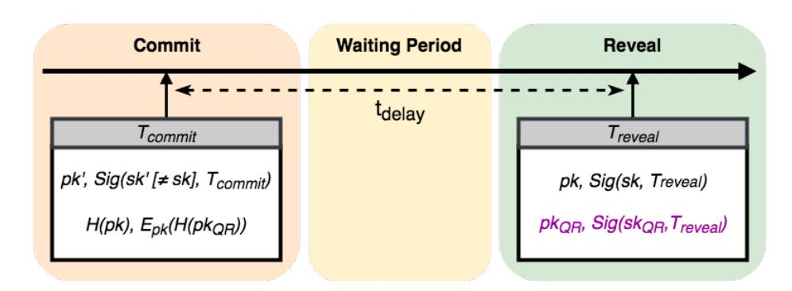

# Committing to Quantum Resistance, Better: A Speed-and-Risk-Configurable Defence for Bitcoin against a Fast Quantum Computing Attack

Dragos I. Ilie, William J. Knottenbelt, and Iain D. Stewart

Centre for Cryptocurrency Research and Engineering Imperial College London, London, United Kingdom, SW7 2AZ {dii14, wjk, ids}@imperial.ac.uk

Abstract. In light of the emerging threat of powerful quantum computers appearing in the near future, we investigate the potential attacks on Bitcoin available to a quantum-capable adversary. In particular, we illustrate how Shor's quantum algorithm can be used to forge ECDSA based signatures, allowing attackers to hijack transactions. We then propose a simple commit–delay–reveal protocol, which allows users to securely move their funds from non-quantum-resistant outputs to those adhering to a quantum-resistant digital signature scheme. In a previous paper [34] we presented a similar scheme with a long fixed delay. Here we improve on our previous work, by allowing each user to choose their preferred delay – long for a low risk of attack, or short if a higher risk is acceptable to that user. As before, our scheme requires modifications to the Bitcoin protocol, but once again these can be implemented as a soft fork.

# 1 Introduction

Bitcoin [24] is the first scalable and widely adopted decentralised cryptocurrency. Unlike most fiat currencies, decentralised digital money are not regulated by a central entity. Participants to the network cooperate by following a protocol to broadcast, validate, and record transactions in a decentralised, distributed, database-like structure called the blockchain [10]. The primary mechanism for establishing consensus and guaranteeing the immutability of transactions is called Proof of Work (PoW) and it fundamentally relies on hashes [30]. The other crucial cryptographic primitive is the digital signature scheme [29], which is used to selectively grant authorisation to change data (or move funds) on the blockchain. Currently, the public-key cryptography of choice in Bitcoin and most other blockchains is Elliptic Curve Cryptography (ECC) [22] whose security relies on the hardness of the Elliptic Curve Discrete Logarithm Problem (ECDLP), which is indeed classically intractable1 . Therefore, Bitcoin and other similar blockchains provide decentralised and trustless peer-to-peer transactions with much stronger security, transparency, and ownership guarantees that banks or even governments can offer.

1 The ECDLP is intractable only in specific groups, like the one used in Bitcoin.

Quantum Computers (QCs) [18] appears as an idea in 1959 when Richard Feynman notices that the laws of quantum mechanics can be used to manipulate atoms or photons to perform highly efficient parallel computations [15]. However, the domain remains unexplored until further research continues in the 1980s and interest in the field slowly grows. One of the most exciting developments in quantum computing comes from Peter Shor in 1994 when he finds a quantum algorithm that threatens most of the popular public-key cryptography schemes (ECC included) [33]. As practical implementations of QCs remain a difficult engineering challenge due to quantum effects such as decoherence [31], it appears cryptographers will have enough time to upgrade their security to quantum resistant schemes.

The current implementations of QCs [12, 38, 39] do not have enough qubits to solve problems large enough to affect Bitcoin, but as more funding is being directed at this endeavour, different approaches for the architecture of QCs are being considered, tested, and implemented [4] so a sudden improvement might lead to a powerful QC appearing virtually overnight. Thus, Bitcoin and other blockchains will have to take action to allow their users to transition their funds to quantum resistant outputs even in the presence of a powerful QC.

In this paper, we aim to show the impact quantum algorithms have on Bitcoin and other blockchains relying on ECC, how it can be mitigated, and ultimately, how one can safely transition to quantum resistance. The remainder of the paper is structured as follows. Section 2 outlines the workings of Bitcoin and the relevant quantum computing attacks available. Section 3 examines the threats a slow or fast quantum-capable attacker poses to Bitcoin. Most importantly, in Section 4 we propose a protocol for transitioning from Bitcoin's current signature scheme to a quantum-resistant one chosen by the community. Finally, we present related work in Section 5 and conclude the paper in Section 6.

# 2 Background

In this section we present basic information on Bitcoin's signature scheme, on the quantum algorithms threatening Bitcoin, and on symmetric encryption which is required by our protocol. However, as each of these topics is by itself fairly complex, we recommend readers unfamiliar to these concepts to examine existing literature, such as: [2,24,25] for Bitcoin, [18,26] for quantum computing, and [3] for quantum resistant schemes.

## 2.1 Bitcoin Fundamentals

Transactions: In Bitcoin, data is recorded in transactions built from inputs and outputs. Each input references a previously unreferenced output and provides proof of authorisation. The outputs that are unreferenced or "unspent" in a certain state of the blockchain constitute the Unspent Transaction Output (UTXO) set. Each output contains a challenge script which must be solved by any input wishing to reference it. Most commonly, a challenge script contains the hash of a public key pk and in order to spend it, an input must give this public key and a signature over the spending transaction that can be verified with pk. The act of providing this data serves as authorisation to spend the output and further secures the spending transaction as the signature can only be constructed with the secret key associated to pk, which will never be revealed to the network. In Bitcoin (and most other blockchains) the cryptography of choice is Elliptic Curve Cryptography (ECC), where the one-way (trapdoor) function between the secret key and the public key is exponentiation of elliptic curve points. Essentially, to deduce a secret key from a public key, one needs to solve the elliptic curve discrete logarithm problem (ECDLP) for which no efficient classical algorithm has been found. Therefore, the Elliptic Curve Digital Signature Algorithm (ECDSA) [5] gained popularity and was adopted by Bitcoin.

Blockchain and PoW: Once transactions are constructed by users, they are broadcast to other nodes in the network, until picked up by miners who validate them. Each miner, groups transactions in a block and competes with other miners to extend the blockchain, by solving a computationally intensive puzzle called Proof of Work. It is possible for multiple miners to extend on top of the same block at the same time, which would lead to a fork in the blockchain. Bitcoin imposes a rule specifying that only the longest chain is valid, which means that forks are automatically solved as one of the forked chains will be developed at a lower rate than the other, thus becoming invalid. Once in the blockchain, data is immutable as each block contains a hash of its predecessor, so any small change in a block breaks the link of hashes.

Hard/Soft Forks: Since Bitcoin first appeared in 2008, multiple protocol updates improved the security and user experience. In some scenarios the upgrade would invalidate existing rules so the blockchain irremediably splits into separate chains: one following the new protocol and one continuing to enforce the previous rules. This is called a hard fork as the two chains represent different cryptocurrencies at this point. Therefore, upgrading the core protocol is a sensitive issue because it forces miners to choose which chain they want to work on. Instead, protocol updates that are backwards compatible can be deployed through soft forks. If the set of transactions that are valid under the new rules is a subset of the set of transactions that were valid before the update, the protocol can be deployed as a soft fork. Miners and users who upgrade can use the new features, while old clients treat all transactions as valid and have the option to upgrade at a later time.

#### 2.2 Quantum Computing & Algorithms

Quantum computing depends on several phenomena and laws of quantum mechanics [17] that are fundamentally different from those encountered in the day to day life. In general, quantum computations make use of superposition to encode many possible values on the same qubits2 and then perform computations obtaining all the possible answers. However, when the system is measured, the superposition collapses with certain probabilities for each answer, losing all the other solutions. To overcome this, quantum algorithms use the underlying structure of the problem and manipulate the superimposed state in order to increase the likelihood of a certain result which can then be interpreted conclusively.

2 Qubits are the equivalent of bits for QCs.

Shor's Algorithm can be used to solve the ECDLP and many other forms of the hidden subgroup problem [23], being the most urgent threat to most public-key cryptography in use. It works by preparing a superposition of states where each state is formed by concatenating x (the secret key) with the value of f(x)(the public key obtained by exponentiation). Then the Quantum Fourier Transform circuit [19] can be used to extract the period of the function f and subsequently compute x for any given y = f(x). Shor's algorithm gives a polynomial-time attack against ECC [33] and most public key cryptography.

Grover's Algorithm tries to find a unique or very rare input value x to a black box function that produces a desired value v = f(x) [16]. However, the time complexity is O q N t where N is the size of the domain of f and t is the number of solutions [9]. Hence, hashing rates do not improve considerably unless the range of solutions is very large.

Although such algorithms are impressive, quantum computers can only handle a few qubits at the moment and research into cryptographic schemes that appear to be quantum resistant is substantial (e.g. lattice-based, hash-based, code-based) [3]. Currently, the reason they are not popular is due to very large key sizes and signatures.

## 2.3 Symmetric Encryption

To implement our protocol, we make use of encryption which until now did not contribute to Bitcoin's security, so we recommend those who want to familiarise themselves with specific implementations and schemes to consult domain literature: [11, 14].

The basic idea behind encryption is to take a certain message (the plaintext) and pass it through a series of mathematical operations to obtain an output (the ciphertext) which does not reveal any information about the original message. Usually such algorithms work by taking a message and a key and returning a ciphertext which can only be decoded using the same key. This is called symmetric encryption and one example of its implementation is the Advanced Encryption Standard (AES) [11] selected by NIST. In fact, this algorithm is already used in Bitcoin to encrypt stored private keys. AES produces ciphertexts equal in length to the input plaintext and keys can be 128, 192, or 256 bits.

# 3 Quantum Computing Impact on Bitcoin

Having seen the main mechanisms that secure transactions and the quantum algorithms that are relevant in this context, we can theorise several attack vectors against Bitcoin that would be enabled by quantum computers.

#### 3.1 Mining with Grover's Algorithm

Besides the urgent weakness of replacing ECDSA, we could consider possible attacks against hashing. Grover's algorithm does not offer considerable speedup for breaking the pre-image of hashed public keys found in challenge scripts. On the other hand, the Proof of Work puzzle that miners compete to solve is completely reliant on hashing power. The competition is to find a nonce such that concatenated to a message m and hashed produces a number smaller than some target: H(m||nonce) < target [24]. Classically, the brute force approach is the most efficient one, but using Grover's quantum algorithm we can accomplish this in O q N target time complexity, which means a more than quadratic speed-up that leads to an increased hash rate. However, current miners use optimised hardware (ASICs) [35] with machines working in parallel, so it is difficult to predict if or when QCs will be large and fast enough to outperform them. Therefore, in this paper, we will not address vulnerabilities rooted in Proof of Work as they do not seem to disrupt the network.

#### 3.2 Solving the Elliptic Curve Discrete Logarithm Problem

When efficient QCs with large states will be physically realised, Bitcoin's Elliptic Curve Cryptography can be undermined by using Shor's quantum algorithm. In fact, an attacker with a quantum computer of about 1500 qubits [28, 36] can solve the ECDLP and compute an ECDSA secret key given the public key. Once the attacker deduces the secret key, he is indistinguishable from the original owner and he can successfully sign transactions consuming any UTXOs secured by that public key. Therefore, we outline the impact of this attack on Bitcoin, some protective measures users can take to secure their coins until spending, and how live transaction hijacking affects the transition to quantum resistance.

Public Key Unveiling: For the purpose of this analysis, it makes sense to distinguish between a slow QC and a fast one. Let us first, assume that a slow quantum computer is developed. While it can be used to solve the ECDLP, the computation lasts longer than the time it takes for a transaction to be included in the blockchain. Under this assumption, a QC is capable of deducing the private key from a formerly revealed public key. Hence, the first measure Bitcoin users can implement is to ensure all of their funds are secured by not yet revealed public keys. Bitcoin UTXOs with the P2PK type challenge script display the public key in the output of the transaction and although these type of challenge scripts are legacy, they currently secure about 1.77 million BTC [34]. Furthermore, instances of revealed public keys can arise from solving any type of challenge script. If an UTXO secured by pk is consumed and pk also secures other UTXOs which are not referenced in this transaction, they would become vulnerable as pk was revealed3 . To prevent this attack users are advised to not reuse their public keys, which is in fact recommended behaviour in Bitcoin [21, 32]. However, about 3.9 million BTC [34] still reside in UTXOs that are secured by public keys revealed in some other input. Overall, these two cases of public key unveiling compromise at least 33% of all BTC, so we strongly advice users to move funds locked in such outputs immediately. Furthermore, publishing the key on a Bitcoin fork (e.g. Bitcoin Cash [8], Bitcoin Gold [7]) or as part of signed messages in forums, or in payment channels (e.g. Lightning Network [27]), would also reveal public keys, but estimates for the impact are harder to obtain.

3 Consuming an UTXO secured by pk necessarily reveals pk in order to verify the signature.

#### 3.3 Transaction Hijacking

Until now, we have assumed that only slow QCs are available, but the most powerful attack against Bitcoin can only be performed with a fast QC, that can deduce ECDSA secret keys faster than a new transaction can be inserted in the blockchain. Equipped with such technology, an attacker can successfully perform live transaction hijacking. Immediately after a transaction TX is broadcast, the attacker uses the now revealed public keys from the inputs of TX to compute the associated private keys. He, then creates a second transaction TX 0 that consumes the same outputs as TX , but sends the funds to an address under the attacker's control. Note that spending the same UTXOs is possible because the attacker is in control of all the private keys needed to generate valid signatures. If this procedure can be performed before TX is on the blockchain and TX 0 has a higher fee, miners will choose to include TX 0 and invalidate TX as they gain more. We call this attack live transaction hijacking as the original transaction is overwritten by the malicious one. However, the success probability of such an attack is dependent on the performance of QCs, so perhaps the Bitcoin community will have enough time to protect against it.

## 3.4 Hindering Transition to Quantum Resistance

Assuming the above scenario becomes increasingly recognised by the Bitcoin community, a quantum resistant cryptographic scheme will be chosen to replace ECC. This upgrade can be deployed through a soft fork by repurposing an unused opcode4 (OP CHECKQRSIG) to create challenge scripts secured by quantum resistant public keys. The new feature, would allow users to move their ECDSA secured funds to UTXOs protected by the new cryptographic scheme introduced. However, once fast QCs are believed to have appeared, the community must invalidate all spending from ECDSA based challenge scripts as they are susceptible to live transaction hijacking. On the other hand, these funds are recoverable even in the presence of a fast QC if the appropriate transition protocol is deployed.

## 4 Protocol Specification

In this section, we present a scheme for transitioning Bitcoin to quantum resistance securely. We list our assumptions, the new consensus rules that need to be enforced, and examine each step of the process from both the user and the miner's perspective.

We note that quantum resistant digital signatures are required in order to deploy our scheme, so as explained in Section 3.4, they must have already been deployed in Bitcoin. Many people, perhaps a majority, might have already transitioned their funds via standard transactions while QCs were still nonthreatening and live transaction hijacking was not considered a risk. However, there will remain some ECDSA secured UTXOs for which the public keys are not revealed yet. For the sake of recovering these UTXOs, we must deploy a protocol update

4 Opcodes are used in challenge scripts to perform any operations such as: hashing, signature verification, addition, etc. There are several unused opcodes reserved for extending the capabilities of challenge scripts.

which invalidates ECDSA signatures as they currently are because they can be forged.

## 4.1 Upgraded Consensus Rules

We need some cryptographic tools that will contribute to the implementation of the protocol we propose:

- 1. H a cryptographic hash function.
- 2. Ek a symmetric encryption function with key k.

Using these constructs, we suggest the following upgrades to the consensus model. Rules for valid transactions remain unchanged, except for the verification of ECDSA signatures. A signature SIG over a transaction Treveal against a public key pk, is valid only if:

- 1. SIG is valid according to the previous rules; i.e. pk can be used to verify that SIG really signs Treveal.
- 2. Treveal contains a quantum resistant signature (QRSIG) and public key (pkQR) and pkQR can verify that QRSIG signs exactly the same data as SIG does.
- 3. There exists a previous transaction Tcommit which contains the following data: (H(pk), Epk(H(pkQR))), where H(pk) is a tag and Epk(H(pkQR)) is the validation data.
- 4. Tcommit is the first transaction with tag H(pk) for which the validation data successfully decrypts to H(pkQR) using pk as decryption key. Tcommit is called a first valid commitment.

We describe in detail the structure of a first valid commitment and the reasoning behind its format in Section 4.3.

Fig. 1. Overview scheme of the protocol. Data in black can be added using existing functionality in Bitcoin, while the data in pink will be added in a segregated area. The waiting period, tdelay is user configurable, but should be considered carefully as described in Section 4.4

## 4.2 Overview

As explained in Section 3.4, ECDSA signatures cannot protect transactions any longer without some additional data. Therefore, the proposed protocol tightens the rules of valid transactions mandating that for every ECDSA signature sig(sk, data), generated with a secret key sk, that signs some data, the transaction must contain a second quantum resistant signature over the same data: sig(skQR, data). Furthermore, a proof for the common ownership of sk and skQR must be given to the network without revealing skQR. To this end, users publish a sort of hash commitment that we call "first valid commitment", that secretly, uniquely, and irreversibly links their un-revealed ECDSA public key to a quantum resistant one which will act as a secure surrogate. Assuming (pk, sk) is a classical ECDSA key-pair and (pkQR, skQR) is a quantum resistant one, a valid commitment that links these two key-pairs will contain the hash of pk and a hash of pkQR that was symmetrically encrypted using pk as the encryption key:

$$(H(pk), E_{pk}(H(pk_{QR})))$$

Our upgrade also requires valid commitments to be the first associated to their respective tag. Thus, only one quantum resistant public key will be considered as valid surrogate for a committed public key. The aforementioned steps and the security of our scheme will be detailed in the following sections, but we first present what this protocol entails for users and miners.

From a user's perspective, the transition is divided in two stages: Firstly, users have to secure their ECDSA public keys by secretly linking them to quantum resistant surrogates. Secondly, the extra quantum resistant signatures and public keys are added to all transactions that consume ECDSA secured UTXOs. More specifically, assume Alice wishes to use her ECDSA key-pair (pk, sk) to sign a transaction which spends some UTXOs under her control. Further, assume that she also controls a quantum resistant key-pair (pkQR, skQR). Alice computes the hash of pk: H(pk), which acts as a tag for identifying the commitment linking pk to its surrogate. Next, she uses the symmetric encryption algorithm to encrypt a hash of pkQR using pk as encryption key, thus obtaining: Epk(H(pkQR)). Note that Alice is the only one who knows pk at this time, so she is the only who can successfully encrypt something that will later be decrypted using pk. She proceeds to insert both the tag and the encrypted data in an OP RETURN type output, possibly adding some fixed extra bytes that signal to miners that this data is meant as proof for common ownership. As this represents Alice's commitment that the quantum resistant key-pair is in her control, we call this transaction: Tcommit. Once it is included in the blockchain, Alice waits for a certain period until she is confident that history rewriting attacks cannot rewind the blockchain beyond Tcommit. During this time, Alice should be very careful not to reveal pk as attackers might be able to overwrite her commitment. Moreover, Alice must ensure she does not lose skQR as it is the only key which can be accepted as surrogate for sk, so funds would be locked. Assuming she is careful and has waited appropriately, Alice can now spend any UTXOs secured by (pk, sk), by also including the extra quantum resistant signatures against pkQR. Thus, for every ECDSA signature generated with sk over some data D, Alice also generates a quantum resistant signature using skQR over D and includes this signature and pkQR in a segregated area of the transaction similar to how SegWit [20] was implemented. Notice how our protocol upgrade imposes no restrictions on the format of the transaction so the funds can be directed to any destination. Thus, Alice can send her funds to outputs protected by quantum resistant public keys under her control, successfully transitioning to quantum resistance.

From a miner's perspective, the first major change is rejecting any ECDSA signatures which do not have an associated quantum resistant surrogate or which are invalid anyway. Next, miners have to check the quantum resistant signature and the proof of common ownership, which entails finding the first valid commitment associated to the hash of the ECDSA public key pk that is required in the input. Miners compute H(pk), and chronologically look for OP RETURN type outputs which contain this tag. We recommend implementation of this search to be done via an index of surrogates similar to the one for the UTXO set. Miners would maintain a map from tags to ordered lists of various encrypted data, of which only the first to decrypt successfully matters as all the other are invalid attempts from attackers or spammers. Thus, miners iterate through the list of possible ciphertexts linked to the tag and try to decrypt each one. The first successful decryption is matched against the hash of the quantum resistant public key and if successful, the proof of common ownership is valid. When building the index, miners must be careful to parse the blockchain starting from the first block, otherwise they might miss valid commitments.

## 4.3 First Valid Commitment

In this section, we present some considerations around the creation, structure, processing, and security guarantees of a first valid commitment. We will use the term "unsolved commitment" to refer to commitments which have not been validated yet.

Creating a commitment is not always as trivial as inserting a transaction in the blockchain. After the protocol upgrade is deployed, transactions can either be created by spending quantum resistant UTXOs or by providing surrogates. Users with no such UTXOs and no surrogates already committed, will have to seek other means to insert their commitment in the blockchain. For instance, they could rely on users who have already transitioned to publish their tag and validation data.

The structure of a first valid commitment should allow miners to easily identify and index the surrogates. More importantly, if commitments are smaller than 80 bytes, they could fit in an OP RETURN type output [6], requiring no modifications to the current Bitcoin code. This is a significant advantage as users can start committing even before the protocol update is deployed. To this end, we suggest the following format:

- 1. 2 byte flag chosen by the community to indicate the use of our protocol. Miners check this flag to distinguish between commitments and other uses of OP RETURN.
- 2. 32 byte tag (H(pk)) used by miners as key for indexing the validation data. The community, needs to choose H such that the output is 256 bits long. For instance, a suitable cryptographic hash function that is already implemented in Bitcoin is SHA-256 [13].
- 3. 32 to 46 byte validation data (Epk(H(pkQR))). The remaining 46 bytes can be filled with the validation data. Encrypting pkQR un-hashed would achieve the same security, but would take more space because quantum resistant public keys are currently quite large. H(pkQR) is only 32 bytes and its encrypted form might be a bit larger, but the community can choose an encryption algorithm with low or no ciphertext expansion [11].

Miners process a first valid commitment whenever the protocol specific flag appears in an OP RETURN type output. The tag H(pk) uniquely identifies the public key for which the commitment is intended, hence miners build an index of unsolved commitments: a map from tags to lists of validation data ordered chronologically. As commitments might have been published before the protocol is deployed, validators should parse the full blockchain. To check the proof of common ownership for pk and pkQR, miners compute H(pk), retrieve the ordered list of unsolved commitments, and try to decrypt each one using pk as decryption key. The first data successfuly decrypted is compared to the hash of pkQR and if there is a match, the proof of common ownership is valid. Considering that any public key is irreversibly linked to only one quantum resistant surrogate, miners can replace the list indexed by H(pk) with H(pkQR) after the first time a proof is verified. With this approach, uses of pk in different transactions will require only the first proof of common ownership to iterate over validation data and decrypt possible commitments, while subsequent proofs can be verified with only one look-up in the index.

The security guarantees provided by the first valid commitment ensure that attackers cannot replace the intended quantum resistant public key with one under their control or hinder a user's transition to quantum resistance. To verify these claims, we examine the relevant actions available to an attacker at each stage of the transition.

Commitment Step – Only the user knows pk and he has just broadcast a transaction containing: (tag, validation data). The tag is the output of a hash so breaking the pre-image resistance [30] to compute pk is impossible and the validation data is encrypted with pk which only the user knows. Hence, the only attacks made available by this act is stealing the tag or the validation data. The latter contains a quantum resistant public key out of the attacker's control, so it presents no interest. On the other hand, the tag could be used to create fake commitments of the form: (tag, random data). Many malicious transactions could be inserted in the blockchain before the original one is added. However, none of them would be valid because the random data will fail to decrypt when miners check the proof of common ownership, so this does not affect the user in any way. Most of the damage would be sustained by the miners who have to index all the fake commitments and decrypt all the pieces of random data. These attacks are very expensive as each transaction has some associated fee, but in case they become popular, miners can increase the minimum fee required for a commitment to discourage attackers.

Waiting Period – Only the user knows pk and his transaction is included in the blockchain. Attackers have the same options as before. Furthermore, they can continue to publish fake commitments to flood the index with useless data forcing miners to increase fees and rendering the transition to quantum resistance a luxury on the short term. However, to sustain such an attack without any direct financial gains seems improbable.

Reveal Step – The user reveals pk as part of transitioning. Attackers are able to compute sk and forge ECDSA signatures, but the quantum resistant signature is still secure. Another action that was not available before is creating malicious valid commitments (H(pk), Epk(H(pkattacker))) using the revealed pk. These can be inserted in the blockchain at the current height, but miners will check the commitments in chronological order, hence the first valid one will be the original. Assuming the user has waited enough, attackers cannot rewind the blockchain to insert their valid commitment in front of the original. Therefore the proof of common ownership cannot be forged either.

Transition Complete – The reveal transaction is included in the blockchain. There might still be other UTXOs locked by pk, but given that commitments never expire, the user can transition the remaining UTXOs whenever he wishes because the link between pk and pkQR is immutable. Under these conditions an attacker cannot replace the quantum resistant surrogate with his own, so the user's funds have safely transitioned. Note also that pkQR can be used as surrogate for multiple ECDSA public keys, although such behaviour would inadvertently reveal potentially sensitive information about the user, i.e. the ECDSA public keys were controlled by the same owner.

#### 4.4 Configurable Delay Considerations

The waiting period between committing a public key pk and showing it as part of solving a challenge script when transitioning funds is a crucial element of the scheme. Revealing pk, allows attackers to create their own valid commitments: (H(pk), Epk(H(pkattacker))). If the original commitment (Tcommit) is very recent, attackers could insert their own in front of Tcommit by rewinding the blockchain just enough blocks. Therefore, the user must reveal pk only when he believes quantum-capable attackers would not be able to rewind such a long history of the blockchain. In a previous paper [34] we justified the choice for a long waiting period and proposed a similar scheme which actually enforces a 6 months delay before spending is allowed. However, the current protocol offers more flexibility: users can reveal earlier if they have reasons to believe QCs will not overwrite their commitment. For example, low value transactions can have shorter waiting periods because an attack would not be profitable.

#### 4.5 Quantum Resistant Surrogate

In this section, we discuss the format of the segregated area and explain how this change can be deployed as a soft fork. The purpose of the quantum resistant signature and public key is to replace their non quantum resistant analogues. For backwards compatibility, the ECDSA signature and public key are still required to satisfy clients who did not upgrade and follow the old consensus rules. The implementation we propose is open for debate, but we believe the quantum resistant data should be added in a segregated area of the transaction similarly to how SegWit is implemented [20]. The specific format of the data should be robust, unambiguous, and flexible enough to accommodate multi-sig [2] validation and other types of challenge scripts. We suggest to structure the surrogate data in two tables: one from public keys to their surrogates and one from ECDSA signatures to their quantum resistant replacements. Thus, for each public key pk that successfully verifies a signature, there must be an entry which is composed of pk, acting as a tag, and a quantum resistant public key. Similarly, for each signature sig that is verified, there must be an entry containing a tag (e.g. H(sig), sig, or any unique identifier) and a quantum resistant signature that signs the same data. We sketch the new format of a transaction below:

- inputs
- outputs
- segregated area for quantum resistant data
  - array for mapping public keys to their quantum resistant surrogates
    - pk one of the public keys from the inputs
    - pkQR the quantum resistant surrogate meant for pk
  - array for mapping signatures to their surrogates
    - tag(sig) the unique identifier for sig
    - sigQR the quantum resistant surrogate of sig

We suggest this format because it stores each quantum resistant public key only once even if it is required for multiple signatures. As mentioned in Section 2, quantum resistant schemes have large keys and signatures, so being space efficient is important. Miners who upgrade to the new protocol, will validate transactions according to the rules introduced in Section 4.1. Using a design similar to SegWit, deployment of the protocol upgrade can be achieved as a soft fork. Old clients receive transactions stripped of the segregated area and verify only the ECDSA signatures, while upgraded clients fully validate the segregated area as well.

# 5 Related Work

In this section, we would like to give credit to some other ideas which address the same problem our paper focuses on, i.e. transitioning Bitcoin to a post-quantum world in the presence of an already-fast quantum-capable attacker.

The first mention we could find of a scheme transitioning Bitcoin to quantum resistance is made by Adam Back, referring to an informal proposal by Johnson Lau [1]. The idea presented is to publish a hash commitment, H(pk, pkQR), and to later reveal  $(pk, pk_{QR})$  and provide quantum resistant signatures against  $pk_{QR}$  that sign the same data as the ECDSA signatures against pk. However, we could not find further details on this scheme and it seems there might be some security issues around the delay period between the two phases. More specifically, it seems possible for an attacker to wait for a reveal transaction, insert his own commitment:  $H(pk, pk'_{QR})$ , and then reveal  $(pk, pk'_{QR})$ , all of this before the original reveal transaction has been confirmed. It would now be impossible for any miner, to decide which reveal transaction is invalid as they both have valid commitments.

Another scheme is more formally described by Tim Ruffing in the Bitcoindev mailing list [37]. It leverages the idea of committed transactions to only allow ECDSA transactions that have already been committed to in the form of encrypted data. To protect against attacks around the delay period, this scheme enforces a first valid commitment rule. However, the tag used to identify commitments is the challenge script, not a certain public key, so there could be cases where the scheme reveals public keys which also secure other challenge scripts which have not been committed yet, thus allowing attackers to hijack those outputs. Furthermore, this scheme relies on being able to create a transaction without revealing the public keys needed to any parties. However, multi-sig type outputs require multiple signatures and public keys from different parties, so public keys will need to be revealed in order to create the spending transaction. Our scheme overcomes this issue by operating directly on the abstraction level of individual signatures, rather than full transactions.

Finally, we mention another design very similar to Johnson Lau's, but formally described with more attention to attacks around the delay period. We have previously coauthored a paper [34] describing this proposal. Although effective, the main drawback of this scheme is the considerable delay that we had to enforce in order to ensure no history rewinding attacks are possible. In fact, the motivation for our current work is exactly the feedback we received on this large delay period, therefore, our new proposal grants users the right to choose their own delay period (and associated level of chain-rewind risk).

#### 6 Conclusion

Taking into account the increasingly probable scenario of a powerful quantum computer being physically implemented in the near future, we have outlined how Bitcoin is susceptible to live transaction hijacking as a consequence of exposed elliptic curve public keys. To mitigate against such attacks we have proposed a commit—delay—reveal scheme that enables the secure transition of funds to quantum-resistant outputs. The protocol allows users to execute the first step of transitioning even before the upgrade is deployed as the necessary functionality already exists in Bitcoin. Code changes are required only for the reveal stage of the transition, and they can be implemented as a soft fork, allowing users to upgrade at their own convenience. Furthermore, the format of the reveal transaction is not restricted in any form by the proposed changes, thus users can spend and create any types of challenge scripts. As an improvement to our previous work [34], the current protocol allows each user to choose his preferred

delay period between committing and revealing. However, we emphasise the trade-off between the speed and risk of transitioning. A faster transition will result in less blocks that need to be rewound by an attacker, therefore the risk of a chain-rewind attack increases. Ultimately, users should decide on the duration of the waiting period once the capabilities of future quantum computers are better understood and performance estimates become more reliable.

# References

- 1. Adam Back. https://twitter.com/adam3us/status/947900422697742337. Accessed: 2018-02-18.
- 2. A. M. Antonopoulos. Mastering Bitcoin: unlocking digital cryptocurrencies. " O'Reilly Media, Inc.", 2014.
- 3. D. J. Bernstein and T. Lange. Post-quantum cryptography. Nature, 549(7671), 9 2017.
- 4. S. Bettelli, T. Calarco, and L. Serafini. Toward an architecture for quantum programming. The European Physical Journal D-Atomic, Molecular, Optical and Plasma Physics, 25(2):181–200, 2003.
- 5. Bitcoin community. Elliptic Curve Digital Signature Algorithm. https://en. bitcoin.it/wiki/Elliptic\_Curve\_Digital\_Signature\_Algorithm. Accessed: 2018-02-18.
- 6. Bitcoin community. OP RETURN. https://en.bitcoin.it/wiki/OP\\_RETURN. Accessed: 2018-02-18.
- 7. Bitcoin Gold. https://bitcoingold.org/. Accessed: 2018-02-18.
- 8. BitcoinCash. https://www.bitcoincash.org/. Accessed: 2018-02-18.
- 9. M. Boyer, G. Brassard, P. Høyer, and A. Tapp. Tight bounds on quantum searching. Fortschritte der Physik: Progress of Physics, 46(4-5):493–505, 1998.
- 10. M. Crosby, P. Pattanayak, S. Verma, V. Kalyanaraman, et al. Blockchain technology: Beyond bitcoin. Applied Innovation, 2(6-10):71, 2016.
- 11. J. Daemen and V. Rijmen. The design of Rijndael: AES-the advanced encryption standard. Springer Science & Business Media, 2013.
- 12. S. Debnath, N. M. Linke, C. Figgatt, K. A. Landsman, K. Wright, and C. Monroe. Demonstration of a small programmable quantum computer with atomic qubits. Nature, 536(7614):63, 2016.
- 13. D. Eastlake 3rd and T. Hansen. US secure hash algorithms (SHA and HMAC-SHA), 2006.
- 14. D. S. A. Elminaam, H. M. Abdual-Kader, and M. M. Hadhoud. Evaluating the performance of symmetric encryption algorithms. IJ Network Security, 10(3):216– 222, 2010.
- 15. R. Feynman. Theres plenty of room at the bottom. In Feynman and computation, pages 63–76. CRC Press, 2018.
- 16. L. K. Grover. A fast quantum mechanical algorithm for database search. In Proceedings of the twenty-eighth annual ACM symposium on Theory of computing, pages 212–219. ACM, 1996.
- 17. J. Jogenfors. Quantum bitcoin: An anonymous and distributed currency secured by the no-cloning theorem of quantum mechanics. arXiv preprint arXiv:1604.01383, 2016.
- 18. P. Kaye, R. Laflamme, and M. Mosca. An introduction to quantum computing. Oxford University Press, 2007.
- 19. C. Lavor, L. Manssur, and R. Portugal. Shor's algorithm for factoring large integers. arXiv preprint quant-ph/0303175, 2003.

- 20. E. Lombrozo, J. Lau, and P. Wuille. BIP141: Segregated Witness (consensus layer). https://github.com/bitcoin/bips/blob/master/bip-0141.mediawiki, 2012. Accessed: 2018-02-18.
- 21. S. Meiklejohn, M. Pomarole, G. Jordan, K. Levchenko, D. McCoy, G. M. Voelker, and S. Savage. A fistful of bitcoins: characterizing payments among men with no names. In Proc. 2013 Internet Measurement Conference, pages 127–140. ACM, 2013.
- 22. V. S. Miller. Use of elliptic curves in cryptography. In H. C. Williams, editor, Advances in Cryptology — CRYPTO '85 Proceedings, pages 417–426, Berlin, Heidelberg, 1986. Springer Berlin Heidelberg.
- 23. M. Mosca and A. Ekert. The hidden subgroup problem and eigenvalue estimation on a quantum computer. In NASA International Conference on Quantum Computing and Quantum Communications, pages 174–188. Springer, 1998.
- 24. S. Nakamoto. Bitcoin: A peer-to-peer electronic cash system. https://bitcoin. org/bitcoin.pdf, Dec 2008. Accessed: 2015-07-01.
- 25. A. Narayanan, J. Bonneau, E. Felten, A. Miller, and S. Goldfeder. Bitcoin and cryptocurrency technologies. Princeton University Press, 2016.
- 26. M. A. Nielsen and I. Chuang. Quantum computation and quantum information. Cambridge University Press, 2000.
- 27. J. Poon and T. Dryja. The bitcoin lightning network. https://lightning. network/lightning-network-paper.pdf, 2016. Accessed: 2016-07-07.
- 28. J. Proos and C. Zalka. Shor's discrete logarithm quantum algorithm for elliptic curves. arXiv preprint quant-ph/0301141, 2003.
- 29. R. L. Rivest, A. Shamir, and L. Adleman. On digital signatures and public-key cryptosystems. Technical report, MASSACHUSETTS INST OF TECH CAM-BRIDGE LAB FOR COMPUTER SCIENCE, 1977.
- 30. P. Rogaway and T. Shrimpton. Cryptographic hash-function basics: Definitions, implications, and separations for preimage resistance, second-preimage resistance, and collision resistance. In International workshop on fast software encryption, pages 371–388. Springer, 2004.
- 31. M. A. Schlosshauer. Decoherence: and the quantum-to-classical transition. Springer Science & Business Media, 2007.
- 32. N. Schneider. Recovering bitcoin private keys using weak signatures from the blockchain. http://www.nilsschneider.net/2013/01/28/ recovering-bitcoin-private-keys.html, 2013. Accessed: 2018-02-18.
- 33. P. W. Shor. Polynomial-time algorithms for prime factorization and discrete logarithms on a quantum computer. SIAM review, 41(2):303–332, 1999.
- 34. I. Stewart, D. Ilie, A. Zamyatin, S. Werner, M. Torshizi, and W. J. Knottenbelt. Committing to quantum resistance: a slow defence for bitcoin against a fast quantum computing attack. Royal Society open science, 5(6):180410, 2018.
- 35. M. B. Taylor. The evolution of bitcoin hardware. Computer, 50(9):58–66, 2017.
- 36. L. Tessler and T. Byrnes. Bitcoin and quantum computing. arXiv preprint arXiv:1711.04235, 2017.
- 37. Tim Ruffing. https://lists.linuxfoundation.org/pipermail/bitcoin-dev/ 2018-February/015758.html. Accessed: 2018-02-18.
- 38. M. Veldhorst, C. Yang, J. Hwang, W. Huang, J. Dehollain, J. Muhonen, S. Simmons, A. Laucht, F. Hudson, K. Itoh, et al. A two-qubit logic gate in silicon. Nature, 526(7573):410, 2015.
- 39. T. Watson, S. Philips, E. Kawakami, D. Ward, P. Scarlino, M. Veldhorst, D. Savage, M. Lagally, M. Friesen, S. Coppersmith, et al. A programmable two-qubit quantum processor in silicon. Nature, 555:633637, 2018.