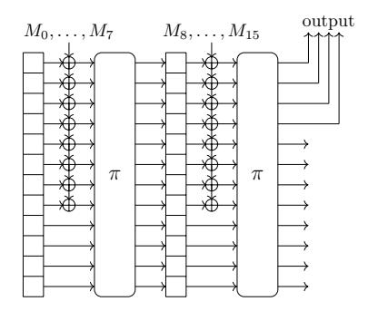
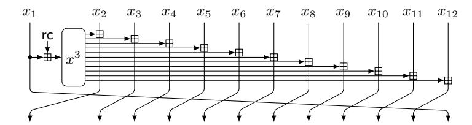
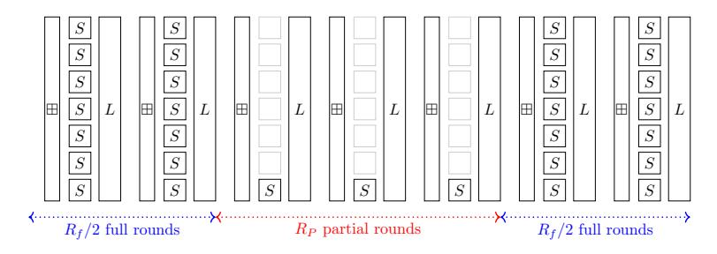
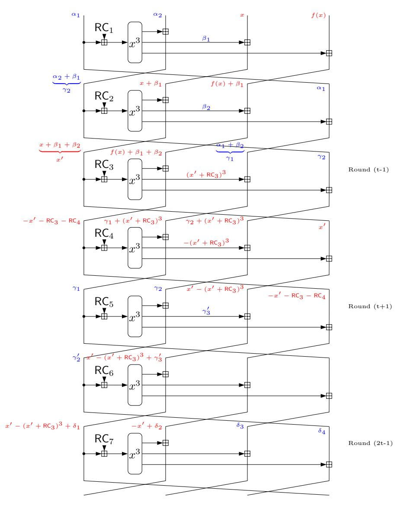
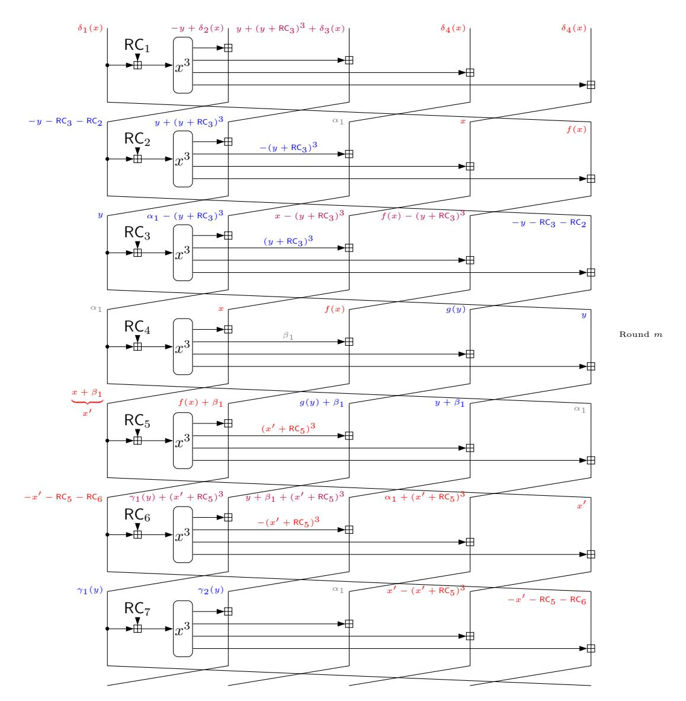
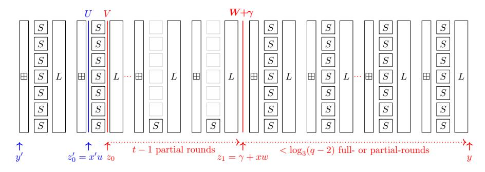
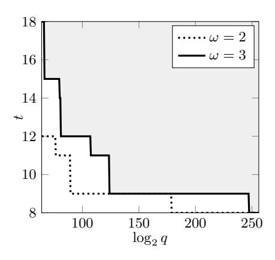
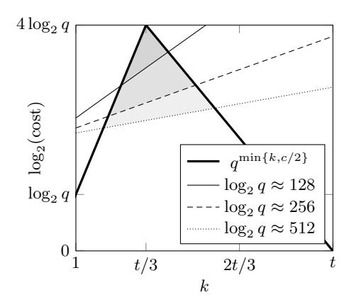

# **Out of Oddity – New Cryptanalytic Techniques against Symmetric Primitives Optimized for Integrity Proof Systems**

Tim Beyne<sup>1</sup> , Anne Canteaut<sup>2</sup> , Itai Dinur<sup>3</sup> , Maria Eichlseder<sup>4</sup>,<sup>5</sup> , Gregor Leander<sup>5</sup> , Gaëtan Leurent<sup>2</sup> , María Naya-Plasencia<sup>2</sup> , Léo Perrin<sup>2</sup> , Yu Sasaki<sup>7</sup> , Yosuke Todo<sup>5</sup>,<sup>7</sup> , and Friedrich Wiemer<sup>5</sup>,<sup>6</sup>

1 imec-COSIC, KU Leuven, Belgium 2 Inria, France <sup>3</sup> Department of Computer Science, Ben-Gurion University, Israel <sup>4</sup> Graz University of Technology, Austria <sup>5</sup> Ruhr-Universität Bochum, Germany 6 cryptosolutions, Germany <sup>7</sup> NTT Secure Platform Laboratories, Japan

**Abstract** The security and performance of many integrity proof systems like SNARKs, STARKs and Bulletproofs highly depend on the underlying hash function. For this reason several new proposals have recently been developed. These primitives obviously require an in-depth security evaluation, especially since their implementation constraints have led to less standard design approaches. This work compares the security levels offered by two recent families of such primitives, namely GMiMC and HadesMiMC. We exhibit low-complexity distinguishers against the GMiMC and HadesMiMC permutations for most parameters proposed in recently launched public challenges for STARK-friendly hash functions. In the more concrete setting of the sponge construction corresponding to the practical use in the ZK-STARK protocol, we present a practical collision attack on a round-reduced version of GMiMC and a preimage attack on some instances of HadesMiMC. To achieve those results, we adapt and generalize several cryptographic techniques to fields of odd characteristic.

**Keywords.** Hash functions · integrity proof systems · Integral attacks · GMiMC · HadesMiMC.

# **1 Introduction**

The emergence of cryptographic protocols with advanced functionalities, such as fully homomorphic encryption, multi-party computation and new types of proof systems, has led to a strong demand for new symmetric primitives offering good performance in the context of these specific applications. Indeed, as emphasized by Katz [\[30\]](#page-33-0) in his invited lecture at CRYPTO 2019, symmetric-key cryptography has an important role to play in the further practical advancement of these applications. However, the standard criteria which govern the design of symmetric primitives are usually not appropriate in the context of these applications. For instance, the cost of the homomorphic evaluation of a symmetric primitive is mainly determined by its multiplicative size and depth [7]. Similarly, the area of integrity proof systems, like SNARKs, STARKs, Bulletproofs, is asking for symmetric primitives optimized for yet another cost metric. Moreover, the use of hash functions that are defined over finite fields of odd characteristic, in particular over prime fields is desirable in many such applications. One example of such a use case is the zero-knowledge proof system deployed in the Zcash cryptocurrency. Another very interesting example is the ZK-STARK protocol [15], which is expected to be deployed on top of the Ethereum blockchain within the next year: it uses as a building-block a collision-resistant hash function, and the performance of the proof system highly depends on the number of arithmetic operations required for describing the hash function (see [8] for details).

Therefore, several new ciphers and hash functions have been proposed in the last five years for these advanced protocols. They include several FHE-friendly symmetric encryption schemes such as LowMC [7], FLIP [36], Kreyvium [21] and Rasta [23], some MPC-friendly block ciphers such as MiMC [6] and its variants [4,28], and some primitives dedicated to proof systems such as the functions from the Marvellous family, including Jarvis, Friday [9], Vision and Rescue [8].

However, all these primitives are very innovative constructions and the implementation constraints which govern their designs may have introduced some unexpected weaknesses. This was the case for LowMC, which was broken a few weeks after its publication [22,24,38]. More recently, a practical attack against Jarvis has been mounted [3], showing that some of these designs are probably not mature enough for practical applications and require a more in-depth security evaluation. In particular, several of these primitives are defined over an odd prime field, a setting in which most of the classical cryptanalytic tools, and therefore also related security arguments, do not apply directly. This includes linear cryptanalysis and its variants, integral attacks and higher-order differential or cube attacks.

Our contributions. This work analyses the security of two families of such primitives. To be concrete, we focus on the concrete proposals of STARK-friendly hash functions which have been specified in the context of a public competition launched by StarkWare Industries<sup>8</sup>. We aim to compare the security levels offered, for similar parameters, by two families of primitives: GMIMC [4,5] and HADESMIMC [28,29]. More precisely, we evaluate the resistance of these two primitives against several general types of attacks: attacks exploiting differential properties, integral attacks and advanced algebraic attacks. As a result, we present low-complexity distinguishers against the GMIMC and HADESMIMC permutations for most parameters proposed in the challenges. In the more concrete setting of the sponge construction corresponding to the practical use in

<span id="page-1-0"></span><sup>8</sup> https://starkware.co/hash-challenge/

the ZK-STARK protocol, we describe a collision attack on a round-reduced version of GMIMC and a preimage attack on some instances of HadesMIMC. Our findings for the most efficient variants of the primitives are summarized in Table 1.

From a technical point, our results required to adapt and generalize several cryptanalytic techniques to fields of odd characteristic. In particular, for integral attacks, we demonstrate that instead of using sums over additive subgroups as usually done for ciphers over  $\mathbb{F}_2^n$ , it is possible to use any *multiplicative* subgroup of  $\mathbb{F}_q^{\times}$  with similar impact. Interestingly, this seems to suggest that finite fields  $\mathbb{F}_q$  with a limited number of multiplicative subgroups might be preferable, i.e. one might want to avoid q-1 being smooth. This implies that the fields which are suitable for implementing FFT may be more vulnerable to integral attacks. We expect that these general insights have applications beyond our concrete cryptanalytic results.

An additional technical contribution of this paper is the use of algebraic techniques for ensuring that transitions of a differential characteristic for a hash function hold for many rounds without paying the typical expensive probabilistic cost. In particular, we exploit the algebraic structure of the hash function to penetrate deep into its state and represent the conditions for the differential transitions as algebraic equations that can be efficiently solved. We refer to these attacks as algebraically controlled differential attacks. Algebraic techniques have been previously used in combination with differential attacks (for example, in the recent cryptanalysis of SHA-1 [42]). However, unlike prior work, in our setting each differential transition is very expensive to bypass probabilistically. Hence, our attacks are almost entirely algebraic and use dedicated techniques to ensure that the algebraic equations can be efficiently solved.

Organization of the paper. The following section describes the two STARK-friendly primitives considered in the paper and their concrete instances. Section 3 details how integral attacks can be mounted over finite fields of any characteristic. Following this new framework, Section 4 exhibits low-complexity integral distinguishers on the full GMIMC permutation. Several differential attacks on round-reduced GMIMC are then detailed in Section 5, including a practical collision attack on the corresponding hash function. Section 6 presents two attacks on HADESMIMC: a general integral distinguisher covering all but two rounds of the permutation, and a preimage attack on the hash function which applies in the specific case where the MDS matrix defining the linear layer has a low multiplicative order.

### 2 STARK-friendly primitives

This paper focuses on two families of primitives, which are recent evolutions of the block cipher MIMC designed by Albrecht *et al.* in 2016 [6], and offer much more flexibility than the original construction:

- **GMiMC**, designed by Albrecht *et al.* [4,5]

<span id="page-3-0"></span>

| Primitive (security)   | Rounds |                               |                                                                     |                                       |                                                  |                          |
|------------------------|--------|-------------------------------|---------------------------------------------------------------------|---------------------------------------|--------------------------------------------------|--------------------------|
|                        |        |                               | Type                                                                | Rounds                                | Cost                                             | Sect.                    |
| GMIMC<br>(128 bits)    | 101    | permutation                   | integral distinguisher ZS distinguisher                             | 70<br><b>102</b>                      | 2 <sup>61</sup> 2 <sup>48</sup> 2 <sup>122</sup> | 4.1<br>4.3<br>4.2        |
|                        |        |                               | ZS distinguisher<br>diff. distinguisher<br>diff. distinguisher      | 128<br>64<br>66                       | $2^{123}$ practical                              | 5.2<br>5.2               |
|                        |        | hash function                 | collisions<br>collisions                                            | 40<br>42<br>52                        | practical 2 <sup>92</sup> 2 <sup>83</sup>        | 5.4<br>5.4<br>5.4        |
| Poseidon<br>(128 bits) | 8+40   | permutation                   | ZS distinguisher                                                    | 6+45                                  | $2^{61}$                                         | 6.1                      |
| GMIMC<br>(256 bits)    | 186    | permutation hash function     | integral distinguisher ZS distinguisher ZS distinguisher collisions | 116<br><b>206</b><br><b>218</b><br>50 | $2^{125}$ $2^{125}$ $2^{250}$ $2^{187}$          | 4.1<br>4.2<br>4.2<br>5.3 |
| Poseidon<br>(256 bits) | 8+83   | permutation<br>hash function* | ZS distinguisher preimages                                          | 6+87<br><b>8+any</b>                  | $2^{125}$ $2^{236}$                              | 6.1<br><b>6.2</b>        |

Table 1: Distinguishers on the GMIMC and HADESMIMC permutations and attacks breaking the corresponding sponge hash functions. The variants aiming at 128-bit security operate on t=12 elements in  $\mathbb{F}_q$  with  $q=2^{61}+20\times 2^{32}+1$ . The variants aiming at 256-bit security operate on t=14 elements in  $\mathbb{F}_q$  with  $q=2^{125}+266\times 2^{64}+1$ . The last attack (\*) only applies when the linear layer has a low multiplicative order. Attacks on full versions are typeset in bold.

- **HadesMiMC**, proposed by Grassi *et al.* [28,29], for which two versions are distinguished depending on the characteristic of the underlying field: Starkad over a field of characteristic 2, and Poseidon over a prime field.

### 2.1 Expected security level

GMIMC and HADESMIMC are two block ciphers but both of them can be turned into permutations by replacing the round-keys by fixed independent and randomly chosen round-constants. Based on these primitives, hash functions are obtained by applying the sponge construction [16,17] depicted in Figure 1 and using the primitive as an inner permutation.

In the following, we extensively use the following notation: the sponge operates on a state composed of t elements in a finite field  $\mathbb{F}_q$ . The main parameters which determine the security level of the sponge construction with respect to generic attacks are its *capacity* c and the size of the underlying alphabet  $\mathbb{F}_q$ . Namely, a random sponge whose capacity consists of c elements in  $\mathbb{F}_q$  provides

<span id="page-4-0"></span>

Figure 1: Sponge construction with inner permutation π, internal state with t = 12 words and capacity c = 4.

a generic security level corresponding to <sup>c</sup> 2 log<sup>2</sup> q queries both for collision and (second)-preimage resistance [\[16\]](#page-32-7).

The primary cryptanalytic goal is to exhibit collision or preimage attacks on some weakened variants of the hash functions. However, the existence of a property which distinguishes a given cryptographic function from an ideal function of the same size is also commonly considered as a weakness (see e.g. [\[12,](#page-32-9) Page 19] for a discussion). In our context, since our attacks do not make any assumptions about the round-constants in the inner permutations, our *distinguishers* are related to the known-key model for block ciphers [\[32\]](#page-33-6).

While a distinguisher on π cannot always be turned into a distinguisher for the hash function, it invalidates the security arguments provided by the indifferentiability proof of the sponge construction [\[17\]](#page-32-8). For this reason, the authors of Keccak advocate following the so-called *hermetic sponge strategy* [\[18,](#page-32-10) Page 13], i.e. using the sponge construction with an inner permutation that should not have any structural distinguisher (other than the existence of a compact description).

### **2.2 Concrete instances**

The different members in each of these families are determined by the triple (c, t, q) representing respectively the number of words in the capacity, the number of words in the state and the field size. In the following, when referring to practical examples, we will focus on the values (c, t, q) considered in the Stark-Ware challenges given in Table [2.](#page-5-0) To each triple (c, t, q) correspond two variants: over a prime field and over a binary field, and the exact values of q are detailed in Table [2.](#page-5-0) Performance in terms of trace size, proving time, and verification cost, are essential criteria for choosing a STARK-friendly hash function. Implementation results show that, for each family of hash functions, the variant 128-d (for the target 128-bit security) is by far the most efficient [\[41\]](#page-34-1). For this reason, some attacks in the paper focus more specifically on this member in the three families, i.e., on sponges whose internal state consists of t = 12 words in a finite field F<sup>q</sup>

<span id="page-5-0"></span>

| Security level | $\log_2 q$        | q (prime)                         | q (binary) | c      | t       | Variant        |
|----------------|-------------------|-----------------------------------|------------|--------|---------|----------------|
|                | 64                | $2^{61} + 20 \times 2^{32} + 1$   | $2^{63}$   | 4      | 12      | 128-d          |
| 128 bits       | $128 	 2^{125} +$ | $2^{125} + 266 \times 2^{64} + 1$ | $2^{125}$  | 2<br>2 | 4<br>12 | 128-a<br>128-c |
|                | 256               | $2^{253} + 2^{199} + 1$           | $2^{255}$  | 1<br>1 | 3<br>11 | 128-b<br>128-e |
| 256 bits       | 128               | $2^{125} + 266 \times 2^{64} + 1$ | $2^{125}$  | 4 4    | 8<br>14 | 256-a<br>256-b |

Table 2: Parameters proposed for the permutation and sponge construction.

of order close to  $2^{64}$  and with capacity c=4. It is also worth noticing that, in terms of performance and suitability, odd prime fields are more STARK-friendly than binary fields for a given size.

# 2.3 Specifications of GMiMC

**GMiMC** is a family of block ciphers designed by Albrecht *et al.* in 2019 [4] based on different types of Feistel networks using  $x \mapsto x^3$  over the field corresponding to the branch alphabet as the round function. Among the variants proposed by the designers, we focus on the one chosen in the StarkWare challenges and depicted in Figure 2, namely the variant using an unbalanced Feistel network with an expanding round function, named  $\mathsf{GMiMC}_{\mathsf{erf}}$ . In the whole paper, the rounds (and round constants) are numbered starting from 1, and the branches are numbered from 1 to t where Branch 1 is the leftmost branch. For the sake of simplicity, this particular variant will be called  $\mathsf{GMiMC}$ . A specificity of  $\mathsf{GMiMC}$  is that the designers' security claims concern the primitive instantiated over a prime field. They mention that "even if  $\mathsf{GMiMC}$  can be instantiated over  $\mathbb{F}_{2^n}$ , [they] do not provide the number of rounds to guarantee security in this scenario".

In the block cipher setting with a key size equal to  $n = \log_2 q$  bits, the key schedule is trivial, i.e. the master key is added to the input of the cube function at every round. This very simple key schedule is a major weakness [19]. However, it seems difficult to leverage the underlying property in the hash function setting we are focusing on.

#### 2.4 Specifications of HadesMiMC

**HadesMiMC** is a family of permutations described by Grassi *et al.* in [29] which follows a new design strategy for block ciphers called HADES. The HADES construction aims to decrease the number of Sboxes relative to a traditional Substitution-Permutation Network, while guaranteeing that the cipher still resists all known attacks, including differential and linear cryptanalysis and algebraic attacks. Reducing the number of Sboxes is especially important in many

<span id="page-6-0"></span>

Figure 2: One round of the GMiMC permutation with t = 12.

applications and this was traditionally achieved by using a partial substitutionlayer, i.e., an Sbox layer which does not operate on the whole internal state. However, several attacks on this type of constructions, e.g. [\[13,](#page-32-12)[22,](#page-32-6)[24,](#page-33-3)[38\]](#page-33-4) show that it is much more difficult to estimate the security level of these constructions than that of classical SPNs. The basic principle of the HADES construction is then to combine both aspects: the inner rounds in the cipher have a partial Sbox layer to increase the resistance to algebraic attacks at a reduced implementation cost, whereas the outer rounds consist of traditional SPN rounds, with a full Sbox layer. The resistance against statistical attacks is analyzed by removing the inner rounds, while the resistance to algebraic attacks, e.g. the evolution of the algebraic degree over the cipher, involves the inner rounds.



Figure 3: The HadesMiMC construction with t = 6.

HadesMiMC [\[29,](#page-33-5) Section 3] is then a keyed permutation following the HADES construction dedicated to MPC applications or to STARK proof systems, where the Sbox is defined by the cube mapping over a finite field and the linear layer L corresponds to a (t × t)-MDS matrix. Two concrete instantiations of HadesMiMC are then detailed by Grassi *et al.* in [\[28\]](#page-33-2), namely:

- **–** Starkad operates on t elements in a binary field of odd absolute degree (which guarantees that the cube mapping is bijective);
- **–** Poseidon operates on t elements in a prime field F<sup>p</sup> with p mod 3 6= 1.

In both cases the partial rounds consist of a single Sbox operating on the last coordinate of the state. For all parameters we consider, the number of full rounds is equal to 8 and the number of partial rounds varies between 40 and 88.

# <span id="page-7-0"></span>3 Integral attacks over fields of any characteristic

The notion of *integral attacks* has been introduced by Knudsen and Wagner [33] and captures several variants including saturation attacks and higher-order differential attacks. These attacks have been used for cryptanalyzing many ciphers, but to our best knowledge, all of them operate on a binary field. Indeed, the main property behind these attacks is that, for any  $F: \mathbb{F}_2^m \to \mathbb{F}_2^m$  and for any affine subspace  $V \subset \mathbb{F}_2^m$ ,

$$\sum_{x \in V} F(x) = 0$$

when  $\deg F < \dim V$ . This comes from the fact that the sum of the images by F of all inputs in V corresponds to a value of a derivative of F of order  $(\dim V)$  [34]. It follows that this derivative has degree at most  $(\deg(F) - \dim V)$  and thus vanishes when  $\deg F < \dim V$ . It is then possible to *saturate* some input bits of F and to use as a distinguishing property the fact that the output bits are balanced, i.e. they sum to zero. The fact that the sum over all  $x \in V$  of F(x) corresponds to the value of a higher-order derivative does not hold anymore in odd characteristic, and the same technique cannot be applied directly.

Higher-order differentials over  $\mathbb{F}_q$  then need to use a generalized notion of differentiation as analyzed in [40] (see also [2]). However, we can show that for the particular case of saturation attacks, the same technique can be used in the general case of a field  $\mathbb{F}_q$  – even in odd characteristic. Indeed, we can exploit the following result.

<span id="page-7-1"></span>**Proposition 1.** For any  $F : \mathbb{F}_q \to \mathbb{F}_q$  with  $\deg(F) < q - 1$ ,

$$\sum_{x \in \mathbb{F}_q} F(x) = 0 .$$

*Proof.* The result is due to following well-known property: for any exponent k with  $1 \le k \le q-2$ ,

$$\sum_{x \in \mathbb{F}_q} x^k = 0 .$$

Moreover, when k = 0, we have  $\sum_{x \in \mathbb{F}_q} x^0 = q = 0$ .

Proposition 1 can be generalized to the multivariate case, i.e. to functions from  $\mathbb{F}_q^k$  to  $\mathbb{F}_q$ , which can be expressed as polynomials in the ring

$$\mathbb{F}_q[x_1,\ldots,x_k]/\left(x_1^q-x_1,\ldots,x_k^q-x_k\right).$$

<span id="page-7-2"></span>**Corollary 1.** For any  $F: \mathbb{F}_q^t \to \mathbb{F}_q$  with  $\deg(F) < k(q-1)$  and any affine subspace  $V \subseteq \mathbb{F}_q^t$  of dimension at least k,

$$\sum_{x \in V} F(x) = 0 .$$

*Proof.* Let V be an affine space of dimension  $\kappa \geq k$  and A an affine permutation over  $\mathbb{F}_q^t$  such that  $A(V) = \{(y, 0, \dots, 0) \mid y \in \mathbb{F}_q^{\kappa}\}$ . Then,

$$\sum_{x \in V} F(x) = \sum_{x \in V} (F \circ A^{-1})(A(x)) = \sum_{y_1, \dots, y_{\kappa} \in \mathbb{F}_q} (F \circ A^{-1})(y_1, \dots, y_{\kappa}, 0, \dots, 0).$$

Since  $\deg(F \circ A^{-1}) = \deg F < k(q-1), \ (F \circ A^{-1})$  consists of monomials of the form  $y_1^{i_1}y_2^{i_2}\dots y_\kappa^{i_\kappa}$  with at least one exponent  $i_j < q-1$ . Then,  $\sum_{y_j \in \mathbb{F}_q} y_j^{i_j} = 0$ , implying that

$$\sum_{y_1,\dots,y_\kappa\in\mathbb{F}_q}y_1^{i_1}y_2^{i_2}\dots y_\kappa^{i_\kappa}=0,$$

which leads to  $\sum_{x \in V} F(x) = 0$ .

Based on this observation, a saturation attack with data complexity  $q^k$  can be mounted whenever the degree of F as a polynomial over  $\mathbb{F}_q$  is strictly less than k(q-1), even if  $\mathbb{F}_q$  is a field of odd characteristic.

Now, we generalize the notion of integral distinguishers to multiplicative subgroups using the following property.

**Proposition 2.** Let  $\mathbb{G}$  be a multiplicative subgroup of  $\mathbb{F}_q^{\times}$ . For any  $F: \mathbb{F}_q \to \mathbb{F}_q$  such that  $\deg(F) < |\mathbb{G}|$ ,

$$\sum_{x \in \mathbb{G}} F(x) - F(0) \cdot |\mathbb{G}| = 0.$$

This is a strict generalization of Proposition 1, for which  $|\mathbb{G}| = q - 1$ .

*Proof.* The result is a direct consequence of the following well-known property: for any exponent k with  $1 \le k \le |\mathbb{G}| - 1$ ,

$$\sum_{x \in \mathbb{G}} x^k = 0 .$$

Moreover, when k = 0, we have  $\sum_{x \in \mathbb{G}} x^0 = |\mathbb{G}|$ .

We also note that Corollary 1 can be straightforwardly adapted to multiplicative subgroups. The power of summing over multiplicative subgroups (rather than over the entire field  $\mathbb{F}_q$ ) comes from the fact that if  $\mathbb{F}_q$  contains small multiplicative subgroups (as for the fields used for the concrete instances specified in Table 2), the complexity of the attacks may be fine-tuned and significantly reduced. In the next sections, such attacks will be applied to both GMIMC and HADESMIMC.

# <span id="page-9-0"></span>4 Integral distinguishers on the full GMiMC

# <span id="page-9-1"></span>4.1 Integral distinguisher on GMiMC

Using Corollary 1, we can exhibit a distinguisher for  $(3t-4+\lfloor\log_3(q-2)\rfloor)$  rounds of GMIMC. A remarkable property is that this distinguisher holds for any finite field. It is obtained by saturating a single branch of the Feistel network and consequently has data complexity q. Indeed, we choose a set of inputs where the (t-2) leftmost branches are inactive, while the rightmost branch is determined by the value of Branch (t-1). More precisely, we consider a set of inputs of the form

<span id="page-9-3"></span>
$$\mathcal{X} = \{ (\alpha_1, \dots, \alpha_{t-2}, x, f(x)) \mid x \in \mathbb{F}_q \}$$
 (1)

where the  $\alpha_i$  are arbitrary constants in  $\mathbb{F}_q$  and f is defined by

$$f(x) = -\left(x + \sum_{i=1}^{t-2} \beta_i + \mathsf{RC}_{t-1}\right)^3 - x - 2\sum_{i=1}^{t-2} \beta_i - \mathsf{RC}_{t-1} - \mathsf{RC}_t$$

and  $\beta_1, \ldots, \beta_{t-2}$  are constant values derived from  $\alpha_1, \ldots, \alpha_{t-2}$  by

$$\beta_1 = (\alpha_1 + \mathsf{RC}_1)^3 \text{ and } \beta_{i+1} = \left(\alpha_{i+1} + \sum_{j=1}^i \beta_j + \mathsf{RC}_{i+1}\right)^3.$$

Let us first consider the first (t-2) rounds. We observe that, at Round i,  $1 \le i \le t-2$ , the output of the Sbox corresponds to  $\beta_i$  and is added to all branches except the leftmost branch of the input. It follows that the output of Round (t-2) corresponds to

$$(x + \sum_{i=1}^{t-2} \beta_i, f(x) + \sum_{i=1}^{t-2} \beta_i, \gamma_1, \dots, \gamma_{t-2})$$

where  $(\gamma_1, \ldots, \gamma_{t-2})$  are constants (see Figure 4).

Therefore, if x' denotes the value of Branch 1, i.e.,  $x' = x + \sum_{i=1}^{t-2} \beta_i$ , we have that Branch 2 corresponds to

$$f\left(x' - \sum_{i=1}^{t-2} \beta_i\right) + \sum_{i=1}^{t-2} \beta_i = -\left(x' + \mathsf{RC}_{t-1}\right)^3 - x' - \mathsf{RC}_{t-1} - \mathsf{RC}_t \; .$$

The inputs of Round t are then

$$\{(-x' - \mathsf{RC}_t - \mathsf{RC}_{t-1}, \gamma_1 + (x' + \mathsf{RC}_{t-1})^3, \dots, \gamma_{t-2} + (x' + \mathsf{RC}_{t-1})^3, x') \mid x' \in \mathbb{F}_q\}$$

and the inputs of Round (t+1) are

$$\{(\gamma_1,\dots,\gamma_{t-2},x'-(x'+\mathsf{RC}_{t-1})^3,-x'-\mathsf{RC}_t-\mathsf{RC}_{t-1})\mid x'\in\mathbb{F}_q\}\;.$$

The following (t-2) rounds do not activate the Sbox, implying that the input set at Round (2t-1) has the form

<span id="page-9-2"></span>
$$\{(x' - (x' + \mathsf{RC}_{t-1})^3 + \delta_1, -x' + \delta_2, \delta_3, \dots, \delta_t) \mid x' \in \mathbb{F}_q\}$$
 (2)

<span id="page-10-0"></span>

Figure 4: First rounds of the integral distinguisher on GMiMC (with t = 4).

for some fixed values δ1, . . . , δ<sup>t</sup> determined by the constants. Each coordinate of this input word can then be seen as a q-ary polynomial in x <sup>0</sup> of degree at most three. It follows that, after r additional rounds, the set [\(2\)](#page-9-2) is transformed into a set of elements (z1, . . . , zt), whose coordinates have degree at most 3 <sup>r</sup>+1. Prop. [1](#page-7-1) then implies that all z<sup>i</sup> are balanced if 3 <sup>r</sup>+1 ≤ q − 2, i.e., if r ≤ blog<sup>3</sup> (q − 2)c − 1. Adding (t-1) rounds. We can add some more rounds by using the following relation over (t-1) rounds of GMIMC.

**Proposition 3.** Let  $(x_1, \ldots, x_t)$  and  $(y_1, \ldots, y_t)$  denote the input and output of (t-1) rounds of GMIMC.

<span id="page-11-2"></span><span id="page-11-1"></span>
$$\sum_{i=2}^{t} y_i - (t-2)y_1 = \sum_{i=1}^{t-1} x_i - (t-2)x_t.$$
 (3)

*Proof.* Let  $(x_1^{\ell}, \dots, x_t^{\ell})$  denote the input of Round  $\ell$ . It can be observed that, for any  $i, j \in \{1, \dots, t-1\}$ ,

$$x_i^{\ell} = x_{i+1}^{\ell-1} + (x_j^{\ell} - x_{j+1}^{\ell-1})$$
 and  $x_t^{\ell} = x_1^{\ell-1}$ .

It follows that, for any j,  $1 \le j \le (t-1)$ .

$$\sum_{i=1}^{t} x_i^{\ell} - (t-1)x_j^{\ell} = \sum_{i=1}^{t} x_i^{\ell-1} - (t-1)x_{j+1}^{\ell-1}.$$

By applying this equality (t-1) times, we deduce (3).

From the previous proposition, we deduce that after a total of

$$R = 3t - 4 + \lfloor \log_3(q - 2) \rfloor$$
 rounds,

the output  $(v_1, \ldots, v_t)$  of GMIMC satisfies  $\sum_{i=2}^t v_i - (t-2)v_1 = \sum_{i=1}^{t-1} z_i - (t-2)z_t$ , which is a polynomial in x of degree at most (q-2). This leads to a distinguisher with complexity q on R rounds, i.e., 70 rounds for the parameters we focus on.

#### <span id="page-11-0"></span>4.2 Zero-sum distinguishers on the full permutation

**Saturating a single branch.** Since we are analyzing a permutation (or a family of permutations parameterized by the round-constants), there is no secret material involved in the computation, implying that a distinguisher can be built from some internal states in the middle of the primitive, not only from inputs and outputs, exactly as in the *known-key setting* for block ciphers [32]. This leads to *zero-sum distinguishers*, which were introduced by Aumasson and Meier [11] and exhibited for several hash functions, including SHA-3 [10,20].

The previously described distinguisher can be extended by  $(t-2+\lfloor \log_3(q-2)\rfloor)$  rounds backwards. This is realized by choosing the internal states after  $(t-2+\lfloor \log_3(q-2)\rfloor)$  rounds in  $\mathcal{X}$ , as defined by (1). The inverse of one round of GMIMC is still a round of a Feistel network of the same form and it has degree three over  $\mathbb{F}_q$ . Then, the coordinates  $(y_1,\ldots,y_t)$  of the images of the elements in  $\mathcal{X}$  by r backward rounds can be seen as univariate polynomials in x with degree at most  $3^{r+1}$ . Exactly as in the forward direction, after  $(\lfloor \log_3(q-2)\rfloor - 1)$  rounds, the degree of these polynomials cannot exceed (q-2).

Based on Prop. 3, we can then add (t-1) rounds backwards. Indeed, the input of the first round of the permutation  $(u_1, \ldots, u_t)$  is related to the output of Round (t-1), i.e.  $(y_1, \ldots, y_t)$ , by

$$\sum_{i=2}^{t} y_i - (t-2)y_1 = \sum_{i=1}^{t-1} u_i - (t-2)u_t ,$$

and the left-hand term of this equation is a polynomial in x of degree at most (q-2), implying that  $\left(\sum_{i=1}^{t-1} u_i - (t-2)u_t\right)$  sum to zero.

Similarly, we can apply the previously described distinguisher in the forward direction, and deduce that the outputs  $(v_1, \ldots, v_t)$  of the permutation after  $(3t-4+\lfloor \log_3(q-2)\rfloor)$  additional rounds are such that  $(\sum_{i=2}^t v_i-(t-2)v_1)$  sum to zero. This leads to a distinguisher with complexity q for a total of

$$4t - 6 + 2|\log_3(q - 2)|$$
 rounds,

which is higher than the number of rounds proposed in all StarkWare challenges, except in the case where q exceeds the claimed security level (see Table 3).

**Saturating two branches.** When  $t \geq 4$ , it is possible to exhibit a similar distinguisher on more rounds with complexity  $q^2$  by saturating two branches. In this case, we start from Round m in the middle with a set of internal states

$$\mathcal{Y} = \{(\alpha_1, \dots, \alpha_{t-4}, x, f(x), g(y), y) \mid x, y \in \mathbb{F}_q\}$$

where

$$\begin{split} f(x) &= - \Big( x + \sum_{i=1}^{t-4} \beta_i + \mathsf{RC}_{m+t-4} \Big)^3 - x - 2 \sum_{i=1}^{t-4} \beta_i - \mathsf{RC}_{m+t-4} - \mathsf{RC}_{m+t-3} \\ g(y) &= (y + \mathsf{RC}_{m-1})^3 - y - \mathsf{RC}_{m-1} - \mathsf{RC}_{m-2} \end{split}$$

and  $\beta_1, \ldots, \beta_{t-4}$  are defined as before by replacing  $RC_i$  by  $RC_{m+i-1}$ .

Computing forwards. As depicted on Figure 5, the corresponding set at the input of Round (m+t-4) is then of the form

$$\{\left(x', -\left(x' + \mathsf{RC}_{m+t-4}\right)^3 - x' - \mathsf{RC}_{m+t-4} - \mathsf{RC}_{m+t-3}, \gamma_1(y), \dots, \gamma_{t-2}(y)\right) \mid x', y \in \mathbb{F}_q\}$$

where  $(\gamma_1, \ldots, \gamma_{t-2})$  are some values which depend on y only. After two more rounds, we then get some internal states whose (t-2) leftmost branches do not depend on x'. It follows that each coordinate of the input of Round (m+2t-4) is a polynomial in x' and y of degree at most three in x'. After  $(\lfloor \log_3(q-2)\rfloor - 1)$  rounds, we get that each coordinate is a polynomial of degree at most (q-2) in x'. Then, with the same technique as before, we can add (t-1) rounds and show that the output of the permutation  $(v_1, \ldots, v_t)$  is such that the linear combination  $(\sum_{i=1}^{t-1} v_i - (t-2)v_t)$  sums to zero after  $(3t-6+\lfloor \log_3(q-2)\rfloor)$  rounds.

<span id="page-13-0"></span>

Figure 5: Middle rounds of the zero-sum distinguisher on GMiMC (with t = 5).

*Computing backwards.* Starting from Round m and computing backwards, we get that the input of Round (m − 1) is of the form

$$(y, \alpha_1 - (y + \mathsf{RC}_{m-1})^3, \dots, x - (y + \mathsf{RC}_{m-1})^3, f(x) - (y + \mathsf{RC}_{m-1})^3, -y - \mathsf{RC}_{m-1} - \mathsf{RC}_{m-2})$$

and the input of Round (m-2) equals

$$(-y - \mathsf{RC}_{m-1} - \mathsf{RC}_{m-2}, y + (y + \mathsf{RC}_{m-1})^3, \alpha_1, \dots, x, f(x))$$
.

Then, the following (t-2) rounds do not activate the Sbox, implying that all the coordinates of the input of Round (m-t) are polynomials in x and y of degree at most three in y. We deduce that the input  $(u_1, \ldots, u_t)$  of Round  $(m-2t+2-\lfloor \log_3(q-2)\rfloor)$  is such that the linear combination  $(\sum_{i=1}^{t-1}u_i-(t-2)u_t)$  sums to zero. This zero-sum distinguisher then covers a total of

$$5t - 8 + 2\lfloor \log_3(q-2) \rfloor$$
 rounds,

which is detailed in Table 3 for the relevant parameters.

<span id="page-14-1"></span>

| Security | Param     | eters | Number of rounds |                        |                       |  |  |  |  |
|----------|-----------|-------|------------------|------------------------|-----------------------|--|--|--|--|
|          | $log_2 q$ | t     | Full             | ZS with complexity $q$ | ZS with complexity of |  |  |  |  |
|          | 61        | 12    | 101              | 118                    | 128                   |  |  |  |  |
|          | 125       | 4     | 166              | 166                    | _                     |  |  |  |  |
| 128 bits | 125       | 12    | 182              | 198                    | _                     |  |  |  |  |
|          | 256       | 3     | 326              | _                      | _                     |  |  |  |  |
|          | 256       | 11    | 342              | _                      | _                     |  |  |  |  |
| OFC hita | 125       | 8     | 174              | 182                    | 188                   |  |  |  |  |
| 256 bits | 125       | 14    | 186              | 206                    | 218                   |  |  |  |  |

Table 3: Number of rounds of GMIMC covered by the zero-sum distinguishers of complexity q and  $q^2$ .

### <span id="page-14-0"></span>4.3 Exploiting integral distinguishers over multiplicative subgroups

A noticeable shortcoming of the integral attacks over  $\mathbb{F}_q$ , as demonstrated by Table 3, is that they do not give any result for primitives over large fields  $\mathbb{F}_q$  (for which  $\log_2 q \approx 256$ ). However, by exploiting integral distinguishers over multiplicative subgroups of  $\mathbb{F}_q$  (e.g., for the specific choice of  $q = 2^{253} + 2^{199} + 1$ ), we obtain essentially the same results for GMIMC instances with large q as we obtain for instances with small q. For example, in Section 4.1 we derived an integral distinguisher on

$$R = 3t - 4 + \lfloor \log_3(q - 2) \rfloor$$
 rounds,

with complexity q. By exploiting any multiplicative subgroup of size  $|\mathbb{G}| = 2^s$  for  $s \leq 199$  when  $q = 2^{253} + 2^{199} + 1$ , we obtain an integral distinguisher on

$$R = 3t - 4 + |\log_3(|\mathbb{G}| - 1)|$$
 rounds,

with complexity |G| + 1.

Moreover, even for smaller fields, we can fine-tune the size of G to reduce the complexity of the attack. This is relevant especially for cases where an attack with complexity q can reach more rounds than the ones used by the primitive (which is indeed the case, as shown in Table [3\)](#page-14-1). For example, as derived in Section [4.2,](#page-11-0) we have a zero-sum property for

$$4t - 6 + 2\lfloor \log_3(q-2) \rfloor$$
 rounds,

with complexity q. For the GMiMC variant with q = 2<sup>61</sup> + 20 × 2 <sup>32</sup> + 1 and t = 12, we use a subgroup of size 2 33 · 167 · 211 ≈ 2 <sup>48</sup> (which divides q − 1), and obtain a zero-sum property for

$$4t - 6 + 2\lfloor \log_3(2^{48} - 1) \rfloor = 102$$
 rounds,

with complexity of about 2 <sup>48</sup> (which covers the full permutation).

# <span id="page-15-0"></span>**5 Differential attacks on round-reduced GMiMC**

#### <span id="page-15-2"></span>**5.1 Impossible differential attacks**

We present a new impossible differential for (3t − 4) rounds, which improves the previous one for (2t − 2) rounds presented by the designers [\[5,](#page-31-3) Page 46].

The previous impossible differential exploits the following probability one propagation for (t − 1) rounds: (0, . . . , 0, α) → (α, 0, . . . , 0) where α is a nonzero difference. Hence, (0, . . . , 0, α) never propagates to (β, 0, . . . , 0) after 2t − 2 rounds for any β. The designers concluded that *conservatively* 2t *rounds are secure when the security level corresponds to the block size* n*.*

We show that (0, . . . , 0, α1) R3t−<sup>4</sup> 9 (β1, 0, . . . , 0) is an impossible propagation, where α1, β<sup>1</sup> are non-zero differences satisfying α<sup>1</sup> 6= β1. That is, we include t−2 more rounds in the middle compared to the property presented by the designers.

The intuition for why the above differential is impossible is as follows. When (0, . . . , 0, α1) is propagated, the output difference of the cube mapping is 0 for the first t−1 rounds and is unpredictable for the next t/2−1 rounds. We denote them by α2, α3, . . . , αt/2. Similarly, we extend (0, . . . , 0, β1) by t/2 − 1 rounds backwards, using the notation β2, β3, . . . , βt/2. Here, to be a valid propagation, those differences must be equal in all the branches, which yields a system of t linear equations with 2(t/2 − 1) = t − 2 variables. By solving the system, we obtain that α<sup>1</sup> = β<sup>1</sup> is a necessary condition to obtain a valid differential propagation. In other words, for any α1, β<sup>1</sup> with α<sup>1</sup> 6= β1, the propagation is impossible. A detailed analysis of this property is provided in Appendix [A.](#page-35-0)

# <span id="page-15-1"></span>**5.2 A differential distinguisher**

The original paper [\[5,](#page-31-3) Appendix D] analyzes the resistance of GMiMC against differential attacks. Most notably, the designers exhibit a differential characteristic over (t+ 1) rounds with two active Sboxes, with probability 2 <sup>−</sup>(2n+2) where n = log<sup>2</sup> q and they conjecture that the corresponding differential is optimal. They deduce that

$$R = 2 + (t+1) \left\lceil \frac{tn}{2(n-1)} \right\rceil$$
 rounds

are sufficient to resist differential cryptanalysis in the sense that the data complexity of the attack exceeds the size of the full codebook. For instance, when t = 12 and n = 61, this corresponds to 93 rounds out of 101.

*A better differential.* We exhibit another differential, over t rounds, which leads to a much more efficient attack. Let α and α <sup>0</sup> be two differences in Fq. Then, the difference (0, . . . , 0, α, α<sup>0</sup> ) propagates through t rounds of the permutation as

$$(0, \dots, 0, \alpha, \alpha') \xrightarrow{\mathcal{R}^{t-2}} (\alpha, \alpha', 0 \dots, 0)$$

$$\xrightarrow{\mathcal{R}} (\alpha' + \beta, \beta, \dots, \beta, \alpha)$$

$$\xrightarrow{\mathcal{R}} (\beta + \beta', \dots, \beta + \beta', \alpha + \beta', \alpha' + \beta),$$

where α S → β denotes the Sbox transition occurring at Round (t−1) and α <sup>0</sup>+β S → β 0 the Sbox transition occurring at Round t.

It follows that, for any possible value of β, we obtain the following t-round differential as soon as β <sup>0</sup> = −β, which occurs with probability 2 <sup>−</sup><sup>n</sup> on average:

$$(0,\ldots,0,\alpha,\alpha') \xrightarrow{\mathcal{R}^t} (0,\ldots,0,\alpha-\beta,\alpha'+\beta)$$
.

Since this probability does not depend on the choice of α and α 0 , this differential can be iterated several times to cover more rounds.

For instance, when t = 12 and n = 61, the 101 rounds of GMiMC can be decomposed into 8 blocks of t = 12 rounds, followed by 5 rounds. We then get a differential of the form

$$(0, \dots, 0, \alpha, \alpha') \longrightarrow (0, 0, 0, 0, 0, \gamma, \gamma', 0, 0, 0, 0, 0)$$

over the full cipher for some unknown γ, γ<sup>0</sup> with probability at least

$$P = (2^{-61})^8 = 2^{-488}$$

since the characteristic over the last 5 rounds has probability one. This leads to a differential distinguisher over the full permutation with complexity P <sup>−</sup><sup>1</sup> = 2<sup>488</sup> which is much lower than the size of the full codebook (2 <sup>732</sup>).

It is worth noticing that P is a lower bound on the probability of the 101 round differential since we considered pairs following some specific characteristics by fixing the forms of some differences at intermediate rounds. Some additional input pairs may lead to an output difference of the same form but not to these specific intermediate differences.

Improving the complexity of the distinguisher with structures. The data complexity of the previous distinguisher can be improved by using structures of inputs. Here, a structure is a set of  $2^{2n}$  inputs of the form  $S_c = \{(c_1, \ldots, c_{t-2}, x, y) \mid x, y \in \mathbb{F}_p\}$ . The difference between any two elements in the same structure has the form  $(0, \ldots, 0, \alpha, \alpha')$ . It follows that, from any structure, we can construct  $2^{4n-1}$  pairs of inputs whose difference conforms with the differential. Then, the number of structures required to obtain  $P^{-1} = 2^{8n}$  pairs with an appropriate difference is

$$2^{8n-4n+1} = 2^{4n+1},$$

leading to an overall data complexity of  $2^{6n+1} = 2^{367}$ . The time complexity is equal to the data complexity here since the distinguisher consists in identifying the output pairs which coincide on all output words except the two in the middle. This does not require computing all pairs of elements in each structure, but only to store the values  $\pi(x), x \in \mathcal{S}_c$  according to their first coordinates.

This differential distinguisher does not lead to an attack with complexity below the target security level. However, this must be considered as an unsuitable property since its complexity is much lower than what we expect for a randomly chosen permutation on a set of size  $2^{732}$ .

It is worth noticing that, if we restrict ourselves to distinguishers with complexity below the target security level of 128 bits, then we can use at most  $2^{128}/2^{2n}=2^6$  structures. Therefore, we can derive from these structures  $2^{6+4n-1}$  i.e.  $2^{249}$  pairs of inputs conforming with the differential. These pairs be can used to distinguish 4 blocks of t rounds since the differential has probability at least  $2^{-244}$ . Moreover, a valid pair propagates to a differential of the form  $(\gamma, \gamma', 0, 0, 0, 0, 0, 0, 0, 0, 0, 0, 0)$  with probability one over (t-2) rounds, and we can extend it by a few more rounds by considering the number of state words that have the same difference. After another 6 rounds, the pair has a differential of the form

$$(\Delta, \Delta, \Delta, \Delta, \Delta, \Delta, *, *, *, *, *, *),$$

with probability one, where \* is an unknown difference that we do not care about. This differential form has a constraint of the size 5n: the left-most six state words have an identical difference. The number of queries to satisfy the same property for a randomly chosen permutation is lower bounded by  $2^{5n/2} \approx 2^{152.5}$ . This implies that we can distinguish 4t + (t-2) + (t-6) = 64 rounds of GMIMC from a randomly chosen permutation with complexity less than  $2^{128}$ .

Improved distinguisher using three active words. If we consider a differential with only two active words, the biggest structure we can build is of size  $2^{2n}$ , which limits the advantage of using structures in reducing the cost of the distinguishers.

Let us now consider the following differential:

$$(0, \dots, 0, \alpha, \alpha', \alpha'')$$

$$\stackrel{\mathcal{R}^{t-3}}{\longrightarrow} (\alpha, \alpha', \alpha'', 0 \dots, 0)$$

$$\stackrel{\mathcal{R}}{\longrightarrow} (\alpha'' + \beta, \alpha'' + \beta, \beta, \dots, \beta, \alpha)$$

$$\stackrel{\mathcal{R}}{\longrightarrow} (\alpha'' + \beta + \beta', \beta + \beta', \beta + \beta', \dots, \beta + \beta', \alpha + \beta', \alpha')$$

$$\stackrel{\mathcal{R}}{\longrightarrow} (\beta + \beta' + \beta'', \dots, \beta + \beta' + \beta'', \alpha + \beta' + \beta'', \alpha' + \beta + \beta'', \alpha'' + \beta + \beta'),$$

where α S → β, α <sup>0</sup> + β S → β <sup>0</sup> and α <sup>00</sup> + β + β 0 S → β <sup>00</sup> denote the Sbox transitions occurring at Round (t − 2), at Round (t − 1) and at Round t.

As with the previous differential, if β + β <sup>0</sup> + β <sup>00</sup> = 0, which occurs with probability 2 <sup>−</sup><sup>n</sup> on average, we have:

$$(0,\ldots,0,\alpha,\alpha',\alpha'') \xrightarrow{\mathcal{R}^t} (0,\ldots,0,\alpha-\beta,\alpha'+\beta+\beta'',\alpha''-\beta'').$$

Again, the probability of this transition is independent of the values of α, α <sup>0</sup> and α <sup>00</sup>, so it can be iterated with probability 2 <sup>−</sup>n.

For this differential, we can build structures of size 2 <sup>3</sup><sup>n</sup>. This will allow us to consider around 2 <sup>6</sup><sup>n</sup> pairs with the required input differential, so we can expect to be able to iterate the characteristic for 6t rounds. The total distinguisher will cover 6t + (t − 3) rounds. As for the previous one, we can add 4 more rounds, generating an output state with 8 words having the same difference with a cost of 2 <sup>3</sup>n, compared to a cost of 2 7n/2 for a random permutation. For GMiMC with t = 12, this allows to distinguish 85 rounds with a cost of 2 <sup>3</sup><sup>n</sup>. By repeating this procedure 2 <sup>n</sup> times, we can expect t more round to be covered, and distinguish the whole permutation with 101 rounds with a complexity of 2 <sup>5</sup><sup>n</sup> = 2<sup>320</sup> and having 9 words with a zero difference (as we do not need to add the final four rounds).

Let us point out that using four instead of three words would not improve the number of rounds attacked on GMiMC-128-d, as the cost of one structure is already the same as the cost of obtaining the 8 non-zero differences in the output for a random permutation. Nevertheless, in the case of the GMiMC variant 256-b with t = 14, if we use a similar differential with four active words, we can distinguish up to 8t + (t − 4) = 122 rounds while finding 10 words with no difference and with a complexity of about 2 <sup>4</sup><sup>n</sup> = 2<sup>500</sup> .

To determine whether further improvements of these differentials are possible, we have searched for other differential characteristics with a Mixed-Integer Linear Programming (MILP) model. We conclude that the previously described characteristics are essentially optimal for the defined search space, and refer Appendix [B](#page-36-0) for details.

### <span id="page-18-0"></span>**5.3 Algebraically controlled differential attacks**

In this section, we show how to use algebraic techniques to efficiently find inputs that satisfy a given differential characteristic. The basic idea is to represent the initial state of the permutation symbolically by assigning variables to some of its branches, while the remaining branches are assigned constant values. We then compute the permutation symbolically for several rounds. Namely, for each round, we derive a polynomial expression for each branch of the internal state in terms of the allocated variables.

We repeat this process starting from two initial states (representing two inputs to the permutation), perhaps assigning them different variables. We can now represent the difference between the internal states at each round in these two computations using polynomial expressions in the allocated variables. In particular, each differential transition of the given differential characteristic (whose probability is smaller than one) is expressed as a polynomial equation in the variables. Collecting the equations for all differential transitions, we obtain a system of polynomial equations, whose solution immediately gives two inputs to the permutation that satisfy the differential characteristic. For this approach to be useful, the equation system has to be efficiently solvable, which generally implies that we cannot allocate too many variables and need to minimize the algebraic degree of the polynomial equations.

Next, we discuss the complexity of solving equation systems of a specific form that we encounter in the remainder of this section. We then demonstrate the basic attack approach with an example and continue with more involved attacks.

*Solving polynomial equation systems with few variables.* Some of our attacks in the remainder of this section reduce to solving equation systems over Fq. When possible, we solved the systems in practice using the MAGMA software. However, it is also important to understand the complexity of our attacks on stronger variants of the cryptosystem, where they become impractical. In this section, we will only consider systems with one or two variables and estimate the complexity of solving such systems below. We note that in Section [6.2](#page-27-0) we encounter equation systems with more variables. Solving such equations is more involved and we will have to use a different estimation, which is heuristic (but standard).

Solving a univariate polynomial equation over F<sup>q</sup> of degree d is done by factoring the polynomial. Asymptotically, the best known algorithm for this problem was published in [\[31\]](#page-33-10) and has complexity of about d <sup>1</sup>.5+o(1) bits operations. We note, however, that the o(1) expression in the exponent hides a non-negligible term. Solving two bivariate polynomial equations P1(x, y) = 0 and P2(x, y) = 0 of total degrees d<sup>1</sup> and d<sup>2</sup> (respectively) can be done by computing the *resultant*[9](#page-19-0) of the two polynomials, which is a univariate polynomial in x of degree d<sup>1</sup> · d2. We then compute the roots of the resultant (by factoring it) and for each such root x¯, we compute the common roots of P1(¯x, y) and P2(¯x, y) (using a GCD algorithm). In general, the heaviest step in this process is factoring the resultant.

<span id="page-19-0"></span><sup>9</sup> The resultant of two polynomials is itself a polynomial in their coefficients, whose zeroes coincide with the common roots of the two polynomials.

Satisfying 3t-2 rounds. We show how to efficiently satisfy 3t-2 rounds of the iterative differential characteristic of Section 5,

$$(0,\ldots,0,\mu_0,\mu'_0) \xrightarrow{\mathcal{R}^{t-2}} (\mu_0,\mu'_0,0\ldots,0)$$

$$\xrightarrow{\mathcal{R}} (\mu'_0+\mu_1,\mu_1,\ldots,\mu_1,\mu_0)$$

$$\xrightarrow{\mathcal{R}} (\mu_1+\mu'_1,\ldots,\mu_1+\mu'_1,\mu_0+\mu'_1,\mu'_0+\mu_1),$$

where we require that  $\mu_1 + \mu'_1 = 0$ .

Consider an initial state of the permutation of the form

$$X_0 = (\alpha_1, \dots, \alpha_{t-2}, x, f(x)),$$

where the  $\alpha_i$  are constants in  $\mathbb{F}_q$ , x is a variable and the function f(x) is described in Section 4 (see (1)). Then, as described in Section 4, the internal state at Round (t-2) is described as

$$X_{t-2} = (x + \sum_{i=1}^{t-2} \beta_i, f(x) + \sum_{i=1}^{t-2} \beta_i, \gamma_1, \dots, \gamma_{t-2}),$$

while the state at Round (2t-2) is described as

$$X_{2t-2} = (x' - (x' + \mathsf{RC}_{t-1})^3 + \delta_1, -x' + \delta_1, \delta_2, \dots, \delta_t),$$

where  $x' = x + \sum_{i=1}^{t-2} \beta_i$ . Starting from Round (2t-2), the algebraic degree of the branches generally grows by a multiplicative factor of 3 per round, namely, the algebraic degree of Round (2t-2+r) is at most  $3^{r+1}$ .

Next, consider another initial state of the permutation of the form

$$Y_0 = (\alpha_1, \dots, \alpha_{t-2}, y, f(y)),$$

where the initial constants  $\alpha_i$  are identical to those of  $X_0$ . Note that the initial difference between the states is of the form

$$\Delta_0 = X_0 - Y_0 = (0, \dots, 0, \mu_0(x, y), \mu'_0(x, y)).$$

Then, the state  $Y_{2t-2}$  after Round (2t-2) is described as

$$Y_{2t-2} = (y' - (y' + \mathsf{RC}_{t-1})^3 + \delta_1, -y' + \delta_2, \delta_3, \dots, \delta_t).$$

Therefore, the choice of the initial states of the two inputs, assures that (2t-2) rounds of the differential characteristic are satisfied with probability one. At round 2t, we have

$$\Delta_{2t} = X_{2t} - Y_{2t} =$$

$$(\mu_2(x,y)+\mu_2'(x,y),\ldots,\mu_2(x,y)+\mu_2'(x,y),\mu_1(x,y)+\mu_2'(x,y),\mu_1'(x,y)+\mu_2(x,y)).$$

and we require  $\mu_2(x,y) + \mu_2'(x,y) = 0$ , which is a polynomial equation of degree  $3^{2+1} = 27$  in the variables x,y. Since we have 2 variables and only one equation in  $\mathbb{F}_q$ , we can set one of the variables to an arbitrary constant and solve a univariate polynomial equation in the other variable. We expect one solution on average, which gives an input pair that satisfies the differential characteristic for 2t rounds. Since the next (t-2) rounds are satisfied with probability one, we can satisfy 3t-2 rounds at the cost of solving a univariate polynomial equation over  $\mathbb{F}_q$  of degree 27 (which has very low complexity).

*Satisfying* 4t − 2 *rounds in an inside-out setting.* In an inside-out setting, the differential characteristic can be extended from (3t−2) rounds to (4t−2) rounds algebraically, by adding t rounds before the initial state. Indeed, since the initial state is described by polynomials of degree 3, the state at round (−2) can be described by polynomials of degree 27:

$$\Delta_{-2} = X_{-2} - Y_{-2} = (\mu_{-1}(x, y) + \mu'_{-1}(x, y), \dots, \mu_{-1}(x, y) + \mu'_{-1}(x, y), \lambda_1(x, y) + \mu'_{-1}(x, y), \lambda'_1(x, y) + \mu_{-1}(x, y)).$$

Thus, we require µ<sup>−</sup>1(x, y)+µ 0 −1 (x, y) = 0 in addition to µ2(x, y)+µ 0 2 (x, y) = 0. This defines a system of two equations of degree 27 in two variables. Any solution with x 6= y defines a pair of states that satisfies a differential characteristic from round (−t) to round (3t − 2), because rounds (−t) to (−2) are satisfied with probability 1.

To solve the system, we first divide each equation by (y − x) to eliminate trivial solutions with x = y. Then we compute a Gröbner basis of the resulting system. Using the MAGMA software, this can be done in less than one minute on a standard PC (solving the system also has very low complexity by our theoretical estimate). Moreover, this can be extended to a distinguisher on 66 rounds by considering a truncated difference in the input and output. We give an example in Figure [6.](#page-21-0)

```
load('GMiMC_erf.sage') # https://starkware.co/hash-challenge/
S128d_40 = GMiMCParams(field=F61, r=8, c=4, num_rounds=66)
x = vector(F61, [
    2136504846259473744, 1283314153929910666, 1750372136437271205,
    1867169825994287512, 821961362109051955, 1707450857617152361,
    552784820823413051, 484096115705447781, 887825053625051502,
    527122293700370254, 925898050459212322, 1348485354687005037])
y = vector(F61, [
    605957700298844821, 2195497570512456035, 1242887650166759306,
    1453303426557585887, 2164561375454964764, 333859287618218787,
    1549736142184771152, 1358466196860349803, 121930483920884288,
    647266587342612993, 425900737534652142, 848488041762444857])
print ("Input diff : "+" ".join(["{:20}".format(u.lift()) for u in y-x]))
x = erf_feistel_permutation(x, S128d_40)
y = erf_feistel_permutation(y, S128d_40)
print ("Output diff: "+" ".join(["{:20}".format(u.lift()) for u in y-x]))
```

Figure 6: Sagemath code verifying a pair of inputs with a distinguishing property on 66 rounds of GMiMC-128-d: ∆0[10] = ∆0[11] and ∆65[0] = ∆65[1]

Satisfying 4t-4 rounds. If we want to use the differential in a collision attack, we must preserve the value of some initial state words, and we cannot use the inside-out technique. We describe an alternative technique, using a modified differential with four active state words:

$$(0, \dots, 0, \mu_0, \mu'_0, \mu''_0, \mu'''_0)$$

$$\xrightarrow{\mathcal{R}^{t-4}} (\mu_0, \mu'_0, \mu''_0, \mu'''_0, 0 \dots, 0)$$

$$\xrightarrow{\mathcal{R}} (\mu'_0 + \mu_1, \mu''_0 + \mu_1, \mu'''_0 + \mu_1, \mu_1, \dots, \mu_1, \mu_0)$$

$$\xrightarrow{\mathcal{R}} (\mu''_0 + \mu_1 + \mu'_1, \mu'''_0 + \mu_1 + \mu'_1, \mu_1 + \mu'_1, \dots, \mu_1 + \mu'_1, \mu_0 + \mu'_1, \mu'_0 + \mu_1)$$

$$\xrightarrow{\mathcal{R}} (\mu'''_0 + \mu_1 + \mu'_1 + \mu''_1, \mu_1 + \mu'_1 + \mu''_1, \dots, \mu_1 + \mu'_1 + \mu''_1, \mu_0 + \mu'_1 + \mu''_1, \mu''_0 + \mu_1 + \mu''_1, \mu''_0 + \mu_1 + \mu''_1, \mu''_0 + \mu_1 + \mu''_1, \mu''_0 + \mu_1 - \mu''_1, \mu''_0 + \mu_1 - \mu''_1, \mu'''_0 + \mu_1 - \mu'''_1)$$

$$\xrightarrow{\mathcal{R}} (\mu_1, \dots, \mu_1, \mu_0 + \mu_1 - \mu_1, \mu'_0 + \mu_1 - \mu'_1, \mu''_0 + \mu_1 - \mu''_1, \mu'''_0 + \mu_1 - \mu'''_1)$$
with  $\mu_1 = \mu_1 + \mu'_1 + \mu''_1 + \mu'''_1$ .

As in Section 5.2, we require that  $\mu_1 = 0$ . This happens with probability  $2^{-n}$ , and results in an iterative truncated characteristic  $(0, \ldots, 0, *, *, *, *)$ .

As in the previous attack, we build an initial state with special relations to control the first t rounds with probability one:

$$X_0 = (\alpha_1, \dots, \alpha_{t-4}, x, f(x), y, f(y)).$$

This ensures that the state at Round (2t-4) is of the form:

$$X_{2t-4} = (x' - (x' + \mathsf{RC}_{t-1})^3 + \delta_1, -x' + \delta_2, y' - (y' + \mathsf{RC}_{t-1})^3 + \delta_3, -y' + \delta_4, \delta_5, \dots, \delta_t).$$

Instead of considering two different states with this shape (with four unknown in total), we will consider one variable state and one fixed state with (x, y) = (0, 0). When we consider the state at Round (2t), we have

$$\Delta_{2t} = X_{2t} - X_{2t}(0,0) = (\boldsymbol{\mu}_2, \dots, \boldsymbol{\mu}_2, \boldsymbol{\mu}_1 + \boldsymbol{\mu}_2 - \boldsymbol{\mu}_2, \boldsymbol{\mu}_1' + \boldsymbol{\mu}_2 - \boldsymbol{\mu}_2', \boldsymbol{\mu}_1'' + \boldsymbol{\mu}_2 - \boldsymbol{\mu}_2'', \boldsymbol{\mu}_1''' + \boldsymbol{\mu}_2 - \boldsymbol{\mu}_2'')$$

Where  $(\mu_1, \mu'_1, \mu''_1, \mu'''_1)$  are polynomials of degree 3, 1, 3, and 1 respectively (as seen in  $X_{2t-4}$ ), and  $(\mu_2, \mu'_2, \mu''_2, \mu'''_2)$  are polynomials of degree 9, 27, 81, and 243, with  $\mu_2 = \mu_2 + \mu'_2 + \mu''_2 + \mu'''_2$ . All polynomials have variables x and x', and  $X_{2t}(0,0)$  is a vector of constants. We now require  $\mu_2(x,x') = 0$ , and we can simplify the state using this assumption:

$$X_{2t} = X_{2t}(0,0) + (0,\ldots,0,\mu_1 - \mu_2,\mu_1' - \mu_2',\mu_1'' - \mu_2'',\mu_1''' + \mu_2 + \mu_2' + \mu_2'').$$

We obtain an expression of degree  $(0, \ldots, 0, 9, 27, 81, 81)$ .

When we focus on Round (3t), we can now express the condition of the differential as a polynomial of degree 729. Therefore, we have a system of two

equations of degree 243 and 729 in two variables. To estimate the complexity of solving the system, recall that we factor the resultant of these polynomials in time  $d^{1.5+o(1)}$  bit operations. In our case,  $d=243\cdot729=177,147$ .

Any solution with  $(x, y) \neq (0, 0)$  defines a state such that (X(x, y), X(0, 0)) satisfies the differential characteristic up to round (4t - 4), because rounds (4t) to (4t - 4) are satisfied with probability one.

Extending the differentials. All these attacks can be extended probabilistically by finding about q different input pairs that satisfy the differential characteristic (each pair is found by choosing different constants  $\alpha_i$  in the initial state). With high probability, one of these input pairs will also satisfy the next differential transitions, and follow the characteristic for t more rounds.

#### <span id="page-23-0"></span>5.4 Reduced-round collision attacks

We can build collisions on a reduced number of rounds by using the same ideas as for the previous structural or algebraic differential distinguishers. The additional constraint that we have now compared to distinguishers is that any values that need to be chosen must be assigned to the rate part, *i.e.* the 8 left-most words in GMIMC-128-d, and the capacity part, *i.e.* the 4 right-most words in GMIMC-128-d, will be fixed to a known value we cannot choose.

Building collisions with structures. We won't use the 3-word differential but the 2-word one, as using the full 2n structure from the 2-word one already implies a complexity equivalent to that of a generic collision attack. Instead of having t=12 free rounds at the beginning, we will have only 8, due to the 4 words reserved for the capacity. With a cost of  $2^{r\cdot n}$  we can then go through  $r\cdot t$  rounds maintaining the same differential. Finally, we can freely add (t-2) rounds that preserve the differences in the rate part and, consequently, can finally be cancelled:

$$(0,\ldots,0,\alpha,\alpha',0,0,0,0) \xrightarrow{\mathcal{R}^{t-6}} (\alpha,\alpha',0\ldots,0) \xrightarrow{\mathcal{R}^{r\cdot t}} (\beta,\beta',0\ldots,0),$$

This differential has a probability of  $2^{-r \cdot t}$ , and would allow to build collisions up to 3t-6 rounds, so for 30 rounds for GMIMC-128-d. If we use structures we can improve this: if we build a structure of size  $2^x$ , with the cost of the structure we can verify a probability up to  $2^{-2x}$ . If we choose structures of size  $2^{3n/2}$ , we can consider r=3. This would provide collisions for 4t-6 rounds. For GMIMC-128-d this implies collisions on 42 rounds with a cost of  $2^{92}$ , and for GMIMC-256 it implies collisions on 50 rounds with a complexity of  $2^{187}$ .

Building collisions with algebraically controlled techniques. To use the algebraically controlled techniques in a collision attack, we must not use any difference in the inner part of the sponge. As noted, in the case of GMIMC-128-d, we have c=4, therefore, we start from a state

$$X_0 = (\alpha_1, \dots, \alpha_4, x, f(x), y, f(y), \alpha_9, \dots, \alpha_{12})$$

and we have a characteristic over 4t-4-c=40 rounds. In MAGMA, this takes a few minutes using less than 3GB of RAM. We give an example of a conforming pair in Figure 7, where all the  $\alpha$  constants have been set to zero. This attack can be extended to t more rounds probabilistically, with (asymptotic) complexity of  $q \cdot d^{1.5+o(1)}$  bit operations. In our case, d=177,147 and we obtain an estimate of about  $2^{90}$  if we ignore the o(1) term.

```
load('GMiMC_erf.sage') # https://starkware.co/hash-challenge/
S128d_40 = GMiMCParams(field=F61, r=8, c=4, num_rounds=40)

x = vector(F61, [0, 0, 0, 0, 0, 1265014881285225376, 0, 1323963633845726391, 0, 0, 0, 0])
y = vector(F61, [0, 0, 0, 0, 1687869230625042828, 1678073603247747657, 1246244071391540901, 1919915214622971772, 0, 0, 0, 0])

print ("Input diff: "+" ".join(["{:20}".format(u.lift()) for u in y-x]))
x = erf_feistel_permutation(x, S128d_40)
y = erf_feistel_permutation(y, S128d_40)
print ("Output diff: "+" ".join(["{:20}".format(u.lift()) for u in y-x]))
```

Figure 7: Sagemath code verifying a pair of inputs following the characteristic for a 40-rounds collision attack of GMIMC-128-d.

### <span id="page-24-0"></span>6 Attacks on HadesMiMC

This section describes two types of attacks against HadesMiMC, which both exploit the propagation of affine subspaces over the partial rounds. The first one is an integral distinguisher covering all rounds except the first two rounds for most sets of parameters. The second one is a preimage attack on the full function which applies when the MDS matrix defining the linear layer has, up to multiplication by a scalar, a low multiplicative order. It is worth noticing that, while the designers of HadesMiMC do not mention any requirements on this MDS matrix, they provide several suggestions. For Starkad and Poseidon, Cauchy matrices are used [28]. In Appendix C , we identify weak instances from this class of matrices. Alternatively, the HadesMiMC authors propose [29, Appendix B] the use of a matrix of the form  $A \times B^{-1}$  where both A and B are Vandermonde matrices with generating elements  $a_i$  and  $b_i$ . In this case, if  $a_i = b_i + r$  for some  $r \in \mathbb{F}_q$ , then the resulting MDS matrix will be an involution for  $\mathbb{F}_q$  of characteristic two [39]. Similarly, in characteristic  $p \neq 2$ , one obtains an involution whenever  $a_i = -b_i$ .

### <span id="page-25-0"></span>6.1 Integral distinguishers

In HadesMiMC, the number of rounds has been chosen by the designers in such a way that, when each coordinate of the output is expressed as a polynomial in t variables over  $\mathbb{F}_q$ , then the degree of this polynomial in each input is close to (q-1), which is the behaviour expected for a randomly chosen permutation. Assuming that the degree grows as  $3^r$  for r rounds (which is an upper bound),  $\lceil \log_3(t(q-1)) \rceil$  rounds are enough to get a polynomial of total degree (q-1)t. For the concrete parameters, i.e. t=12 and  $q=2^{61}+20\times 2^{32}+1$  for Poseidon, we get that 41 rounds (out of 48 in total) are necessary to achieve maximal degree. For Starkad with t=12 and  $q=2^{63}$ , 43 rounds (out of 51 in total) are necessary.

An integral property. Our idea to improve upon the trivial bound above by a few partial rounds is to choose a specific subspace of inputs. Indeed, we are going to construct a one-dimensional subspace V such that t-1 partial rounds will map any coset  $V+v_0$  onto a coset of another one-dimensional subspace W. Adding at most  $\lfloor \log_3(q-2) \rfloor$  rounds (either full or partial), ensures that the conditions of Corollary 1 are satisfied and thus the outputs sum to zero.

$$V + v_0 \xrightarrow{\mathcal{R}_p^{t-1}} W + w_0 \xrightarrow{\deg < q-1} \text{zero sum.}$$

Let us denote by V a linear subspace of internal states after the Sbox layer of the last of the first  $R_f/2$  full rounds (see Figure 8). Then, this subspace leads to an affine subspace at the input of the first partial round, which is a coset of L(V). The following lemma guarantees the existence of a nontrivial vector space L(V) such that any coset of L(V) is mapped to a coset of  $V = L^t(V)$  after t-1 partial rounds.

<span id="page-25-1"></span>**Lemma 1.** Let  $F: \mathbb{F}_q^t \to \mathbb{F}_q^t$  denote a permutation obtained from  $r \geq 1$  partial HADESMIMC rounds instantiated with linear layer L. If L has multiplicative order h up to multiplication by a scaler, then there exists a vector space V with  $\dim V \geq t - \min\{h, r\}$  such that  $F(x + V) \subseteq F(x) + L^r(V)$  for all  $x \in \mathbb{F}_q^t$ .

Proof. Let  $V = \langle \delta_t, L^T(\delta_t), \dots, (L^T)^{r-1}(\delta_t) \rangle^{\perp}$  where  $\delta_t = (0, \dots, 0, 1)$ . Clearly, dim V satisfies the desired lower bound. It suffices to show that for all  $x \in \mathbb{F}_q^t$  and  $v \in V$ ,  $F(x+v) = F(x) + L^T(v)$ . Let  $F = R_r \circ \dots \circ R_1$ . Since the last coordinate of any v in V is zero, i.e.  $v \perp \delta_t$ , the image of x + V by the partial Sbox layer is a coset of V. It follows that  $R_1(x+v) = R_1(x) + L(v)$ . Similarly, for Round  $i = 2, \dots, r$ , it holds that  $R_i(x_i + L^{i-1}(v)) = R_i(x_i) + L^i(v)$  if  $L^{i-1}(v) \perp \delta_t$  or equivalently  $v \perp (L^T)^{i-1}(\delta_t)$ .

Let us consider any coordinate y of the output of the permutation after adding r additional (partial or full) rounds. When  $z_0$  varies in V, these output words correspond to the images by the additional rounds of the elements  $z_1$  in a coset of  $W = L^t(V)$ , which we denote by  $\gamma + W$  (see Figure 8). As the polynomial

corresponding to the r additional rounds has degree at most  $3^r$ , it then follows using Corollary 1 that

$$\sum_{z_0 \in V} y(z_0) = \sum_{z_1 \in \gamma + W} y(z_1) = \sum_{x \in \mathbb{F}_q} P(x) = 0 ,$$

as long as r is at most  $\lfloor \log_3(q-2) \rfloor$ .

Thus, in total this covers  $(t-1) + \lfloor \log_3(q-2) \rfloor$  rounds, starting after the first full rounds. For most sets of concrete parameters, this actually exceeds the recommended number of rounds in the forward direction for both Poseidon and Starkad. Furthermore, Lemma 1 implies that if the linear layer L has multiplicative order less than t-1, then the distinguisher covers an arbitrary number of partial rounds.

<span id="page-26-0"></span>

Figure 8: Zero-sum distinguisher against Poseidon and Starkad covering (2+4) full rounds and all partial rounds.

Zero-sum distinguishers over  $\mathbb{F}_q$ . By extending the above-mentioned approach in the backwards direction, we can construct a zero-sum distinguisher with a (slightly) extended number of rounds as depicted on Figure 8. The problem is that contrary to the case of GMIMC, the inverse round function in HADESMIMC is very different from the round function itself, and it has a much higher degree. Indeed, the inverse of the cube mapping over  $\mathbb{F}_q$  is the power function  $x \mapsto x^{(2q-1)/3}$ . By using classical bounds on the degree, we cannot guarantee a degree lower than (q-2) for more than a single round backwards.

However, V being one dimensional allows to overcome one additional layer of Sboxes, and thus one additional round. Namely, as V is a one-dimensional space there exists a vector  $v=(v_1,\ldots,v_t)\in\mathbb{F}_q^t$  such that

$$V = \{(x v_1, x v_2, \dots, x v_t) \mid x \in \mathbb{F}_q\}.$$

The image of V under the inverse of the full Sbox layer consists of all the vectors in  $\mathbb{F}_q^t$  of the form

$$((x v_1)^{1/3}, \dots, (x v_t)^{1/3}) = x^{1/3} (v_1^{1/3}, \dots, v_t^{1/3}).$$

As a consequence, this image is again a one-dimensional vector space having the same form, namely  $U = \{x'(u_1, \ldots, u_t) \mid x' \in \mathbb{F}_q\}$  where  $u_i = v_i^{1/3}$  for all  $0 \le i < t$ . It is worth noticing that this particular structure does not propagate over more rounds because of the addition of a round constant. Then, any coordinate at the input of the previous round y' is the image of an element  $z'_0 = x'u$  in U by an affine layer, followed by the inverse of Sbox, i.e., by  $x \mapsto x^{1/3}$  (see Figure 8). We can then consider this mapping as a function of  $x' \in \mathbb{F}_q$ , and express it as a polynomial Q with coefficients in  $\mathbb{F}_q$ . Since the degree of this polynomial is the degree of the inverse Sbox, it does not exceed (q-2). Using the notion from Figure 8, we then have

$$\sum_{z_0 \in V} y'(z_0) = \sum_{z_0' \in U} y'(z_0') = \sum_{x' \in \mathbb{F}_q} Q(x) = 0.$$

For most sets of proposed parameters, this provides a zero-sum distinguisher with data complexity q on HadesMIMC for all but the two initial rounds, i.e. for 2+4 full rounds (2 at the beginning and 4 at the end), and all partial rounds, as detailed in Table 4. Again, for instantiations of HadesMIMC with a linear layer of multiplicative order less than t-1, the distinguisher covers an arbitrary number of partial rounds.

<span id="page-27-1"></span>

|          |    |                     | Poseii     | OON                     | Starkad |            |              |  |  |
|----------|----|---------------------|------------|-------------------------|---------|------------|--------------|--|--|
| security | t  | $\log_2 q$ proposed |            | nb of rounds $\log_2 q$ |         | proposed   | nb of rounds |  |  |
| level    |    |                     | $R_f, R_P$ | of the ZS               |         | $R_f, R_P$ | of the ZS    |  |  |
| 128 bits | 12 | 61                  | 8, 40      | 2+4, 45                 | 63      | 8, 43      | 2+4, 46      |  |  |
|          | 4  | 125                 | 8, 81      | 2+4, 77                 | 125     | 8, 85      | 2+4,77       |  |  |
|          | 12 | 125                 | 8, 83      | 2+4, 85                 | 125     | 8, 86      | 2+4,85       |  |  |
|          | 3  | 253                 | 8, 83      | 2+4, 157                | 255     | 8, 85      | 2+4, 158     |  |  |
|          | 12 | 253                 | 8, 85      | 2+4, 165                | 255     | 8, 88      | 2+4, 166     |  |  |
| 256 bits | 8  | 125                 | 8, 82      | 2+4, 81                 | 125     | 8, 86      | 2+4, 81      |  |  |
|          | 14 | 125                 | 8, 83      | 2+4, 87                 | 125     | 8, 83      | 2+4, 87      |  |  |

Table 4: Number of rounds of HadesMIMC covered by the zero-sum distinguisher of complexity q.

#### <span id="page-27-0"></span>6.2 Finding preimages by linearization of the partial rounds

<span id="page-27-2"></span>This section shows that, when the linear layer in HadesMiMC has a low multiplicative order, the propagation of linear subspaces through all partial rounds leads to a much more powerful attack. Indeed, we now show that the existence of perfect linear approximations over the partial rounds of HadesMiMC, as detailed in Lemma 2, can be used to setup a simplified system of equations for finding preimages, leading to a full-round preimage attack.

**Lemma 2.** Let  $F: \mathbb{F}_q^t \to \mathbb{F}_q^t$  denote a permutation obtained from  $r \geq 1$  partial HadesMiMC rounds instantiated with linear layer L and round constants  $c_1, \ldots, c_r$ . Let  $V \subset \mathbb{F}_q^t$  be the vector space  $V = \langle L(\delta_t), L^2(\delta_t), \ldots, L^r(\delta_t) \rangle^{\perp}$ , where  $\delta_t = (0, \ldots, 0, 1)$ . Then, for all  $x \in \mathbb{F}_q^t$  and  $v \in V$ ,

$$v \cdot F(x) = v \cdot L^{r}(x) + \sum_{i=1}^{r} v \cdot L^{r+1-i}(c_i),$$

where  $u \cdot v$  denotes the usual scalar product in  $\mathbb{F}_q^t$ . Furthermore, if L has multiplicative order h, then dim  $V \geq t - \min\{h, r\}$ .

*Proof.* Let  $F_r = R_r \circ R_{r-1} \circ \cdots \circ R_1$ , where  $R_i$  denotes the *i*th partial round of HADESMIMC, namely  $R_i(x) = L \circ S(x+c_i)$ . We proceed by induction on r. For r=1, we have, for any v and x,

$$v \cdot R_1(x) = L^T(v) \cdot S(x + c_1) = L^T(v) \cdot (x + c_1) = v \cdot L(x) + v \cdot L(c_1)$$

if the last coordinate of  $L^T(v)$  is zero, or equivalently  $L^T(v) \cdot \delta_t = v \cdot L(\delta_t) = 0$ . Let us now consider Round r and  $v \in \langle L(\delta_t), L^2(\delta_t), \dots, L^r(\delta_t) \rangle^{\perp}$ . For any  $y \in \mathbb{F}_q^t$ , we have

$$v \cdot R_r(y) = L^T(v) \cdot S(y + c_r) = L^T(v) \cdot (y + c_r)$$

since  $L^T(v) \cdot \delta_t = v \cdot L(\delta_t) = 0$ . Letting  $y = F_{r-1}(x)$ , it follows that

$$v \cdot F_r(x) = L^T(v) \cdot F_{r-1}(x) + L^T(v) \cdot c_r = L^T(v) \cdot L^{r-1}(x) + \sum_{i=1}^{r-1} L^T(v) \cdot L^{r-i}(c_i) + L^T(v) \cdot c_r$$

where the last equality is deduced from the induction hypothesis using that  $L^T(v)$  belongs to  $\langle L(\delta_t), \ldots, L^{r-1}(\delta_t) \rangle^{\perp}$ . Finally, it is easy to see that the dimension of  $V^{\perp}$  can be upper bounded as  $\dim V^{\perp} \leq \min\{h, r, t\}$ . Hence,  $\dim V \geq t - \min\{h, r\}$ .

Suppose that L is such that the vector space V from Lemma 2 is of dimension d. It will be shown that, if d is sufficiently large, such an instantiation of HADESMIMC is vulnerable to preimage attacks for some choices of the rate and capacity parameters of the sponge construction. In particular, when the MDS matrix L is an involution, we obtain d=t-2.

By Lemma 2, there exists a matrix  $U_1 \in \mathbb{F}_q^{d \times t}$  such that  $U_1 F(x) = U_1(L^r(x) + a)$  for a known constant a. Indeed, let the rows of  $U_1$  be a basis for V. Furthermore, let  $U_2 \in \mathbb{F}_q^{(t-d) \times t}$  be a matrix with row space complementary to the row space of  $U_1$ . For each x, it holds that

<span id="page-28-0"></span>
$$U_1 y = U_1 (L^r(x) + \sum_{i=1}^r L^{r+1-i}(c_i))$$


$$U_2 y = U_2 F(x).$$
(4)

Consider a HADESMIMC permutation in a sponge construction with rate k and capacity c=t-k. Computing preimages of a one-block message  $(y_1,\ldots,y_k)\in\mathbb{F}_q^k$

then corresponds to solving the system of equations [F(xkIV)]<sup>i</sup> = y<sup>i</sup> , i = 1, . . . , k in the unknowns x1, . . . , xk.

The idea of the attack is simple: for each guess of U2F(x) ∈ F t−d q , replace the equations for the partial rounds by the affine relations [\(4\)](#page-28-0) and solve the resulting system of equations. In order to ensure that the ideal generated by these equations is zero-dimensional, we should have k ≤ d, which always holds when L is an involution unless c = 1. Note that we focus on the case where the number of output elements is equal to the rate. This is the most challenging setting. Indeed, if the output size is smaller than the rate – as in some of the StarkWare challenges – then the preimage problem will typically have many solutions. This allows the attacker to partially or completely avoid the guessing phase. If further degrees of freedom remain after fixing U2F(x) completely, one or more input elements may be fixed to an arbitrary value.

In Appendix [D,](#page-37-1) we show that the total time cost of the attack can be estimated as

$$2\gamma (2\pi)^{-\omega/2} k^{2-\omega/2} e^{\omega k} 3^{(\omega k+1)(R_F-1)} q^{t-d}$$

where ω is the asymptotic exponent of the time complexity of matrix multiplication and γ is such that the cost of computing the row-reduced echelon form of an m × n matrix is γmn<sup>ω</sup>.

For example, for an involutive L, R<sup>F</sup> = 8 and an arbitrary number of partial rounds, Figure [9a](#page-30-0) shows for which choices of q and t an improvement over the generic security of the sponge construction is obtained. The insecure instances are shaded in grey. Note that this domain corresponds to a conservative estimate for the cost of row-echelon reduction, i.e. ω = 3 and γ = 3/2. The cost itself is shown in Figure [9b.](#page-30-0) We stress that these figures correspond to the most challenging case, i.e. assuming that the hash output is of length k and no shorter.

For the concrete Starkad and Poseidon instances specified in Table [2,](#page-5-0) we obtain better-than-generic attacks on some variants assuming that the hash output has length c ≤ k. Indeed, provided that c ≤ d/2 = t/2 − 1, a sufficiently large number of preimages is likely to exist so that it is no longer necessary to guess U2F(x). In addition, input variables may be fixed until only c + t − d free variables remain. This leads to a computational cost of 2γ (2π) −ω/2 (c+2)<sup>2</sup>−ω/<sup>2</sup> e <sup>ω</sup>(c+2) 3 (ω(c+2)+1)(R<sup>F</sup> <sup>−</sup>1). Note that, for these instances, we do not obtain relevant preimage attacks when the output size exceeds t/2−1.

<span id="page-30-0"></span>



- (a) Minimum t such that the cost is better than generic for some choice of k.
- (b) Cost for different values of the rate k with t = 12 and ω = 3.

Figure 9: Cost analysis of the preimage attack on HadesMiMC with an involutive linear layer and R<sup>F</sup> = 8. The shaded areas correspond to parameters for which the attack improves over the q min{k,c/2} security level.

| Variant | c | Computational cost |            |  |  |  |
|---------|---|--------------------|------------|--|--|--|
|         |   | ω ≈ 2.8            | ω = 3      |  |  |  |
| 128-e   | 1 | 114.9<br>2         | 122.3<br>2 |  |  |  |
| 256-b   | 4 | 221.1<br>2         | 235.7<br>2 |  |  |  |

Table 5: Overview of the computational cost (measured in F<sup>q</sup> operations) of the preimage attack on different instances of Poseidon and Starkad, assuming an involutive linear layer. These estimates assume that the hash output has length c. For the variants 128-a, 128-b, 128-c, 128-d and 256-a, the attack does not improve over the generic security level of the sponge.

# **7 Conclusions**

Our analysis of STARK-friendly primitives clearly shows that the concrete instances of GMiMC and HadesMiMC proposed in the StarkWare challenges present several major weaknesses, independently from the choice of the underlying finite field. At a first glance, the third contender involved in the challenges, namely Vision for the binary field and Rescue for the prime fields [\[8\]](#page-32-2), seems more resistant to the cryptanalytic techniques we have used against the other two primitives. This seems rather expected since Vision and Rescue follow a more classical SPN construction with full Sbox layers; for similar parameters, they include a larger number of Sboxes which may prevent them from the unsuitable behaviours we have exhibited on the other primitives.

Another important aspect of our work is the extension of higher-order differential and integral attacks to primitives operating on any finite field, even with odd characteristic, while these attacks were previously defined over binary fields only. This points out that the notion of symmetric primitives over a prime field, which has been introduced very recently, needs to be further analyzed in order to get a rigorous assessment on its security. While decades of research have produced efficient cryptanalytic tools and security criteria for primitives defined over F2, establishing the right tools to analyze primitives over F<sup>q</sup> for odd q raises many new and interesting open questions.

*Acknowledgements.* We thank Nathan Keller for pointing out an error in Section [6.2](#page-27-0) of an earlier version of this paper. This research has received funding from StarkWare Industries and the Ethereum Foundation, as part of the process of selecting a STARK-friendly hash function. Tim Beyne is supported by a PhD Fellowship from the Research Foundation – Flanders (FWO). Itai Dinur is supported by the Israeli Science Foundation through grant no. 573/16. Part of this project has received funding from the European Research Council (ERC) under the European Union's Horizon 2020 research and innovation programme (grant agreements no. 714294 "QUASYModo", no. 757731 "LightCrypt", and no. 681402 "SOPHIA"). This work was partially supported by the German Federal Ministry of Education and Research (BMBF, project iBlockchain 16KIS0901K) and by DFG under Germanys Excellence Strategy – EXC 2092 CASA – 390781972.

# **References**

- <span id="page-31-5"></span>1. Abdelkhalek, A., Sasaki, Y., Todo, Y., Tolba, M., Youssef, A.M.: MILP modeling for (large) s-boxes to optimize probability of differential characteristics. IACR Transactions on Symmetric Cryptology 2017(4), 99–129 (2017)
- <span id="page-31-4"></span>2. Agnesse, A., Pedicini, M.: Cube attack in finite fields of higher order. In: Boyd, C., Pieprzyk, J. (eds.) AISC 20111. CRPIT, vol. 116, pp. 9–14. Australian Computer Society (2011)
- <span id="page-31-2"></span>3. Albrecht, M.R., Cid, C., Grassi, L., Khovratovich, D., Lüftenegger, R., Rechberger, C., Schofnegger, M.: Algebraic cryptanalysis of STARK-friendly designs: Application to MARVELlous and MiMC. In: Galbraith, S.D., Moriai, S. (eds.) ASI-ACRYPT 2019, Part III. LNCS, vol. 11923, pp. 371–397. Springer, Heidelberg (Dec 2019)
- <span id="page-31-1"></span>4. Albrecht, M.R., Grassi, L., Perrin, L., Ramacher, S., Rechberger, C., Rotaru, D., Roy, A., Schofnegger, M.: Feistel structures for MPC, and more. In: Sako, K., Schneider, S., Ryan, P.Y.A. (eds.) ESORICS 2019, Part II. LNCS, vol. 11736, pp. 151–171. Springer, Heidelberg (Sep 2019)
- <span id="page-31-3"></span>5. Albrecht, M.R., Grassi, L., Perrin, L., Ramacher, S., Rechberger, C., Rotaru, D., Roy, A., Schofnegger, M.: Feistel structures for MPC, and more. Cryptology ePrint Archive, Report 2019/397 (2019), <https://eprint.iacr.org/2019/397>
- <span id="page-31-0"></span>6. Albrecht, M.R., Grassi, L., Rechberger, C., Roy, A., Tiessen, T.: MiMC: Efficient encryption and cryptographic hashing with minimal multiplicative complexity. In: Cheon, J.H., Takagi, T. (eds.) ASIACRYPT 2016, Part I. LNCS, vol. 10031, pp. 191–219. Springer, Heidelberg (Dec 2016)

- <span id="page-32-0"></span>7. Albrecht, M.R., Rechberger, C., Schneider, T., Tiessen, T., Zohner, M.: Ciphers for MPC and FHE. In: Oswald, E., Fischlin, M. (eds.) EUROCRYPT 2015, Part I. LNCS, vol. 9056, pp. 430–454. Springer, Heidelberg (Apr 2015)
- <span id="page-32-2"></span>8. Aly, A., Ashur, T., Ben-Sasson, E., Dhooghe, S., Szepieniec, A.: Design of symmetric-key primitives for advanced cryptographic protocols. Cryptology ePrint Archive, Report 2019/426 (2019), <https://eprint.iacr.org/2019/426>
- <span id="page-32-5"></span>9. Ashur, T., Dhooghe, S.: MARVELlous: a STARK-friendly family of cryptographic primitives. Cryptology ePrint Archive, Report 2018/1098 (2018), [https://eprint.](https://eprint.iacr.org/2018/1098) [iacr.org/2018/1098](https://eprint.iacr.org/2018/1098)
- <span id="page-32-14"></span>10. Aumasson, J.P., Käsper, E., Knudsen, L.R., Matusiewicz, K., Ødegård, R.S., Peyrin, T., Schläffer, M.: Distinguishers for the compression function and output transformation of Hamsi-256. In: Steinfeld, R., Hawkes, P. (eds.) ACISP 10. LNCS, vol. 6168, pp. 87–103. Springer, Heidelberg (Jul 2010)
- <span id="page-32-13"></span>11. Aumasson, J.P., Meier, W.: Zero-sum distinguishers for reduced Keccak-f and for the core functions of Luffa and Hamsi. Presented at the rump session of Cryptographic Hardware and Embedded Systems – CHES 2009 (2009), [https:](https://131002.net/data/papers/AM09.pdf) [//131002.net/data/papers/AM09.pdf](https://131002.net/data/papers/AM09.pdf)
- <span id="page-32-9"></span>12. Aumasson, J., Meier, W., Phan, R.C., Henzen, L.: The Hash Function BLAKE. Information Security and Cryptography, Springer (2014)
- <span id="page-32-12"></span>13. Bar-On, A., Dinur, I., Dunkelman, O., Lallemand, V., Keller, N., Tsaban, B.: Cryptanalysis of SP networks with partial non-linear layers. In: Oswald, E., Fischlin, M. (eds.) EUROCRYPT 2015, Part I. LNCS, vol. 9056, pp. 315–342. Springer, Heidelberg (Apr 2015)
- <span id="page-32-16"></span>14. Bardet, M., Faugère, J.C., Salvy, B.: On the complexity of the F5 gröbner basis algorithm. Journal of Symbolic Computation 70, 49–70 (2015)
- <span id="page-32-1"></span>15. Ben-Sasson, E., Bentov, I., Horesh, Y., Riabzev, M.: Scalable, transparent, and post-quantum secure computational integrity. Cryptology ePrint Archive, Report 2018/046 (2018), <https://eprint.iacr.org/2018/046>
- <span id="page-32-7"></span>16. Bertoni, G., Daemen, J., Peeters, M., Van Assche, G.: Sponge functions. In: ECRYPT Hash Workshop (2007), [https://keccak.team/files/](https://keccak.team/files/SpongeFunctions.pdf) [SpongeFunctions.pdf](https://keccak.team/files/SpongeFunctions.pdf)
- <span id="page-32-8"></span>17. Bertoni, G., Daemen, J., Peeters, M., Van Assche, G.: On the indifferentiability of the sponge construction. In: Smart, N.P. (ed.) EUROCRYPT 2008. LNCS, vol. 4965, pp. 181–197. Springer, Heidelberg (Apr 2008)
- <span id="page-32-10"></span>18. Bertoni, G., Daemen, J., Peeters, M., Van Assche, G.: Keccak sponge function family - main document. Submission to NIST (2009), [https://keccak.team/](https://keccak.team/obsolete/Keccak-main-2.0.pdf) [obsolete/Keccak-main-2.0.pdf](https://keccak.team/obsolete/Keccak-main-2.0.pdf)
- <span id="page-32-11"></span>19. Bonnetain, X.: Collisions on Feistel-MiMC and univariate GMiMC. Cryptology ePrint Archive, Report 2019/951 (2019), <https://eprint.iacr.org/2019/951>
- <span id="page-32-15"></span>20. Boura, C., Canteaut, A., De Cannière, C.: Higher-order differential properties of Keccak and Luffa. In: Joux, A. (ed.) FSE 2011. LNCS, vol. 6733, pp. 252–269. Springer, Heidelberg (Feb 2011)
- <span id="page-32-3"></span>21. Canteaut, A., Carpov, S., Fontaine, C., Lepoint, T., Naya-Plasencia, M., Paillier, P., Sirdey, R.: Stream ciphers: A practical solution for efficient homomorphicciphertext compression. Journal of Cryptology 31(3), 885–916 (Jul 2018)
- <span id="page-32-6"></span>22. Dinur, I., Liu, Y., Meier, W., Wang, Q.: Optimized interpolation attacks on LowMC. In: Iwata, T., Cheon, J.H. (eds.) ASIACRYPT 2015, Part II. LNCS, vol. 9453, pp. 535–560. Springer, Heidelberg (Nov / Dec 2015)
- <span id="page-32-4"></span>23. Dobraunig, C., Eichlseder, M., Grassi, L., Lallemand, V., Leander, G., List, E., Mendel, F., Rechberger, C.: Rasta: A cipher with low ANDdepth and few ANDs

- per bit. In: Shacham, H., Boldyreva, A. (eds.) CRYPTO 2018, Part I. LNCS, vol. 10991, pp. 662–692. Springer, Heidelberg (Aug 2018)
- <span id="page-33-3"></span>24. Dobraunig, C., Eichlseder, M., Mendel, F.: Higher-order cryptanalysis of LowMC. In: Kwon, S., Yun, A. (eds.) ICISC 15. LNCS, vol. 9558, pp. 87–101. Springer, Heidelberg (Nov 2016)
- <span id="page-33-13"></span>25. Faugère, J.C., Gianni, P., Lazard, D., Mora, T.: Efficient computation of zerodimensional Gröbner bases by change of ordering. Journal of Symbolic Computation 16(4), 329–344 (1993)
- <span id="page-33-16"></span>26. Faugère, J.C., Mou, C.: Fast algorithm for change of ordering of zero-dimensional gröbner bases with sparse multiplication matrices. In: Proceedings of the 36th international symposium on Symbolic and algebraic computation. pp. 115–122 (2011)
- <span id="page-33-15"></span>27. Faugère, J.C., Perret, L.: Algebraic attacks against STARK-Friendly Ciphers. Personal communication (2019)
- <span id="page-33-2"></span>28. Grassi, L., Kales, D., Khovratovich, D., Roy, A., Rechberger, C., Schofnegger, M.: Starkad and Poseidon: New hash functions for zero knowledge proof systems. Cryptology ePrint Archive, Report 2019/458 (2019), [https://eprint.iacr.org/](https://eprint.iacr.org/2019/458) [2019/458](https://eprint.iacr.org/2019/458)
- <span id="page-33-5"></span>29. Grassi, L., Lüftenegger, R., Rechberger, C., Rotaru, D., Schofnegger, M.: On a generalization of substitution-permutation networks: The HADES design strategy. Cryptology ePrint Archive, Report 2019/1107 (2019), [https://eprint.iacr.org/](https://eprint.iacr.org/2019/1107) [2019/1107](https://eprint.iacr.org/2019/1107)
- <span id="page-33-0"></span>30. Katz, J.: Secure computation: When theory meets... Invited talk at CRYPTO 2019 (2019)
- <span id="page-33-10"></span>31. Kedlaya, K.S., Umans, C.: Fast modular composition in any characteristic. In: 49th FOCS. pp. 146–155. IEEE Computer Society Press (Oct 2008)
- <span id="page-33-6"></span>32. Knudsen, L.R., Rijmen, V.: Known-key distinguishers for some block ciphers. In: Kurosawa, K. (ed.) ASIACRYPT 2007. LNCS, vol. 4833, pp. 315–324. Springer, Heidelberg (Dec 2007)
- <span id="page-33-7"></span>33. Knudsen, L.R., Wagner, D.: Integral cryptanalysis. In: Daemen, J., Rijmen, V. (eds.) FSE 2002. LNCS, vol. 2365, pp. 112–127. Springer, Heidelberg (Feb 2002)
- <span id="page-33-8"></span>34. Lai, X.: Higher order derivatives and differential cryptanalysis. In: Proc. "Symposium on Communication, Coding and Cryptography", in honor of J. L. Massey on the occasion of his 60th birthday. Kluwer Academic Publishers (1994)
- <span id="page-33-14"></span>35. Macaulay, F.S.: Some formulae in elimination. Proceedings of the London Mathematical Society 1(1), 3–27 (1902)
- <span id="page-33-1"></span>36. Méaux, P., Journault, A., Standaert, F.X., Carlet, C.: Towards stream ciphers for efficient FHE with low-noise ciphertexts. In: Fischlin, M., Coron, J.S. (eds.) EUROCRYPT 2016, Part I. LNCS, vol. 9665, pp. 311–343. Springer, Heidelberg (May 2016)
- <span id="page-33-12"></span>37. Mouha, N., Wang, Q., Gu, D., Preneel, B.: Differential and linear cryptanalysis using mixed-integer linear programming. In: Wu, C., Yung, M., Lin, D. (eds.) Information Security and Cryptology - Inscrypt 2011. LNCS, vol. 7537, pp. 57–76. Springer (2011)
- <span id="page-33-4"></span>38. Rechberger, C., Soleimany, H., Tiessen, T.: Cryptanalysis of low-data instances of full LowMCv2. IACR Trans. Symm. Cryptol. 2018(3), 163–181 (2018)
- <span id="page-33-11"></span>39. Sajadieh, M., Dakhilalian, M., Mala, H., Omoomi, B.: On construction of involutory MDS matrices from Vandermonde matrices in GF(2<sup>q</sup> ). Designs, Codes and Cryptography 64(3), 287–308 (Sep 2012)
- <span id="page-33-9"></span>40. Sălăgean, A., Winter, R., Mandache-Sălăgean, M., Phan, R.C.W.: Higher order differentiation over finite fields with applications to generalising the cube attack. Designs, Codes and Cryptography 84(3), 425–449 (2017)

- <span id="page-34-1"></span>41. StarkWare Industries: Personal communication (2019)
- <span id="page-34-0"></span>42. Stevens, M., Bursztein, E., Karpman, P., Albertini, A., Markov, Y.: The first collision for full SHA-1. In: Katz, J., Shacham, H. (eds.) CRYPTO 2017, Part I. LNCS, vol. 10401, pp. 570–596. Springer, Heidelberg (Aug 2017)
- <span id="page-34-2"></span>43. Youssef, A., Mister, S., Tavares, S.: On the design of linear transformations for substitution permutation encryption networks. In: Workshop on Selected Areas of Cryptography (SAC96). pp. 40–48 (1997)

# <span id="page-35-0"></span>**A Impossible differential attack on GMiMC**

This section contains the technical details related to the impossible differential attack on GMiMC from Section [5.1.](#page-15-2)

Table [6](#page-35-1) shows the differential propagation in the middle t − 2 rounds for t = 12. It is valid only when the linear system of equations [\(5\)](#page-35-2) has a nontrivial solution.

<span id="page-35-1"></span>Table 6: Middle t−2 rounds of the new impossible differentials for 3t−4 rounds (t = 12). The first and last 11 rounds are trivial, thus omitted. The notation 'αijk···' denotes α<sup>i</sup> + α<sup>j</sup> + α<sup>k</sup> + · · · . 'βijk···' is similarly defined, but because it is for the inverse direction, the sign of the term b<sup>i</sup> is plus for i = 1 and minus for other i. For example, β<sup>13456</sup> denotes +β<sup>1</sup> − β<sup>3</sup> − β<sup>4</sup> − β<sup>5</sup> − β6.

| r  | ∆S1       | ∆S2    | ∆S3    | ∆S4    | ∆S5    | ∆S6    | ∆S7    | ∆S8    | ∆S9    | ∆S10   | ∆S11   | ∆S12   |
|----|-----------|--------|--------|--------|--------|--------|--------|--------|--------|--------|--------|--------|
| 11 | α1        | 0      | 0      | 0      | 0      | 0      | 0      | 0      | 0      | 0      | 0      | 0      |
| 12 | α2        | α2     | α2     | α2     | α2     | α2     | α2     | α2     | α2     | α2     | α2     | α1     |
| 13 | α23       | α23    | α23    | α23    | α23    | α23    | α23    | α23    | α23    | α23    | α13    | α2     |
| 14 | α234      | α234   | α234   | α234   | α234   | α234   | α234   | α234   | α234   | α134   | α24    | α23    |
|    | 15 α2345  | α2345  | α2345  | α2345  | α2345  | α2345  | α2345  | α2345  | α1345  | α245   | α234   | α234   |
|    | 16 α23456 | α23456 | α23456 | α23456 | α23456 | α23456 | α23456 | α13456 | α2456  | α2356  | α2346  | α2345  |
|    | 16 β2345  | β2346  | β2356  | β2456  | β13456 | β23456 | β23456 | β23456 | β23456 | β23456 | β23456 | β23456 |
| 17 | β234      | β235   | β245   | β1345  | β2345  | β2345  | β2345  | β2345  | β2345  | β2345  | β2345  | β2345  |
| 18 | β23       | β24    | β134   | β234   | β234   | β234   | β234   | β234   | β234   | β234   | β234   | β234   |
| 19 | β2        | β13    | β23    | β23    | β23    | β23    | β23    | β23    | β23    | β23    | β23    | β23    |
| 20 | β1        | β2     | β2     | β2     | β2     | β2     | β2     | β2     | β2     | β2     | β2     | β2     |
| 21 | 0         | 0      | 0      | 0      | 0      | 0      | 0      | 0      | 0      | 0      | 0      | β1     |

<span id="page-35-2"></span>
$$\alpha_{2} + \alpha_{3} + \alpha_{4} + \alpha_{5} + \alpha_{6} = -\beta_{2} - \beta_{3} - \beta_{4} - \beta_{5}$$

$$\alpha_{2} + \alpha_{3} + \alpha_{4} + \alpha_{5} + \alpha_{6} = -\beta_{2} - \beta_{3} - \beta_{4} - \beta_{6}$$

$$\alpha_{2} + \alpha_{3} + \alpha_{4} + \alpha_{5} + \alpha_{6} = -\beta_{2} - \beta_{3} - \beta_{5} - \beta_{6}$$

$$\alpha_{2} + \alpha_{3} + \alpha_{4} + \alpha_{5} + \alpha_{6} = -\beta_{2} - \beta_{4} - \beta_{5} - \beta_{6}$$

$$\alpha_{2} + \alpha_{3} + \alpha_{4} + \alpha_{5} + \alpha_{6} = \beta_{1} - \beta_{3} - \beta_{4} - \beta_{5} - \beta_{6}$$

$$\alpha_{2} + \alpha_{3} + \alpha_{4} + \alpha_{5} + \alpha_{6} = -\beta_{2} - \beta_{3} - \beta_{4} - \beta_{5} - \beta_{6}$$

$$\alpha_{1} + \alpha_{3} + \alpha_{4} + \alpha_{5} + \alpha_{6} = -\beta_{2} - \beta_{3} - \beta_{4} - \beta_{5} - \beta_{6}$$

$$\alpha_{2} + \alpha_{3} + \alpha_{5} + \alpha_{6} = -\beta_{2} - \beta_{3} - \beta_{4} - \beta_{5} - \beta_{6}$$

$$\alpha_{2} + \alpha_{3} + \alpha_{5} + \alpha_{6} = -\beta_{2} - \beta_{3} - \beta_{4} - \beta_{5} - \beta_{6}$$

$$\alpha_{2} + \alpha_{3} + \alpha_{4} + \alpha_{6} = -\beta_{2} - \beta_{3} - \beta_{4} - \beta_{5} - \beta_{6}$$

$$\alpha_{2} + \alpha_{3} + \alpha_{4} + \alpha_{6} = -\beta_{2} - \beta_{3} - \beta_{4} - \beta_{5} - \beta_{6}$$

$$\alpha_{2} + \alpha_{3} + \alpha_{4} + \alpha_{5} = -\beta_{2} - \beta_{3} - \beta_{4} - \beta_{5} - \beta_{6}$$

From the 1st and 2nd equations, we get β<sup>5</sup> = β5. Similarly, from the 2nd and 3rd, 3rd and 4th, and 5th and 6th equations, we get β<sup>4</sup> = β5, β<sup>3</sup> = β4, and β<sup>1</sup> = −β2, respectively. From the 4th and 5th equations, we get β<sup>1</sup> + β<sup>2</sup> − β<sup>3</sup> = 0, which implies β<sup>3</sup> = 0. Similarly, we obtain α<sup>5</sup> = α6, α<sup>4</sup> = α5, α<sup>3</sup> = α4, α<sup>1</sup> = α2, α<sup>1</sup> − α<sup>2</sup> + α<sup>3</sup> = 0 by comparing two of the last 6 equations. Finally, by injecting those to the fifth equation, we get α<sup>1</sup> = β1, hence the differential is impossible when α<sup>1</sup> 6= β1.

# <span id="page-36-0"></span>**B Optimality of the differential characteristics for GMiMC**

To determine whether further improvements are possible compared to the differential characteristics we proposed in Section [5.2,](#page-15-1) we have searched for other differential characteristics with a Mixed-Integer Linear Programming (MILP) model. Note that our model only lower-bounds the probability of a fixed differential as done for the previously described characteristics and does not take the details of the initial structure or truncation of the output difference into account.

Previously proposed models for differential characteristics usually represent either each state word [\[37\]](#page-33-12) or each bit [\[1\]](#page-31-5) with a binary decision variable. Neither is well-suited for GMiMC over prime fields: with a word-wise model, we cannot identify whether two differences are identical and will thus find many invalid characteristics; with a bit-wise model, the model would be unpractically large due to the large state size and number of rounds. We thus model each state word with an integer variable x ∈ [−`, `], and addition modulo q simply as x + y = z. The variable x in this relation does not define the value of the difference (except for x = 0), but only captures properties such as equality and additive relations. The bound ` limits the number of distinct difference values that can be modelled and also defines the helper constant M = 2`.

If x and y are the input and output of an S-box, we only require that x = 0 ⇔ y = 0. One direction x = 0 ⇒ y = 0 of this implication can be encoded using binary helper variables π<sup>i</sup> :

$$1 - \pi_1 M \le x \le -1 + \pi_2 M$$
,  $0 - \pi_3 M \le y \le 0 + \pi_4 M$ ,  $\sum_{i=1}^4 \pi_i \le 2$ .

Each Sbox is associated with a cost c ∈ {0, 1} (x 6= 0 ⇒ c = 1) as well as a gain g ∈ {0, 1}, where g = 1 means the output difference y 6= 0 is arbitrary and thus the transition does not reduce the success probability. We identify these cases by requiring that |y| is larger than any possible sum of defined differences z, bounded by 2 z (with helper variable gz), including the permutation's input, output, and S-box outputs in the previous r rounds:

$$-cM \le x \le cM, \ y \ge 2z - (1-g_z)M, \ y \ge -2z - (1-g_z)M, \ \sum_z g_z \ge g(2t+r).$$

Finally, we require nontriviality, with helper variables πx, π<sup>0</sup> x for each input x:

$$1 - \pi_x M \le x \le -1 + \pi'_x M,$$
  $\sum_x \pi_x + \pi'_x \le 2t - 1.$

The minimization objective is the sum of the cost minus the gain of each Sbox. This corresponds to − log<sup>q</sup> P, where P is the approximate probability of the differential with fixed input and output difference.

The structured characteristics we describe above yield a cost of k+1 when the number of rounds is between kt-1 and (k+1)t-2. We used the MILP model to look at all possible characteristics for up to 3t rounds. The obtained bounds match our solutions except for kt-1 and kt rounds, where a small and general modification improves the cost to k instead of k+1. We conclude that the previously described characteristic is essentially optimal with respect to the defined search space.

# <span id="page-37-0"></span>C Weak Cauchy matrices

The linear layers of STARKAD and POSEIDON are chosen such that  $L_{i,j} = 1/(x_i + x_j + a)$  where  $x_1, \ldots, x_t$  are distinct elements of  $\mathbb{F}_q$  [28]. The following result shows that, for STARKAD instances with t a power of two, there exist weak choices of  $x_1, \ldots, x_t$  that enable the preimage attack from Section 6.2.

<span id="page-37-2"></span>**Theorem 1.** Let  $G = \{x_1, \ldots, x_t\}$  be an additive subgroup of  $\mathbb{F}_{2^n}$  of order t and let  $a \in \mathbb{F}_{2^n} \setminus G$ . For the Cauchy matrix  $L \in \mathbb{F}_{2^n}^{t \times t}$  defined by  $L_{i,j} = 1/(x_i + x_j + a)$ , it holds that  $L^2 = b^2 I$  with  $b = \sum_{i=1}^t 1/(x_i + a)$ .

Proof. Observe that

$$(L^2)_{i,j} = \sum_{k=1}^t \frac{1}{x_i + x_k + a} \times \frac{1}{x_j + x_k + a} = \sum_{x \in a + G} \frac{1}{x(x + x_i + x_j)}.$$

For i = j, the result is clear. It suffices to prove that  $(L^2)_{i,j} = 0$  for  $i \neq j$ . Since  $x_i \neq x_j$  for  $i \neq j$ , we have  $g = x_i + x_j \in G \setminus \{0\}$ . Finally, it holds that

$$(L^2)_{i,j} = \sum_{x \in a+G} \frac{1}{x(x+g)} = \frac{1}{g} \sum_{x \in a+G} \left(\frac{1}{x} + \frac{1}{x+g}\right) = 0.$$

A special case of Theorem 1 is discussed by Youssef *et al.* [43, §3.2]. For an extension  $\mathbb{F}_2(\zeta) \supset \mathbb{F}_2$  of degree n, they show that the choice  $x_i = \sum_{j=1}^{\log_2 t} \mathsf{d}_j \zeta^{j-1}$  with  $\mathsf{d}_1, \ldots, \mathsf{d}_{\log_2 t}$  the binary digits of i-1 results in a Cauchy matrix L such that  $L^2 = b^2 I$  for some  $b \in \mathbb{F}_2(\zeta)$ .

### <span id="page-37-1"></span>D Cost of the preimage attack from Section 6.2

This section provides the details of the computational cost analysis of the preimage attack on HadesMiMC from Section 6.2. In addition, the set of vulnerable parameters is determined.

Recall that the cost of solving the system of equations using Gröbner basis techniques is dominated by two steps:

1. Computing a Gröbner basis with respect to a total degree term order such as the degree reverse lexicographic (degrevlex) order. For standard reduction algorithms such as Faugère's F4 and F5, the time required for this step can be upper bounded by [14]

$$T_{\mathrm{gb}} = \mathcal{O}\left( \begin{pmatrix} D+k \\ D \end{pmatrix}^{\omega} \right),$$

for k variables and with D an upper bound on the degree of the Gröbner basis elements. Here,  $\omega$  is the asymptotic exponent of the time complexity of matrix multiplication.

2. Converting the degrevlex Gröbner basis to a Gröbner basis with respect to a lexicographic order. For the FGLM algorithm, the cost of this step can be estimated as [25]

$$T_{\text{fglm}} = \mathcal{O}(k \dim(\mathbb{F}_q[x_1, \dots, x_k]/\mathcal{I})^{\omega}),$$

where  $\mathcal{I}$  is the ideal corresponding the equations.

The time required to factor the univariate polynomials in the lexicographic Gröbner basis can be assumed to be negligible. Hence, the time cost of the attack is dominated by  $q^{t-d}$  ( $T_{\rm gb} + T_{\rm fglm}$ ).

To set up a system of preimage equations for HadesMimC, two diametrical approaches may be considered. In the first strategy, one attempts to minimize the number of variables by setting up a system of high-degree polynomials relating the input and output of the permutation. In the second approach, intermediate variables are introduced at every round, leading to a system of many low-degree equations. The latter strategy is usually preferred, as it leads to a lower degree D. However, a routine calculation shows that reducing the number of variables is more important for the present attack. Hence, we opt for the former approach.

Clearly, the Sbox layer of the first round may be ignored in the analysis. Furthermore, since the HadesMiMC design strategy states that the last linear layer can be omitted, the last round could also be ignored. Nevertheless, this is not the case for Starkad and Poseidon, so we do not take this into account in the analysis in Appendix D.

For each guess of  $U_2F(x)$ , the outputs  $y_1, \ldots y_k$  may be expressed directly as a polynomial in the input (after the first Sbox layer) of degree  $3^{R_F-1}$ . In general, bounding D is highly nontrivial. However, for regular systems, Macaulay's bound [14,35] yields

$$D \le (3^{R_F - 1} - 1)k + 1.$$

Furthermore, small-scale experiments suggest that this bound is tight for this particular system of equations. It is hard to obtain theoretical estimates of  $\dim(\mathbb{F}_q[x_1,\ldots,x_k]/\mathcal{I})$ , but small-scale experiments suggest that it scales as  $\sim 3^{k(R_F-1)}$ , which is consistent with recent results obtained by Faugère and Perret [27]. Since the FGLM algorithm is able to exploit sparse linear algebra methods [26], it is reasonable to assume that  $T_{\text{fglm}} \lesssim T_{\text{gb}}$ .

Suppose that 3 <sup>R</sup><sup>F</sup> <sup>−</sup><sup>1</sup> k. Following the reasoning in [\[14,](#page-32-16) §1.3], it holds that

$$T_{\mathrm{gb}} \leq \gamma \, k \, (D - 3^{R_F - 1} + 1) \, \binom{k + D - 1}{D}^{\omega} \lessapprox \gamma \, k^2 \, 3^{R_F - 1} \, \binom{k + D - 1}{D}^{\omega}.$$

In the above, the parameters γ and ω are such that the computational cost of computing the row-reduced echelon form of an m × n matrix is γmn<sup>ω</sup>. Stirling's approximation yields the estimate

$$\log \binom{k+D-1}{D} = \log \binom{k3^{R_F-1}}{k} \approx k + k(R_F-1)\log 3 - \log \sqrt{2\pi k}.$$

It follows that

$$T_{\rm gb} \lesssim \gamma (2\pi)^{-\omega/2} k^{2-\omega/2} e^{\omega k} 3^{(\omega k+1)(R_F-1)},$$

assuming that computing the reduced row-echelon form of an m×n matrix takes time γmn<sup>ω</sup>. As discussed above, the total computational cost of the attack is then at most

<span id="page-39-0"></span>
$$2\gamma (2\pi)^{-\omega/2} k^{2-\omega/2} e^{\omega k} 3^{(\omega k+1)(R_F-1)} q^{t-d}.$$
 (6)

Suppose that 2γ(2π) <sup>−</sup>ω/2k <sup>2</sup>−ω/<sup>2</sup> < 3C for some absolute constant C. For the total cost [\(6\)](#page-39-0) to be below the security level q min{k,c/2} , it suffices that

$$\log_3 C + R_F + \omega k (\log_3 e + R_F - 1) + (t - d) \log_3 q \le \min\{k, c/2\} \log_3 q.$$

Assuming q ≥ 3 ωR<sup>F</sup> we deduce the following lower bound for k:

$$k \ge \frac{(t-d)\log_3 q + R_F + \log_3 C}{\log_3 q - \omega (R_F + \log_3 e - 1)}.$$

Since c = t − k we also obtain

$$\log_3 C + R_F + k[\omega(\log_3 e + R_F - 1) + (\log_3 q)/2] \le (d - t/2)\log_3 q.$$

From this, we deduce the upper bound

$$k \le \frac{(d - t/2)\log_3 q - R_F - \log_3 C}{1/2\log_3 q + \omega(R_F + \log_3 e - 1)}.$$

We conclude that the preimage attack improves over the q min{c/2,k} security level whenever

$$\frac{(t-d)\log_3 q + R_F + \log_3 C}{\log_3 q - \omega \left(R_F + \log_3 e - 1\right)} \le k \le \frac{(d-t/2)\log_3 q - R_F - \log_3 C}{1/2\log_3 q + \omega (R_F + \log_3 e - 1)},$$

where C is a constant close to one. If k ≤ 20, one can take C = 3.