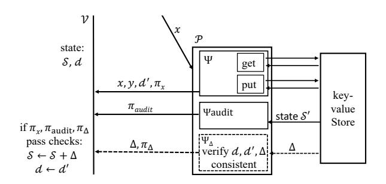
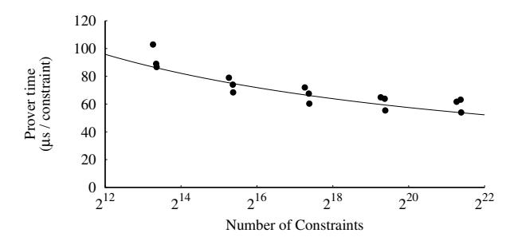

# Replicated state machines without replicated execution

Jonathan Lee Kirill Nikitin<sup>⋆</sup> Srinath Setty *Microsoft Research* <sup>⋆</sup>*EPFL*

## Abstract

This paper introduces a new approach to reduce end-to-end costs in large-scale replicated systems built under a Byzantine fault model. Specifically, our approach transforms a given replicated state machine (RSM) to another RSM where nodes incur lower costs by *delegating* state machine execution: an untrusted prover produces succinct cryptographic proofs of correct state transitions along with state changes, which nodes in the transformed RSM verify and apply respectively.

To realize our approach, we build *Piperine*, a system that makes the proof machinery profitable in the context of RSMs. Specifically, Piperine reduces the costs of both proving and verifying the correctness of state machine execution while retaining liveness—a distinctive requirement in the context of RSMs. Our experimental evaluation demonstrates that, for a payment service, employing Piperine is more profitable than naive reexecution of transactions as long as there are > 10<sup>4</sup> nodes. When we apply Piperine to ERC-20 transactions in Ethereum (a real-world RSM with up to 10<sup>5</sup> nodes), it reduces per-transaction costs by 5.4× and network costs by 2.7×.

## 1 Introduction

A modern example of a large-scale replicated system is a blockchain network [\[64,](#page-14-0) [86\]](#page-15-0), which employs replication to enable mutually-distrusting entities to transact *without* relying on trusted authorities. Specifically, blockchains instantiate *replicated state machines* (RSMs) [\[71\]](#page-15-1) under a Byzantine fault model in an open, permissionless network where each node executes and validates every transaction. Unfortunately, the most popular blockchains achieve a throughput of only a handful of transactions per second. This has motivated research to improve throughput and to reduce costs, for example, by changing the underlying consensus protocol used to realize RSMs [\[41,](#page-14-1) [46,](#page-14-2) [50\]](#page-14-3). These proposals, however, introduce additional assumptions for safety and/or liveness ([§7\)](#page-11-0).

We consider a different approach, one that applies to any existing replicated state machine in a Byzantine fault model (including blockchains) *without* any changes to the underlying consensus protocol. Naturally, it does not introduce any strong assumptions for safety or liveness. In fact, this approach is complementary to aforementioned advances [\[41,](#page-14-1) [46,](#page-14-2) [50\]](#page-14-3) and can be used in conjunction with those proposals. Our approach is based on work in the area of *proof-based verifiable computation* (see [\[83\]](#page-15-2) for a survey), which has developed a powerful primitive called *verifiable state machines* [\[24,](#page-13-0) [73\]](#page-15-3): for a state machine *S* and a batch of transactions *x*, an untrusted *prover* can produce outputs *y* and a short proof π such that a *verifier* can check if *y* is the correct output of

*S* with *x* as input (using π)—*without* reexecuting the state transitions. Furthermore, the cost of verifying such a proof is less than reexecuting the corresponding state transitions and the size of the proof is far less than the size of the original batch of transactions. Thus, nodes (in an RSM) that replicate a state machine *S* can delegate *S* to an untrusted prover and then replicate the verifier at each node to verify the prover's proofs. Naturally, if the end-to-end resource costs of the transformed RSM (CPU, storage, network, etc.) is cheaper than the original RSM, verifiable delegation leads to lower costs.

In theory, the above picture is straightforward and offers a principled solution to reduce end-to-end costs of a replicated system. However, in practice, the above approach is completely impractical. Specifically, even with state-of-theart systems for verifiable outsourcing, the verifier is more resource-efficient compared to reexecution only under narrow regimes [\[80,](#page-15-4) [81,](#page-15-5) [83\]](#page-15-2). Furthermore, in the context of RSMs, the verifier running at each node must have a copy of the delegated state machine's state, otherwise liveness of the transformed RSM hinges on the liveness of the prover (relying on the prover for liveness introduces attack vectors for mounting denial of service). Finally, the prover's cost to produce a proof is 10<sup>4</sup>–10<sup>7</sup>× higher than natively executing the corresponding state transition (the overheads depends on whether the outsourced computation is efficiently representable in the computational model of the proof machinery) [\[73,](#page-15-3) [81\]](#page-15-5).

The primary contribution of this paper is a set of techniques to reduce the costs of verifiable state machines in the context of RSMs and to ensure liveness without increasing the costs of the prover. To demonstrate the benefits of these techniques, we build a system called *Piperine*. When we apply Piperine to a popular type of state machine on Ethereum's blockchain, Piperine's proofs act as compressed information (e.g., there is no need to transmit digital signatures or the raw transactions over the blockchain), which allows Piperine to transparently reduce per-transaction network costs by 2.7× and per-transaction end-to-end costs by 5.4×. Beyond cost reductions, Piperine resolves an open question in the context of replicated systems: Piperine offers the first approach to build RSMs with concurrent transaction processing in a permissionless model. Note that prior works that achieve concurrent transaction processing in RSMs [\[9,](#page-13-1) [49\]](#page-14-4) require substantial changes to the underlying consensus protocol and apply only to a permissioned membership model.

Reducing costs. To tame costs imposed by the proof machinery, Piperine leverages the following observations: (1) in our target state machines, the primary computational bottleneck of a state transition is authenticating a transaction by verifying a digital signature; and (2) in the context of blockchains (and RSMs that favor throughput over latency), there is significant opportunity for processing transactions in batches. The first observation enables Piperine to substantially drive down end-to-end costs of the prover by aggressively optimizing the signature verification operation in the proof machinery (i.e., verifying a signature with a smaller circuit). Our optimizations include a careful choice of cryptographic primitives as well as several low-level cryptographic engineering techniques such as double-scalar multiplication, windowing, efficient big number arithmetic, etc.<sup>1</sup> Due to the second observation, the prover can produce a single proof for a batch of transactions, and the verifier incurs a near-constant cost to verify that proof. To drive down the verifier's costs further, Piperine employs techniques from delegating state [\[24,](#page-13-0) [35,](#page-13-2) [43\]](#page-14-5)—even when *not* delegating state—to replace expensive modular exponentiations with inexpensive hash operations.

Achieving liveness. To achieve liveness, the verifier must efficiently receive and verify state changes from the prover without trusting the prover. In the context of blockchains, such liveness is critical: without liveness, a malicious prover can prevent certain (or all) transactions from being executed. Unfortunately, with prior state-of-the-art in verifiable state machines, the verifier's cost to receive and verify state changes is proportional to the size of the entire state of the prover, making the whole approach infeasible. Piperine addresses this with new techniques. Specifically, we observe that the verifier can verify purported state changes during an *epoch* (a time period where a prover executes a batch of transactions) as long as it retains the digest of the prover's state both at the beginning and the end of an epoch. The computational cost of this process to the verifier is proportional to the number of state changes within the epoch, which is theoretically optimal.

Implementation and evaluation. We implement Piperine atop Spice [\[73\]](#page-15-3), inheriting an end-to-end compiler toolchain: A programmer can express a state machine in a broad subset of C and compile it into a prover and a verifier, with the prover designed to run on a distributed cluster. We also extend the compiler toolchain to produce a verifier in Solidity, a language for writing state machines that run on Ethereum. Using the toolchain, we implement a blockchain-based payment service with a standardized interface [\[79\]](#page-15-6). We then evaluate this artifact using workloads modeled after real-world traces. We find that Piperine reduces end-to-end costs of a transaction by 5.4× and network costs by 2.7× ([§6.3\)](#page-10-0). Whilst Piperine does not directly reduce mining costs of Ethereum, Piperine executes more transactions per block, and so effectively reduces per-transaction mining (and associated energy) costs.

Finally, we believe this work represents the first large-scale application of cryptographic proof machinery, and, to the best of our knowledge, describes the first instance in which verifiably delegating computation improves the performance of a large-scale distributed system.

# <span id="page-1-0"></span>2 Piperine's base machinery

This section describes machinery that Piperine employs: *verifiable state machines* [\[73\]](#page-15-3), a primitive that involves two entities, a prover P and a verifier V, and a state machine *S*. It enables the following setup. V and P agree on a non-deterministic state machine M = (Ψ, S0), where Ψ is a program that encodes state transitions and S<sup>0</sup> is the initial state of the machine. Both V and P are given as inputs auxiliary setup material *pp* related to Ψ. The internal state of P is S, which is initialized to S0, and the internal state of V is *d*, which is initialized to H(S0), where H is a collision-resistant hash function.

• P executes a state transition using input *x* and nondeterministic choices *w* for M to produce an output *y* and an updated state:

$$(y, \mathcal{S}') \leftarrow \Psi(x, w, \mathcal{S}); \qquad \mathcal{S} \leftarrow \mathcal{S}'$$

P sends (*x*, *y*, π, *d* ′ ) to V , where π is a proof, *d* ′ = H(S ′ ).

• V runs a local check using (*pp*, *x*, *y*, π, *d*, *d* ′ ) that outputs *b* ∈ {0, 1}; if *b* = 1, V sets *d* ← *d* ′ , else it aborts.

A verifiable state machine is a succinct non-interactive argument of knowledge [\[21,](#page-13-3) [45\]](#page-14-6) for the language of state machine transitions. Informally, it offers the following guarantees under a set of cryptographic hardness assumptions.

- Completeness. If *y* is the correct output of transitioning M with input *x*, some non-deterministic choices *w*, and *d* ′ is the correct digest of the updated state, P can produce a tuple (*x*, *y*, π, *d* ′ ) such that V updates its internal state to *d* ′ .
- Knowledge soundness. If P produces a tuple (*x*, *y*, π, *d* ′ ) that makes V update its internal state from *d* to *d* ′ , then there exists a PPT algorithm, called an extractor, that, with oracle access to P, can output (*w*, S, S ′ ) such that (*y*, S ′ ) = Ψ(*x*,*w*, S) ∧ H(S ′ ) = *d* ′ ∧ H(S) = *d*.
- Efficiency. The CPU cost of verifying π is lower than the cost of executing M's state transitions.

APIs and programming model. In Spice [\[73\]](#page-15-3), Ψ is expressed in a broad subset of C, which includes functions, structs, typedefs, preprocessor macros, if-else statements, loops (with static bounds), explicit type conversions, and standard integer and bitwise operations. For Ψ to interact with persistent storage, Spice offers: (1) a block store with GetBlock/PutBlock APIs; and (2) a key-value store with a standard get/put interface and concurrency control primitives (e.g., lock/unlock) and simple transactions.

The prover runs multiple instances of Ψ in different threads. Each thread processes distinct transactions and the shared state is stored in a logically centralized key-value store. In

<sup>1</sup>Such optimizations are widely used for code running on standard hardware, but it is non-trivial to realize them in the computational model of the proof machinery, which is clumsy from a programmability perspective.

this context, Spice [\[73\]](#page-15-3) guarantees sequential consistency [\[54\]](#page-14-7) for single-object operations (where an object is a key-value pair) and serializability [\[20,](#page-13-4) [66\]](#page-15-7) for multi-object transactions.

Mechanics. Spice [\[73\]](#page-15-3) and its predecessors [\[15,](#page-13-5) [18,](#page-13-6) [24,](#page-13-0) [35,](#page-13-2) [67,](#page-15-8) [74–](#page-15-9)[76,](#page-15-10) [81,](#page-15-5) [89\]](#page-15-11) proceed in two steps. First, they reduce the task of proving the correct execution of a state machine to the task of proving the satisfiability of a set of equations. Second, the prover employs a cryptographic machinery to prove the satisfiability of the set of equations—by producing a proof. The latter ensures that the verifier is more resource-efficient than reexecuting state transitions.

(1) Program executions to constraints. Spice's compiler transforms Ψ to *algebraic constraints*, a model of computation where a program is represented as a system of equations and variables take values from a finite field F*<sup>p</sup>* for a large prime *p*. The compiler operates line-by-line over Ψ: loops are unrolled and then each program statement is compiled to one (or more) equations. The compiler ensures the following property: the set of equations is *satisfiable*—there exists a solution (a setting of values to variables) to constraints—*if and only if* the output is correct. To illustrate, consider a toy computation and its equivalent constraints (uppercase letters denote variables and lowercase letters denote concrete values):

```
int incr(int x) {
  int y = x + 1;
  return y;
}
                      C =

                                  X − x = 0
                             Y − (X + 1) = 0
                                  Y − y = 0
```

For the above constraints, if *y* = *x* + 1, {*X* ← *x*, *Y* ← *y*} is a solution. If *y* ̸= *x* + 1, then there is no solution and the constraint set is not satisfiable.

(2) Proving the satisfiability of constraints succinctly. The prover identifies a solution to the equations using input *x*. Since the verifier must be able to check this solution in time sublinear in the running time of the computation, the prover cannot simply send its solution to the verifier. Instead, Spice employs cryptographic machinery (called an *argument protocol*) to encode the prover's solution as a succinct proof π*x*. This machinery is detailed at length elsewhere [\[15,](#page-13-5) [18,](#page-13-6) [24,](#page-13-0) [47,](#page-14-8) [67,](#page-15-8) [81,](#page-15-5) [83\]](#page-15-2). We now focus on details relevant for this work: how does Spice encode state in constraints?

Supporting state in the constraints formalism. We begin with Spice's block store, which it inherits from Pantry [\[24\]](#page-13-0). Consider the following program that takes as input a *digest* (e.g., a SHA-256 hash) and accesses the prover's block store using GetBlock/PutBlock APIs:

```
Digest increment(Digest d) {
  // produces equations that check d==Hash(block)
  int block = GetBlock(d);
  int block' = block + 1;
  // produces equations that check d'==Hash(block')
  Digest d' = PutBlock(block');
  return d';
}
```

Spice's compiler translates each GetBlock call to a set of

equations that check if the hash of the supplied block equals the input digest (this requires representing a hash function as a set of constraints). PutBlock translates to a similar set of constraints. Since the verifier supplies digests, unless the prover identifies a hash collision (which is infeasible), the prover is compelled to supply the correct block to each GetBlock and supply the correct digest as the response to each PutBlock.

Key-value store. Spice supports a key-value store using a particular type of hash function H(·) that operates on sets and is incremental [\[10,](#page-13-7) [11,](#page-13-8) [32\]](#page-13-9): given a *set-digest d<sup>S</sup>* for a set *S*, and a set *W*, one can efficiently compute a set-digest for *S*∪*W*. Specifically, there is a constant time operation ⊕ where: H(*S* ∪ *W*) = H(*S*) ⊕ H(*W*) = *d<sup>S</sup>* ⊕ H(*W*). In more detail, a key-value store is encoded using two sets: a read-set *RS* and a write-set *WS*. These sets contain (*key*, *value*, *timestamp*) tuples for every operation on the store. Neither the prover nor the verifier materializes these sets in full; they only operate on them using the corresponding digest (which we illustrate below). Thus, the verifier's digest of the key-value store is:

```
struct KVDigest {
  SetDigest rs; // a set-digest of RS
  SetDigest ws; // a set-digest of WS
}
```

*Example.* If the key-value store is empty, *rs* = *ws* = H({}). Suppose the prover executes a program Ψ that invokes insert(*k*, *v*), it is forced to return an updated KVDigest such that the following holds (this is done by translating insert into appropriate constraints, as in the GetBlock example): *rs* = H({}),*ws* = H({(*k*, *v*, 1)}).

Now, suppose the prover executes Ψ′ that invokes get(*k*), which should return a value *v* and update the timestamp associated of the tuple. To explain how KVDigest is updated, there are two cases to consider. First, suppose the prover behaves and returns *v* that was previously stored by insert(*k*, *v*), then: *rs* = H({(*k*, *v*, 1)}),*ws* = H({(*k*, *v*, 1),(*k*, *v*, 2)}).

A key invariant here is that whenever the prover maintains the key-value store correctly, the set underneath *rs* is a subset of the set underneath *ws*. To illustrate the invariant further, consider the second case where the prover returns *v* ′ ̸= *v* (for get(*k*)), then the set-digests returned by the prover will be: *rs* = H({(*k*, *v* ′ , 1)}),*ws* = H({(*k*, *v*, 1),(*k*, *v* ′ , 2)}).

Observe that the set underneath *rs* is not a subset of the set underneath *ws*. However, the verifier cannot not detect this (since set-digests have no structure to check the subset property). Instead, the verifier requires the prover to produce a special proof π*audit* periodically (e.g., for a sequence of inputs *x*1, . . . *xn*) that proves the set underneath *rs* is a subset of the set underneath *ws*. To do so, the prover's π*audit* proves:

```
∃{(ki
      , vi
         , tsi)} : ws ⊖ rs = H({(ki
                                       , vi
                                           , tsi)}) ∧ ∀i, ki < ki+1,
```

where ⊖ is the inverse of ⊕ (i.e., it results in removal of elements from a set underneath the digest). This difference is a set as the *k<sup>i</sup>* are distinct. An honest prover takes {(*k<sup>i</sup>* , *vi* , *tsi*)} to be all key-value-timestamp tuples in its current state.

To produce π*audit*, the prover incurs costs linear in the number of key-value tuples, but the linear cost is amortized over all transactions processed within the epoch, and the proof produced by the prover is π = (π*<sup>x</sup>*<sup>1</sup> , . . . , π*<sup>x</sup><sup>n</sup>* , π*audit*). Finally, as an optimization atop Spice [\[73\]](#page-15-3), we observe that the verifier only needs to track a single set-digest *d* = *ws* ⊖ *rs*.

## <span id="page-3-0"></span>3 Design

This section describes the design of Piperine. We begin with an overview of Piperine and then delve into its details.

Overview of Piperine. Piperine provides a generic mechanism to transform a replicated state machine (RSM) R into another RSM R′—while retaining the safety and liveness properties of R. To explain how Piperine realizes this transformation, we start with a brief review of RSMs. Recall that an RSM is a methodology to transform a state machine M into a distributed computation running on a set of nodes such that the distributed computation emulates a safe and live *S* (under certain operating conditions about nodes, such as fault thresholds, and the network connecting them).

In the context of an RSM, the safety property is that nonfaulty nodes progress through the same sequence of state transitions; the liveness property is that non-faulty nodes can eventually execute a state transition [\[55\]](#page-14-9). An RSM can have one or more safety and liveness properties and Piperine is oblivious to the specific properties (in other words, Piperine simply preserves the safety and liveness properties of the underlying RSM R in the transformed RSM R′ ).

*Constructing* R′ *.* To construct R′ for a given R that replicates a state machine M, the high level recipe is as follows. First, Piperine splits M into a preprocessing phase and a state machine: the *prover* and the *verifier* respectively (by employing the verifiable state machine primitive from Section [2\)](#page-1-0).

The prover processes inputs (i.e., transactions) for *S* and transforms them into inputs for the verifier. The prover is fully untrusted and maintains no private state, so the transactions can be processed by any party on any untrusted infrastructure. More concretely, a transaction can be processed by the client that creates it, the RSM node that first receives it, or a third party; the choice is arbitrary and the choice can be made for each transaction independently, so our transformation does not incur any loss of decentralization. Such flexibility exists because the prover in Piperine is untrusted, by design, not only for safety but also for liveness.

Finally, nodes in the original RSM then replicate the verifier—instead of *S*—using R. Thus, R′ is an RSM that replicates the verifier and processes transformed inputs and proofs from the prover. Below, we provide an overview of mechanics behind this instantiation and then provide intuition for why R′ inherits any safety and liveness properties of R.

Overview of mechanics. Figure [1](#page-4-0) summarizes the prover and the verifier machinery that Piperine uses.

In Piperine's context, a state machine M is specified with

(Ψ, S0), where Ψ is a program that encodes state machine transitions and S<sup>0</sup> is the initial state of the machine. When P is given a state S of *S* and a transaction *x* (S = S<sup>0</sup> at beginning of time), it produces:

- The output *y*, a digest *d* ′ of the new state S ′ , and a proof π = (π*x*, π*audit*).
- A succinct representation ∆ of the difference between S and S ′ , and a proof π<sup>∆</sup> that this difference is consistent with the old and new digests *d*, *d* ′ .

For efficiency, π*audit* and π<sup>∆</sup> are produced by the prover after processing a batch of transactions. For ease of exposition, we include it with every transaction *x* (we relax this in ([§3.3\)](#page-6-0)).

V begins with a copy of S as well as its digest *d*. When V is given as input a tuple (*x*, *y*, *d* ′ , π, ∆, π∆) produced by the prover, it runs the local checks of Section [2,](#page-1-0) and in addition checks that π<sup>∆</sup> proves that ∆ represents the correct difference between states whose digests match *d*, *d* ′ . If these checks pass, V applies ∆ to S to obtain S ′ .

Safety and liveness intuition. The verifier's initial state is the initial state of the state machine S<sup>0</sup> and a digest of that state *d*. Since Piperine runs V as a state machine that is replicated by RSM R and since R is safe, the verifier running at each node will only transition to a new state if (*x*, *y*, *d* ′ , π, ∆, π∆) pass the verifier's local checks. From the completeness and soundness properties of the underlying verifiable state machine, this happens only if *y* is a correct output for the transaction *x* and *d* ′ is the digest of the state after executing *x*. Furthermore, the verifier running at each node obtains a correct copy of the updated state using ∆. Thus, R′ is both safe and live as long as R is safe and live. The only additional assumption in R′ compared to R is the cryptographic hardness assumptions made by verifiable state machines. We make this intuition more formal later ([§3.3\)](#page-6-0).

RSMs with an open membership model. In RSMs with an open membership model such as blockchains, ensuring liveness means that a new node joining the system must be able to start with the initial state S<sup>0</sup> and incrementally update it using publicly available sequence of transformed inputs until it reaches the up-to-date state S ′ . In other words, the transformed inputs must be available to any new node as part of the blockchain. We provide more details when we apply Piperine to reduce per-transaction costs of Ethereum ([§4\)](#page-7-0).

#### 3.1 Ensuring liveness

The usual way for nodes in RSMs to keep their state up-todate is to reexecute transitions on all the submitted inputs that have been agreed upon by the replicated system. Because nodes in Piperine avoid such reexecution, the verifier running at each node in the transformed RSM must be able to recover a correct state S ′ with a digest *d* ′ from S and ∆. Furthermore, this must be efficient both for V and P. As we illustrate via a series of straw-man solutions below, this is non-trivial due to

<span id="page-4-0"></span>

FIGURE 1—Overview of Piperine's proof machinery; our extensions are depicted with dotted components. To apply this to RSMs, instead of running a state machine, each node in an RSM runs the verifier, which verifies proofs and state changes produced by an untrusted prover who verifiably executes the designated state machine.

the requirements on computational efficiency, bandwidth requirements, and a desire to execute transactions concurrently.

Straw-man #1. The prover could set  $\Delta = \mathcal{S}'$  and have  $\pi_{\Delta}$  prove that  $\mathcal{H}(\Delta) = d'$ . Collision resistance of  $\mathcal{H}$  ensures that  $\mathcal{S}'$  is correct if the digests match, and the proof shows that the digest is computed correctly. The verifier running at each node performs checks as above, and if they pass, it overwrites its local state with  $\Delta$ . Unfortunately, this approach incurs unacceptable network and computational costs. Having  $\Delta = \mathcal{S}'$  means that the prover would need to send its whole state over the network for each batch of state transitions, and that the verifier (running at each node in an RSM) would need to incur costs linear in the size of  $\mathcal{S}'$ .

**Straw-man #2.** The prover could augment the proof  $\pi_x$  to output the state changes (i.e. a list of updated key-value pairs) caused by executing the transaction x. The verifier could then apply those state changes. However, for efficiency, Piperine's base operates in a setting where it produces  $\pi_{audit}$  after executing a set of transactions (§2). As a result, the prover does not materialize a concrete ordering of transactions, but merely proves that one exists. So a malicious prover can violate safety by providing a different ordering to the verifier(s) than the one it used internally. A solution is to make the prover's execution verifiably deterministic, but it is not entirely clear how to achieve this—without incurring substantial costs.

Additionally, the network traffic is proportional to the sum of the count of state changes in each transaction processed by the prover—rather than the overall state change from  $\mathcal{S}$  to  $\mathcal{S}'$ . In workloads where a part of the state is updated by many transactions, the network traffic includes each of those changes, instead of just the final values, which is sub-optimal.

**Our solution.** Piperine's prover sets  $\Delta$  to be a minimal set of writes needed to take S to S', and directly proves that:

$$\exists \mathcal{S} : d = \mathcal{H}(\mathcal{S}) \land d' = \mathcal{H}(\mathsf{Apply}(\mathcal{S}, \Delta)).$$

Clearly, this approach is efficient for V, as the number of changes to make it to progress from S to S' is the minimal

```
1: function delta(d, d', \Delta)

2: sum \leftarrow \mathcal{H}(\{\})

3: for (k, v_{\Delta}, t_{\Delta}) in \Delta do

4: exists, v_{\delta}, t_{\delta} \leftarrow \text{RPC}(\text{GETOLDVALUE}, k)

5: sum \leftarrow sum \oplus \mathcal{H}(\{(k, v_{\Delta}, t_{\Delta})\})

6: if exists then

7: sum \leftarrow sum \ominus \mathcal{H}(\{(k, v_{\delta}, t_{\delta})\})

8: assert(sum = d' \ominus d)
```

FIGURE 2—The description of  $\Psi_{\Delta}$ , a computation that the prover runs to prove that its purported state changes are correct.

possible. To explain how we make it efficient for  $\mathcal{P}$  to generate this proof, it is necessary to unpack the details of how a key-value store is supported in Spice [73].

**Details.** Recall that Piperine's base machinery employs an incremental hash function  $\mathcal{H}(\cdot)$  for sets to implement a key-value store  $\mathcal{K}$ . Let WS, RS be the sets of all writes and reads to  $\mathcal{K}$  at the end of the last epoch (i.e., at the time the last  $\pi_{audit}$  was produced and verified). Note that neither the prover nor the verifier explicitly materializes these sets. A correct prover simply maintains  $\mathcal{K}$ 's current state  $\mathcal{S}$ , and the verifier maintains a single set-digest d. Furthermore, at the end of an epoch, the invariant is that  $\mathcal{S} = WS - RS$  and  $\mathcal{H}(\mathcal{S}) = d$ .

Now, in the next epoch, when the prover executes a transaction x, it sends to the verifier, as part of  $\pi_x$ , the difference  $\delta_x = \mathcal{H}(WS_x) - \mathcal{H}(RS_x)$ , where  $WS_x$ ,  $RS_x$  are the set of writes and reads required to execute x. From these, the verifier computes  $d' = \mathcal{H}(WS') \ominus \mathcal{H}(RS') = d \oplus \delta_x$ , where WS', RS' are the sets of all writes and reads after executing x.

We now make a few new observations. If the verifier tracks both d and d', there are sets S, S' such that  $\mathcal{H}(S) = d \land \mathcal{H}(S') = d'$ . Concretely, S = WS - RS and S' = WS' - RS'. Define the sets A = S' - S and B = S - S', and observe that S' - S = A - B. Furthermore, observe that A is the minimal set of writes that must be applied to S to get S', and B is the set of stale writes that A overwrites. This opens up the following solution for the verifier to efficiently receive and verify state changes from the prover.

Piperine's prover sets  $\Delta=A$ , which is minimal (as noted above). Furthermore, Piperine's prover proves that  $\exists B$ , a set writes to a subset of the state written to by A and that the following condition holds:  $d'\ominus d=\mathcal{H}(A)\ominus\mathcal{H}(B)$ . Piperine's prover proves this efficiently by adapting techniques used to efficiently produce  $\pi_{audit}$ . More concretely, the prover proves the correct execution of the program,  $\Psi_{\Delta}$  (depicted in Figure 2).  $\Psi_{\Delta}$  takes as public input two digests of state d,d', and purported set of writes  $\Delta$ , and takes as non-deterministic input a set of overwritten values. It then checks that these state changes are consistent with the updated digest. The verifier simply verifies the proof of correct execution of  $\Psi_{\Delta}$  (i.e.,  $\pi_{\Delta}$ ) and applies the claimed state changes to its local state.

#### <span id="page-5-0"></span>3.2 Reducing concrete costs

We make a number of additional changes to Piperine's base machinery to reduce the verifier's and prover's costs.

Replacing exponentiations with hashing. In the proof machinery that Piperine uses (§2), the cost of verifying a proof for a computation  $\Psi$  scales in the number of inputs and outputs of the computation, but not in the computation complexity of  $\Psi$ . Concretely, each additional input or output requires the verifier to do one additional modular exponentiation. There is also a fixed cost of three pairing computations.

It is desirable to minimize the number of explicit inputs and outputs that a computation has (whilst retaining safety). We apply a prior idea [24] in our context: we observe that GetBlock and PutBlock primitives from Section 2 enable any block of data for which  $\mathcal V$  knows a digest to be referenced by a short cryptographically-binding name in a verifiable way. Specifically, Piperine replaces the inputs and outputs of computations with their short cryptographic digests and have the verifier separately verify the correctness of cryptographic digests using their full inputs and outputs. Schematically, Piperine transforms a computation y = f(x) into:

```
Digest f_wrapped(Digest in_d) {
  x = GetBlock(in_d);
  y = f(x);
  return PutBlock(y);
}
```

 $\mathcal{P}$  proves correct execution of  $f_{wrapped}$ , and additionally sends x and y to  $\mathcal{V}$ . As part of its local checks,  $\mathcal{V}$  ensures that the digests passing in and out of  $f_{wrapped}$  correspond to x, y. For  $\mathcal{V}$ , this replaces a multi-exponentiation of size O(|x|+|y|) with hash operations that compute with O(|x|+|y|) data.

Choice of the hash function. The remaining question is how to implement the hashing. Clearly, for the verifier to gain, the hash function must be cheaper than exponentiation. A standard hash function (e.g., SHA-256) would be optimal in this case. However, the prover must compute digests inside constraints (as part of GetBlock), and executing a typical hash function would incur  $\approx 800$  constraints per byte.

This cost is partially addressed in prior work [17, 24, 43, 73] where the GetBlock/PutBlock primitives are based on the Ajtai's hash function [6], which costs  $\approx 10$  constraints per byte. In Piperine, we use the MiMC-based hash function [8] (used in Spice [73] for a different purpose), which costs  $\approx 5$  constraints per byte.

Efficient signature verification. The cost of proof generation in Piperine's proof machinery is primarily due to FFTs and multi-exponentiations whose size is given by the number of constraints. So reducing the number of constraints used to represent a computation reduces prover costs. In our target state machines, most constraints are used to implement cryptographic operations, such as digital signature verification.

Common digital signature algorithms compute over a group where the discrete logarithm problem is hard. These groups in

turn require arithmetic over large finite fields. A prior idea [17, 35, 73] to make this efficient is to ensure that the field over which digital signature is computed is the same field used by our algebraic constraints. Thus, we select digital signatures on an elliptic curve over the field  $\mathbb{F}_p$  of our algebraic constraints.

There are, however, many elliptic curves over  $\mathbb{F}_p$ . We choose a Twisted Edwards curve [19] to avoid *branching* when computing a point addition. This is because the constraints formalism necessitates executing all branches, which increases costs. Specifically, we use the curve  $\mathcal{E}: 634670x^2 + y^2 = 1 + 634650x^2y^2$ , which is birationally equivalent to the twist of the  $\mathbb{C}\emptyset\mathbb{C}\emptyset$  curve [19, 53], of size  $N = |\mathcal{E}| \approx p/4$ .

We fix a base point G, and construct ECDSA signatures over  $\mathcal{E}$  using the MiMC-based hash discussed above. A public key is a point  $P \in \mathcal{E}$ , and a signature on a message m is a pair  $r, t \in [0, N)$ . Verifying a signature requires computing  $h := \operatorname{hash}(m), \ r' := (ht)P + (rt)G = t(hP + rG)$ , and checking that r is the x-coordinate of r'.

The most straightforward way to compute r' is to compute hP and rG with a double-and-add algorithm, add these points, and then multiply by t (again with double-and-add). We now discuss a series of optimizations. These optimizations are somewhat standard in the context of high-speed cryptographic libraries designed to run on a hardware platform such as x86. Our innovation is in a careful selection and application of those optimizations for code compiled to constraints. For context, although the constraints formalism is as general as x86, it has a completely different cost model for different operations (e.g. bitwise operations are orders of magnitude more expensive than 256-bit modular multiplications).

**Optimizations.** First, we combine the computation of hP + rG into a single loop of doubling and adding one of  $\{0, P, G, P + G\}$ ; this optimization is called *double-scalar multiplication*, a special case of multiexponentiation [62].

Second, we apply the above idea to a single scalar multiplication of a point Q; instead of repeatedly doubling and adding one of  $\{0,Q\}$ , we repeatedly quadruple and add one of  $\{0,Q,2Q,3Q\}$ . This optimization is called 2-bit windowing, a special case left-to-right k-ary exponentiation [62]. In general, we can use larger windows, where the number of possible summands becomes some  $2^w > 4$ . However, in constraints, one must encode the selection operation with  $\sim 2^w$  constraints, so w > 2 does not improve further.

Our final and most involved change is to compute ht and  $rt \mod N$ , which replaces one point multiplication with two multiplications  $\mod N$ . However,  $N \neq p$ , and since  $N^2 \gg p$  this multiplication will overflow if performed naively. We address this as follows. Given an x, y to multiply, there is some a such that  $xy - aN \in [0, N)$ . To compute this, we express x, y, a, N in base  $B = 2^{86}$ , where each of x, y, a, N has at most three digits. We then use long multiplication (base B) to express the product as the sum of products of the digits, shifted by powers of B. We collect the terms that have been shifted by a common power of B for both xy and -aN. Each

aggregated term is in  $(-3B^2, 3B^2)$ . So xy - aN is expressed as a sum of values of modulus  $< 3B^2$ , shifted by powers of B.

Since  $B^2 = 2^{172} \ll p/6$ , these sums can be computed exactly modulo p. So we can combine the values (shifted by powers of B) to find xy - aN, checking that no overflow will occur. To do this, we accumulate the most significant parts of the product, multiplying by powers of B only after checking that the accumulator is below p/B.

Section 6.1 evaluates these optimizations.

**Batching.** The prover executes a batch of transactions and provides a proof of correct execution for the batch as a whole. The verifier verifies a single proof for the entire batch, thereby amortizing the fixed costs of verification over the entire batch. The prover also amortizes the linear cost of producing  $\pi_{audit}$  and  $\pi_{\Delta}$  over the entire batch of transactions.

Finally, note that producing  $\pi_{audit}$  and  $\pi_{\Delta}$  requires computing over the entire state  $\mathcal{S}$  and the state changes  $\Delta$ . Building on Spice [73], we structure these computations as a MapReduce job where each mapper and reducer operates on fixed-sized chunk of data (this permits the use of a one-time trusted setup for proof machinery regardless of the size of the prover's state; §8). However, different from Spice, Piperine's prover does not prove the execution of reducers, but instead the verifier executes reducers. This is because the reducer's computation (elliptic curve point additions, equality checks, etc.) is not worthwhile to be outsourced to the prover.

#### <span id="page-6-0"></span>3.3 Correctness proofs

Recall that safety and liveness properties are properties of sequences of states which, respectively, are closed under taking prefixes, or can be preserved under extension [55].

Given an RSM  $\mathcal{R}$  that replicates a state machine  $\mathcal{M}$ , Piperine constructs an RSM  $\mathcal{R}'$ , which includes: (i) Piperine's prover; and (ii)  $\mathcal{R}$  that replicates Piperine's verifier. We now prove that any safety or liveness property that holds in  $\mathcal{R}$  for all state machines is preserved in  $\mathcal{R}'$  for all state machines—except for an error probability of  $O(\epsilon)$ , where  $\epsilon$  is negligible in the security parameter and is set to  $1/2^{128}$  in practice. In more detail, the verifier that is replicated in  $\mathcal{R}'$  (say  $\mathcal{M}'$ ) is a state machine with state  $(\mathcal{S}, d)$ . The transition function of  $\mathcal{M}'$  takes as input a tuple  $(\vec{y}, d', \pi, \Delta, \pi_{\Delta})$ , and executes:

- 1. Assert(Verify( $\pi$ , d, d',  $\vec{y}$ )  $\wedge$  Verify( $\pi_{\Delta}$ , d, d',  $\Delta$ )).
- 2.  $(S, d) \leftarrow (S', d')$  where  $S' = \text{Apply}(S, \Delta)$ , output y.

Since we allow a probability  $O(\epsilon)$  of error, we can condition on events of probability  $\geq 1 - \epsilon$ . In particular, we condition on Verify returning false if  $\mathcal P$  does not possess non-deterministic choices such that the claimed outputs correct, and the prover knowing no collisions in  $\mathcal H(\cdot)$ . Then:

Verify
$$(\pi, d, d', \vec{y}) \implies \exists \sigma \in Sym(n), x_1, \dots x_n, S_0 \dots S_n :$$

$$\mathcal{H}(S_0) = d \wedge \mathcal{H}(S_n) = d' \qquad (1)$$

$$\wedge_{i=1\dots n} \Psi(S_{i-1}, x_{\sigma(i)}) = (S_i, y_{\sigma(i)})$$

$$Verify(\pi_{\Delta}, d, d', \Delta) \implies \exists \delta : keys(\delta) \subseteq keys(\Delta)$$
$$\land \mathcal{H}(\Delta) \ominus \mathcal{H}(\delta) = d' \ominus d$$
 (2)

<span id="page-6-3"></span>**Lemma 3.1.** For a state machine  $\mathcal{M}$  with transition function  $\Psi$  and initial state  $S_0 = \mathcal{S}$  (where  $d = \mathcal{H}(\mathcal{S})$ ), given inputs  $\vec{x}$ , an honest prover can produce a tuple  $(\vec{y}, d', \pi, \Delta, \pi_{\Delta})$  such that the state machine  $\mathcal{M}'$  with current state  $(\mathcal{S}, d)$  transitions to  $(\text{Apply}(\mathcal{S}, \Delta), d')$  and outputs  $\vec{y}$ .

*Proof.* By the completeness of the underlying VSM, an honest prover on inputs  $\vec{x}$  and state  $\mathcal{S}$  can compute the new state  $\mathcal{S}'$ , outputs  $y_i$ , and state changes  $\Delta$  such that  $d:=\mathcal{H}(\mathcal{S})$ ,  $d':=\mathcal{H}(\mathcal{S}')$ , and  $\pi,\pi_{\Delta}$  pass their verification checks, which causes  $\mathcal{M}'$  in state  $(\mathcal{S},d)$  to transition to  $(\mathrm{Apply}(\mathcal{S},\Delta),d')$  and output  $\vec{y}$ .

<span id="page-6-2"></span>**Lemma 3.2.** If  $\mathcal{M}'$  is in state  $(\mathcal{S},d)$  with  $d=\mathcal{H}(\mathcal{S})$ , and transitions to a state  $(\mathcal{S}',d')$  with outputs  $\vec{y}$ , then with probability  $\geq 1-O(\epsilon)$ : (1)  $d'=\mathcal{H}(\mathcal{S}')$ , and (2)  $\exists \vec{x}: \mathcal{M}$  transitions  $\mathcal{S} \to \mathcal{S}'$  on inputs  $\vec{x}$ , outputting  $\vec{y}$  in some order.

*Proof.* If  $\mathcal{M}'$  transitions, both Verify checks return true. So (ignoring an  $O(\epsilon)$  probability of failure) the prover knows  $\sigma, \{x_i\}_{i=1...n}, \{S_i\}_{i=0...n}$  and  $\delta$ .

From the collision resistance of  $\mathcal{H}(\cdot)$ ,  $\mathcal{S} = \mathcal{S}_0$ ,  $\mathcal{S}_n - \mathcal{S}_0 = \Delta - \delta$ . Since  $\text{keys}(\Delta) \supseteq \text{keys}(\delta)$ ,  $\mathcal{S}_n = \text{Apply}(\mathcal{S}_0, \Delta)$ , and so  $\mathcal{S}' = \mathcal{S}_n$ , implying  $d' = \mathcal{H}(\mathcal{S}')$ . Then from Equation 1,  $\mathcal{M}$  transitions  $\mathcal{S} \to \mathcal{S}'$  on inputs  $x_{\sigma(i)}$ , outputting  $y_{\sigma(i)}$ .  $\square$ 

**Theorem 3.1.** If  $\mathcal{R}$  maintains a safety property on  $\mathcal{M}'$ , then  $\mathcal{R}'$  maintains this safety property on  $\mathcal{M}$  except for an error probability of  $O(\epsilon)$ .

*Proof.* By Lemma 3.2,  $\mathcal{M}'$  can only transition from  $(\mathcal{S}, d)$  to  $(\mathcal{S}', d')$  outputting  $\vec{y}$  if  $\mathcal{M}$  can have a sequence of transitions from  $\mathcal{S}$  to  $\mathcal{S}'$  outputting  $\vec{y}$ . So any sequence of states  $(\mathcal{S}_i, d_i)$  with outputs  $\vec{y}$  of  $\mathcal{M}'$  projects down to a sub-sequence of a sequence of states  $\mathcal{S}$  with outputs  $\vec{y}$  of  $\mathcal{M}$ .

Taking prefixes of a sequence commutes with this projection. Furthermore, A is a sub-sequence of a prefix of B if and only if A is a prefix of a sub-sequence of B. So if  $\mathcal{R}$  maintains some safety property on  $\mathcal{M}'$ , then  $\mathcal{R}'$  preserves it on  $\mathcal{M}$ .  $\square$ 

**Corollary 3.1.** If  $\mathcal{R}$  maintains a safety property S for all state machines, then  $\mathcal{R}'$  maintains S for all state machines, excepting an error probability  $O(\epsilon)$ .

**Theorem 3.2.** If R applied to M maintains a liveness property, then R' applied to M maintains this liveness property.

*Proof.* Any states  $\mathcal{S}$  of  $\mathcal{M}$  can be extended to a state  $(\mathcal{S},d)$  for  $\mathcal{M}'$ , by setting  $d=\mathcal{H}(\mathcal{S})$ . If  $\mathcal{R}$  maintains some liveness property L on  $\mathcal{M}$ , any sequence of states for  $\mathcal{M}$  satisfying L can be extended indefinitely maintaining L.

<span id="page-6-1"></span>A sequence of states of  $\mathcal{M}'$  project to a sub-sequence of a sequence of states of  $\mathcal{M}$ . If this sequence of states of  $\mathcal{M}$  satisfy L, then it may be extended by inputs  $\vec{x}$  maintaining L.

Given inputs ⃗*x* causing M to transition from S to S ′ outputting ⃗*y*, the prover can compute a (⃗*y*, *d* ′ , π, ∆, π∆) causing M′ to transition from (S, H(S)) to (S ′ , H(S ′ )) and output ⃗*y* (Lemma [3.1\)](#page-6-3). So the sequence of states of M′ may be extended maintaining *L*, and R′ maintains *L*.

Corollary 3.2. *If* R *maintains a liveness property L for all state machines, then* R′ *maintains L for all state machines.*

### <span id="page-7-0"></span>4 Applying Piperine to Ethereum

We discuss how Piperine enhances Ethereum, starting with a primer on the base system.

A primer on Ethereum. Ethereum is a blockchain network that instantiates a large-scale RSM. In Ethereum, state consists of a set of accounts, each of which possesses a balance in a currency (ether). Optionally, each account can possess bytecode written for the Ethereum Virtual Machine (EVM) and internal persistent storage. Such bytecode is called a *smart contract* and can be deployed to an account by a developer; this facility can be used to implement decentralized applications such as payment services, games, auctions, etc. State transitions (also known as transactions) in Ethereum consist of transfers of balances between accounts, deploying new smart contracts, and calls to methods exposed by smart contracts (which in turn can make calls to other smart contracts).

Nodes in the Ethereum network reach consensus on an append-only ledger of blocks containing transactions. The execution of transactions is replicated across the network, i.e., each node executes every transaction in the ledger.

Each operation supported by the EVM is assigned a complexity-based cost in a currency called *gas*, which is derived from ether and hence fungible in USD ([§6.3\)](#page-10-0). For example, the cost of executing arithmetic operations or reading transaction data inside a contract is in single digits of gas, whilst the cost of updating state or calling a contract is many thousands of gas [\[86\]](#page-15-0). When a transaction invokes a method exposed by a smart contract, the call is supplied by its caller with some amount of gas, and each operation consumes gas from this supply. If the execution of the smart-contract call requires more gas than is supplied, the execution terminates. This policy bounds the computational resources that nodes in the network must expend to execute state transitions in Ethereum; this is a key mechanism to prevent denial of service attacks. The gas consumption of all smart contract calls in a block is the *block size*, which is currently capped by Ethereum to ≈ 8 · 10<sup>6</sup> and is routinely saturated in practice.

Enhancing Ethereum with Piperine. Piperine enhances Ethereum at the level of an application. While the enhancement requires several changes to the execution logic of the application, these changes do not require any modification to the underlying Ethereum mechanisms and can be applied transparently. Specifically, instead of specifying the application as an on-chain smart contract, developers implement it off-chain as a program Ψ using Piperine's toolchain. Clients

who wish to invoke the application submit their transactions to a Piperine prover. The prover accumulates transactions, executes them in batches, and produces proofs that are then sent to a verifier. The verifier is implemented as a smart contract that runs natively on Ethereum. The verifier contract is generic to Ψ and implements the verification of proofs, the aggregation of changes to the state digests, and the verification of the purported state changes. As the verifier keeps track of the application state and incorporates cryptographic material for proof verification, it is deployed on a per-application basis. All inputs processed by the verifier are recorded on-chain since the prover invokes the verifier by submitting a regular Ethereum transaction with these inputs as arguments.

Deployment and fault-tolerance. Recall from Section [3](#page-3-0) that Piperine's prover is untrusted for both safety and liveness. Thus, the prover can run on any untrusted infrastructure. Furthermore, the prover has *no* private state, and all state necessary to instantiate a new prover is persistently recorded on-chain (in blockchain terms, there are no "data availability" issues). Hence, any entity (a client, a miner, or a third-party service) can act as a prover at any point—without requiring coordination with any other instance of a prover that might exist in the system.<sup>2</sup> There can theoretically be an unlimited number of provers per application (e.g., each miner can become a prover for an application of its choice). In practice, an efficient deployment option is for the prover to be offered as a commercial service that provides decentralized applications with reduced per-transaction costs—without giving up the benefits of decentralization. In our experiments ([§6\)](#page-9-1), we deploy the prover on a cluster of machines in the cloud.

Bootstrapping and interoperability. We facilitate interoperability between Piperine-enhanced applications and native smart contracts. As an example, in the context of an ERC-20 token [\[79\]](#page-15-6), the main requirements are that clients can bootstrap account balances by sending currency to the smart contract, and can withdraw their funds unilaterally without trusting any prover. To support this, the smart contract implementing the verifier keeps a list of pending payments to and from the Piperine-enhanced token. When clients wish to bootstrap a balance, they use a traditional ERC-20 transaction to send funds to the verifier contract. The verifier contract adds the hash of this transaction to the list of pending payments to the token. When the prover wishes to issue currency to an account on its state, it releases a transaction hash to the verifier, which rejects the state transition if the hash is not present in the pending list. If not, it updates the pending list to prevent a prover from double issuance.

Similarly, to withdraw funds, the prover executes a transaction that burns tokens in the Piperine-managed state and whose public outputs direct the smart contract to approve a token withdrawal, which can be collected by an ERC-20

<sup>2</sup>An alternate option is to obtain a snapshot of the state from another node. In this case, if the snapshot is incorrect, proofs produced by the new prover will not be accepted by the verifier on-chain due Piperine's safety properties.

transaction. Since any party can act as the Piperine prover, any party can unilaterally withdraw funds by producing proofs of execution for such a burn transaction and can then transition state on the on-chain verifier smart contract.

Status checks. Piperine's prover sends a hash of each executed transaction to the chain as part of inputs to the verifier. As a corollary, any client (or a new prover) can check whether some transaction has already been executed by checking whether the hash of their transaction has appeared as an input to the Piperine verifier contract.

Choice of an elliptic curve. For efficiency, Piperine uses a different elliptic curve for ECDSA signatures than Ethereum. Thus, transactions generated for a Piperine-enhanced application cannot be sent directly to the Ethereum chain.<sup>3</sup> The above interoperability mechanism alleviates this constraint by enabling currency transfers from ether to per-application tokens and vice versa. Moreover, the use of cryptographic primitives that are friendly to proof machinery is often an acceptable optimization in practice [\[4,](#page-13-14) [34,](#page-13-15) [85\]](#page-15-12).

Details of the verifier running as a smart contract. To implement the logic of the verifier, we need to build three high-level primitives: a primitive to verify proofs produced by the proof machinery, the MiMC hash function, and functions to update set-digests with deltas. By default, the EVM provides basic elliptic-curve point addition (150 gas) and scalar multiplication (6,000 gas), in the form of precompiled contracts (i.e., as libraries). Using these library operations, we implement a primitive that can verify proofs produced by the proof machinery. In our implementation, verifying a single proof of a computation costs ≈ 201,000 + 6,150 · *I* gas where *I* is a number of inputs and outputs to the computation. Observe that the cost of verifying a proof is independent of the complexity of the computation for which the proof is produced. Furthermore, our design limits the size of inputs and outputs of a computation using GetBlock/PutBlock APIs, so *I* is a constant in our context. However, the verifier incurs a cost linear in the number of hash operations, as it uses the block store optimization (which, recall, replaces exponentiations with hash operations). In our context, the hash function is MiMC, which we implement using the EVM's primitive modulo operations along with custom assembly. The resulting cost of a hash operation is ≈ 200 gas/byte. Our functions to update set-digests are implemented directly with mulmod and addmod, directly ported from the C implementation.

### <span id="page-8-1"></span>5 Implementation

We build Piperine atop Spice [\[73\]](#page-15-3), which provides a compiler from a subset of C augmented with storage primitives to algebraic constraints. For producing succinct cryptographic proofs, it invokes libsnark [\[57\]](#page-14-12), an implementation of a state-of-the-art proof machinery [\[47\]](#page-14-8). We extend Spice with techniques described in Section [3](#page-3-0) including Ψ∆, a high-speed

```
struct Txn {
  int type; // Type of the transaction
  Pk pk_c, pk_r; // Public keys: caller, recipient
  int v; // Amount of currency
  int sig; // Signature on the transaction
}
struct Delta // Delta to set-digest
struct Account { int balance };
static PK organiser;
// creates currency
Delta create(Txn txn) {
  Delta d; Account recipient;
  // Check the type of transaction and signature
  assert(txn.type == CREATE);
  assert(verify_sig(txn.pk_c, txn, txn.sig))
  // Only the organiser can create tokens
  assert(txn.pk_c == organiser)
  // Lock and read account of txn.pk_c, update d
  beg_txn(&d, [txn.pk_r], [&recipient]);
  recipient.balance += txn.v;
  // Write and unlock account, update d
  end_txn(&d, [txn.pk_c], [recipient]);
  return d;
}
// transfers currency between accounts
Delta transfer(Txn txn) {
  Delta d; Account caller, recipient;
  // Check the type of transaction and signature
  assert(txn.type == TRANSFER);
  assert(verify_sig(txn.pk_c, h, txn.sig))
  // Lock and read account of txn.pk_c, txn.pk_r, update d
  beg_txn(&d, [txn.pk_c, txn.pk_r], [&caller, &recipient]);
  if (caller.balance >= txn.v && txn.v >= 0) {
    caller.balance -= txn.v;
    recipient.balance += txn.v;
  }
  // Write and unlock accounts, update d
  end_txn(&d, [txn.pk_c, txn.pk_r], [caller, recipient]);
  return d;
}
```

FIGURE 3—Pseudocode for ERC-20's create and transfer operations using Piperine's API. We abstract details of the use of block store and internal details of signature verification. Other ERC-20 operations are programmed similarly.

library for signature verification, etc. This adds about 375 SLOC to Spice. We implement the additional portions of Piperine's verifier ([§3.2;](#page-5-0) batching paragraph) in Python, along with orchestration for execution on our cluster, in about 725 lines of Python. This code parallelizes the prover's work (executing transactions, producing proofs, etc.).

To demonstrate Piperine in action, we implement a payment processing service with a standardized interface (called an ERC-20 token [\[79\]](#page-15-6)) using 380 lines of C. Although we implement our approach for only one contract, ERC-20 is a popular standardized interface for contracts, whose implementations account for over 50% of transactions on Ethereum [\[33\]](#page-13-16). Figure [3](#page-8-0) depicts pseudocode for various state transitions in the payment state machine. The main transaction is the transfer, which moves fungible tokens between two accounts. To apply Piperine to Ethereum, we implement the

<sup>3</sup>The curve is defined in Section [3.2,](#page-5-0) and has parameters of similar size to Ethereum's secp256k1, so it provides a similar security.

verifier as a smart contract in Solidity, a language for writing state machines. In particular, we implement machinery for verifying cryptographic proofs (which builds on an open-source library [70] for elliptic curve pairings) and the MiMC hash function in 500 lines of Solidity.

#### <span id="page-9-1"></span>6 Evaluation

Our experimental evaluation of Piperine answers the following questions:

- 1. What are the benefits of Piperine's techniques on end-toend costs of the prover and the verifier in VSMs?
- 2. What are the regimes in which delegation via verifiable state machines is better than local reexecution?
- 3. Does Piperine reduce costs in large-scale RSMs?

Methodology and baselines. We report our results in the context of a state machine for processing payment transactions (§5). To answer the first question, we measure the impact of our refinements (described in §3) on the prover's and verifier's CPU costs. To answer the second question, we consider a baseline state machine that executes the above state machine's payment transactions by just authenticating them (i.e., it does not execute transitions in entirety, which is pessimistic to Piperine). We implement the optimistic baseline using libsodium [38], a high-speed cryptographic library. We report the per-transaction costs in terms of CPU and network costs for a system with and without Piperine.

To answer the last question, we compare Piperine-enhanced Ethereum to native Ethereum, in both cases implementing the above state machine. For this, we report end-to-end costs of the two variants by using a unified metric (that accounts for network, storage, and CPU costs). We also report the size of a transaction in bytes in both cases.

**Setup.** We use a cluster of Azure D64s v3 instances (32 physical cores, 2.30 GHz Intel Xeon E5-2673 v4, 256 GB RAM) running Ubuntu 18.04. We measure CPU-time for the prover  $\mathcal{P}$  and a verifier  $\mathcal{V}$ . We run parallel instances of  $\mathcal{P}$  on as many physical cores as are available, and compute totals across all instances. We restrict the native  $\mathcal{V}$  to a single physical core for ease of comparison to the baselines, which are single-threaded in each case.

To compare to the ERC-20 baseline, we run Piperine against a private instance of the Ethereum RSM, using the Web3 Python library [3] for interaction and the Ganache suite [2] for deployment. We measure gas consumption of the verifier and the size in bytes of signed transactions using the Web3 API. We measure CPU-time of the prover from the system clock. Finally, we measure network costs by measuring the number of bytes transmitted from Piperine's prover to the verifier (in case of Piperine) and by measuring the number of bytes in a raw transaction (in case of our baselines).

<span id="page-9-2"></span>

FIGURE 4—Proof generation costs per constraint the number of constraints in a computation  $\Psi$  varies. The solid curve is  $1150\mu s/\log(n)$ , suggested by the  $n/\log(n)$  cost of multi-exponentiation algorithms.

#### <span id="page-9-0"></span>6.1 Benefits of Piperine's techniques

To answer the first question, we first experimentally establish that, in Piperine, the prover's costs depend primarily on the number of constraints. Thus, we can evaluate the benefits of our signature optimization by measuring their impact on the number of constraints generated.

The two principal costs to generate a proof for a computation with n constraints in Piperine are several multi-exponentiations of size n in a pairing-friendly elliptic curve and an FFT of size n over the field of scalars [15, 18, 24, 47, 67, 81, 83]. Using standard algorithms, such a multi-exponentiation takes  $O(n/\log n)$  time, whilst the FFT takes  $O(n\log n)$  time. For computations used in our evaluation, we measure  $\mathcal{P}$ 's CPU-time per constraint. Figure 4 depicts our results that confirm that  $\mathcal{P}$ 's CPU-time scales roughly as  $O(n/\log n)$ , which is consistent with the theoretical prediction that the prover is bottlenecked by multiexponentiations. This experiment also confirms the benefits of our batching optimization (§3.2) on the prover's costs.

Effect of signature optimizations. To examine the impact of signature optimizations in Piperine, we measure the number of constraints needed for a transfer state transition (to transfer currency from one account to another) over the course of several rounds of optimization. This metric is directly produced as a part of the process of compiling transfer with our toolchain. Figure 5 depicts our results. As can be seen, these optimizations reduce the number of constraints by up to  $1000\times$ . Our individual techniques reduce the number of constraints required by  $\approx 2\times$  compared to a baseline depicted on the second line. While the latter is a modest improvement, it directly impacts the number of replicas needed to amortize the prover's costs, in the context of RSMs (so any refinement to reduce the prover's costs is valuable).

**Effect of using a block store.** To examine the impact of replacing modular exponentiations with hashing in Piperine, we compile a state machine that performs transfer operations at a range of batch sizes, with and without the optimization. The batch size parameter does not impact the improvements, so we report results for a batch size of 64 transactions. Fig-

<span id="page-10-1"></span>

|                                            | # of constraints |
|--------------------------------------------|------------------|
| naive                                      | > 107            |
| careful choice of cryptographic parameters | 20414            |
| + double-scalar multiplication             | 17080            |
| + windowing                                | 16451            |
| + mod N arithmetic                         | 12574            |
| + limb optimization                        | 11249            |

FIGURE 5—Cost of a transfer operation, in terms of number of algebraic constraints, in Piperine with host of optimizations to the signature verification algorithm. Each line depicts an optimization atop its prior line and the resulting number of constraints.

<span id="page-10-2"></span>

|                 | prover (x86) | verifier (x86) | verifier (Eth) |
|-----------------|--------------|----------------|----------------|
|                 | (s / txn)    | (µs / txn)     | (gas / txn)    |
| w/o block store | 0.79         | 107            | 13241          |
| w/ block store  | 0.84         | 104            | 9301           |

FIGURE 6—Effects of the block store optimization on the CPU costs of the prover and the verifier (batch size is 64). The verifier on Ethereum benefits significantly while slightly increasing the prover's costs. The verifier on x86 benefits only slightly (see text).

ure [6](#page-10-2) depicts the per-transaction CPU costs for the prover and the verifier; we also report gas required to execute the verifier running as a smart contract on Ethereum. As can be seen, for the Ethereum verifier, the costs are reduced by ≈ 3.3×, whilst the cost for the prover does not increase substantially. The verifier on x86 does not benefit from the optimization. This is because the cost of multi-exponentiation is *O*(*n*/ log *n*), whilst the cost of hashing for the block store is *O*(*n*) with a smaller implied constant. However, for larger input sizes, we expect the block store optimization to provide a benefit.

#### 6.2 Benefits of Piperine for delegating state machines

We now assess the regimes in which it is cheaper to employ delegation than naive reexecution in RSMs. Our focus here is on resource costs (CPU and network costs) and cross-over points (the number of replicas necessary to make the total cost of the Piperine-enhanced RSM, including the prover's costs, to be cheaper than a baseline RSM).

We run Piperine and our baseline on a synthetic workload of create and transfer operations, modeled on the transaction history of a popular ERC-20 token [\[25\]](#page-13-17). For Piperine, we experiment with a range of batch sizes for transfer and measure the per-transaction CPU costs to the prover and the verifier, and to our baseline. We also measure the size of a transaction (in bytes) processed by the replicated state machine under Piperine and the baseline.

CPU costs and cross-over points. Figure [7](#page-10-3) depicts the pertransaction CPU costs of the prover, the verifier, and the baseline for varying batch sizes. As expected, the baseline CPU cost does not decrease with batch size whereas the verifier benefits significantly from batching. Furthermore, for batch sizes ≥ 64 the Piperine V has lower CPU costs than

<span id="page-10-3"></span>

| batch size | baseline | verifier | prover  | cross-over  |
|------------|----------|----------|---------|-------------|
| (#txns)    | (µs/txn) | (µs/txn) | (s/txn) | (#replicas) |
| 1          | 120      | 3799     | 1.34    | –           |
| 4          | 116      | 931      | 1.02    | –           |
| 16         | 115      | 275      | 0.88    | –           |
| 64         | 118      | 107      | 0.79    | 68365       |
| 256        | 118      | 63       | 0.78    | 14280       |
| 1024       | 117      | 42       | 0.75    | 10072       |

FIGURE 7—The per-transaction CPU cost of the prover, the verifier, and the baseline with varying batch sizes. We also depict crossover points: the number of replicas needed to make the Piperineenhanced RSM (including the prover's costs) to incur lower CPU costs than a replicated baseline. The verifier benefits significantly from batching while the prover's gains are modest. Beyond batch size of 64, Piperine-enhanced RSM is cheaper than the baseline.

<span id="page-10-4"></span>

| batch size<br>(#txns) | baseline<br>(bytes) | Piperine<br>(bytes) | savings<br>(×) |
|-----------------------|---------------------|---------------------|----------------|
| 1                     | 224                 | 588                 | –              |
| 4                     | 224                 | 259                 | –              |
| 16                    | 224                 | 147                 | 1.5            |
| 64                    | 224                 | 132                 | 1.7            |
| 256                   | 224                 | 129                 | 1.7            |
| 1024                  | 224                 | 80                  | 2.8            |

FIGURE 8—The per-transaction network costs of Piperine and the baseline with varying batch sizes. At the largest batch size, the pertransaction network costs to propagate a transaction to the replicated system is 2.8× lower in Piperine than the baseline.

the baseline. At large batch sizes, the verifier's CPU costs are lower than that of the baseline by about 2.7×. Although the prover's CPU costs are ≈ 6,300–11,000× higher than that of the baseline, there exists a cross-over point (in terms of the number of replicas in an RSM) at which the CPU cost of the prover and the replicated verifier is lower than the CPU cost of the replicated baseline. With a batch size of 1024, the cross-over point is about 10,000 replicas.

Network costs. Figure [8](#page-10-4) depicts the size of a transaction processed by the RSM in Piperine and the baseline. Beyond a batch size of 16, Piperine always incurs lower network costs than the baseline. This is because Piperine compresses each transaction to a hash and a minimal specification of its impact on the state. At a batch size of 1024, the savings are a factor of 2.8, which can be significant in blockchains [\[36\]](#page-14-14).

#### <span id="page-10-0"></span>6.3 Benefits of Piperine for large-scale RSMs

To answer the third question, we run a set of experiments similar to the previous subsection, except that we experiment with the Piperine verifier running as a smart contract. Furthermore, instead of an optimistic baseline based on libsodium, the baseline here is an ERC-20 smart contract [\[79\]](#page-15-6).

End-to-end per-transaction costs in gas and USD. Besides the metrics used in the last subsection (CPU costs, network transfers, etc.), we use an additional metricEthereum's gas ([§4\)](#page-7-0)—that captures the end-to-end costs of the prover and the verifier in a unified manner. Although the prover runs on a cluster of machines in the cloud and billed in USD for the total machine cost (CPU, network, storage, etc.), the prover's cost can be converted to gas because gas is fungible in USD. It might seem that this conversion must be done with care since the exchange rate between gas and USD is highly volatile. Since 2017, the daily average price for 10<sup>6</sup> gas has varied between \$0.80 and \$100, with intra-day volatility of ≥ 10×. As shown below, perhaps surprisingly, picking any rate in the above range does not significantly affect our results. This is because the total cost of a Piperine-enhanced ERC-20 contract is dominated by the verifier's gas costs, so the prover's costs in USD (when converted to gas) do not substantially affect the end-to-end costs of the system. Below, we conservatively assume an exchange rate of \$1 for 10<sup>6</sup> gas.

In this experiment, the prover processes about 0.5 million ERC-20 transfer transactions (in batches where each batch is of size 1,100 transactions). The prover then produces a π*audit* by performing a linear scan over the entire state, which in our workload is about ≈ 175,000 key-value tuples (i.e., account balances); the prover uses a chunk size of 12,288 tuples to produce π*audit* in parallel ([§3.2\)](#page-5-0). The prover also produces a π∆, which in our experiment emits the entire state (the chunk size here is 450 state changes). We pick these parameters to reduce the prover's and verifier's costs via aggressive batching and to ensure that each of these proofs can be verified with < 8·10<sup>6</sup> gas. We measure the prover's time to produce these proofs and state changes and then calculate the total machine cost to run the prover. We also run the verifier as a smart contract and measure the verifier's costs, in terms of gas, to verify these proofs and state changes.

Figure [9](#page-11-1) depicts our results. The per-transaction gas costs of Piperine's verifier are lower than the baseline by ≈ 5.4×. The USD cost of Piperine's prover is ≈ 250× smaller than the USD cost of Piperine's verifier, so the 5.4× saving in gas translates directly into a similar savings in USD terms.

Note that the prover's cost to produce π*audit* depends only on the size of the state whereas the cost to process transactions and to produce π<sup>∆</sup> scale linearly in the number of transactions. In the above experiment, π*audit* is produced only after processing 5 · 10<sup>5</sup> transactions, but on end-to-end pertransaction costs, it accounts for only 0.09% and 0.03% of the overall USD and network costs respectively, so producing π*audit* more frequently does not substantially affect our results.

Transaction sizes and network costs. As in the prior subsection, Piperine reduces the size of transactions by ≈ 2.7×. We note that in Piperine the size of a transaction is dominated by a single hash and the associated state changes, so it is insensitive to the size of arguments to a smart contract's API or Ethereum's digital signatures. Whereas, for an on-chain contract in Ethereum, the size of transactions is dominated by signatures and call arguments. Furthermore, as noted in Section [4,](#page-7-0) Ethereum's blocks are limited by the scarce supply

<span id="page-11-1"></span>

|                 | instances<br>(#) | prover<br>(s) | verifier<br>(gas) | total<br>(USD) | network<br>(bytes) |
|-----------------|------------------|---------------|-------------------|----------------|--------------------|
| batch Ψtransfer | 512              | 677.79        | 5561726           | \$5.6          | 35888              |
| chunk Ψaudit    | 15               | 605.93        | 293377            | \$0.33         | 720                |
| chunk Ψ∆        | 389              | 60.67         | 6448764           | \$6.44         | 43856              |

computation costs

FIGURE 9—The costs of the prover, the verifier, and the baseline along with network costs under Piperine and the baseline. As noted, we assume 10<sup>6</sup> gas costs \$1; the prover's costs are based on a machine cost of 20.9¢/hour as reported by the cloud provider.

Piperine (/txn) 0.67 9518 0.96¢ 62.9 baseline (/txn) 0 51668 5.17¢ 170

of gas, so Piperine's reduction in per-transaction gas directly translates to an increased number of transactions in each block (improving Ethereum's throughput). While Ethereum can pack ≈ 150 ERC-20 transactions/block, Piperine-enhanced ERC-20 can pack ≈ 850 transactions/block.

### <span id="page-11-0"></span>7 Related work

A set of works achieve higher throughput on blockchains by changing the underlying consensus protocol, assumptions, or guarantees. Bitcoin-NG [\[41\]](#page-14-1) increases Bitcoin's throughput by using proof-of-work solely for leader election, whilst enabling the leader to approve transactions at a higher rate. However, this approach is vulnerable to double spending in the short term by a non-rational malicious leader. Byzcoin [\[50\]](#page-14-3) strengthens Bitcoin-NG by electing a quorum of nodes that in turn use PBFT [\[29\]](#page-13-18), but it requires a super majority of those elected nodes to be honest. Algorand [\[46\]](#page-14-2) selects a committee, as in Byzcoin, but using light-weight verifiable random function, instead of proof-of-work. Unlike Byzcoin, it assumes that the majority of currency in the system is owned by honest nodes. The latter comes with its own issues [\[42\]](#page-14-15). Instead of the randomized committee selection, Arbitrum [\[48\]](#page-14-16) allows parties to manually choose a set of managers on a per-contract basis to monitor for correct execution. The blockchain accepts state transitions if they are endorsed either by all the managers, or by one of them and not disputed later. This requires active monitoring, or trusting managers. A similar optimistic approach is followed in other works [\[5,](#page-13-19) [44,](#page-14-17) [68,](#page-15-14) [78\]](#page-15-15). Other approaches for accelerating blockchains include sharding [\[7,](#page-13-20) [51,](#page-14-18) [59,](#page-14-19) [84,](#page-15-16) [88\]](#page-15-17), multi-chaining [\[56,](#page-14-20) [77\]](#page-15-18), off-chain state channels [\[39,](#page-14-21) [63\]](#page-14-22), payment channels and networks [\[37,](#page-14-23) [60,](#page-14-24) [63,](#page-14-22) [69\]](#page-15-19), and the use of trusted execution environments [\[30,](#page-13-21) [58\]](#page-14-25) (see a position paper [\[36\]](#page-14-14) for an overview). We highlight that Piperine operates at a different level than these systems and can be used in combination with any of them to further increase throughput and achieve lower per-transaction costs.

Zerocash [\[14\]](#page-13-22), Hawk [\[52\]](#page-14-26), and Zexe [\[22\]](#page-13-23) use proof machinery similar to Piperine's, but they primarily focus on privacy of transactions, rather than system scalability. Hawk

in particular relies on a manager to execute all the contract computations and lacks mechanisms for state reconstruction, which can lead to degraded performance and hindered liveness. Zerocash does not suffer from such liveness issues as it does not rely on a manager (each user acts as a manager of its own state) but supports only payment transactions. Zexe extends Zerocash to support a richer model of offline computation. Although, the on-chain cost of verifying a proof is independent of the offline computation, it does not demonstrate improved blockchain throughput or lower transaction costs. Zether [\[28\]](#page-13-24) offers privacy for amounts in a transaction using commitments and range proofs. ZoKrates [\[40\]](#page-14-27) offers a programming toolchain similar to Piperine to support offblockchain computation with a verifier running on Ethereum. However, ZoKrates does not provide a verifiable storage primitive nor guarantees liveness for off-chain state.

Unlike a traditional blockchain that increases in size over time, Coda [\[61\]](#page-14-28) proposes a constant-sized blockchain that maintains a single Merkle root of the current state, using recursive proofs [\[17\]](#page-13-10). Unfortunately, Coda lacks key liveness properties: one cannot recover state or update Merkle proofs from the blockchain information alone.

In concurrent work, StarkDEX [\[12\]](#page-13-25) and StarkPay [\[23\]](#page-13-26) propose a solution that is similar in spirit, yet qualitatively different from Piperine. In these proposals, the verifier stores a Merkle root of the state, and the prover transitions the verifier's state by supplying a new Merkle root along with a proof. This approach does not satisfy liveness as it lacks a mechanism for an arbitrary entity to reconstruct the internal state of the system (i.e., the prover is trusted for data availability). They allude to a future mechanism to "freeze" the system when the prover fails, and in that circumstance, clients can regain custody of their assets by providing suitable Merkle proofs. However, for a client to construct such Merkle proofs, the prover must be modified to produce a list of state changes during transaction execution and those changes must be persisted reliably (e.g., as in Piperine). In terms of mechanisms, Piperine relies on the Groth16 proof system [\[47\]](#page-14-8) for proof generation and on set data structures for state, whereas StarkDEX and StarkPay use zkSTARKs [\[13\]](#page-13-27) and Merkle trees, respectively. Prior performance reports [\[73,](#page-15-3) [82,](#page-15-20) [87\]](#page-15-21) show that both mechanisms employed by Piperine achieve significantly lower costs for the prover.

Unlike Stark-based proposals, Rollup [\[1,](#page-12-3) [26,](#page-13-28) [27,](#page-13-29) [85\]](#page-15-12), an ongoing project in the Ethereum community to build an offchain payment service, does not suffer from aforementioned liveness issues. However, like Stark-based proposals, it relies on Merkle trees as a storage primitive whereas Piperine employs set data structures; the latter enables concurrent transaction processing and cheaper storage operations ([§2\)](#page-1-0). Based on prior performance reports [\[73\]](#page-15-3), this means Piperine's prover is cheaper than Rollup's prover by small constant factors to several orders of magnitude (depending on the hash function employed by Rollup). This gap widens for state machines that

are more complex than a payment service.

Very recently, Ozdemir et al. [\[65\]](#page-14-29) describe a new storage primitive based on set accumulators for building verifiable state machines. Unlike Piperine's set-based storage, it does not require the prover to produce a periodic π*audit* ([§2\)](#page-1-0). However, with their primitive, each storage operation requires a higher number of algebraic constraints than Piperine (small constant factors depending on the batch size).

## <span id="page-12-0"></span>8 Discussion

Trusted setup. Piperine employs a proof machinery [\[47\]](#page-14-8) that requires a *trusted setup*: a trusted party must create cryptographic material that depends on Ψ but not on inputs or outputs to Ψ. Such a trusted setup can be executed by a set of parties in a distributed protocol where at most one party needs to be honest [\[16\]](#page-13-30). Designing an efficient proof machinery without trusted setup is a topic of ongoing research [\[13,](#page-13-27) [31,](#page-13-31) [72,](#page-15-22) [82\]](#page-15-20); we plan to explore such a proof machinery in Piperine in the future.

Reducing the costs of the proof machinery further. In the context of blockchains, we can drive down the cost of the Piperine verifier further by using an inexpensive hash function (e.g., SHA-256). However, as discussed earlier, this increases the prover's costs by orders of magnitude. But, one can reduce the prover's monetary costs using GPU clusters, or serverless computing, which offer cheaper computing cycles per USD.

# 9 Summary

We began this project with the following question: can we reduce end-to-end costs in large-scale replicated systems by delegating state machine executions? Our system, Piperine, offers an affirmative answer. Specifically, Piperine provides a generic mechanism to reduce CPU and network costs of a given RSM—under certain operating conditions about the number of nodes and complexity of the delegated state machine. Furthermore, Piperine offers the first mechanism to execute transactions concurrently in an RSM built under an open, permissionless model. Finally, Piperine demonstrates the first large-scale application of cryptographic proof machinery to reduce costs in a real-world system. As a result of these, we believe this work represents progress.

Acknowledgments. We thank Sebastian Angel, Riad Wahby, and the anonymous S&P reviewers for helpful comments that significantly improved the presentation of this work. Part of this work was performed during Kirill Nikitin's internship at Microsoft Research.

### References

- <span id="page-12-3"></span>[1] Ethereum Roadmap. ZK-Rollups. https://docs.ethhub.[io/ethereum-roadmap/layer-2](https://docs.ethhub.io/ethereum-roadmap/layer-2-scaling/zk-rollups/) [scaling/zk-rollups/](https://docs.ethhub.io/ethereum-roadmap/layer-2-scaling/zk-rollups/).
- <span id="page-12-2"></span>[2] Ganache. [https://truffleframework](https://truffleframework.com/ganache).com/ganache.
- <span id="page-12-1"></span>[3] Web3.py. [https://web3py](https://web3py.readthedocs.io/en/stable/).readthedocs.io/en/stable/.

- <span id="page-13-14"></span>[4] STARK-friendly hash challenge. https://starkware.[co/hash-challenge/](https://starkware.co/hash-challenge/), Aug. 2019.
- <span id="page-13-19"></span>[5] J. Adler. Minimal viable merged consensus. https://ethresear.[ch/t/minimal-viable-merged](https://ethresear.ch/t/minimal-viable-merged-consensus/5617)[consensus/5617](https://ethresear.ch/t/minimal-viable-merged-consensus/5617), June 2019.
- <span id="page-13-11"></span>[6] M. Ajtai. Generating hard instances of lattice problems (extended abstract). In *Proceedings of the ACM Symposium on Theory of Computing (STOC)*, pages 99–108, 1996.
- <span id="page-13-20"></span>[7] M. Al-Bassam, A. Sonnino, S. Bano, D. Hrycyszyn, and G. Danezis. Chainspace: A sharded smart contracts platform. In *Proceedings of the Network and Distributed System Security Symposium (NDSS)*, 2018.
- <span id="page-13-12"></span>[8] M. Albrecht, L. Grassi, C. Rechberger, A. Roy, and T. Tiessen. MiMC: Efficient encryption and cryptographic hashing with minimal multiplicative complexity. In *Proceedings of the International Conference on the Theory and Application of Cryptology and Information Security (ASIACRYPT)*, 2016.
- <span id="page-13-1"></span>[9] E. Androulaki, A. Barger, V. Bortnikov, C. Cachin, K. Christidis, A. D. Caro, D. Enyeart, C. Ferris, G. Laventman, Y. Manevich, S. Muralidharan, C. Murthy, B. Nguyen, M. Sethi, G. Singh, K. Smith, A. Sorniotti, C. Stathakopoulou, M. Vukolic, S. W. Cocco, and J. Yellick. Hyperledger fabric: A distributed operating system for permissioned blockchains. In *Proceedings of the ACM European Conference on Computer Systems (EuroSys)*, pages 30:1–30:15, 2018.
- <span id="page-13-7"></span>[10] A. Arasu, K. Eguro, R. Kaushik, D. Kossmann, P. Meng, V. Pandey, and R. Ramamurthy. Concerto: A high concurrency key-value store with integrity. In *Proceedings of the ACM International Conference on Management of Data (SIGMOD)*, 2017.
- <span id="page-13-8"></span>[11] M. Bellare and D. Micciancio. A new paradigm for collision-free hashing: Incrementality at reduced cost. In *Proceedings of the International Conference on the Theory and Applications of Cryptographic Techniques (EUROCRYPT)*, 1997.
- <span id="page-13-25"></span>[12] E. Ben-Sasson. The STARK truth about DEXes. Stanford Blockchain Conference, 2019.
- <span id="page-13-27"></span>[13] E. Ben-Sasson, I. Bentov, Y. Horesh, and M. Riabzev. Scalable zero knowledge with no trusted setup. In *Proceedings of the International Cryptology Conference (CRYPTO)*, Aug. 2019.
- <span id="page-13-22"></span>[14] E. Ben-Sasson, A. Chiesa, C. Garman, M. Green, I. Miers, E. Tromer, and M. Virza. Zerocash: Decentralized anonymous payments from Bitcoin. In *Proceedings of the IEEE Symposium on Security and Privacy (S&P)*, 2014.
- <span id="page-13-5"></span>[15] E. Ben-Sasson, A. Chiesa, D. Genkin, E. Tromer, and M. Virza. SNARKs for C: Verifying program executions succinctly and in zero knowledge. In *Proceedings of the International Cryptology Conference (CRYPTO)*, Aug. 2013.
- <span id="page-13-30"></span>[16] E. Ben-Sasson, A. Chiesa, M. Green, E. Tromer, and M. Virza. Secure sampling of public parameters for succinct zero knowledge proofs. In *Proceedings of the IEEE Symposium on Security and Privacy (S&P)*, 2015.
- <span id="page-13-10"></span>[17] E. Ben-Sasson, A. Chiesa, E. Tromer, and M. Virza. Scalable zero knowledge via cycles of elliptic curves. In *Proceedings of the International Cryptology Conference (CRYPTO)*, 2014.
- <span id="page-13-6"></span>[18] E. Ben-Sasson, A. Chiesa, E. Tromer, and M. Virza. Succinct non-interactive zero knowledge for a von Neumann architecture. In *Proceedings of the USENIX Security Symposium*, 2014.

- <span id="page-13-13"></span>[19] D. J. Bernstein, P. Birkner, M. Joye, T. Lange, and C. Peters. Twisted Edwards curves. In *AFRICACRYPT*, 2008.
- <span id="page-13-4"></span>[20] P. A. Bernstein, D. W. Shipman, and W. S. Wong. Formal aspects of serializability in database concurrency control. *IEEE Transactions on Software Engineering*, SE-5(3), May 1979.
- <span id="page-13-3"></span>[21] N. Bitansky, A. Chiesa, Y. Ishai, O. Paneth, and R. Ostrovsky. Succinct non-interactive arguments via linear interactive proofs. In *Theory of Cryptography Conference*, 2013.
- <span id="page-13-23"></span>[22] S. Bowe, A. Chiesa, M. Green, I. Miers, P. Mishra, and H. Wu. Zexe: Enabling decentralized private computation. In *Proceedings of the IEEE Symposium on Security and Privacy (S&P)*, 2020.
- <span id="page-13-26"></span>[23] T. Brand, U. Kolodny, and A. Levy. When lightning STARKs. https://medium.[com/starkware/when-lightning](https://medium.com/starkware/when-lightning-starks-a90819be37ba)[starks-a90819be37ba](https://medium.com/starkware/when-lightning-starks-a90819be37ba), Mar. 2019.
- <span id="page-13-0"></span>[24] B. Braun, A. J. Feldman, Z. Ren, S. Setty, A. J. Blumberg, and M. Walfish. Verifying computations with state. In *Proceedings of the ACM Symposium on Operating Systems Principles (SOSP)*, 2013.
- <span id="page-13-17"></span>[25] Brave Software. Basic Attention Token. [https:](https://basicattentiontoken.org/wp-content/uploads/2017/05/BasicAttentionTokenWhitePaper-4.pdf) //basicattentiontoken.[org/wp-content/uploads/](https://basicattentiontoken.org/wp-content/uploads/2017/05/BasicAttentionTokenWhitePaper-4.pdf) [2017/05/BasicAttentionTokenWhitePaper-4](https://basicattentiontoken.org/wp-content/uploads/2017/05/BasicAttentionTokenWhitePaper-4.pdf).pdf, Mar. 2018.
- <span id="page-13-28"></span>[26] V. Buterin. On-chain scaling to potentially 500 tx/sec through mass tx validation. [https://ethresear](https://ethresear.ch/t/on-chain-scaling-to-potentially-500-tx-sec-through-mass-tx-validation/3477).ch/t/on-chain[scaling-to-potentially-500-tx-sec-through](https://ethresear.ch/t/on-chain-scaling-to-potentially-500-tx-sec-through-mass-tx-validation/3477)[mass-tx-validation/3477](https://ethresear.ch/t/on-chain-scaling-to-potentially-500-tx-sec-through-mass-tx-validation/3477), Sept. 2018.
- <span id="page-13-29"></span>[27] V. Buterin. The dawn of hybrid layer 2 protocols. https://vitalik.[ca/general/2019/08/28/hybrid\\_](https://vitalik.ca/general/2019/08/28/hybrid_layer_2.html) [layer\\_2](https://vitalik.ca/general/2019/08/28/hybrid_layer_2.html).html, Aug. 2019.
- <span id="page-13-24"></span>[28] B. BÃijnz, S. Agrawal, M. Zamani, and D. Boneh. Zether: Towards privacy in a smart contract world. Cryptology ePrint Archive, Report 2019/191, 2019.
- <span id="page-13-18"></span>[29] M. Castro and B. Liskov. Practical Byzantine fault tolerance. In *Proceedings of the USENIX Symposium on Operating Systems Design and Implementation (OSDI)*, pages 173–186, 1999.
- <span id="page-13-21"></span>[30] R. Cheng, F. Zhang, J. Kos, W. He, N. Hynes, N. Johnson, A. Juels, A. Miller, and D. Song. Ekiden: A platform for confidentiality-preserving, trustworthy, and performant smart contracts. In *Proceedings of the IEEE European Symposium on Security and Privacy (EuroS&P)*, pages 185–200, 2019.
- <span id="page-13-31"></span>[31] A. Chiesa, D. Ojha, and N. Spooner. Fractal: Post-quantum and transparent recursive proofs from holography. Cryptology ePrint Archive, Report 2019/1076, 2019.
- <span id="page-13-9"></span>[32] D. Clarke, S. Devadas, M. V. Dijk, B. Gassend, G. Edward, and S. Mit. Incremental multiset hash functions and their application to memory integrity checking. In *Proceedings of the International Conference on the Theory and Application of Cryptology and Information Security (ASIACRYPT)*, 2003.
- <span id="page-13-16"></span>[33] CoinMetrics. State of the network: Issue 25. https://coinmetrics.substack.[com/p/coin-metrics](https://coinmetrics.substack.com/p/coin-metrics-state-of-the-network-44c)[state-of-the-network-44c](https://coinmetrics.substack.com/p/coin-metrics-state-of-the-network-44c), Nov. 2019.
- <span id="page-13-15"></span>[34] Z. E. C. Company. What is Jubjub? https://z.[cash/technology/jubjub](https://z.cash/technology/jubjub.html).html, 2017.
- <span id="page-13-2"></span>[35] C. Costello, C. Fournet, J. Howell, M. Kohlweiss, B. Kreuter, M. Naehrig, B. Parno, and S. Zahur. Geppetto: Versatile verifiable computation. In *Proceedings of the IEEE*

- *Symposium on Security and Privacy (S&P)*, May 2015.
- <span id="page-14-14"></span>[36] K. Croman, C. Decker, I. Eyal, A. E. Gencer, A. Juels, A. Kosba, A. Miller, P. Saxena, E. Shi, E. G. Sirer, et al. On scaling decentralized blockchains. In *Proceedings of the International Financial Cryptography and Data Security Conference*, pages 106–125, 2016.
- <span id="page-14-23"></span>[37] C. Decker and R. Wattenhofer. A fast and scalable payment network with Bitcoin duplex micropayment channels. In *Symposium on Self-Stabilizing Systems*, pages 3–18, 2015.
- <span id="page-14-13"></span>[38] F. Denis. Libsodium. https://github.[com/jedisct1/libsodium](https://github.com/jedisct1/libsodium).
- <span id="page-14-21"></span>[39] S. Dziembowski, S. Faust, and K. Hostáková. General state channel networks. In *Proceedings of the ACM Conference on Computer and Communications Security (CCS)*, pages 949–966, 2018.
- <span id="page-14-27"></span>[40] J. Eberhardt and S. Tai. ZoKrates – Scalable privacy-preserving off-chain computations. In *IEEE International Conference on Blockchain*, pages 1084–1091, 2018.
- <span id="page-14-1"></span>[41] I. Eyal, A. E. Gencer, E. G. Sirer, and R. V. Renesse. Bitcoin-NG: A scalable blockchain protocol. In *Proceedings of the USENIX Symposium on Networked Systems Design and Implementation (NSDI)*, pages 45–59, 2016.
- <span id="page-14-15"></span>[42] G. Fanti, L. Kogan, S. Oh, K. Ruan, P. Viswanath, and G. Wang. Compounding of wealth in proof-of-stake cryptocurrencies. In *Proceedings of the International Financial Cryptography and Data Security Conference*, 2019.
- <span id="page-14-5"></span>[43] D. Fiore, C. Fournet, E. Ghosh, M. Kohlweiss, O. Ohrimenko, and B. Parno. Hash first, argue later: Adaptive verifiable computations on outsourced data. In *Proceedings of the ACM Conference on Computer and Communications Security (CCS)*, 2016.
- <span id="page-14-17"></span>[44] K. Floersch. Ethereum smart contracts in L2: Optimistic Rollup. https://medium.[com/plasma-group/ethereum-smart](https://medium.com/plasma-group/ethereum-smart-contracts-in-l2-optimistic-rollup-2c1cef2ec537)[contracts-in-l2-optimistic-rollup-2c1cef2ec537](https://medium.com/plasma-group/ethereum-smart-contracts-in-l2-optimistic-rollup-2c1cef2ec537), Aug. 2019.
- <span id="page-14-6"></span>[45] R. Gennaro, C. Gentry, B. Parno, and M. Raykova. Quadratic span programs and succinct NIZKs without PCPs. In *Proceedings of the International Conference on the Theory and Applications of Cryptographic Techniques (EUROCRYPT)*, 2013.
- <span id="page-14-2"></span>[46] Y. Gilad, R. Hemo, S. Micali, G. Vlachos, and N. Zeldovich. Algorand: Scaling Byzantine agreements for cryptocurrencies. In *Proceedings of the ACM Symposium on Operating Systems Principles (SOSP)*, pages 51–68, 2017.
- <span id="page-14-8"></span>[47] J. Groth. On the size of pairing-based non-interactive arguments. In *Proceedings of the International Conference on the Theory and Applications of Cryptographic Techniques (EUROCRYPT)*, 2016.
- <span id="page-14-16"></span>[48] H. Kalodner, S. Goldfeder, X. Chen, S. M. Weinberg, and E. W. Felten. Arbitrum: Scalable, private smart contracts. In *Proceedings of the USENIX Security Symposium*, pages 1353–1370, 2018.
- <span id="page-14-4"></span>[49] M. Kapritsos, Y. Wang, V. Quema, A. Clement, L. Alvisi, and M. Dahlin. All about Eve: Execute-Verify replication for multi-core servers. In *Proceedings of the USENIX Symposium on Operating Systems Design and Implementation (OSDI)*, pages 237–250, 2012.

- <span id="page-14-3"></span>[50] E. Kokoris-Kogias, P. Jovanovic, N. Gailly, I. Khoffi, L. Gasser, and B. Ford. Enhancing Bitcoin security and performance with strong consistency via collective signing. In *Proceedings of the USENIX Security Symposium*, pages 279–296, 2016.
- <span id="page-14-18"></span>[51] E. Kokoris-Kogias, P. Jovanovic, L. Gasser, N. Gailly, E. Syta, and B. Ford. Omniledger: A secure, scale-out, decentralized ledger via sharding. In *Proceedings of the IEEE Symposium on Security and Privacy (S&P)*, pages 583–598, 2018.
- <span id="page-14-26"></span>[52] A. Kosba, A. Miller, E. Shi, Z. Wen, and C. Papamanthou. Hawk: The blockchain model of cryptography and privacy-preserving smart contracts. In *Proceedings of the IEEE Symposium on Security and Privacy (S&P)*, pages 839–858, 2016.
- <span id="page-14-10"></span>[53] A. Kosba, Z. Zhao, A. Miller, Y. Qian, H. Chan, C. Papamanthou, R. Pass, abhi shelat, and E. Shi. C∅C∅: A framework for building composable zero-knowledge proofs. Cryptology ePrint Archive, Report 2015/1093, 2015.
- <span id="page-14-7"></span>[54] L. Lamport. How to make a multiprocessor computer that correctly executes multiprocess programs. *IEEE Transactions on Computers*, C-28(9), Sept. 1979.
- <span id="page-14-9"></span>[55] L. Lamport. *Specifying Systems: The TLA+ Language and Tools for Hardware and Software Engineers*. Addison-Wesley, June 2002.
- <span id="page-14-20"></span>[56] Y. Lewenberg, Y. Sompolinsky, and A. Zohar. Inclusive block chain protocols. In *Proceedings of the International Financial Cryptography and Data Security Conference*, pages 528–547, 2015.
- <span id="page-14-12"></span>[57] libsnark. A C++ library for zkSNARK proofs. https://github.[com/scipr-lab/libsnark](https://github.com/scipr-lab/libsnark), 2012.
- <span id="page-14-25"></span>[58] J. Lind, O. Naor, I. Eyal, F. Kelbert, E. G. Sirer, and P. Pietzuch. Teechain: a secure payment network with asynchronous blockchain access. In *Proceedings of the ACM Symposium on Operating Systems Principles (SOSP)*, pages 63–79, 2019.
- <span id="page-14-19"></span>[59] L. Luu, V. Narayanan, C. Zheng, K. Baweja, S. Gilbert, and P. Saxena. A secure sharding protocol for open blockchains. In *Proceedings of the ACM Conference on Computer and Communications Security (CCS)*, pages 17–30, 2016.
- <span id="page-14-24"></span>[60] P. McCorry, M. Möser, S. F. Shahandasti, and F. Hao. Towards Bitcoin payment networks. In *Proceedings of the Australasian Conference on Information Security and Privacy*, pages 57–76, 2016.
- <span id="page-14-28"></span>[61] I. Meckler and E. Shapiro. Coda: Decentralized cryptocurrency at scale. https://cdn.codaprotocol.[com/v2/static/coda](https://cdn.codaprotocol.com/v2/static/coda-whitepaper-05-10-2018-0.pdf)[whitepaper-05-10-2018-0](https://cdn.codaprotocol.com/v2/static/coda-whitepaper-05-10-2018-0.pdf).pdf, 2018.
- <span id="page-14-11"></span>[62] A. J. Menezes, S. A. Vanstone, and P. C. V. Oorschot. *Handbook of Applied Cryptography*. CRC Press, Inc., 1st edition, 1996.
- <span id="page-14-22"></span>[63] A. Miller, I. Bentov, S. Bakshi, R. Kumaresan, and P. McCorry. Sprites and state channels: Payment networks that go faster than lightning. In *Proceedings of the International Financial Cryptography and Data Security Conference*, 2019.
- <span id="page-14-0"></span>[64] S. Nakamoto. Bitcoin: A peer-to-peer electronic cash system, Oct. 2008.
- <span id="page-14-29"></span>[65] A. Ozdemir, R. S. Wahby, and D. Boneh. Scaling verifiable computation using efficient set accumulators. Cryptology ePrint Archive, Report 2019/1494, 2019.

- <span id="page-15-7"></span>[66] C. H. Papadimitriou. The serializability of concurrent database updates. *Journal of the ACM (JACM)*, 26(4), Oct. 1979.
- <span id="page-15-8"></span>[67] B. Parno, C. Gentry, J. Howell, and M. Raykova. Pinocchio: Nearly practical verifiable computation. In *Proceedings of the IEEE Symposium on Security and Privacy (S&P)*, May 2013.
- <span id="page-15-14"></span>[68] J. Poon and V. Buterin. Plasma: Scalable autonomous smart contracts, 2017. [https://plasma](https://plasma.io/plasma.pdf).io/plasma.pdf.
- <span id="page-15-19"></span>[69] J. Poon and T. Dryja. The Bitcoin Lightning Network: Scalable off-chain instant payments. [https:](https://lightning.network/lightning-network-paper.pdf) //lightning.[network/lightning-network-paper](https://lightning.network/lightning-network-paper.pdf).pdf, 2016.
- <span id="page-15-13"></span>[70] C. Reitwiessner. zkSNARKs test code. https://gist.github.[com/chriseth/](https://gist.github.com/chriseth/f9be9d9391efc5beb9704255a8e2989d) [f9be9d9391efc5beb9704255a8e2989d](https://gist.github.com/chriseth/f9be9d9391efc5beb9704255a8e2989d), 2017.
- <span id="page-15-1"></span>[71] F. B. Schneider. Implementing fault-tolerant services using the state machine approach: A tutorial. *ACM Computing Surveys*, 22(4):299–319, Dec. 1990.
- <span id="page-15-22"></span>[72] S. Setty. Spartan: Efficient and general-purpose zkSNARKs without trusted setup. Cryptology ePrint Archive, Report 2019/550, 2019.
- <span id="page-15-3"></span>[73] S. Setty, S. Angel, T. Gupta, and J. Lee. Proving the correct execution of concurrent services in zero-knowledge. In *Proceedings of the USENIX Symposium on Operating Systems Design and Implementation (OSDI)*, 2018.
- <span id="page-15-9"></span>[74] S. Setty, B. Braun, V. Vu, A. J. Blumberg, B. Parno, and M. Walfish. Resolving the conflict between generality and plausibility in verified computation. In *Proceedings of the ACM European Conference on Computer Systems (EuroSys)*, Apr. 2013.
- [75] S. Setty, R. McPherson, A. J. Blumberg, and M. Walfish. Making argument systems for outsourced computation practical (sometimes). In *Proceedings of the Network and Distributed System Security Symposium (NDSS)*, Feb. 2012.
- <span id="page-15-10"></span>[76] S. Setty, V. Vu, N. Panpalia, B. Braun, A. J. Blumberg, and M. Walfish. Taking proof-based verified computation a few steps closer to practicality. In *Proceedings of the USENIX Security Symposium*, Aug. 2012.
- <span id="page-15-18"></span>[77] Y. Sompolinsky and A. Zohar. Secure high-rate transaction processing in Bitcoin. In *Proceedings of the International Financial Cryptography and Data Security Conference*, pages 507–527, 2015.
- <span id="page-15-15"></span>[78] J. Teutsch and C. Reitwießner. A scalable verification solution for blockchains, Nov. 2017. https://people.cs.uchicago.[edu/teutsch/papers/](https://people.cs.uchicago.edu/teutsch/papers/truebit.pdf) [truebit](https://people.cs.uchicago.edu/teutsch/papers/truebit.pdf).pdf.
- <span id="page-15-6"></span>[79] F. Vogelsteller and V. Buterin. EIP 20: ERC-20 token standard. https://eips.ethereum.[org/EIPS/eip-20](https://eips.ethereum.org/EIPS/eip-20), Nov. 2015.
- <span id="page-15-4"></span>[80] R. S. Wahby, Y. Ji, A. J. Blumberg, abhi shelat, J. Thaler, M. Walfish, and T. Wies. Full accounting for verifiable outsourcing. In *Proceedings of the ACM Conference on Computer and Communications Security (CCS)*, 2017.
- <span id="page-15-5"></span>[81] R. S. Wahby, S. Setty, Z. Ren, A. J. Blumberg, and M. Walfish. Efficient RAM and control flow in verifiable outsourced computation. In *Proceedings of the Network and Distributed System Security Symposium (NDSS)*, 2015.
- <span id="page-15-20"></span>[82] R. S. Wahby, I. Tzialla, abhi shelat, J. Thaler, and M. Walfish. Doubly-efficient zkSNARKs without trusted setup. In *Proceedings of the IEEE Symposium on Security and Privacy*

- *(S&P)*, 2018.
- <span id="page-15-2"></span>[83] M. Walfish and A. J. Blumberg. Verifying computations without reexecuting them: From theoretical possibility to near practicality. *Communications of the ACM*, 58(2), Jan. 2015.
- <span id="page-15-16"></span>[84] J. Wang and H. Wang. Monoxide: Scale out blockchains with asynchronous consensus zones. In *Proceedings of the USENIX Symposium on Networked Systems Design and Implementation (NSDI)*, pages 95–112, 2019.
- <span id="page-15-12"></span>[85] B. WhiteHat, A. Gluchowski, HarryR, Y. Fu, and P. Castonguay. Roll\_up / roll\_back snark side chain ~17000 tps. https://ethresear.[ch/t/roll-up-roll-back](https://ethresear.ch/t/roll-up-roll-back-snark-side-chain-17000-tps/3675)[snark-side-chain-17000-tps/3675](https://ethresear.ch/t/roll-up-roll-back-snark-side-chain-17000-tps/3675), Oct. 2018.
- <span id="page-15-0"></span>[86] G. Wood. Ethereum: A secure decentralised generalised transaction ledger Byzantium version. https://ethereum.github.[io/yellowpaper/paper](https://ethereum.github.io/yellowpaper/paper.pdf).pdf, Oct. 2019.
- <span id="page-15-21"></span>[87] T. Xie, J. Zhang, Y. Zhang, C. Papamanthou, and D. Song. Libra: Succinct zero-knowledge proofs with optimal prover computation. In *Proceedings of the International Cryptology Conference (CRYPTO)*, 2019.
- <span id="page-15-17"></span>[88] M. Zamani, M. Movahedi, and M. Raykova. RapidChain: Scaling blockchain via full sharding. In *Proceedings of the ACM Conference on Computer and Communications Security (CCS)*, pages 931–948, 2018.
- <span id="page-15-11"></span>[89] Y. Zhang, D. Genkin, J. Katz, D. Papadopoulos, and C. Papamanthou. vSQL: Verifying arbitrary SQL queries over dynamic outsourced databases. In *Proceedings of the IEEE Symposium on Security and Privacy (S&P)*, 2017.