# Improvement on a Masked White-box Cryptographic Implementation

- Updated version -

Seungkwang Lee and Myungchul Kim

Information Security Research Division, ETRI skwang@etri.re.kr

Abstract. White-box cryptography is a software technique to protect secret keys of cryptographic algorithms from attackers who have access to memory. By adapting techniques of differential power analysis to computation traces consisting of runtime information, Differential Computation Analysis (DCA) has recovered the secret keys from white-box cryptographic implementations. In order to thwart DCA, a masked white-box implementation was suggested. It was a customized masking technique that randomizes all the values in the lookup tables with different masks. However, the round output was only permuted by byte encodings, not protected by masking. This is the main reason behind the success of DCA variants on the masked white-box implementation. In this paper, we improve the masked white-box cryptography in such a way to protect against DCA variants by obfuscating the round output with random masks. Specifically, we introduce a white-box AES (WB-AES) implementation applying the masking technique to the key-dependent intermediate value and the several outer-round outputs computed by partial bits of the key. Our analysis and experimental results show that the proposed WB-AES can protect against DCA variants including DCA with a 2-byte key guess, collision, and bucketing attacks. This work requires approximately 3.7 times the table size and 0.7 times the number of lookups compared to the previous masked WB-AES.

Keywords: White-box cryptography, AES, DCA, collision attack, bucketing attack, countermeasure.

# 1 Introduction

One of the most important issues in software implementations of cryptographic algorithms is to protect the secret key from various threats. White-box cryptography [3, 17, 20] is a software technique to protect the key from white-box attackers who can access and modify all resources in the device. In general, whitebox cryptography precomputes a series of lookup tables for all input values for each operation and obfuscates the tables with linear and nonlinear transformations (i.e. encoding) to prevent the key from being analyzed [13, 14]. Given the key-instantiated lookup tables above, actual encryption or decryption consists of table lookups that replace most of operations.

It is not possible to extract the key from white-box cryptographic implementations simply by observing the intermediate values in memory. Previously, the key extraction from white-box cryptography was largely dependent on cryptanalysis [5, 18, 25, 29, 30, 33] that requires detailed knowledge of the target implementations. Recent attacks, on the other hand, have adapted statistical techniques [9, 32] of Differential Power Analysis (DPA) [21], and thus an indepth understanding of the target implementation is not necessary. In particular, Differential Computation Analysis (DCA) [9] used Correlation Power Analysis (CPA) [11], which is a DPA variant, as a subroutine to calculate Pearson's correlation coefficient, but it improved the efficiency by using computation traces (also known as software execution traces) consisting of noise-free information such as memory accesses.

One of the most well-known techniques protecting against statistical sidechannel analysis like CPA is masking [1, 7, 15, 28], which randomizes every intermediate values for each execution of encryption. In [23], a customized version of masking on a white-box AES (WB-AES) implementation (with a 128-bit key) was proposed to prevent DCA. Unlike the existing masking, it used different masks for each value of the intermediate variable and generated a set of masked lookup tables; thus, there is no need to mask the entire tables every time an encryption operation is performed. However, it has been broken by two types of DCA variants. The first type is to extend the space of the hypothetical key to 16 bits [31] by which each subbyte of the first round output can be analyzed with a 2-byte key guess. The second type includes collision-based attacks using the bijective property of the encoding. A collision-based DCA attack [31] is similar to the 2-byte key guess, but the analysis method of computation traces is different. A bucketing attack [34], as a collision attack, can be also successful with chosenplaintext sets, in which the plaintexts are divided into two set based on the predefined four bits of a hypothetical round output. The common cause of these vulnerabilities is that an attacker who correctly guessed one or two subkeys can predict the input value to the encoding of a round output using a set of subbytes in the plaintext.

In this paper, we improve masked WB-AES in such a way to protect against these vulnerabilities. The key point is to apply masking not only to the intermediate values but also to the round outputs computed with less than 128 bits of the key. Our evaluation shows that the proposed method provides protection against DCA and its variants, and the additional cost is a table size that is 3.7 times larger than the previous masked WB-AES. The rest of the paper is organized as follows. Section 2 briefly reviews the past design of masked WB-AES, and Section 3 explains its vulnerabilities to DCA-variant attacks. Afterwards, Section 4 presents a secure design of masked WB-AES, and Section 5 evaluates its security and performance. Finally, Section 6 concludes this paper and provides future work.

# 2 Past Design of Masked WB-AES

This section provides a brief overview of the past design of masked WB-AES with a 128-bit key [23]. To do so, the principle of a customized masking technique on white-box cryptography is explained based on Chow's WB-AES [13]. By pushing the initial AddRoundKeys into the first round, the AES-128 algorithm can be expressed as follows, with two round keys involved in the final round:

```
\begin{array}{l} \mathrm{state} \leftarrow plaintext \\ \mathrm{for} \ r = 1 \cdots 9 \\ \mathrm{ShiftRows}(\mathrm{state}) \\ \mathrm{AddRoundKey}(\mathrm{state}, \ \hat{k}^{r-1}) \\ \mathrm{SubBytes}(\mathrm{state}) \\ \mathrm{MixColumns}(\mathrm{state}) \\ \mathrm{ShiftRows}(\mathrm{state}) \\ \mathrm{AddRoundKey} \ (\mathrm{state}, \ \hat{k}^9) \\ \mathrm{SubBytes}(\mathrm{state}) \\ \mathrm{AddRoundKey}(\mathrm{state}, \ k^{10}) \\ ciphertext \leftarrow \mathrm{state}, \end{array}
```

where  $k^r$  is a  $4 \times 4$  matrix of the r-th round key, and  $\hat{k}^r$  is the result of applying ShiftRows to  $k^r$ . As the first step to implement the above algorithm as a series of lookup tables, T-boxes combining SubBytes and AddRoundKeys are defined as

$$\begin{split} T^r_{i,j}(p) &= S(p \oplus \hat{k}^{r-1}_{i,j}), \quad \text{ for } i,j \in [0,3] \text{ and } r \in [1,9], \\ T^{10}_{i,j}(p) &= S(p \oplus \hat{k}^{9}_{i,j}) \oplus k^{10}_{i,j} \text{ for } i,j \in [0,3], \end{split}$$

where S and p denote the AES S-box and a subbyte of the plaintext, respectively. From the first to the ninth rounds, column vectors in the MixColumns matrix MC are multiplied with lookup values from T-boxes. Let  $[x_0, x_1, x_2, x_3]^T$  be a column vector of the intermediate state after mapping the round input to T-boxes. Then, we have

$$\begin{bmatrix} 02 & 03 & 01 & 01 \\ 01 & 02 & 03 & 01 \\ 01 & 01 & 02 & 03 \\ 03 & 01 & 01 & 02 \end{bmatrix} \begin{bmatrix} x_0 \\ x_1 \\ x_2 \\ x_3 \end{bmatrix}$$

$$= x_0 \begin{bmatrix} 02 \\ 01 \\ 01 \\ 03 \end{bmatrix} \oplus x_1 \begin{bmatrix} 03 \\ 02 \\ 01 \\ 01 \end{bmatrix} \oplus x_2 \begin{bmatrix} 01 \\ 03 \\ 02 \\ 01 \end{bmatrix} \oplus x_3 \begin{bmatrix} 01 \\ 01 \\ 03 \\ 02 \end{bmatrix}$$

$$= x_0 \cdot MC_0 \oplus x_1 \cdot MC_1 \oplus x_2 \cdot MC_2 \oplus x_3 \cdot MC_3,$$

where  $MC_{i\in\{0,1,2,3\}}$  is the *i*-th column vector of MC. We denote each term of the right-hand side by  $y_0, y_1, y_2$ , and  $y_3$ , respectively. The lookup table of de-

composed MixColumns is then defined by T y<sup>i</sup> as follows:

$$Ty_0(x_0) = x_0 \cdot [02 \ 01 \ 01 \ 03]^T$$

$$Ty_1(x_1) = x_1 \cdot [03 \ 02 \ 01 \ 01]^T$$

$$Ty_2(x_2) = x_2 \cdot [01 \ 03 \ 02 \ 01]^T$$

$$Ty_3(x_3) = x_3 \cdot [01 \ 01 \ 03 \ 02]^T.$$
(1)

The first WB-AES designed by Chow et al. applied the encoding consisting of 32×32 linear transformations (mixing bijection) and two 4-bit concatenated nonlinear transformations (nibble encoding) to the T yi(·) values in order to obfuscate key-dependent intermediate values. This encoded lookup table was commonly named TypeII (Fig. 1a). When generating an XOR table to combine the output of the decomposed MixColumns, no inverse linear transformation is involved because of the distributive property of matrix multiplication over logical bitwise XOR. The nibble encoding, on the other hand, enables the XOR table to take two 4-bit inputs, preventing the overall size of the table from becoming large. This XOR table was aptly named TypeIV II. Next, the TypeIII table (Fig. 1b) replaces the 32×32 linear transformations applied to the TypeII output with 8×8 linear transformations, and the TypeIV III table recombines the TypeIII output for computing the round output. By doing so, an input to the next round TypeII becomes 8 bits in length thereby preventing the entire table size from becoming large. Finally, a lookup table with an input decoding for T <sup>10</sup> in the final round was named TypeV (Fig. 1d). Note that TypeI for the external encoding is not considered in this paper for the interoperability. Fig. 1 briefly describes TypeII - TypeV.

Unfortunately, linear transformation and nibble encoding were known to leave a correlation with intermediate values in the resulting values [2, 22]; consequently, the correlation in the lookup values became one of the vulnerabilities in whitebox cryptography [9, 32]. For this reason, there were several approaches to preventing DPA and DPA variants on white-box cryptography. For example, applying masking [12], a standard countermeasure to DPA, was investigated [6, 8]. However, masking is vulnerable to higher-order DPA attacks, and this is also the case with masking applied to white-box cryptography [8]. Another method is to use an additional set of lookup tables that store bits completely inverted from a given table set [24]. However, this method is only effective if the given table set shows a high correlation, and thus the protection is not always guaranteed. More importantly, these countermeasures require a run-time random source in order to generate masks uniformly at random and select one of the two lookup table sets, respectively.

To prevent the key leakage by statistical analysis without using run-time random number generators, two techniques were incorporated into Chow's WB-AES [23]. First, each byte at the right-hand side of Equation (1) was concealed by masks randomly picked for each value of xi∈{0,1,2,3}. It is a customized masking technique that differs from the existing masking technique that uses the same mask value. Therefore, the newly defined TypeII-M consists of the masked T yi∈{0,1,2,3}

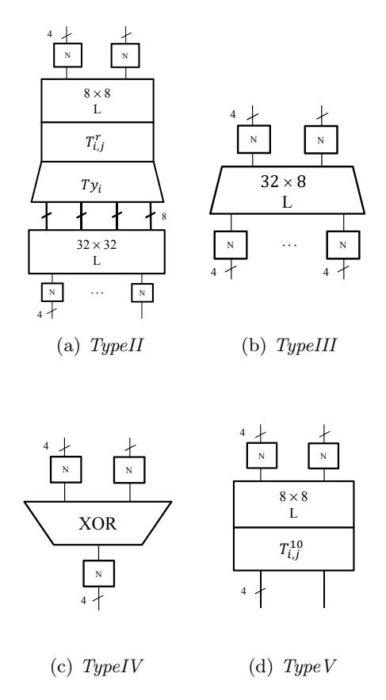

Fig. 1: Four types of lookup tables in Chow's WB-AES. L: linear transformation, N: nibble encoding/decoding.

values and the mask values as shown in Fig. 2. Next,  $TypeIV\_IIA$  combines the masked  $Ty_i$  value, and  $TypeIV\_IIB$  computes the round output by XORing the output value of  $TypeIV\_IIA$  and the mask used. This is the outline of CASE 1 [27] that provides the basic requirements of the past design of masked WB-AES, and Fig. 3 describes the table lookup overview.

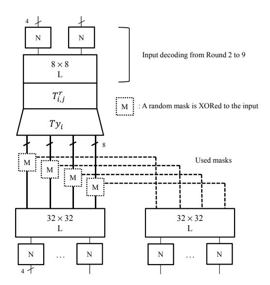

Fig. 2: TypeII-M in the past design of masked WB-AES.

Second, the nibble encodings were replaced by byte encodings for some inner round outputs depending on the security requirement (CASE 2 or 3). This is because the mask completely disappears in the round output after the masked outputs of MixColumns are XORed. However, the next section will review that the previous version of masked WB-AES is not effective to DCA-variant attacks.

### 3 Vulnerability to DCA variants

The customized implementation of masked WB-AES explained in the previous section was shown to be resistant to DCA attacks using one-byte key guess [23]. However, it was known to be vulnerable to DCA variants, including a 2-byte key guess and collision-based attacks. As pointed out previously, these attacks, unlike cryptanalysis, can be carried out without detailed information on the internal design of white-box cryptography.

Before going on, we note that Higher-order DCA [8] does not work on the customized version of the masked implementation that applies a different random

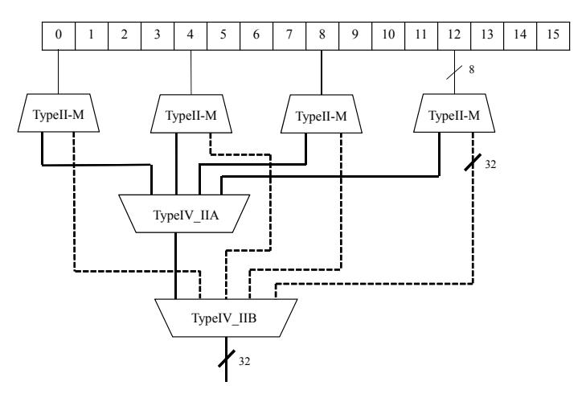

(a) TypeII-M and TypeIV II tables. Dashed line: used masks. (ShiftRows omitted)

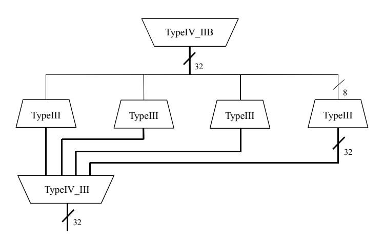

(b) TypeIII and TypeIV III tables.

Fig. 3: Overview of table lookups in CASE 1.

mask for each value of the target intermediate variable. In the case of Linear Decoding Analysis (LDA) [19], the key is analyzed by solving the system of linear equations that the matrix-unknown coefficient multiplication becomes the hypothetical intermediate value, where the matrix consists of intermediate values obtained from the corresponding computation traces. If the system is solvable for a hypothetical key, it is probably the correct key. Otherwise, if no solution is found for every hypothetical key, the attack fails. However, LDA is not allowed in masked WB-AES because the matrix is randomized due to the mask which makes the system unsolvable.

#### 3.1 DCA

Originally, CPA using Pearson's correlation coefficient is one of the power analysis methods to recover the key based on the fact that the power consumption is proportional or inversely proportional to the Hamming weight (HW) of the data currently being processed. Let denote N power traces by  $V_{1..N}[1..\kappa]$ , and a hypothetical key by k, where  $\kappa$  is the number of sample points. For K different hypothetical keys,  $\mathcal{E}_{n,k}$   $(1 \leq n \leq N, 0 \leq k < K)$  implies the power estimate in the n-th trace. Then, the estimator r at the j-th sample point is defined as

$$r_{k,j} = \frac{\sum_{n=1}^{N} (\mathcal{E}_{n,k} - \overline{\mathcal{E}_k}) \cdot (V_n[j] - \overline{V[j]})}{\sqrt{\sum_{n=1}^{N} (\mathcal{E}_{n,k} - \overline{\mathcal{E}_k})^2 \cdot \sum_{n=1}^{N} (V_n[j] - \overline{V[j]})^2}},$$

where  $\overline{\mathcal{E}_k}$  and  $\overline{V[j]}$  are means of  $\mathcal{E}_k$  and V[j], respectively [26]. The hypothetical key that produces the highest peak in the correlation plot is supposed to be the correct key.

This CPA attack was adapted to break white-box cryptography because the linear transformation and the nibble encoding are unable to eliminate correlation [2, 22]. In the repository of public white-box cryptographic implementations and DCA attacks [16], DCA also adapted CPA using Daredevil [10], a software tool to perform CPA. The difference from the classical power analysis is that DCA improved the efficiency of CPA by collecting noise-free computation traces instead of power traces collected by an oscilloscope. In average, DCA recovered 14.3 out of 16 subkeys from Chow's WB-AES using only 200 computation traces, whereas no key was recovered from masked WB-AES [23].

However, the CASE 1 implementation of the previous masked WB-AES cannot prevent DCA with a 2-byte key guess [31] exploiting the round output that is not masked, but only protected by linear transformations and nibble encodings. In order to reduce the key search space for a subbyte of the first round output from  $2^{32}$  to  $2^{16}$ , two bytes in a column of the plaintext state were fixed. Let denote  $(p_0, p_1, p_2, p_3)$  the first column of the plaintext state. By fixing  $p_0$  and  $p_1$  to 0, the first byte of the round output can be written as  $s = S(p_2 \oplus k_{2,2}^0) \oplus S(p_3 \oplus k_{3,3}^0) \oplus c$  for some constant c. Then, DCA with  $2^{16}$  key space is successful because  $S(p_2 \oplus k_{2,2}^0) \oplus S(p_3 \oplus k_{3,3}^0)$  is correlated to s which is in turn correlated to its encoded value.

#### 3.2 Collision Attack

Similarly, a collision-based DCA attack [31] can be also mounted with the 2<sup>16</sup> key space by fixing two input bytes. This is based on the fact that if a hypothetical subbyte of the round output collides for a pair of inputs, so does its encoded value in the computation trace. For each pair of inputs and their computation traces, an attacker compares the values of each sample position in the two traces and writes 1 in a collision computation trace (CCT) if the two values are equal; otherwise writes 0. To test for collision between CCT and attacker's hypothetical values, the collision prediction is composed of 0 and 1 that are assigned in the same way by comparing two hypothetical subbytes of the round outputs computed by each pair of the inputs and a hypothetical key. Thus, there is a perfect match between the target sample position in the CCT and the collision prediction for the correct hypothetical key. Contrary to a 2-byte key guess, the collision-based DCA attack is valid even if the byte encoding is used on the round output. Here, we do not take into account the improved mutual information analysis [31] because this is similar to the collision and succeeds if and only if the collision attack succeeds.

### 3.3 Bucketing Attack

Extended statistical bucketing analysis [34], as a variant of the collision attack, is based on the fact that if two correct hypothetical values computed by a pair of plaintexts do not collide, their corresponding encoded values should not collide as well. Bucketing Computational Analysis (BCA) applied this principle to whitebox cryptography using computation traces. For example, an attacker can divide the first subbyte of plaintexts into two sets with two distinct values according to the lower four bits of the S-box output. By fixing the remaining 15 bytes of the plaintext, the attacker can be convinced that the two sets of plaintexts produce disjoint sets of the lower four bits of the first subbyte in the first round output. This attack works on the CASE 1 of the previous masked WB-AES because the round output is not masked and protected by the nibble encoding. Thus, this attacker can confirm or deny a hypothetical key by observing whether or not the first subbyte in the round output is disjoint depending on the chosen-plaintext set.

Zero Difference Enumeration (ZDE) [4] may be considered similar to BCA. ZDE works by selecting special pairs of plaintexts that allow the significant number of intermediate values computed by the correct hypothetical key to be identical. However, this is known to be inefficient taking 500 × 2 <sup>18</sup> traces to recover a subkey of AES, and also the selected pairs of plaintexts are unable to make identical intermediate values in masked WB-AES.

# 4 New Design of Masked WB-AES

DCA-variant attacks on the previous masked WB-AES analyzed the round output in which the masks are removed. In this section, we propose a new design of masked WB-AES in order to protect each byte of the round output before encoding. To do so, a subbyte of the round output computed by partial bits of the key is masked, and the input decoding phase of the next round is modified to unmask it. The following explains how to design the lookup tables depending on the presence or absence of masking on the input and output, and how to connect other tables.

TypeII MO (Masked Out). This adds the random masks on the T y<sup>i</sup> outputs and encodes the masked values and the masks used. This is used in the first round because each subbyte of the first round output only involves 32 bits of the key. Note that all 128 bits of the key affect each subbyte of the round output after the output value of the second MixColumns multiplication is XORed. For the same reason, this is also used in the eighth round because each subbyte of the ninth round input needs to be protected by masking, as only six bytes of the key are associated with it in terms of decryption that goes back from ciphertexts.

The difference from TypeII-M used in the past design of masked WB-AES is the encoding on masks. As shown in Fig. 2 and Fig. 3, the masked T y<sup>i</sup> outputs were previously unmasked before the TypeIII lookup, and thus the intermediate value and the mask shared the same matrix for the linear transformation in order to take advantage of the distributive property of matrix multiplication over XOR.

Now, the mask is not immediately combined with the masked T y<sup>i</sup> outputs, but with the other mask values to provide the masked round output. Fig. 4a shows that 8×8 linear transformations are applied to the mask in TypeII MO because the masks are joined together between masks. This is because a mask is a random value generated in a uniform distribution and independent of the key, so there is no reason to apply a linear transformation of large diffusion effects. For this reason, the masks do not require the process of replacing linear transformations by TypeIII and TypeIV III, thereby reducing the overall table size and the number of lookups. Let denote TypeIV IIM the TypeIV table used to combine the mask connected by dotted lines in Fig. 4a.

On the other hand, the TypeIV II table combines only the masked T y<sup>i</sup> outputs that keep the round output secure as shown in Fig. 5a. After computing the masked round output above, TypeIII and TypeIV III replace the 32×32 linear transformation with 8×8 linear transformations like in the case of Chow's WB-AES. Then we have two 4×4 state matrices, vs (value state) and ms (mask state), where vs is the masked round output and ms is the mask value. This lookup sequence is illustrated in Fig. 7a.

TypeII MIMO (Masked In Masked Out). Because the first round output is masked, the TypeII table in the second round takes each byte of vs and ms as input. Then an input to T 2 can be computed by decoding and XORing those two bytes. In the second round, masking is again applied to the T y<sup>i</sup> outputs because not all key bits affect each intermediate value before combining the outputs of the second round MixColumns.

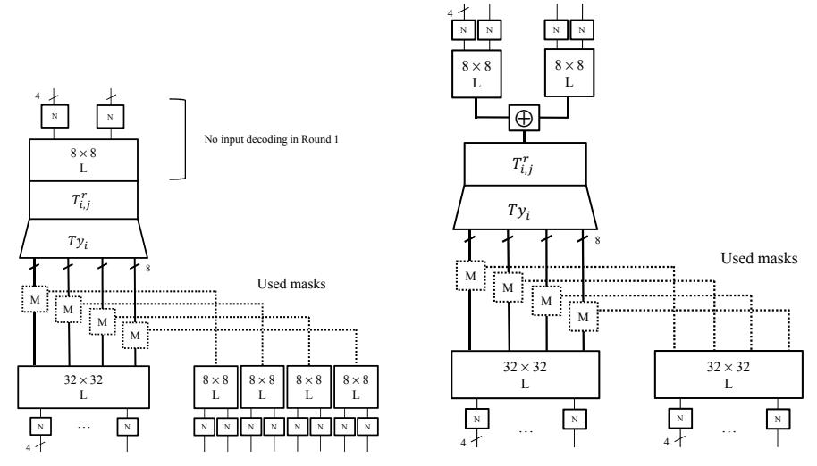

- (a) *TypeII\_MO*. No input decoding is performed for the first round because there is no external encoding.
- (b)  $TypeII\_MIMO$  in the second round.

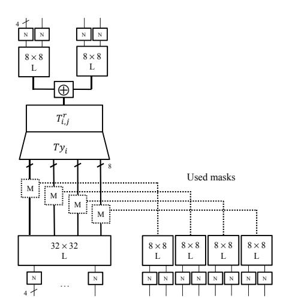

(c) TypeII\_MIMO in the ninth round.

Fig. 4: Modified  $\mathit{TypeII}$  tables for the masked outputs.

Here, we call it TypeII MIMO, which takes the masked input and provides the masked T y<sup>i</sup> outputs. TypeII MIMO is again divided into two types, depending on the linear transformation applied to the mask. If the masked round output is unmasked before looking up the TypeIII table, like in the case of the past design of masked WB-AES shown in Fig. 3a, a 32×32 linear transformation is applied. Otherwise, if the masked round output and the mask values are separated into vs and ms, and passed to the next round, an 8×8 linear transformation is applied. In the second round, unmasking is completed only after the XOR operations between the masked T y<sup>i</sup> outputs are finished. For this reason, a 32×32 linear transformation is applied to the mask in the second round as plotted in Fig. 4b, and the unmasking is conducted with the TypeIV tables as shown in Fig. 5b. The overall sequence of table lookups in the second round is shown in Fig. 7b. In addition, each subbyte of the ninth round output needs to be masked. This is because if the two subkeys hidden in T <sup>10</sup> of the final round are correctly guessed by the attacker, the hypothetical subbyte of the ninth round output computed inversely from the ciphertext will correlate with the corresponding subbyte of the encoded ninth round output. Thus, the masked T y<sup>i</sup> outputs and the masks are XORed and passed separately to the input of TypeV MI in the final round as shown in Fig. 5c and Fig. 7c. By abuse of notation, we continue to use the same names for TypeII MIMO and TypeIV IIM in the second and the ninth rounds for the simplicity although they differ in the linear transformation applied to the mask and the number of copies of the TypeIV table, respectively. The size of each table and the number of lookups are analyzed in the next section.

Remark. We note that masks should be generated uniformly at random. For each different pair of a masked value and a mask of the round inputs, different seeds of generating masks on T y<sup>i</sup> should be applied to prevent collision-based attacks.

TypeII . The TypeII table (Fig. 1a) for the rest of the inner rounds (third to seventh) is used in the same way as Chow's WB-AES, since masking is not applied to a byte computed by the entire key. The replacement of linear transformations are also processed in the same way with TypeIII and TypeIV III as depicted in Fig. 7d.

TypeV MI (Masked In). For the final round, the TypeV MI table is generated by decoding and XORing each byte of vs and ms to make an input byte to T <sup>10</sup> as shown in Fig. 6. Without the external encoding, each TypeV MI output becomes a subbyte of the ciphertext (Fig. 7e).

## 5 Evaluation

We evaluate the implementation of the proposed method in terms of security and performance. Security analysis includes the evaluation of protection against

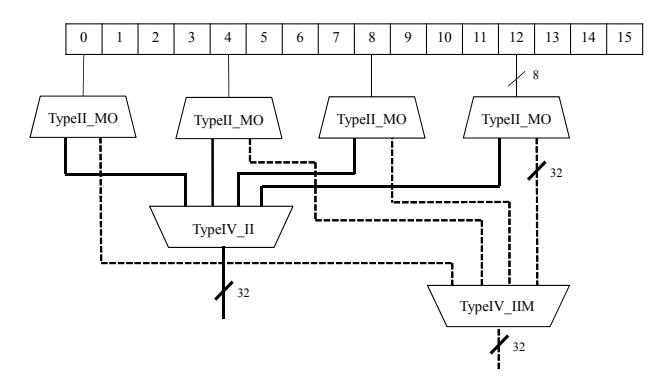

(a) TypeII MO and TypeIV in the first and eighth rounds.

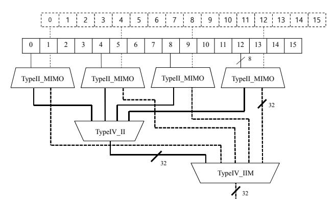

(b) TypeII MIMO and TypeIV in the second round.

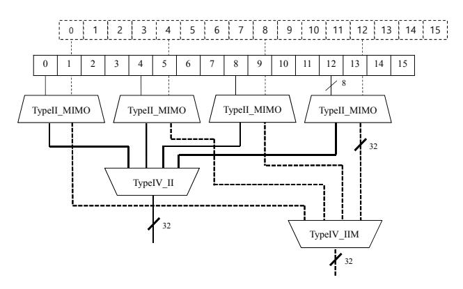

(c) TypeII MIMO and TypeIV in the ninth round.

Fig. 5: Masked round output and XOR. Solid line: masked value. Dotted line: mask.

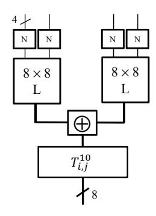

Fig. 6:  $TypeV_{-}MI$  in the final round.

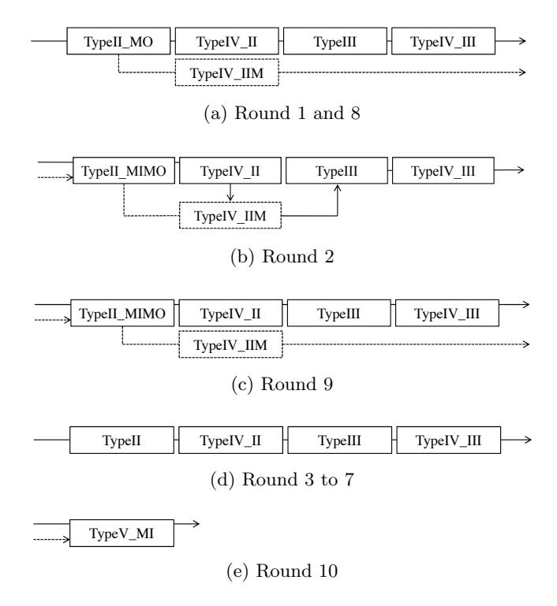

 ${\rm Fig.}\,7{\rm :}\,{\rm Lookup}$  sequence for each round. Solid arrow: masked value. Dotted arrow: mask.

of DCA and DCA variants described in Section 3, and performance analysis provides the table size and the number of lookups. To do so, we generated the lookup tables according to the proposed design of masked WB-AES, and conducted various experiments. First, the correlation between the TypeII MO value and the hypothetical value of the SubBytes output in the first round is analyzed with the Walsh transform. In addition, the correlation between the masked round output and the hypothetical round output computed by a 2-byte key guess is also analyzed. Next, a perfect match for a collision attack is tested on the masked round output. Finally, we check if the chosen plaintexts of the bucketing attacker can make disjoint sets on the masked round output when the hypothetical key is correct.

#### 5.1 Security Analysis

We analyze and demonstrate hereafter the protection against the vulnerabilities explained in Section 3. Before going on, we first show protection against DCA on the TypeII MO outputs in the first round. In fact, the masked T y<sup>i</sup> output in the first round is the same as the past version of masked WB-AES [23] proven secure against DCA. Consider a DCA attacker collecting the noise-free target values by accessing memory while the encryption is performed. This attacker learns the intermediate values from the computation traces, and runs a CPA attack as a subroutine to calculate Pearson's correlation coefficient with the hypothetical values. Here, the computation trace serves to provide noise-free information of intermediate values. If one can directly observe these noise-free values, the computation trace is not required, and the Walsh transform consisting of simple operations can be an alternative to CPA for calculating the correlation [23, 32]. For this reason, the Walsh transform defined below [32] is used here because we can directly access noise-free intermediate values from the lookup table.

Definition 1. Let x = hx1, . . ., xni, ω = hω1, . . ., ωni be elements of {0, 1} n and x·ω = x1ω1⊕. . .⊕xnωn. Let f(x) be a Boolean function of n variables. Then the Walsh transform of the function f(x) is a real valued function over {0, 1} n that can be defined as W<sup>f</sup> (ω) = Σx∈{0,1}<sup>n</sup> (−1)f(x)⊕x·ω.

Definition 2. Iff the Walsh transform W<sup>f</sup> of a Boolean function f(x1, . . . , xn) satisfies W<sup>f</sup> (ω) = 0, for 0 ≤ HW(ω) ≤ d, it is called a balanced d-th order correlation immune function or an d-resilient function.

In Definition 1, let x be a hypothetical intermediate value to be analyzed and ω be an operand of the inner product with the HW 1 selecting a specific bit of x. The reason why the HW of ω is 1 is that it is difficult to analyze the key by HW or multi-bit based correlation analysis due to the encodings, whereas single-bit analysis is successful. On the other hand, f(x) represents the real lookup values and provides the noise-free intermediate values like the computation trace. To indicate a particular bit of the *n*-bit lookup value, f(x) is represented as *n* Boolean functions. In Definition 2,  $W_{fi} = 0$  means no correlation, whereas a large absolute value of  $W_{fi}$  means that there is a large correlation at the *i*-th bit of f(x) and  $x \cdot \omega$ . Using this principle, the following shows that the proposed implementation can protect against DCA.

For the first subbyte  $p \in \{0,1\}^8$  of the plaintext and a hypothetical subkey k, the correlation between each bit of the hypothetical S-box output and its corresponding  $TypeH\_MO$  values can be quantified by

$$W_{fi}(\omega) = \sum_{p \in \{0,1\}^8} (-1)^{f_i(p) \oplus (s(p \oplus k) \cdot \omega)}$$

where  $f_i(p)$  is the *i*-th bit of the left 32-bit value of the  $TypeII\_MO$  output depicted in Fig. 4a. Because this equation tests all possible values of p, and we know  $f_i(p)$ , the correlation can be analyzed accurately as if it is analyzed by a large number of random plaintexts in DCA. Fig. 8 is the result of the Walsh transforms for the first subkey, and shows that the key leakage did not occur when each bit of the SubBytes output was analyzed. A DCA attack using 10,000 computation traces also failed as shown in Table 1.

Table 1: DCA ranking for the proposed method of masked WB-AES when conducting mono-bit CPA on the SubBytes output in the first round with 10,000 computation traces.

| SubKey<br>TargetBit | 1   | 2   | 3   | 4   | 5   | 6   | 7   | 8   | 9   | 10  | 11  | 12  | 13  | 14  | 15  | 16  |
|---------------------|-----|-----|-----|-----|-----|-----|-----|-----|-----|-----|-----|-----|-----|-----|-----|-----|
| 1                   | 216 | 5   | 39  | 111 | 148 | 132 | 176 | 199 | 246 | 66  | 69  | 104 | 25  | 86  | 72  | 208 |
| 2                   | 191 | 174 | 116 | 72  | 219 | 18  | 67  | 3   | 15  | 226 | 178 | 240 | 146 | 196 | 151 | 121 |
| 3                   | 90  | 144 | 170 | 201 | 182 | 4   | 29  | 81  | 166 | 120 | 237 | 124 | 227 | 159 | 216 | 226 |
| 4                   | 251 | 91  | 185 | 150 | 218 | 2   | 142 | 39  | 97  | 50  | 132 | 8   | 81  | 157 | 229 | 185 |
| 5                   | 45  | 173 | 192 | 101 | 10  | 146 | 45  | 33  | 177 | 206 | 136 | 14  | 135 | 71  | 22  | 234 |
| 6                   | 191 | 146 | 101 | 121 | 146 | 93  | 188 | 60  | 234 | 28  | 165 | 38  | 201 | 244 | 236 | 88  |
| 7                   | 38  | 252 | 16  | 188 | 105 | 222 | 185 | 69  | 124 | 21  | 50  | 100 | 44  | 101 | 3   | 215 |
| 8                   | 39  | 98  | 97  | 252 | 124 | 138 | 88  | 46  | 219 | 130 | 193 | 230 | 20  | 30  | 29  | 194 |

Second, a DCA attack with a 2-byte key guess can be protected. As explained previously, the first subbyte of the round output without masking can be represented by a function of  $p_2$  and  $p_3$  as

$$s(p_2, p_3) = S(p_2 \oplus k_{2,2}^0) \oplus S(p_3 \oplus k_{3,3}^0) \oplus c,$$

if the attacker fixes the first two bytes to zero in the first column of the plaintext state. In the case of the masked round output, this can be written by abuse of notation as

$$\hat{s}(p_2, p_3) = s(p_2, p_3) \oplus r_2(p_2) \oplus r_3(p_3) \oplus c_r,$$

where  $c_r$  is a fixed mask for c, and  $r_2$  and  $r_3$  are random bijections for choosing masks uniformly at random. Here, we note that  $r_i(p)$  does not mean that a

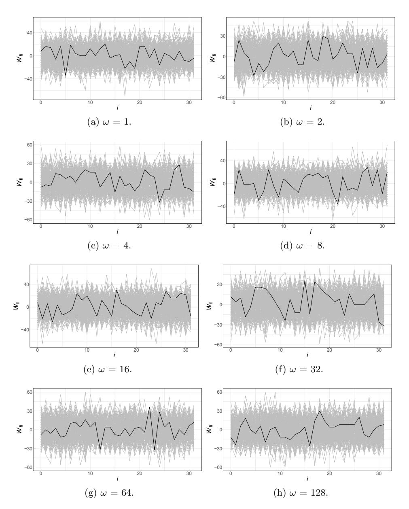

Fig. 8: The Walsh transforms on the TypeII MO outputs (except the mask) in the first round. Black: correct key; gray: wrong key.

random number is generated only by the input p. There should be other deterministic factors, such as masking information of the round input, for the secure pseudo-random number generator as pointed out previously. By representing  $r_2(p_2) \oplus r_3(p_3) \oplus c_r \oplus c$  as  $r(p_2, p_3)$ , which is a function of  $p_2$  and  $p_3$ , we have

$$\hat{s}(p_2, p_3) = S(p_2 \oplus k_{2,2}^0) \oplus S(p_3 \oplus k_{3,3}^0) \oplus r(p_2, p_3).$$

This can be rewritten as shown below by substituting the correct subkeys for  $k_{2,2}^0$  and  $k_{3,3}^0$ :

$$\hat{s}(p_2, p_3) = S(p_2 \oplus \theta x AA) \oplus S(p_3 \oplus \theta x FF) \oplus r(p_2, p_3).$$

Then, the first subbyte of the first round output obtained from  $TypeIV\_II$  can be expressed by  $\epsilon(\hat{s}(p_2, p_3))$ , where  $\epsilon$  is an encoding of the round output. Let's assume that the attacker already knows the subkey  $k_{2,2}^0 = \theta x A A$ , and the target hypothetical value is given by  $h(p_2, p_3, k)$  as follows:

$$h(p_2, p_3, k) = S(p_2 \oplus \theta x AA) \oplus S(p_3 \oplus k),$$

where k is a hypothetical subkey. Then, the correlation between  $\epsilon(\cdot)$  and  $h(\cdot)$  can be quantified by

$$W_{\epsilon_i}(\omega) = \sum_{p_2 \in \{0,1\}^8} \sum_{p_3 \in \{0,1\}^8} (-1)^{\epsilon_i(\hat{s}(p_2,p_3)) \oplus (h(p_2,p_3,k) \cdot \omega)},$$

where  $\epsilon_i(\cdot)$  is the *i*-th bit of  $\epsilon(\cdot)$ . Here, we know that  $\hat{s}(\cdot)$  will no longer correlate to  $h(\cdot)$  if  $r(p_2, p_3)$  generates a random byte with a uniform distribution. Our experimental result shows that DCA with a 2-byte guess cannot succeed even if the attacker is able to correctly guess the remaining subkey  $k = \theta x FF$  as shown in Fig. 9. In other words, this means that  $\hat{s}(\cdot)$  is not correlated to  $h(\cdot, k^*)$  due to the random masks, where  $k^*$  denotes the correct subkey.

Third, the collision attack is also not allowed because the perfect match between the target sample in the CCT and the hypothetical value computed from the correct hypothetical key will be violated in the masked round output. For four positive integers  $a,b,c,d \in \{0,1\}^8$ , suppose that  $h(a,b,k^*) = h(c,d,k^*)$ . Then, the perfect match for the collision attack is valid if and only if  $\epsilon(\hat{s}(a,b)) = \epsilon(\hat{s}(c,d))$  which in turn means  $\hat{s}(a,b) = \hat{s}(c,d)$  because  $\epsilon$  is deterministic and bijective. However, we know that  $\Pr[\hat{s}(a,b) = \hat{s}(c,d)] = 1/256$  because  $\Pr[r(a,b) = r(c,d)] = 1/256$ , and thus the perfect match is not guaranteed.

Let us demonstrate the perfect collision without masking on the round output. To do so, we collected the following set of pairs:

$$\mathcal{I}_v = \{(a,b) : a, b \in \{0,1\}^8 | h(a,b,k^*) = v, \text{ for } v \in \{0,1\}^8 \}.$$

Consider a vector  $Z_v = [z^1 z^2 \cdots z^\ell]$  defined as

$$z^i = \epsilon(s(a^i, b^i)), \forall (a^i, b^i) \in \mathcal{I}_v,$$

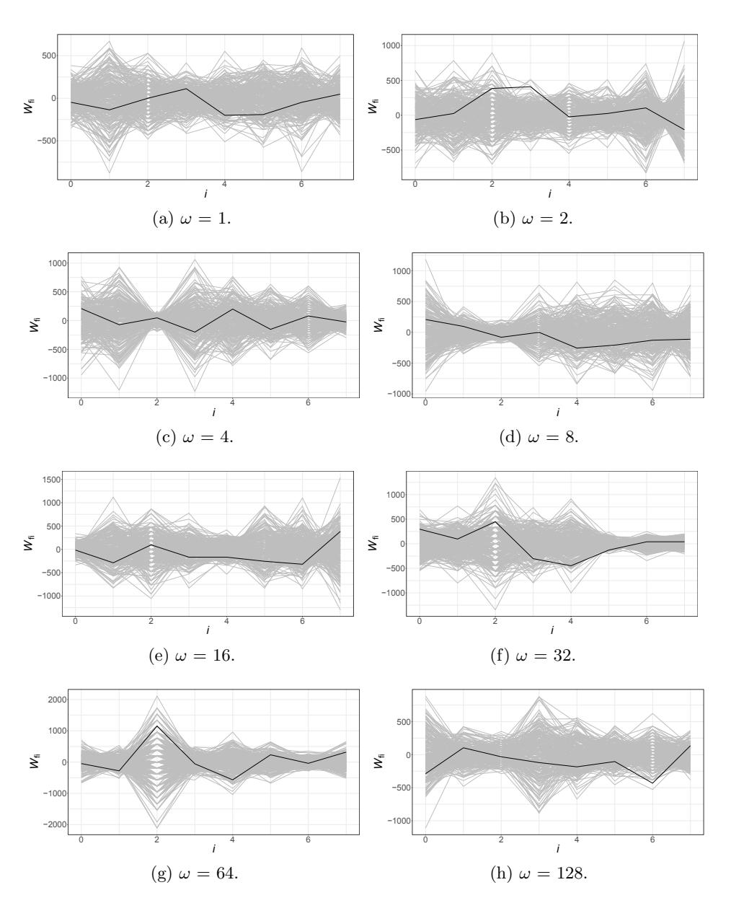

Fig. 9: The Walsh transforms on the masked round output in the first round. Black: correct key; gray: wrong key.

where  $\ell = |\mathcal{I}_v|$ . Let  $Z_*$  denote a vector consisting of  $\ell$  identical constants. The perfect match for the successful collision attack requires  $z^1 = z^2 = \cdots = z^{\ell}$  in  $Z_v$ , and the cosine similarity between  $Z_*$  and  $Z_v$  should be 1 because  $\cos(0^\circ) = 1$ . Indeed, Fig. 10a shows that the correct subkey shows the cosine similarity 1 when the round output is not masked. This implies the success of the collision attack.

To evaluate the effect of masking the round output, we generated the vector  $Z_v'$  as follows:

$$z^i = \epsilon(\hat{s}(a^i, b^i)), \forall (a^i, b^i) \in \mathcal{I}_v.$$

Then, the cosine similarity between  $Z_*$  and  $Z_v'$  for the correct subkey looks random like other wrong hypothetical subkeys as shown in Fig. 10b. This implies that the masked round output protects against the collision attack.

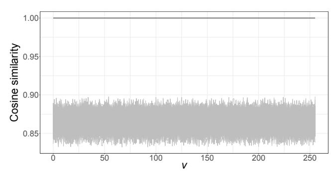

(a) Between  $Z_*$  and  $Z_v$  without round output masking.

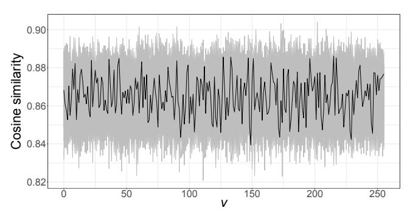

(b) Between  $Z_*$  and  $Z'_v$  with round output masking.

Fig. 10: Cosine similarity without and with masking on the round output. Black: correct key, gray: wrong key.

Finally, the bucketing attack can be also protected. Before going on, we begin with a demonstration of how it works on the CASE 1 in the past implementation

of masked WB-AES. For two bucket nibbles  $d_0, d_1 \in \{0, 1\}^4$  such that  $d_0 \neq d_1$ , a bucketing attacker defines two sets:

$$\mathcal{J}_{d_i} = \{ p \in \{0, 1\}^8 | s(p \oplus k) \& 0xF = d_i \},\$$

where  $i = \{0, 1\}$ , and k is a hypothetical key. Let  $[0\ 0\ p\ 0]^T$  be the first column of the plaintext state. Then, the lower four bits of the first subbyte in the first round output of AES-128 can be written as

$$g(p) = (s(p \oplus k^*) \oplus c) \& 0xF.$$

The bucketing attack is based on the fact that a correct subkey guarantees that  $\mathcal{B}_{b_0} \cap \mathcal{B}_{b_1} = \emptyset$ , where

$$\mathcal{B}_{b_i} = \{b_i | \forall p \in \mathcal{J}_{d_i}, g(p) = b_i\}.$$

Consider only the nibble encoding denoted by  $\delta$  on the round output without applying linear transformations:

$$g^{\delta}(p) = \delta(s(p \oplus k^*) \oplus c) \& 0xF.$$

Then, one can easily know that  $\mathcal{B}_{b_0}^{\delta} \cap \mathcal{B}_{b_1}^{\delta} = \emptyset$ , where

$$\mathcal{B}_{b_i}^{\delta} = \{b_i | \forall p \in \mathcal{J}_{d_i}, \ g^{\delta}(p) = b_i)\}.$$

For  $index = d_0 || d_1$ , such that  $d_0 < d_1$  (for removing duplicated bucket nibbles), our experimental result depicted in Fig. 11a shows that the correct key always guarantees that  $\mathcal{B}_{b_0}^{\delta}$  and  $\mathcal{B}_{b_1}^{\delta}$  are disjoint. This is in contrast to a result of  $\mathcal{B}_{b_0}^{\epsilon}$  and  $\mathcal{B}_{b_1}^{\epsilon}$  shown in Fig. 11b that has a number of intersection elements due to linear transformation providing the diffusion effect, where

$$g^{\epsilon}(p) = \epsilon(s(p \oplus k^*) \oplus c) \& 0xF$$

and

$$\mathcal{B}_{b_i}^{\epsilon} = \{b_i | \forall p \in \mathcal{J}_{d_i}, \ g^{\epsilon}(p) = b_i)\}.$$

Here, the bucketing attacker can find a key that most frequently makes  $\mathcal{B}_{b_0}^{\epsilon} \cap \mathcal{B}_{b_1}^{\epsilon} = \emptyset$ , because the wrong hypothetical keys never produced an empty set. Fig. 11c shows that the correct key  $(\theta x A A)$  has 96 indexes (out of 120) that lead to a disjoint set, and the other wrong hypothetical keys never make one. To evaluate the effect of the masked round output against the bucketing attack, we define  $\hat{g}$  for the lower four bits of the first subbyte in the masked round output as follows:

$$\hat{g}(p) = \epsilon(s(p \oplus k^*) \oplus c \oplus r(p) \oplus c_r) \& 0xF.$$

For each plaintext set  $\mathcal{J}_{d_i}$ , we collected the target four bits into the set  $\hat{\mathcal{B}}_{b_i}$  defined as

$$\hat{\mathcal{B}}_{b_i} = \{b_i | \forall p \in \mathcal{J}_{d_i}, \, \hat{g}(p) = b_i)\}.$$

Because r(p) generates random numbers, our experiment result shows that  $\hat{\mathcal{B}}_{b_0}$  and  $\hat{\mathcal{B}}_{b_1}$  are never disjoint for any pair of  $(d_0, d_1)$ , where  $d_0 < d_1$  (Fig. 12). Thus, the bucketing attack does not work on the proposed method.

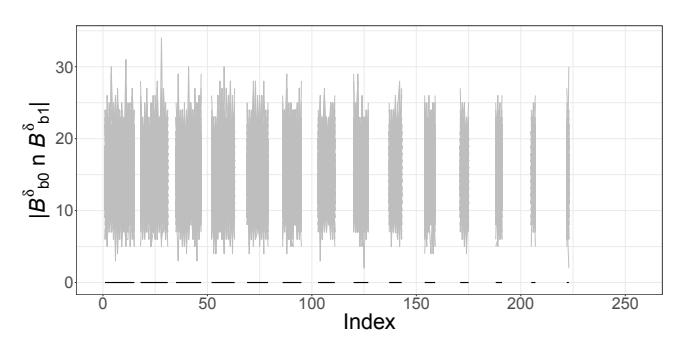

(a) With only the nibble encoding.

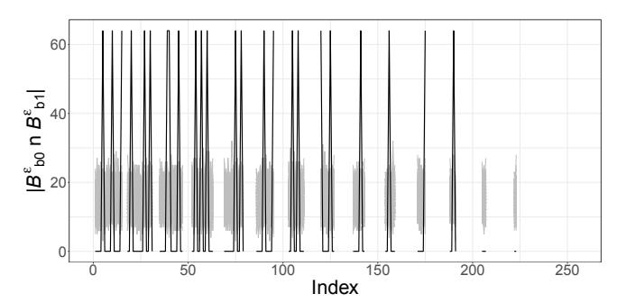

(b) With the nibble encoding and the linear transformation.

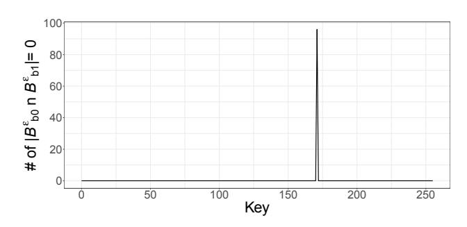

(c) Number of indexes making a disjoint set for each key.

Fig. 11: Bucketing attack on the previous WB-AES implementation. Black: correct key, gray: wrong key. Index = d0kd<sup>1</sup> such that d<sup>0</sup> < d1. The other indexes are undefined.

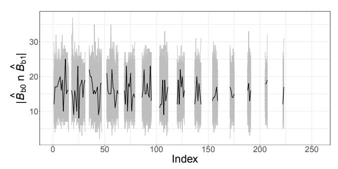

(a) No disjoint sets for any pair of (d0, d1), where d<sup>0</sup> < d1. Black: correct key, gray: wrong key.

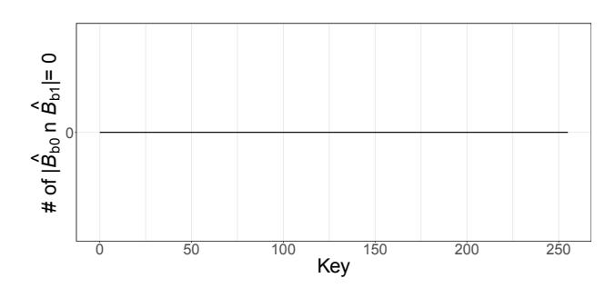

(b) Number of indexes making a disjoint set for each key. All are 0.

Fig. 12: Bucketing attack on the masked round output.

#### 5.2 Performance Analysis

The total table size of the proposed implementation is calculated as follows:

```
– TypeII MO : 2×4×4×256×4×2 = 65,536
– TypeII MIMO : 2×4×4×256×256×4×2 = 16,777,216
– TypeII : 5×4×4×256×4 = 81,920
– TypeIV IIM : 3×4×4×3×2×128 = 36,864
– TypeIV IIM : 4×4×4×2×128 = 16,384
– TypeIV II : 9×4×4×3×2×128 = 110,592
– TypeIII : 147,456
– TypeIV III : 110,592
– TypeV MI : 4×4×256×256 = 1,048,576.
```

Thus, the total size is 18,395,136 bytes (approximately 17.5 MB). The increased table size compared to the previous masked WB-AES is due to the use of tables that take a two-byte input. This total size is roughly 35.3 times and 3.7 times larger than Chow's WB-AES and the CASE 3 implementation of the previous masked WB-AES, respectively, but there are differences in the range of target attacks and protected rounds.

Note that we do not compare with CASE 1 and CASE 2 in the previous version of the masked implementation because these provide incomplete protection. The number of table lookups are counted as follows:

```
– TypeII MO : 2×4×4×2 = 64
– TypeII MIMO : 2×4×4×2 = 64
– TypeII : 5×4×4 = 80
– TypeIV IIM : 3×4×4×3×2 = 288
– TypeIV IIM : 4×4×4×2 = 128
– TypeIV II : 9×4×4×3×2 = 864
– TypeIII : 9×4×4 = 144
– TypeIV III : 9×4×4×3×2 = 864
– TypeV MI : 4×4 = 16.
```

Then, these are 2,512 lookups in total. This is 1.2 times and 0.7 times compared to Chow's WB-AES and the CASE 3 implementation, respectively. As a result, there is little difference in the number of lookups. Because of the relatively large size of the table, available memory space on the target device should be considered.

# 6 Conclusion and Future Work

Previously, a white-box cryptographic implementation combined the masking technique to protect against DCA attacks. This implementation eliminated all masks from the round output and applied byte encodings in some outer rounds, which resulted in vulnerabilities to DCA-variant attacks. In this paper, we also adapted masking techniques to the round output in order to depend against existing DCA variants. Based on the previous masked WB-AES, the several round outputs computed by partial bits of the key were masked, and each mask was removed in the input decoding of the next round. Our security evaluation showed that this method can protect against the known vulnerabilities.

The downside of this work is the memory requirement that is nearly four times larger than the previous masked WB-AES. Therefore, it would be expensive for low-cost devices with only a few hundred KB of memory, but it could be used for smart devices with enough memory space.

The attacks counteracted in this study were carried out using plaintexts and computation traces. Instead of stripping the encoding applied to white-box cryptography, those exploited either the correlation of the intermediate values remaining before and after the encoding or the bijectiveness of the encoding. Thus, a countermeasure to cryptanalysis stripping the encoding away by using internal design information should be adapted in order to offer a more reliable software implementation. Here, memory requirements also increase while defending various types of attacks, consuming a lot of resources in target devices. Therefore, a future work is to design a high-efficiency software countermeasure. For this purpose, it seems necessary to find a new encoding for white-box cryptography.

## References

- 1. Akkar, M., Giraud, C.: An Implementation of DES and AES, Secure against Some Attacks. In: Cryptographic Hardware and Embedded Systems - CHES 2001, Third International Workshop, Paris, France, May 14-16, 2001, Proceedings. pp. 309–318. No. Generators (2001), http://dx.doi.org/10.1007/3-540-44709-1\_26
- 2. Alpirez Bock, E., Brzuska, C., Michiels, W., Treff, A.: On the Ineffectiveness of Internal Encodings - Revisiting the DCA attack on White-box Cryptography. In: Applied Cryptography and Network Security - 16th International Conference, ACNS 2018, Proceedings. pp. 103–120. Lecture Notes in Computer Science (including subseries Lecture Notes in Artificial Intelligence and Lecture Notes in Bioinformatics), Springer, Germany (1 2018)
- 3. Axsan white-box cryptographic solution.: https://www.arxan.com/technology/ white-box-cryptography/
- 4. Banik, S., Bogdanov, A., Isobe, T., Jepsen, M.B.: Analysis of Software Countermeasures for Whitebox Encryption. vol. 2017, pp. 307–328 (2017), http://tosc. iacr.org/index.php/ToSC/article/view/596
- 5. Billet, O., Gilbert, H., Ech-Chatbi, C.: Cryptanalysis of a White Box AES Implementation. In: Selected Areas in Cryptography, 11th International Workshop, SAC 2004, Waterloo, Canada, August 9-10, 2004, Revised Selected Papers. pp. 227–240 (2004), http://dx.doi.org/10.1007/978-3-540-30564-4\_16
- 6. Biryukov, A., Udovenko, A.: Attacks and Countermeasures for White-box Designs. In: Peyrin, T., Galbraith, S.D. (eds.) Advances in Cryptology - ASIACRYPT 2018 - 24th International Conference on the Theory and Application of Cryptology and Information Security, Brisbane, QLD, Australia, December 2-6, 2018, Proceedings, Part II. Lecture Notes in Computer Science, vol. 11273, pp. 373–402. Springer (2018), https://doi.org/10.1007/978-3-030-03329-3\\_13

- 7. Bl¨omer, J., Guajardo, J., Krummel, V.: Provably Secure Masking of AES. In: Selected Areas in Cryptography, 11th International Workshop, SAC 2004, Waterloo, Canada, August 9-10, 2004, Revised Selected Papers. pp. 69–83 (2004), http://dx.doi.org/10.1007/978-3-540-30564-4\_5
- 8. Bogdanov, A., Rivain, M., Vejre, P.S., Wang, J.: Higher-Order DCA against Standard Side-Channel Countermeasures. In: Polian, I., St¨ottinger, M. (eds.) Constructive Side-Channel Analysis and Secure Design - 10th International Workshop, COSADE 2019, Darmstadt, Germany, April 3-5, 2019, Proceedings. Lecture Notes in Computer Science, vol. 11421, pp. 118–141. Springer (2019), https: //doi.org/10.1007/978-3-030-16350-1\\_8
- 9. Bos, J.W., Hubain, C., Michiels, W., Teuwen, P.: Differential Computation Analysis: Hiding your White-Box Designs is Not Enough. vol. 2015, p. 753 (2015), http://dblp.uni-trier.de/db/journals/iacr/iacr2015.html#BosHMT15
- 10. Bottinelli, P., Bos, J.W.: Computational Aspects of Correlation Power Analysis (2015), https://eprint.iacr.org/2015/260
- 11. Brier, E., Clavier, C., Olivier, F.: Correlation Power Analysis with a Leakage Model. In: Cryptographic Hardware and Embedded Systems - CHES 2004: 6th International Workshop Cambridge, MA, USA, August 11-13, 2004. Proceedings. Lecture Notes in Computer Science, vol. 3156, pp. 16–29. Springer (2004)
- 12. Chari, S., Jutla, C.S., Rao, J.R., Rohatgi, P.: Towards Sound Approaches to Counteract Power-Analysis Attacks. In: Wiener, M.J. (ed.) Advances in Cryptology - CRYPTO '99, 19th Annual International Cryptology Conference, Santa Barbara, California, USA, August 15-19, 1999, Proceedings. Lecture Notes in Computer Science, vol. 1666, pp. 398–412. Springer (1999), https://doi.org/10.1007/ 3-540-48405-1\\_26
- 13. Chow, S., Eisen, P., Johnson, H., Oorschot, P.C.V.: White-Box Cryptography and an AES Implementation. In: Proceedings of the Ninth Workshop on Selected Areas in Cryptography (SAC 2002). pp. 250–270. Springer-Verlag (2002)
- 14. Chow, S., Eisen, P.A., Johnson, H., van Oorschot, P.C.: A White-Box DES Implementation for DRM Applications. In: Security and Privacy in Digital Rights Management, ACM CCS-9 Workshop, DRM 2002, Washington, DC, USA, November 18, 2002, Revised Papers. pp. 1–15 (2002), http://dx.doi.org/10.1007/ 978-3-540-44993-5\_1
- 15. Coron, J., Goubin, L.: On Boolean and Arithmetic Masking against Differential Power Analysis. In: Cryptographic Hardware and Embedded Systems - CHES 2000, Second International Workshop, Worcester, MA, USA, August 17-18, 2000, Proceedings. pp. 231–237 (2000), http://dx.doi.org/10.1007/3-540-44499-8\_18
- 16. Deadpool. A repository of various public white-box cryptographic implementations and their practical attacks.: https://github.com/SideChannelMarvels/ Deadpool/
- 17. Gemalto white-box cryptographic solution.: https://sentinel.gemalto.com/ software-monetization/white-box-cryptography/
- 18. Goubin, L., Masereel, J., Quisquater, M.: Cryptanalysis of White Box DES Implementations. In: Selected Areas in Cryptography, 14th International Workshop, SAC 2007, Ottawa, Canada, August 16-17, 2007, Revised Selected Papers. pp. 278–295 (2007), http://dx.doi.org/10.1007/978-3-540-77360-3\_18
- 19. Goubin, L., Paillier, P., Rivain, M., Wang, J.: How to Reveal the Secrets of an Obscure White-Box Implementation. IACR Cryptology ePrint Archive 2018, 98 (2018), http://eprint.iacr.org/2018/098
- 20. InsideSecure white-box cryptographic solution.: https://www.insidesecure.com/ Products/Application-Protection/Software-Protection/WhiteBox

- 21. Kocher, P.C., Jaffe, J., Jun, B.: Differential Power Analysis. In: Advances in Cryptology - CRYPTO '99, 19th Annual International Cryptology Conference, Santa Barbara, California, USA, August 15-19, 1999, Proceedings. pp. 388–397 (1999), http://dx.doi.org/10.1007/3-540-48405-1\_25
- 22. Lee, S., Jho, N., Kim, M.: On the Linear Transformation in White-Box Cryptography. IEEE Access 8, 51684–51691 (2020)
- 23. Lee, S., Kim, T., Kang, Y.: A Masked White-Box Cryptographic Implementation for Protecting Against Differential Computation Analysis. IEEE Transactions on Information Forensics and Security 13(10), 2602–2615 (Oct 2018)
- 24. LEE, S.: A White-Box Cryptographic Implementation for Protecting against Power Analysis. IEICE Transactions on Information and Systems E101.D(1), 249–252 (2018)
- 25. Lepoint, T., Rivain, M., Mulder, Y.D., Roelse, P., Preneel, B.: Two Attacks on a White-Box AES Implementation. In: Selected Areas in Cryptography - SAC 2013 - 20th International Conference, Burnaby, BC, Canada, August 14-16, 2013, Revised Selected Papers. pp. 265–285 (2013), http://dx.doi.org/10.1007/ 978-3-662-43414-7\_14
- 26. Mangard, S., Oswald, E., Popp, T.: Power Analysis Attacks: Revealing the Secrets of Smart Cards (Advances in Information Security) (2007)
- 27. Masked WB-AES CASE1 sample binary.: https://github.com/ SideChannelMarvels/Deadpool/tree/master/wbs\_aes\_lee\_case1
- 28. Messerges, T.S.: Securing the AES Finalists Against Power Analysis Attacks. In: Fast Software Encryption, 7th International Workshop, FSE 2000, New York, NY, USA, April 10-12, 2000, Proceedings. pp. 150–164 (2000), http://dx.doi.org/10. 1007/3-540-44706-7\_11
- 29. Michiels, W., Gorissen, P., Hollmann, H.D.L.: Cryptanalysis of a Generic Class of White-Box Implementations. In: Selected Areas in Cryptography, 15th International Workshop, SAC 2008, Sackville, New Brunswick, Canada, August 14- 15, Revised Selected Papers. pp. 414–428 (2008), http://dx.doi.org/10.1007/ 978-3-642-04159-4\_27
- 30. Mulder, Y.D., Wyseur, B., Preneel, B.: Cryptanalysis of a Perturbated White-Box AES Implementation. In: Progress in Cryptology - INDOCRYPT 2010 - 11th International Conference on Cryptology in India, Hyderabad, India, December 12-15, 2010. Proceedings. pp. 292–310 (2010), http://dx.doi.org/10.1007/ 978-3-642-17401-8\_21
- 31. Rivain, M., Wang, J.: Analysis and Improvement of Differential Computation Attacks against Internally-Encoded White-Box Implementations. IACR Trans. Cryptogr. Hardw. Embed. Syst. 2019(2), 225–255 (2019), https://doi.org/10.13154/ tches.v2019.i2.225-255
- 32. Sasdrich, P., Moradi, A., G¨uneysu, T.: White-Box Cryptography in the Gray Box - - A Hardware Implementation and its Side Channels -. In: Fast Software Encryption - 23rd International Conference, FSE 2016, Bochum, Germany, March 20-23, 2016, Revised Selected Papers. pp. 185–203 (2016), http://dx.doi.org/10.1007/ 978-3-662-52993-5\_10
- 33. Wyseur, B., Michiels, W., Gorissen, P., Preneel, B.: Cryptanalysis of White-Box DES Implementations with Arbitrary External Encodings. In: Selected Areas in Cryptography, 14th International Workshop, SAC 2007, Ottawa, Canada, August 16-17, 2007, Revised Selected Papers. pp. 264–277 (2007), http://dx.doi.org/ 10.1007/978-3-540-77360-3\_17

34. Zeyad, M., Maghrebi, H., Alessio, D., Batteux, B.: Another Look on Bucketing Attack to Defeat White-Box Implementations. In: Constructive Side-Channel Analysis and Secure Design - 10th International Workshop, COSADE 2019, Darmstadt, Germany, April 3-5, 2019, Proceedings. pp. 99–117 (2019), https://doi.org/10. 1007/978-3-030-16350-1\\_7