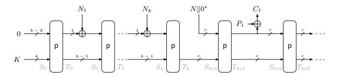
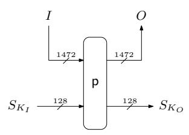
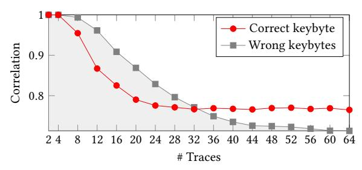
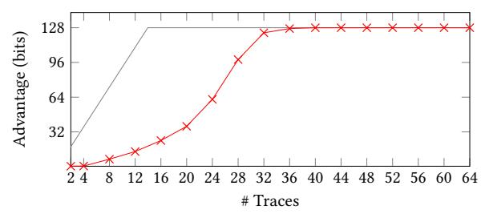
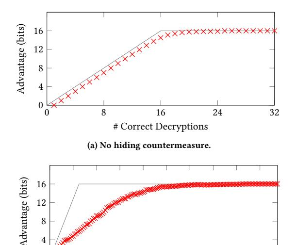

## Leakage and Tamper Resilient Permutation-Based Cryptography

## [Christoph Dobraunig](https://orcid.org/0000-0002-3816-0187)

Graz University of Technology and Lamarr Security Research Austria christoph@dobraunig.com

## [Bart Mennink](https://orcid.org/0000-0001-6679-1878)

Digital Security Group, Radboud University The Netherlands b.mennink@cs.ru.nl

## [Robert Primas](https://orcid.org/0000-0002-9569-8477)

Graz University of Technology Austria rprimas@proton.me

#### ABSTRACT

Implementation attacks such as power analysis and fault attacks have shown that, if potential attackers have physical access to a cryptographic device, achieving practical security requires more considerations apart from just cryptanalytic security. In recent years, and with the advent of micro-architectural or hardwareoriented attacks, it became more and more clear that similar attack vectors can also be exploited on larger computing platforms and without the requirement of physical proximity of an attacker. While newly discovered attacks typically come with implementation recommendations that help counteract a specific attack vector, the process of constantly patching cryptographic code is quite time consuming in some cases, and simply not possible in other cases.

What adds up to the problem is that the popular approach of leakage resilient cryptography only provably solves part of the problem: it discards the threat of faults. Therefore, we put forward the usage of leakage and tamper resilient cryptographic algorithms, as they can offer built-in protection against various types of physical and hardware oriented attacks, likely including attack vectors that will only be discovered in the future. In detail, we present the — to the best of our knowledge — first framework for proving the security of permutation-based symmetric cryptographic constructions in the leakage and tamper resilient setting. As a proof of concept, we apply the framework to a sponge-based stream encryption scheme called asakey and provide a practical analysis of its resistance against side channel and fault attacks.

#### CCS CONCEPTS

• Security and privacy → Side-channel analysis and countermeasures; Tamper-proof and tamper-resistant designs; Embedded systems security; Block and stream ciphers.

#### KEYWORDS

leakage resilience, accumulated leakage, sponge-based encryption, side channel measurements, fault attacks

#### ACM Reference Format:

Christoph Dobraunig, Bart Mennink, and Robert Primas. 2022. Leakage and Tamper Resilient Permutation-Based Cryptography. In Proceedings of the 2022 ACM SIGSAC Conference on Computer and Communications Security

Permission to make digital or hard copies of part or all of this work for personal or classroom use is granted without fee provided that copies are not made or distributed for profit or commercial advantage and that copies bear this notice and the full citation on the first page. Copyrights for third-party components of this work must be honored. For all other uses, contact the owner/author(s).

CCS '22, November 7–11, 2022, Los Angeles, CA, USA © 2022 Copyright held by the owner/author(s). ACM ISBN 978-1-4503-9450-5/22/11.

<https://doi.org/10.1145/3548606.3560635>

(CCS '22), November 7–11, 2022, Los Angeles, CA, USA. ACM, New York, NY, USA, [16](#page-15-0) pages. <https://doi.org/10.1145/3548606.3560635>

### 1 INTRODUCTION

In the 1990's, implementation attacks like side channel attacks [\[46\]](#page-14-0) and fault attacks [\[16\]](#page-13-0) have demonstrated that, while a cryptographic algorithm may be mathematically secure, its real world instance may still be broken quite easily. Hence, whenever devices operate in environments where attackers have physical access, countermeasures against side channel and fault attacks are of utmost importance. This is a major real-world concern: with the rise of the Internet of Things (IoT), devices performing cryptographic tasks have become ubiquitous, and many of them are physically accessible by attackers.

However, in recent years, it became more and more apparent that for performing side channel or fault attacks, the physical presence of an attacker is not a necessity. In particular, it turned out that micro-architectural attacks [\[37\]](#page-14-1) or hardware-oriented attacks can achieve similar effects, are entirely software controlled, and can thus often be performed even remotely. First successful remote side channel attacks exploited timing variations due to caching in modern CPU's, and have been shown to work on implementations of DES [\[74\]](#page-15-1) and AES [\[4\]](#page-13-1). Recently, even software-based DPA attacks on the AES instruction of modern CPU's have been proven to be feasible [\[48\]](#page-14-2). Remote fault attacks have further been shown to work quite easily by exploiting bit-faults in RAM [\[38,](#page-14-3) [39,](#page-14-4) [47,](#page-14-5) [77\]](#page-15-2). The recent Plundervolt attack [\[58\]](#page-14-6) has even demonstrated that remotely triggered fault attacks can extract the secret key from AES executions performed in secured enclaves.

The usual way of mitigating these newly discovered attacks involves updating, e.g., the microcode of CPUs, or providing software patches. However, some attacks like RowHammer [\[44,](#page-14-7) [62\]](#page-14-8), work due to the RAM's physical properties and are hard to patch without losing too much performance. Moreover, it is quite likely that not every attack vector, be it a physical one or a remote one, is discovered yet. Because of these reasons, it might be useful to put more focus on cryptographic algorithms that provide a certain amount of resilience against side channel and fault attacks, not only in their "classical" embedded environments but also in general, and as a second line of defense.

One popular approach to the design of cryptographic algorithms that withstand side channel attacks is the concept of leakage resilient cryptography [\[29\]](#page-14-9). The goal of this research direction is to design modes of operation that are provably secure under specific assumptions on the leakage an adversary can receive. Leakage resilience gave rise to cryptographic schemes with very strong security guarantees, for example, modes of operation that are provably secure against all side channel attacks assuming that the leakage in

each round is bounded [63]. Hence, it has attracted the interest of a lot of researchers proposing several leakage resilient symmetric cryptographic schemes [3, 6, 7, 25, 28, 32, 53, 61, 78, 79].

Leakage resilient schemes come with some modeling of leakage, for example, with the assumption that the leakage is bounded [29] or hard-to-invert [27]. Showing that an assumption on the leakage actually holds, turns out to be quite hard, and in practice, side channel analysis of leakage resilient schemes typically just considers which side channel attacks can be performed. See, e.g., work on evaluating the security of a leakage resilient pseudo random function [54, 55, 75, 76]. One attempt that has been made to bring the theory of leakage resilient cryptography closer to practice is simulatable leakage [70]. The high-level idea of simulatable leakage is to consider the distance of a cryptographic scheme from a simulator that does not possess the key, but that still generates leakage that is indistinguishable from the device using the actual key. However, Longo et al. [50] pointed out some obstacles with the practical realization of such simulators, and — to the best of our knowledge — the instantiation of simulators is still an open problem. On the downside, the promises delivered by leakage resilience focus on various assumptions on the leakage, but typically do not consider fault attacks. Hence, the so gotten schemes provide provable security against certain types of side channel attacks, but do not provide any insurance against fault attacks, or any other attack that leaks entropy of a state in general. Especially in the remote scenario there is no reason for an attacker to not use fault attacks if it is possible to induce faults, e.g., by using RowHammer [39, 44].

If we look at existing leakage resilient constructions, we see that independent of the modeling of the leakage, all these constructions aim to limit the number of observations an attacker can make per evaluation of an underlying primitive using a certain key. Considering this from an implementation attack perspective, such limitations on the number of observations make a lot of sense. Attacks like statistical fault attacks (SFA) [34], statistical ineffective fault attacks (SIFA) [19, 20], or differential power analysis (DPA) [46] get better with increasing data complexity an attacker is able to exploit per secret state it tries to recover. Complementing that, these attacks can also get better with the number of observations where the input, as well as the secret of the underlying primitive, remain the same. For instance, such observations can be used to reduce the noise of traces used in a DPA, simple power analysis (SPA), or template attack [52]. Fault attacks can also utilize different faults on executions with the same input, like differential fault attacks (DFA) [16].

#### 1.1 Accumulated Interference (AI)

In this paper, we take a different approach and aim to model the impact of implementation attacks more broadly. We do so by introducing the concept of accumulated interference (AI) that allows us to abstract side channel attacks and fault attacks in the leakage resilient analysis. In a nutshell, accumulated interference models an entropy loss of the associated states of a cryptographic permutation by learning information about the associated states via side channel and fault attacks, or basically by any possible setting in which leakage occurs. Accumulated interference, as we formalize in Section 2,

aims to express the *accumulated gain* during an experiment. It is a function in terms of all information an attacker has observed so far by using side channel *and* fault attacks, and it changes in the course of the attack. Then, the goal of the analysis of a leakage and tamper resilient scheme in the accumulated interference model is to provide a limit on the data complexity for the underlying primitives. This way of modeling side channel and fault attacks allows to either evaluate the capabilities of an attacker "a posteriori" on a real implementation, or fully define a model "a priori" akin to the bounded leakage model in the non-adaptive or adaptive leakage setting, with the bonus that accumulated interference covers fault attacks as well. This way, our approach is backwards compatible, but at the same time more general as it allows for more accurate modeling. We will discuss these features of accumulated interference and how it can be used in practice, below.

## 1.2 Coverage of Fault Attacks

Typical methods in leakage resilient cryptography aim to precisely model the gain an attacker can get with the help of the physical leakage. For instance, in the bounded leakage model the leakage function can be any arbitrary function of the secret state with bounded output length, or any function that preserves some min-entropy of the secret state. Later, hard-to-invert leakage was introduced, which, on a high level, requires that the leakage has the property that even under knowledge of the leakage, the secret state is hard to guess [27, 35]. This model, intuitively, corresponds to requiring that a certain pseudo-entropy of the secret state, i.e., the amount of information that the secret state has from the viewpoint of a computationally bounded attacker, should be preserved.

However, these attempts to model the gain an attacker can get from physical leakage leave out the threat of fault attacks. This is a weak point in existing approaches, since in scenarios where side channel attacks are applicable, an attacker can typically also apply a wider range of implementation attacks, such as fault attacks. Hence, our concept of accumulated interference does not aim to model the physical leakage prior to an implementation attack, but rather at the end of the attack. Therefore, accumulated interference is agnostic to the type of implementation attack and hence our results are naturally applicable to a wide range of attack scenarios, including fault attacks.

In contrast to work only covering passive side channel attacks, we also consider the fact that in fault attacks, an attacker does not only learn information about the secret states but is also able to change computations. As our building blocks are cryptographic permutations, we can model this effect of faults as an entropy loss of the computed permutation output by  $\tau \geq 0$  bits. This covers a wide range of faults, including biased faults, or setting  $\tau$  bits of the output of a permutation to zero. This model can also include attacks that alter the program flow, by, e.g., not computing the permutation and effectively replacing it by the identity function. Then,  $\tau$  corresponds to the width b of the permutation. Unfortunately, this then typically means that such a strong attacker can break the scheme. Interestingly, bit-flips or random faults often do not directly change the entropy of the permutations output. However, they do allow an attacker to learn information about the output and hence, are covered within the accumulated interference.

## 1.3 A Priori Bounding of AI

One way to approach accumulated interference is by bounding it a priori. In this approach, one assumes that each evaluation of a cryptographic permutation allows an attacker to reduce the secret state's entropy by at most  $\lambda \geq 0$  bits, and these linearly add up for multiple evaluations in order to give the accumulated gain. This means that per evaluation, an attacker can at most learn a total of  $\lambda$  bits of information of the secret state, influence  $\lambda$  bits of information of the secret state, or a partial combination of both. Details about this approach are outlined in Section 2.3. This approach is comparable to the one that has usually been adopted in leakage resilient proofs with bounded leakage. It is a clean approach and allows to reason about leakage in a quite simple way. On the other hand, it is not hard to see that it is a conservative way of estimating adversarial power.

#### 1.4 A Posteriori Evaluation of AI

Alternatively, we can bound the actual effect of implementation attacks *a posteriori*. This approach allows us to discard many restrictions imposed by typical leakage resilience analysis. As a pleasant bonus, this also evades the debate on whether adaptive or non-adaptive leakage must be considered: it is covered within the accumulated gain.

Note that this stands in sharp contrast with bounded or hard-toinvert leakage, where the leakage per query is generously bounded. For example, in the bounded leakage model, one assumes that each evaluation leaks at most  $\lambda \geq 0$  bits of secret data, and these linearly add up for multiple evaluations. For the sake of comparison, consider the following example. Take a permutation p processing some input M concatenated with a secret key K:  $p(M||K) \oplus M||K$ . Let us assume that an adversary can learn evaluations of  $p(M||K) \oplus$  $M \parallel K$  for secret K. In the bounded leakage model, one assumes that each evaluation leaks  $\lambda$  bits of data, but this means that after  $|K|/\lambda$ evaluations, the security of the scheme is void. In contrast, in the accumulated interference model, one assumes that up to the i-th query, the attacker has learned  $f_i$  bits of data, which is a function of all information the attacker has observed so far. These values  $f_1, f_2, \ldots$  remain yet undetermined, and must be substantiated with implementation attack experiments. Comparing both approaches, necessarily  $f_i \leq i \cdot \lambda$ , but typically, the difference is much larger as we will demonstrate in our practical experiments (see also Section 1.6).

#### 1.5 Application of AI

We demonstrate how the concept of accumulated interference can be incorporated in leakage and tamper resilience analyses. Here, we stress that, despite the fact that AI can truly cover any type of entropy loss, side channels and tampering are the most well-known and most threatening types of attacks. In Section 3 we apply accumulated interference to a nonce-based stream encryption scheme called asakey. The asakey encryption mode is derived from the encryption part of ISAP [21, 22] and is a logical way of performing encryption with the sponge: it initializes a sponge state with a secret key, then it absorbs the nonce bit-by-bit to obtain a secret inner part of the sponge that is used "as a key" to a plain nonce-based sponge encryption mode with high rate. By doing a direct analysis

of asakey and by in addition confiding on the accumulated interference model, we obtain a bound that (i) is simpler than the one that would be obtained by relying on the general leakage resilience of the duplex [25] modularly, and that (ii) covers also fault attacks.

#### <span id="page-2-0"></span>1.6 Justification of AI

In Section 4, we perform an exemplary analysis of an implementation of the asakey scheme of Section 3 instantiated with the Keccarp[1600,12] permutation [59] as used by Kangarootwelve [14] and Keyak [13]. We analyze the implementation using the two attack vectors of differential power analysis (DPA) [46] and statistical ineffective fault attacks (SIFA) [19, 20]. Those results show that a bounded leakage approach is often way too optimistic from an attackers point of view on how information of single leakages (experiments) can be combined.

As an example, have a look at Figure 3b in Section 4. The graph shows how security degrades with the number of queries assuming  $\lambda$ -bit leakage per query and how it typically degrades in an implementation attack which can also be expressed in accumulated interference. It shows that a bound of  $f_i \leq i \cdot \lambda$  is generally quite loose.

In order to get the best possible picture on the security in the accumulated interference model, it is important to utilize the attack vectors as good as possible. Hence, e.g., work that aims to bound model errors in side channel attacks is also relevant in our context [17].

#### 1.7 Limitations of the Framework

Let us consider non-leakage and tamper resilient proofs for modes of operations in cryptography. Here, the security of the mode of operation is proven under assumptions on the underlying primitive. For instance, we require a primitive to behave like a pseudo-random permutation (PRP), or to fulfill some property, like having  $\epsilon\text{-xor-universality}$ . For an instantiation of the mode of operation, the primitive used within this mode must fulfill the assumptions. In the case of assumptions like PRP, this is a 1 or 0 condition, a block cipher is either a PRP (within certain limits) or not. However, with  $\epsilon\text{-xor-universality}$ , this question is more fine-grained since any value  $\epsilon$  gives understandable security properties. What the proof does not do is to take over the construction and the cryptanalysis of the underlying primitive.

We think that AI in combination with the entropy loss  $\tau$  in this framework are comparable to the relaxations you get from  $\epsilon$ -xoruniversality. For instance, non-leakage and tamper resilient modes of operation assume and require all components to be leak-free and tamper resilient. Taking an extreme standpoint, the proofs are void in case of minimal leakage from the implementation. In contrast, AI and  $\tau$  relax the requirements on the implementation of the underlying primitive. Similar to the example with  $\epsilon$ -xor-universality, one gets understandable security properties under leakage. What our proofs do not do is to take over the art of implementing ciphers and doing the analysis of the implementations. The proof just gives the assurance that implementations are allowed to leak, or be tampered with, to some extend while still remaining secure.

## <span id="page-3-0"></span>2 A FORMALIZATION OF IMPLEMENTATION ATTACKS

Let m, n be two natural numbers. We denote by  $\{0, 1\}^n$  the set of n-bit strings and by  $\{0, 1\}^*$  the set of arbitrarily long strings. The set of n-bit permutations is denoted perm(n). Similarly, the set of m-to-n-bit functions is denoted func(m, n). If  $m \le n$ , for string  $X \in \{0, 1\}^n$  we denote by leftm(X) the m leftmost bits of X and by rightm(X) the m rightmost bits. For a finite set  $X, X \xleftarrow{s} X$  denotes the event of uniformly randomly sampling an element X from X.

We will be concerned with adversaries A that are given access to one or more oracles O, and after interaction with O they output a decision bit  $b : b \leftarrow A^O$ . For two oracles O and P, the adversarial advantage of distinguishing the two is defined as

$$\Delta_{A}\left(O\;;\;P\right)=\left|\text{Pr}\left(1\leftarrow A^{O}\right)-\text{Pr}\left(1\leftarrow A^{P}\right)\right|\;.\tag{1}$$

## 2.1 Leakage and Tamper Resilience

Let F be a cryptographic function with key size k. Let ro be a random oracle with the same interface as  $F_K$ . In a black-box scenario, one quantifies security of F as the advantage of an adversary A in distinguishing  $F_K$  for  $K \stackrel{\$}{\leftarrow} \{0,1\}^k$  from a random oracle ro:

$$Adv_{\mathsf{F}}^{\mathsf{bb}}(\mathsf{A}) = \Delta_{\mathsf{A}}(\mathsf{F}_K \; ; \; \mathsf{ro}) \; . \tag{2}$$

The adversary is typically bounded by a certain query complexity and time complexity (memory is usually not considered). A comparable definition occurs in the ideal primitive model. Suppose that F is based on a random permutation  $p \stackrel{\$}{\leftarrow} perm(b)$  for some natural number b. The adversary would, in addition to the oracle  $F_K$  or ro in (2), have bi-directional access to the random permutation p:

$$\mathbf{Adv}_{\mathsf{F}}^{\mathsf{i}\text{-}\mathsf{bb}}(\mathsf{A}) = \Delta_{\mathsf{A}}\left(\mathsf{F}_{K}^{\mathsf{p}},\mathsf{p}^{\pm}\;;\;\mathsf{ro},\mathsf{p}^{\pm}\right)\;. \tag{3}$$

The time complexity is then called primitive complexity and measures queries to p.

In the context of leakage resilient cryptography [3, 28, 29, 32, 63, 71, 79], the adversary gets access to a leaky version of the function  $F_K$  denoted as  $L[F_K]$ . Since we also consider that an attacker can tamper (fault), we will instead consider an extended function, namely a leaky tampered, or more broadly *interference* function:

$$\mathsf{I}\left[\mathsf{F}_{K}\right]$$
 .

The function evaluates a tampered version of  $\mathsf{F}_K$  and in addition leaks certain secret information to the adversary. Now, the adversary has to distinguish the challenge oracle  $\mathsf{F}_K$  from random ro as before, but *in addition* it gets access to  $\mathsf{I}\left[\mathsf{F}_K\right]$ . The resulting advantages are then expressed as

$$\mathbf{Adv}_{\mathsf{F}}^{\mathrm{ai}}(\mathsf{A}) = \Delta_{\mathsf{A}}\left(\mathsf{I}\left[\mathsf{F}_{K}\right],\mathsf{F}_{K}\;;\;\mathsf{I}\left[\mathsf{F}_{K}\right],\mathsf{ro}\right) \tag{4}$$

for the standard model, and

$$\mathbf{Adv}_{F}^{i\text{-}ai}(\mathsf{A}) = \Delta_{\mathsf{A}}\left(\mathsf{I}\left[\mathsf{F}_{K}^{p}\right],\mathsf{F}_{K}^{p},\mathsf{p}^{\pm}\;;\;\mathsf{I}\left[\mathsf{F}_{K}^{p}\right],\mathsf{ro},\mathsf{p}^{\pm}\right)\;. \tag{5}$$

for the ideal model. Naturally, the adversary is not allowed to query the leaky tampered and the challenge oracle on identical inputs. This restriction might sound counter-intuitive, but this is the mainstream model for security under bounded leakage (see also Faust et al. [32] and Barwell et al. [3, Section 2.1]). The core idea is that the adversary gets access to a true (leaky) oracle and a challenge oracle. The scheme is considered secure even if the attacker learns a certain amount of information from earlier leaky evaluations, while new evaluations (to the challenge oracle) are hard to distinguish from random. If we would allow queries in the ideal world to I  ${\sf F}_K^{\sf P}$  and ro on identical inputs, this would give a trivial win to the adversary, since, e.g., the leakage will not be coherent with the output of ro.

## 2.2 Accumulated Interference (AI)

So far, we did not specify *how* leakage occurs in calls to  $\mathsf{I}[\mathsf{F}_K]$ . In the accumulated interference model, we define the *accumulated* gain that represents leakage and tampering, basically the entropy loss, that has occurred. We remark that this modeling straightforwardly generalizes to pseudo-entropy loss, noting that measuring the entropy is slightly more generous to the adversary.

Generally, suppose that for a certain secret state that is input to a cryptographic primitive, the adversary has obtained q leakages from executions of p. This is done for r different inputs,

$$X=(X_1,\ldots,X_r)\,,$$

occurring

$$\mathbf{q} = (q_1, \ldots, q_r)$$

<span id="page-3-2"></span>times respectively. The incurred accumulated gain is defined as

$$AG_{atk}(X, q, r)$$
,

where atk  $\in$  {spa, dpa, sfa, . . .} denotes the attack that the adversary performs.

As the name suggests, the leakage *accumulates*. For  $i \in \{1, 2, ...\}$ , we denote by  $r_i$  the amount of different inputs up to the i-th query, and likewise define  $X_i = (X_1, ..., X_{r_i})$  as the inputs, with occurrences  $q_i = (q_1, ..., q_{r_i})$  respectively.

We remark that the definition is purposely general: the model should apply to many different modes, types of leakages, types of tampering, and types of attacks. In particular, the indication of the attack type atk is important, as the adversarial advantage differs depending on the performed attack, which might be a DPA attack, a SIFA attack, or anything else. In Section 4, we estimate the function  $AG_{atk}(X,q,r)$  for different attack types.

Next we have to specify *how* we model tampering with I [F $_K$ ], besides the fact that an attacker can learn about secret states via accumulated interference. Conceptually, this is very simple, since we work in the random permutation model using b-bit permutations. Hence, for every new input to p, we expect a new random value (bar repetition). Faulting the computation of p is modeled as reducing the entropy of the b-bit value by  $\tau$  bits.

#### <span id="page-3-1"></span>2.3 A Priori Modeling of AI

To give some intuition for the usability of the definition of accumulated gain, we first briefly explain how one would use this notion when leakage and tampering is bound *a priori*. (Looking ahead to Section 4, this is a rather conservative and pessimistic way of looking at this accumulated gain, and more accurate bounds are possible.)

Since we focus on permutation-based cryptography, we consider the leakage associated with a call to an underlying cryptographic

#### <span id="page-4-2"></span>Algorithm 1 asakey encryption scheme

Input: 
$$(K, N, P) \in \{0, 1\}^k \times \{0, 1\}^k \times \{0, 1\}^*$$
  
Output:  $C \in \{0, 1\}^{|P|}$   
 $S \leftarrow p(0^{b-k} || K)$   
 $N_1 || \dots || N_k \leftarrow N$   
for  $i = 1, \dots, k$  do  
 $S \leftarrow p(S \oplus N_i || 0^{b-1})$   
 $S \leftarrow N || 0^{b-c-k} || \text{right}_c(S)$   
 $Z \leftarrow \varnothing$   
while  $|Z| < |P|$  do  
 $S \leftarrow p(S)$   
 $Z \leftarrow Z || \text{left}_r(S)$   
return  $\text{left}_{|P|}(P \oplus Z)$ 

<span id="page-4-3"></span>

Figure 1: Encryption scheme. The state parameters  $(S_i, T_i)$  will be used in the proof of Theorem 3.1.

permutation p. In an a priori bounding, we consider that an attacker can at most learn  $\lambda$  bits of information of the processed inputs and generated output of p per call to p via side channel or fault attacks.

If a certain cryptographic construction, such as a keyed sponge, is evaluated on top of the cryptographic permutation p, it therefore makes sense to evaluate how many times a single input X has occurred in the evaluations to p. In the context of the definition of accumulated gain,  $X=(X_1,\ldots,X_r)$  represents the inputs to p, and  $\mathbf{q}=(q_1,\ldots,q_r)$  their occurrences. From this, one can conclude that one learns at most  $r\cdot \max(\mathbf{q})\cdot \lambda$  bits of information about the secret. However, the counting must also take into account the number of times a single value X has been created as output of a previous call to p, which happens  $\pi$  times, where  $\pi$  is a yet to determine number. Therefore, we can bound the accumulated gain by

$$AG_{apriori}(X, q, r) \leq (r \cdot \max(q) + \pi)\lambda$$
.

This will be discussed in more detail in Section 3.3.

# <span id="page-4-0"></span>3 AI IN SPONGE-BASED STREAM ENCRYPTION

We consider a nonce-based sponge-based stream encryption called asakey. The scheme is a slight variant of the encryption part of ISAP [21, 22], using a bitwise absorption of the nonce similar to [73]. The asakey encryption scheme is parameterized by natural numbers k, b, c, r, where  $k \leq \min\{c, r\}$  and c + r = b, and it is based on a cryptographic permutation  $p \in \text{perm}(b)$ . Instead of initializing the sponge state with a nonce N and a key K, it first processes the nonce bit-wise in order to obtain a secret state that functions "as a key" (hence the name). The asakey encryption scheme is specified in Algorithm 1 and depicted in Figure 1. As it is a stream encryption scheme, the decryption is identical with P and C swapped.

### <span id="page-4-5"></span>3.1 Security

A variation of this scheme was already proven leakage resilient by Dobraunig and Mennink [25], but in that work, the result was derived as a corollary of the leakage resilience of the duplex, a versatile permutation-based cryptographic mode. By now performing a *direct analysis*, we obtain a simpler bound and we also more clearly demonstrate how the accumulated interference model can be used.

The result uses the notion of the multicollision limit function from Daemen et al. [18]. For natural numbers q, c, r, consider the experiment of throwing q balls uniformly at random in  $2^r$  bins, and let  $\mu$  be the maximum number of balls in a single bin. The multicollision limit function  $v_{r,c}^q$  is defined as the smallest natural number  $\nu$  such that

<span id="page-4-4"></span>
$$\Pr\left(\mu > \nu\right) \le \frac{\nu}{2^c} \,. \tag{6}$$

In other words, the multicollision limit function  $v_{r,c}^q$  gives a value v such that the probability of at least a v-collision is at most  $v/2^c$ . Daemen et al. [18] analyzed  $v_{r,c}^q$  in detail. As a rule of thumb [25], the term behaves as follows:

$$v_{r,c}^q \lesssim \begin{cases} (r+c)/\log_2\left(\frac{2^r}{q}\right), & \text{for } q \lesssim 2^r, \\ (r+c) \cdot \frac{q}{2^r}, & \text{for } q \gtrsim 2^r. \end{cases}$$

We are now ready to state security of the stream encryption algorithm as akey of Algorithm 1. The proof is given in Section 3.2.

<span id="page-4-1"></span>Theorem 3.1. Let k, b, c, r be four natural numbers such that  $k \le \min\{c, r\}$  and c + r = b. Consider asakey of Algorithm 1 instantiated with a random permutation  $p \stackrel{\$}{\leftarrow} perm(b)$ . For any adversary A with construction complexity q, total number of encrypted message blocks Q, and with primitive complexity p,

$$\begin{split} \mathbf{Adv}_{\mathrm{asakey}}^{\mathrm{i-ai}}(\mathbf{A}) & \leq \sum_{i=1}^{p} \Biggl( \frac{1}{2^{k-\tau - \mathrm{AG}(i)}} + \frac{v_{r-\tau,c-\tau}^{Q-q} + 1}{2^{c-\tau - \mathrm{AG}(i)}} + \frac{Q + 2qk + 1}{2^{b-\tau - \mathrm{AG}(i)}} \Biggr) \\ & + \frac{(Q + 2qk)q + 2v_{r-\tau,c-\tau}^{Q-q}}{2^{c-\tau}} + \frac{\binom{Q + 2qk + 1}{2} + 2\binom{Q + qk + 1 + p}{2}}{2^{b-\tau}} \; . \end{split}$$

Here, AG(i) is short for  $AG_{atk}(X_i, q_i, r_i)$ , where  $X_i$  denotes the primitive evaluations in all queries made to I  $\left[asakey_K^p\right]$  up to primitive query i with the same inner part as primitive query i,  $q_i$  their occurrences, and  $r_i$  the length of these tuples. In addition, we allow tampering with p as long as  $\Pr(p(X) = Y) \leq 2^{-(b-\tau)}$  for newly queried X, or instead an attacker can at most tamper with  $\tau$  bits of the state.

Simply speaking, the goal of our scheme is to limit the input complexity per evaluation of p with the same secret state. As we will detail in Section 3.2, for all i, each  $X_j$  contained in  $X_i$  of  $\mathrm{AG}_{\mathsf{atk}}(X_i,q_i,r_i)$  shares the same inner part  $\mathrm{right}_c(X_j)$ . As long as no bad event occurs (specified in the proof), all permutation queries within all construction queries have a differing inner part  $\mathrm{right}_c(T_j)$ . An a priori bounding of  $\mathrm{AG}_{\mathsf{atk}}(X_i,q_i,r_i)$  in the bounded leakage model is given in Section 3.3. A further investigation of how  $\mathrm{AG}_{\mathsf{atk}}(X_i,q_i,r_i)$  can be upper bounded for concrete implementation attacks is given in Section 4.

We note that, since the nonce N is absorbed bitwise before it is absorbed as a whole, it follows that  $r_i \le 2$ . Hence, the input

complexity per permutation evaluation within our scheme is effectively bounded to 2. This still leaves the option open to fault inputs of repeated calls to the permutation to virtually enhance  $r_i$ . To salvage asakey in this setting, we discuss in Section 3.4 a strengthened version of asakey that prevents this under additional assumptions by limiting  $\max(q_i)$ .

#### <span id="page-5-0"></span>3.2 Proof of Theorem 3.1

Write E = asakey for brevity. Without loss of generality, all construction queries that A makes are for plaintext 0\*; all that matters is the *length* of the queries. So the adversary can make q construction queries of the form  $(N_j, \ell_j, Z_j)$ , where  $N_j \in \{0, 1\}^k$  denotes the nonce,  $\ell_j \in \mathbb{N}$  the requested number of key stream blocks, and  $Z_i \in (\{0,1\}^r)^{\ell_j}$  the resulting key stream. All nonces  $N_i$  are unique, and the lengths  $\ell_j$  sum to Q. For each query j, we define  $S_{i,l}$  and  $T_{i,l}$ for  $l = 0, ..., k + \ell_i$  as indicated in Figure 1. Evaluations of  $I \left[ E_K^p \right]$ may leak information upon every evaluation of p, i.e., of every transition from  $S_{i,l}$  to  $T_{i,l}$ . The adversary can additionally make p direct queries to  $p^{\pm}$ , which are denoted  $(X_i, Y_i)$ . Recall that for query *i*, we defined  $AG(i) = AG_{atk}(X_i, q_i, r_i)$  as the accumulated gain up to query i, where  $X_i$  denotes the primitive evaluations in all queries made to  $I[E_K^p]$  up to primitive query i with the same inner part right<sub>c</sub>( $X_i$ ),  $q_i$  their occurrences, and  $r_i$  the length of these tuples. The adversary may in addition fault the computation of p so that  $Pr(p(X) = Y) \le 2^{-(b-\tau)}$  in each primitive evaluation in a construction query.

Our goal is to bound

$$\Delta_{\mathsf{A}}\left(\mathsf{I}\left[\mathsf{E}_{K}^{\mathsf{p}}\right],\mathsf{E}_{K}^{\mathsf{p}},\mathsf{p}^{\pm}\;;\;\mathsf{I}\left[\mathsf{E}_{K}^{\mathsf{p}}\right],\mathsf{ro},\mathsf{p}^{\pm}\right),$$
 (7)

where ro is a random oracle. As Dobraunig and Mennink [25], we first replace p with a function  $f:\{0,1\}^b \to \{0,1\}^b$  that has the same interface, and that simply returns uniform random responses lazily, and aborts if there is a collision. Formally, f maintains an initially empty list  $\mathcal F$  in which its input-output tuples will be stored. For a query f(X) with  $(X,\cdot) \notin \mathcal F$ , the function f response  $Y \in \{0,1\}^b$  in a random way. In detail, if f is called directly or indirectly through  $\mathsf E_K^f$ , it generates  $Y \overset{\$}{\leftarrow} \{0,1\}^b$ . If it is evaluated through  $\mathsf I \left[\mathsf E_K^f\right]$ , the adversary may fault p, and a certain Y drawn with probability at most  $2^{-(b-\tau)}$ . Then, if  $(\cdot,Y) \in \mathcal F$ , it aborts; otherwise, it stores (X,Y) in  $\mathcal F$ . It operates symmetrically for inverse queries. Clearly, f and p are perfectly indistinguishable as long as the former does not abort, and hence,

$$\begin{split} & \Delta_{\mathsf{A}} \left( \mathsf{I} \left[ \mathsf{E}_{K}^{\mathsf{p}} \right], \mathsf{E}_{K}^{\mathsf{p}}, \mathsf{p}^{\pm} \; ; \; \mathsf{I} \left[ \mathsf{E}_{K}^{\mathsf{f}} \right], \mathsf{E}_{K}^{\mathsf{f}}, \mathsf{f}^{\pm} \right), \\ & \Delta_{\mathsf{A}} \left( \mathsf{I} \left[ \mathsf{E}_{K}^{\mathsf{p}} \right], \mathsf{ro}, \mathsf{p}^{\pm} \; ; \; \mathsf{I} \left[ \mathsf{E}_{K}^{\mathsf{f}} \right], \mathsf{ro}, \mathsf{f}^{\pm} \right) \leq \frac{\left( \mathcal{Q} + qk + 1 + p \right)}{2b - \tau} \, , \end{split}$$

noting that p is evaluated a total amount of at most Q + qk + 1 + p times. We get

$$(7) \leq \Delta_{\mathsf{A}} \left( \mathsf{I} \left[ \mathsf{E}_{K}^{\mathsf{f}} \right], \mathsf{E}_{K}^{\mathsf{f}}, \mathsf{f}^{\pm} \; ; \; \mathsf{I} \left[ \mathsf{E}_{K}^{\mathsf{f}} \right], \mathsf{ro}, \mathsf{f}^{\pm} \right) + \frac{2 \binom{Q + qk + 1 + p}{2}}{2^{b - \tau}} \; . \tag{8}$$

To analyze the remaining distance of (8), we define four bad events, where  $v = v_{r-\tau,c-\tau}^{Q-q}$  is defined using the multicollision limit function:

 $B_{cc}$  there exist distinct and non-trivial (j,l),(j',l') such that  $S_{j,l}=S_{j',l'};$ 

 $B_{cp}$  there exist (j,l), i such that  $S_{j,l} = X_i$  or  $T_{j,l} = Y_i$ ;  $B_{mcS}$  there exist distinct  $(j,l)_1,\ldots,(j,l)_{\nu+1}$  with  $l_1,\ldots,l_{\nu+1} \ge k+2$  such that

$$\operatorname{left}_r(S_{(j,l)_1}) = \cdots = \operatorname{left}_r(S_{(j,l)_{\nu+1}});$$

 $B_{mcT}$  there exist distinct  $(j, l)_1, \ldots, (j, l)_{\nu+1}$  with  $l_1, \ldots, l_{\nu+1} \ge k+2$  such that

$$\operatorname{left}_r(T_{(j,l)_1}) = \cdots = \operatorname{left}_r(T_{(j,l)_{\nu+1}}).$$

The subscripts of the bad events describe the type of queries that collide, i.e., cc stands for construction-construction collisions, cp for construction-primitive collisions, mcS for multicollisions in the input states S in the construction, and mcT for multicollisions in the output states T in the construction. For  $B_{cc}$ , two tuples are non-trivial if either  $l \neq l'$  or  $l = l' \geq \operatorname{argmin}_l(N_l \neq N_l')$ . This condition is needed to exclude trivial collisions for different queries whose nonces share a prefix. The bad events  $B_{mcS}$  and  $B_{mcT}$  are introduced to aid in *bounding the occurrences of*  $B_{cc}$  *and*  $B_{cp}$ .

We write  $B_{mc} = B_{mcS} \vee B_{mcT}$  and  $B = B_{cc} \vee B_{cp} \vee B_{mc}$ . One can note that, as long as  $\neg B$  holds, the stream generation part of any evaluation of  $E^f$  consists of "fresh" evaluations of f, i.e., evaluations that are not defined by  $\mathcal{F}$  yet. This means that their responses are randomly drawn from  $\{0,1\}^b$ , and that the resulting key stream  $Z_j \in (\{0,1\}^r)^{\ell_j}$  is perfectly indistinguishable from random. Therefore, we obtain for the remaining distance of (8):

$$\Delta_{\mathsf{A}}\left(\mathsf{I}\left[\mathsf{E}_{K}^{\mathsf{f}}\right],\mathsf{E}_{K}^{\mathsf{f}},\mathsf{f}^{\pm}\;;\;\mathsf{I}\left[\mathsf{E}_{K}^{\mathsf{f}}\right],\mathsf{ro},\mathsf{f}^{\pm}\right)\leq \mathbf{Pr}\left(\mathsf{A}^{\mathsf{I}\left[\mathsf{E}_{K}^{\mathsf{f}}\right],\mathsf{E}_{K}^{\mathsf{f}},\mathsf{f}^{\pm}}\;\mathsf{sets}\;\mathsf{B}\right).\tag{9}$$

<span id="page-5-1"></span>The remaining probability is bounded by Lemma 3.2 below. The proof of Theorem 3.1 is completed by combining this lemma with (7), (8), and (9).

<span id="page-5-3"></span>Lemma 3.2. We have

<span id="page-5-4"></span>
$$\begin{split} & \Pr\left(\mathbf{A}^{\mathsf{I}\left[\mathsf{E}_{K}^{f}\right],\mathsf{E}_{K}^{f},\mathsf{f}^{\pm}} \ sets \ \mathbf{B}\right) \\ & \leq \sum_{i=1}^{p} \left(\frac{1}{2^{k-\tau-\mathsf{AG}(i)}} + \frac{\nu+1}{2^{c-\tau-\mathsf{AG}(i)}} + \frac{Q+2qk+1}{2^{b-\tau-\mathsf{AG}(i)}}\right) \\ & + \frac{(Q+2qk)q + 2\nu}{2^{c-\tau}} + \frac{\binom{Q+2qk+1}{2}}{2^{b-\tau}} \ . \end{split}$$

PROOF. For brevity, write

<span id="page-5-5"></span>
$$\mathbf{Pr}\left(\mathsf{B}\right) := \mathbf{Pr}\left(\mathsf{A}^{\mathsf{I}\left[\mathsf{E}_{K}^{\mathsf{f}}\right],\mathsf{E}_{K}^{\mathsf{f}},\mathsf{f}^{\pm}} \text{ sets } \mathsf{B}\right),\tag{10}$$

and likewise for the sub-events  $B_{cc}$ ,  $B_{cp}$ , and  $B_{mc}$ . By basic probability theory,

$$\begin{split} \mathbf{Pr}\left(B\right) &= \mathbf{Pr}\left(B_{cc} \vee B_{cp} \vee B_{mc}\right) \\ &\leq \mathbf{Pr}\left(B_{cc} \vee B_{cp} \mid \neg B_{mc}\right) + \mathbf{Pr}\left(B_{mc}\right) \;. \end{split}$$

<span id="page-5-2"></span>In fact, following Dobraunig and Mennink [25], we will introduce one layer of granularity in the reasoning. Note that the adversary can trigger a total amount of at most Q+qk+1+p primitive evaluations. These are all evaluated in some sequential order. For  $\alpha=1,\ldots,Q+qk+1+p$ , one can write  $B_{\mathbf{x}}(\alpha)$  as the event that the  $\alpha$ -th query triggers the particular event  $B_{\mathbf{x}}$ , and  $B_{\mathbf{x}}(\leq \alpha)$  as the

event that one of the first  $\alpha$  queries triggers the particular event B<sub>x</sub>. Then,

$$\Pr(B) \leq \sum_{\alpha=1}^{Q+qk+1+p} \Pr(B_{cc}(\alpha) \mid \neg B(\leq \alpha - 1) \land \neg B_{mc}(\alpha)) \quad (11a)$$

$$+ \sum_{\alpha=1}^{Q+qk+1+p} \Pr\left(\mathsf{B}_{\mathsf{cp}}(\alpha) \mid \neg \mathsf{B}(\leq \alpha - 1) \land \neg \mathsf{B}_{\mathsf{mc}}(\alpha)\right) \quad (11b)$$

$$+ Pr (B_{mc})$$
 (11c)

We will henceforth proceed the same way as [25]. We will consider any of the Q+qk+1+p evaluations of f that might happen, and analyze the probability that this particular query  $\alpha$  sets  $B_{cc}(\alpha)$  or  $B_{cp}(\alpha)$ , assuming that the events were not set prior to this query. One can also adopt a similar reasoning for  $B_{mc}$ , but for that event, instead, a direct reasoning is more convenient.

*Probability that a query sets*  $B_{cc}$  (*Eq.* (11a)). Consider any two distinct and non-trivial queries (j,l) and (j',l'). Without loss of generality, (j',l') is the newer one, i.e., either j < j' or (j = j') and l < l'. We will consider the probability that any new construction query hits an older tuple. Note that  $S_{j,0} = 0^{b-k} || K$  for all j, and this is the first evaluation of f made in construction queries. We have the following cases:

- l' = 0. This case would imply that j' = 1 and (j', l') cannot be the newer query;
- $l' \in \{1, \ldots, k\}$ . In this case,  $S_{j', l'}$  is randomly generated and it hits any older state value with  $l \neq k+1$  with probability  $1/2^{b-\tau}$ , where we note that the adversary can fault at most  $\tau$  bits. The case of l = k+1 is different: the adversary might have set a nonce as input that matches the leakage that it might have obtained from an earlier evaluation of  $S_{j',l'-1}$  (noting that although (j',l') is newer than (j,l), (j',l'-1) might predate it). In this case, yet, a collision happens with probability at most  $1/2^{c-\tau}$ ;
- l' = k + 1. In this case, the attacker has set the outer part, and the state equals any older state with probability  $1/2^{c-\tau}$ ;
- $l' \in \{k+2, k+3, \dots\}$ . In this case,  $S_{j',l'}$  is randomly generated and it hits any older state value with probability  $1/2^{b-\tau}$ .

There is 1 unique state with l=0, qk states with  $l\in\{1,\ldots,k\}$ , q states with l=k+1, and Q-q states with  $l\in\{k+2,k+3,\ldots\}$ . By summing over all possible choices of distinct (j,l) and (j',l'), we obtain

$$(11a) \leq \left(\frac{qk \cdot (1 + \frac{qk-1}{2} + (Q - q))}{2^{b-\tau}} + \frac{qk \cdot q}{2^{c-\tau}}\right) + \frac{q \cdot (1 + qk + \frac{q-1}{2} + (Q - q))}{2^{c-\tau}} + \frac{(Q - q) \cdot (1 + qk + q + \frac{Q - q - 1}{2})}{2^{b-\tau}} \leq \frac{(Q + 2qk)q}{2^{c-\tau}} + \frac{\binom{Q + 2qk+1}{2}}{2^{b-\tau}}.$$

$$(12)$$

*Probability that a query sets*  $B_{cp}$  (*Eq. (11b)*). Consider any construction query (j,l) and any primitive query i. Note that, upon the i-th primitive query, the accumulated gain for states with the same

<span id="page-6-0"></span>inner part right<sub>c</sub>( $X_i$ ) is defined as AG(i). This bound represents the entropy loss of guessing that state value. For a construction query, on the other hand, the entropy loss is already  $\tau$  bits (at most). Intuitively, these accumulate, resulting in an entropy of at least  $b - \tau - AG(i)$  bits. Formally, we make the following distinction:

<span id="page-6-2"></span><span id="page-6-1"></span>• l=0. Note that  $S_{j,0}=0^{b-k}\|K$  for all j, so there is only one occurrence of this construction query. If the primitive query is a forward query, without loss of generality its first b-k bits are 0. It satisfies  $S_{j,0}=X_i$  with probability at most  $1/2^{k-\tau-AG(i)}$ . Note that, indeed, the adversary might have tampered  $\tau$  bits. It satisfies  $T_{j,0}=Y_i$  with probability  $1/2^b$ . On the other hand, if the primitive query is an inverse query, it satisfies  $T_{j,0}=Y_i$  with probability at most  $1/2^{b-\tau-AG(i)}$  and  $S_{j,0}=X_i$  with probability  $1/2^b$ . Therefore, restricted to the case l=0 (which is just 1 unique construction query), the event happens with probability at most

$$\frac{1}{2^{k-\tau-\mathrm{AG}(i)}}+\frac{1}{2^{b-\tau-\mathrm{AG}(i)}}\;;$$

•  $l \in \{1,\ldots,k\}$ . Note that this involves qk construction queries, but the adversary knows nothing about these states, besides leakage and the fact that it might have tampered  $\tau$  bits. If the primitive query is a forward query, it satisfies either of  $S_{j,l} = X_i$  and  $T_{j,l} = Y_i$  with probability at most  $1/2^{b-\tau-\mathrm{AG}(i)}$ . For inverse queries, the analysis is identical. Therefore, restricted to the case  $l \in \{1,\ldots,k\}$  (which are at most qk construction queries), the event happens with probability at most

$$\frac{2qk}{2b-\tau-AG(i)}$$
;

• l=k+1. Note that this involves q construction queries, and the adversary might have set the outer part of the state to a value  $N\|0^*$ . In addition, it might have tampered  $\tau$  bits of the inner part. If the primitive query is a forward query, there is at most one construction query whose first r bits are equal to the first r bits of X. It satisfies  $S_{j,k+1}=X_i$  for that particular state with probability at most  $1/2^{c-\tau-AG(i)}$ . It satisfies  $T_{j,k+1}=Y_i$  with probability  $1/2^b$ . On the other hand, if the primitive query is an inverse query, there is at most one construction query whose first r bits are equal to the first r bits of Y. It satisfies  $T_{j,k+1}=Y_i$  for that particular state with probability at most  $1/2^{c-\tau-AG(i)}$  and  $S_{j,k+1}=X_i$  with probability  $1/2^b$ . Therefore, restricted to the case l=k+1 (which are q construction queries), the event happens with probability at most

$$\frac{1}{2^{c-\tau-\mathrm{AG}(i)}}+\frac{q}{2^{b-\tau-\mathrm{AG}(i)}}\;;$$

<span id="page-6-3"></span>•  $l \in \{k+2, k+3, \dots\}$ . Note that this involves Q-q construction queries. If the primitive query is a forward query, by  $\neg \mathsf{B}_{\mathsf{mcS}}$  there are at most  $v = v_{r-\tau,c-\tau}^{Q-q}$  possible construction queries with  $\mathsf{left}_r(S_{j,l}) = \mathsf{left}_r(X_i)$ . It satisfies  $S_{j,l} = X_i$  for any of these v states with probability at most  $1/2^{c-\tau-\mathsf{AG}(i)}$ . It satisfies  $T_{j,l} = Y_i$  with probability  $1/2^b$ . For inverse queries, the analysis is identical, relying on  $\neg \mathsf{B}_{\mathsf{mcT}}$ . Therefore, restricted to the case  $l \in \{k+2, k+3, \dots\}$  (which are at most Q-q

construction queries), the event happens with probability at most

$$\frac{v}{2^{c-\tau-\mathrm{AG}(i)}} + \frac{Q-q}{2^{b-\tau-\mathrm{AG}(i)}} \; .$$

By summing over all possible types of queries, we obtain

$$(11b) \le \sum_{i=1}^{p} \left( \frac{1}{2^{k-\tau - \mathrm{AG}(i)}} + \frac{\nu + 1}{2^{c-\tau - \mathrm{AG}(i)}} + \frac{Q + 2qk + 1}{2^{b-\tau - \mathrm{AG}(i)}} \right). \tag{13}$$

*Probability that a query sets* B<sub>mc</sub> (*Eq.* (11c)). Recall that B<sub>mc</sub> = B<sub>mcS</sub> ∨ B<sub>mcT</sub>. We start with B<sub>mcT</sub>. The state values  $T_{i,j}$  are randomly generated using a random function, and Q-q values are generated. Thus, B<sub>mcT</sub> is a balls-and-bins experiment with Q-q balls thrown into  $2^r$  bins. There is a catch here, namely that an adversary can fault p and change the probability with which a ball falls in a specific bin to at most  $2^{-(r-\tau)}$ . To maximize its success probability, we can simply assume that it always faults (w.l.o.g.) the first  $\tau$  bits to 0. This reduces the probability of throwing the Q-q balls into  $2^{r-\tau}$  bins. The event B<sub>mcT</sub> is set for the  $T_{i,j}$ 's if there is a bin with more than  $v = v_{r-\tau,c-\tau}^{Q-q}$  balls. By (6), this happens with probability at most  $v/2^{c-\tau}$ . The analysis of B<sub>mcS</sub> is symmetric, noting that  $S_{i,j+1}$  has the same distribution as  $T_{i,j}$  for  $j \neq 0, k+1$ . Thus,

(11c) 
$$\leq \frac{2\nu}{2^{c-\tau}}$$
. (14)

*Conclusion.* The proof is completed by a direct combination of (10), (11), (12), (13), and (14).

## <span id="page-7-0"></span>3.3 A Priori Bounding

We will consider how the bound of Theorem 3.1 looks like if we restrict our focus to a priori bounding, assuming that an attacker can only get/influence  $\lambda$  bits of information per call to the permutation p. We can start from the reasoning of Section 2.3, put r=2 as the rate is limited to one, and put  $\pi \leq \max(q_p)$  as parts of the input of one permutation are in general also the output of another permutation. We thus obtain

$$AG_{bounded}(X_i, q_i, r_i) \leq 3 \max(q_p) \lambda$$
,

where  $\max(q_p) \ge \max(q_i)$  is the maximum number that a permutation in asakey gets evaluated on the same input. We obtain the following corollary.

COROLLARY 3.3. Let k, b, c, r be four natural numbers such that  $k \leq \min\{c, r\}$  and c + r = b. Consider asakey of Algorithm 1 instantiated with a random permutation  $p \stackrel{s}{\leftarrow} perm(b)$ . For any adversary A with construction complexity q, total number of encrypted message blocks Q, and with primitive complexity p, that can obtain  $\lambda$  bits of information per leakage and can tamper with p as long as  $\Pr(p(X) = Y) \leq 2^{-(b-\tau)}$  for newly queried X,

$$\begin{split} \mathbf{Adv}_{\mathsf{asakey}}^{\mathsf{i-ai}}(\mathsf{A}) & \leq \frac{p}{2^{k-\tau-3\max(\boldsymbol{q}_p)\lambda}} + \frac{\binom{Q+2qk+1}{2} + 2\binom{Q+qk+1+p}{2}}{2^{b-\tau}} \\ & + \frac{(Q+2qk)q + 2v_{r-\tau,c-\tau}^{Q-q}}{2^{c-\tau}} + \frac{pv_{r-\tau,c-\tau}^{Q-q} + p}{2^{c-\tau-3\max(\boldsymbol{q}_p)\lambda}} + \frac{pQ + 2pqk + p}{2^{b-\tau-3\max(\boldsymbol{q}_p)\lambda}}. \end{split}$$

Note that, by default, asakey does not put a restriction on  $\max(q_p)$ . However, in the case of side channel attacks, the major benefit an attacker can gain via measurements of the same input is to reduce the

### <span id="page-7-4"></span>Algorithm 2 Strengthened asakey encryption scheme

```
Input: (K, P) \in \{0, 1\}^k \times \{0, 1\}^*
State: (N, H) \in \{0, 1\}^k \times \{\{0, 1\}^b\}^k
Output: C \in \{0, 1\}^{|\hat{P}|}
    if N = 0 then
          N \leftarrow N + 1
          S \leftarrow p(0^{b-k}||K)
          for i = 1, ..., k do
               H_i \leftarrow S
               S \leftarrow p(S)
    else
          \Delta N \leftarrow N \oplus (N-1)
          o \leftarrow \text{Position of leading 1 of } \Delta N
          N \leftarrow N + 1
          H_o \leftarrow H_o \oplus 1
          S \leftarrow p(H_o)
          for i = o + 1, ..., k do
               H_i \leftarrow S
               S \leftarrow p(S)
    S \leftarrow N \| 0^{b-c-k} \| \text{right}_c(S)
    while |Z| < |P| do
          S \leftarrow p(S)
          Z \leftarrow Z || \operatorname{left}_r(S)
    return (N-1, \operatorname{left}_{|P|}(P \oplus Z))S
```

<span id="page-7-3"></span>noise of the measurements. Hence, by assuming that the noise stays high enough and never becomes zero, the effect of  $\max(q_p)$  can be absorbed into  $\lambda.$  This in principle corresponds to non-adaptive leakage models. As we further show in Section 4, similar arguments are also valid for a wide range of fault attacks, including SFA and SIFA.

However, considering faults, there also exist attack vectors that have the potential to benefit from repetitions with the same input, most notably DFA. Another attack vector that benefits from repetitions is by using faults to virtually increase  $r_i$  beyond 2 in, e.g., combined attack with DPA. We have designed asakey in such a way that it becomes very hard to actually exploit the fact that  $\max(q_p)$  is essentially unbounded. See also Appendix A. Nevertheless, in Section 3.4, we show a strengthened version of asakey, that allows to put a bound on  $\max(q_p)$  under additional assumptions on the capabilities of an attacker.

#### <span id="page-7-1"></span>3.4 Strengthened asakey

As we have seen in the last section, asakey as described in Algorithm 1 does not come with a limitation in  $\max(q_p)$ . In this section, we will discuss a stateful, but functionally equivalent version called strengthened asakey shown in Algorithm 2. Together with an additional assumption of the faulting capabilities of an attacker, we can limit  $\max(q_p)$  to a constant  $\chi$ .

The high level idea of Algorithm 2 is simple. First, we put a restriction on the nonce, by initializing the nonce N to zero for the first use and require it to be incremented by one for each subsequent use of strengthened asakey. In addition, we store all intermediate

states that occur while absorbing the single nonce bits. Since we store all intermediate states, we can start the calculation at the point of the first differing state. Hence, the same state values are never processed twice by a call to p in the absence of faults. We additionally assume that an attacker tampers the sequence

$$\Delta N \leftarrow N \oplus (N-1)$$
 $o \leftarrow \text{Position of leading 1 of } \Delta N$ 
 $N \leftarrow N+1$ 
 $H_o \leftarrow H_o \oplus 1$ ,

so that it leads to a nonce re-use, or skip the updates of H, less than  $\chi$  times. This essentially leads to a bounding of  $\max(q_p) \leq \chi$ . We obtain the following corollary:

COROLLARY 3.4. Let k, b, c, r be four natural numbers such that  $k \le \min\{c, r\}$  and c + r = b. Consider asakey of Algorithm 1 instantiated with a random permutation  $p \stackrel{\$}{\leftarrow} perm(b)$ . For any adversary A with construction complexity q, total number of encrypted message blocks Q, and with primitive complexity p, that can obtain  $\lambda$  bits of information per leakage, can perform above-mentioned attack at most  $\chi$  times, and can tamper with p as long as  $\Pr(p(X) = Y) \le 2^{-(b-\tau)}$ ,

$$\begin{aligned} \mathbf{Adv}_{\text{asakey}}^{\text{i-ai}}(\mathsf{A}) &\leq \frac{p}{2^{k-\tau-3}\chi\lambda} + \frac{p\nu_{r-\tau,c-\tau}^{Q-q} + p}{2^{c-\tau-3}\chi\lambda} + \frac{pQ + 2pqk + p}{2^{b-\tau-3}\chi\lambda} \\ &+ \frac{(Q + 2qk)q + 2\nu_{r-\tau,c-\tau}^{Q-q}}{2^{c-\tau}} + \frac{(Q^{+2qk+1}) + 2\binom{Q+qk+1+p}{2}}{2^{b-\tau}}. \end{aligned}$$

Note that a mode bounding  $\max(q_p)$  can also be achieved by just storing the state  $H_k$  and using the inverse of p. Essentially, the "re-keying" function of asakey is then traversed in a tree-like fashion as in [45]. As in this case, inverse evaluations of p happen, which can also be faulted, minor modifications to the proof are due. In bad events  $B_{cc}$  and  $B_{cp}$ , the collision analysis is identical for l>0 and gives slightly smaller bounds for l=0, and the bounds on these two bad events do not worsen. Inverse queries do not affect the analysis of bad events  $B_{mcS}$  and  $B_{mcT}$ , which were symmetrical in the first place. In this case, we can bound  $\max(q_p) \leq \chi$ , where an attacker can effectively manipulate the absorption of an  $N_i$  for at most  $\chi$  times.

In practice, this assumption is then fulfilled by placing implementation countermeasures ensuring that the absorption of the  $N_i$  is done correctly. One way of doing this is to use some form of redundancy to detect a malicious fault injection during the absorption. Having a high degree of redundancy just during the absorption is a small cost compared to the cost of having redundancy for the whole cipher, as it is typically required to protect non-tamper resilient algorithms against fault attacks.

#### <span id="page-8-0"></span>4 PRACTICAL RESULTS ON AI

In this section, we evaluate if implementations of (strengthened) asakey can actually withstand side-channel attacks and fault attacks by the examples of either differential power analysis (DPA) or statistical ineffective fault attacks (SIFA). More concretely, we perform experiments that point out the difference in attacker advantage when derived from either bounded leakage or AI, for the concrete case of DPA or SIFA. Based on these experiments we then argue that the attacker advantage derived from AI reflects reality

much closer than in case of bounded leakage, and hence also allows to formulate more concrete security guarantees. We discuss further different examples of implementation attacks in Appendix A.

We chose to evaluate an instance of asakey based on the Keccak-p[1600,12] permutation using a plain AVR assembler optimized version of Keccak-p from the Extended Keccak Code Package (XKCP) [12] running on an XMEGA 128D4 microprocessor. We have decided to use this platform, since a plain 8-bit implementation on a low noise microprocessor strongly favors an attacker, with implementation attacks getting typically much harder on more powerful CPUs or dedicated ASIC implementations.

To make the evaluation less time consuming, we assume that the secret part is always 128 bits and that the attacker is in control of the rest of the input bits and knows the output except 128 bits. Clearly, such a simplified scenario strongly favors the attacker and, as a consequence, the achieved results drastically underestimate the actual security of this implementation of asakey, which is fine as long as we can show that the simpler construction is already sufficiently hard to attack. For a more thorough evaluation, more experiments on all the possible configurations of the permutation (see Figure 2) would need to be done.

We evaluate the information an attacker can extract via multiple different attack vectors. For each attack vector, we get a certain guessing advantage that an attacker can achieve using a certain amount of measurements. Our construction in Section 3 efficiently bounds the data complexity ( $\max(r_i)=2$ ) an attacker is able to exploit per secret state it tries to recover. Hence, for attacks like SIFA, or DPA that perform better with increasing data complexity, we effectively end up with a security margin. In other words, we get some impression on how much an attacker has to improve over our already optimistically performed attacks.

In essence, this is a situation that is well-known in symmetric cryptography, where round-reduced variants of symmetric primitives are attacked and the security margin up to the full round version gives some measure how much an attacker has to improve to threaten the whole scheme. As in our case here, there is usually also no guarantee in symmetric cryptography that a certain attack vector (e.g., differential cryptanalysis [15]) is the best attack vector on a certain scheme, nor that one cannot exploit a certain attack vector better than previously demonstrated.

Note that a sakey can only loosely limit  $\max(q_i) \leq q$ . Consequently, a sakey does not provide mode-level protection against certain attack types that solely rely on the exploitation of constant inputs, like simple power analysis (SPA) and template attacks [52]. Protection against such attacks thus has to be achieved by either (i) using the stateful mode strengthened as akey that can effectively limit  $\max(q_i)$  presented in Section 3.4, or (ii) using implementation countermeasures (like hiding) against this specific attack vector.

Nevertheless, asakey can still offer some protection against fault attacks that utilize different faults on executions with the same input, like differential fault attacks (DFA) [16] since DFA needs to be mounted on the key stream generation phase and (i) fresh nonces prevent the repeated usage of keys during encryption, and (ii) asakey's hard-to-invert key derivation significantly increases the difficulty of DFA-based key recovery attacks during decryption (see Appendix A).

<span id="page-9-0"></span>

Figure 2: The Keccak-p permutation as scrutinized in current analysis.

In the first part of this section, we discuss the simplified attack scenario that we subsequently use to optimistically estimate the effectiveness of various kinds of implementation attacks on asakey. We then present concrete attack evaluations, starting with attacks that are limited by  $\max(r_i)$ , and interpret the influence of these attacks on our bound. A complementary discussion attacks that are limited by  $\max(q_i)$  can be found in Appendix A.

#### 4.1 Primitive Under Attack

We will indicate how  $AG_{dpa}(X_i, q_i, r_i)$ , and  $AG_{sifa}(X_i, q_i, r_i)$  of Theorem 3.1 behave. Before doing so, we have to settle the implementation that we consider. We assume an implementation that for each new encryption always starts with the first permutation call that involves the key. Hence, we know from Section 3.1 that for such an implementation,  $\max(r_i) = 2$ . To limit the amount of experiments we have to do, we can perform all experiments with the Keccak-p[1600,12] permutation in a best-case configuration for an attacker as shown in Figure 2.

In this setting, the goal of an attacker is to recover as much information as possible about the secret states, which are 128 bits placed at the last two lanes of Keccak-p[1600,12]. The attacker has ultimate control over the 1472-bit input I and is able to observe O. Please note that the degrees of freedom available to an attacker in the scenario shown in Figure 2 are always strictly better compared to our mode in Figure 1. Hence, we consider experiments based on the configuration shown in Figure 2 to be a valid estimation of the security we can expect from an implementation of our mode shown in Figure 1 on the inspected platform.

For DPA and SIFA, the goal is to recover the secret state  $S_{K_I}$  at the input of the permutation, and we show how  $\mathrm{AG}_{\mathsf{atk}}(X_i,q_i,r_i)$  changes for increasing  $r_i$ . We do not take advantage in the attack that due to the construction of our scheme, there exists also a previous permutation call, where the inner part of this previous call  $S_{K_O}^{\mathrm{prev}}$  matches the inner part of the next permutation call  $S_{K_I}$ , simply because it is unclear how to take this into account to improve our attacks. Also note that for attacks using faults, the data complexity at the input for some secret state  $S_{K_I}$  is not strictly bounded by  $r_i$ . An attacker could artificially increase the data complexity by placing additional faults, e.g., at the input of the permutation and exploit that in this case  $\max(q_i)$  is not strictly bounded. However, this requires a quite powerful attacker capable of precisely inserting faults and also complicates and often prohibits the detection on whether a fault was ineffective or not.

In an implementation attack, we usually end up with a list of candidates for the secret bits we aim to recover. Similar to Selçuk [69],

we express the guessing advantage in bits as  $\log_2$  (#total candidates)— $\log_2$  (#candidates to test), where the number of candidates to test are the candidates states, which are ranked equal or higher compared to the correct secret state.

## 4.2 Differential Power Analysis (DPA)

In our power analysis experiment, we consider a DPA attack on a microprocessor implementation of the Keccak-p[1600,12] permutation. The target software implementation is the AVR assembler optimized version of Keccak-p from the Extended Keccak Code Package (XKCP) [12]. The power measurements were conducted on a ChipWhisperer-Lite side channel evaluation board [60] featuring an XMEGA 128D4 microprocessor as the victim. We assume that the initial state of the permutation is initialized with a 128-bit key that is located in the last two lanes, the remaining input bits are under the control of the attacker.

During the experiment we send random inputs I to the device and measure the power consumption of the following Keccak-p[1600,12] permutation. The resulting output O is not needed in this attack. The strategy of the power analysis follows the principles presented by Taha and Schaumont [72] who thoroughly analyzed different DPA attack strategies for various instantiations of MAC-Keccak schemes. In our case each column of the state contains at most one key bit at the beginning of the permutation. We can hence use a rather simple strategy based on the prediction of the Hamming weight of intermediate values during the computation of  $\theta$  in the first round. In software,  $\theta$  is usually implemented in two steps. First, the parity of each column in the state S(x,y,z) is calculated which results in  $\theta_{\rm plane}$ :

$$\theta_{\text{plane}}(x,z) = \bigoplus_{i=0}^{4} S(x,i,z)$$
.

The output of  $\theta$  then corresponds to the XOR of every state bit with 2 bits from  $\theta_{plane}.$ 

$$S(x,y,z) = S(x,y,z) \oplus \theta_{\text{plane}}(x-1,z) \oplus \theta_{\text{plane}}(x+1,z-1) \ .$$

In our experiment we focus on the values of the last two lanes of  $\theta_{\rm plane}$  since only these have key bits in the corresponding sheet. While predicting values of entire 64-bit lanes is not really practical, we can exploit the fact that the 8-bit microprocessors need to calculate operations using 8-bit registers. We can hence simply guess 8 key bits, predict the Hamming weight of the corresponding 8 bits in  $\theta_{\rm plane}$ , and check whether or not our prediction correlates with the recorded power traces for multiple runs using differing I.

The results of the experiments, depicted in Figure 3, show how many power traces are needed until key bits can be reliably extracted. After having observed about 36 power traces the correlation of predictions using the correct key guess reliably scores the highest. The corresponding advantage of an attacker at this point is therefore 8 bits. Using the same set of power traces all remaining key bits can be recovered by simply adjusting the location of the key guess in the state.

We expect experiments on other platforms with larger architectures (such as 16-, 32-, 64-bit) to perform increasingly worse, mainly due to the fact that leakage becomes less informative with increasing register sizes. Additionally, especially on 32-bit or 64-bit

<span id="page-10-1"></span>

(a) Correlation of the correct key byte vs. highest correlation of all wrong key bytes.

<span id="page-10-0"></span>

(b) The expected attacker advantage in guessing key bits when targeting 8 key bits for 16 times in parallel. The grey line shows the gain of · , where is estimated by the biggest slope gotten from the DPA attack.

Figure 3: DPA results for Keccak-p[1600,12] on an 8-bit microcontroller. After having observed about 36 power traces the 128-bit key can be retrieved, 8-bit at a time. The experiment was repeated 100 times, the results are averaged.

platforms, checking all possible values of a 32 or 64-bit key guess becomes very time consuming. Here one can fall back to guessing, e.g., only 16 key bits, thereby treating the remaining bits in a register simply as noise. This however comes also at the cost of an increased amount of required power traces.

## 4.3 Statistical Ineffective Fault Attacks (SIFA)

Thanks to our new model of accumulated interference, we are also able to express the gain an attacker gets from fault attacks within a leakage and tamper resilient framework. The effect of fault attacks is split into two parts: (i) the accumulated gain stemming from an attacker learning about the secret state by repeating primitive queries while using a particular fault attack technique, and (ii) the immediate entropy loss of the state as a direct possible consequence of the fault. We now discuss both effects and focus on SIFA [\[19,](#page-14-21) [20\]](#page-14-22) on an 8-bit device for the sake of example.

SIFA has been proven to be a very versatile attack vector that can be applied to permutation-based schemes in a very straightforward way [\[24\]](#page-14-31). Although our scheme in Section [3](#page-4-0) is not an authenticated encryption scheme, it can still be viewed as the initialization phase of a sponge-based stream cipher, similar as in Keyak or Ketje.

In our fault attack evaluation, we again consider the Keccakp[1600,12] permutation as used in Figure [2](#page-9-0) where the input is randomly chosen and known by the attacker. We again target an AVR assembler optimized version of Keccak-p from the Extended Keccak Code Package (XKCP) [\[12\]](#page-13-8), running on an 8-bit XMEGA 128D4

microprocessor. This time the ChipWhisperer-Lite evaluation board [\[60\]](#page-14-30) is used to generate a clock signal for the victim that can additionally contain purpose-built glitches for causing erroneous computations.

Following a similar strategy as in [\[24\]](#page-14-31), our goal is to collect certain 's for which an induced fault during the computation of in round 2 leads to a correct computation of . The location of the fault is hereby chosen such that an affected state bit roughly depends on 25 bits of the initial state. Since not all bits influence the target bit in a non-linear way, we can get a guessing advantage of at most 16 bits (see [\[24\]](#page-14-31) for details). The main observation of SIFA (and Safe-Error Attacks in general) is that the condition whether or not a fault is ineffective can depend on the actual values that are used in the faulted computation. An ineffective fault induction can hence be used to filter out a specific set of 's that show a biased distribution of certain state bits in the faulted location. Once such a set of 's is collected by the attacker the corresponding key bits can be enumerated and the distribution of bits in in round 2 calculated. A key guess corresponding to a strong bias in some state bits, when measured, e.g., using the Squared Euclidean Imbalance (SEI), then indicates a correct key guess and vice versa. The more 's are collected the easier it is to distinguish the correct key guess from all wrong key guesses.

A quick visual inspection of a power trace reveals that the computation of in round 2 starts around clock cycle 9 550 when measured from the start of the permutation. During the experiment we hence send random inputs to the device and inject a glitch into the clock signal once the victim starts to compute in round 2. Each is used twice, once with clock glitch, once without, so we can check (by comparing ) whether or not the clock glitch affected the victim's computation. Note that in a more realistic attacker scenario the repetition of each is not really needed since either a redundancy-based fault countermeasure or the authenticity check during authenticated decryption could indicate whether or not an induced fault was ineffective.

For the key recovery we guess 25 key bits and calculate the distribution of one affected state bit at the input of in round 2. If the exact location of the affected state bits is not known to the attacker the previous step can simply be repeated for all possible bit locations in the state. Again, a high SEI indicates a correct key guess while a low SEI indicates either an incorrect key guess or (if all key guesses result in low SEI) a wrong prediction of the location of the affected state bits. In our experimental setup a clock glitch always affects 8 bits of the state at once, probably because an instruction was skipped in in round 2. As a result we only find about one per 256 faulted permutations where the induced fault was ineffective. The total number of required faulted permutations is thus comparably high, but, since every biased bit has a different dependency to the key bits, we can recover significantly more key bits at once. The results of our evaluation are depicted in Figure [4.](#page-11-0) They show how many ineffective faults were needed until the bias in one affected state bit was high enough so that the correct key guess can be distinguished with high confidence. We looked at two scenarios, one with the plain implementation of the permutation and one with a simple additional hiding countermeasure where the permutation is using a random dummy key in 50% of the cases. <span id="page-11-2"></span>16 32

<span id="page-11-1"></span><span id="page-11-0"></span>

(b) With hiding countermeasure: 50% of executions use a dummy key.

80 96

# Correct Decryptions

112 128

Figure 4: Result of the SIFA evaluation on an 8-bit XMEGA 128D4 microprocessor using clock glitches. The advantage of exploiting the bias in one bit is plotted. The grey line shows the gain of  $i \cdot \lambda$ , where  $\lambda$  is estimated by the biggest slope gotten in the attack.

Depending on the scenario either about 20 I's (5 120 faulted encryptions) or about 96 I's (24 576 faulted encryptions) are needed until a correct key guess can be distinguished with high confidence. Do note however that, in contrast to the DPA attack, reducing the amount of I's at the cost of a reduced attacker advantage is more plausible here. Since each state bit at the input of  $\chi$  in round 2 has a partially different dependency on the key bits, we can run the key recovery 8 times, thereby recovering significantly more than 16 key bits using one set of I's.

In addition to the gain an attacker gets per learning about the state with the help of SIFA, we also have to consider the direct entropy loss of the state. In our practical evaluation, we discuss the case of ineffective faults on an 8-bit microprocessor. As shown by our experiments, we do fault injections targeting 8 bits of the state, which are ineffective with a probability of 1/256. Hence, we expect an entropy loss within the state of around  $\tau \approx 8$ .

#### 4.4 Interpretation of Results

Our evaluation of the DPA attack shows that having about 36 traces for different inputs allows us to recover 8-bit of the secret state. Since nothing restricts us to also recover the other state bytes using the same data, we can expect that it is also possible to recover the whole 128-bit key. Not surprisingly, the evaluation of the DPA attack shows furthermore that the advantage of an attacker that is limited to the observation of just two inputs to the Keccak-p permutation is rather negligible. Here, we remark that in asakey the data complexity is, indeed, limited to 2. Also, we want to stress that

these results are for an implementation without countermeasures, using an evaluation setup that extremely favors the attacker, and assuming that the attacker has control over 1472 bits of I (instead of just one bit as in asakey). If we compare these results with the one derived using bounded leakage (i.e. the grey line in Figure 3b), one can see that bounded leakage predicts an already noticeble attacker advantage even in cases where only two traces have been observed, which would not allow to formulate a strong security argument for the asakey construction despite the fact that such attacker advantages are not realistic for practical DPA attacks.

If we have a look at fault attacks, and more specifically SIFA, the gain of an attacker could be even bigger, assuming the unlikely but ideal case that all I lead to ineffective faults. In the case of an attack on a completely unprotected implementation, the guessing advantage grows almost linearly with the data complexity (Figure 4a). In the presence of a simple hiding countermeasure like dummy rounds the required data complexity for achieving the same guessing advantage is however already impacted quite significantly (Figure 4b). Even in the ideal case the advantage of an attacker is only 1 bit per targeted bit. Since we targeted one complete byte in our experiments, we assume that the combined advantage is 8 bits on average. Again, we stress that these results assume an attacker that has control over 1472 bits of I (instead of just one bit as in asakey). If we compare these results with the one derived using bounded leakage (i.e. the grey lines in Figure 4a and Figure 4b), one can again see that bounded leakage predicts higher attacker advantages compared to AI. In this concrete case the difference between both models is smaller, however, this only the case since we made very attacker favoring assumptions in our evaluation. In this concrete case, both models would allow to make strong security claims for asakey with a data complexity of 2.

If we map our optimistic evaluation results to the accumulated interference analysis of Section 3, we get  $\max\left(\mathrm{AG}_{\mathsf{dpa}}(X_i,q_i,r_i)\right)=0.34$  (from Figure 3b, advantage for 2 traces  $(\max(r_i)=2)$ ), considering DPA as attack vector. If we consider SIFA, we get one bit of advantage (from Figure 4a, advantage for 2 correct ciphertexts  $(\max(r_i)=2)$ ) per biased bit. Since in our SIFA attack a whole byte is biased, we simply scale to  $\max\left(\mathrm{AG}_{\mathsf{sifa}}(X_i,q_i,r_i)\right)=8$ . Since all experiments have been performed for a secret portion of the state of 128 bits, we extrapolate these results for secrets bigger/smaller than 128 bits for the sake of simplicity. For instance, for a k-bit state, we assume an attacker has  $\max\left(\mathrm{AG}_{\mathsf{dpa},\mathsf{sifa}}(X_i,q_i,r_i)\right)=9\left\lceil\frac{k}{128}\right\rceil$ . Since in a typical instance of asakey the parameters satisfy  $b>c\geq k$ , we have  $9\left\lceil\frac{b}{128}\right\rceil>9\left\lceil\frac{c}{128}\right\rceil\geq9\left\lceil\frac{k}{128}\right\rceil$ . To get more precise numbers, the experiments need to be redone with the secret states in use.

#### 5 CONCLUSION

The number of devices performing some cryptographic task under the threat of side channel and fault attacks is likely to rise year by year. This might either be due to the increased use of embedded devices operating in areas where they are physically accessible, or just by the trend that more and more devices are connected to the Internet and hence are open for remote side channels and fault attacks. One solution is to resort to cryptographic constructions that provide more resilience against side channel and fault attacks and do not collapse immediately by the slightest sign of leakage or a fault. With respect to symmetric cryptography in the presence of side channels, there already exists a huge number of modes promising leakage resilience. However, on the side of resilience against fault attacks, symmetric constructions promising both leakage and tamper resilience on a mode level are scarce. Hence, in this paper, we introduced the — to the best of our knowledge — first framework showing that permutation-based constructions can be leakage *and* tamper resilient.

We provided the stream cipher asakey and a version called strengthened asakey together with an evaluation of their resistance against side channel and fault attacks in an embedded scenario. However, this is clearly only one step in the development of leakage and tamper resilient symmetric cryptography, and still many open questions exist. One important question is whether we can move away from the additional assumptions on the capabilities of an attacker and the need for keeping state for strengthened asakey, while keeping the strong guarantees on its leakage and tamper resilience. Furthermore, our way of modeling the effects of faults is closely fitted to the random permutation model. Our way of modeling the effects of faults largely benefits from the feature of public permutations that the isolated event of faulting a permutation, which is in turn modeled as reducing the entropy of the b-bit value by  $\tau$  bits or leaking  $\lambda$  bits of information, itself cannot reveal the secret key. This is simply because a permutation is keyless.

Modeling the effects of faults on block cipher based modes is left as an open problem. However, this does not mean that it cannot be done. For instance, the construction of Pietrzak [63] already considers that its weak PRFs get as inputs non-uniform keys and data, which is potentially a point of contact for modeling the impact of faults like we do with  $\tau$ . Nevertheless, there are many other leakage-resilient schemes following other assumptions. For instance, there exist schemes relying on leak-free components [6, 7]. Just because they are leak-free does not mean they are fault free, but perhaps, implementing them fault free could lead to tamper resilient schemes. In other words, while we cannot answer the question in this work if any leakage resilient-scheme can be transformed into a tamper resilient scheme, we provide a starting point, showing how faults could be modeled for schemes using cryptographic permutations.

#### **APPENDIX**

## <span id="page-12-0"></span>A DISCUSSION ON ATTACKS LIMITED BY

As already mentioned, in contrast to strengthened asakey in Section 3.4, pure asakey as a mode does not limit  $\max(q_i)$ . Hence, the mode itself only provides full protection in case of attacks that scale with increasing  $\max(r_i)$ , such as pure DPA. For attacks that scale with increasing  $\max(q_i)$ , the implementation itself has to provide protection, so that, e.g.,  $\mathrm{AG}_{\mathrm{spa}}(X_i,q_i,r_i)$  for an SPA is small, although  $\max(q_i)$  is essentially unbounded. In the case of passive side channel attacks, like SPA or template attacks, this requirement is comparable to a non-adaptive leakage assumption [28, 32, 79]. This means that for non-adaptive leakage, it is usually assumed that an implementation provides enough protection in case of repeated measurements of a primitive that processes the same input, so that an attacker cannot learn more from repeated measurements

than from the first one. Also note that, form a practical perspective, achieving protection against SPA attacks is still quite a bit cheaper to realize than protection against DPA attacks, that are prevented by asakey and would otherwise usually require the usage of expensive higher-order masking.

Since we introduce with accumulated interference a concept that also covers fault attacks, we can observe a similar behavior for fault attacks. Roughly speaking, in the case of fault attacks, we have also attacks that mainly scale for increasing  $\max(r_i)$ , like SFA and SIFA, but also attacks that mainly scale with increasing  $\max(q_i)$  like DFA. In theory, if  $\max(q_i)$  is not limited by a mode, we have to shift protection against attacks that scale well with  $\max(q_i)$  to the implementation. To see how attacks that scale well with  $\max(q_i)$  impact unprotected implementations of asakey, we give a discussion of DFA next.

To estimate the performance of Differential Fault Attacks (DFA) on unprotected implementations of our studied Keccak-p[12,1600] permutation we mainly refer to existing works by Bagheri et al. [2] and Luo et al. [51] who thoroughly analyzed the applicability of DFA attacks against SHA-3, and discuss differences to our attack scenario. Since DFA requires the observation of faulty computations, it can only be used to directly infer information about the later rounds of the attacked permutation. Hence, when performing DFA, we first aim to recover  $S_{KO}$  which could then be used to also recover  $S_{KO}$ 

Following the methods of Bagheri et al. [2] who studied the effects of single-bit faults within Keccak-p, a single pair of correct and faulted computation can directly leak 22 bits of the state before the S-box layer of the penultimate round. By repeating this procedure about 80 times using different fault locations the entire state before the S-box layer of the penultimate round can be recovered. Luo et al. followed up on this work by analyzing fault injections with byte granularity (instead of bit granularity) and concluded that: (i) about 120 repetitions are necessary if timing but not location of the fault can be precisely controlled by the attacker, and (ii) as few as 17 repetitions are required if both timing and location of the fault can be precisely controlled by the attacker[51].

The main difference between the setting of, e.g., SHA3-512 by Bagheri et al. [2] and our scenario is the amount of bits of *O* that are directly observable by the attacker. While 576 bits can be observed by the attacker in SHA3-512, up to 1472 bits can be observed in our scenario. This does not immediately lead to a reduced amount of necessary faulted executions since the state recovery via DFA happens in the penultimate round. Some improvements can however be expected since the available information about large parts of the final state can still be used to infer some prior knowledge about state bits in the penultimate round, which then reduces the required number of faulted executions.

Please note that for a sakey this attack approach cannot be directly used to extract the long term key, since the encryption part of a sakey works with a session key from a re-keying function that is hard to invert. To extract the long term key, a multi-step approach is necessary. Using the notation from Figure 1, it is necessary to:

- (1) Use DFA to recover a correct  $S_{k+1}$ ;
- (2) While injecting a fault in the penultimate round of the last permutation call of the re-keying function, use DFA to recover a faulty  $S_{k+1}$ ;

(3) Repeat step 2 until sufficiently many faulty  $S_{k+1}$ 's have been recovered. Then, by also using the correct  $S_{k+1}$ , perform a DFA-style state recovery within the re-keying function.

Therefore, extending DFA from Keccak-p to asakey requires roughly a squared amount of faulted executions and has the additional requirement of performing precise combinations of two faults per execution.

To sum up, to recover the 128-bit secret state using a DFA, significantly more than one computation of the permutation using the same input is required to get in our case  $AG_{dfa}(X_i, q_i, r_i) = 128$ . Since the recovery of the long term key K already requires two precise faults per execution, we consider such an attack against an implementation that has cheap implementation-level countermeasures like shuffling in place as hard.

#### B RELATED WORK

As the name suggests, permutation-based cryptography is an area that enables a wide range of symmetric cryptographic functionality based on unkeyed cryptographic permutations as a building block. In this area falls ChaCha [5] as used in TLS 1.3 [65], but also SHA-3 [11, 59] using the sponge construction [8] and CAESAR's first recommendation for lightweight applications Ascon [23] that is based on the duplex construction [10]. If we focus on sponge and duplex constructions, their proofs of security are typically done in the so-called random permutation model, where the actual used cryptographic permutation is replaced with a permutation drawn from random. By using this technique, it has been shown that the random sponge function is indifferentiable from a random oracle [9]. From that on, a plethora of results in the random permutation model have provided more and more fine grained bounds for various functionalities enabled by the sponge, duplex, and related constructions [1, 18, 43, 56, 57, 67, 68]. Just recently, sponge-based cryptography made its jump out of the black-box model, showing that it is able to provide leakage resilience efficiently [25, 26, 40]. However, the threat of side channel attacks typically goes hand-inhand with the threat of fault attacks. Hence, different permutationbased constructions have been proposed that also provide heuristic arguments for their security against fault attacks [21, 66], although no proof backing these arguments is given.

The work regarding the security of cryptographic implementations against adversaries inducing faults already has a rich history. Early work of Gennaro et al. [36] investigate the security of cryptographic algorithms against adversaries that can tamper with the memory contents of a device. Later on, Ishai et al. [42], also included computations in their scope and provided methods to generate circuits that withstand tampering with any wire. The work on creating tamper-proof circuits has been continued by Faust et al. [33]. Both works require the ability of a circuit to "self-destruct". Liu and Lysyanskaya [49] have shown that it is possible to achieve any deterministic cryptographic functionality in a leakage and tamper resilient manner. This is possible assuming a split-state model (e.g., an attacker having access to one memory part, but not the other and vice versa), a common reference string, and a one-time leakage resilient public-key cryptosystem. Besides that, tamper and leakage resilient public-key cryptosystems exist [30, 41], and recently, non-malleable secret sharing has been proposed that can

tolerate tampering and leakage [31]. If we consider the vast amount of work aiming to achieve leakage and tamper resilient public-key cryptography or hardware circuits, together with the pervasive threat of implementation attacks, it is about time to develop a focused framework to realize efficient leakage and tamper resilient symmetric permutation-based cryptography. Compared to typical solutions aiming to achieve protection of any functionality, our solution does not require public-key cryptography, self-destruction capabilities, nor dedicated hardware. Furthermore, we operate in a model that allows leaking from computations but also tampering with computations, including the memory associated with these computations.

#### **ACKNOWLEDGMENTS**

Christoph Dobraunig is supported by the Austrian Science Fund (FWF): J 4277-N38. Bart Mennink is supported by the Netherlands Organisation for Scientific Research (NWO) under grant VI. Vidi. 203.099. Robert Primas is supported by the Austrian Research Promotion Agency (FFG) via the K-project DeSSnet, which is funded in the context of COMET – Competence Centers for Excellent Technologies by BMVIT, BMWFW, Styria and Carinthia.

#### REFERENCES

- <span id="page-13-16"></span> Elena Andreeva, Joan Daemen, Bart Mennink, and Gilles Van Assche. Security of keyed sponge constructions using a modular proof approach. In Gregor Leander, editor, FSE, volume 9054 of LNCS, pages 364–384. Springer, 2015.
- <span id="page-13-10"></span>[2] Nasour Bagheri, Navid Ghaedi, and Somitra Kumar Sanadhya. Differential Fault Analysis of SHA-3. In INDOCRYPT, pages 253–269, 2015.
- <span id="page-13-2"></span>[3] Guy Barwell, Daniel P. Martin, Elisabeth Oswald, and Martijn Stam. Authenticated Encryption in the Face of Protocol and Side Channel Leakage. In Tsuyoshi Takagi and Thomas Peyrin, editors, ASIACRYPT, volume 10624 of LNCS, pages 693–723. Springer, 2017.
- <span id="page-13-1"></span>[4] Daniel J. Bernstein. Cache-timing attacks on AES, 2004.
- <span id="page-13-11"></span>[5] Daniel J. Bernstein. ChaCha, a variant of Salsa20, January 2008.
- <span id="page-13-3"></span>[6] Francesco Berti, Olivier Pereira, Thomas Peters, and François-Xavier Standaert. On Leakage-Resilient Authenticated Encryption with Decryption Leakages. IACR Trans. Symmetric Cryptol., 2017(3):271–293, 2017.
- <span id="page-13-4"></span>[7] Francesco Berti, Olivier Pereira, and François-Xavier Standaert. Reducing the Cost of Authenticity with Leakages: a CIMLZ-Secure AE Scheme with One Call to a Strongly Protected Tweakable Block Cipher. In Johannes Buchmann, Abderrahmane Nitaj, and Tajje eddine Rachidi, editors, AFRICACRYPT, volume 11627 of LNCS, pages 229–249. Springer, 2019.
- <span id="page-13-13"></span>[8] Guido Bertoni, Joan Daemen, Michaël Peeters, and Gilles Van Assche. Sponge functions. Ecrypt Hash Workshop 2007, May 2007.
- <span id="page-13-15"></span>[9] Guido Bertoni, Joan Daemen, Michaël Peeters, and Gilles Van Assche. On the indifferentiability of the sponge construction. In Nigel P. Smart, editor, EUROCRYPT, volume 4965 of LNCS, pages 181–197. Springer, 2008.
- <span id="page-13-14"></span>[10] Guido Bertoni, Joan Daemen, Michaël Peeters, and Gilles Van Assche. Duplexing the sponge: Single-pass authenticated encryption and other applications. In Ali Miri and Serge Vaudenay, editors, SAC, volume 7118 of LNCS, pages 320–337. Springer, 2011.
- <span id="page-13-12"></span>[11] Guido Bertoni, Joan Daemen, Michael Peeters, and Gilles Van Assche. The Keccak SHA-3 submission (Version 3.0), 2011.
- <span id="page-13-8"></span>[12] Guido Bertoni, Joan Daemen, Michael Peeters, Gilles Van Assche, and Ronny Van Keer. eXtended Keccak Code Package.
- <span id="page-13-6"></span>[13] Guido Bertoni, Joan Daemen, Michaël Peeters, Gilles Van Assche, and Ronny Van Keer. Keyak. Submission to the CAESAR competition, 2014.
- <span id="page-13-5"></span>[14] Guido Bertoni, Joan Daemen, Michaël Peeters, Gilles Van Assche, Ronny Van Keer, and Benoît Viguier. KangarooTwelve: Fast Hashing Based on Keccak-p. In Bart Preneel and Frederik Vercauteren, editors, ACNS, volume 10892 of LNCS, pages 400–418. Springer, 2018.
- <span id="page-13-9"></span>[15] Eli Biham and Adi Shamir. Differential Cryptanalysis of DES-like Cryptosystems. In Alfred Menezes and Scott A. Vanstone, editors, CRYPTO, volume 537 of LNCS, pages 2–21. Springer, 1990.
- <span id="page-13-0"></span>[16] Eli Biham and Adi Shamir. Differential Fault Analysis of Secret Key Cryptosystems. In Burton S. Kaliski Jr., editor, CRYPTO, volume 1294 of LNCS, pages 513–525. Springer, 1997.
- <span id="page-13-7"></span>[17] Olivier Bronchain, Julien M. Hendrickx, Clément Massart, Alex Olshevsky, and François-Xavier Standaert. Leakage Certification Revisited: Bounding Model

- Errors in Side-Channel Security Evaluations. In Alexandra Boldyreva and Daniele Micciancio, editors, *CRYPTO*, volume 11692 of *LNCS*, pages 713–737. Springer, 2019
- <span id="page-14-28"></span>[18] Joan Daemen, Bart Mennink, and Gilles Van Assche. Full-State Keyed Duplex with Built-In Multi-user Support. In Tsuyoshi Takagi and Thomas Peyrin, editors, ASIACRYPT, volume 10625 of LNCS, pages 606–637. Springer, 2017.
- <span id="page-14-21"></span>[19] Christoph Dobraunig, Maria Eichlseder, Hannes Groß, Stefan Mangard, Florian Mendel, and Robert Primas. Statistical Ineffective Fault Attacks on Masked AES with Fault Countermeasures. In Thomas Peyrin and Steven D. Galbraith, editors, ASIACRYPT, volume 11273 of LNCS, pages 315–342. Springer, 2018.
- <span id="page-14-22"></span>[20] Christoph Dobraunig, Maria Eichlseder, Thomas Korak, Stefan Mangard, Florian Mendel, and Robert Primas. SIFA: Exploiting Ineffective Fault Inductions on Symmetric Cryptography. IACR Trans. Cryptogr. Hardw. Embed. Syst., 2018(3):547– 572, 2018.
- <span id="page-14-25"></span>[21] Christoph Dobraunig, Maria Eichlseder, Stefan Mangard, Florian Mendel, Bart Mennink, Robert Primas, and Thomas Unterluggauer. Isap v2.0. IACR Trans. Symmetric Cryptol., 2020(S1):390–416, 2020.
- <span id="page-14-26"></span>[22] Christoph Dobraunig, Maria Eichlseder, Stefan Mangard, Florian Mendel, and Thomas Unterluggauer. ISAP - Towards Side-Channel Secure Authenticated Encryption. IACR Trans. Symmetric Cryptol., 2017(1):80–105, 2017.
- <span id="page-14-34"></span>[23] Christoph Dobraunig, Maria Eichlseder, Florian Mendel, and Martin Schläffer. Ascon v1.2. CAESAR, first choice for lightweight applications (resource constrained environments), 2016.
- <span id="page-14-31"></span>[24] Christoph Dobraunig, Stefan Mangard, Florian Mendel, and Robert Primas. Fault Attacks on Nonce-Based Authenticated Encryption: Application to Keyak and Ketje. In Carlos Cid and Michael J. Jacobson Jr., editors, SAC, volume 11349 of LNCS, pages 257–277. Springer, 2018.
- <span id="page-14-11"></span>[25] Christoph Dobraunig and Bart Mennink. Leakage Resilience of the Duplex Construction. In Steven D. Galbraith and Shiho Moriai, editors, ASIACRYPT, volume 11923 of LNCS, pages 225–255. Springer, 2019.
- <span id="page-14-39"></span>[26] Christoph Dobraunig and Bart Mennink. Security of the suffix keyed sponge. IACR Trans. Symmetric Cryptol., 2019(4):223–248, 2019.
- <span id="page-14-16"></span>[27] Yevgeniy Dodis, Yael Tauman Kalai, and Shachar Lovett. On cryptography with auxiliary input. In Michael Mitzenmacher, editor, ACM STOC, pages 621–630. ACM, 2009.
- <span id="page-14-12"></span>[28] Yevgeniy Dodis and Krzysztof Pietrzak. Leakage-Resilient Pseudorandom Functions and Side-Channel Attacks on Feistel Networks. In Tal Rabin, editor, CRYPTO, volume 6223 of LNCS, pages 21–40. Springer, 2010.
- <span id="page-14-9"></span>[29] Stefan Dziembowski and Krzysztof Pietrzak. Leakage-Resilient Cryptography. In IEEE FOCS 2008, pages 293–302. IEEE Computer Society, 2008.
- <span id="page-14-46"></span>[30] Antonio Faonio and Daniele Venturi. Efficient public-key cryptography with bounded leakage and tamper resilience. In Jung Hee Cheon and Tsuyoshi Takagi, editors, ASIACRYPT, volume 10031 of LNCS, pages 877–907, 2016.
- <span id="page-14-48"></span>[31] Antonio Faonio and Daniele Venturi. Non-malleable secret sharing in the computational setting: Adaptive tampering, noisy-leakage resilience, and improved rate. In Alexandra Boldyreva and Daniele Micciancio, editors, CRYPTO, volume 11693 of LNCS, pages 448–479. Springer, 2019.
- <span id="page-14-13"></span>[32] Sebastian Faust, Krzysztof Pietrzak, and Joachim Schipper. Practical Leakage-Resilient Symmetric Cryptography. In Prouff and Schaumont [64], pages 213–232.
- <span id="page-14-44"></span>[33] Sebastian Faust, Krzysztof Pietrzak, and Daniele Venturi. Tamper-proof circuits: How to trade leakage for tamper-resilience. In Luca Aceto, Monika Henzinger, and Jirí Sgall, editors, ICALP, volume 6755 of LNCS, pages 391–402. Springer, 2011.
- <span id="page-14-20"></span>[34] Thomas Fuhr, Éliane Jaulmes, Victor Lomné, and Adrian Thillard. Fault attacks on AES with faulty ciphertexts only. In Wieland Fischer and Jörn-Marc Schmidt, editors, FDTC, pages 108–118. IEEE Computer Society, 2013.
- <span id="page-14-24"></span>[35] Benjamin Fuller and Ariel Hamlin. Unifying Leakage Classes: Simulatable Leakage and Pseudoentropy. In Anja Lehmann and Stefan Wolf, editors, ICITS 2015, volume 9063 of LNCS, pages 69–86. Springer, 2015.
- <span id="page-14-42"></span>[36] Rosario Gennaro, Anna Lysyanskaya, Tal Malkin, Silvio Micali, and Tal Rabin. Algorithmic tamper-proof (ATP) security: Theoretical foundations for security against hardware tampering. In Moni Naor, editor, TCC 2004, volume 2951 of LNCS, pages 258–277. Springer, 2004.
- <span id="page-14-1"></span>[37] Daniel Gruss. Software-based Microarchitectural Attacks. PhD thesis, Graz University of Technology, 2017.
- <span id="page-14-3"></span>[38] Daniel Gruss, Moritz Lipp, Michael Schwarz, Daniel Genkin, Jonas Juffinger, Sioli O'Connell, Wolfgang Schoechl, and Yuval Yarom. Another flip in the wall of rowhammer defenses. In IEEE SP, pages 245–261. IEEE Computer Society, 2018.
- <span id="page-14-4"></span>[39] Daniel Gruss, Clémentine Maurice, and Stefan Mangard. Rowhammer.js: A remote software-induced fault attack in javascript. In Juan Caballero, Urko Zurutuza, and Ricardo J. Rodríguez, editors, DIMVA, volume 9721 of LNCS, pages 300–321. Springer, 2016.
- <span id="page-14-40"></span>[40] Chun Guo, Olivier Pereira, Thomas Peters, and François-Xavier Standaert. Towards low-energy leakage-resistant authenticated encryption from the duplex sponge construction. IACR Trans. Symmetric Cryptol., 2020(1):6–42, May 2020.
- <span id="page-14-47"></span>[41] Chengyu Hu, Rupeng Yang, Pengtao Liu, Tong Li, and Fanyu Kong. A countermeasure against cryptographic key leakage in cloud: public-key encryption with continuous leakage and tampering resilience. J. Supercomput., 75(6):3099–3122,

- 2019
- <span id="page-14-43"></span>[42] Yuval Ishai, Manoj Prabhakaran, Amit Sahai, and David A. Wagner. Private circuits II: keeping secrets in tamperable circuits. In Serge Vaudenay, editor, EUROCRYPT, volume 4004 of LNCS, pages 308–327. Springer, 2006.
- <span id="page-14-35"></span>[43] Philipp Jovanovic, Atul Luykx, and Bart Mennink. Beyond 2<sup>c/2</sup> security in sponge-based authenticated encryption modes. In Palash Sarkar and Tetsu Iwata, editors, ASIACRYPT, volume 8873 of LNCS, pages 85–104. Springer, 2014.
- <span id="page-14-7"></span>[44] Yoongu Kim, Ross Daly, Jeremie Kim, Chris Fallin, Ji-Hye Lee, Donghyuk Lee, Chris Wilkerson, Konrad Lai, and Onur Mutlu. Flipping bits in memory without accessing them: An experimental study of DRAM disturbance errors. In ACM/IEEE ISCA, pages 361–372. IEEE Computer Society, 2014.
- <span id="page-14-29"></span>[45] Paul C. Kocher. Leak-resistant cryptographic indexed key update, March 25 2003. US Patent 6,539,092.
- <span id="page-14-0"></span>[46] Paul C. Kocher, Joshua Jaffe, and Benjamin Jun. Differential Power Analysis. In Michael J. Wiener, editor, CRYPTO, volume 1666 of LNCS, pages 388–397. Springer, 1999.
- <span id="page-14-5"></span>[47] Moritz Lipp, Misiker Tadesse Aga, Michael Schwarz, Daniel Gruss, Clémentine Maurice, Lukas Raab, and Lukas Lamster. Nethammer: Inducing rowhammer faults through network requests. CoRR, abs/1805.04956, 2018.
- <span id="page-14-2"></span>[48] Moritz Lipp, Andreas Kogler, David Oswald, Michael Schwarz, Catherine Easdon, Claudio Canella, and Daniel Gruss. PLATYPUS: Software-based Power Side-Channel Attacks on x86. In IEEE SP. IEEE, 2021.
- <span id="page-14-45"></span>[49] Feng-Hao Liu and Anna Lysyanskaya. Tamper and leakage resilience in the split-state model. In Reihaneh Safavi-Naini and Ran Canetti, editors, CRYPTO, volume 7417 of LNCS, pages 517–532. Springer, 2012.
- <span id="page-14-19"></span>[50] Jake Longo, Daniel P. Martin, Elisabeth Oswald, Daniel Page, Martijn Stam, and Michael Tunstall. Simulatable Leakage: Analysis, Pitfalls, and New Constructions. In Palash Sarkar and Tetsu Iwata, editors, ASIACRYPT, volume 8873 of LNCS, pages 223–242. Springer, 2014.
- <span id="page-14-32"></span>[51] Pei Luo, Yunsi Fei, Liwei Zhang, and A. Adam Ding. Differential Fault Analysis of SHA-3 Under Relaxed Fault Models. J. Hardware and Systems Security, 1(2):156– 172, 2017.
- <span id="page-14-23"></span>[52] Stefan Mangard, Elisabeth Oswald, and Thomas Popp. Power Analysis Attacks. Springer, 2007.
- <span id="page-14-14"></span>[53] Daniel P. Martin, Elisabeth Oswald, Martijn Stam, and Marcin Wójcik. A Leakage Resilient MAC. In Jens Groth, editor, *IMACC 2015*, volume 9496 of *LNCS*, pages 295–310. Springer, 2015.
- <span id="page-14-17"></span>[54] Marcel Medwed, François-Xavier Standaert, and Antoine Joux. Towards Super-Exponential Side-Channel Security with Efficient Leakage-Resilient PRFs. In Prouff and Schaumont [64], pages 193–212.
- <span id="page-14-18"></span>[55] Marcel Medwed, François-Xavier Standaert, Ventzislav Nikov, and Martin Feldhofer. Unknown-Input Attacks in the Parallel Setting: Improving the Security of the CHES 2012 Leakage-Resilient PRF. In Jung Hee Cheon and Tsuyoshi Takagi, editors, ASIACRYPT, volume 10031 of LNCS, pages 602–623, 2016.
- <span id="page-14-36"></span>[56] Bart Mennink. Key prediction security of keyed sponges. IACR Trans. Symmetric Cryptol., 2018(4):128–149, 2018.
- <span id="page-14-37"></span>[57] Bart Mennink, Reza Reyhanitabar, and Damian Vizár. Security of full-state keyed sponge and duplex: Applications to authenticated encryption. In Tetsu Iwata and Jung Hee Cheon, editors, ASIACRYPT, volume 9453 of LNCS, pages 465–489. Springer, 2015.
- <span id="page-14-6"></span>[58] Kit Murdock, David Oswald, Flavio D. Garcia, Jo Van Bulck, Daniel Gruss, and Frank Piessens. Plundervolt: Software-based fault injection attacks against intel sgx. In *IEEE SP*, pages 1149–1165. IEEE Computer Society, 2020.
- <span id="page-14-27"></span>[59] National Institute of Standards and Technology. FIPS PUB 202: SHA-3 Standard: Permutation-based hash and extendable-output functions. Federal Information Processing Standards Publication 202, U.S. Department of Commerce, 8 2015.
- <span id="page-14-30"></span>[60] Colin OFlynn. ChipWhisperer-Lite (CW1173) Basic Board.
- <span id="page-14-15"></span>[61] Olivier Pereira, François-Xavier Standaert, and Srinivas Vivek. Leakage-Resilient Authentication and Encryption from Symmetric Cryptographic Primitives. In Indrajit Ray, Ninghui Li, and Christopher Kruegel, editors, CCS, pages 96–108. ACM, 2015.
- <span id="page-14-8"></span>[62] Peter Pessl, Daniel Gruss, Clémentine Maurice, Michael Schwarz, and Stefan Mangard. DRAMA: exploiting DRAM addressing for cross-cpu attacks. In Thorsten Holz and Stefan Savage, editors, USENIX, pages 565–581. USENIX Association, 2016.
- <span id="page-14-10"></span>[63] Krzysztof Pietrzak. A Leakage-Resilient Mode of Operation. In Antoine Joux, editor, EUROCRYPT, volume 5479 of LNCS, pages 462–482. Springer, 2009.
- <span id="page-14-49"></span>[64] Emmanuel Prouff and Patrick Schaumont, editors. CHES, volume 7428 of LNCS. Springer, 2012.
- <span id="page-14-33"></span>[65] E. Rescorla. The Transport Layer Security (TLS) Protocol Version 1.3. RFC 8446, 2018.
- <span id="page-14-41"></span>[66] Sébastien Riou. DryGASCON. Submission to NIST Lightweight Cryptography, 2019.
- <span id="page-14-38"></span>[67] Yu Sasaki and Kan Yasuda. How to incorporate associated data in sponge-based authenticated encryption. In Kaisa Nyberg, editor, CT-RSA, volume 9048 of LNCS, pages 353–370. Springer, 2015.

- <span id="page-15-12"></span><span id="page-15-0"></span>[68] Yu Sasaki and Kan Yasuda. Optimizing online permutation-based AE schemes for lightweight applications. In Joseph K. Liu and Pierangela Samarati, editors, ISPEC, volume 10701 of LNCS, pages 217–236. Springer, 2017.
- <span id="page-15-10"></span>[69] Ali Aydin Selçuk. On Probability of Success in Linear and Differential Cryptanalysis. J. Cryptology, 21(1):131–147, 2008.
- <span id="page-15-7"></span>[70] François-Xavier Standaert, Olivier Pereira, and Yu Yu. Leakage-Resilient Symmetric Cryptography under Empirically Verifiable Assumptions. In Ran Canetti and Juan A. Garay, editors, CRYPTO, volume 8042 of LNCS, pages 335–352. Springer, 2013.
- <span id="page-15-8"></span>[71] François-Xavier Standaert, Olivier Pereira, Yu Yu, Jean-Jacques Quisquater, Moti Yung, and Elisabeth Oswald. Leakage Resilient Cryptography in Practice. In Ahmad-Reza Sadeghi and David Naccache, editors, Towards Hardware-Intrinsic Security - Foundations and Practice, Information Security and Cryptography, pages 99–134. Springer, 2010.
- <span id="page-15-11"></span>[72] Mostafa M. I. Taha and Patrick Schaumont. Side-Channel Analysis of MAC-Keccak. In *IEEE HOST*, pages 125–130, 2013.
- <span id="page-15-9"></span>[73] Mostafa M. I. Taha and Patrick Schaumont. Side-channel countermeasure for SHA-3 at almost-zero area overhead. In *IEEE HOST*, pages 93–96. IEEE Computer Society, 2014.
- <span id="page-15-1"></span>[74] Yukiyasu Tsunoo, Teruo Saito, Tomoyasu Suzaki, Maki Shigeri, and Hiroshi Miyauchi. Cryptanalysis of DES implemented on computers with cache. In

- Colin D. Walter, Çetin Kaya Koç, and Christof Paar, editors, *CHES*, volume 2779 of *LNCS*, pages 62–76. Springer, 2003.
- <span id="page-15-5"></span>[75] Florian Unterstein, Johann Heyszl, Fabrizio De Santis, and Robert Specht. Dissecting Leakage Resilient PRFs with Multivariate Localized EM Attacks - A Practical Security Evaluation on FPGA. In Sylvain Guilley, editor, COSADE 2017, volume 10348 of LNCS, pages 34–49. Springer, 2017.
- <span id="page-15-6"></span>[76] Florian Unterstein, Johann Heyszl, Fabrizio De Santis, Robert Specht, and Georg Sigl. High-Resolution EM Attacks Against Leakage-Resilient PRFs Explained -And an Improved Construction. In Nigel P. Smart, editor, CT-RSA, volume 10808 of LNCS, pages 413–434. Springer, 2018.
- <span id="page-15-2"></span>[77] Victor van der Veen, Yanick Fratantonio, Martina Lindorfer, Daniel Gruss, Clémentine Maurice, Giovanni Vigna, Herbert Bos, Kaveh Razavi, and Cristiano Giuffrida. Drammer: Deterministic rowhammer attacks on mobile platforms. In Edgar R. Weippl, Stefan Katzenbeisser, Christopher Kruegel, Andrew C. Myers, and Shai Halevi, editors, CCS, pages 1675–1689. ACM, 2016.
- <span id="page-15-3"></span>[78] Yu Yu and François-Xavier Standaert. Practical Leakage-Resilient Pseudorandom Objects with Minimum Public Randomness. In Ed Dawson, editor, CT-RSA, volume 7779 of LNCS, pages 223–238. Springer, 2013.
- <span id="page-15-4"></span>[79] Yu Yu, François-Xavier Standaert, Olivier Pereira, and Moti Yung. Practical leakage-resilient pseudorandom generators. In Ehab Al-Shaer, Angelos D. Keromytis, and Vitaly Shmatikov, editors, CCS, pages 141–151. ACM, 2010.