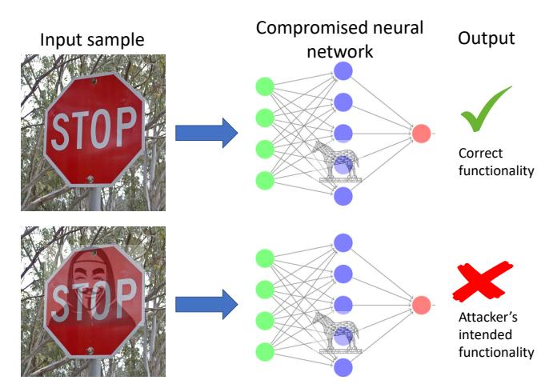
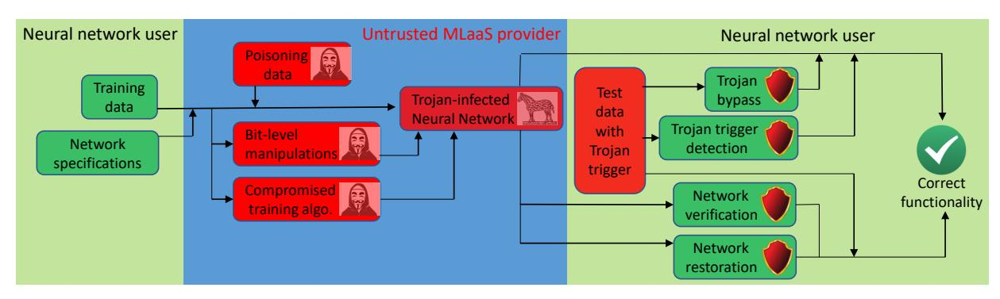

# A Survey on Neural Trojans

Yuntao Liu, Ankit Mondal, Abhishek Chakraborty, Michael Zuzak, Nina Jacobsen, Daniel Xing, and Ankur Srivastava

University of Maryland, College Park

#### Abstract

Neural networks have become increasingly prevalent in many real-world applications including security critical ones. Due to the high hardware requirement and time consumption to train high-performance neural network models, users often outsource training to a machine-learning-as-a-service (MLaaS) provider. This puts the integrity of the trained model at risk. In 2017, Liu et al. found that, by mixing the training data with a few malicious samples of a certain trigger pattern, hidden functionality can be embedded in the trained network which can be evoked by the trigger pattern [\[33\]](#page-5-0). We refer to this kind of hidden malicious functionality as neural Trojans. In this paper, we survey a myriad of neural Trojan attack and defense techniques that have been proposed over the last few years.

In a neural Trojan insertion attack, the attacker can be the MLaaS provider itself or a third party capable of adding or tampering with training data. In most research on attacks, the attacker selects the Trojan's functionality and a set of input patterns that will trigger the Trojan. Training data poisoning is the most common way to make the neural network acquire the Trojan functionality. Trojan embedding methods that modify the training algorithm or directly interfere with the neural network's execution at the binary level have also been studied. Defense techniques include detecting neural Trojans in the model and/or Trojan trigger patterns, erasing the Trojan's functionality from the neural network model, and bypassing the Trojan. It was also shown that carefully crafted neural Trojans can be used to mitigate other types of attacks. We systematize the above attack and defense approaches in this paper.

# 1 Introduction

While neural networks demonstrate exceptional capabilities in various tasks of machine learning nowadays, they are also becoming larger and deeper. As a result, the requirement of hardware, time, and data to train a network also increases dramatically. Under this scenario, machine-learning-as-a-service (MLaaS) becomes an increasingly popular business model. However, the training process in MLaaS is not transparent and may embed neural Trojans, i.e. hidden malicious functionalities, into the neural network. Many research papers have demonstrated the severity of this attack [\[4,](#page-4-0) [11–](#page-5-1)[13,](#page-5-2) [17,](#page-5-3) [19,](#page-5-4) [26–](#page-5-5)[28,](#page-5-6) [30,](#page-5-7) [32,](#page-5-8) [33,](#page-5-0) [39,](#page-5-9) [40,](#page-5-10) [43,](#page-5-11) [51,](#page-5-12) [52\]](#page-5-13). The effect of neural Trojans in the neural network's deployment is illustrated in Fig. [1.](#page-0-0) If the input is benign (i.e. without the Trojan trigger pattern), the Trojan will not be activated and the network will work normally. However, if the Trojan trigger exists in the image, the network will malfunction and exhibit the attacker's intended functionality.

Both neural Trojan attacks (i.e. to inject Trojan's malicious functionality into neural networks) and countermeasures have been widely studied. The most popular way to inject Trojans is training data poisoning [\[17,](#page-5-3) [24,](#page-5-14) [32,](#page-5-8) [33\]](#page-5-0), where a small amount of malicious training samples are mixed with the normal training data. These malicious data are sometimes carefully crafted in order to make the infected network highly sensitive to the Trojan triggers while maintaining normal behavior in all other cases. This differs Trojan attacks from conventional poisoning attacks

Figure 1: In the deployment of a Trojan-infected neural network, an input sample with the Trojan trigger pattern will cause the network to malfunction and exhibit the attacker's intended functionality.

against machine learning models where the attacker tries to degrade the trained model's performance with a small amount of added malicious training data. Other Trojan injection techniques have also been studied. Such techniques include modifying the training algorithms for a small subset of neurons based on the Trojan's functionality and the trigger pattern [\[12,](#page-5-15) [13\]](#page-5-2) and flipping or rewriting certain bits in the neural network's binary code[\[27,](#page-5-16) [30\]](#page-5-7).

The stealthiness of neural Trojans makes them very difficult to defend against. Many defense methods focused on detecting Trojan triggers from the input sample [\[2,](#page-4-1) [3,](#page-4-2) [7,](#page-4-3) [9,](#page-5-17) [10,](#page-5-18) [16,](#page-5-19) [22,](#page-5-20) [25,](#page-5-21) [35,](#page-5-22) [47,](#page-5-23) [48\]](#page-5-24). Other works have proposed restoring compromised neural network [\[21,](#page-5-25) [29,](#page-5-26) [46,](#page-5-27) [53\]](#page-5-28) and reconstructing input samples to bypass neural Trojans [\[14,](#page-5-29) [33,](#page-5-0) [45\]](#page-5-30).

In this paper, we survey the attack and defense strategies related to neural Trojans in order to give readers a comprehensive view of this field. The categories of attack and defense methods are outlined in Fig. [2.](#page-1-0)

# 2 Neural Trojan Attacks

In the last 3 years, many Trojan embedding attack methods have been proposed. These attacks can be broadly classified into training data poisoning-based attacks, training algorithm-based attacks, and binary-level attacks. In the rest of this section, we summarize the works in each category.

#### 2.1 Training Data Poisoning

Neural Trojans can be embedded in the neural networks when the networks are trained with a compromised dataset [\[17,](#page-5-3) [24,](#page-5-14) [32,](#page-5-8) [33\]](#page-5-0). This process typically involves the encoding of malicious functionality within the weights of the network. One or more specific input patterns can trigger/activate the Trojan and produce the output behavior which was desired by the attacker but which may be undesired or harmful for the original user. An example of such a scenario is a face recognition system to enter a building where the attacker tries to impersonate another person to gain unauthorized entry.

Figure 2: The categories of attack and defense techniques

General countermeasures such as Trojan detection and removal were also discussed in [17, 33]. Although most Trojan attacks focus on deep convolutional networks, Yang et al. extended neural Trojan attacks to long-short-term-memory (LSTM) and recurrent networks [51]. A weaker threat model was considered in [11] where the attacker does not have knowledge of the victim model, doesn't have access to the training data, and can only inject a limited number of poisoned samples. It focuses on targeted attacks, only creating backdoor instances without affecting the performance of the system so as to evade detection. Evaluation shows that with a single instance as the backdoor key, only 5 samples of it need to be added to a huge training set; whereas when a pattern is the key, 50 poisoned samples are enough. Here "key" refers either to a malicious new input pattern added to the training set, or malicious features inserted into existing input patterns of the training set.

2.1.1 Hiding Trojan Triggers Although most Trojan insertion techniques use a certain pattern, it is desirable to make these patterns indistinguishable when mixed with legitimate data in order to evade human inspection. Barni  $et\ al.$  [4] proposed a Trojan insertion approach where the label of the poisoned data is not tampered with. The advantage is that, upon inspection, the poisoned samples would not be detected merely on the basis of an accompanying poisoned label. To perform the attack, a target class t is chosen and a fraction of training data samples belonging to t is poisoned by adding a backdoor signal v. After the NN is trained on the training set which is contaminated with some poisoned samples of class t, some test samples not belonging to class t and corrupted with signal v end up being classified as t. Thus, the network learns that the presence of v in a sample is an indicator of the sample belonging to class t.

Liao et al. designed static and adaptive Trojan insertion techniques. In their work, the indistinguishability of Trojan trigger examples is attained by a magnitude constraint on the perturbations to craft such examples [28]. Li et al. generalized this approach and demonstrated the trade-off between the effectiveness and stealth of Trojans [26]. They also developed an optimization algorithm involving  $L_2$  and  $L_0$  regularization to distribute the trigger throughout the victim image. Saha et al. proposed to hide the Trojan triggers by not using the poisoned data in training at all. Instead, they took a fine-tune approach in the training process. The backdoor trigger samples are given the correct label and only used at test time. These samples are visually indistinguishable from legitimate data but bear certain features that will trigger the Trojan [40].

#### 2.2 Altering Training Algorithms

Trojans can also be embedded into neural networks without training data poisoning. Clements *et al.* [12] developed a novel

algorithm for inserting Trojans into a trained neural network model by modification of the computing operations rather than modifying the network weights by poisoning the training data. This makes existing poisoning defence techniques incapable of detecting the attack. The threat model assumes that the attacker has access to the trained model which is maliciously modified before deployment. The attack methodology selects a layer in the network for the purpose of modification, the latter being calculated using the gradient of the network output w.r.t. this layer (the Jacobian). This gradient tells how the victim neuron's operation should change. With only a small fraction of neurons tampered with, both targeted and untargeted versions of the attack yield high success rate. The authors studied the practicality of [12]'s attack in [13]. An adversary in the supply chain has the capability to modify the neural network hardware to change its predictions upon a certain trigger. Modifications to neurons can be achieved by adding a MUX or altering internal structure of certain operations. The paper also proposes defense strategies such as adversarial training to improve robustness of model and possibly combining it with hardware Trojan detection methods (eg. side-channel based).

2.2.1 Trojan Insertion via Transfer Learning Gu et al. [19] were the first to exploit transfer learning as a means of Trojan insertion. In transfer learning, a new model (called the 'student model') is obtained by fine-tuning a pre-trained model ('teacher model') for another similar task. The network's weights can be tampered with during this process which may result in Trojan insertion. Additionally, security vulnerabilities in online repositories are scrutinized and it was found that an adversary can compromise a benign model with a malicious transfer learning process. Yao et al. proposed latent backdoor attack in transfer learning where the student model takes all but the last layers from the teacher model [52]. In this case, the infected teacher model will have different *latent representations* (i.e. the second last layer neuron values) from that of a clean model. They found that latent backdoor embedded in the teacher model can be transferred to active backdoor in the student model. In [43], Tan and Shokri pointed out that backdoor detection schemes mostly rely on the distribution difference between the latent representations of clean and backdoor examples. They hence propose to make the two latent representation distributions as close as possible and evaded detection schemes proposed in [9, 29, 33, 44].

2.2.2 Neural Trojans in Hardware In [27], Li et al. propose a hardware-software framework for inserting Trojans into a neural network, where the attacker is assumed to be a third party somewhere in the supply chain. The authors implement two attacks: one to misclassify an input in one class as a member of a

target class and another to put a backdoor in the neural network which will allow malicious training data to be added. The Trojan circuitry is implemented in hardware, either as an add-tree or as a multiply-accumulate structure. The software part of the Trojan is inserted into a subnet (i.e. subset of weights) during training, where the subnet will be trained for malicious purposes. The Trojan weights are trained separately from the benign part of the neural network. When the Trojan is activated, the circuitry will cause partial adds to occur in the convolution operation, since not all of the weights will be active. The authors look at two different subnet architectures: (1) pixel parallelism, where a subset of kernel weights are passed through the subnet, and (2) input channel parallelism, where a subset of input channels are passed through. In their experiments, the pixel parallelism approach resulted in less accuracy degradation.

## 2.3 Binary-Level Attacks

Trojan attacks that involve manipulating the binary code of neural networks have been investigated. These attacks often embed malicious information in the bit representation of the neural network weights.

Liu et al. [\[30\]](#page-5-7) propose an attack called SIN2 , for "stealth infection" of a neural network, using the same supply chain threat model as described above. The Trojan in this case is any code that can be executed on the runtime system; the result of the attack is therefore not restricted to output misclassification. This attack is somewhat analogous to digital steganography. Here, the Trojan is embedded into the redundant space of the neural network's weight parameters. For example, the authors successfully inserted a fork bomb into the neural network, thus implementing a denial of service (DoS) attack when the Trojan was triggered.

In contrast to the attacks above where the Trojan is inserted during the training process, Rakin et al. [\[39\]](#page-5-9) demonstrate a way of inserting Trojans into a neural network to achieve misclassification without retraining. The attackers must know the neural network's architecture and parameters, but not necessarily the training process. The authors' "targeted bit Trojan" approach involves flipping certain bits of the neural network's weights. To determine which bits need to be flipped, the last-layer neurons with the most impact on the output for the targeted class are found using a gradient ranking approach. The trigger is then generated using a minimization optimization technique. Then, the original weight matrix and the final optimized malicious weight matrix are compared, providing the information on which bits need to be flipped. The Trojan is put into action by using a row-hammer attack to flip the targeted bits of the weights in main memory. In one experiment, the authors were able to achieve misclassification with only 85 bit flips.

#### 2.4 Comparison with Other Attacks

Besides neural Trojans, other types of attacks on neural networks have also been studied. In this section, we provide a taxonomy of these attacks and discuss their relationship with neural Trojan attacks. These attacks can be broadly classified into poisoning attacks and exploratory attacks.

2.4.1 Poisoning Attacks Most machine learning algorithms assume the integrity of the training data. However, the integrity of the training data could be corrupted. In a poisoning attack, the attacker's objective is to reduce the accuracy of the learned model. This objective is what discriminates poisoning attacks from Trojan attacks, since the latter's objective is to inject hidden malicious functionality without harming the overall accuracy of

the neural model, although training data poisoning is one way to infect a neural model with Trojans.

In a poisoning attack, the attacker is aware of the training algorithm but does not have control over the training process. However, he/she is able to manipulate (add, remove, or change) a small amount of the training samples. Biggio et al. proposed the gradient ascend method in [\[6\]](#page-4-4) to poison the training process of support vector machines (SVM) which degraded the SVM's performance significantly. Mei et al. generalized this poisoning approach [\[34\]](#page-5-32). They formulated a bi-level optimization problem to obtain poisoned training samples that result in the largest decrease in the accuracy of the learned model. Yang et al. also proposed a poisoning attack on neural networks [\[50\]](#page-5-33). In their approach, an autoencoder is trained to accelerate poisoned data generation which substitutes time-consuming gradient calculations.

2.4.2 Exploratory Attacks In an exploratory attack, the attacker looks for small perturbations of samples that leads to misclassification. There are different models about the attacker's knowledge: white-box model, i.e. the attacker has the exact knowledge of the neural network and can use the network's specifications to craft adversarial samples [\[5,](#page-4-5) [18,](#page-5-34) [23,](#page-5-35) [38,](#page-5-36) [42,](#page-5-37) [49\]](#page-5-38) and the blackbox model, i.e. the attacker has no knowledge about the network and can only query the model as a black box [\[36,](#page-5-39) [37\]](#page-5-40). Many white-box attacks craft adversarial examples using gradientbased methods, such as the fast gradient sign method (FGSM) [\[18\]](#page-5-34) and Jacobian saliency map (JSM) method [\[38\]](#page-5-36). Black-box attacks have been described in [\[36,](#page-5-39) [37\]](#page-5-40), where a local substitute NN is trained and used to find adversarial examples. This is based on the transferrability of vulnerability to adversarial samples among different machine learning models.

2.4.3 Neural Trojan's Relevance to Existing Attacks As mentioned above, neural Trojans' objective is to embed hidden functionalities in neural networks which are hard to detect and activated only by rare input patterns. Embedding Trojans almost does not affect the normal functionalities of the neural network. In contrast, the poisoning attacks aim at degrading the accuracy of the neural networks.

Exploratory attacks are carried out in the deployment of the neural network while neural Trojans are injected during the training phase. The triggers of neural Trojans are crafted from a illegitimate distribution which is different from the legitimate distribution. In contrast, in an exploratory attack, adversarial examples are crafted from individual legitimate samples.

#### 3 Defense Techniques

A variety of methods have been developed to defend against neural Trojans. These techniques can be classified into four categories: neural network verification, Trojan trigger detection, compromised neural network restoration, and Trojan bypass schemes. We outline each in turn.

## 3.1 Neural Network Verification

By verifying the efficacy of a neural network, any anomaly created by a neural Trojan can be identified. However, due the extremely specific triggers of most neural Trojans, neural verification schemes must be quite exact to detect Trojans. Several techniques have been proposed aiming at this goal, namely [\[2,](#page-4-1) [22\]](#page-5-20). Baluta et al. develops PAC-style soundness guarantees for neural networks [\[2\]](#page-4-1). To do so, a tool known as "NPAQ" was developed which, given a set of trained neural networks (N) and a property (P), determines how well P holds over N. Therefore, if a neural Trojan is identified, NPAQ can be used to provably verify that retraining removes the Trojan by ensuring that the

property which induces the Trojan, P, no longer holds over the network, N.

He et al. takes a different approach to neural verification known as Sensitive-Sample Fingerprinting [\[22\]](#page-5-20). In this work, the authors develop a methodology to construct a small set of "sensitive-samples" for a trained neural network that are extremely sensitive to a model's parameters. By querying the network with these sensitive-samples and verifying their classification, one can dynamically verify that the tested network has not been maliciously modified to include neural Trojans.

#### 3.2 Trojan Trigger Detection

Similar to neural verification techniques, the specificity of most Trojan triggers makes detection extremely challenging. A wide array of techniques to do this have been proposed [\[3,](#page-4-2) [7,](#page-4-3) [10,](#page-5-18) [16,](#page-5-19) [35\]](#page-5-22). Liu et. al showed that by using trained stateof-the-art anomaly detection classifiers, neural Trojans triggers could be detected albeit at the cost of a high false alarm rate [\[33\]](#page-5-0). In [\[3,](#page-4-2) [7,](#page-4-3) [35\]](#page-5-22), the authors detect Trojan triggers by evaluating the effect of training inputs on the accuracy of a neural model. In the most recent of these works, Baracaldo et al. uses so-called "provenance data", essentially meta-data associated with each data point, to group training data by the probability of being either a Trojan trigger or poisonous input [\[3\]](#page-4-2). The data in each grouping is then evaluated by comparing network accuracy when training with and without each group. By doing so, neural Trojans, which degrade the efficacy of a network, can be identified and removed from the training data set. Other methods, such as artificial brain simulation (ABS) [\[31\]](#page-5-41), Reject on Negative Impact (RONI) [\[35\]](#page-5-22), and Probability of Sufficiency (PS) [\[7\]](#page-4-3), operate similarly. However, instead of using groups of data points when evaluating network accuracy, RONI and PS use individual data points. This approach sacrifices scalability for precision.

Alternatively, Chen et al. proposes DeepInspect which performs Trojan detection with minimal prior knowledge of the model and no need for training data [\[10\]](#page-5-18). DeepInspect detects Trojans with 3 steps. 1) The neural model is inverted to recover a substitute training dataset. 2) A conditional Generative Adversarial Network (GAN) is used to reconstruct likely Trojan triggers. 3) An anomaly detection measurement is calculated for each identified trigger, which identifies the likelihood of a data point belonging to a class other than the classification returned by the neural network. Any highly anomalous data points are likely to be neural Trojans and can be flagged for further review.

Gao et al. proposes STRong Intentional Perturbation (STRIP) as a runtime Trojan detection scheme [\[15,](#page-5-42) [16\]](#page-5-19). STRIP duplicates each neural input and applies a series of different strong perturbations. The classification entropy caused by the set of strong perturbations applied to each input is then measured. Any input which retains the same classification, regardless of the strong perturbation applied, is extremely likely to be a Trojan trigger. These inputs can be flagged for inspection. On the other hand, inputs displaying a degree of classification variance when strongly perturbed are likely to be benign.

Kolouri et al. introduces the concept of Universal Litmus Patterns (ULPs) to detect Trojan attacks against Convolutional Neural Networks (CNNs) [\[25\]](#page-5-21). ULPs are basically optimized input images for which a network's output can be used as an indicator to classify the network as clean or contains Trojans. This approach enables a fast Trojan detection mechanism without requiring access to any training data.

Xu et al. proposes a novel framework called Meta Neural Trojaned model Detection (MNTD) which uses meta neural analysis techniques to detect Trojans[\[48\]](#page-5-24). Two techniques are presented to train a meta-classifier are presented: one-class learning which fits a detection meta-classifier using only benign neural networks and jumbo learning which approximates a general distribution of Trojaned models and samples a "jumbo" set of such models to train a meta-classifier.

Xiang et al. outlines an unsupervised anomaly detection (AD) methodology of Trojans in DNN image classifiers [\[47\]](#page-5-23). Such a technique aims to detect Trojans in the post-training phase where the defender doesn't have access to the poisoned training set, but only possesses the trained classifier itself and clean (unpoisoned) examples from the classification domain. The proposed AD involves learning the minimum size perturbation required to induce the classifier to misclassify examples from one class to another.

#### 3.3 Restoring Compromised Neural Models

In this section we detail two types of approaches for restoring compromised neural models: model correction and trigger-based Trojan reversing. The former includes generic methods to modify neural networks in order to eliminate Trojan functionalities whereas the latter first finds Trojan trigger and patch the neural networks accordingly.

3.3.1 Model Correction Retraining and pruning techniques to correct Trojan-infected neural networks have been explored. Note that retraining a model from scratch is not considered feasible for an MLaaS user because otherwise she would have trained the neural model all by herself without oursourcing to MLaaS. Liu et. al. propose retraining the Trojan-infected neural network on a small subset of properly labeled training data to render Trojans ineffective [\[33\]](#page-5-0). This has the advantage of reduced expense compared to the original training of the network.

Pruning a neural network removes less important neurons from a network. A pruned neural network has a reduced computational complexity and size compared to the original network. Zhao et. al. proposed a hardening scheme against neural Trojan attack by pruning a neural network such that accuracy is not significantly affected but increases the difficulty of adding malicious functionality to the trained network significantly [\[53\]](#page-5-28). A model with most of its neurons pruned demonstrates the most resilience against Trojan infection attack as pruning works to remove extra capacity in a network. Liu et. al. showed that pruning may fail to defend against Trojan infection attacks if the attacker is aware of the pruning defense [\[29\]](#page-5-26). By pruning a trained network before training on Trojan trigger inputs, activations for clean and malicious inputs can be mapped to the same neurons. They also demonstrate that fine tuning and retraining is not effective against Trojans since clean input activations generally do not depend on backdoor neurons. They propose instead Fine-Pruning to restore a Trojaned neural network. By pruning and then fine-tuning a neural network, a pruning aware attack becomes ineffective. Any neuron that contributes to the Trojan's functionality in a pruning aware attack is mapped to a neuron that is used by clean inputs as well. Fine-tuning can then eliminate the Trojans in these mixed neurons.

3.3.2 Trigger-based Trojan Reversing In Neural-Cleanse, Wang et al. first detect and identify backdoor triggers by using an optimization scheme to find the smallest perturbation required to transform inputs of all classes to a target class (e.g. the smallest set of pixels required) [\[46\]](#page-5-27). A perturbation is likely a backdoor

trigger if it is small. The Trojaned network can be patched using the reverse engineered trigger by retraining the network on legitimate inputs with the trojan applied to remove the backdoor. In TABOR [\[21\]](#page-5-25), Guo et. al. demonstrate that Neural-Cleanse fails when backdoors can take on variable size, shape, and location. They propose a Trojan detection method which uses a non-convex optimization-theoretic formulation guided by explainable AI and other heuristics to increase detection accuracy.

Chen et al. proposes a technique for Trojan removal in addition to a Trojan detection scheme [\[9\]](#page-5-17). Their work explores Trojan detection through the observation of neuron activation in the final hidden layer of a network. The authors demonstrate that neural Trojan triggers exhibit a distinctly different pattern of neuron activation compared to benign inputs in this layer. This observation is then exploited for Trojan detection. Specifically, the authors propose flattening the final hidden layer, reducing its dimensionality, and then performing clustering. Based on abnormal clustering characteristics, Trojan triggers can be identified. Chen et al. then demonstrates exclusionary reclassification, where the neural model is retrained excluding the abnormal cluster, to remove an identified Trojan while retaining accuracy.

# 3.4 Bypassing Neural Trojans

There have also been studies on ways to bypass neural Trojans that are already present within a neural network. The methods discussed below involve an input preprocessor, which removes Trojan triggers in the input before the input is sent to the neural network.

In [\[14\]](#page-5-29), Doan et al. propose a framework dubbed "Februus" to bypass input-agnostic trigger patterns in images. Here, the input image gets passed through the Februus system, where Trojan trigger patterns are found and removed before they are sent to the neural network itself. The neural Trojans get neutralized through a three-step process. First, there is visual explanation, where the Trojan is detected using a logit score-based approach; if the trigger is present, it will have the most impact on the input's classification into the targeted class. The Trojan is then removed during masking, and lastly, the input is restored to a benign image using an inpainting technique. This input cleansing framework can act as a black-box between the input and the neural network, without degrading the classification accuracy of benign inputs.

Liu et al. [\[33\]](#page-5-0) describe another input preprocessing technique that uses an autoencoder. This autoencoder is a neural network that is trained with legitimate input data only, which is placed between the input and the compromised neural network. Its operation involves minimizing the mean-squared error between the training set images and the reconstructed images, so any illegitimate inputs would be poorly reconstructed and thus not trigger the Trojan.

Udeshi et al. presents a model agnostic framework called NEO to detect as well as mitigate Trojan attacks in image classifier models [\[45\]](#page-5-30). NEO mitigates Trojan attacks by determining the correct prediction outcomes of the poisoned images and also diminishes the stealthy nature of such attacks by reconstructing the backdoor triggers.

# 4 Using Neural Trojans for Good

The idea of using 'Trojans' to protect the intellectual property of neural networks is also explored. In [\[1\]](#page-4-6), Adi et al. proposed a backdoor-based neural network watermarking scheme to protect the neural network's intellectual property. The Trojan's functionality is defined by a well known type of cryptographic

primitive called commitment schemes which is a way to send a secret message to an exclusive receiver in a secure vault. Special input samples are crafted to verify the watermark functionality of the neural network. Similarly ideas have been proposed in [\[20\]](#page-5-43). Shan et al. developed a trapdoor-based adversarial attack detection scheme. In this scheme, the weights in the neural network are tuned to make gradient-descent-based adversarial example generation algorithms converge at the trapdoor adversarial examples [\[41\]](#page-5-44). If the trapdoor examples are present during the deployment of the neural network, the neural network owner will know that an adversarial example attack has been conducted.

#### 5 Conclusion and Discussion

In this paper, we summarize both attack and defense techniques of neural Trojans. Such attacks are often conducted by untrusted parties in the machine learning supply chain such as the MLaaS provider and are of real concern to any end customer of MLaaS. Most of the research in this field was done in the last 3 years, and the battle between the neural Trojan attacker and defender is likely to continue. Moving forward, a defense solution against neural Trojans with high success rate, low false alarm, and low complexity must be developed in order to restore the trust of the MLaaS supply chain. Existing defense techniques often rely on training a separate machine learning model to detect, restore, or bypass neural Trojans (or its triggers). This requires significant computation effort on the defender's side and diminishes the benefit of MLaaS (which is offloading computation to the service provider). An approach that might be worth considering is using hardware. For example, there has been a huge body of work on logic obfuscation (which is well surveyed in [\[8\]](#page-4-7)). Such techniques makes circuit functionality dependent on a key, hence the output may be incorrect if the correct key is not given. This kind of techniques may also be developed to defend neural Trojans. The authors hope that this paper will make the readers be aware of the threat of neural Trojans and have a comprehensive overview of the current status of this threat. This would be an important step towards solving the problem.

#### References

- [1] Yossi Adi, Carsten Baum, Moustapha Cisse, Benny Pinkas, and Joseph Keshet. 2018. Turning your weakness into a strength: Watermarking deep neural networks by backdooring. In 27th {USENIX} Security Symposium ({USENIX} Security 18). 1615–1631.
- [2] Teodora Baluta, Shiqi Shen, Shweta Shinde, Kuldeep S Meel, and Prateek Saxena. 2019. Quantitative Verification of Neural Networks And its Security Applications. arXiv preprint arXiv:1906.10395 (2019).
- [3] Nathalie Baracaldo, Bryant Chen, Heiko Ludwig, Amir Safavi, and Rui Zhang. 2018. Detecting Poisoning Attacks on Machine Learning in IoT Environments. In 2018 IEEE International Congress on Internet of Things (ICIOT). IEEE, 57–64.
- [4] Mauro Barni, Kassem Kallas, and Benedetta Tondi. 2019. A new Backdoor Attack in CNNs by training set corruption without label poisoning. arXiv preprint arXiv:1902.11237 (2019).
- [5] Battista Biggio, Giorgio Fumera, and Fabio Roli. 2013. Security evaluation of pattern classifiers under attack. IEEE transactions on knowledge and data engineering 26, 4 (2013), 984–996.
- [6] Battista Biggio, Blaine Nelson, and Pavel Laskov. 2012. Poisoning attacks against support vector machines. arXiv preprint arXiv:1206.6389 (2012).
- [7] Aleksandar Chakarov, Aditya Nori, Sriram Rajamani, Shayak Sen, and Deepak Vijaykeerthy. 2016. Debugging Machine Learning Tasks. arXiv[:cs.LG/1603.07292](http://arxiv.org/abs/cs.LG/1603.07292)
- [8] Abhishek Chakraborty, Nithyashankari Gummidipoondi Jayasankaran, Yuntao Liu, Jeyavijayan Rajendran, Ozgur Sinanoglu, Ankur Srivastava, Yang Xie, Muhammad Yasin, and Michael Zuzak. 2019. Keynote: A Disquisition on Logic Locking. IEEE Transactions on Computer-Aided Design of Integrated Circuits and Systems (2019).

- [9] Bryant Chen, Wilka Carvalho, Nathalie Baracaldo, Heiko Ludwig, Benjamin Edwards, Taesung Lee, Ian Molloy, and Biplav Srivastava. 2018. Detecting backdoor attacks on deep neural networks by activation clustering. arXiv preprint arXiv:1811.03728 (2018).
- [10] Huili Chen, Cheng Fu, Jishen Zhao, and Farinaz Koushanfar. 2019. DeepInspect: A Black-box Trojan Detection and Mitigation Framework for Deep Neural Networks. In Proceedings of the 28th International Joint Conference on Artificial Intelligence. AAAI Press, 4658–4664.
- [11] Xinyun Chen, Chang Liu, Bo Li, Kimberly Lu, and Dawn Song. 2017. Targeted backdoor attacks on deep learning systems using data poisoning. arXiv preprint arXiv:1712.05526 (2017).
- [12] Joseph Clements and Yingjie Lao. 2018. Backdoor Attacks on Neural Network Operations. In 2018 IEEE Global Conference on Signal and Information Processing (GlobalSIP). IEEE, 1154–1158.
- [13] Joseph Clements and Yingjie Lao. 2018. Hardware trojan attacks on neural networks. arXiv preprint arXiv:1806.05768 (2018).
- [14] Bao Gia Doan, Ehsan Abbasnejad, and Damith Ranasinghe. 2019. Deep-Cleanse: A Black-box Input SanitizationFramework Against Backdoor Attacks on DeepNeural Networks. arXiv preprint arXiv:1908.03369 (2019).
- [15] Yansong Gao, Yeonjae Kim, Bao Gia Doan, Zhi Zhang, Gongxuan Zhang, Surya Nepal, Damith C Ranasinghe, and Hyoungshick Kim. 2019. Design and Evaluation of a Multi-Domain Trojan Detection Method on Deep Neural Networks. arXiv preprint arXiv:1911.10312 (2019).
- [16] Yansong Gao, Chang Xu, Derui Wang, Shiping Chen, Damith C Ranasinghe, and Surya Nepal. 2019. STRIP: A Defence Against Trojan Attacks on Deep Neural Networks. arXiv preprint arXiv:1902.06531 (2019).
- [17] Arturo Geigel. 2013. Neural network trojan. Journal of Computer Security 21, 2 (2013), 191–232.
- [18] Ian J Goodfellow, Jonathon Shlens, and Christian Szegedy. 2014. Explaining and harnessing adversarial examples. arXiv preprint arXiv:1412.6572 (2014).
- [19] Tianyu Gu, Kang Liu, Brendan Dolan-Gavitt, and Siddharth Garg. 2019. BadNets: Evaluating Backdooring Attacks on Deep Neural Networks. IEEE Access 7 (2019), 47230–47244.
- [20] Jia Guo and Miodrag Potkonjak. 2018. Watermarking deep neural networks for embedded systems. In 2018 IEEE/ACM International Conference on Computer-Aided Design (ICCAD). IEEE, 1–8.
- [21] Wenbo Guo, Lun Wang, Xinyu Xing, Min Du, and Dawn Song. 2019. TA-BOR: A Highly Accurate Approach to Inspecting and Restoring Trojan Backdoors in AI Systems. arXiv preprint arXiv:1908.01763 (2019).
- [22] Zecheng He, Tianwei Zhang, and Ruby Lee. 2019. Sensitive-Sample Fingerprinting of Deep Neural Networks. In Proceedings of the IEEE Conference on Computer Vision and Pattern Recognition. 4729–4737.
- [23] Ling Huang, Anthony D Joseph, Blaine Nelson, Benjamin IP Rubinstein, and JD Tygar. 2011. Adversarial machine learning. In Proceedings of the 4th ACM workshop on Security and artificial intelligence. ACM, 43–58.
- [24] Yujie Ji, Xinyang Zhang, and Ting Wang. 2017. Backdoor attacks against learning systems. In 2017 IEEE Conference on Communications and Network Security (CNS). IEEE, 1–9.
- [25] Soheil Kolouri, Aniruddha Saha, Hamed Pirsiavash, and Heiko Hoffmann. 2019. Universal Litmus Patterns: Revealing Backdoor Attacks in CNNs. arXiv preprint arXiv:1906.10842 (2019).
- [26] Shaofeng Li, Benjamin Zi Hao Zhao, Jiahao Yu, Minhui Xue, Dali Kaafar, and Haojin Zhu. 2019. Invisible Backdoor Attacks Against Deep Neural Networks. arXiv preprint arXiv:1909.02742 (2019).
- [27] Wenshuo Li, Jincheng Yu, Xuefei Ning, Pengjun Wang, Qi Wei, Yu Wang, and Huazhong Yang. 2018. Hu-fu: Hardware and software collaborative attack framework against neural networks. In 2018 IEEE Computer Society Annual Symposium on VLSI (ISVLSI). IEEE, 482–487.
- [28] Cong Liao, Haoti Zhong, Anna Squicciarini, Sencun Zhu, and David Miller. 2018. Backdoor embedding in convolutional neural network models via invisible perturbation. arXiv preprint arXiv:1808.10307 (2018).
- [29] Kang Liu, Brendan Dolan-Gavitt, and Siddharth Garg. 2018. Fine-pruning: Defending against backdooring attacks on deep neural networks. In International Symposium on Research in Attacks, Intrusions, and Defenses. Springer, 273–294.
- [30] Tao Liu, Wujie Wen, and Yier Jin. 2018. SIN 2: Stealth infection on neural network—a low-cost agile neural trojan attack methodology. In 2018 IEEE International Symposium on Hardware Oriented Security and Trust (HOST). IEEE, 227–230.
- [31] Yingqi Liu, Wen-Chuan Lee, Guanhong Tao, Shiqing Ma, Yousra Aafer, and Xiangyu Zhang. 2019. ABS: Scanning Neural Networks for Back-doors by Artificial Brain Stimulation. In Proceedings of the 2019 ACM SIGSAC Conference on Computer and Communications Security. ACM, 1265–1282.

- [32] Yingqi Liu, Shiqing Ma, Yousra Aafer, Wen-Chuan Lee, Juan Zhai, Weihang Wang, and Xiangyu Zhang. 2018. Trojaning attack on neural networks. Network and Distributed Systems Security (NDSS) Symposium 2018 (2018).
- [33] Yuntao Liu, Yang Xie, and Ankur Srivastava. 2017. Neural trojans. In 2017 IEEE International Conference on Computer Design (ICCD). IEEE, 45–48.
- [34] Shike Mei and Xiaojin Zhu. 2015. Using Machine Teaching to Identify Optimal Training-Set Attacks on Machine Learners.. In AAAI. 2871–2877.
- [35] Blaine Nelson, Marco Barreno, Fuching Jack Chi, Anthony D. Joseph, Benjamin I. P. Rubinstein, Udam Saini, Charles Sutton, J. D. Tygar, and Kai Xia. 2009. Misleading Learners: Co-opting Your Spam Filter. 17–51.
- [36] Nicolas Papernot, Patrick McDaniel, and Ian Goodfellow. 2016. Transferability in machine learning: from phenomena to black-box attacks using adversarial samples. arXiv preprint arXiv:1605.07277 (2016).
- [37] Nicolas Papernot, Patrick McDaniel, Ian Goodfellow, Somesh Jha, Z Berkay Celik, and Ananthram Swami. 2017. Practical black-box attacks against machine learning. In Proceedings of the 2017 ACM on Asia Conference on Computer and Communications Security. ACM, 506–519.
- [38] Nicolas Papernot, Patrick McDaniel, Somesh Jha, Matt Fredrikson, Z Berkay Celik, and Ananthram Swami. 2016. The limitations of deep learning in adversarial settings. In Security and Privacy (EuroS&P), 2016 IEEE European Symposium on. IEEE, 372–387.
- [39] Adnan Siraj Rakin, Zhezhi He, and Deliang Fan. 2019. TBT: Targeted Neural Network Attack with Bit Trojan. arXiv preprint arXiv:1909.05193 (2019).
- [40] Aniruddha Saha, Akshayvarun Subramanya, and Hamed Pirsiavash. 2019. Hidden Trigger Backdoor Attacks. arXiv preprint arXiv:1910.00033 (2019).
- [41] Shawn Shan, Emily Willson, Bolun Wang, Bo Li, Haitao Zheng, and Ben Y Zhao. 2019. Using Honeypots to Catch Adversarial Attacks on Neural Networks. arXiv preprint arXiv:1904.08554 (2019).
- [42] Christian Szegedy, Wojciech Zaremba, Ilya Sutskever, Joan Bruna, Dumitru Erhan, Ian Goodfellow, and Rob Fergus. 2013. Intriguing properties of neural networks. arXiv preprint arXiv:1312.6199 (2013).
- [43] Te Juin Lester Tan and Reza Shokri. 2019. Bypassing Backdoor Detection Algorithms in Deep Learning. arXiv preprint arXiv:1905.13409 (2019).
- [44] Brandon Tran, Jerry Li, and Aleksander Madry. 2018. Spectral signatures in backdoor attacks. In Advances in Neural Information Processing Systems. 8000–8010.
- [45] Sakshi Udeshi, Shanshan Peng, Gerald Woo, Lionell Loh, Louth Rawshan, and Sudipta Chattopadhyay. 2019. Model Agnostic Defence against Backdoor Attacks in Machine Learning. arXiv preprint arXiv:1908.02203 (2019).
- [46] Bolun Wang, Yuanshun Yao, Shawn Shan, Huiying Li, Bimal Viswanath, Haitao Zheng, and Ben Y Zhao. 2019. Neural cleanse: Identifying and mitigating backdoor attacks in neural networks. Neural Cleanse: Identifying and Mitigating Backdoor Attacks in Neural Networks (2019), 0.
- [47] Zhen Xiang, David J Miller, and George Kesidis. 2019. Revealing Backdoors, Post-Training, in DNN Classifiers via Novel Inference on Optimized Perturbations Inducing Group Misclassification. arXiv preprint arXiv:1908.10498 (2019).
- [48] Xiaojun Xu, Qi Wang, Huichen Li, Nikita Borisov, Carl A Gunter, and Bo Li. 2019. Detecting AI Trojans Using Meta Neural Analysis. arXiv preprint arXiv:1910.03137 (2019).
- [49] Chaofei Yang, Beiye Liu, Hai Li, Yiran Chen, Wujie Wen, Mark Barnell, Qing Wu, and Jeyavijayan Rajendran. 2016. Security of neuromorphic computing: thwarting learning attacks using memristor's obsolescence effect. In Proceedings of the 35th International Conference on Computer-Aided Design. ACM, 97.
- [50] Chaofei Yang, Qing Wu, Hai Li, and Yiran Chen. 2017. Generative Poisoning Attack Method Against Neural Networks. arXiv preprint arXiv:1703.01340 (2017).
- [51] Zhaoyuan Yang, Naresh Iyer, Johan Reimann, and Nurali Virani. 2019. Design of intentional backdoors in sequential models. arXiv preprint arXiv:1902.09972 (2019).
- [52] Yuanshun Yao, Huiying Li, Haitao Zheng, and Ben Y Zhao. 2019. Latent Backdoor Attacks on Deep Neural Networks. (2019).
- [53] Bingyin Zhao and Yingjie Lao. 2018. Resilience of Pruned Neural Network Against Poisoning Attack. In 2018 13th International Conference on Malicious and Unwanted Software (MALWARE). IEEE, 78–83.